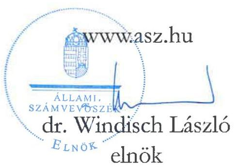
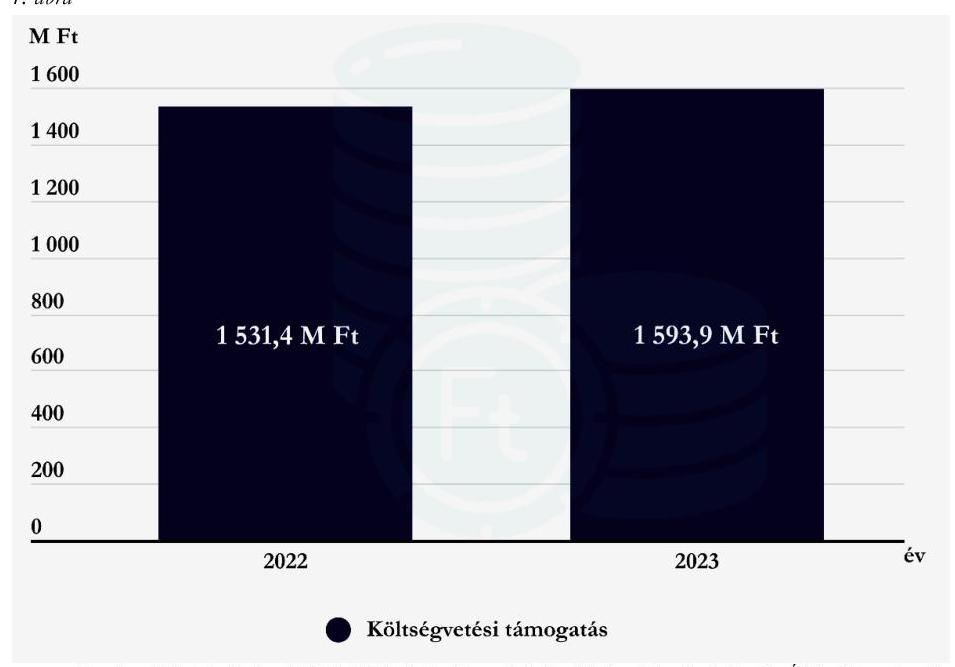

# JELENTÉS 

A költségvetési támogatásban részesülő pártalapítványok 2022-2023. évi gazdálkodása törvényességének ellenőrzése

Szövetség a Polgári Magyarországért Alapítvány

2025.

---

# JELENTÉS 

## A költségvetési támogatásban részesülő pártalapítványok 2022-2023. évi gazdálkodása törvényességének ellenőrzése

Szövetség a Polgári Magyarországért Alapítvány

2025.

25082

---

# ELLENŐRZÉSI IGAZGATÓSÁG: 

## ELLENŐRZÉSI IGAZGATÓSÁG V.

## ELLENŐRZÉSI IGAZGATÓ:

KLINGA LÁSZLÓ ellenőrzési igazgató

## ELLENŐRZÉSVEZETŐ:

KAKAS SÁNDOR igazgatósági tanácsadó, ellenőrzésvezető

## Jelenéteink az interneten a www.asz.hu cimen olvashatók.

IKTATÓSZÁM: EL-4125-007/2025
TÉMASORSZÁM: 7.
ELLENŐRZÉS-AZONOSÍTÓ SZÁM: V1119

---

# TARTALOMJEGYZÉK 

AZ ELLENŐRZÉS ALAPADATAI ..... 5
AZ ELLENŐRZÖTT SZERVEZET ..... 8
ÖSSZEFOGLALÁS ..... 9
AZ ELLENŐRZÉS FÓKUSZTERÜLETEI ..... 11
MEGÁLLAPÍTÁSOK ..... 12
JAVASLATOK ..... 17
MELLÉKLETEK ..... 18
I. sz. melléklet: Értelmező szótár ..... 18
II. sz. melléklet: Ellenőrzési kritériumok ..... 19
FÜGGELÉK: ÉSZREVÉTELEK ..... 21
RÖVIDÍTÉSEK JEGYZÉKE ..... 22

---

.

---

# AZ ELLENŐRZÉS ALAPADATAI 

## AZ ELLENŐRZÉS CÉLJA

Az ellenőrzés célja annak értékelése volt, hogy a Pártalapítvány ${ }^{1}$ törvényesen gazdálkodott-e; az éves számviteli beszámolók és a Pártalapítvány tevékenységéről szóló éves jelentések a jogszabályi előírásoknak megfeleltek-e; a könyvvezetés és gazdálkodás során a vonatkozó jogszabályi rendelkezéseket és belső előírásokat betartották-e. Az ellenőrzés célja továbbá annak értékelése volt, hogy a Pártalapítvány legutóbbi ellenőrzése eredményeként készült számvevői jelentésben foglalt megállapításokkal összhangban készített intézkedési tervben meghatározott feladatokat a Pártalapítvány végrehajtotta-e.

## AZ ELLENŐRZÉS TÍPUSA

Törvényességi ellenőrzés

## AZ ELLENŐRZÖTT IDŐSZAK

2022-2023. évek
Az utóellenőrzés tekintetében az utóellenőrzés alapját képező 23018. számú ÁSZ ${ }^{2}$ jelentés ${ }^{3}$ közzétételének napjától (2023.04.25.) az ellenőrzésről szóló adatszolgáltatásra felhívó levél keltének napjáig terjedő időszak.

## AZ ELLENŐRZÉS TÁRGYA

Az ellenőrzés tárgyát képezte a Pártalapítvány gazdálkodása, a könyvvezetés szabályozása és gyakorlata szabályszerűsége, az éves számviteli beszámolókra és a Pártalapítvány tevékenységéről szóló éves jelentésekre vonatkozó kötelezettség teljesítése, valamint a gazdálkodáshoz kapcsolódó ellenőrzés javaslatainak hasznosítására irányuló tevékenység.

A 23018. számú ÁSZ jelentésben foglalt megállapításokhoz kapcsolódó - a Pártalapítvány által készített intézkedési tervben foglaltak végrehajtásának ellenőrzése.

Az ellenőrzés kiterjed minden olyan körülményre és adatra, amely az ÁSZ jogszabályban meghatározott feladatainak teljesítéséhez, valamint az ellenőrzési program végrehajtása során felmerülő újabb összefüggések feltárásához szükséges volt.

## AZ ELLENŐRZÉS JOGALAPJA

Az ellenőrzés jogalapját az ÁSZ tv. ${ }^{4} 1 . \int(3)$ bekezdése, 5. $\int(3)$ bekezdése, 33. $\int(7)$ bekezdése, valamint a Pmtv. ${ }^{5} 4 . \int(2)$ és (4) bekezdéseinek előírásai képezték.

---

# AZ ELLENŐRZÉS MÓDSZERE 

Az ellenőrzés az ellenőrzött időszakban hatályos jogszabályok, az ellenőrzés szakmai szabályai, a jelen ellenőrzésre irányadó ÁSZ módszertanok, az ellenőrzési programban foglalt értékelési szempontok szerint került végrehajtásra.

Az ellenőrzési kérdések megválaszolásához szükséges bizonyítékok megszerzése az ellenőrzött által rendelkezésre bocsátott dokumentumokra, adatokra alapozva kérdésfeltevés (információkérés), valamint mintavételezés, továbbá helyszíni interjú útján történt. Az ellenőrzési bizonyítékként felhasználható adatforrások közé tartoztak egyrészt az ellenőrzési programban felsorolt adatforrások, másrészt minden az ellenőrzés folyamán feltárt, az ellenőrzés szempontjából információt tartalmazó dokumentum.

Az ellenőrzés lefolytatásához az ellenőrzött szervezet tanúsítvány kitöltésével és az ÁSZ által kért dokumentumok, adatok, információk megküldésével és az ellenőrzés során szolgáltatott adatokat.

A Pártalapítvány kiadásai, ráfordításai elszámolásának szabályszerűségét (2. fókuszterület), a Pártalapítvány által nyújtott támogatások elszámolásának szabályszerűségét (2. fókuszterület), valamint a mérlegtételek besorolásának, év végi értékelésének, azok leltárral való alátámasztottságának szabályszerűségét (3. fókuszterület), mintavételi eljárással kiválasztott tételek alapján ellenőrizte az ÁSZ.

A 2. fókuszterületen az egyes vizsgálandó részterületek ellenőrzése részterületenként 30 elemű minta értékelésével, mintavételes, 30 db -ot meg nem haladó tételszám esetében tételes ellenőrzéssel történt. A kiadások esetében lényegességi szempontok alapján az ÁSZ további tételeket is értékelt, amelyek a kivetítésbe nem tartoztak bele. Az ÁSZ a 2. fókuszterületnél, a kiadások vonatkozásában 30-30 tételt ellenőrzött, a minták értékelése alapján statisztikai kivetítést alkalmazott, további lényegességi szempontok alapján 2022. évben három db, 2023. évben hét db kiválasztott tételt ellenőrzött. Az ÁSZ a 2. fókuszterületnél a Pártalapítvány által nyújtott támogatások vonatkozásában 30-30 tételt ellenőrzött, a minták értékelése alapján statisztikai kivetítést alkalmazott. Az ÁSZ a 3. fókuszterületnél, a mérlegtételek vonatkozásában 30-30 tételt ellenőrzött, a tények feltárása és azok összegzése során a megállapítások az ellenőrzött tételekre vonatkozóan kerültek megfogalmazásra.

A vizsgált terület „szabályszerű" minősítést kapott, ha a minta ellenőrzésének eredménye alapján 95\%-os bizonyossággal a teljes sokaságban az átlagos hibaarány nem haladta meg a 10\%-ot, „nem szabályszerű", ha nagyobb volt, mint $10 \%$. Amennyiben a sokaság elemszáma nem haladta meg az előírt minta elemszámot, akkor a sokaság valamennyi elemének tételes ellenőrzésére került sor.

A Pártalapítvány bevételei elszámolása szabályszerűségét teljeskörűen ellenőrizte az ÁSZ.
Az utóellenőrzés megállapításai az ÁSZ rendelkezésére álló dokumentumok, valamint az ÁSZ adatbekérése szerint, az ellenőrzött szervezet által rendelkezésre bocsátott dokumentumok, adatok alapján kerültek megfogalmazásra. Az ÁSZ a 2022. évben a Pártalapítvány 2020-2021. évi gazdálkodását ellenőrizte, megállapításait a 23018. számú jelentésben tette közzé. Az ellenőrzés esetében a 23018. számú ÁSZ jelentés alapján a Pártalapítvány által készített intézkedési tervben előírt feladat, annak végrehajthatósága, illetve végrehajtása szempontjából az alábbiak szerint került értékelésre:

- „határidőben végrehajtott" a feladat, ha a teljesítés dokumentáltan, az intézkedési tervben előírt határidőben és tartalommal megtörtént;
- „határidőn túl végrehajtott" a feladat, ha annak teljesítése az intézkedési tervben meghatározott módon, de az abban előírt határidőn túl történt meg;

---

- „nem végrehajtott" a feladat, ha a végrehajtás nem történt meg, vagy amennyiben a teljesítést/végrehajtást nem dokumentálták, dokumentumokkal nem tudják igazolni annak teljesítését;
- „okafogyottá vált" a feladat, ha végrehajtására - meghatározott esemény bekövetkezése, továbbá külső körülmény, a működést érintő feltétel változása miatt - már nincs szükség, illetve lehetőség, és egyértelműen megállapítható, hogy az intézkedést szükségessé tevő körülmény a jövőben nem fordulhat elő;
- „nem időszerü" az a feladat, amelynek ellenőrzési időszakon belüli végrehajtására azért nem került (kerülhetett) sor, mert az intézkedés alapjául szolgáló esemény nem következett be, de annak jövőbeni előfordulása lehetséges, a végrehajtása nem volt esedékes, vagy a végrehajtás határideje még nem járt le.
A gazdálkodás hibáinak kijavítására irányuló javaslat kidolgozásakor a hatályos jogszabályok voltak az irányadóak.

---

# AZ ELLENŐRZÖTT SZERVEZET 

## SZÖVETSÉG a POLGÁRI MAGYARORSZÁGÉRT ALAPÍTVÁNY

A Pártalapítványt a 2003. évben 0,6 M Ft induló vagyonnal a Fidesz - Magyar Polgári Szövetség hozta létre.
A Pártalapítvány alapító okirat ${ }_{1-2}{ }^{2}$-ben rögzített célja: „a politikai kultúra fejlesztése a nemzeti elkötelezettség és a kereszténydemokrata eszmekör jegyében, ebbes kapcsolódóan az ország határain belül, illetve a határon túli magyarság lakta területeken tudományos, kutatási tevékenység szervezése elsösorban a társadalomtudományok körében, majd részben ezen kutatások eredményeinek felhasználásával oktatási, ismeretterjesztő tevékenység végzése, továbbá a professzionális politika tudományos igényü vizsgálata, majd ennek eredményeként javaslatok, új módszerek, eljárások kidolgozása a politikai tevékenység minöségének, hatékonyságának javitása érdekében."

A Pártalapítvány ügyvezető szerve a három tagból álló Kuratórium ${ }^{7}$. Az ellenőrzött időszakban a Kuratórium tagjainak személyében nem történt változás. A Pártalapítvány törvényes képviseletét a Kuratórium elnöke látta el, a képviseleti jog gyakorlásának módja önálló volt. Az ellenőrzött időszakban a Pártalapítvány tevékenységét három tagból álló Felügyelőbizottság ${ }^{8}$ ellenőrizte.

Az alapító okirat ${ }_{1-2}$ lehetővé tette a Pártalapítvány számára gazdasági-vállalkozási tevékenység folytatását, azonban az ellenőrzött időszakban gazdasági-vállalkozási tevékenységet nem végzett. A Pártalapítvány a jogszabályi előírások szerint könyvvizsgálatra kötelezett volt.

A Pártalapítvány 2004-ben hozta létre a Polgári Szemle Alapítványt, az alapításkor érvényben lévő törvényi szabályozás szerint.

A Pártalapítvány cél szerinti tevékenységének ellátásához 2022. évben központi költségvetési támogatásban részesült, továbbá külső szervezettől ingyenes könyv adományt kapott $0,5 \mathrm{M}$ Ft értékben, míg 2023. évben kizárólag központi költségvetési támogatásban részesült. Egyéb támogatást, adományt az alapító párttól ${ }^{9}$, egyéb szervezettől vagy magánszemélytől nem kapott. A Pártalapítvány 2022. és 2023. évben kapott költségvetési támogatásának évenkénti alakulását az 1. ábra mutatja be.

1. ábra

Forrás: A Pártalapítvány 2022. és 2023. évi tevékenységéről szóló éves jelentéset alapján ÁSZ saját szerkesztés

---

# ÖSSZEFOGLALÁS 

Az ÁSZ ellenőrzése a Párttv. ${ }^{10}$ alapján a politikai kultúra fejlesztése érdekében tudományos, ismeretterjesztő, kutatási, oktatási tevékenység folytatása céljából, a Ptk. ${ }^{11}$ szerinti alapító okiraton alapuló bírósági nyilvántartásba vétellel létrejött Pártalapítvány gazdálkodására terjedt ki. A pártalapítványok törvényes gazdálkodásának (könyvvezetés, beszámolás, jelentés készítés) szabályait a Pmtv.-n túl, a Számv. tv. ${ }^{12}$ és az Eszkr. ${ }^{13}$ határozzák meg. A Pmtv. 4. $\int$ (2) bekezdése értelmében a pártalapítványok gazdálkodása törvényességének ellenőrzése az ÁSZ feladata. A Pmtv. 4. § (4) bekezdése alapján az ÁSZ kétévente - kötelező jelleggel - ellenőrzi azoknak a pártalapítványoknak a gazdálkodását, amelyek állami költségvetési támogatásban részesültek.

A pártalapítványok ellenőrzésével az ÁSZ hozzájárul ahhoz, hogy a társadalom objektív képet alkothasson a pártalapítványok működéséről, gazdálkodásáról. Az ellenőrzésről készített számvevőszéki jelentésben megfogalmazott megállapítások, következtetések, javaslatok alapján a törvényalkotók konkrét lépéseket tehetnek a pártalapítványokra vonatkozó szabályozások megváltoztatása, átláthatóbbá, ellenőrizhetőbbé tétele érdekében. Az ellenőrzött szervezetek szintjén a hiányosságok, szabálytalanságok feltárása, az ennek kapcsán megfogalmazott megállapítások elősegíthetik a pártalapítványok szabályszerű gazdálkodását.

Az ellenőrzött időszakban az alapító okirat ${ }_{1.2}$-ben a jogszabályi előírásokkal összhangban rögzítették a Pártalapítvány működésének célját, tevékenységét, továbbá meghatározták a Pártalapítvány ügyvezető szervét, összetételét, múködését, valamint a Felügyelőbizottságot és feladataikat.

A Pártalapítvány rendelkezett a Számv. tv. előírásai

A gazdálkodás szervezeti kereteinek kialakítása szabályszerű volt.

A Pártalapítvány rendelkezett a Számv. tv. előírásai szerinti számviteli politikával ${ }_{1.2}{ }^{14}$, az eszközök és források leltározási és leltárkészítési szabályzatával ${ }_{1.2}{ }^{15}$, az eszközök és források értékelési szabályzatával ${ }_{1.2}{ }^{16}$, pénzkezelési szabályzattal ${ }_{1.2}{ }^{17}$, továbbá számlarenddel ${ }_{1.2}{ }^{18}$. A szabályzatok az ellenőrzött kritériumoknak megfeleltek.

A 2022. és a 2023. évben a költségvetési támogatások számviteli nyilvántartása megfelelt a Számv. tv. előírásainak.

A kiadások, a nyújtott
támogatások elszámolása
szabályszerú volt.

A Pártalapítvány a 2022. és 2023. évben a tevékenységének költségeit és ráfordításait szabályszerűen számolta el. A Pártalapítvány az ellenőrzött időszakban céljaival összhangban nyújtott támogatást harmadik személy részére. A 2022. és 2023. évben nyújtott támogatás odaítélése, elszámolása, nyilvántartása során a jogszabályi és a belső rendelkezéseket betartották. A Pártalapítvány az ellenőrzött kiadási tételek alapján a Pmtv. előírásait betartva az alapító párt részére támogatást, vagyoni hozzájárulást az ellenőrzött időszakban nem adott.

---

A tevékenységről szóló éves jelentések és a számviteli beszámolók a jogszabályi előírásoknak megfeleltek.

A Pártalapítvány a jogszabályi előírásoknak megfelelően mindkét ellenőrzött évben elkészítette és közzétette a tevékenységéről szóló éves jelentéseket, valamint az egyszerúsített éves beszámolóit. Az egyszerúsített éves beszámolók ellenőrzött mérlegtételeinek besorolása, értékelése és leltárral való alátámasztottsága megfelelt a Számv. tv. előírásainak. A Pártalapítvány a 2022. évi egyszerúsített éves beszámoló eredménykimutatásában vagy tájékoztató adatként külön a kapott adományt az Eszkr. előírása ellenére nem mutatta be.

Az intézkedési tervben meghatározott feladatot határidőben végrehajtották.

A Pártalapítvány az intézkedési tervben meghatározott feladatot határidőben végrehajtotta.

Az ÁSZ a Kuratórium elnöke részére a feltárt szabálytalanság jövőbeni kiküszöbölése érdekében egy javaslatot fogalmazott meg.

---

# AZ ELLENŐRZÉS FÓKUSZTERÜLETEI 

1. A Pártalapítvány törvényes gazdálkodásához szükséges szabályok kialakítása
2. A Pártalapítvány könyvvezetése és gazdálkodása során a jogszabályi előírások betartása
3. A Pártalapítvány tevékenységéről szóló jelentések, az éves beszámolók jogszabályi előírásoknak való megfelelősége
4. A Pártalapítvány intézkedési tervében meghatározott feladatok végrehajtása

---

# 1. A Pártalapítvány törvényes gazdálkodásához szükséges szabályok kialakítása 

Összegző megállapítás A Pártalapítvány a 2022-2023. években a törvényes gazdálkodáshoz szükséges szabályokat kialakította
1.1. számú megállapítás A Pártalapítvány működésének szabályait a Ptk. ${ }^{19}$, a Számv. tv., a Pmtv. és az Eszkr. előírásainak megfelelően rögzítették.

Az alapító okirat ${ }_{1-2}$-ben a Pmtv. és a Ptk. ${ }_{2}$ előírásainak megfelelően kijelölték a Pártalapítvány ügyvezető szervét, a Kuratóriumot, továbbá meghatározták annak összetételét. A Pártalapítvány képviseletére jogosult személyeket kijelölték, meghatározták a képviseleti jog módjára, terjedelmére vonatkozó szabályokat.
Az alapító okirat ${ }_{1-2}$ tartalmazta a Pmtv. és a Ptk. ${ }_{2}$ előírásainak megfelelően az alapítványi működés célját, feladatait, a működés keretszabályait, valamint a Pártalapítványhoz történő csatlakozás feltételeit, a kuratóriumi működés szabályait. Az ellenőrzött időszakban az alapító okirat ${ }_{1}$ módosítására került sor, a módosításra a Pártalapítvány idegen nyelvű elnevezésére, illetve cél szerinti tevékenységének bővítésére tekintettel került sor.
Az alapító okirat ${ }_{1-2}$-ben a Ptk. ${ }_{2}$ előírásaival összhangban meghatározták a három tagú Felügyelőbizottságot, továbbá a Kuratórium munkáját támogató munkaszervezetet.
A Pártalapítvány a gazdálkodásával kapcsolatos könyvvezetési-nyilvántartási rendszerét az Eszkr. rendelkezéseinek megfelelően kialakította. A Pártalapítvány a 2022. és 2023. évre az Eszkr. előírásainak megfelelően kettős könyvvitellel alátámasztott egyszerűsített éves beszámolót készített. A Pártalapítványnál a Számv. tv. és az Eszkr. előírásait betartva az ellenőrzött időszakban az egyszerűsített éves beszámolókat könyvvizsgáló ellenőrizte.
A Pártalapítvány az ellenőrzött időszakban a pénzügyi- és számviteli feladatai ellátását a Számv. tv. előírásait figyelembe véve külső szervezet bevonásával biztosította. A könyvviteli szolgáltatás körébe tartozó feladatok irányításával, vezetésével, az egyszerűsített éves beszámoló elkészítésével megbízott személy a Számv. tv., valamint az Eszkr. előírásainak megfelelően a szükséges szakmai képzettséggel rendelkezett.
1.2. számú megállapítás A Pártalapítvány gazdálkodására vonatkozó belső szabályozás megfelelt a Számv. tv., az Eszkr. és a Ptk. ${ }_{2}$ előírásainak.

A Pártalapítvány az ellenőrzött időszakban a Számv. tv.-nek megfelelően rendelkezett számviteli politikával ${ }_{1-2}$ és annak keretében az eszközök és a források értékelési szabályzatával ${ }_{1-2}$, az eszközök és a források leltárkészítési és leltározási szabályzatával ${ }_{1-2}$ és pénzkezelési szabályzattal ${ }_{1-2}$. A szabályzatok a Számv. tv-ben előírtaknak megfeleltek. A számviteli politika ${ }_{1-2}$-ben rögzítették a Pártalapítványra jellemző szabályokat, előírásokat módszereket, amelyekkel meghatározták, hogy mit tekintettek a számviteli

---

elszámolás, az értékelés szempontjából lényegesnek, nem lényegesnek, továbbá a számviteli elszámolás, az értékelés szempontjából jelentősnek, nem jelentősnek, a törvényben biztosított választási, minősitési lehetőségek közül azok megjelölését, amelyeket alkalmaztak. A Pártalapítvány eszközök és a források leltárkészítési és leltározási szabályzatában ${ }_{1-2}$ a Számv. tv-el összhangban határozták meg a mennyiségi felvétellel történő leltárfelvétel gyakoriságát. A Pártalapítvány rendelkezett továbbá a Számv. tv. szerinti számlarenddel ${ }_{1-2}$.
A Pártalapítvány céljaira rendelt vagyont és annak felhasználási módját a Ptk. ${ }_{2}$ elóirása szerint az alapító okirat ${ }_{1-2}$-ben rögzítették. A Pártalapítvány a céljaira rendelt vagyon nyilvántartása, elszámolása rendjét, e vagyon nyilvántartásának továbbrészletezését a Ptk. ${ }_{2}$, a Számv. tv. és az Eszkr. rendelkezéseinek megfelelően biztosította.
1.3. számú megállapítás

A Pártalapítvány alapcélja ellátásához kapcsolódó gazdálkodási tevékenysége a Ptk. 2 és a Pmtv. rendelkezéseinek megfelelő volt.

A Pártalapítvány a 2022. és a 2023. évben a tevékenységéről szóló jelentéseinek és egyszerúsített éves beszámolóinak adatai alapján a Ptk. ${ }_{2}$-ben előírtakat betartva nem volt korlátlan felelősségű tagja más jogalanynak, az ellenőrzött időszakban nem létesített más alapítványt és nem csatlakozott alapítványhoz.
A Pártalapítvány alapító okirata ${ }_{1-2}$ a Pmtv. előírásaival összhangban tartalmazta az alapítványi cél megvalósításával közvetlenül összefüggő gazdasági-vállalkozási tevékenységre vonatkozó szabályokat, azonban az ellenőrzött időszakban a Pártalapítvány egyszerúsített éves beszámolói és könyvvezetése alapján gazdasági-vállalkozási tevékenységet nem folytatott.

# 2. A Pártalapítvány könyvvezetése és gazdálkodása során a jogszabályi előírások 

## Összegző megállapítás A Pártalapítvány 2022. és 2023. évi könyvvezetése és gazdálkodása szabályszerű volt.

2.1. számú megállapítás

A Pártalapítvány a kapott támogatásokat az ellenőrzött időszakban szabályszerűen fogadta és számolta el.

A Pártalapítvány a 2022. évben 1 531,4 M Ft összegű, a 2023. évben 1 593,9 M Ft összegű költségvetési támogatásban részesült a Kvtv. ${ }_{1-2}{ }^{20}$, valamint az 1284/2022. (VI. 7.) Korm. határozat ${ }^{21}$ alapján. A Pártalapítvány a 2022. évben gazdasági társaságtól ingyenes (könyv) adományt kapott 0,5 M Ft értékben, az ellenőrzött időszakban egyéb forrásból támogatást vagy adományt alapítótól, magánszemélytől vagy más szervezettől nem kapott.
A Pártalapítvány könyvvezetésében a Számv. tv. és az Eszkr. előírásainak megfelelve, a 2022. évben az egyéb bevételein belül elkülönítetten tartotta nyilván a költségvetési támogatás összegét és a gazdasági társaságtól kapott ingyenes (könyv) adomány $0,5 \mathrm{M}$ Ft összegű ellenértékét, továbbá a 2023. évben a költségvetési támogatás összegét. A Pártalapítvány az ellenőrzött időszakban továbbutalási céllal támogatást nem kapott.
A Pártalapítvány a Számv. tv. és az Eszkr. előírásait betartva a 2022. és 2023. évi egyszerűsített éves beszámolójának eredménykimutatásában az egyéb bevételeken belül részletezte a kapott költségvetési támogatások összegét. A Pártalapítvány az Eszkr. 14. § (3) bekezdésében foglaltak ellenére a 2022. évi

---

eredménykimutatása „3. Egyéb bevételek - adományok" sorában vagy tájékoztató adatként külön a 2022. évben kapott $0,5 \mathrm{M}$ Ft értékű adományt nem mutatta be.
A Pártalapítványnak az ellenőrzött időszakban a kapott támogatások vonatkozásában közzétételi kötelezettsége nem állt fenn.
2.2. számú megállapítás

A Pártalapítvány által 2022. és 2023. évben nyújtott cél szerinti támogatások odaítélése, elszámolása, egyszerűsített éves beszámolóban történő bemutatása szabályszerű volt.

A Pártalapítvány a 2022. évben 51 támogatott részére, 82 alkalommal nyújtott cél szerinti támogatást, összesen 396,1 M Ft összegben, a 2023. évben 70 támogatott részére, 72 esetben nyújtott cél szerinti támogatást, összesen 371,8 M Ft összegben.
A harmadik fél részére nyújtott támogatás odaítélését, elszámolását az alapító okirat ${ }_{1-2}$ szabályozta. A Pártalapítvány az SZMSZ ${ }^{22}$-ben előírta, hogy a harmadik fél részére nyújtott támogatásokról a Kuratórium dönt. A támogatásokat a Számv. tv. és a számlarend ${ }_{1-2}$ előírásainak megfelelően a könyvviteli nyilvántartásban az Egyéb ráfordítások között számolták el.
A Pártalapítvány által a 2022. és 2023. évben nyújtott cél szerinti támogatások vonatkozásában az ÁSZ az alábbiakat állapította meg:

- a támogatások odaítéléséről a Ptk. ${ }_{2}$, az alapító okirat ${ }_{1-2}$ és az SZMSZ 1.2. b) pontjában foglaltaknak megfelelően a Kuratórium döntött;
- a nyújtott támogatás tételek jogcímei megfeleltek az alapító okirat ${ }_{1-2}$-ben foglaltaknak;
- a támogatások kedvezményezettjei megfeleltek a Ptk. ${ }_{2}$ vizsgált előírásainak;
- a támogatásokról megkötött szerződések összhangban voltak a támogatásról szóló kuratóriumi döntésekkel;
- a támogatások felhasználásáról való beszámolási kötelezettséget a támogatott részére a szerződésben előírták;
- a támogatások folyósítására a támogatási szerződéseknek megfelelően került sor;
- a támogatások kedvezményezettjeit a támogatások felhasználásáról a támogatási szerződésekben előírtak szerint beszámoltatták.
A Pártalapítvány a nyújtott cél szerinti juttatásokat a 2022. és a 2023. évi egyszerűsített éves beszámolójának közhasznúsági mellékletében az Ectv. ${ }^{23}$ előírásainak megfelelően kimutatta. A 2022. és 2023. évi tevékenységről szóló éves jelentések a Pmtv.-ben előírtaknak megfelelően tartalmazták a Pártalapítvány által nyújtott támogatások adatait.
2.3. számú megállapítás

A Pártalapítvány 2022. és 2023. évi kiadásainak elszámolása szabályszerű volt.

A Pártalapítvány 2022. és 2023. évi kiadásai elszámolása során a Számv. tv., az Eszkr., a számviteli politika ${ }_{1-2}$ és a számlarend ${ }_{1-2}$ előírásait betartotta.
A kiadási tételek ellenőrzése során az ÁSZ a következőket állapította meg:

- a költségelszámolást, a ráfordítás számviteli elszámolását a Számv. tv-ben előírtak szerint dokumentumokkal (számla, szerződés, megrendelés, pénzügyi teljesítés dokumentuma) alátámasztották;
- a költségeket és ráfordításokat a Számv. tv. előírásainak megfelelő költségnemre számolták el;

---

- a kiadások kifizetésének utalványozása és a teljesítésigazolás a Számv. tv. és a belső szabályozás szerint történt;
- a könyvviteli nyilvántartásba történő bejegyzést megalapozó bizonylatokon a Számv. tv. előírásainak megfelelő főkönyvi számlák kontírozását elvégezték;
- a kiadások a Pártalapítvány cél szerinti tevékenysége vagy működése érdekében merültek fel.

# 3. A Pártalapítvány tevékenységéről szóló jelentések, az éves beszámolók jogszabályi előírásoknak való megfelelősége 

## Összegző megállapítás

3.1. számú megállapítás

A Pártalapítvány a tevékenységéről szóló 2022. és 2023. évi jelentéseket és az egyszerűsített éves beszámolókat a vonatkozó jogszabályi előírások szerint készítette el és tette közzé.

A Pártalapítvány a 2022. és 2023. évi jelentés készítési és közzétételi kötelezettségét a Pmtv. előírásainak megfelelően teljesítette.

A Pártalapítvány az ellenőrzött időszakban a tevékenységéről szóló jelentéseket a Pmtv.-ben előírt tartalommal elkészítette. Az éves jelentések a Pmtv.-ben foglaltak szerint tartalmazták a Pártalapítvány

- számviteli beszámolóját;
- a költségvetési támogatás felhasználására vonatkozó kimutatást;
- a vagyon felhasználásával kapcsolatos kimutatást;
- a cél szerinti juttatások kimutatását;
- a központi költségvetési szervtől kapott támogatás összegét;
- egyes vezető tisztségviselőinek nyújtott juttatások értékét, illetve összegét;
- tevékenységéről szóló rövid tartalmi beszámolót.

A Pártalapítvány 2022. évi tevékenységéről szóló éves jelentés elfogadásáról a Kuratórium 15/2023. (V.12.) számú, a 2023. évi tevékenységéről szóló éves jelentés elfogadásáról a Kuratórium 15/2024. (V.24.) számú határozatával a Ptk. ${ }_{2}$ és a Pmtv. előírásait betartva döntött. A Pártalapítvány a 2022. és a 2023. évi tevékenységéről szóló éves jelentéseket a Pmtv. előírásainak megfelelően a Magyar Közlöny mellékleteként megjelenő Hivatalos Értesítőben, továbbá saját honlapján az előírt határidőben közzétette.
3.2. számú megállapítás

A Pártalapítvány a Számv. tv., az Eszkr., az Ectv. és a Pmtv. előírásainak megfelelően elkészítette, letétbe helyezte és közzétette a 2022. és 2023. évi egyszerűsített éves beszámolóit.

A Pártalapítvány a 2022. és 2023. évi müködéséről a Számv. tv., az Ectv. és az Eszkr. előírásai alapján a pénzügyi, vagyoni és jövedelmi helyzetéről az üzleti év könyveinek lezárását követően, az üzleti év utolsó napjával az egyszerűsített éves beszámolót és a közhasznúsági mellékletet elkészítette.
A Pártalapítvány 2022. és 2023. évi egyszerűsített éves beszámolóit a Ptk. ${ }_{2}$ előírásainak megfelelően a Felügyelőbizottság megvizsgálta, a Kuratórium határozattal elfogadta. A Pártalapítvány a 2022. és a 2023. évi egyszerűsített éves beszámolót és a közhasznúsági mellékletet az Ectv. előírásainak megfelelően és határidőn belül az $\mathrm{OBH}^{24}$ honlapján és a saját honlapján közzétette.

---

A Pártalapítvány a 2022. és 2023. évi egyszerűsített éves beszámolóinak mérlegtételeit az ellenőrzött tételek tekintetében a Számv. tv. előírásainak megfelelően leltárral alátámasztotta. A 2022. és 2023. évi mérlegtételek tartalma, besorolása bekerülési értékének meghatározása megfelelt a Számv. tv. és az Eszkr. előírásainak.
A Pártalapítvány a kapott költségvetési támogatásokat a 2022. és 2023. évi egyszerűsített éves beszámolóiban elkülönítetten mutatta be a Számv. tv., a Pmtv. és az Eszkr. előírásainak megfelelően.
3.3. számú megállapítás

A Pártalapítvány céljaira rendelt vagyon kezelése és védelme, az arról való beszámolás szabályszerű volt.

A Pártalapítvány céljait és tevékenységét, a vagyoni hozzájárulás mértékét, valamint az alapítói vagyon kezelésének és felhasználásának szabályait a Ptk. 2 előírásai szerint az alapító okirat ${ }_{1,2}$-ben meghatározták, továbbá a részletszabályokat az SZMSZ-ben rögzítették. A Pártalapítvány céljaira rendelt vagyon nyilvántartásának, elszámolásának rendjét, a vagyon nyilvántartásának tovább részletezését biztosították.
A Pártalapítvány az ellenőrzött időszakban az államháztartásból ingyenesen átadott vagyont, továbbá véglegesen az államháztartásból tulajdonba adott vagyont nem kapott, így az Nvtv. ${ }^{25}$ valamint a Vtvr. ${ }^{26}$ előírásai szerinti vagyonhoz kapcsolódóan nyilvántartási, adatszolgáltatási kötelezettsége nem keletkezett.

# 4. A Pártalapítvány intézkedési tervében meghatározott feladatok végrehajtása 

Összegzö megállapítás A Pártalapítvány az intézkedési tervben meghatározott feladatot határidőben végrehajtotta.

Az ÁSZ a 23018. számú - 2023. április 25-én nyilvánosságra hozott - „A költségvetési támogatásban részesülö pártalapítványok. 2020-2021. évi gazdálkodása törvényességének ellenörzése - Szövetség a Polgári Magyarországért Alapitvány" című jelentésben a Pártalapítvány Kuratóriumi elnöke részére egy javaslatot fogalmazott meg. A Pártalapítvány a jelentésben foglalt megállapításokhoz intézkedési tervet állított össze.
A Pártalapítvány a 23018. számú jelentésben megfogalmazott javaslatnak megfelelően intézkedett arról, hogy a Pártalapítvány egyszerűsített éves beszámolója eredménykimutatásának elkészítése során a bevételek kimutatása a Pmtv.-ben előírtak szerint történjen.

---

# JAVASLATOK 

Az ÁSZ tv. 33. § (1) bekezdésében foglaltak értelmében az ellenőrzött szervezet vezetője köteles a jelentésben foglalt megállapításokhoz kapcsolódó intézkedési tervet összeállítani és azt a jelentés kézhezvételétől számított 30 napon belül az ÁSZ részére megküldeni. Amennyiben az ellenőrzött szervezet vezetője nem küldi meg határidőben az intézkedési tervet, vagy továbbra sem elfogadható intézkedési tervet küld, az Állami Számvevőszék elnöke az ÁSZ tv. 33. § (3) bekezdése a) és b) pontjaiban foglaltakat érvényesítheti.

## A SZÖVETSÉG a POLGÁRI MAGYARORSZÁGÉRT ALAPÍTVÁNY KURATÓRIUMI ELNÖKE RÉSZÉRE

1. Intézkedjen arról, hogy a Pártalapítvány egyszerüsített éves beszámolója eredménykimutatásában a kapott adomány kimutatása az Eszkr. 14. § (3) bekezdésében foglaltak szerint történjen.

---

# MELLÉKLETEK 

## I. SZ. MELLÉKLET: ÉRTELMEZŐ SZÓTÁR

adomány
alapítvány
gazdasági-vállalkozási tevékenység
költségvetési támogatás
pártalapítvány

A civil szervezetnek - létesítő okiratban rögzített céljaira - ellenszolgáltatás nélkül juttatott eszköz, illetve nyújtott szolgáltatás. (Ectv. 2. § 1. pont)
Az alapítvány az alapító által az alapító okiratban meghatározott tartós cél folyamatos megvalósítására létrehozott jogi személy. Az alapító az alapító okiratban meghatározza az alapítványnak juttatott vagyont és az alapítvány szervezetét. Alapítvány nem alapítható gazdasági tevékenység folytatására. Az alapítvány az alapítványi cél megvalósításával közvetlenül összefüggő gazdasági tevékenység végzésére jogosult. Alapítvány nem lehet korlátlan felelősségủ tagja más jogalanynak, nem létesíthet alapítványt és nem csatlakozhat alapítványhoz. (Forrás: Ptk. 2 3:378. §, 3:379. § (1)-(3) bekezdés)
A jövedelem- és vagyonszerzésre irányuló vagy azt eredményező, üzletszerűen végzett gazdasági tevékenység, kivéve az adomány (ajándék) elfogadását, a pénzeszközök betétbe, értékpapírba, társasági részesedésbe történő elhelyezését és az ingatlan megszerzését, használatának átengedését és átruházását. (Forrás: Ectv. 2. § 11. pont., Pmtv. 2021. július 1. napjától hatályos 3. § (6a) bekezdés)
A pártalapítványoknak a Párttv. 9/A. § (1) bekezdése és a Pmtv. 1. § előírásainak értelmében, az éves költségvetési törvények szerint - jellemzően az 1. számú melléklet I. Országgyűlés fejezet 9. Pártalapítványok támogatás címen - az állami költségvetésből juttatott támogatás.
A politikai kultúra fejlesztése érdekében, tudományos, ismeretterjesztő, kutatási és oktatási tevékenység folytatása céljából pártok által létrehozott, külön jogszabályban a Pmtv. 1. § és 3. § (1) bekezdése - meghatározott, jogi személynek minősülő egyéb szervezet, speciális jogállású alapítvány.
(Forrás: Párttv. 9/A. § (1) bekezdés, Pmtv. 1. §, Ectv. 2. § 6. c) pont, Számv. tv. 3. § (1) bekezdés 4. pont, Eszkr. 2. § (1) bekezdés 1) pont.)

---

# II. SZ. MELLÉKLET: ELLENŐRZÉSI KRITÉRIUMOK 

## FOKUSZTERÜLET

1. A Pártalapítvány törvényes gazdálkodásához szükséges szabályok kialakítása
2. A Pártalapítvány könyvvezetése és gazdálkodása során a jogszabályi előírások betartása
3. A Pártalapítvány tevékenységéről szóló jelentések, az éves számviteli beszámolók jogszabályi előírásoknak való megfelelősége

## ELLENŐRZÉSI KRITÉRIUMOK

Ptk.: 3:21-3:25. §, 3:29-3:30. §, 3:379. § (3) bekezdés, 3:391. § (1) bekezdés c) pont, 3:391. § (2) bekezdés h) pont, 3:397-3:398. §, 3:400.§ (2) bekezdés

Ectv. 28-31. §
Eszkr. 7. § (3)-(4) bekezdés b) pont, (6) bekezdés,
8. $\S$ (2) bekezdés, 9. § (4) bekezdés, 12-15. §
Számv. tv. 14. § (3)-(4) bekezdés, 14. § (5) bekezdés a), b) és d) pont, 14. § (8) bekezdés, 14. § (12) bekezdés,
16. $\S$ (4) bekezdés, 96. §, 150. §, 161. § (1) bekezdés,
161. § (2) bekezdés c), d) pont, 161. § (4) bekezdés

Pmtv. 3. § (6), (6a) bekezdés
Ptk.: 3:384. § (1) bekezdés, 3:385. §, 3:386. §
Párttv. 5. § (2) bekezdés, 9/A. § (1) bekezdés, 9/A. § (3) bekezdés

Pmtv. 3. § (3) bekezdés, 3. § (4) bekezdés a pont, 3/A § (3) bekezdés b), d) e) pont

Kv. tv. 11. melléklete
Kv. tv. 21. melléklete
1284/2022 (VI.7) Korm. határozat 1. melléklet
2023. évi LXXIII. törvény 1. melléklete
2024. évi XLVIII. törvény 1. melléklete

Kbt. 5. § (2)-(3) bekezdés, 15. § (5) bekezdés, 19. §, 27. § (1)-(2) bekezdés, 111. § p), 131. §

Számv. tv. 78. § - 81. §, 160. §, 161/A. § (2) bekezdés, 165. § (1) bekezdés, 166. §, 167. § (1) bekezdés c), h) pont

Ectv. 2. § 1. pont, 29. § (7) bekezdés
Eszkr. 13. § (3) bekezdés, 9. § (9) bekezdés, 12. § (4) bekezdés, 14. § (1) bekezdés, 29. § (4) bekezdés

Pmtv. 3/A § (3), (5) bekezdés, (6) bekezdés, 3. § (4), (6) bekezdés

Ectv. 28. § (1)-(3) bekezdés, 29. § (2)-(5) bekezdés, 30. §, 46. § (1) bekezdés

Eszkr. 7. § (1)-(3), (4) bekezdés b) pontja, (6)-(8) bekezdés, 8. § (2) bekezdés, 11. §, 12. §, 13.§ (4)-(5) bekezdés, 14. § (1) bekezdés, 23. §, 24. §, 16. §, 17. §

Számv. tv. 8. § (2) bekezdés b) pontja, 8. § (5) bekezdés, 9. § (2) bekezdés, 19. § (1) bekezdés; 23-31. §, 35. §, 44. § (2) bekezdés, 47-51. §, 52., 54-56. §, 57-59. §, 65. § (1)-(7) bekezdés, 69. §, 70. §, 91. § a) pont, 96. § (1) bekezdés, 155. § (7) bekezdés, 161. § (2)-(3) bekezdés, Számv. tv. 161/A. § (2) bekezdés, 165. § (4) bekezdés

---

4. A Pártalapítvány intézkedési tervében meghatározott feladatok végrehajtása

Ptk.: 3:27. § (1) bekezdés, 3:4, 3:9 - 3:10. §, 3:378 3:383. §, 3:388 - 3:390. §, 3:391. § (1) bekezdés b) pont, (2) bekezdés c) pont

Nvtv. 7. § (1) bekezdés, 13. § (3) bekezdés, 13. § (4) bekezdés b) pont

Vtvr. 14. § (1)-(3) bekezdés, 17. § (1)-(2) bekezdés, melléklet II/8. pont
Intézkedési terv
ÁSZ tv. 33. § (7) bekezdés

---

# FÜGGELÉK: ÉSZREVÉTELEK 

A jelentéstervezetet a Számvevőszék 15 napos észrevételezésre megküldte az ellenőrzött szervezet vezetőjének az ÁSZ tv. 29. §* (1) bekezdése előírásának megfelelően.
A Szövetség a Polgári Magyarországért Alapítvány Kuratóriumának elnöke a jelentéstervezetre nem tett észrevételt.

[^0]
[^0]:    * 29. § (1) Az Állami Számvevőszék az ellenőrzési megállapításait megküldi az ellenőrzött szervezet vezetőjének vagy az általa megbízott személynek, és annak, akinek személyes felelősségét állapította meg.
    (2) Az ellenőrzött szervezet vezetője és a felelősként megjelölt személy az ellenőrzés megállapításaira tizenöt napon belül írásban észrevételt tehet.
    (3) Az Állami Számvevőszék az észrevételre a beérkezésétől számított harminc napon belül írásban válaszol. A figyelembe nem vett észrevételeket köteles a jelentésben feltüntetni, és megindokolni, hogy azokat miért nem fogadta el.

---

# RÖVIDÍTÉSEK JEGYZÉKE 

${ }^{1}$ Pártalapítvány
${ }^{2}$ ÁSZ
${ }^{3}$ 23018. számú ÁSZ jelentés
${ }^{4}$ ÁSZ tv.
${ }^{5}$ Pmtv.
${ }^{6}$ alapító okirat ${ }_{1-2}$
${ }^{7}$ Kuratórium
${ }^{8}$ Felügyelőbizottság
${ }^{9}$ alapító párt
${ }^{10}$ Párttv.
${ }^{11}$ Ptk. ${ }_{1}$
${ }^{12}$ Számv. tv.
${ }^{13}$ Eszkr.
${ }^{14}$ számviteli politika $_{1-2}$
${ }^{15}$ eszközök és források leltározási és leltárkészítési szabályzata ${ }_{1-2}$
${ }^{16}$ eszközök és források értékelési szabályzata ${ }_{1-2}$
${ }^{17}$ pénzkezelési szabályzat ${ }_{1-2}$
${ }^{18}$ számlarend $_{1-2}$
${ }^{19}$ Ptk. ${ }_{2}$
${ }^{20}$ Kvtv. ${ }_{1-2}$
${ }^{21}$ 1284/2022. (VI. 7.) Korm. határozat
${ }^{22}$ SZMSZ
${ }^{23}$ Ectv.
${ }^{24}$ OBH
${ }^{25}$ Nvtv.
${ }^{26}$ Vtvr.

Szövetség a Polgári Magyarországért Alapítvány
Állami Számvevőszék
A költségvetési támogatásban részesülő pártalapítványok 2020-2021. évi gazdálkodása törvényességének ellenőrzése - Szövetség a Polgári Magyarországért Alapítvány
2011. évi LXVI. törvény az Állami Számvevőszékről
2003. évi XLVII. törvény a pártok müködését segítő tudományos, ismeretterjesztő, kutatási oktatási tevékenységet végző alapítványokról
Szövetség a Polgári Magyarországért Alapítvány alapító okirata ${ }_{1}$ (hatályos 2021. szeptember 3-tól 2023. december 6-ig); Szövetség a Polgári Magyarországért Alapítvány alapító okirata ${ }_{2}$ (hatályos 2023. december 7-től)
Szövetség a Polgári Magyarországért Alapítvány Kuratóriuma
Szövetség a Polgári Magyarországért Alapítvány Felügyelőbizottsága
Fidesz-Magyar Polgári Szövetség
1989. évi XXXIII. törvény a pártok müködéséről és gazdálkodásáról
1959. évi IV. törvény a Polgári Törvénykönyvről
2000. évi C. törvény a számvitelről
479/2016. (XII.28.) Korm. rendelet a számviteli törvény szerinti egyes egyéb szervezetek beszámoló készítési és könyvvezetési kötelezettségének sajátosságairól
Szövetség a Polgári Magyarországért Alapítvány Számviteli politika ${ }_{1}$ (hatályos 2021. október 1-től 2022. november 30-ig); Szövetség a Polgári Magyarországért Alapítvány Számviteli politika ${ }_{2}$ (hatályos 2022. december 1-től)
Szövetség a Polgári Magyarországért Alapítvány Eszközök és források leltárkészítési és leltározási szabályzata ${ }_{1}$ (hatályos 2021. október 1-től 2022. november 30-ig); Szövetség a Polgári Magyarországért Alapítvány Eszközök és források leltárkészítési és leltározási szabályzata ${ }_{2}$ (hatályos: 2022. december 1-től)
Szövetség a Polgári Magyarországért Alapítvány Eszközök és források értékelési szabályzata ${ }_{1}$ (hatályos 2021. október 1-től 2022. november 30-ig); Szövetség a Polgári Magyarországért Alapítvány Eszközök és források értékelési szabályzata ${ }_{2}$ (hatályos: 2022. december 1-től)

Szövetség a Polgári Magyarországért Alapítvány Pénzkezelési szabályzata ${ }_{1}$ (hatályos 2021. október 1-től 2022. november 30-ig); Szövetség a Polgári Magyarországért Alapítvány Pénzkezelési szabályzata ${ }_{2}$ (hatályos: 2022. december 1-től)
Szövetség a Polgári Magyarországért Alapítvány számlarend ${ }_{1}$ (hatályos 2021.október 1-től 2023. február 9-ig); Szövetség a Polgári Magyarországért Alapítvány számlarend ${ }_{2}$ (hatályos 2023. február 10-től)
2013. évi V. törvény a Polgári Törvénykönyvről
2021. évi XC. törvény Magyarország 2022. évi központi költségvetéséről;
2022. évi XXV. törvény Magyarország 2023. évi központi költségvetéséről

1284/2022. (VI. 7.) Korm. határozat a pártokat és a pártalapítványokat az országgyűlési képviselők 2022. évi általános választása eredményének megfelelően megillető támogatás mértékének meghatározásáról, valamint a támogatást szolgáló előirányzatok közötti átcsoportosításról
Szövetség a Polgári Magyarországért Alapítvány Szervezeti és Müködési Szabályzata (hatályos 2021. október 21-től)
2011. évi CLXXV. törvény az egyesülési jogról, a közhasznú jogállásról, valamint a civil szervezetek müködéséről és támogatásáról
Országos Bírósági Hivatal
2011. évi CXCVL törvény a nemzeti vagyonról

254/2007. (X.4.) Korm. rendelet az állami vagyonnal való gazdálkodásról

---

1052 Budapest, Apáczai Csere János u. 10. | 1364 Budapest 4., Pf. 54
www.asz.hu | szamvevoszek@asz.hu
telefon: +36 14849100