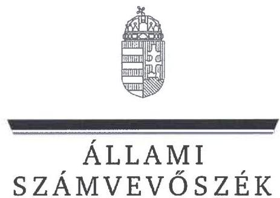
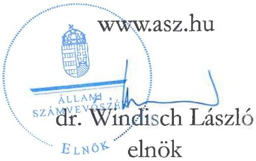
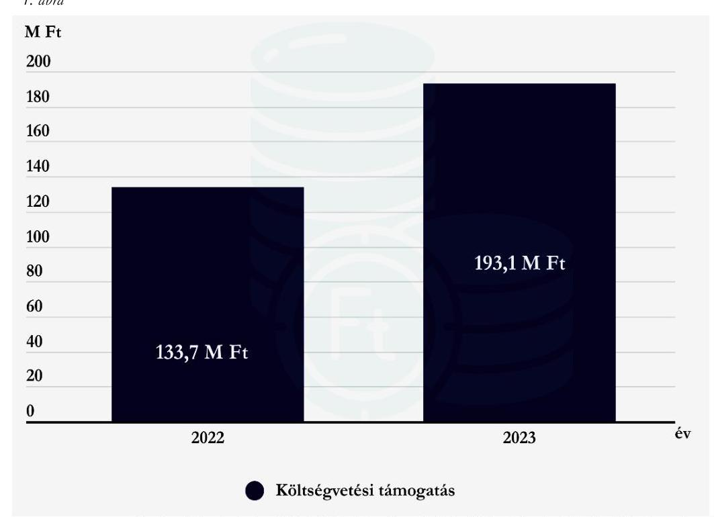

# JELENTÉS 

A költségvetési támogatásban részesülő pártalapítványok 2022-2023. évi gazdálkodása törvényességének ellenőrzése

Indítsuk Be Magyarországot Alapítvány

2025.

---

# JELENTÉS

## A költségvetési támogatásban részesülő pártalapítványok 2022-2023. évi gazdálkodása törvényességének ellenőrzése

Indítsuk Be Magyarországot Alapítvány

2025.

25083

---

# ELLENŐRZÉSI IGAZGATÓSÁG: 

## ELLENŐRZÉSI IGAZGATÓSÁG V.

## ELLENŐRZÉSI IGAZGATÓ:

KLINGA LÁSZLÓ ellenőrzési igazgató

## ELLENŐRZÉSVEZETŐ:

KAKAS SÁNDOR igazgatósági tanácsadó, ellenőrzésvezető

## IKTATÓSZÁM: EL-4125-003/2025

TÉMASORSZÁM: 7.
ELLENŐRZÉS-AZONOSÍTÓ SZÁM: V1119

---

# TARTALOMJEGYZÉK 

AZ ELLENŐRZÉS ALAPADATAI ..... 5
AZ ELLENŐRZÖTT SZERVEZET ..... 8
ÖSSZEFOGLALÁS ..... 10
AZ ELLENŐRZÉS FÓKUSZTERÜLETEI ..... 12
MEGÁLLAPÍTÁSOK ..... 13
MELLÉKLETEK ..... 18
I. sz. melléklet: Értelmező szótár ..... 18
II. sz. melléklet: Ellenőrzési kritériumok ..... 19
FÜGGELÉK: ÉSZREVÉTELEK ..... 21
RÖVIDÍTÉSEK JEGYZÉKE ..... 22

---

.

---

# AZ ELLENŐRZÉS ALAPADATAI 

## AZ ELLENŐRZÉS CÉLJA

Az ellenőrzés célja annak értékelése volt, hogy a Pártalapítvány ${ }^{1}$ törvényesen gazdálkodott-e; az éves számviteli beszámolók és a Pártalapítvány tevékenységéről szóló éves jelentések a jogszabályi előírásoknak megfeleltek-e; a könyvvezetés és gazdálkodás során a vonatkozó jogszabályi rendelkezéseket és belső előírásokat betartották-e. Az ellenőrzés célja továbbá annak értékelése volt, hogy a Pártalapítvány legutóbbi ellenőrzése eredményeként készült számvevőszéki jelentésben foglalt megállapításokkal összhangban készített intézkedési tervben meghatározott feladatokat a Pártalapítvány végrehajtotta-e.

## AZ ELLENŐRZÉS TÍPUSA

Törvényességi ellenőrzés

## AZ ELLENŐRZÖTT IDŐSZAK

2022-2023. évek
Az utóellenőrzés tekintetében az utóellenőrzés alapját képező 23019. számú ÁSZ ${ }^{2}$ jelentés ${ }^{3}$ közzétételének napjától (2023.04.25) az ellenőrzésről szóló adatszolgáltatásra felhívó levél keltének napjáig terjedő időszak.

## AZ ELLENŐRZÉS TÁRGYA

Az ellenőrzés tárgyát képezte a Pártalapítvány gazdálkodása, a könyvvezetés szabályozása és gyakorlata szabályszerűsége, az éves számviteli beszámolókra és a Pártalapítvány tevékenységéről szóló éves jelentésekre vonatkozó kötelezettség teljesítése, valamint a gazdálkodáshoz kapcsolódó ellenőrzés javaslatainak hasznosítására irányuló tevékenység.

A 23019. számú ÁSZ jelentésben foglalt megállapításokhoz kapcsolódó - a Pártalapítvány által készített - intézkedési tervben foglaltak végrehajtásának ellenőrzése.

Az ellenőrzés kiterjedt minden olyan körülményre és adatra, amely az ÁSZ jogszabályban meghatározott feladatainak teljesítéséhez, valamint az ellenőrzési program végrehajtása során felmerülő újabb összefüggések feltárásához szükséges volt.

## AZ ELLENŐRZÉS JOGALAPJA

Az ellenőrzés jogalapját az ÁSZ tv. ${ }^{4}$ 1. § (3) bekezdése, 5. § (3) bekezdése, 33. § (7) bekezdése, valamint a Pmtv. ${ }^{5}$ 4. § (2) és (4) bekezdéseinek előírásai képezték.

---

# AZ ELLENŐRZÉS MÓDSZERE 

Az ellenőrzés az ellenőrzött időszakban hatályos jogszabályok, az ellenőrzés szakmai szabályai, a jelen ellenőrzésre irányadó ÁSZ módszertanok, az ellenőrzési programban foglalt értékelési szempontok szerint került végrehajtásra.

Az ellenőrzési kérdések megválaszolásához szükséges bizonyítékok megszerzése az ellenőrzött által rendelkezésre bocsátott dokumentumokra, adatokra alapozva kérdésfeltevés (információkérés), valamint mintavételezés, továbbá helyszíni interjú útján történt. Az ellenőrzési bizonyítékként felhasználható adatforrások közé tartoztak egyrészt az ellenőrzési programban felsorolt adatforrások, másrészt minden az ellenőrzés folyamán feltárt, az ellenőrzés szempontjából információt tartalmazó dokumentum.

Az ellenőrzés lefolytatásához az ellenőrzött szervezet tanúsítvány kitöltésével és az ÁSZ által kért dokumentumok, adatok, információk megküldésével és az ellenőrzés során szolgáltatott adatokat.

A Pártalapítvány kiadásai, ráfordításai elszámolásának szabályszerűségét (2. fókuszterület), a Pártalapítvány által nyújtott támogatások elszámolásának szabályszerűségét (2. fókuszterület), valamint a mérlegtételek besorolásának, év végi értékelésének, azok leltárral való alátámasztottságának szabályszerűségét (3. fókuszterület), mintavételi eljárással kiválasztott tételek alapján ellenőrizte az ÁSZ.

A 2. fókuszterületen az egyes vizsgálandó részterületek ellenőrzése részterületenként 30 elemű minta értékelésével, mintavételes, 30 db -ot meg nem haladó tételszám esetében tételes ellenőrzéssel történt. A kiadások esetében lényegességi szempontok alapján az ÁSZ további tételeket is értékelt, amelyek a kivetítésbe nem tartoztak bele. Az ÁSZ a 2. fókuszterületnél, a kiadások vonatkozásában 30-30 tételt ellenőrzött, a minták értékelése alapján statisztikai kivetítést alkalmazott, további lényegességi szempontok alapján 2022. évben 17 db, 2023. évben 11 db kiválasztott tételt ellenőrzött. Az ÁSZ a 2. fókuszterületnél a Pártalapítvány által nyújtott támogatások vonatkozásában - tekintettel arra, hogy az alapsokaság elemszáma egyik évben sem haladta meg a 30 tételt - tételes ellenőrzést végzett. Az ÁSZ a 3. fókuszterületnél, a mérlegtételek vonatkozásában 30-30 tételt ellenőrzött, a tények feltárása és azok összegzése során a megállapítások az ellenőrzött tételekre vonatkozóan kerültek megfogalmazásra.

A vizsgált terület „szabályszerű" minősítést kapott, ha a minta ellenőrzésének eredménye alapján 95%-os bizonyossággal a teljes sokaságban az átlagos hibaarány nem haladta meg a 10%-ot, „nem szabályszerű", ha nagyobb volt, mint 10%. Amennyiben a sokaság elemszáma nem haladta meg az előírt minta elemszámot, akkor a sokaság valamennyi elemének tételes ellenőrzésére került sor.

A Pártalapítvány bevételei elszámolása szabályszerűségét teljeskörűen ellenőrizte az ÁSZ.
Az utóellenőrzés megállapításai az ÁSZ rendelkezésére álló dokumentumok, valamint az ÁSZ adatbekérése szerint, az ellenőrzött szervezet által rendelkezésre bocsátott dokumentumok, adatok alapján kerültek megfogalmazásra. Az ÁSZ a 2022. évben a Pártalapítvány 2020-2021. évi gazdálkodását ellenőrizte, megállapításait a 23019. számú jelentésben tette közzé. Az ellenőrzés esetében a 23019. számú ÁSZ jelentés alapján a Pártalapítvány által készített intézkedési tervekben előírt feladatok, annak végrehajthatósága, illetve végrehajtása szempontjából az alábbiak szerint kerültek értékelésre:

- „határidőben végrehajtott" a feladat, ha a teljesítés dokumentáltan, az intézkedési tervben előírt határidőben és tartalommal megtörtént;
- „határidőn túl végrehajtott" a feladat, ha annak teljesítése az intézkedési tervben meghatározott módon, de az abban előírt határidőn túl történt meg;

---

- „nem végrehajtott" a feladat, ha a végrehajtás nem történt meg, vagy amennyiben a teljesítést/végrehajtást nem dokumentálták, dokumentumokkal nem tudják igazolni annak teljesítését;
- „okafogyottá vált" a feladat, ha végrehajtására - meghatározott esemény bekövetkezése, továbbá külső körülmény, a működést érintő feltétel változása miatt - már nincs szükség, illetve lehetőség, és egyértelműen megállapítható, hogy az intézkedést szükségessé tevő körülmény a jövőben nem fordulhat elő;
- „nem időszerű" az a feladat, amelynek ellenőrzési időszakon belüli végrehajtására azért nem került (kerülhetett) sor, mert az intézkedés alapjául szolgáló esemény nem következett be, de annak jövőbeni előfordulása lehetséges, a végrehajtása nem volt esedékes, vagy a végrehajtás határideje még nem járt le.

---

# AZ ELLENŐRZÖTT SZERVEZET 

## INDÍTSUK BE MAGYARORSZÁGOT ALAPÍTVÁNY

A Pártalapítványt a 2018. évben 0,2 M Ft induló vagyonnal a Momentum Mozgalom alapította. A Pártalapítványt a Fővárosi Törvényszék 2018. december 18-án vette nyilvántartásba.

A Pártalapítvány alapító okirat ${ }_{1-5}{ }^{6}$-ában rögzített célja „a politikai kultúra fejlesztése, valamint ebből kapcsolódóan különböző tudományos, kutatási, ismeretterjesztő, oktatási tevékenység végzése, amely hozzájárul az állampolgárok közeleti ismereteinek szélesítéséhez". A Pártalapítvány alapító okirat ${ }_{1-5}$ szerinti tevékenysége:
a) „tudományos elemzés, közvélemény kutatás,
b) nevelés-, oktatás-, ismeretterjesztés,
c) előadások-, konferenciák-, rendezvények szervezése,
d) könyvek-, tanulmányok-, kiadványok nyomtatott és elektronikus kiadása, megjelentetése;
e) könyvek-, tanulmányok-, kiadványok-, dokumentumok gyűjtése, archiválása, rendszerezése, feldolgozása,
f) pályázatokon történő részvétel;
g) kezdeményezések támogatása;
h) kapcsolatok építése, ápolása és együttműködés civil szervezetekkel, illetve az Alapítvány céljával összeegyeztethető célokat kitűző és hasonló elvek alapján működő alapítványokkal Magyarországon és külföldön."
A Pártalapítvány ügyvezető szerve a három tagból álló Kuratórium ${ }^{7}$. A 2022. és 2023. években a Kuratórium elnökének személyében változás nem állt be, a Kuratórium egy tagjának személyében 2022. július 11-től változás történt. A Pártalapítványnál az ellenőrzött időszakban felügyelőbizottság működött. A Pártalapítvány törvényes képviseletét a Kuratórium elnöke a Kuratórium egy tagjával együttesen gyakorolta.

A Pártalapítvány az alapító okirat ${ }_{1-5}$ szerint az alapítványi cél megvalósításával közvetlenül összefüggő gazdasági tevékenység végzésére jogosult volt, azonban az ellenőrzött időszakban gazdasági-vállalkozási tevékenységet nem végzett.

A Pártalapítvány jogszabályi előírás alapján könyvvizsgálatra nem volt kötelezett, a Pártalapítvány 2022. évi és 2023. évi egyszerűsített éves beszámolóját független könyvvizsgáló nem vizsgálta felül.

A Pártalapítvány tekintetében külső ellenőrzés, törvényességi felügyeleti ellenőrzés az ellenőrzött időszakban nem volt.

A Pártalapítvány cél szerinti tevékenységének ellátásához az ellenőrzött időszakban kizárólag költségvetési támogatásban részesült, egyéb támogatást, adományt az alapító párt ${ }^{8}$-tól, egyéb szervezettől, vagy magánszemélytől nem kapott. A Pártalapítvány 2022. és 2023. évben kapott költségvetési támogatásának évenkénti alakulását az 1. ábra szemlélteti.

---

1. ábra

Fonrás: A Pártalapítvány 2022. és 2023. évi tevékenységéről szóló éves jelentései alapján ÁSZ saját szerkesztés

---

# ÖSSZEFOGLALÁS 

Az ÁSZ ellenőrzése a Párttv. ${ }^{9}$ alapján a politikai kultúra fejlesztése érdekében tudományos, ismeretterjesztő, kutatási, oktatási tevékenység folytatása céljából, a Ptk. ${ }^{10}$ szerinti alapító okiraton alapuló bírósági nyilvántartásba vétellel létrejött Pártalapítvány gazdálkodására terjedt ki. A pártalapítványok törvényes gazdálkodásának (könyvvezetés, beszámolás, jelentés készítés) szabályait a Pmtv.-n túl, a Számv. tv. ${ }^{11}$ és az Eszkr. ${ }^{12}$ határozzák meg. A Pmtv. 4. § (2) bekezdése értelmében a pártalapítványok gazdálkodása törvényességének ellenőrzésére az ÁSZ jogosult. A Pmtv. 4. § (4) bekezdése alapján az ÁSZ kétévente - kötelező jelleggel - ellenőrzi azoknak a pártalapítványoknak a gazdálkodását, amelyek állami költségvetési támogatásban részesültek.

A pártalapítványok ellenőrzésével az ÁSZ hozzájárul ahhoz, hogy a társadalom objektív képet alkothasson a pártalapítványok működéséről, gazdálkodásáról. Az ellenőrzésről készített számvevőszéki jelentésben megfogalmazott megállapítások, következtetések, javaslatok alapján a törvényalkotók konkrét lépéseket tehetnek a pártalapítványokra vonatkozó szabályozások megváltoztatása, átláthatóbbá, ellenőrizhetőbbé tétele érdekében. Az ellenőrzött szervezetek szintjén a hiányosságok, szabálytalanságok feltárása, az ennek kapcsán megfogalmazott megállapítások elősegíthetik a pártalapítványok szabályszerű gazdálkodását.

Az ellenőrzött időszakban az alapító okirat ${ }_{1-5}$ rögzítette a Pártalapítvány működési kereteit. Az alapító okirat ${ }_{1-5}$ a jogszabályi előírásokkal összhangban tartalmazta a Pártalapítvány működésének célját, tevékenységét, meghatározta a Pártalapítvány ügyvezető szervét, összetételét, működését.

A gazdálkodás szervezeti kereteinek kialakítása szabályszerű volt.

A Pártalapítvány a Számv. tv.-ben előírtak szerint kialakította a számviteli politikáját ${ }_{1,2,3}{ }^{13}$, valamint elkészítette a leltározási szabályzatot ${ }^{14}$, az értékelési szabályzatot ${ }^{15}$ és a pénzkezelési szabályzatot ${ }_{1,2}{ }^{16}$, továbbá rendelkezett számlarenddel ${ }^{17}$. A szabályzatok az ellenőrzött jogszabályi kritériumoknak megfeleltek.

A költségvetési támogatások számviteli nyilvántartása a Számv. tv. előírásainak megfelelt. A Pártalapítvány a 2022. és 2023. évben a tevékenységének költségeit, ráfordításait szabályszerűen számolta el.

A kiadások, a nyújtott
támogatás elszámolása
szabályszerű volt.

A Pártalapítvány a 2022. évben nem nyújtott támogatást. A 2023. évben nyújtott támogatás a Pártalapítvány céljaival összhangban volt, odaítélése, elszámolása, nyilvántartása során a jogszabályi rendelkezéseket betartották. Az ellenőrzött kiadási tételek alapján a Pártalapítvány az alapító párt részére támogatást, vagyoni hozzájárulást az ellenőrzött időszakban nem adott, ezzel eleget tett a Párttv. előírásainak.

A tevékenységről szóló éves jelentések és a számviteli beszámolók a jogszabályi előírásoknak megfeleltek.

A Pártalapítvány a jogszabályi előírások alapján mindkét ellenőrzött évben elkészítette és közzétette a tevékenységéről szóló éves jelentéseket, valamint az egyszerűsített éves beszámolóit. Az egyszerűsített éves beszámolók mérlegtételeinek besorolása, értékelése az ellenőrzött tételek esetében szabályszerű volt.

---

Az intézkedési tervben meghatározott feladatokat határidőben végrehajtották.

A Pártalapítvány az utóellenőrzés megállapítása alapján az intézkedési tervben meghatározott feladatokat határidőben végrehajtotta.

---

# AZ ELLENŐRZÉS FÓKUSZTERÜLETEI 

1. A Pártalapítvány törvényes gazdálkodásához szükséges szabályok kialakítása
2. A Pártalapítvány könyvvezetése és gazdálkodása során a jogszabályi előírások betartása
3. A Pártalapítvány tevékenységéről szóló jelentések, az éves számviteli beszámolók jogszabályi előírásoknak való megfelelősége
4. A Pártalapítvány intézkedési tervében meghatározott feladatok végrehajtása

---

# 1. A Pártalapítvány törvényes gazdálkodásához szükséges szabályok kialakítása 

## Összegző megállapítás A 2022-2023. években a Pártalapítvány a törvényes gazdálkodásához szükséges szabályokat kialakította.

1.1. számú megállapítás

A Pártalapítvány működésének szabályait a
 Pmtv., a Ptk., a Számv. tv. és az Eszkr. előírásainak megfelelően rögzítették.

Az alapító okirat ${ }_{1-5}$-ben a Pmtv. és a Ptk. előírásainak megfelelően kijelölték a Pártalapítvány ügyvezető szervét, a Kuratóriumot, a Kuratórium tagjait, a Pártalapítvány képviseletére jogosult személyeket, valamint meghatározták a képviseleti jog terjedelmét, továbbá a képviseleti jog gyakorlásának módját. A Pártalapítványt a Kuratórium elnöke egy Kuratóriumi taggal együttesen volt jogosult képviselni.
Az alapító okirat ${ }_{1-5}$ a Ptk. és a Pmtv. előírásaival összhangban tartalmazta az alapítvány célját, feladatait, a működés keretszabályait, valamint a Pártalapítványhoz történő csatlakozás feltételeit, a Kuratóriumra vonatkozó szabályokat.
Az alapító párt a Pártalapítvány alapításával egyidejűleg - élve a Ptk. biztosította lehetőséggel – felügyelőbizottság létrehozásáról döntött.
A Pártalapítvány a gazdálkodásával kapcsolatos könyvvezetési-nyilvántartási rendszerét az Eszkr. rendelkezéseinek megfelelően kialakította. A Pártalapítvány a 2022. és 2023. évekre vonatkozóan a Számv. tv.-ben előírtak szerint kettős könyvvitellel alátámasztott egyszerűsített éves beszámolót készített, az ellenőrzött időszakban könyvvezetését, beszámolórendszerét nem változtatta. A Pártalapítvány a pénzügyi- és számviteli feladatainak ellátását a Ptk. szerinti szerződés megkötésével biztosította. A számviteli szolgáltatás körébe tartozó feladatokat végző, beszámolót készítő személy rendelkezett a Számv. tv. és az Eszkr. rendelkezéseinek megfelelő, szükséges szakképesítéssel.
1.2. számú megállapítás

A Pártalapítvány gazdálkodására vonatkozó belső szabályozás megfelelt a Számv. tv., az Eszkr. és a Ptk. előírásainak.

A Pártalapítvány az ellenőrzött időszakban a Számv. tv.-nek megfelelően rendelkezett számviteli politikával ${ }_{1,2,3}$ és annak keretében elkészítette a leltározási szabályzatot, az értékelési szabályzatot és a pénzkezelési szabályzatot ${ }_{1-2}$, továbbá rendelkezett számlarenddel. A szabályzatok a Számv. tv.-ben előírtaknak megfeleltek.
A Pártalapítvány céljaira rendelt vagyont és annak felhasználási módját a Ptk. előírásaival összhangban az alapító okirat ${ }_{1-5}$-ben rögzítették, amellyel összhangban a Pártalapítvány SZMSZ ${ }^{18}$-ében is rendelkeztek az alapítványi vagyonról és felhasználásának módjáról. A Pártalapítvány céljaira rendelt vagyon nyilvántartását, elszámolásának rendjét, e vagyon nyilvántartásának továbbrészletezését a Ptk., a Számv. tv. és az Eszkr. rendelkezéseivel összhangban biztosították.

---

1.3. számú megállapítás

A Pártalapítvány alapcélja ellátásához kapcsolódó gazdálkodási tevékenysége szabályszerű volt.

A Pártalapítvány a 2022. és 2023. évi tevékenységéről szóló éves jelentéseinek és egyszerűsített éves beszámolóinak adatai alapján a Ptk.-ban előírtaknak megfelelően nem volt korlátlan felelősségű tagja más jogalanynak, nem volt alapítója más alapítványnak, nem csatlakozott más alapítványhoz.
A Pártalapítvány alapító okirat ${ }_{1-5}$-ának 3. pontja a Pmtv. előírásaival összhangban tartalmazta, hogy a Pártalapítvány az alapítványi cél megvalósításával közvetlenül összefüggő gazdasági tevékenység végzésére jogosult, azonban a 2022. és 2023. évben az egyszerűsített éves beszámolók és az azokat alátámasztó könyvviteli nyilvántartások adatai szerint gazdasági-vállalkozási tevékenységet nem folytatott.

# 2. A Pártalapítvány könyvvezetése és gazdálkodása során a jogszabályi előírások betartása 

## Összegző megállapítás

2.1. számú megállapítás

A Pártalapítvány könyvvezetése és gazdálkodása során a jogszabályi rendelkezéseket és a belső szabályzatok előírásait betartotta.

A Pártalapítvány a 2022-2023. években a kapott támogatásokat szabályszerűen fogadta el, számolta el.

A Pártalapítvány a 2022. és 2023. évi Kv. tv. ${ }^{19}$, továbbá az 1284/2022. (VI. 7.) Korm. határozat ${ }^{20}$ alapján – figyelemmel a 2023. évi LXXIII. tv. ${ }^{21}$-ben és a 2024. évi XLVIII. tv. ${ }^{22}$-ben foglaltakra – a 2022. évben 133,7 MFt, a 2023. évben 193,1 MFt költségvetési támogatásban részesült. A Pártalapítvány az ellenőrzött időszakban a költségvetésből juttatott támogatáson túl egyéb forrásból egyik évben sem kapott támogatást.
A Pártalapítvány az Eszkr. előírásainak megfelelően, a számlarendben foglaltak szerint az egyéb bevételeken belül elkülönítetten tartotta nyilván a központi költségvetésből kapott támogatást. A Pártalapítvány az ellenőrzött időszakban nem kapott továbbutalási céllal támogatást.
A Pártalapítvány az Eszkr. rendelkezéseinek megfelelően, a 2022. és 2023. évi egyszerűsített éves beszámolói eredménykimutatásában az egyéb bevételeken belül részletezte a kapott támogatások összegét.
2.2. számú megállapítás

A Pártalapítvány a 2022. évben nem nyújtott támogatást. A Pártalapítvány által a 2023. évben nyújtott cél szerinti támogatás odaítélése, elszámolása, beszámolóban történő bemutatása szabályszerű volt.

A Pártalapítvány az ellenőrzött időszakban egyetlen cél szerinti támogatást nyújtott a 2023. évben egy jogi személy részére. A támogatás összege 5 MFt volt.
A Számv. tv. rendelkezéseinek és a számlarend előírásainak megfelelően a támogatás az Egyéb ráfordításokon belül az Adott támogatások megnevezésű főkönyvi számon került elszámolásra.
A Pártalapítvány által a 2023. évben nyújtott cél szerinti támogatás vonatkozásában az ÁSZ az alábbiakat állapította meg:

---

- a támogatás odaítéléséről a Ptk. rendelkezéseinek és az alapító okirat ${ }_{1-5}$ VII./2. pontjában foglaltnak megfelelően a Pártalapítvány legfőbb szerve, a Kuratórium döntött,
- a támogatás célja összhangban volt a jogszabályi rendelkezésekkel és az alapító okiratban foglaltakkal,
- a támogatás kedvezményezettje megfelelt a Ptk. vizsgált előírásainak,
- a támogatási szerződés és a támogatásról szóló kuratóriumi döntés összhangban volt egymással,
- a támogatási szerződés 4. pontja tartalmazza a kedvezményezettnek a támogatás felhasználásáról való beszámolási kötelezettségét, amelynek a kedvezményezett eleget tett,
- a támogatás összegének a kifizetése a támogatási döntés szerinti kedvezményezett részére, a támogatási szerződésben megjelölt bankszámlára történt.
A Pártalapítvány 2023. évi egyszerűsített éves beszámolójának közhasznúsági melléklete az Ectv. ${ }^{23}$ előírásának megfelelően tartalmazta a közhasznú cél szerinti juttatásokról készült kimutatást. A Pártalapítvány 2023. évi tevékenységről szóló éves jelentés a Pmtv.-ben foglaltaknak megfelelően tartalmazta a Pártalapítvány által nyújtott támogatással kapcsolatos adatokat.
2.3. számú megállapítás A Pártalapítvány kiadásainak elszámolása a 2022. és a 2023. évben szabályszerűen történt.

A Pártalapítvány kiadásainak elszámolása a 2022. és 2023. években szabályszerű volt, a kiadási tételek ellenőrzése során az ÁSZ az alábbiakat állapította meg:

- a költségelszámolás, ráfordítás számviteli elszámolását a Számv. tv.-ben meghatározott dokumentumokkal alátámasztották,
- a költségeket és a ráfordításokat a Számv. tv. előírásainak megfelelő költségnemre számolták el,
- a gazdasági művelet elrendelése, az utalványozás és a teljesítések igazolása a Számv. tv.-ben rögzítetteknek megfelelően, az SZMSZ IV./a)-c) pontjaiban foglaltak szerint megtörtént,
- a könyvviteli elszámolást alátámasztó bizonylatokon az érintett könyvviteli számlákra történő hivatkozás a Számv. tv.-ben előírtaknak megfelelően megtörtént,
- a kiadások a Ptk.-nak megfelelően az alapító okirat ${ }_{1-5}$-ben meghatározott, a Pártalapítvány cél szerinti tevékenysége/működése érdekében merültek fel.

---

# 3. A Pártalapítvány tevékenységéről szóló jelentések, az éves számviteli beszámolók jogszabályi előírásoknak való megfelelősége 

## Összegző megállapítás

A Pártalapítvány a tevékenységéről szóló 2022. és 2023. évi jelentéseket és az egyszerűsített éves beszámolókat a vonatkozó jogszabályi előírásoknak megfelelően készítette el és tette közzé.
3.1. számú megállapítás

A Pártalapítvány a 2022. és a 2023. évi tevékenységéről szóló éves jelentés készítési és közzétételi kötelezettségét a Pmtv. előírásának megfelelően, szabályszerűen teljesítette.

A Pártalapítvány a Pmtv. előírásainak megfelelően a 2022. és a 2023. évre vonatkozóan elkészítette a tevékenységéről szóló éves jelentését. A tevékenységről szóló éves jelentések a Pmtv.-ben foglaltaknak megfelelően tartalmazták:

- a számviteli beszámolót,
- a költségvetési támogatás felhasználására vonatkozó kimutatást,
- a vagyon felhasználásával kapcsolatos kimutatást,
- a cél szerinti juttatások kimutatását,
- a központi költségvetési szervtől kapott támogatás mértékét,
- az egyes vezető tisztségviselőinek nyújtott juttatások értékét, illetve összegét,
- a Pártalapítvány tevékenységéről szóló rövid tartalmi beszámolót.

A Pártalapítvány 2022. és 2023. évi tevékenységéről szóló éves jelentéseit a Pmtv. előírásának megfelelően a Kuratórium elfogadta, a felügyelőbizottság megvizsgálta. A Kuratórium által elfogadott, tevékenységről szóló éves jelentések a Pmtv. előírásainak megfelelően a Magyar Közlöny mellékleteként megjelenő Hivatalos Értesítőben határidőben megjelentek. A 2022. és 2023. évi tevékenységről szóló jelentéseit a Pmtv. előírásainak megfelelően a Pártalapítvány honlapján határidőben közzétette.
3.2. számú megállapítás

A Pártalapítvány a Számv. tv., az Eszkr., az Ectv. és a Pmtv. előírásainak megfelelően elkészítette, letétbe helyezte a 2022. és 2023. évi egyszerűsített éves beszámolóját. A Pártalapítvány a 2022. és 2023. évi egyszerűsített éves beszámoló közzétételi kötelezettségét szabályszerűen teljesítette.

A Pártalapítvány a Számv. tv., valamint az Eszkr. és az Ectv. előírásainak megfelelően a 2022. és 2023. évi működéséről, vagyoni, pénzügyi és jövedelmi helyzetéről az üzleti év könyveinek lezárását követően, az üzleti év utolsó napjával elkészítette egyszerűsített éves beszámolóit, kiegészítő és közhasznúsági mellékleteit.
A Pártalapítvány 2022. évi és 2023. évi egyszerűsített éves beszámolóját a Kuratórium határozattal elfogadta, a felügyelőbizottság megvizsgálta. A Kuratórium által elfogadott 2022. és 2023. évi egyszerűsített éves beszámoló, valamint közhasznúsági melléklet az Ectv. előírásának megfelelően –

---

határidőn belül – az $\mathrm{OBH}^{24}$ honlapján közzétételre került és a Pártalapítvány saját honlapján teljesítette közzétételi kötelezettségét.
A Pártalapítvány a 2022. és a 2023. évi egyszerűsített éves beszámolóinak ellenőrzött mérlegtételeit a Számv. tv. előírásainak megfelelően leltárral alátámasztotta.
Az ÁSZ által lefolytatott helyszíni ellenőrzés során a Pártalapítványnál kilenc tárgyi eszköz szemrevételezésre kiválasztásra került, amelyek közül egy eszköz fizikailag fellelhető volt, a további nyolc eszköz használatba adásra került, amelyről a dokumentumot az ÁSZ rendelkezésére bocsátották.
A 2022. és 2023. évi egyszerűsített éves beszámolók mérlegtételeit megfelelő főkönyvi számon tartották nyilván, a mérlegtételek tartalma, besorolása és bekerülési értékének meghatározása megfelelt a Számv. tv. és az Eszkr. előírásainak.
A Pártalapítvány a Számv. tv., az Eszkr. és a Pmtv. előírásainak megfelelően a 2022. és a 2023. évi egyszerűsített éves beszámolóiban biztosította a költségvetési támogatások elkülönített nyilvántartását, bemutatását.
3.3. számú megállapítás

A Pártalapítvány céljaira rendelt vagyonnak a kezelése és védelme, az arról való beszámolás szabályszerű volt.

Az alapító párt a Ptk.-ban foglalt előírásoknak megfelelően az alapító okirat ${ }_{1-5}$-ben meghatározta a Pártalapítvány céljait és tevékenységét, valamint a vagyoni hozzájárulás értékét, valamint az alapítói vagyon kezelésének és felhasználásának szabályait, amellyel összhangban a Pártalapítvány SZMSZ-e is tartalmazott rendelkezéseket. A 2022. és 2023. évben a Pártalapítvány céljaira rendelt vagyon nyilvántartásának, elszámolásának rendjét, a vagyon nyilvántartásának további részletezését biztosították.
A Pártalapítvány hasznosításra az államháztartásból ingyenesen átadott vagyont, illetve véglegesen az államháztartásból tulajdonba adott vagyont nem kapott, nem keletkezett az Nvtv. ${ }^{25}$, valamint a Vtvr. ${ }^{26}$ előírásai szerinti vagyonhoz kapcsolódó nyilvántartási, adatszolgáltatási kötelezettsége.

# 4. A Pártalapítvány intézkedési tervében meghatározott feladatok végrehajtása 

## Összegző megállapítás A Pártalapítvány az intézkedési tervben meghatározott feladatokat határidőben végrehajtotta.

Az ÁSZ a 2022. évben végzett ellenőrzés megállapításait tartalmazó, 2023. április 25-én nyilvánosságra hozott, 23019 számú, „A költségvetési támogatásban részesülő pártalapítványok 2020-2021. évi gazdálkodása törvényességének ellenőrzése" című jelentésében a Pártalapítvány Kuratóriumi elnöke részére egy javaslatot fogalmazott meg. A Pártalapítvány az ÁSZ tv.-ben előírtaknak eleget tett, a jelentésben foglalt megállapításhoz kapcsolódóan intézkedési tervet állított össze, amelyet az ÁSZ elfogadott. A Pártalapítvány az intézkedési tervben meghatározott feladatokat végrehajtotta. A Pártalapítvány a 23019. számú ÁSZ jelentés javaslatában megfogalmazott intézkedési javaslatnak megfelelően mind a 2022. évi, mind pedig a 2023. évi egyszerűsített éves beszámolójának – az Ectv. által előírt – határidőben történő letétbe helyezéséről és közzétételéről gondoskodott.

---

# MELLÉKLETEK 

- I. SZ. MELLÉKLET: ÉRTELMEZŐ SZÓTÁR
alapítvány
gazdasági-vállalkozási tevékenység
költségvetési támogatás
pártalapítvány

Az alapítvány az alapító által az alapító okiratban meghatározott tartós cél folyamatos megvalósítására létrehozott jogi személy. Az alapító az alapító okiratban meghatározza az alapítványnak juttatott vagyont és az alapítvány szervezetét. Alapítvány nem alapítható gazdasági tevékenység folytatására. Az alapítvány az alapítványi cél megvalósításával közvetlenül összefüggő
 gazdasági tevékenység végzésére jogosult. Alapítvány nem lehet korlátlan felelősségű tagja más jogalanynak, nem létesíthet alapítványt és nem csatlakozhat alapítványhoz. (Forrás: Ptk. 3:378. §, 3:379. § (1)-(3) bekezdés)
A jövedelem- és vagyonszerzésre irányuló vagy azt eredményező, üzletszerűen végzett gazdasági tevékenység, kivéve az adomány (ajándék) elfogadását, a pénzeszközök betétbe, értékpapírba, társasági részesedésbe történő elhelyezését és az ingatlan megszerzését, használatának átengedését és átruházását. (Forrás: Ectv. 2. § 11. pont, Pmtv. 2021. július 1. napjától hatályos 3. § (6a) bekezdés)
A pártalapítványoknak a Párttv. 9/A. § (1) bekezdése és a Pmtv. 1. § előírásainak értelmében, az éves költségvetési törvények szerint - jellemzően az 1. számú melléklet I. Országgyűlés fejezet 9. Pártalapítványok támogatás címen - az állami költségvetésből juttatott támogatás.
A politikai kultúra fejlesztése érdekében, tudományos, ismeretterjesztő, kutatási és oktatási tevékenység folytatása céljából pártok által létrehozott, külön jogszabályban - a Pmtv. 1. § és 3. § (1) bekezdése - meghatározott, jogi személynek minősülő egyéb szervezet, speciális jogállású alapítvány.
(Forrás: Párttv. 9/A. § (1) bekezdés, Pmtv. 1. §, Ectv. 2. § 6. c) pont, Számv. tv. 3. § (1) bekezdés 4. pont, Eszkr. 2. § (1) bekezdés 1) pont)

---

# II. SZ. MELLÉKLET: ELLENŐRZÉSI KRITÉRIUMOK 

## FOKUSZTERÜLET

1. A Pártalapítvány törvényes gazdálkodásához szükséges szabályok kialakítása
2. A Pártalapítvány könyvvezetése és gazdálkodása során a jogszabályi előírások betartása
3. A Pártalapítvány tevékenységéről szóló jelentések, az éves számviteli beszámolók jogszabályi előírásoknak való megfelelősége

## FŐ ELLENŐRZÉSI KRITÉRIUMOK

Ptk. 3:21-3:25. §, 3:29-3:30. §, 3:379. § (3) bekezdés, 3:391. § (1) bekezdés c) pont, 3:391. § (2) bekezdés h) pont, 3:397-3:398. §, 3:400.§ (2) bekezdés
Ectv. 28-31. §
Eszkr. 7. § (3)-(4) bekezdés b) pont, (6) bekezdés, 8. § (2) bekezdés, 9. § (4) bekezdés, 12-15. §

Számv. tv. 14. § (3)-(4) bekezdés, 14. § (5) bekezdés a), b) és d) pont, 14. § (8) bekezdés, 14. § (12) bekezdés, 16. § (4) bekezdés, 96. §, 150. §, 161. § (1) bekezdés, 161. § (2) bekezdés c), d) pont, 161. § (4) bekezdés

Pmtv. 3. § (6), (6a) bekezdés
Ptk. 3:384. § (1) bekezdés, 3:385. §, 3:386. §
Párttv. 5. § (2) bekezdés, 9/A. § (1) bekezdés, 9/A. § (3) bekezdés

Pmtv. 3. § (3) bekezdés, 3. § (4) bekezdés a) pont, 3/A § (3) bekezdés b), d) e) pont

Kv. tv. 1. melléklete
Kv. tv. 2. melléklete
1284/2022 (VI.7) Korm. határozat 1. melléklet
2023. évi LXXIII. törvény 1. melléklete
2024. évi XLVIII. törvény 1. melléklete

Kbt. 5. § (2)-(3) bekezdés, 15. § (5) bekezdés, 19. §, 27. § (1)-(2) bekezdés, 111. § p), 131. §

Számv. tv. 78. § - 81. §, 160. §, 161/A. § (2) bekezdés, 165. § (1) bekezdés, 166. §, 167. § (1) bekezdés c), h) pont

Ectv. 2. § 1. pont, 29. § (7) bekezdés
Eszkr. 13. § (3) bekezdés, 9. § (9) bekezdés, 12. § (4) bekezdés, 14. § (1) bekezdés, 29. § (4) bekezdés

Pmtv. 3/A § (3), (5) bekezdés, (6) bekezdés, 3. § (4), (6) bekezdés

Ectv. 28. § (1)-(3) bekezdés, 29. § (2)-(5) bekezdés, 30. §, 46. § (1) bekezdés

Eszkr. 7. § (1)-(3), (4) bekezdés b) pontja, (6)-(8) bekezdés, 8. § (2) bekezdés, 11. §, 12. §, 13.§ (4)-(5) bekezdés, 14. § (1) bekezdés, 23. §, 24. §, 16. §, 17. §

Számv. tv. 8. § (2) bekezdés b) pontja, 8. § (5) bekezdés, 9. § (2) bekezdés, 19. § (1) bekezdés; 23-31. §, 35. §, 44. § (2) bekezdés, 47-51. §, 52., 54-56. §, 57-59. §, 65. § (1)-(7) bekezdés, 69. §, 70. §, 91. § a) pont, 96. §

---

|  | (1) bekezdés, 155. § (7) bekezdés, 161. § (2)-(3) bekezdés, Számv. tv. 161/A. § (2) bekezdés, 165. § (4) bekezdés Ptk. 3:27. § (1) bekezdés, 3:4, 3:9 - 3:10. §, 3:378 - 3:383. §, 3:388 - 3:390. §, 3:391. § (1) bekezdés b) pont, (2) bekezdés c) pont   Nvtv. 7. § (1) bekezdés, 13. § (3) bekezdés, 13. § (4) bekezdés b) pont   Vtvr. 14. § (1)-(3) bekezdés, 17. § (1)-(2) bekezdés, melléklet II/8. pont |
| :--: | :--: |
| 4. A Pártalapítvány intézkedési tervében meghatározott feladatok végrehajtása | Intézkedési terv   ÁSZ tv. 33. § (7) bekezdés |

---

# FÜGGELÉK: ÉSZREVÉTELEK 

A jelentéstervezetet a Számvevőszék 15 napos észrevételezésre megküldte az ellenőrzött szervezet vezetőjének az ÁSZ tv. 29. § (1) bekezdése előírásának megfelelően.

Az Indítsuk Be Magyarországot Alapítvány Kuratóriumának elnöke a jelentéstervezetre nem tett észrevételt.

[^0]
[^0]:    * 29. § (1) Az Állami Számvevőszék az ellenőrzési megállapításait megküldi az ellenőrzött szervezet vezetőjének vagy az általa megbízott személynek, és annak, akinek személyes felelősségét állapította meg.
    (2) Az ellenőrzött szervezet vezetője és a felelősként megjelölt személy az ellenőrzés megállapításaira tizenöt napon belül írásban észrevételt tehet.
    (3) Az Állami Számvevőszék az észrevételre a beérkezésétől számított harminc napon belül írásban válaszol. A figyelembe nem vett észrevételeket köteles a jelentésben feltüntetni, és megindokolni, hogy azokat miért nem fogadta el.

---

# RÖVIDÍTÉSEK JEGYZÉKE 

${ }^{1}$ Pártalapítvány
${ }^{2}$ ÁSZ
${ }^{3}$ 23019. számú ÁSZ jelentés
${ }^{4}$ ÁSZ tv.
${ }^{5}$ Pmtv.
${ }^{6}$ alapító okirat ${ }_{1}$
alapító okirat ${ }_{2}$
alapító okirat ${ }_{3}$
alapító okirat ${ }_{4}$
alapító okirat ${ }_{5}$
${ }^{7}$ Kuratórium
${ }^{8}$ alapító párt
${ }^{9}$ Párttv.
${ }^{10}$ Ptk.
${ }^{11}$ Számv. tv.
${ }^{12}$ Eszkr.
${ }^{13}$ számviteli politika ${ }_{1}$
számviteli politika ${ }_{2}$
számviteli politika ${ }_{3}$
${ }^{14}$ leltározási szabályzat
${ }^{15}$ értékelési szabályzat
${ }^{16}$ pénzkezelési szabályzat ${ }_{1}$
pénzkezelési szabályzat ${ }_{2}$
${ }^{17}$ számlarend
${ }^{18}$ SZMSZ
${ }^{19}$ 2022. és 2023. évi Kv.tv.
${ }^{20}$ 1284/2022. (VI. 7.) Korm. határozat
${ }^{21}$ 2023. évi LXXIII. tv.

Indítsuk Be Magyarországot Alapítvány
Állami Számvevőszék
A költségvetési támogatásban részesülő pártalapítványok 2020-2021. évi gazdálkodása törvényességének ellenőrzése - Indítsuk be Magyarországot Alapítvány
2011. évi LXVI. törvény az Állami Számvevőszékről
2003. évi XLVII. törvény a pártok működését segítő tudományos, ismeretterjesztő, kutatási, oktatási tevékenységet végző alapítványokról
Indítsuk Be Magyarországot Alapítvány Alapító okirata (hatályos: 2021. december 3-tól 2022. április 28-ig)
Indítsuk Be Magyarországot Alapítvány Alapító okirat (hatályos: 2022. április 29-től 2022. július 10-ig)
Indítsuk Be Magyarországot Alapítvány Alapító okirat (hatályos: 2022. július 11-től 2022. november 13-ig)
Indítsuk Be Magyarországot Alapítvány Alapító okirat (hatályos: 2022. november 14-től 2023. február 16-ig)
Indítsuk Be Magyarországot Alapítvány Alapító okirat (hatályos: 2023. február 17-től)
Indítsuk Be Magyarországot Alapítvány Kuratóriuma
Momentum Mozgalom
1989. évi XXXIII. törvény a pártok működéséről és gazdálkodásáról
2013. évi V. törvény a Polgári Törvénykönyvről
2000. évi C. törvény a számvitelről
479/2016. (XII.28.) Korm. rendelet a számviteli törvény szerinti egyes egyéb szervezetek beszámoló készítési és könyvvezetési kötelezettségének sajátosságairól
Indítsuk Be Magyarországot Alapítvány Számviteli Politikája (hatályos: 2021. december 20. - 2022. augusztus 2-ig)
Indítsuk Be Magyarországot Alapítvány Számviteli Politikája (hatályos: 2022. augusztus 3. - 2023. május 26-ig)
Indítsuk Be Magyarországot Alapítvány Számviteli Politikája (hatályos: 2023. május 26-tól)
Indítsuk Be Magyarországot Alapítvány Leltározási és Selejtezési Szabályzata (hatályos: 2018. december 18-tól)
Indítsuk Be Magyarországot Alapítvány Értékelési Szabályzata (hatályos: 2020. január 1-től)
Indítsuk Be Magyarországot Alapítvány Pénzkezelési szabályzata (hatályos: 2021. december 20. - 2022. augusztus 2-ig)

Indítsuk Be Magyarországot Alapítvány Pénzkezelési szabályzata (hatályos: 2022. augusztus 3-tól)
Indítsuk Be Magyarországot Alapítvány Számlarendje (hatályos: 2020. január 1-től)
Indítsuk Be Magyarországot Alapítvány szervezeti és működési szabályzata (hatályos: 2021. január 1-től)
2021. évi XC. törvény a Magyarország 2022. évi központi költségvetéséről
2022. évi XXV. törvény Magyarország 2023. évi központi költségvetéséről
1284/2022. (VI. 7.) Korm. határozat a pártokat és a pártalapítványokat az országgyűlési képviselők 2022. évi általános választása eredményének megfelelően megillető támogatás mértékének meghatározásáról, valamint a támogatást szolgáló előirányzatok közötti átcsoportosításról
2023. évi LXXIII. törvény a Magyarország 2022. évi központi költségvetéséről szóló 2021. évi XC. törvény végrehajtásáról

---

| ${ }^{22}$ 2024. évi XLVIII. tv. | 2024. évi XLVIII. törvény a Magyarország 2023. évi központi költségvetéséről szóló 2022. évi XXV. törvény végrehajtásáról  |
| --- | --- |
|  ${ }^{23}$ Ectv. | 2011. évi CLXXV. törvény az egyesülési jogról, a közhasznú jogállásról, valamint a civil szervezetek működéséről és támogatásáról  |
|  ${ }^{24}$ OBH | Országos Bírósági Hivatal  |
|  ${ }^{25}$ Nvtv. | 2011. évi CXCVI. törvény a nemzeti vagyonról  |
|  ${ }^{26}$ Vtvr. | 254/2007. (X. 4.) Korm. rendelet az állami vagyonnal való gazdálkodásról  |

---

1052 Budapest, Apáczai Csere János u. 10. | 1364 Budapest 4., Pf. 54
www.asz.hu | szamvevoszek@asz.hu
telefon: +36 1 4849100

