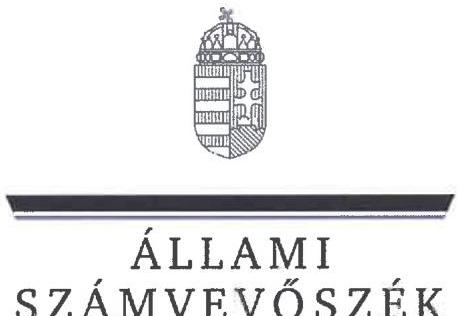
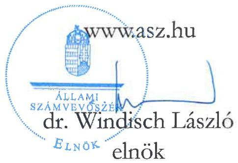
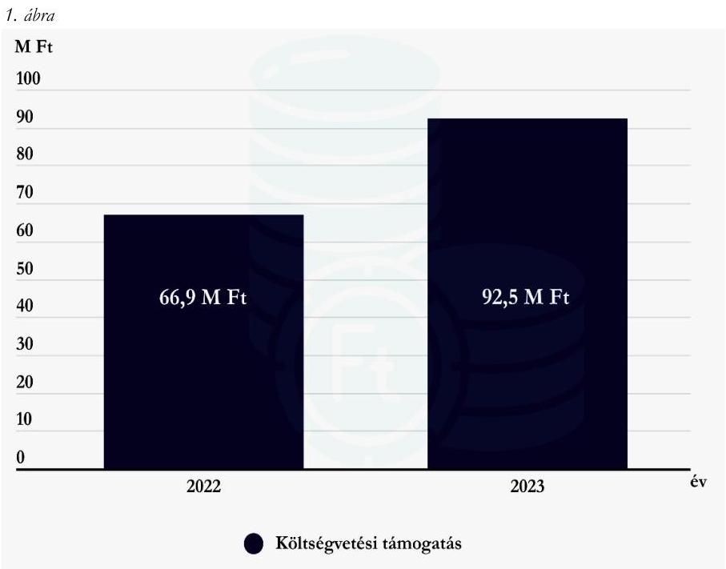
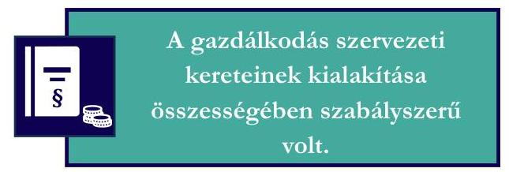
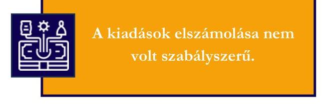

# JELENTÉS 

A költségvetési támogatásban részesülő pártalapítványok 2022-2023. évi gazdálkodása törvényességének ellenőrzése

Savköpő Menyét Alapítvány

2025.

---

ÁLLAMI
SZÁMVEVŐSZÉK

# JELENTÉS 

## A költségvetési támogatásban részesülő pártalapítványok 2022-2023. évi gazdálkodása törvényességének ellenőrzése

Savköpő Menyét Alapítvány

2025.

25084

---

# ELLENŐRZÉSI IGAZGATÓSÁG:

## ELLENŐRZÉSI IGAZGATÓSÁG V.

### ELLENŐRZÉSI IGAZGATÓ:

#### KLINGA LÁSZLÓ ellenőrzési igazgató

### ELLENŐRZÉSVEZETŐ:

#### KAKAS SÁNDOR igazgatósági tanácsadó, ellenőrzésvezető

Jelentéseink az interneten a www.asz.hu címen olvashatók.

IKTATÓSZÁM: EL-4125-006/2025

TÉMASORSZÁM: 7.

ELLENŐRZÉS-AZONOSÍTÓ SZÁM: V1119

---

# TARTALOMJEGYZÉK 

AZ ELLENŐRZÉS ALAPADATAI ..... 5
AZ ELLENŐRZÖTT SZERVEZET ..... 8
ÖSSZEFOGLALÁS ..... 9
AZ ELLENŐRZÉS FÓKUSZTERÜLETEI ..... 11
MEGÁLLAPÍTÁSOK ..... 12
JAVASLATOK ..... 19
MELLÉKLETEK ..... 21
I. sz. melléklet: Értelmező szótár ..... 21
II. sz. melléklet: Ellenőrzési kritériumok ..... 22
FÜGGELÉK: ÉSZREVÉTELEK ..... 24
RÖVIDÍTÉSEK JEGYZÉKE ..... 25

---

.

---

# AZ ELLENŐRZÉS ALAPADATAI 

## AZ ELLENŐRZÉS CÉLJA

Az ellenőrzés célja annak értékelése volt, hogy a Pártalapítvány ${ }^{1}$ törvényesen gazdálkodott-e; az éves számviteli beszámolók és a Pártalapítvány tevékenységéről szóló éves jelentések a jogszabályi előírásoknak megfeleltek-e; a könyvvezetés és gazdálkodás során a vonatkozó jogszabályi rendelkezéseket és belső előírásokat betartották-e. Az ellenőrzés célja továbbá annak értékelése volt, hogy a Pártalapítvány legutóbbi ellenőrzése eredményeként készült számvevőszéki jelentésben foglalt megállapításokkal összhangban készített intézkedési tervben meghatározott feladatokat végrehajtotta-e.

## AZ ELLENŐRZÉS CÉLJA

Törvényességi ellenőrzés

## AZ ELLENŐRZÖTT IDŐSZAK

2022-2023. évek
Az utóellenőrzés tekintetében az utóellenőrzés alapját képező 23020. számú ÁSZ ${ }^{2}$ jelentés ${ }^{3}$ közzétételének napjától (2023.04.25.) az ellenőrzésről szóló adatszolgáltatásra felhívó levél keltének napjáig terjedő időszak.

## AZ ELLENŐRZÉS TÁRGYA

Az ellenőrzés tárgyát képezte a Pártalapítvány gazdálkodása, a könyvvezetés szabályozása és gyakorlata szabályszerűsége, az éves számviteli beszámolókra és a Pártalapítvány tevékenységéről szóló éves jelentésekre vonatkozó kötelezettség teljesítése, valamint a gazdálkodáshoz kapcsolódó ellenőrzés javaslatainak hasznosítására irányuló tevékenység.

A 23020. számú ÁSZ jelentésben foglalt megállapításokhoz kapcsolódó - a Pártalapítvány által készített intézkedési tervben foglaltak végrehajtásának ellenőrzése.

Az ellenőrzés kiterjedt minden olyan körülményre és adatra, amely az ÁSZ jogszabályban meghatározott feladatainak teljesítéséhez, valamint az ellenőrzési program végrehajtása során felmerülő újabb összefüggések feltárásához szükséges volt.

## AZ ELLENŐRZÉS JOGALAPJA

Az ellenőrzés jogalapját az ÁSZ tv. ${ }^{4}$ 1. § (3) bekezdése, 5. § (3) bekezdése, 33. § (7) bekezdése, valamint a Pmtv. ${ }^{5}$ 4. § (2) és (4) bekezdéseinek előírásai képezték.

---

# AZ ELLENŐRZÉS MÓDSZERE 

Az ellenőrzés az ellenőrzött időszakban hatályos jogszabályok, az ellenőrzés szakmai szabályai, a jelen ellenőrzésre irányadó ÁSZ módszertanok, az ellenőrzési programban foglalt értékelési szempontok szerint került végrehajtásra.

Az ellenőrzési kérdések megválaszolásához szükséges bizonyítékok megszerzése az ellenőrzött által rendelkezésre bocsátott dokumentumokra, adatokra alapozva kérdésfeltevés (információkérés), valamint mintavételezés, továbbá helyszíni interjú útján történt. Az ellenőrzési bizonyítékként felhasználható adatforrások közé tartoztak egyrészt az ellenőrzési programban felsorolt adatforrások, másrészt minden az ellenőrzés folyamán feltárt, az ellenőrzés szempontjából információt tartalmazó dokumentum.

Az ellenőrzés lefolytatásához az ellenőrzött szervezet tanúsítvány kitöltésével és az ÁSZ által kért dokumentumok, adatok, információk megküldésével és az ellenőrzés során szolgáltatott adatokat.

A Pártalapítvány kiadásai, ráfordításai elszámolásának szabályszerűségét (2. fókuszterület), a Pártalapítvány által nyújtott támogatások elszámolásának szabályszerűségét (2. fókuszterület), valamint a mérlegtételek besorolásának, év végi értékelésének, azok leltárral való alátámasztottságának szabályszerűségét (3. fókuszterület), mintavételi eljárással kiválasztott tételek alapján ellenőrizte az ÁSZ.

A 2. fókuszterületen az egyes vizsgálandó részterületek ellenőrzése részterületenként 30 elemű minta értékelésével, mintavételes, 30 db -ot meg nem haladó tételszám esetében tételes ellenőrzéssel történt. A kiadások esetében lényegességi szempontok alapján az ÁSZ további tételeket is értékelt, amelyek a kivetítésbe nem tartoztak bele. Az ÁSZ a 2. fókuszterületnél, a kiadások vonatkozásában 30-30 tételt ellenőrzött, a minták értékelése alapján statisztikai kivetítést alkalmazott, további lényegességi szempontok alapján 2022. évben 6 db, 2023. évben 7 db kiválasztott tételt ellenőrzött. Az ÁSZ a 3. fókuszterületnél, a mérlegtételek vonatkozásában valamennyi tételt ellenőrizte, a tények feltárása és azok összegzése során a megállapítások az ellenőrzött tételekre vonatkozóan kerültek megfogalmazásra.

A vizsgált terület „szabályszerű" minősítést kapott, ha a minta ellenőrzésének eredménye alapján 95%-os bizonyossággal a teljes sokaságban az átlagos hibaarány nem haladta meg a 10%-ot, „nem szabályszerű", ha nagyobb volt, mint 10%. Amennyiben a sokaság elemszáma nem haladta meg az előírt minta elemszámot, akkor a sokaság valamennyi elemének tételes ellenőrzésére került sor.

A Pártalapítvány bevételei elszámolása szabályszerűségét teljeskörűen ellenőrizte az ÁSZ.
Az utóellenőrzés megállapításai az ÁSZ rendelkezésére álló dokumentumok, valamint az ÁSZ adatbekérése szerint, az ellenőrzött szervezet által rendelkezésre bocsátott dokumentumok, adatok alapján kerültek megfogalmazásra. Az ÁSZ a 2022. évben a Pártalapítvány 2020-2021. évi gazdálkodását ellenőrizte, megállapításait a 23020. számú jelentésben tette közzé. Az ellenőrzés esetében a 23020. számú ÁSZ jelentés alapján a Pártalapítvány által készített intézkedési tervben előírt feladatok, annak végrehajthatósága, illetve végrehajtása szempontjából az alábbiak szerint kerültek értékelésre:

- „határidőben végrehajtott" a feladat, ha a teljesítés dokumentáltan, az intézkedési tervben előírt határidőben és tartalommal megtörtént;
- „határidőn túl végrehajtott" a feladat, ha annak teljesítése az intézkedési tervben meghatározott módon, de az abban előírt határidőn túl történt meg;
- „nem végrehajtott" a feladat, ha a végrehajtás nem történt meg, vagy amennyiben a teljesítést/végrehajtást nem dokumentálták, dokumentumokkal nem tudják igazolni annak teljesítését;

---

- „okafogyottá vált" a feladat, ha végrehajtására - meghatározott esemény bekövetkezése, továbbá külső körülmény, a működést érintő feltétel változása miatt - már nincs szükség, illetve lehetőség, és egyértelműen megállapítható, hogy az intézkedést szükségessé tevő körülmény a jövőben nem fordulhat elő;
- „nem időszükséges" az a feladat, amelynek ellenőrzési időszakon belüli végrehajtására azért nem került (kerülhetett) sor, mert az intézkedés alapjául szolgáló esemény nem következett be, de annak jövőbeni előfordulása lehetséges, a végrehajtása nem volt esedékes, vagy a végrehajtás határideje még nem járt le.
A gazdálkodás hibáinak kijavítására irányuló javaslatok kidolgozásakor a hatályos jogszabályok voltak az irányadóak.

---

# AZ ELLENŐRZÖTT SZERVEZET 

## SAVKÖPŐ MENYÉT ALAPÍTVÁNY

A Pártalapítványt 2018. májusban a Magyar Kétfarkú Kutya Párt, a párt működését segítő alapítványként, 0,1 MFt induló vagyonnal alapította. A Pártalapítványt a Fővárosi Törvényszék 2018. június 21-én jogerőre emelkedett végzésével vette nyilvántartásba.

A Pártalapítvány alapító okiratában rögzített célja „a politikai kultúra fejlesztése érdekében történő tudományos, ismeretterjesztő, kutatási, oktatási tevékenység folytatása".

A Pártalapítvány ügyvezető szerve a három tagból álló Kuratórium. Az ellenőrzött időszakban a Kuratórium elnökének személyében változás nem történt, a Kuratórium tagjainak személye két alkalommal változott. A Pártalapítvány törvényes képviseletét a Kuratórium elnöke látta el, a képviseleti jog gyakorlásának módja önálló volt.

A Pártalapítvány jogszabályi előírás alapján az ellenőrzött időszakban könyvvizsgálatra nem volt kötelezett, a Pártalapítvány 2022. évi és 2023. évi egyszerűsített éves beszámolóját független könyvvizsgáló nem vizsgálta felül.

A Pártalapítvány tekintetében külső ellenőrzés, törvényességi felügyeleti ellenőrzés az ellenőrzött időszakban nem volt.

A Pártalapítvány cél szerinti tevékenységének ellátásához a 2022. évben kizárólag költségvetési támogatásban részesült, az alapító pártól, egyéb szervezettől, vagy magánszemélytől nem kapott egyéb támogatást, adományt, a 2023. évben a költségvetésből juttatott támogatáson túl 28 esetben fogadott el támogatást természetes személyektől, összesen 111 E Ft összegben. A Pártalapítvány a 2022. és 2023. években harmadik fél részére nem nyújtott támogatást.

A Pártalapítvány az ellenőrzött időszakban gazdasági-vállalkozási tevékenységet nem végzett.
A Pártalapítvány 2022. és 2023. évben kapott költségvetési támogatásának évenkénti alakulását az 1. ábra szemlélteti.

Forrás: A Pártalapítvány 2022. és 2023. évi tevékenységéről szóló éves jelentései alapján ÁSZ saját szerkesztés

---

# ÖSSZEFOGLALÁS 

Az ÁSZ ellenőrzése a Párttv. ${ }^{9}$ alapján a politikai kultúra fejlesztése érdekében tudományos, ismeretterjesztő, kutatási, oktatási tevékenység folytatása céljából, a Ptk. ${ }^{10}$ szerinti alapító okiraton alapuló bírósági nyilvántartásba vétellel létrejött Pártalapítvány gazdálkodására terjedt ki. A pártalapítványok törvényes gazdálkodásának (könyvvezetés, beszámolás, jelentés készítés) szabályait a Pmtv.-n túl, a Számv. tv. ${ }^{11}$ és az Eszkr. ${ }^{12}$ határozzák meg. A Pmtv. 4. § (2) bekezdése értelmében a pártalapítványok gazdálkodása törvényességének ellenőrzésére az ÁSZ jogosult. A Pmtv. 4. § (4) bekezdése alapján az ÁSZ kétévente - kötelező jelleggel - ellenőrzi azoknak a pártalapítványoknak a gazdálkodását, amelyek állami költségvetési támogatásban részesültek.

A pártalapítványok ellenőrzésével az ÁSZ hozzájárul ahhoz, hogy a társadalom objektív képet alkothasson a pártalapítványok működéséről, gazdálkodásáról. Az ellenőrzésről készített számvevőszéki jelentésben megfogalmazott megállapítások, következtetések, javaslatok alapján a törvényalkotók konkrét lépéseket tehetnek a pártalapítványokra vonatkozó szabályozások megváltoztatása, átláthatóbbá, ellenőrizhetőbbé tétele érdekében. Az ellenőrzött szervezetek szintjén a hiányosságok, szabálytalanságok feltárása, az ennek kapcsán megfogalmazott megállapítások elősegíthetik a pártalapítványok szabályszerű gazdálkodását.

Az ellenőrzött időszakban az alapító okirat rögzítette a Pártalapítvány működési kereteit. Az alapító okirat a jogszabályi előírásokkal összhangban tartalmazta a Pártalapítvány működésének célját, tevékenységét, meghatározta a Pártalapítvány ügyvezető szervét, összetételét, működését.

A Pártalapítvány a Számv. tv.-ben előírtak szerint kialakította a számviteli politikáját, valamint elkészítette a leltározási szabályzatot, az értékelési szabályzatot és a pénzkezelési szabályzatot, továbbá rendelkezett számlarenddel. A számviteli politika és a számlarend tekintetében az ellenőrzés hiányosságot tárt fel.

A költségvetési támogatások számviteli nyilvántartása az Eszkr. és a Számv. tv. előírásainak megfelelt. A Pártalapítvány a 2022. és 2023. években a tevékenységének költségeit, ráfordításait nem szabályszerűen számolta el, mivel a könyvviteli elszámolást közvetlenül alátámasztó bizonylatokon a gazdasági művelet elrendelése, az utalványozás és a végrehajtás igazolása, továbbá a könyvelés módjára, az érintett könyvviteli számlákra történő hivatkozás hiányos volt.

A Pártalapítvány 2022. és 2023. évi egyszerűsített éves beszámolójában az ellenőrzés jelentős összegű hibát tárt fel.

A Pártalapítvány a 2022. és 2023. évi tevékenységéről szóló éves jelentési-, beszámolási kötelezettségét nem szabályszerűen teljesítette. Honlapján a 2023. évi tevékenységéről szóló éves jelentését hiányosan tette közzé. A Pártalapítvány a 2022. és 2023. években a Számv. tv.-ben előírtak ellenére a beszámoló elkészítéséhez, a mérlegtételeinek alátámasztásához nem állított össze leltárt. A Pártalapítvány 2022. és 2023. évi egyszerűsített éves beszámolóiban jelentős összegű hibák voltak, emiatt mind a 2022. évi, mind pedig a 2023. évi könyvvitelében a Számv. tv-ben rögzített valódiság elve sérült.

---

Az intézkedési tervben meghatározott feladatokat nem teljeskörűen hajtották végre.

A Pártalapítvány az utóellenőrzés megállapítása alapján az intézkedési tervben meghatározott feladatokat nem teljeskörűen hajtotta végre, továbbra is szabálytalanságok maradtak fenn a könyvviteli nyilvántartással, illetve a számviteli beszámolók mérlegtételeinek leltárral történő alátámasztásával kapcsolatban.

Az ÁSZ a Kuratórium elnöke részére a feltárt szabálytalanságok jövőbeni kiküszöbölése érdekében 11 javaslatot fogalmazott meg.

---

# AZ ELLENŐRZÉS FÓKUSZTERÜLETEI 

1. A Pártalapítvány törvényes gazdálkodásához szükséges szabályok kialakítása
2. A Pártalapítvány könyvvezetése és gazdálkodása során a jogszabályi előírások betartása
3. A Pártalapítvány tevékenységéről szóló jelentések, az éves számviteli beszámolók jogszabályi előírásoknak való megfelelősége
4. A Pártalapítvány intézkedési tervében meghatározott feladatok végrehajtása

---

# 1. A Pártalapítvány törvényes gazdálkodásához szükséges szabályok kialakítása 

Összegző megállapítás A 2022-2023. években a Pártalapítvány a törvényes gazdálkodásához szükséges szabályokat kialakította.
1.1. számú megállapítás

A Pártalapítvány működésének szabályait a Pmtv., a Ptk., a Számv. tv. és az Eszkr. előírásainak megfelelően rögzítették.

Az alapító okirat
 ${ }_{1-3}$-ban a Pmtv. és a Ptk. előírásainak megfelelően kijelölték a Pártalapítvány ügyvezető szervét, a Kuratóriumot, a Kuratórium tagjait, a Pártalapítvány képviseletére jogosult személyt, valamint meghatározták a képviseleti jog terjedelmét, továbbá a képviseleti jog gyakorlásának módját.
Az alapító okirat ${ }_{1-3}$ a Ptk. és a Pmtv. előírásaival összhangban tartalmazta az alapítvány célját, feladatait, a működés keretszabályait, valamint a Pártalapítványhoz történő csatlakozás feltételeit, a Kuratóriumra vonatkozó szabályokat.
A Pártalapítvány a gazdálkodásával kapcsolatos könyvvezetési-nyilvántartási rendszerét az Eszkr. rendelkezéseinek megfelelően kialakította. A Pártalapítvány a 2022. és 2023. évekre vonatkozóan a Számv. tv.-ben előírtak szerint kettős könyvvitellel alátámasztott egyszerűsített éves beszámolót készített, az ellenőrzött időszakban könyvvezetését, beszámolórendszerét nem változtatta. A Pártalapítvány a pénzügyi- és számviteli feladatainak ellátását a Ptk. szerinti szerződés alapján külső szervezet bevonásával biztosította. A könyvviteli szolgáltatás körébe tartozó feladatokat végző, beszámolót készítő személy rendelkezett a Számv. tv. és az Eszkr. rendelkezéseinek megfelelő, szükséges szakképesítéssel.
1.2. számú megállapítás

A Pártalapítvány gazdálkodására vonatkozó belső szabályozás nem teljeskörűen felelt meg a Számv. tv., az Eszkr. és a Ptk. előírásainak a számviteli politika 2. és a számlarend hiányosságai miatt.

A Pártalapítvány 2022. június 30-ig a számviteli politikáját és annak keretében elkészített szabályzatait a Számv. tv. 14. § (3) bekezdésében előírtak ellenére nem az adottságainak, körülményeinek megfelelően alakította ki, mert a szabályzatok az alapító párt gazdálkodására vonatkozóan tartalmaztak szabályokat. A Pártalapítvány 2022. július 1-jétől a Számv. tv. alapján már rendelkezett az adottságainak, körülményeinek megfelelően kialakított számviteli politikával ${ }_{2}$, amely azonban a Számv. tv. 14. § (4) bekezdésében foglaltak ellenére nem tartalmazta, hogy a Pártalapítvány mit tekint a számviteli elszámolás, az értékelés szempontjából kivételes nagyságú vagy előfordulású bevételnek, költségnek, ráfordításnak. A Pártalapítvány a számviteli politika ${ }_{2}$ keretében 2022. július 1-jei hatállyal elkészítette a leltározási szabályzatot, az értékelési szabályzatot és a pénzkezelési szabályzatot, amelyek a Számv. tv-ben előírtaknak megfeleltek. A Pártalapítvány rendelkezett számlarenddel, amely a Számv. tv. 161. § (2) bekezdés a) pontjában foglaltak ellenére nem tartalmazta minden alkalmazásra kijelölt számla számjelét és megnevezését (pl.: 2023. évi főkönyvi kivonat szerint: 913 „bérleti díj”, 3843 „Barton”, viszont a számlarend mellékletét képező számlatükör 913 és 3843 számú főkönyvi számot nem tartalmazott, a 2023. évi

---

főkönyvi kivonat szerint 3625 „Apának járó fizetett szabadság”, a számlarend mellékletét képező számlatükör 3625 „Mezőgazdasági és élelmiszeripari exporttámogatás”, amely főkönyvi számla esetén a megnevezés tért el). A Pártalapítvány céljaira rendelt vagyont és annak felhasználási módját a Ptk. előírásaival összhangban az alapító okirat ${ }_{1-3}$-ban rögzítették. A Pártalapítvány céljaira rendelt vagyon nyilvántartását, elszámolás rendjét, e vagyon nyilvántartásának továbbrészletezését a Ptk., a Számv. tv. és az Eszkr. rendelkezéseivel összhangban biztosították.
1.3. számú megállapítás

A Pártalapítvány alapcélja ellátásához kapcsolódó gazdálkodási tevékenysége a Ptk. és a Pmtv. rendelkezéseinek megfelelő volt.

A Pártalapítvány a 2022. és 2023. évi tevékenységéről szóló éves jelentéseinek és egyszerűsített éves beszámolóinak adatai alapján a Ptk.-ban előírtaknak megfelelően nem volt korlátlan felelősségű tagja más jogalanynak, nem volt alapítója más alapítványnak, nem csatlakozott más alapítványhoz.
A Pártalapítvány alapító okirat ${ }_{1-3}$-ának 3.3. pontja a Pmtv. előírásaival összhangban tartalmazta, hogy a Pártalapítvány „az alapítványi cél megvalósításával közvetlenül összefüggő gazdasági tevékenység végzésére jogosult”, ezzel összhangban a számviteli politika 3. pontja is tartalmazta, hogy a Pártalapítvány „vállalkozási tevékenységet is folytathat az alapító okiratban leírtaknak megfelelően”, azonban a 2022. és 2023. évben az egyszerűsített éves beszámolók és az azokat alátámasztó könyvviteli nyilvántartások adatai és az 1. számú tanúsítványban foglaltak szerint gazdasági-vállalkozási tevékenységet nem folytatott.

# 2. A Pártalapítvány könyvvezetése és gazdálkodása során a jogszabályi előírások betartása 

## Összegző megállapítás

2.1. számú megállapítás

A Pártalapítvány könyvvezetése és gazdálkodása során a jogszabályi rendelkezéseket és a belső szabályzatok előírásait teljeskörűen nem tartotta be.

A Pártalapítvány a 2022-2023. években a kapott támogatásokat szabályszerűen fogadta el, számolta el.

A Pártalapítvány a Kv.tv. ${ }_{1-2}{ }^{18}$, továbbá az 1284/2022. (VI. 7.) Korm. határozat ${ }^{19}$ alapján - figyelemmel a 2023. évi LXXIII. tv. ${ }^{20}$-ben és a 2024. évi XLVIII. tv. ${ }^{21}$-ben foglaltakra - a 2022. évben 66,9 M Ft, a 2023. évben 92,5 M Ft költségvetési támogatásban részesült. A Pártalapítvány a költségvetésből juttatott támogatáson túl 2022. évben egyéb forrásból támogatást nem kapott, a 2023. évben 28 esetben fogadott el támogatást természetes személyektől, összesen 111 E Ft összegben. A Pártalapítvány a támogatásokat a Pmtv. 3. § (3) bekezdésének megfelelően fogadta el.
A Pártalapítvány az Eszkr. előírásainak megfelelően, a számlarendben foglaltak szerint az egyéb bevételeken belül elkülönítetten tartotta nyilván a központi költségvetésből kapott támogatást, továbbá 2023. évet illetően a magánszemélyektől kapott támogatást. A Pártalapítvány az ellenőrzött időszakban nem kapott továbbutalási céllal támogatást.
A Pártalapítvány az Eszkr. rendelkezéseinek megfelelően, a 2022. és 2023. évi egyszerűsített éves beszámolói eredménykimutatásában az egyéb bevételeken belül részletezte a kapott támogatások összegét.

---

# 2.2. számú megállapítás   A Pártalapítvány kiadásainak elszámolása a 2022. és a 2023. években nem szabályszerűen történt. 

A Pártalapítvány kiadásainak elszámolása a 2022. és a 2023. években nem volt szabályszerű, a kiadási tételek ellenőrzése során az ÁSZ az alábbiakat állapította meg:

- a költségelszámolás, ráfordítás számviteli elszámolását - egy tétel kivételével - a Számv. tv.-ben meghatározott dokumentumokkal alátámasztották. Egy 2023. évben elszámolt tétel (alza advance payment) esetén a Számv. tv. 165. § (1) bekezdésében előírtak ellenére nem állt rendelkezésre bizonylat. Két 2022. évben elszámolt tétel (könyv, közös költség) esetén a Számv. tv. 165. § (3) bekezdés a) pontjában és a Bizonylati rend ${ }^{22}$ 5.1. pontjában foglaltak ellenére nem tartották be a bizonylatok feldolgozási rendjét, mivel a bizonylatokat 2019. és 2021. évben állították ki, azonban a 2022. évi főkönyvi nyilvántartásban szerepeltek,
- a költségeket és a ráfordításokat a Számv. tv. előírásainak megfelelő költségnemre számolták el,
- a könyvviteli elszámolást alátámasztó bizonylatok a Számv. tv. 167. § (1) bekezdés c) pontjában és a Bizonylati rend 2.2., 2.3. c) pontjaiban foglaltak ellenére a 2022. évben elszámolt 24 tétel, és a 2023. évben elszámolt 20 tétel esetén nem tartalmazták a gazdasági műveletet elrendelő személy vagy szervezet megjelölését,
- a könyvviteli elszámolást alátámasztó bizonylatok a Számv. tv. 167. § (1) bekezdés c) pontjában, továbbá a belső szabályzatokban (Bizonylati rend 2.3 c. pont, 5.1 pont, 5.2.1 pont, Gazdasági és pénzügyi szabályzat ${ }^{23}$ 3. pont) foglaltak ellenére 2022. évben elszámolt 30 tétel, 2023. évben elszámolt 29 tétel esetén nem tartalmazták az utalványozó aláírását,
- a könyvviteli elszámolást alátámasztó bizonylatok a Számv. tv. 167. § (1) bekezdés c) pontjában, továbbá a belső szabályzatokban (Bizonylati rend 2.3 c. pont, 5.1 pont, 5.2.1 pont, Gazdasági és pénzügyi szabályzat 3. pont) foglaltak ellenére 2022. évben elszámolt 26 tétel, 2023. évben elszámolt 22 tétel esetén nem tartalmazták a rendelkezés végrehajtását igazoló személy aláírását,
- a könyvviteli elszámolást alátámasztó bizonylatokon a könyvelés módjára, az érintett könyvviteli számlákra történő hivatkozás a Számv. tv. 167. § (1) bekezdés h) pontjának előírása ellenére nem történt meg.

---

# 3. A Pártalapítvány tevékenységéről szóló jelentések, az éves számviteli beszámolók jogszabályi előírásoknak való megfelelősége 

## Összegző megállapítás

3.1. számú megállapítás

A Pártalapítvány 2022. és 2023. évi tevékenységéről szóló éves jelentések a jogszabályi előírások ellenére tartalmilag hiányosak voltak. A Pártalapítvány 2022. évi és 2023. évi egyszerűsített éves beszámolóiban jelentős összegű hibák voltak, emiatt a 2022. és a 2023. évi könyvvitelében a Számv. tv.-ben rögzített valódiság elve sérült.

A Pártalapítvány a 2022. és 2023. évi tevékenységéről szóló éves jelentési kötelezettségét nem szabályszerűen teljesítette, mivel az éves jelentések a Pmtv., a Párttv. és az Ectv. ${ }^{24}$ előírásai ellenére hiányosak voltak, továbbá a jogszabályban előírt közzétételi kötelezettségét nem teljeskörűen teljesítette, mivel honlapján a 2023. évi tevékenységéről szóló éves jelentését hiányosan tette közzé.

A Pártalapítvány a Pmtv. előírásai alapján a 2022. és a 2023. évekre vonatkozóan elkészítette tevékenységéről szóló éves jelentéseit. A tevékenységről szóló éves jelentések a Pmtv.-ben foglaltak szerint tartalmazták a számviteli beszámolót, a vagyon felhasználásával kapcsolatos kimutatást, az egyes vezető tisztségviselőknek nyújtott juttatások értékét, illetve összegét, a Pártalapítvány tevékenységéről szóló rövid tartalmi beszámolót, azonban a jelentés a Pmtv. 3/A. § (3) bekezdés b), d) és e) pontjaiban foglaltakat, a költségvetési támogatás felhasználására vonatkozó kimutatást, a cél szerinti juttatások kimutatását és a központi költségvetési szervtől kapott támogatás mértékét nem megfelelően tartalmazta az alábbiak szerint:

- a 2023. évi költségvetési támogatás felhasználására vonatkozó kimutatásban és a 2023. évi központi költségvetési szervtől kapott támogatás mértékénél nem csak a Párttv. 9/A. § (1) bekezdése és a Pmtv. 1. § előírása szerinti központi költségvetési támogatást tüntették fel, mivel tartalmazta a magánszemélytől kapott támogatást (111 E Ft) is,
- a 2022. és 2023. évi cél szerinti juttatások kimutatásaiban nem a Ectv. 2. § 4. pontjában foglaltak szerinti cél szerinti juttatásokat tüntették fel, hanem a cél szerinti közvetlen költségeket (anyagköltség, szolgáltatások, bérköltség és járulékai, személyi jellegű egyéb kifizetések, értékcsökkenés).
A Pártalapítvány 2022. és 2023. évi tevékenységéről szóló éves jelentéseit a Kuratórium elfogadta. A Kuratórium által elfogadott, tevékenységről szóló éves jelentések a Pmtv. előírásainak megfelelően a Magyar Közlöny mellékleteként megjelenő Hivatalos Értesítőben határidőben megjelentek. A Pártalapítvány a 2022. és 2023. évi tevékenységről szóló éves jelentéseit a Pmtv. előírásainak megfelelően a Pártalapítvány honlapján határidőben közzétette, azonban a 2023. évi tevékenységéről szóló éves jelentést a saját honlapján hiányosan tette közzé, mivel a Pmtv. 3/A. § (3) bekezdés a) pontja szerinti számviteli beszámolót nem tartalmazta.

---

3.2. számú megállapítás

A Pártalapítvány a Számv. tv., az Eszkr., az Ectv. és a Pmtv. előírásai alapján elkészítette, letétbe helyezte a 2022. és 2023. évi egyszerűsített éves beszámolóit, azonban a 2023. évi egyszerűsített éves beszámolóját és közhasznúsági mellékletét az Ectv. előírása ellenére saját honlapján nem tette közzé. A Pártalapítvány a Számv. tv.-ben előírtak ellenére a 2022. és 2023. évi egyszerűsített éves beszámolóinak mérlegtételeit nem támasztotta alá leltárral, továbbá az ellenőrzés a beszámolókban jelentős összegű hibát tárt fel, a 2022. és 2023. évi könyvvitelében a Számv. tv.-ben rögzített valódiság elve sérült.

A Pártalapítvány a Számv. tv., valamint az Eszkr. és az Ectv. előírásai alapján a 2022. és 2023. évi működéséről, vagyoni, pénzügyi és jövedelmi helyzetéről az üzleti év könyveinek lezárását követően, az üzleti év utolsó napjával elkészítette egyszerűsített éves beszámolóit, kiegészítő és közhasznúsági mellékleteit. A 2022. és 2023. évi egyszerűsített éves beszámolók kiegészítő melléklete a Számv. tv. 91. § a) pontjában foglaltak ellenére nem tartalmazta a munkavállalók átlagos állományi létszámát. A 2022. és 2023. évi közhasznúsági mellékletek az
 Ectv. 29. § (7) bekezdésében foglaltak ellenére nem tartalmazták a vezető tisztségviselőknek nyújtott juttatások összegét és a juttatásban részesülő vezető tisztségek felsorolását.
A Pártalapítvány 2022. évi és 2023. évi egyszerűsített éves beszámolóját a Pmtv.-nek megfelelően, a Számv. tv.-ben meghatározottak szerint a Kuratórium határozattal elfogadta. A Pártalapítvány a Kuratórium által elfogadott 2022. és 2023. évi egyszerűsített éves beszámolóit, valamint közhasznúsági mellékleteit az Ectv. előírásának megfelelően - határidőn belül - letétbe helyezte és az $\mathrm{OBH}^{25}$ honlapján közzétételre került, a Pártalapítvány a saját honlapján az Ectv. 30. § (4) bekezdésében előírtak ellenére a 2023. évi egyszerűsített éves beszámolóját és közhasznúsági mellékletét nem tette közzé.

A Pártalapítvány az Eszkr. 24. § (2) bekezdésében foglaltak ellenére sem a 2022. évi sem pedig a 2023. évi egyszerűsített éves beszámolójának eredménykimutatásában, az egyéb bevételeken belül nem tüntette fel a kapott támogatások összegét.
A Pártalapítvány a bevételeknél történt elkülönítés ellenére a 2023. évi főkönyvi kivonat alapján az Eszkr. 14. § (1) bekezdésben rögzítettek ellenére nyilvántartási rendszerét nem úgy alakította ki, hogy abból a közpénzek felhasználásával kapcsolatos információk is rendelkezésre álljanak, mivel a költségvetési támogatásból finanszírozott kiadásokat nem különítette el, a magánszemélyektől kapott támogatásból, továbbá a bérleti díjból, a táboroztatás díjából finanszírozott kiadásoktól.
A 2022. és 2023. évi egyszerűsített éves beszámolók mérlegtételeit megfelelő főkönyvi számon tartották nyilván, a mérlegtételek tartalma - egy kivétellel - megfelelt a Számv. tv. és az Eszkr. előírásainak. A kivételt képező tétel a 2022. évben a kötelezettségek között kimutatott, az apasági szabadság idejére járó távolléti díj (47362 Apákat megillető távolléti díj - 71494 Ft), amelyet a Számv. tv. 3. § (7) bekezdés 3. pontjában előírtak ellenére nem személyi jellegű egyéb kifizetésként, hanem kötelezettségként számoltak el.
A Pártalapítvány a 2022. és 2023. évi egyszerűsített éves beszámolójának mérlegtételeit a Számv. tv. 69. § (1) bekezdésében foglaltak ellenére leltárral nem támasztotta alá.

Az ÁSZ által lefolytatott helyszíni ellenőrzés során a Pártalapítványnál 13 tárgyi eszköz szemrevételezésre kiválasztásra került, amelyek közül hét eszköz fizikailag fellelhető volt, egy eszköz a Pártalapítvány képviselőjének nyilatkozata szerint külső helyszínen volt található, a további öt eszközt nem tudta a Pártalapítvány bemutatni. Az öt nem fellelhető eszköz esetén a helyszíni ellenőrzés során rögzítésre került, hogy az eszközök a 2022-2023. években nem voltak állományban, nem kerültek kivezetésre.

---

A Pártalapítvány 2022. évi és 2023. évi könyvvitelében a Számv. tv. 15. § (3) bekezdésében rögzített valódiság elve sérült, mert a 2022. évi és a 2023. évi immateriális javak és tárgyi eszközök nyilvántartásában, ezáltal a könyvvitelében öt eszközt és a mérlegben négy eszközt (2022. évi nettó záró érték 860278 Ft; 2023. évi nettó záró érték 632988 Ft) - az eszközök fizikai hiánya okán - tévesen mutatott ki.
A 2022. évben a követelések mérlegtétel között kimutatott 9 tétel (összesen: 2202362 Ft) esetében a tétel tartalmát, besorolását, bekerülési értékének meghatározását, számításba vételét bizonylatokkal vagy dokumentumokkal nem támasztották alá, ezzel megsértették a Számv. tv. 165. § (2) bekezdés előírásait, továbbá sérült a Számv. tv. 15 § (3) bekezdése szerinti valódiság elve. Továbbá a Számv. tv. 65. § (1) bekezdésében foglaltakkal ellentétesen - a mérlegben a követeléseket nem az elfogadott, elismert összegben mutatták ki, mert a mérlegtétel értékelését, ezen belül a követelés minősítését nem támasztották alá bizonylattal vagy dokumentummal.
A Pártalapítvány a Számv. tv. 69. § (2) bekezdésében foglaltak ellenére a főkönyvi könyvelés és az analitikus nyilvántartások adatai közötti egyeztetést 2022. évben a pénzeszközök tekintetében az üzleti év mérlegfordulónapjára vonatkozóan nem végezte el, mivel 2022. évi könyvviteli nyilvántartás és a 2022. évi bankszámlakivonat záró egyenlege között eltérés volt, az eltérés (81120 Ft) összesen 11 tételből tevődött össze, 2023. évben rendezésre került.
A kötelezettségek között kimutatott mérlegtételek közül 2022. évben három tétel esetén (4541 Belföldi anyag- és áruszállítók - 1367232 Ft; 4792 Alapítókkal szembeni rövid lejáratú kötelezettségek 330000 Ft; 4798004 Tettye Forrásház - 2799 Ft) 2023. évben egy tétel esetén (4541 Belföldi anyag- és áruszállítók - 2023810 Ft) a tétel tartalmát, besorolását, bekerülési értékének meghatározását, számításba vételét bizonylatokkal vagy dokumentumokkal nem támasztották alá. A mérlegben kötelezettségként olyan tételt mutattak ki, amelyet bizonylatokkal nem támasztottak alá, ezzel megsértették a Számv. tv. 165. § (2) bekezdés előírásait, továbbá sérült a Számv. tv. 15 § (3) bekezdése szerinti valódiság elve.

A Pártalapítvány 2022. évi mérlegfőösszege 14,98 M Ft volt, az Immateriális javak és tárgyi eszközök, a Követelések, a Kötelezettségek és Pénzeszközök esetén feltárt hibák abszolút értékének együttes összege - 4,84 M Ft - meghaladta az ellenőrzött üzleti év mérlegfőösszegének 2%-át, vagyis a 2022. évi beszámolóban a Számv. tv. 3. § (3) bekezdés 3. pontjában meghatározott jelentős összegű hiba keletkezett.

A Pártalapítvány 2023. évi mérlegfőösszege 14,31 M Ft volt, az Immateriális javak és tárgyi eszközök és a Kötelezettségek esetén feltárt hibák abszolút értékének együttes összege - 2,66 M Ft - meghaladta az ellenőrzött üzleti év mérlegfőösszegének 2%-át, vagyis a 2023. évi beszámolóban a Számv. tv. 3. § (3) bekezdés 3. pontjában meghatározott jelentős összegű hiba keletkezett.
A Pártalapítvány 2022. és 2023. évi könyvvitelében a Számv. tv. 15. § (3) bekezdésében rögzített valódiság elve sérült.

---

# 3.3. számú megállapítás 

A Pártalapítvány céljaira rendelt vagyonnak a kezelése és védelme, az arról való beszámolás szabályszerű volt.

Az alapító párt a Ptk.-ban foglalt előírásoknak megfelelően az alapító okirat ${ }_{1.3}$-ban meghatározta a Pártalapítvány céljait és tevékenységét, a vagyoni hozzájárulás értékét, valamint az alapítói vagyon kezelésének és felhasználásának szabályait. A 2022. és 2023. évben a Pártalapítvány céljaira rendelt vagyon nyilvántartásának, elszámolásának rendjét, a vagyon nyilvántartásának további részletezését biztosították.
A Pártalapítvány hasznosításra az államháztartásból ingyenesen átadott vagyont, illetve véglegesen az államháztartásból tulajdonba adott vagyont nem kapott, nem keletkezett az Nvtv. ${ }^{26}$, valamint a Vtvr. ${ }^{27}$ előírásai szerinti vagyonhoz kapcsolódó nyilvántartási, adatszolgáltatási kötelezettsége.

## 4. A Pártalapítvány intézkedési tervében meghatározott feladatok végrehajtása

## Összegző megállapítás A Pártalapítvány az intézkedési tervben meghatározott feladatokat nem teljeskörűen hajtotta végre.

Az ÁSZ a 2023. április 25-én nyilvánosságra hozott, 23020. számú, „A költségvetési támogatásban részesülő pártalapítványok 2020-2021. évi gazdálkodása törvényességének ellenőrzése" című jelentésében a Pártalapítvány Kuratóriumi elnöke részére 12 javaslatot fogalmazott meg. A Pártalapítvány az ÁSZ tv.-ben előírtaknak eleget tett, a jelentésben foglalt megállapításhoz kapcsolódóan intézkedési tervet állított össze, amelyet az ÁSZ elfogadott. A Pártalapítvány az intézkedési tervben meghatározott feladatok közül nyolcat határidőben végrehajtott, egy feladat (a harmadik fél részére nyújtott támogatások odaítélése során az alapító okiratban előírt szabályokat tartsák be) végrehajtása nem volt időszerű, mivel a Pártalapítvány az ellenőrzött időszakban harmadik fél részére nem nyújtott támogatást. A Pártalapítvány a 23020. számú ÁSZ jelentésben megfogalmazott három megállapításhoz kapcsolódóan a tervezett intézkedéseket nem hajtotta végre, mivel:

- nem gondoskodott arról, hogy a számviteli (könyvviteli) nyilvántartásba csak szabályszerűen kiállított bizonylat alapján jegyezzenek be adatokat a Számv. tv. előírásai szerint;
- nem gondoskodott arról, hogy a számviteli (könyvviteli) nyilvántartásban a Számv. tv. előírásai szerint kerüljenek kimutatásra a gazdasági események;
- nem gondoskodott arról, hogy a számviteli beszámolók mérlegtételei kerüljenek alátámasztásra leltárral a Számv. tv. előírásai szerint.

---

# JAVASLATOK 

Az ÁSZ tv. 33. § (1) bekezdésében foglaltak értelmében az ellenőrzött szervezet vezetője köteles a jelentésben foglalt megállapításokhoz kapcsolódó intézkedési tervet összeállítani és azt a jelentés kézhezvételétől számított 30 napon belül az ÁSZ részére megküldeni. Amennyiben az ellenőrzött szervezet vezetője nem küldi meg határidőben az intézkedési tervet, vagy továbbra sem elfogadható intézkedési tervet küld, az Állami Számvevőszék elnöke az ÁSZ tv. 33. § (3) bekezdés a) és b) pontjaiban foglaltakat érvényesítheti.

## A SAVKÖPŐ MENYÉT ALAPÍTVÁNY KURATÓRIUMI ELNÖKE RÉSZÉRE

1. Gondoskodjon a számlarend Számv. tv. 161. § (2) bekezdés a) pontjában előírtaknak megfelelő tartalommal való elkészítéséről.
2. Gondoskodjon a Számv. tv. 165. § (2) bekezdés előírásainak megfelelően, hogy a számviteli (könyvviteli) nyilvántartásokba csak szabályszerűen kiállított bizonylat alapján jegyezzenek be adatokat.
3. Gondoskodjon arról, hogy a kiadások elszámolását alátámasztó bizonylat a Számv. tv. 167. § (1) bekezdés c) pontjának előírása szerint tartalmazza a gazdasági műveletet elrendelő személy vagy szervezet megjelölését, az utalványozó, továbbá a rendelkezés végrehajtását igazoló személy aláírását.
4. Gondoskodjon arról, hogy a kiadások elszámolását alátámasztó bizonylat a Számv. tv. 167. § (1) bekezdés h) pontjának előírása szerint tartalmazza a könyvelés módjára, az érintett könyvviteli számlákra történő hivatkozást.
5. Gondoskodjon arról, hogy a Pártalapítvány tevékenységéről szóló jelentés a Pmtv.-ben előírt tartalommal készüljön el.
6. Gondoskodjon az egyszerűsített éves beszámoló eredménykimutatásában az Eszkr. 24. § (2) bekezdésében foglaltaknak megfelelően az egyéb bevételeken belül a kapott támogatások összegének részletezéséről.
7. Gondoskodjon az egyszerűsített éves beszámoló kiegészítő mellékletének Számv. tv. 91. § a) pontjában foglaltaknak megfelelő elkészítéséről.
8. Gondoskodjon a közhasznúsági melléklet Ectv. 29. § (7) bekezdésében foglaltaknak megfelelő tartalommal való elkészítéséről.

---

9. Gondoskodjon az egyszerűsített éves beszámoló és a közhasznúsági melléklet az Ectv. 30. § (4) bekezdésében előírtaknak megfelelő, a Pártalapítvány saját honlapján történő közzétételéről.
10. Gondoskodjon a beszámoló mérlegtételeinek leltárral történő alátámasztásáról a Számv. tv. 69. § (1) bekezdése előírásainak megfelelően.
11. Gondoskodjon arról, hogy a beszámolóban a Számv. tv. 15. § (3) bekezdésében foglaltaknak megfelelően kizárólag a valóságban megtalálható tételek szerepeljenek.

---

# MELLÉKLETEK 

## I. SZ. MELLÉKLET: ÉRTELMEZŐ SZÓTÁR

alapítvány
gazdasági-vállalkozási tevékenység
költségvetési támogatás
pártalapítvány

Az alapítvány az alapító által az alapító okiratban meghatározott tartós cél folyamatos megvalósítására létrehozott jogi személy. Az alapító az alapító okiratban meghatározza az alapítványnak juttatott vagyont és az alapítvány szervezetét. Alapítvány nem alapítható gazdasági tevékenység folytatására. Az alapítvány az alapítványi cél megvalósításával közvetlenül összefüggő gazdasági tevékenység végzésére jogosult. Alapítvány nem lehet korlátlan felelősségű tagja más jogalanynak, nem létesíthet alapítványt és nem csatlakozhat alapítványhoz. (Forrás: Ptk. 3:378. §, 3:379. § (1)(3) bekezdés)

A jövedelem- és vagyonszerzésre irányuló vagy azt eredményező, üzletszerűen végzett gazdasági tevékenység, kivéve az adomány (ajándék) elfogadását, a pénzeszközök betétbe, értékpapírba, társasági részesedésbe történő elhelyezését és az ingatlan megszerzését, használatának átengedését és átruházását. (Forrás: Ectv. 2. § 11. pont., Pmtv. 2021. július 1. napjától hatályos 3. § (6a) bekezdés)
A pártalapítványoknak a Párttv. 9/A. § (1) bekezdése és a Pmtv. 1. § előírásainak értelmében, az éves költségvetési törvények szerint - jellemzően az 1. számú melléklet I. Országgyúlés fejezet 9. Pártalapítványok támogatás címen - az állami költségvetésből juttatott támogatás.
A politikai kultúra fejlesztése érdekében, tudományos, ismeretterjesztő, kutatási és oktatási tevékenység folytatása céljából pártok által létrehozott, külön jogszabályban a Pmtv. 1. § és 3. § (1) bekezdése - meghatározott, jogi személynek minősülő egyéb szervezet,

 speciális jogállású alapítvány.
(Forrás: Párttv. 9/A. § (1) bekezdés, Pmtv. 1. §, Ectv. 2. § 6. c) pont, Számv. tv. 3. § (1) bekezdés 4. pont, Eszkr. 2. § (1) bekezdés I) pont)

---

# II. SZ. MELLÉKLET: ELLENŐRZÉSI KRITÉRIUMOK 

## FOKUSZTERÜLET

1. A Pártalapítvány törvényes gazdálkodásához szükséges szabályok kialakítása

## FO ELLENŐRZÉSI KRITÉRIUMOK

Ptk. 3:21-3:25. §, 3:29-3:30. §, 3:379. § (3) bekezdés, 3:391. § (1) bekezdés c) pont, 3:391. § (2) bekezdés h) pont, 3:397-3:398. §, 3:400. § (2) bekezdés
Ectv. 28-31. §
Eszkr. 7. § (3)-(4) bekezdés b) pont, (6) bekezdés, 8. § (2) bekezdés, 9. § (4) bekezdés, 12-15. §

Számv. tv. 14. § (3)-(4) bekezdés, 14. § (5) bekezdés a), b) és d) pont, 14. § (8) bekezdés, 14. § (12) bekezdés, 16. § (4) bekezdés, 96. §, 150. §, 161. § (1) bekezdés, 161. § (2) bekezdés c), d) pont, 161. § (4) bekezdés

Pmtv. 3. § (6), (6a) bekezdés
2. A Pártalapítvány törvényes gazdálkodásához szükséges szabályok kialakítása

Ptk. 3:384. § (1) bekezdés, 3:385. §, 3:386. §
Párttv. 5. § (2) bekezdés, 9/A. § (1) bekezdés, 9/A. § (3) bekezdés

Pmtv. 3. § (3) bekezdés, 3. § (4) bekezdés a) pont, 3/A. § (3) bekezdés b), d) e) pont
Kv.tv. 11. melléklete
Kv.tv. 21. melléklete
1284/2022. (VI.7.) Korm. határozat 1. melléklete
2023. évi LXXIII. törvény 1. melléklete
2024. évi XLVIII. törvény 1. melléklete

Kbt. 5. § (2)-(3) bekezdés, 15. § (5) bekezdés, 19. §, 27. § (1)-(2) bekezdés, 111. § p), 131. §

Számv. tv. 78. § - 81. §, 160. §, 161/A. § (2) bekezdés, 165. § (1) bekezdés, 166. §, 167. § (1) bekezdés c), h) pont

Ectv. 2. § 1. pont, 29. § (7) bekezdés
Eszkr. 13. § (3) bekezdés, 9. § (9) bekezdés, 12. § (4) bekezdés, 14. § (1) bekezdés, 29. § (4) bekezdés

Bizonylati rend 2.2., 2.3. c), 5.1., 5.2.1 pont
Gazdasági és pénzügyi szabályzat 3. pont

---

3. A Pártalapítvány tevékenységéről szóló jelentések, az éves számviteli beszámolók jogszabályi előírásoknak való megfelelősége
4. A Pártalapítvány intézkedési tervében meghatározott feladatok végrehajtása

Pmtv. 3/A § (3), (5) bekezdés, (6) bekezdés, 3. § (4), (6) bekezdés

Ectv. 28. § (1)-(3) bekezdés, 29. § (2)-(5) bekezdés, 30. §, 46. § (1) bekezdés

Eszkr. 7. § (1)-(3), (4) bekezdés b) pontja, (6)-(8) bekezdés, 8. § (2) bekezdés, 11. §, 12. §, 13. § (4)-(5) bekezdés, 14. § (1) bekezdés, 23. §, 24. §, 16. §, 17. §

Számv. tv. 8. § (2) bekezdés b) pontja, 8. § (5) bekezdés, 9. § (2) bekezdés, 19. § (1) bekezdés; 23-31. §, 35. §, 44. § (2) bekezdés, 47-51. §, 52., 54-56. §, 57-59. §, 65. § (1)-(7) bekezdés, 69. §, 70. §, 91. § a) pont, 96. § (1) bekezdés, 155. § (7) bekezdés, 161. § (2)-(3) bekezdés, 161/A. § (2) bekezdés, 165. § (4) bekezdés
Ptk. 3:27. § (1) bekezdés, 3:4, 3:9 - 3:10. §, 3:378 - 3:383. §, 3:388 - 3:390. §, 3:391. § (1) bekezdés b) pont, (2) bekezdés c) pont

Nvtv. 7. § (1) bekezdés, 13. § (3) bekezdés, 13. § (4) bekezdés b) pont

Vtvr. 14. § (1)-(3) bekezdés, 17. § (1)-(2) bekezdés, melléklet II/8. pont
Intézkedési terv
ÁSZ tv. 33. § (7) bekezdés

---

# FÜGGELÉK: ÉSZREVÉTELEK 

A jelentéstervezetet a Számvevőszék 15 napos észrevételezésre megküldte az ellenőrzött szervezet vezetőjének az ÁSZ tv. 29. § (1) bekezdése előírásának megfelelően.

A Savköpő Menyét Alapítvány Kuratóriumának elnöke a jelentéstervezetre nem tett észrevételt.

[^0]
[^0]:    * 29. § (1) Az Állami Számvevőszék az ellenőrzési megállapításait megküldi az ellenőrzött szervezet vezetőjének vagy az általa megbízott személynek, és annak, akinek személyes felelősségét állapította meg.
    (2) Az ellenőrzött szervezet vezetője és a felelősként megjelölt személy az ellenőrzés megállapításaira tizenöt napon belül írásban észrevételt tehet.
    (3) Az Állami Számvevőszék az észrevételre a beérkezésétől számított harminc napon belül írásban válaszol. A figyelembe nem vett észrevételeket köteles a jelentésben feltüntetni, és megindokolni, hogy azokat miért nem fogadta el.

---

# RÖVIDÍTÉSEK JEGYZÉKE 

${ }^{1}$ Pártalapítvány
${ }^{2}$ ÁSZ
${ }^{3}$ 23020. számú ÁSZ jelentés
${ }^{4}$ ÁSZ tv.
${ }^{5}$ Pmtv.
${ }^{6}$ alapító okirat ${ }_{1}$
alapító okirat ${ }_{2}$
alapító okirat ${ }_{3}$
${ }^{7}$ Kuratórium
${ }^{8}$ alapító párt
${ }^{9}$ Párttv.
${ }^{10}$ Ptk.
${ }^{11}$ Számv. tv.
${ }^{12}$ Eszkr.
${ }^{13}$ számviteli politika ${ }_{1}$
számviteli politika ${ }_{2}$
${ }^{14}$ leltározási szabályzat
${ }^{15}$ értékelési szabályzat
${ }^{16}$ pénzkezelési szabályzat
${ }^{17}$ számlarend
${ }^{18}$ Kv.tv. ${ }_{1}$
Kv.tv. ${ }_{2}$
${ }^{19}$ 1284/2022. (VI. 7.) Korm. határozat
${ }^{20}$ 2023. évi LXXIII. tv.
${ }^{21}$ 2024. évi XLVIII. tv.
${ }^{22}$ Bizonylati rend
${ }^{23}$ Gazdasági és pénzügyi szabályzat
${ }^{24}$ Ectv.
${ }^{25}$ OBH
${ }^{26}$ Nvtv.
${ }^{27}$ Vtvr.

Savköpő Menyét Alapítvány
Állami Számvevőszék
A költségvetési támogatásban részesülő pártalapítványok 2020-2021. évi gazdálkodása törvényességének ellenőrzése - Savköpő Menyét Alapítvány
2011. évi LXVI. törvény az Állami Számvevőszékről
2003. évi XLVII. törvény a pártok működését segítő tudományos, ismeretterjesztő, kutatási, oktatási tevékenységet végző alapítványokról
Savköpő Menyét Alapítvány Alapító okirata (hatályos: 2021. november 29-től 2023. január 13-ig)
Savköpő Menyét Alapítvány Alapító okirat (hatályos: 2023. január 14-től 2023. december 29-ig)
Savköpő Menyét Alapítvány Alapító okirat (hatályos: 2023. december 30-tól)
Savköpő Menyét Alapítvány Kuratóriuma
Magyar Kétfarkú Kutya Párt
1989. évi XXXIII. törvény a pártok működéséről és gazdálkodásáról
2013. évi V. törvény a Polgári Törvénykönyvről
2000. évi C. törvény a számvitelről
479/2016. (XII.28.) Korm. rendelet a számviteli törvény szerinti egyes egyéb szervezetek beszámoló készítési és könyvvezetési kötelezettségének sajátosságairól
Savköpő Menyét Alapítvány Számviteli Politikája (hatályos: 2021. december 10-től 2022. június 30-ig)
Savköpő Menyét Alapítvány Számviteli Politikája (hatályos: 2022. július 1-től)
Savköpő Menyét Alapítvány Eszközök és források leltárkészítési és leltározási szabályzata (hatályos: 2022. július 1-től)
Savköpő Menyét Alapítvány Eszközök és források értékelési szabályzata (hatályos: 2022. július 1-től)
Savköpő Menyét Alapítvány Pénzkezelési szabályzata (hatályos: 2022. július 1-től)
Savköpő Menyét Alapítvány Számlarendje (hatályos: 2022. január 31-től)
2021. évi XC. törvény a Magyarország 2022. évi központi költségvetéséről
2022. évi XXV. törvény Magyarország 2023. évi központi költségvetéséről

1284/2022. (VI. 7.) Korm. határozat a pártokat és a pártalapítványokat az országgyűlési képviselők 2022. évi általános választása eredményének megfelelően megillető támogatás mértékének meghatározásáról, valamint a támogatást szolgáló előirányzatok közötti átesoportosításról
2023. évi LXXIII. törvény a Magyarország 2022. évi központi költségvetéséről szóló 2021. évi XC. törvény végrehajtásáról
2024. évi XLVIII. törvény a Magyarország 2023. évi központi költségvetéséről szóló 2022. évi XXV. törvény végrehajtásáról
Savköpő Menyét Alapítvány Bizonylati rendje (hatályos: 2022. július 1-től)
Savköpő Menyét Alapítvány Gazdasági és pénzügyi szabályzata (hatályos: 2021. november 1-től, utolsó módosítás: 2022. április 15.)
2011. évi CLXXV. törvény az egyesülési jogról, a közhasznú jogállásról, valamint a civil szervezetek működéséről és támogatásáról
Országos Bírósági Hivatal
2011. évi CXCVI. törvény a nemzeti vagyonról

254/2007. (X. 4.) Korm. rendelet az állami vagyonnal való gazdálkodásról

---

1052 Budapest, Apáczai Csere János u. 10. | 1364 Budapest 4., Pf. 54
www.asz.hu | szamvevoszek@asz.hu
telefon: +36 14849100

