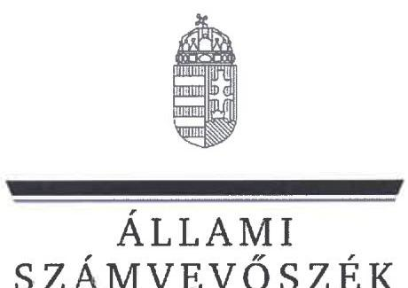
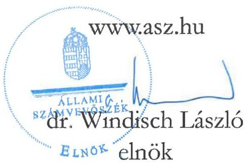
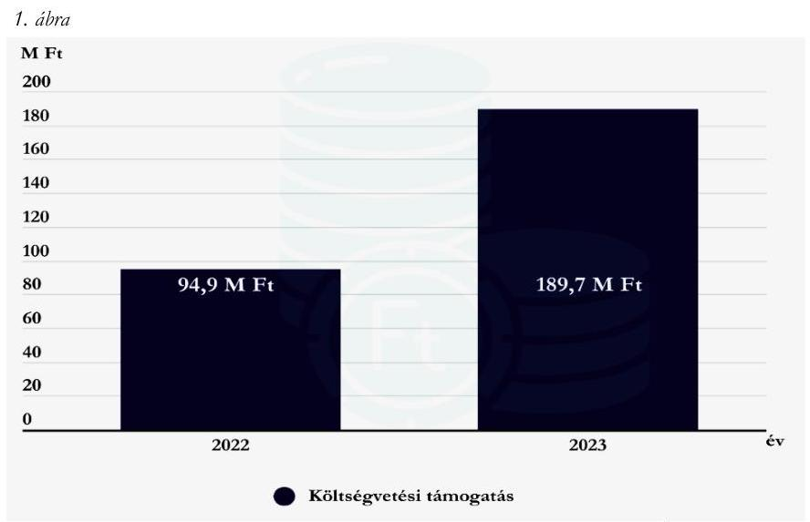
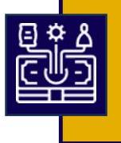

# JELENTÉS 

A költségvetési támogatásban részesülő pártalapítványok 2022-2023. évi gazdálkodása törvényességének ellenőrzése

Mi Hazánk Alapítvány

2025.

---

ÁLLAMI
SZÁMVEVŐSZÉK

# JELENTÉS 

## A költségvetési támogatásban részesülő pártalapítványok 2022-2023. évi gazdálkodása törvényességének ellenőrzése

Mi Hazánk Alapítvány

2025.

25086

---

# ELLENŐRZÉSI IGAZGATÓSÁG: 

## ELLENŐRZÉSI IGAZGATÓSÁG V.

## ELLENŐRZÉSI IGAZGATÓ:

KLINGA LÁSZLÓ ellenőrzési igazgató

## ELLENŐRZÉSVEZETŐ:

KAKAS SÁNDOR igazgatósági tanácsadó, ellenőrzésvezető

## Jelenééseink az interneten a www.asz.hu címen olvashatók.

IKTATÓSZÁM: EL-4125-005/2025
TÉMASORSZÁM: 7.
ELLENŐRZÉS-AZONOSÍTÓ SZÁM: V1119

---

# TARTALOMJEGYZÉK 

AZ ELLENŐRZÉS ALAPADATAI ..... 5
AZ ELLENŐRZÖTT SZERVEZET ..... 7
ÖSSZEFOGLALÁS ..... 8
AZ ELLENŐRZÉS FÓKUSZTERÜLETEI ..... 9
MEGÁLLAPÍTÁSOK ..... 10
JAVASLATOK ..... 15
MELLÉKLETEK ..... 16
I. sz. melléklet: Értelmező szótár ..... 16
II. sz. melléklet: Ellenőrzési kritériumok ..... 17
FÜGGELÉK: ÉSZREVÉTELEK ..... 18
RÖVIDÍTÉSEK JEGYZÉKE ..... 19

---

.

---

# AZ ELLENŐRZÉS ALAPADATAI 

## AZ ELLENŐRZÉS CÉLJA

Az ellenőrzés célja annak értékelése volt, hogy a Pártalapítvány ${ }^{1}$ törvényesen gazdálkodott-e; az éves számviteli beszámolók és a Pártalapítvány tevékenységéről szóló éves jelentések a jogszabályi előírásoknak megfeleltek-e; a könyvvezetés és gazdálkodás során a vonatkozó jogszabályi rendelkezéseket és belső előírásokat betartották-e.

## AZ ELLENŐRZÉS TÍPUSA

Törvényességi ellenőrzés

## AZ ELLENŐRZÖTT IDŐSZAK

2022-2023. évek

## AZ ELLENŐRZÉS TÁRGYA

Az ellenőrzés tárgyát képezte a Pártalapítvány gazdálkodása, a könyvvezetés szabályozása és gyakorlata szabályszerűsége, az éves számviteli beszámolókra és a Pártalapítvány tevékenységéről szóló éves jelentésekre vonatkozó kötelezettség teljesítése.

Az ellenőrzés kiterjedt minden olyan körülményre és adatra, amely az ÁSZ ${ }^{2}$ jogszabályban meghatározott feladatainak teljesítéséhez, valamint az ellenőrzési program végrehajtása során felmerülő újabb összefüggések feltárásához szükséges volt.

## AZ ELLENŐRZÉS JOGALAPJA

Az ellenőrzés jogalapját az ÁSZ tv. ${ }^{3} 1 . \int(3)$ bekezdése, 5. $\int(3)$ bekezdése, valamint a Pmtv. ${ }^{4} 4 . \int(2)$ és (4) bekezdéseinek előírásai képezték.

## AZ ELLENŐRZÉS MÓDSZERE

Az ellenőrzés az ellenőrzött időszakban hatályos jogszabályok, az ellenőrzés szakmai szabályai, a jelen ellenőrzésre irányadó ÁSZ módszertanok, az ellenőrzési programban foglalt értékelési szempontok szerint került végrehajtásra.

Az ellenőrzési kérdések megválaszolásához szükséges bizonyítékok megszerzése az ellenőrzött által rendelkezésre bocsátott dokumentumokra, adatokra alapozva kérdésfeltevés (információkérés), valamint mintavételezés, továbbá helyszíni interjú útján történt. Az ellenőrzési bizonyítékként felhasználható

---

adatforrások közé tartoztak egyrészt az ellenőrzési programban felsorolt adatforrások, másrészt minden az ellenőrzés folyamán feltárt, az ellenőrzés szempontjából információt tartalmazó dokumentum.

Az ellenőrzés lefolytatásához az ellenőrzött szervezet tanúsítvány kitöltésével és az ÁSZ által kért dokumentumok, adatok, információk megküldésével és az ellenőrzés során szolgáltatott adatokat.

A Pártalapítvány kiadásai, ráfordításai elszámolásának szabályszerűségét (2. fókuszterület), a Pártalapítvány által nyújtott támogatások elszámolásának szabályszerűségét (2. fókuszterület), valamint a mérlegtételek besorolásának, év végi értékelésének, azok leltárral való alátámasztottságának szabályszerűségét (3. fókuszterület), mintavételi eljárással kiválasztott tételek alapján ellenőrizte az ÁSZ.

A 2. fókuszterületen az egyes vizsgálandó részterületek ellenőrzése részterületenként 30 elemű minta értékelésével, mintavételes, 30 db -ot meg nem haladó tételszám esetében tételes ellenőrzéssel történt. A kiadások esetében lényegességi szempontok alapján az ÁSZ további tételeket is értékelt, amelyek a kivetítésbe nem tartoztak bele. Az ÁSZ a 2. fókuszterületnél, a kiadások vonatkozásában 30-30 tételt ellenőrzött, a minták értékelése alapján statisztikai kivetítést alkalmazott, további lényegességi szempontok alapján 2022. évben 3 db, 2023. évben 17 db kiválasztott tételt ellenőrzött. Az ÁSZ a 2. fókuszterületnél a Pártalapítvány által nyújtott támogatások vonatkozásában - tekintettel arra, hogy az alapsokaság elemszáma egyik évben sem haladta meg a 30 tételt - tételes ellenőrzést végzett. Az ÁSZ a 3. fókuszterületnél, a mérlegtételek vonatkozásában 30-30 tételt ellenőrzött, a tények feltárása és azok összegzése során a megállapítások az ellenőrzött tételekre vonatkozóan kerültek megfogalmazásra.

A vizsgált terület „szabályszerü" minősítést kapott, ha a minta ellenőrzésének eredménye alapján 95\%-os bizonyossággal a teljes sokaságban az átlagos hibaarány nem haladta meg a 10\%-ot, „nem szabályszerű", ha nagyobb volt, mint $10 \%$. Amennyiben a sokaság elemszáma nem haladta meg az előírt minta elemszámot, akkor a sokaság valamennyi elemének tételes ellenőrzésére került sor.

A Pártalapítvány bevételei elszámolása szabályszerűségét teljeskörűen ellenőrizte az ÁSZ.
A gazdálkodás hibáinak kijavítására irányuló javaslatok kidolgozásakor a hatályos jogszabályok voltak az irányadóak.

---

# AZ ELLENŐRZÖTT SZERVEZET 

## Mi HAZÁNK ALAPÍTVÁNY

A Pártalapítványt a 2021. évben a Mi Hazánk Mozgalom alapította 0,2 M Ft induló vagyonnal. A Pártalapítványt a Kecskeméti Törvényszék 2021. szeptember 24-én vette nyilvántartásba.

A Pártalapítvány alapító okiratában ${ }^{5}$ rögzített célja „a Mi Hazánk Mozgalom tudományos, ismeretterjesztö, kutatási és oktatási tevékenységének elösegítése az állampolgári tájékoztatás kiszélesítése, a hazafias politikai kultúra fejlesztése és a magyar nemzeti értékek védelme érdekében.". A Pártalapítvány alapító okirat szerinti tevékenységei:

- „Kulturális, ismeretterjesztő, oktatási, hagyományőrző, tudományos és kutatási kezdeményezések, megvalósitások támogatása.
- Civil szervezeteke értékteremtő és értékmegőrző munkáinak támogatása.
- Közösségi tevékenységek segítése.
- Rendezvények szervezése, tartása hazai és nemzetközi területen."

A Pártalapítvány ügyvezető szerve a Kuratórium ${ }^{6}$, amely elnökből és két további kuratóriumi tagból állt. Az ellenőrzött időszak alatt a Kuratórium elnökének és a Kuratórium tagjainak személyében változás nem történt. A Pártalapítványnál az ellenőrzött időszakban felügyelőbizottság működött. A Pártalapítvány törvényes képviseletére a Kuratórium elnöke önállóan, a Kuratórium tagjai együttesen voltak jogosultak.

A Pártalapítvány jogszabályi előírás alapján könyvvizsgálatra nem volt kötelezett, a Pártalapítvány 2022. évi és 2023. évi egyszerűsített éves beszámolóját független könyvvizsgáló nem vizsgálta felül.

A Pártalapítvány tekintetében külső ellenőrzés, törvényességi felügyeleti ellenőrzés az ellenőrzött időszakban nem volt.

A Pártalapítvány cél szerinti tevékenységének ellátásához az ellenőrzött időszakban kizárólag költségvetési támogatásban részesült, egyéb támogatást, adományt az alapító párt ${ }^{7}$-tól, egyéb szervezettől, vagy magánszemélytől nem kapott. A Pártalapítvány az ellenőrzött időszakban gazdasági-vállalkozási tevékenységet nem végzett. A Pártalapítvány 2022. és 2023. évben kapott költségvetési támogatásának évenkénti alakulását az 1. ábra szemlélteti.

Forrás: A Pártalapítvány 2022. és 2023. évi tevékenységéről szóló éves jelentései alapján ÁSZ saját szerkesztés

---

# ÖSSZEFOGLALÁS 

Az ÁSZ ellenőrzése a Párttv. ${ }^{8}$ alapján a politikai kultúra fejlesztése érdekében tudományos, ismeretterjesztő, kutatási, oktatási tevékenység folytatása céljából, a Ptk. szerinti alapító okiraton alapuló bírósági nyilvántartásba vétellel létrejött Pártalapítvány gazdálkodására terjedt ki. A pártalapítványok törvényes gazdálkodásának (könyvvezetés, beszámolás, jelentés készítés) szabályait a Pmtv.-n túl, a Számv. tv. ${ }^{9}$ és az Eszkr. ${ }^{10}$ határozzák meg. A Pmtv. 4. § (2) bekezdése értelmében a pártalapítványok gazdálkodása törvényességének ellenőrzésére az ÁSZ jogosult. A Pmtv. 4. § (4) bekezdése alapján az ÁSZ kétévente kötelező jelleggel - ellenőrzi azoknak a pártalapítványoknak a gazdálkodását, amelyek állami költségvetési támogatásban részesültek.

A pártalapítványok ellenőrzésével az ÁSZ hozzájárul ahhoz, hogy a társadalom objektív képet alkothasson a pártalapítványok működéséről, gazdálkodásáról. Az ellenőrzésről készített számvevőszéki jelentésben megfogalmazott megállapítások, következtetések, javaslatok alapján a törvényalkotók konkrét lépéseket tehetnek a pártalapítványokra vonatkozó szabályozások megváltoztatása, átláthatóbbá, ellenőrizhetőbbé tétele érdekében. Az ellenőrzött szervezetek szintjén a hiányosságok, szabálytalanságok feltárása, az ennek kapcsán megfogalmazott megállapítások elősegíthetik a pártalapítványok szabályszerű gazdálkodását.

Az ellenőrzött időszakban az alapító okirat rögzítette a Pártalapítvány működési kereteit. Az alapító okirat a jogszabályi előírásokkal összhangban tartalmazta a Pártalapítvány működésének célját, tevékenységét, meghatározta a Pártalapítvány ügyvezető szervét, összetételét, működését. A Pártalapítvány a Számv. tv.-ben

A gazdálkodás szervezeti kereteinek kialakítása szabályszerű volt.
előírtak szerint kialakította a számviteli politikáját ${ }^{11}$, valamint elkészítette a leltározási szabályzatot ${ }^{12}$, az értékelési szabályzatot ${ }^{13}$ és a pénzkezelési szabályzatot ${ }^{14}$, továbbá rendelkezett számlarenddel ${ }^{15}$. A szabályzatok - a számlarend kivételével - az ellenőrzött jogszabályi kritériumoknak megfeleltek.

A költségvetési támogatások számviteli nyilvántartása a Számv. tv. előírásainak megfelelt. A

A kiadások elszámolása nem volt szabályszerű.

Pártalapítvány a 2022. és 2023. években a tevékenységének költségeit, ráfordításait nem szabályszerűen számolta el, mivel a könyvviteli elszámolást közvetlenül alátámasztó bizonylat esetén az utalványozást nem végezték el, az érintett könyvviteli számlákra történő hivatkozást nem tüntették fel.

A Pártalapítvány által a 2022. évben és a 2023. évben nyújtott támogatások a Pártalapítvány céljaival összhangban voltak, odaítélésük, elszámolásuk, nyilvántartásuk során a jogszabályi rendelkezéseket betartották. Az ellenőrzött kiadási tételek alapján a Pártalapítvány az alapító párt részére támogatást, vagyoni hozzájárulást az ellenőrzött időszakban nem adott, ezzel eleget tett a Párttv. előírásainak.

A tevékenységről szóló éves jelentések és a számviteli beszámolók a jogszabályi előírásoknak megfeleltek.

A Pártalapítvány a jogszabályi előírások alapján mindkét ellenőrzött évben elkészítette és közzétette a tevékenységéről szóló éves jelentéseket, valamint az egyszerűsített éves beszámolóit. Az egyszerűsített éves beszámolók mérlegtételeinek besorolása, értékelése az ellenőrzött tételek esetében szabályszerű volt.

Az ÁSZ a Kuratórium Elnöke részére a feltárt szabálytalanságok jövőbeni kiküszöbölése érdekében három javaslatot fogalmazott meg.

---

# AZ ELLENŐRZÉS FÓKUSZTERÜLETEI 

1. A Pártalapítvány törvényes gazdálkodásához szükséges szabályok kialakítása
2. A Pártalapítvány könyvvezetése és gazdálkodása során a jogszabályi előírások betartása
3. A Pártalapítvány tevékenységéről szóló jelentések, az éves számviteli beszámolók jogszabályi előírásoknak való megfelelősége

---

# 1. A Pártalapítvány törvényes gazdálkodásához szükséges szabályok kialakítása 

Összegző megállapítás A 2022-2023. években a Pártalapítvány a törvényes gazdálkodásához szükséges szabályokat kialakította.
1.1. számú megállapítás

A Pártalapítvány működésének szabályait a Pmtv., a Ptk., a Számv. tv. és az Eszkr. előírásainak megfelelően rögzítették.

Az alapító okiratban a Pmtv. és a Ptk. előírásának megfelelőn kijelölték a Pártalapítvány ügyvezető szervét, a Kuratóriumot, a Kuratórium tagjait, a Pártalapítvány képviseletére jogosult személyeket, valamint meghatározták a képviseleti jog terjedelmét, továbbá a képviseleti jog gyakorlásának módját.
Az alapító okirat a Ptk. és a Pmtv. előírásaival összhangban tartalmazta az alapítvány célját, feladatait, a működés keretszabályait, valamint a Pártalapítványhoz történő csatlakozás feltételeit, a Kuratóriumra vonatkozó szabályokat.
A Pártalapítvány a gazdálkodásával kapcsolatos könyvvezetési-nyilvántartási rendszerét az Eszkr. rendelkezéseinek megfelelően kialakította. A Pártalapítvány a 2022. és 2023. évekre vonatkozóan a Számv. tv.-ben előírtak szerint kettős könyvvitellel alátámasztott egyszerűsített éves beszámolót készített, az ellenőrzött időszakban könyvvezetését, beszámolórendszerét nem változtatta. A Pártalapítvány a pénzügyi- és számviteli feladatainak ellátását a Ptk. szerinti szerződés megkötésével, külső szervezet bevonásával biztosította.
A számviteli szolgáltatás körébe tartozó feladatok irányításával, vezetésével, a beszámoló elkészítésével megbízott személy rendelkezett a Számv. tv. és az Eszkr. rendelkezéseinek megfelelő, szükséges szakképesítéssel.
1.2. számú megállapítás

A Pártalapítvány gazdálkodására vonatkozó belső szabályozás megfelelt a Számv. tv., az Eszkr. és a Ptk. előírásainak, azonban az ÁSZ a számlarend tekintetében hiányosságot tárt fel.

A Pártalapítvány az ellenőrzött időszakban a Számv. tv.-nek megfelelően rendelkezett számviteli politikával és annak keretében elkészítette a leltározási szabályzatot, az értékelési szabályzatot és a pénzkezelési szabályzatot. A szabályzatok a Számv. tv.-ben előírtaknak megfeleltek. A Pártalapítvány rendelkezett számlarenddel, önálló szabályzatként bizonylati renddel ${ }^{16}$. A számlarend a 2023. évre vonatkozóan a Számv. tv. 161. § (2) bekezdés a) pontjában foglaltakkal ellentétben nem tartalmazta minden alkalmazásra kijelölt számla számjelét és megnevezését (Számlarend és mellékletét képező számlatükör szerint: 86981 A Pártalapítvány által nyújtott támogatás, 86982 „Véglegesen nem feji. célra átadott pénzeszköz", 86983 „Alapítványi befizetések, adott támogatások", a 2023. évi főkönyvi nyilvántartás szerint: 86981 „Magyar Önvédelmi Egyesület rendezvények támogatás", 86982 „Innovativ K.A. Magyar Sziget", 86983 „Innovativ K.A. Magyar Jelen támogatása").

---

A Pártalapítvány céljaira rendelt vagyont és annak felhasználási módját a Ptk. előírásaival összhangban az alapító okiratban rögzítették, amellyel összhangban a Pártalapítvány SZMSZ ${ }^{17}$-ében is rendelkeztek az alapítványi vagyonról és felhasználásának módjáról. A Pártalapítvány céljaira rendelt vagyon nyilvántartását, elszámolása rendjét, e vagyon nyilvántartásának továbbrészletezését a Ptk., a Számv. tv. és az Eszkr. rendelkezéseivel összhangban biztosították.
1.3. számú megállapítás

A Pártalapítvány alapcélja ellátásához kapcsolódó gazdálkodási tevékenysége a Ptk. és a Pmtv. rendelkezéseinek megfelelő volt.

A Pártalapítvány a 2022. és 2023. évi tevékenységéről szóló jelentéseinek és egyszerűsített éves beszámolóinak adatai alapján a Ptk.-ban előírtaknak megfelelően nem volt korlátlan felelősségű tagja más jogalanynak, nem volt alapítója más alapítványnak, nem csatlakozott más alapítványhoz.
A Pártalapítvány alapító okiratának VIII./2. pontja a Pmtv. előírásaival összhangban tartalmazta, hogy a Pártalapítvány az alapítványi cél megvalósítása érdekében, kiegészítő jelleggel, céljaival közvetlenül összefüggő és azt nem veszélyeztető gazdasági-vállalkozási tevékenységet végezhet, ezen túlmenően az SZMSZ IV. pontjában rögzítésre került, hogy a Pártalapítvány vállalkozói tevékenységet nem folytathat. A Pártalapítvány a belső szabályozásokra figyelemmel, a 2022. és 2023. évben az egyszerűsített éves beszámolók és az azokat alátámasztó könyvviteli nyilvántartások adatai szerint gazdasági-vállalkozási tevékenységet nem folytatott.

# 2. A Pártalapítvány könyvvezetése és gazdálkodása során a jogszabályi előírások betartása 

## Összegző megállapítás

2.1. számú megállapítás

A Pártalapítvány a könyvvezetése és gazdálkodása során a jogszabályi rendelkezéseket és a belső szabályzatok előírásait az adott támogatások tekintetében betartotta, a kiadások elszámolása nem volt szabályszerű.
A Pártalapítvány a 2022-2023. években a kapott támogatásokat szabályszerűen fogadta el, számolta el.

A Pártalapítvány a 2022. és 2023. évi Kv.tv. ${ }^{18}$, továbbá az 1284/2022. (VI. 7.) Korm. határozat ${ }^{19}$ alapján figyelemmel a 2023. évi LXXIII. tv. ${ }^{20}$-ben és a 2024. évi XLVIII. tv. ${ }^{21}$-ben foglaltakra - a 2022. évben 94,9 M Ft, a 2023. évben 189,7 M Ft költségvetési támogatásban részesült. A Pártalapítvány az ellenőrzött időszakban a költségvetésből juttatott támogatáson túl egyéb forrásból egyik évben sem kapott támogatást.
A Pártalapítvány az Eszkr. előírásainak megfelelően, a számlarendben foglaltak szerint az egyéb bevételeken belül mutatta ki a központi költségvetésből kapott támogatást. A Pártalapítvány az ellenőrzött időszakban nem kapott továbbutalási céllal támogatást.
A Pártalapítvány az Eszkr. rendelkezéseinek megfelelően, a 2022. és 2023. évi egyszerűsített éves beszámolói eredménykimutatásában az egyéb bevételeken belül részletezte a kapott támogatások összegét.

---

# 2.2. számú megállapítás 

A Pártalapítvány által a 2022. évben és a 2023. évben nyújtott cél szerinti támogatások odaítélése, elszámolása, beszámolóban történő bemutatása szabályszerű volt.

A Pártalapítvány a 2022. évben öt támogatott részére, hat alkalommal nyújtott cél szerinti támogatást, összesen 61,4 M Ft összegben, a 2023. évben hét támogatott részére, kilenc esetben nyújtott cél szerinti támogatást, összesen 150,9 M Ft összegben.
A Számv. tv. rendelkezéseinek megfelelően a támogatás az Egyéb ráfordításokon belül került elszámolásra, a 2022. évben „A Pártalapítvány által nyújtott támogatás" megnevezésű főkönyvi számon, a 2023. évben az „ADOTT TÁMOGATÁSOK" megnevezésű főkönyvi számon belül alszámlákon.

A Pártalapítvány által a 2022. és 2023. évben nyújtott cél szerinti támogatások vonatkozásában az ÁSZ az alábbiakat állapította meg:

- a támogatások odaítéléséről a Ptk. rendelkezéseinek megfelelően a Pártalapítvány legfőbb szerve, a Kuratórium döntött,
- a támogatás célja összhangban volt a jogszabályi rendelkezésekkel és az alapító okiratban foglaltakkal,
- a támogatások kedvezményezettjei megfeleltek a Ptk. vizsgált előírásainak,
- a támogatási szerződések és a támogatásokról szóló kuratóriumi döntések összhangban voltak egymással,
- a támogatási szerződések tartalmazták a kedvezményezettnek a támogatás felhasználásáról való beszámolási kötelezettségét, amelynek a kedvezményezettek eleget tettek,
- a támogatás összegének a kifizetése - egy vagy több részletben - minden esetben a támogatási döntés szerinti kedvezményezett részére, a támogatási szerződésekben megjelölt bankszámlákra történt.
- a kedvezményezettek a támogatási szerződések 10. pontjában rögzíttettek alapján a támogatás felhasználásáról (két támogatás kivételével, amelyek esetében az elszámolási határidő még nem járt le, vagy az elszámolási határidőt nem rögzítették) - bizonylatokkal alátámasztott módon elszámoltak a Pártalapítvány felé. Az elszámolások elfogadásáról a Pártalapítvány kuratóriumi határozatokkal döntött.
A Pártalapítvány a 2022. évi és 2023. évi egyszerűsített éves beszámolójának közhasznúsági melléklete az Ectv. ${ }^{22}$ előírásának megfelelően tartalmazta a közhasznú cél szerinti juttatásokról készült kimutatást. A Pártalapítvány 2022. és 2023. évi tevékenységről szóló éves jelentés a Pmtv.-ben foglaltaknak megfelelően tartalmazta a Pártalapítvány által nyújtott támogatással kapcsolatos adatokat.
2.3. számú megállapítás

A Pártalapítvány kiadásainak elszámolása a 2022. és a 2023. évben nem szabályszerűen történt.

A Pártalapítvány kiadásainak elszámolása a 2022. és 2023. években nem volt szabályszerű, a kiadási tételek ellenőrzése során az ÁSZ az alábbiakat állapította meg:

- a költségelszámolás, ráfordítás számviteli elszámolását a Számv. tv.-ben meghatározott dokumentumokkal alátámasztották,
- a költségeket és a ráfordításokat a Számv. tv. előírásainak megfelelő költségnemre számolták el,
- a gazdasági múvelet elrendelése, a teljesítések igazolása a Számv. tv.-ben rögzítetteknek megfelelően megtörtént,

---

- a könyvviteli elszámolást alátámasztó bizonylatok a Számv. tv. 167. § (1) bekezdés c) pontjában foglaltak ellenére nem tartalmazták az utalványozó aláírását,
- a könyvviteli elszámolást alátámasztó bizonylatokon a könyvelés módjára, az érintett könyvviteli számlákra történő hivatkozás a Számv. tv. 167. § (1) bekezdés h) pontjának előírása ellenére nem történt meg,
- a kiadások esetén az alapító okiratban meghatározott pártalapítványi céltól eltérő tevékenység vagy működés a rendelkezésre álló ellenőrzési bizonyítékok alapján nem volt megállapítható.

# 3. A Pártalapítvány tevékenységéről szóló jelentések, az éves számviteli beszámolók jogszabályi előírásoknak való megfelelősége 

## Összegző megállapítás

A Pártalapítvány a tevékenységéről szóló 2022. és a 2023. évi jelentéseket és az egyszerűsített éves beszámolókat a vonatkozó jogszabályi előírásoknak megfelelően készítette el és tette közzé.
3.1. számú megállapítás

A Pártalapítvány a 2022. és a 2023. évi tevékenységéről szóló éves jelentés készítési és közzétételi kötelezettségét a Pmtv. előírásának megfelelően, szabályszerűen teljesítette.

A Pártalapítvány a Pmtv. előírásainak megfelelően a 2022. és a 2023. évre vonatkozóan elkészítette a tevékenységéről szóló éves jelentését. A tevékenységről szóló éves jelentések a Pmtv.-ben foglaltaknak megfelelően tartalmazták:

- a számviteli beszámolót,
- a költségvetési támogatás felhasználására vonatkozó kimutatást,
- a vagyon felhasználásával kapcsolatos kimutatást,
- a cél szerinti juttatások kimutatását,
- a központi költségvetési szervtől kapott támogatás mértékét,
- az egyes vezető tisztségviselőinek nyújtott juttatások értékét, illetve összegét,
- a Pártalapítvány tevékenységéről szóló rövid tartalmi beszámolót.

A Pártalapítvány 2022. és 2023. évi tevékenységéről szóló éves jelentéseit a felügyelőbizottság megvizsgálta, a Pmtv. előírásának megfelelően a Kuratórium elfogadta. A Kuratórium által elfogadott, tevékenységről szóló éves jelentések a Pmtv. előírásainak megfelelően a Magyar Közlöny mellékleteként megjelenő Hivatalos Értesítőben határidőben megjelentek. A 2022. és 2023. évi tevékenységről szóló jelentéseit a Pmtv. előírásainak megfelelően a Pártalapítvány honlapján határidőben közzétette.
3.2. számú megállapítás

A Pártalapítvány a Számv. tv., az Eszkr., az Ectv. és a Pmtv. előírásainak megfelelően elkészítette, letétbe helyezte és közzétette 2022. és 2023. évi egyszerűsített éves beszámolóit.

A Pártalapítvány a Számv. tv., valamint az Eszkr. és az Ectv. előírásainak megfelelően a 2022. és 2023. évi működéséről, vagyoni, pénzügyi és jövedelmi helyzetéről az üzleti év könyveinek lezárását követően, az

---

üzleti év utolsó napjával elkészítette egyszerűsített éves beszámolóit, kiegészítő és közhasznúsági mellékleteit.

A Pártalapítvány 2022. évi és 2023. évi egyszerűsített éves beszámolóját a felügyelőbizottság megvizsgálta, a Kuratórium határozattal elfogadta. A Kuratórium által elfogadott 2022. és 2023. évi egyszerűsített éves beszámoló, valamint közhasznúsági melléklet az Ectv. előírásának megfelelően - határidőn belül - az $\mathrm{OBH}^{23}$ honlapján közzétételre került és a Pártalapítvány saját honlapján teljesítette közzétételi kötelezettségét.

A Pártalapítvány a 2022. és a 2023. évi egyszerűsített éves beszámolóinak ellenőrzött mérlegtételeit a Számv. tv. előírásainak megfelelően leltárral alátámasztotta.

A 2022. és 2023. évi egyszerűsített éves beszámolók mérlegtételeit megfelelő főkönyvi számon tartották nyilván, a mérlegtételek tartalma, besorolása és bekerülési értékének meghatározása megfelelt a Számv. tv. és az Eszkr. előírásainak.

A Pártalapítvány a Számv. tv., az Eszkr. és a Pmtv. előírásainak megfelelően a 2022. és a 2023. évi egyszerűsített éves beszámolóiban biztosította a költségvetési támogatások elkülönített nyilvántartását, bemutatását.
3.3. számú megállapítás

A Pártalapítvány céljaira rendelt vagyonnak a kezelése és védelme, az arról való beszámolás szabályszerű volt.

Az alapító párt a Ptk.-ban foglalt előírásoknak megfelelően az alapító okiratban meghatározta a Pártalapítvány céljait és tevékenységét, valamint a vagyoni hozzájárulás értékét, valamint az alapítói vagyon kezelésének és felhasználásának szabályait, amellyel összhangban a Pártalapítvány SZMSZ-e is tartalmazott rendelkezéseket. A 2022. és 2023. évben a Pártalapítvány céljaira rendelt vagyon nyilvántartásának, elszámolásának rendjét, a vagyon nyilvántartásának tovább részletezését biztosították.
A Pártalapítvány hasznosításra az államháztartásból ingyenesen átadott vagyont, illetve véglegesen az államháztartásból tulajdonba adott vagyont nem kapott, nem keletkezett az Nvtv. ${ }^{24}$, valamint a Vtvr. ${ }^{25}$ előírásai szerinti vagyonhoz kapcsolódó nyilvántartási, adatszolgáltatási kötelezettsége.

---

# JAVASLATOK 

Az ÁSZ tv. 33. § (1) bekezdésében foglaltak értelmében az ellenőrzött szervezet vezetője köteles a jelentésben foglalt megállapításokhoz kapcsolódó intézkedési tervet összeállítani és azt a jelentés kézhezvételétől számított 30 napon belül az ÁSZ részére megküldeni. Amennyiben az ellenőrzött szervezet vezetője nem küldi meg határidőben az intézkedési tervet, vagy továbbra sem elfogadható intézkedési tervet küld, az Állami Számvevőszék elnöke az ÁSZ tv. 33. § (3) bekezdése a) és b) pontjaiban foglaltakat érvényesítheti.

## A MI HAZÁNK ALAPÍTVÁNY KURATÓRIUMI ELNÖKE RÉSZÉRE

1. Gondoskodjon a számlarend Számv. tv. 161. § (2) bekezdés a) pontjában elöírtaknak megfelelő tartalommal való elkészitéséről.
2. Gondoskodjon arról, hogy a kiadások elszámolását alátámasztó bizonylatok a Számv. tv. 167. § (1) bekezdés c) pontjának elöírása szerint tartalmazzák az utalványozó személy aláírását.
3. Gondoskodjon arról, hogy a kiadások elszámolását alátámasztó bizonylatok a Számv. tv. 167. § (1) bekezdés h) pontjának elöírása szerint tartalmazzák a könyvelés módjára, az érintett könyvviteli számlákra történő hivatkozást.

---

# MELLÉKLETEK 

## I. SZ. MELLÉKLET: ÉRTELMEZŐ SZÓTÁR

alapítvány
gazdasági-vállalkozási tevékenység
költségvetési támogatás
pártalapítvány

Az alapítvány az alapító által az alapító okiratban meghatározott tartós cél folyamatos megvalósítására létrehozott jogi személy. Az alapító az alapító okiratban meghatározza az alapítványnak juttatott vagyont és az alapítvány szervezetét. Alapítvány nem alapítható gazdasági tevékenység folytatására. Az alapítvány az alapítványi cél megvalósításával közvetlenül összefüggő gazdasági tevékenység végzésére jogosult. Alapítvány nem lehet korlátlan felelősségű tagja más jogalanynak, nem létesíthet alapítványt és nem csatlakozhat alapítványhoz.
(Forrás: Ptk. 3:378. §, 3:379. § (1)-(3) bekezdés)
A jövedelem- és vagyonszerzésre irányuló vagy azt eredményező, üzletszerűen végzett gazdasági tevékenység, kivéve az adomány (ajándék) elfogadását, a pénzeszközök betétbe, értékpapírba, társasági részesedésbe történő elhelyezését és az ingatlan megszerzését, használatának átengedését és átruházását. (Forrás: Ectv. 2. § 11. pont, Pmtv. 2021. július 1. napjától hatályos 3. § (6a) bekezdés)
A pártalapítványoknak a Párttv. 9/A. § (1) bekezdése és a Pmtv. 1. § előírásainak értelmében, az éves költségvetési törvények szerint jellemzően az 1. számú melléklet I. Országgyűlés fejezet 9. Pártalapítványok támogatás címen - az állami költségvetésből juttatott támogatás.
A politikai kultúra fejlesztése érdekében, tudományos, ismeretterjesztő, kutatási és oktatási tevékenység folytatása céljából pártok által létrehozott, külön jogszabályban - a Pmtv. 1. § és 3. § (1) bekezdése - meghatározott, jogi személynek minősülő egyéb szervezet, speciális jogállású alapítvány.
(Forrás: Párttv. 9/A. § (1) bekezdés, Pmtv. 1. §, Ectv. 2. § 6. c) pont, Számv. tv. 3. § (1) bekezdés 4. pont, Eszkr. 2. § (1) bekezdés 1) pont)

---

## FOKUSZTERÜLET

1. A Pártalapítvány törvényes gazdálkodásához szükséges szabályok kialakítása
2. A Pártalapítvány könyvvezetése és gazdálkodása során a jogszabályi előírások betartása
3. A Pártalapítvány tevékenységéről szóló jelentések, az éves számviteli beszámolók jogszabályi előírásoknak való megfelelősége

## FŐ ELLENŐRZÉSI KRITÉRIUMOK

Ptk. 3:21-3:25. §, 3:29-3:30. §, 3:379. § (3) bekezdés, 3:391. § (1) bekezdés c) pont, 3:391. § (2) bekezdés h) pont, 3:397-3:398. §, 3:400.§ (2) bekezdés
Ectv. 28-31. §
Eszkr. 7. § (3)-(4) bekezdés b) pont, (6) bekezdés, 8. $\S$ (2) bekezdés, 9. $\S$ (4) bekezdés, 12-15. $\S$

Számv. tv. 14. § (3)-(4) bekezdés, 14. § (5) bekezdés a), b) és d) pont, 14. § (8) bekezdés, 14. § (12) bekezdés, 16. § (4) bekezdés, 96. §, 150. §, 161. § (1) bekezdés, 161. § (2) bekezdés c), d) pont, 161. § (4) bekezdés

Pmtv. 3. § (6), (6a) bekezdés
Ptk. 3:384. § (1) bekezdés, 3:385. §, 3:386. §
Párttv. 5. § (2) bekezdés, 9/A. § (1) bekezdés, 9/A. § (3) bekezdés

Pmtv. 3. § (3) bekezdés, 3. § (4) bekezdés a pont, 3/A § (3) bekezdés b), d) e) pont

Kv. tv.: 1. melléklete
Kv. tv.: 1. melléklete
1284/2022 (VI.7) Korm. határozat 1. melléklet
2023. évi LXXIII. törvény 1. melléklete
2024. évi XLVIII. törvény 1. melléklete

Kbt. 5. § (2)-(3) bekezdés, 15. § (5) bekezdés, 19. §, 27. § (1)-(2) bekezdés, 111. § p), 131. §

Számv. tv. 78. § - 81. §, 160. §, 161/A. § (2) bekezdés, 165. § (1) bekezdés, 166. §, 167. § (1) bekezdés c), h) pont

Ectv. 2. § 1. pont, 29. § (7) bekezdés
Eszkr. 13. § (3) bekezdés, 9. § (9) bekezdés, 12. §
(4) bekezdés, 14. § (1) bekezdés, 29. § (4) bekezdés
2. A Pártalapítvány tevékenységéről szóló jelentések, az
éves számviteli beszámolók jogszabályi előírásoknak
való megfelelősége
Pmtv. 3/A § (3), (5) bekezdés, (6) bekezdés, 3. § (4), (6) bekezdés

Ectv. 28. § (1)-(3) bekezdés, 29. § (2)-(5) bekezdés, 30. §, 46. § (1) bekezdés

Eszkr. 7. § (1)-(3), (4) bekezdés b) pontja, (6)-(8) bekezdés, 8. § (2) bekezdés, 11. §, 12. §, 13.§ (4)-(5) bekezdés, 14. § (1) bekezdés, 23. §, 24. §, 16. §, 17. §

Számv. tv. 8. § (2) bekezdés b) pontja, 8. § (5) bekezdés, 9. § (2) bekezdés, 19. § (1) bekezdés; 23-31. §, 35. §, 44. § (2) bekezdés, 47-51. §, 52., 54-56. §, 57-59. §, 65. § (1)-(7) bekezdés, 69. §, 70. §, 91. § a) pont, 96. § (1) bekezdés, 155. § (7) bekezdés, 161. § (2)-(3) bekezdés, Számv. tv. 161/A. § (2) bekezdés, 165. § (4) bekezdés
Ptk. 3:4, 3:9 - 3:10. §, 3:378 - 3:383. §, 3:388 - 3:390. §, 3:391. § (1) bekezdés b) pont, (2) bekezdés c) pont
Nvtv. 7. § (1) bekezdés, 13. § (3) bekezdés, 13. § (4) bekezdés b) pont

Vtvr. 14. § (1)-(3) bekezdés, 17. § (1)-(2) bekezdés, melléklet II/8. pont

---

# FÜGGELÉK: ÉSZREVÉTELEK 

A jelentéstervezetet a Számvevőszék 15 napos észrevételezésre megküldte az ellenőrzött szervezet vezetőjének az ÁSZ tv. 29. §* (1) bekezdése előírásának megfelelően.

A Mi Hazánk Alapítvány Kuratóriumának elnöke a jelentéstervezetre nem tett észrevételt.

[^0]
[^0]:    * 29. § (1) Az Állami Számvevőszék az ellenőrzési megállapításait megküldi az ellenőrzött szervezet vezetőjének vagy az általa megbízott személynek, és annak, akinek személyes felelősségét állapította meg.
    (2) Az ellenőrzött szervezet vezetője és a felelősként megjelölt személy az ellenőrzés megállapításaira tizenöt napon belül írásban észrevételt tehet.
    (3) Az Állami Számvevőszék az észrevételre a beérkezésétől számított harminc napon belül írásban válaszol. A figyelembe nem vett észrevételeket köteles a jelentésben feltüntetni, és megindokolni, hogy azokat miért nem fogadta el.

---

# RÖVIDÍTÉSEK JEGYZÉKE 

${ }^{1}$ Pártalapítvány
${ }^{2}$ ÁSZ
${ }^{3}$ ÁSZ tv.
${ }^{4}$ Pmtv.
${ }^{5}$ alapító okirat
${ }^{6}$ Kuratórium
${ }^{7}$ alapító párt
${ }^{8}$ Párttv.
${ }^{9}$ Számv. tv.
${ }^{10}$ Eszkr.
${ }^{11}$ számviteli politika
${ }^{12}$ leltározási szabályzat
${ }^{13}$ értékelési szabályzat
${ }^{14}$ pénzkezelési szabályzat ${ }_{1}$
${ }^{15}$ számlarend
${ }^{16}$ bizonylati rend
${ }^{17}$ SZMSZ
${ }^{18} 2022$. és 2023 . évi Kv.tv.
${ }^{19}$ 1284/2022. (VI. 7.) Korm. határozat
${ }^{20}$ 2023. évi LXXIII. törvény
${ }^{21}$ 2024. évi XLVIII. törvény
${ }^{22}$ Ectv.
${ }^{23} \mathrm{OBH}$
${ }^{24}$ Nvtv.
${ }^{25}$ Vtvr.

Mi Hazánk Alapítvány
Állami Számvevőszék
2011. évi LXVI. törvény az Állami Számvevőszékről
2003. évi XLVII. törvény a pártok müködését segítő tudományos, ismeretterjesztő, kutatási, oktatási tevékenységet végző alapítványokról
Mi Hazánk Alapítvány Alapító okirata (hatályos: 2021. július 25 -től)
Mi Hazánk Alapítvány Kuratóriuma
Mi Hazánk Mozgalom
1989. évi XXXIII. törvény a pártok müködéséről és gazdálkodásáról
2000. évi C. törvény a számvitelről

479/2016. (XII.28.) Korm. rendelet a számviteli törvény szerinti egyes egyéb szervezetek beszámoló készítési és könyvvezetési kötelezettségének sajátosságairól
Mi Hazánk Alapítvány Számviteli Politikája (hatályos: 2022. január 1-től)
Mi Hazánk Alapítvány Leltározási Szabályzata (hatályos: 2022. január 1-től)
Mi Hazánk Alapítvány Értékelési Szabályzata (hatályos: 2022. január 1-től)
Mi Hazánk Alapítvány Pénzkezelési szabályzata (hatályos: 2022. január 1-től)
Mi Hazánk Alapítvány Számlarendje (hatályos: 2022. január 1-től)
Mi Hazánk Alapítvány Bizonylati rendje (hatályos: 2022. január 1-től)
Mi Hazánk Alapítvány Szervezeti és müködési szabályzata (hatályos: 2021. szeptember 28 -tól)
2021. évi XC. törvény a Magyarország 2022. évi központi költségvetéséről
2022. évi XXV. törvény Magyarország 2023. évi központi költségvetéséről

1284/2022. (VI. 7.) Korm. határozat a pártokat és a pártalapítványokat az országgyűlési képviselők 2022. évi általános választása eredményének megfelelően megillető támogatás mértékének meghatározásáról, valamint a támogatást szolgáló előirányzatok közötti átesoportosításról
2023. évi LXXIII. törvény a Magyarország 2022. évi központi költségvetéséről szóló 2021. évi XC. törvény végrehajtásáról
2024. évi XLVIII. törvény a Magyarország 2023. évi központi költségvetéséről szóló 2022. évi XXV. törvény végrehajtásáról
2011. évi CLXXV. törvény az egyesülési jogról, a közhasznú jogállásról, valamint a civil szervezetek müködéséről és támogatásáról
Országos Bírósági Hivatal
2011. évi CXCVI. törvény a nemzeti vagyonról

254/2007. (X. 4.) Korm. rendelet az állami vagyonnal való gazdálkodásról

---

1052 Budapest, Apáczai Csere János u. 10. | 1364 Budapest 4., Pf. 54
www.asz.hu | szamvevoszek@asz.hu
telefon: +36 14849100