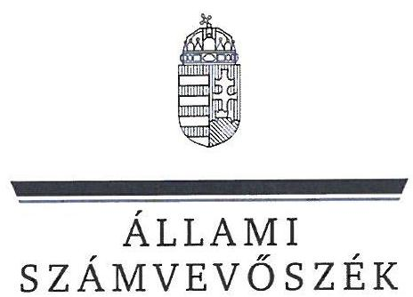
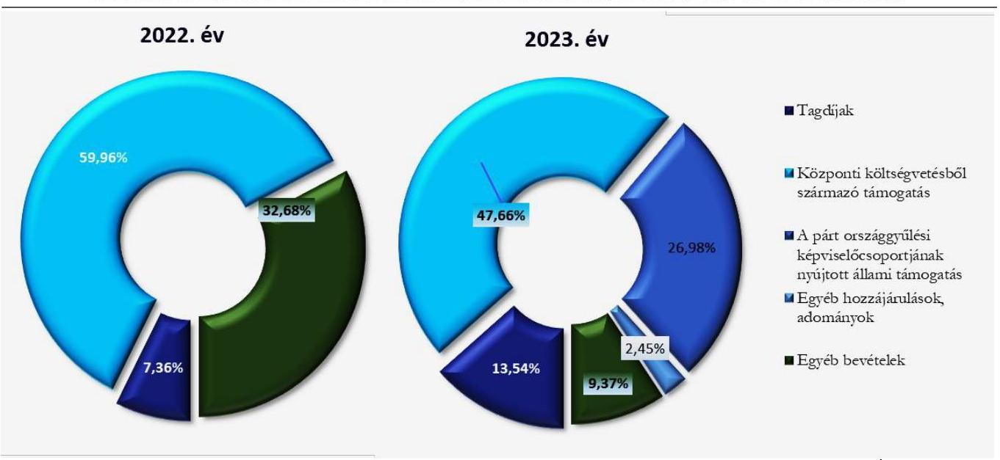
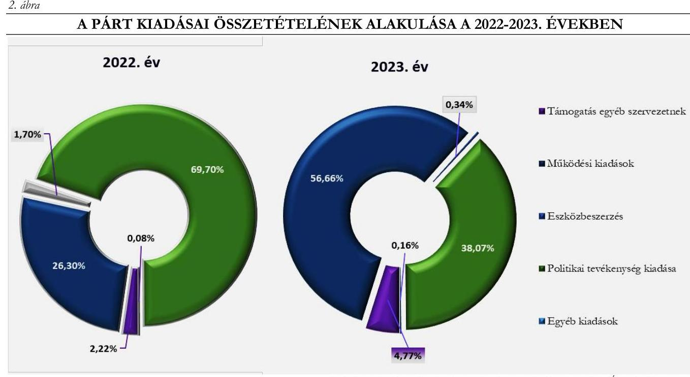

# JELENTÉS 

A költségvetési támogatásban részesülő pártok 2022-2023. évi gazdálkodása törvényességének ellenőrzése

FIDESZ - Magyar Polgári Szövetség

2025.

---

ÁLLAMI
SZÁMVEVŐSZÉK

# JELENTÉS 

## A költségvetési támogatásban részesülő pártok 2022-2023. évi gazdálkodása törvényességének ellenőrzése

FIDESZ - Magyar Polgári Szövetség

2025.

---

# ELLENŐRZÉSI IGAZGATÓSÁG: 

## ELLENŐRZÉSI IGAZGATÓSÁG V.

ELLENŐRZÉSI IGAZGATÓ:
KLINGA LÁSZLÓ igazgató

ELLENŐRZÉSVEZETŐ:
SOLYMÁR ÁGNES ellenőrzésvezető

Jelentéseink az interneten a www.asz.hu címen olvashatók.

IKTATÓSZÁM: EL-4133-002/2025
TÉMASORSZÁM: 6
ELLENŐRZÉS-AZONOSÍTÓ SZÁM: V1121

---

# TARTALOMJEGYZÉK 

AZ ELLENŐRZÉS ALAPADATAI ..... 5
AZ ELLENŐRZÖTT SZERVEZET ..... 7
ÖSSZEFOGLALÁS ..... 8
AZ ELLENŐRZÉS FÓKUSZKÉRDÉSEI ..... 9
MEGÁLLAPÍTÁSOK ..... 10
MELLÉKLETEK ..... 16
I. sz. melléklet: Értelmező szótár ..... 16
II. sz. melléklet: Ellenőrzési kritériumok ..... 18
FÜGGELÉK: ÉSZREVÉTELEK ..... 19
RÖVIDÍTÉSEK JEGYZÉKE ..... 20

---

.

---

# AZ ELLENŐRZÉS ALAPADATAI 

## AZ ELLENŐRZÉS CÉLJA

Az ellenőrzés célja annak értékelése volt, hogy a Párt ${ }^{1}$ által közzétett éves pénzügyi kimutatások a törvényi előírásoknak megfeleltek-e, a könyvvezetés és gazdálkodás során a Párt betartotta-e a vonatkozó jogszabályi és belső előírásokat, a Párt a működéséhez szabályszerűen igénybe vehető forrásokat használt-e fel, a pártok működéséről és gazdálkodásáról szóló Párttv. ${ }^{2}$-ben engedélyezett gazdasági-vállalkozási tevékenységet folytatott-e.

## AZ ELLENŐRZÉS TÍPUSA

Törvényességi ellenőrzés.

## AZ ELLENŐRZŐTT IDŐSZAK

A 2022 - 2023. évek

## AZ ELLENŐRZÉS TÁRGYA

A Párt ellenőrzése során az ellenőrzés tárgyát képezték a 2022. és a 2023. évre vonatkozó pénzügyi kimutatás elkészítésére, jóváhagyására, közzétételére, a Párt könyvvezetésére, gazdálkodására, ennek keretében a számviteli szabályozás kialakítására, a bizonylati rend, bizonylati fegyelem betartására, egyéb gazdálkodási, ellenőrzési és pénzügyi-számviteli feladatok ellátására irányuló tevékenységek. Az ellenőrzés tárgya volt továbbá a Párttv. szerinti források elszámolása és felhasználása, valamint a vagyon jogszabályi előírásoknak megfelelő használata, hasznosítása.

Az ellenőrzés kiterjedt minden olyan körülményre és adatra, amely az ÁSZ ${ }^{3}$ jogszabályban meghatározott feladatainak teljesítéséhez, valamint a program végrehajtása folyamán felmerült újabb összefüggések feltárásához szükséges volt.

Jelen ellenőrzés a 2022. évi országgyűlési képviselő-választási kampányra fordított pénzeszközök elszámolásának ellenőrzésére nem terjedt ki, azt az ÁSZ a kampányellenőrzés ${ }^{4}$ keretében ellenőrizte.

## AZ ELLENŐRZÉS JOGALAPJA

Az ellenőrzés jogszabályi alapját az ÁSZ tv. 5. § (11) bekezdés a) pontja, a Párttv. 4. § (4)-(5) bekezdései, valamint a 10. § (1), (3)-(4) bekezdései képezték.

---

# AZ ELLENŐRZÉS MÓDSZERE 

Az ellenőrzést az ellenőrzési program szempontjai, az ellenőrzött időszakban hatályos jogszabályok, az ellenőrzés általános szakmai szabályai, valamint az ellenőrzésre irányadó ÁSZ módszertanok figyelembevételével végezte az ÁSZ.

Az ellenőrzési kérdések megválaszolásához szükséges bizonyítékok megszerzése az ellenőrzött szervezet által rendelkezésre bocsátott dokumentumokra, adatokra alapozva, továbbá kérdésfeltevés (információkérés), interjú, mintavételezés útján történt. A 2022 - 2023. évi bevételeket és kiadásokat mintavételi eljárással kiválasztott tételek alapján ellenőrizte az ÁSZ.

Az ellenőrzési bizonyítékként felhasználható adatforrások közé tartoztak egyrészt az ellenőrzési programban felsorolt adatforrások, másrészt adatforrás lehetett még minden további, az ellenőrzés folyamán feltárt, az ellenőrzés szempontjából információt tartalmazó dokumentum.

Az ellenőrzés lefolytatásához az ellenőrzött szervezet a tanúsítványok kitöltésével, valamint az ÁSZ által kért dokumentumok, adatok, információk megküldésével és az ellenőrzés során szolgáltatott adatokat.

Az ÁSZ a tételes ellenőrzés mellett statisztikai alapú, véletlenszerű és kockázatalapú mintavételezést és értékelést is alkalmazott. A statisztikai alapú mintavételnél a minták kiválasztása rétegzett mintavételezéssel történt, amelynek értékelése: „szabályszerü", ha a minta ellenőrzésének eredménye alapján $95 \%$-os bizonyossággal a teljes sokaságban az átlagos hibaarány nem haladta meg a $10 \%$-ot, „nem szabályszzerü", ha nagyobb volt, mint $10 \%$. Abban az esetben, ha a teljes sokaság tekintetében a $10 \%$-os hibaarányhoz való viszony megítélésének megbízhatósága nem érte el a $95 \%$-ot, annak elérése érdekében az értékelés további szempontokkal egészült ki, a feltárt hibák értéke is figyelembevételre került. A statisztikai alapú mintavétel kiegészült évente az öt legnagyobb forgalmi értékkel rendelkező szállító és vevő tételes ellenőrzésével a lényegesség biztosítása érdekében. Tételes ellenőrzésre kerültek a bevételek közül a központi költségvetésből származó támogatások, valamint a Párt országgyűlési képviselőcsoportjának nyújtott állami támogatások*. A kiadások közül tételes ellenőrzésre kerültek az egyéb szervezetek részére nyújtott támogatások, valamint a reklámhordozón elhelyezett hirdetések költségei. A bérköltségekből és eszközbeszerzésekből egyszerű véletlenszerű leválogatással került kiválasztásra tíz-tíz mintatétel.

A 2022. évi országgyűlési képviselő választási kampányra fordított pénzeszközök elszámolását a kampányellenőrzés keretében ellenőrizte az ÁSZ, ezért az országgyűlési képviselő választás kampányidőszakára vonatkozó bevételi és kiadási tételek nem képezték jelen ellenőrzés alapkokaságát.

Az ÁSZ az előző ellenőrzése során nem tett intézkedést igénylő megállapítást, nem fogalmazott meg javaslatot, felhívást, így az ellenőrzési program azon kérdése, hogy ,,a korábbi ÁSZ ellenörzés megállapításai alapján készített intézkedési teriben foglaltak végrebajitásra kerültek-e" megállapítás hiányában nem volt releváns.

[^0]
[^0]:    * A Párttv. 1. sz. melléklete szerinti pénzügyi kimutatás szerinti bevételeknél a Párt országgyűlési képviselőcsoportjának nyújtott állami támogatás soron került bemutatásra a Párt országgyűlési képviselőcsoportja által nyújtott támogatás, mint továbbadott támogatás az OGY törvényben meghatározottak szerint.

---

# AZ ELLENŐRZÖTT SZERVEZET

## FIDESZ - MAGYAR POLGÁRI SZÖVETSÉG

A FIDESZ - Magyar Polgári Szövetség 1988-ban jött létre, működésének alapvető szabályait a Párttv. határozza meg. A Párt Alapszabály ${ }_{1-2}$-ben ${ }^{5}$ rögzített céljai között szerepel az ember méltóságán és felelősségvállalásán alapuló polgári társadalom megszilárdítása, a nemzet összetartó erejének növelése, valamint az európai kultúra és értékek megőrzése.

A Párt legfelsőbb tanácskozó és döntéshozó szerve a Kongresszus. Az Országos Választmány ${ }^{6}$ a Párt információs, egyeztető és döntéshozó fóruma, melynek feladatai közé tartozik az Országos Elnökség ${ }^{7}$ által beterjesztett költségvetésről és annak végrehajtásáról szóló beszámoló elfogadása. A Kongresszus munkájának elősegítése és döntéseinek előkészítése érdekében az Alapszabály ${ }_{1-2}$-ben rögzített Bizottságok ${ }^{8}$ egyike a Felügyelő és Számvizsgáló Bizottság.

A Párt 2003-ban létrehozta a Szövetség a Polgári Magyarországért Alapítványt. A Párt gazdasági társaságot nem alapított.

A Párt pénzügyi kimutatásai szerint a 2022. évben 3494021 ezer Ft bevételt és 3609334 ezer Ft kiadást, a 2023. évben 2127669 ezer Ft bevételt és 3355559 ezer Ft kiadást számolt el. A 2022. és 2023. évi pénzügyi kimutatások főbb adatait az 1. számú táblázat tartalmazza:

|  1. táblázat | adatok ezer Ft-ban)  |
| --- | --- |
|  A PÁRT 2022-2023. ÉVI PÉNZÜGYI KIMUTATÁSAINAK ADATAI |   |
|  BEVÉTELEK | 2022. EV  |
|  Tagdíjak | 208645  |
|  Központi költségvetésből származó támogatás | 1700953  |
|  A párt országgyűlési képviselőcsoportjának nyújtott állami támogatás | 927140  |
|  Egyéb hozzájárulások, adományok | 557918  |
|  Egyéb bevétel | 99365  |
|  Összes bevétel a gazdasági évben | 3494021  |
|  KIADÁSOK | 2022. EV  |
|  Támogatás egyéb szervezeteknek | 80100  |
|  Működési kiadások | 949346  |
|  Eszközbeszerzés | 61321  |
|  Politikai tevékenység kiadása | 2515531  |
|  Egyéb kiadások | 3036  |
|  Összes kiadás a gazdasági évben | 3609334  |

[^0] [^0]: Forrás: A Párt 2022. és a 2023. évi pénzügyi kimutatásai (ÁSZ saját szerkesztés)

---

# ÖSSZEFOGLALÁS 

A Párttv. alapján a párt olyan egyesület, amely nyilvántartott tagsággal rendelkezik, és amely a nyilvántartásba vételét végző bíróság előtt kinyilvánítja, hogy a Párttv. rendelkezéseit magára nézve kötelezőnek ismeri el.

Az ÁSZ törvényességi szempontok szerint kétévente ellenőrzi azoknak a pártoknak a gazdálkodását, amelyek a központi költségvetésből rendszeres támogatásban részesültek. A Párt pénzügyi kimutatásai szerint a 2022. évben 1700953 ezer Ft, a 2023. évben 1014000 ezer Ft költségvetési támogatásban részesült. A 2022. évi támogatás tartalmazza az országgyűlési képviselő-választásra kapott összeget is.

Az ÁSZ a kampányellenőrzés keretében ellenőrizte a 2022. évi országgyűlési képviselő választásra fordított állami költségvetésből származó pénzeszközök és a Párttv.-ben meghatározott más pénzeszközök felhasználását, emiatt jelen ellenőrzés megállapításai a Párt gazdálkodásának a kampányellenőrzéssel nem érintett részére vonatkoznak.

A szabályozási környezetet szabályszerűen kialakították.

A pénzügyi kimutatásokat szabályszerűen összeállították, a bevételek és kiadások elszámolása a jogszabályi és belső szabályozási elöírásoknak megfelelt.

A Párt az ellenőrzött időszakban a jogszabályi előírásoknak megfelelően kialakította a gazdálkodás és számvitel kereteit meghatározó, a pénzügyi kimutatások összeállítására és az azokat alátámasztó könyvvezetésére is kiterjedő belső szabályzatait. A Párt belső szabályzatai tartalmazták a pénzügyi-gazdasági tevékenység ellenőrzésére vonatkozó általános előírásokat is.

A Párt a 2022-2023. évekre vonatkozó pénzügyi kimutatásait a Párttv.-ben előírt tartalommal, határidőben elkészítette, a Magyar Közlöny mellékletét képező Hivatalos Értesítőben, valamint saját honlapján közzétette. A pénzügyi kimutatásokban a Párttv. előírását betartva az éves szinten ötszázezer forintot meghaladó hozzájárulásokat - a hozzájárulást adó megnevezésével és az összeg megjelölésével - külön feltüntette. A Párt pénzügyi kimutatásaiban szereplő adatokat a főkönyvi és analitikus nyilvántartások adatai
alátámasztották. A 2022-2023. évi pénzügyi kimutatás egyes kiadási és bevételi soraiban szereplő adatok csak az előírt jogcímű, szabályszerűen elszámolt összegeket tartalmazták. A Pártnál tiltott támogatás gyanúja az ellenőrzött területeken, illetve az ellenőrzött mintatételek esetében nem merült fel. A bevételek és kiadások elszámolásával kapcsolatos mintatételek esetében a Párt betartotta a jogszabályok és a belső szabályzatok előírásait. A Párt gazdálkodása során megfelelően kialakította a vagyongazdálkodás kereteit, a vagyon nyilvántartása, használata, hasznosítása szabályszerű volt.

A gazdálkodási tevékenység ellenörzése az elöírásoknak megfelelően müködött.

A Párt létrehozta a Felügyelőbizottságot ${ }^{8}$, megalkotta a gazdálkodásának és törvényes működésének ellenőrzésére vonatkozó szabályokat. A Párt a belső előírások szerinti ellenőrzéseket szabályszerűen elvégezte.

---

# AZ ELLENŐRZÉS FÓKUSZKÉRDÉSEI 

1.- A Párt a jogszabályi előírásoknak megfelelően kialakította-e a pénzügyi kimutatás összeállítására és az azt alátámasztó könyvvezetésre vonatkozó belső szabályozást?
2.- A Párt pénzügyi kimutatása, az azt alátámasztó könyvvezetése, a bevételek, kiadások elszámolása, valamint a vagyon nyilvántartása és használata, hasznosítása megfelelt-e a jogszabályi és belső előírásoknak?
3.- A Párt gazdálkodásának ellenőrzése az előírásoknak megfelelően müködött-e?

---

# 1. A Párt a jogszabályi előírásoknak megfelelően kialakította-e a pénzügyi kimutatás összeállítására és az azt alátámasztó könyvvezetésre vonatkozó belső szabályozást? 

Összegző megállapítás A Párt a 2022 - 2023. években a pénzügyi kimutatásai összeállítására és az azt alátámasztó könyvvezetésre vonatkozó belső szabályozását a jogszabályi előírásoknak megfelelően kialakította.

A Párt pénzügyi kimutatásai összeállítására és az azt alátámasztó könyvvezetésre vonatkozó belső szabályozása az ellenőrzött időszakban szabályszerű volt, ehhez a Párt a Számv. tv.-ben foglaltaknak megfelelően elkészítette Számviteli politikáját ${ }^{10}$, illetve az ennek keretében elkészítendő Eszközök és a források leltárkészítési és leltározási szabályzatát ${ }^{11}$, az Eszközök és a források értékelési szabályzatát ${ }^{12}$, a Pénzkezelési szabályzatot ${ }^{13}$, valamint a Számlarendet ${ }^{14}$.
A Párt kialakította Költségvetési szabályzatát ${ }^{15}$, melyben a Számv. tv. előírásaival összhangban rögzítette a gazdálkodás feltételeit. Az Országos Választmány a Tagdíjfizetési ${ }^{16}$ szabályzatban meghatározta az Alapszabályban foglalt kereteken belül a tagdíjak mértékét.
A Párt a vezetői ellenőrzés kereteit az Alapszabály ${ }_{1-2}$-ben, valamint a Számviteli politika pénzkezelési szabályzat részében és a Költségvetési szabályzatban határozta meg. A Párt az ellenőrzési rendszer működéséhez szabályzataiban meghatározta a szerződéskötés és kötelezettségvállalás rendjét, a gazdálkodási jogosítványokat, továbbá a gazdálkodási jogosítványokkal rendelkező személyeket és feladataikat.

---

# 2. A Párt pénzügyi kimutatása, az azt alátámasztó könyvvezetése, a bevételek, kiadások elszámolása, valamint a vagyon nyilvántartása és használata, hasznosítása megfelelt-e a jogszabályi és belső előírásoknak? 

Összegző megállapítás

2.1. számú megállapítás

A Párt 2022. és 2023. évi pénzügyi kimutatásai, az azt alátámasztó könyvvezetése, a bevételek, kiadások elszámolása, valamint a vagyon nyilvántartása, használata, hasznosítása megfelelt a jogszabályi és a belső előírásoknak.

A Párt a 2022 - 2023. évre vonatkozóan elkészítette a Párttv.-ben előírt tartalmú pénzügyi kimutatásait, az azokat alátámasztó könyvvezetése, számviteli nyilvántartási rendszere szabályszerű volt.

A Párt a 2022 - 2023. évben a Párttv. előírásának megfelelően pénzügyi kimutatásait határidőben elkészítette, a Ptk., valamint az Alapszabály ${ }_{1,2}$-ban meghatározottak szerint azokat a Párt Országos Választmánya a Felügyelőbizottság javaslata alapján elfogadta.
A Párttv.-ben előírtaknak megfelelően a Párt a 2022. és a 2023. évre vonatkozó pénzügyi kimutatását közzétette a Magyar Közlöny mellékletét képező Hivatalos Értesítőben, továbbá saját honlapján is megjelentette.
A pénzügyi kimutatások a Párttv.-ben meghatározottak szerint tartalmazták a tagdíjakat, a központi költségvetésből származó támogatást, az OGY törvény ${ }^{17}$ szerint a Párt országgyűlési képviselőcsoportjának nyújtott állami támogatást, az egyéb hozzájárulásokat és adományokat, valamint az egyéb bevételeket.
A Párt a 2022. és 2023. évi pénzügyi kimutatásaiban a Párttv.-ben meghatározottak szerint kiadásként szerepeltette az egyéb szervezeteknek nyújtott támogatást, a müködési kiadásokat, az eszközbeszerzést, a politikai tevékenység kiadásait és az egyéb kiadások összesített értékeit. A Párt az ellenőrzött időszakban vállalkozást nem alapított, országgyűlési képviselőcsoportja részére támogatást nem folyósított.
A Párt a Számv. tv. előírásainak eleget téve gondoskodott nyilvántartási (könyvvezetési) rendszerének oly módon való tovább részletezéséről, hogy abból a Párttv.-ben meghatározott pénzügyi kimutatás adatai rendelkezésre álltak.
A Párt a Számv. tv. szerint és a Számviteli politikában foglaltaknak megfelelően az ellenőrzött időszakban kettős könyvvitelt vezetett, amelyet analitikus nyilvántartásokkal alátámasztott.
A könyvviteli feladatokat ellátó munkavállalók a mintatételek alapján munkaköri leírással rendelkeztek, megfelelve ezzel az Mt. ${ }^{18}$ előírásainak.
A Számv. tv.-ben előírtaknak megfelelően az analitikus nyilvántartások és a főkönyvi könyvelés között az értékadatok számszerű egyeztetésének lehetőségét biztosították, a könyvviteli zárlatot a jogszabálynak megfelelően elvégezték, melynek alátámasztására az a belső szabályozásban előírt eszköz- és forrás egyeztetéseket, illetve a mennyiségi leltározást elvégezték.

---

A 2022. és 2023. évekre vonatkozóan a könyvvezetés szabályszerűségét az ellenőrzött mintatételek alapján a Számv. tv. és a belső szabályzatok előírásaival összhangban biztosították, a bevételek és kiadásokhoz kapcsolódó alapbizonylatok rendelkezésre álltak, azokat a megfelelő jogcímre számolták el.
2.2. számú megállapítás

A Párt 2022 - 2023. évi pénzügyi kimutatásaiban a bevételek szerepeltetése és könyvviteli elszámolása szabályszerű volt.

A Párt a 2022. évi pénzügyi kimutatásában 3494021 ezer Ft, a 2023. évi pénzügyi kimutatásában 2127669 ezer Ft bevételt mutatott ki, melynek alakulását az 1. ábra mutatja.
1. ábra

A PÁRT BEVÉTELEI ÖSSZETÉTELÉNEK ALAKULÁSA A 2022-2023. ÉVEKBEN

A Párt a pénzügyi kimutatások bevétel soraiban szereplő adatokat a jogszabályoknak és a belső szabályzatoknak megfelelő könyvviteli nyilvántartással támasztotta alá, a főkönyvi számlák adatai megegyeztek a pénzügyi kimutatások adataival.
A Párt bevételei a Párttv. szerinti engedélyezett forrásokból - tagdíjfizetésből, adományokból, központi költségvetési támogatásból, a Párt országgyűlési képviselőcsoportjának nyújtott állami támogatásból és egyéb bevételekből - származtak. A Párt pénzügyi kimutatásaiban szereplő adatok a jogszabályoknak és belső szabályoknak megfelelő könyvviteli nyilvántartással alátámasztottak voltak, csak az előírt jogcímű, szabályszerűen elszámolt összegeket tartalmazta. A Párt az egyéb hozzájárulások, adományok pénzügyi kimutatás soron a Párttv. előírását betartva az egy naptári év alatt adott 500 ezer Ft összeghatár feletti adományokat nevesítve rögzítette. Az országgyűlési képviselőcsoport az OGY törvény-ben foglaltak által biztosított lehetőségével élve mindkét ellenőrzött évben adott támogatást a Párt számára; 2022-ben 927140 ezer Ft-ot, 2023-ben 574022 ezer Ft-ot.
A Párt az ellenőrzött időszakban nem pénzbeli vagyoni hozzájárulásban nem részesült. A Párt az ellenőrzött időszakban - a jogszabályoknak megfelelően - kizárólag a Párttv. által meghatározott forrásokkal rendelkezett, tiltott támogatás elfogadásának gyanúja nem merült fel.
A Párt pénzügyi kimutatásaiban az egyéb bevételek soron szabályszerűen, a Párttv.-ben engedélyezett, tulajdonában álló ingóságok értékesítéséből származó bevételeket mutatta ki. A Párt a működéséhez a forrásokat az ellenőrzött mintatételek alapján szabályszerűen számolta el.

---

2.3. számú megállapítás

A Párt 2022 - 2023. évre vonatkozó pénzügyi kimutatásaiban a kiadások szerepeltetése és azok könyvviteli elszámolása szabályszerű volt.

A Párt kiadása a 2022. évben 3609334 ezer Ft, a 2023. évben 3355559 ezer Ft volt, melyeknek alakulását a 2. ábra mutatja.

A Párt 2022 - 2023. évi pénzügyi kimutatásaiban a kiadások szerepeltetése és azok könyviteli elszámolása megfelelt a jogszabályi és belső előírásoknak. A Párt az ellenőrzött időszakban a Párttv. előírásával összhangban kiadásként szerepeltette az egyéb szervezeteknek nyújtott támogatást, a működési kiadásokat, az eszközbeszerzést, a politikai tevékenység kiadásait és az egyéb kiadások összesített értékeit. A Párt - Párttv. előírásainak megfelelő - pénzügyi kimutatásának kiadási sorain a 2022 - 2023. évben csak az előírt jogcímű tételek szerepeltek, a pénzügyi kimutatásokban szereplő összegek megegyeztek a könyvviteli nyilvántartásban szereplő összegekkel és az azt alátámasztó nyilvántartásokkal. A főkönyvi könyvelésben a működési és a politikai tevékenység kiadásait a Párttv. előírásainak megfelelően elkülönítette.
A kiadási mintatételek értékelése alapján a kiadási bizonylatokon a számlák kijelölése megfelelt a Számv. tv. és a Számlarend előírásainak, a kiadásokat a megfelelő jogcímre számolták el.
Az ellenőrzött mintatételek alapján a rendszeres személyi juttatások kifizetését az Mt. előírása szerinti, szabályszerű munkaszerződések támasztották alá. A foglalkoztatási és a személyi jellegű kifizetések, illetve az ehhez kapcsolódó adatszolgáltatási kötelezettségek teljesítése megfelelt a jogszabályi és a belső szabályzatok előírásainak.
A rendszeres személyi jellegű kiadásokon és az eszközbeszerzéseken túli kiadási jogcímeken történő kifizetés elszámolása megfelelt a jogszabályi és a belső szabályzatok előírásainak. Az ellenőrzött mintatételek esetében a Számv. tv. előírása szerint, annak megfelelően a gazdasági eseményhez kapcsolódott kifizetési bizonylat. A könyvviteli elszámolást közvetlenül alátámasztó bizonylatokon a Számv. tv. előírásának megfelelően szerepelt az utalványozó és a rendelkezés végrehajtását igazoló személy aláírása.

---

A Párt eszközbeszerzéseire vonatkozó ellenőrzött mintatételek esetében azok kifizetése, elszámolása és dokumentálása az eszköz bekerülési értékének meghatározása megfelelt a Számv. tv. és az értékelési szabályzat előírásainak. Az eszközök üzembe helyezése, annak dokumentálása és az értékcsökkenés elszámolása a Számv. tv. előírásai szerint szabályszerűen megtörtént.
A Párt a 2022. és 2023. évi pénzügyi kimutatásaiban a „Támogatás egyéb szervezeteknek" soron kimutatott támogatásait bírósági nyilvántartásban szereplő szervezeteknek múködési célokra nyújtotta. A Párt elnöke által aláírt támogatási szerződésekkel összhangban a teljesített kifizetések megfeleltek a belső szabályzat előírásainak.
2.4. számú megállapítás

A Párt vagyonának nyilvántartása és használata, valamint a vagyonnal való gazdálkodása a 2022 - 2023. években szabályszerű volt.

A Párt a Számv. tv. előírásainak megfelelően a 2022 - 2023. évben előírta a vagyonnal való gazdálkodás, ezen belül a kapcsolódó feladat- és hatáskörök, felelősségi viszonyok szabályozását. A Pártnak az ellenőrzött időszakban a Párttv. szerinti vagyonmérleg készítési kötelezettsége nem volt, a céljai eléréséhez rendelt vagyont a jogszabályban meghatározott módon, szabályszerűen használta fel.
A Párt a vagyonnal való gazdálkodásának szabályait, az ezzel kapcsolatos feladat- és hatásköröket az Alapszabály ${ }_{1-2}$-ben, Számviteli politikában, Számlarendben, határozta meg. Az Alapszabály ${ }_{1-2}$ előírása szerint az Országos Elnökség kezeli a Párt vagyonát, gyakorolja a tulajdonosi jogokat.
A Párt az MFB-től származó hitellel nem rendelkezett. A Párt gazdálkodási tevékenysége keretében a tulajdonában lévő ingatlanokat nem adta bérbe, nem értékesítette.
A Párt a Leltározási szabályzatában előírt leltározással kapcsolatos feladatokat végrehajtotta, a könyvek év végi zárásához mennyiségben mérte fel és mutatta ki a főkönyvi nyilvántartásában szereplő tárgyi eszközöket.

# 3. A Párt gazdálkodásának ellenőrzése az előírásoknak megfelelően múködött-e? 

## Összegző megállapítás A Párt gazdálkodásának ellenőrzése a 2022. és a 2023. években az belső szabályzatokban meghatározott előírásoknak megfelelően múködött.

A Párt az ellenőrzési rendszer belső szabályozási kereteit a 2022 - 2023. évekre vonatkozóan az Alapszabály ${ }_{1,2}$-ben és a Költségvetési Szabályzatban határozta meg.
A Párt a Ptk.-ban foglaltaknak megfelelően létrehozta a Felügyelőbizottságot, melynek feladata volt a jogszabályok, az alapszabály betartásának, a párthatározatok végrehajtásának és a Párt gazdálkodásának ellenőrzése. A Felügyelőbizottság feladatainak a 2022. és 2023. évben - dokumentumokkal alátámasztva szabályszerűen eleget tett, így véleményezte az Országos Választmány elé terjesztett éves pénzügyi kimutatásokat is.
A Párt vezetői és munkafolyamatba épített ellenőrzési feladatait a Párt által foglalkoztatott megbízottak, munkavállalók látták el, a gazdasági területen dolgozók ellenőrzési feladatait a munkaköri leírásokban meghatározták, továbbá a pénztár ellenőri feladatokat, arra kijelölt személyeket a Pénzügyi Szabályzatban rögzítették.

---

Belső ellenőrzéseket a 2022. és 2023. évben dokumentáltan végrehajtották, az ellenőrzések intézkedést igénylő megállapítást nem tartalmaztak.
A Párt gazdálkodási vezetői ellenőrzési feladatait, különös tekintettel a Számv. tv. és a Számviteli szabályzat Pénzkezelési Szabályzata meghatározott feladatokra a gazdasági igazgató látta el, aki felelősségi körében szabályozta a gazdasági feladatok végrehajtásának és ellenőrzésének rendjét, ellenőrizte annak gyakorlati megvalósulását.

---

# MELLÉKLETEK 

I. SZ. MELLÉKLET: ÉRTELMEZŐ SZÓTÁR

Egyesület

Költségvetési támogatás

Pénzügyi kimutatás

A Párt gazdasági-vállalkozási tevékenysége

Nem pénzbeli támogatás

Ingó vagyontárgyak

Intézkedési terv

Reklám

Az egyesület a tagok közös, tartós, alapszabályban meghatározott céljának folyamatos megvalósítására létesített, nyilvántartott tagsággal rendelkező jogi személy. (Forrás: Ptk. 3:63. § (1) bekezdés)
A Számv. tv. szempontjából egyéb szervezet. (Számv. tv. 3. § 4. a) pont)
A társadalombiztosítás pénzügyi alapjai kivételével az államháztartás központi alrendszeréből ellenérték nélkül, pénzben nyújtott támogatások. (Forrás: Áht. 1. § 14. pont)
A Pártok a pénzügyi kimutatást kötelesek minden év május 31-ig a Magyar Közlönyben, valamint saját honlappal rendelkező Pártok a honlapjukon is közzétenni. (Párttv. 9. § (1) bekezdés, 1. számú melléklet)
A Párt a költségeinek fedezése és vagyonának gyarapítása érdekében a következő gazdasági-vállalkozási tevékenységeket folytathatja:
politikai céljainak és tevékenységének megismertetése érdekében kiadványokat jelentethet meg és terjeszthet, a Pártot szimbolizáló jelvényeket és más ilyen célú tárgyakat árusíthat és Pártrendezvényeket szervezhet;
a tulajdonában álló ingatlanokat és ingókat díj ellenében hasznosíthatja és elidegenítheti. (Párttv.6. § (1) bekezdés)
Vagyoni értékkel rendelkező forgalomképes dolog, szellemi alkotás, illetve vagyoni értékủ jog részben vagy egészében, véglegesen vagy ideiglenesen, teljesen vagy részben ingyenesen történő átruházása vagy átengedése, illetve szolgáltatás biztosítása. (Civil tv. 2. § 25. pont)
Ingó vagyontárgy: az ingatlannak nem minősülő dolog, kivéve a fizetőeszközt, az értékpapírt és a föld tulajdonosváltozása nélkül értékesített lábon álló (betakarítatlan) termést, terményt (pl. lábon álló fa) (Szja tv. 3. § 30. pont)

Az ellenőrzött szervezet vezetője által készített, a jelentés kézhezvételétől számított harminc napon belül az ASZ részére megküldött, az ASZ által elfogadott intézkedéseket tartalmazó terv. (ÁSZ tv. 33. §)
Gazdasági reklám: olyan közlés, tájékoztatás, illetve megjelenítési mód, amely valamely birtokba vehető forgalomképes ingó dolog - ideértve a pénzt, az értékpapírt és a pénzügyi eszközt, valamint a dolog módjára hasznosítható természeti erőket - (a továbbiakban együtt: termék), szolgáltatás, ingatlan, vagyoni értékủ jog (a továbbiakban mindezek együtt: áru) értékesítésének vagy más módon történő igénybevételének előmozdítására, vagy e céllal összefüggésben a vállalkozás neve, megjelölése, tevékenysége népszerúsítésére vagy áru, árujelző ismertségének növelésére irányul, ide nem értve:
a cégtáblát, üzletfeliratot, a vállalkozás használatában álló ingatlanon elhelyezett, a vállalkozást népszerüsítő egyéb feliratot és más grafikai megjelenítést,
az üzlethelyiség portáljában (kirakatában) elhelyezett gazdasági reklámot, a járművön, valamint tájékozódást segítő jelzést megjelenítő reklámcélú eszközön elhelyezett gazdasági reklámot, továbbá

---

Reklámhordozó
a tulajdonos által az ingatlanán elhelyezett, annak elidegenítésére vonatkozó ajánlati felhívást (hirdetést), valamint a helyi önkormányzat által lakossági apróhirdetések közzétételének megkönnyítése céljából biztosított táblán vagy egyéb felületen elhelyezett, kisméretű hirdetéseket; (Reklámtörvény3. § d) pont, Tvtv. ${ }^{19} 11 /$ F 3. pont)
A funkcióját vagy létesítésének célját tekintve túlnyomórészt reklám közzétételét, illetve elhelyezését biztosító, elősegítő vagy támogató eszköz, berendezés, létesítmény; ide nem értve a közúti közlekedési tárgyú jogszabályokban meghatározott életmentő funkciót ellátó reklámcélú eszköz. (Tvtv. 11/F. § 4. pont)

---

# II. SZ. MELLÉKLET: ELLENŐRZÉSI KRITÉRIUMOK 

## FOKUSZKÉRDÉS

1. A Párt a jogszabályi előírásoknak megfelelően kialakította-e a pénzügyi kimutatás összeállítására és az azt alátámasztó könyvvezetésre vonatkozó belső szabályozást?
2. A Párt pénzügyi kimutatása, az azt alátámasztó könyvvezetése, a bevételek, kiadások elszámolása, valamint a vagyon nyilvántartása és használata, hasznosítása megfelelt-e a jogszabályi és belső előírásoknak?
3. A Párt gazdálkodásának ellenőrzése az előírásoknak megfelelően múködött-e?

## ELLENŐRZÉSI KRITÉRIUMOK

Számv. tv. 3. §, 6. §, 12. §, 14. §, 15-16. §, 160-161/A. §, 164-169. §, 23-45. §, 46-53. §, 57-68. §, 69. §
Párttv. 4. §, 6. §, 9. §, 1. sz. melléklet
Civil tv. 2. §
479/2016. (XII. 28.) Korm. rendelet ${ }^{20}$ 4. § (1) bekezdés, 9. §, 15-16. §

Ptk. 3:4. §, 3:26-3:28. §, 3:63-3:87. §
Alapszabály ${ }_{1,2}$, a Párt belső szabályozásai
Számv. tv. 6. §, 12. §, 14. §, 159. §, 160. §, 161-161/A. §, 164-167. §
Párttv. 4. §, 6. §, 9. §, 1. sz. melléklet
Mt. 14. §, 45. §, 48. §
Szja tv. 3. §, 25. §, 47. §, 3. sz. melléklet
Ptk. 3:74. §, 6:272-6:280. §, 6:331-6:341. §
Civil tv. 2. §
Tvtv. 11/F. §, 11/G. §
Reklámtörvény ${ }^{21} 3 . \S$,
104/2017. (IV. 28.) Korm. rendelet ${ }^{22}$ 8/C. §
Art. ${ }^{23}$ 1. sz. melléklet
465/2017. (XII.28.) Korm. rendelet ${ }^{24}$
437/2015.(XII.28.) Korm. rendelet ${ }^{25}$
TAO tv. ${ }^{26}$ 4. §, 18. §
Vtv. ${ }^{27} 68 . \S$
Alapszabály ${ }_{1,2}$, a Párt belső szabályozásai
Számv. tv. 14. §, Ptk. 3:26. § (4) bekezdés, Ptk. 3:27. § (1) bekezdés, 3:82. § (1) bekezdés

Alapszabály ${ }_{1,2}$, a Párt belső szabályozásai, munkaköri leírások

---

# FÜGGELÉK: ÉSZREVÉTELEK 

A jelentéstervezetet a Számvevőszék 15 napos észrevételezésre megküldte az ellenőrzött szervezet vezetőjének az ÁSZ tv. 29. §* (1) bekezdése előírásának megfelelően.

A FIDESZ - Magyar Polgári Szövetség elnöke a jelentéstervezet megállapításaira nem tett észrevételt.

[^0]
[^0]:    * 29. § (1) Az Állami Számvevőszék az ellenőrzési megállapításait megküldi az ellenőrzött szervezet vezetőjének vagy az általa megbízott személynek, és annak, akinek személyes felelősségét állapította meg.
    (2) Az ellenőrzött szervezet vezetője és a felelősként megjelölt személy az ellenőrzés megállapításaira tizenöt napon belül írásban észrevételt tehet.
    (3) Az Állami Számvevőszék az észrevételre a beérkezésétől számított harminc napon belül írásban válaszol. A figyelembe nem vett észrevételeket köteles a jelentésben feltüntetni, és megindokolni, hogy azokat miért nem fogadta el.

---

# RÖVIDÍTÉSEK JEGYZÉKE 

${ }^{1}$ Párt
${ }^{2}$ Párttv.
${ }^{3}$ ÁSZ
${ }^{4}$ kampányellenőrzés
${ }^{5}$ Alapszabály $1-2$
${ }^{6}$ Országos Választmány
${ }^{7}$ Országos Elnökség
${ }^{8}$ Bizottságok
${ }^{9}$ Felügyelőbizottság
${ }^{10}$ Számviteli politika
${ }^{11}$ Eszközök és a források
leltárkészítési és leltározási szabályzata
${ }^{12}$ Eszközök és a források értékelési szabályzata
${ }^{13}$ Pénzkezelési szabályzat
${ }^{14}$ Számlarend
${ }^{15}$ Költségvetési szabályzat
${ }^{16}$ Tagdíjfizetési szabályzat
${ }^{17}$ OGY törvény
${ }^{18} \mathrm{Mt}$.
${ }^{19}$ Tvtv.
${ }^{20} 479 / 2016$. Korm. rendelet
${ }^{21}$ Reklámtörvény
${ }^{22}$ 104/2017. (IV.28) Korm. rend.
${ }^{23}$ Art.
${ }^{24} 465 / 2017$. (XII.28.) Korm. rend.
${ }^{25} 437 / 2015$. (XII. 28.) Korm. rend.
${ }^{26}$ TAO tv.
${ }^{27}$ Vtv.

FIDESZ-Magyar Polgári Szövetség
A Pártok müködéséről és gazdálkodásáról szóló 1989. évi XXXIII. törvény
Állami Számvevőszék
A 2022. évi országgyűlési képviselő-választási kampányra fordított pénzeszközök elszámolásának ellenőrzése címủ önálló ellenőrzés
Alapszabály ${ }_{1}$ FIDESZ - Magyar Polgári Szövetség Alapszabálya (hatályos: 2021.11.14-től)

Alapszabály ${ }_{2}$ FIDESZ - Magyar Polgári Szövetség Alapszabálya (hatályos: 2023.11.18-től)

FIDESZ - Magyar Polgári Szövetség Országos Választmánya
FIDESZ - Magyar Polgári Szövetség Országos Elnöksége a Párt irányító, döntéshozó szerve.
Mandátumvizsgáló, Ügyrendi és Összeférhetetlenségi Bizottság, Etikai Bizottság, Felügyelő és Számvizsgáló Bizottság
Felügyelő és Számvizsgáló Bizottság
Számviteli politika (hatályos: 2022.01.01-től, módosítva: 2022. 12.31., 2023. 01.16., 2023.05.01.)

Leltárkészítési és leltározási szabályzat (hatályos: 2022.01.01.-től)

Értékelési szabályzat (hatályos: 2022.01.01.-től)
Pénzügyi szabályzat (hatályos: 2022.01.01.-től, módosítva: 2023.01.16., 2023.05.01.) Számlarend (hatályos: 2022.01.01.-től, módosítva: 2022.12.13., 2023.01.16., 2023.05.01.)

A FIDESZ Költségvetési gazdálkodási Szabályzata (hatályos 2022. 01. 01-étől)
Tagdíjfizetési szabályzat (hatályos: 2004.01.01.-től)
Az Országgyűlésről szóló 2012. évi XXXVI. törvény 118/A. §
A munka törvénykönyvéről szóló 2012. évi I. törvény
A településkép védelméről szóló 2016. évi LXXIV. törvény
A számviteli törvény szerinti egyes egyéb szervezetek beszámoló készítési és könyvvezetési kötelezettségének sajátosságairól szóló 479/2016. (XII. 28.) Korm. rendelet
A gazdasági reklámtevékenység alapvető feltételeiről és egyes korlátairól szóló 2008. évi XLVIII. törvény
A településkép védelméről szóló törvény reklámok közzétételével kapcsolatos rendelkezéseinek végrehajtásáról szóló 104/2017. (IV.28) Korm. rendelet
Az adózás rendjéről szóló 2017. évi CL. törvény
Az adóigazgatási eljárás részletszabályairól szóló 465/2017. (XII.28.) Korm. rendelet
A belföldi hivatalos kiküldetést teljesítő munkavállaló költségtérítéséről szóló 437/2015. (XII. 28.) Korm. rendelet
A társasági adóról és az osztalékadóról szóló 1996. évi LXXXI. törvény
Az állami vagyonról szóló 2007. évi CVI. törvény

---

1052 Budapest, Apáczai Csere János u. 10. | 1364 Budapest 4., Pf. 54
www.asz.hu | szamvevoszek@asz.hu
telefon: +36 14849100