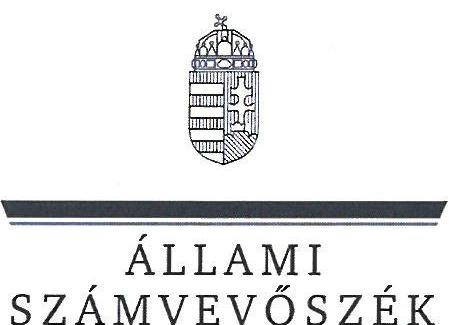
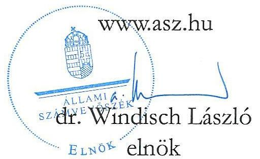
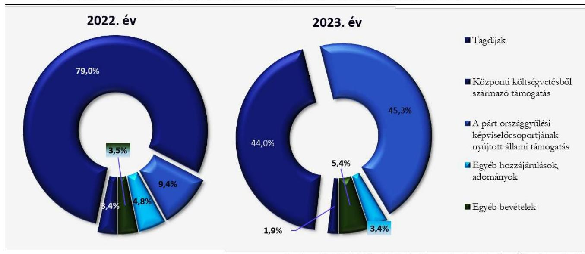
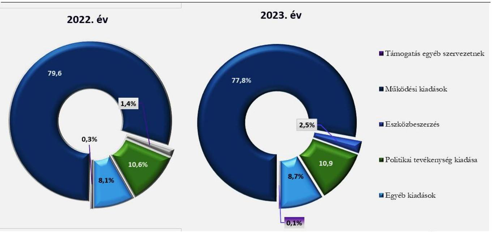

# JELENTÉS 

A költségvetési támogatásban részesülő pártok 2022-2023. évi gazdálkodása törvényességének ellenőrzése

Kereszténydemokrata Néppárt

2025.

---

ÁLLAMI
SZÁMVEVŐSZÉK

# JELENTÉS 

## A költségvetési támogatásban részesülő pártok 2022-2023. évi gazdálkodása törvényességének ellenőrzése

Kereszténydemokrata Néppárt

2025.

25088

---

# ELLENŐRZÉSI IGAZGATÓSÁG: 

## ELLENŐRZÉSI IGAZGATÓSÁG V.

## ELLENŐRZÉSI IGAZGATÓ:

## KLINGA LÁSZLÓ igazgató

## ELLENŐRZÉSVEZETŐ:

## SOLYMÁR ÁGNES ellenőrzésvezető

Jelentéseink az interneten a www.asz.hu címen olvashatók.

IKTATÓSZÁM: EL-4133-003/2025
TÉMASORSZÁM: 6
ELLENŐRZÉS-AZONOSÍTÓ SZÁM: V1121

---

# TARTALOMJEGYZÉK 

- AZ ELLENŐRZÉS ALAPADATAI ..... 5
- AZ ELLENŐRZÖTT SZERVEZET ..... 8
- ÖSSZEFOGLALÁS ..... 9
- AZ ELLENŐRZÉS FÓKUSZKÉRDÉSEI ..... 10
- MEGÁLLAPÍTÁSOK ..... 11
- MELLÉKLETEK ..... 17
I. sz. melléklet: Értelmező szótár ..... 17
II. sz. melléklet: Ellenőrzési kritériumok ..... 18
- FÜGGELÉK: ÉSZREVÉTELEK ..... 19
- RÖVIDÍTÉSEK JEGYZÉKE ..... 20

---

.

---

# AZ ELLENŐRZÉS ALAPADATAI 

## AZ ELLENŐRZÉS CÉLJA

Az ellenőrzés célja annak értékelése volt, hogy a Párt ${ }^{1}$ által közzétett éves pénzügyi kimutatások törvényi előírásoknak megfeleltek-e, a könyvvezetés és gazdálkodás során a Párt betartotta-e a vonatkozó jogszabályi és belső előírásokat, a Párt a működéséhez szabályszerűen igénybe vehető forrásokat használt-e fel, a pártok működéséről és gazdálkodásáról szóló Párttv. ${ }^{2}$-ben engedélyezett gazdasági-vállalkozási tevékenységet folytatott-e. Az ellenőrzés célja továbbá annak értékelése volt, hogy a Párt végrehajtotta-e az előző számvevőszéki jelentésben foglalt megállapításokkal összhangban készített intézkedési tervben meghatározott feladatokat.

## AZ ELLENŐRZÉS TÍPUSA

Törvényességi ellenőrzés.

## AZ ELLENŐRZÖTT IDŐSZAK

A 2022 - 2023. évek,
az utóellenőrzés tekintetében az utóellenőrzés alapját képező ÁSZ ${ }^{3}$ jelentés közzétételének napjától (2023. 04. 25.) az ellenőrzésről szóló adatszolgáltatásra felhívó levél keltének (2024.09.27.) napjáig terjedő időszak.

## AZ ELLENŐRZÉS TÁRGYA

A Párt ellenőrzése során az ellenőrzés tárgyát képezték a 2022. és a 2023. évre vonatkozó pénzügyi kimutatás elkészítésére, jóváhagyására, közzétételére, a Párt könyvvezetésére, gazdálkodására, ennek keretében a számviteli szabályozás kialakítására, a bizonylati rend, bizonylati fegyelem betartására, egyéb gazdálkodási, ellenőrzési és pénzügyi-számviteli feladatok ellátására irányuló tevékenységek. Az ellenőrzés tárgya volt továbbá a Párttv. szerinti források elszámolása és felhasználása, valamint a vagyon jogszabályi előírásoknak megfelelő használata, hasznosítása.

Az ellenőrzés kiterjedt minden olyan körülményre és adatra, amely az ÁSZ jogszabályban meghatározott feladatainak teljesítéséhez, valamint a program végrehajtása folyamán felmerült újabb összefüggések feltárásához szükséges volt.

Jelen ellenőrzés a 2022. évi országgyűlési képviselő-választási kampányra fordított pénzeszközök elszámolásának ellenőrzésére nem terjedt ki, azt az ÁSZ a kampányellenőrzés ${ }^{4}$ keretében ellenőrizte.

---

# Az ellenőrzés jogalapja 

Az ellenőrzés jogszabályi alapját az ÁSZ tv. 5. § (11) bekezdés a) pontja, a 33. § (7) bekezdése, a Párttv. 4. § (4)-(5) bekezdései, valamint a 10. § (1), (3)-(4) bekezdései képezték.

## AZ ELLENŐRZÉS MÓDSZERE

Az ellenőrzést az ellenőrzési program szempontjai, az ellenőrzött időszakban hatályos jogszabályok, az ellenőrzés általános szakmai szabályai, valamint az ellenőrzésre irányadó ÁSZ módszertanok figyelembevételével végezte az ÁSZ.

Az ellenőrzési kérdések megválaszolásához szükséges bizonyítékok megszerzése az ellenőrzött szervezet által rendelkezésre bocsátott dokumentumokra, adatokra alapozva, továbbá kérdésfeltevés (információkérés), interjú, mintavételezés útján történt. A 2022 - 2023. évi bevételeket és kiadásokat mintavételi eljárással kiválasztott tételek alapján ellenőrizte az ÁSZ.

Az ellenőrzési bizonyítékként felhasználható adatforrások közé tartoztak egyrészt az ellenőrzési programban felsorolt adatforrások, másrészt adatforrás lehetett még minden további, az ellenőrzés folyamán feltárt, az ellenőrzés szempontjából információt tartalmazó dokumentum.

Az ellenőrzés lefolytatásához az ellenőrzött szervezet a tanúsítványok kitöltésével, valamint az ÁSZ által kért dokumentumok, adatok, információk megküldésével és az ellenőrzés során szolgáltatott adatokat.

Az ÁSZ a tételes ellenőrzés mellett statisztikai alapú, véletlenszerű és kockázatalapú mintavételezést és értékelést is alkalmazott. A statisztikai alapú mintavételnél a minták kiválasztása rétegzett mintavételezéssel történt, amelynek értékelése: „szabályszerű”, ha a minta ellenőrzésének eredménye alapján 95%-os bizonyossággal a teljes sokaságban az átlagos hibaarány nem haladja meg a 10%-ot, „nem szabályszerű”, ha nagyobb, mint 10%. Abban az esetben, ha a teljes sokaság tekintetében a 10%-os hibaarányhoz való viszony megítélésének megbízhatósága nem éri el a 95%-ot, annak elérése érdekében az értékelés további szempontokkal egészült ki, a feltárt hibák értéke is figyelembevételre került. A statisztikai alapú mintavétel kiegészült évente az öt legnagyobb forgalmi értékkel rendelkező szállító és vevő tételes ellenőrzésével a lényegesség biztosítása érdekében. Tételes ellenőrzésre kerültek a bevételek közül a központi költségvetésből származó támogatások, valamint a Párt országgyűlési képviselőcsoportjának nyújtott állami támogatások*. A kiadások közül tételes ellenőrzésre kerültek az egyéb szervezetek részére nyújtott támogatások. A bérköltségekből és eszközbeszerzésekből egyszerű véletlenszerű leválogatással került kiválasztásra tíz-tíz mintatétel.

A 2022. évi országgyűlési képviselő választási kampányra fordított pénzeszközök elszámolását a kampányellenőrzés keretében ellenőrizte az ÁSZ, ezért az országgyűlési képviselő választás kampányidőszakára vonatkozó bevételi és kiadási tételek nem képezték jelen ellenőrzés alapsokaságát.

Az utóellenőrzés megállapításai az ÁSZ rendelkezésére álló dokumentumok, valamint az ellenőrzött szervezet által rendelkezésre bocsátott dokumentumok, adatok, továbbá az ellenőrzött mintatételek

[^0]
[^0]:    * A Párttv. 1. sz. melléklete szerinti pénzügyi kimutatás szerinti bevételeknél a Párt országgyűlési képviselőcsoportjának nyújtott állami támogatás soron került bemutatásra a Párt országgyűlési képviselőcsoportja által nyújtott támogatás, mint továbbadott támogatás az OGY törvényben meghatározottak szerint.

---

dokumentumai alapján kerültek megfogalmazásra. A korábbi ÁSZ jelentés alapján a Párt által készített intézkedési tervben előírt feladatok végrehajtása az alábbiak szerint került értékelésre:

- „határidőben végrehajtott”-nak minősült a feladat, ha a teljesítés dokumentáltan, az intézkedési tervben előírt határidőben és tartalommal megtörtént;
- „határidőn túl végrehajtott”-nak minősül a feladat, ha annak teljesítése az intézkedési tervben meghatározott módon, de az abban előírt határidőn túl történt meg;
- „nem végrehajtott”-nak minősült a feladat, ha a végrehajtás nem történt meg, vagy amennyiben a teljesítést/végrehajtást nem dokumentálták, dokumentumokkal nem tudják igazolni annak teljesítését.
- „okafogyottá vált” a feladat, ha végrehajtására - meghatározott esemény bekövetkezése, továbbá külső körülmény, a működést érintő feltétel változása miatt - már nincs szükség, illetve lehetőség, és egyértelműen megállapítható, hogy az intézkedést szükségessé tevő körülmény a jövőben nem fordulhat elő;
- „nem időszükséges” az a feladat, amelynek ellenőrzési időszakon belüli végrehajtására azért nem került (kerülhetett) sor, mert az intézkedés alapjául szolgáló esemény nem következett be, de annak jövőbeni előfordulása lehetséges, a végrehajtása nem volt esedékes, vagy a végrehajtás határideje még nem járt le.

---

# AZ ELLENŐRZÖTT SZERVEZET

## KERESZTÉNYDEMOKRATA NÉPPÁRT

A Kereszténydemokrata Néppárt olyan egyesület, amely nyilvántartott tagsággal rendelkezik, és amely a Párttv. 1. §-a alapján - a nyilvántartásba vételét végző bíróság előtt - kinyilvánította, hogy a Párttv. rendelkezéseit magára nézve kötelezőnek ismeri el.

A Párt Alapszabályban ${ }^{5}$ rögzített célja „a magyar nemzet és a magyar haza szolgálata a keresztény-keresztyén erkölcs és értékek alapján a politikai életben; az európai népek közösségében együttműködő, szabad és független Magyarország fejlődésének előmozdítása, hogy az ország szellemiekben és anyagiakban, népességében és erkölcsében egyaránt gyarapodjék.”

A Párt szervezeti alapegységei a helyi szervezetek, amelyek taggyűlése testületi formában működik, a helyi szervezet élén a helyi szervezet vezetősége áll. A választott politikai testületek a Megyei Választmány, az Országos Elnökség és az Országos Választmány, az egyes választott politikai testület mellett szűkebb létszámú választott elnökség működik, éspedig a Megyei Választmány mellett a Megyei Választmány Elnöksége, az Országos Választmány mellett az Országos Választmány Elnöksége, az Országos Elnökség mellett az Ügyvezető Elnökség. A Párt egyéb választott testületi szervei a Fegyelmi és Etikai Bizottságok, a Pénzügyi Ellenőrző Bizottságok, és a Felügyelőbizottság ${ }^{6}$. A Párt elnöke az Országos Elnökség és az Ügyvezető Elnökség elnöke is. A Párt a 2006. évben hozta létre a Barankovics István Alapítványt, gazdasági társaságot nem alapított.

A Párt pénzügyi kimutatásai szerint a 2022. évben 213719 ezer Ft bevételt és 201614 ezer Ft kiadást, a 2023. évben 364630 ezer Ft bevételt és 321554 ezer Ft kiadást számolt el. A 2022. és 2023. évi pénzügyi kimutatások főbb adatait az 1. számú táblázat tartalmazza:

|  1. táblázat | (adatok ezer forintban)  |
| --- | --- |
|  A PÁRT 2022-2023. ÉVI PÉNZÜGYI KIMUTATÁSAINAK ADATAI |   |
|  BEVÉTELEK | 2022. ÉV  |
|  Tagdíjak | 7206  |
|  Központi költségvetésből származó támogatás | 168811  |
|  A párt országgyűlési képviselőcsoportjának nyújtott állami támogatás | 20000  |
|  Egyéb hozzájárulások, adományok | 10317  |
|  Egyéb bevételek | 7385  |
|  Összes bevétel a gazdasági évben | 213719  |
|  KIADÁSOK | 2022. ÉV  |
|  Támogatás egyéb szervezeteknek | 646  |
|  Működési kiadások | 160376  |
|  Eszközbeszerzés | 2869  |
|  Politikai tevékenység kiadása | 21312  |
|  Egyéb kiadások | 16411  |
|  Összes kiadás a gazdasági évben | 201614  |

Forrás: ÁSZ saját szerkesztés a Párt 2022. és 2023. évi pénzügyi kimutatásai alapján

---

# ÖSSZEFOGLALÁS 

Az ÁSZ az ÁSZ tv. alapján törvényességi szempontok szerint, a Párttv. előírásainak megfelelően kétévente ellenőrzi azoknak a pártoknak a gazdálkodását, amelyek a központi költségvetésből rendszeres támogatásban részesültek.

Az ÁSZ a kampányellenőrzés keretében ellenőrizte a 2022. évi országgyűlési képviselő választásra fordított állami költségvetésből származó pénzeszközök és a Párttv.-ben meghatározott más pénzeszközök felhasználását, emiatt jelen ellenőrzés megállapításai a Párt gazdálkodásának a kampányellenőrzéssel nem érintett részére vonatkoznak.

A szabályozási környezetet szabályszerűen kialakították.

A pénzügyi kimutatásokat szabályszerűen összeállították, a bevételek és kiadások elszámolása a jogszabályi és belső szabályozási előírásoknak megfelelt.

A Párt az ellenőrzött időszakban a jogszabályi előírásoknak megfelelően kialakította a gazdálkodás és a számvitel kereteit meghatározó, a pénzügyi kimutatások összeállítására és az azokat alátámasztó könyvvezetésére is kiterjedő belső szabályzatait. A Párt belső szabályzatai tartalmazták a pénzügyi-gazdasági tevékenység ellenőrzésére vonatkozó általános előírásokat is.

A pénzügyi kimutatásokat szabályszerűen összeállították, a bevételek és kiadások elszámolása a jogszabályi és belső szabályozási előírásoknak megfelelt.

A Párt a 2022 - 2023. évekre vonatkozó pénzügyi kimutatásait az előírt tagolásban, határidőben elkészítette, a Magyar Közlöny mellékletét képező Hivatalos Értesítőben, valamint saját honlapján közzétette. A pénzügyi kimutatásokban a Párttv. előírását betartva az éves szinten ötszázezer forintot meghaladó hozzájárulásokat - a hozzájárulást adó megnevezésével és az összeg megjelölésével - külön feltüntette. A Párt pénzügyi kimutatásaiban szereplő adatokat a könyvvezetés, a főkönyvi és analitikus nyilvántartások adatai alátámasztották. A Pártnál tiltott támogatás elfogadásának gyanúja az ellenőrzött területeken, illetve az ellenőrzött mintatételek esetében nem merült fel. A bevételek és kiadások elszámolásával kapcsolatos mintatételek esetében a Párt betartotta a jogszabályok és a belső szabályzatok előírásait. A Párt gazdálkodása során megfelelően kialakította a vagyongazdálkodás kereteit, a vagyon nyilvántartása, használata, hasznosítása szabályszerű volt.

A gazdálkodási tevékenység ellenőrzése megfelelően működött.

Határidőben végrehajtott intézkedések

A Párt létrehozta a Felügyelőbizottságot, megalkotta a gazdálkodásának és törvényes működésének ellenőrzésére vonatkozó szabályokat. A Párt a belső előírások szerinti ellenőrzéseket szabályszerűen elvégezte.

A Párt a korábbi ÁSZ ellenőrzés megállapításai alapján készített intézkedési tervében meghatározott 3 intézkedést határidőben végrehajtotta.

---

# AZ ELLENŐRZÉS FÓKUSZKÉRDÉSEI 

1.- A Párt a jogszabályi előírásoknak
 megfelelően kialakította-e a pénzügyi kimutatás összeállítására és az azt alátámasztó könyvvezetésre vonatkozó belső szabályozást?
2.- A Párt pénzügyi kimutatása, az azt alátámasztó könyvvezetése, a bevételek, kiadások elszámolása, valamint a vagyon nyilvántartása és használata, hasznosítása megfelelt-e a jogszabályi és belső előírásoknak?
3.- A Párt gazdálkodásának ellenőrzése az előírásoknak megfelelően működött-e?
4.- A korábbi ÁSZ ellenőrzés megállapításai alapján készített intézkedési tervben foglaltak végrehajtásra kerültek-e?

---

# MEGÁLLAPÍTÁSOK 

## 1. A Párt a jogszabályi előírásoknak megfelelően kialakította-e a pénzügyi kimutatás összeállítására és az azt alátámasztó könyvvezetésre vonatkozó belső szabályozást?

Összegző megállapítás A Párt a 2022-2023. években a pénzügyi kimutatásai összeállítására és az azt alátámasztó könyvvezetésre, valamint a gazdálkodására vonatkozó belső szabályozását a jogszabályi előírásoknak megfelelően kialakította.

A Párt pénzügyi kimutatásai összeállítására és az azt alátámasztó könyvvezetésre vonatkozó belső szabályozása az ellenőrzött időszakban szabályszerű volt, ehhez a Párt a Számv. tv.-ben foglaltaknak megfelelően elkészítette Számviteli politikája⁷ részeként a leltározási és leltárkészítési szabályzatot, az értékelési szabályzatot, a pénzkezelési szabályzatot, valamint rendelkezett a Számv. tv.-ben előírt Számlarenddel⁸ és Bizonylati renddel⁹.
A Párt kialakította a Gazdálkodási szabályzatát¹⁰, melyben a Számv. tv. előírásaival összhangban rögzítette a gazdálkodás feltételeit. Az Országos Választmány meghatározta az Alapszabályban foglalt kereteken belül a Párt tagdíjának mértékét.
A Párt a Számv. tv. szerint és a Számviteli politikában foglaltaknak megfelelően az ellenőrzött időszakban kettős könyvvitelt vezetett. Az analitikus nyilvántartások képezték a számviteli elszámolás alapját.
A Párt az ellenőrzési rendszer működéséhez, a Szerződéskötés rendjében¹¹, a Gazdálkodási szabályzatban, valamint a Számviteli politika pénzkezelési szabályzati részében meghatározta a szerződéskötés és kötelezettségvállalás rendjét, a gazdálkodási jogosítványokat, továbbá a gazdálkodási jogosítványokkal rendelkező személyek körét és feladatait, valamint a feladatellátás ellenőrzési folyamatát.

---

# 2. A Párt pénzügyi kimutatása, az azt alátámasztó könyvvezetése, a bevételek, kiadások elszámolása, valamint a vagyon nyilvántartása és használata, hasznosítása megfelelt-e a jogszabályi és belső előírásoknak? 

## Összegző megállapítás

2.1. számú megállapítás

A Párt 2022. és 2023. évi pénzügyi kimutatásai, az azt alátámasztó könyvvezetése, a bevételek, kiadások elszámolása, valamint a vagyon nyilvántartása, használata, hasznosítása megfelelt a jogszabályi és a belső előírásoknak.
A Párt határidőben elkészítette a 2022 és a 2023. évekre vonatkozó, a Párttv.-ben előírt tartamú pénzügyi kimutatásait, az azokat alátámasztó könyvvezetése, számviteli nyilvántartási rendszere szabályszerű volt.

A Párt a 2022. és 2023. évre vonatkozó pénzügyi kimutatásait határidőben, a Párttv.-ben előírt tagolásban elkészítette, azt az Alapszabályban előírtak szerint a Felügyelőbizottság javaslatával az Országos Elnökség elfogadta, a Magyar Közlöny Hivatalos Értesítőjében a tárgyévet követő május 31. napig közzétette, saját honlapján megjelentette.
A Párt a 2022. és 2023. évi pénzügyi kimutatásaiban a Párttv.-ben meghatározottak szerint kiadásként szerepeltette az egyéb szervezeteknek nyújtott támogatást, a működési kiadásokat, az eszközbeszerzést, a politikai tevékenység kiadásait és az egyéb kiadások összesített értékeit. A Párt az ellenőrzött időszakban vállalkozást nem alapított, országgyűlési képviselőcsoportja részére támogatást nem folyósított.
A Párt könyvvezetése, számviteli nyilvántartási rendszere a 2022. és 2023. években összhangban volt a jogszabályi és a belső szabályozás előírásaival. A Párt a Számv. tv. előírásainak eleget téve gondoskodott nyilvántartási (könyvvezetési) rendszerének oly módon való tovább részletezéséről, hogy abból a Párttv.-ben meghatározott pénzügyi kimutatás adatai rendelkezésre álljanak. A könyvviteli zárlatot a Számv. tv., valamint a Számviteli politika előírásai szerint elvégezték, a Számviteli politika leltározási szabályzati részében foglaltak szerint a Párt 2022. és 2023. év végén elvégezte az előírt eszköz és forrás egyeztetéseket, illetve a mennyiségi leltározást is.
A könyvviteli feladatokat ellátó, munka- vagy megbízási szerződéssel rendelkező munkavállalók a mintatételek alapján a munkakörükbe tartozó feladatokról írásbeli dokumentummal rendelkeztek, megfelelve ezzel az Mt.¹² előírásainak.
A Számlarend előírásainak megfelelően elkészítették az analitikus nyilvántartásokat. A Számv. tv.-ben előírtaknak megfelelően az analitikus nyilvántartások és a főkönyvi könyvelés között az értékadatok számszerű egyeztetésének lehetőségét biztosították.
2.2. számú megállapítás

A Párt 2022. és 2023. évi pénzügyi kimutatásaiban a bevételek szerepeltetése és könyvviteli elszámolása szabályszerű volt.

A Párt a pénzügyi kimutatások bevétel soraiban szereplő adatokat a jogszabályoknak és a belső szabályzatoknak megfelelő könyvviteli nyilvántartással támasztotta alá, a főkönyvi számlák adatai megegyeztek a pénzügyi kimutatások adataival.

---

A Párt bevételei a Párttv. szerinti engedélyezett forrásokból - tagdíjfizetésből, adományokból, központi költségvetési támogatásból, a Párt országgyűlési képviselőcsoportjának nyújtott állami támogatásból és egyéb bevételekből - származtak. A Párt a 2022. évi pénzügyi kimutatásában 213719 ezer Ft, a 2023. évi pénzügyi kimutatásában 364630 ezer Ft bevételt mutatott ki, melynek összetételét az 1. ábra mutatja. 1. ábra

A PÁRT BEVÉTELEI ÖSSZETÉTELÉNEK ALAKULÁSA A 2022-2023. ÉVEKBEN

Forrás: a Párt 2022-2023. évi pénzügyi kimutatás adatai alapján. (ÁSZ saját szerkesztés)
A Párttv.-ben meghatározottak szerint a tagdíjak, adományok, a központi költségvetésből származó támogatás, a párt országgyűlési képviselőcsoportjának nyújtott állami támogatásból kapott bevétel és az egyéb bevételek pénzügyi kimutatás sorok értékei megegyeztek a könyvviteli nyilvántartással, azokon csak az előírt jogcímű összegek szerepeltek.
A Párt az egyéb hozzájárulások, adományok pénzügyi kimutatás soron, a Párttv. előírását betartva - a főkönyvi kartonok alapján - az egy naptári év alatt adott, ötszázezer forintot meghaladó hozzájárulásokat a hozzájárulást adó megnevezésével és az összeg megjelölésével külön feltüntette.
Az országgyűlési képviselőcsoport az OGY törvény¹³-ben foglaltak által biztosított lehetőségével élve mindkét ellenőrzött évben adott támogatást a Párt számára; 2022-ben 20000 ezer Ft-ot, 2023-ben 165000 ezer Ft-ot.
A Párt az ellenőrzött időszakban kizárólag a Párttv. által meghatározott forrásokkal rendelkezett, tiltott támogatás elfogadásának gyanúja az ellenőrzött területeken, illetve az ellenőrzött mintatételek esetében nem merült fel. A mintatételek alapján a bevételek könyvviteli elszámolásával kapcsolatos jogszabályi előírásokat és a belső szabályzatok előírásait a Párt betartotta.
2.3. számú megállapítás

A Párt 2022-2023. évre vonatkozó pénzügyi kimutatásaiban a kiadások szerepeltetése és azok könyvviteli elszámolása szabályszerű volt.

A Párt az ellenőrzött időszakban pénzügyi kimutatásaiban a Párttv. előírásával összhangban kiadásként szerepeltette az egyéb szervezeteknek nyújtott támogatást, a működési kiadásokat, az eszközbeszerzést, a politikai tevékenység kiadásait és az egyéb kiadások összesített értékeit.
A Párttv. előírásainak megfelelően a pénzügyi kimutatás egyes sorain a 2022-2023. évben csak az előírt jogcímhez tartozó összegek szerepeltek, a pénzügyi kimutatásokban szereplő összegek megegyeztek a könyvviteli nyilvántartásban szereplő összegekkel és az azt alátámasztó nyilvántartásokkal. A Párt a

---

főkönyvi könyvelésben a működési és a politikai tevékenység kiadásait a Párttv. előírásainak megfelelően elkülönítette. A Párt az ellenőrzött időszakban vállalkozást nem alapított, országgyűlési képviselőcsoportja részére támogatást nem folyósított, így ezek a tételek a Párttv. előírásainak megfelelően a pénzügyi kimutatásokban érték nélkül szerepeltek.
A Párt 2022-2023. évi pénzügyi kimutatásaiban a kiadások szerepeltetése és azok könyvviteli elszámolása megfelelt a jogszabályi és belső előírásoknak.
A Párt összes kiadása a 2022. évben 201614 ezer Ft volt, a 2023. évben 321554 ezer Ft-ot tett ki, melyeknek összetételét a 2. ábra mutatja.
2. ábra

A PÁRT KIADÁSAI ÖSSZETÉTELÉNEK ALAKULÁSA A 2022-2023. ÉVEKBEN

A kiadási mintatételek értékelése alapján a kiadási bizonylatokon a főkönyvi számlák kijelölése megfelelt a Számv. tv. és a Számlarend előírásainak, a kiadásokat a megfelelő jogcímre számolták el.
Az ellenőrzött mintatételek alapján a rendszeres személyi juttatások kifizetését az Mt. előírása szerinti, szabályszerű munkaszerződések támasztották alá. A 2022. és a 2023. évi munkabér mintatételek kifizetéseihez teljesítésigazolás kapcsolódott. A foglalkoztatás és a személyi jellegű kifizetések, illetve az ehhez kapcsolódó adatszolgáltatási kötelezettségek teljesítése megfelelt a jogszabályi és a belső szabályzatok előírásainak.
A Párt eszközbeszerzéseire vonatkozó mintatételek esetében azok kifizetése, elszámolása és dokumentálása az eszköz bekerülési értékének meghatározása megfelelt a Számv. tv. és az értékelési szabályzat előírásainak. Az eszközök üzembe helyezése, annak dokumentálása és az értékcsökkenés elszámolása a Számv. tv. előírásai szerint szabályszerűen megtörtént.
A rendszeres személyi jellegű kiadásokon és az eszközbeszerzéseken túli kiadási jogcímeken történő kifizetések elszámolása megfelelt a jogszabályi és a belső szabályzatok előírásainak. Az ellenőrzött mintatételek esetében a Számv. tv. előírásainak megfelelően a gazdasági eseményhez kapcsolódott kifizetést alátámasztó bizonylat. A könyvviteli elszámolást közvetlenül alátámasztó bizonylatokon a Számv. tv. előírásának megfelelően szerepelt az utalványozó és a rendelkezés végrehajtását igazoló személy aláírása.

---

A Párt a 2022. és 2023. évi pénzügyi kimutatásaiban a jogszabályokat betartva a „Támogatás egyéb szervezeteknek" soron kimutatott támogatásait bírósági nyilvántartásban szereplő szervezeteknek elszámolási kötelezettség nélkül - természetben nyújtotta.
2.4. számú megállapítás

A Párt vagyonának nyilvántartása és használata, valamint a vagyonnal való gazdálkodása a 2022-2023. években szabályszerű volt.

A Párt a Számv. tv. előírásainak megfelelően a 2022-2023. évben az Alapszabályban, Számviteli politikában, Számlarendben előírta a vagyonnal való gazdálkodás, ezen belül a kapcsolódó feladat- és hatáskörök, felelősségi viszonyok szabályait. A Pártnak az ellenőrzött időszakban a Párttv. szerinti vagyonmérleg készítési kötelezettsége nem volt, a céljai eléréséhez rendelt vagyont a jogszabályban meghatározott módon, szabályszerűen használta fel.
Az Alapszabály a tíz millió forintos értékhatárt meghaladó jogügyletekről, a Párt hitelfelvételéről, ingatlan adásvételéről és vagyonának megterheléséről való döntések meghozatalát az Országos Elnökség hatáskörébe utalta, a Megyei Választmány hatáskörébe sorolta a helyi szervezetek gazdálkodásának felügyeletét, a juttatások elszámoltatását.
A Párt az MFB¹⁴ hitelekből az ellenőrzött időszakot megelőzően vásárolt állami tulajdonú, irodai rendeltetésű ingatlanokkal kapcsolatos törlesztési kötelezettségeinek eleget tett, hiteleit a Vtv.¹⁵ előírásait betartva, határidőben törlesztette. A Párt a könyvvezetésében kimutatott 2022. évi 23 191,5 ezer Ft hitelt - egy 3775 ezer Ft-os tétel kivételével - 2023. év végére visszafizette.

A Párt gazdálkodási tevékenysége keretében a tulajdonában lévő ingatlanokat a Vtv. előírásának megfelelően - működési feltételeinek biztosítása érdekében - használta, hasznosította.
A Párt a Számviteli politika leltározási részében előírt leltározással kapcsolatos feladatokat a 2022. és a 2023. évben is végrehajtotta, a könyvek év végi zárásához mennyiségben mérte fel és mutatta ki a főkönyvi nyilvántartásában szereplő készleteket és tárgyi eszközöket.

# 3. A Párt gazdálkodásának ellenőrzése az előírásoknak megfelelően működött-e? 

## Összegző megállapítás A Párt gazdálkodásának ellenőrzése a 2022. és a 2023. években a belső szabályzatokban meghatározott előírásoknak megfelelően működött.

A Párt az ellenőrzési rendszer belső szabályozási kereteit a 2022-2023. évekre vonatkozóan Alapszabályban, a Számviteli politikában és a Gazdálkodási szabályzatban határozta meg.
Az Alapszabály rendelkezett a három tagú Felügyelőbizottság létrehozásáról, melynek feladata a jogszabályok, az alapszabály betartásának, a párthatározatok végrehajtásának és a Párt gazdálkodásának ellenőrzése volt. A Felügyelőbizottság feladatainak a 2022. és 2023. évben - dokumentumokkal alátámasztva - szabályszerűen eleget tett, véleményezte az Országos Elnökség elé terjesztett éves pénzügyi kimutatásokat is.
A Számv. tv. és a Számviteli politika Pénzkezelési Szabályzat részében meghatározták az ellenőrzési feladatokat. A Párt gazdálkodási vezetői ellenőrzési feladatait a gazdasági igazgató látta el, aki felelősségi

---

körében szabályozta a gazdasági műveletet elrendelő, utalványozó, végrehajtást igazoló és ellenőrző feladatát, az ellenőrzés rendjét és ellenőrizte annak gyakorlati megvalósulását.

# 4. A korábbi
 ÁSZ ellenőrzés megállapításai alapján készített intézkedési tervben foglaltak végrehajtásra kerültek-e? 

## Összegző megállapítás

A Párt a korábbi ÁSZ ellenőrzés megállapításai alapján készített intézkedési tervében foglalt három intézkedést határidőben végrehajtotta.

A Párt a 2023. évi 23014 számú ÁSZ jelentésben az ellenőrzés megállapításai alapján 3 pontban készített intézkedési tervet, amelyet az ÁSZ 2023. július 11-én elfogadott. Mindhárom - az intézkedési tervben szereplő feladatot - a Párt határidőben végrehajtotta.
„Határidőben végrehajtott intézkedések":

1. A Párt intézkedett, hogy a Számlarend megfeleljen a Számv. tv. előírásainak. „Intézkedjen, hogy a számlarend a Számv.tv. 161. § (2) bekezdésében előírtaknak megfelelően minden alkalmazásra kijelölt számla számjelét és megnevezését tartalmazza." A Párt az új számlarendet 2022. január 1-jével hatályba léptette, amely a Számv.tv. 161. § (2) bekezdésében előírtaknak megfelelően tartalmazza minden alkalmazásra kijelölt számla számjelét és megnevezését. Jelen ellenőrzés nem tárt fel szabálytalan gazdasági eseményt.
2. A Párt gondoskodott arról, hogy a pénzeszközöket érintő gazdasági műveletek, események bizonylatainak adatait készpénzforgalom esetén a Számv. tv. 165. § (3) bekezdés a) pontjának megfelelően a pénzmozgással egyidejűleg rögzítsék a könyvekben. 2023. május 8-án a vármegyei elnökök részére az ügyvezető főtitkár utasítást adott, hogy „A pénztárbizonylatokon a kiállítás dátuma kell, hogy szerepeljen, nem pedig a bizonylat mellékleteként csatolt számla vagy nyugta dátuma. A kitöltés után gondoskodni kell arról, hogy 1-2 napon belül a központba kerüljön a könyvelési anyag, ahol a feldolgozás kézhezvétel után hibátlanul megkezdődik." A mintatételek alapján a gazdasági eseményeket szabályszerűen és határidőben könyvelték.
3. „Intézkedjen arról, hogy a Felügyelő Bizottság az alapszabályban előírt feladatait dokumentáltan elvégezze." A Párt intézkedett arról, hogy a Felügyelőbizottság az alapszabályban előírt feladatait dokumentáltan elvégezze, a Felügyelőbizottság a 2022-2023. évben a pénzügyi kimutatást az Országos Elnökség számára - határozattal - elfogadásra javasolta.

---

# MELLÉKLETEK 

## I. SZ. MELLÉKLET: ÉRTELMEZŐ SZÓTÁR

Civil szervezet

Egyesület

Költségvetési támogatás

Pénzügyi kimutatás

A Párt gazdasági-vállalkozási tevékenysége

Nem pénzbeli támogatás

Intézkedési terv

A civil társaság; a Magyarországon nyilvántartásba vett egyesület - a Párt, a szakszervezet és a kölcsönös biztosító egyesület kivételével és - a közalapítvány és a Pártalapítvány kivételével - az alapítvány. (Forrás: Civil tv. 2. § 6. a)-c) pontjai)
Az egyesület a tagok közös, tartós, alapszabályban meghatározott céljának folyamatos megvalósítására létesített, nyilvántartott tagsággal rendelkező jogi személy. (Forrás: Ptk. 3:63. § (1) bekezdés)
A Számv. tv. szempontjából egyéb szervezet. (Számv. tv. 3. § 4. a) pont)
A társadalombiztosítás pénzügyi alapjai kivételével az államháztartás központi alrendszeréből ellenérték nélkül, pénzben nyújtott támogatások. (Forrás: Áht. 1. § 14. pont)
A Pártok a pénzügyi kimutatást kötelesek minden év május 31-ig a Magyar Közlönyben, valamint saját honlappal rendelkező Pártok a honlapjukon is közzétenni. (Párttv. 9. § (1) bekezdés, 1. számú melléklet)
A Párt a költségeinek fedezése és vagyonának gyarapítása érdekében a következő gazdasági-vállalkozási tevékenységeket folytathatja:
politikai céljainak és tevékenységének megismertetése érdekében kiadványokat jelentethet meg és terjeszthet, a Pártot szimbolizáló jelvényeket és más ilyen célú tárgyakat árusíthat és Pártrendezvényeket szervezhet;
a tulajdonában álló ingatlanokat és ingókat díj ellenében hasznosíthatja és elidegenítheti. (Párttv.6. § (1) bekezdés)
Vagyoni értékkel rendelkező forgalomképes dolog, szellemi alkotás, illetve vagyoni értékű jog részben vagy egészében, véglegesen vagy ideiglenesen, teljesen vagy részben ingyenesen történő átruházása vagy átengedése, illetve szolgáltatás biztosítása. (Civil tv. 2. § 25. pont)
Az ellenőrzött szervezet vezetője által készített, a jelentés kézhezvételétől számított harminc napon belül az ÁSZ részére megküldött, az ÁSZ által elfogadott intézkedéseket tartalmazó terv. (ÁSZ tv. 33. §)

---

# II. SZ. MELLÉKLET: ELLENŐRZÉSI KRITÉRIUMOK 

## FOKUSZKÉRDÉS

1. A Párt a jogszabályi előírásoknak megfelelően kialakította-e a pénzügyi kimutatás összeállítására és az azt alátámasztó könyvvezetésre vonatkozó belső szabályozást?
2. A Párt pénzügyi kimutatása, az azt alátámasztó könyvvezetése, a bevételek, kiadások elszámolása, valamint a vagyon nyilvántartása és használata, hasznosítása megfelelte a jogszabályi és belső előírásoknak?
3. A Párt gazdálkodásának ellenőrzése az előírásoknak megfelelően működött-e?
4. A korábbi ÁSZ ellenőrzés megállapításai alapján készített intézkedési tervben foglaltak végrehajtásra kerültek-e?

## ELLENŐRZÉSI KRITÉRIUMOK

Számv. tv. 3. §, 6. §, 12. §, 14. §, 15-16. §, 160-161/A. §, 164-169. §, 23-45. §, 46-53. §, 57-68. §, 69. §
Párttv. 4. §, 6. §, 9. §, 1. sz. melléklet
Civil tv. 2. §
479/2016. (XII. 28.) Korm. rendelet § 4. § (1) bekezdés, 9. §, 15-16. §
Ptk. 3:4. §, 3:26-3:28. §, 3:63-3:87. §
Alapszabály, a Párt belső szabályozásai
Számv. tv. 6. §, 12. §, 14. §, 159. §, 160. §, 161-161/A. §, 164-167. §
Párttv. 4. §, 6. §, 9. §, 1. sz. melléklet
Mt. 14. §, 45. §, 48. §
Szja tv. 3. §, 25. §, 47. §, 3. sz. melléklet
Ptk. 3:74. §, 6:272-6:280. §, 6:331-6:341. §
Civil tv. 2. §
Tvtv. 11/F. §, 11/G. §
Art. 1. sz. melléklet
465/2017. (XII.28.) Korm. rendelet
437/2015.(XII.28.) Korm. rendelet
TAO tv. 4. §, 18. §
Vtv. 68. §
Alapszabály, a Párt belső szabályozásai
Számv. tv. 14. §
Belső szabályzatok, felügyelőbizottság ügyrendjében foglaltak, A 2019-2020. évi ÁSZ ellenőrzésről készült ÁSZ jelentés megállapításai alapján készített intézkedési tervben foglalt előírások, ellenőrzési határozatok, jegyzőkönyvek.
A korábbi évek ÁSZ ellenőrzéséről készült ÁSZ jelentés megállapításai alapján készített intézkedési tervben foglalt előírások.

---

# FÜGGELÉK: ÉSZREVÉTELEK 

A jelentéstervezetet a Számvevőszék 15 napos észrevételezésre megküldte az ellenőrzött szervezet vezetőjének az ÁSZ tv. 29. § (1) bekezdése előírásának megfelelően.

A Kereszténydemokrata Néppárt elnöke a jelentéstervezet megállapításaira nem tett észrevételt.

[^0]
[^0]:    * 29. § (1) Az Állami Számvevőszék az ellenőrzési megállapításait megküldi az ellenőrzött szervezet vezetőjének vagy az általa megbízott személynek, és annak, akinek személyes felelősségét állapította meg.
    (2) Az ellenőrzött szervezet vezetője és a felelősként megjelölt személy az ellenőrzés megállapításaira tizenöt napon belül írásban észrevételt tehet.
    (3) Az Állami Számvevőszék az észrevételre a beérkezésétől számított harminc napon belül írásban válaszol. A figyelembe nem vett észrevételeket köteles a jelentésben feltüntetni, és megindokolni, hogy azokat miért nem fogadta el.

---

# RÖVIDÍTÉSEK JEGYZÉKE 

${ }^{1}$ Párt
${ }^{2}$ Párttv.
${ }^{3}$ ÁSZ
${ }^{4}$ kampányellenőrzés
${ }^{5}$ Alapszabály
${ }^{6}$ Felügyelőbizottság
${ }^{7}$ Számviteli politika
${ }^{8}$ Számlarend
${ }^{9}$ Bizonylati rend
${ }^{10}$ Gazdálkodási szabályzat
${ }^{11}$ Szerződéskötés rendje
${ }^{12}$ Mt.
${ }^{13}$ OGY törvény
${ }^{14}$ MFB
${ }^{15}$ Vtv.
${ }^{16}$ Civil tv.
${ }^{17}$ 479/2016. Korm. rendelet
${ }^{18}$ Art.
${ }^{19}$ 465/2017. (XII.28.) Korm. rend. Az adóigazgatási eljárás részletszabályairól szóló 465/2017. (XII.28.) Korm. rendelet
${ }^{20}$ 437/2015. (XII. 28.) Korm. rend. A belföldi hivatalos kiküldetést teljesítő munkavállaló költségtérítéséről szóló 437/2015. (XII. 28.) Korm. rendelet
${ }^{21}$ TAO tv.

Kereszténydemokrata Néppárt
A Pártok működéséről és gazdálkodásáról szóló 1989. évi XXXIII. törvény (hatályos 1989. október 30-ától)
Állami Számvevőszék
A 2022. évi országgyűlési képviselő-választási kampányra fordított pénzeszközök elszámolásának ellenőrzése" című önálló ellenőrzés
A KDNP 2021. december 11-i módosítással egységes szerkezetbe foglalt alapszabálya
Kereszténydemokrata Néppárt Felügyelőbizottsága
Kereszténydemokrata Néppárt Számviteli politika (hatályos: 2022. január 01-étől, tartalmazza:
A) A számvitel rendjének általános szabályzata (10 - 20. pdf old.)
B) Eszközök és források értékelési szabályzata (21 - 36. pdf. old.)
C) Eszközök és források leltárkészítési és leltározási szabályzata (37 - 46. pdf old.)
D) Pénzkezelési szabályzat (47 - 60. pdf old.)

Kereszténydemokrata Néppárt Számlarend (hatályos: 2022.01.01-étől)
Kereszténydemokrata Néppárt Bizonylati rendje (hatályos 2019. 05. 10-től)
A Kereszténydemokrata Néppárt Pénzügyi és gazdálkodási Szabályzata (hatályos 2016. január 01-étől)
Kereszténydemokrata Néppárt szabályzata (hatályos: 2007. 11. 24-étől)
A munka törvénykönyvéről szóló 2012. évi I. törvény (hatályos: 2012. január 6-ától)2022. július 1-től hatályos (298. § 1) bekezdés
Az Országgyűlésről szóló 2012. évi XXXVI. törvény 118/A §
Magyar Fejlesztési Bank
Az állami vagyonról szóló 2007. évi CVI. törvény
2011. évi CLXXV. törvény az egyesülési jogról, a közhasznú jogállásról, valamint a civil szervezetek működéséről és támogatásáról
A számviteli törvény szerinti egyes egyéb szervezetek beszámoló készítési és könyvvezetési kötelezettségének sajátosságairól szóló 479/2016. (XII. 28.) Korm. rendelet
Az adózás rendjéről szóló 2017. évi CL. törvény
Az adóigazgatási eljárás részletszabályairól szóló 465/2017. (XII.28.) Korm. rendelet
437/2015. (XII. 28.) Korm. rend. A belföldi hivatalos kiküldetést teljesítő munkavállaló költségtérítéséről szóló 437/2015. (XII. 28.) Korm. rendelet
TAO tv. A társasági adóról és az osztalékadóról szóló 1996. évi LXXXI. törvény

---

1052 Budapest, Apáczai Csere János u. 10. | 1364 Budapest 4., Pf. 54
www.asz.hu | szamvevoszek@asz.hu
telefon: +36 1 4849100

