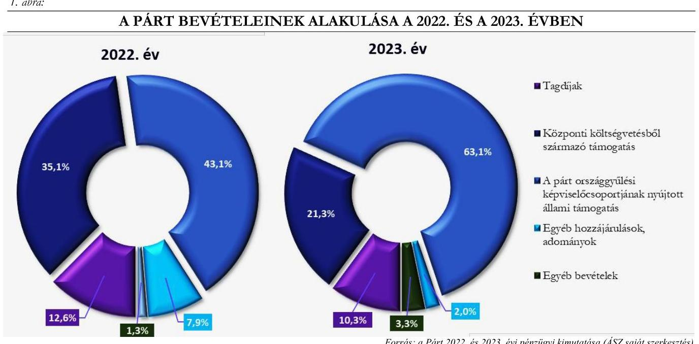
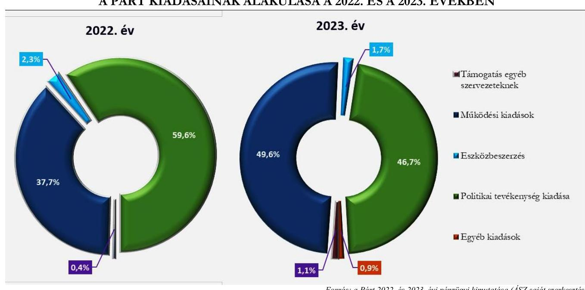

# JELENTÉS 

A költségvetési támogatásban részesülő pártok 2022-2023. évi gazdálkodása törvényességének ellenőrzése

Momentum Mozgalom

2025.

---

# JELENTÉS 

## A költségvetési támogatásban részesülő pártok 2022-2023. évi gazdálkodása törvényességének ellenőrzése

Momentum Mozgalom

2025.

---

# ELLENŐRZÉSI IGAZGATÓSÁG: 

## ELLENŐRZÉSI IGAZGATÓSÁG V.

ELLENŐRZÉSI IGAZGATÓ:
KLINGA LÁSZLÓ igazgató

ELLENŐRZÉSVEZETŐ:
SOLYMÁR ÁGNES ellenőrzésvezető

Jelentéseink az interneten a www.asz.hu címen olvashatók.

IKTATÓSZÁM: EL-4133-004/2025
TÉMASORSZÁM: 6
ELLENŐRZÉS-AZONOSÍTÓ SZÁM: V1121

---

# TARTALOMJEGYZÉK 

AZ ELLENŐRZÉS ALAPADATAI ..... 5
AZ ELLENŐRZÖTT SZERVEZET ..... 8
ÖSSZEFOGLALÁS ..... 9
AZ ELLENŐRZÉS FÓKUSZKÉRDÉSEI ..... 11
MEGÁLLAPÍTÁSOK ..... 12
JAVASLATOK ..... 17
MELLÉKLETEK ..... 18
I. sz. melléklet: Értelmező szótár ..... 18
II. sz. melléklet: Ellenőrzési kritériumok ..... 20
FÜGGELÉK: ÉSZREVÉTELEK ..... 21
RÖVIDÍTÉSEK JEGYZÉKE ..... 22

---

.

---

# AZ ELLENŐRZÉS ALAPADATAI 

## AZ ELLENŐRZÉS CÉLJA

Az ellenőrzés célja annak értékelése volt, hogy a Párt ${ }^{1}$ által közzétett éves pénzügyi kimutatások a törvényi előírásoknak megfeleltek-e, a könyvvezetés és gazdálkodás során a Párt betartotta-e a vonatkozó jogszabályi és belső előírásokat, a Párt a működéséhez szabályszerűen igénybe vehető forrásokat használt-e fel, a pártok működéséről és gazdálkodásáról szóló Párttv. ${ }^{2}$-ben engedélyezett gazdasági-vállalkozási tevékenységet folytatott-e. Az ellenőrzés célja továbbá annak értékelése volt, hogy a Párt végrehajtotta-e az előző számvevőszéki jelentésben foglalt megállapítással összhangban készített intézkedési tervben meghatározott feladatot.

## AZ ELLENŐRZÉS TÍPUSA

Törvényességi ellenőrzés.

## AZ ELLENŐRZŐTT IDŐSZAK

A 2022 - 2023. évek. Az utóellenőrzés tekintetében az utóellenőrzés alapját képező ÁSZ ${ }^{3}$ jelentés közzétételének napjától (2023. április 25.) az ellenőrzésről szóló adatszolgáltatásra felhívó levél keltének (2024. szeptember 27.) napjáig terjedő időszak.

## AZ ELLENŐRZÉS TÁRGYA

A Párt ellenőrzése során az ellenőrzés tárgyát képezték a 2022. és a 2023. évekre vonatkozó pénzügyi kimutatások elkészítésére, jóváhagyására, közzétételére, a Párt könyvvezetésére, gazdálkodására, ennek keretében a számviteli szabályozás kialakítására, a bizonylati rend, bizonylati fegyelem betartására, egyéb gazdálkodási, ellenőrzési és pénzügyi-számviteli feladatok ellátására irányuló tevékenységek. Az ellenőrzés tárgya volt továbbá a Párttv. szerinti források elszámolása és felhasználása, valamint a vagyon jogszabályi előírásoknak megfelelő használata, hasznosítása.

Az ellenőrzés kiterjedt minden olyan körülményre és adatra, amely az ÁSZ jogszabályban meghatározott feladatainak teljesítéséhez, valamint a program végrehajtása folyamán felmerült újabb összefüggések feltárásához szükséges volt.

Jelen ellenőrzés a 2022. évi országgyűlési képviselő-választási kampányra fordított pénzeszközök elszámolásának ellenőrzésére nem terjedt ki, azt az ÁSZ „A 2022. évi országgyülési kćpviselö-választási kampányra forditott pénzeszközök elszámolásának ellenörzése" című önálló ellenőrzése (továbbiakban: kampányellenőrzés ${ }^{4}$ ) keretében ellenőrizte.

---

# Az ellenőrzés jogsalapja 

Az ellenőrzés jogszabályi alapját az ÁSZ tv. 5. § (11) bekezdés a) pontja, a 33. § (7) bekezdése, a Párttv. 4. § (4)-(5) bekezdései, valamint a 10. § (1), (3)-(4) bekezdései képezték.

## AZ ELLENŐRZÉS MÓDSZERE

Az ellenőrzést az ellenőrzési program szempontjai, az ellenőrzött időszakban hatályos jogszabályok, az ellenőrzés általános szakmai szabályai, valamint az ellenőrzésre irányadó ÁSZ módszertanok figyelembevételével végezte az ÁSZ.

Az ellenőrzési kérdések megválaszolásához szükséges bizonyítékok megszerzése az ellenőrzött szervezet által rendelkezésre bocsátott dokumentumokra, adatokra alapozva, továbbá kérdésfeltevés (információkérés), interjú, mintavételezés útján történt. A 2022 - 2023. évi bevételeket és kiadásokat mintavételi eljárással kiválasztott tételek alapján ellenőrizte az ÁSZ.

Az ellenőrzési bizonyítékként felhasználható adatforrások közé tartoztak egyrészt az ellenőrzési programban felsorolt adatforrások, másrészt adatforrás lehetett még minden további, az ellenőrzés folyamán feltárt, az ellenőrzés szempontjából információt tartalmazó dokumentum.

Az ellenőrzés lefolytatásához az ellenőrzött szervezet a tanúsítványok kitöltésével, valamint az ÁSZ által kért dokumentumok, adatok, információk megküldésével és az ellenőrzés során szolgáltatott adatokat.

Az ÁSZ a tételes ellenőrzés mellett statisztikai alapú, véletlenszerű és kockázatalapú mintavételezést és értékelést is alkalmazott. A statisztikai alapú mintavételnél a minták kiválasztása rétegzett mintavételezéssel történt, amelynek értékelése „szabályszerü", ha a minta ellenőrzésének eredménye alapján $95 \%$-os bizonyossággal a teljes sokaságban az átlagos hibaarány nem haladja meg a $10 \%$-ot, „nem szabályszerü", ha nagyobb, mint $10 \%$. Abban az esetben, ha a teljes sokaság tekintetében a $10 \%$-os hibaarányhoz való viszony megítélésének megbízhatósága nem éri el a $95 \%$-ot, annak elérése érdekében az értékelés további szempontokkal egészült ki, a feltárt hibák értéke is figyelembevételre került. A statisztikai alapú mintavétel kiegészült évente az öt legnagyobb forgalmi értékkel rendelkező szállító és vevő tételes ellenőrzésével a lényegesség biztosítása érdekében. Tételes ellenőrzésre kerültek a bevételek közül a központi költségvetésből származó támogatások, valamint a Párt országgyűlési képviselőcsoportjának nyújtott állami támogatások*. A kiadások közül tételes ellenőrzésre kerültek az egyéb szervezetek részére nyújtott támogatások, valamint a reklámhordozón elhelyezett hirdetések költségei. A bérköltségekből és eszközbeszerzésekből egyszerű véletlenszerű leválogatással került kiválasztásra évente tíz-tíz mintatétel.

A 2022. évi országgyűlési képviselő választási kampányra fordított pénzeszközök elszámolását a kampányellenőrzés keretében ellenőrizte az ÁSZ, ezért az országgyűlési képviselő választás kampányidőszakára vonatkozó bevételi és kiadási tételek nem képezték jelen ellenőrzés alapsokaságát.

[^0]
[^0]:    * A Párttv. 1. sz. melléklete szerinti pénzügyi kimutatás szerinti bevételeknél a Párt országgyűlési képviselőcsoportjának nyújtott állami támogatás soron került bemutatásra a Párt országgyűlési képviselőcsoportja által nyújtott támogatás, mint továbbadott támogatás az Országgyűlésről szóló törvényben meghatározottak szerint.

---

Az utóellenőrzés megállapításai az ÁSZ rendelkezésére álló dokumentumok, valamint az ellenőrzött szervezet által rendelkezésre bocsátott dokumentumok, adatok, továbbá az ellenőrzött mintatételek dokumentumai alapján kerültek megfogalmazásra. A korábbi ÁSZ jelentés alapján a Párt által készített intézkedési tervben előírt feladat végrehajtása az alábbiak szerint került értékelésre:

- „határidóben végrebajtot!" -nak minősült a feladat, ha a teljesítés dokumentáltan, az intézkedési tervben előírt határidőben és tartalommal megtörtént;
- „határidőn túl végrebajtot!" -nak minősül a feladat, ha annak teljesítése az intézkedési tervben meghatározott módon, de az abban előírt határidőn túl történt meg;
- „nem végrebajtot!" -nak minősült a feladat, ha a végrehajtás nem történt meg, vagy amennyiben a teljesítést/végrehajtást nem dokumentálták, dokumentumokkal nem tudják igazolni annak teljesítését;
- „okafogyottá vált" a feladat, ha végrehajtására - meghatározott esemény bekövetkezése, továbbá külső körülmény, a működést érintő feltétel változása miatt - már nincs szükség, illetve lehetőség, és egyértelműen megállapítható, hogy az intézkedést szükségessé tevő körülmény a jövőben nem fordulhat elő;
- „nem időszeró" az a feladat, amelynek ellenőrzési időszakon belüli végrehajtására azért nem került (kerülhetett) sor, mert az intézkedés alapjául szolgáló esemény nem következett be, de annak jövőbeni előfordulása lehetséges, a végrehajtása nem volt esedékes, vagy a végrehajtás határideje még nem járt le.

---

# AZ ELLENŐRZÖTT SZERVEZET

## MOMENTUM MOZGALOM

A Párt 2017. május 19-én jött létre, Alapszabályában ${ }_{2,3}{ }^{5}$ rögzített főbb célja, hogy „a magyar civil társadalom önszervezödését, közeéletben való részvételét, politikai tudatosságának kialakítását, valamint az állampolgárok demokratikus és felelős állampolgári nevelését és oktatását elömozdítsa. A Momentum célja továbbá, hogy a müködése során kialakítsa a saját politikai véleményét, stratégiáját és identitását, illetve megszervezze a Momentum értékeivel azonosuló, a Momentum céljainak megvalósitását vállaló egyének érdekközösségének alapjait."

A Párt legfőbb döntéshozó szerve a Küldöttgyűlés ${ }^{6}$, ügyvezető szerve az Elnökség ${ }^{7}$. Az Elnökség a jogszabályok, az Alapszabály ${ }_{1-3}$ és a küldöttgyűlési határozatok keretei között irányítja a Párt működését. A Párt Elnökét és Elnökségét a Párt tagjai közül a Küldöttközgyűlés két évre választja. Az Elnökség döntései alapján a Pártigazgató ${ }^{8}$ alakítja ki és működteti a Párt munkaszervezetét.

A Párt a Párttv. alapján biztosított lehetőséggel élve 2018. évben megalapította az Indítsuk Be Magyarországot Alapítványt. A 2022. és a 2023. évben a Párt nem rendelkezett gazdasági társasággal, valamint ingatlantulajdonnal.

A Párt 2022. és 2023. évi pénzügyi kimutatásában szereplő bevételeket és kiadásokat az 1. számú táblázat tartalmazza:

|  1. táblázat | (adatok ezer Vt-ban)  |
| --- | --- |
|  A PÁRT 2022. ÉS 2023. ÉVI PÉNZÜGYI KIMUTATÁSÁNAK ADATAI |   |
|  BEVÉTELEK | 2022. EV  |
|  Tagdíjak | 78306  |
|  Központi költségvetésből származó támogatás | 217511  |
|  A párt országgyűlési képviselőcsoportjának nyújtott állami támogatás | 267235  |
|  Egyéb hozzájárulások, adományok | 48870  |
|  Ebből az 500 ezer Ft feletti hozzájárulások nevesítve | 15461  |
|  Egyéb bevételek | 7982  |
|  Összes bevétel a gazdasági évben | 619904  |
|  KIADÁSOK | 2022. EV  |
|  Támogatás egyéb szervezeteknek | 2328  |
|  Működési kiadások | 226539  |
|  Eszközbeszerzés | 13802  |
|  Politikai tevékenység kiadása | 357598  |
|  Egyéb kiadások | 0  |
|  Összes kiadás a gazdasági évben | 600267  |

---

# ÖSSZEFOGLALÁS 

A Párttv. alapján a párt olyan egyesület, amely nyilvántartott tagsággal rendelkezik, és amely a nyilvántartásba vételét végző bíróság előtt kinyilvánítja, hogy a Párttv. rendelkezéseit magára nézve kötelezőnek ismeri el.

Az ÁSZ az ÁSZ tv. alapján törvényességi szempontok szerint, a Párttv. rendelkezéseinek megfelelően kétévente ellenőrzi azoknak a pártoknak a gazdálkodását, amelyek a központi költségvetésből rendszeres támogatásban részesültek. A Momentum Mozgalom pénzügyi kimutatásai szerint a 2022. évben 217511 ezer Ft, a 2023. évben 185100 ezer Ft költségvetési támogatásban részesült.

Az ÁSZ a kampányellenőrzés keretében ellenőrizte a 2022. évi országgyűlési képviselő választásra fordított állami és a Párttv.-ben meghatározott más pénzeszközök felhasználását. Jelen ellenőrzés az országgyűlési képviselő választásra kapott pénzeszközökre és azok felhasználására nem terjedt ki. Emiatt jelen ellenőrzésnek a pénzügyi kimutatásra, az azt alátámasztó könyvvezetésre, a bevételek, kiadások elszámolására vonatkozó megállapításai a Párt gazdálkodásának a kampányellenőrzéssel nem érintett részére vonatkoznak.

A szabályozási környezetet összességében szabályszerűen kialakították.

A pénzügyi kimutatásokat szabályszerüen összeállították, a bevételek és kiadások elszámolása a jogszabályi és belső szabályozási előírásoknak megfelelő.

A gazdálkodási tevékenység ellenőrzése megfelelően müködött.

A Párt az ellenőrzött időszakban a jogszabályi előírásoknak megfelelően kialakította a gazdálkodás kereteit meghatározó, a pénzügyi kimutatások összeállítására és az azokat alátámasztó könyvvezetésére is kiterjedő belső szabályzatait.

A Párt a 2022. és a 2023. évekre vonatkozó pénzügyi kimutatásait a jogszabályban előírt tagolásban és határidőben elkészítette, a Magyar Közlöny Hivatalos Értesítőjében és saját honlapján közzétette. A pénzügyi kimutatásokban szereplő adatokat a Párt könyvviteli nyilvántartása alátámasztotta. A Pártnál tiltott támogatás gyanúja nem merült fel az ellenőrzött területeken, illetve az ellenőrzött mintatételek esetében. A bevételek és kiadások elszámolásával kapcsolatos mintatételek esetében a Párt betartotta a jogszabályok és a belső szabályzatok előírásait. A Párt gazdálkodása során megfelelően kialakította a vagyongazdálkodás kereteit, a vagyon nyilvántartása, használata, hasznosítása szabályszerű volt.

A Párt a jogszabályi előírásoknak megfelelően létrehozott felügyelőbizottságot ${ }^{8}$, valamint megalkotta gazdálkodásának és törvényes működésének ellenőrzésére vonatkozó szabályokat. A felügyelőbizottság az Alapszabály ${ }_{1-3}$-ban előírt véleményezési feladatát a 2022. évi pénzügyi kimutatás vonatkozásában dokumentáltan elvégezte, azonban a 2023. évi pénzügyi kimutatást nem véleményezte. Az évvégi pénztárellenőrzések mindkét évben megtörténtek.

---

Nem végrehajtott intézkedés.

A korábbi ÁSZ ellenőrzés megállapítása alapján a Párt által készített, az ÁSZ részéről elfogadott intézkedési tervben meghatározott intézkedést a Párt nem hajtotta végre. A 23016 számú ÁSZ jelentésben megállapított ellentmondás a Pénzkezelési szabályzatban ${ }_{1-4}$ továbbra is fennállt.

---

# AZ ELLENŐRZÉS FÓKUSZKÉRDÉSEI 

1.- A Párt a jogszabályi előírásoknak megfelelően kialakította-e a pénzügyi kimutatás összeállítására és az azt alátámasztó könyvvezetésre vonatkozó belső szabályozást?
2.- A Párt pénzügyi kimutatása, az azt alátámasztó könyvvezetése, a bevételek, kiadások elszámolása, valamint a vagyon nyilvántartása és használata, hasznosítása megfelelt-e a jogszabályi és belső előírásoknak?
3.- A Párt gazdálkodásának ellenőrzése az előírásoknak megfelelően müködött-e?
4.- A korábbi ÁSZ ellenőrzés megállapításai alapján készített intézkedési tervben foglaltak végrehajtásra kerültek-e?

---

# 1. A Párt a jogszabályi előírásoknak megfelelően kialakította-e a pénzügyi kimutatás összeállítására és az azt alátámasztó könyvvezetésre vonatkozó belső szabályozást? 

Összegző megállapítás A Párt a 2022 - 2023. években a pénzügyi kimutatásai összeállítására és az azt alátámasztó könyvvezetésre, valamint a gazdálkodására vonatkozó belső szabályozását összességében a jogszabályi előírásoknak megfelelően kialakította.

A Párt a 2022-2023. években rendelkezett a Számv. tv. ${ }^{10}$-ben foglaltaknak megfelelő Számviteli politikával ${ }^{11}$, továbbá a számviteli politika keretében elkészítendő Leltározási és selejtezési szabályzattal ${ }^{12}$, Értékelési szabályzattal ${ }^{13}$, Pénzkezelési szabályzattal ${ }^{14},{ }^{14}$, valamint Számlarenddel ${ }^{1}{ }^{15}$ és Bizonylati szabályzattal ${ }^{16}$.
A Pénzkezelési szabályzat ${ }_{1-4}$ a Számv. tv. előírásainak megfelelt, azonban belső ellentmondást tartalmazott, mivel 3. pontja alapján a pénztárosi feladatokat kizárólag a gazdasági igazgató látja el, ugyanakkor a Pénzkezelési szabályzat ${ }_{1-4} 3.3$. pontja alapján a pénztári utalványozással kapcsolatban a gazdasági igazgató utalványozó is lehet, ami ellentmondásban van a Pénzkezelési szabályzat ${ }_{1-4} 3.3$. pontjában foglaltakkal, miszerint az utalványozó nem lehet azonos személy a pénztárossal. Az ellentmondás a 2023. április 25-én közzétett, 23016. sorszámú ÁSZ jelentésben is megállapításra került.

A Párt a Számv. tv.-ben és a Párttv.-ben foglaltaknak megfelelően a Számlarendjében ${ }_{1-3}$ gondoskodott a pénzügyi kimutatásban szereplő tételek elkülönített nyilvántartásának szabályairól a pénzügyi kimutatás elkészítésének biztosításához.
A tagdíj és a tagdíj-kiegészítés megfizetésének szabályait a Párt az Alapszabályban ${ }_{1-3}$ és az SZMSZ ${ }_{1-3}{ }^{17}$ - ben rögzítette a Ptk. ${ }^{18}$-ban foglaltakkal összhangban.
A Párt a Számlarendben ${ }_{1-4}$, a Számviteli politikában és a Költségvetési szabályzatban ${ }^{19}$ szabályozta a költségvetésből kapott támogatások és egyéb támogatások elszámolását, elkülönített nyilvántartását.
A Számv. tv. előírását betartva az Alapszabályban ${ }_{1-3}$ és a Számviteli politikában a Pártban betöltött tisztség megjelölésével meghatározták a kötelezettségvállalásra jogosultak körét. A Számviteli politika mellékletében kijelölték a bizonylatok jogosságának igazolására és a kifizetés engedélyezésére jogosult, a végrehajtást igazoló és az utalványozó személyeket.
Az Értékelési szabályzatban meghatározásra került a Civil. tv. ${ }^{20}$-ben és e a Párttv. -ben foglaltaknak megfelelően a nem pénzbeli vagyoni hozzájárulás értéke meghatározásának módja és szabályai.
A szabályzatokat a Számv. tv. és a Civil. tv. előírásainak megfelelően az Elnök és a Pártigazgató együttesen kiadmányozta.

---

# 2. A Párt pénzügyi kimutatása, az azt alátámasztó könyvvezetése, a bevételek, kiadások elszámolása, valamint a vagyon nyilvántartása és használata, hasznosítása megfelelt-e a jogszabályi és belső előírásoknak? 

Összegző megállapítás A Párt 2022. és 2023. évi pénzügyi kimutatása, az azt alátámasztó könyvvezetése, a bevételek, kiadások elszámolása, valamint a vagyon nyilvántartása, használata, hasznosítása megfelelt a jogszabályi és belső előírásoknak.
2.1. számú megállapítás

A Párt a 2022. és a 2023. évekre vonatkozóan elkészítette a jogszabályban előírt pénzügyi kimutatását, az azokat alátámasztó könyvvezetése, számviteli nyilvántartási rendszere szabályszerű volt.

A Párt a 2022. és a 2023. évre vonatkozó pénzügyi kimutatásait a Párttv. mellékletében előírt tagolásban és a Párttv.-ben előírt határidőben elkészítette, az Alapszabály ${ }_{1-3}$ előírásainak megfelelően az Elnökség hagyta jóvá.
A Párttv.-ben előírtaknak megfelelően a Párt a 2022. és a 2023. évre vonatkozó pénzügyi kimutatását a tárgyévet követő május 31. napjáig közzétette a Magyar Közlöny mellékletét képező Hivatalos Értesítőben, továbbá saját honlapján is megjelentette.
Az ellenőrzött időszakban a Párt könyvvezetése során kettős könyvvitelt alkalmazott, a Számv. tv. előírásainak eleget téve könyvvezetési rendszerét oly módon tovább részletezte, hogy abból a Párttv.- ben meghatározott pénzügyi kimutatás adatai rendelkezésre álltak.
Az analitikus nyilvántartások és a főkönyvi könyvelés közötti egyeztetések lehetősége a Számv. tv. előírásainak megfelelően biztosított volt.
A Párt az ellenőrzött időszakra vonatkozó pénzügyi kimutatásaiban szerepeltetett egyéb hozzájárulások, adományok adatait alátámasztó főkönyvi számlák összegeiről, ezen belül a pénzügyi kimutatásban nevesített, éves szinten 500 ezer Ft feletti hozzájárulásokról a Számv. tv.-ben és a Párttv.- ben előírtaknak megfelelő analitikus nyilvántartást vezetett.
2.2. számú megállapítás

A Párt 2022. és 2023. évi pénzügyi kimutatásában a bevételek szerepeltetése és könyvviteli elszámolása szabályszerű volt.

A Párt a 2022. évi pénzügyi kimutatásában összesen 619904 ezer Ft, a 2023. évi pénzügyi kimutatásában összesen 867383 ezer Ft bevételt mutatott ki, melynek összetételét az 1. ábra mutatja.

---

A 2022. és 2023. évi pénzügyi kimutatás a Párttv. mellékletének megfelelően tartalmazta a bevételi sorokat, amelyek adatait a Párt alátámasztotta a Számv. tv. előírásaink megfelelő könyvviteli nyilvántartással.
A Párt országgyűlési képviselőcsoportja az OGY törvény ${ }^{21}$ által biztosított lehetőségével élve mindkét ellenőrzött évben adott támogatást a Párt számára, 2022. évben 267235 ezer Ft-ot, 2023. évben 547765 ezer Ft-ot.
A Párt a 2022. és 2023. évi pénzügyi kimutatásában az Egyéb hozzájárulások, adományok jogcímen a főkönyvvel egyezően kimutatott összegekből a Párttv. előírását betartva az egy naptári év alatt adott, 500 ezer Ft-ot meghaladó hozzájárulásokat a hozzájárulást adó megnevezésével és az összeg megjelölésével külön feltüntette.
Az ellenőrzött időszakban a nem pénzbeli vagyoni hozzájárulások értékét a Párt a Párttv. előírásainak megfelelően állapította meg.
A Párt az ellenőrzött időszakban kizárólag a Párttv. által meghatározott forrásokkal rendelkezett, tiltott támogatás gyanúja az ellenőrzött területeken, illetve az ellenőrzött mintatételek esetében nem merült fel.
2.3. számú megállapítás

A Párt 2022. és 2023. évre vonatkozó pénzügyi kimutatásaiban a kiadások szerepeltetése és azok könyvviteli elszámolása szabályszerű volt.

A Párt 2022. évi pénzügyi kimutatásában összesen 600267 ezer Ft kiadást, a 2023. évi pénzügyi kimutatásában összesen 841297 ezer Ft kiadást mutatott ki, melynek összetételét a 2. ábra mutatja.

---

A 2022. és 2023. évi pénzügyi kimutatás a Párttv. mellékletének megfelelően tartalmazta a kiadási sorokat, amelyek adatait a Párt alátámasztotta a Számv. tv. előírásaink megfelelő könyvviteli nyilvántartással.
A foglalkoztatással összefüggő ellenőrzött tételek vonatkozásában a személyi jellegű kifizetések, illetve az ehhez kapcsolódó bejelentési, adó- és járulék nyilvántartási, levonási, bevallási, befizetési, adatszolgáltatási kötelezettségek teljesítése megfelelt a Számv. tv., az Szja tv. ${ }^{22}$, az Art. ${ }^{23}$, és az Mt. ${ }^{24}$ előírásainak, továbbá a 465/2017. (XII.28.) Korm. rendeletben ${ }^{25}$ előírt tartalmú bizonylatokat a Párt kiállította.
A reklámhordozón elhelyezett plakátok közzétételével kapcsolatban felmerült költségek elszámolása, a pénzügyi kimutatásban való szerepeltetése a Számv. tv. és a Párttv. előírásoknak megfelelt.
2.4. számú megállapítás

A Párt vagyonának nyilvántartása és használata, valamint a vagyonnal való gazdálkodása a 2022 - 2023. években szabályszerű volt.

A Párt az ellenőrzött időszakban költségeinek fedezése és vagyonának gyarapítása érdekében kizárólag a Párttv. szerint végezhető gazdasági tevékenységeket végzett. A Párt az általa bérelt ingatlan ${ }_{1,2}{ }^{26}$ egy részét albérletbe adta az általa alapított Alapítvány és egy egyesület részére. A Párt által a 2022. és a 2023. évben bérelt ingatlanok bérleti díját ingatlan értékbecslő szakvéleménye támasztotta alá, az albérleti díj és a kapcsolódó járulékos költség-átalány az albérletbe adott terület aránya alapján került megállapításra. A Párt politikai céljainak és tevékenységének megismertetése érdekében kiadványokat jelentetett meg és terjesztett, valamint a Pártot szimbolizáló jelvényeket, tárgyakat árusított.
Az ellenőrzött időszakban a Pártnak a Párttv. szerinti vagyonmérleg készítési kötelezettsége nem volt.
A Párt a 2022. és a 2023. évre vonatkozóan a könyvek üzleti év végi zárásához olyan leltárt állított össze, amely tételesen, ellenőrizhető módon tartalmazta a főkönyvi kivonatban szereplő eszközeit és forrásait. A Leltározási és selejtezési szabályzatban háromévenkénti rendszerességgel előírt mennyiségi leltározást a 2022. üzleti év mérlegforduló napjára vonatkozóan a Párt végrehajtotta.

Az ellenőrzött mintatételek alapján a Párt eszközbeszerzéseinek kifizetése, elszámolása és dokumentálása az eszköz bekerülési értékének meghatározása megfelelt a Számv. tv. és az Értékelési szabályzat előírásainak. Az eszközök üzembe helyezésének hitelt érdemlő módon történő dokumentálása a Számv.

---

tv. előírása szerint szabályszerűen megtörtént. A Párt a Számv. tv. és a Számviteli politika előírásai szerint szabályszerűen gondoskodott az értékcsökkenés elszámolásáról.

# 3. A Párt gazdálkodásának ellenőrzése az előírásoknak megfelelően múködött-e? 

Összegző megállapítás A Párt gazdálkodásának ellenőrzése a 2022. és a 2023. években az előírásoknak megfelelően múködött, a 2023. évi pénzügyi kimutatás felügyelőbizottsági véleményezése az Alapszabály ${ }_{2,3}$ előírásai ellenére nem történt meg.

A Párt taglétszáma az ellenőrzött időszakban meghaladta a 100 főt. A Ptk. előírásainak megfelelően a Párt rendelkezett három tagú felügyelőbizottsággal, melynek feladatait az Alapszabály ${ }_{1-3}$ tartalmazta. Az Alapszabály előírásai szerint az Etikai és Felügyelőbizottság ${ }^{27}$ ellenőrizte a Párt szerveinek múködését, valamint a jogszabályok, az Alapszabály és a Párt szervei által hozott határozatok végrehajtását, és a Pénzügyi Ellenőrző Bizottság ${ }^{28}$ feladata volt a Párt gazdálkodásának ellenőrzése. Az Alapszabály ${ }_{2,3} 120 .5$ a szerint a Pénzügyi Bizottság a Ptk. 3:82. § (1) bekezdésében meghatározott felügyelőbizottság, amely ellátta a Párt szervei, valamint a jogszabályok, az Alapszabály ${ }_{2,3}$ és a Párt határozatai végrehajtásának, betartásának ellenőrzését, és ellátta a Párt gazdálkodásának az ellenőrzését is.
A 2022. évi pénzügyi kimutatást az Etikai és Felügyelőbizottság és a Pénzügyi Ellenőrző Bizottság az Alapszabály ${ }_{1}$-ban előírtaknak megfelelően véleményezte. A 2023. évi pénzügyi kimutatást a Pénzügyi Bizottság nem véleményezte, ezáltal az Alapszabály ${ }_{2,3} 122 .5$ c) pontjában előírt kötelezettségének nem tett eleget.
A Pénzkezelési szabályzatban ${ }_{1-4}$ a Párt rögzítette a házipénztár ellenőrzésének szabályait és a Pártban betöltött tisztség meghatározásával kijelölte az ellenőrzésre jogosultak körét. A Pénzkezelési szabályzatban ${ }_{1-4}$ előírtaknak megfelelően az évvégi pénztárellenőrzések a 2022. és a 2023. év vonatkozásában megtörténtek, az ellenőrzések eltérést nem tapasztaltak.

## 4. A korábbi ÁSZ ellenőrzés megállapításai alapján készített intézkedési tervben foglaltak végrehajtásra kerültek-e?

## Összegző megállapítás A Párt a korábbi ÁSZ ellenőrzés megállapítása alapján készített intézkedési tervében foglalt intézkedést nem hajtotta végre.

A Párt a 23016 számú ÁSZ jelentés megállapításai alapján egy pontban készített intézkedési tervet, amelyet az ÁSZ 2023. június 21-én elfogadott. Az intézkedési tervben előírt feladatot - „Intézkedés: A Pénzkezelési szabályzat elöírásainak javítása az ÁSZ javaslata alapján. (a pénztári utalványozással, pénztárosi feladatokkal kapcsolatos elöírások összhangban legyenek)" a Párt nem hajtotta végre.
A Pénzkezelési szabályzattal ${ }_{1-4}$ kapcsolatos részletes megállapítások az 1. Fókuszkérdésnél szerepelnek.

---

# JAVASLATOK 

Az ÁSZ tv. 33. § (1) bekezdésében foglaltak értelmében az ellenőrzött szervezet vezetője köteles a jelentésben foglalt megállapításokhoz kapcsolódó intézkedési tervet összeállítani és azt a jelentés kézhezvételétől számított 30 napon belül az ÁSZ részére megküldeni. Amennyiben az ellenőrzött szervezet vezetője nem küldi meg határidőben az intézkedési tervet, vagy továbbra sem elfogadható intézkedési tervet küld, az Állami Számvevőszék elnöke az ÁSZ tv. 33. § (3) bekezdése a) és b) pontjaiban foglaltakat érvényesítheti.

## MOMENTUM MOZGALOM ELNÖKE

1. Intézkedjen arról, hogy a pénzkezelési szabályzatban a pénztári utalványozással, pénztárosi feladatokkal kapcsolatos előírások összhangban legyenek.
2. Intézkedjen arról, hogy a felügyelőbizottság az Alapszabály ${ }_{2,3}$ 122. § c) pontjában elöírtaknak megfelelően véleményezze a pénzügyi kimutatást.

---

# MELLÉKLETEK 

## I. SZ. MELLÉKLET: ÉRTELMEZŐ SZÓTÁR

Civil szervezet

Egyesület

Költségvetési támogatás

Pénzügyi kimutatás

A Párt gazdasági-vállalkozási tevékenysége

Nem pénzbeli támogatás

Ingó vagyontárgyak

Intézkedési terv

Plakát

Reklám

A civil társaság; a Magyarországon nyilvántartásba vett egyesület - a Párt, a szakszervezet és a kölcsönös biztosító egyesület kivételével és - a közalapítvány és a Pártalapítvány kivételével - az alapítvány. (Forrás: Civil ${ }^{29}$ tv. 2. $\$ 6$. a)-c) pontjai)
Az egyesület a tagok közös, tartós, alapszabályban meghatározott céljának folyamatos megvalósítására létesített, nyilvántartott tagsággal rendelkező jogi személy. (Forrás: Ptk. 3:63. § (1) bekezdés)
A Számv. tv. szempontjából egyéb szervezet. (Számv. tv. 3. § 4. a) pont)
A társadalombiztosítás pénzügyi alapjai kivételével az államháztartás központi alrendszeréből ellenérték nélkül, pénzben nyújtott támogatások. (Forrás: Áht. 1. § 14. pont)
A Pártok a pénzügyi kimutatást kötelesek minden év május 31-ig a Magyar Közlönyben, valamint saját honlappal rendelkező Pártok a honlapjukon is közzétenni. (Párttv. 9. § (1) bekezdés, 1. számú melléklet)
A Párt a költségeinek fedezése és vagyonának gyarapítása érdekében a következő gazdasági-vállalkozási tevékenységeket folytathatja:
politikai céljainak és tevékenységének megismertetése érdekében kiadványokat jelentethet meg és terjeszthet, a Pártot szimbolizáló jelvényeket és más ilyen célú tárgyakat árusíthat és Pártrendezvényeket szervezhet;
a tulajdonában álló ingatlanokat és ingókat díj ellenében hasznosíthatja és elidegenítheti. (Párttv.6. § (1) bekezdés)
Vagyoni értékkel rendelkező forgalomképes dolog, szellemi alkotás, illetve vagyoni értékủ jog részben vagy egészében, véglegesen vagy ideiglenesen, teljesen vagy részben ingyenesen történő átruházása vagy átengedése, illetve szolgáltatás biztosítása. (Civil tv. 2. § 25. pont)
Ingó vagyontárgy: az ingatlannak nem minősülő dolog, kivéve a fizetőeszközt, az értékpapírt és a föld tulajdonosváltozása nélkül értékesített lábon álló (betakarítatlan) termést, terményt (pl. lábon álló fa) (Szja tv. 3. § 30. pont)

Az ellenőrzött szervezet vezetője által készített, a jelentés kézhezvételétől számított harminc napon belül az ASZ részére megküldött, az ASZ által elfogadott intézkedéseket tartalmazó terv. (ÁSZ tv. 33. §)
Plakát és választási falragasz, felirat, szórólap, vetített kép, embléma mérettől és hordozóanyagtól függetlenül. (V.e. ${ }^{30}$ törvény 144. § (1) bekezdés)
Gazdasági reklám: olyan közlés, tájékoztatás, illetve megjelenítési mód, amely valamely birtokba vehető forgalomképes ingó dolog - ideértve a pénzt, az értékpapírt és a pénzügyi eszközt, valamint a dolog módjára hasznosítható természeti erőket - (a továbbiakban együtt: termék), szolgáltatás, ingatlan, vagyoni értékủ jog (a továbbiakban mindezek együtt: áru) értékesítésének vagy más módon történő igénybevételének előmozdítására, vagy e céllal összefüggésben a vállalkozás neve, megjelölése, tevékenysége népszerúsítésére vagy áru, árujelző ismertségének növelésére irányul, ide nem értve:

---

Reklámhordozó
a cégtáblát, üzletfeliratot, a vállalkozás használatában álló ingatlanon elhelyezett, a vállalkozást népszerűsítő egyéb feliratot és más grafikai megjelenítést,
az üzlethelyiség portáljában (kirakatában) elhelyezett gazdasági reklámot, a járművön, valamint tájékozódást segítő jelzést megjelenítő reklámcélú eszközön elhelyezett gazdasági reklámot, továbbá
a tulajdonos által az ingatlanán elhelyezett, annak elidegenítésére vonatkozó ajánlati felhívást (hirdetést), valamint a helyi önkormányzat által lakossági apróhirdetések közzétételének megkönnyítése céljából biztosított táblán vagy egyéb felületen elhelyezett, kisméretű hirdetéseket; (Reklámtörvény3. § d) pont, Tvtv. ${ }^{31} 11 / \mathrm{F} 3$. pont)
A funkcióját vagy létesítésének célját tekintve túlnyomórészt reklám közzétételét, illetve elhelyezését biztosító, elősegítő vagy támogató eszköz, berendezés, létesítmény; ide nem értve a közúti közlekedési tárgyú jogszabályokban meghatározott életmentő funkciót ellátó reklámcélú eszköz. (Tvtv. 1/F. $\S 4$. pont)

---

# II. SZ. MELLÉKLET: ELLENŐRZÉSI KRITÉRIUMOK 

## FOKISZKÉRDŐS

1. A Párt a jogszabályi előírásoknak megfelelően kialakította-e a pénzügyi kimutatás összeállítására és az azt alátámasztó könyvvezetésre vonatkozó belső szabályozást?
2. A Párt pénzügyi kimutatása, az azt alátámasztó könyvvezetése, a bevételek, kiadások elszámolása, valamint a vagyon nyilvántartása és használata, hasznosítása megfelelt-e a jogszabályi és belső előírásoknak?
3. A Párt gazdálkodásának ellenőrzése az előírásoknak megfelelően múködött-e?
4. A korábbi ÁSZ ellenőrzés megállapításai alapján készített intézkedési tervben foglaltak végrehajtásra kerültek-e?

## ELLENŐRZÉSI KRITÉRIUMOK

Számv. tv. 3. §, 6. §, 12. §, 14. §, 15-16. §, 160-161/A. §, 164-169. §, 23-45. §, 46-53. §, 57-68. §, 69. §
Párttv. 4. §, 6. §, 9. §, 1. sz. melléklet
Civil tv. 2. §
479/2016. (XII. 28.) Korm. rendelet ${ }^{32}$ 4. § (1) bekezdés, 9. §, 15-16. §
Ptk. 3:4. §, 3:26-3:28. §, 3:63-3:87. §
Alapszabály, a Párt belső szabályozásai
Számv. tv. 6. §, 12. §, 14. §, 159. §, 160. §, 161-161/A. §, 164-167. §
Párttv. 4. §, 6. §, 9. §, 1. sz. melléklet
Mt. 14. §, 45. §, 48. §
Szja tv. 3. §, 25. §, 47. §, 3. sz. melléklet
Ptk. 3:74. §, 6:272-6:280. §, 6:331-6:341. §
Civil tv. 2. §
Tvtv. 11/F. §, 11/G. §
Reklámtörvény ${ }^{33}$ 3. §,
104/2017. (IV. 28.) Korm. rendelet ${ }^{34}$ 8/C. §
Art. 1. sz. melléklet
465/2017. (XII.28.) Korm. rendelet
437/2015.(XII.28.) Korm. rendelet ${ }^{35}$
TAO tv. ${ }^{36}$ 4. §, 18. §
Vtv. 68. §
Alapszabály, a Párt belső szabályozásai
Számv. tv. 14. §
Belső szabályzatok, felügyelőbizottság ügyrendjében foglaltak, A 2019-2020. évi ÁSZ ellenőrzésről készült ÁSZ jelentés megállapításai alapján készített intézkedési tervben foglalt előírások, ellenőrzési határozatok, jegyzőkönyvek.
A korábbi évek ÁSZ ellenőrzéséről készült ÁSZ jelentés megállapításai alapján készített intézkedési tervben foglalt előírások.

---

# FÜGGELÉK: ÉSZREVÉTELEK 

A jelentéstervezetet a Számvevőszék 15 napos észrevételezésre megküldte az ellenőrzött szervezet vezetőjének az ÁSZ tv. 29. §* (1) bekezdése előírásának megfelelően.

A Momentum Mozgalom elnöke észrevételében az ellenőrzés megállapításait nem vitatta.

[^0]
[^0]:    * 29. § (1) Az Állami Számvevőszék az ellenőrzési megállapításait megküldi az ellenőrzött szervezet vezetőjének vagy az általa megbízott személynek, és annak, akinek személyes felelősségét állapította meg.
    (2) Az ellenőrzött szervezet vezetője és a felelősként megjelölt személy az ellenőrzés megállapításaira tizenöt napon belül írásban észrevételt tehet.
    (3) Az Állami Számvevőszék az észrevételre a beérkezésétől számított harminc napon belül írásban válaszol. A figyelembe nem vett észrevételeket köteles a jelentésben feltüntetni, és megindokolni, hogy azokat miért nem fogadta el.

---

# RÖVIDÍTÉSEK JEGYZÉKE 

${ }^{1}$ Párt
${ }^{2}$ Párttv.
${ }^{3}$ ÁSZ
${ }^{4}$ kampányellenőrzés
${ }^{5}$ Alapszabály $1-3$
${ }^{6}$ Küldöttgyülés
${ }^{7}$ Elnökség
${ }^{8}$ Pártigazgató
${ }^{9}$ felügyelőbizottság
${ }^{10}$ Számv. tv.
${ }^{11}$ Számviteli politika
${ }^{12}$ Leltározási és selejtezési szabályzat
${ }^{13}$ Értékelési szabályzat
${ }^{14}$ Pénzkezelési szabályzat ${ }_{1-4}$
${ }^{15}$ Számlarend $_{1-4}$
${ }^{16}$ Bizonylati szabályzat
${ }^{17}$ SZMSZ $_{1-3}$
${ }^{18}$ Ptk.
${ }^{19}$ Költségvetési szabályzat
${ }^{20}$ Civil. tv.
${ }^{21}$ OGY törvény
${ }^{22}$ Szja tv.
${ }^{23}$ Art.
${ }^{24} \mathrm{Mt}$.
${ }^{25}$ 465/2017. (XII.28.) Korm. rendelet
${ }^{26}$ ingatlan $_{1}$
ingatlan $_{2}$
${ }^{27}$ Etikai és Felügyelőbizottság
${ }^{28}$ Pénzügyi Ellenőrző Bizottság
${ }^{29}$ Civil tv.
${ }^{30}$ V.e.
${ }^{31}$ Tvtv.
${ }^{32}$ 479/2016. Korm. rendelet

Momentum Mozgalom
1989. évi XXXIII. törvény a Pártok működéséről és gazdálkodásáról

Állami Számvevőszék
A 2022. évi országgyűlési képviselő-választási kampányra fordított pénzeszközök elszámolásának ellenőrzése" című önálló ellenőrzés
Momentum Mozgalom többször módosított Alapszabálya (2021. november 21-én kelt és ettől a naptól hatályos Alapszabály ${ }_{1}$, továbbá a 2023. április 2-án, illetve 2023. december 14-én kelt és 2023. június 14-étől hatályos Alapszabályok ${ }_{2,3}$ )
Momentum Mozgalom Küldöttközgyűlése
Momentum Mozgalom Elnöksége
Momentum Mozgalom Pártigazgatója
Alapszabály ${ }_{1}$ alapján Etikai és Felügyelő Bizottság, Alapszabály ${ }_{2,3}$ alapján Pénzügyi Bizottság
2000. évi C. törvény a számvitelről
Momentum Mozgalom Számviteli Politikája (hatályos 2020. január 1-étől)
Momentum Mozgalom Leltározási és selejtezési szabályzata (hatályos: 2018. június 13-ától)
Momentum Mozgalom Értékelési szabályzata (hatályos: 2020. január 1-étől)
Momentum Mozgalom Pénzkezelési szabályzata (hatályos: 2021. április 30-ától, 2022. március 1-étől, 2022. december 12-étől, 2023. április 1-étől)
Momentum Mozgalom számlarendje (hatályos: 2021. augusztus 1-étől, 2022. március 1-étől, 2022. augusztus 1-étől, 2023. január 31-étől)
Momentum Mozgalom Bizonylati szabályzata (hatályos: 2020. január 1-étől)
Momentum Mozgalom Szervezeti és Működési Szabályzata (hatályos: 2021. április 11-étől, 2023. június 14-étől, és 2023. október 6-ától)
2013. évi V. törvény a Polgári Törvénykönyvről

Momentum Mozgalom működését segítő költségvetési támogatások, költségvetési források és egyéb támogatások elszámolásának, nyilvántartásának, beszámolási kötelezettségének szabályzata (hatályos: 2022. január 1-étől)
2011. évi CLXXV. törvény - az egyesülési jogról, a közhasznú jogállásról, valamint a civil szervezetek múködéséről és támogatásáról
2012. évi XXXVI. törvény az Országgyűlésről
1995. évi CXVII. törvény a személyi jövedelemadóról
2017. évi CL. törvény az adózás rendjéről
2012. évi I. törvény - a munka törvénykönyvéről

Az adóigazgatási eljárás részletszabályairól szóló 465/2017. (XII.28.) Korm. rendelet 1053 Budapest, Múzeum körút 13. I. emelet 2. szám alatt található irodák
1024 Budapest Rózsahegy utca 1-2. I. emelet 1. szám alatt található irodák
Momentum Mozgalom Etikai és Felügyelő Bizottsága
Momentum Mozgalom Pénzügyi Ellenőrző Bizottsága
2011. évi CLXXV. törvény az egyesülési jogról, a közhasznú jogállásról, valamint a civil szervezetek múködéséről és támogatásáról
2013. évi XXXVI. törvény a választási eljárásról
2016. évi LXXIV. törvény a településkép védelméről
479/2016. (XII. 28.) Korm. rendelet a számviteli törvény szerinti egyes egyéb szervezetek beszámoló készítési és könyvvezetési kötelezettségének sajátosságairól

---

${ }^{33}$ Reklámtörvény
${ }^{34}$ 104/2017. (IV.28) Korm. rend.
${ }^{35}$ 437/2015. (XII. 28.) Korm. rend.
${ }^{36}$ TAO tv.
2008. évi XLVIII. törvény a gazdasági reklámtevékenység alapvető feltételeiről és egyes korlátairól
104/2017. (IV.28) Korm. rendelet a településkép védelméről szóló törvény reklámok közzétételével kapcsolatos rendelkezéseinek végrehajtásáról
437/2015. (XII. 28.) Korm. rendelet a belföldi hivatalos kiküldetést teljesítő munkavállaló költségtérítéséről
1996. évi LXXXI. törvény a társasági adóról és az osztalékadóról

---

1052 Budapest, Apáczai Csere János u. 10. | 1364 Budapest 4., Pf. 54
www.asz.hu | szamvevoszek@asz.hu
telefon: +36 14849100