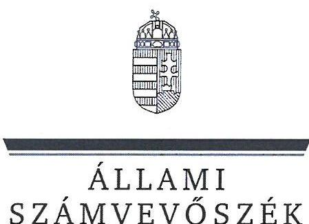
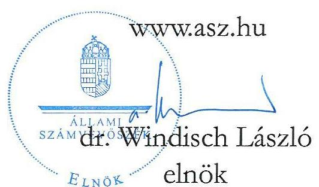
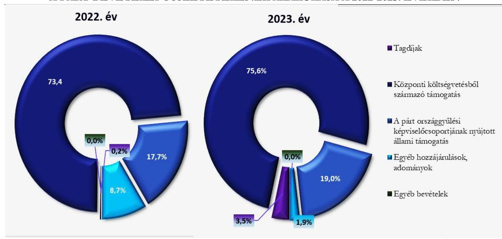
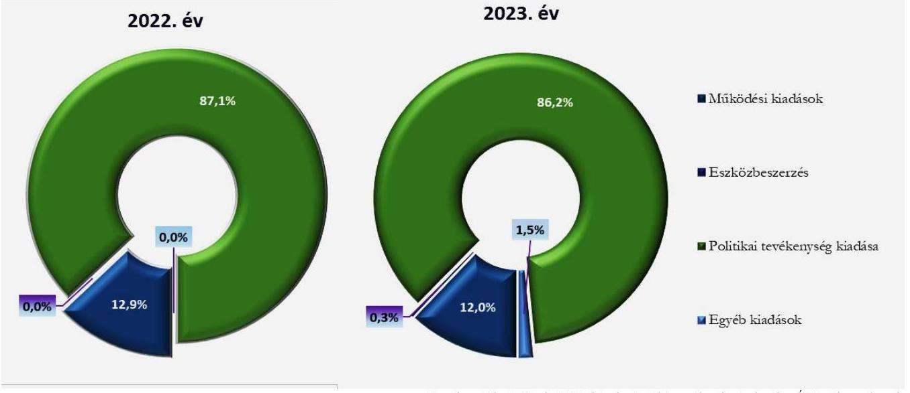

# JELENTÉS 

A költségvetési támogatásban részesülő pártok 2022-2023. évi gazdálkodása törvényességének ellenőrzése

Mi Hazánk Mozgalom

2025.

---

ÁLLAMI
SZÁMVEVŐSZÉK

# JELENTÉS 

## A költségvetési támogatásban részesülő pártok 2022-2023. évi gazdálkodása törvényességének ellenőrzése

Mi Hazánk Mozgalom

2025.

25090

---

# ELLENŐRZÉSI IGAZGATÓSÁG: 

## ELLENŐRZÉSI IGAZGATÓSÁG V.

## ELLENŐRZÉSI IGAZGATÓ:

## KLINGA LÁSZLÓ igazgató

## ELLENŐRZÉSVEZETŐ:

## SOLYMÁR ÁGNES ellenőrzésvezető

Jelentéseink az interneten a www.asz.hu címen olvashatók.

IKTATÓSZÁM: EL-4133-005/2025
TÉMASORSZÁM: 6
ELLENŐRZÉS-AZONOSÍTÓ SZÁM: V1121

---

# TARTALOMJEGYZÉK 

AZ ELLENŐRZÉS ALAPADATAI ..... 5
AZ ELLENŐRZÖTT SZERVEZET ..... 7
ÖSSZEFOGLALÁS ..... 8
AZ ELLENŐRZÉS FÓKUSZKÉRDÉSEI ..... 10
MEGÁLLAPÍTÁSOK ..... 11
JAVASLATOK ..... 16
MELLÉKLETEK ..... 17
I. sz. melléklet: Értelmező szótár ..... 17
II. sz. melléklet: Ellenőrzési kritériumok ..... 19
FÜGGELÉK: ÉSZREVÉTELEK ..... 20
RÖVIDÍTÉSEK JEGYZÉKE ..... 21

---

.

---

# AZ ELLENŐRZÉS ALAPADATAI 

## AZ ELLENŐRZÉS CÉLJA

Az ellenőrzés célja annak értékelése volt, hogy a Párt ${ }^{1}$ által közzétett éves pénzügyi kimutatások a törvényi előírásoknak megfeleltek-e, a könyvvezetés és gazdálkodás során a Párt betartotta-e a vonatkozó jogszabályi és belső előírásokat, a Párt a működéséhez szabályszerűen igénybe vehető forrásokat használt-e fel, a pártok működéséről és gazdálkodásáról szóló Párttv. ${ }^{2}$-ben engedélyezett gazdasági-vállalkozási tevékenységet folytatott-e.

## AZ ELLENŐRZÉS TÍPUSA

Törvényességi ellenőrzés

## AZ ELLENŐRZÖTT IDŐSZAK

A 2022-2023. évek

## AZ ELLENŐRZÉS TÁRGYA

A Párt ellenőrzése során az ellenőrzés tárgyát képezték a 2022. és a 2023. évekre vonatkozó pénzügyi kimutatások elkészítésére, jóváhagyására, közzétételére, a Párt könyvvezetésére, gazdálkodására, ennek keretében a számviteli szabályozás kialakítására, a bizonylati rend, bizonylati fegyelem betartására, egyéb gazdálkodási, ellenőrzési és pénzügyi-számviteli feladatok ellátására irányuló tevékenységek. Az ellenőrzés tárgya volt továbbá a Párttv. szerinti források elszámolása és felhasználása, valamint a vagyon jogszabályi előírásoknak megfelelő használata, hasznosítása.

Az ellenőrzés kiterjedt minden olyan körülményre és adatra, amely az ÁSZ ${ }^{3}$ jogszabályban meghatározott feladatainak teljesítéséhez, valamint a program végrehajtása folyamán felmerült újabb összefüggések feltárásához szükséges volt.

Jelen ellenőrzés a 2022. évi országgyűlési képviselő-választási kampányra fordított pénzeszközök elszámolásának ellenőrzésére nem terjedt ki, azt az ÁSZ „A 2022. évi országgyűlési képviselő-választási kampányra fordított pénzeszközök elszámolásának ellenőrzése" című önálló ellenőrzése (továbbiakban: kampányellenőrzés ${ }^{4}$ ) keretében ellenőrizte.

## AZ ELLENŐRZÉS JOGALAPJA

Az ellenőrzés jogszabályi alapját az ÁSZ tv. ${ }^{5}$ 5. § (11) bekezdés a) pontja, a Párttv. 4. § (4)-(5) bekezdései, valamint a 10. § (1), (3)-(4) bekezdései képezték.

---

# AZ ELLENŐRZÉS MÓDSZERE 

Az ellenőrzést az ellenőrzési program szempontjai, az ellenőrzött időszakban hatályos jogszabályok, az ellenőrzés általános szakmai szabályai, valamint az ellenőrzésre irányadó ÁSZ módszertanok figyelembevételével végezte az ÁSZ.

Az ellenőrzési kérdések megválaszolásához szükséges bizonyítékok megszerzése az ellenőrzött szervezet által rendelkezésre bocsátott dokumentumokra, adatokra alapozva kérdésfeltevés (információkérés), interjú, mintavételezés útján történt.

Az ellenőrzési bizonyítékként felhasználható adatforrások közé tartoztak egyrészt az ellenőrzési programban felsorolt adatforrások, másrészt adatforrás lehetett még minden további, az ellenőrzés folyamán feltárt, az ellenőrzés szempontjából információt tartalmazó dokumentum.

Az ellenőrzés lefolytatásához az ellenőrzött szervezet tanúsítványok kitöltésével, hitelesítésével és a teljességi és hitelességi nyilatkozattal alátámasztott dokumentumok rendelkezésre bocsátásával szolgáltatott adatokat.

Az ÁSZ a tételes ellenőrzés mellett statisztikai alapú, véletlenszerű és kockázatalapú mintavételezést és értékelést is alkalmazott. A statisztikai alapúnál a minták kiválasztása rétegzett mintavételezéssel történt, a mintatételek értékelése „szabályszerű”, ha a minta ellenőrzésének eredménye alapján 95%-os bizonyossággal a teljes sokaságban az átlagos hibaarány nem haladta meg a 10%-ot, „nem szabályszerű”, ha nagyobb, mint 10%. Abban az esetben, ha a teljes sokaság tekintetében a 10%-os hibaarányhoz való viszony megítélésének megbízhatósága nem érte el a 95%-ot, annak elérése érdekében az értékelés további szempontokkal egészült ki, a feltárt hibák értéke is figyelembevételre került. A statisztikai alapú mintavétel kiegészült évente az öt legnagyobb forgalmi értékkel rendelkező szállító tételes ellenőrzésével a lényegesség biztosítása érdekében. A kockázati alapon kiválasztott mintatételek értékelése nem került kivetítésre. Tételes ellenőrzésre kerültek a bevételek közül a központi költségvetésből származó támogatások, valamint a párt országgyűlési képviselőcsoportjának nyújtott állami támogatások. A kiadások közül tételes ellenőrzésre kerültek a Párt országgyűlési képviselőcsoportja számára nyújtott támogatások, az egyéb szervezetek részére nyújtott támogatások, a vállalkozások alapítására fordított összegek, valamint a reklámhordozón elhelyezett hirdetések költségei. A bérköltségekből és eszközbeszerzésekből egyszerű véletlenszerű leválogatással került kiválasztásra évente tíz-tíz mintatétel.

A kampányellenőrzés keretében az ÁSZ ellenőrizte a 2022. évi országgyűlési képviselő választásra fordított pénzeszközök elszámolását, ezért jelen ellenőrzés az kampányidőszakra vonatkozó bevételi és kiadási tételek értékelését nem tartalmazza.

---

# AZ ELLENŐRZÖTT SZERVEZET

## MI HAZÁNK MOZGALOM

A Mi Hazánk Mozgalom 2018-ban létrejött olyan egyesület, amely nyilvántartott tagsággal rendelkezik, a nyilvántartásba vételét végző bíróság előtt kinyilvánította, hogy a Párttv. rendelkezéseit magára nézve kötelezőnek ismeri el a Párttv. 1. §-a előírása alapján.

Az Alapszabályban ${ }^{6}$ leírtak szerint a Párt „...általános célja, hogy a magyar társadalom közéletben való részvételét és az állampolgárok politikai tudatosságának kialakítását előmozdítsa. A Párt célja, hogy a működése során az Alapító Nyilatkozatában foglalt elvek mentén meghatározza saját politikai stratégiáját, megszervezzze a Párt értékeivel azonosuló állampolgárok érdekközösségének alapjait.” A Párt legfőbb döntéshozó szerve a Kongresszus ${ }^{7}$, ügyvezető szerve az Elnökség ${ }^{8}$. A Párt törvényes képviseletét a Párt elnöke látja el.

A Párt a Párttv. alapján biztosított lehetőséggel élve 2021. évben alapította meg a Mi Hazánk Alapítványt. A Párt 2022-2023-ban nem rendelkezett gazdasági társasággal, valamint ingatlantulajdonnal.

A Párt a 2022. évre vonatkozó pénzügyi kimutatásában összesen 801699 ezer Ft bevételt (melyből 588491 ezer Ft központi költségvetési támogatás) és 823123 ezer Ft kiadást számolt el. A 2023. évre vonatkozó pénzügyi kimutatása szerint az összes bevétele 242480 ezer Ft (melyből 183100 ezer Ft a központi költségvetési támogatás, a pénzügyi kimutatásban helytelenül 183392 ezer Ft szerepel), az összes kiadása 215407 ezer Ft volt. A Párt 2022-2023. évekre vonatkozó pénzügyi kimutatásában szereplő releváns számadatokat az 1. táblázat tartalmazza. 1. táblázat

A PÁRT 2022-2023. ÉVEKRE VONATKOZÓ PÉNZÜGYI KIMUTATÁSÁNAK RELEVÁNS ADATAI (ADATOK EZER FT-BAN)

|  BEVÉTELEK | 2022. év | 2023. év  |
| --- | --- | --- |
|  Tagdíjak | 1467 | 8422  |
|  Központi költségvetésből származó támogatás | 588491 | 183392  |
|  A párt országgyűlési képviselőcsoportjának nyújtott állami támogatás | 141794 | 46000  |
|  Egyéb hozzájárulások, adományok | 69816 | 4663  |
|  ebből az 500000 forint feletti hozzájárulás nevesítve | 26700 | 1871  |
|  Egyéb bevételek | 131 | 3  |
|  Összes bevétel a gazdasági évben | 801699 | 242480  |
|  Kiadások | 2022. év | 2023. év  |
|  Működési kiadások | 106381 | 25929  |
|  Eszközbeszerzés | 0 | 547  |
|  Politikai tevékenység kiadása | 716730 | 185623  |
|  Egyéb kiadások | 12 | 3308  |
|  Összes kiadás a gazdasági évben | 823123 | 215407  |

Forrás: A Párt 2022. és a 2023. évi pénzügyi kimutatása (ÁSZ saját szerkesztés)

---

# ÖSSZEFOGLALÁS 

A Párttv. alapján a párt olyan egyesület, amely nyilvántartott tagsággal rendelkezik, és amely a nyilvántartásba vételét végző bíróság előtt kinyilvánítja, hogy a Párttv. rendelkezéseit magára nézve kötelezőnek ismeri el.

Az ÁSZ tv. 5. § (11) bekezdés a) pontja alapján az ÁSZ - a Párttv. rendelkezéseinek megfelelően törvényességi szempontok szerint ellenőrzi a pártok gazdálkodását. A Párttv. 10. § (3) bekezdése alapján az ÁSZ kétévente ellenőrzi azoknak a pártoknak a gazdálkodását, amelyek a központi költségvetésből rendszeres támogatásban részesültek. A Párt a központi költségvetésből 2022-ben 588491 ezer Ft, a 2023. évben 183100 ezer Ft költségvetési támogatásban részesült (a pénzügyi kimutatásban 183392 ezer Ft szerepel helytelenül).

Az ÁSZ a kampányellenőrzés keretében ellenőrizte a 2022. évi országgyűlési képviselő választásra fordított állami és a Párttv.-ben meghatározott más pénzeszközök felhasználását. Jelen ellenőrzés az országgyűlési képviselő választásra kapott pénzeszközökre és azok felhasználására nem terjedt ki. Emiatt jelen ellenőrzésnek a pénzügyi kimutatásra, az azt alátámasztó könyvvezetésre, a bevételek, kiadások elszámolására vonatkozó megállapításai a Párt gazdálkodásának a kampányellenőrzéssel nem érintett részére vonatkoznak.

A kialakított szabályozási környezet tartalmilag hiányos

A Párt nem a jogszabályi előírásoknak megfelelően alakította ki a gazdálkodás kereteit meghatározó, a pénzügyi kimutatás összeállítására és az azt alátámasztó könyvvezetésre is kiterjedő belső szabályzatait az ellenőrzött időszakban, mivel a számlarendje és a Pénzkezelési szabályzata nem felelt meg a jogszabályi előírásoknak.

A Párt a 2022-2023. évekre vonatkozó pénzügyi kimutatásait a jogszabályban előírt határidőben elkészítette és közzétette a Magyar Közlöny mellékletét képező Hivatalos Értesítőben, valamint saját honlapján.

A pénzügyi kimutatás nem minden adatát támasztották alá nyilvántartási adatokkal

A Párt pénzügyi kimutatásaiban szereplő adatokat - a központi költségvetésből kapott bevételek kivételével - a főkönyvi adatok alátámasztották. A pénzügyi kimutatásban és a könyvviteli nyilvántartásban szereplő, központi költségvetésből kapott bevételek összege magasabb volt (292 ezer Ft-tal) a ténylegesen kapott összegnél. A Párt kialakított nyilvántartási rendszere a Számv. tv.-ben foglaltak ellenére egyik ellenőrzött évben sem volt alkalmas a Párttv. 1. számú mellékletében meghatározott pénzügyi kimutatásban és azzal egyező főkönyvben szereplő hozzájárulások, adományok adatainak alátámasztására. Az egy naptári év alatt kapott 500 000 Ft feletti hozzájárulások a Párttv. előírásai szerint nevesítésre kerültek, azonban teljes körűségük nyilvántartás hiányában nem volt alátámasztott.

Szabályszerűen elszámolt bevételek és kiadások, szabályszerű vagyonnyilvántartás

Az ellenőrzött tételek alapján a bevételek és kiadások elszámolására vonatkozó jogszabályok és belső szabályzatok előírásait a Párt betartotta, a működéséhez szabályszerűen igénybe vehető forrásokat használt fel. A Párt a gazdálkodása során megfelelően kialakította a vagyongazdálkodás kereteit, a vagyon nyilvántartása, használata szabályszerű volt.

---

Felügyelő bizottság hiányában a gazdálkodási tevékenység ellenőrzése elmaradt

A Párt a jogszabályban előírt felügyelőbizottságot nem hozta létre az ellenőrzött időszakban, így nem biztosította a gazdálkodásának és törvényes működésének az ellenőrzését.

---

# AZ ELLENŐRZÉS FÓKUSZKÉRDÉSEI 

1. A Párt a jogszabályi előírásoknak megfelelően kialakította-e a pénzügyi kimutatás összeállítására és az azt alátámasztó könyvvezetésre vonatkozó belső szabályozást?
2. A Párt pénzügyi kimutatása, az azt alátámasztó könyvvezetése, a bevételek, kiadások elszámolása, valamint a vagyon nyilvántartása és használata, hasznosítása megfelelt-e a jogszabályi és belső előírásoknak?
3. A Párt gazdálkodásának ellenőrzése az előírásoknak megfelelően működött-e?

---

# MEGÁLLAPÍTÁSOK 

## 1. A Párt a jogszabályi előírásoknak megfelelően kialakította-e a pénzügyi kimutatás összeállítására és az azt alátámasztó könyvvezetésre vonatkozó belső szabályozást?

Összegző megállapítás A Párt a 2022-2023. években a pénzügyi kimutatásai összeállítására és az azt alátámasztó könyvvezetésre, valamint a gazdálkodására vonatkozó belső szabályozását nem a jogszabályi előírásoknak megfelelően alakította ki.

A Párt Számlarendje ${ }^{9}$ a Számv. tv. ${ }^{10}$ 161. § (2) bekezdés b) és c) pontjaiban előírtak ellenére a 2022. és a 2023. években egyik számlaszám esetében sem tartalmazta a számla tartalmát, ha az a számla megnevezéséből egyértelműen nem következik, továbbá a számla értéke növekedésének, csökkenésének jogcímeit, a számlát érintő gazdasági eseményeket, azok más számlákkal való kapcsolatát, valamint a
 főkönyvi számla és az analitikus nyilvántartás kapcsolatát.
A Párt a Számv. tv. 14. § (8) bekezdésében foglaltak ellenére a Pénzkezelési szabályzatban ${ }^{11}$ nem rendelkezett a pénzforgalom bankszámlán történő lebonyolításának rendjéről, felelősségi szabályairól, a készpénzállomány ellenőrzésekor követendő eljárásról, a Pénzkezelési szabályzat 2.2. pontjában előírt pénztári számadások, a pénzkészlet utólagos ellenőrzésének gyakoriságáról.
A Párt 2022-2023. években rendelkezett a Számv. tv.-nek megfelelő Számviteli politikával ${ }^{12}$ és annak keretében elkészített Leltározási szabályzattal ${ }^{13}$, Értékelési szabályzattal ${ }^{14}$.
A Párt az Alapszabályában a Ptk.-ban ${ }^{15}$ foglaltaknak megfelelően rögzítette a tagdíjak fogalomkörébe tartozó tartalmat, a tagok által fizetendő tagdíj összegét és a tagdíjbefizetés szabályait.

---

# 2. A Párt pénzügyi kimutatása, az azt alátámasztó könyvvezetése, a bevételek, kiadások elszámolása, valamint a vagyon nyilvántartása és használata, hasznosítása megfelelt-e a jogszabályi és belső előírásoknak? 

Összegző megállapítás

A Párt a 2022. évre, valamint a költségvetési támogatások kivételével a 2023. évre vonatkozó pénzügyi kimutatását szabályszerűen könyvvezetéssel alátámasztotta. A 2022-2023. évekre vonatkozó pénzügyi kimutatásban szereplő egyéb hozzájárulások, adományok összegének alátámasztására a Párt nyilvántartási rendszere nem volt alkalmas. Az ellenőrzött bevételek és kiadások elszámolása, valamint a vagyon nyilvántartása megfelelt a jogszabályi és a belső előírásoknak.
2.1. számú megállapítás

A Párt a jogszabályban előírt határidőben elkészítette a 2022-2023. évekre vonatkozó pénzügyi kimutatásait. A Párt könyvvezetése a 2023. évi költségvetési bevételek kivételével szabályszerű volt, a pénzügyi kimutatások adatai a hozzájárulások, adományok kivételével nyilvántartási adatokkal alátámasztottak voltak.

A Párt által elkészített 2022. és 2023. évre vonatkozó pénzügyi kimutatásokat az Alapszabály előírásának megfelelően az Elnökség ${ }^{16}$ hagyta jóvá. A Párt a 2022-2023. évekre vonatkozó, jóváhagyott pénzügyi kimutatásokat a Párttv.-ben előírt határidőben közzétette a Magyar Közlöny mellékleteként megjelenő Hivatalos Értesítőben, valamint a saját honlapján.
A Párt 2022. és 2023. évre vonatkozó pénzügyi kimutatásai a Párttv. 9. § (1) bekezdésében foglaltaktól eltérően a bevételek tekintetében a Párttv. 1. számú mellékletében előírtakon túl, további adatsorokat is tartalmaztak („4.1. Jogi személyektől" és a „4.2. Jogi személyiséggel nem rendelkezőktől" elnevezésű sorokat érték nélkül, valamint „7. Pénzügyi műveletek bevételei" elnevezésű sort adattal). A 4.1. sor előírt tartalmához kapcsolódó bevételeket a Párttv. 4. § (2)-(3). bekezdéseiben foglalt előírás tiltja, a 7. pontban szerepeltetett bevételről nem lehet tudni, hogy mely, a Párttv. 1. számú mellékletében előírt adattartalomnak felel meg, így a pénzügyi kimutatás tartalmi megfelelősége nem teljes körű.
A Párt az ellenőrzött időszakban a könyvvezetése során a Számv. tv. és a belső szabályzatok előírásaival összhangban a kettős könyvvitel rendszerét alkalmazta.
A 2022-2023. években a pénzügyi kimutatás „Egyéb hozzájárulások, adományok" elnevezésű sorában szereplő adatok nem voltak alátámasztottak, mivel a Számv. tv. 161. § (3) bekezdésében foglaltak ellenére éves szinten a Párt nem vezetett olyan adományozónkénti analitikus nyilvántartást, amely biztosította volna a nyilvántartás és a főkönyvi adatok között az értékadatok számszerű egyeztetésének lehetőségét.
A 2023. évben a Párt könyvviteli nyilvántartásában a Számv. tv. 77. § (3) bekezdés b) pontjában foglaltak ellenére az egyéb bevételeken belül a központi költségvetési támogatások (183 392 ezer Ft) között nem csak a költségvetéstől kapott támogatási bevételeket számolta el a Párt. Téves könyvelés miatt a 2023. évre vonatkozó pénzügyi kimutatás (a könyvviteli nyilvántartással összhangban) a központi költségvetési

---

bevételt 292 ezer Ft-tal magasabb összegben (183 392 ezer Ft) tartalmazta a ténylegesen kapott központi költségvetési támogatásnál (183 100 ezer Ft).
A Párt a könyvviteli zárlatot mindkét évben a Számv. tv., valamint a belső szabályzatoknak megfelelően elvégezte, melyet a Leltározási szabályzatban előírt eszköz- és forrás egyeztetésekkel, illetve a tárgyi eszközök tekintetében mennyiségi leltározással támasztott alá.
2.2. számú megállapítás

A Párt 2022-2023. évekre vonatkozó pénzügyi kimutatásában szereplő bevételek könyvviteli elszámolása a 2023. évi költségvetési bevételeket kivéve szabályszerű volt.

A Párt a 2022. évre vonatkozó pénzügyi kimutatásában 801699 ezer Ft, a 2023. évre vonatkozó pénzügyi kimutatásában 242480 ezer Ft bevételt mutatott ki, melyek összetételét az 1. ábra mutatja.
1. ábra

A PÁRT BEVÉTELEI ÖSSZETÉTELÉNEK ALAKULÁSA A 2022-2023. ÉVEKBEN

Forrás: a Párt 2022 és 2023. évi pénzügyi kimutatás adatai alapján, ÁSZ saját szerkesztés
Az országgyűlési képviselőcsoport az OGY törvény ${ }^{17}$ által biztosított lehetőségével élve mindkét ellenőrzött évben adott támogatást a Párt számára; 2022-ben 141794 ezer Ft-ot, 2023-ban 46000 ezer Ft-ot.
A Párt a 2022-2023. évekre vonatkozóan a pénzügyi kimutatás bevételi soraiban szereplő adatokat a 2023. évi költségvetési támogatások bevételét kivéve a jogszabályoknak és a belső szabályzatoknak megfelelő könyvviteli nyilvántartással alátámasztotta, az ellenőrzött években az egyéb hozzájárulások, adományok tekintetében alátámasztó nyilvántartást nem vezetett. Az ellenőrzött tételek vonatkozásában 2.1. pontban részletezett központi költségvetésből kapott támogatást kivéve, a bevételek elszámolása a Számv. tv. és a Párttv. előírásainak megfelelt. Az ellenőrzött tételek alapján a Párt a működéséhez szabályszerűen igénybe vehető forrásokat használt fel a 2022-2023. években.

---

2.3. számú megállapítás

A Párt 2022-2023. évekre vonatkozó pénzügyi kimutatásaiban a kiadások szerepeltetése és azok könyvviteli elszámolása szabályszerű volt.

A Párt 2022. évre vonatkozó pénzügyi kimutatásában 823123 ezer Ft, a 2023. évre vonatkozó kimutatásában 215407 ezer Ft kiadást mutatott ki, melyek összetételét a 2. ábra mutatja.
2. ábra

A PÁRT KIADÁSAI ÖSSZETÉTELÉNEK ALAKULÁSA A 2022-2023. ÉVEKBEN

Forrás: a Párt 2022. és 2023. év pénzügyi kimutatás adatai alapján. ÁSZ saját szerkesztés
A Párt 2022-2023. évekre vonatkozó pénzügyi kimutatásaiban a kiadások szerepeltetése és azok könyviteli elszámolása az ellenőrzött tételek tekintetében megfelelt a Számv. tv., és a Párttv. rendelkezéseinek, valamint a belső előírásoknak. A Párt az ellenőrzött időszakban a Párttv. előírásával összhangban kiadásként szerepeltette a működési kiadásokat, az eszközbeszerzést, a politikai tevékenység kiadásait és az egyéb kiadások összesített értékeit.
A Párttv. előírásainak megfelelően a 2022-2023. évekre vonatkozó pénzügyi kimutatások egyes kiadási soraiban szereplő összegek megegyeztek a kapcsolódó könyvviteli nyilvántartásban szereplő összegekkel és az azokat alátámasztó nyilvántartási adatokkal. Az ellenőrzött tételek alapján a kiadások elszámolásával kapcsolatosan a Számv. tv. és a Párttv. előírásait a Párt betartotta.
A foglalkoztatással összefüggő ellenőrzött tételek vonatkozásában a személyi jellegű kifizetések, illetve az ezekhez kapcsolódó bejelentési, adó- és járulék nyilvántartási, levonási, bevallási, befizetési, adatszolgáltatási kötelezettségek teljesítése megfelelt a Számv. tv., Szja tv. ${ }^{18}$, Art. ${ }^{19}$, és az Mt. ${ }^{20}$ előírásainak.
2.4. számú megállapítás

A Párt vagyonának nyilvántartása és használata, valamint a vagyonnal való gazdálkodása a 2022-2023. években szabályszerű volt.

A Pártnak az ellenőrzött időszakban a Párttv. szerinti vagyonmérleg készítési kötelezettsége nem volt, a céljai eléréséhez rendelt vagyont a jogszabályban meghatározott módon használta fel.
A Párt a vagyonnal való gazdálkodásának szabályait, az ezzel kapcsolatos feladat- és hatásköröket az Alapszabályban, Számviteli politikában határozta meg. A Párt eszközbeszerzéseinek kifizetése, elszámolása és dokumentálása az eszköz bekerülési értékének meghatározása az ellenőrzött tételek vonatkozásában megfelelt a Számv. tv.-ben és a Számviteli politikában foglalt előírásoknak. A Párt saját tulajdonú ingatlannal, MFB $^{21}$ hitellel nem rendelkezett az ellenőrzött időszakban.

---

A Párt a 2022-2023. évekre vonatkozóan a könyvek üzleti év végi zárásához olyan leltárt állított össze, amely tételesen, ellenőrizhető módon tartalmazta a főkönyvi kivonatban szereplő eszközeit és forrásait. A Leltározási szabályzatban előírt tárgyi eszközök mennyiségi leltározását mindkét ellenőrzött évben végrehajtotta a Párt.

# 3. A Párt gazdálkodásának ellenőrzése az előírásoknak megfelelően működött-e? 

## Összegző megállapítás A Párt gazdálkodásának ellenőrzése a 2022-2023. években nem volt szabályszerű.

A Párt a 2022-2023. években a Ptk. 3:82. § (1) bekezdésében előírtak ellenére nem hozott létre felügyelőbizottságot annak ellenére, hogy 2022-2023. években a tagjainak száma meghaladta a száz főt. (A felügyelőbizottság létrehozására az ellenőrzött időszakot követően, 2024. szeptember 28-án került sor).
A Párt pénzkészlettel kapcsolatos ellenőrzési rendszerét az 1. fókuszkérdésben részletezettek alapján hiányosan alakította ki, illetve a jogszabályban előírtakon felül további belső ellenőrzési feladatokat nem határozott meg az ellenőrzött időszakra vonatkozóan.

---

# JAVASLATOK 

Az ÁSZ tv. 33. § (1) bekezdésében foglaltak értelmében az ellenőrzött szervezet vezetője köteles a jelentésben foglalt megállapításokhoz kapcsolódó intézkedési tervet összeállítani és azt a jelentés kézhezvételétől számított 30 napon belül az ÁSZ részére megküldeni. Amennyiben az ellenőrzött szervezet vezetője nem küldi meg határidőben az intézkedési tervet, vagy továbbra sem elfogadható intézkedési tervet küld, az Állami Számvevőszék elnöke az ÁSZ tv. 33. § (3) bekezdése a) és b) pontjaiban foglaltakat érvényesítheti.

## MI HAZÁNK MOZGALOM ELNÖKE

1. Gondoskodjon a Számv. tv. 161. § (2) bekezdés b), c) pontjainak megfelelő számlarend elkészítéséről.
2. Gondoskodjon arról, hogy a Pénzkezelési szabályzat rendelkezzen a pénzforgalom bankszámlán történő lebonyolításának rendjéről, felelősségi szabályairól, a készpénzállomány ellenőrzésekor követendő eljárásról, illetve a Pénzkezelési szabályzat 2.2. pontjában előírt pénztári számadások, a pénzkészlet utólagos ellenőrzésének gyakoriságáról, a Számv. tv. 14. § (8) bekezdésében foglaltak alapján.
3. Gondoskodjon arról, hogy a pénzügyi kimutatás tartalmi tagolása összhangban legyen a Párttv. 9. § (1) bekezdésében előírt, a Párttv.1. számú melléklete szerinti tagolással.
4. Gondoskodjon a pénzügyi kimutatás „Egyéb hozzájárulások, adományok" elnevezésű sorában szereplő adatok alátámasztásáról olyan adományozónkénti nyilvántartás vezetésével, amely biztosítja a nyilvántartás és a főkönyvi adatok között az értékadatok számszerű egyeztetésének lehetőségét, a Számv. tv. 161. § (3) bekezdésében foglaltaknak megfelelően.
5. Gondoskodjon arról, hogy a pénzügyi kimutatást alátámasztó könyvviteli nyilvántartás egyéb bevételein belül a központi költségvetésből kapott támogatások csak a Számv. tv. 77. § (3) bekezdés b) pontjában előírtaknak megfelelő bevételeket tartalmazzon, és az összhangban legyen a pénzügyi kimutatásban szereplő központi költségvetési támogatások összegével.

---

# MELLÉKLETEK 

## I. SZ. MELLÉKLET: ÉRTELMEZŐ SZÓTÁR

Civil szervezet

Egyesület

Költségvetési támogatás

Pénzügyi kimutatás

A Párt gazdasági-vállalkozási tevékenysége

Nem pénzbeli támogatás

Ingó vagyontárgyak

Intézkedési terv

Plakát

Reklám

A civil társaság; a Magyarországon nyilvántartásba vett egyesület - a Párt, a szakszervezet és a kölcsönös biztosító egyesület kivételével és - a közalapítvány és a Pártalapítvány kivételével - az alapítvány. (Forrás: Civil tv. 2. §6. a)-c) pontjai)
Az egyesület a tagok közös, tartós, alapszabályban meghatározott céljának folyamatos megvalósítására létesített, nyilvántartott tagsággal rendelkező jogi személy. (Forrás: Ptk. 3:63. § (1) bekezdés)
A Számv. tv. szempontjából egyéb szervezet. (Számv. tv. 3. § 4. a) pont)
A társadalombiztosítás pénzügyi alapjai kivételével az államháztartás központi alrendszeréből ellenérték nélkül, pénzben nyújtott támogatások. (Forrás: Áht. 1. $\S 14$. pont)

A Pártok a pénzügyi kimutatást kötelesek minden év május 31-ig a Magyar Közlönyben, valamint saját honlappal rendelkező Pártok a honlapjukon is közzétenni. (Párttv. 9. § (1) bekezdés, 1. számú melléklet)
A Párt a költségeinek fedezése és vagyonának gyarapítása érdekében a következő gazdasági-vállalkozási tevékenységeket folytathatja:
politikai céljainak és tevékenységének megismertetése érdekében kiadványokat jelentethet meg és terjeszthet, a Pártot szimbolizáló jelvényeket és más ilyen célú tárgyakat árusíthat és Pártrendezvényeket szervezhet;
a tulajdonában álló ingatlanokat és ingókat díj ellenében hasznosíthatja és elidegenítheti. (Párttv.6. § (1) bekezdés)
Vagyoni értékkel rendelkező forgalomképes dolog, szellemi alkotás, illetve vagyoni értékű jog részben vagy egészében, véglegesen vagy ideiglenesen, teljesen vagy részben ingyenesen történő átruházása vagy átengedése, illetve szolgáltatás

 biztosítása. (Civil tv. 2. § 25. pont)
Ingó vagyontárgy: az ingatlannak nem minősülő dolog, kivéve a fizetőeszközt, az értékpapírt és a föld tulajdonosváltozása nélkül értékesített lábon álló (betakarítatlan) termést, terményt (pl. lábon álló fa) (Szja tv. 3. § 30. pont)
Az ellenőrzött szervezet vezetője által készített, a jelentés kézhezvételétől számított harminc napon belül az ASZ részére megküldött, az ASZ által elfogadott intézkedéseket tartalmazó terv. (ÁSZ tv. 33. §)
Plakát és választási falragasz, felirat, szórólap, vetített kép, embléma mérettől és hordozóanyagtól függetlenül. (Választási eljárási törvény 144. § (1) bekezdés)

Gazdasági reklám: olyan közlés, tájékoztatás, illetve megjelenítési mód, amely valamely birtokba vehető forgalomképes ingó dolog - ideértve a pénzt, az értékpapírt és a pénzügyi eszközt, valamint a dolog módjára hasznosítható természeti erőket - (a továbbiakban együtt: termék), szolgáltatás, ingatlan, vagyoni értékű jog (a továbbiakban mindezek együtt áru) értékesítésének vagy más módon történő igénybevételének előmozdítására, vagy e céllal összefüggésben a vállalkozás neve, megjelölése, tevékenysége népszerűsítésére vagy áru, árujelző ismertségének növelésére irányul, ide nem értve:

---

Reklámhordozó
a cégtáblát, üzletfeliratot, a vállalkozás használatában álló ingatlanon elhelyezett, a vállalkozást népszerűsítő egyéb feliratot és más grafikai megjelenítést,
az üzlethelyiség portáljában (kirakatában) elhelyezett gazdasági reklámot,
a járművön, valamint tájékozódást segítő jelzést megjelenítő reklámcélú eszközön elhelyezett gazdasági reklámot, továbbá
a tulajdonos által az ingatlanán elhelyezett, annak elidegenítésére vonatkozó ajánlati felhívást (hirdetést), valamint a helyi önkormányzat által lakossági apróhirdetések közzétételének megkönnyítése céljából biztosított táblán vagy egyéb felületen elhelyezett, kisméretű hirdetéseket; (Reklámtörvény 3. § d) pont, Tvtv. 11/F 3. pont)
A funkcióját vagy létesítésének célját tekintve túlnyomórészt reklám közzétételét, illetve elhelyezését biztosító, elősegítő vagy támogató eszköz, berendezés, létesítmény; ide nem értve a közúti közlekedési tárgyú jogszabályokban meghatározott életmentő funkciót ellátó reklámcélú eszköz (Tvtv. 11/F. § 4. pont)

---

# II. SZ. MELLÉKLET: ELLENŐRZÉSI KRITÉRIUMOK 

## FOKUSZTERÜLET/FOKUSZKÉRDÉS

1. A Párt a jogszabályi előírásoknak megfelelően kialakította-e a pénzügyi kimutatás összeállítására és az azt alátámasztó könyvvezetésre vonatkozó belső szabályozást?
2. A Párt pénzügyi kimutatása, az azt alátámasztó könyvvezetése, a bevételek, kiadások elszámolása, valamint a vagyon nyilvántartása és használata, hasznosítása megfelelt-e a jogszabályi és belső előírásoknak?
3. A Párt gazdálkodásának ellenőrzése az előírásoknak megfelelően működött-e?

## ELLENŐRZÉSI KRITÉRIUMOK

Számv. tv. 3. §, 6. §, 12. §, 14. §, 15-16. §, 160-161/A. §, 164-169. §, 23-45. §, 46-53. §, 57-68. §, 69. §
Párttv. 4. §, 6. §, 9. §, 1. sz. melléklet
Civil tv. 2. §
479/2016. (XII. 28.) Korm. rendelet ${ }^{22}$ 4. § (1) bekezdés, 9. §, 15-16. §

Ptk. 3:4. §, 3:26-3:28. §, 3:63-3:87. §
Alapszabály, a Párt belső szabályozásai
Számv. tv. 6. §, 12. §, 14. §, 159. §, 160. §, 161-161/A. §, 164-167. §
Párttv. 4. §, 6. §, 9. §, 1. sz. melléklet
Mt. 14. §, 45. §, 48. §
Szja tv. 3. §, 25. §, 47. §, 3. sz. melléklet
Ptk. 3:74. §, 6:272-6:280. §, 6:331-6:341. §
Civil tv. 2. §
Tvtv. 11/F. §, 11/G. §
Reklámtörvény ${ }^{23} 3. \S$,
104/2017. (IV. 28.) Korm. rendelet ${ }^{24}$ 8/C. §
Art. 1. sz. melléklet
465/2017. (XII.28.) Korm. rendelet ${ }^{25}$
437/2015.(XII.28.) Korm. rendelet ${ }^{26}$
TAO tv. ${ }^{27}$ 4. §, 18. §
Vtv. ${ }^{28} 68$. §
Alapszabály, a Párt belső szabályozásai
Számv. tv. 14. §
Belső szabályzatok, felügyelőbizottság ügyrendjében foglaltak.

---

# FÜGGELÉK: ÉSZREVÉTELEK 

A jelentéstervezetet a Számvevőszék 15 napos észrevételezésre megküldte az ellenőrzött szervezet vezetőjének az ÁSZ tv. 29. § (1) bekezdése előírásának megfelelően.

A Mi Hazánk Mozgalom elnöke észrevételében az ellenőrzés megállapításait nem vitatta.

[^0]
[^0]:    * 29. § (1) Az Állami Számvevőszék az ellenőrzési megállapításait megküldi az ellenőrzött szervezet vezetőjének vagy az általa megbízott személynek, és annak, akinek személyes felelősségét állapította meg.
    (2) Az ellenőrzött szervezet vezetője és a felelősként megjelölt személy az ellenőrzés megállapításaira tizenöt napon belül írásban észrevételt tehet.
    (3) Az Állami Számvevőszék az észrevételre a beérkezésétől számított harminc napon belül írásban válaszol. A figyelembe nem vett észrevételeket köteles a jelentésben feltüntetni, és megindokolni, hogy azokat miért nem fogadta el.

---

# RÖVIDÍTÉSEK JEGYZÉKE 

${ }^{1}$ Párt
${ }^{2}$ Párttv.
${ }^{3}$ ÁSZ
${ }^{4}$ kampányellenőrzés
${ }^{5}$ ÁSZ tv.
${ }^{6}$ Alapszabály
${ }^{7}$ Kongresszus
${ }^{8}$ Elnökség
${ }^{9}$ Számlarend
${ }^{10}$ Számv. tv.
${ }^{11}$ Pénzkezelési szabályzat
${ }^{12}$ Számviteli politika
${ }^{13}$ Leltározási szabályzat
${ }^{14}$ Értékelési szabályzat
${ }^{15}$ Ptk.
${ }^{16}$ Elnökség
${ }^{17}$ OGY törvény
${ }^{18}$ Szja tv.
${ }^{19}$ Art.
${ }^{20}$ Mt.
${ }^{21}$ MFB
${ }^{22}$ 479/2016. Korm. rendelet
${ }^{23}$ Reklámtörvény
${ }^{24}$ 104/2017. (IV.28) Korm. rendelet
${ }^{25}$ 465/2017. (XII.28.) Korm. rendelet
${ }^{26}$ 437/2015. (XII. 28.) Korm. rendelet
${ }^{27}$ TAO tv.
${ }^{28}$ Vtv.

## Mi Hazánk Mozgalom

1989. évi XXXIII. törvény a Pártok működéséről és gazdálkodásáról

Állami Számvevőszék
„A 2022. évi országgyűlési képviselő-választási kampányra fordított pénzeszközök elszámolásának ellenőrzése" című ellenőrzése, 23025. és 23027. sorszámú ÁSZ jelentések
2011. évi LXVI. törvény az Állami Számvevőszékről

A Mi Hazánk Mozgalom 2022-2023. években hatályos alapszabálya, kelt: 2020. augusztus 22., 2022. szeptember 24.

A Mi Hazánk Mozgalom legfőbb döntést hozó szerve
Mi Hazánk Mozgalom elnöksége
A Mi Hazánk Mozgalom számlarendje (számlatükör és bizonylati rend), hatályos: 2022-2023. évek
2000. évi C törvény a számvitelről

Mi Hazánk Mozgalom házipénztár kezelési szabályzata (hatályos: 2022. január 1-jétől)
A Mi Hazánk Mozgalom számviteli politikája (hatályos: 2022. január 1-jétől)
Mi Hazánk Mozgalom eszközök és források leltárkészítési és leltározási szabályzata (hatályos: 2022. január 1-jétől)
Mi Hazánk Mozgalom eszközök és források értékelési szabályzata (hatályos 2022. január 1-jétől)
2013. évi V. törvény a Polgári Törvénykönyvről

Mi Hazánk Mozgalom Elnöksége
2012. évi XXXVI. törvény az Országgyűlésről
1995. évi CXVII. törvény a személyi jövedelemadóról
2017. évi CL. törvény az adózás rendjéről
2012. évi I. törvény a munka törvénykönyvéről

Magyar Fejlesztési Bank
479/2016. (XII. 28.) Korm. rendelet a számviteli törvény szerinti egyes egyéb szervezetek beszámoló készítési és könyvvezetési kötelezettségének sajátosságairól
2008. évi XLVIII. törvény a gazdasági reklámtevékenység alapvető feltételeiről és egyes korlátairól
104/2017. (IV.28) Korm. rendelet a településkép védelméről szóló törvény reklámok közzétételével kapcsolatos rendelkezéseinek végrehajtásáról
465/2017. (XII.28.) Korm. rendelet az adóigazgatási eljárás részletszabályairól
437/2015. (XII. 28.) Korm. rendelet a belföldi hivatalos kiküldetést teljesítő munkavállaló költségtérítéséről
1996. évi LXXXI. törvény a társasági adóról és az osztalékadóról
2007. évi CVI. törvény az állami vagyonról

---

1052 Budapest, Apáczai Csere János u. 10. | 1364 Budapest 4., Pf. 54
www.asz.hu | szamvevoszek@asz.hu
telefon: +36 14849100
