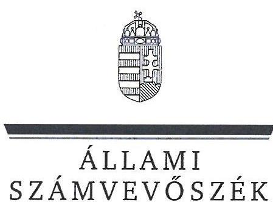
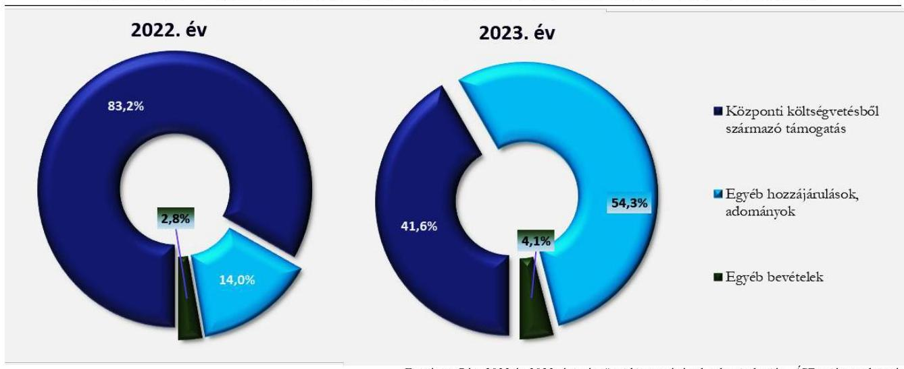
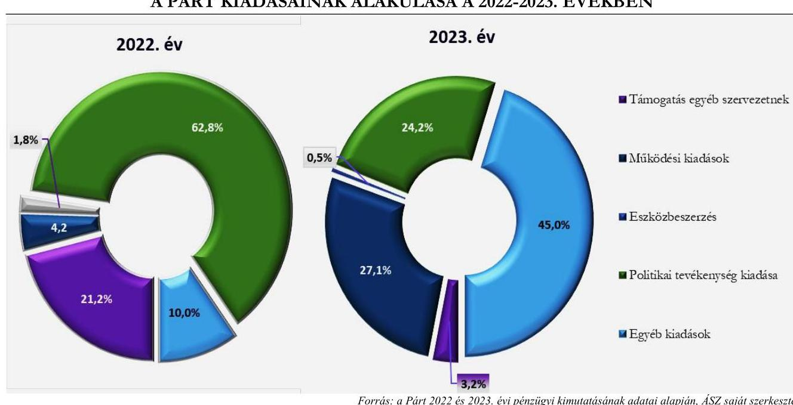

# JELENTÉS 

A költségvetési támogatásban részesülő pártok 2022-2023. évi gazdálkodása törvényességének ellenőrzése

Magyar Kétfarkú Kutya Párt

2025.

---

ÁLLAMI
SZÁMVEVŐSZÉK

# JELENTÉS 

## A költségvetési támogatásban részesülő pártok 2022-2023. évi gazdálkodása törvényességének ellenőrzése

Magyar Kétfarkú Kutya Párt

2025.

---

# ELLENŐRZÉSI IGAZGATÓSÁG: 

## ELLENŐRZÉSI IGAZGATÓSÁG V.

## ELLENŐRZÉSI IGAZGATÓ:

## KLINGA LÁSZLÓ igazgató

## ELLENŐRZÉSVEZETŐ:

## SOLYMÁR ÁGNES ellenőrzésvezető

Jelentéseink az interneten a www.asz.hu címen olvashatók.

IKTATÓSZÁM: EL-4133-006/2025
TÉMASORSZÁM: 6
ELLENŐRZÉS-AZONOSÍTÓ SZÁM: V1121

---

# TARTALOMJEGYZÉK 

AZ ELLENŐRZÉS ALAPADATAI ..... 5
AZ ELLENŐRZÖTT SZERVEZET ..... 8
ÖSSZEFOGLALÁS ..... 9
AZ ELLENŐRZÉS FÓKUSZKÉRDÉSEI ..... 11
MEGÁLLAPÍTÁSOK ..... 12
JAVASLATOK ..... 19
MELLÉKLETEK ..... 20
I. sz. melléklet: Értelmező szótár ..... 20
II. sz. melléklet: Ellenőrzési kritériumok ..... 21
FÜGGELÉK: ÉSZREVÉTELEK ..... 22
RÖVIDÍTÉSEK JEGYZÉKE ..... 23

---

.

---

# AZ ELLENŐRZÉS ALAPADATAI 

## AZ ELLENŐRZÉS CÉLJA

Az ellenőrzés célja annak értékelése volt, hogy a Párt ${ }^{1}$ közzétett éves pénzügyi kimutatása a törvényi előírásoknak megfelelt-e, a könyvvezetés és gazdálkodás során betartotta-e a vonatkozó jogszabályi és belső előírásokat, a Párt a működéséhez szabályszerűen igénybe vehető forrásokat használt-e fel, a pártok működéséről és gazdálkodásáról szóló Párttv.-ben engedélyezett gazdasági-vállalkozási tevékenységet folytatott-e. Az ellenőrzés célja volt továbbá annak értékelése, hogy az előző számvevőszéki jelentésben foglalt megállapításokkal összhangban készített intézkedési tervben meghatározott feladatokat a Párt végrehajtotta-e.

## AZ ELLENŐRZÉS TÍPUSA

Törvényességi ellenőrzés.

## AZ ELLENŐRZÖTT IDŐSZAK

A 2022-2023. évek.
Az utóellenőrzés tekintetében az utóellenőrzés alapját képező ÁSZ ${ }^{3}$ Jelentés ${ }^{4}$ közzétételének napjától (2023. április 25.) az ellenőrzésről szóló adatszolgáltatásra felhívó levél keltének (2024. október 16.) napjáig terjedő időszak.

## AZ ELLENŐRZÉS TÁRGYA

A Párt ellenőrzése során az ellenőrzés tárgyát képezte a 2022. és a 2023. évekre vonatkozó pénzügyi kimutatások elkészítésére, jóváhagyására, közzétételére, a Párt könyvvezetésére, gazdálkodására, ennek keretében a számviteli szabályozás kialakítására, a bizonylati rend, bizonylati fegyelem betartására, egyéb gazdálkodási, ellenőrzési és pénzügyi-számviteli feladatok ellátására irányuló tevékenységek. Az ellenőrzés tárgya volt továbbá a Párttv. szerinti források elszámolása és felhasználása, valamint a vagyon jogszabályi előírásoknak megfelelő használata, hasznosítása.

Az ellenőrzés kiterjedt minden olyan körülményre és adatra, amely az ÁSZ jogszabályban meghatározott feladatainak teljesítéséhez, valamint a program végrehajtása folyamán felmerült újabb összefüggések feltárásához szükséges volt.

Jelen ellenőrzés a 2022. évi országgyűlési képviselő-választási kampányra fordított pénzeszközök elszámolásának ellenőrzésére nem terjedt ki, azt az ÁSZ „A 2022. évi országgyűlési képviselő-választási kampányra fordított pénzeszközök elszámolásának ellenőrzése" című önálló ellenőrzése (továbbiakban: kampányellenőrzés ${ }^{5}$ ) keretében ellenőrizte.

---

# Az ellenőrzés jogalapját 

Az ellenőrzés jogalapját az ÁSZ tv. ${ }^{6} 5. §$ (11) bekezdés a) pontja és 33. § (7) bekezdése, a Párttv. 4. § (4)(5) bekezdései, valamint 10. § (1),(3)-(4) bekezdései képezték.

## AZ ELLENŐRZÉS MÓDSZERE

Az ellenőrzést az ellenőrzési program szempontjai, az ellenőrzött időszakban hatályos jogszabályok, az ellenőrzés általános szakmai szabályai, az ellenőrzésre irányadó ÁSZ módszertanok figyelembevételével végezte az ÁSZ.

Az ellenőrzési kérdések megválaszolásához szükséges bizonyítékok megszerzése az ellenőrzött szervezet által rendelkezésre bocsátott dokumentumokra, adatokra alapozva kérdésfeltevés (információkérés), interjú, mintavételezés útján történt. Az ÁSZ a 2022-2023. évi bevételeket és kiadásokat mintavételi eljárással kiválasztott tételek alapján ellenőrizte.

Az ellenőrzési bizonyítékként felhasználható adatforrások közé tartoztak egyrészt az ellenőrzési programban felsorolt adatforrások, másrészt adatforrás lehetett még - minden az ellenőrzés folyamán - feltárt, az ellenőrzés szempontjából információt tartalmazó dokumentum.

Az ellenőrzés lefolytatásához az ellenőrzött szervezet tanúsítványok kitöltésével, hitelesítésével és a teljességi és hitelességi nyilatkozattal alátámasztott dokumentumok rendelkezésre bocsátásával szolgáltatott adatokat.

Az ÁSZ a tételes ellenőrzés mellett statisztikai alapú, véletlenszerű és kockázatalapú mintavételezést és értékelést alkalmazott. A statisztikai alapú mintavételnél a minták kiválasztása rétegzett mintavételezéssel történt, amelynek értékelése „szabályszerű”, ha a minta ellenőrzésének eredménye alapján 95%-os bizonyossággal a teljes sokaságban az átlagos hibaarány nem haladja meg a 10%-ot, „nem szabályszerű”, ha nagyobb, mint 10%. Abban az esetben, ha a teljes sokaság tekintetében a 10%-os hibaarányhoz való viszony megítélésének megbízhatósága nem érte el a 95%-ot, annak elérése érdekében az értékelés további szempontokkal egészült ki, a feltárt hibák értéke is figyelembevételre került. A statisztikai alapú mintavétel kiegészült évente az öt legnagyobb forgalmi értékkel rendelkező szállító tételes ellenőrzésével a lényegesség biztosítása érdekében. A kockázati alapon kiválasztott mintatételek értékelése nem került kivetítésre. Tételes ellenőrzésre kerültek a bevételek közül a központi költségvetésből származó támogatások, valamint a Párt országgyűlési képviselőcsoportjának nyújtott állami támogatások. A kiadások közül tételes ellenőrzésre kerültek az egyéb szervezetek részére nyújtott támogatások, valamint a reklámhordozón elhelyezett hirdetések költségei. A bérköltségekből és eszközbeszerzésekből egyszerű véletlenszerű leválogatással került kiválasztásra évente tíz-tíz mintatétel.

A kampányellenőrzés keretében az ÁSZ ellenőrizte a 2022. évi országgyűlési képviselő választásra fordított állami és a Párttv.-ben meghatározott más pénzeszközök elszámolását, ezért jelen ellenőrzés a kampányidőszakra vonatkozó bevételi és kiadási tételek értékelését nem tartalmazza.

Az utóellenőrzés megállapításai az ÁSZ rendelkezésére álló dokumentumok, az ellenőrzött szervezet által rendelkezésre bocsátott dokumentumok, adatok alapján kerültek megfogalmazásra. A korábbi ÁSZ jelentés alapján a Párt által készített intézkedési tervben előírt feladatok végrehajtása az alábbiak szerint kerültek értékelésre:

---

- „határidőben végrehajtott”-nak minősült a feladat, ha a teljesítés dokumentáltan, az intézkedési tervben előírt határidőben és tartalommal megtörtént;
- „határidőn túl végrehajtott”-nak minősült a feladat, ha annak teljesítése az intézkedési tervben meghatározott módon, de az abban előírt határidőn túl történt meg;
- „nem végrehajtott”-nak minősült a feladat, ha a végrehajtás nem történt meg, vagy amennyiben a teljesítést/végrehajtást nem dokumentálták, dokumentumokkal nem tudják igazolni annak teljesítését;
- „okafogyottá vált”-nak minősült a feladat, ha végrehajtására - meghatározott esemény bekövetkezése, továbbá külső körülmény, a működést érintő feltétel változása miatt - már nincs szükség, illetve lehetőség, és egyértelműen megállapítható, hogy az intézkedést szükségessé tevő körülmény a jövőben nem fordulhat elő;
- „nem időszzerű”-nek minősült az a feladat, amelynek ellenőrzési időszakon belüli végrehajtására azért nem került (kerülhetett) sor, mert az intézkedés alapjául szolgáló esemény nem következett be, de annak jövőbeni előfordulása lehetséges, a végrehajtása nem volt esedékes, vagy a végrehajtás határideje még nem járt le.”

---

# AZ ELLENŐRZÖTT SZERVEZET 

## Magyar Kétfarkú Kutya Párt

A Magyar Kétfarkú Kutya Pártot politikai célú tevékenység céljából hozták létre, a Fővárosi Törvényszék pártként működő egyesületként jegyezte be 2014. szeptember 24-én. A nyilvántartásba vételét végző bíróság előtt a Párt alapítói kinyilvánították, hogy a Párttv. rendelkezéseit magukra nézve kötelezőnek ismerik el a Párttv. 1. §-a alapján. A Párt Alapszabályában ${ }^{7}$ rögzített célja a közhatalom gyakorlásában való részvétel, ennek során a képviseleti demokrácia, a társadalmi igazságosság érvényre juttatása, a demokratikus államfelépítés támogatása, valamint a humor megjelenítése a közpolitikában.

A Párt legfőbb döntéshozó szerve a taggyűlés, ügyvezető szerve az elnökség, amelyet az Alapszabály alapján két társelnök, az elnökhelyettes és két további tag alkot.

A Párt a Párttv. 9/A. § (1) bekezdése alapján 2018. májusában létrehozta a Savköpő Menyét Alapítványt. A Párt a 2021. évi határozata alapján egyszemélyes Korlátolt Felelősségű Társaság létrehozásáról döntött, amely gazdasági társaság bejegyzése, így a létrehozása 2023. év végéig nem történt meg.

A Párt által készített és közzétett pénzügyi kimutatások adatai alapján a 2022. évben 569687 ezer Ft bevételt - melyből 473925 ezer Ft központi költségvetési támogatás - és 581789 ezer Ft kiadást, a 2023. évben 117879 ezer Ft bevételt - melyből 49087 ezer Ft központi költségvetési támogatás - és 112180 ezer Ft kiadást mutatott ki, melynek részletezését az 1. táblázat tartalmazza.

## 1. táblázat

A PÁRT 2022-2023. ÉVI PÉNZÜGYI KIMUTATÁSÁNAK ADATAI (ADATOK EZER FT-BAN)

| BEVÉTELEK | 2022. ÉV | 2023. ÉV |
| :-- | --: | --: |
| Központi költségvetésből származó támogatás | 473925 | 49087 |
| Egyéb hozzájárulások, adományok | 80014 | 63996 |
| Egyéb bevételek | 15748 | 4796 |
| Összes bevétel a gazdasági évben | $\mathbf{5 69687}$ | $\mathbf{117879}$ |
| Kiadások | 2022. ÉV | 2023. ÉV |
| Támogatás egyéb szervezeteknek | 123153 | 3573 |
| Működési kiadások | 25023 | 30439 |
| Eszközbeszerzés | 10356 | 530 |
| Politikai tevékenység kiadása | 365284 | 27130 |
| Egyéb kiadások | 57973 | 50508 |
| Összes kiadás a gazdasági évben | $\mathbf{581789}$ | $\mathbf{112180}$ |

Forrás: A Párt 2022. és a 2023. évi pénzügyi kimutatása, ÁSZ saját szerkesztés

---

# ÖSSZEFOGLALÁS 

A Párttv. 1. §-a kimondja: a párt olyan egyesület, amely nyilvántartott tagsággal rendelkezik, és amely a nyilvántartásba vételét végző bíróság előtt kinyilvánítja, hogy a Párttv. rendelkezéseit magára nézve kötelezőnek ismeri el.

Az ÁSZ tv. 5. § (11) bekezdés a) pontja alapján az ÁSZ - a Párttv. rendelkezéseinek megfelelően törvényességi szempontok szerint ellenőrzi a pártok gazdálkodását. A Párttv. 10. § (3) bekezdése alapján az ÁSZ kétévente ellenőrzi azoknak a pártoknak a gazdálkodását, amelyek a központi költségvetésből rendszeres támogatásban részesültek. A Párt pénzügyi kimutatásai szerint a központi költségvetésből 2022-ben 473925 ezer Ft, a 2023. évben 49087 ezer Ft támogatásban részesült.

Az ÁSZ a kampányellenőrzés keretében ellenőrizte a 2022. évi országgyűlési képviselő választásra fordított állami és a Párttv.-ben meghatározott más pénzeszközök felhasználását. Jelen ellenőrzés az országgyűlési képviselő választásra kapott pénzeszközökre és azok felhasználására nem terjedt ki. Emiatt jelen ellenőrzésnek a pénzügyi kimutatásra, az azt alátámasztó könyvvezetésre, a bevételek, kiadások elszámolására vonatkozó megállapításai a párt gazdálkodásának a kampányellenőrzéssel nem érintett részére vonatkoznak.

Szabályozási környezet megfelelt a jogszabályi előírásoknak

A Párt az ellenőrzött időszakban a jogszabályi előírásoknak megfelelően kialakította a gazdálkodás kereteit meghatározó belső szabályzatait.

A Párt a 2022-2023. évekre vonatkozó pénzügyi kimutatásait határidőben elkészítette, a Magyar Közlöny mellékletét képező Hivatalos Értesítőben, valamint saját honlapján közzétette. A 2022-2023. évekre vonatkozó pénzügyi kimutatások adatait a főkönyvi adatok a jogszabályi előírásnak megfelelően alátámasztották. Az ellenőrzött bevételek számviteli elszámolása a jogszabályi előírásoknak megfelelt.

Az ellenőrzés hiányosságokat tárt fel az adományok nyilvántartásában és a kiadások elszámolásában.

Az egy naptári év alatt kapott 500 ezer Ft feletti hozzájárulások a Párttv. előírásai szerint a pénzügyi kimutatásban nevesítésre kerültek, azonban teljes körűségük nem volt igazolt, mivel a Párt kialakított könyvvezetési rendszere és nyilvántartásai a Számv. tv.-ben foglaltak ellenére egyik ellenőrzött évben sem voltak alkalmasak a Párttv. 1. számú mellékletében meghatározott pénzügyi kimutatás egyéb hozzájárulások, adományok adatainak alátámasztására.

Az ellenőrzött kiadások számviteli elszámolása több feltárt szabálytalanság és a bizonylattal való alátámasztás hiánya miatt nem felelt meg a jogszabályi előírásoknak az ellenőrzött időszakban. A Pártnál tiltott támogatás elfogadását az ellenőrzött területeken, illetve az ellenőrzött mintatételek esetében az ÁSZ nem állapított meg.

A Párt gazdálkodása során a vagyon használata szabályszerű volt. A vagyon nyilvántartása a belső szabályzatában előírt mennyiségi leltározás és az ellenőrzött tételek esetében a hiányzó alátámasztó bizonylatok miatt nem volt szabályszerű, így a tárgyi eszközök nyilvántartott valós értéke nem volt alátámasztott.

A gazdálkodás tekintetében
 a belső szabályzatban előírt ellenőrzéseket teljesítették.

A Párt az ellenőrzött időszakban a gazdálkodásával kapcsolatban a belső szabályzatában előírt ellenőrzéseket elvégezte.

---

A Párt az intézkedési tervben vállalt feladatok felét hajtotta végre.

A Párt a korábbi ÁSZ ellenőrzés megállapításai alapján készített intézkedési tervében meghatározott tíz feladat közül ötöt határidőben végrehajtott, ötöt nem teljesített.

---

# AZ ELLENŐRZÉS FÓKUSZKÉRDÉSEI 

1.- A Párt a jogszabályi előírásoknak megfelelően kialakította-e a pénzügyi kimutatás összeállítására és az azt alátámasztó könyvvezetésre vonatkozó belső szabályozást?
2.- A Párt pénzügyi kimutatása, az azt alátámasztó könyvvezetése, a bevételek, kiadások elszámolása, valamint a vagyon nyilvántartása és használata, hasznosítása megfelelt-e a jogszabályi és belső előírásoknak?
3.- A Párt gazdálkodásának ellenőrzése az előírásoknak megfelelően működött-e?
4.- A korábbi ÁSZ ellenőrzés megállapításai alapján készített intézkedési tervben foglaltak végrehajtásra kerültek-e?

---

# MEGÁLLAPÍTÁSOK 

## 1. A Párt a jogszabályi előírásoknak megfelelően kialakította-e a pénzügyi kimutatás összeállítására és az azt alátámasztó könyvvezetésre vonatkozó belső szabályozást?

Összegző megállapítás A Párt a 2022-2023. években a jogszabályi előírásoknak megfelelően kialakította a pénzügyi kimutatás összeállítására és az azt alátámasztó könyvvezetésre vonatkozó belső szabályozását.

A Párt az ellenőrzött időszakban rendelkezett a Számv. tv. előírásainak megfelelő Számviteli politikával ${ }^{8}$, annak keretében Leltározási szabályzattal ${ }^{9}$, Értékelési szabályzattal ${ }^{10}$, Pénzkezelési szabályzattal ${ }^{11}$, valamint Számlarenddel ${ }^{12}$, melyeket a Számv. tv.-ben, illetve a Párt hatályos Alapszabályában foglaltaknak megfelelően a Párt képviseletére jogosult elnök kiadmányozott.
A Párt a Gazdálkodási és pénzügyi szabályzatában ${ }^{13}$ határozta meg többek között a Számv. tv.-ben foglalt gazdasági műveletet elrendelő személyt, az utalványozásra jogosultak körét, valamint a teljesítésigazolással kapcsolatos előírásokat.
A Párt gazdálkodásával kapcsolatos szabályzatok a 2022-2023. években biztosították a pénzügyi kimutatás a Párttv.-ben előírt tagolásban történő elkészítését.
A Párt a tagdíjakat a Ptk.-ban ${ }^{14}$ előírtaknak megfelelően az Alapszabályban és a Tagdíjszabályzatban ${ }^{15}$ szabályozta az ellenőrzött időszakban.

---

# 2. A Párt pénzügyi kimutatása, az azt alátámasztó könyvvezetése, a bevételek, kiadások elszámolása, valamint a vagyon nyilvántartása és használata, hasznosítása megfelelt-e a jogszabályi és belső előírásoknak? 

Összegző megállapítás

2.1. számú megállapítás

A Párt 2022-2023. évekre vonatkozó pénzügyi kimutatásai és az azokat alátámasztó könyvvezetése az egyéb hozzájárulások, adományok kivételével megfelelt a Számv. tv. előírásainak. Az ellenőrzött bevételek elszámolása szabályszerű volt, a kiadások elszámolása nem volt szabályszerű. A Párt gazdálkodása során a vagyon használata szabályszerű volt, a vagyon nyilvántartása a tárgyi eszközök belső szabályzatban előírt mennyiségi leltár hiánya miatt nem volt szabályszerű.

A Párt a jogszabályban előírt határidőben közzétette a 2022-2023. évekre vonatkozó pénzügyi kimutatásait. A Párt könyvvezetése a kiadási tételek kivételével szabályszerű volt, valamint az egyéb hozzájárulások, adományok kivételével nyilvántartási adatokkal alátámasztottak voltak.

A Párt a 2022. és 2023. évekre vonatkozó pénzügyi kimutatását a Párttv.-ben előírt határidőben, a Párt tv.-ben előírt tartalommal elkészítette. A 2022-2023. évekre vonatkozó pénzügyi kimutatásokat a Párt Alapszabályában foglaltakkal összhangban az elnökség elfogadta. A Párt a Magyar Közlöny mellékletét képező Hivatalos Értesítőben (2023. évi 27. szám: 2023. május 31. / 2024. évi 26. szám: 2024. május 31.), valamint a saját honlapján a pénzügyi kimutatásokat közzétette a Párttv.-ben foglaltaknak megfelelően.
A Párt a könyvvezetési rendszerét úgy vezette, hogy abból a Párttv.-ben előírt pénzügyi kimutatás adatai levezethetőek voltak.
A 2022-2023. években a pénzügyi kimutatások „Egyéb hozzájárulások, adományok" elnevezésű sorában szereplő adatok nem voltak alátámasztottak, mivel a Számv. tv. 161. § (3) bekezdésében foglaltak ellenére a Párt nem vezetett olyan adományozónkénti analitikus nyilvántartást, amely biztosította volna a nyilvántartás és a főkönyvi adatok között az értékadatok számszerű egyeztetésének lehetőségét.

---

2.2. számú megállapítás

A Párt 2022-2023. évekre vonatkozó pénzügyi kimutatásaiban a bevételek főkönyvi adatokkal alátámasztottak voltak, ugyanakkor az 500 ezer Ft alatti és feletti adományok nyilvántartásának hiánya miatt azok összegének megfelelőssége nem volt ellenőrizhető.

A Párt bevételei a Párttv.-ben meghatározott forrásokból - központi költségvetési támogatás, hozzájárulások, adományok és egyéb bevételek - származtak az ellenőrzött időszakban. Összes bevétele a 2022. évben 569687 ezer Ft volt, 2023. évben 117879 ezer Ft volt, melynek megoszlását az 1. ábra mutatja.
1. ábra

A PÁRT BEVÉTELEI ÖSSZETÉTELÉNEK ALAKULÁSA A 2022-2023. ÉVEKBEN

A 2022-2023. években a Párt bevételeit tartalmazó főkönyvi számlákon szereplő és a pénzügyi kimutatás egyes bevételi sorain kimutatott összegek megegyeztek. Az ellenőrzött bevételi tételek vonatkozásában a bevételek elszámolása a Számv. tv. és a Párttv. előírásainak megfelelt.
A Párt a 2022-2023. évekre vonatkozóan a pénzügyi kimutatás bevételi soraiban szereplő adatokat a Párttv.-ben, illetve a Számv. tv.-ben és a belső szabályzatokban foglaltaknak megfelelő könyvviteli nyilvántartással alátámasztotta. Az egyéb hozzájárulások, adományok tekintetében alátámasztó nyilvántartást a Párt nem vezetett, így az 500 ezer Ft feletti és alatti hozzájárulások és adományok összege és megfelelő nevesítése nem volt ellenőrizhető, ugyanakkor a főkönyvben szereplő számszaki adatok a pénzügyi kimutatás adatait alátámasztották.
2.3. számú megállapítás

A Párt kiadásainak pénzügyi kimutatásokban szereplő adatai főkönyvi adatokkal alátámasztottak voltak. Az ellenőrzött tételek a könyvviteli rendszerben való elszámolása a 2022-2023. évek tekintetében több esetben nem felelt meg a jogszabályi előírásoknak.

A Párt 2022. és 2023. évi pénzügyi kimutatásaiban a Párttv. előírásával összhangban kiadásként szerepeltette az egyéb szervezeteknek nyújtott támogatás, a működési kiadások, az eszközbeszerzések, a politikai tevékenység és az egyéb kiadások összesített adatait.
A Párt összes kiadása a 2022. évben 581789 ezer Ft, a 2023. évben 112180 ezer Ft volt, melynek megoszlását a 2. ábra mutatja.

---

A 2022-2023. évekről készített pénzügyi kimutatásaiban szereplő kiadások esetében a Párttv. és a Számv. tv. előírásainak megfelelően fenn állt a főkönyvi kivonat és a pénzügyi kimutatás közötti számszaki egyezőség.
A 2022-2023. évre vonatkozóan a könyvviteli nyilvántartásaiban szereplő, ellenőrzött kiadási tételek elszámolása az alábbi esetekben nem volt szabályszerű:

- A Párt a Számv. tv. 167. § (1) bekezdés c) pontjában, valamint a Gazdálkodási és pénzügyi szabályzat 3. pontjában előírtak ellenére, a 2022-2023. évi könyvviteli nyilvántartásában szereplő ellenőrzött tételek tekintetében a bizonylaton az utalványozó (107 tétel), a rendelkezés végrehajtását igazoló személy aláírását (94 tétel) nem szerepeltette, a Gazdálkodási és pénzügyi szabályzat 3.5. a) pontjában előírtak ellenére külön írásbeli rendelkezés formájában sem.
- A Gazdálkodási és pénzügyi szabályzat 4.5. pontjában foglaltak ellenére a Párt az elszámolásra adott előlegeket az előírt 30 napon belül nem számolta el, ugyanis jellemzően 2023-ban került sor a 2022. évben és az azt megelőzően keletkezett elszámolási előlegek elszámolására. Ezekben az ellenőrzött esetekben (összesen 22 tétel, amelyek közül 18 tétel esetében 20 ezer Ft alatti összeg szerepelt, a legnagyobb tétel összege 144 ezer Ft volt) az elszámolásra kiadott előlegekből vásárolt tételek pénzügyi teljesítése a könyvviteli rendszerben nem volt követhető, nem dokumentált. Az előleg és annak elszámolása között a Párt nem biztosította az egyeztetés lehetőségét a Számv. tv. 161. § (3) bekezdésében foglaltak ellenére.
- Az ellenőrzött kiadási tételek vonatkozásában a Gazdálkodási és pénzügyi szabályzat 4.4 pontjában foglaltak ellenére a Párt a 2022. évben a készpénzes kiadás esetén nem állított ki szabályszerű kiadási pénztárbizonylatot. A 2023. évi könyvviteli nyilvántartásban szereplő, ellenőrzött tételekből két pénztári tétel vonatkozásában a Pénzkezelési szabályzat 7.1. pontjában foglaltak ellenére nem szerepelt a kifizető és a pénzt átvevő aláírása, ezáltal a kifizetés dokumentummal nem volt igazolt.

---

- Az ellenőrzött tételekből 2022. évben egy tétel, 2023. évben négy tétel vonatkozásában a Számv. tv. 169. § (2) bekezdésében foglaltak ellenére a könyvviteli elszámolást alátámasztó eredeti számviteli bizonylatot (számlát), legalább 8 évig olvasható formában a Párt nem őrizte meg.
- A könyvviteli elszámolásban a kiadások között szereplő, nyújtott támogatások közül a 2022-2023. években két-két alapítványnak, illetve egyesületnek nyújtott támogatás esetében a kapcsolódó támogatási szerződésekben, valamint a Gazdálkodási és pénzügyi szabályzat 5.1.1. pontjában előírtak ellenére a támogatással kapcsolatos elszámolások, beszámolók nem készültek. A 2023-as évben további egy esetben az elszámolás (263 ezer Ft) kevesebb összeget tartalmazott a szerződésben és az átutalásban szereplő (305 ezer Ft) összegnél.
- A nyújtott támogatások közül a 2022-2023. években két-két esetben (2022. évben mindösszesen 156 ezer Ft, 2023. évben mindösszesen 240 ezer Ft) az átutalási dokumentumon felül további dokumentum nem állt rendelkezésre négy alapítványnak nyújtott támogatás vonatkozásában, azaz a Párt a Számv. tv. 165. § (2) bekezdésében foglaltak ellenére a könyvviteli nyilvántartásába bizonylat nélkül jegyzett be adatot. Ezekben az esetekben a Gazdálkodási és pénzügyi szabályzat 2.1.3. pontjában foglaltak ellenére a Párt nem írásban vállalt kötelezettséget, valamint a támogatott a Gazdálkodási és pénzügyi szabályzat 5.1.1. pontjában foglaltak ellenére nem számolt el igazoltan az összegek felhasználásával.
A fenti hiányosságok mellett a pénzügyi kimutatásban szereplő adatokat a főkönyvben szereplő kiadások összegei alátámasztották.
2.4. számú megállapítás

A Párt gazdálkodása során a vagyon használata, bérbeadása szabályszerű volt, a tárgyi eszközök nyilvántartása a mennyiségi leltár és a bizonylattal való alátámasztás hiánya miatt nem volt szabályszerű.

A Párt MFB ${ }^{16}$ által nyújtott hitellel, valamint ingatlan tulajdonnal nem rendelkezett az ellenőrzött időszakban.
A Párt a tulajdonában álló ingóság bérbeadásából származó bevétele a Párttv.-ben, valamint a Számv. tv.-ben foglaltaknak megfelelt az ellenőrzött időszakban.
A Párt a könyvviteli zárlatot mindkét évben a Számv. tv., valamint a belső szabályzatoknak megfelelően elvégezte, melyet a Leltározási szabályzatban előírt eszköz- és forrás egyeztetésekkel alátámasztott. A Leltározási szabályzat 1.1 és 2.2 pontjában foglaltak ellenére a tárgyi eszközök tekintetében előírt évenkénti mennyiségi leltározást nem végezte el az ellenőrzött időszakra vonatkozóan. A tárgyi eszközök 2022-2023. években előírt mennyiségi leltározásának elmaradása miatt az eszközök valódisága nem volt alátámasztott.
A 2022-2023. években nyilvántartott, ellenőrzött tárgyi eszköz közül (20 db), három eszköz (2022-2023. évi nyilvántartásban szereplő 2019. évi beszerzések) tekintetében a beszerzéshez a Számv. tv. 165. § (2) bekezdéseiben foglaltak ellenére nem kapcsolódott alapbizonylat (számla, szerződés), így az eszközök nyilvántartott adatai nem voltak ellenőrizhetőek, alátámasztottak.
Az ellenőrzött tárgyi eszközök közül egy kivételével a könyvviteli elszámolást közvetlenül alátámasztó bizonylaton a Számv. tv. 167. § (1) bekezdés c) pontjában, valamint a Gazdálkodási és pénzügyi

---

szabályzat 3. pontjában foglaltak ellenére az utalványozás, illetve a rendelkezés végrehajtása nem volt igazolt.

A további ellenőrzött tárgyi eszközökhöz kapcsolódóan a Számv. tv.-ben előírt bizonylatok rendelkezésre álltak, a Számv. tv.-ben előírtaknak megfelelően az üzembe helyezésük szabályszerűen dokumentált volt, valamint a Párttv.-ben előírtaknak megfelelő kiadási jogcímen szerepeltek a könyvvitelben és a 2022-2023. évre vonatkozó pénzügyi beszámolókban. Az ellenőrzött tárgyi eszközök értékcsökkenésének megállapítása és elszámolása a Számv. tv.-ben meghatározottaknak megfelelően történt.

# 3. A Párt gazdálkodásának ellenőrzése az előírásoknak megfelelően működött-e? 

## Összegző megállapítás A Párt a gazdálkodásának ellenőrzését szabályszerűen működtette a 2022-2023. években.

A Párt taglétszáma az ellenőrzött években nem haladta meg a 100 főt, így a Ptk.-ban foglaltak alapján nem volt kötelezett felügyelőbizottság létrehozására.
A Párt gazdálkodásának ellenőrzésével kapcsolatban a Gazdálkodási és pénzügyi szabályzat (beérkezett adományok folyamatba épített
 tartalmai és formai ellenőrzése) és a Pénzkezelési szabályzat (a pénztári tevékenység folyamatba épített, szúrópróbaszerű és havi pénzkészlet ellenőrzése) tartalmazott előírásokat. A Párt az előírtak szerint az ellenőrzéseket elvégezte a 2022-2023-as években.

## 4. A korábbi ÁSZ ellenőrzés megállapításai alapján készített intézkedési tervben foglaltak végrehajtásra kerültek-e?

## Összegző megállapítás A Párt az intézkedési tervben ${ }^{17}$ előírt tíz intézkedés közül öt intézkedést határidőben végrehajtott, öt intézkedést nem hajtott végre.

A Párt 2020-2021. évi gazdálkodása törvényességének ellenőrzéséről készült 23015 sorszámú ÁSZ jelentésben rögzített megállapításokkal kapcsolatban készített és elfogadott intézkedési terve tíz feladatot tartalmazott, melyből öt intézkedést határidőben teljesített, öt intézkedést nem hajtott végre, melyeket részletesen a 2. számú táblázat foglalja magában.

---

# 2. táblázat

## PÁRT 2020-2021. ÉVI GAZDÁLKODÁSA TÖRVÉNYESSÉGÉNEK ELLENŐRZÉSÉHEZ KAPCSOLÓDÓ INTÉZKEDÉSI TERV ALAPJÁN

## HATÁRIDŐBEN VÉGREHAJTOTT FELADATOK

1. A Párt intézkedett a számlarend Számv. tv. 161. § (2) bekezdés a) pontjában előírtaknak való megfelelőségről.
2. A Párt gondoskodott arról, hogy a Pénzkezelési szabályzatban előírtak alapján az előírt gyakorisággal, dokumentáltan kerüljön sor a házipénztár ellenőrzésére.
3. A Párt gondoskodott arról, hogy a Számv. tv. 164. § (2) bekezdésében foglaltaknak megfelelően a pénzügyi kimutatását főkönyvi kivonattal támassza alá.
4. A Párt gondoskodott arról, hogy a könyvviteli elszámolások során az egyéb bevételek könyvelésével kapcsolatban a Számv. tv. 77. §-ában foglalt előírásokat betartsák, ezáltal biztosították, hogy a Párttv. 1. számú mellékletében előírt pénzügyi kimutatás tartalma a főkönyvben nyilvántartott adatokon alapuljon.
5. A Párt intézkedett arról, hogy a Pénzkezelési szabályzatban foglaltaknak megfelelően a pénztárakhoz kapcsolódóan vezessenek pénztárjelentést.

## A PÁRT TÁRSELNÖKÉI ÁLTAL NEM VÉGREHAJTOTT FELADATOK

1. A Párt az egyéb hozzájárulások, adományok bevételeit a könyvvezetési rendszerében (alátámasztó nyilvántartás hiányában) nem részletezte tovább úgy, hogy abból a Számv. tv. 161/A. § (2) bekezdésében foglaltaknak megfelelően a Párttv. 1. számú mellékletében meghatározott pénzügyi kimutatás adatai rendelkezésre álljanak.
2. A Párt az ellenőrzött kiadási tételek értékelése alapján nem gondoskodott arról, hogy a Számv. tv. 165. § (2) bekezdésében foglaltaknak megfelelően a könyvelési rendszerében minden esetben szabályszerű bizonylat alapján jegyezzenek be adatot, ugyanakkor az intézkedések hatására a bizonylathiányok az évek tekintetében csökkenő tendenciát mutattak, jellemzően a 2023. évet megelőző időszakot érintették.
3. A Párt az ellenőrzött időszakban nem intézkedett arról, hogy az eszközök és források fordulónapi leltára során a Leltározási szabályzatban előírtak alapján a tárgyi eszközök mennyiségi leltározása végrehajtásra kerüljön.
4. A Párt az ellenőrzött könyvviteli tételek vonatkozásában nem intézkedett arról, hogy a Számv.tv. 167. § (1) bekezdés c) pontjában foglaltak szerint a könyvviteli elszámolást közvetlenül alátámasztó bizonylatok tartalmazzák a gazdasági múveletet elrendelő személy, az utalványozó és a rendelkezés végrehajtását igazoló személy aláírását.
5. A Párt az ellenőrzött tételek alapján nem minden esetben intézkedett (két eset a 2023. év vonatkozásában) arról, hogy a támogatott szervezetek a támogatási szerződésekben, továbbá a Gazdálkodási és pénzügyi szabályzatban foglaltak szerint elszámoljanak a nyújtott támogatásokkal.

---

# JAVASLATOK

Az ÁSZ tv. 33. § (1) bekezdésében foglaltak értelmében az ellenőrzött szervezet vezetője köteles a jelentésben foglalt megállapításokhoz kapcsolódó intézkedési tervet összeállítani és azt a jelentés kézhezvételétől számított 30 napon belül az ÁSZ részére megküldeni. Amennyiben az ellenőrzött szervezet vezetője nem küldi meg határidőben az intézkedési tervet, vagy továbbra sem elfogadható intézkedési tervet küld, az Állami Számvevőszék elnöke az ÁSZ tv. 33. § (3) bekezdése a) és b) pontjaiban foglaltakat érvényesítheti.

## MAGYAR KÉTFARKÚ KUTYA PÁRT ELNÖKE

1. Gondoskodjon a pénzügyi kimutatásokban szerepeltetett egyéb hozzájárulások, adományok adatait alátámasztó nyilvántartás vezetéséről - beleértve a pénzügyi kimutatásban nevesített, éves szinten 500 000 Ft feletti hozzájárulásokat -, a Számv. tv. 161. § (3) bekezdésében előírtaknak megfelelően.
2. Gondoskodjon arról, hogy a könyvviteli elszámolásokat alátámasztó bizonylatokon az utalványozó, a rendelkezés végrehajtását igazoló személy aláírása szerepeljen, a Számv. tv. 167. § (1) bekezdés c) pontjában, valamint a Gazdálkodási és pénzügyi szabályzat 3. pontjában előírtaknak megfelelően.
3. Gondoskodjon arról, hogy az elszámolásra kiadott előlegekkel való elszámolás a Gazdálkodási és pénzügyi szabályzat 4.5. pontjában foglaltaknak megfelelő időben történjen meg, figyelembe véve a Számv. tv. 161. § (3) bekezdésében foglalt egyeztetési lehetőség biztosítását.
4. Gondoskodjon arról, hogy a készpénzes kiadások esetében a kiadási pénztárbizonylat a Gazdálkodási és pénzügyi szabályzat 4.4 pontjában foglaltaknak, valamint a Pénzkezelési szabályzat 7.1. pontjában előírtaknak megfelelően legyen kiállítva.
5. Gondoskodjon arról, hogy a könyvviteli elszámolást alátámasztó eredeti számviteli bizonylatot (számlát), legalább 8 évig olvasható formában megőrizze a Párt a Számv. tv. 169. § (2) bekezdésében előírtaknak megfelelően.
6. Gondoskodjon arról, hogy a könyvviteli elszámolások tekintetében a kapcsolódó támogatási szerződésben, valamint a Gazdálkodási és pénzügyi szabályzat 5.1.1. pontjában előírtaknak megfelelően a támogatással kapcsolatos elszámolások, beszámolók elkészüljenek.
7. Gondoskodjon arról, hogy a könyvviteli elszámolásban a kiadások és azok pénzügyi teljesítése szabályszerű bizonylattal alátámasztott legyen a Számv. tv. 165. § (2) bekezdésében foglaltaknak megfelelően, illetve Gazdálkodási és pénzügyi szabályzat 2.1.3. pontjában foglaltaknak megfelelően a Párt írásban vállaljon kötelezettséget.

---

# MELLÉKLETEK

## I. SZ. MELLÉKLET: ÉRTELMEZŐ SZÓTÁR

egyesület
költségvetési támogatás
pénzügyi kimutatás
a párt gazdasági-vállalkozási tevékenysége
nem pénzbeli támogatás
ingó vagyontárgyak
intézkedési terv

Az egyesület a tagok közös, tartós, alapszabályban meghatározott céljának folyamatos megvalósítására létesített, nyilvántartott tagsággal rendelkező jogi személy. (Forrás: Ptk. 3:63. § (1) bekezdés) A Számv. tv. szempontjából egyéb szervezet. (Számv. tv. 3. § 4. a) pont)
A társadalombiztosítás pénzügyi alapjai kivételével az államháztartás központi alrendszeréből ellenérték nélkül, pénzben nyújtott támogatások. (Forrás: Áht. ${ }^{18}$ 1. § 14. pont)

A pártok a pénzügyi kimutatást kötelesek minden év május 31-ig a Magyar Közlönyben, valamint saját honlappal rendelkező pártok a honlapjukon is közzétenni.
(Párttv. 9. § (1) bekezdés, 1. számú melléklet)
A párt a költségeinek fedezése és vagyonának gyarapítása érdekében a következő gazdasági-vállalkozási tevékenységeket folytathatja:
a) politikai céljainak és tevékenységének megismertetése érdekében kiadványokat jelentethet meg és terjeszthet, a pártot szimbolizáló jelvényeket és más ilyen célú tárgyakat árusíthat, és pártrendezvényeket szervezhet;
b) a tulajdonában álló ingatlanokat és ingókat díj ellenében hasznosíthatja és elidegenítheti.
(Párttv. 6. § (1) bekezdés)
Vagyoni értékkel rendelkező forgalomképes dolog, szellemi alkotás, illetve vagyoni értékű jog részben vagy egészében, véglegesen vagy ideiglenesen, teljesen vagy részben ingyenesen történő átruházása vagy átengedése, illetve szolgáltatás biztosítása.
(Civil tv. 2. § 25. pont)
Ingó vagyontárgy: az ingatlannak nem minősülő dolog, kivéve a fizetőeszközt, az értékpapírt és a föld tulajdonosváltozása nélkül értékesített lábon álló (betakarítatlan) termést, terményt (pl. lábon álló fa). (Szja tv. ${ }^{19}$ 3. § 30. pont)
Az ellenőrzött szervezet vezetője által készített, a jelentés kézhezvételétől számított harminc napon belül az ÁSZ részére megküldött, az ÁSZ által elfogadott, intézkedéseket tartalmazó terv.
(ÁSZ tv. 33. §)

---

# II. SZ. MELLÉKLET: ELLENŐRZÉSI KRITÉRIUMOK

## FOKUSZTERÜLET/FOKUSZKÉRDÉS

1. A Párt a jogszabályi előírásoknak megfelelően kialakította-e a pénzügyi kimutatás összeállítására és az azt alátámasztó könyvvezetésre vonatkozó belső szabályozást?
2. A Párt pénzügyi kimutatása, az azt alátámasztó könyvvezetése, a bevételek, kiadások elszámolása, valamint a vagyon nyilvántartása és használata, hasznosítása megfelelt-e a jogszabályi és belső előírásoknak?

## ELLENŐRZÉSI KRITÉRIUMOK

Számv. tv. 3. §, 6. §, 12. §, 14. §, 15-16. §, 160-161/A. §, 164-169. §, 23-45. §, 46-53. §, 57-68. §, 69. §
Párttv. 4. §, 6. §, 9. §, 1. sz. melléklet
Civil tv. 2. §
479/2016. (XII. 28.) Korm. rendelet ${ }^{20}$ 4. § (1) bekezdés, 9. §, 15-16. §
Ptk. 3:4. §, 3:26-3:28. §, 3:63-3:87. §
Alapszabály, a Párt belső szabályozásai
Számv. tv. 6. §, 12. §, 14. §, 159. §, 160. §, 161-161/A. §, 164-167. §
Párttv. 4. §, 6. §, 9. §, 1. sz. melléklet
Mt. ${ }^{21}$ 14. §, 45. §, 48. §
Szja tv. 3. §, 25. §, 47. §, 3. sz. melléklet
Ptk. 3:74. §, 6:272-6:280. §, 6:331-6:341. §
Civil tv. 2. §
Tvtv. ${ }^{22}$ 11/F. §, 11/G. §
104/2017. (IV. 28.) Korm. rendelet ${ }^{23}$ 8/C. §
Art. ${ }^{24}$ 1. sz. melléklet
465/2017. (XII.28.) Korm. rendelet ${ }^{25}$
437/2015.(XII.28.) Korm. rendelet ${ }^{26}$
TAO tv. ${ }^{27}$ 4. §, 18. §
Vtv. ${ }^{28}$ 68. §
Alapszabály, a Párt belső szabályozásai
Számv. tv. 14. §
Belső szabályzatok, felügyelőbizottság ügyrendjében foglaltak, A 2019-2020. évi ÁSZ ellenőrzésről készült ÁSZ jelentés megállapításai alapján készített intézkedési tervben foglalt előírások, ellenőrzési határozatok, jegyzőkönyvek.
A korábbi évek ÁSZ ellenőrzéséről készült ÁSZ jelentés megállapításai alapján készített intézkedési tervben foglalt előírások.

---

# FÜGGELÉK: ÉSZREVÉTELEK

A jelentéstervezetet a Számvevőszék 15 napos észrevételezésre megküldte az ellenőrzött szervezet vezetőjének az ÁSZ tv. 29. § (1) bekezdése előírásának megfelelően.

A Magyar Kétfarkú Kutya Párt társelnöke a jelentéstervezet megállapításaira nem tett észrevételt.

[^0]
[^0]:    * 29. § (1) Az Állami Számvevőszék az ellenőrzési megállapításait megküldi az ellenőrzött szervezet vezetőjének vagy az általa megbízott személynek, és annak, akinek személyes felelősségét állapította meg.
    (2) Az ellenőrzött szervezet vezetője és a felelősként megjelölt személy az ellenőrzés megállapításaira tizenöt napon belül írásban észrevételt tehet.
    (3) Az Állami Számvevőszék az észrevételre a beérkezésétől számított harminc napon belül írásban válaszol. A figyelembe nem vett észrevételeket köteles a jelentésben feltüntetni, és megindokolni, hogy azokat miért nem fogadta el.

---

# RÖVIDÍTÉSEK JEGYZÉKE

${ }^{1}$ Párt
${ }^{2}$ Párttv.
${ }^{3}$ ÁSZ
${ }^{4}$ Jelentés
${ }^{5}$ kampányellenőrzés
${ }^{6}$ ÁSZ tv.
${ }^{7}$ Alapszabály
${ }^{8}$ Számviteli politika
${ }^{9}$ Leltározási szabályzat
${ }^{10}$ Értékelési Szabályzat
${ }^{11}$ Pénzkezelési szabályzat
${ }^{12}$ Számlarend
${ }^{13}$ Gazdálkodási és pénzügyi szabályzat
${ }^{14}$ Ptk.
${ }^{15}$ Tagdíjszabályzat
${ }^{16}$ MFB
${ }^{17}$ Intézkedési terv
${ }^{18}$ Áht.
${ }^{19}$ Szja tv.
${ }^{20}$ 479/2016. Korm. rendelet
${ }^{21}$ Mt.
${ }^{22}$ Tvtv.
${ }^{23}$ 104/2017. (IV.28) Korm. rendelet
${ }^{24}$ Art.
${ }^{25}$ 465/2017. (XII.28.) Korm. rendelet
${ }^{26}$ 437/2015. (XII. 28.) Korm. rendelet
${ }^{27}$ TAO tv.
${ }^{28}$ Vtv.

Magyar Kétfarkú Kutya Párt
1989. évi XXXIII. törvény a pártok működéséről és gazdálkodásáról

Állami Számvevőszék
A Magyar Kétfarkú Kutya Párt 2020-2021. évi gazdálkodása törvényességének ellenőrzéséről készült, 2023. május 23-án kelt, 23015 sorszámú számvevőszéki jelentés
„A 2022. évi országgyűlési képviselő-választási kampányra fordított pénzeszközök elszámolásának ellenőrzése" című ÁSZ ellenőrzés
2011. évi LXVI. törvény az Állami Számvevőszékről

A Magyar Kétfarkú Kutya Párt Alapszabálya (módosítva és egységes szerkezetbe foglalva 2018. július 13-tól, 2022. május 6-tól)
A Magyar Kétfarkú Kutya Párt számviteli politikája (hatályos: 2021. július 19-étől)
A Magyar Kétfarkú Kutya Párt eszközök és források leltárkészítési és leltározási szabályzata (hatályos: 2021. július 19-étől)
A Magyar Kétfarkú Kutya Párt eszközök és források értékelési szabályzata (hatályos: 2021. július 19-étől)

A Magyar Kétfarkú Kutya Párt pénzkezelési szabályzata (hatályos: 2021. július 19-étől)
A Magyar Kétfarkú Kutya Párt számlarendje (hatályos: 2022. január 31-étől)
A Magyar Kétfarkú Kutya Párt gazdálkodási és pénzügyi szabályzata (hatályos: 2021. szeptember 1-jétől)
2013. évi V. törvény a Polgári Törvénykönyvről

A Magyar Kétfarkú Kutya Párt "VI. tagdíj és pártoló tagdíjfizetésre vonatkozó szabályzatok" című dokumentuma (hatályos: 2016. augusztus 4.)
Magyar Fejlesztési Bank
A Magyar Kétfarkú Kutya Párt 2020-2021.
 évi gazdálkodásának törvényességének ellenőrzéséről készült, 2023. május 23-án kelt, 23015 sorszámú számvevőszéki jelentéséhez kapcsolódó intézkedési terv
2011. évi CXCV. törvény az államháztartásról
1995. évi CXVII. törvény a személyi jövedelemadóról
479/2016. (XII. 28.) Korm. rendelet a számviteli törvény szerinti egyes egyéb szervezetek beszámoló-készítési és könyvvezetési kötelezettségének sajátosságairól
2012. évi I. törvény a munka törvénykönyvéről
2016. évi LXXIV. törvény a településkép védelméről
104/2017. (IV. 28.) Korm. rendelet a településkép védelméről szóló törvény reklámok közzétételével kapcsolatos rendelkezéseinek végrehajtásáról
2017. évi CL. törvény az adózás rendjéről
465/2017. (XII. 28.) Korm. rendelet az adóigazgatási eljárás részletszabályairól
437/2015. (XII. 28.) Korm. rendelet a belföldi hivatalos kiküldetést teljesítő munkavállaló költségtérítéséről
1996. évi LXXXI. törvény a társasági adóról és az osztalékadóról
2007. évi CVI. törvény az állami vagyonról

---

1052 Budapest, Apáczai Csere János u. 10. | 1364 Budapest IV., Pf. 54
www.asz.hu | szamvevoszek@asz.hu
telefon: +36 1 484 9100
