# JELENTÉS 

Egyházi fenntartású kórházak közfeladat ellátással kapcsolatos támogatásai felhasználásának ellenőrzése és az államháztartásból nem hitéleti célra nyújtott támogatások vonatkozásában a pénzügyi és ellátási tevékenységének, adósságállomány alakulásának elemzése

Budapesti Szent Ferenc Kórház

2025.

---

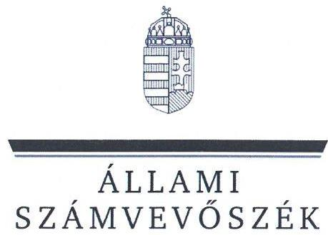

ÁLLAMI
SZÁMVEVÔSZÉK

# JELENTÉS 

Egyházi fenntartású kórházak közfeladat ellátással kapcsolatos támogatásai felhasználásának ellenőrzése és az államháztartásból nem hitéleti célra nyújtott támogatások vonatkozásában a pénzügyi és ellátási tevékenységének, adósságállomány alakulásának elemzése

Budapesti Szent Ferenc Kórház

2025. 

25093
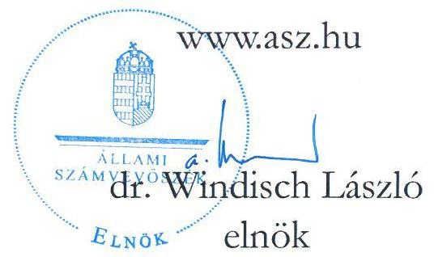

---

# ELLENŐRZÉSI IGAZGATÓSÁG: 

## ELLENŐRZÉSI IGAZGATÓSÁG V.

## ELLENŐRZÉSI IGAZGATÓ:

KLINGA LÁSZLÓ ellenőrzési igazgató

## ELLENŐRZÉSVEZETŐ:

VARGA EDIT ellenőrzési igazgatóhelyettes, ellenőrzésvezető

Jelentéseink az interneten a www.asz.hu címen olvashatók.

IKTATÓSZÁM: EL-4090-013/2025
TÉMASORSZÁM: 24
ELLENŐRZÉS-AZONOSÍTÓ SZÁM: V1108

---

# TARTALOMJEGYZÉK 

AZ ELLENŐRZÉS ALAPADATAI ..... 5
AZ ELLENŐRZÉS HATÓKÖRE ÉS TERÜLETE ..... 7
ÖSSZEFOGLALÁS ..... 9
AZ ELLENŐRZÉS FÓKUSZTERÜLETEI/FÓKUSZKÉRDÉSEI ..... 11
MEGÁLLAPÍTÁSOK ..... 12
JAVASLATOK ..... 17
ELEMZÉS A BUDAPESTI SZENT FERENC KÓRHÁZ PÉNZÜGYI ÉS ELLÁTÁSI TEVÉKENYSÉGÉNEK, ADÓSSÁGÁLLOMÁNYÁNAK ALAKULÁSÁRÓL AZ ÁLLAMHÁZTARTÁSBÓL NEM HITÉLETI CÉLRA NYÚJTOTT TÁMOGATÁSOK VONATKOZÁSÁBAN ..... 18
ELEMZÉS ..... 23
FÜGGELÉK ..... 50
I. sz. Függelék: a kórház főbb működési jellemzői az összes elemzett kórház adatainak viszonylatában ..... 50
MELLÉKLETEK ..... 55
I. sz. melléklet: Értelmező szótár ..... 55
II. sz. melléklet: Az ellenőrzőtt szervezetek jegyzéke ..... 58
III. sz. melléklet: Ellenőrzési kritériumok ..... 59
FÜGGELÉK: ÉSZREVÉTELEK ..... 60
RÖVIDÍTÉSEK JEGYZÉKE ..... 61

---

.

---

# AZ ELLENŐRZÉS ALAPADATAI 

## AZ ELLENŐRZÉS CÉLJA

Az ellenőrzés célja a Magyarországon egyházi fenntartásban működő aktív fekvőbeteg-szakellátást is végző kórházak esetében annak értékelése volt, hogy az államháztartásból nem hitéleti célra nyújtott támogatások vonatkozásában a támogatás felhasználásának szabályozási környezetét szabályszerűen alakították-e ki. Értékeltük továbbá a könyvvezetési és beszámoló készítési és közzétételi kötelezettség teljesítésének szabályszerűségét, belső szabályzatoknak való megfelelését, továbbá az államháztartásból kapott, nem hitéleti célú támogatások felhasználásának és elszámolásának szabályszerűségét, a felhasználás támogatás céljának való megfelelését.

Ellenőrzési cél volt továbbá annak megállapítása, hogy az egyház (mint a közfeladatot ellátó intézmény fenntartója) a jogszabályi előírásoknak és belső szabályzatainak megfelelően gondoskodott-e a kórházzal kapcsolatos fenntartói kötelezettségei teljesítéséről.

## AZ ELLENŐRZÉS TÍPUSA

Törvényességi ellenőrzés.

## AZ ELLENŐRZŐTT IDŐSZAK

A 2023. év

## AZ ELLENŐRZÉS TÁRGYA

Az ellenőrzés tárgyát képezte - az államháztartásból nem hitételi célra nyújtott támogatások vonatkozásban - a Magyarországon egyházi fenntartásban működő aktív fekvőbeteg-szakellátást is végző kórházak tekintetében a 2023. évre vonatkozóan a számviteli szabályozási keretek kialakításának, a könyvvezetési és beszámoló készítési és közzétételi kötelezettség teljesítésének szabályszerűsége és belső szabályzatoknak való megfelelése. Az ellenőrzés kiterjedt a kórházak esetében az államháztartásból nem hitéleti célra nyújtott támogatás tekintetében a támogatás-felhasználás célhoz kötöttségének ellenőrzésére is.

Az egyház, mint fenntartó tekintetében az ellenőrzés tárgyát képezte a kórházzal kapcsolatos fenntartói tevékenység szabályszerűségének értékelésére figyelemmel a kórházat megillető államháztartási forrásból nem hitéleti célra nyújtott támogatások kezelése/átadása.

Az ellenőrzés kiterjedt minden olyan körülményre és adatra, amely az ÁSZ jogszabályban meghatározott feladatainak teljesítéséhez, valamint a program végrehajtása folyamán felmerült újabb összefüggések feltárásához szükséges volt.

---

# Az ellenőrzés jogsalapja 

Az ellenőrzés jogszabályi alapját az ÁSZ tv. ${ }^{1} 1 . \int$ (3) bekezdés, az 5. $\$ (11) bekezdés c) pont, (13) bekezdés és az Ehtv. ${ }^{2}$ 19/D. $\int$ (2) bekezdés előírásai képezték.

## AZ ELLENŐRZÉS MÓDSZERE

Az ellenőrzést a nemzetközi standardokat irányadónak tekintve az ellenőrzési program szempontjai, az ellenőrzött időszakban hatályos jogszabályok, az ÁSZ ${ }^{3}$ ellenőrzés-szakmai szabályok és irányadó módszertanok figyelembevételével végezte az ÁSZ.

Az ellenőrzési kérdések megválaszolásához szükséges bizonyítékok megszerzése az ellenőrzött szervezetek által rendelkezésre bocsátott dokumentumokra és adatokra alapozva megfigyelés, helyszíni szemle (szemrevételezés), kérdésfeltevés (információkérés), illetve mintavételezés útján történt. Kockázati alapon kiválasztott mintatételeken keresztül történt a kórházak esetében az államháztartásból nem hitéleti célra nyújtott támogatások felhasználása, számviteli elszámolása szabályszerűségének ellenőrzése, az egyházi fenntartóknál pedig a fenntartón keresztül folyósított - kórházat megillető - támogatások kezelése (intézmény részére történő átadás, elszámolás) szabályszerűségének ellenőrzése. A mintatételek kiértékelése nem került a sokaságra kivetítésre, az ellenőrzött támogatásokra vonatkozó összegző és részletes következtetések az adott területhez kapcsolódó értékelésben kerültek megjelenítésre.

Az ellenőrzés lefolytatásához az ellenőrzött szervezetek a tanúsítványok kitöltésével, valamint az ellenőrzött és az ellenőrzést támogató szervezetek az ÁSZ által kért dokumentumok, adatok, információk megküldésével szolgáltattak adatokat.

Az ellenőrzési bizonyítékként felhasználható adatforrások közé tartoztak egyrészt az ellenőrzéshez kért dokumentumok, adatforrások, másrészt adatforrás volt még minden - az ellenőrzés folyamán - az ellenőrzés szempontjából információkat tartalmazó dokumentum. Az ellenőrzési kritériumok részletes felsorolását a III. sz. melléklet tartalmazza.

---

# AZ ELLENŐRZÉS HATÓKÖRE ÉS TERÜLETE 

Az ÁSZ tv. 5. § (11) bekezdés c) pontja értelmében az ÁSZ törvényességi szempontok szerint ellenőrzi a vallási egyesületek, az egyházi jogi személyek vagy azok nevelési-oktatási, felsőoktatási, egészségügyi, karitatív, szociális, család-, gyermek- és ifjúságvédelmi, kulturális vagy sporttevékenység végzésére létrehozott, a jogi személyiséggel rendelkező vallási közösség belső szabálya szerint jogi személyiséggel nem rendelkező intézménye részére az államháztartásból nem hitéleti célra nyújtott támogatás felhasználását.

Az ellenőrzés kiterjedt arra, hogy az egyházi fenntartó a jogszabályi előírásoknak és belső szabályzatainak megfelelően gondoskodott-e a nem hitéleti célra nyújtott támogatások felhasználása során az általa fenntartott aktív fekvőbeteg-szakellátást is végző kórházzal kapcsolatos fenntartói kötelezettségei teljesítéséről, ami magában foglalta az intézmény könyvvezetési és beszámolókészítési kötelezettsége megállapításának-, a szervezet jogi személyiségének megfelelő besorolásának-, a kórház részére a fenntartón keresztül folyósított, államháztartásból nem hitéleti célra nyújtott támogatások könyvvezetési rendszerében történő elszámolásának, átadásának ellenőrzését.

A kórház múködési keretei kialakításának szabályszerűségére vonatkozó ellenőrzés az államháztartásból nem hitéleti célra nyújtott támogatások felhasználásának belső szabályozási környezete kialakításának szabályszerűségére terjedt ki. Az ellenőrzés és értékelés a beszámolót alátámasztó számviteli nyilvántartási rendszer kialakításának és múködésének szabályozottságára; az elkülönített kimutatások szabályozottságára továbbá a beszámoló közzététele módjának meghatározására vonatkozott.

A beszámolási és közzétételi kötelezettség teljesítésének szabályszerűsége keretében értékelésre került, hogy a kórház a jogszabályi előírásoknak és belső szabályzataiban meghatározottaknak megfelelően eleget tett-e beszámolási kötelezettségének, gondoskodott-e a beszámoló közzétételéről, amennyiben számviteli politikájában meghatározta a közzététel módját. Ellenőrzésre került, hogy az államháztartási forrásból származó, nem hitéleti célú támogatást felhasználó kórház számviteli beszámolójának mérlegtételeit a Számv. tv. ${ }^{4}$ előírása szerinti leltárral alátámasztotta-e, továbbá, hogy gondoskodott-e a közfeladatellátással kapcsolatos közérdekű vagy közérdekből nyilvános adatok közzétételéről.

A könyvvezetési kötelezettség teljesítésének ellenőrzése keretében értékelésre került, hogy a kórház betartotta-e a jogszabályi és vonatkozó belső szabályozások előírásait, továbbá a bizonylatolásra vonatkozó előírások, a kiadási tételek besorolását. Az ellenőrzés kiterjedt arra, hogy a kórház a könyvvezetési rendszerében biztosította-e az alaptevékenységből és vállalkozási tevékenységből származó bevételeinek, költségeinek és ráfordításainak elkülönített kimutatását, hogy a kapott támogatásokat bevételként elszámolta-e, az államháztartából nem hitéleti célra folyósított támogatások felhasználása a támogatási célnak megfelelő és szabályszerű volt-e.

A 2023. évben Magyarországon múködő kilenc egyházi fenntartású fekvőbeteg-szakellátást végző intézményből a V1108 ellenőrzés-azonosító számú ellenőrzés keretében öt aktív fekvőbeteg-szakellátást is végző intézmény került ellenőrzésre. Közülük jelen ÁSZ jelentés a Budapesti Szent Ferenc Kórház, és fenntartójaként az Assisi Szent Ferenc Leányai Kongregációja, mint ellenőrzött szervezetek ellenőrzéséről készült.

---

# BUDAPESTI SZENT FERENC KÓRHÁZ 

A Kórház ${ }^{5}$ 1936-ban az Assisi Szent Ferenc Leányai Kongregáció nővérei által került megalapításra, majd 1950-ben államosításra került. 1993-ban az állam és az egyház között kötött egyezmény alapján a Kongregáció ${ }^{6}$ visszakapta a Kórház tulajdonjogát, 1996-ban pedig már önálló igazgatású egyházi tulajdonú Kórház lett. A Kórház az Ehtv. 10. és 11. §-a szerinti egyházi jogi személy, továbbá az Eütv. ${ }^{7}$ 3. § ga) pontja szerinti egészségügyi intézmény, tehát önállóan gazdálkodó intézmény, fenntartója és felügyeleti szerve a Kongregáció. A Kórház Alapító okirata ${ }^{8}$ szerint ellátott közfeladatai közé sorolandó a rehabilitációs és aktív fekvőbeteg ellátás, járóbeteg ellátás, oktatási tevékenység. A Kórházban a fekvőbeteg-ellátási osztályokon belül az egyik kiemelt szakterület a kardiológiai rehabilitáció, mely részleget 95 db kardiológiai fekvőbeteg ággyal múködtetnek. Másik fő szakterület a 23 ággyal múködő belgyógyászati osztály, ezen belül főként a diabetológiai ellátás nyújtása jellemző. A Kórházban magánegészségügyi ellátást nem végeztek az ellenőrzött időszakban. A Kórház fő bevételi forrása a NEAK ${ }^{9}$ finanszírozás volt (a 2019. évi 386627 E Ft támogatás összege 2023. évre 1058500 E Ft-ra növekedett.) A Kórház egyszerűsített éves beszámolójában foglaltak szerint a NEAK bevétel a Kórház összes bevételéhez képest a vizsgált években $40-56 \%$ között oszlott meg.

A Kormány az 1781/2017. (XI.7.) Korm. határozatban ${ }^{10}$ foglaltak alapján a kórházi infrastruktúra javításához, az egyházi egészségügyi fejlesztésekhez, komplex kardiológiai rehabilitációs szakkórház kialakításához a Kórház részére a 2017-2019. évi központi költségvetésből legfeljebb összesen 2444169 E Ft többletforrás rendelkezésre állásáról döntött. Az 1025/2020. (II. 12.) Korm. határozat ${ }^{11}$ és az 1074/2022. (II. 16.) Korm. határozat ${ }^{12}$ szerint a Kórház fejlesztési beruházásához szükséges további központi költségvetési forrást a Kormány legfeljebb 897759 E Ft, illetve 685000 E Ft-ban határozta meg.

A Kórház a Kongregáció által jóváhagyott költségvetés keretén belül önállóan gazdálkodott, 2023. évben az alaptevékenységének segítésére végzett kiegészítő vállalkozási tevékenységet (karbantartás, kazánház és energia szolgáltatás, gépjármú üzemeltetés, élelmezési tevékenység, kertészet, takarítás), amely az összes bevételén belül $13,2 \%$-ot tett ki.

## ASSISI SZENT FERENC LEÁNYAI KONGREGÁCIÓJA

A Kongregációt 1894-ben alapították Budapesten, mint a Kórház fenntartójaként a Kórházzal közösen a nővérek elköteleződése, célja és küldetése a gyógyító és rehabilitációs tevékenység. A Kórház és fenntartó jelenlegi fő profilja a kardiovaszkuláris eseményeken átesett betegek korai szakintézményi rehabilitációja. A Kongregáció a 2023. évben nem végzett gazdasági-vállalkozási tevékenységet.

---

# ÖSSZEFOGLALÁS 

Magyarország Alaptörvényének ${ }^{13}$ XX. cikke szerint mindenkinek joga van a testi és lelki egészséghez, melynek érvényesülését Magyarország többek között az egészségügyi ellátás megszervezésével segíti elő. Az Ehtv. előírása szerint „a jogi személyiséggel rendelkező vallási közösség részt vállalhat a társadalom értékteremtő szolgálatában, ennek érdekében önmaga vagy e célra létrehozott intézménye útján olyan közcélú tevékenységet is elláthat, amelyet törvény nem tart fenn kizárólagosan az állam vagy annak intézménye számára". A közcélú tevékenység ellátásához az állam az Ehtv. 19. § (1)-(2) bekezdése szerint költségvetési támogatást nyújt.
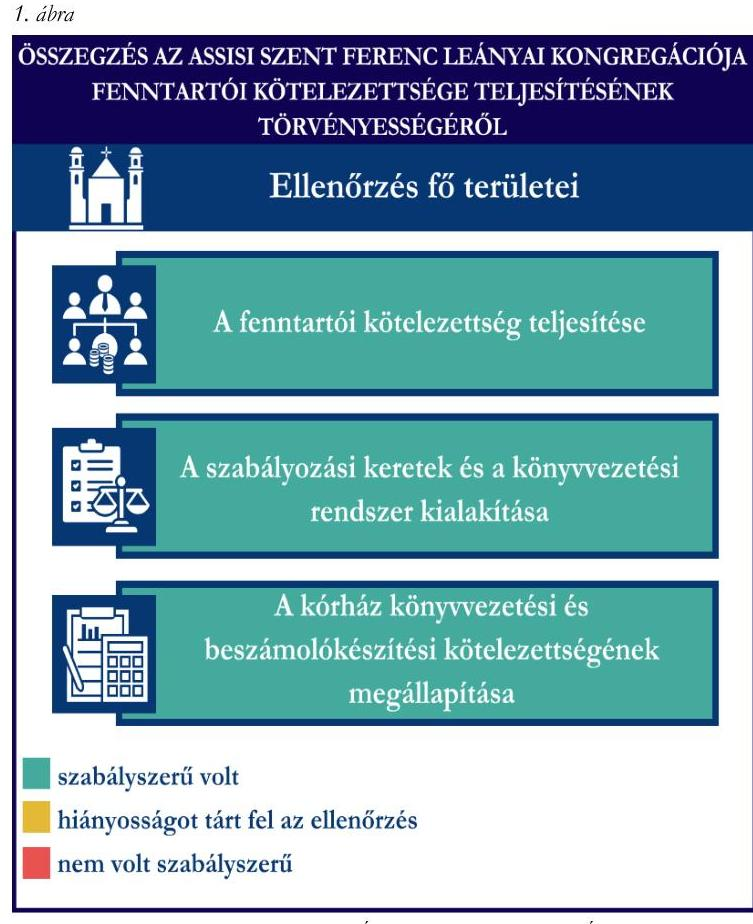

A Kongregáció a Kórház könyvvezetési és beszámolókészítési kötelezettségét a jogszabályi előírásnak megfelelően meghatározta.

A Fenntartó szabályozási kereteinek és könyvvezetési rendszerének kialakítása szabályszerű volt az államháztartásból nem hitéleti célra nyújtott támogatások tekintetében.

A Kongregáció - vállalkozási tevékenységet nem végző egyházi jogi személyként - a jogszabályi előírásoknak megfelelően a számviteli politikájában az egyszerűsített éves beszámoló készítését választotta, a beszámoló alátámasztása érdekében kettős könyvvitel vezetéséről rendelkezett.

---

2. álma

ÖSZZTÁZÉS A BUDAPESTI SZENT ÉSZENE KORHÁZ KÖZFELÁBÁT ELLÁTÁSSAL KAPCSOLATOS TÁMOGATÁSÁT ELLHASZNÁLÁSÁNAK TÖRVÉNYESSEGÉRŐL

## Ellenőrzés fő területei

Számviteli szabályzatok megalkotása

Beszámoló tartalmának és formájának meghatározása

Beszámolási kötelezettség teljesítése

Közzétételi kötelezettség teljesítése

Könyvvezetési kötelezettség teljesítése

A közpénzek felhasználásának ellenőrizhetőségét biztosító elkülönített nyilvántartás vezetése az államháztartásból nem hitéleti célra nyújtott támogatások felhasználása vonatkozásában
szabályszerú volt
hiányosságot tárt fel az ellenőrzés
nem volt szabályszerú

A Kórház a jogszabályban előírt gazdálkodási kereteket meghatározó szabályzatok közül rendelkezett számviteli politikával, továbbá a számviteli politika keretében kötelezően elkészítendő szabályzatokkal, azonban 2023. évben számlarenddel nem rendelkezett.

A Kórház a számviteli politikájában - tevékenységeit és bevételeinek főösszegét figyelembe véve - a Számv. tv. és a 296/2013. Korm. rend. előírásai alapján egyszerűsített éves beszámoló készítését, annak alátámasztására kettős könyvvitel vezetését írta elő.

A Kórház a 2023. évre vonatkozó beszámolási kötelezettségének eleget tett, a 2023. évi egyszerűsített éves beszámolójának mérleg és eredménykimutatás adatait a főkönyvi kivonat alátámasztotta. A jogszabály előírását betartva a Kórház a 2023 évi beszámoló mérlegtételeit leltárral alátámasztotta. A Kórház 2023. évi beszámoló vonatkozásában a jogszabályban előírt könyvvizsgálati kötelezettségnek nem tett eleget.

A Kórház közzétételi kötelezettségének teljesítése nem felelt meg teljeskörűen a jogszabályi előírásoknak, mivel a tevékenységére és múködésére vonatkozó, valamint gazdálkodási adatait csak részben tette közzé.

A Kórház könyvvezetési kötelezettségének teljesítése megfelelt a jogszabályi előírásoknak, az alaptevékenység és vállalkozási tevékenység elkülönített kimutatása biztosított volt.

A Kórház 2023. évben a támogatások felhasználásáról könyvvezetési rendszerében teljeskörű, a közpénzek felhasználásának ellenőrizhetőségét biztosító elkülönített nyilvántartást vezetett. Az államháztartásból nem hitéleti célra nyújtott támogatások felhasználása a mintatételek esetében megfelelt a jogszabályi előírásoknak, a támogatási szerződésekben/támogatói okiratokban meghatározott céloknak megfelelő volt.

---

# AZ ELLENŐRZÉS FÓKUSZTERÜLETEI/FÓKUSZKÉRDÉSEI 

1.- Az egyház fenntartói kötelezettsége teljesítésének szabályszerűsége
2.- A kórház müködési keretei kialakításának szabályszerűsége az államháztartásból nem hitéleti célra nyújtott támogatások vonatkozásában
3.- A kórház beszámolási és közzétételi kötelezettsége teljesítésének szabályszerűsége az államháztartásból nem hitéleti célra nyújtott támogatások vonatkozásában
4.- A kórház könyvvezetési kötelezettsége teljesítésének, az államháztartásból nem hitéleti célra nyújtott támogatások felhasználásának és elszámolásának szabályszerűsége

---

# 1. Az egyház fenntartói kötelezettsége teljesítésének szabályszerűsége 

Összegző megállapítás A Kongregáció a Kórházzal kapcsolatos fenntartói kötelezettségeinek teljesítése, továbbá szabályozási kereteinek és könyvvezetési rendszerének kialakítása az államháztartásból nem hitéleti célra nyújtott támogatások vonatkozásában megfelelt a jogszabályi előírásoknak.

A Kongregáció egészségügyi intézménnyel kapcsolatos fenntartói kötelezettsége teljesítésére vonatkozó megállapítások:
A Kongregáció, mint a Kórház alapítója és fenntartója, gondoskodott az intézmény Alapító okiratának elfogadásáról, amely tartalmazza az Ehtv. 10. - 11. §-a szerinti önálló egyházi jogi személy, önállóan gazdálkodó intézmény besorolását. A Kongregáció a jogszabályi előírásnak megfelelően megállapította a Kórház könyvvezetési, beszámolókészítési kötelezettségét azzal, hogy a Kórházat a Számv. tv. 3. § (1) bekezdés 2-4. pontja szerinti szervezetek közé besorolta. Az Alapító okirat alapján a költségvetés ellenőrzése a Felügyelő testület, mint a Kongregáció tanácsadó testületén keresztül valósult meg.
A Kongregáció számviteli kereteinek, belső szabályainak és könyvvezetési rendszerének kialakítására vonatkozó megállapítások:
A Kongregáció rendelkezett a 2022. január 1-től hatályos számviteli politikával ${ }^{14}$, amely rögzítette, hogy a Kongregáció a naptári évről 296/2013. Korm. rend. ${ }^{15}$ előírásának megfelelően egyszerűsített éves beszámolót készít és az időbeli elhatárolás elvét nem alkalmazza. A beszámoló közzététele az egyházi jogi személyek számára nem volt kötelező, a Kongregáció nem élt a jogszabályban biztosított lehetőséggel és a számviteli politikában nem határozta meg a beszámolója közzétételének módját.
A Kongregáció belső szabályzatában rendelkezett a könyvvezetés módjáról, a számviteli politika alapján a könyvvezetés módja kettős könyvvitel, valamint beszámolókészítésének sajátosságait a 296/2013. Korm. rend. szerint meghatározta.
A Kongregáció állami, múködési, pályázati támogatásokban a 2023. évben nem részesült, valamint nem történt rajta keresztül a Kórházat megillető támogatás folyósítása.

---

# 2. A kórház múködési keretei kialakításának szabályszerűsége az államháztartásból nem hitéleti célra nyújtott támogatások vonatkozásában 

Összegző megállapítás A Kórház rendelkezett a közcélú egészségügyi tevékenységét meghatározó alapdokumentumokkal, azonban múködési kereteinek kialakítása nem történt meg teljeskörűen, mivel az ellenőrzött időszakra vonatkozóan a Kórház számlarendet nem készített.

A Kórház számviteli kereteinek, belső szabályainak és könyvvezetési rendszerének kialakítására vonatkozó megállapítások:
A Kórház a Számv.tv. előírásainak megfelelően rendelkezett számviteli politikával ${ }^{16}$, és a számviteli politika keretében kötelezően elkészítendő szabályzatokkal ${ }^{17}$. A Kórház egyszerűsített éves beszámolót készítő szervezetként a Számv. tv. előírása alapján mentesült az önköltségszámítási szabályzat készítési kötelezettség alól, azonban élt a szabályozás lehetőségével, megalkotta az önköltségszámítási szabályzatot ${ }^{18}$, a gazdálkodás szervezeti szabályait a gazdálkodási szabályzatban ${ }^{19}$ rögzítette. A Kórház a számviteli politikájában a 296/2013. Korm. rend. előírásának megfelelően rendelkezett az időbeli elhatárolások alkalmazásáról, rögzítette annak választott módszerét, alkalmazásuk eljárásrendjét.
A Kórház a Számv.tv. 161. § (1) és (4) bekezdés előírása ellenére nem készített számlarendet.
A Számv. tv. előírásainak megfelelően a Kórház meghatározta a naptári évről készítendő számviteli beszámoló típusát, a beszámoló formáját. A Kórház az egyszerűsített éves beszámoló alátámasztása érdekében könyveit a kettős könyvvitel szabályai szerint vezette. A 296/2013. Korm. rend. előírása alapján a beszámoló letétbe helyezése az egyházi jogi személyek számára nem volt kötelező, de számviteli politikájukban dönthettek annak közzétételéről, amely lehetőséggel a Kórház nem élt.
A 296/2013. Korm. rendelet előírásait betartva az alaptevékenységhez és vállalkozási tevékenységhez közvetlenül nem kapcsolódó költségek és az általános költségek tevékenységek közti megosztásának módját, szervezeti szabályait, módszerét a Kórház számviteli politikája és az önköltségszámítási szabályzata tartalmazta. A Kórház a 296/2013. Korm. rend. alapján rendelkezett az alaptevékenységgel és vállalkozási tevékenységgel kapcsolatos bevételek, költségek és ráfordítások elkülönített kimutatásáról, továbbá az egyházi tevékenység egyes feladatainak elkülönített bemutatásáról, a támogatások, pályázatok elkülönített kimutatásáról (6-7. számlaosztály gyűjtőkódok alkalmazása, főkönyvi számlák alábontása).
A Kórház közcélú egészségügyi tevékenységét meghatározó, ellenőrzött alapdokumentumaira vonatkozó megállapítások:
A Kórház rendelkezett a Fenntartó által jóváhagyott SZMSZ ${ }^{20}$-szel, amely 2023. április 03-án került kiadásra. A szabályzat tartalmazta a Kórház szervezeti felépítését, hogy a Fenntartó hatáskörébe tartozik az intézmény vezetőjének, gazdasági vezetőjének megbízása. A Kórház képviseletének szabályait az SZMSZ és az Alapító okirat tartalmazta. Az intézmény költségvetési ellenőrzésével, a költségvetés és a beszámoló jóváhagyásával kapcsolatos, a fenntartó hatáskörébe tartozó feladatok az SZMSZ-ben és a gazdálkodási szabályzatban kerültek meghatározásra.

---

# 3. A kórház beszámolási és közzétételi kötelezettsége teljesítésének szabályszerűsége az államháztartásból nem hitéleti célra nyújtott támogatások vonatkozásában 

Összegző megállapítás A Kórház a beszámolási kötelezettségét szabályszerűen teljesítette, azonban a jogszabályi előírás ellenére a könyvvizsgálati kötelezettségnek nem tett eleget. Közzétételi kötelezettségének teljesítése sem felelt meg teljeskörűen a jogszabályi előírásoknak, mivel a közérdekű, és közérdekből nyilvános, a tevékenységére és múködésére vonatkozó, továbbá gazdálkodási adatait csak részben tette közzé.

## A Kórház beszámolási kötelezettsége teljesítésére vonatkozó megállapítások:

A Kórház rendelkezett a 2023. naptári évre vonatkozó számviteli beszámolóval, a Számv. tv. és a 296/2013. Korm. rend. előírásainak és a belső szabályzataiban meghatározottaknak megfelelően egyszerűsített éves beszámolót készített.
A Kórház a Számv. tv. és a 296/2013. Korm. rendelet könyvvezetés módjára vonatkozó előírásainak megfelelően az egyszerűsített éves beszámoló adatainak alátámasztására könyveit a kettős könyvvitel rendszerében vezette, az egyszerűsített éves beszámoló mérlegében és eredménykimutatásában az előző évi és tárgyévi adatokat elkülönítetten mutatta ki. A Számv. tv. előírását betartva a 2023. évi beszámoló nyitó adatai megegyeztek az előző évi beszámoló záró adataival, az eredménykimutatásban elkülönítetten került kimutatásra az alap- és a vállalkozási tevékenység eredménye. A Kórház a 2023. évi egyszerűsített beszámoló elkészítéséhez, a mérleg alátámasztásához a Számv.tv. előírása szerinti leltárt készített.
A Kórház a 2023. évben kötelezett volt könyvvizsgálatra, azonban az Eftv. ${ }^{21}$ 12. § (1) bekezdés a) - b) pontjának előírása ellenére a könyvvizsgálati kötelezettségnek nem tett eleget.
A Kórház közzétételi kötelezettsége teljesítésére vonatkozó megállapítások:
A Kórház Számviteli politikájában nem rendelkezett a beszámoló közzétételéről, így annak közzétételére a 296/2013. Korm. rend. értelmében nem volt kötelezett.
A Kórház a közérdekű és közérdekből nyilvános adatok közzétételéről részben gondoskodott, mivel az Ehtv. 19. § (3) bekezdése, valamint az Info tv. ${ }^{22}$ 33. § (3) bekezdése és a 37. § (1) bekezdése és az 1. melléklete szerinti, az egészségügyi közfeladat ellátással összefüggő, az általános közzétételi listában szereplő szervezeti és személyi adatokat közzétette, azonban a tevékenységre és múködésre vonatkozó, valamint a gazdálkodási adatok közzétételi kötelezettségének csak részben tett eleget.

---

# 4. A kórház könyvvezetési kötelezettsége teljesítésének, az államháztartásból nem hitéleti célra nyújtott támogatások felhasználásának és elszámolásának szabályszerűsége 

## Összegző megállapítás

A Kórház könyvvezetési kötelezettségének a jogszabályi előírásoknak megfelelően eleget tett, a támogatások felhasználásától elkülönített nyilvántartást vezetett. Az ellenőrzött tételek alapján az államháztartásból nem hitéleti célra nyújtott támogatások felhasználása során betartotta a jogszabályi előírásokat.

## A Budapesti Szent Ferenc Kórház könyvvezetési kötelezettsége teljesítésére vonatkozó megállapítások:

A Kórház a jogszabályi előírásoknak megfelelően tett eleget könyvvezetési kötelezettségének, a bevételek és költségek, ráfordítások könyvviteli elszámolása során betartotta a jogszabályi előírásokat. Könyvvezetési rendszerében a bevételek számviteli elszámolás során a 296/2013. Korm. rend. előírásait betartva az adományokat és támogatásokat bevételként számolta el.
A Kórház a 296/2013. Korm. rend. előírásai szerint a 2023. évi beszámoló eredménykimutatásában elkülönítetten mutatta ki az alaptevékenységgel és vállalkozási tevékenységgel kapcsolatos bevételeket és ráfordításokat.
A 296/2013. Korm. rend. előírásainak betartása érdekében a Kórház a számviteli politikájában és az önköltségszámítási szabályzatában határozta meg az alaptevékenységhez és vállalkozási tevékenységhez közvetlenül nem kapcsolódó költségek és az általános költségek tevékenységek közti megosztásának szabályait, melyek alkalmazásával biztosította a közvetett költségek felosztását.
A Kórház a Számv. tv. előírásainak megfelelően olyan elkülönített, részletező nyilvántartást vezetett az alapcél szerinti tevékenysége költségei és ráfordításai ellentételezésére pályázati vagy egyedi döntés alapján folyósított nem hitéleti célú támogatások, valamint az egészségügyi szakellátási tevékenységéhez kapcsolódó Egészségbiztosítási Alapból nyújtott finanszírozás felhasználásáról, amelynek alapján támogatásonként megállapítható és ellenőrizhető azok felhasználása.
A Kórház államháztartásból nem hitéleti célra nyújtott támogatásai felhasználásának mintatételes ellenőrzésére vonatkozó megállapítások:
Az egészségügyi szakellátási tevékenységhez kapcsolódó, Egészségbiztosítási Alapból folyósi-
tott finanszírozás:
A Kórház esetében a 2023. évben folyósított támogatás összege az egészségügyi szakellátási tevékenységhez kapcsolódóan 1058500 E Ft volt. A Kórház a finanszírozás felhasználása során a bizonylati alátámasztottságra, alaki és tartalmi követelményeire, továbbá - a költségek/ráfordítások nyilvántartásba vétele során - a besorolásra vonatkozó - a Számv. tv.-ben meghatározott - előírásokat betartotta. A könyvelés módjára és az érintett könyvviteli számlákra történő hivatkozást, valamint a könyvviteli nyilvántartásokban történt rögzítés időpontjának igazolását a Számv. tv.-ben foglaltaknak megfelelően elektronikus nyilvántartással teljesítette.

---

# Pályázat vagy egyedi döntés alapján folyósitott támogatások: 

A Kórház 2023. évben pályázat, vagy egyedi döntés alapján négy BM által folyósított támogatásban részesült, melyből egy támogatást részben, három támogatást pedig teljes összegben felhasznált és elszámolt az ellenőrzött időszakban. További egy-egy támogatást az $\mathrm{ME}^{23}$ és az $\mathrm{ITM}^{24}$ folyósított a Kórház részére, amelyek pénzügyi elszámolása és felhasználása szintén megtörtént. A támogatások energia többletköltség kiegyenlítésére, energetikai fejlesztésekre, elektromos gépjárművek és töltőállomás beszerzésére, illetve múködési költségek fedezésére szolgáltak.
A Kórház könyvvezetési rendszerében a pályázat vagy egyedi döntés alapján folyósított támogatások felhasználásáról a Számv. tv. előírásainak megfelelő, teljeskörű, elkülönített nyilvántartást vezetett.
A Kórház esetében a 2023. évi felhasználással érintett támogatások közül három került ellenőrzésre (KEHOP_5.2.15-21-2023; ÉZFF_7141-2022; BM/12968-2/2023), amelynek során az ellenőrzés az alábbiakat állapította meg:
A támogatások felhasználásáról vezetett elkülönített nyilvántartások és a támogatások felhasználásról készített pénzügyi elszámolások az ellenőrzött mintatételeket tartalmazták. A Kórház a Számv. tv. előírásainak megfelelően a mintatételek nyilvántartásba vételét, könyvviteli elszámolását számviteli bizonylatokkal alátámasztotta. A könyvelés módjára és az érintett könyvviteli számlákra történő hivatkozást, valamint a könyvviteli nyilvántartásokban történt rögzítés időpontjának igazolását a Számv. tv.-ben foglaltaknak megfelelően elektronikus nyilvántartással teljesítette.
A pályázat/egyedi döntés alapján folyósított támogatások ellenőrzött mintatételei esetében a költségek, ráfordítások könyvviteli nyilvántartásba vétele során a Számv. tv. besorolására vonatkozó előírásait betartotta.
A pályázat/egyedi döntés alapján folyósított támogatások felhasználása az ellenőrzött mintatételek mindegyike esetében megfelelt a támogatási szerződés/támogatói okirat szerinti célnak, illetve az azok mellékletét képező költségtervben meghatározott (jóváhagyott) felhasználási jogcímeknek, azonban a KEHOP_5.2.15-21-2023 támogatás esetében két tétel nem felelt meg a támogatott tevékenység időtartamának. Az ellenőrzött mintatételek (KEHOP_02, KEHOP_04 értékük: 520510 Ft ) esetében a könyvviteli elszámolás alapját képező számviteli bizonylatok szerinti teljesítési idő nem felelt meg a támogatási szerződés támogatott tevékenység időtartamának.
A Kórház a támogatói okiratok rendelkezései szerint a záradékolására vonatkozó előírásokat betartotta.

## 507/2023. Korm. rendelet ${ }^{25}$ alapján folyósitott támogatás:

A Kórház az adósságcsökkentési célú múködési támogatás felhasználása során a Számv. tv. bizonylati alátámasztottságra vonatkozó előírását betartotta. A könyvelés módjára és az érintett könyvviteli számlákra történő hivatkozást, valamint a könyvviteli nyilvántartásokban történt rögzítés időpontjának igazolását a Számv. tv.-ben foglaltaknak megfelelően elektronikus nyilvántartással teljesítette.

---

# JAVASLATOK 

Az ÁSZ tv. 33. § (1) bekezdésében foglaltak értelmében az ellenőrzött szervezet vezetője köteles a jelentésben foglalt megállapításokhoz kapcsolódó intézkedési tervet összeállítani és azt a jelentés kézhezvételétől számított 30 napon belül az ÁSZ részére megküldeni. Amennyiben az ellenőrzött szervezet vezetője nem küldi meg határidőben az intézkedési tervet, vagy továbbra sem elfogadható intézkedési tervet küld, az Állami Számvevőszék elnöke az ÁSZ tv. 33. § (3) bekezdése a) és b) pontjaiban foglaltakat érvényesítheti.

## BUDAPESTI SZENT FERENC KÓRHÁZ FŐIGAZGATÓJA

1. A Számv. tv. 161. § (1) és (4) bekezdése elöírása értelmében gondoskodjon a Kórház számlarendjének jogszabályi elöírásoknak megfelelő kialakításáról.
2. Gondoskodjon az Eftv. 12. § (1) bekezdés a) - b) pontjában meghatározott könyvvizsgálati kötelezettség teljesítéséről, a Kórház - mint egészségügyi szolgáltató - számviteli beszámolója könyvvizsgálóval történő felülvizsgálatáról.
3. Az Ehtv. 19. § (3) bekezdése, valamint az Info tv. 33. § (3) bekezdése, 37. § (1) bekezdése és 1. melléklete elöírásainak megfelelően gondoskodjon az egészségügyi közfeladatellátással összefüggő, az általános közzétételi listában szereplő valamennyi, közérdekü és közérdekből nyilvános adat közzétételéről, kiemelt figyelemmel a tevékenységre és müködésre vonatkozó, valamint a gazdálkodási adatokra.

---

# ELEMZÉS A BUDAPESTI SZENT FERENC KÓRHÁZ PÉNZÜGYI ÉS ELLÁTÁSI TEVÉKENYSÉGÉNEK, ADÓSSÁGÁLLOMÁNYÁNAK ALAKULÁSÁRÓL AZ ÁLLAMHÁZTARTÁSBÓL NEM HITÉLETI CÉLRA NYÚJTOTT TÁMOGATÁSOK VONATKOZÁSÁBAN 

## VEZETÓI ÖSSZEFOGLALÓ

Az államháztartásból nem hitéleti célra nyújtott támogatás-felhasználás törvényességének ellenőrzésével egyidőben az ÁSZ elemzést is készített öt ${ }^{1}$ aktív fekvőbeteg-szakellátást is végző egyházi fenntartású kórház vonatkozásában, amely a pénzügyi és ellátási tevékenységére vonatkozó adatok alakulására és az adósságállomány változásának összefüggéseire, továbbá a kórházi adósságállomány összetételére és alakulására fókuszált. Ennek keretében került sor a Budapesti Szent Ferenc Kórház tevékenységének elemzésére is, ahol a szakmailag megalapozott esetekben az elemzéssel érintett más kórházak adatai is képeztek benchmark alapot, továbbá egyes esetekben országos adatokkal egészült ki az elemzés. Az ellenőrzött időszak vonatkozásában a Kórház múködésére vonatkozó adatokat, mutatószámokat - az összes elemzett kórházhoz viszonyítottan - a IV. számú melléklet tartalmazza.

## A Kórház bemutatása

A Kórházat 1950-ben államosították, majd az állam és az egyház között létrejött egyezmény alapján 1993-tól a Kórház tulajdonjogát a Kongregáció kapta, 1996-ban pedig már önálló igazgatású egyházi tulajdonú Kórházzá vált. Kiemelt szakterülete a kardiológiai rehabilitáció, 2013-ban 92 db krónikus ágyon folyt ilyen profilú betegellátás, ehhez csatlakozott a nappali kórházi rehabilitációs részleg, valamint kardiológiai rehabilitációs ambuláns tevékenység is. A Kórház további 8 ágyon végzett aktív belgyógyászati ellátást, amely III. progresszivitási szintű volt. A Kórházon belül múködő egy aktív osztály a többi elemzett kórház átlaga alatt volt, mivel azok átlaga 8-10 szervezeti egység volt.

Az osztályoknak területi ellátási kötelezettségük nincs, főként a Kórház ambulanciáiról történik a betegfelvétel, illetve a kardiológiai rehabilitációs osztályon fellépő akut belgyógyászati teendőt igénylő kórképeket látják el. Egyházi Kórházként az aktuális kapacitás függvényében előzetes előjegyzés alapján az ország bármely területéről fogadtak betegeket.
A Kórház vonatkozásában az elmúlt években több fejlesztést hajtottak végre, amelyhez a NEAK finanszírozáson felül további központi költségvetési forrásokat is biztosítottak.

[^0]
[^0]:    ${ }^{1}$ Magyarországi Református Egyház Bethesda Gyermekkórháza; Betegápoló Irgalmas Rend Budai Irgalmasrendi Kórház; Budapesti Szent Ferenc Kórház; Magyarországi Zsidó Hitközösségek Szövetsége Szeretetkórháza; Szent Damján Görögkatolikus Kórház

---

# Összefoglalás - a pénzügyi helyzet jellemzői 

Az elemzett időszakban a Kórház zavartalan múködése biztosított volt. A Kórház a nehéz gazdasági körülmények ellenére likviditását - a célzott költségvetési támogatásoknak is köszönhetően - meg tudta őrizni. Tevékenységét az elemzett időszak valamennyi évében nyereséggel zárta. Pénzügyi és jövedelmezőségi mutatói kedvezően alakultak. A külső gazdasági körülmények javulásának, és a Kórház stabilizációs intézkedéseinek eredményeként a likviditási helyzet javult, a pénzügyi stabilitás növekedett.
Az elemzéssel érintett időszakban a bázisértékhez viszonyítva a bevételek föösszegének növekedése meghaladta a kiadások emelkedési mértékét. A nyereséges gazdálkodás ellenére a pénzkészlet változás 2019. és 2021. években negatív volt, a Kórház tevékenysége tőkefelhasználással (eredmény, pénzkészlet) járt, de pozitívumként értékelhető, hogy a pénzcsökkenés mögött fejlesztési, beruházási tevékenység állt. A fejlesztések megvalósításának forrását alapvetően az elnyert költségvetési támogatások biztosították.
A NEAK finanszírozás nem fedezte a Kórház tevékenységével kapcsolatban felmerült kiadásokat, a 2023. évi finanszírozás a kiadások $62,7 \%$ ára nyújtott fedezetet.

A lejárt kötelezettségek év végi állománya jelentős eltéréseket mutatott, de 2023-ban csak 2/3-a volt a 2019. évinek. A lejárt kötelezettségek összegének átlagos állománya lineáris növekedést mutatott, 2023. évben a Kórház kiadási főösszegének 4,7 \%-át tette ki. A lejárt kötelezettségállomány dimenzionált értékei alapján a Kórház adósságpozíciója 2019-2020. években kiegyensúlyozott, 2021-2023. években pedig statikusnak volt leírható.
3. ábra

A Kórház pénzügyi, likviditási helyzete stabil volt, és amennyiben az előlegként folyósított költségvetési támogatásokat szabályosan használja fel nem kell a likviditást veszélyeztető problémák fellépésétől tartani.

A nyereséges gazdálkodás ellenére a Kórház tevékenysége tőkelekötéssel, pénzeszköz csökkenéssel járt a 2019. és 2021. években, de pozitívan értékelendő, hogy a pénzcsökkenés mögött fejlesztési tevékenység állt.

A Kórház bevételei és kiadásai folyamatosan emelkedtek a bázisidőszakhoz viszonyítva, a bevételek növekedési üteme minden évben meghaladta a kiadások emelkedését.

A NEAK finanszírozás jelentős mértékben, $107,8 \%$-kal növekedett, és a 2019. évi $46,7 \%$ kal szemben 2023. évben $71,6 \%$-ban finanszírozta a Kórház anyag és személyi jellegű ráfordításainak együttes összegét.

A Kórház gazdasági helyzete a 2019. évihez viszonyítva kis mértékben javult, minden évben nyereségesen gazdálkodott (erre befolyással volt az előlegként nyilvántartott költségvetési támogatások folyósítása, felhasználása).

A lejárt kötelezettségállomány éves átlagos értéke emelkedett.

---

A Kórház járóbeteg szakellátás teljesítménye vonatkozásában nem volt TÉK feletti teljesítmény, ellenben jelentős mértékű volt a kihasználatlan járóbeteg kapacitása.

1 súlyszámra jutó gyógyszerkiadás 2020. év kivételével valamennyi évben meghaladta az öt kórház kiadási adatait (2019: 158,8\%; 2021: 57,6\%; 2022: 184,4\%; 2023: 110,8\%). Az adatok a gyógyszergazdálkodás optimalizációjának javítására hívják fel a figyelmet.

Feltűnő jelenség volt, hogy a kis ágyszámhoz mérten nagy arányú volt az aktív fekvőbeteg szakellátás kihasználatlan kapacitás, 2021-23 között a kihasználatlan kapacitás (súlyszám) meg is haladta a teljesített súlyszámot. A jelenség kapacitástervezési anomáltát mutat.

Laboratóriumi ellátás során csak 2019-2020-ban volt TÉK feletti teljesítménye a Kórháznak, akkor is $99 \%$-kal kevesebb, mint az öt kórházi átlag.

A Kórház aktív ágykihasználtsági adata 2023-ban nem csak az országos átlag alatti volt, de $26,8 \%$-kal az öt kórház átlagától is elmaradt.

Magas szakdolgozói leterheltség:

- Az egy orvosra jutó szakdolgozói létszám az öt kórház átlaga alatt volt (2021-ben $24,4 \%$-kal, 2022-ben $17,7 \%$-kal, 2023-ban $18,5 \%$-kal).
- Az 1 szakdolgozóra jutó ágyak száma $12,1 \%$ és $23,4 \%$ közötti mértékben az öt kórház átlaga felett volt.
- 1 szakdolgozóra jutó teljesített ápolási napok száma lényegesen magasabb az öt kórház átlagánál (2021-ben 32,3\%-kal; 2022-ben 39,7\%-kal; 2023-ban 60,4 \%-kal).

A többi elemzett kórházhoz viszonyított működést jellemző mutatók alapján a Kórháznak nagyobb figyelmet kell fordítania az optimális kapacitástervezésre.
A Kórház teljesítményét, gazdálkodását nagymértékben meghatározza a kapacitások kihasználása. A vizsgált ellátás-típusokban a volumen korlátot a Tervezett Éves Keret (TÉK) biztosítja, optimális esetben a teljesítmény eléri, vagy megközelíti azt. Amennyiben a teljesítmény a TÉK alatt van az elmaradt teljesítményt (bevételkiesést) jelent, ha a teljesítmény TÉK felett van, az degresszált finanszírozást vonz.

- A Kórház kevés ágyszámához mérten nagy arányú volt az aktív fekvőbeteg szakellátás kihasználatlan kapacitása (súlyszám), ami 2021-23 között meg is haladta a teljesített súlyszámot.
- A Kórház járóbeteg szakellátás teljesítménye vonatkozásában nem volt TÉK feletti teljesítmény, ellenben jelentős mértékű volt a kihasználatlan járóbeteg kapacitása.
- A Kórház aktív ágykihasználtsági adata 2023-ban nem csak az országos átlag alatti volt, de 26,8\%-kal az öt kórház átlagától is elmaradt.
- A krónikus ágyak kihasználtsága csak a 2020. évben maradt az öt kórház átlag adata alatt, viszont a 2023. évben $37,0 \%$-kal volt magasabb annál, az adatok az országos átlag adatokat egyik évben sem haladták meg.
- Az alkalmazottak fluktuációja lényegesen magasabb volt ( $250,0 \%$-kal), mint az öt kórházi átlag.
- A szakdolgozói leterheltség nagyobb mértékủ volt az öt kórház átlagánál, mivel az egy orvosra jutó szakdolgozói létszám 2021-ben $24,4 \%$-kal, 2022-ben $17,7 \%$-kal, 2023-ban $18,5 \%$-kal maradt az átlag alatt, az 1 szakdolgozóra jutó ágyak száma $12,1 \%$ és $23,4 \%$ közötti mértékben az átlag felett volt, továbbá az 1 szakdolgozóra jutó teljesített ápolási napok száma lényegesen magasabb volt az átlagánál (2023-ban $60,4 \%$-kal).
- 1 súlyszámra jutó gyógyszerkiadás 2020. év kivételével valamennyi évben nagy mértékben meghaladta az öt kórház kiadási adatait.

---

# AZ ELEMZÉS CÉLJA 

Az elemzés célja volt az egyházi fenntartásban működő aktív fekvőbeteg-szakellátást is végző kórház pénzügyi és ellátási tevékenységére vonatkozó adatok alakulásának, a kórházi adósságállomány változásával való összefüggéseinek-, továbbá az adósságállomány összetételének és alakulásának bemutatása az államháztartásból nem hitéleti célra nyújtott támogatások vonatkozásában.

Az ÁSZ célja volt, hogy elemzéssel hozzájáruljon ahhoz, hogy a társadalom képet kapjon az egyházi fenntartású kórház adósságállományának alakulásáról és összetételéről, valamint mutatókon keresztül a fekvő-beteg-szakellátás területén végzett egészségügyi ellátási, pénzügyi tevékenységéről. Mindez elősegíti, támogatja az ellenőrzött szervezet működésének javulását, a közpénzfelhasználás átláthatóságát.

## AZ ELEMZÉS ADATFORRÁSAI MÓDSZERE ÉS TERÜLETE

Az elemzés végrehajtása az elemzési programban meghatározott szempontok, fókuszterületek, illetve az elemzett időszakban hatályos jogszabályok mentén történt.

Az elemzési kérdések megválaszolásához szükséges bizonyítékként felhasználható adatforrások közé tartoznak a V1108 ellenőrzés-azonosító számú ellenőrzési program alapján végrehajtott törvényességi ellenőr-zés-, valamint tárgyi elemzés vonatkozásában - az ellenőrzöttek és a közfeladatot ellátó szervek (finanszírozó szervezetek) által - az ÁSZ rendelkezésére bocsátott adatok, dokumentumok, adatforrások, valamint az elemzés folyamán feltárt, az elemzés szempontjából információkat tartalmazó dokumentumok. Az elemzési kérdések megválaszolásához szükséges bizonyítékok megszerzése ezen adatokra és dokumentumokra alapozva megfigyelés, helyszíni szemle (szemrevételezés), kérdésfeltevés (információkérés), elemző eljárás útján történt. Az egyes fókuszterületek kidolgozásánál alkalmazott módszerek eltérnek egymástól, ezért azok külön, fókuszterületenként kerültek rögzítésre.

Az elemzett időszak: az elemzéshez bekért adatok a 2019-2023. évekre vonatkoztak. Az elemzés időszaka a legtöbb terület esetében a 2019.01.01. - 2023.12.31. közötti időszak volt, kiegészítve azzal, hogy a kórházi adósságállomány adatainak bemutatása kiterjedt 2024. I. félévére is.

## Az elemzés az alábbi fókuszterületekre, kérdéskörökre épül²:

1. fókuszterület: Bevételi, kiadási struktúra elemzése
1.1. kérdéskör: Eredménykimutatás adatainak alakulása, a bevételi és kiadási struktúra változás elemzése
1.2. kérdéskör: Generált Cash flow és a beszámolóban jelzett pénzeszköz változás összehasonlítása
2. fókuszterület: Pénzügyi helyzet és a kötelezettségállomány elemzése
2.1. kérdéskör: Pénzügyi helyzet, mérlegadatok elemzése
2.2. kérdéskör: A kórházi lejárt kötelezettségállomány változásának bemutatása
3. fókuszterület: A kórház múködésének bemutatása
3.1. kérdéskör: Input/humán erőforrás mutatók elemzése
3.2. kérdéskör: Output/működési-, teljesítmény-, kapacitáskihasználtság mutatók elemzése
3.3. kérdéskör: Menedzsmenthatás vizsgálata
[^0]
[^0]:    ${ }^{2}$ Az elemzés nem tér ki a várólista, előjegyzési idők alakulásának elemzésére, mivel a Kórház a 2019-2023 közötti időszakban nem vett részt a várólista többletprogramban.

---

Elemzés a Budapesti Szent Ferenc Kórbáz pénzügyi és ellátási tevékenységének, adósságállományának alakulásáról az állambáztartásból nem bitéleti célra nyújtott támogatások vonatkozásában

Az elemzés a Kórház pénzügyi és ellátási tevékenységére vonatkozó adatok alakulására és az adósságállomány változásának összefüggéseire fókuszált. Ennek keretében mutatja be, hogy a könyvviteli nyilvántartási rendszerben biztosított-e a bevételek, költségek és ráfordítások olyan kimutatása, mely alapja lehet a bevételek, költségek és ráfordítások elemzésének, értékelésének, továbbá az államháztartásból nem hitéleti célra kapott támogatások struktúráját, valamint az ehhez kapcsolódó költségszerkezetet, az éves beszámolók adatait és azok alakulását. Az elemzés az államháztartásból nem hitéleti célra nyújtott támogatások felhasználásához kapcsolódóan bemutatja a kórházi adósságállomány összetételét és alakulását évenkénti összehasonlításban, továbbá az adósságállomány éveken belüli változását is.

---

# ELEMZÉS 

## 1. Bevételi, kiadási struktúra elemzése

### 1.1. Eredménykimutatás adatainak alakulása, a bevételi és kiadási struktúra változás elemzése

A bevételek, kiadások ${ }^{3}$ és ráfordítások alakulásának és összetételének elemzése a Kórház főkönyvi kivonataiban és a kapcsolódó adatszolgáltatásaiban szereplő adatok felhasználásával, az ÁSZ által kialakított formátumú eredménykimutatás alapján került elvégzésre. A különböző formátumú beszámolókat készítő egyházi fenntartású kórházak adatainak összehasonlíthatóságát az ÁSZ szerkesztésben összeállított eredménykimutatás képezte, melyben az Egészségbiztosítási Alapból származó finanszírozásként a NEAK adatszolgáltatás szerinti, a kórház számára adott években kiutalt finanszírozás összege szerepelt.

Az értékeléshez bázisul a 2019. év adatai szolgáltak, a 2020 - 2023. évi bevételek, kiadások és ráfordítások alakulása a Kórház esetében a 2019. évi, 100 \%-nak tekintett adatokhoz viszonyítva kerültek \%-os formában bemutatásra az 1.táblázatban.
1. táblázat

## EREDMÉNYKIMUTATÁS 2019-2023. ÉVEKRE

| MEGNEVEZÉS | KÓRHÁZ ADATAI (E Ft) |  |  |  |  | ADATOKA 2019. Év   \%-ÁBAN |
| :--: | :--: | :--: | :--: | :--: | :--: | :--: |
|  | 2019. év | 2020. év | 2021. év | 2022. év | 2023. év |  |
| Összes bevétel | 966224 | 1308430 | 1471428 | 1636592 | 2007486 | 207,8\% |
| Ebből:   1. Értékesítés nettó árbevétele (9.) | 109128 | 116105 | 142630 | 153920 | 183227 | 167,9\% |
| 2. Aktivált saját teljesítmények értéke (5.) | 0 | 0 | 0 | 0 | 0 | 0 |
| 3. Egyéb bevételek   3.a. Gyógyító, megelőző ellátások NE.AK finanszirozása (OEP támogatás) (9.) | 857096 | 1192325 | 1327576 | 1455894 | 1692367 | 197,5\% |
| 3.b. Központi költségeetési támogatás NE.AK finanszirozás nélkül (9.) | 352593 | 452885 | 324098 | 331233 | 565779 | 160,5\% |
| 3.c. Egybázó (fenntartó) támogatás (9.) | 27451 | 7256 | 6285 | 109219 | 16995 | 61,9\% |
| 3.d. Egyéb bevétel (9.) | 225 | 415 | 4223 | 1374 | 1022 | 454,2\% |
| 3.e. Egyéb támogatás (9.) | 90200 | 147977 | 254013 | 94613 | 50071 | 55,5\% |
| 4. Pénzügyi műveletek bevétele (9.) | 0 | 0 | 1222 | 26778 | 131892 | 0 |
| Összes kiadás | 956273 | 1121740 | 1318047 | 1574908 | 1687748 | 176,5\% |
| 1. Anyagjellegú ráfordítások Ebből: | 328284 | 336248 | 292469 | 344990 | 388503 | 118,3\% |
| a. Gyógyszert költségek (gyógyszerek, vérkészítmények, radioaktív anyagok...) (5.) | 26547 | 36285 | 40637 | 48876 | 34894 | 131,4\% |
| b. Szakmai anyagköltségek (szakmai egyszer használatos és egyéb anyagok, kötszerek, szakmai alkatrészek, orvosi gázok....) (5.) | 10208 | 13455 | 27823 | 28167 | 17063 | 167,2\% |
| c. Üzemeltetési anyagok (áram, gáz, víz...) (5.) | 17782 | 22611 | 21525 | 50953 | 112729 | 634,0\% |
| d. Textiliák, védőrobák, felszerelések (5.) | 367 | 17387 | 14202 | 17524 | 5014 | 1366,2\% |
| e. Közüzemi szolgáltatások (víz és csatorna, távfittés, bő, áram, gáz, telefon...) (5.) | 17806 | 52750 | 59714 | 38011 | 29895 | 167,9\% |

[^0]
[^0]:    ${ }^{3}$ Az elemzés a kiadás szó alatt a költségek és ráfordítások együttes összegét érti.

---

| MEGNEVEZÉS | KÓRHÁZ ADATAI (E-ÉT) |  |  |  |  | ADATOKA   2019. év   30. 4.   31. 4.   36. 9\% |
| :--: | :--: | :--: | :--: | :--: | :--: | :--: |
|  | 2019. év | 2020. év | 2021. év | 2022. év | 2023. év |  |
| J. Vásárolt egészségügyi szodgáltatások (külső labor, CT, szervődés alapján végtett egészségügyi szodgáltatások, sterilizálás, egyéb vizsgálati díjak...) (5.)   g. Vásárolt üzemeltetési szodgáltatások (épület karbantartás, egyéb gépek, berendezések, jármüvok karbantartása...) (5.)   h. Anyagjellegü ráfordítások (EL, ÁBE, EKSZBE...) (8.) | 219880 | 148158 | 74714 | 78736 | 81239 | $36,9 \%$ |
|  | 240 | 33 | 318 | 0 | 1429 | 595,4\% |
|  | 999 | 3218 | 1567 | 3568 | 3196 | 319,9\% |
| 2. Személyi jellegú ráfordítások | 499561 | 614842 | 834169 | 1026947 | 1089588 | 218,1\% |
| Ebből:   a. Rendszeres személyi juttatások...) (5.)   b. Munkáltatót terhelő bérjárulékok (SZOCHO, munkáltatót terhelő SZJA, rehabilitációs bezzajárulás...) (5.) | 397179 | 520125 | 721514 | 893173 | 943465 | 237,5\% |
| 3. Értékcsökkenési leírások (5.) | 109293 | 151190 | 167548 | 174507 | 163872 | 149,9\% |
| 4. Egyéb ráfordítások (8.) | 19135 | 19460 | 23861 | 27349 | 43422 | 226,9\% |
| 5. Pénzügyi műveletek ráfordítása (8.) | 0 | 0 | 0 | 1115 | 2363 | 0 |
| Adózás előtti eredmény (Összes bevétel-Összes kiadás) | 9951 | 186690 | 153381 | 61684 | 319738 | 3 213,1\% |
| Adófizetési kötelezettség | 0 | 0 | 0 | 0 | 0 | 0 |
| Adózott eredmény (Adózás előtti eredmény - Adófizetési kötelezettség) | 9951 | 186690 | 153381 | 61684 | 319738 | 3 213,1\% |
| Pénzügyi műveletek eredménye (Pénzügyi műveletek bevétele Pénzügyi műveletek ráfordítása) | 0 | 0 | 1222 | 25663 | 129529 | 0 |
| Üzemi (üzleti) tevékenység eredménye (Összes bevétel-Pénzügyi műveletek bevétele) - (Összes ki-adás-Pénzügyi műveletek ráfordítás) - Eredmény a pénzügyi műveletek eredménye nélkül | 9951 | 186690 | 152159 | 36021 | 190209 | 1 911,5\% |

A táblázat adatai alapján megállapítható, hogy a Kórház esetében mind a bevételek mind pedig a kiadások föösszege évről évre növekedett. A 2023. évi összes bevétel 107,8 \%-kal, az összes kiadás - a be-vételeknél 31,3 százalékponttal kisebb mértékben - 76,5 \%-kal haladták meg a 2019. évi (bázisidőszaki) érté-ket. A gazdasági körülmények alakulását a 2019-2023. években alapvetően befolyásolta a pandémia, az ener-giaválság és a magas infláció, de az időszak végére a külső körülményekben már érzékelhető javulás követke-zett be. Az adtok azt mutatják, hogy a bevételek növekedési üteme sokkal magasabb volt, a kiadások növekedési üteménél, mely alapján a mögöttes tényezők figyelembevétele nélkül a Kórház gazdálkodási körülményeinek jelentős javulására lehetne következtetni. Tekintettel azonban arra, hogy a Kórház jelentős, a következő évekre is áthúzódó, fejlesztési célú költségvetési támogatásban részesült, mely jelentősen befolyásolta a Kórház pénzügyi helyzetének, eredményének alakulását, a Kórház pénzügyi helyzete csak kis mértékben javult a 2019. évhez viszonyítva.

A Kórház esetében az „Értékesítés nettó árbevétele"-i hasonlóan az „Egyéb bevételek" jogcímcsoporthoz, folyamatosan emelkedtek. Az „Egyéb bevételek" jogcímcsoport jelentős és folyamatos értéknövekedésében szerepet játszott a meghatározó jelentőségű NEAK finanszírozás nagy mértékủ növekedése, de egyre jelentősebb szerep jutott a pályázati vagy egyedi döntés alapján folyósított központi költségvetési támogatásoknak is, mivel a Kórház jelentős mértékủ támogatásokat kapott adósságának csökkentésére,

---

energiahatékonyság fejlesztésére és egyedi döntések alapján projektek és programok finanszírozására és fejlesztési célokra is. A Kórház valamennyi évben részesült egyházi (fenntartói) és egyéb támogatásban, továbbá keletkeztek egyéb bevételei is, azonban e bevételek nem képviseletek jelentős arányt az „Egyéb bevételek" jogcímcsoporton belül.

A Kórház gazdálkodásának eredményességét 2021. és 2022. években is kedvezően befolyásolta, de 2023. évben jelentősen javította a „4. Pénzügyi műveletek bevétele", mely a beruházásokra előlegként kapott, a felhasználásra még nem kerülő támogatások átmenetileg szabad összegének lekötése által elért kamatbevétel volt.

A Kórház kiadásain belül a meghatározó jelentőségű „2. Személyi jellegű ráfordítások" növekedése 118,1\%-kal volt magasabb a bázisidőszakhoz viszonyítva, ezzel szemben az „1. Anyagi jellegú ráfordítások" esetében az emelkedés mindössze $18,3 \%$ volt, ezt a látszólag kedvező adatot a kiadási jogcímcsoport szerkezeti összetételének átalakulása eredményezte. A „5. Pénzügyi műveletek ráfordítása", mint kiadási jogcím a Kórház eredménykimutatásában 2022-2023. években jelent meg, 1115 E Ft és 2363 E Ft összegekben.

A Kórház minden évben pozitív eredményt (nyereséget) ért el. Bevételeinek föösszege 2019. évben 1,0\%kal, 2020-ban 16,6\%-kal, 2021-ben 11,6\%-kal, 2022-ben 3,9\%-kal, 2022-ben pedig 18,9\%-kal haladták meg az adott év kiadási főösszegét. Az adatok hullámzása szemlélteti a Kórház gazdasági körülményeinek alakulását, annak ellenére, hogy az értékeket torzítja az intézmény számára a fejlesztési feladatok megvalósításához folyósított központi költségvetési támogatások összege. Az elemzéssel érintett időszakban a Kórháznak meg kellett küzdeni a COVID 19 járvány miatt 2020. októberétől bevezetett átlagfinanszírozás, továbbá a pandémia miatt felmerült többletkiadások és az energiaválság miatti (áram, gáz) jelentős költségnövekedés kedvezőtlen hatásaival. Az egészségügyi ellátás biztosítása érdekében a felmerült többletköltségeket az állam egyedi döntések alapján folyósított költségvetési támogatásokkal, többségében utólag próbálta ellensúlyozni. A 2023. évben megszűnt átlagfinanszírozás és a növekvő kórházi kapacitáskihasználás mellett megemelkedett összegű NEAK finanszírozás, továbbá az egyedi döntés vagy pályázat alapján folyósított költségvetési támogatások egyaránt kedvezően befolyásolták a Kórház pénzügyi helyzetét. A Kórház 2023. évben 190209 E Ft üzemi eredményt, és további 129529 E Ft pénzügyi eredményt realizált, melyek együttes összege bevételi főösszeg 15,9\%-át tette ki

A Kórház adózott eredményének alakulását és összetételét az 5. ábra mutatja be. A tevékenységi körébe tartozó feladatok ellátása során mindvégig pozitív üzemi (üzleti) eredménye (nyereség) keletkezett. A beszámolókban bemutatott üzemi (üzleti) eredményt 2021-2023. években a pénzügyi műveletek eredménye tovább növelte. A Kórház adózott eredményének alakulása alapján megállapítható, hogy költségeinek és ráfordításainak összegét valamennyi elemzéssel érintett évben meghaladta a bevételek összege.

---

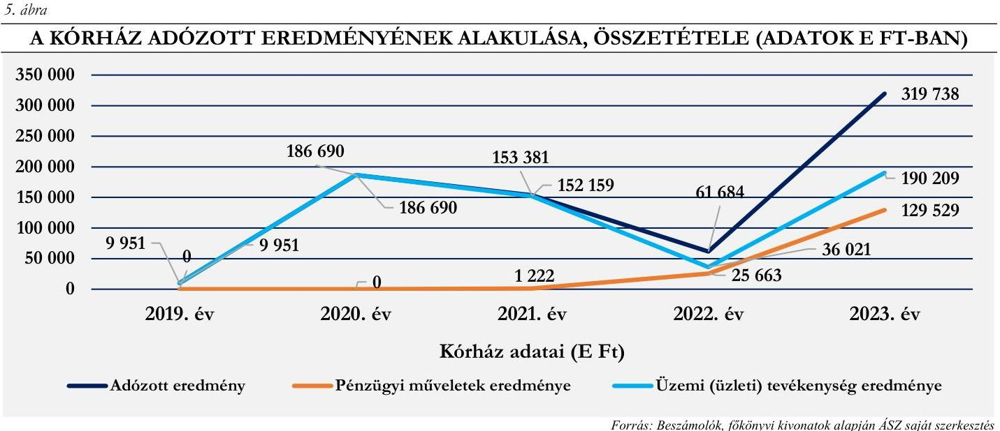

# Bevételi struktúra 

Az 1. számú, Eredménykimutatás 2019-2023. évekre elnevezésű táblázat adatai alapján a vizsgált időszakban a Kórház bevételi struktúrájában kisebb arányú átrendeződés volt tapasztalható, jelentős változás nem következett be annak ellenére, hogy bevételi struktúrájában megjelent a „4. Pénzügyi műveletek bevétele" (aránya 2023. évben 6,6\%). A bevételek főösszege 2019-ről 2023. évre 107,8\%-kal nőtt, és azon belül az egyéb bevételek bírtak meghatározó jelentőséggel, arányuk az elemzett időszakban $84,3 \%$ és $91,1 \%$ között mozgott. A jogcím bevételeken belüli magas arányának oka, hogy a Kórház tevékenységéhez kapcsolódó NEAK finanszírozás összegén kívül valamennyi támogatás, adomány, a fejlesztési és beruházási programok (komplex kardiológiai rehabilitációs szakkórházzá alakítás, rehabilitációs kert kialakítás, oktatási eszközbeszerzés), projektek megvalósításához kapott támogatások összege is e jogcím keretében került elszámolásra.

A Kórház bevételein belül az értékesítés nettó árbevételei 2019. évben 11,3\%-os, 2023. évben pedig $9,1 \%$-os arányt képviseltek. E bevétel összes bevételhez viszonyított arány-csökkenése ellenére, értékben 67,9\%-os növekedést mutattak, a 2019. évi 109128 E Ft-tal szemben összegük 2023. évben 183227 E Ft volt. A bevételek főösszegéhez viszonyított aránycsökkenés oka, egyrészt a pénzügyi műveletek bevételének megjelenése a bevételi szerkezetben, másrészt, hogy az értékesítés nettó árbevételei az egyéb bevételeknél alacsonyabb mértékben növekedtek. Kórház e jogcímcsoporton belül számolta el a térítés ellenében igénybe vehető szolgáltatások díjbevételeit, valamint a Betegápoló Irgalmas Rend Budai Irgalmasrendi Kórháza részére szerződés alapján végzett egészségügyi szolgáltatás díjbevételét, valamint az ellátottak saját kezdeményezésre igénybe vett kényelmi szolgáltatásokra felszámított díjat.

A pénzügyi műveletek bevételei a Kórház esetében 2019. és 2020. évben nem keletkeztek, 2021. és 2022. évi összegük elhanyagolható ( 0,1 és $1,6 \%$ ) volt, azonban 2023-ban a bevételi főösszeg 6,6\%-át tették ki, és a 131892 E Ft bevétel már érzékelhetően növelte a 2023. évi nyereséget. A fejlesztéshez kapcsolódó, átmenetileg szabad pénzeszközök lekötéséből származó kamatbevétel kedvező hatást gyakorolt a Kórház 2023. évi likviditási helyzetére is.

A Kórház folyamatos működését, az egészségügyi közfeladatok ellátását az elemzéssel érintett időszakban a folyamatosan növekvő egyéb bevételek biztosították. A Kórház 2023-ban e jogcímcsoportban a 2019. évi bevétel közel kétszeresét realizálta, ugyanakkor e jogcímcsoport aránya az összes bevételen belül az elemzett időszak végén ( $84,3 \%$ ) alacsonyabb volt, mint a bázisidőszakban ( $88,7 \%$ ). A jelentős mértékủ nominális

---

növekedés ( 835271 E Ft) ellenére a bevételi főösszegen belüli aránycsökkenés oka a Kórház bevételi szerkezetének kis mértékủ átrendeződése, az átmenetileg szabad pénzeszközök lekötésének eredményeként a pénzügyi műveletek bevételeinek megjelenése volt. A Kórház múködését megalapozó egyéb bevételek jogcímcsoport többféle bevételi forrás elszámolására szolgált, ilyen a gyógyító, megelőző ellátások NEAK finanszírozása; a központi költségvetési támogatások összege; az egyházi (fenntartói) támogatás; az egyéb támogatások és adományok; valamint az egyéb bevételek összege. A jogcímcsoport bevételinek meghatározó részét a gyógyító, megelőző ellátások NEAK finanszírozása (1. táblázat - 3.a. pont) képezte, aránya az egyéb bevételeken belül 2019. évben $45,1 \%$, a 2023. évben $62,7 \%$ volt, az összes bevételnek pedig 2019. évben a 40,0\%-át, a 2023. évben a $52,7 \%$-át tette ki.

A gyógyító, megelőző ellátások NEAK finanszírozása összes bevételen belüli arányának 12,7 százalékpontos növekedése nominál értéken rendkívül jelentős, 671873 E Ft-os növekedést jelentett 2019-ről 2023. évre. Ez a bevételi (finanszírozási) arányban megjelenő jelentős növekedés együtt mozgott a Kórházban az elemzett időszakban megvalósított, és megvalósítás alatt lévő fejlesztési folyamatokkal, a komplex kardiológiai rehabilitációs szakkórházzá alakítással. (A 2019. évben indult, és az elemzéssel érintett időszakban még teljeskörűen le nem zárult fejlesztések finanszírozása 2022. évben a fenntartói finanszírozás ( 94354 E Ft ) nélkül a Kórház veszteséges múködését eredményezte volna, mivel a 2022. évi 61684 E Ft nyereség nem érte el az adott időszakban folyósított fenntartó támogatás összegét.) Az egyéb bevételek kisebb jelentőségű, de kiemelt eleme a központi költségvetési támogatások NEAK finanszírozás nélküli összege, mely 2019. évben az egyéb bevételek jogcímcsoport 41,1 \%-át, 2023-ban 33,4 \%-t, 2019-ben az összes bevétel 36,5 \%-át, 2023. évben pedig a $28,2 \%$-át tette ki (1. táblázat - 3.b. pont.).

A 2019. évi 352593 E Ft-tal szemben 2023. évben 565779 E Ft volt a központi költségvetési támogatások NEAK finanszírozás nélküli összege, mely az adatok alapján 2019-ről 2020-ra, valamint 2022-ről 2023-ra jelentős mértékben emelkedett. E források a Kórház fejlesztésén kívül a NEAK finanszírozást kiegészítve szolgálták az egészségügyi közfeladatellátást, a müködési kiadások finanszírozását. A Kórház fejlesztési célú támogatásokon és az egyházi kiegészítő támogatáson kívül egyedi döntés alapján az energiaválság miatt megnövekedett áram és gáz többletkiadások finanszírozásához jelentős központi költségvetési támogatásban is részesült, amely 2022. évben 13604 E Ft, 2023. évben pedig 139682 E Ft volt, továbbá a 2022. december 31-ig lejárt tartozásállomány utólagos kiegyenlítéséhez 55014 E Ft támogatásban részerült a 2023. évben. A 2021. és 2022. években pedig utófinanszírozás keretében biztosított a központi költségvetés forrásokat a járványügyi veszélyhelyzetből fakadó többletköltségek finanszírozásához.

E források hozzájárultak a Kórház fizetőképességének fenntartásához, likviditási helyzetének javításához. A Kórház az elemzett évek mindegyikében részesült egyházi (fenntartói) támogatásban (2. táblázat 3.c. pont), amely mind összegében, mind arányaiban 2022-ben járult hozzá legnagyobb mértékben az összes bevétel növekedéséhez. Az egyéb bevételek jogcímcsoporton belül elszámolt, az 1. táblázat 3.d. pontja szerinti egyéb bevételek a Kórház pénzügyi helyzetére érdemi hatással nem voltak, míg a 3.e. pont szerinti egyéb támogatások (adományok, térítés nélkül átvett eszközök, önkormányzati és egyéb támogatások) a teljes elemzéssel érintett időszakban, de különösen 2021. évben segítették a Kórház múködését, arányuk az összes bevételen belül 3,0\% és 19,1\% között mozgott. A bevételi források 2019. évről 2023. évre történő változását a 6. ábra mutatja be.

---

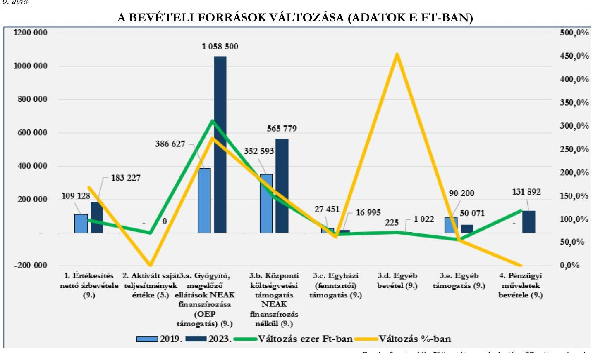

A bevételek elemzéséhez tartozó fajlagos mutató az egy ellátott esetszámra (aktív és krónikus egyben) jutó összes bevétel alakulása. Ez 2019-ben 468,9 E Ft volt, ami 2023-ra 670,1 E Ft-ra nőtt. E fajlagos mutató értéke az öt elemzett évből 2019. év kivételével minden évben elmaradt az öt elemzett kórház fajlagos értékeitől. A mutató értéke 2023-ban 30,7\% -kal maradt el az öt kórház átlagától, a 2019-2023. évekre vonatkozóan a mutató átlagos értéke 710,2 E Ft volt, csúcspontját 2020-ben érte el, amikor is 806,5 E Ft volt az értéke.

# NEAK finanszírozás összetételének elemzése 

A Kórház bevételeinek meghatározó részét kitevő NEAK finanszírozás összetételét, finanszírozási jogcímek szerinti alakulását a 2. táblázat tartalmazza.
2. táblázat

| A NEAK FINANSZÍROZÁS ÖSSZETÉTELE (ADATOK E FT-BAN) |  |  |  |  |  |  |  |  |  |  |
| :--: | :--: | :--: | :--: | :--: | :--: | :--: | :--: | :--: | :--: | :--: |
| MEGNEVEZES | 2019.EV | $\begin{gathered} \text { MEG- } \\ \text { OSZLÁs } \\ 2019 . \text { EV } \end{gathered}$ | 2020. EV | $\begin{gathered} \text { MEG- } \\ \text { OSZLÁs } \\ 2020 . \text { EV } \end{gathered}$ | 2021. EV | $\begin{gathered} \text { MEG- } \\ \text { OSZLÁs } \\ 2021 . \text { EV } \end{gathered}$ | 2022. EV | $\begin{gathered} \text { MEG- } \\ \text { OSZLÁs } \\ 2022 . \text { EV } \end{gathered}$ | 2023. EV | $\begin{gathered} \text { MEG- } \\ \text { OSZLÁs } \\ 2023 . \text { EV } \end{gathered}$ |
| Aktív fekvőbetegszakellátás | 4012 | $1,0 \%$ | 46924 | $8,0 \%$ | 42821 | $5,8 \%$ | 43130 | $4,7 \%$ | 30812 | $2,9 \%$ |
| Krónikus fekvőbe-teg-szakellátás | 286830 | $74,2 \%$ | 261844 | $44,9 \%$ | 270544 | $36,6 \%$ | 281915 | $30,7 \%$ | 375511 | $35,5 \%$ |
| Játóbeteg szakellátás | 72467 | $18,8 \%$ | 77203 | $13,2 \%$ | 74177 | $10,0 \%$ | 74320 | $8,1 \%$ | 72585 | $6,9 \%$ |
| Laboratóriumi ellátás | 15 | $0,0 \%$ | 16 | $0,0 \%$ | 19 | $0,0 \%$ | 19 | $0,0 \%$ | 82 | $0,0 \%$ |
| Célelőirányzatok | 23303 | $6,0 \%$ | 197805 | $33,9 \%$ | 351396 | $47,6 \%$ | 520071 | $56,5 \%$ | 579510 | $54,7 \%$ |
| NEAK finanszírozás összesen | 386627 | 100,0\% | 583792 | 100,0\% | 738957 | 100,0\% | 919455 | 100,0\% | 1058500 | 100,0\% |

Forrás: NEAK adatbázis alapján ÁSZ saját szerkesztés

---

Az adatok alapján látható, hogy a NEAK finanszírozás összegszerű növekedése mellett a Kórház finanszírozási szerkezetében jelentős mértékű átrendeződés volt tapasztalható a teljes elemzett időszakban. A szakellátásokhoz kapcsolódó finanszírozások tették ki az elemzett időszak első három évében a folyósított összeg meghatározó részét, majd arányuk a 2019. évi 94,0\%-ról a 2023. évben 45,3\%-ra csökkent. A célelőirányzatok (egészségügyi dolgozók 2018-2024 évi béremelésének fedezete, a fix összegű bérkiegészítés, a pénzellátást helyettesítő jövedelemkiegészítés, működési támogatás) keretében folyósított támogatás aránya először 2020-ban nőtt az előző évi 6,0\%-ról 33,9\%-ra, majd 2022-től a finanszírozás meghatározó részévé vált az 56,6\%-os, illetve a 2023. évi $54,7 \%$-os részesedéssel. Ez az arány változás alapvetően az egészségügyi dolgozók bérrendezése miatt bekövetkezett jelentős mértékű bér és járuléknövekedéshez kapcsolódó költségvetési támogatás növekedés eredményezte.

Az elemzett időszak elején a Kórház által ellátott egészségügyi közfeladatok alapján a NEAK finanszírozáson belül a krónikus fekvőbeteg-szakellátás finanszírozása volt meghatározó jelentőségű, míg a célelőirányzatok aránya alacsony volt, ez a tendencia 2023. évre jelentősen megfordult, a finanszírozáson belül az egészségügyi bérrendezéshez kapcsolódó költségek fedezetét is tartalmazó célelőirányzatok váltak meghatározóvá, a krónikus fekvőbeteg-szakellátás a 35,5\%-os finanszírozási arányával a második legnagyobb bevételi forrásá vált, annak ellenére hogy összege a 2019. évi 286830 E Ft-ról 2023. évre 375511 E Ft-ra emelkedett.

A 2019-2023. években a finanszírozási szerkezet alakulását a bérekhez kapcsolódó támogatások egyre növekvő szerepe mellett a finanszírozás módja, és annak változása is befolyásolta. A COVID 19 járvány miatti egészségügyi veszélyhelyzetre tekintettel az intézmények pénzügyi stabilitásának biztosítása érdekében a teljesítményfinanszírozás helyett átlagfinanszírozás ${ }^{4}$ került bevezetésre a járó- és fekvőbetegszakállátás ellátásaira. Az átlagfinanszírozás a 2023. január havi teljesítmények elszámolásáig volt érvényben, a 2023. február havi teljesítmények elszámolásától (2023. április havi kifizetés) kezdődően megszűnt, visszaállt a jogszabályi előírásoknak megfelelő teljesítmény alapján történő finanszírozás. Előzőek alapján a Kórház 2021-2022. években átlagfinanszírozásban részesült, míg 2023. évben a január-március havi átlagfinanszírozást követően 2023. áprilistól visszaállt a teljesítményfinanszírozás. A Kórház teljesítménymutatói a járvány elmúltával javulásnak indultak, az ápolási napok száma már 2022-ben meghaladta a járvány előtti, 2019. évi értéket.

A finanszírozás tekintetében kedvezőtlenül hatott, hogy a teljesítményfinanszírozás alapját jelentő súlyszámok/szorzók/pontértékek karbantartása/felülvizsgálata nem történt meg, így az ellátások alulfinanszírozottak maradtak. Mindezek miatt a központi költségvetés a megnövekedett szakmai és működtetési kiadások ellensúlyozása, a közfeladatellátás biztosítása érdekében célhoz kötött költségvetési támogatások (villamos- és földgázenergia beszerzés támogatása, adósságcsökkentési célú müködési támogatások, járványügyi helyzetből adódó többletköltségek utólagos kompenzációja) folyósításával támogatta a kórházak pénzügyi helyzetének stabilizálását, fizetőképességének fenntartását.

A NEAK finanszírozás és a Kórház kiadási adatainak összehasonlítása alapján megállapítható, hogy a gyógyító, megelőző ellátások NEAK finanszírozása 2019-2023. években nem fedezte a Kórház tevékenységével kapcsolatban felmerült kiadásokat. A 2019. évben elszámolt összes kiadás 40,4 -át fedezte a NEAK finanszírozás, ami a célhoz kötött támogatások jelentős növekedése mellett 2023. évben ez az arány $62,7 \%$ volt. A kiadások és a NEAK finanszírozás alakulását a 2019- 2023. években az 3. táblázat foglalja össze.

[^0]
[^0]:    ${ }^{4}$ Az átlagfinanszírozás a megelőző időszak teljesítménye alapján került meghatározásra

---

| A KIADÁSOK ÉS A NEAK FINANSZÍROZÁS ALAKULÁSA (ADATOK E FT-BAN) |  |  |  |  |  |
| :--: | :--: | :--: | :--: | :--: | :--: |
| MEGNEVEZES | 2019. EV | 2020. EV | 2021. EV | 2022. EV | 2023. EV |
| NEAK finanszírozás összesen | 386627 | 583792 | 738957 | 919455 | 1058500 |
| 1. Anyagjellegủ ráfordítások | 328284 | 336248 | 292469 | 344990 | 388503 |
| 2. Személyi jellegű ráfordítások | 499561 | 614842 | 834169 | 1026947 | 1089588 |
| 3. Értékcsökkenési leírások (5.) | 109293 | 151190 | 167548 | 174507 | 163872 |
| 4. Egyéb ráfordítások (8.) | 19135 | 19460 | 23861 | 27349 | 43422 |
| 5. Pénzügyi műveletek ráfordítása (8.) | 0 | 0 | 0 | 1115 | 2363 |
| Kiadás összesen | 956273 | 1121740 | 1318047 | 1574908 | 1687748 |
| Összes kiadás finanszírozottsági aránya | $40,4 \%$ | $52,0 \%$ | $56,0 \%$ | $58,4 \%$ | $62,7 \%$ |
| Anyag jellegű és személyi jellegű ráfordítások finanszírozottsági aránya | $46,7 \%$ | $61,4 \%$ | $65,6 \%$ | $67,0 \%$ | $71,6 \%$ |
| Anyag jellegű és személyi jellegű ráfordítások aránya az összes kiadáshoz mérten | $86,6 \%$ | $84,8 \%$ | $85,5 \%$ | $87,1 \%$ | $87,6 \%$ |

Az adatok szemléletesen mutatják az egészségügyi ellátás finanszírozási problémáját. Az elemzéssel érintett öt évben a NEAK finanszírozás összege jelentős mértékben növekedett ugyan, de nem nyújtott fedezetet a Kórház kiadásainak meghatározó részét kitevő anyag- és személyi jellegű ráfordítások együttes összegére sem. A pénzügyi helyzet könnyítése érdekében a központi költségvetés a veszélyhelyzet és az energiaválság miatt jelentős mértékben megnövekedett energiaköltségek kompenzálására, továbbá az adóságállomány csökkentéséhez a NEAK finanszírozáson felül - az egyéb bevételeknél már ismertetettek szerint - egyedi döntés alapján támogatást nyújtott a kórház számára 2022-2023. évben, 2021. és 2022. évben pedig a járványügyi veszélyhelyzetből adódó többlet költségek utólagos kompenzációja címén folyósított a pénzügyi helyzetet javító támogatást.

# Kiadási struktúra elemzése 

Az 1. számú, Eredménykimutatás elnevezésű táblázat adatai alapján jól látható, hogy a Kórház kiadásai 2019-2023.években folyamatosan növekedtek. A Kórház kiadási struktúrájában meghatározó arányt képviseltek a személyi jellegű-, valamint az anyagjellegủ ráfordítások.

Az anyagi jellegű ráfordítások az összes kiadás 34,3\%-át tették ki 2019-ben, 2023. évre arányuk a kiadásokon belül 23,0\%-ra csökkent. A személyi jellegű ráfordítások aránya az össze kiadásokon belül megnövekedett, a 2019. évi 52,2\%-ról 2023. évre 64,6\%-ra emelkedett. A pénzügyi műveletek ráfordításai, és az egyéb ráfordítások arányukat tekintve elhanyagolható nagyságrendet képviseltek a Kórház kiadási szerkezetében. Az értékcsökkenési leírás súlya az összes kiadáson belül 9,7\% és 13,5\% között mozgott, a legalacsonyabb arányt 2023. évben képviselve, melynek oka, hogy az összes kiadás 2019-ről 2023-ra 76,5\%-kal emelkedett, míg az elszámolt értékcsökkenés 2019-ről 2023-ra csak 49,9\%-kal nőtt.

Az összes kiadáson belül az egyéb ráfordítások aránya az elemzéssel érintett időszakban 1,7\% és 2,6\% között mozgott. Az elszámolt értékvesztés, terven felüli értékcsökkenés összegén kívül a jogcímen belül került elszámolásra a központi költségvetés és a helyi önkormányzatok számára megfizetett adók, a térítés nélkül átadott és leselejtezett eszközök értéke. A Kórháznál pénzügyi műveletek ráfordításaként a 2019-2021. közötti időszakban kiadás nem került elszámolásra, a 2022-2023. években kimutatott összeg (érékesítés árfolyamvesztesége) a kiadási főösszegen belül elhanyagolható volt.

Az anyagjellegű ráfordítások (ötéves átlagarány 26,3\%) a 2019. évi 34,3\%-os, és a 2023. évi 23,0\%-os arányukkal az összes kiadáshoz viszonyítva a személyi jellegű ráfordításokat követően (ötéves átlagarány 60,0\%)

---

a Kórház második legnagyobb kiadási jogcímcsoportját tették ki. Az e jogcímcsoporton belüli meghatározó jelentőségű kiadások alakulását a 7. ábra mutatja be.
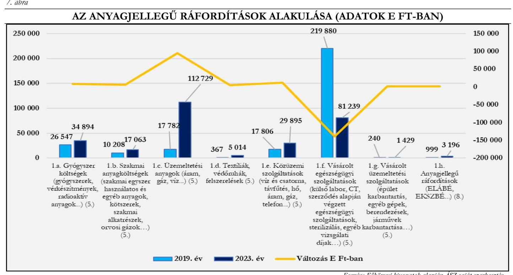

Fornás: Fökönysi kivonatok alugián ÂSZ saját szerkesztés
Az adatok szemléletesen mutatják, hogy 2019-ről a 2023. évre a Kórház anyagi jellegű ráfordításain belül az „f. Vásárolt egészségügyi szolgáltatások" kivételével a meghatározó jelentőségű kiadások tekintetében költségnövekedés következett be. A gyógyszerköltség 31,4\%-kal, az egészségügyi tevékenységhez kapcsolódó szakmai anyagok beszerzésére fordított összeg $67,2 \%$-kal emelkedett, ha e két kiadás változását együtt vizsgáljuk, a $41,4 \%$-os növekedésükben az infláció mellett szerepet játszott a gyógyító, megelőző ellátások szakmai igényeinek változása, új eljárások, gyógyszerek, kezelések alkalmazása is. Az 1. táblázat adataiból látható, hogy a Kórház esetében a gyógyszer és a szakmai anyagköltség 2022-ig folyamatosan emelkedett, míg 2023. évben az előző év adatához viszonyítva jelentős csökkenés volt tapasztalható (gyógyszerek esetében 28,6\%, szakmai anyagoknál $39,4 \%$ ), ami kis mértékben ugyan, de befolyásolta a kiadási szerkezet alakulását. A bázisidőszakhoz viszonyítva a legnagyobb arányú költségnövekedés a „d. Textiliák, védőrubák, felszerelések" jogcím esetében következett be, figyelembe véve azonban azt a tényt, hogy a Kórház e jogcímen elszámolt 2019. évi költsége elhanyagolható volt, az adatokat a bázisév nélkül vizsgálva e kiadás esetében is a gyógyszer és szakmai anyag beszerzésnél leírtaknak megfelelő tendenciát tapasztalhatunk. A „c. Üzemeltetési anyagok" és „e. Közüzzemi szoolgáltatások" költségeinek alakulását együtt érdemes vizsgálni és értékelni. Az együttesen számított 2019. évi 35588 E Ft-tal szemben a 2023. évi költségek összege 142624 E Ft volt, mely a kiadási jogcímek tekintetében átlagosan 300,8 \%os költségnövekedést jelentett, alátámasztva ezzel a magas inflációs környezet (2023. év januárban 25,7\%, júliusban $17,6 \%$, decemberben $5,5 \%$ ) és az orosz-ukrán háború kirobbanása miatt kialakult világméretű energjaválság miatt bekövetkezett áremelkedések működtetési költségekre gyakorolt kedvezőtlen (költségnövelő) hatását. A Kórház esetében az anyagi jellegű ráfordításokon belül egyetlen jogcím, az „f. Vásárolt egészségügyi szoolgáltatások" esetében következett be 2019. évhez viszonyítva jelentős, $63,1 \%$-os kiadáscsökkenés, amely összegében sem volt elhanyagolható mértékű: 138641 E Ft. A csökkenés főként 2020. és 2021. évben következet be a közreműködői szerződés keretében végzett egészségügyi szolgáltatások (egészségügyi szolgálati jogviszony bevezetéséhez kapcsolódóan) csökkenése miatt.

---

A Kórház kiadási szerkezetében a meghatározó aránya a személyi jellegú ráfordításoknak volt, az öszszes kiadáson belüli 2019. évi 52,2\%-os, és a 2023. évi 64,6\%-os aránnyal. A személyi jellegű kiadások növekedése jelentős nagyságrendet képviselt a Kórház esetében, a 2019. évi 499561 E Ft-os összeg a 2023. évre 1089588 E Ft-ra emelkedett, ezzel több, mint duplájára növekedett. A kiadások emelkedésének oka az egészségügyi dolgozók bérrendezése volt. Az egészségügyi szolgálati jogviszonyról szóló 2020. évi C. törvény hatályba lépését követően az egészségügyi szolgálati jogviszonyban álló személyek egészségügyi szolgálati jogviszonyuk alapján - a jubileumi jutalom helyett - a jogszabályban meghatározottak szerint szolgálati elismerésre váltak jogosulttá.

A Kórház a dolgozók számára jubileumi jutalmat nem fizetett az elemzéssel érinett időszakban. Az egészségügyi szolgálati jogviszonybevezetését követően 2021. (88 616 E Ft) és 2023. (3 230 E Ft) években egyéb jogszabályból eredő jutalom kifizetésére került sor, mely költség 2021. évben az összeg kiadás 6,7\%-át, 2023. évben pedig a $0,2 \%$-át tette ki. A kiadási jogcím esetében a kifizetendő összeg nagyságát a foglalkoztatottak jogszabályban meghatározottak alapján számított - szolgálati jogviszonyának időtartama befolyásolta.

A Kórház a 2019. évben a pótlékokra 41142 E Ft-ot, míg a 2023. évében 79508 E Ft-ot fizetett ki. A pótlékok az összes kiadás $4,3 \%$, illetve $4,7 \%$-át tették ki az elemzett időszak két szélső évében, az elemzett időszakban ezek voltak a legalacsonyabb arányok, míg a 2022. évi 96352 E Ft-os költség az összes kiadás 6,1 \%át tette ki.

A Kórháznál tutori díjak kifizetésére 2021. év kivételével, megbízási díjak kifizetésére 2022. év kivételével az elemzéssel érintett időszak minden évében sor került. Alkalmi munkavállalóknak számfejtett illetmény a kiadások között 2019-2021. években szerepelt, míg pénzellátást helyettesítő juttatások elszámolására 2021-2023. években került sor. E kifizetések aránya az összes kiadáson belül a 2019. évi 1,9\%-ról 2023. évben 2,3\%-ra emelkedett.

# 1.2. Generált Cash flow és a beszámolóban jelzett pénzeszköz változás összehasonlítása 

A CF $^{26}$ a készpénzáramlást mutatja be; az eszközök, kötelezettségek és eredmények készpénz állományt érintő változásait foglalja magába; nem azonos az intézmény által végzett tevékenység során keletkező eredménnyel/profittal. A CF kimutatás az intézmény forrásairól és készpénzfelhasználásáról ad képet a beszámolónak megfelelő naptári évre vonatkozóan. Az adatok segítségével következtetések vonhatók le az intézmény pénzügyi helyzetéről, több év adatának elemzésével, összehasonlításával lehetővé válik a pénzügyi helyzet alakulásának értékelése.

A CF elemzés célja a pénzügyi helyzet értékelése, valamint az egymás követő időszak adataik összehasonlításával annak elemzése, hogy a kórházak a tevékenységüket meghatározó belső és külső körülmények változása milyen hatást gyakorolt a pénzügyi helyzetük alakulására.
A CF mutatók elemzésének célja, annak értékelése, hogy a kórház:

- alacsony, esetleg negatív üzleti eredmény (veszteség) ellenére képes volt-e tevékenysége során „pénz" cash termelésre (Bruttó CF);
- múködési folyamatai tőkét kötöttek le (-), vagy tőkét szabadítottak fel (+), milyen volt a múködés tőkeszükséglete (Működési CF);
- a múködés tőkeszükségletét is figyelembe véve tevékenysége során mekkora „pénz" cash előállítására volt képes (Nettó Müködési CF);
- az adott üzleti évben mekkora összegben pótolta befektetett eszközeit (Tőkebefektetés - CAPEX ${ }^{27}$ );
- az adott üzleti évben - a múködés tőkeszükségletét és figyelembe véve - előállított „pénzből" a tőkebefektetést levonása után mekkora szabadon felhasználható cash maradt (Szabad CF - Free CF);
- az adott üzleti évben mekkora összegű, hosszú távon az intézmény rendelkezésére álló külső forrásban részesült (Finanszírozási CF).

---

Az egyházi jogi személyek által fenntartott kórházak sajátos könyvvezetési és beszámolókészittési kötelezettségét ${ }^{5}$ figyelembe véve a CF elemzés alapját - a zárás előtti főkönyvi kivonatok, az éves beszámolók (mérlegek és eredménykimutatások) és a kiegészítő információk felhasználásával - az ÁSZ által összeállított adattáblák adatai képezték. Az adattáblák sorainak adatai indokolt esetben - a halmozódások kiszűrése érdekében - tartalmazzák a Számv. tv. előírásai alapján figyelembe vehető, ismertté vált, azonnal pénzeszköz-változással nem járó korrekciós tételeket.

# Cash flow mutatók 

4. táblázat

GENERÁLT CASH FLOW ADATAI (ADATOK E FT-BAN)

| MEGNEVEZÉS | 2019. EV | 2020. EV | 2021. EV | 2022. EV | 2023. EV |
| :--: | :--: | :--: | :--: | :--: | :--: |
| 1. Üzemi eredmény | 9951 | 186690 | 152159 | 36021 | 190209 |
| 2. Elszámolt amortizáció | 109293 | 151190 | 167548 | 174507 | 163872 |
| 3. Elszámolt értékvesztés és visszaírás | 0 | 0 | 0 | 0 | 774 |
| 4. Céltartalék képzés és felhasználás különbözete | 0 | 0 | 0 | 0 | 0 |
| I. Bruttó CF (non cash tételekkel korrigált üzemi eredmény) (1.+2. $+/-3 .+/-4$. | 119244 | 337880 | 319707 | 210528 | 354855 |
| 5. Befektetett eszközök értékesítésének eredménye | 0 | 0 | 0 | 0 | $-2950$ |
| 6. Készletek változása | $-5535$ | $-72720$ | $-5590$ | $-11966$ | 21097 |
| 7. Vevőkövetelés változása | $-6680$ | $-9347$ | 14198 | $-18364$ | $-16909$ |
| 8. Forgóeszközök (készlet, vevőkövetelés és pénzeszköz nélkül) változása | $-47608$ | $-75137$ | 87729 | 30609 | $-7039$ |
| 9.1. Bevételek aktív időbeli elhatárolása | $-66268$ | 71222 | $-15334$ | $-14610$ | $-18882$ |
| 9.2. Költségek, ráfordítások aktív időbeli elhatárolása | 0 | $-290$ | 290 | $-715$ | 504 |
| 9.3. Halasztott ráfordítások | 0 | 0 | 0 | 0 | 0 |
| 10. Szállítói kötelezettség változása | $-350877$ | $-60603$ | $-17566$ | 50175 | $-55989$ |
| 11. Egyéb rövid lejáratú kötelezettség változása | 44986 | 101532 | $-305196$ | $-657084$ | 996619 |
| 12.1. Bevételek passzív időbeli elhatárolása | 0 | 0 | 0 | 0 | 0 |
| 12.2. Költségek, ráfordítások passzív időbeli elhatárolása | 0 | 0 | 2478 | 711 | 3650 |
| 12.3. Halasztott bevételek | 884237 | 947545 | 211840 | 622647 | $-36$ |
| 13.Pénzügyi műveletek bevételei | 0 | 0 | 1222 | 26778 | 131892 |
| 14.Pénzügyi műveletek ráfordításai | 0 | 0 | 0 | $-1115$ | $-2363$ |
| 15. Fizetett, fizetendő adó (nyereség után) | 0 | 0 | 0 | 0 | 0 |
| II. Múködési CF (a múködés tőkeszükséglete) | 452255 | 902202 | $-25929$ | 27066 | 1049594 |
| III. Nettó múködési CF (bruttó CF + müködési CF) | 571499 | 1240082 | 293778 | 237594 | 1404449 |
| IV. CAPEX (tökebefektetés) | 1116080 | 918467 | 994601 | 149596 | 136861 |
| V. Free CF (nettó múködési CF - CAPEX) | $-544581$ | 321615 | $-700823$ | 87998 | 1267588 |
| 16. Fizetett, fizetendő osztalék, részesedés | 0 | 0 | 0 | 0 | 0 |
| 17. Részvénykibocsátás, tőkebevonás, illetve részvénybevonás, tőkekivonás | 0 | 0 | 0 | 0 | 0 |
| 18. Kötvény, hitelviszonyt megtestesítő értékpapír változása | 0 | 0 | 0 | 0 | 0 |
| 19. Beruházási hitel és hosszúlejáratú kölcsönök változása | 0 | 0 | 0 | 0 | 0 |
| 20. Hosszú lejáratra nyújtott kölcsönök és elhelyezett bankbetétek változása | 0 | 0 | 0 | 0 | 0 |
| 21. Véglegesen kapott pénzeszköz | 0 | 0 | 0 | 0 | 0 |
| VI. Finanszírozási CF | 0 | 0 | 0 | 0 | 0 |
| Számított pénzeszköz változás | $-544581$ | 321615 | $-700823$ | 87998 | 1267588 |

[^0]
[^0]:    ${ }^{5}$ Az egyházi jogi személyek a 296/2013. Korm. rend. 5. § (1) bekezdésének előírása alapján egyszerűsített éves beszámoló készítésére kötelezett szervezetek, melyek a jogszabály 5. § (5) bekezdése szerint a beszámoló részeként kiegészítő mellékletet nem készítenek. A könyvvezetési és beszámolókészítési sajátosságokat figyelembe véve a generált CF számításához szükséges kiegészítő információk az adatbekérések, illetve a helyszíni ellenőrzés keretében kerültek bekérésre

---

Az elemzett időszak valamennyi évében az üzemi eredmény pozitív előjelű volt, tehát nyereség képződött. Az adatok pénzfogalomhoz nem kapcsolódó tételekkel (non cash) történő korrigálását követően a bruttó cash flow szintén minden évben pozitív értéket mutatott, a Kórház tevékenysége során képes volt „pénz" termelésére. A müködési cash flow értéke nagy változásokat mutatott (2019: 452255 E Ft, 2020: 902202 E Ft; 2021: - 25929 E Ft, 2022: 27066 E Ft; 2023. évben pedig 1049594 E Ft volt). Az adatok szemléltetik, hogy a működés tőkeszükséglete, és a gazdálkodás eredményessége nem függ össze. Figyelembe kell venni azonban azt a tényt, hogy jelentős eltéréseket mutató működési cash flow alakulását befolyásolta a központi költségvetésből előlegként folyósított, és a Kórház könyveiben rövid lejáratú kötelezettségként kimutatott támogatások felhasználásának, elszámolásának, és a támogatás elszámolások támogatáskezelő szervezet általi elfogadásának alakulása is. Azokban az években, melyekben a mutató pozitív, a müködés képes volt tőkét felszabadítani. A 2021. év negatív előjelű mutatója alapján az egészségügyi tevékenység működési folyamatainak biztosítása tőkét kötött le, a működési kiadások finanszírozásához 2021. évben ugyan nem túl jelentős nagyságrendű, de tőkefelhasználás (eszköz, eredmény) vált szükségessé. A bruttó cash flowt és a müködés tőkeszükségletét is figyelembe véve a működését meghatározó tevékenységekkel a Kórház az elemzéssel érintett időszak valamennyi évében képes volt „pénz" termelésre, a nettó müködési cash flow értéke pozitív volt. A Kórház a befektetett eszközei pótlására, fejlesztésére 2019-2023. években jelentős, az elszámolt amortizációt meghaladó összegeket (évente átlagosan 663121 E Ft-ot), öt év alatt összesen 3315605 E Ft-ot fordított. A fejlesztések megvalósítását a Kórház számára folyósított fejlesztési célú központi költségvetési támogatások jelentős mértékben segítették. A tőkebefektetés (CAPEX) mutató értéke alapján lehet nyomon követni az intézmény befektetett eszközeinek pótlását, a támogatásból megvalósítandó fejlesztés teljesülését. A Kórház a 2019-2023. években a tevékenységéhez szükséges gépek, berendezések, felszerelések beszerzésén kívül a könyveiben szereplő ingatlanok fejlesztésére, felújítására is jelentős összeget költött az adatok alapján. A finanszirozási cash flow értéke az elemzett időszakban 0 E Ft volt.

2019-ben a müködés tőkeszükséglete biztosított volt, míg a CAPEX értékét már csak részben finanszírozta, így a CAPEX értékének 48,8\%-át a pénzeszköz változás fedezte. 2020-ban a bruttó cash flow pozitív összegét tovább növelte működés tőkeszükségletének pozitív értéke (pénz termelése), mely így fedezetet nyújtott a fejlesztésekre is. 2021-ben, az eredményes gazdálkodás finanszírozta a müködés tőkeszükségletét, de a CAPEX fedezetét már csak részben volt képes biztosítani, így a fejlesztések 70,5\%-át a pénzeszköz változás fedezte. 2022-2023-ban mind a gazdálkodás eredményessége, mind pedig a müködés pozitív cash flow-t eredményezett, és biztosított volt a CAPEX fedezete is. 2022-ben a kötelezettségek csökkenését a halasztott bevételeknek a csökkenést meghaladó mértékủ elszámolása ellensúlyozta, így a tőkebefektetés után maradt szabad cash flow a Kórház pénzeszközeit bővítette. A CF kimutatás adatai szerint a Kórház számított pénzeszköz változása 2019. és 2021. években negatív előjelű volt. Működési, fejlesztési és finanszírozási tevékenységeinek teljes spektrumát figyelembe véve ezekben az években az azonnali pénzeszköz-változással járó bevételei nem érték el az ennek megfelelő kiadások/ráfordítások összegét, azonban pozitívumként értékelhető, hogy a pénzeszköz csökkenése mögött a beruházások, fejlesztések megvalósítása állt.

A CF mutatók értékének változása alapján összességében arra lehet következtetni, hogy a 2019. évről a 2023. évre az intézmény folyamatos működéséhez szükséges pénzügyi feltételek kis mértében javultak. A pandémia és a háborús veszélyhelyzet következményeként kialakult magas infláció és az energiaválság miatt bekövetkezett költségnövekedésre, továbbá az egészségügyi intézmények működőképességének fenntartása érdekében bevezetett (2023 áprilisától megszüntetett) átlagfinanszírozásra, és az egészségügy finanszírozási problémáira a Kórház müködési modellje képes volt választ adni. A gazdasági környezet romlását a kormány az egészségügyi intézmények esetében célzott támogatások folyósításával próbálta ellensúlyozni. A Kórház a nehéz

---

körülmények között a működés biztonságát meg tudta tartani. Az üzemi (üzleti) tevékenység eredménye valamennyi évben pozitív volt (nyereséges), ennek következtében az azonnali pénzeszköz-változást nem eredményező tételekkel módosított összege (bruttó cash flow) a teljes időszakban meghaladta a működés tőkeigényét. A müködés tőkeszükséglete a 2021. évet kivéve pozitív volt, tehát a működéshez kapcsolódó közvetlen pénzmozgással járó, pénznövekedést eredményező tételek (bevételek) értéke maghaladta a pénzcsökkenést eredményező (kiadások) tételek értékét, ez a tendencia azonban nem tartható fenn a végletekig. Normál müködés ciklikus működési cash flow-t feltételez: a müködés tőkelekötésének, illetve felszabadításának az adott szervezetre jellemző ritmusát. A több éven át tartó folyamatos, az előző évihez viszonyítva jelentős mértékben csökkenő, illetve növekvő tőkelekötés/felszabadítás mögött nem feltétlenül állnak fenntartható és eredményes gazdálkodásra utaló körülmények, döntések. Előzőek alapján a nettó müködési cash flow kiugróan magas adatokat is tartalmazó pozitív értékei mögött alapvetően a Kórház számára előlegként folyósított fejlesztési célú támogatások (folyósítás, nyilvántartás rövid lejáratú kötelezettségként, bevételek passzív időbeli elhatárolása, támogatás pénzügyi elszámolása elfogadásának számviteli hatásai) álltak. A CAPEX (tőkebefektetési) mutató alapján a Kórház 2019-2021. években rendkívül magas összegeket fordított az intézmény tevékenységi körét meghatározó (komplex kardiológiai rehabilitációs szakkórházzá alakítás) fejlesztési feladatok megvalósítására, míg 2022. és 2023. évben jóval kisebb értékben ugyan, de költött a müködését biztosító befektetett eszközök pótlására - fejlesztésére. A CF kimutatás adatai alátámasztják, hogy a Kórház a 2019. és 2021. évek kivételével képes volt tevékenysége során szabadon felhasználható pénzeszközt termelni, amit elsődlegesen tőkebefektetésre fordított, ami az intézmény fejlesztések iránti elkötelezettségét bizonyítja. Továbbá kedvezően értékelhető, hogy a negatív pénzeszköz-változás 2019-ben, illetve 2021-ben is a tőkebefektetéshez kapcsolódott.

A 2023. évi CF mutatók kedvező változása következhetett a külső körülmények (pl. gazdasági környezet, kormányzati döntések...) előző időszaknál kedvezőbb alakulásából, de a fenntartó és az intézményvezetés gazdálkodást érintő döntései is hozzájárulhattak.

# Mérleg mutatók 

A Kórház mérlegadatai alapján a számított szolvencia ráta értéke a 2019. évi 0,077-ről (7,7 \%) 2023. évben 0,157-re ( $15,7 \%$ ) növekedett. A mutató a forrásokon belül a saját tőke arányát hivatott bemutatni. A mutató változását a saját tőke mértékének növekedése eredményezte, a 2023. évben a forrásokon belül a saját tőke már 3,35 szorosa volt a 2019. évinek. A mutató értéke alapján megállapítható, hogy a Kórház esetében a forrásokon belül a saját tőke értéke és aránya az általánosan elfogadott / elvárt szinten maradt. Az eladósodás veszélyének vizsgálatához szükséges figyelembe venni a fejlesztési célra, visszafizetési kötelezettség nélkül kapott támogatások elszámolt összegét, mely a halasztott bevételeknél jelenik meg. Ez 2023-ban 4092967 E Ft, a mérlegfőösszeg 62,4\%-a volt. Amennyiben ezt az értéket összeszámítjuk a saját tőke arányával, akkor a kapott 78,1 \%-os finanszírozási arány biztosítja a Kórház eszközei finanszírozásának stabilitását.

A nettó müködő tőke értéke a 2019. évi -2 310481 E Ft-ról a 2023. évre -3 130623 E Ft-ra módosult. A mutató értéke arra utal, hogy a Kórház finanszírozási szerkezete nem volt „egészséges", mivel a mobil és gyorsan mobilizálható eszközök (követelések, értékpapírok, pénzeszközök) mellett a befektetett eszközöket is rövid forrás finanszírozta. Ugyanazon logika mentén szükséges elvégezni a korrekciót a nettó múködő tőke számításánál is, mint a szolvencia rátánál. Illetve meg kell jegyezzük, hogy a központi költségvetésből fejlesztési célra, visszafizetési kötelezettség nélkül kapott támogatási előlegeket a Számv. tv. előírásai szerint rövidlejáratú kötelezettségként kell nyilvántartani mindaddig, amíg a támogatás jogosultjának a támogatás felhasználásáról benyújtott elszámolását a támogató szervezet el nem fogadja. A támogatás felhasználási időszakában - ami egy jelentős beruházásnál több évet is magába foglal - a tárgyi eszközök között nyilvántartott beruházásokat rövid

---

lejáratú forrás finanszírozza. Amennyiben az elszámolást a támogató szervezet nem fogadja el, akkor a támogatás visszafizetése jelentősen meg fogja nehezíteni a szervezet működését, ellehetetlenülhet annak finanszírozása. Azonban a Kórház adatai szerint már jelentős összegű támogatás elfogadásra került, és azok a rövid lejáratú kötelezettségek helyett a halasztott bevételek között kerültek kimutatásra. Amennyiben ezekkel korrigáljuk a nettó működő tőke számított értékét, akkor 2023-ban az értéke 962344 E Ft, ami már egy kedvező érték, mivel a rövid lejáratú források a mutató korrigált értéke alapján befektetett eszközt nem finanszíroznak. Amenynyiben a Kórház az előlegként folyósított támogatásokat az előírásoknak megfelelően használja fel, elszámolását elfogadják, akkor nem kell a Kórház működésének biztonságát veszélyeztető likviditási problémák felmerülésével számolni.

A fentieken leírtakat támasztja alá a szervezet likviditási helyzetét legjobban jellemző likviditási ráta és likviditási gyorsráta javuló értéke is (likviditási ráta: 2019. év 0,9 - 2023. év 1,6; likviditási gyorsráta: 2019. év 0,9 - 2023. év 1,5). A mutatók értékei 2019. és 2021. kivételével az ideálisnak tekinthető értéktartományban helyezkedtek el (likviditási ráta esetén az 1,2-1,5, gyorsráta esetén a $0,8-1,0$ ). A likviditási ráta és gyors ráta alakulását a 8 . ábra mutatja be.
7. ábra

LIKVIDITÁSI RÁTA ÉS GYORS RÁTA ALAKULÁSA
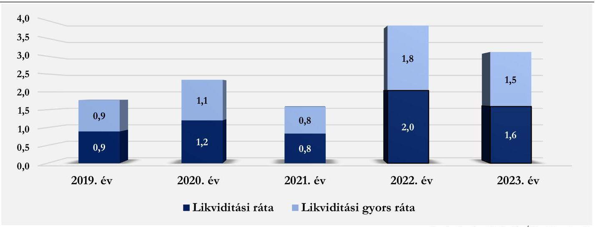

Forrás: Beszámolók alapján ÁSZ saját szerkesztés

# Jövedelmezőség 

Az eszközarányos jövedelmezőség (ROA) mutatójának értéke a 2019. évi $0,3 \%$-ról 2023. évben $5,4 \%$-ra nőtt. A saját tőke arányos jövedelmezőség mutatója (ROE) szintén kedvezően alakult, értéke a 2019. évi 3,3\%-ról 2023. évben 36,8\% ra változott. ${ }^{6}$ A mutatók értékének alakulását nagy mértékben befolyásolták a kórház gazdálkodására ható külső és belső körülmények, melyek az előzőek során bemutatásra kerültek. Mivel a Kórház 2019-2023. években „nyereségesen" gazdálkodott, eredménye keletkezett, a két mutató pozitív volt. A gazdasági folyamatok kedvező alakulásának hatására 2023-ban a ROA és ROE mutatók a megelőző évhez képest sokkal kedvezőbben alakultak. A ROA és ROE mutatók mozgásának trendjéből azt a következtetést lehetett levonni, hogy a Kórház 2023-ban kiegyensúlyozott, fenntartható gazdálkodást folytatott. Ugyanakkor a fejlesztések megvalósulását követően a gazdálkodás biztonságának fenntartásához a Kórház nem tekinthet el a költségek folyamatos monitoringjától, tekintettel arra, hogy a NEAK finanszírozás 2023-ban az anyagjellegủ és a személyi jellegű ráfordítások $71,6 \%$-át tette ki.

[^0]
[^0]:    ${ }^{6}$ Iparágtól függően a ROA 8-10\% a ROE pedig 10-15\% között jelent jó teljesítményt.

---

# 2. Pénzügyi helyzet és a kötelezettségállomány elemzése 

### 2.1. Pénzügyi helyzet, mérlegadatok elemzése

## 5. tábézet

A KÓRHÁZ 2019 - 2023. ÉVI MÉRLEGADATAINAK ALAKULÁSA (ADATOK E FT-BAN)

| MÉGNEVEZÉs | 2019. év | 2020. év | 2021. év | 2022. év | 2023. év | 2023. EFT ÁDATOKA   2019. EV \%-ÁBAN |
| :--: | :--: | :--: | :--: | :--: | :--: | :--: |
| A. Befektetett eszközök | 2617075 | 3384351 | 4211405 | 4186494 | 4158709 | $158,9 \%$ |
| I. Immateriálisjavak | 374 | 31363 | 20320 | 8358 | 86 | $23,0 \%$ |
| II. Tárgyi eszközök | 2616701 | 3352988 | 4191085 | 4178136 | 4158623 | $158,9 \%$ |
| III. Befektetett pénzügyi eszközök | 0 | 0 | 0 | 0 | 0 | $0,0 \%$ |
| B. Forgóeszközök | 1232761 | 1711581 | 914420 | 1002139 | 2275698 | $184,6 \%$ |
| I. Készletek | 18439 | 91159 | 96748 | 108715 | 90740 | $492,1 \%$ |
| II. Követelések | 70502 | 154986 | 53059 | 40813 | 64760 | $91,9 \%$ |
| III. Értékpapírok | 0 | 0 | 0 | 0 | 0 | $0,0 \%$ |
| IV. Pénzeszközök | 1143820 | 1465436 | 764613 | 852611 | 2120198 | $185,4 \%$ |
| C. Aktív időbeli elhatárolások | 14727 | 76346 | 93390 | 106714 | 125093 | $84,9 \%$ |
| Eszközök összesen | 3997113 | 5172278 | 5219215 | 5295347 | 6559500 | 164,1\% |
| D. Saját tőke | 306594 | 493284 | 646665 | 708349 | 1028086 | $335,3 \%$ |
| I. Jegyzett tőke | 4730 | 4730 | 4730 | 4730 | 4730 | $100,0 \%$ |
| II. Jegyzett, de még be nem fizetett tőke (-) | 0 | 0 | 0 | 0 | 0 | $0,0 \%$ |
| III. Tőketartalék | 141936 | 141936 | 0 | 0 | 0 | $0,0 \%$ |
| IV. Eredménytartalék | 149977 | 159928 | 488554 | 641935 | 703618 | $469,2 \%$ |
| V. Lekötött tartalék | 0 | 0 | 0 | 0 | 0 | $0,0 \%$ |
| VI. Értékelési tartalék | 0 | 0 | 0 | 0 | 0 | $0,0 \%$ |
| VII. Adózott eredmény | 9951 | 186690 | 153381 | 61684 | 319738 | $3213,1 \%$ |
| 1. Alaptevékenység eredménye | 2546 | 176262 | 141927 | 53718 | 277503 | $10899,6 \%$ |
| 2. Vállalkozási tevékenység eredménye | 7405 | 10428 | 11424 | 7966 | 42235 | $570,4 \%$ |
| E. Céltartalékok | 0 | 0 | 0 | 0 | 0 | $0,0 \%$ |
| F. Kötelezettségek | 1379548 | 1420477 | 1097715 | 490805 | 1431607 | $103,8 \%$ |
| I. Hátrasorolt kötelezettségek | 0 | 0 | 0 | 0 | 0 | $0,0 \%$ |
| II. Hosszú lejáratú kötelezettségek | 0 | 0 | 0 | 0 | 0 | $0,0 \%$ |
| III. Rövid lejáratú kötelezettségek | 1379548 | 1420477 | 1097715 | 490805 | 1431607 | $103,8 \%$ |
| G. Passzív időbeli elhatárolások | 2310971 | 3258517 | 3472835 | 4096193 | 4099807 | $177,4 \%$ |
| Források összesen | 3997113 | 5172278 | 5217215 | 5295347 | 6559500 | 164,1\% |

A Kórház mérlegfőösszege a 2019. évi 3997113 E Ft-ról 2023. évben 6559500 E Ft-ra emelkedett. Az elemzéssel érintett időszakban a vagyonnövekedés jelentős, $64,1 \%$ - volt, ezen belül 2019-ről 2020-ra a mérlegfőösszeg dinamikusan emelkedett, 2021-2022. években mérsékelt növekedést mutatott, 2023-ban pedig ismét nagyobb mértékben, $23,9 \%$-kal növekedett.

A mérleg eszközoldala szerkezeti összetételének változása a támogatott fejlesztések megvalósításából következett. 2019-2020. és 2023. években a befektetett eszközök, és a meghatározó hányadukat kitevő tárgyieszközök, továbbá a forgó eszközök, utóbbin belül is a pénzeszközök közel azonos arányt képviseltek. 20212022. években a pénzeszközök felhasználásnak hatására a forgóeszközök aránya csökkent, és a befektetett eszközök, ezen belül is a tárgyieszközök képviseltek meghatározó arányt a mérleg eszközoldalának szerkezeti öszszetételében. 2019-ben a mérleg eszközoldalán a befektetett eszközök aránya $65,5 \%$, a forgóeszközöké $30,8 \%$,

---

az aktív időbeli elhatárolásoké pedig 3,7\% volt. Az előző időszakokban folyósított, de 2022. évre felhasznált és elszámolt fejlesztési célú támogatásoknak köszönhetően a 2022. évre a mérleg eszközoldalának szerkezete átalakult, a befektetett eszközök aránya $79,1 \%$, a forgóeszközöké $18,9 \%$, az aktív időbeli elhatárolásoké pedig $2,0 \%$ volt. Az elnyert és előlegként folyósított, de év végéig fel nem használt fejlesztési célú támogatásoknak köszönhetően 2023. évben a mérleg eszközoldalának szerkezeti összetétele szintén módosult. A befektetett eszközök aránya 63,4 \%-ra csökkent, a forgóeszközöké pedig 34,7\%-ra nőtt, az aktív időbeli elhatárolások 1,9 \%-ot tettek ki. A befektetett eszközök 2023. évi 4158709 E Ft-os értékének szinte teljes összegét a tárgyi eszközök adták, az immateriális javak értéke mindössze 86 E Ft volt. Befektetett pénzügyi eszközzel a Kórház az elemzéssel érintett években nem rendelkezett. A forgóeszközök 2023. évi 2275698 E Ft-os összegén belül meghatározó jelentőségű a pénzeszközök 2120198 E Ft-os értéke volt, mely közel kétszeresét tette ki a pénzeszköz 2019. évi értékének (1 143820 E Ft ). A Kórház élt az aktív időbeli elhatárolás lehetőségével, arányuk egyik évben sem volt jelentős, 2023. évben összegük 125093 E Ft volt.

A mérleg forrásoldalán a saját tőke összege 2019-ről 2023-ra jelentős mértékben (több, mint háromszorosára) nőtt ( 306594 E Ft-ról 1028086 E Ft-ra). A saját tőkén belül a jegyzett tőke értéke nem változott (4 730 E Ft), a 2019. és a 2020. években a főkönyvben tőketartalékként kimutatott összeg 2021. évben átvezetésre került az eredménytatlék összegébe. A Kórház nyereséges gazdálkodásának eredményeként az intézmény eredménytartaléka (az adózott eredmény összegének rendezése miatt) 2023. évre 703618 E Ft-ra növekedett, a 2023.évi adózott eredmény (nyereség) összege pedig 319738 E Ft volt. Az elemzett időszakban a Kórház céltartalékkal nem rendelkezett. A mérleg forrásoldalán kimutatott kötelezettségek 2023.évi 1431607 E Ft-os összege csak rövid lejáratú kötelezettséget tartalmazott (az összeg mindössze 3,8 \%-kal haladta meg a rövid lejáratú kötelezettségek 2019. évi 1379548 E Ft-os összegét). A Kórháznak hátrasorolt, és hosszú lejáratú kötelezettsége nem volt. A rövid lejáratú kötelezettségek összege 2023-ben volt a legmagasabb, és 2022. évben, az előlegként folyósított támogatások elszámolásának következményeként csak 490805 E Ft volt. A rövid lejáratú kötelezettségek kimutatását a 6. táblázat tartalmazza.
6. táblázat

# A RÖVID LEJÁRATÚ KÖTELEZETTSÉGEK KIMUTATÁSA (ADATOK E FT-BAN) 

| MEGNEVEZÉS | 2019. EV |  | 2020. EV |  | 2021. EV |  | 2022. EV |  | 2023. EV |  |
| :--: | :--: | :--: | :--: | :--: | :--: | :--: | :--: | :--: | :--: | :--: |
|  | Össze-   SEN | Ebből.   LEJÁRT   KÖTELE-   ZETTSÉG | Össze-   SEN | Ebből.   LEJÁRT   KÖTELE-   ZETTSÉG | Össze-   SEN | Ebből.   LEJÁRT   KÖTELE-   ZETTSÉG | Össze-   SEN | Ebből. LEJÁRT KÖTELEZETTSÉG | Össze-   SEN | Ebből.   LEJÁRT KÖTELEZETTSÉG |
| Kötelezettségek áruszállitásból, szolgáltatásból | 126228 | 35017 | 65626 | 1490 | 48058 | 0 | 98233 | 55014 | 42244 | 22201 |
| Egyéb rövid lejáratú kötelezettségek | 1253320 |  | 1354851 |  | 1049657 |  | 352572 |  | 1389363 |  |
| Rövid lejáratú kötelezettségek összesen | 1379548 | 35017 | 1420477 | 0 | 1097715 | 0 | 450805 | 55014 | 1431607 | 22201 |
| Lejárt kötelezettségek aránya a rövid lejáratú kötelezettségeken belül összesen | 2,54\% |  | 0,00\% |  | 0,00\% |  | 12,20\% |  | 1,55\% |  |

A táblázat adatai alapján megállapítható, hogy amíg a Kórház rövid lejáratú kötelezettségeinek összege 2022. évről 2023. évre több, mint háromszorosára ( 980802 E Ft-tal) nőtt, ezzel szemben a rövid lejáratú kötelezettségeken belül a lejárt határidejű tartozások 59,6\%-kal (32 813 E Ft-tal) csökkentek, összegük 22201 E Ft volt. A mérleg forrás oldalán a passzív időbeli elhatárolások összege a bázisidőszakhoz viszonyítva jelentős mértékben emelkedett ( $77,4 \%$-kal), a 2019. évi 2310971 E Ft-tal szemben 2023. évben összegük 4099807 E Ft volt. A Kórház a fejlesztési célú támogatások felhasználásáról történő elszámolás támogatói elfogadását követően e fejlesztési támogatásokat halasztott bevételként tartotta nyilván a passzív időbeli

---

elhatárolások között. A rövid lejáratú kötelezettségek az elszámolt fejlesztési célú támogatások hatására csökkentek 2021. és 2022. évben, 2023. évi jelentős növekedésüket az üzleti évben elnyert és kiutalt, de még fel nem használt támogatások kötelezettségként történt nyilvántartása okozta. Ha a rövid lejáratú kötelezettségként kimutatott fejlesztési célú támogatásoktól eltekintünk, és az áruszállításból, szolgáltatás nyújtásból származó rövid lejáratú kötelezettségek alakulását értékeljük, összegük az elemzés éveiben rendkívül változó volt, de a 2019. évinél minden évben alacsonyabb volt, 2023-ra összegük 66,5\%-kal csökkent. A lejárt kötelezettségek aránya a 2019. évi 35017 E Ft-ról 22201 E Ft-ra (36,6\%-kal) csökkent 2023-ban.

# 2.2. A kórházi lejárt kötelezettségállomány változásának bemutatása 

Az ÁSZ által egyidőben elemzett egyházi fenntartású kórházak adósságállomány összetételének, változásának és alakulásának bemutatása során a kórházi lejárt kötelezettségállomány havi adatai kerültek felhasználásra. Az elemzett öt kórház adósságpozicionálása két dimenzió mentén történt:

- a lejárt kötelezettségállomány havi szintű relatív változásának átlaga, valamint
- az átlagos lejárt kötelezettségállomány éves kiadási főösszeghez viszonyított aránya.

Az elemzés adósságállománynak a lejárt kötelezettségállományt tekinti. A relatív változások matematikai jellegű torzító és annak magyarázó tényezői külön bemutatásra kerültek.

Az első dimenzió meghatározásakor az öt kórház esetén kiszámításra került a lejárt kötelezettségállomány havi változása, majd a havi változások átlaga. Korrigáltuk az átlagot a kiugró havi változások kiszűrésével, majd az öt kórházra kiszámított korrigált átlagnak vettük az átlagát (dimenziós átlag). Ez alapján meghatározhatóvá vált, hogy az egyes kórházak az első dimenziós átlag alatt vagy felett pozicionálódnak.

A második dimenzió meghatározásakor minden évre vonatkozóan kiszámítottuk az éves kiadási főöszszegből az átlagos havi kiadási főösszegeket (ezzel biztosítva az összemérhetőséget), tört év esetén arányosítás alkalmaztunk. Az átlagos havi lejárt kötelezettségállomány adatokat az átlagos havi kiadási főösszegekhez viszonyítottuk, ezáltal meghatározhatóvá váltak az éves második dimenziós értékek minden évre. Az öt kórház második dimenziós értékeit 2019-től 2023-ig évenként átlagoltuk, megkapva a második dimenziós átlagokat. Ez alapján meghatározhatóvá vált, hogy az egyes kórházak a második dimenziós átlag alatt vagy felett pozicionálódnak.

Az első, valamint a második dimenziós átlag alatti és feletti lehetséges kombinációból 2x2-es mátrixot készítettünk négy lehetséges kategóriát létrehozva (kiegyensúlyozott; mérsékelten dinamikus; agresszív dinamikus; statikus). Az egyes kórházak a számított dimenziós értékek alapján a 4 kategória valamelyikébe besorolhatóvá váltak. A kórházak adósságpozicionálását a 9. ábra mutatja be. A kategóriák által jellemzett adósságkezelési együttmozgás (volatilitás és viszonyított mérték) mellett az adósság trend változását (dinamikáját) is figyelembe kell venni, mely a dimenziós átlagok változását (pl. évről évre való százalékpontos növekedését) jelenti.

---

# 2. DIMENZIÓ 

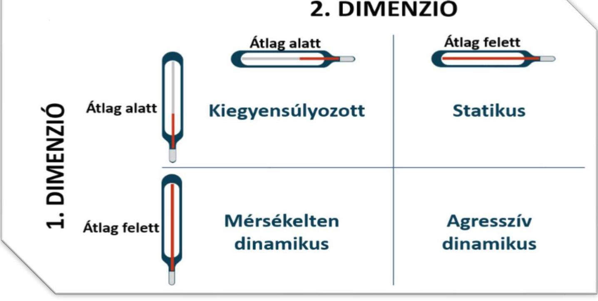

Forrás: NEAK adatok alapján ÁSZ saját szerkesztés

## Első dimenzió

A Kórház havi szintű lejárt kötelezettségállományának átlagos változása 2019. január és 2024. június közötti időszakban $27,4 \%$ volt. A lejárt kötelezettségállomány havi relatív változása $-100,0 \%$ (teljes adósság konszolidáció) és $867,4 \%$ közötti értékeket vett fel, mely a vizsgált kórházak volatilitási adatai közül a középértéknek számított. A kórházi volatilitás a kiugróan magas $867,4 \%$-os relatív változás kiszűrését követően $13,1 \%$ ponttal csökkent, mely az öt vizsgált kórházból négy kórház átlagos mértékének felelt meg.

A kiugró relatív változás mögötti nominális kötelezettségállományi változás a nyilvántartás hiányos vezetéséből, illetve nem teljeskörű vezetéséből származhatott, a relatív változások mértékét figyelembe véve ezen kiugró érték kiszűrése volt indokolt. Ennek eredményeként a havi (korrigált) átlagos változás 14,3\% volt, mely a második legalacsonyabb (korrigált) kórházi volatilitás volt.

A Kórház esetén a bázis (2019. 01. havi) lejárt kötelezettségállomány 0 E Ft volt, mely több hónapig nem változott, ennek oka helytelen adatszolgáltatásra vezethető vissza. Az első lejárt kötelezettségállomány érték berögzítése 2019. júniusában volt. Jelentős arányban a 2019. év augusztusában 107,0\%-kal, majd szeptemberben további $123,8 \%$-kal emelkedett az adósságállomány. Az októberi 32,4\%-os emelkedést követően a 36086 E Ftos adósságállomány a 2020. év januárjáig havonta kis mértékben csökkent, átlagosan 1,7\%-kal.

A 2020. év februárjában a nyilvántartási adatok alapján az adósság teljes konszolidációjára került sor. A konszolidációt követően 2020 októberéig lejárt kötelezettségállomány lejelentésére nem került sor, a NEAK nyilvántartása alapján lejárt kötelezettsége a kórháznak nem volt. A 2020. év decemberére 1490 E Ft adóssága keletkezett a Kórháznak, melyet a 2021. év januárjában és februárjában ismételten 0 E Ft nyilvántartott adósságállomány követett.

---

2021. március - október közötti időszakban az adósság volatilitását (első dimenziós értékét) emelve, eleinte kisebb mértékben, de nagyobb arányban, majd az év második felében nominálisan is magasabb mértékben emelkedett a Kórház adóssága. Az adósság mértéke 2021. októberére elérte a 74781 E Ft-ot. Az emelkedést követően a novemberi mérsékelt, 16,1\%-os adósságkonszolidációt a decemberi teljes ( $100 \%$-os) konszolidáció követte.

A 2022. év január - május közötti időszakban lejárt kötelezettség állomány lejelentés nem történt, a Kórháznak adóssága a nyilvántartás alapján nem keletkezett. A 2022. év második felében ismételten jelentős arányban és mértékben emelkedni kezdett a lejelentett adósságállomány, júliusi hónapban 867,4\%-os kiugróan magas növekedés történt 46795 E Ft-os adósságállományt elérve. Ezt követően 2022. novemberéig átlagosan 16,9\%kal tovább nőtt a kórház adóssága, melynek $35,7 \%$-át decemberben konszolidáltak.

A 2023. évi januári (bázis) adósságállomány 63129 E Ft-ra nőtt, az előző vizsgált években tapasztalt meghatározó arányú év végi adósságkonszolidáció elmaradt. A 2023. év januárjától áprilisi hónapig tartó átlagos 19,1\%-os adósság növekedés 13,6\%-kal mérséklődött a májusi hónapban. A Kórháznak a vizsgált időszakban a legmagasabb, 114432 E Ft-os adósságállománya 2023. augusztusában volt, mely szeptemberben 42,4\%-kal 65862 E Ft-ra, majd decemberig havonta átlagosan további 26,4\%-kal 22201 E Ft-ra csökkent. A 2024. tört évi időszakban a kórház adóssága átlagosan 18,6\%-kal nőtt, az előző év májusához hasonlóan 2024. májusában is konszolidálásra került az adósság egy része ( $23,7 \%$-a).
10 ábra
A KÓRHÁZ LEJÁRT KÖTELEZETTSÉGÁLLOMÁNYÁNAK ALAKULÁSA A VIZSGÁLT IDŐSZAKBAN
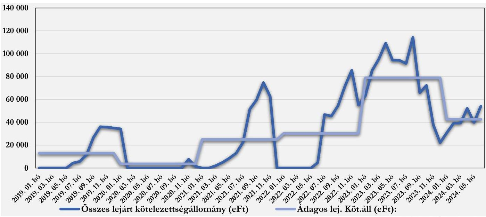

Összességében az első dimenzió tekintetében a kórház esetében is jellemző az éves ciklusokban változó lejárt kötelezettségállomány, az év végéhez közeledve a lejárt kötelezettségállomány jellemzően megemelkedett, majd az év végi konszolidáció hatására lecsökkent. A vizsgált időszakban a 0 E Ft-on nyilvántartott adósságállomány az évenként számított átlagos lejárt kötelezettségállomány volatilitási görbéjét kisimította, azonban a 2022. május hónaptól kezdődően a kórház adósságának volatilitása növekedett, mellyel párhuzamosan annak átlaga is új rekord szintet ért el.

---

# Második dimenzió 

A második dimenzió elemzéséhez az éves lejárt kötelezettségállomány havi átlaga került kiszámításra. A 2024. évi tört (fél éves) adatok esetén az első dimenzióban feltárt ciklikus változást, illetve hasonlóságot feltételezve becsült átlagos havi adatok kerültek kiszámításra, melyek külön értékelendők.

Az átlagos lejárt kötelezettségállomány a 2019. évben havi szinten 12975 E Ft, a 2020. évben 3627 E Ft, a 2021. évben 25004 E Ft, a 2022. évben 30329 E Ft, a 2023. évben 78848 E Ft volt, mely más egyházi fenntartású kórházzal összehasonlítva a második legalacsonyabbnak számít. A 2024. évi tört év adatai és ciklikus mintázat alapján becsült átlagos lejárt kötelezettségállomány 31796 E Ft, mely az első félévhez viszonyított második félév alacsonyabb arányait és a 2023. évi utolsó egész év arányát is figyelembe véve az éves szintű átlagoknál alacsonyabbnak számít.

A Kórház éves kiadási főösszege mértékét tekintve a 2019. évről a 2020. évre 956273 E Ft-ról 1121740 E Ft-ra (17,3\%-kal) nőtt. Az éves kiadási főösszeg 2021. évre további 17,5\%-kal 1318047 E Ft-ra, majd 2022. évre újabb 19,5\%-kal 1574908 E Ft-ra nőtt. Összességében 2019-2023. évi időszakban 76,5\%-kal emelkedett a Kórház éves kiadási főösszege, 1687747 E Ft-ra.
7. táblázat

A KÓRHÁZ ÉVES KIADÁSI FŐŐSSZEG ÉS ÁTLAGOS LEJÁRT KÖTELEZETTSÉGÁLLOMÁNY VÁLTOZÁSOK ÖSSZEHASONLÍTÁSA

| IDÓSZAK | ÉVES KIADÁSI FÖÖSSZEG VÁLTOZÁSA | LEJÁRT HAVI ÁTLAGOS KÖTELEZETTSÉGÁLLOMÁNY VÁLTOZÁSA |
| :--: | :--: | :--: |
| 2020 | $17,3 \%$ | $-72,1 \%$ |
| 2021 | $17,5 \%$ | $589,9 \%$ |
| 2022 | $19,5 \%$ | $21,3 \%$ |
| 2023 | $7,2 \%$ | $160,0 \%$ |

A Kórház második dimenzióban való elhelyezéséhez a kiszámított átlagos lejárt kötelezettségállományt viszonyítottuk az átlagos havi kiadási főösszeghez, amely a 2019. évben 16,3\%, a 2020. évben 3,9\%, a 2021. évben $22,8 \%$, a 2022. évben $23,1 \%$, a 2023. évben $56,1 \%$ volt. Ez azt jelenti, hogy a 2023. évben az átlagosan lejárt kötelezettségállomány meghaladta az átlagos havi kiadási főösszeg felét, ami az egyházi fenntartású korházak tekintetében magas arány, negatív jelenség. A Kórház második dimenzióbeli értéke - a 2020. év kivételével - évről-évre emelkedett. A kiválasztott további négy egyházi fenntartású kórházból három rendelkezett a 2019. és 2020. éveben második dimenzióbeli aránnyal, melyek átlagosan a 2019. évben 19,8\%, a 2020. évben $22,4 \%$ volt, míg a 2021-2023 közötti időszakban kiválasztott négy kórház második dimenzióbeli aránya átlagosan a 2021. és 2022. évben is $17,9 \%$, a 2023. évben $53,8 \%$ volt. A kiválasztott összesen öt kórház közül a kiadási főösszeghez képest növekvő mértékű és arányú, magasabb átlagos lejárt kötelezettség jellemezte a Kórházat a 2023. években.

## Adósság-pozicionálás

A Kórházat a két adósságdimenzió együttes értékelése alapján a második legalacsonyabb havi átlagos változás (volatilitás) mellett a vizsgált kórházak között medián értéknek tekinthető átlagos havi kiadási főöszszeghez viszonyított lejárt kötelezettségállomány jellemezte a vizsgált időszakban a viszonyszám éves átlagai tekintetében, mely a 2019-2020 közötti időszaki kiegyensúlyozott pozíciót követően, a 2021-2023 közötti időszakban statikus pozíciónak írható le. A pozíciót jellemzi, hogy az átlag alatti, az egyházi kórházak volatilitásához hasonlítva alacsonyabb adósságot az átlagos havi kiadási főösszeghez viszonyított növekvő aránya tovább rontotta, mely a negatív hatások erősödéséről árulkodik. A Kórház első dimenziós értéke - a teljes vizsgált

---

időszakot figyelembe véve - a torzító tényezők kiszűrését követően is a $21,3 \%$-os átlagos dimenziós érték alatt, míg a második dimenziós érték 2021-2023. években is a dimenziós átlag felett volt.

A 2023. évben a többi vizsgált évhez képest alacsonyabb volatilitás mellett a nominálisan megemelkedett lejárt kötelezettség hatására a havi kiadási főösszeghez viszonyított havi adósság aránya jelentősen emelkedett, mely a statikus pozíció megerősödésének irányába mutatott. Ennek okozója a 2023. évi lejárt kötelezettségek nagy arányú ( $160,0 \%$-os) emelkedése és az éves átlagokhoz viszonyított nominálisan is magasabb felhalmozása volt, a 2023. évi három nagyobb arányú (átlagosan $43,8 \%$-os) konszolidáció ellenére. A 2024. tört év esetén az első fél év adatai alapján érdemi pozíció javulás vagy romlás nem prognosztizálható a Kórháznál.
11. ábra

AZ ADÓSSÁG-POZICIONÁLÁS KÉT DIMENZIÓJÁNAK ALAKULÁSA
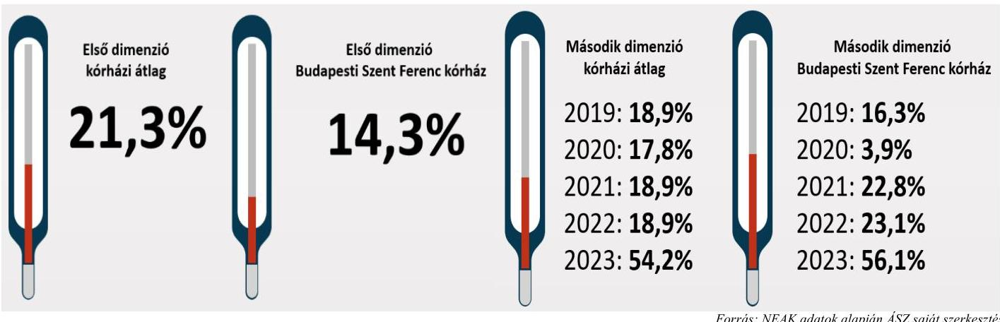

# 3. A kórház múködésének bemutatása 

### 3.1. Input/humán erőforrás mutatók elemzése

A humán erőforrás helyzet elemzéséhez a NEAK adatai kerültek felhasználásra ${ }^{7}$, amelyek 2021 márciusától ${ }^{8}$ álltak rendelkezésre, ami meghatározta az elemzett időszakot. A főbb adatokat a 8. táblázat tartalmazza.

[^0]
[^0]:    ${ }^{7}$ Az elemzést megelőzően humán erőforrásra vonatkozó adatkérést küldtünk az elemzett kórházak részére. A beérkezett adatok feldolgozásánál megállapítottuk, hogy azok összehasonlításra alkalmatlanok, az eltérő adatstruktúra miatt, továbbá eltérnek a NEAK által szolgáltatott adatoktól. Ennek okán kerültek a NEAK adatok felhasználásra a humán erőforrás helyzetének elemzéséhez.
    8 Az egészségügyi szolgálati jogviszonyról szóló 2020. évi C. törvény értelmében 2021. március 01-től történik adatgyűjtés az egészségügyi szolgálati jogviszonyban foglalkoztatott orvosok, szakdolgozók számát illetően. A gazdasági, műszaki területen foglalkoztatott dolgozók létszámára vonatkozóan 2023. július 1-től rendelkeznek adatokkal (erre az elemzés nem tér ki).

---

# A HUMÁN ERŐFORRÁSHELYZET FŐBB MUTATÓSZÁMAI 

| MUTATÓSZÁM NEVE | KÓRNAZ   ADATA | AZ ELENZETT KÓRNAZAK ÁTLAG ADATA | ÁTLAGTOL   VALÍTÉETERES |
| :--: | :--: | :--: | :--: |
| 2021 |  |  |  |
| Foglalkoztatott orvosok aránya az összlétszámból (havi átlag) (\%) | $22,4 \%$ | $21,5 \%$ | $4,4 \%$ |
| Foglalkoztatott szakdolgozók aránya az összlétszámból (havi átlag) (\%) | $77,6 \%$ | $78,5 \%$ | $-1,2 \%$ |
| Alkalmazottak fluktuációja intézményi szinten (havi átlag) (\%) | $2,1 \%$ | $0,6 \%$ | $250,0 \%$ |
| ezen belül orvosok (havi átlag) (\%) | $3,2 \%$ | $1,6 \%$ | $95,1 \%$ |
| ezen belül szakdolgozók (havi átlag) (\%) | $1,8 \%$ | $0,4 \%$ | $400,0 \%$ |
| 1 orvosra jutó szakdolgozó (havi átlag) (fő) | 3,5 | 4,6 | $-24,4 \%$ |
| 1 szakdolgozóra jutó teljesített ápolási nap (havi átlag) | 32,7 | 24,7 | $32,3 \%$ |
| 1 orvosra jutó ágyak száma (havi átlag) | 5,8 | 7,0 | $-17,4 \%$ |
| 1 szakdolgozóra jutó ágyak száma (havi átlag) | 1,7 | 1,5 | $16,4 \%$ |
| 2022 |  |  |  |
| Foglalkoztatott orvosok aránya az összlétszámból (havi átlag) (\%) | $23,5 \%$ | $23,4 \%$ | $0,6 \%$ |
| Foglalkoztatott szakdolgozók aránya az összlétszámból (havi átlag) (\%) | $76,5 \%$ | $76,6 \%$ | $0,0 \%$ |
| Alkalmazottak fluktuációja intézményi szinten (havi átlag) (\%) | $0,1 \%$ | $0,2 \%$ | $-66,8 \%$ |
| ezen belül orvosok (havi átlag) (\%) | $0,0 \%$ | $0,5 \%$ | $-90,8 \%$ |
| ezen belül szakdolgozók (havi átlag) (\%) | $0,1 \%$ | $0,1 \%$ | $-42,6 \%$ |
| 1 orvosra jutó szakdolgozó (havi átlag) (fő) | 3,3 | 4,0 | $-17,7 \%$ |
| 1 szakdolgozóra jutó teljesített ápolási nap (havi átlag) | 32,5 | 23,3 | $39,7 \%$ |
| 1 orvosra jutó ágyak száma (havi átlag) | 5,1 | 5,7 | $-11,9 \%$ |
| 1 szakdolgozóra jutó ágyak száma (havi átlag) | 1,6 | 1,4 | $12,1 \%$ |
| 2023 |  |  |  |
| Foglalkoztatott orvosok aránya az összlétszámból (havi átlag) (\%) | $24,7 \%$ | $24,0 \%$ | $3,0 \%$ |
| Foglalkoztatott szakdolgozók aránya az összlétszámból (havi átlag) (\%) | $75,3 \%$ | $76,0 \%$ | $-0,9 \%$ |
| Alkalmazottak fluktuációja intézményi szinten (havi átlag) (\%) | $1,0 \%$ | $0,9 \%$ | $4,5 \%$ |
| ezen belül orvosok (havi átlag) (\%) | $0,6 \%$ | $1,0 \%$ | $-39,6 \%$ |
| ezen belül szakdolgozók (havi átlag) (\%) | $1,0 \%$ | $1,0 \%$ | $-2,0 \%$ |
| 1 orvosra jutó szakdolgozó (havi átlag) (fő) | 3,0 | 3,7 | $-18,5 \%$ |
| 1 szakdolgozóra jutó teljesített ápolási nap (havi átlag) | 46,7 | 29,1 | $60,4 \%$ |
| 1 orvosra jutó ágyak száma (havi átlag) | 4,9 | 5,0 | $-0,3 \%$ |
| 1 szakdolgozóra jutó ágyak száma (havi átlag) | 1,6 | 1,3 | $23,4 \%$ |

Az összlétszámhoz viszonyított orvosok és szakdolgozók arányáról elmondható, hogy az elemzett időszakban a stabilitás jellemzi, az arányuk alig változott a három év alatt. Az alkalmazottak fluktuációja intézményi szinten 2021-ben lényegesen magasabb volt ( $250,0 \%$-kal), mint az öt kórház átlag. A 2022. és 2023. évek során a fluktuáció mértéke az öt kórház átlag értékéhez közelített vagy alatta maradt. Az egy orvosra jutó szakdolgozói létszám az öt kórház átlaga alatt volt mind a három évben, 2021-ben 24,4 \%-kal, 2022-ben 17,7 \%-kal, 2023-ban 18,5 \%-kal volt kevesebb annál. Ezekkel az adatokkal mutat összefüggést az 1 orvosra jutó ágyak száma, ugyanis azok jellemzően az öt kórház átlaga alatt maradtak mind a három évben, míg a szakdolgozókra jutó ágyak száma ( $12,1 \%$ és $23,4 \%$ közötti mértékben) az átlagok felett voltak.

A fenti adatokon túl a szakdolgozói magas leterheltséget mutatja még az 1 szakdolgozóra jutó teljesített ápolási napok száma, mivel az lényegesen magasabb az öt kórház átlagánál, 2021-ben 32,3\%-kal; 2022-ben 39,7\%-kal; 2023-ban 60,4 \%-kal volt több.

Fontos megjegyezni, hogy az elemzés nem tért ki sem az orvosok, sem a szakdolgozók vonatkozásában a képzettségi szint szerinti megoszlásra, ami tovább árnyalná a humán erőforrás helyzet megítélését.

---

# 3.2. Output/működési-, teljesítmény-, kapacitáskihasználtság mutatók elemzése 

A főbb adatokat a 9. táblázat tartalmazza.
9. táblázat

## A FŐBB MŰKÖDÉSI-, TELJESÍTMÉNY-, KAPACITÁSKIHASZNÁLTSÁG ADATOK

| MUTATÓSZÁM NEVE | KÓRHÁZ   ADATA | AZ ELEMZETT KÖR-   HÁZAK ÁTLAG ADATA | ÁTLACITÓL YALO   ELTERÉS |
| :-- | --: | --: | --: |
| 2019 |  |  |  |
| Éves ágykihasználtsági mutató aktív (\%) | $68,9 \%$ | $67,2 \%$ | $2,6 \%$ |
| Éves ágykihasználtsági mutató krónikus (\%) | $69,6 \%$ | $65,2 \%$ | $6,8 \%$ |
| Egy aktív ágyra jutó elszámolt súlyszám | 7,0 | 41,6 | $-83,1 \%$ |
| Case-mix index | 0,8 | $106,7 \%$ | $-23,4 \%$ |
| Egy súlyszámra jutó gyógyszerkiadás (Ft) | 472 604,4 | 182602 | $158,8 \%$ |
| Egy esetszámra jutó gyógyszerkiadás - (aktív és krónikus) (Ft) | 12883,1 | 57941 | $-77,8 \%$ |
| Teljesített súlyszám (fekvő) | 56,2 | 5464 | $-99,0 \%$ |
| TÉK ${ }^{28}$ felett elszámolt súlyszám (degresszált súlyszám) (fekvő) | - | 56 | $-100,0 \%$ |
| Kihasználatlan TÉK súlyszám (fekvő) | 29,0 | 281 | $-89,7 \%$ |
| Teljesített pont (járó) | 35059853,0 | 116013088 | $-69,8 \%$ |
| TÉK feletti elszámolt pont (degresszált pont) (járó) | - | 3027851 | $-100,0 \%$ |
| Kihasználatlan TÉK pont (járó) | 199418 176,0 | 93833411 | $112,5 \%$ |
| Teljesített pont (labor) | 86720,0 | 54796184 | $-99,8 \%$ |
| TÉK felett teljesített, lebegő ponton elszámolt pont (labor) | 86720,0 | 39377727 | $-99,8 \%$ |
| Kihasználatlan TÉK pont (labor) | - | 0 | $0,0 \%$ |
| Egynapos súlyszám | - | 8 | $-100,0 \%$ |
| Standardizált naphányados | 0,8 | 0,9 | $-5,8 \%$ |
| 2020 |  |  |  |
| Éves ágykihasználtsági mutató aktív (\%) | $65,1 \%$ | $58,3 \%$ | $11,7 \%$ |
| Éves ágykihasználtsági mutató krónikus (\%) | $40,9 \%$ | $45,1 \%$ | $-9,3 \%$ |
| Egy aktív ágyra jutó elszámolt súlyszám | 14,9 | 23,8 | $-37,4 \%$ |
| Case-mix index | 0,9 | $111,8 \%$ | $-16,6 \%$ |
| Egy súlyszámra jutó gyógyszerkiadás (Ft) | 213584,4 | 260194 | $-17,9 \%$ |
| Egy esetszámra jutó gyógyszerkiadás - (aktív és krónikus) (Ft) | 22365,6 | 195761 | $-88,6 \%$ |
| Teljesített súlyszám (fekvő) | 168,8 | 4170 | $-96,0 \%$ |
| TÉK felett elszámolt súlyszám (degresszált súlyszám) (fekvő) | - | 2 | $-100,0 \%$ |
| Kihasználatlan TÉK súlyszám (fekvő) | 86,0 | 1445 | $-94,0 \%$ |
| Teljesített pont (járó) | 28888 925,0 | 89381390 | $-67,7 \%$ |
| TÉK feletti elszámolt pont (degresszált pont) (járó) | - | 0 | $0,0 \%$ |
| Kihasználatlan TÉK pont (járó) | 482274 417,0 | 236127392 | $104,2 \%$ |
| Teljesített pont (labor) | 24912,0 | 42475960 | $-99,9 \%$ |
| TÉK felett teljesített, lebegő ponton elszámolt pont (labor) | 15657,0 | 27512235 | $-99,9 \%$ |
| Kihasználatlan TÉK pont (labor) | - | 0 | $0,0 \%$ |
| Egynapos súlyszám | - | 6 | $-100,0 \%$ |
| Standardizált naphányados | 1,0 | 0,9 | $3,7 \%$ |
| 2021 |  |  |  |
| Éves ágykihasználtsági mutató aktív (\%) | $54,5 \%$ | $56,4 \%$ | $-3,4 \%$ |
| Éves ágykihasználtsági mutató krónikus (\%) | $48,4 \%$ | $42,2 \%$ | $14,6 \%$ |
| Egy aktív ágyra jutó elszámolt súlyszám | 15,1 | 30,5 | $-50,4 \%$ |
| Case-mix index | 0,8 | 1,0 | $-16,7 \%$ |
| Egy súlyszámra jutó gyógyszerkiadás (Ft) | 335364,6 | 212802,2 | $57,6 \%$ |
| Egy esetszámra jutó gyógyszerkiadás - (aktív és krónikus) (Ft) | 22265,1 | 126752,3 | $-82,4 \%$ |
| Teljesített súlyszám (fekvő) | 119,8 | 4232,4 | $-97,2 \%$ |
| TÉK felett elszámolt súlyszám (degresszált súlyszám) (fekvő) | - | 4,4 | $-100,0 \%$ |
| Kihasználatlan TÉK súlyszám (fekvő) | 135,0 | 1986,8 | $-93,2 \%$ |
| Teljesített pont (járó) | 22309 698,0 | 123521458,0 | $-81,9 \%$ |
| TÉK feletti elszámolt pont (degresszált pont) (járó) | - | 9566249,8 | $-100,0 \%$ |
| Kihasználatlan TÉK pont (járó) | 695958 909,0 | 380169 604,0 | $83,1 \%$ |
| Teljesített pont (labor) | 16119,0 | 58953 874,0 | $-100,0 \%$ |
| TÉK felett teljesített, lebegő ponton elszámolt pont (labor) | - | 38986 296,4 | $-100,0 \%$ |
| Kihasználatlan TÉK pont (labor) | - | 0,0 | $0,0 \%$ |
| Egynapos súlyszám | 30,0 | 12,4 | $-100,0 \%$ |
| Standardizált naphányados | 1,1 | 1,0 | $7,8 \%$ |

---

|  MUTATÓSZÁM NEVE | KÓRHÁZ
ADATA | AZ ELENZETT KÖR-
HÁZÁK ÁTLAG ADATA | ATTAGTÓLVALÓ
ELTÉRES  |
| --- | --- | --- | --- |
|  2022 |  |  |   |
|  Éves ágykihasználtsági mutató aktív (\%) | $58,8 \%$ | $54,9 \%$ | $7,0 \%$  |
|  Éves ágykihasználtsági mutató krónikus (\%) | $59,4 \%$ | $45,6 \%$ | $30,3 \%$  |
|  Egy aktív ágyra jutó elszámolt súlyszám | 16,4 | 33,9 | $-51,6 \%$  |
|  Case-mix index | 0,8 | 1,0 | $-16,7 \%$  |
|  Egy súlyszámra jutó gyógyszerkiadás (Ft) | 372000,0 | 130781,7 | $184,4 \%$  |
|  Egy esetszámra jutó gyógyszerkiadás - (aktív és krónikus) (Ft) | 22591,8 | 53697,1 | $-57,9 \%$  |
|  Teljesített súlyszám (fekvő) | 131,3 | 5351,3 | $-97,5 \%$  |
|  TÉK felett elszámolt súlyszám (degresszált súlyszám) (fekvő) | - | 4,4 | $-100,0 \%$  |
|  Kihasználatlan TÉK súlyszám (fekvő) | 163,0 | 2491,6 | $-93,5 \%$  |
|  Teljesített pont (járó) | 29881 277,0 | 192261 988,4 | $-84,5 \%$  |
|  TÉK feletti elszámolt pont (degresszált pont) (járó) | - | 18842 002,6 | $-100,0 \%$  |
|  Kihasználatlan TÉK pont (járó) | 681453 548,0 | 284324 272,6 | $139,7 \%$  |
|  Teljesített pont (labor) | 35210,0 | 83787 329,2 | $-100,0 \%$  |
|  TÉK felett teljesített, lebegő ponton elszámolt pont (labor) | - | 56309751,0 | $-100,0 \%$  |
|  Kihasználatlan TÉK pont (labor) | - | 0,0 | $0,0 \%$  |
|  Egynapos súlyszám | - | 12,2 | $-100,0 \%$  |
|  Standardizált naphányados | 1,2 | 1,0 | $20,0 \%$  |
|  2023 |  |  |   |
|  Éves ágykihasználtsági mutató aktív (\%) | $45,3 \%$ | $61,9 \%$ | $-26,8 \%$  |
|  Éves ágykihasználtsági mutató krónikus (\%) | $74,3 \%$ | $54,2 \%$ | $37,0 \%$  |
|  Egy aktív ágyra jutó elszámolt súlyszám | 15,2 | 33,7 | $-54,8 \%$  |
|  Case-mix index | 0,9 | 1,1 | $-17,1 \%$  |
|  Egy súlyszámra jutó gyógyszerkiadás (Ft) | 319722,0 | 151655,2 | $110,8 \%$  |
|  Egy esetszámra jutó gyógyszerkiadás - (aktív és krónikus) (Ft) | 11647,9 | 69990,1 | $-83,4 \%$  |
|  Teljesített súlyszám (fekvő) | 121,0 | 6665,8 | $-98,2 \%$  |
|  TÉK felett elszámolt súlyszám (degresszált súlyszám) (fekvő) | - | 24,2 | $-100,0 \%$  |
|  Kihasználatlan TÉK súlyszám (fekvő) | 228,0 | 753,6 | $-69,7 \%$  |
|  Teljesített pont (járó) | 33302 132,0 | 228596 480,0 | $-85,4 \%$  |
|  TÉK feletti elszámolt pont (degresszált pont) (járó) | - | 7164 085,4 | $-100,0 \%$  |
|  Kihasználatlan TÉK pont (járó) | 382543 229,0 | 100051 940,0 | $282,3 \%$  |
|  Teljesített pont (labor) | 49724,0 | 85735 806,6 | $-99,9 \%$  |
|  TÉK felett teljesített, lebegő ponton elszámolt pont (labor) | - | 58219 064,4 | $-100,0 \%$  |
|  Kihasználatlan TÉK pont (labor) | - | 0,0 | $0,0 \%$  |
|  Egynapos súlyszám | - | 13,6 | $-100,0 \%$  |
|  Standardizált naphányados | 1,0 | 0,9 | $16,7 \%$  |

A Kórház a 2019. év szeptemberétől 8 db aktív ággyal, 2019. év január - augusztus között 65 db, 2019. év szeptemberétől 92 db krónikus ággyal üzemelt.

Az aktív ágyak kihasználtsága 2019. évben 68,9\%, a 2020. évben 65,1\%, 2021. évben 54,5\%, 2022. évben $58,8 \%$, míg a 2023. évben $45,3 \%$ volt. A esökkenő kihasználtsági adatok a COVID 19 járványra vezethetőek vissza, azok a 2023. év kivételével jellemzően az országos átlag ${ }^{9}$ felett maradtak. 2023-ban nem csak az országos átlag alatt volt a mutató, de $26,8 \%$-kal az öt kórház átlagától is elmaradt. A Kórház aktív ágyainak kihasználtsági adatait a 10. ábra tartalmazza, az országos átlaghoz, valamint a többi elemzett kórház adataihoz viszonyítottan.

[^0] [^0]: ${ }^{9}$ https://www.neak.gov.hu/felso_menu/szakmai_oldalak/publikus_forgalmi_adatok/gyogyito_ megelozo_forgalmi_adat/fekvobeteg_szakellatas_stat/korhazi_agyszam

---

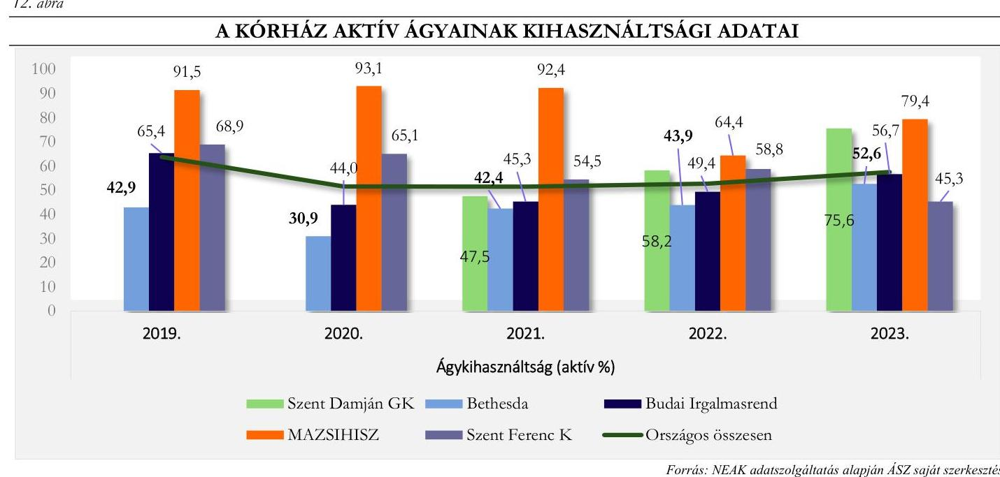

A krónikus ágyak kihasználtsága a vizsgált időszakban hullámzó volt, a kiinduló 2019. éves állapothoz képest (69,6\%) 2022-ig csökkenés volt detektálható. A Kórház krónikus ágykihasználtsága csak a 2020. évben maradt az elemzett kórházak átlag adata alatt, viszont a 2023. évben 37,0 \%-kal volt magasabb az átlagnál, az adatok az országos átlag adatokat egyik évben sem haladták meg. A krónikus ágykihasználtsági adatokat a 11. ábra tartalmazza az országos átlag-, illetve a többi elemzett kórház adatainak relevanciájában.
13. ábra

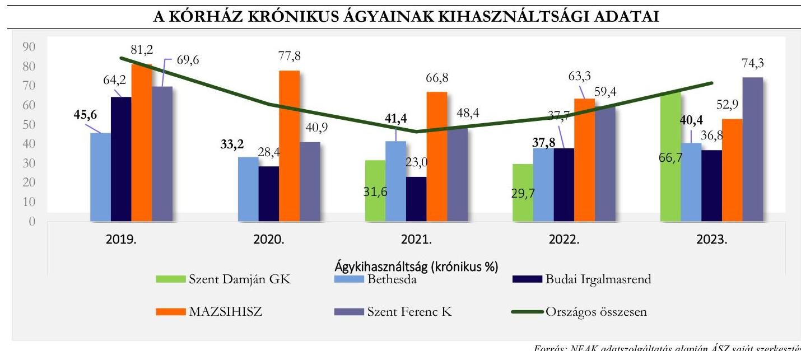

Az ágykihasználtsági adatok a többi elemzett kórház adataihoz való viszonyítása alapján megállapítható, hogy mind az aktív ágyak, mind a krónikus ágyak kihasználtsága 2019-2023. évek között hullámzó volt. A Kórház aktív ágyainak kihasználtsági adatai a 2023. évben maradtak el leginkább a többi elemzett kórház adataihoz képest (2023. évben 26,8\%-kal), míg a krónikus ágyak kihasználtsági adatai szintén a 2023. évben haladták meg a legmagasabb értékben (2023. évben 37,0\%-kal) a többi elemzett kórház adatait. Az ágykihasználtsági adatok

---

elemzésekor tekintettel kell lenni arra, hogy a Kórház a vizsgált években jellemzően krónikus besorolású ágyakkal működött, melynek nagy részét a kardiológiai rehabilitáció szakterület tette ki.

Az aktív fekvőbeteg szakellátás elszámolt teljesítményét vizsgálva megállapíthatjuk, hogy a Kórház 2019-2023. közötti időszakban nem jelentett TÉK feletti súlyszámot, az adatnak az ágyak számára ( 8 db ) tekintettel nincs relevanciája a többi elemzett kórházzal való összehasonlításban. Viszont feltűnő jelenség, hogy a kis ágyszámhoz mérten mindvégig nagy arányú volt a kihasználatlan kapacitása a Kórháznak, hiszen 2021-2023 között a kihasználatlan kapacitás (súlyszám) meg is haladta a teljesített súlyszámot. A jelenség kapacitástervezési anomáliát mutat.

A case-mix index adott időszak alatt ellátott finanszírozási esetek összetételét költségigényesség szempontjából jellemző mutató, amely az elszámolt súlyszám és az elszámolt finanszírozási esetszám hányadosa. Így a Kórházra vizsgálva mutatja az ellátott kórházi ápolási esetek átlagos költségigényesség szerinti súlyosságát. A Kórház eset súlyszáma minden évben 1,0 alatti érték volt, 0,8-0,9 között mozgott. Ennek megfelelően a casemix index az átlagnál alacsonyabb normatív költségigényű esetek ellátását jelzi.

A Kórház adatainak sorában figyelmet érdemelnek az 1 súlyszámra jutó gyógyszerkiadás adatai: 2020. év kivételével valamennyi évben meghaladta az elemzett öt kórház kiadási adatait, 2019-ben 158,8 \%-kal, 2021-ben 57,6 \%-kal, 2022-ben 184,4 \%-kal és 2023-ban 110,8 \%-kal volt több azoknál. Az adatok a gyógyszergazdálkodás optimalizációjának fontosságára hívják fel a figyelmet.

A standardizált naphányados $\left(\mathbf{N S H}^{29}\right)$ az átlagos ápolási idő viszonyát mutatja a normatív naphoz. Amennyiben az SNH értéke kisebb, mint 1, akkor a vizsgált intézmény átlagos ápolási ideje rövidebb, mint az adott $\mathrm{HBCS}^{30}$-khez tartozó normatív ápolási idő. A Kórház esetében az SNH értéke eltérő volt, 0,8-1,2 érték között mozgott. Az SNH 2021-2022. években haladta meg az 1 értékét, tehát az intézmény átlagos ápolási ideje több és hosszabb volt, mint az adott HBCS-khez tartozó normatív ápolási idő, ami költségnövelő tényezőként értelmezhető.

A Kórház járóbeteg szakellátás teljesítménye vonatkozásában megállapítható, hogy az elemzett években nem volt TÉK feletti teljesítmény, ami után degresszált finanszírozási összeget fizetett volna ki a NEAK, ellenben jelentős mértékű volt a kihasználatlan járóbeteg kapacitása (2019. évben 112,5 \%-kal; 2020-ban 104,2\%-kal, 2021-ben 83,1 \%-kal; 2022-ben 139,7 \%-kal; 2023-ban pedig 282,3 \%-kal haladta meg az öt kórház átlagos kihasználatlan kapacitását), ami bevételkiesésként értelmezhető.

A laboratóriumi ellátás finanszírozására jellemző, hogy a Kórház esetében nem jelent meg (és a másik négy kórháznál sem) kihasználatlan kapacitás, TÉK feletti teljesítmény is csak 2019-2020-ban, ezen években a Kórház a TÉK feletti labor-teljesítménye után degresszált, úgynevezett lebegőponton elszámolt forintértéket kapott. A többi kórház átlagához viszonyítottan 2019-ben 99,8 \%-kal, 2020-ban 99,9 \%-kal volt kevesebb a TÉK felett elszámolt labor pontja a Kórháznak. Fontos megjegyezni, hogy az elemzés nem tért ki a TÉK felett leadott teljesítmény összetételének vizsgálatára, ami tovább árnyalhatná a helyzet megítélését. A 12. ábra a Kórház elszámolt pontjainak alakulását illusztrálja, a TÉK feletti elszámolt pontokkal kiegészítve, a többi elemzett kórház adataival való összehasonlításban.

---

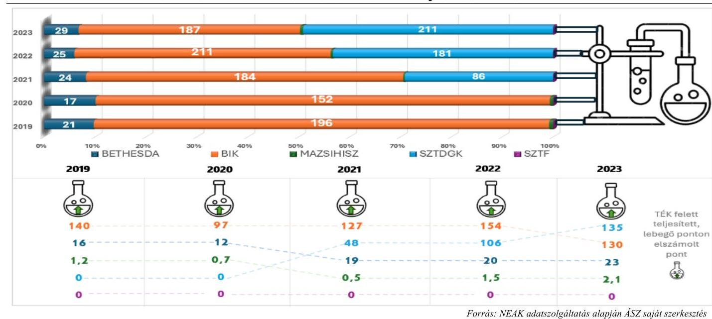

A Kórház a 2021. évben jelentett egynapos ellátási teljesítményt, minimális 30,0 súlyszám mértékig, ami nem volt befolyással a Kórház NEAK bevétele alakulására.

# 3.3. Menedzsment hatásvizsgálata 

Az elemzett időszak számos globális és magyarországi kihívást hozott, mely külső és belső tényezőként nagyban befolyásolták a betegek ellátásnak minőségét és az intézmény fenntarthatóságát.

A 2021. év második felében a legjelentősebb feladatot az akkor még javában tartó COVID-19 világjárvány okozta nyomás hatékony kezelése jelentette, ez évben a Kórház múködéséhez szükséges fedezetet a járvány többletköltség elszámolások, egyéb pályázatok, támogatások és ösztöndíjak tették ki.

A 2022. évben továbbra is jelenlévő COVID-19 mellett egy új külső tényező jelent meg: kirobbant az oroszukrán háború, mely nagymértékű gazdasági kihívást jelentett az energiapiacok instabilitása és a növekvő inflációs környezet miatt, valamint a kórházi adósságállomány számottevően meghaladta a 2021 évit, a Kórház a kapott támogatásokból év végére nem tudta azt teljes mértékben rendezni. A kihívások ellenére a Kórház vezetése továbbra is kiemelt figyelmet fordított az intézmény modernizálására. A Kórház infrastruktúrájának fejlesztése, az épületek felújítása és építése pályázati támogatásokból, programok keretében valósult meg. 2019-ben átadásra került a Kórház új szárnya, ami mellett folyt a régi épületrész teljeskörű felújítása, továbbá kialakításra került egy új műszerekkel felszerelt hétállásos ambulancia, mely a kardiológia, kardiológiai rehabilitáció, belgyógyászat spektrummal múködött.

Emberi erőforrás oldalról a COVID-19 járvány gyengülését követően a megnövekedett létszámú betegek ellátáshoz szükséges szakdolgozói üres álláshelyek betöltésre kerültek, a létszám helyzet stabilizálódott, továbbá megkezdődött az orvosok bérrendezése is, így a bérköltség közel duplájára emelkedett.

A 2023. évben a magas inflációs környezet mellett az elhúzódó orosz-ukrán háború jelentette a külső tényezők által okozott problémákat. Az orvos szakmában az utánpótlás biztosítása országszerte nehézségeket okozott. Ugyanebben az évben megkezdődött a Kórház minőségbiztosításra történő felkészítése, valamint tovább folytatta aktív részvételét a lakosság egészségügyi ellátáshoz kapcsolódó prevenciós, ártalomcsökkentő és oktató munkában. Oktató Kórházként több tanfolyamot és konferenciát is szerveztek, szakdolgozók képzésében is részt vettek. A fentiek mellett fontos megjegyezni, hogy a menedzsment növelte a teljesítményfinanszírozásból származó bevételeit, ami hozzájárult a Kórház pénzügyi stabilitásához.

---

# **FÜGGELÉK**

## **I. SZ. FÜGGELÉK: A KÓRHÁZ FŐBB MŰKÖDÉSI JELLEMZŐI AZ ÖSSZES ELEMZETT KÓRHÁZ ADATAINAK VISZONYLATÁBAN**

## **2019. év**

|  ADAT/
MÉTATÓ-
SZÁM
TÍPUSA | MÉTATÓSZÁM/ADAT NEVE | KÓRHÁZ
ADATA | AZ ELEM-
ZETT KÓRHÁ-
ZAK ÁTLAG
ADATA | ÁTLAGTÓI
VALÓ
ELTÉRÉS  |
| --- | --- | --- | --- | --- |
|   | NEAK bevétel aránya az összes bevételben (%) | 40,0% | 62,5% | -35,9%  |
|   | Lejárt kötelezettségállomány átlagának aránya az éves kiadási főöszezeghez (%) | 16,3% | 18,9% | -13,8%  |
|   | Egy esetszámra (aktív és krónikus) jutó összes bevétel (E Ft) | 468,9 | 458,9 | 2,2%  |
|   | Foglalkoztatott orvosok aránya az összlétszámból (havi átlag) (%) |  |  |   |
|   | Foglalkoztatott szakdolgozók aránya az összlétszámból (havi átlag) (%) |  |  |   |
|   | Alkalmazottak fluktuációja intézményi szinten (havi átlag) (%) |  |  |   |
|   | 1 orvosra jutó szakdolgozó (havi átlag) (fő) | 2021. év márciustól áll rendelkezésre NEAK adatszolgáltatás |  |   |
|   | 1 szakdolgozóra jutó teljesített ápolási nap (havi átlag) |  |  |   |
|   | 1 orvosra jutó ágyak száma (havi átlag) |  |  |   |
|   | 1 szakdolgozóra jutó ágyak száma (havi átlag) |  |  |   |
|   | Összes szervezeti egység (db) |  |  |   |
|   | - ebből a kórházi osztályok progresszivitási szint szerinti besorolása: | 1,0 | 8,00 | -87,5%  |
|   | I. progresszivitási szintű osztályok (db) | 0,0 | 1,50 | -100,0%  |
|   | II. progresszivitási szintű osztályok (db) | 0,0 | 3,00 | -100,0%  |
|   | III. progresszivitási szintű osztályok (db) | 1,0 | 3,50 | -71,4%  |
|   | Éves ágykihasználtsági mutató aktív (%) | 68,9% | 67,2% | 2,6%  |
|   | Éves ágykihasználtsági mutató krónikus (%) | 69,6% | 65,2% | 6,8%  |
|   | Egy aktív ágyra jutó elszámolt súlyszám | 7,0 | 41,6 | -83,1%  |
|   | Case-mix index | 0,8 | 106,7% | -23,4%  |
|   | Egy súlyszámra jutó gyógyszerkiadás (Ft) | 472 604,4 | 182 602 | 158,8%  |
|   | Egy esetszámra jutó gyógyszerkiadás - (aktív és krónikus) (Ft) | 12 883,1 | 57 941 | -77,8%  |
|   | Teljesített súlyszám (fekvő) | 56,2 | 5 464 | -99,0%  |
|   | TÉK felett elszámolt súlyszám (degresszált súlyszám) (fekvő) | - | 56 | -100,0%  |
|   | Kihasználatlan TÉK súlyszám (fekvő) | 29,0 | 281 | -89,7%  |
|   | Teljesített pont (járó) | 35 059 853,0 | 116 013 088 | -69,8%  |
|   | TÉK feletti elszámolt pont (degresszált pont) (járó) | - | 3 027 851 | -100,0%  |
|   | Kihasználatlan TÉK pont (járó) | 199 418 176,0 | 93 833 411 | 112,5%  |
|   | Teljesített pont (labor) | 86 720,0 | 54 796 184 | -99,8%  |
|   | TÉK felett teljesített, lebegő ponton elszámolt pont (labor) | 86 720,0 | 39 377 727 | -99,8%  |
|   | Kihasználatlan TÉK pont (labor) | - | 0 | 0,0%  |
|   | Egynapos súlyszám | - | 8 | -100,0%  |
|   | Standardizált naphányados | 0,8 | 0,9 | -5,8%  |

---

| ADAT/   MUTATÓ-   SZÁM   TÍPÚSA | MUTATÓSZÁM/ADAT NEVE | KÓRHÁZ   ADATA | AZ ELEM   ZETT KÓRHÁ-   ZAK ÁTLAG   ADATA | ÁTLAGTÓL   VALÓ   ELTERÉS |
| :--: | :--: | :--: | :--: | :--: |
|  | NEAK bevétel aránya az összes bevételben (\%) | $44,6 \%$ | $60,9 \%$ | $-26,7 \%$ |
|  | Lejárt kötelezettségállomány átlagának aránya az éves kiadási főószszeghez (\%) | $3,9 \%$ | $17,8 \%$ | $-78,1 \%$ |
|  | Egy esetszámra (aktív és krónikus) jutó összes bevétel (E Ft) | 806,5 | 879,2 | $-8,3 \%$ |
|  | Foglalkoztatott orvosok aránya az összlétszámból (havi átlag) (\%) |  |  |  |
|  | Foglalkoztatott szakdolgozók aránya az összlétszámból (havi átlag) (\%) |  |  |  |
|  | Alkalmazottak fluktuációja intézményi szinten (havi átlag) (\%) |  |  |  |
|  | 1 orvosra jutó szakdolgozó (havi átlag) (fő) | 2021. év márciustól áll rendelkezésre NEAK adatszolgáltatás |  |  |
|  | 1 szakdolgozóra jutó teljesített ápolási nap (havi átlag) |  |  |  |
|  | 1 orvosra jutó ágyak száma (havi átlag) |  |  |  |
|  | 1 szakdolgozóra jutó ágyak száma (havi átlag) |  |  |  |
| Szakmai profil | Összes szervezeti egység (db) |  |  |  |
|  | - ebből a kórházi osztályok progresszivitási szint szerinti besorolása: | 1,0 | 8,00 | $-87,5 \%$ |
|  | I. progresszivitási szintű osztályok (db) | 0,0 | 1,50 | $-100,0 \%$ |
|  | II. progresszivitási szintű osztályok (db) | 0,0 | 3,00 | $-100,0 \%$ |
|  | III. progresszivitási szintű osztályok (db) | 1,0 | 3,50 | $-71,4 \%$ |
|  | Éves ágykihasználtsági mutató aktív (\%) | $65,1 \%$ | $58,3 \%$ | $11,7 \%$ |
|  | Éves ágykihasználtsági mutató krónikus (\%) | $40,9 \%$ | $45,1 \%$ | $-9,3 \%$ |
|  | Egy aktív ágyra jutó elszámolt súlyszám | 14,9 | 23,8 | $-37,4 \%$ |
|  | Case-mix index | 0,9 | $111,8 \%$ | $-16,6 \%$ |
|  | Egy súlyszámra jutó gyógyszerkiadás ( Ft ) | 213584,4 | 260194 | $-17,9 \%$ |
|  | Egy esetszámra jutó gyógyszerkiadás - (aktív és krónikus) (Ft) | 22365,6 | 195761 | $-88,6 \%$ |
|  | Teljesített súlyszám (fekvő) | 168,8 | 4170 | $-96,0 \%$ |
|  | TÉK felett elszámolt súlyszám (degresszált súlyszám) (fekvő) | - | 2 | $-100,0 \%$ |
|  | Kihasználatlan TÉK súlyszám (fekvő) | 86,0 | 1445 | $-94,0 \%$ |
|  | Teljesített pont (járó) | 28888 925,0 | 89381390 | $-67,7 \%$ |
|  | TÉK feletti elszámolt pont (degresszált pont) (járó) | - | 0 | $0,0 \%$ |
|  | Kihasználatlan TÉK pont (járó) | 482274 417,0 | 236127392 | $104,2 \%$ |
|  | Teljesített pont (labor) | 24912,0 | 42475960 | $-99,9 \%$ |
|  | TÉK felett teljesített, lebegő ponton elszámolt pont (labor) | 15657,0 | 27512235 | $-99,9 \%$ |
|  | Kihasználatlan TÉK pont (labor) | - | 0 | $0,0 \%$ |
|  | Egynapos súlyszám | - | 6 | $-100,0 \%$ |
|  | Standardizált naphányados | 1,0 | 0,9 | $3,7 \%$ |

---

# 2021. év 

| ADAT/   MUTATÓ-   SZÁM   TÍPÚSA | MUTATÓSZÁM/ADAT NEVE | KÓRHÁZ   ADATA | $\begin{gathered} \text { ÁT ELEEM, } \\ \text { ZETT KÓRHÁ- } \\ \text { ZAK ÁTLAG } \\ \text { ADATA } \end{gathered}$ | ATLAGTÓI   VALÓ   ELTERÉS |
| :--: | :--: | :--: | :--: | :--: |
|  | NEAK bevétel aránya az összes bevételben (\%) | $50,2 \%$ | $65,7 \%$ | $-23,5 \%$ |
|  | Lejárt kötelezettségállomány átlagának aránya az éves kiadási főösz-   szeghez (\%) | $22,8 \%$ | $18,8 \%$ | $21,4 \%$ |
|  | Egy esetszámra (aktív és krónikus) jutó összes bevétel (E Ft) | 806,2 | 909,6 | $-11,4 \%$ |
|  | Foglalkoztatott orvosok aránya az összlétszámból (havi átlag) (\%) | $22,4 \%$ | $21,5 \%$ | $4,4 \%$ |
|  | Foglalkoztatott szakdolgozók aránya az összlétszámból (havi átlag)   (\%) | $77,6 \%$ | $78,5 \%$ | $-1,2 \%$ |
|  | Alkalmazottak fluktuációja intézményi szinten (havi átlag) (\%) | $2,1 \%$ | $0,6 \%$ | 250,0\% |
|  | 1 orvosra jutó szakdolgozó (havi átlag) (fó) | 3,5 | 4,6 | $-24,4 \%$ |
|  | 1 szakdolgozóra jutó teljesített ápolási nap (havi átlag) | 32,7 | 24,7 | $32,3 \%$ |
|  | 1 orvosra jutó ágyak száma (havi átlag) | 5,8 | 7,0 | $-17,4 \%$ |
|  | 1 szakdolgozóra jutó ágyak száma (havi átlag) | 1,7 | 1,5 | $16,4 \%$ |
|  | Összes szervezeti egység (db)   - ebből a kórházi osztályok progresszivitási szint szerinti   besorolása: | 1,0 | 9,8 | $-89,8 \%$ |
|  | I. progresszivitási szintű osztályok (db) | 0,0 | 2,8 | $-100,0 \%$ |
|  | II. progresszivitási szintű osztályok (db) | 0,0 | 4,0 | $-100,0 \%$ |
|  | III. progresszivitási szintű osztályok (db) | 1,0 | 3,0 | $-66,7 \%$ |
|  | Éves ágykihasználtsági mutató aktív (\%) | $54,5 \%$ | $56,4 \%$ | $-3,4 \%$ |
|  | Éves ágykihasználtsági mutató krónikus (\%) | $48,4 \%$ | $42,2 \%$ | $14,6 \%$ |
|  | Egy aktív ágyra jutó elszámolt súlyszám | 15,1 | 30,5 | $-50,4 \%$ |
|  | Case-mix index | 0,8 | 1,0 | $-16,7 \%$ |
|  | Egy súlyszámra jutó gyógyszerkiadás ( Ft ) | 335364,6 | 212802,2 | $57,6 \%$ |
|  | Egy esetszámra jutó gyógyszerkiadás - (aktív és krónikus) (Ft) | 22265,1 | 126752,3 | $-82,4 \%$ |
|  | Teljesített súlyszám (fekvő) | 119,8 | 4232,4 | $-97,2 \%$ |
|  | TÉK felett elszámolt súlyszám (degresszált súlyszám) (fekvő) | - | 4,4 | $-100,0 \%$ |
|  | Kihasználatlan TÉK súlyszám (fekvő) | 135,0 | 1986,8 | $-93,2 \%$ |
|  | Teljesített pont (járó) | 22309 698,0 | 123521 458,0 | $-81,9 \%$ |
|  | TÉK feletti elszámolt pont (degresszált pont) (járó) | - | 9566 249,8 | $-100,0 \%$ |
|  | Kihasználatlan TÉK pont (járó) | 695958 909,0 | 380169 604,0 | $83,1 \%$ |
|  | Teljesített pont (labor) | 16 119,0 | 58953 874,0 | $-100,0 \%$ |
|  | TÉK felett teljesített, lebegő ponton elszámolt pont (labor) | - | 38986 296,4 | $-100,0 \%$ |
|  | Kihasználatlan TÉK pont (labor) | - | 0,0 | $0,0 \%$ |
|  | Egynapos súlyszám | 30,0 | 12,4 | $-100,0 \%$ |
|  | Standardizált naphányados | 1,1 | 1,0 | $7,8 \%$ |

---

# 2022. év 

| ADAT /   MUTATÓ-   SZÁM   TIPUSA | MUTATÓSZÁM/ADAT NEVE | KÓRHAZ   ADATA | AZ ELEM   ZETT KÓRHÁ-   ZAK ÁTLAG   ADATA | ÁTLAGTÓI,   VALÓ   ELTÉRÉ? |
| :--: | :--: | :--: | :--: | :--: |
|  | NEAK bevétel aránya az összes bevételben (\%) | $53,2 \%$ | $62,2 \%$ | $-14,5 \%$ |
|  | Lejárt kötelezettségállomány átlagának aránya az éves kiadási fóösz-   szeghez (\%) | $23,1 \%$ | $18,9 \%$ | $22,0 \%$ |
|  | Egy esetszámra (aktív és krónikus) jutó összes bevétel (E Ft) | 799,3 | 1036,9 | $-22,9 \%$ |
|  | Foglalkoztatott orvosok aránya az összlétszámból (havi átlag) (\%) | $23,5 \%$ | $23,4 \%$ | $0,6 \%$ |
|  | Foglalkoztatott szakdolgozók aránya az összlétszámból (havi átlag)   (\%) | $76,5 \%$ | $76,6 \%$ | $0,0 \%$ |
|  | Alkalmazottak fluktuációja intézményi szinten (havi átlag) (\%) | $0,1 \%$ | $0,2 \%$ | $-66,8 \%$ |
|  | 1 orvosra jutó szakdolgozó (havi átlag) (fó) | 3,3 | 4,0 | $-17,7 \%$ |
|  | 1 szakdolgozóra jutó teljesített ápolási nap (havi átlag) | 32,5 | 23,3 | $39,7 \%$ |
|  | 1 orvosra jutó ágyak száma (havi átlag) | 5,1 | 5,7 | $-11,9 \%$ |
|  | 1 szakdolgozóra jutó ágyak száma (havi átlag) | 1,6 | 1,4 | $12,1 \%$ |
|  | Összes szervezeti egység (db) |  |  |  |
|  |  | 1,0 | 10,0 | $-90,0 \%$ |
| Szakmai profil | - ebből a kórházi osztályok progresszivitási szint szerinti besoro-   lása |  |  |  |
|  | I. progresszivitási szintű osztályok (db) | 0,0 | 2,8 | $-100,0 \%$ |
|  | II. progresszivitási szintű osztályok (db) | 0,0 | 4,2 | $-100,0 \%$ |
|  | III. progresszivitási szintű osztályok (db) | 1,0 | 3,0 | $-66,7 \%$ |
|  | Éves ágykihasználtsági mutató aktív (\%) | $58,8 \%$ | $54,9 \%$ | 7,0\% |
|  | Éves ágykihasználtsági mutató krónikus (\%) | $59,4 \%$ | $45,6 \%$ | $30,3 \%$ |
|  | Egy aktív ágyra jutó elszámolt súlyszám | 16,4 | 33,9 | $-51,6 \%$ |
|  | Case-mix Index | 0,8 | 1,0 | $-16,7 \%$ |
|  | Egy súlyszámra jutó gyógyszerkiadás (Ft) | 372000,0 | 130781,7 | $184,4 \%$ |
|  | Egy esetszámra jutó gyógyszerkiadás - (aktív és krónikus) (Ft) | 22591,8 | 53697,1 | $-57,9 \%$ |
|  | Teljesített súlyszám (fekvő) | 131,3 | 5351,3 | $-97,5 \%$ |
|  | TÉK felett elszámolt súlyszám (degresszált súlyszám) (fekvő) | - | 4,4 | $-100,0 \%$ |
|  | Kihasználatlan TÉK súlyszám (fekvő) | 163,0 | 2491,6 | $-93,5 \%$ |
|  | Teljesített pont (járó) | 29881 277,0 | 192261 988,4 | $-84,5 \%$ |
|  | TÉK feletti elszámolt pont (degresszált pont) (járó) | - | 18842 002,6 | $-100,0 \%$ |
|  | Kihasználatlan TÉK pont (járó) | 681453 548,0 | 284324 272,6 | $139,7 \%$ |
|  | Teljesített pont (labor) | 35210,0 | 83787 329,2 | $-100,0 \%$ |
|  | TÉK felett teljesített, lebegő ponton elszámolt pont (labor) | - | 56309751,0 | $-100,0 \%$ |
|  | Kihasználatlan TÉK pont (labor) | - | 0,0 | $0,0 \%$ |
|  | Egynapos súlyszám | - | 12,2 | $-100,0 \%$ |
|  | Standardizált naphányados | 1,2 | 1,0 | $20,0 \%$ |

---

2023. év

| ADAT/   MUTATÓ-   SZÁM   TÍDUSA | MUTATÓSZÁM/ADAT NEVE | KORHÁZ   ADATA | AZ ELEM-   ZETT KOR-   HÁZAK ÁT-   LAG ADATA | ÁTLAGTÓI   VALÓ   ELTERÉS |
| :--: | :--: | :--: | :--: | :--: |
|  | NEAK bevétel aránya az összes bevételben (\%) | $52,7 \%$ | $64,8 \%$ | $-18,6 \%$ |
|  | Lejárt kötelezettségállomány átlagának aránya az éves kiadási főósz-   szeghez (\%) | $56,1 \%$ | $54,2 \%$ | $3,4 \%$ |
|  | Egy esetszámra (aktív és krónikus) jutó összes bevétel (E Ft) | 670,1 | 967,2 | $-30,7 \%$ |
|  | Foglalkoztatott orvosok aránya az összlétszámból (havi átlag) (\%) | $24,7 \%$ | $24,0 \%$ | $3,0 \%$ |
|  | Foglalkoztatott szakdolgozók aránya az összlétszámból (havi átlag)   (\%) | $75,3 \%$ | $76,0 \%$ | $-0,9 \%$ |
|  | Alkalmazottak fluktuációja intézményi szinten (havi átlag) (\%) | $1,0 \%$ | $0,9 \%$ | $4,5 \%$ |
|  | 1 orvosra jutó szakdolgozó (havi átlag) (fó) | 3,0 | 3,7 | $-18,5 \%$ |
|  | 1 szakdolgozóra jutó teljesített ápolási nap (havi átlag) | 46,7 | 29,1 | $60,4 \%$ |
|  | 1 orvosra jutó ágyak száma (havi átlag) | 4,9 | 5,0 | $-0,3 \%$ |
|  | 1 szakdolgozóra jutó ágyak száma (havi átlag) | 1,6 | 1,3 | $23,4 \%$ |
|  | Összes szervezeti egység (db)   - ebből a kórházi osztályok progresszivitási szint szerinti   besorolása: | 1,0 | 9,8 | $-89,8 \%$ |
|  | I. progresszivitási szintű osztályok (db) | 0,0 | 2,8 | $-100,0 \%$ |
|  | II. progresszivitási szintű osztályok (db) | 0,0 | 4,0 | $-100,0 \%$ |
|  | III. progresszivitási szintű osztályok (db) | 1,0 | 3,0 | $-66,7 \%$ |
|  | Éves ágykihasználtsági mutató aktív (\%) | $45,3 \%$ | $61,9 \%$ | $-26,8 \%$ |
|  | Éves ágykihasználtsági mutató krónikus (\%) | $74,3 \%$ | $54,2 \%$ | $37,0 \%$ |
|  | Egy aktív ágyra jutó elszámolt súlyszám | 15,2 | 33,7 | $-54,8 \%$ |
|  | Case-mix index | 0,9 | 1,1 | $-17,1 \%$ |
|  | Egy súlyszámra jutó gyógyszerkiadás (Ft) | 319722,0 | 151655,2 | $110,8 \%$ |
|  | Egy esetszámra jutó gyógyszerkiadás - (aktív és krónikus) (Ft) | 11647,9 | 69990,1 | $-83,4 \%$ |
|  | Teljesített súlyszám (fekvő) | 121,0 | 6665,8 | $-98,2 \%$ |
|  | TÉK felett elszámolt súlyszám (degresszált súlyszám) (fekvő) | - | 24,2 | $-100,0 \%$ |
|  | Kihasználatlan TÉK súlyszám (fekvő) | 228,0 | 753,6 | $-69,7 \%$ |
|  | Teljesített pont (járó) | 33302 132,0 | 228596 480,0 | $-85,4 \%$ |
|  | TÉK feletti elszámolt pont (degresszált pont) (járó) | - | 7164 085,4 | $-100,0 \%$ |
|  | Kihasználatlan TÉK pont (járó) | 382543 229,0 | 100051 940,0 | 282,3\% |
|  | Teljesített pont (labor) | 49724,0 | 85735 806,6 | $-99,9 \%$ |
|  | TÉK felett teljesített, lebegő ponton elszámolt pont (labor) | - | 58219 064,4 | $-100,0 \%$ |
|  | Kihasználatlan TÉK pont (labor) | - | 0,0 | $0,0 \%$ |
|  | Egynapos súlyszám | - | 13,6 | $-100,0 \%$ |
|  | Standardizált naphányados | 1,0 | 0,9 | $16,7 \%$ |

---

# MELLÉKLETEK 

## I. SZ. MELLÉKLET: ÉRTELMEZŐ SZÓTÁR

Aktív fekvőbeteg szakellátás

Ágykihasználási százalék

Ápolás átlagos tartama

Beszámoló

A gazdálkodó működéséről, vagyoni, pénzügyi és jövedelmi helyzetéről az üzleti év könyveinek zárását követően, a Számv. tv-ben meghatározott könyvvezetéssel alátámasztott beszámolót köteles - magyar nyelven - készíteni. A beszámolónak megbízható és valós összképet kell adnia a gazdálkodó vagyonáról, annak összetételéről (eszközeiről és forrásairól), pénzügyi helyzetéről és tevékenysége eredményéről.
Az egyéb szervezet beszámolási kötelezettségének, beszámolót alátámasztó könyvvezetési kötelezettségének sajátosságait a vonatkozó külön jogszabály és a Számv. tv. alapján kormányrendelet szabályozza. A gazdálkodó, illetve a természetes személy által alapított egészségügyi, szociális, kulturális és oktatási intézmény könyvvezetési, beszámolókészítési kötelezettségét - a Számv. tv. és a vonatkozó külön jogszabály rendelkezései alapulvételével - a létrehozó szervezet állapítja meg azzal, hogy a létrehozott szervezetet - jogi személyiségének megfelelően - a Számv. tv. 3. § (1) bekezdése 2-4. pontjai szerinti szervezetek közé kell besorolnia
(Forrás: Számv. tv. 4 § (1)-(2) bek., 6. § (2)-(3) bek.)
Azdítálkodó működéséről, vagyoni, pénzügyi és jövedelmi helyzetéről az üzleti év könyveinek zárását követően, a Számv. tv-ben meghatározott könyvvezetéssel alátámasztott beszámolót köteles - magyar nyelven - készíteni. A beszámolónak megbízható és valós összképet kell adnia a gazdálkodó vagyonáról, annak összetételéről (eszközeiről és forrásairól), pénzügyi helyzetéről és tevékenysége eredményéről.
Az egyéb szervezet beszámolási kötelezettségének, beszámolót alátámasztó könyvvezetési kötelezettségének sajátosságait a vonatkozó külön jogszabály és a Számv. tv. alapján kormányrendelet szabályozza. A gazdálkodó, illetve a természetes személy által alapított egészségügyi, szociális, kulturális és oktatási intézmény könyvvezetési, beszámolókészítési kötelezettségét - a Számv. tv. és a vonatkozó külön jogszabály rendelkezései alapulvételével - a létrehozó szervezet állapítja meg azzal, hogy a létrehozott szervezetet - jogi személyiségének megfelelően - a Számv. tv. 3. § (1) bekezdése 2-4. pontjai szerinti szervezetek közé kell besorolnia
(Forrás: Számv. tv. 4 § (1)-(2) bek., 6. § (2)-(3) bek.)
A gazdálkodó működéséről, vagyoni, pénzügyi és jövedelmi helyzetéről az üzleti év könyveinek zárását követően, a Számv. tv-ben meghatározott könyvvezetéssel alátámasztott beszámolót köteles - magyar nyelven - készíteni. A beszámolónak megbízható és valós összképet kell adnia a gazdálkodó vagyonáról, annak összetételéről (eszközeiről és forrásairól), pénzügyi helyzetéről és tevékenysége eredményéről.
Az egyéb szervezet beszámolási kötelezettségének, beszámolót alátámasztó könyvvezetési kötelezettségének sajátosságait a vonatkozó külön jogszabály és a Számv. tv. alapján kormányrendelet szabályozza. A gazdálkodó, illetve a természetes személy által alapított egészségügyi, szociális, kulturális és oktatási intézmény könyvvezetési, beszámolókészítési kötelezettségét - a Számv. tv. és a vonatkozó külön jogszabály rendelkezései alapulvételével - a létrehozó szervezet állapítja meg azzal, hogy a létrehozott szervezetet - jogi személyiségének megfelelően - a Számv. tv. 3. § (1) bekezdése 2-4. pontjai szerinti szervezetek közé kell besorolnia
(Forrás: Számv. tv. 4 § (1)-(2) bek., 6. § (2)-(3) bek.)
A gazdálkodó működéséről, vagyoni, pénzügyi és jövedelmi helyzetéről az üzleti év könyveinek zárását követően, a Számv. tv-ben meghatározott könyvvezetéssel alátámasztott beszámolót köteles - magyar nyelven - készíteni. A beszámolónak megbízható és valós összképet kell adnia a gazdálkodó vagyonáról, annak összetételéről (eszközeiről és forrásairól), pénzügyi helyzetéről és tevékenysége eredményéről.
Az egyéb szervezet beszámolási kötelezettségének, beszámolót alátámasztó könyvvezetési kötelezettségének sajátosságait a vonatkozó külön jogszabály és a Számv. tv. alapján kormányrendelet szabályozza. A gazdálkodó, illetve a természetes személy által alapított egészségügyi, szociális, kulturális és oktatási intézmény könyvvezetési, beszámolókészítési kötelezettségét - a Számv. tv. és a vonatkozó külön jogszabály rendelkezései alapulvételével - a létrehozó szervezet állapítja meg azzal, hogy a létrehozott szervezetet - jogi személyiségének megfelelően - a Számv. tv. 3. § (1) bekezdése 2-4. pontjai szerinti szervezetek közé kell besorolnia
(Forrás: Számv. tv. 4 § (1)-(2) bek., 6. § (2)-(3) bek.)
A gazdálkodó működéséről, vagyoni, pénzügyi és jövedelmi helyzetéről az üzleti év könyveinek zárását követően, a Számv. tv-ben meghatározott könyvvezetéssel alátámasztott beszámolót köteles - magyar nyelven - készíteni. A beszámolónak megbízható és valós összképet kell adnia a gazdálkodó vagyonáról, annak összetételéről (eszközeiről és forrásairól), pénzügyi helyzetéről és tevékenysége eredményéről.
Az egyéb szervezet beszámolási kötelezettségének, beszámolót alátámasztó könyvvezetési kötelezettségének sajátosságait a vonatkozó külön jogszabály és a Számv. tv. alapján kormányrendelet szabályozza. A gazdálkodó, illetve a természetes személy által alapított egészségügyi, szociális, kulturális és oktatási intézmény könyvvezetési, beszámolókészítési kötelezettségét - a Számv. tv. és a vonatkozó külön jogszabály rendelkezései alapulvételével - a létrehozó szervezet állapítja meg azzal, hogy a létrehozott szervezetet - jogi személyiségének megfelelően - a Számv. tv. 3. § (1) bekezdése 2-4. pontjai szerinti szervezetek közé kell besorolnia
(Forrás: Számv. tv. 4 § (1)-(2) bek., 6. § (2)-(3) bek.)
Adott időszak alatt ellátott finanszírozási esetek összetételét költségigényesség szempontjából jellemző mutató, amely az elszámolt súlyszám és az elszámolt finanszírozási esetszám hányadosa. Az adott kórházra (osztályra, korcsoportra, területre) vizsgálva mutatja az ellátott kórházi ápolási esetek átlagos költségigényesség szerinti súlyosságát (az előfordult homogén betegségcsoportok súlyszámának az esetszámmal súlyozott átlaga). Általában az átlagos kórházi eset súlyszáma 1,000. Ennek megfelelően az ennél magasabb case-mix index az átlagot meghaladó, a kisebb pedig az átlagnál alacsonyabb normatív költségigényű esetek ellátását jelzi.
(Forrás: az egészségügyi szolgáltatások Egészségbiztosítási Alapból történő finanszírozásának részletes szabályairól szóló 43/1999. (III. 3.) Korm. rendelet 2.§ l) pont)
A vallási közösség az egyház megjelölést elnevezésében és a tevékenységére való utalás során önmeghatározása céljából - a saját hitelvei szerinti tartalommal - használhatja. (Forrás: Ehtv. 7/B §)

---

Egyházi jogi személy
Egynapos ellátási esetek száma

Fekvőbeteg szakellátás

Fenntartó

Kórház

Kórházi ágyak száma

Költségvetési támogatás

Közfeladat

Lebegő pont

Egyházi jogi személy a bevett egyház, a bejegyzett egyház és a nyilvántartásba vett egyház, továbbá azok belső egyházi jogi személye.
(Forrás: Ehtv. 10. §)
Azon betegek száma, akiknek az ápolási ideje a 24 órát nem érte el, és a 9/1993 NM rendelet 9. számú mellékletében meghatározott egynapos beavatkozások valamelyikében részesültek.
(Forrás: https://www.neak.gov.hu/felso_menu/szakmai_oldalak/publikus_for-galmi_adatok/gyogyito_megelozo_forgalmi_adat/fekvobeteg_szakellatas_stat/kor-hazi_agyszam)
Klinikán, kórházban, szakápolási intézményben, valamint fekvőbeteg-ellátást nyújtó országos intézetben végzett minden ellátási esemény, amelynek során a biztosítottat az intézménybe felvették, és ott legalább 24 órán keresztül - nappali kórházi ellátás esetén legalább 6 órán keresztül - tartózkodik.
(Forrás: https://www.neak.gov.hu/felso_menu/szakmai_oldalak/gyogyito_megele-ozo_ellatas/szakellatas/fekvobeteg_szakellatas)
Fenntartó:

- költségvetési szerv egészségügyi szolgáltató esetén az alapító okiratban irányító szervként megjelölt állami szerv, helyi önkormányzat vagy önkormányzati társulás, - egyházi jogi személy vagy vallási egyesület által fenntartott egészségügyi szolgáltató esetében az egészségügyi szolgáltató alapító okiratában fenntartóként megjelölt ilyen jogalany,
- alapítványi, közalapítványi egészségügyi szolgáltató esetén az alapítvány, közalapítvány,
- a nemzeti felsőoktatásról szóló 2011. évi CCIV. törvény 97. § (1) bekezdés a) és b) pontja szerinti esetben az egészségügyi felsőoktatási intézmény,
- más szervezet esetén a tulajdonosi jogokat gyakorló szervezet.
(Forrás: Eütv. 3. § w) pont)
Az egészségügyi szolgáltatások nyújtásához szükséges szakmai minimumfeltételekről szóló 60/2003. (X. 20.) ESzCsM rendelet 5. § (1) bekezdés c) pont cb) alpontjában foglaltak alapján a fekvőbeteg-szakellátás körében több szakmai főcsoportba tartozó szakmában aktív és krónikus, illetve aktív vagy krónikus betegellátást nyújtó, diagnosztikai háttérrel múködő egészségügyi szolgáltató esetén a kórház elnevezésre jogosult az adott intézmény.
(Forrás: 60/2003. (X. 20.) ESzCsM rendelet)
A NEAK szerződés-nyilvántartási állományában szereplő, ÁNTSZ múködési engedéllyel rendelkező ágyak száma, tárgyév december 31-én. A kórházi ágyak száma az egészségügyi ellátás kapacitásáról nyújt információt, mégpedig azon betegek maximális létszámáról, akik a kórházakban ellátásban részesülhetnek.
(Forrás: https://www.neak.gov.hu/felso_menu/szakmai_oldalak/publikus_for-galmi_adatok/gyogyito_megelozo_forgalmi_adat/fekvobeteg_szakellatas_stat/kor-hazi_agyszam)
A társadalombiztosítás pénzügyi alapjai kivételével az államháztartás központi alrendszeréből ellenérték nélkül, pénzben nyújtott támogatások.
(Forrás: Áht. ${ }^{31}$ 1. § 14. pont)
A jogszabályban meghatározott állami vagy önkormányzati feladat. A közfeladat ellátásban államháztartáson kívüli szervezet jogszabályban meghatározott rendben közremüködhet.
(Forrás: Áht. 3/A. § (1) - (2) bekezdés)
A laboratóriumi ellátás vonatkozásában a labor finanszírozás szabályának értelmében a teljesítmények teljesítményvolumen korlát feletti része lebegő pont-forint értékkel kerül elszámolásra.
(Forrás: https://www.parlament.hu/irom41/17188/adatok/fejezetek/72.pdf)

---

Nem vallási tevékenység

Osztályokról elbocsátott betegek száma

Progresszív ellátás - Progreszszivitási szintek

Standardizált naphányados (SNH)

Támogatás

Tervezett éves keret (TÉK)

Volatilitás

Önmagában nem tekinthető vallási tevékenységnek a politikai és érdekérvényesítő, a pszichikai vagy parapszichikai, a gyógyászati, a gazdasági-vállalkozási, a nevelési, az oktatási, a felsőoktatási, az egészségügyi, a karitatív, a család-, gyermek- és ifjúságvédelmi, a kulturális, a sport-, az állat-, környezet- és természetvédelmi, a hitéleti tevékenységhez szükségesen túlmenő adatkezelési, valamint a szociális tevékenység.
(Forrás: Ehtv. 7/A $\S$ (3) bek.)
Kórházból eltávozott, továbbá ugyanazon gyógyintézet más osztályára áthelyezett és a meghalt betegek száma összesen.
(Forrás: https://www.neak.gov.hu/felso_menu/szakmai_oldalak/publikus_for-galmi_adatok/gyogyito_megelozo_forgalmi_adat/fekvobeteg_szakellatas_stat/kor-hazi_agyszam)
Az egészségügyi ellátások rendszere az eltérő egészségi állapotú egyének differenciált ellátását szolgáló, a munkamegosztás és a fokozatosság elvén alapuló intézményrendszerre épül, amelyben az egyén egészségi állapotának összes jellemzője együttesen határozza meg a szükséges ellátási szintet.
Az eltérő egészségi állapotú betegek differenciált ellátását a fokozatosság elvén egymásra épülő, a szakmai tevékenységeknek a szakmai tapasztalat és a technikai feltételek alapján csoportosított progresszivitási szinteken múködő ellátórendszer biztosítja. A fekvőbeteg-szakellátás - az ellátáshoz szükséges eltérő személyi és tárgyi feltételek alapján szakmánként meghatározott progresszivitási szinteken történik.
(Forrás: az egészségügyi szolgáltatások nyújtásához szükséges szakmai minimumfeltételekről szóló 60/2003. (X. 20.) ESzCsM rendelet 9. § (1) és (4) bekezdései és az egészségügyről szóló 1997. évi CLIV. törvény 75. § (3) bekezdés).
Egy intézmény, vagy osztály átlagos ápolási idejét lehet viszonyítani az adott HBCS normatív ápolási idejéhez. E két érték hányadosa adja meg a standardizált naphányadost. Amennyiben az SNH értéke kisebb, mint 1, akkor a vizsgált intézmény átlagos ápolási ideje rövidebb, mint az adott HBCS-hez tartozó normatív ápolási idő, ebben az esetben a kórház nem ápolja túl a betegeit.
(Forrás: https://www.etk.pte.hu/protected/OktatasiAnyagok/!Palyazati/EubenHasznalatosKodrendszerek_20151117_.pdf)
Az államháztartás központi vagy önkormányzati alrendszeréből, bármilyen formában, ellenérték nélkül nyújtott juttatás.
(Forrás: Áht. 1. § 19. pont)
Önálló elszámolási tételként elszámolható, jogszabályban meghatározott szolgáltatási egységek teljesítményértékeinek mennyisége, amelyre a szakellátást nyújtó egészségügyi szolgáltató a jelen rendeletben foglalt szabályok szerint jogosult
(Forrás: az egészségügyi szolgáltatások Egészségbiztosítási Alapból történő finanszírozásának részletes szabályairól szóló 43/1999. (III. 3.) Korm. rendelet 2.§ t) pont)
Változékonyság. A kórházi lejárt kötelezettségállomány változásának bemutatásához használt kifejezés (azt vizsgálva, hogy egy bizonyos idő alatt mennyit változott az adósságállomány).
(Forrás: https://www.neak.gov.hu/pfile/file?path=/letoltheto/altfin_dok/alt-fin_virt_dok2/hirek_mappa/ONKOLOGIAI_ELLATASOK_FINANSZIRO-ZASA_1_\&inline=true)

---

II. SZ. MELLÉKLET: AZ ELLENŐRZÖTT SZERVEZETEK JEGYZÉKE

|  ELLENŐRZÖTT SZERVEZET NEVE | ELLENŐRZÖTT SZERVEZET SZÉKHELYE  |
| --- | --- |
|  Budapesti Szent Ferenc Kórház | 1021 Budapest, Széher út 73.  |
|  Assisi Szent Ferenc Leányai Kongregáció | 1021 Budapest, Széher út 71.  |

---

# TÖKÜSZTERÜLET 

1. Az egyház fenntartói kötelezettsége teljesítésének szabályszerűsége
2. A kórház múködési keretei kialakításának szabályszerűsége az államháztartásból nem hitéleti célra nyújtott támogatások vonatkozásában
3. A kórház beszámolási és közzétételi kötelezettsége teljesítésének szabályszerűsége az államháztartásbő̉ nem hitéleti célra nyújtott támogatások vonatkozásában
4. A kórház könyvvezetési kötelezettsége teljesítésének, az államháztartásból nem hitéleti célra nyújtott támogatások felhasználásának és elszámolásának szabályszerűsége

## ÉLLENŐRZÉSI KRITÉRIUMOK

Számv. tv. 6. § (3) bek., 14. § (3). (5) és (11)-(12) bek., 161. $\S$ (1) és (4) bek.,

Eütv. 155. § (1) bek g) pont,
Áht. 53. §
296/2013. Korm. rend. 5. § (4) bek., 7. § (2)-
(4) és (6) bek., 11. §,
507/2023. Korm. rend. 2. § (2) bek.,
Számv. tv. 8. § (2)-(3) bek., 14. § (3), (5)-(7) és (11)
(12) bek., 159. §, 161. § (1) és (4) bek., 162. §(II1) -
(2) bek.,

Eütv. 155. § (1) bek a)-b) és d)-g) pont,
155. § (1a) bek. a) pont,

Ehtv. 7/A. § (1) bek., 11/A. § a) pont,
296/2013. Korm. rend. 3. § (1)-(5) bek., 4. §, 5. §, 7. § (5)-
(6) bek., 11. §, 1. és 2. melléklet

Belső szabályzatok
Számv. tv. 8. § (2)-(3) bek., 15. § (6) bek., 17. § (1) bek., 69. § (1) bek., 155. § (2) bek., 159. §, 162. § (1)-(2) bek., Ehtv. 19. § (3) bek.,
Info tv. 33. § (3) bek., 37. § (1) bek., 1. melléklet, 296/2013. Korm. rend. 3. § (1)-(5) bek., 5. § (1)-(4) bek., 6. § (1) bek. a)-b) pont, 9. § (1) bek. a)-b) pont, 9. § (4) bek., 10. § (2) bek., 11. §, 1.és 2. melléklet Belső szabályzatok
Számv. tv. 22-28. §, 69. § (1) bek., 78-81. §, 101. §, 110114. §, 160. § (2) bek. a)-b) pont, 160. § (3a)-(3b) bek., 161/A. § (2) bek., 162. § (1)-(2) bek., 166. § (1) bek., 167. § (1) bek. a), d), h)-i) pont, 167. § (7) bek., Ehtv. 11/A. § a) pont,
Ptk. 3:29. § és 3:30. §, 3:77-3:79. §, 3:397. §, 296/2013. Korm. rend. 4. §, 5. § (4) bek., 7. § (1) és (5) bek.,
507/2023. Korm. rend. 1. § (1) bek., 2. § (1),
(3) és (5) bek., 3. § (1) bek., 1. melléklet

Belső szabályzatok
Támogatói okirat/Támogatási szerződés

---

# FÜGGELÉK: ÉSZREVÉTELEK 

A jelentéstervezetet a Számvevőszék 15 napos észrevételezésre megküldte az ellenőrzött szervezet vezetőjének az ÁSZ tv. 29. §* (1) bekezdése előírásának megfelelően.

Az ellenőrzött szervezetek vezetői a jelentéstervezet megállapításaira nem tettek észrevételt.

[^0]
[^0]:    * 29. § (1) Az Állami Számvevőszék az ellenőrzési megállapításait megküldi az ellenőrzött szervezet vezetőjének vagy az általa megbízott személynek, és annak, akinek személyes felelősségét állapította meg.
    (2) Az ellenőrzött szervezet vezetője és a felelősként megjelölt személy az ellenőrzés megállapításaira tizenöt napon belül írásban észrevételt tehet.
    (3) Az Állami Számvevőszék az észrevételre a beérkezésétől számított harminc napon belül írásban válaszol. A figyelembe nem vett észrevételeket köteles a jelentésben feltüntetni, és megindokolni, hogy azokat miért nem fogadta el.

---

# RÖVIDÍTÉSEK JEGYZÉKE 

${ }^{1}$ ÁSZ tv.
${ }^{2}$ Ehtv.
${ }^{3}$ ÁSZ
${ }^{4}$ Számv. tv.
${ }^{5}$ Kórház
${ }^{6}$ Kongregáció
${ }^{7}$ Eútv.
${ }^{8}$ Alapító okirat
${ }^{9}$ NEAK
${ }^{10}$ 1781/2017. (XI.7.) Korm. határozat
${ }^{11}$ 1025/2020. (II. 12.) Korm. határozat
${ }^{12}$ 1074/2022. (II. 16.) Korm. határozat
${ }^{13}$ Alaptörvény
${ }^{14}$ Számviteli politika
${ }^{15}$ 296/2013. Korm. rend.
${ }^{16}$ Kórház számviteli politika
${ }^{17}$ Kórház szabályzatok
${ }^{18}$ Önköltségszámítási szabályzat
${ }^{19}$ Kórház gazdálkodási szabályzat
${ }^{20}$ Kórház SZMSZ
${ }^{21}$ Eftv
${ }^{22}$ Info tv.
${ }^{23}$ ME
${ }^{24}$ ITM
${ }^{25}$ 507/2023. (XI.17.) Korm. rendelet
${ }^{26} \mathrm{CF}$
${ }^{27}$ CAPEX
${ }^{28}$ TÉK
${ }^{29}$ SNH
${ }^{30}$ HBCS
${ }^{31}$ Áht.
2011. évi LXVI. törvény az Állami Számvevőszékről
2011. évi CCVI. törvény a lelkiismereti és vallásszabadságról, valamint az egyházak, vallási felekezetek és vallási közösségek jogállásáról (Hatályos: 2012. január 01-től)
Állami Számvevőszék
2000. évi C. törvény a számvitelről (Hatályos:2001. január 01-től)

Budapesti Szent Ferenc Kórház
Assisi Szent Ferenc Leányai Kongregáció
1997. évi CLIV. törvény az egészségügyről (Hatályos: 1998. július. 01-től)

Budapesti Szent Ferenc Kórház 2010. január 7-én kelt Alapító okirata
Nemzeti Egyészségbiztosítási Alapkezelő
1781/2017. (XI.7.) Korm. határozat - a Budapesti Szent Ferenc Kórház fejlesztéséről, valamint az ehhez szükséges források biztosításáról
1025/2020. (II. 12.) Korm. határozat - a Budapesti Szent Ferenc Kórház fejlesztési beruházásához szükséges többletforrás biztosításáról
1074/2022. (II. 16.) Korm. határozat - egyes egyházi fenntartású egészségügyi intézmények fejlesztéseinek támogatásáról
Magyarország Alaptörvénye (2011. április 25.)
Assisi Szent Ferenc Leányai Kongregáció Számviteli politikája, hatályos: 2022. január 1-től
296/2013. (VII. 29.) Korm. rendelet az egyházi jogi személyek beszámolókészítési és könyvvezetési kötelezettségének sajátosságairól (Hatályos: 2014. január 01-től)
Budapesti Szent Ferenc Kórház Számviteli politika (Hatályos: 2022. június 01-től)
Budapesti Szent Ferenc Kórház Leltárkészítési és leltározási szabályzat (Hatályos: 2022. április 15-től), Budapesti Szent Ferenc Kórház Eszközök és források értékelési szabályzata (Hatályos: 2022. április 10-től), Budapesti Szent Ferenc Kórház Pénzkezelési szabályzat (Hatályos: 2021. június 01-től) Budapesti Szent Ferenc Kórház pénzkezelési szabályzata (Hatályos: 2022. november 10-től)
Szent Ferenc Kórház önköltségszámítási szabályzata (Hatályos: 2022. november 10-től)
Budapesti Szent Ferenc Kórház Gazdálkodási szabályzat (Hatályos: 2023. január 05-től)
Budapesti Szent Ferenc Kórház Szervezeti és Müködési szabályzat (Hatályos: 2023. április 03-től),
2006. évi CXXXII. törvény az egészségügyi ellátórendszer fejlesztéséről (Hatályos: 2011. július 27-től)
2011. évi CXII. törvény az információs önrendelkezési jogról és az információszabadságról (Hatályos: 2011. július 27-től)
Miniszterelnökség
Innovációs és Technológiai Minisztérium
507/2023. (XI. 17.) Korm. rendelet - az egészségügyi fekvőbeteg-szakellátást nyújtó közfinanszírozott szolgáltatók gazdálkodását segítő intézkedésekről
Cash flow
Capital expenditure (tőkebefektetés)
Tervezett éves keret
Standardizált naphányados
Homogén Betegség Csoport
2011. évi CXCV. törvény az államháztartásról

---

1052 Budapest, Apáczai Csere János u. 10. | 1364 Budapest 4., Pf. 54
www.asz.hu | szamvevoszek@asz.hu
telefon: +36 14849100