# JELENTÉS 

## Budapest Főváros Önkormányzata költségvetési és pénzügyi helyzetének ellenőrzése

2025.

---

# JELENTÉS 

## Budapest Főváros Önkormányzata költségvetési és pénzügyi helyzetének ellenőrzése

2025.

---

# ELLENŐRZÉSI IGAZGATÓSÁG: 

## ELLENŐRZÉSI IGAZGATÓSÁG II.

## ELLENŐRZÉSI IGAZGATÓ:

DR. BAFFIA GERGELY GÁBOR igazgató

## ELLENŐRZÉSVEZETŐ:

KERSMÁJER ÁGOTA ellenőrzésvezető

Jelentéseink az interneten a www.asz.hu címen olvashatók.

IKTATÓSZÁM: EL-4184-002/2025
TÉMASORSZÁM: 33
ELLENŐRZÉS-AZONOSÍTÓ SZÁM: V-1136

---

# TARTALOMJEGYZÉK 

AZ ELLENŐRZÉS ALAPADATAI ..... 5
AZ ELLENŐRZÖTT SZERVEZETEK ..... 7
ÖSSZEFOGLALÁS ..... 8
AZ ELLENŐRZÉS FÓKUSZTERÜLETEI ..... 15
MEGÁLLAPÍTÁSOK ..... 16
JAVASLATOK ..... 44
MELLÉKLETEK ..... 45
I. sz. melléklet: Értelmező szótár ..... 45
II. sz. melléklet: Az ellenőrzött szervezetek jegyzéke ..... 46
III. sz. melléklet: Ellenőrzési kritériumok ..... 47
IV. sz. melléklet: A szolidaritási hozzájárulással összefüggő peres eljárások ..... 48
V. sz. melléklet: Összehasonlító elemzés ..... 52
FÜGGELÉK: ÉSZREVÉTELEK ..... 60
RÖVIDÍTÉSEK JEGYZÉKE ..... 82

---

.

---

# AZ ELLENŐRZÉS ALAPADATAI 

## AZ ELLENŐRZÉS CÉLJA

Az ellenőrzés célja a Fővárosi Önkormányzat ${ }^{1}$ 2025. évi költségvetési rendelete ${ }^{2}$ megalapozottságának értékelése, valamint költségvetési és pénzügyi helyzete alakulásának elemzése. Az ellenőrzés célja továbbá a pénzügyi egyensúly biztosítása és a fizetőképesség megőrzése érdekében tett és tervezett kiadáscsökkentő és bevételnövelő intézkedések értékelése.

## AZ ELLENŐRZÉS TÍPUSA

Kombinált ellenőrzés

## AZ ELLENŐRZÖTT IDŐSZAK

2024. január 1-től a jelentéstervezet megállapításainak az ÁSZ tv. ${ }^{3}$ 29. § (1) bekezdése szerinti megküldésének napjáig tartó időszak.

## AZ ELLENŐRZÉS TÁRGYA

A Fővárosi Önkormányzat 2025. évi költségvetési rendelete megalapozottsága, valamint a költségvetési és pénzügyi helyzetének alakulása, továbbá a pénzügyi egyensúly és a fizetőképesség megőrzése érdekében megtett és tervezett kiadáscsökkentő és bevételnövelő intézkedések.

Az ellenőrzés kiterjedt minden olyan körülményre és adatra, amely az ÁSZ ${ }^{4}$ jogszabályban meghatározott feladatainak teljesítéséhez, valamint a program végrehajtása folyamán felmerült újabb összefüggések feltárásához szükséges volt.

## AZ ELLENŐRZÉS JOGALAPJA

Az ellenőrzés jogszabályi alapját az ÁSZ tv. 1. § (3) bekezdésében, az 5. § (2)-(3), (5) és (6) bekezdésekben, valamint az Áht. ${ }^{5} 61 . \S$ (2) bekezdésében foglaltak képezték.

## AZ ELLENŐRZÉS MÓDSZERE

Az ellenőrzést az ÁSZ nyilvános ellenőrzési alapelveiben és módszertanában meghatározott törvényességi, célszerűségi és eredményességi szempontok, valamint a nemzetközi standardokat irányadónak tekintve az ellenőrzési program szempontjai, az ellenőrzött időszakban hatályos jogszabályok, az ellenőrzés szakmai szabályok és módszertanok figyelembevételével végeztük.

---

Az ellenőrzési kérdések megválaszolásához szükséges bizonyítékok megszerzése az ellenőrzött szervezet által rendelkezésre bocsátott dokumentumokra, adatokra alapozva, továbbá megfigyelés, interjú, információkérés, mintavételezés útján, valamint elemző eljárással történt. A 2025. évi költségvetés tervezésének ellenőrzése keretében a költségvetési rendelet számításokkal való megalapozottságát az osztalékbevételek, a maradvány igénybevétele, a kamatkiadások, a szolidaritási hozzájárulás, valamint az államháztartáson kívülre nyújtott egyéb működési célú támogatások közül a három legnagyobb összegű, önkormányzati gazdasági társaságnak nyújtott támogatás előirányzatainak vonatkozásában értékelte az ÁSZ. Az ellenőrzésre kiválasztott tételek kiértékelése egyedileg történt, az eredmények nem kerültek kivetítésre a teljes sokaságra.

Az ellenőrzési bizonyítékként felhasználható adatforrások közé tartoztak az ellenőrzéshez kért dokumentumok, adatok, az ellenőrzés tárgya kapcsán releváns, nyilvánosan hozzáférhető adatok, dokumentumok, a Kincstár ${ }^{6}$ adatbázisai, továbbá minden az ellenőrzés folyamán feltárt, az ellenőrzés szempontjából információkat tartalmazó egyéb dokumentum, nyilatkozat, jegyzőkönyv.

Az ellenőrzés lefolytatásához az ellenőrzött szervezet az ÁSZ által kért dokumentumok, adatok, információk megküldésével, továbbá tanúsítványok kitöltésével és megküldésével szolgáltatott adatokat az ellenőrzés során.
Az egyes területek értékelése a II. számú mellékletben megjelölt ellenőrzési kritériumok alapján történt. A költségvetési és pénzügyi helyzet alakulását elemző eljárással mutatja be az ellenőrzés. A 2025. évi költségvetési és likviditási nehézségek hátterében álló főbb tényezők feltárásához a 2019. évet bázisévnek tekintve az ÁSZ a 2020-2025. I. félév adatait elemezte a Fővárosi Önkormányzat, a 2020-2024. év adatait a gazdasági társaságok esetében. A többségi tulajdonban lévő gazdasági társaságok elemzése - a befektetett eszközök és a feladatellátásért részükre biztosított kifizetések nagyságrendje alapján kiválasztott - alábbi hét többségi tulajdonú gazdasági társaság (BKK Zrt. ${ }^{7}$, a BKV Zrt. ${ }^{8}$, BKM Zrt. ${ }^{9}$, Budapest Közút Zrt., BDK Zrt. ${ }^{10}$, Fővárosi Vízmúvek Zrt., FCSM Zrt. ${ }^{11}$ ) pénzügyi-vagyoni helyzetére terjedt ki.
I. táblázat

| MEGNEVEZÉS | BEFEKTETETT   ESZKÖZÖK ÁLLOMÁNYA   2024. XII. 31-EN   (MRD FT) | A FÖVÁROSI ÖNKORMANYZAT   ÁLTALA KÖZFELADATOK   ELLÁTÁSÁRA NYÚJTOTT   TÁMOGATÁSOK ÉS DOLOGI   KIADÁSOKA 2024. ÉVBEN   (MRD FT) |
| :-- | :--: | :--: |
| BKK Zrt | 90,6 | 165,2 |
| BKV Zrt. | 699,5 | 0 |
| BKM Zrt. | 127,0 | 15,4 |
| Budapest Közút Zrt. | 5,2 | 15,9 |
| BDK Kft. | 16,1 | 14,9 |
| Fővárosi Vízmúvek Zrt. | 40,8 | 0,4 |
| FCSM Zrt. | 116,1 | 0 |
| Kiválasztott gazdasági társaságok összesen: | $\mathbf{1 0 9 5 , 3}$ | $\mathbf{2 1 1 , 8}$ |
| Gazdasági társaságok összesen | $\mathbf{1 2 2 7 , 2}$ | $\mathbf{2 3 3 , 0}$ |
| Az elemzésre kiválasztott gazdasági   társaságok aránya | $\mathbf{8 9 , 3 \%}$ | $\mathbf{9 0 , 9 \%}$ |

Forrás: A gazdasági társaságok 2024. évi éves beszámolói és a Fővárosi Önkormányzat 2024. évi zárszámadási rendelete alapján ÁSZ saját szerkesztés

A jelentésben szereplő ábrákban, táblázatokban - a kerekítésekből adódóan - az összesen adatok eltérhetnek a részösszegek alapján számított összegektől.

---

# AZ ELLENŐRZÖTT SZERVEZETEK 

## BudAPEST FÖVÁROS ÖNKORMÁNYZATA, BUDAPEST FÖVÁROS FÖPOLGÁRMESTERI HIVATAL

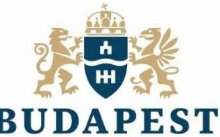

A főváros lakosainak száma - a Belügyminisztérium adatai alapján 2024. január 1-jén 1623343 fő volt, mely 2025. január 1-ére $0,4 \%$-kal 1616241 főre csökkent. A Fővárosi Önkormányzat Közgyűlését az ellenőrzött időszakban 33 fő alkotta, melynek munkáját 2024. szeptember 30-ig öt, ezt követően pedig négy állandó bizottság segítette. A főpolgármester személye a 2024. évi önkormányzati és nemzetiségi önkormányzati választások során nem változott, a főjegyző 2019. november 11-től látta el a feladatait. A 2024. évi önkormányzati választásokat követően egyetlen frakciónak sem volt többsége a Fővárosi Önkormányzat Közgyűlésében.

A Fővárosi Önkormányzat feladatainak végrehajtása érdekében a 2024. és a 2025. évben a Főpolgármesteri Hivatallal ${ }^{12}$ együtt 24 költségvetési szervet működtetett, amelyek közül 18 rendelkezett gazdasági szervezettel. A Fővárosi Önkormányzat és az általa irányított költségvetési szervek 2024. december 31-i mérlege szerint 2 781,3 Mrd Ft értékű vagyonnal rendelkeztek.

A Fővárosi Önkormányzatnak a 2024. évben 30 közvetlen és 15 közvetett többségi tulajdonú gazdasági társasága volt, amelyek közül a 2025. év folyamán egy jogutód nélkül megszűnt. A gazdasági társaságok tevékenysége a Fővárosi Önkormányzat Mötv. ${ }^{13}$-ben rögzített kötelező feladatainak ellátásához kapcsolódott. A gazdasági társaságok jellemzően előadó-művészettel, víziközmű-szolgáltatással és ahhoz kapcsolódó tevékenységekkel, helyi közösségi közlekedés biztosításával, működtetésével és közlekedésszervezéssel, valamint az integrált közműszolgáltatással kapcsolatos feladatellátással foglalkoztak. A Fővárosi Önkormányzat a gazdasági társaságok által ellátott feladatokra 2024-ben 224,6 Mrd Ft összeget biztosított, a 2025. évben pedig 233,0 Mrd Ft-ot tervezett.

A Főpolgármesteri Hivatalban foglalkoztatottak átlagos statisztikai létszáma 2024. december 31-én 946 fő volt, amelyből 706 fő volt köztisztviselő, 240 fő pedig a Munka Törvénykönyve ${ }^{14}$ hatálya alá tartozó munkavállaló.

---

# ÖSSZEFOGLALÁS 

A Fővárosi Önkormányzat likviditási nehézségei a 2025. évben oly mértékben súlyosbodtak, hogy a kifizetések teljesítése folyamatos kihívást jelent számára. Intézkedések hiányában a Fővárosi Önkormányzat a 2025. év IV. negyedévében fizetésképtelenné válhat, amelynek következtében a közfeladatok ellátása is veszélybe kerülhet.

A Fővárosi Önkormányzat a pénzügyi nehézségeit önállóan nem volt képes megoldani, likviditási helyzetének rendezéséhez kormányzati támogatást kért. A Kormánnyal a tárgyalások 2025. júniusban megkezdődtek.

A 2026. évre halasztott kifizetésekkel és az esedékes, meg nem fizetett szolidaritási hozzájárulással együtt a hiány a 2025. év I. félévének végén már meghaladta a 2025. évre tervezett költségvetési kiadások egynegyedét. A Fővárosi Önkormányzat által átterhelt kiadások a következő évre is likviditási kockázatokat vetítenek előre.

A Fővárosi Önkormányzat a 2024-2025. évben a fizetőképessége megőrzése érdekében jellemzően a likviditási problémák átmeneti kezelését szolgáló intézkedéseket hajtott végre, azonban közfeladatai ellátása módjának, rendszerének hatékonyabbá tétele, a költségvetési helyzete hosszabb távú kiegyensúlyozottá válása céljából nem tett lényegi lépéseket. A rákosrendezői ingatlanok vételárának megfizetése és a tervezett projekt megvalósítása további pénzügyi kockázatokat jelent a Fővárosi Önkormányzat számára.

A 2020. évtől folyamatosan romló pénzügyi helyzet kialakulásához a koronavírus-járvány, az energiaár-robbanás és az infláció növekedéséből eredő gazdasági nehézségek mellett hozzájárult a költségvetési befizetési kötelezettségek növekedése is. A Fővárosi Önkormányzat kiadásai közül a közüzemi díjakra fordított kiadások, a kamatkiadások az azokra ható külső tényezők alakulásával párhuzamosan változtak, az egy főre jutó havi bér jellegű személyi juttatások a költségvetési szerveknél foglalkoztatottak átlagkeresetének emelkedéséhez hasonlóan alakultak az összehasonlító elemzés alapján. A szolidaritási hozzájárulás a jogszabályi előírások alapján emelkedett jelentősen.

A Fővárosi Önkormányzat a 2025. évi költségvetésében nem tervezett meg 51,2 Mrd Ft szolidaritási hozzájárulást és 59,6 Mrd Ft gazdasági társaságok számára a közfeladatok ellátására nyújtandó támogatást, míg 17,3 Mrd Ft osztalékbevételt megalapozatlanul szerepeltetett, ezért a tervezett költségvetésben nem volt biztosított valamennyi kiadás fedezete. A költségvetés 2025. júniusi módosítása során a szolidaritási hozzájárulást megtervezte, azonban az annak forrásaként szerepeltetett 51,7 Mrd Ft bevétel nem volt közgazdaságilag megalapozott.

## Miért ellenőrzi az Állami Számvevőszék a Fővárosi Önkormányzatot?

Budapest társadalmi és gazdasági szerepe meghatározó Magyarországon: a fővárosban és a hozzá tartozó 80 agglomerációs településen több mint 2,5 millió ember él, amely az ország lakosságának csaknem $30 \%$-át jelenti. Magyarország főváros központú működése folytán a fővárosi közszolgáltatásokat igénybe vevők száma ennél is magasabb. A főváros gazdasági jelentősége is meghatározó az ország életében, a 2022-es Eurostat-adatok szerint Budapest adta Magyarország bruttó hazai termékének (GDP) 36,7\%-át. A fővárosi közszolgáltatások számottevő részét ellátó Fővárosi Önkormányzat 2025. évi költségvetésének tervezett bevételi és kiadási főösszege 434,7 Mrd Ft volt, viszonyításképpen ez Magyarország 2025. évi központi költségvetésének 1,13 \%-át jelenti.

---

Az ÁSZ a Fővárosi Önkormányzat gazdálkodását - egyes részterületekre fókuszálva rendszeresen ellenőrzi. A 2024. februári jelentésben az ÁSZ már felhívta a figyelmet a Fővárosi Önkormányzat pénzügyi gazdálkodásának kockázataira, annak hosszú távú fenntarthatatlanságára. Ugyanezen év novemberében megjelent elemzésében előrevetítette, hogy 2025-ben a pénzügyi nehézségek tovább súlyosbodhatnak. A 2025. májusi elemzésben pedig jelezte, hogy további intézkedések hiányában a Fővárosi Önkormányzat a fizetőképességét nem lesz képes megőrizni, ami veszélyeztetheti a közfeladatai ellátását is.

A jelen ellenőrzés tárgya a költségvetési és pénzügyi helyzet alakulása, a pénzügyi egyensúly és a fizetőképesség megőrzése érdekében megtett és tervezett kiadáscsökkentő és bevételnövelő intézkedések vizsgálata, valamint a 2024. december 18-án elfogadott és 2025. június 30-án módosított 2025. évi költségvetés megalapozottsága volt. Az ÁSZ célja egyben az is volt, hogy elemzési eszközökkel feltárja és bemutassa a jelenlegi pénzügyi helyzet kialakulásához vezető főbb folyamatokat, azonban az ellenőrzésnek nem volt terjedelme miatt nem is lehetett - tárgya a főváros kiterjedt gazdálkodásának aprólékos vizsgálata. Ennél fogva a jelen ÁSZ jelentés két, egymástól mind tartalmában, mind az alkalmazott munkamódszert illetően elkülönülő részből áll.

Az Állami Számvevőszék megállapításaival, javaslataival, az elemzés alapján kialakított véleményével a Fővárosi Önkormányzat szabályszerű, fenntartható gazdálkodását, a közfeladatok biztonságos ellátását kívánja elősegíteni.

# Milyen fontosabb elemeken alapul az önkormányzatok gazdálkodása? 

Az önkormányzatok gazdálkodása - különösen a főváros esetében - igen összetett, röviden összefoglalva az alábbi lényegi elemeken alapul:

- az önkormányzat éves költségvetés alapján gazdálkodik,
- az önkormányzat bevételei részben állami támogatásból, részben saját bevételből (közhatalmi bevételek - pl. helyi adók, saját gazdálkodás eredménye) származnak,
- az önkormányzat önként vállalt feladatot csak a kötelező feladatai ellátásának veszélyeztetése nélkül vállalhat,
- az önkormányzat éven túli hitelt csak a Kormány ${ }^{15}$ hozzájárulásával vehet fel,
- az önkormányzat gazdálkodásának legnagyobb kockázata, ha kötelező feladatait nem képes ellátni,
- az önkormányzatok gazdálkodása ciklikus, mivel a helyi iparűzési adóból származó bevétel nem egyenletesen, hanem március és szeptember hónapokban folyik be.

## Milyen megállapításokat tett az ÁSZ az ellenőrzés során?

Az ÁSZ a 2024. december 18. napján elfogadott fővárosi költségvetésről megállapította, hogy annak egyes bevételi és kiadási tételei nem voltak teljeskörűen megalapozottak. A Fővárosi Önkormányzat a központi költségvetés részére fizetendő szolidaritási hozzájárulásnak a központi költségvetésből kapott működési támogatást meghaladó részét ( 51,2 Mrd Ft-ot) a 2025. évi költségvetési rendeletében a kiadások között nem tervezte meg. A Fővárosi Kormányhivatal által indított per során a Kúria megállapította, hogy a Fővárosi Önkormányzat 2025. évi költségvetési rendeletének a szolidaritási hozzájárulás címén betervezett összege, valamint ezáltal a költségvetés kiadási főösszege más jogszabályba ütközik, ezért azokat 2025. július 1. napjával megsemmisíti. A Kúria döntésére tekintettel a Fővárosi Közgyűlés 2025. június 30-án módosította a költségvetését. Az ÁSZ jelen ellenőrzése a módosított költségvetési rendeletről megállapította, hogy a szolidaritási hozzájárulás forrását jelentő tervezett bevétel ( 51,7 Mrd Ft) nem volt

---

közgazdaságilag megalapozott, mivel a Fővárosi Önkormányzat a szolidaritási hozzájárulás visszatérítése tekintetében jogerős bírósági döntéssel nem rendelkezett.

Az ÁSZ megállapította továbbá, hogy a 2025. évi költségvetés tervezése során az önkormányzati többségi tulajdonú vállalkozástól kapott osztalékbevétel közgazdasági megalapozottsága, valamint az államháztartáson kívülre nyújtott egyéb működési célú támogatások esetében az indokoltan szükséges kiadás megtervezése a jogszabályi előírás ellenére nem volt biztosított. Azaz a Fővárosi Önkormányzat megalapozatlanul számolt osztalékfizetésből származó bevétellel, valamint nem valós összegében vette figyelembe a gazdasági társaságainak fizetendő egyes támogatásokat. A maradvány igénybevétele és a kamatkiadások előirányzatának tervezése megalapozott volt.

A Fővárosi Önkormányzat a 2025. évi költségvetésében nem tervezte meg valamennyi költségvetési kiadása megalapozottan teljesíthető forrását, ezáltal kockázatos, hogy a költségvetés végrehajtható-e.

A Fővárosi Önkormányzat pénzügyi helyzetének javítására tett intézkedései nem voltak elégségesek a költségvetési egyensúly helyreállításához. A Fővárosi Önkormányzat olyan lényegi intézkedéseket nem jelölt meg, amely a közfeladatai azonos szolgáltatási szinten, de alacsonyabb költséggel történő, hatékonyabb ellátását szolgálták.

Az éves költségvetési beszámoló mérlege a 2023. és a 2024. években jelentős összegű hibát tartalmazott: a Fővárosi Önkormányzat a 2023. évben 18,0 Mrd Ft, a 2024. évben 27,7 Mrd Ft szolidaritási hozzájárulást a jogszabályi előírás ellenére helytelenül a követelés jellegű sajátos elszámolások között mutatott ki az éves költségvetési beszámolójában. Ennek következtében a jogszabályi rendelkezés ellenére nem érvényesült a valódiság számviteli alapelve.

# Mely körülmények vezettek a fővárosi önkormányzat likviditási problémáihoz? 

A Fővárosi Önkormányzat likviditási helyzete 2022-től fokozatosan romlott, így előreláthatóan 2025 augusztusában a megnövelt összegű folyószámlahitelt is szinte teljes mértékben fel kell használni a kifizetések teljesítéséhez. A Fővárosi Önkormányzat fizetőképességét több körülmény együttesen alakítja, azonban a következő külső tényezők bírnak meghatározó jelentőséggel:

- a helyi iparűzési adóbevétel nagysága és beérkezésének időpontja,
- a szolidaritási hozzájárulás fizetési kötelezettséget érintő perekben hozott bírósági döntések (azonnali jogvédelem és érdemi döntés a Fővárosi Önkormányzat által visszafizetni kért összegekről) és azok időpontja,
- a kormányzati döntések (szolidaritási hozzájárulás fizetési kötelezettség és támogatás) és azok időpontja,
- a folyószámlahitelt nyújtó bank döntései és azok időpontja.

A tényezők számossága folytán az összes lehetséges kimenetel nem határozható meg. Kockázatot jelent az, hogy a Fővárosi Önkormányzat 2025. július-december havi likviditási tervében szereplő mindkét verzióban kormányzati segítséggel vagy a Fővárosi Önkormányzat számára kedvező bírósági döntéssel számol. Az „A" verzió szerint a Fővárosi Önkormányzat az év végén megőrzi fizetőképességét, a „B" verzió szerint azonban nem. Utóbbi eset azt jelenti, hogy a folyószámlahitelkeret összege a 10-11. hónapban már nem lesz elegendő a kiadások finanszírozására, és várhatóan az év végét is likvid hitellel fogja zárni a Fővárosi Önkormányzat. A Fővárosi Önkormányzat likviditási tervét alapul véve, azzal a szcenárióval számolva, hogy a 2025. július végén ismert döntések nem

---

változnak - várhatóan 28,9 Mrd Ft, míg a legkedvezőtlenebb szcenárió bekövetkezése esetén várhatóan 57,4 Mrd Ft likviditási hiánya keletkezhet a Fővárosi Önkormányzatnak a 2025. év végére, a 2026. évre átterhelt kiadások figyelembevétele nélkül.

A Fővárosi Önkormányzat a 2026. évre a gazdasági társaságai részére fizetendő támogatásból az éves szerződésekben 74,5 Mrd Ft-ot terhelt át, amely likviditási nehézségeket vetít előre.

A Fővárosi Önkormányzatnál a jelentősen növekedő bevételek sem tudtak fedezetet jelenteni a múködési kiadások emelkedő szintjére.

A Fővárosi Önkormányzat költségvetési bevételei a 2019. évről a 2024. évre 58,5\%-kal, 158,4 Mrd Ft-tal nőttek. Ebből a legjelentősebb tétel az iparűzési adó emelkedése volt, ami a teljes bevételnövekedés $84,2 \%$-át, összesen 133,4 Mrd Ft növekedést jelentett.

A múködési kiadások 2019-ről 2024-re 75,4\%-kal (163,2 Mrd Ft-tal) nőttek, míg a felhalmozási kiadások a harmadára (28,6 Mrd Ft-tal) csökkentek, így a költségvetési kiadások összességében 51,6 \%-kal, 134,6 Mrd Fttal emelkedtek.

A kiadások között a legjelentősebben a Fővárosi Önkormányzat által a gazdasági társaságainak a közfeladatok ellátására nyújtott támogatás növekedett (69,4 Mrd Ft-tal, 57,0\%-kal). Ezen túl a személyi juttatásokhoz és járulékokhoz (21,5 Mrd Ft, 70,5\% kiadásnövekedés), a közüzemi díjak emelkedéséhez (5,7 Mrd Ft, 105,6\% kiadásnövekedés), a kamatkiadások emelkedéséhez (13,7 Mrd Ft, 852,8\% kiadásnövekedés) kötődött. A kiadások növekedésére jelentős hatással volt a megugró infláció (kumulált értéke $51,6 \%$ ), ami a fenti tételeken túl 18,5 Mrd Ft általános kiadásemelkedést okozott.

Jelentős többletkiadást jelentett a költségvetési befizetések növekedése is, szolidaritási hozzájárulás jogcímen a 2019. évi 10,0 Mrd Ft-hoz képest 2024-ben 59,5 Mrd Ft kiadásemelkedéssel szembesült a Fővárosi Önkormányzat, amelyből költségvetési kiadásként 41,8 Mrd Ft-ot számolt el.

A 2019-2024. közötti időszakban összesen 193,4 Mrd Ft költségvetési hiány keletkezett a Fővárosi Önkormányzatnál. A hiányt tovább növelné az a 45,7 Mrd Ft szolidaritási hozzájárulás, amelyet a Fővárosi Önkormányzat megfizetett, de nem a költségvetési kiadások között mutatott ki.

Ahogy az a 7. ábráról is kitűnik, a Fővárosi Önkormányzat a 2019. év végén együttesen 214,2 Mrd Ft megtakarítással (pénzeszközök, befektetési és forgatási célú értékpapírok) rendelkezett, amelyet a 2022. év végére szinte teljes mértékben felhasznált. A 2023. évtől a Fővárosi Önkormányzat a likviditási problémákat egyes kiadások következő évre történő átütemezésével, más célra elkülönített összegek átcsoportosításával, illetve a gazdasági társaságaitól visszavett összegekkel kezelte.

Az elemzett kiadási tételek növekedése - a külső tényezők hatását figyelembe véve - az összehasonlító vizsgálat alapján nem minősül kiugrónak.

A költségvetési hiány kialakulásában a 2020. évben szerepet játszott a koronavírus-járvány gazdasági hatása, illetve az annak kezelésére bevezetett kormányzati intézkedések. A 2020. évben az előző évihez képest 15,1\%-kal (21,6 Mrd Ft-tal) csökkent a Fővárosi Önkormányzat legjelentősebb bevételi tétele, a helyi iparűzési adóbevétel. A kiadások ugyanakkor emelkedtek, elsősorban a közösségi közlekedési feladat ellátására adott önkormányzati támogatás 41,6 Mrd Ft-os növekedése miatt, amelyet elsődlegesen a feladatot ellátó gazdasági társaság (BKK Zrt.) utasszámcsökkenésből adódó bevételkiesése indukált.

A kiadások jelentős emelkedését okozta az energiaárak 2022. évi ugrásszerű növekedése, amely a Fővárosi Önkormányzat és intézményei közüzemi díjakra fordított kiadásainak 2022. évi 73,5\%-os és 2023. évi további 54,1\%-os, összesen 8,6 Mrd Ft-os többletét okozta. Az energiaárak emelkedése a közszolgáltatást

---

ellátó gazdasági társaságok részére, a feladatok ellátására nyújtott támogatás összegére is hatással volt. Ezek közül a BKV Zrt.-nél az energiaköltségek 215,0\%-kal, 21,7 Mrd Ft-tal emelkedtek a 2021. évről a 2022. évre. Az energia megvásárlására fordított kiadások emelkedése az energiaárak növekedéséhez hasonlóan alakult.

A Fővárosi Önkormányzat esetében az egy főre jutó havi bérjellegű személyi juttatás növekedése a költségvetési szerveknél foglalkoztatottak átlagkeresetének emelkedéséhez hasonlóan alakult. A személyi juttatások és a hozzájuk kapcsolódó járulékok a Fővárosi Önkormányzat esetében 70,5\%-kal, 52,0 Mrd Ft-tal emelkedtek az elemzett hat év alatt, amelyet a jogszabályok által előírt, valamint az infláció mértékére tekintettel adott béremelések idéztek elő. A Fővárosi Önkormányzat a pénzügyi nehézségek ellenére az elemzett hat év minden évében fizetett jutalmat, amely összesen 5,5 Mrd Ft kiadást jelentett. A legnagyobb közszolgáltatást végző gazdasági társaság, a BKV Zrt. esetében a személyi jellegű ráfordítások 69,9 Mrd Ft-ról 108,0 Mrd Ft-ra emelkedtek 2019-ről 2024-re. Az egy főre jutó havi bérköltség növekedése a fővárosban teljes munkaidőben alkalmazásban állók bruttó átlagkeresetének az emelkedéséhez hasonlóan alakult, nominál értékben azonban a teljes időszakban az alatt maradt. A Fővárosi Önkormányzat többségi tulajdonában lévő gazdasági társaságokat érintő ellenőrzések során az ÁSZ azt tapasztalta, hogy a gazdasági társaságoknál a Fővárosi Önkormányzat nehéz gazdasági helyzete ellenére sor került prémiumkifizetésekre.

A dologi kiadások emelkedésének egyik jelentős tényezője a kamatkiadások növekedése volt. A jegybanki alapkamat, illetve a BUBOR ${ }^{16}$ emelkedésével párhuzamosan az elsősorban fejlesztési hitelek után fizetett kamatkiadások a 2019. évről a 2024. évre közel a tízszeresére, 1,6 Mrd Ft-ról 15,3 Mrd Ft-ra növekedtek.

A kiadások között különös jelentősége van a szolidaritási hozzájárulásnak, amely a 2019. évi 10,0 Mrd Ft-ról 2024. évre 69,5 Mrd Ft-ra emelkedett. Az elemzett időszak hat éve alatt összesen 230,2 Mrd Ft kifizetést jelentett a Fővárosi Önkormányzatnak. A szolidaritási hozzájárulás fizetési kötelezettséggel összefüggésben a Fővárosi Önkormányzat pereket indított, amelyekben sérelmezi, hogy olyan mértékủ szolidaritási hozzájárulást kell fizetnie, amely meghaladja a központi költségvetésből részére járó működési támogatások összegét. Ennek kapcsán a vitatott és már megfizetett összegeket visszaköveteli. A szolidaritási hozzájárulással kapcsolatos perek jelenlegi állása szerint fennáll a kockázat, hogy a 2025. évben a Fővárosi Önkormányzatnak a szolidaritási hozzájárulás visszafizetéséből nem származik majd bevétele.

A 2020-2023. évek között a Fővárosi Önkormányzat költségvetési bevételei a kötelező feladatok költségvetési kiadásait nem fedezték. Az önkormányzatoknak a rendelkezésre álló forrásokat elsődlegesen a kötelező feladataik ellátására kell fordítaniuk, a Fővárosi Önkormányzat az önként vállalt feladataira összességében a kiadásainak megközelítőleg 3,0\%-át fordította az elemzett hat év alatt.
A következő ábra a feladatellátásra fordított kiadások fedezettségét szemlélteti, a kiadási oszlopban a feladatellátásra fordított kiadások és a szolidaritási hozzájárulás fizetési kötelezettség található, a bevételi oszlopban pedig a költségvetési bevételek láthatók iparűzési adóbevétel, költségvetési támogatás és egyéb bevétel bontásban.

---

1. álma

A FELADATELLÁTÁSRA FORDÍTOTT KIADÁSOK ÉS SZOLIDARITÁSI HOZZÁJÁRULÁS FEDEZETTSÉGE A 2019-2024. ÉVEKBEN (MRD FT-BAN)
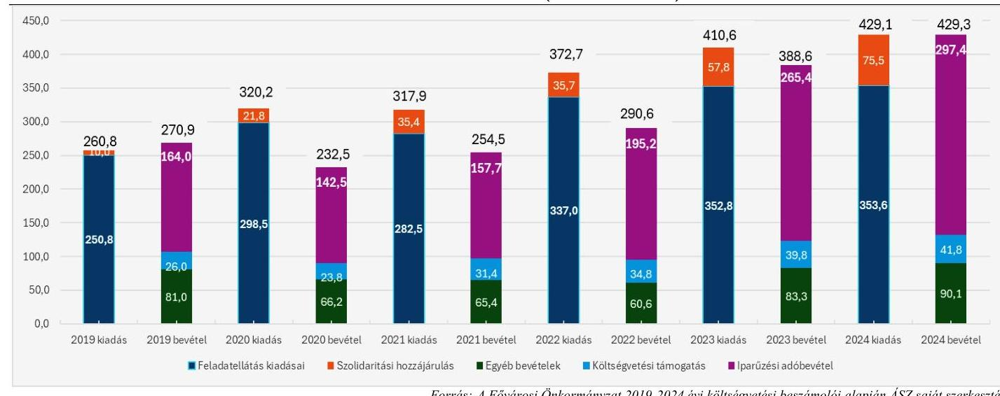

Forrás: A Fővárosi Önkormányzat 2019-2024 évi költségvetési beszámolói alapján ÁSZ saját szerkesztés
A többségi tulajdonban lévő gazdasági társaságok pénzügyi-vagyoni helyzetének alakulása is hatással volt a Fővárosi Önkormányzat, mint tulajdonos költségvetési helyzetére. A Fővárosi Önkormányzatnak a többségi tulajdonában álló gazdasági társaságaitól a 2019-2024. években összesen 17,9 Mrd Ft osztalékbevétele volt. A saját tőke rendezésére vonatkozó intézkedési kötelezettsége az önkormányzatnak a BKK Zrt. tekintetében a 2020. és a 2021. évek vonatkozásában keletkezett 3,3 Mrd Ft összegben.

A befektetett eszközök és a támogatás nagyságrendje alapján kiválasztott hét többségi tulajdonú gazdasági társaság mindegyikének a 2024. évi gazdálkodása pozitív eredménnyel zárult, azonban a BKK Zrt., a BKV Zrt. és a Fővárosi Vízmúvek Zrt. esetében a hat év összesített adózott eredménye negatív volt. A hét gazdasági társaság összesen 51,9 Mrd Ft pénzeszközzel rendelkezett a 2024. év végén, amelynek 69,8\%-a a BKM Zrt. mérlegében szerepelt. Tartós befektetéssel csak a BKM Zrt. rendelkezett a 2024. év végén 3,0 Mrd Ft értékben. A 2019-2024. időszakban a gazdasági társaságoknál a kötelezettségek csökkenése figyelhető meg, azonban a kötelezettségeken belül a rövid lejáratú kötelezettségek aránya 56,6\%-ról 78,1\%-ra, 156,8 Mrd Ft-ra emelkedett. A rövid lejáratú kötelezettségek egyre dominánsabbá válása működési nehézségekre utal, amely hosszú távon a Fővárosi Önkormányzat költségvetésére negatív hatású.

A BKM Zrt. hulladékgazdálkodási üzletága, ezzel együtt a vagyonelemek értékesítésre kerültek a MOHU Budapest Zrt. részére a 2024. évben. Az üzletág értékesítéséért kapott bevétel egyik felét (17,7 Mrd Ft) a MOHU Budapest Zrt. célfeladataira elkülönítetten, zárolt óvadéki betétszámlán tartja nyilván a BKM Zrt.

A Fővárosi Közgyűlés döntése alapján 2025. január 31-én a rákosrendezői ingatlanokkal kapcsolatos elővásárlási jog gyakorlásáról szóló nyilatkozatot tett a BKM Zrt. A Kormány az elővásárlási jog gyakorlását engedélyezte. A BKM Zrt. 2025. március 24-én átutalta a vételár első, 25\%-os részletét (12,7 Mrd Ft), amelynek a hulladékgazdálkodási üzletág átadása ellenében kapott bevétel volt a fedezete. A rákosrendezői ingatlanok vételára második, 35\%-os részletének (17,8 Mrd Ft) a megfizetésére - a BKM Zrt. 2025. évi üzleti tervében rögzítettek szerint - előreláthatóan a 2026. évben kerülhet sor.

A BKM Zrt. részére a Fővárosi Önkormányzat a 2024. évben a közfeladatok ellátására összesen 15,4 Mrd Ft támogatást adott, és további 5,1 Mrd Ft támogatást a 2025. évre halasztott. Azaz az üzletág értékesítéséből származó vételár fele (17,7 Mrd Ft) a BKM Zrt. megközelítőleg egy évi támogatását jelenti.

---

A BKM Zrt. nonprofit gazdasági társaságként működik, ennélfogva osztalékot a tulajdonos Fővárosi Önkormányzat számára nem fizet. Emiatt az üzletág értékesítéséből származó bevétel oly módon javíthatná a Fővárosi Önkormányzat likviditási helyzetét, ha a BKM Zrt. a hulladékgazdálkodási üzletág értékesítéséből származó bevételét a közszolgáltatások ellátására fordítaná, ezáltal a Fővárosi Önkormányzat a támogatási összeget csökkenteni tudná. A bevétel működésre történő felhasználása - jóllehet vagyonvesztést eredményezne - rövid távon javíthatná a Fővárosi Önkormányzat likviditási helyzetét.

Az ingatlanok vételárának megfizetése és a tervezett projekt megvalósítása további pénzügyi kockázatokat jelent a BKM Zrt. és a Fővárosi Önkormányzat számára.

# Mit javasol az Állami Számvevőszék? 

Az ÁSZ a Főpolgármesternek és a Főjegyzőnek kettő-kettő javaslatot fogalmazott meg, ezek közül is kiemelkedően fontos, hogy intézkedniük szükséges a fizetőképesség megőrzése és a költségvetési egyensúly megteremtése érdekében.

Az ÁSZ felhívja a figyelmet arra, hogy jelen ellenőrzése az ellenőrzés idején folyamatban lévő és a jelentés közzététele időpontjában még le nem zárult folyamatot vizsgált, és az a 2025. augusztus 1ig ismert adatokon alapul.

---

# AZ ELLENŐRZÉS FÓKUSZTERÜLETEI 

1. A 2025. évi költségvetési rendelet megalapozottsága
2. A költségvetési és pénzügyi helyzet alakulása, a pénzügyi egyensúly és a fizetőképesség megőrzése érdekében megtett és tervezett kiadáscsökkentő és bevételnövelő intézkedések megfelelősége

---

# 1. A 2025. évi költségvetési rendelet megalapozottsága 

## Összegző megállapítás

1.1. számú megállapítás

A 2025. évi költségvetési rendelet ellenőrzött bevételi és kiadási előirányzatai nem voltak teljeskörűen megalapozottak.

A 2025. évi költségvetés tervezése során a tervezett osztalékbevételek közgazdasági megalapozottsága a jogszabályi előírás ellenére nem volt biztosított. A maradvány igénybevétele előirányzatának tervezése közgazdaságilag megalapozott volt.

A Fővárosi Önkormányzat 2025. évi költségvetésében az Áht. 4. § (2) bekezdésben foglaltak ellenére az osztalékbevételek címkódon tervezett előirányzat közgazdasági megalapozottsága nem volt biztosított.
A Fővárosi Önkormányzat a 2024. december 18-án elfogadott 2025. évi költségvetési rendeletben három többségi tulajdonú gazdasági társaságához kapcsolódóan - összesen 18,4 Mrd Ft osztalékbevételt tervezett. Az elvárt osztalékbevétel a BGYH Zrt. ${ }^{17}$-től 5,3 Mrd Ft, a BNP Zrt. ${ }^{18}$-től 1,1 Mrd Ft, az FCSM Zrt.-től 12,0 Mrd Ft volt. Az Áht. 4. § (2) bekezdésében előírtak ellenére a tervezett osztalékbevétel közgazdasági megalapozottságát alátámasztó számítások, érdemi indoklások teljeskörűen nem álltak rendelkezésre. A költségvetés tervezéséhez nyújtott kötelező adatszolgáltatás során az osztalékfizetési szándékról kizárólag a BNP Zrt. részvényei után várt osztalékbevétel (1,1 Mrd Ft) összegére vonatkozóan történt jelzés. Az FCSM Zrt. és a BGYH Zrt. osztalékfizetési szándékát nem jelezte a költségvetés tervezési szakaszában. Az FCSM Zrt. esetében az osztalékfizetésről - a beszámoló legfőbb döntéshozó szerv általi elfogadásakor - nem döntöttek.

A 2024. évi éves beszámoló elfogadásakor a BGYH Zrt. esetében a Fővárosi Közgyűlés - a 2025. évi költségvetési rendeletben tervezettel egyező összegű - 5,3 Mrd Ft osztalékfizetési kötelezettséget állapított meg. A BNP Zrt. közgyűlése 2,0 Mrd Ft osztalék kifizetéséről döntött, amelyből a tulajdoni hányada ( $61,09 \%$ ) alapján a Fővárosi Önkormányzatot 1,2 Mrd Ft osztalékbevétel illeti meg, amely 0,1 Mrd Ft-tal több, mint a költségvetési rendeletben tervezett összeg. Az FCSM Zrt. legfőbb döntéshozó szervének a 2024. évi éves beszámoló elfogadásáról szóló 4/2025. (V. 29.) számú határozata a Számv. tv. ${ }^{19} 153 . \S$ (1) bekezdésének előírása ellenére nem tartalmazta az adózott eredmény felhasználására (az osztalék jóváhagyására, vagy az adózott eredmény eredménytartalékba helyezésére) vonatkozó döntését.

A Fővárosi Önkormányzatnak a 2025. 06. hónapban a BGYH Zrt.-től a 3,0 Mrd Ft, a BNP Zrt.-től 1,2 Mrd Ft osztalékbevétele származott. A 2025. 07-12. havi likviditási terv szerint a 07. hóban az FCSM Zrt.-től 12,0 Mrd Ft, míg a 08. hóban a BGYH Zrt.-től fennmaradó 2,3 Mrd Ft osztalékbevétellel számoltak.

A Fővárosi Önkormányzat a 2025. évi költségvetés tervezésekor a Maradvány igénybevétele előirányzat esetében az Áht.-ben foglaltaknak megfelelően biztosította a bevétel megalapozottságát. A maradvány igénybevételének megalapozottságát alátámasztó számítások, érdemi indoklások rendelkezésre álltak, a maradvány várható összegének meghatározásakor figyelembe vették az áthúzódó

---

kötelezettségvállalásokat, és az óvatosság elve alapján csak a kötelezettségvállalással terhelt maradvány alapján számított költségvetési maradvány került betervezésre.
1.2. számú megállapítás

A 2025. évi költségvetési rendeletben az ellenőrzött, államháztartáson kívülre nyújtott egyéb működési célú támogatások megalapozottsága nem volt biztosított, a kamatkiadások tervezése megalapozott volt.

A Fővárosi Önkormányzat 2025. évi költségvetésében az Egyéb működési célú támogatások államháztartáson kívülre kiadási jogcímen 201,4 Mrd Ft-ot tervezett, amelyből a BKK Zrt. közlekedésszervezői feladataira 167,2 Mrd Ft-ot, a BKM Zrt. temetkezési, zöldfelületi és köztisztasági feladataira 21,5 Mrd Ft-ot és a Budapest Közút Zrt. közútkezelési feladatára 5,5 Mrd Ft-ot tervezett.
A BKK Zrt. a 2025. évre vonatkozó előzetes üzleti tervében 219,1 Mrd Ft közlekedésszervezői forrást igényelt. A szóbeli tervtárgyalások során a költségek közül nem került elfogadásra valamennyi tétel (- 55,3 Mrd Ft), jóvá lett hagyva viszont $+3,4$ Mrd Ft bérfejlesztés. Így a 2025. évre 167,2 Mrd Ft összegű támogatással számoltak a BKK Zrt. számára, és ennyit tervezett be a Fővárosi Önkormányzat a 2025. évi költségvetésébe. Azonban ebből az összegből 53,5 Mrd Ft a 2024-ről 2025-re átütemezett kötelezettség volt, azaz a 2025. évre előirányzott közlekedésszervezői forrás a 2025. évi kiadásokra mindösszesen 113,7 Mrd Ft kötelezettségvállalást tartalmazott, vagyis nem terveztek meg 53,5 Mrd Ft összegű forrást.
A 2025. évi költségvetési rendelet a dologi kiadások között nem tartalmazott eredeti előirányzatot a 2024. évi követelésengedményezés* 2025. évet terhelő bankköltségeire ( $1,6 \mathrm{Mrd}$ Ft), amely - főpolgármesteri hatáskörben, módosított előirányzatként - a közösségi közlekedés közlekedésszervezői feladatra előirányzott 167,2 Mrd Ft egyéb működési célú kiadásból került átcsoportosításra a dologi kiadások kiemelt előirányzatra. Azaz a 2025. évi költségvetési rendeletben a közösségi közlekedés támogatására tervezett eredeti előirányzat 1,6 Mrd Ft-tal kevesebb volt a tervtárgyalások során jóváhagyott összegnél.
A BKM Zrt. az üzleti előtervében az ellenőrzött feladatokra összesen 21,1 Mrd Ft összegű forrást igényelt, amelyet a tervtárgyalások során 0,7 Mrd Ft-tal csökkentettek és 1,1 Mrd Ft bérfejlesztési összeggel megnöveltek. Azaz a Fővárosi Önkormányzat a 2025. évre 21,5 Mrd Ft támogatást tervezett be a 2025. évi költségvetésébe, amelyből azonban 5,1 Mrd Ft 2024-ről 2025-re átütemezett kötelezettség volt. Így a 2025. évre előirányzott támogatás a 2025. évi kiadásokra mindösszesen 16,4 Mrd Ft kötelezettségvállalást tartalmazott, vagyis a 2025. évi költségvetésbe nem terveztek be 5,1 Mrd Ft összegű támogatást.
A Budapest Közút Zrt. az üzleti előtervében a közútkezelési feladatra 5,9 Mrd Ft összegű forrással számolt, amelyet a tervtárgyalások során 0,4 Mrd Ft-tal csökkentettek. Azaz a Fővárosi Önkormányzat a 2025. évre 5,5 Mrd Ft támogatást tervezett be a 2025. évi költségvetésébe, amelyből azonban 1,0 Mrd Ft 2024-ről 2025-re átütemezett kötelezettség volt. Ebből adódóan a 2025. évre előirányzott támogatás a 2025. évi kiadásokra mindösszesen 4,5 Mrd Ft kötelezettségvállalást tartalmazott, vagyis nem terveztek be 1,0 Mrd Ft összegű támogatást.
Az ellenőrzött közszolgáltatásokra tervezett előirányzatok részletes adatait a következő táblázat tartalmazza:

[^0]
[^0]:    * A BKK Zrt. a 2024. év IV. negyedévi forrásigénye biztosításához a Fővárosi Önkormányzattal szemben fennálló 50,0 Mrd Ft követelését két pénzintézetre engedményezte. A Fővárosi Önkormányzatnak ezt az összeget, valamint annak kamatait 2025-ben kellett a pénzintézetek számára megfizetnie.

---

# A KÖZSZOLGÁLTATÁSOK TÁMOGATÁSÁRA TERVEZETT ELLENŐRZÖTT ELŐIRÁNYZATOK (MRD FT) 

| GAZDASÁGI TÁRSASÁG | KÖZSZOLGÁLTATÁS | ÜZLETI   ELÖTERV | TERY-   TÁRGYÁ-   LÁSOK   SORÁN   MÓDOSÍTÁS | 2024. ÉVRŐL ÁTHÚZÓDÓ | 2025. ÉVI KÖLTSÉGVETÉSBEN TERVEZETT EREDETI ELŐIRÁNYZAT | 2025. ÉVI KÖLTSÉGVETÉSBEN EREDETI ELŐIRÁNYZATKENT NEM TERVEZETT |
| :--: | :--: | :--: | :--: | :--: | :--: | :--: |
|  |  | 1. | 2. | 3. | $4 .=1 .+2$. | $5 .=3$. |
| BKK Zrt | Közösségi közlekedésszervezés | 219,1 | $\begin{aligned} & -55,3 \\ & +3,4 \end{aligned}$ | $\begin{aligned} & 3,5 \\ & 50,0 \end{aligned}$ | 167,2 | 53,5 |
| BKM Zrt. | Zöldfelületi | 7,5 | $\begin{aligned} & -0,7 \\ & +0,3 \end{aligned}$ | 1,7 | 7,1 | 1,7 |
|  | Temetkezési | 1,0 | $+0,2$ | 0,3 | 1,2 | 0,3 |
| Budapest Közút Zrt. | Köztisztasági | 12,6 | $+0,6$ | 3,1 | 13,2 | 3,1 |
|  | Közútkezelési | 5,9 | $-0,4$ | 1,0 | 5,5 | 1,0 |
| Összesen |  | 246,1 | $-51,9$ | 59,6 | 194,2 | 59,6 |

A BKK Zrt., a BKM Zrt. és a Budapest Közút Zrt. 2025. évi tervezett támogatása tartalmazta a 2024. évről áthúzódó költségvetési támogatást, de nem tartalmazta a 2025. évre vonatkozó támogatás teljes összegét, továbbá a BKK Zrt. esetében a 2024. évi követelésengedményezés bankköltsége (1,6 Mrd Ft) is csökkentette a rendelkezésre álló forrást. Ezáltal a 2025. évi költségvetési rendeletben a tárgyévi feladatellátásra előirányzott kiadás kevesebb volt, mint amennyi indokolt lett volna, vagyis az Egyéb múködési célú támogatások államháztartáson kívülre címen tervezett összeg az Áht. 4. § (2) bekezdése ellenére nem volt teljeskörűen megalapozott.

A BKK Zrt.-vel megkötött „Közlekedésszervezői feladat-ellátásról és Közszolgáltatásról szóló Keretmegállapodás 2025. évi Éves Szerződés" azt tartalmazta, hogy a BKK Zrt. a 2025. évi költségeiből 68,1 Mrd Ft kifizetését átterheli a Fővárosi Önkormányzat a 2026. évre.

A BKM Zrt. esetében a 2025. év negyedik negyedévi kiadás kifizetését (5,2 Mrd Ft) - a 2025. évi zöldfelületi, temetkezési és közterület-tisztántartási közszolgáltatási szerződésekben - ütemezik át 2026-ra.

A Budapest Közút Zrt. esetében a „2025. évi éves szerződés ${ }^{20^{\text {" }}}$ a 2025. évi közútkezelési feladatellátásra a 2026. évi előirányzat terhére 1,2 Mrd Ft forrás biztosítását tartalmazta.

A fentiek alapján a Fővárosi Önkormányzat az ellenőrzött közszolgáltatások kapcsán évről évre egyre növekvő kötelezettségállományt görget maga előtt, ami kockázatot jelent a közfeladatellátásra vonatkozóan.

A kamatkiadások tervezése megalapozott volt. A Fővárosi Önkormányzat 2025. évi költségvetésében a kamatkiadások eredeti előirányzata ( $10,7 \mathrm{Mrd}$ Ft) a fejlesztési hitelek részletes számításokkal alátámasztott kamatkiadásait ( $8,9 \mathrm{Mrd}$ Ft), valamint a folyószámlahitel igénybevételéhez kapcsolódó - a tervezéskor ismert jegybanki alapkamat figyelembevételével becsült - kamatkiadást ( $1,8 \mathrm{Mrd}$ Ft) tartalmazta.

---

1.3. számú megállapítás

A szolidaritási hozzájárulás költségvetési támogatást meghaladó részét a Fővárosi Önkormányzat a 2025. évi költségvetési rendeletében a kiadások között nem tervezte meg. A költségvetési rendelet 2025. július 01-től hatályos módosítása során a szolidaritási hozzájárulás forrását jelentő tervezett bevétel (51,7 Mrd Ft) nem volt közgazdaságilag megalapozott.

A Fővárosi Önkormányzat a 2024. december 18-án elfogadott 2025. évi költségvetési rendeletében a helyi önkormányzatok törvényi előíráson alapuló befizetései előirányzaton a szolidaritási hozzájárulás jogcímen 37,9 Mrd Ft-ot tervezett, amely 51,2 Mrd Ft-tal volt kevesebb, mint a 2025. évi Kvtv. ${ }^{21}$ 43. § (4) bekezdés és 2. melléklet 62. pontban meghatározottak alapján számított összeg ( $89,1 \mathrm{Mrd}$ Ft). A Fővárosi Önkormányzatot terhelő szolidaritási hozzájárulást összegszerűen az 1/2025. (II. 11.) NGM rendelet ${ }^{22}$ határozta meg, 89,1 Mrd Ft-ban.
A Kormányhivatal törvényességi felhívással fordult a Fővárosi Önkormányzathoz a jogszabálysértő helyzet megszüntetése érdekében, azonban a Közgyűlés annak elutasításáról döntött. A Kormányhivatal ezt követően a Kúriához fordult. A Kúria 2025. május 20-án kelt jogerős döntése (Köf.5.007/2025/9. számú határozat) értelmében a Fővárosi Önkormányzat a költségvetési rendeletét módosítani volt köteles, mivel az utóbb megalkotott, magasabb szintű jogszabállyal ${ }^{\dagger}$ vált ellentétessé.
A Fővárosi Önkormányzat Közgyűlése a Kúria Önkormányzati Tanácsának döntése alapján 2025. június 30-án a 21/2025. (VI. 30.) önkormányzati rendelet ${ }^{23}$-tel módosította a 2025. évi költségvetési rendeletét. A költségvetési rendelet módosítása során a szolidaritási hozzájárulás fizetési kötelezettséget tartalmazó kiadási előirányzat 51,2 Mrd Ft-tal, az adósságszolgálatot tartalmazó kiadási előirányzat 0,5 Mrd Ft-tal került megemelésre. Ezzel egyidejűleg a bevételi előirányzat 51,7 Mrd Ft-tal történő megemelésére új címkód került bevezetésre (,2023. és 2024. évi szolidaritási hozzájárulás kártérítéséből származó bevétel"). Az új bevételi címkód alapját a 2023. és 2024. költségvetési évek során az állami támogatás összegén felül teljesített és a bírósági eljárások során vitatott szolidaritási hozzájárulás összege képezte. A tervezett bevételi előirányzat az Áht. 4. § (2) bekezdésében foglaltak ellenére közgazdaságilag nem volt megalapozott, mivel a Fővárosi Önkormányzat a 2023. és 2024. évi szolidaritási hozzájárulás visszatérítése tekintetében jogerős bírósági döntéssel nem rendelkezett.
A Közgyűlés a 22/2025. (VI. 30.) önkormányzati rendelet ${ }^{24}$-ben - a folyamatban levő, a szolidaritási hozzájárulással kapcsolatos perek eredményére, illetve a kormányzattal folytatott tárgyalásokra figyelemmel - ismét előírta a 2025. évi költségvetés felülvizsgálatát, amelyet 2025. augusztus 31-ig kötelesek elvégezni.

[^0]
[^0]:    † 2025. évi Kvtv. (kihirdetve: 2024. december 30-án), 1/2025. (II. 11.) NGM rendelet

---

# 2. A költségvetési és pénzügyi helyzet alakulása, a pénzügyi egyensúly és a fizetőképesség megőrzése érdekében megtett és tervezett kiadáscsökkentő és bevételnövelő intézkedések megfelelősége 

Összegző megállapítás

A Fővárosi Önkormányzat likviditási helyzete a 2025. évben
kritikussá vált, a fizetőképesség biztosításához 2025.
júniusban kormányzati segítséget kért. A 2020-2024. években
folyamatosan romló pénzügyi helyzethez hozzájárultak a
koronavírus-járvány, illetve az energiaválság okozta
gazdasági nehézségek, valamint az önkormányzat
költségvetési befizetéseinek növekedése. A Fővárosi
Önkormányzat pénzügyi helyzetének javítására tett
intézkedései nem voltak elégségesek a költségvetési
egyensúly helyreállításához. A közfeladatai ellátásának
hatékonyabbá tétele érdekében érdemi intézkedéseket nem
tett.
2.1. számú megállapítás

A Fővárosi Önkormányzat likviditása folyamatosan romlott, további intézkedések hiányában 2025. októberiól várhatóan nem tudja teljesíteni valamennyi fizetési kötelezettségét.

## A FÓVÁrosi ÖNKORMÁNYZAT PÉNZÜGYI HELYZETE A 2024. ÉVBEN ÉS 2025. I. FÉLÉVBEN

A Fővárosi Önkormányzat a 2024. évtől tartóssá váló finanszírozási problémáit folyószámlahitel felvételével tudta megoldani, 2024-2025. I. féléve között szinte minden nap folyószámlahitel felvételével finanszírozta kiadásait. A folyószámlahitel-keret maximális összege a 2024. évben 60,0 Mrd Ft volt. A 2024. év végén megkötött, 2025. évre vonatkozó folyószámlahitel szerződés szerint a folyószámlahitelkeret:
2025. január 2-től - 2025. február 28-ig
40,0 Mrd Ft
2025. március 1 -től - 2025. március 31 -ig
50,0 Mrd Ft
2025. április 1-től - 2025. szeptember 19-ig
60,0 Mrd Ft
2025. szeptember 20-tól - 2025. december 31-ig
40,0 Mrd Ft.

A Fővárosi Önkormányzat egyre romló likviditási helyzetét jelzi, hogy a folyószámlahitel átlagos napi állománya 2025. I. negyedévben 12,4 \%-kal, II. negyedévben 35,1 \%-kal haladta meg az előző év azonos időszakának adatát. Az igénybe vett folyószámlahitel maximális összege 2024. I. félévben 39,5 Mrd Ft, míg a 2025. I. félévben 50,0 Mrd Ft volt. Ezért 2025. június 30 -án a Közgyűlés 2025. augusztus 1 -től 2025. szeptember 19-ig, azaz a helyi iparűzési adóbevételek szeptember közepén történő beérkezéséig a folyószámlahitel-keret 80,0 Mrd Ft-ra történő emeléséről döntött. A számlavezető bankkal 2025. július 15-én megkötött folyószámlahitel szerződés 1. sz. módosításában a hitelkeret 80,0 Mrd Ft-ra történő emelése mellett a bank módosította a 2025. szeptember 20-tól igénybevehető hitelkeretre vonatkozó feltételeket. A módosítás lényege, hogy a bank a 2025. szeptember 20-tól kezdődő időszakra maximum 40,0 Mrd Ft összegben határozta meg a rendelkezésre tartott hitelkeretet. A bank egyedi mérlegelési

---

jogkörében, a Fővárosi Önkormányzat hitelképességét, pénzügyi, vagyoni, gazdasági helyzetét megvizsgálva legkésőbb 2025. szeptember 10-ig dönt a hitelkeret tényleges összegéről. Így fennáll annak a kockázata, hogy a bank 2025. szeptember 20-tól nem, vagy 40,0 Mrd Ft-nál alacsonyabb összegben tart rendelkezésre folyószámlahitel-keretet a Fővárosi Önkormányzat részére.
A folyószámlahitel átlagos napi állományának, illetve a folyószámlahitellel zárt napok számának alakulását 2024-2025 II. negyedéve között a következő ábra szemlélti:
2. ábra

A FOLYÓSZÁMLAHITEL ÁTLAGOS NAPI ÁLLOMÁNYA ÉS A FOLYÓSZÁMLAHITELLEL ZÁRT NAPOK SZÁMA (MRD FT, NAP)
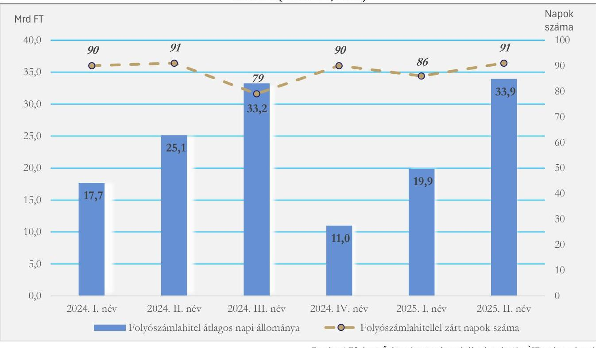

Forrás: A Fővárosi Önkormányzat adatccolgáltatása alapján ÁSZ saját czerkesztés
A Fővárosi Önkormányzatnál létrehozott Likviditási Munkacsoport 2025. május 30-tól már naponta ülésezett és döntött a legfontosabb likviditást érintő kérdésekben, ennek keretében naponta figyelemmel kísérte az önkormányzat fizetési számláinak egyenlegét, ütemezte a szállítói számlák kifizetését, az önkormányzati gazdasági társaságok finanszírozását.
A Fővárosi Önkormányzat 2024. december 31-én megtakarítási célú értékpapírállománnyal, lekötött bankbetéttel nem rendelkezett, költségvetési szerveivel együtt a pénzeszközök állománya 12,2 Mrd Ft-ot tett ki, amelyből 1,0 Mrd Ft volt a kerületekhez még át nem utalt helyi adóbevételek összege. A likviditás biztosítása érdekében a Fővárosi Önkormányzat - az előző évhez hasonlóan - 2024. december 30-án a víziközmű bérleti díj alszámláról átmenetileg átcsoportosított a költségvetési elszámolási számlára 5,3 Mrd Ft-ot, továbbá három önkormányzati tulajdonú gazdasági társaságtól (BKM Zrt., BGYH Zrt., BSK Kft. ${ }^{25}$ ) átmeneti költségvetési intézkedés keretében összesen 6,0 Mrd Ft pénzeszközt vett át. Ezen intézkedések hatására a Fővárosi Önkormányzat 2024. december 30-án 15,1 Mrd Ft folyószámlahitelt fizetett vissza a számlavezető hitelintézetnek, és ezzel a Gst. ${ }^{26} 10 . \int$ (3) bekezdés b) pontja alapján nem

---

volt szükséges a Kormány hozzájárulását kérnie ${ }^{\ddagger}$. A 2025. II. negyedév végén a pénzeszközállomány 27,4 Mrd Ft volt, azonban ebből 21,1 Mrd Ft-ot a Főváros Önkormányzat által beszedett, de ténylegesen a kerületi önkormányzatokat megillető adóbevétel tett ki.
A Fővárosi Önkormányzat romló likviditási helyzete miatt a 2023. évi közlekedésszervezői forrásból 50,0 Mrd Ft támogatási összeg kifizetését terhelték át a 2024. évre. Így a 2024. évi közlekedésszervezői támogatásból 50,0 Mrd Ft volt a 2023-ról 2024-re átütemezett kötelezettség, a 2024. éviből pedig 53,5 Mrd Ft támogatási összeg kifizetését terhelték át a 2025. évre. Így a 2025. évi közlekedésszervezői támogatásból már 53,5 Mrd Ft volt a 2024-ről 2025-re átütemezett kötelezettség, és a 2025. évi támogatásból pedig 68,1 Mrd Ft kifizetését terhelték át a 2026. évre. Ennek következtében a Fővárosi Önkormányzat egyre növekvő kötelezettségállományt görget maga előtt.
A követelésengedményezés keretében történt átütemezéshez kapcsolódó bankköltség megfizetése a 2024. évben 1,9 Mrd Ft, a 2025. évben 1,6 Mrd Ft további terhet rótt a Fővárosi Önkormányzat költségvetésére. A 2025. júniusi likviditási terv szerint a Fővárosi Önkormányzat likviditási helyzete 2025 augusztusban lesz a legnehezebb, amikor a 80,0 Mrd Ft-ra felemelt folyószámlahitel-keret kihasználtsága előreláthatóan maximális lesz.
A Fővárosi Önkormányzat - a Fővárosi Törvényszék 2025. június 17-én kelt végzése szerint - azonnali jogvédelemben részesült, azaz a Kincstár a szolidaritási hozzájárulással kapcsolatos peres eljárásban hozott anyagi jogerős döntés meghozataláig nem nyújthat be a szolidaritási hozzájárulással kapcsolatban beszedési megbízást a 2025. 05-08. hónapok tekintetében. A Fővárosi Törvényszék egyben kötelezte a Kincstárt a 2025. május 29-én jogtalanul inkasszált 10,2 Mrd Ft kamatokkal növelt összegének megfizetésére, amelyet a Kincstár 2025. június 18-án teljesített.

[^0]
[^0]:    ${ }^{\ddagger}$ Az önkormányzatok naptári éven belül lejáró adósságot keletkeztető ügyletéhez nincs szükség a Kormány hozzájárulására.

---

A bevételek és kiadások, a pénzeszközállomány és a folyószámlahitel-keret várható alakulását 2025. júliusdecember között a következő ábra mutatja be.
3. ábra

A FŐVÁROSI ÖNKORMÁNYZAT ÁLTAL KÉSZÍTETT LIKVIDITÁSI TERV ALAPJÁN A BEVÉTELEK ÉS A KIADÁSOK, A PÉNZESZKÖZÖK ÉS A FOLYÓSZÁMLAHITEL-KERET VÁRHATÓ ALAKULÁSA 2025. JÚLIUS-DECEMBER HÓNAPOKBAN
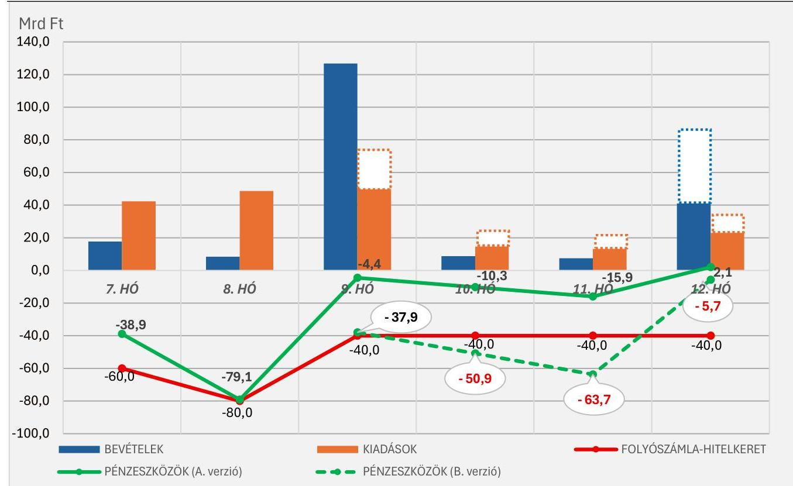

Forrás: A Fővárosi Önkormányzat 2025. 07-12. hónapokra vonatkozó likviditási terve alapján ÁSZ saját szerkesztés (A bevételeket és a kiadásokat jelölő oszlopok felettt szaggatott terület jelzi a B verzió többlet bevételeit, illetve kiadásait.)
A likviditási terv „A. verziö" szerint a Fővárosi Önkormányzat azzal számol, hogy csak az állami támogatás összege erejéig ( $37,2 \mathrm{Mrd}$ Ft) kell megfizetnie a szolidaritási hozzájárulást.

A Fővárosi Önkormányzat által készített likviditási terv „B. verziö" azt az előrejelzést tartalmazza, amely szerint 2025. szeptembertől fennáll a szolidaritási hozzájárulás fizetési kötelezettség és esedékessé válik az addig meg nem fizetett 05-08. havi szolidaritási hozzájárulás, továbbá a kapcsolódó peres eljárásokból a bevétel ( $51,7 \mathrm{Mrd}$ Ft) legkésőbb a 12. hónapban teljesül. Ebben az esetben a 09. hóban 37,9 Mrd Ft, a 10. hóban 50,9 Mrd Ft, a 11. hóban 63,7 Mrd Ft, a 12. hóban 5,7 Mrd Ft folyószámlahitelre lenne szüksége a Fővárosi Önkormányzatnak. Ez azt jelenti, hogy a - maximált összegben meghatározott folyószámlahitel-keret összege a 10-11. hónapban már nem lesz elegendő a kiadások finanszírozására, és várhatóan az év végét is likvid hitellel fogja zárni a Fővárosi Önkormányzat.
Kockázatot jelent az, hogy a Fővárosi Önkormányzat a likviditási terv mindkét verziójában azzal tervez, hogy a Kormány vagy a bíróság számára kedvező döntést fog hozni. A Fővárosi Önkormányzat banki kitettsége is megnövekedett azáltal, hogy a 2025. szeptember 20-tól rendelkezésre tartott hitelkeret összege még bizonytalan, arról a bank - a Fővárosi Önkormányzat hitelképességét, pénzügyi, vagyoni, gazdasági helyzetét megvizsgálva - később fog dönteni. A Fővárosi Önkormányzat által készített likviditási terv értékeléséhez az alábbi tényezőket is szükséges figyelembe venni:

---

Az „A. verzió" esetében:

- ha a 2025. szeptember-december hónapokra esedékes szolidaritási hozzájárulást (28,5 Mrd Ft) meg kell fizetnie a Fővárosi Önkormányzatnak (amelyből 5,8 Mrd Ft szerepel a tervezett kiadások között),
- ha ezen túl meg kell fizetnie a 2024. decemberi szolidaritási hozzájárulásból fennálló 4,5 Mrd Ft kötelezettségét,
- továbbá, ha meg kell fizetnie a helyi iparűzési adótöbblet elvonást (3,7 Mrd Ft) is, akkor 2025. év végén várhatóan 28,9 Mrd Ft lesz a likviditási hiány.

A „B verzio" esetében, ha a peres eljárásokból tervezett bevételek nem teljesülnek, akkor az 5,7 Mrd Ft helyett várhatóan 57,4 Mrd Ft likviditási hiánya fog keletkezni a Fővárosi Önkormányzatnak a 2025. év végére.

A Fővárosi Önkormányzat likviditási helyzetére meghatározó befolyást gyakorolt a költségvetési bevételek és kiadások teljesítésének alakulása. A Fővárosi Önkormányzat költségvetésének és teljesítésének 2024. évi és 2025. 01-06. havi főbb adatait az alábbi táblázat tartalmazza:

# 3. táblázat   FÖVÁROSI ÖNKORMÁNYZAT KÖLTSÉGVETÉSÉNEK ÉS TELJESÍTÉSÉNEK 2024. ÉVI ÉS 2025. 01-06. HAVI FÖBB ADATAI (MRD FT) 

| MEGNEVEZÉS | 2024. ÉVI   EREDETI   ELÖIRÁNYZAT | 2024. ÉVI   TELJESÍTÉS | 2025. ÉVI   EREDETI   ELÖIRÁNYZAT | 2025. ÉVI   MÓDOSÍTOTT   ELÖIRÁNYZAT   01-06. HAVI   ÍKI ALAPIÁN | 2025. 01-06.   HAVI   TELJESÍTÉS |
| :--: | :--: | :--: | :--: | :--: | :--: |
| Müködési bevételek | 427,4 | 418,5 | 412,9 | 424,0 | 206,8 |
| - ebböl: önkormányzatok müködési támogatása belvi iparüzési adóbevétel | 35,9 | 41,8 | 37,9 | 42,2 | 16,4 |
|  | 303,5 | 297,4 | 303,5 | 303,5 | 155,5 |
| Felhalmozási bevételek | 10,3 | 10,9 | 9,6 | 13,8 | 2,1 |
| Költségvetési bevételek | 437,7 | 429,3 | 422,5 | 437,9 | 208,9 |
| Müködési kiadások   - ebböl: BKK Zrt.   közlekedészervezés   Helyi önk. törvényi   elöiráson alapuló   befizetései (szolidaritási   hozzájárulás) | 407,5 151,5 | 379,7 163,8 | 382,6 167,2 | 416,8 171,3 | 234,1 107,2 |
| Felhalmozási kiadások | 35,2 | 15,8 | 43,7 | 46,0 | 5,5 |
| Költségvetési kiadások | 442,6 | 395,5 | 426,3 | 462,8 | 239,7 |
| Müködési egyenleg | 19,9 | 38,8 | 30,3 | 7,3 | $-27,3$ |
| Felhalmozási egyenleg | $-24,8$ | $-4,9$ | $-34,1$ | $-32,1$ | $-3,4$ |
| Költségvetési egyenleg | $-4,9$ | 33,9 | $-3,7$ | $-24,9$ | $-30,7$ |
| Maradvány igénybevétele | 2,5 | 5,6 | 12,1 | 39,8 | 39,8 |
| Folyószámlahitel egyenlege (felvétel-törlesztés) | 0,0 | 0,0 | 0,0 | 0,0 | 17,3 |
| Fejlesztési célú hitelek törlesztése | $-6,1$ | $-6,1$ | $-7,4$ | $-7,4$ | $-3,5$ |
| Egyéb finanszírozási bevételek/kiadások egyenlege | 8,5 | 6,4 | $-1,0$ | $-7,4$ | 7,4 |

---

A 2024. évben a költségvetési bevételek és kiadások teljesítésének egyenlege pozitív, 33,9 Mrd Ft volt. A költségvetési egyenleget terhelte a fejlesztési hitelek után fizetett tőketörlesztés 6,1 Mrd Ft-os összege. Az előző évi maradvány igénybevétele 5,6 Mrd Ft volt. A költségvetési egyenlegre nagy hatást gyakorolt, hogy a megfizetett szolidaritási hozzájárulásból a 2023. évben 18,0 Mrd Ft-ot, a 2024. évben 27,7 Mrd Ft-ot - mivel annak jogszerűségét nem ismerte el - a Fővárosi Önkormányzat nem az egyéb múködési célú kiadások között, hanem a követelés jellegű sajátos elszámolások között mutatott ki az éves költségvetési beszámolójában, amivel nem tartotta be az Áhsz. ${ }^{27}$ 15. mellékletének előírását, amely szerint a K5022 A helyi önkormányzatok törvényi előíráson alapuló befizetései rovaton kell elszámolni a helyi önkormányzatok szolidaritási hozzájárulás jogcímen teljesített befizetéseit. Ennek következtében az éves költségvetési beszámoló mérlege a 2023. és 2024. években az Áhsz. 1 § (1) bekezdés 3. pontja szerinti jelentős összegű hibát tartalmazott, ezért sérült a Számv. tv. 15. § (3) bekezdésében foglalt valódiság elve. A 2024. évre megállapított szolidaritási hozzájárulásból a 2024. decemberi összeg, (6,0 Mrd Ft) pedig nem került megfizetésre, mivel a Fővárosi Önkormányzat azonnali jogvédelemben részesült.
A Fővárosi Önkormányzat a 2025. évi költségvetési rendeletben 3,7 Mrd Ft költségvetési hiányt tervezett. A kiadások között azonban nem tervezték meg a szolidaritási hozzájárulás költségvetési támogatást meghaladó részét ( 51,2 Mrd Ft), amelyet figyelembe véve a hiány 54,9 Mrd Ft lett volna. A szolidaritási hozzájárulás költségvetési támogatást meghaladó részét és annak bevételi forrását a 2025. évi költségvetési rendelet 2025. július 1. napjától hatályos módosítása már tartalmazta, azonban a tervezett bevételi előirányzat nem volt közgazdaságilag megalapozott. (lásd 1.3. számú megállapítás)
A 2025. év 01-06. havi teljesítési adatok alapján a költségvetési hiány ( 30,7 Mrd Ft) és a tőketörlesztés (3,5 Mrd Ft) együttes összegét az előző évi költségvetési maradvány (39,8 Mrd Ft) fedezte ugyan, azonban a 2023. és a 2024. években teljesített költségvetési kiadások között nem szerepeltették a megfizetett szolidaritási hozzájárulás költségvetési támogatást meghaladó részét, amely a két évben összesen 45,7 Mrd Ft volt. Ezzel együtt a 2025. I. félév végi költségvetési hiány 76,4 Mrd Ft-ot tett ki.
A 2024. évben és a 2025. I. félévben a felhalmozási bevételek terv és tény szinten sem nyújtottak fedezetet a felhalmozási kiadásokra.

# A szolidaritási hozzájárulással kapcsolatos perek hatása a Fővárosi Önkormányzat 2025. évi pénzügyi helyzetére 

Az ÁSZ véleménye szerint a szolidaritási hozzájárulással kapcsolatos 2023-2025. éveket érintő perekben a 2025. év végéig előreláthatólag nem történik döntéshozatal, ezért a Fővárosi Önkormányzatnak a szolidaritási hozzájárulás visszafizetéséből a 2025. évben várhatóan nem származik bevétele.
A Fővárosi Önkormányzat a perekben azt sérelmezi, hogy olyan mértékű szolidaritási hozzájárulást kell fizetnie, amely meghaladja a központi költségvetésből részére járó múködési támogatások összegét. A Fővárosi Önkormányzat az általa vitatott összegként a szolidaritási hozzájárulás jogcímen történő elvonás és e múködési támogatás különbözetét mutatta ki. Ennek egyenlege a 2023. évben 18,0 Mrd Ft, a 2024. évben 27,7 Mrd Ft, a 2025. évben - a múködési támogatások eredeti előirányzata ( 37,9 Mrd Ft) alapján - 57,2 Mrd Ft. (A 2024. 12. havi szolidaritási hozzájárulás (6,0 Mrd Ft) az azonnali jogvédelem miatt nem került befizetésre a 2024. költségvetési évben, annak teljesítése átterhelődött a 2025. évre.)
A központi költségvetésből kapott múködési támogatást és a szolidaritási hozzájárulást a 2019-2025. években a következő ábra szemlélteti:

---

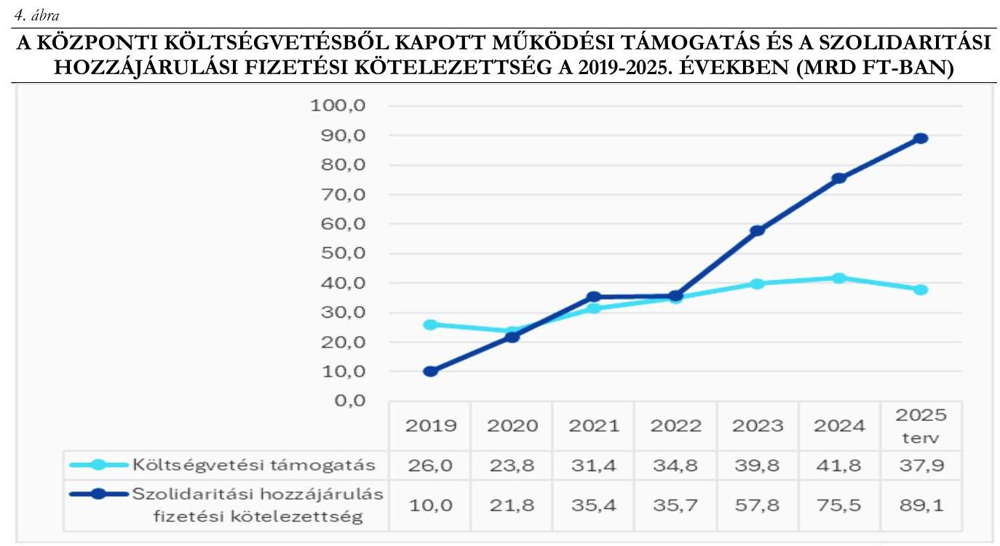

*Forrás: A Fővárosi Önkormányzat 2019-2024. évi költségvetési beszámolói és a 2025. évi költségvetési rendelet alapján ÁSZ saját szerkesztés*

A Fővárosi Önkormányzat 2025. évi pénzügyi helyzetére pozitív hatással van a bíróság 2025. 05-08. hónapokra vonatkozó azonnali jogvédelmet biztosító végzése. A szolidaritási hozzájárulással kapcsolatos 2023-2025. éveket érintő perek összefoglalását a 4. számú melléklet tartalmazza.

A Fővárosi Önkormányzat és az általa irányított költségvetési szervek 2024-2025. I. félévi kötelezettségeit mérleg szerinti tagolásban a következő ábra mutatja be.

---

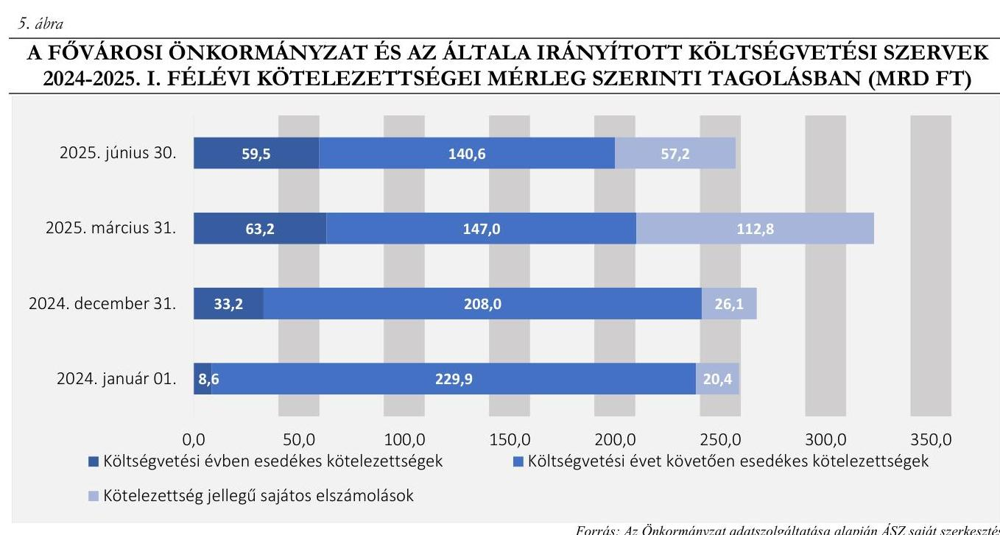

*Forrás: Az Önkormányzat adatszolgáltatása alapján ÁSZ saját szerkesztés*

A Fővárosi Önkormányzat és az általa irányított költségvetési szervek kötelezettségállománya a 2024. január 1-jei 258,9 Mrd Ft-ról a 2024. év végére 267,3 Mrd Ft-ra, a 2025. év I. negyedév végére 323,0 Mrd Ft-ra emelkedett, majd a 2025. I. félév végére 257,3 Mrd Ft-ra csökkent.

A **költségvetési évben esedékes kötelezettségek** a 2024. év január 1-jei 8,6 Mrd Ft-ról a 2024. év végére közel négyszeresére, 33,2 Mrd Ft-ra emelkedtek, amelyhez hozzájárult az FCSM Zrt. részvényeinek megvásárlása miatti kötelezettség költségvetési évben esedékes kötelezettségek közé történő átvezetése (16,9 Mrd Ft), valamint az államháztartáson belüli megelőlegezések visszafizetési kötelezettsége (6,5 Mrd Ft)5. A költségvetési évben esedékes kötelezettségek állománya a 2024. év elején 5,2 Mrd Ft, a 2024. év végén 6,0 Mrd Ft összegben tartalmazta az önkormányzati tulajdonú gazdasági társaságoktól átmeneti költségvetési intézkedés keretében átvett pénzeszközök visszafizetési kötelezettségét. A 2025. I. negyedévi 30,0 Mrd Ft-os növekedést alapvetően a 2025. I. negyedév végén fennálló 32,0 Mrd Ft folyószámlahitel, illetve a fejlesztési célú hitelek 2025-ben esedékes, még hátralévő törlesztő részlete (5,9 Mrd Ft) mellett az államháztartáson belüli megelőlegezések miatti visszafizetési kötelezettség (6,5 Mrd Ft) költségvetési évet követően esedékes kötelezettségek közé történő téves átvezetése okozott. A 2025. I. félév végén a folyószámlahitel állománya 17,3 Mrd Ft volt, amely 14,7 Mrd Ft-tal volt kevesebb az I. negyedév végi állománynál, míg az államháztartáson belüli megelőlegezések visszafizetési kötelezettsége 14,7 Mrd Ft-ra nőtt a szolidaritási hozzájáruláshoz kapcsolódó azonnali jogvédelem miatt fennálló kötelezettség következtében. A 2025. II. negyedévben költségvetési évben esedékes kötelezettségek 3,7 Mrd Ft-os csökkenéséhez hozzájárult a fejlesztési hitelek esedékes törlesztőrészletének (2,0 Mrd Ft) megfizetése.

A **költségvetési évet követően esedékes kötelezettségekből** 2024. év elején és végén is 50,0 Mrd Ft-ot tett ki a közlekedésszervezői támogatásból a 2024. évre, illetve a 2025. évre átütemezett összeg. A költségvetési évet követően esedékes kötelezettségek a 2025. I. negyedév végére 61,0 Mrd Ft-tal

5 A szolidaritási hozzájárulással kapcsolatos per kapcsán fennálló azonnali jogvédelem miatt a Kincstár nem inkasszálta le 2024 decemberében a fennálló kötelezettség összegét.

---

csökkentek elsősorban annak következtében, hogy a 2024. évi közlekedésszervezői támogatásból 2025-re átütemezett 50,0 Mrd Ft megfizetésre került a külső finanszírozók felé. A fejlesztési célú hitelek költségvetési évet követően esedékes állománya a törlesztések következtében a 2024. évi eleji 154,1 Mrd Ft-ról 2025. I. félév végére 140,6 Mrd Ft-ra csökkent.
A kötelezettségjellegú sajátos elszámolások alakulását egyrészt a Fővárosi Önkormányzat által beszedett, de a kerületekhez még át nem utalt helyi iparűzési adóbevételek, másrészt a kapott előlegek alakulása befolyásolta. A kötelezettségjellegű sajátos elszámolások 2025. I. negyedévi növekedése - a márciusban befolyt adóbevételek következtében - jelentős, 86,7 Mrd Ft volt, amelyből a kerületekhez még át nem utalt helyi adóbevételek növekedése 79,7 Mrd Ft-ot, a kapott előlegek növekedése 7,0 Mrd Ft-ot tett ki. A 2025. év I. félév végére a kerületekhez még át nem utalt helyi iparűzési adóbevételek összege 80,8 Mrd Ft-ról 21,1 Mrd Ft-ra visszaesett, míg a kapott előlegek összege 29,9 Mrd Ft-ról 33,8 Mrd Ft-ra nőtt.
A lejárt kötelezettségek állománya a 2024. év eleji 7,6 Mrd Ft-ról a 2024. év végére 26,4 Mrd Ft-ra növekedett, a 2025. I. negyedév végére 23,0 Mrd Ft-ra csökkent, majd az I. félév végére - a szolidaritási hozzájáruláshoz kapcsolódó azonnali jogvédelem miatt fennálló kötelezettségek következtében 34,9 Mrd Ft-ra emelkedett. A lejárt kötelezettségek lejárat szerinti összetétele kedvezőtlenül alakult, mivel a 90 napon túl lejárt kötelezettségek összege a 2024. január 1-jei 6,1 M Ft-ról a 2025. I. és II. negyedév végére 21,4 Mrd Ft-ra növekedett. A 2025. I. és II. negyedév végén fennálló 90 napon túl lejárt kötelezettségből 16,9 Mrd Ft-ot tett ki az FCSM Zrt. részvényeinek megvásárlása miatti éven túli kötelezettség.

# A 2025. ÉVI KÖLTSÉGVETÉSI ÉS LIKVIDITÁSI NEHÉZSÉGEK ELŐZMÉNYEI 

## A költségvetés egyenlege

A Fővárosi Önkormányzat költségvetése a 2019. évben pozitív egyenleggel (10,1 Mrd Ft) zárult, ezt követően a költségvetési egyenleg 2023-ig folyamatosan negatív volt, azaz a költségvetési kiadások meghaladták a költségvetési bevételeket. A költségvetési hiány 2020-ban (a koronavírus-járvány évében) volt a legmagasabb ( $-87,8 \mathrm{MrdFt}$ ), amelyet a kiadások $22,8 \%$-os emelkedése és a bevételek $14,3 \%$-os csökkenése együttesen eredményezett. A költségvetési egyenleg 2021. évi javulását követően (63,4 Mrd Ft), a 2022. évben - jellemzően az energiaválság hatására - a költségvetési kiadások 82,1 Mrd Ft-tal haladták meg a költségvetési bevételeket. A 2023. és 2024. évben az adatok kiegyensúlyozottabb költségvetésre utalnak, azonban pozitív irányba torzította az egyenleget, hogy a Fővárosi Önkormányzat a kiadások között nem szerepeltette a szolidaritási hozzájárulás kifizetett, de kiadásként el nem ismert, az adott évi költségvetési támogatást meghaladó részét (2023-ban 18,0 Mrd Ft-ot, 2024-ben 27,7 Mrd Ft-ot).
A hosszú távon, több éven át fennálló költségvetési hiány pénzügyi kockázatot vetít előre.
A Fővárosi Önkormányzat költségvetési bevételeinek és kiadásainak, valamint egyenlegének alakulását a következő ábra szemlélteti:

---

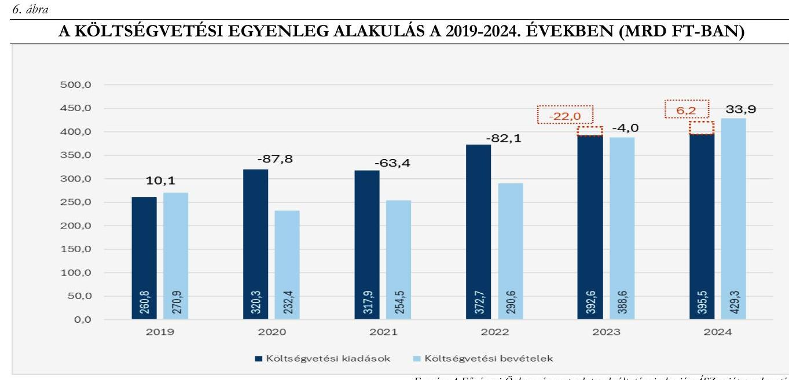

A 2020-2022. években a költségvetési hiány finanszírozását a rendelkezésre álló szabad források (megtakarítások és pénzkészlet) biztosították. A 2019. év végén a megtakarítások (pénzeszközök, befektetési és forgatási célú értékpapírok) együttes állománya 214,2 Mrd Ft volt. A 2020-2024. évek költségvetési egyenlegei összesen -203,4 Mrd Ft-ot jelentettek, ezzel a záróállomány 10,8 Mrd Ft-ra csökkent. A 2023. és 2024. években a költségvetési egyenleg nem tartalmazta a szolidaritási hozzájárulás kiadásként el nem ismert, de megfizetett összegét, amely a költségvetési egyenleget negatív irányba befolyásolta volna. A kifizetett szolidaritási hozzájárulás figyelembevételével a költségvetési egyenleg 2023-ban -22,0 Mrd Ft, 2024-ben 6,2 Mrd Ft lenne, az összesen érték -249,1 Mrd Ft-ot, a záró állomány pedig -35,1 Mrd Ft-ot tenne ki (az ábrán ezt a változatot a szaggatott vonallal jelölt elemek mutatják). A Fővárosi Önkormányzat a 2022. év végére felhasználta a fentebb említett a forrásait, lekötött bankbetéttel és értékpapírállománnyal a 2023. évtől nem rendelkezett. A 2020-2024. évek költségvetési egyenlegeinek a hatását a 2019. évi pénzeszközök és megtakarítások együttes állományára a következő ábra szemlélteti:
7. ábra

A 2020-2024. ÉVEK KÖLTSÉGVETÉSI EGYENLEGEINEK A HATÁSA A MEGTAKARÍTÁSOK 2019. ÉV VÉGI ÁLLOMÁNYÁRA (MRD FT-BAN)
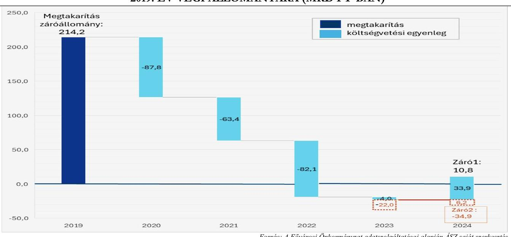

---

A Fővárosi Önkormányzat pénzügyi nehézségeit a 2023. évtől egyre növekvő összegű likviditási hitel felvétellel oldotta meg (a folyószámlahitel-keret maximális értéke a 2020-2023. években 25,0 Mrd Ft volt, 2024. évben 60,0 Mrd Ft-ra, 2025. évben 80,0 Mrd Ft-ra emelkedett). A 2023. és 2024. év végén a likviditási hitel egyenlegének megszüntetése érdekében a meghatározott célra rendelkezésre álló elkülönített bankszámlán lévő pénzeszközeit csoportosította át a költségvetési számlájára (a 2023. évben 10,0 Mrd Ft-ot, a 2024. évben 5,3 Mrd Ft-ot), valamint a gazdasági társaságaitól átmeneti költségvetési intézkedés keretében vett át pénzeszközt (2023-ban 5,2 Mrd Ft-ot, 2024-ben 6,0 Mrd Ft-ot). Az átcsoportosított pénzeszközöket a Fővárosi Önkormányzat a költségvetési évet követő évben rendezte.

# A költségvetési kiadások alakulása 

A Fővárosi Önkormányzatnál a teljesített költségvetési kiadások a 2019. évi 260,8 Mrd Ft-ról a 2024. év végére 395,5 Mrd Ft-ra, csaknem másfélszeresére növekedtek, az emelkedés - a 2021. év kivételével folyamatos volt, a 2022. és a 2024. években intenzívebb volt a többi évinél. A kiadások között - a korábban már ismertetettek szerint - nem szerepel a 2023. évben 18,0 Mrd Ft, a 2024. évben 27,7 Mrd Ft teljesített szolidaritási hozzájárulás.
A Fővárosi Önkormányzat költségvetési kiadásainak 2019-2024. évek közötti alakulását a következő ábra szemlélteti:
R. ábra

## A KÖLTSÉGVETÉSI KIADÁSOK ALAKULÁSA A 2019-2024. ÉVEKBEN (MRD FT-BAN)

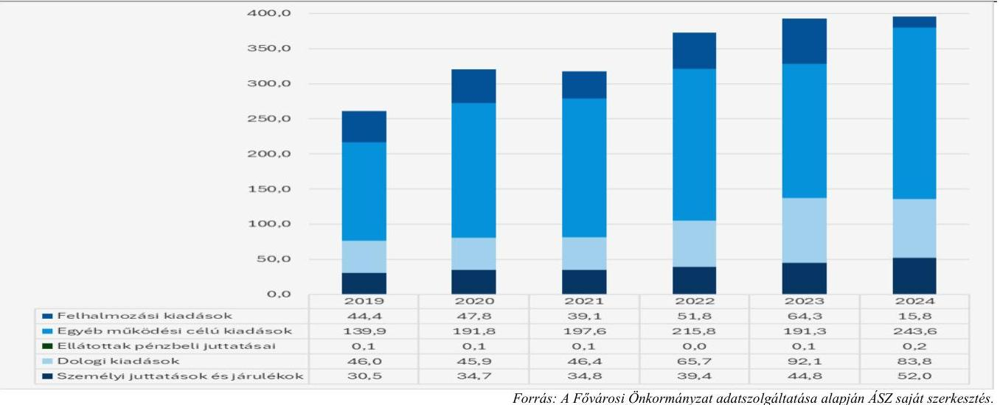

## Személyi juttatások és járulékok

A személyi juttatások és járulékok költségvetési kiadásokon belül aránya 10,6\% és 13,1\% között alakult a 2019-2024. években. Az éves kiadások a 2019. évi 30,5 Mrd Ft-ról a 2024. évre 52,0 Mrd Ft-ra (70,5\%kal) folyamatosan növekedtek.
A személyi juttatások emelkedését egyrészt a jogszabályi változások - minimálbér, garantált bérminimum és ahhoz szorosan kapcsolódó pótlékok (pl. a szociális ágazatnál a délutáni és éjszakai pótlékok), a szociális ágazati pótlék, az egészségügyi kiegészítő pótlék, valamint az illetményalap emelkedése - okozták, másrészt a kötelező soros átsorolásokból, szakképzettség megszerzéséhez kapcsolódó bérnövekedések. Ezen túl a Fővárosi Önkormányzat a magas inflációra való hivatkozással béremelést hajtott végre. A Fővárosi Önkormányzat (többek között szociális-, kulturális- és köznevelési intézmények, a

---

Főpolgármesteri Hivatal) a pénzügyi nehézségek ellenére a 2019-2024. évek mindegyikében fizetett jutalmat, amely összesen 5,5 Mrd Ft kiadást jelentett.

# Dologi kiadások 

A Fővárosi Önkormányzatnál a dologi kiadások költségvetési kiadásokon belüli aránya a vizsgált időszakban 14,3\% és 23,5\% között alakult, értéke a 2019. évi 46,0 Mrd Ft-ról a 2024. évre 83,8 Mrd Ftra, $82,2 \%$-kal emelkedett. A dologi kiadások ugrásszerűen (több mint $40 \%$-kal) emelkedtek 2021-ről 2022-re és 2022-ről 2023-ra is.
4. táblázat

| A DOLOGI KIADÁSOK VÁLTOZÁSA AZ ELŐZŐ ÉVHEZ A 2019-2024. ÉVEKBEN (MRD FT-BAN) |  |  |  |  |  |  |  |  |
| :--: | :--: | :--: | :--: | :--: | :--: | :--: | :--: | :--: |
| MEGNEVEZÉS | 2019   TELJESÍTES | 2020   VÁLTOZÁS | 2021   VÁLTOZÁS | 2022   VÁLTOZÁS | 2023   VÁLTOZÁS | 2024   VÁLTOZÁS | VÁLTOZÁS   OSZÉSKA | 2024   TELJESÍTES |
| Dologi kiadások | 46,0 | $-0,1$ | 0,5 | 19,3 | 26,4 | $-8,3$ | 37,8 | 83,8 |
| - ebből: Kamatkiadások | 1,6 | 1,4 | $-0,3$ | 9,6 | 13,4 | $-10,4$ | 13,7 | 15,3 |
| - ebből: Közüzemi díjak | 5,4 | 0,3 | $-0,5$ | 3,9 | 4,7 | $-2,6$ | 5,7 | 11,1 |
| - ebből: Egyéb   szolgáltatások | 10,8 | 1,9 | $-2,5$ | 5,1 | 2,9 | 2,0 | 9,4 | 20,2 |
| - ebből: ÁFA kiadások | 12,3 | $-3,0$ | 5,6 | 1,3 | 2,6 | $-3,0$ | 3,5 | 15,8 |
| - ebből: Karbantartás,   kisjavítás | 5,3 | 0,1 | $-0,8$ | $-2,9$ | $-0,3$ | 1,0 | $-2,9$ | 2,4 |
| -ebből: Egyéb, nem   részletezett kiadások | 10,6 | $-0,8$ | $-1,0$ | 2,4 | 3,1 | 4,9 | 8,5 | 19,0 |

Forrás: A Fövárosi Önkormányzat adatszolgáltatásai alapján ÁSZ saját szerkesztés
A dologi kiadások emelkedésének egyik jelentős tényezője a kamatkiadások alakulása volt. A kamatkiadások nagyságára a jegybanki alapkamat, illetve a BUBOR változása, a fejlesztési hitel utolsó részletének 2021. évi lehívása, valamint a folyószámlahitel megnövekedése volt hatással.
5. táblázat

| A KAMATKIADÁSOK ALAKULÁSA A 2019-2024. ÉVEKBEN (MRD FT) |  |  |  |  |  |  |  |
| :--: | :--: | :--: | :--: | :--: | :--: | :--: | :--: |
| MEGNEVEZÉS | 2019 | 2020 | 2021 | 2022 | 2023 | 2024 |  |
| Fizetett kamat | 1,6 | 3,0 | 2,7 | 12,3 | 25,7 | 15,3 |  |
| - ebből felhalmozási | 1,6 | 3 | 2,7 | 12,1 | 24,3 | 13,5 |  |
| - ebből múködési | 0 | 0 | 0 | 0,2 | 1,4 | 1,8 |  |

A 2019-2024. években teljesített kamatkiadások több mint 90,0\%-át a fejlesztési hitelek után fizetett kamat tette ki. A Fővárosi Önkormányzat a 2014-2015. években összesen négy fejlesztési hitel-, illetve hitelkeretszerződést létesített, amelyből fennálló kötelezettsége a 2019. év végén 112,8 Mrd Ft volt. A hitelállomány 2021-ben 59,5 Mrd Ft-tal emelkedett, mivel a két EIB hitel ${ }^{28}$ utolsó részletének lehívására ebben az évben került sor. A két euró alapú hitel törlesztése 2025. 05. 15. napjával megkezdődött.

---

| MEGNEVEZÉS | HITELSZERZÓ-   DES   MEGKÖTÉSÉ-   NEK   IDÓPONTJA | A   HITELFELVÉTEL   CÉLJA | FUTAMIDŐ | TÜREL   -MI   IDŐ | HITELTÖRLESZ   -TÉS KEZDŐ   IDÓPONTJA | FELVETT   HITEL   ÖSSZEGE   (MRD   FT) | $\begin{gathered} 2025.06 .30- \\ \text { AN FENNÁLLO } \\ \text { HITELTAR- } \\ \text { TOZÁs } \\ \text { (MRD FT) } \end{gathered}$ |
| :--: | :--: | :--: | :--: | :--: | :--: | :--: | :--: |
| „Budapest   Városi   Közlekedés A"   elnevezésű, 200   millió euró   összegű   Európai   Beruházási   Banki Hitel | 2015.12.29 | Városi, illetve közösségi közlekedéshez kapcsolódó projektek finanszírozása | 30 év | 6 év | 2025.05.15 | 70,6 | 70,4 |
| „Budapest   Városfejlesztés   A" elnevezésű   100 millió euró összegű   Európai   Beruházási   Bank hitel | 2015.12.29 | A városi regenerációhoz, energiahatékonysá ghoz, az üzleti környezet erősítéséhez, környezetvédelem hez, telekommunikáció hoz, információs társadalomhoz kapcsolódó fejlesztések finanszírozása | 25 év | 6 év | 2025.05.15 | 33,8 | 33,5 |
| M3 metróvonal járműparkjának korszerűsítéssel egybekötött felújításához kapcsolódó bankkonzorciu mi kölcsön | 2015.07.24 | 37 db   járműszerelvény korszerüsítése, 1 db járművezetői szimulátor, karbantartáshoz szükséges speciális szerszámok, egyéb alkatrészkészlet finanszírozása | 15 év | 3,5 év | 2019.03.30 | 60,0 | 26,8 |
| Önkormányzati Infrastruktúrafejlesztési Program megvalósításáh oz kapcsolódó OTP banki hitel | 2014.06.05 | Utak, felüljárók felújítása, forgalombiztonsági fejlesztések, forgalomtechnikai, út, híd, aluljáró építési infrastruktúra fejlesztések, műtárgy felújítási program, Városliget   Mújégpálya bütési rendszer kapacitás bővítése, forgalomirányító jelzőlámpák fejlesztése, $\mathrm{P}+\mathrm{R}$ parkolók, informatikai fejlesztés | 81   negyedév | 5 év | 2019.06.30 | 20,0 | 13,8 |

Forrás: A Fővárosi Önkormányzat adatszolgáltatása és nyilvános dokumentumai alapján ÁSZ saját szerkesztés

---

A 2020-2024. években - egyre növekvő mértékben - került sor likviditási hitelfelvételre. A folyószámlahitel-keret maximális összege a 2020. évi 25,0 Mrd Ft-ról 2024. évre 60,0 Mrd Ft-ra, míg a folyószámlahitellel zárt napok száma a 2020. évi 51-ről 2024. évre 350-re emelkedett.
A dologi kiadások 2022. és 2023. években emelkedtek a legjelentősebben, amelyet az energiaárak emelkedése, a menekültellátás feladatainak többletkiadása, az étkeztetés nyersanyagnormáinak emelkedése, valamint az inflációs hatás okozott.
Az egyéb szolgáltatási kiadások a gazdasági társaságok dologi kiadásait tartalmazzák. A 2022. évi 49,3\%os (5,1 Mrd Ft) emelkedését javarészt a BDK Kft. részére fizetett közvilágítási szolgáltatási díj 4,2 Mrd Ft-os emelkedése okozta.
Az egyéb, nem részletezett kiadások jellemzően az inflációs hatás következtében emelkedtek a 2022-2024. években.
Az energiaárak 2022. évi ugrásszerű növekedése a Fővárosi Önkormányzat és költségvetési szervei közüzemi kiadásaira is befolyással volt. A Fővárosi Önkormányzat tíz idősek otthona és két óvoda fenntartója, amelyekben az energiatakarékossági intézkedések lehetősége korlátozott volt. A közüzemi díjakra fordított kiadások a 2022. évben 73,5\%-kal, a 2023. évben további 51,4\%-kal emelkedtek.

# Egyéb müködési célú kiadások 

A költségvetési kiadások között a legnagyobb részt az egyéb múködési célú kiadások adták, költségvetési kiadásokon belüli hányaduk $48,7 \%$ és $61,6 \%$ között változott a 2019-2024. időszakban. Az egyéb múködési célú kiadásoknak hozzávetőlegesen 80\%-át jelentette a Fővárosi Önkormányzat által a többségi tulajdonában álló gazdasági társaságoknak a közfeladatok ellátására nyújtott múködési támogatás. A szolidaritási hozzájárulás (az önkormányzatok törvényi előíráson alapuló befizetései) múködési támogatásokon belüli aránya a 2019. évben $7,1 \%$, a 2024. évben $17,2 \%$ volt, az időszakon belül ingadozott. Az egyéb múködési célú kiadások alakulását a 2019-2024. években a következő ábra szemlélteti:
9. ábra

AZ EGYÉB MÜKÖDÉSI CÉLÚ KIADÁSOK ALAKULÁSA A 2019-2024. ÉVEKBEN (MRD FT-BAN)
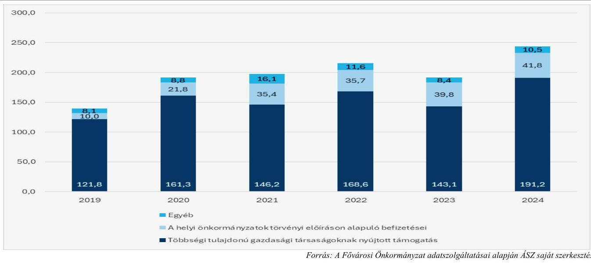

A Fővárosi Önkormányzat a mindenkori költségvetési törvény értelmében szolidaritási hozzájárulás fizetésére kötelezett. A helyi önkormányzatok törvényi előíráson alapuló befizetései között szereplő szolidaritási hozzájárulás összege a 2019. évben 10,0 Mrd Ft volt, a 2024. évre 75,5 Mrd Ft-ra emelkedett.

---

A kifizetett szolidaritási hozzájárulásból a 2023. évben 18,0 Mrd Ft-ot, a 2024. évben 27,7 Mrd Ft-ot mivel annak jogszerűségét nem ismerte el - a Fővárosi Önkormányzat nem az egyéb működési célú kiadások között, hanem a követelés jellegű sajátos elszámolások között mutatott ki az éves költségvetési beszámolójában.
A Fővárosi Önkormányzat legjelentősebb kiadása a többségi tulajdonában lévő gazdasági társaságok által ellátott közfeladatok, közszolgáltatások működési célú támogatása, amelynek összege 2019-ben 121,8 Mrd Ft, 2024-ben ennél 57,0\%-kal magasabb, 191,2 Mrd Ft volt. A támogatások a koronavírusjárvány miatt a 2020. évben, az energiaválság hatására a 2022. évben jelentősen emelkedtek. A 2023. évi csökkenés abból adódott, hogy a Fővárosi Önkormányzat a közlekedésszervező feladat IV. negyedévi támogatását (50,0 Mrd Ft-ot) nem fizette meg a tárgyévben, annak kifizetését - követelésengedményezés alkalmazásával - a következő évre halasztotta. A 2024. évben az előző év utolsó negyedévére és a tárgyév három negyedévére jutó közösségi közlekedési támogatást teljesítette a Fővárosi Önkormányzat.
A többségi tulajdonú gazdasági társaságoknak adott működési célú támogatások alakulását a következő táblázat szemlélteti:

# 7. táblázat 

## A TÖBBSÉGI TULAJDONÚ GAZDASÁGI TÁRSASÁGOKNAK ADOTT MÜKÖDÉSI CÉLÚ TÁMOGATÁSOK A 2019-2024. ÉVEKBEN (MRD FT-BAN)

| MEGNEVEZÉs | 2019 | 2020 | 2021 | 2022 | 2023 | 2024 |
| :-- | --: | --: | --: | --: | --: | --: |
| Egyéb múködési célú támogatások | 121,8 | 161,3 | 146,2 | 168,6 | 143,1 | 191,2 |
| - ebből: közösségi közlekedés | 92,0 | 133,5 | 119,6 | 137,6 | 110,2 | 161,8 |
| - ebből: közútkezelés | 3,3 | 3,6 | 3,8 | 4,2 | 3,5 | 5,9 |
| - ebből köztisztaság, közterület tisztántartás | 8,9 | 8,6 | 7,9 | 11,1 | 11,4 | 9,4 |

A BKK Zrt. részére a közösségi közlekedés közlekedésszervezési feladataira nyújtott támogatás jelentette a többségi tulajdonú gazdasági társaságoknak adott müködési célú támogatások 75,5-84,6\%-át a 2019-2024. közötti időszakban. A közösségi közlekedési személyszállítási feladatokat ténylegesen a BKV Zrt. végzi, a feladatellátáshoz kapcsolódó támogatást a BKK Zrt.-vel kötött feladatellátási szerződés alapján kapta. A közösségi közlekedési feladatok ellátásához a Fővárosi Önkormányzat a 2019-2024. közötti időszak minden évében 12,0 Mrd Ft költségvetési támogatást kapott, az ezen felüli részt saját forrásból biztosította.
A közösségi közlekedés közlekedésszervezési feladataira adott müködési támogatás a 2020. évben 41,5 Mrd Ft-tal, 45,1\%-kal növekedett az előző évhez képest, amelyet a ráfordítások szinten maradása mellett a bevételek csökkenése okozott. A koronavírus-járvány idején a korlátozások miatt jelentősen csökkent az utasok száma (az eladott bérletek száma 2019-ben 8,8 millió darab, 2020-ban már csak 5,9 millió darab volt). Az utasok számának csökkenése mellett a veszélyhelyzeti kormányzati intézkedések szerint díjemelésre nem kerülhetett sor, ezért a jegy- és bérletértékesítés bevétele a 2019. évi $\mathbf{6 7 , 3}$ Mrd Ft-ról 2020-ra 42,0 Mrd Ft-ra csökkent. A közösségi közlekedési szolgáltatást ugyanakkor változatlan szinten kellett fenntartani, egyes időszakokban járatsűrítésre is sor került a kormányzati intézkedések alapján. A ráfordítások ennek következtében nem csökkentek.
A 2021. évben az utasszám, a jegy- és bérletbevételek 2020. évi szinten maradása mellett a Fővárosi Önkormányzat által a közösségi közlekedés közlekedésszervezési feladatokra nyújtott támogatás 10,5\%kal (13,9 Mrd Ft-tal) csökkent, ehhez hozzájárult, hogy a 2021. évi támogatásból 8,0 Mrd Ft-ot a Fővárosi Önkormányzat a 2022. évben teljesített.

---

A jegy- és bérletértékesítésből származó bevételek és az eladott bérletek számának koronavírus-járvány időszakában bekövetkezett változását szemlélteti a következő táblázat:
8. táblázat

A BKK ZRT. JEGY- ÉS BÉRLETÉRTÉKESÍTÉSBŐL SZÁRMAZÓ BEVÉTELEI ÉS AZ ELADOTT BÉRLETEK SZÁMA 2019-2024. ÉVEKBEN

| MEGNEVEZÉS | 2019. ÉV | 2020. ÉV | 2021. ÉV | 2022. ÉV | 2023. ÉV | 2024. ÉV |
| :-- | :--: | :--: | :--: | :--: | :--: | :--: |
| Jegy-és bérletértékesítés   bevétele, Mrd Ft | 67,3 | 42 | 41,1 | 56,4 | 69,9 | 60,0 |
| Eladott bérletek   darabszáma, db | 8849951 | 5936136 | 5659539 | 7069271 | n.a | n.a |

A közösségi közlekedés közlekedésszervezői feladataira nyújtott támogatás 2021-ről 2022-re történő $15,1 \%$-os $(18,0 \mathrm{Mrd} \mathrm{Ft})$ növekedése az energiaválság hatásaira, valamint a 2021. évi 8,0 Mrd Ft alulfinanszírozás kifizetésére vezethető vissza. A következő táblázat a BKV Zrt.-nél felhasznált energia mennyiségét, egységárát és költségét mutatja be a 2020-2024. években:
9. táblázat

A BKV ZRT. ENERGIA KÖLTSÉGEINEK ALAKULÁSA A 2020-2022. ÉVEKBEN

|  | 2020. ÉVI TÉNY |  |  | 2021. ÉVI TÉNY |  |  | 2022. ÉVI TÉNY |  |  | NÖVEKEDÉS   2022/2021. |  |
| :--: | :--: | :--: | :--: | :--: | :--: | :--: | :--: | :--: | :--: | :--: | :--: |
|  | Mennyiség | Egységár | Kültség   (millió Ft) | Mennyiség | Egységár | Kültség   (millió Ft) | Mennyiség | Egységár | Kültség   (millió Ft) | Egységár | Kültség |
| Villamos energia (Mwó) | 256853,5 | 36,5 | 9376,3 | 235769,0 | 34,6 | 8156,4 | 229023,0 | 91,9 | 21042,0 | 265,6\% | 258,0\% |
| Vontatási gázolaj (ezer liter) | 27660,1 | 250,8 | 6936,2 | 26930,4 | 318,6 | 8581,1 | 28447,0 | 480,6 | 13672,3 | 150,8\% | 159,3\% |
| Földgáz (ezer m3) | 3899,0 | 101,2 | 394,7 | 5701,0 | 119,6 | 681,9 | 4036,0 | 409,7 | 1653,5 | 342,5\% | 242,5\% |
| CNG   (ezer kg ) | 1394,0 | 236,4 | 329,5 | 1507,4 | 234,9 | 354,1 | 1476,2 | 593,2 | 875,7 | 252,5\% | 247,3\% |
| Távhő (Ft/GJ) | 137773,0 | 4,2 | 574,5 | 140302,0 | 3,9 | 551,9 | 107972,0 | 23,4 | 2525,5 | 594,6\% | 457,6\% |
| Egyéb energia összesen |  |  | 478,2 |  |  | 543,5 |  |  | 799,6 |  | 258,0\% |

Forrás: A Fővárosi Önkormányzat adatszolgáltatása, valamint nyilvánosan elérhető adatok alapján ÁSZ saját szerkesztés

A felhasznált energia mennyisége a 2021. évről a 2022. évre - a vontatási gázolaj kivételével - csökkent, az egységár növekedése miatt azonban az energiaköltségek többszörösükre emelkedtek, így a 2022. évben az energiaárak növekedése miatt a BKV Zrt. energiaköltsége 215,0\%-kal, 21,7 Mrd Ft-tal volt magasabb az előző évinél.
Az energiaköltségek növekedése eredményeként a BKV Zrt. költségszerkezete is megváltozott a 2022. évben. A 2019-2021. években és 2023-2024. években a ráfordítások között a személyi jellegű ráfordítások domináltak, 2022-ben az energiaválság hatására az anyag jellegű ráfordítások voltak magasabbak. Az anyagjellegű ráfordítások a 2023. évben tovább növekedtek, azonban ez nem az energiaköltségek változásából ered, hanem jellemzően a 100 db tartós bérleti konstrukcióban bérelt autóbusz bérleti díjának, valamint az informatikai költségek emelkedése miatt. A 2024. évi csökkenés alapvetően az energiaárak csökkenésére vezethető vissza.
A BKV Zrt. egyes ráfordításainak alakulását a 2019-2024. időszakban a következő ábra szemlélteti:

---

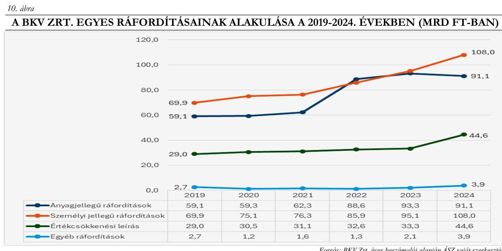

# Felhalmoż̇si kiadások 

A felhalmozási kiadások költségvetési kiadásokon belüli aránya a 2019-2024. évek egyikében sem haladta meg a 17,0\%-ot. A felhalmozási kiadások 2024. évi jelentős visszaesése a felhalmozási bevételek csökkenésére, a pénzügyi helyzet romlására és a hitelfelvételi nehézségekre vezethető vissza.
11. ábra

A FŐVÁROSI ÖNKORMÁNYZAT FELHALMOZÁSI KIADÁSAI A 2019-2024. ÉVEKBEN (MRD FT-BAN)
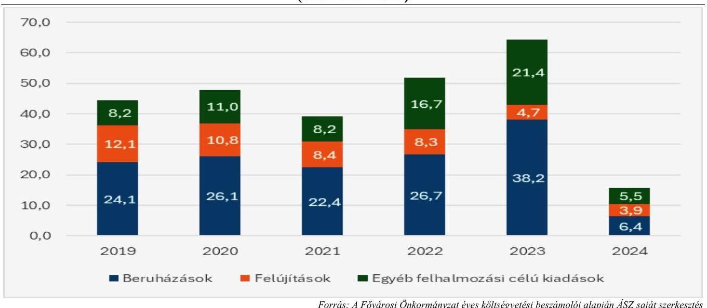

A 2019-2024. években a legjelentősebb beruházások közé tartozott a Széchenyi lánchíd rekonstrukciója (22,5 Mrd Ft), a fővárosi hulladékgazdálkodási rendszer bővítése, a hulladékfeldolgozás és újrahasznosítás arányának növelése, valamint a hulladékgyűjtési, szállítási és előkezelő rendszer elnevezésű projekt (22,0 Mrd Ft), a Budapest Főváros víztermelő kutak fejlesztése, vízminőségi és kapacitáskockázatok kezelése elnevezésű projekt ( $24,7 \mathrm{Mrd}$ Ft) és a Blaha Lujza tér rekonstrukciója ( $4,2 \mathrm{Mrd}$ Ft). A Városháza rekonstrukció „A" üteme 3,7 Mrd Ft-ból valósult meg. A CAF villamosok (96,4 Mrd Ft) beszerzése 2025. évi részletének kifizetéséhez 51,1 Mrd Ft támogatást biztosított a Kormány.

---

Felújításra a Fővárosi Önkormányzat a 2019-2024. években összesen 48,2 Mrd Ft-ot fordított. Az időszakon belül a felújítási kiadások 12,1 Mrd Ft-ról 3,9 Mrd Ft-ra történő csökkenése elsősorban a forráshiányra vezethető vissza.
Az egyéb felhalmozási célú kiadásokra a Fővárosi Önkormányzat az elemzett hat év alatt összesen 71,0 Mrd Ft-ot fordított, amelyek a 2019. évi 8,2 Mrd Ft-ról 2023-ra több mint két és félszeresére növekedtek, majd a 2024. évre ehhez képest negyedére, 5,5 Mrd Ft-ra estek vissza. Az egyéb felhalmozási célú kiadások többségét a közfeladatot ellátó gazdasági társaságoknak felhalmozási célra adott támogatások jelentették, amelynek a legnagyobb részét, hat év alatt 21,4 Mrd Ft-ot a BKV Zrt. kapta.

# A költségvetési bevételek alakulása 

A Fővárosi Önkormányzat költségvetési bevételei a 2020. évi 14,2\%-os csökkenést követően folyamatosan emelkedtek az időszakban, a 2024. évi költségvetési bevétel 429,3 Mrd Ft volt.
12. ábra

KÖLTSÉGVETÉSI BEVÉTELEK A 2019-2024. ÉVEKBEN
(MRD FT-BAN)
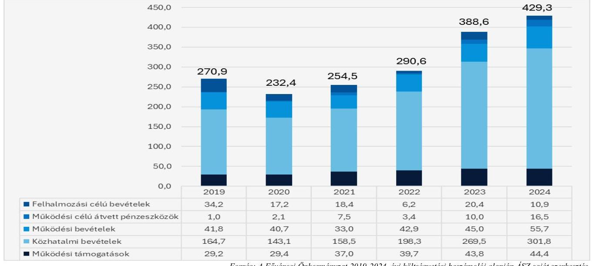

Forrás: A Fövárosi Önkormányzat 2019-2024. évi költségvetési beszámolói alapján ÁSZ saját szerkesztés
Az elemzett hat év összes költségvetési bevételének a 66,2\%-át jelentették a közhatalmi bevételek, amelynek a $98,9 \%$ a helyi iparűzési adóbevételből származott. A közhatalmi bevételek 2020. évi visszaesését a helyi iparűzési adóbevétel 21,5 Mrd Ft-ot kitevő csökkenése eredményezte, amelyet egyrészt az adóalapot képező, adózói árbevételek koronavírus-járvány miatti visszaesése indokol. Másrészt a 2020. évi adófeltöltési kötelezettség megszűnése miatt a 2020. évi adóbevallás szerint még esedékes fizetési kötelezettség a 2021. évben teljesült. A helyi iparűzési adóbevételre negatívan hatott az is, hogy jogszabályi előírás alapján a 2021. és a 2022. adóévben a legfeljebb $4,0 \mathrm{Mrd}$ Ft nettó árbevétellel vagy mérlegfőösszeggel rendelkező mikro-, kis- és középvállalkozások esetében a helyi iparűzési adó mértéke $1 \%$ volt az addigi $2 \%$ helyett, amely összesen $44,8 \mathrm{Mrd}$ Ft bevételkiesést okozott a Fővárosi Önkormányzatnak. Az iparűzési adóbevételek a 2023. évben 36,0\%-kal, a 2024. évben további 12,1\%-kal emelkedtek, amely a koronavírus-járvány idején hozott intézkedések megszűnésére, a járványt követő gazdasági növekedésre, valamint az inflációs hatásokra vezethető vissza.

---

A 2019-2024. években az államháztartáson belülről érkezett működési támogatások költségvetési bevételeken belüli aránya a 2019-2021. évek között 10,8\%-ról 14,6\%-ra emelkedett, majd 2024-re folyamatosan $10,3 \%$-ra esett vissza, amellett, hogy a nominál értéke $29,4 \mathrm{Mrd}$ Ft-ról $51,0 \%$-kal 44,4 Mrd Ft-ra, folyamatosan emelkedett az időszakban. A működési támogatások 80,9-94,2\%-át a központi költségvetésből kapott támogatások jelentették.
A 2019. évről a 2024. évre a működési bevételek 41,8 Mrd Ft-ról 55,7 Mrd Ft-ra emelkedtek, arányuk a költségvetési bevételeken belül az időszakban 11,6\%-17,5\% között mozgott. A működési bevételekből a Fővárosi Önkormányzatnak a 2019-2024. években összesen 259,1 Mrd Ft bevétele keletkezett, amely tartalmazta többek között az önkormányzat által az időszakban nyújtott szolgáltatások ellenértékét (63,9 Mrd Ft), az általános forgalmi adó bevételek ( $41,0 \mathrm{MrdFt}$ ), az ellátási díjakat ( $30,5 \mathrm{MrdFt}$ ), az önkormányzati vagyon üzemeltetéséből származó bevételeket ( $36,1 \mathrm{MrdFt}$ ), a kamatbevételeket (21,6 Mrd Ft) a készletek értékesítéséből származó bevételeket (13,0 Mrd Ft), valamint a Fővárosi Önkormányzat tulajdonában álló gazdasági társaságok által befizetett osztalékbevételt (17,9 Mrd Ft).
A működési célú átvett pénzeszközök 1,0 Mrd Ft-ról 16,5 Mrd Ft-ra emelkedtek az elemzett időszakban, a többségi tulajdonban lévő gazdasági társaságoktól átvett pénzeszközök növekedése miatt.
A felhalmozási célú bevételek a 2019. évi 34,2 Mrd Ft-ról 10,9 Mrd Ft-ra csökkentek 2024-re, az időszakon belül alakulásuk hullámzó volt. Ezen belül az államháztartáson belülről kapott felhalmozási célú támogatások 18,2 Mrd Ft-tal, a felhalmozási célú átvett pénzeszközök 0,1 Mrd Ft-tal csökkentek, míg a felhalmozási célú saját bevételek 5,0 Mrd Ft-tal növekedtek. A felhalmozási célú támogatások és átvett pénzeszközök csökkenése a beruházások, felújítások visszaeséséhez is hozzájárult.

# Az önként vállalt feladatok hatása a Fővárosi Önkormányzat költségvetésére 

A Fővárosi Önkormányzat önként vállalt feladatai közé tartozik a nappali melegedők fenntartása, az utcai szociális munkavégzés és egészségügyi ellátás biztosítása a hajléktalanok ellátása keretében, a fővárosi kerékpáros közösségi közlekedés feltételrendszerének fejlesztése és működtetése, a fővárosi lakhatási szegénység mérséklése, lakásügynökség működtetése.
A Fővárosi Önkormányzat kiadásainak önkormányzati feladatonkénti bontását a következő ábra szemlélteti (a szolidaritási hozzájárulás fizetési kötelezettség egyik feladatellátásához sem kapcsolódik, azonban a költségvetésben jelentős nagyságrendet képez, ezért a teljesség érdekében önálló tételként szerepel az ábrában):

---

13. álma

A KÖTELEZŐ, ÖNKÉNT VÁLLALT, ÁLLAMIGAZGATÁSI FELADATOK KIADÁSAI, VALAMINT A SZOLIDARITÁSI HOZZÁJÁRULÁS A 2019-2024. ÉVEKBEN (MRD FT-BAN)
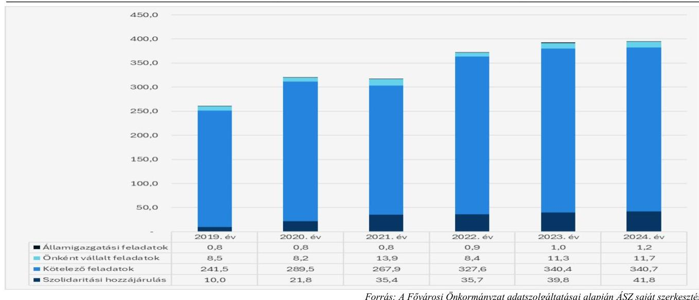

Az önként vállalt feladatokra fordított kiadások költségvetési kiadásokon belüli aránya az elemzett hat évben összesen 3,0\% volt. Az önként vállalt feladatokhoz kapcsolódó bevételek összességében az önként vállalt feladatokhoz kapcsolódó kiadások 39,9\%-át fedezték az időszakban. Az önként vállalt feladatok költségvetési egyenlege az időszak minden évében negatív volt, a hiány a 2019. évben volt a legmagasabb (7,9 Mrd Ft) és a 2022. évben volt a legalacsonyabb (4,9 Mrd Ft).

# A gazdasági társaságok müködésének hatása a költségvetésre 

A Fővárosi Önkormányzat közvetlen többségi tulajdonában 30 gazdasági társaság, közvetett többségi tulajdonában 15 gazdasági társaság állt 2024. december 31-én.
A Fővárosi Önkormányzatnak a többségi tulajdonában álló gazdasági társaságaitól a 2019-2024 közötti időszakban összesen 17,9 Mrd Ft osztalékbevétele volt, amelynek nagy része a BGYH Zrt.-től származott. Az osztalékbevételek tekintetében a 2023. és a 2024. években figyelhető meg jelentős emelkedés, amikor a korábbi évekre jellemző 1,5 Mrd Ft-os osztalékbevétellel szemben 6,0 Mrd Ft értékben történt osztalékkifizetés az önkormányzat számára. A 2025. évben a 2024. évi teljesítéshez képest jóval nagyobb összegű, 18,4 Mrd Ft osztalékbevételt tervezett az önkormányzat, amely a FCSM Zrt. (12,0 Mrd Ft), BGYH Zrt. (5,3 Mrd Ft), BNP Zrt. (1,1 Mrd Ft) adózott eredményét terheli. A nagyobb mértékű osztalék igénybevétel is az önkormányzat likviditási problémáira utal.
A saját tőke rendezésére vonatkozó intézkedési kötelezettsége az önkormányzatnak a BKK Zrt. tekintetében a 2020. és 2021. évek vonatkozásában keletkezett, mivel ezekben az években a társaság saját tőkéjének összege a jegyzett tőke alá csökkent. Ehhez kapcsolódóan 2021. évben az önkormányzat 1,5 Mrd Ft, 2022. évben 1,76 Mrd Ft pótbefizetést teljesített.

## A gazdasági társaságok pénzügyi-vagyoni helyzete

A Fővárosi Önkormányzat közfeladatait, közszolgáltatásait jellemzően a többségi tulajdonában álló gazdasági társaságok látják el. A közfeladatok ellátásának kötelezettsége törvényi rendelkezés alapján a Fővárosi Önkormányzatot terheli, annak forrásait a Fővárosi Önkormányzat költségvetésében kell megteremteni. A gazdasági társaságok müködésének, gazdálkodásának minősége kihat egyrészt

---

a közfeladatellátás színvonalára, másrészt a Fővárosi Önkormányzat által nyújtott támogatás nagyságára, ezért jelentős befolyást gyakorol a Fővárosi Önkormányzat pénzügyi-gazdasági helyzetére. A 2024. év végén az elemzett hét gazdasági társaság mindegyikének pozitív volt az adózott eredménye. A BKV Zrt. adózott eredménye 2019-2023. években, a BKK Zrt. adózott eredménye 2019-2021. években, a Fővárosi Vízmúvek Zrt. 2022-2023. években, a FCSM Zrt. a 2023. évben veszteséget mutatott.
A 2024. év végén a hét gazdasági társaság pénzeszközeinek állománya 51,9 Mrd Ft volt, ennek 69,8\%ával ( $36,2 \mathrm{MrdFt}$ ) a BKM Zrt. rendelkezett. A pénzeszközállomány kiugró értékű volt 2022-ben (108,3 Mrd Ft), amelynek 72,2\%-a (78,3 Mrd Ft) a BKM Zrt. mérlegében szerepelt.
Tartós befektetéssel csak a BKM Zrt. rendelkezett, a 2021. évi 9,2 Mrd Ft tartós hitelviszonyt megtestesítő értékpapírállomány 2024. évre 3,0 Mrd Ft-ra csökkent. Rövid lejáratú értékpapírállománya a BKM Zrt.-nek ( 0,3 Mrd Ft) volt a 2024. évben, valamint a FCSM Zrt.-nek ( 0,01 Mrd Ft) a 2019-2024. években.

A BKM Zrt. hulladékgazdálkodási üzletága, ezzel együtt a vagyonelemek értékesítésre kerültek a MOHU Budapest Zrt. részére a 2024. évben. A vételár felét ( 17,7 Mrd Ft) elkülönítetten, zárolt óvadéki betétszámlán kell tartania a BKM Zrt.-nek.

A 2025. januári Közgyűlésen Budapest Főváros Önkormányzata, mint a BKM Zrt. egyedüli részvényese, a BKM Zrt. legfőbb szervének hatáskörében eljárva arról döntött, hogy a rákosrendezői ingatlanokkal kapcsolatban elővásárlási jogát gyakorolja (2/2025. (I. 29.) Főv. Kgy. határozat). Így a BKM Zrt. 2025. január 31-én megtette a rákosrendezői ingatlanokkal kapcsolatos elővásárlási jog gyakorlásáról szóló nyilatkozatot. A Kormány az 1015/2025. (II. 6.) Korm. határozatában az elővásárlási jog gyakorlását a BKM Zrt. számára engedélyezte, a 1068/2025. (III. 13.) Korm. határozatában pedig hozzájárult ahhoz, hogy a Fővárosi Önkormányzat az ingatlanok megvásárlásával összefüggésben biztosítékot nyújtson a BKM Zrt. részére. 2025. március 24-én a BKM Zrt. átutalta a vételár első, $25 \%$-os részletét ( 12,7 Mrd Ft) a Magyar Nemzeti Vagyonkezelő Zrt. számlájára. Az első részlet kifizetése a BKM Zrt. eredménytartaléka terhére történt. A vételár második, $35 \%$-os részletének (17,8 Mrd Ft) a megfizetésére - a BKM Zrt. előterjesztett 2025. évi üzleti tervében rögzítettek szerint - az adásvételi szerződésben foglalt feltételek megvalósulását, mindenekelőtt a folyamatban levő, perfeljegyzéssel is érintett perek lezárását követően, előreláthatóan az üzleti terv tárgyévét követő évben kerülhet sor.
14. ábra

A KIEMELT GAZDASÁGI TÁRSASÁGOK PÉNZESZKÖZ ÉS ÉRTÉKPAPÍRÁLLOMÁNYA A 2019-2024. ÉVEKBEN (MRD FT-BAN)
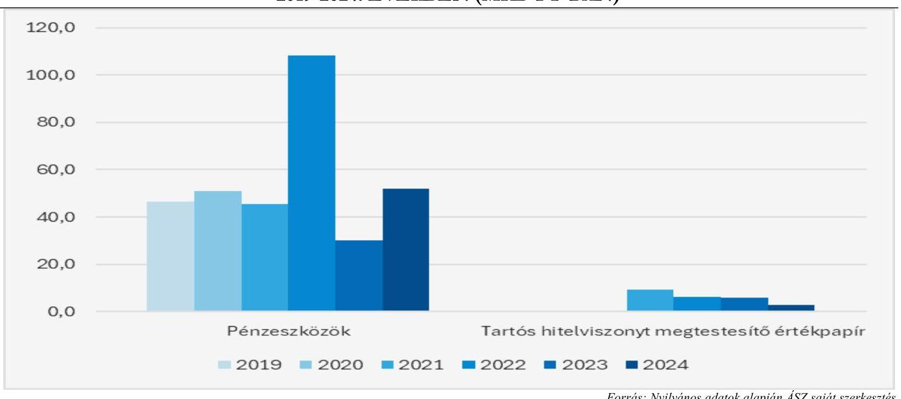

---

A tartósan adott kölcsönök állománya a 2019-2024. időszakban a hét gazdasági társaságnál összesen 0,4 Mrd Ft és 0,5 Mrd Ft között változott, egyik gazdasági társaság esetében sem haladta meg az évi 0,25 Mrd Ft-ot.
A követelések a 2019. évi 44,9 Mrd Ft-ról 2024. évre 85,6 Mrd Ft-ra emelkedtek, a követeléseknek 2022ben volt kiemelkedő értéke (100,3 Mrd Ft). Az időszakban összességében a követelések közel felével (48,3\%) rendelkezett a BKM Zrt., ezen belül 2022-ben a követelések 71,5\%-a (71,7 Mrd Ft) a BKM Zrt.nél volt, amely az energiaárak - elsősorban a nem lakossági távhőszolgáltatási díj - emelkedésével volt összefüggésben.
A kötelezettségek a 2019. évről a 2024. évre 250,4 Mrd Ft-ról 200,7 Mrd Ft-ra változtak, az időszakon belül nagyságuk hullámzó volt. A hosszú lejáratú kötelezettségek számottevő ( 73,1 Mrd Ft) csökkenését eredményezte, hogy a Fővárosi Vízmúvek Zrt. által használt víziközmű vagyont a Fővárosi Önkormányzat 2023-tól vagyonkezelési konstrukció helyett bérleti szerződés keretében biztosította. A rövid lejáratú kötelezettségek aránya - a 2021. év kivételével - folyamatosan emelkedett, a 2019. évi 56,6\%-ról a 2024. évre $78,1 \%$-ra. nőtt. A rövid lejáratú kötelezettségek egyre dominánsabbá válása múködési nehézségekre, a fejlesztések háttérbe szorulására utal. A hét gazdasági társaság kötelezettségeinek alakulását a következő ábra szemlélteti:
15. ábra

A KIEMELT GAZDASÁGI TÁRSASÁGOK KÖTELEZETTSÉGEI A 2019-2024. ÉVEKBEN (MRD FT-BAN)
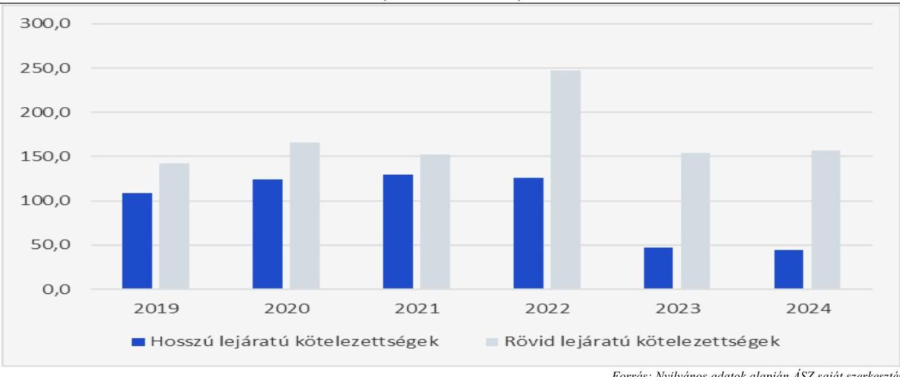

A befektetett eszközök állománya a 2019. évről a 2024. évre a BKK Zrt., a Fővárosi Vízmúvek Zrt. és a Fővárosi Csatornázási Zrt. kivételével emelkedett a gazdasági társaságoknál. A befektetett eszközök alakulását a következő ábra szemlélteti:

---

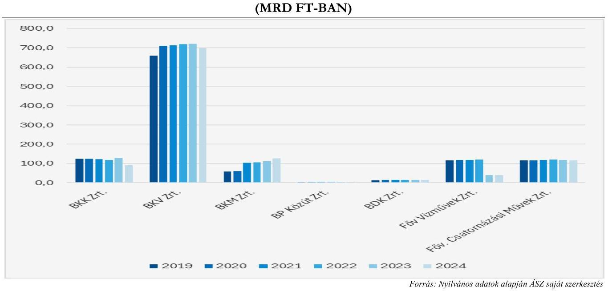

A gazdasági társaságok között kiemelkedő a BKV Zrt. befektetett eszköz állománya, amely a 2019. évi 660,1 Mrd Ft-ról a 2023. évig emelkedő tendenciát mutatott, 2023-ról 2024-re azonban 720,4 Mrd Ft-ról 699,5 Mrd Ft-ra csökkent, azaz a fejlesztések nem ellensúlyozták az eszközök értékcsökkenését. A befektetett eszközök 2024. évi csökkenése jellemezte - a BKM Zrt. kivételével - valamennyi gazdasági társaságot. A befektetett eszközök a 2021. évben a BKM Zrt.-nél ugrásszerűen növekedtek, ezt a közműtársaságok BKM Zrt.-be történő integrálása okozta. A befektetett eszközök jelentős (66,3\%) csökkenése látható a Fővárosi Vízmúvek Zrt. esetében a 2023. évben, amelyet a vagyonkezelt eszközök mérlegből történő kivezetése okozott a budapesti ivóvízellátást biztosító víziközmű eszközök üzemeltetési konstrukcióváltása következtében.
A Fővárosi Önkormányzat költségvetési helyzetéhez kapcsolódó összehasonlító elemzést a V. melléklet tartalmazza.
2.2. számú megállapítás

A Fővárosi Önkormányzat által a 2023. évben megtett intézkedéseknek az ellenőrzött időszakra való kihatása, továbbá a 2024. évben megtett, illetve a 2025. évben az ellenőrzés lezárásáig megtett és tervezett bevételnövelő és kiadáscsökkentő intézkedések együttesen sem elegendőek a pénzügyi egyensúly megteremtéséhez.

A Fővárosi Önkormányzat - adatszolgáltatása alapján - a 2023-2025. években 34,7 Mrd Ft értékű bevételnövelő, valamint 63,2 Mrd Ft értékủ kiadáscsökkentő intézkedést hajtott végre, illetve tervez a 2025-ben végrehajtani.

---

A 2023-2025. ÉVEKBEN VÉGREHAJTOTT ÉS A 2025. ÉVBEN TERVEZETT BEVÉTELNŐVELŐ, KIADÁSCSÖKKENTŐ INTÉZKEDÉSEK HATÁSA (MRD FT)

| BEVÉTELNÖVELŐ INTÉZKEDÉSEK | 2024. ÉVI   HATÁS | 2025. ÉVI   HATÁS | ÖssZesen |
| :--: | :--: | :--: | :--: |
| Eszközök hasznosítására tett intézkedések | 11,8 | 9,9 | 21,7 |
| Intézményi térítési díjakkal kapcsolatos intézkedések | 0,4 | 0,2 | 0,6 |
| Hátralékos követelésállomány csökkentésére tett intézkedések | 9,6 | 2,6 | 12,1 |
| Egyéb intézkedések | 0,2 | 0,1 | 0,3 |
| Bevételnövelő intézkedések hatása összesen | 22,0 | 12,7 | 34,7 |
| KIADÁSCSÖKKENTŐ INTÉZKEDÉSEK | 2024. ÉVI   HATÁS | 2025. ÉVI   HATÁS | ÖssZesen |
| Személyi jellegű kiadásokhoz kapcsolódó kiadási megtakarítás | 0,1 | 0,1 | 0,2 |
| Beszerzéseket érintő intézkedések miatti kiadási megtakarítás | 1,6 | 0,3 | 1,9 |
| Beruházások/felújítások elhalasztása miatti kiadási megtakarítás | 1,2 | 0,1 | 1,3 |
| Civil szervezetek részére átadott pénzeszközök csökkentése | 0,1 | 0,1 | 0,2 |
| Gazdasági társaságok részére átadott pénzeszközök csökkentése | 59,7 | 0,0 | 59,7 |
| Kiadáscsökkentő intézkedések hatása összesen | 62,7 | 0,5 | 63,2 |

A Fővárosi Önkormányzat bevételnövelő intézkedéseinek a 97,4\%-a (33,8 Mrd Ft) a vagyontárgyak hasznosításához (ingatlanok és ingóságok értékesítése), valamint a hátralékos követelésállomány csökkentése érdekében tett intézkedésekhez kapcsolódtak. A kiadáscsökkentő intézkedések közül a legjelentősebb, azok értékének a 94,5\%-a (59,7 Mrd Ft) gazdasági társaságoknak 2024. évben járó támogatás 2025. évre történő átütemezése volt, amelyek a likviditási problémák átmeneti megoldását szolgálták, azaz nem tekinthetőek végleges kiadási megtakarításnak.

---

# JAVASLATOK 

Az ÁSZ tv. 33. § (1) bekezdésében foglaltak értelmében az ellenőrzött szervezet vezetője köteles a jelentésben foglalt megállapításokhoz kapcsolódó intézkedési tervet összeállítani és azt a jelentés kézhezvételétől számított 30 napon belül az ÁSZ részére megküldeni. Amennyiben az ellenőrzött szervezet vezetője nem küldi meg határidőben az intézkedési tervet, vagy továbbra sem elfogadható intézkedési tervet küld, az Állami Számvevőszék elnöke az ÁSZ tv. 33. § (3) bekezdése a) és b) pontjaiban foglaltakat érvényesítheti.

## A FŐPOLGÁRMESTER RÉSZÉRE

1. Intézkedjen a nyilvános jelentés kézhezvételét követően az Állami Számvevőszék jelentésének a Közgyűlés soron következő ülésére történő előterjesztéséről.
2. A negatív költségvetési egyenlegre tekintettel továbbra is tegyen intézkedéseket a költségvetési egyensúly helyreállítására az Alaptörvény N) cikkében rögzített fenntartható költségvetési gazdálkodás elvének érvényesítése érdekében.

## A FŐJEGYZŐ RÉSZÉRE

1. Intézkedjen annak érdekében, hogy a költségvetés tervezése során az Áht. 4. § (2) bekezdésében előírtaknak megfelelően biztosított legyen a tervezett osztalékbevételek közgazdasági megalapozottsága, továbbá az, hogy - a szolidaritási hozzájárulás és az államháztartáson kívülre nyújtott egyéb müködési célú támogatások tekintetében - annyi kiadás kerüljön megtervezésre, amennyi a feladat ellátásához indokoltan szükséges.
2. Intézkedjen a Bkr. ${ }^{29}$ 3. §-a szerinti felelőssége körében annak érdekében, hogy a szolidaritási hozzájárulás elszámolása az Áhsz. 15. mellékletben előírtak alapján a költségvetési kiadások között, a K5022 ,,A helyi önkormányzatok törvényi előíráson alapuló befizetései" rovaton történjen.

---

# MELLÉKLETEK 

## I. SZ. MELLÉKLET: ÉRTELMEZŐ SZÓTÁR

Azonnali jogvédelem

BUBOR

Budapest Főváros
Főpolgármesteri Hivatal
Budapest Főváros
Közgyűlése

Budapest Főváros
Önkormányzata
célszerűség
eredményesség
költségvetési rendelet
önkormányzat

Az azonnali jogvédelem a bíróság által, az anyagi jogerős döntés meghozataláig nyújtott védelem. Ez a védelem a Fővárosi Önkormányzat vonatkozásában akként érvényesül, hogy a Kincstár beszedési megbízás útján a Fővárosi Önkormányzatot terhelő, esedékes szolidaritási hozzájárulást nem tudja behajtani, a Fővárosi Önkormányzat számlájáról inkasszálni. Az azonnali jogvédelem biztosítása a jogszabályokon alapuló szolidaritási hozzájárulás fizetési kötelezettség megszűnését nem jelenti. Szükséges azonban megjegyezni, hogy a Kincstár az azonnali jogvédelem biztosítása esetén is élhet a nettó finanszírozás keretében történő beszámítással a szolidaritás hozzájárulás fizetési kötelezettség tekintetében. (Az ÁSZ értelmezése az azonnali jogvédelemre vonatkozóan, fókuszálva a Fővárosi Önkormányzat szolidaritási hozzájárulás fizetési kötelezettségére.)
A Budapesti Bankközi Forint Hitelkamatláb egy pénzügyi referenciamutató. Azt a kamatot jelenti, amelyen a kereskedelmi bankok egymásnak hitelt adnak rövid futamidőre. A BUBOR adott napi értékét a Magyar Nemzeti Bank határozza meg, amelyet minden magyar banki munkanapon 11 órakor publikál. (Forrás: Magyar Nemzeti Bank)
A fővárosban főpolgármesteri hivatal működik. A főpolgármesteri hivatalt a főjegyző vezeti. (Forrás: Mötv. 22. § (5) bekezdés)
Budapest Főváros Önkormányzatának képviselő-testülete a közgyűlés. A közgyűlést a főpolgármester képviseli. A fővárosi közgyűlés tagjai a főpolgármester és a fővárosi listáról mandátumot szerzett képviselők. (Forrás: Mötv. 22. § (3) és (3a) bekezdés)
Budapest Főváros Önkormányzata olyan önkormányzat, amely a települési és a területi önkormányzat feladat- és hatásköreit is elláthatja. Az Fővárosi Önkormányzatra vonatkozó feladat- és hatásköri szabályokat az Mötv. határozza meg. (Forrás: Mötv. 22. $\mathbb{S}(3)$ bekezdés; 23. §)
Arra vonatkozó követelmény, hogy a bevételeket a közfeladat megvalósítása érdekében, a kiadásokat a közfeladatok megfelelő ellátásához szükséges mértékben, a költségvetési célrendszer érdekében, a meghatározott célra (közfeladat ellátására), továbbá észszerűen, racionálisan használták fel. (Forrás: Az Állami Számvevőszék ellenőrzési alapelvei és módszertana, 2024. október)
Az eredményesség elve a kitűzött célok és a szándékolt eredmények (hatások) elérését jelenti. A gazdálkodás, feladatellátás eredményességét mutatja a tényleges és a tervezett eredmények (hatások) összevetése. (Forrás: Az Állami Számvevőszék ellenőrzési alapelvei és módszertana, 2024. október)
A költségvetési évben teljesülő költségvetési bevételek és költségvetési kiadások előirányzott összegét az államháztartás önkormányzati alrendszere esetében a költségvetési rendelet, határozat állapítja meg. (Forrás: Áht. 5. § (1) bekezdése)
A helyi önkormányzat jogi személy. Az önkormányzati feladatok ellátását a képviselőtestület és szervei biztosítják. A képviselő-testület szervei: a polgármester, a főpolgármester, a vármegyei közgyűlés elnöke, a képviselő-testület bizottságai, a részönkormányzat testülete, a polgármesteri hivatal, a vármegyei önkormányzati hivatal, a közös önkormányzati hivatal, a jegyző, továbbá a társulás. A képviselő-testület a feladatkörébe tartozó közszolgáltatások ellátására - jogszabályban meghatározottak szerint - költségvetési szervet, a Polgári perrendtartásról szóló 2016. évi CXXX. törvény szerinti gazdálkodó szervezetet, nonprofit szervezetet és egyéb szervezetet alapíthat, továbbá szerződést köthet természetes és jogi személlyel vagy jogi személyiséggel nem rendelkező szervezettel. (Forrás: Mötv. 41. § (1), (2), (6) bekezdései)

---

II. SZ. MELLÉKLET: AZ ELLENŐRZÖTT SZERVEZETEK JEGYZÉKE

# MEGNEVEZÉS 

Budapest Főváros Önkormányzata
Budapest Főváros Főpolgármesteri Hivatal

---

# III. SZ. MELLÉKLET: ELLENŐRZÉSI KRITÉRIUMOK 

## FOKUSZTERÜLET/FOKUSZKÉRDÉS

1. A 2025. évi költségvetési rendelet megalapozottsága
2. A költségvetési és pénzügyi helyzet alakulása, a pénzügyi egyensúly és a fizetőképesség megőrzése érdekében megtett és tervezett kiadáscsökkentő és bevételnövelő intézkedések megfelelősége

## ELLENŐRZÉSI KRITÉRIUMOK

Alaptörvény 32. cikk (1) bekezdés f) pont
2025. évi Kvtv. 43. § (4) bekezdése, 2. melléklet 62. pont
Áht. 1. $\$ 17$. pont, 3. $\$ (3) bekezdése, 4. $\$ (2) bekezdése $6 /$ C. $\$ (1)$ bekezdése
Mötv. 68. $\$ (3) bekezdése; 111. $\$ (4) bekezdése
Számv. tv. 153. § (1) bekezdése, 154. § (1) bekezdése
Gst. 10/G. $\$-a
267/2024. (IX. 10.) Korm. rendelet ${ }^{30}$ 2. $\$-a
$1 / 2025$. (II. 11.) NGM rendelet
2025. évi költségvetési rendelet

30/2024. (XII. 31.) önkormányzati rendelet ${ }^{31}$
21/2025. (VI. 30.) önkormányzati rendelet
22/2025. (VI. 30.) önkormányzati rendelet
1795/2016. (XII. 07.) számú Közgyűlési határozattal elfogadott Monitoring-controlling kézikönyv
15/2020. (VI. 11.) főpolgármesteri utasítás ${ }^{32}$
Gst. 10. § (3) bekezdése
353/2011. (XII. 30.) Korm. rendelet 5. § (2) bekezdése
Számv. tv. 15. § (3) bekezdése
Áhsz. 1. § (1) bekezdés 3. pont, 15. melléklet
Bkr. 3. $\$$

---

# A 2023. év vonatkozásában indított perek és azok jelenlegi állása ( 2 db ) 

A 2023. évi szolidaritási hozzájárulás vonatkozásában a jelen ÁSZ ellenőrzés ideje alatt folyamatban van egy per a Fővárosi Törvényszéken (továbbiakban: bíróság) és egy felülvizsgálati eljárás a Kúrián.

- A Fővárosi Önkormányzat 2023. június 22-én keresetet nyújtott be, amelyben elsődlegesen a 2023. évi szolidaritási hozzájárulás - kereset benyújtását követő - levonásának megtiltását, másodlagosan annak a megállapítását kérte, hogy a szolidaritási hozzájárulás megállapítása, levonása csak jogszerűen lefolytatott eljárás során hozott határozat alapján lehetséges. A perben a Fővárosi Törvényszék 2025. január 21-én, 108.K.704.003/2024. számon ítéletet hozott. Az ítélet szerint a bíróság a Kincstár forgótőke visszapótlás tárgyú leveleit (továbbiakban: tájékoztató levél) megsemmisítette, és megállapította, hogy az ezek alapján kibocsátott beszedési megbízások jogellenesek. A bíróság az ügy érdemére kiható, lényeges eljárási jogszabálysértést állapított meg, erre tekintettel a kereseti kérelem további, anyagi jogi jogszabálysértés körében előadott felperesi (Fővárosi Önkormányzat) sérelmeket - vagyis azt, hogy a Fővárosi Önkormányzat egyáltalán nem részesül a kötelező feladataihoz szükséges működési támogatásban, a szolidaritási hozzájárulás folyamatos emelkedése a kötelező feladatai ellátását veszélyezteti, és a Kincstárnak a szolidaritási hozzájárulás megállapítása során a Kvtv., Áht., Ávr. mellett az Alaptörvény, a Charta és a Mötv. rendelkezéseit is figyelembe kellene vennie - érdemben nem vizsgálhatta. Az ítélet szerint a Kincstár köteles lenne visszafizetni a szolidaritási hozzájárulás Fővárosi Önkormányzattól jogalap nélkül beszedett összegeit, utóbb azonban határozatot ${ }^{5}$ hozott, ezáltal a beszedési megbízások előfeltétele teljesült, így ettől az időponttól a Kincstár ezen összegeket kezelheti, a szolidaritási hozzájárulás összegeinek visszafizetésére nem köteles. A bíróság kimondta, hogy a Kincstár által jogtalanul kezelt összegek után - arra az időre, amely alatt a szolidaritási hozzájárulás összegét jogtalanul használta - a Fővárosi Önkormányzat részére kamat jár, amely kamat összegeket meg kell fizetnie. A bíróság a Kincstár által okozott jogsértés következményét kamatfizetési kötelezettségben jelölte meg. A bíróságnak a Fővárosi Önkormányzat kifejezett kereseti kérelme ellenére kamatfizetésről rendelkeznie nem kellett, mivel az egy külön eljárás tárgyát képezi, amely a jelen perben idő előtti. A Kincstár figyelmét felhívta a jogkövetkezmények levonására, amelynek elmaradása esetén a Fővárosi Önkormányzat külön eljárásban jogosult az igénye érvényesítésére. A Kincstár a szolidaritási hozzájárulás visszafizetésére két körülmény okán nem volt köteles, egyrészt azért, mert utóbb határozatot hozott, amellyel az eljárási jogszabálysértést orvosolta, másrészt az anyagi jogi jogszabálysértés körében előadott kérelmeket a bíróság nem vizsgálta, a szolidaritási hozzájárulás jogalapjának kérdésében nem döntött, így annak jogszerútlenségét sem mondhatta ki. A Kincstár a 108.K.704.003/2024 számú ítélettel szemben felülvizsgálati kérelmet nyújtott be, amelyet a Kúria befogadott. A Fővárosi Önkormányzat az ítélettel szemben felülvizsgálati kérelmet nem nyújtott be.
- A Fővárosi Önkormányzat a Kincstár BPM-ÁHI-8237-1/2024. iktatószámú határozatát 2025. február 03-án a bíróságon keresettel támadta meg. A bíróság ebben a perben már a

[^0]
[^0]:    5 a Kincstár BPM-ÁHI-8237-1/2024. iktatószámú, 2024. december 20-án kelt határozata

---

Fővárosi Önkormányzat anyagi jogi kérelmeit vizsgálhatja, vagyis azt, hogy a szolidaritási hozzájárulás megállapítására jogszerűen került-e sor. A bíróságon a 2023. évi szolidaritási hozzájárulást érintő perben az első tárgyalási nap 2025. november 13-án lesz. A bíróság a peres eljárást felfüggesztette a Kúria felülvizsgálati eljárásának a befejezéséig.

# A 2024. év vonatkozásában indított perek és azok jelenlegi állása (4 db) 

A Fővárosi Önkormányzat a 2024. évben a Kincstár tájékoztató leveleit keresettel támadta meg, amelyben elsődlegesen a szolidaritási hozzájárulás levonásának, beszámításának megtiltását, másodlagosan annak a megállapítását kérte, hogy a szolidaritási hozzájárulás megállapítása, levonása csak jogszerűen lefolytatott eljárás során hozott határozat alapján lehetséges. Tekintettel arra, hogy a Kincstár a 2024. évben minden hónapra adott ki tájékoztató levelet, így a Fővárosi Önkormányzat mind a 12 hónapot peresítette. A tájékoztató leveleket érintően jelen ÁSZ ellenőrzés ideje alatt - a perek egyesítése okán három per van folyamatban a bíróság előtt.

- A 2024. 01-05. és 2024. 07-11. hónapokat érintő egyesített perben a bíróság tárgyalást már tartott. A bíróság a Fővárosi Önkormányzatot az anyagi jogsértés vonatkozásában nyilatkozattételre hívta fel. A Fővárosi Önkormányzat a nyilatkozattételnek 2025. május 05-én eleget tett. A bíróság a pert felfüggesztette.
- A bíróság a 2024. 06. hónapot érintő perben a Fővárosi Önkormányzatot nyilatkozattételre kötelezte, a nyilatkozat benyújtása megtörtént. A bíróság a 2025. június 19-én kelt végzésével a peres eljárást felfüggesztette.
- A bíróság a 2024. 12. hónapot érintő perben a pert - a Kincstár 2024. évi szolidaritási hozzájárulás tárgyában hozott határozat ellen indított (107.K.700.611/2025 számú) per anyagi jogerős befejezéséig - felfüggesztette.
A Fővárosi Önkormányzat a Kincstár 2024. évi szolidaritási hozzájárulásra vonatkozó határozatát ${ }^{6}$ 2024. december 18-án keresettel támadta meg. A bíróság ebben a 107.K.700.611/2025. számú perben már a Fővárosi Önkormányzat anyagi jogi kérelmeit vizsgálhatja, vagyis azt, hogy a szolidaritási hozzájárulás megállapítására jogszerűen került-e sor. Ebben a perben az első tárgyalási nap 2025. szeptember 18-án lesz.

A bíróság ezen 107.K.700.611/2025. számú perre tekintettel a 2024. 01-05. és 07-11. hónapokat, a 2024. 06. hónapot, illetve a 2024. 12. hónapot érintő perek tárgyalását felfüggesztette.

A bíróság a Kincstár 2024. évi szolidaritási hozzájárulásra vonatkozó - BPM-ÁHI-7330-129/2024. iktatószámú - határozatával szemben indított, 107.K.700.611/2025. számú perben fog elsőként döntést hozni. A döntést követően folytatódhat a tárgyalás a másik három perben.
A Fővárosi Önkormányzat részére a 2024. évben kizárólag a 2024. 12. hónap vonatkozásában biztosított azonnali jogvédelmet a bíróság a 108.K.704.810/2024/3. számú végzéssel. A Kincstár a bíróság döntését fellebbezéssel megtámadta, ennek elbírálása a Fővárosi Ítélőtáblán jelen ÁSZ ellenőrzés ideje alatt folyamatban van.

[^0]
[^0]:    ${ }^{6}$ a Kincstár BPM-ÁHI-7330-129/2024. iktatószámú, 2024. november 26-án kelt határozata

---

# A 2025. év vonatkozásában indított perek és azok jelenlegi állása (2 db) 

A Fővárosi Önkormányzat a 2025. 01-03. hónapok vonatkozásában 2025. április 23-án, a 2025. 0411. hónapok vonatkozásában 2025. május 27-én nyújtott be keresetet. A bíróság a két pert egyesítette, 108.K.702.113/2025. perszám alatt, és 2025. szeptember 8-ára tárgyalást tűzött ki.

A Fővárosi Önkormányzat azonnali jogvédelmet is kért a bíróságtól 2025. 05-08. hónapokra vonatkozóan. A bíróság 2025. június 17-én hozott végzésében megtiltotta a Kincstárnak, hogy a Fővárosi Önkormányzattal szemben 2025. 05-08. hónapokra beszedési megbízást nyújtson be, egyben kötelezte a Kincstárt a 2025. május 29-én jogtalanul beszedett 10,2 Mrd Ft kamatokkal növelt összegének megfizetésére. A Kincstár a bíróság azonnali jogvédelemről hozott döntését fellebbezéssel megtámadta.
A perek állását összefoglaló főbb adatokat az alábbi táblázat tartalmazza.

---

|  2023. év |  |  | 2024. év |  |  | 2025. év |   |
| --- | --- | --- | --- | --- | --- | --- | --- |
|  Peres időszak (hónapokban) | 2023. 01-12. | 2023. 01-12. | 2024. 01-05. és 07-11. | 2024. 06. | 2024. 12. | 2024. 01-12. | 2025. 01-03.  |
|  Keresettel támadott döntés | Forgótőke visszapótlás tárgyú levelek | Kincstár BPM-ÁHI-8237-1/2024. iktatószámú határozata | Forgótőke visszapótlás tárgyú levelek | Forgótőke visszapótlás tárgyú levelek | Forgótőke visszapótlás tárgyú levelek | Kincstár BPM-ÁHI-7330-129/2024. iktatószámú határozatát | Nettósítási adatlap  |
|  Bíróság (ahol a per jelenleg folyamatban van) | Kúria | Fővárosi Törvényszék | Fővárosi Törvényszék | Fővárosi Törvényszék | Fővárosi Törvényszék | Fővárosi Törvényszék | Fővárosi Törvényszék  |
|  Kereset/Felülvizsgá lati kérelem benyújtása | 2025. 04. | 2025. 02. 03. | 2024. 11. 27. | 2024. 06. 27. | 2024. 12. 18. | 2024. 12. 18. | 2025. 04. 23.  |
|  Per állása | folyamatban | per felfüggesztve a Kfv.V.35.088/ 2025. számon folyamatban lévő felülvizsgálati eljárás befejezéséig | per felfüggesztve | per felfüggesztve | per felfüggesztve 107.K.700.6 11/2025. per jogerős befejezéséig | folyamatban | folyamatban  |
|  Tárgyalási határnap | - | 2025. 11. 13. | - | - | - | 2025. 09. 18. | 2025. 09. 08.  |
|  Azonnali jogvédelem | - | - | - | - | van
fellebbezéssel
megtámadva,
a döntés várható időpontja:
2025. 11. 11. | - | van (05-08. hónapokra) fellebbezéssel megtámadva  |
|  Per száma | $\begin{gathered} \text { Kfv.V.35.088/ } \ 2025 . \end{gathered}$ | - | $\begin{gathered} 108 . \text { K.704.574/ } \ 2024 . \end{gathered}$ | $\begin{gathered} 107 . \text { K.703.168/ } \ 2024 . \end{gathered}$ | $\begin{gathered} 108 . \text { K.704.810/ } \ 2024 . \end{gathered}$ | $\begin{gathered} 107 . \text { K.700.6 } \ 11 / 2025 . \end{gathered}$ | Egyesített per 108.K.702.113/2025.  |

---

# A helyi önkormányzatok pénzeszközei és megtakarításai 

A helyi önkormányzatok együttes pénzeszköz állománya 2019-2023. között 1385,2 Mrd Ft-ról 1622,0 Mrd Ft-ra folyamatosan növekedett, majd 2024. évben (44,3\%-kal, 497,7 Mrd Ft-tal) 1124,1 Mrd Ft-ra csökkent. A Fővárosi Önkormányzatnál a pénzeszközök állománya 2019-ről 2024-re negyedére (55,2 Mrd Ft-ról 12,2 Mrd Ft-ra) esett vissza, az időszakon belül hullámzóan alakult.
A Fővárosi Önkormányzat megtakarításai 2022-re elfogytak, ezt követően megtakarítással nem rendelkezett. A helyi önkormányzatok együttes megtakarításainak 2019-ben 54,1\%-át jelentették a Fővárosi Önkormányzat megtakarításai, ennek következtében a Fővárosi Önkormányzat megtakarításainak elfogyásával a helyi önkormányzatok megtakarításai is jelentősen csökkentek. A megtakarítások további csökkenése tapasztalható a 2023. évben, majd a 2024. évben a fővárosi kerületek és a megyei jogú városok megtakarításainak emelkedése miatt a helyi önkormányzatok megtakarításainak együttes összege is több mint kétszeresére (85,1 Mrd Ft-tal) emelkedett.
A következő ábrák a helyi önkormányzatok és a Fővárosi Önkormányzat pénzeszközeinek, illetve megtakarításainak 2019-2024. évek közötti alakulását szemléltetik:
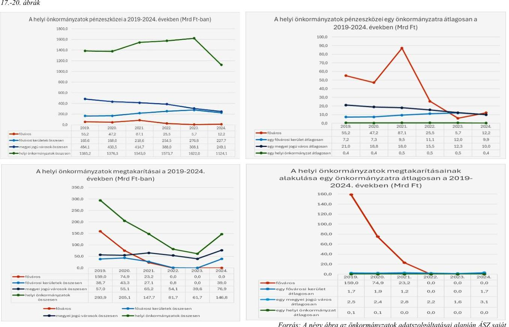

---

# Személyi juttatások és járulékok 

A személyi juttatásokra fordított kiadások alakulásának áttekintése érdekében összevetettük a Fővárosi Önkormányzatnál az egy főre jutó átlagkereset változását a KSH által közzétett, a költségvetési szerveknél teljes munkaidőben alkalmazásban állók bruttó átlagkereset változásával. A két mutató alakulását a következő ábra szemlélteti:
21. ábra

AZ EGY FŐRE JUTÓ BÉR TÍPUSÚ SZEMÉLYI JUTTATÁSOK ÉS A KÖLTSÉGVETÉSI SZERVEKNÉL FOGLALKOZTATOTTAK ÁTLAGKERESETE NÖVEKEDÉSÉNEK ALAKULÁSA (\%)
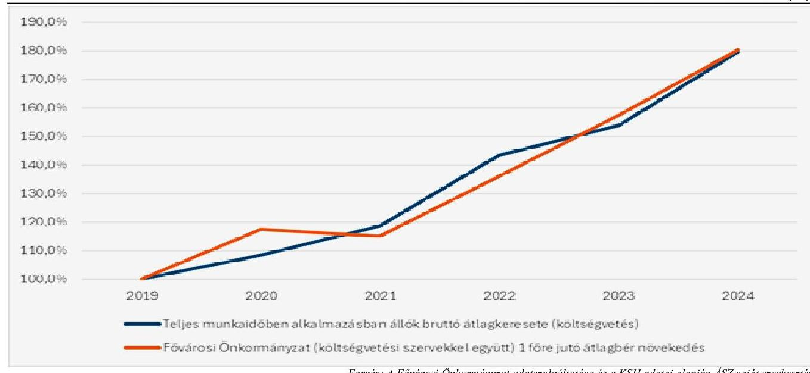

A 2019. évet bázisnak tekintve a 2020. évben a Fővárosi Önkormányzatnál az országos átlagnál magasabb béremelkedés volt, azonban a 2021-2022. években az átlagkereset emelkedése elmaradt az országostól. 2024. évre a költségvetési intézményekben dolgozók átlagkeresetének növekedése a 2019. évhez képest $79,6 \%$ volt, míg a Fővárosi Önkormányzatnál az egy főre jutó átlagkereset $80,2 \%$-kal emelkedett.
A költségvetési intézményekben teljes munkaidőben foglalkoztattok havi átlagkeresete 2019-ben 349088 Ft, a Fővárosi Önkormányzatnál az átlagkereset ennél $0,3 \%$-kal alacsonyabb, 347910 Ft volt. A 2024. évre a Fővárosi Önkormányzatnál az egy főre jutó átlagkereset ( 627004 Ft ) gyakorlatilag megegyezett a költségvetési intézményekben foglalkoztatottak átlagkeresetével ( 627060 Ft ).
A helyi önkormányzatok településtípusait vizsgálva, a Fővárosi Önkormányzatnál voltak a legmagasabbak az 1 főre jutó havi bér jellegű személyi juttatások a 2019-2023. években, tendenciáját tekintve azonban kevésbé növekedett ( $77,1 \%$ ), mint a helyi önkormányzatok egésze ( $91,0 \%$ ) esetében. Így 2024-ben már a fővárosi kerületekben volt a legmagasabb ( 633979 Ft ) az 1 főre jutó havi bér jellegű személyi juttatások összege.
Az 1 főre jutó havi bér jellegű személyi juttatásokat településtípusonként és a helyi önkormányzatok egészére vonatkozóan a következő ábra szemlélteti:

---

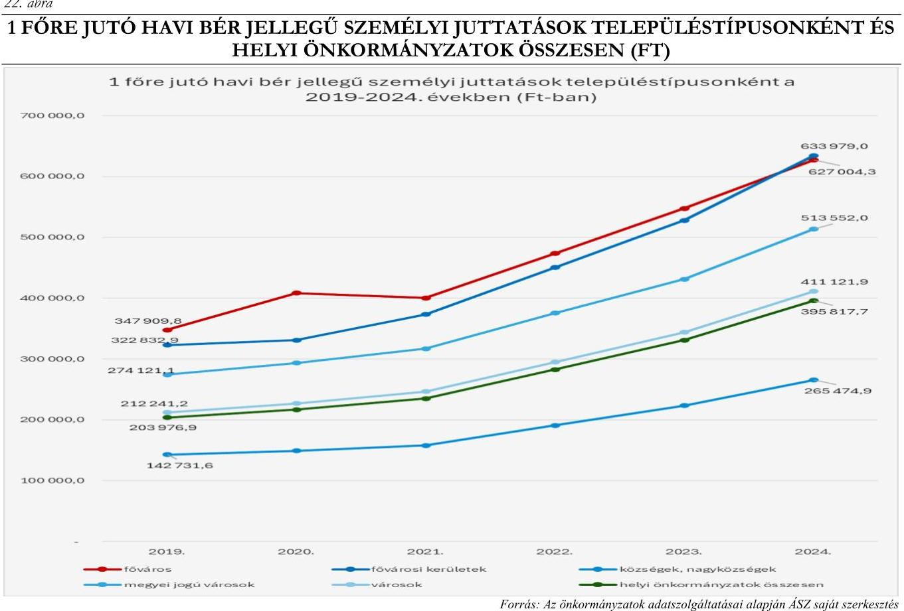

# Dologi kiadások 

A helyi önkormányzatok dologi kiadásai összességében 41,0\%-kal 825,1 Mrd Ft-ról 1163,2 Mrd Ft-ra emelkedtek a 2019. évről a 2024. évre, ezen belül a fővárosi kerületeknél 56,0\% (76,5 Mrd Ft), a megyei jogú városoknál 29,8\% (61,3 Mrd Ft) volt a növekedés. A Fővárosi Önkormányzat dologi kiadásainak $82,4 \%$-os ( 37,8 Mrd Ft) növekedése kiugró a helyi önkormányzatok között, amelyet jellemzően a kamatkiadások növekedése okozott, ugyanis a helyi önkormányzatoknál összesen 21,7 Mrd Ft volt a kamatkiadások növekedése az időszakban, amelynek 62,9\%-a (13,7 Mrd Ft) a Fővárosi Önkormányzatnál keletkezett.

---

23-24. ábra
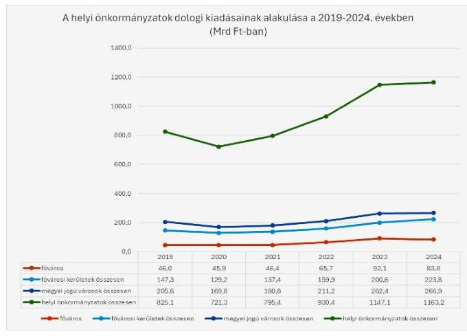
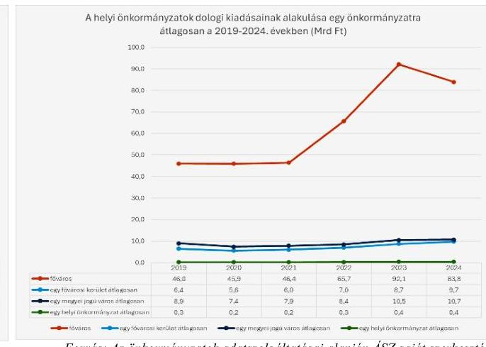

Forrás: Az önkormányzatok adatszolgáltatásai alapján ÁSZ saját szerkesztés
A kamatkiadások alakulására jelentős befolyást gyakorolt a jegybanki alapkamat, illetve a BUBOR alakulása. A Fővárosi Önkormányzat kamatkiadásai és a BUBOR alakulásának összefüggését szemléltetik a következő ábrák:

A BUBOR 2019. elején 0,49\% volt, amely 2022. november elejére 16,43\%-ra, több mint a 33-szorosára emelkedett, 2024. végére fokozatosan 6,41\%-ra csökkent vissza. A Fővárosi Önkormányzat kamatkiadásai a 2019. évi 1,6 Mrd Ft-ról 2023-ra több mint 16-szorosára, 25,7 Mrd Ft-ra emelkedtek, majd a 2024. évben $40,5 \%$-kal 15,3 Mrd Ft-ra csökkentek a 2023. évihez képest.

25-26. ábra
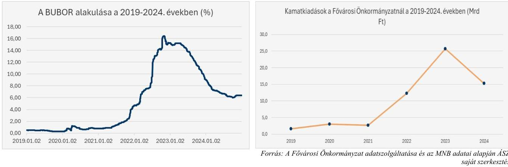

A közüzemi díjak közé a villamosenergia szolgáltatás, a gázenergia szolgáltatás, a távhő, valamint a víz- és csatorna szolgáltatási díjak kiadásai tartoznak. A közüzemi díjak változását a villamosenergia árának változásával vetettük össze. A villamosenergia esetében az egy egységre jutó díjat ábrázoltuk, míg a Fővárosi Önkormányzat esetében a közüzemi díjak alakulását. A két ábrát összevetve azt tapasztaljuk, hogy a közüzemi díjak növekedése és a villamosenergia árváltozás hasonlóan alakult. A Fővárosi Önkormányzat közüzemi díjakra fordított kiadásainak és a villamosenergia árak alakulását a következő ábrák szemléltetik:

---

27-28. ábra
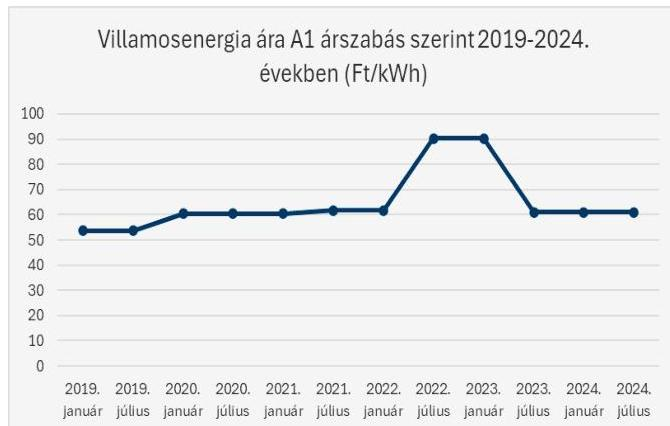

Közüzemidijak alakulása a Fővárosi Önkormányzatnál a 2019-2024. években (Mrd Ft)
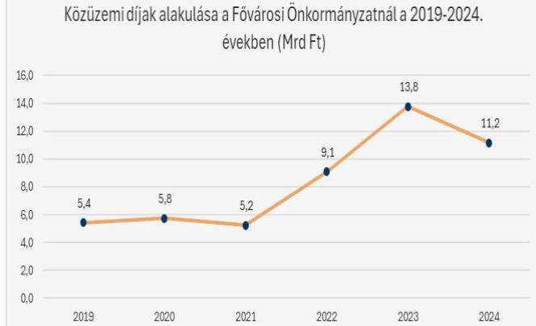

Fonrás: MVM Next Zrt. honlapján közzétett árszabások alapján ÁSZ saját szerkesztés Forrás: A Fővárosi Önkormányzat adatszolgáltatásai alapján ÁSZ saját szerkesztés

A helyi önkormányzatok közüzemi díjai a 2019-2021. évek között egyenletesen alakultak, azonban 2021ről 2023-ra az energia árak növekedése miatt közel 2,5-szeres növekedés tapasztalható. 2024-re 12,3\%-os volt a közüzemi díj kiadások csökkenése a helyi önkormányzatoknál együttesen. A Fővárosi Önkormányzatnál is hasonló tendencia figyelhető meg az időszakban.
A következő ábrák a helyi önkormányzatok közüzemi díjra fordított kiadásainak 2019-2024. évek közötti alakulását mutatják összességében és egy önkormányzatra vetítve:
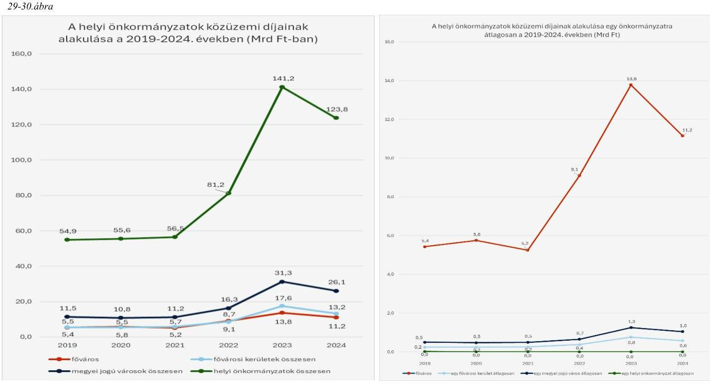

# Egyéb múködési célú kiadások 

A helyi önkormányzatok a 2019. évben összesen 44,5 Mrd Ft szolidaritási hozzájárulást teljesítettek a központi költségvetésnek, amely a 2024. évre közel hétszeresére 304,6 Mrd Ft-ra emelkedett A Fővárosi Önkormányzat esetében a tendencia hasonló volt. A szolidaritási hozzájárulás fizetési kötelezettség a helyi

---

önkormányzatok esetében a 2019. évben a helyi iparűzési adóbevétel 5,6\%-át, a 2024. évben pedig 22,6\%át jelentette. A Fővárosi Önkormányzat iparűzési adóbevételének 6,1\%-át jelentette a szolidaritási hozzájárulás a 2019. évben, amely a 2024. évre 23,4\%-ra emelkedett. A Fővárosi Önkormányzat által teljesített szolidaritási hozzájárulás a helyi önkormányzatok szolidaritási hozzájárulásának megközelítőleg a negyedrészét jelenti a vizsgált években. A növekedés jelentőségét az adja, hogy a helyi iparűzési adóbevétel az önkormányzati feladatok - a Fővárosi Önkormányzatnál elsődlegesen a közösségi közlekedési feladat - ellátásának fedezetéül szolgál. A szolidaritási hozzájárulás és a helyi iparűzési adóbevétel alakulását a Fővárosi Önkormányzatnál és a helyi önkormányzatoknál a következő ábra szemlélteti:

# 31. ábra 

## A SZOLIDARITÁSI HOZZÁJÁRULÁS ÉS A HELYI IPARŰZÉSI ADÓBEVÉTEL A HELYI ÖNKORMÁNYZATOKNÁL ÉS A FŐVÁROSI ÖNKORMÁNYZATNÁL A 2019-2024. ÉVEKBEN (MRD FT-BAN)

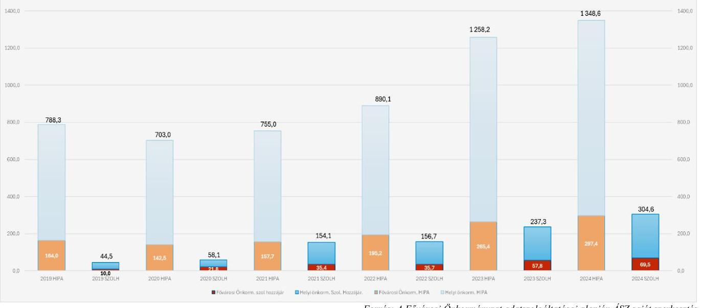

A BKV Zrt.-nél a személyi jellegű ráfordítások 77,7\%-83,1\%-át a bérköltségek tették ki a 2019-2024. években, ezért a közfeladatellátásra adott támogatás nagyságára ez a tényező jelentette a legnagyobb hatást. A következő ábra a BKV Zrt. egy főre jutó bérköltségét, valamint a legalább öt főt foglalkoztató vállalkozásoknál a teljes munkaidőben foglalkoztatottak (országos), illetve a Budapesten teljes munkaidőben alkalmazásban állók bruttó havi átlagkeresetének alakulását szemlélteti:

---

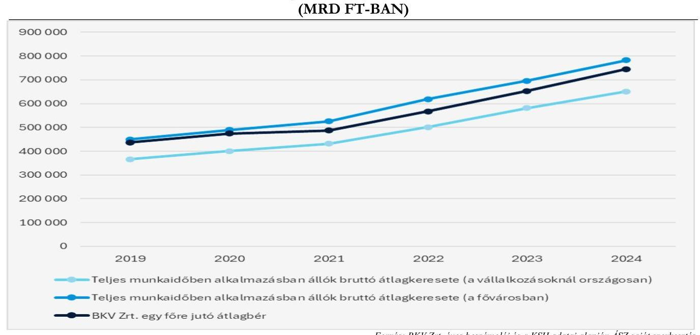

Forrás: BKV Zrt. éves beszámolói és a KSH adatai alapján ÁSZ saját szerkesztés
A BKV Zrt. létszáma a 2019. évi 10341 fơről 2024. évre 10033 fơre csökkent, az egy fơre jutó havi bérköltség 437401 Ft -ról 745706 Ft -ra emelkedett. A BKV Zrt.-nél az egy fơre jutó havi bérköltség a Magyarországon legalább öt főt foglalkoztató vállalkozásnál teljes munkaidőben foglalkoztatottak átlagkereseténél magasabb, a budapesti teljes munkaidőben alkalmazásban állók átlagkereseténél alacsonyabb szinten alakult a teljes időszakban. A 2021. évig a növekedés üteme a BKV Zrt. esetében volt a legalacsonyabb, ezt követően a tendencia a másik két mutatóhoz hasonlóan alakult.
A Fővárosi Önkormányzat többségi tulajdonában lévő gazdasági társaságokat érintő ellenőrzések során az ÁSZ azt tapasztalta, hogy a gazdasági társaságoknál sor került prémiumkifizetésekre a nehéz gazdasági helyzet ellenére.

# Felhalmozási kiadások 

A felhalmozási kiadások a helyi önkormányzatok egészét, a Fővárosi Önkormányzatot és a megyei jogú városokat tekintve hasonlóan alakultak. A Fővárosi kerületek esetében a tendencia ettől eltérő, a 2020. évi visszaesést követően a felhalmozási kiadások a 2024. évig folyamatosan növekedtek.
A következő ábrák a helyi önkormányzatok felhalmozási kiadásainak 2019-2024. évek közötti alakulását mutatják összességében és egy önkormányzatra átlagosan:

---

33-34. ábra
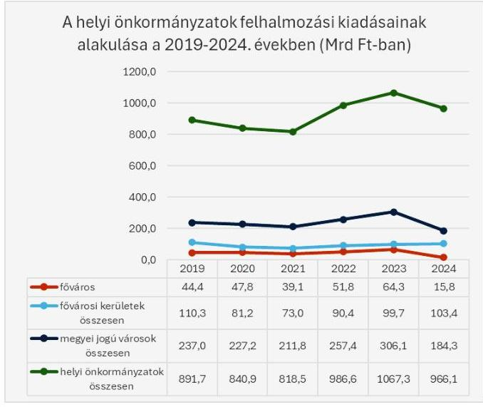

A helyi önkormányzatok felhalmozási kiadásainak alakulása a 2019-2024. években (Mrd Ft-ban)
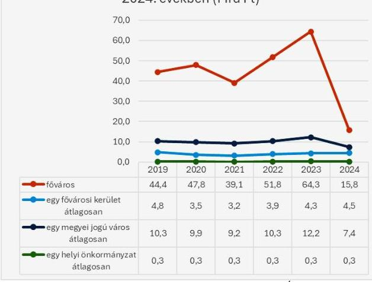

Forrás: Az önkormányzatok adatszolgáltatásai alapján ÁSZ saját szerkesztés

# Költségvetési bevételek 

A költségvetési bevételek a helyi önkormányzatoknál együttesen 37,3\%-kal (1127,7 Mrd Ft-tal) emelkedtek a 2019. évről a 2024. évre. Ezen belül a Fővárosi Önkormányzatnál 58,5\%-kal (158,4 Mrd Fttal), egy fővárosi kerületnél átlagosan $54,9 \%$-kal (10,6 Mrd Ft-tal), míg egy megyei jogú városnál átlagosan $21,4 \%$-kal (6,5 Mrd Ft-tal) emelkedett.
A következő ábrák a helyi önkormányzatok költségvetési bevételeinek 2019-2024. évek közötti alakulását mutatják összességében és egy önkormányzatra átlagosan:
35-36. ábra
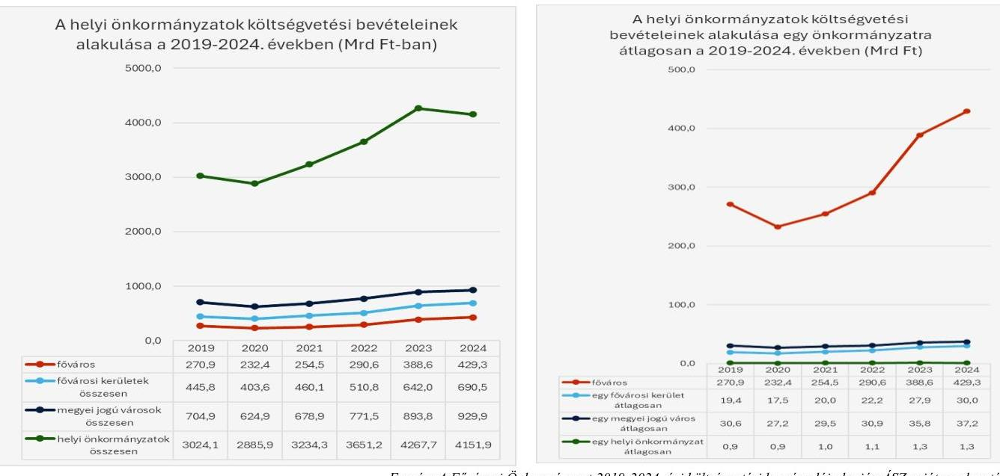

Forrás: A Fővárosi Önkormányzat 2019-2024. évi költségvetési beszámolói alapján ÁSZ saját szerkesztés

---

# FÜGGELÉK: ÉSZREVÉTELEK 

A jelentéstervezetet a Számvevőszék 15 napos észrevételezésre megküldte az ellenőrzött szervezet vezetőjének az ÁSZ tv. 29. §* (1) bekezdése előirásának megfelelően.

A jelentéstervezet megállapításaira a Főpolgármester és a Főjegyző észrevételt tett. Az elfogadott észrevétel alapján a Számvevőszék módosította a jelentést. A függelék tartalmazza az ellenőrzött észrevételeit, illetve az el nem fogadott észrevételek elutasitásának indoklását.

[^0]
[^0]:    * 29. § (1) Az Állami Számvevőszék az ellenőrzési megállapításait megküldi az ellenőrzött szervezet vezetőjének vagy az általa megbízott személynek, és annak, akinek személyes felelősségét állapította meg.
    (2) Az ellenőrzött szervezet vezetője és a felelősként megjelölt személy az ellenőrzés megállapításaira tizenöt napon belül írásban észrevételt tehet.
    (3) Az Állami Számvevőszék az észrevételre a beérkezésétől számított harminc napon belül írásban válaszol. A figyelembe nem vett észrevételeket köteles a jelentésben feltüntetni, és megindokolni, hogy azokat miért nem fogadta el.

---

# BUDAPEST 

Budapest Főváros | Főpolgármestere

## 1000303388828*

Állami Számvevőszék
Windisch László elnök úr részére
1364 Budapest, Pf.: 54.

## 1365 Éva

telefon: +36 13271590
email: tallo.eva@budapest.hu
iht. szám: FPH147 /15 - 56 /2025
hiv. szám: EL-4185-054/2025
tárgy: Jelentéstervezet véleményezése

## Tisztelt Elnök Úr!

2025. augusztus 1-jén kézhez vettem az Állami Számvevőszék a V1136 számú „Budapest Főváros Önkormányzata költségvetési és pénzügyi helyzetének ellenőrzése" című ellenőrzés ellenőrzésről szóló jelentéstervezetét.
A Jelentéstervezethez kapcsolódóan észrevételeimet az alábbiak szerint teszem meg azzal, hogy a 2025.augusztus 27-i zárómegbeszélésen elhangzott és annak jegyzőkönyvében az Állami Számvevőszék által elfogadottként, a jelentéstervezet kiigazítására vonatkozó visszajelzéssel rögzített észrevételeinket itt külön nem ismételjük meg.

## I. Összefoglalás fejezethez kapcsolódóan

## 8. oldal negvedik bekezdés 10. oldal harmadik bekezdés:

"A Fővárosi Önkormányzat a 2024-2025. évben a fizetőképessége megőrzése érdekében jellemzően a likviditási problémák átmeneti kezelését szolgáló intézkedéseket hajtott végre, azonban közfeladatai ellátásának hatékonyabbá tétele, a költségvetési helyzete hosszabb távú kiegyensúlyozottá válása céljából nem tett lényegi lépéseket."

## Észrevétel:

A jelentéstervezetből nem derül ki egyértelműen, hogy milyen típusú lényegi lépéseket kér számon az Állami Számvevőszék Fővárosi Önkormányzaton, ugyanakkor az a 10. oldal 3. bekezdéséből egyértelmű, hogy olyan költségcsökkentő hatású lépések jöhetnének e körben elméletileg szóba, amelyek a közszolgáltatások jelenlegi szintjének lényeges csökkenését, romlását nem eredményezik.
Ahogyan a szolidaritási hozzájárulás, illetve nettó finanszírozás miatt legutóbb benyújtott, az ellenőrzés során rendelkezésre bocsátott keresetünkben is bemutattuk, a közszolgáltatások színvonalának megőrzése már önmagában is csak jelentős költségcsökkentések és hatékonyságnövelő intézkedések révén valósulhatott meg, hiszen valamennyi közfeladatellátó évek óta stagnáló, reálértéken mindenképpen csökkenő mértékű támogatás mellett és jelentős inflációs nyomás alatt kénytelen müködni. Ebből következően a jelenlegi vagyoni és finanszírozási helyzetben további lényeges költségcsökkentési lépések reálisan nem elvárhatóak. Bármilyen további érdemi finanszírozás elvonása az adott közszolgáltatás müködését veszélyeztetné, az ellátása vonatkozásában visszafordíthatatlan károkat okozna.
A zárómegbeszélésen elhangzottak alapján az ellenőrzés példaként említette, hogy ide érti a reorganizációs, a feladatellátás megszervezésének átalakítására vonatkozó lépéseket, ezekkel kapcsolatban azonban az alábbiakat szükséges rögzíteni.

---

A Fővárosi Önkormányzat véleménye alapján a tulajdonában álló gazdasági társaságok vonatkozásában további olyan intézkedés már nem lehetséges, amely reorganizációs intézkedés hatékonyság növelést eredményezne a közfeladatok ellátásában (pl.: a közösségi közlekedés vonatkozásában szigorú EU előírások határozzák meg a feladatok ellátásának módját).
Az önkormányzati gazdálkodás specialitásából adódó összes lehetséges és lényegi intézkedést az önkormányzat 2024-2025. években megtette, és biztosította, hogy az önkormányzat 2024. évben a folyószámlahitel nélkül zárja a költségvetési évet. Biztosította továbbá, hogy az összes közszolgáltatási feladatát zavartalanul ellássa, így többek között az alábbi - a gazdálkodásának specialitásából fakadóan lényegi intézkedésnek minősülő- intézkedéseket tette meg:

1. A költségvetési keretek megtartása érdekében a Fővárosi Önkormányzat folyamatba épített kontroll- és intézkedési mechanizmust épített ki, amelynek keretében a közfeladatot ellátó cégek havi finanszírozási döntésének meghozatalára bevezette a likvid munkacsoportot, ami havi rendszerességgel dönt az érintett cégek likviditási finanszírozásáról. A munkacsoport a havi finanszírozási forrás biztosításáról szóló főpolgármesteri döntés megalapozása érdekében az érintett gazdasági társaságok bevonásával folyamatosan áttekinti a finanszírozási szükségleteket és lehetőségeket, az egyes cégek finanszírozási igényeinek alátámasztottságát és indokoltságát folyamatba építetten vizsgálja, ami egyfelől a keretek érvényesítésével önmagában is intézkedésekre sarkallja az érintett társaságokat, másfelől pedig a jelentősebb tételek évközi, folyamatba épített felülvizsgálata is lehetőséget teremt. A 7. pontban csatolásra kerültek a munkacsoport javaslatai.
2. a költségvetési gazdálkodás során havi szinten megtörténik az előirányzat-felhasználás felülvizsgálatra, monitoringozása, a likvid terv havi szinten kerül egyeztetésre és jóváhagyásra, cégek esetében havi adatszolgáltatást biztosítanak, ahol beszámolnak az elvégzett feladataikról, 2025. májustól gazdasági adatszolgáltatás is rendszeresen megtörténik, ezáltal biztosítva a tulajdonosi kontroll gyakorlását,
3. az intézményi kis kincstári rendszer müködtetésénél havi szinten kerül felülvizsgálatra a költségvetési szervek pénzigénye, 2025. májustól heti adatszolgáltatás is történik a pénzigényre vonatkozóan,
4. Főpolgármester többször élt a felterjesztési jogával, illetve kezdeményezte többlet támogatási igényét a Fővárosnak a Kormánnyal szemben,
5. a saját tulajdonú cégek esetében minden szükséges tulajdonosi döntés, értesítés megtörtént a cégek irányába, hogy hatékonyabban gazdálkodjanak pl.: optimálisabb cégbáló kialakítása, ahol lehetett bevétel optimalizáló intézkedések elrendelése, a takarékos gazdálkodásra felhívó levél kiadása stb., ezeknek a döntéseknek a 2024. évi és 2025. évi gazdálkodásra is hatással bírtak,
6. költségvetési szervek esetében szükséges összevonások a korábbi években megtörténtek, és ezek hatásai a 2024. és a 2025. évi gazdálkodásra is hatással voltak,
7. költségvetési szervekkel havi szintű egyeztetés a gazdálkodási helyzetükre vonatkozóan, költségtakarékosság elrendelése, a gazdálkodás során azon előirányzatok, amelyek kockázatot jelentettek kötött felhasználású előirányzatként történő rögzítése a költségvetési rendeletbe
8. az energia-válság idején a Budapest-modell felállítása és müködtetése 2024. és 2025. Évek beszerzései során is,
9. 2022. szeptemberében felülvizsgálatra került a szociális ágazat térítési díj megállapítási rendelete, és az új számítási módszertannal az érintett költségvetési szervek a 2023. évtől költségvetési gazdálkodás során magasabb bevételt tudtak realizálni folyamatosan, a Fővárosi Növény- és Állatkert vonatkozásában szintén optimalizálásra került a jegyár konstrukció 2023. évben, ami kihatással volt a 2024. és 2025. évi jegyár bevételükre is,
10. A túlzó kormányzati elvonás (szolidaritási hozzájárulás) miatt per indítása a Magyar Államkincstárral szemben, mely perben jelenleg jogvédelem alatt áll a Főváros, így a nyári időszakban 28,9 Mrd Ft-ot tudott biztosítani a közszolgáltatásainak finanszírozására, (ennyi összeget nem vont el az állam a nettósítási eljárás keretében),2025. márciusban a BKK Zrt. 2025. április-2025. szeptember közötti időszakra szóló likviditási hitel- keretének emeléséről szóló előterjesztés elfogadásra került a KGY által,

---

11. 2025. júniusában a Közgyűlés által elfogadásra került a Fővárosi Önkormányzat likviditási hitel keretének emeléséről szóló döntés, a nyári időszakra +20 Mrd Ft folyószámla hitelkeret megemeléssel,
12. 2024. évben tulajdonosi döntés született az agglomerációs megállapodásra vonatkozóan,
13. 2025. június 30-án közgyűlési döntés született, a BKK Zrt. és a BKV Zrt. közötti engedményezési ügyletéhez kapcsolódóan,
14. 2023. decemberétől a szállítói számlák szigorúbb felülvizsgálata a kifizetések előtt, 2025. májustól városvezetői szinten napi likviditási döntések által kerülnek jóváhagyásra a kifizetések,
15. Minden év nyarán a költségvetési rendelet féléves felülvizsgálata történik, melyet az egyensúlyjavító intézkedések dokumentumai tartalmaznak 2024. évre vonatkozóan.
16. A 2025. évben a 2024. évi maradvány jóváhagyásával a szabad maradvány terhére jóváhagyott előirányzat került zárolásra, az erről szóló dokumentumok csatolásra kerültek, továbbá a 2025. évi költségvetési rendelet féléves felülvizsgálata folyamatban van.
17. Módosított és új díjtételek kerültek bevezetésre, amelyek gazdálkodási egyensúly javítását szolgálták; (pl. Temetőfejlesztési koncepció alapján kialakított temetői díjak, parkolási díjaknál, BKK új eseti és napijegy típusú díjtermékek bevezetése, teherforgalmi behajtási díj emelés)
18. Reorganizációs intézkedésként döntés született, hogy 2026. január 01-től a BDK Kft beolvad a BKM Zrt.-be. Továbbá a Budapest Brand Nonprofit Zrt. 2025. 05. 01-től végelszámolás alatt áll, a feladatok a Fővárosi Önkormányzat, a BKK, BMK között kerülnek elosztásra.
A Fővárosi Önkormányzat saját tulajdonú gazdasági társaságai esetében a közszolgáltatások vonatkozásában minden évben az előző évi költségvetési támogatási összeg került megtervezésre, módosítva a béremeléshez szükséges többlet támogatással. 2019-2024. évek között a kummulált átlagos éves ipari infláció mértéke $71,94 \%$-os volt, a minimálbér emelkedés mértéke $81,5 \%$-os, a két érték átlagos értéke $76,72 \%$ volt mindösszesen. A vizsgálat szempontjából kiemelt cégek vonatkozásában a költségvetési támogatás változása 2019. évhez képest mindösszesen 69,2\%-kal emelkedett, amely 7,52\%-kal alacsonyabb finanszírozás volt, mint a makrogazdasági mutatók alapján elvárt finanszírozás (ezzel közel 9,5 Mrd Ft becsült értékủ megtakarítási ért el a közszolgáltatások finanszírozásában). Ez is jól szemlélteti, hogy a városvezetés a kiadások hatékony felhasználását várta el a cégek vezetőitől, a megemelkedett energia, üzemanyag és bérköltségek mellett, így biztosítva a hatékonyság növelő intézkedéseket. Meg kell említeni azt is, hogy a cégeknél a bevételek változásai nem tudták lekövetni az inflációs növekményt. Ezek az intézkedések tényleg nem voltak elegendőek a költségvetési egyensúly teljeskörü biztosításához, viszont az tény, hogy reál értéken csökkent a támogatási összeg, így azonos szolgáltatási szinten kevesebb költséggel látták el a közszolgáltatási feladatokat.

Kérjük a fenti indokok alapján kiegészíteni a jelentés tervezetet azzal, hogy a Fővárosi Önkormányzat minden a hatáskörébe tartozó lényegi intézkedést megtett annak érdekében, hogy a költségvetési egyensúlya biztosított legyen.
8. oldal ötödik bekezdés: "A 2020. évtől folyamatosan romló pénzügyi helyzet kialakulásához a koronavírus-járvány, az energiaár-robbanás és az infláció növekedéséből eredő gazdasági nehézségek mellett hozzájárult a költségvetési befizetési kötelezettségek növekedése is."

Észrevétel: A 2019-2024. éve között történt kifizetés összesen 230,1 Mrd Ft volt. Budapest Főváros Önkormányzata által a 2025. évben teljesítendő önkormányzati szolidaritási hozzájárulás összege az 1/2025. (II. 11.) NGM rendelet szerint 89,1 Mrd Ft, 2024. évről áthúzódó fizetési kötelezettség 6 Mrd Ft, mindösszesen a hét év alatt összesen 325,2 mrd Ft. Ez az összeg nagyságrendekben annyi, mint a 2025.évi eredeti költségvetésben a szolidaritási hozzájárulás nélküli müködési kiadások és az intézményi finanszírozás összege ( 338 Mrd Ft) vagyis az Önkormányzat ezen időszak alatt befizette 1 évi költségvetési müködési kiadási összegét az állam irányába.

---

Kérjük kiegészíteni a pontos összeggel a költségvetési befizetési kötelezettségek növekedésének összegét a hét év alatti időszak vonatkozásában.
8.oldal hatodik bekezdés, 10. oldal második bekezdés, 16. oldal második bekezdés: „17,3 Mrd Ft osztalékbevételt megalapozatlanul szerepeltetett"

# Észrevétel: 

A Fővárosi Önkormányzat 2024. december 18-án elfogadott 2025.évi költségvetési rendeletében a többségi tulajdonú gazdasági társaságok esetében 18,353 Mrd Ft osztalékbevételt tervezett. A gazdasági társaságok a 2025. évre vonatkozó előzetes üzleti tervezése 2024. szeptember 30. napjáig volt esedékes.
Az üzleti tervezés keretében rendelkezésre álló pénzügyi adatok (mérleg, eredménykimutatás) alapján a BGYH, és az FCSM esetében a szabad eredménytartalék terhére történő osztalékkifizetés lehetősége fennállt, míg a BNP esetében a korábbi évek alapján megfizetett, elvárt osztalék került tervezésre. Mellékeljük a BGYH és az FCSM 2024. Üzleti évére előzetesen számított osztalékfizetési korlát maximumának számítását. A közgazdasági megalapozottságot alátámasztó dokumentumok a jelentéstervezethez füződő észrevételünk 1. számú mellékletét képezi.

## Kérjük a megállapítás törlését az észrevételben rögzítettek szerint.

8.oldal hatodik bekezdés, 9. oldal utolsó sor: „Az 51,7 Mrd Ft bevétel nem volt közgazdaságilag megalapozott."

## Észrevétel:

A Kúria Önkormányzati Tanácsának Köf.5.007/2025/9. számú határozata döntésének az indokolása tartalmazza, hogy „A Kúria Önkormányzati Tanácsa a Köm.5.023/2023/5. számú határozatában részletesen kifejtette, s jelen ügy kapcsán is hangsúlyozza, hogy a helyi költségvetési rendelet az adott költségvetési évre várható teljesítendő bevételeket és a jóváhagyott teljesíthető kiadásokat határozza meg tervszámok formájában. A költségvetési gazdálkodás velejárója, hogy a tervszámok évközben változhatnak és változnak is. A saját bevételek, így például a helyi adókból származó bevételek a beszedést követően válnak véglegessé, ahogy a központi költségvetési támogatások végső összegét is számos előre nem látható tényező befolyásolja, nem beszélve az esetlegesen évközben elnyert pályázati forrásokról."

A közgazdasági megalapozottság azt jelenti, hogy egy bevétel, vagy kiadási előirányzat összege mennyire van alátámasztva közgazdasági szempontokkal, a tervezett vagy várt bevétel mennyire tekinthető reálisnak és gazdaságilag indokoltnak. A bevételi előirányzat telesülésének kockázatos volta - ahogyan az Áht.-ban e vonatkozásban azonosan szabályozott állami központi költségvetés esetében is - nem teszik az előirányzatot közgazdaságilag megalapozatlanná, ha minden releváns körülmény együttes figyelembevétele mellett annak teljesülése nem eleve kizárt.

Jelen esetben az 51667218170 Ft összegủ bevétel a 2023. (17 970644147 Ft) és a 2024. (33 696574023 Ft) költségvetési évek során az állami normatíva összegén felül teljesített, a Fővárosi Önkormányzat megítélése szerint jogszerűtlenül elvont szolidaritási hozzájárulás összegével megegyezik, melyeknek jogalapját a bírósági eljárások során vitatjuk és visszafizetését várjuk a központi költségvetésből, és amellyel kapcsolatban az eddigi bírósági, alkotmánybírósági határozatok rendre a Fővárosi Önkormányzat álláspontját támasztották alá. A megalapozottságát az összegnek pontosan az adja, hogy ez az összeg megegyezik az önkormányzat által a normatív állami támogatásként kapott összegen felül befizetett szolidaritási hozzájárulási összegének többletével. Sem a Fővárosi Önkormányzat, sem a központi állami

---

*Költségvetés tervezése során nem azon múlik egy-egy bevételi előirányzat közgazdasági megalapozottsága, hogy arra vonatkozóan már a tervbevételkor végleges és végrehajtható bírósági határozat vagy egyéb végrehajtható okirat rendelkezésre áll. Nyilvánvaló, hogy a tervezés során olyan bevételek tervbevétele is megalapozott, amelyekkel a tervezés időszakában rendelkezésre álló információkkal számolva, ideértve a valamennyi jogalany önkéntes jogkövetésének lehetőségét is, ésszerűen feltételezhető, hogy a tervezési időszakban rendelkezésre fog állni. Mivel a kérdéses tervezett bevétel összegének alapja és ebből következően összegszerűsége is egyértelmű, és mivel az önkormányzati költségvetési rendelet 2024. decemberi elfogadása óta csak olyan bírósági ítélet született, amely a Fővárosi Önkormányzat követelése jogosságát alátámasztja, e bevétel teljesülése koránt sem tekinthető ésszerűtlennek, megalapozatlannak. E vonatkozásban szükséges utalni arra is, hogy a költségvetési tervezés megalapozatlanságát nem alapozza meg, ha a tervszámok nem teljesülésének van bizonyos mértékű kockázata, ez a megközelítés a központi állami költségvetés kapcsán is bevett, abban is rendre szerepelnek olyan előirányzatok, amelyek teljesülése kockázatokat rejt magában.*

*A Köf.5.007/2025/9. számú határozatában maga a Kúria is kimondta, hogy a helyi költségvetési rendelet az adott költségvetési évre várható teljesítendő bevételeket és a jóváhagyott teljesíthető kiadásokat határozza meg tervszámok formájában. A költségvetési gazdálkodás velejárója, hogy a tervszámok évközben változhatnak és változnak is. A saját bevételek, így például a helyi adókból származó bevételek a beszedést követően válnak véglegessé, ahogy a központi költségvetési támogatások végső összegét is számos előre nem látható tényező befolyásolja, nem beszélve az esetlegesen évközben elnyert pályázati forrásokról.*

*Ezen túlmenően a jelentéstervezet figyelmen kívül hagyja azt a tényt, hogy a 2023-as évet érintő ügyben jogerős ítélet állapította meg, hogy az alperes jogellenesen vonta el a felperestől havonta a szolidaritási hozzájárulásból fakadó összegeket, és a 2024. évet érintő perek azonos jogi alapon vitatják a Fővárosi Önkormányzatnak a szolidaritási hozzájárulásból fakadó fizetési kötelezettségét, amiből következően a jogerős ítélet közlését követően alappal lehet számolni a költségvetés módosításakor a vitatott összeg megtérítésével.*

*Kérjük a bevételi előirányzat közgazdaságilag megalapozatlan voltára utaló megállapítások törlését a jelentésből annak rögzítése mellett, hogy a bevétel teljesülése az állami döntések, a folyamatban lévő perek miatt kockázatosnak minősülhet a gazdálkodás szempontjából.*

**10. oldal első bekezdés:** "Az ÁSZ megállapította továbbá, hogy a 2025. évi költségvetés tervezése során az önkormányzati többségi tulajdonú vállalkozástól kapott osztalékbevétel, valamint az államháztartáson kívülre nyújtott egyéb működési célú támogatások előirányzatainak közgazdasági megalapozottsága a jogszabályi előírás ellenére nem volt biztosított. Azaz a Fővárosi Önkormányzat megalapozatlanul számolt osztalékfizetésből származó bevétellel, valamint nem valós összegében vette figyelembe a gazdasági társaságainak fizetendő egyes támogatásokat."

#### *Észrevétel:*

*Az osztalék bevétel 2025. évi megalapozottságának alátámasztását az 1. számú melléklet tartalmazza. Az indokolást a 8. oldal 6. bekezdéshez tartozó észrevétel tartalmazza.*

*Az államháztartáson kívülre nyújtott egyéb működési célú támogatások előirányzatainak közgazdasági megalapozása a cégek által benyújtott üzleti elő tervek és a terv tárgyalások eredményeként történt, amit az ellenőrzés során megküldtünk az ellenőrző szerv részére. A költségvetési egyensúly megtartása miatt a cégeknél, likviditási alapon az előző évivel megegyező mértékű támogatási összeg került megtervezésre a 2025. évre, melyből a finanszírozási igénynek megfelelően a támogatás egy része 2026. január 31-ig kerül kifizetésre. A társaságok azon 2025. évi feladatainak ellátásához szükséges előirányzata, amelyek pénzforgalmi ellentételezésére 2026. január 31-ig kerül sor, a 2026. évi költségvetésben kerül megtervezésre, amelyre a Számvitelről szóló 2000. évi C. törvény 77. §-a szerint van lehetőség:*

---

„(2) Az egyéb bevételek között kell elszámolni:
a) a káreseményekkel kapcsolatosan kapott bevételeket,
b) a kapott bírságok, kötbérek, fekbérek, késedelmi kamatok, behajtási költségátalányok, kártérítések, sérelemdíjak összegét,
c) a behajthatatlannak minősített - és az előző üzleti év(ek)ben hitelezési veszteségként leírt követelésekre kapott összeget,
d) a költségek (a ráfordítások) ellentételezésére - visszafizetési kötelezettség nélkül - belföldi vagy külföldi gazdálkodótól, illetve természetes személytől, valamint államközi szerződés vagy egyéb szerződés alapján külföldi szervezettől kapott támogatás, juttatás összegét,
e) a termékpálya-szabályozáshoz kapcsolódó, terméktanácsok által fizetett termékpálya-szabályozás összegét,
ha az a tárgyévhez vagy a tárgyévet megelőző üzleti év(ek)hez kapcsolódik és azt a mérlegkészítés időpontjáig pénzügyileg rendezték. Az egyéb bevételkénti elszámolásnak nem feltétele a mérlegkészítés időpontjáig történő pénzügyi rendezés, ha külön jogszabály eltérően rendelkezik, illetve a d) pontban foglalt támogatás esetén, ha a támogatási szerződés alapján a mérlegkészítés időpontjáig a támogatással való elszámolás megtörtént."

A cégek esetében a mérlegkészítés időpontja január 31.
A fentiek alapján a Fővárosi Önkormányzat megalapozottan számolt osztalékfizetésből származó bevétellel, valamint valós összegében vette figyelembe a gazdasági társaságainak fizetendő egyes támogatásokat.

A Fővárosi Önkormányzat az Államháztartási törvény 3/A.§ (3) bekezdési előírásának is eleget tett, tekintettel arra, hogy a jogszabályi rendelkezés azt írja elő, hogy a pénzügyi fedezet biztosításáról gondoskodni kell, ennek a Fővárosi Önkormányzat a közszolgáltatási szerződésekben foglaltak alapján gondoskodott, a közszolgáltatási szerződések pedig összhangban vannak a költségvetési rendelettel, a költségvetési rendeletbe tervezett összegek pedig összhangban vannak a cégek által benyújtott üzleti tervekben szereplő likviditási tervekkel.

Kérjük az összefoglalásból törölni, hogy a következő szövegrészt: "az államháztartáson kívülre nyújtott egyéb müködési célú támogatások előirányzatainak közgazdasági megalapozottsága a jogszabályi előírás ellenére nem volt biztosított. Azaz a Fővárosi Önkormányzat megalapozatlanul számolt osztalékfizetésből származó bevétellel, valamint nem valós összegében vette figyelembe a gazdasági társaságainak fizetendő egyes támogatásokat."

---

10. oldal negyedik bekezdés : „Az éves költségvetési beszámoló mérlege a 2023. és a 2024. években jelentős összegű hibát tartalmazott: a Fővárosi Önkormányzat a 2023. évben 18,0 Mrd Ft, a 2024. évben 27,7 Mrd Ft szolidaritási hozzájárulást a jogszabályi előírás ellenére helytelenül a követelés jellegű sajátos elszámolások között mutatott ki az éves költségvetési beszámolójában. Ennek következtében a jogszabályi rendelkezés ellenére nem érvényesült a valódiság számviteli alapelve."

Észrevétel: A 2024. évi követelés jellegű sajátos elszámolásként könyvelt összeg 33,7 Mrd Ft volt.
A Számviteli törvény 15. §. (3): A könyvvitelben rögzített és a beszámolóban szereplő tételeknek a valóságban is megtalálhatóknak, bizonyíthatóknak, kívülállók által is megállapíthatóknak kell lenniük. Értékelésük meg kell, hogy feleljen az e törvényben előírt értékelési elveknek és az azokhoz kapcsolódó értékelési eljárásoknak (a valódiság elve).

Részletek a 2023. évi éves költségvetési beszámoló könyvvizsgálói jelentéséből:
"A könyvvizsgáló véleménye szerint a mellékelt éves költségvetési beszámoló megbízható es valós képet ad az Önkormányzat 2023. évi éves költségvetésének teljesítéséről, az Önkormányzat 2023. december 31-én fennálló vagyoni és pénzügyi helyzetéről, valamint az ezen időponttal végződő költségvetési évre vonatkozó jövedelmi helyzetéről a Magyarországon hatályos, a számvitelről szóló 2000. évi C. törvénnyel (a továbbiakban: számviteli törvény), valamint az államháztartás számviteléről szóló 4/2013. (I. 11.) Korm. rendelettel (a továbbiakban: az államháztartás számviteléről szóló kormányrendelet) összhangban."
"Az Önkormányzatnál a 2023. évi éves költségvetési beszámoló alátámasztására a leltározást az eszközök és források leltározási és leltárkészítési szabályait tartalmazó hatályos normatív utasításokban meghatározottak szerint végezték el. Mennyiségi felvétellel történő leltározásra három évente kerül sor, a 2022. évben történt utoljára mennyiségi leltárfelvétel. Az Önkormányzatnál a 2023. évi leltározását a készpénz esetében mennyiségi felvétellel, az immateriális javak, tárgyi eszközök, készpénzen kívüli pénzeszközök, követelések, kötelezettségek, időbeli elhatárolások esetében egyeztetéssel végezték el, amely alapján a mérleg alátámasztására a leltárt összeállították. Ezáltal érvényesült a számviteli alapelvek közül a valódiság számviteli alapelve."

Részletek a 2024. évi éves költségvetési beszámoló könyvvizsgálói jelentéséből:
"A könyvvizsgáló véleménye szerint a mellékelt éves költségvetési beszámoló megbízható és valós képet ad az Önkormányzat 2024. évi éves költségvetésének teljesítéséről, az Önkormányzat 2024. december 31-én fennálló vagyoni és pénzügyi helyzetéről, valamint az ezen időponttal végződő költségvetési évre vonatkozó jövedelmi helyzetéről a Magyarországon hatályos, a számvitelről szóló 2000. évi C. törvénnyel (a továbbiakban: számviteli törvény), valamint az államháztartás számviteléről szóló 4/2013. (I. 11.) Korm. rendelettel (a továbbiakban: az államháztartás számviteléről szóló kormányrendelet) összhangban."
"Az Önkormányzatnál a 2024. évi éves költségvetési beszámoló alátámasztására a leltározást az eszközök és források leltározási és leltárkészítési szabályait tartalmazó hatályos normatív utasításban meghatározottak szerint végezték el. Mennyiségi felvétellel történő leltározásra három évente kerül sor, a 2022. évben történt utoljára mennyiségi leltárfelvétel. Az Önkormányzatnál a 2024. évi leltározását a készpénz esetében mennyiségi felvétellel, az immateriális javak, tárgyi eszközök, készpénzen kívüli pénzeszközök, követelések, kötelezettségek, időbeli elhatárolások esetében egyeztetéssel végezték el, amely alapján a mérleg alátámasztására a leltárt összeállították. Ezáltal érvényesült a számviteli alapelvek közül a valódiság számviteli alapelve."

A 2023. 12. havi adatszolgáltatások felülvizsgálata tárgyában a MÁK, amely az év végi adatszolgáltatások számviteli szabályoknak való megfelelését kifejezetten ellenőrizte, ennek keretében az alábbi észrevételt tette: „a 01 ürlap 128. sor A helyi önkormányzatok törvényi előiráson alapuló befizetései (K5022) értéke eltér a 2023. évben a nettófinanszírozás keretében érvényesített szolidaritási hozzájárulás összegétől (57 805017 524) javítani szükséges". Erre vonatkozóan válaszlevél került megküldésre (2. számú mellékletként

---

csatoljuk), melyben foglalt tájékoztatást a MÁK elfogadta és az IKJ-ban szereplő adattal azonos tartalmú éves költségvetési beszámolót a jogszabályban foglalt határidőben pénzügyileg jóváhagyta.
Ezzel összhangban a 2024. évi adatszolgáltatásoknál már ilyen tartalmú észrevételt nem is tett a MÁK. A peres eljárások a mérlegkészités időpontjában nem kerültek lezárásra, a kérdéses tételek igy vitatottak voltak.

# A fenti indokok alapján kérjük törölni a jelentéstervezetből a teljes bekezdés törlését. 

10. oldal utolsó bekezdés: "Kockázatot jelent az, hogy a Fővárosi Önkormányzat 2025. július-december havi likviditási tervében szereplő mindkét verzióban kormányzati segítséggel vagy a Fővárosi Önkormányzat számára kedvezőbírósági döntéssel számol. Az „A" verzió szerint a Fővárosi Önkormányzat az év végén megőrzi fizetőképességét, a „B" verzió szerint azonban nem. Utóbbi eset azt jelenti, hogy a folyószámlahitelkeret összege a 10-11. hónapban már nem lesz elegendő a kiadások finanszírozására, és várhatóan az év végét is likvid hitellel fogja zárni a Fővárosi Önkormányzat, amelyhez a Gst. előirása szerint a Kormány hozzájárulása szükséges."

## Észrevétel:

A Gst. elöírásai szerint az alábbi esetekben tudnak az önkormányzatok müködési célú adósságot keletkeztető ügylethez hozzájárulást kérni:
"10/A. §- Az önkormányzat a Kormány elözetes hozzájárulásával kizárólag-1
a) jogerős és végrehajtható birósági határozatban, vagy fizetési meghagyásban foglalt fizetési kötelezettségének teljesitésére, és
b) a központi költségvetésből nyújtott európai uniós vagy más nemzetközi szervezettől elnyert, nem fejlesztési célú pályázata önrészének biztositására köthet naptári éven túli futamidejü müködési célú adósságot keletkeztető ügyletet."

A fentiek alapján kérjük a jelentés tervezetben ezen szakaszának törlését, tekintettel arra, hogy müködési célú hitelt hosszú lejáratra a Fővárosi Önkormányzat nem tud felvenni, mert nem felel meg a Gst.-ben foglalt elöírásoknak. E vonatkozásban szükséges rögzíteni, hogy az 10/A. § a) pontja csak arra az esetre alkalmazható, ha a fizetési kötelezettség közvetlenül valamely ott megjelölt aktusból ered, a Fővárosi Önkormányzat jelenleg ilyen jellegü gazdasági eseménnyel nem rendelkezik és nem is tervezett a cash flow kimutatásaiban.
14. oldal első bekezdés: "A BKM Zrt. nonprofit gazdasági társaságként működik, ennélfogva osztalékot a tulajdonos Fővárosi Önkormányzat számára nem fizet. Emiatt az üzletág értékesítéséből származó bevétel oly módon javíthatná a Fővárosi Önkormányzat likviditási helyzetét, ha a BKM Zrt. a hulladékgazdálkodási üzletág értékesítéséből származó bevételét a közszolgáltatások ellátására fordítaná, ezáltal a Fővárosi Önkormányzat a támogatási összeget csökkenteni tudná. A bevétel müködésre történő felhasználása jóllehet vagyonvesztést eredményezne - rövid távon javíthatná a Fővárosi Önkormányzat likviditási helyzetét. Az ingatlanok vételárának megfizetése és a tervezett projekt megvalósítása további pénzügyi kockázatokat jelent a BKM Zrt. és a Fővárosi Önkormányzat számára."

---

Észrevétel: Az önkormányzati gazdálkodás során nem elegendő rövid távon gazdálkodni, fontos, hogy hosszú távú gazdálkodási perspektívája is legyen az önkormányzatnak és gondos gazdája legyen a vagyonának, és nem köthet olyan jogügyletet, amely vagyonvesztést eredményez, ezért döntött úgy a városvezetés, hogy a BKM Zrt.-nél megképződött eredményt nem feléleti a céggel müködésre, hanem hosszú távú vagyongyarapítást rendel el a cégnél, ezzel is biztosítva a "gondos gazda" szerepét.
A Kormány az érintett ügylethez kapcsolódóan az alábbi hozzájárulási döntéseket hozta meg:

1. 1015/2025. (II. 6.) Korm. határozata a BKM Budapesti Közművek Nonprofit Zártkörűen Müködő Részvénytársaság elővásárlási jogának érvényes gyakorlásához szükséges kormányzati intézkedésekről, amely döntés szerint a Kormány 3. a Magyarország gazdasági stabilitásáról szóló 2011. évi CXCIV. törvény (a továbbiakban: Gst.) 10/E. §-ában foglalt jogkörében eljárva, a Gst. 8. § (2) bekezdés f) pontjában foglaltakra figyelemmel engedélyezi a Társaság számára a szerződés szerinti ügylet megkötését.
2. 1068/2025. (III. 13.) Korm. Határozat önkormányzat adósságot keletkeztető ügyletéhez történő kormányzati hozzájárulásról

Kérjük az észrevételt kiegészíteni a kormányzati döntésekkel, amelyek a projekt megvalósítását támogatják.

# II. A megállapítások fejezethez kapcsolódóan: 

19. oldal 1. és 3. számú megállapítás: "A szolidaritási hozzájárulás költségvetési támogatást meghaladó részét a Fővárosi Önkormányzat a jogszabályi előírások ellenére a 2025. évi költségvetési rendeletében a kiadások között nem tervezte meg. A költségvetési rendelet 2025. július 01-től hatályos módosítása során a szolidaritási hozzájárulás forrását jelentő tervezett bevétel (51,7 Mrd Ft) nem volt közgazdaságilag megalapozott."

Észrevétel: Budapest Főváros Önkormányzata 2025. évi összevont költségvetéséről szóló 29/2024. (XII.31.) önkormányzati rendelete 2024. december 18-án került elfogadásra a Közgyülés által. A rendelet elfogadásával egyidejüleg elfogadásra került Budapest Főváros Önkormányzata 2025. évi összevont költségvetésének ütemezett felülvizsgálatáról szóló 30/2024. (XII. 31.) önkormányzati rendelete.
A rendelet kimondja, hogy a folyamatban levő, a szolidaritási hozzájárulással kapcsolatos perek eredményére, illetve a kormányzattal folytatott tárgyalásokra figyelemmel - legkésőbb 2025. június 30-ig felülvizsgálja, és szükség esetén módosítja a 2025. évi költségvetési rendeletét.
Az előterjesztés elfogadásakor a 2025. évre vonatkozóan nem volt elfogadott központi költségvetési törvény, valamint rendelet, amelyben az államháztartásért felelős miniszter az önkormányzati szolidaritási hozzájárulás önkormányzatonkénti összegét közzé teszi. Az 1/2025. (II.11.) NGM rendelet határozza meg a szolidaritási hozzájárulás összegének mértékét.

Tekintettel a fentiekre az óvatosság elvét szem előtt tartva, továbbá a folyamatban lévő perekre tekintettel a szolidaritási hozzájárulás kiadási összegét a várt állami normatíva bevételi összegével azonos összegben terveztük.

A fentiek alátámasztják, hogy a Fővárosi Önkormányzat a jogszabályi előírásoknak megfelelően tervezte és fogadta el a 2025. évi költségvetését, kérjük az észrevételt ennek megfelelően módosítani.

---

24. oldal harmadik. bekezdés: „Egyik verzióban sem számolt a Fővárosi Önkormányzat azzal, ha a BKV Zrt. 68,1 Mrd Ft támogatás 2026. évre halasztása érdekében nem jön létre a követelés engedményezésre szóló szerződés. Ez a lehetőség jelentősen növelheti a likviditási kockázatot."

# Észrevétel: 

2025. június 30-án hozzájárult a Közgyülés a Budapesti Közlekedési Zrt és a K\&H Faktor Zrt. között megkötendő a Követelésvásárlásra és Engedményezési Szerződés megkötéséhez, és felkérte a Budapesti Közlekedési Zrt. vezető tisztségviselőjét a szerződés aláírására és az ahhoz kapcsolódó, a szerződés mellékletében szereplő jognyilatkozatok megtételére, ami 2025. június 30-án meg is történt.

A Közgyülés a 690/2025.(06.30.) számú határozatával felkérte a főpolgármestert, hogy a Budapest Főváros Önkormányzata Szervezeti és Müködési Szabályzatáról szóló 1/2020. (II. 5.) önkormányzati rendelet 93 § (1) bekezdés 8. pontja szerinti hatáskörében eljárva hozzon döntést arról, hogy
aa) Budapest Főváros Önkormányzata, mint a Budapesti Közlekedési Zrt. egyedüli részvényese a Budapesti Közlekedési Zrt. legfőbb szervének hatáskörében eljárva hozzájárul a Budapesti Közlekedési Zrt és az OTP Bank Nyrt. között megkötendő, legfeljebb 32.500.000.000 forint összegủ követelés vásárlására irányuló szerződés megkötéséhez és az ahhoz kapcsolódó jognyilatkozatok megtételéhez.
ab) Budapest Főváros Önkormányzata mint a BKK Budapesti Közlekedési Központ Zártkörüen Müködő Részvénytársaság egyedüli részvényese a BKK Budapesti Közlekedési Központ Zártkörüen Müködő Részvénytársaság legfőbb szervének hatáskörében eljárva felkérje a BKK Budapesti Közlekedési Központ Zártkörüen Müködő Részvénytársaság vezető tisztségviselőjét az aa) pont szerinti szerződés mellékletében szereplő jognyilatkozatok megtételére, b) Budapest Főváros Önkormányzata hozzájárul az aa) pont szerinti szerződés megkötéséhez szükséges komfortlevél kiadásához, egyben felkéri a főpolgármestert annak aláírására.

Az OTP Bank Nyrt-vel a szerződéskötés folyamatban van.
Ezen események miatt nem került olyan szcenárió pozícionálásra, amely azt a kedvezőtlen eseményt vetíti előre, hogy nem jön létre ez a jogi ügylet, tekintettel arra, hogy a K\&H Faktor Zrt.-vel már létrejött a jogügylet 2025. június 30-án, az OTP Bank Nyrt.-vel pedig folyamatban van a szerződés kötés az ehhez kapcsolódó felhatalmazást a közgyülés megadta.

## A fenti indokok alapján kérjük törölni a bekezdést.

26. oldal utolsó bekezdés: „A Fővárosi Önkormányzat az általa vitatott összegként a szolidaritási hozzájárulás jogcímen történő elvonás és e müködési támogatás különbözetét mutatta ki. Ennek egyenlege a 2023. évben 18,0 Mrd Ft, a 2024. évben 27,7 Mrd Ft, a 2025. évben - a müködési támogatások eredeti előirányzata ( 37,9 Mrd Ft) alapján - 57,2 Mrd Ft."

Észrevétel: szükségesnek tartjuk a fent idézett szöveggel egyezően a 4. ábra kiegészitését a 2025.évi költségvetési adatokkal, annak érdekében, hogy betöltse az ábra a funkcióját, azaz láthatóvá tegye, hogy a 2025. évre a szolidaritási hozzájárulás elvonása a müködési állami támogatások több, mint duplájára, 89,1 Mrd forintra nőtt.

Kérjük a 4. ábra módosítását az észrevételben rögzítettek szerint.

---

30. oldal utolsó mondat: „A Fővárosi Önkormányzat a pénzügyi nehézségek ellenére a 2019-2024. évek mindegyikében fizetett jutalmat, amely összesen 5,5 Mrd Ft kiadást jelentett."

# Eszrevétel: 

A Fővárosi Önkormányzat pontosítást kér a szöveg vonatkozásában, tekintettel arra, hogy ezen kifizetések között költségvetési szervek által kifizetett jutalom található

A fenti indok alapján kérjük kiegészíteni a szöveget azzal, hogy „Fővárosi Önkormányzat (többek között a szociális intézmények, kulturális intézmények, köznevelési intézmények, főpolgármesteri hivatal).
38. oldal harmadik bekezdés: „A 2019. évről a 2024. évre a működési célú bevételek 41,8 Mrd Ft-ről 55,7 Mrd Ft-ra emelkedtek. A működési célú bevételek tartalmazták az önkormányzat által az időszakban nyújtott szolgáltatások ellenértékét ( 63,9 Mrd Ft), a befektetett eszközök és készletek értékesítéséből származó bevételeket 46,0 Mrd Ft), valamint a Fővárosi Önkormányzat tulajdonában álló gazdasági társaságok által befizetett Osztalékbevételt."

Észrevétel: a müködési bevételek 13,9 Mrd Ft-os növekedésének részletezése nem pontosan követhető amiatt, hogy a kiemelt részek összege nagyobb, mint a 2024. évre bekövetkezett változás összege, mely a következők szerint alakult: a készletértékesítések, szolgáltatások értékelése 0,9 Mrd Ft-al, az ellátási díjakból származó bevételek 2 Mrd Ft-al nőttek, az egyéb müködési bevételek (pl.intézményi szolg. díjak, bérleti és lizing díjak, kisértékü tárgyi eszközök értékesítése stb.) 5,3 Mrd Ft-al csökkentek, a tulajdonosi bevételek (tárgyi eszközök hasznosítása, osztalékok) 13,6 Mrd Ft-al, az áfa visszatérülésekből 4,4 Mrd Ft-al nőttek, a kamat és egyéb pénzügyi műveletek bevételebből származó bevételek 1,7 Mrd Ft-al csökkentek.

Kérjük a megállapítás megfelelő módosítását az észrevételben rögzítettek szerint.

## III. Javaslatok fejezethez kapcsolódóan

Főjegyző számára tett 1. számú javaslat: „Intézkedjen annak érdekében, hogy a költségvetés tervezése során az Áht. 4. §. (2) bekezdésében előrírtaknak megfelelően biztosított legyen a tervezett osztalékbevételek közgazdaságilag megalapozottsága, továbbá az, hogy a - szolidaritási hozzájárulás és az állambáztartáson kívülre nyújtott egyéb müködési célú támogatások tekintetében - annyi kiadás kerüljön megtervezésre, amennyi a feladat ellátásához indokoltan szükséges."

## Eszrevétel:

Az osztalék bevétel 2025. évi megalapozottságának alátámasztását az 1. számú melléklet tartalmazza. Az indokolást lásd a 8. oldal 6. bekezdéshez tartozó észrevételnél.

Az állambáztartáson kívülre nyújtott egyéb müködési célú támogatások előirányzatainak közgazdasági megalapozása a cégek által benyújtott üzleti elő tervek és a terv tárgyalások eredményeként történt, amit az ellenőrzés során megküldtünk az ellenőrző szerv részére. A költségvetési egyensúly megtartása miatt a cégeknél, likviditási alapon az előző évivel megegyező mértékü támogatási összeg került megtervezésre a 2025. évre, melyből a finanszírozási igénynek megfelelően a támogatás egy része 2026. január 31-ig kerül kifizetésre. A társaságok azon 2025. évi feladatainak ellátásához szükséges előirányzata, amelyek pénzforgalmi ellentételezésére 2026. január 31-ig kerül sor, a 2026. évi költségvetésben kerül megtervezésre, amelyre a Számvitelről szóló 2000. évi C. törvény 77. §-a szerint van lehetőség:
„(2)- Az egyéb bevételek között kell elszámolni:
a) a káreseményekkel kapcsolatosan kapott bevételeket.

---

b) a kapott bírságok, kötbérek, fekbérek, késedelmi kamatok, behajtási költségátalányok, kártérítések, sérelemdíjak összegét,
c) a behajthatatlannak minősített - és az előző üzleti év(ek)ben hitelezési veszteségként leírt követelésekre kapott összeget,
d) a költségek (a ráfordítások) ellentételezésére - visszafizetési kötelezettség nélkül - belföldi vagy külföldi gazdálkodótól, illetve természetes személytől, valamint államközi szerződés vagy egyéb szerződés alapján külföldi szervezettől kapott támogatás, juttatás összegét,
e) a termékpálya-szabályozáshoz kapcsolódó, terméktanácsok által fizetett termékpálya-szabályozás összegét,
ha az a tárgyévhez vagy a tárgyévet megelőző üzleti év(ek)hez kapcsolódik és azt a mérlegkészítés időpontjáig pénzügyileg rendezték. Az egyéb bevételkénti elszámolásnak nem feltétele a mérlegkészítés időpontjáig történő pénzügyi rendezés, ha külön jogszabály eltérően rendelkezik, illetve a d) pontban foglalt támogatás esetén, ha a támogatási szerződés alapján a mérlegkészítés időpontjáig a támogatással való elszámolás megtörtént."

A cégek esetében a mérlegkészítés időpontja január 31.
A fentiek alapján a Fővárosi Önkormányzat megalapozottan számolt osztalékfizetésből származó bevétellel, valamint valós összegében vette figyelembe a gazdasági társaságainak fizetendő egyes támogatásokat.
A Fővárosi Önkormányzat az Államháztartási törvény 3/A.§ (3) bekezdési előírásának is eleget tett, tekintettel arra, hogy a jogszabályi rendelkezés azt írja elő, hogy a pénzügyi fedezet biztositásáról gondoskodni kell, ennek a Fővárosi Önkormányzat a közszolgáltatási szerződésekben foglaltak alapján gondoskodott, a közszolgáltatási szerződések pedig összhangban vannak a költségvetési rendelettel, a költségvetési rendeletbe tervezett összegek pedig összhangban vannak a cégek által benyújtott üzleti tervekben szereplő likviditási tervekkel.

# A megállapítást fenti indokok alapján kérjük törölni. 

Föjegyző számára tett 2. számú javaslat: „Intézkedjen a Bkr. 29 3. §-a szerinti felelőssége körében annak érdekében, hogy a szolidaritási hozzájárulás elszámolása az Áhsz. 15. mellékletben előírtak alapján a költségvetési kiadások között, a K5022 „A helyi önkormányzatok törvényi előíráson alapuló befizetései" rovaton történjen."

Észrevétel: Áhsz. 1. §. (1) bekezdés: 9. végleges kötelezettségvállalás, más fizetési kötelezettség: az a pénzértékben kifejezett, jogszabályból, jogerős bírói ítéletből, végleges hatósági határozatból, szerződésből - ideértve az átvállalt kötelezettségeket is - jogszerűen eredő elismert tartozás, amely kifizetésének feltételeit a másik fél már teljesítette, ilyennek minősül különösen a számfejtett személyi juttatás, a teljesítésigazolással ellátott számlázott termékértékesitésért vagy szolgáltatásnyújtásért fizetendő ellenérték, valamint a felvett hitelek, kölcsönök, kapott visszatérítendő támogatások, kölcsönök visszafizetendő összege és annak kamatai.

Föjegyző számára tett 3. számú javaslat: „Intézkedjen a 353/2011. (XII. 30.) Korm. rendelet 5. § (2) bekezdésében előírt határidőig adósságot keletkeztető ügylet megkötésére vonatkozó, Kormány hozzájárulása iránti kérelem benyújtásáról, amennyiben a Fővárosi Önkormányzat folyamatosan aktualizált 2025. évi likviditási terve alapján a folyószámlahitel visszafizetésére a naptári éven belül előreláthatóan nem kerül sor."

Észrevétel: A Gst. előírásai szerint az alábbi esetekben tudnak az önkormányzatok müködési célú adósságot keletkeztető ügylethez hozzájárulást kérni:
"10/A. §- Az önkormányzat a Kormány előzetes hozzájárulásával kizárólag-

---

a) jogerős és végrehajtható bírósági határozatban, vagy fizetési meghagyásban foglalt fizetési kötelezettségének teljesitésére, és
b) a központi költségvetésből nyújtott európai uniós vagy más nemzetközi szervezettől elnyert, nem fejlesztési célú pályázata önrészének biztosítására köthet naptári éven túli futamidejű müködési célú adósságot keletkeztető ügyleter."

# Kérjük a megállapítást törölni ebben a formában, mert jogszabályi előirásokba ütközik. 

Kérem Tisztelt Elnök urat a fent megfogalmazott észrevételeim áttekintésére és a Jelentésben történő átvezetésre.

Kelt Budapesten, a minősített elektronikus aláírásba foglalt időbélyegző szerinti időpontban
Tisztelettel:
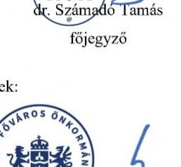

Láttam és egyetértek:
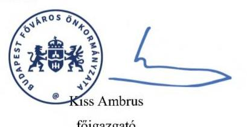

Kas Ambrus
főigazgató
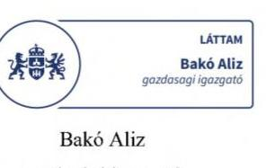

Bakó Aliz
gazdasági igazgató

## Mellékletek:

1. 2024. évi osztalék tervezés megalapozottságát alátámasztó dokumentumok
2. Magyar Államkincstár részére küldött FPH039/10-11/2024 iktatószámú levél a 2023. évi beszámoló felülvizsgálatához

---

# Karácsony Gergely Szilveszter 

Főpolgármester
Budapest Főváros Önkormányzata

## Dr. Számadó Tamás

Főjegyző
Budapest Főváros Főpolgármesteri Hivatal

## Budapest

Tárgy: Válaszlevél ellenőrzéssel kapcsolatos észrevételek kezeléséről

## Tisztelt Főpolgármester Úr! Tisztelt Főjegyzö Úr!

„Budapest Föváros Önkormányzata költségvetési és pénzügyi belyzetének ellenörzése" című ellenőrzéssel kapcsolatos, 2025. augusztus 29-i keltezésű észrevételét köszönettel megkaptam.

Az Állami Számvevőszék (továbbiakban: ÁSZ) észrevételekre vonatkozó álláspontjáról az alábbi tájékoztatást adom:

1. Főpolgármester úr és Főjegyző úr észrevételt tett a jelentéstervezet Összefoglalás fejezet 8. oldal 4. bekezdésében szereplő következő megállapításra: „A Fövárosi Önkormányzat a 20242025. évben a fizetőképessége megőrzése érdekében jellemzően a likviditási problémák átmeneti kezelését szolgált intézkedéseket bajtott végre, azonban közfeladatai ellátásának batékonyabbá tétele, a költségvetési belyzete bosszabb tárol kiegyensúlyozottá válása céljából nem tett lényegi lépéseket. ", valamint a 10. oldal 3. bekezdésében szereplő következő megállapításra: „A Fövárosi Önkormányzat pénzügyi belyzetének javitására tett intézkedései nem voltak elégségesek a költségvetési egyensúly belyreállitásához. A Fövárosi Önkormányzat olyan lényegi intézkedéseket nem jelölt meg, amely a közfeladatai azonos szolgáltatási szinten, de alacsonyabb költséggel történő, batékonyabb ellátását szolgálták."
Főpolgármester úr és Főjegyző úr észrevételében többek között jelezte, hogy „a közszolgáltatások szinvonalának megörzése már önmagában is jelentős költségcsökkentések és batékonyságnövelö intézkedések révén valósulbatott meg. ", ,, a jelenlegi vagyoni és finanszirozási belyzetben továbbé lényeges költségcsökkentési lépések reálisan nem elvárbatóak. Bármilyen további érdemi finanszirozás elvonása az adott közszolgáltatás müködését reszélyeztetné, az ellátása vonatkozásában

---

visszefordíthatatlan károkat okozna." Az észrevétel szerint a Fővárosi Önkormányzat a 20242025. évben az összes lehetséges és lényegi intézkedést megtette és biztosította a közfeladatok ellátását. Az észrevétel tartalmazza a megtett intézkedések felsorolását, továbbá tájékoztatást ad arról is, hogy a városvezetés hatékony gazdálkodást várt el a gazdasági társaságok vezetőitől.
Főpolgármester úr és Főjegyző úr észrevételében felsorolt intézkedések közül a 2024. és 2025. évben tett intézkedések jellemzően a likviditási helyzet rövid távú javítására irányulnak, az észrevételben felsorolt intézkedések között a közfeladatok ellátása módjának, rendszerének hosszabb távú hatékonyabbá tétele érdekében a 2024-2025. évben megtett intézkedés nem szerepel. Főpolgármester úr és Főjegyző úr az észrevételében egyetért azzal, hogy a felsorolt intézkedések valóban nem voltak elegendőek a költségvetési egyensúly teljeskörü biztosításához.
Az egyértelműség érdekében a jelentéstervezet 8. oldal 4. bekezdés 1. mondatát a következők szerint pontosítjuk:
„A Fővárosi Önkormányzat a 2024-2025. évben a fizetőképessége megérzése érdekében jellemzöen a likviditási problémák átmeneti kezelsét szoláali intézkedéseket bajtott rége, azonban közfeladatát ellátása módjának, rendszerének hatékonyabbá tétele, a költségvetési belyzete busszabb távú kiegyensúlyozottá válása céljából nem tett lényegi lépéseket."
2. A jelentéstervezet Összefoglalás fejezet 8. oldal 5. bekezdés első mondata tartalmazza azt, hogy "A 2020. évtől folyamatosan romló pénzügyi belyzet kialakulásához a koronavírus-járvány, az energiaár-robbanás és az infláció növekedéséből eredő gazdasági nebézzégek mellett hozzájárult a költségvetési befizetési kötelezettségek növekedése is."
Főpolgármester úr és Főjegyző úr kérte a mondat kiegészítését a költségvetési befizetési kötelezettségek hét év alatti növekedésének pontos összegével.
Tájékoztatom Főpolgármester urat és Főjegyző urat, hogy az Összefoglalás fejezet 8. oldal 5. bekezdése a pénzügyi helyzetet befolyásoló egyéb tényezőket (pl. közüzemi díjakra fordított kiadások, kamatkiadások) sem tartalmazza számszerúsítve, ezért az észrevételben hivatkozott mondat kiegészítése a költségvetési befizetési kötelezettségek hét év alatti növekedésének pontos összegével nem indokolt.
3. A jelentéstervezet Összefoglalás fejezet 8. oldal 6. bekezdése, 10. oldal 1. bekezdése és a Megállapítások fejezet 16. oldal 1-2. bekezdése tartalmazza azt, hogy a 2025. évi költségvetés tervezése során 17,3 Mrd Ft osztalékbevétel tervezése közgazdaságilag nem volt megalapozott.
Főpolgármester úr és Főjegyző úr észrevételében kérte a megállapítás törlését, arra hivatkozva, hogy a 2025. évre vonatkozó, 2024. szeptember 30-ig esedékes előzetes üzleti tervezés keretében rendelkezésre álló pénzügyi adatok (mérleg, eredménykimutatás) alapján a BGYH Zrt., és az FCSM Zrt. esetében a szabad eredménytartalék terhére történő osztalékkifizetés lehetősége fennállt. Az észrevételhez mellékelték továbbá a 2024. üzleti évre előzetesen számított osztalékfizetési korlát maximumának számítását, amely a BGYH Zrt. esetében 14,9 Mrd Ft, az FCSM Zrt. esetében 13,1 Mrd Ft volt.
Tájékoztatom Főpolgármester urat és Főjegyző urat arról, hogy az osztalékfizetési korlát számítása még nem alapozza meg osztalékbevétel 2025. évi költségvetésben tervezett összegét, amely a két társaságot érintően összesen 17,3 Mrd Ft volt. Az ellenőrzés részére megküldött dokumentum és a helyszíni ellenőrzés során felvett jegyzőkönyv szerint vezetői

---

döntés alapján került megtervezésre a BGYH Zrt.-től 5,3 Mrd Ft, az FCSM Zrt.-től 12,0 Mrd Ft elvárt osztalékbevétel, azonban e vezetői döntést írásban nem dokumentálták. Fentiekre tekintettel a megállapítás helytálló, annak törlése nem indokolt.
4. A jelentéstervezet Összefoglalás fejezet 8. oldal 6. bekezdése, 9. oldal utolsó mondata, valamint a Megállapítások fejezet 19. oldal 3. bekezdése tartalmazza azt, hogy a 2025. évi költségvetés júniusi módosítása során a 2025. évi szolidaritási hozzájárulás forrásaként szerepeltetett 51,7 Mrd Ft bevétel nem volt közgazdaságilag megalapozott.
Főpolgármester úr és Főjegyző úr észrevételében kérte a bevételi előirányzat közgazdaságilag megalapozatlan voltára utaló megállapítások törlését annak rögzítése mellett, hogy a bevétel teljesülése az állami döntések, a folyamatban lévő perek miatt kockázatosnak minősülhet a gazdálkodás szempontjából.
Az Áht. 4. § (2) bekezdése szerint a tervezés során biztosítani kell a tervezett bevételek közgazdasági megalapozottságát. Az Áht. 5. § (3) bekezdése azt mondja ki, hogy a költségvetési bevételi előirányzatok a költségvetési bevételek beszedésének kötelezettségét jelentik.
A költségvetési rendelet módosítása során tervezett 51,7 Mrd Ft bevétel pénzügyi realitása bizonytalan. A tervezett bevétel a 2023. és 2024. években az állami normatív támogatás összegén felül teljesített szolidaritási hozzájárulás összegével egyezik meg. A Fővárosi Önkormányzat vitatja ezeknek az összegeknek a jogosságát, ezért pereket indított. A Fővárosi Önkormányzat a bevétel megalapozottsága mellett azzal érvel, hogy a 2023. évet érintően jogerős ítélet állapította meg, hogy a szolidaritási hozzájárulás elvonása jogellenesen történt. A jogerős ítélet azonban azt is kimondta, hogy a szolidaritási hozzájárulást a Magyar Államkincstár nem köteles visszafizetni. Ezért az észrevételben hivatkozott ítélet a bevétel 2025. évi teljesülését nem alapozza meg. Tekintettel továbbá arra, hogy a 2023. évre és a 2024. évre vonatkozó peres eljárások a 2025. évben várhatóan nem zárulnak le, és azok kimenetele is bizonytalan, így a perek alapján bevétel teljesülése a 2025. évben nem várható, azaz a bevételek beszedésének kötelezettsége nem teljesül.

A 2025. évi költségvetési rendelet módosítása során tervezett 51,7 Mrd Ft ,,2023. és 2024. évi szolidaritási hozzájárulás kártéritésböl származó bevetel" a 2025. évi szolidaritási hozzájárulás költségvetési támogatást meghaladó részének (51,2 Mrd Ft) forrásaként került a költségvetésbe tervezésre. A szolidaritási hozzájáruláshoz kapcsolódó perekben a 2023. és 2024. évek, illetve a 2025. év tekintetében várhatóan azonos döntés születik. Ennek következtében a tervezett bevétel és a tervezett kiadás együttesen nem teljesülhet.
Az 51,7 Mrd Ft bevétel tervezése során ugyanakkor a Fővárosi Önkormányzat nem vette figyelembe azt, hogy a 2023. és 2024. évekre vonatkozó, az állami normatív támogatást meghaladó, megfizetett szolidaritási hozzájárulást - helytelenül - nem a kiadások között rögzítette a könyveiben, hanem a követelés jellegủ elszámolások között. Amennyiben a bíróság úgy dönt, hogy a Fővárosi Önkormányzatnak a megfizetett szolidaritási hozzájárulás visszajár, azt a folyósításkor a követelés jellegủ sajátos elszámolások között nyilvántartott összeggel szemben kell elszámolnia, az nem bevételként fog a könyvekben megjelenni.
A fentiekre tekintettel az ÁSZ megállapítása megalapozott, annak módosítása nem indokolt.
5. A jelentéstervezet Összefoglalás fejezet 10. oldal 1. bekezdése tartalmazza azt, hogy az államháztartáson kívülre nyújtott egyéb müködési célú támogatások előirányzatainak

---

közgazdasági megalapozottsága a jogszabályi előírás ellenére nem volt biztosított, mivel a Fővárosi Önkormányzat nem valós összegében vette figyelembe a gazdasági társaságainak fizetendő egyes támogatásokat.
Főpolgármester úr és Főjegyző úr észrevételében jelezte, hogy az államháztartáson kívülre nyújtott egyéb múködési célú támogatások előirányzatainak közgazdasági megalapozása a cégek által benyújtott üzleti előtervek és a tervtárgyalások eredményeként történt. A költségvetési egyensúly megtartása miatt a cégeknél, likviditási alapon az előző évivel megegyező mértékű támogatási összeg került megtervezésre a 2025. évre, melyből a finanszírozási igénynek megfelelően a támogatás egy része 2026. január 31-ig kerül kifizetésre. A társaságok azon 2025. évi feladatainak ellátásához szükséges előirányzata, amelyek pénzforgalmi ellentételezésére 2026. január 31-ig kerül sor, a 2026. évi költségvetésben kerül megtervezésre, amelyre a számvitelről szóló 2000. évi C. törvény 77. §-a szerint van lehetőség. Főpolgármester úr és Főjegyző úr észrevételében azt is jelezte, hogy a Fővárosi Önkormányzat az államháztartásról szóló 2011. évi CXCV. törvény 3/A. § (3) bekezdés előírásának is eleget tett, tekintettel arra, hogy a jogszabályi rendelkezés azt írja elő, hogy a pénzügyi fedezet biztosításáról gondoskodni kell, ennek a Fővárosi Önkormányzat a közszolgáltatási szerződésekben foglaltak alapján gondoskodott, a közszolgáltatási szerződések pedig összhangban vannak a költségvetési rendelettel, a költségvetési rendeletbe tervezett összegek pedig összhangban vannak a cégek által benyújtott üzleti tervekben szereplő likviditási tervekkel.
A Főpolgármester úr és Főjegyző úr a fentiek alapján kéri törölni az Összefoglalás fejezetből államháztartáson kívülre nyújtott egyéb múködési célú támogatások előirányzatainak közgazdasági megalapozottságára vonatkozó szövegrészt.
A költségvetés tervezés időszakában (2024. év végén) a gazdasági társaságok 2025. évi üzleti tervei, így likviditási tervei, valamint a 2025. évi közszolgáltatási szerződések nem álltak rendelkezésre, mivel azok 2025-ben kerültek kialakításra. Ezért a költségvetés tervezésnél nem jelentettek megalapozó dokumentumot.
A 2025. évi költségvetésben tervezett eredeti előirányzat a gazdasági társaságok üzleti előtervében szereplő támogatási összeg tervtárgyalások során módosított értékével azonos összegű támogatást tartalmaz (összesen: 194,2 Mrd Ft). A tervezési dokumentumok szerint ugyanakkor a tervezett 194,2 Mrd Ft előirányzat tartalmazza a gazdasági társaságok számára 2024. évben ki nem fizetett támogatási összeg előirányzatát is (59,6 Mrd Ft). Így a tervezett eredeti előirányzat 59,6 Mrd Ft-tal kevesebb összeget tartalmaz, mint a 2024. évi elmaradt támogatás és a 2025. évi tervtárgyalások alapján megállapított támogatás együttes összege. A Fővárosi Önkormányzat a különbözetként jelentkező működési támogatás összegét a 2026. évi költségvetése terhére a 2026. évben tervezi kifizetni.
Az Mötv. 111. § (2) bekezdése szerint a helyi önkormányzat gazdálkodásának alapja az éves költségvetése. Ebből finanszírozza és látja el törvényben meghatározott kötelező, valamint a kötelező feladatai ellátását nem veszélyeztető önként vállalt feladatait. A (3) bekezdés szerint a (2) bekezdés szerinti feladatok ellátásának forrásait és kiadásait a helyi önkormányzat költségvetési rendelete elkülönítetten tartalmazza. A (4) bekezdés szerint múködési hiány a költségvetési rendeletben nem tervezhető.
Az Áht. 4. § (1) bekezdése szerint a költségvetési év megegyezik a naptári évvel. Az Áht. 4.§ (2) bekezdés kimondja, hogy a tervezés során biztosítani kell a tervezett bevételek közgazdasági megalapozottságát, és azt, hogy csak annyi kiadás kerüljön megtervezésre, amennyi a közfeladatok ellátásához szükséges.

---

A Fővárosi Önkormányzat 2025. évi költségvetése tartalmazza a közfeladatok ellátásának 2025. évi forrásait jelentő bevételeket (költségvetési támogatás, iparűzési adóbevétel stb.), ugyanakkor nem tartalmazza a közfeladatok 2025. évi ellátásához szükséges kiadásokat teljes mértékben. Ezáltal nem érvényesülnek az Mótv. és az Áht. fent bemutatott előírásai. A kiadások pénzügyi finanszírozása áttolódhat a 2026. évre, azonban annak forrását a 2025. évi költségvetésnek (maradvány) kell biztosítania.
Mindezek alapján az ÁSZ megállapítása helytálló.
Ezen túlmenően a kiadások 2026. évi költségvetés terhére történő kifizetése nagymértékű kockázatot jelent a 2026. évi költségvetés végrehajthatóságára.
Tekintettel arra, hogy a jogszabályi előírás kizárólag a bevételek tekintetében alkalmazza a „közgazdaságilag megalapozott" kifejezést, az észrevételezett mondatot az alábbiak szerint pontosítottuk: „... az állambáztartáson kivólre nyújtott egvéb müködési célú támogatások esetében az indokoltan szükséges kiadás megtervezése a jogszabályi elörás ellenére nem volt biztositott."
6. Főpolgármester úr és Főjegyző úr kéri törölni a jelentéstervezet Összefoglalás fejezet 10. oldal 4. bekezdésében szereplő következő megállapítást: „Az éves költségvetési beszámoló mérlege a 2023. és a 2024. években jelentős összegü bibát tartalmazott: a Fővárosi Önkormányzat a 2023. évben 18,0 Mrd Ft, a 2024. évben 27,7 Mrd Ft szolidaritási bozzájárulást a jogszabályi elörás ellenére belytelenül a követelés jellegü sajátos elszámolások között mutatott ki az éves költségvetési beszámolójában. Ennek következtében a jogszabályi rendelkezés ellenére nem érvényesült a valódiság számviteli alapelve."
Az észrevétel szerint a könyvvizsgáló a 2023. és a 2024. évi költségvetési beszámolókat hitelesítő záradékkal látta el, illetve a Magyar Államkincstár a 2023. és a 2024. évi adatszolgáltatásokat pénzügyileg jóváhagyta. Az észrevételben jelezték továbbá, hogy a 2024. évben a követelés jellegű sajátos elszámolásként könyvelt összeg 33,7 Mrd Ft volt.

Az Áhsz. 15. melléklete egyértelműen rögzíti azt, hogy a helyi önkormányzatoknak a szolidaritási hozzájárulás jogcímen teljesített befizetéseit a K5022 „A helyi önkormányzatok törvényi előíráson alapuló befizetései" tovaton kell elszámolni. A Fővárosi Önkormányzat a 2023-2024. években összesen 51,7 Mrd Ft szolidaritási hozzájárulást - mivel annak jogszerűségét nem ismerte el - követelés jellegű sajátos elszámolásként az adott előlegeken belül a „Túlfizetések, téves és visszajáró kifizetések" között számolt el. A követelés jellegű sajátos elszámolásokon belül az adott előlegek között elszámolható tételeket az Áhsz. 48. § (8) bekezdés a) pontja sorolja fel. A felsorolás az el nem ismert kifizetéseket nem tartalmazza.
A 2024. évi követelés jellegű sajátos elszámolásként könyvelt összegből 27,7 Mrd Ft volt a szolidaritási hozzájárulás jogcímen 2024. évben teljesített befizetés, mivel a 2024. december havi szolidaritási hozzájárulás ( $6,0 \mathrm{MrdFt}$ ) az azonnali jogvédelem miatt nem került befizetésre a 2024. évben, annak teljesítése átterhelődött a 2025. évre.
Fentiekre tekintettel az ÁSZ megállapítása helytálló, annak törlése, illetve az összeg módosítása nem indokolt.
7. A jelentéstervezet Összefoglalás fejezet 10. oldal utolsó bekezdése tartalmazza a következő megállapítást "Kockázatot jelent az, bogy a Fővárosi Önkormányzat 2025. július-december havi likviditási tervében szereplő mindkét verzioban kormányzati segitséggel vagy a Fővárosi Önkormányzat számára kedvezöbérósági döntéssel számol. Az „A" verzió szerint a Fővárosi Önkormányzat az év végén megörzi fizetőképességét, a „B" verzió szerint azonban nem. Utóbbi eset azt jelenti, bogy a

---

folyószámlabitelkeret összege a 10-11. bónapban már nem lesz elegendö a kiadások finanszirozására, és várbatóan az év végét is likvid bitellel fogja zárni a Fövárosi Önkormányzat, amelybez a Gst. elöirása szerint a Kormány bozzájárulása szükséges."
Főpolgármester úr és Főjegyző úr észrevételében kéri a jelentéstervezet ezen szakaszának törlését, tekintettel arra, hogy működési célú hitelt hosszú lejáratra a Fővárosi Önkormányzat nem tud felvenni, mert az nem felel meg a Gst.-ben foglalt előírásoknak. Észrevételében jelezte, hogy a Gst. 10/A. § a) pontja csak arra az esetre alkalmazható, ha a fizetési kötelezettség közvetlenül valamely ott megjelölt aktusból ered, a Fővárosi Önkormányzat jelenleg ilyen jellegű gazdasági eseménnyel nem rendelkezik és nem is tervezett a cash flow kimutatásaiban.
Az észrevétel alapján a jelentéstervezetben szereplő megállapításból törlésre került az „amelyhez a Gst. elöirása szerint a Kormány bozzájárulása szükséges" szövegrész.
8. Főpolgármester úr és Főjegyző úr az Összefoglalás fejezet 14. oldal első bekezdésében szereplő megállapításhoz tett észrevételében kifejtette, hogy „az önkormányzati gazdálkodás során nem elegendő rövid távon gazdálkodni, fontos, hogy bosszú távú gazdálkodási perspektívája is legyen az önkormányzatnak és gondos gazdája legyen a vagyonának, és nem köthet olyan jogügyletet, amely vagyonvesztési eredményez, ezért döntött úgy a városvezetés, hogy a BKM Zrt.-nél megközzödött eredményt nem feletteti a céggel müködésre, hanem bosszú távú vagyongvarapitást rendel el a cégnél, ezzel is biztositva a "gondos gazda" szerepet.".
Főpolgármester úr és Főjegyző úr észrevételében a megállapítást nem vitatja, annak kiegészítését kéri azon kormányzati döntésekkel ${ }^{1}$, amelyek a Rákosrendezői projekt megvalósítását támogatják.
Köszönöm Főpolgármester úr és Főjegyző úr tájékoztatását a városvezetés Rákosrendezői projekttel kapcsolatos álláspontjáról, azonban a jelentéstervezet kiegészítése az észrevételében hivatkozott kormányhatározatokkal nem indokolt.
9. Főpolgármester úr és Főjegyző úr a jelentéstervezet 19. oldal 1.3. számú megállapításához tett észrevételében jelezte, hogy Budapest Főváros Önkormányzata 2025. évi összevont költségvetéséről szóló 29/2024. (XII. 31.) önkormányzati rendelet elfogadásakor a 2025. évre vonatkozóan nem volt elfogadott központi költségvetési törvény, valamint rendelet, amelyben az államháztartásért felelős miniszter az önkormányzati szolidaritási hozzájárulás önkormányzatonkénti összegét közzé teszi, ezért az óvatosság elvét szem előtt tartva, továbbá a folyamatban lévő perekre tekintettel a szolidaritási hozzájárulás kiadási összegét a várt állami normatíva bevételi összegével azonos összegben tervezték meg.
Tekintettel arra, hogy Budapest Főváros Önkormányzata 2025. évi összevont költségvetéséről szóló 29/2024. (XII. 31.) rendeletének elfogadásakor, 2025. december 18án nem volt elfogadott központi költségvetési törvény, a jelentéstervezet megállapítását a következők szerint pontosítjuk: „A szolidaritási hozzájárulás költségvetési támogatást meghaladó részét a Fővárosi Önkormányzat a 2025. évi költségvetési rendeletében a kiadások között nem tervezte meg."

[^0]
[^0]:    ${ }^{1}$ 1015/2025. (II. 6.) Korm. határozat a BKM Budapesti Közművek Nonprofit Zárıkötűen Működő Rézevénytársaság elővásárlási jogának érvényes gyakorlásához szükséges kormányzati intézkedésekről, 1068/2025. (III. 13.) Korm. határozat önkormányzat adósságot keletkeztető ügyletéhez történő kormányzati hozzájárulásról

---

10. Főpolgármester úr és Főjegyző úr észrevételt tett a jelentéstervezet 24. oldal 3. bekezdésében szereplő következő megállapításra: „Egyik verzióban sem számolt a Fövárosi Önkormányzat azzal, ha a BKV Zrt. 68,1 Mrd Ft támogatás 2026. évre balasztása érdekében nem jön létre a követelés engedményezésre szóló szerzödés. Ez a lehetőség jelentősen növelheti a likviditási kockázatot."
Főpolgármester úr és Főjegyző úr észrevételében jelezte, hogy azért nem került olyan szcenárió pozícionálásra, amely azt a kedvezőtlen eseményt vetíti előre, hogy nem jön létre ez a jogi ügylet, mert a K\&H Faktor Zrt.-vel már létrejött a jogügylet 2025. június 30 -án, az OTP Bank Nyrt.-vel pedig folyamatban van a szerződéskötés, az ehhez kapcsolódó felhatalmazást a közgyűlés megadta.
A fentiekre tekintettel kérte Főpolgármester úr és Főjegyző úr a megállapítás törlését.
Az észrevételben adott tájékoztatás alapján a jelentéstervezetből a bekezdés törlésre kerül.
11. Főpolgármester úr és Főjegyző úr kérte a jelentéstervezet 26. oldal utolsó bekezdésével összhangban a 4. ábra kiegészítését a 2025. évi költségvetési adatokkal, annak érdekében, hogy látható legyen az, hogy a 2025. évre a szolidaritási hozzájárulás elvonása a müködési állami támogatások több, mint duplájára, $89,1 \mathrm{Mrd}$ Ft-ra nőtt.
Az ÁSZ a 4. ábrát kiegészítette 2025. évi költségvetési támogatás eredeti előirányzata ( $37,9 \mathrm{MrdFt}$ ) és a Fővárosi Önkormányzatot terhelő szolidaritási hozzájárulás ( $89,1 \mathrm{MrdFt}$ ) összegével.
12. A jelentéstervezet 30. oldal utolsó mondata tartalmazza, hogy „A Fövárosi Önkormányzat a pénzügyi nebézzégek ellenére a 2019-2024. évek mindegyikében fizetett jutalmat, amely összesen 5,5 Mrd Ft kiadást jelentett.".
Főpolgármester úr és Főjegyző úr észrevételében a megállapítást nem vitatja, annak kiegészítésére tesz szövegszerű javaslatot tekintettel arra, hogy ezen kifizetések között költségvetési szervek által kifizetett jutalom található.
Az észrevétel alapján a jelentéstervezetben szereplő megállapítást a következők szerint módosítottuk: „A Fövárosi Önkormányzat (többek között szociális-, kulturális- és köznevelési intézmények, a Főpolgármesteri Hivatal) a pénzügyi nebézzégek ellenére a 2019-2024. évek mindegyikében fizetett jutalmat, amely összesen 5,5 Mrd Ft kiadást jelentett.".
13. Főpolgármester úr és Főjegyző úr a jelentéstervezet 38. oldal 3. bekezdéséhez tett észrevételében jelezte, a működési bevételek 13,9 Mrd Ft-os növekedésének részletezése nem pontosan követhető.
Az egyértelműség érdekében az ÁSZ a megállapítást az alábbiak szerint pontosította: „A 2019. évvöl a 2024. évre a müködési bevételek 41,8 Mrd Ft-röl 55,7 Mrd Ft-ra emelkedtek, arányuk a költségvetési bevételeken belül az idöszakban 11,6\%-17,5\% között mozgott. A müködési bevételekből a Fövárosi Önkormányzatnak a 2019-2024. években összesen 259,1 Mrd Ft bevétele keletkezett, amely tartalmazza többek között az önkormányzat által az idöszakban nyújtott szolgáltatások ellenértékét (63,9 Mrd Ft), az általános forgalmi adó bevételek (41,0 Mrd Ft), az ellátási díjakat (30,5 Mrd Ft), az önkormányzati vagyon üzemeltetéséből származó bevételeket (36,1 Mrd Ft), a kamatbevételeket (21,6 Mrd Ft) a készletek értékesitéséből származó bevételeket (13,0 Mrd Ft), valamint a Fövárosi Önkormányzat tulajdonában álló gazdasági társaságok által befizetett osztalékberételt (17,9 Mrd Ft)."
14. Főjegyző részére tett 1. javaslat: „Intézkedjen annak érdekében, hogy a költségvetés tervezése során az Abt. 4. § (2) bekezdésében elö̈rtaknak megfelelően biztositott legyen a tervezett osztalékbevételek

---

# Függelék: Észrevételek 

közzazdaságj megalapozuttsága, torábbá az, hogy - a szolidaritási hozzájárulás és az állambáztartáson kivülre nyújtott egyéb müküdési célú támogatások tekintetében - annyi kiadás kerïljün megtervezésre, amennyi a feladat elilátásához indokoltan szükséges."
Főpolgármester úr és Főjegyző úr az észrevételben kérte a javaslat törlését.
Tekintettel arra, hogy a 3., 5. és 9. pontokban szereplő indoklások alapján a jelentéstervezet javaslatot megalapozó megállapításai helytállóak, a javaslat törlése nem indokolt.
15. Főjegyzö részére tett 2. javaslat: „Intézkedjen a Bkr. 3. §-a szerinti fellelössége körében annak érdekeben, hogy a szolidaritási hozzájárulás elszámolása az Absz. 13. mellékésében elöirtak alapján a költségeetési kiadások között, a K5022 „A helyi önkormányzatok törvényi elöiráson alapuló befizetései" roveton történjen."
Főpolgármester úr és Főjegyző úr észrevételében kérte a javaslat törlését a végleges kötelezettségvállalás, más fizetési kötelezettség Áhsz. 1. § (1) bekezdés 9. pontjában meghatározott definíciója alapján: „az a pénzértékben kifejezzett, jugszabályból, jugerös birüi ittéletböl, végleges batúsági határozatból, szerzödésböl - ideértve az átvallalt kötelezettségeket is - jugszerüen eredő elismert tartozás, amely kifizetésének feltételeit a másik fél már teljesitette, ilyennek minösül különösen a számfejtett személyi juttatás, a teljesitésigazolással ellátott számlázutt termékértékesitésért vagy szulgáltatásnyújtásért fizetendő ellenérték, valamint a felvett bitelek, kölcsönök, kapott visszatérítendő támogatások, kölcsönök visszajizetendő összege és annak kamatai."
Tekintettel arra, hogy a 6. pontban szereplő indoklás alapján a jelentéstervezet javaslatot megalapozó megállapítása helytálló, a javaslat törlése nem indokolt.
16. Főjegyző részére tett 3. javaslat: „Intézkedjen a 353/2011. (XII. 30.) Korm. rendelet 5. § (2) bekezdésében elöirt határidőig adósságot keletkeztető ügylet megkötésére vonatkozó, Kormány hozzájárulása iránti kérelem benyújtásáról, amennyiben a Fővárosi Önkormányzat folyamatosan aktualizált 2025. évi lékviditási terve alapján a folyósámlabitel visszajizetésére a naptári éren belül elöreláthatúan nem kerül sor."
Főpolgármester úr és Főjegyző úr észrevételében kérte a javaslat törlését arra hivatkozva, hogy kizárólag a Gst. 10/A. §-ában elöírt esetekben tudnak az önkormányzatok müködési célú adósságot keletkeztető ügylethez hozzájárulást kérni a Kormánytól.
Az ÁSZ a javaslatot törölte, tekintettel arra, hogy a javaslatot megalapozó, bizonytalan jövőbeli események bekövetkezése nem garantálható, illetve a jövőbeli tényhelyzetet számos egyéb körülmény előre nem látható módon befolyásolhatja.

Tájékoztatom Főpolgármester urat és Főjegyző urat, hogy a számvevőszéki jelentésben a figyelembe nem vett észrevételt szerepeltetjük az elutasítás indokának feltüntetésével.

Budapest, 2025. szeptember 111
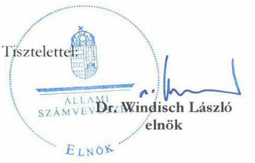

---

# RÖVIDÍTÉSEK JEGYZÉKE 

${ }^{1}$ Fővárosi Önkormányzat
${ }^{2}$ 2025. évi költségvetési rendelet
${ }^{3}$ ÁSZ tv.
${ }^{4}$ ÁSZ
${ }^{5}$ Áht.
${ }^{6}$ Kincstár
${ }^{7}$ BKK Zrt.
${ }^{8}$ BKV Zrt.
${ }^{9}$ BKM Zrt
${ }^{10}$ BDK Kft.
${ }^{11}$ FCSM Zrt.
${ }^{12}$ Főpolgármesteri Hivatal
${ }^{13}$ Mótv.
${ }^{14}$ Munka Törvénykönyve
${ }^{15}$ Kormány
${ }^{16}$ BUBOR
${ }^{17}$ BGYH Zrt.
${ }^{18}$ BNP Zrt.
${ }^{19}$ Számv. tv.
${ }^{20}$ 2025. évi éves szerződés
${ }^{21}$ 2025. évi Kvtv.
${ }^{22}$ 1/2025. (II. 11.) NGM rendelet
${ }^{23}$ 21/2025. (VI. 30.) önkormányzati rendelet
${ }^{24}$ 22/2025. (VI. 30.) önkormányzati rendelet
${ }^{25}$ BSK Kft.
${ }^{26}$ Gst.
${ }^{27}$ Áhsz.
${ }^{28}$ EIB hitel
${ }^{29}$ Bkr.
${ }^{30}$ 267/2024. (IX. 10.) Korm. rendelet
${ }^{31}$ 30/2024. (XII. 31.) önkormányzati rendelet
${ }^{32}$ 15/2020. (VI. 11.) főpolármesteri utasítás

Budapest Főváros Önkormányzata
Budapest Főváros Önkormányzata Közgyűlésének 29/2024. (XII. 31.) önkormányzati rendelete Budapest Főváros Önkormányzata 2025. évi összevont költségvetéséről az Állami Számvevőszékről szóló 2011. évi LXVI. törvény (hatályos: 2011. július 1-jétől) Állami Számvevőszék
2011. évi CXCV. törvény az államháztartásról

Magyar Államkincstár
BKK Budapesti Közlekedési Központ Zártkörűen Müködő Részvénytársaság
Budapesti Közlekedési Zártkörűen Müködő Részvénytársaság
BKM Budapesti Közművek Nonprofit Zártkörűen Müködő Részvénytársaság
BDK Budapesti Dísz- és Közvilágítási Nonprofit BDK Budapesti Dísz- és
Közvilágítási Nonprofit
Fővárosi Csatornázási Művek Zártkörűen Müködő Részvénytársaság
Budapest Főváros Főpolgármesteri Hivatal
2011. évi CLXXXIX. törvény Magyarország helyi önkormányzatairól
2012. évi I. törvény a munka törvénykönyvéről

Magyarország Kormánya
Budapesti Bankközi Forint Hitelkamatláb
Budapest Gyógyfürdői és Hévizei Zártkörűen Müködő Részvénytársaság
Budapesti Nagybani Piac Zártkörűen Müködő Részvénytársaság
2000. évi C. törvény a számvitelről

A Budapest Közút Zrt. és a Budapest Főváros Önkormányzata között megkötött 2025. évi éves szerződés (alárva: 2025. április 2.)
2024. évi XC. törvény Magyarország 2025. évi központi költségvetéséről
a települési önkormányzatok által 2025. évben teljesítendő önkormányzati szolidaritási hozzájárulás összegéről
Budapest Főváros Önkormányzata Közgyűlésének 21/2025. (VI. 30.) önkormányzati rendelete a Budapest Főváros Önkormányzata 2025. évi összevont költségvetéséről szóló 29/2024. (XII. 31.) önkormányzati rendelet módosításáról
Budapest Főváros Önkormányzata Közgyűlésének 22/2025. (VI. 30.) önkormányzati rendelete a Budapest Főváros Önkormányzata 2025. évi összevont költségvetéséről szóló 29/2024. (XII. 31.) önkormányzati rendelet ütemezett felülvizsgálatáról
Budapesti Sportszolgáltató Központ Nonprofit Korlátolt Felelősségű Társaság
2011. évi CXCIV. törvény Magyarország gazdasági stabilitásáról
4/2013. (I. 11.) Korm. rendelet az államháztartás számviteléről
Az Európai Beruházási Bank és Budapest Főváros Önkormányzata által 2015. december 29-én kötött, többször módosított két finanszírozási szerződés, amely összesen 300 millió euró hitel nyújtásáról szól.
370/2011. (XII. 31.) Korm. rendelet a költségvetési szervek belső kontrollrendszeréről és belső ellenőrzéséről
267/2024. (IX. 10.) Korm. rendelet egyes államháztartási szabályok veszélyhelyzet ideje alatti eltérő alkalmazásáról
Budapest Főváros Önkormányzata Közgyűlésének 30/2024. (XII. 31.) önkormányzati rendelete Budapest Főváros Önkormányzata 2025. évi összevont költségvetésének ütemezett felülvizsgálatáról
Budapest Főváros Önkormányzata Főpolgármestere 15/2020. (VI. 11.) utasítása a Budapest Főváros Önkormányzata közfeladatai ellátására létrehozott gazdasági társaságok havi finanszírozására vonatkozó döntések előkészítésének eljárásrendjéről

---

1052 Budapest, Apáczai Csere János u. 10. | 1364 Budapest 4., Pf. 54
www.asz.hu | szamvevoszek@asz.hu
telefon: +36 14849100