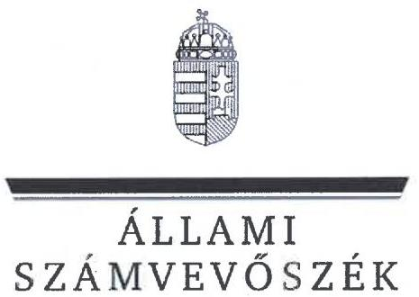
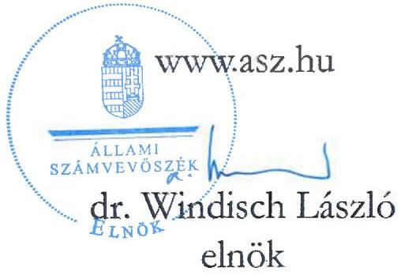
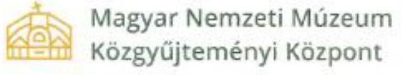
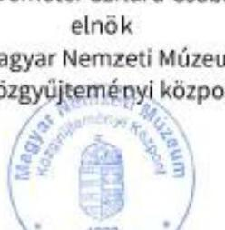
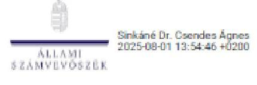
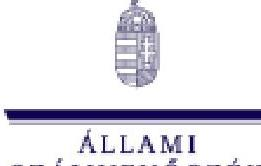

# JELENTÉS 

## Az országos múzeumok kulturális javakkal történő gazdálkodásának ellenőrzése

Magyar Nemzeti Múzeum

2025.

---

ÁLLAMI
SZÁMVEVŐSZÉK

# JELENTÉS 

## Az országos múzeumok kulturális javakkal történő gazdálkodásának ellenőrzése

## Magyar Nemzeti Múzeum

2025.

25097

---

# ELLENŐRZÉSI IGAZGATÓSÁG: 

## ELLENŐRZÉSI IGAZGATÓSÁG I.

## ELLENŐRZÉSI IGAZGATÓ:

SINKÁNÉ DR. CSENDES ÁGNES ellenőrzési igazgató

## ELLENŐRZÉSVEZETŐ:

RENKÓ ZSUZSANNA ellenőrzésvezető

Jelentéseink az interneten a www.asz.hu címen olvashatók.

IKTATÓSZÁM: EL-4073-003/2025
TÉMASORSZÁM: -
ELLENŐRZÉS-AZONOSÍTÓ SZÁM: V-106502

---

# TARTALOMJEGYZÉK 

AZ ELLENŐRZÉS ALAPADATAI ..... 5
AZ ELLENŐRZÖTT SZERVEZET ..... 8
ÖSSZEFOGLALÁS ..... 15
AZ ELLENŐRZÉS FÓKUSZTERÜLETEI ..... 19
MEGÁLLAPÍTÁSOK ..... 20
JAVASLATOK ..... 33
MELLÉKLETEK ..... 35
I. sz. melléklet: Értelmező szótár ..... 35
II. sz. melléklet: Az ellenőrzött szervezetek jegyzéke ..... 38
III. sz. melléklet: Ellenőrzési kritériumok ..... 39
IV. sz. melléklet Vétel révén történt gyűjteménygyarapítás mintatételei ..... 40
V. sz. melléklet Ajándékozás révén történt gyűjteménygyarapítás mintatételei ..... 41
VI. sz. melléklet Kölcsönzéshez kapcsolódó mintatételek ..... 42
VII. sz. melléklet Gyűjteményeknél végrehajtott revíziók dátumai ..... 43
FÜGGELÉK: ÉSZREVÉTELEK ..... 45
RÖVIDÍTÉSEK JEGYZÉKE. ..... 55

---

.

---

# AZ ELLENŐRZÉS ALAPADATAI 

## AZ ELLENŐRZÉS CÉLJA

Az ellenőrzés célja annak értékelése volt, hogy az országos múzeum szakmai besorolású muzeális intézménynél a kulturális javak vétel és ajándékozás révén történő gyűjteménygyarapításának, valamint a selejtezési és kölcsönadási tevékenységek belső szabályozása és gyakorlatban történő alkalmazása megfelelt-e a jogszabályi és egyéb ágazati előírásoknak.

Az ellenőrzés célja volt továbbá a gyarapítások célszerűségének vizsgálata a gyűjteménygyarapításra vonatkozó stratégiák, az éves tervek és az elvégzett tevékenységekről készített beszámolók, teljesítményértékelések összhangjának elemzésén keresztül, valamint az ezekhez kapcsolódó fenntartói és ágazati feladatellátás értékelése figyelemmel a szakfelügyeleti ellenőrzésekre.

## AZ ELLENŐRZÉS TÍPUSA

Kombinált ellenőrzés.

## AZ ELLENŐRZÖTT IDŐSZAK

A gyűjteménygyarapítás, a selejtezés, a kölcsönadás, a kapcsolódó nyilvántartások és a tevékenységek szabályozottságának ellenőrzése, valamint a gyűjteménygyarapítás célszerűségi vizsgálata tekintetében 2019. január 1-jétől 2024. évben az adatbekérő levél aláírását megelőző értéknapig (2024. május 13.) terjedő időszak.

A gyűjteménygyarapításra vonatkozó stratégiák, az éves tervek, valamint a tevékenységről készített beszámolók összhangjának elemzése, a kapcsolódó fenntartói feladatellátás és az ágazati irányítás értékelése tekintetében 2019. január 1-jétől 2023. december 31-ig terjedő időszak.

## AZ ELLENŐRZÉS TÁRGYA

A Magyar Nemzeti Múzeumnál:

- A gyűjteménygyarapítási tevékenységgel (adásvétel, ajándékozás útján bekerült kulturális javak) és a selejtezéssel, a kölcsönadással kapcsolatos belső szabályok megalkotása.
- A gyűjteménygyarapításhoz kapcsolódó feladatok elvégzése, szakmai, számviteli nyilvántartások vezetése.
- A kulturális javak kölcsönadásával, valamint selejtezésével és ezek nyilvántartásával kapcsolatos dokumentumok rendelkezésre állása.
- Küldetésnyilatkozat, stratégiai, állományvédelmi, gyűjteménygyarapítási és revíziós tervek, a digitalizációs stratégiák, az éves szakmai munkatervek, az elvégzett tevékenységekről készített éves szakmai munkajelentések, éves számviteli beszámolók, fejlesztési és beruházási tervek, teljesítményértékelések rendelkezésre állása.

---

KIM ${ }^{1}$-nél, mint fenntartónál:

- Intézményi alapító okiratok, működési engedélyek, szervezeti és működési szabályzatok felülvizsgálatával, jóváhagyásával, engedélyezésével kapcsolatos feladatok elvégzése.
- Küldetésnyilatkozat, stratégiai, állományvédelmi, gyűjteménygyarapítási és revíziós tervek, digitalizációs stratégiák, éves szakmai munkatervek, az elvégzett tevékenységekről készített éves szakmai munkajelentések, éves számviteli beszámolók, fejlesztési és beruházási tervek, teljesítményértékelések felülvizsgálatával, jóváhagyásával kapcsolatos dokumentumok rendelkezésre állása.
- Irányítószervi/fenntartói ellenőrzések elvégzése.

KIM-nél, mint ágazati irányítónál:

- Stratégia kialakítása.
- Szakfelügyeleti ellenőrzések elvégzése.

Az ellenőrzés kiterjedt minden olyan körülményre és adatra, amely az ÁSZ ${ }^{2}$ jogszabályban meghatározott feladatainak teljesítéséhez, valamint a program végrehajtása folyamán felmerült újabb összefüggések feltárásához szükséges volt.

# AZ ELLENŐRZÉS JOGALAPJA 

Az ellenőrzés jogszabályi alapját az ÁSZ tv. ${ }^{3} 1 . \S$ (3) bekezdés, 5. § (2)-(3) bekezdés, (4) bekezdés a) pontjának, valamint az Áht. ${ }^{4} 61 . \S$ (2) bekezdésének előírásai képezték.

## AZ ELLENŐRZÉS MÓDSZERE

Az ellenőrzést törvényességi, célszerűségi szempontok, valamint a nemzetközi standardokat irányadónak tekintve az ellenőrzési program szempontjai, az ellenőrzött időszakban hatályos jogszabályok, az ellenőrzés szakmai szabályok és módszertanok figyelembevételével végezte az ÁSZ.

Az ellenőrzési kérdések megválaszolásához szükséges bizonyítékok megszerzése az ellenőrzött szervezetek által rendelkezésre bocsátott dokumentumokra és adatokra alapozva, továbbá megfigyelés, szemle (szemrevételezés), kérdésfeltevés (információkérés), valamint elemző eljárás útján történt.

Mintavétellel a vétel (mintatételek az IV. sz. mellékletben) és ajándék (mintatételek az V. sz. mellékletben) révén történő gyűjteménygyarapítás, a kölcsönadási (mintatételek a VI. sz. mellékletben) tevékenységek kerültek ellenőrzésre, kockázati szempontok szerinti kiválasztással. A vételi tételek esetében az MNM által tanúsítványban megadott és kontrollált sokaságból 23 db szerződést választott ki és értékelt az ÁSZ, amely az ellenőrzött időszakban vásárlással szerzeményezett tételek összértékének 88,7 %-át tette ki. Az ÁSZ az ajándékozással szerzeményezett tételek közül hat db szerződést, míg az ellenőrzött időszakban lebonyolított kölcsönadások közül 10 ügyletet választott ki és értékelt. A kiválasztott mintatételek kiértékelésének eredménye nem került kivetítésre a teljes sokaságra, a megállapítások az adott ellenőrzött mintatételek vonatkozásában kerültek megjelenítésre. A revíziós tevékenységek a VII. sz. mellékletben kerültek bemutatásra.

---

Az ellenőrzési bizonyítékként felhasználható adatforrások közé tartoztak egyrészt az ellenőrzéshez kért dokumentumok, adatforrások, másrészt adatforrás volt még minden az ellenőrzés folyamán feltárt, az ellenőrzés szempontjából információkat tartalmazó dokumentum.

Az ellenőrzés lefolytatásához az ellenőrzött szervezet a tanúsítványok kitöltésével, valamint az ÁSZ által kért dokumentumok, adatok, információk megküldésével és az ellenőrzés során szolgáltatott adatokat.

---

# AZ ELLENŐRZÖTT SZERVEZET 

Az MNM ${ }^{5}$-et 1802-ben alapították. Az alapítója gróf Széchényi Ferenc jelentős műgyűjtő és mecénás volt. A múzeum elsődleges célja alapításakor a magyar történelem, művészetek és kultúra megőrzése és bemutatása volt. Az első kiállítás 1806-ban nyílt meg, és az MNM azóta is Magyarország egyik legfontosabb kulturális intézménye. Az MNM alapításáról rendelkező jogszabály a Nemzeti Múzeum felállításáról, és a magyar nyelv művelését előmozdító más intézkedésekről szóló 1808. évi VIII. törvénycikk volt.

Az MNM gyűjtőköre az SZMSZ ${ }_{1}{ }^{6}{ }_{2}{ }^{7}$ alapján a Magyarország egész területén az emberré válástól napjainkig létrejött régészeti és történeti emlékekre, a más államokban élő magyarság történetére vonatkozó relikviákra, a magyar és egyetemes orvostörténet (beleértve a gyógyszerészet és az egészségügy történetét is), valamint az azzal kapcsolatos nemzetközi orvostörténet muzeális emlékeire és adattári anyagára, továbbá a palóc néprajzi csoport tárgyi és szellemi örökségének dokumentálására, Madách Imréhez és Mikszáth Kálmánhoz tartozó dokumentumokra terjedt ki.

Alapító okirata alapján az MNM muzeológiai alapfeladata volt többek közt a gyűjtőkörébe tartozó, illetve a történeti Magyarország és a Magyar Korona egykori országainak területét érintően a magyar vonatkozású régészeti, történeti, fotótörténeti és kapcsolódó más képzőművészeti források, így a tárgyi, képi, írásos, hang- és egyéb forrásanyag felkutatása, régészeti feltárások útján vagy más módon (vásárlás, adományozás stb.) való gyűjtése, őrzése, nyilvántartása, kezelése, állagmegóvása és védelme, továbbá tudományos feldolgozása, valamint a tudományos eredmények közzététele, illetve mindezek koordinációja a hazai és a határon túli - elsősorban magyar vonatkozású - muzeális intézmények, közgyűjtemények és forrásanyagok vonatkozásában. Feladata volt továbbá kiállításokkal, a kapcsolódó múzeumpedagógiai tevékenységgel, különböző programokkal, rendezvényekkel szolgálni a társadalom művelődését, oktatását. A gyűjtőkörébe tartozó témákkal összefüggésben a fenntartó felkérésére szakvéleményezési tevékenységet folytatott.

Az MNM vagyonkezelőként látta el az Nvtv. ${ }^{8}$-ben és a Vtv. ${ }^{9}$-ben meghatározott feladatokat az állami tulajdonban álló ingó és ingatlan vagyonelemek, a nemzetgazdasági szempontból kiemelt jelentőségű nemzeti vagyonnak minősülő vagyonelemek és a saját gyűjteményében nyilvántartott kulturális javak tekintetében.

Az MNM gazdasági szervezettel rendelkező költségvetési intézmény volt. 2024. április 28-án neve a II/971-1/2024/PKF. számú módosító okirattal Magyar Nemzeti Múzeum Közgyűjteményi Központra (továbbiakban MNMKK) változott. Az alapító okirat II/1370-1/2024/PKF. számú módosításával az MNMKK vezetőjének titulusát főigazgatóról elnökre módosították 2024. május 17-től. Az alapító okirat 2024. június 28-i módosításával a fenntartó elrendelte az Iparművészeti Múzeum, a Természettudományi Múzeum, a Magyar Kereskedelmi és Vendéglátóipari Múzeum, a Petőfi Irodalmi Múzeum, valamint az Országos Széchényi Könyvtár intézmények beolvadását 2024. július 1-től az MNMKK-ba. E dátum után az MNM, mint országos múzeum az MNMKK kiemelt tagintézményeként folytatta tovább tevékenységét élén a főigazgatóval.

Az MNM a székhelyen kívül az MNMKK megalakulásáig huszonhat telephelyen működött, amelyek közül tizenhat működési engedély alapján önálló szakmai besorolással is rendelkezett; ezek a következőek voltak:

---

1. táblázat

SZÉKHELY ÉS TELEPHELYEK SZAKMAI BESOROLÁSA MŰKÖDÉSI ENGEDÉLY ALAPJÁN 2024. ÁPRILIS 27-IG

| SORSZÁM | TELEPHELY MEGNEVEZÉSE | SZAKMAI BESOROLÁSA (MŰKÖDÉSI ENGEDÉLY ALAPJÁN) |
| :--: | :--: | :--: |
| 1. | Magyar Nemzeti Múzeum (székhely) | országos múzeum |
| 2. | Magyar Nemzeti Múzeum Semmelweis Orvostörténeti Múzeuma | országos múzeum |
| 3. | Semmelweis Ignác Orvostörténeti Múzeum, Könyvtár és Levéltár - Arany Sas Patika | közérdekű muzeális kiállítóhely |
| 4. | Magyar Nemzeti Múzeum Palóc Múzeuma | tematikus múzeum |
| 5. | Magyar Nemzeti Múzeum Balassa Bálint Múzeuma | területi múzeum |
| 6. | Magyar Nemzeti Múzeum Esztergomi Vármúzeuma | területi múzeum |
| 7. | Magyar Nemzeti Múzeum Rákóczi Múzeuma | területi múzeum |
| 8. | Magyar Nemzeti Múzeum Báthori István Múzeuma | területi múzeum |
| 9. | Magyar Nemzeti Múzeum Vay Ádám Muzeális Gyűjteménye | közérdekű muzeális kiállítóhely |
| 10. | Magyar Nemzeti Múzeum Kubinyi Ferenc Múzeuma | területi múzeum |
| 11. | Magyar Nemzeti Múzeum Mátyás Király Múzeuma | területi múzeum |
| 12. | Alsóvár - Salamon-torony, a Magyar Nemzeti Múzeum Mátyás Király Múzeumának kiállítóhelye | közérdekű muzeális kiállítóhely |
| 13. | Magyar Nemzeti Múzeum Babits Mihály Emlékháza | közérdekű muzeális kiállítóhely |
| 14. | Magyar Nemzeti Múzeum Pilisszentléleki Szlovák Tájház | közérdekű muzeális kiállítóhely |
| 15. | Magyar Nemzeti Múzeum Vértesszőlősi Kiállítóhelye | közérdekű muzeális kiállítóhely |
| 16. | Magyar Nemzeti Múzeum Villa Romana Baláca - Római kori villagazdaság és romkert | közérdekű muzeális gyűjtemény |

A kijelölt intézmények MNMKK-ba történő beolvadásával a telephelyek száma a székhelyen túlmenően hetvenötre nőtt.

Az MNM és tagintézményei kiemelkedő jelentőségű gyűjteményeket gondoztak.
Az MNM, mint országos múzeum gyűjteményezést folytató egységei és azok gyűjteményei:

- Régészeti Tár*
- Újkori Főosztály ${ }^{38}$
- Bártfai Gyűjtemény
- Bútorgyűjtemény
- Büntetőeszköz-gyűjtemény
- Dohányzástörténeti-gyűjtemény
- Ereklyegyűjtemény
- Hangszergyűjtemény
- Ipartörténeti Gyűjtemény
- Játékgyűjtemény
- Lakatosipari gyűjtemény
- Öngyűjtemény

[^0]
[^0]:    * A Régészeti Tár gyűjteményezése nem tartozott jelen ellenőrzés fókuszába

---

- Óra- és Műszergyűjtemény
- Ötvösgyűjtemény
- Pecsétnyomó-gyűjtemény
- Szabadkőműves-gyűjtemény
- Textilgyűjtemény
- Modernkori Főosztály ${ }^{11}$
- Legújabb kori bélyegző- és Pecsétnyomó-gyűjtemény
- Egyedi Tárgyak Gyűjteménye
- Fegyvergyűjtemény
- Igazolvány- és Oklevélgyűjtemény
- Iratgyűjtemény
- Képes Levelezőlap-gyűjtemény
- Kis- és Aprónyomtatványgyűjtemény
- Éremtár
- Antik Gyűjtemény
- Emlékérmék, Rendjelek, Kitüntetések Gyűjteménye
- Történeti Fényképtár
- Portré- és

Csoportképgyűjtemény

- Városképgyűjtemény
- Viselettörténeti Gyűjtemény
- Történelmi Képcsarnok
- Festmény-gyűjtemény
- Grafikai Gyűjtemény
- Legújabb Kori Képzőművészeti Gyűjtemény
- Központi Adattár
- Központi Könyvtár

A $\mathrm{SOM}^{12}$, mint országos múzeum gyűjteményei:

- Orvostörténeti Szakgyűjtemény
- Gyógyszerészeti Szakgyűjtemény
- Újkori dokumentum-gyűjtemény
- Újkori Haranggyűjtemény
- Újkori Vasláda-gyűjtemény
- Üveg- és Kerámia-gyűjtemény I.
- Vegyesgyűjtemény I.
- Legújabbkori Bútor- és Berendezésgyűjtemény
- Plakátgyűjtemény
- Röplapgyűjtemény
- Térképgyűjtemény
- Textilgyűjtemény II.
- Üveg- és Kerámia-gyűjtemény II.
- Vegyesgyűjtemény II.
- Munkaeszköz Gyűjtemény
- Közép- és Újkori Fémpénzek Gyűjteménye
- Papírpénzek, Értékpapírok és Pénzhelyettesítők Gyűjteménye
- Magyar Eseménytörténeti Fényképgyűjtemény
- Nemzetközi Eseménytörténeti Gyűjtemény
- Digitális Fényképek Gyűjteménye
- Embertani Szakgyűjtemény
- Orvosi és Gyógyszerészeti Emlékek Szakgyűjteménye
- Néprajzi Szakgyűjtemény

---

- Természettudományi és
- Képzőművészeti Szakgyűjtemény
- Gyógyszertani
- Iparművészeti Szakgyűjtemény
- Szakgyűjtemény
- Numizmatikai Szakgyűjtemény
- Balneológiai Szakgyűjtemény
- Könyvtár és Adattár.

Az MNM tagintézményei további jelentős helyi történeti, néprajzi, régészeti és egyéb (pl. iparművészeti, képzőművészeti stb.) gyűjteményekkel rendelkeztek.

Az MNM által
 a 2014. január 1-je utáni időszakban beszerzett kulturális javak az Egyéb tárgyi eszköz beszerzése, létesítése rovaton jelentek meg.

A 2. táblázat összefoglalóan tartalmazza az MNM eredeti és teljesített előirányzatainak alakulását a K64 Egyéb tárgyi eszköz beszerzése, létesítése rovaton éves bontásban a teljesített kulturális javak beszerzése adatokkal együtt 2019-2023. évekre vonatkozóan:

| 1. táblázat |  |  |   |
| --- | --- | --- | --- |
|  MNM EREDETI ÉS TELJESÍTETT ELŐIRÁNYZATAINAK ALAKULÁSA |  |  |   |
|  Év | K64 EREDETI EI
(E FT) | K64 TELJESÍTETT EI
(E FT) | KÜLÉ JAVAK VÁSÁRLÁSÁRA
FORDÍTOTT ÉRTÉK (E FT)  |
|  2019 | 85197 | 289993 | 22085  |
|  2020 | 76140 | 123728 | 61094  |
|  2021 | 48303 | 2076553 | 1979080  |
|  2022 | 48299 | 648655 | 266570  |
|  2023 | 8929 | 1479107 | 115400  |

# ÁGAZATI IRÁNYÍTÁS

Az MNM ágazati irányítását a kultúráért felelős miniszter látta el. A kulturális ágazatok egységes kormányzati stratégiai irányításának szakmai alapjait a Nemzeti Kulturális Tanács biztosította, melynek elnökét a Kormány nevezte ki, a társelnöke pedig a kultúráért felelős miniszter volt. A Nemzeti Kulturális Tanács tagjai voltak többek között a kultúrstratégiai intézmények vezetői. A Nemzeti Kulturális Tanács feladata volt az is, hogy javaslatot tegyen a Kormány részére a kultúra kormányzati stratégiájára.

A kötelezően elkészítendő stratégiai tervdokumentumok közé tartozott a miniszteri program, amely az összkormányzati célkitűzések érvényesítését szolgáló, a miniszter vezetése alatt álló minisztérium által megvalósítandó középtávú feladatokat meghatározó, a miniszterelnök megbízatásának idejére szóló stratégiai tervdokumentum. A KIM gyűjteménygyarapítási tevékenységgel kapcsolatos ágazati irányítási feladata volt, hogy a) szabályozza:

- a muzeális intézmények kiemelt feladatait - többek között a gyűjtemények gyarapítását - és azok ellátásának a rendjét,
- a muzeális intézmények éves munkatervéhez szükséges kiemelt szakmai mutatókat,
- a muzeális intézményekben őrzött kulturális javak papíralapú és elektronikus nyilvántartásának szabályait, valamint az elektronikus nyilvántartásra történő átállás feltételeit és eljárásrendjét,
- a muzeális intézmények nyilvántartásában szereplő kulturális javak revíziójával és selejtezésével összefüggő kérdéseket,

---

b) gondoskodjon:

- a muzeális intézményekben folyó szakmai munka ellenőrzéséről, értékeléséről,
c) ellenőrizze:
- a muzeális intézményekre vonatkozó jogszabályok, kiemelten a muzeális intézmények működési engedélyében meghatározott szakmai követelmények betartását,
- a kulturális javak védelmének, biztonságának kérdéseit,
- a tevékenységüket szabályozó egyéb jogszabályokban foglaltak megvalósulását és betartását,
- a muzeális intézményeknek nyújtott központi támogatások elosztását, felhasználását.

A KIM az ágazati irányítási jogkörét muzeológiai szakfelügyelet közreműködésével látta el. Az országos múzeumok esetében a szakfelügyelőknek legalább háromévente kellett elvégezni a szakfelügyeleti ellenőrzést. A szakfelügyelők a munkájukat a miniszter által jóváhagyott éves munkaterv és a miniszter által meghatározott munkaterven kívüli feladatok szerint végezhették, a vizsgálatok tapasztalatait jelentésben kellett összefoglalniuk. A szakági szakfelügyelők a vizsgálat befejezését követő harminc napon belül kötelesek voltak a jelentést a szakági vezető szakfelügyelőkön keresztül megküldeni a KIM-be. A szakági vezető szakfelügyelőknek az előző éves munkáról összefoglaló jelentést kellett készíteni, amelyet a tárgyévi munkaterv-javaslattal együtt minden év január 31-ig kellett benyújtani a KIM részére.

A KIM-nek részt kellett vennie a MNM OMMIK ${ }^{13}$ szakpolitikai irányítási feladatainak ellátásában. Az OMMIK végezte a muzeális intézményekben őrzött kulturális javak nyilvántartásához szükséges dokumentumok (naplók, szakleltárkönyvek) előállításával, tárolásával és igénylésével kapcsolatos feladatokat.

# FENNTARTÓI FELADATELLÁTÁS 

Az MNM fenntartója a ellenőrzött időszakban 2022.05.24-ig az EMMI ${ }^{14}$, majd ezt követően a kijelölt intézmények MNMKK-ba olvadásáig a KIM volt.

Az MNM a szakmai tevékenységét a fenntartó által jóváhagyott küldetésnyilatkozat, stratégiai terv, állományvédelmi terv, gyűjtemény gyarapítási és revíziós terv, valamit a múzeumi digitalizálási stratégia alapján folytathatta. Az MNM feladatait éves szakmai - és pénzügyi terv alapján végezhette, az elvégzett tevékenységről munkajelentést, pénzügyi beszámolót, és teljesítményértékelést kellett készítenie, amely szintén a fenntartói jóváhagyás körébe tartozott.

A műtárgyak vétel jogcímen történő beszerzésével kapcsolatosan az MNM-nek, mint olyan muzeális intézmény költségvetési szervnek, amelynek képzőművészeti alkotások gyűjteménygondozása és gyarapítása is a gyűjtőkörébe tartozott, 2014. október 1-ig vásárlási szabályzatot kellett készítenie, és azt jóváhagyásra a fenntartójának bemutatni.

## GYŰJTEMÉNYGYARAPÍTÁSI TEVÉKENYSÉG

A muzeális intézmény a működési engedélyében meghatározott gyűjtőköre szerinti szakágra, korszakra vagy tematikára vonatkozóan folytathatta a gyűjteménygyarapítási tevékenységét. A gyűjteménygyarapításra Magyarország teljes közigazgatási területén, illetve azon kívül is sor kerülhetett, amennyiben az adott ország jogrendje azt lehetővé tette.

A muzeális intézmény gyűjteménye az alábbi módokon volt gyarapítható:

- régészeti feltárás,
- természettudományi feltárás,

---

- helyszíni gyűjtés,
- vétel,
- ajándékozás,
- öröklés,
- csere,
- a muzeális intézmények nyilvántartási szabályzatáról szóló miniszteri rendeletben meghatározott átadás,
- saját előállítás vagy saját célú előállíttatás, valamint
- egyéb - jogszabály alapján történő - muzeális intézményi elhelyezés

# KÖLCSÖNZÉS 

Az MNM gyűjteményeiben nyilvántartott kulturális javak nemzeti vagyonnak minősültek. A nemzeti vagyon ingyenesen kizárólag közfeladat ellátása vagy a lakosság közszolgáltatásokkal való ellátása céljából volt hasznosítható, a nemzeti vagyon a közfeladat vagy a lakosság közszolgáltatásokkal való ellátásától eltérő célra kizárólag visszterhesen volt hasznosítható.

A muzeális intézmények közötti kölcsönzés esetén mentesítés volt adható a kölcsönzési díj megfizetése alól. A nem muzeális intézmények számára és külföldre történő kölcsönzéshez a kultúráért felelős miniszter hozzájárulása volt szükséges. A jogalkotó az állami vagy önkormányzati fenntartású muzeális intézmények közötti, országhatáron belüli kölcsönzés esetén mentességet adott a kölcsönzési díj megfizetése alól, minden más esetben az ÁSZ jogértelmezése szerint a kölcsönzési díj megfizetése alóli mentességhez mentesítési kérelmet kellett benyújtani a kölcsönzési szerződés megkötése előtt a kultúráért felelős miniszterhez.

## REVÍZIÓ

Az intézmény adott gyűjteményre vonatkozóan hét évente volt köteles teljes revízió lefolytatására, valamint teljes revíziót kellett lefolytatnia többek között abban az esetben is, ha a gyűjteményért felelős muzeológus vagy gyűjteménykezelő személyében változás állt be.

A revízió célja a vagyon- és tulajdonvédelem, a kulturális javak hitelességének folyamatos fenntartása, és a tudományos meghatározásuk során feltárt eredmények átvezetése az intézmény által vezetett nyilvántartásban, a vagyongazdálkodás alapelveinek teljesüléséről való gondoskodás volt.

Azon kulturális javakról, amelyek szerepeltek a leltárkönyvben, de a gyűjteményben nem voltak fellelhetők, hiányjegyzéket kellett összeállítani. Csatolni kellett továbbá a hiányzáshoz kapcsolódóan a bűncselekmény vagy annak gyanúja esetén az eljárás megindítását vagy lezárását igazoló dokumentumot.

A védett kulturális javak kezelője az eltulajdonítást vagy eltűnést haladéktalanul köteles volt bejelenteni a kulturális javak hatóságának. Ezáltal az együttműködő szervek tudomással bírhattak az eltűnt kulturális javakról, amely a kulturális javak megtalálásának és visszaszerzésének hatékonyságához nélkülözhetetlen volt.

## KULTURÁLIS JAVAK SELEJTEZÉSE

Selejtezni és megsemmisítéssel el kellett távolítani azokat az alapleltárban szereplő kulturális javakat, amelyek

- állagukat tekintve oly mértékben megrongálódtak, hogy restaurálás útján sem voltak megmenthetők,

---

- az egészséget veszélyeztették, vagy
- állományvédelmi szempontból súlyosan veszélyeztettek más kulturális javakat.

A kulturális javak selejtezését három főből álló bizottságnak kellett végeznie, selejtezési jegyzőkönyvbe foglalnia, és azt jóváhagyás céljából a miniszterhez felterjeszteni. A nyilvántartásból a miniszter által kiadott selejtezési engedély alapján voltak törölhetők a kulturális javak, a leltárkönyvben feltüntetve a selejtezési engedély keltét és számát. A selejtezésről és annak végrehajtásáról 15 napon belül írásban kellett tájékoztatni a fenntartót és a tulajdonost, mellékelve a selejtezésről felvett jegyzőkönyvet és a selejtezési engedélyt.

A külön jogszabály alapján szakmai nyilvántartásban szereplő képzőművészeti alkotásokat, régészeti leleteket, kép- és hangarchívumokat, gyűjteményeket, egyéb eszközöket 2014. január 1. előtt a 249/2000. (XII. 24.) Korm. rendelet ${ }^{15}$ alapján a könyvviteli mérlegben nem kellett kimutatni, a muzeális célú gyűjtemények vásárlására fordított kiadásokat a dologi kiadások számlacsoportban kellett elszámolni.

# VAGYONKEZELÉS 

A 2014. január 1-től hatályba lépett Áhsz. ${ }^{16}$ 10. § (1) bekezdés előírta, hogy a mérlegben nem lehetett kimutatni az Nvtv. 1. § (2) bekezdés g) pontja szerinti kulturális javakat, ha azok bekerülési értéke nem volt megállapítható. Ugyanakkor nem tekinthették a bekerülési értéket megállapíthatatlannak, ha 2014. január 1-jét követően a kulturális javak vásárlás vagy olyan térítés nélküli átvétel, csere útján váltak a nemzeti vagyon részévé, amely során az átadó annak nyilvántartási értékét közölte.

A múzeumot a vagyonnyilvántartás hiteles vezetése és a tulajdonosi joggyakorlók beszámolókészítési kötelezettségének megalapozottsága érdekében az állami vagyon vagyonkezelésére kötött szerződése szerinti adatszolgáltatási kötelezettség terhelte. Az MNV Zrt. ${ }^{17}$, mint tulajdonosi joggyakorló által vezetett vagyonnyilvántartás tartalmazza a nemzeti vagyont, annak értékét és változásait. A nyilvántartott vagyonelemek teljes körű és részletes adatait a vagyonkezelők főkönyvi könyvelése és analitikus nyilvántartása tartalmazta. Az MNV Zrt. vagyonnyilvántartása részére az MNM-nek a 2014 előtt beszerzett kulturális javakról nem kellett adatot szolgáltatnia, ezáltal a Vtv.-ben meghatározott egységes állami vagyonnyilvántartás, valamint az Országleltár nem tartalmazta ezeket a kulturális javakat.

## KULTURÁLIS JAVAK NYILVÁNTARTÁSA

A muzeális intézménynek nyilvántartást kellett vezetni mindazon kulturális javakról, melyek őrzésében, kezelésében, illetve birtokában voltak, nyilvántartásában nem szereplő kulturális javakat nem őrizhetett.

Hagyományos nyilvántartási formák voltak a Nyilvántartási rendelet ${ }^{18}$ szerint az alapleltárak, leírókartonok, mutatórendszerek, valamint a külön nyilvántartások:

- Gyarapodási napló: A saját gyűjtemény számára beérkező, egyedileg kezelhető kulturális javak első nyilvántartásba vételére szolgált, azok további feldolgozásáig. A gyarapodási naplóra az intézménynek egy közös vagy az egyes szervezeti egységekben vagy gyűjteményekben külön-külön használt, több gyarapodási naplója lehetett. Egy gyűjtemény azonban ez utóbbi esetben is legfeljebb egy be nem telt gyarapodási naplót használhatott.
- Szakleltárkönyv: A tudományosan már meghatározott kulturális javak nyilvántartására szolgált.
- Mozgatási napló: A gyűjteményből ideiglenesen kikerült kulturális javak intézményen belüli mozgatásának nyomon követésére szolgált.
- Kölcsönadott tárgyak naplója: A gyűjteményekből ideiglenesen kikerült, az intézményen kívülre kölcsönadott tárgyak nyilvántartását tartalmazta.
- Letéti napló: A letétként kezelt kulturális javakról vezetett külön nyilvántartás.

---

# ÖSSZEFOGLALÁS 

A kulturális javak többféle értéket képviselnek, amelyek az állam szempontjából kiemelt jelentőséggel bírnak rövid távon és hosszú távon egyaránt. Egyrészt gazdasági értelemben véve, mivel egyik oldalon jelentős pénzügyi bevételt, másik oldalon jelentős kiadást generálhatnak. Másrészt kulturális értelemben véve, hiszen magukban hordozzák közös múltunk egy-egy darabját, a nemzet közös örökségét. A történelmi emlékek és művészeti alkotások hozzájárulnak a történelem és a kultúra megértéséhez, általuk a tudás átadása a fiatalabb generáció számára elengedhetetlen, hiszen hozzájárul a nemzeti identitás kialakulásához és erősödéséhez. Nemcsak az egyén számára fontos, hanem egy nagyobb közösség, a társadalom egészének szemszögéből is, hiszen közösségteremtő erővel bír. A kulturális javak és emlékek védelme, fenntartása és a jövő nemzedékek számára való megőrzése az állam és mindenki kötelessége. Az országos múzeumok szerepe kulcsfontosságú a kulturális értékek megőrzése és a társadalom kulturális tudatosságának elősegítése terén. Az országos múzeumok hatással vannak az állami vagyonnal való gazdálkodás minőségére, a kormányzati (szak)politikák végrehajtására.

## A GYŰJTEMÉNYGYARAPÍTÁS SZABÁLYSZERŰSÉGÉNEK ÉS CÉLSZERŰSÉGÉNEK ÉRTÉKELÉSE

A kulturális javak és emlékek védelme az ágazati szabályozás szintjén részletesen körülhatárolt, ugyanakkor a jogszabályi rendelkezések betartása mellett jelentős szabályozási feladat hárul magukra a muzeális intézményekre is, az előzőekben említett szerep betöltése érdekében.

A múzeumok szakmai tevékenységüket több, a feladatellátás egységességét, átláthatóságát biztosító, kötelezően előírt alapdokumentum alapján folytatják, ilyenek a stratégiai terv, az állományvédelmi, a gyűjteménygyarapítási és revíziós terv. Ezek biztosítják a feladatellátás teljesítésének alapjait, meghatározva a gyűjteménygyarapítás és a kulturális javakhoz való hozzáférés terén elérni kívánt stratégiai célokat, valamint a megvalósítás személyi, tárgyi és költségvetési feltételrendszerét. Az MNM a szakmai tevékenysége folytatásának alapjául szolgáló stratégiai és tervezési dokumentumokat elkészítette, a 2019. évre vonatkozó gyűjteménygyarapítási és revíziós tervvel és a 2024. évre vonatkozó állományvédelmi tervvel azonban nem rendelkezett.

Emellett több előírás vonatkozik belső szabályok megalkotására, annak érdekében, hogy a Kult. tv. céljai a gyűjteménygyarapítás során a gyakorlatban is érvényesüljenek. Az MNM vásárlási szabályzatot nem készített. A gyűjteménygyarapításról több, egymással összhangban lévő belső szabályzatban rendelkezett, amely tartalmazta a proveniencia felderítésének, az eredetiség ellenőrzésének előírását. Ehhez kapcsolódóan nem szabályozott alapvető kérdéseket, többek között a proveniencia dokumentumok, a tulajdoni jogviszony igazolására szolgáló dokumentumok körét; a vételár megállapításának módszerét; a külső értékbecslés szükségességének eseteit; az értékmeghatározáshoz szükséges adatok körét. A vétellel történő gyűjteménygyarapítás eljárásrendjében használt nagy érték fogalmát pontosan nem határozta meg, amellyel a folyamatok kontrollját teljeskörűen nem biztosította.

Az MNM az ICOM ${ }^{19}$ Etikai kódexében ${ }^{20}$ megfogalmazottakkal összhangban az Etikai Szabályzat I. és II. fejezetében és az egyes gyűjteményi egységek ügyrendjeiben ${ }^{21}$ a munkavállalók etikus magatartására, összeférhetetlenségére vonatkozóan előírásokat rögzített. Az összeférhetetlenség dokumentálásának módját azonban a szerzeményezési folyamatokat leíró szabályzatokba nem építették be.

A vételár piaci értéknek való megfelelőségét a vizsgált beszerzések többségénél a belső eljárásrendeknek megfelelően dokumentumokkal alátámasztották. Az MNM jogszabályi előírás ellenére két esetben

---

képzőművészeti témájú kulturális javak szerzeményezésének előkészítésekor nem vett igénybe független értékbecslést, így a vételár piaci értéknek való megfelelése ezekben az esetekben nem volt biztosított. Az MNM három további adásvételt megelőzően a belső eljárásrendben meghatározottak ellenére nem végzett értékbecslést.

Az előtörténet ellenőrzését a belső előírások ellenére nem minden vizsgált beszerzésnél végezték el dokumentáltan. Az MNM három szerzeményezést megelőzően nem készített a belső előírásokban foglaltak ellenére szerzeményezési javaslatot, további egy esetben a javaslat nem tartalmazott minden, később megvásárolt tételt. A szerzeményezésre vonatkozó döntési dokumentum a belső előírások ellenére egy esetben nem állt rendelkezésre, valamint három esetben az MNM nem kérte a tulajdonosi joggyakorló előzetes engedélyét a képzőművészeti alkotások megvásárlásához. Az átlátható és felelős gazdálkodás követelményének teljesítéséhez kiemelten fontos, hogy a kulturális javak előtörténetének ellenőrzését és dokumentálásának szabályait a muzeális intézmény rögzítse.

Az MNM az ellenőrzött mintatételek közül egy esetben a jogszabályi és egy esetben a belső előírások ellenére nem vállalt írásban kötelezettséget. A vizsgált 21-ből csak 6 esetben felelt meg az írásbeli kötelezettségvállalás az Áht., az Ávr. ${ }^{22}$, a Számv. tv. és a belső szabályzatok előírásainak.

Az MNM az ellenőrzött időszakban hatályos közbeszerzési szabályzatában rendelkezett arról, hogy az uniós értékhatárt elérő kulturális javak beszerzésére a jogszabályban foglaltak szerint, kizárólag közbeszerzési eljárás lefolytatását követően lehet szerződni. Az MNM azoknak a kulturális javaknak a beszerzésénél, ahol a beszerzési érték meghaladta az uniós értékhatárt, a Kbt. előírása szerinti közbeszerzési eljárást lefolytatta.

Az ajándékként történő gyűjteménygyarapítás a belső szabályzókban előírtaknak megfelelően történt.
Az MNM a gyűjteménygyarapítások célját a szerzeményezés során a jogszabályi és belső előírásoknak megfelelően dokumentáltan igazolta. A célok összhangban voltak a stratégiai tervekkel, az éves szakmai tervekben szereplő feladatokkal, a küldetésnyilatkozatban szereplő, valamint 2020-tól kezdődően a Gyűjteménygyarapítási és revíziós tervekben megfogalmazott elvekkel.

# A KÖLCSÖNZÉSI TEVÉKENYSÉG ÉRTÉKELÉSE 

Az MNM meghatározta a kölcsönadási folyamat keretrendszerét, azonban a kölcsönzési díj megállapításának módszerét nem szabályozta. Az MNM az ÁSZ jogértelmezése szerint az ellenőrzött mintatételek közül három esetben nem muzeális intézmények részére a jogszabályban foglaltak ellenére kölcsönzési díj felszámítása nélkül úgy adta kölcsön a műtárgyakat, hogy a kölcsönvevők nem rendelkeztek a kölcsönzési díj megfizetése alóli miniszteri mentesítéssel.
Az ÁSZ álláspontja szerint a kapcsolódó szabályok nem teremtenek diszkrecionális jogkört a muzeális intézmény számára a kölcsönzési díj kikötése tekintetében. A jogszabályi rendelkezések logikai értelmezése is ezt az olvasatot támasztja alá, és az ettől eltérő jogértelmezés a miniszter műtárgykölcsönzéssel kapcsolatos díj elengedési - jogkörét csorbítaná. Ugyanakkor a kölcsönzési díj szükségessége körében a KIM véleménye az, hogy a vonatkozó jogszabályi rendelkezés „eseti mérlegelés tárgyává teszi, azaz megengedi, de nem kötelezi a múzeumokat kölcsönzési díj alkalmazására". Tekintettel arra, hogy a KIM a címzettje a műtárgykölcsönzéssel kapcsolatos minisztériumi döntési jogkörnek, az előbbi jogértelmezése általános felhatalmazást ad a múzeumoknak a kölcsönzési díjak meghatározása, illetve az azoktól való eltekintés vonatkozásában.
Az ÁSZ véleménye szerint a célszerűségi elvárások figyelembevételével az a gyakorlat elfogadható lenne, mely pl. államháztartási körön belüli szereplők között szükségtelenné teszi a díj megfizetését, tekintve, hogy ezesetben a díj megfizetése vagy elmaradása az államháztartás szintjén nem bír relevanciával. Azonban - egyéb

---

szempontok dokumentálása hiányában - célszerűtlennek tűnik a pénzügyi ellenszolgáltatás nélküli kölcsönadás olyan szervezetek esetében, akik a műalkotásokat profittermelés céljából használják fel.
Az MNM által követett gyakorlat az átláthatóságot nem teljeskörűen biztosította, mert a belső szabályozási környezetet csak részben alakította ki, így egyértelműen nem voltak megállapíthatóak és nyomon követhetőek az ellenőrzés során azok az indokok, melyek az egyedi műtárgyak szintjén a kölcsönzési díj felszámításának mellőzését megalapozták. Mindennek az ad különös jelentőséget, hogy a minisztériumi teljes körű felhatalmazással ebben a körben különösen széles körű mérlegelési lehetősége volt a múzeumoknak, ugyanakkor ez nem jelenthet önkényes és eshetőleges döntéshozatalt. A jövőben ebben a tárgykörben kialakítandó szabályozás tekintetében a minisztériumnak jóváhagyási jogkört kellene gyakorolnia.

A legjobb megoldás az ÁSZ véleménye szerint az lenne, ha a jogszabályokban egyértelműen rögzítésre kerülne a díj elengedésére jogosult döntési jogkör alanya, az ilyen döntés keretei és mérlegelési szempontjai.

# A SELEJTEZÉSI ÉS A REVÍZIÓS TEVÉKENYSÉG ÉRTÉKELÉSE 

Az MNM a selejtezési és revíziós tevékenység belső szabályait nem teljeskörűen alakította ki.
Az MNM a gyűjteményenkénti teljes revíziót a jogszabályban előírtak ellenére az abban meghatározott gyakorisággal nem hajtotta végre. A szúrópróbaszerű revíziók jegyzőkönyvvel történő dokumentálása több esetben nem történt meg. A tárgyi eszközök mennyiségi leltározása a jogszabályi előírások ellenére az ellenőrzött időszakban szintén nem történt meg, így az MNM-nél még a nagyértékű gyűjteményi darabok rendszeres számbavétele is elmaradt.

Az MNM az ellenőrzött időszakban selejtezést nem végzett.

## A NYILVÁNTARTÁS ÉRTÉKELÉSE

Az MNM a jogszabályi előírásoknak megfelelően rendelkezett a szerzeményezett kulturális javak szakmai nyilvántartásba vételére, és a nyilvántartások vezetésére vonatkozó eljárásrenddel. Az ellenőrzéssel érintett mintatételek esetében a beszerzett kulturális javak tárgyi eszköz nyilvántartásba való felvétele megtörtént. Az MNM a vizsgált szerzeményezéseknél a gyarapodási naplót nem minden esetben alkalmazta, a gyarapodási naplók és szakleltárkönyvek kötelezően kitöltendő mezői, valamint a nyilvántartások év végi záradékolása több esetben hiányosan tartalmazta a jogszabályban előírt adatokat. Az MNM a kiválasztott mintatételek tekintetében nem vezette a kiállítási segéd- és technikai eszközök nyilvántartását.

Az MNM Közgyűjteményi Központ elnöke az ÁSZ tv. 29. § (2) bekezdés szerinti - a jelentéstervezet megállapításaira tett - észrevételében arról tájékoztatta az ÁSZ-t, hogy gyarapodási naplóval és a leltárkönyvekkel kapcsolatban az ellenőrzés folyamán feltárt nyilvántartásbeli hiányosságokat pótolta, javította. Ezáltal az ÁSZ ellenőrzése hasznosult.

Az MNM kölcsönadásokra vonatkozó nyilvántartás vezetése összességében megfelelő volt annak ellenére, hogy arról belső eljárásrendben nem rendelkezett.

## ÁGAZATI ÉS FENNTARTÓI FELADATELLÁTÁS ÉRTÉKELÉSE

Az ágazati irányító a jogszabályi előírások ellenére a 2021. évtől nem készítette el az ágazati stratégiai dokumentumot, valamint a szakfelügyeleti ellenőrzés keretében az MNM kiemelt feladatellátását nem vizsgálta.

A KIM a fenntartói jóváhagyás körébe tartozó feladatait - a 2021-2022. évi munkajelentés (beszámoló) és a 2022-2023. évre vonatkozó munkaterv, a 2019-2023-as évekre vonatkozóan az állományvédelmi terv, a 2020-2024. évi intézményi stratégiai terv, a küldetésnyilatkozat, valamint a digitalizációs stratégia jogszabályi előírás szerinti jóváhagyása kivételével - ellátta. Egy alkalommal rendszerellenőrzést végzett, amelynek

---

keretében a leltározást, a szakmai nyilvántartásokat és revíziós tevékenységet vizsgálta. Az ellenőrzés keretében a fenntartó hiányosságokat tárt fel és feladatokat határozott meg ezeken a területeken az MNM számára.

# Összegzés 

A kulturális örökség megfelelő gyarapításához, őrzéséhez, kezeléséhez kapcsolódó tevékenység az ÁSZ megítélése szerint részletesen szabályozott. Számos olyan jogszabályi rendelkezés azonosítható, melyek a gyűjteménykezelés egységességét, átláthatóságát és ellenőrizhetőségét hivatottak biztosítani, emellett az intézményi szintű belső szabályok is jelentősen hozzájárulhatnak ezek megvalósulásához. A kiválasztott mintatételek ellenőrzési tapasztalatai is rávilágítottak arra, hogy valamennyi részletszabály betartása, legyen az szakmai vagy éppen adminisztratív, a nemzet közös örökségének megőrzése, a nemzeti vagyon védelmének biztosítása érdekében kiemelten fontos.

---

# AZ ELLENŐRZÉS FÓKUSZTERÜLETEI 

1. A gyűjteménygyarapítás keretrendszerének kialakítása, a gyűjteménygyarapítási tevékenység ellátása
2. A kölcsönzési tevékenység keretrendszerének kialakítása, a kölcsönzési tevékenység és nyilvántartásának vezetése
3. A selejtezési és revíziós tevékenység keretrendszerének kialakítása, a selejtezési és revíziós tevékenység végrehajtása és a nyilvántartás vezetése
4. Ágazati, fenntartói ellenőrzés

---

# 1. A gyűjteménygyarapítás keretrendszerének kialakítása, a gyűjteménygyarapítási tevékenység ellátása 

Összegző megállapítás

A kultúráért felelős miniszter a kulturális ágazat jövőképét és konkrét céljait tartalmazó ágazati stratégiát a 2021. évtől kezdődően a jogszabályi előírás ellenére nem készítette el. Az MNM a jogszabályi előírás ellenére a gyűjteménygyarapítás keretrendszerét nem alakította ki teljeskörűen. A vétel révén történt gyűjteménygyarapítás több esetben nem felelt meg a jogszabályi előírásoknak. Az ajándékozással történt gyűjteménygyarapítás a jogszabályoknak megfelelő volt. A gyűjteménygyarapítás során használt nyilvántartások vezetése részben felelt meg a jogszabályi előírásoknak.

## A GYŰJTEMÉNYGYARAPÍTÁSI TEVÉKENYSÉG KERETRENDSZERE

A kultúráért felelős miniszter által 2006. január hónapban kiadott „A szabadság kultúrája - Magyar kulturális stratégia" 2020-ig volt hatályban. A dokumentumban meghatározott magyar kulturális politika és stratégia fő célja az volt, hogy erősítse a kultúra közösségteremtő szerepét, megőrizze és ápolja a nemzet kulturális örökségét, valamint elősegítse a kortárs kulturális alkotások létrejöttét. Fontos alapelv volt a kulturális javakhoz való egyenlő hozzáférés biztosítása, valamint a tisztességes átlátható támogatási rendszerek kialakítása a demokrácia elvei alapján.
A kultúráért felelős miniszter 2021. évtől a 38/2012. (III. 12.) Korm. rendelet ${ }^{23}$ 7. § 2. pontjában megjelölt és a 28. § a) pontjában meghatározott miniszteri programot, mint a kulturális ágazatra vonatkozó stratégiai tervdokumentumot nem készítette el, ezáltal nem került meghatározásra a kulturális területre vonatkozóan se jövőkép, se konkrét célok.
Az MNM szakmai tevékenysége folytatásához a Kult. tv. ${ }^{24}$-ben előírt intézményi stratégiai tervvel, küldetésnyilatkozattal, digitalizációs stratégiával a teljes ellenőrzött időszakban, gyűjteménygyarapítási és revíziós tervvel 2020. júniustól rendelkezett. Állományvédelmi tervvel a 2019-2023-as években rendelkezett, a 2024. évre a Kult. tv. 42. § (4) bekezdés b) pontban foglaltak ellenére azt nem készítette el. A tervdokumentumok közül fenntartói jóváhagyással nem rendelkezett a Kult. tv. 42. § (4) bekezdés b) pontjában előírtak ellenére a teljes ellenőrzött időszakban a küldetésnyilatkozat és a digitalizációs stratégia, a 2019-2023-as
 évekre vonatkozóan az állományvédelmi terv, a 2020-2024. évekre vonatkozóan a stratégiai terv. A fenntartó a jóváhagyások hiányáról tájékoztatta az MNM-et, de ennek pótlására feladatot és határidőt nem szabott meg az MNM részére.
A 2020. évben készített gyűjteménygyarapítási és revíziós terv a Kult. tv. 1. számú melléklet p) pontjában foglaltak ellenére nem tartalmazta a gyűjteménygyarapításra vonatkozó jogi és etikai elvárásokat.

---

Az MNM a Kult. tv. előírtaknak megfelelően évente elkészítette és a fenntartónak jóváhagyásra megküldte az éves feladatokat összegző munkaterveket, és az elvégzett tevékenységekről készített munkajelentéseket (beszámolókat). A fenntartó jóváhagyta a 2019-2021., és a 2024. éves munkaterveket, a 2019-2020., és a 2023. évi munkajelentéseket (beszámolókat), azonban a 2022-2023. évre vonatkozó munkaterv és a 2021-2022. évről készített munkajelentés (beszámoló) jóváhagyásáról a Kult. tv. 50. § (2) bekezdés a) pontjában foglaltak ellenére nem gondoskodott.

# ADÁSVÉTEL RÉVÉN TÖRTÉNŐ GYŰJTEMÉNYGYARAPÍTÁS 

Az MNM a gyűjtőkörébe tartozó tárgyi-, képi-, írásos-, hang és egyéb forrásanyag gyűjtése kapcsán az ellenőrzött időszakban az Áht. és Ávr. előírásainak megfelelően a hatályos SZMSZ ${ }^{1-2}$-ben rendelkezett a felelősségi és hatásköri szabályokról, továbbá a MIR Kézikönyvhöz ${ }^{25}$ kapcsolódó FL01 gyűjteménygyarapítási eljárásleírásban az Ávr. és a Kult. tv. előírásaival összhangban meghatározta az egyes beszerzési formákban alkalmazandó részletes folyamatokat. Az FL01.1 - ajándékozás és az FL01.4. - vétel eljárásrendek tartalmazták az adott szerzeményezési forma vonatkozásában az egymást követő lépéseket, feladatokat, az egyes lépésekhez tartozó felelősöket, résztvevőket, a bemeneti és kimeneti dokumentumokat, valamint a kapcsolódó, külön eljárásrendben szereplő folyamatok megjelölését is.

## A vételár meghatározása

Az MNM az FL01.4 vétellel történő gyűjteménygyarapításra vonatkozó eljárásleírása 4. lépéseként a szerzeményezést végző muzeológus feladatkörébe utalta a vételi javaslat és szükség szerint a vételár meghatározását, de ennek részletszabályait, a használandó módszereket, a dokumentumok, adatbázisok körét pontosan nem rögzítette, így nem tett eleget a Bkr. 6. § (1) - (2) bekezdéseiben foglalt előírásoknak. Az MNM a 254/2007. (X. 4.) Korm. rendelet ${ }^{26}$ 54. § (10) bekezdésében előírtak ellenére vásárlási szabályzattal ${ }^{\dagger}$ nem rendelkezett, és más szabályzatban sem határozta meg az értékbecslés módszerével összefüggő eljárásrendet.
Az MNM az ICOM Etikai kódexében megfogalmazottakkal összhangban az Etikai Szabályzat I. és II. fejezetében és az egyes gyűjteményi egységek ügyrendjeiben a munkavállalók etikus magatartására, összeférhetetlenségére vonatkozóan előírásokat rögzített. Az összeférhetetlenség dokumentálásának módját azonban a szerzeményezési folyamatokat leíró szabályzatokba a Bkr. 6. § (1) - (2) bekezdéseiben foglalt előírások ellenére nem építették be.
Az, hogy a gyűjteménygyarapítással kapcsolatban az értékbecslés rendjét és az értékbecslő összeférhetetlensége igazolásának szabályait az MNM nem határozta meg, azt eredményezte, hogy nem volt ellenőrizhető és igazolható sem a vételi eljárás folyamatában, sem utólagosan a vételár megállapításának jogossága, a gazdálkodásra hatással bíró tevékenység átláthatóságát nem minden esetben biztosították.
A kontrollkörnyezet Bkr. ${ }^{27}$ 6. § (1) - (2) bekezdésében foglaltak szerinti kialakítása nem történt meg teljeskörűen, a kontrollrendszer Bkr. 4. § b) pontjában foglaltaknak megfelelő működtetése nem volt biztosított.

[^0]
[^0]:    † Vásárlási szabályzat készítésére a 254/2007. (X. 4). Korm. rendelet 54. § (10) bekezdésében foglaltak szerint a költségvetési szerv muzeális intézmény volt kötelezett. 2024. július 1-től az MNM az MNMKK kiemelt tagintézménye lett, ettől a dátumtól kezdődően már nem önálló költségvetési szerv volt.

---

Az ellenőrzésre kiválasztott szerzeményezések közül kilenc tétel szerzeményezése aukción történt, így értékbecslésre jogszabályi előírásoknak megfelelően nem volt szükség. Öt tétel esetében szerződéskötésre a belső eljárásrendekben előírtaknak megfelelően árajánlat bekérése és értékelése után került sor. Négy esetében a vételár meghatározását dokumentumokkal alátámasztották: az MNM a saját dolgozója értékbecslését vagy külső szakértő értékbecslését alapul véve folytatta le a szerzeményezést a belső előírásokat betartva. Az elvégzett értékbecslések során azonban az értékbecslő személyére vonatkozó függetlenséget, összeférhetetlenséget az ICOM Etikai kódexének 5.2 előírása ellenére dokumentáltan az MNM nem igazolta.
Az ellenőrzött mintatételek közül kettő, 2020. december 20-át megelőzően beszerzett képzőművészeti alkotás (IV. sz. melléklet 4. és 8. sorszámú tételei) esetében a 254/2007. (X. 4.) Korm. rendelet 2/A. §-ban előírtak ellenére az MNM nem vett igénybe független értékbecslést a vételár meghatározására, továbbá a MIR Kézikönyv mellékleteként az FL01.4 eljárásleírás 4. lépésében meghatározottak ellenére saját értékmeghatározással sem támasztotta azt alá.
Három - képzőművészeti alkotásnak nem minősülő - kulturális jószág beszerzése (IV. sz. melléklet 3., 12., 19. sorszámú tételei) esetében a MIR Kézikönyv mellékleteként az FL01.4 eljárásleírás 4. lépésében meghatározottak ellenére a szerzeményezési javaslat nem tartalmazta az MNM muzeológusa által készített értékmeghatározást, és az érték piaci árnak való megfelelésének az alátámasztását.
Az MNM a mintavételként kiválasztott szerzeményezések során az összeférhetetlenség vizsgálata, valamint az értékmeghatározások elmaradásával nem az elvárható gondossággal járt el, amely kockáztatta az erőforrások felhasználásának eredményességét.

# Előtörténet vizsgálata 

Az MNM a Minőségirányítási Kézikönyv mellékleteként az FL01.4 Vétellel történő gyűjteménygyarapítás eljárásleírásban a szerzeményezések döntéselőkészítésének részeként a körözési listák, adatbázisok ellenőrzése mellett előírta az eredetiség ellenőrzésének kötelezettségét összhangban a 254/2007. (X. 4.) Korm. rendeletben foglaltakkal. Az eredetiség ellenőrzésének módszereit és dokumentálásának módját azonban a Bkr. 6. § (1) - (2) bekezdésében foglaltak ellenére nem határozta meg.
A proveniencia vizsgálatára vonatkozóan az elvárt követelmények közt a lehető legtöbb háttérinformáció megszerzését, minimálisan az eladó tulajdoni jogviszonyáról történő nyilatkoztatását írta elő, de a tulajdonjog hitelt érdemlő módon történő igazolásának dokumentumait a Bkr. 6. § (1) - (2) bekezdésében foglaltak ellenére nem határozta meg. Mivel a kontrollkörnyezet Bkr. 6. § (1) - (2) bekezdésében foglaltak szerinti kialakítása nem történt meg teljeskörűen, a kontrollrendszer a Bkr. 4. § b) pontjában foglaltaknak megfelelő működtetése nem volt biztosított.
Az ellenőrzött 23 vételi mintatételből hét esetben az adott kulturális javak azok készítőitől, alkotóitól kerültek megvásárlásra, amely információt a kötelezettségvállalások tartalmaztak, így az eredet és az eredetiség vizsgálatára nem volt külön szükség; öt esetben az adott kulturális javak előéletére és eredetére vonatkozó adatokat szakértői vélemény vagy tanulmány a belső eljárásrendekben foglaltaknak megfelelően alátámasztotta.
A beszerzéseket megelőzően az MNM nyolc esetben (IV. sz. melléklet 1., 6., 8., 10., 12., 18., 19., 22. sorszámú tételei) a tulajdonjog alátámasztásaként az eladó tulajdonjogáról és a tulajdon átruházására vonatkozó jogosultságáról - az FL01.4 Vételre vonatkozó eljárásleírás minimum követelményeként előírt eladói nyilatkozaton kívül - további, az FL01.4 Vételre vonatkozó eljárásleírás folyamatának 3. lépéseként meghatározott egyéb dokumentumokkal (pl. műtárgy körözési jegyzékek ellenőrzésének dokumentálása)

---

nem rendelkezett, a tulajdonjog hitelt érdemlő igazolására nem került sor. További három esetben (IV. sz. melléklet 7., 14., 16. sorszámú tételei) az adott műtárgyra vonatkozóan nem dokumentálták az előtörténet ellenőrzését az ICOM Etikai kódex 2.3 előírása ellenére, és nem nyilatkoztatták az eladót sem tulajdonjogáról az FL01.4. eljárásleírásban meghatározott minimumkövetelmény ellenére.
Az átlátható és felelős gazdálkodás követelményének teljesítéséhez kiemelten fontos, hogy a kulturális javak előtörténetének ellenőrzését és dokumentálásának szabályait a muzeális intézmény rögzítse.

# Szerzeményezési javaslatok és döntések 

Az MNM az FL01.4 vételi eljárás alfolyamat leírásában a Bkr-ben foglaltaknak megfelelően meghatározta, hogy a szerzeményezést kezdeményező muzeológus által előkészített szerzeményezési javaslatnak tartalmaznia kell a vételre felajánlott tárgyakról készített meghatározást, a vételi indoklást, a vételárat, vagy annak értékmeghatározását. A javaslat elfogadásáról az adott gyűjteményi egység pénzügyi keretének terhére a gyűjteményi egység vezetője, „nagy érték" vagy több gyűjteményi egységet érintő beszerzés esetében - a főigazgató által kijelölt Vételi Bizottság támogatása után a pénzügyi fedezet megléte esetében - a múzeum vezetése dönthetett. A „nagy érték" fogalmát az MNM sem az FL01.4. számú eljárásleírásban, sem egyéb belső szabályzatban nem határozta meg, amellyel nem tett eleget a Bkr. 6. § (1) - (2) bekezdésében foglalt előírásoknak.
Az ellenőrzés során 23 db mintatételhez kapcsolódó gyűjteménygyarapítási javaslat ellenőrzésére került sor, amelyből:

- tizenkilenc szerzeményezéshez kapcsolódó gyűjteménygyarapítási javaslat a belső előírásoknak megfelelően rendelkezésre állt (muzeológus által az adott szervezeti egység vezetője, vagy a múzeum vezetése részére, illetőleg egyes esetekben a Vételi Bizottság részére készített vételi javaslat),
- egy szerzeményezés esetében (IV. sz. melléklet 13. sorszámú mintatétele) az FL.01.4. vételi eljárásban előírtak ellenére nem állt rendelkezésre minden, a belső szabályzatnak megfelelő későbbi döntési dokumentumban szereplő két tételre vonatkozó vételi javaslat,
- három szerzeményezés (IV. sz. melléklet 15., 20., 23. sorszámú mintatételei) esetében az FL01.4 vételi eljárás alfolyamat leírás 4 . pontjában foglaltak ellenére nem készült a gyűjteménygyarapítást megelőzően szerzeményezési javaslat.
A 23 db mintatételre vonatkozóan a döntési dokumentumok az alábbiak szerint álltak rendelkezésre:
- Két esetben a beszerzést a Miniszterelnökség (IV. sz. melléklet 1. sorszámú mintatétele), valamint az EMMI (IV. sz. melléklet 6. sorszámú mintatétele) kezdeményezte, további egy esetben (IV. sz. melléklet 9. sorszámú mintatétele) a vételre kormányhatározat alapján került sor, így ezeknél a beszerzéseknél az FL01.4. eljárásrend 6-7. lépésében előírt döntési dokumentumokat nem készítették el.
- Tizenhat esetben a műtárgyak megvásárlásához a múzeum vezetésének az FL01.4. eljárásrendben előírt döntési dokumentuma (licitálási engedély, szándéknyilatkozat) rendelkezésre állt.
- Egy esetben (IV. sz. melléklet 23. sorszámú mintatétele) nem állt rendelkezésre az FL01.4 vételi eljárás alfolyamat leírásában meghatározott döntési dokumentum.
- Három - 2020. december 20-át megelőzően vásárolt, képzőművészeti alkotásokat tartalmazó beszerzéshez (IV. sz. melléklet 4., 7., 8. sorszámú mintatételei) csak a főigazgató vagy a gyűjteményi főigazgató-helyettes FL01.4. eljárásrendben előírt jóváhagyása állt rendelkezésre, azonban az MNM bár vásárlási szabályzattal nem rendelkezett, a 254/2007. (X. 4.) Korm. rendelet 2. § (1) bekezdés

---

d) pontjában előírtak ellenére mégsem kérte a beszerzéshez a tulajdonosi joggyakorló előzetes egyetértését.

# Gyűjteménygyarapítási döntések végrehajtása 

Az MNM egy szerzeményezés esetében (IV. sz. melléklet 7. sorszámú mintatétele) az Áht. 37. § (1) bekezdésében, valamint a Kötelezettségvállalási szabályzat; 3. Kötelezettségvállalás feltételei rész 2. bekezdésében előírtak ellenére a pénzügyi teljesítés esedékességét megelőzően nem vállalt írásban kötelezettséget. Egy szerzeményezés (IV. sz. melléklet 23. sorszámú mintatétele) esetében az MNM a Kötelezettségvállalási szabályzat; 3. Kötelezettségvállalás feltételei rész 2. bekezdésében előírtak ellenére írásbeli kötelezettségvállalással nem rendelkezett, jóllehet a szerzeményezés a szabályzatban meghatározott bruttó 100.000 Ft-ot meghaladta. A kulturális javak szerzeményezése során 21 beszerzési ügylet előzetes írásbeli kötelezettségvállalással valósult meg. Ezek közül:

- A kötelezettségvállalás hat szerződés esetében (IV. sz. melléklet 5., 6., 11., 13., 20., 22. sorszámú mintatételei) az Áht., az Ávr. és a belső szabályzatok előírásainak megfelelően történt.
- Egy szerződés esetében (IV. sz. melléklet 2. sorszámú mintatétele) kötelezettségvállalásra pénzügyi ellenjegyzés nélkül került sor. A kötelezettségvállalási dokumentum az Ávr. 50. § (1) bekezdés d) pontjában foglaltak ellenére nem tartalmazta a pénzügyi ellenjegyzés tényét és a pénzügyi ellenjegyző keltezéssel ellátott aláírását, így a kötelezettségvállalásra az Áht. 37. § (1) bekezdésében foglalt előírás ellenére a pénzügyi fedezet meglétének ellenőrzése nélkül került sor.
- Kettő szerződés esetében (IV.
 sz. melléklet 9., 21. sorszámú mintatételei) az írásbeli kötelezettségvállalásra az Áht. 37. § (1) bekezdésében foglaltak ellenére nem a pénzügyi ellenjegyzés után, hanem a pénzügyi ellenjegyzéshez képest korábban (6, illetve 16 nappal) került sor, így nem igazolták, hogy a kötelezettségvállalás időpontjában biztosított volt a fedezet.
- Egy szerződés esetében (IV. sz. melléklet 18. sorszámú mintatétele) a pénzügyi ellenjegyzés az Ávr. 55. § (1) bekezdésében foglaltak ellenére nem tartalmazta a pénzügyi ellenjegyzés dátumát. A dátum hiányában nem lehetett megítélni, hogy a kötelezettségvállalásra az Áht. 37. § (1) bekezdésében foglalt előírás szerint a pénzügyi ellenjegyzés után került-e sor.
- Tíz kifizetés esetében (IV. sz. melléklet 1., 3., 4., 8., 9., 10., 12., 15., 18., 19. sorszámú mintatételek) az Ávr. 57. § (3) bekezdésében előírtak ellenére az igazolás dátumának és a teljesítés tényére történő utalás megjelölésével, az arra jogosult személy aláírásával nem dokumentálták a szakmai teljesítésigazolás megtörténtét, ennek következtében nem volt igazolt, hogy az Ávr. 57. § (1) bekezdésben foglaltaknak megfelelően okmányok alapján ellenőrizték-e a kiadás teljesítésének jogosságát, összegszerűségét, valamint az ellenszolgáltatás teljesítését. A szakmai teljesítésigazolás elmaradása miatt nem volt igazolt, hogy érvényesítő ellenőrizte az Ávr. 58. § (1) bekezdésében foglaltak szerint az összegszerűséget, a fedezet meglétét és azt, hogy a megelőző ügymenetben az Áht., az Áhsz. és az Ávr. előírásait, továbbá a belső szabályzatokban foglalt előírásokat betartották-e.
- Kettő kifizetés esetében (IV. sz. melléklet 14., 21. sorszámú mintatételei) az Ávr. 57. § (3) bekezdésében előírtak ellenére a teljesítésigazolás nem tartalmazta az igazolás dátumát, így nem igazolták, hogy a kifizetés előtt elvégezték a szakmai teljesítésigazolást.
- Egy kifizetés esetében (IV. sz. melléklet 16. sorszámú mintatétele) a kötelezettségvállalás pénzügyi teljesítésére az Áht. 38. § (1) bekezdésében foglaltak ellenére már az utalványozást megelőzően öt nappal sor került, így az MNM pénzeszközeiből kifizetés elrendelése nélkül történt kifizetés.

---

- Két kifizetés esetében (IV. sz. melléklet 14., 17. sorszámú mintatételei) a kötelezettségvállalások pénzügyi teljesítésére az Áht. 38. § (1) bekezdésében foglaltak ellenére utalványozás nélkül került sor, mivel az utalványozó személy aláírása nem szerepelt az utalványrendeleteken, így az MNM pénzeszközeiből kifizetés elrendelése nélkül történt kifizetés.
- Két szerződés esetében (IV. sz. melléklet 9., 13. sorszámú mintatételei) a Számv. tv. ${ }^{28}$ 166. § (4) bekezdésében foglaltak ellenére az idegen nyelven kiállított számviteli bizonylaton (kötelezettségvállalás dokumentumán) nem tüntették fel magyar nyelven azokat az adatokat, amelyek a megbízható, a valóságnak megfelelő adatrögzítéshez, könyveléshez szükségesek voltak.

# Kulturális javak közbeszerzése 

Az MNM az ellenőrzött időszakban rendelkezett a Kbt. előírásainak megfelelő, a jogosult vezető által aláírt és jóváhagyott Közbeszerzési szabályzattal. A szabályzatban rendelkeztek arról, hogy az uniós értékhatárt elérő kulturális javak beszerzésére a Kbt.-ben foglaltak szerint, kizárólag közbeszerzési eljárás lefolytatását követően lehet szerződni.
A közbeszerzési értékhatárokat elérő kulturális javak beszerzése esetében az MNM a közbeszerzési eljárásokat lefolytatta, a szerződésekre vonatkozó nyilvános adatok az EKR $^{29}$-ben megtalálhatók voltak.

## AJÁNDÉKOZÁS RÉVÉN TÖRTÉNŐ GYÜJTEMÉNYGYARAPÍTÁS

Az ajándékozás révén történt gyűjteménygyarapításoknál a szerződéskötés, az eredet, az eredetiség és a tulajdonjog átruházásához az érvényes jogcím meglétének ellenőrzése a Kult. tv.-nek és az ajándékozásra vonatkozó FL01.1 Ajándékozással történő gyűjteménygyarapítás eljárásleírásában előírtaknak megfelelően megtörtént.

## GYÜJTEMÉNYGYARAPÍTÁS CÉLSZERŰSÉGE

Az ellenőrzésre kiválasztott gyűjteményezési célú adásvétel és ajándék útján történő szerzeményezések a gyűjteménygyarapításra vonatkozó eljárásleírásban előírtaknak megfelelően a teljes ellenőrzött időszakban összhangban voltak a stratégiai tervekkel, az MNM+ fejlesztési stratégiával ${ }^{30}$ és 2020. májustól az intézményi stratégiával, 2020. júniustól a gyűjteménygyarapítási és revíziós tervvel. A szerzeményezett kulturális javak a Kult. tv. előírásainak megfelelően beletartoztak az MNM működési engedélyében ${ }^{31}$ meghatározott gyűjtőkörbe és illeszkedtek az MNM küldetéséhez. Az MNM a gyűjtőkörbe tartozó kulturális javak szerzeményezésének célszerűségét igazolta:

- 12 esetben (IV. számú melléklet 1, 5., 7., 10., 15., 16., 17., 18., 19., 20., 22., 23. sorszámú mintatételei) az egyes tárak gyűjteménybővítési céljaival indokolták a vásárlásokat a Történeti Tár, a Történelmi Képcsarnok, az Éremtár, a SOM és a Központi Könyvtár részére;
- öt esetben (IV. számú melléklet 2., 3., 4., 6., 14. sorszámú mintatételei) a megvásárolt műalkotások az 1848/49-es forradalom és szabadságharc témájához kötődtek;
- három esetben (IV. számú melléklet 8., 12., 13., sorszámú mintatételei) magyar királyokhoz, királynékhoz voltak köthetők a vásárlások;
- kettő esetben (IV. számú melléklet 11., 21. sorszámú mintatételei) a magyar korona témaköréhez kapcsolódtak a szerzeményezések;
- egy esetben (IV. számú melléklet 9. sorszámú mintatétele) a szerzeményezésre az 1310/2020. (VI. 12.) Korm. határozat alapján került sor.

---

# NYILVÁNTARTÁS 

Az adásvétellel beszerzett kulturális javak tárgyi eszköz nyilvántartásba felvétele szabályszerűen megtörtént.
Az MNM 23 vásárlási mintatétel közül 17 esetében a beszerzést követően első lépésben a gyarapodási naplóba vette be a szerzeményezett kulturális javakat a Nyilvántartási rendeletben előírtaknak megfelelően.
Három esetben az MNM a Nyilvántartási rendelet 4. § (1) bekezdésében foglaltak és az FL02.1 Gyarapodási naplózás eljárásleírás 2. lépésében előírtak ellenére a beszerzett gyűjteményi darabokat nem vezette be a gyarapodási naplóba. A szerzeményezett kulturális javak az egyik esetben (IV. sz. melléklet 10. sorszámú tétele) az átadás-átvételt követően - a gyarapodási naplót kihagyva - azonnal a szakleltárkönyvi nyilvántartásba kerültek, míg a másik esetben (IV. sz. melléklet 15. sorszámú mintatétele) semmilyen szakmai nyilvántartásba nem kerültek felvezetésre. Egy 2019. július 19-i szerzeményezés esetében (IV. sz. melléklet 4. sorszámú mintatétele) a Nyilvántartási rendelet 4. § (1) bekezdésében foglaltakat megsértve a műtárgyat a gyűjteménybe érkezéskor nem vették fel a gyarapodási naplóba, a nyilvántartásba vételre csak öt évvel később, a 2024. évben került sor.
Egy esetben (IV. sz. melléklet 2. sorszámú tétele) az MNM nem megfelelően vette számviteli nyilvántartásba (részletező nyilvántartásba) az öltözeti replikát. A Nyilvántartási rendelet 2. számú melléklet XIV. fejezetben foglaltak ellenére az öltözeti replikát nem vezették fel a kiállítási segéd- és technikai eszközök nyilvántartásába.
Az ellenőrzött gyarapodási napló vezetése részben felelt meg a Nyilvántartási rendelet előírásainak:

- Öt esetben (IV. sz. melléklet 1., 5., 6., 8., 13. sorszámú mintatételei) a gyarapodási napló a Nyilvántartási rendelet 2. számú melléklet XV. fejezet 11. pontjában előírtak ellenére nem tartalmazta az átadó adatait.
- Négy esetben (IV. sz. melléklet 7., 14., 16., 22. sorszámú mintatételei) a gyarapodási napló a Nyilvántartási rendelet 2. számú melléklet XV. fejezet 10. és 11. pontjában előírtak ellenére nem tartalmazta az átadó megnevezését és az átadó adatait.
- Két esetben (IV. sz. melléklet 1., 22. sorszámú mintatételei) a gyarapodási napló a Nyilvántartási rendelet 2. számú melléklet XV. fejezet 8. pontjában előírtak ellenére nem tartalmazta a megszerzés idejét.
- Két esetben (IV. sz. melléklet 8., 9. sorszámú mintatételei) a gyarapodási napló a Nyilvántartási rendelet 2. számú melléklet XV. fejezet 6. pontjában előírtak ellenére nem tartalmazta a lelőhelyet.
- Két esetben (IV. sz. melléklet 7., 14. sorszámú mintatételei) a gyarapodási napló a Nyilvántartási rendelet 2. számú melléklet XV. fejezet 4., 5., 12. pontjában előírtak ellenére nem tartalmazta a megnevezést, mennyiséget és vételárat.
- Egy esetben (IV. sz. melléklet 22. sorszámú mintatétele) a gyarapodási napló a Nyilvántartási rendelet 2. számú melléklet XV. fejezet 7. pontjában előírtak ellenére nem tartalmazta a megszerzés módját.
- Az MNM gyarapodási naplóinak kinyomtatása és záradékolása - a SOM 2023. évi gyarapodási naplója kivételével - minden évben szabályszerűen megtörtént, azonban a Nyilvántartási rendelet 1. számú melléklete 2. pontjában előírtak ellenére a naplót kezelő muzeológusok aláírását a záradék nem tartalmazta. A vételár adatainak hiánya miatt a 2020. és 2022. évi gyarapodási naplók záradékában szereplő összérték nem volt helytálló.

---

- A SOM 2023. évi gyarapodási naplóját a Nyilvántartási rendelet 1. sz. melléklet 2. pontjában előírtak ellenére nem látták el záradékkal.

A szakleltárkönyvi bejegyzések hét mintatétel esetében szabályszerűen, 11 esetben csak részben tartalmazták a Nyilvántartási rendeletben előírtakat:

- Hét esetben (IV. sz. melléklet 1., 5., 6., 8., 14., 16., 22. sorszámú mintatételei) a Történelmi Képcsarnok Festménygyűjtemény, valamint a Képzőművészeti gyűjtemény mintatételekhez kapcsolódó szakleltárkönyve nem tartalmazta az átadó adatait a Nyilvántartási rendelet 2. számú melléklet IV. fejezet 18. pontjában előírtak ellenére.
- Egy esetben (IV. sz. melléklet 11. sorszámú mintatétele) a Textilgyűjtemény mintatételekhez kapcsolódó szakleltárkönyve nem tartalmazta az átadó adatait a Nyilvántartási rendelet 2. számú melléklet V. fejezet 19. pontjában előírtak ellenére.
- Egy esetben (IV. sz. melléklet 12. sorszámú mintatétele) az Éremtár B mintatételekhez kapcsolódó szakleltárkönyve nem tartalmazta az átadó adatait a Nyilvántartási rendelet 2. számú melléklet VIII. fejezet 21. pontjában előírtak ellenére.
- Egy esetben (IV. sz. melléklet 10. sorszámú mintatétele) a Fegyvertár szakleltárkönyve nem tartalmazta a gyűjtő nevét, az átadót és adatait, valamint a megszerzés pontos idejét a Nyilvántartási rendelet 2. számú melléklet VI. fejezet 18-21. pontjában előírtak ellenére.
- Egy esetben (IV. sz. melléklet 13. sorszámú mintatétele) az Ötvösgyűjtemény 2023. évi szakleltárkönyve nem tartalmazta az átadó pontos adatait, valamint a vételár tételek szerinti megbontását a Nyilvántartási rendelet 2. számú melléklet V. fejezet 19-20. pontjában előírtak ellenére.
- A Történelmi Képcsarnok Festménygyűjteményének 2020. évi leltárkönyve, a Képzőművészeti Gyűjtemény 2022. évi leltárkönyve és a Történelmi Képcsarnok Grafikai Gyűjtemény 2024. évi leltárkönyve nem tartalmazta az intézmény körbélyegzőjét a Nyilvántartási rendelet 1. számú melléklet 9. és 24. pontjaiban foglaltak ellenére.
- A Képzőművészeti Gyűjtemény 2022. évi leltárkönyve nem tartalmazta a gyűjteményért felelős muzeológus(ok) aláírását a Nyilvántartási rendelet 1. számú melléklet 9. és 24. pontjaiban foglaltak ellenére.

Az MNM Közgyűjteményi Központ elnöke az ÁSZ tv. 29. § (2) bekezdés szerinti - a jelentéstervezet megállapításaira tett - észrevételében arról tájékoztatta az ÁSZ-t, hogy gyarapodási naplóval és a leltárkönyvekkel kapcsolatban az ellenőrzés folyamán feltárt nyilvántartásbeli hiányosságokat pótolta, javította. Ezáltal az ÁSZ ellenőrzése hasznosult.

---

# 2. A kölcsönzési tevékenység keretrendszerének kialakítása, a kölcsönzési tevékenység és nyilvántartásának vezetése 

Összegző megállapítás Az MNM a kölcsönadási tevékenységek és kapcsolódó nyilvántartások belső szabályait a jogszabályi előírás ellenére nem teljeskörűen alakította ki. A műtárgykölcsönzéshez szükséges miniszteri hozzájárulásokat a jogszabályi előírás ellenére nem minden esetben szerezték be.

## A KÖLCSÖNZÉS KERETRENDSZERÉNEK KIALAKÍTÁSA

Az MNM a kölcsönzésre vonatkozó eljárásrendről a MIR Kézikönyv mellékleteként az FL02.11.1-3 eljárásleírásban rendelkezett, az eljárás irányításának, szervezésének, engedélyezésének felelőseit az SZMSZ ${ }_{1,2}$-ben szabályozta. A FL02.11.1-3 eljárásleírások azonban nem tartalmazták a Bkr. 6. § (1)-(2) bekezdéseiben foglaltak ellenére a Kult. tv. 38/A. § (1) bekezdésében foglalt kölcsönzésre, valamint a 377/2017. (XII. 11.) Korm. rendelet ${ }^{32}$ 2. §-ban meghatározott kölcsönzési díj megállapításra vonatkozó feladatokat, döntési és felelősségi körök meghatározását, valamint az esetlegesen felmerülő miniszteri mentesítéssel kapcsolatos, a szerződéskötéshez tartozó lépéseket és felelősök megjelölését.

## A KÖLCSÖNZÉSI TEVÉKENYSÉG

Az MNM a 10 ellenőrzött kölcsönadási mintatétel esetében a Kult. tv. előírásainak megfelelően
 határozott idejű kölcsönzési szerződést kötött a kölcsönvevőkkel. A műtárgy kölcsönzések szerződéseivel kapcsolatos megállapítások:

- Nyolc esetben (VI. melléklet 2-8., 10. sorszámú mintatételei) az írásbeli szerződések a Kult. tv. 38/A. § (2) bekezdés a) pontjában és az FL02.11.1-3 eljárásleírás 9. pontjában előírt csomagolási és szállítási feltételeket általánosságban tartalmazták: "A kölcsönzött tárgyak szállítása a Felek által egyeztetett módon történik. A Kölcsönadó határozza meg a fuvarozás módját, a csomagoláshoz használandó anyagok fajtáit, a csomagolás mikéntjét, valamint rögzíti az oda- és visszaszállítás útvonalait. Ez irányadó a Kölcsönadó személyzete általi kíséret szükségességére is." A szerződésekben tehát nem rögzítették az adott kulturális javak adott kölcsönzéséhez kapcsolódó konkrétumokat tartalmazó és ezáltal számonkérhető csomagolási és szállítási feltételeket.
- Nyolc esetben (VI. melléklet 1. 3-4., 6-10. sorszámú mintatételei) a kölcsönzési szerződések nem teljeskörűen tartalmazták a kulturális javak elhelyezési dokumentációját, mert a Kult. tv. 38/A. § (3a) bekezdésében előírt dokumentumok közül hiányoztak a kiállítótér alaprajzai, továbbá az MNM a Kult. tv. 38/A. § (3a) bekezdésében előírt ellenőrzési lehetőséggel a kilencből csak egy esetben élt.

Nem muzeális, illetve külföldi partnerrel hét esetben kötött az MNM kölcsönszerződést. A hét szerződésből:

- Két esetben (VI. melléklet 6., 7. sorszámú mintatételei) a Kult. tv. 38/A. § (6) bekezdésben foglaltak ellenére az MNM nem rendelkezett a kölcsönadáshoz miniszteri engedéllyel.
- Három esetben (VI. melléklet 2, 6., 7. sorszámú mintatételei) az ÁSZ jogértelmezése szerint a Kult. tv. 38/A. § (6) bekezdésében foglaltak ellenére kölcsönzési díj kiszabása nélkül történt a kölcsönzés, jóllehet a 377/2017. (XII. 11.) Korm. rendelet 2. § (2) bekezdése ellenére a kölcsönzési díj elengedéséhez nem rendelkeztek az ÁSZ jogértelmezése szerint a kultúráért felelős miniszter engedélyével. Az ÁSZ szakmai véleménye szerint a kölcsönzési díj kikötésének elmaradása

---

ellentétes az Nvtv. 7. § (2) bekezdésében előírtakkal, és különösen indokolatlan olyan kölcsönvevők esetén, akik a műalkotásokat profit termelés céljából használják fel.

- Két esetben (VI. melléklet 1., 6. sorszámú mintatételei) a Kult. tv. 38/A. § (4) bekezdése szerinti a kölcsönzött kulturális javak értékéhez igazodó pénzügyi biztosítékot nem a szerződésben előírt módon, az MNM nevére szólóan teljesítette a kölcsönvevő (a biztosítási kötvényt nem az MNM nevére kötötték ill. nem kötöttek biztosítást, hanem helyette felelősségvállalási nyilatkozatot adtak), de ez a szerződés teljesítését nem befolyásolta.

Az ÁSZ álláspontja szerint a kapcsolódó szabályok nem teremtenek diszkrecionális jogkört a muzeális intézmény számára a kölcsönzési díj kikötése tekintetében. A jogszabályi rendelkezések logikai értelmezése is ezt az olvasatot támasztja alá, és az ettől eltérő jogértelmezés a miniszter műtárgykölcsönzéssel kapcsolatos - díj elengedési - jogkörét csorbítaná. Ugyanakkor a kölcsönzési díj szükségessége körében a KIM véleménye az, hogy a vonatkozó jogszabályi rendelkezés „eseti mérlegelés tárgyává teszi, azaz megengedi, de nem kötelezi a múzeumokat kölcsönzési díj alkalmazására". Tekintettel arra, hogy a KIM a címzettje a műtárgykölcsönzéssel kapcsolatos minisztériumi döntési jogkörnek, az előbbi jogértelmezése általános felhatalmazást ad a múzeumoknak a kölcsönzési díjak meghatározása, illetve az azoktól való eltekintés vonatkozásában.
Az ÁSZ véleménye szerint a célszerűségi elvárások figyelembevételével az a gyakorlat elfogadható lenne, mely pl. államháztartási körön belüli szereplők között szükségtelenné teszi a díj megfizetését, tekintve, hogy ezesetben a díj megfizetése vagy elmaradása az államháztartás szintjén nem bír relevanciával. Azonban - egyéb szempontok dokumentálása hiányában - célszerűtlennek tűnik a pénzügyi ellenszolgáltatás nélküli kölcsönadás olyan szervezetek esetében, akik a műalkotásokat profittermelés céljából használják fel.
Az MNM által követett gyakorlat az átláthatóságot nem teljeskörűen biztosította, mert a belső szabályozási környezetet csak részben alakította ki, így egyértelműen nem voltak megállapíthatóak és nyomon követhetőek az ellenőrzés során azok az indokok, melyek az egyedi műtárgyak szintjén a kölcsönzési díj felszámításának mellőzését megalapozták. Mindennek az ad különös jelentőséget, hogy a minisztériumi teljes körű felhatalmazással ebben a körben különösen széles körű mérlegelési lehetősége volt a múzeumoknak, ugyanakkor ez nem jelenthet önkényes és eshetőleges döntéshozatalt. A jövőben ebben a tárgykörben kialakítandó szabályozás tekintetében a minisztériumnak jóváhagyási jogkört kellene gyakorolnia.
A legjobb megoldás az ÁSZ véleménye szerint az lenne, ha a jogszabályokban egyértelműen rögzítésre kerülne a díj elengedésére jogosult döntési jogkör alanya, az ilyen döntés keretei és mérlegelési szempontjai.

# A KÖLCSÖNZÉSEK NYILVÁNTARTÁSA 

Az MNM a Bkr. 6. § (1) - (2) bekezdésekben foglalt előírásokkal ellentételesen a kölcsönadásról szóló FL11.1-3 eljárásleírásaiban és egyéb szabályozásban sem rendelkezett a kölcsönadáshoz kapcsolódó nyilvántartások vezetéséről, a felelősségi körök, feladatok munkakörökhöz történő rendeléséről, azonban a belső szabályozás hiánya ellenére az MNM a Nyilvántartási rendelet 19. § (1) bekezdés b) pontjában előírt kölcsönadott tárgyak naplóját szoftverben rögzített nyilvántartásban vezette. Az így készített kölcsönzési naplók vezetése tízből kilenc esetben teljeskörűen történt. Egy esetben (VI. melléklet 1. sorszámú tétele) a nyilvántartás a Nyilvántartási rendelet 19. § (1) bekezdés b) pontjában előírtak ellenére nem tartalmazta a kölcsönadott, gyűjteményéből ideiglenes jelleggel kikerült 35 tárgyból 9 tárgy felsorolását.

---

# 3. A selejtezési és revíziós tevékenység keretrendszerének kialakítása, a selejtezési és revíziós tevékenység végrehajtása és a nyilvántartás vezetése 

| Összegző megállapítás | Az MNM a selejtezési és revíziós tevékenység belső   szabályait a jogszabályi előírások ellenére nem teljeskörűen   alakította ki. Az alapleltárban szereplő gyűjtemények   revízióját a jogszabályi előírások ellenére az előírt   gyakorisággal nem végezték el. |
| :-- | :-- |

## A SELEJTEZÉS ÉS A REVÍZIÓ KERETRENDSZERÉNEK KIALAKÍTÁSA

Az MNM a Bkr. előírásainak megfelelően a gyűjteménybe tartozó kulturális javak selejtezéséről szóló folyamatot a MIR Kézikönyv mellékleteként az FL02.6 számú eljárásleírásban szabályozta. A szabályozás azonban a Bkr. 6. § (1) - (2) bekezdésében előírtak ellenére nem volt teljeskörű, mert nem rögzítette az 51/2015. (XI. 13.) EMMI rendelet ${ }^{33}$ 10. § (3)-(4) bekezdésében előírtak MNM-re vonatkozó részletszabályait, azaz milyen felelősségi és hatáskörök kapcsolódnak ahhoz, hogy az intézmény nem adhatja más birtokába vagy tulajdonába a selejtezésre kijelölt vagy selejtezett kulturális javakat, továbbá, hogy a selejtezésre kijelölt és jóváhagyott kulturális javak megsemmisítését a gyűjteményért felelős muzeológusának és az intézmény egy további muzeológusának személyes felügyelete mellett kell végrehajtani, és erről megsemmisítési jegyzőkönyvet kell felvenni.
Az egyes gyűjteményekre vonatkozó ügyrendek, valamint a gyűjteménygyarapítási és revíziós terv a gyűjteményrevíziós feladatellátásra vonatozó kötelezettséget tartalmazták a Bkr. előírásainak megfelelően. A revíziós folyamat leírását és ábráját az MNM a MIR Kézikönyv mellékleteként az FL02.5 számú eljárásleírásban szabályozta a Bkr. előírásainak megfelelően. A szabályozás azonban a Bkr. 6. § (1) - (2) bekezdésében előírtak ellenére nem volt teljeskörű, mert nem rögzítette az 51/2015. (XI. 13.) EMMI rendelet 2. § (2) bekezdésében előírtak MNM-re vonatkozó részletszabályait, azaz milyen felelősségi és hatáskörök kapcsolódnak a revízió fajtáinak gyakoriságához, egyes érdekelt felek döntésétől való függéséhez. Ezáltal a kontrollkörnyezet Bkr. 6. § (1) - (2) bekezdésében foglaltak szerinti kialakítása nem történt meg teljeskörűen, a kontrollrendszer 4. § b) pontjában megfelelő működtetése nem volt biztosított.

## A SELEJTEZÉSI TEVÉKENYSÉG

Az MNM-nél az ellenőrzött időszakban nem került sor selejtezésre.

## A REVÍZIÓS TEVÉKENYSÉG

Az MNM a kulturális javak revízióját az 51/2015. (XI. 13.) EMMI rendelet 2. § (2) bekezdés a) pontjában foglaltak ellenére nem végezte el gyűjteményenként hét évente. Az ellenőrzött időszakban az MNM minden gyűjteményét illetően folytatott revíziót, azonban ezek szúrópróbaszerű revíziók voltak. Az ellenőrzött időszakban teljes revízió a Történelmi Képesarnok gyűjteményeit érintően zajlott és zárult le. Az egyes gyűjteményeket érintő teljes revíziók lezárulásának évét a VII. számú melléklet tartalmazza. Több gyűjtemény esetében a lezajlott, szúrópróbaszerű revíziók - Modernkori Főosztály Egyedi Tárgyak Gyűjteménye (2021), Igazolvány és Oklevél Gyűjtemény lezajlott (2023), Iratgyűjtemény (2020), Plakátgyűjtemény (2020, 2021) jegyzőkönyvezése az 51/2015. (XI. 13.) EMMI rendelet 4. § (1) bekezdés b) pontjában foglaltak ellenére nem történt meg a revízió lefolytatása után. A Képes Levelezőlap-gyűjtemény 2020. évi revíziójáról készített - hiányt

---

nem tartalmazó - jegyzőkönyvet az 51/2015. (XI. 13.) EMMI rendelet 5. § (1) bekezdésében foglaltak ellenére a revíziót végző személyek és az intézményvezető nem hitelesítette.
Előfordult, hogy évek teltek el egyes gyűjtemények esetében a fizikai revízió és a jegyzőkönyv felvétele között, ezáltal a szúrópróbaszerű revíziók akár évekig is eltartottak.
A Történelmi Képesarnok Grafikai Gyűjteményében rendőrségi nyomozás miatt rendkívüli revíziót rendelt el az MNM főigazgatója, amelyet 2018-2019-ben folytattak le, jegyzőkönyvvel 2019. július 4-én zártak le. Az eljárás eredményeként 3.808 db tétel hiányát állapították meg.
A kulturális javakra vonatkozó Áhsz. előírások alapján a 3 évenkénti mennyiségi felvétellel történő leltározási kötelezettség kizárólag a 2014. január 1-je után beszerzett kulturális javakra vonatkozott, tehát a 2014. január 1-je előtt beszerzett kulturális javak fellelhetősége, megléte kizárólag a revízió keretében lett volna ellenőrizhető. Az 51/2015. (XI. 13.) EMMI rendelet 2. § (2) bekezdés a) és c) pontjában foglalt előírásoknak nem megfelelő gyakoriságú gyűjteményi revíziók felvetik azt a kockázatot, hogy a hiányzó műtárgyak eltűnése időben nem észlelhető, az esetleges bűncselekmények felderítésére emiatt nincs hatásos időben lehetőség.
Az MNM mennyiségi leltározást a tárgyi eszközök közt nyilvántartott kulturális javakra vonatkozóan a Számv. tv. 69. § (3) bekezdésének, valamint a Leltározási és leltárkészítési szabályzat 4. sz. mellékletének előírása ellenére nem végzett egyszer sem az ellenőrzött időszakban.
A mennyiségi leltározás ellenőrzött időszakbeli elmaradásával, és a revíziók nem előírások szerinti gyakoriságú lefolytatásával az MNM az Nvtv. 7. § (2) bekezdésében foglaltak ellenére a nemzeti vagyon megőrzését, értékének és állagának védelmét nem biztosította.

# 4. Ágazati, fenntartói ellenőrzés 

| Összegző megállapítás | Az ágazati irányító a szakfelügyeleti ellenőrzési |
| :-- | :-- |
|  | kötelezettségét a jogszabályban előírt gyakorisággal nem |
| végezte el. A fenntartói feladatkörében eljárva a fenntartó |  |
|  | folytatott törvényességi ellenőrzést az MNM-nél az Áht.-ban |
|  | előírtak szerint. |

## ÁGAZATI SZAKFELÜGYELETI ELLENŐRZÉS

A kultúráért felelős miniszter az éves szakfelügyeleti ellenőrzések munkaterveit a 3/2009. (II.18.) OKM rendeletnek ${ }^{34}$ megfelelően jóváhagyta. A 2019-2024. éves munkatervekben az MNM-nél szakfelügyeleti ellenőrzést nem tervezett, ezáltal az ágazati ellenőrzésre, illetve annak keretében az MNM kiemelt feladatellátásának ellenőrzésére a 30/2014. (IV.10.) EMMI rendelet ${ }^{35}$ 1. § (4) bekezdésében foglaltak ellenére a jogszabályban előírt 3 éves gyakorisággal nem került sor.

## FENNTARTÓ ÁLTAL VÉGZETT ELLENŐRZÉSEK

A KIM Belső ellenőrzési osztálya 2020. évben 2018-2019-es évekre vonatkozóan rendszerellenőrzést végzett az MNM leltározási tevékenységét illetően szabályzatok áttekintésével, valamint mintavételes eljárással a kiválasztott mintatételek és kapcsolódó folyamatok jogszabályoknak és belső szabályzóknak való megfelelése értékelésével.
A KIM által lefolytatott rendszerellenőrzés jelen ellenőrzési témákkal kapcsolatos javaslatot is megfogalmazott: a leltározási szabályozás és gyakorlat összhangba hozásáról, a revíziós kockázatok felmérésére és revíziós tervek elkészítésére vonatkozóan, a revíziós folyamatleírás kiegészítéséről, a lejárt

---

határidejű kölcsönszerződések felülvizsgálatáról. Az ellenőrzési jelentés az ÁSZ értékelésével összhangban rögzítette, hogy

- a selejtezési eljárásleírásban a jegyzőkönyvezésre vonatkozóan hiányosságok voltak,
- a gyűjteményi revíziókat hét évente az MNM nem végezte el,
- egyes gyűjtemények esetében a revíziókat tekintve évtizedes elmaradások voltak.

A KIM ellenőrzési jelentése a kölcsönadások tekintetében a nyilvántartások vezetését az ÁSZ értékelésével összhangban megfelelőnek értékelte, valamint egy tétel esetében feltárta a minisztériumi engedélyezés elmaradását.

A KIM 2020. évben lefolytatott ellenőrzése a 2018-2019. évekre vonatkozott, átfedés a mennyiségi leltározásra vonatkozóan az ÁSZ ellenőrzéssel párhuzamosan nem volt. A KIM szúrópróbaszerű ellenőrzése a 2018. évi mennyiségi leltározás tekintetében nem tárt fel hiányosságot a jegyzőkönyvek tartalmi és formai elemeiben. Az ÁSZ értékelése az ellenőrzött időszakban az Áhsz., a Számv. tv. előírásának ellenére elmaradt mennyiségi leltározásra vonatkozott.

---

# JAVASLATOK 

Az ÁSZ tv. 33. § (1) bekezdésében foglaltak értelmében az ellenőrzött szervezet vezetője köteles a jelentésben foglalt megállapításokhoz kapcsolódó intézkedési tervet összeállítani és azt a jelentés kézhezvételétől számított 30 napon belül az ÁSZ részére megküldeni. Amennyiben az ellenőrzött szervezet vezetője nem küldi meg határidőben az intézkedési tervet, vagy továbbra sem elfogadható intézkedési tervet küld, az Állami Számvevőszék elnöke az ÁSZ tv. 33. § (3) bekezdése a) és b) pontjaiban foglaltakat érvényesítheti.

## A Kulturális és Innovációs Miniszternek

1. Intézkedjen a 38/2012. (III. 12.) Korm. rendelet 7. § 2. pontjában megjelölt és a 28. § -ban meghatározott stratégiai tervdokumentum elkészítéséről.
2. Intézkedjen, hogy az MNM kiemelt feladatellátásának szakfelügyeleti ellenőrzése a 30/2014. (IV.10.) EMMI rendelet 1. § (4) bekezdésében foglalt gyakorisággal megtörténjen.
3. Intézkedjen az MNM országos múzeum munkatervének és beszámolójának a Kult. tv. 50. (2) bekezdés a) pontjában előírt jóváhagyásáról.
4. Vizsgálja felül a kulturális javak kölcsönzéséhez kapcsolódóan a Kult. tv. és a 377/2017. (XII. 11.) Korm. rendelet vonatkozó előírásainak koherenciáját, és intézkedjen a jogszabálymódosítás kezdeményezéséről az egyértelmű és következetes megfogalmazás érdekében

## A Magyar Nemzeti Múzeum Közgyűjteményi Központ Elnökének a Magyar Nemzeti Múzeum Kiemelt Tagintézmény Vonatkozásában

1. Intézkedjen a Kult. tv. 42. § (4) bekezdés b) pontjában előírt állományvédelmi terv elkészítéséről, valamint a stratégiai tervdokumentumok fenntartói jóváhagyására történő benyújtásáról.
2. Intézkedjen, hogy a Gyűjteménygyarapítási és revíziós terv a Kult. tv. 1. számú melléklet p) pontjában előírtak szerint tartalmazza a gyűjteménygyarapításra vonatkozó jogi és etikai elvárásokat.
3. A valós piaci érték megállapítása érdekében részletesen rendelkezzen FL01.4 vételi folyamat 4. lépéseként előírt értékmeghatározás, értékbecslés módszeréről, folyamatáról és annak dokumentációs előírásáról az ICOM Etikai kódexének 5.2 pontjában előírtaknak megfelelően.

---

4. Rendelkezzen a szerzeményezési folyamatban résztvevő értékbecslést, értékmeghatározást végző személy függetlenségének, összeférhetetlenségének dokumentált igazolásáról az ICOM Etikai kódexének 5.2 előírásának megfelelően.
5. Szabályzatban rendelkezzen a tulajdonjog átruházásához az érvényes jogcím meglétének alátámasztásaként elfogadott dokumentumok köréről és az MNM Etikai szabályzat II. fejezet 2. bekezdése szerinti proveniencia dokumentumok köréről és azok dokumentáltsági követelményeiről az ICOM Etikai kódexének 2.20 pontjának megfelelően.
6. Intézkedjen az Nvtv. 7. § (1) - (2) bekezdésében előírt, a nemzeti vagyonnal való felelős gazdálkodás alapelvének megfelelően a kölcsönzési tevékenység és a revízió átláthatóságát biztosító folyamatok működtetéséről, amelyek megelőzik a jelentésben leírt szerzeményezési, kölcsönzési és nyilvántartási szabálytalanságok ismételt előfordulását.
7. Intézkedjen a Kult. tv. 38/A. § (1) bekezdésében meghatározott kölcsönzési tevékenység belső szabályozására, amely magába foglalja a 377/2017. (XII.11.) Korm. rendelet 2. §-ban meghatározott kölcsönzési díj megállapításának szabályozását.
8. Intézkedjen az FL11.1-3. eljárásleírások kiegészítéséről a kölcsönadási napló vezetésére vonatkozóan a Bkr. 6. § (1)-(2) bekezdésében foglaltaknak megfelelően.
9. Intézkedjen a Bkr. 6. § (1) - (2) §-ban foglaltak alapján a kulturális javak revíziója folyamat belső eljárásleírásának kiegészítéséről az 51/2015. (XI.13.) EMMI rendelet 2.§ (2) bekezdésében előírtakra figyelemmel.
10. Intézkedjen a Bkr. 6. § (1) - (2) §-ban foglaltak alapján a kulturális javak selejtezési folyamat belső eljárásleírásának kiegészítéséről az 51/2015. (XI.13.) EMMI rendelet 10. § (3)-(4) bekezdésében előírtakra figyelemmel.
11. Gondoskodjon arról, hogy a revízió végrehajtása az 51/2015. (XI. 13.) EMMI rendelet 2. § (2) bekezdés a) és c) pontjában foglaltaknak megfelelően gyűjteményenként 7 évente megtörténjen, és a 4. § (1) bekezdés b) pontja szerinti jegyzőkönyvvel kerüljön lezárásra.
12. Gondoskodjon arról, hogy a tárgyi eszközök közt állományba vett kulturális javak esetében kerüljön sor mennyiségi leltározásra a Számv. tv. 69.§ (3) bekezdésében, valamint a Leltározási és leltárkészítési szabályzat 4. sz. mellékletében előírt gyakorisággal.
13. A Bkr. 3. § c) pontja alapján tegyen intézkedéseket azon kontrolltevékenységek kiépítésére és megfelelő működtetésére, amelyek megelőzik a jelentésben leírt szabálytalanságok ismételt előfordulását.
14. Kezdeményezzen a Bkr. 31. § (6) bekezdése alapján soron kívüli belső ellenőrzést a jelen ellenőrzés során feltárt szabálytalanságok kialakulása okainak feltárása, illetve a szabálytalanságok megszüntetése érdekében.

---

# MELLÉKLETEK 

## I. SZ. MELLÉKLET: ÉRTELMEZŐ SZÓTÁR

ajándékozás
belső ellenőrzés
célszerűség
éves szakmai munkaterv
éves szakmai munkajelentés és teljesítményértékelés
fenntartó
gyűjtemény
gyűjteménygyarapítási és revíziós terv
integritás
irányító szerv
kontrolltevékenységek

Ajándékozási szerződés alapján az ajándékozó dolog tulajdonjogának ingyenes átruházására, a megajándékozott a dolog átvételére köteles. (Forrás: Ptk. ${ }^{36}$ 6:235. § (1) bekezdés)
Független, tárgyilagos bizonyosságot adó és tanácsadó tevékenység, amelynek célja, hogy megállapításaival és javaslataival az ellenőrzött szervezet működését fejlessze és eredményességét növelje, az ellenőrzött szervezetet annak céljai elérése érdekében rendszerszemléletű megközelítéssel és módszertani útmutatások segítségével értékelje, illetve megállapításaival és javaslataival elősegítse az ellenőrzött szervezet irányítási és belső kontrollrendszerének hatékonyságát. (Forrás: Bkr. 2. § 3. pont)
A célszerűség követelménye azt jelenti, hogy a bevételeket a közfeladat megvalósítása érdekében, a kiadásokat a közfeladatok megfelelő ellátásához szükséges mértékben, a költségvetési célrendszer érdekében, a meghatározott célra (közfeladat ellátására), továbbá észszerűen, racionálisan használták fel. (Forrás: Az Állami Számvevőszék ellenőrzési alapelvei és módszertana, 2024. október)
A Kult. tv. 42. § (4) bekezdés c) pontja szerint a múzeum a feladatait éves szakmai munkaterv alapján végzi, amelynek kötelező adattartalmát az 51/2014. (XII. 10.) EMMI rendelet ${ }^{37}$ szabályozza.
A Kult. tv. 42. § (4) bekezdés c) pontja szerinti éves teljesítményről készített, az 51/2014. (XII. 10.) EMMI rendelet szerinti adattartalommal bíró szakmai jelentés és értékelés.

A muzeális intézmény fenntartója az a természetes személy vagy jogi személy, amely biztosítja a muzeális intézmény folyamatos és rendeltetésszerű működéséhez szükséges feltételeket. (Forrás: Kult. tv. 39. § (1) - (4) bekezdés)
Gyűjtői tevékenység eredményeként létrejött, ritkaságából vagy jellegéből adódóan különös jelentőséggel bíró javak összessége, amelynek egységességében megnyilvánuló kulturális értéke meghaladja egyes darabjainak együttes értékét. (Forrás: Kövtv. ${ }^{38}$ 7. §)
A múzeumok gyűjtemény gyarapítási tevékenységét megalapozó írott dokumentum, amely a törvényben meghatározott feladatok teljesítése érdekében - a gyűjtőkörökhöz illeszkedve - bemutatja a múzeumi gyűjteményben őrzött kulturális javak jellegét, nyilvántartását és a hasznosítás céljait, valamint rögzíti a kulturális javak tervezett gyarapításának céljait és prioritásait, hosszú távú tárolásának feltételeit, a selejtezéssel és revízióval kapcsolatos feladatokat, továbbá a gyűjteménygyarapításra vonatkozó jogi és etikai elvárásokat. (Forrás: Kult. tv. 1. melléklet p) pontja)
Az integritás az elvek, értékek, cselekvések, módszerek, intézkedések konzisztenciáját jelenti, vagyis olyan magatartásmódot, amely meghatározott értékeknek megfelel. (Forrás: Nemzetgazdasági Minisztérium: Magyarországi államháztartási belső kontroll standardok Útmutató 1.6.1. pontja, 2012. december)
A költségvetési szerv tekintetében az Áht.-ban meghatározott irányítási hatáskört gyakorló szerv. (Forrás: Áht. 1. § 9. pontja)
A költségvetési szerv vezetője által a szervezeten belül kialakított (kontroll)tevékenységek, melyek biztosítják a kockázatok kezelését, hozzájárulnak a szervezet céljainak eléréséhez és erősítik a szervezet integritását. (Forrás: Bkr. 8. § (1) bekezdés alapján ÁSZ definíció)

---

kölcsönzés
közbeszerzés
kulturális javak
muzeális intézmény
nyilvántartás
országos múzeum
proveniencia
rendszerellenőrzés
revízió

A muzeális intézmény vagy fenntartója a kulturális javakat határozott időre szóló, írásbeli szerződés alapján adhatja vagy veheti kölcsön. A szerződésnek tartalmaznia kell a Kult. tv.-ben meghatározott adattartalmakat, előírásokat. A kölcsönzés történhet a felek megegyezésével vagy miniszteri kijelöléssel, amelynek szabályait a 377/2017. (XII. 11.) Korm. rendelet tartalmazza. (Forrás: Kult. tv. 38/A. (1) - (7) bekezdés)
A Kbt. ${ }^{39}$ hatálya alá tartozó beszerzés. Közbeszerzési eljárást az ajánlatkérőként meghatározott szervezetek visszterhes szerződés megkötése céljából kötelesek lefolytatni megadott tárgyú és értékű beszerzések megvalósítása érdekében. (Forrás: Kbt. 4. §)

Az élettelen és élő természet keletkezésének, fejlődésének, az emberiség, a magyar nemzet, Magyarország történelmének kiemelkedő és jellemző tárgyi, képi, hangrögzített, írásos emlékei és egyéb bizonyítékai - az ingatlanok kivételével -, valamint a művészeti alkotások. (Forrás: Kövtv. 7. §)
A muzeális intézmény
a) a társadalom szolgálatában áll,
b) a közösség számára nyilvános,
c) a közösségekkel, településsel aktív kapcsolatot tart,
d) alaptevékenysége körében nem gazdasági haszonszerzés céljából jön létre,
e) a kulturális javakhoz széles körű és egyenlő hozzáférést biztosít. (Forrás: Kult. tv. 37/A. $\S$ (2) bekezdés)
Muzeális intézmény által a birtokában, kezelésében, őrzésében lévő kulturális javakról vezetett, rendeletben meghatározott adattartalommal bíró hagyományos és/vagy számítógépes nyilvántartás. (Forrás: Nyilvántartási rendelet 1-3., 11. és 19. §)
Az országos múzeum átfogó, egy vagy több alaptudományra támaszkodó, szakterületén kiemelkedő jelentőségű, művelődéstörténeti, tudományos teljességre törekvő gyűjteményt gondoz; gyűjtőterülete - a Budapesti Történeti Múzeum kivételével - az egész országra kiterjed. (Forrás: Kult. tv. 43. §)
Egy tárgy teljes története felfedezésének vagy létrehozásának pillanatától a mai napig, amelynek alapján az autentikusság és a tulajdonlás megállapítható. (Forrás: ICOM etikai kódexe)
A belső ellenőrzés bizonyosságot adó tevékenységének ellátására alkalmas ellenőrzési típusa. A rendszerellenőrzés során az egyes rendszerek kialakításának, illetve működésének átfogó vizsgálatát kell elvégezni. (a Bkr. 21.§ (3) bek. c) pontja alapján ÁSZ definíció)
A Kult. tv. szerinti muzeális intézményekben a meghatározott alapleltárakban nyilvántartott, az alapleltárakban való nyilvántartástól függetlenül a gyűjteményben fellelhető, vagy a Letéti rendelet ${ }^{40}$ alapján letétként megőrzésre átvett kulturális javak meglétének és állapotának vizsgálata, az alapleltárak és külön nyilvántartások adataival való egyeztetése, a muzeológiai információk kiegészítése, javítása, új tudományos eredmények, valamint a szerzeményezés módjára vonatkozó új adatok rögzítése a Nyilvántartási rendeletnek megfelelően az intézmény által vezetett nyilvántartásban. (Forrás: 51/2015. (XI. 13.) EMMI rendelet 1. §)

---

selejtezés
szakfelügyelet
védett kulturális javak
vétel

A muzeális intézmény alapleltárában szereplő azon kulturális javakat, amelyek
a) állagukat tekintve oly mértékben megrongálódtak, hogy restaurálás útján sem menthetők meg,
b) az egészséget veszélyeztetik, vagy
c) állományvédelmi szempontból súlyosan veszélyeztetnek más kulturális javakat
selejtezési eljárás lefolytatása után, megsemmisítéssel kell eltávolítani. A selejtező bizottsági eljárásról jegyzőkönyvet kell készíteni. (Forrás: 51/2015. (XI. 13.) EMMI rendelet 8. § (1)-(2) bekezdés)
Az ágazati irányításért felelős miniszter által ellátott, az ágazati irányítási feladatok ellátásában közreműködő szakfelügyelői testület, amelynek feladatait és tagjait a muzeális intézmények szakfelügyeletéről szóló OKM rendelet határozza meg. (Forrás: 3/2009. (II. 18.) OKM rendelet)

Védettnek minősülnek a muzeális intézményekben az alapleltárakban nyilvántartott kulturális javak (Forrás: Kövtv. 46. § (1) és (2) bekezdés a) pontja alapján ÁSZ definíció).
A muzeális intézmények adásvételi szerződéssel történő gyűjteménygyarapításának egyik módja. (Forrás: Forrás: Kult. tv. 37/B. § d) pontja) Adásvételi szerződés alapján az eladó dolog tulajdonjogának átruházására, a vevő a vételár megfizetésére és a dolog átvételére köteles. (Forrás: Ptk. 6:215. § (1) bekezdés)

---

II. SZ. MELLÉKLET: AZ ELLENŐRZÖTT SZERVEZETEK JEGYZÉKE

# ELLENŐRZÖTT SZERVEZETEK MEGNEVEZÉSE

Magyar Nemzeti Múzeum
Kulturális és Innovációs Minisztérium

---

# III. SZ. MELLÉKLET: ELLENŐRZÉSI KRITÉRIUMOK

## FOKUSZTERÜLET

1.  A gyűjteménygyarapítás keretrendszerének kialakítása, a gyűjteménygyarapítási tevékenység ellátása
2.  A kölcsönzési tevékenység keretrendszerének kialakítása, a kölcsönzési tevékenység és nyilvántartásának vezetése
3.  A selejtezési és revíziós tevékenység keretrendszerének kialakítása, a selejtezési és revíziós tevékenység végrehajtása és a nyilvántartás vezetése
4.  Ágazati, fenntartói ellenőrzés

## ELLENŐRZÉSI KRITÉRIUMOK

38/2012. (III. 12.) Korm. rendelet 7. § 2. pont, 28. §, Áht. 37. § (1), 38. § (1) bekezdés
Ávr. 50. § (1) bekezdés d) pont, 55. § (1), 57. § (1) és (3), 58. § (1) bekezdés
Bkr. 4. § b) pont, 6. § (1) és (2) bekezdés,
Kult. tv. 42. § (4) bekezdés b) és c) pont, 50. § (2) bekezdés a) pont, 1. számú melléklet p) pont,
254/2007. (X. 4.) Korm. rendelet 2. § (1) bekezdés d) pont, 2/A. §, 54. § (10) bekezdés,

Kbt. 37. § (2) bekezdés, 98. § (2) bekezdés d) pont, 111. § n) pont 128. § (1) bekezdés a) pont

ICOM Etikai kódex 5.2 pont,
Nyilvántartási rendelet. 4. § (1) bekezdés, 1. számú melléklete 2., 9. és 24. pont, 2. számú melléklet IV. fejezet 18. pont, V. fejezet 1920. pont, VI. fejezet 18-21. pont, VIII. fejezet 21. pont, XIV. fejezet, XV. fejezet 4-8, 10. és 11. pont,
Számv. tv. 166. § (4) bekezdés
MIR Kézikönyv FL01.4 eljárásleírás minimumkövetelményei, 3., 4., 6. és 7. lépés, FL02.1 eljárásleírás 2. lépés

Kötelezettségvállalási szabályzat 3. Kötelezettségvállalás feltételei rész
Kult. tv. 38/A. § (2) bekezdés a) pont, 38/A. § (3a), (4), (6) bekezdés,
377/2017. (XII. 11.) Korm. rendelet 2. § (2) bekezdés,
Bkr. 4. § b), 6. § (1) és (2) bekezdés
MIR Kézikönyv FL02.11.1-3 eljárásleírás 9. pont
Nyilvántartási rendelet 19. § (1) bekezdés b) pont
MIR Kézikönyv FL11.1-3 eljárásleírásai

51/2015. (XI. 13.) EMMI rendelet 2. § (2) bekezdés a) pont, 4. § (1) bekezdés b) pont, 5. § (1) bekezdés, 10. § (3)-(4) bekezdés, Bkr. 4. § a) pont, 6. § (1) és (2) bekezdés, Nvtv. 7. § (2) bekezdés, Számv. tv. 69. § (3) bekezdés

3/2009. (II.18.) OKM rendelet 1. §, 2. § (1),
30/2014. (IV.10.) EMMI rendelet 1. § (4) bekezdés, Áht. 9. § e), Bkr. 21. § (3) bekezdés c) pont

---

| SORSZÁM | SZERZŐDÉS   DÁTUMA | PARTNER   MEGNEVEZÉSE | BESZERZETT KULTURÁLIS   JAVAK MEGNEVEZÉSE | VÉTELÁR |
| :--: | :--: | :--: | :--: | :--: |
| 1. | 2019.06.06. | Mű-Terem Galéria Kft. | Andrássy Katinka portréja | 2.280.000 Ft |
| 2. | 2019.02.01. | SB Ruhaipari Kft. | Öltözet replikák | 2.240.850 Ft |
| 3. | 2019.03.19. | Muzsnay Lilla   Gyöngyvér | Dagerrotípia 1db; Eredeti papír   pozitív | 1.600.000 Ft |
| 4. | 2019.07.20. | Szlávics László | Görgei Artúr portréja, acélszobor   60 cm | 1.500.000 Ft |
| 5. | 2020.01.02. | Nagyházi Galéria Kft. | Munkácsy M.: Három zsidó fej   (festmény) | 32.760.000 Ft |
| 6. | 2020.11.02. | Nagyházi Galéria Kft. | Alexander Ritter Von Bensa   festmények | 15.000.000 Ft |
| 7. | 2020.10.20. | Dorotheum Gmbh\&Co   KG | Georg Philipp rézmetszet | 1.028.882 Ft |
| 8. | 2020.10.29. | Pázmándi Antal | Mária Terézia allegóriája festmény | 800.000 Ft |
| 9. | 2021.09.15. | Stephen M. Bulger   Photography Gallery Inc | André Kertész fotógyűjtemény | 1.802.733.000 Ft |
| 10. | 2021.09.07. | Horváth István | Vassapka lemez, oszmán-török,   színarany | 22.000.000 Ft |
| 11. | 2021.06.30. | BÁV Aukciósház és   Záloghitel Zrt. | Magyar koronázási palást egy   darabja | 21.250.000 Ft |
| 12. | 2021.09.22. | Nudelman László | I. Lajos aranyforint, II. András   dénár | 21.000.000 Ft |
| 13. | 2022.02.10. | Hermann Historica   GmbH | Sisi kesztyű, érem és tükör | 63.597.718 Ft |
| 14. | 2022.11.29. | Dorotheum GmbH\&Co   KG | Festmények, Bécs ostroma 1848   októberében, Buda ostroma 1849   májusában, A világosi fegyverletétel   1849.08.13-án | 57.981.645 Ft |
| 15. | 2022.11.29. | Madarassy István | Szobor-kompozíció 3 db-os | 11.000.000 Ft |
| 16. | 2022.12.07. | Auktionshaus im Kinsky   GmbH | Festmény, Mecséry Dániel   huszártábornok portréja | 7.636.230 Ft |
| 17. | 2023.03.30. | Dankó Károly | Szent-Györgyi Albert irathagyatéka   (233 tétel) | 93.429.061 Ft |
| 18. | 2023.06.22. | Dankó Károly | Liszt Ferenc portré fotó | 1.700.000 Ft |
| 19. | 2023.06.28. | Incze Ildikó | 1600-as évekből származó Bibliák | 1.000.000 Ft |
| 20. | 2024.02.13. | Közbeszerzési és Ellátási   Főigazgatóság | Könyvtári gyűjteménybe tartozó   kulturális javak | 572.488 Ft |
| 21. | 2024.03.26. | HUN-REN   Bölcsészettudományi   Központ | Könyvtári gyűjteménybe tartozó   kulturális javak | 328.571 Ft |
| 22. | 2024.01.12. | Nagyházi Galéria Kft. | Szily János tézislapja | 300.000 Ft |
| 23. | 2024.01.01. | Otto Harrasowitz   GmbH \&Co.KG. | Könyvtári gyűjteménybe tartozó   kulturális javak | 111.590 Ft |

---

V. SZ. MELLÉKLET AJÁNDÉKOZÁS RÉVÉN TÖRTÉNT GYŰJTEMÉNYGYARAPÍTÁS MINTATÉTELEI

| SORSZÁM | ÉV | PARTNER   MEGNEVEZÉSE | KULTURÁLIS JAVAK MEGNEVEZÉSE | SZERZŐDÉSBEN   SZEREP LŐ   ÉRTÉK | FŐKÖNYVI   ÉRTÉK |
| :--: | :--: | :--: | :--: | :--: | :--: |
| 1. | 2019 | Füriné Babits Ágnes | Szentképek és vallásos emlékek, 35 db | 0 Ft | 0 Ft |
| 2. | 2020 | Babcsán Mihályné | Festmény, festett gipsz, komaasszonytál | 0 Ft | 0 Ft |
| 3. | 2021 | Dr. Csordás Pál | 19 db Berecz Antal festmény | 2.850.000 Ft | 0 Ft |
| 4. | 2022 | Balázs István Lajos | 3 db olajfestmény | 1.230.000 Ft | 0 Ft |
| 5. | 2023 | Bárány László | 49 tétel: pipagyűjtemény | 3.000.000 Ft | 0 Ft |
| 6. | 2024 | Szabadváry Tamás Bernát | 14 tétel: numida bronzpénz, denarius, plombák, üveges éremtabló | 76.000 Ft | 0 Ft |

---

# VI. SZ. MELLÉKLET KÖLCSÖNZÉSHEZ KAPCSOLÓDÓ MINTATÉTELEK

| SORSZÁM | KÖLCSÖNVEVŐ | KÖLCSÖNZÉS CÉLJA | A KÖLCSÖNZÖTT KULTURÁLIS JAVAK ÖSSZES BIZTÓSÍTÁSI ÉRTÉKE | KÜLFÖLDRE TÖRTÉNŐ KÖLCSÖNZÉS | MUZEÁLIS INTÉZMÉNY | MINISZTERI HOZZÁJÁ-RULÁSSAL RENDELKEZTEK |
| :--: | :--: | :--: | :--: | :--: | :--: | :--: |
| 1. | Badisches Landesmuseum | Emperor and Sultan   - Neighbors in Central europe 16001700 | 831.800 EUR | igen | igen | igen |
| 2. | Epicure Events Kft. | időszaki kiállítás | $4.000.000 \mathrm{Ft}$ | nem | nem | nem releváns |
| 3. | Bölcsészettudományi Kutatóközpont | időszaki kiállítás | $260.000.000 \mathrm{Ft}$ | nem | igen | nem releváns |
| 4. | Royal Lazienki   Museum in   Warsaw | History shared by the brothers. Unique pieces from the Budapest collections | 23.932.200 EUR | igen | igen | igen |
| 5. | Schallaburg Kulturbetriebsges | Mounted Nomads in europe | 2.554.250 EUR | igen | igen | igen |
| 6. | BÁV Aukciósház és Záloghitel Zrt. | időszaki kiállítás | $184.500.000 \mathrm{Ft}$ | nem | nem | nem |
| 7. | Várkapitányság Nonprofit Zrt. | állandó kiállítás | $15.000.000 \mathrm{Ft}$ | nem | nem | nem |
| 8. | NÖF Nemzeti Örökségvédelmi Fejlesztési Nonprofit Kft. | "Szobadísz" | $126.700.000 \mathrm{Ft}$ | nem | igen | nem releváns |
| 9. | Egy a Természettel Nonprofit Kft. | Egy a Természettel vadászati és Természeti Világkiállítás | $10.000.000.000 \mathrm{Ft}$ | nem | nem | igen |
| 10. | Eszterháza   Kulturális, Kutató-   és   Fesztiválközpont   Közhasznú   Nonprofit Kft. | Széchenyi István   Emlékkiállítás | $67.698.775 \mathrm{Ft}$ | nem | igen | nem releváns |

---

# VII. SZ. MELLÉKLET GYŰJTEMÉNYEKNÉL VÉGREHAJTOTT REVÍZIÓK DÁTUMAI

| GYŰJTEMÉNY MEGNEVEZÉSE | RÉSZGYŰJTEMÉNYEK MEGNEVEZÉSE | UTOLSÓ LEZÁRT TELJES REVÍZIÓ DÁTUMA |
| :--: | :--: | :--: |
|  | Bártfai-gyűjtemény | 1984 |
|  | Bútorgyűjtemény | 1988 |
|  | Büntetőeszköz-gyűjtemény | - |
|  | Dohányzástörténeti-gyűjtemény | 1998 |
|  | Ereklyegyűjtemény | 1958 |
|  | Hangszergyűjtemény | 1997 |
|  | Ipartörténeti Gyűjtemény | 1998 |
|  | Játékgyűjtemény | 1978 |
|  | Lakatosipari gyűjtemény | - |
| Újkori Főosztály | Öngyűjtemény | 1990 |
|  | Óra- és Műszergyűjtemény | - |
|  | Ötvösgyűjtemény | 2003 |
|  | Pecsétnyomó-gyűjtemény | 1988 |
|  | Szabadkőműves-gyűjtemény | 1998 |
|  | Textilgyűjtemény | 1996 |
|  | Újkori dokumentum-gyűjtemény | 1988 |
|  | Újkori Haranggyűjtemény | - |
|  | Újkori Vasláda-gyűjtemény | - |
|  | Üveg- és Kerámia-gyűjtemény I. | 1988/1998 |
|  | Vegyesgyűjtemény I. | 1978 |
|  | Legújabb kori bélyegző- és Pecsétnyomó-gyűjtemény | 1994 |
|  | Egyedi Tárgyak Gyűjteménye | 1983 |
|  | Fegyvergyűjtemény | 1992 |
|  | Igazolvány- és Oklevélgyűjtemény | 1983 |
|  | Iratgyűjtemény | 1983 |
|  | Képes Levelezőlap-gyűjtemény | 1983 |
|  | Kis- és Aprónyomtatvány-gyűjtemény | 1995 |
| Modernkori Főosztály | Legújabbkori Bútor- és Berendezés-gyűjtemény | 1992 |
|  | Plakátgyűjtemény | 1993 |
|  | Röplapgyűjtemény | 1991 |
|  | Térképgyűjtemény | 1991 |
|  | Textilgyűjtemény II. | 1991 |
|  | Üveg- és Kerámia-gyűjtemény II. | 2015 |
|  | Vegyesgyűjtemény II. | 1992 |
|  | Munkaeszköz Gyűjtemény | 1991 |

---

| Éremtár | Antik Gyűjtemény | 1968 |
| :--: | :--: | :--: |
|  | Emlékérmék, Rendjelek, Kitüntetések Gyűjteménye | 1968 |
|  | Közép- és Újkori Fémpénzek Gyűjteménye | 1968 |
|  | Papírpénzek, Értékpapírok és Pénzhelyettesítők Gyűjteménye | 1968 |
| Történeti Fényképtár | Portré- és Csoportképgyűjtemény   Városképgyűjtemény   Viselettörténeti Gyűjtemény   Magyar Eseménytörténeti Fényképgyűjtemény I/a.   Magyar Eseménytörténeti Fényképgyűjtemény I/b.   Magyar Eseménytörténeti Fényképgyűjtemény II/a.   Magyar Eseménytörténeti Fényképgyűjtemény II/b.   Nemzetközi Eseménytörténeti Gyűjtemény I/a.   Digitális Fényképek Gyűjteménye | 3 előd gyűjteményben az összevonás előtt:   Legújabbkori Történeti |
 Múzeum Fényképtárában 1974-ben, a Képesárnoki anyagban 1958-ban, MNM
II. Képesárnoki anyagában 1998-ban volt teljes revízió.
| Történelmi Képesárnok | Festmény-gyűjtemény
Grafikai Gyűjtemény
Legújabb Kori Képzőművészeti Gyűjtemény
KA Régészeti Adattár, Dokumentációs Gyűjtemény
KA Régészeti Adattár, Hagyatéki Gyűjtemény
KA Régészeti Adattár, Fotógyűjtemény
KA Régészeti Adattár, Múzeumtörténeti Gyűjtemény
KA Régészeti Adattár, Történeti Adattári Gyűjtemény
KA Régészeti Adattár, Múzeumügyi Adattár
KA Régészeti Adattár Irattár
KA Digitalizálási és Képszolgáltatási Csoport
KA Digitális Képarchívum | 2018-2019 |

Forrás: ÁSZ saját szerkesztés MNM adatszolgáltatás alapján

---

# FÜGGELÉK: ÉSZREVÉTELEK

A jelentéstervezetet a Számvevőszék 15 napos észrevételezésre megküldte az ellenőrzött szervezet vezetőjének az ÁSZ tv. 29. §* (1) bekezdése előírásának megfelelően.

A jelentéstervezet megállapításaira a Magyar Nemzeti Múzeum Közgyűjteményi Központjának elnöke észrevételt tett. A részben elfogadott észrevételek alapján a Számvevőszék módosította a jelentést. A függelék tartalmazza az ellenőrzött észrevételeit, illetve az el nem fogadott észrevételek elutasításának indoklását.

[^0]
[^0]: * 29. § (1) Az Állami Számvevőszék az ellenőrzési megállapításait megküldi az ellenőrzött szervezet vezetőjének vagy az általa megbízott személynek, és annak, akinek személyes felelősségét állapította meg.
(2) Az ellenőrzött szervezet vezetője és a felelősként megjelölt személy az ellenőrzés megállapításaira tizenöt napon belül írásban észrevételt tehet.
(3) Az Állami Számvevőszék az észrevételre a beérkezésétől számított harminc napon belül írásban válaszol. A figyelembe nem vett észrevételeket köteles a jelentésben feltüntetni, és megindokolni, hogy azokat miért nem fogadta el.

---

# Magyar Nemzeti Múzeum Közgyűjteményi Központ

Iktatószám: MNM/1999-2/2025
Tárgy: Észrevétel jelentéstervezetre
Hivatkozási szám: EL-3998-212/2025

Sinkáné Dr. Csendes Ágnes részére
Igazgató
Állami Számvevőszék
Ellenőrzési Igazgatóság I.
Budapest

Tisztelt Igazgató Asszony!

Köszönettel vettem 2025. július 2-án megküldött levelét a „Jelentéstervezet az országos múzeumok kulturális javakkal történő gazdálkodásának ellenőrzése - Magyar Nemzeti Múzeum" tárgyában.

A jelentéstervezettel összefüggésben az alábbiakról tájékoztatom.
Mindenekelőtt az Intézményünk valamennyi dolgozója nevében szeretném megköszönni az Állami Számvevőszék munkatársainak alapos és szakmailag magas fokú munkáját. A vizsgálat megállapításai jelentős részben összecsengenek a szervezeti integráció elmúlt évében megismert történeti tapasztalatokkal, és bár kifejezetten a Magyar Nemzeti Múzeum korábbi működésének felülvizsgálata történt meg, a muzeális intézményeket érintő kurrens ÁSZ vizsgálatok várható anyagait is hozzászámítva a jelentéstervezet megállapításai valamennyi tagintézmény és kiemelt tagintézmény számára hasznos információkat tartalmaznak, rávilágítanak hosszú évtizedek óta őrzött hibás gyakorlatokra.

A munkaanyag ugyanakkor olyan szabályozási hiátusokat is feltár, amelyek pótlásának kiemelt szerepet kell kapnia az integráció közeljövőjében, reményem szerint az intézmény jelenleg fejezetirányítói felülvizsgálat alatt álló új szervezeti és működési szabályzata

---

# Magyar Nemzeti Múzeum Közgyűjteményi Központ

elfogadását és közzétételét követően megfelelő szervezeti és működési kereteket nyújt majd a szabályozási hiányosságok rendezéséhez.

A jelentéstervezettel összefüggésben engedjen meg Igazgató Asszony ugyanakkor néhány olyan pontosító jellegű észrevételt, amelyek a tervezet magas minőségét nem vitatva kívánják megerősíteni a végleges anyag tényszerűségét.

A tervezet 26. oldalán jelzi, hogy „[e]gy esetben (IV. sz. melléklet 2. sorszámú tétele) az MNM megsértette a Nyilvántartási rendelet 2. számú melléklet XIV. fejezetben foglaltakat, mert a kiállításhoz beszerzett és a kulturális javak közé tartozó öltözeti replikákról nem vezették a kiállítási segéd- és technikai eszközök nyilvántartását." Az idézett megállapítás a kérdéses tételeket egyszerre jelzi a kulturális javak elemeként és segédeszközként. Megítélésünk szerint a hivatkozott replikák utóbbi körben hasznosultak, így a megállapítást pontosítani javasolom, amely pontosítás kihat a tervezet kulturális javakkal kapcsolatos, a vizsgált mintára vonatkozó statisztikai megállapításaira.

Fenti észrevételem kiterjed a mintában 20., 21. és 23. számon jelzett tételekre is, amelyek modern szakkönyvek beszerzéseit fedik, így kulturális javak körébe kerülésük még nem aktuális. Ez a tény megítélésünk szerint kihat a tételekkel kapcsolatos több megállapításra is, amelyeket javaslom felülvizsgálni.

Különleges eset a VI. számú mellékletben 2. tételként említett műtárgy-kölcsönzés. A kölcsönzési ügylet a valóságban egy modern, gépi eljárással, műanyagból készült ereklyetartó-másolat rövid távú, egy eseményre szóló kölcsönzését takarja. A tárgyra nem illik a kulturális javak törvényi definíciója, valójában tehát nem kulturális jószág, hanem kiállítási segédanyag. Ajándékozással történt beszerzése során azonban tévesen (mivel az érintett részlegen -hibásan- nem vezették a kiállítási segédanyagok leltárkönyvet) a műtárgyleltárba gyarapították. Így formálisan és tévesen műtárgyként (s így kulturális jószágként) szerepel a nyilvántartásokban. A kölcsönzés vizsgálata során megállapított eltérés (miniszteri engedély hiánya, kölcsönzési facility report hiánya) formálisan megállja a helyét, azonban tartalmában nem: kiállítási segédanyag kölcsönzése esetén nem szükséges minisztériumi engedély és épületbiztonsági dokumentáció beszerzése. Elfogadható, hogy a tárgyat leltárkönyvi töröltetéséig valódi típusa ellenére mint műtárgyat kell kezelnünk, s rá a műtárgyakra vonatkozó szabályozást kell alkalmaznunk. Kérjük

---

# Magyar Nemzeti Múzeum Közgyűjteményi Központ

azonban, hogy a megállapításokkor a fenti tényt (azaz, hogy a kérdéses tárgy valójában nem tartozik a kulturális javak körébe) is szíveskedjenek rögzíteni.

A jelentéstervezet a 22. oldalon a IV. sz. melléklet 8. számú tételénél kifogásolja, hogy saját belső értékmeghatározással a vásárlás nincs alátámasztva.

Ezzel szemben az adásvételi szerződés 1.sz. mellékleteként feltöltött „jegyzék" tartalmazza a beszerzés indoklását, a muzeológus (Gödölle Mátyás) által javasolt vételárat, aláírással, továbbá a szakértők (vételi bizottság) aláírásait (Tomka Gábor, Serfőző Szabolcs, Vajda László), ami igazolja a vételár elfogadhatóságát.

Ezen kívül rendelkezésre áll egy Gödölle Mátyás főov. úr által írt, 2020.10.10-én kelt, iktatatlan elektronikus levél, melyben a főmuzeológus kolléga a kép árát leírja, vásárlását két külsős (Jávor Anna és Boda Zsuzsa, Magyar Nemzeti Galéria) véleményre is alapozva javasolja. Ezt a levelet a címzett főigazgató- helyettes szintén elektronikusan, támogatólag továbbította az MNM főigazgatójának 2020.10.11-én. Ez alapján megállapítható, hogy történt belső értékmeghatározás, bár ennek hiteles (iktatott) dokumentálásának elmaradása kifogásolható. Ennek alapján javaslom részletezni a jelentés megállapítását.

Három további kulturális jószág beszerzése során kifogásolja, hogy szerzeményezési javaslat nem tartalmazza az MNM muzeológus a által készített értékmeghatározást.

Ezzel szemben az ellenőrzés során feltöltésre került az adásvételi szerződés 1. sz. mellékleteként szereplő „jegyzékek", melyek tartalmazzák a beszerzés indoklását, a muzeológus által aláírt javasolt vételárat, továbbá a szakértők (vételi bizottság) aláírásait, akik aláírásukkal a vételár elfogadhatóságát igazolták. Ezek részletesen:
3. tétel: 2019.3.19. Dagerrotípia: a feltöltött jegyzéken Lengyel Beatrix (muzeológus) Bognár Katalin, Kiscsatári Marianna, Baji Etelka (vételi bizottság) aláírásai
12. tétel: 2021.9.22. Nagy Lajos aranyforint és II. András denár: a feltöltött jegyzéken Tóth Csaba (muzeológus) és Pallos Lajos, Pallag Márta, Vida István, Kovács Enikő (vételi bizottság) aláírásai

---

# Magyar Nemzeti Múzeum Közgyűjteményi Központ

19. tétel: 2023.6.28. Bibliák: a feltöltött jegyzéken Szvitek Róbert (muzeológus), továbbá Orgona Angelika, Balahó Zoltán, Kiss Erika (vételi bizottság) aláírása

A jelentéstervezet kifogásolja, hogy ugyan a műtárgyvásárlások során az eladó minden esetben nyilatkozott a tulajdonjogáról, a tulajdonjog hitelt érdemlő módon történő igazolásának kötelező dokumentumait viszont a szabályzat nem határozta meg. Ilyen dokumentumok kötelező bemutatásának előírása azonban meghiúsíthatná a műtárgyak szerzeményezését, részben azért, mert az aukciós házak ezeket nem adják ki, részben, mivel ilyenek más esetekben sem mindig állnak rendelkezésre. A tulajdonjog dokumentációval azonban nem minden esetben alátámasztható, így pl. több generáció óta birtokolt tárgyaknál a hagyatéki leltárok sem rögzítenek feltétlenül minden tételt. Az intézmény ilyen esetekben igyekszik vizsgálni minden olyan körülményt, amely megkérdőjelezheti az eladó tulajdonjogát, ugyanakkor nem támaszthat teljesíthetetlen feltételeket sem, így végül a jogosult nyilatkozatára támaszkodhat minden egyéb információ, bizonyíték hiányában, így a szerződés eleme minden esetben az eladó által vállalt jogszavatosság.

A tervezet 23. oldalán szereplő megállapítás, amely szerint „a 13. tétel esetében nem állt rendelkezésre minden, a belső szabályzatnak megfelelő későbbi döntési dokumentumban szereplő két tételre vonatkozó vételi javaslat" megítélésem szerint nem rögzíti teljesen tényszerűen a valós helyzetet. A felelt adatok alapján 2021. november 23-án 9:36-kor három csoportba foglaltan érkeztek a tervezett aukcióra a szakvéleményekkel alátámasztott vételi javaslatok a főigazgató személyi titkárához, melyekből a főigazgató csak az első csoport megvásárlását támogatta (4 tétel). Ezekből pedig az intézmény megvásárolt három tételt (a negyediket forráshiány miatt nem). Mindhárom megvásárolt tételhez volt vételi javaslat, viszont ennek a dokumentumnak jelenleg csakugyan csak iktatatlan, elektronikus változata ismert, így tartalmilag nem, csak formálisan sérült a vonatkozó belső szabályzat.

Hasonló, csak dokumentálási kötelezettség hiányára visszavezethető eseményt fed a 24. oldalon, a 7. tétellel kapcsolatos megállapítás is.

A tervezet 26. oldalán a gyarapodási naplóval összefüggésben, és a 27. oldalon a leltárkönyvekkel tett megállapításokkal összefüggésben jelzem, hogy a feltárt hiányosságokat, illetve téves adatrögzítést a tervezet megismerését követően az intézmény orvosolta. Az idézett esetekben a HunTéka elektronikus nyilvántartó rendszer a kérdéses

---

# Magyar Nemzeti Múzeum Közgyűjteményi Központ

adatokat tartalmazta, ezért adatvesztés vagy a feladatellátást akadályozó adathiány nem keletkezett.

A jelentéstervezet szerint a kölcsönzési szerződés nyolc esetben nem tartalmazta a csomagolási és szállítási feltételeket. Az
V. melléklet 2. tétele esetében a szerződés 3. §-a
V. melléklet 3. tétele esetében a szerződés 3. §-a
V. melléklet 4. tétele esetében a szerződés 4. §-a
V. melléklet 5. tétele esetében a szerződés 4. §-a
V. melléklet 6. tétele esetében a szerződés 4. §-a
V. melléklet 7. tétele esetében a szerződés 3. §-a és 2. melléklet 2. pontja
V. melléklet 8. tétele esetében a szerződés 4-7. pontjai
V. melléklet 10. tétele esetében a szerződés 4. §-a
tartalmazták a csomagolás és szállítás feltételeit. Amennyiben ezek megfogalmazása nem kellően részletes, megfontolásra javasolom pontosítani a megállapítást, hogy az ne a törvényben megkívánt feltételek hiányát, hanem azok pontatlanságát állapítsa meg.

A jelentéstervezet a kölcsönzéssel összefüggésben megállapítja még, hogy kilenc esetben nem volt teljes a kulturális javak elhelyezési dokumentációja. Javasolom érzékeltetni, hogy a fentebb már jelzett, mintavételben szereplő valamennyi valódi műtárgykölcsönzésnél készült részletes elhelyezési dokumentáció, csak az alaprajzok melléklete maradt le, a kiállítási segédanyag (műanyag másolat) tárgyat tévesen műtárgyként leltározták be, ennek tudatában a tárgy kezelése ambivalens volt.

---

Az (V. melléklet 1. tétel) esetében a 35 kölcsönadott tételből valójában nem 13, hanem 9 tétel nem szerepel a kölcsönzési nyilvántartásban. Az eltérés oka, hogy 4 tétel (amelyek szerepelnek a nyilvántartásban) a Régészeti Tár gyűjteményeiből származik, s ezeket (mivel a Régészeti Tárra nem terjedt ki a vizsgálat) a jelentéstervezet nem vette figyelembe.

Tisztelt Igazgató Asszony! Ismételten megköszönve az Állami Számvevőszék értékes és segítő munkáját kérem a végleges jelentés szövegének kialakításánál jobbító szándékú észrevételeim szíves figyelembevételét!

Budapest, 2025. július 16.

Tisztelettel:

Demeter Szilárd Csaba
elnök
L. .

Magyar Nemzeti Múzeum
Közgyűjteményi központ

---

ELLENŐRZÉSI IGAZGATÓSÁG I.

Sz. szám: EL-3998-231/2025
Ügyintéző: Reukó Zsuzsanna
Telefonszám: +36 1 484 9189

## Demeter Szilárd Csaba

Elnök
Magyar Nemzeti Múzeum Közgyűjteményi Központ

### Budapest

Tárgy: Válaszlevél ellenőrzéssel kapcsolatos észrevételek kezeléséről

## Tisztelt Elnök Úr!

*"Az országos múzeumok kulturális javakkal történő gazdálkodásának ellenőrzése — Magyar Nemzeti Múzeum"* című ellenőrzéssel kapcsolatos, 2025. július 16-ai keltezésű észrevételét köszönettel megkaptam.

Az Állami Számvevőszék (továbbiakban ÁSZ) észrevételekre vonatkozó álláspontjáról az alábbiakban tájékoztatom:

- Az öltözeti replika besorolásával kapcsolatos megfogalmazást pontosították. Ez azonban nem érinti a jelentéstervezetben ennek kapcsán tett megállapítást, mely szerint ezekről a kiállítási segéd- és technikai eszközök részletező nyilvántartását nem vezették, így a megállapítás módosítása nem indokolt.

A kapcsolódóan jelzett, szakkönyveket érintő mintatételek tekintetében azt rögzítettük a jelentéstervezetben, hogy azok beszerzésekor a gyűjteménygyarapításról szóló belső szabályzatot nem tartották be teljeskörűen. Ennek módosítását szükségessé tevő körülmény nem merült fel az észrevételben sem. A szakkönyvek besorolásával kapcsolatban a jelentéstervezet nem tartalmazott megállapítást.

- A VI. melléklet 2. mintatételében szereplő szerződésre vonatkozó észrevételt elfogadjuk, a jelentéstervezet 29. oldalán szereplő megállapításban szereplő 3 esetet 2 esetre módosítjuk.

- A saját belső értékmeghatározásra vonatkozó észrevétel 2. bekezdésében taglalt aláírások közül az 1. sz. mellékletként feltöltött jegyzék a főosztályvezető által leírt javaslat mellett nem tartalmazza az ÁSZ ellenőrzés során áttekintett további minták többségében

1052 Budapest, Apáczai Csere János u. 10. | www.ssz.hu
elig1@szz.hu | 1364 Budapest 4., Pf. 54 | telefon: +36 1 484 9100

---

előírásszerűen végrehajtott gyakorlatot. Így például nem található a vételi bizottság minden tagjának aláírása, az PL01.4. eljárás leírás 4. lépésében és az alfolyamat leírásban előírtak ellenére nem lelhető fel a vételi értékre vonatkozóan semmilyen egyéb összehasonlítás, becslés, az érték piaci árnak való megfelelésének az alátámasztása. Az észrevétel során hivatkozott, nem iktatott dokumentumot sem a helyszíni ellenőrzés, sem az észrevételezés során nem adták át az ellenőrzés részére. Az észrevétel alapján a jelentéstervezet megállapításainak módosítása nem indokolt.

- Az értékmeghatározást nem tartalmazó szerzeményezési javaslatra tett észrevételnél a 3. tétel esetében a beszerzési igény, a 12. és 19. tételek esetében az adásvételi szerződés melléklete tartalmazza a beszerzés indokoltságát, szükségességét és a vételárat, de ezen értékek piaci értéknek való megfelelését, azok egymáshoz való viszonyát, elfogadhatóságát nem. A beszerzési igény, illetve a 2. sz. melléklet az PL01.4 eljárásleírás 4. lépésében meghatározottak ellenére nem részletezték, hogy a beszerzett tételek ára mennyiben felel meg a gyűjteményben már meglévő, vagy egyéb múzeumokban őrzött, a piacon korábban vagy a vétel idejében fellelhető és tárgyi hasonlóságában megfeleltethető műtárgyak értékének, hogy az nem túlárazott, hanem a műtárgyak a vételárnak megfelelő értékűek. A beszerzési igényből és a 2. sz. mellékletből dokumentáltan nem derült ki egyik esetben sem, hogy ezeket az értékösszehasonlító lépéseket az MNM szakemberei elvégezték, az ellenőrzés rendelkezésére álló dokumentumok ezt nem támasztották alá. Az ÁSZ ellenőrzés által áttekintett többi mintatételeknél ezeket a meghatározásokat a rendelkezésre bocsátott iratok dokumentáltan igazolták.

- A proveniencia dokumentumok meghatározására vonatkozó észrevételben jelezték, hogy hogy a proveniencia nem minden esetben támasztható alá dokumentumokkal.

Az ellenőrzés során tett megállapítás szerint nem határozták meg a proveniencia dokumentumok, a tulajdoni jogviszony igazolására szolgáló dokumentumok körét. A proveniencia vizsgálatára vonatkozóan az elvárt követelmények közt a lehető legtöbb háttérinformáció megszerzését, minimálisan az eladó tulajdoni jogviszonyáról történő nyilatkoztatását előírták, de a dokumentáltsági követelményeknél a tulajdoni jog hitelt érdemlő módon történő igazolásának dokumentumait (pl. hagyatéki végzés, vásárlás bizonylata, csere dokumentációja, egyéb dokumentumok) nem határozták meg. Emiatt a jelentéstervezet módosítása nem indokolt.

- A jelentéstervezet 23. oldalán szereplő, 13. tételre vonatkozó megállapítással kapcsolatos észrevétele során hivatkozott nem iktatott dokumentumot sem a helyszíni ellenőrzés, sem az észrevételezés során nem bocsátották az ellenőrzés rendelkezésére. Az észrevétel alapján a jelentéstervezet megállapításainak módosítása nem indokolt.

- A jelentéstervezet 24. oldalán szereplő, 7. tételre vonatkozó dokumentálási hiányossággal kapcsolatos észrevételt dokumentummal nem támasztották alá, egyébiránt az nem mond ellent a jelentéstervezetben szereplő megállapításnak, így a jelentéstervezet módosítása nem indokolt.

- A tervezet 26. oldalán a gyarapodási naplóval összefüggésben, és a 27. oldalon a leltárkönyvekkel tett megállapításokkal összefüggésben jelezték, hogy a nyilvántartásbeli hiányosságokat, elmaradásokat pótolták, javították. Az észrevétel nem mond ellent a

---

jelentéstervezetben szereplő megállapításnak, így a jelentéstervezet részletes megállapításainak módosítása nem indokolt. Az észrevételben szereplő időközben megtett intézkedéseket a jelentéstervezet vonatkozó részletes megállapításainál és az összefoglaló fejezetének végén is feltüntetjük.

- A kölcsönzési szerződések tartalmára tett észrevétele, miszerint a szerződések tartalmazták a csomagolási és szállítási feltételeiket, és a szerződések Csomagolási és szállítási feltételek fejezetei alapján az ÁSZ a jelentéstervezet megállapítását pontosítja. A fejezetek általános előírásként rögzítették, hogy "A kölcsönzött tárgyak szállítása a Felek által együttes módon történik. A Kölcsönadó határozza meg a forarozás módjait, a csomagoláshoz használandó anyagok fajtáit, a csomagolás mikéntjét, valamint rögzíti az oda- és visszaszállítás útvonalait. Ez irányadó a Kölcsönadó személyzete általi kíséret szükségességére is." A szerződések tehát nem rögzítették a feltételeket, csupán tartalmazták azt, hogy miben kell megállapodni. Az ellenőrzés kérdésére az MNM azt nyilatkozta, hogy a feltételek meghatározása szóbeli megállapodás tárgyát képezte mindezen esetekben. A szóbeli megállapodásban elhangzottak azonban vitás kérdések esetén nem bizonyíthatók, így a nemzeti vagyon felelős védelme érdekében a szerződésekben is jelzett feltételek írásos rögzítése, annak dokumentálása és megőrzése szükséges. A jelentéstervezetet módosítjuk.
- A kiállítótér alaprajzának hiányára vonatkozó észrevétele nem mond ellent a jelentéstervezet azon megállapításának, miszerint a kölcsönzési szerződés nem teljeskörűen felelt meg az előírásoknak. A teljeskörűség erősítése érdekében a jelentést kiegészítjük a muzeális intézményekről, a nyilvános könyvtári ellátásról és a közművelődésről szóló 1997. évi CXL. törvény 38/A. § (3a) bekezdésére való hivatkozással. A kiállítási segédanyag kölcsönzésével kapcsolatos mintatételt a megállapításból töröljük.
- Az 1. számú kölcsönzési mintatétel esetében az észrevételét elfogadjuk, amely alapján a jelentéstervezetben szereplő megállapítás módosításra kerül.

Tájékoztatom Elnök urat, hogy a számvevőszéki jelentésben a figyelembe nem vett észrevételeket szerepeltetjük az elutasítás indokának feltüntetésével.

Budapest, időbélyegző szerint.

Tisztelettel:

Sinkáné Dr. Csendes Ágnes igazgató, kiadmányozó
Állami Számvevőszék
Ellenőrzési igazgatóság I.

---

# RÖVIDÍTÉSEK JEGYZÉKE 

${ }^{1}$ KIM
${ }^{2}$ ÁSZ
${ }^{3}$ ÁSZ tv.
${ }^{4}$ Ábt.
${ }^{5}$ MNM
${ }^{6} \mathrm{SZMSZ}_{1}$
${ }^{7} \mathrm{SZMSZ}_{2}$
${ }^{8}$ Nvtv.
${ }^{9}$ Vtv
${ }^{10}$ Újkori Főosztály
${ }^{11}$ Modernkori Főosztály
${ }^{12}$ SOM
${ }^{13}$ OMMIK
${ }^{14}$ EMMI
${ }^{15}$ 249/2000. (XII. 24.) Korm. rendelet
${ }^{16}$ Áhsz.
${ }^{17}$ MNV Zrt.
${ }^{18}$ Nyilvántartási rendelet
${ }^{19}$ ICOM
${ }^{20}$ ICOM Etikai kódex
${ }^{21}$ egyes gyüjteményi egységek ügyrendjei
${ }^{22}$ Ávr.
${ }^{23}$ 38/2012. (III. 12.) Korm. rendelet
${ }^{24}$ Kult. tv.
${ }^{25}$ MIR Kézikönyv
${ }^{26}$ 254/2007. (X. 4.) Korm. rendelet
${ }^{27}$ Bkr.
${ }^{28}$ Számv. tv
${ }^{29}$ EKR
${ }^{30}$ MNM+ fejlesztési stratégia
${ }^{31}$ működési engedély
${ }^{32}$ 377/2017. (XII. 11.) Korm. rendelet

Kulturális és Innovációs Minisztérium
Állami Számvevőszék
2011. évi LXVI. törvény az Állami Számvevőszékről
2011. évi CXCV. törvény az államháztartásról

Magyar Nemzeti Múzeum 2019.01.01 - 2024.04.27-ig,
Magyar Nemzeti Múzeum Közgyűjteményi Központ 2024.04.28 - 2024.06.30-ig,
EMMI minisztere által 2018. augusztus 23-án jóváhagyott Szervezeti és Működési Szabályzat
EMMI miniszter által 2022. április 25-én jóváhagyott Szervezeti és Működési Szabályzat (hatályos volt 2024. június 13-ig)
2011. évi CXCVI. törvény a nemzeti vagyonról
2007. évi CVI. törvény az állami vagyonról

A Történeti Tár 2022-es kettéválása által jött létre.
A Történeti Tár 2022-es kettéválása által jött létre.
Semmelweis Orvostörténeti Múzeum
Országos Muzeológiai Módszertani és Információs Központ
Emberi Erőforrások Minisztériuma
249/2000. (XII. 24.) Korm. rendelet az államháztartás szervezetei beszámolási és könyvvezetési kötelezettségének sajátosságairól
4/2013. (I. 11.) Korm. rendelet az államháztartás számviteléről
Magyar Nemzeti Vagyonkezelő Zártkörűen Működő Részvénytársaság
20/2002. (X. 4.) NKÖM rendelet a muzeális intézmények nyilvántartási szabályzatáról
Múzeumok Nemzetközi Tanácsa (International Council of Museums)
az ICOM 2004 óta hatályos etikai kódexe
A Történeti Tár 2013. januárjától, az Éremtár, illetve a Központi Könyvtár 2016. augusztusától, a Történeti Fényképtár 2016. augusztusától és 2020. novemberétől, a Történelmi Képesarnok 2018. novemberétől és 2023. októberétől, a SOM 2021. februártról és 2023. decemberétől hatályos ügyrendjei
az államháztartásról szóló törvény végrehajtásáról szóló
38/2012. (III. 12.) Korm. rendelet a kormányzati stratégiai irányításról
1997. évi CXL. törvény a muzeális intézményekről, a nyilvános könyvtári ellátásról és közművelődésről
az MNM főigazgatója által kiadott, 2018. január 15-től hatályos Minőségirányítási Kézikönyve
254/2007. (X. 4.) Korm. rendelet az állami vagyonnal való gazdálkodásról
370/2011. (XII. 31.) Korm. rendelet a költségvetési szervek belső kontrollrendszeréről és belső ellenőrzéséről
2000. évi C. törvény a számvitelről

Elektronikus Közbeszerzési Rendszer (ekr.gov.hu)
Az MNM (stratégiai) fejlesztési feladatait tartalmazó koncepciója, amely az 1382/2016. (VII. 21.) Korm. határozat felhívására készült el.
az MNM részére 1975. decemberében kiadott működési engedély
377/2017. (XII. 11.) Korm. rendelet a muzeális intézményekben őrzött kulturális javak kölcsönzési díjáról, valamint a kijelölési eljárásról

---

${ }^{33}$ 51/2015. (XI. 13.) EMMI rendelet
${ }^{34}$ 3/2009. (II. 18.) OKM rendelet
${ }^{35}$ 30/2014. (IV. 10.) EMMI rendelet
${ }^{36}$ Ptk.
${ }^{37}$ 51/2014. (XII. 10.) EMMI rendelet
${ }^{38}$ Kövtv.
${ }^{39} \mathrm{Kbt}$.
${ }^{40}$ Letéti rendelet
51/2015. (XI. 13.) EMMI rendelet a muzeális intézmények nyilvántartásában szereplő kulturális javak revíziójáról és selejtezéséről
3/2009. (II. 18.) OKM rendelet a muzeális intézmények szakfelügyeletéről
30/2014. (IV. 10.) EMMI rendelet az országos múzeum, az országos szakmúzeum, a nemzeti könyvtár, az országos szakkönyvtár és az állami egyetem könyvtárának kiemelt feladatairól
2013. évi V. törvény a Polgári Törvénykönyvről

51/2014. (XII. 10.) EMMI rendelet a múzeum, valamint az országos szakkönyvtár és a megyei könyvtár éves munkatervéhez szükséges szakmai mutatókról
2001. évi LXIV. törvény a kulturális örökség védelméről
2015. évi CXLIII. törvény a közbeszerzésekről

19/2015. (IV. 2.) EMMI rendelet a múzeumi letétről

---

1052 Budapest, Apáczai Csere János u. 10. | 1364 Budapest 4., Pf. 54
www.asz.hu | szamvevoszek@asz.hu
telefon: +36 1 484 9100