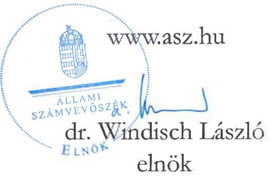
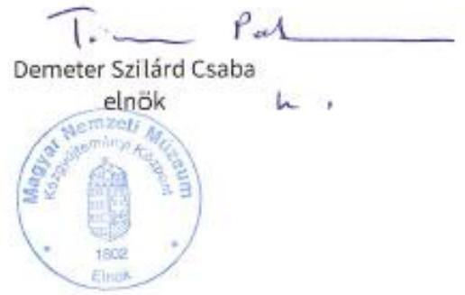
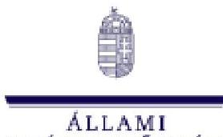

# JELENTÉS

## Az országos múzeumok kulturális javakkal történő gazdálkodásának ellenőrzése

## Petőfi Irodalmi Múzeum

2025.

---

# JELENTÉS

## Az országos múzeumok kulturális javakkal történő gazdálkodásának ellenőrzése

## Petőfi Irodalmi Múzeum

2025.

25098

---

# ELLENŐRZÉSI IGAZGATÓSÁG:

## ELLENŐRZÉSI IGAZGATÓSÁG I.

## ELLENŐRZÉSI IGAZGATÓ:

SINKÁNÉ DR. CSENDES ÁGNES ellenőrzési igazgató

## ELLENŐRZÉSVEZETŐ:

RENKÓ ZSUZSANNA ellenőrzésvezető

Jelentéseink az interneten a www.asz.hu címen olvashatók.

IKTATÓSZÁM: EL-4073-004/2025
TÉMASORSZÁM: -
ELLENŐRZÉS-AZONOSÍTÓ SZÁM: V-106503

---

# TARTALOMJEGYZÉK

AZ ELLENŐRZÉS ALAPADATAI ..... 5
AZ ELLENŐRZÖTT SZERVEZETEK ..... 8
ÖSSZEFOGLALÁS ..... 14
AZ ELLENŐRZÉS FÓKUSZTERÜLETEI ..... 18
MEGÁLLAPÍTÁSOK ..... 19
JAVASLATOK ..... 32
MELLÉKLETEK ..... 34
I. sz. melléklet: Értelmező szótár ..... 34
II. sz. melléklet: Az ellenőrzött szervezetek jegyzéke ..... 37
III. sz. melléklet: Ellenőrzési kritériumok ..... 38
IV. sz. melléklet: Vétel révén történt gyűjteménygyarapítás mintatételei ..... 39
V. sz. melléklet: 1320/2019. (V. 30.) Korm. határozat 5) pontja alapján történő hagyatékfelvásárlás mintatételei ..... 41
VI. sz. melléklet: Ajándékozás révén történt gyűjteménygyarapítás mintatételei ..... 42
VII. sz. melléklet: Kölcsönzéshez kapcsolódó mintatételek ..... 43
VIII. sz. melléklet: Saját rendezésű, külföldön rendezett kiállításra történt szállítás mintatétele ..... 44
FÜGGELÉK: ÉSZREVÉTELEK ..... 45
RÖVIDÍTÉSEK JEGYZÉKE ..... 60

---

.

---

# AZ ELLENŐRZÉS ALAPADATAI

## AZ ELLENŐRZÉS CÉLJA

Annak értékelése volt, hogy az országos múzeum szakmai besorolású muzeális intézménynél a kulturális javak vétel és ajándékozás révén történő gyűjteménygyarapításának, valamint a selejtezési és kölcsönadási tevékenységek belső szabályozása és gyakorlatban történő alkalmazása megfelelt-e a jogszabályi és egyéb ágazati előírásoknak.

Az ellenőrzés célja volt továbbá a gyarapítások célszerűségének vizsgálata a gyűjteménygyarapításra vonatkozó stratégiák, az éves tervek és az elvégzett tevékenységekről készített beszámolók, teljesítményértékelések összhangjának elemzésén keresztül, valamint az ezekhez kapcsolódó fenntartói és ágazati feladatellátás értékelése figyelemmel a szakfelügyeleti ellenőrzésekre.

## AZ ELLENŐRZÉS TÍPUSA

Kombinált ellenőrzés.

## AZ ELLENŐRZÖTT IDŐSZAK

A gyűjteménygyarapítás, a selejtezés, a kölcsönadás, a kapcsolódó nyilvántartások és a tevékenységek szabályozottságának ellenőrzése, valamint a gyűjteménygyarapítás célszerűségi vizsgálata tekintetében 2019. január 1-jétől az adatbekérő levél aláírását megelőző értéknapig (2024. május 13.) terjedő időszak.

A gyűjteménygyarapításra vonatkozó stratégiák, az éves tervek, valamint a tevékenységről készített beszámolók összhangjának elemzése, a kapcsolódó fenntartói feladatellátás és az ágazati irányítás értékelése tekintetében 2019. január 1-jétől 2023. december 31-ig terjedő időszak.

## AZ ELLENŐRZÉS TÁRGYA

A Petőfi Irodalmi Múzeumnál:

- A gyűjteménygyarapítási tevékenységgel (adásvétel, ajándékozás útján bekerült kulturális javak) és a selejtezéssel, a kölcsönadással kapcsolatos belső szabályok megalkotása.
- A gyűjteménygyarapításhoz kapcsolódó feladatok elvégzése, szakmai, számviteli nyilvántartások vezetése.
- A kulturális javak kölcsönadásával, valamint selejtezésével és ezek nyilvántartásával kapcsolatos dokumentumok rendelkezésre állása.
- Küldetésnyilatkozat, stratégiai, állományvédelmi, gyűjteménygyarapítási és revíziós tervek, a digitalizációs stratégiák, az éves szakmai munkatervek, az elvégzett tevékenységekről készített éves szakmai munkajelentések, éves számviteli beszámolók, fejlesztési és beruházási tervek, teljesítményértékelések rendelkezésre állása.

---

A KIM ${ }^{1}$-nél, mint fenntartónál:

- Intézményi alapító okiratok, működési engedélyek, szervezeti és működési szabályzatok felülvizsgálatával, jóváhagyásával, engedélyezésével kapcsolatos feladatok elvégzése.
- Küldetésnyilatkozat, stratégiai, állományvédelmi, gyűjteménygyarapítási és revíziós tervek, digitalizációs stratégiák, éves szakmai munkatervek, az elvégzett tevékenységekről készített éves szakmai munkajelentések, éves számviteli beszámolók, fejlesztési és beruházási tervek, teljesítményértékelések felülvizsgálatával, jóváhagyásával kapcsolatos dokumentumok rendelkezésre állása.
- Irányítószervi/fenntartói ellenőrzések elvégzése.

KIM-nél, mint ágazati irányítónál:

- Stratégia kialakítása.
- Szakfelügyeleti ellenőrzések elvégzése.

Az ellenőrzés kiterjedt minden olyan körülményre és adatra, amely az ÁSZ ${ }^{2}$ jogszabályban meghatározott feladatainak teljesítéséhez, valamint a program végrehajtása folyamán felmerült újabb összefüggések feltárásához szükséges volt.

# AZ ELLENŐRZÉS JOGALAPJA

Az ellenőrzés jogszabályi alapját az ÁSZ tv. ${ }^{3} 1 . \S$ (3) bekezdés, 5. § (2)-(3) bekezdés, (4) bekezdés a) pontjának, valamint az Áht. ${ }^{4} 61 . \S$ (2) bekezdésének előírásai képezték.

## AZ ELLENŐRZÉS MÓDSZERE

Az ellenőrzést törvényességi, célszerűségi szempontok, valamint a nemzetközi standardokat irányadónak tekintve az ellenőrzési program szempontjai, az ellenőrzött időszakban hatályos jogszabályok, az ellenőrzés szakmai szabályok és módszertanok figyelembevételével végezte az ÁSZ.

Az ellenőrzési kérdések megválaszolásához szükséges bizonyítékok megszerzése az ellenőrzött szervezetek által rendelkezésre bocsátott dokumentumokra, adatokra alapozva a következő ellenőrzési eljárások alkalmazásával történt: adatbekérés, megfigyelés, szemle (szemrevételezés), kérdésfeltevés (információkérés), interjú, mintavétel, valamint elemző eljárás útján.

Mintavétellel a vétel (mintatételek az IV. sz. mellékletben) és ajándék (mintatételek az VI. sz. mellékletben) révén történő gyűjteménygyarapítás, a kölcsönadási (mintatételek a VII. sz. mellékletben) tevékenységek kerültek ellenőrzésre, kockázati szempontok szerinti kiválasztással. A vételi tételek esetében a PIM által tanúsítványban megadott és kontrollált sokaságból 25 db szerzeményezést és ahhoz kapcsolódó szerződéseket választott ki és értékelt az ÁSZ, amely az ellenőrzött időszakban vásárlással szerzeményezett tételek összértékének 40,4 %-át tette ki. Az ÁSZ az ajándékozással szerzeményezett tételek közül négy db szerződést, míg az ellenőrzött időszakban lebonyolított kölcsönadások közül 11 ügyletet választott ki és értékelt. A mintatételek kiértékelésének eredménye nem került kivetítésre a teljes sokaságra, a megállapítások az adott ellenőrzött mintatételek vonatkozásában kerültek megjelenítésre.

---

Az ellenőrzési bizonyítékként felhasználható adatforrások közé tartoztak egyrészt az ellenőrzéshez kért dokumentumok, adatforrások, másrészt adatforrás volt még minden az ellenőrzés folyamán feltárt, az ellenőrzés szempontjából információkat tartalmazó dokumentumok.

Az ellenőrzés lefolytatásához az ellenőrzött szervezet a tanúsítványok kitöltésével, valamint az ÁSZ által kért dokumentumok, adatok, információk megküldésével és az ellenőrzés során szolgáltatott adatokat.

---

# AZ ELLENŐRZÖTT SZERVEZETEK

A PIM ${ }^{5}$-et, mint Magyarország egyik legfontosabb irodalmi intézményét, 1954-ben alapította az akkori Kulturális Minisztérium. Az újonnan alapított múzeum megörökölte az 1909-től kiállítóhelyként működő Petőfi Ház tekintélyes gyűjteményét. A múzeum alapításának legfőbb célja a magyar irodalom történetének bemutatása, valamint a magyar irodalmi örökség megőrzése volt. Az intézmény a magyar irodalom kiemelkedő alakjaira összpontosított, miközben a kortárs irodalomra is figyelmet fordított.

A PIM nemcsak a magyar irodalom, hanem a magyar nyelv és kultúra iránt érdeklődők számára is értékes ismereteket kínált. Mindezek mellett aktív szerepet vállalt az irodalmi életben, így kiállításaik, eseményeik és publikációik révén folyamatosan hozzájárult a magyar kultúra népszerűsítéséhez és megértéséhez.

A PIM 2024. június 30-ig gazdasági szervezettel rendelkezett. Jogutódja a Magyar Nemzeti Múzeum Közgyűjteményi Központ (továbbiakban MNMKK) lett. E dátum után a PIM az MNMKK kiemelt tagintézményeként folytatta tovább tevékenységét. Az MNMKK-ba történt beolvadás után a PIM, mint kiemelt tagintézmény főigazgatója a PIM korábbi megbízott főigazgatója lett.

A PIM a Kult. tv. ${ }^{6}$ 37/A. (7) bekezdésében ce) pontjában foglaltak szerint országos múzeum szakmai besorolással rendelkezett. Az MNMKK-ba való beolvadás után a PIM szakmai besorolása nem változott.

A PIM a székhelyen kívül az MNMKK-ba történt beolvadásig nyolc telephelyen működött, amelyek közül hét működési engedély alapján önálló szakmai besorolással is rendelkezett

| SZÉKHELY ÉS TELEPHELYEK SZAKMAI BESOROLÁSA MŰKÖDÉSI ENGEDÉLY ALAPJÁN |  |   |
| --- | --- | --- |
| SORSZÁM | SZÉKHELY ÉS TELEPHELYEK MEGNEVEZÉSE | SZAKMAI BESOROLÁSA (MŰKÖDÉSI ENGEDÉLY ALAPJÁN) |
| 1. | Petőfi Irodalmi Múzeum (székhely) | Országos Múzeum |
| 2. | Kazinczy Ferenc Múzeum (telephely) | Területi Múzeum |
| 3. | Magyar Nyelv Múzeuma, Kazinczy Emlékcsarnok, Kazinczy Kert (telephely) | Tematikus Múzeum |
| 4. | Mesemúzeum És Műhely (telephely) | Tematikus Múzeum |
| 5. | Kassák Múzeum (telephely) | Közérdekű Muzeális Kiállítóhely |
| 6. | Ady Endre Emléklakás (telephely) | Közérdekű Muzeális Kiállítóhely |
| 7. | Jókai Mór Emlékszoba (telephely) | Közérdekű Muzeális Kiállítóhely |
| 8. | Hamvas Béla Kultúrakutató Intézet (telephely) | Nincs |
| 9. | Kortárs Történetalkotó Műhely (telephely) | Nincs |
|  |  | Forrás: ÁSZ saját szerkesztés KIM adatok alapján |

A PIM Alapító okiratában meghatározott közfeladata volt:

- örökségvédelem a Kult. tv 42. §-a alapján; valamint
- a nemzeti kultúra erősítése az alkotóművészeti ágazatban kultúrstratégiai intézményként a 2019. évi CXXIV. törvény ${ }^{7}$ alapján.

A PIM kiemelt feladata volt többek közt a 30/2014. (IV.10.) EMMI rendelet ${ }^{8}$ 1. § (2) bekezdése értelmében a gyűjtőkörébe tartozó muzeológiai forrásanyag felkutatása, gyűjtése, raktári megőrzése, műtárgyak

---

kölcsönzése, visszasorolása, szakszerű nyilvántartása, kezelése, revíziója, állagmegóvása és védelme, restaurálása; továbbá tudományos feldolgozása és rendezése, mindezek kiállításokon és más formákban történő bemutatása, a közművelődését segítő hasznosítása.

A PIM gyűjtőköre kiterjedt a magyar nyelv és irodalom egészének tárgyi, képi (képzőművészeti, fotó, videó és film), valamint kéziratos és nyomtatott, illetve könyvformában található emlékeire, hangzó dokumentumaira.

A PIM vagyonkezelőként látta el az Nvtv. ${ }^{9}$-ben és a Vtv. ${ }^{10}$-ben meghatározott feladatokat az állami tulajdonban álló ingó és ingatlan vagyonelemek, a nemzetgazdasági szempontból kiemelt jelentőségű nemzeti vagyonnak minősülő vagyonelemek és a saját gyűjteményében nyilvántartott kulturális javak tekintetében.

A PIM országos múzeum szakmai besorolású intézmény volt, amely kiemelkedő jelentőségű gyűjteményeket gondozott. A PIM, mint országos múzeum kiemelt feladatait a 30/2014. (IV.10.) EMMI rendelet 2.-6. §-ai tartalmazták. A feladatok ellátására vonatkozó munkaterv elkészítéséhez szükséges szakmai mutatókat az 51/2014. (XII. 10.) EMMI rendelet ${ }^{11}$ rögzítette.

A PIM gyűjteményei voltak:

- Relikvia és Művészeti Tár,
- Kézirattár,
- Könyvtár,
- Médiatár,
- Adattár.

A PIM kulturális javak vásárlására fordított kiadásait az alábbi táblázat mutatja be:

| 2. táblázat |  |
| :--: | :--: |
| KULTURÁLIS JAVAK VÁSÁRLÁSÁRA |  |
| FORDÍTOTT KIADÁSOK |  |
| Év | ÉRTÉK (E FT-BAN) |
| 2019 | 196169 |
| 2020 | 567667 |
| 2021 | 727589 |
| 2022 | 60467 |
| 2023 | 36807 |
| $2024^{a}$ | 15525 |

Forrás: ÁSZ saját szerkesztés tanúsítványi adatszolgáltatás alapján

# ÁGAZATI IRÁNYÍTÁS

A PIM ágazati irányítását a kultúráért felelős miniszter látta el. A kulturális ágazatok egységes kormányzati stratégiai irányításának szakmai alapjait a Nemzeti Kulturális Tanács biztosította, melynek elnökét a Kormány nevezte ki, a társelnöke pedig a kutúráért felelős miniszter volt. A Nemzeti Kulturális Tanács tagjai voltak többek között a kultúrstratégiai intézmények vezetői. A Nemzeti Kulturális Tanács feladata volt többek között, hogy javaslatot tegyen a Kormány részére a kultúra kormányzati stratégiájára.

[^0]
[^0]: ${ }^{a}$ 2024. május 13-ig

---

A kötelezően elkészítendő stratégiai tervdokumentumok közé tartozott a miniszteri program, amely az összkormányzati célkitűzések érvényesítését szolgáló, a miniszter vezetése alatt álló minisztérium által megvalósítandó középtávú feladatokat meghatározó, a miniszterelnök megbízatásának idejére szóló stratégiai tervdokumentum.

A KIM gyűjteménygyarapítási tevékenységgel kapcsolatos ágazati irányítási feladata volt, hogy
a) szabályozza:

- a muzeális intézmények kiemelt feladatait - többek között a gyűjtemények gyarapítását - és azok ellátásának a rendjét,
- a muzeális intézmények éves munkatervéhez szükséges kiemelt szakmai mutatókat,
- a muzeális intézményekben őrzött kulturális javak papíralapú és elektronikus nyilvántartásának szabályait, valamint az elektronikus nyilvántartásra történő átállás feltételeit és eljárásrendjét,
- a muzeális intézmények nyilvántartásában szereplő kulturális javak revíziójával és selejtezésével összefüggő kérdéseket,
b) gondoskodjon:
- a muzeális intézményekben folyó szakmai munka ellenőrzéséről, értékeléséről,
c) ellenőrizze:
- a muzeális intézményekre vonatkozó jogszabályok, kiemelten a muzeális intézmények működési engedélyében meghatározott szakmai követelmények betartását,
- a kulturális javak védelmének, biztonságának kérdéseit,
- a tevékenységüket szabályozó egyéb jogszabályokban foglaltak megvalósulását és betartását,
- a muzeális intézményeknek nyújtott központi támogatások elosztását, felhasználását.

A KIM az ágazati irányítási jogkörét muzeológiai szakfelügyelet közreműködésével látta el. Az országos múzeumok esetében a szakfelügyelőknek legalább három évente kellett elvégezni a szakfelügyeleti ellenőrzést. A szakfelügyelők a munkájukat a miniszter által jóváhagyott éves munkaterv és a miniszter által meghatározott munkaterven kívüli feladatok szerint végezhették, a vizsgálatok tapasztalatait jelentésben kellett összefoglalniuk. A szakági szakfelügyelők a vizsgálat befejezését követő harminc napon belül kötelesek voltak a jelentést a szakági vezető szakfelügyelőn keresztül megküldeni a KIM-be. A szakági vezető szakfelügyelőknek az előző éves munkáról összefoglaló jelentést kellett készíteni, amelyet a tárgyévi munkaterv-javaslattal együtt minden év január 31-ig kellett benyújtani a KIM részére.

A KIM-nek részt kellett vennie a Magyar Nemzeti Múzeum OMMIK ${ }^{12}$ szakpolitikai irányítási feladatainak ellátásában. Az OMMIK végezte a muzeális intézményekben őrzött kulturális javak nyilvántartásához szükséges dokumentumok (naplók, szakleltárkönyvek) előállításával, tárolásával és igénylésével kapcsolatos feladatokat.

# FENNTARTÓI FELADATELLÁTÁS

A PIM fenntartója a vizsgált időszakban 2022. május 24-ig az EMMI$^{13}$, majd ezt követően az MNMKKba történő beolvadásig a KIM volt.

A PIM a szakmai tevékenységét a fenntartó által jóváhagyott küldetésnyilatkozat, stratégiai terv, állományvédelmi terv, gyűjtemény gyarapítási és revíziós terv, valamit a múzeumi digitalizálási stratégia alapján folytathatta. A PIM feladatait éves szakmai - és pénzügyi terv alapján végezhette, az elvégzett tevékenységről munkajelentést, pénzügyi beszámolót, és teljesítményértékelést kellett készítenie, amely szintén a fenntartói jóváhagyás körébe tartozott.

---

A műtárgyak vétel jogcímen történő beszerzésével kapcsolatosan a PIM-nek, mint olyan muzeális intézmény költségvetési szervnek, amelynek képzőművészeti alkotások gyűjteménygondozása és gyarapítása is a gyűjtőkörébe tartozott, 2014. október 1-ig vásárlási szabályzatot kellett készítenie, és azt jóváhagyásra a fenntartójának bemutatni.

# GYŰJTEMÉNYGYARAPÍTÁSI TEVÉKENYSÉG

A muzeális intézmény a működési engedélyében meghatározott gyűjtőköre szerinti szakágra, korszakra vagy tematikára vonatkozóan folytathatta a gyűjteménygyarapítási tevékenységét. A gyűjteménygyarapításra Magyarország teljes közigazgatási területén, illetve azon kívül is sor kerülhetett, amennyiben az adott ország jogrendje azt lehetővé tette.

A muzeális intézmény gyűjteménye az alábbi módokon volt gyarapítható a Kult. tv rendelkezéseivel összhangban:

- régészeti feltárás,
- természettudományi feltárás,
- helyszíni gyűjtés,
- vétel,
- ajándékozás,
- öröklés,
- csere,
- a muzeális intézmények nyilvántartási szabályzatáról szóló miniszteri rendeletben meghatározott átadás,
- saját előállítás vagy saját célú előállíttatás, valamint
- egyéb - jogszabály alapján történő - muzeális intézményi elhelyezés.

## KÖLCSÖNZÉS

A PIM gyűjteményeiben nyilvántartott kulturális javak nemzeti vagyonnak minősültek. A nemzeti vagyon ingyenesen kizárólag közfeladat ellátása vagy a lakosság közszolgáltatásokkal való ellátása céljából volt hasznosítható, a nemzeti vagyont a közfeladat vagy a lakosság közszolgáltatásokkal való ellátásától eltérő célra kizárólag visszterhesen lehetett hasznosítani.

A muzeális intézmények közötti kölcsönzés esetén mentesítés volt adható a kölcsönzési díj megfizetése alól. A nem muzeális intézmények számára és külföldre történő kölcsönzéshez a kultúráért felelős miniszter hozzájárulása kellett. A jogalkotó az állami vagy önkormányzati fenntartású muzeális intézmények közötti, országhatáron belüli kölcsönzés esetén mentességet adott a kölcsönzési díj megfizetése alól, minden más esetben az ÁSZ jogértelmezése szerint a kölcsönzési díj megfizetése alóli mentességhez mentesítési kérelmet kellett benyújtani a kölcsönzési szerződés megkötése előtt a kultúráért felelős miniszterhez.

## REVÍZIÓ

A muzeális intézmény adott gyűjteményére vonatkozóan hét évente köteles volt teljes revízió lefolytatására, valamint teljes revíziót kellett lefolytatnia többek között abban az esetben is, ha a gyűjteményért felelős muzeológus vagy gyűjteménykezelő személyében változás állt be.

---

A revízió célja volt a vagyon- és tulajdonvédelem, a kulturális javak hitelességének folyamatos fenntartása, és a tudományos meghatározásuk során feltárt eredmények átvezetése az intézmény által vezetett nyilvántartásban, a vagyongazdálkodás alapelveinek teljesüléséről való gondoskodás.

Azon kulturális javakról, amelyek szerepeltek a leltárkönyvben, de a gyűjteményben nem voltak fellelhetők, hiányjegyzéket kellett összeállítani. Csatolni kellett továbbá a hiányzáshoz kapcsolódóan a bűncselekmény vagy annak gyanúja esetén az eljárás megindítását vagy lezárását igazoló dokumentumot.

A védett kulturális javak kezelője az eltulajdonítást vagy eltűnést haladéktalanul köteles volt bejelenteni a kulturális javak hatóságának. Ezáltal az együttműködő szervek tudomással bírhattak az eltűnt kulturális javakról, amely a kulturális javak megtalálásának és visszaszerzésének hatékonyságához nélkülözhetetlen.

# KULTURÁLIS JAVAK SELEJTEZÉSE

Selejtezni és megsemmisítéssel el kellett távolítani azokat az alapleltárban szereplő kulturális javakat, amelyek

- állagukat tekintve oly mértékben megrongálódtak, hogy restaurálás útján sem voltak megmenthetők,
- az egészséget veszélyeztették, vagy
- állományvédelmi szempontból súlyosan veszélyeztettek más kulturális javakat.

A kulturális javak selejtezését három főből álló bizottságnak kellett végeznie, selejtezési jegyzőkönyvbe foglalnia, és azt jóváhagyás céljából a miniszterhez felterjeszteni. A nyilvántartásból a miniszter által kiadott selejtezési engedély alapján voltak törölhetők a kulturális javak, a leltárkönyvben feltüntetve a selejtezési engedély keltét és számát. A selejtezésről és annak végrehajtásáról 15 napon belül írásban kellett tájékoztatni a fenntartót és a tulajdonost, mellékelve a selejtezésről felvett jegyzőkönyvet és a selejtezési engedélyt.

## VAGYONKEZELÉS

A külön jogszabály alapján szakmai nyilvántartásban szereplő képzőművészeti alkotásokat, régészeti leleteket, kép- és hangarchívumokat, gyűjteményeket, egyéb eszközöket 2014. január 1. előtt a 249/2000. (XII. 24.) Korm. rendelet ${ }^{14}$ alapján a könyvviteli mérlegben nem kellett kimutatni, a muzeális célú gyűjtemények vásárlására fordított kiadásokat a dologi kiadások számlacsoportban kellett elszámolni.

A 2014. január 1-től hatályba lépett Áhsz. ${ }^{15} 10 . \S$ (1) bekezdés előírta, hogy a mérlegben nem lehet kimutatni az Nvtv. 1. § (2) bekezdés g) pontja szerinti kulturális javakat, ha azok bekerülési értéke nem állapítható meg. Ugyanakkor nem tekinthető a bekerülési érték megállapíthatatlannak, ha 2014. január 1-jét követően a kulturális javak vásárlás vagy olyan térítés nélküli átvétel, csere útján váltak a nemzeti vagyon részévé, amely során az átadó annak nyilvántartási értékét közölte.

A múzeumot a vagyonnyilvántartás hiteles vezetése és a tulajdonosi joggyakorlók beszámolókészítési kötelezettségének megalapozottsága érdekében az állami vagyon vagyonkezelésére kötött szerződése szerinti adatszolgáltatási kötelezettség terhelte. Az MNV Zrt. ${ }^{16}$, mint tulajdonosi joggyakorló által vezetett vagyonnyilvántartásnak tartalmaznia kellett a nemzeti vagyont, annak értékét és változásait. A nyilvántartott vagyonelemek teljes körű és részletes adatait a vagyonkezelők főkönyvi könyvelése és analitikus nyilvántartása tartalmazta. Az MNV Zrt. vagyonnyilvántartása részére a PIM-nek a 2014. előtt beszerzett kulturális javakról nem kellett adatot szolgáltatnia, ezáltal a Vtv-ben meghatározott egységes állami vagyonnyilvántartás, valamint az Országleltár nem tartalmazta ezeket a kulturális javakat.

---

# KULTURÁLIS JAVAK NYILVÁNTARTÁSA

A muzeális intézménynek nyilvántartást kellett vezetnie mindazon kulturális javakról, melyek őrzésében, kezelésében, illetve birtokában voltak, nyilvántartásában nem szereplő kulturális javakat nem őrizhetett. A múzeumi nyilvántartási dokumentumokat a Magyar Nemzeti Múzeum OMMIK-tól kellett beszerezni.

Hagyományos nyilvántartási formák voltak a Nyilvántartási rendelet ${ }^{17}$ szerint az alapleltárak, leírókartonok, mutatórendszerek, valamint a külön nyilvántartások:

- Gyarapodási napló: A saját gyűjtemény számára beérkező, egyedileg kezelhető kulturális javak első nyilvántartásba vételére szolgált, azok további feldolgozásáig. A gyarapodási naplóra az intézménynek egy közös vagy az egyes szervezeti egységekben vagy gyűjteményekben külön-külön használt, több gyarapodási naplója lehetett. Egy gyűjtemény azonban ez utóbbi esetben is legfeljebb egy be nem telt gyarapodási naplót használhatott.
- Szakleltárkönyv: A tudományosan már meghatározott kulturális javak nyilvántartására szolgált.
- Mozgatási napló: A gyűjteményből ideiglenesen kikerült kulturális javak intézményen belüli mozgatásának nyomon követésére szolgált.
- Kölcsönadott tárgyak naplója: A gyűjteményekből ideiglenesen kikerült, az intézményen kívülre kölcsönadott tárgyak nyilvántartását tartalmazta.
- Letéti napló: A letétként kezelt kulturális javakról vezetett külön nyilvántartás.

---

# ÖSSZEFOGLALÁS

A kulturális értékek a nemzetünk közös örökségét képezik, amelyek védelme, fenntartása és a jövő nemzedékek számára való megőrzése az állam és mindenki kötelessége. A kulturális javak a múltunk és jelenünk megismerésének pótolhatatlan forrásai, nemzeti és egyetemes kulturális örökségünk elválaszthatatlan összetevői, a társadalom számára kohéziós erővel bírnak, amelyek védelme minden állampolgár feladata. Az országos múzeumok szerepe kulcsfontosságú a kulturális értékek megőrzése és a társadalom kulturális tudatosságának elősegítése, a fiatalság identitásának megteremtése és erősítése terén. Az országos múzeumok hatással vannak az állami vagyonnal való gazdálkodás minőségére, a kormányzati (szak)politikák végrehajtására.

## A GYŰJTEMÉNYGYARAPÍTÁS SZABÁLYSZERŰSÉGÉNEK ÉS CÉLSZERŰSÉGÉNEK ÉRTÉKELÉSE

A kulturális javak és emlékek védelme az ágazati szabályozás szintjén részletesen körülhatárolt, ugyanakkor a jogszabályi rendelkezések betartása mellett jelentős szabályozási feladat hárul magukra a muzeális intézményekre is, az előzőekben említett szerep betöltése érdekében.

A múzeumok szakmai tevékenységüket több, a feladatellátás egységességét, átláthatóságát biztosító, kötelezően előírt alapdokumentum alapján folytatják, ilyenek a stratégiai terv, az állományvédelmi a gyűjteménygyarapítási és revíziós terv. Ezek biztosítják a feladatellátás teljesítésének alapjait, meghatározva a gyűjteménygyarapítás és a kulturális javakhoz való hozzáférés terén elérni kívánt stratégiai célokat, valamint a megvalósítás személyi, tárgyi és költségvetési feltételrendszerét. A PIM szakmai tevékenysége folytatásának alapjául szolgáló stratégiai és állományvédelmi tervvel a teljes ellenőrzött időszakban, gyűjteménygyarapítási és revíziós tervvel 2023. októberéig nem rendelkezett.

Emellett több előírás vonatkozik belső szabályok megalkotására, annak érdekében, hogy a Kult. tv. céljai a gyűjteménygyarapítás során a gyakorlatban is érvényesüljenek. A PIM vásárlási szabályzatot nem készített. A gyűjteménygyarapításról több, egymással összhangban lévő belső szabályzatban rendelkezett, azonban ahhoz kapcsolódóan nem szabályozott alapvető kérdéseket, így: az eredet és eredetiség ellenőrzésének kötelezettségét, a proveniencia dokumentumok és a tulajdoni jogviszony igazolására szolgáló dokumentumok körét; a vételár megállapításának módszerét, a külső értékbecslés szükségességének eseteit, az értékmeghatározáshoz szükséges adatok körét; a vételárat meghatározó személy összeférhetetlenségét, sem mindezek dokumentálásának módját és követelményét. A PIM több belső szabályzóban fogalmazott meg etikai követelményeket és elvárásokat a munkatársakkal szemben, de az összeférhetetlenség vizsgálatának dokumentálását a szerzeményezési folyamatban a gyakorlatban nem végezte el.

A vizsgált mintatételek közül két esetben a jogszabályi előírás ellenére képzőművészeti témájú kulturális javak szerzeményezésének előkészítésekor a PIM nem vett igénybe független értékbecslést, így a vételár piaci értéknek való megfelelése a gyűjteménygyarapítás során nem minden esetben volt igazolható. További 11 esetben a PIM a szerzeményezést megelőzően a javaslatban a vételár bemutatását nem támasztotta alá írásban dokumentált értékmeghatározással, amely felveti a gazdálkodásra kihatással lévő döntések átláthatóságának kockázatát.

A PIM a proveniencia ellenőrzését a vizsgált szerzeményezések közül négy esetben nem végezte el. Az értékbecslések és az előtörténet ellenőrzésének elmaradása nem biztosította az átlátható, felelős gazdálkodást. Tíz esetben a gyűjteményezési javaslatokat nem a belső előírások szerinti tartalommal készítették el. A PIM két esetben a szerzeményezéshez nem kérte a tulajdonosi joggyakorló előzetes egyetértését. Az átlátható és felelős

---

gazdálkodás követelményének teljesítéséhez kiemelten fontos, hogy a kulturális javak előtörténetének ellenőrzését és dokumentálásának szabályait a muzeális intézmény rögzítse.

A PIM minden ellenőrzésre kiválasztott szerzeményezése előzetes írásbeli kötelezettségvállalással valósult meg. A 25 ügylethez kapcsolódó kötelezettségvállalás 26-ból 18 szerződés esetében az Áht., az Ávr. ${ }^{18}$ és a belső szabályzatok előírásainak megfelelően történt.

A PIM az ellenőrzött időszakban hatályos közbeszerzési szabályzatában rendelkezett arról, hogy az uniós értékhatárt elérő kulturális javak beszerzésére a jogszabályban foglaltak szerint, kizárólag közbeszerzési eljárás lefolytatását követően lehet szerződni. A közbeszerzési értékhatárokat elérő kulturális javak beszerzése esetében a PIM a közbeszerzési eljárásokat lefolytatta.

Az ajándékként történő gyűjteménygyarapítás - a nyilvántartási hiányosságokon kívül - a
 belső szabályzókban előírtaknak megfelelően történt.

A PIM a gyűjteménygyarapítások célját a szerzeményezés során a jogszabályi és a belső előírásoknak megfelelően dokumentálta. A célok összhangban voltak az alapító okiratban meghatározott alapfeladatokkal, a kiemelt kultúrstratégiai intézményként számára meghatározott feladatokkal, a küldetésnyilatkozatban szereplő, valamint 2023. októberétől kezdődően a Gyűjteménygyarapítási és revíziós tervekben megfogalmazott elvekkel.

# A KÖLCSÖNZÉSI TEVÉKENYSÉG ÉS SAJÁT RENDEZÉSŰ, KÜLFÖLDÖN RENDEZETT KIÁLLÍTÁSRA TÖRTÉNT SZÁLLÍTÁS ÉRTÉKELÉSE 

A kölcsönzésnek, a kölcsönzési díj megállapításának keretrendszerét a PIM nem alakította ki, ezáltal a kontrollkörnyezet nem volt megfelelő, a kontrollrendszer szabályszerű működtetése nem volt biztosított. A PIM az ÁSZ jogértelmezése szerint a jogszabályi előírás ellenére a nem muzeális intézmények részére kölcsönzési díj felszámítása nélkül, ingyenesen úgy adta kölcsön a műtárgyakat több esetben, hogy a kölcsönvevők nem rendelkeztek a kölcsönzési díj megfizetése alóli mentesítéssel.

Az ÁSZ álláspontja szerint a kapcsolódó szabályok nem teremtenek diszkrecionális jogkört a muzeális intézmény számára a kölcsönzési díj kikötése tekintetében. A jogszabályi rendelkezések logikai értelmezése is ezt az olvasatot támasztja alá, és az ettől eltérő jogértelmezés a miniszter műtárgykölcsönzéssel kapcsolatos díj elengedési - jogkörét csorbítaná. Ugyanakkor a kölcsönzési díj szükségessége körében a KIM véleménye az, hogy a vonatkozó jogszabályi rendelkezés „eseti mérlegelés tárgyává teszi, azaz megengedi, de nem kötelezi a múzeumokat kölcsönzési díj alkalmazására". Tekintettel arra, hogy a KIM a címzettje a műtárgykölcsönzéssel kapcsolatos minisztériumi döntési jogkörnek, az előbbi jogértelmezése általános felhatalmazást ad a múzeumoknak a kölcsönzési díjak meghatározása, illetve az azoktól való eltekintés vonatkozásában.

Az ÁSZ véleménye szerint a célszerűségi elvárások figyelembevételével az a gyakorlat elfogadható lenne, mely pl. államháztartási körön belüli szereplők között szükségtelenné teszi a díj megfizetését, tekintve, hogy ezesetben a díj megfizetése vagy elmaradása az államháztartás szintjén nem bír relevanciával. Azonban - egyéb szempontok dokumentálása hiányában - célszerűtlennek tűnik a pénzügyi ellenszolgáltatás nélküli kölcsönadás olyan szervezetek esetében, akik a műalkotásokat profittermelés céljából használják fel.

A PIM által követett gyakorlat az átláthatóságot nem teljeskörűen biztosította, mert a belső szabályozási környezetet csak részben alakította ki, így egyértelműen nem voltak megállapíthatóak és nyomon követhetőek az ellenőrzés során azok az indokok, melyek az egyedi műtárgyak szintjén a kölcsönzési díj felszámításának mellőzését megalapozták. Mindennek az ad különös jelentőséget, hogy a minisztériumi teljes körű felhatalmazással ebben a körben különösen széles körű mérlegelési lehetősége volt a múzeumoknak,

---

ugyanakkor ez nem jelenthet önkényes és eshetőleges döntéshozatalt. A jövőben ebben a tárgykörben kialakítandó szabályozás tekintetében a minisztériumnak jóváhagyási jogkört kellene gyakorolnia.

A legjobb megoldás az ÁSZ véleménye szerint az lenne, ha a jogszabályokban egyértelműen rögzítésre kerülne a díj elengedésére jogosult döntési jogkör alanya, az ilyen döntés keretei és mérlegelési szempontjai.

A PIM a jogszabályi előírások ellenére az ellenőrzésre kiválasztott mintatételek közül két esetben írásbeli szerződés nélkül adott kölcsön műtárgyakat, egy esetben hatósági engedély nélkül szállított külföldi kiállításra védett kulturális javakat.

A szerződés nélküli, a nem megfelelő tartalmú szerződésekkel történő, valamint a miniszteri engedély nélküli és a nem vagy nem teljeskörű adattartalommal nyilvántartott kölcsönadások esetében a PIM a kulturális javak - alapító okiratban alapfeladatként meghatározott - védelmét nem biztosította.

# A SELEJTEZÉSI ÉS A REVÍZIÓS TEVÉKENYSÉG ÉRTÉKELÉSE 

A PIM a kulturális javak selejtezése és revíziója végrehajtásának eljárásrendjét nem határozta meg, így a revízióra és a selejtezésre vonatkozóan a kontrollkörnyezetet nem alakította ki megfelelően, ezáltal a kontrollrendszer megfelelő működtetése nem volt biztosított.

A PIM a gyűjteményeire vonatkozó revíziókat a jogszabályban előírtak ellenére az abban meghatározott gyakorisággal nem hajtotta végre. A revízió rendeletben megfogalmazott egyik célja a vagyon- és tulajdonvédelem, ezért a revíziók elmulasztásával a PIM a jogszabályi előírás ellenére a nemzeti vagyon védelmét nem biztosította. A PIM az ellenőrzött időszakban selejtezést nem végzett.

## A NYILVÁNTARTÁS ÉRTÉKELÉSE

A PIM a nyilvántartásokra vonatkozó szabályokat teljeskörűen nem alkotta meg.
Az ellenőrzött, vétellel történő szerzeményezéseknél a gyarapodási naplót minden esetben alkalmazta, azonban a nyilvántartások csak részben feleltek meg a jogszabályi előírásoknak. Az ajándékok a jogszabályban előírtak ellenére akár évekig nem kerültek be a gyarapodási naplóba. A szakleltárkönyvi besorolások több esetben szintén évekig elhúzódtak, a gyarapodási naplók záradékolása hiányos volt.

A kölcsönzési naplók vezetése a vizsgálattal érintett tételek kapcsán több esetben nem a Nyilvántartási rendeletben, illetve az ügyrendekben meghatározott előírások alapján történt, a kölcsönadás tényét nem tartalmazták vagy a kölcsönzés adatait nem teljeskörűen tartalmazták.

## ÁGAZATI ÉS FENNTARTÓI FELADATELLÁTÁS ÉRTÉKELÉSE

Az ágazati irányító a 2021. évtől nem készítette el az ágazati stratégiai dokumentumot, valamint a szakfelügyeleti ellenőrzés keretében a PIM kiemelt feladatellátását nem vizsgálta.

A fenntartói jóváhagyás körébe tartozó feladatait - a 2019. évi szakmai munkajelentés és 2023-ban a PIM által készített Gyűjteménygyarapítási és revíziós terv jóváhagyása kivételével - ellátta. Az ellenőrzött időszakban fenntartói ellenőrzést nem végzett.

---

# ÖSSZEGZÉS 

A kulturális örökség megfelelő gyarapításához, őrzéséhez, kezeléséhez kapcsolódó tevékenység az ÁSZ megítélése szerint részletesen szabályozott. Számos olyan jogszabályi rendelkezés azonosítható, melyek a gyűjteménykezelés egységességét, átláthatóságát és ellenőrizhetőségét hivatottak biztosítani, emellett az intézményi szintű belső szabályok is jelentősen hozzájárulhatnak ezek megvalósulásához. A kiválasztott mintatételek ellenőrzési tapasztalatai is rávilágítottak arra, hogy valamennyi részletszabály betartása, legyen az szakmai vagy éppen adminisztratív, a nemzet közös örökségének megőrzése, a nemzeti vagyon védelmének biztosítása érdekében kiemelten fontos.

---

# AZ ELLENŐRZÉS FÓKUSZTERÜLETEI 

1.  - A gyűjteménygyarapítás keretrendszerének kialakítása, a gyűjteménygyarapítási tevékenység ellátása
2.  - A kölcsönzési tevékenység keretrendszerének kialakítása, a kölcsönzési tevékenység és nyilvántartásának vezetése
3.  - A selejtezési és revíziós tevékenység keretrendszerének kialakítása, a selejtezési és revíziós tevékenység végrehajtása és a nyilvántartás vezetése
4. Ágazati, fenntartói ellenőrzés

---

# MEGÁLLAPÍTÁSOK 

## 1. A gyűjteménygyarapítás keretrendszerének kialakítása, a gyűjteménygyarapítási tevékenység ellátása

Összegző megállapítás

A kultúráért felelős miniszter a jogszabályi előírás ellenére a kulturális ágazat jövőképét és konkrét céljait tartalmazó ágazati stratégiát a 2021. évtől kezdődően nem készítette el. A gyűjteménygyarapítás keretrendszerét a PIM csak részben alakította ki, a jogszabályi előírás ellenére több stratégiai tervdokumentumát nem készítette el. A vétel révén történt gyűjteménygyarapítás több esetben nem felelt meg a jogszabályi előírásoknak, a gyűjteményezési javaslatok dokumentálása hiányos volt. A döntések végrehajtása során az esetek majdnem egyharmadában a PIM nem tartotta be teljeskörűen az Áht. és az Ávr. előírásait. A gyűjteménygyarapítás nyilvántartása nem felelt meg teljeskörűen a jogszabályi előírásoknak. Az ajándékozással történt gyűjteménygyarapítás - a nyilvántartási hiányosságokon kívül - a belső előírásoknak megfelelően történt.

## A GYŰJTEMÉNYGYARAPÍTÁSI TEVÉKENYSÉG STRATÉGIAI KERETRENDSZERE

Az ellenőrzött 2019-2020. évekre vonatkozóan a kultúráért felelős miniszter által 2006. január hónapban készített, „A szabadság kultúrája - Magyar kulturális stratégia" 2020-ig volt hatályban. A dokumentum felvázolta a magyar kulturális politikát és stratégiát a XXI. századra, amely szerint fő célja volt, hogy erősítse a kultúra közösségteremtő szerepét, megőrizze és ápolja a nemzet kulturális örökségét, valamint elősegítse a kortárs kulturális alkotások létrejöttét. Emellett fontos alapelve volt a kulturális javakhoz való egyenlő hozzáférés biztosítása, valamint a tisztességes átlátható támogatási rendszerek kialakítása a demokrácia elvei alapján.
A kultúráért felelős miniszter 2021. évtől a 38/2012. (III. 12.) Korm. rendelet ${ }^{1}$ 7. § 2. pontjában megjelölt és a 28. §-ában meghatározott miniszteri programot, mint a kulturális ágazatra vonatkozó stratégiai tervdokumentumot nem készítette el, ezáltal nem került meghatározásra a kulturális területre vonatkozóan se jövőkép, se konkrét célok.
A PIM a szakmai tevékenység folytatásához a Kult. tv. 42. § (4) bekezdés b) pontjában foglaltak ellenére intézményi stratégiai tervvel és állományvédelmi tervvel a teljes ellenőrzött időszakban nem rendelkezett. A dokumentumok elkészítésének szükségességére a fenntartó többször felhívta az intézmény figyelmét. Gyűjteménygyarapítási és revíziós tervet a PIM 2019. január és 2023. szeptembere közti időszakban a Kult. tv. 42. § (4) bekezdés b) pontjában előírtak ellenére nem készített. A Kult. tv. szerint előírt Gyűjteménygyarapítási és revíziós tervet 2023. októberében készítették el, amely tartalmazott jogi és etikai

---

előírásokat a szerzeményezésekre vonatkozóan. A Gyűjteménygyarapítási és revíziós tervet a Kult. tv. 42. § (4) bekezdés d) pontjában előírtak ellenére a fenntartó az ellenőrzött időszak végéig nem hagyta jóvá. A PIM a Küldetésnyilatkozatát 2014. óta, az alapító okiratban történt módosításokkal a fenntartó többszöri ajánlása ellenére nem aktualizálta. A PIM a 2019-2020-as évekre rendelkezett digitalizálási stratégiával, az ellenőrzött időszak további éveire új tervet a Kult. tv. 42. § 4 bekezdés b) pontjában előírtak ellenére nem készített.
A PIM a Kult. tv. 42. § (4) bekezdés c) pontjában előírtak ellenére a 2019-2020. évekre nem készítette el a szakmai munkaterveket, 2021-től kezdődően rendelkezett a fenntartó által szabályszerűen jóváhagyott szakmai munkatervekkel.
A PIM az ellenőrzött időszakban évente elkészítette a Kult. tv-ben előírt szakmai munkajelentéseket. A fenntartó a 2019. évi munkajelentést a Kult. tv. 50. § (2) bekezdés a) pontjában előírtak ellenére nem hagyta jóvá, a 2020-2023. évekre vonatkozó munkajelentéseket a Kult. tv-ben előírtak szerint jóváhagyta. A fenntartó a munkajelentések értékelésekor ellenőrizte a stratégiai dokumentumok rendelkezésre állását, a PIM felé jelezte a hiányzó dokumentumokat, azonban azok pótlására határidőt nem írt elő.

# ADÁSVÉTEL RÉVÉN TÖRTÉNŐ GYŰJTEMÉNYGYARAPÍTÁS 

## A vételár meghatározása

A PIM a 254/2007. (X. 4.) Korm. rendelet 54. § (10) bekezdésében előírtak ellenére vásárlási szabályzattal nem rendelkezett, és abban, valamint egyéb szabályzatban sem határozta meg az értékbecslés módszerével összefüggő eljárásrendet, a külső értékbecslés szükségességének eseteit, az értékmeghatározáshoz szükséges adatok körét.
Összeférhetetlenségre vonatkozó követelményeket több belső szabályzat, egyéb dokumentum is tartalmazott. A PIM magára nézve az ICOM Etikai kódexét és a Pulszky Társaság - Magyar Múzeumi Egyesület etikai kódexét tartotta kötelező érvényűnek. Az ICOM Etikai Kódexe az 5.2. Értékelés pontjában az összeférhetetlenség tágabb értelmezésében az értékbecslést végző személy függetlenségéről rendelkezik. A PIM az SZMSZ-ben rendelkezett a magángyűjtéshez kapcsolódó összeférhetetlenségről, a Beszerzési szabályzat-ban megfogalmazta a beszerzések folyamatában az összeférhetetlenség eseteit, azonban a Bkr. 6. § (1) - (2) bekezdésében előírtak ellenére az összeférhetetlenség igazolásának dokumentálási módját a szerzeményezés folyamatában nem szabályozta. A 2020. november 1-től hatályos Kollektív szerződés preambulum része, valamint a 6. és 83. §-ai tartalmazták az etikai előírásokat a munkatársak feddhetetlensége, elvárt erkölcsi magatartása, etikai normáknak való megfelelése körében, valamint előírt egy, az alkalmazottak magángyűjtésével kapcsolatban az intézményvezető felé történő értesítési követelményt, azonban ennek dokumentálási módját a Bkr. 6. § (1) - (2) bekezdésében előírtak ellenére nem határozták meg, azt a szerzeményezési folyamatokba nem építették be. 2023. októbertől a Gyűjteménygyarapítási és revíziós terv is előírt jogi és etikai követelményeket a Kult. tv. rendelkezéseinek megfelelően. A terv rögzítette, hogy szerzeményezésre
 csak a Nyilvántartási rendeletben előírt módokon a Kult. tv. előírásait betartva van lehetősége a

[^0]
[^0]: † Vásárlási szabályzat készítésére a 254/2007. (X. 4). Korm. rendelet 54. § (10) bekezdésében foglaltak szerint a költségvetési szerv muzeális intézmény volt kötelezett. 2024. július 1-től a PIM az MNMKK mint önálló költségvetési szerv kiemelt tagintézménye lett, ettől a dátumtól kezdődően a PIM már nem önálló költségvetési szerv volt.

---

múzeumnak, és a múzeum nem szerezhet be köztudottan bűncselekményből származó vagy kétes eredetű műtárgyat. Előírták a tervben továbbá a gyűjteményezést végző muzeológusok számára a műtárgyak minél teljesebb provenienciájának felderítését, a tulajdonátruházások legteljesebb körű megismerését az intézmény érdekeinek figyelembevételével az ICOM Etikai Kódexében előírt előírásokkal összhangban.
Az, hogy a PIM nem határozta meg a gyűjteménygyarapítással kapcsolatban az értékbecslés módszerét, rendjét és az értékbecslő összeférhetetlensége igazolásának szabályait azt eredményezte, hogy nem volt ellenőrizhető és igazolható sem a vételi eljárás folyamatában, sem utólagosan a vételár megállapításának jogossága. A kontrollkörnyezet Bkr. ${ }^{27}$ 6. § (1) - (2) bekezdésében foglaltak szerinti kialakítása nem történt meg, a kontrollrendszer a Bkr. 4. § b) pontjában foglaltak megfelelő működtetése nem volt biztosított, ezáltal nem teljesült az Áht. céljaként meghatározott, a közpénzekkel való áttekinthető, hatékony és ellenőrizhető gazdálkodásra vonatkozó előírás.
Az ellenőrzésre kiválasztott szerzeményezések közül 11 db esetében - a belső szabályozás hiánya ellenére - a vételár meghatározását az ICOM Etikai kódexének 2.20 pontjának eleget téve dokumentumokkal alátámasztották: a PIM saját dolgozója értékbecslését, vagy külső szakértő értékbecslését, vagy a feladatkijelölő (minisztérium) által megjelölt vételi értéket alapul véve folytatta le a szerzeményezést, azonban az elvégzett értékbecslések során az összeférhetetlenség vizsgálatát az ICOM Etikai kódexének 2.20 és 5.2 pontjaiban előírtak ellenére nem dokumentálták. A PIM nem körültekintő gondossággal járt el a gazdálkodásra kihatással levő folyamatokban.
A további, 11 db képzőművészeti alkotásnak nem számító, vagy 2020. december 20. után lefolytatott beszerzések (IV. sz. melléklet 1., 2., 13., 16., 17., 19., 21., 22., 23., 24., 25. sorszámú tételei) esetén az ICOM Etikai kódexének 2.20 és 5.2 pontjaiban előírtak ellenére a vételár meghatározását dokumentált értékbecsléssel nem támasztották alá. Egy tétel szerzeményezésére aukción került sor.
Az ellenőrzött mintatételek közül kettő képzőművészeti alkotás beszerzése 2020. december 20-át megelőzően történt (IV. sz. melléklet 5. és 6. sorszámú tételei). A PIM a 254/2007. (X. 4.) Korm. rendelet 2/A. § (1) bekezdésében előírtak ellenére egyik beszerzésnél sem vett igénybe független értékbecslést a vételár meghatározására.
Egy hagyaték felvásárlásáról szóló mintatétel esetében (IV. sz. melléklet 6. sorszámú tétele) az eladók között volt a PIM két munkatársa is. A vásárlás folyamatában az etikai kérdéseket nem vizsgálták. A munkatársak a szerzeményezés folyamatában nem vettek részt.

# Előtörténet és eredetiség vizsgálata

A PIM belső szabályzatban 2023. szeptemberéig nem írta elő a szerzeményezések döntéselőkészítésének részeként az eredet és eredetiség ellenőrzésének kötelezettségét, és nem határozta meg a 254/2007. (X. 4.) Korm. rendelet 2/A. § (3) bekezdésében foglaltak teljesítéséhez a beszerezni tervezett kulturális javak előtörténete ellenőrzésének és dokumentálásának szabályait, a proveniencia dokumentumok és a tulajdoni jogviszony igazolására szolgáló dokumentumok körét, ezáltal a kontrollkörnyezet Bkr. 6. § (1) - (2) bekezdésében foglaltak szerinti kialakítása nem történt meg teljeskörűen, a kontrollrendszer Bkr. 4. § b) pontjában, valamint az ICOM Etikai kódexének 2.20. pontjában foglaltaknak megfelelő működtetése nem volt biztosított.
Az ellenőrzött 25 mintatétel esetében az eredet és eredetiség vizsgálatára és annak dokumentálására a következők szerint került sor:

---

- tizenegy esetben (IV. sz. melléklet 3., 4., 6., 9., 10., 11., 12., 14., 15., 17., 20. sorszámú tételei) a beszerzett műtárgyak előtörténetének és eredetiségének vizsgálatát dokumentálták az ICOM Etikai kódexének 2.20 pontjában előírtak szerint;
- tíz esetben (IV. sz. melléklet 2., 5., 7., 13., 16., 18., 19., 21., 24., 25. sorszámú tételei) részben dokumentálták az adott kulturális javak előéletére, eredetiségére vonatkozó adatok ellenőrzését: a hagyatékra vonatkozóan nyilatkoztatták a tulajdonosokat a tulajdonba kerülésről, azonban hagyatéki végzést a kötelezettségvállaláshoz nem mellékeltek; belső vagy külső szakértői véleménnyel támasztották alá az eredetiséget, azonban a tulajdonlás változása nem volt dokumentálva a vételt megelőzően, vagy galériától, antikváriumtól került beszerzésre az adott kulturális jószág, és az előéletére vonatkozó - ICOM Etikai kódexének 2.20 pontjában előírtak szerint adatok - nem voltak dokumentálva teljeskörűen;
- négy esetben (IV. sz. melléklet 1., 8., 22., 23. sorszámú tételei) az ICOM Etikai kódexének 2.20 pontjában előírtak ellenére nem dokumentálták a kulturális javak előtörténetének és eredetiségének az ellenőrzését.

A beszerzéseket megelőzően - bár belső szabályozásban nem írta elő - a PIM ellenőrizte, hogy az eladó jogosult volt-e a tulajdonjog átruházására. Ahol az eladó tulajdonjogáról és a tulajdon átruházására vonatkozó jogosultságáról - az eladó nyilatkozatán kívül - további dokumentumokkal nem rendelkeztek, ott az ÁSZ véleménye szerint a tulajdonjog hitelt érdemlő igazolására nem került sor.
Az átlátható és felelős gazdálkodás követelményének teljesítéséhez kiemelten fontos, hogy a kulturális javak előtörténetének ellenőrzését és dokumentálásának szabályait a muzeális intézmény rögzítse.

# Gyűjteménygyarapítási javaslatok és döntések

A PIM a gyűjtőkörébe tartozó muzeológiai forrásanyag gyűjtése feladattal összefüggésben az ellenőrzött időszakban a hatályos SZMSZ ${ }_{1,2}$-ben rendelkezett a felelősségi és hatásköri szabályokról, továbbá meghatározta a kulturális javak beszerzésében illetékes tanácsadó testület működésének rendjét.
A gyűjteményezési feladatok részletszabályait a Gyűjteményezési Szabályzatban ${ }^{28}$ határozták meg. A Gyűjteményezési Szabályzat előírása szerint az egyes gyűjtemények, tagintézmények vezetőinek vagy a gyűjteményezési igazgatóhelyettesnek a feladata volt a gyűjteményezési bizottsági ülésen a gyűjteménygyarapítási javaslatok előterjesztése. A javaslatnak tartalmaznia kellett a gyarapítás jogcímének, az átadó adatainak, vétel esetén a vételárnak, fizetési konstrukciónak, a vásárlás szakmai indokainak, forrásainak, és gyűjteményezés egyéb fontos körülményeinek bemutatását. A Gyűjteményezési Szabályzat szerint a gyűjteménygyarapításról a főigazgató vagy akadályoztatása esetén a helyettesítésére kijelölt személy döntött.
Az ellenőrzés során 25 db mintatételhez kapcsolódó gyűjteménygyarapítási javaslat ellenőrzésére került sor, amelyből:

- tizenöt gyűjteménygyarapítási javaslat a Gyűjteményezési Szabályzat előírásainak megfelelő volt.
- egy mintatételhez (IV. sz. melléklet 11. sorszámú tétele) kapcsolódóan, a Gyűjteményezési Szabályzat 1. c) pontjában előírtak ellenére a szerzeményezéshez írásos gyűjteménygyarapítási javaslatot nem készítettek,
- négy mintatétel (IV. sz. melléklet 7., 8., 9., 10. sorszámú tételei) esetében a gyűjteménygyarapítási javaslatok a Gyűjteményezési Szabályzat 1. c) pontja ellenére nem tartalmazták a beszerzés szükségességének szakmai indokát,

---

- három mintatétel (IV. sz. melléklet 2., 6., 15. sorszámú tételei) esetében a gyűjteménygyarapítási javaslatok a Gyűjteményezési Szabályzat 1. c) pontja ellenére nem tartalmazták a vételárat és a vételár kialakulására vonatkozó információkat,
- kettő mintatétel (IV. sz. melléklet 13., 17. sorszámú tételei) esetében a gyűjteménygyarapítási javaslat a Gyűjteményezési Szabályzat 1. c) pontja ellenére nem tartalmazta a vétel pontos tárgyát és szakmai indokát.

A 25 db mintatételre vonatkozóan a döntési dokumentumok az alábbiak szerint álltak rendelkezésre:

- 20 mintatétel (IV. sz. melléklet 1., 3., 4., 7., 10-25. sorszámú tételei) esetében a gyűjteménygyarapításról szóló döntés a Gyűjteményezési Szabályzatnak megfelelően rendelkezésre állt,
- kettő mintatétel (IV. sz. melléklet 8. és 9. sorszámú tételei) esetében a gyűjteménygyarapításról szóló főigazgatói döntés a Gyűjteményezési Szabályzat 1. g) valamint 3. e) pontjának előírásai ellenére nem állt rendelkezésre írásban, de a feladatkijelölés esetükben rendelkezésre állt,
- egy mintatétel (IV. sz. melléklet 2. sorszámú tétele) esetében a gyűjteménygyarapításról szóló főigazgatói döntés a Gyűjteményezési Szabályzat 1. g) valamint 3. e) pontjának előírásai ellenére nem állt rendelkezésre írásban,
- kettő képzőművészeti alkotásokat tartalmazó mintatétel (IV. sz. melléklet 5. és 6. sorszámú tételei esetében) a PIM a 254/2007. (X.4.) Korm. rendelet 2/A. § (1) bekezdés d) pontjában előírtak ellenére nem kérte a tulajdonosi joggyakorló előzetes egyetértését annak ellenére, hogy Vásárlási szabályzattal nem rendelkezett.

A 25-ből nyolc beszerzés az 1320/2019. (V. 30.) Korm. határozat ${ }^{29}$ 5. b) pontjában meghatározott hagyatékfelvásárlási tevékenységhez kapcsolódott. A beszerzések közül öt hagyatékfelvásárlás a PIM működési engedélyében meghatározott gyűjtőkörön (képzőművészet, iparművészet, irodalomtörténet) kívül esett. A gyűjtőkörön kívüli beszerzéseket nem a PIM kezdeményezte, azokra az EMMI feladatkijelölő levele alapján került sor. Az 1320/2019. (V. 30.) Korm. határozat 5. b) pontja alapján indított, mintatételként kiválasztott hagyatékfelvásárlással kapcsolatos szerzeményezések egyes adatait az V. sz. melléklet tartalmazza.

# Gyűjteménygyarapítási döntések végrehajtása

Az ellenőrzés során ellenőrzött 25 műtárgybeszerzés 26 szerződéshez kapcsolódott. A kötelezettségvállalás 18 szerződés esetében az Áht., az Ávr. és a belső szabályzatok előírásainak megfelelően történt.
A kulturális javak szerzeményezése során minden beszerzési ügylet előzetes írásbeli kötelezettségvállalással valósult meg, így az ÁSZ 19248. számú, 2015-2017. ellenőrzött időszakot érintő, „Központi költségvetési szervek ellenőrzése - Petőfi Irodalmi Múzeum” című jelentésében megfogalmazott 4. számú javaslata hasznosult.
A gazdálkodási jogkörgyakorlással kapcsolatban feltárt szabálytalanságok az alábbiak voltak:

- Egy kifizetés esetében (IV. sz. melléklet 6. sorszámú tétele) az írásbeli kötelezettségvállalásra az Áht. 37. § (1) bekezdésében foglaltak ellenére nem a pénzügyi ellenjegyzés után, hanem a pénzügyi ellenjegyzéshez képest két nappal korábban került sor. A pénzügyi ellenjegyzés hiánya miatt a kötelezettségvállalás időpontjában nem volt igazolt a pénzügyi fedezet rendelkezésre állása.
- Öt kifizetés esetében (IV. sz. melléklet 3., 5., 7., 8., 13. sorszámú tételei) a pénzügyi ellenjegyzés az Ávr. 55. § (1) bekezdésében foglaltak ellenére nem tartalmazta a pénzügyi ellenjegyzés dátumát.

---

A dátum hiányában nem lehetett megítélni, hogy a kötelezettségvállalásra az Áht. 37. § (1) bekezdésében foglalt előírás szerint a pénzügyi ellenjegyzés után került-e sor.

- Egy kifizetés esetében (IV. sz. melléklet 12. sorszámú tétele) a kötelezettségvállalás dokumentuma az Ávr. 50. § (1) bekezdés d) pontban és az Ávr. 55. § (1) bekezdésben foglaltak ellenére nem tartalmazta a pénzügyi ellenjegyzés tényét, valamint az Ávr. 55. § (1) bekezdésében foglaltak ellenére a pénzügyi ellenjegyzés dátumát. A pénzügyi ellenjegyzés ténye rögzítésének hiányában nem volt megítélhető, hogy az aláíró milyen feladatkörében írt alá, így az sem, hogy igazolt volte a fedezet megléte. A dátum hiányában pedig nem lehetett megítélni, hogy a kötelezettségvállalásra az Áht. 37. § (1) bekezdésében foglalt előírás szerint a pénzügyi ellenjegyzés után került-e sor.
- Egy kifizetés esetében (IV. sz. melléklet 8. sorszámú tétele) a teljesítést igazoló dokumentum (a kötelezettségvállalási dokumentumban előírt átadás-átvételi dokumentum) nem állt rendelkezésre, így nem volt igazolt, hogy az Ávr. 57. § (1) bekezdésben előírtak szerint a teljesítésigazolás során okmányok alapján ellenőrizték és igazolták a kiadás teljesítésének jogosságát, összegszerűségét, valamint az ellenszolgáltatás teljesítését. A kifizetés elrendelésére az érvényesítő aláírásának hiányában az Ávr. 58. § (3) bekezdésében foglaltak ellenére érvényesítés nélkül került sor, így nem volt igazolt, hogy az Ávr. 58. § (1) bekezdésében foglaltak szerint megtörtént a kifizetés előtt az összegszerűség, a fedezet meglétének, és a megelőző ügymenetben az Áht., az Áhsz. és az Ávr.
 előírásainak, továbbá a belső szabályzatokban foglalt előírások betartásának ellenőrzése. Az érvényesítés elmaradása miatt az érvényesítő nem tárta fel a teljesítést igazoló szabálytalan jogkörgyakorlását.
- Két kifizetés esetében (IV. sz. melléklet 12., 16. sorszámú tételei) a kötelezettségvállalások pénzügyi teljesítésére az Áht. 38. § (1) bekezdésében foglaltak ellenére már az utalványozást megelőzően sor került, így a kifizetést indító jogosultság nélkül rendelkezett a PIM pénzeszközei felett.

# Kulturális javak közbeszerzése 

A PIM az ellenőrzött időszakban rendelkezett a Kbt. ${ }^{30}$ előírásainak megfelelő, a jogosult vezető által aláírt és jóváhagyott Közbeszerzési szabályzattal ${ }^{31}$. A szabályzatban rendelkeztek arról, hogy az uniós értékhatárt elérő kulturális javak beszerzésére a Kbt.-ben foglaltak szerint, kizárólag közbeszerzési eljárás lefolytatását követően lehet szerződni.
A közbeszerzési értékhatárokat elérő kulturális javak beszerzése esetében a PIM a közbeszerzési eljárásokat lefolytatta, a szerződésekre vonatkozó nyilvános adatok az EKR ${ }^{32}$-ben megtalálhatók voltak.

## AJÁNDÉKOZÁS RÉVÉN TÖRTÉNŐ GYÜJTEMÉNYGYARAPÍTÁS

Az ajándékozás révén történt gyűjteménygyarapításoknál az ellenőrzött mintatételek esetében a szerződéskötés, a tulajdonjog átruházásához az érvényes jogcím meglétének ellenőrzése a Kult. tv.-nek, a Gyűjteményezési szabályzatnak és az egyes gyűjteményezési tárak ügyrendjeiben foglalt előírásoknak megfelelően megtörtént.

## GYÜJTEMÉNYGYARAPÍTÁS CÉLSZERŰSÉGE

A PIM a vétel és az ajándék révén történt gyűjteménygyarapításokat a Kult. tv.-ben és az intézményi küldetésnyilatkozatban, valamint az alapító okiratban, a belső szabályzatokban, a munkatervekben

---

meghatározott célok és feladatok, valamint 2023. októberétől a Gyűjteménygyarapítási és revíziós tervben meghatározott célok szerint végezte.
A PIM a kiválasztott 25 vételi mintatétel közül a fenntartó kérésére öt esetben a gyűjtőkörébe nem tartozó szerzeményezést hajtott végre, amelyhez a feladatkijelölések rendelkezésre álltak. A többi vételi és ajándékozási mintatétel beletartozott a gyűjtőkörébe, azok beszerzését megindokolták. A 2021-2024. évekre vonatkozó éves szakmai munkatervekben az adásvételi mintatételként kiválasztott szerzeményezések 62,5 \%-a szerepelt.
A PIM a szerzeményezés célját, szakmai indoklását a szerzeményezés folyamán a javaslatokban, javaslat hiányában a döntésekben és egyéb előkészítő munkadokumentumokban a következőképp igazolta:

- hét esetben (IV. számú melléklet 1., 18., 20., 22-25. sorszámú tételei) a Petőfi Sándor bicentenáriumi évhez kapcsolódó kiállítások és programsorozatok teljesítése, színesítése;
- négy esetben (IV. számú melléklet 2., 5., 16., 21. sorszámú tételei) jövőbeni kiállítások rendezése (pl. Madách emlékév 2023, Jókai emlékév 2025, PIM 70 - 2024);
- hat esetben (IV. számú melléklet 3., 4., 6., 11., 13., 19. sorszámú tételei) meglévő részgyűjtemény, gyűjteményi tár bővítése;
- három esetben (IV. számú melléklet 12., 15., 17. sorszámú tételei) az 1320/2019. (V. 30.) Korm. határozat 5. b) pontja szerinti, a PIM gyűjtőkörébe tartozó hagyatékfelvásárlás;
- öt esetben (IV. számú melléklet 7 - 10., 14. sorszámú tételei) az EMMI feladatkijelölése nyomán gyűjtőkörbe nem tartozó, de az egyetemes magyar történetiség szempontjából kiemelt jelentőségű kulturális javak beszerzése volt a vásárlás indoka.

# Nyilvántartás 

A PIM a szakmai nyilvántartások vezetéséről az ellenőrzött időszakban a Leltározási és leltárkészítési szabályzatban ${ }^{33}$, az egyes Gyűjteményezési tárak ügyrendjeiben, valamint 2023. októberétől a Gyűjteménygyarapítási és revíziós tervben rendelkezett.
A PIM az alapleltárait (gyarapodási napló és szakleltárkönyvek) elektronikusan (HunTéka ${ }^{34}$ ), a külön nyilvántartásokat (mint pl. kölcsönzési napló) a gyűjteményezéssel foglalkozó szervezeti egységek ügyrendjeiben meghatározott formában, papír alapon vezette.
A PIM a Nyilvántartási rendeletben előírtaknak megfelelően a beszerzést követően gyarapodási naplóba vezette fel a szerzeményezett kulturális javakat. Az ellenőrzött nyilvántartások részben feleltek meg a jogszabályi előírásoknak:

- Öt kulturális jószág esetében (IV. sz. melléklet 4, 6, 7, 9, 10. sorszámú tétele) a Nyilvántartási rendelet 2. sz. melléklet XV. Fejezet 10. és 11. pontok előírásai ellenére a gyarapodási napló nem tartalmazta az átadó elnevezését és adatait.
- Négy kulturális jószág esetében (IV. sz. melléklet 6, 7, 9, 10. sorszámú tételei) a Nyilvántartási rendelet 2. sz. melléklet XV. Fejezet 12. pont előírása ellenére a gyarapodási napló nem tartalmazta a vételárat.
- Egy kulturális jószág esetében (IV. sz. melléklet 11. sorszámú tétele) a Nyilvántartási rendelet 2. sz. melléklet XV. Fejezet 12. pont előírása ellenére a gyarapodási napló a vételárat helytelenül tartalmazta, 5276000 Ft helyett 4178300 Ft szerepelt benne.
- Két kulturális jószág esetében (IV. sz. melléklet 24, 25. sorszámú tételei) a Nyilvántartási rendelet 2. sz. melléklet XV. Fejezet 9. pont előírása ellenére a gyarapodási naplók nem tartalmazták a gyűjtő/feltáró nevét.

---

- A 2019-2023. évi számítógépes gyarapodási naplókat kinyomtatták és ellátták záradékkal azonban az a Nyilvántartási rendelet 1. számú melléklete 2. és 24. pontjában előírtak ellenére a naplót kezelő muzeológusok aláírását egyik évben sem tartalmazta.
- Három ajándékozással beszerzett mintatételt (VI. sz. melléklet 2, 3, 4. sorszámú tételei) a Nyilvántartási rendelet 4. § (1) bekezdésében foglaltak ellenére az átvétel után (az írásbeli nyilatkozat vagy a szerződéskötés évében) nem vezették be a gyarapodási naplóba. A nyilvántartásba vételre csak a tárgyévet követő években került sor, így a Nyilvántartási rendelet 1. § (2) bekezdésében foglaltak ellenére a PIM nyilvántartásban nem szereplő kulturális javakat is őrzött.

A PIM a számviteli nyilvántartásba vételről a szerzeményezést követően mindegyik ellenőrzött mintatétel esetében a Számv. tv. ${ }^{35}$ és az Áht. előírásainak megfelelően gondoskodott. A 2019. évi adásvételi mintatételek üzembehelyezésének dokumentálását azonban a PIM a 2019. év helyett 2024-ben végezte el. Ezen eszközök esetében a PIM 5 évig nem tett eleget a Számv. tv. 26. § (1) bekezdésében foglaltaknak, azaz olyan tárgyi eszközöket is kimutatott a mérlegében, amelyek üzembe helyezésére még nem került sor.

# 2. A kölcsönzési tevékenység keretrendszerének kialakítása, a kölcsönzési tevékenység és nyilvántartásának vezetése 

Összegző megállapítás Az PIM a kölcsönadási tevékenységek keretrendszerét a jogszabályi előírások ellenére nem alakította ki. A műtárgykölcsönzés lebonyolítása több esetben nem felelt meg a jogszabályi előírásoknak. A kölcsönadásokra vonatkozó nyilvántartások vezetése nem volt szabályszerű.

## KÖLCSÖNZÉSI TEVÉKENYSÉG KERETRENDSZERÉNEK KIALAKÍTÁSA

A PIM az ellenőrzött időszakban nem rendelkezett a kulturális javak kölcsönzésére vonatkozó elkülönült szabályzattal, a kölcsönzésben résztvevők feladat és hatásköreit az SZMSZ-ben, illetve az egyes tári ügyrendekben határozták meg. A PIM a Kult. tv. 38/A § (1) bekezdésében foglalt kölcsönzésre, valamint a 377/2017. (XII. 11.) Korm. rendelet ${ }^{36}$ 2. §-ban meghatározott kölcsönzési díj megállapításra vonatkozó - az intézmény sajátosságait figyelembe vevő, az intézményi struktúrához igazodó, konkrét feladatokat tartalmazó - eljárásrenddel nem rendelkezett, ezáltal a kontrollkörnyezet Bkr. 6. § (1) - (2) bekezdésében foglaltak szerinti kialakítása nem történt meg, a kontrollrendszer Bkr. 4. § b) pontjában foglaltaknak megfelelő működtetése nem volt biztosított.

## A KÖLCSÖNZÉSI TEVÉKENYSÉG

A PIM a 11 db ellenőrzött kölcsönadási mintatételből kilenc esetében a Kult. tv. előírásainak megfelelően határozott idejű kölcsönzési szerződést kötött a kölcsönvevőkkel. Két mintatétel (VII. sz. melléklet 3., 11. sorszámú tételei) esetében a PIM a Kult. tv. 38/A. § (1) bekezdésében előírtak ellenére szerződéskötés nélkül adta kölcsön a nyilvántartásában szereplő kulturális javakat, ezáltal ezekben az esetekben nem határozták meg a Kult. tv. 38/A. § (2) bekezdés a-c) pontjai, (3) és (4) bekezdései előírása ellenére a kulturális javak csomagolási és szállítási feltételeit, a biztosítandó állományvédelmi követelményeket, a sérülés esetén követendő eljárásokat, a vagyonbiztonsági feltételeket, a kölcsönadott kulturális javak leltári

---

számmal ellátott jegyzékét a fizikai állapotot dokumentáló szakleírással és képi ábrázolással, továbbá nem került sor pénzügyi biztosíték kikötésére sem.
A kölcsönzési szerződésekkel kapcsolatos megállapítások:

- Egy mintatétel (VII. sz. melléklet 4. sorszámú tétele) esetében a kölcsönzési szerződés nem tartalmazta a Kult. tv. 38/A. § (3) bekezdésében előírtak ellenére a kölcsönzött kulturális javak leltári számmal ellátott jegyzékét, a kölcsönbe adás időpontjában fennálló fizikai állapotot dokumentáló szakleírással és képi ábrázolással együtt. A szerződés 1. számú melléklete a kölcsönzött tárgyak felsorolását tartalmazta, a szerződés 1. rész (5) bekezdésében pedig előírták a kölcsönvevő számára a fényképes szakleírás elkészítését 2021. november 30-ig. A szakleírást a kölcsönvevő az ÁSZ ellenőrzés időpontjáig nem készítette el.
- Nyolc mintatétel esetében (VII. sz. melléklet 1., 2., 3., 5., 6., 8., 9. és 10. sorszámú tételei) az elhelyezési dokumentáció a Kult. tv. 38/A. § (3a) bekezdésében foglaltak ellenére nem tartalmazta a kiállító tér alaprajzát.

A PIM négy esetben adott kölcsön műtárgyakat nem muzeális intézménynek, amelyből három mintatétel (VII. sz. melléklet 1., 3., 11. sorszámú tételei) esetében a kölcsönadásokra a Kult. tv. 38/A. § (6) bekezdése előírásai ellenére miniszteri hozzájárulás nélkül került sor.
A PIM az ÁSZ jogértelmezése szerint a Kult. tv. 38/A. § (6) bekezdésében foglaltak ellenére - figyelemmel a 377/2017. (XII. 11.) Korm. rendelet 2. § (2) bekezdésében foglaltakra - a nem muzeális intézmények részére (VII. sz. melléklet 1., 3., 5., 11. sorszámú tételei) kölcsönzési díj kikötése nélkül úgy adta kölcsön a nyilvántartásában szereplő kulturális javakat, hogy a kölcsönvevők a kölcsönzési díj megfizetése alól a kultúráért felelős miniszter által kiadott mentesítéssel nem rendelkeztek.
Az ÁSZ álláspontja szerint a kapcsolódó szabályok nem teremtenek diszkrecionális jogkört a muzeális intézmény számára a kölcsönzési díj kikötése tekintetében. A jogszabályi rendelkezések logikai értelmezése is ezt az olvasatot támasztja alá, és az ettől eltérő jogértelmezés a miniszter műtárgykölcsönzéssel kapcsolatos - díj elengedési - jogkörét csorbítaná. Ugyanakkor a kölcsönzési díj szükségessége körében a KIM véleménye az, hogy a vonatkozó jogszabályi rendelkezés „eseti mérlegelés tárgyává teszi, azaz megengedi, de nem kötelezi a múzeumokat kölcsönzési díj alkalmazására". Tekintettel arra, hogy a KIM a címzettje a műtárgykölcsönzéssel kapcsolatos minisztériumi döntési jogkörnek, az előbbi jogértelmezése általános felhatalmazást ad a múzeumoknak a kölcsönzési díjak meghatározása, illetve az azoktól való eltekintés vonatkozásában.
Az ÁSZ véleménye szerint a célszerűségi elvárások figyelembevételével az a gyakorlat elfogadható lenne, mely pl. államháztartási körön belüli szereplők között szükségtelenné teszi a díj megfizetését, tekintve, hogy ezesetben a díj megfizetése vagy elmaradása az államháztartás szintjén nem bír relevanciával. Azonban - egyéb szempontok dokumentálása hiányában - célszerűtlennek tűnik a pénzügyi ellenszolgáltatás nélküli kölcsönadás olyan szervezetek esetében, akik a műalkotásokat profittermelés céljából használják fel.
A PIM által követett gyakorlat az átláthatóságot nem teljeskörűen biztosította, mert a belső szabályozási környezetet csak részben alakította ki, így egyértelműen nem voltak megállapíthatóak és nyomon követhetőek az ellenőrzés során azok az indokok, melyek az egyedi műtárgyak szintjén a kölcsönzési díj felszámításának mellőzését megalapozták. Mindennek az ad különös jelentőséget, hogy a minisztériumi teljes körű felhatalmazással ebben a körben különösen széles körű mérlegelési lehetősége volt a múzeumoknak, ugyanakkor ez nem jelenthet önkényes és eshetőleges döntéshozatalt. A jövőben ebben a

---

tárgykörben kialakítandó szabályozás tekintetében a minisztériumnak jóváhagyási jogkört kellene gyakorolnia.
A legjobb megoldás az ÁSZ véleménye szerint az lenne, ha a jogszabályokban egyértelműen rögzítésre kerülne a díj elengedésére jogosult döntési jogkör alanya, az ilyen döntés keretei és mérlegelési szempontjai.
A PIM a Kult. tv. előírásainál szigorúbban a muzeális intézmények részére történő írásbeli szerződéssel lebonyolított kölcsönadások esetében is kötött ki pénzügyi biztosítékot egy esetlegesen bekövetkező káresemény esetére. A biztosíték értéke a kölcsönadott kulturális javak értékével arányosan került a szerződésekben megfogalmazásra és elfogadásra a szerződő felek által.

# SAJÁT RENDEZÉSŰ, KÜLFÖLDÖN RENDEZETT KIÁLLÍTÁSRA TÖRTÉNT SZÁLLÍTÁS 

Egy mintatétel (VIII. sz. melléklet 1. sorszámú tétele) esetében a PIM a Kövtv. ${ }^{27}$ 55. § (1) bekezdésében foglaltak ellenére a kulturális örökség védelmével összefüggő feladatokat ellátó hatóság ideiglenes kiviteli engedélye nélkül szállította ki a védett kulturális javakat külföldre, a stuttgarti Magyar Kulturális Intézetbe a saját maga által rendezett kiállításra.

## A KÖLCSÖNZÉSEK NYILVÁNTARTÁSA

A PIM a kölcsönadások nyilvántartására a Nyilvántartási rendelet 19. § (1) bekezdés b) pontjában előírtakkal összhangban egységes formában rendelkezésre álló, hagyományos kölcsönzési naplót használt, amelyet az adott tár munkatársai kezelték a gyűjteményi tári ügyrendek előírásai alapján elkülönülten.
Öt mintatétel esetében (VII. sz. melléklet 2., 4., 6., 7., 8. sorszámú tételei) a kölcsönzési naplók a Művészeti, Relikvia- és Fotótár ügyrendjének 3.1.4. Külön nyilvántartások vezetésére vonatkozó részének b) pontjában a Kölcsönzési napló vezetésére vonatkozó előírás és a Nyilvántartási rendelet 19. § (1) bekezdés b) pontjában előírtak ellenére a kölcsönadott kulturális javakat nem tartalmazták.
A további hat mintatétel esetében megvalósult a Nyilvántartási rendelet 19. § (1) bekezdés b) pontjában előírtak szerinti nyilvántartásvezetés, de a kölcsönzési naplók a Művészeti, Relikvia- és Fotótár ügyrendjének 3.1.4. Külön nyilvántartások vezetésére vonatkozó részének b) pontjában előírtak ellenére nem tartalmazták:

- a VII. sz. melléklet 1. sorszámú tétele esetében a kölcsönbe adó aláírását, a kölcsönzés időtartamát, az átvevő nevét, címét és személyigazolvány számát;
- a VII. sz. melléklet 3. sorszámú tétele esetében a kölcsönzés időtartamát helyesen és az átvevő személy személyigazolvány számát;
- a VII. sz. melléklet 5. sorszámú tétele esetében a kölcsönzés időtartamát helyesen, az átadás pontos napját, az átadó aláírását, a kölcsönbe vevő személy személyigazolvány számát, a kölcsönzési engedély iktatószámát;
- a VII. sz. melléklet 9. sorszámú tétele esetében a kölcsönbe átvevő személy nevét, személyigazolvány számát;
- a VII. sz. melléklet 10. sorszámú tétele esetében az átvevő intézmény címét, az átvevő személy nevét, személyigazolvány számát;
- a VII. sz. melléklet 11. sorszámú tétele esetében az átvevő intézmény címét, az átvevő személy személyigazolvány számát;

---

A VIII. sz. melléklet 1. sorszámú tétele esetében a saját kiállításra történt műtárgy kiszállítást a kölcsönzési naplóban tartotta nyilván a mozgatási napló helyett a Művészeti, Relikvia- és Fotótár ügyrendjének 3.1.4 a) pontjában foglaltak ellenére.

A szerződés nélküli, a nem megfelelő tartalmú szerződésekkel történt, valamint a miniszteri engedély nélküli és a nem vagy nem teljeskörű adattartalommal nyilvántartott kölcsönadások esetében a PIM a kulturális javak - alapító okiratban alapfeladatként meghatározott - védelmét az Nvtv. 7. § (2) bekezdésében előírtak ellenére nem biztosította.

---

# 3. A selejtezési és revíziós tevékenység keretrendszerének kialakítása, a selejtezési és revíziós tevékenység végrehajtása és a nyilvántartás vezetése 

Összegző megállapítás A PIM a revízió, illetve a selejtezési tevékenység belső szabályait a jogszabályi előírás ellenére nem alakította ki teljeskörűen. Az alapleltárban szereplő gyűjtemények revízióját a jogszabályban előírt gyakorisággal nem végezte el.

## A SELEJTEZÉS ÉS A REVÍZIÓ KERETRENDSZERÉNEK KIALAKÍTÁSA

A PIM a 66/19/2016. sz főigazgatói utasításban rendelkezett a Feleslegessé vált vagyontárgyak hasznosításának és selejtezésének előírásairól, azonban a szabályzat hatálya a muzeális gyűjteményekre nem terjedt ki. Az egyes gyűjteményezési egységek ügyrendjei tartalmaztak a kulturális javak selejtezésére vonatkozó általános szabályokat, előírásokat, azonban a feladatellátás részletszabályait a Bkr. 6. § (1) - (2) bekezdéseiben foglaltak ellenére nem határozták meg.
Az egyes gyűjteményekre vonatkozó ügyrendek és 2023. október 31-től a Gyűjteménygyarapítási és revíziós terv a gyűjteményrevíziós feladatellátásra vonatozó kötelezettséget tartalmazták, a feladatellátás részletszabályairól azonban nem rendelkeztek.
A PIM a kulturális javak selejtezése és revíziója végrehajtásának eljárásrendjét nem határozta meg, ezáltal a Bkr. 6. § (1) - (2) bekezdésében foglaltak ellenére a revízióra és a selejtezésre vonatkozóan a kontrollkörnyezetet nem alakította ki megfelelően, így a kontrollrendszer Bkr. 4. § b) pontjában foglaltaknak megfelelő működtetése nem volt biztosított.

## A SELEJTEZÉSI ÉS REVÍZIÓS TEVÉKENYSÉG

A PIM-nél az ellenőrzött időszakban kulturális javak selejtezésére nem került sor.
A PIM Kézirattára 2019-2023-ban kilenc db szúrópróbaszerű és négy db, egyes gyűjteményrészekre vonatkozó revíziót kezdett meg. A PIM Művészeti, Relikvia- és Fotótára 2019-2020-ban nem folytatott revíziós tevékenységet, 2021-2024-ben 10 db , egyes gyűjteményi részre vonatkozó revíziót és emellett egy db szúrópróbaszerű revíziót kezdeményezett. A PIM Médiatára 2019-ben revíziós tevékenységet nem végzett. Szúrópróbaszerű revízióra 2019-után egy esetben került sor, katalógus revíziót folyamatosan végeztek. A PIM Adattára az ellenőrzött időszakban kilenc db gyűjteményi részre vonatkozó revíziót kezdett meg. A PIM Könyvtára 2019-ben revíziós tevékenységet nem végzett. 2020-2024-ben kilenc db, egyes gyűjteményi részekre vonatkozó revíziót indítottak, amelyekből három db-ot befejeztek, de jegyzőkönyvvel történő lezárása az 51/2015. (XI. 13.) EMMI rendelet ${ }^{38} 4. § (1) bekezdés b) pontja ellenére egyik esetben sem történt meg az ellenőrzött időszakban.
A PIM a kulturális javak revízióját az 51/2015. (XI. 13.) EMMI rendelet 2. § (2) bekezdés a) pontjában foglaltak ellenére gyűjteményenként hét évente nem folytatta le. Az ellenőrzött időszakban jegyzőkönyvvel lezárt revíziót a PIM nem folytatott le.
A kulturális javakra vonatkozó Áhsz. előírások alapján a három évenkénti mennyiségi felvétellel történő leltározási kötelezettség kizárólag a 2014. január 1-je után beszerzett kulturális javakra vonatkozott, ezáltal a 2014. január 1-je előtt beszerzett kulturális javak fellelhetősége, megléte kizárólag a revízió keretében volt ellenőrizhető. Az 51/2015. (XI. 13.) EMMI rendelet 2. § (2) bekezdés a) és c) pontjában foglalt

---

előírásoknak nem megfelelő gyakoriságú gyűjteményi revíziók felvetik azt a kockázatot, hogy a hiányzó műtárgyak eltűnése időben nem észlelhető, az esetleges bűncselekmények felderítésére emiatt nincs hatásos időben lehetőség.
A PIM 2023. évben folytatott le az Áhsz. 22. § (1) bekezdésében, valamint a Számv. tv. 69. § (1 ) és (3) bekezdésében foglalt előírásoknak megfelelő mennyiségi leltározást a kulturális javakra vonatkozóan.
A revízió 51/2015. (XI. 13.) EMMI rendeletben megfogalmazott egyik célja a vagyon- és tulajdonvédelem, ezért a revízió elmulasztásával a PIM az Nvtv. 7. § (2) bekezdésében foglaltak ellenére a nemzeti vagyon védelmét nem biztosította.

# 4. Ágazati, fenntartói ellenőrzés 

## Összegző megállapítás Az ágazati irányító a szakfelügyeleti ellenőrzési kötelezettségét a jogszabályban előírt gyakorisággal nem végezte el.

## ÁGAZATI SZAKFELÜGYELETI ELLENŐRZÉS

Az éves szakfelügyeleti ellenőrzésekre vonatkozóan a 3/2009. (II.18.) OKM rendeletnek ${ }^{39}$ megfelelően, a miniszter által jóváhagyott munkatervek rendelkezésre álltak. A 2019-2024. éves munkatervekben a PIM országos múzeum besorolású intézménynél szakfelügyeleti ellenőrzést nem terveztek, ezáltal az ágazati ellenőrzésre, illetve annak keretében a PIM kiemelt feladatellátásának ellenőrzésére a jogszabályban előírt három éves gyakorisággal a 30/2014. (IV.10.) EMMI rendelet 1. § (4) bekezdésében foglaltak ellenére nem került sor.

## FENNTARTÓ ÁLTAL VÉGZETT ELLENŐRZÉSEK

A Fenntartó az Áht. 9. § e) pontjában előírt törvényességi, szakszerűségi és hatékonysági ellenőrzést a PIM-nél az ellenőrzött időszakban nem végzett.

---

# JAVASLATOK 

Az ÁSZ tv. 33. § (1) bekezdésében foglaltak értelmében az ellenőrzött szervezet vezetője köteles a jelentésben foglalt megállapításokhoz kapcsolódó intézkedési tervet összeállítani és azt a jelentés kézhezvételétől számított 30 napon belül az ÁSZ részére megküldeni. Amennyiben az ellenőrzött szervezet vezetője nem küldi meg határidőben az intézkedési tervet, vagy továbbra sem elfogadható intézkedési tervet küld, az Állami Számvevőszék elnöke az ÁSZ tv. 33. § (3) bekezdése a) és b) pontjaiban foglaltakat érvényesítheti.

## A KULTURÁLIS ÉS INNOVÁCIÓS MINISZTERNEK

1. Intézkedjen a 38/2012. (III. 12.) Korm. rendelet 7. § 2. pontjában megjelölt és a 28. § a) pontjában meghatározott stratégiai tervdokumentum elkészítéséről.
2. Intézkedjen, hogy a PIM kiemelt feladatellátásának szakfelügyeleti ellenőrzése a 30/2014. (IV.10.) EMMI rendelet 1. § (4) bekezdésében foglalt gyakorisággal megtörténjen.
3. Hívja fel a PIM figyelmét a Kult. tv. 42. (4) bekezdés b) pontjában előírt stratégiai tervdokumentumok elkészítésére, valamint gondoskodjon azok jóváhagyásáról.

## A MAGYAR NEMZETI MÚZEUM KÖZGYŰJTEMÉNYI KÖZPONT ELNÖKÉNEK A PETŐFI IRODALMI MÚZEUM KIEMELT TAGINTÉZMÉNY VONATKOZÁSÁBAN

1. Intézkedjen a Kult. tv. 42. § (4) bekezdés b) pontjában előírt stratégiai tervdokumentumok elkészítéséről, valamint azok fenntartói jóváhagyására történő benyújtásáról.
2. A valós piaci érték megállapítása érdekében részletesen rendelkezzen az értékbecslés módszeréről, folyamatáról és dokumentációs követelményeinek előírásáról, valamint a szerzeményezési folyamatban résztvevő értékbecslést, értékmeghatározást végző személy függetlenségének, összeférhetetlenségének dokumentált igazolásáról az ICOM Etikai kódexének 5.2 pontjában előírtaknak megfelelően.
3. Szabályzatban rendelkezzen a tulajdonjog átruházásához az érvényes jogcím meglétének alátámasztásaként elfogadott dokumentumok köréről és a dokumentáltsági követelményekről az ICOM Etikai kódexének 2.20 pontjának megfelelően.
4. Intézkedjen az Nvtv. 7. § (1) - (2) bekezdésében előírt, a nemzeti vagyonnal való felelős gazdálkodás alapelvének megfelelően a kölcsönzési tevékenység és a revízió átláthatóságát biztosító folyamatok működtetéséről, amelyek megelőzik a jelentésben leírt szerzeményezési, kölcsönzési és nyilvántartási szabálytalanságok ismételt előfordulását.

---

5. Gondoskodjon arról, hogy a mérlegben a tárgyi eszközök között a Számv. tv. 26. § (1) bekezdésében foglaltak szerint üzembe helyezett eszközök szerepeljenek.
6. Intézkedjen a Bkr. 6. § (1) - (2) bekezdésében foglaltak teljesülése érdekében a Kult. tv. 38/A. § (1) bekezdésében meghatározott kölcsönzési tevékenység belső szabályozására, amely magába foglalja a 377/2017. (XII.11.) Korm. rendelet 2. §-ban meghatározott kölcsönzési díj megállapításának szabályozását.
7. Intézkedjen a Bkr. 6. § (1) - (2) bekezdésében foglaltak alapján az 51/2015. (XI.13.) EMMI rendeletben meghatározott, a kulturális javak revíziója és selejtezése végrehajtásának belső szabályozására.
8. Gondoskodjon arról, hogy a revízió végrehajtása az 51/2015. (XI. 13.) EMMI rendelet 2. § (2) bekezdés a) pontjában foglaltaknak megfelelően gyűjteményenként 7 évente megtörténjen, és a 4. § (1) bekezdés b) pontja szerinti jegyzőkönyvvel kerüljön lezárásra.
9. A Bkr. 3. § c) pontban foglaltak alapján tegyen intézkedéseket azon kontrolltevékenységek kiépítésére és/vagy megfelelő működtetésére, amelyek megelőzik a jelentésben leírt szabálytalanság ismételt előfordulását.
10. Kezdeményezzen a Bkr. 31. § (6) bekezdése alapján soron kívüli belső ellenőrzést a jelen ellenőrzés során feltárt szabálytalanságok kialakulása okainak feltárása, illetve a szabálytalanságok megszüntetése érdekében.

---

# MELLÉKLETEK 

## I. SZ. MELLÉKLET: ÉRTELMEZŐ SZÓTÁR

ajándékozás
belső ellenőrzés
célszerűség
éves szakmai munkaterv
éves szakmai munkajelentés és teljesítményértékelés
fenntartó
gyűjtemény
gyűjteménygyarapítási és revíziós terv
integritás
irányító szerv
kontrolltevékenységek

Ajándékozási szerződés alapján az ajándékozó dolog tulajdonjogának ingyenes átruházására, a megajándékozott a dolog átvételére köteles. (Forrás: Ptk. ${ }^{o}$ 6:235. § (1) bekezdés).
Független, tárgyilagos bizonyosságot adó és tanácsadó tevékenység, amelynek célja, hogy megállapításaival és javaslataival az ellenőrzött szervezet működését fejlessze és eredményességét növelje, az ellenőrzött szervezetet annak céljai elérése érdekében rendszerszemléletű megközelítéssel és módszertani útmutatások segítségével értékelje, illetve megállapításaival és javaslataival elősegítse az ellenőrzött szervezet irányítási és belső kontrollrendszerének hatékonyságát. (Forrás: Bkr. 2. § 3. pont)
A célszerűség követelménye azt jelenti, hogy a bevételeket a közfeladat megvalósítása érdekében, a kiadásokat a közfeladatok megfelelő ellátásához
 szükséges mértékben, a költségvetési célrendszer érdekében, a meghatározott célra (közfeladat ellátására), továbbá észszerűen, racionálisan használták fel. (Forrás: Az Állami Számvevőszék ellenőrzési alapelvei és módszertana, 2024. október)
A Kult. tv. 42. § (4) bekezdés c) pontja szerint a múzeum a feladatait éves szakmai munkaterv alapján végzi, amelynek kötelező adattartalmát az 51/2014. (XII. 10.) EMMI rendelet szabályozza.
A Kult. tv. 42. § (4) bekezdés c) pontja szerinti éves teljesítményről készített, az 51/2014. (XII. 10.) EMMI rendelet szerinti adattartalommal bíró szakmai jelentés és értékelés.

A muzeális intézmény fenntartója az a természetes személy vagy jogi személy, amely biztosítja a muzeális intézmény folyamatos és rendeltetésszerű működéséhez szükséges feltételeket. (Forrás: Kult. tv. 39. § (1) - (4) bekezdés)
Gyűjtői tevékenység eredményeként létrejött, ritkaságából vagy jellegéből adódóan különös jelentőséggel bíró javak összessége, amelynek egységességében megnyilvánuló kulturális értéke meghaladja egyes darabjainak együttes értékét. (Forrás: Kövtv. 7. §)
A múzeumok gyűjtemény gyarapítási tevékenységét megalapozó írott dokumentum, amely a törvényben meghatározott feladatok teljesítése érdekében - a gyűjtőkörökhöz illeszkedve - bemutatja a múzeumi gyűjteményben őrzött kulturális javak jellegét, nyilvántartását és a hasznosítás céljait, valamint rögzíti a kulturális javak tervezett gyarapításának céljait és prioritásait, hosszú távú tárolásának feltételeit, a selejtezéssel és revízióval kapcsolatos feladatokat, továbbá a gyűjteménygyarapításra vonatkozó jogi és etikai elvárásokat. (Forrás: Kult. tv. 1. melléklet p) pontja)
Az integritás az elvek, értékek, cselekvések, módszerek, intézkedések konzisztenciáját jelenti, vagyis olyan magatartásmódot, amely meghatározott értékeknek megfelel. (Forrás: Nemzetgazdasági Minisztérium: Magyarországi államháztartási belső kontroll standardok Útmutató 1.6.1. pontja, 2012. december)
A költségvetési szerv tekintetében az Áht.-ban meghatározott irányítási hatáskört gyakorló szerv. (Forrás: Áht. 1. § 9. pontja)
A költségvetési szerv vezetője által a szervezeten belül kialakított (kontroll)tevékenységek, melyek biztosítják a kockázatok kezelését, hozzájárulnak a szervezet céljainak eléréséhez és erősítik a szervezet integritását. (Forrás: Bkr. 8. § (1) bekezdés alapján ÁSZ definíció)

---

kölcsönzés
közbeszerzés
kulturális javak
muzeális intézmény
nyilvántartás
országos múzeum
proveniencia
revízió
selejtezés

A muzeális intézmény vagy fenntartója a kulturális javakat határozott időre szóló, írásbeli szerződés alapján adhatja vagy veheti kölcsön. A szerződésnek tartalmaznia kell a Kult. tv.-ben meghatározott adattartalmakat, előírásokat. A kölcsönzés történhet a felek megegyezésével vagy miniszteri kijelöléssel, amelynek szabályait a 377/2017. (XII. 11.) Korm. rendelet tartalmazza. (Forrás: Kult. tv. 38/A. (1) - (7) bekezdés)
A Kbt. hatálya alá tartozó beszerzés. Közbeszerzési eljárást az ajánlatkérőként meghatározott szervezetek visszterhes szerződés megkötése céljából kötelesek lefolytatni megadott tárgyú és értékű beszerzések megvalósítása érdekében. (Forrás: Kbt. 4. §)

Az élettelen és élő természet keletkezésének, fejlődésének, az emberiség, a magyar nemzet, Magyarország történelmének kiemelkedő és jellemző tárgyi, képi, hangrögzített, írásos emlékei és egyéb bizonyítékai - az ingatlanok kivételével -, valamint a művészeti alkotások. (Forrás: Kövtv. 7. §)
A muzeális intézmény
a) a társadalom szolgálatában áll,
b) a közösség számára nyilvános,
c) a közösségekkel, településsel aktív kapcsolatot tart,
d) alaptevékenysége körében nem gazdasági haszonszerzés céljából jön létre,
e) a kulturális javakhoz széles körű és egyenlő hozzáférést biztosít. (Forrás: Kult. tv. 37/A. § (2) bekezdés)
Muzeális intézmény által a birtokában, kezelésében, őrzésében lévő kulturális javakról vezetett, rendeletben meghatározott adattartalommal bíró hagyományos és/vagy számítógépes nyilvántartás. (Forrás: Nyilvántartási rendelet 1-3., 11. és 19. §)
Az országos múzeum átfogó, egy vagy több alaptudományra támaszkodó, szakterületén kiemelkedő jelentőségű, művelődéstörténeti, tudományos teljességre törekvő gyűjteményt gondoz; gyűjtőterülete - a Budapesti Történeti Múzeum kivételével - az egész országra kiterjed. (Forrás: Kult. tv. 43. §)
Egy tárgy teljes története felfedezésének vagy létrehozásának pillanatától a mai napig, amelynek alapján az autentikusság és a tulajdonlás megállapítható. (Forrás: ICOM etikai kódexe)
A Kult. tv. szerinti muzeális intézményekben a meghatározott alapleltárakban nyilvántartott, az alapleltárakban való nyilvántartástól függetlenül a gyűjteményben fellelhető, vagy a Letéti rendelet ${ }^{41}$ alapján letétként megőrzésre átvett kulturális javak meglétének és állapotának vizsgálata, az alapleltárak és külön nyilvántartások adataival való egyeztetése, a muzeológiai információk kiegészítése, javítása, új tudományos eredmények, valamint a szerzeményezés módjára vonatkozó új adatok rögzítése a Nyilvántartási rendeletnek megfelelően az intézmény által vezetett nyilvántartásban. (Forrás: 51/2015. (XI. 13.) EMMI rendelet 1. §))
A muzeális intézmény alapleltárában szereplő azon kulturális javakat, amelyek
a) állagukat tekintve oly mértékben megrongálódtak, hogy restaurálás útján sem menthetők meg,
b) az egészséget veszélyeztetik, vagy
c) állományvédelmi szempontból súlyosan veszélyeztetnek más kulturális javakat
selejtezési eljárás lefolytatása után, megsemmisítéssel kell eltávolítani. A selejtező bizottsági eljárásról jegyzőkönyvet kell készíteni. (Forrás: 51/2015. (XI. 13.) EMMI rendelet 8. § (1)-(2) bekezdés)

---

szakfelügyelet
védett kulturális javak
vétel

Az ágazati irányításért felelős miniszter által ellátott, az ágazati irányítási feladatok ellátásában közreműködő szakfelügyelői testület, amelynek feladatait és tagjait a muzeális intézmények szakfelügyeletéről szóló OKM rendelet határozza meg. (Forrás: 3/2009. (II. 18.) OKM rendelet)

Védettnek minősülnek a muzeális intézményekben az alapleltárakban nyilvántartott kulturális javak (Forrás: Kövtv. 46. § (1) és (2) bekezdés a) pontja alapján ÁSZ definíció).
A muzeális intézmények adásvételi szerződéssel történő gyűjteménygyarapításának egyik módja. (Forrás: Kult. tv. 37/B. § d) pontja) Adásvételi szerződés alapján az eladó dolog tulajdonjogának átruházására, a vevő a vételár megfizetésére és a dolog átvételére köteles. (Forrás: Ptk. 6:215. § (1) bekezdés)

---

# II. SZ. MELLÉKLET: AZ ELLENŐRZÖTT SZERVEZETEK JEGYZÉKE 

## ELLENŐRZÖTT SZERVEZETEK MEGNEVEZÉSE

Petőfi Irodalmi Múzeum
Kulturális és Innovációs Minisztérium

---

# III. SZ. MELLÉKLET: ELLENŐRZÉSI KRITÉRIUMOK 

## FOKUSZTERÜLET

1. A gyűjteménygyarapítás keretrendszerének kialakítása, a gyűjteménygyarapítási tevékenység ellátása
2. A kölcsönzési tevékenység keretrendszerének kialakítása, a kölcsönzési tevékenység és nyilvántartásának vezetése
3. A selejtezési és revíziós tevékenység keretrendszerének kialakítása, a selejtezési és revíziós tevékenység végrehajtása és a nyilvántartás vezetése
4. Ágazati, fenntartói ellenőrzés

## ELLENŐRZÉSI KRITÉRIUMOK

38/2012. (III. 12.) Korm. rendelet 7. § 2. pont, 28. §, Áht. 37. § (1), 38. § (1) bekezdés, Ávr. 50. § (1) bekezdés d) pont, 55. § (1), 57. § (1) és (3), 58. § (1) és (3) bekezdés,
Bkr. 4. § b) pont, 6. § (1) és (2) bekezdés,
Kult. tv. 42. § (4) bekezdés b) és c) pont, 50. § (2) bekezdés a) pont, 1. számú melléklet p) pont,
254/2007. (X. 4.) Korm. rendelet 2. § (1) bekezdés d) pont, 2/A. 2/C. §, 54. § (10) bekezdés,
Kbt. 37. § (2) bekezdés, 98. § (2) bekezdés d) pont, 111. § n) pont 128. § (1) bekezdés a) pont, ICOM Etikai kódex 2.20, 5.2 pont, Nyilvántartási rendelet. 1. § (2) bekezdés, 4. § (1) bekezdés, 1. számú melléklete 2. és 24. pont, XV. fejezet 9-12. pont, Számv. tv. 26. § (1) bekezdés, Gyűjteményezési Szabályzat 1. c) pont, Kollektív szerződés 6. §, 83. §, 1320/2019. (V. 30.) Korm. határozat 5. b) pont, Gyűjteménygyarapítási és revíziós terv
Kult. tv. 38/A. § (1), (2) bekezdés a) - c) pont, 38/A. § (3), (3a), (4), (6) bekezdés,

377/2017. (XII. 11.) Korm. rendelet 2. § (2) bekezdés,
Bkr. 4. § b), 6. § (1) és (2) bekezdés,
Kövtv. 55. § (1) bekezdés,
Nvtv. 7. § (2) bekezdésében,
Nyilvántartási rendelet 19. § (1) bekezdés b) pont,
VII. sz. melléklet 4. sorszámú tételhez kapcsolódó szerződés 1. rész
(5) bekezdés

Művészeti, Relikvia- és Fotótár ügyrend 3.1.4 a) pont
51/2015. (XI. 13.) EMMI rendelet 2. § (2) bekezdés a) pont, 4. § (1) bekezdés b) pont, Áhsz. 22. § (1) bekezdés, Bkr. 4. § a) pont, 6. § (1) és (2) bekezdés, Nvtv. 7. § (2) bekezdés, Számv. tv. 69. § (3) bekezdés
3/2009. (II.18.) OKM rendelet 1. §, 2. § (1),
30/2014. (IV.10.) EMMI rendelet 1. § (4) bekezdés, Áht. 9. § e)

---

| SORSZÁM | SZERZŐDÉS ÉVE | SZERZEMÉNYEZÉS TÁRGYA | ELADÓ FEL   MEGNEVEZÉSE | VÉTELI   ÉRTÉK | ÁTADÁS ÉVE/ÁTVÉVÓ |
| :--: | :--: | :--: | :--: | :--: | :--: |
| 1. | 2019 | Irányi Dániel hagyaték | Központi Antikvárium Kft. | 30.000.000 Ft |  |
| 2. | 2019 | Nyugat folyóirat köréhez tartozó alkotók kéziratai | Hamerli Györgyné sz. Angyal Júlia | 7.100.000 Ft |  |
| 3. | 2019 | Móricz Zsigmond   Tükör I-IV-VII. című 3   db autográf kézirat | Matyi Alexandra | 6.000.000 Ft |  |
| 4. | 2019 | Lencsó László dokumentumai | Lencsó László | 42.000 Ft |  |
| 5. | 2019 | Kuczka Péter hagyatéka (képzőművészeti rész) | Kuczka Júlia | 10.000.000 Ft |  |
| 6. | 2020 | Cseh Tamás képzőművészeti hagyatékrésze | Császár Bíró Éva, Cseh Borbála, Cseh András Koppány | 65.000.000 Ft |  |
| 7. | 2020 | Szamizdat gyűjtemény | Dankó Károly Béla | 52.000.000 Ft |  |
| 8. | 2020 | Huszár Károly hagyatékából   Trianonhoz kapcsolódó iratanyag | Dankó Károly Béla | 39.800.000 Ft | 2021/ MNL |
| 9. | 2020 | Csokoládétörténeti gyűjtemény | Maszler László | 5.500.000 Ft |  |
| 10. | 2021 | Szentandrássy István festőművész alkotásai | Szentandrássy Erzsébet | 350.000.000 Ft | 2022/ SZM |
| 11. | 2021 | Oktatási rövidfilm | Zemplén   Médiacentrum   Közhasznú Nonprofit   Kft | 5.726.000 Ft |  |
| 12. | 2021 | Herczeg Ferenchez köthető ingóságok | Angelika Ziegler | 4.183.000 Ft |  |
| 13. | 2021 | Illés Árpád hagyatéka | Illés Eszter Éva, Illés Katalin Erzsébet, Tolnai-Illés Borbála Eszter | 2.500.000 Ft |  |
| 14. | 2022 | Semmelweis Ignác német nyelvű autográf szakértői jelentése | Hereditas Antikvárium Kft. | 15.000.000 Ft | 2023./ MNM   SOM |
| 15. | 2022 | Csukás István hagyaték | Porga József, Porga Tibor, Nagy Anna | 15.000.000 Ft |  |
| 16. | 2022 | Gömöri György gyűjtemény (írókkal, költőkkel folytatott levelezések gyűjtemény) | Gömöri György | 12.000 EUR |  |

---

| SORSZÁM | SZERZŐDÉS   ÉVE | SZERZEMÉNYEZÉS   TÁRGYA | ELADÓ FEL   MEGNEVEZÉSE | VÉTELI   ÉRTÉK | ÁTADÁS   ÉVE/ÁTVÉVÓ |
| :--: | :--: | :--: | :--: | :--: | :--: |
| 17. | 2022 | Tandori hagyaték | Dr. Nagy Edit Irén,   Kálovits Antalné | 21.000.000 Ft |  |
| 18. | 2023 | Birkás Ákos: Éljen   Petőfi, 1973, olaj,   vászon, | Vintage Galéria Kft. | 6.000.000 Ft |  |
| 19. | 2023 | Mark Funkle-tól   vásárolt kulturális javak   (Molnár Ferenc kézirat) | Mark Funkle | 10.000 USD |  |
| 20. | 2023 | Arany János 3 levele | Kaba Piroska Klára,   Szabó József | 2.000.000 Ft |  |
| 21. | 2023 | Jókai Mór rajza, 1842   körül | Pápai Péter
 | 1.500.000 Ft |  |
| 22. | 2024 | Vasberényi gyűjtemény | Hereditas   Antikvárium Kft. | 6.000.000 Ft |  |
| 23. | 2024 | Szórványok a   Vasberényi   gyűjteményből II. | Hereditas   Antikvárium Kft. | 4.000.000 Ft |  |
| 24. | 2024 | Petőfi Sándor "Az   Erdélyi..."; Aurora;   Petőfi arcképe;   Vörösmarty | Központi   Antikvárium Kft. | 3.490.000 Ft |  |
| 25. | 2024 | Periodika,   Kisnyomtatványok,   Grafika, Könyv   1848/49-hez   kapcsolódóan | dr. Hermann Róbert | 525.000 Ft |  |

---

V. SZ. MELLÉKLET: 1320/2019. (V. 30.) KORM. HATÁROZAT 5) PONTJA ALAPJÁN TÖRTÉNŐ HAGYATÉKFELVÁSÁRLÁS MINTATÉTELEI

| SORSZÁM | SZERZEMÉNYEZÉS TÁRGYA | ÁTADÓ FEL. MEGNEVEZÉSE | VÉTELI   ÉRTÉK | SZERZEMÉNYEZÉS KEZDEMÉNYEZŐJE | GYŰJTŐKÖRBE   TARTOZÓ |
| :--: | :--: | :--: | :--: | :--: | :--: |
| 1. | Szamizdat gyűjtemény | Dankó Károly Béla | 52.000.000 Ft | EMMI | nem |
| 2. | Huszár Károly hagyatékából Trianonhoz kapcsolódó iratanyag | Dankó Károly Béla | 39.800.000 Ft | EMMI | nem |
| 3. | Csokoládétörténeti gyűjtemény | Maszler László | 5.500.000 Ft | EMMI | nem |
| 4. | Szentandrássy István festőművész alkotásai | $\begin{aligned} & \text { Szentandrássy } \\ & \text { Erzsébet } \end{aligned}$ | 350.000.000 Ft | EMMI | nem |
| 5. | Herczeg Ferenchez köthető ingóságok | Angelika Ziegler | 4.183.000 Ft | EMMI | igen |
| 6. | Semmelweis Ignác német nyelvű autográf szakértői jelentése | Hereditas Antikvárium Kft. | 15.000.000 Ft | EMMI | nem |
| 7. | Csukás István hagyaték | Porga József, Porga Tibor, Nagy Anna | 15.000.000 Ft | PIM | igen |
| 8. | Tandori hagyaték | Dr. Nagy Edit Irén, Kálovits Antalné | 21.000.000 Ft | PIM | igen |

---

# VI. SZ. MELLÉKLET: AJÁNDÉKOZÁS RÉVÉN TÖRTÉNT GYŰJTEMÉNYGYARAPÍTÁS MINTATÉTELEI 

| SORSZÁM | SZERZEMÉNYEZÉS TÁRGYA | BEKERÜLÉSI ÉRTÉK | SZERZŐDÉS ÉVE | GYARAPODÁSI   NAPLÓBA   KERÜLÉS ÉVE |
| :--: | :--: | :--: | :--: | :--: |
| 1. | ifj. Szlávics László irodalmi vonatkozású szobrai | 0 Ft | 2020 | 2020 |
| 2. | Perzsa versszőnyeg | 0 Ft | 2020 | 2022 |
| 3. | Finn kiadványok (Kassákhoz kapcsolódó) | 0 Ft | 2019 | 2023 |
| 4. | Máriási Masznyik Iván karikatúrái, Csohány, Gyulai és Kóka grafikái | 0 Ft | 2023 | 2024 |

---

|  KÖLCSÖNZÉS TÁRGYA |  |  | KÖLCSÖN ADÁS
KEZDETE | PÉNZÜGYI,
BIZTOSÍTÁSI
ÉRTÉKE | SZERZŐDÉST
KÖTÖTTE | MEZŐGAZDASÁGI
INTÉZMÉNY | MIN.
HOZZÁJÁRULÁS
ÉRVÉNYES |
| --- | --- | --- | --- | --- | --- | --- | --- |
|  1. | Keserü Ilona: Tandori Dezső arcképe | Budapest I. kerület Budavári Önkormányzat | 2019 | 500.000 Ft | igen | nem | nem  |
|  2. | Asztali óra, karillussal és tokja,
pénztárkulcsokkal, tintatartó készlet,
gyertyatartó, szeletényóra, súlytartó doboz
válcsókkal, 3 db zároló, tanuló, méreg | NÖF Nemzeti Örökségvédelmi Fejlesztési
Nonprofit Kft. | 2019 | 2.760.000 Ft | igen | igen | nem releváns  |
|  3. | Fenyő György: Női Akt | Bodó Galéria Zrt. | 2020 | - | nem | nem | nem  |
|  4. | V4 szamizdat gyűjtemény | Laczkó Dezső Múzeum | 2021 | 52.000.000 Ft | igen | igen | nem releváns  |
|  5. | Móricz Zsigmond Remington írógépe | Müllenáris Tudományos Kulturális Nonprofit
Kft. | 2022 | 850.000 Ft | igen | nem | igen  |
|  6. | Horovitz Lipót: Jókai Mór portréja;
Benczúr Gyula: Mikszáth Kálmán
portréja | Országgyűlés Hivatal - Országgyűlési Múzeum | 2022 | 7.000.000 Ft | igen | igen | nem releváns  |
|  7. | Sajtógép a Landener és Heckenast
nyomdából | Országos Széchényi Könyvtár | 2022 | 50.000.000 Ft | igen | igen | nem releváns  |
|  8. | Biedermeier karosszék és támlásszék
Zádor Anna hagyatékából | Szépművészeti Múzeum | 2022 | 650.000 Ft | igen | igen | nem releváns  |
|  9. | Gulácsy Lajos művei (15 db) | Szépművészeti Múzeum - Magyar Nemzeti Galéria | 2023 | 115.400.000 Ft | igen | igen | nem releváns  |
|  10. | Cigarettás doboz: Bicska, Késszórhat, Bot,
tűszerek, Pénztárca | Bocskai István Múzeum | 2024 | 510.000 Ft | igen | igen | nem releváns  |
|  11. | Bertha Bulcsú horgonya | Vaszary Villa | 2019 | - | nem | nem | nem  |

*Fővízár: ÁSZ saját szerkezetétől tanúsítványi adatszerlegállatától alapjába*

---

VIII. SZ. MELLÉKLET: SAJÁT RENDEZÉSŰ, KÜLFÖLDÖN RENDEZETT KIÁLLÍTÁSRA TÖRTÉNT SZÁLLÍTÁS MINTATÉTELE

| SORSZÁM | KIÁLLÍTÁS   TÉMÁJA | KIÁLLÍTÁS   IDŐTARTAMA | HELYSZÍN | Biztosítási   ÉRTÉK | KIVITELI   ENGEDÉLY   SZÁMA |
| :--: | :--: | :--: | :--: | :--: | :--: |
| 1. | „Írói fogások" | 2019-2020 | Stuttgart, Magyar   Kulturális Intézet | 11.395.000 Ft | nincs |

Forrás: ÁSZ saját szerkesztés adatszolgáltatás alapján

---

# FÜGGELÉK: ÉSZREVÉTELEK 

A jelentéstervezetet a Számvevőszék 15 napos észrevételezésre megküldte az ellenőrzött szervezet vezetőjének az ÁSZ tv. 29. §* (1) bekezdése előírásának megfelelően.

A jelentéstervezet megállapításaira a Magyar Nemzeti Múzeum Közgyűjteményi Központjának elnöke észrevételt tett. A függelék tartalmazza az ellenőrzött észrevételeit, illetve az el nem fogadott észrevételek elutasításának indoklását.

[^0]
[^0]:    * 29. § (1) Az Állami Számvevőszék az ellenőrzési megállapításait megküldi az ellenőrzött szervezet vezetőjének vagy az általa megbízott személynek, és annak, akinek személyes felelősségét állapította meg.
    (2) Az ellenőrzött szervezet vezetője és a felelősként megjelölt személy az ellenőrzés megállapításaira tizenöt napon belül írásban észrevételt tehet.
    (3) Az Állami Számvevőszék az észrevételre a beérkezésétől számított harminc napon belül írásban válaszol. A figyelembe nem vett észrevételeket köteles a jelentésben feltüntetni, és megindokolni, hogy azokat miért nem fogadta el.

---

**Iktatószám:** PIM/658-2/2025
**Tárgy:** Észrevétel jelentéstervezetre
**Hivatkozási szám:** EL-3998-215/2025

**Sinkáné Dr. Csendes Ágnes részére**
igazgató

Állami Számvevőszék
Ellenőrzési igazgatóság I.
Budapest

## Tisztelt Igazgató Asszony!

Köszönettel vettem a V-106503 azonosító számú ellenőrzés jelentéstervezetének megküldését, melynek tárgya „Az országos múzeumok kulturális javakkal történő gazdálkodásának ellenőrzése” volt.

A jelentéstervezetnek az általam vezetett Magyar Nemzeti Múzeum Közgyűjteményi Központ Petőfi Irodalmi Múzeumra vonatkozó megállapításai kapcsán észrevételeket kívánok tenni, amelyeket a levelemhez csatolt dokumentum tartalmaz.

Köszönöm az Ön és a vizsgálatban közreműködő kollégáinak munkáját. Megállapításaik hozzásegíthetnek ahhoz, hogy a vizsgálat lezárását követően készülő intézkedési terv és annak végrehajtása nyomán a szükséges pontokon korrigált igazgatási és ügyviteli eljárások révén intézményi működésünk még magasabb színvonalúvá válhat.

Melléklet: A V-106503 azonosító számú ellenőrzés jelentéstervezete megállapításainak észrevételezése az MNMKK Petőfi Irodalmi Múzeum vonatkozásában

---

# Magyar Nemzeti Múzeum Közgyűjteményi Központ 

## Melléklet az EL-3998-215/2025 hivatkozási számú megkeresés nyomán

## A V-106503 azonosító számú ellenőrzés jelentéstervezete megállapításainak észrevételezése   az MNMKK Petőfi Irodalmi Múzeum vonatkozásában

A V-106503 azonosító számú ellenőrzés jelentéstervezetének tárgya „Az országos múzeumok kulturális javakkal történő gazdálkodásának ellenőrzése" volt.

A jelentéstervezetnek a Magyar Nemzeti Múzeum Közgyűjteményi Központ Petőfi Irodalmi Múzeumra (a továbbiakban: PIM) vonatkozó megállapításai kapcsán az alábbi témákhoz kapcsolódva kívánunk észrevételeket tenni:

1. Intézményi stratégiai terv hiánya a vizsgált időszakban
2. Kiemelt kulturális javak gyűjteményezése állami vásárlási keret felhasználásával
3. Proveniencia alátámasztása a szerzeményezési folyamatokban
4. Miniszteri mentesítés alkalmazása a kölcsönzési eljárásokban
5. Gyűjteményi revíziós feladatok ütemezése és végrehajtása
6. ICOM etikai kódex jogforrásként történő értelmezése

A fentiek szerinti részletes észrevételeinket az alábbiakban ismertetjük.

## 1. Intézményi stratégiai terv hiánya a vizsgált időszakban

A jelentéstervezet vonatkozó pontjai: Megállapítások 1. pont; Javaslatok 1. pont

A jelentés megállapítja, hogy az intézmény a vizsgált időszakban nem rendelkezett a fenntartó felé benyújtott és általa elfogadott stratégiai tervvel. E folyamat részeként valóban nem került benyújtásra és elfogadásra stratégiai terv, ugyanakkor kijelenthető, hogy a PIM az intézményi működés céljait meghatározó stratégiai alapdokumentummal

---

# Magyar Nemzeti Múzeum Közgyűjteményi Központ 

rendelkezett. Demeter Szilárd 2018. december 14-től megbízott, 2019. február elsejétől pedig kinevezett főigazgatói szerepkörben állt az intézmény élén.

A Petőfi Irodalmi Múzeum 2019 februárjától megkezdte Demeter Szilárd vezetői programjában célként megfogalmazott kezdeményezések, átalakítások és fejlesztések végrehajtását. Ennek hátterét teremtette meg az egyszeri jelleggel biztosított pótelőirányzat a Kormány 1057/2019. (II. 22.) számú határozata alapján.

Ezt az intézményi fejlesztési irányt erősítette meg 1320/2019. (V. 30.) Korm. határozat a Petőfi Irodalmi Múzeum hosszú távú fejlesztési és működési koncepciójáról, valamint a 2020-2022 közötti időszakban ehhez szükséges költségvetési forrásokról címmel, amely egyben biztosította az ezen célokhoz szükséges intézményi forrásokat is. Részint az e kormányhatározatot előkészítő előterjesztésben foglalt feladatok mentén, másrészt pedig a PIM-nek az irodalmi közéletben és az irodalmi muzeológiában egyre növekvő presztízse és véleményformáló szerepe nyomán kirajzolódtak az intézményi működés új potenciális területei is, úgymint az irodalom-népszerűsítés új és innovatív módszereinek adaptációjából és bevezetéséből eredő feladatrendszer; az irodalmi alkotói ösztöndíjak egységes kezelése, és ezáltal egy rendszerszerű irodalmi-művészeti életpálya-modell felépítése; valamint a digitalizációs stratégiai-koncepcionális kérdések köre.
Bizonyos közfeladatok PIM-be történő delegálásával és új közfeladatok meghatározásával az volt a cél, hogy szélesíthessük a magyar irodalom és a társművészetek ügyeinek terjesztése és népszerűsítése tekintetében a kormányzati célok sikeres megvalósítását. Ennek érdekében stratégiai egyeztetéseket követően kialakítottuk a PIM új alapító okiratának tervezetét, amelynek fenntartói egyeztetése és véglegesítése 2020 feladata volt. Tekintettel a fenntartó által elfogadott vezetői koncepcióra, majd annak költségvetési hátterét biztosító kormányhatározatra, a PIM nem készített egy másik stratégiai tervet a fentieken kívül.

Demeter Szilárd vezetői megbízatása 2024. január 31-ig szólt, majd ezt követően egy újabb sikeres vezetői pályázati eljárást követően 2024. február 1. és 2024. március 5 között vezette az intézményt, mikoris főigazgató jogviszonya 2024. 03.05. napi hatállyal közös megegyezéssel megszüntetésre került. Dr. Török Petra általános főigazgató-helyettes 2024. 03. 06. napjától mb. főigazgatói megbízást kapott.

---

# Magyar Nemzeti Múzeum Közgyűjteményi Központ 

Az intézmény 2024. július elsejével a Magyar Nemzeti Múzeum Közgyűjteményi Központ (a továbbiakban: MNMKK) kiemelt tagintézményeként működik tovább. A PIM az MNMKK szervezeti felépítésének intenzív változásaira (új szervezeti egységek integrálása, tagintézmények távozása a szervezetből) és a megváltozott működési rendre elsőként a különböző szervezeti egységek ügyrendjének módosításával reagált, meghatározva az egyes, jelentősen eltérő profilú, mégis valamilyen módon az irodalom hagyományozódásához kapcsolódó főosztályok küldetését. Hivatkozással azokra változásokra, melynek során a PIM az MNMKK részeként működik tovább
 - miközben szervezeti egységek váltak/válnak le magáról az intézményről és más keretek között dolgoznak - a KIM által elfogadott SZMSZ mindenképpen alapja kell legyen a MNMKK PIM intézményi stratégiai tervének.

Összefoglalóan tehát megállapítható, hogy az MNMKK PIM stratégiai működésének további irányait kizárólag az integrációs törekvések és a többi kiemelt tagintézménnyel való együttműködés keretrendszerében lehet meghatározni, amelyek kialakítása jelenleg folyamatban van.

## 2. Kiemelt kulturális javak gyűjteményezése állami vásárlási keret felhasználásával

A jelentéstervezet vonatkozó pontjai: Megállapítások 1. pont és V. számú melléklet
A jelentésben vizsgált gyűjteménygyarapítások egy részének - az V. számú mellékletben mintatételenként részben listázott hagyatéki anyagok - szerzeményezése a PIM-ben speciális módon történt. A Petőfi Irodalmi Múzeum hosszú távú fejlesztési és működési koncepciójáról, valamint a 2020-2022 közötti időszakban ehhez szükséges költségvetési forrásokról szóló 1320/2019. (V. 30.) Korm. határozat 5. b) pontja értelmében biztosított keret terhére a fenntartó feladatkijelölésének megfelelően történtek a vásárlások. Azon tételek vonatkozásában, amelyek nem a PIM gyűjtőkörébe tartozó kulturális jószágok megvásárlására irányultak és amelyeket az állami vásárlási keret terhére szereztünk be, a PIM feladata lényegében a beszerzés lebonyolítására irányult és korlátozódott; a kulturális javak ezt követően hivatalosan átadásra kerültek a gyűjtőkörileg illetékes muzeális

---

# Magyar Nemzeti Múzeum Közgyűjteményi Központ 

intézménynek. E keretrendszerben az aktuális jogszabályi környezetnek megfelelően jártunk el.

## 3. Proveniencia alátámasztása a szerzeményezési folyamatokban

Jelentéstervezet vonatkozó pontjai: Megállapítások 1. pont; Javaslatok 3. és 8. pont
A PIM a tárgyak provenienciájának vizsgálatakor nem kér be alátámasztó dokumentumokat a tulajdonjog megállapítására. Ugyanakkor 20/2002. (X. 4.) NKÖM rendelet a muzeális intézmények nyilvántartási szabályzatáról, XIII. Fejezet Az adattári anyag nyilvántartása című fejezetnek megfelelően részletes adattári jelentés készül minden szerzeményezésről, ami zárt anyag, a Múzeumi Dokumentációs Adattár őrzi és csak a főosztályvezető engedélyével megtekinthető. Ebbe szerepel minden, a provenienciára vonatkozó - esetlegesen érzékeny - adat, minden körülmény, amit a szerzeményezés folyamatát végigkövető muzeológus érdemes tart feljegyzésre, a későbbi tudományos feldolgozás szempontrendszere szerint. Így rögzíthetők a szóbeli információk, családi hagyományozódás, az esetlegesen írásos dokumentumokkal alá nem támasztható, mégis fontos adatok.

Más eljárási keretben történik a teljes hagyatékok megvásárlása, mikor a lezárt, végzéssel bíró hagyatéki eljárásokhoz kötjük a szemlék megindítását.

Kisebb anyagcsoportok és magánszemélyektől történő vásárlások esetén legfeljebb a családi emlékezet és legendáriumok őrzik meg a birtokba kerülés körülményeit, de nincsenek iratok ennek igazolására. Több esetben fordult elő, hogy a szakmuzeológusok az adott szerző kapcsolati hálójának ismeretében jobban ismerik a tárgy élettörténetét és útját, mint maga az eladó. A PIM az adásvételi szerződésben mindig nyilatkoztatja az eladót, hogy a műtárgy az ő kizárólagos tulajdonában van, nem áll fenn harmadik személynek olyan joga, amelyet sértene a szerződés megkötése.

## 4. Miniszteri mentesítés alkalmazása a kölcsönzési eljárásokban

Jelentéstervezet vonatkozó pontjai: Megállapítások 2. pont; Javaslatok 4. pont

---

# Magyar Nemzeti Múzeum Közgyűjteményi Központ 

Megállapítás: „A PIM az ÁSZ jogértelmezése szerint a Kultv. 38/A. § (6) bekezdése előírásai ellenére - figyelemmel a 377/2017. (XII. 11.) Korm. rendelet 2. § (2) bekezdésében foglaltakra - nem muzeális intézmények részére kölcsönzési díj kikötése nélkül úgy adta kölcsön a nyilvántartásában szereplő kulturális javakat, hogy a kölcsönvevők a kölcsönzési díj megfizetése alól a kultúráért felelős miniszter által kiadott mentesítéssel nem rendelkeztek."

Jelen észrevételünkben arra igyekszünk rámutatni, hogy a kölcsönzési tevékenység során a fent idézett megállapítással ellentétben a PIM nem sértette meg a Kultv. és a Korm. rendelet rendelkezéseit azzal, hogy nem került sor a Korm. rendelet 2. § (2) bekezdése szerinti mentesítésre az egyes kölcsönzések esetén.

A Kultv. a 38/A. §. (4) bekezdése szerint:
„A kölcsönzési szerződésben kölcsönzési díj és pénzügyi biztosíték köthető ki. A muzeális intézmény nyilvántartásában szereplő kulturális javak nem muzeális intézmény számára, továbbá külföldre történő kölcsönzése esetén (...) a kölcsönzött kulturális javak értékéhez igazodó pénzügyi biztosítékot kell kikötni."

A Kultv. tehát fő szabályként a kulturális javakat őrző intézmény felelős vezetőjének mérlegelési jogkörébe utalja mind a kölcsönzési díj, mind a pénzügyi biztosíték kikötését. Ezen általános szabály alóli kivételt maga a Kultv. határoz meg azzal, hogy megszabja a pénzügyi biztosíték előírásának kötelező eseteit (nem muzeális intézmény, illetve külföldre történő kölcsönzés). Szembetűnő, hogy a Kultv. az általános szabály alól ilyen konkrét kivételt a kölcsönzési díj tekintetében nem szabályoz, expressis verbis nem írja elő, hogy mely esetekben nincs mérlegelési jogköre a kölcsönadónak a kölcsönzési díj kikötése tekintetében.

Ugyan a Kultv. (5) bekezdése kimondja, hogy „a miniszter állami tulajdonú kulturális javak muzeális intézmények közötti kölcsönzése esetén a kölcsönvevő indokolt kérelmére, nemzeti kulturális érdekre figyelemmel mentesítést adhat a kölcsönzési díj és a pénzügyi biztosíték megfizetése alól", álláspontunk szerint e rendelkezésből automatikusan nem lehet következtetni arra, hogy mentesítési kérelem és engedély hiányában nem lehet eltekinteni a kölcsönzési díj kikötésétől. A 38/A. § (4) bekezdése fényében ez a rendelkezés akkor lenne alkalmazható, ha a kölcsönözni kívánt kulturális javakat őrző intézmény a kölcsönzési díj kiszabása mellett dönt, ugyanakkor ezt a kölcsönzési díjat a kölcsönvevő fél nem tudja vagy nem kívánja kifizetni, tehát nincs konszenzus a

---

# Magyar Nemzeti Múzeum Közgyűjteményi Központ 

szerződő felek között, ezért a miniszter döntése válik szükségessé az adott kölcsönzés és a kölcsönzési díj kiszabása vonatkozásában.

A Kultv. 100. § (1) bekezdés r) pontja felhatalmazást ad a Kormány részére, hogy a törvény végrehajtásaként rendeletben szabályozza a muzeális intézmény alapfeltárában szereplő, állami tulajdonban lévő kulturális javak őrzési vagy bemutatási helyének kijelölésére, valamint a kölcsönzési díj és a pénzügyi biztosíték megfizetése alóli mentességre vonatkozó részletes szabályokat.
A felhatalmazó rendelkezésből is kitűnik, hogy a Kormány arra nem kapott felhatalmazást, hogy a Kultv. 38/A. § (4) bekezdésében a kölcsönzési díj kiszabására vonatkozó intézményi döntési jogkört korlátozza, a jogalkotási felhatalmazás kizárólag a kötelezően alkalmazandó, illetve a szerződéses konszenzus hiánya miatt szükségessé váló miniszteri mentesítés eseteire korlátozódik. A Korm. rendelet szövege megfelel a Kultv. felhatalmazó rendelkezéseinek, nem tartalmaz olyan rendelkezést, amely a Kultv. 38/A. § (4) bekezdésének első mondatával ellentétes lenne, így nem korlátozza a kölcsönadót abban, hogy a Korm. rendelet 2. § (1) bekezdése szerinti általános mentesítés vagy a 2. § (2) - (7) bekezdése szerinti miniszteri döntésen alapuló mentesítés esetein túl is döntést hozzon a kölcsönzési díj elengedéséről.

Kérjük az ÁSZ jogértelmezésének szíves felülvizsgálatát e kérdéskörben, illetve javasoljuk, hogy állapítsa meg a szabályozás egyértelműsítésének szükségességét a fennálló jogbizonytalanság kiküszöbölése érdekében.

A PIM természetesen felülvizsgálja kölcsönzési gyakorlatát annak érdekében, hogy a Kultv. és a Korm. rendelet rendelkezéseinek betartása mellett a nemzeti vagyonról szóló 2011. évi CXCVI. törvény 7. § (2) bekezdésével is összhangba kerüljön.

## 5. Gyűjteményi revíziós feladatok ütemezése és végrehajtása

Jelentéstervezet vonatkozó pontjai: Megállapítások 3. pont, Javaslatok 6-7. pont
A muzeális intézmények nyilvántartásában szereplő kulturális javak revíziójáról és selejtezéséről szóló 51/2015 EMMI rendelet 2. § (2) a) pontja rendelkezik a muzeális intézmények gyűjteményeinek hétévenkénti revíziós kötelezettségéről.

---

# Magyar Nemzeti Múzeum Közgyűjteményi Központ 

Általánosságban elmondható, hogy az országos múzeumok gyűjteményi egységeinek méretei megnehezítik, illetve több esetben - az egyéb múzeumi alapfeladatok teljesítése mellett - lehetetlenné teszik a jogszabály által előírt revíziós kötelezettség teljesítését.

Ennek végrehajtása egy nagyobb műtárgyállománnyal rendelkező főosztályon vagy főosztály egyik szakgyűjteményében úgy lehetséges, ha a revízió idejére mind a kutatást, mind a kölcsönzést, mind a restauráltatást szüneteltetik - vagyis nincs műtárgymozgás a kérdéses időszakban. Erre a 1970-90-es években számos példa volt, évekig nem lehetett kutatni, kölcsönözni jelentős fővárosi intézményekből (pl. MNG Grafikai Osztály - 60000 műtárgy).

A múzeumok megváltozott társadalmi feladata és környezete, a rendelkezésre álló humánerőforrás nem teszi lehetővé a gyűjtemények ilyesfajta „blokkolását". A gyűjteményi területen dolgozók egyéb közművelődési, tudományos feladataik mellett - figyelmüket, munkaerejüket a szerzeményezés/állományvédelem/feldolgozás területére koncentrálják.

Nagy változást jelentett a revíziós feladatok területén az akkreditált elektronikus nyilvántartások, a PIM-ben a HunTéka megjelenése. Így már négy revíziós feladatot kell harmonizálni a komplex folyamat során: 1. a gyűjteményi tételek informatikai felületen való revízióját összekapcsolni 2. az analóg műtárgyak kézbevételével, állapotleírásával és 3. intézkedni az esetleges restaurálási, csomagolási feladatokról. Ezt egészíti ki a legtöbb esetben 4. a műtárgy digitalizálása vagy a korszerű műtárgyfotó elkészítése, ami része a revíziós folyamatnak.

A minisztérium (NKÖM, EMMI, KIM) régóta készül a múzeumi (közgyűjteményi) jogszabályi környezet tartalmi és jogi megújítására, hiszen az számos pontján oly mértékig elavult és nincs kapcsolata az intézmények gyakorlatával, hogy a minisztériumi szakigazgatás az éves beszámolók és tervek bekérésekor rendszerszerűen a valósághoz közelítő utasításokkal, megjegyzésekkel egészíti ki ezeket az alapdokumentumokat.

A fenntartó érzékelve ezt a helyzetet, 2021 márciusában ágazati szakmai felügyügyeleti jogkörében a revíziós eljárásrendben ajánlásként bevezette a szúrópróbaszerű revízió fogalmát a több mint 5000 tárgyat gondozó gyűjtemények esetében és erre vonatkozóan módszertani iránymutatást is nyújtott. A múzeumi szakma örömmel üdvözölte ezeket az erőfeszítéseket a szakigazgatás részéről, hiszen ezzel pontosabbá, hitelesebbé vált az adatszolgáltatás, erősödött a minisztérium ellenőrző funkciója.

A szúrópróbaszerű revízió természetesen nem ad teljes áttekintést a gyűjteményben fellelhető kulturális javakról. Azonban mivel a gyűjteményi méretek - országos múzeumok esetében

---

# Magyar Nemzeti Múzeum Közgyűjteményi Központ 

különösképpen - nehezíthetik a muzeális intézmények nyilvántartásában szereplő kulturális javak revíziójáról és selejtezéséről szóló 51/2015. (XI. 13.) EMMI rendelet 2. § (2) bekezdés a) pontjában előírt hétévenkénti teljes revízió elvégzését, ezekben az esetekben a jogalkotónak érdemes lenne megfontolás tárgyává tenni a hivatkozott rendelet kiegészítését a szúrópróbaszerű revízió fogalmának bevezetésével."

A kulturális minisztérium megelőzve a jogalkotást az éves munkajelentések benyújtására használatos „űrlapon" rákérdez, hogy az előző évben végzett revízió teljes vagy szúrópróbaszerű revízió volt-e. Példaképpen szeretnénk megemlíteni, hogy az Országos Színháztörténeti Múzeum és Intézet PIM-től való leválása során is szúrópróbaszerű revíziót végeztünk, és ezt mind a KIM, mind az MNV akceptálta.
*A munkajelentésben használatos definíció:
Több mint 5.000 darabos gyűjtemény esetén van lehetőség szúrópróbaszerű revízió elvégzésére meghatározott számú, véletlenszerűen kiválasztott gyűjteményi egység áttekintésével. Egy gyűjteményi egységet min. 100 db, a nyilvántartásban egymás után következő leltárkönyvi tétel alkot. Szúrópróbaszerű revízió esetén, amennyiben a gyűjtemény egyedileg nyilvántartott tételeinek száma 50.000 db alatt van, úgy legalább a gyűjtemény $10 \%$-ának áttekintése; amennyiben 50.000 db fölött van, úgy legalább a gyűjtemény $2 \%$-ának áttekintése szükséges ahhoz, hogy a revízió érvényes legyen. Példaként egy 5.000 db-os gyűjtemény esetén legalább 500 db leltárkönyvi tételt szükséges átnézni 100-as blokkokban, amelyekből az első blokk pl. a 2017.100.1-2017.200.5 leltári számokon nyilvántartott műtárgyakat tartalmazza.

## 6. ICOM etikai kódex jogforrásként történő értelmezése

Az anyag visszatérően hivatkozik az ICOM Etikai Kódexére, olyan minőségben, mintha az alkalmazandó jogszabály vagy jogszabályi típusú eszköz lenne. Mindeközben az ICOM Etikai Kódexe ajánlás, ami a huszadik századi hagyományos múzeumi működés kívánatos etikai normált kívánja népszerűsíteni. Az ICOM civil szakmai szervezet, dokumentumai elveket rögzítenek, nem rendelkeznek törvényi hatállyal a benne részt vevő intézmények számára: „The ICOM Code of Ethics for Museums is a reference text setting standards for the practice of museum professionals. The ICOM Code of Ethics for Museums sets minimum professional standards and encourages the recognition of values shared by the international museum community."

---

# Magyar Nemzeti Múzeum Közgyűjteményi Központ 

Az ICOM első etikai kódét a 15. közgyűlés fogadta el Argentínában, Buenos Airesben 1986-ban. A Barcelonában 2001-ben megrendezett 20. közgyűlés ezt módosította, a 21. közgyűlés pedig Szöulban 2004-ben átdolgozta. Ennek magyar fordítását a Múzeum Közlemények című lap 2005. 2. számában tette közzé az ICOM magyar elnöksége.

Az új, a 21. századi intézményrendszernek megfelelő múzeumdefiníció elfogadása a 2022-es prágai kongresszuson mérföldkő volt az ICOM történetében. Ezzel párhuzamosan készül az új etikai kódex is, ennek a munkabizottságnak tagja a magyar ICOM elnöke, Dr. Sári Zsolt, a Szabadtéri Néprajzi Múzeum főigazgató-helyettese is. Az ETHCOM munkabizottság feladata, hogy figyelemmel kísérje az ICOM múzeumi etikai kódexének alkalmazását; ennek keretében tájékoztatja az Igazgatóságot a kódex súlyos megsértéséről, ajánlást tesz a Végrehajtó Testületnek, a Tanácsadó Testületnek és végül a Közgyűlésnek az ICOM Múzeumi Etikai Kódexének esetlegesen szükségesnek ítélt módosításaira vagy kiegészítéseire; az ICOM nevében felülvizsgálja az ICOM alárendelt szervei által a saját szakterületükre vonatkozóan kidolgozott egyéb etikai kódexeket.

Budapest, 2025. július 16.

---

ELLENŐRZÉSI IGAZGATÓSÁG I.

Bz. szám: EL-3990-230/2025
Ügyintéző: Renkó Zsuzsanna
Telefonszám: +36 1 484 9189

## Demeter Szilárd Csaba

Elnök
Magyar Nemzeti Múzeum Közgyűjteményi Központ

### Budapest

Tárgy: Válaszlevél ellenőrzéssel kapcsolatos észrevételek kezeléséről

## Tisztelt Elnök Úr!

*"Az országos múzeumok kulturális javakkal történő gazdálkodásának ellenőrzése — Petőfi Irodalmi Múzeum"* című ellenőrzéssel kapcsolatos, 2025. július 16-ai keltezésű észrevételét köszönettel megkaptam.

Az Állami Számvevőszék (továbbiakban ÁSZ) észrevételekre vonatkozó álláspontjáról az alábbiakban tájékoztatom:

## A jelentéstervezet Megállapítások 1. pont, Javaslatok 1. pont

Az észrevételében Elnök Úr hangsúlyozta, hogy a fenntartó 2019-ben elfogadta a Petőfi Irodalmi Múzeum hosszú távú fejlesztési és működési koncepcióját, arról és annak költségvetési hátterének biztosításáról kormányhatározattal döntött. Az elfogadott vezetői koncepció tartalma, valamint az ennek mentén is megfogalmazott új alapító okirat tervezete alapján kijelenthető, hogy a Petőfi Irodalmi Múzeum rendelkezett stratégiai alapdokumentummal.

Az intézmény 2024. július 1-jével a Magyar Nemzeti Múzeum Közgyűjteményi Központ kiemelt tagintézményeként működik, stratégiai működésének irányait kizárólag az integrációs törekvések és a többi kiemelt tagintézménnyel való együttműködés keretrendszerében lehet meghatározni.

A muzeális intézményekről, a nyilvános könyvtári ellátásról és a közművelődésről szóló 1997. évi CXL. törvény (Kult. tv.) 1. számú mellékletének cs) pontja meghatározza azokat az ismérveket, melyek alapján egy dokumentum stratégiai tervként értékelhető.

---

„Stratégiai terv: A múzeumok stratégiai feladatait megalapozó írott dokumentum, amely az e törvényben meghatározott feladatok teljesítése érdekében - a múzeumi küldetésnyilatkozatban foglaltakhoz illeszkedve - elemzi a múzeum társadalmi és gazdasági környezetét, valamint hároméves időtávban meghatározza a gyűjteménygyarapítás és a kulturális javakhoz való hozzáférés terén elérni kívánt stratégiai célokat, rögzíti a stratégiai célokhoz kapcsolódó intézkedéseket és számszerűsítve is meghatározza az elérni kívánt célok tervezett célértékeit, valamint a megvalósítás személyi, tárgyi és költségvetési feltételrendszerét."

Az észrevételben jelzett dokumentumok nem minősülnek stratégiai tervnek, tekintve, hogy azok nem tartalmazzák a fenti tartalmi elemeket. Ilyen dokumentum az észrevételben sem vitatottan nem készült, így a jelentéstervezet módosítása nem indokolt.

# A jelentéstervezet Megállapítások 1. pont és V. számú melléklet 

Elnök Úr észrevételében jelezte, hogy az ellenőrzés során vizsgált gyűjteménygyarapítások egy részének szerzeményezése speciális módon, a hosszú távú fejlesztési és működési koncepció forrását biztosító keret terhére történt, a fenntartó feladatkijelölésének megfelelően. Kiemelte, hogy a PIM feladata a beszerzés lebonyolítására irányult és korlátozódott, az érintett kulturális javakat a gyűjtőkörileg illetékes muzeális intézménynek átadták, az aktuális jogszabályi környezetnek megfelelően jártak el.

Az észrevétel a szerzeményezés körülményei körében ad tájékoztatást, azonban a megállapítások alapjául szolgáló tényeket érintően nem tartalmaz azok megalapozottságát érintő olyan tájékoztatást, mely a jelentéstervezet módosítását indokolttá tenné.

## A jelentéstervezet Megállapítások 1. pont, Javaslatok 3. és 8. pont

Az észrevétel szerint a PIM a tárgyak provenienciájának vizsgálatakor ugyan nem kér be alátámasztó dokumentumot a tulajdonjog megállapítására, ugyanakkor részletes adattári jelentést készít valamennyi szerzeményezésről. Ebben szerepel minden, a provenienciára vonatkozó adat, körülmény, itt rögzítenek minden írásos dokumentummal alá nem támasztható fontos adatot (szóbeli információk, családi hagyományozódás). Teljes hagyatékok vásárlása esetén lezárt, végzéssel bíró hagyatéki eljárásokhoz kötik a szemlék megindítását.

Kiemelte, hogy a gyakorlatban kisebb anyagosoportok és magánszemélyektől történő vásárlások esetén a családi emlékezet és a legendáriumok őrzik a birtokba kerülés körülményeit, azonban jellemzően nincsenek ezeket igazoló iratok. A szakmuzeológusok gyakran jobban ismerik a tárgy élettörténetét, mint maga az eladó. Hangsúlyozta, hogy az adásvételi szerződésben a PIM mindig nyilatkoztatja az eladót a tulajdonjogról és harmadik személy olyan jogának hiányáról, melyet sértene a szerződés.

---

Az ÁSZ megállapításainak megtétele során, az alapul szolgáló mintatételek értékelésekor figyelembe vette az adattári jelentéseket. Az olyan mintatételek esetében, amelyekhez az adattári jelentést nem töltötték fel az elektronikus adatszolgáltató rendszerbe, azokat a helyszíni interjú alkalmával a helyszínen tekintette át.

A jelentéstervezet tehát az észrevételben jelzettekre is figyelemmel volt, amikor a tulajdonjog hitelt érdemlő igazolását érintően tett megállapítást, annak módosítása nem indokolt.

# A jelentéstervezet Megállapítások 2. pont, Javaslatok 4. pont 

Elnök Úr észrevételében jelezte, hogy álláspontja szerint a kölcsönzési tevékenység során a PIM a vonatkozó jogszabályoknak megfelelően járt el, szemben a jelentéstervezetben szereplő megállapítással.

A nemzeti vagyonról szóló 2011. évi CXCVI. törvény (továbbiakban Nvtv.) 1. § (2) bekezdés g) pontjában, az Nvtv. 11. § (13) bekezdésében, az Nvtv. 3. § (1) bekezdés 4. pontjában foglaltak alapján a kulturális javak körébe tartozó dolog nemzeti vagyonnak minősül, azt ingyenesen hasznosítani, pl. kölcsönbe adni, közfeladat vagy közszolgáltatáshoz kapcsolódó feladat ellátása céljából lehetséges. Minden más hasznosításra kizárólag visszterhesen, a konkrét esetben kölcsönzési díj megállapítása mellett kerülhet sor. A megállapított kölcsönzési díj megfizetése alól mentesítés adható, melyhez nem muzeális intézmények számára és külföldre történő kölcsönzés esetén a kultúráért felelős miniszter hozzájárulása szükséges.
A kapcsolódó szabályok együttes értelmezése alapján az ÁSZ véleménye az, hogy az észrevétellel érintett rendelkezés (Kult. tv. 38/A § (4) bekezdése) a szabályok közötti összhangot biztosítja, és nem teremt diszkrecionális jogkört a muzeális intézmény számára a kölcsönzési díj kikötése tekintetében. Az állami tulajdonú kulturális javak kölcsönzése esetén a hatályos rendelkezések alapján a kultúráért felelős miniszter mentesítése hiányában a kölcsönzési díj kölcsönvevő általi megfizetésétől a Múzeumnak nincs lehetősége eltekinteni. Az ettől eltérő jogértelmezés a kultúráért felelős miniszter műtárgykölcsönzéssel kapcsolatos fenti jogkörét csorbítaná.
Egyebekben kiemelendő, hogy a kölcsönzési díj megállapítása nem csupán szabályozási, hanem a nemzeti vagyont érintő gazdálkodási kérdés is.

Az ÁSZ sem kifogásolja azt a gyakorlatot, mely szerint a döntéshozó eltekint a kölcsönzési díj megfizetésétől akkor, ha annak megfizetése vagy elmaradása az államháztartás szintjén nem bír relevanciával, mert pl. az állami körön belül kölcsönadott műalkotásokhoz kapcsolódik. A fentiek alapján az ÁSZ célszerűnek tartja a vonatkozó jogszabályi rendelkezések pontosítását, a kölcsönzési díj felszámítása mellőzésének, a megállapított díj elengedésére jogosult szervezetnek az egyértelmű meghatározását, amelyre vonatkozóan az irányító minisztérium felé javaslatot fogalmazott meg.

---

# A jelentéstervezet Megállapítások 3. pont, Javaslatok 6-7. pont 

Az észrevétel a gyűjteményi revíziós feladatok körében kiemeli, hogy az országos múzeumok gyűjteményi egységeinek méretei megnehezítik, több esetben lehetetlenné teszik a jogszabályban előírt hétévenkénti revíziós kötelezettség alapfeladatok ellátása melletti teljesítését.

Tájékoztatott arról is, hogy a szakirányító minisztérium is hosszabb ideje foglalkozik a kapcsolódó jogszabályi környezet tartalmi és jogi megújításával. Emellett a fenntartó ágazati szakmai felügyeleti jogkörében a több, mint 5000 tárgyat gondozó gyűjteményeknél a gyakorlati végrehajtás érdekében ajánlásként bevezette a szúrópróbaszerű revízió fogalmát. A kapcsolódó eljárásrend és iránymutatás meghatározza azokat a szempontokat is, melyeknek a revízió érvényességéhez szúrópróbaszerű eljárásnál is teljesíteni kell.

Az észrevétel a revízió lefolytatásának elmaradásával összefüggésben nem tartalmaz olyan tényt, mely a revízió legalább részbeni (akár az ajánlásnak megfelelő) megtörténtét igazolná, így a megállapítás módosítása nem indokolt.

A nemzeti vagyon védelme érdekében kiemelt szerepe van a kulturális javak tekintetében előírt revíziós kötelezettségnek és betartásának. Az észrevételében bemutatott gyakorlati végrehajtás során jelentkező nehézségek miatt azonban az ÁSZ véleménye szerint indokolt lehet az intézmény részéről a vonatkozó jogszabályok felülvizsgálatának kezdeményezése.

Tájékoztatom Elnök Urat, hogy a számvevőszéki jelentésben a figyelembe nem vett észrevételeket szerepeltetjük az elutasítás indokának feltüntetésével.

Budapest, időbélyegző szerint.

Tisztelettel:

Sinkáné Dr. Csendes Ágnes igazgató, kiadmányozó Állami Számvevőszék Ellenőrzési igazgatóság I.

---

# RÖVIDÍTÉSEK JEGYZÉKE 

${ }^{1}$ KIM
${ }^{2}$ ÁSZ
${ }^{3}$ ÁSZ tv.
${ }^{4}$ Áht.
${ }^{5}$ PIM
${ }^{6}$ Kult. tv.
${ }^{7}$ 2019. évi CXXIV. törvény
${ }^{8}$ 30/2014. (IV.10.) EMMI rendelet
${ }^{9}$ Nvtv.
${ }^{10}$ Vtv
${ }^{11}$ 51/2014. (XII. 10.) EMMI rendelet
${ }^{12}$ OMMIK
${ }^{13}$ EMMI
${ }^{14}$ 249/2000. (XII. 24.) Korm. rendelet
${ }^{15}$ Áhsz.
${ }^{16}$ MNV Zrt.
${ }^{17}$ Nyilvántartási rendelet
${ }^{18}$ Ávr.
${ }^{19}$ 38/2012. (III. 12.) Korm. rendelet
${ }^{20}$ Gyűjteménygyarapítási és revíziós terv
${ }^{21}$ 254/2007. (X. 4.) Korm. rendelet
${ }^{22}$ ICOM
${ }^{23}$ ICOM Etikai Kódexe
${ }^{24}$ SZMSZ ${ }_{1}$
${ }^{25}$ SZMSZ ${ }_{2}$
${ }^{26}$ Kollektív szerződés
${ }^{27}$ Bkr.
${ }^{28}$ Gyűjteményezési Szabályzat
${ }^{29}$ 1320/2019. (V. 30.) Korm. határozat
${ }^{30}$ Kbt.

Kulturális és Innovációs Minisztérium
Állami Számvevőszék
2011. évi LXVI. törvény az Állami Számvevőszékről
2011. évi CXCV. törvény az államháztartásról

Petőfi Irodalmi Múzeum (Petőfi Irodalmi Múzeum, mint önálló költségvetési szerv 2024. június 30. napjától megszűnt létezni, beolvadással a Magyar Nemzeti Múzeum Közgyűjteményi Központ önálló költségvetési szerv kiemelt tagintézménye lett.)
1997. évi CXL. törvény a muzeális intézményekről, a nyilvános könyvtári ellátásról és a közművelődésről
2019. évi CXXIV. törvény a Nemzeti Kulturális Tanácsról, a kultúrstratégiai intézményekről, valamint egyes kulturális vonatkozású törvények módosításáról
30/2014. (IV. 10.) EMMI rendelet az országos múzeum, az országos szakmúzeum, a nemzeti könyvtár, az országos szakkönyvtár és az állami egyetem könyvtárának kiemelt feladatairól
2011. évi CXCVI. törvény a nemzeti vagyonról
2007. évi CVI. törvény az állami vagyonról
51/2014. (XII. 10.) EMMI rendelet a múzeum, valamint az országos szakkönyvtár és a megyei könyvtár éves munkatervéhez szükséges szakmai mutatókról
Országos Muzeológiai Módszertani és Információs Központ
Emberi Erőforrások Minisztériuma
249/2000. (XII. 24.) Korm. rendelet az államháztartás szervezetei beszámolási és könyvvezetési kötelezettségének sajátosságairól (hatálytalan 2014.01.01-től)
4/2013. (I. 11.) Korm. rendelet az államháztartás számviteléről
Magyar Nemzeti Vagyonkezelő Zártkörűen Működő Részvénytársaság
20/2002. (X. 4.) NKÖM rendelet a muzeális intézmények nyilvántartási szabályzatáról
az államháztartásról szóló törvény végrehajtásáról szóló 368/2011. (XII. 31.) Korm. rendelet
a kormányzati stratégiai irányításról szóló 38/2012. (III. 12.) Korm. rendelet
2023. október 31-től hatályos PIM főigazgatója által készített Gyűjteménygyarapítási és revíziós terv
az állami vagyonnal való gazdálkodásról szóló 254/2007. (X. 4.) Korm. rendelet
Múzeumok Nemzetközi Tanácsa (International Council of Museums ${ }^{1}$
az ICOM 2004 óta hatályos etikai kódexe
a PIM 2017. november 16-tól hatályos, az EMMI miniszter által jóváhagyott Szervezeti és Működési Szabályzata
a PIM 2020. október 14-től hatályos, az EMMI miniszter által jóváhagyott Szervezeti és Működési Szabályzata
a PIM 2021. november 1-től hatályos munkavállalóira vonatkozó kollektív szerződése a költségvetési szervek belső kontrollrendszeréről és belső ellenőrzéséről szóló 370/2011. (XII. 31.) Korm. rendelet
2017. október 17-én kiadott, az SZMSZ ${ }_{1}$ hatálybalépéséig érvényes Gyűjteményezési szabályzat (nyilatkozat alapján azóta is ez alapján szerzeményeztek)
a Petőfi Irodalmi Múzeum hosszú távú fejlesztési és működési koncepciójáról, valamint a 2020-2022 közötti időszakban ehhez szükséges költségvetési forrásokról szóló 1320/2019. (V. 30.) Korm. határozat
2015. évi CXLIII. törvény a közbeszerzésekről

---

${ }^{31}$ Közbeszerzési szabályzat
${ }^{32}$ EKR
${ }^{33}$ Leltározási és leltárkészítési szabályzat
${ }^{34}$ HunTéka
${ }^{35}$ Számv. tv.
${ }^{36}$ 377/2017. (XII. 11.) Korm. rendelet
${ }^{37}$ Kövtv.
${ }^{38}$ 51/2015. (XI. 13.) EMMI rendelet
${ }^{39}$ 3/2009. (II.18.) OKM rendelet
${ }^{40}$ Ptk.
${ }^{41}$ Letéti rendelet

PIM által kiadott 2018. április 17-től 2024. június 30-ig hatályos Közbeszerzési Szabályzat
Elektronikus Közbeszerzési Rendszer (ekr.gov.hu)
a PIM 2016. augusztus 17-e és 2024. június 30-a közti időszakban hatályos a 66/8/2016. sz. főigazgatói utasítás mellékleteként kiadott Eszközök és források leltározási és leltárkészítési szabályzata
auditált, integrált közgyűjteményi rendszer, amelyben az irodalmi, kulturális, illetve történeti jellegű dokumentumokat és forrásokat, azok adatait vezeti a PIM
2000. évi C. törvény a számvitelről

377/2017. (XII. 11.) Korm. rendelet a muzeális intézményekben őrzött kulturális javak kölcsönzési díjáról, valamint a kijelölési eljárásról
2001. évi LXIV. törvény a kulturális örökség védelméről

51/2015. (XI. 13.) EMMI rendelet a muzeális intézmények nyilvántartásában szereplő kulturális javak revíziójáról és selejtezéséről
3/2009. (II. 18.) OKM rendelet a muzeális intézmények szakfelügyeletéről
2013. évi V. törvény a Polgári Törvénykönyvről

19/2015. (IV. 2.) EMMI rendelet a múzeumi letétről

---

1052 Budapest, Apáczai Csere János u. 10. | 1364 Budapest 4., Pf. 54
www.asz.hu | szamvevoszek@asz.hu
telefon: +36 1 484 9100
