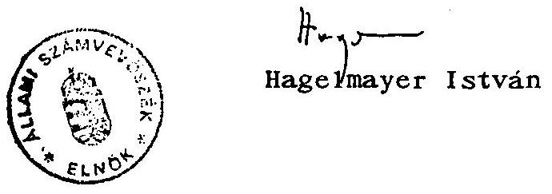

# ÁLLAMI SZÁMVEVÖSZÉK   V-13-2E/1995. 

## J E L E N T É S

a Pénzügyminisztérium és az Állami Bankfelügyelet AGROBANK Rt-vel kapcsolatos tevékenységének ellenőrzéséről

---

Az ellenőrzést végezte: László Józsefné számvevõ tanácsos Horváth Sándor számvevõ fôtanácsos

---

# J E L E N T É S 

a Pénzügyminisztérium és az Állami Bankfelügyelet AGROBANK Rt-vel kapcsolatos tevékenységének ellenôrzéséröl

Miniszterelnök úr május 11 -én levélben tájékoztatta az Állami Számvevőszék elnőkét, hogy az aznapi kormányülésen hozott döntés alapján összegezni szükséges az Agrobank Rt. müködésével kapcsolatban kialakult helyzet okait, és megállapítani ebben a Pénzügyminisztérium és az Állami Bankfelügyelet szerepét, az eljáró tisztségviselők felelősségét. Egyidejüleg kérte, hogy az Állami Számvevőszék soron kivül folytasson vizsgálatot a kialakult helyzet okairól, a felelősség kérdéséröl. A levélben foglaltak szerint - a Kormány utasításának megfelelően a Pénzügyminisztériumban, az Állami Bankfelügyeletnél és a Magyar Nemzeti Banknál párhuzamosan, az illetékes vezetők által elrendelt belsô vizsgálat eredményeivel együtt - az Állami Számvevőszék megállapításait tartalmazó jelentés anyagát a Kormány az 1995. május 18-i ülésén kívánja megtárgyalni.

A vizsgálat lefolytatására - a miniszterelnök által kért határidő betartása érdekében - rendkívül rövid idő állt rendelkezésre, ami kizárta, hogy az ellenőrzést végzők eleget tegyenek az Állami Számvevőszékről szóló - módosított 1989. évi XXXVIII. törvény 25. § (1) bekezdésében elöirt egyeztetési kötelezettségnek.

A vizsgálat megállapításai és következtetései a Pénzügyminisztériumtól (PM), az Állami Bankfelügyelet tól(BAF), a Cégbíróságtól és a Belügyminisztériumtól bekért nagy tömegü dokumentumokon és a személyes megbeszéléseken alapulnak. A feltárt eseményeket általában kronológikus rendben, egyes esetekben - a jobb áttekinthetőség érdekében - tematikusan tárgyaljuk.

---

# KÖVETKEZTETÉSEK 

Az Állami Számvevőszék (ÁSZ) megállapításai alapján levont föbb következtetéseink a következök:

1) Az Agrobank Rt-nél kialakult helyzet alapvető okai a pénzintézet tevékenységében, nyilvántartási rendszerének hiányosságaiban is keresendök.
2) Felelősség terheli az Állami Bankfelügyeletet és a Pénzügyminisztériumot amiatt, hogy az 1994. november 8 -át megelözően tudomásukra jutott információkat nem kezel ték súlyuknak megfelelően, és a szükséges intézkedéseket nem tették meg, illetve nem kezdeményeztek intézkedéseket.
3) Felelősség terheli a Pénzügyminisztériumot amiatt, hogy a bankfelügyeleti tevékenységet felügyelö és a konkrét tulajdonosi jogosítványainak gyakorlásához nem teremtette meg a szükséges belsö szabályozási, szervezeti és személyi feltételeket.
4) Az ÁSZ - írásos dokumentumok hiányában - nem tudta egyértelmüen tisztázni, hogy a likviditási válságot közvetlenül kiváltó, banküzemi szempontból rosszul idózített 1994. november 15-i rendőrségi intézkedésért kit vagy kiket terhel a felelősség.
5) A likviditási válság elhárítása érdekében a Bankfelügyeleti Bizottság (BAFB) és az Állami Bankfelügyelet az elvárható módon járt el. Kifogásolható azonban, hogy a BAFB elnöke egyetlen alkalommal sem vett részt személyesen a bizottsági munkában, megbizottja pedig esetenként nem rendelkezett a szükséges felhatalmazással és információkkal. A BAF - megitélésünk szerint - nem érzékelte kellö idöben a bank ügyvezetése üzleti jó hínevének sérülését, és így csak 1995. május 8 -án tiltotta el tevékenységének gyakorlásától a vezérigazgatót.
6) A válság elhúzódását és az 1995. májusára kialakult helyzetet döntően a tulajdonosok nem megfelelő magatartása, a problémák gyors megoldási készségének, a kompromisszum képességnek hiánya (közgyülés elmaradása, alaptőke emelésben való megállapodás meghiúsulása, részvények átadási feltételeiben történő közös álláspont hiánya, a bank elnökének más rendőrségi eljárás alá vonása stb.) játszott alapvetően szerepet.

---

7) A Pénzügyminisztérium - mint a bankkonszolidációt követöen legnagyobb tulajdonos - hosszú idön keresztül nem tudta egyértelmüen megfogalmazni a bank megmentésével kapcsolatos állásfoglalását. Ebben az is nehezítette, hogy a többi tulajdonos sem tett meg minden töle elvárhatót a tulajdonosi megállapodás megkötésére. A tulajdonosok nem egyértelmü - és csak szavakban kinyilvánított megállapodási törekvése okozta a problémák áthúzódását 1995. évre és az Agrobank Rt. 1994. április 28-ára kiirt rendkívüli közgyülésének május végére való halasztását.

A Pénzügyminisztérium tulajdonosi érdekeinek érvényesitését hátrányosan befolyásolta az is, hogy a Bankfelügyeleti Bizottság ülésein annak törvényes elnöke, a pénzügyminiszter egyetlen alkalommal sem vett részt, és a helyzet megoldására a Bankfelügyelet részére - a BAF által adott szóbeli és írásbeli tájékoztatások ellenére - szóban vagy írásban intézkedést nem tett.
8) A gazdaság szereplői között különleges helyzetben lévő bankok - a befejezetlen bankkonszolidáció, a gazdaság általános állapota, a költségvetés bankszférára gyakorolt hatása, a jogszabályi háttér, a szervezeti feltételek, az állami tulajdonosi jogok és az állami szavatosság kényszerítő hatása stb. következtében - pénzügyi kondíciói (különösen egyes kisbankok esetében) sürgetik a kérdés átfogó, körültekintő és gyors megoldását. A történtek alapos elemzése alapján újra át kell tekinteni a Pénzintézetekről és a pénzintézeti tevékenységről szóló 1991. évi LXIX. tv-t (Pit), ennek keretében különösen hangsúlyt adva a törvény betarttatását felügyelő intézmények fel-adat- és hatáskörét, valamint a pénzintézeti válságkezelésre vonatkozó rendelkezéseket és az egyéb kapcsolódó jogszabályokat, továbbá az állam, mint tulajdonos megszemélyesítésének kérdéseit.

# RÉSZLETES MEGÁLLAPÍTÁSOK 

## 1. Az Agrobank Rt. konszolidációja

Az Agrobank Rt. 1987-ben 1,5 Mrd Ft-os alaptőkével az Agrár Innovációs Bank Betéttársulás jogutódjaként jött létre kereskedelmi banki tevékenység folytatására. Az állami szerepvállalás a konszolidációval kezdődött. Az 1992. XII. 29-én kötött adásvételi szerződéssel a Magyar Köztársaság 3,6 Mrd Ft vételárral ellentételezett "rossz" minösitésü követelést

---

vásárolt ki a magánbank portfóliójából. A Pit. 99. §, illetve a 3/1992. Állami Bankfelügyeleti rendelkezés szerint minösített hitelállomány auditálását követően a szerződött összeget 1,6 Mrd Ft-ra módosították. A hitelportfólió konszolidálásával a bank minősített követeléstől és a hozzá tartozó céltartalék-képzési kötelezettségtől szabadult meg.

Stabilitásának fokozása, pénzügyi mutatóinak (tökemegfelelés, likviditás, cash flow) javítása érdekében az adó- és bankkonszolidációba is bevonták az Agrobankot. A kockázati céltartalék-képzési kötelezettség fedezetéhez kapcsolódó költségvetési forrásnyújtás állami tulajdonszerzéssel párosult.

A mintegy 2,0 Mrd Ft-os tőkeemelés (1993-ban 1,2 Mrd Ft, 1994-ben 0,8 Mrd Ft) és a 0,5 Mrd Ft-os alárendelt kölcsöntöke juttatás 1994 végére $30 \%$-os állami tulajdonlást eredményezett.

A konszolidációs szerződés tételesen rögzítette a bank kötelezettségeit. Az állam, mint tulajdonos által az Agrobank számára elöirt feladatok mennyiségi teljesitése az átadott dokumentumok alapján megállapítható. A teljesítések érdemi felülvizsgálatával - az intézkedés kihatásának jelentőségét, jelzésértékét kivéve - a PM jellemzően időbeli késlekedéssel vagy egyáltalán nem foglalkozott. Nem forditott gondot a bank szakmai tevékenységének, gazdálkodásának folyamatos megitéléséhez nélkülözhetetlen beszámolási és adatszolgáltatási kötelezettség gyakorlatának kialakítására, a teljesités rendszerességének és tel jeskörüségének számonkérésére sem.

Az állam jelentős (befolyásoló) tulajdoni hányadából eredő jogosítványok gyakorlására a Pénzügyminisztérium teljesen (munkaerő és eszköz oldalról is) felkészületlen. 1994. elsö felében formálisan felállitották ugyan (a Pénz- és Tökepiaci Főosztályon belül) a Bankkonszolidációt Ellenőrző Osztályt (BEO), ténylegesen azonban a halasztást nem türö feladatokat a fóosztályvezető és helyettese látta el.

# 2. Az Állami Bankfelügyelet és a Bankfelügyelet1 Bizottság tevékenysége 

A BAF számára 1994. november elején nyilvánvalóvá vált, hogy az Agrobank a rendőrség érdeklődési körébe került. A rendőrség képviselöi megkeresték a BAF jogi főosztályvezetójét.

---

Megbeszélésük az Agrobank egyes tevékenységét, valamint egyes - közelebbröl nem meghatározott - pénzügyi vezetők örizetbe vételének témakörét érintették.

Az ÁSZ rende1kezésére álló dokumentumok szerint egyes banki vezetők tevékenységének megitélése még nem volt egyértelmü a rendörség részéről. A fel1e1t levelezés alapján - az 1994. november 8-14-e közötti időszakban - a PM hatáskörében elindítandó, illetve megteendő intézkedéseket kértek.

A belügyminiszter 1994. november 8-án levelet intézett a pénzügyminiszterhez. A levélben foglaltak szerint az Agrobank Rt. több milliárd Ft-ot kíván "E" hitelezés útján szabálytalanul kihelyezni, ame1yek visszafizetésére az adósok részéről reális lehetőség nincs.

A belügyminiszter kérte, hogy a leirtak alapján a pénzügyminiszter a szükséges intézkedéseket saját hatáskörben tegye meg. A levélben nem volt utalás arra, hogy rövid időn belül várható az Agrobank Rt. vezetői közül bárkinek a letartóztatása.

A szigorúan titkos minösitéssel megküldött, a Pénzügyminisztérium iratkezelési rendjébe nem került iratot a pénzügyminiszter a bankprivatizációs kormánybiztos részére adta át 1994. november 9-én.

Az elöbbiekben ismertetett eseménysor a belügyminiszteri levélben foglaltak BAF-hatáskörben való kivizsgálását indokolta volna (mint PM hatáskörben való eljárást). Erre a BAF részéről (a bankprivatizációs kormánybiztos szóbeli megkeresését követően) a felkészülés - a feladatok átgondolása, ütemezése stb. - elkezdödött.

A kormánybiztos - az Állami Számvevőszék részére adott nyilatkozata szerint - az anyag áttanulmányozása után azt a további teendők meghatározása érdekében átadta az Állami Bankfelügyelet megbizott vezetőjének. Ezt követően november 11-én (pénteken)

---

szóban megállapodtak arról, hogy a levélben foglaltak tisztázása érdekében, a már korábban 1994. november 16-ára összehívott Bankfelügyeleti Bizottsági ülésen kezdeményezni fogják helyszíni ellenőr kiküldését az Agrobankhoz. A megállapodásról a kormánybiztos a pénzügyminisztert szóban tájékoztatta.

A belügyminiszter levelét az Állami Bankfelügyelet megbizott vezetője november 14-én (hétfőn) a kormánybiztos részére visszaadta.

A belügyminiszteri átiratban foglaltak alapján vélelmezhető, hogy rendőri intézkedések csak a pénzügyi intézkedések eredményének ismeretében várhatók. A valóságban azonban a rendörség 1994. november 15-én a kora reggeli órákban letartóztatta az Agrobank Rt. elnökét és vezérigazgatóját. Ezért a BAFB ülésére nem az eredeti időpontban (november 16-án), hanem a letartóztatás napján került sor. Az előbbiekböl következöen a PM és a BAF okahagyottnak minösítette a válaszlevél megírását a belügyminiszternek.

Az eseményekkel kapcsolatban írásos dokumentumot senki sem tudott bemutatni.

A bank vezérigazgatója 1994. november 11-én levélben fordult az ORFK helyettes vezetőjéhez bankvezetői tisztessége védelmében.

A BAF 1994. november 15-étől a kialakult helyzet menedzselésével foglalkozott: első ízben 15-én 18 órától, majd további 6 alkalommal ülésezett. A kritikus időszakban a BAFB döntései alapján, illetve a pénzintézetekről és a pénzintézeti tevékenységről szóló - többször módosított - 1991. évi LXIX.

---

törvényben foglalt jogosítványai érvényesítésével intézkedéseket hozott, tájékoztatásokat adott.

A BAFB - november 15-ei ülésén - több intézkedést hozott (egyes pénzintézeti tevékenységek megtiltása, ügyvezető kirende1ése, tulajdonosok részére való kifizetések korlátozása, a befolyásoló részesedéssel rendelkező - gazdasági társaságok szavazati jogának korlátozása stb.) az Agrobank Rt. betéteseit és számlatulajdonosait fenyegető kárveszély elhárítására.

A BAFB intézkedésére (1994. november 15. ke1tezéssel) kiadták a 84/1994. számú bankfelügyeleti határozatot.

A BAFB 1994. november 15-étől kezdődően rendszeresen üléseket tartott (november 15., 17., 21., 23., 28.), ame1yeken értékelte az előző ülés óta e1te1t időszak eseményeit, beszámoltatta a bankhoz kirende1t ügyvezetőt, illetve a bank vezérigazgató he1yettesét.

A BAFB ülésén - a törvényi előírás szerinti bizottsági e1nök, a mindenkori pénzügyminiszter - egyetlen alkalommal sem vett részt. A Bizottság munkájában a PM a tagok közé delegált privatizációs kormánybiztos, majd - annak lemondása után - a közigazgatási államtitkár személyében képviseltette magát.

A Bizottság munkájáról a BAF megbizott e1nöke, a Bizottság munkáját is irányító levezető e1nök a pénzügyminisztert rendszeresen, a miniszterelnököt kérésének megfelelő időpontban tájékoztatta.

A pénzügyminiszter részére rész1etes írásos tájékoztató készült 1994. november 17-én, 22-én, 23-án, 24-én. Az írásos tájékoztató az említetteken kívül tartalmazta a Bizottság, illetve a BAF véleményét az események várható alakulásáról, a javaslatokat a megoldás kereséséhez stb.

A miniszterelnök tájékoztatására 1994. november 22-én 29 db íratból álló dokumentációt állítottak össze a bankprivatizációs kormánybiztos kérésére. A

---

BAF sem a miniszterelnök úrtól, sem a Miniszterelnöki Hivataltól nem kapott közvetlen visszajelzést. A bankprivatizációs kormánybiztos szóban arról adott tájékoztatást a BAF megbizott elnökének és vezető munkatársainak, hogy a miniszterelnök úrtól teljes körü felhatalmazást kapott az Agrobank probléma megoldására.

A bank két vezetőjének 1994. november 15-i örizetbe vétele következtében az Agrobank Rt. betéteseiben a bizalom megingott, és a nyilvánosságra hozott (az Állami Bankfelügyelet által kiadott) közlemények ellenére a bankszámla tulajdonosok készpénzüket a bankból kivették, illetve számlájukat más kereskedelmi bankhoz helyezték át.

Az ORFK vezetője 1995. november 15-én levélben tájékoztatta a pénzügyminisztert arról, hogy az Országos Rendőrfőkapitányság Vizsgálati Főosztálya örizetbe vétel mellett a bank két vezető állású dolgozója ellen nyomozást rendelt el. A főkapitány a pénzügyminisztertől - a büntetőeljárás sikeres lefolytatása érdekében - az Agrobank Rt tevékenységének pénzügyi-számviteli szempontból való (a privatizáció során folyósitott "E" hitelek kihelyezésének körülményeire is kiterjedő) felülvizsgáltatását kérte.

A levélben foglalt kérés teljesítésére - annak ellenére, hogy a levelet a miniszter a bankprivatizációs kormánybiztos és a megbizott BAF elnők részére kiszignálta (utóbbi a levelet nem kapta meg), intézkedés sem a PM-ben, sem a BAF-nál nem történt.

A betétesek bizalmának megingása következtében két hét alatt a bankból 7,2 Mrd Ft forrást vontak ki.

Az ÁSZ megitélése szerint az örizetbe vételre - banküzemi szempontból - kedvezőtlen időpontban került sor, és a forráskivonás - a bankkal szembeni bizalom megingásán kívül - a bank számára mintegy 350 M Ft kimutatható veszteséget okozott.

A letartóztatásokra a bíróság szerint megalapozott gyanú alapján került sor.

A Fővárosi Bíróság, mint másodfokú bíróság 1994. november 28-án, 7/Bkf.3301/1994/2. szám alatt jogerős végzést hozott, melyben a Pesti Központi Kerü-

---

leti Bíróság 1994. november hó 10. napján ke1t, Bk. 2029/1994/3. végzését helyben hagyta.

Az indoklás szerint "... a másodfokú bíróság álláspontja szerint az előzőekben részletezett tanúval1omások és okiratok elegendőek a gyanúsitottakkal szembeni alapos gyanú megállapításához. A gyanúsitottak védekezése ezt eddig nem gyengitette vagy zárta ki. A védekezés valóság-tartalmához ugyanúgy további nyomozati cselekmények elvégzése szükséges, amiként az alapos gyanú megerősitéséhez is nélkülözhetetlenek az eljárás folyamán további bizonyitékok."

A BAFB a bank vezérigazgatóját - szabadlábra helyezését követően - első ízben 1994. november 21 -ei ülésén hallgatta meg, mint az Agrobank Rt. igazgató tanácsának egyik tagját. Vezérigazgatói jogkörében sem a Bizottság, sem a BAF nem korlátozta, csak annyiban, amennyiben a bankhoz a Bankfelügyelet ügyvezetőt rendelt ki.

A Bizottság ülésén a vezérigazgató kifejtette, hogy aláírási és egyéb jogai korlátozása mellett kíván visszatérni a bankba. Visszatérésének legfőbb okát abban jelölte meg, hogy bízik a betétkivételi folyamat fékezésében és új források szerzésében.

Az ülésen a vezérigazgató kérésére a BAF megbizott elnöke közölte, hogy az eddigi, a BAF által hozott korlátozások érvényben maradnak, a vezérigazgató mint az elnököt helyettesíthető alelnök a bank Igazgatóságában gyakorolhatja jogait, vezérigazgatóként azonban egyelöre nem. Amennyiben a bíróság az ügyészség fellebbezését elutasítja, megint más a helyzet.

A Bizottság 1994. november 28-án megtartott ülésén - a bíróság döntésének ismeretében - tért vissza a vezérigazgató jogainak korlátozására. Az ülésen a vezérigazgató korábbi önkorlátozásra tett ígéreteit megerősítette: "... minden olyan jogosítványomról, amely a bank müködőképességét nem veszélyezteti természetesen az. Igazgatóság előtt lemondok ..."

Az ÁSZ számára nem egyértelmü, hogy a bírósági döntés figye1embevételével (mely szerint a gyanú megalapozott, bár további nyomozati cselekményeket igényel) a Bizottság a vezér-

---

igazgatót tevékenysége végzésétől miért nem tiltotta el. Ezt indokolta volna az a tény is, hogy igazgatósági tagként az igazgatóság döntéseinek kialakításában (az Igazgatósági ülések jegyzőkönyvének tanúsága szerint) döntő szerepe volt.

A BAF-nál többször felmerült a kérdés, hogy a bank elnöke és vezérigazgatója elmozdítható-e tisztségéből. A jogszabályi elöírások azonban csak a vezérigazgató tevékenység végzésétöl való eltiltására adnak lehetőséget, amennyiben az ügyvezetó elveszitette jó üzleti hínevét.

A BAF álláspontja szerint az ártatlanság vélelme, mint büntetőjogi alapelv azt jelenti, hogy senki sem tekinthető bűnösnek addig, amíg azt jogerős bírósági itélet meg nem állapítja. Ezen az alapon tudatában annak, hogy az ártatlanság vélelme és a jó üzleti hírnév nem azonos kategória - a Bankfelügyelet ekkor még nem látott lehetőséget a vezérigazgató elmozdítására. Kétségtelen, hogy az Agrobank Rt-nél kialakult likviditási válság elhárításában, a bank helyzetének konszolidálásában, a mintegy 4 Mrd Ft forrás bevonásában a vezérigazgatónak tevöleges szerepe volt.

A vezérigazgatót (és még egy pénzintézeti vezetőt) a 171/1995. számú, 1995. május 8 -án kelt BAF határozat tiltott el tevékenysége gyakorlásától. A határozat indokló részében felsorolt tények jelentős része azonban már korábban is ismert volt a BAF előtt. A határozat a bank irányító testületeit tette felelőssé azért, hogy a két pénzintézeti vezető jó üzleti hínevének sérülését, illetve elvesztését a büntetőel járás következtében nem észlelték.

Az ÁSZ megitélése szerint a jó üzleti hírnév sérülése - a Fővárosi Bíróság végzése, valamint a bank üzletmentével kapcsolatban a BAF, illetve a BAFB által ismert adatok és folyamatok alapján - már 1994. november 28 -án, illetve december elején is ismert volt.

Az 1994. november 28 -ai bizottsági ülésen a kirende1t ügyvezetó - a vezérigazgató meghallgatását megelözően - a bank üzletmenetét és benne a vezérigazgató szerepét érintő bejelentést tett.

---

Az ügyvezető tájékoztatását követően a BAFB a jegyzőkönyv szerint a kérdés fölött érdemi vitát nem folytatott.

A Magyar Nemzeti Bank vizsgálatot folytatott 1994. március 10. és április 25-e között az Agrobank Rt-nél. Az ellenőrzés az MNB által refinanszirozott banki hitelekre, a bank tökehelyzetére, az 1993. november 1 - 1994. február 26 közötti időszakban fennálló hitelekre és hiteligérvényekre terjedt ki. Az "E" hiteleknél tételes, más hiteltípusoknál szúrópróbaszerű volt az ellenőrzés. Az MNB Bankellenőrzési Főosztály 1994. május 25 -ei jegyzőkönyve rendszerbeli hiányosságokat rögzített.

---

A feltárt hiányosságok ellenére a BAF, ame1ynek az MNB a jegyzőkönyvet hivatalból megküldte, nem látott okot bankfelügyeleti beavatkozásra. A BAF 171/1995. számú határozatának indoklásában szakmai érvként az Agrobank Rt. könyvvizsgálójának 1995. április 28-án kelt és a BAF elnökéhez 1995. május 3-án érkezett leveléhez mellékelt, az Agrobank Rt. 1994. évi mérlegbeszámolójának könyvvizsgálati jelentését említi.

E jelentésben a könyvvizsgáló a következő megállapításokat teszi: "... az 1993. évhez képest a 9,8 Mrd Ft-os befagyott és 2,8 Mrd Ft hozam nélküli vevőkövetelés finanszirozási költsége következtében, s a likviditás fenntartásához szükséges idegen források bevonása folytán a jövedelmezőség oly mértékben megromlott, hogy a nem kamatozó követelésállomány rendezése és megfelelő tőkeemelés nélkül - a Bank jövőbeni biztonságos és elöirásszerü müködőképessége nem látszik biztosítottnak. Ezen állomány az adott eszköz- és forrásstruktúrában a visszacsatolódások folytán negatív önfejlesztő folyamatot generál, gyorsuló ütemü veszteségge1 "fogyasztja" el a bevont idegen forrásokat is."

E tények tükrében a BAF 1994. novemberi határozatai és a 171/1995. számú határozat - elsősorban a vezetők eltiltását illetően - ellentmondásos.

Valószínűsíthető, hogy a május 8-án kelt határozatot befolyásolta az a tény is, hogy a PM, az MNB és a BAF vezetői 1995. május 5 -én este 19 órától a Belügyminisztérium és az ORFK vezetőivel folytatott megbeszélésen tájékoztatást kaptak a bankelnök - egyéb üzleti tevékenységét érintő - letartóztatásáról, annak várható idópontjáról. Ezen túlmenően a pénzintézeti tevékenység felfüggesztését eredményező határozat meghozatalában jelentős mértékben befolyásoló tényező lehetett az is, hogy a bank vezérigazgatójának jelzése szerint április végétől nagyobb összeguu forráskivonás volt tapasztalható a betétesek és számlatulajdonosok részéről.

---

# 3. A tulajdonosok, kiemelten a Pénzügyminisztérium tevékenysége 

Az Agrobank Rt. likviditási válságának megoldása érdekében gyakran ülésező BAFB az 1994. november 21 -én megtartott ülésén vetette fel először markánsan azt, hogy az egyre szűkülö likviditás miatt a bank 2-3 napon belül fizetésképtelenné válik. Ez csak abban az esetben kerülhető el, ha rövid időn belül megindul a forrásgyújtés, illetve a Pénzügyminisztérium kérésére az MNB megkezdi a bank finanszirozását.

A Bizottság ülésén jelen lévő pénzügyminisztériumi képviselő, a bankprivatizációs kormánybiztos ígéretet tett arra, hogy egy napon belül a Pénzügyminisztérium írásban nyilatkozik a kérdésről.

A BAF részéről sürgetően merült fel, hogy a bank megmentése érdekében nyilatkozzanak a befolyásoló részesedéssel rendelkező tulajdonosok.

A Bizottság ülésén a Bankfelügyelet felszólította a befolyásoló részesedéssel rendelkező tulajdonosokat, hogy (PM + 3 Kft) nyilatkozzanak, mit kívánnak tenni a bank érdekében (engedély visszavonásának kérése, pénzt adhatnak, megegyezhetnek egymással, új tulajdonosokat kereshetnek stb.).

Az MNB a likviditási hitel nyújtását függővé teheti a Bankfelügyelet intézkedésétől, így a jegybank fő tulajdonosának, a Pénzügyminisztériumnak kell eldöntenie, hogy meddig (milyen határig, feltételek mellett) tartja szükségesnek a jegybanki finanszírozást.

A Bizottság ülésén a várható intézkedések megvitatását követően elhatározás született arra vonatkozóan, hogy az Agrobank megmentése érdekében - ezt az álláspontot a Pénzügyminisztérium jelen lévő képviselője a bankprivatizációs kormánybiztos képviselte - a BAF jószolgálati tevékenységet folytat a tulajdonosok 1994. november 22-i tárgyalása érdekében.

A BAF kiértesítése ellenére azonban csak a tulajdonosok mintegy $47 \%$-át reprezentáló képviselők jelentek meg, akik kinyilvánították szándékukat az érdemi tárgyalások folytatására, a bank megmentésére.

---

Az 1994. november 22-én az Agrobank tulajdonosaí között megtartott megbeszélésen a BAF részéről a megbizott elnök és két főosztályvezető, a tulajdonosok közül a Pénzügyminisztérium részéről a privatizációs kormánybiztos és munkatársa, a befolyásoló tulajdoni hányaddal rendelkező többi tulajdonos közül az egyik Kft meghatalmazottjaként két ügyvéd, az Agrobank képviseletében meghivott vendégként a vezérigazgató vett részt.

A BAF képviselőinek felkérésére a tulajdonosok képviseletében eljáró ügyvéd megerősítette, hogy az általa képviseltek hajlandóak a bank alaptőkéjének megemelésére, egyúttal felvetette azt a lehetöséget, hogy megvásárolják a Magyar Állam tulajdoni részesedését. A Pénzügyminisztérium képviseletében jelen lévő kormánybiztos nem volt felhatalmazva az eladásra.

Ezt követően a jelenlévők több megoldási lehetőséget tárgyaltak meg, de nem jutottak megegyezésre. A Pénzügyminisztérium képviselöje kérte annak rögzitését, hogy a megbeszélésen jelen lévő két tulajdonos egybehangzó véleménye szerint az Agrobankot müködő bankként kívánják megtartani, az állami tulajdonos részéről azonban a mintegy 6 Mrd Ft-os tőke befizetését nem tudja vállalni.

A Bankfelügyeleti Bizottság 1994. november 23-án tartott ülésén a kormánybiztos, mint az Agrobank Rt. 30\%-os állami tulajdonának képviselöje, tájékoztatást adott a megbeszélésről. Tájékoztatása szerint két stratégia képzelhető el:

- A tulajdonosok tőkét emelnek, részben a veszteség pótlására, részben bizalomerősítő gesztusként (ez a PM részéről nem pénzt jelent).
- A PM "kivásárolja" a többi tulajdonost valamilyen megoldással, amivel párhuzamosan a tulajdonosok is megkapják azt a jogot, hogy a banküzemhez nem tartozó ingatlanokat, üzleteket (pl. Intergold Kft) kivásárolhassák. Ezt követően marad a bank "tiszta" és lehet keresni olyan üzleti partnert, aki tőkeemelést hajt végre. Az állam ebben az esetben sem kíván a bankban tulajdonos maradni.

Az Agrobank igazgatósága által korábban, 1994. december 9-ére összehívott közgyűlés elmaradt, a bank befolyásoló részesedéssel rendelkező tulajdonosaí között - az előzetes

---

egyeztetések ellenére - nem jött létre megállapodás. Ennek hiányában a közgyülés időpontjáról nem született döntés.

A Pénzügyminisztérium az eltelt idöben az Agrobank helyzetének megoldására nem dolgozott ki intézkedéseket, és dokumentál isan nem igazolható, hogy a tulajdonosokkal egyeztetéseket folytatott volna. Az idő előrehaladtával a bank helyzetének megoldása egyre sürgetőbben vetődött fel. Ezt az MNB alelnökének 1994. december 28-án irt, majd ezt követően az Agrobank Felügyelő Bizottságának elnöke által írt levelkben foglaltak igazol ják.

A jegybank alelnöke részletes tájékoztatást kér arról, hogy mi a pénzügyi kormányzatnak az Agrobank helyzetének végleges rendezésére vonatkozó álláspontja, bele értve ebbe azt is, hogy a PM miként látja a pénzintézet jegybanki refinanszirozásának kérdését.

Az Agrobank Felügyelő Bizottságának elnöke által a pénzügyminiszternek írt, 1995. január 18-i levelében rögzíti, hogy a bank Felügyelő Bizottsága "nem látja kirajzolódni az Agrobank Rt stabilizációjának állami elképzeléseit, s emiatt aggasztónak tartja a bizonytalanság okán kialakult helyzetet. Ezért kéri

---

Miniszter urat, szíveskedjék mielőbb tájékoztatást adni arról, hogy milyen módon kívánja az állam, mint tulajdonos, a bankban kialakult helyzetet konszolidálni, és a pénzintézet fejlődésének feltételeit megteremteni".

A Bankfelügyeleti Bizottság 1995. január 27-én megtartott ülésén részletesen áttekintették az Agrobank aktuális helyzetét. A Bizottság ülésén a bankfelügyeleti kirendelt ügyvezető részletes tájékoztatást adott a bank tőkehelyzetéről.

A Bankfelügyelet megbizott elnöke megerősítette, hogy a BAF munkatársai által összeállított anyag a kirendelt ügyvezető elemzésének megfelelő következtetéseket tartalmaz. Ennek során is mintegy 6 Mrd Ft feletti tőkeszükségletet tártak fel.

A Bizottság ülését követően a Bankfelügyelet kezdeményezte a bank igazgatóságának összehívását. Előirta, hogy az igazgatóság tekintse át a bank tőkehelyzetét, és 10/1995. szám alatt határozatot adott ki, melyben felhívta az igazgatóságot a közgyülés összehívásának kötelezettségére, amennyiben megállapításra kerül, hogy a bank alaptőkéjének egyharmadát elvesztette.

A tulajdonosok közötti tárgyalások ezen időszakban való alakulásáról ellenőrzésünk írásos dokumentációt nem talált.

A kormánybiztos és munkatársa a BAF megbizott elnőkét szóban többször tájékoztatta arról, hogy a Bankfelügyelet kezdeményezése alapján 1995. április 28 -ára összehívott közgyűlésen érdemi megállapodás lesz a tulajdonosok között.

A bank jövőjét illető elgondolások első körvonalazódását rögzíti a PM, az MNB, a BAF, az Országos Betétbiztosítási Alap képviselöinek résztvételével 1995. április 20-án megtartott megbeszélésről készült emlékeztető. Ebben lehetséges megoldási módként rögzítették, hogy a BAF április 24-én nyilatkoztatja a tulajdonosokat tőkeemelési szándékukról. Ekkor a pénzügyminiszternek, mint tulajdonosnak is nyilatkoznia kell, hogy a többi tulajdonossal együtt hajlandó-e tőkét emelni. Amennyiben az államon kívüli tulajdonosok nem lesz-

---

nek hajlandóak az 5 Mrd Ft körüli tőkeemelést megvalósítani, úgy a bank bezárása, a felszámolás megindítása vagy egyéb megoldás jöhet szóba.

A Bankfelügyelet által 1995. április 25 -én megtartott tulajdonosi egyeztetés során megállapodtak abban, hogy a tulajdonosok 24 órán belül írásban nyilatkozatot adnak tőkeemelési szándékukról.

Az Állami Bankfelügyelet felhívására a pénzügyminiszter nyilatkozott a minimálisan szükséges tőkeemelés biztosításának kötelezettségvállalásáról, amennyiben a bank magántulajdonosai részvényeiket térítés nélkül átadják a Magyar Köztársaságnak. A tulajdonosokat képviseló ügyvéd 1995. május 3-i, a Pénzügyminisztériumnak címzett levelében rögzítette, hogy megbizói a részvényeket milyen kondíciókkal kívánják az állam részére átadni.

A levélben foglaltak szerint: "A Szandolin Kft, a Tárca Kft és a Delaware Kft tulajdonában lévő és teljes egészében kifizetett részvénycsomagot a részvényesek összesen 15.000 Ft-ért eladják a Pénzügyminisztériumnak.

Ugyanakkor a három befolyásoló részesedéssel rendelkező gazdasági társaság ezzel egyidejüleg jogosult a banktól egyenként $1.000 .000 .000 \mathrm{Ft}$ értékủ (összesen tehát $3.000 .000 .000 \mathrm{Ft}$ értékben) követelést vásárolni. A követelések vételára a követelések behajtásából a jövőben befolyó összeg $50 \%$-a, míg a másik $50 \%$ a Bankot illeti meg.

A követelések behajtásáért a bank közösen a három vevővel tesz meg mindent úgy, hogy annak költségeit a bank viseli, de ehhez a későbbiekben leirtak szerint hozzájárulnak a vevők is."

Az ajánlatot visszautasító pénzügyminisztériumi levelet (1995. május 4.) követően a tulajdonosok nevében még kétszer került megerősitésre a részvénycsomag értékesítési feltétele (1995. május 10. és 12 -én).

Az ÁSZ számára az Agrobank részvényeinek adásvételére vonatkozó pénzügyminisztériumi álláspont túlságosan merevnek tünik. Az eladó kft-k készpénzkövetelése ( 15.000 Ft ) a mintegy 3,5 Mrd Ft névértékủ részvény ellenértékeként jelképesnek tekinthető. A követelés kivásárlására vonatkozó igényükben

---

nem kötötték ki feltételként, hogy annak a bank követelései közül a legértékesebbnek kell lennie, mivel semmilyen megkötést nem tettek ezen ajánlatuk megfogalmazásakor.

Az előbbiekböl következöen a követelések közül az értéktelenebbek vásárlásra való felajánlása is biztosított volt - az igény alapján - a Pénzügyminisztérium számára.

Budapest, 1995. május 17.

---

# H I B A J E G Y Z É K 

a Pénzügyminisztérium és az Állami Bankfelügyelet Agrobank Rt-vel kapcsolatos tevékenységének ellenörzéséröl készült jelentéshez
2. oldal 6. pont vége:
játszott alapvetően szerepet helyett idézte elö
3. oldal 7. pont 2. sora:
legnagyobb tulajdonos helyett a legnagyobb tulajdonos képviselöje
4. oldal első bekezdés első sorában kezdődő mondat eleje kiegészül:
"A szerződés V. fejezetében rögzített elállási jog érvényesitését, valamint ..." szövegrésszel
4. oldal 2. bekezdés 2. sora:
adó-konszol idáció helyett adós-konszol idáció
5. oldal első belsö bekezdés 3. sora:
kiván helyett kívánt
6. oldal első külső bekezdés 8. sora:
okahagyott helyett okafogyott
7. oldal 3. belsö bekezdés vége kiegészül a:
"majd vezérigazgatóját." szövegrésszel
8. oldal első belsö bekezdés 5. sora:
a miniszterelnök úrtól helyett a miniszterelnöktöl és a pénzügyminisztertöl
14. oldal második belsö bekezdés 3. sora helyesen:
tulajdonosa képviselöjének, a Pénzügyminisztériumnak kell el...

Budapest, 1995. május 30.