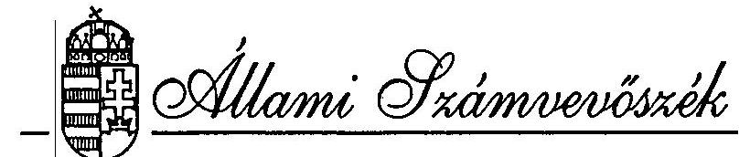
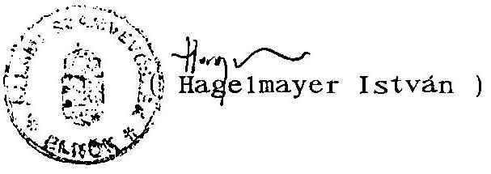
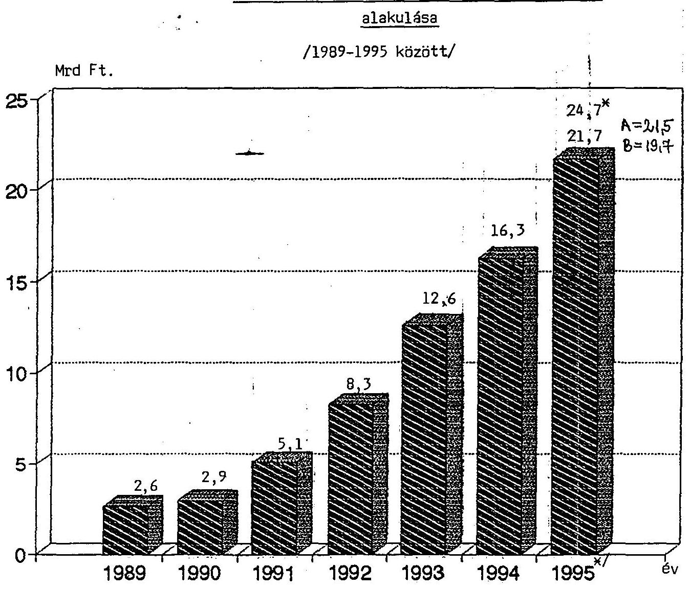
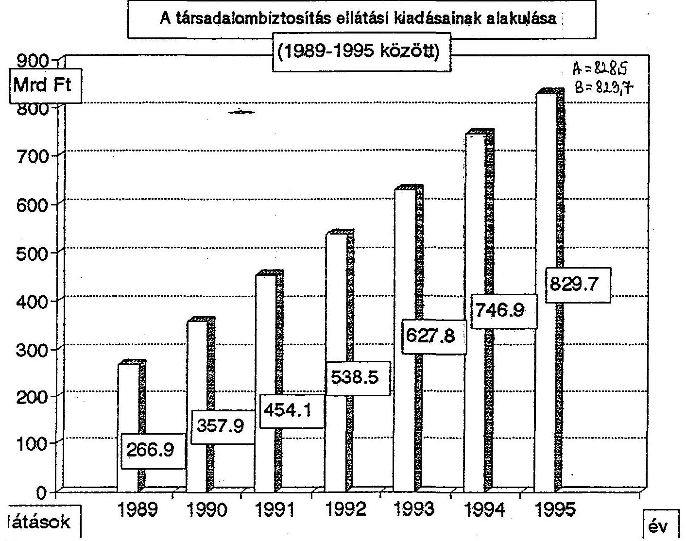

T. 985/1.sz.

# VÉLEMÉNY 

a társadalombiztosítás pénzügyi alapjainak
1995. évi költségvetéséről

---

A vizsgálatot vezette:
dr. Csépán Magdolna
osztályvezető főtanácsos

A vizsgálatban résztvettek: Balla Józsefné tanácsos
dr. Fónyad Erzsébet számvevő
Hajagos Józsefné tanácsos
Hegyesné
dr. Solymosi Mária számvevő
dr. Kurucz István számvevő
Molnár Istvánné tanácsos
Szendrődi Józsefné számvevő

---

Állami Számvevőszék
V-19-14/1994-95.
Témaszám: 249.

# VÉLEMÉNY 

a társadalombiztosítás pénzügyi alapjainak 1995. évi költségvetéséről

## BEVEZETÉS, ELŐZMÉNYEK

Az államháztartási törvény 86. §-a értelmében a társadalombiztosítás költségvetési előirányzatait a központi költségvetési törvénnyel egyidejűleg kell - jóváhagyásra - az Országgyűlés elé terjeszteni. Az Országgyűlés a társadalombiztosítás költségvetését is az Állami Számvevőszék véleményével együtt tárgyalja meg. Mivel az előírások szerint a költségvetési törvényjavaslatot a megelőző év szeptember 30-ig kell benyújtani, a határidő értelemszerűen a társadalombiztosításra is érvényes. Ezt azonban 1995-re vonatkozóan nem sikerült betartani.

A késedelem legfőbb oka, hogy a biztosítási önkormányzatok és a kormányzat közötti véleménykülönbségek, a feladat- és hatáskörök tisztázatlansága miatt az egyeztetések már az "eredeti" költségvetés készítésekor is elhúzódtak. Végül a kölcsönös kompromisszumokon alapuló költségvetéseket a Nyugdíjbiztosítási Önkormányzat Közgyűlése január 9-én, az Egészségbiztosítási Önkormányzat Közgyűlése pedig január 10-én fogadta el. Ezt a T/464. számú "eredeti" törvényjavaslatot 1995 januárjában adták át az Országgyűlésnek, s azt az ÁSZ - hivatalosan - január 30-án kapta meg. Az Állami Számvevőszéknek ekkor nyílt lehetősége arra, hogy véleményét elkészítse. Kötelezettségének február 16-án tett eleget.

---

A Kormány márciusban visszakérte az Országgyűléstől a T/464. számú törvényjavaslatot. A március 12-én nyilvánosságra hozott, a gazdasági stabilizációt szolgáló Kormány-intézkedések, majd az ennek nyomán benyújtott T/817. számú törvénycsomag tartalma alapvetően befolyásolja a Nyugdíjbiztosítási és az Egészségbiztosítási Alap idei pénzügyi pozícióját. Időközben egyértelművé vált, hogy a Kormány megváltoztatta az ingyenes vagyonjuttatással kapcsolatos álláspontját is.

Mindezekkel összefüggésben éles vita bontakozott ki a két biztosítási önkormányzat és a Kormány között, az önkormányzatok külön is sérelmezték azt, hogy az általuk jóváhagyott költségvetéseket a Kormány egyeztetés nélkül vonta vissza. Az április 10-én és 11-én megtartott közgyűlések (immár harmadik alkalommal!) döntöttek a költségvetési "sarokszámokról". Mivel az álláspontok később sem közeledtek egymáshoz, így került sor május 5-én a társadalombiztosítás pénzügyi alapjainak 1995. évi költségvetéséről szóló T/985. számú törvényjavaslat benyújtására, amelynek A változata az önkormányzatok által elfogadott, B változata pedig a Kormány által javasolt költségvetést mutatja be, amit az önkormányzatokkal nem egyeztetett. Az eredeti költségvetési számokat (ez alatt a T/464. számú törvényjavaslatban foglaltakat értjük), valamint az A és B változat fő számait a mellékelt táblázatban foglaltuk össze.

A költségvetések benyújtása és általában a törvényalkotás folyamatában teljességgel szokatlan, és az Országgyűlés munkáját, a véleményalkotást nehezítő eljárás, hogy a beterjesztett dokumentum két változatot tartalmaz. Bár a történtek bizonyítják, hogy itt nem egyszerűen pénzügyi-gazdasági, hanem politikai kérdésről van szó, a kialakult helyzet, a költségvetés készítésének és benyújtásának körülményei ismételten azt bizonyítják, hogy a társadalombiztosítási önkormányzatok működésének jogi keretei rendezetlenek. A hatásköri, felelősségi, együttműködési problémákra az ÁSZ már korábbi jelentésében is felhívta a figyelmet. Az ellentmondásos helyzet feloldása érdekében lényegében nem történt semmi.

Az A változat a hatályos törvényekből indul ki és az önkormányzatok döntését tükrözi. A Kormány által megfelelőnek tartott B variáns pedig alapvetően -a benyújtás óta a módosító javaslatok következtében alaposan megváltozott- stabilizációs törvénycsomag elgondolásait számszerűsíti.

---

Az eltérések nem annyira a fő összegek nagyságában, inkább az egyes tételek konkrét összegében, tartalmában mutatkoznak. A kapcsolódó kormányzati intézkedéseket az önkormányzatok részben elutasítják, részben pedig az azokhoz fűzött pozitív várakozásokat kérdőjelezik meg. (Munkáltatói és munkavállalói érdekérvényesítő törekvéseik sok szempontból érthetőek.)

Hangsúlyozni kell, a végleges központi költségvetés és a társadalombiztosítási alapok költségvetésének fő számait az határozza meg, hogy a T/817. számú -gazdasági stabilizációs-törvénycsomagot az Országgyűlés végül is milyen tartalommal hagyja jóvá. Ennek mindenképpen meg kell előznie a társadalombiztosítási alapok költségvetési törvényének elfogadását.

Az Állami Számvevőszéknek ilyen körülmények között is el kellett készítenie véleményét a T/985. számú törvényjavaslatban foglaltakról. Mivel a korábbi ÁSZ véleményt összességében ma is érvényesnek tartjuk, ezért -a könnyebb kezelhetőség érdekében- eltérő betűtípust alkalmazva, kiegészítettük azt az "új" költségvetéshez kapcsolódó megjegyzéseinkkel. A korábbi véleményből átvett, illetve ma is időszerűnek tartott szöveget a dőlt, az újat a normál betűtípus jelzi.

# ÖSSZEFOGLALÓ MEGÁLLAPÍTÁSOK ÉS JAVASLATOK 

A társadalombiztosítás pénzügyi alapjainak 1995. évi szaldós - "eredeti"- költségvetése a biztosítási önkormányzatok és a Kormány között kölcsönös engedmények eredményeként született meg. A létrehozott egyensúly azonban meglehetősen bizonytalan volt, az alapok bevételeit és kiadásait illetően egyaránt.

Az átdolgozott költségvetési törvényjavaslat változatai továbbra is tartalmaznak bizonytalansági elemeket, főként azért, mert egyikük sem alapul részletes háttérszámításokon, inkább becslésen, tapasztalati adatokon. A tervezési dokumentáció kérésekor a Pénzügyminisztérium a mellékelt "tervezési paramétereket" bocsátotta az ÁSZ rendelkezésére.

A korábbi változat a pénzügyi egyensúlyhoz bevételi oldalon, minden eddigit meghaladó nagyságrendben vett számításba vagyonból származó bevételt. (Ez különösen az Egészségbiztosítási Alap pénzügyi pozícióját tette bizonytalanná). Eközben a

---

mai napig nem tisztázódott az ingyenes vagyonjuttatás célja, s mindez azzal sem rendeződött, hogy az 1994. december 31-ével lejáró átadási határidőt egy évvel meghosszabbították.

A bevételi oldalon az Egészségbiztosítási Alapnál -az A változatban- feltüntetett 500 millió forinttól eltekintve, elmarad a vagyonból származó bevétel.

A kintlévőségek nagyságrendje 1994. végén már 200 milliárd forint körül alakult. A biztosítási alapok kezelőinek joga és kötelezettsége, hogy a járulékfizetést késedelmesen vagy nem teljesítőkkel szemben a megfelelő behajtási lépéseket megtegye és ellenőrzései során az "elfedett" járulékot megállapítsa és kiroja. Az eredeti törvényjavaslat a 200 milliárdos követelésből 20 milliárd forint behajtásával, mint "rendkívüli" járulékbevétellel számolt. Az eddigi években is volt ilyen tevékenység és ilyen bevétel is. Az, hogy 1995-ben ez miért vált rendkívülivé, nehezen érthető, s arra sincs pontos magyarázat, hogy az összeg miért ennyi.

A most benyújtott törvényjavaslat önkormányzati változata továbbra is megtartja az eredeti 20,4 milliárd forintos rendkívüli behajtási összeget, a B változat azonban már a teljes behajtási tevékenység eredményével, 35,4 milliárd forinttal számol. Szakmailag, logikailag az ÁSZ ezt tartja a behajtási tevékenység eredménye tényszerű megjelenítésének. Ennek összegszerű teljesítésére azonban nem lát esélyt.

A két Alap együttes bevétel- és kiadás főösszege az eredetileg benyújtottak szerint 850,5 milliárd forint volt, amit a társadalombiztosítás által folyósított, - de külső forrásokból finanszírozott - pénzbeni ellátások összege már jóval 1000 milliárd forint fölé emelt.

Az új költségvetési javaslat A változatának bevételi fő összege 843,2 milliárd forint, a kiadásoké pedig 850,5 milliárd forint. A deficit a nyugdíj ágazatnál jelentkezik, amelynek finanszírozásáról a Nyugdíjbiztosítási Önkormányzat az 1995. évi zárszámadás keretében kíván rendelkezni. Ez azonban nem felel meg az államháztartási törvény 85. §-ában foglaltaknak, miszerint a "hiány rendezésének módjáról" a költségvetésben rendelkezni kell. A B variáns esetében az együttes összeg 848 milliárd forint.

A Nyugdíjbiztosítási Alap pénzügyi keretet a nyugellátások terv szerint emelkedő összegére (1995-ben 436,5 milliárd forint) szűkösnek látja, de elegendőnek ítéli. Amennyiben

---

azonban a nettó keresetek növekedése a 13,5%-os mértéket meghaladja, a fedezet biztosításáról pótlólag kell gondoskodni. A várakozások ugyanis már február elején a keresetáramlás tervezettet meghaladó növekedésére utaltak.

Az 1995. év további hónapjaiban tapasztaltak igazolják e várakozásokat, mert az új költségvetési törvény tervezete 13,5% helyett 14,5%-kal emeli meg a nyugdíj kiadásokat. Nem zárható ki az sem, hogy később ez a mérték is módosulni fog.

Az Egészségbiztosítási Alapnál a korábbi változat szerint 197 milliárd forint szolgált a gyógyító-megelőző egészségügyi szolgáltatások - rendszerében is továbbfejlesztésre kerülő - finanszírozására.

Az átdolgozott költségvetésben a kormány egészségügyi szolgáltatásokat is érintő szigorító intézkedéseivel összefüggésben, kevesebb forrás van az egészségügy finanszírozására. Az A változatban ez közel 193 milliárd forint, a B változatban pedig 190,8 milliárd forint.

A gyógyszertámogatás 62,4 milliárd forintos és a táppénzek 37 milliárd forintos kiadás előirányzatának betarthatóságával kapcsolatban az ÁSZ már akkor jelezte, hogy az számos külső körülménytől függ és nem utolsó sorban épít az ellenőrzésekkel kapcsolatos elképzelések következetes végigvitelére. A számok azóta csak kismértékben változtak, a jelzett kockázatok azonban jelentősen növekedtek.
A táppénz kiadásokat az önkormányzatok és a Kormány is egyaránt 4 milliárd forinttal kívánják csökkenteni (de más-más módon).

A költségvetést bevételi és kiadási oldalról eredetileg megalapozó 1975. évi 11. törvény aktuális módosítása áttörő erejű változásokat nem hozott. Érdemben az ellátórendszer, a járulékalap és a járulékmérték sem változott.

A már említett T/817. számú "stabilizációs" törvénycsomag több ponton kívánja módosítani a társadalombiztosításról szóló 1975. évi II. törvényt is (térítésmentesen igénybe vehető egészségügyi szolgáltatások köre, táppénz szabályok, a társadalombiztosítási járulékalap szélesítése), ami természetesen jelentősen befolyásolhatja a költségvetések bevételi és kiadási oldalát is.

---

A társadalombiztosítás igazgatási költségei 1995-ben is növekednek. Sokkal erőteljesebben, mint azt a járulékbevételek arányosan biztosítani tudják. Ez összefügg a két igazgatási szervezet létrehozásával, a feladatok bővülésével és a korszerűbb szolgáltató háttér kiépítésére irányuló törekvésekkel is. Folytatódik az a gyakorlat, hogy a folyamatos működési kiadások fedezetén túl, az alapok - növekvő - hozzájárulásokat teljesítenek különféle egyedi célok (fejlesztések, beruházások) megvalósításához.

Az alapok pénzügyileg és időközben már naturálisan megosztott vagyonáról a korábbi törvényjavaslat nem nyújtott hű képet, mert az adatok az 1995. évre vonatkozó tervekről nem számoltak be. Így nem volt látható az sem, hogy a Nyugdíjbiztosítási Alapnál időházak vásárlására a befektetések hozama tartalékból 2 év alatt 3,5 milliárd forintot fordítanak.

Az ÁSZ már az "eredeti" költségvetés benyújtásakor jelezte, hogy az 1995-re összeállított előirányzatok egyáltalán nem számoltak a kereskedelmi banki finanszírozásra való átállás (melyet törvény ír elő) hatásaival, ami pedig nagymértékben befolyásolhatja az alapok költségvetési egyensúlyát. Az átállás előtt, 1995. június 30-i határidőig meg kellett volna történnie a társadalombiztosítás konszolidációjának, ennek valószínűsége azonban már akkor is igen kevés volt.

Az 1995. évi pótköltségvetés - amelyet az Országgyűlés még nem fogadott el - az Alapok pénzügyi helyzetének rendezését 1995. végéig tűzi célul, és hatályon kívül helyezi a kereskedelmi banki finanszírozásra való átállás szabályát, bár erre a pótköltségvetés sem technikai megoldást, sem fedezetet nem biztosít. A pótköltségvetésre tett véleményében az ÁSZ jelezte az Alapok konszolidációjának nehézségeit.

A T/464. számon benyújtott, januári törvényjavaslat több ellentmondást hordozott a két alap szabályozásában. Különösen a működési költségvetésnél okozott zavart az összhang hiánya. Ehhez kapcsolódóan a törvény véglegesítése során az ÁSZ akkor a következőket javasolta:

1. A törvény egészüljön ki a rendszeres és a rendkívüli járulékbevételek, valamint az elfedett járulék pontos fogalom meghatározásával.
2. A Nyugdíjbiztosítási és az Egészségbiztosítási Alap működési költségvetését azonos tartalommal és szerkezetben fogalmazzák meg és ennek megfelelően pontosítsák a törvényi szöveg vonatkozó részét és a mellékleteket is.

---

3. Gondoskodni kell arról, hogy a világbanki program hazai költségeire fordítható kiadások, az informatikai fejlesztések, illetőleg a Fővárosi és Pest megyei Egészségbiztosítási Pénztár elhelyezési költségeinek 1995. évi fedezete mindkét ágban csak

 az adott cél megvalósítását szolgálhassa.
Ennek érdekében elő kell írni, hogy a nevesített fejlesztési előirányzatok mindegyike csak a tényleges költségek mértékéig használható fel. Abból más célra átcsoportosítani nem lehet, pénzmaradvány képzését pedig csak az eredeti célra szabad megengedni.
4. Mindkét Alapnál úgy módosítsák a tartalékokat bemutató mellékleteket, hogy azok az 1994. december 31-i várható állapotot mutassák.
5. Lehetőség szerint egyszerűsödjék a társadalombiztosítás által folyósított ellátásokat bemutató törvény melléklet.
6. Az alapok kezelői, az érintett kormányzati szervekkel közösen - 1995. április 30-ig - tekintsék át a költségvetési törvény végrehajtása szempontjából meghatározó kérdéseket, így:

- az ingyenes vagyonjuttatás helyzetét, az alapok közötti szolgáltatási és működési vagyon megosztását, vagyonelmelegben bekövetkezett főbb változásokat;
- a behajtási tevékenység és a járulékellenőrzés javításra tett vagy tervezett intézkedéseket, a szakterületek külön ösztönzési rendszerét;
- az egészségügyi ellátás rendszerének átalakítását szolgáló intézkedéseket, a finanszírozás továbbfejlesztésének főbb kérdéseit;
- az Egészségbiztosítási Alapból finanszírozott ellátásokkal összefüggő ellenőrzések rendszerét;
- a kapcsolódó jogszabályok megalkotásának helyzetét;
- a kereskedelmi banki finanszírozásra való átállás feltételeinek megteremtését és
minderről részletesen tájékoztassák az Országgyűlést.

---

7. Előzőeken túlmenően az ÁSZ a T/464. számú véleményében időszerűnek és fontosnak tartotta a Társadalombiztosítási rendszer továbbfejlesztésével kapcsolatos 60/1991. (X.29.) OGY határozat végrehajtásának áttekintését is. Ezt a biztosítási ágak helyzete, illetőleg az eddigi intézkedések hasznosulásának megismerése, a tapasztalatok összegzése feltétlenül indokolja.

Az ÁSZ-nak a januárban benyújtott, eredeti törvényjavaslatban lévő ellentmondások feloldására irányuló (1-5. számú) javaslatai zömében most is aktuálisak. Az A változat az ellátásokra, a működési költségvetésre, a folyósított ellátásokra vonatkozó adatokat (törvényi mellékleteket) eltérő tartalommal és szerkezettel mutatja be. Ez -amíg a két alapra egy törvény vonatkozik- elfogadhatatlan. Másként szól a költségvetések indoklása is. Az A változathoz csatlakozó "függelék" csak a nyugdíj ágra tartalmaz (a döntést egyébként meg nem könnyítő) túlméretezett információhalmazt.

A B változatban a törvényszövegben található több helyen pontatlanság (pl. a 2. § (1) bekezdés és a 6. § (1) bekezdés összevetésénél), vagy hibás jogszabályi hivatkozás (20. § (2) bekezdés). A 30. §-ból hiányoznak a (3)-(6) bekezdések.

Az ÁSZ a költségvetés végrehajtása szempontjából meghatározó kérdéseket (6. javaslat), továbbá a társadalombiztosítási reform helyzetének áttekintését (7. javaslat) az államháztartási reformmal való szoros kapcsolat miatt most még inkább időszerűnek tartja, értelemszerűen módosított határidő mellett.

# RÉSZLETES MEGÁLLAPÍTÁSOK 

1. A társadalombiztosítási alapok pénzügyi helyzetének alakulása 1994-ben

A társadalombiztosítási alapok költségvetési törvényjavaslatának benyújtásakor az előző év pénzügyi teljesítésének adatait (bár a zárlati munkák már folyamatban voltak) csak közelítő pontossággal lehetett meghatározni.

---

Az 1993. évi CXV. törvény a Nyugdíjbiztosítási Alap 1994. évi költségvetését 371,9 milliárd forint bevétellel, 371,1 milliárd forint kiadással előirányzattal, kisméretű szűkítő cítellel állapította meg. Az Egészségbiztosítási Alap bevételének és kiadásainak összege azonos, 336,4 milliárd forint volt. Ezt a KJT. egészségügyet érintő végrehajtásával összefüggésben az 1994. évi L. törvény 5,4 milliárd forinttal megemelte. Az Egészségbiztosítási Alap 0-szaldója eredetileg is úgy "állt elő", hogy a nyugdíjágazat a törvény szerinti járulékbevételéből 6,1 milliárd forintot átad a másik biztosítási ágazatnak.

A gazdasági folyamatok alakulása és bizonyos intézkedések miatt 1994. őszén felvetődött a pótköltségvetés benyújtásának gondolata, de arra végül mégsem került sor. Az alapok együttes hiányát akkor 18 milliárd forintban valószínűsítették.

A T/464. sz., januári törvényjavaslat az alapok együttes 1994. évi bevétel főösszegét 750,6 milliárd forintban jelölte meg, ami a tervezettnél 42,3 milliárd forinttal több. (Ez alapvetően a járulékbevételek számítottnál kedvezőbb alakulásával függ össze.)

A társadalombiztosítási önkormányzatok által támogatott, kedvezményes járulékbevételt akcióra ugyan nem került sor, de például a MÁV tartozásának rendezését külön törvény írta elő. Az 1994. évi LXXXIV. törvény szerinti 16,2 milliárd forint átutalása még decemberben megtörtént.

Az alapok 1994. évi kiadás főösszegét a tervezett 712,9 milliárd forinttal szemben 761,1 milliárd forint várható értékben jelezték. A nyugdíjak kiadásai az előirányzathoz képest jelentősen növekedtek, összefüggésben az ellátások múlt év szeptember 8%-os (visszamenőleges) emelésével. Az egészségbiztosítási ellátások közül a legnagyobb túllépést -immár hagyományosan- a gyógyszertámogatásnál és a táppénzkiadásoknál valószínűsítették.

Az 1994. évi bevételek között 16 milliárd forint volt a visszterhesen átadott vagyonból származó bevétel, amit az ÁSZ már 1993 novemberében - az 1994. évi költségvetés véleményezésekor - megalapozatlannak minősített. A vagyonátadás érdemben azóta sem haladt előre. Így gondoskodni kell arról, hogy ezt a kiesést a központi költségvetés terhére vagy más úton rendezzék.

---

Mindezek alapján az ÁSZ nagy esélyt látott arra, hogy az 1994. év valóságos hiánya a jelzett 10,5 milliárd forintnál (NYA. =5,6, EA. =4,9) lényegesen több lesz. Az akkori adottságokkal számolva ez 10,5 + 16 (vagyonból származó bevétel elmaradása) = 26,5 milliárd forintban volt számszerűsíthető. A hiányrendezés kérdésével az önkormányzatoknak (és az államnak) legkésőbb a társadalombiztosítás 1994. évi zárszámadásakor szembesülnie kell. Ez az alapok kereskedelmi banki finanszírozására való átállása szempontjából sem közömbös körülmény.

Időközben ismertté váltak az 1994. év teljesítési adatai, amelyek teljes mértékben igazolják az ÁSZ-nak a hiány növekedésére vonatkozó korábbi feltételezését. A Nyugdíjbiztosítási Alap hiánya 22,8 milliárd forint, az Egészségbiztosítási Alap hiánya pedig 19,3 milliárd forint lett. Ezt az összeget az Alapok pénzügyi konszolidációja során sem lehet figyelmen kívül hagyni. A hiány kialakulásában a vagyonátadásból származó bevétel elmaradása jelentős részben, az említett 16 milliárd forint erejéig játszott szerepet.

Az alapkezelő önkormányzatok és az Igazgatási apparátus (OEP és ONYF) eredeti működési költségvetési előirányzata 14,6 milliárd forint volt, amit részletesen az 1994. évi L. törvény határozott meg. Ezt növelte meg 1,7 milliárd forinttal az 1993. év pénzmaradványa. A pénzmaradvány összegét a társadalombiztosítás 1993. évi zárszámadásának ellenőrzéséről készített T/400/1. sz. Jelentésben foglalt indokokra figyelemmel és számszerű összegben az ÁSZ csökkenteni javasolta. E kérdésben a döntés az Országgyűlés jogköre volt, s bár az érdekelt bizottságok messzemenően támogatták az ÁSZ javaslatait, és véleményét a Kormányt képviselő pénzügyminiszter is elfogadta, mégis mindenben az eredeti zárszámadási előterjesztés emelkedett törvényerőre.
2. / A társadalombiztosítási alapok 1995. évi bevételi előirányzatai
2.1. A bevételi előirányzatok tervezését meghatározó paraméterek

A társadalombiztosítás várható pénzügyi helyzetére vonatkozó számításokat 1995-ben is az állami költségvetésnél figyelembe vett makrogazdasági prognózisok alapozták

---

meg. Az alapok együttesen 850,5 milliárd forintos bevétel összegét (ami 100 milliárd forinttal több az 1994. évinél) a következő főbb tételekkel számolták ki:

- a prognózisok szerint az 1995. évi bruttó keresetösszeg 12%-kal haladja meg az 1994. évit;
- a vállalkozói jövedelmek 1994-ben várhatóan 34%-kal emelkednek (a vállalkozók járulékfizetési kötelezettségét az előző évi jövedelmek alapul vételével kell teljesíteni);
- az 1995. évi 11. törvény márciusi módosítása következtében növekszik az egyéni vállalkozók járulékfizetési kötelezettsége (emelkedik a minimum járulék alap). A kiegészítő tevékenységet folytatók körének szűkítése miatt a járulékbevételek kismértékben ugyancsak nőnek, amit viszont "ellentételez" a nyugdíj mellett munkát vállalók járulékfizetésének megszüntetése.

Előzőek mellett a bevételek tervezésénél az eddigieknél hatékonyabb behajtási tevékenységre, eredményesebb ellenőrzési munkára is alapoztak és továbbra is számításba vették az ingyenes vagyonjuttatásból származó bevételeket.

A bevételek tervezése a két alapra vonatkozóan közösen történt, a járulékbevételek megosztásánál az évek óta érvényes törvényi arányszámokat alkalmazva. A bevételi előirányzatok teljesítésére a társadalombiztosításon kívüli tényezők meghatározó befolyással bírnak. A tervezés megalapozottságának minősítése ezért csak korlátozott lehet.

A bevételi oldalt érintő, időközbeni változások közül a legfontosabb, hogy a bruttó keresetösszeg a korábban számítottnál jobban, 13%-kal emelkedik. A járulékalap szélesítése révén (mintegy a vagyonból származó bevételt kiváltva!) a kormányzat 15 milliárd forintos bevételre számít. Az infláció "kiszámíthatatlansága" miatt a keresetek növekedése vélhetően ezt a mértéket is meg fogja haladni, ami a bevételek mellett a nyugdíjkiadásokat is növeli.

---

# 2.2. A tartozások behajtásából eredő járulékbevételek 

A januárban benyújtott első törvényjavaslat a járulékbevételeken belül úgynevezett rendszeres és rendkívüli járulékbevételeket különböztetett meg. Utóbbibanak összege 20,4 milliárd forint, melynek külön címzett megjelenítése nem volt alátámasztva és indokoltsága is vitatható.

A javasolt szabályozás révén a behajtási feladatokat ellátó Országos Egészségbiztosítási Pénztár működési költségvetése 1995-ben 400 millió forinttal (ösztönzési keret) gyarapszik, miközben a behajtási költségeket átteszik az Egészségbiztosítási Alap ellátási költségvetésébe.

A társadalombiztosítási tartozások behajtása meghatározóan fontos kérdés, a kintlévőségek nagyságrendje az év elején meghaladta a 200 milliárd forintot. Ha ennek akár csak töredékét is sikerül behajtani, annak a társadalombiztosítás pénzügyi egyensúlya szempontjából igen nagy a jelentősége. A cél elérésére egy hatékony belső érdekeltségi rendszer szükségessége sem vitatható.

Az ÁSZ tehát nem a hatékonyabb behajtási tevékenységre irányuló szándékot kérdőjelezte meg, sőt elismeri az erőfeszítéseket, csupán annak "rendkívüli"-jellegét. Itt egy természetes tevékenységről van szó. A biztosítási alapoknak, az alapkezelő önkormányzatoknak, az 1995. évi 11. törvényen alapuló joga és kötelessége, hogy a járulékfizetési kötelezettséget késedelmesen vagy nem teljesítőknek szemben a megfelelő behajtási cselekményeket kezdeményezze, hasonlóan, hogy ellenőrzései során az elfedett járulékot megállapítsa és kírja.

Az összesen 20,4 milliárd forintos rendkívüli járulékbevételeknek - hogy miért éppen annyi - nincs érdemi számítási alapja.

A múlt év végén meghiúsult egyszeri - kedvezményes - járulék beszedési akcióról szóló törvényjavaslat visszavonásakor a Kormány országgyűlési határozat meghozatalára tett javaslatot. Ennek célja egyebek mellett a korábbi kedvezményes lehetőséggel szemben egy megszigorított és gyorsított behajtási akció lebonyolítása lett volna. Az eredeti javaslatban az szerepelt, hogy 1995. június

---

30-ig legalább 20 milliárd forint többletbevételt eredményező intézkedés-sorozatot kell hozni. Ennek nyomán a költségvetési törvénybe azért került 20,4 milliárd forint, mert abból 400 millió forint - a már említettek szerint - átkerül az OEP működési költségvetésébe.

Időközben az országgyűlési határozat ismét napirendre került. Abban már többletbevétel eléréséről nem volt szó. Az Országgyűlés csupán arra kérte fel az Egészségbiztosítási Önkormányzatot, hogy "úgy szervezze meg a járulék hátralékok behajtását, hogy 1995-ben a költségvetési egyensúlyt biztosító járulékbevételi előirányzat teljesüljön".

Feltétlenül szükséges a járulékbevételi kategóriák pontos fogalommeghatározása.

Az OEP időközben már hozott intézkedéseket a "rendkívüli" bevételek elkülönítésére, nyilvántartására. A Pénzügyminisztérium egyetértésével - még az egyszeri akcióhoz kapcsolódóan - a megyei egészségbiztosítási pénztárak ellátási bankszámláihoz csatlakozó alszámlák megnyitására került sor (1994 októberében). Majd, miután az év végén a tartozást mutató folyószámlákról a járulékfizetőket értesítették, rendelkeztek arról is, hogy az alszámlákra kell teljesíteni minden, a tartozások rendezésére történő befizetést.

Ide értendők az egyenlegközlő levél, az azonnali beszedési megbízás alapján, a végrehajtásból, a csődeljárásokból, az adóssal kötött megállapodás nyomán az átütemezésből, a részletfizetésből befolyt összegek (beleértve a korábbi megállapodásokat is).

Ebből a megközelítésből ha az alszámlákra 1995-ben az eredeti törvényjavaslat szerinti 20,4 milliárd forint befolyik, nem fogadható el teljesítésként. Annál lényegesen többet kell teljesíteni, ugyanis a járulékbevételi előirányzatok már évek óta tartalmaznak 10-12 milliárd forintos behajtási hányadot.

A "rendkívüli" járulékbevétel - megnevezéséből adódóan is - értelemszerűen csak tőketartozás lehet. A törvényjavaslat egyébként is külön tételként tartalmazza a társadalombiztosítási tevékenységgel kapcsolatos egyéb

---

bevételeket (késedelmi pótlék, rendbírság, jogalap nélkül felvett ellátások
 visszafizetése stb.), amelyek szintén kintlévőségek, s így megfizetésüknek is az alszámlán kell megjelenni. Ezek összege a Nyugdíjbiztosítási Alap költségvetésében 11,2 milliárd forint, az Egészségbiztosítási Alap költségvetésében 9,4 milliárd forint, együttesen tehát 20,6 milliárd forint.

Az ÁSZ számítása szerint az alszámlákra 1995-ben legalább 40 milliárd forintnak kell befolyni ahhoz, hogy a "rendkívüli" bevétel teljesítettnek legyen tekinthető. A 400 millió forintos ösztönzési keret részleges vagy teljes kifizetésének azonban nem csak ez a feltétele, hanem az is, hogy a "rendszeres" bevételi előirányzat teljesüljön. Mindezek egyértelműen beépíthetők a kialakítandó érdekeltségi rendszerbe.

A társadalombiztosítás összevont 1995. évi költségvetési előirányzata a kintlévőségek behajtásából eredő járulékbevételekből befolyó összeg az A változat szerint változatlanul 20,4 milliárd forint, a B változatban viszont 35,4 milliárd forint. A Kormány változatában a rendszeres járulékbevételekből kiemelték a "szokásos mértékű" behajtás összegét, és azt növelték meg a behajtás érdekében tett és teendő "rendkívüli erőfeszítésektől" várt összeggel. Az ehhez szükséges feltételek kialakítását az Országgyűlés 10/1995. (III.1.) határozata is megfogalmazta.

Az ÁSZ véleménye szakmailag a B változathoz áll közel, de az összeg tényleges realizálására nem lát lehetőséget. A behajtási tevékenység eredményességének mérésére létrehozott célelszámolási számlára az év első négy hónapjában 6,3 milliárd forint folyt be. Az időarányos teljesítésből a B változat szerinti összeg tényleges behajtására nem lehet számítani. Ez esetben azonban kérdéses az is, hogy a 400 millió forintos ösztönzési keret maradéktalanul megilleti-e az Egészségbiztosítási Alap működési költségvetését. Az eddigieknél jelentősebb többletbevétel eléréséhez már intézkedni kellett volna a szükséges szervezet (létszám) fejlesztésére, a régóta hiányzó érdekeltségi rendszer bevezetésére. Erre azonban a jóváhagyott költségvetés hiánya miatt - eddig nem került sor.

---

# 2.3. Az alapok egyéb bevételei 

Kamat- és egyéb hozambevételek címén az alapok együttes bevételi előirányzata 3.250 millió forint. Az alapok a szabályok szerint 90:10% arányban osztották meg vagyonukat. Ennek során az 1990-ben vásárolt lakáskötvények - az önkormányzatok megállapodása alapján - a Nyugdíjbiztosítási Alaphoz kerültek, ennek aktuális éves kamata 3,2 milliárd forint, amelyet az eddigi gyakorlat szerint a folyó finanszírozásba vonnak be.

Az 1995. évtől megkezdődik a kötvények visszavásárlása, az ebből származó bevétel évente 1,3 milliárd forint. Ez azonban nem szerepel a költségvetés bevételei között, hiszen az "csupán" vagyonelemek között mozgást jelent a tartós befektetésekből átkerült a pénzeszközökhöz. Kérdéses azonban, hogy ezzel a tartalék "tartós"-fellege is megszűnt-e. Ha igen, a tőke megtérülésének összegét a befektetések hozama tartalékba kell helyezni, amelyet a jelenlegi szabályok szerint - az önkormányzat saját (Közgyűlés által hozott) döntése szerint - használhat fel.

Az Egészségbiztosítási Alap tervezett hozambevételének összege csupán 50 millió forint. A vagyonmegosztás során az Alap kapta a banki részvényeket, amelyeket az év végén eladtak és helyette MEDICOR részvényeket vásároltak. Az említett összeg az egészségbiztosítás tartós befektetéseinek várható hozama.

Az év végén bonyolított ügyletekről egyébként az Egészségbiztosítási Önkormányzat Elnöksége döntött, a Közgyűlés - amely a tulajdonosi jogok gyakorlására kizárólagosan jogosult - arról csak utólag a január 10-i ülésen kapott tájékoztatást!

Az Egészségbiztosítási Alap sajátos bevételi tétele az 1975. évi II. törvény 119. §-a szerint az úgynevezett nem biztosított személyek (pl. felsőfokú tanulmányokat folytatók, munkanélküli ellátásban már nem részesülők és ezek hozzátartozói stb.) egészségügyi ellátása után járó költségvetési térítés. Ez az összeg az A változatban 15, a B változatban 10 milliárd forint. Az önkormányzati álláspont szerint a természetbeni ellátások kiadásaiból és abból kiindulva, hogy az érintettek létszámaránya már eléri a lakosság 10%-át is, a reálisan megtérítendő összeg 25-30 milliárd forint lenne.

---

Induláskor mindkét Alap költségvetésének egyensúlyi pozícióját úgy hozták létre, hogy a hiányzó összeg erejét ismételten az ingyenesen átadott vagyon hozamát, illetve a vagyon értékesítéséből származó bevételt vették figyelembe. Ez is évek óta tartó gyakorlat, mert:

- 1992-ben együttesen 1.880 M Ft
- 1993-ban együttesen 5.000 M Ft
- 1994-ben együttesen 16.040 M Ft
vagyonnal kapcsolatos bevételt terveztek.
A valóságban ingyenes vagyonjuttatásból eddig csak az Egészségbiztosítási Alapnak volt hozambevétele, ami még a 40 millió forintot sem érte el.
Ehhez képest az eredeti, visszavont javaslatban 1995-re már több mint 23 milliárd forintos vagyonbevétellel számoltak, a Nyugdíjbiztosítási Alapnál 6.368 millió forinttal, az Egészségbiztosítási Alapnál 16.799 millió forinttal.

Az ÁSZ jelezte, hogy a helyzet ismeretében - noha a múlt év végén az ÁV Rt. és az ÁVÜ is konkrét vagyonátadási javaslatot tett a társadalombiztosítási önkormányzatoknak - a költségvetés vagyonbevétellel kapcsolatos számításai nem minősíthetők megalapozottnak, azoknak csak "hiánypótló" szerepe van. A vagyonátadás 1992. óta elhúzódó ügye mielőbbi konkrét kormányzati intézkedéseket sürget. Ebből a szempontból még az sem tartotta megnyugtatónak, hogy a költségvetési törvény a lejárt határidőt 1995. december 31-ig kitolta.

A T/985. számú költségvetési törvényjavaslat változatainak egyike sem tartalmaz jelentős - az ÁSZ által mindig is megalapozatlannak minősített - vagyonbevételt. Az Egészségbiztosítási Alap A változatú költségvetésébe valójában "jelképesen" került be 500 millió forint, mint visszterhesen átadott vagyon hozambevétele. Ez csak akkor lenne lehetséges, ha az Alapra jutó kb. 30 milliárd forint értékű vagyont még ez évben és (legalább részben) hozammal együtt adnák át. Ez pedig valószínűtlen, ilyen bevétellel a Nyugdíjbiztosítási Alapnál nem is számoltak. Időközben a vagyonátadás érdemben is megkezdődött, de annak az 1995. év pénzügyi helyzetére már nem lehet hatása.

---

Változatlan elveken 1995-ben tovább folytatódik az alapok között kereszffinanszírozás, melynek révén az eredeti változat szerint a Nyugdíjbiztosítási Alap a pénzbeni egészségbiztosítási ellátások után 1995-ben 35,9 milliárd forint járulékbevételt vesz át az Egészségbiztosítási Alaptól. Az Egészségbiztosítási Alap pedig a nyugdíjkiadások után 55,9 milliárd forintot kap a Nyugdíjbiztosítási Alaptól. Az elszámolás 1995-től már a bruttó elszámolás elvének megfelelően történik.

Az átadott-átvett járulékbevétel számítási alapját képező ellátások kiadásainak változása következtében az alapok kereszffinanszírozásából eredő bevételi tételei némileg módosulnak.

# 3. / Az alapok kiadási előirányzatai 

### 3.1. A Nyugdíjbiztosítási Alap kiadásai

A korábbi költségvetési javaslat szerint az Alap tervezett kiadási főösszege 503,1 milliárd forint volt, amiből a nyugellátásokra 436,5 milliárd forint jutott. A nyugdíjkiadások előirányzata 52 milliárd forinttal haladta meg az előző évit. Ebből kb. 1 milliárd forint az 1975. évi 11. törvény január 1-jétől életbelépett módosításának (a valorizáció és a degresszió korábbi szabályai megváltoztatásának) éves kihatása. A nyugellátások 1995. évi rendszeres emelésére a további 51 milliárd forint szolgált.

A Nyugdíjbiztosítási Önkormányzat eredeti szándéka 1995-re egy 15%-os mértékű nyugdíjemelés lett volna, a novemberi közgyűlés még emellett foglalt állást. A központi költségvetés makrogazdasági prognózisából azonban a nettó átlagkeresetek várható növekedése 13,5% volt. Ezt a mértéket a költségvetés végső változatának tárgyalásakor az Önkormányzat tudomásul vette, de konkrétan csak a márciusi nyugdíjemelésről foglalt állást (januártól visszamenőlegesen 10%). Mint ismeretes, az Országgyűlés nem 10, hanem 11%-os nyugdíjemelés mellett döntött, ami növelte a márciusi emelések hatását. Így a szeptemberi emelésre 9-10 milliárd forint maradt. Amennyiben a (bruttó és nettó) keresetkialakulás a későbbiek során a prognózistól jelentősen eltérő - nagyobb lesz, az természetesen a nyugdíjak emelésének mértékére is hat. Az NY. Alap "bérfüggősége" bevételi oldalon azonos az E. Alappal, kiadási oldalon azonban annál sokkal erősebb.

---

A Nyugdíjbiztosítási Alapból fedezett nyugellátások kiadásai az új költségvetésben a tervezési paraméterek változásával összefüggésben (a nettó keresetek növekedési indexe +14,5%) emelkednek.

A Nyugdíjbiztosítási Alap 1995. évi bevételeiből 8.653 millió forintot, a bevételek 1,7%-át (a járulékbevételek 1,9%-át) adja át a működés céljaira. Ez az 1994. évi eredeti előirányzatnál (7433) 1.220 millió forinttal több. A hozzájárulás mértéke azonban nem tükrözi a Nyugdíjbiztosítási Alap valóságos terhelését, mert nem tartalmazza a tartalékok terhére 1995-ben megvalósuló trottoár- és udvarfelújításokat. Az alapok működési költségvetéséről a vélemény 4. pontja, a tartalékok alakulásáról pedig az 5. pont szól részletesebben.

# 3. 2. Az Egészségbiztosítási Alap kiadásai 

A Kormány egészségügyi cselekvési programját, majd ennek alapján az egészségügy rövid- és hosszútávú feladatainak részletes programjait az elmúlt év végén hozták nyilvánosságra. A megfogalmazott tennivalók szorosan kapcsolódnak az egészségbiztosítás előtt álló feladatok megoldásához, hiszen az egészségügyi szolgáltatások finanszírozásának legfőbb forrása az Egészségbiztosítási Alap. A kitűzött célok csak a Kormány és az Egészségbiztosítási Önkormányzat közös erőfeszítéseivel érhetők el, amire az adott költségvetési év pénzügyi lehetőségei is nagymértékben hatnak.

Az Egészségbiztosítási Alap 1995. évi főbb előirányzatainak (egészségügyi szolgáltatások, lakossági gyógyszerfogyasztás ártámogatása, táppénz) megalapozottságát éppen a várható változások miatt már a korábbi változat esetében is nehéz volt megítélni. Inkább csak a változtatások elve körvonalazódott, az ezeket megfogalmazó konkrét intézkedések, döntések csak az előkészítési stádiumában voltak, az általuk előidézett hatások is csak vélelmezhetők.

A januári költségvetési javaslat szerint az Egészségbiztosítási Alap 440,6 milliárd forintos főösszegéből 197 milliárd forint szolgált a gyógyító-megelőző egészségügyi szolgáltatások finanszírozására. Az 1994. évit 27 milliárd forinttal (15,9%-kal) meghaladó összeg a finanszírozási reform továbbviteléhez az addigiaknál már akkor is szűkebb mozgásteret adott.

---

A szintrehozott bázis-előirányzat 174,9 milliárd forint volt, amiből 4,1 milliárd forint a KJT-vel összefüggő bérintézkedések és 1 milliárd forint a fejlesztések szintrehozatala.
Az 1995. évi további finanszírozási reformlépések kerete 1,9 milliárd forintot tett ki. Ebből az ügyeleti szolgálatok, a fogorvosi ellátás és a mentés-betegszállítás működtetésében terveztek változtatásokat, amelyeket 1994-ben a KJT miatt elhalasztottak. A háziorvosi szolgálatoknál az eredeti elképzelések szerint a szakképzettségi szorzó emelésére várható jogszabály-módosítás miatt kismértékben emelkedett a háziorvosi kassza keretösszege.

Fejlesztések finanszírozására a javaslat 1 milliárd forintot tartalmazott, korábbi évek rekonstrukcióinak működési többletigényeként.

Célelőirányzatként (az előbb említett fejlesztésekkel együtt) a tervezetben 4,4 milliárd forint szerepelt, felosztása részben azonos volt az előző évivel. Új tétel volt a gyógyszer- és táppénz-kiadások megtakarításának úgynevezett ösztönzési kerete. Ebből a tervezett - szigorító - intézkedések végrehajtásának feltételeit kívánták megteremteni, a konkrét felhasználásra azonban nem voltak elképzelések.

A szűkszavúan csak "növekményként" megjelölt 13,9 milliárd forintos összeg az ágazatot jelentősen érintő infláció részleges ellensúlyozására és a csődhelyzetbe került intézmények támogatására szolgált. Ebből szándékoztak fedezni a KJT szerinti - 1995-től megemelt - 8500 forintos illetményalapot is.

A korábbi tervezetben "nivellizáló" címén megjelölt 5,2 milliárd forint szolgált az egészségügyi finanszírozás 1995. évi átalakításának intézkedéseire.

Az egészségügyi kormányzat és az egészségbiztosítási önkormányzat között egyetértés volt abban, hogy az ellátó rendszerek működésének racionalizálása, strukturális átalakítása sürgető igénnyel jelentkezik és ezt a finanszírozás eszközeivel is elő kell segíteni. A finanszírozás technikája azonban önmagában nem eredményezheti a struktúra kívánatos átalakítását.

---

Ismeretes, hogy a szakellátás, ezen belül is a fekvőbeteg-ellátás területén súlyos aránytalanságok mutatkoznak, a kapacitások egy része túlzott, míg mások szűkösek, illetve hiányoznak. Az egészségügy jelenlegi szerkezetében a meglévő kapacitások a rendelkezésre álló forrásokból nem finanszírozhatók. Eltérés van ugyanakkor az igények, a valós szükségletek és a gazdaság nyújtotta lehetőségek között. Az egészségügy működési költségeinek zömét kitevő - relatíve magas -
 járulékbevételek a szolgáltatások színvonalának megőrzésére sem elégségesek.

A finanszirozási reform továbbfejlesztését szolgáló 1995-re tervezett változtatások közül legfontosabb az egészségügyi kapacitások összehangolása a szükségletekkel, továbbá a finanszirozáson belül elmozdulás a normatívás irányába, a "nivellizáló" program megkezdése.

Itt az egészségügyben működő fontosabb szerveknek (a kormányzatnak, a tulajdonosoknak, a biztosítási önkormányzatnak, a szakmai szervezeteknek) bonyolult feladatokat kell megoldaniuk.

Az 1995. évre tervezett intézkedések alapját az a megállapodás képezte, amelyet a népjóléti miniszter és az Egészségbiztosítási Önkormányzat elnöke még az év elején írt alá, s azt jóváhagyta a Közgyűlés is.

A megállapodásban foglaltaknak megfelelően az eredeti költségvetési törvényjavaslat keret jelleggel tartalmazta a változások alapelveit, a részletes szabályozással kapcsolatos hatásköröket, a finanszírozási rendszer átalakításának fő szabályait. E szerint abból indultak ki, hogy:

Alapvetően nem változnak a háziorvosi finanszírozás szabályai.

A feladat-finanszírozás közel azonos körben marad fenn. Már akkor is kivételt képezett ez alól a fogászati ellátás (igaz teljesen más okok miatt, mint később).

A járóbeteg-ellátásban az egyedi bázisok megszüntetése mellett szakmánként, ellátási színtenként és területenként évente megállapított fix összegű alaptérités bevezetését tervezték (a pontrendszer egyidejű felülvizsgálata mellett).

---

Az aktív fekvőbeteg ellátásban az eddig - intézményenként eltérő - alapdíj helyett egy súlyozott forint-értékét egységesen, az országos összteljesítmény alapján az Egészségbiztosítási Alap kezelője határozná meg. Az egységes díj mellett ellátási színtenként és szakmai összetétel alapján kialakított kórházcsoportok finanszírozásához szorzókat kívánnak alkalmazni.

A krónikus fekvőbeteg ellátásban pedig egységes szakmánkénti napfinanszírozásra való áttérést terveztek.

A gyógyító-megelőző ellátásokat érintő konkrét intézkedéseket eredetileg is a költségvetési törvény elfogadása után tervezték meghozni. A finanszírozásra vonatkozó szabályokat a bevezetés előtt 60 nappal, kormányrendeletben kell megjeleníteni. Az említett megállapodás szerinti minimális kapacitásszintet, amire a biztosítónak kötelező szerződést kötni, március 31-ig kellett volna megállapítani. A feleslegesnek ítélt kapacitások megszüntetésére, a feladatok átcsoportítására az intézmények tulajdonosainak az OEP-nek június 30-ig tesz javaslatot. Az új szerződéseket a biztosítónak október 1-jéig kell megkötnie, amelyhez az OEP-nek egy útmutatót is készíteni kell.

A korábbi költségvetési törvény-tervezet sem a kapacitáscsökkentés mértékéről, sem a végrehajtás módjáról nem nyújtott információt. Az intézkedések gazdasági és társadalmi hatását, következményeit az országgyűlési döntés után váltak volna ismertté. Mint ahogyan az sem volt megítélhető, hogy a "nivellizáló" 5,2 milliárd forintos keretösszege a finanszírozási rendszer átalakításának előzőekben vázolt intézkedéseihez elegendő-e, vagy sem.

Az OEP-nél a hosszabb ideje tartó, alapos szakmai előkészítő munka alapján elemzések készültek az egészségügyi ellátó rendszer helyzetéről, a kapacitáskihasználtságról, a költségszerkezet alakulásáról. Folyt a teljesítmény mérésére szolgáló pont- és súlyozórendszer felülvizsgálata. Az 1995. évi feladatok végrehajtására az NM-el közös munkacsoportot hoztak létre.

---

A gyógyító-megelőző egészségügyi ellátás eredetileg 197 milliárd forintos előirányzatának csökkentését a stabilizációs törvény-csomagnak a térítésmentesen igénybevehető egészségügyi szolgáltatások szűkítésének szándéka (fogászati ellátás, szanatóriumi ellátás, betegszállítás), a sportegészségügy és munkaegészségügy társadalombiztosítási finanszírozásból való kikerülése indokolja. A csökkentés mértékét azonban nagyon nehéz megítélni. Az A változatban az Egészségbiztosítási Önkormányzat 4 milliárd forinttal, a B változatban a Kormány 6,2 milliárd forinttal csökkenti az előirányzatot. Ezen belül is eltérően módosították az egyes kasszák közötti bontást, de a kasszák egészére mindkét változatban hasonló összeg jut (A = 188.560, B = 188.518). Ebből következően az Egészségbiztosítási Alap finanszírozási kötelezettségének - előirányzat átcsoportosítási lehetőségeire is tekintettel - szűken ugyan, de eleget tud tenni.

Ellentmondás érzékelhető az említett kormányzati szándék és a társadalombiztosítást érintő valós pénzügyi folyamatok között. Az idő előrehaladtával ez csak nő. A társadalombiztosítás költségvetési törvényének elfogadásáig érvényes 1994. évi CIII. törvény, majd annak közelmúltbeli módosítása miatt (az 1995. évi XXX. törvény által) az egészségügy finanszírozás kiadásai úgyszólván éves szinten meghatározottá válnak. Az év első felére a törvényi előírások kötelezően megszabják a kifizetendő összeget, így az év hátralévő részében bizonyos értelemben már a "maradék elv" érvényesül. Különösen a fekvőbeteg ellátásra (azon belül is az aktív ellátásra) indokolatlan ez az "egyenlősdi". A kórházak eltérő 1992. induló pozíciója, az őket sújtó jelentős inflációs hatás miatt egy rossz (igazságtalan) struktúra fenntartása ezen intézkedésekkel csak erősödik és további feszültségek forrásává válhat. Ilyen körülmények között kell megtenni a struktúra átalakítás terén az első, igen kényes és felelősségteljes lépéseket. Ennek érdekében az OEP-nél az előkészítő munkák már igen előrehaladottak, ugyanakkor az előbbiek hatására a reform pénzügyi fedezete 1995-ben már nem biztosított, noha a tervezett intézkedésekről sem az Egészségbiztosítási Önkormányzat, sem a Kormány nem mond le (még csak a bevezetés határidői sem változtak).

---

Az egészségügy finanszírozás A és B változata között a lényegi eltérés az ún. célelőirányzatok indokoltságában és tervezett összegében van. Az Önkormányzat e célokra (egészségügyi kockázatkezelő programok, stb.) 4.393 millió forintot tervez fordítani, míg a Kormányzat ugyanezekre 2.282 millió forintot szán.

Említésre méltó még, hogy az Egészségbiztosítási Önkormányzat változata az első félévre a szintre hozott bázis-előirányzat 1/12-ét a dologi kiadások 15%-ával növelte meg (minden kasszánál egységesen), ellentétben a már említett 1995. évi XXX. törvényben foglaltakkal. Ez ugyanis a teljes előirányzat egyhavi összegét 10%-kal írta elő megemelni a teljesítmény-finanszírozásban érintett intézményi körben, továbbá a vérellátás és a mentés-betegszállítás területén. A kasszák összesített "végeredménye" azonban ettől nem változott meg, ezért a felosztásnak (noha eltér a törvénytől) érdemi jelentősége nincs.

A gyógyszerek fogyasztói árának társadalombiztosítási támogatására szolgáló kiadás előirányzat a januári javaslat szerint 62,4 milliárd forint volt.  Alatt több az előző évinél (1994=61,2 milliárd forint). A támogatási rendszer változatlansága kb. 80 milliárd forintos gyógyszerkiadást jelentett volna, amit az Egészségbiztosítási Alap költségvetése már nem bírt el. Megjegyzendő, hogy az 1994. évi gyógyszerkiadások még a közgyógyellátással kapcsolatos ráfordításokat is tartalmazták, 3 milliárd forint összegben. Az 1995. évi előirányzat ezt már nem tartalmazta.

Elkerülhetetlenné vált a támogatási rendszer átfogó új szabályozása. A kidolgozás lényegében megtörtént, a vonatkozó kormányrendelet március 1-jétől életbe lépett. A támogatás új rendszerének alapelvei, hogy:

- az időskorú, krónikus betegségben szenvedőknek "elérhető áron" alapválasztékot biztosítson. Az úgynevezett alaplista - amelyen 750 féle gyógyszer szerepel - minden hatóanyag csoportból tartalmaz gyógyszert, illetve gyógyszereket;
- a közgyógyellátás keretében továbbra is térítésmentesen rendelhetők egyes gyógyszerek, sőt az eddigi kör kibővül, a felhasználható forrás megemelkedik;

---

- az egymással helyettesíthető, azonos hatóanyagú, de eltérő áron forgalomba hozott készítményeknél a biztosító az olcsóbb termék árához nyújt támogatást. Ezzel szemben számos szakmai vélemény merült fel. Például kétséges, hogy a biológiai egyenértékűség fennáll-e ezekben az esetekben, figyelemmel a mellékhatásokra, egyéni érzékenységre stb.

Az új rendszer szempontjából alaplistának tekintett gyógyszerek 90, 95 és 100%-os támogatottságúak. Itt az évközi árváltozások terhét a biztosító viseli, a beteg térítési díja nem változik. A 40 és 70%-os támogatás esetében viszont az árnövekedést a fogyasztónak kell megfizetnie, így a támogatás valójában fix összegűnek is tekinthető.

Több mint 550 készítmény esetében a biztosító 70%-os támogatást nyújt (pl. antibiotikumok), közel 200 készítménynél pedig az ár 40%-át. Mintegy 350 recept nélkül kapható gyógyszernek viszont a teljes árát kell megfizetni a patikákban.

Az új rendszer belépésével egyidejűleg, átlagosan 14%-kal nőttek a gyógyszerárak. A lakosság terhét így egyrészt a támogatási rendszer változása, másrészt az árnövekedés determinálja.

Számítások szerint a lakossági gyógyszerkiadások átlagos növekedése 53% (természetesen a díjváltozás gyógyszerfajtánként nagy szórást mutat), ami hozzávetőleg 10-11 milliárd forintos többletet jelent.

Az 1995. évi költségvetési tervezés azt determinálta, hogy nem lehet sokkal több, mint 1994-ben, így az új feltételek mellett elsődlegesen a lakosság terhe nő. Az azonban gyakorlatilag megbecsülhetetlen, hogy a térítési díjak dinamikus változása mennyire rendezi át a fogyasztási struktúrát, aminek hatása lehet az 1995-re tervezett 62,4 milliárd forintos előirányzat teljesítésére is.
Az Egészségbiztosítási Alap kezelője jogosult lesz a gyógyszerrendelés ellenőrzésére, szigorú szankciókat alkalmazhat. Ettől azonban - pénzügyileg is számottevő eredményt csak akkor lehet várni, ha megvalósul a teljeskörű vényfeldolgozás, aminek 1995-ben még nincs realitása.

---

Olyan érdekeltségi rendszer bevezetéséről is szó volt, amely a gyógyszertámogatás és a táppénzkiadások csökkenése érdekében az orvosokat a szakmailag korrekt, de költségkímélő eljárások alkalmazására ösztönzi. Ezzel szemben is sok fenntartás fogalmazódik meg.

A gyógyszerek fogyasztói árának társadalombiztosítási támogatását az eredeti 62,4 milliárd forintról az A változat 67,7 milliárd forintra, a B változat 65,3 milliárd forintra emeli. Az emelés szükségszerű a már megtett stabilizációs intézkedésekkel összefüggésben. A Kormány március 12-i döntéséig a gyógyszereket már érintette mintegy 6%-os forintleértékelés, erre rakódott rá az újabb 9%-os leértékelés és az 5%-os vám pótlék, amit tovább növel a későbbiek során - havonta - várható kisebb mértékű leértékelések hatása. Mindez becslések szerint az év végéig az import gyógyszereknél 35-40%-os áremelkedést jelent, de a hazai gyógyszergyártók is jelentős áremelésre készülnek (az alapanyagok magas importhányada miatt). A gyógyszerek támogatási igényét, az 1995. évi előirányzat meghatározását a folyamatosan változó, pénzügyi szempontból romló körülmények között nem lehet reálisan megítélni.

Az OEP számításai szerint a forintleértékelés és a vám pótlék éves hatása - a márciusban bevezetett támogatási rendszer változatlanságát feltételezve - 10 milliárd forint, amire még az A változat szerinti 67,7 milliárd forintos keretösszeg sem nyújthat fedezetet. A számítások megbízhatóságát bizonytalansági tényezők is nehezítik, hiszen még arról sincs tapasztalat, hogy az új támogatási rendszer hogyan hat a gyógyszerfelhasználásra, az időközbeni újabb áremelések milyen hatásokat váltanak ki. A kibővült közgyógyellátási gyógyszerlista, az igény lökés ugrásszerű növekedése is a társadalombiztosítási támogatás emelkedését eredményezi. A B változat esetén az idén bevezetett -hosszútávra szánt- támogatási rendszert nem lehet megőrizni, ami viszont a lakossági terhek további jelentős növekedését vonja maga után.

Mindenképpen szükséges a gyógyszerrendelések törvényi szigorítása és a vényfeldolgozó rendszer bevezetése, országos működtetése.

---

Az eredeti javaslat szerint az Egészségbiztosítási Alap pénzbeni ellátásokra 1995-ben előreláthatóan 117,7 milliárd forintot lehetett volna felhasználni. Az 1994. évihez viszonyított 10,7 milliárd forintos növekedés az ellátások összegének emelésével, a létszám változásával (illetőleg a cserélődéssel) függött össze.

Az Alap táppénzkiadásainak eredetileg tervezett összege 37 milliárd forint, ami az előző évinél 4,5 milliárd forinttal kevesebb. Ismeretes, hogy a táppénzkiadások az elmúlt években növekvő tendenciát mutattak. Ezt csak részben okozta a táppénz alapjául szolgáló keresetek növekedése, abban a foglalkoztatási problémák is szerepet játszanak.

A betegszabadság 10 napra történt 1992. évi kiterjesztése és a táppénz mértékének 1994-től érvényes csökkentése ellenére 1991. és 1994. között a táppénzkiadások 43%-kal emelkedtek.

Az 1995. évi költségvetés korábban benyújtott formájában induló egyensúlyi pozíciójához szükség volt a táppénzkiadások összegének csökkentésére. A csökkentés mértékében és a kapcsolódó szigorító intézkedések tekintetében hosszú ideig eltérő volt a kormányzati és az önkormányzati álláspont. A 37 milliárd forintos előirányzat is kompromisszum eredménye volt, aminek a megalapozottságát nem lehetett megítélni.

A társadalombiztosításról szóló 1975. évi 11. törvény márciusi módosítása után sem tartalmaz
 olyan horderejű szigorító intézkedéseket, ami valószínűsítette volna az előirányzat tarthatóságát.

A törvénymódosítás:

- 3 napra korlátozta azt az időszakot, amíg a biztosítás megszünése után táppénzes állományba lehet kerülni;
- szigorította a táppénzes idő 2 évre történő meghosszabbításának feltételeit;
- megszüntette a nyugdíj mellett foglalkoztatottak táppénzjogosultságát (de a kapcsolódó egyéni járulékfizetési kötelezettséget is); viszont

---

- nem változtatta a táppénz alapot, annak mértékét és a betegszabadság időtartamát.

A táppénzkifizetések mérséklődését alapvetően a szigorított társadalombiztosítási ellenőrzéstől remélték. A keresőképesség orvosi elbírálása ellenőrzésének alapelveiről és szervezett kereteiről az NM és az OEP megállapodott, a konkrét intézkedések bevezetésének időpontja azonban ma még nem ismert, a megvalósítás költségigénye az egészségbiztosítás működési kiadásai között nevesítve nem szerepel. (Zömmel bérjellegű és informatikai kiadásról van szó.)

A táppénzkiadások mindkét változatban 4 milliárd forinttal mérséklődnek. Lényeges ugyanakkor, hogy az Egészségbiztosítási Önkormányzat ezt a hatást a táppénz szabályoknak az 1975. évi II. törvényben való szigorításával, "saját hatáskörben" kívánja elérni. (Ilyen a passzív jogon igénybevehető táppénz időtartamának és mértékének csökkentése, a végkielégítésben részesülők táppénz jogosultságának megszüntetése, a betegszabadságra nem jogosult személyek táppénz igénybevételének korlátozása.)

A Kormány a betegszabadság 10-ről 25 napra történő meghosszabbításával csökkentené a táppénz kiadásokat. A keresőképtelenségi esetek adatai alapján ezzel a módszerrel éves szinten 8-10 milliárd forintos táppénz megtakarítás érhető el, így fél évre a 4 milliárd forint reálisnak ítélhető. A betegszabadság utáni, munkáltatót terhelő járulékfizetési kötelezettség a társadalombiztosítási alapok bevételi pozícióját javítaná.

Az Egészségbiztosítási Alap 1995-ben saját bevételeiből 11,8 milliárd forintot, a bevételek 27,8%-át (a járulékbevételek 3,5%-át) ad át a működési költségvetésnek. Ez a hozzájárulás lényegesen meghaladja az 1994. évit. Akkor az átvett pénzeszköz 6,3 milliárd forint volt, amit megnövelt az 1993-ról származó pénzmaradvány (7,3 milliárd forintra).

---

# 4. / Az Alapok működési költségvetése 

A januárban benyújtott T/464. számú törvényjavaslatnak az alaponkénti működési kiadásokat érintő része - és a kapcsolódó mellékletek is - tartalmában és szerkezetében eltérő, nem egységes, nem egyensúlyú. Ez egy törvény szintű szabályozásnál különösen zavaró és a végrehajtás ellenőrzését is megnehezíti.

A Nyugdíjbiztosítási Alapnál a működési kiadásokat a teljes előirányzatból kiindulva vezették le. Az Egészségbiztosítási Alapnál pedig a folyó kiadásokat és a különféle "egyszeri" tételeket elválasztották és a kiemelt fejlesztési célok az OEP költségvetésében igen nehezen voltak nyomon követhetőek.

Az 1995. évben is igen dinamikusan emelkednek a működési kiadások (1. és 2. számú ábrák). Az alapok évről-évre - az igényeknek megfelelően - növekvő mértékben járulnak hozzá a társadalombiztosítás ellátó rendszerének működtetéséhez. A járulékbevételekkel arányosnál erőteljesebb növekedéshez alapvetően hozzájárult az, hogy a társadalombiztosítási önkormányzatok 1993. évi megalakulásával szétvált az egységes igazgatási szervezet, létrejött az OEP és az ONYF. Az új felépítés értelemszerűen bizonyos funkciók megkettőződéséhez is vezetett, mindkét szervezetnél az önállóságra (az induló pozíció megerősítésére) való törekvés volt megfigyelhető, ami óhatatlanul is a működési költségek növekedését eredményezte, s eredményezi a jövőben is.

Tény az is, hogy a társadalombiztosítás területén csak néhány éve kezdődött meg a korszerű (megfelelő tárgyi, technikai és személyi feltételekkel működő) szolgáltató háttér kiépítése, ami - tudomásul kell venni - szintén "drágább". Az évek során ezen kívül, mindkét ágazatnál, jelentős volt a feladatbővülés is.

A működési költségvetés bevételét 1994-től, a korábbi α-os mérték helyett (ami többé-kevésbé garantálta, hogy a járulékbevételek alakulásával arányos legyen a működtetés pénzügyi pozíciója), fix összegben határozták meg. A szabályozásban korlátozó elem nincs. A működési költségvetés ésszerű keretek között tartása elsősorban a biztosítási önkormányzatok hatáskörébe tartozik.

---

A két biztosítási ág működési kiadásaira a korábbi javaslatban együttesen 21,7 milliárd forintot irányoztak elő, ami azonban nem tartalmazta az ONYF-nél irodaházak vásárlására, felújítására fordítható további 3 milliárd forintot. Az alapok folyó bevételeiből származó forrásként 20,4 milliárd forintot terveztek, ami 6,7 milliárd forinttal (50%-kal) haladta meg az előző évit. Eközben az alapok járulékbevételei csak 16,9%-kal emelkedtek volna.

Az 1989. és 1995. közötti években a működési kiadások 9-10-szeresére emelkednek, szemben az ellátások 3-4-szeres növekedésével.

A központi költségvetési szervek szigorúbb gazdálkodási feltételeivel szemben a társadalombiztosítás igazgatási szerveinél gyors ütemben nőnének a bér és dologi (ezen belül a beruházási) kiadások.

Az apparátus létszáma 11,3 ezer fő körül alakul, a foglalkoztatottak száma a nyugdíjbiztosításban 4,6 ezer fő, az egészségbiztosításban pedig 6,7 ezer fő lesz, de már csak a nyugdíjágnál terveznek kisebb létszámnövelést.

A működési költségvetéshez készített szöveges indoklások igen szűkszavúak voltak. Az előirányzatokat (különösen ágazatonként) ezért igen nehéz minősíteni. Nem állapítható meg például, hogy a bérkiadások növekedését milyen arányban terhelték a létszámváltozások, illetve a különböző bérintézkedések (már mind a két szervezet végrehajtotta a KTV előírásait).

Kiemelést érdemlő előirányzatok:

- a budapesti igazgatási szervek elhelyezése,
- a világbanki hitelből megvalósuló fejlesztések hazai kiadásai,
- az informatikai fejlesztések,
- az épületberuházások.

Mindkét biztosítási ágnál súlyos gond a budapesti igazgatási szervek elhelyezése, a végleges megoldás évek óta várat magára. Az 1995. évi működési költségvetésben azonban csak az Egészségbiztosítási Alapnál irányoztak elő e célra 1,3 milliárd forintot, a Nyugdíjbiztosítási Alapnál ilyen célt nem jelöltek meg.

---

A világbanki hitelből megvalósuló fejlesztések hazai hozzájárulását a két alapnál eltérően határozták meg. Az Egészségbiztosítási alap a projekt éves ütemezése szerint 807 millió forintot tartalmaz. Ehhez a Nyugdíjbiztosítási Alap hozzájárulása 622 millió forint lenne, ezzel szemben (a realitásokat figyelembe véve) a tervszerinti előirányzat 250 millió forint. A megvalósulást az ÁSZ is bizonytalannak tartja.

Az informatikai fejlesztések tervezése is eltérő módon és szakmai tartalommal történt. Az Egészségbiztosítási Alapnál beruházásként 500 millió forintot, a Nyugdíjbiztosítási Alapnál fejlesztésként 613 millió forintot és folyamatos kiadásként további 310 millió forintot irányoztak elő.

Az igazgatási szervek működési zavarainak egyik alapvető oka az informatikai háttér hiányosságaiban rejlik (elég, ha csak a folyószámla helyzetre gondolunk). Ez azonban nem a pénzeszközök hiányával összefüggő kérdés, sokkal inkább magyarázható az egységes koncepció hiányával. Évek óta ugyanis csak részfejlesztések születnek, a folyó évi előirányzatok fel nem használt részét (pénzmaradványát) pedig más célokra fordították.

Az igazgatási szervek szervezeti szétválása után általános igény merült fel a külön elhelyezés iránt.

A szervezeti kettéválást közvetlenül megelőzően még jónak minősített, bizonyos létszámbővítésre is alkalmas irodaépületeket ma már nem tartják elegendőnek. Az elhelyezés megoldását a működési költségvetésből, a járuléktartozás fejében elfogadott ingatlan működési célú hasznosításából, a befektetések hozama tartalékból, illetőleg a visszterhelésmentesen futtatott vagyon működési célú hasznosításából kívánják biztosítani. Az első két megoldás az alapok folyó bevételeit, a két utóbbi viszont a tartalékokat (az alapok vagyonát) terheli.

Az Egészségbiztosítási Alap eredeti működési költségvetésében 1995-re 360 millió forint értékű irodaépület létesítését irányozták elő, ennek zöme áthúzódó kötelezettség. Járuléktartozás fejében a Sátoraljaújhelyi és a Kiskunhalasi kirendeltség elhelyezését tervezték megoldani (aminek viszont arányos része a nyugdíjágat terhelné), ingyenes vagyonjuttatásból pedig az egri és szolnoki egészségbiztosítási pénztárét, illetve a váci kirendeltségét.

---

A Nyugdíjbiztosítási Alap működési költségvetése 1994-re 400 millió forintot tartalmazott épületberuházás címén, ezzel szemben mintegy 900 millió forint valósult meg. A különbözet forrása a befektetések hozama tartalék volt. Az 1995. évi eredeti költségvetésben ingatlan beruházás nem szerepelt. Ezt azonban ki kell egészíteni azzal, hogy a befektetések hozama tartalékból ugyanakkor összesen csaknem 3 milliárd forintot terveztek fordítani épületberuházásokra, illetve felújításokra. (Ilyen tételek 1996-ban és 1997-ben is lesznek).

A beruházások a Nyugdíjbiztosítási Alap tartós befektetései lennének, így az Alap vagyona maradna és a működési költségvetésből fizetett bérleti díj pedig e vagyon hozama. A megoldás a nyugdíjbiztosítás érdekeit közvetlenül semmiképpen nem szolgálja (szabályszerűségét azonban az 1994. évi CIV. törvény 29. § (3) bekezdésének értelmezési gondja miatt az ÁSZ nem tudta megítélni). A befektetések hozama tartalékból elvégzendő felújítások esetében azonban eleve a működési vagyon értékét növelték az Alap vagyonából. A vagyonnal kapcsolatos önkormányzati döntést kizárólag a Közgyűlés hozhatja meg. A konkrét ügyletekről a Nyugdíjbiztosítási Önkormányzat Közgyűlése részben utólag és csak mintegy tájékoztató jellegű információt kapott.

Az igazgatási szervek teljes elkülönülése esetenként az indokoltnál nagyobb helyet biztosít az egyik ágazat számára és egyúttal a működési költségek további növekedését is maga után vonja. (Az egyik szervezetnél az új épület fenntartási-üzemeltetési költsége, a másiknál a korábban közösen viselt költségek önállóan jelentkeznek.)

Az előbbiekben részletesen ismertetett előirányzatok lényegében azonosak a társadalombiztosítás működési költségvetésében korábban "egyszeri" kiadásként kezelt előirányzatokkal, amelyeket valamely konkrét cél elérése érdekében - a folyó kiadások fedezetét meghaladva - teljesítettek az alapok. Ezek az összegek - együttesen 3,5 milliárd forintról volt szó! - megkötöttség nélkül növelték volna a működési célok törvényi előirányzatát. Egyedül a világbanki hitelből megvalósuló fejlesztések hazai kiadásainál jelezte a törvényjavaslat, hogy amennyiben a tényleges kiadás kevesebb lesz mint az előirányzat, akkor azt megtakarításként más célra nem lehet felhasználni.

---

Az adott szabályozás mellett lehetséges lenne például, hogy a Budapesti Igazgatóság elhelyezésére 1995-ben nem születik intézkedés, de az 1,3 milliárd forintos e célra rendelt összeget másra fordítják.

A Nyugdíjbiztosítási Alap működési költségvetéséből az egymás számára végzett feladatokhoz történő kölcsönös hozzájárulás "egyenlegeként" 1995-ben 1500 millió forintot adtak az Egészségbiztosítási Alap működési költségvetésébe. A két Alap működési költségvetése között bruttó elszámolás most sem lehetett megoldani és a nettó elszámolás összege mögött sem álltak konkrét számítások, abban a két önkormányzat állapodott meg.

Az eredeti költségvetési törvényjavaslat értelmében is külön ösztönzési keretet szolgált volna a hatékonyabb behajtási tevékenység (az Egészségbiztosítási Alap működési költségvetésében 400 millió forint), illetőleg a járulékellenőrzés színvonalának javítása (a Nyugdíjbiztosítási Alap működési költségvetésében 40 millió forint). Az érdekeltség konkrét rendszerét azonban még nem alakították ki.

Jelenleg a behajtási tevékenység az egészségbiztosítás, az ellenőrzési feladat pedig a nyugdíjbiztosítás szervezett keretei között működik, de már több alkalommal is felvetődött az egységes szervezett megoldás gondolata. Ezt egyébként a vélemény 2.2. pontjában említett OGY. határozat is igényként fogalmazza meg.

Az átdolgozás során mindkét alapnál a működési költségvetések is módosulnak. A nyugdíj ágazatnál az A változatban a világbanki hitelből megvalósuló fejlesztés hazai kiadásai, valamint az informatikai kiadások valamelyest mérséklődnek. A B változat ezt tovább csökkenti, mert az 1995. évi informatikai kiadások forrásául a folyó költségvetés helyett a befektetések hozama tartalékot jelöli meg. Ez is a vagyon felelősségére irányuló szándék.

A nyugdíj ágazat országos szervezetének kiépítésével összefüggő ingatlan beruházások forrása nem a működési költségvetés, hanem a befektetések hozama tartalékban rendelkezésre álló pénzösszeg. Beruházásokra 1997-ig összesen mintegy 5,6 milliárd forint felhasználását tervezik. Ebből 500 millió forintot 1994-ben, közel 700 millió forintot 1995-ben már kifizettek és mintegy 1 milliárd forint kifizetésére 1995-ben már szerződés kötelezi

---

az ágazatot. Az 1995-re kifizetett és lekötött előirányzatok a budapesti nyugdíjbiztosítási igazgatóság elhelyezésének forrásigényét nem tartalmazzák. A B változatú költségvetés elfogadása esetén az ágazat fővárosban működő szerveinek (ONYF, NYUFIG, budapesti igazgatóság) elhelyezését, annak
 lehetséges megoldásait ismételten át kell gondolni. Mivel 1994. év végén a tartalék állománya 3,6 milliárd forint volt, a beruházási szándék csak úgy valósulhat meg, ha a lakásfedezeti államkötvény éves tőketörlesztéseként visszakapott összeget (1,3 milliárd forint) is e célra használják fel.

Említést érdemel a NYUFIG budapesti épületberuházása, aminek kapcsán a Közgyűlés április 28-án egy önálló gazdasági társaság (egyszemélyes Kft.) megalapításáról döntött, a beruházási előirányzatnak megfelelő -848 millió forintos- összegű alaptőkével. A NYUGBER CENTER Kft. feladata a Váci u. 73. sz. alatt építendő irodaház megvalósítása, hosszabb távon azonban a működési vagyon kezelését is e vállalkozás keretei között tervezik megoldani.

A konstrukció előnye, hogy a Kft. a beruházás utáni ÁFA-t vissza tudja igényelni, a megtakarítás ennek révén 150 millió forint. Arra vonatkozóan azonban, hogy immár a Kft. tulajdonát képező épület használata, bérbevétele, a Nyugdíjbiztosítási Alapnak a jövőben milyen folyamatos kiadást jelent (üzleti alapon megállapított bérleti díj és üzemeltetési szolgáltatások ÁFA-val növelt ellenértéke) a saját tulajdon használatával szemben, nem készültek számítások.

A Kft. alapítása tulajdonképpen vagyonkonverziót jelent, a befektetések hozama tartalékból tartós befektetés (üzletrész) lesz. Mindez a költségvetés B változata 4. § (3) bekezdésének, a 22. §-nak, valamint az 1994. év CIV. törvény 29. § (3) bekezdésének értelmezése - vagyis a törvényesség megítélése - szempontjából is aggodalomra ad okot.

Az Egészségbiztosítási Alap működési költségvetése az A változatban azonos az eredeti előirányzattal. A Kormány változata ettől alapvetően abban tér el, hogy a Budapesti és Pest Megyei Egészségbiztosítási Pénztár elhelyezésének megoldására előirányzott 1300 millió forint helyett megfelelő irodaház juttatásával számol.

---

Az igazgatóság elhelyezését az épület leromlott műszaki és balesetveszélyes állapota miatt kétségtelenül meg kell oldani. Az Egészségbiztosítási Önkormányzat különféle ingatlanok megvásárlását tervezte, a jelenlegi szervezet területi megosztása mellett.

Az ingyenes vagyonjuttatás keretében történő irodaház átadás feltételei a törvényjavaslat parlamenti tárgyalásakor nem biztosítottak, mert

- az ÁVÜ nem rendelkezik alkalmas fővárosi ingatlannal. Ami szóba jöhetne, azok a Pillér I. és Pillér II. befektetési alapba kerültek,
- az ÁV Rt. volt székháza (Bánk bán utca) még részlegesen sem fedezi a budapesti igazgatóság terület igényét. A VIZITERV épülete pedig olyan kicsi, hogy működési célra nem lehet hasznosítani,
- A KVSZ a PM-nek átadott ingatlan listán nem is szerepeltetett budapesti épületet.

A Kormány-változat nem számol a költözéshez és a szükséges informatikai feltételek megteremtéséhez szükséges kiadásokkal sem. Amennyiben a budapesti Egészségbiztosítási Pénztár nem kap épületet az 1.300 millió forintos előirányzatot a költségvetés B változatának is tartalmaznia kell.

# 5./ Az alapok tartalékai 

Az 1992. évi LXXXIV. törvénynek a társadalombiztosítás pénzügyi alapjaira vonatkozó szabályai szerint a költségvetést törvénynek az alapok tartalékaira vonatkozó alakulását is tartalmaznia kell. A januárban benyújtott törvénytervezet mellékletei azonban nem voltak alkalmasak erre, mert nem tartalmazták az 1994. év befektetésekkel kapcsolatos bevételeket és a vagyongazdálkodás során bekövetkezett évközi változásokat, a tartalékokból történt felhasználást.

A Nyugdíjbiztosítási Alap táblázata ugyan az 1994. év végi állapotot mutatja be, de az adatokból nem derült ki, hogy a befektetések hozama tartalékból - még az elmúlt évben - 500 millió forintért irodaházakat vásároltak. (Az irodaház vásárlások ráfordításai gyakorlatilag elfogyasztják a befektetések hozama tartalékot, az ÁFA befizetési kötelezettség pedig növelte az Alap kiadásait.)

---

Az Egészségbiztosítási Alap vagyonát bemutató melléklet az 1994. év induló állapotot mutatta. Ez értelemszerűen az 1993. év zárszámadásához kapcsolódott, mint ahogyan azt a T/400. számú törvényjavaslathoz benyújtott módosító indítvány szakmailag azonos módon tartalmazta.

A naturális vagyonmegosztásnál a tartósan befektetett eszközök között szereplő bérház vagyon értékét az 1993. december 31-i értékben vették figyelembe, amiről az ÁSZ megállapította, hogy helyesbítésre szorul. Voltak 1994. év események is, amelyek a vagyonelemek értékét változtatták (tartozás ellenében átvett vagyon, az ingyenes vagyonjuttatásként kapott RICO-részvények).

Célszerűen az Egészségbiztosítási Alap tartalékának 1994. végi állományát kellett volna bemutatni.

Az új költségvetési javaslatnak az alapok tartalékait bemutató mellékletei már alkalmasak az 1994. év végi állapot bemutatására, noha az ide tartozó törvényi mellékletek sem teljesen egyformák.
6. / A társadalombiztosítási alapok likviditásának biztosítása 1995-ben

Az alapok napi likviditását jelenleg az állami forgóalaphoz kapcsolódó megelőlegezési számlák hiteljellegű igénybevétele biztosítja. Az elmúlt év során az igénybevétel állandósult és az alkalmanként igénybevett összeg is növekedett. A Nyugdíjbiztosítási Alap év végi hitelállománya 14,7 milliárd forint, az Egészségbiztosítási Alapé pedig 47,4 milliárd forint volt.

Az 1994. évi CIV. költségvetési törvény előírásai értelmében a társadalombiztosítási alapok számláit 1995-től kezdődően - legkésőbb június 30-tól - kereskedelmi bank vezeti és finanszírozza a hitel igényét is. A kereskedelmi banki finanszírozásra való átállás számos kérdést vetett fel, ezekre az ÁSZ a központi költségvetéshez adott véleményében annak idején felhívta a figyelmet. Így például arra, hogy

- a forgóalap használat megszüntetése gyakorlatilag egyenlő a társadalombiztosítással szembeni állami garancia teljes visszavonásával (noha az 1975. évi 11. törvény 5. §-a ma is érvényben van!);

---

- a számlakezelő és hitelnyújtó kereskedelmi bank kijelölése a pénzintézeti törvénybe is ütközik;
- a társadalombiztosítás önfinanszírozásával kapcsolatos elképzelések kidolgozatlanok, alapvető feltételek hiányoznak;
- a kamatfeltételek értelemszerűen növelik az alapok kiadásait;
- az átálláshoz irreálisan rövid idő áll rendelkezésre.

A hivatkozott törvény előírta, hogy a megelőlegezési számlán 1994. december 31-én fennálló tartozásállományt június 30-ig rendezni kell. Ennek érdekében a ki nem bocsátott államkötvények helyett az 1992-93. év hiány fedezetére a társadalombiztosítási önkormányzatok egy évnél rövidebb lejáratú kincstárjegyeket is kibocsáthatnak. Nem rendelkeznek ugyanakkor az 1991. év hiányáról és az 1994. év várható hiányáról sem. Az alapok konszolidációja azonban nem egyenlő a hiány rendezésével, az alapokat hitelképessé is kell tenni (ami bizonyos forgótőke létét éppúgy feltételezi, mint a hitelfedezetet biztosító vagyoni hátteret is, valamint a tartozásállomány konszolidációját is).

Az ÁSZ már 1995. februári véleményében jelezte, hogy az alapok 1995. év költségvetési egyensúlyát a kereskedelmi banki finanszírozásra való áttérés alapjaiban ingathatja meg (pótköltségvetés készítését is indokolhatja), bár az kétségtelen, hogy a két ág e tekintetben sincs azonos pozícióban. A költségvetési előirányzatok kialakításánál egyébként ennek hatásával egyáltalán nem számoltak. Az önkormányzatok egyébként foglalkoztak a kérdéssel, ami azonban inkább csak tájékozódást, előzetes tárgyalásokat jelentett, konkrét előkészületek nem történtek.

A Magyar Köztársaság T/901. számon benyújtott pótköltségvetése továbbra is napirenden tartja a társadalombiztosítás pénzügyi alapjai rendezésének kérdését, az erre vonatkozó határidőt fél évvel meghosszabbítva 1995. december 31-ig. A pótköltségvetéshez csatlakozó ÁSZ vélemény az eddigi tendenciák (változatlanul magas a forgóalap hitel igénybevétel) alapján a határidő teljesítését

---

kétségesnek tartja, egyúttal jelzi, hogy a rendezés során az 1992-93. évi hiányokon túlmenően az 1994. évi több mint 42 milliárd forintos hiány rendezéséről is gondoskodni kell: Ezzel összefüggésben jelezni kell, hogy a nyugdíjbiztosítás 1992-93. évi hiányrendezése - az időközbeni kötvénykibocsátásokkal - már megtörtént.

A pótköltségvetés elhagyja a társadalombiztosítási alapok kereskedelmi banki finanszírozásra történő átállására vonatkozó korábbi szabályt. A finanszírozás és a hitel igénybevétel 1995. utáni lehetőségei, tervezett szabályozása feltehetően összefügg az államháztartási reform - társadalombiztosítási alrendszert is érintő - kincstári koncepció konkrét részleteinek kidolgozásával.

# 7./ A társadalombiztosítás forrásait nem terhelő ellátások 

A társadalombiztosítási alapok korábban benyújtott, majd visszavont költségvetési javaslata szerint 1995-ben együttesen 217 milliárd forint összegben folyósítottak volna külső forrásokat terhelő ellátásokat. Ebből 71,3 milliárd forint a nyugdíjágnál, 145,7 milliárd forint az egészségbiztosításnál merült fel. A legnagyobb családi pótlék 104 milliárd forintos összege, mely azonos volt az 1994. évivel.

Az ellátások között 1995-ben 12,5 milliárd forintot tett ki a foglalkoztatáspolitikát célú korhatár alatti nyugdíj összege. Itt az ellátások jogszabályi háttere miatt a Nyugdíjbiztosítási Alap kezelőjének a fedezetlen nyugdíjakat is finanszíroznia kell. A korhatár alatti nyugdíjhátralék 1994. december 31-én 7,3 milliárd forint volt, ami a tartozások állományát növeli, erre jelenleg semmilyen garancia nem működik.

A korábbi törvényjavaslat melléklete rendkívül bonyolultan, az alapokkal is "összeadva" sorolta fel az ellátások bevételeit és kiadásait. Az alapok ellátásainak a folyósított ellátások együttes szerepeltetése ugyan szemlélteti a teljes tevékenységet, de költségvetési szempontból egymástól független témákról volt szó.

---

A társadalombiztosítás által 1995-ben folyósított kiadások összege - szintén a T/817. számú törvény-csomag intézkedéseivel összefüggésben - az eredetileg tervezett 217 milliárd forint helyett 191 milliárd forintra csökkent. Ez azonban nem jelenti a társadalombiztosítás feladatainak csökkenését. A családi pótlék esetében például a juttatás igénylésének és elbírálásának feladata mindkét ágazat számára komoly többletmunkát jelent. Igen nagy teher a kárpótlási jegyek életjáradékra váltásával kapcsolatban a nyugdíj ágazat igazgatási apparátusára (a NYUFIG-ra) háruló feladat is.

A folyósított ellátások végösszege a két változatban nem egyezik meg ( $A=190.530, B=190.030$ millió forint), az eltérést a Szolidaritási Alapból finanszírozott előnyugdíj összege okozza, ami az A változatnál 6 milliárd forint, a B-nél viszont 5,5 milliárd forint.

A nyugdíjbiztosítási ágazat folyósítási kiadásait érintően meg kell jegyezni, hogy a mellékletből több pontatlanság is kitűnik:

- ahol nincs kiadás, nem kell beállítani a költségvetésbe (mecseki bányászati keresetkiegészítés, egyházak támogatása, ÁFA kompenzáció, stb.),
- kimaradt az energia támogatás, pedig annak folyósítása már megkezdődött (6-7 milliárd forint),
- a korhatár alatti nyugdíjnál nagyságrendi eltérés mutatkozik. Az 1994. évi kiadás 10,4 milliárd forint volt, az 1995. évi II. havi folyósítás 728,6 millió forint, így éves szinten a 950 millió forint nem lehet elegendő (ennek legalább a tízszereséről van szó),
- az OKKH által megállapított személyi kárpótlás 1994. évi tényadata 3,6 milliárd forint. Az Alkotmánybíróság 1/1995. (II.8.) AB határozata az eddigi igényeket kiterjesztette, így nem valószínű, hogy csökkenés fog bekövetkezni.

Budapest, 1995. május 19.

---

me 11 ék let a V-19-14/1994-95. számú ÁSZ véleményhez

A társadalombiztosítási alapok 1995. évi költségvetési változatai

|   | Ny. Alap |  |  | E. Alap |  |   |
| --- | --- | --- | --- | --- | --- | --- |
|   | Bevételek | Kiadások | Egyenleg | Bevételek | Kiadások | Egyenleg  |
|  1. Eredeti (95. I. ) | 503.139 | 503.139 | "0" | 440.610 | 440.610 | "0"  |
|  2. Önkormányzati A változat | 499.680 | 507.173 | $-7.493$ | 436.062 | 435.953 | $+109$  |
|  3. Kormány B változat | 506.389 | 506.389 | "0" | 434.099 | 434.099 | "0"  |

---

# Tervezési paraméterek a TB alapok 1995. évi költségvetéséhez 

1./ Bruttó bértömeg növekedés $13 \%$, a visszavont változatnál $12,1 \%$.
2./ Járulékalap szélesítés (szerzői jogdíj, étkezési hozzájárulás, művészek megbízási díja - 13,5 milliárd Ft, betegszabadság 1,5 milliárd forint)
3./ Nettó keresetnövekedés $14,5 \%$, a visszavont változatnál $13,5 \%$, nyugdíjágnál $+1,5 \%$ létszámnövekedés, egészségbiztosítási ágnál $+5 \%$ létszámnövekedés,
4. $\triangle$ Egészségügyi szolgáltatások finanszírozásának szűkítése
fogászati ellátás
munkaegészségügyi szolgáltatás
sportegészségügyi szolgáltatás
betegszállítás
gyógyfürdő szolgáltatás
útiköltség térítés
krónikus fekvőbeteg ellátás
egészségügyi kockázatkezelő
szolgáltatás és gyógyszer,táppénz
ösztönzési keret
Összesen

2,3 milliárd forint
0,9 " "
0,2 " "
0,4 " "
0,6 " "
0,2 " "
1,0 " "
1,4

 " "
7,0 milliárd forint
5./ A betegszabadság kiterjesztése miatt a táppénz kiadások 4,0 milliárd forinttal mérséklődnek, a betegszabadság járulékoltatása miatt az Alapok 1,5 milliárd forint (utalás a 2. pontban) többletbevételt realizálnak.
6./ Az OEP 1,3 milliárd forint ingatlanvásárlás előirányzatát irodaház juttatás váltja ki.
7./ A terhességi gyermekágyi segély rendszerének átalakításából származó többlet bevétel 0,3 milliárd forint.

---

8./ A családi pótlék jogosultsági körének módosulása miatti többlet munka eredményeképpen a központi költségvetés általi költségtérítési 450 millió forinttal nő, ami miatt a kifizetőhelyeket megillető költségtérítési ugyanilyen mértékben növekszik.
9./ A gyógyszertámogatás mértéke a 9%-os forint leértékelés, a 8%-os vám és az elkövetkező hónapok leértékelései miatt nem egészen 3,0 milliárd forinttal nő.
10./ A működésre fordított kiadás 400 millió forinttal csökkent (bér 200 mFt, dologi 200 mFt).
11./ A baleseti járulék 10%-ról 44%-ra növekszik, ennek eredményeképpen a bevételek 600 millió forinttal nőnek.
12./ A Nyugdíjbiztosítási Alapnál az irodaberuházások finanszírozása a befektetések hozama tartalékából történik. Ezért a csökkentést az informatikai költségeknél 631 millió forinttal vettük figyelembe, amit a befektetések hozam számláról pótolhat.
13./ A 12. pontban írottak miatt csökkentettük a Nyugdíjbiztosítási Alap világbanki költségét 100 millió forinttal. Hasonlóan az előző ponthoz, ugyanúgy visszapotolható.

---

x/ megjegyzés: a működésre fordított kiadások összege 1995-ben

- épületberuházások nélkül = 21,7 milliárd Ft.
- irodaházvásárlásokkal = 24,7 milliárd Ft.

---

a V-19-14/1994-95. sz.
ÁSZ véleményhez
2. sz. ábra

