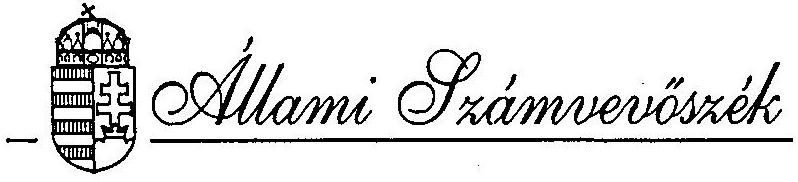
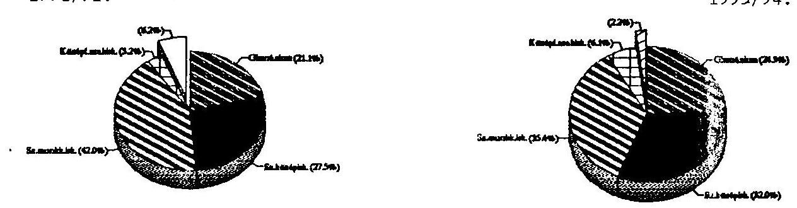
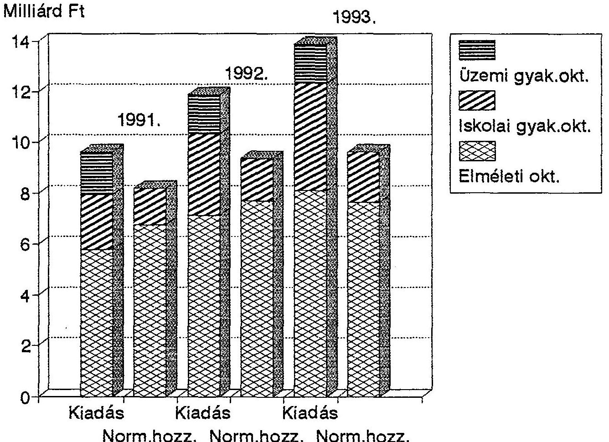

#  

## JELENTÉS

a szakmunkásképzésre fordított pénzeszközök felhasználásának (a képzés eredményességének) ellenőrzéséről

---

# Jelentés 

a szakmunkásképzésre fordított pénzeszközök felhasználásának (a képzés eredményességének) ellenőrzéséről

Az elmúlt években végbement társadalmi, gazdasági rendszerváltás felszínre hozta és kiélezte az 1985. évi oktatási törvény alapján működő szakképzési rendszer ellentmondásait.

Az alakuló piacgazdaság a munkaerővel szemben alapvetően új követelményeket fogalmazott meg, egyre kevésbé igényelte a korábbi nagyüzemi elvárások szerint kiképzett munkavállalókat. Előtérbe került a szakmai tudás, az alkalmazkodó képesség, a vállalkozói készség és a munkaerő konvertálhatósága. A 90-es évek elején meglévő szakképzési rendszer ugyanakkor a tulajdonviszonyok átalakulásából, a kis- és közepes méretű vállalkozások gyors elterjedéséből és a piacváltásból fakadó minőségi követelményeknek képtelen volt eleget tenni. Nyilvánvalóvá vált, hogy e képzési rendszer a beiskolázott fiatalok részére a közoktatás által igényelt - a tankötelezettséggel összefüggő - általános képzést, valamint a gazdaság differenciált igényeit kielégítő szakmai felkészültséget egyidejűleg már nem képes biztosítani.

Számos ellentmondás forrása volt, hogy a szakképzés rendszerének korábbi törvényi szabályozásában a gazdasághoz való rugalmas alkalmazkodás helyett az iskoláztatás igényei voltak a meghatározóak.

Az állam az iskoláztatás és az elméleti képzés feladatai és kötelezettségei mellett a gyakorlati képzésről való gondoskodást is magára vállalta. Megfelelő feltételek hiányában azonban a gyakorlati képzés anyagi terheit nagyrészt a vállalatokra, üzemekre, szövetkezetekre hárította, miközben azok nem voltak érdekeltté téve, és beleszólásuk sem volt a képzés alakulásába, tartalmába.

---

A 90-es évek kezdeti időszakában az átalakuló nagyvállalatok tömegesen szüntették meg a tanulók gyakorlati képzési helyeit, így a döntően nagyüzemekre épült szakképzési rendszer válságos helyzetbe került. A képzési rendszerrel szemben további, s alapvetően új kihívást jelentette a munkanélküliség megjelenése. A helyzetet súlyosbította, hogy ebben az időszakban kezdődött a megnövekedett létszámú korosztályok iskolarendszerből való kilépése és a munkaerőpiacon történő jelentkezése.

A körülmények alapvető megváltozása következtében szükségessé vált a szakképzés jelentős tartalmi és strukturális átalakítása, amely időben egybeesett a közoktatás egészének reformjával.

A képzési, átképzési szükségletek kielégítésében a szakképző iskolák mellett regionális munkaerőpiaci képzési intézményhálózat, profitorientált képzési vállalkozások, egyéni vállalkozók és gazdálkodó szervek érdekképviseleti szervei is részt vesznek.

Az iskolarendszerű szakképzés intézményei a szakközépiskolák, a szakmunkásképzők és a szakiskolák. Vizsgálatunk a szakmunkásképző intézményekre terjedt ki.

A helyi önkormányzatok 1991-93-ban a szakmunkásképzésre 10,8-15,4 milliárd Ft-ot fordítottak. A normatív állami hozzájárulás (8,2-9,7 milliárd Ft) a kiadások 76-63%-ára nyújtott fedezetet.

A vizsgálat célja: annak megállapítása volt, hogy

- az iskolarendszerű szakképzésben feladatokat ellátó központi és területi szervek jogszabályi kötelezettségeiknek hogyan tesznek eleget,
- az intézmények fenntartásában és a gyakorlati képzés feltételeiben milyen változások következtek be.
A gazdasági környezet és a szakképzés jogi szabályozásának a változásai hogyan hatottak, illetve hatnak a szakmunkásképzés színvonalára, eredményességére,
- az állami támogatások és az önkormányzatok forrásai mennyiben nyújtanak lehetőséget a szakmunkásképzés feltételeinek a biztosítására. Az elkülönített és a központosított alapok elosztásának igénylésénél, felhasználásánál és ellenőrzésénél hogyan jártak el.
- a szakképzés információs, pénzügyi és egyéb feltételei mennyiben teszik lehetővé a valós munkaerőigények kielégítését szolgáló szakmai struktúraváltást.

Vizsgálatot végeztünk: a Munkaügyi Minisztériumnál, a Művelődési és Közoktatási Minisztériumnál, az Országos Képzési Tanácsnál, az ellenőrzésbe vont 13 megye és

---

a főváros munkaügyi központjainál, munkaügyi tanácsainál, megyei (fővárosi) önkormányzatainál. A 13 megyében 43 települési önkormányzatnál (a fenntartó önkormányzatok 32%-ánál), valamint azok 76 szakmunkásképzést folytató intézményénél és gyakorlati képzési helyein (amelyek az ország szakmunkásképző iskoláinak 25%-át, a tanulólétszámnak és a kiadásoknak mintegy 31%-át reprezentálják) folytattunk helyszíni ellenőrzést.

Tájékozódást végeztünk a Belügyminisztériumnál, az Országos Munkaügyi Központnál, az Iparosok Országos Szövetségénél, továbbá a munkáltatók megyei érdekképviseleti szerveinél.

Vizsgált időszak: az 1991-es gazdálkodási évtől, az 1990/91-es tanévtől a vizsgálat időpontjáig.

# Megállapítások 

## 1. A szakképzés jogi szabályozottsága, központi irányítása

### 1.1. Az iskolarendszerű szakképzés törvényi keretei, a működtetéshez kapcsolódó szervezeti rendszer

A szakképzés irányítása a 80-as években - a mindenkor hatályos oktatási törvények; 1985 óta az 1985. évi I. törvény alapján - a művelődési tárca hatáskörébe tartozott, majd 1990-ben a megalakult Munkaügyi Minisztérium (továbbiakban: MüM) feladatkörébe került.

A közoktatással, s ezen belül a szakképzéssel összefüggő állami feladatvállalás szakmai megfogalmazását az oktatási törvények (1993. óta a közoktatási- és a szakképzési törvények) tartalmazzák. A feladatvállalásban a munkamegosztást, a fenntartói kötelezettségeket, a finanszírozási rendszert az önkormányzatokról szóló törvény, a hatásköri törvény, a költségvetési és az oktatási törvények, valamint a szakképzési hozzájárulásról és a Szakképzési Alapról szóló törvény szabályozzák.

A fentieken kívül az oktatási, szakképzési feladatok ellátását (beleértve a gyakorlati képzést is) és a gazdálkodást számos egyéb törvény, jogszabály befolyásolja. Közülük a munkaerőpiaccal összefüggő képzési érdekegyeztetési-, valamint a munkaerőpiaci szervezeti- és feladatrendszert szabályozó foglalkoztatási törvény kapcsolódik több oldalról is a szakképzéshez.

---

A hatályos törvényi szabályozás a szakképzés egészének (iskolarendszerű- és munkaerőpiaci képzés) irányítását a munkaügyi miniszter hatáskörébe utalja, meghatározva azokat a feladatokat, tevékenységeket, amelyek esetében a közoktatás ágazati irányításáért felelős művelődési és közoktatási miniszter, illetve a szakképesítésért felelős miniszter is kötelezettséggel bír.
A munkaügyi miniszter a művelődési és közoktatási miniszterrel egyetértésben a szakképesítésért felelős miniszter javaslata alapján gyakorolja e hatásköreit.
A MüM szakképzést irányító tevékenységét az érdekelt tárcákkal együttműködve, a munkavállalói és munkaadói szervek bevonásával látja el.

A szakképzési törvény módot nyújt arra is, hogy a gazdasági kamarák a szakképesítésért felelős miniszterrel kötött megállapodás alapján a szakmai követelményekkel összefüggő feladatokat átvállalják.

A művelődési és közoktatási miniszter szakképzéssel összefüggő feladatai egyfelől a közoktatás ágazati irányítási kötelezettségéhez, másrészt az oktatási és kulturális ágazat területét érintő szakképzéshez kapcsolódnak.

Törvényi felhatalmazással mind jelentősebb szerepet tölt be a szakképzéssel kapcsolatos jogszabályok és fejlesztési döntések előkészítésében, azok végrehajtásában a munkaerőpiaccal összefüggő képzési érdekegyeztetés ellátására 1991-ben megalakított, tripartit (kormány-, munkavállalói- és munkaadói oldal) működésű Országos Képzési Tanács (továbbiakban: OKT), illetve a megyei (fővárosi) munkaügyi tanácsok. Ezek egyben ellátják a Szakképzési Alap felhasználásának feladatait is.

A közoktatásban a feladatmegosztás elvéből eredően az állam a közoktatás rendszerének működéséért, a helyi önkormányzat a szolgáltatások megszervezéséért és biztosításáért felelős, melyben a szabad intézménylétesítés elvéből fakadóan a helyi önkormányzatok mellett közreműködhetnek más intézményfenntartók is. A közoktatási törvény minden esetben feladatokat és feladatellátási kötelezettséget állapít meg. Abban a kérdésben ugyanis, hogy meghatározott feladatot az önkormányzat milyen módon lát el, kizárólagosan a helyi önkormányzat jogosult dönteni.
Nincs akadálya, hogy a közoktatási törvényben előírt feladatokról megállapodás alapján vagy más önkormányzattal történő közös intézményfenntartáson keresztül gondoskodjon.

A törvények nem tartalmaznak előírást vagy irányelvet az iskolarendszer struktúrájára, így a fenntartó önkormányzat autonóm döntése alapján alakul az intézményhálózat. A megyei oktatási szakigazgatás a vizsgált időszakban területi integrációs hatáskörrel nem rendelkezett.

---

# 1.2. A szakképzés felső szintű irányítása, korszerűsítése 

A kialakulóban lévő piacgazdaság, a munkanélküliség tömeges megjelenése, továbbá a középfokú oktatásban ebben az időszakban jelenlevő nagylétszámú korosztályok a döntéshozókat a képzés és a foglalkoztatáspolitika terén egyaránt nehéz feladatok elé állították. Az új helyzetet megfelelően kezelni képes makroszintű megoldási módszerek és eszközök kialakítása szemléletváltást tett szükségessé az irányítás szintjén is.

A közoktatás egészéért felelős Művelődési és Közoktatási Minisztérium (továbbiakban: MKM), illetve a szakképzés irányítását ellátó MüM az ellenőrzött időszakban meghatározóan a jogi szabályozás eszközeivel látták el ez irányú feladataikat. A két tárca a sajátosan közoktatási, illetve szakképzési feladatok rendszeres egyeztetése mellett, egymással folyamatos munkakapcsolatban tett sorozatos intézkedéseket a szakképzés területén felmerülő problémák megoldására.

A vizsgált időszakban a MüM tevékenységének mindvégig részét alkotta a szakképzés fejlesztésével, megújításával kapcsolatos műhelymunka. A szakképzés fejlesztésének hosszabb távú stratégiáját nem alakították ki. Az elmúlt években a szakképzés területén csak rövidebb távú válságkezelés valósult meg. A változásokhoz igazodóan cselekvési programokban határozták meg az elvégzendő feladatokat.

A MüM létrehozását követően, az 1991-93. évek időszakára összeállított első szakképzési cselekvési program legfontosabb célkitűzése volt, hogy elkerülhető legyen a szakképzés összeomlása. Emellett azokat a jogi, pénzügyi, szervezeti feltételeket kívánták megteremteni, amelyek a kvalifikált munkaerő oldaláról biztosítják a piacgazdaság kiépülését és hatékony működését, ennek érdekében megkezdődött a szakképzés önálló törvényi szabályozásának előkészítése.

A cselekvési programban meghatározott számos feladatot eredményesen valósítottak meg:

- A Szakképzési Alap (SzA) elkülönített keretéből nyújtott kamatmentes kölcsönök és a költségvetési törvény Belügyminisztérium fejezetében elkülönített központosított előirányzatok biztosításával lehetővé tették, hogy az intézményfenntartó önkormányzatok a szakmai gyakorlati képzésből kivonuló, illetve felszámolt nagyvállalatok tanműhelyeinek egy részét megvásárolhassák.
- Nagyrészt a tárca kezdeményezésére, a nagyüzemi képzőhelyek kiváltása céljából adókedvezményekkel tették érdekeltté a kisiparosokat, magánkereskedőket, kistermelőket a szakmunkástanulók gyakorlati oktatásában való fokozottabb szerepvállalásra.

- A szakfelügyeleti fejlesztő, kutató és szolgáltató intézetként működtetett Nemzeti Szakképzési Intézet (NSzI) koordinációjával - a szakképzés tartalmi korszerűsítésének érdekében - felülvizsgálták a szakmastruktúrát. Ennek eredményeként készítették el az Országos Képzési Jegyzéket (OKJ), ami a korábbi 719-el szemben 955 szakképesítést tartalmaz. Ezen belül a szakmunkás szakképesítések száma 269-ről 347-re nőtt.
- A szakképzés tartalmi és módszertani megújításának részeként - a művelődési tárcával együttműködve - megkezdődött a meglévő képzési programok felülvizsgálata, valamint új képzési kísérletek beindítása (világbanki projekt, PHARE program, IPOSZ képzés, 2+2 éves szakmunkásképzési kísérlet).
- Az ifjúsági munkanélküliség megelőző szemléletű kezelésével, az oktatásban, szakképzésben érdekelt minisztériumok együttműködve alakították ki a problémák megoldását segítő központi programokat, és vettek részt a helyi kezdeményezésű egyedi programok jóváhagyásában.

Többéves előkészítő és egyeztető munkát követően 1993-ban alkotott új törvényt az Országgyűlés a közoktatásról, valamint hazánkban első alkalommal önálló törvényt a szakképzésről.

A szakképzési törvény hatálya kiterjed minden iskolai rendszerű és iskolarendszeren kívüli szakképzésre. Az egységes szabályozás várhatóan javítja majd a képzési formák összehangoltságát.A törvény szerint a jövőben a szakképzés csak a tankötelezettség teljesítését követően, a tizenhatodik életév után kezdődik. Ez a lényegi változás azt a célt szolgálja, hogy egyrészt megalapozottabbá tegye a pályaválasztást, másfelől a 10 tanévig tartó, általános műveltséget megalapozó oktatás következtében mentesítse a szakképzést az általánosan művelő feladatok alól, így az döntően a szakmai képzésre koncentrálhasson. Ezzel lehetővé válik, hogy az egyes szakképesítések képzési ideje differenciáltan, a különböző szakmák eltérő igényei szerint kerüljön meghatározásra.

A törvény meghatározza az állam és a szakképzésben közreműködők közötti munkamegosztás rendjét. Az iskolai keretek között szervezett szakképzés (elméleti, gyakorlati) az állam és az iskolafenntartó kötelessége, a gyakorlati képzés jogköre és felelőssége ugyanakkor jelentős mértékben a gazdaság szereplőire hárul.

---

Amennyiben a szakképző iskola a gyakorlati képzés feltételeit nem tudja biztosítani a törvény a szakképzésben való részvételt a tanuló és a gazdálkodó szervezet között létrejött tanulószerződéshez köti. A tanulószerződéssel változik az iskola és a gazdálkodó szervezet képzéssel összefüggő hatásköre és felelőssége. Ebben a körben megszűnik a szakképző iskola gyakorlati képzést irányító és ellenőrző szerepe. Ez a feladat a törvény szerint a gazdasági kamarákra hárul.

A közoktatási- és szakképzési törvények rendelkezéseinek fokozatos hatálybalépése - a keretjellegű szabályozás miatt - miniszteri szintű végrehajtási rendeletek
 kiadását tette szükségessé. 1994. első felében a vizsgált két tárca a vonatkozó törvények valamennyi végrehajtási rendeletét kiadta.

A társadalmi feszültségek enyhítése, a fiatalok elhelyezkedési esélyeinek javítása érdekében a MüM első ízben 1993-ban, majd 1994-ben is egy, külön a pályakezdőkre irányuló cselekvési programot dolgozott ki, melyet a munkanélküliség hatékonyabb kezelésére létrehozott Tárcaközi Bizottság és az OKT is megtárgyalt és elfogadott.

A program végrehajtását számottevő anyagi forrás segíti. A Munkaerőpiaci Bizottság 1993-ban 200 millió Ft-ot, 1994-ben 300 millió Ft-ot biztosított szakképzésre, átképzésre, az OKT pedig mindkét évben egyaránt - pályázati úton - mintegy 146 millió Ft-ot fordított pályakezdők átképzésére.

Az intézkedések eredményeként sikerült elkerülni a szakképzés összeomlását, de a tartalmi kérdésekben, a gazdaság változásait követő struktúra kialakításában lényeges előrelépés nem történt.

A változások - az életbe lépett törvények és egyéb jogi szabályozások, valamint a sok irányú egyéb intézkedés ellenére - az 1991-92-ben feltételezettnél lassabban mennek végbe.
Kedvezőtlenül hatott a szakképzés egészének helyzetére a hosszabb távú koncepciók hiánya, a foglalkoztatási folyamatok előre nem látható változása, a gazdasági átalakulást kísérő szabályozás (pl. kamarai törvény) részlegessége. A szakképzés területén bizonytalanságot eredményezett a közoktatási rendszer egészével kapcsolatos koncepciózavar, illetve a több alapkérdésben hiányzó társadalmi-szakmai konszenzus is. A Nemzeti Alaptanterv (NAT) hiánya késlelteti a szakképzés tartalmi fejlesztését. A NAT kapcsán időről időre (s az ellenőrzés időszakában is) felerősödő szakmai viták alapjaiban érintik a közoktatási- és szakképzési törvények

---

fokozatos életbe lépésének folyamatát, tovább fokozva az átmeneti időszak feszültségeit.

Az oktatási kormányzat jelentős késésben van egy orientáló szerepet betöltő, hosszabb távra érvényes oktatásfejlesztési stratégia kidolgozásával.
Ennek hiánya is meghatározó szerepet játszott abban, hogy a vizsgálat idejéig a Munkaügyi Minisztérium sem dolgozott ki hosszú távú stratégiát a szakmunkásképzés fejlesztésére.

A korábbi évek tapasztalataira támaszkodva és az oktatási (közoktatási, szakképzési) törvények, valamint végrehajtási rendeleteik kezdeti hatásainak elemzésére építve, egyidejűleg az elkövetkező évek várható változásait a korábbiaknál pontosabban érzékelve a Minisztérium az 1994-96. közötti időszakra egy újabb cselekvési programot dolgozott ki. A program a szakképzés finanszírozásának átalakítását, az iskolarendszeren belüli átjárhatóság elősegítését és a szakképzési tartalom fejlesztését helyezi a középtávú feladatrendszer középpontjába.

A kormány 1994. júliusában meghirdetett négyéves programjának részét alkotja az oktatás egészének, s azon belül kiemelten is a szakképzésnek a további korszerűsítése.
Az érintett tárcák a kormányprogramban foglaltaknak megfelelően még 1994. nyarán megkezdték a vonatkozó törvények módosításainak előmunkálatait, valamint a közoktatás és a szakképzés fejlesztési stratégiájának a kidolgozását.

# 1.3. A szakképzés információs rendszere 

Az eredményes, a munkaerőpiaci igényekhez mind jobban igazodó szakmunkásképzés többpólusú statisztikai információs rendszert feltételez.

A szakmunkásképzéshez kapcsolódóan az iskolarendszerű oktatási, illetve a munkaügyi statisztikai rendszer évtizedek óta létező rendszerek. A munkaerőpiacot, a munkanélküliséget és a képzésen belül a munkaerőpiaci képzést átfogó statisztikai rendszer viszonylag új, illetve most alakul. Az oktatási statisztika felelőse az MKM, a munkaügyi-, illetve a munkaerőpiaci képzési statisztikáé a MüM.

A kialakított információs rendszerek szervezési és tartalmi problémák miatt nem kellően hasznosíthatók a központi és a helyi irányításban, döntésekben.

- Az oktatási statisztikai adatok összesítése a KSH megyei igazgatóságainak bevonásával a KSH központjában történik. A feldolgozás eredményei rendkívül későn

---

jelennek meg, a döntéselőkészítésekben nem hasznosíthatók.
Az oktatásstatisztika egyik jelentős problémája, hogy a megfigyelés alanya az intézmény. Már az utóbbi években gondot okozott, hogy a mérési rendszerbe nem illeszkednek bele az ún. iskolakísérletek, vagy a speciális szakiskolák, melyek sok esetben egy-egy intézményen belül csak egy-egy osztályt érintenek.
A közös igazgatású, több funkciót ellátó intézmények halmozódva jelennek meg az összesítésekben. Nehezíti az elemzést a szakmastruktúra osztályozási rendszere. Az OKJ életbe lépése előtt a szakmajegyzék rendszere nem állt összhangban sem az ágazati osztályozás-, sem a foglalkozások rendszerével.

- A költségvetési információs rendszer - a vizsgálat tapasztalatai szerint - nem megbízható alapadatokkal dolgozik.
- A szakképzés helyzetének megítélése és a beiskolázási struktúra kialakítása során döntő jelentőséggel bír a munkaerőpiac mennyiségi és minőségi igényeinek, elvárásainak a figyelembe vétele, a képzésből kikerülők elhelyezkedési lehetőségeinek ismerete is.
A MüM részben objektív okokból nem dolgozott ki a foglalkoztatás komplex folyamatait rendszeresen figyelemmel kísérő információs rendszert. Az átalakuló gazdaság munkaerőszükséglete nem ismert olyan pontossággal, hogy azokból a képzési szükségleteket meg lehessen határozni.
Hiányzik az intézményesített információs kapcsolatrendszer a szakképzésben érintettek között.

# 2. Területi szervek szerepe a szakképzés fejlesztésében 

A vizsgált időszakban az iskolaszerkezetet, a szakképzésfejlesztést érintő döntések meghozatala széleskörű (demográfiai, gazdasági, társadalmi) információelemzésre és a döntések által érintett települések koordinációjára épülő, hosszabb távú koncepció elkészítését igényelte volna. Ennek jogi garanciái azonban nem voltak meg, az indokolt szemléletváltozás, együttműködés pedig nem alakult ki. Az elszigetelt, helyi érdekekre épülő sajátos döntések koordinálatlanságot és párhuzamosságokat eredményeztek az iskolai fejlesztésekben, indokolatlan differenciálódási folyamat indult el a képzési feltételekben.

A helyi önkormányzatok feladat- és hatásköréről rendelkező 1991. évi XX. törvény a fővárosi és a megyei önkormányzatok részére előírta, hogy kezdeményezzék az

---

érintett önkormányzatoknál együttműködési megállapodás megkötését a középfokú iskolai felvételi ügyekkel, a tankötelezettséggel kapcsolatosan.

A vizsgált megyei önkormányzatok többsége lépéseket tett a beiskolázás, a képzés módosítására és különböző pedagógiai szolgáltatások ellátására vonatkozó együttműködési megállapodás megkötésére. A települési önkormányzatok túlnyomó része az önkormányzati törvényre hivatkozva hatásköre csorbítását vélte felfedezni e lépésben, és elutasította a kapcsolatok felvételét. Helyenként a korábban létező együttműködések is felbomlottak. (Példatár 1.p.)
A kevés helyen létrejött megállapodások főként a körzeti szolgáltatások megszervezése, pedagógiai szakszolgálatok működése terén mondhatók eredményesnek. A képzés profilírozása, a szakképzésre vonatkozó információk gyűjtése, feldolgozása vonatkozásában lényeges előrelépések nem történtek.

Néhány megyében a megállapodások helyett kifejezetten a képzés orientálására irányuló együttműködések is létrejöttek, a kitűzött célok az érdekeltség hiányában azonban itt sem valósultak meg. (Példatár 2.p.)

A jogszabály által ajánlott társulási forma láthatóan nem volt eredményes. Ennek ellenére a Közoktatásról szóló 1993. évi LXXIX. tv. 89. §-a a megyei önkormányzatoknak továbbra is csak a koordináció kezdeményezését írja elő.

Megyei kezdeményezések ellenére sem történtek egyeztetések olyan iskolaszerkezetet érintő lényeges kérdésekben, hogy a 9-10. osztályokat mely intézmények vezetik be, a 10. osztályra hol és milyen képzések épülnek.
Az elkülönült érdekek egyetlen egyeztetési lehetősége a hatásköri törvényben és a közoktatási törvényben a megyei önkormányzatok részére megfogalmazott megyei szintű középiskolai tájékoztató kiadványok összeállítása és közreadása kapcsán adódott.

Az információk begyűjtése után a megyei önkormányzatok szakemberei esetenként felhívták a figyelmet a párhuzamos képzésre, amelyet az iskolák a kapacitásuk lekötésére hivatkozva többnyire nem vettek figyelembe.
A megyei önkormányzatok e munka során jutottak információhoz, a megye szakképzését jellemző adatokat csak informális úton szerezhettek.
Az adatszolgáltatási rendszer központi kialakítása úgy történt, hogy a megyei önkormányzatok más önkormányzatok fenntartásában működő intézményekről információt nem kapnak.

---

A szakképzésnek a gazdaság igényeit kell kielégítenie, ezért a foglalkoztatásról szóló 1991. évi IV. törvény előírta a Munkaügyi Központok számára a szakképzés orientálását. E feladatnak - feltételek és megfelelő szemlélet hiányában - egyetlen vizsgált megyében sem tudtak teljes egészében eleget tenni.
A Munkaügyi Központok elsődlegesnek tekintették a foglalkoztatási feladatok ellátását, információs rendszerük is elsősorban ehhez igazodott, így a szakképzéssel kapcsolatos teendők háttérbe szorultak. Nehezítette feladataik ellátását, hogy intézményesen nem kapnak adatokat az iskolák oktatási struktúrájáról, a végzettek szakmai összetételéről.

Több megyében szorosabb munkakapcsolatot alakítottak ki a munkaügyi központok a szakképzés intézményeivel, az önkormányzatokkal és a jelentősebb gazdálkodó szervekkel. (Beiskolázási tervek egyeztetése, Megyei Szakképzési Konferencia összehívása, az iskoláktól adatgyűjtés megszervezése).
Ezek működése azonban esetleges. Az adatok pontossága, ütemessége a felek jóindulatától függ.

Az orientáláshoz a gazdaságból nincsenek megfelelő információk. 1990. óta a gazdaság magatartása elbizonytalanodott, érdeklődésük az ifjúsági szakképzés iránt csökkent.

A munkaügyi központok 1991-től fél évenként rövidtávú munkaerő prognózisokat készítenek, melyeket a megyék többsége rendszeresen megküld az önkormányzatoknak és a szakképző intézményeknek. A reprezentatív felméréseken alapuló prognózisok azonban az iskolák orientálásához nem elég konkrétak, képzési struktúrájuk és a beiskolázási mértékek meghatározásához nem nyújtanak segítséget.
1994-ben a MüM megbízása alapján elemzéseket kellett készíteniük a munkaerőpiaci szempontból legkritikusabb szakmák körében, amelyekben az iskolarendszerből nagy tömegben kerülnek ki elhelyezkedni nem tudó fiatalok. Ez az elemzés az 1995. évi beiskolázásokhoz már hasznosítható információkat nyújt.
Valójában a vizsgált időszak alatt a képzéssel összefüggő feladatok ellátása - a munkaügyi központok szemléletétől függően - megyénként igen eltérő színvonalon valósult meg.

A pályaválasztási tanácsadás leépülése is nehezítette a 14 éves korban jelentkező pályaválasztás döntési kényszerét és hozzájárult a magas lemorzsolódáshoz.
A hatályos jogszabályok (a foglalkoztatási és a közoktatási tv.) a megyei munkaügyi központoknak és a megyei önkormányzatok pedagógiai szakszolgálatának a feladataként fogalmazzák meg a pályaválasztási tanácsadást.
A vizsgált megyékben van ahol párhuzamosan mindkét szerv foglalkozik e tevékeny-

---

séggel, az esetek többségében azonban sem a megyei Munkaügyi Központ, sem a megyei Pedagógiai Intézet nem látja el teljeskörűen a pályaválasztási feladatot.

A foglalkoztatási tv. a munkaügyi tanácsoknak előírta, hogy kezdeményezzék a foglalkoztatási helyzettel kapcsolatos rövid és hosszú távú programok elkészítését, amelyek segítséget adhatnak a képzési struktúra meghatározásához. Ugyanakkor nem szabályozott, hogy e programok elkészítése kinek a feladata.
A vizsgált munkaügyi tanácsok többsége azonban nem valósította meg ezeket az előírásokat, illetve az évenként tárgyalt, iskolarendszerű szakképzéssel foglalkozó előterjesztések nem tettek eleget a hosszútávú stratégiai elvárásoknak. (Példatár 3.p.)

A vizsgálat során megállapítottuk, hogy egyes kérdésekben a megyei Munkaügyi Tanács szerepkörébe tartozó kérdések jelenleg sem tisztázottak.

- Nincs jogszabályi előírás a testület jövőjét illetően, a mandátumok érvényességére.
- Az oldalak képviselőinek jogosultsága, visszahívhatósága, valamint
- a Munkaügyi Tanács és a megalakuló Kamarák viszonya nem rendezett.

A problémák visszavezethetők a munkaügyi tanácsok létrehozásának és működésének szabályait meghatározó Foglalkoztatási törvény hiányos megfogalmazására.

Az 1991. évi XX. törvény felhatalmazta a közoktatási minisztert, hogy az ágazati szakmai követelmények érvényesítését és a közoktatás-irányítás szakmai-szervezeti feladatait egy külön e célra létesített és általa irányított szakmai-szolgáltató intézmény közreműködésével lássa el.
A művelődési miniszter 1992. szeptember 1-i hatállyal Regionális Oktatási Központok elnevezéssel szakmai-szolgáltató, ellenőrző intézményeket létesített. Fő feladatuk az oktatásügy szakmai felügyelete volt, a köztársasági megbízottakkal azonos illetékességi területen.
A közoktatási törvény és a 3/1994. (I. 29.) MKM. sz. rendelet - Tankerületi Oktatásügyi Központok elnevezéssel - újra szabályozta működési rendjüket.
Az intézményeket működésük közel két éve alatt folyamatosan támadások érték, mivel a jogszabályokban a szolgáltatási jellegű feladatok keveredtek a felügyeleti ellenőrzési feladatokkal, korlátozva az önkormányzatok önállóságát és felelősségét. Ugyanakkor nem tisztázódott, hogy mi alapján és mit tartalmazzon az értékelés szakmai szempontból. Milyen kritériumok és normák alapján végezhetik a tevékenységüket. Különösen hiányoztak ezek az előírások a tartalmi szabályozás dokumentumainak kialakulatlansága időszakában.

---

# 3. A helyi önkormányzatok intézményfenntartói tevékenysége, a szakmunkásképzés finanszírozása és ezek hatása az oktatás feltételeire 

Az elmúlt 4 évben többirányú változás történt a magyar középfokú oktatásban.
A demográfiai változások hatására évek óta folyamatosan növekedett a tanulólétszám. Az 1992/93-es tanévtől kezdve - a magas létszámú évfolyamok kilépésével megindult a
 létszámcsökkenés.

Megváltoztak a továbbtanulás arányai és igényei. 1990-ben az általános iskolát eredményesen végzők 93,8%-a tanult tovább, 1993-ban ugyanez az arány 97,8%. Az általános továbbtanulási arány növekedésén túl strukturális átrendeződés is történt. Az iskolatípusok közötti létszámmegoszlás alapvetően a szakmunkásképző iskolai létszámok rovására, az érettségit is adó középfokú intézmények felé tolódott el. A szakmunkásképző iskolákban viszont az 1990/91. évi 209,4 ezres csúcslétszámmal szemben az 1993/94-es tanévben 35 ezerrel (17%-kal) kevesebb, 174 ezer fiatalt oktattak. (3. sz. melléklet)

### 3.1. Az önkormányzatok intézményfenntartói tevékenysége, a beiskolázási politika alakulása

Országosan az 1993/94. tanév elején 332 szakmunkásképző intézményben folyt szakmunkásképzés, és ebből 309-et 146 helyi önkormányzat működtetett.
A szakmunkásképzés térségi ellátási feladat, de a települési önkormányzatok a vizsgált időszakban csak néhány esetben éltek azzal a lehetőséggel, hogy az intézményt a megyei önkormányzatoknak átadják (pl. 1991-ben Salgótarján, 1992-ben Tatabánya, 1993-ban Gödöllő, 1994-ben Gyula). A vizsgált intézményeknek mindössze 16%-a tartozott megyei önkormányzatok fenntartásába.

A települési önkormányzatok többsége a megyei koordináció fontosságát és az intézményi önállóságot is tévesen értelmezte. A jogszabályi változások nyomonkövetése, értelmezése zavart okozott, illetve nem vállalták fel a komplex döntés felelősségét vagy anyagi konzekvenciáit. Így a testületek, illetve szakbizottságaik tevékenysége csak részfeladatokra korlátozódott. A szakmunkásképzés helyzetét, térségi szerepét, működési feltételeit, a képzés szerkezetét átfogóan többnyire nem elemezték, illetve a feladatokhoz igazodó feltételek biztosítása érdekében nem hoztak pénzügyileg számszerűsített, határidőket is tartalmazó határozatokat. (Példatár 4.p.) Csak nagyon kevés helyen tapasztalt az ellenőrzés az önkormányzatok részéről olyan

---

hosszútávú gondolkodást, amely dokumentáltan is rögzítette volna az oktatás, ezen belül a szakképzés fő céljait, feladatait, eszközrendszerét.

Elképzeléseiket a térség önkormányzataival általában nem egyeztették. A korábban szakmai felügyeletet nem folytató települési apparátusok tapasztalatok hiányában a megfelelő színvonalú irányító munkához szükséges ismeretekkel nem rendelkeztek. A fenntartó önkormányzatok koncepció hiányában sodródtak az iskolák által kezdeményezett változásokkal.
A beiskolázható létszámot, ennek szakmastruktúráját évente jóváhagyták, de az új feladatok pénzügyi hatásait ezek a döntések nem tartalmazták. (Példatár 5.p.)

Az önkormányzatok feladatmeghatározásának hiánya, valamint a jogi háttér nyújtotta decentralizáció következtében az intézményi túlélési törekvések az oktatás struktúráját meghatározóan befolyásolták, az új képzési szerkezet kialakítását hátráltatták.

Az új Országos Képzési Jegyzék (7/1993. XII. 30. sz. MÜM rendelet) bevezetését akadályozta az elméleti tantárgyak központi programjainak hiánya, tehát a képzés jellemzően "hagyományos" szerkezetű lehetett. Kivételt képez néhány iskolában az IPOSZ kezdeményezésére indított kísérleti oktatás. Ezeket egyedi programok alapján engedélyezték.

Az IPOSZ kísérleti oktatás képzési ideje hosszabb (3,5 - 4 év). Az első évfolyamosok elméleti képzést kapnak, majd a speciális szakképzés folyik. Az emelt szintű oktatáshoz hozzátartozik a vállalkozási ismeret és a nyelv oktatása is. Ilyen képzés folyik pl. Nyíregyházán, Mezőkövesden, Kecskeméten.

A központi stratégiák és az önkormányzati testületek oktatáspolitikai koncepcióinak hiányából következően az iskolák többsége sem dolgozott ki több évre vonatkozó oktatásfejlesztési tervet.

A vizsgált intézmények nagy részénél betudták ennek helyettesítésére az iskolaigazgatók vezetői programjait. Ezek többségét azonban az önkormányzat képviselő-testülete nem tárgyalta meg és nem is hagyta jóvá. Néhány esetben maga a tantestület sem ismerhette megfelelő részletezettséggel ezt a programot, mert nem kerültek a feladatok lebontásra, és a tantestületi értekezleteken nem értékelték ezek megvalósulását sem.

---

A beiskolázott tanulók számát, szakmai összetételét - a stratégiai célok tisztázása nélkül - döntően az oktatás feltételei; a pedagógusok, gyakorlati oktatóhelyek és tantermek száma határozták meg. Érzékelhetően befolyásolta továbbá a családok (tanulók) szakmaválasztása, amelyre támogatólag hatott a szakmunkásképző iskolák versenye a kapacitásukat kitöltő létszám felvételére és az, hogy a tanuló egyénileg gondoskodhat a gyakorlati képzési helyéről.
A minél nagyobb tanulólétszámra való törekvés az összességében csökkenő szakmunkástanulói jelentkezés mellett kiélezte a képzés ellentmondásait. A képzés koordinálatlansága, az iskolák egyedi érdekeinek előtérbe kerülése miatt az oktatott szakmák nagy részében minden évben indítanak osztályokat, még a válságágazatokban oktató szakmunkásképző intézetek is. Gyakori a párhuzamos képzés és a túlképzés. (Példatár 6.p.)

Általánossá vált, hogy egy-egy intézmény - a létszámcsökkenés ellensúlyozására - a szakképzés különböző formáit (szakmunkásképzés, szakközépiskolai-, technikusi, szakiskolai oktatás) alkalmazta egyidejüleg.

A közoktatási törvény értelmében 1996/97. tanévtől kezdődően a szakképzésben csak a 9. és 10. évfolyam elvégzése után vehetnek részt a tanulók. Ebből következően a 9. évfolyam oktatását az 1994/95. tanévben már meg kellett (kellett volna) kezdeni. Központi útmutatások hiányában erre csak elvétve került sor, ami jelentősen növeli a szakmunkásképzés bizonytalanságait.

A munkaügyi központok és az iskolák közötti információkapcsolat hiánya az iskolarendszerű és a munkaerőpiaci képzés között is párhuzamosságot teremtett. Több megyében rendszeresen indítanak olyan szakmák elsajátítására néhány hónapos tanfolyamokat, amelyek képzése az iskolarendszerű oktatás keretében is nagy számban folyik (Zala megye, Békés megye stb.).

Az iskolák egy része erőfeszítéseket tett, hogy közvetlenül információkhoz jusson a gazdaság igényeiről, azonban többségében nem jártak kellő eredménnyel.

A beiskolázáshoz nem rendelkeznek megalapozott információkkal. Az önkormányzat és az iskola létszámnövelést előtérbe helyező érdeke viszont egybeesik. Az önkormányzat érdeke elsősorban az, hogy az intézmény működéséhez létszámarányosan kapott normatív támogatást minél kisebb összeggel kelljen kiegészíteni, az iskolának pedig, hogy a meglévő személyi állományát ráfordítások növekedése nélkül foglalkoztatni tudja.
Ennek következtében 1990-1993. között a szakmunkástanulók létszámának gazdasági ágak szerinti megoszlása az elvárhatónál jóval kisebb arányban változott.

---

Az oktatási statisztikában szereplő 22 ágazat közül a tanulók létszámának aránya négynél (villamos-, műszer-, textilipar és kereskedelem) 0,6-3,1% közötti mértékben csökkent és ötnél (gépgyártás, fa-, ruha-, vegyes szolgáltató ipar és vendéglátás) 0,7-2,6% intervallumban nőtt. A többi ágazatnál a változás az előzőeknél kisebb arányú.
Az első évfolyamos szakmunkástanulók megoszlásának alakulását gazdasági áganként a 4. sz. melléklet mutatja.

Az államháztartásról szóló 1992. évi XXXVIII. tv., majd a közoktatási törvény is előírta az intézmények alapító okiratainak teljeskörű felülvizsgálatát. Az önkormányzatok az 1992. évi felülvizsgálatokat elvégezték, többségük 1994-ben is módosításokat eszközölt, ennek ellenére a szakmunkásképző intézetek alapító okiratainak többsége nem felel meg az előírásoknak. A legjellemzőbb hiányosság a vállalkozási tevékenység meghatározásánál merült fel: nem határozták meg, hogy a vállalkozás milyen tevékenységre terjedhet ki, és az abból származó bevétel a költségvetés tervezett összkiadásaihoz viszonyítva milyen mértéket érhet el.
A vállalkozási tevékenység meghatározása, az alaptevékenységtől egzakt módon történő elkülönítése, a bevételek és kiadások előírásoknak megfelelő elszámolása a szakmunkásképző intézményeknél körültekintést és felkészültséget igényel - ezek hiánya, illetve az előírások felületes végrehajtása is ellenmondásokhoz vezetett. (Példatár 7.p.)

Az önkormányzatok eredeti költségvetési terveiket az előírásoknak megfelelően többlépcsős előkészítéssel hagyták jóvá, de többségük nem a konkrét feladatokat finanszírozta, hanem az intézményt. Általános volt a bázisszemléletű tervezés.
Csak kevés önkormányzat törekedett a tényleges körülményekhez, az alapfunkciók minőségi teljesítéséhez jobban igazodó elosztási, finanszírozási rendszer kiépítésére. (Példatár 8. p.)

A vizsgálat körébe vont önkormányzatok gyakorlata a felügyelet, ellenőrzés területén jellemzően a polgármesteri hivatalok szakemberei által végzett pénzügyi-gazdasági ellenőrzésekre korlátozódott. Kis számban, de előfordult képviselő-testület előtti beszámoltatás, témavizsgálat, külső szakértők által lefolytatott gazdasági ellenőrzés is. A közoktatási törvény előírásai alapján végzendő törvényességi ellenőrzés gyakorlata még nem alakult ki az önkormányzatoknál. A szakmai felügyelet pedig a jogszabályi előírások hiányosságai és a tartalmi követelmények hiánya miatt nem működik.

---

# 3.2. Az intézmények gazdasági helyzete és a tartalmi munka összefüggései 

A szakmunkásképző iskolák 93%-a önkormányzati fenntartású, a tanulók számát tekintve pedig 98%-os az önkormányzatok részesedése a szakmunkásképzésből.

Az önkormányzatok költségvetési folyó kiadásaik 1/3-át az oktatásra fordítják, a szakmunkásképzésre fordított összeg ezen belül évenként mintegy 9%-ot képviselt. Az önkormányzatok által felügyelt szakmunkásképző intézmények 1993-ban 13,9 milliárd Ft-ot fordítottak működési kiadásokra. Ennek 58,2%-a az elméleti oktatás, 30,2%-a az iskolai gyakorlati oktatás, 11,6%-a pedig az üzemi gyakorlati oktatás kiadásait finanszírozta.

Két év alatt - 1991-1993. között - az elméleti képzés kiadásainak összege - a tanulók átlaglétszámának 12%-os csökkenése ellenére - 40%-kal nőtt. A gyakorlati képzési helyek fenntartók szerinti átrendeződése miatt az iskolai gyakorlati képzés kiadásai csaknem megkétszereződtek. (5. sz. melléklet)

Az iskolarendszerű szak(munkás)képzés kiadásainak finanszírozását biztosító pénzügyi források összetétele az oktatás többi ágához viszonyítva sokrétűbb:

- Itt is meghatározó jelentőségű, de csökkenő arányú a felhasználási kötöttség nélkül, az első szakmát tanulók száma alapján biztosított normatív hozzájárulás.
- Az önkormányzatok feladatellátási kötelezettségéből adódik - a normatíva mértékétől függetlenül - a működési feltételek biztosítása.
- A gazdálkodó szervezetek a gyakorlati képzéssel, az iskolának közvetlenül juttatott szakképzési hozzájárulással és az SzA-ba történő befizetéssel járulhatnak hozzá a gyakorlati képzés finanszírozásához.
- A költségvetési törvényekben meghatározott célokra az elkülönített központosított keretből pályázat útján költségvetési támogatásban részesülhetnek az intézmények.
- A gazdasághoz való közvetlen kötődésükből következően a többi iskolatípusnál nagyobb lehetőségük volt egyéb módon bevételhez jutni (vállalkozási bevételek, alapítványi befizetések, külföldi kapcsolatok stb.).

A vizsgálat a bevételek forrásonkénti és a kiadások felhasználási célok szerinti elszámolása terén több szabálytalanságot tárt fel, illetve a szabályozás terén hiányosságokat állapított meg:

- Az iskolák az új oktatási formák bevezetésekor nem alakították ki a működési kiadások szabályos felosztási rendjét.

---

- A központi költségvetés támogatásai az önkormányzatok "közvetítésével" jutnak el a felhasználókhoz (az intézményekhez), de így már az intézményi elszámolásokból nem derül ki az eredeti forrás.
- Az iskolákhoz közvetlenül átutalt szakképzési hozzájárulást jellemzően államháztartáson kívüli támogatásként számolják el.
- A pályázaton elnyert SZA támogatásból vásárolt eszközök vételárát gyakran közvetlenül az Alapot kezelő bank fizette ki, így ez pénzügyileg nem jelent meg a kedvezményezett intézmény költségvetésében.
- A költségvetési szervek pénzforgalmi szemléletű számvitele miatt csak a kiadásokat számolják el, de ez az átlagosnál jelentősebb anyagbeszerzés és raktározás miatt az éves tényleges költségekhez képest torzításokat okoz.
- A vállalkozási tevékenységet, ezek bevételeit és kiadásait nem különítik el az alaptevékenységtől, ezért az alaptevékenységet oda nem tartozó kiadások is terhelik.
- A vagyon tényleges állománynövekedése az intézményeknél nem jelenik meg teljeskörűen, mivel ezen a téren a beruházói jogkör is megoszlik a fenntartó önkormányzat és az intézmény között, és az ingatlan vagyon tulajdonosa többnyire az önkormányzat. Ez az eszközellátottság és az abban bekövetkezett változás minősítését akadályozza.
- A pénzforgalom nélküli bevételek között csak az előző évi pénzmaradványt számolják el az intézmények, a térítés nélkül átvett eszközöket, anyagot nem. (Ezeket jellemzően a szakképzési hozzájárulás címén adják át a vállalkozások.)
- A működési kiadásokon belül meghatározó arányú a bér. Ennek feladatok közötti felosztása nem a ténylegesen leadott órák arányában történik, hanem a pedagóguslétszám besorolása szerint. A statisztikai kitöltési utasítás úgy rendelkezik, hogy a létszámot ott kell figyelembe venni, ahol a kötelező óráinak 50%-ot meghaladó arányát teljesíti a pedagógus.

A fenti elszámolási és számbavételi hiányosságok miatt teljeskörűen nem lehet megállapítani a szakmunkásképzést szolgáló pénzeszközök összegét, forrásonkénti összetételét, illetve a felhasználás célonkénti alakulását.

A normatív állami hozzájárulást az állam az alapfeladatok ellátásához nyújtja. Bár felhasználási kötöttség nincs, ez a forrás
 alapvetően a működési kiadásokat szolgálja. A kiadások dinamikája a vizsgált időszakban jelentősen nőtt, ezen belül a normatívák egyre kisebb hányadot finanszíroznak. (1993-ban 70%-ot).

---

A normatív hozzájárulás csökkenő arányát eredményezte, hogy:

- az egy tanulóra biztosított összeg évenkénti emelése csak részben követte az inflációt (az elméleti oktatásra biztosított összeg 1992-ben 18, 1993-ban 8%-kal haladta meg az előző évit, a gyakorlatinál 3, illetve 10%-os volt az emelés. 1994-ben a normatív támogatás összege nem változott).
- A gyakorlati képzés normatívája a vizsgált időszak elején is indokolatlanul alacsony volt. Ezt a feszültséget tovább növelte az évenkénti emelés alacsony üteme és az, hogy ezzel párhuzamosan dinamikusan nőtt az iskolai gyakorlati oktatásban részesülők száma és aránya. Az üzemi gyakorlóhelyről kiszorult tanulók 2 év alatt közel 26%-kal növelték az iskolai tanműhelyekben oktatottak számát. Mindezt a kiadások sokkal erőteljesebb, 96%-os emelkedése követte.
- A támogatás a létszám alakulásától függ, ugyanakkor a tényleges kiadásokat jellemzően ez csak 10% körüli mértékben befolyásolja. Az osztályok, csoportok számával összefüggő, valamint az aránylag rugalmatlan általános költségek aránya viszont meghatározó; (6. sz. melléklet.)
- A kötelezően ellátandó feladatokat és azok feltételeinek paramétereit nem határozták meg egzakt módon, az önkormányzatok többsége nem vizsgálta a kiadások alakulásának indokoltságát.
- A koordináció hiánya miatt indokolatlan párhuzamosságok alakultak ki a képzés szerkezetében. A kis létszámú iskola és az oktatott szakmák nagy száma költségnövelő hatású.
- Az egyes szakmák eltérő költségigényétől függetlenül egyenlő összegű a támogatás.

A csökkenő állami támogatás ellenére néhány városi önkormányzatnál az elméleti oktatás működési kiadásai a normatív állami támogatás szintje alatt valósultak meg. Ez is jelzi, hogy az önkormányzatok a létszám minden áron történő emelésében voltak érdekeltek és a nagyobb népességű városokban ezt meg is tudták valósítani. (Példatár 9.p.)

Az iskolai gyakorlati oktatás terén 1991-ben is általános volt, hogy a tényleges kiadás meghaladta a normatív támogatás összegét. (A vizsgált önkormányzatok 78%-ánál.) 1993-ban ez az arány még nagyobb (87%) volt, és 54%-nál a normatív támogatás aránya nem érte el a működési kiadás felét.

Az üzemi gyakorlati képzés kiadásai a foglalkoztatott tanulók 20%-os csökkenése mellett csupán 7%-kal csökkentek, ami a fajlagos ráfordítás közel 17%-os növekedését eredményezte.

---

Általános tapasztalat, hogy a gyakorlati oktatókat nem, vagy csak a közalkalmazotti jogviszonynál jóval kedvezőtlenebb feltételekkel alkalmazzák az üzemek, gyakorlati oktató kft-k. Így azok bére, közterhe, a kapcsolódó bérjellegű kiadások (s az arányosan e feladatra is felosztott közvetett kiadások) az intézményt - végső soron az önkormányzatot terhelik, míg normatív támogatás e szakfeladathoz nem kapcsolódik.

Az önkormányzatok 1993-ban 1,6 milliárd Ft kiadást számoltak el üzemi gyakorlati képzésre, melynek 87%-át a bérek és járulékai képezték.

Az oktatás ráfordításai nagymértékben szóródnak, az oktatott szakmáktól, annak eszközigényességétől és a gazdálkodás színvonalától függően. (Példatár 10.p.)
A működési kiadásokban meghatározó jelentőségű a bér és járulékaik aránya, tehát az esetleges megtakarítások lehetőségét jelentős mértékben a foglalkoztatottak számának felülvizsgálata jelenthetné.

A helyszíni vizsgálatba bevont intézmények 80%-ánál az elméleti oktatásnál a bér és járulékaik aránya meghaladta a 66%-ot, az iskolai gyakorlati oktatásnál pedig az intézmények 75%-ánál 50% feletti volt ez az arány.

Az intézmények eredeti költségvetési terveiben csak az önkormányzati támogatás és az alaptevékenységükhöz kapcsolódó saját bevételek tervezett összegei szerepeltek. Az egyéb saját bevételek, az átvett pénzeszközök, az előző évi pénzmaradvány általában tervmódosításokkal épültek be a költségvetésbe.

Az intézmények a személyi és tárgyi feltételektől, a fizetőképes kereslettől, az intézményvezetők agilitásától függően jelentős szóródással tudták bevételeiket növelni.
Az oktatott szakmáktól, azok technikai hátterétől függően igen eltérő mértékűek az iskolákban a gyakorlati képzés során előállított termékek értékesítéséből származó bevételek. Ugyanakkor a különböző támogatások kezelői között nem volt koordináció, párhuzamosságok fordultak elő. A támogatások indokoltságát az intézmény tárgyi felszereltsége, anyagi helyzete, az oktatott szakma alapján nem vizsgálták.
Ezek együttes hatásai indokolatlan polarizációt eredményeztek.
1993-ban a vizsgálatba bevont intézmények 63%-a 5-20% közötti, 16%-a 20-50% közötti saját és átvett bevételt realizált. Három intézmény ezen bevételei meghaladták az 50%-ot. Ezek tanműhelyi kapacitása eléri a kisebb üzemek nagyságát és az intézmények bevételnövelő törekvése olyan mérték-

---

ket ért el, amely már esetenként a termelést és a szolgáltatást helyezi előtérbe, és másodlagos tényezővé válik a képzés.

Az önkormányzatok több esetben nem határozták meg a tanulók munkaerejének felhasználásával elérhető bevételeket. Néhány fenntartó egyértelműen alacsony összegben állapítja meg az önkormányzati támogatást, sőt egyes esetekben takarékossági okokból az önkormányzati beruházások megvalósításával is a szakmunkásképző iskolákat bízzák meg. A vizsgálati tapasztalatok is bizonyítják, hogy a teljesítményorientáltság és a képzés alapossága egymásnak ellentmondó fogalmak.

Az alapfeladatokhoz szükséges eszközök körének és nagyságrendjének szabályozatlansága, a kontroll nélküli támogatások eredményeként fordulhatott elő, hogy indokolatlanul nagy tanműhelyi kapacitásokat is megvalósíthatott egy-egy iskola. Ugyanakkor a tanulói létszámcsökkenés következtében is szabadult fel képző kapacitás. A szakmunkásképző iskolák a lehetségesnél kisebb mértékben kapnak megbízásokat a munkaerőpiaci képzésekben, holott ez az oktatásnál megjelenő párhuzamosság kiküszöbölését is elősegítené.

A szakképzési hozzájárulásról és a Szakképzési Alapról szóló törvény 1990. évi módosítása lehetőséget adott arra, hogy az iskolák az átvett hozzájárulásból meghatározott körben működési kiadásokat is finanszírozzanak. A fenntartók egy része a likviditási gondokat a szakképzési hozzájárulás terhére kívánta megoldani, illetve egyre inkább a támogatások mérséklésének lehetőségét látták ebben.

A működési feltételek fokozatos romlása következtében több helyen olyan helyzet állt elő, hogy már a meglévő eszközpark üzemeltetése is napi gondot okoz, így az évenként fejlesztésre átvett összeg cél szerinti felhasználása tovább növeli a működési hiányt.

Az intézmények az átvett pénzeszközöket inkább fejlesztési céljaikra törekedtek felhasználni, ennek lehetőségét még törvénysértő pénzkezelés (külön bankszámla) révén is próbálták megteremteni. Ez a gyakorlat azonban a törvényi előírások megszegése mellett anyagi visszaélésekre is lehetőséget ad (Oroszlány, Villány).

# 3.3. A szakmunkásképzés személyi feltételei 

A pedagógusok létszáma a vizsgált időszakban - a tanulók számának 17%-os csökkenése mellett - 7%-kal csökkent. Az 1993/94-es tanév elején 11.251 fő pedagógus dolgozott az iskolarendszerű szakmunkásképzésben. (Az adatokat torzítja a statisztikai számbavétel módja is.)

---

A pedagógus állomány 57%-a elméleti pedagógus, 43%-a gyakorlati oktatásvezető, szakoktató. A megoszlás a vizsgált időszakban nem változott.

A vizsgált időszakban a korábban sem megnyugtató képesítés szerinti összetétel kedvezőtlen irányban változott, a közoktatási törvény ugyanakkor szigorította a képesítési előírásokat. (7. sz. melléklet)
A gyakorlati oktatók részére is előírták a pedagógus képesítést, ezzel szemben az iskolák csaknem felénél e létszám 50%-ot meghaladó része ezzel nem rendelkezik. Az elméleti tárgyat oktató tanároknál a hiányzó végzettség aránya országosan 28%, de az átlag jelentős különbségeket takar.

Az ellenőrzött iskolák közel felénél (45%) a középiskolai tanárok aránya 20% alatti, 15%-ánál az elméleti pedagógusok 20%-ot meghaladó hányadának nincs megfelelő szakmai végzettsége. Olyan szakmunkásképző iskolákkal is találkoztunk, ahol egyetlen középiskolai tanár képzettségű pedagógus sincs.

A pedagóguslétszám képesítésének növelése nélkül nem képzelhető el új rendszerű, korszerű szakképzés.
Az iskolák a törvény előírásainak megfelelően a kötelező képesítés megszerzését előírták, az ütemterveket is elkészítették, de a végrehajtás pénzügyi feltételei nem biztosítottak, a szakoktatóknál pedig vitatható a szigorú feltétel. Félő, hogy a jó színvonalon oktatók egy része inkább otthagyja az iskolákat.

A pedagógusok létszámának csökkenését fékezte a közalkalmazotti törvény túlórák számát limitáló előírása és a végkielégítés rendszere is.

A közalkalmazotti törvény merev előírásai nemcsak a struktúraváltást akadályozzák, hanem helyenként kimutathatóan hátrányosan érintik a képzés feltételeit és eredményességét is.

A bérezés teljesítménytől való teljes elszakítása önmagában is teljesítmény visszafogó jellegű, a törvény pontatlan megfogalmazásából fakadó "F" kategóriák különböző értelmezése pedig további tartós feszültség forrásává vált. Különösen nagy gond jelentkezik a szakképző iskoláknál az innovatív mérnöki-fejlesztő munkát végzők elismerésénél.

A jövő szakképzése igényli a színvonalas idegennyelvi képzést. A bértáblázat szerinti kereseti lehetőségek egyáltalán nem vonzóak az idegennyelv tanárok részére.

---

A létszámgazdálkodásban várhatóan az új rendszerű szakképzésre történő átállás is gondokat okoz.

A pedagógusok létszámának meghatározásához a kötelező órák száma, a tantervi előírások alapján ellátandó órák száma és az osztályok, csoportok létszámnormái megfelelő információkat biztosítanak. A gazdasági, ügyviteli, műszaki és kisegítő dolgozók létszámát az ellátandó feladatoknak megfelelően helyileg határozták meg. Ez a "kötetlen" létszámgazdálkodás aránytalanságokat is eredményezett. A vizsgált intézmények 30%-ánál a nem pedagógus foglalkozásúak aránya 41-72% közötti.

A nagyarányú létszámeltérés hátráltatja az ún. bérfinanszírozás állami garanciájának érvényesítését is.

A közoktatási tv. 118. § kimondta, hogy a költségvetési hozzájárulás összegének biztosítani kell az ... iskola... feladatellátásához szükséges pedagógusok és egyéb közalkalmazottak közalkalmazotti tv. szerinti illetményét, pótlékait és ezek járulékait.

Az 1995. évi költségvetési törvény értelmében ez a rendelkezés 1996. I. 1-én lép hatályba. A megvalósításhoz azonban indokolt lenne kidolgozni a nem pedagógus foglalkozásúak létszámnormatíváját is, mivel jelenleg az iskolákban a nem pedagógus munkakörben foglalkoztatottak aránya 10-70% között szóródik.

A szakmunkás osztályokban az 1993/94-es tanévben átlagosan 28,2 fő tanulót oktattak, mely megegyezik az akkor hatályos rendeletben meghatározott átlaglétszámmal (28 fő). A vizsgált intézményeknél ettől lényeges eltéréseket tapasztaltunk (21 főtől-36 főig). (Példatár 11.p.)
Az 1994/95-ös tanévtől a hatályos közoktatási tv. az átlaglétszámot 30 főre emelte. A jogszabályok lehetővé teszik, illetve az első évfolyamosoknál és egyes tantárgyak esetében előírják a csoportbontásokat, helyenként azonban személyi és tárgyi feltételek hiányában nem tudták megvalósítani.

Az osztályok átlaglétszámának csökkenése elsősorban azokban az iskolákban volt megfigyelhető, ahol az elavult képzési szerkezet, a gazdaság igényeinek változása miatt a tanulói létszám az átlagosnál jobban csökkent.
A szervezett tanulócsoportok számának kisebb arányú csökkenésében meghatározó szerepet játszott a pedagógus létszám megtartásának szándéka, a szakmák eddigieknél is szélesebb skálájú oktatása.

---

# 3.4. A szakmunkásképzés tárgyi feltételei 

Országosan az 1993/94. tanév elején 3.803 tanteremben folyt szakmunkásképzés, ennek 5%-a épült az utóbbi négy évben.
A kismértékben csökkenő tanulócsoportokat a vizsgált időszak végén 2,5%-kal több tanteremben helyezték el, mint 1990/91-ben. Így az egy tanteremre jutó tanulók száma az 1990/91. évi 56,6-ról 45,8 főre csökkent. (Az elméleti és gyakorlati tanítási hetek miatt a tényleges létszám ennek a fele) Mivel a szakközépiskolai és a szakiskolai létszám számottevően emelkedett, az iskolák zsúfoltsága összességében lényegesen nem csökkent.

A vizsgált időszakban a szakmunkásképzési célt szolgáló tantermek egy részét a növekvő arányú szakközépiskolai oktatásra vették igénybe, ezzel párhuzamosan a szakmunkástanulók egy részét szükségtantermekben, ideiglenes megoldást biztosító épületekben helyezték el. (Példatár 12.p.)
Helyenként így továbbra is előfordul, hogy a termeket két műszakban használják.

A tantermek állapota meglehetősen heterogén, de az elméleti képzés zavartalanságát biztosítja. Az iskolaépületek többsége felújításra szorul. Az intézmények felújítási igényének csak töredékét finanszírozták a fenntartók.
A szűkülő anyagi lehetőségek miatt az önkormányzatok nem a szükségesség, hanem a maradékelv alapján tervezték a felújításokat, beruházásokat.
Míg az
 önkormányzati kiadások 15-20%-át fordítják felhalmozási célokra, addig a szakmunkásképzéssel szorosan összefüggő szakfeladatok kiadásaiból ez az arány a 3 vizsgált évben 7,8-12,6% (1,0-1,8 milliárd Ft) volt. Ezek túlnyomó részét elkülönített és központosított alapokból finanszírozták.

Az ellenőrzött iskolák többsége (90%-a) összes kiadása 5-10%-át fordította felhalmozásra. Ennél nagyobb arányt csak azok az intézmények tudtak megvalósítani, akik a fejlesztés forrásaként SzA, szakképzési hozzájárulás, BM által kezelt és egyéb tárcák által nyújtott támogatásokat egyidejűleg realizálni tudtak. (Példatár 13.p.)

Az iskolák elméleti oktatást szolgáló technikai felszereltsége jó, vagy megfelelő a számítástechnikai, audovizuális eszközök, a nyelvi laborok, műszerek mennyisége alapján, de a vegyes képzési szerkezetű iskolákban ezek csak kisebb részben szolgálják a szakmunkásképzést. Az eszközök egy része - koruk miatt - csak szemléltető eszközként használható. (Példatár 14.p.)

---

A gazdasági átalakulás a szakmunkásképzés feltételrendszerében a vállalati, szövetkezeti tanműhelyek jelentős hányadának megszüntetésével járt.
A vállalatok által létesített tanműhelyek megszünését az SZA-ból kamatmentes kölcsönök biztosításával és elkülönített költségvetési támogatással kívánták megakadályozni.

A felvett kölcsönök összege 758 millió Ft volt, melynek felét tíz megyei jogú város és megyei önkormányzat vette igénybe. 1993-1994. években a BM által kezelt központosított keretből tárcaközi bizottság döntése alapján kaptak támogatást az önkormányzatok. (Ez évente mintegy 200 millió Ft volt.)

Az 1993/94. tanév elején az iskolai tanműhelyekben 32.269 képzési hely állt rendelkezésre, három év alatt 80%-os volt a növekedés. Ezzel párhuzamosan az üzemi tanműhelyek kapacitása 33%-kal (35.237 képzési helyre) csökkent, jelentős ágazati különbségek mellett. (8. sz. melléklet)

A nagyüzemi képzőhelyek megszűnése miatt az iskolai gyakorlóhelyeken - a bővítések ellenére is - gyakori a zsúfoltság. Ez esetenként és időszakonként olyan mértékű, amely már kedvezőtlenül befolyásolja a képzés eredményességét.

A privatizáció sajátos eleme volt, hogy a tanműhelyek egy részéből oktatási célú vállalkozások jöttek létre. (Példatár 15.p.)

A csoportos képzési helyek számának csökkenése miatt 1993/94. tanévben a tanulók 33,7%-a szórvány munkahelyeken, vállalkozásoknál kapott gyakorlati képzést. A megyénkénti arányok a Békés megyei 24,2 és Zala megyei 46,8% között szóródnak. E kedvezőnek mondható változásnak azonban árnyoldalai is fellelhetők.

Egy-egy iskolánál a tanulók gyakorlati képzésének szétszórt munkahelyei a kapcsolattartást, ellenőrzést kezelhetetlenné tették, illetve többletkiadásokat okoztak. (Példatár 16.p.)
Sok iskola nem ismeri pontosan a munkahelyeket, a munkáltatót, amelynél a tanuló gyakorlati foglalkozáson részt vesz.
Több gyakorlóhelyről érkezett az iskolába panasz, hogy a szalagrendszerű termelés mellett csak egy-egy részmunkaműveletet ismertek meg a tanulók. A szakmunkástanulókat kisegítő tevékenységgel foglalkoztatták.
Az ország több területéről felvetődött, hogy egy-egy divatszakma esetében az egyéni képzési hely biztosítása jelentős összegű anyagi áldozatvállalást igényelt a szülőktől. (Példatár 17.p.)

---

A gyakorlati képzés feltételei általában csak a mennyiségi igényeket elégítik ki, a minőségi követelményeket csak elvétve. Az ellátottsági különbségek jelentősek. (Példatár 18.p.)

- A megvásárolt tanműhelyek többsége felújításra, átalakításra szorul, a gépparkot bővíteni, cserélni kellett volna, de erre nem került sor. Ez a körülmény a képzés szerkezetét is konzerválta.
- A felszerelések csak az alapképzés igényeit elégítik ki. Korszerű technikai berendezések csak néhány helyen állnak rendelkezésre. Az egyéni vállalkozóknál az átlagosnál is kedvezőtlenebb a helyzet. Gyakran a munkavédelmi követelményeknek sem felelnek meg az eszközök. Az egyoldalú felszereltség miatt sok esetben nem tudták a tanulókat a tantervnek megfelelően foglalkoztatni.
- A kötelező eszközjegyzék már elavult, az új még nem készült el, így a beszerzéseket csak a pénzügyi lehetőségek motiválják.

A fentieket támasztja alá az Országos Munkabiztonsági és Munkaügyi Főfelügyelőségnek a vizsgálatunkkal egyidőben folytatott ellenőrzése is. Az akcióellenőrzés során több súlyos munkabiztonsági hiányossággal találkoztak. 234 munkáltatónál a közvetlen baleseti veszély miatt meg kellett tiltani a berendezések használatát. Összességében az 1328 ellenőrzött képzési hely ¾ részén nem megfelelő körülmények között folyt a szakmunkások gyakorlati képzése.

Az elmúlt években bekövetkezett műszaki fejlődést az iskolák nem tudták követni. A drága, korszerű technika megvásárlásához a Szakképzési Alap sem tudott hathatós segítséget nyújtani. Mégis elenyésző azoknak az együttműködéseknek a száma, amelyek lehetővé tennék, hogy a korszerű laboratóriumot, műszerparkot két vagy több iskola közösen használja.
A legnagyobb anyagi eszközöket az elektronikai, a műszeripari, gépjárműszerelő szakmák felszereltségének korszerűsítése kötötte le.
A jelentős forrásokat igénylő fejlesztéseket nem koordinálták, így szinte minden ilyen képzést folytató iskola benyújtotta pályázatát erre a célra. A pályázók többsége a benyújtott igényhez mérten csökkentett összegű támogatásban részesült.
Ennek hatékonyságát viszont nem vizsgálták.
A munkaadók érdekképviseleti szervei jelenleg csak közvetett módon működnek közre a szakképzésben. A munkaügyi tanácsokban való részvételükkel volt némi ráhatásuk a decentralizált Szakképzési Alap révén a gyakorlati képzési helyek fejlesztési politikájára.

---

A képzés tartalmi kérdéseiben az un. IPOSz osztályok tanterveinek kialakításában, megszervezésében tudták a szakmai igényeiket érvényre juttatni.
A szakképzési és a kamarai törvények meghatározó szerepet nevesítenek a gazdasági kamaráknak a gyakorlati képzés területén. A kamarák megalakulására azonban csak a szakképzési törvény megjelenését követő másfél év múlva került sor. Jelenlétük a vizsgált időszakban még nem volt érzékelhető. A megalakulásukat követő időszak elején várhatóan nem lesznek képesek a gyakorlati képzéssel összefüggő feladataik megfelelő szintű ellátására.

# 4. A Szakképzési hozzájárulás és a Szakképzési Alap szerepe a képzés gyakorlati feltételeinek biztosításában 

A gyakorlati képzésben az állam és a gazdálkodó szervek közötti teherviselés megosztását szolgálja a szakképzési hozzájárulásról és a Szakképzési Alapról szóló, többször módosított 1988. évi XXIII. sz. törvény. Ma már csaknem valamennyi társasági adóalany köteles hozzájárulni a szakképző intézmények tanulói gyakorlati oktatásának költségeihez. A szakképzési hozzájárulás mértékét a törvény a bérköltség 1,5%-ában határozza meg, illetve agrártevékenység esetén a kötelezettség 1%-os.

A szakképzési hozzájárulási kötelezettség - a törvény alapján - többféle módon teljesíthető; a gyakorlati oktatásban való részvétel esetén a felmerült költségek elszámolásával, a Szakképzési Alapba való befizetéssel, illetőleg szakképző intézmények tárgyi feltételeinek javítását, fejlesztését szolgáló támogatás nyújtásával. Ez történhet pénzben, illetőleg új, vagy használt eszköz tulajdonjogi átadásával. Abban az esetben, amikor a hozzájárulásra kötelezett nem vesz részt közvetlenül a gyakorlati oktatásban, a hozzájárulási kötelezettségének csak 75%-át adhatja át az iskolának, 25%-át köteles a Szakképzési Alapba befizetni.

A törvény módosításai (1990-ben, 1993-ban) az arányosabb teherviselés kialakítását, és a gazdálkodók képzésből való kivonulásának mérséklését, a közvetlen érdekeltség növelését célozták.

Vizsgálatunk a szakképzési hozzájárulás teljesítése, elszámolása és ellenőrzése terén számos problémát tárt fel. Ezek részben a törvényi szabályozás, részben pedig az ellenőrzés hiányosságaira vezethetők vissza.

- A gazdálkodók képzésben való részvételének ösztönzése érdekében az elmúlt évek során bővült az elszámolható költségek köre, de így sem érvényesíthetnek a

---

gazdálkodók minden, a képzéssel szorosan összefüggő ráfordítást. (Pl: tanműhely és gépeinek energiaköltsége, értékcsökkenési leírása, az oktatáshoz felhasznált anyagok, alkatrészek stb.)
Az elszámolás ugyanakkor csak részben függ a képzett létszámtól, ami hozzájárult ahhoz, hogy a vállalkozók által végzett gyakorlati oktatásban a tanulók számának csökkenése ellenére a visszaigénylés összege folyamatosan nőtt.

- A szakképzési hozzájárulás közvetlen átadása többnyire független az intézményekben oktatott szakmáktól és az intézmények rászorultságától. Elsősorban a személyes kapcsolatoktól függnek. A fejlesztési szükségleteket figyelmen kívül hagyó támogatások az iskolák között nagy szóródást mutatnak és indokolatlan ellátottságbeli különbségeket eredményeztek.
A helyi, célszerűtlen felhasználás ugyanakkor szűkíti a Szakképzési Alapot, mérsékelve annak hatékonyságát.
- Hozzájárulás teljesítéseként sokszor elavult, a korszerű szakképzést egyáltalán nem szolgáló gépek-berendezések átadására is sor kerül, és nem feltétlenül az eszköz erkölcsi- és fizikai avulását figyelembe vevő értékkel.
- A képzésben egyre meghatározóbb szerepet betöltő - SzJA szerint adózó - kisipar nem kötelezett szakképzési hozzájárulás befizetésére, ezért nem jogosult a ténylegesen jelentkező, szakképzéshez kapcsolódó költségek visszaigénylésére sem.

A szakképzési hozzájárulási kötelezettség elszámolását - más adókötelezettségekhez hasonlóan - az APEH ellenőrzi, az elszámolást azonban nem ide, hanem a Szakképzési Alappal rendelkező MüM-höz kell beküldeni.
A társaságok mérlegében, eredménykimutatásában még tájékoztató jelleggel sem szerepelnek adatok a szakképzési hozzájárulás teljesítéséről, illetve az SzA-ba befizetendő összegről.
Mivel a törvény eljárási rendelkezései csak az SzA-ba történő befizetésre és a visszaigénylésre vonatkoznak, a bevallásról pedig nem jogszabály, csupán tárcaközlemények (MüM, PM) rendelkeznek, így az adóalanyok jelentős köre nem számol el jogcímenként a hozzájárulási kötelezettségével. (Sok esetben még akkor sem, ha befizetési kötelezettségének eleget is tesz.)
Mindezekből következik, hogy az éves szakképzési hozzájárulási kötelezettség - s ennek jogcímenként való teljesítése - nem ismert, nagyságrendjére csak becsült adatok vannak, hiszen az APEH-nek nem állnak rendelkezésére a bevallások. A MüM nem ismeri az adóalanyok teljes körét, ellenőrzési jogosultsága és feldolgozási kapacitása pedig nincs.

---

Az éves beszámolók és a KSH-hoz küldött jelentések (bérköltségek-átlagkeresetek) adataiból végzett számítások alapján becsülhető, hogy a vállalkozók különböző formában teljesíthető szakképzési hozzájárulási kötelezettsége meghaladja a 10 milliárd Ft-ot.

Az APEH ellenőrzések szúrópróbaszerűek, a szakképző intézményeknek átadott pénzeszközök törvénynek megfelelő felhasználását pedig a támogatást nyújtó gazdálkodók is csak igen ritkán ellenőrzik.

Az elszámolások feldolgozásának hiánya, illetve a bevallások részlegessége miatt az SzA befizetési kötelezettség sem ismert teljeskörűen. A bevallásokban szereplő befizetendő és az Alapba ténylegesen befolyt összeg egybevetése nem történik meg, s az ebből adódó követeléseket nem tartják nyilván.

Az SzA felhasználásával kapcsolatos feladatokat a törvény alapján az OKT látja el. A háromoldalú érdekegyeztető fórum tevékenységét előkészítő, döntéseit nyilvántartó, az információkat rendszerező és elemző feladatokat a Titkárság végzi.

Az SzA-ba közvetlenül befizetett évi 2 milliárd Ft nagyságrendű összeg a kötelezettség mintegy 20%-át teszi ki, melynek a törvényben előírt III. 31-i határidőig csupán 50-60%-a (0,9-1,2 milliárd Ft) folyik be.

Az SzA-nak - mivel annak a gazdálkodó szférának a befizetéseiből képződik, mely a szakmai gyakorlati képzést elsősorban lenne hivatott ellátni - elsődlegesen a hozzájárulásra kötelezetteknél folyó gyakorlati oktatást kell szolgálnia. Ezért a törvény elsőként rendeli el a visszafizetési igények kielégítését azok számára, akik az előírt kötelezettségnél többet fordítottak a képzésre.
Évente az SzA 41-43%-át fizetik ki a gazdálkodó szervek visszaigénylésének alapján. A költség-visszatérítési igényt tartalmazó bevallásokat az OKT Titkársága tételesen ellenőrzi.

Erre csak a pénzt kezelő Kereskedelmi Bank Rt dolgozóival kialakult jó munkakapcsolata alapján van lehetősége; a törvény ugyanis a visszaigényléseknek közvetlenül a bankhoz való benyújtását teszi lehetővé, ami kizárná a kifizetés előtti tartalmi ellenőrzést.

A likviditási gondokkal küzdő vállalkozások méltányosságból havonta, vagy negyedévente kapnak lehetőséget a visszaigénylésre, ennek azonban törvényi feltétele nincs.

---

Az elmúlt években nemcsak a szakképzési hozzájárulás módja, hanem az ennek részeként képződő Szakképzési Alap felhasználási lehetősége is bővült:

- A központi költségvetés oktatási kiadásainak mérséklését jelenti, hogy az NSzI, illetve egyéb, a szakképzés fejlesztésére fenntartott költségvetési intézmények is kaphatnak támogatást az SzA-ból a szakmai oktatás-, illetve tananyagfejlesztéshez és új képzési programok bevezetéséhez.
- A törvény 1993. évi módosítása a gazdasági társaságként működő tanműhelyben oktatottak alapképzésének költségeihez való hozzájárulást is lehetővé tette.
- Az Alap támogatásával épült üzemi gyakorlóhelyek megszűnése miatti gondok mérséklése érdekében 1991-től
 az önkormányzatok, 1994-től pedig - amennyiben az önkormányzat nem él e lehetőséggel - az egyéb iskolafenntartók és a hozzájárulásra kötelezettek is kaphatnak kamatmentes kölcsönt a tanműhely megvásárlásához.

A törvény az SzA felosztására - azon kívül, hogy elsődlegesen a hozzájárulásra kötelezetteknél folyó gyakorlati oktatást kell szolgálnia - elveket, prioritásokat nem fogalmaz meg. Ezeket az érdekegyeztetés során mindenkor kialakuló erőviszonyok, az oldalak érdekérvényesítő képessége határozza meg.

Minden évben március 31-ét - a törvényileg előírt befizetési határidőt - követően az alapot kezelő OKT Titkárság elkészíti tájékoztatóját az SzA-ba addig befolyt kötelező és önkéntes befizetésekről, valamint azok kamatairól, előterjesztést készít ezen összegek jogszabályi kereteknek megfelelő felosztásáról.

Nehezítette az OKT tisztánlátását, hogy döntéseinek végrehajtásához nem kapcsolódik analitikus nyilvántartás, melyből egyértelműen megállapítható lenne, hogy adott évben hozott döntések pénzügyileg hogyan realizálódtak. 1993. december 31-ével készült először az OKT részére olyan tájékoztató, amelyből látható volt, hogy az egyes évek szerződéseihez mekkora kiadási tételek tartoztak az év során, illetve, hogy az Alap záróállománya milyen mértékben van már lekötve az OKT döntéseivel.

Az igényelt kamatmentes kölcsönök aránya a tanműhelyek teljes vételárához viszonyítva 27-100% között szóródott. (3 év alatt 758 millió Ft) (Példatár 19.p.) Lehetőség volt a megvásárláson túl felújításra, eszközbeszerzésre is igényelni, de az önkormányzatok többsége saját fedezet hiányában nem élt ezzel a megoldási móddal. A kölcsönszerződések kötését megelőzően 1994-ig nem vizsgálták a helyszíni

---

körülményeket, a kölcsön igénybevételét követően pedig jelenleg sem megoldott a vállalt kötelezettségek teljesítésének ellenőrzése.

A kamatmentes kölcsönre történő elkülönítést követően a pályáztatásra fennmaradó 0,7-1 milliárd Ft-os keretösszeget évente más-más elvek szerint osztotta fel központi és decentralizált részre az OKT. Az 1991-es 60-40% arány a későbbiekben 80-20%-ra változott, míg 1994-ben a decentralizált és központilag pályáztatandó rész tényleges összegét határozta meg. (9. sz. melléklet)

Az Alap decentralizálásra kerülő részét a megyék között mindenkor a szakképzésben részt vevő tanulólétszám arányában osztották fel. Az egyes, esetleges elavult képzési struktúrájú, vagy rosszabb gazdasági helyzetű régiók felzárkóztatásának, kedvezőbb szakképzési pozícióba hozásának igénye nem fogalmazódott meg.

Az OKT által meghatározott, központilag és decentralizáltan felosztandó keretekre az OKT, illetve a megyei munkaügyi tanácsok írják ki a pályázatokat.
A pályázati célok meghatározásánál a megszűnt gyakorlóhelyek pótlása, a korszerű eszközökkel való ellátottság javítása visszatérően megfogalmazódott.
A megyei munkaerőpiaci szervek a sajátos helyi ismereteik alapján alakították ki a pályázati feltételeket.

Az OKT, illetve a munkaügyi tanácsok a pályázatok elbírálásánál minden esetben alapoztak a szakértői bizottságok javaslataira. Gyakori tapasztalat volt, hogy a szakértői bizottságok a "minden pályázó kapjon valamennyit" téves elvet képviselték.

Mind a központi, mind a decentralizált pályázatoknál jellemző, hogy - néhány megyétől eltekintve - nagyobb arányban nyertek támogatást a szakképző iskolák, mint gazdálkodók, ami nemcsak az iskoláknál tapasztalható jelentős forráshiánnyal, hanem a gazdálkodók, vállalkozók mérsékeltebb érdeklődésével, a támogatási igényeknek csak tört részét fedező szétosztható keretösszeggel is összefügg. (9., 10. sz. mellékletek)

A támogatottak viszonylag nagy száma és a szűkös anyagi lehetőségek miatt jellemző a nagyon elaprózott támogatás. Előfordult, hogy az igényelt összeg tizedét, huszadát kapta a pályázó. Nem vizsgálták, hogy ilyen esetben mennyire lehetett célszerű, hatékony a felhasználás.
A feltételek meglétét a szerződéskötést megelőzően vizsgálják, de a felhasználást csak pénzügyileg ellenőrzik.

---

A felhasználás egyik hiányossága, hogy nincs megfelelő információs kapcsolat a központi és a decentralizált SzA döntéshozói között, így többször párhuzamos kapacitásokat hoztak létre. A pályázatokban előírt saját erőt az intézmények egy része a másik SzA pályázaton elnyert összeggel, vagy közvetlenül átvett szakképzési hozzájárulásból biztosította. (Példatár 20.p.)

Az SzA támogatásával kialakított tanműhelyek megvásárlása során ezzel az összeggel csökkenteni kellett a vételárat, egyéb hasznosítás esetén pedig az igénybevett támogatást be kellett (kellett volna) fizetni az SzA-ba. Ennek gyakorlati megvalósítása több esetben nem volt biztosítható. (Példatár 21.p.)

Szabályozási pontatlanságok miatt az SzA kezelésénél, felhasználásánál is bizonytalanságok keletkeztek.

- A szakképzési hozzájárulás és a Szakképzési Alap 1993. évi CIX. törvényben történő módosításáig nem lehetett egyértelműen megállapítani, hogy kinek a hatáskörébe tartoztak volna a SzA-val kapcsolatos szerződéskötések és a szerződésszegés konzekvenciáinak érvényesítésével kapcsolatos feladatok.
- A Szakképzési Alap kezelésével megbízott Országos Képzési Tanács az ideiglenes eljárási rend jóváhagyását csak 1994. október 5-én kérte az illetékes államtitkártól, ezt megelőzően nem rendelkeztek ilyen szabályzattal.
Emiatt a decentralizált SzA kezelésére, felhasználására, a felhasználás ellenőrzésére a megyék többségénél sem alakítottak ki eljárási rendet.
- Nem tisztázott, hogy az SzA-ból beszerzett nagyértékű gépek, berendezések, vagy az önkormányzati tulajdont képező épület felújítások esetében hogyan zárható ki a jogtalan elidegenítés.
- A törvény többszöri módosulása során folyamatosan szűkültek a benne megfogalmazott ellenőrzési feladatok. A törvény 1991-93 között csak a munkaügyi tanácsok számára írta elő a felhasználás ellenőrzését. Az 1993. évi módosításból már ez is hiányzik.

Az 1993-ban született Szakképzési törvény is megfogalmaz az OKT számára ellenőrzési feladatot, miszerint "az OKT ellenőrzi és értékeli az általa támogatott szakképzés és tanácsadás eredményességét", ehhez azonban feltételekkel nem rendelkeznek. Így a felhasználás helyszíni, tartalmi ellenőrzését - néhány pozitív példa kivételével - sem az iskolafenntartók, sem a decentralizált és központi szervek törvényi felhatalmazás, vagy kapacitás hiányára hivatkozva nem végzik el.

---

Az Alapba évente ténylegesen befolyt (kamatokkal növelt) összegnek - a visszaigénylésekre, a NSzI támogatására, valamint a kamatmentes kölcsönnel segített tanműhelyvásárlásra szánt összegek elkülönítését követően - alig fele szolgál a szakképzés gyakorlati feltételeinek javítására.
Mindezek alapján az SzA-ból nyújtott támogatások volumenük és az elosztás módja miatt sem tudják maradéktalanul betölteni a korszerű gyakorlati szakképzést segítő feladatukat.

A gyakorlati oktatáshoz korszerű eszközök biztosítására, az oktatás struktúrájának fejlesztésére fordított összeg nagyságrendje nem ismert, de a szakképző iskolák szempontjából jelentős. Ugyanakkor a támogatás a gyakorlati képzőhelyek eltérő technikai színvonalú ellátottságán nem tud jelentősen változtatni, kiegyenlítő szerepet betölteni. Ehhez a döntéshozók sem rendelkeznek elegendő és kellő mélységű információval.

Az információs- és ellenőrzési rendszer hiányosságai miatt a Szakképzési Alap rendeltetésének megfelelő felhasználása és annak eredményessége egyértelműen nem ítélhető meg.

# 5. A képzés eredményessége 

A vizsgált időszakban az iskolarendszerű képzésben az oktatott szakmák vizsgakövetelmény rendszere sok tekintetben elavult. A tanügyigazgatás által - törvényben ígért tantervi reform késik. Bár már megjelent az OKJ, a szakképesítések szakmai és vizsgáztatási követelményeinek kiadása a vizsgálat ideje alatt volt folyamatban.

A képzés eredményességére egyetlen egzakt mutató sem határozható meg. A legjobb közelítést a végzett tanulók elhelyezkedési mutatója adhatná. A munkanélkülivé válás azonban csak részben a képzés kritikája.
Az iskolák a végzett tanulóik elhelyezkedésének arányát - a MüM 1994-es intézkedéséig - nem ismerték. A munkáltatók véleményét a végzett tanulók felkészültségéről pedig jelenleg sem ismerik.

A jelenlegi helyzet még a néhány évvel ezelőttihez képest is kedvezőtlenebb, mert korábban a nagyüzemek adtak jelzéseket a tömegesen felvett munkaerők felkészültségéről. A vizsgálat során megfogalmazódott az IPOSZ és más szakmai szervek részéről, hogy függetlenül az osztályzatoktól a vizsgázók jelentős részének a tudásszintje a kívánatos alatt maradt. A

---

képzések, a kísérleti oktatások kivételével nem adnak olyan ismereteket, amelyek a kisiparosoknál, vállalkozóknál nélkülözhetetlenek.

Az elmúlt években a munkanélküliek között fokozatosan emelkedett a munkanélküli pályakezdő szakmunkások aránya. (11. sz. melléklet)
A pályakezdők 60-80%-a a megszerzett szakképzettség birtokában nem tud elhelyezkedni. Ennek oka csak részben keresendő az általános válságban, nagyban közrejátszik, hogy megváltozott a szakképzett munkaerő iránti igény.

A képzés nem veszi kellően figyelembe a gazdaság változásait, és a végzettek munkaerőpiaci értéke sok esetben elmarad a kívánalmaktól. Az eddig történt javulás ellenére továbbra is kevés iskola oktat olyan ismereteket (számítástechnika, idegen nyelv, vállalkozási ismeretek), amelyek jelentősen javítanák az elhelyezkedés esélyeit.

Az elhelyezkedni nem tudó pályakezdők számának emelkedése súlyos figyelmeztetés, mivel az nemcsak gazdasági, hanem morális probléma, amelynek megoldatlansága tartós társadalmi feszültségeket indukál.
A munkaügyi központok jelentős eszközöket fordítottak a munkanélküliek képzésére, átképzésére. Egyes megyékben ez megközelítette az összes aktív eszközre fordított összegek felét. Ennek azonban csak töredéke segítette a pályakezdő munkanélküli szakmunkásokat, mivel az átképzések többsége az előképzettségüknek nem felelt meg. (Pl. idegenforgalmi manager, manager asszisztens, bank- és devizaügyintéző, stb.)

Kifejezetten szakmunkások részére az elmúlt négy évben a vizsgált megyékben alig néhány tanfolyamot indítottak (pl. CNC esztergályos, háztartási gépszerelő, mezőgazdasági kisgépjavító), míg az összes tanfolyamok száma ez idő alatt valamennyi megyében meghaladta a százat. Mivel a pályakezdők több mint fele szakmunkás, ez az arány jól mutatja a pályakezdő munkanélküli szakmunkások helyzetének kilátástalanságát.

Az eredményesség további számszerűsíthető mutatói: az országos versenyeken elért helyezések és az átlageredmények.
Mindkét mutató azonban csak fenntartásokkal kezelhető. Az országos versenyeken elért eredmények nem tükrözik törvényszerűen az adott iskola képzésének eredményességét.
A megváltozott gazdasági helyzet az értékrendet is megváltoztatta. Az utóbbi időben a jobb vizsgaeredmények elérésének ösztönzését leginkább az elhelyezkedési és kereseti lehetőségek jelentik. Általános tapasztalat, hogy a közkedvelt szakmák eredményei rendre jobbak, mint a kevésbé keresett szakmáké.

---

A társadalmi elismertség, a presztízs olyan húzóerő, amely jól megmutatkozik a tanulmányi eredményekben is. A tradicionális ipari és építőipari szakmák tanulóinak eredménye általában nem érte el az átlagot.

A szakmunkásképzés területén - a csökkenés ellenére is - magas a lemorzsolódás aránya. Országosan a teljes képzési idő alatt a tanulmányaikat abbahagyók aránya az 1990/91-es tanévben 27,1 %, három évvel később 21,1 % volt. A befolyásoló okok között leggyakoribb volt az előképzettség hiányossága, a pályaalkalmatlanság, a rendezetlen családi hátér. Ezen kívül az elhelyezkedési nehézségek megismerése, illetve a választott szakma társadalmi presztízsvesztése is befolyásolta a döntést. (Példatár 22.p.)
A szakmunkásképző intézetek a vizsgált időszakot megelőzően sem rendelkeztek olyan presztízzsel, amellyel az általános iskolát végzettek közül az átlagosnál jobb eredményeket elért tanulókat vonzották volna. Az elmúlt négy évben a szakmunkásképzés társadalmi megítélése még kedvezőtlenebbé vált.
Ennek egyenes következménye, hogy a szakmunkásképző intézetek a vizsgált időszakban a korábbiaknál is képzetlenebb, sokszor az értő olvasás és a számtani alapműveletek készsége nélküli tanulókat is kénytelenek voltak fogadni. Az ilyen előképzettség alapvetően determinálta a szakképzés eredményességét is. Korszerű (európai szintnek megfelelő) szakképzés a tanulók előképzettségének, alapismereteinek jelentős emelését követeli meg.

# Következtetések, javaslatok 

Az iskolarendszerű szakképzés alapfunkciójának, a munkaerőpiaci igények kielégítését szolgáló, korszerű ismeretekkel rendelkező munkaerő képzésének a vizsgált időszakban csak részben tudott eleget tenni.
Ennek fő oka, hogy a gazdaságban végbement és a vizsgált időszakban permanensen változó folyamatok egy időben zúzták szét a gyakorlatigényes szakmunkásképzés alapvető feltételeit és támasztottak új - mennyiségi, minőségi, strukturális - követelményeket a szakképzéssel szemben. Ennek kezelése olyan rendszerszemléletű megközelítést és anyagi feltételeket igényelt volna, amelyet ez időszak alatt - sem központi, sem helyi szinten - nem tudtak biztosítani.

A 1990-es évek legfőbb problémájává a gyakorlati képzés feltételeinek megteremtése vált, melynek érdekében tett rövidtávú központi és helyi intézkedések - mennyiségi szempontból - sikeresnek bizonyultak. A különböző támogatásokkal átvett tanműhe-

---

lyekben,
 valamint a kisipar és az oktatási vállalkozások növekvő szerepvállalása révén a képzés alapvető feltételei - bár nagyrészt túlhaladott technikai szinten - biztosítottak.

A minőségi változáshoz szükséges átalakulás kereteinek, cél- és feladatrendszerének megteremtését szolgálta a közoktatási és szakképzési törvények megalkotása. A bevezetett törvények megvalósulását azonban számos tényező hátrányosan befolyásolta. Alapvető problémát okozott, hogy a törvények megalkotását megelőzően nem készült egy olyan elfogadott hosszútávú közoktatás- és szakképzésfejlesztési koncepció, amihez az új szabályok szervesen illeszkedhettek volna.
A fejlesztési célok meghatározásához tartalmi tisztázatlanságok társultak, amelyek alapján egyértelműen érzékelni lehetett az ágazati irányítás és a helyi végrehajtás bizonytalanságait, hiányosságait.

Mindezek következtében az iskolaszerkezet átalakulását érintően felső szintről kellően nem orientált útkeresés volt a jellemző.

A törvények hatálybalépésének időpontja a rendelkezések többségénél 1993. szeptember 1. volt, így haladéktalanul el kellett volna kezdeni a stratégiai jellegű elképzelések, tervek kidolgozását. Az önkormányzatok többsége iránymutatás és információk hiányára hivatkozva ennek nem tett eleget, az iskolaszerkezet és a képzési struktúra átalakítása, a tartalmi fejlesztések elmaradtak.

A törvényi előírások sok esetben módosításra szorulnak. Az elérendő célokhoz szükséges feltételek jogi garanciái hiányosak, a szakképzési struktúra változásához szükséges alapvető - információs, koordinációs, érdekeltségi - feltételek nem alakultak ki.
A szakmunkásképzés térségi, regionális igények kielégítését szolgálja. A jogi szabályozás ugyanakkor a feladatellátást a helyi önkormányzatokra bízza, amelyek a térségi szellem érvényesítésében nem érdekeltek. Nem alakult ki érdemi együttműködés sem az önkormányzatok, sem pedig a szakképzésben érintett megyei szervezetek között. Hiányzott a középszint, a megyei szolgáltató szerepkör e térségi feladat összehangolásának, koordinálásának a megvalósítására.
A megyei önkormányzatok a rendelkezésre álló korlátozott lehetőségekkel próbálták elősegíteni az együttműködést, többnyire eredménytelenül.

A szakmunkásképzéssel kapcsolatos feladatok ellátásához nem alakult ki intézményesített információs kapcsolat a munkaügyi szervek, a munkáltatók és az önkormányzatok intézményei között.

---

A központilag kialakított egymástól független adatbázisok nem teszik lehetővé a folyamatok megfelelő elemzését, és nem adnak kellő segítséget a különböző szintű döntésekhez.
Jelenleg egyetlen szerv sem képes közvetíteni a munkaerőpiac igényét az önkormányzatok, iskolák felé, mivel az átalakuló gazdaság igényei kialakulatlanok, nem prognosztizálhatók.

A szakmunkásképzést változatlanul a képzési és nem a felhasználói igény teljesítése jellemzi, koordináció helyett versenyhelyzet jött létre a beiskolázásoknál. Így nem a térség, a vonzáskörzet munkaerőigénye és a szakember-utánpótlás a meghatározó, hanem az iskolák a saját lehetőségeikre, érdekeikre alapozva jártak el.

Mindezek eredményeképpen számottevő párhuzamosság alakult ki a képző kapacitásban, tovább folyik a képzés a piacvesztett ágazatokban is. A pályakezdő munkanélküliek között meghatározó a szakmunkások aránya, mely problémák kezelése további pénzeszközöket igényel.

Ez irányba hatott a létszámtól függő, feladatmegoldást figyelmen kívül hagyó normatív hozzájárulás is, amely csupán a létszámnövelésben teremt érdekeltséget, azonban a szakmák eltérő költségigényét, az egyes szakmák oktatásának indokoltságát nem veszi figyelembe.
A szabályozás alapvetően az önkormányzat anyagi lehetőségeihez köti a feladatellátás színvonalát. Az önkormányzatok a támogatást sok esetben a normatívákhoz közeli szinten tartják, ami egyrészt a szakképző intézményeket bevételnövelő (termelő) tevékenység fokozására kényszeríti, másrészt a korszerűsítés, felújítás elmarad.

Az iskolák tárgyi feltételeinél a meglévő differenciákkal együtt a fokozatos elavulás, elértéktelenedés figyelhető meg. A személyi feltételeknél megoldatlan a képesítési előírásoknak való megfelelés. Az iskolák és a fenntartók költségelemzéssel nem tárták fel a lehetséges tartalékaikat, de az elemzés feltételeit sem biztosították a pontatlan elszámolások.

Az iskolák a fejlesztéseiket elsősorban a pótlólagos forrásokból, támogatásokból tudták megvalósítani.
Az állam a szakképzési hozzájárulás és a Szakképzési Alap rendszerének létrehozásával jelentős költségvetési bevételről mond le a szakképzés gyakorlati feltételeinek biztosítása, fejlesztése érdekében. Ugyanakkor a törvényi szabályozás, a felhasználás és az ellenőrzés hiányosságai nem biztosítják annak célszerű és hatékony felhasználását.

---

A gazdaság által igényelt korszerűen képzett, piacképes munkaerő biztosításában a gazdálkodó szervek szerepének fokozása - a szakképzés tartalmi követelményeinek meghatározásában és a gyakorlati képzésben - meghatározó jelentőségű. A vizsgált időszakban a gazdaság szerepvállalásában a szakmunkásképzési törvény megalkotását követően még nem történt lényeges elmozdulás, ami a gazdaság konszolidációjának hiányával, a nem kielégítő érdekeltséggel és meghatározóan a kamarák megalakulásának elhúzódásával függ össze. A képzésben a gazdálkodó szervek közvetlen érdekeltségének erősítésére tett intézkedések kevésnek bizonyultak.
Így az elmúlt három évben egyre jelentősebb költségekkel - néhány kísérleti képzés kivételével - egyre kisebb munkaerőpiaci értékű szakmunkásképzés valósult meg. A szakképzés átalakuló folyamatát változatlanul jelentős tartalmi, strukturális és finanszírozási válság kíséri.

E válságjelenségek állandósulása is indokolttá tette - az 1994. decemberében elkészült - a szakképzés távlati fejlesztését szolgáló hosszútávú koncepció megalkotását, amely a gazdasági, társadalmi környezet differenciált igényeihez igazodó szakmastruktúra, tartalmi követelmények és intézményszerkezet kialakítását célozza.

Mindezek alapján indokoltnak tartjuk, hogy az irányító szervek a közoktatási és a szakképzési stratégiák jóváhagyásánál, illetve a törvények módosításánál az ellenőrzés megállapításait hasznosítsák.

# Javaslatok 

A Művelődési és Közoktatási Minisztérium a közoktatási törvény módosításánál kezdeményezze

- a szakiskolák közoktatásban elfoglalt helyének egyértelműbbé tételét annak érdekében, hogy a szakmunkásképző iskolák a működőképességüket az átmeneti időszak után is megőrizhessék. Nyilvánvalóvá kell tenni a képzés folyamatosságának biztosíthatóságát, az átjárhatóságot,
- a közoktatási és - ezen belül kiemelten - a szakképzési feladatok ellátása érdekében az önkormányzatok tervszerű együttműködési kötelezettségét. Megyei, fővárosi önkormányzat kezdeményezése esetén körzeti feladatok ellátásánál ne lehessen mérlegelés tárgya a települési önkormányzatok részéről az együttműködési megállapodás megkötése, végrehajtása,

---

- a közoktatás körzeti feladatainak, így a szakképzésnek a megszervezését szolgáló megyei, fővárosi pénzalap létrehozása érdekében további kötelezettségek előírását,
- a szakmunkások gyakorlati oktatói számára előírt felsőfokú végzettség követelményének a megszüntetését, a gyakorlati képzés megfelelő szintű, folyamatos biztosítása érdekében.

A Munkaügyi Minisztérium az államháztartási reform kidolgozása során és a jogalkotási folyamatokban szerezzen érvényt a piacgazdaság igényeinek megfelelő, hosszútávú szakképzési koncepció megvalósítását szolgáló követelményeknek. A támogatási, finanszírozási rendszer segítse elő az iskolaszerkezet, a képzési szerkezet átalakulását, a gazdaság fokozott szerepvállalását a gyakorlati képzésben,

1. a szakképzésről szóló törvény módosításánál kezdeményezze, hogy
-a gyakorlati képzés megfelelő feltételeinek folyamatos biztosítása érdekében - a gazdasági kamarák ez irányú feladataik végzésére alkalmassá válásának időpontjáig - a szakmunkásképző iskolák részt vehessenek a gazdálkodó szervek gyakorlati képzésre való alkalmasságának elbírálásában, valamint a gyakorlati képzés felügyeletének ellátásában,

- az egységesebb és hatékonyabb feladatellátás érdekében konkrétabban fogalmazzák meg a munkaügyi tanácsok működtetésének szabályait, szakképzési érdekegyeztetési tevékenységének a tartalmi kérdéseit,

2. a szakképzési hozzájárulásról és a Szakképzési Alapról szóló törvény módosításánál:
-a Pénzügyminisztériummal együttműködve alakítsák ki a szakképzési hozzájárulási kötelezettség teljesítése - országos szintű - elszámolásának, elemzésének és ellenőrzésének a feltételeit,
-a hozzájárulás hatékonyabb felhasználásának érdekében csökkenteni kellene a szakképző intézmények számára átadható hozzájárulást, az ily módon megnövekedett SZA elosztási rendszerében célszerű lenne nagyobb lehetőséget biztosítani a területi igények érvényesítésére, a hátrányosabb pénzügyi helyzetben lévő megyék felzárkóztatására,
- amennyiben nem biztosítható, hogy csak korszerű eszközök átadására kerüljön sor a szakképző iskolák számára, úgy a közvetlen eszközátadás lehetőségét meg kell szüntetni,

---

- a gazdálkodó szervezetek képzésben való részvétele esetén a hozzájárulási kötelezettség elszámolását indokolt lenne szigorúbb feltételekhez (pl. képzett létszám) kötni,
- meg kell oldani, hogy az SZA terhére beszerzett nagyobb értékű gépek és berendezések - hosszabb távon is - valóban a szakképzést szolgálják,

3. kezdeményezze a felelős tárcáknál
- az adótörvények módosításával a gazdálkodó szervek, kisiparosok képzésben való közvetlen érdekeltségének a növelését, a szakképzés gyakorlati feltételeinek biztosítása érdekében,
-a szakképzés finanszírozásának újragondolását annak érdekében, hogy az állami hozzájárulás ismerje el az egyes szakmák gyakorlati oktatásának jelentősen eltérő költségigényét, és ez által az önkormányzatok érdekeltek legyenek a gazdaság igényeihez igazodó struktúraváltásban.
4. az MKM bevonásával alakítsa ki a szakmunkásképzés egységes, elemzésre alkalmas, átfogó információs rendszerét. Biztosítsák, hogy az adatbázis valamennyi döntési szinten felhasználható legyen. Nyújtsanak módszertani segítséget a területi tervezéshez,
5. az OMK közreműködésével tegyen intézkedést arra, hogy a megyei munkaügyi központok
-a szakképzéssel összefüggő, törvényben megfogalmazott pályaválasztási és szakképzést orientáló feladatukat egységes szemléletben és megfelelő színvonalon lássák el.
-a képzések, átképzések megszervezésénél az eddigieknél nagyobb figyelmet fordítsanak arra, hogy kevesebb legyen a párhuzamosság az iskolarendszerű képzés és az iskolarendszeren kívüli átképzések között,

- azonos feltételek esetén a szakképző iskolák kapjanak elsőbbséget az átképzések megszervezésénél.

Budapest, 1995. május

---

A vizsgálatot vezette és a jelentést összeállította:
Németh Péterné számvevő főtanácsos
A jelentés összeállításában közreműködtek:
Bocsi Sándor számvevő tanácsos
Gordos László számvevő tanácsos
Kollár Lászlóné számvevő tanácsos
A helyszíni vizsgálatot végezték:
Baranya megye:
dr. Nagy Ágnes számvevő tanácsos
Koronics Károlyné számvevő tanácsos
Bács-Kiskun megye:
Tréfás Antal számvevő tanácsos
Nagy János számvevő tanácsos
Békés megye:
Kollár Lászlóné számvevő tanácsos
Hirka Mihály számvevő tanácsos
Borsod-Abaúj-Zemplén megye:
Hegedűs György számvevő tanácsos
Csongrád megye:
Dr. Otott Lajos számvevő tanácsos
Csiszárné dr. Kosik Mária számvevő tanácsos
Fejér megye:
Horváth József számvevő tanácsos
Czifra Erzsébet számvevő
Heves megye:
Hevesi Kornél számvevő tanácsos
Jász-Nagykun-Szolnok megye:
dr. Csapó Anna számvevő tanácsos
Buczkó András számvevő tanácsos
Komárom-Esztergom megye:
Fátrayné Zsebedics Katalin számvevő tanácsos
Ambrus Lajos számvevő

---

Nógrád megye:
Bocsi Sándor számvevő tanácsos
Pest megye:
dr. Telkes Imre számvevő
dr. Magyar György számvevő
Szabolcs-Szatmár-Bereg megye:
Szücs Zoltán számvevő tanácsos
Zala megye:
Gerencsér Ferenc számvevő tanácsos
Csuti Lajos számvevő
Főváros:
Gordos László számvevő tanácsos
Turnheimné Lakos Zsuzsa számvevő

---

# Példatár 

## 1. sz. számú példa

- Csongrád megye Közgyűlése kezdeményezte a települési önkormányzatoknál a közoktatási feladatok közös ellátását.
(Beiskolázási feladatok, pályaválasztás és tanácsadás továbbfejlesztése, teendők a szakképző intézmények képzési profiljának módosításakor, pedagógiai szolgáltatások felajánlása.)
Az együttműködési megállapodáshoz a megye 59 települése közül 1994. szeptember 10-ig 32 önkormányzat csatlakozott, 2 önkormányzat ezt elől elzárkózott, a többi önkormányzat - köztük a két megyei jogú város is - írásban sem reagált.
- A Fejér megyei Önkormányzat megalakulása után kísérletet tett a települési önkormányzatokkal való együttműködésre, azonban az minden területen eredménytelennek bizonyult. Az önkormányzatok az önállóságuk veszélyeztetését látták a megyei kezdeményezésben. Ebből következően a szakképző iskolákat érintő körzeti jellegű szolgáltatás sem valósulhatott meg, bár az önkormányzatok iskolái gyakran fordultak a Megyei Pedagógiai Intézethez.

## 2. számú példa

- A Békés Megyei Képviselő-testület Önkormányzati Hivatala kezdeményezésére - az FM és a Békéscsabai Regionális Munkaerőfejlesztő és Képző Központ csatlakozásával - a megyében mezőgazdasági, élelmiszeripari szakmákat oktató 12 intézmény kötött együttműködési megállapodást arról, hogy minden tanév második felében megbeszélik a következő tanév feladatait, a tervezett szakmaváltást egyeztetik, és állásfoglalásukat megküldik az FM illetékes osztályának.

---

- A Borsod-Abaúj-Zemplén megyei Önkormányzat és 12 város, valamint a Tiszán inneni Református Egyházkerület 1991-ben kötött megállapodást a középfokú iskoláztatással összefüggő feladatok ellátására.
A megállapodásban foglaltak térségi szintű érvényesítését jelentősen korlátozza, hogy Miskolc megyei jogú város - ahol a középiskolások 47%-a vidéki - nincs az aláírók között.
Az aláírók saját érdekei sokszor felülkerekedtek a megállapodáson, így a BAZ megyei önkormányzat 1994. júniusi ülésén tárgyilagosan meg is állapította, hogy a képzési profilok egyeztetésében nem volt valódi együttműködés.
-Zala megyében a középfokú intézményekbe történő beiskolázások lebonyolítására az intézményeket fenntartó települési, valamint a megyei önkormányzatok között létrejött megállapodás eredményeként beiskolázási tervet készítettek.
A helyszíni vizsgálataink során azonban azt tapasztaltuk, hogy ez a terv még orientációs jelleggel sem működött, mert valamennyi intézménybe felvettek minden tanulót, ha azoknak a gyakorlati képzésük
 megoldható volt.

# 3. számú példa 

- Csongrád megyében két alkalommal tárgyalt a közgyűlés a képzési struktúra továbbfejlesztésére vonatkozó megyei feladatokat. Új szakmák képzésére tett javaslatot, többek között a számítástechnika, pénzügyi ismeretek, mezőgazdasági vállalkozás, biotechnológia, robottechnika, automata gép kezelés, stb.
Rövid távon megvalósítható ajánlásai a megyében hiányszakmának minősülő területeken a gyors, egy évet meg nem haladó képzésekre szólnak (pl: cipőfelsőrész készítő, szakápoló, számítógépkezelő, hegesztő, ács, stb.).
- A BAZ megyei Munkaügyi Tanács is kezdeményezte a megye foglalkoztatáspolitikai helyzetével kapcsolatos rövidtávú és stratégiai jellegű programjának elkészítését, s azok megvitatását több alkalommal napirendre tűzte.
- Nem felel meg a törvényi előírásoknak a kialakított elképzelés Fejér megyében sem, ahol 1994-ben dolgozták ki azokat az alapelveket, melyeket a stratégia kialakításánál figyelembe kell venni. Ezt az anyagot megtárgyalta a Megyei Munkaügyi Tanács is. Az alapelvekben rögzített információk azonban nem állnak rendelkezésre, így a reális stratégia kidolgozása nem biztosított.
- A képzési stratégia elkészítését kifejezett kérés ellenére sem tartotta feladatának a Nógrád Megyei Munkaügyi Tanács.

---

A Megyei Önkormányzat jegyzője - érzékelve a szakképzés terén elszaporodó kedvezőtlen jelenségeket - a Megyei Közgyűlés határozata értelmében 1993. novemberében levélben kérte fel a Megyei Munkaügyi Tanácsot, hogy a megye szakképzési struktúrájának továbbfejlesztésére adjon ki állásfoglalást, illetve 1994. évi munkatervébe vegye fel a megye szakképzési struktúrájának áttekintését. A munkaügyi tanács az említett kérésekre a válaszokat érdemi tárgyalás nélkül megtagadta. A kérés elutasítása nem volt jogilag alátámasztva. A Megyei Munkaügyi Tanács saját működési rendje is kimondja, hogy "illetékes minden olyan szakképzésre vonatkozó intézkedés, megállapodás tárgyában, amely befolyásolhatja a megye foglalkoztatásának helyzetét".

# 4. számú példa 

- A Békéscsabai Önkormányzat kamatmentes kölcsönnel megvásárolta a Ruhaipari Szakmunkásképző és Szakközépiskola részére a tanműhelyt, de a felújításhoz szükséges fedezetet esetleg évekre ütemezve tudja csak biztosítani.
- A Komárom Megyei Önkormányzat kamatmentes kölcsönigénybevételével megvásárolta a Fellner Jakab Középfokú Iskola részére a FŐGÉP tanműhelyét, de a törlesztést, valamint a vételár és a hitel közötti különbséget az iskolának kell finanszíroznia a hozzá befolyt szakképzési hozzájárulás terhére. A volt KOMÉP tanműhely megvásárlásához 3 millió Ft állami támogatást kapott 1993-ban. A vételár és a támogatás közötti különbözetet ugyancsak a Fellner Jakab Középfokú Iskolának kell a decentralizált SZA-ból elnyert 2 millió Ft-os támogatásból és a szakképzési hozzájárulásból fedeznie.

## 5. számú példa

- A Bátonyterenyei Önkormányzat tudomásul vette a képzés átalakítására, a gyakorlati oktatás feltételeinek változtatására kezdeményezett intézményvezetői intézkedéseket. Az ennek pénzügyi vetületeként megjelent többletfinanszírozási igényt azonban a költségvetés tárgyalásakor nem fogadta el.
- Szegeden a 624-es Szakmunkásképzőben az intézet javaslatára az 1994/95-ös tanévben kísérletként beindított négy évfolyamos szakmunkásképzéssel a testület egyetértett azzal a feltétellel, hogy a többletköltségeket az iskola gazdálkodja ki.

---

# 6. számú példa 

- Békés megyében az összes fizikai munkanélküliek 47, az 1994-ben végzettek 36%-át az a kritikus szakmai kör képviseli, amely szakmákat több intézményben is oktatják.

|  | A szakmát okt. int. száma | Összes munkanélkülek száma | Ebből: pályakezdő | 1994. okt. 20-án munkanélküliként nyilvántartott a potenciális munkavállalók arányában % |
| :--: | :--: | :--: | :--: | :--: |
| géplakatos | 5 | 846 | 73 | 49 |
| esztergályos és fémforg. | 4 | 378 | 26 | 55 |
| autószerelő | 5 | 428 | 105 | 77 |
| mg. gépszerelő és üzem. | 4 | 287 | 100 | 69 |
| bútor és épület asztalos | 7 | 373 | 45 | 38 |
| szobafestő-mázoló | 4 | 348 | 20 | 33 |
| mg. gépész | 4 | 436 | 33 | 47 |
| élelmiszer cladó | 2 | 416 | 50 | 50 |
| felszolgáló | 2 | 258 | 35 | 57 |

- Zala megyében a Zalaegerszegen meglévő, jól felszerelt villanyszerelő tanműhely mellett Nagykanizsán és Zalaszentgróton is hasonló képzést vezettek be, melynek a feltételeit meg kellett teremteni.
- Nógrád megyében Balassagyarmat és Bátonyterenye szakmunkásképző iskolái is képeznek autószerelőket, holott a mai követelményeknek megfelelő gépjármű diagnosztikai berendezéssel csak a salgótarjáni Borbély Lajos Műszaki Középiskola rendelkezik. Mindhárom iskola jelentős, a gazdaság igényét lényegesen meghaladó fémipari képzést is folytat.
- Csongrád megyében a textilipari, a varrómunkás és a cipőfelsőrész készítő szakma oktatása szinte minden városban folyik.
- Fejér megyében az átlagosnál telítettebb a villamosgép és szerelőipar, a faipar, a ruhaipar és az építőipar a túlképzés miatt.

7. számú példa

- A kunszentmártoni 628. sz. Szakmunkásképző autóbusszal személyszállítást és mezőgazdasági szolgáltatást végez alaptevékenységként.

---

— Lentiben a 309. sz. Szakmunkásképzőben berendezési tárgyakat készítettek, az asztalos tanműhely ablakait gyártották le úgy, hogy ezek kiadásait nem különítették el és nem aktiválták.
— A kecskeméti 607. sz. Szakmunkásképzőben 1993-ban a vállalkozási folyó bevételek összege 70,5 millió Ft volt. (A 108 millió Ft kivitelezési költségű saját kollégium felépítésére nyerték el a kivitelezési pályázatot.) A kimutatott pénzforgalmi eredmény 27%-os, miközben az elszámolt bérhányad 10%.
— A kiskunfélegyházi Mezőgazdasági és Élelmiszeripari Szakmunkásképzőben a gyakorlati képzést 200 ha tartós használatba vett földterület, tanvágóhíd, állattartó komplexum biztosítja.
1993-ban 5.767 sertést, 408 szarvasmarhát, 833 db juhot dolgoztak fel. A tangazdaságban 188 ha területen gabonát termeltek. A teljes éves bevételük 64%-a származott ezekből a tevékenységekből, de vállalkozási bevételt nem számoltak el.
—A villányi "Teleki Zsigmond" Kertészeti és Élelmiszeripari Szakmunkásképző intézetet a fenntartó önkormányzat vállalkozási tevékenység folytatására nem jogosította fel. Ugyanakkor az iskola a tanulók részére a szőlőérés teljes időszakára szüreti munkákat szervezett annak ellenére, hogy a gyakorlati képzéshez mindössze 1-2 hét is elegendő lett volna. A pénzek kezelésére, a végzett tevékenységek díjazására és felosztására belső szabályzatokat nem alkottak.
A vizsgált időszakban a különböző, szabálytalanul végzett vállalkozási jellegű tevékenységért és a gyakorlati képzés során végzett munkáért kapott bevételek 2.081.823 Ft összegben nem szerepeltek az éves költségvetési beszámolókban.
—A szabadkígyósi Mezőgazdasági és Élelmiszeripari Szakmunkásképző és Szakközépiskolában 1991-től vezették be a szakközép- és a szakiskolai képzést, de ezek kiadásait is a szakmunkásképzés elméleti kiadásai között számolták el. Ugyancsak helytelen a vállalkozási bevételek és kiadások elszámolása is.
—A balassagyarmati Kereskedelmi és Vendéglátóipari Szakmunkásképző és Szakközépiskolában a technikai alkalmazottak elszámolt teljes kiadása a szakmunkástanulók elméleti oktatása szakfeladatot terheli.

---

# 8. számú példa 

- Békéscsabán 1992. óta forrásszemléletű, normatív elosztás irányába ható metodikát alkalmaznak. Ennek érdekében az intézményeket részletes elemzéssel átvilágították, feltárták a ráfordításokban mutatkozó indokolatlan különbségeket, és meghatározták a szükséges intézkedéseket.
- Székesfehérváron a közgyűlés 1993-ban az intézmények átvilágításáról döntött, de ez az előirányzatokban csak kisebb módosításokat eredményezett, és legtöbb esetben az év elején elvont összeget pótelőirányzatként biztosították.
- Dunaújvárosban az 1993. évi költségvetés összeállításakor a dologi előirányzatok tervezésénél intézménytípusonként mérőszámokat és ezekhez normákat alakítottak ki. A közgyűlés a módszert elfogadta ugyan, de mivel ezt nem előzte meg tételes felmérés, egységesen minden intézménynél 5%-kal csökkentett összegben hagyták jóvá a tervet.

9. számú példa

| A normatív támogatás aránya működési kiadások %-ában |  |  |
| :--: | :--: | :--: |
|  | 1991. | 1993. |
| Elméleti oktatás |  |  |
| Pécs | 144 | 121 |
| Békéscsaba | 123 | 104 |
| Szerencs | 127 | 111 |
| Gyöngyös | 122 | 105 |
| Esztergom | 158 | 129 |
| Nagykanizsa | 151 | 121 |
| Szeged | 114 | 104 |
| Dunaújváros | 140 | 97 |

10. számú példa

- A helyszíni vizsgálatba bevont 8 mezőgazdasági és élelmiszeripari szakmát oktató iskola közül 4-nél az egy tanulóra jutó elméleti kiadások összege 50-70%-kal, kettőnél 20%-kal volt több a normatíva összegénél. Az iskolai gyakorlati oktatás egy főre jutó összege ugyanakkor 5-nél két-háromszorosa a támogatásnak, kettőnél pedig 55-70%-kal magasabb.

---

- Az ellenőrzött kereskedelmi és vendéglátóipari iskolák felénél az elméleti képzés 5-15%-kal, a gyakorlati pedig ugyancsak az iskolák felénél 30-50%-kal alacsonyabb a normatívánál.
- A Csepel Műszaki Szakközép- és Szakmunkásképző Iskola saját tanműhelyében 232 tanuló gyakorlati oktatása folyt. A tanműhelyt nagyüzemi minta alapján gyári termelő tevékenységre alakították ki, központilag termelési tervet írtak ki részükre. A tanműhely folyó bevételeinek 27%-a saját bevétel, ami évek óta gyártott - időközben korszerűtlenné vált - esztergagépek, fűrészgépek értékesítési bevételéből származott, de vállalkozási tevékenységet nem számolnak el. Az egy tanulóra jutó tanműhelyi folyó kiadások összege 1993-ban 169,3 ezer Ft volt.
- A csongrádi Sághy Mihály Ipari Szakközépiskola és Szakmunkásképző egy tanulóra jutó 54,8 ezer Ft-os - az átlagot jelentősen meghaladó - elméleti kiadásait az is befolyásolta, hogy a fizikai dolgozókat az elméleti szakfeladatnál tartják nyilván, és a foglalkoztatásukkal kapcsolatos kiadásokat itt számolják el. Az iskolai gyakorlati oktatás magas fajlagos kiadásait (93,6 ezer Ft/tanuló) az alacsony létszám befolyásolta.

# 11. számú példa 

Az átlagot meghaladó volt az egy osztályra jutó létszám,
—a fővárosi Bokányi Dezső Építőipari Szakmunkásképzőben 32 fő,
—a békéscsabai 635. sz, a kisvárdai 111. sz. szakmunkásképzőkben 31, a nyíregyházi 107. számúban 32, a fehérgyarmati 142. sz. 33 fő,
—a gyöngyösi, valamint az egri Kereskedelmi és Vendéglátóipari Szakközép és Szakmunkásképző Iskolában 35, illetve 36 fő,
de a fővárosi Bólyai János Iskolában 21, a csongrádi Sághy Mihály Iskolában 23, Lentiben a 309. sz. Szakmunkásképzőben 24 fő tanult egy osztályban.

## 12. számú példa

-A mezőkövesdi Széchenyi Szakmunkás- és Szakközépiskolában ideiglenes tanteremben, kollégiumban is oktatnak. Itt a legnagyobb a zsúfoltság is. Az 1993/94. tanévben 71 fő/tanterem.

---

- Szarvason 7 tantermet a volt MHSZ épületében ideiglenesen használhatnak szakmunkásképzés céljára. Ezek közül 3 csak kis csoportok elhelyezésére alkalmas, a földszinti tanterem hidegburkolatú, nem megfelelőek a mellékhelyiségek.

# 13. számú példa 

- A szabadkígyósi Mezőgazdasági és Élelmiszeripari Szakmunkásképző

|  | 1991. | 1992. | 1993. | 1994. $^{x}$ |
| :--: | :--: | :--: | :--: | :--: |
| Szakképzési hozzájár. | 976 | 860 | 1.343 | 2.029 |
| Eszköz átadás | 994 | 732 | 300 | 258 |
| SZA decentralizált |  |  | 4.200 | 5.000 |
| SZA központi | 1.600 |  | 2.000 |  |
|  |  |  | 1.000 |  |
| Területfejlesztési A. |  |  |  | 1.390 |
| BM-től |  |  | 10.000 |  |
| Felhalmozás aránya, % | 6,6 | 10,3 | 11,1 |  |

- A kunszentmártoni Szakmunkásképző

|  | 1991. | 1992. | 1993. | 1994. $^{x}$ |
| :--: | :--: | :--: | :--: | :--: |
| Szakképzési Alap |

 2.415 | 1.407 | 1.330 |  |
| Szakképzési hozzájár. | 1.446 | 2.407 | 2.330 |  |
| Közhasznú foglalkoztatás F.A. | 547 | 541 | 1.475 |  |
| Önhibáján kívül hátrányos helyzetű önkormányzatok támogatása |  |  |  | 2.500 |
| BM által kezelt központosított alap |  | 3.700 |  |  |
| Felhalmozás aránya, % | 13,5 | 17,1 | 11,4 |  |

- A balassagyarmati Kereskedelmi és vendéglátóipari

|  | 1991. | 1992. | 1993. | 1994. ${ }^{\text {x }}$ |
| :--: | :--: | :--: | :--: | :--: |
| NGKM-től az 1990. évi |  |  |  |  |
| SZA maradványából | 15.800 |  |  |  |
| Központi SZA-ból | 11.200 | 7.000 |  |  |
| Ezen kívül a bevételek között nem szerepel | 3.800 |  |  |  |
| Decentralizált SZA |  | 5.500 | 1.200 | 1.200 |
| MKM-tól 1990. évi SZA maradványból |  |  | 1.000 |  |
| BM-től pályázat alapján |  |  | 4.000 |  |
| Felhalmozás aránya, % | 39,5 | 22,5 | 16,6 |  |

[^0]
[^0]:    ${ }^{x}$ Az 1994. évi információ még nem volt teljeskörű a vizsgálat idején.

---

# 14. számú példa 

- A székesfehérvári Árpád Szakképző Iskolánál modern felszereltségű labor- és mérőtermek, továbbá külföldi támogatással megvalósított szaktantermek szolgálják az oktatást.
- A gyöngyösi Almásy Pál Mezőgazdasági Szakmunkásképzőben az oktatástechnikai eszközök köre szegényes ( $2-2 \mathrm{db}$ 8 éves tv és írásvetítő, valamint egy 3 éves videó). A nullára leírt epidiaszkóp, írásvetítő, géptani makettek mellett viszont új a számítógépparkjuk.
- Szegeden a Móra Ferenc Szakmunkásképző Intézetben pl. két számítástechnikai tanterem van, és az egyikbe 1994. évben 18 db IBM számítógépet vásároltak.
- Csongrádon a Sághy Mihály Ipari Szakközépiskola és Szakmunkásképző Intézetnél 2 db CNC gép van, és az ezt működtető számítógépes rendszer a kabinetrendszerű képzéshez. Továbbá minden teremben működtethető, zártláncú televíziós hálózat, melyet az iskola pedagógusai fejlesztettek ki.

## 15. számú példa

- A dunaújvárosi 340. sz. Szakmunkásképző üzemi gyakorlati képzése 1991-ig a 26. sz. Állami Építőipari Vállalatnál, a Dunaújvárosi Építőipari Vállalatnál, a Beton- és Vasbetonipari Művek Dunaújvárosi Gyárában, valamint a Kohászati Gépgyártó Vállalatnál zajlott. Az első három gazdálkodó szervből KFT-k lettek, melyek továbbra is vállalták a gyakorlati oktatást. (PENTÉP-, FAKTOR- és FERROBETON KFT-k)
- A dunaújvárosi Kohászati Gyárépítő Vállalat megszűnt, 1994. szeptemberétől nem vállal tanulóképzést. Helyette is a gyakorlati oktatás szervezésére létrejött PENTÉP KFT képezi a tanulókat, mely a Dunaújvárosi Építőipari Vállalatból vált ki. A 19 fő oktató egyharmada a KFT dolgozója, a többiek az oktatást igénybevevő iskoláknál vannak állományban.
A KFT a működését a gyakorlati oktatásokból származó bevételekből fedezi. A jogszabály szerint nem kell Szakképzési Alapba fizetnie, és a költségvisszaigénylés lehetőségével élhet. Ez utóbbi éves szinten 13 millió Ft nagyságrendű.
Ezen kívül pályázat útján a gyakorlati oktatás fejlesztésére 2,5 millió Ft-hoz

---

jutottak, melyet gépfelújítás céljára igényeltek. Mindezt 130 ezer Ft-os saját erővel egészítették ki.

# 16. számú példa 

Nem csoportos gyakorlati képzés

- A hatvani Damjanich Ipari Szakképző Intézet 427,
a 203. sz. Szakmunkásképző Iskola 485,
az 502. sz. Szakmunkásképző Iskola 331,
a Velencei dr. Entz Ferenc 325
munkáltatóval - ebből 300 kisiparossal - tart kapcsolatot.
- A nyíregyházi 107. sz. Szakmunkásképző 96 társas vállalkozással és 337 egyéni vállalkozóval tart kapcsolatot. A helyszíneket a szerződéskötéskor ellenőrzik, de az oktatás színvonalát nem képesek ellenőrizni.

17. számú példa

- A nagykanizsai Ipari Szakmunkásképzőben név nélküli felmérés történt a tanulók körében. A kérdőív az intézmény vezetését megerősítette, hogy a panaszok nem alaptalanok: a vállalkozók egy része a tanulóképzést nem szakember utánpótlásnak, hanem jól kifizetődő üzletnek tekinti.

18. számú példa

- Csongrádon a Bársony István Szakmunkásképző Iskolában a hiányos eszközellátottság miatt (az eszközök felét az 1970-80-as években vásárolták), áthidaló megoldásként a közeli Tsz-szel működnek együtt.
- A tatai Bláthy Ottó Ipari Szakmunkásképző Iskolában szükségmegoldásként tantermekben autószerelő, fémipari alapképzés és cipész szakmák oktatását folytatják. Az egyéb szakmák gyakorlati oktatását bérelt tanműhelyben végezték.
- A salgótarjáni Borbély Lajos Műszaki Középiskola 153 munkahellyel 7 műhelyteremmel rendelkezik. Ezen felül összesen 111 munkahellyel 7 laboratórium is segíti a képzést. A tárgyi feltételek között megtalálhatóak a fejlett technológiát képviselő szakmák, elektronika, járműgépészet, automatika. Különösen kedvező, hogy olyan oktató, gyakorló és mérőeszköz is rendelkezésükre

---

áll (FESTO, DEGEM rendszerek), amelyek a nyugat-európai elvárásoknak is megfelelnek.

- A székesfehérvári Vörösmarthy Mihály Ipari Szakközép és Szakmunkásképző kezdeményezésére a megyei jogú város közgyűlése 1991. évben létrehozta a Tanműhelyért Alapítványt. Alapvető célként az intézeti tanműhelyi oktatás megteremtését jelölték meg. Az alapítványhoz nyújtott támogatások összege 29,9 millió Ft, ebből az önkormányzaté 26 millió Ft. Növelte a felhasználási lehetőséget a kamat 8,074 millió Ft-tal, továbbá a tanulók által végzett munka mintegy 7 millió Ft-tal, a decentralizált SZA 6 millió Ft-tal. A beruházás mintegy 50 millió Ft ráfordítással elkészült. Jelenleg 286 fő, távlatilag 410 fő gyakorlati képzését biztosítja.
- Az egri Mezőgazdasági Szakközép és Szakmunkásképzőben a tanműhelyek száma 2-ről 14-re, a képzési helyek száma csaknem ötszörösére nőtt.
A kertész tanulók gyakorlati foglalkozásainak biztosítását szolgálja a 4 ha. területű tankert, a 22 ha. területű tangazdaság. A létesítmények magukban foglalják a 400 m²-es üvegházat, 1400 hl hordótérfogatú tanpincét, gombatermesztő pincét és egy cukrásztanműhelyt. Az ezek kialakításához szükséges munkálatok az SZA forrásainak és különböző vállalatok, szervezetek közreműködésével valósultak meg.

# 19. számú példa 

- 85%, illetve ezt meghaladó arányú kamatmentes kölcsönt kapott:

Békéscsaba, Gyöngyös, Kiskunhalas, Jász-Nagykun-Szolnok megye, Eger, Pilisvörösvár önkormányzata.
A Mezőtúri Református Egyházközösség Presbitériuma, "Mátra" Szakoktató KFT, CSÖSZI KFT, "Oktatás 22." KFT.

- 50%, vagy annál kisebb arányú kamatmentes kölcsönt kapott:

Debrecen, Püspökladány, Kiskunhalas, Pápa, Gyula, Szekszárd, Orosháza önkormányzata.

## 20. számú példa

- A tatabányai Fellner Jakab Középfokú Iskola a központi és a decentralizált SzA támogatás elnyerésére benyújtott pályázataira a szakképzési hozzájárulás címén átvett pénzt tüntette fel saját forrásként.

---

- A seregélyesi Szakmunkásképző bevételei a szakképzési hozzájárulásból és a pályázatokon elnyert támogatásokból 19 millió Ft volt a felhalmozásra felhasznált összeg, saját forrás felhasználására nem került sor.

# 21. számú példa 

- A Bácska Bútoripari Vállalatnál 1993-ban 3,6 millió forintot használtak fel Szakképzési Alapból tanműhely építésére, de az üzemet a vállalat más célra használja, a csoportos szakképzés feltételeit megszüntette.
- A Zala megyében felszámolt üzemi tanműhelyek között több volt, melyeket jelentős összegű Szakképzési Alap támogatás igénybevételével létesítettek. (Pl. Lenti Fém- és Faipari Szövetkezet, MOM Rt. Zalaegerszeg, TUNGSRAM Rt. Zalaegerszeg, Nagykanizsa).

A megszüntetés miatt hátrányos helyzetbe került intézmények igazgatói írásban jelezték a Munkaügyi Minisztérium Szakképzési Főosztálya, ill. a Szakképzési Alap Titkársága felé a történteket, egyben kérték a szükséges intézkedés megtételét a Szakképzési Alap visszafizetésére vonatkozóan. Kérelmükre adott válaszukban az említett szervek javasolták, hogy igényüket jelentsék be a felszámoló biztos felé. Lenti esetében mindez eredménytelen megoldásnak bizonyult. Az sem járt eredménnyel, hogy a polgármester írásban kérte a MüM politikai államtitkárának segítségét. Zalaegerszeg vonatkozásában pedig a Főosztály közvetlenül kereste meg és szólította fel visszafizetésre az átalakult gazdasági szervezeteket (MOM, TUNGSRAM). Ennek rendezéséről az érintettek információval nem rendelkeznek. Ugyanakkor Nagykanizsán ezekre a körülményekre megfelelő figyelmet nem fordítottak.

## 22. számú példa

- A bányászat, kohászat, papír és textilipar magas (37-42%-os) lemorzsolódási arányait az elhelyezkedési nehézségek befolyásolták.
- Csongrád megyében a cipőgyártó és cipő felsőrész készítőknél 27-29, a dunaújvárosi 340. sz. Építőipari Szakmunkásképzőben 20-25, a velencei dr. Entz Szakmunkásképzőben 25%-ot meghaladó arányú volt a lemorzsolódás, mivel a társadalmilag kevésbé elismert szakmába az alacsony tanulmányi eredményű tanulókat is felvették.

---

- A lemorzsolódás általános okain túl megfigyelhető, hogy a homogénebb szakmastruktúrájú intézményeknél a tanulmányaikat abbahagyók aránya 4-7% (gyulai Munkácsy Mihály, szabadkígyósi Mezőgazdasági és Élelmiszeripari, Bedő Albert Erdőgazdasági, Ásotthalom).

---

# Továbbtanulók 

| A végzés   éve | Az általános   iskola   8. osztály   eredményét   végezte | A végzés évében továbbtanulók |  |  |  |  |
| :--: | :--: | :--: | :--: | :--: | :--: | :--: |
|  |  | aránya   Összesen | Ebből: |  |  |  |
|  |  |  | gimnáziumban | szak-   közép | szakmunkásképző | közép-   fokú szak- |
|  |  |  |  |  |  |  |
|  |  | továbbtanulók aránya |  |  |  |  |
| 1990 | 164616 | 93.8 | 21.1 | 27.5 | 42.0 | 3.2 |
| 1991 | 158912 | 94.2 | 21.6 | 28.9 | 39.2 | 4.5 |
| 1992 | 151295 | 95.7 | 23.3 | 30.1 | 36.6 | 5.7 |
| 1993 | 144131 | 97.8 | 24.3 | 32.0 | 35.4 | 6.1 |

## Továbbtanulók aránya

## Tanulólétszám

| Tanév | Gimnáziumban | Szak-   közép | Szakmunkásképző | Közép-   fokú szak. | Összesen | Ebből a   szakképző-   iskolában |
| :--: | :--: | :--: | :--: | :--: | :--: | :--: |
|  |  |  |  |  |  |  |
|  |  | tanulók száma |  |  |  |  |
| 1990/91. | 123427 | 168445 | 209371 | 16115 | 517358 | 393931 |
| 1991/92. | 130378 | 178973 | 204655 | 21058 | 535064 | 404686 |
| 1992/93. | 136729 | 186225 | 188570 | 28186 | 539710 | 402981 |
| 1993/94. | 138198 | 192388 | 174187 | 30411 | 535184 | 396986 |

---

# 4. sz. melléklet   a V-1016/1994-95. sz. jelentéshez 

## AZ I. ÉVFOLYAMOS SZAKMUNKÁSTANULÓK MEGOSZLÁSÁNAK ALAKULÁSA GAZDASÁGI ÁGAK KÉNT

| Gazdasági ág | 1990/91. | 1991/92. | 1992/93. | 1993/94. |
| :--: | :--: | :--: | :--: | :--: |
|  | tanévben |  |  |  |
| Ipar | 57.9 | 58.5 | 60.4 | 58.9 |
| Építőipar | 12.1 | 11.8 | 12.0 | 11.3 |
| Mezőgazdaság,   élelmiszeripar | 8.9 | 8.5 | 7.6 | 8.0 |
| Szolgáltatás | 4.8 | 6.0 | 7.3 | 8.2 |
| Kereskedelem, vendéglátás | 15.5 | 14.5 |  |  |

 | 12.1 | 13.3 |
| Szállítás.hirk. | 0.7 | 0.7 | 0.6 | 0.4 |
| ÖSSZESEN | 100.0 | 100.0 | 100.0 | 100.0 |

---

5. sz. melléklet
a V-1016/1994-95. sz. jelentéshez

A szakmunkásképzés működési kiadásainak és a finanszírozásának fontosabb jellemzői

| Megnevezés |  | 1993. |  | A kiadás a norm.tám. X-ában |  | A kiadásból a bérarány X |  |
| :--: | :--: | :--: | :--: | :--: | :--: | :--: | :--: |
|  |  | $\begin{aligned} & \text { MTt} \\ & \text { X} \end{aligned}$ | $\begin{aligned} & \text { az 1991. } \\ & \text { évi } \\ & \text { X-ában} \end{aligned}$ |  |  |  |  |
|  |  |  |  | 1991. | 1993. | 1991. | 1993. |
| Elméleti Iskolai tanműhelyi   Üzemi gyakorlati | oktatás   kiadá   sai | 8112,5 | 139,8 | 83,8 | 105,2 | 52,7 | 50,2 |
|  |  | 4239,9 | 196,2 | 159,4 | 207,4 | 43,5 | 40,2 |
|  |  | 1575,4 | 93,0 | - | - | 61,7 | 59,7 |
| összesen: |  | 13927,8 | 138,5 | 121,4 | 142,8 |  |  |

---

# Szakmunkásképzés folyó kiadásainak és a kapcsolódó normativ áll.hozz alakulása 

---

A vizsgált iskolák megoszlása a működési kiadásokat befolyásoló tényezők aránya szerint 1993. év

| A létező számtól   függő kiadások   aránya, \% | Az intézmények megoszlása, \% | A csoport számától függő kiadások aránya, \% | Az intézmények megoszlása, \% | Az általános és egyéb kiadások aránya, \% | Az intézmények megoszlása, \% |
| :--: | :--: | :--: | :--: | :--: | :--: |
| Elméleti oktatás |  |  |  |  |  |
|  | 47 | -50 | 8 | -20 | 22 |
| 6-10 | 33 | 51-60 | 47 | 21-30 | 31 |
| 11-15 | 10 | 61-70 | 16 | 31-40 | 25 |
| 16 - | 10 | 71 - | 29 | 41 - | 22 |
|  | 100 |  | 100 |  | 100 |
| Iskolai gyakorlati oktatás |  |  |  |  |  |
|  | 48 | -40 | 37 | -20 | 28 |
| 21-30 | 30 | 41-60 | 43 | 21-30 | 26 |
| 31 - | 22 | 61 - | 20 | 41 - | 26 |
|  | 100 |  | 100 |  | 100 |

---

7. sz. melléklet
a V-1016/1994-95. sz. jelentéshez

# Pedagógusok száma és megoszlása szakképesítés szerint 

|  | 1990/91. |  | 1993/94. |  |
| :--: | :--: | :--: | :--: | :--: |
|  | fő | \% | fő | \% |
| Középiskolai tanár | 2.026 | 16,8 | 1.783 | 15,8 |
| Általános isk. tanár | 2.569 | 12,3 | 2.313 | 20,6 |
| Szakmai tárgyra képesített | 4.004 | 33,2 | 3.914 | 34,8 |
| Ped. képesítés nélküli | 2.593 | 21,5 | 2.404 | 21,4 |
| Tanító | 109 | 0,9 | 129 | 1,1 |
| Szakmunkás | 784 | 6,5 | 708 | 6,3 |
| Összesen: | 12.060 | 100 | 11.251 | 100 |

---

A szakmunkásképző iskolák tanműhelyi képzési helyei számának alakulása gazdasági ágak szerint 1990-1993. között

| Megnevezés | Képzési helyek száma az |  |  |  | $\begin{aligned} & \text { Az 1993/ } \\ & 94. \text { évi } \\ & \text { a 90/91. } \end{aligned}$ |
| :--: | :--: | :--: | :--: | :--: | :--: |
|  | 1990/91. | 1991/92. | 1992/93. | 1993/94. |  |
|  | tanévben |  |  |  |  |
| Iskolai tanműhelyben | 17.885 | 222.827 | 28.375 | 32.269 | 180 |
| ebből: |  |  |  |  |  |
| ipar-építőipar | 12.161 | 15.906 | 20.800 | 23.355 | 192 |
| mezőgazdaság | 3.796 | 4.462 | 4.781 | 5.626 | 148 |
| élelmiszeripar | 994 | 1.055 | 1.155 | 1.396 | 148 |
| kereskedelem | 208 | 400 | 557 | 631 | 303 |
| vendéglátás | 776 | 1.004 | 1.082 | 1.261 | 162 |
| Üzemi tanműhelyben | 52.338 | 46.710 | 40.607 | 35.237 | 67 |
| ebből: |  |  |  |  |  |
| ipar-építőipar | 44.077 | 38.905 | 33.532 | 28.433 | 65 |
| mezőgazdaság | 2.474 | 2.085 | 1.686 | 1.185 | 48 |
| élelmiszeripar | 1.450 | 1.465 | 1.442 | 1.288 | 89 |
| kereskedelem | 3.379 | 3.550 | 3.126 | 3.368 | 100 |
| vendéglátás | 958 | 705 | 821 | 963 | 101 |
| Összes tanműhelyben | 70.223 | 69.537 | 68.982 | 67.506 | 96 |
| ebből: |  |  |  |  |  |
| ipar-építőipar | 56.238 | 54.811 | 54.332 | 51.788 | 92 |
| mezőgazdaság | 6.270 | 6.547 | 6.467 | 6.811 | 109 |
| élelmiszeripar | 2.394 | 2.520 | 2.597 | 2.684 | 112 |
| kereskedelem | 3.587 | 3.950 | 3.683 | 3.999 | 111 |
| vendéglátás | 1.734 | 1.709 | 1.903 | 2.224 | 128 |

---

A Szakképzési Alapból pályázati úton nyújtott támogatások néhány jellemző adata a vizsgált időszakban

A Szakképzési Alap felosztása

| Megnevezés | 1991. |  | 1992. |  | 1993. |  | 1994. |  |
| :--: | :--: | :--: | :--: | :--: | :--: | :--: | :--: | :--: |
|  | M Ft \% |  | M Ft \% | \% | M Ft | \% | M Ft | \% |
| Decentralizált SZA | 690 | 56 | 810 | 58 | 634 | 53 | 500 | 63 |
| Központi SZA (kötelező+önkéntes befizetésekből) | 552 | 44 | 594 | 42 | 567 | 47 | 300 | 37 |
| Együtt | 1242 | 100 | 1404 | 100 | 1201 | 100 | 800 | 100 |

A Központi Szakképzési Alapra pályázók megoszlásának és támogatásának alakulása:

| Megnevezés ${ }^{x}$ | 1991. | 1992. | 1993. | 1994. |
| :--: | :--: | :--: | :--: | :--: |
| Pályázók száma össz: | 912 | 677 | 616 | 447 |
| Ebből: iskola | 785 | 555 | 427 | 313 |
| gazd. . vállalkozó | 127 | 122 | 189 | 134 |
| Pályázók aránya:   \% iskola | 86 | 82 | 69 | 70 |
| \% gazd. . vállalkozó | 14 | 18 | 31 | 30 |
| Pályázók közül a támogatottak aránya: $\%$ | 37 | 63 | 51 | 39 |
| Ezen belül: iskola | 39 | 65 | 52 | 39 |
| gazd. . vállalkozó | 24 | 55 | 48 | 39 |
| I pályázatra átlagosan jutó tényleges támogatás E Ft | 1632 | 1391 | 1309 | 1156 |
| Ebből: iskola | 1609 | 1442 | 1390 | 1240 |
| gazd. . vállalkozó | 1870 | 1119 | 1111 | 962 |

A Központi Szakképzési Alapból sikeresen pályázók támogatottsága:

|  |  | 1992. |  |  | 1993. |  |
| :--: | :--: | :--: | :--: | :--: | :--: | :--: |
| Megnevezés | igényelt odaítélt |  |  |  | igényelt odaítélt | eltérés \% |
|  | támogatás (M Ft) |  |  |  | t |  |
| Iskola | 1690 | 519 | 30.7 | 855 | 310 | 36.3 |
| Gazd. . vállalkozó | 262 | 75 | 28.6 | 338 | 100 | 29.6 |
| Összesen: | 1952 | 594 | 30.4 | 1193 | 410 | 34.4 |

---

A helyszíni vizsgálatba bevont megyék decentralizált
SZA támogatásának fontosabb jellemzői
1991-1993.

| Megye | Év | Összes   pályázat db |  | Támogatott | 4-en   belül   isk.   ar. | Igényelt   összes   támogatás | Tényleges   támogatás | 7-en   belül   isk.   ar. | Ténylegesen belül   átalakítás, $\underset{\text { felújítás }}{\text { újítás }}$ |  | gép   műsz. |
| :--: | :--: | :--: | :--: | :--: | :--: | :--: | :--: | :--: | :--: | :--: | :--: |
|  |  |  |  |  |  |  |  |  |  |  |  |
| 1. | 2. | 3. | 4. | 5. | 6. | 7. | 8. | 9. | 10. | 11. |
| Baranya | 1991. | 71 | 23 | 65 | 81,6 | 26,0 | 86 | 4 | 20 | 76 |
|  | 1992. | 45 | 25 | 48 | 164,0 | 30,9 | 52 | 3 | 61 | 36 |
|  | 1993. | 51 | 32 | 16 | 108,7 | 23,5 | 18 | - | 19 | 81 |
| Bács-Kiskun | 1991. | 52 | 17 | 94 | 211,0 | 23,5 | 93 | .. | .. | .. |
|  | 1992. | 64 | 25 | 96 | 207,1 | 39,3 | 96 | .. | .. | .. |
|  | 1993. | 36 | 20 | 80 | 147,9 | 32,0 | 86 | . 1 | . 2 | 97 |
| Békés | 1991. | 49 | 24 | 54 | 208,7 | 27,2 | 63 | 52 | - |

 48 |
|  | 1992. | 52 | 24 | 63 | 152,0 | 31,7 | 73 | 28 | - | 72 |
|  | 1993. | 40 | 21 | 86 | 180,3 | 25,7 | 90 | 42 | - | 58 |
| Borsod-Abaúj-Zemplén | 1991. | 51 | 37 | 63 | 170,1 | 52,7 | 89 | .. | .. | .. |
|  | 1992. | 76 | 45 | 75 | 159,7 | 61,4 | 85 | .. | .. | .. |
|  | 1993. | 63 | 49 | 65 | 131,9 | 51,9 | 72 | 19 | 0 | 81 |
| Csongrád | 1991. | 67 | 22 | .. | 287,4 | 33,0 | .. | 12 | 35 | 53 |
|  | 1992. | 26 | 27 | .. | 180,0 | 37,3 | .. | 10 | 5 | 85 |
|  | 1993. | 55 | 34 | 94 | 149,8 | 32,4 | 93 | 1 | 11 | 88 |
| Fejér | 1991. | 31 | 14 | 93 | 161,6 | 28,6 | 90 | 14 | 27 | 59 |
|  | 1992. | 54 | 18 | 67 | 187,5 | 33,3 | 60 | 5 | 19 | 76 |
|  | 1993. | 41 | 18 | 78 | 110,8 | 26,8 | 81 | 17 | 7 | 76 |
| Heves | 1991. | 28 | 12 | 83 | 177,2 | 24,6 | 96 | - | 10 | 90 |
|  | 1992. | 32 | 17 | 71 | 137,4 | 29,0 | 75 | 7 | - | 93 |
|  | 1993. | 26 | 17 | 76 | 74,1 | 22,0 | 80 | 18 | - | 82 |
| Komárom | 1991. | 44 | 23 | 100 | 86,3 | 21,8 | 100 | .. | .. | .. |
|  | 1992. | 42 | 25 | 96 | 83,2 | 26,3 | 96 | - | - | 100 |
|  | 1993. | 33 | 15 | 93 | 65,3 | 20,3 | 95 | 47 | - | 53 |
| Nógrád | 1991. | 9 | 9 | 100 | 94,4 | 12,8 | 100 | 37 | 22 | 41 |
|  | 1992. | 21 | 5 | 80 | 70,8 | 14,7 | 92 | 64 | - | 36 |
|  | 1993. | 15 | 10 | 70 | 47,1 | 11,4 | 67 | 5 | - | 95 |
| Pest | 1991. | 36 | 28 | 100 | 177,6 | 37,4 | 100 | 13 | 39 | 48 |
|  | 1992. | 49 | 32 | 94 | 167,7 | 42,3 | 97 | 14 | 18 | 68 |
|  | 1993. | 42 | 23 | 91 | 130,0 | 34,0 | 98 | 3 | 36 | 61 |
| Szabolcs-Szatmár-Bereg | 1991. | 35 | 17 | 94 | 102,1 | 33,2 | 98 | 26 | 6 | 68 |
|  | 1992. | 54 | 32 | 59 | 300,0 | 39,0 | 62 | 16 | - | 84 |
|  | 1993. | 62 | 32 | 59 | 170,3 | 30,0 | 64 | 2 | 7 | 91 |
| Jász-Nagykun-Szolnok | 1991. | 49 | 24 | 92 | 326,5 | 30,0 | 92 | 6 | 40 | 54 |
|  | 1992. | 45 | 32 | 87 | 117,9 | 35,0 | 91 | 21 | 3 | 76 |
|  | 1993. | 33 | 25 | 92 | 75,2 | 28,0 | 95 | 13 | 26 | 61 |
| Zala | 1991. | 43 | 13 | 100 | 165,7 | 21,5 | 100 | .. | .. | .. |
|  | 1992. | 55 | 21 | 100 | 216,2 | 25,3 | 100 | .. | .. | .. |
|  | 1993. | 38 | 21 | 86 | 113,7 | 20,2 | 91 | 15 | 22 | 63 |
| Főváros | 1991. | 138 | 42 | 90 | 1.136,7 | 156,5 | 94 | 45 | 11 | 44 |
|  | 1992. | 98 | 39 | 85 | 895,9 | 182,1 | 85 | 19 | - | 81 |
|  | 1993. | 141 | 53 | 91 | 839,0 | 144,6 | 92 | 24 | 9 | 67 |

---

### A munkanélküliek számának alakulása: 1991-1994. (ektöberi állapot)

|  Megye |  |  |  |  |  |  |  |  |  |  |  |  |  |  |  |  |   |
| --- | --- | --- | --- | --- | --- | --- | --- | --- | --- | --- | --- | --- | --- | --- | --- | --- | --- |
|   |  |  |  |  |  |  | Ebből: pályakezdő munkanélküli |  |  | Ebből: pályakezdő munkanélküli |  |  | Ebből: pályakezdő munkanélküli |  |  | Ebből: pályakezdő munkanélküli |   |
|   |  |  |  |  |  |  |  |  |  |  |  |  |  |  |  |  |   |
|   |  |  |  |  |  |  |  |  |  |  |  |  |  |  |  |  |   |
|   |  |  |  |  |  |  |  |  |  |  |  |  |  |  |  |  |   |
|   |  |  |  |  |  |  |  |  |  |  |  |  |  |  |  |  |   |
|   |  |  |  |  |  |  |  |  |  |  |  |  |  |  |  |  |   |
|   | (Fő) |  | (Fő) | (Fő) |  | (Fő) | (Fő) | (Fő) | (Fő) | (Fő) | (Fő) | (Fő) | (Fő) | (Fő) | (Fő) | (Fő) | (Fő)  |
|  |   |   |   |   |   |   |   |   |   |   |   |   |   |   |   |   |   |
|  |   |   |   |   |   |   |   |   |   |   |   |   |   |   |   |   |   |
|  |   |   |   |   |   |   |   |   |   |   |   |   |   |   |   |   |   |
|  |   |   |   |   |   |   |   |   |   |   |   |   |   |   |   |   |   |
|  |   |   |   |   |   |   |   |   |   |   |   |   |   |   |   |   |   |
|  |   |   |   |   |   |   |   |   |   |   |   |   |   |   |   |   |   |
|  |   |   |   |   |   |   |   |   |   |   |   |   |   |   |   |   |   |
|  |   |   |   |   |   |   |   |   |   |   |   |   |   |   |   |   |   |
|  |   |   |   |   |   |   |   |   |   |   |   |   |   |   |   |   |   |
|  |   |   |   |   |   |   |   |   |   |   |   |   |   |   |   |   |   |

 |   |   |   |   |   |
|---|---|---|---|---|
|   |   |   |   |   |   |   |   |   |   |   |   |   |   |   |   |   |   |
|   |   |   |   |   |   |   |   |   |   |   |   |   |   |   |   |   |   |
|   |   |   |   |   |   |   |   |   |   |   |   |   |   |   |   |   |   |
|   |   |   |   |   |   |   |   |   |   |   |   |   |   |   |   |   |   |
|   |   |   |   |   |   |   |   |   |   |   |   |   |   |   |   |   |   |
|   |   |   |   |   |   |   |   |   |   |   |   |   |   |   |   |   |   |
|   |   |   |   |   |   |   |   |   |   |   |   |   |   |   |   |   |   |
|   |   |   |   |   |   |   |   |   |   |   |   |   |   |   |   |   |   |
|   |   |   |   |   |   |   |   |   |   |   |   |   |   |   |   |   |   |
|   |   |   |   |   |   |   |   |   |   |   |   |   |   |   |   |   |   |
|   |   |   |   |   |   |   |   |   |   |   |   |   |   |   |   |   |   |
|   |   |   |   |   |   |   |   |   |   |   |   |   |   |   |   |   |   |
|   |   |   |   |   |   |   |   |   |   |   |   |   |   |   |   |   |   |
|   |   |   |   |   |   |   |   |   |   |   |   |   |   |   |   |   |   |
|   |   |   |   |   |   |   |   |   |   |   |   |   |   |   |   |   |   |
|   |   |   |   |   |   |   |   |   |   |   |   |   |   |   |   |   |   |
|   |   |   |   |   |   |   |   |   |   |   |   |   |   |   |   |   |   |
|   |   |   |   |   |   |   |   |   |   |   |   |   |   |   |   |   |   |
|   |   |   |   |   |   |   |   |   |   |   |   |   |   |   |   |   |   |
|   |   |   |   |   |   |   |   |   |   |   |   |   |   |   |   |   |   |
|   |   |   |   |   |   |   |   |   |   |   |   |   |   |   |   |   |   |
|   |

