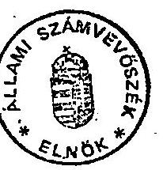
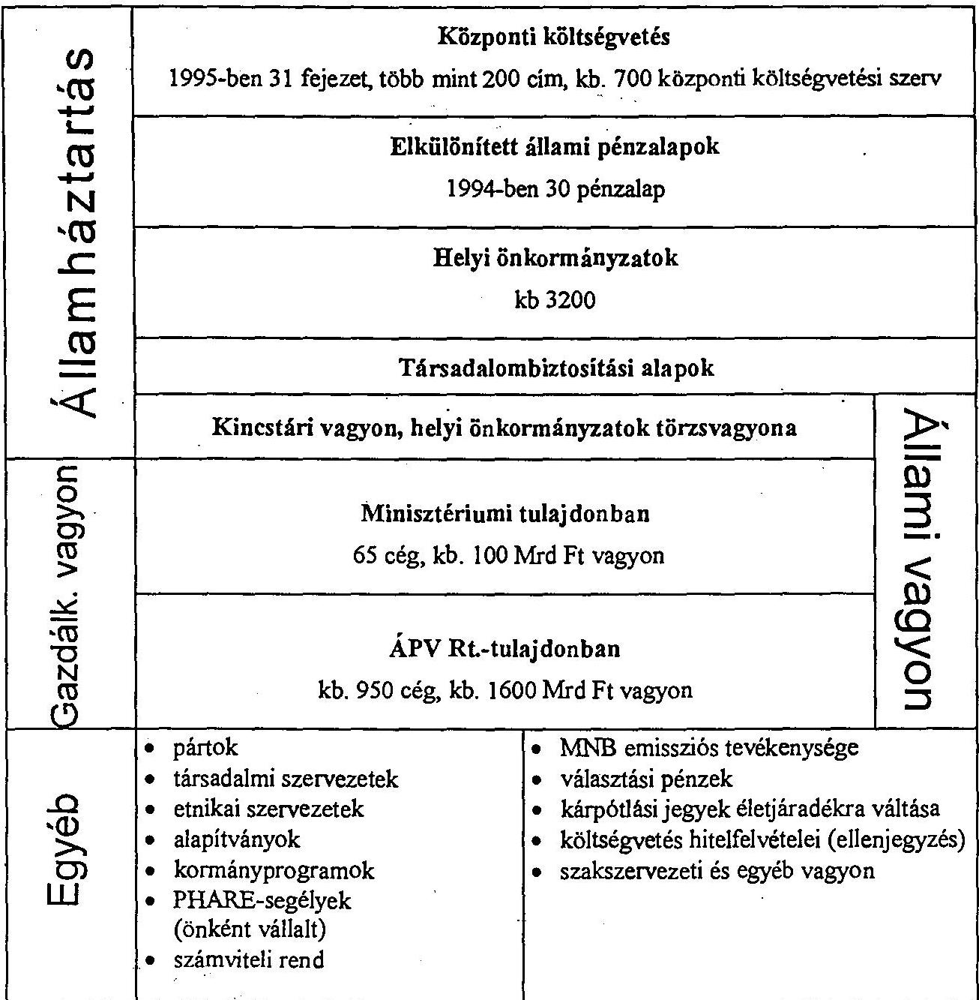
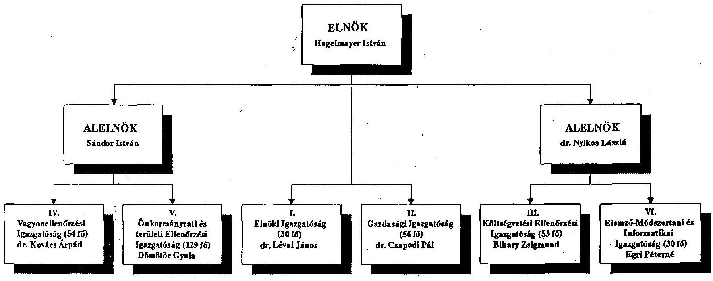

# J/1280 

## 2/270   Állami Számvevőszék

## JELENTÉS

az Állami Számvevőszék 1994. évi tevékenységéről

---

# Állami Számvevőszék 

A-159-1/1995.

Az Állami Számvevőszék ötödik alkalommal számol be éves tevékenységéről. Az előző évekről szóló beszámolók különböző időpontokban és terjedelemben, eltérő formában készültek. Az Országgyűlés azonban nem tűzte ezeket napirendjére. A számvevőszéki törvény (és a kialakult gyakorlat) szerint adott év során készített jelentéseit az ÁSZ nyilvánosságra hozza.

Az 1994. évi számvevőszéki tevékenységről több ok miatt is indokolt összefoglaló áttekintést adni:

- A jelenlegi Országgyűlés, amely mintegy kétharmad részben új képviselőkből áll, még nem kapott az ÁSZ munkájáról éves összefoglaló beszámolót.
- A múlt év őszén az Országgyűlés jóváhagyta az új Házszabályt, amelynek 89. §-a szerint "a jelentés.... valamely szerv tevékenységéről tájékoztatja az Országgyűlést". Az Alkotmány szerint az "Állami Számvevőszék az Országgyűlés pénzügyi-gazdasági ellenőrző szerve", indokolt ezért évente egyszer a törvényhozó testület tájékoztatása, hiszen az ÁSZ az Országgyűlés számára és nevében végzi ellenőrző tevékenységét.
- Az új koalíciós kormány programja "javasolja az Országgyűlésnek, hogy minden év tavaszán tűzze napirendjére a Számvevőszék éves jelentését és az ahhoz kapcsolódó kormánybeszámolót."
- Készül a Magyar Köztársaság új alkotmánya, amelyben az Állami Számvevőszék, illetőleg a pénzügyi és gazdasági ellenőrzés legfontosabb feladatait is újra kell fogalmazni.
- Az államháztartási reform munkálataiban a Kormány hasznosítja a számvevőszéki ellenőrzés tapasztalatait; az ÁSZ részt vesz az Államháztartási Reform Bizottság munkájában.
- Az utóbbi időszakban növekednek az igények, várakozások az ÁSZ tevékenységével kapcsolatban. Az Országgyűlés bizottságai (és a Kormány) gyakran és mind tudatosabban vonják be az ÁSZ-t a jogalkotó tevékenységbe, igényelnek soron kívüli vizsgálatokat.

---

Beszámolónkat abban a reményben állítottuk össze és tesszük közzé, hogy - tekintettel a fentebbi indokokra is - az Országgyűlés önálló napirendi pontként felveszi majd tárgysorozatába, és arról általános vitát folytat. Ez orientációt, ösztönzést adhatna a számvevőszéki tevékenység továbbfejlesztéséhez, színvonalának emeléséhez. Reméljük azt is, hogy az Országgyűlés elfogadja majd jelentésünket és hasznosítani tudja az abban foglalt információkat.

Budapest, 1995. június 30.

Hagelmayer István
elnök

Sándor István
alelnök

dr. Nyikos László
alelnök

---

# AZ ÁSZ ALKOTMÁNYOS ÉS TÖRVÉNYI FELADATAI 

Az Állami Számvevőszékről először 125 évvel ezelőtt, 1870-ben, majd - a rendszerváltozás küszöbén - 1989. október 30-án alkotott törvényt az Országgyűlés. A jelenleg is hatályban lévő 1989. évi XXXVIII. törvény megfelelő alapot szolgáltatott munkánkhoz. (Azt időközben három alkalommal módosították. Két módosítás munkajogi természetű volt, a harmadik a pártok gazdálkodásának ellenőrzésével függött össze.)

Az elmúlt fél évtizedben több olyan törvényt alkotott, több olyan határozatot hozott az Országgyűlés, amelyek új feladatokat, kötelezettségeket és jogosítványokat adtak a Számvevőszéknek. Ezek sorából kiemelhető például, hogy az államháztartási törvény véleményalkotásra kötelezi az Állami Számvevőszéket a társadalombiztosítási alapok költségvetési törvényjavaslatáról, az időlegesen és tartósan állami tulajdonban lévő vagyon privatizációjáról (kezeléséről) szóló törvények előírták a vagyonkezelő szervezetek rendszeres ellenőrzését, a helyi önkormányzatokról szóló törvény az önkormányzatok vitás pénzügyeivel való foglalkozást is feladatul adja. A jelenlegi időszakban a számvevőszéki ellenőrzést számos magas szintű jogszabály (Alkotmány, törvények, országgyűlési határozatok) határozza meg. (Az Állami Számvevőszékkel kapcsolatos főbb jogszabályok felsorolását az 1.sz. melléklet tartalmazza.)

Jóllehet az Alkotmány VI. fejezete és a hatályos számvevőszéki törvény - a 80-as évek végét jellemező társadalmi-politikai viszonyokkal magyarázhatóan - lényegesen szélesebb skálán határozza meg a számvevőszék feladatait, mint az a modern piacgazdaságokban, kifejlett polgári demokráciákban működő hasonló szervezetek tevékenységét jellemzi, az utóbbi időszakban az Állami Számvevőszék feladatai tovább bővültek. Ennek megfelelően az Állami Számvevőszék bekapcsolódott az államháztartási reform előkészítésébe, az alkotmányozási tevékenységbe, részt vesz a jogalkotási folyamatokban, továbbá - például a feketegazdaság visszaszorítására irányuló tevékenységek kapcsán is - kooperál a kormányzati ellenőrzéssel. Mind gyakrabban fogalmazódnak meg vizsgálati és információs igények az országgyűlési

---

képviselők és bizottságok, általában a jogalkotók részéről, nő a számuk a közérdekű bejelentéseknek, a helyi önkormányzatok hibás gazdálkodása miatti tennivalóknak.

Az Állami Számvevőszék - némi egyszerűsítéssel - kettős feladatot tölt be: ellenőrzi az államháztartás bevételeit és kiadásait, továbbá vizsgálja az állami vagyon hasznosítását.

A központi költségvetés körében (a hatályos törvény szerint) ellenőrzi:

- a költségvetési (pótköltségvetési) javaslat megalapozottságát, a bevételi előirányzatok teljesíthetőségét;
- a felhasználások törvényességét, szükségességét és célszerűségét, azt, hogy az Országgyűlés felhatalmazása nélkül a költségvetés egyetlen kiadási tételét se lépjék túl, ne kerüljön sor átcsoportosításra;
- a költségvetési fejezeteket és az elkülönített állami pénzalapok működését;
- az állami költségvetés végrehajtásáról készített zárszámadást;
- az állami költségvetés hitelfelvételeit (az elnök ellenjegyzi a költségvetés hitelfeltételeire vonatkozó szerződéseket).

További konkrét feladatokat is megfogalmaz a számvevőszéki törvény. Eszerint az ÁSZ ellenőrzi:

- a Magyar Nemzeti Banknak az államháztartással való hitelkapcsolatait, valamint a bankjegy- és érmekibocsátásra vonatkozó adatait (utóbbit az Országgyűlés külön utasítására, törvényességi szempontból);
- az APEH adóztatási tevékenységét;
- a helyi önkormányzatok adóztatási tevékenységét;
- a Vám- és Pénzügyőrség tevékenységét;
- az illetékhivatalok tevékenységét;
- az állami költségvetésből gazdálkodó intézményeket;
- a Pénzintézeti Központ tevékenységét;

---

- az állami költségvetésből juttatott támogatások felhasználását a helyi önkormányzatoknál, az alapítványoknál, a társadalmi és egyéb szervezeteknél;
- a Társadalombiztosítási Alap(ok) kezelését és felhasználását;
- a pártok gazdálkodását (törvényességi szempontból).

Az ÁSZ másik nagy ellenőrzési feladatköre az állami vagyon kezelésének, az állami tulajdonban (résztulajdonban) lévő vállalatok, vállalkozások vagyonérték-megőrző és vagyongyarapító tevékenységének a vizsgálata. Ezen belül kiemelt feladat a privatizációs folyamat ellenőrzése, s fokozatosan kibontakozik a részben állami tulajdonú kereskedelmi bankok ellenőrzése is.

Az ellenőrzési feladatokhoz soroljuk végül (mintegy harmadik típusú ellenőrzési feladatként) az állami számviteli rend betartásának figyelemmel kísérését.

Az Állami Számvevőszéknek azonban - mint már utaltunk rá - nemcsak ellenőrzési, hanem véleményezési, a parlamenti döntéseket előkészítő feladatai is vannak. Ezek az alábbiak:

- a központi költségvetési törvényjavaslat mellett a TB-alapok költségvetési törvényjavaslatának véleményezése;
- az Országgyűlés elé terjesztett kormányprogramok és az állami kötelezettségvállalással járó beruházási előirányzatok indokoltságának, célszerűségének és teljesíthetőségének véleményezése;
- az állami számviteli rend továbbfejlesztésére vonatkozó javaslatok véleményezése (ellenjegyzése), illetőleg erre vonatkozó javaslat tétele.

Az eddigiekben ismertetett feladatok körét tovább bővítik azok az országgyűlési határozatok, amelyek időszerű kérdések (népszavazásra, országgyűlési választásokra fordított pénzeszközök felhasználásának vizsgálata, egyes pártok és társadalmi szervezetek vagyonának elszámolása) megvizsgálásával bízzák meg az Állami Számvevőszéket. Ide sorolhatjuk gyakorlatilag a Kormány kérésére - mérlegeléstől függően - elvégzendő feladatokat is. (A feladatstruktúrát a 2.sz. melléklet szemlélteti.)

---

A múlt év végén az ÁSZ összefoglalta a megalakulása óta eltelt időszak ellenőrzési tapasztalatait és azokat "Az Állami Számvevőszék jelenti..." c. tájékoztatóban közzétette. Ebben részletesen bemutattuk mindazokat a területeket, amelyekre a vizsgálatok irányultak. A kiadványt minden országgyűlési képviselő megkapta, ezért annak megállapításait ez alkalommal nem szükséges megismételni. Ismertetjük (annotáljuk) viszont az 1994. évi jelentéseink tartalmát. A tömörítést az indokolja, s teszi lehetővé, hogy jelentéseink nyilvánosak: nemcsak az Országgyűlési könyvtárban és az ÁSZ-nál találhatók meg, hanem a parlamenti frakciók irodáiban és az illetékes bizottságok titkárságain is. Az elmúlt évben 38 jelentést tettünk közzé, továbbá 3 hivatalos véleményt és 3 tájékoztatót készítettünk. Parlamenti sorszámot kapott három jelentés, továbbá mindhárom vélemény. Ezek - egy kivétellel - az Országgyűlés napirendjére, illetve tárgysorozatába is kerültek. 1994-ben nem végeztünk olyan vizsgálatot, amelyet valamilyen oknál fogva titkosítani kellett volna. (A tételes felsorolást a 3.sz. melléklet tartalmazza.)

Az Állami Számvevőszék induló létszámát 1990-ben kereken 300 főben állapította meg az Országgyűlés. Év végére akkor a létszámot 255 főre sikerült feltölteni. Az elmúlt fél évtizedben a bővülő feladatok következtében az induláskor jóváhagyotthoz képest a létszám közel 30%-kal emelkedett (lásd: 4.sz. melléklet). Noha az Országgyűlés és a Számvevőszéki Bizottság közreműködött a számvevők bérhelyzetének javításában, e tekintetben gondjaink számottevően növekedtek, s ma már az értékes és kvalifikált munkaerő - kontraszelekció veszélyét is hordozó - eláramlásának felerősödésével kényszerülünk szembenézni.

Éves költségvetésünk (amelynek döntő része támogatás) nominálisan több, mint a kétszeresére, mintegy 800 millió forintra nőtt öt év alatt. Ez nagyságrendileg megfelel annak az aránynak, amivel történelmi elődünk a múlt század végén működött: a központi költségvetési kiadások 0,4-0,5 ezrelékének. (Az Állami Számvevőszék 1994. évi költségvetési beszámolóját már korábban átadtuk a Számvevőszéki Bizottságnak.)

Szerteágazó feladatait az Állami Számvevőszék hat igazgatóságra tagoltan végzi. (A szervezeti sémát az 5.sz. melléklet szemlélteti.)

---

Az Országgyűlés bizottságai (elsősorban a Számvevőszéki-, továbbá a Szociális- és egészségügyi-, az Oktatási, tudományos-, s a Költségvetési és pénzügyi bizottságok) megtárgyalták és hasznosították a hatáskörükbe tartozó számvevőszéki jelentéseket. Kiemelt jelentőségű az 1992 októberében létrehozott Számvevőszéki Bizottság tevékenysége. Ez a bizottság mintegy összekötő kapocsként működik az Országgyűlés és az Állami Számvevőszék között, s neki is köszönhető, hogy az ÁSZ-nak az Országgyűléssel, annak bizottságaival, apparátusával való kapcsolatai rendezettek, kiegyensúlyozottak.

Az elmúlt időszakban jelentősen javult az ellenőrzések hatékonysága: megállapításaink nyomán több javaslatunkat a Számvevőszéki Bizottság módosító indítványként nyújtotta be az Országgyűlésnek, és ezek egy része közvetlenül is beépült a különböző törvényekbe (így például az elkülönített állami pénzalapok mérlegének auditáltatására vonatkozó indítvány az államháztartási törvénybe, a közbeszerzésekkel kapcsolatos értékelemzési ajánlások a közbeszerzési törvénybe, az ÁSZ banktitokba való betekintési joga a pénzintézeti törvénybe, s itt említhetők az 1995. évi költségvetési törvényjavaslat véleményezése kapcsán, valamint az új privatizációs törvény parlamenti bizottsági vitája során kialakított és kezdeményezett módosító indítványok is).

A Számvevőszéki Bizottság - a kialakult gyakorlat szerint - véleményezi az Állami Számvevőszék éves ellenőrzési tervét (tervjavaslatát), továbbá véleményezi és képviseli az országgyűlési vitában az ÁSZ költségvetési javaslatát, valamint zárszámadását (költségvetési beszámolóját). Konstruktív szakmai "párbeszéd" alakult ki a Számvevőszéki Bizottság és az Állami Számvevőszék (vezetői) között, amely - az ellenőrzési tapasztalatok és az ÁSZ eddigi működése talaján - a számvevőszéki tevékenység továbbfejlesztési irányainak, súlypontjainak áttekintésére, s ennek az alkotmányozási folyamatban való hasznosítására irányul.

---

# AZ ÁLLAMHÁZTARTÁS GAZDÁLKODÁSÁNAK ELLENŐRZÉSE 

## 1. A központi költségvetés ellenőrzése

### 1.1 A központi költségvetés tervezésének és végrehajtásának ellenőrzése

Évenkénti ellenőrzési kötelezettségünk keretében vizsgáltuk a Magyar Köztársaság 1993. évi költségvetésének végrehajtását. A zárszámadás ellenőrzése során a zárszámadási törvényjavaslaton kívül 19 költségvetési fejezetet, 9 költségvetési címet, 31 költségvetési intézményt és 8 elkülönített állami pénzalapot ellenőriztünk a helyszínen. Megállapítottuk, hogy az utóbbi három évben a zárszámadás lényegesen több információt, elszámolást tartalmaz, mint a megelőző időszakban. A közpénzek és a közvagyon nyilvántartása, információs rendje azonban alapvető reformra szorul, mert az állami, önkormányzati tulajdon nem a valóságnak megfelelően szerepel a nyilvántartásokban; a jelenlegi rend nem biztosítja a teljeskörűséget és valós helyzetet tükröző elszámolást.

Külön figyelmet érdemel a belső államadósság terheinek rohamos növekedése. A finanszírozás hosszúlejáratú forrásokkal egyre nehezebb. A tetemes mennyiségű rövidlejáratú kincstárjegy magasabb kamatterhei növelik a költségvetési hiányt, és csökkentik a vállalkozások hitelfelvételi lehetőségét.

A központi költségvetési szervek az elmúlt időszakban meglehetősen nagy önállósággal gazdálkodtak. Feladataikról, azok teljesítéséről a zárszámadás nagyon kevés információt tartalmaz. Bár megkezdődött a központi költségvetési szervek gazdálkodási rendjének átalakítása, szigorítása, alapvető változás még nem következett be, sőt a hatályos előírások következetes számonkérése
 sem történt meg. (Például: veszteséges vállalkozási tevékenységek felülvizsgálata, pénzmaradványok kezelése, támogatás értékű bevételek tervezése, előirányzatok közötti átcsoportosítások.) Az államháztartásnak ebben az alrendszerében jelentős összeget képvisel az alapítványok támogatása. Ez a finanszírozási forma azonban nem eredményezte az állami feladatok kiváltását, a költségvetés tehermentesítését.

---

Az elkülönített állami pénzalapok forrásait jelentős központi költségvetési támogatás és - az utóbbi években - privatizációból származó bevétel egészíti ki. Az első alkalommal 1993-ról elkészített, vagyonkimutatást is tartalmazó beszámolók azt mutatták, hogy az alapok mintegy 100 milliárd forint értékű vagyonnal rendelkeznek. Az értékpapírokba, vagyoni részesedésekbe fektetett pénzeszközeik egy része az alapok forrásainak záró- és nyitóállományában nem szerepelnek. Az 1993. évi zárszámadás 20 milliárd forint "előkerüléséről" adott számot.

Az 1993. évi zárszámadásról szóló jelentésünk megállapításai alátámasztják, hogy a hiányosságok többsége rendszerbeli hibákra vezethető vissza, az államháztartás reformja elodázhatatlan. Alapfeltétel azonban, hogy egy olyan információs rendszer jöjjön létre, amely naprakész, megbízható adatokat tartalmaz. A közvagyon és a közpénzek megóvásához az elszámoltatás és ellenőrzés feltételeit biztosítani kell.

Az 1994. évi pótköltségvetés készítésének törvényi alapjai - tartalék felhasználása, bevételek, kiadások előirányzattól lényegesen eltérő változása - biztosítva voltak. A pótköltségvetés szerkezete nem felelt meg a törvényi előírásoknak, mivel a pótelőirányzatokat és az új előirányzatokat nem különítették el, emiatt a törvényjavaslat nehezebben áttekinthető és értékelhető. Kifogásoltuk, hogy hiányzik az egyértelmű elszámolás a többletkiadásokról. Nem értettünk egyet a törvényjavaslat azon előírásával, amelynek értelmében a Kormány hatásköre az átcsoportosításoknál korlátlanul bővülne. Ez utóbbi javaslatunk hatására a törvényjavaslatot az Országgyűlés módosította.

A Kormány a (következő évi) költségvetési törvényjavaslatát az ÁSZ véleményével együtt nyújthatja be az Országgyűlésnek. Az 1995. évi költségvetési törvényjavaslat jogszerűségének vizsgálata során megállapítottuk, hogy a Kormány nem terjesztette be teljeskörűen azokat a törvényjavaslatokat, amelyek a költségvetési előirányzatok megalapozásához szükségesek. A költségvetés megalapozottságával összefüggésben többek között megállapítottuk, hogy

- a kiadási oldalon az önkormányzatok támogatása évről-évre változik és ez kiszámíthatatlanná és bizonytalanná teszi a rendszert.
- a költségvetési szervek előirányzatainak tervezése továbbra is bázisalapú, a ténylegesen teljesítendő feladatok kiadási szükségletei nem értékelhetőek;

---

- a törvényjavaslat az elkülönített állami pénzalapok számának csökkentését javasolja, de a működő alapok felülvizsgálatára, értékelésére vonatkozó következtetéseket nem tartalmaz;
- a költségvetés megalapozottságával összefüggésben véleményünkben felhívtuk az Országgyűlés figyelmét több ellentmondásra, s e figyelemfelhívással segítséget nyújtottunk az előirányzatok értékeléséhez (fejezeti kezelésű előirányzatok, személyi juttatások, pénzmaradvány elszámolás szabályszerűségére, stb).

Javaslataink az országgyűlési vitában oly módon hasznosultak, hogy módosító indítványokat alapoztak meg. Például:

- a költségvetési törvényjavaslat jóváhagyását megelőző országgyűlési határozatban a fejezetenkénti bevételi és kiadási főösszegeket összegszerűen kell meghatározni;
- a kormányzati beruházások költségvetési hozzájárulását, összköltségét és évenkénti ütemezését a Kormány pótlólag nyújtsa be.

# 1.2 A központi költségvetési fejezetek, költségvetési szervek ellenőrzése 

1994-ben került sor a Köztársasági Elnöki Hivatal fejezet ellenőrzésére, amely 1991-től képez önálló fejezetet a központi költségvetésben. Az ellenőrzés megállapította, hogy a Köztársasági Elnöki Hivatal fejezeti besorolása kezdetben formális volt, mivel nem rendelkezett az önálló fejezeti, illetve intézményei szintű gazdálkodáshoz szükséges személyi, tárgyi és finanszírozási feltételekkel. Ezek megteremtése - az előírásokhoz képest is - késedelmesen történt. Kifogásoltuk, hogy az 1992. évi és az 1993. évközi költségvetési beszámolókban, valamint a könyvvezetésben nem tettek eleget a számviteli alapelveknek, megsértették a pénzügyi bizonylati fegyelmet. A pénzügyi szabálytalanságokhoz, a feladatok nem kielégítő ellátásához a szervezet személyi feltételeinek hiányosságai is hozzájárultak.

Az ellenőrzés megállapításai alapján javasoltuk egyrészt a szervezeti tagoltság csökkentését a kapcsolódó feladatok összevonásával, a gazdasági apparátus megszervezését, a személyi feltételek biztosítását, a pénzügyi-számviteli folyamatok szabályozását, az intézményi belső ellenőrzési rendszerének teljeskörű kiépítését. Javasoltuk továbbá, hogy vizsgálják felül és részletesen, pontosan határozzák meg az Országgyűlés Hivatala és a Köztársasági Elnöki Hivatal közötti feladatmegosztást. Ezt követően a Köztársasági Elnöki Hivatal intézkedjen a mérhető működési költségek saját gazdálkodásába történő bevonásáról.

A magyar egyetemi felsőoktatás ellenőrzése (az angol számvevőszékkel folytatott un. párhuzamos, azaz egyeztetett vizsgálati program alapján végzett ellenőrzés) kiterjedt mind a 25 állami kezelésben lévő egyetemre és az azokat irányító 4 minisztériumra. A vizsgált egyetemek működési költségének közel 90%-át az állami költségvetés biztosítja. A kiadások együttes összege meghaladja az 54 milliárd forintot. Az ellenőrzés többek között megállapította, hogy a felsőoktatási törvény végrehajtása vontatottan halad. Az egyetemek korszerűsítése több jogszabály hiányában megrekedt. Az egyetemek gazdálkodásának egyik neuralgikus pontja a létszám- és bérgazdálkodás, amely azzal is összefügg, hogy az egyetemi oktatóknál nincsenek teljesítménykövetelmények.

Az ellenőrzés arra is felhívta a figyelmet, hogy a tervezett hallgatói létszám növekedéséhez a jelenlegi egyetemi kapacitások már nem elegendőek és nem is elég korszerűek.

Az ellenőrzés eredményeként javaslatokat tettünk a hiányzó jogszabályok megalkotására, illetve jogszabálymódosításokra. A Művelődési és Közoktatási Minisztérium intézkedési tervet dolgozott ki. Az Országgyűlés Oktatási, tudományos, ifjúsági bizottsága megvitatta az ellenőrzésről készült jelentésünket és határozatot hozott.

A sport céljait szolgáló központi költségvetési és egyéb forrásból származó pénzeszközök felhasználásának ellenőrzése központi költségvetési szerveket, önkormányzatokat, elkülönített állami pénzalapokat, társadalmi szervezeteket, vállalkozásokat és egy alapítványt, összesen 132 szervezetet érintett.

Az ellenőrzés többek között megállapította, hogy a sportigazgatás intézményrendszerében végbement feladat- és szervezeti változásokat nem alapozta meg az állami feladatok pontos meghatározása. Hiányzik a testnevelés és sporttevékenység törvényi szintű szabályozása. A társadalmi szervezetek önállósodásához illeszkedően nem alakult ki az állami pénzeszközök elosztásának, felhasználásának és elszámolásának egységes szabályozási rendszere, amely a sportigazgatás intézményeinek és a társadalmi szervezetek működését egyaránt hátráltatta. A többcsatornás finanszírozás - a szükséges reform hiányában - megnehezítette a pénzeszközök felhasználókhoz való eljutását és nyomon követését, s a támogatások elaprózódásához vezetett. Az OTSH gazdálkodása több vonatkozásban nem volt kellően hatékony és szabályszerű, így nem biztosította megfelelően a sportcélok megvalósulását. A sportsikerek részben a sporttársadalmi szervezetek eladósodása révén születtek meg. A sportlétesítmények kihasználtsága is alacsony.

Tekintettel a vizsgálatba bevont szervezetek nagy számára, a gazdálkodási szabályok megsértésének minden esete előfordult. Különösen sok szabálytalanságot tapasztaltunk a sport társadalmi szervezeteknél, ahol a pénzügyi fegyelem gyakori megsértésével találkoztunk, a bizonylatok teljes hiánya, a számviteli alapelvek teljeskörű megsértése is előfordult.

Az ellenőrzés a gazdálkodásbeli hiányosságok felszámolására tett javaslatai mellett két esetben munkajogi felelősségre vonást is kezdeményezett. Javaslatot tettünk továbbá a központi költségvetés javára 15 millió forint visszatérítésére. A sporttörvény mielőbbi megalkotására több vonatkozó jogszabály módosítására is javaslatokat fogalmaztunk meg.

Az ellenőrzött szervezet intézkedési tervet dolgozott ki és további belső vizsgálatot rendelt el. A jelentést az Országgyűlés Oktatási, tudományos, ifjúsági és sport bizottsága is megvitatta és állásfoglalást alakított ki.

A központi költségvetési szerveknél ellenőriztük az alapítványoknak juttatott állami pénz- és vagyonátadásokat. Az ellenőrzéshez bekért adatok szerint a vizsgált időszakban (1989. január 1-1993. június 30.) 194 központi költségvetési szerv 491 alapítványt támogatott összesen 14,7 milliárd forint értékű pénzbeni és tárgyi eszközzel. A támogatások döntő része pénzátadás volt. A pénzbeni támogatások 71%-a alapítványi működéshez, 29%-a alapítványok létrehozásához kapcsolódott.

Megállapítottuk, hogy az alapítvány támogatást korlátozó rendelkezéseket, jogszabályi előírásokat több esetben nem tartották be, 60 szerv összesen 54 millió forint összegű támogatást folyósított kormányengedély nélkül. A vagyonátadások az állami vagyon ingyenes átruházását jelentették, amely nem volt összhangban az államháztartási törvénynek az állami vagyon megkülönböztetett védelmét szolgáló céljával.

---

A kormányzat az alapítványi támogatások költségvetési beszámolóban történő elkülönített kimutatását késve rendelte el, ezért az ilyen kiadások áttekintése csak 1992-től lehetséges.

Az ellenőrzés tapasztalatai alapján javasoltuk, hogy az Országgyűlés az állami vagyon kezelésének államháztartási törvényben lévő szabályozását vizsgálja felül, illetve a módosításig az állami vagyonra, valamint az alapítványok támogatására vonatkozóan elvi állásfoglalást tegyen közzé. A Kormány 1094/1994 (X.26.) számú határozatában előírta, hogy költségvetési szervek csak a Kormány engedélye alapján hozhatnak létre alapítványt. Javasoltuk továbbá: az ÁHT írja elő a Kormány részére, hogy a közalapítványok létrehozását, támogatását az éves költségvetésben irányozza elő, a nem tervezett hozzájárulásokról pedig soron kívül tájékoztassa a parlamentet. A Kormány részére megfogalmazott javaslataink között szerepelt, hogy az ellenőrzés megállapításai alapján vizsgálja meg a szabálytalan támogatásokért való felelősséget, számoljon be az Országgyűlésnek a vonatkozó 1993. évi XCII. törvény alapján az alapítványok közalapítvánnyá történő átalakításáról, illetve létrehozásukról. Erre azonban nem került sor.

# 2. Az elkülönített állami pénzalapok ellenőrzése 

Az elkülönített állami pénzalapok közül 1994-ben egy alap ellenőrzését fejeztük be.

Az Útalap ellenőrzése az Alap 1989-1994. első negyedév közötti időszak gazdálkodására, valamint a feladatokat ellátó szervezetek (Közlekedési, Hírközlési és Vízügyi Minisztérium, Útgazdálkodási és Koordinációs Igazgatóság, Autópálya Igazgatóság, valamint 19 Közúti Igazgatóság) tevékenységére terjedt ki. Az Alap célja az országos (állami tulajdonú) közúthálózat működőképességének fenntartása, fejlesztése. Az Alap 1994-ben 46,3 milliárd forinttal gazdálkodott, amelyből a központi költségvetésből nyújtott támogatás 6,1 milliárd forint volt. A vizsgált időszakban felvett jelentős nagyságrendű hitelek visszafizetése olyan mértékű adósságszolgálatot jelent az Alap számára, amely mellett az eladósodás veszélye nélkül nincs lehetősége újabb hitelek felvételére. Mindez az újabb feladatok, elsősorban a beruházások beindítását korlátozza.

Az ellenőrzés megállapításai alapján javasoltuk, hogy a minisztérium kezdeményezze az Útalap törvény módosítását, ennek keretében az Alap céljának újragondolását.

---

A törvényben meghatározott célokat (az üzemeltetést és fenntartást, valamint a fejlesztést) az Alap forráskorlátai miatt nem tudja teljeskörűen finanszírozni. Ezért célszerűbb lenne az Alap feladataként elsősorban a fenntartási és üzemeltetési munkákat megjelölni, a fejlesztéseket pedig - kivéve a kisebb volumenűeket - a költségvetésbe áthelyezni és önálló projektenként finanszírozni. Ezzel együtt olyan automatizmusok kialakítása szükséges, amelyek biztosítják az Alap forrásai reálértékének megőrzését. Az Alapból finanszírozott feladatok ellátásánál pedig ki kell dolgozni azokat az eljárásokat, amelyek a pénzeszközök hatékonyabb felhasználását biztosíthatják. (A kivitelezési munkák elvégzésénél a versenyeztetési eljárást, az elvégzett munkák minőségi ellenőrzését, az üzemeltetési feladatok normatíváit stb.)

# 3. A helyi önkormányzatok gazdálkodásának ellenőrzése 

Az önkormányzatoknál 1994-ben végzett vizsgálataink egy része az önkormányzatok és a központi költségvetés kapcsolatára irányult. Ennek keretében vizsgáltuk az 1993. évi cél- és címzett támogatások felhasználását, a normatív állami hozzájárulás igénybevételét és elszámolását, továbbá az önhibájukon kívül hátrányos helyzetben lévő önkormányzatok kiegészítő támogatását.

A cél- és címzett támogatások felhasználását valamennyi megyében és a fővárosban ellenőriztük. A céltámogatást 260 önkormányzatnál ellenőriztük, az ellenőrzés az összes céltámogatás 34,1%-ára terjedt ki. A címzett támogatások ellenőrzésére az összes, 56 címzett támogatás érintettjénél sor került.

Az ellenőrzés legfontosabb tapasztalata az volt, hogy a támogatási rendszerben a már korábban is kifogásolt teljesítés ellenőrzését még mindig nem oldották meg. A döntési folyamat elhúzódása következtében a vizsgált folyamatban lévő beruházásoknál 22%, az új, induló beruházásoknál pedig 71,3% állami pénzeszköz maradt felhasználatlanul.

Jelentésünket három parlamenti bizottság tárgyalta meg. Javaslataink alapján az 1993. évi zárszámadási törvény a központi költségvetésbe 36,4 millió Ft befizetési kötelezettséget írt elő.

A normatív állami hozzájárulás igénybevételének és elszámolásának ellenőrzésére 1407 önkormányzatnál került
 sor. 860 önkormányzatnál állapítottunk meg jogosulatlanul igénybe vett támogatást, illetve pótlólagos támogatási igényt. A jogosulatlanul igénybe vett támogatások összege 311,3 millió forint volt, a pótlólagos igény pedig 110,7 millió forint.

Jelentésünket három parlamenti bizottság tűzte napirendjére. A költségvetéssel való utólagos elszámolást és pénzügyi rendezést az 1993. évi zárszámadási törvény 6.§ (5) bekezdése szerinti 3/A melléklete írta elő.

Az önhibájukon kívül hátrányos helyzetben lévő önkormányzatok 1993. évi kiegészítő támogatásának ellenőrzése a korábbi évekhez hasonló, kedvezőtlen tapasztalatokkal zárult. A kiegészítő támogatások elosztásánál alkalmazott szempontok, s ezek következetlen alkalmazása, a megfelelő információk hiánya következtében olyan önkormányzatok is támogatásban részesültek, amelyeknél forráshiányt nem mutattak ki.

Javasoltuk, hogy egyedi elbírálás alapján támogatást csak rendkívüli helyzetek kezelésére nyújtsanak az önkormányzatok elszámolási kötelezettségének előírásával. A korábbi javaslataink alapján történtek ugyan módosítások a támogatási rendszerben, ezek azonban nem eredményezték azt, hogy a támogatások valóban csak az önhibájukon kívül hátrányos helyzetben lévőkhöz jussanak el. Az ellenőrzésről készült jelentést országgyűlési bizottság nem tárgyalta.

A helyi önkormányzatok gazdálkodásának átfogó ellenőrzése keretében 157 önkormányzatot vizsgáltunk. Az ellenőrzésbe vont önkormányzatok számát a rendelkezésre álló ellenőrzési kapacitások határozzák meg.

Az ellenőrzött önkormányzatok többségénél megsértették a pénzügyi elszámolások elemi szabályait, a könyvvezetés és beszámolás során a számviteli alapelveket. Súlyos hiányosságként állapítottuk meg, hogy a helyi önkormányzatok egy része a vásárolt kötvényeket, részvényeket a mérlegükben nem mutatta ki. Találkoztunk célszerűtlen beruházásokkal, fejlesztésekkel is.

Az 1994. évi ellenőrzéseink is igazolták, hogy az önkormányzatok gazdálkodásának évenkénti rendszeres ellenőrzésére, a költségvetési beszámoló auditálására lenne szükség. A gazdasági stabilizációt szolgáló törvénymódosításokról szóló 1995. évi XLVIII. törvény intézkedik erről (megfelelően módosítva a helyi önkormányzatokról rendelkező 1990. évi LXV. törvényt).

A családban nevelkedő fiatalkorúak szociális ellátására, az önkormányzatok vagyon hasznosítási, vállalkozási tevékenységére, valamint az illetékhivatalok tevékenységére vonatkozó számvevőszéki ellenőrzések az önkormányzatok egy-egy feladatellátását érintették.

A szóbanforgó ellenőrzések tapasztalatait, javaslatainkat elsősorban a vizsgálattal érintett szervezetek hasznosítják. 64 önkormányzatot hívtunk föl a törvényes állapot helyreállítására. Emellett 5 érintett minisztériumot, országos hatáskörű szervet kértünk föl jogszabály megalkotására, módosítására.

Az illetékhivatalok tevékenységére vonatkozó ellenőrzési jelentésünket az Országgyűlés Önkormányzati és Rendészeti bizottsága megvitatta. Az illetéktörvény módosításánál hasznosították javaslatainkat, bevezették az illetékelőleg fizetési kötelezettséget.

# 4. A társadalombiztosítás pénzügyi alapjainak ellenőrzése 

Az Állami Számvevőszék kötelezettsége, hogy véleményezze a társadalombiztosítási alapok költségvetési előirányzatait. Ennek megfelelően véleményeztük a társadalombiztosítás pénzügyi alapjainak 1994. évi működési költségvetését. Az ellenőrzés megállapításai alapján az Országgyűlésnek ajánlásokat fogalmaztunk meg. Többek között javasoltuk, hogy a költségvetési gyakorlat alapján az Országgyűlés döntsön a működési költségvetés törvényben jóváhagyott előirányzatai közötti részleges, vagy teljes átcsoportosítási jogkörről. Továbbá kérje fel a társadalombiztosítási önkormányzatok testületeit, hogy mielőbb tekintsék át az apparátus feladatkörét, a feladatellátás tárgyi és személyi feltételeit, a létszám- és bérgazdálkodás helyzetét. Az ÁSZ véleményét az Országgyűlés Szociális- és Egészségügyi Bizottsága megvitatta és állásfoglalást alakított ki.

A társadalombiztosítás pénzügyi alapjai 1993. évi zárszámadásának ellenőrzése során helyszíni vizsgálatot folytattunk a társadalombiztosítás központi és megyei igazgatási szervezeteinél, továbbá 17 egészségügyi intézményben is.

Az ellenőrzés megállapításai alapján javasoltuk, hogy az államháztartási törvény módosítása során, vagy külön törvényben szabályozzák a társadalombiztosítási alrendszer működésének, gazdálkodásának alapvető kérdéseit, az államháztartás információs- és mérlegrendszerébe való illeszkedését. Felhívtuk a figyelmet a társadalombiztosításról szóló törvény módosításának keretében a járulék megosztási arányok, illetve ezzel összefüggésben a nyugdíjbiztosítási és az egészségbiztosítási ág ellátási kiadásainak járulék bevételekből való finanszírozási lehetőségének felülvizsgálatára, az egészségügy társadalombiztosítás által nem fedezhető forrásszükségletének (főként az amortizáció fedezetének) meghatározására. Megfontolásra ajánlottuk a társadalombiztosítás vagyongazdálkodására vonatkozó külön törvény jogalkotási tervbe való felvételét.

Javasoltuk továbbá, hogy a Kormány dolgozza ki a társadalombiztosítás sajátosságait tükröző beszámolási és könyvvezetési rendszert. Az egészségügyi intézményekre vonatkozóan dolgozzanak ki a teljesítmény finanszírozást is tükröző feladatmutatókat, azokat építsék be a költségvetési beszámolás rendszerébe.

Az ellenőrzés során tapasztalt hiányosságok felszámolására az ellenőrzött szervezetek intézkedési tervet dolgoztak ki. Az ellenőrzésről készült jelentést az Országgyűlés három bizottsága tárgyalta meg és állásfoglalást alakított ki.

Az ellenőrzés eredményeként a működési költségvetés 163 millió forintos csökkentésére tettünk javaslatot. A törvényjavaslat jóváhagyásánál ezt figyelmen kívül hagyták.

Törvényi kötelezettségünknek megfelelően véleményeztük a társadalombiztosítás pénzügyi alapjainak 1995. évi költségvetését. Véleményünk kialakítására a korábbiakhoz hasonlóan rendkívül rövid idő állt rendelkezésre, tekintettel arra, hogy a törvényjavaslatot későn, 1995. januárjában adták át az Országgyűlésnek és az Állami Számvevőszékhez január 30-án érkezett meg. Ezt a problémát már a korábbi években is jeleztük.

Az 1995. évi költségvetésről készített véleményünk jórészt a tervező munka fázisainak figyelemmel kísérésén, az így megszerzett információkon alapult. Az előirányzatok mélyreható, részletes vizsgálatára nem volt módunk. A társadalombiztosítás költségvetési javaslatát a Kormány márciusban átdolgozásra visszakérte, így annak ismételt véleményezésére került sor.

# AZ ÁLLAM GAZDÁLKODÓI VAGYONA ÉS A PRIVATIZÁCIÓ ELLENŐRZÉSE 

Törvényi kötelezettségeink értelmében évente kell ellenőriznünk az Állami Vagyonügynökség (ÁVÜ) tevékenységét. Az ÁVÜ 1993. évi tevékenysége ellenőrzésének alapvető célja az volt, hogy átfogó képet nyújtson a szervezet tevékenységéről. Ellenőriznünk kellett a vonatkozó törvényben és az 1993. évi vagyonpolitikai irányelvekben, továbbá az ÁVÜ belső szabályzataiban a privatizációs, a vagyonkezelési, a vagyonhasznosítási, a vagyonvédelmi, a vállalatok kötelező átalakítási folyamataira előírt normatív követelmények megvalósulását.

Az ellenőrzés megállapításai alapján ajánlásokat fogalmaztunk meg az Országgyűlésnek, a Kormánynak és az ÁVÜ ügyvezetésének. Többek között felhívtuk az Országgyűlés figyelmét arra, hogy mielőbb el kell készíttetni azt a vagyonmérleget, amely reális képet ad az állam birtokában lévő vagyon nagyságáról, a vagyon egészét terhelő kötelezettségekről. Ennek alapján ki kell dolgozni és széles körben közzé kell tenni azt a privatizációs stratégiát, amely egyértelműen irányt ad a kormányzati cselekvésekhez. A kijelölt célokkal összhangban ki kell dolgozni a megvalósítás szabályozási és szervezeti eszközrendszerét. Ki kell alakítani a belső kontrollmechanizmusok zárt rendszerét.

Az ellenőrzés megállapításai és javaslatai figyelembe vételével az ÁVÜ intézkedési tervet dolgozott ki. Az ellenőrzésről készült jelentésünket az Országgyűlés Számvevőszéki bizottsága megvitatta és állásfoglalást alakított ki.

Ellenőriztük az Állami Vagyonkezelő Részvénytársaság (ÁV Rt.) 1993. évi tevékenységét is. Az ellenőrzés célja az volt, hogy megítélje a szervezet 1993. évi tevékenységét, a társasághoz tartozó gazdálkodó szervezetek eredményét, az 1993. évi Vagyonpolitikai Irányelvek végrehajtását.

Megállapításaink alapján ajánlásokat fogalmaztunk meg az Országgyűlés, illetve a Kormány részére, valamint az ÁV Rt. Igazgatóságának. Többek között meg kell határozni, hogy a vagyonértékesítésből származó bevételből milyen hányad illeti meg a központi költségvetést, illetve az ÁV Rt.-t.

A jelentést az Országgyűlés Számvevőszéki bizottsága megvitatta. Megerősítette, hogy a jelentésben foglalt javaslatok, így a valóságos tőkeszerkezet bemutatása, a mérlegvalódiság biztosítása, a számviteli fegyelem megvalósítása, az áttekinthető irányítási, döntési rendszer kialakítása szükséges.

Az ÁV Rt. 1993. évi tevékenységéről készített jelentés alapul szolgált az új privatizációs törvénytervezethez készített és a Számvevőszéki bizottságnak megküldött módosító indítványok tervezetéhez. Ezek a törvénytervezetbe érdemben beépültek. Az ÁV Rt. ügyvezetésének tett számvevőszéki ajánlások végrehajtása megkezdődött, s ennek részeként elkészült a valós tőkeszerkezet számviteli kimunkálása.

Jelentésünk alapján a Legfőbb Ügyészség a Fővárosi Főügyészséget a Btk. 289.§-ába ütköző, számviteli fegyelem megsértésének vétsége, valamint a 313.§-ba ütköző, visszaélés csekkel vétségek alapos gyanúja miatt nyomozás elrendelésére hívta fel.

1994-ben két, 100%-ban állami tulajdonban lévő mezőgazdasági vállalatot ellenőriztünk. A Komáromi Mezőgazdasági Kombinát és a Ceglédi Állami Tangazdaság részvénytársasággá történő átalakulását, az átalakulás törvényességét, az állami vagyon védelmét, az állami támogatások felhasználásának hatékonyságát vizsgáltuk.

Az ellenőrzés megállapításai alapján ajánlásokat fogalmaztunk meg az Országgyűlés számára. Többek között felhívtuk a figyelmet egy olyan mezőgazdasági hitelkonstrukció kidolgozásának szükségességére, amely megoldja a mezőgazdasági üzemek termelési ciklus alatti finanszírozását. Az adók és támogatások rendszerének módosításával biztosítani kell az állattenyésztéshez szükséges infrastruktúra megújításának lehetőségét.

Az ellenőrzött szervezetek a feltárt hiányosságok megszüntetésére intézkedési tervet dolgoztak ki.

Az országos menetrend szerinti személyszállításra rendelt állami vagyonnal való gazdálkodást 5 VOLÁN busz vállalatnál vizsgáltuk. Az ellenőrzés a vállalatok részvénytársasággá való átalakulásának törvényességére, az állami vagyon védelmére és az állami támogatások felhasználásának hatékonyságára irányult.

Az ellenőrzési megállapítások alapján ajánlásokat és javaslatokat fogalmaztunk meg a Közlekedési, Hírközlési és Vízügyi Minisztériumnak. Többek között javasoltuk, hogy alakítsák ki a menetrend szerinti autóbusz közlekedésben az ország valamennyi településén a kötelező ellátás minimumát, annak paramétereit és az ellátás színvonalát minősítő követelmény-rendszert. Ez szolgálhat alapul az indokolt és szükséges anyagi fedezet megállapításához. Emellett olyan törvényi szabályozásra van szükség, amely biztosítja ezen nem profit jellegű közszolgáltatáshoz szükséges forrásképződést.

Az ellenőrzött vállalatok a feltárt hiányosságok megszüntetésére intézkedési terveket dolgoztak ki. Az ellenőrzés eredményeként tett javaslataink nyomán kormányhatározatok születtek az autóbuszpark rekonstrukciójáról. Az 1994. évi költségvetési törvényben 1 milliárd forint pénzügyi fedezetről, továbbá 5 milliárd forint hitel kormánygaranciájáról döntöttek a tömegközlekedés járműállományának cseréjére.

A környezetvédelmi követelmények érvényesülését vizsgáltuk az 1996. évi Világkiállítás előkészítése során. Az ellenőrzés eredményeként megállapítottuk, hogy a Programiroda nem gazdálkodott takarékosan a környezetvédelmi kiadásokkal. Az Iroda által megkötött környezetvédelmi szerződések mintegy 520 millió forintos összegéből a vizsgálat megállapítása szerint mindössze 160 millió forint volt konkrétan környezetvédelmi célú ráfordítás. Az ellenőrzött szervezet intézkedési tervet dolgozott ki. A jelentést három parlamenti bizottság vitatta meg.

A szénbányászati szerkezetátalakítási program keretében megvalósult bányabezárásokra fordított költségvetési pénzeszközök felhasználásának ellenőrzése alapján megállapítottuk, hogy a Kormány döntése alapján - az Országgyűlés jóváhagyását mellőzve - finanszírozták a céltámogatási keret terhére a bezárásra kijelölt, de átmenetileg működtetett bányák veszteségeit (mintegy 1,5-1,8 milliárd forintot). Felhívtuk a Kormány figyelmét arra, hogy még a nagy társadalmi feszültségek kezelése sem indokolhatja az Országgyűlés költségvetéssel kapcsolatos jogkörének megsértését.

Az Országgyűlés Számvevőszéki bizottsága 1993. április 22-ei ülésén kérte föl az Állami Számvevőszéket, hogy lehetőségei szerint adjon tájékoztatást az állami költségvetési szervek, az állami tulajdonú vállalatok, gazdasági társaságok, valamint a helyi önkormányzatok által az alapítványoknak nyújtott támogatásokról.

Az állami tulajdonú vállalatok és az önkormányzatok alapítványoknak nyújtott támogatása felmérése alapjául 975 vállalat 8343 tanúsítványa, valamint 241 polgármesteri hivatalnál felvett 1523 tételre kiterjedő adatok szolgáltak. A kiértékelést számítógépes feldolgozással végeztük.

A nem teljeskörű és a helyszínen nem ellenőrzött adatok alapján az állami hozzájárulások jellemzően 10.000-500.000 forint között voltak. A 10 millió feletti alapítványi hozzájárulás döntő részét az ÁVÜ, ÁV Rt. portfóliójába tartozó bankok, illetve a MATÁV adták. A beérkezett adatok szerint a vállalatok és önkormányzatok összességében a négy és fél év alatt mintegy 11,7 milliárd forinttal járultak hozzá az alapítványokhoz. Az adatok nem teljeskörűségéből származó korrekció elvégzése után a támogatások összege 18,8 milliárd forintra becsülhető, amely éves átlagban 6,78 milliárd forintnak felel meg. Ez az állami költségvetésből nyújtott alapítványi támogatásoknak csak kis hányadát teszi ki.

A Dimag Rt. privatizációja, a kohászati vertikumhoz tartozó társaságok működési támogatásának felhasználására irányuló ellenőrzésünk a kohászati nagyvállalat privatizációjában súlyos mulasztásokat tárt föl. Az adás-vételi szerződés megkötésére elegendő biztosítékok hiányában került sor. A vevő tulajdonba helyezése a fizetési kötelezettségének teljesítése nélkül történt meg.
 A kohászat folyamatos működtetésére vonatkozó vállalását sem teljesítette, amely a kapcsolódó társaságoknál a felszámolások láncolatát indította el.

Az ellenőrzés megállapításai alapján munkajogi és büntetőjogi felelősségre vonást kezdeményeztünk. Az ellenőrzött szervezet intézkedési tervet dolgozott ki és további belső vizsgálatot rendelt el. A jelentést az Országgyűlés Számvevőszéki bizottsága vitatta meg.

---

# EGYÉB TÖRVÉNYI KÖTELEZETTSÉGEN ALAPULÓ ELLENŐRZÉSEK 

A vonatkozó törvény rendelkezése alapján ellenőrizzük a költségvetési támogatásban részesülő pártok gazdálkodásának törvényességét. Az ellenőrzési tervben foglaltaknak megfelelően került sor a Munkáspárt, a Liberális Polgári Szövetség Vállalkozók Pártja, valamint az Agrárszövetség 1992-93. évi gazdálkodása törvényességének ellenőrzésére.

Az Állami Számvevőszékre vonatkozó törvény rendelkezése értelmében az Állami Számvevőszék ellenőrzi az állami költségvetési támogatás felhasználását a társadalmi szervezeteknél. Az 1994. évi ellenőrzési terv alapján 6 társadalmi szervezet ellenőrzésére került sor.

Általános ellenőrzési hatáskörünk alapján 1994-ben a PHARE- program keretében kapott támogatások felhasználását a Központi Statisztikai Hivatalnál és a Magyar Vállalkozásfejlesztési Alapítványnál vizsgáltuk.

A KSH részére az informatikai rendszer fejlesztéséhez juttatott támogatás ellenőrzése eredményeként a belső szabályozás és a pénzügyi fegyelem javítására, a számviteli rendelkezések betartására vonatkozóan tettünk javaslatokat. A szervezet a feltárt hiányosságok megszüntetésére intézkedési tervet dolgozott ki és belső vizsgálatot rendelt el.

A Magyar Vállalkozásfejlesztési Alapítványnál lefolytatott vizsgálatunk súlyos működési és gazdálkodásbeli szabálytalanságokat tárt fel. Az Alapítványt 715,7 millió forintos veszteség érte készfizetői kezességből fakadó kötelezettség, banki és cégcsődök, valamint behajthatatlan váltókövetelések miatt. Az Alapítvány vezetői 1992-ben felhatalmazás és jóváhagyás nélkül nagy összegű, mintegy 600 millió forint kifizetést teljesítettek fedezetlen váltók ellenében. A különösen nagy vagyoni hátrányt okozó hűtlen kezelés bűncselekmény elkövetésének alapos gyanúja miatt az ÁSZ feljelentést tett. Az Alapítvány az ellenőrzés megállapításai alapján intézkedési tervet dolgozott ki és belső vizsgálatot rendelt el.

---

# AZ ÁLLAMI SZÁMVEVŐSZÉK MŰKÖDÉSI FELTÉTELEI, NEMZETKÖZI KAPCSOLATAI 

Az 1994. évi költségvetési törvényben az Országgyűlés az Állami Számvevőszék működési kiadásaira 756,6 millió forint, felújításra 6 millió forint előirányzatot hagyott jóvá. A fejezethez tartozó ÁSZ Továbbképzési Intézet és üdülő (ÁSZTI) cím előirányzatát 31,6 millió forintban határozta meg. Az évközi előirányzat módosítása következtében a fejezeti működési előirányzatok összege 816,3 millió forintra (a felújítási előirányzatok összege 5,2 millió forintra) változott, amiből 1994-ben 773,4 millió forintot használtunk fel. A működési költségeken belül a bér 407,2 millió forintot, járulékai 188 millió forintot, a dologi kiadások 179,7 millió forintot, a támogatások 5,7 millió forintot, a felhalmozási kiadások 33,1 millió forintot tettek ki. A felújítási kiadások összege 3,8 millió forint volt.

## 1. Személyi feltételek, továbbképzés

1994.XII.31-én a teljes munkaidőben foglalkoztatottak létszáma az ÁSZ-nál 356, az ÁSZTI-nál 28 fő volt (lásd: 4.sz. melléklet). 1990-hez képest a számvevők, számvevő-tanácsosok létszáma 88-al nőtt, emelkedett a kiszolgáló tevékenységet ellátók létszáma is. Mindez a lényegében folyamatosan bővülő feladatokkal járt együtt: a mennyiségi növekedés nagyobb része az önkormányzatok ellenőrzését ellátók körében valósult meg.

Az ellenőrzést végzőknek kereken 3/4-része közgazdasági-pénzügyi szakirányú felsőfokú szakképzettséggel rendelkezik. Jelentősebb még a műszaki (16%) és a jogász (8%) diplomások aránya. A számvevők mintegy harmada másoddiplomával is rendelkezik. Ezen kívül az ellenőrök több, mint fele az alapvégzettség mellett szakirányú és felsőfokú továbbképzéseken (okleveles könyvvizsgáló, adószakértő stb.) szerzett okleveleket.

A korábbi üres álláshelyekkel együtt 1994-ben a betölthető helyek száma 14 fő volt, az évközben megüresedett 17 státusszal együtt ez 31 főre emelkedett. Az év során 24 munkatársat vettünk fel. A köztisztviselői I-II. besorolásnál az álláshelyek

---

betöltésére pályázat útján került sor. A nagyszámú pályázó az ÁSZ iránti érdeklődés számottevő növekedését jelzi. A pályázók többsége azonban nem felelt meg az ÁSZ által meghatározott alkalmazási feltételeknek.

Az 1994. évi oktatási-továbbképzési tervünkben szereplő 57 belső képzési programból 39 valósult meg. E rendezvényeken 629 fő vett részt (közel azonos az 1993. évi belső képzéseken résztvevők számával). A képzések meghiúsulása alapvetően az előre nem tervezhető ellenőrzési munkacsúcsokra, vizsgálati többletfeladatokra vezethető vissza. A belső továbbképzések közül a számítástechnikai volt a legsikeresebb. Munkatársaink - amennyire azt a költségvetési korlátok lehetővé tették - külső továbbképzéseken, szakmai tanfolyamokon, szemináriumokon és szakmai-tudományos konferenciákon, esetenként külföldi rendezvényeken is részt vettek.

# 2. A szervezet tevékenységét támogató információs rendszer 

A számítógépes hálózat szolgáltatásai, adatbázisai közvetlenül támogatják az ellenőrzési munkát és a szervezet működését is segítik.

Az ellenőrzések informatikai támogatása során feldolgozások készültek az 1993-as pótköltségvetés és zárszámadás, az 1994. évi költségvetés és pótköltségvetés ellenőrzéséhez. Kialakítottuk az 1993. évi beszámoló adatok, az 1993-94. évi költségvetési adatok adatbankjait. Ezen kívül esetenként (például az alapítványok, az egyetemek, a sport támogatással kapcsolatos vizsgálatok esetében) a szükséges adatok feldolgozását segítettük számítógépes eszközökkel. Néhány nyilvántartó program a gazdasági terület munkáját segíti.

A szükséges jogszabályok gyors elérését teszi lehetővé a Ker.Szöv. Complex CD Jogtár jogi adatbázis, amellyel a vidéki kirendeltségeken lévő számítógépeket is felszereltük. Az információk érdekeltekhez történő gyors eljutását biztosítja a magyar nyelvű cc:Mail elektronikus levelező és FAX rendszer (lehetőséget ad a szöveges információkon kívül adatállományok, grafikák, táblázatok elküldésére is). A cc:Mail remote segítségével a vidéki kirendeltségeket is bekapcsoltuk a levelező rendszerbe.

A vázolt feladatokat mintegy 140 munkahelyes számítógép hálózat, egy kisebb, középgépes hálózat szolgálja ki, valamint a vidéki kirendeltségeken lévő személyi

---

számítógépek. A számítógépes rendszer üzemeltetését, a szoftverrendszer működését, a rendszer használatának oktatását egyaránt saját apparátus végzi.

Az informatikai rendszer továbbfejlesztését szolgáló IT stratégia kialakítása részeként eddig az ellenőrzési területek információs rendszerét értékeltük, s az ellenőrzést végzők (további) információigényét mértük fel.

# 3. Tárgyi feltételek 

- A munkavégzéshez szükséges tárgyi feltételek 1994-ben valamelyest javultak. A központi székház belső munkáin kívül két megyei kirendeltségen végeztünk felújítási munkákat.

A központi székház szűkössége miatt Budapesten három helyen széttagolva tudjuk csak munkatársainkat elhelyezni. Ez megnehezíti a folyamatos munkát. Megfelelően alkalmas székház hiányában lényegében provizórikus megoldásokkal kényszerülünk a kedvezőtlen munkafeltételekből, elhelyezési gondokból adódó feszültségek ellensúlyozására. Az ezt szolgáló beruházási, valamint felújítási munkák is közel 130 millió forintba kerülnek és a hivatal folyamatos üzemeltetése mellett - a finanszirozási lehetőségtől, ütemezéstől függően - várhatóan két év alatt végezhetők el. Némi irodai terület növelésre az épületben lévő, szomszédos öröklakások megvásárlásával és irodákká átalakításával nyílhat lehetőség, ez azonban további mintegy 20-30 millió forint pénzügyi fedezetet igényelne. E nem elhanyagolható költségigényű munkák - mivel a kényszerű széttagoltságon nem változtatnak - együttesen sem biztosítanak kedvező feltételeket a számvevőszéki tevékenységhez, s jövőbeni fejlesztéséhez.

## 4. Nemzetközi kapcsolatok

1994-ben az ÁSZ két- és többoldalú nemzetközi kapcsolatai tovább fejlődtek és így megismerhető tapasztalatok gazdagították ellenőrzéseink módszereit, eszköztárát.
4.1 Többoldalú együttműködés, részvétel a nemzetközi szervezetek munkájában

Az INTOSAI 1992. évi XIV. Kongresszusa az Állami Számvevőszék elnökét bízta meg egyik állandó bizottsága, a Belső Ellenőrzési Szabvány Bizottság vezetésével.

---

E bizottsági munka keretében - az ÁSZ irányításával, koordinálásával - a belső ellenőrzési nemzetközi szakbibliográfia készült. A munkát 1994. őszén az INTOSAI Kormányzó Tanácsának 39. ülésén elismeréssel értékelték.

Az INTOSAI XV. Kongresszusának előkészítése kapcsán a környezetvédelem ellenőrzése témához, továbbá a Kongresszust követő nemzetközi privatizációs szemináriumhoz készítettünk szakmai anyagokat.

Az EUROSAI Kormányzó Tanácsa 1994. évi ülésére az Állami Számvevőszék szervezésében Velencén került sor.

Részt veszünk továbbá az EUROSAI III. Kongresszusa előkészítésében a napirendi pontokat előkészítő munkacsoportok munkájában. A privatizációval, illetőleg a Számvevőszék, a parlament, a belső ellenőrzés, az igazságszolgáltatás és a médiák kölcsönös kapcsolataival foglalkozó munkacsoportok tevékenységében szakmai anyagok készítésével és a szemináriumokon való részvétellel vállaltunk közreműködést.

A visegrádi országok számvevőszékeinek elnökei második találkozójára az elmúlt év októberében került sor Szlovákiában. Részt veszünk a visegrádi országok együttműködése keretében tervezett első ún. párhuzamos vizsgálatban, amely az EU belépéssel kapcsolatosan megtett lépések összehasonlítására irányul. Ugyancsak a visegrádi országok együttműködése keretében került sor az elmúlt év októberében Velencén arra a szemináriumra, amelyen a cseh, lengyel, szlovák és magyar számvevők a Német Szövetségi Számvevőszék nemzetvédelmi, titkosszolgálati, s a NATO-val kapcsolatos ellenőrzésének módszereivel ismerkedtek meg.

# 4.2 Kétoldalú együttműködés 

A Német Szövetségi Számvevőszék elnökének magyarországi látogatása során megállapodás született arról, hogy a két ország számvevőszéke párhuzamos vizsgálatot végez "A Németországi Szövetségi Köztársaság által a magyarországi kis- és közepes méretű magánüzemek létesítéséhez nyújtott pénzügyi támogatás felhasználása" című témában. A találkozón megállapodtak a számítástechnikai rendszerek hatékony felhasználásának ellenőrzésével kapcsolatos, 1995. őszén sorra kerülő nemzetközi konferencián való német részvételről is.

---

Az elmúlt évben Velencén tartottuk azt a szemináriumot, amelyen a Német Szövetségi Számvevőszék munkatársai és az Állami Számvevőszék szakértői megvitatták a német, osztrák, svájci és a magyar költségvetés ellenőrzésének főbb vonásait.

Szakértőink sikeres konzultáción mutatták be a Szövetségi Számvevőszék munkatársainak az ÁSZ számítástechnikai rendszerét.

A Német Szövetségi Számvevőszék lehetőséget biztosított arra, hogy magyar számvevő - huzamosabb kinttartózkodással - részt vegyen vizsgálataikban.

Az Egyesült Királyság legfőbb számvevőjének látogatása során áttekintették és értékelték a már néhány éve kialakult együttműködést. Megállapodtak az egyetemek gazdálkodását áttekintő ellenőrzés kedvező tapasztalatai alapján további párhuzamos vizsgálatok megszervezésében. Az egyetemek ellenőrzésének tapasztalatait év végén Velencén közösen értékeltük: a számvevők mellett a hazai egyetemek rektorai, valamint a Művelődési-, továbbá a Pénzügyminisztérium illetékes vezetői is részt vettek a szimpoziumon.

Munkatársaink egy csoportja az Osztrák Számvevőszéknél tanulmányozta a környezetvédelmi kiadások, valamint a Szövetségi Vasutak ellenőrzésének módszereit.

Sor került a Holland Számvevőszék elnökének budapesti látogatására és a két számvevőszék közötti együttműködés megalapozására is. Szakértőik a társadalombiztosítás ellenőrzéséről tartottak szakmai konzultációt az ÁSZ munkatársai részére.

Az elmúlt évben vettük fel a kapcsolatot Moldávia, a Kínai Népköztársaság, a Koreai Köztársaság és Japán számvevőszékeivel is.

Budapest, 1995. június 30.

---

# Az Állami Számvevőszékkel kapcsolatos főbb jogszabályok

|   | A jogszabály száma | A jogszabály megnevezése  |
|---|---|---|
|  1. | 1949. évi XX. törvény | A Magyar Köztársaság Alkotmánya  |
|  2. | 1989. évi XXXVIII. törvény módosította:*   - az 1992. évi XLVI. törvény,  - az 1992. évi LXXXI. törvény  - az 1993. évi LXXXVIII. törvény | Az Állami Számvevőszékről  |
|  3. | 1992. évi XXXVIII. törvény módosította:*   - az 1994. évi CIV. törvény  - az 1995. évi XXI. törvény | Az államháztartásról  |
|  4. | 1990. évi LXV. törvény módosította:*   - az 1994. évi LXIII. törvény | A helyi önkormányzatokról  |
|  5. | 1989. évi XXXII. törvény | Az Alkotmánybíróságról  |
|  6. | 1989. évi XXXIII. törvény módosította:*   - az 1992. évi LXXXI. törvény | A pártok működéséről és gazdálkodásáról  |
|  7. | 1989. évi XXXIV. törvény | Az országgyűlési képviselők választásáról  |
|  8. | 1990. évi LV. törvény | Az országgyűlési képviselők jogállásáról  |
|  9. | 1990. évi LXIV. törvény | A helyi önkormányzati képviselők és polgármesterek választásáról  |
|  10. | 1990. évi

 LXXIII. törvény módosította:*
- az 1990. évi LXXIX.
törvény | Az elmúlt rendszerhez kötődő egyes társadalmi szervezetek vagyonelszámoltatásáról  |
|  11. | 1990. évi XCI. törvény módosította:*
- az 1993. évi CII. törvény | Az adózás rendjéről  |
|  12. | 1991. évi XXVIII. törvény | A szakszervezeti vagyon védelméről, a munkavállalók szervezkedési és szervezeteik működési esélyegyenlőségéről  |
|  13. | 1991. évi LXXXIV. törvény | A társadalombiztosítás önkormányzati igazgatásáról  |
|  14. | 1992. évi XXIII. törvény | A köztisztviselők jogállásáról  |
|  15. | 1992. évi XXIX. törvény | Az önhibájukon kívül hátrányos helyzetbe került települési önkormányzatok kiegészítő állami támogatásáról  |
|  16. | 1992. évi XXXI. törvény | A kárpótlási jegyek életjáradékra váltásáról  |
|  17. | 1992. évi LIII. törvény | A tartósan állami tulajdonban maradó vállalkozói vagyon kezeléséről és hasznosításáról  |
|  18. | 1992. évi LIV. törvény | Az időlegesen állami tulajdonban levő vagyon értékesítéséről, hasznosításáról és védelméről  |

---

| 19. | 1995. évi XXXIX. törvény | Az állam tulajdonában lévő vállalkozói vagyon értékesítéséről |
| :--: | :--: | :--: |
| 20. | 1992. évi LXXXVI. törvény | A Magyar Köztársaság 1992. évi költségvetéséről és az államháztartás vitelének 1992. évi szabályairól szóló 1991. évi XCI. törvény módosításáról |
| 21. | 1993. évi IV. törvény | Az elmúlt rendszerhez kötődő egyes társadalmi szervezetek vagyonelszámoltatásával összefüggő intézkedésekről |
| 22. | 1993. évi LXXVII. törvény | A nemzeti és etnikai kisebbségek jogairól |
| 23. | 1993. évi CX. törvény | A honvédelemről |
| 24. | 1994. évi XL. törvény | A Magyar Tudományos Akadémiáról |
| 25. | 1994. évi LXV. törvény | A Magyar Köztársaság 1994. évi pótköltségvetéséről |
| 26. | 1994. évi XCVI. törvény | A Magyar Köztársaság 1993. évi költségvetésének végrehajtásáról |
| 27. | 1994. évi CIV. törvény | A Magyar Köztársaság 1995. évi költségvetéséről |
| 28. | 139/1993. (X. 12.) Korm. rendelet | Az államháztartás alrendszereinek tervezési, beszámolási és adatszolgáltatási kötelezettségéről, valamint a központi költségvetés végrehajtásával kapcsolatos egyes kérdésekről |
| 29. | 34/1994. (III. 18.) Korm. rendelet | A betétbiztosítási alapok és az intézményvédelmi alapok beszámoló készítési és könyvvezetési kötelezettségének sajátosságairól |
| 30. | 138/1994. (X. 28.) Korm. rendelet | A Kormányzati Ellenőrzési Iroda létrehozásáról és feladatairól |
| 31. | 67/1992. (X. 22.) OGY határozat | Az Országgyűlés bizottságairól, tisztségviselőiről és tagjairól |
| 32. | 62/1994. (XI. 23.) OGY határozat | Az Országgyűlés bizottságairól, tisztségviselőiről és tagjairól |
| 33. | 9/1990. (II. 14.) OGY határozat | Az Állami Számvevőszék létszámáról és éves költségvetéséről |
| 34. | 26/1991.(IV. 23.) OGY határozat | A Bős-Nagymarosi Vízlépcsőrendszerrel kapcsolatos kormányzati feladatokról |
| 35. | 46/1994. (IX. 30.) OGY határozat | A Magyar Köztársaság Országgyűlésének Házszabályáról |
| 36. | 1034/1992. (VII. 1.) Korm. határozat | A köztisztviselők jogállásáról szóló 1992. évi XXIII. törvény hatálya alá tartozó szervek jegyzékéről |
| 37. | 1023/1994. (IV. 6.) Korm. határozat | A gazdálkodással összefüggő bűnözés megelőzése, felderítése, valamint a hatékonyabb felelősségre vonás érdekében teendő intézkedésekről és Gazdaságvédelmi Koordinációs Bizottság létrehozásáról |
| 38. | 1086/1994. (IX. 15.) Korm. határozat | A privatizációs folyamat, az állami vagyonkezelés és egyes, az államháztartást érintő pénz- és vagyonmozgások jogszerűségét veszélyeztető visszaélések feltárásának intézményrendszeréről |
| 39. | 1128/1994. (XII. 30.) Korm. határozat | Az államháztartási reform előkészítéséről |
| 40. | 1023/1995. (III. 22.) Korm. határozat | A gazdasági stabilizációt szolgáló 1995. évi kiigazító intézkedésekről |
| 41. | 104/1995. (V. 25.) Korm. határozat | Az AGROBANK Rt. helyzetével kapcsolatos egyes kérdésekről |
| 42. | 1995. évi L. törvény | A pénzintézetekről és a pénzintézeti tevékenységről szóló 1991. évi LXIX. törvény módosításáról |

---

# Az ÁSZ feladatstruktúrája az Alkotmány és a hatályos törvények szerint 

---

# Az 1994-ben közzétett jelentések (vélemények, tájékoztatók) címjegyzéke 

185. Jelentés a KSH részére juttatott PHARE forrásból nyújtott pénzügyi támogatások felhasználásának vizsgálatáról (1994. február)
A jelentés angol nyelvű változatának sorszáma és címe: 194. Report on the control of the utilisation of the financial support provided for the Central Statistical Office from PHARE resources (February 1994)
186. Jelentés az önkormányzatok pénzgazdálkodásának (pénzügyi folyamatának), pénzkezelésének törvényességi, szabályszerűségi vizsgálatáról (1994. január)
187. Jelentés a DIMAG Rt. privatizációjáról, a kohászati vertikumhoz tartozó társaságok működési támogatásának felhasználásáról (1994. január)
188. Jelentés az IKARUSZ és a CSEPEL AUTÓGYÁR állami vállalatok együttes szanálása és privatizálása tárgyában végzett ellenőrzés utóvizsgálatairól (1994. január)
189. Jelentés a Vértes Volán Vállalatnál az országos menetrend szerinti személyszállításra rendelt állami vagyonnal való gazdálkodásról (1994. április)
190. Jelentés az Alba Volán Vállalatnál az országos menetrend szerinti személyszállításra rendelt állami vagyonnal való gazdálkodásról (1994. április)
191. Jelentés a helyi és területi államigazgatási szervek létszám- és bérgazdálkodásának ellenőrzéséről (1994. február)
192. Jelentés a Magyarországi Cigányok Igazság Szövetsége 1992. évi állami költségvetési támogatás felhasználásának ellenőrzéséről (1994. február)
193. Jelentés a Magyarországi Románok Szövetsége 1992. évi állami költségvetési támogatás felhasználásának ellenőrzéséről (1994. február)
194. Lásd a 185. sorszám alatt
195. Jelentés a Köztársasági Elnökség fejezet pénzügyi-gazdasági ellenőrzéséről (1994. február)
196. Vélemény a társadalombiztosítás pénzügyi alapjainak 1994. évi működési költségvetéséről (1994. március) OGY szám: 15618

---

197. Jelentés a Magyarországi Horvátok Szövetsége 1993. évi állami költségvetési támogatás felhasználásának ellenőrzéséről (1994. április)
198. Jelentés a Szerb Demokratikus Szövetség 1993. évi állami költségvetési támogatás felhasználásának ellenőrzéséről (1994. április)
199. Jelentés a Volánbusz, az Alba, a Kisalföld, a Vasi és a Vértes Volán Vállalatoknál az országos menetrend szerinti személyszállításra rendelt állami vagyonnal való gazdálkodásról - az 1993. évben végzett számvevőszéki vizsgálatok összefoglaló tapasztalatai (1994. április)
198. Tájékoztató az állami tulajdonú vállalatok, gazdasági társaságok és az önkormányzatok alapítványi hozzájárulásairól (1994. április)
199. Jelentés a környezetvédelmi követelmények érvényesüléséről az 1996. évi Világkiállítás előkészítése során (1994. június)
200. Jelentés a LUNGO DROM Érdekvédelmi Cigányszövetség Országos Szövetsége 1993. évi állami költségvetési támogatás felhasználásának ellenőrzéséről (1994. április)
201. Jelentés a Cigány Ifjúsági Szövetség 1993. évi állami költségvetési támogatás felhasználásának ellenőrzéséről (1994. április)
202. Jelentés az önkormányzatok vagyonhasznosítási, vállalkozási tevékenységének ellenőrzéséről (1994. június)
203. Jelentés a Magyar Madártani és Természetvédelmi Egyesület 1993. évi központi költségvetési támogatás felhasználásának ellenőrzéséről (1994. szeptember)
204. Jelentés az Országos Ómagyar Kultúra Baráti Társaság 1993. évi állami költségvetési támogatás felhasználásának ellenőrzéséről (1994. szeptember)
205. Jelentés a családban nevelkedő fiatalkorúak szociális ellátásáról (1994. június)
206. Jelentés az illetékhivatalok tevékenységének ellenőrzéséről (1994. június)
207. Jelentés az önkormányzatok pénzügyi-gazdasági tevékenységének törvényességi ellenőrzéséről (1994. június)
208. Jelentés a központi költségvetési szerveknél az alapítványoknak juttatott állami pénzek és vagyon ellenőrzéséről (1994. június)
209. Jelentés a szénbányászati szerkezetátalakítási program keretében megvalósult bányabezárásokra fordított költségvetési pénzeszközök felhasználásának ellenőrzéséről (1994. augusztus)
210. Jelentés az önkormányzatok 1993. évi normatív állami hozzájárulás igénybevételének és elszámolásának ellenőrzési tapasztalatairól (1994. június)

---

213. Jelentés a Magyar Vállalkozásfejlesztési Alapítvány tevékenységének vizsgálatáról, különös tekintettel a PHARE program megvalósulására (1994. július)
A jelentés angol nyelvű változatának sorszáma és címe: 217. Report on the examination of the Hungarian Foundation for Enterprise Promotions activity with a special view to the realisation of the PHARE programme (July 1994)
214. Jelentés az Állami Vagyonügynökség 1993. évi tevékenységének ellenőrzéséről (1994. július)
215. Jelentés a helyi önkormányzatok beruházásaihoz nyújtott 1993. évi címzett- és céltámogatások vizsgálatáról (1994. július)
216. Jelentés az önhibájukon kívül hátrányos helyzetben lévő önkormányzatok 1993. évi kiegészítő támogatásának ellenőrzéséről (1994. augusztus)
217. Lásd a 213. sorszám alatt
218. Jelentés a magyar egyetemi felsőoktatás ellenőrzéséről (1994. augusztus)
219. Vélemény a Magyar Köztársaság 1994. évi pótköltségvetéséről (1994. szeptember) OGY szám: B. 62
220. Jelentés a sport céljait szolgáló központi állami és egyéb forrásból származó pénzeszközök felhasználásának pénzügyi-gazdasági ellenőrzéséről (1994. szeptember)
221. Jelentés a Komáromi Mezőgazdasági Kombinátnál az állami vagyonnal történő gazdálkodás ellenőrzéséről (1994. november)
222. Jelentés a Ceglédi Állami Tangazdaságnál végzett (jelenleg: Dél-Pest Megyei Mezőgazdasági Rt.) az állami vagyonnal történő gazdálkodás ellenőrzéséről (1994. november)
223. Jelentés a Magyar Köztársaság 1993. évi költségvetése végrehajtásának ellenőrzéséről (1994. október) OGY szám: T/44/1.
224. Jelentés az Állami Vagyonkezelő Részvénytársaság 1993. évi tevékenységének ellenőrzéséről (1994. november) OGY szám: J/278
225. Jelentés a társadalombiztosítás pénzügyi alapjainak 1993. évi zárszámadásához kapcsolódó ellenőrzések tapasztalatairól (1995. január) OGY szám: T/400/1
226. A privatizáció és az állami vállalatok vagyongazdálkodása az Állami Számvevőszék vizsgálati tapasztalatai alapján - 1990. március - 1994. március (1994. július)
227. Vélemény a Magyar Köztársaság 1995. évi költségvetéséről (1994. november) OGY szám: T/210/1
228. Jelentés az Útalap és az abból finanszírozott országos közúthálózat fenntartásának, üzemeltetésének, fejlesztésének, valamint a kezelő szervezetek működésének pénzügyi-gazdasági ellenőrzéséről (1994. november)

---

# Az Állami Számvevőszék teljes munkaidőben foglalkoztatott létszámának szerkezete 

| Beosztás | 1990. évre   jóváhagyott | 1990. XII. 31-i   tényleges | 1994. XII. 31-i   tényleges |
| :-- | :--: | :--: | :--: |
|  | létszám (fő) |  |  |
| Elnök | 1 | 1 | 1 |
| Alelnök | 2 | 2 | 2 |
| Igazgató | 5 | 4 | 6 |
| Igazgató helyettes | 5 | 4 | 5 |
| Főtánácsos | 19 | 20 | 24 |
| Számvevő-tanácsos | 53 | 54 | 142 |
| Számvevő | 115 | 70 | 70 |
| Titkárnő | 8 | 10 | 7 |
| Előadó - Főelőadó | 31 | 33 | 23 |
| Gépíró - Ügykezelő | 4 | 4 | 48 |
| Szolgáltató | 29 | 25 | 28 |
| ÁSZTI | 28 | 28 | 28 |
| Összesen | $\mathbf{3 0 0}$ | $\mathbf{2 5 5}$ | $\mathbf{3 8 4}$ |

A gépíró - ügykezelők számának - az egyéb adminisztratív kategóriák rovására történt jelentős emelkedése részben az 1992-ben hatályba lépett köztisztviselői törvény besorolási előírásainak következménye. Ugyancsak növelte az ügykezelők számát, hogy 1990-ben a megyékben működő számvevők mellett még nem mindenütt alkalmaztunk főállású gépírónőt.

---

# Az Állami Számvevőszék szervezeti felépítése 

Megjegyzés: Az 1994. december 31-i 384 fős létszám, a belső ellenőrrel és az ÁSZTI 28 főjével együtt értendő.

