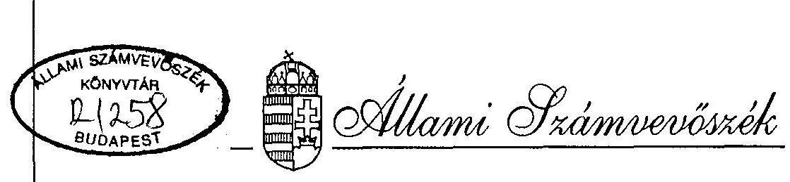
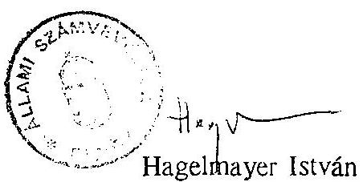

# JELENTÉS 

a helyi önkormányzatok pénzügyi-gazdasági tevékenységének
1994. évi ellenőrzési tapasztalatairól

---

# JELENTÉS 

## az önkormányzatok pénzügyi-gazdasági tevékenységének 1994. évi ellenőrzéséról

A helyi önkormányzatokról szóló 1994. évi LXIII. és az 1992. évi LV.törvényekkel módosított - 1990. évi LXV. törvény 92.§-a alapján az Állami Számvevőszék - az 1994. évi munkatervének megfelelően - ellenőrizte az önkormányzatok pénzügyigazdasági tevékenységét.

A központilag kialakított egységes program alapján 1993-1994. éveket érintően lefolytatott ellenőrzések arra kerestek választ, hogy a vizsgált önkormányzatok:
— gazdálkodásuk során betartották-e a vonatkozó törvényeket, rendeleteket;
— hogyan gazdálkodtak a tulajdonukban levő vagyonnal;
— kötelezó és önként vállalt feladatainak ellátása milyen pótlólagos források (hitelek) igénybevételét tették szükségessé;
— eleget tettek-e a törvényekben rögzített ellenőrzési kötelezettségüknek.
A gazdálkodás törvényességét 1994-ben 98 önkormányzatnál vizsgáltuk. Az átfogó ellenőrzéssel érintett önkormányzatok száma az önkormányzatok $3 \%$-át reprezentálja (2. számú melléklet).

A vizsgált önkormányzatok $16 \%$-a megyei és városi, míg $84 \%$-a községi és nagyközségi önkormányzat.

---

# MEGÁLLAPÍTÁSOK 

## I. Általános megállapítások

Az országban működő 3.150 települési önkormányzat kötelező és önként vállalt feladatainak ellátására 1993-ban 622,4 Mrd Ft-ot fordított. Az 1993. évi müködési és kamatfizetési folyó kiadás, valamint - az immateriális javak, tárgyi eszközök beszerzésére, felújítására felhasznált - felhalmozási és tőke jellegű kiadások együttes összege 95,9 Mrd Ft-tal ( $20,8 \%$-kal) haladta meg az önkormányzatok ugyanilyen célú kiadásainak 1992. évi összegét.

A teljesített összes kiadásokon belül a meglévő (oktatási, egészségügyi, szociális, kultúrális) intézményhálózat múködtetésére az összes kiadás $71,1 \%$-át használták fel. A fejlesztési, felújítási célokat szolgáló pénzügyi felhasználások összege 14,5 Mrd Ft-tal magasabb ugyan az 1992. évi hasonló célú kiadásoknál, de az összes kiadásokon belüli aránya $19,2 \%$-ról $17,9 \%$-ra csökkent. (A helyi önkormányzatok 1993. évi költségvetési bevételeinek és kiadásainak alakulását a 5. és 6. sz. melléklet tartalmazza.)

A helyi önkormányzatokról szóló, 1990.évi LXV.törvényben meghatározott kötelező feladatok ellátását az önkormányzatok elsődlegesnek tekintették.
Kiemelt szempont volt a meglévő intézményhálózat müködtetése, valamint a településen élő lakosság életkörülményeinek az önkormányzat és a lakosság anyagi lehetőségei függvényében való javítása.

Az önkormányzatoknál elsősorban az infrastruktúra fejlesztésével kapcsolatban volt tapasztalható feladatvállalás. Előtérbe került a vizsgált időszakban a települések gázellátása, a telefonhálózat kiépítése, bővítése, valamint a szennyvíz elvezetéssel és tisztítással kapcsolatos feladatok megoldása. Jelentős összeget fordítottak továbbá az önkormányzatok a tantermek számának bővítésére, valamint tornatermek építésére.

Az infrastruktúra javítását célzó beruházások megvalósítása rendszerint a lakosság anyagi tehervállalása mellett történt.

A korábbi években jelentős erőfeszítésekkel megvalósított intézményhálózat müködtetésével kapcsolatban tapasztalható volt, hogy a települések gyermekjóléti intézményeinek kihasználtsága nagy eltéréseket mutat. Egyes településeken $100 \%$-hoz közeli, esetenként azon túli a kihasználtság, míg más önkormányzatoknál a bölcsőde, az óvoda, az általános iskola, a konyha kihasználtsága csak $50-70 \%$-os.

---

Általános tapasztalat, hogy az önkormányzatok az intézmények által nyújtott szolgáltatásokat szeretnék helyben biztosítani, ugyanakkor a gyereklétszám csökkenése, valamint a településen élők anyagi helyzete nem teszi lehetővé az intézmények (óvoda, bölcsőde, konyha) jobb kihasználását.

A feladatok végrehajtásához szükséges pénzügyi források (bevételek) mintegy $17 \%$-a származik saját folyó bevételekből. Az éves bevételeken belül továbbra is meghatározó az állami költségvetésből átengedett bevétel (személyi jövedelemadó, gépjárműadó), valamint az állami hozzájárulások és támogatások aránya. Ezek együttesen 50,2 \%-ot tesznek ki az önkormányzatok 1993. évi bevételén belül.

Az előző évhez viszonyítva feltűnően nőtt a hitelből származó bevételek összege és az összes bevételen belüli aránya. Míg 1992-ben 7,5 Mrd Ft (az összes bevétel $1,45 \%$-a), addig 1993-ban több mint háromszor magasabb $25,3 \mathrm{Mrd}$ Ft (az összes bevétel $4,12 \%$-a) bevétel származott hitelből.

A bankok szívesen nyújtottak hitelt, mivel az önkormányzatok könnyű hitelkihelyezési terepet jelentettek. Az önkormányzatok nehéz pénzügyi helyzete esetén is, a részükre nyújtott állami támogatásból lehetőség volt a hitel törlesztő részének és kamatának a leemelésére.

Az önkormányzatok eladósodásának növekedését jelzi a vagyon forrásának összetétele is. Míg 1992-ben 19,6 Mrd Ft-ot. a források $2,8 \%$-át tette ki a rövid- és hosszúlejáratú kötelezettségek összege, illetve aránya, addig 1993-ban ezen források mértéke 36,9 Mrd Ft volt, és $3,9 \%$-os arányt képviselt. Különösen feltűnő a hosszúlejáratú kötelezettségek növekedési üteme, melynek 1992. évi 10,5 Mrd Ft-os összege 1993. év végére $24,5 \mathrm{Mrd}$ Ft-ra növekedett.

A hitelállomány emelkedése következtében a kiadásokon belül 1992-ben 2,2 Mrd Ft, 1993-ban 2,7 Mrd Ft volt a kamatfizetésre fordított összeg.

A kötelezettségek növekedésének főbb okai a következőkben határozhatók meg:

- az önkormányzati bevételek növekedési üteme elmaradt - a kiadásokat jelentősen megnövelő - infláció növekedési mértékétől,
— az infrastruktúrát érintő fejlesztések megvalósítására az esetek többségében csak hitel igénybevétele mellett volt lehetőség,
- a községi önkormányzatoknál az objektív okok miatt alacsony kihasználtsággal múködő intézmények fajlagos kiadásai jelentősen meghalad-

---

ják a nagyobb önkormányzatok fajlagos kiadási szintjét. Emiatt a müködtetés sok esetben kölcsön-forrás (hitel) bevonásával volt csak biztosítható.

Az önkormányzatok eladósodása területén elkezdődött folyamat veszélyes helyzetet teremtett az önkormányzati gazdálkodásban.

A helyi önkormányzatokról szóló törvény csak arra vonatkozóan tartalmaz előírást, hogy a gazdálkodás biztonságáért a képviselőtestület a felelős. Nincs jogi szabályozás arra vonatkozóan, hogy:

- milyen gazdálkodás minősül biztonságosnak,
- milyen felelősség terheli a képviselőtestületet, a polgármestert és a felelősséget milyen keretek között lehet érvényesíteni.

# II. Részletes megállapítások 

## 1. Az önkormányzatok gazdálkodásának szabályozottsága, szervezettsége

A helyi önkormányzatokról szóló 1990. évi LXV. törvényben foglalt szabályozási kötelezettségüknek az ellenőrzött önkormányzatok teljeskörűen eleget tettek. Ennek eredményeként valamennyi önkormányzat rendelkezik a működésének szabályait rögzítő szervezeti és működési szabályzattal (SZMSZ). Találkozott azonban az ellenőrzés olyan önkormányzattal, amely 1994-ben is csak ideiglenes SZMSZ-szel rendelkezett (Ordacsehi).
Az SZMSZ-ek elkészítését, elfogadását követő időszakban végbement szervezeti, hatásköri változásoknak megfelelően, továbbá a müködés során szerzett tapasztalatok alapján megtörtént azok módosítása.

Az SZMSZ-ek tartalmára vonatkozóan - az előző évekhez hasonlóan - általános megállapítás, hogy az önkormányzat gazdálkodási tevékenységéhez kapcsolódó konkrét feladat, felelősség és hatásköröket - a helyi sajátosságokhoz igazodóan - nem rögzítik teljeskörűen.

Az SZMSZ-ek és azok mellékleteinek az önkormányzatok gazdálkodását érintő jellemző hiányosságai a következők voltak:

- nem, vagy nem kellő konkrétsággal történt meg a feladat- és hatáskörökre vonatkozó szabályozás,

---

- nem rögzíti az önkormányzati vagyonnal való gazdálkodás kérdéseit,
- a pénzügyi-gazdasági folyamatok ügymenetét nem- vagy nem megfelelően szabályozzák,
— nem érintik az önkormányzati gazdálkodás ellenőrzésére vonatkozó kérdéseket,
- gyakran hiányoznak az SZMSZ részét képező mellékletek.

Mindezek következtében a vizsgált önkormányzatok többségénél a képviselőtestület és szervei közötti munkamegosztás nem tekinthető kellően szabályozottnak. A polgármester és a jegyző (körjegyző) gazdálkodási feladatai egyértelműen nem állapíthatók meg, a döntési jogkörök és az azokhoz kapcsolódó felelősség gyakran nem tisztázott.

Az ellenőrzött önkormányzatok jelentős részénél kifogásolhatók a polgármesteri hivatal operatív gazdálkodásával kapcsolatos folyamatok, valamint az ellátandó feladatok helyi szabályozása és annak gyakorlati végrehajtása.

A hivatal pénzügyi, gazdasági tevékenysége ügymenetének teljeskörű szabályozása csak az ellenőrzött önkormányzatok egyharmadánál történt meg. Az önkormányzatok polgármesteri hivatalai gyakran nem rendelkeznek ügyrenddel, munkaköri leírásokkal, illetve az operatív gazdálkodással kapcsolatos szabályzatokkal (házipénztár kezelési, leltározási, selejtezési szabályzat).

A meglevő - gazdálkodást érintő - szabályzatokkal kapcsolatban gyakran állapították meg a számvevők, hogy:
— azok nem teljeskörűen fedik le a pénzügyi, gazdasági folyamatot,

- a konkrét szabályozás rovására az általánosságok kapnak nagyobb teret,
- a helyi sajátosságoknak nem felelnek meg,
- a bekövetkezett jogszabályi változásokat nem veszik figyelembe.

A gazdálkodás biztonságát és törvényességét szolgáló kötelezettségvállalás, utalványozás, ellenjegyzés és érvényesítés teljeskörű szabályozása az ellenőrzött önkormányzatok közel felénél nem történt meg, az érvényes jogszabályi előírásoknak megfelelően. Gyakori volt az a megállapítás is, hogy a gazdálkodás vertikális (az előbbiekben részletezett) folyamatait érintő szabályozások:
— nem fedik le teljeskörűen a szabályozandó területeket,
— szervezeti, jogszabályi változások miatt kiegészítést, átdolgozást igényelnek.

---

- az egyes hatáskörök átruházását, illetve az átruházás feltételrendszerét nem tartalmazzák,
— nem zárják ki az összeférhetetlenséget,
— az érvényesítés fontosságára nem helyeznek kellő hangsúlyt.
Előfordult olyan eset is, amikor az 1994-ben lefolytatott ellenőrzés időpontjáig a polgármesteri hivatal (Aranyosapáti, Újlőrincfalva, Milota, Héhalom, Kisunyom) nem rendelkezett érvényes számlarenddel annak ellenére, hogy a számvitelről szóló 1991. évi XVIII. törvény előírásai alapján a törvény hatálybalépését (1992.január 1.) követően 90 napon belül kell a számlarendet elkészíteni.

A gazdálkodás biztonságát és törvényességét szolgáló szabályzatokkal rendelkező önkormányzatok egyharmadánál azt állapították meg az ellenőrzést végzők, hogy az önkormányzatok a saját szabályzataikban rögzített előírásokat nem tartották be. Veszélyeztetve ezzel a gazdálkodás szabályszerűségét és a pénzügyi források szabályszerű, valamint célszerű felhasználását.

A Magyar Köztársaság 1992. évi költségvetéséről és az államháztartás vitelének 1992. évi szabályairól szóló 1991. évi XCI. törvény arra kötelezte az önkormányzatokat, hogy a költségvetési szerveik alapító okiratait 1992. június 30 -ig vizsgálják felül és határozzák meg az alaptevékenységek körét.

Az ellenőrzések során tett megállapítások szerint az önkormányzatok nem mindegyike tett eleget még 1994-ben sem a hivatkozott törvény előírásainak. A költségvetési szervek alapító okiratainak felülvizsgálata nem történt meg Recsk, Visznek, Apc, Újlőrincfalva, Hejôbába, Makkoshotyka, Tinnye, Bálványos, Palotabozsok, Szajk, Tokod önkormányzatoknál.

Az ellenőrzött önkormányzatok mintegy fele pedig nem a törvényben meghatározott határidőre teljesítette ilyen irányú kötelezettségeit (Poroszló, Héhalom, Szarvas, Verpelét, Budapest XII. kerület, Péteri, Budakalász, Biatorbágy).

Az önkormányzatok költségvetési szervei alapító okiratainak tartalmával kapcsolatban tett megállapítások alapján általánosítható tapasztalat, hogy:
—a költségvetési szervek gazdálkodási jogkörének (önállóan gazdálkodó, illetve részben önállóan gazdálkodó) meghatározása megtörtént az alapító okiratokban, viszont

- nem minden alapító okirat tartalmazza az alap- és vállalkozási tevékenység körét, továbbá a vállalkozási tevékenység mértékét.

---

Előfordult olyan eset is, hogy az önkormányzati költségvetési szervek a helyszíni vizsgálat idején nem rendelkeztek alapító okirattal (nincs alapító okirata a polgármesteri hivataloknak Szentgál, Szentkirályszabadja, Úrkút községekben és Balatonföldvár városban, az intézményeknek Bagod községben).

A lefolytatott vizsgálatok tapasztalatai azt mutatták, hogy a részben önállóan gazdálkodó költségvetési szervként való besorolással egyidejűleg nem történt meg teljeskörűen - a 137/1993.(X.12.) Korm.rendeletben foglaltaknak megfelelően - :

- a részben önállóan gazdálkodó költségvetési szerv besorolásával egyidejűleg annak az önállóan gazdálkodó költségvetési szervnek a kijelölése, amely a részben önállóan gazdálkodó költségvetési szerv meghatározott pénzügyi-gazdasági feladatait ellátja,
— az önállóan, illetve részben önállóan gazdálkodó költségvetési szerv közötti munkamegosztás szabályozása,
— a felelősségvállalás, valamint
— az információáramlás rendjének a jóváhagyása.

2. A költségvetés tervezése és jóváhagyása

Az önkormányzatok éves költségvetésének összeállítása az önkormányzati törvényben meghatározott kötelező és önként vállalt feladatok számbavételével történt. Az éves terv összeállításához az önkormányzatok kétharmadánál azonban nem állt rendelkezésre gazdasági program, így az nem orientált a tervszámok kialakításánál. A hosszabb távra szóló gazdasági célkitűzések, stratégiák hiányában a településfejlesztés, a közszolgáltatási kötelezettségből eredő feladatellátás főbb irányainak kijelölése nem történt meg. Így az ellátandó feladatok körének és az ahhoz szükséges eszközrendszernek a meghatározása az éves költségvetés készítésének időszakában történt.

Az önkormányzatok hosszabb távú (legalább egy választási ciklusra érvényes) stratégiai tervezését akadályozta, hogy az állami költségvetés támogatási rendszere, a támogatott célok köre és mértéke évente változik. Emiatt szükségtelennek tartják az önkormányzatok a gazdasági program elkészítését, illetve a meglévők gyakorlatilag alig használhatók.

Az éves költségvetés összeállítását jól szolgálta és a gazdasági programnál sokkal nagyobb figyelmet kapott az államháztartási törvényben (1992. évi XXXVIII. sz. törvény) meghatározott költségvetési koncepció, mellyel az önkormányzatok csaknem mindegyike rendelkezett.

---

Az ellenőrzések során szerzett tapasztalatok szerint a mutatószámokhoz kapcsolódó normatív állami hozzájárulások megtervezése az egyes feladatokat ellátó intézményektől bekért információk alapján, azokkal egyezően történt. Az adatszolgáltatások helyességének a vizsgálatát azonban gyakran nem végzik el, és az adatok nyilvántartásokkal való alátámasztására sem mindig fordítottak figyelmet az önkormányzatok (Budapest XXII. kerület, Vásárosnamény, Boldog, Tolna, Vonyarcvashegy, Bagod).

Az 1993. évi költségvetés összeállításánál az önkormányzatok közel fele számolt helyi adóval. A leggyakrabban a kommunális adó, az iparúzési adó, építményadó szerepel az önkormányzati bevételek között.

Az ellenőrzött önkormányzatoknál az 1993-ban realizált összes bevételen belül 3\%-os arányt képvisel a helyi adókból származó bevétel.

Az adóbevételek tervszámát a helyi adó rendeleteknek megfelelően, a mentességek kedvezmények figyelembevételével, de gyakran megfelelő felmérés hiányában becsléssel határozták meg az önkormányzatok. Ennek következtében a tervszámok nem bizonyultak mindig megalapozottnak.

Vásárosnaményban a hetyi adókból származó bevétel 1993. évi eredeti elöirányzata 7.788 E Ft volt. Ezt év közben 12.201 E Ft-ra módosították, amivel szemben a teljesités 25.490 E Ft-ban realizálódott.

Apcon az 1993. évi credeti elöirányzat összege 1.500 E Ft, a módosított elöirányzat összege pedig 4.500 E Ft volt. A tervszámokkal szemben a tényleges bevétel összege 5.780 E Ft-ot tett ki.

Bicskén 1993-ban 5.482 E Ft hclyi adóbevételt terveztck, amit az évközi befizetések alapján 18.182 E Ft-ra módosítottak. A teljesítés 24.120 E Ft volt.

Szabadbattyánban 1993. évre tervezett 500 E Ft iparüzési adóval szemben a teljesítés 5.000 E Ft volt.

Fóton az 1993. évben 93.000 E Ft összegre tervezett helyi adóbevétel mindössze $30 \%$-ra teljesült.

Előfordult olyan eset is, hogy az önkormányzat rendelete a helyi adó kivetését írta elő, de az abból származó bevételt az éves költségvetésbe nem állították be (Ordacsehi).

Az államháztartásról szóló törvény előirása szerint "a helyi önkormányzatok költségvetésében elkülönítetten szerepelnek az általános tartalék és céltartalék előirányzatok". A törvény ugyanakkor nem teszi kötelezővé a tartalék képzését és nem tartalmaz előírásokat annak mértékére sem.

---

Ennek következtében a tartalékok megállapítása, illetve az előirányzaton belüli részaránya tekintetében eltérő gyakorlat alakult ki. Az önkormányzatok döntő része céltartalékot és általános tartalékot is képzett. Van viszont olyan önkormányzat is, amely ilyen előirányzattal nem számolt (Milota, Tolna, Csobánka). Az önkormányzatok pénzügyi helyzetét tükrözi, hogy a tervezett tartalékok mértéke a költségvetés főösszegéhez viszonyítva egyes esetekben csak jelképesnek minősíthető (Vásárosnamény általános tartalék $0,2 \%$, Apc általános tartalék $0,3 \%$, Bálványos általános tartalék $0,053 \%$ ), az a gazdálkodás biztonságát érdemben nem szolgálhatta.

A költségvetési rendeletben megtervezett általános- és céltartalék felhasználására vonatkozó szabályok kialakítása az önkormányzatok döntő részénél megtörtént. A helyi szabályozások általában a testületre ruházzák a tartalékok felhasználásával kapcsolatos hatásköröket.

Az éves költségvetéséről valamennyi önkormányzat rendeletet alkotott. A rendeletek előterjesztésével, továbbá szerkezetével kapcsolatban általánosítható hiányosságként volt megállapítható, hogy:

- a költségvetési rendelettervezetet a polgármester nem az államháztartási törvényben meghatározott időben, a költségvetési törvény kihirdetését követő 30 napon belül terjesztette a testület elé (Döge, Milota, Visznek, Tornaszentmária, Hejóbába, Szarvasgede, Héhalom),
-a költségvetési rendelet nem az államháztartási törvény által előírt szerkezetben készült. Nem tartalmazta minden esetben teljeskörűen a kiemelt előirányzatokat (bér, társadalombiztosítási járulék, dologi kiadás, célfeladat, beruházási, felújítási előirányzat), továbbá a kiadásokat és bevételeket nem határozták meg címenként (Milota, Aranyosapáti, Szarvasgede, Perbál, Tinnye, Budakalász, Dunabogdány, Szedres, Ordacsehi, Bicske, Szentgál, Bögöte),
- az előterjesztések nem tartalmazták az államháztartási törvényben rögzített mérlegeket.

A vizsgált önkormányzatok mindegyike határidőben eleget tett az Államháztartási törvényben meghatározott, az éves költségvetéssel kapcsolatos információszolgáltatási kötelezettségének. A Kormány részére elkészített információs füzetek adattartalma azonban több esetben nem egyezik meg a képviselötestületek által elfogadott rendelettel (Vásárosnamény, Boldog, Apc, Poroszló, Bogács, Makkoshotyka, Hajdúböszörmény, Szarvasgede, Budapest XXII. kerület, Biatorbágy, Balatonlelle, Tolna).

---

Az eltérések a költségvetés föösszegénél és egy-egy kiemelt előirányzatánál mutatkoznak.

A költségvetési rendeletben és az információs füzetben szereplő adatok közötti különbség leggyakoribb oka volt, hogy:

- a költségvetési rendelet jóváhagyásakor az egészségügyi ellátással kapcsolatos végleges finanszírozási adatok még nem álltak rendelkezésre. Az információs füzetek készítésének időszakára viszont a végleges adatok ismertté váltak, és az önkormányzatok egy része az adatszolgáltatásnál ezekkel az adatokkal dolgozott,
- a költségvetés összeállításánál figyelembe vett pénzmaradvány összegével szemben az információs füzetbe már a zárszámadás keretében jóváhagyott előző évi pénzmaradványból felhasználásra tervezett összeget állították.

# 3. A költségvetés végrehajtása 

Az önkormányzatok költségvetésének végrehajtása során felhasznált pénzügyi eszközök döntő része az intézményrendszer múködését biztosító kiadások fedezetéül szolgált.

Az ellenőrzött önkormányzatoknál az 1993. évben teljesített kiadások $64 \%$-a folyó (müködési) kiadásként merült fel.

Előfordult olyan önkormányzat is, ahol ez az arány megközelítette (Vásárosnamény, Budakalász, Visznek, Apc, Hejőbába, Karcsa, Dunafalva), illetve meghaladta (Makkoshotyka, Héhalom) a $80 \%$-ot.

Jellemző megállapítás volt az is, hogy az éves költségvetési kiadásoknak csak kis részét fordították az önkormányzatok a tárgyi eszközök és immateriális javak felújítására. Az ilyen célra felhasznált összeg aránya - a vizsgált körben - 1,2 \%-ot képviselt az 1993. évben teljesített költségvetési kiadások összegén belül. Volt olyan önkormányzat is, amely egyetlen Ft-ot sem fordított ilyen célra (Tarnaszentmária, Bogács, Makkoshotyka, Bagod, Ordacsehi).

Az önkormányzatok bevételeinek részét képező saját bevételek nyilvántartásának rendje nem minden vonatkozásban felel meg a költségvetés alapján gazdálkodó szervek beszámolási és könyvvezetési kötelezettségéről szóló, - a 96/1994. (VI. 22.) Korm. rendelettel és a 67/1993. (V. 5.) Korm. rendelettel módosított - 179/1991. (XII. 30.) Korm. rendelet előírásainak. Nem történt meg ugyanis valamennyi

---

önkormányzatnál az adósokkal, vevőkkel szembeni követelések - kettős könyvvitelen kívüli - analítikus nyilvántartási rendszerének teljeskörű kialakítása (Vásárosnamény, Aranyosapáti, Verpelét, Vonyarcvashegy, Budapest XXII. kerület, Győr-Moson-Sopron megyei Önkormányzat). Emiatt:

- gyakran nem követhető nyomon a bevételek beszedésének rendje, a kintlévőségek (követelések) összege,
— az önkormányzati (intézményi) beszámoló mérlegében nem minden esetben jelenik meg a fennálló követelés összege.

Általánosítható megállapítás továbbá, hogy az önkormányzatoknál megjelenő sajátos bevételekhez kapcsolódó követelés-fajták, mint pl. az adótartozások, a különféle jogszabályokban meghatározott hatósági díjak, térítési kötelezettségek nem szerepelnek az önkormányzatok mérlegének "Adósok" tételsorában.

Az önkormányzatok a saját bevételek beszedése, a hátralékok behajtása érdekében nem minden esetben tették meg a megfelelő, hatékony intézkedést. A hátralékok felszámolására irányuló intézkedések szinte csak a hátralékosok írásos felszólítását jelentették. Más intézkedések foganatosítására csak ritkán került sor (Nagyhalász, Hajdúböszörmény, Budapest XXII. kerület, Miháld, Szabadbattyán, Kisbér).

Az éves költségvetési rendeletben jóváhagyott előirányzatok évközi módosítását általában:
—a központi költségvetésből biztosított pótelőirányzatok,

- a tervezett önkormányzati feladatok szerkezetében és nagyságrendjében bekövetkezett változások, valamint
— a bevételek-kiadások összegeinek tervezettől eltérő alakulásai idézték elő.

Az államháztartási törvényben foglalt előírások szerint a képviselőtestület által jóváhagyott előirányzatok között átcsoportosítani, illetve a testület által elfogadott tervszámokat megváltoztatni csak a képviselötestület engedélye, illetve felhatalmazása alapján lehet.

A lefolytatott ellenőrzések megállapításai szerint több önkormányzatnál a törvényi előírással ellentétben a képviselőtestület által jóváhagyott előirányzat módosítása a testület döntése, felhatalmazása nélkül történt.

Emiatt, valamint az előirányzatok pontos nyilvántartásának hiánya következtében több esetben előfordult, hogy az önkormányzat költségvetési rendeletében nem terve-

---

zett, vagy a tervezett összeget lényegesen meghaladta a pénzügyi teljesítés. Az előirányzat túllépések helyenként a kiemelt előirányzatoknál is tapasztalhatók voltak.

Az előirányzat túllépések a gazdálkodás vertikális folyamatában (kötelezettségvállalás, érvényesítés, utalványozás, ellenjegyzés) hatáskörrel rendelkezők mulasztását, illetve a hatáskörök formális gyakorlását is jelzik.

# 4. Az önkormányzatok vagyongazdálkodása 

Az ellenőrzött önkormányzatok 1993. december 31-én 19,8 Mrd Ft értékű vagyonnal rendelkeztek, mely összeg 19,7 \%-kal magasabb az 1992. évitől.

Az önkormányzati vagyon 1992-ben 88,6 \%-ban, 1993-ban pedig 88,4 \%-ban származott saját forrásból. A saját források arányának csökkenésében - a kötelezettségek $21,9 \%$-os növekedése mellett - szerepe volt annak, hogy a - költségvetési és vállalkozási - tartalékok összege és részaránya jelentősen visszaesett 1993-ban. Ezek együttes összege 1992. év végén 1,8 Mrd Ft volt, míg az 1993. december 31-i összeg 1,5 Mrd Ft.

Az önkormányzati tulajdonban levő vagyonnal összefüggő tulajdonosi jogok gyakorlásról - az 1991. évi XX. törvény, valamint az 1990. évi LXV. törvény előírásai alapján - a képviselötestület rendelkezik. Az ellenőrzés során tett megállapítások azt bizonyítják, hogy a vagyongazdálkodással összefüggő helyi szabályok kialakítása az ellenőrzött önkormányzatok mintegy felénél nem történt meg.

Az elkészült önkormányzati rendeletekkel kapcsolatban tapasztalható volt, hogy azok egy része hiányos, nem teljeskörűen rögzíti a vagyongazdálkodással (elidegenítés, használat, hasznosítás) kapcsolatos kérdéseket, nem tartalmazza az ingyenes vagyonátruházások feltételeit, valamint a követelésekről való lemondás módjait, eseteit.

Az önkormányzati törzsvagyon és azon belül a forgalomképtelen, illetve korlátozottan forgalomképes vagyontárgyak elkülönített nyilvántartása az ellenőrzött önkormányzatok közel felénél még mindig nem történt meg.

Az önkormányzatok döntő része elvégezte az önkormányzati törvény, valamint az 1991. évi XXXIII. törvény alapján tulajdonába került vagyontárgyak felmérését és többségében megtörtént a tulajdonjog földhivatali bejegyzése is. Vannak azonban olyan önkormányzatok, ahol ez a folyamat még nem fejeződött be (Nagyhalász, Hejőbába, Balatonföldvár, Budapest XXII. kerület, Biatorbágy, Fót).

---

Az ellenőrzések során találkoztunk olyan önkormányzatokkal is (Felsőörs, Milota), ahol még mindíg nem záródott le az a vita, amely a korábban közös tanácsi vagyon megosztásával kapcsolatban évekkel ezelőtt megkezdődött.

Az önkormányzatok tulajdonában lévő ingatlanvagyon nyilvántartási és adatszolgáltatási rendjéről szóló 147/1992. (XI.6.) Korm.rendelet előírásai szerint az önkormányzati tulajdonba került ingatlanokról 1993. december 31-ig ingatlankatasztert kellett felfektetni. A kormányrendelet ezen előírásainak az ellenőrzött önkormányzatok közel egyharmada nem tett eleget, az ingatlankataszter felfektetése nem történt meg a rendeletben megjelölt határidőre (Vásárosnamény, Döge, Aranyosapáti, Újlőrincfalva, Recsk, Verpelét, Budapest XXII. kerület, Tárnok, Tinnye, Dunabogdány, Biatorbágy).

Értékpapír vásárlással az ellenőrzött önkormányzatok $40 \%$-ánál találkozott az ellenőrzés. Az értékpapírral rendelkező önkormányzatok mintegy egyharmadánál azt kellett megállapítani, hogy az értékpapírok nyilvántartásba vétele nem történt meg, illetve azok értéke a beszámoló részét képező mérlegben nem, vagy nem pontosan lett kimutatva.

Az ellenőrzött önkormányzati körben a gazdasági társaságokban való részvétel nem volt jellemző.
Az önkormányzatok vagyoni részesedése elsősorban az állami vállalatok, valamint az önkormányzati közüzemi vállalatok gazdasági társasággá történő átalakításával jött létre. Ezen túl csak kevés számú önkormányzat szerzett pénzbeni vagy nem pénzbeni (apport) vagyoni hozzájárulással érdekeltséget gazdasági társaságokban. Ahol ez előfordult, ott jellemzően az államháztartásról szóló 1992. évi XXXVIII. törvényben foglalt előírások szerint jártak el.

A különböző gazdasági társaságokba befektetett eszközök nem vagy nem pontosan jelennek meg valamennyi önkormányzat könyvviteli nyilvántartásában, mérlegében.

[^0]
[^0]:    Hajdúböszörmény városi önkormányzat könyvviteli nyilvántartásában nem szerepel a két részvénytársaságban meglévő - összesen - 3.220 E Ft részesedése.

    Döge községi önkormányzat könyvviteli nyilvántartásában nem szerepel egy Kft-ben szerzett 400 E Ft összegü részesedése.

    Tolna városi Önkormányzat könyvviteli nyilvántartásában nem szerepel egy részvénytársaságban meglévő 4.666 E Ft összegü részesedése.

---

Az ellenőrzött önkormányzatok jelentős része járult hozzá kisebb-nagyobb összeggel alapítványok múködéséhez. A támogatott alapítványok döntő része a települések, egészségügyi, sport valamint oktatási és művelődési feladatainak ellátásához kapcsolódott. A támogatott alapítványok között voltak továbbá munkahely teremtést vállalo, illetve karitatív és közbiztonsági tevékenységet végzők is.

Az alapítványok támogatása az ellenőrzött önkormányzatok körében - egyetlen kivétellel - az államháztartási törvény előírásainak megfelelően a testületek döntése alapján történt.

Nagyhalász nagyközségi önkormányzat 1993-ban 50 E Ft-ot forditott a "Nagyhalászért Alapítvány" támogatására testületi döntés nélkül.

# 5. Önkormányzatok fejlesztési tevékenysége 

Az ellenőrzött önkormányzatok 1993. évi kiadásai főösszegén belül igen eltérő a fejlesztési célra fordított pénzeszközök aránya. Az ilyen célú felhasználás aránya 1- 50\% között szóródik és átlagosan $12,1 \%$-ot tett ki.

Az önkormányzatok többsége nem készített gazdasági programot, így a választási ciklusidőre szóló fejlesztési elképzelések rögzítése sem történt meg. A fejlesztési feladatokat lényegében:
—a lakosság által megfogalmazott igények és a lakosság anyagi tehervállalása, valamint
—a központi költségvetésből elnyerhető támogatások
határozzák meg.
A gazdasági programmal rendelkező önkormányzatoknál is előfordult, hogy az eredeti célkitűzésektől eltérően a központilag támogatott fejlesztések megvalósításába kezdtek, miután nem minden esetben esett egybe a helyben szükségesnek ítélt és a gazdasági programban rögzített, illetve a központi költségvetésből támogatott fejlesztés.

A fejlesztési feladatok megvalósítása során előfordult, hogy eg $y$-egy önkormányzat anyagi erejét meghaladó beruházásba kezdett. Veszélyeztetve ezzel a kötelező feladatok ellátását, illetve a megkezdett beruházás befejezését.

[^0]
[^0]:    Milota községi önkormányzat több olyan fejlesztésbe kezdett, amelynek fedezetét az önkormányzal - előre láthatóan - nem tudja a jövőben biztositani (tornaterem, szennyvíziszitító, csatornahálózat építés, gázhálózat építés), illetve

---

amelyek miatt az önkormányzatnak fizetési gondjai keletkeztek. Az 1993. év végén ki nem egyenlített számlák összeg 2.625 E Ft volt.

Szentkirályszabadján az önkormányzat gázberuházást valósít meg. A gerincevezeték megépitése 10.000 E Ft-ba kerül, melyhez 8.000 E Ft hitel felvételéról döntött a testület. A beruházás további folytatásához nincs pénzügyi fedezet, így bizonytalan a megkezdett beruházás befejezése.

Általános tapasztalat, hogy a beruházási döntéseket részletes számításokkal nem támasztják alá, a gazdaságossági, célszerűségi követelményeket a versenytárgyalások során igyekeznek érvényesíteni az önkormányzatok.

A meglévő intézményhálózat fenntartása, múködtetése során az önkormányzatok egyre több esetben ismerik fel, hogy az intézmények kihasználatlansága milyen anyagi terhet jelent számukra. Az önkormányzatok mozgásterét behatárolja és egyben a probléma megoldását akadályozza, hogy:

- a településen élők nem, vagy csak nagyon nehezen fogadják el az intézmények bezárását,
- az épületek, valamint a bennük ellátott feladatok jellege nem teszi lehetővé az épület egy részének - párhuzamosan - más célra történő hasznosítását,
- elsősorban a kis településeken gyakran nincs is olyan gazdasági szervezet, amely hatékonyan hasznosítani tudná az épületeket. Emiatt előfordul, hogy üresen állnak korábban gyermekjóléti célokat szolgáló épületek.

Nagyhalászon 50 férőhelyes óvoda és napközi otthon épülete áll üresen.
A jelzett nehézségek ellenére egy-egy önkormányzatnál tapasztalható volt olyan törekvés, amely az intézmények jobb kihasználására irányult. Ezen törekvések részben eredményre vezettek.

Hajdüböszörnény városban a bölcsődei férőhelyek számát 1990., 1992. és 1993. években is módosították, aminek következtében a 180 gyermek ellátására alkalmas intézményhálózat férőhelyeinek száma 44-re csökkent.

Héhalom községben az óvodai létszám növelése érdekében tájékoztató kiadmányt készítettek, az óvodáskorú gyermekek szüllei részére megbeszélést hívtak össze, az óvodában német nyelv oktatást vezettek be, ám ezen intézkedések szinte eredménytelenek voltak.

---

Répcelak nagyközségben a bölcsőde alacsony kihasználtsága miatt a bölcsőde épületében gyermekorvosi rendelốt is kialakítottak. A férőhelyek száma így a 40 -ről 20-ra csökkent.

# 6. A költségvetési beszámoló 

Az éves költségvetés végrehajtásával kapcsolatban az önkormányzatokat - az államháztartási törvény, valamint a 179/1991. (XII. 30.) Korm. rendelet alapján - két irányú beszámolási kötelezettség terheli.

A költségvetés végrehajtásáról:

- egyrészt az államháztartás információs rendszerén keresztül az Országgyűlést, illetve a Kormányt,
— másrészt pedig a saját képviselőtestületet (közgyűlést)
kell tájékoztatni.
Az ellenőrzés során tett megállapítások szerint az önkormányzatok polgármestereinek mindegyike eleget tett a törvényi kötelezettségének, és az éves költségvetés végrehajtásáról szóló rendelettervezetet a képviselötestület elé terjesztette. A törvényben megjelölt határidőt azonban az ellenőrzött önkormányzatok nem teljeskörűen tartották be (Vásárosnamény, Bogács, Hajdúböszörmény, Szarvasgede, Héhalom, Keszü, Miháld). Ezeknél az önkormányzatoknál a rendelettervezet képviselőtestület elé történő terjesztése a törvényben meghatározott határidőt 1-2 hónappal túllépve történt meg.

A zárszámadási rendelettervezeteket a testületek többsége az előterjesztés napján elfogadta. Volt azonban olyan önkormányzat is, amely az előterjesztést követően több hónap elteltével hozta meg zárszámadási rendeletét, sőt előfordult olyan eset is, amikor csaknem másfél évvel az előterjesztést követően - a Köztársasági megbízott megkeresése ellenére - sem történt meg a zárszámadási rendelet elfogadása. Volt olyan önkormányzat is, amelyet az Alkotmánybíróság kötelezett a zárszámadási rendelet megalkotására.

Düge Községi Önkormányzat 1992. évi gazdálkodására vonatkozóan 1994. júliusáig (az ellenőrzés időpontjáig) nem hozta meg zárszámadási rendeletét.

Eszteregnye község Önkormányzatát az 1992. évi zárszámadási rendelet megalkotására az Alkotmánybíróság 1994. december 24-i határozatával kötelezte. Ezt megelőzően a Köztársaságí megbízott két alkalommal hívta fel - eredménylelenül - az önkormányzat képviselötestületét a törvénysértés megszüntetésére.

---

Az ellenőrzött önkormányzatok döntő részénél zárszámadási rendeleteket a költségvetéssel azonos szerkezetben készítették el. Így a tervezett és a tényleges adatok összehasonlíthatósága biztosított volt. Csak kevés esetben fordult elő, hogy a zárszámadás az államháztartási törvényben meghatározott szerkezettől eltérően készült el.

Ugyanakkor a zárszámadás előterjesztésekor szinte teljeskörűen elmulasztották bemutatni az önkormányzatok az államháztartási törvényben meghatározott mérlegeket.

Ebben azonban közrejátszott az is, hogy az államháztartási törvényben foglaltakkal ellentétben a Kormány még mindig nem állapította meg az említett mérlegek tartalmára vonatkozó részletes szabályokat.

Az önkormányzatok teljeskörűen eleget tettek a beszámolási és könyvvezetési kötelezettségükről szóló - előzőekben már hivatkozott - kormányrendelet előírásainak. Kivétel nélkül elkészítették az államháztartás információs rendszere számára az éves beszámolójukat és azt központilag kialakított szerkezetben továbbították a TÁKISZokhoz.

Az államháztatás információs rendszere számára továbbítandó éves beszámoló összeállításának határideje (tárgyévet követő február 28.), valamint a zárszámadási rendelettervezet testület elé történő benyújtásának határideje (tárgyévet követő 3 hónapon belül) közötti lényeges különbségből eredően az államháztartás rendszerébe olyan adatok kerülhetnek be, illetve ott olyan adatok feldolgozása történhet meg, amelyeket a testületek nem tárgyaltak meg, a zárszámadási rendelettel nem fogadtak el.
Az ellenőrzések megállapítása szerint a vizsgált önkormányzatok közel felénél az államháztartás információs rendszere számára elkészített beszámoló és a testület elé terjesztett rendelettervezet számszaki egyezősége nem volt biztosított.

A TÁKISZ-hoz továbbított 1993. évi költségvetési beszámolók felülvizsgálata során tett megállapítások azt mutatták, hogy nem történt előrelépés a beszámolók tartalmát illetően. A vizsgált önkormányzatok jelentős részének beszámolója nem volt összhangban a hatályos számviteli előírásokkal, illetve nem tükröztek minden esetben valóságos, hű képet az önkormányzat vagyoni, pénzügyi helyzetéről.

Ennek oka jórészt abban keresendő, hogy:

- gyakori a hibás könyvviteli elszámolás,

---

- az analítikus nyilvántartások gyakran hiányosak, pontatlanok,
— nem biztosított a mérleg adatainak leltárral történő alátámasztása,
- pontatlanság tapasztalható a pénzmaradvány megállapítása és felhasználásának elszámolása területén.

Az éves beszámoló elkészítésével egyidejűleg minden vizsgált önkormányzat eleget tett az 1993. évi állami költségvetésből biztosított támogatásokkal, hozzájárulásokkal kapcsolatos elszámolási kötelezettségének.

# 7. Az önkormányzatok ellenőrzési tevékenysége 

A hatályos törvényi szabályozások szerint az önkormányzatok ellenőrzési feladatai alapvetően kétirányúak:
— egyrészt az önkormányzati törvény (1990. LXV. tv.) előírásai szerint az önkormányzat gazdálkodásának szabályszerűségéért a polgármester felelős (belső ellenőrzés).
— másrészt pedig a saját intézményei ellenőrzését a helyi önkormányzat látja el (felügyeleti vagy tulajdonosi ellenőrzés).

Az ellenőrzési feladatok hatékony, megfelelő színvonalon való ellátása szükségessé teszi az ellenőrzési rendszer kialakítását, az ellenőrzési feladatok pontos meghatározását, illetve szabályozását. A hatékony ellenőrzés nem nélkülözheti továbbá a gazdálkodási rend, fegyelem, a tulajdonvédelem alapját képező belső szabályzatok meglétét.

Az ellenőrzési tapasztalatok azt mutatják, hogy az ellenőrzött önkormányzatok $90 \%$-ánál nem történt meg az ellenőrzési rendszer teljeskörű kialakítása. Ennek következtében:
— az intézményi felügyeleti ellenőrzés feladatainak, gyakoriságának, valamint módszereinek szabályozása hiányos,
— nem megoldott teljeskörűen az intézmények - különös tekintettel a több önkormányzat által közösen fenntartott intézmények - ellenőrzése,
— nem múködik hatékony belső ellenőrzés a polgármesteri hivatalokban.
Az önkormányzatok által lefolytatott ellenőrzések hatékonyságát rontotta, hogy a polgármesteri hivatalok, továbbá a hozzájuk kapcsolódó részben önálló intézmények belső ellenőrzésével kapcsolatos kérdések (szervezeti forma, hatáskör, feladat, eljárási szabály) ügyrendben, belső ellenőrzési szabályzatban történő rögzítése

---

általában nem történt meg. Az ellenőrzéssel kapcsolatos hatásköröket, továbbá az elvégzendő feladatokat a munkaköri leírások sem tartalmazzák.

A belső ellenőrzés hatékonyságát alapvetően meghatározó, a hivatal működését átfogóan érintő belső szabályozások sok esetben nem készültek el, illetve a meglévők nem határozzák meg kellő konkrétsággal a feladatokat.

A szabályzatban meghatározandó kritériumok hiányában, a tényleges állapot helyessége, szabályszerűsége nem ítélhető meg. A követelmények hiányában nincs viszonyítási alap, és így a belső ellenőrzés során sok esetben nem lehet érdemi megállapítást - és azt követően intézkedést - tenni.

Mindezek miatt a belső ellenőrzés múködése több esetben nem felelt meg a vele szemben támasztott követelményeknek. Főleg a leglényegesebb elemének, a munka folyamatába épített ellenőrzésnek a rendszeressége, hézagmentessége hiányolható. Az ellenőrzési feladatok teljesítése gyakran csak formálisan történik. Így kellően nem segíti a gazdálkodással összefüggő belső rend- és fegyelem biztosítását.

A tapasztalatok szerint a pénzügyi ellenőrző bizottságok működése elsősorban a testületi előterjesztések véleményezésére korlátozódott, konkrét ellenőrzéssel csak ritkán foglalkozott. A megfelelő szakértelem hiányában működő bizottságok sok esetben nem is tudnak érdemben eleget tenni ellenőrzési kötelezettségüknek.

Az előzőek következtében az önkormányzatok jelenlegi ellenőrzési rendszere nem minden esetben biztosítja, hogy:

- a gazdálkodás területén előforduló szabálytalanságok időben és megfelelő tartalommal megállapításra kerüljenek,
— a testület által hozott döntések végrehajtása kontrollálható legyen,
— az ellenőrzések tapasztalatai megfelelően segítsék a vezetői, valamint a testületi döntések előkészítését, meghozatalát.

Meg kell jegyezni, hogy az aprófalvak többségében a személyi és tárgyi feltételek hiányosak, ezért az önálló gazdálkodás és a belső ellenőrzés sokirányú követelményeinek (pénzügyi, számviteli munka) csak részben tudnak megfelelni.

---

# III. Következtések, javaslatok 

A számvevőszék az éves ellenőrzési tervébe foglaltak szerint 1992 óta rendszeresen vizsgálta a helyi önkormányzatok pénzügyi-gazdasági tevékenységét.
1992-ben 111, 1993-ban 157, 1994-ben 98, összesen a három évben 366 átfogó ellenőrzést, az egyéb téma- és célvizsgálatok keretében pedig évente mintegy 1000 vizsgálatot végzett az ÁSZ.
1994. év végéig mindössze 117 önkormányzatnál nem végeztünk vizsgálatot. A vizsgálattal érintett önkormányzatok $50 \%$-ánál ugyanakkor több alkalommal végzett az ÁSZ ellenőrzést. A megyeközpontoknál, a megyeszékhely városoknál és a városok egy részénél az ellenőrzések száma elérte vagy meghaladta a tízet.
Az ún. átfogó vizsgálatok időigényességére jellemző, hogy ez a vizsgálati típus kötötte le az ellenőri erőforrás $25-30 \%$-át.

A vizsgálati tapasztalatok kormányszintű hasznosításával kapcsolatban tapasztalható volt, hogy a Belügyminisztérium és a Pénzügyminisztérium miközben igényelték az ÁSZ ilyen típusú ellenőrzéseit, a javaslatokat és megállapításokat kevésbé, illetve megkésve hasznosították a törvényelőkészítési munkában.

A vizsgálataink során többször jeleztük, hogy a gazdálkodás biztonságát és törvényességét szolgáló kötelezettségvállalás, utalványozás és ellenjegyzés helyi szabályozása számtalan hiányosságot, illetve törvénytelen gyakorlatot mutatott.
A nagyobb településeken az egyes vezetők feladatait és felelősségét nem, vagy helytelenül határolták el. A kisebb településeken (községekben, körjegyzőségeknél) viszont a gazdálkodás néhány személyhez (polgármester, jegyző) kötődik, és emiatt nem érvényesültek az előírások.
A vizsgálataink alapján javasolt intézkedések elmaradása is hozzájárult ahhoz, hogy egyes önkormányzatoknál megalapozatlan kötelezettségeket vállaltak, amelyek likviditási zavarokhoz és eladósodáshoz vezettek.

Az Állami Számvevőszék ellenőrzésének hatékonyabbá tételét kedvezőtlenül befolyásolta, hogy az elmúlt években nem alakult ki az ellenőrzés, illetve a megállapítások hasznosításának, kezelésének módja, jogi környezete. A gazdálkodás szabályaira jellemző a nagyfokú liberalizmus és a szükséges szabályoknak a hiánya. Így az ÁSZ által feltárt negatív folyamatok, tendenciák megakadályozása kevésbé volt lehetséges. Az önkormányzati eladósodás és a csőd helyzetének a kezelésére még ma sincs érvényes jogi szabályozás.
Máig nem rendezett a központi költségvetésből nyújtott támogatások és hozzájárulások jogalap nélküli felhasználásának és elszámolásának elévülési ideje. A jelenlegi

---

gyakorlat - a BM és PM álláspontjának megfelelően - csak az adott - éves költségvetés végrehajtásához kapcsolható megállapításokat kezeli.

Az önkormányzatoknál végzett pénzügyi-gazdasági tevékenységnek átfogó törvényességi vizsgálata és az egyéb ellenőrzési tapasztalatok szerint megállapítható, hogy a kialakult önkormányzati költségvetést felhasználó szervezeti struktúra nem biztosította a pénzeszközök hatékony felhasználását. A közel 3200 önkormányzat és a 13500 önkormányzati intézményben történik az országosan rendelkezésre álló mintegy 750 milliárd forintnak a felhasználása, ami az erőforrások túlzott elapróződását jelenti. Az önállóvá lett önkormányzatok a hatékonysági követelményeknek nem megfelelő ellátó szervezeteket is létrehoztak és müködtetnek.

Az egyedi jelentések alapján az Állami Számvevőszék felkérte a polgármestereket intézkedési terv készítésére. Az önkormányzatok többsége elkészítette az intézkedési tervet, amelyek a feltárt hiányosságok kijavítására - jellemzően - az alábbiakat tartalmazták:
—a polgármester, a jegyző és a bizottságok feladat- és hatáskörét meghatározzák;
—a polgármesteri hivatal múködését részletesen szabályozó ügyrendet készítenek, amely tartalmazza az egyes belső szervezeti egységek részletes feladat- és hatáskörét;
—a törzsvagyon körébe tartozó forgalomképes és korlátozottan forgalomképes vagyonról az önkormányzat rendeletet alkot és a törzsvagyont a nyilvántartásokban elkülönítetten kezeli;
— az éves zárszámadáshoz a vagyoni állapotot alátámasztó leltárt elkészítik, annak érdekében, hogy a mérlegben teljeskörűen és hitelesen szerepeljenek az eszközök és a források;
— az önkormányzat tulajdonában lévő vagyontárgyakkal történő gazdálkodás hatékonyságának fokozása érdekében javaslatokat dolgoznak ki a képviselő-testület számára, pl. Vagyonkezelő Iroda létrehozására.

Bár utóvizsgálatot nem tartottunk, azonban ezév elején felkértük a vizsgált önkormányzatok vezetőit, hogy adjanak számot a megtett intézkedésekről.

Ezideig az önkormányzatok $75 \%$-a válaszolt és beszámolt a megtett intézkedésekről, amelyek összhangban vannak az intézkedési tervben foglaltakkal. Sajnálatos, hogy az ellenőrzések folyamatában más önkormányzatoknál - ahol korábban nem ellenőriztünk - ugyanazokkal a jelenségekkel találkoztunk.

---

Az Ötv. módosítása a törvényelőkészítés szakaszában a külső és a belső ellenőrzés továbbfejlesztése irányába mutatott. A törvény végleges elfogadása az önkormányzatok külső ellenőrzésének feltételeiben változást nem hozott, erősítette azonban a gazdálkodás belső ellenőrzését azáltal, hogy kötelezővé tette a belső ellenőr foglalkoztatását. A belső ellenőr foglalkoztatásának kedvező hatása még nem mérhető, nem érzékelhető.

# Javaslatok a Kormány részére: 

- Az önkormányzati ellenőrzés rendszerének továbbfejlesztésével egyidejűleg az államháztartási reform keretében célszerű lenne áttekinteni a helyi önkormányzatok szervezetrendszerét, a finanszírozás és a gazdálkodás jogi szabályozását, a gazdálkodással összefüggő felelősségi rendszer múködtetését.
- Az önkormányzatiság elvének figyelembevételével a gazdálkodás területén is indokolt lenne támogatni az erőteljesebb integrálódási folyamatot. Az anyagi erőforrások racionálisabb felhasználása céljából nem indokolt, hogy valamennyi helyi önkormányzat település-nagyság megkötése nélkül polgármesteri hivatalt is létrehozhat és múködtethet.
- Az önkormányzatokra irányuló ÁSZ ellenőrzések szélesítésének és hatékonyságának növelése mellett szükséges, hogy erőteljesebben múködjön az ágazati, szakmai és a törvényességi felügyeleti ellenőrzés. Ennek hiánya, illetve a törvényességi felügyeleti ellenőrzés eszközrendszerének a gyengesége is lehetővé teszi a törvények és az érvényes szabályok gyakori megsértését a helyi önkormányzatoknál.

Budapest, 1995. június

---

Az önkormányzatok pénzügyi-gazdasági tevékenységének 1994. évi ellenőrzési tapasztaltairól készült jelentést összeállította:

Nagy József számvevő igazgatóhelyettes
melynek elkészítésében közreműködött:
Fekete Tibor számvevő tanácsos

A régiószintủ összefoglalókat készítették:

| Fekete Tibor | számvevő tanácsos |
| :-- | :-- |
| Horváth József | számvevő tanácsos |
| Köcse Istvánné | számvevő |
| Müller ildikó | számvevő tanácsos |
| dr. Ótott Lajos | számvevő tanácsos |

---

Az 1994. évi törvényességi vizsgálatok település-típusonkénti megoszlása

|  $\begin{aligned} & \text { ÁSZ } \\ & \text { kiren- } \\ & \text { delt- } \\ & \text { ség } \end{aligned}$ | Vizsg. önk. száma össz. | Megyei önk. | Megyei jogú város és város | Nagyközség | Község  |
| --- | --- | --- | --- | --- | --- |
|   |  |  |  | száma és megnevezése |   |
|  Baranya megye | 7 | - | - | - | 1. Dunafalva
2. Hidas
3. Keszü
4. Máza
5. Palotabozsok
6. Szabadszentkirály
7. Szajk  |
|  BácsKiskun megye | 7 | 1.Tiszakécske |  | - | 1. Balotaszállás
2. Fülöpszál lás
3. Jakabszállás
4. Kunfehérto
5. Orgovány
6. Tass  |
|  Békés megye | 6 | - 1. Orosháza |  | 1. Csabacsúd
2. Doboz
3. Kevermes | 1. Gerendás
2. Kötegyán  |
|  Borsod-Abaúj-Zemplén megye | 4 | - | - | - | 1. Bogács
2. Hejóbába
3. Karcsa
4. Makkoshotyka  |
|  Csongrád megye | 5 | Csongrád megyéi önk. | 1. Mindszent | 1. Nagymágocs | 1. Pusztamérges
2. Tömörkény  |
|  Fejér megye | 4 | - | 1. Bicske
2. Sárbogárd | 1. Szabadbattyán
2. Polgárdi | -  |
|  Györ-
Moson-
Sopron
megye | 4 | Györ-
Moson-
Sopron | - | - | 1. Darnózseli
2. Dunasziget
3. Egergöc  |

---

| Hajdú-   Bihar megye | 1 | - | 1. Hajdúböszörmény |  | - |
| :--: | :--: | :--: | :--: | :--: | :--: |
| Heves megye | 8 | - | - | 1. Recsk   2.Verpelét | 1. Újlőrincfalva   2. Bóldog   3. Visznek   4. Apc   5. Tarnaszentmár í   6. Poroszló |
| Jász-NagykunSzólnok megye | 5 | - | 1. Mezőtúr | 1. Abádszalók 2. Jászkísér | 1. Besenyőszög   2. Tiszasztentimre |
| Komárom-   Esztergom megye | 6 | - | 1. Kisbér | 1. Tokod | 1. Bársonyos   2. Csép   3. K isigmánd   4. Vertesszólós |
| Nógrád megye | 2 | - | - | - | 1. Héhalom   2. Szarvasgede |
| Somogy megye | 7 | - | 1. Balatonfóldvár   2. Balatonlelle | - | 1. Bálványos   2. Kerekí   3. Ordacsehi   4. Pusztaszemes   5. Somogyaszaló |
| Szabolcs-   Szatmár-   Bereg megye | 5 | - | 1. Vásárosnamény   2. Nagyhalász | - | 1. Milot   2. Aranyosapáti   3. Döge |
| Tolna megye | 3 | - | 1. Tolna | 1. Fadd | 1. Szedres |
| Vas megye | 4 | - |  | 1. Répcelak | 1. Bögöte   2. Csanig   3. Kisunyom |
| Veszprém megye | 5 | - | - | - | 1. Felsöörs   2. Magyarpolány   3. Szentgaí   4. Szentki rály-   szabadja   5. Urkút |
| Zala megye | 4 | - | - | 1. Vonyarcvashegy | 1. Bagod   2. Miháld   3. Pókaszepetk |

---

| Pest   megye | 10 | - | - | 1. Biatorbágy   2. Budakalász   3. Budakeszí   4. Főt   5. Tárnok | 1. Csobánka   2. Dunabogdány   3. Perbál   4. Péteri   5. Tínnye |
| :--: | :--: | :--: | :--: | :--: | :--: |
| Föváros | 1 | - | 1. XXII. kerület | - | - |
| Összesen: | 98 | 2 | 14 | 19 | 63 |

---

# 3. sz. melléklet   a $\quad \mathrm{V}-1001-46 / 1994-95 . \mathrm{sz}$.   Jelentés-tervezethez 

A vizsgált önkormányzatok jellemzö adatai

| Tá jegység | Település (kerület) állandó lakosaínak száma (fó) | Önállóan gazdál-   kódó   intézm.   száma   (db) | Részben önálló intézm. száma (db) | Polgármestéri hivat. létszáma (fó) | Pénzügyi gazdasági feladatok ellátásával foglalkozók száma (fó) |
| :--: | :--: | :--: | :--: | :--: | :--: |
| Föváros + Pest megye | 107.646 | 23 | 93 | 427 | 57 |
| Észak-   Dunántúli   Régió | 64.427 | 56 | 61 | 351 | 79 |
| Dé 1-   Dunántúli   Régió | 44.548 | 22 | 26 | 226 | 58 |
| Dé 1-Magyar-   országi   Régió | 130.618 | 79 | 79 | 634 | 154 |
| Észak-   Magyar-   országi   Régió | 80.242 | 35 | 69 | 282 | 66 |
| Összesen | 558.099 | 215 | 328 | 1.920 | 414 |

---

# 4. sz. melléklet a V-1001-46/1994-95. sz. ellenörzéshez 

## Kimutatás

Az önkormányzatok 1992, 1993, és 1994. I. félévi helyszini ellenörzése során feltárt jogalap nélkül igénybe vett központi támogatásokról és jogos többlettámogatási igényekröl

| Támogatások megnevezése | Elvonásra javasolt (MFt) |  |  | Az érintett önkormányz. száma (db) |  |  |
| :--: | :--: | :--: | :--: | :--: | :--: | :--: |
|  | téma átfogó összesen ellenörzés keretében |  |  | téma átfogó összesen ellenörzés |  |  |
| Normativ tám. 1991. évi kv.tv. 1992. évi kv.tv. 1993. évi kv.tv. | $\begin{aligned} & 215,1 \\ & 156,0 \\ & 311,4 \end{aligned}$ | $\begin{aligned} & 57,0 \\ & 63,5 \end{aligned}$ | $\begin{aligned} & 272,1 \\ & 219,5 \\ & 311,4 \end{aligned}$ | $\begin{aligned} & 71 \\ & 181 \\ & 641 \end{aligned}$ | $\begin{aligned} & 43 \\ & 74 \\ & - \end{aligned}$ | $\begin{aligned} & 114 \\ & 255 \\ & 641 \end{aligned}$ |
| összesen: | 682,5 | 120,5 | 803,0 | 893 | 117 | 1010 |
| Céltámogatás 1991. evi kv.tv. 1992. évi kv.tv. 1993. évi kv.tv. | $\begin{aligned} & 29,1 \\ & 33,6 \\ & 65,2 \end{aligned}$ | $\begin{aligned} & 11,1 \\ & 33,6 \\ & 3,0 \end{aligned}$ | $\begin{aligned} & 40,1 \\ & 33,6 \\ & 68,2 \end{aligned}$ | $\begin{aligned} & 9 \\ & 7 \\ & 7 \end{aligned}$ | $\begin{aligned} & 6 \\ & 4 \\ & 7 \end{aligned}$ | $\begin{aligned} & 15 \\ & 11 \\ & 7 \end{aligned}$ |
| összesen: | 127,9 | 14,0 | 141,9 | 23 | 10 | 33 |
| Címzett támogatás 1992. évi kv.tv. 1993. évi kv.tv. | $\begin{aligned} & 58,4 \\ & 36,4 \end{aligned}$ | - | $\begin{aligned} & 58,4 \\ & 36,4 \end{aligned}$ | $\begin{aligned} & 3 \\ & 2 \end{aligned}$ | - | $\begin{aligned} & 3 \\ & 2 \end{aligned}$ |
| összesen: | 94,8 | - | 94,8 | 5 | - | 5 |
| Önhibáján kívül hátrányos önk. kieg.támogatás 1991. évi kv.tv. 1992. évi kv.tv. | $\begin{aligned} & 20,0 \\ & 245,6 \end{aligned}$ | $\begin{aligned} & 2,6 \\ & 2,6 \end{aligned}$ | $\begin{aligned} & 22,6 \\ & 245,6 \end{aligned}$ | $\begin{aligned} & 2 \\ & 28 \end{aligned}$ | $\begin{aligned} & 2 \\ & 2 \end{aligned}$ | $\begin{aligned} & 4 \\ & 28 \end{aligned}$ |
| összesen: | 265,6 | 2,6 | 268,2 | 30 | 2 | 32 |
| Központosított elolrányzatok (tárcaszint) | - | 33,8 | 33,8 | - | 18 | 18 |
| Mindösszesen: | 1170,8 | 170,9 | 1341,7 | 951 | 147 | 1098 |

Többlet támogatásra vonatkozó javaslat

| Normativ támogatás 1991. évi kv.tv. 1992. évi kv.tv. 1993. évi kv.tv. | $\begin{aligned} & 65,9 \\ & 36,7 \\ & 110,7 \end{aligned}$ | $\begin{aligned} & 35,7 \\ & 28,6 \\ & - \end{aligned}$ | $\begin{aligned} & 101,6 \\ & 65,3 \\ & 110,7 \end{aligned}$ | $\begin{aligned} & 18 \\ & 73 \\ & 319 \end{aligned}$ | $\begin{aligned} & 33 \\ & 61 \\ & - \end{aligned}$ | $\begin{aligned} & 51 \\ & 134 \\ & 319 \end{aligned}$ |
| :--: | :--: | :--: | :--: | :--: | :--: | :--: |
| Összesen: | 213,3 | 64,3 | 277,6 | 410 | 94 | 504 |

---

# A HELYI ÖNKORMÁNYZATOK KÖLTSÉGVETÉSÉNEK VÉGREHAJTÁSA 

| BEVETELEK | 1992. évi teljesités | 1993. évi   LXXII. tv.   szorinti   elöirányzat | 1993. évi önkormányzati credeti elöirányzat | 1993. évi önkormányzati módosított elöirányzat | 1993. évi teljesités |
| :--: | :--: | :--: | :--: | :--: | :--: |
| Intézményi tevékenységek bevételei | 41.091 | 38.000 | 40.703 | 49.355 | 54.202 |
| Illetékek | 9.283 | 11.000 | 8.903 | 9.364 | 10.534 |
| Helyi adók | 17.221 | 22.000 | 17.404 | 23.439 | 27.100 |
| Kamatbevételek | 15.588 | 10.000 | 4.702 | 6.785 | 9.076 |
| Kömyezetvédelmi bírság | 262 | 200 | 206 | 232 | 211 |
| Egyéb különféle bevételek | 7.585 | 6.000 | 3.611 | 3.934 | 4.854 |
| Saját folyó bevételek összesen: | 91.050 | 87.200 | 75.529 | 93.109 | 105.977 |
| Személyi jövedelemadó | 62.986 | 48.953 | 48.953 | 48.953 | 48.953 |
| Gépjármiladó | 2.331 | 4.000 | 2.442 | 2.442 | 2.480 |
| Atengedett bevételek összesen: | 65.317 | 52.953 | 51.395 | 51.395 | 51.433 |
| Saját folyó és átengedett bevételek összesen: | 156.347 | 140.153 | 126.924 | 144.504 | 157.410 |
| Tárgyi eszközök, föld és immateriális javak értékesítése | 17.243 | 14.000 | 25.260 | 26.861 | 25.387 |
| Értékpapírok értékesítése | 834 | 500 | 877 | 2.186 | 2.973 |
| Privatizációból, vállalat értékesítéséből származó bevételek |  |  |  |  |  |
| Állambáztartáson belüli felhalmozási bevételek | 3.548 | 3.000 | 6.876 | 7.706 | 4.392 |
| Állambáztartáson kivüli felhalmozási bevételek | 2.529 | 2.500 | 3.665 | 6.285 | 6.514 |
| Állambáztartáson kivüli felhalmozási bevételek | 4.304 | 2.500 | 5.773 | 9.125 | 9.679 |
| Felhalmozási és tőke jellegú bevételek összesen: | 28.458 | 22.500 | 42.451 | 52.163 | 48.945 |
| Normatív állami hozzájárulások | 169.787 | 207.782 | 207.782 | 207.545 | 207.545 |
| Színházi támogatások | 2.041 | 2.286 | 2.286 | 2.286 | 2.286 |
| Címzett és céltámogatások (1) | 22.647 | 28.740 | 28.740 | 28.675 | 18.343 |
| SzJA kiegészítés | 7.340 | 6.480 | 6.480 | 6.480 | 6.480 |
| Önhibájukon kivül hátrányos helyzetú önkormányzatok támogatása (1) | 3.110 | 1.500 | 1.500 | 1.586 | 1.586 |
| Egyéb támogatások (központosított elöirányzatok) (1) | 9.416 | 15.140 | 15.440 | 15.140 | 13.097 |
| Bérpolitikai intézkedés | 3.437 |  |  | 5.347 | 5.347 |
| Egyéb átcsoportositott pénzeszközök | 1.674 | 170 |  | 1.901 | 1.898 |
| Állami hozzájárulások és támogatások összesen: | 219.452 | 262.098 | 262.228 | 268.960 | 256.582 |
| Társadalombiztosítástól átvett pénzeszközök | 80.765 | 85.000 | 79.612 | 90.899 | 91.625 |
| Központi (fejezettől) költségvetési szervtől átvett pénzeszközök | 2.240 | 200 | 797 | 3.947 | 4.757 |
| Elkülönített pénzalapoktól átvett pénzeszközök | 714 | 200 | 879 | 2.067 | 2.375 |
| Állambáztartáson belüli átutalások összesen: | 83.719 | 85.400 | 81.288 | 96.913 | 98.757 |
| Állambáztartáson kivülröl származó pénzeszközök | 8.839 | 3.000 | 2.115 | 5.205 | 6.110 |
| Költségvetési kiegészitések, visszatéritések | 11.053 | 4.000 | 4.219 | 7.328 | 9.887 |
| Egyéb elszámolások | 529 |  |  |  |  |
| Folyó tőkebevételek, támagatások és átutalások összesen: | 508.397 | 517.151 | 519.225 | 575.073 | 577.691 |
| Éven belüli rövid lejáratú értékpapír visszavásárlásából származó bevétel |  |  |  | 1.767 | 10.595 |
| Hitel bevételek | 7.494 | 6.000 | 21.006 | 23.058 | 25.279 |
| Tárgyévi bevételek összesen: | 515.891 | 523.151 | 540.231 | 599.898 | 613.565 |
| Előző évi maradvány, eredmény igénybevétele | 35.084 |  | 29.609 | 52.703 | 49.535 |
| Előző évi címzett és céltámogatási elöirányzatmaradvány igénybevétele ÁFI-tól |  |  |  |  | 2.935 |
| Előző évi címzett- és céltámogatási elöirányzatmaradványból fel nem használt összeg az ÁFI-nól |  |  |  |  | 725 |
| Tárgyévi címzett- és céltámogatási elöirányzatmaradványból az ÁFI-hez utalva | 4.541 |  |  |  | 10.287 |
| Furrások mindösszesen: | 555.516 | 523.151 | 569.840 | 652.601 | 677.047 |

(1) Az önkormányzatok által tervezett credeti elöirányzatban még nem szacnpló tämogatások

---

# A HELYI ÖNKORMÁNYZATOK KÖLTSÉGVETÉSÉNEK VÉGREHAJTÁSA 

| KIADÁSOK | 1992. évi teljesités | 1993. évi LXXII. iv. szerinti elöirányzat | 1993. évi önkormányzati eredeti elöirányzat | 1993. évi önkormányzati módosított elöirányzat | 1993. évi teljesités |
| :--: | :--: | :--: | :--: | :--: | :--: |
| Béralap | 133.831 | 147.560 | 155.655 | 171.552 | 166.293 |
| Bérjellegú kiadások | 12.675 | 11.450 | 12.467 | 15.152 | 15.536 |
| Készletek beszerzése | 52.397 | 51.470 | 50.821 | 61.048 | 58.367 |
| Szolgáltatások | 74.081 | 75.900 | 75.168 | 89.010 | 85.306 |
| Társadalombiztosítási járulék | 59.288 | 65.320 | 68.679 | 76.220 | 74.780 |
| Különféle egyéb kiadások és befizetések | 29.870 | 18.170 | 23.857 | 37.452 | 42.692 |
| Müködési kiadások összesen: | 362.142 | 369.870 | 386.647 | 450.434 | 442.974 |
| Kamatfizetések | 2.177 | 2.800 | 2.103 | 2.448 | 2.771 |
| Folyó kiadások összesen: | 364.319 | 372.670 | 388.750 | 452.882 | 445.745 |
| Tárgyi eszközök, föld és immateriális javak felhalmozása | 66.782 | 77.400 | 50.832 | 95.790 | 77.522 |
| Értékpapírok vásárlása | 1.323 | 2.000 | 115 | 1.736 | 3.226 |
| Állambáztartáson belüli felhalmozás célú átutalások | 1.804 | 2.592 | 942 | 2.272 | 1.549 |
| Állambáztartáson kivüli felhalmozás célú átutalások | 14.539 | 9.200 | 9.995 | 18.915 | 17.769 |
| Nagy értékủ tárgyi eszközök felújítása | 12.493 | 12.000 | 10.333 | 14.191 | 11.433 |
| Felhalmoztasi és töke jellegü kiadások összesen: | 96.941 | 103.192 | 72.217 | 132.904 | 111.499 |
| Vállalkozások folyó támogatása | 5.036 | 2.500 | 2.880 | 6.583 | 6.797 |
| Lakossági pénzbeli juttatások | 18.338 | 25.289 | 19.404 | 29.131 | 27.953 |
| Egyéb elszámolások | 13.275 | 4.900 | 3.342 | 9.386 | 8.770 |
| Támogatások, elvonások és egyéb folyó átutalások összesen: | 36.649 | 32.689 | 25.626 | 45.100 | 43.520 |
| Folyó, felhalmozási és töke jellegü kiadások, támogatások, elvonások és egyéb folyó átutalások összesen: | 497.909 | 508.551 | 486.593 | 630.886 | 600.764 |
| Éven belüli lejáratú értékpapírok vásárlása | 7.337 | 4.200 | 5.056 | 6.102 | 10.577 |
| Hitel visszafizetés |  | 10.400 | 30.656 | 15.084 |  |
| Általános és céltartalék |  | 10.400 | 30.656 | 15.084 |  |
| Tárgyévi kiadások összesen: | 505.246 | 523.151 | 522.305 | 652.601 | 622.373 |
| Maradvány, eredmény | 45.729 |  | 1.855 |  | 43.662 |
| Cimzett és céltámogatás |  |  | 28.740 |  |  |
| Ônhibájukon kivül hátrányos helyzetü önkormányzatok támogatása (1) |  |  | 1.500 |  |  |
| Egyéb központosított támogatások (1) |  |  | 15.440 |  |  |
| Cimzett és céltámogatás évvégi elöirányzatmaradványa ÁFI-nél | 4.541 |  |  |  | 11.012 |
| Kiadások mindösszesen: | 555.516 | 523.151 | 569.840 | 652.601 | 677.047 |

(1) Az önkormányzatok által tervezett eredeti elöirányzatban még nem szereplő támogatások