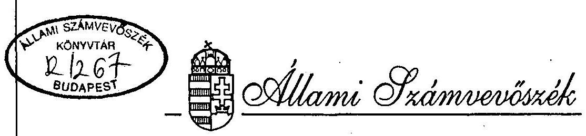
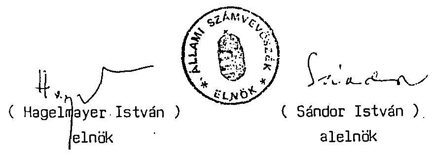
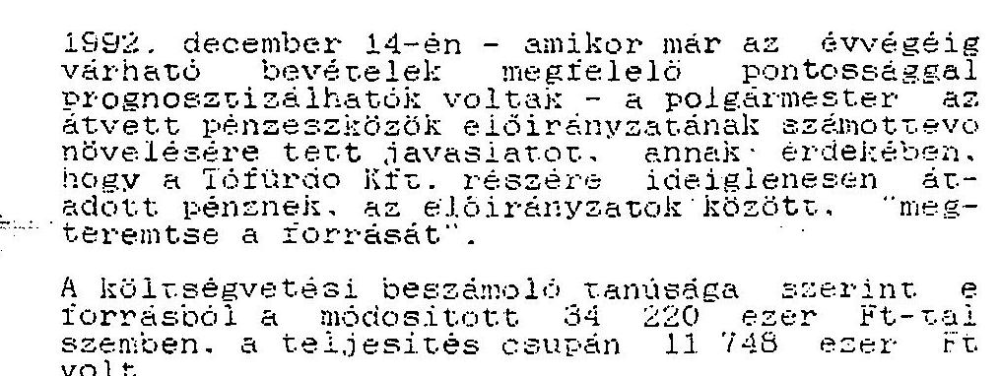
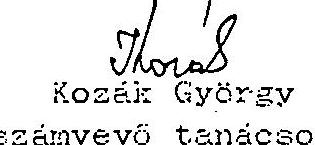
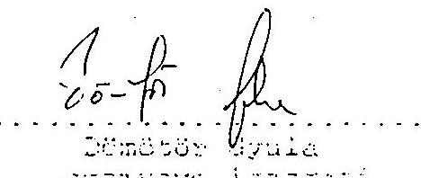
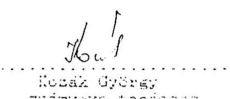
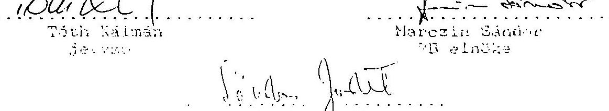

# JELENTÉS 

Bakonszeg Községi Önkormányzat gazdálkodásának, pénzügyi helyzetének célvizsgálatáról

---

A vizsgálatot vezette:

Nagy József
A vizsgálatot végezték:
Kozak György
Kóródi József
számvevő igazgató-helyettes
számvevő tanácsos
számvevő tanácsos

---

# JELENTÉS 

## Bakonszeg Községi Önkormányzat gazdálkodásának és pénzügyi helyzetének célvizsgálatáról

Az önkormányzat 1994. év végére az 5 millió Ft-os kiegészítő támogatás ellenére fizetésképtelenné vált. Az esedékes fizetési kötelezettségeinek eleget tenni nem tudott, és a kötelező feladatok ellátása is veszélybe került.

A Kormány 1995. évben a normatív hozzájárulás időarányos részét meghaladó előrehozásra kényszerült és felkérte az Állami Számvevőszék elnökét az önkormányzat gazdálkodásának az ellenőrzésére.

A Számvevőszék a kért vizsgálatot elvégezte, a vizsgálat célja annak megállapítása volt, hogy az önkormányzatnál

- a bevételek és az ellátandó feladatok közötti összhang hiánya milyen okokra vezethető vissza,
- a testület, illetve a polgármesteri hivatal milyen intézkedéseket tett az egyensúly helyreállítása érdekében,
- a gazdálkodásra és a támogatások igénybevételére, illetve felhasználására vonatkozó szabályokat betartották-e.

A vizsgálat összefoglaló megállapításait és javaslatait az I., a számvevői megállapításokat pedig a II. rész tartalmazza.

---

# I.   ÖSSZEFOGLALÓ MEGÁLLAPÍTÁSOK ÉS JAVASLATOK 

Az 1359 fős állandó lakosú település Berettyóújfaluól nyugatra, mintegy 10 km-re található. A községi önkormányzat 54 fő óvodáskorú, 105 fő általános iskolai tanuló és 18 fő időskorú nappali szociális ellátásáról gondoskodik. A szociális segélyezettek mellett, 64 fő munkanélküli részére folyósít jövedelempótló támogatást az önkormányzat önálló polgármesteri hivatala. A településen a munkaképes korú lakosság nem éri el a 700 főt, melyből jelenleg több, mint 100 fő munkanélküli.

Az önkormányzat 1995. évi költségvetési előirányzata 59 630 ezer Ft, melyből a saját bevétel csupán 14 531 ezer Ft. A tervezett feladatai megvalósításához 24 183 ezer Ft központi támogatásban részesül és 20 916 ezer Ft erejéig pedig az önhibáján kívül hátrányos helyzetű települések kiegészítő támogatására nyújtott be pályázatot.

A minimális gazdasági alapokkal rendelkező önkormányzat 1993. évtől folyamatos likviditási gondokkal küzd és 1994. év végére teljesen fizetésképtelenné vált. Az önkormányzat dolgozói több hónapon keresztül munkabérüket, a segélyezettek és a jövedelempótló támogatásban részesülő munkanélküliek járandóságaikat nem kaphatták meg, s az esedékes szállítói követeléseket a hivatal rendezni nem tudta. Az 1994. év végi és ezévi központi megsegítése ellenére, az önkormányzat jelenlegi tartozása meghaladja a 100 millió Ft-ot.

Az önkormányzat csődhelyzetét alapvetően a gazdasági erejét meghaladó fejlesztési tevékenység erőltetése, a kellően át nem gondolt vállalkozás és az ezek "sikeres" végrehajtása érdekében elkövetett sorozatos törvénysértések idézték elő.

Az önkormányzat 1992. évi költségvetési előirányzata alig haladta meg a 30 millió Ft-ot, melyből - a folyamatos működést biztosító előirányzatok levonása után - fejlesztésre csupán 400 ezer Ft jutott. Ennek ellenére a testület az adott évben több mint 51 millió Ft összegű céltámogatott beruházás megvalósítását határozta el. Az ezekhez szükséges saját erőt azonban előteremteni nem tudták, a célok nem valósulhattak meg, a központi források zömét nem a rendeltetésének megfelelően használták fel.

---

Súlyosan megsértették az önkormányzati törvénynek a kötelező feladatok elsődlegességére, s a vállalkozással kapcsolatos felelősség mértékére vonatkozó előírásait. A vállalkozás és az annak kapcsán elkövetett súlyos törvénysértések következtében az önkormányzatnak mintegy 120 millió Ft-os fizetési kötelezettsége keletkezett, melyből ezideig 33 millió Ft-ot egyenlítettek ki. Bevétel viszont csupán a vállalkozás értékesítéséből származott, 4200 ezer Ft összegben. A kiadásokból további megtérülés nem várható, mivel a felszámolás alatt álló társaság tartozásai messze meghaladják a várható értékesítési bevételt.

A polgármester, aki egyben az önkormányzati vállalkozás ügyvezetője is volt, esetenként a képviselőtestület megtévesztésével, vagy megkerülésével gazdálkodott az önkormányzat és a vállalkozás vagyonával. A két tisztség összefonódása alkalmat adott arra, hogy az önkormányzat pénzéből folyamatosan finanszírozza a vállalkozást és a polgármesteri hivatal vállaljon kötelezettséget annak tartozásaiért. A polgármester a tevékenysége során több esetben megsértette az önkormányzatokról, a központi költségvetésekről és az államháztartásról szóló törvények előírásait egyaránt.

- Lényeges gazdasági kérdésekben való döntést megelőzően szándékosan téves információkat nyújtott a testület számára;
- a testület hatáskörébe tartozó ügyekben sorozatosan egyedi döntéseket hozott;
- a gazdasági ügyletek egy jelentős részében pedig az általa meghozott döntést követően kérte a testület hozzájárulását;
- a testület tudta nélkül, a polgármesteri hivatal nevében, készfizető kezességi nyilatkozatokat adott ki, illetve beosztottait azok aláírására utasította. A nyilatkozatok egy részéhez pedig nem létező testületi döntésekről adott ki okiratokat;
- a polgármesteri hivatal számlájáról, illetve pénztárából folyamatosan jelentős összegeket adott át az önkormányzat gazdasági társasága részére;
- a gazdasági társaság kiadásainak egy részét az önkormányzat terhére számoltatta el;
- mindezek eredményeként az önkormányzatnak és a nemzetgazdaságnak egyaránt jelentős összegű kárt okozott.

A gazdálkodás és a pénzügyi-számviteli feladatok szabályszerű végrehajtásának igénye sem fogalmazódott meg a polgármesteri hivatalon belül. A különböző belső szabályzatok kidolgozása elmaradt, a számviteli rend és a bizonylati fegyelem nem

---

éri el a kívánalmakat. Következményeként a költségvetési beszámoló, s annak részét képező vagyonmérleg hiányos, illetve valótlan adatokat tartalmaz. A szabálytalanságok a gazdálkodásban közreműködő dolgozók nagyfokú fluktuációja mellett következtek be. Azok megakadályozására így, hivatalon belül nem nyílt lehetőség, ellenkezőleg, az érintett személyek cserélődéseinek előidézőivé váltak (a vizsgált időszakban mind a jegyzői, mind a gazdálkodási ügyintézői feladatokkal, egymást követően, 5-5 különböző személy volt megbízva).

Az ellenőrzés, mindezeken túl, több olyan tényt tárt fel, amelyek a pénzügyi-gazdasági ellenőrzés módszereivel nem tisztázhatók, azok további vizsgálatot igényelnek.

Az Állami Számvevőszék már 1993. január hónapban tartott vizsgálatot az önkormányzatnál. Az akkori ellenőrzés alapvetően a kiemelt beruházásokhoz nyújtott céltámogatások igénybevételére és felhasználására terjedt ki. A vizsgálat feltárta e beruházásokkal, továbbá a vállalkozással összefüggő addigi szabálytalanságokat. A jelentés jelzésértékű lehetett volna a testület számára, de annak tartalmát, a polgármester tájékoztatási kötelezettségének elmulasztása miatt, nem ismerhette meg. A vizsgálat kapcsán a jogosulatlanul igénybe vett céltámogatások megvonására tettünk javaslatot a központi szervek felé, ez azonban nem történt meg. Mindezek eredményeként az önkormányzatnál akkor lefolytatott vizsgálatunk megállapításai nem hasznosulhattak.

A most lezáruló vizsgálat megállapításai alapján, az alábbi intézkedések megtételét javasoljuk

# a Kormány részére: 

A havonként leutalt normatív hozzájárulás csupán a nettó bérek kifizetésére elegendő, emellett - a megelőlegezés miatt - az önkormányzat az egész évi járandóságát a harmadik negyedév végéig megkapja. Az egyéb forrásokból származó bevételeket viszont a hitelezők a beérkezés napján leemelik a költségvetési elszámolási számláról. Az önkormányzati kötelező feladatok folyamatos ellátása ezért csak gyors, operatív intézkedésekkel biztosítható. Így

- az önkormányzati csődtörvény hatályba lépését követően, az eljárás soron kívüli beindítása indokolt, addig is

---

- a pénzügyminiszter vizsgálja meg és kezdeményezze a 23/1995. (III.8.) Korm.sz. rendeletben foglalt, az Állami hozzájárulások c. alszámla forgalmának olymódon történő kiterjesztését, hogy a jelenleg normatív hozzájárulásokon kívül az egyéb állami támogatások is ezen a számlán bonyolódjanak.

# a Hajdú-Bihar Megyei Közigazgatási Hivatal részére: 

- a törvényes állapotnak az önkormányzatnál történő helyreállításához, a rendelkezésére álló eszközökkel, nyújtson segítséget,
- a szakmai támogatáson túl, követelje meg a testületi jegyzőkönyvek időbeni beérkezését és fokozottan kísérje figyelemmel a döntések törvényességét.

## Bakonszeg Községi Önkormányzat részére:

- a gazdálkodás belső rendjét ki kell alakítani, el kell készíteni az ügyrendet, a számlarendet, a leltározási, továbbá a selejtezési szabályzatot, s mindezek alapján a dolgozók munkaköri leírásait;
- indokolt megalkotni az önkormányzat vagyonrendeletét, melynek keretében a vagyontárgyak besorolását és a vagyon feletti rendelkezési jogokat egyértelműen meg kell határozni;
- a pénzügyi és számviteli feladatok megfelelő színvonalú ellátásához a személyi feltételeket indokolt megteremteni;
- a képviselőtestület - soron kívül - nyújtson be keresetet a Hajdú-Bihar Megyei Bírósághoz Ott Jenő polgármesteri tisztségének megszüntetésére, a sorozatos törvénysértő tevékenysége miatt. Az eljárás időtartamára is indokolt, hogy az önkormányzat vagyona feletti rendelkezési jog (kötelezettségvállalás, utalványozás) gyakorlásával a testület az alpolgármestert bízza meg;
- a polgármesteri hivatal dolgozóinak, a jelentésben foglalt cselekmények miatti, munkajogi felelősségét fegyelmi eljárás keretében indokolt tisztázni;
- a csődeljárás lefolytatásáig, a működőképesség fenntartására kell összpontosítani. Ez csak úgy valósítható meg, ha a jövőben keletkező és rendelkezésre bocsátott forrásokat kizárólag a lakossági ellátás folyamatos vitelére fordítják;
- az önkormányzat által vállalt feladatokat célszerű átvilágítani, s annak ismeretében csak a kötelező jellegűeket kell ellátni, a lehetséges költségcsökkentések mellett;
- a források rendelkezésre állásakor - soron kívül - igényelje az önkormányzat a TÁKISZ-tól a bérek számfejtésével, a társadalombiztosítással és az adózással összefüggő feladatok ellátását;

---

- a források rendelkezésre állásakor - soron kívül - igényelje az önkormányzat a TÁKISZ-tól a bérek számfejtésével, a társadalombiztosítással és az adózással összefüggő feladatok ellátását;
- a testület tegye meg a szükséges intézkedéseket az önkormányzat pénzügyi követeléseinek érvényesítésére, beszedésére.

Budapest, 1995. július

---

# II. 

## RÉSZLETES MEGÁLLAPÍTÁSOK

(a helyszíni vizsgálat jelentése)

Debrecen, 1995. június

---

Állami Számvevőszék
Önkormányzati és Területi
Ellenőrzési Igazgatóság
Hajdú-Bihar megyei Kirendeltsége
Debrecen. Pf.: 72. 4002
$\mathrm{V}-1002-1 / 1995$

# JELENTÉS 

a Bakonszeg Községi Önkormányzat gazdálkodásának és pénzügyi helyzetének célvizsgálata során tett megállapításokról.

---

# JELENTÉS 

a Bakonszeg Községi Önkormányzat gazdálkodásának és pénzügyi helyzetének célvizsgálata során tett megállapításokról

Az ellenőrzést az Állami Számvevőszék alelnöke rendelte el és azt az Önkormányzati és Területi Ellenőrzési Igazgatósága a V-1002-1/1995. számú vizsgálati programja alapján

Kozak György és
Kóródi József
számvevő tanácsosok végezték.
A vizsgálat fő célja annak megállapítása volt, hogy az önkormányzatnál

- a bevételek és az ellátandó feladatok közötti összhang hiánya milyen okokra vezethető vissza,
- a testület, illetve a polgármesteri hivatal milyen intézkedéseket tett az egyensúly helyreállítása érdekében,
- a gazdálkodásra és a támogatások igénybevételére, illetve felhasználására vonatkozó szabályokat betartották-e.

Az ellenőrzés az önkormányzat 1991. január 1. és 1995. április 30. közötti gazdálkodásának vizsgálatára terjedt ki. Kapcsolódó ellenőrzést végeztünk az önkormányzat volt gazdasági társaságánál (a Bihari Tófürdő Kft-nél), tájékozódtunk továbbá a Kft. felszámolását végző BESZOLG Kft-nél és az önkormányzattal kapcsolatban álló több pénzintézetnél, illetve gazdasági szervezetnél.

A helyszíni ellenőrzés 1995. március 30-tól május 19-ig tartott.

A vizsgálat alapvetően mintavétellel történt és az önkormányzat gazdasági helyzetét alapvetően befolyásoló bizonylatokra terjedt ki. A teljeskörű ellenőrzést a számviteli rend hiányosságai, az okmányok egy része rendelkezésünkre

---

jutásának elmaradása, s a szükséges szóbeli egyeztetések ellehetetlenülése akadályozta.

# MEGÁLLAPÍTÁSOK 

## 1. A gazdálkodás helyi szabályainak kialakítása

A helyi önkormányzatokról, továbbá az államháztartás viteléről szóló, módosított törvények az önkormányzat gazdálkodásával összefüggő alapvető jogokat a képviselőtestület hatáskörébe utalják. A törvények ugyanakkor lehetőséget biztosítanak arra, hogy a testület bizonyos részjogosítványokat az önkormányzat szerveire (polgármester, bizottságok, településrészi önkormányzatok, kisebbségi önkormányzatok) ruházzon át. Bakonszeg Községi Önkormányzat Képviselőtestülete e lehetőséggel nem élt, valamennyi, a törvényben biztosított hatáskört magának tartotta fenn.

A képviselőtestület, első alkalommal, 1991. évben - a 3/1991.(IV.16.) OR. számú rendeletével - alkotta meg az önkormányzat Szervezeti és Működési Szabályzatát. E rendeletben a gazdálkodással összefüggő hatáskörök rendezése nem történt meg. Később, a vizsgált időszakban, öt esetben módosítottak a szabályzaton, melyek során a hatásköröket is rendezték. A polgármester hatáskörei között kizárólag

 a törvényben nevesítettket sorolták fel. A gazdálkodással összefüggő érdemi, átruházott hatáskört a testülettől nem kapott.

A polgármesternek a költségvetési gazdálkodással összefüggő jogköre így kizárólag a testület által elfogadott költségvetés végrehajtására, azaz az abban szereplő bevételek beszedésére és kiadások teljesítésére szorítkozott.

[^0]
[^0]:    A helyi önkormányzatokról szóló, módosított 1930. év LXV. törvény 80.§(1) bekezdése szerint, az önkormányzati vagyonnal kapcsolatos tulajdonosi jogok gyakorlásáról a képviselőtestület rendelkezik. A testület a vizsgálat időpontjáig vagyonrendeletet nem alkotott, így a törvény erejénél fogva a vagyonrészek elidegenítésével, megterhelésével, vállalkozásba való vitelével kapcsolatos hatáskörök kizárólag a képviselőtestületet illették meg.

A gazdálkodással összefüggő hatásköröknek a polgármesteri hivatalon belüli elhatárolása nem történt meg. A kötelezettségvállalás és az utalványozás joga így a polgármestert, míg az ellenjegyzésé a jegyzőt illeti meg. A mintavétellel ellenőrzött bizonylatok esetében e jogköreiket a gyakorlatban érvényesítették, a kifizetéseket - a jegyző ellenjegyzése mellett - a polgármester utalványozta.

Nem készültek el a pénzügyi, számviteli, illetve az egyéb operatív gazdálkodási feladatok rendjét meghatározó különböző belső szabályzatok. Döntően ezek hiányára vezethetők vissza a számviteli és bizonylatrenddel, a mérlegvalódisággal összefüggő szabálytalanságok.

A polgármesteri hivatal Számlarenddel, Leltározási Szabályzattal, továbbá a felesleges vagyontárgyak hasznosítására és a selejtezésre vonatkozó szabályzatokkal nem rendelkezik.

A költségvetési szervek számára kötelezően előírtak közül csupán a Pénzkezelési Szabályzat készült el. Ennek azonban az - összességében helyes - előírásai a gyakorlatban nem érvényesülnek.

A Pénzkezelési Szabályzat a pénztárzárás utáni pénzkészlet nagyságrendjét 200 ezer Ft-ban határozza meg. Ennek ellenére a zárást követően pl. 1994. szeptember 23-án 2660 ezer Ft-ot, december 9-én 4801 ezer Ft-ot, december 16-án 3353 ezer Ft-ot tartottak a pénztárban.
A szabályzat szerint a bevételi és kiadási pénztárbizonylat tömbökről szigorú számadású nyilvántartást kell vezetni. A gyakorlatban ezt nem vezetik folyamatosan, a megvásárolt tömbök nyilvántartásba vétele több esetben elmaradt, azok egy részének felhasználásáról a vizsgálat részére elszámolni nem tudtak.
2. A tervező munka és a tervek megalapozottságának minősítése

Az önkormányzat az 1991-94. évekre külön gazdasági programot nem készített. A célkitűzéseket, a megvalósítandó feladatokat évente - a költségvetések elfogadásakor - határozta meg

a testület. Valamennyi költségvetési koncepciót és rendelettervezetet a polgármester terjesztette a testület elé.

Az önkormányzati költségvetés egyensúlya alapjaiban, első alkalommal 1992. évben bomlott meg. Alapvető oka az volt, hogy a polgármester javaslatára, a testület gazdasági erejét lényegesen meghaladó fejlesztések megvalósítását határozta el. Az önkormányzat 1992. évi költségvetési előirányzata ugyanis 30054 ezer Ft volt, melyből a működési, fenntartási szükségletek levonása után fejlesztésre csupán 400 ezer Ft-ot irányozhatott elő. Ennek ellenére céltámogatással több, mint 51 millió Ft összegű beruházások megvalósítására vállalkoztak.

A polgármester és a jegyző aláírásával 1991. október 18-án víz-hálózat bővítésére, szennyvízcsatorna- és tornaterem építésére nyújtottak be céltámogatási pályázatot. Ezekhez 1992. évre 21586 ezer Ft saját erőt vállaltak. A képviselőtestület a pályázat benyújtását megelőzően határozatban döntött arról, hogy a beruházásokhoz az 1992. évi költségvetésben a saját forrást biztosítja.

A polgármester a fentiek ellenére 1992. február 27-én egy olyan költségvetési rendelettervezetet terjesztett a testület elé, amelyben a megpályázott fejlesztések pénzügyi vonzatai nem szerepeltek. A testület a költségvetést ennek megfelelően hagyta jóvá.

A Magyar Köztársaság 1992. évi költségvetéséről és az államháztartás vitelének 1992. évi szabályairól szóló 1991. évi XCI. törvény 50.§(3) bekezdése szerint az önkormányzatoknak a pénzügyminiszter által előírt módon költségvetési tájékoztatót kellett készíteniük az elfogadott költségvetésükről. E kötelezettségnek eleget téve, a polgármester és a megbízott jegyző aláírásával egy olyan költségvetési alapokmányt juttattak el - a TAKI3Z-on keresztül - a kormányzati szervek számára, melyben már a céltámogatással megvalósuló beruházások saját forrása is szerepelt, a céltartalékok között.

A Pénzügyminisztérium által a költségvetési tájékoztató elkészítéséhez kiadott kitöltési útmutató szerint viszont

céltartalékként kizárólag - a testület által - a költségvetési törvény 50.§(1) bekezdés d) pontja szerint megállapított előirányzat szerepeltethető.

A hivatkozott jogszabályi előírások megsértésével - annak bizonyítására, hogy a céltámogatott beruházások megvalósításához szükséges saját erő biztosítva van - egy olyan költségvetési tájékoztatót juttattak el a központi szervek felé, mely nem a testület által rendeletben elfogadott adatokat tartalmazta.

Az eredeti költségvetési rendeletnek a fentiek szerinti módosítására a polgármester az 1992. augusztus 11-i testületi ülésen tett javaslatot. Az előirányzat-növelés forrásaként olyan támogatást, illetve pénzátvételt jelölt meg az előterjesztő, mely a valóságban nem realizálódott.

A testület és a központi szervek megtévesztésével elnyert céltámogatások eredményeként így már az 1992. évi költségvetésben is, a módosított terv szintjén, 21586 ezer Ft egyensúlyhiány keletkezett. (Lásd 1. számú mellékletek.)

Felelősök:
Ott Jenő polgármester, mivel

- olyan beruházások megvalósításához igényelt céltámogatást, melyekhez az önkormányzat a saját erőt biztosítani nem tudta.
- a céltámogatások elnyerése érdekében - az államháztartási információs rendszer számára - valótlan, nem a testület által elfogadott adatokat szolgáltatott.
- a képviselőtestületet megtévesztve, olyan feladatok befogadására tett javaslatot, melyekhez a pénzügyi fedezet nem állt rendelkezésre.

Cselekményeivel megsértette az 1991. évi XCI. tv. 50.§(3) bekezdésében, továbbá az 1992. évi költségvetési útmutatóban foglalt előírásokat. A központi szer-

vek részére eljuttatott, továbbá a testület által elfogadott módosított költségvetés valótlan tartalma miatt gyanúsítható a Btk. 274.§(1) bekezdésében foglalt cselekmény elkövetésével.

Molnárné Sándor Irén volt megbízott jegyző a központi szervek részére eljuttatott költségvetési alapokmány aláírójaként, a valótlan adatszolgáltatásért. Aláírásával közreműködött az 1991. évi XCI. tv. 50.§(3) bekezdés és az 1992. évi költségvetési útmutatóban foglalt előírások megsértésében.

A polgármester forráshiányosan - a tervszámokba eleve beépített feszültséggel - terjesztette be a testület elé az 1993. és 1994. évi költségvetést is.

Az 1993. évi költségvetésben 16000 ezer Ft fejlesztési célú pénz átvételét tervezték vállalkozásoktól, mely csupán a költségvetési hiány leplezésére szolgált. Ugyanis ilyen címen az önkormányzatnál ténylegesen bevétel nem realizálódott.

Az 1994. évi költségvetésben szintén vállalkozásoktól terveztek fejlesztési célra átvenni 20000 ezer Ft-ot, az összeg az előző évihez hasonlóan fiktívnek bizonyult.

A csupán költségvetési egyensúly érdekében beállított fenti összegek az eredeti költségvetési előirányzatoknak több mint egynegyedét tették ki mindkét évben. (Lásd 2. számú mellékletek.)

A polgármester előterjesztése alapján, a képviselőtestület által elfogadott éves költségvetések - a fentiek miatt - eleve alkalmatlanok voltak a kiegyensúlyozott önkormányzati gazdálkodás vitelére.

Felelős:
Ott Jenő az éves költségvetések előterjesztőjeként, aki a fiktív tevékenységeknek a költségvetésbe történő beállítása miatt gyanúsítható a Btk. 274.§(1) bekezdésében foglalt cselekmény elkövetésével.

3. Az éves költségvetésekben meghatározott feladatok végrehajtása

A Magyar Köztársaság 1992. évi költségvetéséről és az államháztartás vitelének 1992. évi szabályairól szóló 1991. évi XCI. törvény 50.§(5) bekezdése, valamint az államháztartásról szóló 1992. évi XXXVIII. törvény 74.§(2) bekezdése szerint a képviselőtestület a költségvetési előirányzatok közötti átcsoportosítás jogát, az általa meghatározott keretek között, a bizottságaira és a polgármesterre átruházhatja.

Az önkormányzat költségvetéséről szóló helyi rendeletekkel a testület 1992., 1993. és 1994. években is az átcsoportosítás jogát a polgármesterre ruházta át. Míg az előző két évben e jog korlátlan volt, az 1994. évre vonatkozóan a polgármester a Pénzügyi Ellenőrző Bizottság előzetes jóváhagyásával és csak 100 ezer Ft-ot meg nem haladó tételekre gyakorolhatta e jogkört.

A vizsgált időszakban a polgármester az előirányzat-átcsoportosítási jogával nem élt, valamennyi változtatás a képviselőtestület hatáskörében, rendeletmódosítással történt. Az előterjesztő minden esetben Ott Jenő polgármester volt.

Az előirányzat-módosításokat döntően a jelentkező feladatok kiadásigénye motiválta, s csak másodlagos szempont volt a fedezet megléte, vagy előteremthetőségének realitása. E gyakorlat az egyébként is feszültséggel terhes költségvetések egyensúlyhiányát tovább növelte.

A reálisan, megfelelő jogalappal tervezett bevételek

beszedése érdekében általában a szükséges intézkedéseket megtették. Számottevő bevételi elmaradások keletkeztek viszont minden évben a fiktív - a kiadások és bevételek közötti egyezőség megteremtése érdekében beépített - bevételi előirányzatokból.

Az 1992. évi módosított 91331 ezer Ft-os bevételi előirányzatból 77521 ezer Ft, míg az 1993. évi 49050 ezer Ft-ból 33007 ezer Ft folyt be ténylegesen. A bevételi elmaradások okai az előzőekben részletezett fiktív tervszámok voltak.

Az önkormányzat a vizsgált időszakban első alkalommal 1991. szeptember 18-án vett fel hitelt. A 3000 ezer Ft összegű hitelfelvételhez a testület a hozzájárulását megadta és a visszafizetése is rendben megtörtént.

Az 1991. szeptember 18-án felvett 3000 ezer Ft hitelből november 1-jén 1000 ezer Ft-ot, december 2-án 2000 ezer Ft-ot visszafizettek. Az utolsó részlet kiegyenlítésével egyidejűleg rendezték a kamatot is, 131644 Ft összegben.

Az alapvető likviditási gondok 1992. évben kezdődtek - ekkor magas kamatra, összesen 10000 ezer Ft hitelt vettek fel. Ezévben vette fel az önkormányzat az első munkabérhitelt is, majd - 1993. decemberétől 1994. augusztusáig - kizárólag ilyen hitelek felvételével tudták csak a dolgozók munkabérét kifizetni (a felvett munkabérhitelek jegyzékét a 3. számú melléklet tartalmazza).

Az 1992. évi hitelfelvételek egyike a képviselőtestület megtévesztésével történt és az önkormányzatnak jelentős vagyoni hátrányt okozott.

Ott Jenő polgármester 1992. április 30-án kérte a testület döntését 5000 ezer Ft hitel felvétele ügyében. Indokként azt adta elő, hogy a céltámogatások leutalása a II. félévre húzódik át, a fejlesztési számlákat viszont ki kell egyenlíteni. Az indok megtévesztő volt, mivel a céltámogatásokat teljesítményarányosan lehetett igénybe venni, s amennyiben a kivitelező számlázott, az összeg azonnal lehívható volt. A testület az előterjesztett indokok alapján a hitelfelvételhez hozzájárult (lásd 4/a. számú melléklet).
A polgármester az ÁÚKÚZAIK-kal kötötte meg a hitelszerződést 45%-os kamatra, a folyósítás 1992. június 3-án megtörtént. Ugyanezen a napon a teljes összeget átutaltatta a Törürdő

Kft. számlájára, illetve a Kft-nek munkát végző kivitelező részére (lásd 4/b. számú melléklet).

Az önkormányzat számlájáról 1992. és 1993. évben összesen 1243750 Ft-ot fizettek ki törlesztés, illetve kamat fejében. A polgármesteri hivatal a további fizetési kötelezettségeinek eleget tenni nem tudott és - a Tófürdő Kft. által felvett hitelek önkormányzat számlájáról történő leemelései következtében - az AGROBANK beszedési megbízással sem tudta érvényesíteni követelését.
A bank ezért a hitel visszafizetésére készfizető kezességet vállaló Vektor TEAM Bt. számlájáról emelte le a további tartozásokat, összesen 7815045 Ft összegben. A leemelések a Bt. számlájáról 1993. november hónapban történtek.
A hivatal a Bt-vel szemben ily módon keletkező tartozását a vizsgálat időpontjáig rendezni nem tudta. A berettyóújfalui bírósági végrehajtó ezért 1995. április hónapban nyolc önkormányzati ingatlanra, összesen 9854 ezer Ft összegben jelzálogjogot jegyeztetett be. (Lásd 4/c. számú melléklet.)

A Bihari Tófürdő Kft. érdekében, a képviselőtestület félrevezetésével felvett hitel miatt az önkormányzatnak ezideig kimutathatóan 6097750 Ft kára keletkezett. Az összeg egyrészt az önkormányzat által kifizetett kamatból (1243750 Ft), másrészt a Bt. által érvényesített - az 5000 ezer Ft-on felüli - követelésből (4854 ezer Ft) tevődik össze.

Felelős:
Ott Jenő polgármester, aki

- a képviselőtestület megtévesztésével eszközölte ki a hitelfelvétellel kapcsolatos döntést.
- a testület által meghatározott céltól eltérően a felvett hitelnek a Tófürdő Kft. részére történő átutalására adott utasítást; mindezzel
- az önkormányzat számára
 6097750 ezer Ft vagyoni hátrányt okozott.

A polgármester a fenti cseierményeivel megsértette a

---

helyi önkormányzatokról szóló módosított 1990. évi LXV. törvény 90.§(1) bekezdését, továbbá az államháztartás viteléről szóló módosított 1992. évi XXXVIII. törvény 98.§(3) bekezdését. Gyanúsítható egyben a többször módosított 1978. évi IV. törvény 225. §-a, 274.§(1) bekezdés c) pontja és a 275.§ b) pontjában szereplő cselekmények elkövetésével is.

A polgármesteri hivatal 1992. évben, július 10-én, egy újabb 5000 ezer Ft-os hitelt vett fel a Magyar Hitelbanktól 37%-os kamatra. Az ügylethez a képviselőtestület a hozzájárulását megadta, a hitel felhasználása rendeltetésszerűen történt.

A hivatal a rövidlejáratú hitel visszafizetési kötelességének eleget tenni nem tudott, ezért a bank a készfizető kezesétől (Debreceni Agroker Rt.) emelt le, 10 tételben, 3648622 Ft-ot. A hivatal részéről a teljes kiegyenlítés 1992. december 15-én történt, ekkor a készfizető kezes is megkapta a tőle leemelt összeget. A hitellel kapcsolatos önkormányzatot terhelő kamat összege 802200 Ft volt.

Az államháztartásról szóló módosított 1992. XXXVIII. törvény 100.§-a alapján a polgármesteri hivatal hitelt csak a képviselőtestület által meghatározott keretek között vehet fel. A testület helyi rendeletében viszont a polgármester számára hitelfelvétellel kapcsolatos hatáskört nem biztosított. Ott Jenő polgármester ennek ellenére 1994. évben folyamatosan különböző magánszemélyektől, illetve gazdasági szervezetek vezetőitől a polgármesteri hivatal részére nagyösszegű kölcsönöket vett fel.

A polgármester 1994. március 25. és 1994. december 19. között 7 személytől, összesen 9550 ezer Ft kölcsönt vett fel (lásd 5. számú melléklet).
Az összegből 1400 ezer Ft-ot visszafizettek. 6150 ezer Ft tartozás jelenleg is fennáll. A visszafizetett tartozás kamataként 100 ezer Ft kifizetés történt.

Fe l e l ő s:
Ott Jenő polgármester, aki a hatáskört túllépve megsértette az államháztartásról szóló törvény 100.§(1) bekezdés a) pontjait, illetve annak (3) bekezdését.

---

A jelentés 1. pontjában kifejtettek szerint, a polgármesternek a gazdálkodással kapcsolatos jogköre kizárólag a képviselőtestület által meghatározott feladatok végrehajtására, illetve költségvetési előirányzatok felhasználására vonatkozott. A testület - a Magyar Köztársaság 1992. évi költségvetéséről és az államháztartás vitelének 1992. évi szabályairól szóló 1991. évi XCI. törvény előírásaival összhangban - a bevételek és kiadások főösszegein belül évente meghatározta a kiemelt előirányzatokat, közöttük a fejlesztési célokat is. Ezek betartása a költségvetés végrehajtásáért felelős személy számára kötelező volt.

A polgármester a hatáskörét túllépve, a vizsgált időszakban, több olyan kifizetésre adott utasítást, melyek az önkormányzat költségvetésében nem szerepeltek. Így azokra jogszerűen csak a képviselőtestület jóváhagyását, illetve rendelet-módosítását követően kerülhetett volna sor.

Az önkormányzat 1992. évi költségvetésében személygépkocsi vásárlására előirányzat nem volt biztosítva. A polgármester ennek ellenére 1992. február 13-án egy darab 1500 cm³-es Lada típusú személygépkocsit vásárolt 365000 Ft-ért. A vásárlást követően a gépkocsi üzembenhelyezésével, alvázvédelmével kapcsolatban 7596 Ft kifizetés történt a hivatal pénztárából. (Lásd 6/a. számú melléklet.)
A vásárlást követő 14. napon (1992. február 27-én) a képviselőtestület hozzájárulását adta, hogy e gépkocsit Ott Jenő polgármester részére részletfizetésre értékesítsék. A vételárat 365000 Ft-ban határozták meg, melyet a polgármesternek megbízatása időtartama alatt három részletben kellett volna megfizetnie.

A testületi határozat alapján megkötött adásvételi szerződés a beüzemeléssel összefüggő kiadások megtérülésére vonatkozóan nem intézkedett, s a felmerült 7596 Ft-ot a polgármester sem térítette meg (lásd 6/b. számú melléklet).

A vételárból a polgármester 1992. december 29-én 120000 Ft-ot, 1993. június 23-án 145000 Ft-ot megfizetett. A 100000 Ft-os utolsó részlet befizetésének határideje 1994. augusztus 31. volt, azonban az a vizsgálat időpontjáig nem történt meg.
Az önkormányzat 1993. évi költségvetésében útépítésre előirányzat nem szerepelt. A pol-

---

gármester ennek ellenére elvégeztette a Remete-tóhoz vezető út aszfaltozását, melynek ellenértékeként a kivitelező 13 tételben, összesen 4637500 Ft-ot emelt le a polgármesteri hivatal számlájáról. Az útlap megépítése 1992. évben történt meg 956250 Ft kivitelezői díj ellenében (lásd 6/c. számú melléklet).

Fe l e l ő s: ....
Ott Jenő polgármester, aki

- a gépkocsi hivatal részére történő megvásárlásával megsértette az 1991. évi XCI. törvény 50.§(2) bekezdésében foglaltakat és a felmerült költségek meg nem térítésével az önkormányzat számára anyagi kárt okozott. Cselekménye egyben az 1978. évi IV. törvény 225.§-ban foglaltaknak is minősíthető.
- a képviselőtestület által biztosított fedezet hiányában megvalósított útberuházás révén megsértette az államháztartási törvény 98.§(3) bekezdését.

Testületi hozzájárulás nélkül döntött a polgármester a háziorvos részére történő gépkocsi lízingelésében és annak átadásában is.

A polgármesteri hivatal 1993. évben lízingszerződést kötött a Pannon Lízing Rt-vel egy darab Renault 19-es típusú személygépkocsi háziorvos részére történő lízingelésére. Az induló összeget - 350 ezer Ft-ot - továbbá 1994. szeptember végéig az esedékes lízingdíjakat is - összesen 839 ezer Ft összegben - a polgármesteri hivatal fizette meg. A háziorvos vállalkozóvá válásakor a lízingszerződést a háziorvos nevére íratták át.

A polgármester az általa meghozott döntést követően kérte a testület hozzájárulását a háziorvos vállalkozóvá válásának engedélyezéséhez.

Ott Jenő 1994. április 15-én szerződést kötött a háziorvossal tevékenységének vállalkozás keretében történő ellátására. A testület felhatalmazását viszont csak 1994. szeptember 7-én kérte meg (lásd 7. számú melléklet).

A vállalkozóvá válás kapcsán a háziorvossal az addigi bevé-

---

teleket és kiadásokat nem számolták el, a pénzügyi rendezés elmaradt. A megelőző gyakorlat szerint a szolgálat dolgozói munkabérének kifizetéséhez szükséges összeget havonta a TB finanszírozási számláról vették fel. E gyakorlat a szerződés megkötését követően, június hónaptól, megszakadt. A munkabéreket és az egyéb fenntartási kiadásokat ezen időponttól a költségvetési elszámolási számláról fizették ki. Ennek ellenére a TB finanszírozási számla teljes maradványát, összesen 493420 Ft-ot a háziorvos részére utalták át. A háziorvosi szolgálat működtetésére a TB 1994. évben 1742259 Ft-ot folyósított a polgármesteri hivatal részére, a hivatal dolgozói által tételesen kigyűjtött kiadás viszont 1782095 Ft volt. A szolgálatnak tehát a valóságban pénzmaradványa nem volt, így a 493420 Ft háziorvos részére történő átadása indokolatlan volt.

A vizsgált időszakban az önkormányzat három beruházáshoz igényelt a központi költségvetésből céltámogatást. Mindhárom esetben az igénybevétel és a felhasználás során egyaránt súlyos szabálytalanságok történtek. A saját erő meglétének hiányát a jelentés 2. pontjában részleteztük. Itt az igénybevétel jogszerűségével, illetve az összegek felhasználásával kapcsolatos vizsgálati tapasztalatokat ismertetjük.

Az önkormányzat 1991. október 16-án nyújtott be pályázatot egy folyamatban lévő vízgazdálkodási beruházás támogatására. Az igénybejelentést Ott Jenő polgármester és dr. Láposi Sándor jegyző írták alá. A bejelentő lapon csupán a fejlesztés indokát részletezték, de a konkrétan megvalósítandó feladatokat nem ismertették. A várható bekerülési költséget 26540 ezer Ft-ban határozták meg, s 1992. évre 12520 ezer Ft céltámogatást igényeltek. Az Országgyűlés a támogatást az 1992. évi XXVI. törvény 2. számú mellékletének 323. sorszáma alatt engedélyezte.

A pályázat benyújtásának alapját egy a Hajdú-Bihar Megyei Víz- és Csatornamű Vállalattal 1990. május 7-én kötött megállapodás képezte. Ekkor az önkormányzat jogelődje, a községi tanács, abban állapodott meg a vállalattal, hogy az a községi víz- és csatornamű telepén rekonstrukciót végez. A munkához a területet a tanács díjmentesen biztosította, továbbá meg 1990. évben 2 millió Ft-ot utalt át egy új kút fúrásához

---

való hozzájárulásként. A megállapodás szerint minden más költség a vállalatot terhelte.

A fentiekből egyértelmű, hogy a támogatást egy olyan vállalati forrásból megvalósítandó beruházáshoz igényelték, mellyel kapcsolatban az önkormányzatnak további fizetési kötelezettsége nem volt.

A céltámogatás engedélyezését követően, 1992. július 6-án Ott Jenő aláírásával az 1990. május 7-én kötött megállapodást módosították. Lényege, hogy az önkormányzat a kapott céltámogatásból 10 millió Ft-ot a vállalat részére átad.

Az önkormányzat a kapott támogatásból 1992. június hónapban 10000 ezer Ft-ot, december hónapban 2520 ezer Ft-ot lehívott a központi költségvetésből. A vállalat részére 1993. január 14-én 4000 ezer Ft-os átutalás történt, a különbözetet (5520 ezer Ft) a hivatal más célokra használta fel (lásd 8. számú mellékletek).

Fentiek alapján a 12520 ezer Ft céltámogatás teljes összege jogosulatlan igénybevétel volt.

Fe l e l ő s e k:
Ott Jenő polgármester és Dr. Láposi Sándor volt jegyző, akik

- az igénybejelentés aláírásával olyan beruházáshoz kértek céltámogatást, mely a támogatandó célok között nem szerepelt. Cselekményükkel megsértették az 1990. évi CIV. törvény 1.§(3) bekezdésében foglaltakat és gyanúsíthatók 1978. IV. törvény 274.§(1) bekezdés a) pontjában foglaltak elkövetésével.

Ott Jenő polgármester ezen túl felel azért is, mert a tényleges műszaki teljesítés nélkül kivette le a céltámogatást és azt más célra használta fel. Cselekményével megsértette az 1991. XCI. tv. 8.§(6) bekezdését, illetve az Országgyűlés 1/1991.(XII.31.) (NY) irányelve 3. számú mellékletében foglaltakat.

---

Szennyvízvezeték és kezelőrendszer megépítésére eredetileg 1991. évre igényeltek céltámogatást, a Parlament azonban azt az 1991. évi XXI. törvény 4. számú mellékletében pénzügyi fedezet nélkül hagyta jóvá. A pályázatot 1992. évre megismételték, a támogatás engedélyezése az 1992. évi XXVI. törvény 2. számú mellékletének 907. sorszáma alatt megtörtént.

A beruházás várható költségét 12180 ezer Ft-ban jelezték és az igényelt támogatás 7280 ezer Ft volt.

Az engedélyezett céltámogatás teljes összegét (1992. június hónapban 4000 ezer Ft-ot, december hónapban 3280 ezer Ft-ot) igénybe vették.

A beruházás megvalósítása azonban elmaradt, helyette - 1992. évben - a településhez tartozó pihenőövezet szennyvízvezetéséhez építettek ki egy 1070 fm hosszúságú gerincvezetéket. Ennek bekerülési költsége 6504 ezer Ft volt. A vezeték jelenleg használaton kívül van, mivel a szennyvízkezelő rendszer nem épült meg, sőt annak megvalósítási helye is bizonytalan (a tervezett szennyvíztelep földterületét az önkormányzat megvásárolta ugyan, de azt később az eredeti tulajdonos visszavásárolta).

A polgármester 1993. augusztus 19-én szerződést kötött egy ENVIROMENT Internacional 2000 típusú 75 m³/óra teljesítményű szennyvíztisztító berendezés telepítésével kapcsolatos tervdokumentáció elkészítésére. A tervezői díj 1356250 Ft volt, a terv leszállítása megtörtént. A tervezői díj kifizetése késedelmesen történt, emiatt 586264 Ft kamat és 74596 Ft illeték költség merült fel. Az elkészített tervben szereplő beruházás megvalósítására nem került sor.

A fentieknek megfelelően, a támogatott cél megvalósítása érdekében csupán az 1356250 Ft-os tervezői díj kifizetése történt. Az önkormányzat ezért csak 1993. évben vehetett volna igénybe összesen 813750 Ft támogatást. A jogosulatlan igénybevétel 6466250 Ft (lásd 9. számú melléklet).

---

Fe l e l ő s:
Ott Jenő polgármester a céltámogatás jogosulatlan igénybevételéért és a céltól eltérő felhasználásáért. Cselekményével megsértette az 1991. XCI. tv. 8.§(6) bekezdését, illetve az Országgyűlés 1/1991. (XII.31.) OÜY irányelve 2. számú mellékletében foglaltakat.

Szintén 1991. október 18-án nyújtottak be egy 400 m² alapterületű tornaterem építéséhez céltámogatási igényt. A várható bekerülési költséget 16 millió Ft-ra becsülték és a megvalósítást három évre ütemezték.

Az 1992. évre 3200 ezer Ft-os támogatást kértek és 4166 ezer Ft saját erőt vállaltak. A pályázatban a további 3200 ezer Ft-os támogatási igényt 1993. évre jelezték. A Parlament azonban, az 1992. évi XXVI. törvény 2. számú mellékletének 1184. sorszáma alatt, a teljes megvalósításhoz szükséges 6400 ezer Ft támogatást az 1992. évre biztosította.

A
 támogatásból egy $582 \mathrm{~m}^{2}$-es tornaterem és összesen $204 \mathrm{~m}^{2}$ alapterületű kiszolgáló helyiségekből álló létesítmény megvalósítását kezdték el. A létesítmény komplett kiviteli, alapozási és gépészeti terve elkészült, az alapozás és a vázszerkezet összeállítása megtörtént. A további kivitelezői munkákra azonban, pénzügyi fedezet hiánya miatt, nem került sor.

Az engedélyezett céltámogatásból 1992. december hónapban 3200 ezer Ft-ot igényeltek le, a további 3200 ezer Ft-os igényükről lemondtak.

A létesítmény megvalósításával összefüggésben 1992. évben ténylegesen csupán 437500 Ft-os tervezői díjkifizetés történt. Az önkormányzat így jogszerűen 1992. évben csak ennek 40%-át, azaz 175000 Ft-ot vehetett volna igénybe. Minden további, a megvalósítással összefüggésben felmerült költség kifizetésére 1993. illetve 1994. évben kerül sor.

---

Az önkormányzat által eddig kifizetett tényleges munka-, illetve kivitelezői díjak az alábbiak:

- tervezési díj
- alapozás
- vázszerkezet megépítése
összesen

681125 Ft.
1874000 Ft.
10043250 Ft.

12598375 Ft.

A hivatal azonban a vázszerkezet kivitelezését végző vállalkozás részére a díjat időben nem tudta kifizetni, többszöri végrehajtási eljárásra került sor, melynek eredményeként a kifizetés 29 részletben történt meg. A késedelmes kiegyenlítés miatt - kamat és eljárási költség címén - további 5093750 Ft megfizetésére kényszerült a polgármesteri hivatal. (Lásd 10. számú melléklet.)

Ott Jenő a megépült vázszerkezetet egy bírósági végrehajtás kapcsán, árverésen kívüli, közös megegyezéssel értékesítette. Ez alkalommal, a tornaterem vázszerkezetén kívül, eladásra kerültek a polgármesteri hivatal és az általános iskola ingóságai, közöttük a gyermekek oktatását szolgáló számítógépek. A kapott ellenérték összesen 2000 ezer Ft volt. (Lásd 11. számú melléklet.)

Az önkormányzat, az általános forgalmi adó visszaigényelhetősége érdekében, a tornatermi beruházás megvalósítására 1992. évben egy alapítványt hozott létre. A polgármesteri hivatal az alapítvány számlájára 1992. december 23-án 100 ezer Ft-ot, 1993. január 4-én 3000 ezer Ft-ot utalt át. Az alapítvány azonban a beruházási költségek közül csupán a tervezési díjat és az alapozási költségeket finanszírozta, a számláján lévő további összegeket 1993. és 1994. években a polgármesteri hivatalnak utalta vissza.

Az alapítvány 1993. február hónapban 2231 ezer Ft általános forgalmi adót igényelt vissza az adóhatóságtól. Ez időpontig összesen csupán 2555125 Ft tervezési és alapozási munkadij kifizetésére került sor, melynek adótartalma 511025 Ft volt. A különbözet visszaigénylése jogosulatlan, mivel az egyszeres könyvvitelt vezetők adóvisszaigénylési lehetősége a tényleges pénzügyi teljesítést követően nyílik meg (lásd 12. számú melléklet).

---

Felelősök:
Ott Jenő polgármester

- a fedezet nélkül vállalt kötelezettséggel az önkormányzat részére okozott 5093750 Ft kár keletkezéséért.
- a céltámogatással megvalósult tornatermi vázszerkezet értékesítéséért.

Cselekményével megsértette az államháztartásról szóló 1992. évi XXXVIII. tv. 98.§(3) bekezdésében, a helyi önkormányzatok címzett- és céltámogatási rendszeréről szóló 1992. évi LXXXIX. tv. 19.§(1) bekezdésében, továbbá a helyi önkormányzatokról szóló 1990. évi módosított LXV. tv. 80.§(1) bekezdésében foglaltakat. A fedezetlen kötelezettségvállalással okozott 5093750 Ft kár miatt, gyanúsítható a Btk. 319.§(3) bekezdés c) pontjában foglalt cselekmény elkövetésével is.

Dr. Vajna Péterné általános iskolai igazgató a 2044100 Ft összegű jogosulatlan ÁFA visszaigénylésért. Cselekményével megsértette az általános forgalmi adóról szóló 1992. évi módosított LXXIV. tv. 37.§(1) bekezdésben foglaltakat.

A polgármesteri hivatal elszámolási számlaforgalmáról, minden vizsgált évben, jelentős összegű költségvetésen kívüli pénzmozgások (függő, átfutó, kiegyenlítő) történtek. Ezek csaknem teljes egészében vállalkozási tevékenységgel volt összefüggésben, ezért azokat részletesen a jelentés 4. pontjában ismertetjük.

A vizsgálati jelentés jelen pontjában ismertetett tervezettlen gazdálkodás, az elkövetett súlyos törvénysértések, továbbá a vállalkozással összefüggő törvénytelen pénzmozgások, kötelezettségvállalások következtében az önkormányzat 1994. év második felére teljesen fizetésképtelenné vált. A TAKISZ az önkormányzat részére a beruházást megszün-

---

tette, s akkor már munkabér-hitel felvételére sem nyílt lehetőség. A dolgozók több hónapon keresztül munkabérüket, a segélyezettek és a munkanélküliek a járandóságaikat nem kaphatták meg.

A központi szervek két alkalommal is megsegítették az önkormányzatot, ezek azonban csak átmenetileg és minimálisan enyhítettek a gondokon.

Az önkormányzat 1994. december 23-án 5000 ezer Ft összegű önhibáján kívül hátrányos helyzetű települések kiegészítő támogatásában részesült. Ugyanezen a napon a pénzintézet, a különböző fizetési meghagyások alapján, a teljes összeget leemelte a számláról. Az ekkor kifizetett tartozásokból a kamat összege 1501183 Ft volt.
1995. március hónapban, a Kormány intézkedésére, a normatív hozzájárulás megelőlegezése címén, az önkormányzat 5140 ezer Ft-ot kapott. A teljes összeget március 14-én felvették a házipénztárba. Ez tette lehetővé a december, január és február havi nettó munkabérek, jövedelempótló támogatások kifizetését.

Az önkormányzat jelenleg fennálló tartozása, a vizsgálat keretében, nem volt megállapítható. A kötelezettségvállalásokról ugyanis nyilvántartást nem vezetnek, s gyakoriak a több éve kiegyenlítetlen tartozások is. Megnyugtatóan csak valamennyi lehetséges szállítónak a megkeresésével lehetne a teljes adósságot megállapítani. A vizsgálat során fellelt dokumentumok, továbbá a pénzintézetek, illetve néhány gazdasági partner megkeresése alapján az alábbi tartozások valószínűsíthetők:

- közműtartozás (víz, villany, telefon)
- SZJA és TS (becsült adat)
- különböző magánszemélyektől
...felvett és vissza nem fizetett
kölcsön

2.1 millió Ft.
3.1 millió Ft.

- a készített kezességek miatt
fennálló hiteltörlesztési kö-
telezettség (OTP, AGROBANK) 18 millió Ft.

---

- egyéb szállítók követelése (becsült adat)

15 millió Ft.

- a Kft. által vásárolt kárpótlási jegy kiegyenlítésére vállalt készfizető kezesség miatt

20.7 millió Ft.

- a VEKTOR TEAM Bt. követelése, a kezesség vállalása következtében leemelt hitel miatt
9.9 millió Ft.
összesen
114.6 millió Ft.

A fenti tartozások összege a kiegyenlítés időpontjától függően - a felszámított kamatok miatt - lényegesen változhat. A kimunkálás során figyelmen kívül hagytuk - a jogosulatlanul igénybe vett céltámogatások, illetve visszaigényelt ÁFA miatt - az állammal szembeni visszafizetési kötelezettségeket (melynek összege 24230350 Ft).
4. Az önkormányzati vállalkozás szabályozottsága, eredményessége

Az önkormányzat 1991. évben egy gazdasági társaságot alapított. A társaság ügyvezetői feladataival Ott Jenő polgármestert bízták meg, aki ily módon egyszemélyben vált felelőssé az önkormányzat gazdálkodásának szabályszerűségéért, s a társaság gazdálkodásáért egyaránt. E funkciók összekapcsolódása alkalmat adott arra, hogy a polgármester jogosulatlan előnyöket biztosítson a társaság számára, annak finanszírozási gondjait az önkormányzat terhére oldja meg. A vállalkozás léte és a működtetése érdekében elkövetett súlyos törvénysértések így nagyban hozzájárultak az önkormányzat csődhelyzetének kialakulásához.

[^0]
[^0]: Az önkormányzat 1991. szeptember 10-én a Bihari Tőfürdő Vendéglátó és Kereskedelmi Korlátolt Felelősségű Társaság alapítását határozta el (továbbiakban Kft.). A társaság alapító tagjai az önkormányzat és a Bihari Nivó Általános Kereskedelmi és Szolgáltatóipari Kft. voltak. A törzsbetétet 7400 ezer Ft-ban határozták meg, melyből az önkormányzat

---

betéte 3700 ezer Ft volt (2300 ezer Ft pénzbetét, 1400 ezer Ft apport).

A testület az alapításkor egyben hozzájárult 3000 ezer Ft éven belüli hitel felvételéhez is, melyből a pénzbetétet finanszírozták. A felvett hitel visszafizetése 1991. évben megtörtént, 131644 Ft kamattal együtt.

A gazdasági társaság ügyvezetői feladataival Ott Jenő polgármestert bízták meg, míg a társaságban az önkormányzat képviselőjeként Dr. Perecz György (háziorvos) települési képviselőt jelölték ki.

A polgármesteri hivatal a pénzbeni betétet 1991. évben, a Kft. számlájára két részletben átutalta. Emellett a társaságnak az önkormányzat pénzéből való megsegítése már ebben az évben elkezdődött.

Balogh Béla kőműves kisiparos, aki a Kft. építési munkáinak kivitelezője volt, két alkalommal (1991. szeptember 13-án és október 7-én) összesen 2150 ezer Ft kölcsönt kapott a polgármesteri hivataltól. Ebből a Kft. 1000 ezer Ft-ot 1991. december 16-án megtérített, a különbözetet Balogh Béla 1992. évben fizette vissza.

A Kft. másik alapító tagja a Bihari Nivó Kereskedelmi és Általános Szolgáltatóipari Kft. 1992. év áprilisában felajánlotta értékesítésre az üzletrészét. Ott Jenő polgármesterként Balogh Bélával, a NIVO Kft. ügyvezetőjével, 1992. április 6-án egy adásvételi szerződést kötött az üzletrésznek 5000 ezer Ft-ért történő megvásárlására. A polgármester a szerződést az önkormányzat nevében kötötte meg azzal, hogy a vásárló a polgármesteri hivatal.

Az üzletrész adásvételével kapcsolatban a Kft. taggyűlése 1992. április 26-án döntött. Ezen az ülésen Ott Jenő ügyvezetőként, Balogh Béla a NIVO Kft. képviselőjeként, Dr. Perecz György az önkormányzat képviselőjeként volt jelen.

A taggyűlés olyan határozatot hozott, mely szerint az üzletrészt részben a Kft., részben az önkormányzat vásárolja meg. A polgármesteri hivatal törzsbetéte 1000 ezer Ft-tal nő, melynek ellenértékéért 1757 ezer Ft-ot fizet meg az

---

eladó részére. A vételár különbözete 3243 ezer Ft a Kft.-t terheli, melyből az 2400 ezer Ft-os törzsbetétet szerez.

Ott Jenő polgármester az ügyletről a képviselőtestületet csak lényegesen később, 1992. május 28-án, tájékoztatta. Ekkor azt javasolta a testületnek, hogy az üzletrészt az önkormányzat vásárolja meg 5000 ezer Ft ellenében. A testület ennek megfelelő határozatot hozott és a vételárat teljes egészében az önkormányzat fizette ki.

Ott Jenő ügyvezetői minőségében a fentiek ellenére a Kft. 1992. április 26-án hozott határozata szerinti adásvételt jelentette be a Cégbírósághoz. (Lásd 13. számú melléklet.)

Felelősök:
Ott Jenő, aki fenti ügylet lebonyolítása kapcsán

- az 1992. április 6-án kelt szerződés megkötésével megsértette a helyi önkormányzatokról szóló módosított 1990. évi LXV. törvény 80.§(1) bekezdését, mivel testületi hatáskörbe tartozó ügyben egyedi döntést hozott;
- tévedésbe ejtette a képviselőtestületet azzal, hogy a Kft. taggyűlésének 1992. április 26-i határozatát elhallgatta;
- ügyvezetőként megtévesztette a Cégbíróságot azzal, hogy nem a valós adásvétel tényét jelentette be.

Mindezek eredményeként alapos a gyanúja annak, hogy a Kft. részére történő jogtalan előny szerzés céljából csalást követett el (Btk. 316.§(1) bekezdés).

Dr. Perecz György települési képviselő, akinek

- a Kft. önkormányzati képviselőjeként kötelessége lett volna a testületi ülésen a képviselőket tájékoztatni a Kft. 1992. április 26-i taggyűlési határozatáról. Ennek elmulasztása miatt alaposan gyanúsítható azzal, hogy közreműködött Ott Jenő cselekmény elkövetésében (Btk. 20.§(2) bekezdés).

Az üzletrész vételárának kiegyenlítésén túl - az ügylet kapcsán - egy, 1992. július 15-i megállapodás alapján, további 336111 Ft kamatkifizetés történt. Indoka, hogy Ott Jenővel - a testületi döntés időpontját lényegesen megelőző 1992. április 8-i szerződésben 30 napos fizetési határidőben állapodtak meg. Az önkormányzat részére a kamatfizetéssel okozott kár felelőse, így egyértelműen Ott Jenő volt.

A 336111 Ft-ot 1992. július 23-án, a hivatal pénztárából Lévai Andrásné - aki a Kft. könyvelési feladatait is ellátta - vette át. A kiadási pénztárbizonylathoz, annak befizetését, vagy átadását bizonyító okmány nincs csatolva. (Lásd 14. számú melléklet.)

# Felelősök:

Lévai Andrásné, aki a pénztárból átvett 336111 Ft összes felhasználását nem dokumentálta. Mulasztásával megsértette a számvitelről szóló módosított 1991. évi XVIII. tv. 83.§(1) bekezdésben foglaltakat.

Ott Jenő polgármester, aki az önkormányzat gazdálkodásának szabályszerűségéért felelt, az önkormányzat pénzéből folyamatosan a Kft. részére történő átadásokra adott utasítást.

Az 1992. évben átadott összeg 8213794 Ft volt, melynek átutalására június 3-án és július 9-én került sor. A polgármester a képviselőtestület hozzájárulását az 1992. november 27-i ülésén kérte meg. A visszafizetések kisebb részletekben, zömében 1993. évben történtek. Ezt követően 1993. és 1994. években további öt esetben történt jogcím nélküli átadás a Kft. részére (lásd 15. számú mellékletek).

Velelős:
Ott Jenő.
 Jenő polgármester, aki a testület hatáskörébe tartozó gazdasági ügyben egyedi döntést hozott, és ahhoz a képviselőtestület hozzájárulását több mint öt hónapos késéssel kérte meg. Az 1993. és 1994. évi átadásokról pedig a testület tájékoztatását is elmulasztotta. Cselekménye ütközik az Otv. 80.§ (1) bekezdésében és az Aht. 98.§ (3) bekezdésében foglaltakkal.

A Kft. részére 1992. február 4-én átadott 150000 Ft-ról szóló 485580 sz. pénztárbizonylaton az összeg átvevőjeként Lévai Andrásné neve szerepel. Nevezett a polgármesteri hivatal gazdálkodási előadója volt, aki egyben a Kft. könyvelési feladatait is ellátta. Az összegnek a Kft. pénztárába történő befizetése elmaradt.

A vizsgálatunk keretében, az 1995. május 5-én felvett jegyzőkönyvben, Lévai Andrásnét nyilatkozattételre kértük fel, aki az aláírás hitelességét vitatja. Állítása szerint az aláírás nem tőle származik, s az összeget nem vette át. A kifizetés időpontjában a pénztárosi teendőket Molnárné Sándor Irén látta el (lásd 16. számú melléklet).

Felelősök:
Molnárné Sándor Irén és Lévai Andrásné, akik a polgármesteri hivatal pénztárából kifizetett 150000 Ft-tal elszámolni nem tudtak. Cselekményükkel megsértették a polgármesteri hivatal pénzkezelési szabályzatának előírásait és gyanúsíthatók a Btk. 317.§-ban foglaltak elkövetésével.

A helyi önkormányzatokról szóló 1990. évi módosított LXV. törvény 80.§-a, továbbá az államháztartásról szóló módosított 1992. évi XXXVIII. törvény 100.§-a szerint, a polgármesteri hivatal, mint költségvetési szerv kezességet a képviselőtestület által meghatározott keretek között vállalhat. Ilyen felhatalmazást a testület a vizsgált időszakban nem adott, ezért kezességvállalásra kizárólag a képviselőtestület volt jogosult a településeken. Ezzel ellentétes gyakorlatként, több esetben előfordult az, hogy a hivatal kezességet vállalt a Bihari Tófürdő Kft. által felvett hitelek visszafizetéséért.

A Kft. a tartozásainak jelentős részét nem fizette meg, így a kezességvállalások egyben nagyösszegű vagyoni hátrányt okoztak az önkormányzatnak.

A Kft., az 1991. december 2-án kelt kölcsönszerződés alapján, az OTP Hajdú-Bihar Megyei Igazgatóságától 30 millió Ft világban ki hitelt vett fel. A hitel visszafizetésére, a polgármesteri hivatal nevében, Ott Jenő polgármester és Dr. Láposi Sándor jegyző aláírásával készfizető kezességi nyilatkozatot adtak ki.
A Kft. a hitelt nem fizette vissza, ezért a kiadott nyilatkozat alapján az önkormányzat számlájáról az OTP 1995. április 30-ig 13492482 Ft-ot emelt le. A Kft. felszámolójának részére az OTP által 1995. január hónapban benyújtott igény szerint, a kamatokkal növelt összes tartozás 35 millió Ft volt. (Lásd 17. számú melléklet.)

# Felelősök:

Ott Jenő polgármester és Dr. Láposi Sándor volt jegyző

- az Otv. 80.§-ának megsértéséért, továbbá az e cselekményekkel az önkormányzat számára okozott nagyösszegű vagyoni hátrány keletkezéséért (Btk. 319.§ (1) bekezdés).

A Bihari Tófürdő Kft. 1992. évben a Polgár és Vidéke Takarékszövetkezettől 2500 ezer Ft hitelt vett fel. Ekkor a Eakonszeg Községi Önkormányzat nevében Molnárné Sándor Irén megbízott jegyző és Lévai Andrásné gazdálkodási előadó aláírásával kezességvállalási nyilatkozatot adtak ki. A Kft. a hitelt nem fizette vissza, ezért a kiadott nyilatkozat alapján a takarékszövetkezet az önkormányzat számlájáról összesen 3259620 Ft-ot leemelt. Az önkormányzat emiatti kára a vizsgálat időpontjáig nem térült meg. (Lásd 17. számú melléklet.)
Ugyancsak Molnárné Sándor Irén és Lévai Andrásné írt alá 1992. szeptember 10-én egy kezességvállalási nyilatkozatot a Kft. által az Agrobanktól felvett 6 millió Ft hitel visszafizetésére. A Kft. a tartozását nem rendezte, ezért a Debreceni Városi Bíróság ítéletével a polgármesteri hivatalt kötelezte a hitel és járulékaink megfizetésére. Az ítélet alapján 1995. január 1. és április 30. között összesen 2049600 Ft-ot emeltek le a hivatal számlájáról. Az ítélet szerint fizetendő összeg azonban meghaladja a 14 millió Ft-ot. (Lásd 17. számú melléklet.)

Molnárné Sándor Irén és Lévai Andrásné 1995. május 5-én kelt jegyzőkönyvben tett nyilatkozatuk szerint a kezességvállalásokra az utasítást a polgármester adta. (Lásd 16. és 18. számú mellékletek.)

# Felelősök:

Ott Jenő polgármester, Molnárné Sándor Irén volt megbízott jegyző, Lévai Andrásné volt gazdálkodási előadó

- az Otv. 80.§-ának és az Aht. 100.§ (1) bekezdés b) pontjának megsértéséért, továbbá e cselekményekkel az önkormányzat számára okozott nagyösszegű vagyoni hátrány keletkezéséért (BTK. 319.§ (1) bekezdés).

A Bihari Tófürdő Kft. 1993. június hónapban a Vámospércse és Vidéke Takarékszövetkezettől 2300 ezer Ft hitelt vett fel. A felvételhez Ott Jenő polgármesterként készfizető kezességvállalási nyilatkozatot adott az önkormányzat nevében. A nyilatkozathoz csatolt egy 9/1993. (VI.23.) KöH számmal jelölt határozatot, melyről a vizsgálat keretében egyértelműen bebizonyosodott, hogy a testület ilyen döntést nem hozott. Az okirathamisítás tényét bizonyítja, hogy a testület a 9. számú határozatát 1993. március 23-án hozta meg. Emellett az 1993. június 23-ai ülésen más témákban a 14., 15. és 16. számú határozatok születtek.
A fiktív határozatkivonatot Antal Lászlóné, született Boros Éva írta alá hitelesítőként.

A Kft. a tartozásainak csak egy részét egyenlítette ki, így a takarékszövetkezet, a kiadott nyilatkozat alapján, a polgármesteri hivatal számlájáról 1994. január 12-én 1222 ezer Ft-ot leemelt. Az önkormányzat kára a mai napig nem térült meg. (Lásd 20. számú melléklet.)

Felelősök:
Ott Jenő polgármester és Antal Lászlóné, született Boros Éva előadó
- az Otv. 60.§-ának és az Aht. 100.§ (1) bekezdés b) pontjának megsértéséért, továbbá a cselekményükkel az önkormányzat számára okozott 1222 ezer Ft kár keletkezéséért, illetve a nem létező testületi határozat elkészítéséért és annak a Kft. részére anyagi előny szerzés céljából történő felhasználásáért (Btk. 275.§ a) pontja és a 319.§ (3) bekezdése).

Ott Jenő polgármester 1992. december 23-án zálogszerződést kötött a Kereskedelmi Bank Rt-vel jelzálogjog alapítása céljából. Az önkormányzat hét (7) ingatlanát egy bajai telephelyű (VEGYHAND) Kft. által felvett 85 millió Ft-os hitel fedezeteként zálogosította el. Ennek ellenértékeként 8 millió Ft-ot vett át az adós Kft. ügyvezetőjétől, melyet a Bihari Tófürdő Kft. bankszámlájára fizetett be.

A hitelt felvevő, az esedékes törlesztési kötelezettségeinek nem tett eleget, ezért Ott Jenő szóban megállapodott a bank képviselőjével, hogy a 8 millió Ft-ot az önkormányzat a hitel törlesztéseként megfizeti a banknak. E megállapodást 1994. március 31-én terjesztette a képviselőtestület elé, melyet az jóváhagyott. A befizetés a vizsgálat időpontjáig nem történt meg (a testületi határozat időpontjában az önkormányzat már fizetésképtelen volt, az esedékes munkabéreket is csak hitelből tudta fizetni). (Lásd 20. számú melléklet.)

Az ügylet kapcsán Ott Jenő, fentieknek megfelelően, az önkormányzat vagyonát azért zálogosította el, hogy azzal a Kft. részére anyagi előnyt szerezzen. Ezt követően a 8 millió Ft visszatérítésére az önkormányzat pénzéből a képviselőtestülettel vállaltatott kötelezettséget. Megtévesztette ezzel a testületet és a pénzintézetet egyaránt, hisz tudnia kellett, hogy e fizetési kötelezettségnek belátható időn belül eleget tenni nem tudnak.

Felelős:
Ott Jenő polgármester az Otv. 80.§-ának megsértésével az önkormányzati vagyon jogosulatlan megterheléséért, a képviselőtestület megtévesztésével az önkormányzatnak okozott 8 millió Ft-os kár keletkezéséért (Btk. 318.§ (1) bek. és 319.§ (3) bek. c) pontja).

A vizsgált időszakban a polgármesteri hivatal bankszámlájáról, illetve házipénztárából rendszeresen fizettek ki a Kft. helyett különböző munka-, illetve szolgáltatási díjakat. A kifizetéseket Ott Jenő polgármester utalványozta.

A vizsgált időszakban a Kft. beruházásában épülő panzió őrzéséért, továbbá a Kft. által lízingelt Westel rádiótelefon díjaként összesen 1730243 Ft kifizetés történt az önkormányzat pénzéből (lásd 21. számú melléklet).

# Felelős:

Ott Jenő polgármester, aki az Otv. 80.§-a, továbbá az Aht. 98.§ (3) bekezdésében foglaltak megsértésével az önkormányzatnak 1730243 Ft kárt okozott (Btk. 319.§ (3) bek. b) pont).

A Kft. a törzsbetétből egy panzió létesítését határozta el, melynek megvalósítása érdekében összesen mintegy 70 millió Ft kifizetés történt. A társaságnak ez idő alatt kizárólag
- magas kamatra felvett pénzintézeti hitelekből,
- elkülönített állami pénzalapokból juttatott támogatásokból,
- magánszemélyektől, gazdasági társaságoktól felvett kölcsönökből,
- az önkormányzattól szabálytalanul átutalt összegekből, illetve
- az önkormányzati vagyon elzálogosításából, továbbá
- visszaigényelt AFA-ból
származott bevétele.
A panzió üzembehelyezése a mai napig nem történt meg, a Kft. jelenleg felszámolás alatt áll.

A felszámolónál szerzett információk szerint a Kft. tartozása 1995. január hónapban - a jogfenntartó nyilatkozatok és az önkormányzat követelései kivételével - megközelíti a 100 millió Ft-ot...A cég vagyonának értékesítésére az árverés időpontját 1995. június 15-ére tűzték ki, és a kikiáltási ár 47 millió Ft lesz.

Az ellenőrzés keretében megvizsgáltuk a Kft. által a felszámoló rendelkezésére bocsátott bizonylatokat is. Eközött két olyan nagyösszegű kifizetést találtunk, melynek körülményei, jogszerűsége a pénzügyi, gazdasági ellenőrzés módszerével nem tisztázható.

A Kft. 1992. július 10-én, a budapesti székhelyű HUNIMPEX Külkereskedelmi Gazdasági Munkaközösség részére 2000 ezer Ft-ot fizetett ki készpénzfizetési számlán egyéb pénzügyi szolgáltatás címén. A bizonylatból nem állapítható meg, hogy konkrétan milyen munkavégzés történt. Az összeg nagyságára tekintettel megkíséreltük felkeresni a munkaközösséget, de időközben az megszűnt. (Lásd 22. számú melléklet.)

1992. augusztus 11-én anyagbeszerzési előleg címén a gyulai TETRAMAER Kft. részére 1500 ezer Ft-ot fizettek ki. Az előleggel való elszámolásnak a bizonylatai a Bihari Tófürdő Kft-ben nem találhatók. E tényt a felszámoló részére jeleztük, aki felszólította a céget az elszámolás megtételére. A felszámolótól kapott tájékoztatás szerint a felszólító levél azzal érkezett vissza, hogy a cég ismeretlen. (Lásd 23. számú melléklet.)

A képviselőtestület 1994. augusztusában a 22/1994. (VIII.5.) KöH. számú határozatával a Kft. értékesítését határozta el. Az önkormányzat nevében Dr. Perecz György képviselő, a Kft. nevében Ott Jenő ügyvezető 1994. augusztus 12-én az adásvételi szerződést megkötötte. A vételárat 65,5 millió Ft-ban határozták meg, melyből a vevőknek készpénzben 32,5 millió Ft-ot kellett volna megfizetniük, a további 33 millió Ft erejéig pedig kötelezettség-átvállalást kötöttek ki a szerződésben. (Lásd 24. számú melléklet.)

A szerződéssel, a Kft. vagyonán túl, értékesítésre került a panzióhoz közvetlenül csatlakozó $30000 \mathrm{~m}^{2}$ területű önkormányzati tulajdonban lévő ingatlan is. Az eladók az ingatlanok vonatkozásában a vételár megfizetéséig tulajdonjog-fenntartást kötöttek ki.

A vevők egyike, Vékony Zoltán két részletben összesen 4200 ezer Ft-ot fizetett be az önkormányzat pénztárába. (Az ügyletet megelőzően június 27-én Vékony Zoltán kölcsönként 2300 ezer Ft-ot adott át a polgármesteri hivatalnak.) A vételár további részének kiegyenlítése a vizsgálat időpontjáig nem történt meg, a tulajdonosváltozást viszont a cégbíróság bejegyezte. Ezt követően a Kft. ügyvezetője Vékony Zoltán vevő lett. (Lásd 25. számú melléklet.)

Az értékesítést és tulajdonosváltást követően Ott Jenő polgármesterként készfizető kezességvállalási nyilatkozatot adott ki ahhoz, hogy a Bihari Tófürdő Kft. összesen 190 millió Ft értékben kárpótlási jegyet vásároljon. Az általa aláírt és 1994. szeptember 20-ával kelt nyilatkozathoz csatolt egy olyan testületi határozatról készített kivonatot, mely a valóságban nem létezett. (Az okirathamisítással elkövetett jogosulatlan kezességvállalás összege meghaladja az önkormányzat 3 évi költségvetési előirányzatát, s egyben az összes önkormányzati vagyon közel kétszerese.)

A fiktív határozatkivonatot, hitelesítőként, Ott Jenő polgármester és Papp Imréné jegyzőkönyvezető írták alá. Papp Imrénének az 1995. május 3-án tett nyilatkozata szerint a határozatot
 Ott Jenő fogalmazta meg, az ő feladata (utasításra) csupán a gépelés és a hitelesítő záradék aláírása volt. (Lásd 26. számú melléklet.)

Az új ügyvezető (Vékony Zoltán) a polgármester által rendelkezésére bocsátott dokumentumok felhasználásával héron termelőszövetkezettől összesen 30318000 Ft címletértékű kárpótlási jegyet vásárolt fel 20735505 Ft vételi áron. Az ellenérték kifizetése nem történt meg, azt az eladók, a kezességvállalási nyilatkozat birtokában, az önkormányzattól követelik. A megvásárolt kárpótlási jegyek a Kft-nél bevételezve nincsenek, azok holléte a vizsgálat körében nem volt tisztázható. A pénzügyi-gazdasági ellenőrzés módszerével nem tisztázhatók a polgármesternek az ügylettel kapcsolatos motivációi sem. (Lásd 27. számú melléklet.)

Ott Jenő polgármester az ügylettel kapcsolatos dokumentációkat a hivatal irattárában nem helyezte el. Zánoor Judit igazgatási előadó kérésünkre tett nyilatkozata szerint az ügylettel kapcsolatos dokumentumok a hivatal irattárában nem lelhetők fel. Az előadó termelőszövetkezettől beszerzett dokumentumok szerint viszont a polgármesteri hivatalban Ott Jenővel több esetben is (1994. december 29-én, 1995. január 3-án és június 4-én) egyeztetést végeztek, s ezekről irattári feljegyzés, vagy jegyzőkönyv készült. (Lásd 28. számú mellékletek.)

Felelősség:
Ott Jenő polgármester a valótlan tartalmú közokirat elkészítéséért, annak az önkormányzat tulajdonában már nem lévő Kft. részére történő átadásáért, a készített kezességi nyilatkozat kiadásáért és az ezek felhasználásával az önkormányzat részére okozott 20735505 Ft kár keletkezéséért (Btk. 225.§, 275.§ a) pont, 316.§ (1) bek., 319.§ (3) bek. c) pont).

Papp Imréné a fiktív képviselőtestületi határozat elkészítésében és hitelesítésében való közreműködéséért (Btk.21.§ (2) bek.).

A helyi önkormányzatokról szóló módosított 1990. évi LXV. törvény 80.§ (3) bekezdése szerint

- A helyi önkormányzat vállalkozása a kötelező feladatainak ellátását nem veszélyeztetheti. Az önkormányzat olyan vállalkozásban vehet részt, amelyben felelőssége nem haladja meg vagyoni hozzájárulásának mértékét.

Az idézett törvényi előírást az önkormányzatnál több esetben és súlyosan megsértették. A törvénysértések elsődleges felelőse a polgármester volt, de több esetben - igaz hiányos, esetenként megtévesztő információk alapján - azokban a testület is közreműködött. Súlyosan megsérült a kötelező feladatok elsődlegességének elve, továbbá a törvénynek a - vállalkozással kapcsolatos - felelősség mértékére vonatkozó előírása.

A vállalkozás és az annak kapcsán elkövetett súlyos törvénysértések révén, az önkormányzatnak az alábbi fizetési kötelezettségei keletkeztek:

[^0]
[^0]:    - törzsbetét
    3700000 Ft
    (ebből apport: 1400000 Ft )
    - a Kft. üzletrészének megvásárlása
    5000000 Ft

- az üzletrész vásárlása kapcsán megfizetett kamat
- kezességvállalások miatt leemelt összegek
- a Kft. helyett kifizetett számlák összege
- a Kft. üzletrészének megvásárlásához felvett hitel kamata
- a Kft érdekében az önkormányzat által felvett hitel kamata

336111 Ft

20023702 Ft

602200 Ft

1243750 Ft

32836006 Ft

További kiegyenlítetlen tartozások

- a Kft. érdekében, az önkormányzat által felvett hitel kiegyenlítéséért a Vektor Team St. részére
- a készített kezesség alapján, a Kft. által felvett hitelekből fennálló tartozás
- a jelzálog fejében a Kft. részére felvett összeg visszakövetelése
- a Kft. nevében vásárolt kárpótlási jegyek vételára
Mindösszesen

9854000 Ft

( A kiegyenlítetlen tartozások összege a kifizetés időpontjáig felszámítandó kamatokkal és járulékos költségekkel jelentősen emelkedni fog.)

Az önkormányzatnak a vállalkozással összefüggésbe hozható kiadásai a fenti összeget lényegesen meghaladják. Alapvetően a vállalkozás részére szabálytalanul átmentett összegek, illetve a vállalkozás tartozásai miatti leemelések okozták a hivatal fizetésképtelenné válását. Emiatt nem tudott időben eleget tenni esedékes fizetési kötelezettségeinek, így jelentős összegű kamat, behajtási és egyéb járulékos költség fizetésére kényszerült, illetve kényszerül az önkormányzat. Ez utóbbi összege nyilvántartási hiányosságok következtében nem számszerűsíthető, de a jelentés előző fejezetei ezekre számos példával szolgálnak.

Az önkormányzatnak a vizsgálat időpontjáig a Kft-ből csupán az értékesítés kapcsán befolyt 4200 ezer Ft bevétele származott. A jelentős összegű kifizetésekből további megtérülés nem várható, mivel a felszámolás alatt álló társaság tartozásai messze meghaladják a várható értékesítési bevételt.

# 5. A vagyonvédelem helyzete 

A pénzügyi, számviteli feladatokat ellátó dolgozók személyében bekövetkezett gyakori változások (fluktuációk) kedvezőtlen hatással voltak a számviteli rend kialakítására, s a vagyon védelmét biztosító módon történő működtetésére egyaránt. A számlarend elkészítése, a számvitel zárt rendjének kialakítása elmaradt. A vizsgált időszakban a hivatal dolgozói az elsődleges feladatnak a központi információs igény kielégítését tekintették, melynek minőségére a vizsgálati jelentés előző fejezetei számos példát szolgáltatnak. Zömében elmaradt viszont a vagyon védelmét alapvetően meghatározó analitikus nyilvántartások kialakítása, vezetése.

A beruházásokról, a beruházásokra adott előlegekről, a befektetett pénzügyi eszközökről, a szállítói tartozásokról, a követelésekről, az átadott, illetve átvett pénzekről, a függő, átfutó, kiegyenlítő pénzmozgásokról analitikus nyilvántartásokat nem vezetnek.

A nyilvántartások hiánya, illetve a számviteli feladatokat ellátó dolgozók nem megfelelő szakmai felkészültsége következtében alapvető gazdasági eseményeknek a számviteli törvényben előírt módon történő regisztrálása is elmaradt.

A számvitelben és a vagyonmérlegben is, 1994. év végén, 47551 ezer Ft befejezetlen beruházást tartanak nyilván, melyből 35696 ezer Ft már az 1993. évvégi mérlegben is szerepelt. Az így nyilvántartott összegek döntő többsége már több éve megvalósított fejlesztésekre történt kifizetés. Nem aktiválták többek között a közel 30000 ezer Ft-os útberuházást, a fűrészüzemmel összefüggő fejlesztést, stb.

Az analitikus nyilvántartások hiánya az egyik fő oka annak is, hogy a mérleg nem tartalmazza teljeskörűen az önkormányzat vagyonát.

A Bihari Jöfordo Kft. létrehozását (199… évben) az önkormányzat 3700 ezer Ft törzsbetéttel lépett be a társaságba. Ezt az összeget a mérlegben a vizsgálat idejéig egyetlen évben sem mutatták ki.

Hiányosan, vagy egyáltalán nem szerepeltek a mérlegben azok a kifizetések, amelyek a Kft. működtetése érdekében az önkormányzat vagyonából átadásra kerültek, vagy közvetlenül az önkormányzattól történt a kifizetésük.

Nem tartalmazza a mérleg befektetésként az önkormányzatnak a Vízmű Részvénytársaságban meglévő 27200 ezer Ft-os tulajdoni részarányát sem.

A vizsgált időszakban a hivatal leltározási kötelezettségének nem tett eleget, emiatt, továbbá az előzőekben kifejtettek következtében a mérleg nem tekinthető valósnak.

A képviselőtestület a Kft. létrehozásakor (a 29/1991.(IX.10.) KÖH számú határozatával) hozzájárult ahhoz, hogy a Kft. hitelügyletei kapcsán három ingatlanra jelzálogjogot jegyeztethessen be. Ezt követően, külön testületi határozatok nélkül, a különböző hitelügyletek kapcsán, a Kft. és az önkormányzat tartozásai fejében csaknem valamennyi - a törvény által forgalomképtelenné minősített vagyon kivételével - ingatlan elzálogosításra került. Ezek körülményeit részletesen a jelentés előző fejezetei tartalmazzák.

Ott Jenő polgármester a vizsgált időszakban hatáskörét túllépve, több esetben adásvételi szerződést kötött önkormányzati vagyon értékesítésére. Ezekhez az ügyletekhez a képviselőtestület hozzájárulását nem kérte meg.

A polgármester 1995. március 14-én adásvételi szerződést kötött az önkormányzat nevében a Kartográfia Debrecen Kft-vel az önkormányzat tulajdonában lévő Bakonszeg Hunyadi János u. 34. sz. alatti $3759 \mathrm{~m}^{2}$ alapterületű lakóházas ingatlan értékesítésére. A vételárat 1454360 Ft összegben határozták meg. A tulajdon átruházásának földhivatali bejegyzése megtörtént. (Lásd. 29. számú melléklet.)
1995. február 17-én a polgármester az önkormányzat nevében megállapodást kötött Tóth Imre József A. u. 2. sz. alatti lakossal az 1995. szeptemberében megvásárolt 12 aránykorona értékű termőföld visszaadására. A megállapodás szerint az eredetileg a szennyvízkezelő rendszer helyéül megvásárolt ingatlant az önkormányzat visszaadja az eladónak az eredeti vételár (24000 Ft) ellenében. Az eredeti adásvétel testületi határozaton alapult, a visszaadáshoz viszont a polgármesternek felhatalmazása nem volt. (Lásd 29. számú melléklet.)

Felelősség:

Ott Jenő polgármester az Ötv. 80. §-ában foglaltak megsértéséért.

Az államháztartásról szóló módosított 1992. évi XXXVIII. törvény 99.§-a szerint, az önkormányzati költségvetési szervek pénzeszközeiket a testület által meghatározott banknál nyitott számlán kötelesek kezelni és máshol bankszámlát nem nyithatnak. E törvényi rendelkezést megsértve, a testület hozzájárulása nélkül a polgármesteri hivatal a meglévő költségvetési elszámolási számla mellé, egy újabb bankszámlát nyitott. A bevételek egy jelentős részét e számlára irányították és arról operatív gazdálkodást folytattak.

Debrecen, 1995. május 31.

Kozák György
számvevő tanácsos

Kiródi József
számvevő tanácsos

A jelentés személyes felelősségünkkel kapcsolatos megállapításait megismertük. Tudomásul vesszük, hogy azokra az Állami Számvevőszékről szóló 1989. évi XXXVIII. törvény 23. §-a alapján kötelesek vagyunk 8 napon belül - 4 példányban - írásbeli magyarázatot adni. A magyarázatot az ellenőrzést végző (Állami Számvevőszék Önkormányzati és Területi Ellenőrzési Igazgatóság Hajdú-Bihar megyei Kirendeltsége Debrecen, Pf.: 72. 4002) részére kell eljuttatni.

Bakonszeg, 1995. június 20.

Ott Jenő
polgármester

Dr. Pérez György
képviselő

Dr. Laposi Sándor
volt jegyző

Molnárné Sándor Irén
volt megbízott jegyző

Lévai Andrásné
volt gazdálkodási előadó

Antal László
Antal László
Boros Éva
előadó

Papp Imre
Papp Imréné
adminisztrátor

Iteha Péter
Dr. Vajna Péterné
ált.isk.igazgató

A vizsgálati jelentés tartalmát megismertem, egy példányát átvettem. Tudomásul veszem, hogy az Állami Számvevőszékről szóló 1989. évi XXXVIII. törvény 25.§. (1) bekezdése alapján 8 napon belül írásban észrevételeket tehetek. Esetleges észrevételeimet az ellenőrzést végző (Állami Számvevőszék Önkormányzati és Területi Ellenőrzési Igazgatóság Hajdú-Bihar megyei Kirendeltsége Debrecen, Pf.: 72. 4002) részére kell eljuttatni.

Bakonszeg, 1995. június 20.

A betegállományban lévő polgármester helyett:

Hajdú-Bihar
Májosi Sándor
alpolgármester

# JEGYZŐKÖNYV 

Készült: 1995. június 20-án Bakonszeg Község Polgármesteri Hivatalában

Jelen vannak: az Állami Számvevőszék részéről

- Dömötör Gyula számvevő igazgató,
- Kozák György számvevő tanácsos,
- Kiródi József számvevő tanácsos,

Az Önkormányzat részéről

- Majosi Sándor alpolgármester,
- Tóth Kálmán jegyző,
- Marezin Sándor a Pénzügyi Bizottság elnöke.

A jegyzőkönyvet Sándor Judit vezette.
Tárgy: A számvevőszék által az önkormányzatnál tartott ellenőrzés záró megbeszélése

A mai napon az Állami Számvevőszék részéről résztvevők ismertették az Önkormányzat vezetőivel, továbbá a jelentésben felelős személyként megjelöltekkel a vizsgálati jelentés tartalmát. Az alpolgármester részére a jelentés egy példányát, továbbá annak mellékletét átadták. A felelősnek megjelölt személyek egy jelentés-kivonatból ismerhették meg a jelentés személyes felelősségükkel kapcsolatos megállapításait. A kivonat egy példányát az érintett személyek átvették. Megtörtént a jelentés záradékolása is.

A személyesen átvett írásbeli meghívó ellenére Ott Jenő polgármester a záró megbeszélésén nem vett részt. A számvevőszék ezért a jelentés egy példányának postai úton történő eljuttatásával kéri őt fel az írásbeli magyarázat megadására.

Kozák György
számvevő tanácsos

Kiródi József
számvevő tanácsos

