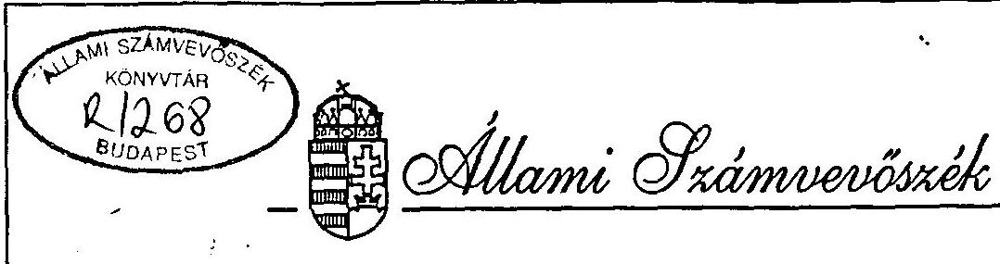

# JELENTÉS 

Nágocs Községi Önkormányzat gazdálkodásának, pénzügyi helyzetének célvizsgálatáról

---

A vizsgálatot vezette:
Nagy József
számvevô igazgató-helyettes
A vizsgálatot végezték:
dr. Hegedüs György
számvevô tanácsos
Huszti István
számvevó

---

# JELENTÉS 

Nágocs Községi Önkormányzat gazdálkodásának, pénzügyi helyzetének célvizsgálatáról

A BM Somogy Megyei Közigazgatási Hivatala a helyi önkormányzatokról szóló 1990. évi LXV tv. módosítása tárgyában megjelent 1994. évi LXIII.tv. 52. §. (2) bekezdése e/ pontja szerint kérte a Számvevőszéket, hogy Nágocs Községi Önkormányzatának pénzügyi vizsgálatát végezze el. A Somogy Megyei Rendőrkapitányság ugyancsak felkérte az Állami Számvevőszéket a Nágocs Önkormányzat pénzügyi vizsgálatára. A Számvevőszék a vizsgálatot elvégezte.

## I.

Összefoglaló megállapítások és javaslatok

A közel 700 fős lélekszámú település Nágocs Községi Önkormányzat (továbbiakban: Önkormányzat) pénzügyi-gazdasági állapota a számvevőszéki ellenőrzés idején elérte a csődhelyzetet. Az évek óta mutatkozó likviditási zavarok, fokozódó fizetési és hitelképességi problémák olyan méreteket öltöttek, hogy az Önkormányzat 1994-ben gyakorlatilag már a fizetésképtelenség állapotába került.
1995. március 3-án az Önkormányzat Polgármesteri Hivatalában (továbbiakban: Hivatal) és az Általános Iskolában (továbbiakban: Iskola) nem tudtak bért fizetni, az Önkormányzat számlavezető bankja (OTP) már nem folyósított munkabér hitelt. Jelenleg az "Állami hozzájárulások" című alszámlára leutalt állami hozzájárulás

---

biztosítja a nettó kifizetések összegét, garantálva egyúttal azt, hogy a hitelezők ne tegyék múködésképtelenné az Önkormányzatot.

A Somogy Megyei Bíróság P.20.176/1995/16. számú 1995.május 19-i nem jogerős itélete a polgármestert e tisztségből felmentette.

A számvevőszéki ellenőrzés 1991. január 1-ig visszamenőleg áttekintette az Önkormányzat gazdálkodását. Az ellenőrzés alapvető hiányosságokat tapasztalt. A Hivatal nem rendelkezik a legalapvetőbb szabályzatokkal. Igy az Önkormányzat Szervezeti és Müködési Szabályzata (továbbiakban: SZMSZ), valamint az ehhez kapcsolódó szabályozások nem adhatnak utasítást, eligazítást arra, hogy a gazdálkodási feladatokban milyen hatásköre van a képviselö-testületnek, a polgármesternek, a jegyzőnek és a Hivatal dolgozóinak. Nem szabályozott a pénzgazdálkodás és az utalványozás rendje. A Hivatal olyan alapvető szabályzatokkal nem rendelkezik, mint a számlarend, vagy a pénztár - pénzkezelés szabályzat.

A Hivatal számviteli és bizonylati rendje, valamint az ezen alapuló hibás és jogellenes gyakorlat az oka annak, hogy az Önkormányzat gazdálkodása alapvetően nem felel meg a jogszabályok által támasztott könyvvezetési kötelezettségeknek, olyan jogi erejú elveknek, mint például a teljesség, valódiság, az összemérés, vagy a bruttó elszámolás elvének. A költségvetési beszámolók hézagosak, az éves költségvetési beszámolók mérlegei és mérlegtételei több évre visszamenőleg hiányosak és hibásak.

Az Önkormányzat hitelügyleteinek törvényessége erősen kifogásolható. Több esetben megkérdőjelezhető a képviselő-testületi döntések, határozatok valódisága és hitelessége. Ezzel kapcsolatban öt esetben felmerül a volt polgármester büntetőjogi felelőssége.

A peres ügyek, a szállítóí követelések számának gyarapodása és a bíróságok által jóváhagyott fizetési meghagyások növekvő száma jelzi az Önkormányzat adósságának növekedését.

Az Önkormányzattal szemben támasztott követelések összege meghaladja a 120 millió forintot. Ebből 50 millió forintot tesz ki a hiteltartozás kamatokkal együtt. A meghiúsult munkahelyteremtéshez nyújtott támogatás visszakövetelt összege eléri a 20 millió forintot. A szállítói és egyéb követelések - amelyek részben már peresítettek - összege pedig elérheti az 50 millió forintot.

---

Az Önkormányzat 1994. évről készített zárszámadása 46.920 e Ft. kiadási összeget tartalmaz, az 1995. évre elfogadott költségvetés 46.553 e Ft kiadással számol, a bevételi forráshiány 23.877 e Ft. Az Önkormányzat könyvszerinti vagyona 1994. december 31-én 32.106 e Ft, a tőkeváltozás értéke - 118.492 e Ft.

Ha az Önkormányzat összes vagyonát értékesítené könyv szerinti értéken, úgy még mindíg 86.386 e Ft tartozása maradna.

# Javaslatok 

Az Önkormányzatnak juttatott állami hozzájárulások összege csupán a netto munkabérkifizetésekhez elegendő. A növekvő adósságállományban, a fizetésképtelenség kialakulásában elsődleges szerepet játszik az Önkormányzat gazdálkodási tevékenysége szabályszerűségének alacsony színvonala, a törvénysértő gazdálkodási gyakorlat és nem utolsósorban a belső ellenőrzés hiánya.

A szabálytalanságok miatt fel kell vetni a polgármester, a jegyző és a pénzügyi előadó felelősségét. (Ennek részletes megalapozását a II. rész tartalmazza.)

A számviteli és a bizonylati rendet és fegyelmet súlyosan megsértették, a számviteli nyilvántartások hibásak, a pénzügyi-számviteli gyakorlat jogszabályokba ütközik.

Az Önkormányzat vállalkozási tevékenysége, az önként vállalt feladatai messze felülmúlták az Önkormányzat pénzügyi lehetőségeit.

Az Állami Számvevőszék kezdeményezi a polgármester és egyes munkatársainak büntetőjogi felelősségrevonását a helyszíni vizsgálatban részletezettek szerint. Ezen túlmenően a nehéz helyzetből való kilábalás érdekében a következőket javasoljuk:

## A Pénzügyminisztérium részére:

A pénzügyminiszter vizsgálja meg és kezdeményezze a 23/1995. (III.8.) Korm. sz. rendeletben foglalt, az Állami hozzájárulások címủ alszámla forgalmának olymódon történő kiterjesztését, hogy a jelenleg normatív hozzájárulásokon kívül az egyéb állami támogatások is ezen a számlán bonyolódjanak.

---

A Somogy Megyei Kőzigazgatási Hivatal részére:
A számvevőszéki jelentésben foglalt, a törvényességi állapot helyreállítását célzó intézkedések megvalósulását kísérje figyelemmel. Ehhez az ÁSZ Somogy Megyei Kirendeltsége nyújtson segítséget.

Az Önkormányzat részére:

1. A törvényes állapot helyreállítására érdekében:
1.1 Az SZMSZ módosítása szükséges, határozzák meg a képviselő-testület, a polgármester, az alpolgármester és a jegyző gazdálkodási hatáskörét. Szabályozni kell a Polgármesteri Hivatal Jogállását.
1.2 A pénzgazdálkodás szabályainak a rögzítésével egyidejúleg célszerű szabályozni a Polgármesteri Hivatalnak az ügyrendjét és a dolgozók munkaköri leírását.
1.3 A Hivatal, mint költségvetési szerv számlarendjét ugyancsak el kell készíteni és ennek alapján a könyvelést folyamatossá kell tenni. A számlarendben, illetve ahhoz kapcsolva szükséges a leltározás rendjét is szabályozni.
1.4 A számviteli rend és bizonylati fegyelem megszilárdítása érdekében fokozott figyelmet kell fordítani a számviteli nyilvántartások elkészítésére, vezetésére, valamint a főkönyvi könyvelés és az analítikus nyilvántartások egyezőségére és folyamatosságára.
1.5 El kell végezni a pénzkezelés, a házipénztár kezelésének és múködésének a szabályozását. A pénzkezeléssel megbízott személyek felelősségi nyilatkozatát is el kell készíteni és mellékelni kell a szabályozáshoz.
1.6 Az utalványozás gyakorlatát gyökeresen meg kell változtatni. Az érvényesítésnek meg kell előznie az utalványozást, csak ezt követően lehet elrendelni, utalványozni a kiadás teljesítését, a bevétel beszedését. Az utalványt a jegyzőnek kell ellenjegyeznie, erre a jegyző más személyt is felhatalmazhat. Az utalványozást szükségszerűen megelőzi a kötelezettségvállalás, erről az utalványozáskor meg kell győződni.

---

1.7 Az Önkormányzat vagyoni helyzetét fel kell mérni és rendeletben kell szabályozni a vagyonnal összefüggő gazdálkodási tényezőket. Erre azért is szükség van, hogy az önkormányzati törzsvagyon ne kerüljön a hitelezők kezére.
1.8 Az adósságállományt teljeskörűen fel kell mérni. A vitatható követeléseket csak a jogi út igénybevétele esetén célszerű elfogadni, elismerni.
1.9 A helyi önkormányzat készítsen 1995. évre válságkezelő költségvetést. Felül kell vizsgálni a kötelezően ellátandó feladatok körét. Erre a szintre indokolt a müködési költségvetést biztosítani.

A csődhelyzet állapot kezelésére tervet kell készíteni. A mobilizálható, értékesíthető vagyont az adósság csökkentésére kell fordítani.
1.10 A felszámolás alatt álló MODA-VENEZIA KFt. vagyonából lehetőség szerint törleszteni kell az önkormányzati adósságot.
1.11 A képviselö-testület járjon el a polgármester munkajogi felelősségre vonásában.

Budapest, 1995. július
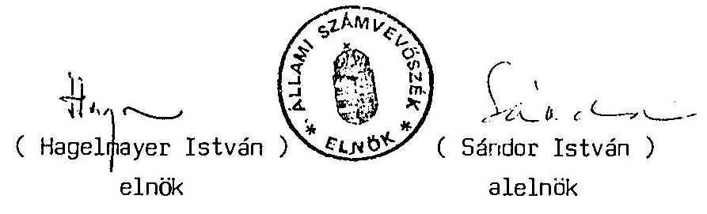

---

# II. 

## RÉSZLETES MEGÁLLAPÍTÁSOK

(a helyszini vizsgálat jelentése)

Kaposvár, 1995. június

---

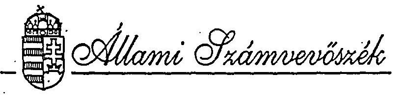

Onkormányzati és Területi
Ellenőrzési Igazgatóság
Somogy Megyei Kirendeltség

Ikt. szám: V-1003-5/1995.

ALLAMI SZÁNVEVÖEZÉK

1995-06-21

FRKEZETT:
ATATÓSZÁM: V-1003-10/95

MELLÉKLET: 03

J E L E N T E S

Nágoza Községi Onkormányzat gazdálkodásának, pénzügyi helyzetének célvizsgálatáról.

Kaposvár, 1995. május

---

# J E L E N T E S 

Nágocs Községi Onkormányzat gazdálkodásának, pénzügyi helyzetének célvizsgálatáról.

Az Allami Számvevõszék Somogy Megyei Kirendeltsége a célvizsgálatot a V-1003-5/1995.számon elrendelt vizsgálati program alapján folytatta le.

Az ellenôrzés célja: annak megállapítása volt, hogy az ön-
mányzatnál:

- a bevételek és az ellátandó feladatok közötti összhang hiánya milyen okokra vezethető vissza,
- a képviselö-testület, illetve a polgármesteri hivatal milyen intézkedéseket tett az egyensúly helyreállítása érdekében,
- a gazdálkodásra és a hitelek igénybevételére, felhasználására vonatkozó szabályokat betartották-e.

A helyszíni ellenőrzésre: 1995.április 5. és május 5. közöttí idöszakban került sor.

A vizsgált idôszak: 1991. - 1995. I. negyedév közötti idõ-
szak

Az ellenőrzés módszere: a könyviteli és bizonylati rend. a
fôkönyvi könyvelés és analitikus nyilvántartások összeíuggésében tételes, teljeskörü.Egyébkét szúrópróbaszerü.

Az ellenőrzést végezte: dr. Hegedüs György számvevõ tanácsos.

---

# I. 

## Altalános megállapítások és javaslatok

A közel 700 fös lelekszámú település Nágocs Községi Onkormányzat (továbbiakban: Onkormányzat) pénzügyi-gazdasági állapota a számvevöszeki ellenörzés idején elérte a csödhelyzetet. Az évek óta mutatkozó likviditási zavarok. fokozódó fizetési és hitelképességi problémák olyan méreteket öltöttek. hogy az Onkormányzat 1994-ben gyakorlatilag már a fizetésképtelenség állapotába került.
1995. március 3-án az Onkormányzat Polgármesteri Hivatalában (továbbiakban: Hivatal) és az Altalános Iskolában (továbbiakban: Iskola) nem tudtak bért fizetni, mivel az Onkormányzat számlavezetö bankja (OTP) már nem folyósitott munkabér hitelt. Jelenleg az "Allami hozzájárulások" címü alszámlára leutait állami hozzájárulás biztosítja a netto kifizetések összegét. garantálva egyúttal azt, hogy a hitelezök ne tegyék müködésképtelenné az Onkormányzatot.

A csödhelyzet kialakulása miatt a polgármestert okolja mind az 1994. december 11-én megválasztott, mind az azt megelözöen müködött képviselö-testület. A képviselö-testületek számos bejelentést tettek különbözö szervezetekhez, igy került sor arra. hogy a bíróságtól kérték a pogármester tisztségéböl történö le:függesztését, aki már az elözö ciklusban is polgármesteri leladatot látott el.

---

A Somogy Megyei Bíróság P.20.176/1995/16. szánu 1995.május 19-i nem jogerős itélete a polgármesteri tisztséget megszünteti. egyidejüleg e tisztségéből a polgármestert felfüggeszti.

A számvevőszéki ellenőrzés 1991. január 1-ig visszamenőleg át tekintette az Onkormányzat gazdálkodását. Az ellenőrzés alapvető hiányosságokat, törvénysértést és jogsértést tapasztalt. A Hivatal nem rendelkezik a legalapvetőbb szabályzatokkal és szabályozásokkal. Igy az Onkormányzat Szervezeti és Müködési Szabályzata (továbbiakban: SZMSZ), valamint az ehhez kapcsolódó szabályozások nem adnak utasítást, eligazítást arra. hogy gazdálkokodási feladatokban milyen hatásköre van a képviselö-testületnek. a polgármesternek, a jegyzőnek és a Hivatal dolgozóinak. Nem szabályozott a pénzgazdálkodás rendje, az utalványozás. A Hivatal olyan alapvető szabályzatokkal nem rendelkezik, mint a számlarend, vagy a pénztár - pénzkezelés szabályzat.
Ennek megfelelően a költségvetési gazdálkodás szabályszerűsége nem vethető össze az Onkormányzat belsö jogi normáival. De jórészt ennek is köszönhetō, hogy az Onkormányzatnál tapasztaltak ellenkeznek a központi jogszabályokkal, nem éltek a jogi szabályozás biztosította jogokkal és kötelezettségekkel.

A Hivatal számviteli és bizonylati rendje, valamint az ezen alapuló hibás és jogellenes gyakorlat az oka annak, hogy az Onkormányzat gazdálkodása alapvetően nem felel meg a jogszabályok által támasztott könyvvezetési kötelezettségeknek, olyan jogi erejú elveknek, mint például a teljesség, az összemérés vagy a bruttó elszámolás elvének. A költségvetési beszámolók hézaqosak. az éves költségvetési beszámolók mérlegei és mérlegtételei niányosak és hibásak több évre visszamenőleg.

---

A rer.jeletbe foglalt költségvetések alapvető fogyatékossága, hogy az nem tartalmazza a folyamatban lévő és újonnan inditott fejlesztéseket. A felhalmozási feladatok, beruházások számlaforgalma nem képezi részét a Hivatal könyviteli rendszerének, ahhoz való kapcsolódása eseti jellegü. Ebből következôen az Onkormányzat pénzügyi információs rendszere, a költségvetések és a beszámolók nem tükrözik a valós gazdasági helyzetet, a gazdasági eseményeket.

Az Onkormányzat hitelügyleteinek törvényessége erösen kifogásolható. Több esetben megkérdőjelezhető a képviselö-testületi döntések, határozatok valódisága és hitelessége. Ezzel kapcsolatban több esetben felmerül a polgármester büntetőjogi felelőssége.

Az Onkormányzat folyamatosan eladósodott. A peres ügyek, szállitoi követelések számának gyarapodása és a bíróságok által jóváhagyott fizetési meghagyások növekvö száma jelzi az Onkormányzat adósságát és az adósság szaporodását. (Lásd az 1.sz.mellékletet.)

Az Onkormányzattal szemben támasztott követelések összege- amely az ellenörzés ideje alatt is szaporodott - meghaladja a 120 millió forintot. Ebböl 50 millió forintot tesz ki a hiteltartozás kamatokkal együtt. A meghiúsult munkahelyteremtéshez nyújtott támogatás 'visszakövetelt összege eléri a 20 millió forintot. A szállitói és egyéb követelések - amelyek részben már peresítettek - összege pedig elérheti az 50 millió forintot.

Az Onkormányzat 1994. évről készített zárszámadása 46.920 e Ft. kiadási összeget tartalmaz, az 1995. évre elfogadott költségvezés 46.553 e Ft kiadással számol. a bevételi forráshiány 23.877 e Ft. Az ċnkormányzat könyvszerinti vagyona 1994. december 31-én

---

32.106 e Ft. a tōkeváltozás értéke - 118.492 e Ft.

Ha az Onkormányzat összes vagyonát értékesítené könyv szerinti értékeṇ, úgy még mindig 86.386 e Ft tartozása maradna.

Következtetések és javaslatok

Az Onkormányzattal szembeni követelések összegei meghaladják a 120 millió forintot. Az Onkormányzatnak juttatott állami hozzájárulások összege csupán a netto munkabérkifizetésekhez elegendö. A növekvō adósságállományban, a fizetésképtelenség kialakulásában elsödleges szerepet játszik az Onkormányzat gazdálkodási tevékenysége szabályszerűségének alacsony szinvonala, a törvénysértó gazdálkodási gyakorlat és nem utolsósorban a belsó ellenörzés hiánya.

A szabálytalanságok miatt fel kell vetni a polgármester, a jegyzö és a pénzügyi előadó felelősségét.

A számviteli és bizonylati rendet és fegyelmet súlyosan megsértették, az alapvető szabályzatok hiányoznak. A számviteli nyilvántartások hibásak, a pénzügyi-számviteli gyakorlat jogszabályokba ütközik.

Az Onkormányzat vállalkozási tevékenysége, önként vállalt feladatai messze felülmúlják az Onkormányzat pénzügyi lehetöségeit.

A következöket javasoljuk:

---

A Belügyminisztérium részére:

A minisztérium a hatósági és helyi közszolgáltatási feladat ellátásához nyúitson segitséget.

A Belügyminisztérium és a Pénzügyminisztérium vizsgálja meg. hogy milyen támogatással lehet az Onkormányzatnál a fizetésképtelen helyzetet áthidalni. a kötelezö feladatellátást biztosítani.

A Somogy Megyei Közigazgatási Hivatal részére:
A számvevöszéki jelentésben foglalt, a törvényességi állapot helyreállítását célzó intézkedések megvalósulását kisérje figyelemmel. Ehhez az ASZ Somogy Megyei Kirendeltsége nyújtson segitséget.

Az Onkormányzat részére:

1. A tơrvényes állapot helyreállitása érdekébeni
1.1. Az SZMSZ-t módosítása szükséges, határozzák meg a képeviselö-testület, a polgármester, az alpolgármester és a jegyző gazdálkodási hatáskörét. Szabályozni kell a Polgármesteri Hivatal jogállását.
1.2. A pénzgazdálkodás szabályainak a rögzítésével egyide-

---

jüleg célszerű szabályozni a Polgármesteri Hivatalnak az ügyrendjét és a dolgozók munkaköri leírását.
1.3. A Hivatal, mint költségvetési szerv számlarendjét ugyancsak el kell készíteni és ennek alapján a könyvelést folyamatossá kell tenni. A számlarendben, illetve ahhoz kapcsolva szükséges a leltározás rendjét is szabályozni.
1.4. A számviteli rend és bizonylati fegyelem megszilárdítása érdekében fokozott figyelmet kell fordítani a számviteli nyilvántartások elkészitésére, vezetésére, valamint a fókönyvi könyvelés és az analitikus nyilvántartások egyezőségére és folyamatosságára.
1.5. El kell végezni a pénzkezelés, a házipénztár kezelésének és müködésének a szabályozását. A pénzkezeléssel megbízott személyek felelősségi nyilatkozatát is el kell készíteni és mellékelni kell a szabályozáshoz.
1.6. Az utalványozás gyakorlatát gyökeresen meg kell változtatni. Az érvényesítésnek meg kell elöznie az utalványozást, csak ezt követöen lehet elrendelni, utalványozni a kiadás teljesítését, a bevétel beszedését. Az utalványt a jegyzőnek kell ellenjegyeznio, erre a jegyző más személyt is felhatalmazhat. Az utalványozást szükségszerüen megelözi a kötelezettségvállalás, erről az utalványozáskor meg kell gyözödni.

---

1.7. Az önkormányzat vagyoni helyzetét fel kell mérni és rendeletben kell szabályozni a vagyonnal összefüggö gazdálkodási tényezóket. Erre azért is szükség van. az önkormányzati törzsvagyon ne kerüljön a hitelezök kezére.
1.8. Az adósságállományt tėljeskörüen fel kell mérni. A vitatható követeléseket csak a jogi út igénybevétele esetén célszrü elfogadni, elismerni.
1.9. Felül kell vizsgálni a kötelezöen ellátandó feladatok kọ́rét. Erre a szintre indokolt a müködési költségvetést biztosítani.
1.10. A csödhelyzet állapot kezelésére tervet kell készíteni. A mobilizálható, értékesíthető vagyont az adósság csökkentésére kell fordítani.
1.11. A felszámolás alatt álló MODA-VENEZIA KFt. vagyonából lehetösėg szerint törleszteni kell az önkormányzati adósságot.
1.12. A képviselö-testület. járjon el a polgármester munkaügyi felelősségre vonásában.

---

# II. 

## Részletes megállapítások

## 1. A gazdálkodás helyi szabályainak kialakítása.

a/ Az Onkormányzat gazdálkodását meghatározó szabályozások rendkívüli módon hiányozak, nem alkalmasak jogszerü, szabályos önkormányzati költségvetési gazdálkodási gyakorlat kialakítására. Alapvető törvényességi hiányosságokat tapasztalt az ellenőrzés:

- Az SZMSZ 1991. március 1-én lépett hatályba. Azóta három alkalommal módosították. A jelenleg hatályos SZMSZ az Onkormányzat gazdálkodásának végrehajtó szerveként a körjegy-jegyzőséget nevezi meg (SZMSZ.47.§.), amely jogilag létre sem jött. Ugyanis Nágocs, Zics, Miklósi önkormányzatok kép-viselő-testületeinek 1991. március 28-i megállapodás tervezete körjegyzöség létesítéséről nem lépett életbe, mivel azt a testületek nem fogadták el, mem írták alá. Ezért a tanácsokat felváltó önkormányzati rendszerben a székhelytelepülés Nágocs és társközségei Zics és Miklósi ténybeli alapon voltak körjegyzöségben mindaddig, amíg az önkormánymányzatok meg nem alapították saját hivatalaikat, a polgármesteri hivatalt és nem neveztek ki jegyzôt.
- Az SZMSZ előírásának megfelelően a körjegyzőség ügyrendjének kellett volna szabályoznia az operativ gazdálkodás, a

---

pénzgażdálkodás legfontosabb szabályait. Igy a kötelezettségvállalás, az utalványozás és ellenjegyzés önkormányzati rendjèt. Azonban a körjegyzőség nem jött létre ezért az ugyrend sem lépett hatályba.

- Az SZMSZ utalása szerint a mellékletekben kell szabályozni: a képviselö- testület feladat- és hatáskörét: az átruházható hatásköröket; a bizottságok feladatkörét: a bizottsági döntési hatáskörbe utalt ügyek körét; a hatásköri jegyzéket, amely külön-külön tartalmazza a polgármester. az alpolgármester és a jegyzó feladatkörét, hatáskörét.
Az érvényes SZMSZ ilyen mellékleteket nem tartalmaz és semmi nyoma annak, hogy ezek a mellékletek valaha is elkészültek.
- Az SZMSZ-t kiegészitő fontos önkormányzati szabályozások hiányoznak. Igy - többek között - a precízen kidolgozott házipénztár szabályzat azért nem fogadható el, mert nincs adaptálva, semmilyen utalás nincs arra, hogy azt az önkormányzat mikor és hogyan léptette hatályba. Ezen túlmenően a bemutatott szabályzat 1979. évi keltezésú és ezér: szakmailag ma már mindenképpen átdolgozásra szorulna.
- Az Onkormányzat a helyszíni vizsgálat idején nem tudott bemutatni sem számlarendet, sem leltározási szabályzatot.
- A szabályozások gazdalkodással kapcsolatos hiányosságaít a költségvetési rendeletek sem pótolják, a ciklusidőszakbar elfogadott költségvetések nem tartalmaznak a költségvetési gazdalkodásra vonatkozó utasitásokat.

---

Az önkormányzati szabályozások hiánya sérti az alábbi jogszabályi előírásokat.

1.     - A képviselö-testület a müködésének részletes szabályait a szervezeti és müködési szabályzatról szóló rendeletében - korábbi szövegezés szerint: szervezeti és müködési szabályzatban határozza meg. 1990. évi LXV.tv.18.§.(1).
2.     - Számlarendet a törvény hatálybalépését (1992.január 1.) követő 90 napon belül kell összeállítani, illetve a meglévö számlarendet kiegészíteni vagy módosítani. 1991.évi XVIII.tv. 79. §. (3).
3.     - A költségvetés alapján gazdálkodó szerv a költségvetési szervek számlakerete alapján számlarendet köteles készíteni. 179/1991.(XII.30.) Kormányrendelet 36.§.(1).

A kötelességek mulasztásában a következö személyek felelössége vethetó fel.

1.     - As_5ZHSZ_hiányosségai_ hibái miatt: Horváth Pál polgármester 1990. évi LXV.tv. 90.§.(1); és Horváth Tünde jegyzö 1990. évi 36. §. (3).
2.     - A számlarend hiánya miatt: Horváth Pál polgármester (1991. évi. XVIII.tv. 79.§.(5).; és Horváth Tünde jegyzö: 1990. évi CIV.tv. 43.§.(5) és 1991. évi XX.tv. 140.§.(1).c.
1.2.) A Hivatal, mint önkormányzati hivatal és költségvetési szerv gazdálkodásának rendje nem szabályozott.

Ennek megfelelően nincs szabályozva a kötelezettségvállalás

---

az utalványozás és érvényesités, valamint az ellenjegyzés rendje. A pénzgazdálkodás alapvető szabályai hiányoznak.

Az utalványozás és az utalvány ellenjegyzésének gyakorlata nem felel meg a törvènyl szabályozásnak, valamint a végrehajtási jogszabályoknak, igy különösen a 19/1980.(IX.27.) FM rendelet, a 4/1991.(II.13.) PM rendelet, valamint a jelenleg hatályos 137/1993.(X.12.) Kormányrendelet ide vonatkozó elöírásainak.

Hivatalban 1991. és 1993. között az érvényesitést és az ellenjegyzést egy személy, a pénzügyi előadó végezte anélkül, hogy erre vonatkozóan szabályozás lett volna. illetöleg az ügyintézöt a jegyzö felhatalmazta volna általános ellenjegyzési hatáskörrel.

Az utalványozást kizárólag a polgármester végezte, néhány esetben az utalványozás elmaradt. Az ellenörzés semmilyen szabályozást nem talált, amelyben a polgármester valakit is felhatalmazott volna utalványozási feladattal.

1994-ben az utalványozás jogát sem a p. lgármester, sem általa felhatalmazott személy nem gyakorolta. A bizonylatokról az utalványozói aláírás hiányzik. 1994. augusztus 1-ig munkaviszonyának megszünésig, a pénzügyi előadó látta el egy személyben az érvényesítői és ellenjegyzői feladatokat.
Ezt követően a polgármesteri hivatalban sem az utalványozást, sem az ellenjegyzést és érvényesitést nem végeztek egészen 1995. márciusáig, a megbízott jegyzö munkába állásáig.

A vizsgált idöszakban különbözö - fentebb megnevezett - jogszabályok irták eló a pénzgazdálkodás szabályait.

---

Az itt megielölt kötelesség mulasztások az elózō. 1.1 a pontban sorolt felelösségi formákkal azonosak. A szabályozások elmaradásáért Horváth Pál polgármester, valamint Horváth Tünde Jegyzō. Stiedl Jenōné megbízott jegyzō, és Gulyás István jegyzō felelősek.

A számviteli rend és fegyelem, a beszámolási és könyvvezetési kötelezettségek megszegése felveti a számviteli fegyelem megsértése búncselekmény (Btk. 289. 3.) alapos gyanúját. Felelőssé tehető: Horváth Pál polgármester, Horváth Tünde jegyzō, Stiedl Jenōné megbízott jegyzō és Gulyás István jegyzō.
2. A tervek megalapozottságának vizsgálata.
2.1. A vizsgált években az önkormányzat bevételi és kiadási költségvetési elöirányzatai irreálisak és megalapozatlanok voltak.

A müködtetés elsődlegességét, valamint a müködési-fenntartási és fejlesztési célok összhangját nem biztosították a vizsgált idöszakban.
2.1.1. A Nágocsi Községi Tanács már 1989.évben pályázott az Andocs -Nágocs- Zics öszzekötö út épitésére. A pályázatot elfogadták, az öszzekötó út megépitézéhez a KÖHÉM és a MÉM föhatóságok anyagi támogatást adtak.

Az Önkormányzatnak 1991. évben az útépítésre felhasznált bevételei:

---

- MBM-töl támogatás: 10.500 e Ft.
- KOHBM-töl támogatás 10.000 e Ft.
- Rövid lejáratu (éven belüli) hitel: 15.000 e Ft.
- Az 1990. évi pénzmaradványból a megyétől 7.000 e Ft. kapott átmeneti támogatás:
- Erre a feladatra került elsámolásra az önhibáján kivül hátrányos helyzetbe kerult önkormányzat állami támogatása(1):
6.241 e Ft.

Oszesen: 48.741 e Ft.

Az útépítéssel kapcsolatban elsámolt
téljesített kiadások összege:
$44.906 \mathrm{e} \mathrm{Ft}$.
$+\mathrm{AFA} \quad 11.222 \mathrm{e} \mathrm{Ft}$
Oszesen: $\quad 56.128$ e Ft.

A felszámított AFA-t az Onkormányzat visszaigényelte, melyet az adóhatóság át is utalt az önkormányzati bankszámlára. Ennek ellenére az Onkormányzat a felvett hitelt maradéktalanul nem fizette vissza, és a megyei átmeneti támogatást sem adta vissza.

Igy a következõ évre áthúzódó kötelezettsége:

- bankhitel és kamatai: 6.000 e Ft.
- megyei átmeneti támogatás: 7.000 e Ft.

Oszesen: $\quad 13.000$ e Ft.

Az 1991. évi beszámoló hibája és hiányossága, hogy az Onkormányzat_az_évvégi_beszámolódában_(mérleg) a_következo_évre_áthúzódó_13.000_e_Ft-os_kötelezettségét_nem

---

mutatta ki. Az 1992. évi költségvetési információban is csak a 6.000 e Ft. hitel visszafizetését tervezték be.
2.1.2. Az önkormányzat 1992. évi költségvetésének bevételi elöirányzata 28.604 e Ft volt, amely 9.852 e Ft müködési célu hitelfelvételt tartalmazott. Ha megtervezték volna az elözö évvégéről áthúzódó 13.000 e Ft kötelezettséget, tartozást akkor ez a költségvetés csupán 5.752 e Ft szabadon felhasználható bevételi elöirányzatot mutatott volna.

Ezzel szemben az Iskolának tervezett költségvetési támogatás összege 10.296 e Ft-ot tett ki. Tehát az 1992. évi költségvetés erösen forráshiányos volt.
A kötelezettségek figyelmen kivül hagyása miatt irreális költségvetés készült 1992. évre.

A költségvetés egyensúlyát tovább rontotta az ugyancsak figyelmen kivül hagyott, a költségvetésbe be nem állított beruházási tevékenység.
Ekkorra ugyanis közismertté vált, hogy az Onkormányzat újabb jelentös beruházás megvalósitására törekszik. Az 1991. december 10-én elkészített munkahelyteremtő beruházási pályázatot 1992. március 13-án kedvezően bírálták el. Az Onkormányzat és a Somogy Megyei Munkaügyi Központ (továbbiakban:SMK) 1992. április 2-án kötött megállapodásban az Onkormányzat vállalta egy 51.200 e Ft-os értékú cipőgyártó üzem létesítését 1992.augusztus 31-i befejezéssel. üzembehelyezéssel. A megállapodás szerint az Onkormányzatnak 43.200 e Ft saját forrást kellett volna biztosítania.

---

A finanszirozási gondok enyhitésére 1992. április 5-án 12.000 e Ft rövidlejáratu hitelt vettek fel a Balatonfölávári Takarékszövetkezettöl. Ez a hitelfelvétel tette lehetövé a Somogy Megyei Onkormányzas április 7-i 7.000 eFt-os incassójának, valamint Pannon Kastély RT április 24-i 6.534 e Ft-os 15.000 e Ft töke + 1.534 e Ft kamat, incassójának teljesítését.
Idöközben április 9-én az Onkormányzat megkapta az SMKtól a megállapodás szerinti 6.000 e Ft-os térítésmentes támogátást.
1992. évben az Onkormányzat folyamatos pénzügyi zavarba került. A megszerzett bevételekkel az adósságot igyekezett törleszteni, az elözö évben felvett 6.000 e Ft rövidlejáratú hitelt majd egyéves késéssel 1992. december 17-én fizették vissza, az 1.876 e Ft -ot kamattal együtt.

A cipöüzem határidöre nem készült el, közben az Onkormanyzat társtulajdonosként megalapította a MODA-VENEZIA KFt-e-, amelynek feladata lett volna a cipögyártó üzemet megvalósítani. Ezzel összefüggésben 1992. novemberében az Onkormányzat 25 millió forint hitelt vett föl számlavezető bankjától (OTP Bank RT.).

Az Onkormányzat 1992. évi beszámolója a felvett 37.000 eFt $(12.000+25.000)$ hitellel szembencsak 25000 e Ft hiteltartozást mutatott ki.
2.1.3. Az Onkormányzat 1993. évi költségvetése csupán 5.800 e Ft hitel visszafizetést irányzott elö. Valójában ekkor a fennálló hiteltartozás meghaladta az 1993. évi költségvetés 35.245 e Ft összeguu eredeti elöirányzatát.

---

Ebben az évben az Onkormányzat a hiteleket és kamatokat fizetni már nem tudta, illetve csak részletekben.
Az 1993. évi költségvetési beszámoló a kötelezettségeket irreálisan mutatta be, csupán 26.843 e Ft hiteltartozást ismert el.
2.1.4. Az Onkormányzat 1994. évi költségvetése hitel visszafizetést nem tartalmaz. Ugyanakkor 5.631 e Ft forráskiegészitő hitel felvételével számol. Egyébként ez szolgált inditékul az önhibáján kivül hátrányos helyzetben lévő önkormányzatok kiegészitő támogatásának pályázatához, amely alapján az Onkormányzat 6.000 e Ft kiegészitő támogatásban részesült.

A négy költségvetési év néhány jellemzö adata jól szemlél téti, hogy az Onkormányzat költségvetéseinek bevételi és kiadási elöirányzatai irreálizak és megalapozatlanok voltak, a müködési és fejlesztési célok, feladatok diszharmoniában voltak egymással. A költségvetések nem adtak reális képet a gazdálkodási lehetőségekről, eltitkolták a valós helyzetet, amely egy egyensúlyhiányos, csödbe menetelö önkormányzat képét rajzolta volna meg.

A megalapozatlan, valóságot nélkülöző és azt elkendőző költségvetések összeállításáért, elkészitéséért elsődleges felelősség a jegyzőket terheli: Horváth Tünde jegyző, Stiedl Jenőné megbízott jegyző, Gulyás István jegyző. (1991. évi XX.tv.140.§./1/a.: 1992. évi XXXVIII.tv. 71.§. /1/; 137/1993.(X.12.) Kormányrendelet 9-10.§.-ok).
2.2. A képviselö- testület által elfogadott és rendeletbe foglalt költségvetés formailag nem felel meg a hatályos jogszabályi előirásoknak.

---

2.2.1. Az önkormányzat 1991. évi költségvetését a 2/1991.(IV.2.1 számú önkormányzati rendelet fogadta el. A rendelet nem felel meg az 1990. évi CIV. törvény 36.8.(1) bekezdése által támasztott követelménynek, mivel nem tartalmas felujitási és fejlesztési kiadási elöirányzatot. Ugyanis az Onkormányzat áthúzódó fejlesztési tevékenységet végzet 1991-ben.-A jegyzökönyvek tanúsága szerint 1991.junius 20-án volt az Andoos- Nágocs- Zics összevötő út egy részének múszaki átadás-átvétele. Az építtető. beruházó ezerv Nágocs Község Polgármesteri Hivatala. Ezt megelözöen 1991-ben. 1990-ben az építtető és a kivitelezö több izben módosította az eredeti 1989. november 13-i építési szerzödést. amely 57.043.739 forint értékben- AFA-val - tartalmazott útépítési munkákat.
2.2.2. Az önkormányzat 1992. évi költségvetését a 2/1992.(IV.2) számú önkormányzati rendelettel fogadta el. A rendelet nem felel meg az 1991. évi CXI. törvény 50.8. (1)b. pontjának. mivel a rendelet ezúttal sem tartalmazza az önkormányzat. beruházási elöirányzatait.
A fejlesztési, beruházási feladatok tervezésének hiányát jol szemlélteti az 1992. évi költségvetés és zárszámadás értékadatainak összehasonlítása:

Tervezett költségvetés (fejlesztés nélkül) $=29.625 . \mathrm{e} \mathrm{Ft}$. Tellesitett költségvetés (fejlesztéssel) $=104.069$. e Ft. A beszámolóban van 18.172 e Ft épületvásárlás és 19.416 e Ft épületfelújítás is.

Az 1992. április 2-án elfogadott költségvetésben semmilyen fejlesztési kiadás nem szerepel, holott ezen a napon slibpodott meg az önkormányzat az SHK-val.

---

Azon túlmenően, hogy alaki- formai hibák fordultak eló a költségvetési rendeletalkotás során, az ellenőrzés számszaki- tartalmi hiányosságokat is feltárt. (Lásd az elózó 2.1.2. pontban foglaltakat is.)

A vizsgált idôszakban az éves költségvetések készítése során elmulasztották a kötelezettségek teljeskörü szám. bavételét. Ezért a költségvetések hiányosak, nem. tartalmazzák az önkormányzat valós adosságállományáz, a kiadások között nem szerepeltetnek több jelentös hiteltörlesztést. Igy például hiányzik a költségvetésböl a Somogy Megyei Onkormányzattól kért és kapott 7.000 e Ft átmeneti támogatás visszafizetése. De nem tartalmazza a költségvetés, a Balatonfölúvári Takarékszövetkezettól felvett 12.000 e Ft hitel törlesztését sem.

A rendeletbe foglalt költségvetések formai és tartalmi hibáiért a: felelősség Horváth Tünde jegyzöt, Stiedl: Jenőné megbizott jegyzöt, és Gulyás István jegyzöt terheli.
(1991. évi XX.tv. 140.8./1/ a: 1992. évi XXXVIII.tv. 71.8./1/:137/1993. (X.12.) Kormányrendelet 9-10. S.-ok).
3. A költségvetés végrehajtása.

A költségvetési elöirányzatok évközi módosítása során általában nem tartották be a központi jogszabályok ide vonatkozó elöírásait, illetőleg néhány esetben kétségbe vonható a módosítás törvényessége.

A vizsgált idôszakban a gazdálkodásról készült költségvetési beszámolók tanusága szerint az önkormányzatnál a költségvetés elöirányzatait saját hatáskörben csupán egyszer 1992. évben változtatták meg. (Közalkaimazotti, köztiszzviselöi bérek miatt.

---

A seljesítés adatai az elöirányzathoz képest nagy eltéréseket mi: tatnak:

| Ev. | Eredeti elöirányzat | Módosított elöirányzat | Teljesités |
| :--: | :--: | :--: | :--: |
| 1991. | 48.040 | 55.784 | 86.687 |
| 1992. | 28.679 | 34.382 | 98.798 |
| 1993. | 35.248 | 37.605 | 40.473 |

A nagymérvũ eltérések oka, hogy évközben nem végezték el az elöirányzat módosításokat. Ezzel megsértették a rendelet módosításának önkormányzati és jogalkotási szabályait (1990. évi LXV .tv. 10.8.a. és 1987. évi XI.tv.1.8./1; i. 10.8.1. valamint az elöirányzatok megváltoztatásának szabályait.(1992. évi XXXVIII.tv. 74.8. és 137/1993.(X.12.) Kormányrendelet 15.8.)
Az évközi elöirányzatok módosításának, megváltoztatásának törvényesşégéért Horváth Tünde jegyzö, Stiedl Jenőné megbizott jegyzö, Gulyás István jegyzö felelős.

Súlyos törvénysértés, hogy az 1993. évi gazdálkodásról még mindig nem készült el a rendeletbe foglalt zárszámadás. Felelősek: Stiedl Jenőné megbízott jegyzö és Gulyás István jegyzö.
Az ellenörzés nem tudta azonosítani az OTP Bank Ft.Tabi Fiókjától megkapott, a hitelkérelemmel összefüggö rendelez módosítás másolatát a korábbi önkormányzati jegyzökönyvekben toglaltakkal. Ez utóbbit az Onkormányzatnál fellelt anyagok. valamint Somogy Megyei Közigazgatási Hivatal irattára biztosította.

- Egy 1992. október S-án keltezett és ránézésre költzégvetési rendelet módosításnak tekinthetö másolati példány arrol tájékoztat, hogy Nágocs Kizség Képviselötestületének

---

31/1992.(IX.24.) számú határozata(!) módosítja az 1992. évi jóváhagyott 2/1992.(IV.2.) számu rendeletet. (Ez a rendelet fogadta el az 1992. évi költségvetést. 1 .
A 31/1992.(IX.24.) számú határozat nem lelhetó fel. A jelzett napon a jegyzökönyv szerint 30/1992.(IX.24.)számot visel az utolsó testületi határozat.

- A 15/1994.(VI.27.) számú rendelet 1994. június 27-i kellesésú és az Onkormányzat 1994. évi költségvetését módosítja. A rendeletet a jegyzö és a polgármester írta alá. A költségvetés módosítása a testületi jegyzökönyvekben nem szerepel.

A két módosított költségvetéss. illetőleg a módosításról tátájékoztató anyagot a bemutatott és rendelkezésre álló testületi jegyzökönyvek nem támasztják alá, azokat nem igazolják. Az OTP-hez benyújtott rendelet másolatok nem azonosak a testületi jegyzökönyvben foglaltakkal. Ez felveti a közokirat hamisítás büncselekmény (Btk. 274.8.) elkövetésének alapos gyanúját. Az elkövetéssel gyanusítható Horváth Pál polgármester, aki az eltérő tartalmú testületi határozatokat az OTP-hez benyújtotta.
3.1. Az Onkormányzat folyamatosan végzett hitelügyleti tevékenységet. Különösen 1991.és 1992. években. Ezt követően a hitelezési ügyletek lelassultak, majd leálltak. mivel az Onkormányzat idöközben hitelképtelenné vált.

---

A vizsgált idôszakban az önkormánysati hitelfelvételek a következök szerint alakultak:

1991-ben: Március 11 -ér, éven belûli hitel fejlesztési célra: 6.000 e Ft: Július 31 -én éven belûli hitel: 3.000 e Ft: December 18 -án rövid lejáratu hitel: 6.000 e Ft.
Az év folyaman visszafizetett hitel összege: 9.000 e Ft.

1992-ben: Aprilis 6-án rövidlejáratu hitel munkahelyteremtó beruházáshoz: 12.000 e Ft; November 10-én rövidlejáratu hitel cipöüzem felújításához: 12.500 e Ft; November 16-án rövidlejáratu hitel II.részlete:12.500 e Ft.

Az év végén 1992. december 17-én fizették vissza az 1991.december 18-án felvett 6.000 e Ft hitelt, valamint a késedelem miatt felszámított 1.878 e Ft. kamatot.

1993-ban hitelt nem vett fel az Onkormányzat. A korábban felvett célhítel után kamattörlesztés összege: 4.707 e Ft.

1994-ben a hiteltörlesztés összege: 2.669 e Ft, a kamattérítés összege pedig 6.789 e Ft.

Az Onkormányzat 1994. évben már nem tudott hitelhez jutni. Az 1994. junius 27. keitezésư 6.261 e Ft összegei: :övidlejáratu hiteligényt az OTP Bank RT Somogy Megyei Igazgatósága elutasította, miután ezt megelózöen 1994. évben már nyolc alkalommal engedélyezett munkabérnítelo az Onkormányzatnak.

---

A hitelūgyletek között találhatők olyanok, amelyek törvénysértésre utalnak.

Az 1992. augusztus 24-én kelt hitelkérelemre az OTP Bank RT Tabi Fiókja az 1992. október 29-én megkötött hitelszerzödés alapján 25 millió forint célhitelt biztosított.
A kérelemhez becsatolt 17/1992.(VI.4.)számu képvi-selö-testületi határozat kivonata, mely felhatalmazza a polgármestert és a pénzügyi elöadćt a hitel felvételére, nem azonos a testületi jegyzökönyvben fellelhető 17/1992.( VI.4.) számu határozattal mivel ez utóbbi az önhibáján kivül hátrányos helyzetbe került települési önkormányzatok kiegészitć állami tó. mozatási kérelmének benyújtásáról döntött. Illetöleg nem történik, utalás a testületi jegyzökönyvben arra, hogy felhatalmazást adtak volna hitel felvézelre.

Ehhez hasonlban nem_egvezik az OTP birtokában lávo 36/b. 1993.(VI.30.) számú képviselö-testületi határocat - amely annak tanusága szerint felhatalmazást tartalmaz - az_eredeti jegyzökönyvvel. Az eredeti jegyzökönyv ezt nem tartalmazta.

A hitelfelvételt szabályozza egyrészt az OTV.10.8.d. és 58.8: másrészt az ATH 100. 3.-a. A törvények lehetővé toszik, hogy a képviselö-testület meghatározott értékhatáris felhatalmazza a polgármestert hitel felvételére. Az SZMSD erre vonatkozóan felhatalmazást nem tartalmaz, rendelkezik viszont arról (29.3./2/h.), hogy a 3 millió forinton felüli hitelfelvételnél minősített többség kell a képviselö testület döntésének meghozatalához.

---

Egy esetben az ellenórzés talált olyan értelmú szövegrész: - az 1992. április 2-án megtartott testületi ülés jegy:ökönvvének 5. oldalán - amelyben a képviselők felhatalmazták a polgármestert, hogy az önkormányzat képviseletében a "20 000000 M/Nt hitelig" szerződést kössön. Erre a munkahelyteremtö beruházás miatt volt szükség.
Mind a korábbi, mind a mostani képviselö-testületi bejelentések vitatiák a polgármester hitelfelvételi hatáskörét. jogszerű eljárását. Vitatják azt, hogy a konkrét hitelfelvételekre felhatalmazást adtak volna.

A pénzintézetektöl megkapott hitelezési anyagokat, kivonatokat nem igazolják a testületi dötéseket tartalmazó és hitélecnek tekinthetö jegyzökönyvek. Egyébként a jogszerü hitelek felvételéről a polgármestert tájékoztatási kötelezettség terheli az SEMSZ 21. 8. /1/ d. pontja alapján, mivel hitelfelvétel az OTV.38. 8-a, és különösen a 10. 5 -d. pontja szerint a képviselö-testület kizárólagos joga és csupán szükebb körben van lehetöség a hatáskör átruházására.
3.2. Az önkormányzat számviteli és bizonylati rendjének áttekintése során az ellenörzés többször észlelte, hogy egyes kifizetések és befizetések nem igazolhatók a vezetett és regisztrált bankszámlaforgalom és a házipénztár pénzmozgása alapján. Egyes esetekben felmerült a 'zsebböl fizetés: gyanúja, mivel a teljesített kifizetéseknek nincs kimutatható fedezete.
A banknapló tanusága szerint 1994. augusztus 3-tól az in. kormányzat költségvetési számlájáról csak a nettó béreke: vették fel készpénzben, a házipénztárba azokat nem vétes lezték, be a pénztárjelentést nem vesették.

---

Evvégen a polgármester 2.457 .450 Ft készpénzbevételt számoltatott el (költsegvetési függö bevetelként könyvelték le: és ehhez 2.493.073.90 Ft összeget kitevö számlákat adott át. Ezen bizonylatoknak az érvényesítése, utalványozása és ellenjegyzése nem történt meg.

Az utalványozatlan kifizetésekért felelősség terheli Horváth Pál polgármestert, Gulyás István jegyzöt és Németh Déláné pénzügyi előadót.
3.3. Az ellenőrzés áttekintette az önkormányzat által igénybe vett és felhasznált normatív állami hozzájárulást, amit az általános iskolai oktatás és az óvodai nevelés ellátottjai után számoltak ki, és ezt jogszerünek találta Az igénybevett állami támogatást megalapozó feladatmutatók összhangban voltak az intézményi ágazati statisztikákkal.

Az önhibáján kivül hátrányos helyzetbe került önkormányzatokat megillető kiegészitő állami támogatásra az önkormányzat többször pályázott és jutott e jogcímen állami tomogatáshoz.

| 1991. évben | 6.241 e Ft. |
| :-- | :-- |
| 1992. évben | 3.733 e Ft. |
| 1994. évben | 6.000 e Ft. |

4. Az_önkormányzati_vállalkozás_gzabályozottsága, eredmé: nvesgege.
4.1. Az önkormányzat jelentös mértékú vállalkozási tevékeny: séget folytatott a vizsgált idöszakban. Az önkormányzati

---

kठtelezs feladatellátáson túlmenően önként vállalt felaJatok nagysága és mértéke messze meghaladja egy 700 fös lakpsú település anyagi lehetöségeit.

A kialakult csödhelyzet, fizetésképtelenség állapotának egyik legfontosabb tényezője az erön felüli vállalkozási tevékenységek folyamáta.

Az SZMSZ a vállalkozási tevékenységre vonatkozó szabályokat az alábbiak szerint határozza meg (2.8.):
/1/ A helyi önkormányzat - saját felelösségére- vállalko. zási tevékenységet folytathat. Ennek megfelelöen:
a/ Maga is közvetlenül résztvesz vállalkozásokban:
b/ A helyi önkormányzati politikával, illetőleg annak eszközeivel, módszereivel (pl. a helyi adópolitikával, telek- és ingatlanértékesitéssel) vállalkozásélénkitő, piacgazdaságbarát környezetet teremt.
2. Amennyiben a települési önkormányzat a müködési területen lévő termelő vállalkozásban kiván részt venni, ezt megelözöen szakértői véleményt kér, ill. gazdasági elemzést végeztet.

Az önkormányzat által végzett vállalkozási tevékenység az SZMSZ-ben meghatározott követelményeknek nem tudott megfelelni.

Az SZMSZ 18.8.(1).f. pontja szerint írásos elöterjesztést kell készíteni valamennyi önkormányzati vállalkozásrol. amit maradéktalanul nem tartottak be, nem vittek testület elé olyan lényeges ügyeket, amelyeknek komoly gazdasági, gazdálkodási vonzatuk volt.

A már említett 1992. április 2-i jegyzőkonyvben (Ugyanezen a napon kötötték meg a szerzödést az

---

SMK-val.) a munkahelyteremtõ beruházás kapcsán Roberto Bighelli olasz partnerrel kötendö szindikátusi szerzödésröl van szó. A fellelt és aláírt szindikátusi szerzödésben viszont Alexander Friedman a partner. A szerzödés dátuma 1990. július 30. (Az SMK-val kötött megállapodás szerint a cipőgyártó üzemet augusztus 31-én üzembe kellett volna helyezni.) A szerzödésben az Onkormányzat kötelezettséget vállalt arra. hogy kölcsönböl megvásárolja a közösen létrehozandó Kft. müködéséhez szükséges termelöberendezéseket és azokat 10 év futamidövel a Kft.-nek bérbeadja.
Ez a szindikátusi szerződés alapozta meg a MODA-VENEZIA Kft. létrehozását.

Az Onkormányzat vállalkozásai körében kiemelkedö szerep jutott - a vizsgált idöszakra vonatkozóan - a települési és településen kivüli útépítés beruházásoknak. Nem vitatva társadalmi-gazdasági jelentöségét az infrastruktúra fejlesztésének és javításának, az Onkormányzat beruházói, építtetői pozícióba kerülése azzal a veszéllyel járt, hogy a kivitelezoi munka elkészültével forráshiány jelentkezik. Ezt igazolja az 1991-ben befejezett Andocs- Nágocs-Zics összekötő út költségeit terhelö 7 millió forint megyei tanácsi átmenesi támogatás. valamint a 15 millió forint hitelböl a vissza nem fizetett 6 millió Ft.)

Az 1991-ben befejezett útépítéssel kapcsolatban az Onkormányzat 13 millió forint adósságot halmozott fel. és vítt tovább a következö évekre úgy, hogy az útépitésre foróitódott a 5.341 e Ft kiegészitő állami támogatás is. amely egyébkénc alapvetően a müködtetést hivatott segiteni.

---

A munkaheltteremtõ beruházás felvállalása megoldhatatlan feladat elé állitotta az Onkormányzatot. Az alapvetöen nem önkorménvzati feladatot jelentö munkahelyek létesitése elismerendó. lakossági érdeket is hordozó cselekedet.Azonban az Onkormánvzati vállalás mértéke olyan mérvü, amely kockára tette az Onkormányzat müködésének egészét.
E tekintetben felvetődik a képviselö-testület kollektív felelössége. mert kellö idöben nem észlelte, nem mérte fel azt. hogy alapvetöen felelös a gazdálkodás biztonságáért. amelyetveszélyezzet az Onkormányzat pénzügyi helyzetét, lehetöségét meghaladó vállalkozás.

A munkahelyteremtő beruházás megvalósitása érdekében a testületi jegyzökönyvek tanusága szerint elöször 1991. szeptember 26-án hozott döntést a képviselö-testület.
A 26/1991. (X.26. s számú határozat arról tájékoztat. hogy a képviselö-testület egyetért azzal, hogy az Allami Fejlesztési Intézethez nyúitsanak be pályázatot.
4.2. Az Onkormányzat vállalkozásaiban a kötelezettségvállalása, vagyoni hozzájárulása erön felüli. Az eddig megismerteken túlmenően jól példázza a MODA-VENEZIA Kft. (továbbiakban: KFT) esete.

A Cégbíróság végzése az 1992. július 30-án keltezett társasági szerzödés alapján a KFT-t 1992. szeptember 8-val bejegyezte. A 1 millió forint törzstökéböl Onkormánvsat törzsbetétie 2 millió forintot tesz ki. amellyel as Onkormánvsat 50 N-ban lett tulajdonos és ugyan ilyen arányban lett társtulajdonos partner Eran Friedman külföldi természetes személy. (Megjegyzendö, hogy a szindikátusi szerzödést aláiró

---

Ale:ander Friedmannak fia Eran Friedman. 1
A KFT tevékenysége, valamint az Onkormányzat és a KFT kapcsolatának egésze a hiányos rendelkezéare álló dokumentumok miatt nem volt áttekinthetö. Az azonban látható és kimutattató, hogy ez a KFT tovább rontotta az Onkormányzat pénzügyi helyzetét, további adósságokat indukált, ezért is volt szükség az OTP Banktól a 25 millió forint hitelt felvenni.

A KFT részére vásárolta meg az Onkormányzat a helyi szövetkezettöl az üzemi épületet és újította fel. Az Onkormánvzat terhére szerezték be a cipőgyártáshoz szükséges gépeket. A cipőüzem gépbeszerzéséhez 6.000 e Ft kamatmentes kölcsönt biztosított az Onkormányzat a KFT részére az 1992. október 21-én megkötött kölcsönszerzödés alapján. A szerződést a KFT részéről az ügyvezető, az Onkormányzat részéről a polmester és a gazdasági előadó írta alá. A szerzödés aláírására vonatkozó képviselő-testületi felhatalmazást az ellenörzés nem talált. Ezért fel kell vetni Horváth Pál polgármester és Németh Béláné pénzügyi előadó felelősségét.

A KFT 1993-ban 3.200 e Ft-ot postán átutalt négy részletben az Onkormányzat számlájára. A hiányzó 2.800 e Ft-ot vélelmezhetően a polgármester vehette fel, mivel a korábbi megállapításunk szerint 1994. évvégén 2.457.450 Ft-ot számoltatott el utólag bevételként, amelynek nice bizonyitható fedezete.

Az Onkormányzatnak a KFT-be beíektetett eszközei csak rézabent jelennek meg a számviteli nyilvántartásokban.

A Hivatal bizonylati és számviteli rendjének 1991.január 1-ig visszamenöleg történt áttekintése egyrészt azt igazolta, hogy az Onkormányzat elkülönített fejlesztési

---

számlával is rendelkezett, amelynek tényleges pénzforgalmáról számviteli információt nem tudtak szolgáltatni. Másrészt a közeli idöszak hitelezőinek megkeresései és követeléseik peres utra terelése azt bizonyítják, hogy az önkorményzat által rendelkezésünkre bocsátott könyvviteliszámva eli rendszer, nyilvántartások nem bizonvitják, nem igazolisk telieskörüen az önkormányzat gazdálkodási cse. lekményeit, eseményeit.

Az ellenörzés rendelkezésére álló megbizható információk hiányosak, esetenként a töredékekből lehet összeállítani az évekkel eselötti történéseket. Ezt a helyzetet fól jeilemzi az, hogy az önkormányzati költségvetések említést sem tesznek a település életében nagyjelentőségú fejlesztésekröl. Ezek miatt a korábbi képviselö-testületet is felelösség terheli. Az előtte zajló fejlesztések sem ébresztettek gyanut, hogy a költségvetések nincsenek, egyeisúlyban, hiányosak.

# 5. A vagyonvédelem helyzete. 

5.1. Az önkormányzat vagyonrendeletét eddig még nem alkotta meg.
A Jelentés 1. pontja részletezi, hogy a Hivatalban hiányoznak az alapvető szabályzatok. Az operativ gazdálkodás gyakorlata hibás, az utalványozás hosszabb idöszakon, át nem müködött és ehhez hasonlóan a könyvviteli rendszer is hiányos.

A:fökönyvi könyvelést számítógépen a Somogy megyei TAK:E: által felügyelt "DOKK" programmal végzik. Az adatok felos: pozása bizonylatok alapján történik. A könyveléshez kaposclóó bizonylatoknál az elözöekben írtakon túl més továbbá hiányosság fordult elö:

---

- hiányzik a munka elvégzésének. a szolgáltatás teljesitésének, az áruanyag átvételének igazolása:
- az eszközök. anyagok analitikus nyilvántartásba vételére történő hivatkozás.

Az ellenőrzés az 1992. évi fókönyvi könyvelés áttekintése során tapasztalta, hogy az Onkormányzat a költségvetési számlájához kapcsolódó elkülönített bankszámlával is rendelkezik. Ugyanakkor a bankszámla pénzforgalmára vonatkozóan (kivonatokat, bizonylatokat) információr nem tudtak szolgáltatni.
A költségvetési elszámolási számla vonatkozásában például az alábbí pénzmozgások voltak:

- 1992._április_24._76.82_bankkiyonat:
$=$ Beruházás lebonyolítási számláról
visszautalás a költségvetési számlára
(1991. évi ut beruházás miatt) $9.166 .827 \mathrm{Ft}$.
$=$ Visszautalás a beruházás (össze-
kötő ut) lebonyolítási számlára
$0.796 .248 \mathrm{Ft}$.
- 1993._április_2-sin_55_82._bankkiyonat:
$=$ Visszautalás vizdij címén
160.000 Ft

További problémát jelent, hogy az analitikus nyilvántartásokat 1993. évtől egyáltalán nem vezették.

Nem leltároztak, s ehhez kapcsolódóan a selejtezés sem történt meg.

A Hivatalban az 1994. évi számítógépes fókönyvi könyvelést április 21-én kezdték el, az első félévi feldolgozást július 6-án fejezték be.

---

A II. félévi könyvelést 1995. március 22.-i idóponttal könyvelték le :Megbizási jogviszony alapján egy másik körjegyz. séz. áolgozói 1 .
A kőnyvelés zárlati idópontjai egyértelmúen és zisztán bizonviták, hogy azt az információ szolgáltatási kötelezettség elmaradásának igen komoly szankciója motiválta. (Állami támogatás folyósitásának felfüggesztése.)

Az Onkormányzat szervezetlen és szabályozatlan pénzügyi és számviteli rendje nem alkalmas megbizható, valós adatok szolgáltatására, a beszámoló mérlegtételeinek igazolására. Csupán pénzforgalmi adatok vannak könyvviteli zárlattal alátámasztva.
A számviteli és bizonylati rend súlyos hibáiért és hiányosságaiért Horváth Pál polgármester, Gulyás István jegyzö, Stiedl Jenőné megbizott jegyzö, Horváth Tünde jegyzö és Nė meth Béláné pénzügyi előadó felelősek.
5.2. Az analitikus nyilvántartások folyamatos vezetéseir.ik. a selejtezésnek és a leltározásnak éveken keresztülj : 1993--24. i simaradása miatt a mérleg eszközeinek és forrásainak állománya nem valódi és nem hiteles.

A fükönyvi könyvelés által kimutatott - elszámolt - beruházások, felujitások, mint értéket növelő tételek, a mérlegben nem jelentek meg.

A beszámoló pénzforgalmi urlapok. továbbá a kézponti támcgatások eiszámolására szolgáló kiegészitő melléklerer adatai valósnak tekinthetők. Azok a fökönyvi könyvelés adatain túlmenően mutatószámok. feladatmutatók alapjár. is jol behatárolhatók.

---

Az Onkormányzat válságos helyzetének elöidézésében nagy szerepe van az ellenörzés hiányának. A vezetöi ellenörzés. a munkafoiyar:tba épitett ellenörzés vagyis a belso ellenörzés a gyakorlatban nem funkcionált.
5.3. Az önkormányzati tartozások fejében jelentös mérvü jelzálog terheli az Onkormányzat vagyonát:

- A 107-es tulajdoni lapon 7/1 helyrajzi szamon nyilvántartott ingatlanon, az úgynevezett "Fenyves presszón". a Patalomi Köszégi Onkormányzat jelzálogjoga 3.185.600 Ft értékben kölcsön és járulékai jogcímen van bejegyezve. A bejegyzés ideje 1994. április 19. Megjegyzendő, hogy a kölcsön-szerzödés az Onkormányzat költségvetési gazdálk:dásában nem jelenik meg.
- A 644. tulajdoni lapon, a 027/3 helyrajzi szamon nyilvántartott ingatlanra, a cipöüzemre, az Országos Takarékpénztár és Kereskedelmi Bank RT. Tab jelzálogjogát jegyezték fel 25.000.000.- Ft és járuléka erejéig. A jelzálog bejegyzést az 1992. október 29-én megkötött. a célhitél nyújtással összefüggö zálogszerzödés alapozza meg. A jelzálogot 1992. november 23-án jegyezték be.
- A 105. tulajdoni lapon, 8. helyrajzi számon nyilvántartartott kultúrházra az Állami Fejlesztési Intézet Budapest jelzálogjogát jegyezték fel 10.191.750.- Ft és járulékai erejéig. A bejegyzés határozatának kelte 1992. április 1.

Az Onkormanyzat 1994. évi beszámolója 120 millió Ft kötelezettséget mutat ki. A jelentös adósságállomány a scroszabálytalanságok, törvénysértések következtében kelet-

---

kezetz. Az önkormányzatnak okozott kár, vagyoni hátrány felveti a hanyag kezelés büncselekmény (Btk. 320.3.) elkövetésének alapos gyanúját. Az elkövetéssel gyanusítható Horváth Pál polgármester, Horváth Tünde jegyzö, Stiedl Jenőné megbízott jegyzö és Gulyás István jegyżö, valamint Németh Béláné pénzügyi előadó.

Kaposvár, 1995. május 31.
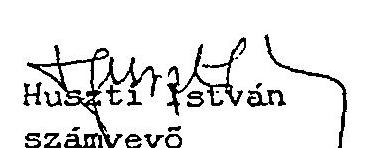
dr. Hegedüs Györky számvevö tanácsos

# ZARADEK 

Megismerési záradék:

A jelentés tartalmát megismertem, egy példányát átvettem. Tudomásul vezem, hogy az Allami Számvevöszékröl szóló 1989. évi XXXVIII.törvény 25.8./1/ bekezdése alapján 8 napon belöl írásban észrevételt tehetek. Eszrevételeimet az ellenörzési végzök részére (Allami Számvevöszék Somogy Megyei. Kirendeltsége Kaposvár. Fó u-37-39) juttatom el 2 pei-dányban.

Nágocs. 1995, június 12:
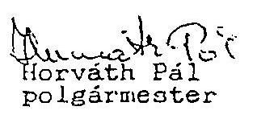
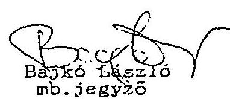

---

Felelösségi záradék:

A vizsgált idôszakban a következõ jegyzök voltak hivatalban:
1., Benedek Katalin - 1991 január 13-ig
2., Kovács Jószef (megbizott) 1991.márolus 1.töl. 1991. május 31 -ig.
3.. Horváth Tünde 1991. augusztus 1-töl. 1993.március 31-ig.
4., Stiedl Jenőné (megbizott) 1993.április 1-töl. 1994. február 28-ig.
5.. Gulyás István 1994. március 1-töl - 1995. február 28-ig.

A jelentés felveti Németh Béláné pénzügyi elöadó felelösségét. Németh Béláné munkaviszonya 1994. augusztus 1-jével megezuint.

A jelentés személyes felelösségemmel kapcsolatos megállapításait megismertem. Tudomásul veszem, hogy azokra az Allami Számvevõszékröl szóló 1989, évi XXXVIII.törvény 23.3-a alapján köteles vagyok 8 napon belül írásbeli magyarázatot adni.

A magyarázatot az ellenörzést végzök részére (Allami Számvevõszék Semogy Megyei Kirendeltzége Kaposvár, Fö u.37-39.) juttatom el a példányban.

Nágocs, 1995. június. $u$.

Hofvath Pal
polgármester

---

# KIMUTATAS 

a Nágocs Községi Onkormányzattal szemben támasztott követelésekröl, az önkormányzati tartozásokról, adósságról.

1.) Balatonföldvár és Vidéke Takarékszövetkezet:
1992. március 6-án a Nágocsi Polgármesteri Hivatal kölcsönigénylést nyújtott be a Takarékszövetkezethez. A hivatal részéről aláíró Horváth Pál polgármester és Németh Béláné gazdasági előadó: A. kért kölcsön összege 12.000 .000 ( 12 millió) forint. célja munkahelyteremtõ beruházás.

A kölcsönszerzödést megkötik március 31-én (a kért összeget a Hivatal április 6-án megkapta.) A kölcsön visszafizetésének határideje: 1992. szeptember 20. A kölcsönt $38 \%$ kamattal, $5 \%$ kezelési költséggel adták. A kölcsönszerzödés nem jelöl meg fedezetet, garanciát nem tartalmaz:

A szerzödés nem realizálódott. a Hivatal adósságából semmit nem törlesztett. 1994. április 27-én a Siófoki Városi Bíróság 22.492.532.- Ft összegũ fizetési meghagyást küldött, eredménytelenül. 1994. szeptember 21-én a Takarékszövetkezet elnöke feljelentést tett a polgármesté ellen a Siófoki Rendőrkapitányságon.
Az Onkormányzat 1994. évi gazdálkodásáról készült értéke. lésében a Takarékszövetkezettel szembeni tartozást 31.870 .000 .Ft-ban_ieléli_meg.

---

2.) OTP Bank Rt. Tabi fiók.

Az Onkormányzat számlavezetö bankjától többször vett fel éven belüli, rövidlejáratu hitelt, amelyeket visszafizettek. Elöször jelentkezett probléma az 1991. december 18-án felvett 6.000 e Ft rövidlejáratu célhítel visszafizetésében. A hitelt kamataival (1.878 e Ft) együtt csak 1992. december 17-én fizették vissza.

A munkahelyteremtö beruházáshoz igénybe vett 25 millió forintot az 1992.október 29-én megkötött hitelszerzödés alapján két részletben folyósitották. A hosszúlejáratu hitelszerzödést 1995. március 7-én az OTP felmondta. Ekkor az Onkormányzat tartozása 17.856 e Ft tőkét tesz ki. A többszöri sikertelen egyezkedés, eredménytelen újabb hitelkérelem (amelyet 1994. nyarán bonyolitották), az eltitkolt takarékszövetkezeti hitel tudomásra jutása volt többek között, amely az OTP bizalmát megingatta és a szerzödést felmondta. Az 1992. október 29-i zálogszerzödés alapján az OTP jelzálogot jegyeztetett be az Onkormányzat cipőüzemi ingatlanára.
3.) Somogy Megyei Munkaügyi Központ (SMK).

Az Onkormányzat 1991-ben indított munkahelyteremtö beruházása meghiúsult. Az SMK 8 millió forint kedvezményes támogatást biztosított a beruházáshoz.
A jelenleg ismert állás szerint az SMK hozzájárult ahhoz. hogy az Onkormányzat 4 évi részletben törlessze adósságát. Az első évi részlet 2 millió forintjának esedékessége 1996. március 31. A további háromszori 2 millió forint.év határideje az adott évben március 31-án jâr le.

---

4.) Allami Fejlesztési Intézet RT (AFI)

Az. Onkormányzatnál nem található megbizható információ arról, hogyan keletkezett az AFI-val szembeni adósság. Az AFI 1994. december 16-i Onkormányzathoz intézett levele arról tájékoztat. hogy a szilárd hulladék'lerakóhely megvalósitására 5.611 e Ft támogatást adtak. Helyezini ellenörzés alkalmával meggyözödtek arról, hogy a lerakóhely elkészült a hozzá bekötő úttal együtt, melyhez 3.300 e Ft-ot felhasználtak. Úgy döntött az AFI. hogy a továbbiakban nincs lehetöség a még hátralévő 2.311 e Ft-os támogatás igénybevételére.

A cipőkészitő'üzem megvalósitásához igénybe vett 6.592 e. Ft támogatást büntetö kamatokkal együtt visszavonják. A felszámitott büntető kamat összege 5.528.470.- Ft. Kérik, hogy a támogatás kamattal növelt összegét - mely összesen 12.119.470.- Ft - az Onkormányzat szíveskedjen a levél kézhezvételétöl számított 30 napon belül visszafizetni.
5.) Strabag Hungária Epitő Rt. (Strabag).

A Strabag és jogelödje hosszú évek óta jelen van a településen, többször volt kivitelezoje építési munkáknak. A Strabag az Onkormányzattal perben áll. A legutóbbi ismert felszólítása szerint az Onkormányzat tartozása 1995. április 15-én 3.690.636. - Ft
6.) Gála Nöiruha Szövetkezet KFt (Gála).

A Gála és az Onkormányzat 1992. május 21 -én megállapodást kötött, hogy az Onkormányzat cipőüzemet és varrodát létesít és az elkészülő varroda használatát a Gála

---

részére biztositja. Ehhez a Gála pályázaton 3.600 e Ft-ot nyert, amelyböl 3.100 e Ft-ot átutalt az Onkormányzatnak. A beruházás nem valósult meg. A Gála az Onkormányzattal perben all.A peresített kö:etelés összege: 5.202.296 Ft.
7.) Új Elet Mezőgazdasági Szövetkezet Nágocs. (Szövetkezet)

A Szövetkezet perben áll az Onkormányzattal. Az egyik perben a cipőüzem vételárának megfizetése tárgyában első fokon a bíróság 1.166.421,- Ft megfizetésére kötelezte az Onkormányzatot. Egy Legfelsőbb Bíróságot is megírt peres ügyben még 1993-ban 1.693.298,- Ft megfizetésére kötelez. ték az Onkormányzatot. Az Onkormányzat egyik tartozását sem rendezte a Szövetkezettel.A két követelés összege kamatokkal együtt 5.100.104 Ft.
8.) Ergonom Munkavédelmi Kft.

A Kft fizetési meghagyást bocsátott ki 1994. december 15-i keltezéssel. A bíróság 759.250,-Ft megfizetésére kötelezi az Onkormányzatot.
9.) Patalom Községi Onkormányzat (Patalom)

Egy 1994. március 31. levél szerint a nágocsi polgármester és a jegyzö lérik Patalomot, hogy az Onkormányzat részére nyújtson 1.500 e Ft hitelt, amit egyúttal utaljanak át a BIT KFt Kaposvár számlájára.
A kölcsönszersödésben az Onkormányzat felájánlja a nágocsi 107.sz tulajdoni lapon nyilvántartott $7 / 1$ helyrajzi számú ingatlanát a kölcsön fedezetéül. Ennek eredményeként Patalom 3.185.600,- Ft erejéig jelzálogot jegyeztet be 1994. április 18-án a Fenyves presszó tulajdoni lapjára.

---

10.) Az Onkormányzattal szembeni egyéb, Jelentős összeget tartalmazó követelések listája:
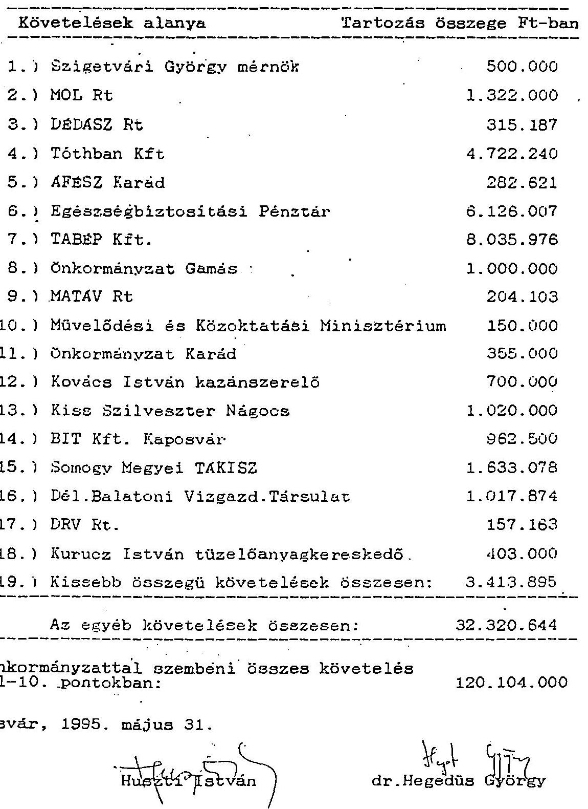

---

# J E G Y Z E K 

a Nágocs Községi Onkormányzat ellenőrzésének bizonyíték erejú dokumentumairól.
1.) Az 1992. évi költségvetést módosító 31/1992. (IX.24.) számú határozat /OTP-töl/.
2.) Az 1992.IX.24-i testületi j̇egyzökönyv utolsó, 30/1992.(IX.24.) számú határozata /Onkormányzattól/.
3.) Az 1994. évi költzégvetést módosító 18/1994.(VI.27.) számú rendelet /OTP-töl./.
4.) A 17/1992. (VI.4.) számú képviselö-testületi határozat kivonata /OTP-töl./.
5.) A 17/1992. (VI.4.) számú képviselö-testületi határozat jegyzökönyvböl /Onkormányzattól./.
6.) A 36/b/1993. (VI.30.) számú képviselö-testületi határozat kivonata /OTP-töl./.
7.) Az 1993.VI.30-i testületi ülés jegyzökönyvének befejezö része. /Onkormányzattól./.

Kaposvár, 1995. május 31.
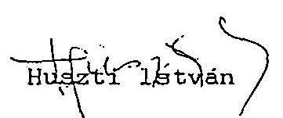
dr. Hegedüs György

---

# Nágocs Közeég Képviselőtestületének 344892/1X.2.4.4. 82. hatá- 

rozata.

A képviselőtestület módosítja 1992. évi jóváhagyott 2/1992./IV.2./ sz. rendeletét az alábbiak szerint:
1.§. Nágocs Község Képviselőtestülete az 1992. évi költségvetést 102.608 .000 ft bevétellel és kiadással állapítja meg.
2.§. Az 1.§. szerinti bevételi főösszeg bevételi forrásait e rendelet l.az. melléklete tartalmazza.
3.§. Az 1.§. szerinti kiadási főösszeg kiadási forrásait, valamint a szakfeladat tonkénti kiadások részletezését e rendelet 2.8z., 3.8z. m. lléklete tartalmazza.

A rendelet módosítást az tette szükségessé, hogy a polgármesteri hivatal a munkanélkülli személyek számára munkahelyteremtő beruházás érdekében MODA VENEZIA néven kft-t alapított, s az ehhez szükséges épületet, gépeket hitelfelvétellel kivánja megszerezni.
4.§. E rendelet kihirdetése napján lép hatályba.

Nágocs, 1992. október
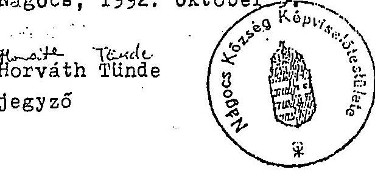
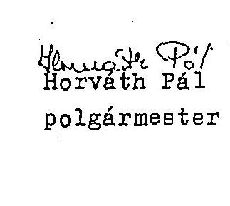

---

Ez a terulet nem egységes, tulajdonképpen kiparcellázott, selyeknek jelenleg is tulajdonosaik vannak. Ezért indokolt a belteruletbe vonás.

A képviselötestuilet egyhangulag a következõ határozatot hozta:
29/1992./IX.24./ sz. határozat:
Nágocs Község Képviselôtestülete a Nágocs 0166 hrsz. alatti külterületi ingatlan belterületbe vonásával elózeteşen egyetért. A fenti belteruiletbe csatolás. a 4/1991./XII.23./ számmal elfogadott és azóta érvénybe levő Összevont Rendezési Tervvel megegyezik:

Felelős: Horváth Tünde jegyzö.
Határidő: 1992. december 31.
10./ "Nágocsért Alapítvány" javára pénzösszeg megállapítása.

Előadó: Hprváth Pál polgármester
Mint ismeretes 1992. év elejént a "Nágocsért Alapítvány" létrejött, s a javára történő befizetések következtében egész évben fedezetet nyujtott a községben megvalósuló szinvonalas programokhoz.
Az önkormányzat számos munkatársa idöt, s energiát nem kimélve ezekben az eseményekben részt vett. Ám maga az önkormányzat anyagilag ehhez az alapítványhoz még nem járult hozzá.
Javaslat 200.000 ft összegre hangzott el.
Fonyódi Tibor képviselö: Az önkormányzat részéről ezt a cselekedetet nagyon szép gesztusként értékelte. Az összeggel egyetértett, annál is inkább, mert ez az összeg a további eseményelhez fedezetet nyujt.
Miután a képviselők mindegyike támogatta a javaslatot egyhangulag a következó határozatot hozták:
30./1992./IX.24./ sz. határozat:

Nágocs Község Képviselőtestülete a "Nágocsért Alapítvány" javára 200.000 ft-ot megállapít.

Felelős: Horváth Pál polgármester
Határidő: 1992. október 15.

---

Horváth Pál polgármester megköszönte a képviselók munkáját, s az ulést lezárta.
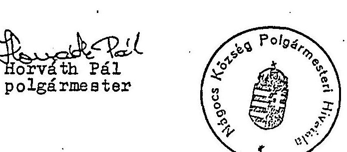

Kovétu Tünde Horváth Pál
polgármester
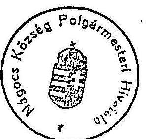
jegyzó

---

# NÁGOCS KÖZSÉG KÉPVISELŐTESTÜLETÉNEK 

18./1994./VI. 27./ sz. RENDELETE

Nágocs Község Önkormányzatának 1994. évi gazdálkodásáról

Nágocs Község Képviselötestülete az államháztartásról szóló 1992. évi XXXVIII. törvény 65. paragrafua, valamint a Magyar Köztársaság 1993. évi költségvetéséről szóló 1992. évi LXXX. számu törvény a helyi önkormányzatok és a központi költségvetés kapcsolatrendszerét szabályozó harmadik fejezete alapján, az alábbi rendeletet alkotja az önkormányzat költségvetésének módosításáról.

1. .Nágocs.Község Képviselőtestülete az 1994. évi költségvetés-bevételi és kiadási föösszegét 44.702 .000 forintban állapítja meg.
2. . Az 1. -ban megállapított bévételi föösszeg címek szerinti bontását az 1. sz. nelléklet tartalmazza.
. Az 1. -ban megállapított kiadási föösszeg címek szerinti megoszlását a 2. sz. elléklet tartalmazza.
. E rendelet kihirdetése napján lép hatályba.
ocs, 1994. június 27.
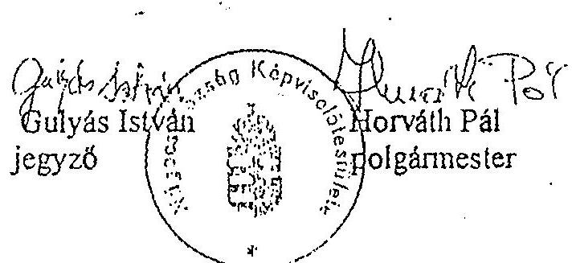

---

# Jegyzőkönyy kivonat 

Készült: Nágocs Község Képviselốtestületének 1992. junius 24 uén megtartott ülésének jegyzőkönyvéből.

## 17/1992./VI.4/ sz. batározat:

Nágocs Község Képviselốtestülete 1992- évben indítot munkaheL̇y teremtö beruházás befejezéséhez 25000 m/f hitelt felvételét htároza el 5 évi idôtartalomra, ameL̇yet 1997-ig fizet vissza. A hitel fedezetéül Nágocs, Kossuth L.u.28/a sz. alatti forgalomképes lizemépületét jelöli meg.

A hitel felvételére a Képviselötestület Horváth Pál Polgármestett és Németh Bélánét pénzügyest bíza meg.
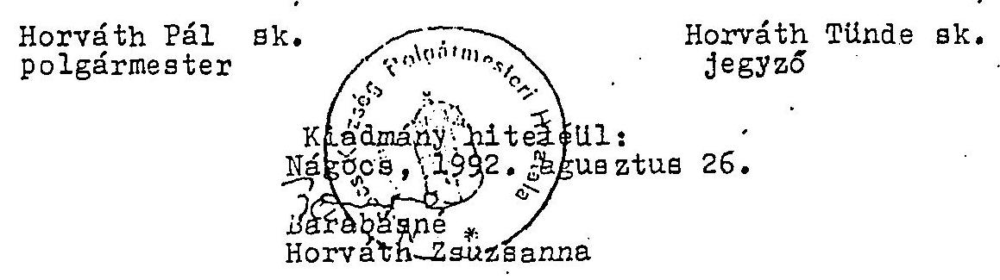

---

19.973 ezer ft, a figyelembe vehető kiadások:
23.375 ezer ft, igy a múködési hiány:
3.402 ezer ft.

A képviselők 8 igen szavazattal a következó határozatot hozták:

# 247/4992./VI.4./ sz. határozati 

Nágocs Község Képviselótéstülete az önhibájukon kivül hátrányos helyzetbe került települési önkormányzatok kiegészitő állami támogatásáról szóló 1992:XXIX. tv. alapján múködési többletköltségeinek biztosítására kiegészítő állami támogatási kérelmet nyujt be, s elismeri, hogy 1992. évben inditani szándékozott beruházásához központi céltámogatást nem kapott, s hat hónapra, vagy ennél hoszabb idôre lekötött, tartós bankbetéttel nem rendelkezik.

## 2./ Horváth Pál polgármester megbizása anyakönyvvezetői feladatok ellátására.

Előadó: Horváth Tünde jegyzó
Az anyakönyvvezetői feladatok jogszerü ellátásának Horváth Pál polgármester esetében feltétele a képviselőtestület megbizása.
Horváth Tünde jegyzô kérte a képviselôket, hogý határozatban bizzák meg a polgármester urat.
Horváth Pál 1984. október 31-e napján 11554 számon kiállitott bizonyítvány alapján a teljes anyakönyvi szakvizsgát eredményesen letette.
A képviselők 7 igen szavazattal a következõ határozatot hozták:

## 18/1992./VI.4./ sz. határozat:

Nágocs Község Képviselôtestülete Horváth Pál /szül.: Somogyacsa 1939.március 31., an.: Brunner Julianna, lakcíme: Nágocs, Táncsics M.u.31./ polgármestertaz anyakönyvvezetői feladatok ellátására 1992. junius 4-1 hatállyal megbizzal.

---

# Jegyzökönyvkivonat 

Készült: A Négocsi Köpviselótestulet 1993. junius 30-án megtartott ulésén.

## 36/b./1993./VI.30./ sz. határozat:

A képviselótestuilet kötelezi Horváth Pál polgármestert, hogy a 25 millió forint fejlesztési célhitol:visazafizetésének átutemezését kérje a hitelt nyujto banktól az alábbiak szerint:
1./ A hitel futamideje változatlansága mellett az 1993. évi törlesztési kötelezettség a hátralévô idôszakra terhelődjön.
2./ A hiteltőke esedékes részletei negyedévente történő fizetését kezdeményezze, azaz elsõ 1994. március 25-i naptól kezdôdően a negyedévenkénti törlesztőrészt 1.786.000 ft-ban elöirni-szivèskedjen.
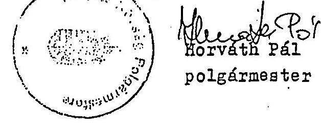

A kiadmány hiteléul:
1993. szeptember 1
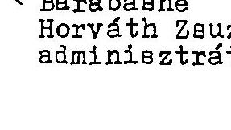

---

Ift Miklós: A megállapodás megkötésekor vissza kell térni az esetleges 47 ft alatti vizdij tervezésének lehetôségére. A pályázatban részleteiben nem szerep15, vagy vitatott esetek a szerzôdésben szerepeljenek.

Nágocs Község Képviselôtestülete egyhangú . Jzavazással a következô határozatot hozta:

# 36/1993./VI.30./ az. határozat: 

Nágocs Község Képviselốtestülete a Dunántuli Regionclis Vizmüvek koncessziós pályázatát elfogadja és a koncesoziós szerzôdés megkötéséig további egyeztetô tárgyaláson pontosítja a lakossági vizdij mértékét, valamint a koncessziós pályázat egyes pontjait.

A szerzôdéskötésért felelôs: Horváth Pál polgármester Határidô: 1993. augusztus 30.

Több tárgy nem lévén a polgármester az tilést bezárta.
kmft.

Nágocs, 1993. junius 30.
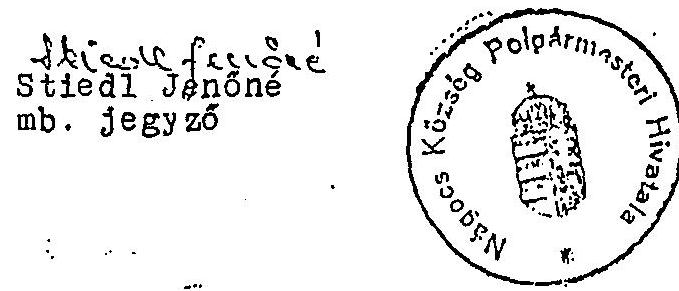

Horváth Pál
polgármester