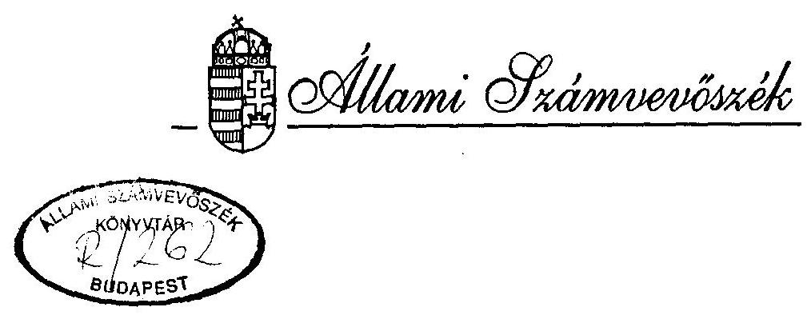
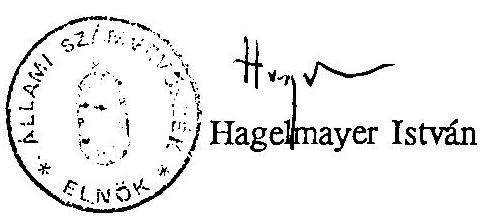
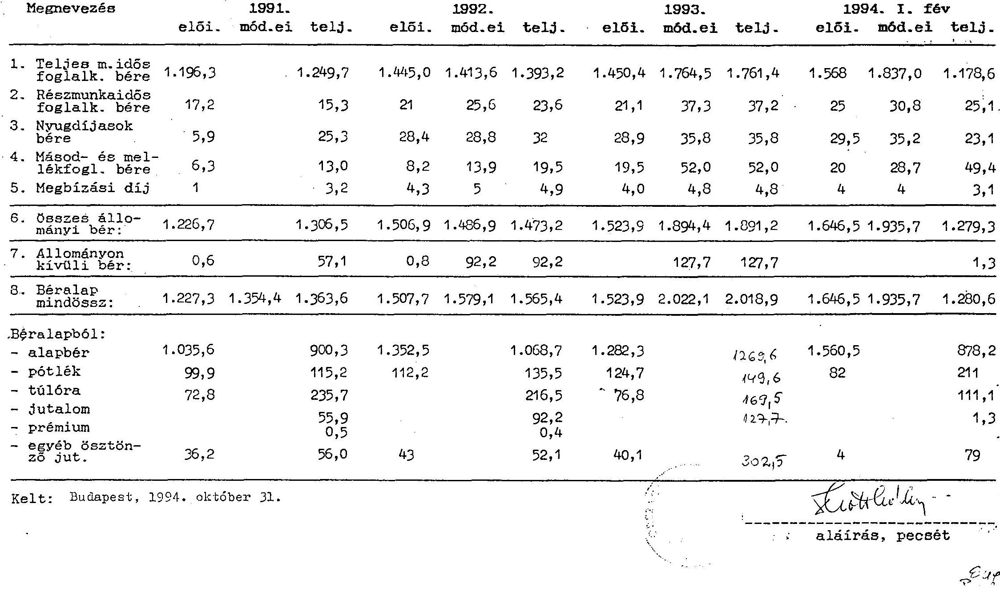
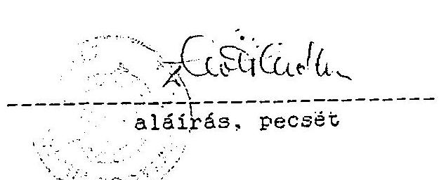
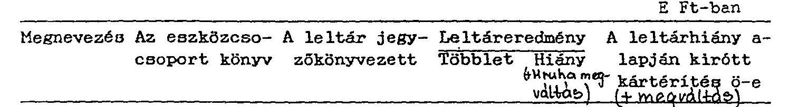
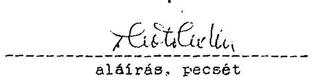
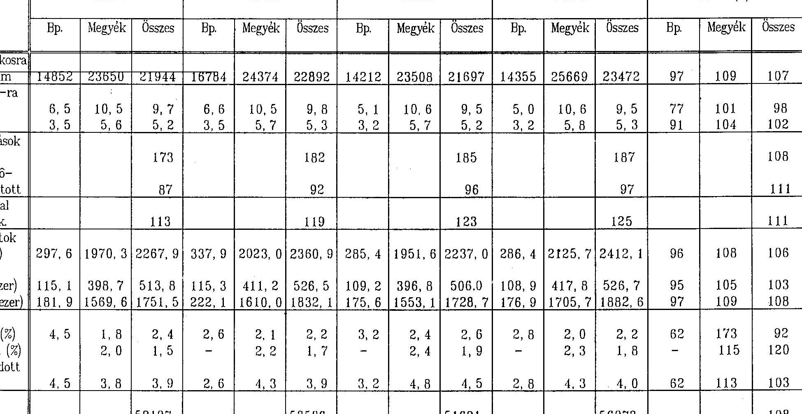

# JELENTÉS 

az Országos Mentőszolgálat költségvetési cím pénzügyi-gazdasági ellenőrzéséről

---

Az ellenőrzést vezette:

Nagy Akosné
Az ellenőrzést végezték:

Balázs Andrásné
Eötvös Magdolna
Papp Sándor
Pásztor Katalin
dr. Solymár Károlyné
számvevő főtanácsos
számvevő
számvevő
számvevő
külső szakértő

---

# JELENTÉS 

## az Országos Mentőszolgálat költségvetési cím pénzügyi-gazdasági ellenőrzéséről

Az állami feladatként elismert mentés és betegszállítás ellátására 1948-ban a Budapesti Önkéntes Mentőegyesület, valamint a Vármegyék és Városok Országos Mentőegyesület összevonásával, államosításával létrehozták az Országos Mentőszolgálatot (OMSZ).
Az országosan egységes mentés szervezés hatására kialakult az egységes baleseti hívószám (04) rendszere; azonos szakmai ellátási elvek érvényesülnek; a mentőjárművek egységes mentéstechnikai felszereléssel ellátottak; országosan egységes az elvi és gyakorlati operatív irányítás; az országot teljesen lefedi a nagy hatósugarú, saját frekvencián üzemelő, URH rádiórendszer; önálló orvosi szakágként elismert és egyetemi oktatásra került az oxyológia (sürgősségi orvostan); a mentőtiszt képzés főiskolai szintű, szakmunkásképzettségnek minősül a mentőápolás.

A költségvetési törvények az OMSZ-t a központi költségvetés szerkezetében 6. cím alatt a XI. Népjóléti Minisztérium (NM) fejezet alá sorolták.

A Társadalombiztosítási Alap és a központi költségvetés közötti forráscsere következtében 1990-től a cím működési kiadásait a Társadalombiztosítási Alap - 1992-től az Egészségbiztosítási Alap - finanszírozza, míg a felújítási és beruházási forrásokat továbbra is a központi költségvetés biztosítja.

Az OMSZ költségvetése az 1991. évi 2.686 M Ft-ról 1994-re 3.480 M Ft-ra emelkedett. Kiadásai 1991-ben 3.043 M Ft-ra, 1992-ben 3.445 M Ft-ra, 1993-ban 4.287 M Ft-ra, 1994. I. félévében időarányost meghaladó mértékben (59%) teljesültek, melyek fedezetéhez a központi költségvetés 1991-ben 33 M Ft, 1992-ben 45 M Ft, 1993-ban 362 M Ft, 1994. I. félévben 15 M Ft támogatást adott. A társadalombiztosítástól átvett pénzeszközök ugyanezen időszakban

---

2.723 M Ft, 3.224 M Ft, 3.714 M Ft, 2.683 M Ft összegben realizálódtak. Az OMSZ-nál foglalkoztatottak létszáma az 1991. évi 6.158 főről 1994-ben 6.876 főre emelkedett.

Az ellenőrzés célja volt, hogy értékelje a mentés és betegszállítás állami feladatának tárgyi és személyi feltételekkel való összehangoltságát, a tevékenység szervezésének célszerűségét, az OMSZ gazdálkodásában a törvényességi, célszerűségi és eredményességi követelmények érvényesülését, a finanszírozás rendjét, koordináltságát.

Az ellenőrzés az 1991-1994. I. félév időszakra kiterjedően az OMSZ költségvetési gazdálkodására irányult. Az ott végzett helyszíni ellenőrzés tapasztalatai kiegészültek 22 mentő- és betegszállító szervezet tanúsítványokkal dokumentált adatainak elemzésével.

# I. 

Következtetések, javaslatok

A társadalmi, gazdasági változásokhoz, a reformok igényéhez nem igazodott megfelelően a mentésügy jogi szabályozása, így az elavult, hiányos és ellentmondásos.
A mentés specifikus követelményrendszere jogi, szakmai szabályozásának hiánya, a szolgáltatásban résztvevő szervezetek területi ellátási kötelezettségének tisztázatlanságai hosszabb távon gyengítik a feladatellátás biztonságát, a teljesítmény követelmények érvényesülését.

A betegbeutalás szakmai rendjének keretei között nem érvényesült maradéktalanul a gazdálkodás követelménye, mivel az indokolatlan, ésszerűtlen betegszállításokat a finanszírozók érdemben nem vizsgálták, nem szankcionálták.

Nem történt érdemi intézkedés a mentésügy szakmai koncepciójának, intézményi struktúrájának, gazdálkodási rendjének, a területi egészségügyi, önkormányzati, társadalmi kapcsolatrendszerének a megváltozott viszonyokhoz igazodó olyan kidolgozására, amely széleskörű szakmai és társadalmi véleményütköztetésre és elfogadottságra alapozódik.

---

Az egy szakfeladatként kezelt mentőszolgálat és ennek intézményfinanszírozása korlátozta a mentés, betegszállítás tevékenységek külön-külön támogatásának megalapozását.
1992. óta húzódik a betegszállítás teljesítményfinanszírozásához szükséges kormány- és miniszteri rendelet-tervezetek kidolgozása, az egészségügyi törvény szükséges módosítása.

Az egységes mentőszervezetre kidolgozott reformterv nem vált az egészségügyi reform részévé, az OMSZ kiforratlan belső ügye maradt. Részleges és következetlen végrehajtása és hibái miatt az intézmény feladat- és szervezetrendszere esetenként összehangolatlan.

Az OMSZ tevékenységének, működési és gazdálkodási rendjének szabályozottsága nem volt kielégítő. Elfogadott elvek és világos koncepció hiányában nem történt meg az alapító okirat jóváhagyása, ebből következőleg elhúzódott az intézményi működési szabályzatok átdolgozása, hatálybaléptetése.

Az intézményi gazdálkodás szervezési módja, irányítási rendje még túlzottan centralizált volt. A költségvetési gazdálkodás, a pénzügyi, számviteli folyamatok irányításának hiányos személyi feltétele miatt e tevékenységek szervezése, vezetői ellenőrzése háttérbe szorult.

Az OMSZ információs rendszere még nem fogta át az orvosszakmai feladatok adatigényét. Nem volt egységes a vizsgált években a feladatellátás jellemzésére kidolgozott mutatószám rendszer. Ez is hozzájárult ahhoz, hogy a lehetségesnél szűkebb volt az információk elemzése nyomán tett pénzügyi-gazdasági intézkedés.

A tulajdonosi és finanszírozói funkciók elkülönülése - a szükséges szabályozás hiányában - a felügyeleti jogosítványok formális érvényesítéséhez (pénzmaradvány elszámolás, terv jóváhagyás, stb.) és összehangolatlansághoz (ellenőrzés) vezetett.

Az OMSZ-szel szembeni növekvő igények kielégítését, a mentés biztonságát és a feladatellátás színvonalának megőrzését már egyaránt veszélyeztetik a mentőszolgálat költségvetési tervezésében és finanszírozásában tapasztalt ellentmondások, anomáliák.

A központi költségvetés és a társadalombiztosítási alapok időben, tartalomban és módszerben összehangolatlan tervezése, jóváhagyása miatt az intézményi költség-

---

vetési tervezés formálissá vált, egyre kevésbé alapozta meg a gazdálkodást. A feladat és források közötti összhang tartósan hiányzott. A bevételi előirányzatok alátervezettsége folytán, az intézményi költségvetés belső arányaiban is torz volt, jóváhagyása elhúzódott.

A jogi szabályozás ugyanakkor a központi költségvetés és társadalombiztosítási alapok közötti szinkronhiányt a gazdálkodás fokozatos liberalizálásával próbálta megszüntetni. A kiemelt előirányzatok felhasználási kötöttségének fokozatos oldása az előirányzat-módosítások mozgásterét növelte, ezért vizsgálatunk szabálytalanságot csak egyes években, eseti jelleggel tárt fel.

Az OMSZ költségvetési gazdálkodását nem szolgálta megfelelően a finanszírozás. A pénzellátás nem volt tervszerűen megalapozott, dokumentálisan alátámasztott és szükségletekhez igazított. A finanszírozási szerződést késedelmesen, hiányosan és a pénzügyi előirányzat rögzítésének hiányában kötötték.
Az alultervezés, a szintrehozások elmaradása, áremelkedések ellentételezésének késedelmes folyósítása következtében az OMSZ 1992. évtől kezdődően rendszeresen súlyos likviditási gondokkal küzdött.

Az OMSZ a banki kapcsolatokra vonatkozó előírásokat többször megszegte, mivel 1992-ben nem megengedett célra bankhitelt vett fel, illetve nem tartotta be a költségvetési szervek bankszámlavezetését korlátozó rendelkezést. Átmenetileg szabad pénzeszközeinek hasznosítására választott befektetési formái sem feleltek meg a jogszabályi lehetőségeknek.

A tényleges intézményi pénzmaradvány az egyes években - az érdemi felülvizsgálat hiányában feltáratlan - szabálytalan elszámolások miatt eltért a kimutatott és jóváhagyott pénzmaradvány összegétől, felhasználása azonban az előírások megtartásával történt.

A takarékossági intézkedések ellenére az erőforrásokkal való gazdálkodás célszerűsége és eredményessége csak részben volt megfelelő.

Az OMSZ létszám- és bérgazdálkodása koncepcionálisan nem volt megalapozott, a foglalkoztatási irányelveket nem határozták meg. Az intézményi létszámellátottság javulása látszólagos és ellentmondásos. A meglévő állomány terhelése lényegében nem csökkent, növekvő a mellékállásban foglalkoztatott saját dolgozók száma, s változatlanul jelentős a túlóra. A betöltetlen álláshelyek mértéke, a

---

fluktuáció továbbra is magas. Ez is oka volt annak, hogy a túlóra elrendelhető mértékére vonatkozó előírásokat nem tartották be maradéktalanul.
Az OMSZ bérgazdálkodása feszített volt, különösen az 1992-1993. években. A béralapelőirányzatok a központi bérfejlesztések ellenére sem biztosították a közalkalmazotti törvény végrehajtásával felmerülő többletkiadások fedezetét. A Kjt-ben meghatározott kötelező besorolásokat teljeskörűen a törvényben előírt határidőnél később, az 1994. májusában kapott póttámogatás terhére, visszamenőlegesen hajtották végre. A bérfeszültségeket esetenként az intézményi gazdálkodás hiányosságai is fokozták.

Az OMSZ tárgyi eszköz ellátottsága mennyiségben, használhatóságban - részben ellentmondásosan - javult. A beruházási források felhasználása esetenként nem az adott célnak megfelelő volt. A beruházási döntések esetenként nem voltak kellően megalapozottak, nem érvényesítették megfelelően a célszerűség és indokoltság szempontjait. A kormányzati beruházási forrásból finanszírozott gépjármű típusváltás TOYOTA programja pénzügyi, gazdasági és használhatósági szempontból hibás döntés volt. A barter ügylet meghiúsulása miatt 1991-1992. között a gépkocsi beszerzéseket tervszerűtlenség, kapkodás és gazdaságtalan lépések sorozata jellemezte. A tervezett szállítási ütemtől elmaradó beszerzések miatt jelentős volt az indokolatlanul lekötött beruházási keret és ez terven felüli - saját forrásból fedezett - gépkocsi vásárláshoz vezetett.
A TOYOTA program végrehajtása műszaki és üzemeltetési szempontból viszont jó döntésnek bizonyult. Nőtt a gépjárműpark biztonsága, s ennek hatására jelentősen csökkent a tartalék gépkocsiállomány, illetve a karbantartási, javítási munkaigény. Ez a vizsgált időszakban a létszámcsökkentés mellett szervezeti változásokat, vállalkozást is lehetővé tett.

A helikopterpark bővítése nagy összegű beruházási forrást kötött le, a kapcsolódó fejlesztések hiányában azonban a kapacitás igénybevétel változatlanul alacsony szintű.

A felújítási döntések gyakran nem voltak ésszerűek, mivel az ingatlan felújítások nem igazodtak megfelelően a mentőállomások funkcióbetöltő képességéhez, illetve a gépkocsi selejtezések ütemezéséhez.

A működési kiadások körében a takarékossági törekvés érzékelhető volt, ugyanakkor egyes - pl. a készletgazdálkodás körében végrehajtott - kényszerű intézkedések nem voltak célszerűek.

---

Az OMSZ számviteli rendje, könyvvezetése csak részben felelt meg a számviteli törvény előírásainak. A szabályozás hiányosságai is hozzájárultak ahhoz, hogy különösen a beruházások, felújítások elszámolásánál időnként és esetenként nem az előírások szerint jártak el, illetve több esetben nem tettek eleget a számviteli törvény valódiság követelményének. A vagyonbiztonság kielégítő annak ellenére, hogy a vagyonvédelmi követelményeket nem érvényesítették maradéktalanul.
Az ellenőrzés nem volt az irányítás hatékony eszköze, a felügyeleti jellegű költségvetési ellenőrzések tapasztalatai hasznosításának elmaradása, késedelme, illetve az intézményi belső ellenőrzés nem megfelelő funkcionálása miatt.

Az ellenőrzés megállapításai alapján javasoljuk:
az Országgyűlés részére:
törvényalkotó munkája során

- a központi költségvetést és a társadalombiztosítási alapok költségvetését minden évben azonos időben hagyja jóvá;
- gondoskodjon az egészségügyi törvény módosításával a mentés specifikus törvényi szabályozásáról;
a Kormány részére:
- gondoskodjon arról, hogy a központi költségvetést és a társadalombiztosítási alapok költségvetését tartalmilag és időben összehangoltan terjesszék be jóváhagyásra az Országgyűléshez;
- a mentőszolgálat szükséges megújítása - és ehhez a megfelelő feltételek - az egészségügy reformfolyamatának részeként nyerjen megoldást;
- intézkedjen arról, hogy az államháztartási reform keretében a tulajdonosi és finanszírozói funkciók különválasztását áttekintsék - és e két funkció különválása esetén - a jogalkotói munka során a felügyeleti jogkört és a költségvetési beszámoltatást megfelelően szabályozzák;
a Népjóléti Minisztérium részére:
- adja ki az alapító okiratot az OMSZ részére;
a Pénzügyminisztérium részére:
- segítse a mentőszolgálat szakfeladat mentés és betegszállítás feladatokra bontásával a két tevékenység külön-külön finanszírozásának megalapozását;

---

az OMSZ részére:

- tegyen intézkedéseket feladatellátásának szervezettsége, szervezete korszerűsítése, működési rendje és szabályozottsága, az erőforrásokkal való célszerű gazdálkodás, továbbá a belső ellenőrzés hatékonyságának javítása érdekében;
- vizsgálja meg hatáskörében - a feltárt tényállás alapján - a mérlegvalódiság követelményének megsértésével kapcsolatos személyi felelősséget.

# II.   RÉSZLETES MEGÁLLAPÍTÁSOK 

A) A mentésügy feladat-, szervezet- és finanszírozási rendszerének szabályozottsága

A társadalmi, gazdasági változások új követelményeket támasztottak az egészségüggyel szemben, kiváltva és elindítva annak reformját. Az egészségügy reformfolyamatának hiányosságai, ellentmondásai a sajátosságokkal motiváltan tükröződtek a mentőszolgálat irányításában, a feladatellátás szervezésében, a finanszírozásban, továbbá a gazdálkodásában.

A közgazdasági környezet változásával, a reformok igényével nem tartott lépést a mentőszolgálat jogi háttere. A mentésügy törvényi szabályozása elavult, hiányos, több vonatkozásban nem komform a kapcsolódó jogszabályokkal.

1. A mentésügy szervezeti keretei az egészségügyi és szociális célú szempontok érvényre jutásával némileg átrendeződtek.
Ellátási kötelezettséget jogszabály - 1972. évi II. tv. - csak az OMSZ-ra ír elő. A 113/1989. (XI.15.) MT rendelet hatálybalépését követően, spontán módon, gyarapodó számban, növekvő - de nem számottevő - mértékben és arányban kapcsolódtak be különböző szervezetek a mentés és döntően betegszállítási feladatok ellátásába (függelék).

A különböző európai országokban a mentés és betegszállítás - a magyar gyakorlattól eltérően - többnyire az önkormányzatok, biztosítók által azonos tarifával finanszírozott egyesületek és vállalkozások keretei között, gyakran önkéntesek részvételével történik.
Az utóbbi másfél évtizedben nemzetközi viszonylatban
 felerősödtek a mentés egységesítését, a centralizált szervezetek létrehozását, a helyszíni ellátás fejlesztését célzó irányzatok, melyek megfelelnek a korszerű európai mentésszervezés 1990-ben elfogadott alapelveinek.

---

A mentés specifikus követelményrendszerét nem rögzíti törvényi, illetve rendeleti szintű szabályozás.

Hiányzik a mentési feladatok minőségbiztosítási - a személyi, a tárgyi feltételekre vonatkozó - követelményrendszerének, az együttműködési kötelezettségnek előírása a tömeges baleset, katasztrófa esetén vagy a napi munkában.

A mentés és betegszállítás teljeskörű jogi, szakmai szabályozásának, a feltételek kialakításának és ellenőrzésének hiánya, a szolgáltatásban résztvevő szervezetek területi ellátási kötelezettségének tisztázatlanságai hosszabb távon gyengítik a feladatellátás biztonságát, rontják a teljesítménykövetelmények érvényesülését.

E viszonyok között az OMSZ és a mentő-, betegszállító szervezetek közötti kapcsolat eseti, - érdekellentétek miatt és megfelelő jogi keretek hiányában - ellentmondásos és részben a spontán módon létrejött szerződésekre alapozott.
2. A mentőszállítás térítésmentes igénybevételét az 1992. évi IX. tv. - 1992. VII. 1-jei hatállyal az állampolgári jogosultságról a járványügyi érdekből végzett tevékenység kivételével - a biztosítottak körére szűkítette. A nem biztosítottakra változatlanul kiterjed az 55/1992. (III.21.) Kormányrendelet szerinti ellátási kötelezettség, de biztosítási jogviszony hiányában nem térítésmentesen.
1992. óta évenként - a költségvetési törvényben - általánosan határozták meg azt az összeget, melyet a központi költségvetés fizet az Egészségbiztosítási Alapnak azon személyek után, akik egyéni és munkáltatói járulékfizetéssel vagy a járulékfizetők hozzátartozóiként nem szereztek jogosultságot betegbiztosítási ellátásokra.

Az ésszerű, takarékos költségvetési gazdálkodás követelménye a betegbeutalás szakmai rendjének - alkalmazott gyakorlatának - keretei között nem érvényesült maradéktalanul. A feladatszervezés a mentőszervezetektől részben független, ugyanakkor teljes hatása megjelenik azok kiadásaiban és költségeiben. Ez is közrejátszott abban, hogy a mentőállomások és mentőszervezetek számának növekedése mellett nem csökkent, sőt némileg emelkedett az egy mentőfeladatra jutó átlagos távolság (pl. az OMSZ-nál 1991-ben 23,0 km/feladat, 1993-ban $23,3 \mathrm{~km} /$ feladat).

Az 1975. évi II. tv. 16.A. § előírta: a biztosítottak betegszállítása orvosi rendelés alapján az egészségügyi szolgálat teljesítőképességének és a beutalás szakmai rendjének figyelembe-

---

vételével kell, hogy történjen, az ettől eltérő igénybevételt a társadalombiztosítás nem téríti meg.

A 107/1992. (VI.26.) Kormányrendelet meghatározta a biztosítottak részére részleges vagy teljes térítés mellett - orvosi rendelésre - a beutalási rendtől eltérő egészségügyi szolgáltatás igénybevételét, de az ehhez kapcsolódó betegszállításról nem szól.

A 27/1992. (IX.26.) NM rendelet a beutalás szakmai rendje a beteg lakó- vagy tartózkodási helye szerinti területi illetékességére épül. Ez azonban nem igazodott minden esetben a mentőállomások telepítettségéhez, illetve a célszerű szállítás szervezési szempontokhoz.

Az indokolatlan betegszállításokat sem a közreműködő egészségügyi szervezetek, sem az Országos Egészségbiztosítási Pénztár (OEP) érdemben nem vizsgálták, nem szankcionálták. Ezek megszüntetésével, jobb szállítás szervezéssel az egyszerű betegszállítás költségei mérsékelhetők.

Az OMSZ finanszírozási problémái miatt a megyékben a szervezett mentőgépkocsi szolgálati órákat 1992-ben 9,5%-kal, 1993-ban 15%-kal csökkentette. Az egészségügyi intézmények, háziorvosok közreműködő intézkedései révén a gyógyintézetbe szállítások száma 7,3%-kal, a járóbeteg szakrendelésről az elszállított betegek száma 5,5%-kal csökkent.
3. Az egészségügy irányításában az önkormányzatok önállósodásával bekövetkezett változás, továbbá a járó- és fekvőbeteg ellátás területi elvű szervezése és felelőssége spontán folyamatokat váltott ki a mentőszervezetek és az önkormányzatok kapcsolatrendszerében. Ezek részben a mentőszolgálat tárgyi feltételrendszerére, részben a munkamegosztásra irányultak, s hatásuk többnyire kedvező volt a feladatellátás színvonalára.
Az intézkedések kétoldalú együttműködésen, megállapodáson alapultak. Az OMSZ ugyanis irányítási, szakmai, gazdasági tekintetben elkülönül a területi önkormányzati struktúrától.

Tapasztalható volt e körben szakmai és gazdaságossági megfontolásból a háziorvosi ügyelet ellátásának az önkormányzatoktól a mentőszervezetekhez telepítése. Egyidejűleg árverseny is kezdett kibontakozni az OMSZ és egyes vállalkozók között a háziorvosi ügyeleti szolgálat megszerzéséért.

Az OMSZ 1992. óta Budapest tizenegy kerületében, Debrecenben, Gyöngyösön, Körmenden összevontan, Dunakeszin, Miskolcon és Albertírsán közös irányítással látja el a felnőtt éjszakai és ünnepnapi orvosi ügyeletet. A feladatellátást szerződések alapján - Debrecen kivételével - az önkormányzatoktól átvett pénzeszközökből finanszírozza.
Budapesten néhány kerületi önkormányzat az alacsonyabb áron vállalkozó egyéb mentő- és betegszállító szervezetekkel kötött szerződést.

---

Ez a feladatszervezési mód szakmailag és többnyire pénzügyileg is előnyös volt a tapasztalatok szerint.

Az ellátásra szoruló betegek hamarabb részesültek megfelelő szintű orvosi ellátásban. Jelentősen csökkentek a párhuzamos kivonulások. Az OMSZ tételes kalkuláció alapján a ténylegesen szükséges fedezetet kapja meg az önkormányzatoktól, míg az önkormányzatok OEP támogatása a fenti összeg mintegy 40%-a.

A célszerű feladatszervezési megoldáshoz elsősorban az OMSZ feltételei adottak, továbbá potenciális előnyt biztosít számára az egységes operatív irányítási rendszer (04 segélyhívószám, URH rádióirányítás, szakmai tapasztalat).

Az új mentőállomások létesítése indokolt volt, a feladatellátást nagyban segítette, ugyanakkor - az európai normaként elfogadott 15 perces helyszínre érkezési idő biztosításához szükséges - optimális területi sorrendhez nem minden esetben igazodott. A mentőállomás hálózat területi fejlesztése a vizsgált időszakban a költségvetés e célú támogatásának hiányában lényegében önkormányzati forrásoktól, illetve döntésektől vált függővé.

Az önkormányzatoknak köszönhetően a mentőállomások száma 18-cal, összesen 187-re nőtt. Ennek ellenére a területi ellátottságbeli különbségek jelentősek. Az európai norma biztosításához - a kapott tájékoztatás szerint - még további 40 mentőállomás létesítése szükséges. Az önkormányzatok az elhelyezési körülmények javítását ingatlancserékkel segítették, esetenként az átalakítási költségekhez is hozzájárultak. Ennek köszönhetően 9 - a rossz minőségű mentőállomások közel harmada - került alkalmas elhelyezésre. Az önkormányzatok ingyenes használattal 28 mentőállomásnak adtak helyet (9/b., c. sz. melléklet).

A területi ellátásbeli különbségeket a mentő- és betegszállító szervezetek számának gyarapodása sem csökkentette, mivel azok nagyobb hányada Budapesten és vonzáskörzetében jött létre.
4. Az egészségügyi és szociális vállalkozások jogi lehetőségének megteremtése után évről-évre nőtt a mentő- és betegszállító szervezetek igénye a mentés, betegszállítás versenysemleges támogatásának kialakítására. Ennek azonban korlátot szabott a mentőszolgálat finanszírozásának rendszere is.

A mentő- és betegszállító szervezetek az OEP betegszállításra és mentésre fordított keretéből alig 3-4%-os arányban részesültek.

Az 1990. évi forráscserét követően a mentőszolgálat működési kiadásait a Társadalombiztosítási Alap (1992-től az Egészségbiztosítási Alap), beruházási, felújítási szükségleteit a központi költségvetés finanszírozza. Az egy szakfeladatként kezelt mentés és betegszállítás, valamint ennek intézményfinanszírozása nem adott megfelelő tapasztalatot külön-külön az egyes tevékenységekhez kapcsolódó költségek reálisan általánosítható - az elvégzett feladatok finanszírozásánál számításba vehető - mértékének megállapításához.

Az OMSZ feladatainak mintegy 75%-a az egyszerű betegszállítás, ezen belül közel 40%-ot tesz ki a járóbeteg szakrendelésre beszállított, illetve onnan hazaszállított betegek aránya.

A vizsgálat befejezéséig a betegszállítás finanszírozása nem volt egységes: az Országos Társadalombiztosítási Főigazgatóság (OTF), majd 1992-től az OEP az OMSZ-t és az OMSZ-on keresztül a légi betegszállításban résztvevő Reparautó Kft-t intézményfinanszírozással, a betegszállító vállalkozókat - általában a kórházakon keresztül - teljesítmény alapján támogatta.

A Reparautó Kft. tevékenységét évi fix (teljesítménytől független és változatlan) összeggel az OMSZ-on keresztül támogatták, 1991. óta.

Az OEP 1994. végéig - egy-két kivétellel - kizárólag a művese kezelésre szoruló betegek szállítását finanszírozta a teljesített hasznos kilométer után mértékében egységes és változatlan (40 Ft/km) tarifával.

A mentés és betegszállítás támogatási rendszere korszerűsítésének előkészítő munkái időben elhúzódtak, gyakorlatilag 1991. óta folynak.

Az elmúlt három év alatt mintegy 8 variációban készültek el a tervezetek. A felmerült újabb és újabb javaslatok, szempontok azonban a végleges döntés kialakítását elodázták.

A jogszabályok előkészítésével párhuzamosan nem készültek megbízható, reális elemzések a teljesítményfinanszírozás pénzügyi hatásáról.

A különböző szervezetek költségszámításai, részanyagai nem álltak össze a mentést és betegszállítást egységesen bemutató, finanszírozható pénzügyi tervvé. Az OMSZ 1991-ben elkészült számítási anyagát az OEP nem találta megfelelőnek, de nem adott útmutatást az átdolgozás szempontjaihoz.

A forrásmegosztásnál célszerű először az országos mentőhálózat üzemeltetési költségeinek 0 bázisú tervezésével a mentés pénzügyi feltételeit megteremteni és ezt követően kialakítani az egyszerű betegszállítás finanszírozási formáit, tarifáit, az igénybevétel szigorúbb szakmai követelményrendszerét és hatékony ellenőrzését.

---

5. Az OMSZ a 04 reformtervben kidolgozta stratégiai elképzeléseit az egységes mentésszervezet színvonalának megőrzésére, a teljesítményfinanszírozás elvi és gyakorlati kidolgozására, a jogi keretek megteremtésére, az ebben való közreműködésre, a mentő- és betegszállító szervezetekkel való szakmai együttműködésre.
A reformtervnek csak egyes elemei és azok is ellentmondásosan, következetlenül realizálódtak. A végrehajtás 1-1,5 év alatt lelassult, majd teljesen leállt. Ebben az elképzelések megfelelő, irányítószervi szintű kritikai elemzésének a - közgazdasági, jogi környezet és ezek változásaival összefüggő - hatásvizsgálatoknak az elmaradása is közrejátszott. A koncepció lényegében az OMSZ kiforratlan, belső ügye maradt, nem vált az egészségügyi reform részévé, így felerősödtek, illetve nem nyertek megoldást hibái, hiányosságai. A reform koncepció összehangolatlan maradt az időközben megjelent, a gazdálkodást, finanszírozást érintő lényeges törvényi változásokkal.

A koncepció egyes finanszírozási vonatkozásai a kidolgozáskor is ellentétesek voltak a feladatellátási kötelezettség szabályával.

Az intézményi irányítási rendszer megosztott felelősség- és hatásköre nem felelt meg a később hatályba lépő Áht. szabályozásnak és ellentmondásba került a 137/1993. (X.12.) Korm. sz. rendeletben rögzített gazdálkodási jogkörrel.
B) Az OMSZ tevékenységének feltételrendszere, működése és gazdálkodása

# 1. Az OMSZ feladatellátásának jellemzői 

Az OMSZ feladatellátását a működési feltételei és a költségvetési eszközökkel való gazdálkodása determinálta, ami kifejeződött színvonalának ellentmondásos alakulásában.

Az alapfeladatok volumene tendenciózusan emelkedett. Számottevően az egyszerű betegszállítások nőttek, míg az azonnali végrehajtást igénylő - "A" jelzésű - feladatok száma kisebb mértékben és ütemben gyarapodott. Az egyszerű betegszállítások növekedése döntően a szabad orvos és intézmény választással, a területi telepítésű nagyértékű diagnosztikai eszközökkel végzett új vizsgálati eljárásokkal függött össze, ugyanakkor a betegszállítások indokoltsága ellenőrzésének előzőekben jelzett elmaradása is érzékelhető (21. sz. melléklet).

---

A 100 ezer lakosra vetített mentőfeladatok 7%-kal, ezen belül az egyszerű betegszállítások 8%-kal emelkedtek.
A fővárosban 1993-tól a mentőfeladatok számának mérséklődése volt tapasztalható, ugyanakkor az összetételében, belső arányaiban az országos átlaghoz hasonlóan változott.

A lakosság mentőgépkocsival való ellátottsága nem mutatott jelentősebb változást.

Az egy futó mentőgépkocsira jutó lakónépesség száma kismértékben (2%-kal) nőtt, 24 órára vetítve pedig e mutató hasonló mértékű javulást jelez.

A sürgősségi betegszállítás orvos szakmai feltétele kedvezőbbé vált. Gyarapodott a mentőorvossal, mentőtiszttel ellátott mentőállomások, mentőgépkocsik száma, az ellátottsági szint azonban még nem kielégítő.
A kivonuló orvosi, mentőtiszti óraszámot növelték, részben önkormányzati hozzájárulásból.

1991-1994. évek között a mentőtisztekkel, mentőorvosokkal ellátott mentőállomások száma 87-ről 97-re emelkedett, arányuk azonban még alig haladja meg az 50%-ot. Az állandó 24 órában biztosított mentőtiszti, mentőorvosi szolgálat aránya növekvő, ugyanakkor még csak a mentőállomások 27%-ánál megoldott.

A mentőorvossal, mentőtiszttel ellátott mentőgépkocsik száma 11%-kal - 113-ról 125-re - gyarapodott, aránya azonban 11-12%.

A mentőorvossal ellátott feladatok számának növekedési üteme elmaradt az óraszám fejlesztésétől, részben a mentés és betegszállítás biztonságát is hátrányosan érintő szolgálati óraszám csökkentés miatt.

1991-1994. évek között a kivonuló orvosi óraszám - 1991-ben 9,7%-kal, 1992-ben 6%-kal, 1993-ban 8,5%-kal, 1994-ben 0,6%-kal - bővült. Ugyanakkor a mentőorvossal, mentőtiszttel ellátott "A" jelzésű mentőfeladatok száma 6%-kal, aránya 41,5%-ról 42,8%-ra nőtt.

A szervezett óraszám teljesítés 1993-ig fokozatosan mérséklődött (93,1%-ról 87,3%-ra)
 a létszámhiány és ehhez kapcsolódóan a szolgálati idő kényszerű és jelentős csökkentése miatt.

A szolgálati idő csökkentés a szervezett óraszámhoz mért aránya 1991-1993. között közel ötszörösére 1,6 %-ról 7,7 %-ra emelkedett.

A feladatszervezést jellemző mutatószámok többnyire romlottak. Azonnal indítható mentőgépkocsik hiánya miatt az európai normához (15 perc) mérten

---

késedelmesen végrehajtott és átadott sürgősségi mentőfeladatok aránya némileg emelkedett, s nőtt a késési átlagidő.
Mintegy egyharmadával csökkent a 15 percnél tovább elhúzódó betegátadások, betegfelvételek száma, ugyanakkor az ehhez kapcsolódó - egy esetre jutó átlagos - veszteglési idő emelkedett (27 percről 31 percre, 14 %-kal).

Országos szinten nem következett be jelentős javulás a helyszínre érkezés gyorsaságában.

1993. és 1994. év viszonylatában arányában 25,8 %-ról 26 %-ra nőtt azon esetek száma, ahol 15 percet meghaladta a helyszínre érkezés ideje. Különösen Budapesten emelkedett a kiérkezés időigénye, a 15 percen túli kiérkezés aránya itt 15,3 %-ról 18,9 %-ra változott.

A mentőállomás hálózat bővülése nem járt együtt a mentőfeladatok távolság igényességének csökkenésével. Ebben a betegbeutalási rend, a diagnosztikai centrumok térbeli elosztásának egyenetlenségei, valamint a szabad kórházválasztással összefüggésben az illetékességi területen kívül eső betegszállítási feladatok növekedése egyaránt közrejátszott.

Az egy mentőfeladatra jutó távolság a vizsgált időszakban 23 km-ről 23,3 km-re - 1 %-kal - emelkedett. A gyógyintézetek közötti betegszállítás száma országosan, aránya a megyékben emelkedett.

A működés pénzügyi feltételeinek behatároltsága, a - részben kényszerű költségtakarékosság hatása az egy mentőfeladatra fordított átlagos kiadások - az intézmény költségvetéstől elmaradó ütemű - növekedésében megmutatkozott. A mentőfeladatok átlagos ráfordítás igénye ugyanakkor mentőszervezetenként jelentős szóródást mutat, többnyire helyi adottságokkal - elsősorban az önkormányzatok térítésmentes szolgáltatásaival - összefüggésben.

1991-1993. között az OMSZ intézményi szintű kiadásai 52 %-kal, az egy mentőfeladatra jutó ráfordítások 37 %-kal - 1.188 Ft-ról 1.644 Ft-ra - emelkedtek.

A mentőfeladatra fordított kiadások alakulása egyben jelzi azt is, hogy a költségvetési tervezés és finanszírozás - későbbiekben részletezett - anomáliái a feladatellátás biztonságát, eddig elért színvonalának megőrzését már veszélyeztetik.

---

# 2. Az OMSZ feladatellátásának szervezeti keretei, működési, irányítási rendje 

a.) Az OMSZ feladat- és szervezetrendszere közötti összhang esetenként hiányzik, részben a vizsgált időszakban végrehajtott célszerűtlen intézkedések következtében. Ezt jelzi néhány szervezeti egység feladatában tapasztalt párhuzamosság, átfedés, vagy egyes feladatvégzések túlzott megosztása is.

Az anyag- és készletgazdálkodás szervezete, a tevékenység szervezése szakosítottan centralizált. Előfordult ugyanakkor funkcionálisan párhuzamos feladatellátás és többletkoordináció igény a struktúrában azonos jogállású szervezeti egységek (Anyaggazdálkodási Osztály, Rádiótechnikai Osztály, Építési Osztály) között.

A gépjármű üzemeltetéssel kapcsolatos feladatokat több szervezeti egység között osztották meg, melyek koordinálása célszerű lenne.

A mentés és betegszállítás feladatellátási kötelezettségének változatlansága folytán az OMSZ szervezetrendszere hosszabb távon stabil. Lényegében a vállalkozások - volumenben nem számottevő - fejlesztése váltott ki az OMSZ szervezeti struktúrájában kisebb mértékű, esetileg többlépcsős módosítást. A szervezeti döntések csak részben voltak célszerűek és megalapozottak.
A megbízható pénzügyi, számviteli előkészítés, versenyeztetés hiányában a Légi Mentőszervezet (LMSZ) átszervezése, üzemeltetésének vállalkozásba adása a repülés műszaki feltételeinek javulása, ezáltal a teljesített esetszám növekedése szempontjából előnyös, gazdasági-pénzügyi szempontból előnytelen volt az OMSZ számára.

Az intézmény finanszírozásban részesülő OMSZ-nél a közel felerészben teljesítményarányos díjazású légijármű üzemeltetési szerződés a tervezett előirányzatok lényeges túllépését, más intézményi feladat rovására történő kielégítését eredményezte.

Az LMSZ 1994. közepén végrehajtott átszervezésének szakértői előkészítése irreális adatokra, folyamatokra alapozódott. Ennek következtében az üzemeltetőnek fizetett átalánydíj évszinten mintegy 20 M Ft-tal több, mintha az üzemeltetést az LMSZ végezné.
A felkért külső szakértő véleményére alapozva - a különleges felkészültség indokával - nem éltek a 36/1988. (VII.16.) PM rendelet szerinti versenytárgyalás kiírásának lehetőségével, holott az célszerű lett volna. A dolgozók az üzemeltetéshez szükséges különleges kiképzést még korábban az OMSZ-nál és költségére szerezték meg és csak az üzemeltetési szerződés megkötését követően kerültek át az LMSZ-től a BASE Kft. állományába.

A Mentőkórház jelenlegi gyógyító-megelőző tevékenysége nem illeszkedik szorosan a mentés és betegszállítás folyamatához, kis kapacitásának kihasználása kedvezőtlen, s a vizsgált időszakban némileg tovább romlott (17. sz. melléklet).

Az ápolási esetek és napok csökkenése az intoxikáló részleg fokozatos felszámolásával, majd 1994. évi megszüntetésével függött össze.

A Mentőkórház ugyanakkor - az oxyológiai kiképzés tudományos bázisaként az OMSZ kivonuló állományának háttérintézménye, továbbá részt vállal a főváros sürgősségi betegellátásában. Csak e funkciók miatt indokolt a Mentőkórház OMSZ szervezete keretében való működtetése. A sürgősségi betegellátás feladatának, szervezeti rendszerének országos koncepciójába illesztetten célszerű a Mentőkórház szerepéről, kapcsolódó feltételrendszeréről és szervezeti hovatartozásáról dönteni.
b.) Az OMSZ belső mechanizmusát, irányítási, döntési rendszerét a reformelképzelések alapján végrehajtott intézkedések többnyire ellentmondásosan érintették.

A szakmailag területi tagozódású, funkcionálisan centrális felépítésű szervezet gazdálkodás szervezési módja, irányítási rendje még túlzottan központosított. A tevékenységek funkciók szerinti szabályozása csak szerény teret enged a szervezeti egységek önállóságának.

Az OMSZ önállóan gazdálkodó költségvetési intézmény, belső szervezeti egységei gazdasági, jogi önállósággal nem rendelkeznek.

A mentőszervezetek hatás- és jogkörének növelése ellenére a felső szintű vezetés - elsősorban a főigazgató - közvetlen és operatív döntési jogköre, feladatköre túlzott.

A főigazgatóhoz tartozik a Főigazgatóságon belül kialakított 14 belső szervezeti egységből, illetve önálló munkakörből 8, valamint a fővárosi, a 19 megyei és a légi mentőszervezet, továbbá a Mentőkórház vezetőinek vertikális irányítása.

A költségvetési gazdálkodás, a pénzügyi, számviteli folyamatok irányításának szervezeti megoldása, valamint a megfelelő személyi feltételek hiánya miatt a gazdasági-pénzügyi-műszaki döntések a magasabb vezetői szinten koncentrálódnak. Mindezek miatt e folyamatok szervezése, annak vezetői ellenőrzése háttérbe szorult.

---

Az intézménynél 1992. óta a felelős gazdaságvezetői beosztás nem megfelelően betöltött. Az ügyvezető igazgatói munkakört egy időszakban részfoglalkozásban, a vizsgálat idején kapcsolt munkakörben - az Anyaggazdálkodási Osztály vezetője - látta el.

A gazdálkodási jogkör és felelősség tekintetében elhibázott volt az ügyvezetői igazgatói státusz megszervezése és a gazdasági főigazgató-helyettesi munkakör megszüntetése. Az ügyvezető igazgatói beosztás lényegében megoldatlan, az intézménynek közel négy évig nem volt felelős gazdasági vezetője.
c.) Az OMSZ tevékenységének, működési és gazdálkodási rendjének szabályozottsága még nem megfelelő. Ez az átfogó szabályzatok hiányában, hiányosságaiban nyilvánult meg. Az OMSZ nem rendelkezett olyan alapító okirattal, amely megfelel az Áht. követelményeinek. Ennek következményeként az intézmény valamennyi vállalkozási tevékenységét szabálytalanul, engedély nélkül végzi.

Az OMSZ feladatait meghatározó 3/1972. EÜM rendelet nem elégíti ki teljeskörűen az Áht. 88. § (3) bekezdésében előírt tartalmi követelményeket.

Az NM a kérésére 1993. III. 12-én felterjesztett alapító okirat tervezetet - a folytatott konzultációk ellenére - nem hagyta jóvá, ugyanakkor írásban garantálta az OMSZ által javasolt tevékenységi kör megadását. A tervezetben a nem haszonszerzés céljából ellátandó alaptevékenység (állami feladat) túlzottan tág meghatározása ellentétessé vált a 137/1993. (X.12.) Kormányrendelet 5. § (1) bekezdésével.

A szervezet működését átfogó szabályzatok a kiadásuk óta eltelt évtizedek változásait követő nagyszámú módosítás miatt tartalmilag áttekinthetetlenek, így nem adnak kellő alapot a munkavitelhez, a hatáskörök, jogkörök gyakorlásához.

Az OMSZ Főigazgatóság Szervezeti, működési szabályzatát 1983-ban, a mentőállomások működését szabályozó Szolgálati működési szabályzatot 1960-ban hagyták jóvá. A változások egybeszerkesztése, összhangolása a vizsgálat ideje alatt folyt.
A részlevékenységek ellátását aprólékosan kidolgozott körlevelekkel szabályozták.
A gazdasági, pénzügyi folyamatokat nem, késve, olykor túl általánosan szabályozták. A pénzügyi jogkörök szabályozása, karbantartásának elmulasztása az Áht. 98. § (2) bekezdését sértő gyakorlathoz vezetett.

---

Az ellenjegyzési jogot az SZMSZ ugyan tartalmazza, de az ellenjegyzésre jogosultságot a bekövetkezett személyi változásoknak megfelelően nem aktualizálták. Így az ellenjegyzés a gyakorlatban nem funkcionált. (A szükséges intézkedést a helyszíni vizsgálatot követően megtették.)
d.) Az OMSZ információs rendszerének tervszerű, koncepcionális fejlesztése a szervezet irányítási szintjeit figyelembe véve, az 1980-as évek végén indult meg. A szükséges technikai háttér kiépítése a pénzügyi keretek által behatároltan és a kívánatosnál lassabb ütemben történt.

Az 1994. évi 634 M Ft intézményi beruházási forrásból az információs rendszer fejlesztésére csak 10 M Ft-ot irányoztak elő.

A Főigazgatóság irányításával létrehozott és működtetett rendszerbe a mentőszervezetek még csak részben integrálódtak. Ez is közrejátszik abban, hogy a rendszer nem fogta át egészében az orvosszakmai feladatok adatigényét. Nem volt teljeskörű a pénzügyi számviteli folyamatok számítógépes feldolgozása sem.

Az OMSZ Főigazgatóság számítógépes hálózati rendszerét 1994-ben építették ki, s 14 mentőszervezetnél valósult meg a programok telepítése.
Döntően nyilvántartási, elszámolási és könyvelési - összesen 16 - feladatkörhöz kapcsolódó szoftverek közül öt saját fejlesztésű.

Az információ áramlásra a feldolgozás iránya jellemző, a visszacsatolás viszonylag szűk körű, s a lehetségesnél szerényebb a nyert információk elemzése nyomán eszközölt pénzügyi-gazdasági intézkedés.
e.) A gyógyító-megelőző ellátások többcsatornás finanszírozásával az OMSZ függősége - hasonlóan a többi egészségügyi intézményhez - kettős lett. A tulajdonosi és finanszírozói szerep elkülönülése nem járt együtt a felügyeleti szervi jogosítványok érvényesítésének e kapcsolatrendszerhez illeszkedő átrendezésével, szabályozásával. Így az NM, mint tulajdonos felügyeleti jogosítványai szűkebbek lettek, illetve részben tartalmilag kiürültek. Ezeket azonban a finanszírozó OTF, majd OEP nem vette (vehette) át.

Az OMSZ költségvetésének elfogadása, pénzmaradványának felülvizsgálata, stb. formális volt, a későbbiekben kifejtettek szerint.

A felelősség, a döntési jogosultság és lehetőség tisztázatlanságai, áttételes volta a felügyeleti szerv, a finanszírozó és az OMSZ kapcsolatrendszerében a

---

koordináció igényességét növelte, valamint az intézkedések elhúzódásával, felesleges ügyintézéssel járt. Mindez hátrányosan érintette az intézmény költségvetési gazdálkodásának szabályozottságát, szabályosságát és hatékonyságát.

# 3. A költségvetés tervezési, finanszírozási rendszere 

a.) A mentőszolgálat finanszírozásának átrendezését követően a költségvetési tervezés formálissá vált, egyre kevésbé alapozta meg az intézményi gazdálkodást.
Az OMSZ feladatai és azok forrása között az összhang tartósan hiányzott. Az intézmény költségvetését az egyes években növekvő mértékű alultervezés jellemezte. Ennek alapvető oka, hogy az államháztartás két alrendszere - a központi költségvetés és a társadalombiztosítási alapok - költségvetésének tervezése, jóváhagyása időben, tartalomban és módszerben nincs szinkronban. A központi költségvetés tervezési időszakában még nem visszaigazolt a társadalombiztosítás által finanszírozott működési kiadások szintrehozása, szerkezeti változása.

A különböző kormányintézkedésekkel kiváltott folyamatos vonzatú kiadások (bér, TB járulék, áremelés ellentételezése, stb.) fedezésére az OTF, majd az OEP év közben is egyszeri jelleggel adta meg a pótelőirányzatokat. Ezért azok a szabályok szerint nem voltak beépíthetők az intézmény következő évi költségvetésének báziselőirányzatába.

A Mentőkórház 1993. év II. félévétől bevezetett teljesítmény finanszírozását - a gazdálkodási önállóság hiányára is visszavezethetően - nem illesztették be az intézmény költségvetésének tervezési folyamatába, sem a társadalombiztosítási alapelőirányzatok megállapításába.

A központi költségvetésben az OMSZ működésére a társadalombiztosítástól átvett források címen jóváhagyott előirányzat évenként különböző mértékben, de jelentősen eltért az OTF által közölt alapelőirányzattól, valamint az előző évi teljesítéstől, azoknál általában kevesebb volt.

1991-ben a központi költségvetés a TBA-ban számításba vett 211 M Ft-tal nagyobb összegben állapította meg az OMSZ működéséhez a társadalombiztosítási forrást. A következő években az ellenkező irányú eltérés 219 MFt, 448 MFt, 489 MFt volt.

Ezek az anomáliák a béralap előirányzat tervezésénél hangsúlyozottan tetten érhetők. Az Áht. szerint kiemelt béralap költségvetési törvényben jóváhagyott

---

előirányzatai és a társadalombiztosítás által e címen számontartott előirányzatok folyamatosan
 és jelentős mértékben elszakadtak egymástól, s az évközi saját hatáskörű béralap módosítással nyertek rendezést.

1993-ban a költségvetési törvényben jóváhagyott béralap-előirányzat 119 M Ft-tal, 1994-ben 88 M Ft-tal volt kevesebb a társadalombiztosítás által közölt keretnél.

Az intézményi bevételek tervezése sem volt kellően megalapozott a rendszeres és jelentős arányú túlteljesítés tükrében.

Az intézményi saját folyó bevételek teljesítése az eredeti előirányzatoknak 1991-ben a 2-szerese, 1992-ben a 3,6-szerese, 1993-ban a 2,8-szerese volt (2. sz. melléklet).

A parlamenti előirányzatok visszatervezésével összeállított éves intézményi költségvetés a bevételi előirányzatok alátervezettsége miatt nem volt reális, belső arányaiban is torzult.
Az intézmény elemi költségvetésének jóváhagyása - évenként eltérő időtartammal - elhúzódott. Az OEP által folyósított támogatási előirányzatok ugyanis e tervezési szakaszban sem álltak időben rendelkezésre, illetve nem voltak véglegesek.

A fejezet és az OEP éves költségvetési keretszám közlése közötti fáziseltolódás 1-4 hónap között mozgott, a társadalombiztosítási alapok költségvetéseinek jóváhagyásának elfogadásától függően.

Mindezekből is következően az intézmény tervkialakítási gyakorlatában a pénzügyi és a szakmai osztályok együttműködése tartalmában formális volt.
b.) A vizsgált években az intézményi költségvetés megalapozatlanságát, és így a gazdálkodás bizonytalanságát a mértékében, ütemében növekvő, jelentős számú előirányzat-módosítás is tükrözte (1-2. sz. melléklet).

A társadalombiztosítási forrás - átvett pénzeszközként történő - kimutatásából következően az előirányzat-módosítások meghatározóan saját hatáskörűek voltak, beleértve a jóváhagyott költségvetés és a társadalombiztosítástól kapott alapelőirányzatok közötti megfeleltetést is.

Gyakori volt a pótelőirányzatok miatti módosítás. (1992-ben pl. 37 alkalommal került erre sor.) Ezek kb. 15%-a szakmai feladatok bővítéséhez (új mentőállomás létesítése, körzeti ügyeleti szolgálat átvétele) kötődött.

---

A pótforrások juttatásánál nem érvényesült következetesen a központi költségvetés és a társadalombiztosítás közötti forráscserénél elhatározott és a törvényekben rögzített finanszírozási elv. Az 1993. évi LXXII. törvénnyel jóváhagyott pótköltségvetés ugyanis működésre - 176 M Ft bér, 94 M Ft TB járulék és 30 M Ft dologi kiadások címen - juttatott 300 M Ft pótelőirányzatot.

A jogi szabályozás a központi költségvetés és társadalombiztosítási alapok közötti szinkronhiányt - a szükséges összhang megteremtése helyett - az érintett körben az intézményi gazdálkodás fokozatos liberalizálásával próbálta feloldani.

A kiemelt előirányzatok felhasználási kötöttségének fokozatos oldása az előirányzat-módosítások mozgásterét növelte. Így e körben szabálytalanságot csak egyes években, eseti jelleggel tárt fel a vizsgálat. Ugyanakkor előfordult, hogy a módosítás nem igazodott a tényleges felhasználáshoz, és így egyes kiadások előirányzatot meghaladóak voltak.

Például: bérjellegű kiadások 1991. és 1992. évben, készlet beszerzés 1991. évben, különféle kiadások 1992. évben.
c.) Az OMSZ költségvetési gazdálkodását nem szolgálta megfelelően a finanszírozás. A pénzellátás nem volt tervszerűen megalapozott, illetve dokumentálisan alátámasztott. Az OEP-vel csak 1993. II. félévétől kezdődően helyezték szerződéses alapokra a finanszírozást, azt is késedelmesen és hiányosan. A szerződésben a finanszírozási időszak nem a költségvetési évhez igazodott.

Az OMSZ és az OÉP között az 1993. VII. 1. - 1994. VI. 30-ig érvényes finanszírozási szerződést szeptemberben írták alá, és ezt újabb szerződéssel 1994. XII. 31-ig meghosszabbították. Kifogásolható, hogy 1993. évre a finanszírozó az adott évi alapelőirányzattal számolt, továbbá elmaradt az 1994. évre vonatkozó változások, illetve a pénzügyi előirányzat összegszerű szerződéses rögzítése.

A Mentőkórház teljesítményfinanszírozásának kereteit bázis szemlélettel, az eredeti előirányzatokra alapozva alakították ki, ezért az gyakorlatilag megegyezett az előirányzatban meghatározott összeg havi lebontása alapján történő finanszírozással.

Az OMSZ 1992. évtől kezdődően rendszeresen súlyos likviditási gondokkal küzdött, melyben jelentős szerepe volt az alultervezésnek. A havi pénzellátás összege rendre kisebb volt a kiadások pénzügyi teljesítéséhez szükségesnél - a

---

tervezésnél már jelzett - szintrehozások elmaradása, továbbá az évközi áremelkedések ellentételezésének késedelmes folyósítása miatt.

Az 1991. évi üzemanyag áremelés áthúzódó hatása nem épült be az 1992. évi eredeti költségvetésbe. Az 1992. év első felében a havi finanszírozás csak részben fedezte a társadalombiztosítási járulék, a betegszabadság, a benzin- és gyógyszeráremelkedés hatását. A hiányt a finanszírozó csak az év utolsó hónapjaiban korrigálta.

1993-ban az 1992. évi 13. havi fizetés, a kivonuló alkalmazottak szabadság alatti helyettesítésének, az alapszabadság növekedésének kiadásvonzata okozta döntően a likviditási zavarokat, melyet az OEP évközi - többségében egyszeri - pótjavadalommal rendezett.

1994-ben mintegy 260 M Ft, 1993. évben kapott egyszeri pótkeret szintrehozása maradt el. A márciustól folyamatosan emelkedő benzin, gázolaj, közüzemi díjak, alkatrészek, gyógyszerek, stb. pénzügyi kihatásának ellentételezése csak novembertől kezdve történt meg, részlegesen.

Az OMSZ pénzügyi pozíciói 1992-1994. között lényegesen romlottak. A likviditási problémák oldására az OMSZ 1992-ben az 1991. évi XCI. tv. 51. § (1) bekezdésében foglaltakat megsértve bankhitelt vett igénybe. A hitelszerződést szabálytalanul, ellenjegyzés hiányában kötötték meg.
1992. január 16. - január 27. közötti időtartamra 50 M Ft, 1992. április 15. - április 28. közötti időtartamra 35 M Ft hitelt vettek fel az Első Hazai Faktorház Rt.-től, összesen 1.032.917 Ft kamat és kezelési költség ellenében. A hitelfelvétel és visszafizetés időpontja kizárja, hogy a hitelt - a központi költségvetési szervek számára egyedül megengedett cél - a munkabér-kifizetés indokolta volna.
A megállapodást az OMSZ részéről egy személyben a pénzügyi és számviteli osztályvezető írta alá.
d.) Az OMSZ a vizsgált időszak egy részében nem tartotta be a bankszámla vezetésére vonatkozó korlátozó előírásokat, megsértve ezzel a 4/1991. (II. 13.) PM rendelet 14. § (3) bekezdését, majd a 140/1993. (X. 12.) Korm. rendelet 8. § (1) és (3) bekezdésében foglaltakat.

A saját forrás terhére megvalósított beruházások és néhány költségvetési feladat pénzügyi bonyolítását nem a költségvetési elszámolási számlán, hanem a Budapest Banknál vezetett bankszámlán keresztül végezték. E számlát csak 1994. közepén szüntették meg, s utaltatták át a 4.470 E Ft egyenleget az MNB-nél vezetett folyószámlára.

A XII. kerületi OTP-nél vezetett adományszámlát az előírt határidőt - 1993. XII. 31. - követően 1994. III. 25-én szüntették meg.

---

e.) A tendenciájában növekvő pénzmaradvány képződése a pénzellátás eltérő - az év utolsó hónapjára koncentrált - ütemezésével és részben ezzel kapcsolatosan a pénzügyi teljesítések elhúzódásával függött össze.

Az OMSZ jóváhagyott pénzmaradványa 1991-ben 1.301 E Ft, 1992-ben 64.014 E Ft, 1993-ban 37.387 E Ft volt.

A tényleges intézményi pénzmaradvány az egyes években a szabálytalan elszámolás miatt lényegesen eltért a kimutatott és jóváhagyott pénzmaradvány összegétől.

1991-ben a helyesbített pénzmaradvány 54.151 E Ft volt.
Az 1992-ben jóváhagyott pénzmaradvány összege tartalmazta az előző évi utólag helyesbített pénzmaradvány fel nem használt részét (39.380 E Ft). Ugyanakkor szabálytalanul, csökkentő tételként vették számításba az átfutó bevétel 4.124 E Ft záróegyenlegét. Így az 1992. évben felhasználható pénzmaradvány 68.138 E Ft volt.

Az 1993. évi elszámolásból kimaradt a XII. kerületi OTP-nél vezetett adományszámla záróegyenlege (4.322 E Ft), melynek figyelembevételével a pénzmaradvány valójában 41.709 E Ft volt.

A pénzmaradvány elszámolás és jóváhagyás hibáiban is megmutatkozott a felügyeleti szervi jogosítványok és a finanszírozás ellentmondásossága. A pénzmaradványokat a felügyelet érdemben nem vizsgálta felül. Ez részben abból is következett, hogy az 1992. évi X. tv. értelmében a TB Alaptól kapott támogatást a központi fejezetek nem vonhatják el.
A pénzmaradványokat rendszeresen, teljes mértékben és a szabályok megtartásával használták fel.
f.) Az OMSZ-nál gazdálkodási tartalék csak 1991-ben képződött. Ekkor az átmenetileg szabad pénzeszközöket különböző értékpapírok vásárlása, forgatása útján kamatoztatták, melyből 4.987 E Ft bevételt realizáltak (14. sz. melléklet). A szabad források hasznosítása során nem mindig jártak el kellő gondossággal, valamint a választott befektetési formák nem feleltek meg a 4/1991. (II. 13.) PM rendelet 8. § (4) bekezdése előírásainak. Kifogásolható volt még, hogy az értékpapírvásárlási ügylet az OMSZ részéről szabálytalanul, ellenjegyzés nélkül történt.

1991-ben három évi lejárattal a Magyar Hitel Banktól 500 E Ft névértékű Lánchíd értékjegyet (beváltották 1994. szeptemberben), illetve 1 éves lejárattal, 1 M Ft névértékű Kincstárjegyet (1992. évben beváltották) vásároltak.

---

Az Első Hazai Faktorház Rt.-vel 1991. VIII. 28. - XI. 1-ig terjedő időszakra hat kötésben 40-100 M Ft közötti összegben 30 napos időtartamokra MNK lakásalap kötvényt forgatásra kötöttek szerződést. Az értékpapírok az eladó letétjében maradtak, ugyanakkor azok meglétét biztosító garanciákról a szerződésben nem állapodtak meg.
A szerződéseket egy személyben a pénzügyi és számviteli osztályvezető írta alá.
Az OMSZ még az 1991. évi jogszabályi korlátozás előtt két vállalkozásba - és csak részben eredményesen - fektetett be kisebb pénzeszközöket, melyeket a vizsgált időszakban különböző okokból kivont (14. sz. melléklet).

A Transtade Rt.-nél befektetett összesen 2,5 M Ft tőke után 4 év alatt - évenként hullámzó mértékű - összesen 155%-os osztalékot realizáltak.

Az AVIAEXPRESS Kft. veszteséges volt, a folyamatosan invesztált összesen 1,5 M Ft pénzeszköz 4 év után névértékben térült vissza.

# 4. A költségvetés végrehajtása 

Az OMSZ teljesített kiadásainak főösszege 1991-1993. évek között 1,5-szeresére - összegében közel 1,5 Mrd Ft-tal - emelkedett.

A költségvetési kiadások szerkezetét a bér- és járulékaik növekvő, közel kétharmados aránya jellemezte. A készletbeszerzésre fordított kiadások 15-20% között mozogtak, melyen belül a tüzelő-, hajtó- és kenőanyagokra költött összeg 70-75%-ot tett ki. Tárgyi eszközök felhalmozására - kormányzati beruházás nélkül - és felújításra a költségvetési források mindössze 2-3%-a fordítódott (1. sz. melléklet).

A bevételek között a társadalombiztosítástól kapott forrás volt a meghatározó (90-95%). A költségvetési támogatás - az 1993. év kivételével - 1-2% között mozgott. Ugyanekkor az intézményi saját folyó bevételek 2,5-szeresére nőttek és 1993-ban a költségvetés közel 3%-át reprezentálták (2. sz. melléklet).
a.) Létszám- és bérgazdálkodás

Az OMSZ tervezett állományi létszáma 1991-1994. évek között 7%-kal emelkedett, meghatározóan az új mentőállomások, továbbá az önkormányzatoktól átvett feladatok létszámigénye és a gépkocsipark cseréjével összefüggő létszámmegtakarítás együttes hatására. A ténylegesen foglalkoztatottak átlagos

---

száma - 1993. év kivételével - az előirányzaton belül maradt, ugyanakkor folyamatosan a tervezettet meghaladó ütemben emelkedett (5. sz. melléklet).

Az intézményi szinten így kimutatott létszámellátottság javulás azonban látszólagos volt, ellentmondásokat, feszültségeket takart. A létszámelőirányzatok tervezése az egyes években nem volt kellően megalapozott. Az irány számot nem a feladatok tényleges létszámszükségletéhez, hanem az előző évi teljesítéshez igazították, s ezáltal alátervezték.
Nem volt kellően eredményes a túlórák kiváltását célzó központi bérfejlesztés. A pénzügyi feszültségek miatt szükséges túlóraszám mérséklődésében ugyanis a szolgálati idő csökkentése játszott szerepet, és kevésbé a létszámnövekedés.

Az 1991. évben a központi bérfejlesztéssel létesített 507 fős státuszt nem töltötték be teljeskörűen, az álláshelybővítést csak átmenetileg az adott évre építették be a létszámelőirányzatba.
1992-ben és 1993-ban - a korábbiakban jelzett szerint - szervezett mentőgépkocsi szolgálati órákat csökkentették. A túlórák száma 1991-ben 2.043 E óra, 1992-ben 1.735 E óra, 1993-ban 1.103 E óra, 1994-ben 1.264 E óra volt.

A foglalkoztatás módja előnytelenül változott, jelentős és növekvő számú a mellékállásban alkalmazott saját dolgozó, illetve nyugdíjas.

A részmunkaidős és nyugdíjas dolgozók átlagos száma átlagot meghaladó ütemben, 47%-kal - 328 főről 478 főre - emelkedett.
1994. XII. 31-i állapot szerint a mellékállások 84%-át az OMSZ dolgozói töltötték be a főfoglalkozásuktól
 - a Kjt. 42. § előírásainak megtartása érdekében - eltérő munkakörben.

A betöltetlen álláshelyek száma tendenciájában csökkent, mértéke azonban továbbra is jelentős maradt, elsősorban a kivonuló létszám tekintetében. Az üres álláshelyek képződése emellett nagymértékű fluktuációval párosult (6/b. sz. melléklet).

A betöltetlen állások a szervezett létszám 10-3%-át tették ki az egyes években, s több mint kétharmaduk - az erős fluktuációval összefüggésben - a mentőápolói és gépkocsivezetői munkakörökben keletkezett. Területi viszonylatban a Budapesti, a Pest megyei és a Hajdú-Bihar megyei Mentőszervezetek létszámellátottsága a legkedvezőtlenebb.

A munkaerő mozgás hatására évente átlagosan a személyi állomány 13-15%-a - azon belül az egészségügyi szakdolgozók 26-27%-a - kicserélődött.

A munkaerő mozgásban a munkabérek alacsony színvonala, a gyakori többletteljesítmény igénye játszott szerepet. A mentő- és betegszállító szerve-

---

zetek megjelenésének elszívó hatása 1992-ben volt érezhető kisebb mértékben. Viszonylagos stabilitás elsődlegesen a magasabb szakképzettségű munkaerőnél a mentőszolgálat több évtizedes tradícióin alapult.

Az OMSZ létszám- és bérgazdálkodása koncepcionálisan nem volt megalapozott, a foglalkoztatási irányelveket nem határozták meg. Az önkormányzatoktól átvett orvosi ügyeleti szolgálatnál a foglalkoztatás és bérezés területileg - a helyi adottságok függvényében - differenciált volt.

A munkaerő- és bérgazdálkodás gyakorlatát nem támasztotta alá megfelelő belső szabályozás. A közalkalmazotti szabályzat kiadásának, a kollektív szerződés megkötésének hiányában az intézkedések hatályát vesztett szabályozások és eseti rendelkezések alapján történtek, olykor ellentmondásosan.

A műszakpótlékra jogosító óraszámok megállapításának alapjául - a 4/1993. (XII.23.) MÜM rendelettel hatályon kívül helyezett - 14/1983. (XII.17.) ÁBMH 9. § rendelkezései szolgáltak.

A munkaerő- és bérgazdálkodás centralizáltsága célszerűen mérséklődött, a munkaerőfelvételhez kapcsolódó munkáltatói jogkör 1991. évtől, majd 1992. közepétől a felhasználható bérkeret mentőszervezetekhez telepítésével. Ugyanakkor a mentőszervezetek bérgazdálkodásának lehetőségét időszakosan korlátozta, hogy bérkeretüket hiánnyal állapították meg.

1992-ben a tervezetthez mérten 7,5 M Ft-tal kevesebb volt a mentőszervezetek számára leosztott bérkeret.

A vizsgált időszakban a béralap előirányzat és felhasználás a létszámemelkedést meghaladó ütemben növekedett, az 1991-1992. éves költségvetésben jóváhagyott automatizmusok, illetve a központi bérpolitikai intézkedések következtében.

A tervezett béralap 1991. évi 1.227 M Ft-ról 1994. évre 1.646 M Ft-ra 34%-kal, a bérkiadások 1991-1993. évek viszonylatában 1.333 M Ft-ról 2.019 M Ft-ra, 51%-kal emelkedtek.

A béralap előirányzat módosításának, felhasználásának jogi kerete 1991-1993. között hézagos volt, a központi költségvetés, illetve a társadalombiztosítási forrás felhasználására vonatkozó rendelkezések egymásnak részben ellentmondtak.
Az OMSZ-nál - az 1993. év kivételével - teljeskörűen saját hatáskörben

---

módosított béralap előirányzat az egyes években rendre meghaladta a teljesített bérkifizetések összegét. A költségvetés végrehajtására vonatkozó általános törvényi előírásokba ütköző ezen eljárással - a kötöttségek korábbiakban jelzett oldása miatt - az OMSZ 1991-ben sértette meg az 1990. évi CIV. tv. 9. § (11) bekezdésében foglaltakat.

Az OMSZ bérgazdálkodása feszített volt, különösen az 1992-1993. években. A béralapelőirányzatok ugyanis nem biztosították a közalkalmazotti törvény végrehajtásával felmerülő többletkiadások, így a tizenharmadik havi bér, a szabadságnapokra járó átlagkereset, a pótlékok, a túlmunka díjazásának, a jubileumi jutalom kifizetésének fedezetét.

1993-ban a Kjt-ben megadott 13. havi bér 121 M Ft fedezetét a pótköltségvetés biztosította.
A Kjt-ben meghatározott kötelező besorolásokat teljeskörűen a törvényben előírt 1993. XII. 31-i határidőre nem, hanem késéssel, az 1994. májusában kapott póttámogatás terhére, visszamenőlegesen hajtották végre (7/a. sz. melléklet).

A központi bérfejlesztést a vonatkozó irányelveknek megfelelően használták fel. Ugyanakkor a fedezet késedelmes folyósítása miatt a visszamenőleges hatályú végrehajtásban alkalmazott gyakorlat a többletteljesítmények elismerését fékező elemet vitt az elosztásba.

Az 1991-1993. években 5-6 hónappal később, és visszamenőlegesen végrehajtott béremeléseknél a kiesett időszak alapbérét jutalom címén fizették ki. Ezért a kivonuló létszám ez időszakra eső változó bérében (túlóra, pótlék, stb.) a bérfejlesztés hatása nem érvényesült.

A bérszerkezet és változása a foglalkoztatási viszonyok alakulását, továbbá a bérintézkedések és a jogszabály módosítások együttes hatását tükrözte (4. sz. melléklet).

A béralapon belül az alapbér dominált (63-68%). A pótlékok aránya a jogszabályi változások miatt jelentősen (8,4%-ról 19,7%-ra), a jutalmak aránya mérsékelten (4%-ról 6%-ra) növekedett, míg a túlóra kifizetések aránya csökkent.
Mérséklődött a teljes munkaidőben foglalkoztatottak bérfelhasználásának aránya (92%-ról 87%-ra) a részmunkaidős és a mellékfoglalkoztatottak bérkiadása javára.

A bérfeszültségeket esetenként az intézményi gazdálkodás hiányosságai is fokozták. 1992. év júniusában 43.921 E Ft összegű időarányos béralaptúllépés keletkezett. Ennek oka elsődlegesen az előző évi "bérvisszatérülés" címén, de fedezet nélkül kifizetett jutalom volt.

---

Az 1991. évi 1.354.466 E Ft összegű módosított béralap és az 1.333.334 E Ft összegű teljesített bérkiadások különbözetét 21.132 E Ft összegben előző évi bérmaradványként tartották számon és használták fel 19.986 E Ft összegű jutalom kifizetésére. Erre azonban a jóváhagyott pénzmaradvány fedezetet nem biztosított, helytelen elszámolás következtében a felhasználható pénzmaradvány mindössze 1.301 E Ft volt. A jutalom kifizetése a tárgyévi béralapot terhelte.

A foglalkoztatási szabályok közül - a létszám ellátottsággal is összefüggésben - a túlóra elrendelhető mértékére vonatkozó előírásokat nem tartották be maradéktalanul, illetve nem ellenőrizték azok érvényesítését.

A Munka Törvénykönyve (MT) előírásainak megfelelően, a Mentődolgozók Önálló Szakszervezete és az OMSZ közötti megállapodásban évi 200 órára korlátozták a túlóra elrendelését. Ezt az MT 129. § (3) bekezdése alapján - a havi törvényes munkaóra csökkenése, valamint a Kjt. szerinti szabadságnapok növekedése miatt kieső munkaidő indokával - az év meghatározott időszakára, főigazgatói hatáskörrel felfüggesztették.

# b.) Eszközgazdálkodás 

A mentés és betegszállítás tevékenysége eszközigényes. A jelentős számú, nagyértékű tárgyi eszközállomány - bruttó értékben 2.054 M Ft-os - gyarapodásával az ellátottság mind mennyiségben, mind használhatóságban - részben ellentmondásosan - javult.

Az ingatlanok bruttó értékének 316 M Ft-os növekedése csak részben tükrözi a mentőállomások számbeli, illetve funkcióképességbeni változását (9/a. sz. melléklet).

A saját ingatlanok száma nem növekedett, a nyilvántartási érték növekedését döntően egy korszerűsítési célú építési beruházás, illetve a magasabb értékű önkormányzati csereingatlanok okozták.

A járművek bruttó értékének jelentős (1.864 M Ft) növekedésében az 1991-től indított jármű korszerűsítési program keretében beszerzett mentőgépkocsik magas száma és értéke tükröződik (10/a., 10/b. sz. melléklet).
Jellemzően - az éves magas (évi 50.000 km) futásteljesítmény következtében a 0-ra leíráskor a gépkocsik műszaki állapota is indokolta az időszerű cserét (11/a. sz. melléklet).
A gépkocsik kihasználtsága, igénybevételük üzemideje alapján országos átlagban megfelelő. Hiányolható azonban, hogy a szolgálat szervezési szempontokat nem érvényesítették megfelelően.

---

A mentőszervezetek gépkocsi (és létszám) meghatározása nem igazodott a feladatszámhoz, ilyen célú elemzéseket nem bocsátottak a vizsgálók rendelkezésére.

A légi mentés kapacitásának fejlesztését a vizsgált időszakban kizárólag a mennyiségi fejlesztési igény és az új beszerzések révén a fajlagos üzemeltetési költségcsökkentés motiválta. A jövőbeni stratégiai-fejlesztési koncepciót a földrajzi adottságok figyelembevételével, a földi mentés fejlesztésével összehangoltan indokolt kialakítani.

A repülőgépek, illetve a - készenléti rendszerben működtetett - helikopterek repülési ideje alacsony kihasználtságot reprezentál (11/b. sz. melléklet). Így a helikopter park 6 db-os állományának fenntartása - kapcsolódó fejlesztések hiányában - megkérdőjelezhető.

Használatot az is korlátozta, hogy a helikopter leszállópályák száma csak kismértékben növekedett, 1994-ben mindössze 14 helyen - a kórházak alig 10%-ánál - volt leszállópálya. A jelenleg működő 3 helikopter bázis messze elmarad a mentés szakmai szempontjai szerint célszerűnek ítélt 70 km-es körzetek kialakítása által igényelttől. Magyarország földrajzi adottságai miatt azonban a légi szállítás előnye és jelentősége elsősorban a speciális igényű betegszállítási feladatokban jelentkezik. Így a légi kapacitás fenntartását és fejlesztését elsősorban a betegszállítási feladatok megoldására célszerű alapozni.

A folyamatos igénybevétel miatt a tárgyi eszközök pótlása, valamint fejlesztése évenként rendszeresen jelentős összegű beruházási forrást igényelt. Erre a célra a vizsgált években összesen 2.923 M Ft-ot fordítottak (12/a. sz. melléklet). A kormányzati beruházási előirányzatot több esetben nem a meghatározott célra használták fel, az átcsoportosítási igényükről az NM-et csak kivételesen értesítették.

1991-ben a gép-műszer vásárlásra nyitott 15.400 E Ft keret terhére 10.018 E Ft értékben 3 db MERCEDES mentőgépkocsit vásároltak, a röntgengép vásárlás céljára pályázattal nyert 4.800 E Ft-ot más beruházási célra fordították.

A beruházási döntések esetenként nem voltak kellően megalapozottak, a célszerűség és az indokoltság szempontjai nem érvényesültek.

Az alkalmatlan minősítésű Fejér Megyei Mentőszervezet és a Székesfehérvári Mentőállomás korszerű elhelyezését biztosító 86,7 M Ft-os kormányzati beruházás (12/b. sz. melléklet) szükséges, ugyanakkor nem kellően átgondolt volt, mivel a javítóműhely kapacitása a tervezett vállalkozás engedélyezésének elmaradása miatt - túlméretezett.

---

A beruházás fedezetét a 4/1991. (II.13.) PM rendelet 26. § (5) bekezdésében foglaltakkal ellentétben kizárólag kormányzati beruházási és a maradványérdekeltségű intézményi költségvetési keretből biztosították.

A gépjármű típusváltásra kapott kormányzati beruházási keret elsősorban az 1990-től a TOYOTA, 1994-től a MITSUBISHI, illetve MERCEDES program végrehajtását finanszírozta. A NYSA mentőgépkocsit váltó TOYOTA program pénzügyi, gazdasági és használhatósági szempontból hibás döntés volt. A döntéshozókat (EÜ.4, KM) ugyanis kizárólag az árucserével történő fizetés lehetősége befolyásolta.

A TOYOTA gépkocsik kis belső mérete akadályozta a mentőszemélyzet mozgását, továbbá nem tette lehetővé nagyobb felszerelés és berendezés beépítését.

A magyar fél teljesítési hiányosságai miatt a barter ügylet meghiúsulása a szállítási és pénzügyi elszámolási kondíciók romlásával, célszerűtlen ráfordításokkal járt. Így 1991-1992. között a gépkocsi beszerzéseket tervszerűtlenség, kapkodás és gazdaságtalan lépések sorozata jellemezte.
A tervezett szállítási ütemezéshez képest minden évben jelentős elmaradás mutatkozott. Ennek kapcsán jelentkező előlegek illetve túlfizetések jelentős beruházási keretösszegeket kötöttek le melynek záróállománya 1991-ben 53,4 M Ft, 1992-ben 20,3 M Ft (12/c. sz. melléklet). A szükséges mentőgépkocsi állomány biztosítása érdekében soron kívül beszerzett más gépkocsitípusok miatt nem voltak érvényesíthetők maradéktalanul az azonos típusú gépjárműparkkal együttjáró előnyök az alkatrész ellátásban, javításban. A lekötött keretösszegek más célra használatos (pl. kárhely-parancsnoki) gépjárművek szükséges cseréjét is akadályozták.

Mindez összesen 53,6 M Ft - döntően saját forrásból finanszírozott - terven felüli beruházási célú kiadást okoztak (12/d. sz. melléklet).

A TOYOTA program végrehajtása műszaki és üzemeltetési szempontból viszont jó döntésnek bizonyult, mivel a gépjárműparkra fordított karbantartási, javítási munkaigény jelentősen csökkent. Ez a vizsgált időszakban létszámcsökkentés mellett célszerű szervezeti változásokat, valamint vállalkozást is lehetővé tett.

Az egy kilométerre vetített fajlagos költség 1993-ban 10,96 Ft volt. Ez 1,61 Ft/km-rel volt alacsonyabb a NYSA típusénál. Ez a TOYOTA típusok átlagos futásteljesítményére vetítetten (37.329 km) 60 M Ft elvi költségmegtakarítást jelentett éves szinten.

---

A javítóműhelyek számának 1991-1994. közötti csökkenése (8) mellett a betöltött szerelői létszám fokozatosan - összesen 88 fővel - kevesebb lett.
A központi gépjárműjavító TOYOTA márkaszervízként is működik, erre 1993-ban kapacitásának 30%-át fordították.

A légi gépjárműparkot 1991-1992-ben 2 db helikopter vásárlásával bővítették, mely döntés pénzügyileg alultervezett volt. Az 1991-1992. évi tervezésnél az áremelkedéssel, forintleértékeléssel nem számoltak, ezért a beszerzés az eredeti 140 M Ft előirányzat helyett 180 M Ft-ban teljesült.

A beruházások előkészítésénél, bonyolításánál a jogszabályi - köztük a versenytárgyalásra vonatkozó - előírásokat megtartották.

A felújítási előirányzat tendenciájában nőtt (18/a. sz. melléklet). A központi költségvetésből e
 címen kapott források ugyanakkor nem fedezték az igényeket. A közúti gépjárművek részleges felújítási szükségletét az OMSZ éves felújítási kerete nem tartalmazta. A fődarabok felújításának és alkatrészek beszerzésének fedezete nem a központi költségvetést, hanem a működési kiadásokat terhelte. Ez a vizsgált időszakban mintegy 280 M Ft-ot tett ki.

A felújítási döntések gyakran nem voltak megalapozottak, illetve célszerűek és nem tartották be minden esetben az e források felhasználására vonatkozó fejezeti megkötést.

1992-ben a szekszárdi mentőállomás fűtés korszerűsítésére jóváhagyott 3.000 E Ft-ot a debreceni mentőállomás munkálataira fordították.

Az ingatlan felújítások nem igazodtak megfelelően a mentőállomások funkcióbetöltő képességéhez, ugyanis alkalmatlan, illetve kényszerű elhelyezésű mentőállomások egy-egy kivételtől eltekintve nem szerepeltek a felújítási tervekben.

A gépkocsikon végrehajtott fődarabcsere - a rendelkezésre álló dokumentációk alapján - nem minden esetben volt indokolt, illetve ésszerű. Több gépkocsi selejtezési jegyzőkönyvében megfelelő állapotú, korábban felújított vagy cserélt, keveset futott fődarabokat tüntettek fel, ugyanakkor a selejtezés okának a további felújítás gazdaságtalan voltát jelölték meg. (A kapott tájékoztatás szerint a fődarabcserés, később selejtezésre került gépkocsik többnyire tartalékállományba kerültek.)

Az OMSZ évről-évre jelentős, ugyanakkor mértékében csökkenő előirányzatokat használt fel - gépjárműveknél, a rádiótechnikai eszközöknél saját kivitelezéssel - karbantartásra. E kiadások mérséklődését a gépjármű korszerűsítésével

---

összefüggésben a csökkenő javítási igény, valamint a mentőállomások karbantartási ráfordításainak kényszerű visszafogása váltotta ki.

Takarékossági szempontból célszerű lett volna a kivitelezők kiválasztására - a jogszabályban kötelezően előírtaknál szélesebb körben - a versenyeztetés. Nem volt előnyös e vonatkozásban a kivitelezési költségek elszámolásának módja sem.

A kivitelezőkkel kötött átalányáras szerződés nem adott lehetőséget a ténylegesen felhasznált anyagok mennyiségének, árának, valamint az árnövelő tényezők, különleges körülmények miatti többletköltség indokoltságának ellenőrzésére.

A kivitelezés végrehajtásának ellenőrzése - megfelelő személyi feltételek hiánya miatt is - nem volt elégséges.

A szúrópróbaszerűen kiválasztott kivitelezési munkák több dokumentuma, pl. az építési napló hiányzott és nem volt nyoma a menetközbeni műszaki ellenőrzésnek sem.
c.) Az anyag- és eszközigénylés szabályozott rendjére, és szerződéses kapcsolatokra alapozott centralizált beszerzés lehetőséget biztosított a nagyvásárlóknak adott ár és szállítói kondíciókban adott kedvezmények igénybevételére, melyet az OMSZ igyekezett kihasználni. Ez is hozzájárult ahhoz, hogy a készletbeszerzésre fordított kiadások növekedése az áremelkedések alatt maradt.

A szerződésekben a gyógyszer, gyógyászati anyagok körében elért árkedvezmény 1,5-15% között volt. E körben a kiadások 1991-ről 1993-ra 33%-kal, ugyanezen időszakban az árak évente emelkedtek (89%, 5%, 31%).

A korlátozott mértékben rendelkezésre álló előirányzatok a beszerzések rangsorolását, s - kényszerű, esetenként célszerűtlenségi elemeket is hordozó - takarékossági intézkedéseket váltottak ki.

A munka- és védőruha alapanyagának vásárlásánál az alacsonyabb kínálati ár elérése volt a meghatározó, a minőség csak másodlagos szempont volt.
A funkcióképesség rovására az olcsóbb árfekvés dominált a felújított gépkocsi alkatrészek, fődarabok, továbbá márkanélküli alkatrészek vásárlásakor.

Az intézmény készletállományának növekedése nem eredményezte azok tartós leülepedését. A felesleges, illetve elfekvő készletek a gépkocsi fenntartási anyagok körében keletkeztek a típusváltáshoz kapcsolódóan, felszámolásuk nem okozott számottevő veszteséget.

---

Az 1993. évben 1.809 E Ft értékben feleslegesnek ítélt új NYSA, UAZ, Volga és Zil alkatrészeket csereügylet keretében hasznosították 4 E Ft szállítási költség beszámításával.

A készletnyilvántartás alkalmazott rendszere nem segítette megfelelően a racionális gazdálkodást, mivel a túlbiztosításból eredő felhasználás kiszűrésére nem ad módot. A kimutatott készletállomány értéke az alkalmazott elszámolási mód folytán a valóságosnál kisebb, nem tartalmazza a mentőszervezeteknek kiadott, de még fel nem használt anyagok értékét, azok nagysága ugyanakkor nem számottevő.
d.) Egyéb működési kiadások

Az üzemanyag felhasználás belső rendje szabályozott, a fogyasztás csökkentése érdekében időnként megfelelő lépéseket tettek.

Közel azonos évi futásteljesítmény mellett, jelentős - a fajlagos fogyasztást tekintve kb. 10% - az üzemanyag felhasználás mértékének csökkenése. Ez javarészt a megváltozott összetételű, korszerűsített gépkocsiparknak volt köszönhető (18/b. sz. melléklet).

Az OMSZ versenytárgyalás alapján a MOL Rt-vel (üzemanyag) a SHELL INTERAG Rt-vel (kenőolaj) vásárlásra kötött megállapodás révén lényegesen egyszerűsítette az üzemanyagbeszerzés és elszámolás módját, s az üzemanyag kiadásait a kapott árkedvezmények 1994-ben 4,8 M Ft-tal mérsékelték.

Az egyes gépkocsitípusok fogyasztási normáját az előírások alapulvételével a területi sajátosságok által differenciáltan szabályozták, a felhasználásokat rendszeresen figyelemmel kísérték. A szabályok alkalmazása, illetve az elszámolások gyakorlatában talált hibák azonban értelmezési, ellenőrzési problémákra utalnak.

Az üzemanyag megtakarítás kifizethető összegét a jelenlegi szabályozás szerint nem a gépkocsivezető takarékos vezetési stílusa, hanem az üzemanyagárak emelkedése befolyásolta. Az évente ilyen címen kifizetett mintegy 40 M Ft nagyságrendje, ennek a szabályozásnak a felülvizsgálatát indokolja.

A normalapok szúrópróbával történő ellenőrzése néhány szabálytalan, illetve indokolatlan elszámolást talált.

A normarendszer az erre vonatkozó jogszabálynak megfelelően a téli üzemelés időtartalmára
magasabb fogyasztást engedélyez. Ettől a vizsgált időszakban egy esetben indokolatlanul

---

eltértek, ez 1993. november hónapban kb. 1 M Ft üzemanyag megtakarítási többlet kifizetést okozott.

Az energia és közüzemi kiadásoknak a díjemelésnél lényegesen mérsékeltebb növekedésében a felhasználás szerkezetét, mennyiségét érintő racionalizálási intézkedések, a fejlesztések együttes hatása tükröződött.

Az energia ráfordítások évi 7-13%-os növekedése mögött a gigajoule-ra átszámított fogyasztás hullámzott. Az energiatakarékos berendezések üzembehelyezése a helyi mérésen alapuló díjfizetés, a felhasználások rendszerszerű figyelemmel kísérése folytán 1992-re 4,4%-kal csökkent, 1993-ra 4,6%-kal több lett az energiakiadás.

# 5. A számviteli rend, vagyonvédelem 

a.) A számvitel rendjét késedelmesen, az intézményi sajátosságok érvényesítése nélkül, esetenként pontatlanul szabályozták. Ez részben forrása volt a könyvvezetésben tapasztalt hiányosságoknak, szabálytalanságoknak.

Az 1994. szeptemberében hatályba léptetett számviteli-pénzügyi szabályzat és számlarend nem igazodik teljeskörűen az intézmény tevékenységéhez és annak sajátosságaihoz, nem tartalmazza a kötelező számlaösszefüggéseket, a főkönyvi zárás menetét.

Az analitikus nyilvántartások rendszeréből kimaradt az ingatlanok analitikus nyilvántartásának szabályozása.

Az egységes szabályozás hiányában a vállalkozások elszámolásának költségtartalma évről-évre változott és nem volt teljeskörű.

Az éves eredménykimutatások alapján, a vállalkozási tevékenység eredménye 1991-ben nullszaldós, 1992-ben 4.410 E Ft, 1993-ban 4.944 E Ft volt.

Az OMSZ nem rendelkezett a számviteli előírásoknak megfelelő ingatlan analitikával. Ezáltal nem tett eleget a 179/1991. (XII. 30.) Korm. rendelet 36. §-ában foglaltaknak.

Az ingatlanok egyedi nyilvántartását 1987. óta nem vezették, az évközi változásokat naplón nem könyvelték. Az ellenőrzés számára bemutatott ingatlan értéknyilvántartás sem formai, sem tartalmi szempontból nem felelt meg a jogszabályi követelményeknek.
Az ingatlanok felújításának évenkénti egyedi értéke nem, vagy csak nehezen volt követhető. Az ingatlanok értékcsökkenésének főkönyvi számlája az analitikában egyeztethetetlen, a mérleg alátámasztására alkalmatlan volt.

---

A beruházás, felújítás elszámolásának számviteli előírásait többször megsértették, ugyanis a munkákat gyakran nem a tartalmuk, hanem a felhasznált forrás jogcíme szerint minősítették.

1991-ben a légi személyzet átképzési költségét (1.804 E Ft) egyenlítették ki beruházási keretből, melyet az akkor hatályos 3/1984. (XI.6.) OT-PM együttes rendelete nem tett lehetővé.

1991-ben a felújítási keretből 13.231 E Ft volt a - nem aktivált - beruházás értéke.
A karbantartási keretből a beruházás körébe tartozó építési munkálatok értéke 1991-1993. között 33.908 E Ft volt, ami a 3/1984. (XI.6.) OT-PM együttes rendeletének előírásaival ellentétben nem került aktiválásra.

A számlaosztályok tartalmára vonatkozó előírások (179/1991. (XII.30.) Kormányrendelet 9. sz. melléklete) figyelmen kívül hagyása, a nem megfelelő számlaosztályok alkalmazása miatt, több esetben nem tettek eleget a számviteli törvény valódiság elve követelményének.

A Transtade Rt-hez kihelyezett törzstőke utáni részesedését (1991-ben 1.634 E Ft, 1992-ben 917,5 E Ft), mindkét évben átfutó tételként kezelték, a megfelelő számlaosztályban intézményi bevételként nem mutatták ki.

A Monor Város Önkormányzata és OMSZ között létrejött - az 1994. január 31-i jegyzőkönyvben rögzített - ingatlancserét a számviteli nyilvántartásokban nem követték. Az ingatlancserét nem dokumentálták és az OMSZ könyveiben nem mutatták ki. Az önkormányzati forrás átvételét bevételként, az önkormányzatoktól átvett pénzeszközök főkönyvi számláján, a forrás felhasználását felújítási kiadásként nem mutatták ki. A felhalmozási és tőke jellegű kiadás terhére az OMSZ-nál vagyongyarapodást nem mutatták ki.

Az intézmény mérlegében kimutatott követeléseket a számviteli törvény előírásai szerint nem értékelték, nem végezték el az adósok minősítését a pénzügyi realizálhatóság szempontjából és nem határozták meg a kétes, behajthatatlan követeléseket.

A mérlegben kimutatott adósok egyenlegéből (1991-ben 34.896 E Ft, 1992-ben 46.575 E Ft, 1993-ban 67.993 E Ft) az ittas személyek ápolási és szállítási díjhátraléka 34.257 E Ft, 44.485 E Ft és 55.524 E Ft volt. Gyakorlatilag a hátralékok behajthatóságának felülvizsgálata nélkül 1984. óta göngyölítik a követelésüket.

Az intézménynél az üzemanyag megtakarításból kifizetett személyi juttatások üzemanyag felhasználásként való elszámolásának gyakorlata, ellentmond a számviteli előírásoknak, nem tesz eleget a valódiság követelményének.

---

b.) A vagyonbiztonság kielégítő, a leltározási, selejtezési eljárások során az előírásokat többnyire megtartották. A vagyonvédelmi követelményeket azonban nem érvényesítették mindig és mindenütt maradéktalanul. Egyes eszközcsoportoknál, illetve mentőszervezeteknél a nyilvántartások hiányos, pontatlan vezetése gátolta a valós számbavételt, esetileg a leltározást, a megőrzési felelősség érvényesítését.

A használatba adott munka-védőruha hiányos nyilvántartása miatt az erre alapozott leltárak nem voltak valósak.
Adott mentőszervezethez tartozó mentőállomások közötti eszközmozgást nem mindig követte nyomon a nyilvántartás.
A BMSZ-nél a nyilvántartások helytelen vezetése miatt az - 1992-ben lefolytatott és eredménytelensége miatt megismételt - 1993. V. 22-i fordulónapos leltár kiértékelése és elfogadása a felelősség érvényesítése szempontjából jogvesztően, egy éves késéssel történt meg.

# 6. A költségvetési gazdálkodás ellenőrzése 

A finanszírozás jellege, kettőssége - figyelemmel a kapcsolódó jogszabályokra - az intézményi költségvetési gazdálkodásának részben párhuzamos feladatrendszerű és nem kellően összehangolt ütemezésű ellenőrzését váltotta ki.

Az NM a jogszabályban előírt kötelezettségének megfelelően 1991. és 1993. években felügyeleti jellegű költségvetési ellenőrzést folytatott az OMSZ-nál.
Az OTF az 1992. évi LXXXIV. tv. 32. § (1) bekezdésben kapott felhatalmazás alapján végzett 1993-ban a költségvetési gazdálkodással összefüggő vizsgálatot, melyhez az NM hozzájárult.

Az OTF, mint finanszírozó ellenőrzési jogosultsága hiányosan szabályozott, és nem illeszkedik megfelelően a költségvetési szervek tulajdonosi ellenőrzéséhez. Ez az ellenőrzési kapacitás igénybevételét és hatékonyságát tekintve célszerűtlen.

A hivatkozott jogszabályhely szerint az alapkezelő ellenőrzési jogosultsága az "E" Alapból finanszírozott szolgáltatások teljesítésére, indokoltságára, minőségére, valamint nyilvántartási és adatszolgáltatási kötelezettségére terjed ki. A felügyeleti irányítást képező ellenőrzés ugyanakkor az intézmény gazdálkodását teljes keresztmetszetben értékeli.

Nem szabályozott teljeskörűen a finanszírozó és a tulajdonos, illetve a finanszírozó és a finanszírozott ellenőrzéssel összefüggő kapcsolatrendszere, eljárási kötelezettsége.

Az adott évben végzett két pénzügyi-gazdasági vizsgálat megállapításai, javaslatai az átfedett témákban (belső ellenőrzés, szabályozottság, vagyonnyilvántartás) azonosak voltak.

---

A felügyeleti jellegű költségvetési ellenőrzés nem - a finanszírozó ellenőrzése sem - volt kellően hatékony a szükséges intézkedések részbeni elmaradása, vagy késedelmes teljesítése miatt, továbbá a kapcsolatos felelősség érvényesítésének hiányában.

Az intézményi belső ellenőrzés elmaradt a követelményektől. Rendszerét nem úgy alakították ki, hogy a vezetői, a munkafolyamatba épített és a függetlenített ellenőrzés egymást erősítse és kiegészítse. A belső ellenőrzés működését nem alapozta meg kellően a tevékenység, illetve gazdálkodási folyamatok szabályozása. A munkafolyamatba épített ellenőrzés hézagos funkcionálása miatt esetenként munkahibák maradtak feltáratlanul.

A pénzügyi jogkörök szabályozása hiányos, gyakorlata esetileg jogszabályi előírásokat sértő volt.
Több esetben formális volt műszakváltásnál a gépkocsi tartozék és mentőfelszerelés átadás-átvétele.
A munkaköri leírásokat
 nem aktualizálták a szervezeti és feladatváltozásoknak megfelelően. A munkahelyi és analitikus nyilvántartás egyezősége az egyeztetési kötelezettség mellett sem volt biztosítva.

A függetlenített belső ellenőrzés szervezeti, személyi feltételei a vizsgált időszak egy részében hiányoztak, vagy nem voltak arányosak a feladatokkal.
1991. végéig két fős önálló belső ellenőri csoport működött a főigazgató közvetlen irányításával és kizárólag a mentőtevékenység szakmai ellenőrzésére irányuló feladatokat látta el.
1992. V. 1-tól megbízásos jogviszonyban alkalmazott belső ellenőr munkaterv alapján pénzügyi-gazdasági folyamatok, feladatok ellátását is vizsgálta.

Budapest, 1995. június
Melléklet: 34 lap
Függelék: 4 lap

---

# Értékelés 

a mentésben, betegszállításban - az OMSZ-on kívül - közreműködő mentőszervezetek tevékenységéről

A mentésben és betegszállításban résztvevő vállalkozások, non-profit szervezetek (továbbiakban: mentő és betegszállító szervezetek) közül 22-től beérkezett adatokat összegeztük és értékeltük.

A mentő és betegszállító szervezetek növekvő számban és arányban vállaltak részt a mentésben és főként a betegszállításban. Eleinte a non-profit szervezetek, majd egyre inkább vegyes profilú vállalkozások létrejötte volt a jellemző.

Tevékenység megkezdésének éve:

|  | 1991.   előtt | 1991. | 1992. | 1993. | Összesen |
| :-- | :--: | :--: | :--: | :--: | :--: |
| Vállalkozók | 1 | 8 | 3 | 1 | 13 |
| Non-profit szervezetek | 4 | 2 |  | 3 | 9 |
| Összesen: | 5 | 10 | 3 | 4 | 22 |

A szervezetek kisebb hányadának tevékenysége folyamatosan kiegészült mozgóőrség, ügyelet, szakrendelés, háziorvosi szolgálat, stb. feladatok ellátásával.

1991-1994. év között a mentőszervezetek száma több mint négyszeresére -5-ről 22-re, azon belül a vállalkozások aránya 20%-ról 60%-ra - emelkedett. A vállalkozások tevékenysége elsődlegesen a betegszállításra irányult, közülük kizárólag urémiás betegszállításra 7 szervezet szakosodott.

---

Tevékenység jellege (egy szervezet többféle tevékenységet is végez!)

|  | Vállalk. | Non-profit   szervezet | Összesen |
| :-- | :--: | :--: | :--: |
| Általános betegszáll. | 3 | 5 | 8 |
| Csak urémiás betegsz. | 7 | - | 7 |
| Földi mentés | - | 5 | 5 |
| Légi mentés | 1 | - | 1 |
| Ügyelet | 2 | - | 2 |
| Szakrendelés | 1 | - | 1 |
| Háziorvosi szolgálat | 1 | - | 1 |
| Külföldi betegszáll. | - | 1 | 1 |
| Mozgó őrség | - | 1 | 1 |
| Koraszülött mentés, szállítás | - | 1 | 1 |
| Speciális mentés | - | 2 | 2 |

A földi betegszállítások és mentések száma

|  | 1991. | 1992. | 1993. | $\begin{gathered} 1994 . \text { XI. } \\ 30-\mathrm{ig} \end{gathered}$ |
| :--: | :--: | :--: | :--: | :--: |
| Általános betegszáll. | 3.256 | 4.984 | 16.778 | 22.487 |
| - fekvőbeteg | 3.256 | 4.142 | 3.584 | 4.956 |
| - ülőbeteg | - | 842 | 13.194 | 17.531 |
| Urémiás betegszállítás | 6.222 | 32.314 | 55.793 | 71.626 |
| Mentés   ebből: orvossal, mentő-   tiszttel ellátott feladat | 2.400 | 3.034 | 5.390 | 5.857 |
|  | 1.800 | 2.193 | 3.887 | 4.355 |

Légi betegszállítások és mentések száma

|  | 1991. | 1992. | 1993. | $\begin{gathered} 1994 . \text { XI. } \\ 30-\mathrm{ig} \end{gathered}$ |
| :--: | :--: | :--: | :--: | :--: |
| Általános betegszáll. | 18 | 54 | 172 | 172 |
| Mentés | 9 | 25 | 36 | 29 |
| ebből: orvossal, mentő-   tiszttel ellátott feladat | 9 | 25 | 36 | 29 |

A mentő és betegszállító szervezetek szolgálat szervezési ideje változó volt, többségüknél rövidebb, mint az OMSZ-nál. Egyesek csak nyári szezonban, vagy csak alkalmanként működtek. Nem volt garantált teljes körben a feladatellátásuk folyamatossága, ugyanis - meghatározóan finanszírozási okokból - néhányan közülük 1-4 hónap közötti időtartamra szüneteltették működésüket.

---

# A tevékenység ideje 

|  | Vállalk. | Non-profit   szervezet | Összesen |
| :-- | :--: | :--: | :--: |
| Napi 24 órás | 6 | 3 | 9 |
| Csak hétköznap, nappal | 4 | 2 | 6 |
| Csak munkaszünnapokon (24 órás) | - | 1 | 1 |
| Csak munkaszünnapokon (nappal) | - | 1 | 1 |
| Minden nap nappal | 1 | 1 | 1 |
| Hétköznap+szombat (24 órás) | 1 | - | 1 |
| Hétköznap+szombat+ünnepnap (24 órás) | 1 | - | 1 |
| Heti 1-2-3 alkalom (24 órás) | - | 1 | 1 |
| Egész évben | 13 | 6 | 19 |
| Csak nyári szezonban | 1 | 1 | 2 |
| Alkalmanként | - | 3 | 3 |

A mentő és betegszállító szervezetekben foglalkoztatottak száma több mint kétszeresére nőtt, s javult a szakmai kvalifikáltság.

A tevékenység személyi feltételei

|  | 1991. | 1992. | 1993. | 1994. |
| :-- | --: | --: | --: | --: |
| Összes dolgozó | 203 | 286 | 390 | 486 |
| Ebből : orvos | 41 | 63 | 130 | 162 |
| mentőtiszt | 7 | 15 | 28 | 23 |
| szakasszisztens | 4 | 4 | 6 | 8 |
| ápoló | 50 | 73 | 106 | 102 |
| gépkocsivezető | 59 | 79 | 112 | 141 |

A létszám 203 főről 486 főre nőtt 1991. és 1994. évek viszonylatában, az orvosok és mentőtisztek foglalkoztatási aránya ugyanakkor 23%-ról 38%-ra emelkedett.

A jármű feltételek a végzett feladatokhoz igazodóak: a non-profit szervezetek elsősorban mentőautóval, a vállalkozások nagyobb számban ülőbetegszállító autóval, s egy kft. a légi mentéshez helikopterekkel ellátott.

---

A tevékenység technikai feltételei

|  | $\mathbf{1 9 9 1 .}$ | $\mathbf{1 9 9 2 .}$ | $\mathbf{1 9 9 3 .}$ | $\mathbf{1 9 9 4 .}$ |
| :-- | :--: | :--: | :--: | :--: |
| Mentóautó | 27 | 37 | 40 | 46 |
| Ülóbetegszállító autók | 15 | 25 | 32 | 35 |
| Orvosi autók | 10 | 11 | 9 | 14 |
| Helikopter | 2 | 2 | 5 | 6 |
| Terepjáró | - | 2 | 3 | 4 |
| Tehergépkocsi | - | 1 | 1 | - |
| Személyautó | 4 | 4 | 4 | 4 |
| Tábori konyha | - | - | - | 1 |

A mentő és betegszállító szervezetek bevételei között - összefüggésben a végzett feladatok növekedésével - dinamikusan emelkedett a társadalombiztosítástól kapott pénzeszköz, ugyanakkor a közvetlen lakossági bevétel - ami döntően a non-profit szervezeteknek juttatott adományok - nagyságrendje lényegében változatlan - de arányában számottevő (15%) - volt.

A társadalombiztosításból - a teljesítmény után évek óta változatlan összegben kapott 40 Ft/km - térítés, egyrészt a hatékonysági követelmények érvényesítésére kényszerített, másrészt azonban a feladatellátást veszélyezteti.

A működés szüneteltetés okát az alternatív mentőszolgálatok anyagi, finanszírozási problémákban jelölték meg.

---

# Országos Mentőszolgálat

## Kiadások alakulása 1991-1992. években

|  Megnevezés |  |  | 91. évi |  |  |  |  |  |  |  |  |  |  |  |  |  |  |  |  |  |  |  |  |  |  |  |  |  |  |  |  |  |  |  |  |  |  |   |
| --- | --- | --- | --- | --- | --- | --- | --- | --- | --- | --- | --- | --- | --- | --- | --- | --- | --- | --- | --- | --- | --- | --- | --- | --- | --- | --- | --- | --- | --- | --- | --- | --- | --- | --- | --- | --- | --- | --- | --- | --- |
|   |  |  |  |  |  |  |  |  |  |  |  |  |  |  |  |  |  |  |  |  |  |  |  |  |  |  |  |  |  |  |  |  |  |  |  |  |  |  |   |
|   |  |  |  |  |  |  |  |  |  |  |  |  |  |  |  |  |  |  |  |  |  |  |  |  |  |  |  |  |  |  |  |  |  |  |  |  |  |  |   |
|   |  |  |  |  |  |  |  |  |  |  |  |  |  |  |  |  |  |  |  |  |  |  |  |  |  |  |  |  |  |  |  |  |  |  |  |  |  |  |   |
|   |  |  |  |  |  |  |  |  |  |  |  |  |  |  |  |  |  |  |  |  |  |  |  |  |  |  |  |  |  |  |  |  |  |  |  |  |  |  |   |
|   |  |  |  |  |  |

  |  |  |  |  |  |  |  |  |  |  |  |  |  |  |  |  |  |  |  |  |  |  |  |  |  |  |  |  |  |  |  |  |   |
|   |  |  |  |  |  |  |  |  |  |  |  |  |  |  |  |  |  |  |  |  |  |  |  |  |  |  |  |  |  |  |  |  |  |  |  |  |  |  |   |
|   |  |  |  |  |  |  |  |  |  |  |  |  |  |  |  |  |  |  |  |  |  |  |  |  |  |  |  |  |  |  |  |  |  |  |  |  |  |  |  |   |
|   |  |  |  |  |  |  |  |  |  |  |  |  |  |  |  |  |  |  |  |  |  |  |  |  |  |  |  |  |  |  |  |  |  |  |  |  |  |  |  |   |
|   |  |  |  |  |  |  |  |  |  |  |  |  |  |  |  |  |  |  |  |  |  |  |  |  |  |  |  |  |  |  |  |  |  |  |  |  |  |  |  |   |
|   |  |  |  |  |  |  |  |  |  |  |  |  |  |  |  |  |  |  |  |  |  |  |  |  |  |  |  |  |  |  |  |  |  |  |  |  |  |  |  |   |
|   |  |  |  |  |  |  |  |  |  |  |  |  |  |  |  |  |  |  |  |  |  |  |  |  |  |  |  |  |  |  |  |  |  |  |  |  |  |  |  |   |
|   |  |  |  |  |  |  |  |  |  |  |  |  |  |  |  |  |  |  |  |  |  |  |  |  |  |  |  |  |  |  |  |  |  |  |  |  |  |  |  |   |
|   |  |  |  |  |  |  |  |  |  |  |  |  |  |  |  |  |  |  |  |  |  |  |  |  |  |  |  |  |  |  |  |  |  |  |  |  |  |  |  |   |
|   |  |  |  |  |  |  |  |  |  |  |  |  |  |  |  |  |  |  |  |  |  |  |  |  |  |  |  |  |  |  |  |  |  |  |  |  |  |  |  |   |
|   |  |  |  |  |  |  |  |  |  |  |  |  |  |  |  |  |  |  |  |  |  |  |  |  |  |  |  |  |  |  |  |  |  |  |  |  |  |  |  |  |   |
|   |  |  |  |  |  |  |  |  |  |  |  |  |  |  |  |  |  |  |  |  |  |  |  |  |  |  |  |  |  |  |  |  |  |  |  |  |  |  |  |  |   |
|   |  |  |  |  |  |  |  |  |  |  |  |  |  |  |  |  |  |  |  |  |  |  |  |  |  |  |  |  |  |  |  |  |  |  |  |  |  |  |  |  |   |
|   |  |  |  |  |  |  |  |  |  |  |  |  |  |  |  |  |  |  |  |  |  |  |  |  |  |  |  |  |  |  |  |  |  |  |  |  |  |  |  |  |   |
|   |  |  |  |  |  |  |  |  |  |  |  |  |  |  |  |  |  |  |  |  |  |  |  |  |  |  |  |  |  |  |  |  |  |  |  |  |  |  |  |  |   |
|   |  |  |  |  |  |  |  |  |  |  |  |  |  |  |  |  |  |  |  |  |  |  |  |  |  |  |  |  |  |  |  |  |  |  |  |  |  |  |  |  |   |
|   |  |  |  |  |  |  |  |  |  |  |  |  |  |  |  |  |  |  |  |  |  |  |  |  |  |  |  |  |  |  |  |  |  |  |  |  |  |  |  |  |   |
|   |  |  |  |  |  |  |  |  |  |  |  |  |  |  |  |  |  |  |  |  |  |  |  |  |  |  |  |  |  |  |  |  |  |  |  |  |  |  |  |  |   |
|   |  |  |  |  |  |  |  |  |  |  |  |  |  |  |  |  |  |  |  |  |  |  |  |  |  |  |  |  |  |  |  |  |  |  |  |  |  |  |  |  |   |
|   |

  |  |  |  |  |  |  |  |  |  |  |  |  |  |  |  |  |  |  |  |  |  |  |  |  |  |  |  |  |  |  |  |  |  |  |  |  |  |  |  |   |
|   |  |  |  |  |  |  |  |  |  |  |  |  |  |  |  |  |  |  |  |  |  |  |  |  |  |  |  |  |  |  |  |  |  |  |  |  |  |  |  |  |   |
|   |  |  |  |  |  |  |  |  |  |  |  |  |  |  |  |  |  |  |  |  |  |  |  |  |  |  |  |  |  |  |  |  |  |  |  |  |  |  |  |  |   |
|   |  |  |  |  |  |  |  |  |  |  |  |  |  |  |  |  |  |  |  |  |  |  |  |  |  |  |  |  |  |  |  |  |  |  |  |  |  |  |  |  |   |
|   |  |  |  |  |  |  |  |  |  |  |  |  |  |  |  |  |  |  |  |  |  |  |  |  |  |  |  |  |  |  |  |  |  |  |  |  |  |  |  |  |   |
|   |  |  |  |  |  |  |  |  |  |  |  |  |  |  |  |  |  |  |  |  |  |  |  |  |  |  |  |  |  |  |  |  |  |  |  |  |  |  |  |  |   |
|   |  |  |  |  |  |  |  |  |  |  |  |  |  |  |  |  |  |  |  |  |  |  |  |  |  |  |  |  |  |  |  |  |  |  |  |  |  |  |  |  |   |
|   |  |  |  |  |  |  |  |  |  |  |  |  |  |  |  |  |  |  |  |  |  |  |  |  |  |  |  |  |  |  |  |  |  |  |  |  |  |  |  |  |   |
|   |  |  |  |  |  |  |  |  |  |  |  |  |  |  |  |  |  |  |  |  |  |  |  |  |  |  |  |  |  |  |  |  |  |  |  |  |  |  |  |  |   |
|   |  |  |  |  |  |  |  |  |  |  |  |  |  |  |  |  |  |  |  |  |  |  |  |  |  |  |  |  |  |  |  |  |  |  |  |  |  |  |  |  |   |
|   |  |  |  |  |  |  |  |  |  |  |  |  |  |  |  |  |  |  |  |  |  |  |  |  |  |  |  |  |  |  |  |  |  |  |  |  |  |  |  |  |   |
|   |  |  |  |  |  |  |  |  |  |  |  |  |  |  |  |  |  |  |  |  |  |  |  |  |  |  |  |  |  |  |  |  |  |  |  |  |  |  |  |  |   |
|   |  |  |  |  |  |  |  |  |  |  |  |  |  |  |  |  |  |  |  |  |  |  |  |  |  |  |  |  |  |  |  |  |  |  |  |  |  |  |  |  |   |
|   |  |  |  |  |  |  |  |  |  |  |  |  |  |  |  |  |  |  |  |  |  |  |  |  |  |  |  |  |  |  |  |  |  |  |  |  |  |  |  |  |   |
|   |  |  |  |  |  |  |  |  |  |  |  |  |  |  |  |  |  |  |  |  |  |  |  |  |  |  |  |  |  |  |  |  |  |  |  |  |  |  |  |  |   |
|   |  |  |  |  |  |  |  |  |  |  |  |  |  |  |  |  |  |  |  |  |  |  |  |  |  |  |  |  |  |  |  |  |  |  |  |  |  |  |  |  |   |
|   |  |  |  |  |  |  |  |  |  |  |  |  |  |  |  |  |  |  |  |  |  |  |  |  |  |  |  |  |  |  |  |  |  |  |  |  |  |  |  |  |   |
|   |  |  |  |  |  |  |  |  |  |  |  |  |  |  |  |  |  |  |  |  |  |  |  |  |  |  |  |  |  |  |  |  |  |  |  |  |  |  |  |  |   |
|   |  |  |  |  |  |  |  |  |  |  |  |  |  |  |  |  |  |  |  |  |  |  |  |  |  |  |

  |  |  |  |  |  |  |  |  |  |  |  |  |  |   |
|   |  |  |  |  |  |  |  |  |  |  |  |  |  |  |  |  |  |  |  |  |  |  |  |  |  |  |  |  |  |  |  |  |  |  |  |  |  |  |  |  |   |
|   |  |  |  |  |  |  |  |  |  |  |  |  |  |  |  |  |  |  |  |  |  |  |  |  |  |  |  |  |  |  |  |  |  |  |  |  |  |  |  |  |   |
|   |  |  |  |  |  |  |  |  |  |  |  |  |  |  |  |  |  |  |  |  |  |  |  |  |  |  |  |  |  |  |  |  |  |  |  |  |  |  |  |  |   |

---

# Országos Mentőszolgálat

## Kiadások alakulása 1993. évben

### M Ft-ban

|  Megnevezés |  | 1993 évi előirányzat változás |  |  |  |  |  |  |  |  |  |  |  |  |  |  | 1993. évi teljesítés |  |  |  |  |   |
| --- | --- | --- | --- | --- | --- | --- | --- | --- | --- | --- | --- | --- | --- | --- | --- | --- | --- | --- | --- | --- | --- | --- |
|   |  | Eredmény |  |  |  |  |  |  |  |  |  |  |  |  |  |  |  |  |  |  |  |   |
|   |  |  |  |  |  |  |  |  |  |  |  |  |  |  |  |  |  |  |  |  |  |   |
|   |  |  |  |  |  |  |  |  |  |  |  |  |  |  |  |  |  |  |  |  |  |   |
|   |  |  |  |  |  |  |  |  |  |  |  |  |  |  |  |  |  |  |  |  |  |   |
|   |  |  |  |  |  |  |  |  |  |  |  |  |  |  |  |  |  |  |  |  |  |   |
|   |  |  |  |  |  |  |  |  |  |  |  |  |  |  |  |  |  |  |  |  |  |   |
|  1. | Béralap | 10 |  |  |  |  |  |  |  |  |  |  |  |  |  |  |  |  |  |  |  |   |
|   |  |  |  |  |  |  |  |  |  |  |  |  |  |  |  |  |  |  |  |  |  |   |
|  2. | Bérjellegű kiadások | 20 |  |  |  |  |  |  |  |  |  |  |  |  |  |  |  |  |  |  |  |   |
|   |  |  |  |  |  |  |  |  |  |  |  |  |  |  |  |  |  |  |  |  |  |   |
|   |  |  |  |  |  |  |  |  |  |  |  |  |  |  |  |  |  |  |  |  |  |   |
|   | Ebből |  |  |  |  |  |  |  |  |  |  |  |  |  |  |  |  |  |  |  |  |   |
|   | - bértöbblet kiadások | 13 |  |  |  |  |  |  |  |  |  |  |  |  |  |  |  |  |  |  |  |   |
|   | - külső kiadások | 14 |  |  |  |  |  |  |  |  |  |  |  |  |  |  |  |  |  |  |  |   |
|   | - ösztöndíj hozzájárulás | 15 |  |  |  |  |  |  |  |  |  |  |  |  |  |  |  |  |  |  |  |   |
|   | - kereset és útj. felügyelet | 16 |  |  |  |  |  |  |  |  |  |  |  |  |  |  |  |  |  |  |  |   |
|   | - idősebb egyéb bérjellegű kiad. | 19 |  |  |  |  |  |  |  |  |  |  |  |  |  |  |  |  |  |  |  |   |
|   | 3. Közbeszerzés | 20 |  |  |  |  |  |  |  |  |  |  |  |  |  |  |  |  |  |  |  |   |
|   | Ebből |  |  |  |  |  |  |  |  |  |  |  |  |  |  |  |  |  |  |  |  |   |
|   | - gyógyszer, vegyszer | 22 |  |  |  |  |  |  |  |  |  |  |  |  |  |  |  |  |  |  |  |   |
|   | - tüzelő-, hajtó- és kenőanyag | 23 |  |  |  |  |  |  |  |  |  |  |  |  |  |  |  |  |  |  |  |   |
|   | - irodaszer, nyomtatvány | 24 |  |  |  |  |  |  |  |  |  |  |  |  |  |  |  |  |  |  |  |   |
|   | - szakmai (termelés) anyag | 25 |  |  |  |  |  |  |  |  |  |  |  |  |  |  |  |  |  |  |  |   |
|   | - könyv, folyóirat, napilap | 26 |  |  |  |  |  |  |  |  |  |  |  |  |  |  |  |  |  |  |  |   |
|   | - munkaruha, védő, formar, egyenr. | 27 |  |  |  |  |  | 

 |  |  |  |  |  |  |  |  |  |  |  |  |  |   |
|   | - kísérleti tárgyi eszk. beszerzése | 28 |  |  |  |  |  |  |  |  |  |  |  |  |  |  |  |  |  |  |  |   |
|   | - egyéb készletbeszerzés | 29 |  |  |  |  |  |  |  |  |  |  |  |  |  |  |  |  |  |  |  |   |
|   | 4. Szolgáltatások | 30 |  |  |  |  |  |  |  |  |  |  |  |  |  |  |  |  |  |  |  |   |
|   | Ebből |  |  |  |  |  |  |  |  |  |  |  |  |  |  |  |  |  |  |  |  |   |
|   | - lévkő-, gőz-, gáz- vál. energia | 31 |  |  |  |  |  |  |  |  |  |  |  |  |  |  |  |  |  |  |  |   |
|   | - közműlt | 34 |  |  |  |  |  |  |  |  |  |  |  |  |  |  |  |  |  |  |  |   |
|   | - postai szolgáltatás | 35 |  |  |  |  |  |  |  |  |  |  |  |  |  |  |  |  |  |  |  |   |
|   | - bérleti díjak | 36 |  |  |  |  |  |  |  |  |  |  |  |  |  |  |  |  |  |  |  |   |
|   | - tárgyi eszk. karbantartás | 37 |  |  |  |  |  |  |  |  |  |  |  |  |  |  |  |  |  |  |  |   |
|   | - kiféle egyéb szolgáltatás | 38 |  |  |  |  |  |  |  |  |  |  |  |  |  |  |  |  |  |  |  |   |
|   | 5. Kiféle kiadások és bevételek | 40 |  |  |  |  |  |  |  |  |  |  |  |  |  |  |  |  |  |  |  |   |
|   | Ebből |  |  |  |  |  |  |  |  |  |  |  |  |  |  |  |  |  |  |  |  |   |
|   | - társadalombiztosítási járulék | 49 |  |  |  |  |  |  |  |  |  |  |  |  |  |  |  |  |  |  |  |   |
|   | - vásárolt termékek és szolg. ÁFA-já | 43 |  |  |  |  |  |  |  |  |  |  |  |  |  |  |  |  |  |  |  |   |
|   | 6. Folyó kiadások | 51 |  |  |  |  |  |  |  |  |  |  |  |  |  |  |  |  |  |  |  |   |
|   | 7. Felhalmozási és tőke jett. kiad. | 52 |  |  |  |  |  |  |  |  |  |  |  |  |  |  |  |  |  |  |  |   |
|   | Ebből |  |  |  |  |  |  |  |  |  |  |  |  |  |  |  |  |  |  |  |  |   |
|   | - tárgyi eszk. és immateriális javak felhalm. | 53 |  |  |  |  |  |  |  |  |  |  |  |  |  |  |  |  |  |  |  |   |
|   | - felújítás | 55 |  |  |  |  |  |  |  |  |  |  |  |  |  |  |  |  |  |  |  |   |
|   | 8. Támog-ok, elvonások és pénzeszk.áted. | 56 |  |  |  |  |  |  |  |  |  |  |  |  |  |  |  |  |  |  |  |   |
|   | Ebből |  |  |  |  |  |  |  |  |  |  |  |  |  |  |  |  |  |  |  |  |   |
|   | - működ és felt pénze, diadás átház. ön belül | 58 |  |  |  |  |  |  |  |  |  |  |  |  |  |  |  |  |  |  |  |   |
|   | - lakosság pénzbeni juttatások | 59 |  |  |  |  |  |  |  |  |  |  |  |  |  |  |  |  |  |  |  |   |
|   | - társadalmi szervezetek támogatása | 61 |  |  |  |  |  |  |  |  |  |  |  |  |  |  |  |  |  |  |  |   |
|   | - alapítványok támogatása | 62 |  |  |  |  |  |  |  |  |  |  |  |  |  |  |  |  |  |  |  |   |
|   | - magánintézmények támogatása | 64 |  |  |  |  |  |  |  |  |  |  |  |  |  |  |  |  |  |  |  |   |
|   | 9. Egyéb kiadások | 65 |  |  |  |  |  |  |  |  |  |  |  |  |  |  |  |  |  |  |  |   |
|   | 10. Kiadások össz. (6+7+8+9 szent) |  |  |  |  |  |  |  |  |  |  |  |  |  |  |  |  |  |  |  |  |   |

Budapest, 1994. október 31.

Kelt

/Dr. Göbl Gábor/

Föigazgató

---

# Országos Mentőszolgálat

1/b. sz. melléklet

Kiadások alakulása 1994. I. félévben

M Ft-ban

|  Megnevezés | Ered. |  | 1994 évi előirányzat változás |  |  |  |  |  |  | 1994. I. félév teljes. |  |  |  |  |   |
| --- | --- | --- | --- | --- | --- | --- | --- | --- | --- | --- | --- | --- | --- | --- | --- |
|   |  |  | Irányító szervezeti |  |  | Saját hatásk. |  | Mód. | Telj. | a mód | 91 évi | 92 évi | 93 évi |  |   |
|   |  |  |  |  |  | Kigy-i Vállal. Egyéb |  |  |  | %-ban |

  |  |  |  |   |
|   |  | elől. |  |  |  |  |  |  |  |  |  |  |  |  |   |
|   |  |  |  |  |  |  |  |  |  |  |  |  |  |  |   |
|  1. Béralap | 10 | 1,647 |  |  |  |  |  | 280 | 1,936 | 1,281 | 66.17% | 66.07% | 81.85% | 63.45% |   |
|  2. Bérjellegű kiadások | 20 | 71 |  |  |  |  |  |  | 71 | 64 | 118.31% | 128.87% | 83.17% | 64.62% |   |
|  Ebből: |  |  |  |  |  |  |  |  |  |  |  |  |  |  |   |
|  - betöltő kiküldés | 13 | 5 |  |  |  |  |  |  | 5 | 4 | 80.00% | 20.00% | 66.67% | 57.14% |   |
|  - külföldi kiküldés | 14 | 0 |  |  |  |  |  |  |  | 3 |  | 150.00% | 150.00% | 75.00% |   |
|  - étkezési hozzájárulás | 15 | 24 |  |  |  |  |  |  | 24 | 34 | 141.67% | 68.27% | 68.80% | 57.63% |   |
|  - kereset- és kig. térítés | 15 | 33 |  |  |  |  |  |  | 33 | 32 | 96.97% | 177.78% | 91.43% | 76.19% |   |
|  - kiféle egyéb bérjellegű kiad. | 19 | 9 |  |  |  |  |  |  | 9 | 11 | 122.22% | 110.00% | 137.50% | 64.71% |   |
|  3. Készletbeszerzés | 30 | 627 |  |  |  |  |  |  | 627 | 310 | 49.44% | 44.85% | 44.22% | 40.97% |   |
|  Ebből: |  |  |  |  |  |  |  |  |  |  |  |  |  |  |   |
|  - gyógyszer, vegyszer | 22 | 16 |  |  |  |  |  |  | 16 | 12 | 75.00% | 36.61% | 31.58% | 66.67% |   |
|  - tüzelő-, hajtó- és kenőanyag | 23 | 452 |  |  |  |  |  |  | 452 | 206 | 46.02% | 47.05% | 38.95% | 44.54% |   |
|  - vadászterület, nyomtatvány | 24 | 9 |  |  |  |  |  |  | 9 | 7 | 77.78% | 74.76% | 63.64% | 63.64% |   |
|  - szakmai (termelési) anyag | 25 | 27 |  |  |  |  |  |  | 27 | 12 | 44.44% | 442.07% | 609.00% | 40.00% |   |
|  - könyv, folyóirat, napló | 26 | 1 |  |  |  |  |  |  | 1 | 1 | 100.00% | 102.56% | 100.00% | 100.00% |   |
|  - munkaruha, védő-, forma-, egyenruha | 27 | 31 |  |  |  |  |  |  | 31 | 20 | 64.52% | 66.55% | 68.97% | 62.50% |   |
|  - kisértékű tárgyi eszköz beszerzése | 28 | 14 |  |  |  |  |  |  | 14 | 4 | 28.57% | 28.17% | #DIVI01 | 30.77% |   |
|  - egyéb készletbeszerzés | 29 | 77 |  |  |  |  |  |  | 77 | 46 | 59.74% | 28.92% | 53.49% | 52.27% |   |
|  4. Szolgáltatások | 39 | 191 |  |  |  |  |  |  | 191 | 142 | 74.35% | 112.41% | 73.96% | 65.14% |   |
|  Ebből: |  |  |  |  |  |  |  |  |  |  |  |  |  |  |   |
|  - távfűtés-, gáz-, gáz- vízenergia | 31 | 51 |  |  |  |  |  |  | 51 | 39 | 76.47% | 72.08% | 78.00% | 70.91% |   |
|  - közmű | 34 | 14 |  |  |  |  |  |  | 14 | 7 | 50.00% | 62.20% | 53.85% | 50.00% |   |
|  - postai szolgáltatás | 35 | 48 |  |  |  |  |  |  | 48 | 36 | 75.00% | 73.37% | 65.45% | 72.00% |   |
|  - bérleti díjak | 36 | 4 |  |  |  |  |  |  | 4 | 2 | 50.00% | 30.85% | 50.00% | 33.33% |   |
|  - tárgyi eszköz karbantartás | 37 | 54 |  |  |  |  |  |  | 54 | 40 | 74.07% | 81.82% | 93.02% | 71.43% |   |
|  - kiféle egyéb szolgáltatás | 38 | 16 |  |  |  |  |  |  | 16 | 13 | 81.25% | 120.05% | 61.90% | 46.43% |   |
|  5. Kiféle kiadások és befordulás | 49 | 921 |  |  |  |  |  | 133 | 1,064 | 697 | 65.51% | 114.58% | 59.47% | 59.17% |   |
|  Ebből: |  |  |  |  |  |  |  |  |  |  |  |  |  |  |   |
|  - térségfejlesztési járulék | 40 | 716 |  |  |  |  |  | 127 | 843 | 512 | 60.74% | 93.90% | 74.42% | 56.20% |   |
|  - vásárolt termékek és szolg. ÁFA-ja | 43 | 184 |  |  |  |  |  |  | 184 | 87 | 47.28% | 165.60% | 138.10% | 39.73% |   |
|  6. Folyó kiadások | 52 | 3,467 | 0 | 0 | 0 | 0 | 0 | 422 | 3,889 | 2,514 | 64.64% | 89.91% | 75.31% | 59.79% |   |
|  7. Felhalmozási és tőke jellegű kiad. | 17 | 13 |  |  |  |  |  |  | 13 | 40 | 307.69% | 129.90% | 61.54% | 31.75% |   |
|  Ebből: |  |  |  |  |  |  |  |  |  |  |  |  |  |  |   |
|  - tárgyi eszköz és immateriális javak felújítása | 05 | 13 |  |  |  |  |  |  | 13 | 17 | 130.77% | 148.50% | 48.57% | 22.97% |   |
|  - felújítás | 10 |  |  |  |  |  |  |  |  | 23 |  | 117.59% | 79.31% | 44.23% |   |
|  8. Támogatások elvonása és pénzeszközk. kiad. | 64 |  |  |  |  |  |  |  |  | 7 |  | 83.82% | -700.00% | 35.69% |   |
|  Ebből: |  |  |  |  |  |  |  |  |  |  |  |  |  |  |   |
|  - munk. és felh. pénzeszk. kiad. állház-on belül | 28 |  |  |  |  |  |  |  |  |  |  | 0.00% | 0.00% |  |   |
|  - lakossági pénzbeni juttatások | 48 |  |  |  |  |  |  |  |  |  |  |  | 0.00% | 0.00% |   |
|  - társadalmi szervezetek támogatása | 51 |  |  |  |  |  |  |  |  |  |  |  | 0.00% | 0.00% |   |
|  - alapítványok támogatása | 52 |  |  |  |  |  |  |  |  |  |  |  |  |  |   |
|  - magánintézmények támogatása | 54 |  |  |  |  |  |  |  |  |

 7 |  |  | 53.85% | 50.00% |   |
|  9. Egyéb kiadások | 06 | 0 |  |  |  |  |  |  |  | 0 |  | 0.00% |  | 0.00% |   |
|  10. Kiadások össz. (6+7+8+9 sorok) |  | 3,480 | 0 | 0 | 0 | 0 | 0 | 422 | 3,902 | 2,861 | 65.63% | 89.30% | 75.28% | 58.83% |   |

/Dr. Göbi Gábor/

Főigazgató

Kelt Budapest, 1994. okt. 31.

---

# 2. sz. melléklet

## M Ft-ban

|  Megnevezés |  |  | 1991. év. |  |  |  |  |  |  | 1992. év. |  |  |  |  |  |  |  |   |
| --- | --- | --- | --- | --- | --- | --- | --- | --- | --- | --- | --- | --- | --- | --- | --- | --- | --- | --- |
|   |  |  | Ered. | Előirányzat változás |  |  | Mód. | Telj. | Telj. | Ered. | Előirányzat változás |  |  | Mód. | Telj. | Telj. |  |   |
|   |  |  | elől. | Irányító | Saját hatásk. |  | elől. |  | a mód | elől. | Irányító szervi |  | Saját hatásk. |  | elől. |  | a mód |   |
|   | x | xx |  | szeret | Pénzm. | Egyéb |  |  | %ában |  | OGV | Korm. | Felügy. | Pénzm. | Egyéb |  | %ában |   |
|  Folyó bevételek | 04 | 18 | 25 |  |  | 29 | 53 | 53 | 100.00% | 22 |  |  |  |  | 57 | 79 | 80 | 101.27%  |
|  Előző |  |  |  |  |  |  |  |  |  |  |  |  |  |  |  |  |  |   |
|  - alaptevékenység támogatásért bev. |  | 07 |  |  |  |  |  |  |  | 12 |  |  |  |  | 19 | 31 | 31 | 100.00%  |
|  - vállalkozási bevételek |  | 15 |  |  |  |  |  |  |  | 2 |  |  |  |  | 12 | 14 | 14 | 100.00%  |
|  Felhalmozás és tőke jellegű bev. |  | 36 |  |  |  |  |  |  |  | 3 |  |  |  |  | 9 | 12 | 12 | 100.00%  |
|  Támog., visszatérítések egyéb folyó átut. |  | 67 | 2,480 | 27 |  | 279 | 2,756 | 2,756 | 100.00% | 2,943 |  |  | 39 |  | 346 | 3,328 | 3,328 | 100.00%  |
|  Előző |  |  |  |  |  |  |  |  |  |  |  |  |  |  |  |  |  |   |
|  - felügyeleti szervtől kapott támogatás | 06 | 42 | 6 | 27 |  |  | 33 | 33 | 100.00% | 6 |  |  | 39 |  |  | 44 | 44 | 100.00%  |
|  - Típ. Alapítói átvett pénzeszközök | 62 | 52 | 2,444 |  |  | 279 | 2,723 | 2,723 | 100.00% | 2,937 |  |  |  |  | 287 | 3,224 | 3,224 | 100.00%  |
|  Fénőforgalom nélküli bevételek | 17+18 | 72 |  |  | 59 | 3 | 62 | 62 | 100.00% |  |  |  |  |  | 1 | 1 | 1 | 100.00%  |
|  Kültségvetési bevételek |  | 19 | 77 | 2,475 | 27 | 59 | 210 | 2,871 | 2,871 | 100.00% | 2,968 |  |  |  |  |  |  |   |

Kelt: Budapest, 1994. október 31.

I/Dr. Göbl Gábor/ Főigazgató

---

### 2/a. sz. melléklet

BEVÉTELEK ALAKULÁSA 1993-1994. I. FÉLÉVBEN

|  Megnevezés |  |  |  |  |  |  |  |  |  |  |  |  |  |  |  |  |  |  |  |  |  |   |
| --- | --- | --- | --- | --- | --- | --- | --- | --- | --- | --- | --- | --- | --- | --- | --- | --- | --- | --- | --- | --- | --- | --- |
|   |  |  |  |  |  |  |  |  |  |  |  |  |  |  |  |  |  |  |  |  |  |   |
|   |  |  |  |  |  |  |  |  |  |  |  |  |  |  |  |  |  |  |  |  |  |   |
|  Megnevezés |  | Ered. |  |  |  |  |  |  |  |  |  |  |  |  |  |  |  |  |  |  |  |   |
|   |  | elől. |  |  |  |  |  |  |  |  |  |  |  |  |  |  |  |  |  |  |  |   |
|   |  |  |  |  |  |  |  |  |  |  |  |  |  |  |  |  |  |  |  |  |  |   |
|   |  |  |  |  |  |  |  |  |  |  |  |  |  |  |  |  |  |  |  |  |  |   |
|   |  |  |  |  |  |  |  |  |  |  |  |  |  |  |  |  |  |  |  |  |  |   |
|   |  |  |  |  |  |  |  |  |  |  |  |  |  |  |  |  |  |  |  |  |  |   |
|   |  |  |  |  |  |  |  |  |  |  |  |  |  |  |  |  |  |  |  |  |  |   |
|  Folyó bevételek | 15 | 36 |  |  |  |  |  |  |  |  |  |  |  |  |  |  |  |  |  |  |  |   |
|  Előző |  |  |  |  |  |  |  |  |  |  |  |  |  |  |  |  |  |  |  |  |  |   |
|  - alapszervezeti támogatásért bev. | 16 | 23 |  |  |  |  |  |  |  |  |  |  |  |  |  |  |  |  |  |  |  |   |
|  - vállalkozási bevétel | 17 | 5 |  |  |  |  |  |  |  |  |  |  |  |  |  |  |  |  |  |  |  |   |
|  Felhalmozás és tőke jellegű bev. | 19 | 3 |  |  |  |  |  |  |  |  |  |  |  |  |  |  |  |  |  |  |  |   |
|  Támog., visszatérítések egyéb folyó átut. | 20 | 2,963 |  |  |  |  |  |  |  |  |  |  |  |  |  |  |  |

 |  |  |  |  |   |
|  Előző |  |  |  |  |  |  |  |  |  |  |  |  |  |  |  |  |  |  |  |  |  |   |
|  - felügyeleti szervtől kapott támogatás | 21 | 6 |  |  |  |  |  |  |  |  |  |  |  |  |  |  |  |  |  |  |  |   |
|  - Tőke Alaptól átvett pénzeszközök | 23 | 2,957 |  |  |  |  |  |  |  |  |  |  |  |  |  |  |  |  |  |  |  |   |
|  Pénzforgalom nélküli bevételek | 27 |  |  |  |  |  |  |  |  |  |  |  |  |  |  |  |  |  |  |  |  |   |
|  Közzétételi bevételek | 28 | 3,004 |  |  |  |  |  |  |  |  |  |  |  |  |  |  |  |  |  |  |  |   |
|   |  |  |  |  |  |  |  |  |  |  |  |  |  |  |  |  |  |  |  |  |  |   |
|  |   |   |   |   |   |   |   |   |   |   |   |   |   |   |   |   |   |   |   |   |   |   |
|  |   |   |   |   |   |   |   |   |   |   |   |   |   |   |   |   |   |   |   |   |   |   |
|  |   |   |   |   |   |   |   |   |   |   |   |   |   |   |   |   |   |   |   |   |   |   |
|  |   |   |   |   |   |   |   |   |   |   |   |   |   |   |   |   |   |   |   |   |   |   |
|  |   |   |   |   |   |   |   |   |   |   |   |   |   |   |   |   |   |   |   |   |   |   |
|  |   |   |   |   |   |   |   |   |   |   |   |   |   |   |   |   |   |   |   |   |   |   |
|  |   |   |   |   |   |   |   |   |   |   |   |   |   |   |   |   |   |   |   |   |   |   |
|  |   |   |   |   |   |   |   |   |   |   |   |   |   |   |   |   |   |   |   |   |   |   |
|  |   |   |   |   |   |   |   |   |   |   |   |   |   |   |   |   |   |   |   |   |   |   |
|  |   |   |   |   |   |   |   |   |   |   |   |   |   |   |   |   |   |   |   |   |   |   |
|  |   |   |   |   |   |   |   |   |   |   |   |   |   |   |   |   |   |   |   |   |   |   |
|  |   |   |   |   |   |   |   |   |   |   |   |   |   |   |   |   |   |   |   |   |   |   |
|  |   |   |   |   |   |   |   |   |   |   |   |   |   |   |   |   |   |   |   |   |   |   |
|  |   |   |   |   |   |   |   |   |   |   |   |   |   |   |   |   |   |   |   |   |   |   |
|  |   |   |   |   |   |   |   |   |   |   |   |   |   |   |   |   |   |   |   |   |   |   |
|  |   |   |   |   |   |   |   |   |   |   |   |   |   |   |   |   |   |   |   |   |   |   |
|  |   |   |   |   |   |   |   |   |   |   |   |   |   |   |   |   |   |   |   |   |   |   |
|  |   |   |   |   |   |   |   |   |   |   |   |   |   |   |   |   |   |   |   |   |   |   |

   |
|  |   |   |   |   |   |   |   |   |   |   |   |   |   |   |   |   |   |   |   |   |   |   |
|  |   |   |   |   |   |   |   |   |   |   |   |   |   |   |   |   |   |   |   |   |   |   |
|  |   |   |   |   |   |   |   |   |   |   |   |   |   |   |   |   |   |   |   |   |   |   |
|  |   |   |   |   |   |   |   |   |   |   |   |   |   |   |   |   |   |   |   |   |   |   |
|  |   |   |   |   |   |   |   |   |   |   |   |   |   |   |   |   |   |   |   |   |   |   |
|  |   |   |   |   |   |   |   |   |   |   |   |   |   |   |   |   |   |   |   |   |   |   |
|  |   |   |   |   |   |   |   |   |   |   |   |   |   |   |   |   |   |   |   |   |   |   |
|  |   |   |   |   |   |   |   |   |   |   |   |   |   |   |   |   |   |   |   |   |   |   |
|  |   |   |   |   |   |   |   |   |   |   |   |   |   |   |   |   |   |   |   |   |   |   |
|  |   |   |   |   |   |   |   |   |   |   |   |   |   |   |   |   |   |   |   |   |   |   |
|  |   |   |   |   |   |   |   |   |   |   |   |   |   |   |   |   |   |   |   |   |   |   |
|  |   |   |   |   |   |   |   |   |   |   |   |   |   |   |   |   |   |   |   |   |   |   |
|  |   |   |   |   |   |   |  

---

Országos Mentőszolgálat Vállakozási tevékenység és jövedelmezőségének alakulása 1991. év

e Ft-ban

|  Váll. tevékenység megnevezése | Árbevétel | Kiadások | Kiadások | Közvetlen | Közvetlen | Közvetített | Kiadások | Közvetített | Kiadások összesen | Eredmény | Eredmény felhasználás  |
| --- | --- | --- | --- | --- | --- | --- | --- | --- | --- | --- | --- |
|   |  | Bér | TB | Bérjellegű | Készl.besz. | Szolg. |  |  |  |  | Alap- tevékenységre  |
|  |   |   |   |   |   |   |   |   |   |   |   |
|  |   |   |   |   |   |   |   |   |   |   |   |
|  Alaptékenységhez (gyógyítás, mentés) kapcsolódó vállalt. össz. |  |  |  |  |  |  |  |  |  |  |   |
|  Vevőszolgálatú | 8,678 | 1,873 | 706 | 125 | 4,416 | 1,558 |  | 8,678 |  | 8,678 | 0  |
|  |   |   |   |   |   |   |   |   |   |   |   |
|  |   |   |   |   |   |   |   |   |   |   |   |
|  Kiegészítő tevékenységhez kapcsolódó vállalt. össz. | 8,678 | 1,873 | 706 | 125 | 4,416 | 1,558 |  | 8,678 |  | 8,678 | 0  |
|  Mindösszesen: | 8,678 | 1,873 | 706 | 125 | 4,416 | 1,558 | 2. | 8,678 | 8,678 | 8,678 | 0  |

Kelt Budapest, 1994. október 31.

Dr. Göbl Gábor/ Fölgazgató

P 181

---

Országos Mentőszolgálat Vállakozási tevékenység és jövedelmezőségének alakulása 3/b. sz. melléklet 1992. év e Ft-ban

|  Váll. tevékenység megnevezése | Árbevétel | Kiadások | Eredmény | Eredmény felhasználás  |
| --- | --- | --- | --- | --- |
|   |  | Közvetlen |  |   |
|   |  |  |  | Közvetett  |
|   |  |  |  | Alap-  |
|   |  |  |  | tevékeny-  |
|   |  |  |  | sépre  |
|   |  |  |  | Vállal-  |
|   | Bér | TB | Felhalmozás |   |
|  |   |   |   |   |
|  Alaptevékenységhez (gyógyítás, mentés) kapcsolódó vállalt. össz. |  |  |  |   |
|  Gépjármű | 13,355 |  |  | 228  |
|  RTO | 449 |  |  |   |
|  |   |   |   |   |
|  Kiegészítő tevékenységhez kapcsolódó vállalt. össz. | 13,804 | 0 | 0 | 228  |
|  Mindösszesen: | 13,804 | 0 | 0 | 228  |

Kelt: Budapest, 1994. október 31.

R. L. Kertész

/Dr. Göbl Gábor/ Fölgazgató

---

# 3/c. sz. melléklet

## e Ft-ban

|  Váll. tevékenység megnevezése | Árbevétel | Közvetlen | Közvetlen | Közvetlen | Közvetlen | Közvetlen | Eredmény | Eredmény felhasználás  |
| --- | --- | --- | --- | --- | --- | --- | --- | --- |
|   |  | Bér | TB | Készl. besz. | Felhalmozás | Egyéb | Bev. áfa | Vás. áfa.  |
|  |   |   |   |   |   |   |   |   |
|  |   |   |   |   |   |   |   |   |   |
|  Alaptevékenységhez (gyógyítás, mentés) kapcsolódó vállalkozás össz. |  |  |  |  |  |  |  |   |
|  RTO | 407 | 154 | 67 | 228 |  | 243 | 77 | 5  |
|  Gépjármű | 23,606 | 2,853 | 1,255 | 8,633 |

 750 | 243 | 4,367 | 270  |
|  Egyéb | 4,315 |  |  | 1,752 |  |  | 366 | 438  |
|  Kiegészítő tevékenységhez kapcsolódó vállalkozás össz. | 28,328 | 3,007 | 1,322 | 10,613 | 750 | 486 | 4,810 | 713  |
|  Mindösszesen: | 28,328 | 3,007 | 1,322 | 10,613 | 750 | 486 | 4,810 | 713  |

Kelt: Budapest, 1994. október 31.

Főigazgató

Főigazgató

Főigazgatóság

---

|  Váll. tevékenység megnevezése | Árbevétel | Kivételek |  |  |  |  |  |  |  |  |  |  |  |  |  |  | Eredmény | Eredmény felhasználás |
| --- | --- | --- | --- | --- | --- | --- | --- | --- | --- | --- | --- | --- | --- | --- | --- | --- | --- | --- |
|   |  | Bér | Tb | Készletbesz. | Bér jellegű | Felhasználás | Egyéb | Bev. áta | Vás. áta | Összesen | Bér | Tb | Egyéb | Összesen | Összesen |  | Alaptevékenységre | Vállalkozás |
|  |   |   |   |   |   |   |   |   |   |   |   |   |   |   |   |   |   |   |
|  |   |   |   |   |   |   |   |   |   |   |   |   |   |   |   |   |   |   |
|  |   |   |   |   |   |   |   |   |   |   |   |   |   |   |   |   |   |   |
|  Alaptevékenységhez kapcsolódó vállalkozás össz. |  |  |  |  |  |  |  |  |  |  |  |  |  |  |  |  |  |   |
|  RTO | 928 | 66 | 29 | 665 |  |  | 246 | 143 |  | 1,149 | 16 | 7 | 11 | 34 | 1,183 | $-255$ |  |   |
|  Gépjármű | 16,193 | 1,520 | 713 | 6,892 |  |  | 140 | 2495 | 13 | 11,873 | 160 | 66 | 850 | 1,076 | 12,949 | 3,245 |  |   |
|  Egyéb | 2,476 |  |  | 316 | 104 | 114 | 332 | 381 | 139 | 1,386 | 12 | 5 | 10 | 27 | 1,413 | 1,063 |  |   |
|  Kiegészítő tevékenységhez kapcsolódó vállalkozás össz. | 19,598 | 1,586 | 742 | 7,873 | 104 | 114 | 718 | 3019 | 152 | 14,408 | 188 | 78 | 871 | 1,137 | 15,545 | 4,053 |  |   |
|  Mindösszesen: | 19,598 | 1,586 | 742 | 7,873 | 104 | 114 | 718 | 3019 | 152 | 14,408 | 188 | 78 | 871 | 1,137 | 15,545 | 4,053 |  |   |

---

# 4. sz. melléklet 

ORSZÁGOS MENTŐSZOLGÁLAT
Bérkiadás alakulása
1991-1994. I. félév
M Ft-ban

---

Allományi létszám alakulása 1991-1994. I. félév fő

| Megnevezés | 1991. |  | 1992. |  | 1993 |  | 1994. I. félév |  |
| :--: | :--: | :--: | :--: | :--: | :--: | :--: | :--: | :--: |
|  | előir. | tény. | előir. | tény. | előir. | tény. | előir. | tény. |
| Orvos-vezetők | 40 | 40 | 61 | 55 | 55 | 43 | 55 | 43 |
| Orvosmunkatársak | 103 | 107 | 105 | 94 | 101 | 103 | 104 | 108 |
| Szakdolgozó vezetők | 22 | 22 | 23 | 23 | 23 | 23 | 23 | 20 |
| Szakdolgozók | 220 | 218 | 269 | 216 | 234 | 246 | 246 | 238 |
| Egészségügyi fizikai dolgozók | 2832 | 2602 | 3069 | 2823 | 2825 | 2781 | 2946 | 2822 |
| Gazd-i műszaki vez. | 61 | 61 | 62 | 55 | 62 | 53 | 52 | 53 |
| Gazd-i műszaki ügyintéző | 252 | 237 | 232 | 280 | 278 |  |  |  |
| Gazd. műszaki ügyviteli dolgozók | 123 | 117 | 147 | 145 | 145 |  |  | 453 |
| Fizikai dolgozók | 2602 | 2429 | 22837 | 2580 | 2636 | 2612 | 2677 | 2661 |
| Összesen: teljes idejű | 6255 | 5833 | 6892 | 6271 | 6359 | 6291 | 6559 | 6398 |
| Összesen: részidős, nyugdíjas | 297 | 325 | 262 | 371 | 345 | 513 | 448 | 478 |
| Kelt: Budapest, 1994.okt.26. | 6552 | 6158 | 7154 | 6642 | 6704 | 6804 | 7007 | 6876 |

---

# Üres álláshelyek száma 1991-1994. I. félév 

| Megnevezés | 1991.XII. 31.   átl. dec. 31. | 1992. XII. 31.   átl. dec. 31. | 1993. XII. 31.   átl. dec. 31. | 1994.   1. félév   átl. jún. 30. |  |
| :--: | :--: | :--: | :--: | :--: | :--: |
| Orvos-vezetők | 13 | 13 | 15 | 15 |  |
| Orvosmunkatársak | 25 | 17 | -B | 5 |  |
| Szakdolgozó vez. | -- | -- | 2 | 2 |  |
| Szakdolgozók | 84 | 25 | 14 | 17 |  |
| Egészségügyi fizikai dolg. | 217 | 187 | 34 | 186 |  |
| Gazd-i műszaki vez. | 4 | 4 | 3 | 3 |  |
| Gazd. műszaki ügyintéző |  |  |  |  |  |
| Gazd. műszaki ügyviteli dolgozók | 54 | 39 | 22 | 29 |  |
| Fizikai dolgozók | 229 | 199 | 102 | 142 |  |
| Összesen: | 626 | 484 | 184 | 399 |  |

Üresen hagyott helyekkel
Kelt: Budapest, 1994. október 26.

---

A munkaerőmozgást jellemző adatok alakulása az OMSZ-nél
létszámadatok: fő

| Munkaköri csoport |  | 1991. | 1992. | 1993. | $\begin{gathered} 1994 \\ 1 . félév \end{gathered}$ |
| :--: | :--: | :--: | :--: | :--: | :--: |
| Orvos | Kilépés | 41 | 71 | 85 | 38 |
|  | Belépés | 79 | 126 | 119 | 34 |
| Egészségügyi szakdolgozó | Kilépés | 67 | 100 | 73 | 10 |
|  | Belépés | 103 | 63 | 69 | 15 |
| Egészségügyi fizikai | Kilépés | 310 | 401 | 448 | 161 |
|  | Belépés | 570 | 529 | 665 | 205 |
| Gazd. műszaki | Kilépés | 63 | 53 | 80 | 40 |
|  | Belépés | 52 | 56 | 103 | 45 |
| Gépkocsivezető | Kilépés | 164 | 213 | 230 | 75 |
|  | Belépés | 306 | 241 | 339 | 112 |
| Egyéb fizikai | Kilépés | 129 | 127 | 139 | 77 |
|  | Belépés | 122 | 99 | 119 | 36 |
| OMSZ összesen | Kilépés | 774 | 964 | 1056 | 400 |
|  | Belépés | 1232 | 1113 | 1414 | 448 |
| OMSZ tényleges átlaglétszám |  | 6158 | 6642 | 6804 | 6876 |
| Fluktuáció | 3 | 33 | 31 | 36 | 12 |

7/a. sz. melléklet

A bérbeállási mutatók alakulása fizetési osztályonként az OMSZ-nél

| Fizetési osztályok | Bérbeállási mutatók (%) |  |
| :--: | :--: | :--: |
|  | 1993. XII. 31. | 1994. XII. 31. |
| A | 100,7 | 137,10 |
| B | 85,7 | - |
| B1 | - | 103 |
| B2 | - | 101,6 |
| C | 121 | 121,8 |
| D | 99 | 108,7 |
| E | 92,6 | 103,9 |
| F | 89,1 | 114,9 |

---

Allománycsoportonkénti átlagbér és jutalom alakulása

|  |   |   |   |   |   |   |   |
| --- | --- | --- | --- | --- | --- | --- | --- |
|  Allománycsoport | 1990. |  | 1991. |  | 1992. |  | 1993  |
|   | átlagbér | jut. | átlagbér | jut. | átlagbér | jut. | átlagbér  |
|  Orvos-vezetők |  |  |  |  |  |  |   |
|  Orvosmunkatársak |  |  | 21850 | 1043 | 25361 | 1900 | 30337  |
|  Szakdolgozó vez. |  |  | 19820 | 1467 | 20884 | 1529 | 25245  |
|  Szakdolgozók |  |  |  |  |  |  |   |
|  Egészségügyi fizikai dolg. |  |  | 11650 | 696 | 13628 | 771 |

 16282  |
|  Gazdasági műszaki vez. |  |  |  |  |  |  |   |
|  Gazd. műszaki ügyint. |  |  | 18100 | 1204 | 21353 | 1478 | 25207  |
|  Gazd. műszaki ügyviteli dolgozók |  |  |  |  |  |  |   |
|  Fizikai dolgozók |  |  | 12000 | 665 | 14401 | 914 | 17117  |

Kelt: Budapest, 1994, okt. 26. aláírás, pecsét /Dr. Göbl Gábor/ főigazgató

---

# Allóeszközállomány (tárgyi eszközök) adatai 1991-1992. években 

| Megnevezés | Bruttó ért. nyitó | Összes | Összes   összes | Bruttó ért. záró | Értékcsökk.   összesen | Nettó ért.   záró bruttó   ért. %-ában | Nettó ért.   záró bruttó   leírt állóeszk. | Teljesen (0-ra) leírt állóeszk. |
| :--: | :--: | :--: | :--: | :--: | :--: | :--: | :--: | :--: |
| 1991. év   Ingatlan   Gépek.   berend.   Jármű   Üzemkör.   kiv. | $\begin{aligned} & 959 \\ & 147 \\ & 406 \end{aligned}$ | $\begin{aligned} & 97 \\ & 57 \\ & 458 \end{aligned}$ | $\begin{aligned} & 3 \\ & 2 \\ & 55 \end{aligned}$ | $\begin{aligned} & 1.053 \\ & 202 \\ & 809 \end{aligned}$ | $\begin{aligned} & 183 \\ & 134 \\ & 256 \end{aligned}$ | $\begin{aligned} & 870 \\ & 68 \\ & 553 \end{aligned}$ | $\begin{aligned} & 82.6 \\ & 33.6 \\ & 68.3 \end{aligned}$ | -   16   24 |
| Összesen: | 1.512 | 612 | 60 | 2.064 | 573 | 1.491 | 72.2 | 40 |
| 1992. év   Ingatlan   Gépek.   berend.   Jármű | $\begin{aligned} & 1.053 \\ & 249 \\ & 809 \end{aligned}$ | $\begin{aligned} & 88 \\ & 24 \\ & 533 \end{aligned}$ | $\begin{aligned} & 2 \\ & 2 \\ & 102 \end{aligned}$ | $\begin{aligned} & 1.141 \\ & 271 \\ & 1.240 \end{aligned}$ | $\begin{aligned} & 205 \\ & 187 \\ & 437 \end{aligned}$ | $\begin{aligned} & 936 \\ & 84 \\ & 803 \end{aligned}$ | $\begin{aligned} & 82.0 \\ & 31.0 \\ & 64.7 \end{aligned}$ | $\begin{aligned} & 7 \\ & 82 \\ & 22 \end{aligned}$ |
| Összesen: | 2.111 | 645 | 104 | 2.652 | 829 | 1.823 | 68.7 | 111 |
| Immateriális javak | 3 | 1 | - | 4 | 3 | 1 | 25.0 | - |
| Mindösszesen: 2.114 |  | 646 | 104 | 2.656 | 832 | 1.824 | 68.6 | 111 |

Megjegyzés:
1992-ben eszközcsoportonként a bruttó értékből a felújítás értéke:
ingatlanoknál:
gépek. berend.-nél:
18
18
M Ft
járműveknél:
M Ft
Az adatokat a beszámoló 73. űrlapja figyelembevételével kell kitölteni.
Budapest, 1994. október 31.

---

Tárgyi eszközök és immateriális javakra vonatkozó adatok

| Megnevezés | Bruttó ért. nyitó | Összes növek. csökk. | Összes Bruttó árt. záró | Értékcsökk. összesen | Nettó ért. záró bruttó ért. %-ában | Nettó ért. záró állóeszk. |
| :--: | :--: | :--: | :--: | :--: | :--: | :--: |
| 1993. év |  |  |  |  |  |  |
| Ingatlan | 1.141 | 58 | - | 1.199 | 229 | 970 |
| Gépek. berend. | 271 | 43 | 1 | 313 | 218 | 95 |
| Jármű | 1.240 | 298 | 81 | 1.457 | 619 | 838 |
| Összesen: | 2.652 | 399 | 82 | 2.969 | 1.066 | 1.903 |
| Immateriális javak | 4 | 1 | - | 5 | 4 | 1 |
| Mindösszesen. | 2.656 | 400 | 82 | 2.974 | 1.070 | 1.904 |
| 1994. I. félév |  |  |  |  |  |  |
| Ingatlan | 1.200 | 26 | - | 1.226 | 230 | 996 |
| Gépek. berend. | 313 | 17 | 1 | 329 | 217 | 112 |
| Jármű | 1.456 | 517 | 37 | 1.936 | 604 | 1.332 |
| Összesen: | 2.969 | 560 | 38 | 3.491 | 1.051 | 2.440 |
| Immateriális javak | 5 | - | - | 5 | 4 | 1 |
| Mindösszesen. | 2.974 | 560 | 38 | 3.496 | 1.055 | 2.441 |

Megjegyzés: 1993-ban eszközcsoportonként a bruttó értékből a felújítás értéke: ingatlanok
M Ft. Gépek berendezések ... M Ft. Járművek ... M Ft.
1994. I. félévében eszközcsoportonként a bruttó értékből a felújítás értéke: ingatlanok 23 M Ft. Gépek berendezések ...... M Ft. Járművek ...... M Ft.
Az adatokat a beszámoló 38. űrlapja figyelembevételével kell kitölteni.
Budapest, 1994. október 31.

---

Az OMSZ ingatlanállományának alakulása

| Megnevezés |  | 1991. | 1992. | 1993. | 1994. |
| :--: | :--: | :--: | :--: | :--: | :--: |
| Nyitóáll. br. érték | M Ft | 959 | 1053 | 1141 | 1199 |
| Állományváltozás br. ért. | M Ft | 94 | 88 | 58 | 76 |
| Értékcsökkenés | M Ft | 183 | 205 | 229 | 259 |
| Záróáll. nettó értéke | M Ft | 870 | 936 | 970 | 1017 |
| Használati érték | % | 82,6 | 82,0 | 80,9 | 84,8 |
| Elhasználódás mértéke | % | 17,4 | 18,0 | 19,1 | 15,2 |

9/b. sz. melléklet
Az önkormányzatok és az OMSZ közötti ingatlancserék alakulása

| Megnevezés | 1991. | 1992. | 1993. | 1994. | Össz. |
| :--: | :--: | :--: | :--: | :--: | :--: |
| Épületek száma | 3 | 2 | 3 | 1 | 9 |
| Régi nyilv. érték M Ft | 4,7 | 0,0 | 1,4 | 0,0 | 6,1 |
| Új nyilv. érték M Ft | 97,6 | 8,2 | 9,7 | 2,5 | 118,0 |
| Átalakításra bizt. fedezet | 0,0 | 0,0 | 26,5 | 0,0 | 26,5 |

9/c. sz. melléklet
A mentőállomások számának és funkcióképességének alakulása

| Megnevezés | 1991. | 1992. | 1993. | 1994. |
| :-- | --: | --: | --: | --: |
| Mentőállomások száma (nyitó) | 169 | 173 | 182 | 185 |
| Növekedés | 4 | 9 | 3 | 2 |
| Összesen (év végi záró) | 173 | 182 | 185 | 187 |
| Ebből: - alkalmatlan | 13 | 10 | 8 | 16* |
| - kényszerű elhelyezésű | 23 | 23 | 21 | 19* |

[^0]
[^0]:    * 1994-ben készült új felmérés alapján. 1994-ben a nyilvántartott 187 ingatlanból, 28 ingyenes használatú mentőállomás. Ez az összes állomás 15%-a.

---

A földi és légi járműállomány alakulása 1991-1994. években

| Megnevezés |  | 1991. | 1992. | 1993. | 1994. |
| :--: | :--: | :--: | :--: | :--: | :--: |
| Nyitóáll. br. értéke | M Ft | 406 | 809 | 1240 | 1457 |
| Állományvált. br. érték | M Ft | 458 | 533 | 298 | 813 |
| Záróáll. br. értéke | M Ft | 864 | 1342 | 1538 | 2270 |
| Értékcsökkenés | M Ft | 311 | 539 | 700 | 1042 |
| Záróáll. nettó értéke | M Ft | 553 | 803 | 838 | 1228 |
| Használati érték | % | 64,0 | 60,0 | 54,4 | 54,1 |
| Elhasználódás mértéke | % | 36,0 | 40,0 | 45,5 | 45,9 |

10/b. sz. melléklet

OMSZ légi járműállományának alakulása

| Megnevezés |  | 1991. | 1992. | 1993. | 1994. |
| :--: | :--: | :--: | :--: | :--: | :--: |
| Helikopter | db | 4 | 5 | 5 | 6 |
| Repülő | db | 2 | 2 | 2 | 2 |
| Nyitóáll. br. értéke | E Ft | 77324 | 143361 | 231693 | 233439 |
| Állományváltozás | E Ft | 66037 | 88332 | 1746 | 92971 |
| Záróáll. br. értéke | E Ft | 143361 | 231693 | 233439 | 326410 |
| Értékcsökkenés | E Ft | 30500 | 76900 | 77021 | 109662 |
| Záróáll. nettó értéke | E Ft | 112861 | 154793 | 156418 | 216748 |
| Használati érték | % | 78 | 66,8 | 67 | 66,4 |
| Elhasználódás | % | 22 | 33,2 | 33 | 33,6 |

---

A gépkocsik futásteljesítményének és életkorának főbb adatai

| Megnevezés | 1991. | 1992. | 1993. | 1994. |
| :--: | :--: | :--: | :--: | :--: |
| Mentőgépkocsik száma db | 1541 | 1467 | 1353 | 1331 |
| Össz. km telj. (ezer km) | 53650 | 55119 | 53447 | 57882 |
| Fajl. éves km telj.(ezer km/gk) | 34,8 | 37,5 | 39,5 | 43,5 |
| Átlagos kor | 2év 9hó | 2év 6hó | 2év 8hó | 2év 8hó |
| Futó gépkocsik száma | 1541 | 1415 | 1290 | 1138 |
| Ebből nem OMSZ tulajdonú | 4 | 16 | 17 | 18 |

Kimondottan mentő (eset és betegszállító) gépkocsik éves futásteljesítménye éves átlagban kb. 50 ezer km, selejtezési életkoruk 4-5 év.
11/b. sz. melléklet
A járműpark napi kihasználtságát jellemző üzemidők

|  | 1991. | 1992. | 1993. | 1994. |
| :-- | :--: | :--: | :--: | :--: |
| Gépkocsik üzemideje | 11,7 ó | 11,6 ó | 11,5 ó | n.a. |
| Repülőgépek üzemideje | 0,5 ó | 0,2 ó | 0,3 ó | 0,5 ó |
| Helikopterek üzemideje | 0,6 ó | 0,4 ó | 0,4 ó | 0,5 ó |

---

Az OMSZ beruházási forrásainak alakulása
adatok E Ft-ban

| Megnevezés | 1991. | 1992. | 1993. | 1994. |
| :-- | --: | --: | --: | --: |
| Kormányzati   eredeti előir.   pótelőirányzat   Mód. előirányzat | 558.971   80.000   638.971 | 754.181   754.151 | 168.300   4.275   172.575 | 1.434.000   1.434.000 |
| Intézményi ktgv.

   előirányzat   teljesítés | 5.720   11.448 | 5.720   34.972 | 5.720   74.306 | 12.440   56.716 |

12/b. sz. melléklet

Az építés jellegű kormányzati beruházás pénzügyi teljesítése (Fejér megyei Mentőszervezet és székesfehérvári mentőállomás)

| Megnevezés E Ft | Tervezett keret | Felhasználás |  |  | Össz. |
| :--: | :--: | :--: | :--: | :--: | :--: |
|  |  | 1991. | 1992. | 1993. |  |
| Kormányzati felh. | 86760 | 26692 | 58087 | 1981 | 86760 |
| Saját forrás | - | - | 2076 | 611 | 2687 |
| Összesen | - | 26692 | 60163 | 2592 | 89447 |

A tervezés során saját forrás igénybevételével nem számoltak, az a bonyolítási díj, illetve a beruházási keret 615 E Ft-os túllépését fedezte.

---

A TOYOTA program teljesítésének jellemzői

|  | Gk. beszerzés db |  |  | Kifiz. E Ft | Egységár |  |
| :--: | :--: | :--: | :--: | :--: | :--: | :--: |
|  | Terv. | Tény. | Egység | Terv. | Tény. | EFt/db Növ. % |
| 1990. | 200 | 0 | -200 | 245000 | 99853 | 0 | - |
| 1991. | 300 | 290 | -210 | 390000 | 416858 | 1324 | - |
| 1992. | 300 | 302 | -208 | 450000 | 549321 | 1466 | 11 |
| 1993. | 250 | 151 | -155 | 425000 | 134438 | 1730 | 18 |
| 1994. | 250 | 63 | -494** |  | 127618 | 2360 | 36 |
| Össz. | 1300 | 806 |  |  |  |  |  |

* a felszereléshez tartozó hordágy és berendezés árával együtt
**1994-ben a TOYOTA program más mentőgépkocsi típusra történő átállás miatt lezárult
$12 / d$. sz. melléklet

Terven felüli gépkocsi behozatal forrás szerint

|  | Saját forrás |  | Kormányzati keret |  |
| :--: | :--: | :--: | :--: | :--: |
|  | db | E Ft | db | E Ft |
| 1991. | 2 | 2.326 | - |  |
| 1992. | 9 | 16.124 | 10 | 4.078 |
| 1993. | 23 | 28.530 |  |  |
| 1994. | 1 | 2.583 |  |  |
| Össz. |  | 49.563 |  | 4.078 |

---

# K imutatás

az intézmény bankszámláiról és év végi záróegyenlegeiről

M Ft-ban

| Számla megnevezése és száma | 1991. XII. 31. | 1992. XII. 31. | 1993. XII. 31. | 1994. VI. 30.  |
| --- | --- | --- | --- | --- |
| Költségvetési elszámolási számla 232-90149-1683 | 247.2 | 267.6 | 323.3 | 287.6  |
| Költségvetési elsz. saját forrás számla 317-90700-1840/510-8533 | 5.5 | 6.7 | 2.1 | 0.0  |
| Adományszámla 217-98292/6378-6 | 2.6 | 3.8 | 4.3 | 0.0  |
| Pákozdy Emlékjutalom 217-98292/3920-8 | 0.4 | 0.4 | 0.3 | 0.3  |
| Lakásépítési támogatás számla 217-98292/130415-2/ | 0.3 | 0.9 | 0.7 | 0.2  |

Kelt: Budapest, 1994. október 31.

Főigazgató

---

# ÖSSZESÍTŐ KIMUTATÁS

az 1991. január 1.- 1994. június 30. közötti időszakban kihelyezett (lekötött, befektetett, alapítványba helyezett) vagyonrészekről

| Sor-
szám | Befektetés
fajtája | A kihelyezés
időpontja | A befektetés
időtartama | A kihelyezés feltételei
(kamat, lejárat, részesedés) | Kihelyezett érték
összege (Ft)  |
| --- | --- | --- | --- | --- | --- |
|  1. | TRANSTRADE Magyar Közlekedési
Ker. Rt.
Tőkeemelés | 1989.
1990. | megszűnt
1993. XI. hó | osztalék
89-ben 50.000,- Ft
90-ben 1.634.309,- Ft
91-ben 917.500,- Ft | 2.000.000.- Ft
500.000.- Ft  |
|  2. | AVIAEXPRESS Légiközlekedési és
Szolg. Kft.
törzstőke
forgóalap
tőkeemelés | 1990.
1990.
1992 | megszűnt
1994. I. hó | osztalék
veszteséges volt a vállalkozás, nem
kaptunk osztalékot | 150.000.- Ft
150.000.- Ft
1.200.000.- Ft  |
|  3. | Lánchid értékjegy | 1991 | 3 év | évi 36 % kamat | 500.000.- Ft  |
|  4 | Kincstárjegy | 1991 | 1 év |  | 1.000.000.- Ft  |
|  5 | Államkötvény | 1994 | 1 év | változó kamat | 290.000.- Ft  |

Az 1989. évi XXXVIII. számú 24. § C./ pontja alapján kijelentem, hogy az összesítő kimutatásban felsorolt adatok teljesek és a vonatkozó okmányokkal mindenben megegyeznek.

---

Felesleges vagyontárgyak és a selejtezések adatai

E Ft-ban
Megnevezés Feleslegessé Hasznosított Selejtezett Anyagként visszavétele-
vált
lezett érték
vagyontárgyak értéke
1991. év

- Allóeszk. 25.125 50.532 2.732
- Anyag 55 - 95
- Fogyóeszk. 7.464 1.516 5.843 37 / 36 pcsm/ /1.714 / myilv. 60
1992. év
- Tárgyi eszk. 32.229 54.336 5.903
- Készletek 24 - 14
- Lánchíd/on 5.247 1.393 2.610 / 1.377 / myilv. 60
1993. év
- Tárgyi eszk. 77.606 74.982 2.625
- Készletek 217 - 112
- Lánchíd/on 7.377 2.053 5.844 / 2.653 / myilv. 60
1994. I. fév 25.345 25.777 538
- Tárgyi eszk.
- Készletek 642 - 647
To u. 21 alatti
- Lánchíd/on 3.005 2.033 5.834 / 657 / myilv. 60

Kelt: 3 u 6 a p a s 1, 1994. október 5.

---

# Leltárak adatai   1991-1994. években 

E Ft-ban

1991. év

- Allóeszk. 2.064.632
- Anyag 62.566
- Fogyóeszk. 210.188
2.064.682
62.563
217.906
15
13
1.205
1.205

1992. év

- Tárgyi eszk. 2.656.337
(beruh. nélkül)
2.656.190
- 147
$122 / 10 pic /$
- Készletek 157.032
146.770
146.714
202
66
1.214
2.203
130
1.30
1993. év
- Tárgyi eszk. 2.974.037
(beruh. nélkül)
2.974.308
- Készletek 150.434
159.115
13
1.340
1.305
1.305

1994. I. fév

- Tárgyi eszk. 3.496.356
(beruh. nélkül)
3.496.356
- Készletek 35.206
26.716
- 491
491
26.716

Kelt: 3 a a a a a a, 1994. 11. 66. 300 3.

---

# Az igénybevételt jellemző mutatószámok alakulása

| Megnevezés | 1991. |  |  |  |  |  | 1992. |  |  |  |  |   |
| --- | --- | --- | --- | --- | --- | --- | --- | --- | --- | --- | --- | --- |
|   | Ápolási |  | Ált ápo- | Ágyki- | Ágyak az | Egységnyi tel- | Ápolási |  | Ált ápo- | Ágyki- | Ágyak az | Egységnyi tel-  |
|   | esetszám | napok sz. | lási idő | használás | aktív |  | esetszám | napok sz. | lási idő | használás | aktív | 1867.5  |
|   |  |  |  |  | db |  |  |  |  |  | db |   |
| Belszárvázsat | 596 | 7858 | 13,2 | 61,5 | 35 | 1714,5 | 652 | 7614 | 11,6 | 60,1 | 35 | 1867.5  |
| ITD | 259 | 1165 | 4,5 | 53,2 | 6 |  | 265 | 1088 | 4,1 | 50,8 | 6 |   |
| Összes |  |  |  |  |  |  |  |  |  |  |  |   |
| Introz | 3731 | 3730 | 1,0 | 68,1 | 15 | 1548,8 | 3638 | 3640 | 1,0 | 66,5 | 15 | 1697,7  |
| Trauma | 854 | 8981 | 10,6 | 68,7 | 35 | 1535,9 | 717 | 6754 | 9,3 | 59,5 | 35 | 1885,4  |
| Összes | 4585 | 12711 | 2,8 | 69,6 | 50 |  | 4355 | 10394 | 2,4 | 61,8 | 50 |   |
| Mindösszesen | 5181 | 20569 | 4,0 | 66,3 | 85 | 4799,2 | 5007 | 18008 | 3,6 | 61,1 | 85 | 5450,6  |

| Megnevezés | 1993. |  |  |  |  |  | 1994. 1 félév |  |  |  |  |   |
| --- | --- | --- | --- | --- | --- | --- | --- | --- | --- | --- | --- | --- |
|   | Ápolási |  | Ált ápo- | Ágyki- | Ágyak az | Egységnyi tel- | Ápolási |  | Ált ápo- | Ágyki- | Ágyak az | Egységnyi tel-  |
|   |  |  |  |  | lásimálás |  |  |  | lási idő | lásimálás | aktív | 1512,2  |
|   |  |  |  |  |  |  |  |  |  |  |  |   |
| Belszárvázsat | 733 | 7898 | 9,2 | 63,0 | 35 | 2133,6 | 361 | 4209 | 11,8 | 64,6 | 35 | 1512,2  |
| ITD | 301 | 1212 | 4,0 | 57,7 | 6 |  | 136 | 660 | 5,0 | 61,6 | 6 |   |
| Összes |  |  |  |  |  |  |  |  |  |  |  |   |
| Introz | 1833 | 1833 | 1,0 | 67,5 | 15 | 1991,8 |  |  |  |  |  |   |
| Trauma | 805 | 7292 | 9,1 | 61,9 | 35 | 2173,2 | 584 | 3726 | 6,5 | 59,0 | 35 | 1655,7  |
| Összes | 2638 | 2125 | 3,5 | 63,0 | 50 |  |  |  |  |  |  |   |
| Mindösszesen | 3371 | 17023 | 5,1 | 63,0 | 85 | 6298,6 | 945 | 7935 | 8,5 | 62,7 | 70 | 3167,9  |

Kelt: Budapest, 1994. október 24.

Megjegyzés: A belszárvázsat mutatószámában az ITD. A Traumatológia az INTROZ adatai is benne vannak.

Ihalom, Endre aláírás, pecsét

ORVOSI MENTŐSZERVEGÁLÁT KÓRHÁZA GONDROKSZÁGA Budapest, Vt. Szabó u. 3. 146, 1192- Budapest, P. 573, 1392

---

Felújítási előirányzatok alakulása

|  | Építés | Légijármű | Összesen |
| :--: | :--: |

 :--: | :--: |
| 1991. | 10.000 | 13.400 | 23.000 |
| 1992. | 22.200 | 16.400 | 38.600 |
| 1993. | 61.800 | 2.000 | 63.800 |
| 1994. | 47.000 | 3.000 | 50.000 |

18/b sz. melléklet

Üzemanyag felhasználás és a gazdaságossági mutatók alakulása

| Megnevezés | 1991. | 1992. | 1993. | 1994. |
| :--: | :--: | :--: | :--: | :--: |
| Felhasznált üa. (1) | 7258543 | 7258693 | 6848729 | 7247242 |
| Futástelj. (km) | 53650539 | 55124039 | 53447478 | 57881990 |
| Fajl. fogy. ( $1 / 100 \mathrm{~km}$ ) | 13,5 | 13,2 | 12,8 | 12,5 |
| Üzema. ktg. (E Ft) | 407870 | 501219 | 527856 | 609971 |
| Fajl.üa.ktg. (Ft/100km) | 760,2 | 909,25 | 987,6 | 1053,8 |
| Üzema. átlagár* (Ft/1) | 56,2 | 69,8 | 77,1 | 84,2 |
| Üa. ár változás (%) |  | 22,9 | 11,6 | 9 |

[^0]
[^0]:    * OMSZ felhasználásból adódó átlagár

---

|  Szervezet | 51 Készlet | 52 Bér | 53 TB | 54 Állóeszk. karbant. | 562 Bérjell. | 561,563 Szolgáltatás | Kiadások összesen | Feladat telj. szám | Feladat (telj) jutó kiadás  |
| --- | --- | --- | --- | --- | --- | --- | --- | --- | --- |
|  Baranya megye | 24,634 | 57,471 | 24,550 | 471 | 2,637 | 6,890 | 116,653 | 101,111 | 1.1537  |
|  Bács megye | 28,769 | 72,477 | 31,079 | 2,504 | 3,798 | 10,461 | 149,088 | 122,830 | 1.2138  |
|  Békés megye | 25,245 | 54,986 | 23,620 | 3,670 | 2,938 | 7,022 | 117,481 | 96,276 | 1.2203  |
|  Borsod-A.-Z. megye | 63,315 | 135,705 | 58,047 | 4,931 | 6,715 | 17,367 | 286,080 | 263,422 | 1.0860  |
|  Csongrád megye | 23,417 | 57,287 | 24,428 | 1,848 | 2,702 | 8,235 | 117,917 | 127,076 | 0.9279  |
|  Fejér megye | 23,768 | 51,029 | 21,733 | 2,477 | 2,961 | 5,720 | 107,688 | 83,869 | 1.2840  |
|  Győr-M.-S. megye | 19,137 | 46,219 | 19,789 | 5,441 | 2,163 | 6,205 | 98,954 | 82,283 | 1.2026  |
|  Hajdu-B. megye | 35,569 | 77,085 | 33,062 | 1,568 | 3,546 | 9,456 | 160,286 | 178,469 | 0.8981  |
|  Heves megye | 23,064 | 46,899 | 20,130 | 1,283 | 2,567 | 4,805 | 98,748 | 85,036 | 1.1612  |
|  Jász-N.-Sz. megye | 26,529 | 62,627 | 26,824 | 1,865 | 3,183 | 8,871 | 129,899 | 102,384 | 1.2687  |
|  Komárom megye | 15,688 | 43,240 | 18,443 | 1,052 | 1,877 | 5,553 | 85,853 | 74,575 | 1.1512  |
|  Nográd megye | 12,085 | 28,670 | 12,320 | 2,207 | 1,431 | 3,777 | 60,490 | 38,816 | 1.5584  |
|  Pest megye | 48,942 | 101,064 | 43,333 | 5,998 | 4,948 | 14,157 | 218,442 | 167,588 | 1.3034  |
|  Somogy megye | 24,944 | 61,638 | 26,440 | 1,545 | 2,962 | 7,436 | 124,965 | 81,278 | 1.5375  |
|  Szabolcs megye | 36,983 | 80,786 | 34,642 | 2,784 | 4,287 | 8,740 | 168,222 | 137,384 | 1.2245  |
|  Tolna megye | 16,821 | 38,063 | 16,289 | 1,000 | 1,860 | 5,598 | 79,631 | 57,282 | 1.3902  |
|  Vas megye | 13,106 | 38,016 | 16,299 | 653 | 1,857 | 4,471 | 74,402 | 58,117 | 1.2802  |
|  Veszprém megye | 22,021 | 51,699 | 22,165 | 813 | 2,464 | 6,158 | 105,320 | 84,139 | 1.2517  |
|  Zala megye | 13,737 | 35,495 | 15,256 | 1,600 | 1,634 | 3,942 | 71,664 | 50,544 | 1.4179  |
|  Budapest | 70,392 | 167,057 | 70,052 | 10,548 | 6,544 | 30,243 | 354,836 | 302,717 | 1.1722  |
|  Mentőszervezetek összesen: | 568,166 | 1,307,513 | 558,501 | 54,258 | 63,074 | 175,107 | 2,726,619 | 2,295,196 | 1.1880  |
|  Mentőkórház | 16,075 | 37,880 | 15,960 | 2,119 | 1,609 | 8,763 | 82,406 |  |   |
|  Légi mállomás | 8,662 | 11,614 | 4,953 | 11,391 | 328 | 3,490 | 40,438 |  |   |
|  Eil. Szolgálat | 984 | 4,808 | 1,556 | 58 | 48 | 242 | 7,696 |  |   |
|  Vevőszolgálat | 4,416 | 1,873 | 707 | 619 | 125 | 938 | 8,678 |  |   |
|  Kiadások összesen: | 598,303 | 1,363,688 | 581,677 | 68,445 | 65,184 | 188,540 | 2,865,837 | 2,295,196 | 1.2486  |

Kelt: Budapest, 1994. október 31.

---

|  Szervezet | Béralap | Bérjellegű kiadások | TB kiadása | Készletek |  | Szolgálatok |  | Egyéb műk. kiadások | Összesen kiadások | Közvetett kiadások |  |  | Kiadások Összesen | Feledet teljesítmény | Feledet (tél) egységre jutó kiadás  |
| --- | --- | --- | --- | --- | --- | --- | --- | --- | --- | --- | --- | --- | --- | --- | --- |
|   |  |  |  | Gyógyszerek, vegyszerek gyógyszert eszközök | Tüzelő, hajtó és kenőanyag | Egyéb anyag | Távid, gőz, sáz és vill. energia | Egyéb | Kiadások | Kiadások |  |  |  |  |   |
|  Baranya megye | 60,516 | 3,379 | 27,320 | 1,158 | 18,725 | 4,278 | 1,910 | 3,897 | 916 | 122,142 | 3,823 | 1,530 | 1,622 | 6,975 | 111,615  |
|  Bács megye | 76,822 | 5,716 | 34,810 | 904 | 30,050 | 5,424 | 3,742 | 4,354 | 1,445 | 193,368 | 4,499 | 1,746 | 2,109 | 8,354 | 171,681  |
|  Békés megye | 57,933 | 4,358 | 25,800 | 651 | 26,176 | 5,501 | 1,994 | 3,366 | 1,152 | 128,931 | 4,121 | 1,675 | 1,942 | 7,738 | 134,869  |
|  Borsod-A.-Z. megye | 140,976 | 9,956 | 64,572 | 2,696 | 62,696 | 10,749 | 4,100 | 10,675 | 2,552 | 309,003 | 9,687 | 3,849 | 3,990 | 17,526 | 328,526  |
|  Csongrád megye | 69,716 | 3,818 | 26,418 | 1,138 | 20,326 | 4,415 | 2,391 | 3,344 | 1,289 | 123,885 | 3,950 | 1,525 | 1,661 | 7,136 | 136,991  |
|  Fejér megye | 53,883 | 3,559 | 23,406 | 1,010 | 23,420 | 5,875 | 909 | 4,613 | 963 | 117,948 | 2,863 | 1,570 | 1,562 | 6,995 | 124,943  |
|  Győr-M.-S. megye | 55,705 | 3,502 | 24,438 | 882 | 17,075 | 3,355 | 1,859 | 2,524 | 912 | 119,853 | 3,045 | 1,166 | 1,404 | 5,618 | 116,172  |
|  Hajdu-B. megye | 78,090 | 5,096 | 37,523 | 2,209 | 31,192 | 6,203 | 2,837 | 6,092 | 1,745 | 179,989 | 5,496 | 2,230 | 2,565 | 10,293 | 180,900  |
|  Heves megye | 49,926 | 3,749 | 22,706 | 989 | 22,791 | 3,100 | 765 | 3,430 | 864 | 104,324 | 3,280 | 1,367 | 1,406 | 6,055 | 110,379  |
|  Jász-N.-Sz. megye | 65,749 | 4,333 | 30,135 | 1,234 | 27,422 | 4,054 | 2,975 | 5,785 | 924 | 142,511 | 4,227 | 1,642 | 1,846 | 7,817 | 150,328  |
|  Komárom megye | 44,818 | 3,021 | 19,975 | 550 | 14,442 | 3,006 | 971 | 3,257 | 766 | 96,801 | 2,874 | 1,092 | 1,151 | 4,917 | 94,716  |
|  Nográd megye | 39,874 | 2,456 | 13,679 | 355 | 10,451 | 2,596 | 1,975 | 2,050 | 624 | 64,206 | 1,850 | 696 | 885 | 3,431 | 77,637  |
|  Pest megye | 119,644 | 7,425 | 48,335 | 1,671 | 45,296 | 9,284 | 3,431 | 7,177 | 2,313 | 236,578 | 8,978 | 3,153 | 4,581 | 15,812 | 252,390  |
|  Somogy megye | 64,289 | 3,930 | 28,790 | 1,691 | 25,994 | 4,830 | 1,395 | 6,039 | 996 | 138,754 | 4,877 | 1,856 | 1,806 | 8,335 | 147,093  |
|  Szabolcs megye | 88,095 | 5,605 | 39,944 | 1,273 | 34,478 | 6,731 | 2,044 | 7,770 | 1,642 | 187,582 | 5,821 | 2,376 | 2,425 | 10,622 | 198,204  |
|  Tolna megye | 39,261 | 3,096 | 17,067 | 419 | 18,425 | 2,660 | 1,306 | 2,556 | 736 | 85,746 | 2,680 | 1,958 | 1,142 | 4,689 | 90,528  |
|  Vas megye | 43,350 | 2,668 | 19,321 | 851 | 14,041 | 2,683 | 1,334 | 3,323 | 611 | 98,192 | 2,704 | 1,075 | 1,120 | 4,699 | 93,091  |
|  Veszprém megye | 54,223 | 3,315 | 24,169 | 1,077 | 21,903 | 3,761 | 1,335 | 3,867 | 811 | 114,481 | 3,294 | 1,270 | 1,423 | 5,967 | 120,448  |
|  Zala megye | 38,097 | 2,080 | 16,973 | 571 | 14,330 | 2,225 | 794 | 2,474 | 597 | 78,141 | 2,611 | 1,053 | 1,035 | 4,699 | 82,640  |
|  Budapest | 172,015 | 8,090 | 72,385 | 2,827 | 60,717 | 12,676 | 4,225 | 10,856 | 3,236 | 346,927 | 10,775 | 4,176 | 4,826 | 19,777 | 366,704  |

Kelt: Budapest, 1994. október 31.

 6,795 | 43,561 | 16,724 | 5,731 | 18,274 | 2,954 | 246,829 | 15,044 | 5,938 | 8,830 | 29,812 | 276,341  |
|  Mentőszervezetek összesen: | 1,386,007 | 89,586 | 617,792 | 28,218 | 522,794 | 107,654 | 43,088 | 109,607 | 24,913 | 2,926,885 | 65,428 | 37,897 | 44,808 | 177,904 | 3,103,560  |
|  Mentőkórház | 38,111 | 2,293 | 15,554 | 11,206 |  | 2,740 | 1,575 | 10,086 |  | 91,505 | 4,541 | 1,735 | 1,664 | 8,037 | 89,842  |
|  Légi mentőszervezet | 6,352 | 1,718 | 2,660 | 380 | 1,374 | 5,046 |  | 2,267 | 1,526 | 21,323 | 7,806 | 3,409 | 881 | 12,096 | 33,422  |
|  ALARM Centrum | 1,324 | 950 | 587 |  | 658 |  |  | 1,689 |  | 5,208 | 25 | 10 | 14 | 49 | 5,217  |
|  Orvosi ügyeletek | 23,802 | 76 | 7,463 | 311 | 2,845 | 123 | 112 | 422 |  | 35,154 |  |  |  | 0 | 35,154  |
|  Vevőszolgálatok |  |  |  |  |  |  |  |  |  |  |  |  |  |  |   |
|  - Gépjármű |  |  |  |  |  |  |  |  |  |  |  |  |  |  |   |
|  - Rádiótech. |  |  |  |  |  |  |  |  |  |  |  |  |  |  |   |
|  - Egyéb |  |  |  |  |  |  |  |  |  |  |  |  |  |  |   |
|  Kiadások összesen: | 1,455,607 | 94,547 | 644,067 | 40,115 | 627,712 | 115,563 | 44,785 | 120,271 | 26,341 | 3,069,009 | 109,958 | 43,862 | 62,246 | 205,886 | 3,274,995  |
|  Vásárolt termékek AFA-ja |  |  |  |  |  |  |  |  | 63,470 | 63,470 |  |  |  | 0 | 63,470  |
|  572-s főkönyvi szám egyenlege |  |  |  |  |  |  |  |  | -645 | -645 |  |  |  | 0 | 0  |
|  Kiadások mindösszesen: | 1,455,607 | 94,547 | 644,067 | 40,115 | 627,712 | 115,563 | 44,785 | 120,271 | 26,341 | 3,131,531 | 109,858 | 43,862 | 62,246 | 205,986 | 3,337,814  |

---

|  Szervezet | Béralap | Bérjellegú | TB | Készletet |  | Szolgáltatás |  | Egyéb | Összes | Közvetett |  |  |  | Kiadások | Feladat | Feladat  |
| --- | --- | --- | --- | --- | --- | --- | --- | --- | --- | --- | --- | --- | --- | --- | --- | --- |
|   |  | Kiadások | Kiadása | Gyógyszerek, | Tüzeit, | Egyéb anyag | Távhó, gév. | Egyéb | mük. | huz. | Kiadások |  | Közvetett |  | (tal) | (tal)  |
|   |  |  |  | hejtő és |  |  | gép és |  | kiadások | kiadás | Bér |  |  | kiadások |  |   |
|   |  |  |  | hejtő és |  |  | vill. energia |  |  |  |  |  |  |  |  |   |
|   |  |  |  | keményeg |  |  |  |  |  |  |  |  |  |  |  |   |
|   |  |  |  |  |  |  |  |  |  |  |  |  |  |  |  | kiadás kiadás  |
|  Baranya megye | 73,858 | 3,820 | 33,582 | 1,550 | 16,907 | 2,389 | 2,284 | 4,749 | 1,263 | 140,343 | 8,152 | 2,803 | 3,881 | 12,836 | 153,779 | 100,673  |
|  Bács megye | 96,304 | 7,038 | 43,959 | 905 | 23,468 | 2,764 | 3,728 | 5,983 | 1,908 | 198,077 | 6,805 | 3,107 | 5,162 | 18,074 | 201,151 | 112,862  |
|  Békés megye | 72,467 | 4,927 | 32,709 | 758 | 22,791 | 2,611 | 2,117 | 4,246 | 1,417 | 144,064 | 5,837 | 2,649 | 5,501 | 13,987 | 158,041 | 102,346  |
|  Borsod-A.-Z. megye | 174,918 | 13,147 | 78,929 | 3,140 | 55,631 | 5,593 | 4,388 | 10,044 | 3,101 | 348,890 | 13,237 | 6,024 | 19,852 | 30,113 | 379,963 | 270,387  |
|  Csongrád megye | 77,693 | 4,943 | 34,837 | 2,175 | 15,978 | 2,344 | 2,574 | 3,635 | 1,228 | 145,299 | 5,249 | 2,456 | 3,372 | 11,065 | 156,367 | 104,625  |
|  Fejér megye | 70,547 | 4,956 | 32,414 | 1,172 | 18,687 | 2,427 | 1,312 | 3,587 | 1,278 | 135,390 | 5,034 | 2,327 | 4,141 | 11,502 | 147,892 | 78,050  |
|  Győr-M.-S. megye | 62,699 | 4,398 | 27,949 | 1,170 | 13,774 | 2,121 | 1,893 | 2,855 | 1,256 | 118,115 | 3,562 | 1,632 | 2,794 | 7,888 | 126,003 | 79,045  |
|  Hajdu-B. megye | 108,359 | 6,790 | 48,700 | 2,659 | 28,171 | 2,836 | 2,579 | 4,775 | 2,236 | 107,208 | 7,545 | 3,470 | 7,144 | 18,159 | 225,264 | 167,313  |
|  Heves megye | 70,467 | 5,142 | 28,812 | 1,216 | 18,412 | 4,921 | 785 | 2,590 | 1,170 | 134,495 | 4,981 | 2,206 | 3,766 | 10,853 | 145,348 | 89,616  |
|  Jász-N.-Sz. megye | 84,252 | 6,828 | 37,629 | 1,877 | 22,638 | 3,066 | 2,811 | 6,747 | 1,259 | 156,904 | 6,221 | 2,781 | 4,877 | 13,879 | 170,753 | 97,158  |
|  Komárem megye | 47,670 | 3,438 | 24,505 | 910 | 11,807 | 1,667 | 1,161 | 3,944 | 944 | 98,644 | 3,647 | 1,596 | 2,553 | 7,888 | 103,530 | 67,309  |
|  Nögrád megye | 41,842 | 3,115 | 19,092 | 485 | 9,802 | 1,997 | 1,172 | 2,156 | 814 | 80,435 | 2,973 | 1,369 | 2,182 | 6,520 | 85,956 | 44,653  |
|  Pest megye | 152,839 | 9,632 | 69,567 | 2,111 | 40,173 | 7,462 | 4,117 | 6,491 | 2,787 | 254,585 | 12,670 | 5,926 | 10,354 | 29,950 | 282,925 | 170,158  |
|  Somogy megye | 80,942 | 4,979 | 36,032 | 1,852 | 23,264 | 3,195 | 1,537 | 6,311 | 1,145 | 159,358 | 7,383 | 3,337 | 4,406 | 15,126 | 174,487 | 82,632  |
|  Szabolcs megye | 114,289 | 7,326 | 51,814 | 1,288 | 30,825 | 3,951 | 1,996 | 5,553 | 2,468 | 219,510 | 8,182 | 3,755 | 5,406 | 17,345 | 235,445 | 133,008  |
|  Tolna megye | 48,944 | 3,500 | 22,432 | 489 | 18,990 | 1,474 | 1,585 | 5,373 | 1,005 | 101,794 | 3,861 | 1,766 | 3,028 | 9,255 | 111,049 | 62,129  |
|  Vas megye | 50,206 | 3,624 | 22,291 | 1,710 | 12,148 | 2,084 | 1,515 | 4,877 | 832 | 99,288 | 4,249 | 1,918 | 2,678 | 8,845 | 108,133 | 62,919  |
|  Veszprém megye | 68,172 | 4,320 | 30,392 | 1,237 | 20,253 | 2,075 | 1,482 | 3,413 | 1,086 | 132,442 | 4,670 | 2,129 | 3,550 | 10,359 | 142,791 | 86,857  |
|  Zala megye | 48,423 | 2,878 | 21,718 | 779 | 13,191 | 1,384 | 852 | 3,343 | 768 | 93,336 | 4,329 | 1,957 | 2,553 | 8,830 | 102,165 | 59,052  |
|  Budapest | 210,059 | 11,414 | 94,950 | 8,140 | 32,358 | 8,772 | 5,491 | 20,811 | 3,275 | 395,310 | 21,632 | 9,678 | 18,781 | 50,091 | 445,401 | 284,536  |
|  Mentőszervezetek összesen: | 1,754,195 | 115,124 | 752,272 | 34,835 | 447,285 | 65,135 | 45,788 | 112,305 | 31,176 | 3,398,779 | 139,109 | 52,882 | 107,859 | 306,777 | 3,707,553 | 2,254,758  |
|  Mentőkórház | 47,477 | 3,219 | 21,684 | 11,677 |  | 1,229 | 1,674 | 11,280 | 5 | 99,245 | 7,131 | 3,245 | 2,192 | 12,868 | 110,913 |   |
|  Légi mentőszervezet | 13,430 | 1,659 | 5,879 | 615 | 5,002 | 708 | 1,164 | 5,269 | 1,743 | 38,467 | 5,370 | 2,419 | 3,110 | 10,899 | 45,366 | 4,046  |
|  ALARM Centrum | 3,399 | 2,639 | 1,490 | 23 | 2,254 |

 | 89 | 63 | 6,207 | 22 | 18,197 | 355 | 165 | 226 | 746 | 16,937 |   |
|  Orvosi ügyeletek | 45,893 | 347 | 19,507 | 1,174 | 4,844 | 568 | 228 | 565 | 2,705 | 76,771 |  |  |  |  | 75,771 | 80,681  |
|  Vevőszolgálatok |  |  |  |  |  |  |  |  |  |  |  |  |  |  |  |   |
|  - Gépjármű | 2,853 |  | 1,255 |  | 1,267 | 7,366 |  | 243 |  | 12,954 |  |  | 1,571 | 1,871 | 14,555 |   |
|  - Rádiótech. | 154 |  | 67 |  |  | 228 |  | 243 |  |  |  |  |  |  |  |   |
|  - Egyéb |  |  |  |  |  | 1,752 |  |  |  | 1,752 |  |  |  |  |  |   |
|  Kiadások összesen: | 1,867,992 | 122,988 | 842,153 | 48,414 | 469,861 | 77,015 | 48,597 | 138,112 | 35,851 | 3,639,854 | 159,965 | 68,511 | 114,591 | 334,867 | 3,574,551 | 2,338,485  |
|  Vásárolt term.szolg. ÁFA-ja |  |  |  |  |  |  |  |  | 219,325 | 219,325 |  |  |  |  | 219,325 |   |
|  ÁFA befizetés |  |  |  |  |  |  |  |  | 10,999 | 10,999 |  |  |  |  | 10,999 |   |
|  Kiadások mindösszesen: | 1,867,992 | 122,988 | 842,153 | 48,414 | 469,861 | 77,015 | 48,597 | 138,112 | 265,974 | 3,970,207 | 159,965 | 68,511 | 114,591 | 334,867 | 3,970,207 | 2,339,485  |

Bp. 1994. okt. 31.

---

Költséghelyek kiadásainak és teljesítményarányos ráfordítások mutatóinak alakulása 1994. I. félév.

1. félév. 2014. 02. 10:11:21 2014. e Ft-ban

|  Szerezet | Déralap | Dérjellegű kiadások | TD kiadása | Kiadások |  |  | Szolgáltatás |  |  | Egyéb műk. kiadások | Összes kif. kiadás |  |  |  |  |  |  | Kiadások összesen | Feledet Telj. | Feledet (telj) egységes idő kiadás  |
| --- | --- | --- | --- | --- | --- | --- | --- | --- | --- | --- | --- | --- | --- | --- | --- | --- | --- | --- | --- | --- |
|   |  |  |  | Gyógyszerek, vegyszerek, gyógyszerek, eszközök |  | Tőzséb, hajla és vörönye | Egyéb anyag | Távhő, gép, gép és vör. energia | Egyéb | kiadások |  |  | Bér |  | TD | Egyéb működési kiadások |  |  |  |   |
|  Baranya megye | 45.535 | 3.447 | 18.150 | 656 | 7.763 | 1.963 | 1.288 | 3.048 | 2.901 | 89.793 | 4.285 | 1.614 | 1.207 |  | 7.176 |  |  |  | 54.141 | 1.7903  |
|  Bács megye | 52.145 | 4.750 | 34.461 | 695 | 10.041 | 3.315 | 2.561 | 3.206 | 3.814 | 118.120 | 4.967 | 1.686 | 1.853 |  | 8.526 |  |  |  | 59.534 | 2.0774  |
|  Szabolcs megye | 46.351 | 3.308 | 18.787 | 312 | 9.818 | 2.817 | 1.493 | 1.904 | 3.116 | 68.900 | 3.116 | 1.198 | 1.275 |  | 5.591 |  |  |  | 55.434 | 1.7228  |
|  Somogy-A.-Z. megye | 118.111 | 5.096 | 45.621 | 1.962 | 24.721 | 6.756 | 2.783 | 8.137 | 7.169 | 225.379 | 7.906 | 2.953 | 3.956 |  | 13.525 |  |  |  | 147.007 | 1.0155  |
|  Csongrád megye | 46.188 | 2.715 | 18.208 | 1.028 | 7.808 | 1.616 | 1.947 | 3.449 | 2.557 | 87.527 | 3.951 | 1.248 | 1.254 |  | 6.483 |  |  |  | 58.861 | 1.0089  |
|  Fejér megye | 45.349 | 3.103 | 17.811 | 387 | 7.828 | 2.428 | 1.566 | 3.680 | 2.836 | 84.948 | 3.243 | 1.228 | 1.157 |  | 5.628 |  |  |  | 42.365 | 2.1380  |
|  Győr-M.-S. megye | 43.468 | 2.753 | 17.002 | 478 | 5.979 | 1.435 | 1.182 | 1.640 | 2.661 | 76.776 | 2.334 | 898 | 1.029 |  | 4.281 |  |  |  | 41.310 | 1.9617  |
|  Hajdú-D. megye | 69.545 | 4.558 | 28.341 | 1.247 | 13.776 | 4.954 | 2.164 | 2.962 | 4.322 | 128.626 | 4.040 | 1.576 | 1.664 |  | 7.482 |  |  |  | 92.643 | 1.4800  |
|  Heves megye | 42.519 | 3.188 | 18.295 | 295 | 9.881 | 2.048 | 899 | 1.778 | 2.539 | 78.442 | 2.774 | 1.062 | 1.122 |  | 4.969 |  |  |  | 47.935 | 1.7646  |
|  Jász-N.-Sz. megye | 56.779 | 3.871 | 21.899 | 556 | 10.066 | 2.827 | 1.797 | 3.954 | 3.622 | 106.205 | 3.538 | 1.395 | 1.524 |  | 6.457 |  |  |  | 53.443 | 2.0912  |
|  Komárom-Esztergom megye | 34.177 | 2.554 | 13.820 | 347 | 5.258 | 1.430 | 745 | 2.042 | 2.970 | 62.245 | 2.484 | 942 | 852 |  | 4.270 |  |  |  | 37.461 | 1.7758  |
|  Nógrád megye | 26.648 | 2.167 | 10.569 | 163 | 4.242 | 1.262 | 1.026 | 1.643 | 1.695 | 48.438 | 1.759 | 688 | 921 |  | 3.348 |  |  |  | 24.861 | 2.1403  |
|  Pest megye | 101.968 | 6.873 | 39.144 | 424 | 10.814 | 5.170 | 3.597 | 4.567 | 5.664 | 163.359 | 6.041 | 2.996 | 4.514 |  | 15.551 |  |  |  | 92.789 | 2.1437  |
|  Somogy megye | 50.586 | 3.532 | 19.676 | 538 | 10.216 | 2.264 | 1.341 | 4.151 | 3.026 | 95.283 | 4.420 | 1.692 | 1.395 |  | 7.497 |  |  |  | 44.914 | 2.2877  |
|  Szabolcs-Szatmár-Bereg megye | 76.065 | 4.370 | 29.492 | 635 | 14.786 | 2.938 | 1.318 | 5.140 | 4.664 | 139.626 | 5.720 | 2.106 | 2.017 |  | 9.600 |  |  |  | 78.024 | 1.9668  |
|  Tolna megye | 32.015 | 2.408 | 12.731 | 269 | 6.350 | 1.374 | 1.838 | 3.433 | 1.507 | 60.632 | 2.422 | 927 | 902 |  | 4.351 |  |  |  | 33.328 | 2.0871  |
|  Vas megye | 34.472 | 2.411 | 13.336 | 599 | 5.741 | 1.214 | 1.591 | 2.597 | 2.008 | 62.440 | 2.701 | 1.933 | 663 |  | 4.017 |  |  |  | 34.316 | 1.9890  |
|  Veszprém megye | 44.945 | 2.721 | 16.881 | 364 | 6.708 | 1.935 | 1.369 | 2.399 | 2.576 | 81.268 | 3.049 | 1.179 | 1.152 |  | 5.360 |  |  |  | 47.844 | 1.8209  |
|  Zala megye | 31.955 | 1.937 | 12.374 | 353 | 4.987 | 1.592 | 768 | 1.519 | 1.806 | 56.883 | 2.887 | 1.071 | 518 |  | 4.778 |  |  |  | 30.878 | 1.6989  |
|  Egészségügy | 144.040 | 7.819 | 54.371 | 3.015 | 12.755 | 8.693 | 3.913 | 12.549 | 1.040 | 235.399 | 11.645 | 4.395 | 5.482 |  | 21.726 |  |  |  | 146.338 | 1.6537  |
|  Nemtetszőrvesedekek összesen | 1.181.503 | 79.919 | 449.431 | 14.811 |  |  |  |  |  |  |  |  |  |  |  |  |  |  |  |   |
|  Nemtetszőrvesedekek összesen | 1.181.503 | 79.919 | 449.431 | 14.811 |  |  |  |  |  |  |  |  |  |  |  |  |  |  |  |   |
|  Kórházszolgáltatások | 8.672 | 671 | 3.538 | 312 | 3.400 | 3.440 | 227 | 3.505 | 4.901 | 28.672 | 1.921 | 616 | 576 |  | 3.321 |  |  |  | 1.770 | 18.2445  |
|  A. ÁRM Centrum | 2.170 | 2.320 | 558 |  | 1.579 | 32 | 14 | 2.700 | 101 | 6.432 | 109 | 78 | 129 |  | 394 |

  |  |  |  |   |
|  Orvosi ügyeletek | 28.555 | 42 | 12.371 | 545 | 2.287 | 90 | 0 | 158 | 1.790 | 45.639 | 784 | 324 | 563 |  | 1.871 |  |  |  | 34.567 | 1.3730  |
|  Vevőszolgáltatás |  |  |  |  |  |  |  |  |  |  |  |  |  |  |  |  |  |  |  |   |
|  - Gépjármű | 1.623 |  | 713 |  | 452 | 8.426 |  | 95 | 45 | 9.365 | 160 | 66 | 950 |  | 1.078 |  |  |  |  |   |
|  - Rádiózó | 66 |  | 29 |  |  | 665 |  | 244 | 2 | 1.506 | 16 | 1 | 11 |  | 34 |  |  |  |  |   |
|  - Egyéb |  | 104 |  |  |  | 316 |  | 332 |  | 752 | 12 | 5 | 10 |  | 37 |  |  |  |  |   |
|  Kiadások összesen: | 1.227.900 | 60.352 | 475.540 | 22.627 |  |  |  |  |  |  |  |  |  |  |  |  |  |  |  |   |
|  Kiadások összesen: | 1.227.900 | 60.352 | 475.540 | 22.627 |  |  |  |  |  |  |  |  |  |  |  |  |  |  |  |   |
|  Tervszerű szállítás |  |  |  |  |  |  | 1.563 |  |  | 1.653 |  |  |  |  |  |  |  |  |  |   |
|  Bérköltség | -43.904 |  |  |  |  |  |  |  |  | -43.904 |  |  |  |  |  |  |  |  |  |   |
|  Vásárolt term. szolg. ÁFA-ja |  |  |  |  |  |  |  |  |  | 96.373 | 96.373 |  |  |  |  |  |  |  |  |   |
|  Alapd.remelő ÁFA befizetés |  |  |  |  |  |  |  |  |  | 2.963 | 2.963 |  |  |  |  |  |  |  |  |   |
|  Vállalkozó, termelő ÁFA befizetés |  |  |  |  |  |  |  |  |  | 3.015 | 3.015 |  |  |  |  |  |  |  |  |   |
|  Kiadások mindösszesen: | 1.183.192 | 60.352 | 475.540 | 23.827 |  |  |  |  |  |  |  |  |  |  |  |  |  |  |  |   |
|  Kiadások mindösszesen: | 1.183.192 | 60.352 | 475.540 | 23.827 |  |  |  |  |  |  |  |  |  |  |  |  |  |  |  |   |

Bp.1994. okt.31. X

---

# Alternatív mentőszervezetek 

- Magyar Máltai Szeretetszolgálat
- Dolgozó Szamaritánusok. Zirc
- "Segítő Kéz" Alapítvány, Budapest
- Peter Cerny Alapítvány
- Dolgozó Szamaritánusok Győri Önkéntes Mentőegyesület és Alapítvány
- Dél-Magyarországi Szamaritánus Egyesület
- ASB Szamaritánus Egészségügyi és Házi Szociális Gondoskodó Szolgálat Egyesület
- Különleges Mentőszolgálat Budapest
- Barlangi Mentők Észak-Magyarországi Egyesület
- Reparauto Kft., Lombóvár. 7200. Hunyadi tér
- Személyi Orvosi Szolgálat, Budapest 1015. Csalogány u. 4/D.
- Európa Mentőszolgálat Budapest. 1116. Vegyész u. 19.
- Samaritánus Mentőszolgálat Kft. Budapest. 1125. Gyöngyvirág u. 21.
- Diatrans kft., Adony. Fáy u. 26.
- Oxymentő Mentőszolgálat Bt. Budapest. 1046. Külső Szilágyi u. 110.
- Dialysis Gmk., Nyíregyháza
- Netron Bt., Mátészalka
- Ren-depo Bt., Budapest. 1032. Föld u. 57.
- Bíró András vállalkozó, Vásárosnamény. Rákóczi u. 20.
- Ambulancia Bt., Vásárosnamény
- Mediker Bt., Nyírtelek
- Betegszállító Bt., Szolnok

---

# OMSZ Főhusználását jellemző mutatószámok alakulása 

---

|  Megnevezés | 1991. |  |  | 1992. |  |  | 1993. |  |  | 1994. |  |  | Index (\%) |   |
| --- | --- | --- | --- | --- | --- | --- | --- | --- | --- | --- | --- | --- | --- | --- |
|   | Bp. | Megyék | Összes | Bp. | Megyék | Összes | Bp. | Megyék | Összes | Bp. | Megyék | Összes | Bp. | Megyék  |
|  8. Mentőgépkocsik száma ebből futó | 131 | 875 | 1041 | 132 | 874 | 1467 | 102 | 877 | 1353 | 99 | 876 | 1331 | 76 | 100  |
|  9. Egy mentőfeladatra jutó km |  |  | 23,0 |  |  | 22,7 |  |  | 23,1 |  |  | 23,3 |  |   |
|  10. Teljesített idő szervezett idő százalékában |  |  | 93,1 |  |  | 91,3 |  |  | 87,3 |  |  |  |  |   |
|  11. 1 feladatra jutó kiadás (Ft) |  |  | 1188 |  |  | 1301 |  |  | 1644 |  |  | 1872 |  |   |

