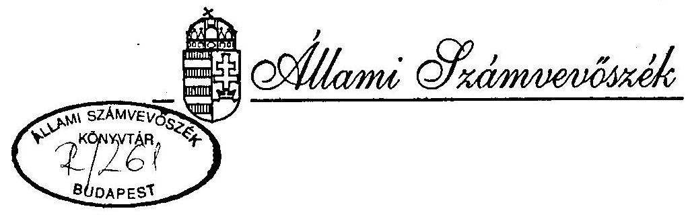

# JELENTÉS 

az állami tulajdonosi funkció érvényesüléséről
a Magyar Villamos Művek Részvénytársaságnál és társaságainál

---

A vizsgálat végrehajtásáért felelős: az ÁSZ IV. Vagyonellenőrzési Igazgatósága
dr. Kovács Árpád igazgató

A vizsgálatot vezette:
Harsányi Sándor osztályvezető főtanácsos

# Készítették: 

| dr. Molnár Barnabás | számvevő tanácsos,   a vizsgálat koordinátora |
| :-- | :-- |
| Lernyei Péter | külső szakértő |
| Szöcs Miklós | külső szakértő |

---

# TARTALOMJEGYZÉK 

## 01da1

I. BEVEZETÉS ..... 1
II. ÖSSZEFOGLALÓ KÖVETKEZTETÉSEK, AJÁNLÁSOK ..... 4

1. Összefoglaló következtetések ..... 4
2. Ajánlások ..... 17
III. A MAGYAR VILLAMOSENERGIA-IPAR HELYZETE, AZ MVM MEGALAKULÁSA ÉS MŰKÖDÉSE ..... 20
3. A villamosenergia-ipar helyzete Magyarországon 1963-ig ..... 20
4. A Magyar Villamos Művek Tröszt működéséről (1963-1991.) ..... 20
2.1 A tröszti szervezet és ágazat általános helyzete ..... 20
2.2 A tröszti szervezet közgazdasági szabályozása ..... 22
2.3 Az erőművi kapacitás helyzete ..... 25
2.4 A tröszti szervezet kritikája ..... 26
IV. AZ MVM RT. MEGALAKULÁSA ÉS MŰKÖDÉSE NAPJAINKIG ..... 27
5. Az átalakulás folyamata ..... 27
1.1 MVMT-ből MVM Rt.-vé való átalakulás az átalakulási terv(ek) alapján ..... 27
1.2 Az átalakulást megelőző vagyonátcsoportosítások ..... 28
1.3 Vagyonértékelés ..... 30
1.4 Az irányítási és szervezeti rendszer korszerűsítésére előírt feladatok ..... 31
1.5 A konszern-típusú részvénytársasági forma létrejötte ..... 32
1.6 Szervezeti-, jogi- és tulajdonosi átalakulás ..... 33
1.7 A kétszintű részvénytársasági szervezet működése, az integrált villamosenergia-rendszer kialakítása ..... 38
1.8 Az együttműködő villamosenergia-rendszer működését biztosító belső közgazdasági rendszer ..... 40

---

2. Az MVM konszern gazdálkodása ..... 43
2.1 A villamos energia és hőtermelés tüzelőanyag felhasználása ..... 43
2.2 Termelési költségek ..... 43
2.3 Általános értékelés ..... 44
2.4 Az MVM Rt. hitelkapcsolatai ..... 49
2.5 Monopolhelyzet és a nemzetközi integrálódás szerepe ..... 50
2.6 Beruházások alakulása ..... 51
2.7 Piaci kilátások ..... 52
2.8 Kapacitás kihasználtság ..... 53
2.9 Fejlesztési stratégia ..... 53
2.9.1 Fejlesztési stratégiáról általában ..... 53
2.9.2 Az erőművi teljesítmény jelenlegi helyzete ..... 54
2.9.3 Hosszú távú stratégiai elképzelések ..... 55
2.9.4 Erőműfejlesztési változatok ..... 57
3. A villamosenergia-ipari árképzés eddig kialakított mechanizmusának értékelése, a privatizációt megelőző árképzési elképzelések és problematikái ..... 59
3.1 A hazai villamos energia árszabás kialakításának fejlődése ..... 59
3.2 Az MVM Rt. társaságcsoport belső árrendszere ..... 62
3.3 Az árszabályozások 1990. évtől ..... 63
3.4 Az árszabályozások végrehajtása 1994-ig ..... 66
3.5 Az 1994-97. évekre vonatkozó áremelési kérelmek fő indokai ..... 68
3.5.1 Az MVM Rt. 1994. évi áremelési javaslata, árhatósági felülvizsgálata, jóváhagyott áremelések 1995. január 1-től ..... 69
3.5.2 Az áremelést követő feszültségek ..... 73
4. A villamosenergia-ipar privatizációjának előkészítése ..... 75
4.1 A villamosenergia-ipar nyugateurópai tapasztalatainak alkalmazhatósága ..... 75
4.2 A privatizációs tanácsadó kiválasztása ..... 76
4.3 A privatizációt megelőző feladatok ..... 78
4.4 A privatizációra vonatkozó első Kormány előterjesztés ..... 79
4.5 Az első Kormány előterjesztés MVM Rt. igazgatósága által történt értékelése ..... 79
4.6 A privatizációra vonatkozó második kormányelőterjesztés ..... 83

---

4.7 A villamosenergia-ipar jelenleg érvényes privatizációs stratégiája ..... 85
4.8 A Kormányhatározat ismertetése ..... 88
4.9 A Kormányhatározat végrehajtásával összefüggő kérdések ..... 90
4.10 A privatizációs Kormányprogram végrehajtása ..... 94
MELLÉKLETEK JEGYZÉKE

---

# JELENTÉS 

## AZ ÁLLAM TULAJDONOSI FUNKCIÓI ÉRVÉNYESÜLÉSÉRŐL A MAGYAR VILLAMOS MŰVEK RÉSZVÉNYTÁRSASÁGNÁL ÉS TÁRSASÁGAINÁL

I.

## BEVEZETÉS

Az Állami Számvevőszék alkotmányos kötelezettsége, hogy az állami vagyon védelmét, hasznosítását segítse, sorsát figyelemmel kísérje. Az elmúlt években többször merült fel igényként, hogy az Állami Számvevőszék ne csak utólag foglalkozzon a privatizációs tranzakciókkal, hanem már a meghatározó döntések előtt segítsen véleménye közreadásával. A jelen munkával az első olyan, teljes ipari ágazatot átfogó elemzés készült el, amely a vizsgálat ideje alatt csak koncepciójában ismert és még le nem bonyolított privatizációhoz kapcsolódott. E jelentés a hazai villamosenergia-ipar helyzetét, a Magyar Villamos Művek Rt.-nél és társaságainál az állami tulajdonosi jogok és kötelezettségek érvényesülését és a privatizáció előkészítettségét mutatja be, valamint előkészíti a vagyongazdálkodás további vizsgálatait.

A stratégiailag kiemelkedő fontosságú villamosenergia-ipar mintegy 600 milliárdos vagyona képezi ma Magyarországon a legnagyobb privatizálható vagyontömeget. Az ágazat privatizációs koncepciója az elmúlt év végén vált ismertté, arra kormányhatározat született. A végrehajtás teljes körű kidolgozása folyamatban van. Annak jelenlegi meggondolásait és alapelveit, az eddig tett lépéseket elemzi az anyag.

---

Az állam tulajdonában lévő vállalkozói vagyon értékesítéséről szóló 1995. évi törvény szerint az ÁPV Rt. köteles a privatizáció előkészítése és a privatizációs döntéshozatal során az érintett minisztériumokkal együttműködni és lehetővé tenni, hogy a szakmai szempontok mérlegelésre kerüljenek. Az ÁPV Rt. a hozzá tartozó társaságok közgyűlésének (taggyűlésének) Gt. szerint kizárólagos hatáskörébe tartozó kérdésekben az érintett miniszter véleményét figyelembe véve köteles eljárni. Ugyanezen törvény rögzíti azt is, hogy a nemzetgazdaság működőképessége szempontjából jelentős társaságok privatizációs koncepciójáról a Kormány dönt, amit jóváhagyásra az Országgyűlés elé terjeszthet. A Kormány a privatizációval közvetlenül összefüggő törvénymódosításokat a jelentés véglegesítésének időszakában kezdeményezte az Országgyűlés részére, a koncepcionális elképzelések jóváhagyásra történő előterjesztését azonban nem. Ez a lehetőség elvileg ma is fennáll.

A privatizációs döntések alapvetően gazdaságpolitikai elképzelésekhez kapcsolódnak és - mint ez esetben is - folyamatosan változhatnak. Az ÁSZ már csak jogállásából adódóan sem kívánja a villamosenergia-ipar tervezett privatizációját, mint célt előzetesen minősíteni, azt azonban kötelességének tartja, hogy a tervezett privatizáció előkészítettségéről és feltételeiről szerzett tapasztalatait bemutassa. Jelezze a kockázatokat, hogy ezzel is segítse a vagyon hasznosítására irányuló döntések jobb megalapozását.

E dokumentum alapvetően az együttműködő villamosenergia-rendszer működőképességét meghatározó és befolyásoló fő folyamatokat és közreműködőket, valamint a privatizációra való felkészülést ismerteti. Ezen belül is elsősorban a villamosenergia-ipar eddigi sajátos jogszabályi működését, a működés belső sajátosságait, a stratégiai ágazat jelenlegi és távlati működésének rendszerbeli körülményeit elemzi, a tervezett privatizációt megelőző és - esetenként - az azt

---

követő időszakra. Arra is választ keres, hogy az ágazat gazdálkodásának egésze mennyire kiegyensúlyozott, az miképpen segíti a rendszer működését.

Az elemzés alapvető irányultsága miatt, valamint terjedelmi és témásúlyozási okokból is a jelentésben csak utalásszerűen nyílt mód az alapítványi juttatások, a presztízs-jellegű irodaház építések és felújítások szerepeltetésére. Újabb, más súlyozású vizsgálatokat igényel annak tisztázása, hogy ezek mennyire szolgálták a társaságcsoport érdekeit, valamint az is, hogy a költségtakarékosság az MVM Rt. és társaságai gazdálkodásában miképpen érvényesül. A további ellenőrzéseket is magukban foglaló javaslatok ezt szolgálják.

A megalapozó vizsgálatok és helyzetfelmérések a jogelőd Magyar Villamos Művek Tröszt-re, a Magyar Villamos Művek Rt.-re (MVM Rt.) és alrészvénytársaságaira - 8 erőmű Rt.-re, 6 áramszolgáltató Rt.-re és az alaphálózatot működtető Országos Villamos Távvezeték Rt.-re (OVIT Rt.) -, továbbá az ERŐKAR Energetika Gyártó és Szolgáltató Rt.-re (ERŐKAR Rt.), az ERBE Energetika Mérnökiroda Kft.-re (ERBE Kft.) terjedt ki. Az ÁSZ a Miniszterelnöki Hivatalt, az IKM-et, PM-et, ÁVÚ-t, ÁV Rt.-t és a Magyar Energia Hivatalt közreműködésre kérte fel, a villamosenergia-iparágra irányuló jogszabályilag előírt szakirányú tevékenységeik ellátásának és a villamosenergia-rendszerhez való kapcsolódásuk megismerése érdekében. A felkérésnek valamennyi szerv eleget tett.

A jelentés alapvetően az elmúlt 3-4 év információira alapoz, de szükség szerint visszatekint a megelőző tröszti időszakra is. Az eseményeket 1995. júniusáig kíséri figyelemmel. A nagytömegű dokumentum, irat elemzése mellett a leírtak személyes konzultációk tapasztalatanyagát is tükrözik. Az ÁSZ munkatársai minden érdekelt részéről segítő közreműködést tapasztaltak, melyért köszönetüket fejezik ki.

---

# II. 

## ÖSSZEFOGLALÓ KÖVETKEZTETÉSEK, AJÁNLÁSOK

## 1. Összefoglaló következtetések

Közismert, hogy a villamosenergia-ipar az ország infrastruktúrájának egyik legfontosabb eleme. Műszaki színvonala, szervezettsége, működőképessége és költsége meghatározó a gazdasági növekedés, a gazdaság versenyképessége és a lakosság életfeltételei szempontjából.

A magyar villamosenergia-ellátás folyamatossága és biztonsága jó. Az egész országot behálózó rendszer működése a magyar szolgáltatások között a legjobban szervezett. Ellátási biztonságára kevés a panasz.

A villamosenergia-iparban minden eddigi fejlesztési stratégia távlati szemléletű volt. Az a teendőket két, látszólag egymásnak ellentmondó, optimalizálást igénylő követelménynek rendelte alá: a folyamatos és megbízható ellátásnak és a szolgáltatás ára - az ipar versenyképességében és a lakosság életszínvonalában "megtérülő" - minimalizálásának. E feltételeket közel 35 évig - igaz mindig a rövidtávú érdekeknek engedve - sikerült teljesíteni. Ez azonban közvetve azzal is járt, hogy az energiaigényesség csökkentése érdekében viszonylag kevés történt. A nemzetközi tapasztalatok szerint a piacgazdaságokban sem más a helyzet, ott is a fenti követelmények teljesítése hosszabb távon gondolkodó, a fogyasztói takarékosságot jobban szolgáló - optimalizálására törekednek.

Az előkészületben levő privatizáció során is keresni kell annak lehetőségét, hogy e két követelmény ne kerüljön egymással konfliktusba. Ezért elemeztük több oldalról és

---

mélyebben a villamosenergia-ipar helyzetét befolyásoló ma leginkább vitatott két kérdést: az előkészületben lévő privatizációt, valamint az azt, sőt a további társadalmi-gazdasági fejlődést is markánsan befolyásoló árkérdést.

Az MVM Rt. a körülmények és az igények változásához alkalmazkodva újabb és újabb fejlesztési "stratégiákat" dolgozott ki. Ezeket a gyorsan túlhaladottá váló terveket rendszeres felülvizsgálatokkal igyekeznek "karban tartani". Az áramszolgáltató társaságoknak önálló fejlesztési stratégiájuk van, az erőművi és alaphálózat-fejlesztési elképzelések pedig "folyamatosan alkalmazkodnak" a villamosenergia-kereslethez.

A különböző dokumentumokban foglalt, meglehetősen gyorsan változó és megalapozottságukban is kétséges "iparági számok" megítélését ma nehezíti, hogy a fejlesztéseknek a villamosenergia-ipari társaságcsalád és az azt alkotó egyes társaságok privatizációhoz kapcsolható alaptőke-emelési igényét teljes körűen ezideig nem dolgozták ki. Az ma még csak folyamatban van. Az iparág által 2010-ig jelzett 800 milliárd Ft-os "legújabb" - nem hivatalos - fejlesztési elképzelés a rendelkezésre álló, ún."kis igényre" kidolgozott energia-szükséglet trendek, elemzések alapján reálisnak látszik. Ez azonban azt is jelenti, hogy a privatizáció szükségessége a külső befektetési szükségletek összegző bemutatásával nincs alátámasztva. A "hivatalos" erőműfejlesztési koncepció igénye 1995. június végén mint ÁPV Rt. - IKM - MVM Rt. közös feladat szerepel a privatizációs pályázat kibocsátásának feltételei között.

Az MVM társaságcsoport az egyetlen ágazat az iparon belül, amelyik 1989-94-ben több mint 10%-kal növelte termelését. Az értékesítés értékben - az infláció miatt - ugyancsak

---

A mintegy 3 TWh villamos energiatermelés növelése úgy vált lehetségessé, hogy a belföldi igények több mint 5 TWh-val történő csökkenésével egyidejűleg a behozatalból majd 9 TWh esett ki, és így a kettő közötti különbséget a hazai erőművek pótolták.

Az MVM Rt. a villamos energia- és hőigényeket folyamatosan kielégítette. Időközben a belföldi igények az 1983. évi szintre estek vissza. Emiatt nem sürgető egy nagyteljesítményű alaperőmű építése. A rendszer ma mintegy 20%-os teljesítménytartalékkal rendelkezik. Ez azonban kisebb, mint a nemzetközi kapcsolódások megkövetelte szint és ráadásul ezt elavult szénerőművek képezik. Meg kell azonban jegyezni, hogy az egyes erőművek kihasználtságának mutatói ma ezt a helyzetet - részben a csúcsigények kielégítésével összefüggő műszaki, gyors üzembeállítási követelmények miatt - nem tükrözik.

A mintegy 2000 MW összkapacitású
 szenes erőművek nagy részének termelésből történő kivonása - selejtezése - a hazai szénbányászat vagyoni és foglalkoztatási érdekeit is érinti, ami tovább bonyolítja az energetikai ipar megújítása ügyét.

A villamosenergia-rendszer működése bár alapvetően műszaki, fejlesztési kérdés, s ennek kell alárendelni az ár- és privatizációs lépéseket, de szerepe oly mértékig meghatározó, hogy iparpolitikai, biztonságpolitikai tényezők is jelentős szerephez jutnak a döntésekben, valamint különösen a jelen átmeneti időszakban nem mellőzhető a szociálpolitikai összefüggések figyelembevétele. Olyan összetett érdekeket kell egyeztetni az előkészületben levő döntések során, melyekre a magyar gazdaság történetében eddig alig akadt példa.

---

A villamosenergia-ipar magánosítása tehát nemcsak egy adás-vétel lebonyolítása. A folyamat vezénylése az ágazat iparpolitikával, foglalkoztatáspolitikával, bonyolult műszaki, közgazdasági, szabályozási kapcsolatát érvényesítő komplex és stratégiai szemléletet igényel. Ennek megvalósítását Magyarországon különösen bonyolulttá teszi - eltérően más országoktól -, hogy az energia ára mélyen érinti a lakosság életfeltételeit is, és a szükséges tőkeerős befektető pedig csak külföldi lehet.

A sokoldalú problémakezelés eddigi hiányát és egy-egy tényező egyoldalú középpontba helyezését bizonyítja, hogy az ágazat helyzetét ezideig összetetten egyetlen szakértői, tanácsadói tanulmány sem mutatta be, és az ilyen megközelítést a megrendelők sem követelték meg. Az érdekeltek az ágazatnak csak egy sajátos részterületével foglalkoztak. Az összefüggések figyelembevételével a helyzetfelmérés során elvétve találkoztunk. Abban az esetben, ha ezt nem pótolják, olyan konfliktusok sora várható, melyek felkészületlenül érik a gazdaság irányítóit.

Leginkább az kifogásolható, hogy évek óta nem, vagy alig mozdult előre a villamosenergia-ipar komplex szemléletű árszabályozási és privatizációs ügye, annak ellenére, hogy évek óta szinte minden érdekelő szerv foglalkozott a kérdés valamelyik részterületével. Csak a közelmúltban született meg az a kormánydöntés, amely a privatizáció felgyorsítása érdekében az összes érdekelő közreműködésének összefogását célozta.

A villamosenergia-ipar privatizációja előkészítésénél tapasztalt koncepcionális bizonytalanságok - például részvényeladás-tőkeemelés kérdésének tisztázatlansága, a társaságok értékesítési sorrendjének meghatározatlansága,

---

az előírt határidőig eladhatatlan részvények további sorsának rendezetlensége, a privatizációt megelőző tulajdonosváltás és alaptőke leszállítás indokolatlansága, stb. - egyértelmű jelzései az előkészületlenségnek, a hazai szakértők közreműködése eddigi mellőzésének. Ezek egyik következménye, hogy az új, még életbe sem lépett privatizációs törvényt az energetikai privatizációval összefüggésben már módosítani kellett.

Több évi terméketlen vita után múlt év őszére alakult ki, hogy a Kormány milyen főbb tulajdoni arányok, társasági kör, értékesítési ütem mellett tartja lehetségesnek a privatizációt. A vélemények azonban ma is megosztottak abban, hogy ennek gyakorlati módja, aránya milyen legyen, a privatizáció érdekében hogyan hidalják át a joghibákat, vagy azt a tenderfelhívásokban milyen garanciákkal helyettesítsék.

A vonatkozó kormányhatározatok szerint a tranzakciókat 1997-ig le kell bonyolítani, ez idő alatt kell a magánkézbe adás teljes feltételrendszerét kialakítani. E feltételek közül a legfontosabbak: a tulajdonszerkezet megváltoztatásához kapcsolódó minden jogi-szabályozási kérdés lezárása és az új előírások meghirdetése, az ár-tarifa rendszer korszerűsítése, az önfinanszírozás követelményeinek megteremtése, a szénbányászattal való kapcsolat rendezése, a működéshez és a költségszerkezet optimális kezeléséhez szükséges szerződéses keretek kialakítása.

A Kormány e dokumentum lezárásának időpontjára az értékesítéssel kapcsolatos legszükségesebb - "minimál" programot jelentő - jogszabálymódosításokat az Országgyűlésnek beterjesztette, azok jóváhagyásra kerültek. Megszövegezték a villamosenergia-ipari társaságok privatizációs pályázatának feltételeit.

---

A tervezetekben szerepel, hogy milyen ütemben és tőkeemelési igényekkel értékesítik a társaságokat. A munkák felgyorsításával 1995. júniusára az értékesítés feltételrendszerének egy technikailag lehetséges változata kialakult.

Jelenleg még hiányzik a privatizált villamosenergia-ipar működésének távolabbi évekre is kitekintő szabályozása, árszabályozási mechanizmusa, mely ugyancsak feltétele az értékesítésnek. Ma még tisztázatlan 1997. január 1-től az árhatósági jogkör gyakorlása, az állam árszabályozó szerepének érvényesítési mechanizmusa. Rendelkezni kell arról is, hogy a továbbiakban, a tulajdonosi jogok változásával a Magyar Energia Hivatal törvény adta jogait miként fogja gyakorolni. Így például a vezetékes energiahordozókra nézve, kritikus árvita esetén, a monopolhelyzet kialakulásának megakadályozásában a MEH vagy a Versenyhivatal lesz-e az illetékes, a MEH önálló intézményként vagy a Kormánynak alárendelve működik-e, hatósági vagy szabadárak lesznek-e a vezetékes energiahordozók? Az erre vonatkozó dokumentumok - egyeztetés nélkül - előreláthatóan július közepére készülnek el, s ezt követően lesznek csatolhatók a tenderfelhívásokhoz.

Gyakorlatilag nincs elmozdulás annak tisztázásában, hogy mi történik a privatizáció után, annak folyamatában milyen hatásai lesznek a magyar ipar versenyképességére, a villamosenergia árak alakulására, az inflációra, a lakosság életszínvonalára, a villamosenergia fogyasztásra, a villamosenergia ellátás biztonságára, stb. Vagyis nem készültek olyan érdemi hatáselemzések, amelyek a tulajdoni szerkezet megváltozása egyes lépcsőjéhez kapcsolódnak, s a várható következményeket modellezik.

---

Eddig a villamosenergia-ipari ágazat önfinanszírozását, belső stabilitását a saját maga által működtetett belső járadékrendszere (keresztfinanszírozása) biztosította. Ez a konstrukció biztosította társaságonként az elismert költségek fedezetét. A járadékrendszer működését az indokolta, hogy a társaságok eltérő működési feltételeiből adódó költségnövekményeket az árban nem ismerték el.

A magánosítással e járadékrendszer alkalmazásának lehetősége értelemszerűen megszűnik. Az egyes társaságok önfinanszírozását más úton kell biztosítani. A helyi ellentmondások kiküszöbölése, a gazdálkodási feltételek egymáshoz közelítése érdekében a tarifarendszer korszerűsítésével, illetve jelzett költségarányos átalakításával elsorvasztható a "nullszaldósra" tervezett járadékrendszer. A járadékrendszer az áramszolgáltatóknál 1995. január 1-vel megszűnt, az erőműveknél szerződéses kapcsolat formájában tervezik továbbműködtetését.

A költségarányos árak alkalmazásával kiküszöbölhetők a villamos energia árakban és hőenergia árakban ma még meglévő, keresztfinanszírozást jelentő azon anomáliák, amelyek indokolatlan előnyöket és hátrányokat tartalmaznak a különböző - lakossági-közületi, villamosenergia-hőenergia, termelői-fogyasztói - felhasználók, illetve fogyasztói csoportok között. A közvéleményt is megnyugtató ellenőrizhetőség azonban hiányzik. Ennek érdekében a legkisebb költségű villamosenergia ár és az áralkalmazás feltételeit előre tisztázni szükséges.

A villamosenergia-rendszer jelenlegi kondíciók közötti biztonságos működőképességének feltétele az együttműködő rendszer kölcsönös érdekeken alapuló, szabályozott belső

---

egyensúlya. Ha előzetesen nem valósulnak meg azok a külső feltételek, amelyek a belső szabályozást helyettesítik, s amelyek a gazdaságos működést minden egyes részvénytársaságnál lehetővé teszik, ez az egyensúlyi rendszer a tulajdonosi szerkezet megváltoztatásával, a részérdekek előtérbe kerülésével megbomolhat.

Ma sajátos belső szervezés képezi a működés "motorját". A tervezett privatizáció ezt természetesen megbontja. A társaságcsoport új tulajdonosai gazdasági érdekeinek befolyásolására az államnak kevesebb lehetősége marad. Más eszközöket kell választani, s meghirdetni még a privatizációt megelőzően. Megfelelő megoldás a dokumentum lezárásáig erre nem készült. A működés új rendszere (modellje) jelenleg kidolgozás alatt áll.

A piacgazdaságban is érvényesek az energetikának azok a sajátosságai - a Kormány ellátási kötelezettsége, a természetes monopóliumok ellenőrzése, a távlati stratégiai teendők, az Európai Unió integrációjához való csatlakozás feltételeinek megteremtése, döntéshozatal országos jelentőségű energetikai létesítményre stb. -, amelyek az elkövetkezőkben is szükségessé teszik - a vállalkozói szférához mérten - piackonform eszközökkel történő állami szerepvállalást. Ezek a tulajdonosi, közhatalmi, igazgatási jogkörök ütköznek egymással. Más a tulajdonos, más az iparigazgatás és merőben más a fogyasztók érdeke.

A vezetékes energiaszolgáltatásban fennmarad az ún. természetes monopólium. A monopolhelyzettel történő visszaélések megakadályozására szükséges, hogy a monopol-társaságok működése a társadalom számára nyitott, átlátható és ellenőrizhető legyen. A közhatalmi ellenőrzés állami feladat, ezt a funkciót a Magyar Energia Hivatal tölti be.

---

A helyi önkormányzatok is szerephez jutnak a monopólium ellenőrzésében. A piacgazdaságban is szükség van államilag irányított hosszú távú energiapolitikára. Ez a Kormány igazgatási jogkörébe tartozik.

Az MVH Rt. kétszintű részvénytársasági rendszere magával hozta azokat az előnyöket - a tulajdonosi-üzemeltetési funkciók szétválasztása, gazdasági átláthatóság, gazdálkodó tagtársaságok nagyobb önállósága és felelőssége, a tőkebevonáshoz és a tőkemegtérüléshez, a vagyongyarapodáshoz fűződő érdek stb. - amelyeket a tröszti formával szemben a részvénytársasági forma jelent.

Az ágazat költséggazdálkodására alapvetően meghatározó az ár. Az elmaradt áremelések és tarifakorszerűsítések takarékos gazdálkodásra kényszerítették az ágazatot, amely ennek ellenére 1994. év végére már konszern szinten is nagyméretű veszteséget mutatott. Az ágazati igényektől elmaradt áremelések a tartalékok felélésére kényszerítik a társaságcsaládot. Az indokolt, de elmaradt befektetések későbbi pótlása többletköltségekkel jár. A környezetvédelem megoldatlansága nemcsak a társaságok, hanem az árhatóság hatáskörébe is tartozó kérdés. A kényszerű szén-, uránérc átvétel és bányaintegráció többletköltségeinek átvállalása nemzetgazdasági érdekből, kormánydöntésre történt.

A társasági költséggazdálkodások áttekintése alapján ma nem lehet árhatósági eszközökkel ellenőrizhetően megállapítani az egyes árak, áremelési kérelmek valódiságát. Erre alapvetően az ad lehetőséget, hogy az árképzés és áralkalmazás részletes szabályozása még nem készült el. Az egységes rendszerbe foglalás most van folyamatban.

---

Következetes tulajdonosi érdek érvényesítés esetén a társaságok elmúlt években jelentkező nagyösszegű veszteségei részben csökkenthetők lettek volna. Így a villamosenergia-ipari ágazat 1994. évi 10,8 Mrd Ft-os adózás előtti vesztesége sem kizárólag az elmaradt ár- és tarifa rendezések következménye. A részvénytársasággá alakításkor, 1991-ben létrehozott, kereszt-tulajdonlásokkal is terhelt vagyonszerkezet - az 50% alatti tulajdoni hányadok miatt - az ÁvÚ részére nem biztosította az alrészvénytársaságokra nézve az egységes tulajdonosi szemlélet és ennek megfelelő érdek érvényesítési gyakorlat kialakítását. Igaz, erre az ÁvÚ-nek a rövid idejű tulajdonlás miatt sem volt sok lehetősége, majd a tulajdonosi jogok az 1992. végén megalakult és önmaga megszervezésével elfoglalt ÁV Rt.-hez kerültek.

Az 1995. január 1-i árrendezés figyelembe vételével tervezett 1995. évi 16,6 milliárdos adózás előtti ágazati veszteség, valamint az árrendezésnél figyelmen kívül hagyott árhatóság által vitatott - összeg nagyságrendje komoly jelzései a tulajdonosi, tulajdonkezelői, közhatalmi, igazgatási jogkörök ütközésének. Ugyancsak a koncepcionális bizonytalanságoknak és az egészséges tulajdonosi szemlélet- és akarat hiányának tulajdonítható, hogy hiányzik a társasági vagyon valós értékének ismerete, egyes társaságok költségigényes, esetenként presztizs-jellegű irodaház építkezésekbe kezdhettek, vitatható indokokkal nagy összegeket juttattak alapítványoknak, hosszú időn keresztül elmulaszthatták a privatizációhoz szükséges tulajdonbejegyzéseket.

A tapasztalatok egyértelműen bizonyítják, hogy a vezetékes energia árak kérdését mindenképpen rendezni kell. A vezetékes energia árak emelkedése nem függ közvetlenül a ter-

---

Legfeljebb csak annyiba: hogy az új tulajdonosoktól nem várható el, hogy gazdasági érdekeik ellenében legyenek lojálisak az ország gazdasági és a szociális céljai iránt. A villamosenergia-rendszer működési feltételeit és mechanizmusát ezért kell alkalmassá tenni arra, hogy az új tulajdonosi szerkezet mellett is érvényre jussanak az állam stratégiai és szociális érdekei.

Az ÁV Rt., mint állami tulajdonos az elmúlt években nem kellően készítette fel az ágazatot a privatizációra. Eddig kevésbé látott bele az ágazat működésébe. Az állami akarat érvényesítésén dolgozott, s ezt nem segítette az, hogy - a tapasztalatok szerint - az indokoltnál szerényebb mértékben támaszkodott a villamosenergia-ipar vagyonát működtető hazai társaságok szakmai ismereteire. Így állt elő, hogy a hazai viszonyokat kellően nem ismerő tanácsadó cégek által, a privatizációra javasolt és a Kormány határozataként 1994. december 7-én elfogadott intézkedéseket a határozatban rögzített 1995. január 31-i határidőn belül végrehajtani nem lehetett.

A jelen helyzet szerint az ÁV Rt. a teljes villamosenergia-ipar privatizációjának lebonyolítására - belső viták mellett - a korábbi, az adott határidőre teljesíthetetlennek bizonyult kormányhatározat kidolgozásában is koordináló tanácsadót kívánja megbízni, pályáztatás és versenyeztetés nélkül. A közreműködés függőben van. Szerződéskötésre a vizsgálat
 lezárásáig nem került sor.

Európában nincs egységes modellje annak, hogy a villamosenergia-szektor privatizálásával a tulajdonrészek magánkézbe kerüljenek-e vagy sem. Ahol azonban ez magánkézbe került, ott jellemzően belföldi befektetők vásárolhattak tulajdonrészt.

---

Ma az értékesítés ütemét nem az iparág fejlesztési érdekei, hanem a költségvetés bevételeinek növelése, a folyó fizetési mérleg egyensúlyának megteremtése diktálja. Tehát az összes erre vonatkozó lépés során a döntéshozóknak tudatában kell lennie, hogy az elhatározásaikban elsődlegesen nem az ágazattal szemben "klasszikusan" érvényesített követelmények játszanak szerepet.

Az ÁV Rt. üzleti terve már 1994-re is 125 milliárdos bevételt irányzott elő a villamosenergia-ipari társaságok értékesítéséből. Az adott körülmények között törvényszerű volt: ez nem teljesülhetett. Az ÁV Rt. illetve jogutódja az ÁPV Rt. 1995-ös, előzetes üzleti tervében - a múlt évinél óvatosabban - szerepeltetett, a villamosenergia-ipar részleges privatizációjából származó 75 milliárdos bevétel teljesítése ma még a tranzakciók jelenlegi, problémákkal terhelt előkészítettsége mellett is remélhető. Ennek azonban nem csak az a feltétele, hogy a jelentés véglegesítésekor is folyó koncepcionális vitákat a kormányzaton belül lezárják és az összes, a privatizációhoz nélkülözhetetlen törvénymódosításokat fogadják el, hanem minden további lépésnek tökéletesen összehangoltan, az igen feszített, tartalékidőket nem tartalmazó ütemben kell szerveződnie. Nem lehet vita a tenderfelhíváshoz július közepén csatolni tervezett árszabályozási mechanizmus, valamint a befektetési szükségletekről - vagyis a fejlesztésről szólt - , ma még hiányzó dokumentumok felett. Amennyiben nem, úgy a Kormánynak le kell mondania a villamosenergia-ipar részleges értékesítéséből származó ez évi bevételéről, ami egyben a pótköltségvetés lehetetlenné válását is jelenti.

Az eddigi, a sokoldalú problémakezelést mellőző privatizációs elképzelések megvalósításával a villamosenergia-ipart a privatizáció során nagyösszegű árfolyamveszteségek érhetik, melyet a szabályozási környezet - kiemelten az árkérdés - kidolgozatlansága csak tovább erősíthet. Az eddigi privatizációs tapasztalatok bizonyítják, hogy a vevő a saját kockázataként jelentkező - szabályozási, ár-és működési feltételbeli - bizonytalanságokat a vételárban és más, részére nyújtott garanciákban - többnyire sikeresen - igyekszik érvényesíteni.

A kockázatok csökkentése megköveteli a ma eltervezett, az ágazat döntő vagyonhányadára kiterjesztett privatizációs elképzelések olyan elemzését, mely megfelelő garanciákat tartalmaz a szolgáltatási ár és biztonság követelményei teljesítésére. Így különösen a fejlesztések által indokolt tőkeemelések garantálására és a privatizációs folyamat során potenciálisan bekövetkezhető nagyösszegű árfolyamveszteségek elkerülésére.

A helyzetfelmérés tapasztalatai alapján az Állami Számvevőszék indokoltnak tartja, hogy az elkövetkezőkben folyamatos ellenőrzésekkel segítse a villamosenergia-iparra vonatkozó állami döntések végrehajtását. Folyamatos tapasztalat-aktualizáló vizsgálatokat folytat a villamosenergia-ipar állami tulajdon működésének, a villamosenergia-ipar állami szerepvállalásainak helyzetével kapcsolatosan.

Az Állami Számvevőszék az ÁV Rt., illetve jogutódja vizsgálata keretében kiemelt figyelmet fordít a villamosenergia-ipar privatizációjának előkészítésével és lebonyolításával foglalkoztatott tanácsadók munkájára, a részükre történő kifizetések indokoltságára. Továbbá részletes vizsgálatot végez a jövőben a villamosenergiarendszer aktuális költség- és vagyongazdálkodására irányultan.

---

# 2. Ajánlások 

Az Állami Számvevőszék indokoltnak tartja és javasolja, hogy

### 2.1 A privatizációért felelős tárca nélküli miniszter

- vizsgálja ki a privatizáció előkészítettségét, tegyen intézkedéseket a villamosenergia-ipar reális privatizációs vagyonértékének megállapítására, a tőkeemelések társaságonkénti előzetes megállapítására, a privatizáció során a nagyértékű vagyonveszteségek elkerülésére, az ágazati veszteségek megakadályozására.
- tegyen intézkedést a privatizációs bevétel ez évi realizálásához szükséges, még hiányzó szabályozási és egyéb kérdések lezárása érdekében.

### 2.2 Az ipari és kereskedelmi miniszter

- tegyen intézkedéseket a privatizáció alatti és a privatizációt követő időszak villamosenergia-iparra vonatkozó állami szerepvállalásainak - a stratégiai ellátási felelősség, a nemzetközi kötelezettségek teljesítése - szabályozására, a villamosenergia-ipari társaságok esetleges ellátást veszélyeztető körülményeinek megszüntetésére.
- érvényesítse a kormányzatnak a villamosenergia árakra vonatkozó deklarációját a privatizációs tenderfelhívásokban. Teremtsen ezzel a lakosság, a nagyfogyasztók és a potenciális befektetők részére egyértelmű helyzetet, beleértve annak közlését is, hogy 1996-ban milyen villamosenergia áremelésekre van szükség.

---

- vizsgálja ki, hogy a villamosenergia-ipar által bizonyított halasztott kiadások, az áremelések elmaradása, az árszabályozás mai még nem piaci megoldásai veszélyeztetik-e a jövőbeli biztonságos villamos energia ellátást, a környezetvédelem megoldatlansága pedig az EK csatlakozást.
- szabályozza a fogyasztói érdekvédelem szempontjából fennálló egyeztetési kötelezettségeket.
- tisztázza az 1997. január 1-tól érvényesülő árhatósági jogkör gyakorlásának, az állam árszabályozó szerepének mechanizmusát.
- Kérje fel a Magyar Energia Hivatalt, hogy
= mutassa be a villamosenergia-ágazat UCPTE-hez csatlakozásának előírt, a biztonságosabb és környezetkímélő üzemelésre való felkészülés érdekében a következő években szükséges többletráfordításait;
= vizsgálja ki a villamosenergia-ipari társaságok 1994. évi és 1995. évre tervezett veszteségeinek indokoltságát, az 1995. január 1-i árrendezésnél figyelmen kívül hagyott költségek és beruházások társaságcsoport által kimutatott összegének valódiságát.
= egységesítse az átláthatóság és az összehasonlíthatóság javítása érdekében az egyes villamosenergia-ipari társaságok költségszerkezete bemutatásának előírásait

---

# 2.3 Az Állami Privatizációs és Vagyonkezelő Rt. 

- gondoskodjon a tulajdonosváltozás miatt szükségessé váló, a villamosenergia-ipari társaságok közötti elszámolásokról (nemzetközi és hazai hitelek, járadékok, garanciák, megkezdett beruházások elszámolása stb.), a társaságok közti kapcsolatok szerződéses, piackonform alapokra helyezéséről,
- vizsgálja meg a villamosenergia-ipari társaságok ingatlanainak tulajdonjogi bejegyzéseinek állását és tegyen intézkedéseket a tulajdonjogilag rendezetlen ingatlanok privatizációt megelőző bejegyeztetésére,
- tegyen intézkedéseket tulajdonosi jogkörében eljárva a villamosenergia-ipari társaságok legkisebb költségelvű működésének betartatására.

---

# A MAGYAR VILLAMOSENERGIA-IPAR HELYZETE, AZ MVMT MEGALAKULÁSA ÉS MŰKÖDÉSE 

## 1. A villamosenergia-ipar helyzete Magyarországon 1963-ig

A magyar közcélú villamosenergia-szolgáltatás 100 éves centenáriumát 1988-ban ünnepelték. Számos átszervezéssel, csak lassan és nagy tőkeráfordítással jött létre az együttműködő magyar villamosenergetikai rendszer. Egyidejűleg a KGST-vel is kialakultak a hálózati összeköttetései. Ezzel a hatvanas évek elején megteremtődtek a feltételei egy korszerű - tröszt - szervezeti forma létrehozásához. A villamos energia termelési, értékesítési, a teljesítőképességi, a jellemző műszaki, gazdasági adatokat fontosabb erőműveinek, alaphálózatának és elosztóhálózatának, valamint belföldi és nemzetközi hálózati összeköttetéseinek legfontosabb ismertető adatait, térképszerű vázlatát az 1-35. számú mellékletben mutatjuk be.
2. A Magyar Villamos Művek Tröszt működéséről (1963-1991.)

### 2.1 A tröszt szervezet és ágazat általános helyzete

Az 1963-ban megalakult - a cégnyilvántartásba csak 1991. augusztus 11-én bejegyzett - MVMT valójában egy nagy állami vállalat volt, monopolista, közszolgáltató formában. Az akkor érvényes villamosenergia-törvény és a ma hatályos Ptk. szerint is jelenleg kizárólagos állami monopólium érvényesül, mivel a fogyasztó részére villamos energiát kizárólag közcélú villamosmű szolgáltathat, s közcélú villamosmű csak állami tulajdonban állhat. Ennek törvényi módosítását - a tervezett privatizáció előtt, annak szellemében (az állami tulajdon kizárólagosságának eltörlését) - kezdeményezték.

---

Az ellátási kötelezettségből fakadóan és az ellátás állami monopóliuma következtében egy igen erős monopolizáltság érvényesült a magyar villamos energia piacon. Az MVMT a tröszt keretben 22 (jogi személyként működő, önálló mérlegkészítési kötelezettségű, de nem önálló adóalanyú) vállalatot fogott össze (erőművek, áramszolgáltatók, háttéripari vállalatok) egy gazdasági egységet képező jogi személyként. Ez a szervezeti forma nem felelt meg egy piacgazdaságban élő igazi tröszt formának. Az MVMT esetében ez nemcsak a központosított gazdaságirányítási rendszer lényegéből (tervutasítás) fakadt - ebből is -, hanem alapjában abból, hogy minden energetikai rendszer sajátossága a termelés, szállítás, szolgáltatás centrális szabályozása, az elszámolási és mérési követelmények centralizálása.

Az MVMT új (módosított) létesítő határozatát az ipari miniszter, mint alapító 1986. január 1-én adta ki, 22 vállalatot érintően.

1963-tól a magyar villamosenergia-iparban csaknem 100%-os volt az MVMT monopóliuma. A kialakított tröszt szervezetben az elosztóhálózat és az ahhoz kapcsolódó összes tevékenység, valamint a fogyasztói szolgálat az MVMT-hez tartozott. A nagyfeszültségű szállító és a nemzetközi kapcsolatokat biztosító hálózat üzemeltetését, karbantartását és fejlesztését szintén a tröszt-höz tartozó vállalat végezte. A hazai termelő berendezések több mint 95%-a a tröszt részét képező szervezeti egységekhez tartozóan működött. A független áramtermelők kizárólag valamely iparvállalat tulajdonában voltak, elsősorban saját célra termeltek villamos energiát, a felesleg átvételére az MVMT-t törvény kötelezte.

---

Magyarországon az éves villamosenergia-igények 25-30%-át hosszú időszakon át a volt Szovjetunióval megkötött hosszú távú szerződések alapján, importból elégítettük ki. Az utóbbi években erősen csökkent az import.
A MVMT időszakában 3,5-szeresére fejlődött a villamosenergia-termelés és közel négyszeresére az értékesítés. A villamosenergia-szolgáltatáson kívül jelentős tevékenység volt a távhőszolgáltatás, amely egy-egy erőmű környezetében valósul meg. A magyarországi távhőszolgáltatás mintegy kétharmada MVMT erőművekből származik. Az 1991-ben kiadott 55 PJ hő 1,3 millió tonna olajegyenértéket jelent.

A termeléstől a teljes fogyasztói kiszolgálásig terjedő vertikum mintegy 40 ezer főt foglalkoztatott, így az MVMT volt az ország legnagyobb vállalata, vagyona és létszáma alapján még ma is az.

Az MVMT működését 1962-től 1991-ig a villamosenergiatörvény és a direkt állami irányítás határozta meg.

# 2.2 A tröszt szervezet közgazdasági szabályozása 

A gazdaságirányítás sok tekintetben a valóságos értékviszonyoktól jelentősen eltérített árakat és jövedelem-átcsoportosító mechanizmusokat működtetett.

Az MVMT közgazdasági szabályozása abból indult ki, hogy a közérdekű szolgáltatónak (közmű) alapvetően nem kell nyereségérdekeltségűnek lennie, mivel nem a versenyszféra része. Bizonyos tervben rögzített feladatok teljesítése esetén meghatározott fejlesztési és részesedési alapot

---

képezhetett a tröszt. Beruházásainak mintegy 90%-a állami pénzforrásból - állami nagyberuházás, célcsoportos állami beruházás keretében - valósult meg. Külső bevont forrásból - nagy ipartelepek csatlakoztatása, a lakossági hálózatfejlesztési hozzájárulások - a megrendelőktől kapott konkrét fejlesztési feladatokat teljesítette, azok telekhatáron kívüli részét állóeszköz-állományába aktiválta. Az MVMT 28 éves működése alatt mintegy 260 Mrd Ft beruházást valósított meg. A költségvetési forrásból megvalósult beruházásait 1976 előtt ingyenes juttatásból fedezte. A visszterhes állami kölcsön-konstrukció csak a Paksi Atomerőmű beruházással indult el.

A villamosenergia-ipar világszerte a legtőkeigényesebb ágazat. Nálunk is jól szemlélteti ezt, hogy hosszú időszakban az MVMT az országos beruházásnak mintegy 7-8%-át, az iparénak mintegy 23-24%-át, az energetikai ráfordítások közel 50%-át, a költségvetésből finanszírozott összes fejlesztésnek pedig valamivel több mint 33%-át valósította meg.

Az MVMT minden egyes évben nyereséges volt, a "terv alatti" során előirányzott nyereségen felüli eredményét KÜTEFA formájában vonták el. A villamos energia és hőenergia árait hatóság állapította meg. Az árszinvonal 1989-ben az 1994. évinek a termelőszférában a fele, a lakossági szférában pedig csak a harmada volt az alacsony fogyasztói indulóárak következtében.

Egészében véve az MVMT mozgástere szűk, túlzottan determinált volt. Az állami szerepvállalás viszont jelentős kockázatcsökkentő tényezőt jelentett, mivel a kockázatot az állam és nem az MVMT szenvedte el.

---

Az iparágban a gazdaságirányítás 1968. évi átfogó reformja során alakítottak ki egy központosított belső finanszírozási rendszert, amely a gazdasági és jogi környezet változásait követve rugalmasan változott.

Az MVMT rendszerérdekű beruházásait 1990. évtől saját forrásból és részben világbanki hitelből fedezte. A központi nagyberuházásként tervezett Paksi Atomerőmű befejező munkáit is MVMT saját forrásból kellett finanszírozni. E beruházás célú felhasználások finanszírozására az MVMT a vállalatoknál képződő amortizációt központosította és az éves operatív tervben - kétoldalú egyeztetések alapján - határozta meg vállalatonként az egyes csoportokra, illetve beruházásokra felhasználható összegeket. A vállalatoknak egyéb saját beruházásaik és amortizációt terhelő állami kölcsön- és hiteltörlesztéseik is voltak. Ezért a vállalatoknak az egyéb vállalati beruházásokra a tervben jóváhagyott mértékig az MVMT a központosított
 amortizációkból biztosított forrást. Az esetleges vállalati túllépést, az adott vállalatnak saját forrásaiból kellett kigazdálkodnia.
1991. évben az erőmű vállalatoknál képződő amortizáció 95%-át központosították a rendszerérdekű és központi beruházások finanszirozására. Az áramszolgáltató vállalatoknál a képződő amortizációt nem központosították. A vagyonrendezések viszont folyamatosan, de legkésőbb év végén megtörténtek.

A jelentős nagyságrendű - évi 9-10 Mrd Ft-os - amortizáció döntő részét képezte az éves, saját forrásból történő beruházásoknak, hiteltörlesztéseknek. Az amortizáció központosítása 1992. évtől újból változott.

---

# 2.3 Az erőművi kapacitás helyzete 

Az ipari- és energiapolitikai ágazati törekvések a villamosenergia-igény trendvonalának folytatásával számoltak, így ez időszak alatt az importot is figyelembe véve elégséges erőműkapacitás épült. Ezzel magyarázható, hogy a szovjet import, mintegy 1800 MW teljesítmény kiesését 1990-91-ben hazai tartalékkapacitás pótolta, továbbá, hogy a Paksi Atomerőmű 1987. évi befejezése óta nem épült nagy erőmű és 2000 előtt - a szakértők szerint nincs is rá szükség. A teljesítménytartalékok leromlott műszaki állapota hosszabb távon nem tenné lehetővé villamos energia import nélkül az ellátás biztonságos fenntartását. Az előttünk álló 3-4 évben nem várható dinamikus villamosenergia-igény növekedés. A meglévő teljesítménytartalékok, valamint a kis léptékű folyó - gázturbinás - fejlesztések jelenleg elégségesek és megfelelő biztonságot adnak a folyamatos villamosenergia ellátáshoz, az ezredfordulóig előttünk álló években. A nyugat-európai villamosenergia-rendszerhez (UCPTE) való csatlakozásunkhoz számos nagykapacitású gázturbinás erőmű építésére (bővítésére) is szükség van. A meglévő berendezések elavultsága és a környezetvédelem várható törvényi szigorítása a kapacitások cseréjét sürgeti.

Az MVMT rendelkezett egy 2010-ig szóló - a teljes vertikumra kiterjedő - hosszú távú - a magyar energiapolitikát is figyelembe vevő - fejlesztési elképzeléssel. Ennek végrehajtása azonban már a részvénytársaságként való működés idejére esik.

---

# 2.4 A tröszti szervezet kritikája 

A tröszti szervezet kritikájaként elmondható, hogy az elfedte az egyes tevékenységek gazdasági hatékonyságát, gazdasági megítélhetőségét és ezzel nagymértékben korlátozta a trösztön belüli gazdasági egységek mozgástevékenységét, önálló vállalkozási formáinak kialakítási lehetőségeit. A tröszti szervezet átalakítását leírtakon túl a privatizációs követelmények is indokolták.

Az MVMT-re vonatkozó állami szabályozások folyamatosan fejlődtek, a központi irányítás elemei fokozatosan csökkentek. A tröszt és az állam között az állam irányítási szisztémája az önfinanszírozás megvalósítása felé haladt, s jelentős változás valósult meg a tröszt belső működési mechanizmusának korszerűsítése és a vállalatok önállóságának növelése érdekében. Mindezek együttes hatása, hogy a tröszt hosszú ideje kiegyensúlyozott gazdasági körülmények között működött és rakta le alapjait a részvénytársasági működésre történő áttérésnek.
A piacgazdaságra való áttérést viszont e rendszer már nem szolgálta, a piackonform működés már új tulajdonosi, irányítási és szervezeti feltételek kialakítását igényelte. Erre a társasági és az átalakulási törvény hatályba lépésével mód nyílik. Ezáltal létrejöhet a villamosenergia-iparágban egy eddigieknél rugalmasabb irányítási és szervezeti integráció.

---

IV.

# AZ MVM Rt. MEGALAKULÁSA ÉS MŰKÖDÉSE NAPJAINKIG 

1. Az átalakulás folyamata
1.1 MVMT-ből MVM Rt.-vé való átalakulás az átalakulási terv(ek) alapján

Az átalakulás alapfeltétele volt, hogy a nagyjelentőségű villamosenergia-ellátásban ne legyen zavar az átmenet idején. A tröszt és a trösztöz tartozó vállalatok mindegyike időben elkészítette átalakítási tervét és alapító okiratát. Az MVMT átalakulásával kapcsolatos követelményeket - az Ipari- és Kereskedelmi Minisztérium előterjesztése alapján - a Kormány 3165/1991. április 25-i határozata, illetve az ÁvÜ igazgatótanácsa fogalmazta meg. A kormányhatározat - mint átalakulási cél - előírta, hogy az MVMT 1992. január 1-től úgy alakuljon át a társaságok kétszintű, ún. konszern-típusú rendszerévé, hogy

- biztosítsa az állam tulajdonosi majoritását annak érdekében, hogy az állam érvényesíthesse stratégiai érdekeit,
- az új tulajdonosi formáció teremtse meg a tőkebevonás feltételeit, tegye vonzóvá az iparágat mind a hazai, mind a külföldi befektetők számára. Egyben tegye lehetővé az indokolt és gazdaságos tőkekoncentrációt is,
- a tulajdonosi átalakítás során létrejövő új formáció segítse az országosan egységes, minimális villamos energia fogyasztói árszint kialakítását.

---

Megállapítható, hogy a privatizációt segítendő ebből 1994 végéig még egyik tényező kihasználása sem realizálódott (MVM Rt. információja).

Az átalakulási terv rögzíti, hogy az MVMT átalakítása nem jelent privatizációt, meg kell teremteni a villamosenergia-ipar privatizációjának előfeltételeit, mivel a privatizáció hosszabb távon megvalósítható feladat.

A privatizáció jogi és közgazdasági előfeltétele az 1962. évi IV. villamosenergia-törvény módosítása. Mivel ez nem teszi lehetővé a privatizációt, továbbá a költségszerkezet piaci típusú konvertálását, az iparágban érvényesülő keresztfinanszírozások leépülését, az energiahordozók értékarányos árrendszerének bevezetését, a társaságok jövedelemtermelő képességének biztosításán keresztül a részvények vonzóvá tételét a befektető számára. A villamosenergia-törvényt egyszer, végrehajtási utasítását többször is módosították, majd 1994. évben új törvény született.

# 1.2 Az átalakulást megelőző vagyonátcsoportosítások 

Az MVMT feladatul kapta, hogy az átalakulás előtt hajtsa végre mindazokat a vagyonátcsoportosításokat, illetve szervezeti korszerűsítéseket, amelyekkel a kormányhatározat szerinti társasági rendszer megfelelő működése biztosítható. Ennek megfelelően a 11 erőmű vállalatnál alapítói engedéllyel összevonások történtek 1991. november 1-ével, így az erőmű vállalatok száma a mai nyolcra csökkent. Az OVIT vállalatról a teljes hálózati vagyon leválasztásra került. Az alaphálózati vagyon a tröszt vagyonába, az OVIT vállalat 120 kV-os hálózata pedig az érintett áramszolgáltatók vagyonába került. Az

---

OVIT ezt követően már csak töredékvagyonnal rendelkezik és lényegében üzemelteti az alaphálózati vagyont, a trösztnek pedig így teremtetett meg a mai, érdemleges mértékű vagyona. A VITÉV Vállalat tevékenységét beszünteti, vagyona átcsoportosításra, illetve értékesítésre kerül. A dolgozók lehetőséget kaptak kft. alapításra a VITÉV-nél. Az anyagellátási és szolgáltatási feladatok ellátására az MVMT, az ERŐKAR és az ERBE Anyagellátó és Szolgáltató Kft.-t hoz létre, amellyel lehetővé válik a feladatok ésszerű, egy szervezetbe történő csoportosítása. Az ERBE és az ERŐKAR üzletrésze, illetve részvényei az átalakulás után az ÁVÜ tulajdonába kerültek.

Az 1992. október 1-ével kft.-vé alakított ERBE Kft. 100%-os állami tulajdonban lévő 77 M Ft névértékű üzletrészét pályázat keretében az MVRT 1993. június 24-én az ÁVÜ-től 5 M Ft készpénzért és 45 M Ft névértékű kárpótlási jegyért visszavásárolta. Az MVM Rt. 1993. októberében - szintén pályázat keretében visszavásárolta az ÁVÜ-től az annak tulajdonában lévő ERŐKAR Rt. 573,4 M Ft névértékű, 80,34%-os tulajdoni részvénypakettjét névértéken, 15,1 M Ft készpénzért és 558,3 M Ft névértékű kárpótlási jegyért.

A Paksi Atomerőmű Vállalat beruházási igazgatóságának dolgozóiból az Atomerőmű Vállalat mérnökiroda kft.-t hoz létre. A tervezet szerint a kft. az MVMT, illetve a Paksi Atomerőmű Vállalat átalakulása után az ÁVÜ tulajdonába kerül. Az MVMT különféle társaságokba befektetett vagyoni betétje és részvénytulajdon az átalakulás után az ÁVÜ tulajdonába kerül. Ez az 1992. január 1-i állapot szerint 1,3 milliárd Ft-ot tett ki.

A Villamos Erőmű Tervező és Szerelő Vállalat (VERTESZ) korábban kivált a trösztből, részvénytársasággá alakult. Privatizálták és a privatizáció során a francia Merlin Gerin szakmai befektető szerzett benne többségi részesedést.

---

# 1.3 Vagyonértékelés 

A könyv szerinti vagyonérték az 1991. évi átértékelés következtében összességében 377.869 M Ft-tal, ezen belül az erőműveknél 171.240 M Ft-tal, az áramszolgáltatóknál 182.472 M Ft-tal, az MVM Rt.-nél 24.157 M Ft-tal, az OVIT-nál 3.970 M Ft-tal, összességében mintegy háromszorosára nőtt. Ennek következtében az amortizációs költség is ilyen mértékben növekedett, - s mivel ezt az árban külön nem ismerték el - így ez időponttól a társaságcsoport tagjainál a nyereség drasztikus csökkenéséhez és a veszteség kialakulásához is jelentősen hozzájárult. Ezzel nyilvánvalóvá vált az iparág bevétel hiánya, ami további ösztönzést és támogatást adott az áremelési igényeknek. A megemelt amortizáció a fejlesztésekhez biztosított többletforrást, ugyanakkor a társaságcsoport belső finanszírozását is elősegítette az évente fel nem használt amortizációs összegek belső hitelként való működtetésével.

Az átalakulást az MVMT-nél és minden egyes tagvállalatnál egy egységes elvek szerint végrehajtott és ellenőrzött tételes vagyonértékelés előzte meg, melyeket könyvvizsgáló hitelesített. A vagyonértékelésre iparági szinten egységesen kialakított módszertani útmutatók alapján került sor, ugyanakkor előírták a különféle tagvállalatoknál meglévő azonos eszközökre vonatkozó értékelések egységes szabályait is. A berendezések utánpótlási értékét vették figyelembe a nemzetközi fajlagos létesítési adatok alapján, a vállalati vagyonértékek egymáshoz viszonyított reális kialakítása céljából. A megállapított vagyonérték mintegy 50%-kal alacsonyabbra adódott a nemzetközi normákból számítottnál. Ezt az magyarázza, hogy a berendezések jelentős része még KGST relációból származott és az értékben a dollár elszámolásra történő átállás hatása nem jutott kifejezésre.

---

Az átlagos leírási kulcs 4% lett. A leírási kulcsok általában nem az eszközök maradványértéke és a hátralévő élettartam alapján kerültek meghatározásra, emiatt nem biztosítható, hogy a berendezések selejtezésének idejére a leírás befejeződjék. Ezért az MVM Rt. 1995-től olyan új amortizációs rendszert tervezett bevezetni, amely az eszközök pótlásához szükséges forrásokat megteremti. Az amortizáció így az éves árbevétel 25%-át is elérheti, mely rendkívül magas és árfe1hajtó.

# 1.4 Az irányítási és szervezeti rendszer korszerűsítésére előírt feladatok 

Az átalakulás - említett kormányhatározatban megfogalmazott tulajdonosi struktúra - korszerűsítési célja mellett igényelte az irányítási és a szervezeti rendszer korszerűsítését is. Az irányítási rendszer korszerűsítése a következőket jelentette:

- A villamos energia termeléséhez, szállításához és elosztásához szükséges vállalati hatásköröket és felelősséget a létrejövő irányítási struktúrának biztosítania kell.
- A villamosenergia-rendszer optimális működtetéséhez nélkülözhetetlen műszaki és gazdasági irányítási funkciókat központosítani kell.
- A funkciók egy része a vállalatok vagy különféle vállalatcsoportok elhatározásából, az ebből származó gazdasági előnyök érvényesítése érdekében decentralizálható.

---

- Az állami dereguláció miatt megszűnő, de a rendszer működése által igényelt feladatok kerüljenek célszerű megosztásra az irányítás megfelelő szintjei között.
- A részvénytársaságok számára mérhető és hosszú távon érvényes gazdasági feltételrendszert kell működtetni.

A szervezeti rendszer korszerűsítését érintő feladatok:

- A szervezeti rendszernek a tulajdonosi és az irányítási struktúrához kell igazodnia, azok optimális működtetéséhez szükséges szervezeti kereteket kell biztosítani.
- A szervezeti struktúra kialakításánál kapjon preferenciát az optimális mértékű decentralizáció.

# 1.5 A konszern-típusú részvénytársasági forma létrejötte 

1992. január 1-én az MVMT-ből és tagvállalatai egy részéből kétszintű, konszern-típusú részvénytársasági rendszer jött létre, azok egyidejű megszüntetésével és azok jogutódjaként az ÁVÜ igazgatótanácsának - a kormányhatározatot és az ipari és kereskedelmi miniszter egyetértését is figyelembe vevő - E-5/1/ÁVÜ/1992. számú határozata alapján. A felső konszernszintet az MVM Rt. képviseli. A háttéripar levált. Az alrészvénytársasági szintet hat áramszolgáltató Rt., az OVIT Rt. és nyolc erőmű-Rt. alkotja. Az alrészvénytársaságok már önálló adóalanyokká is váltak.

A konszerntípusú, kétszintű részvénytársaság hivatott ellátni a társaságokban megtestesülő - vagyonértékeléssel átértékelt - vállalkozói vagyon kezelését, továbbá elvégezni a villamosenergia-rendszer specifikumaiból adódó stratégiai, üzemeltetői, valamint a belső ár és

---

járadék rendszer működtetésével a társaságok gazdálkodását befolyásoló feladatokat.

Az átalakulás során a konszern felső szintjén létrejött Rt. elsődleges feladata: megteremteni a villamosenergiaiparágban a fejlesztéshez szükséges tőkebevonó képességet a privatizáció végrehajtása érdekében. A társasági rendszer (Rt.) létrehozásával olyan működési mechanizmust lehet kialakítani, amelyben biztosítható a tőke megtérüléséhez, a vagyon gyarapításához, és a tőke ennek megfelelő áramoltatásához fűződő érdek. Az önkormányzati tulajdonon keresztül szükséges mértékben
 érvényesülhet tulajdonrész biztosításával érvényesül is - a helyi érdek. Másodlagos feladatként az alkalmazott modell az irányító konszern szervezet részére biztosítja azt is, hogy a klasszikus holding típusú vagyonkezelésen keresztül szakmai követelményként érvényesítse a villamosenergia-rendszer üzemirányításából, továbbá a nemzetközi kooperációkból adódó rendszerirányítási követelményeket.

# 1.6 Szervezeti-, jogi- és tulajdonosi átalakulás 

A tagvállalatok az átalakulási törvény szerint részvénytársaságokká alakultak át. Az alrészvénytársaságokban az alaptőke 50 %-a a konszern (MVM Rt.), még a fennmaradó 50 % - az önkormányzatokét a földterületük után megillető részvények levonásával - az ÁvÜ tulajdonába került. Az ÁvÜ tulajdonába került továbbá az MVM Rt. teljes közvetlen saját tulajdona is, így az MVM Rt. teljes (100 %) vagyonának tulajdonosa az ÁvÜ lett. Az ÁvÜ a tagvállalati részvényhányadát külön szerződéssel és elidegenítési tilalommal az MVM Rt. külön kezelésébe adta. Az ÁvÜ a hozzákerült teljes MVM Rt. konszernvagyont tartós kezelésbe adta az IKM-nek, amely a trösztből átalakult társaságokból kialakította a vázolt konszerntipust.

---

A Kormány semmilyen döntést nem hozott abban a tekintetben, hogy konkrétan milyen szervezeti, irányítási szerkezetben és milyen tulajdonosi struktúra mellett történjék az MVMT és tagvállalatai egy részének átalakítása. A tulajdonosi struktúra kérdésében az ÁvÚ igazgatótanácsa döntött. Eszerint a kétszintű konszernrendszerben a felső szintet az MVM Rt. képviseli, míg az alrészvénytársaságokban az MVM Rt. és az ÁvÚ részesedése 50-50 %. Az önkormányzatokat megillető részvényeket az ÁvÚ saját portfóliójából adja ki.

E megoldás feltétele az ÁvÚ igazgatótanács határozata szerint az volt, hogy a konszern lemond az átalakulási törvény 22. § (1) bekezdésében foglalt tulajdoni igényéről az ÁvÜ-vel szemben, az ÁvÜ-nél maradó tagsági jogokkal szemben. Az ÁvÚ igazgatótanácsának döntése ellentétes volt az 1989. évi XIII. tv. 22. § (1) bekezdésével, mely egyértelműen rögzíti, hogy a tröszti vállalat átalakítása esetén az üzletrészek (részvények) a trösztöt illetik meg. Ennek alapján az MVM Rt.-nek az alrészvénytársaságokban 100 %-os tulajdonosként kellett volna megjelennie és az 1988. évi VI. tv. kisebbségi jogokhoz kapcsolódó rendelkezései szerint az önkormányzatok tulajdonrészét - igény esetén - fel kellett volna vásárolnia. E választott megoldással ezt elkerülték.

Az ÁvÜ-nek az MVM Rt.-vel és az IKM-mel kötött vagyonkezelési szerződései az 1992. évi LIII. tv. hatályba lépésével hatályukat vesztették. E törvény az Áv Rt. létrehozásával az Áv Rt.-hez rendelte azoknak a gazdálkodó szervezeteknek a vagyonát, amelyek részben vagy egészben, de tartósan állami tulajdonban vannak.

---

A törvény a Kormányt hatalmazta fel az idetartozó gazdálkodó szervezetek felsorolásával. A 126/1992. Korm. r. a villamosenergia-iparban az állami tulajdon mértékét 50 % plusz egy szavazattal csak az MVM Rt. holdingszintjén jelölte meg. Az ebből származó összes jogi és vagyoni problémákat oldotta meg a 160/1993. (XI. 12.) Korm. r., amely az erőművi, alaphálózati és áramszolgáltatói alrészvénytársaságok ÁVÜ-nél lévő részvényeit is az ÁV Rt.-hez csatolta. Az ÁV Rt. e vagyonra vagyonkezelési szerződést kötött az MVM Rt.-vel.

Az említett kormányrendeletek rögzítik, hogy az MVM Rt. konszernszinten és alrészvénytársaságok szintjén az állami majoritást 50 % plusz egy szavazat mértékéig meg kell őrizni. A rendeletek az állami tulajdoni arányt nem részvénytársaságonként, hanem a társaságcsalád egészére vonatkoztatják. Ennek alapján ekkor viszont lehetőség van arra, hogy egyes Rt.-k akár 100 %-os mértékig is privatizálhatók, mely nem közömbös a privatizációs stratégia végleges kialakítása és az integrált rendszer továbbműködtetése szempontjából.

A 189/1994. Korm. r. már olyan mértékben módosítja a 126/1992. Korm. r.-et, hogy tartós állami tulajdonba csak az MVM Rt.-nél írja elő az állami tulajdoni arány 50 plusz egy százalékos fenntartását, a konszern összes alrészvénytársaságánál pedig csak - jogilag ezideig alá nem támasztott - egy különleges jogokat biztosító, elsőbbségi részvényt hagy meg tartós állami tulajdonban. E rendelet 1995. január 1-én lépett hatályba és 4. §-a szerint nem érinti a villamosenergia-ipari társaságok privatizálásáról szóló 1114/1994. (XII. 7.) Korm. határozat 3. pontjában foglalt döntések érvényességét, amely ettől eltérően rendelkezett.

---

E Kormányhatározat 3. pontja szerint a Paksi Atomerőmű Rt. és az OVIT tulajdonilag nem válnak le a privatizációt követően sem az MVM Rt.-ről, - továbbra is önálló társaságként működnek -, így az MVM Rt. portfóliójának részét képezik. Viszont ez esetben sem lehet tudni, hogy e két társaság részvényének külön-külön hány százalékát kell állami tulajdonban tartani. A már leszűkült társaságcsalád egészére érvényes-e az 50 % plusz egy szavazat, mert így az egyes társaságoknál ez akár 0 % is lehet. Kizárólag egy különleges jogokat biztosító elsőbbségi részvényt kell állami tulajdonban megtartani. Ugyanakkor a Paksi Atomerőműnél a teljes eladási tilalom, illetve a kisebbségi tulajdonrész értékesíthetősége is kiolvasható a határozatból. Mindezek jogszabályi pontosítását biztosítani kell még a privatizációs tenderfelhívásokig.

Az MVMT társaságokban lévő részvénybetéteit és törzstőkét 1.267.870.000 Ft értékben az ÁVU az átalakítással egyidejűleg elvonta.

Az MVM Rt. konszolidált és auditált vagyonmérlege 591 Mrd Ft saját vagyont mutatott az átalakuláshoz készült vagyonértékelés alapján. A jegyzett tőke feletti 65 Mrd Ft-ot saját vagyonrész - értékének konszernszinten megőrzött - alakulását a 41/a., b. sz. mellékleten mutatjuk be. Az átalakuláskor megállapított, alapító okirat szerinti összes jegyzett tőke az erőművi részvénytársaságoknál 279.577.020.000 Ft-ot, az áramszolgáltató részvénytársaságoknál, az OVIT-tal együtt 243.638.800.000 Ft-ot, az MVM Rt.-nél - halmozottan - 249.608.400.000 Ft-ot képviselt.

A társaságcsoport jegyzett tőkéje - az MVM Rt. tulajdonosi miatti halmozódás kiszűrésével - 526.216.310.000 Ft.

---

Csatolt 36/a-36/b-37. sz. mellékletek az átalakulás kezdetén és 1994. év végén tartalmazzák a részvénytársaságonkénti tulajdonosi szerkezetet és a jegyzett tőke összegét. Változások a már említett tulajdonosi változásokon túl a következők voltak:

- 1993. évben - kormányzati döntés alapján megkezdődött az erőmű-bánya integráció. Ennek során összesen 12.232.840.000 Ft tőkeemelésre került sor a Bakonyi, Mátrai és Pécsi Erőmű Rt.-knél. Ugyanebben az évben - ÁVÜ döntés alapján - 550 E Ft értékben értékesítettek részvényeket kárpótlási jegy ellenében az ÉDÁSZ Rt.-nél és a DÉMÁSZ Rt.-nél.
- 1994. évben a Bakonyi Erőmű Rt-nél 2.620.890.- Ft. újabb tőkeemelés történt a Balinkai bánya integrációjával összefüggésben, a Vértesi Erőmű Rt.-nél 4.784.060.000 Ft tőkeemelés történt az erőmű-bánya integráció során. A Budapesti Erőmű Rt. előző két évi vesztesége rendezéseként 826.500.000 Ft tőkeelszállítást hajtott végre a közgyűlés határozata alapján.
A Mátrai Erőmű Rt. tulajdonosi szerkezetében is történt változás, mivel a mátravidéki szénbányák adóssága rendezéseként hitelezőinek a birtokában lévő Mátra Erőmű Rt. részvényeket adott át.

Ugyancsak az erőmű-bánya integráció során alakult meg a Tatabányai Energetikai Kft., amelybe a Vértesi Erőmű a Bánhidai Erőművet és a Tatabányai Fűtőerőmű Kft-t apportálta, ennek révén a Vértesi Erőmű Rt. 69,6 %-os tulajdont szerzett a Tatabányai Energetikai Kft-ben.

Az erőmű-bánya összevonásokat a Kormány 1993-ban indította el a szénvagyon hasznosítása és a foglalkoztatás biztosítása céljából. Még így is hatvanezer bányász szüntette el a munkáját és a megszűntetett bányákon túlmenően további nyolc - integráción kívüli - szénbánya továbbműködését biztosította a Kormány, melyeknek termelésüket 1995-98. évek között kell befejezni. Ez 4300

---

bányász munkahelyének időszakos megtartását teszi lehetővé. A szénbányászatban 1993-ban a még foglalkoztatott 22.000 összes létszámnak mintegy 85 %-a, a megvalósult erőmű-bánya integráció kialakításával került az erőművekhez. Az erőmű-bánya integrációban érintett Rt.-knél általában alaptőke emelésre került sor. A kibocsátott részvényeket a SZÉSZEK - mint felszámoló szervezet felügyelete alatt a helyi szénbánya vállalatok szerezték meg, hogy azt felszámolásuk után a hitelezők kezébe adják.
Ma a gazdaságtalan szénnel, elavult, öreg, szenes erőművekben drága önköltséggel termelik a villamos energiát.

Meg kell jegyezni azt is, hogy az MVM Rt. 1991. december 31-i keltezésű átalakulását a cégbíróság csak 1993. július 9-én jegyezte be. Ennek döntő oka az MVM Rt. szerint az, hogy az MVM és vállalatai között az átalakulást megelőzően végrehajtott vagyonátcsoportosítás következtében szükséges földhivatali eljárások (MVMT kezelői jogának bejegyzése) időigényesek voltak. A tulajdonjogi rendezés teljeskörűen még máig sem történt meg, s ez a privatizáció egyik fékező eleme lehet. E kérdéskörben részletes vizsgálatot nem folytattunk.

# 1.7 A kétszintű részvénytársasági szervezet működése, az integrált villamosenergia-rendszer kialakítása 

A kétszintű részvénytársasági szervezet alapvető sajátossága az, hogy az MVM Rt. az ellenőrzött részvénytársaságokat a megszűnt, közvetlen utasítási jogosítvány hiányában, összehangolt műszaki, gazdasági és egyéb feltételeket magába foglaló szerződéses rendszer útján működtetheti annak érdekében, hogy az együttműködő villamosenergia-rendszer az adott körülmények között optimálisan elégítse ki a finanszírozhatóság, az irányíthatóság, a hosszú távú célkitűzések, a fogyasztói ellátás biztonsága, valamint a nemzetközi kapcsolatokból eredő jogok és kötelezettségek által támasztott követelményeket. A működés összefoglaló modelljét a 38. sz. mellékletek szemléltetik.

Az MVM Rt. társaságaival alapszerződést kötött, amelyben kötelezettséget vállaltak az együttműködés területeire, módjára, kétoldalú szerződések kötésére. A kétoldalú alapszerződések a következők:

- erőművi üzemviteli szerződések,
- erőművi kereskedelmi szerződések,
- az elosztó hálózat üzemviteli szerződései,
- az elosztó hálózat kereskedelmi szerződései,
- a rendszerérdekű fejlesztésekkel összefüggő szerződések,
- a folyó finanszírozási szerződések,
- az egyéb pénzügyi finanszírozási szerződések.

Ezek a szerződések biztosítják a magyar villamosenergiarendszer optimális működését a nagy üzemméret következtében. Ez a komplex rendszer biztosítja, hogy az általában folyamatosan működő alaperőművek mellett az aktuális terhelésnek megfelelően léptetik be a hálózatba - a fajlagos (növekmény) költségek rangsorolásával - a további erőműveket. A hálózati veszteség az összes villamos energia felhasználás 10 %-át is meghaladja. Az integrált rendszer műszaki-gazdasági optimumának rendelik alá a rendelkezésre állási, a villamos energia termelési, szállítási és a karbantartási terveket, stratégiai anyagok, berendezések mennyiségét, tárolását, a tüzelőanyag beszerzéseket, az operatív üzemirányítást és az információáramlást.

---

1.8 Az együttműködő villamosenergia-rendszer működését biztosító belső közgazdasági rendszer

Alapcél az önfinanszírozás biztosítása konszern és társasági szinten.

A legkisebb költség elvén történő optimális működés a jövedelem- és tőkekoncentráció megvalósítását igényli. A jövedelem- és tőkekoncentráció egy költségarányos belső ár működtetésével, az eltérő termelési és értékesítési, műszaki, gazdasági feltételek normatív rendezésével, a konszerne belül adózás előtti (a költségeket és árbevételeket is érintő) kompenzációs rendszer alkalmazásával, költségcsökkentő belső hitelezéssel, valamint az amortizáció részbeni központosításával valósul meg.

A villamoserőművi kapacitások fejlesztésének fedezete az amortizáció nagy részének központosításával képződik, mivel ezek a döntések csak rendszer szinten határozhatók meg a legjobban és finanszírozásuk is csak központilag volt biztosítható. Az amortizáció a rendszer működését szolgáló forrás allokációra. Az áramszolgáltatás területén az egyszeri újratermelést az amortizáció, a fejlesztéseket a vagyonnövelés, tőkebevonás és a hitel kell biztosítsa, önfinanszírozás keretében. Gond, hogy ezek a társaságok is veszteségesek, forráshiányosak.

A fogyasztói végső árakat a következőben a termelési, átviteli, elosztási fázisokban felhalmozódott költségek alapján határozták meg. A belső árrendszer működtetésének oka az, hogy az egyes gazdálkodó szervezetek eltérő gazdasági feltételekkel dolgoznak, és ezt a jelenleg érvényes árrendszer csak a konszern
 szintű önfinanszírozást jelentő átlag szinten veszi figyelembe. Ennek kö-

---

vetkeztében az ettől eltérő költségstruktúrával dolgozó társaságok, egységek kedvezőbb (nyereségesebb) vagy kedvezőtlenebb (veszteségesebb) helyzetbe kerülnének. A veszteséges cégek önfinanszírozása nem volna biztosítható és állami intézkedés nélkül tevékenységük megszünésre volna ítélve. Ez megbontaná vagy felborítaná az egész rendszer ma együttműködőnek ítélt működését, egyensúlyát. Racionálisan - de társadalmi feszültségeket kiváltva - csak az egyedi, régiós árak alkalmazása hozhatna megoldást. Az extra nyereséget realizálóknál pedig megsértenék a legkisebb költségeivel működés elvét, így a realizált többlet bevétel jogosan elvonható lenne. A mai rendszer az állam helyett - költségkimélőbb módon feszültségmentesen megoldotta e kérdés rendezését. Napjainkra a probléma alapvetően mérséklődött az áramszolgáltatóknál, így ott a járadékrendszer megszüntethető az országosan egységes árak és tarifastruktúra mellett is.

A belső villamos energia árszint az önfinanszírozást biztosító fogyasztói árszínvonalból indul ki. Ezen árrendszer alkalmazásának alapelve, hogy az azonos használati értékű szolgáltatások ára ne térjen el. Az azonos szerepkörö betöltő gazdálkodó szervezetek objektíven kimutatott eltérő termelési-, szolgáltató feltételeit egy kompenzációs rendszerrel (járadékrendszerrel) egyenlítik ki 1994. évig mind az erőműveknél, mind az áramszolgáltatóknál, hogy ezáltal a relatív versenyhelyzet biztosítható legyen. A járadékok összegének a konszern egészére és az egyes tevékenységcsoportokra külön is nullszaldót kell adnia. 1995. január 1-től a járadékrendszer az áramszolgáltató társaságoknál már nem működik.

Az 1993. és 1994. években a Paksi Atomerőmű Rt.-nél és a Dunamenti Erőmű Rt.-nél összesen 13 Mrd Ft értékben

---

történt árbevételt csökkentő járadékelvonás és a Budapesti Erőmű Rt. kivételével mind a további öt erőmű Rt. részesült árbevételt növelő, nagy összegű járadék juttatásban. Ezek döntően a szenes erőművek. Az áramszolgáltató Rt.-k közül háromnál történt költségcsökkentő járadék juttatás és egynél költségnövelő járadékelvonás. Enélkül az érintett cégek eredményei kedvezőtlenebbek lettek volna az általuk kimutatottnál.

A működtetett járadékrendszer így a nyereség és a veszteség, valamint a társasági adó társaságonkénti befolyásoló eszközévé vált. A belső árak alkalmazását, a társaságonként évenként elszámolt járadékok realitását ezideig még az árhatóság és az APEH sem vizsgálta.

Az erőműveknél az eltérő működési költségek természetesen az eltérő üzemanyag felhasználás, az eltérő hatásfok és az elhasználtsággal összefüggő különböző eltérő javítási költségek stb. A rendszerérdekeknek megfelelően az erőművi járadékok megcélzott szaldója nulla.

Az áramszolgáltató rt.-k esetében az eltérő fogyasztói szerkezet következtében a tarifa csoportok és a feszültségszintek arányának megfelelően eltérő értékesítési átlagárak alakulnak ki. A vásárlási árak viszont valamennyi társaságra azonosak, ezért az árrés, illetve a jövedelem színvonala eltérő. A helyi anomáliák kiküszöbölése, a gazdálkodási feltételek egymáshoz közelítése érdekében nullszaldósra tervezett járadékrendszer működik.

A kétszintű részvénytársasági modell alapján (nagykereskedelmi funkció) a konszern megvásárolja a villamoserőmű társaságok által előállított és az importált villamos energiát. A fogyasztói árszínvonalból levezetve - az áramszolgáltatói funkciók ellátását önfinanszíro-

---

zással (üzemeltetés, pótlás, bővítés) számításba véve kialakítja a nagykereskedelmi és a termelői villamos energia árát.

# 2. Az MVM konszern gazdálkodása

A konszern elmúlt időszakának műszaki helyzetéről és gazdálkodásáról csatolt 1-3. 39-52. 57-59 sz. mellékletekben foglalt adatok adnak tájékoztatást.

### 2.1 A villamos energia és hőtermelés tüzelőanyag felhasználása

1993-ban az MVM Rt. használja fel - alakítja át villamos- és hőenergiává - a nemzetgazdaság teljes energia szükségletének 37%-át. Az összes villamosenergia-igény kielégítéséből az MVM Rt. 94%-ban részesedik, míg az összes belföldi hőkiadásból társaságai részaránya 60%. A belföldi szükségletben az MVM Rt. villamosenergia-termelés szerepe nő. Az MVM Rt. konszern hőforrásainak megítélésénél lényeges, hogy a távhő mintegy 1/4-ét a széntüzelésű, korszerűtlen, kondenzációs erőművekben termelik, amelyek rossz hatásfokúak és a kapcsolt energiatermeléssel együtt távhő-termelési hatásfokuk lényegesen kisebb mint a többi erőműben termelt távhőé.

### 2.2 Termelési költségek

Az erőművi termelési költségekben jelentős különbség van aszerint, hogy milyen tüzelőanyaggal, milyen állapotú, mekkora hatásfokú erőműben termelik meg a villamos energiát és a hőt. 1993-ban ennek megfelelően az olcsóbb atomerőművi termelés és a drága, rossz hatásfokú egységekben termelt szénalapú villamosenergia-termelés közvetlen költsége az átlagos 3,80 Ft/kWh mellett 2,25-5,59 Ft/kWh között mozog. Ezen belül a közvetlen termelési költségek összetétele a szén-, szénhidrogén- és atomerőművekben:

| Megnevezés | Tüzelőanyag-   költség   Ft/kWh | Üzemeltetési- és   tőkeköltség   Ft/kW/év |
| :-- | :--: | :--: |
| Szén | 3,55 | 10.350 |
| Szénhidrogén | 2,33 | 3.995 |
| Nukleáris | 0,40 | 15.285 |

Az MVM Rt. legfontosabb tagtársasága, a Paksi Atomerőmű Rt. kapacitása adja az ágazat teljesítőképességének 25%-át, a villamosenergia-termelés 45%-át. Kapacitása jól kihasznált. Önköltsége lényegesen kisebb a szénhidrogén tüzelésű vagy a szenes erőművek önköltségénél. A Paksi Atomerőmű olyan alaperőmű, amivel nem versenyeznek az erőművek. Ez nemcsak Magyarországon igaz.

Az erőmű biztonságát az erre illetékes nemzetközi szervezetek rendszeresen ellenőrzik, s jónak minősítik. Az 1. blokk 1982-ben, az utolsó 1987-ben lépett üzembe. Gond, s ez az elkövetkezendő időszak feladata, hogy a nukleáris hulladék és az elhasznált fűtőelemek tárolása a jövőre vonatkozóan még nincs megoldva, mivel a volt szovjet partner fogadóképességében, számunkra hátrányos változás állt be.

# 2.3 Általános értékelés

A társaságcsoport kifelé pénzügyi stabilitást mutatott, bár ezt nem segítette az a körülmény, hogy az alrészvénytársaságok többségének elmúlt időszaki gazdálkodása

---

veszteséges volt. A társaságcsoport 1994. évi vesztesége 10,8 Mrd Ft a realizált 180 Mrd Ft-os árbevétel mellett. A nagyarányú veszteség konszernszinten is bekövetkezett, de mind az erőművek, mind az áramszolgáltatók összevont adatai is hatalmas veszteséget mutatnak. Az MVM Rt vesztesége 2,7 Mrd. Ft.

A veszteség - az 1995. január 1-i árváltozás ellenére - 1995-ben is eléri a 16,6 Mrd Ft-ot, az előzetes tervek alapján.

A pénzügyi stabilitás megtartása a rendszeren belül jelentős eszköz átcsoportosításokat igényelt, s csak e pénzügyi válságmenedzseléssel volt megoldható az alrészvénytársaságok döntő részének napi likviditása. A társaságcsoporton (rendszeren) belül egyidejűleg van jelen tartalék (kapacitásban, költségben) és hiány (beruházásban, költségben), takarékosság (fejlesztésben, költségben) és pazarlás (vagyonban, költségben). Utóbbinál az indokolatlan székházbővítésre, székházfelújításra és az indokolatlan alapítványi juttatásokra kell utalnunk.

Az MVM Rt. és a hozzátartozó társaságok termelő kapacitásai részben elavultak, korszerűtlenek, meghibásodásuk, hatásfokuk és környezetvédelmi mutatóik rosszak. Selejtezésükre ezideig fejlesztési források hiánya miatt nem került sor. Üzemeltetésük így kényszerűségből történik.

A magyar villamosenergia-ipart is megviselte a gazdasági rendszerváltozás és recesszió. A társaságcsoport az elmúlt években elszenvedte mindazokat a veszteségeket, amelyek a gazdasági szerkezetátalakítás hatására a nagyipar szétesése, a gazdálkodó szervezetek csődbejutása és

---

felszámolása, valamint a lakossági és közületi fogyasztók fizetőképességének drasztikus romlása következtében az üzleti forgalomban jelentkeztek.

Ennek hatására

- a villamos- és hőenergia értékesítés volumene visszaesett,
- a teljesítményigények átrendeződtek,
- a szénárak preferált növelése jelenleg is tart,
- az energiaforrások összetételében beálló változások és az árak konvertibilissé válása árfolyamveszteségeket okozott,
- a felhasznált anyagok, készülékek beszerzése más források ellehetetlenülése következtében a nyugati piacra terelődött át,
- az energiaárak világpiaci szintre vagy afölé emelkedtek,
- új adóelemek épültek be a költségekbe.

Ezeket a hatásokat az eddigi áremelések csak kismértékben kompenzálták. Nem segítette a társaságcsoport gazdálkodását az erőmű-bánya integráció sem. Az erőmű-bánya integráció értékelését komplex módon még nem végezte el senki. Az ágazat továbbra is gazdasági megfontolásokat mellőzve kényszerül az igényénél magasabb mértékű szén felhasználására és szénbázisú villamos energia termelésére, viselve ennek jelentős költségeit. Ugyanakkor az integráció - még a legrosszabb is - jelentős gazdasági hatékonyságnövekedést hozott ahhoz az elkülönüléshez képest, amikor az erőművek és bányák külön szervezeti egységként működtek. Pl. Borsodi Energetikai Kft-nél a költségmegtakarítás 400 M Ft volt. A kialakított struktúrához tartozó külső működési szabályok korszerűsítése elhúzódott és még ma is elhúzódik. A működési mechanizmus

---

t az állami beavatkozások, illetve késleltetett beavatkozások (átvételi kötelezettségek előírása, árrendezés elhúzódása) nehezítik, s ez nem tesz lehetővé egy valóban társasági működést.

A kettős állami tulajdonlás jelentős erőket köt le és egyáltalán nem hatékony. A teljes vagyonkezelést így is az MVM Rt. végzi. Az állami privatizációs döntések meghozatala előtt kevésbé támaszkodtak a társaságcsalád sok évtizedes szakmai tapasztalatára, javaslataira. Mindezek a privatizáció nem kívánatos elhúzódását és sikerességének megkérdőjelezhetőségét is eredményezhetik. A társaságok nagy része veszteséges, ez egyben egy - privatizációra fel nem készített - nem kívánatos piaci értéket is jelent számukra. A forrásszüke és forráshiány miatt elmaradt villamosenergia-ipari rendszerérdekű feladatok elodázhatatlanok. Az ágazat nem tudott pénzt akkumulálni jövő időszaki fejlesztéseire.

Az ágazat zavartalan működését a rendkívül jól szervezett együttműködés és az árban megtérülő, - a korábbi éveket többszörösen meghaladó - és folyamatosan fel nem használt amortizáció pénzügyileg eredményes - a belső hitelezést is lehetővé tevő - működése biztosította. Enélkül a teljes konszern, de az egyes társaságok is, a realizáltnál kedvezőtlenebb eredményt értek volna el. A jövő időszaki privatizációra való tekintettel ez a jelzés egyben azt is jelenti, hogy a pénzügyi eszközök koncentrációjának hiánya -, a belső járadék esetleges megszüntetése miatt az ágazat, s az egyes cégek fejlesztési lehetősége, hitelfelvevő képessége csökken vagy ellehetetlenül, nyereségük lecsökken, illetve veszteségük nő, de ezen túlmenően egyes cégek, illetve egyes egységek továbbműködtetése is megkérdőjelezhető, külön intézkedés nélkül.

---

A konszernszinten képződő amortizáció éves mértéke ma már eléri a 30 Mrd Ft-ot (1. sz. melléklet). Az ágazatnak lehetősége lenne intenzívebb leírási kulcsokat is alkalmazni - ezáltal az amortizációt növelni - eszközeinek elavult műszaki állapota miatt, de ezt valószínűleg az árhatóság értékitéléte - szociálpolitikai megfontolások miatt is - ma még az árakban nem ismerné el.

Különös pazarló gazdálkodásra, indokolatlan vagyonfelélésre - az irodaház építések, bővítések és felújítások, az alapítványi juttatások kivételével - utaló dokumentummal jelen feldolgozás során az ÁSZ munkatársai nem találkoztak, de ilyet az APEH elmúlt évi, PM felkérésre végzett, többévre vonatkozó, ezirányú célvizsgálata sem tárt fel. A társaságok irodaházainak többségét reprezentatív módon bővítették és felújították. Az alapítványok részére az elmúlt négy évben az ágazat 1,3 Mrd Ft-ot meghaladó összeget juttatott. Ennek nagyságrendje váltott ki irritációt még akkor is, ha jogszabályilag ez nem volt tiltott, de az ágazaton belüli felhasználása jobban szolgálta volna a rendszer érdekeit. Ennek következtében az ágazat alaptőke feletti vagyona (nem nyeresége) csökkent ugyanilyen arányban. Árhatósági engedéllyel jelentős - amortizációs forrást kiváltó - felújításokat végzett költségei terhére 1992. évtől, s a veszteségek egyik oka ez is.

Az ágazat eladósodottsága alacsony, az alaptőke feletti vagyona jelentős. Kinnlevőségei viszont tartósan 10 Mrd Ft-ot meghaladóvá állandósultak. Leírt követelései jelentősek, így kockázatviselő képessége megnőtt, mely az árképzésnél is jelentős tényező lesz majd az elkövetkezendő időszakokban.

---

A nemzetközi rendszerekhez való csatlakozásai is többletráfordításokat igényelnek az előírt biztonságosabb és környezetkímélőbb üzemelésre való felkészülés miatt.

# 2.4 Az MVM Rt. hitelkapcsolatai

Az MVMT és az MVM Rt. a rendszerérdekű fejlesztésekre, rekonstrukciós, korszerűsítési, energiaracionalizálási,
 energia diverzifikációs-, környezetvédelmi programokra közvetlenül - a Kormány garanciájával - vagy a Kormányon keresztül 1983-tól számos hitelt vett fel a Világbanktól, illetve az Európai Beruházási Banktól. A felvett hiteleket még az ezredfordulón túl is törleszteni kell. A tervezett privatizáció gondot okozhat a vállalt ütemű - és egyéb előírt feltételű - visszafizetésekben (hitel leállítás, azonnali visszafizetés veszélye). Ezeket még a privatizációs tenderfelhívás előtt rendezni kell.

Az MVM Rt. 1994. szeptember 30-án fennálló hitelei:

- világbanki és EIB banki beruházási és fejlesztési hitelek
3.306.291 E Ft
- állami kölcsön
1.662.470 E Ft
- rövidlejáratú hitelek
726.768 E Ft
- rövidlejáratú kölcsönök
353.920 E Ft

Kormányszintű rendezést igényel a Világbankkal 1990. év nyarán létrejött SAL-2 hitelszerződésben vállalt azon kitétel - 1993. évről 1995. évre módosított határidejű teljesítése is, melyben a Kormány vállalta, hogy az energiaárak a gazdasági költségek szintjére kerülnek. Ez a villamosenergia-ipar díjtábláin - a lakóssági és közületi tarifákon, illetve a villamos energia és hőenergia tarifákon - belül még ma is meglévő keresztfinanszírozás megszüntetését is igényli.

---

Az MVM Rt. és társaságai között fennálló belső hitelállomány nagyságrendje (nettó, millió forintban) is jelentős:

- 1991-ben
- 1992-ben
- 1993-ban
- 1994-ben

10.626 M Ft
13.692 M Ft
13.305 M Ft
12.000 M Ft

Nagyságrendjénél fogva is kiemelendő a Paksi Atomerőmű 1760 MW-os kiépítés beruházásához felhasznált 68.678 M Ft-os állami alapjuttatás után előírt 82.347 M Ft-os fix járadék 1986-2003. évek közötti visszafizetésének, - a privatizációt követő időszakban esedékes részének - biztosítása a Paksi Atomerőmű Rt.-nél.

# 2.5 Monopolhelyzet és a nemzetközi integrálódás szerepe 

Az MVM Rt. nem kényszerült versenyre az elmúlt időszakban az országon belül. A kooperációs rendszeren kívüli termelők aránya most és várhatóan ezután sem haladja meg lényegesen az 5-7 %-ot. Külföldi konkurens sem keletről, sem nyugatról nem várható, legfeljebb a privatizáció után.
Az MVM Rt. ettől függetlenül törekszik korszerűsödésre és nemzetközi integrálódásra. A KGST egyesített villamosenergia-rendszere (CDU) esetenként együtt jár. Létrejött a Győr-Bécs vezetékes kapcsolat. Kialakulóban van a lengyel, cseh, szlovák és magyar rendszer (CENTREL) kooperációja, és legkésőbb 2000 táján a magyar villamosenergia-rendszer rákapcsolódhat a nála 55-ször nagyobb számú - csak a biztonságot fokozó - nyugat-európai (UCPTE) villamosenergia-rendszerre.

---

A villamos energiával kapcsolatos nemzetközi kötelezettségeket államközi megállapodások, minisztériumi megállapodások és az MVM Rt. külföldi partnereivel kötött megállapodások tartalmazzák. Ezen belül is hosszabb távú szállítási kötelezettsége áll fenn az MVM Rt.-nek az osztrák villamos erőművek részére. 1996-tól 2015-ig a magyar fél villamos energia szállításaival törleszti a nagymarosi erőmű építéséhez az osztrák erőművekkel szemben fennálló, közel 5 Milliárd Schilling fedezeti követelést.

# 2.6 Beruházások alakulása 

A beruházások 1990. évtől az 1.sz. mellékletben foglaltak szerint alakultak:
(1992. évtől a felújítások is beruházásnak minősültek, előtte nem).

A társaságcsalád eddigi beruházáspolitikáját - a székházbővítések kivételével - az elengedhetetlen beruházások megvalósítása, a beruházások visszafogása és a - korlátozandó - beruházásigény (nagy ütemű igénynövekedést figyelembe vevő) jellemzi. A visszafogások bizonyítékai:

- a minimális új kezdés,
- a társaságok folyó üzemviteléhez szükséges kis beruházások megvalósítása,
- az üzemirányítás működését segítő infrastrukturális fejlesztések,
- a meglévő kapacitások megőrzését biztosító felújítások,
- visszafogott alaphálózati befektetések,
- a műszaki fejlesztés kizárólag az alaphálózati működtetés hatékonyabbá tételére összpontosít.

---

A beruházási, modernizációs törekvést ez ideig akadályozta az áremelések halogatása és a forráshiány is. A beruházási, felújítási, javítás-karbantartási költségeket a 52. sz. mellékletben, az 1994. évi beruházások pénzügyi teljesítését az 53-56. sz. mellékletben mutatjuk be.

# 2.7 Piackilátások 

Szakértők szerint a villamos energia felhasználói és fogyasztói igények visszaesése várhatóan már rövid távon leáll. A villamosenergia-felhasználás az 1990-92. időszakban csökkent, 1993-ban és 1994. évben már kismértékben nőtt. A szakma előrejelzése alapján a 2000. évben várható teljes felhasználás elérheti:

- kisebb igénynövekedésnél a 37 TWh-t (csúcsterhelés 6100 MW),
- közepes igénynövekedésnél a 40 TWh-t (csúcsterhelés 6600 MW),
- nagyobb igénynövekedésnél a 45 TWh-t (csúcsterhelés 7400 MW).
A közepes igénynövekedés azt jelenti, hogy 2000-re ismét elérhető az 1989. évi villamosenergia-fogyasztás.

A lakossági fogyasztás stagnálása és a termelői felhasználás mérsékelt növekedése prognosztizálható. A jövőbeni hőigények - elsősorban az ipari - csökkenése valószínűsíthető. Keresletcsökkentő hatása lehet a soron következő áremeléseknek.

---

# 2.8 Kapacitáskihasználtság 

A villamosenergia-szolgáltatás egységes rendszer, a fogyasztói igények kielégítéséhez szükséges villamosenergia termelését és annak alaphálózati szállítását a központi teherelosztóból vezénylik, folyamatosan követve és kielégítve a pillanatnyi villamosenergia igényét. A csúcs erőműként működő erőművek kapacitásának jelentős részét folyamatos rendelkezésre kell tartani a napi ingadozások-, és az országos rendszerben nem kívánatos fennakadás elhárítására. Mivel a rendszer kihasználási tényezője kb. 70%-os és karbantartásra is szükség van, így az erőművek kihasználása rendkívül változó. A kapacitás kihasználtság a paksi atomerőműnél kb. 85%-os, a mátrai erőműnél kb. 80%-os, a pécsi erőműnél kb. 70%-os, a vértesi erőműnél és a bakonyi erőműnél kb. 50-50%-os, a tiszai erőműnél kb. 40%-os, a dunamenti erőműnél kb. 30-40%-os. Az áramszolgáltató kapacitása és az alaphálózat értelemszerűen a legnagyobb terhelésre készült, így a kapacitás kihasználatlanság rájuk nem értelmezhető.

### 2.9 Fejlesztési stratégia

### 2.9.1 Fejlesztési stratégiáról általában

Az MVM Rt. 1992-93-ban elkészítette az erőművi rendszerfejlesztési stratégiát és az alaphálózat fejlesztési stratégiát. Ezeket az MVM Rt. igazgatósága jóváhagyta, s ennek alapján kezdődött meg az egyes beruházások előkészítése, ill. megvalósítása. Az igények, a hatósági követelmények és a nemzetközi kapcsolatrendszerek állandó változása következtében ezek azonban nem lesznek "véglegesítve", rendszeres felülvizsgálatot igényelnek. Ennek keretében az MVM Rt. 1994. végén megválasztott új vezetése már felülvizsgálta az alaphálózat fejlesztési stratégiáját, a közeljövőben fejeződik be az erőműépítési stratégia felülvizsgálata. A villamosenergia-ipar szabályozó rendszerének kialakítása és a küszöbön álló privatizáció megnehezíti az iparágra vonatkozó - de nem nélkülözhető - átfogó fejlesztési stratégia kialakítását. A villamosenergia törvény végrehajtása tárgyában megjelent új kormányrendelet kormányzati hatáskörbe utalja egy erőmű fejlesztési terv elkészítését és annak két évente történő felülvizsgálatát, s annak előkészítésében van a készülő regulációs szabályok értelmében az MVM-nek feladata.

# 2.9.2 Az erőművi teljesítmény jelenlegi helyzete 

A villamosenergia-iparban a megvalósulás időigénye miatt alapvető a hosszú távú szemlélet. Az MVM Rt. stratégiai kitekintése abból indul ki, hogy a magyar villamosenergia-rendszer összes beépített kapacitása 7300 MW. Ebből az atomerőmű 1760 MW-tal, a szénhidrogén tüzelésű erőművek 3300 MW-tal, a szénerőművek 2000 MW-tal részesülnek, de a kooperációban az ipari erőművek és a kis vízierőművek is részt vesznek.

A csúcsteljesítmény igény 1993-ban 5612 MW volt, az import villamos energia teljesítménye pedig 500 MW. Ennek megfelelően a rendszer rendelkezésre álló teljesítménye megközelítőleg 7800 MW. Így a rendszer beépített teljesítmény tartaléka 1994-ben megközelíti a 2000 MW-ot. Ez azonban csak látszólagos bőség, mert 300-400 MW ma már gyakorlatilag üzemképtelen. Így a teljesítménytartalék nem több, mint a csúcsigény 20%-a, szemben a nemzetközileg helyesnek tartott 30% körüli értékkel. A jelenlegi tartalékok műszaki tulajdonságaik miatt csak rendkívül korlátozottan felelnek meg feladatuknak.

A hazai erőművek termelésén belül az atomerőmű 13,7 TWh-val, a szénerőművek 9,0 TWh-val, a szénhidrogén erőművek 13-15 TWh-val szerepelnek 1995-96-ban, amely a szénfelhasználásban 100-105 PJ, a szénhidrogén felhasználásnál pedig 150-160 PJ igényt jelent. A teljesítménymérleg alakulására kihat a tényleges villamosenergia kereslet és - az öreg szenes erőművek miatt különösen is - a selejtezési politika.

# 2.9.3 Hosszú távú stratégiai elképzelések 

Az MVM Rt. erőműépítési stratégiája a jelenleg meglévő rendszer adottságaiból indul ki. E szerint a rendszer öreg, működése gazdaságtalan, a nyugat-európai normák és gyakorlat alapján teljesítményhiányos, környezetszennyező. Az erőművek tervezett élettartama általában 25 év, de a működő berendezések többsége ennél régebbi, így selejtezhető lenne. Csak az átépítetteket célszerű üzemben tartani az ezredforduló után is, kivéve, ha ezt foglalkoztatáspolitikai megfontolások módosítják.

A jelenlegi felülvizsgálat egy kisebb és egy nagyobb igénysorral számol, amelyben a szükséges selejtezések nagysága 1995-2000. között a korábbinál kevesebb, csak 800 MW a 2005-ig terjedő kumulált selejtezési adat, tekintettel arra, hogy ebben az időszakban lejár a környezetvédelmi moratórium.

---

A szükséges új kapacitások nagyságát 1995-2000. között időszakban kis igénynél 1200-1300 MW, nagyobb igény esetén 1700-1800 MW kapacitás jellemzi. A következő időszakban 2001-2005. között további 2200, illetve nagy igény esetén további 3000 MW létesítése szükséges. Megjegyezzük, hogy az MVM szakértői apparátusa reálisabbnak a kis igény növekedést tartja és a GKI által készített makrogazdasági elemzés is ezt támasztja alá.

A következő évtizedben több energiahordozóra szükséges erőműveket építeni, s a következő évtized derekán esedékessé váló új nagy erőmű típusát illetően még több alternatíva van nyitva. Ezek kérdésében vélelmezhetően a befektetői szándékok és a politikai akarat konszenzusa fog megvalósulni, tekintettel arra, hogy a villamosenergia törvény értelmében e döntés meghozatala az Országgyűlés hatáskörébe esik.

Az alaphálózathoz tartoznak - az MVM Rt. kizárólagos tulajdonaként - a 220, 400 és 750 kV-os vezetékek és az ehhez csatlakozó legtöbb alállomás. A 220 kV-os hálózat átlagos életkora 25 év, 2010-ig még üzemben tartható. Az alaphálózati funkciót ma lényegében a 400 kV-os hálózat látja el. A 750 kV-os vezeték Ukrajnával köti össze a hálózatot Albertírsáig.

Az áramszolgáltató Rt.-k eszközeik közé tartozik a 120 kV-os feszültségszintű hálózat és az alaphálózathoz nem tartozó alállomások. A hálózat részben elöregedett, életkora 10 és 35 év között van. Az áramszolgáltatók mintegy 4,5 millió fogyasztóval állnak - monopol - kapcsolatban.

---

Az erőművek, az alaphálózat és az áramszolgáltatók jövőbeli, kis ütemű igénynövekedést figyelembe vevő fejlesztési szükséglete az MVM Rt. szerint 2010-ig 800 Mrd Ft.

# 2.9.4 Erőműfejlesztés 

A szakma jelenlegi elképzelése szerint - a fogyasztásra vonatkozó jelenlegi gazdasági előrejelzésekre és tartalékokra tekintettel - nagy erőműberuházást indítani még nem lehet. A Kormány ez év februári jelentésében is - mely a magyar energiapolitikáról szóló 21/1993. (IV. 9.) OGY határozat teljesítésének jelenlegi helyzetéről szól - az olvasható, hogy nagykapacitású, ún. alaperőmű építéséről csak akkor lehet és kell dönteni, ha ezt az ország villamosenergia-fogyasztásának növekedése már egyértelműen indokolja. Csak szükség esetén kell meghozni az országgyűlési döntést 1996. év során.

A jelenlegi elképzelések szerint az erőművi selejtezéseket, a szénbányászat jövőbeni rendelkezésre állását, az import beszerzést és az UCPTE-kapcsolat lehetőségeit is figyelembe véve az ezredforduló után egy új alaperőmű belépése elkerülhetetlennek látszik.

A hazai korlátos energiahordozó vagyonunk lehetőséget ad egy 1000 MW nagyságrend körüli ligniterőmű megépítésére Bükkábrányban. Az import szénbázisú alaperőmű létesítése a beruházás szempontjából nagyon kedvező lenne, de a sok millió tonna tüzelőanyag beszerzése hosszabb távon, valamint a fizetési mérleg és a szállítási távolságok miatt kockázatos. Ezért hosszabb távon az atomerőművi program jelentheti a számunkra korlátlan program lehetőségét.

---

Az alaperőművet megelőző variábilis erőműépítési elemek a már eldöntött, valamint megvalósuló külföldi gázturbinás bővítésen túlmenően a következők:

- dunamenti gázturbinás
 bővítése második lépcsője,
- újpesti, kispesti, debreceni hőszolgáltatással kapcsolt gázturbinás program,
- hazai gázmezőre (inertes gázlencsére) telepítendő gázturbinák (pl. Algyő, Inke-Liszó projekt, Biharkeresztes),
- csúcs- és kondenzációs kombinált ciklusú gázturbinák telepítése (elsősorban a tiszapalkonyai erőmű helyén),
- szénbázisú rekonstrukció (inótai, borsodi fluidtüzelésű rendszer kialakítása).

Ezen kapacitásváltozatok mintegy 1200-1500 MW teljesítményt képviselnek. A selejtezendő kapacitások pótlására a potenciális variábilis lehetőségek rendelkezésre állnak, de a megvalósítás üteme és körülménye elsősorban a villamos energia kereslettől és az MVM Rt. - privatizáció után az egyes társaságok - profit-hozam lehetőségeitől, továbbá a privatizáció alakulásától függ. Leírtak miatt a konszern kezdetben nem is tartotta indokoltnak az erőművek privatizációját az ezredfordulóig.

A villamosenergia-rendszer hosszabb távú stratégiai elgondolásait és a fejlesztést összefoglalva megállapítható:

- az ágazat elkerülhetetlenül és mielőbb erőmű selejtezésre és korszerűsítésre szorul,
- a megújító stratégia folyamatosan és rendszerszemléletben - a fogyasztók tényleges villamosenergia-szükségletéhez alkalmazkodva - formálódik,

---

- a forráshiány (tőkekorlát) ellenére jelenleg is vannak folyamatban erőmű, alaphálózati és áramszolgáltatói beruházások,
- vannak kellően előkészített és rövid időn belül indítható beruházások,
- nemzetközileg elfogadott gazdaságossági megfontolások alapján a nemzeti érdek szolgálatára kialakulóban vannak a távlati fejlesztési stratégia azon alkotó elemei, amelyek a pénzügyi forráshiány enyhülése után - időveszteség nélkül - lehetőséget adnak a fejlesztésre (szakszerű ajánlatot adnak a tulajdonosoknak és támpontot a nemzeti érdek képviseletéhez).
- az új tulajdonosi és a nemzeti érdekek stratégiai összehangolása dönti majd el a megmaradó magyar szénbányászat jövőjét.

A jövőbeli kis ütemű igénynövekedést figyelembe vevő erőműépítési igény-, továbbá az alaphálózati- és fejlesztési igények 15 éves távlatban megfogalmazott jelenlegi 800 Mrd Ft-os fejlesztési szükséglete - figyelembe véve az éves szinten képződő amortizációt, a tervezett amortizáció bővülést, a költségáron biztosítható felújításokat és a hitelfelvételi lehetőségeket - önmagában nem támasztja alá a privatizáció szükségességét.
3. A villamosenergia-ipari árképzés eddig kialakított mechanizmusának értékelése, a privatizációt megelőző árképzési elképzelések és problematikái
3.1 A hazai villamos energia árszabás kialakításának fejlődése

Egy korszerű villamos energia tarifarendszer kialakításához meghatározott műszaki és megfelelő közgazdasági feltételek kellenek. Ezek:

---

- központilag irányított együttműködő erőművek, átvitelhálózat, továbbá elosztó és szolgáltató szervezet és
- gazdasági egységet képviselő villamosenergia-ipar, ahol a termelés és szolgáltatás, valamint a fejlesztés pénzügyi feltételei országos szinten és államilag ellenőrizhető módon kezelhetők.

Amíg ezek a feltételek nálunk nem jöttek létre, a szétszórt kis villanytelepek önköltségarányos értékesítési árai a legnagyobb szórást mutatták.

1949-ben a Gazdasági Főtanács 90.200/1949. ÁH. sz. rendeletének hatálybalépésével kezdték el alkalmazni hazánkban azokat az árelemeket és feltételeket, amelyeket a villamos energia tarifájában általában használni szoktak. Életbe lépett a fix árforma. Lényegében napjainkig azóta is csupán az egyes tarifatényezőknek tulajdonított vagy azoktól elvárt hatásintenzitás változott, több ízben is.

1959-ben az akkor igen korszerűnek tekintett tömbtarifa került bevezetésre.

Az 1968. január 1-től életbe lépett új gazdaságirányítás a gazdálkodás szabályozását a tervutasításos hatósági irányítás helyett elsősorban gazdasági ösztönzőkre építette. A villamos energia teljesítménygazdálkodást hatósági úton kiadott menetrend helyett gazdasági ösztönzés váltotta fel.
1979. évben vezették be a fogyasztói árrendszerben a tömbárszabás helyett a tiszta áramdijas tarifát. Az 1979-ben érvénybe lépett termelői villamos energia ár-

---

szabásban az egyes tarifacsoportok árszintje igazodik a vételezés feszültségszintjéhez. Az azóta is megkülönböztetett tarifakategóriák (fogyasztócsoportok) közül a teljesítménydijas árszabás ún. alapdijas, két-, illetve három zónaidős tarifa, ahol a lekötött teljesítményért teljesítménydijat, a villamos energia mennyiségéért pedig áramdijat fizet a felhasználó. Ez a termelési célú értékesítési árrendszer működik most is és várhatóan ezután is, kisebb módosulásokkal. Ez szerkezetét és felépítését tekintve egy nemzetközileg alkalmazott korszerű árképzés.

A második (1979. évi) olajárrobbanás hatására - megkésve - 1980. január 1-én az új termelői árrendszer elkerülhetetlenné tette a külkereskedelmi árakhoz igazodás elvének alkalmazását. Ekkortól kezdve az energiahordozók árszintjének centruma nálunk is a kőolaj világpiaci ára lett. Törekvéssé vált, hogy az egyes energiahordozók egymáshoz viszonyított árai közelítsenek a világpiacon kialakuló árarányokhoz.

1980-ban az új árrendszer bevezetése jelentős mértékű árszínvonal-emelkedést eredményezett és ez - mint folyamat - azóta is tart, s gazdaságunk versenyképességét - a közismert módon - próbára tette.
1991-ben jelentős változást hozott a KGST felbomlása, illetőleg a volt Szovjetunióból származó behozatalunk konvertibilissé válása. Az áttérés rubelről dollár elszámolásra 2,5-szeresre drágította behozatalunkat. Ezt a változást kellett az 1990. évi termelői árváltozás után érvényesíteni a fogyasztói árakban is.

Az energiahordozók termelői és fogyasztói árai az 1972. évi első olajárrobbanásig lényegében összhangban voltak.

---

Ezt követően - alapjában véve szociálpolitikai megfontolásokból - a fogyasztói árak elmaradtak a termelői árak színvonalától.

1983-tól az egymást követő magyar kormányok kötelezettséget vállaltak a fogyasztói árak emelésére a Világbanknak adott szándéknyilatkozataikban és arra 1995-ig haladékot kértek. A Világbank a késleltetést tudomásul vette azzal, hogy 1992-ben minden állami támogatást meg kell szüntetni a fogyasztói árakban. Ezt a követelményt teljesítettük. 1992 óta nincs állami támogatás a lakossági fogyasztói árakban. A kormányzati kötelezettségvállalás teljesítése viszont napjainkig váratott magára.
1990. évben - magasabb villamos energia fogyasztói árszínvonalon - megszűnt a négy övezetre eddig alkalmazott árszínvonalbeli megkülönböztetés.

Az 1992. után megvalósult forintleértékelések tovább növelték a szabadárassá vált energiák és a hatósági áras vezetékes energiahordozók árszínvonal-eltérését azáltal, hogy ezeknél a termelői árakon az inflációs hatás miatt az árkiigazítást folyamatosan elvégezték, a fogyasztói árakon pedig nem. Egyes termékek értékesítése úgy fedezte az önköltséget, hogy a termelői ár nyereséges, a fogyasztói pedig veszteséges volt (keresztfinanszírozás). A gyakori árszínvonal-emelések háttérbe szorították a tarifaelemek és szerkezetváltoztatását.

# 3.2 Az MVM Rt. társaságcsoport belső árrendszere 

Az adott műszaki színvonalon a villamosenergia-termelés, szállítás és elosztás önköltségének minimalizálása az MVM Rt.-nél korszerű mikroelektronikus adatátviteli és

---

mérési számítógépes technikával megoldott, számviteli ellenőrzésre is alkalmas belső mérési és elszámolási rendszeren alapul. A rendszer árkalkuláció-ellenőrzésre még nem alkalmas.

Az önköltség minimalizálás lényege:

- a központilag szabályozható erőművektől önköltség-rangsorban a konszern veszi meg a villamos energiát és eladja az áramszolgáltatóknak,
- az erőművek a teljesítmény rendelkezésre állásban és a villamos energia kibocsátásban érdekeltek,
- az áramszolgáltatók a ténylegesen felmerülő fogyasztói igények alapján a teljesítménydijas és zónaidős áramdíj és tarifa szerint vásárolnak áramot,
- az áramszolgáltatók-áramszolgáltatók közötti közép- és kisfeszültségű átadások nem tartoznak a konszern (központ) elszámolási-mérési rendszerébe.

Így a műszaki lehetőség határán belül gazdaságilag optimális a villamosenergia-termelés önköltsége, mivel a rendszer a drágábban termelt villamos energiát csak akkor veszi meg bármelyik erőműtől, ha a hazai rendszerben nincs annál olcsóbban termelt villamos energia.
3.3 Az árszabályozások 1990. évtől
Az órák megállapításáról szóló 1990. évi LXXXVII. törvény szerint a villamos energia-, az MVM erőműveiből távhőszolgáltatást is végző vállalkozó által értékesített gőz- és melegített víz legmagasabb hatósági árainak

---

megállapítója a pénzügyminiszterrel egyetértésben az ipari és kereskedelmi miniszter. A legmagasabb árat "úgy kell megállapítani, hogy a hatékonyan működő vállalkozó ráfordításaira és a működéséhez szükséges nyereségre fedezetet biztosítson". Részleteinek törvényi szabályozatlansága, szociálpolitikai és gazdaságpolitikai megfontolások adták és adják még ma is a jogos árviták alapjait.

Az - új - 1994. évi XLVIII. villamosenergia-törvény -, melyet 1994. április 6-án fogadtak el - árszabályozásra vonatkozó fontosabb rendelkezései szerint:

- a villamos energia termelői, átviteli, elosztási és szolgáltatási árának (díjának) tartalmaznia kell az indokolt befektetések és a hatékonyan működő engedélyesek költségeinek megtérülését, valamint a tartós működéshez szükséges nyereséget;
- az árak (díjak) megállapításánál figyelembe kell venni a villamosmű bezárásával, elbontásával kapcsolatos környezetvédelmi kötelezettségek teljesítésének garanciális költségeit;
- az árszabályozás ösztönözzön a biztonságos és legkisebb költségű villamosenergia-ellátásra, a termelőkapacitások (források) hatékony igénybevételére;
- a fogyasztói árak (díjak) ne tartalmazzanak indokolatlan megkülönböztetéseket (előnyöket vagy hátrányokat) a különböző fogyasztók, illetve fogyasztói csoportok között;
- az árképzés és az áralkalmazás részletes szabályait a Magyar Energia Hivatal alakítja ki. Az árakat a miniszter állapítja meg és rendelettel hirdeti ki. A Hivatal az árszínvonalat és az árat (díjat) bármelyik érdekelt fél kezdeményezésére köteles felülvizsgálni, és az eljárás eredményét nyilvánosságra hozni;

---

- a villamos energia legmagasabb hatósági árának (díjának) megállapítását és ár (díj) alkalmazásának feltételeit 1996. december 31-ig az 1990. évi LXXXVII. törvény szabályozza. A villamosmű bezárásával, elbontásával kapcsolatos környezetvédelmi kötelezettségek teljesítésének garanciális költségeire, valamint a fogyasztói árak indokolatlan megkülönböztetésére vonatkozó előírások csak 1997. január 1-én lépnek hatályba.

A törvény végrehajtási rendelete és az árképzés és áralkalmazás részletes szabályai a vizsgálat idején még nem ismertek, így továbbra is vita tárgya a jogos ár fogalma. (A végrehajtási rendelet 1995. április 5-én (34/1995. (IV. 5.) Korm. r.) jelent meg, az árra vonatkozó szabályozás nélkül.) Idézett bekezdésekből és a gázszolgáltatásról szóló 1994. évi XLI. törvényből kitetszik, hogy a Parlament a villamos energia és gáz termelői-, viszonteladói- és fogyasztói árának, illetve díjának megállapítását a jövőben is állami árhatósági felügyelet alatt kívánja tartani. Ez még egy ideig elkerülhetetlennek látszik. A jelenlegi rendelkezés nem határozza meg pontosan a MEH és a miniszter, a MEH és a versenyhivatal közötti együttműködés kereteit. A MEH-nek nincs jogi eszköze az ár befolyásolására. A törvényben használt fogalmakat - mint legkisebb költség elve, áralkalmazás feltételei, stb. - tisztázni szükséges.

Az ágazati törvényeinkre vonatkozó alacsonyabb szintű rendeletek-, a műszaki engedélyek, üzemi szabályzatok, üzleti szabályzatok a program szerinti 1995. május 31-i

---

időpontig nem készültek el. Egyeztetésük folyik. A kormányszíntet igénylő kérdésekben a Kormány várhatóan 1995. júniusában hozza meg döntéseit.

# 3.4 Az árszabályozások végrehajtása 1994-ig 

Legutóbb 1990. évben történt teljes körű villamos energia átrendezés, azóta csak minimális mértékben volt áremelés. Az ÁVÜ a társasággá való átalakulást is azzal a kikötéssel engedélyezte, hogy áremelés nem kérhető.

1993-ban egy 10%-os ÁFA is bevezetésre került. A Kormány 1990 novemberében a - felszökött - világpiaci árakhoz igazította a magyar energiaárakat. Viszont ezt a belső árakban - a világpiaci árak időközbeni visszaesésével - nem követte le árcsökkentés formájában. Ez az iparág rentabilitásának javítását és az energiatakarékosság előmozdítását szolgáló döntés volt. A nem lakossági villamosenergia-fogyasztás nagymértékű visszaesését nem követték arányos költségcsökkentések, így a társaságok indokoltnak tartott költségnövekményét az árban nem ismerték el.

A jelenleg hatósági áras energiahordozók termelői és fogyasztói árait a 62. sz. mellékletben, a villamos energia szektorban 1990. november 1. óta végrehajtott árváltozásokat a 60. sz. mellékleteken mutatjuk be. Ez időszak alatt az áremelések a konszern igényeitől 56%-kal elmaradtak.

A társaságcsoport többségének gazdálkodása 1992. évtől veszteséges, az 1994. évi 10,8 milliárd Ft-os nagymértékű veszteség pedig egyértelműen jelzi az áremelések szükségességét. A legveszteségesebb tarifacsoportok a

---

lakossági, a vontatási és a közvilágítási tarifa. A hőenergiatermelés hatósági maximált árai pedig még az érvénybelépésük időszakában sem fedezték a termelés és a szolgáltatás költségeit.

A konszern a veszteséges gazdálkodás legfőbb okát az áremelések és tarifakorszerűsítések elmaradásában látja.

Az energiahordozók nagy része (szilárd tüzelők, olaj- és gáztermékek) szabadárasak és ezek
 árszinvonala a sorozatós áremelkedéssel már a világpiaci árszintre emelkedett.

Az ágazati törvények kialakulása jelentős előrelépést jelent - a piacgazdaságra áttérés szempontjából - a hatósági árképzés és áralkalmazás alapelveinek rögzítésével, de a teljes szabályozási háttér kialakítása csak 1996. végére várható. Ezért az ármegállapítás jogi alapja 1997. január 1-e előtt elkerülhetetlenül az ártörvény, amely szerint az árat úgy kell megállapítani, hogy a hatékonyan működő vállalkozó ráfordításaira és működéséhez szükséges nyereségre fedezetet biztosítson. Ez a rendelkezés ezideig nem volt teljesíthető, mert az árhatóság a villamosenergia-iparág ezirányú igényeit nem ismerte el.

A hatósági áras termékek (földgáz, villamos energia, hőenergia) árszinvonala még nem éri el a gazdaságilag indokolt szinvonalt. Az egymást helyettesítő energiafajták áraránya megbomlott. Az 1994. évi áralakuláshoz hozott 3393/1993. X. 21. Kormányhatározat szerint a hatósági áras energiahordozók 1994. évi áremelését 1994. közepén kell megvalósítani, de ezt nem készítették elő,

---

nem hajtották végre. Az új kormány 3241/1994. VIII. 3. határozata nyomán, az ipari és kereskedelmi miniszter által az áremelés mértékére és ütemére benyújtott javaslatot a Kormány 1994. szeptember 29-i ülésén nem fogadták el azzal, hogy az 1995. január 1-től bevezethető együtemű árintézkedésre kell javaslatot tenni.
3.5 Az 1994-97. évekre vonatkozó áremelési kérelmek fő indokai:

- A hatósági áras energiahordozók fogyasztói ára nem teljesen fedezi a felmerülő költségeket.
- A villamosenergia-iparágban nincs teljes tőke megtérülés, mivel az iparág eredménypozíciója a valóságban nem teszi lehetővé az osztalék fizetését.
- A Kormány a Világbanktól felvett SAL-2 kölcsön kapcsán kötelezettséget vállalt a villamos energia háztartási árának meghatározott ütemű emelésére, az energiahordozók gazdaságilag indokolt árainak rendezésére.
- Az Energia és Környezetvédelmi Projekt keretében az MVM Rt. által felvett 100 millió USA dollár összegű kölcsön garanciavállalójaként a Kormánynak az árak megállapításán keresztül is gondoskodnia kell arról, hogy az MVM Rt. számára a kölcsönmegállapodásban szereplő pénzügyi mutatók előírt minimál értékei elérhetők legyenek.
- A privatizáció iránt érdeklődő befektetők számára bizalmat ébresztő, a megfelelő nyereséget biztosító ár.
- A villamos energia iparágban nincs fedezete a vagyonbiztosításnak, a fejlődést biztosító nyereség képző-

---

désének, az atomerőmű lebontásához szükséges források, céltartalékok képzésének.

A Kormányhatározat értelmében az áremeléseket csak az illetékes érdekegyeztető fórumokon történt megtárgyalást követően lehet végrehajtani, az áremeléssel kiváltott társadalmi feszültségek miatt.
3.5.1 Az MVM Rt. 1994. évi áremelési javaslata, árhatósági felülvizsgálata, jóváhagyott áremelések 1995. január 1-től

Az MVM Rt. - az ágazati törvényekben rögzített kötelezettségeinek eleget téve - benyújtotta javaslatát a Magyar Energia Hivatalnak.

Az MVM Rt. első javaslatában az érthetően jelentkező társadalmi feszültségek miatt 1994. évtől 1997. évig egy évenként fokozatos nominál értékű áremelési javaslatot adott, melyet az indokolt költségek felülvizsgálatával a PM részéről megbízott APEH sem kifogásolt meg.
Az együtemű áremelést eldöntő Kormányhatározatot követően átdolgozott MVM Rt. újabb javaslat a MEH előterjesztése alapján a következőkben realizálódott (ÁFA nélkül) 1995. I. 1-i hatálybalépéssel:

| MVM   társaság   család | MVM Rt.   javaslata   az áremelés   %-ra | MEH   javaslat %-a   "A" "H"   változat |  | Kormány   által el-   fogadott % |
| :--: | :--: | :--: | :--: | :--: |
| Villamosenergia   átlagár ( Ft/kWh ) | 43-56 | 41 | 31 | 31 |
| - lakossági | 76 | 75 | 65 | 65 |
| - termelői | 29 | 27 | 18 | 18 |
| Hőenergia ( Ft/GJ ) | 43-55 | 34 | 34 | 34 |

---

Ezzel egyidejűleg az ÁFA 10%-os mértéke 12%-ra nőtt. Az árak tarifaszerkezetenkénti és feszültségszintenkénti mértékeit az 1994. év végéig érvényes árakhoz viszonyítva a 61/a. sz. mellékleten, az MVM Rt. erőművei által szolgáltatott hőenergia új árait a 61/b. sz. mellékleten, az 1995. évi áremelések hatásait a 63. sz. mellékleten, a magyar és a nemzetközi energiaárak összehasonlításáról készült szakvéleményt a 64. sz. mellékleten mutatjuk be. Az európai átlagárak a magyar áraknál mindenütt magasabbak, de nem összehasonlíthatók az országonként eltérő árösszetevők (adótartalom, nyereségtartalom, stb.) miatt. A világon mindenütt adókkal motivált - államilag befolyásolt, érdekegyeztetett árrendszer működik. Ezért sincs a vezetékes energiahordozókra világpiaci ár.

A villamosenergia iparban még vannak ezideig fel nem tárt tartalékok, hatékonyságnövelési lehetőségek. Amennyiben nem lesz meg az ágazat által igényelt áremelés, akkor e tartalékok felélésre, a hatékonyságnövelési igények kiaknázásra kerülnek. Az elmaradt befektetések pótlásának többletköltsége is megfogalmazásra kerül. Az MVM Rt. 1995. évi üzleti tervében intézkedéseket foganatosított az ágazat 1995. évi veszteségeinek csökkentésére.

Az MVM Rt. által készített és a villamosenergia-iparág költséggazdálkodási kényszereire és lehetőségeire vonatkozó elemzései azt hangsúlyozzák, hogy a menedzsment rövid- és középtávú mozgástere a költségek alakításában gyakorlatilag megszűnt. Megítélésük, hogy olyan műszaki-gazdasági kényszerek halmozódtak fel, amelyek már a finanszirozhatóság és a fizetőképesség fenntarthatóságát kérdőjelezik meg. A tevékenység önkorlátozó magatartásának kikényszerítése mára már el-

---

vesztette hitelességét és olyan következményekkel járhat, amelyek hosszú távon sértik a fogyasztók érdekeit, kockáztatják az ellátás biztonságát.

Az elmúlt években a villamosenergia-iparág gazdálkodását terhelték olyan tételek (alapítványok, szponzorálás, az alaptevékenységet nem szolgáló ingatlan vásárlások és fejlesztések), amelyek nem hozhatók közvetlen összefüggésbe az üzleti tevékenységgel és összességében rontották a szigorú költséggazdálkodásról kialakult képet. A jövőben az ilyen jellegű kifizetések elkerülésével némiképpen javítható a finanszirozási helyzet. Ennek a költséggazdálkodásra gyakorolt hatása nem számottevő és az MVM Rt. 1995. évi üzleti tervébe beépült. A költségcsökkentések összesített értéke nem haladja meg az árbevétel 1%-át. Mindezek kontrollját csak a legkisebb költség elvű működés árhatósági előírásai adhatják majd meg.

Az MVM Rt. likviditási helyzete gyakorlatilag az elmúlt 4 évben kiegyensúlyozottnak, zavarmentesnek volt mondható. Ez kifejezi azt is, hogy a társaságcsoport gazdálkodásában - az általa megtett intézkedések mellett - nem élt meg különös nagy kényszert az elmaradt tarifakorszerűsítések és elmaradt áremelések ellenére. Ez igaz költséggazdálkodására és fejlesztéseire is.

Az MVM Rt. előterjesztése szerint

- 56%-os átlagos villamos energia áremelés (kihatása 67,5 Mrd Ft) kellene egy 2%-os (17,5 Mrd Ft-ot jelentő) vagyonarányos nyereség eléréséhez.
- 45%-os átlagos villamos energia áremelés kellene egy nulla profitú gazdálkodáshoz. A jóváhagyott

---

31%-os átlagár már jelzi az 1995. évi 16,6 Mrd Ft-ra tervezett veszteség okozta feszültségeket.

- A hőenergia üzletágnál 55%-os áremelés szükséges a nulla profitú gazdálkodáshoz. 43%-os áremelés volt a minimális igény (ez esetben is még mindig igaz marad, hogy a hőenergia üzletág fedezetlen - veszteséges - ráfordításaira a villamos energia üzletág biztosít fedezetet).

Az áremelések kompenzálására kormányhatározat született. A végleges javaslat kidolgozása ismereteink szerint jelenleg is folyik.

A MEH a javaslat elemzésekor és a költségfelülvizsgálat során minden indokolatlannak minősíthető költségtételt vitatott. Nem ismerte el a későbbre halasztható költségek 1995. évre előrehozott fedezetének indokát, mérsékelte a profitigényt és ezek alapján a társaság által igényeltnél mindenütt kisebb százalékos mértékű áremelésre tett javaslatot. "A" és "B" javaslatot készített, melyben az áremelések mértékében van eltérés.
A MEH szerint az 1995. január 1-től elfogadott új árak még csak megcélozzák a ráfordításarányos árakat, attól még észrevehetően elmaradnak. A Kormány döntése értelmében 1995. január 1-től be kellett volna vezetni a költségarányos árakat. Az áremelések még így is jelentős társadalmi feszültséget jelentenek a lakossági fogyasztóknál.

Az 1995. év elejére halasztott áremelés az MVM társaságcsoport működését már kritikus állapotban érte. A villamos- és hőenergia áremeléséről hozott döntés a

---

számított és szükséges mértéknél alacsonyabb és ez kizárólag arra elegendő, hogy pillanatnyi lélegzetvételt ad és a romló tendenciát lefékezi. Az áremelés megoldotta a villamos energia üzletág legsürgetőbb problémáit, a hőenergia üzletág vesztesége azonban változatlanul jelentős. 1995. évben még sem a villamos-, sem a hőenergia vonatkozásában költségarányos árakról nem lehet beszélni.

Az 1995. január 1-i áremelés alkalmával a tarifarendszeren csak néhány módosítást hajtottak végre, így változatlanul megmaradtak a tarifális és szociális problémák. A 8%-os termelői áremelés kirívóan alacsony a teljesítménydijas nagyfeszültség tarifájába eső fogyasztóknál, az emelés nem éri el az 1994. évi forint leértékelés felét sem, pedig 1991. év óta gyakorlatilag nem volt termelői áremelés.

# 3.5.2 Az áremelést követő feszültségek 

Az ágazat szerint a szükségesnél elmaradó áremelések várható következményei:

- Az 1995. évi áremeléseket követően ki kell dolgozni a gazdálkodási követelményekhez jobban igazodó tarifarendszereket és az árak megfelelő karbantartását és kiszámíthatóságát lehetővé tevő árszabályozási rendszereket. Ezzel párhuzamosan végre kell hajtani azokat a kisebb árkorrekciókat is, amelyek alapján az árak 1997-től meg tudnak felelni az új energetikai törvényekben megfogalmazott követelményeknek.

Az MVM Rt. által kimutatott - árban fedezetlen többletköltség igény összesen 72,4 Mrd Ft.

---

- A társaságcsoport szerint a villamos energia mai már megemelt - átlagára közel 40%-kal marad el a közgazdaságilag indokolttól.

Jelentősre tehetők az árban ma még nem szerepeltetett - előzőekben jelzett - azon költségek, melyeket az árban 1997. évtől a villamosenergia-törvény szerint szerepeltetni kell (erőmű lebontás, rekultiváció, környezetvédelem, biztosítás, kockázat, továbbá ma még a villamos energiával közösen termelt hő fedezetlen költségeit is a villamos energia árára kell terhelni).

- A szabályozási környezet kialakulatlansága miatt még további megoldatlan problémák, amelyeket a jövőbeli villamos energia árszabályozásban rendezni szükséges: az ágazati törvények és rendeleteik hátralévő harmonizálása, az árhatóság és az ipari miniszter hatáskörének megosztottsága, a legkisebb költség elvének elméleti tisztázása, a monopolhelyzetű társaság profit (tőke megtérülés) törekvése és a fogyasztók érdekei közötti ellentét, a fogyasztóvédelem árszabályozási, ellenőrzési, ezen belül kellően depolitizált társadalmi egyeztetési intézményének kialakítása.

A villamosenergia-ipar privatizációjával összefüggő jogalkotási feladatokat kodifikációs munkacsoport készítette elő. Az erre vonatkozó legszükségesebb, egy minimál programot kifejező előterjesztését a Kormány várhatóan ez év június 30-án tárgyalta meg. A törvénymódosításokat - benne az új privatizációs tv. módosítását is - az Országgyűlés elé terjesztették. Azok elfogadásra kerültek.

---

# 4. A villamosenergia-ipar privatizációjának előkészítése 

### 4.1 A villamosenergia-ipar nyugateurópai tapasztalatainak alkalmazhatósága

A nyugateurópai példák legalább 2-3 éves előkészítést jeleznek a villamosenergia-ipari társaságok privatizálására.

Nyugat-Európában nincs egységes modell. A villamosenergia-ipar tulajdonosi struktúráját néhány nyugat-európai ország vonatkozásában a 65. sz. mellékletben részleteztük.

A nyugateurópai szervezeti modellek mindenütt folyamatos átalakuláson mennek keresztül. A modellek formálásában legjelentősebb tényező az, hogy az ország gazdaságpolitikája, energiapolitikája milyen mértékben centrális vagy liberális irányítású. Az importfüggők nyílt vagy burkolt formában juttatják kifejezésre a központi akaratot (NSZK, Franciaország). A hosszú távon importfüggők, a kisebb vagy egyensúlyi gondokkal küzdő országok pedig törvényekkel védik az állam, a gazdaság versenyképességének érdekeit, valamint a lakosság jólétét a villamosenergia-ipar monopolista törekvéseitől. Általában a részvénytársasági forma az uralkodó. Az állam alapvetően törvény, bizottsági vétójog és pénzpiaci eszközökkel éri el hatósági befolyását.

Az erőművi áramtermelés döntő része állami kézben van.

---

Az atomerőművek csak részben állami tulajdonúak.
 A monopóliumokon kívül kistermelők is működhetnek. A hálózati létesítmények jelentős része az önkormányzatok tulajdonát képezi, így privatizációs lehetőség és törekvés még e területen van. Az együttműködő villamoshálózati rendszereken az áram megbízható és folyamatos áramlását, műszaki indokok miatt mindenütt központilag vezérlik.

Az Európai Unióban a villamosenergia-rendszerek működési modelljére jellemző a tulajdonosi diverzifikáció, jelentős az állami és önkormányzati tulajdoni arány. Más külső stratégiai intézményi és kisbefektetők, tulajdonosok nem rendelkeznek a társaság alapvető működését befolyásoló tulajdoni hányaddal.

# 4.2 A privatizációs tanácsadó kiválasztása 

Csak a privatizáció előkészítéséhez (projekt I.) - tanácsadói megállapodás keretében, a feladatok 1994 májusi határidővel történő elvégzésével - a Schroeders tanácsadó céget választotta ki az ÁV Rt., pályáztatás útján. A pályáztatás a privatizáció lebonyolítására (projekt II-re) nem vonatkozott. A projekt I-re vele kötött tanácsadói szerződést már mind az ÁV Rt., mind az MVM Rt. aláírta, s a tanácsadói díj kifizetése az ÁV Rt.-t terhelte. A privatizáció előkészítéséért - csak a Schroedersnek több mint 65 millió Ft-ot fizetett ki.

A szerződés szerinti tanácsadó feladata volt:

- a kormány célkitűzések és sorrendiségük tisztázása,
- a jelenlegi struktúra felmérése az MVM Rt. és a társaságok tekintetében,
- az igény és befektetések előrejelzése, ezen belül az igény és tőkebefektetés előrejelzése, javasolt díjpolitika, a versenyre vonatkozó hatásainak elemzése, stb.,

---

- a hatályos törvények és szabályozás átvizsgálása,
- az ipar szerkezetére vonatkozó ajánlások az új szerkezeti modellek előnyeinek és hátrányainak megnevezése és értékelése,
- a díj és szabályozási struktúrára vonatkozó ajánlások,
- a gazdasági és pénzügyi modellek kialakítása, beleértve az előrejelzések elemzését, érzékenységvizsgálatokat,
- privatizációs terv kialakítása és lehetséges privatizációs elképzelések rögzítése, mely során a tanácsadónak hangsúlyozni kell a különböző elképzelések előnyeit és hátrányait oly módon, hogy az ÁV Rt.-t és MVM Rt.-t képessé tegye az optimális elképzelés kiválasztására.

A nagyösszegű kifizetés annak ellenére megtörtént, hogy a szerződésben előírt feladatok nagy része csak formálisan készült el, a több irányú modellkészítés és stratégiák készítése az MVM Rt. szerint sem történt meg. A projekt I-re kötött szerződés a szerződés szerint 1994 májusával megszűnt.

A privatizáció lebonyolításával (projekt II.) az ÁV Rt. a Schroeders tanácsadó céget tervezte megbízni, - érthetetlenül - pályáztatás és versenyeztetés nélkül. A projekt II-re egyáltalán nem volt pályáztatás. A Schroeders tanácsadó 3 Mrd Ft-os tanácsadói díj igényét az ÁV Rt. a vizsgálat ideje alatt vitatta, ezért szerződést vele ezideig nem kötött. A többi tanácsadó részére történő kifizetések összege - a projekt II. kapcsán - további 1 Mrd Ft lesz.
A projekt I. keretében az ÁV Rt. által a Schroedersen kívül foglalkoztatott további tanácsadóknak történő kifizetések összegét nem ismerjük. Az ágazat privatizáció-

---

jában résztvevő összes külföldi és hazai nagyszámú szakértő részére történt kifizetések nagyságrendjét csak külön részvizsgálat keretében lehet megállapítani.

# 4.3 A privatizációt megelőző feladatok 

Az ÁV Rt. 1994. március 7-i előterjesztése a privatizációt megelőző következő legfontosabb feladatokat fogalmazta meg:

- "az energiapolitikát alkotó és irányító állami és kormányzati szervek jogainak és kötelezettségeinek megfogalmazása;
- az állami tulajdonosi és szabályozó funkciójának elkülönítése;
- a szolgáltatási kötelezettség és a fogyasztói érdekvédelem zavartalan és teljes körű érvényesítése;
- a függetlenül működő szabályozó és engedélyező szerepköröket ellátó ellenőrző hatóság létrehozása."

Az előterjesztés szinte teljes mélységében részletezi a privatizációt megelőző konkrét intézkedéseket. Kiemeli, hogy a privatizáció egyik alapfeltétele a nemzetközileg elfogadott profithozam biztosítása. Ehhez az árrendszer struktúrájának, az árszabályozás módjának, az ármechanizmus működtetésének kidolgozása és az árszínvonal elmaradás kiegyenlítési menetrendjének elfogadtatása szükséges.

---

# 4. 4 A privatizációra vonatkozó első Kormány előterjesztés 

Az ÁV Rt. az MVM Rt. privatizációjával összefüggésben 1994. első félévében Kormány előterjesztést készített, amelyet a választások előtt a Kormány már nem tárgyalt meg. Az előterjesztés a Schroeders javaslatán alapult, a javaslat készítésébe az MVM Rt.-t nem vonták be.
4.5 Az első Kormány előterjesztés MVM Rt. igazgatósága által történt értékelése

Az MVM Rt. akkori igazgatósága 1994 májusában értékelte a társaságcsoport privatizációjának előkészítéséről szóló saját beszámolóját, mely szerint:

- "az MVM Rt. szakértőinek alkotó részvételére a tanácsadó Schroeders cég közel négy hónapja nem tartott igényt, az MVM Rt. szerepe az előkészített anyagok opponálására korlátozódott csak, s ez is az esetek többségében hatástalannak bizonyult;
- az MVM Rt. tulajdonosi struktúrájának megváltoztatására vonatkozó jogi szakvélemény készítésébe az MVM Rt.-t nem vonták be, az elkészült szakvéleményen alapuló Kormány előterjesztést az MVM Rt. hivatalosan nem ismerte". Ennek okát vizsgálatunk a kapott dokumentumokból nem tudta feltárni;
- az MVM Rt. a privatizációs célokkal összefüggésben kifejtette, hogy "a privatizációs stratégia kidolgozása során a rangsorra figyelemmel kell lenni, ugyanis a célok egymásnak ellentmondóak. A privatizáció megvalósításával egyidőben kell teljesülnie, illetőleg konszenzusra jutnia az egymásnak ellentmondó célkitűzéseknek, amelyek az ellátásbiztonság, az alacsony költségű villamosenergia-termelés megteremtése mellett lehetőséget adnak a bevételek maximalizálására, az új beruházások megvalósítására és egy nemzetközileg is elfogadott iparág működésének megteremtésére";

---

- Az MVM Rt. szerint "a villamosenergia-ipar helyzetértékelésével kapcsolatosan a Schroeders által javasolt elméleti modellek alkalmazhatósága nem ítélhető meg a modellek működési mechanizmusának ismerete, a működési mechanizmus magyar környezetbe való beillesztése nélkül. Ezért ki kell dolgozni az egyes modellek, minimálisan is a preferált modell működési mechanizmusát, ez alapján a modell működtetésének hatásmechanizmusát a költségekre, árakra, mivel enélkül az elfogadott célok teljesülését nem lehet értékelni. A hosszú távú célú preferált modell csak átmeneti modelleken keresztül érhető el, s ezeknek az átmeneti modelleknek a működési mechanizmusa eltér a preferált modell működési mechanizmusától;"
- A Schroeders privatizáció ütemtervére vonatkozó észrevételükben rámutattak az ütemterv logikai (sorrendi, tulajdonosi átrendezési) zavaraira, az újabb - nagy számú - tanácsadók bevonásának időelőtti-ségére, az erőművek privatizációjának sürgetőbb voltára, a privatizációs fázisok Kormány döntési igényére;
- Az ágazat szabályozására vonatkozóan kihangsúlyozzák a Schroeders által előterjesztett szabályozó rendszer hiányosságait, a strukturális és konzisztenciális zavarait. Megállapították, hogy "alig található különbség az MVM Rt. jelenlegi belső ár rendszerének alkalmazott elemei és a Schroeders által javasolt árelemek

---

és ármegállapítási elvek között. A Schroeders által javasolt megoldás csak az átlagárak különbözőségét egyenlíti ki, az átlagárak azonossága viszont nem eredményezi a tarifák azonosságát";

- A Stikeman, Elliott magyarországi alvállalkozója a Réti és Antall Ügyvédi Iroda által javasolt tulajdonosi átrendezést szakmailag megalapozatlannak, időszerűtlennek és indokolatlannak tartja a konszern, mivel "teljesen mindegy, hogy az MVM Rt. vagy az ÁV Rt. értékesít. A privatizációs bevétel sorsáról a privatizációt követően is lehet rendelkezni. A tulajdoni átrendezések, a hitelezők és az MVM Rt., valamint az MVM Rt. és a tagtársaságok középtávú beruházás-finanszírozási szerződéseinek felbontását eredményezhetik. A gazdasági kapcsolatok rendszerének és a tulajdonosi jogok gyakorlásának elkülönítése a privatizáció bekövetkezéséig az MVM Rt.-n belüli szervezeti lehatárolással is megoldható." A jogi tanácsadó nem adott választ a részvények kibocsátásával kapcsolatos nyitott kérdésükre;
- Felhívták a figyelmet arra is, hogy "amennyiben az ár (áremelések) a befektetők számára az elfogadható megtérülési rátát nem fedezi(k), a részvények csak vagyoncsökkenés mellett értékesíthetők. S ha a megtérülési rátához (8%) tartozó áremelés szociális kompenzációval párosul, akkor 3 évi szociális kompenzáció felemésztheti a teljes privatizációs bevételt". Csak olyan mértékű és ütemű privatizációt tartanak indokoltnak, amely a befektetők számára elfogadható megtérülési ráta mellett a reálisan elérhető fogyasztói árral fedezhető;

---

- "A tanácsadó által preferált privatizációs megoldás a világon sehol sem létezik. Hazai működése modellvizsgálattal nem megalapozott, ezért döntés alapjául nem szolgálhat";
- "Az MVM Rt. Igazgatósága támogatja az előkészített fejlesztési projektek tőkebevonással történő finanszírozását, az egyes erőművek ezzel összefüggő, megvalósuló privatizációját";
- Támogatták a Schroeders cég azon javaslatát is, hogy a Paksi Atomerőmű, a nagyfeszültségű hálózat és a teherelosztó belátható jövőben 100%-os állami tulajdonban maradjon. A Dunamenti és a Mátrai erőműveknél legalább 25+1%, az áramszolgáltató társaságok esetében legalább 50+1% állami tulajdonhányad megtartását javasolták az ÁV Rt.-nek. Az ÁV Rt. által elfogadott Schroeders tanulmány elvetette az MVM Rt.-nek az iparszerkezeti modellre adott azon javaslatát, hogy az MVM Rt., OVIT Rt. és a 8 erőmű Rt. konszern formájában működjön az elkövetkezőkben.

Mindezeket az észrevételeket az MVM Rt. akkori, ma már funkciójából távozott vezetése a villamosenergia-rendszer működtetésében eddig szerzett több évtizedes tapasztalatára és az áramszolgáltatók részvénycsomagjának egy kisebb részére vonatkozó, 1993. évi sikertelen ÁVÚ értékesítési kísérleteire alapozta. Az áramszolgáltatókra vonatkozóan javasolt vételárak ugyanis csupán a névérték 6 és 60%-a között szóródtak, emiatt a pályázatokat sikertelennek minősítették. Az MVM Rt. javaslatainál a szakmai érvek mellett megfigyelhetők az eddigi monopolisztikus működés további fenntartásának igényei is, a rendszerérdekekre való hivatkozással. E monopolisztikus lehetőséget az 1994. év végi privatizációs kormányhatározat a jogok csökkentésén keresztül észrevehetően szűkítette.

Megállapítható, hogy a privatizáció koncepcionális kérdései ez időben még nem voltak tisztázva. A társaságcsoport az iparág kompetenciájába tartozó munkákat száziparági szakember - munkabizottságok útján történő - bevonásával végezte és még végzi ma is. Ezek a privatizáció előkészítésére és lebonyolítás helyzetére, folyamatára, logikai rendszerére vonatkoztak. Két hónap alatt 18 társaság információs memorandumának társaság specifikus részét készítették el. A memorandumok alkalmasak a műszaki és könyvvizsgálói auditoroknak történő átadásra. Az MVM Rt. 1994 augusztusában, szeptemberében külön jelentést adott át a privatizáció előkészítésével kapcsolatosan az ÁV Rt.-nek. A társaságcsoport mindazon kompetenciájába tartozó előkészítő munkákat elvégezte, amelyeket másoktól függetlenül elvégezhetett.

Az MVM Rt. akkori egyik tanulmányában kifejti, hogy megfelelő árszínvonal és tarifastruktúra - 1995-től költségarányos ár, 1997-től értékarányos ár - mellett az iparág önfinanszírozhatóvá tehető. Új alaperőmű létesítése csak az ezredforduló után szükséges. Az addigi beruházások nem indokolják az erőmű Rt.-k gyors privatizációját.
4.6 A privatizációra vonatkozó második kormányelőterjesztés

Az ÁV Rt. új (megváltozott összetételű) igazgatósága is a villamosenergia-ipar privatizációjára és tulajdonosi átrendezésére vonatkozó második kormányelőterjesztést alapvetően a Schroeders javaslatot támogatva készítette el, melyet a Kormány az 1114/1994. (XII. 7.) Korm.

---

határozatában foglaltak szerint - 66. sz. melléklet - elfogadott el. A Kormányhatározat előkészítéséből megállapítható, hogy az MVM Rt. új, kicserélődött igazgatósága - a funkciójából azóta távozott privatizációs kormánybiztos felkérésére, annak instrukciói alapján, az ÁV Rt. illetékes munkatársainak egyetértésével - 1994. október 7-én elkészítette javaslatát "A villamosenergia-iparág jövőbeni működési modellje, tulajdonosi struktúrája és privatizációja" tárgyú kormányelőterjesztés alapelveihez. Ebben a tartós állami tulajdon mértéke az MVM Rt., OVIT Kt., Paksi Atomerőmű Rt. társaságok integrálásával létrehozandó szervezetben 50%+1 részvény, a Dunamenti Erőmű Rt., Mátrai Erőmű Rt., Tiszai Erőmű Rt. (alaperőművek) 25%+1 részvény, minden más altársaságnál 1 db különleges jogokat biztosító részvény. A meglévő tulajdonosi szerkezet módosítását a társaságokban lévő vagyonrészek első alkalommal történő meghirdetése és az értékesítés által létrejövő struktúra kialakulásáig nem tartották célszerűnek, hogy - előrejelzésükkel - elkerüljék
 a ma meglévő gondok jelentős részét.

Az ÁV Rt. az MVM Rt. előterjesztésére is alapozva készítette el a kormányelőterjesztést és küldte meg véleményezésre az MVM Rt.-nek. A kormányelőterjesztés előírta a privatizáció előtti - 1994. december 7-i kormányhatározatban szereplő - részvénycseréket, így az MVM Rt. igazgatósága - a kormányhatározat mielőbbi megszületése érdekében - a részvénycserék lebonyolítására egy új, "B" verziót is kidolgozott, fogadott el és küldött meg az ÁV Rt.-nek. E "B" verzió lényege az, hogy az erőmű-erőmű részvénycserék helyett erőmű-áramszolgáltatók részvénycseréket javasoltak, egy több előnyű és tisztább tulajdonosi struktúra létrejötte érdekében. Az ÁV Rt. igazgató-

---

sága a részvénycserékre vonatkozó ezen alternatív javaslatot is beterjesztette a Kormánynak, de az MVM Rt. igazgatóságával szemben nem ezt, hanem az MVM Rt. igazgatósága által vitatott "A" változatot támogatta a Kormány elé kerülő határozati javaslatában. A Kormány az ÁV Rt. Igazgatósága határozati javaslatát fogadta el.

A kormányhatározat eddigi megvalósulása az MVM Rt. aggályainak jogosságát látszik alátámasztani a privatizáció előtt rendezendő kérdések (tulajdonosi átrendezés, részvénycsere, tőkekivonás) jelentős részénél.
4.7 A villamosenergia-ipar jelenleg érvényes privatizációs stratégiája

A PM. IKM és a privatizációs kormánybiztos 1994 novemberében készítette el végleges előterjesztését a Kormánynak a villamosenergia-ipar privatizációs stratégiájára, konkrét privatizációjára.

Az előterjesztés kiemeli, hogy a villamosenergia-iparág az ország infrastruktúrájának meghatározó fontosságú eleme. Az 1000 Mrd Ft értékű energetikai vagyonból a villamosenergia-iparág állami tulajdon részesedése meghaladja az 560 Mrd Ft-ot. Ennek részbeni privatizációja alapozhatja meg a költségvetési egyensúly fenntarthatóságát, a gazdaság szükséges reorganizációját és az ágazat fejlesztését. Az ágazat működése a gazdaság versenyképességére és az állampolgárok életfeltételeire meghatározó.

A privatizációt azzal indokolják, hogy külső tőke bevonása nélkül a villamosenergia-ipar hosszú távú alakítása, fejlesztése nem reális. A privatizációt úgy kell

---

végrehajtani, hogy a nemzeti tulajdonban lévő részek ne értékelődjenek le és a villamosenergia-ellátás biztonságában és színvonalában az országon belül indokolatlan torzulások ne alakuljanak ki.

Az előterjesztés szerint a privatizáció felgyorsítása a villamosenergia-rendszer működési modelljének - a szabályozási környezet teljes körű kidolgozását, a villamos energia értékarányos árszintjének meghatározását, az árszint elérésének ütemezését, a hőszolgáltatás és a hőár szabályozásának felülvizsgálatát igényli.
A villamosenergia-iparág jövőbeni struktúrájának és tulajdonosi szerkezetének

- "az ország villamosenergia-ellátásának mind rövid-, mind hosszú távú biztonságát,
- a villamosenergia-termelés, szállítás és elosztás önköltségének minimalizálását,
- a tulajdonosi szerkezet kialakításához szükséges privatizációból származó bevételek mértékének és a pénzbefolyás idő ütemének költségvetés érdekeit szolgáló kialakítását" együttesen kell szolgálniuk.

Rögzítették az e célok eléréséhez kapcsolódó feltételrendszert. A Kormány 1994 novemberében elfogadta a privatizációs stratégiát.

Az 1114/1994. (XII. 7.) Korm. határozatban jóváhagyott iparági végleges modellt és az ahhoz tartozó végleges tulajdonosi struktúrát az előterjesztésből megállapíthatóan három kidolgozott változatból választotta ki a Kormány.

---

A vagyon 1997-ig történő, többlépcsős értékesítését az előterjesztők szerint az indokolja, hogy jelenleg még nincs szakmailag elfogadott villamosenergia-ipari fejlesztési stratégia, az iparág teljes vertikumú szabályozása még nincs kész, a már elkészült szabályozások még nem kiforrottak. Vizsgálatunk is ennek tényét és a költségvetés minden más érvet megelőző érdekeinek dominanciáját állapította meg.

Az 1994. decemberi kormányhatározat - igaz, hogy a már másfél év óta folyó előkészületek alapján - lehetőséget biztosít (1995. évi költségvetési bevételként) az energiaszektor villamosenergia-iparági privatizációjából tervezett - 74,7 Mrd Ft - összeg egy éven belüli realizálására. A privatizáció 1995. évi sikeres beindításához így már törvényi (1995. évre vonatkozó költségvetési törvény) elvárás is párosul: Megjegyzendő, hogy a privatizáció előkészületlensége miatt az ÁV Rt. 1994. évi 125 Mrd Ft-os tervezett privatizációs bevétele a villamosenergia-ipari társaságok tervezett privatizációjából nem realizálódott.

Az 1995. évi 74,7 milliárd Ft-os privatizációs bevételt az ÁV Rt. négy áramszolgáltató rt. ez évi értékesítéséből tervezi. A bevétel realizálása a következők együttes teljesítésétől függ:

- A villamosenergia-ipar teljes körű jogi és szabályozási környezetének előírt program szerinti kidolgozása és elfogadtatása.
- A privatizációs törvény és az abban rögzített iparágat érintő tartós állami tulajdon mértékének beterjesztés szerinti jóváhagyása.

---

- A Kormány által jóváhagyott tenderkibocsátás záros határidőn belüli végrehajtása.
- A privatizáció sikeres bonyolítása.

A sikeres program végrehajtására előírt határidők be nem tartása (csúszása), a privatizációs törvénytervezet iparágat érintő módosítása a tendereztetés befejezésének 1996. évre való áthúzódását és a privatizációs bevétel ez évi elmaradását eredményezheti. Sikertelen vagy csak részben sikeres privatizáció is a tervezett teljes privatizációs bevétel, vagy egy részének ez évi elmaradását vonná maga után.

A jelentés lezárásakor is meglévő kockázatokat és bizonytalanságokat jelzi, hogy egy 1995. június 9-i dátumú hivatalos dokumentum meg így fogalmaz: "Tekintettel arra, hogy a villamosenergia rendszer termelői oldala halaszthatatlan fejlesztést igényel, ezért a pályázat kiírása előtt a Kiíró elkészíti az IKM-el, MVM Rt. társaságcsoporttal közösen az erőműfejlesztés kívánatos koncepcióját. E koncepciót a pályázó az információs memorandum keretében megismerheti és ennek megfelelően a fejlesztésre kijelölt társaságok esetében a pályázati ajánlatában, a fejlesztés megvalósításához szükséges tőkeemelés kötelezettséget vállalnia kell.

# 4.8 A Kormányhatározat ismertetése 

A Kormányhatározat szerinti struktúrában az MVM Rt. feladata az elkövetkezőkben - a villamosenergia-törvényben és a hozzákapcsolt szabályozók szerint - kizárólag a rendszerirányításra, az OVIT megtartásával az alaphálózat működtetésére, a villamos energia nagykereskedelmi tevékenység végzésére és a Paksi Atomerőmű üzemeltetésére szűkül. Az MVM Rt. részvénycsere útján megkapja e két társaság még Áv Rt.-nél lévő teljes részvényeit. Az összes többi erőmű és az összes áramszolgáltató - mind működésileg, mind tulajdonosilag - leválik az MVM Rt.-ről az MVM Rt. és ÁV Rt. közötti részvénycserék, illetve alaptőke leszállítás útján. Az ÁV Rt. tulajdonába kerülő részvények 1997-ig - társaságonként kizárólag egy speciális, a magyar állam tulajdonát képező részvény megtartása mellett - az ÁV Rt. által értékesítésre kerülnek.

Az MVM Rt. OVIT Rt.-vel és a Paksi Atomerőmű Rt.-vel alkotott új közös struktúrában az állami tulajdon minimális mértéke csak a Paksi Atomerőmű Rt.-nél van meghatározva úgy, hogy többségi részvénypakkettet eladni nem lehet. A 189/1994. Korm.r. már csak az MVM Rt.-nél írja elő a tartós állami tulajdon 50+1%-os fenntartását, így értelmezhetően csak az e fölötti tulajdonrészt - leszámítva belőle a TB, az önkormányzatok vagyonának feltöltését, kárpótlási jegyek árufedezetét, dolgozói tulajdonlást - kell az MVM Rt.-nek előírt határidő nélkül értékesíteni és a privatizációs bevételt a villamosenergia-rendszer fejlesztésére felhasználni. Az új privatizációs törvény már az MVM Rt.-nél, az OVIT-nál és a Paksi Atomerőmű Rt.-nél külön-külön is előírja az 50%+1 szavazatot. Ennek beterjesztett módosítása az OVIT-nál és Paksnál már csak egy különleges részvény megtartását írja elő az állam számára.

A Kormányhatározat előírja, hogy a privatizációs eljárások során valamennyi társaságnál biztosítani kell a kedvezményes munkavállalói tulajdonszerzést. A privatizáció nem eredményezheti a villamosenergia-ipar hazai beszállítóinak diszkriminálását. A privatizáció megkezdéséhez létre kell hozni az új iparági tulajdoni és működési szerkezetnek megfelelő jogi, szabályozási és szerződéses környezetet és ennek végrehajtására előírt határidőig

---

munkatervet kell készíteni. Ki kell dolgozni a villamosenergia-termelésről, szállításáról és szolgáltatásáról szóló törvény végrehajtási rendeletét. 1995. január 1-ig be kell vezetni és ezt követő rendszeres kiigazításokkal tartani kell a villamosenergia-törvényben foglaltaknak megfelelő költségarányos árakat.

Korábbiakban jeleztük, hogy az MVM Rt. konszern 1995. évi 16,6 Milliárd Ft-os tervezett nagymértékű vesztesége ezen előírás betartását kétségessé teszi. Így annak veszélye áll fenn, hogy a továbbra is veszteséges társaságoknál a privatizációt követő új tulajdonos azonnal – jogos – más hazai energiaiparág privatizálásánál már megvalósított, áremelési igénnyel lép fel. Ennek megakadályozása alapvető hazai érdek. Jogbizonytalan helyzetben a befektető alulértékeli a vagyont is. Árrendezés és árszabályozás híján a Kormánynak a privatizációs tenderfelhívásokban kell szerepeltetni a villamosenergia árakra vonatkozó deklarációját.

Az Áv Rt. a privatizáció kapcsán az érdekképviseleti szervekkel a humánpolitikai kérdésekben megállapodásra törekszik. A Kormány különös felelősségérzetét tükrözi továbbá azon két előírás, mely szerint a Kormány 1995. január 31-ig áttekinti az iparág jogi szabályozása terén elvégzett munkákat, még a privatizációs pályázati felhívások kiírása előtt, továbbá a pályázati feltételeket a közzététel előtt a Kormánynak be kell mutatni.
4.9 A Kormányhatározat végrehajtásával összefüggő kérdések

Megállapítható, hogy a tanácsadók által kiválasztott modell rossz és kiérleletlen volt. A Kormányhatározat végrehajtása több törvényi és egyéb jogszabály módosítást

---

igényel. A közcélú villamos energia állami ellátása kizárólagosságának feladása, a különleges jogokat biztosító részvények bevezethetősége, a tartós állami tulajdon mértékének társaságonkénti pontosítása, a kisebbségi részvények 28 Mrd Ft-ot meghaladó összegű felvásárlási kötelezettségének kívánatos elkerülése elengedhetetlen jogszabály módosításokat igényelnek. Ezek kidolgozása, a tervezett részvénycsere és tőkekivonás bonyolultsága (hitelezői egyezség, versenyeztetés, stb.), időigényes cégbírósági procedúrák, az 1994. évi éves beszámolók 1995. május 31-ig történő elkészíthetősége, az 1994. évre eső értékvesztések említett határidőig való elszámolhatósága, a majd csak ezt követően végrehajtható vagyonértékelés elhúzódása már az induláskor veszélyezteti a villamosenergia-szektortól ez évre várt - egyik legfőbb cél teljesítését - a 74,7 Mrd Ft-os privatizációs bevétel realizálását.

Leértékelheti a vagyont az ezideig jogszabályilag alá nem támasztott különleges jogokat biztosító speciális részvény bevezetésének előírása, a tenderfelhívásban a részvényt vásárló szakmai befektetők számára - a cégek igazi levizsgálhatósága, a leírtak miatt - biztosítható idő rövidsége, az értékarányos árak elérésének időmenetrendjének kidolgozatlansága, illetve az idő ütem - szakmai befektetők számára - esetleges elfogadhatatlansága, a villamosenergia-tevékenység önköltség modelljének felülvizsgálatlansága, az egyszerre nagyösszegű részvény gyors értékesítésre való felkínálása, az eladásra felkínált társaságok nagyrészének elmúlt három évi veszteségei, elmaradt fejlesztései, elmaradt felújításai, a tőkeakkumuláció elmaradása, a nagyösszegű hiteltartozások, az érintett társaságoknál - a fajlagosan többletköltséget okozó - erőmű bánya integráció, átvételi kötelezettségek előírásai, a társaságok hitelképességének esetle-

---

ges elvesztése, az önfinanszírozó képesség esetleges elvesztése, a nagyösszegű kinnlevőségek miatti kockázat, a nemzetközi környezetvédelmi előírásoktól való esetleges elmaradás, a kárpótlásra felkínált részvénytömeg, az ingyenes vagyonátadások (TB) nagysága, stb.

Nehezíti a piaci érték alapján történő vagyonértékelést a társaságcsalád veszteséges volta. A Kormányhatározat csak szükség esetén írja elő a tőkeemelést, a tapasztalat viszont az, hogy a saját részvényekért magasabb részvényár érhető el a piacon, ha először megtörténik a társaságonként igényelt ezideig még kidolgozatlan tőkeemelés és csak utána történik a jegyzett tőkének megfelelő részvények eladása.

Számolni kell azzal is, hogy a részvények névérték alatti, illetve nyilvántartási érték alatti értékesítése nagyösszegű árfolyamveszteségeket okozhat az MVM Rt-nél és az ÁV Rt-nél. Ez az MVM Rt. piaci pozícióját, hitelképességét és részvényértékesítési pozícióját is rontja.

A számviteli tv. 39. §-a szerint a gazdasági társaságokban lévő (maradó) - tulajdoni részesedést jelentő - befektetést is le kell értékelni akkor, ha a mérlegkészítés napját megelőzően legalább egy éven keresztül a gazdasági társaság piaci megítélése a befektetés nyilvántartás szerinti értéke alá csökkent. A befektetés nyilvántartás szerinti értékét addig kell csökkenteni, hogy a befektetés a mérlegben a mérlegkészítéskor érvényes (ismert) piaci értéknek megfelelő értéken szerepeljen. Ennek felelősségét, nagyösszegű hátrányos konzekvenciáját a Kormánynak, illetve a privatizálóknak
 kell felvállalniuk.

---

Kedvezőtlen az is, ha az új, többségi tulajdonos a vételt követően értékeli le a vagyont, ezáltal a kisebbségben maradt állami, önkormányzati tulajdonrészek is leértékelődnek. Ezt követően, ha egy nagymértékű tőkeeméshez a kisebbségek már nem rendelkeznek tulajdonrészükkel arányos tőkével, így tulajdonrészük leértékelt áron történő eladására kényszerülnek. Ebben érintett lehet a MVM Rt. és az ÁPV Rt. is. E kedvezőtlen hatást a privatizáció során meg kellene akadályozni.

Leértékeli a részvényeket az is, ha az iparágra vonatkozó összes műszaki, fejlesztési, foglalkoztatási és szabályozási feltételek kiadása a tenderfelhívást követő időszakra csúszna, vagy azok nem megfelelő színvonalúak.

A hazai beszállítókat a Kormányhatározat szerint nem érheti diszkrimináció a privatizációval, viszont e kitétel jelenleg kidolgozatlan, minden valószínűség szerint jogos a szakma azon megfogalmazása, hogy e kitételnek érvényt szerezni szinte lehetetlen lesz.

Az MVM Rt. rendszerirányító szerepe csökkenni fog, ha róla függetlenként leválik a 7 erőmű Rt. és a 6 áramszolgáltató Rt. Emiatt az állam - különleges jogokkal jogszabályilag kell megerősíteni az MVM Rt.-t e funkció ellátására. E stratégiai iparág állami irányítását megnyugtató módon kell biztosítani. Nincs garancia az OVIT Rt. és a Paksi Atomerőmű Rt. részvényei - elfogadható áron történő - eladásának. Ez esetben a villamosenergia-rendszer e forrásból igényelt fejlesztésének utólagos forrása nem lesz biztosítva.

Az MVM Rt. ezideig 50-60 Mrd Ft-ig hitelképes volt. A hozzá tartozó társaságok részleges értékesítésével hitelképessége és portfóliója észrevehetően csökken.

---

Emiatt a külső hitelek további ütemű felvételét felfüggeszthetik, illetve azonnali visszafizetést írhatnak elő. Az MVM Rt.-nek a leírt ütemű privatizáció még arra sem hagyott időt, hogy a folyamatban lévő rendszerfejlesztési ügyeket lezárja. Bizonyos jövőbeni jó programokat is le kell állítani. A folyó beruházási szerződéseket, beruházásokat a privatizáció kapcsán nem kell leállítani. Ezek finanszírozását, bonyolítását az MVM Rt. a privatizációt követően nem folytathatja. Ennek folytatása az új tulajdonosok kompetenciájába tartozik.

Nehezíti a Kormányhatározat végrehajtását az is, hogy nem tisztázott az azonos értékű csere fogalma sem az MVM Rt. és az ÁV Rt. között. Ugyanis a részvények értéken csak részben eladhatók.

A részvénycserékre és tőkeelszállításra a Kormány által előírt 1995. 1. 31-i határidők leírtak miatt - és ezt a tanácsadóknak, az ÁV Rt.-nek előre tudnia kellett volna - eleve teljesíthetetlenek voltak. Az MVM Rt. társaságcsoport kidolgozatlan privatizációja állami garanciavállalásokat is eredményezhet.

# 4. 10 A privatizációs Kormányprogram végrehajtása 

Az ÁV Rt. igazgatósága és az MVM Rt. igazgatósága 1995-ben külön-külön többször is értékelte a villamosenergia-ipar privatizációjának helyzetét, illetve aktuális kérdéseit.

Az 1994. decemberi Kormányhatározat után az előkészítő tárgyalások a privatizáció lebonyolítására vonatkozóan - az akkori privatizációs kormánybiztos irányításával - megkezdődtek.

---

Az ÁV Rt.-nél a potenciális tanácsadók száma jelentősen megnövekedett, de részükre a munkákat, azok elkészítési időütemtervét csak január végén adták ki. A Kormány részére az ÁV Rt. által külön előterjesztés (tervezet) készült, amely a villamosenergia-ipari társaságok privatizálásáról szóló Kormányhatározat végrehajtása nehézségeinek jelentős részvényjogi, konszernjogi és cégjogi problémák megoldásait tartalmazta. Megállapították, hogy a részvénycserés technikával az MVM Rt. és a társaságcsoport privatizációja 1995. évben nem kezdhető meg, s az értékesítés technikáját illetően sincs elfogadható jó megoldás.

A Kormánynak kezdeményeznie kellett a Polgári Törvénykönyv módosítását a tekintetben, hogy annak 172. § f. és g. pontjait hatályon kívül helyezzék, ugyanis ezek kimondják, hogy kizárólagos állami tulajdonban vannak az atomenergia alkalmazását szolgáló üzemi létesítmények, berendezések és nukleáris anyagok, továbbá a közcélú villamos erőművek, az energiaszolgáltatás és szállítás országos távvezeték hálózata. A privatizáció jobb előkészítése szükségessé tette az Ár-, Atomenergia törvények kisebb módosítását is. Problematikusabb volt az Önkormányzati törvény módosítása, amely az Önkormányzatok számára kilátásba helyezte a területükön lévő szolgáltató hálózati létesítmények tulajdonlását.

Az IKM előterjesztésében munkaterv készült a villamosenergia-ipari társaságok és a gázipari társaságok privatizációjával kapcsolatos jogi és hatósági szabályozási feladatokra. Az ÁV Rt. 1995. évi üzleti tervében a villamosenergia-ipar szabályozási környezetének kidolgozására külön ütemterv készült, s ebben a tenderkibocsátásra vonatkozó Kormányelőterjesztés határidejét

---

1995. június 30-ára rögzítették. A tenderkibocsátás új határideje 1995. július 15. A privatizációs tárca nélküli miniszter elkészítette a villamosenergia-ipari társaságok privatizációs pályázatának feltételeiről az előterjesztését a Kormány részére, melyben döntöttek.

Budapest, 1995. július 3.
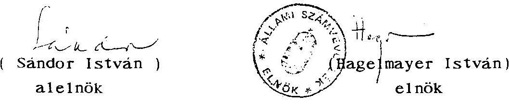

Melléklet: 1. - 66.

---

# MELLÉKLETEK JEGYZÉKE 

Alkalmazott főbb mértékegységek

1. A villamosenergia-ipar (MVM Rt.) jellemző műszaki adatai (1989-1994)
2. Főbb műszaki-gazdasági mutatók alakulása 1988-1994. években (mennyiségi mutatók, bevétel)
3. Főbb műszaki-gazdasági mutatók alakulása 1988-1994. években (ráfordítás, eredmény)
4. Általános adatok (1925-1994)
5. A teljesítőképesség jellemzői (1960-1994)
6. A VER-ben rendelkezésre álló összes villamosenergia és a nem kooperáló erőművek termelése (1950-től)
7. A nemzetközi villamosenergia forgalom (1985-1994)
8. Országos bruttó és nettó villamosenergia termelés, import-export szaldó és összes felhasználás (1925-től)
9. A VER teljesítőképességének fejlődése (1970-től)
10. A VER kooperációs alaphálózata
11. A hálózatok nyomvonalhossza (1955-től)
12. Elosztóhálózatok (1970-től)
13. Az MVM csoport erőmű részvénytársaságai
14. Az MVM csoportnál bekövetkezett bánya-erőművi integráció
15. Az erőművek villamos teljesítőképességének megoszlása a főbb iparcsoportok és nagyságrendjük szerint
16. Az MVM csoport erőműveinek termelése és felhasznált tüzelőanyag (1955-től)
17. A primerenergia felhasználás megoszlása 1994-ben
18. A villamosenergia fogyasztás befolyásolása a magyar VER-ben (1980-1994)
19. A villamos terhelés napi befolyásolása nyáron és télen
20. Az MVM csoport hőszolgáltatása (1984-1994)
21. Magyarország villamosenergia termelése és fogyasztása $(1990-1994)$

---

22. Az áramszolgáltatók villamosenergia értékesítése 1984. és 1994. között
23. Főbb fogyasztói csoportok fejlődése
24. Háztartások átlagfogyasztása áramszolgáltatónként
25. A termelés és fogyasztás folyamatábrája 1993.
26. A termelés és fogyasztás folyamatábrája 1994.
27. A villamosenergia termelés és az import szaldó részaránya a VER-ben (1992-1994)
28. Villamosenergia mérleg (1994. január-december)
29. Villamosenergia értékesítés tarifacsoportonként (1993-1994)
30. Villamosenergia értékesítés átvevő ágazatok szerint (1993-1994)
31. Erőművek villamosenergia értékesítése (1993-1994)
32. Erőművektől vásárolt villamosenergia (1993-1994)
33. Áramszolgáltatók villamosenergia vásárlása (1993-1994)
34. Az ENSZ-tagországok 1992. évi villamosenergia mérlege
35. Magyarország helyzete a világban (1992)

36/a. Az MVM csoport tulajdonosi struktúrája 1994. XII. 31 -én
36/b. Az MVM csoport tulajdonosi struktúrája 1992. I. 1-én
37. Tulajdonosi szerkezet kimutatása 1000 Ft-ban (1994. XII. 31.)
38. A kétszintű részvénytársaság szerződéses kapcsolatai
39. Mérleg (aktivák) (1994. XII. 31.)
40. Mérleg (passzivák) (1994. XII. 31.)

41/a. Saját tőke forrás- és eszközszerkezet (1993-1994)
41/b. Saját tőke összetétele (1991-1994)
42. Céltartalékképzés (1994. XII. 31.
43. Az MVM Rt. befektetéseinek vagyoni helyzete (1993-1994)
44. Értékvesztés (1994)
45. Tulajdon megoszlása (1994)
46. Befektetések értékvesztése (1994)

---

47. Az MVM Rt. érdekeltségeinek befektetései (1994)
48. "A" eredménykimutatás (1994. XII. 31.)
49. "B" eredménykimutatás (1994. XII. 31.)
50. Villamosenergia értékesítés folyamatában a "konszolidált" mérlegben bekövetkezett költségelemváltozások (1989-1994)
51. Költségek alakulása költségnemenként (1990-1994)
52. A fejlesztés és a javítás-karbantartási költségek alakulása 1990-től napjainkig
53. A beruházások pénzügyi teljesítése (táblázat) (1994)
54. A beruházások pénzügyi teljesítése (ábra) (1994)
55. Egyéb rendszerérdekű beruházások (1994)
56. Alaphálózati és infrastrukturális beruházások (1994)
57. Összefoglaló adatok a Magyar Villamos Művekről (1955-1994)
58. Foglalkoztatottak kereset és létszáma 1990-1994. években
59. Az MVM Rt. és a társaságok gazdasági eredménye, adófizetése és kapott támogatásaik 1990-től
60. A jelenleg hatósági áras energiahordozók árváltozási 1990. november 1. óta

61/a. A vezetékes energiahordozók és emelt áraik
61/b. Hőértékesítés teljesítmény- és hődíjai
62. Az energiahordozók termelői ára (1970-1995)
63. Az 1995. évi áremelés hatásai
64. Vélemény a nemzetközi energiaárak és a magyar árak összehasonlításáról
65. A villamosenergia-ipar szerkezete Nyugat-Európa néhány országában
66. A Kormány 1114/1994. (XII. 7.) Korm. határozata a villamosenergia-ipari társaságok privatizálásáról

---

# Alkalmazott főbb mértékegységek 

SI prefixumok:

|  |  |  |  | watt | watóra | joule |
| :--: | :--: | :--: | :--: | :--: | :--: | :--: |
| kilo | k | $10^{3}$ | egy kilo... | kW | kWh | kJ |
| Mega | M | $10^{6}$ | ezer kilo... | MW | MWh | MJ |
| Giga | G | $10^{9}$ | millió kilo... | GW | GWh | GJ |
| Tera | T | $10^{12}$ | milliárd kilo... | TW | TWh | TJ |
| Peta | P | $10^{15}$ | billió kilo... | PW | PWh | PJ |
| Exa | E | $10^{18}$ |  | EW | EWh | EJ |
|  |  |  |  |  |  |  |

## SI. átszámítások

Energia:

|  | kWh | MJ | Mcal |
| --: | --: | --: | --: |
| 1 kWh | 1 | 3,6 | 0,859845 |
| 1 MJ | 0,27778 | 1 | 0,238844 |
| 1 Mcal | 1,163 | 4,1868 | 1 |

Teljesítmény:

|  | kW | MJ/h | Mcal/h |
| :--: | :--: | :--: | :--: |
| 1 kW | 1 | 3,6 | 0,859845 |
| 1 MJ/h | 0,277778 | 1 | 0,238844 |
| 1 Mcal/h | 1,163 | 4,1868 | 1 |

---

A villamosenergiaipar (MVM Rt.) jellemző műszaki adatai

| MEGNEVEZÉS | Me. | 1989 | 1990 | 1991 | 1992 | 1993 | 1994 |
| :--: | :--: | :--: | :--: | :--: | :--: | :--: | :--: |
| Villamos teljesítőképesség (BT) | MW | 7,164 | 7,177 | 7,187 | 7,277 | 7,264 | 7,224 |
| Villamosenergia termelés | TWh | 28,6 | 27,5 | 29,1 | 30,7 | 32,0 | 32,7 |
| Villamosenergia felhasználás | TWh | 40,3 | 39,2 | 37,0 | 34,8 | 35,0 | 35,3 |
| Villamosenergia behozatal | TWh | 11,1 | 11,1 | 7,3 | 3,5 | 2,5 | 2,0 |
| Üzemi erőművi fejlesztés | TWh | 0,6 | 0,6 | 0,6 | 0,6 | 0,5 | 0,6 |
| Kiadott hőenergia | TJ | 57,0 | 55,6 | 56,3 | 50,1 | 49,2 | 43,6 |
| Csúcsterhelés | MW | 6,550 | 6,534 | 6,252 | 5,641 | 5,612 | 5,550 |
| Tüzelőanyag felhasználás | PJ | 381,5 | 365,2 | 377,2 | 386,4 | 393,1 | 390,1 |
| Villamosenergia fogyasztók szám | e db | 4715,3 | 4784,4 | 4842,4 | 4894,9 | 4934,4 | 4966,1 |
| Hálózatok nyomvonalhossza | km | 143,740 | 145,145 | 145,409 | 144,537 | 145,634 | 145,934 |
| Összes bevétel | MdFt | 112,7 | 136,0 | 162,2 | 172,9 | 174,5 | 180,0 |
| Összes ráfordítás | MdFt | 104,2 | 114,7 | 150,4 | 173,6 | 174,6 | 190,8 |
| Adózás előtti eredmény | MdFt | 8,5 | 21,3 | 11,8 | -0,7 | -0,1 | -10,8 |
| Villamosenergia nyeresége | MdFt | 26,6 | 36,1 | 24,5 | 15,1 | 11,3 | 4,9 |
| Nyereségadó | MdFt | 4,2 | 8,0 | 4,8 | 1,2 | 0,5 | 0,9 |
| Amortizáció | MdFt | 8,8 | 9,5 | 9,8 | 29,6 | 30,2 | 28,7 |

 |
| Beruházások pénzügyi telj. | MdFt | 13.8 | 16.0 | 12.8 | 18.7 | 19.6 | 41.3 |
| Mérleg főösszeg | MdFt | 192,121 | 213,517 | 226,773 | 619,536 | 671,786 | 681,988 |
| Összes létszám | fő | 43,481 | 42,329 | 39,657 | 36,473 | 39,955 | 44,125 |
| Személyi jellegű ráfordítások | MdFt | 9.4 | 12.3 | 15.5 | 20.4 | 30.6 | 33.3 |
| Bérköltség | MdFt | 6.0 | 7.8 | 9.3 | 13.1 | 16.7 | 20.6 |
| Állagkereset | Ft/fő/év | 152,691 | 208,944 | 292,966 | 372,648 | 460,194 | 563,156 |

---

# HAMTAH VILLAMOS MŰVEK

## HÁZVÉNYTÁRSASÁGA

ÖSSZESEN
Főbb műszaki gazdasági mutatók alakulása

| MEGNEVEZÉS | Me. | 1968. évi 1989. évi 1990. évi 1991. évi 1992. évi 1993. évi 1994. évi |  |  |  |  |  |  |
| :--: | :--: | :--: | :--: | :--: | :--: | :--: | :--: | :--: |
|  |  | tény | tény | tény | tény | tény | tény | tény |
| MŰSZAKI-GAZD. 8S MENNY. MUTATÓK |  |  |  |  |  |  |  |  |
| Fogyasztói csúcstelj. (50 Hz-cél) | MW | 6525 | 6550 | 6534 | 6200 | 5634 | 5612 | 5534 |
| Erőművek fejlesztése | GWh | 28226 | 28647 | 27463 | 29925 | 30709 | 31938 | 32693 |
| Ebből: szénfüt. erőművek | GWh | 8776 | 8660 | 8698 | 8178 | 9072 | 9043 | 8824 |
| Paksi atomerőmű termelése | GWh | 13445 | 13891 | 13731 | 13726 | 13964 | 13796 | 14049 |
| Szénhidrogén | GWh | 5838 | 5938 | 4946 | 6843 | 7516 | 8933 | 9659 |
| Vízierőmű | GWh | 169 | 158 | 178 | 200 | 157 | 166 | 161 |
| Özeni erőművek fejlesztése | GWh | 657 | 588 | 604 | 584 | 618 | 549 | 533 |
| Nem kooperáló erőműtől vett | GWh | 10 | 9 | 10 | 108 | 18 | 20 | 10 |
| Import szaldó | GWh | 11292 | 11084 | 11147 | 7271 | 3466 | 2474 | 2034 |
| FÜRRÁS ÖSSZESEN | GWh | 40187 | 40328 | 39224 | 36988 | 34811 | 34981 | 35270 |
| Erőművek önfogyasztása | % | 5.57% | 8.55% | 8.70% | 8.15% | 7.94% | 7.59% | 7.49% |
| Hőerőművek önfogyasztása | % | 10.89% | 10.93% | 11.39% | 10.17% | 9.62% | 8.96% | 8.76% |
| Fajlagos hőfelhasználás | kJ/kWh | 11,903 | 12,003 | 12,056 | 11,557 | 11,450 | 11,114 | 10,825 |
| Hálózati veszteség | % |  | 10.59% | 10.57% | 11.03% | 8.75% | 13.18% | 12.59% |
| Hazai értékesített vill.en. | GWh | 33014 | 33250 | 32288 | 30211 | 28956 | 27778 | 27982 |
| Ebből: lakossági | GWh | 8227 | 8654 | 9169 | 9768 | 10462 | 9722 | 9843 |
| éjszakai | GWh | 3136 | 3297 | 3449 | 3623 | 3800 | 3288 | 3296 |
| termelői | GWh | 24771 | 24577 | 23099 | 20443 | 18494 | 18056 | 18139 |
| Kiadott hőenergia | TJ | 58216 | 56995 | 55631 | 56334 | 50160 | 49180 | 43573 |
| Értékesített hőenergia | TJ | 57296 | 56035 | 54566 | 55510 | 49415 | 48377 | 42873 |
| Fajlagos hőfelhasználás | kJ/kJ | 1.320 | 1.316 | 1.307 | 1.308 | 1.296 | 1.281 | 1.277 |
| TÜZELŐANYAG FELHASZNÁLÁS |  |  |  |  |  |  |  |  |
| Összes szénfelhasználás | TJ | 133693 | 127779 | 124395 | 116303 | 119929 | 113855 | 108163 |
| ebből: matraaljai lignit | TJ | 32428 | 32266 | 33529 | 30390 | 41218 | 44552 | 44802 |
| Összes szénhidrogén | TJ | 100894 | 102459 | 92400 | 113248 | 115538 | 126394 | 129257 |
| ebből: olaj | TJ | 26172 | 20411 | 18553 | 38985 | 52789 | 67947 | 65786 |
| földgáz | TJ | 74722 | 82048 | 73847 | 74263 | 62749 | 58447 | 63471 |
| ÖSSZES tüzelőanyag | TJ | 234587 | 230238 | 216795 | 229551 | 235467 | 240249 | 237440 |
| ÁRBEVÉTEL |  |  |  |  |  |  |  |  |
| Vill.energia értékesítés | MFt | 81779 | 84874 | 103007 | 129282 | 129312 | 130775 | 133095 |
| Fogyasztói szolgálat | MFt | 20 | 21 | 30 | 83 | 106 | 131 | 196 |
| Vill.en.ért.nettó árbev. | MFt | 81799 | 84895 | 103037 | 129365 | 129418 | 130906 | 133291 |
| Hőértékesítés | MFt | 12466 | 13034 | 13780 | 16612 | 16666 | 18411 | 16636 |
| Hálózatszerelés | MFt | 3052 | 3525 | 4158 | 4429 | 1945 | 1395 | 2337 |
| Egyéb tevékenység | MFt | 7879 | 10668 | 14047 | 6903 | 4650 | 4805 | 9719 |
| Egyéb bevétel | MFt |  |  |  |  | 2018 | 3646 | 4136 |
| ÖZEMI TEV. ÁRBEVÉTELE ÖSSZESEN | MFt | 105196 | 112122 | 135022 | 157309 | 154597 | 159363 | 166619 |
| Pénzügyi tev.bevétele | MFt |  |  |  |  | 1184 | 5519 | 8269 |
| Rendkívüli bevételek | MFt | 1102 | 594 | 1047 | 4916 | 10903 | 9690 | 5134 |
| BEVÉTELEK ÖSSZESEN | MFt | 106298 | 112716 | 136069 | 162225 | 166684 | 174572 | 170022 |

---

VILLAMOS MŰVEK
HÁZVÉNYTÁRSASÁGA
ÖSSZESEN
Főbb műszaki gazdasági mutatók alakulása

1988-1994 éveken

1988. évi 1989. évi 1990. évi 1991. évi 1992. évi 1993. évi 1994. évi
MEGNEVEZÉS Me.
tény tény tény tény tény tény tény tény

ÖNKÖLTSÉG
Tüzelő + fuvarköltség MFt 24510 25918 32872 49641 52169 54169 56260
Nukleáris Szemanyagköltség MFt 2729 2802 2836 2808 5212 5290 5645
Vill.en.import vásárlás MFt 9179 10333 9760 24072 9575 7046 6527
Vill.en.szemi vásárlás MFt 85 36 97 417 320 433 342
Energia költségek össz.: MFt 36503 39089 45565 76938 67276 66848 68774
Vill.en.üzletág MFt 27994 30283 33571 59899 52131 51703 54754
Hőértékesítési üzletág MFt 8433 8725 11897 16912 14915 14869 13930
Egyéb anyagfelhasználás MFt 9232 9796 11404 14433 15036 14252 15669
Igénybevett anyagjell.szolg. MFt 8649 8236 8781
Eladott áruk besz.értéke MFt 1408 1226 1159 1024 1475 863 1062
Alvállalkozók MFt 2089 3785 6724 3303 914 23 16
ANYAGJELEGŰ RÁFORD. ÖSSZESEN MFt 49232 53896 64852 95698 93350 90222 94302
Bérköltség MFt 5254 6041 7874 10384 13008 16678 20622
Személyi jellegű egyéb kifiz. MFt 1364 2208 3068
Eözteher MFt 2096 2810 3726 4855 6074 8267 9656
SZEMÉLYI JELEGŰ RÁFORD. ÖSSZESEN MFt 7350 8851 11600 15239 19082 24945 30278
Értékcsökkenés-leírás MFt 8302 8848 9513 10651 29655 28364 26685
Egyéb költség MFt 10530 12080 14152 17189 5431 6967 8732
Allományváltozás + -
MFt -77 473 -165 -318 -7331 -5681 -3335
Egyéb ráfordítás MFt 5851 6968 10633
ÖSSZES ÜZLETÁGI KÖLTSÉG MFt 75337 84148 99952 138459 147402 154013 172393

Pénzügyi műveletek ráfordítása MFt 4107 8529 8977
Rendkívüli ráfordítások MFt 28949 20084 14798 11919 15895 14063 9482

ÖSSZES RÁFORDÍTÁS MFt 104286 112761 123727 160378 187404 174805 190852

Ráford.hányad %
Egyéb nem energia ktg.:
ébből: VHSS ktg.
egyéb üzletág
egyéb ráfordítás
0
88.11% 92.46% 84.33% 92.70% 100.42% 100.02% 106.92%
MFt 36834 45059 54387 61521 80128 87165 103619
2898 3251 3863 3951 1771 1387 2801
6528 10296 13136 7517 4831 4846 10508
0.0 0 0 5851 6968 10633
0.0 0 0 5851 6968 10633
0.0 0 0 5851 6968 10633
Vill.en.term.áll.költség MFt 27484 31593 37485 50180 67904 74241 79767
Vill.en.term.áll.költség MFt 12626 14692 17253 22344 32609 36415 37023
Elosztási és átviteli költség MFt 11936 13338 18095 22619 29575 31512 36619
Hőértékesítés áll.költség MFt 2922 3563 4137 5217 5720 6314 6125

EREDMÉNY
ÜZLETÁGI EREDMÉNY MFt 29859 27974 35070 18850 7195 5350 -5774
Vill.en.eredménye MFt 29243 28582 36118 24503 15103 11276 4895
Hőért.eredménye MFt 1111 746 -2254 -5517 -3969 -2772 -3419
VHSS eredménye MFt 154 274 295 478 74 8 36
Egyéb tev.eredménye MFt -649 372 911 -614 -161 -41 -769
Egyéb eredmény MFt 0 0 0 0 -3833 -3122 -6497
Pénzügyi tev.eredménye MFt 0 0 0 0 -2923 -1010 -708
Rendkívüli eredmény MFt -27847 -19470 -13749 -7003 -4992 -4373 -4348
ADÓZATLAN EREDMÉNY MFt 2012 8504 21321 11847 -720 -33 -10830

---

## Általános adatok

## Magyarország villamosenergia-termelése és fogyasztása

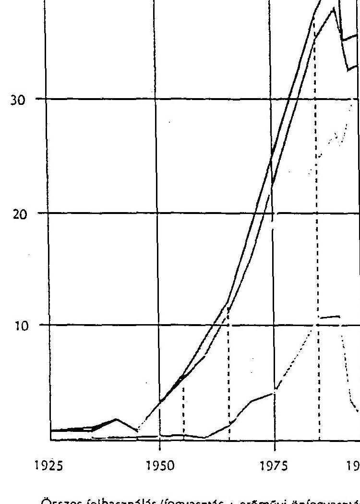

A diagram az országos villamosenergia-fogyasztás + hálózati veszteség (bruttó fogyasztás) alakulását tünteti fel 1925 és 1994 között. Ez a villamosenergiamennyiség állt az ország fogyasztóinak a rendelkezésére a hazai nettó termelésből és importból együttesen. Bemutatja emellett az ország összes villamosenergia-felhasználását, azaz az erőművi önfogyasztással növelt bruttó fogyasztást - mivel a népgazdasági tervezés általában ezt az adatot használja -, valamint a hazai erőművek nettó termelését és a villamosenergia-importszaldo alakulását is. A diagram így lehetőséget nyújt e kategóriák arányváltozásainak vizsgálatára.
A bruttó fogyasztási adatok országos értékek, amelyekből közel 98%-ot fedez a magyar villamosenergia-rendszer termelése és az import, és 2%-ot sem éri el a villamosenergia-rendszeren kívüli üzemi erőművek termelése.
Nem tüntettük fel külön a vízerőművek termelését sem, mivel ez az összes hazai termelés 0,6 százaléka alatt van.

TWh
35,55
32,99
30,96
2,03

1994-ben az országos fogyasztás + veszteség 32,99 TWh volt. Ez 1989-hez képest 13,4%-os csökkenést jelent, ugyanakkor 1993-hoz viszonyítva némi emelkedés -0,5% - tapasztalható.

---

# A teljesítőképesség jellemzői (kooperáció) 

|  |  |  |  |  | A VER teljesítőképességének |
| :--: | :--: | :--: | :--: | :--: | :--: |
|  |  |  |  |  | fejlődése |
| Kód | Megnevezés | 1989 | 1993 | 1994 | Növekedés |
|  | Kooperáló |

  |  |  |  |
|  | erőművek BT-je | 7168 | 7259 | 7317 | 58 |
|  | Kooperáló |  |  |  |  |
|  | erőművek RT-je | 7075 | 6566 | 6676 | $+110$ |
|  | MVM-csoport erőműveinek |  |  |  |  |
|  | BT-je | 6956 | 7043 | 7105 | 63 |
|  | MVM-csoport erőműveinek |  |  |  |  |
|  | RT-je | 6871 | 6464 | 6584 | 120 |
|  | A VER-erőművek csúcsterhelése | 4855 | 5479 | 5288 | $-191$ |
|  | Karantált import | 1900 | 260 | 350 | 90 |

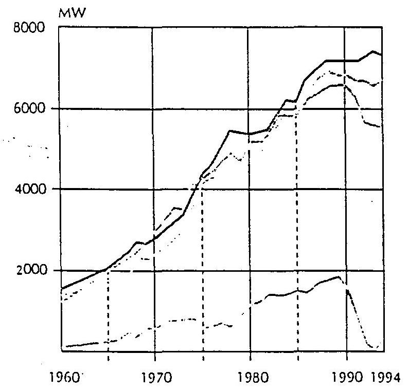

A VER importtal növelt év végi teljesítőképessége és terhelése

A VER fogyasztói csúcsterhelése 1989-ben 6553 MW volt, míg 1994-ben 5500 MW-ra esett vissza, ami több mint 1000 MW csökkenést jelent.
Az év végi rendelkezésre álló teljesítőképesség esetében, az 1993. évihez képest némi emelkedés mutatkozik, de az 1989-es érték így is 1899 MW-tal volt nagyobb.

| Kód | Megnevezés | 1989 | 1993 | 1994 | Növekedés |
| :--: | :--: | :--: | :--: | :--: | :--: |
|  | BT + import | 9018 | 7519 | 7667 | 148 |
|  | RT + import | 8925 | 6826 | 7026 | 200 |
|  | Karantált import | 1850 | 260 | 350 | 90 |
|  | Csúcsterhelés | 6553 | 5612 | 5550 | $-62$ |

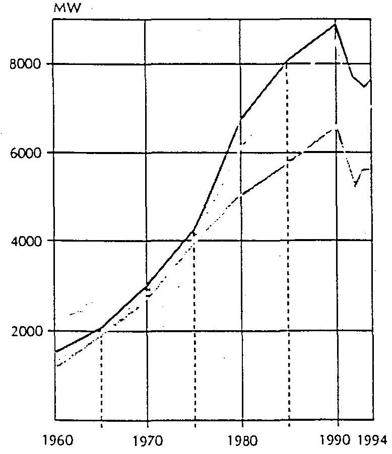

---

A VER-ben rendelkezésre álló összes villamos energia és a nem kooperáló erőművek termelése

Mind az erőművek teljesítőképességének, mind az import szaldó adatai december havi munkanapi csúcsidei átlagok (bejáratási próbával).

|  |   |   |   |   |   |   |   |   |   |   |   |   |   |
| --- | --- | --- | --- | --- | --- | --- | --- | --- | --- | --- | --- | --- | --- |
|   |  |  |  | Import teljesít- | A VER-ben | Évi max. | MVM- |  | Villamosenergia-termelés (bruttó) és az import szaldó |  |  |  |   |
|   |  |  |  | mét | összevet | csúcster- | erőművek |  |  |  |  |  |   |
|   |  |  |  | rendelke- |  | helés |  |  |  |  |  |  |   |
|   |  |  |  | zésre álló |  | (fényszám) |  |  |  |  |  |  |   |
|   |  |  |  | (fényszám) | (fényszám) | (fényszám) |  |  |  |  |  |  |   |
|   |  |  |  | *< 49,911z | *< 49,911z |  |  |  |  |  |  |  |   |
|  fv |  |  |  |  |  |  |  |  |  |  |  |  |   |
|   | BT | RTA | RT |  |  |  |  |  |  |  |  |  |   |
|   |  |  |  |  |  |  |  |  |  |  |  |  |   |
|   |  |  |  | MW |  |  |  |  |  |  |  |  |   |
|   | 1 | 2 | 3 | 4 | 5 | 6 | 7 | 8 | 9 | 10 | 11 | 12 | 13  |
|  1950 | 675 | - | - | - | - | 486 | - | 2290 | 467 | 2757 | -2 | 2755 | 244  |
|  1955 | 1120 | 1008 | 984 | 45 | 1029 | 885 | - | 4237 | 881 | 5118 | 248 | 5366 | 310  |
|  1960 | 1483 | 1361 | 1333 | 109 | 1442 | 1293 | 325,9 | 6511 | 921 | 7432 | 536 | 7968 | 185  |
|  1965 | 2108 | 1893 | 1815 | 249 | 2064 | 7993 | 933,6 | 9947 | 1031 | 10978 | 1289 | 12267 | 199  |
|  1966 | 2256 | 1904 | 1947 | 311 | 2258 | 2168 | 1037,0 | 10581 | 1076 | 11657 | 1556 | 13213 | 204  |
|  1967 | 2456 | 1956 | 1850 | 449 | 2299 | 2325 | 1266,0 | 11191 | 1089 | 12280 | 1905 | 14185 | 210  |
|  1968 | 2633 | 2391 | 2346 | 352 | 2698 | 2504 | 1530,2 | 11998 | 966 | 12964 | 2242 | 15206 | 221  |
|  1969 | 2680 | 2432 | 2307 | 555 | 2862 | 2719 | 1785,9 | 12858 | 982 | 13840 | 2400 | 16240 | 229  |
|  1970 | 2817 | 2595 | 2453 | 559 | 3012 | 2983 | 1988,9 | 13386 | 934 | 14320 | 3395 | 17715 | 222  |
|  1971 | 2997 | 2794 | 2651 | 744 | 3395 | 3221 | 2174,8 | 13900 | 885 | 14785 | 4346 | 19131 | 209  |
|  1972 | 3211 | 2928 | 2865 | 280 | 3645 | 3486 | 2361,1 | 15211 | 902 | 16113 | 4291 | 20503 | 210  |
|  1973 | 3384 | 3094 | 3059 | 766 | 3825 | 3784 | 2586,8 | 16500 | 927 | 17427 | 4662 | 22089 | 217  |
|  1974 | 3911 | 3601 | 3567 | 766 | 4343 | 4018 | 2753,9 | 17915 | 841 | 18756 | 4659 | 23415 | 239  |
|  1975 | 4449 | 4155 | 4168 | 603 | 4771 | 4185 | 2860,2 | 19358 | 885 | 20243 | 4124 | 24368 | 229  |
|  1976 | 4646 | 4528 | 4340 | 526 | 4866 | 4407* | 2989,0 | 20915 | 882 | 21797 | 4116 | 25913 | 253  |
|  1977 | 5075 | 4904 | 4784 | 707 | 5491 | 4722* | 3146,3 | 22255 | 896 | 23151 | 4443 | 27594 | 251  |
|  1978 | 5490 | 5259 | 5132 | 658 | 5790 | 5034* | 3386,5 | 24387 | 920 | 25307 | 4552 | 29859 | 249  |
|  1979 | 5410 | 5105 | 4916 | 978 | 5894 | 4718* | 4149,4 | 25355 | 868 | 24223 | 6426 | 30349 | 292  |
|  1980 | 5392 | 5226 | 5023 | 1222 | 6245 | 5107* | 4328,8 | 22664 | 885 | 23549 | 7386 | 30935 | 326  |
|  1981 | 5395 | 5184 | 4991 | 1232 | 6223 | 5173* | 4408,4 | 23114 | 839 | 23953 | 7984 | 31937 | 347  |
|  1982 | 5454 | 5203 | 5015 | 1483 | 6498 | 5439* | 4515,8 | 23534 | 973 | 24307 | 8741 | 33048 | 468  |
|  1983 | 5864 | 5743 | 5527 | 1455 | 6982 | 5878* | 4660,4 | 24594 | 792 | 25386 | 9076 | 34462 | 404  |
|  1984 | 6220 | 6145 | 5920 | 1486 | 7406 | 5833* | 4832,4 | 25193 | 731 | 25924 | 10269 | 36193 | 379  |
|  1985 | 6220 | 6158 | 5922 | 1551 | 7473 | 5865* | 4975,1 | 25821 | 586 | 26407 | 10807 | 37214 | 389  |
|  1986 | 6680 | 6594 | 6368 | 1482 | 7850 | 6240 | 5032,6 | 27039 | 680 | 27719 | 10516 | 38235 | 345  |
|  1987 | 6924 | 6852 | 6704 | 1708 | 8712 | 6371 | 4974,1 | 28754 | 650 | 29404 | 10613 | 40017 | 350  |
|  1988 | 7172 | 7133 | 6907 | 1780 | 8687 | 6523 | 4984,9 | 28228 | 657 | 28885 | 11292 | 40177 | 348  |
|  1989 | 7168 | 7075 | 6784 | 1850 | 8634 | 6550 | 4997,6 | 28647 | 588 | 29235 | 11084 | 40319 | 346  |
|  1990 | 7184 | 7071 | 6812 | 1609 | 8420 | 6534 | 5025,0 | 27463 | 604 | 28067 | 11147 | 39214 | 396  |
|  1991 | 7193 | 6986 | 6704 | 938 | 7642 | 6252 | 4915,0 | 29025 | 584 | 29609 | 7351 | 36960 | 340  |
|  1992 | 7278 | 6942 | 6662 | 218 |

 6880 | 5641 | 4684,7 | 30709 | 618 | 31327 | 3467 | 34794 | 300  |
|  1993 | 7404 | 6854 | 6566 | 95 | 6561 | 5612 | 4327,1 | 31962 | 5459 | 32531 | 2475 | 35006 | 300  |
|  1994 | 7317 | 6979 | 6676 | 329 | 7005 | 5550 | 4173,3 | 32693 | 522 | 33215 | 2034 | 35249 | 300  |

---

A nemzetközi villamos energia-forgalom
A villamos energia export-import éves forgalmának alakulása 1985-1994
években

Import
Export

|  |  | 1985 | 1986 | 1987 | 1988 | 1989 | 1990 | 1991 | 1992 | 1993 | GWh   1994 |
| :--: | :--: | :--: | :--: | :--: | :--: | :--: | :--: | :--: | :--: | :--: | :--: |
| Szovjetunió (Ukrajna) | Import Export | $\begin{gathered} 11055 \\ 25 \end{gathered}$ | $\begin{gathered} 9670 \\ 8 \end{gathered}$ | $\begin{gathered} 11094 \\ 4 \end{gathered}$ | $\begin{gathered} 12426 \\ 3 \end{gathered}$ | $\begin{gathered} 11560 \\ 14 \end{gathered}$ | $\begin{gathered} 12160 \\ 10 \end{gathered}$ | $\begin{gathered} 6605 \\ 243 \end{gathered}$ | $\begin{gathered} 2741 \\ 544 \end{gathered}$ | $\begin{gathered} 1604 \\ 781 \end{gathered}$ | $\begin{gathered} 1037 \\ 331 \end{gathered}$ |
| Csehszlovákia (Szlovákia) | Import Export | $\begin{gathered} 1520 \\ 1566 \end{gathered}$ | $\begin{gathered} 1912 \\ 1048 \end{gathered}$ | $\begin{gathered} 1233 \\ 1642 \end{gathered}$ | $\begin{gathered} 920 \\ 1985 \end{gathered}$ | $\begin{gathered} 1122 \\ 1169 \end{gathered}$ | $\begin{gathered} 778 \\ 1506 \end{gathered}$ | $\begin{gathered} 1393 \\ 431 \end{gathered}$ | $\begin{gathered} 1497 \\ 367 \end{gathered}$ | $\begin{gathered} 1846 \\ 249 \end{gathered}$ | $\begin{gathered} 1195 \\ 183 \end{gathered}$ |
| Románia | Import Export | - | - | - | - | - | - | - | - | 34 | 218 |
|  |  |  | - | - | - | - | 61 | - | 106 | - | - |
| Jugoszlávia   (Kis Jugoszlávia) | Import Export | $\begin{gathered} 20 \\ 163 \end{gathered}$ | $\begin{gathered} 19 \\ 99 \end{gathered}$ | $\begin{gathered} 21 \\ 173 \end{gathered}$ | $\begin{gathered} 2 \\ 162 \end{gathered}$ | $\begin{gathered} 5 \\ 504 \end{gathered}$ | $\begin{gathered} 62 \\ 294 \end{gathered}$ | $\begin{gathered} 157 \\ 60 \end{gathered}$ | $\begin{gathered} 504 \\ 31 \end{gathered}$ | $\begin{gathered} 207 \\ 15 \end{gathered}$ | - |
| Jugoszlávia   (Horvátország) | Import Export | $\begin{gathered} 14 \\ 10 \end{gathered}$ | $\begin{gathered} 11 \\ 24 \end{gathered}$ | $\begin{gathered} 3 \\ 18 \end{gathered}$ | - | $\begin{gathered} 5 \\ 10 \end{gathered}$ | 1 | - | - | - | - |
| Ausztria | Import Export | $\begin{gathered} 123 \\ 160 \end{gathered}$ | $\begin{gathered} 250 \\ 167 \end{gathered}$ | $\begin{gathered} 252 \\ 161 \end{gathered}$ | $\begin{gathered} 251 \\ 172 \end{gathered}$ | $\begin{gathered} 254 \\ 175 \end{gathered}$ | $\begin{gathered} 200 \\ 183 \end{gathered}$ | $\begin{gathered} 255 \\ 325 \end{gathered}$ | $\begin{gathered} 246 \\ 472 \end{gathered}$ | $\begin{gathered} 402 \\ 355 \end{gathered}$ | $\begin{gathered} 505 \\ 285 \end{gathered}$ |

Az 1994. évi export-import havi forgalma

Import Export

|  |  | 01. | 02. | 03. | 04. | 05. | 06. | 07. | 08. | 09. | 10. | 11. | $\begin{gathered} \text { GWh } \\ 12 . \end{gathered}$ |
| :--: | :--: | :--: | :--: | :--: | :--: | :--: | :--: | :--: | :--: | :--: | :--: | :--: | :--: |
| Ukrán | Import   Export | $\begin{gathered} 48,3 \\ 51,5 \end{gathered}$ | $\begin{gathered} 32,9 \\ 39,2 \end{gathered}$ | $\begin{gathered} 48,8 \\ 40,2 \end{gathered}$ | $\begin{gathered} 70,7 \\ 58,1 \end{gathered}$ | $\begin{gathered} 50,4 \\ 54,7 \end{gathered}$ | $\begin{gathered} 43,3 \\ 51,4 \end{gathered}$ | $\begin{gathered} 37,7 \\ 26,4 \end{gathered}$ | $\begin{gathered} 129,0 \\ 1,4 \end{gathered}$ | $\begin{gathered} 104,7 \\ 6,8 \end{gathered}$ | $\begin{gathered} 180,8 \\ 0,1 \end{gathered}$ | $\begin{gathered} 154,6 \\ 0,2 \end{gathered}$ | $\begin{gathered} 136,1 \\ 0,4 \end{gathered}$ |
| Szlovák | Import Export | $\begin{gathered} 182,1 \\ 1,7 \end{gathered}$ | $\begin{gathered} 142,5 \\ 1,7 \end{gathered}$ | $\begin{gathered} 197,2 \\ 1,9 \end{gathered}$ | $\begin{gathered} 50,2 \\ 21,4 \end{gathered}$ | $\begin{gathered} 79,8 \\ 3,6 \end{gathered}$ | $\begin{gathered} 81,4 \\ 14,2 \end{gathered}$ | $\begin{gathered} 85,4 \\ 31,0 \end{gathered}$ | $\begin{gathered} 69,2 \\ 44,7 \end{gathered}$ | $\begin{gathered} 128,2 \\ 1,7 \end{gathered}$ | $\begin{gathered} 39,0 \\ 30,9 \end{gathered}$ | $\begin{gathered} 66,8 \\ 17,7 \end{gathered}$ | $\begin{gathered} 72,9 \\ 12,6 \end{gathered}$ |
| Román | Import Export | $\begin{gathered} 34,5 \\ - \end{gathered}$ | - | - | 5,9 | 23,6 | 10,0 | 28,5 | 43,9 | 43,8 | 18,3 | 9,2 | - |
|  |  |  | - | - | - | - | - | - | - | - | - | - | - |
| Osztrák | $\begin{aligned} & \text { Import } \\ & \text { Export } \end{aligned}$ | $\begin{gathered} 101,9 \\ 101,9 \end{gathered}$ | $\begin{gathered} 5,3 \\ 37,2 \end{gathered}$ | $\begin{gathered} 130,7 \\ - \end{gathered}$ | $\begin{gathered} 165,7 \\ - \end{gathered}$ | $\begin{gathered} 79,6 \\ - \end{gathered}$ | $\begin{gathered} 72,7 \\ - \end{gathered}$ | $\begin{gathered} 17,5 \\ 6,5 \end{gathered}$ | $\begin{gathered} 33,6 \\ - \end{gathered}$ | $\begin{gathered} 0,1 \\ 1,3 \end{gathered}$ | - | - | - |
| Horvát | Import Export | - | - | - | - | - | - | - | - | - | - | - | - |

---

Országos bruttó és nettó villamosenergia-termelés, import-export szaldó és összes felhasználás

| Év | Bruttó termelés | Erőművi öntogyasztás | Nettó termelés | Import | Export | Import-export szaldó | Összes felhasználás | Bruttó fogyasztás | Hálózati veszteség | Nettó fogyasztás |
| :--: | :--: | :--: | :--: | :--: | :--: | :--: | :--: | :--: | :--: | :--: |
|  | 1 | 2 | $3=(1-2)$ | 4 | 5 | $6=(4-5)$ | $7=(1+6)$ | $8=(7-2)$ | 9 | $10=(8-9)$ |
| 1925 | 610 | 40 | 70 | - | - | - | 610 | 570 | 95 | 475 |
| 1930 | 882 | 59 | 823 | - | - | - | 882 | 823 | 128 | 695 |
| 1935 | 1106 | 70 | 1036 | - | - | - | 1106 | 1036 | 122 | 914 |
| 1940 | 1836 | 108 | 1728 | 16 | 1 | 15 | 1815 | 1743 | 180 | 1563 |
| 1945 | 762 | 68 | 694 | 1 | 3 | 2 | 760 | 692 | 102 | 590 |
| 1950 | 3001 | 253 | 2748 | 3 | 5 | 2 | 2999 | 2746 | 245 | 2501 |
| 1955 | 5428 | 486 | 4942 | 256 | 8 | 248 | 5676 | 5190 | 499 | 4691 |
| 1960 | 7617 | 713 | 6904 | 537 | 1 | 536 | 8153 | 7440 | 754 | 6686 |
| 1965 | 11177 | 1108 | 10069 | 1387 | 98 | 1289 | 12466 | 11358 | 948 | 10410 |
| 1966 | 11861 | 1184 | 10677 | 1704 | 148 | 1556 | 13417 | 12233 | 1004 | 11229 |
| 1967 | 12490 | 1253 | 11237 | 2201 | 296 | 1905 | 14395 | 13142 | 1049 | 12093 |
| 1968 | 13155 | 1313 | 11842 | 2734 | 492 | 2242 | 15397 | 14084 | 1243 | 12841 |
| 1969 | 14069 | 1350 | 12719 | 3337 | 937 | 2400 | 16469 | 15119 | 1357 | 13762 |
| 1970 | 14542 | 1416 | 13126 | 4058 | 663 | 3395 | 17937 | 16521 | 1513 | 15008 |
| 1971 | 14994 | 1488 | 13506 | 5113 | 767 | 4346 | 19340 | 17852 | 1598 | 16254 |
| 1972 | 16323 | 1651 | 14672 | 5304 | 913 | 4391 | 20713 | 19062 | 1707 | 17355 |
| 1973 | 17644 | 1770 | 15874 | 5732 | 1070 | 4662 | 22306 | 20536 | 1905 | 18631 |
| 1974 | 18985 | 1823 | 17262 | 5756 | 1097 | 4659 | 23644 | 21821 | 1951 | 19870 |
| 1975 | 20472 | 1834 | 18638 | 5802 | 1678 | 4124 | 24597 | 22762 | 1955 | 20807 |
| 1976 | 22050 | 1876 | 20174 | 5578 | 1462 | 4116 | 26166 | 24290 | 2092 | 22197 |
| 1977 | 23402 | 1956 | 21446 | 5408 | 965 | 4443 | 27845 | 25889 | 2195 | 23694 |
| 1978 | 25556 | 2064 | 23492 | 5762 | 1210 | 4552 | 30108 | 28044 | 2400 | 26644 |
| 1979 | 24515 | 1999 | 22516 | 8286 | 2060 | 6126 | 30641 | 28642 | 2366 | 26276 |
| 1980 | 23875 | 1963 | 21912 | 10182 | 2796 | 7386 | 31261 | 29298 | 2831 | 26467 |
| 1981 | 24300 | 1983 | 22317 | 10625 | 2641 | 7984 | 32284 | 30301 | 2949 | 27352 |
| 1982 | 24775 | 2036 | 22739 | 10421 | 1680 | 8741 | 33516 | 31480 | 3182 | 28298 |
| 1983 | 25790 | 2162 | 23628 | 10817 | 1741 | 9076 | 34866 | 32704 | 3325 | 29379 |
| 1984 | 26303 | 2229 | 24074 | 11589 | 1320 | 10269 | 36572 | 34343 | 3460 | 30883 |
| 1985 | 26796 | 2243 | 24553 | 12731 | 1924 | 10807 | 37603 | 35360 | 3589 |

 31771 |
| 1986 | 28064 | 2344 | 25720 | 11862 | 1346 | 10516 | 38580 | 36263 | 3836 | 3240 |
| 1987 | 29749 | 2535 | 27214 | 12610 | 1997 | 10613 | 40362 | 37824 | 4017 | 33810 |
| 1988 | 29233 | 2571 | 26662 | 13615 | 2323 | 11292 | 40525 | 37954 | 4219 | 33735 |
| 1989 | 29581 | 2599 | 26982 | 12959 | 1875 | 11084 | 40665 | 38066 | 4143 | 33942 |
| 1990 | 28436 | 2537 | 25899 | 13299 | 2152 | 11147 | 39583 | 37046 | 4036 | 33010 |
| 1991 | 29963 | 2498 | 27465 | 8410 | 1059 | 7351 | 37314 | 34816 | 3871 | 30945 |
| 1992 | 31685 | 2566 | 29119 | 4988 | 1521 | 3467 | 35152 | 32586 | 2841 | 29745 |
| 1993 | 32915 | 2561 | 30354 | 4093 | 1619 | 2475 | 35390 | 32829 | 4358 | 28471 |
| 1994 | 33515 | 2556 | 30959 | 2954 | 920 | 2034 | 35549 | 32993 | 4253 | 28740 |

---

# A VER teljesítőképességének fejlődése 

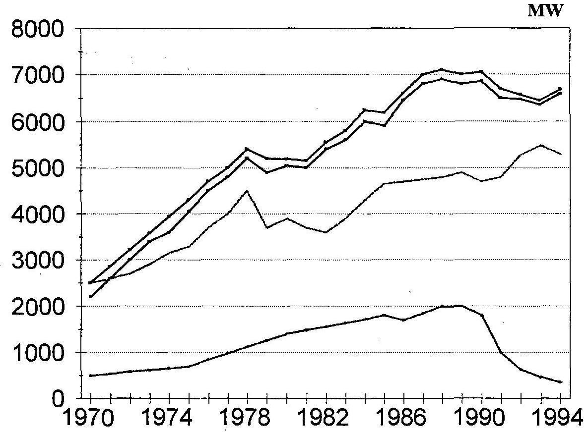

|  | Kooperáló erőművek Rt-je |
| :--: | :--: |
|  | MVM erőművek RT-je |
|  | VER erőművek decemberi csúcsteljesítménye |
|  | Import szakló |

VER Válamos Energia Rendszer
RT Rendelkezésre álló teljesítőképesség: az a legnagyobb villamos teljesítmény-ban, amelyet az erőművek az állandó és változó hiányok, ill. többletek figyelembevételével normál üzemben kényszerkiesés nélkül szolgáltatni tudnak.

---

# A VER kooperációs alapbázisa 

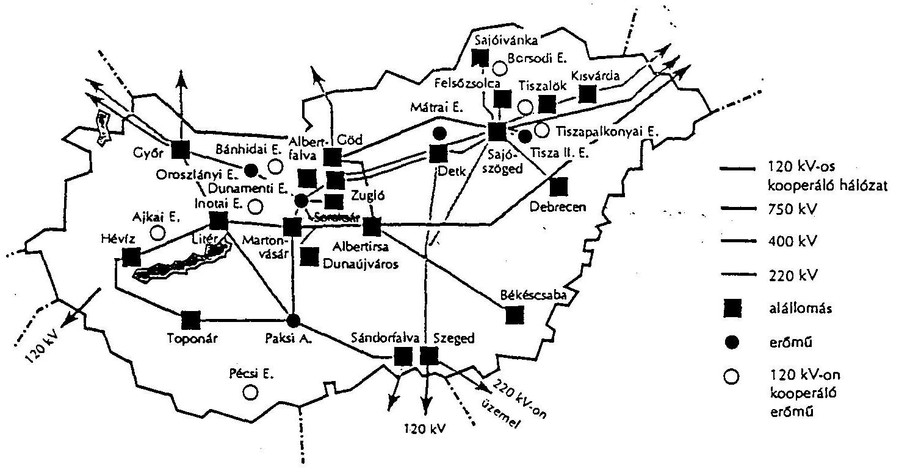

| Kód | Feszültség | 1951 | 1960 | 1970 | 1980 | 1990 | 1994 |
| :--: | :--: | :--: | :--: | :--: | :--: | :--: | :--: |
|  | 750 kV | - | - | - | 268 | 268 | 268 |
|  | 400 kV | - | - | 260 | 950 | 1477 | 1574 |
|  | 220 kV | - | 70 | 1158 | 1246 | 1250 | 1178 |
|  | 120 kV | 701 | 2360 | 2517 | 2794 | 2515 | 116 |
|  | 60 kV | 203 | 31 | - | - | - | - |
|  | Összesen | 904 | 2468 | 3935 | 5258 | 5510 | 3136 |

Az alaphálózat fejlődésére jellemző a vezetékek együttes nyomvonalának hossza.
A 120 kV-os vezetékszint legnagyobb részben átvette a főelosztóhálózat feladatát és 1992-től az áramszolgáltató részvénytársaságokhoz tartozik, így ez a táblázatban nem szerepel.
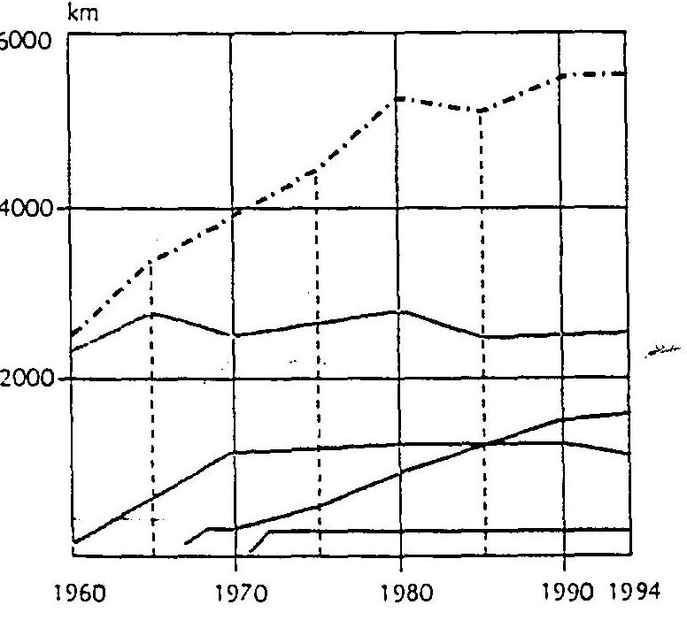

---

# A hálózatok nyomvonalhossza 

|  | A hálózatok nyomvonalhossza (km) az egyes évek végén (kábel + szabadvezeték) |  |  |  |  |  |  |
| :--: | :--: | :--: | :--: | :--: | :--: | :--: | :--: |
|  | Közép- és nagyfeszültség |  |  |  |  |  | Összesen |
| Év | Összesen |  |  |  | -Ebből alap és   főelosztóhálózat | Kisfeszültség |  |
|  | 1-120 kV | 220 kV | 400 kV | 750 kV | 120-400-750 kV | $<1 \mathrm{kV}$ |  |
| 1955 | 24097 |  |  |  | 1775 | 23579 | 47676 |
| 1960 | 32183 | 77 |  |  | 2467 | 31083 | 63343 |
| 1965 | 43073 | 583 |  |  | 3399 | 38343 | 81999 |
| 1970 | 48670 | 1158 | 260 |  | 4869 | 47412 | 97500 |
| 1975 | 53684 | 1193 | 509 |  | 6198 | 54314 | 109700 |
| 1976 | 54501 | 1229 | 700 |  | 6290 | 55846 | 112276 |
| 1977 | 55464 | 1229 | 712 |  | 6496 | 57540 | 114945 |
| 1978 | 56749 | 1246 | 904 | 268 | 7069 | 59202 | 118369 |
| 1979 | 58131 | 1246 | 904 | 268 | 7175 | 60752 | 121301 |
| 1980 | 58867 | 1246 | 950 | 268 | 7389 | 62190 | 123521 |
| 1981 | 59478 | 1250 | 950 | 268 | 7466 | 63596 | 125542 |
| 1982 | 60363 | 1250 | 1062 | 268 | 7625 | 65053 | 127996 |
| 1983 | 60322 | 1250 | 1062 | 268 | 7782 | 65784 | 128686 |
| 1984 | 61325 | 1250 | 1062 | 268 | 7835 | 67521 | 131426 |
| 1985 | 62208 | 1250 | 1165 | 268 | 8023 | 69122 | 134013 |
| 1986 | 62859 | 1250 | 1255 | 268 | 8113 | 70585 | 136217 |
| 1987 | 63503 | 1251 | 1448 | 268 | 8300 | 72237 | 138707 |
| 1988 | 64235 | 1251 | 1477 | 268 | 8471 | 73575 | 140806 |
| 1989 | 65436 | 1251 | 1477 | 268 | 8560 | 75308 | 143740 |
| 1990 | 66139 | 1251 | 1477 | 268 | 8665 | 76010 | 145145 |
| 1991 | 65824 | 1288 | 1609 | 268 | 9056 | 76420 | 145409 |
| 1992 | 66009 | 1190 | 1536 | 268 | 8967 | 75534 | 144537 |
| 1993 | 66372 | 1190 | 1595 | 268 | 9184 | 76209 | 145634 |
| 1994 | 66372 | 1190 | 1595 | 268 | 9184 | 76509 | 145934 |

---

# Elosztó hálózatok 

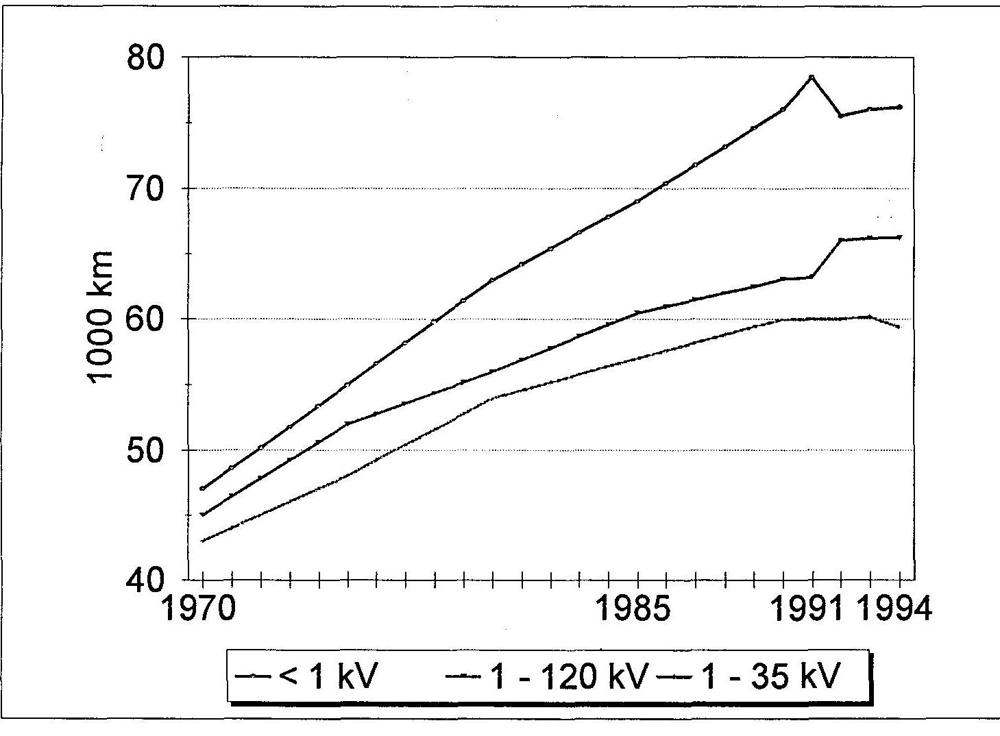

---

Az MVM-csoport erőmű részvénytársaságai
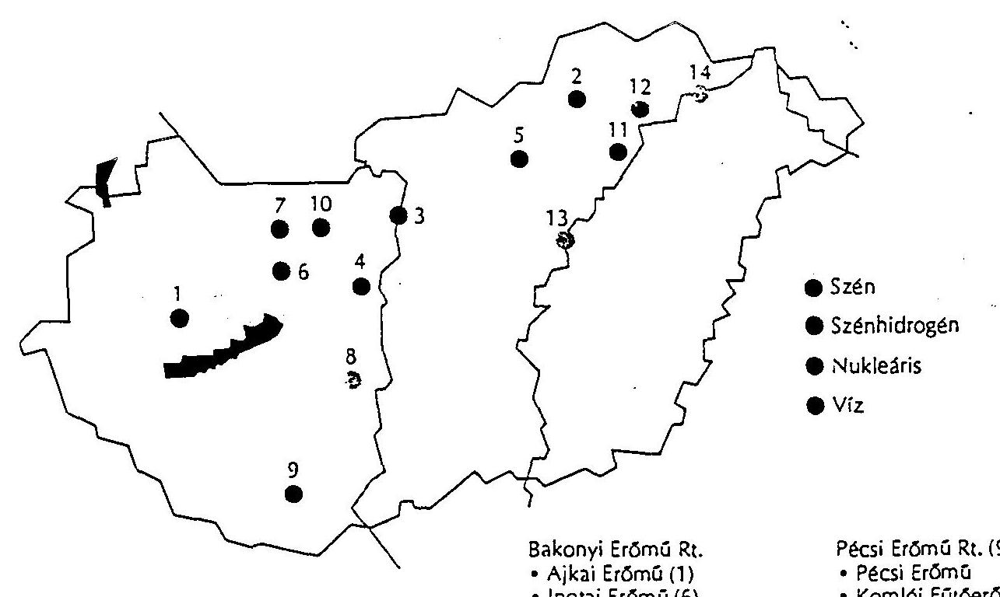

Bakonyi Erőmű Rt.

- Ajkai Erőmű (1)
- Inotai Erőmű (6)

Budapesti Erőmű Rt. (3)

- Kelenföldi Erőmű
- Kőbányai Erőmű
- Újpesti Erőmű
- Angyalföldi Erőmű
- Kispesti Erőmű
- Révész utcai Fűtőmű

Dunamenti Erőmű Rt. (4)
Mátrai Erőmű Rt. (5)
Paksi Atomerőmű Rt. (8)

Pécsi Erőmű Rt. (9)

- Pécsi Erőmű
- Komlói Fűtőerőmű Kft.

Tiszai Erőmű Rt.

- Borsodi Energetikai Kft.
- Tiszapalkonyai Erőmű (11)
- Tisza II. Erőmű (12)
- Kisköre (13)
- Tiszalök (14)

Vértesi Erőmű Rt.

- Dorogi Regionális Fűtőerőmű Kft.
- Oroszlányi Erőmű (7)
- Tatabányai Energetikai Termelő és Szolgáltató Kft.
- Bánhidai Erőmű (10)
- Tatabányai Erőmű

| Erőmű |  | Blokkok, turbinák |  |  | 1994. évi |  |  |
| :--: | :--: | :--: | :--: | :--: | :--: | :--: | :--: |
|  | Tüzelőanyag | száma db | teljesítmény egyenként, MW | villamos teljesítmény   összesen, MW | hőszolgáltatási teljesítmény, MW | villamosenergia termelés, GWh | hőszolgáltatás (?) |
| 1 Ajka | szén | 6 | $3 \times 30=12=10=9$ | 132 | 395 | 513 | 2000 |
| 2 Borsod | szén | 9 | $4 \times 30=4+4,5+10+12=21$ | 171 | 532 | 108 | 2829 |
| 3 Budapest | szénhidrogén | 16 | min 1,3-max 32 | 131-163 | 2504 | 587 | 14702 |
| 4 Dunamenti | szénhidrogén | 12 | $6 \times 215+3 \times 150+40=2 \times 20$ | 1820 | 646 | 5222 | 4349 |
| 4 Dunamenti GT | szénhidrogén | 1 | 145 | 145 | 230 | 629 | 3429 |
| 5 Mátrai | lignit | 5 | $3 \times 200=2 \times 100$ | 800 | 55 | 4189 | 174 |
| 6 Inota | szén | 4 | $3 \times 20=12$ | 72 | 160 | 86 | 456 |
| 6 Inota GT | olaj | 2 | $2 \times 85$ | 170 | - | 0.6 | - |
| 7 Oroszlány | szén | 4 | $1 \times 55=3 \times 60$ | 235 | 50 | 1390 | 366 |
| 8 Paks | nukleáris | 8 | $8 \times 230$ | 1840 | 135 | 14049 | 589 |
| 9 Pécs | szén | 5 | $2 \times 60=2 \times 35=30$ | 220 | 521 | 891 | 2885 |
| 10 Bánhida | szén | 1 | 100 | 100 | 38 | 557 | 100 |
| 11 Tiszapalkonya | szén | 7 | $1 \times 50+13+15+7=3 \times 55$ | 250 | 315 | 669 | 1655 |
| 12 Tisza II. | szénhidrogén | 4 | $4 \times 215$ | 860 | - | 3137 | - |
| 13 Kisköre | víz | 4 | $4 \times 7$ | 28 | - | 84 | - |
| 14 Tiszalök | víz | 3 | $3 \times 3,8$ | 11,4 | - | 46 | - |

---

# Az MVM-csoportnál bekövetkezett bánya-erőművi integráció 

1994-ben befejeződött a bánya-erőművi integráció, amelynek végrehajtására három ütemben került sor. Az integráció hatására az iparág szénigényének több mint 90%-át az iparágon belüli bányák elégítik ki. Az integráció céljai az alábbiak voltak:

- Eredményezze az egymásra utalt, műszakilag és gazdaságilag szoros kapcsolatban álló erőművek és bányák együttes működési költségének csökkentése által a szénbázisú villamosenergia-termelés versenyképességének növekedését.
- Tegye lehetővé a bányák és az erőművek összehangolt fejlesztését vagy visszafejlesztését, az eddigi összhang hiányából fakadó veszteségek csökkentését.
- Gyorsuljon fel a szénbányászat szerkezetátalakítása, amelynek eredményeként az integráció tegye lehetővé a bányászat társadalmi, szociális feszültségeinek csökkentését, a perspektívikus bányák munkavállalóinak munkahely-biztonságát.
- Segítse elő a bányászati vagyon hasznosulását, ezáltal a felszámolási eljárások mielőbbi lezárhatóságát, a hitelezők kielégítését.
Az integráció a bányák vagyonának, kötelezettségeinek leértékelésével járt együtt. Az erőművi társaságok a vagyonból szükséges eszközök és a kötelezettségek különbségével azonos mértékű, alaptőke-emelést, és ennek megfelelő mértékű zártkörű részvény kibocsátását hajtották végre. A részvények a bányák felszámolóinak, a felszámolások befejeződése után a korábbi hitelezők tulajdonába kerültek. Így módosult az iparág tőkeszerkezete.
Az integráció első ütemének végrehajtása - 1993. április 30. - után az MVM Rt. 50%-os tulajdoni aránya a Mátrai Erőmű Rt.-ben 38,3; a Pécsi erőmű Rt.-ben 43,8; a Bakonyi Erőmű Rt.-ben 41,4%-ra csökkent. Az integrációk eredményeképpen a bányászati munkavállalók közül 7150 fő közvetlenül az erőművek állományába, 2100-an pedig perspektívikus vállalkozások állományába kerültek át.
Az integráció második ütemében

 (1993. december 31.) a Tiszai Erőmű Rt.-ből megalapított Borsodi Energetikai Kft.-ben a Tiszai Erőmű Rt. tulajdonosi hányada a bánya apportálása után 69,7%. A Kft. 2765 fő korábbi bányászati munkavállalót foglalkoztat; a Bakonyi Erőmű Rt.-be integrált balinkai bányaüzem további 1268 fő bányászati munkavállaló átvételét jelentette, és a társaságban az MVM Rt. tulajdoni aránya 34,7%-ra csökkent.
Az integráció harmadik üteme az észak-dunántúli régiót érintette, ennek során 1994. április 1-jétől kezdődően a Vértesi Erőmű Rt.-ben az MVM Rt. tulajdoni aránya 50%-ról 39,5%-ra csökkent, az integráció 4503 fő munkavállaló átvételét jelentette; a Tatabányai Energetikai Kft.-be történt bánya apportálása után a Vértesi Erőmű Rt. tulajdoni aránya 69,6%. A Kft.-be 1764 fő dolgozó került át.

Bakonyi Erőmű Rt.
Ajkai Bányaüzem
Ármin Bánya
Jókai Bánya
Padrag Bánya
Balinkai Bányaüzem
Mátrai Erőmű Rt.
Visontai külfejtés
Kelet II. mező
Kis Déli I. mező
Kápolna Nyugat mező
Déli Bányamező
Bükkábrányi külfejtés
Pécsi Erőmű Rt.
Kőszénbánya
Mélyművelés:
Zobák akna
Béta akna
Külfejtés:
Pécsbánya
Vasas
Tiszai Erőmű Rt.
Borsodi Energetikai Kft.
Lyukó Bányaüzem
Dubicsány
Vértesi Erőmű Rt.
Oroszlányi Bányaüzem
Mélyművelés
Márkushegy
XX-as akna
Külfejtés
Tatabányai Energetikai Kft.
Mányi Bányaüzem

---

Az erőművek villamos teljesítőképességének megoszlása a főbb iparcsoportok és nagyságrendjük szerint

Az erőművek beépített villamos teljesítőképességének 97,1%-a közcélú és tartozik az MVM Rt-hez, 2,9%-a egyéb vállalatokhoz. A magyar villamosenergia-rendszer 45 erőművéből 10 beépített teljesítőképessége nagyobb 100 MW-nál, amelyek a rendszer 92,7%-át képviselték 1994. december 31-én.

| Megnevezés | BT |  | $\mathrm{RT}_{\mathrm{A}}$ |  | RT |  |
| :--: | :--: | :--: | :--: | :--: | :--: | :--: |
|  | MW | % | MW | % | MW | % |
| MVM-erőművek | 7105 | 97,1 | 6775 | 97,1 | 6587 | 98,6 |
| Egyéb ipar | 212 | 2,9 | 204 | 2,9 | 92 | 1,4 |
| Összesen | 7317 | 100,0 | 6979 | 100,0 | 6679 | 100,0 |

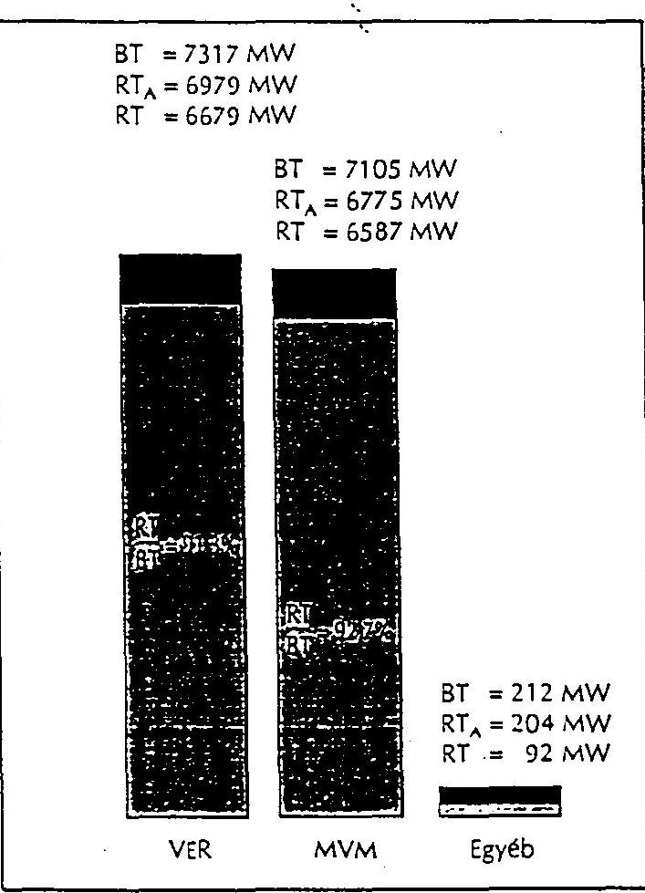
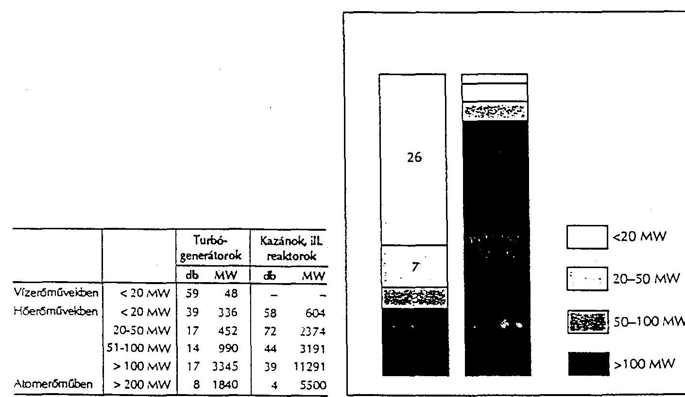

---

# Az MVM-csoport erőműveinek termelése és felhasznált tüzelőanyag 

A villamosenergia-termelésre használt tüzelőanyag

|  | 1984 |  | 1994 |  |
| :--: | :--: | :--: | :--: | :--: |
|  | GWh | % | GWh | % |
| Energetikai barnaszénből |  |  | 3468 | 10,6 |
| Lignitből |  |  | 4046 | 12,4 |
| Feketeszén fétermékből |  |  | 770 | 2,3 |
| Szénből összesen |  |  | 8284 | 25,3 |
| Főolajból |  |  | 5706 | 17,5 |
| Földgázból |  |  | 4493 | 13,7 |
| Szénhidrogén összesen |  |  | 10199 | 31,2 |
| Foszilis energiahordozókból |  |  | 18483 | 56,5 |
| Vízenergia |  |  | 161 | 0,5 |
| Atomenergia |  |  | 14049 | 43,0 |
| Mindösszesen |  |  | 32693 | 100,0 |

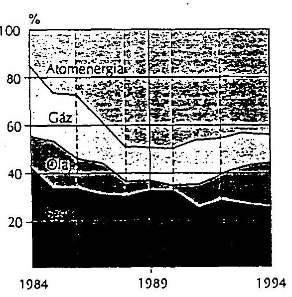

Az összes tüzelőhő megoszlása

Az ábra a villamosenergia-termelésre és a hőszolgáltatásra felhasznált összes tüzelőhő-megoszlást mutatja.
Jól látható a 70-es években a szénhidrogének, majd a hasadóanyag felhasználásának fokozódását.

|  | PJ | % |
| :-- | --: | --: |
| Szén | 108,2 | 27,7 |
| Szénhidrogén | 129,3 | 33,2 |
| ebből földgáz | 63,5 | 49,1 |
| Hasadóanyag | 152,7 | 39,1 |
| Összesen. | 390,2 | 100,0 |

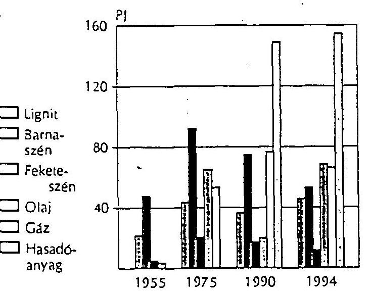

|  | $\begin{gathered} \text { Lignit } \\ 1 \mathrm{Mt}=6,75 \mathrm{~J} \end{gathered}$ |  | Energetikai $1 \mathrm{Mt}=9,75 \mathrm{~J}$ |  | Feketeszén $1 \mathrm{Mt}=10,99 \mathrm{~J}$ |  | $\begin{gathered} \text { Olaj } \\ 1 \mathrm{Mt}=40,34 \mathrm{~J} \end{gathered}$ |  | Földgáz $1 \mathrm{Gm}^{3}=30,84 \mathrm{~J}$ |  | Hasadóanyag |  | Összes tüzelő |
| :--: | :--: | :--: | :--: | :--: | :--: | :--: | :--: | :--: | :--: | :--: | :--: | :--: | :--: |
|  | $10^{\prime} t$ | TJ | $10^{\prime} t$ | TJ | $10^{\prime} t$ | TJ | $10^{\prime} t$ | TJ | $10^{\prime} \mathrm{m}^{3}$ | TJ | TJ |  | TJ |
| 1955 | 2370 | 19326 | 4038 | 47772 | 244 | 4110 | 42 | 1649 | - | - | - |  | 72857 |
| 1965 | 2871 | 22038 | 8247 | 92204 | 1258 | 13605 | 491 | 19590 | 254 | 8692 | - |  | 156130 |
| 1975 | 6230 | 41758 | 7916 | 90969 | 1797 | 19314 | 5579 | 63859 | 1471 | 52526 | - |  | 268426 |
| 1985 | 6758 | 46462 | 7676 | 75368 | 1352 | 14815 | 1479 | 59769 | 2761 | 84976 | 72736 |  | 354126 |
| 1987 | 6781 | 45785 | 7826 | 79233 | 1688 | 18252 | 1209 | 48440 | 2513 | 77775 | 119547 |  | 389032 |
| 1988 | 5442 | 36907 | 7950 | 79339 | 1611 | 17472 | 660 | 26335 | 2435 | 74845 | 147331 |  | 382229 |
| 1989 | 5296 | 35756 | 7729 | 75338 | 1449 | 16684 | 513 | 20432 | 2660 | 82048 | 150994 |  | 381252 |
| 1990 | 5387 | 35474 | 7437 | 72792 | 1469 | 16129 | 466 | 18573 | 2382 | 73847 | 148366 |  | 365121 |
| 1991 | 4934 | 33302 | 7049 | 68731 | 1298 | 14270 | 965 | 38914 | 2411 | 74330 | 147624 |  | 377211 |
| 1992 | 6473 | 43690 | 6456 | 62950 | 1209 | 13289 | 1309 | 52814 | 2035 | 62748 | 150886 |  | 386377 |
| 1993 | 6826 | 46075 | 5643 | 55018 | 1161 | 12762 | 1742 | 70256 | 1953 | 60225 | 148777 |  | 393113 |
| 1994 | 6605 | 45589 | 5293 | 51603 | 1000 | 10991 | 1631 | 65787 | 2058 | 63471 | 152745 |  | 390186 |

---

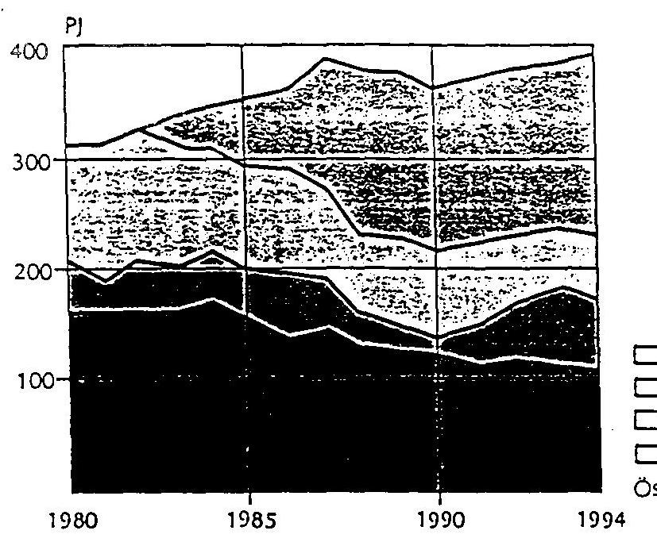

|  | 1994 |
| :-- | --: |
| PJ | % |
| 152,7 | 39,1 |
| 63,5 | 16,3 |
| 65,8 | 16,9 |
| 108,2 | 27,7 |
| 390,2 | 100,0 |

# A primerenergia-felhasználás megoszlása 1994-ben 

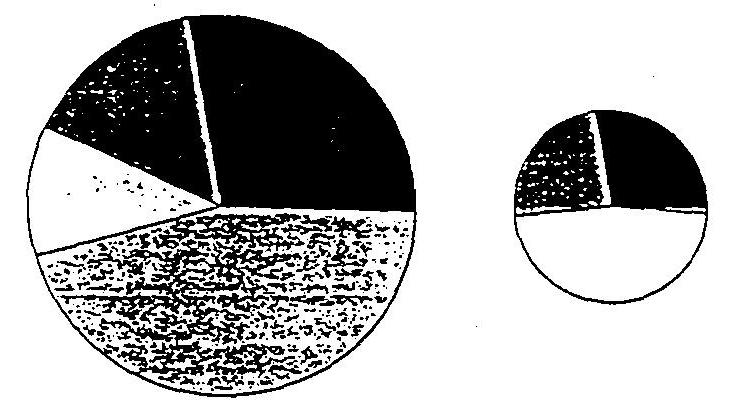

|  | Villamosenergia-   szolgáltatásra   334,7 PJ |  | Hőszolgáltatásra   55,5 PJ |  |
| :-- | :--: | :--: | :--: | :--: |
|  |  |  |  |  |

|  | Villamosenergia-termelésre | Hőszolgáltatásra |  |  |
| :-- | :--: | :--: | :--: | :--: |
|  | PJ | % | PJ | % |
| $\square$ Nukleáris | 152,1 | 45,4 | 0,6 | 1,1 |
| $\square$ Gáz | 37,3 | 11,1 | 26,2 | 47,2 |
| $\square$ Olaj | 52,5 | 15,7 | 13,3 | 24,0 |
| $\square$ Szén | 92,8 | 27,8 | 15,4 | 27,7 |
| Összesen | 334,7 | 100,0 | 55,5 | 100,0 |

---

# A villamosenergia-fogyasztás befolyásolása a magyar VER-ben 

Az éves fogyasztások a szabályozott és a szabályozatlan fogyasztóknál
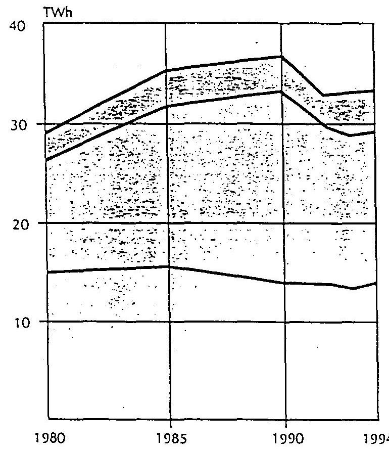

A magyar villamosenergia-rendszerben 1954. év óta működik a fogyasztó befolyásolás kezdetben hatósági, 1968-tól elsősorban tarifális rendszere. A szabályozásra kijelölhető fogyasztók körét az Állami Energia Felügyelet jelöli ki (ÁEEF).
A 16. ábrán lévő ábrában közölt csoportosítás szerint a "havi terhelésmérésre kötelezett" és szabadon vételező, "nem mérésköteles" fogyasztócsoportokat különböztetünk meg. Az összes fogyasztás - a hálózati veszteség nélkül - 1994-ben 4113 GWh-val, azaz 13%-kal volt kevesebb, mint 1990-ben.
Ugyanezen időszakban a hálózati veszteség növekedett a kisfeszültségű fogyasztók arányának emelkedése miatt.

| Kód | Megnevezés | 1955 | 1970 | 1980 | 1990 | 1994 |
| :--: | :--: | :--: | :--: | :--: | :--: | :--: |
|  | Mérésköteles fogyasztás | 3668 | 10158 | 15176 | 13889 | 13541 |
|  | Nem mérésköteles fogyasztás | 828 | 4673 | 11072 | 18964 | 15199 |
|  | Fogyasztás összesen | 4496 | 14831 | 26248 | 32853 | 28740 |
|  | Hálózati veszteség | 490 | 1490 | 2755 | 3846 | 4253 |
|  | Fogyasztás + hálózati veszteség | 4986 | 16321 | 29003 | 36699 | 32993 |

---

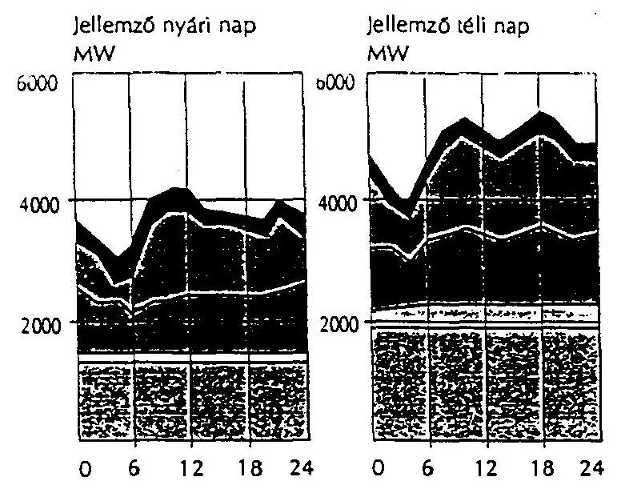

A háztartási (lakás-) fogyasztás alakulása
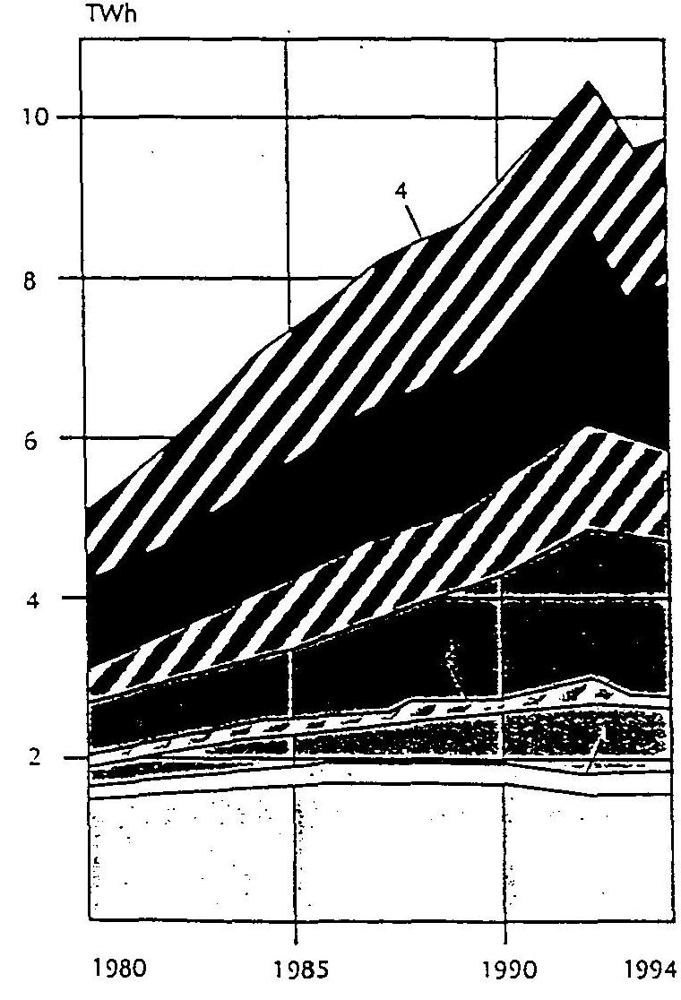

Az ábra a lakásfogyasztás változását mutatja be Budapest (1), a kiemelt városokban (2-1), az egyéb városokban (3-2) és a községekben (4-3).
A sávozott rész a felsorolt kategóriákon belül az éjszakai külön mért fogyasztást jelöli.

---

Az MVM csoport hőszolgáltatása
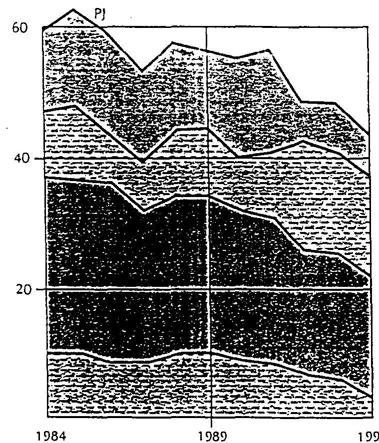

|  | 1964 | 1994 |
| :--: | :--: | :--: |
| $\square$ Forró víz |  | 20,4 |
| $\square$ ebből nem kapcsolt |  | 5,3 |
| $\square$ Gőz |  | 22,0 |
| $\square$ ebből nem kapcsolt |  | 3,6 |
| összesen |  | 42,8 |

# A nyomásszintek szerinti megoszlás 

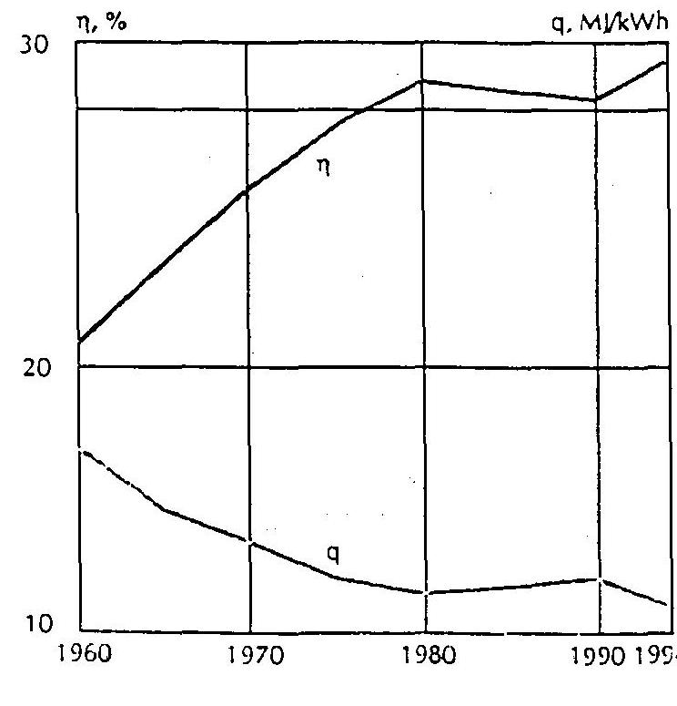

A korszerű erőművi berendezések termelése évről-évre nőtt, ugyanakkor csökkent a kiadott villamos energia fajlagos hőfogyasztása.

|  | átlagos hatásfok, % | a fajlagos hőfogyasztás,   $\mathrm{kl} / \mathrm{kWh}$ |
| :--: | :--: | :--: |
| 1951 | 17,4 | 20666 |
| 1955 | 18,2 | 19808 |
| 1960 | 21,1 | 17078 |
| 1965 | 24,1 | 14951 |
| 1970 | 27,2 | 13234 |
| 1975 | 29,2 | 12041 |
| 1980 | 31,1 | 11561 |
| 1985 | 30,9 | 11650 |
| 1990 | 30,6 | 11747 |
| 1994 | 32,4 | 11121 |

---

Magyarország villamosenergia-termelése és -fogyasztása
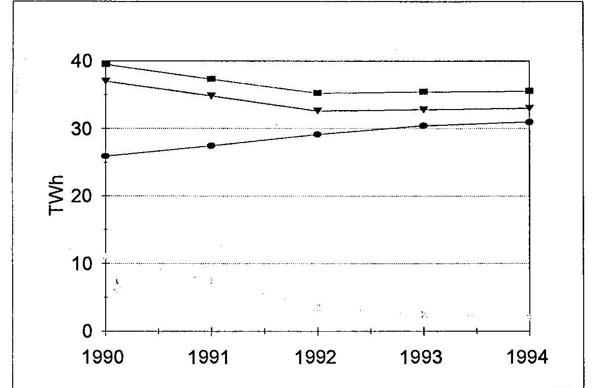
---------- Összes felhasználás
---------- Brutto fogyasztás=fogyasztás+veszteség
=brutto fogyasztás+erőművi önfogyasztás
---------- Netto termelés
Import szaldo

---

# Az áramszolgáltatók villamosenergia-értékesítése 1984-1994 között 

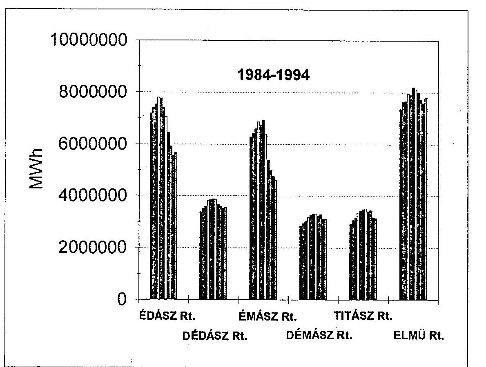

Az MVM-csoporthoz tartozó áramszolgáltatók 1994-ben 27979 GWh villamos energiát szolgáltattak a hazai fogyasztóknak. Az értékesített villamos energia legnagyobb részét az ELMÜ, az ÉDÁSZ és az ÉMÁSZ Rt-k területén használták fel.

---

Főbb fogyasztói csoportok fejlődése

|   | 1992 | 1993 | 1994  |
| --- | --- | --- | --- |
|  Bruttó fogyasztás | 32586 | 32829 | 32993  |
|  Hálózati veszteség | 2841 | 4358 | 4253  |
|  |   |   |  

 |
|  Háztartások | 10514 | 9721 | 9842  |
|  Erdő, halászat | 1487 | 1315 | 1220  |
|  Közvilágítás | 610 | 567 | 562  |
|  Egyéb fogyasztás | 3530 | 3480 | 3575  |
|  Nem terhelésmérés-köteles | 16141 | 15083 | 15199  |

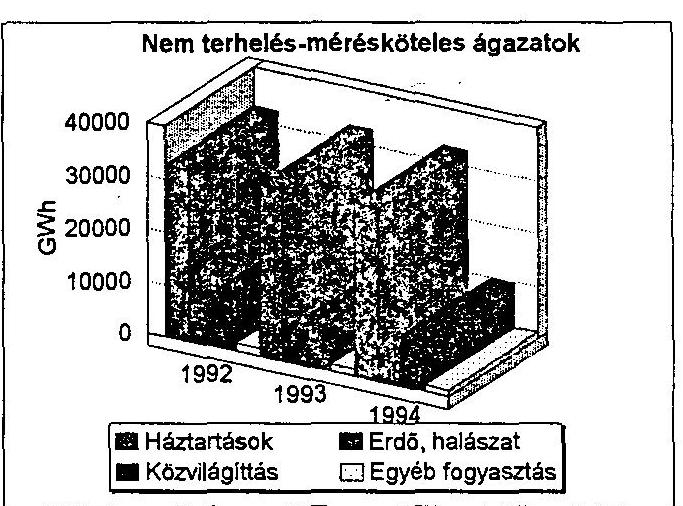

|   | 1992 | 1993 | 1994  |
| --- | --- | --- | --- |
|  Szállítás | 1620 | 1576 | 1572  |
|  Építőipar | 204 | 177 | 169  |
|  Feldolgozóipar | 8525 | 8513 | 8812  |
|  Viz. gáz. vill. ipar | 1977 | 1992 | 1950  |
|  Bányászat | 1278 | 1130 | 1038  |
|  Mérésköteles összesen | 13604 | 13308 | 13541  |

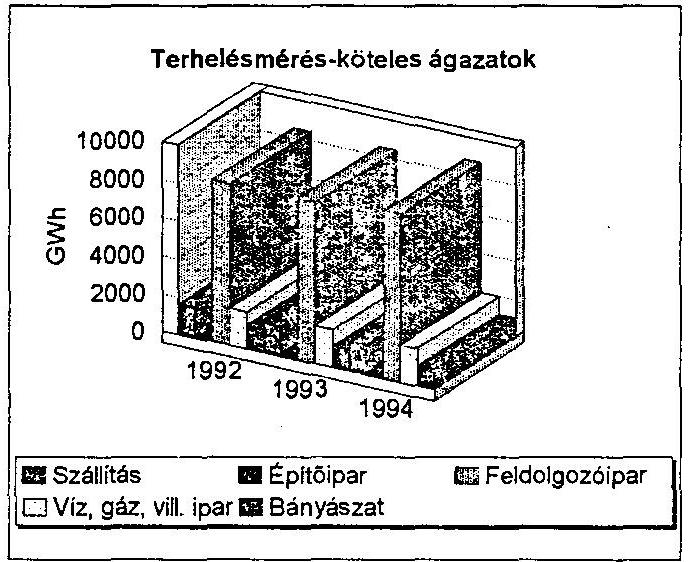

---

Háztartások átlagfogyasztása áramszolgáltatónként
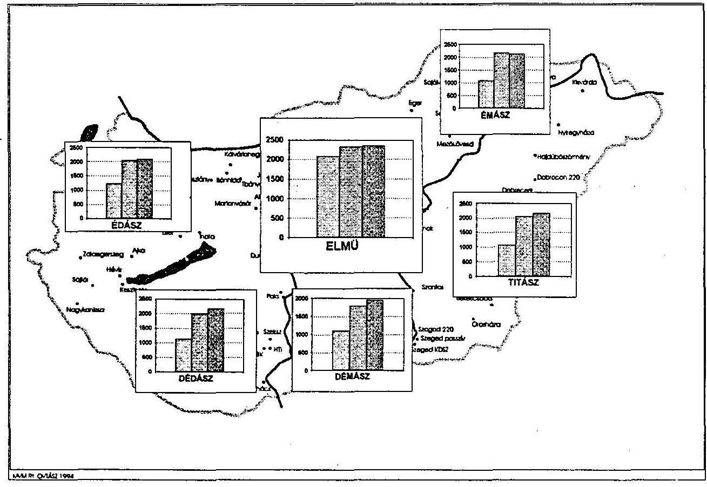
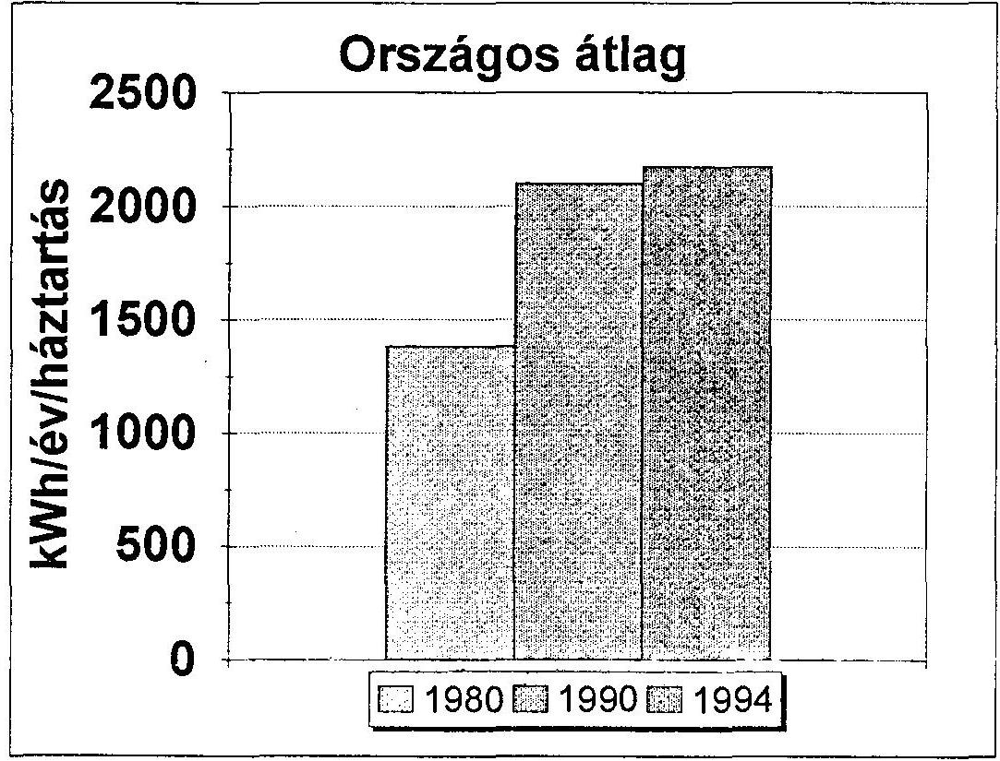

---

# A TERMELÉS ÉS FOGYASZTÁS FOLYAMATÁBRÁJA, 1993 

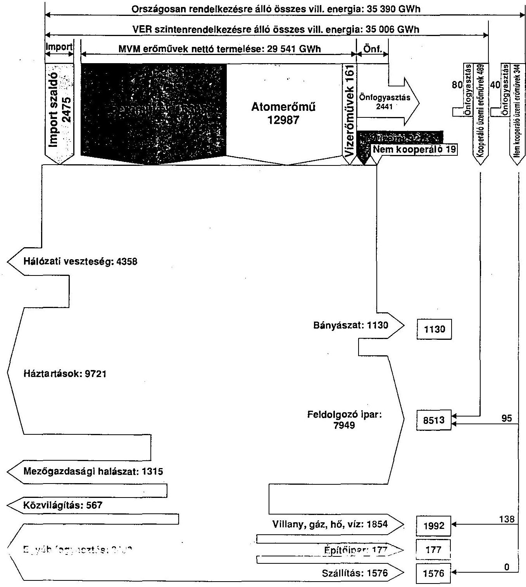

Nem terhelésmérés-köteles ágazatok 15083

Havi terhelésmérés-köteles ágazatok 13388

---

# A termelés és fogyasztás folyamatábrája, 1994 

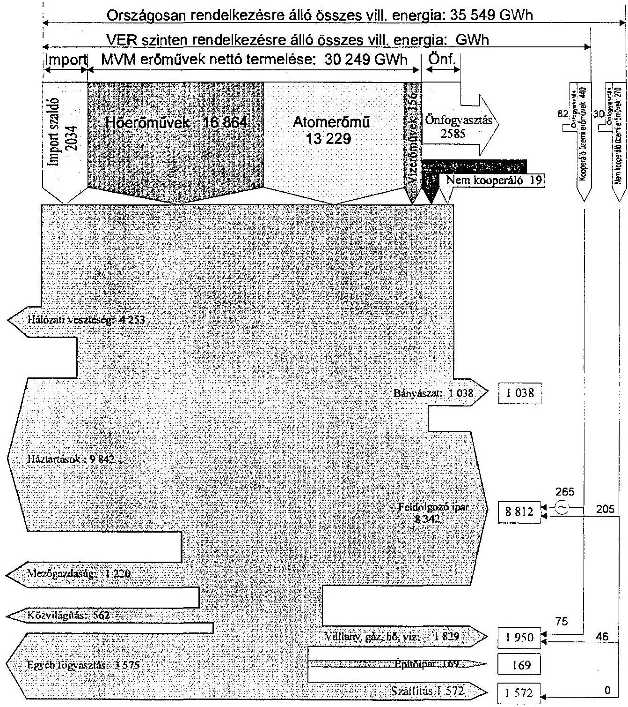

[^0]
[^0]: Nem terhelésmérés-köteles fogyasztók 15199
    Ebből VER
    15199

---

# A villamosenergia-termelés és az import szaldó részaránya a VER-ben 

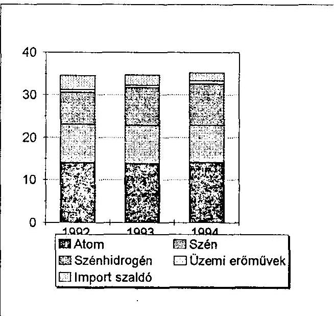

|  |  | TWh |  |
| :--: | :--: | :--: | :--: |
|  | 1992 | 1993 | 1994 |
| Import szaldó | 3.4 | 2.5 | 2 |
| Üzemi erőművek | 0.6 | 0.6 | 0.7 |
| Szénhidrogén | 7.5 | 8.9 | 9.7 |
| Szén | 9.1 | 9 | 8.8 |
| Atom | 14 | 13.8 | 14.1 |
|  | 34.6 | 34.8 | 35.3 |

---

### 20. melléklet

|  sor
szám | MEGNEVEZÉS | ÉDÁSZ Rt
Győr | DÉDÁSZ Rt
Pécs | ÉMÁSZ Rt
Miskolc | DÉMÁSZ Rt
Szeged | TITÁSZ Rt
Debrecen | ELMŰ Rt
Budapest | Hálózati Rt.k
összesen | MVM Rt | Kiszűrés | Összesen  |
| --- | --- | --- | --- | --- | --- | --- | --- | --- | --- | --- | --- |
|  1 | Saját erőműben (annak vill. energia) | 0 | 0 | 5653 | 0 | 0 | 0 | 5653 | 31490789 | 0 | 31490443  |
|  2 | Erőművi önrészveszteség | 0 | 0 | 82 | 0 | 0 | 0 | 82 | 2379403 | 0 | 2379465  |
|  3 | Saját erőműből kiadott vill. en (1-2) | 0 | 0 | 5571 | 0 | 0 | 0 | 5571 | 29111386 | 0 | 29116957  |
|  4 | MVM Rt-től vásárolt villamosenergia | 5978067 | 3920361 | 4803021 | 3497009 | 3325200 | 8253340 | 29776898 |  | 29776898 | 0  |
|   | INDEX A BÁZISHÓZ % | 100.9 | 103.2 | 93.1 | 101.6 | 96.6 | 94.4 | 97.6 |  |  | 0.0  |
|  5 | Társ ÁSZ-től vás. vill. en | 0 | 0 | 46 | 0 | 106477 | 0 | 106525 |  | 106525 | 0  |
|  6 | Közcélú erőműről közvetlen vás. vill. en. | 136904 | 0 | 297683 | 0 | 0 | 459324 | 693911 |  | 0 | 693911  |
|  7 | Üzemi erőműtől vásárolt vill. energia | 36455 | 14606 | 2056 | 4718 | 21237 | 109690 | 188764 |  |  | 188764  |
|  8 | Befőljő szállodától vásárolt vill. en. | 0 | 0 | 0 | 0 | 0 | 0 | 0 | 138800 |  | 138800  |
|  9 | IMPORT x /korporációs imp-exp szaldó | 0 | 0 | 0 | 0 | 0 | 0 | 0 | 2609225 |  | 2609225  |
|   | b / belámenti import | 1 | 0 | 0 | 0 | 0 | 0 | 1 | 0 |  | 1  |
|   | c / | 0 | 0 | 0 | 0 | 0 | 0 | 0 | 0 |  | 0  |
|  10 | Összes imp szaldó (a+b+c) | 1 | 0 | 0 | 0 | 0 | 0 | 1 | 2609225 |  | 2609225  |
|  11 | Rendelkezésre álló villamosenergia |  |  |  |  |  |  |  |  |  |   |
|   | összesen (+3,8+10) | 8151427 | 3934867 | 5108381 | 3501727 | 3452914 | 8822354 | 30971670 | 31859411 | 29883423 | 32847658  |
|   | INDEX A BÁZISHÓZ | 0.0 | 0.0 | 0.0 | 0.0 | 0.0 | 0.0 | 0.0 |  |  | 101.6  |
|  12 | Hálózati és transzf. veszteség MWh | 458015 | 358318 | 375451 | 367838 | 291490 | 989808 | 2840958 | 1321505 |  | 4162463  |
|   | % | 7.45 | 9.11 | 7.35 | 10.50 | 8.44 | 11.22 | 9.17 | 4.15 |  | 12.63  |
|  12a | Előböl. bildold által meglérített MWh |  |  |  |  |  |  |  | 37964 |  | 37964  |
|   | % | 0.00 | 0.00 | 0.00 | 0.00 | 0.00 | 0.00 | 0.00 | 0 |  | 0.12  |
|  13 | Elesztői saját felhasználás | 13229 | 12477 | 14300 | 11875 | 12753 | 20543 | 85177 |  |  | 85177  |
|  14 | Háziszemi fogy (nem saját term. ből) | 0 | 0 | 0 | 0 | 6696 | 0 | 6696 |  |  | 6696  |
|  15 | Veszteség (12+13+14) sor együtt | 471244 | 370793 | 389791 | 379713 | 310939 | 1010351 | 2932831 | 1321505 |  | 4254336  |
|  16 | 18. sorból: Társ ÁSZ-nak ért. vill. en. | 0 | 0 | 106477 | 0 | 48 | 0 | 106525 |  | 106525 |   |
|  17 | Közüzem (Ért. ÁSZ Rt. nek) | 0 | 0 | 0 | 0 | 0 | 0 | 0 | 29776898 | 29776898 | 0  |
|  18 | Fogyasztónak ért. vill. en. (11-15) | 7680183 | 3564074 | 4612113 | 3122014 | 3141927 | 7612003 | 27932314 | 761008 | 106525 | 28693322  |
|   | INDEX A BÁZISHÓZ | 102.1 | 101.1 | 97.0 | 100.2 | 99.1 | 102.0 | 100.6 | 218.0 |  | 102.2  |
|   | BÁZIS ADATOK |  |  |  |  |  |  |  |  |  |   |
|  19 | MVM Rt-től vásárolt villamosenergia | 5925692 | 3800488 | 5159885 | 3443335 | 3443174 | 6743711 | 30516285 | 0 |  | 0  |
|  20 | Rendelkezésre álló villamosenergia | 5962442 | 3802862 | 5165340 | 3448661 | 3459017 | 8842661 | 30680983 | 32262929 |  | 32427627  |
|  21 | Közérés |  |  |  |  |  |  |  | -30516285 |  | 0  |
|  22 | Értékesített villamosenergia | 5562458 | 3524178 | 4756217 | 3115695 | 3171189 | 7590806 | 27720543 | 349009 |  | 28069552  |
|  23 | Hálózati veszteség | 387342 | 266797 | 395122 | 321706 | 260154 | 1234409 | 2865530 | 1397635 |  | 4263165  |

---

# Villamosenergia értékesítés tarifacsoportonként /göngyölt adatok/

|  TARIFACSOPORTOK | MWh |  |  | ezer Ft |  |  | ÉRTÉKESÍTÉS ÁTLAGÁRA fill/kWh |  |   |
| --- | --- | --- | --- | --- | --- | --- | --- | --- | --- |
|   | 1993 | 1994 | % | 1993 | 1994 | % | 1993. | 1994. | %  |
|   | I - XII.hó | I - XII.hó |  | I - XII.hó | I - XII.hó |  | I - XII.hó | I - XII.hó |   |
|  Háztartási fogyasztás | 9720594 | 9842220 | 101.3 | 35567795 | 38163435 |

 107.3 | 365.90 | 387.75 | 106.0  |
|  Közvilágítás | 567 925 | 561 998 | 99.0 | 4 252 248 | 4 223 498 | 99.3 | 748.73 | 751.51 | 100.4  |
|  Általános áramdíjas | 2 543 329 | 2 719 002 | 106.9 | 18 375 980 | 19 559 549 | 106.4 | 722.52 | 719.37 | 99.6  |
|  Teljesítménydíjas | 13 635 465 | 13 659 756 | 100.2 | 65 384 485 | 64 679 633 | 98.9 | 479.52 | 473.51 | 98.7  |
|  Nagyvasúti vontatás | 671 289 | 648 597 | 96.6 | 2 114 566 | 2 041 223 | 96.5 | 315.00 | 314.71 | 99.9  |
|  Közúti vontatás | 351 681 | 351 878 | 100.1 | 1 336 392 | 1 304 854 | 97.6 | 380.00 | 370.83 | 97.6  |
|  Közösségi célú fogyasztás | 196 467 | 136 394 | 69.4 | 1 008 821 | 777 598 | 77.1 | 513.48 | 570.11 | 111.0  |
|  Értékesítés iparágon belül | 65 766 | 156 914 | 238.6 | 153 811 | 480 090 | 312.1 | 233.88 | 305.96 | 130.8  |
|  Szabálytalan vételezés | 16 680 | 9 140 | 54.8 | 170 826 | 172 253 | 100.8 | 1 024.14 | 1 884.61 | 184.0  |
|  HAZAI ÉRTÉKESÍTÉS ÖSSZESEN | 27 769 196 | 28 085 899 | 101.1 | 128 364 924 | 131 402 133 | 102.4 | 462.26 | 467.86 | 101.2  |
|  Külföldi vevő | 300 356 | 713 948 | 237.7 | 886 974 | 2 068 906 | 233.3 | 295.31 | 289.78 | 98.1  |
|  Társ ÁSZ-nak ért |  | 106 525 |  |  | 348 634 |  |  | 327.28 |   |
|  ÖSSZES ÉRTÉKESÍTÉS | 28 069 552 | 28 693 322 | 102.2 | 129 251 898 | 133 122 405 | 103.0 | 460.47 | 463.95 | 100.8  |
|  Í: - háztartási fogyasztás | 9 720 594 | 9 842 220 | 101.3 | 35 567 795 | 38 163 435 | 107.3 | 365.90 | 387.75 | 106.0  |
|  - külföldi vevő | 300 356 | 713 948 | 237.7 | 886 974 | 2 068 906 | 233.3 | 295.31 | 289.78 | 98.1  |
|  TERMELŐI FELHASZNÁLÁS | 18 048 602 | 18 137 154 | 100.5 | 92 797 129 | 92 890 064 | 100.1 | 514.15 | 512.15 | 99.6  |

---

|  |   |   |   |   |   |   |   |
| --- | --- | --- | --- | --- | --- | --- | --- |
|  |   |   |   |   |   |   |   |
|  ÁGAZATOK |  |  |  |  |  |  |   |
|   |  | MWh | 1994.I-XII.h | E Ft |  | 1994.I-XII.h | Megoszlási arány  |
|   | 1993. | 1994. | 1993.I-XII.h | 1993. | 1994. | 1993.I-XII.h | 1993.  |
|   | I - XII. hó |  | %-ában | I - XII. hó |  | %-ában | I - XII. hó  |
|  Mezőgazdaság,vad-és erdőgazdálkodás | 1304784 | 1210013 | 92.74 | 7948907 | 7296119 | 91.79 | 6.15  |
|  Halászat | 9856 | 9689 | 98.31 | 59489 | 58557 | 98.43 | 0.05  |
|  Bányászat | 1130080 | 1038179 | 91.87 | 4848601 | 4397984 | 90.71 | 3.75  |
|  Feldolgozóipar | 7837240 | 8037642 | 102.56 | 35705859 | 36174127 | 101.31 | 27.63  |
|  Villamosenergia,gáz,hő-és vízellátás | 1870783 | 1980208 | 105.85 | 9042319 | 9541263 | 105.52 | 7.00  |
|  Építőipar | 176765 | 169089 | 95.66 | 1255161 | 1177399 | 93.80 | 0.97  |
|  Keresk.közúti jármű és közszüks.cikk jav. | 810715 | 847074 | 104.48 | 5451421 | 5626900 | 103.22 | 4.22  |
|  Szálláshely-szolgáltatás és vendéglátás | 438979 | 439529 | 100.13 | 2791811 | 2849145 | 102.05 | 2.16  |
|  Szállítás,raktározás,posta és távközlés | 1576269 | 1571142 | 99.67 | 6639404 | 6636107 | 99.95 | 5.14  |
|  Pénzügyi tevékenység és kiegészítő szolg. | 106479 | 109700 | 103.03 | 634381 | 731508 | 115.31 | 0.49  |
|  Ingatlanügyletek, bérbeadás és gazd.tev. | 372682 | 387113 | 103.87 | 2524156 | 2516888 | 99.71 | 1.95  |
|  Közigazgatás,kötelező társadalombiztosítás | 404742 | 407548 | 100.69 | 2604771 | 2648968 | 101.70 | 2.02  |
|  Oktatás | 317920 | 344436 | 108.34 | 2153769 | 2339457 | 108.62 | 1.67  |
|  Egészségügyi és szociális ellátás | 227165 | 230556 | 101.49 | 1247018 | 1291153 | 103.54 | 0.96  |
|  Egyéb közösségi,társadalmi és szem.szolg. | 1415565 | 1415945 | 100.03 | 9536561 | 9560848 | 100.25 | 7.38  |
|  Területen kívüli szervezetek | 31898 | 36676 | 114.98 | 182675 | 220136 | 120.51 | 0.14  |
|  Háztartási fogyasztás | 9720594 | 9842220 | 101.25 | 35567795 | 38163435 | 107.30 | 27.52  |
|  Szabálytalan áramvételezés | 16680 | 9140 | 54.80 | 170826 | 172139 | 100.77 | 0.13  |
|  Hazai értékesítés összesen | 27769196 | 28085899 | 101.14 | 128364924 | 131402133 | 102.37 | 99.31  |
|  Külföldi vevő | 300356 | 713948 | 237.70 | 886974 | 2068906 | 233.25 | 0.69  |
|  Társ ÁSZ-nak ért. |  | 106525 |  |  | 348634 |  |   |
|  Összes értékesítés | 28069552 | 28693322 | 102.22 | 129251898 | 133122405 | 102.99 | 100.00  |

Budapest 1995. április 11

---

Az erőművektől vásárolt villamosenergia mennyiségi és érték adatait a következő táblázat tartalmazza:

|  | 1993. évi bázis |  |  | 1994. évi tény |  |  |
| :-- | --: | --: | --: | --: | --: | --: |
|  | GWh | MFt | fill/kWh | GWh | MFt | fill/kWh |
| Dunamenti | 5.043 | 14.634 | 290,18 | 5.532 | 16.299 | 294,63 |
| Mátrai | 3.744 | 13.997 | 373,85 | 3.655 | 13.774 | 376,85 |
| Tiszai | 4.067 | 14.307 | 351,78 | 3.760 | 13.930 | 370,48 |
| Bakonyi | 512 | 3.635 | 709,96 | 437 | 3.319 | 759,5 |
| Pécs | 1.892 | 8.582 | 453,59 | 1.754 | 8.634 | 492,25 |
| Vértesi | 808 | 4.119 | 509,78 | 744 | 4.248 | 570,97 |
| Budapesti | 435 | 1.433 | 329,43 | 0 | 184 | 0 |
| Paksi Atom | 12.987 | 27.115 | 208,79 | 13.229 | 28.148 | 212,77 |
| Összesen | 29.488 | 87.822 | 297,82 | 29.111 | 88.536 | 304,13 |

Erőműtársaságok közvetlen áramszolgáltatók felé értékesített mennyiségi és érték adatai:

|  | GWh | fill/kWh | MFt |
| :-- | --: | --: | --: |
| Tiszai Rt. - ÉMÁSZ Rt. | 298 | 326,17 | 972 |
| Bakony Rt. - ÉDÁSZ Rt. | 41 | 329,27 | 135 |
| Vértesi Rt. - ÉDÁSZ Rt. | 96 | 329,17 | 316 |
| Budapesti Rt. - ELMŰ Rt. | 459 | 326,80 | 1.500 |
| Pécsi Rt. - DÉDÁSZ Rt. | 14 | 321,43 | 46 |
| Összesen: | $\mathbf{908}$ | $\mathbf{326,87}$ | $\mathbf{2.969}$ |

---

# Erőművektől vásárolt villamosenergia 

mennyiségi és értékadatai
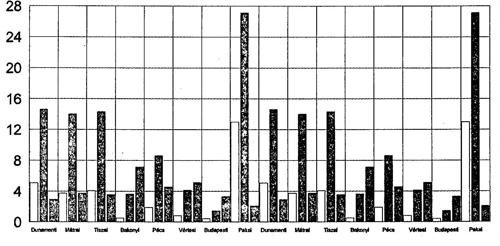

1993. évi bázis
1994. évi tény
$\square$ GWh
MFt
Ft/kWh

---

# Áramszolgáltatók villamosenergia vásárlása 

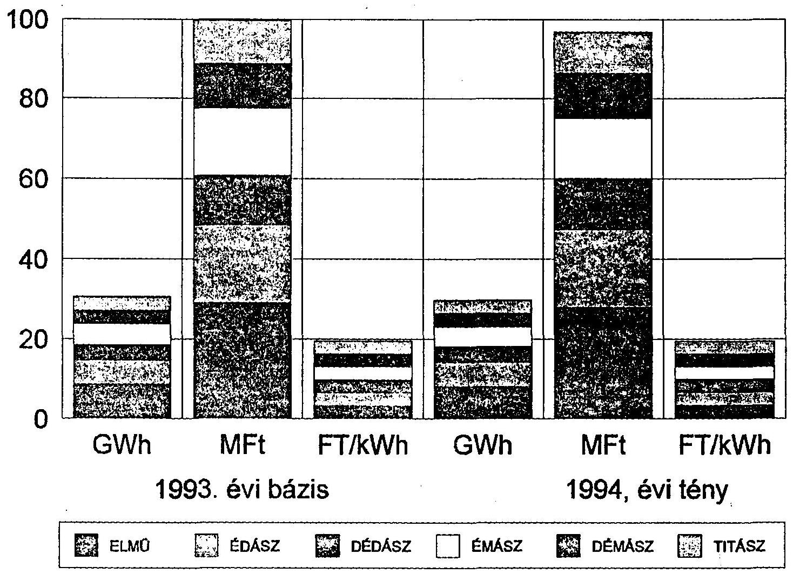

---

# Az ENSZ-tagországok 1992-es villamosenergia mérlege 

Az ENSZ 1994-es adatszolgáltatása alapján

| Ország | Lakosság   száma (millió)   iö | Villamosenergia termelés önfogy.   % |  | 4-ből üzemi erőmű | Export/import szaldó | Szivattyús tároló erőmű töltése | Országos bruttó fogy.   GWh | $\begin{gathered} a \\ \text { Hálózali } \\ \text { veszteség } \end{gathered}$ |  | Országos nettó fogyasztás | 10-ből lakossági fogyasztás | 10-ből   szolgál-   tatás   % | 10-ből lakás+ szolg+ egyéb % | 10-ből ipar+ építőipar   % |
| :--: | :--: | :--: | :--: | :--: | :--: | :--: | :--: | :--: | :--: | :--: | :--: | :--: | :--: | :--: |
|  |  | % | GWh | % | GWh | GWh |  |  |  |  |  |  |  | % |
| 1 | 2 | 3 | 4 | 5 | 6 | 7 | 4+6-7 | 8-10 | (8-10)/8 | 10 | 11 | 12 | 13 | 14 |
| Ausztria | 7,88 | 3,0 | 49661 | 14,2 | 554 | 1571 | 48644 | 2993 | 6,153+ | 45651 | 26,17 | 9,51 | 52,25 | 38,74 |
| Belgium | 10,00 | 5,4 | 68379 | 3,9 | 128 | 1068 | 67439 | 3588 | 5,291+ | 63871 | 32,17 | 13,33 | 45,51 | 50,43 |
| Bulgária | 8,95 | 11,5 | 31529 | 6,8 | 2705 | 0 | 34234 | 4948 | 14,45* |

 29286 | 34,14 | 4,53 | 50,00 | 40,95 |
| Kanada* | 27,44 | 3,0 | 505067 | 8,0 | $-25051$ | 254 | 479762 | 37100 | 7,73 | 442662 | 29,61 | 25.22 | 56,97 | 38,42 |
| Cseh Közt. | 15,79 | 6,7 | 55169 | 11,5 | $-3036$ | 326 | 51807 | 3860 | 7,45 | 47947 | 21,57 | 12,35 | 39,73 | 44,71 |
| Dánia | 5,17 | 6,4 | 28874 | 1,8 | 3746 | 0 | 32620 | 2151 | 6,59+ | 30469 | 31,36 | 27,57 | 68,31 | 30,17 |
| Finnország | 5,04 | 4,8 | 54686 | 14,3 | 8394 | 0 | 63080 | 2810 | 4,45+ | 60270 | 26,27 | 18,14 | 45,82 | 52,51 |
| Franciaország* | 57,37 | 4,5 | 442147 | 5,4 | $-53796$ | 5005 | 383346 | 27472 | 7,17 | 355874 | 30,80 | 24,63 | 56,07 | 34,02 |
| Németország | 80,57 | 7,2 | 498449 | 14,2 | $-5320$ | 5129 | 488000 | 20292 | 4,16+ | 467708 | 26,26 | 19,79 | 47,98 | 43,56 |
| Görögország | 10,30 | 8,2 | 34359 | 2,6 | 605 | 265 | 34699 | 2675 | 7,71 | 32024 | 33,14 | 20,58 | 58,78 | 36,68 |
| Magyarország | 10,34 | 8,1 | 29067 | 2,7 | 3466 | 0 | 32533 | 2992 | 9,20 | 29541 | 35,42 | 19,95 | 60,86 | 28,67 |
| Írország | 3,55 | 6,1 | 15037 | 1,6 | 0 | 328 | 14709 | 1406 | 9,56 | 13303 | 38,12 | 24,35 | 62,47 | 36,68 |
| Olaszország | 57,78 | 5,2 | 214433 | 14,3 | 35300 | 4946 | 244787 | 16779 | 6,8+ | 228008 | 24,45 | 19,69 | 46,04 | 48,80 |
| Hollandia | 15,18 | 3,5 | 74496 | 17,4 | 8658 | 0 | 83154 | 3224 | 3,88+ | 79930 | 21,89 | 29,38 | 53,56 | 42,12 |
| Norvégia | 4,29 | 0,9 | 116631 | 13,9 | $-8744$ | 689 | 107198 | 8840 | 8,25 | 98358 | 33,11 | 18,72 | 52,49 | 45,67 |
| Lengyelország | 38,36 | 6,9 | 123611 | 6,2 | $-4032$ | 2826 | 116753 | 15108 | 12,94* | 101645 | 18,64 | 17,60 | 44,08 | 34,95 |
| Románia | 22,75 | 11,3 | 48058 | 2,8 | 4205 | 0 | 52263 | 5527 | 10,58* | 46736 | 16,25 |  | 28,03 | 54,54 |
| Oroszország | 148,54 | 6,9 | 938658 | 4,8 | $-16742$ | 0 | 921916 | 84093 | 9,12 | 837823 | 11,37 | 1,22 | 24,87 | 56,07 |
| Spanyolország | 39,08 | 4,9 | 150810 | 3,0 | 641 | 2697 | 148754 | 14502 | 9,75 | 134252 | 23,39 | 19,91 | 46,02 | 48,32 |
| Svédország | 8,68 | 2,7 | 142337 | 5,5 | $-2150$ | 756 | 139431 | 9355 | 6,71+ | 130076 | 31,08 | 19,66 | 51,67 | 38,80 |
| Svájc | 6,90 | 3,0 | 57350 | 8,4 | $-4289$ | 1438 | 51623 | 3755 | 7,27 | 47868 | 29,60 | 33,21 | 63,70 | 31,01 |
| Törökország | 58,78 | 6,3 | 63105 | 5,3 | $-125$ | 0 | 62980 | 8995 | 14,28* | 53985 | 21,27 | 17,49 | 40,77 | 54,25 |
| Ukrajna | 51,94 | 6,1 | 237102 | 3,2 | $-5085$ | 0 | 232017 | 22777 | 9,82 | 209240 |  |  | 31,20 | 51,92 |
| Egyesült Kir. * | 57,70 | 6,3 | 306352 | 6,7 | 16693 | 2261 | 320784 | 27616 | 8,61 | 293168 | 33,93 | 23,01 | 60,35 | 34,42 |
| USA* | 255,02 | 5,9 | 3097754 | 9,0 | 28349 | 23249 | 3102854 | 253529 | 8,17 | 2849325 | 32,78 | 29,96 | 62,74 | 34,31 |
| Jugoszlávia | 10,63 | 6,6 | 34094 |  |  | 1046 | 33048 | 5843 | 17,68* | 27205 | 49,94 | 12,14 | 59,86 | 38,88 |

+ kis hálózati veszteségű országok
* nagy hálózati veszteségű országok
* a legfejlettebb nagy országok

---

# Magyarország helyzete a világban 

## Az ENSZ-tagországok fogyasztási adatai az ENSZ 1992-es adatszolgáltatása alapján

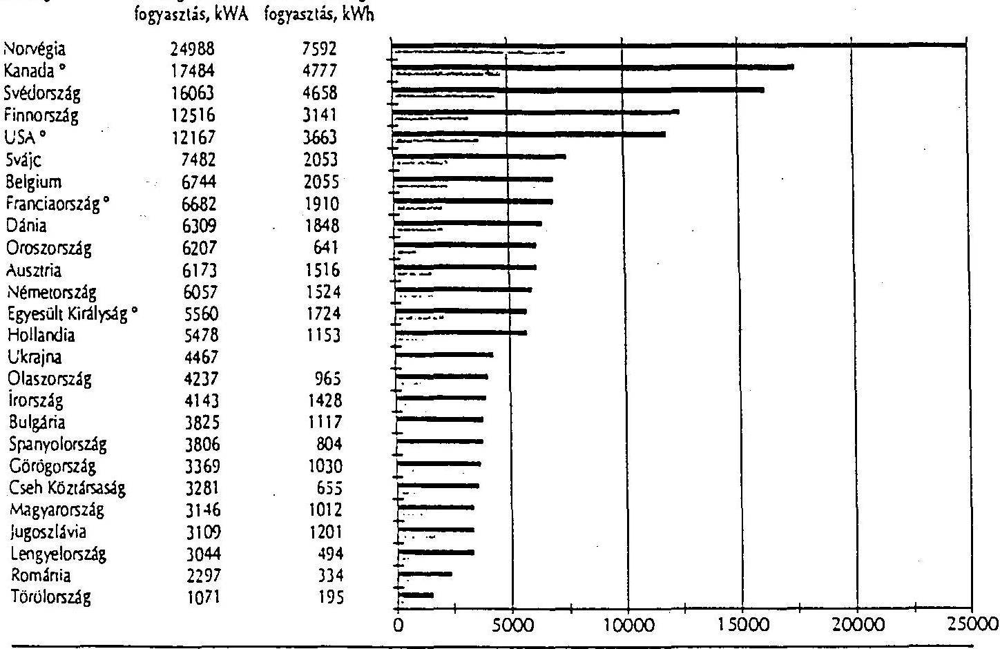

| Ország | Lakosság száma (millió), 18 | Országos bruttó fogyasztás, GWh | Nettó lakossági fogyasztás, GWh | Országos bruttó fogyasztás/18, kWh | Nettó lakossági fogyasztás/18, kWh |
| :--: | :--: | :--: | :--: | :--: | :--: |
|  | 1 | 2 | 3 | $3 / 2$ | $4 / 2$ |
| Ausztria | 148,50 | 48644 | 11949 | 6173 | 1516 |
| Belgium | 10,00 | 67439 | 20550 | 6744 | 2055 |
| Bulgária | 8,95 | 34234 | 9998 | 3825 | 1117 |
| Kanada * | 27,44 | 479762 | 131073 | 17484 | 4777 |
| Cseh Köztársaság | 15,79 | 51807 | 10343 | 3281 | 655 |
| Dánia | 5,17 | 32620 | 9554 | 6309 | 1848 |
| Finnország | 5,04 | 63080 | 15830 | 12516 | 5141 |
| Franciaország * | 57,37 | 383346 | 109593 | 6682 | 1910 |
| Németország | 80,57 | 488000 | 122803 | 6057 | 1524 |
| Görögország | 10,30 | 34699 | 10612 | 3369 | 1030 |
| Magyarország | 10,34 | 32533 | 10463 | 3146 | 1012 |
| Írország | 3,55 | 14709 | 2071 | 4143 | 1428 |
| Olaszország | 57,78 | 244787 | 55739 | 4237 | 965 |
| Hollandia | 15,18 | 83154 | 17500 | 5478 | 7592 |
| Norvégia | 4,29 | 107198 | 32569 | 24988 | 7592 |
| Lengyelország | 38,36 | 116753 | 18947 | 3044 | 494 |
| Románia | 22,75 | 52263 | 7596 | 2297 | 334 |
| Oroszország | 148,54 | 921916 | 95245 | 6207 | 641 |
| Spanyolország | 39,08 | 148754 | 31407 | 3806 | 4658 |
| Svédország | 8,68 | 139431 | 40431 | 16063 | 4658 |
| Svájc | 6,90 | 51623 | 14168 | 7482 | 2053 |
| Törökország | 58,78 | 62980 | 11482 | 1071 | 195 |
| Ukrajna | 51,94 | 232017 |  | 4467 |  |
| Egyesült Királyság * | 57,70 | 320784 | 99482 | 5560 | 1724 |
| USA* | 255,02 | 3102854 | 934044 | 12167 | 3663 |
| Jugoszlávia | 10,63 | 33048 | 12771 | 3109 | 1201 |

[^0]
[^0]:    * A legfejlettebb országok

---

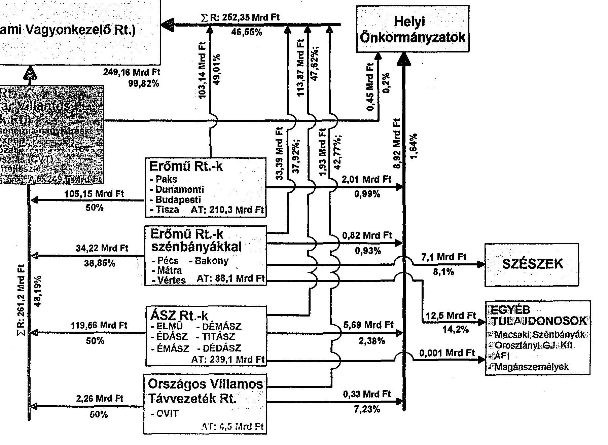

# AZ MVM CSOPORT TULAJDONOSI STRUKTÚRÁJA 1994.12.31-ÉN 

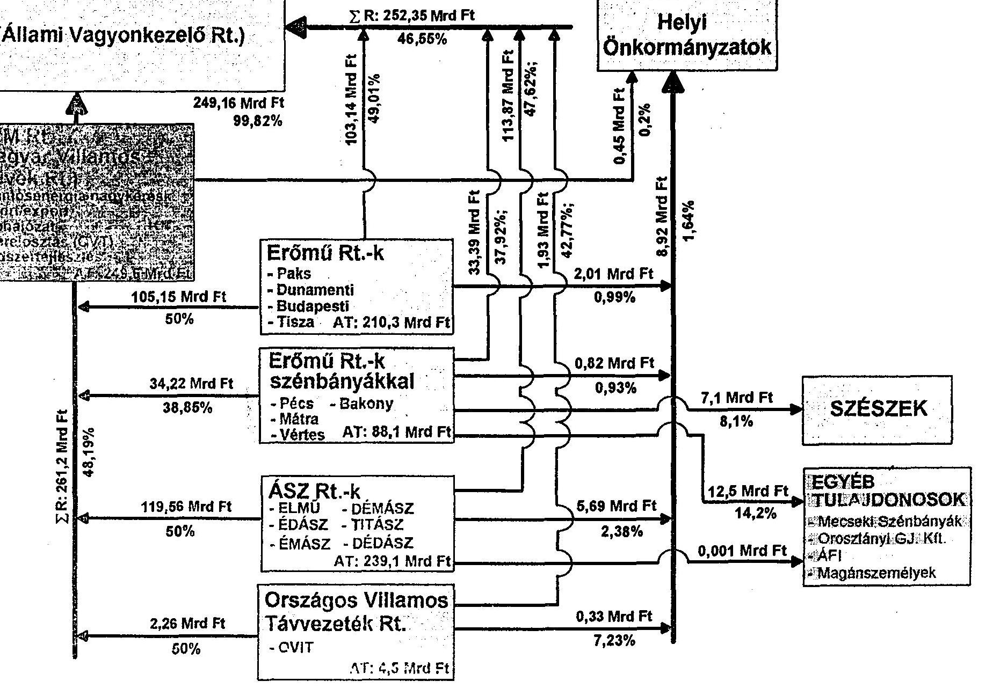

---

| Tulajdonosok részesedése a Részvénytársaságokban |  |  |  |  |  |  |   |
| --- | --- | --- | --- | --- | --- | --- | --- |
| 36/b. melléklet |  |  |  |  |  |  |   |
| Részvénytársaság | Alapító tőke | Jegyzett tőke | Jegyzett tőke megoszlása a tulajdonosok között |  |  |  |   |
|   |  |  | E Ft |  |  |  |   |
|   |  |  |  |  |  |  | ÁVO  |
|   |  |  |  |  |  |  | ÁVO  |
|   |  |  |  | ÁVV. |  |  | ÁVV.  |
| Vakany | 11,258,200 | 5,629,100 | 112,520 | 5,516,580 | 50.0% | 1.0% | 49.0%  |
| Budapesti | 16,260,000 | 8,130,000 | 1,367,900 | 6,762,100 | 50.0% | 8.4% | 41.6%  |
| Cunaanti | 33,542,220 | 16,771,110 | 415,220 | 16,355,890 | 50.0% | 1.2% | 48.8%  |
| Astra | 26,191,400 | 13,095,700 | 52,100 | 13,043,600 | 50.0% | 0.2% | 49.8%  |
| Pécs | 126,572,800 | 63,299,400 | 199,120 | 63,100,280 | 50.0% | 0.2% | 49.8%  |
| Pécs | 12,377,400 | 6,488,700 | 477,631 | 6,011,069 | 50.0% | 3.7% | 46.3%  |
| Vávsz | 34,745,600 | 17,372,800 | 101,685 | 17,271,115 | 50.0% | 0.3% | 49.7%  |
| Várton | 18,003,400 | 9,001,700 | 181,030 | 8,820,670 | 50.0% | 1.0% | 49.0%  |
| Gróuj Rt összesen | 279,577,020 | 139,788,310 | 2,907,206 | 136,881,304 | 50.0% | 1.0% | 49.0%  |
| COADE | 46,882,300 | 23,441,150 | 1,149,286 | 22,291,864 | 50.0% | 2.5% | 47.5%  |
| DENASI | 29,797,700 | 14,898,850 | 821,926 | 14,076,924 | 50.0% | 2.8% | 47.2%  |
| DENASI | 37,029,100 | 18,514,550 | 749,150 | 17,765,400 | 50.0% | 2.0% | 48.0%  |
| EMASI | 30,504,200 | 15,252,100 | 363,630 | 14,888,470 | 50.0% | 1.2% | 48.8%  |
| TITASI | 34,158,500 | 17,079,250 | 262,770 | 16,816,480 | 50.0% | 0.8% | 49.2%  |
| ELMO | 60,744,400 | 30,372,200 | 2,336,966 | 28,035,234 | 50.0% | 3.8% | 46.2%  |
| OViT | 4,522,600 | 2,261,300 | 328,930 | 1,932,370 | 50.0% | 7.3% | 42.7%  |
| Hálózati Rt összesen | 243,638,800 | 121,819,400 | 6,012,653 | 115,806,742 | 50.0% | 2.5% | 47.5%  |
| Részvénytársaságok | 323,215,820 | 261,607,910 | 8,919,864 | 252,688,046 | 50.0% | 1.7% | 48.3%  |
|

  MEN Rt. | 249,608,400 |  | 446,465 | 249,161,935 | 0.0% | 0.2% | 99.8%  |
|  Összesen | 772,824,220 | 261,607,910 | 9,366,329 | 501,849,981 | 33.9% | 1.2% | 64.9%  |

---

### 37. melléklet

### TULAJDONOSI SZERKEZET KIMUTATÁSA EFT-BAN.

### A Z ADATOK FORRÁSA AZ RT-K 1994. DEC. 31-I MÉRLEGBESZÁMOLÓINAK KIEGÉSZÍTŐ MELLÉKLETEI.

|  MVM társaságcsoport | MVM Rt | ÁV Rt. | ÁV Rt | ÁV Rt |  | MECSEKI | OROSZL. |  | ÁFI |  | JEGYZETT  |
| --- | --- | --- | --- | --- | --- | --- | --- | --- | --- | --- | --- |
|   |  | névleges | bün. kamatra | összesen | ÖNKORM. | SZÉNB. | GJ.KFT | SZÉSZÉK |  | MAGÁNSZ. | TÖKE ÖSSZ.  |
|  Bakonyi Erőmű Rt | 5 629 100 | 5 516 580 |  | 5 516 580 | 112 520 |  |  | 4 869 030 |  |  | 16 227 230  |
|  Budapesti Erőmű Rt | 7 716 750 | 6 427 060 |  | 6 427 060 | 1 288 690 |  |  |  |  |  | 15 433 500  |
|  Dunament Erőmű Rt | 16 771 110 | 16 355 890 |  | 16 355 890 | 415 220 |  |  |  |  |  | 33 542 220  |
|  Mátrai Erőmű Rt | 13 085 700 | 13 043 600 |  | 13 043 600 | 52 100 |  |  | 2 125 550 | 5 448 110 | 480 570 | 34 245 630  |
|  Pécsi Erőmű Rt | 63 299 400 | 63 100 280 |  | 63 100 280 | 198 120 |  |  |  |  |  | 126 598 800  |
|  Pécsi Erőmű Rt | 6 488 700 | 6 008 680 |  | 6 008 680 | 480 020 | 1 830 470 |  |  |  |  | 14 807 870  |
|  Tiszai Erőmű Rt | 17 372 800 | 17 271 110 |  | 17 271 110 | 101 690 |  |  |  |  |  | 34 745 600  |
|  Vértesi Erőmű Rt | 9 001 700 | 8 820 670 |  | 8 820 670 | 181 030 |  | 4 784 060 |  |  |  | 22 787 460  |
|  Erőmű Rt-k összesen: | 138 375 260 | 136 543 870 |  | 136 543 870 | 2 831 390 | 1 830 470 | 4 784 060 | 7 094 580 | 5 448 110 | 480 570 | 298 398 310  |
|  Északdunántúli Áramszolgáltató Rt | 23 441 150 | 17 603 630 | 4 687 880 | 22 291 510 | 1 148 280 |  |  |  |  | 370 | 46 882 300  |
|  Dél-dunántúli Áramszolgáltató Rt | 14 898 850 | 14 078 900 |  | 14 078 900 | 819 950 |  |  |  |  |  | 29 797 700  |
|  Dél-magyarországi Áramszolgáltató Rt | 18 514 550 | 14 062 490 | 3 702 440 | 17 764 930 | 749 150 |  |  |  |  |  | 37 029 100  |
|  Észak-magyarországi Áramszolgáltató Rt | 15 252 100 | 14 888 470 |  | 14 888 470 | 363 630 |  |  |  |  |  | 30 504 200  |
|  Tisza-túli Áramszolgáltató Rt | 17 079 250 | 16 816 480 |  | 16 816 480 | 262 770 |  |  |  |  |  | 34 158 500  |
|  Budapesti Elektronikus Művek Áramszolgáltató Rt | 30 372 200 | 28 035 230 |  | 28 035 230 | 2 336 970 |  |  |  |  |  | 60 744 400  |
|  Országos Villamostávvezeték Rt | 2 261 300 | 1 932 370 |  | 1 932 370 | 328 930 |  |  |  |  |  | 4 522 600  |
|  Áramszolgáltató Rt-k összesen: | 121 819 400 | 107 417 570 | 8 390 320 | 115 807 890 | 6 010 690 | 0 | 0 | 0 |  | 820 | 243 638 800  |
|  MVM Rt |  | 249 161 930 |  | 249 161 930 | 446 470 |  |  |  |  |  | 249 608 400  |
|  Mindösszesen: | 261 194 660 | 243 961 440 | 8 390 320 | 252 351 790 | 9 288 550 | 1 830 470 | 4 784 060 | 7 094 580 | 5 448 110 | 1201 | 542 027 110  |

---

# A kétszintű részvénytársaság szerződéses kapcsolatai 

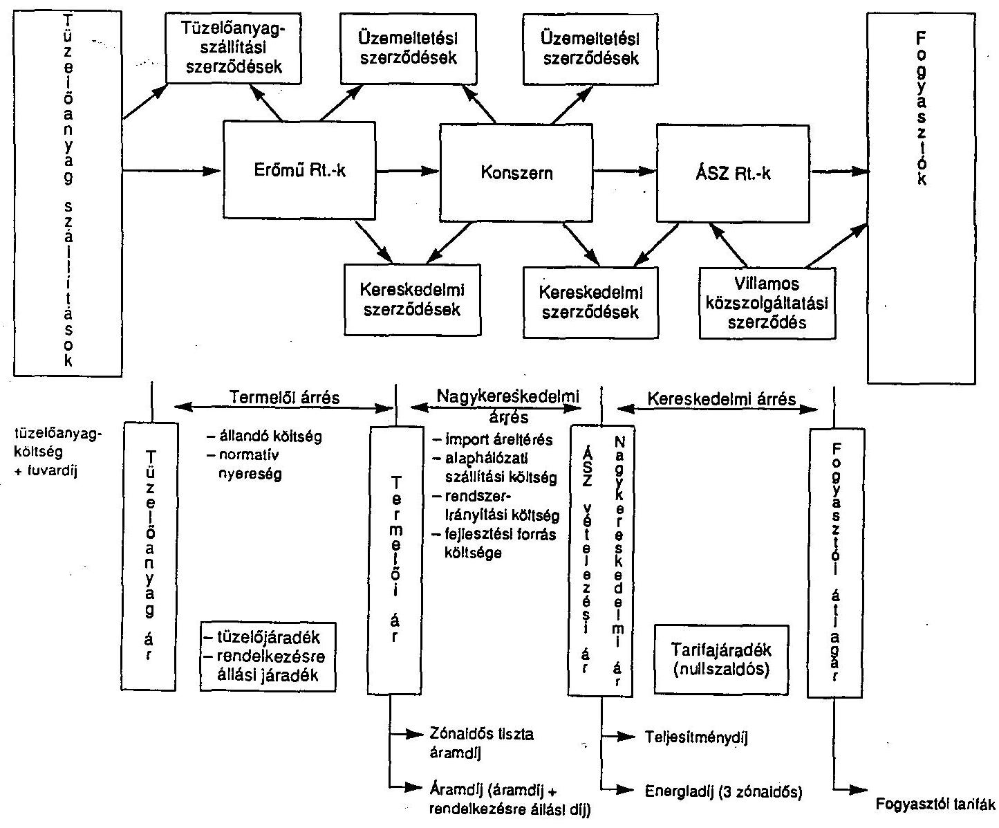

A kétszintű részvénytársaságon belül a gazdasági együttműködés döntően szerződéses alapokon nyugszik. A középtávú szerződések biztosítják, hogy a hálózatokkal fizikailag összekötött belső piaci szereplők az ár- és pénzügyi kapcsolatokban valódi vevőként és eladóként szerepeljenek, a piaci árak érvényesüljenek.

---

Magyar Villamos Művek
Részvénytársaság

# KONSZERN

1994.12.31.
/összesítés/

Mérleg eszközök (aktívák)

KONSZERN

01. A. Befektetett eszközök (02. - 11. - 14. sor)
02. J. IMMATERIÁLIS JAVAK (03. - 07. sorok)
03. I/1. Vagyoni értékű jogok
04. I/2. Üzleti vagy cégérték
05. I/3. Szellemi termékek
06. I/4. Kísérleti fejlesztés aktív: a. értékes
07. I/5. Alapítás-átszervezés aktív: a. értékes
08. II. VÁSÁRLT ESZKÖZÖK (09. - 13. sorok)
09. II/1. Ingatlanok
10. II/2. Műszaki berendezések, gépek, járművek
11. II/3. Egyéb berendezések, felszerelések, járművek
12. II/4. Beruházások
13. II/5. Beruházásokra adott előleg
14. III. BEFEKTETETT PÉNZÜGYI ESZKÖZÖK (15. - 18. sorok)
15. III/1. Készletek
16. III/2. Értékpapírok
17. III/3. Adott kölcsönök
18. III/4. Hosszú lejáratú bankbetétek
19. B. Forgóeszközök (20. - 27. - 33. - 3. sor)
20. I. KÖVETELÉSEK (28. - 32. sorok)
21. III/1. Kiutalások áruszállításból és szolgáltatásokból (vevők)
22. II/2. Változótőke-részesedések és felülértékelések
23. II/3. Vagyont, de még be nem fizetett tőke
24. II/4. Alapítókkal szembeni követelések
25. II/5. Egyéb követelések
26. I/6. BEFEKTETÉSEK (28. - 32. sorok)
27. III/1. Eladásra vásárolt kötvények
28. III/2. Saját részvények, üzletrészek, eladásra vásárolt részvények
29. IV. PÉNZESZKÖZÖK (34. - 38. sorok)
30. IV/1. Pénztár, csekkek
31. IV/2. Bankbetétek
32. V. Aktív időbeli elhatárolások
33. ESZKÖZÖK (AKTÍVÁK) ÖSSZESSÉGE (01. - 19. - 40. sor)

36. I/1/1. Egyéb értékpapírok
37. IV/2. Pénztár, csekkek
38. IV/3. Bankbetétek
39. C. ÁLLAPOT (AKTÍVÁK) ÖSSZESSÉGE (01. - 19. - 40. sor)

312414491 257054535 822888 570291914 304828886 675120800 -267066731 608054067
105098 1430061 10584 2220762 24988 2255721 0 2255712
16627 385248 10793 412668 73 412741 0 412741
0 0 0 0 0 0 0 0 0 0 0 0 0 0 0 0 0 0 0 0 0 0 0 0 0 0 0 0 0 0 0 0 0 0 0 0 0 0 0 0 0 0 0 0 0 0 0 0 0 0 0 0 0 0 0 0 0 0 0 0 0 0 0 0 0 0 0 0 0 0 0 0 0 0 0 0 0 0 0 0 0 0 0 0 0 0 0 0 0 0 0 0 0 0 0 0 0 0 0 0 0 0 0 0 0 0 0 0 0 0 0 0 0 0 0 0 0 0 0 0

---

## KONSZERN

|  1994.12.31. / Összesítés/ | |
| --- | --- |
|  |

|  Mérleg források (passzívák) | |
| --- | --- |
|  |

|  Kormányzati össz. Hálózat össz. | Egyéb össz. | Rt.-k össz. | MVM | KONSZERN | KISZÜRÉG | (pénzügyi) KONSZERN  |
| --- | --- | --- | --- | --- | --- | --- |
|  42. D. | Saját tőke (43.-47. sorok) | 306085781 | 251755987 | 787464 | 559229232 | 301245468  |
|  43. I. | JEGYZETT TŐKE | 305158522 | 243638800 | 780870 | 549587952 | 249608400  |
|  44. II. | VÖRTARTALÉK | 7950747 | 17888160 | 167981 | 26806888 | 52709366  |
|  45. III. | BERUHÁZÁSTARTALÉK | 2257932 | 79812 | -132356 | 2205388 | 1619650  |
|  46. IV. | ELŐZŐ ÉVEK ÁTÚSZOTT VESZTESÉGE | -3136933 | -2846117 | 0 | -5983050 | 0  |
|  47. V. | HÉRIZŐ ZÖLDINTI BERUHÁZÁS | -6044487 | -7204668 | -38831 | -12587986 | -2691959  |
|  48. E. | Céltartalékok (49.-51. sorok) | 292086 | 2079493 | 23284 | 5394863 | 1506899  |
|  49. 1. | Céltartalék a várható veszteségekre | 263795 | 2074680 | 17565 | 2356040 | 1506899  |
|  50. 2. | Céltartalék a várható kötelezettségekre | 26573 | 4813 | 5719 | 37105 | 0  |
|  51. 3. | Egyéb céltartalék | 3718 | 0 | 0 | 1718 | 0  |
|  52. F. | Kötelezettségek (53.+60. sor) | 53536436 | 26758762 | 290787 | 80585985 | 25259943  |
|  53. I. | HOZZÁ LEJÁRATÚ KÖTELEZETTSÉGEK (54.-59. sorok) | 24224371 | 6493073 | 40120 | 30657564 | 7727493  |
|  54. I/1. | Beruházási és fejlesztési hitelek | 60000 | 1565721 | 4115 | 1629836 | 6604468  |
|  55. I/2. | Egyéb hosszú lejáratú hitelek | 48500 | 157689 | 0 | 206189 | 0  |
|  56. I/3. | Hosszú lejáratra kapott kölcsönök | 18400 | 149421 | 15093 | 182914 | 1123025  |
|  57. I/4. | Tartozások kötvénykibocsátásból | 0 | 0 | 0 | 0 | 0  |
|

  58. I/5. | Alapítókkal szembeni kötelezettségek | 0 | 46880 | 0 | 46880 | 0  |
|  59. I/6. | Egyéb hosszú lejáratú kötelezettségek | 23597471 | 4573362 | 20912 | 28591745 | 0  |
|  60. II. | KÖZÉP LEJÁRATÚ KÖTELEZETTSÉGEK (61.-66. soruk) | 22412065 | 20265689 | 250667 | 49029421 | 17532450  |
|  61. II/1. | Vevőtől kapott előlegek | 19614 | 2264103 | 773 | 2284490 | 0  |
|  62. II/2. | Kötelezettségek áruszállításból és szolgáltatásból (szállítók) | 10109197 | 2007591 | 57115 | 12173903 | 1341422  |
|  63. II/3. | Váltótartozások | 113217 | 129641 | 0 | 242858 | 0  |
|  64. II/4. | Rövid lejáratú hitelek | 4194945 | 4624394 | 1606 | 8730945 | 4593386  |
|  65. II/5. | Rövid lejáratú kölcsönök | 0 | 4331730 | 0 | 4331730 | 579445  |
|  66. II/6. | Egyéb rövid lejáratú kötelezettségek | 15065092 | 6908230 | 191173 | 22164495 | 11018197  |
|  67. G. | Passzív időbeli elhatárolások | 2222326 | 816897 | 26098 | 3065321 | 1351423  |
|  68. | PASSZÍVUMOK ÖSSZESSÉGE (42.+48.+52.+67. sor) | 362736629 | 281411139 | 1127633 | 645275401 | 329363733  |

## 40. melléklet

---

| Megnevezés | 1993. év | 1994. év | 1994. év   1993. év   %-ában | 1993. év | 1994. év |
| :-- | --: | --: | --: | --: | --: |
|  | MFt-ban |  |  |  |  |
| Jegyzett tőke | 528.369 | 537.700 | 101,7 | 88,4 | 89,2 |
| Tőketartalék | 72.677 | 78.716 | 108,3 | 12,2 | 13,1 |
| Eredménytartalék | 2.030 | 3.825 | 188,4 | 0,3 | 0,6 |
| Előző évek áth. veszt. | -4.382 | -5.983 | 136,5 | -0,7 | -1 |
| Mérleg szerinti eredmény | -1.036 | -11.748 | 1133 | -0,2 | -1,9 |
| Saját tőke összesen | 597.659 | 602.510 | 100,8 | 100 | 100 |

Az MVM társaságcsoport forrásszerkezetének alakulása 1994-ben

| Megnevezés | 1993. | 1994. | 1994.év az 1993. év %-ában | 1993. | 1994. |
| :--: | :--: | :--: | :--: | :--: | :--: |
|  | MFt |  |  |  | % |
| Saját tőke | 597.660 | 602.510 | 100,8 | 92,3 | 88,3 |
| Céltartalék | 1.467 | 3.901 | 265,9 | 0,2 | 0,6 |
| Kötelezettségek | 46.891 | 71.160 | 151,8 | 7,2 | 10,4 |
| Passzív időbeli elh. | 1.684 | 4.417 | 262,3 | 0,3 | 0,7 |
| Források összesen | 647.702 | 681.988 | 105,3 | 100,0 | 100,0 |

Az MVM társaságcsoport eszközszerkezetének alakulása 1994-ben

| Megnevezés | 1993. | 1994. | 1994.év   az 1993.   év   %-ában | 1993. |  | 1994. |  |
| :--: | :--: | :--: | :--: | :--: | :--: | :--: | :--: |
|  | MFt |  |  |  |  | % |  |
| Befektetett eszközök | 581.738 | 608.054 | 104,5 | 100,0 | 89,8 | 100,0 | 89,2 |
| Immateriális javak | 1.459 | 2.256 | 154,6 | 0,2 |  | 0,4 |  |
| Tárgyi eszközök | 578.131 | 602.179 | 104,2 | 99,4 |  | 99,0 |  |
| Befektetett pui. eszk. | 2.148 | 3.619 | 168,5 | 0,4 |  | 0,6 |  |
| Forgóeszközök | 65.098 | 70.627 | 108,5 | 100,0 | 10,1 | 100,0 | 10,4 |
| Készletek | 30.250 | 33.563 | 111,0 | 46,5 |  | 47,5 |  |
| Követelések | 24.057 | 24.224 | 100,7 | 37,0 |  | 34,3 |  |
| Értékpapír | 288 | 1.361 | 472,6 | 0,4 |  | 1,9 |  |
| Pénzeszközök | 10.503 | 11.479 | 109,3 | 16,1 |  | 16,3 |  |
| Aktív időbeli elhat. | 866 | 3.307 | 381,9 |  | 0,1 |  | 0,4 |
| Eszközök összesen | 647.702 | 681.988 | 105,3 |  | 100,0 |  | 100,0 |

---

## 41/b, sz. melléklet

A villamosenergia-ipari társaságok saját tőkéjének összetétele (1991-1994.)

|  TÁRSASÁGOK eft | 1991 | 1992 | 1993 | 1994  |
| --- | --- | --- | --- | --- |
|  MVM Rt |  |  |  |   |
|  Jegyzett tőke | 249608400 | 249608400 | 249608400 | 249608400  |
|  Tőketartalék | 53464686 | 53464986 | 52655145 | 52709368  |
|  Eredménytartalék | 144400 | 142205 | 1292079 | 1619659  |
|  Előző évek áth.veszt. | 0 | 0 | 0 | 0  |
|  Mérleg szerinti eredmény | 0 | 1132124 | 328734 | -2691959  |
|  Saját tőke | 303237486 | 304347715 | 303884358 | 301245468  |
|  OVIT Rt |  |  |  |   |
|  Jegyzett tőke | 4522600 | 4522600 | 4522600 | 4522600  |
|  Tőketartalék | 86180 | 84544 | 81311 | 132749  |
|  Eredménytartalék | 0 | 0 | 0 | 35624  |
|  Előző évek áth.veszt. | 0 | 0 | -21486 | 0  |
|  Mérleg szerinti eredmény | 0 | -21486 | 59300 | 45378  |
|  Saját tőke | 4608780 | 4585658 | 4641725 | 4736351  |
|  ELMÚ Rt |  |  |  |   |
|  Jegyzett tőke | 60744400 | 60744400 | 60744400 | 60744400  |
|  Tőketartalék | 773814 | 2083782 |  | 5617619  |
|  Eredménytartalék | 0 | 0 |  | -84197  |
|  Előző évek áth.veszt. | 0 | 0 |  | -760909  |
|  Mérleg szerinti eredmény | 0 | -239492 |  | -3777007  |
|  Saját tőke | 61518214 | 62588690 | 63137490 | 61739906  |
|  DEDASZ Rt |  |  |  |   |
|  Jegyzett tőke | 29797700 | 29797700 | 29797700 | 29797700  |
|  Tőketartalék | 55299 | 536797 | 4074620 | 1859455  |
|  Eredménytartalék | 0 | 0 | 0 | 0  |
|  Előző évek áth.veszt. | 0 | 0 | -290869 | -431424  |
|  Mérleg szerinti eredmény | 0 | -290869 | -140554 | -659500  |
|  Saját tőke | 29852999 | 30043628 | 30440897 | 30566231  |
|  DEMASZ Rt |  |  |  |   |
|  Jegyzett tőke | 37029100 | 37029100 | 37029100 | 37029100  |
|  Tőketartalék | 518430 | 955215 | 1640129 | 2415525  |
|  Eredménytartalék | 0 | 0 | 0 | 5770  |
|  Előző évek áth.veszt. | 0 | 0 | -168734 | -168734  |
|  Mérleg szerinti eredmény | 0 | -168734 | 5770 | -542582  |
|  Saját tőke | 37547530 | 37815581 | 38506265 | 38739079  |
|  EDASZ Rt |  |  |  |   |
|  Jegyzett tőke | 46882300 | 46882300 | 46882300 | 46882300  |
|  Tőketartalék | 775182 | 1909674 | 3091148 | 4643317  |
|  Eredménytartalék | 0 | 0 | 0 | 122078  |
|  Előző évek áth.veszt. | 0 | 0 | -177518 | 0  |
|  Mérleg szerinti eredmény | 0 | -177518 | 299596 | -186844  |
|  Saját tőke | 47657482 | 48614456 | 50095525 | 51460851  |
|  EMASZ Rt |  |  |  |   |
|  Jegyzett tőke | 30504200 | 30504200 | 30504200 | 30504200  |
|  Tőketartalék | 219642 | 530416 | -916750 | 1448717  |
|  Eredménytartalék | 0 | 60 | 60 | 719  |
|  Előző évek áth.veszt. | 0 | 0 | -431498 | -431498  |
|  Mérleg szerinti eredmény | 0 | -431498 | 659 | -564500  |
|  Saját tőke | 30723842 | 30603178 | 30990171 | 30957638  |
|  TITASZ Rt |  |  |  |   |
|  Jegyzett tőke | 34158500 | 34158500 | 34158500 | 34158500  |
|  Tőketartalék | 121034 | 601057 | 1167572 | 1770283  |
|  Eredménytartalék | 0 | 0 | 0 | 0  |
|  Előző évek áth.veszt. | 0 | 0 | -382943 | -743436  |
|  Mérleg szerinti eredmény | 0 | -383133 | -360493 | -837692  |
|  Saját tőke | 34279534 | 34376424 | 34582636 | 34347745  |
|  ÖSSZES SAJÁT TŐKE ÖSSZ: | 246188381 | 248627615 | 252394710 | 252547801  |

---

|  TÁRSASÁGOK eft | 1991 | 1992 | 1993 | 1994  |
| --- | --- | --- | --- | --- |
|  BAKONYI E Rt |  |  |  |   |
|  Jegyzett tőke | 11258200 | 11258200 | 13606340 | 16227230  |
|  Tőketartalék | 201226 | 261449 | 284223 | 242071  |
|  Eredménytartalék | 0 | -117 | -55036 | -55022  |
|  Előző évek áth.veszt. | 0 | 0 | 431180 | -462114  |
|  Mérleg szerinti eredmény | 0 | -486108 | -30933 | -1450841  |
|  Saját tőke | 11459426 | 11033424 | 13373414 | 14501324  |
|  BUDAPESTI E Rt |  |  |  |   |

 Jegyzett tőke | 16260000 | 16260000 | 16260000 | 15433500  |
|  Tőketartalék | 470472 | 467258 | 462158 | 54928  |
|  Eredménytartalék | 0 | 0 | 0 | 0  |
|  Előző évek áth.veszt. | 0 | 0 | -681304 | 0  |
|  Mérleg sz. eredmény | 0 | -681304 | -607302 | -1111071  |
|  Saját tőke | 16730472 | 16045954 | 15433552 | 14377357  |
|  DUNAMENTI E Rt |  |  |  |   |
|  Jegyzett tőke | 33542220 | 33542220 | 33542220 | 33542220  |
|  Tőketartalék | 1208842 | 1202885 | 1202885 | 1202885  |
|  Eredménytartalék | 0 | 81 | 371373 | 1132473  |
|  Előző évek áth.veszt. | 0 | 0 | 0 | 0  |
|  Mérleg sz. eredmény | 0 | 380805 | 753531 | 192155  |
|  Saját tőke | 34751062 | 35125991 | 35870009 | 36069733  |
|  MATRAI E Rt |  |  |  |   |
|  Jegyzett tőke | 26191400 | 26191400 | 34245630 | 34245630  |
|  Tőketartalék | 1455405 | 1457573 | 1451636 | 1468667  |
|  Eredménytartalék | 0 | 0 | 128174 | 194823  |
|  Előző évek áth.veszt. | 0 | 0 | 0 | 0  |
|  Mérleg sz. eredmény | 0 | 1304927 | 67516 | 532780  |
|  Saját tőke | 27646805 | 27779165 | 35892956 | 36441900  |
|  PAKSI AE Rt |  |  |  |   |
|  Jegyzett tőke | 126598800 | 126598800 | 126598800 | 126598800  |
|  Tőketartalék | 2706112 | 2657465 | 2676461 | 2713465  |
|  Eredménytartalék | 0 | 0 | 330029 | 760561  |
|  Előző évek áth.veszt. | 0 | 0 | 0 | 0  |
|  Mérleg sz. eredmény | 0 | 354623 | 465653 | 396352  |
|  Saját tőke | 129304912 | 129610888 | 130072943 | 130469198  |
|  PECSI E Rt |  |  |  |   |
|  Jegyzett tőke | 12977400 | 12977400 | 14807870 | 14807870  |
|  Tőketartalék | 1322434 | 1319183 | 1315456 | 1312032  |
|  Eredménytartalék | 0 | 0 | 0 | 0  |
|  Előző évek áth.veszt. | 0 | 0 | -711270 | -1465687  |
|  Mérleg sz. eredmény | 0 | -711270 | -754417 | -1133972  |
|  Saját tőke | 14299834 | 13585313 | 14657639 | 13520243  |
|  TISZAI E Rt |  |  |  |   |
|  Jegyzett tőke | 34745600 | 34745600 | 34745600 | 34745600  |
|  Tőketartalék | 518912 | 505052 | 11663 | 11763  |
|  Eredménytartalék | 0 | 0 | 0 | 146422  |
|  Előző évek áth.veszt. | 0 | 0 | 0 | 0  |
|  Mérleg sz. eredmény | 0 | -502444 | 153554 | -1182645  |
|  Saját tőke | 35264512 | 34748208 | 34408373 | 33218696  |
|  VERTESI E Rt |  |  |  |   |
|  Jegyzett tőke | 18003400 | 18003400 | 18003400 | 22787460  |
|  Tőketartalék | 959731 | 943151 | 938891 | 943151  |
|  Eredménytartalék | 0 | 10 | 0 | 71897  |
|  Előző évek áth.veszt. | 0 | 0 | -397852 | -397852  |
|  Mérleg sz. eredmény | 0 | -397852 | 89740 | -854645  |
|  Saját tőke | 18963131 | 18548709 | 18634179 | 22550011  |
|  E Rt SAJÁT TÖKE OSSZ | 288420154 | 286477652 | 299343065 | 301148462  |
|  IPARÁG SAJ. TÖK. OSSZ | 588237621 | 589844582 | 605013733 | 605333331  |

---

42. melléklet

# Céltartalékképzés

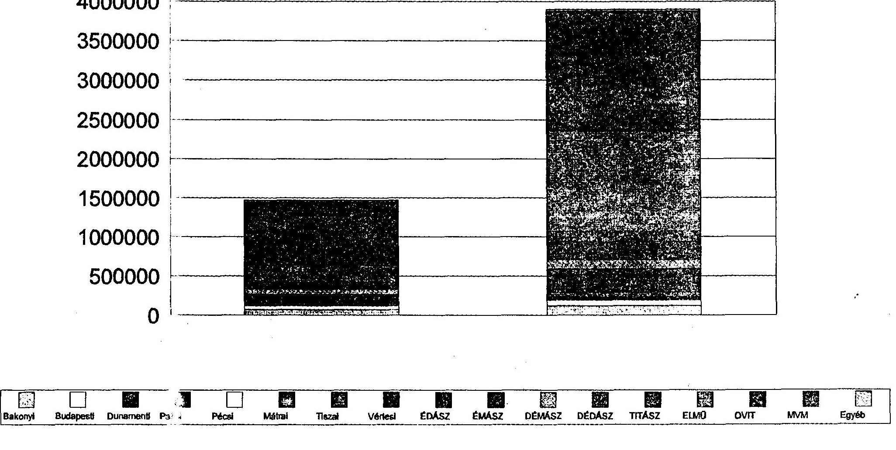

---

43. melléklet Az MVM Rt befektetéselnek vagyoni helyzete

|  A tilvasógyorva | MVM Rt. tulajdon-
vázva | MVM Rt. tulajdon-
vázva | Bejlét tilva (KKL) | Bejlét tilva (MKL) | Indus % ben | Jogosert tilva (MKL) | Jogosert tilva (MKL) | Indus % ben | Tálmis/telek (MKL) | Tálmis/telek (MKL) | Indus % ben | Érintési káv (MKL) | Érintési káv (MKL) | Érintési káv (MKL) | Érintési káv (MKL) | Érintési káv (MKL) | Mátog
szer Med
esedmény
(MKL) | Mátog
szer Med
esedmény
(MKL) | Indus % ben | Ctilvasalsz
(101) | Ctilvasalsz
(101) | Indus % ben  |
| --- | --- | --- | --- | --- | --- | --- | --- | --- | --- | --- | --- | --- | --- | --- | --- | --- | --- | --- | --- | --- | --- | --- |
|  Kislány | 36,89% | 3,828,100 | 18,372,410 | 34,061,320 | 100,02% | 15,000,000 | 18,227,230 | 110,38% | 264,239 | 242,621 | 35,17% | 155,840 | 155,022 | 90,07% | -411,100 | -452,110 | -30,933 | -1,450,641 |  | 77,440 | 123,950 | 170,81%  |
|  Cérter | 36,36% | 3,067,700 | 18,930,520 | 33,500,012 | 121,06% | 10,003,450 | 23,197,480 | 138,07% | 817,053 | 642,181 | 130,33% | 0 | 71,692 |  | -246,300 | -507,852 | 4,635 | -834,840 |  |  | 9,465 |   |
|  Hájra | 36,00% | 17,372,600 | 54,408,970 | 33,230,690 | 90,34% | 30,745,000 | 24,745,000 | 500,00% | 71,663 | 11,783 | 100,00% | 0 | 148,433 |  | -602,644 | -302,444 | 153,950 | -1,183,645 |  | 9,100 | 50,671 | 901,96%  |
|  Gynemerk | 36,00% | 10,271,100 | 15,870,000 | 36,009,530 | 100,56% | 13,543,250 | 23,543,250 | 500,00% | 1,003,885 | 1,003,885 | 100,00% | 371,373 | 1,132,673 | 304,89% | 0 | 0 | 753,637 | 182,155 | 35,50% | 4,607 | 8,710 | 139,78%  |
|  Pápai | 42,87% | 9,188,700 | 14,557,830 | 13,500,542 | 82,34% | 14,007,870 | 16,007,870 | 100,00% | 1,518,958 | 1,518,958 | 90,74% | 0 | 0 |  | -711,570 | -1,485,087 | -784,477 | -1,125,973 | -100,71% | 45 | 8,161 | 20002,50%  |
|  Radoszok | 36,00% | 7,718,700 | 15,433,593 | 14,077,937 | 83,10% | 15,500,000 | 16,433,000 | 94,97% | 452,188 | 94,833 | 71,86% | 0 | 0 |  | -881,300 | 0 | -607,303 | -1,111,677 | 363,95% | 45,060 | 64,271 | 139,51%  |
|  Tisza | 36,00% | 69,299,400 | 150,073,943 | 130,409,188 | 100,00% | 130,500,800 | 130,500,800 | 100,00% | 2,878,081 | 2,713,463 | 101,31% | 336,539 | 780,683 | 730,45% | 0 | 0 | 480,633 | 390,353 | 95,12% | 0 | 0 |   |
|  Házra | 36,34% | 13,095,500 | 35,093,950 | 36,461,900 | 101,57% | 34,246,830 | 24,246,830 | 100,00% | 1,437,838 | 1,488,067 | 101,17% | 136,174 | 194,633 | 153,00% | 0 | 0 | 87,810 | 532,780 | 769,13% | 37,633 | 31,565 | 85,31%  |
|  KASNÓ DÁSZ |  | 136,379,994 | 268,238,495 | 201,149,685 | 100,57% | 291,000,000 | 298,389,330 | 302,21% | 8,367,934 | 7,948,083 | 99,23% | 174,945 | 3,391,194 | 200,94% | -2,734,496 | -3,928,097 | 53,037 | -4,871,092 |  | 184,830 | 290,398 | 179,65%  |
|  STÁSZ | 36,00% | 17,078,900 | 34,563,630 | 34,667,545 | 90,12% | 24,758,000 | 24,158,000 | 100,00% | 1,187,873 | 1,770,383 | 131,62% | 75 | 0 | 0,00% | -363,010 | -743,430 | -360,483 | -637,803 | 232,25% | 38,041 | 134,743 | 354,17%  |
|  ÉJEZ | 36,00% | 10,152,300 | 30,990,177 | 30,607,638 | 90,00% | 30,504,000 | 30,504,000 | 100,00% | 818,350 | 1,448,717 | 138,03% | 80 | 710 | 1165,55% | -431,480 | -431,480 | 830 | -964,000 |  | 30,170 | 87,410 | 325,34%  |
|  ÉJEG | 36,00% | 30,372,900 | 63,137,490 | 61,730,900 | 87,78% | 60,744,400 | 60,744,400 | 100,00% | 3,236,188 | 3,617,818 | 173,46% | -64,187 | 64,187 | 100,00% | -150,500 | -100,000 | -609,614 | -3,777,007 | 833,67% | 319,473 | 1,278,138 | 565,24%  |
|  GÉSZ | 36,00% | 14,668,800 | 30,345,097 | 30,508,231 | 100,41% | 38,767,700 | 38,767,700 | 100,00% | 1,034,930 | 1,850,435 | 173,03% | 0 | 0 |  | -500,680 | -431,431 | -140,564 | -658,500 | 480,21% | 46,831 | 230,381 | 481,73%  |
|  GÉSZ | 36,00% | 10,514,500 | 38,500,385 | 38,730,010 | 100,00% | 37,638,100 | 37,638,100 | 100,00% | 1,040,128 | 3,416,525 | 147,16% | 0 | 6,250 |  | -168,734 | -168,734 | 5,710 | -542,582 |  | 73,734 | 112,435 | 352,58%  |
|  ÉJEG | 36,00% | 23,451,100 | 50,093,530 | 51,480,031 | 102,73% | 48,963,300 | 48,963,300 | 100,00% | 3,093,196 | 4,843,377 | 130,21% | 0 | 172,610 |  | -127,910 | 0 | 700,500 | -196,844 | 433,37% | 13,453 | 737,933 | 319,62%  |
|  Gyszi | 36,00% | 2,381,300 | 4,841,235 | 4,700,351 | 100,00% | 4,522,000 | 4,522,000 | 100,00% | 81,311 | 132,748 | 163,38% | 0 | 37,434 |  | -31,440 | 0 | 90,300 | 45,370 | 78,53% | 9,847 | 51,294 | 311,27%  |
|  KÁSÁSZ DÁSZ |  | 131,816,400 | 153,794,710 | 153,507,881 | 100,00% | 143,030,000 | 143,030,000 | 100,00% | 11,598,734 | 17,897,865 | 169,57% | -84,983 | 79,990 | -85,10% |

 | -1,628,410 | -2,070,001 | -261,330 | -6,623,037 | 619,05% | 473,948 | 5,979,330 | 437,10%  |
|  CROKKÉ Rt. | 80,61% | 513,357 | 710,853 | 869,130 | 91,04% | 713,670 | 713,670 | 100,00% | 150,583 | 150,573 | 90,95% | 45,103 | -130,408 |  | -10,050 | 0 | 183,317 | -65,710 | 40,31% |  | 6,383 |   |
|  FÁSZ KÉ | 100,00% | 71,990 | 921,047 | 119,344 | 106,12% | 72,000 | 72,000 | 100,00% | 6,928 | 8,428 | 100,00% | 2,533 | 7,063 | 81,43% | 0 | 0 | 28,881 |  |  | 17,010 |   |
|  HÚVÁSZ KÉ | 100,00% | 50,500 | 78,900 | 66,040 | 106,55% | 66,000 | 66,000 | 100,00% | 0 | 0 | 14,733 | 22,660 | 131,07% | 0 | 0 | 2,930 | 2,900 | 215,49% | 410 | 4,470 |   |
|  NÁVOLÁZ KÉ | 83,00% | 21,550 | 0 | 23,000 |  |  | 23,000 |  |  |  |  |  |  |  |  |  |  |  |  |  |  |   |
|  FŰSZKÁVÁN KÉ | 4,12% | 13,000 | 0 | 23,000 |  |  | 23,000 |  |  |  |  |  |  |  |  |  |  |  |  |  |  |   |
|  HÚSVÁNÉSZ KÉ | 25,00% | 900 | 0 | 2,000 |  |  | 2,000 |  |  |  |  |  |  |  |  |  |  |  |  |  |  |   |
|  HÉKKÉSZ KÉ |  | 5,000 |  |  |  |  |  |  |  |  |  |  |  |  |  |  |  |  |  |  |  |   |
|  SZKÉSZKÁZS TÁVÉ |  | 148,807 | 835,854 | 1,161,504 |  | 885,476 | 1,788,435 |  | 188,001 | 187,887 |  | 83,823 | -114,919 |  | -19,862 | 0 | -158,333 | -51,471 |  | 417 | 27,758 |   |
|  MÁNGÖSZ |  | 241,044,507 | 591,595,120 | 574,897,767 | 100,00% | 526,300,100 | 526,300,100 | 101,585,760 | 161,29% | 19,739,747 | 20,904,570 | 171,63% | 753,105 | 2,319,033 | 254,23% | -4,390,736 | -5,599,086 | -846,416 | -11,109,073 | 1110,76% | 638,744 | 2,382,347  |

MVM Rt.

---

# ÉRTÉKVESZTÉS 

Az MVM Rt. a társaságok veszteségei miatt 1994. évben összesen 2.503,9 millió Ft értékben számolt el értékvesztéseket a társasági befektetései terhére.
(adatok ezer Ft-ban)

| A társaság neve | MVM Rt. tulajdoní aránya | MVM Rt. tulajdonrésze névértéken | Mérleg szerinti eredmény 1994. | Arfolyam mutatóval korrigált bef.eszk. (kalk.edel) | Arfolyam mutató (saját tőke/ jegyzett tőke) | MVM Rt. befektetett eszközök értékvesztése (kalk.edel) | Mérlegben elszámolt értékvesztés 1993. | Mérlegben elszámolt értékvesztés 1994. | MVM Rt. tulajdonrésze nyilvántartási értéken |
| :--: | :--: | :--: | :--: | :--: | :--: | :--: | :--: | :--: | :--: |
| Bakony | 34,69% | 5.629.100 | -1.450.841 | 5.030.207 | 89,36% | -598.703 | -80.825 | -518.064 | 5.030.211 |
| Ventes | 39,50% | 9.001.700 | -854.845 | 8.907.901 | 96,96% | -93.799 |  | -93.792 | 8.907.908 |
| Tisza | 50,00% | 17.372.800 | -1.182.645 | 16.609.348 | 95,61% | -763.452 |  | -763.452 | 16.609.348 |
| Dunament | 50,00% | 16.771.110 | 102.168 |  | 107,54% |  |  |  | 16.771.110 |
| Pécsi | 43,80% | 6.488.700 | -1.133.972 | 5.924.471 | 91,30% | -564.229 |  | -563.981 | 5.924.718 |
| Budapesti | 50,00% | 7.716.750 | -1.111.071 | 7.188.679 | 93,16% | -528.072 |  | -528.071 | 7.188.705 |
| Parsi | 50,00% | 63.299.400 | -396.352 |  | 103,06% |  |  |  | 63.299.400 |
| Matrai | 38,24% | 13.095.700 | 532.780 |  | 106,41% |  |  |  | 13.095.700 |
| EROMU OSSZ. |  | 139.375.260 | -4.611.887 |  |  | -2.648.258 | -80.825 | -2.467.360 | 136.827.101 |
| TITASZ | 50,00% | 17.079.250 | -837.602 |  | 100,55% |  |  |  | 17.079.250 |
| EMASZ | 50,00% | 15.252.100 | -564.500 |  | 101,49% |  |  |  | 15.252.100 |
| ELMU | 50,00% | 30.372.200 | -3.777.007 |  | 101,64% |  |  |  | 30.372.200 |
| DÉDASZ | 50,00% | 14.898.850 | -659.500 |  | 102,58% |  |  |  | 14.898.850 |
| DEMASZ | 50,00% | 18.514.550 | -542.582 |  | 104,62% |  |  |  | 18.514.550 |
| EDASZ | 50,00% | 23.441.150 | -186.844 |  | 109,77% |  |  |  | 23.441.150 |
| OVIT | 50,00% | 2.261.300 | 45.378 |  | 104,73% |  |  |  | 2.261.300 |
| ARAMSZOLG. OSSZ. |  | 121.819.400 | -6.522.657 |  |  |  |  |  | 121.819.400 |
| EROKAR RL | 60,34% | 573.357 | -65.718 | 536.762 | 93,82% | -36.595 |  | -36.577 | 536.760 |
| ERBE Kft. | 100,00% | 77.000 | 26.884 |  | 154,99% |  |  |  | 50.000 |
| VILLKESZ   Kft. | 100,00% | 60.800 | 7.400 |  | 141,51% |  |  |  | 63.674 |
| KOMOLAJ   Kft. | 85,00% | 21.250 |  |  |  |  |  |  | 21.250 |
| FURUKAWA   Kft. | 4,12% | 12.000 |  |  |  |  |  |  | 12.000 |
| ALGYINVES   T Kft. | 25,00% | 500 |  |  |  |  |  |  | 500 |
| NOVOFER   Kft. |  | 5.000 |  |  |  |  |  |  | 1.250 |
| EGYÉB GAZD.TARS. |  | 749.907 | -31.431 |  |  | -35.595 |  | -36.577 | 685.454 |
| MIRDÖSSZESEN |  | 261.944.567 | -11.165.979 |  |  | -2.504.849 | -80.826 | -2.503.937 | 259.331.955 |

Az 1993. évben az összes elszámolt értékvesztés 494.049 ezer Ft volt, melyből 413.224 ezer Ft a Budapesti Erömü Rt. alapfökészökkentéséből adódott. Ezt a csökkenést a táblázatban az MVM Rt. tulajdonrésze oszlopban mutattuk ki.
Az ERBE Kft-ben lévő 77 millió Ft névértékű üzletrészt 50 millió Ft bekerülési értéken került a könyvekbe, nem kellett rá értékvesztést elszámolni.

A társasági befektetések miatt elszámolt értékvesztés 1994. évben 2.530,9 millió Ft-tal csökkentette az MVM Rt. éves eredményét. Ha társaságok értékvesztése nem következett volna be, akkor a mérleg szerinti veszteség mindössze 188 millió Ft körül alakulna.

---

# Tulajdon megoszlás (%)

|  Mód | Mód | Égyéb  |
| --- | --- | --- |
|  Bakonyi | 34.7 | 50  |
|  Bakonyi | 43.8 | 50  |
|  Pécs | 39.5 | 50  |
|  Vérös | 100 | 50  |

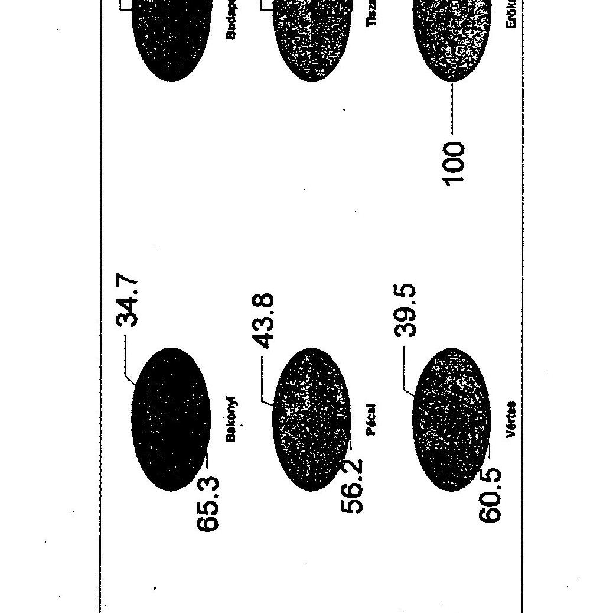

---

# Befektetésk értékvesztése 

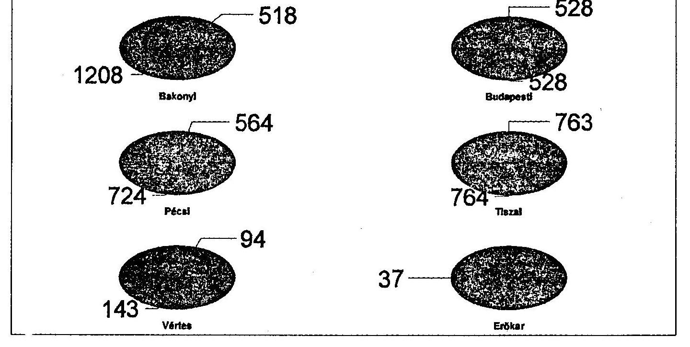

---

Az MVM Rt. érdekeltségeinek befektetései

Az MVM Rt. érdekeltségeinek könyvszerinti értéken - értékvesztéssel csökkentett érték - 22,9 milliárd Ft tulajdonosi részesedése van különböző típusú gazdasági társaságokban. Az 1994. évben ezen részesedések veszteségei miatt elszámolt értékvesztés 2,5 milliárd Ft.
(adatok ezer Ft-ban)

| Társaság | Befektetett pénzügyi eszközökből |  |  |  | Eladásra vásárolt értékpapírok, részesedések |  |  |  |
| :--: | :--: | :--: | :--: | :--: | :--: | :--: | :--: | :--: |
|  | Részesedések |  | Értékpapírok |  | Saját részvény |  | Egyéb |  |
|  | 1993. | 1994. | 1993. | 1994. | 1993. | 1994. | 1993. | 1994. |
| Bakonyi | 47.314 | 47.314 | 88 | 44 | 0 | 15.300 | 44 | 88 |
| Vértesi | 5.510.890 | 7.188.545 | 0 | 0 | 0 | 50.000 | 0 | 0 |
| Tiszai | 7.963.690 | 6.930.402 | 0 | 0 | 0 | 0 | 0 | 0 |
| Dursameri | 0 | 0 | 0 | 0 | 0 | 0 | 180.412 | 398.283 |
| Pécsi | 938.093 | 643.750 | 338 | 300 | 0 | 0 | 0 | 0 |
| Budapesti | 23.848 | 23.848 | 0 | 0 | 0 | 0 | 0 | 0 |
| Paksi | 3.700 | 0 | 0 | 0 | 0 | 0 | 0 | 0 |
| Mátrai | 69.239 | 62.265 | 0 | 0 | 0 | 0 | 0 | 88.000 |
| EROMÚVEK OSSZ. | 14.556.774 | 14.896.124 | 426 | 344 | 0 | 65.300 | 180.456 | 486.371 |
| TITÁSZ |  | 3.732.926 |  | 111 | 0 | 0 | 0 | 0 |
| EMASZ

 | 0 | 12.690 | 0 | 0 | 0 | 0 | 19 | 18 |
| ELMŰ | 223.187 | 221.426 | 0 | 0 | 0 | 0 | 0 | 0 |
| DÉMÁSZ | 99.520 | 99.144 | 263 | 170 | 0 | 0 | 0 | 0 |
| DÉMÁSZ | 1.142.049 | 953.687 | 278 | 185 | 0 | 0 | 0 | 0 |
| E.ON | 2.408.599 | 2.932.052 | 2.135 | 1.643 | 0 | 0 | 0 | 114 |
| ÓVIT | 0 | 0 | 0 | 0 | 0 | 0 | 0 | 200.012 |
| ASZOK ÖSSZ. | 3.873.355 | 7.951.925 | 2.696 | 2.109 | 0 | 0 | 19 | 200.144 |
| ERŐKAR RL | 32.855 | 32.855 | 0 | 0 | 0 | 0 | 0 | 0 |
| ERBE Kft. | 17.600 | 0 | 0 | 0 | 0 | 0 | 0 | 0 |
| VILLKESZ Kft. | 0 | 0 | 0 | 0 | 0 | 0 | 0 | 0 |
| KOMOLAJ Kft. | 0 | 0 | 0 | 0 | 0 | 0 | 0 | 0 |
| FURUKAWA Kft. | 0 | 0 | 0 | 0 | 0 | 0 | 0 | 0 |
| ALGYINVEST Kft. | 0 | 0 | 0 | 0 | 0 | 0 | 0 | 0 |
| NOVOFER Kft. | 0 | 0 | 0 | 0 | 0 | 0 | 0 | 0 |
| EGYÉB ÖSSZ. | 50.455 | 32.855 | 0 | 0 | 0 | 0 | 0 | 0 |
|  | 0 | 0 | 0 | 0 | 0 | 0 | 0 | 0 |
| MINDÖSSZ. | 18.480.584 | 22.880.904 | 3.122 | 2.453 | 0 | 65.300 | 180.475 | 686.515 |

---

Magyar Villamos Művek
Részvénytársaság

KONSZERN
1994.12.31.
/összesítés/

"A" eredménykimutatás (összköltség eljárással)

Erőművek össz. Hálózat össz. Egyéb össz. Rt.-k össz.
MVM
KONSZERN
KISZÖKÖN
[KPI]
01. 01. Belföldi értékesítés nettó árbevétele
111230735
141852199
1827424
254910358
97422662
352333020
-190171682
162161338
02. 02. Export értékesítés nettó árbevétele
16161
87024
20621
103626
2068073
2171699
0
2171699
03. 1. Értékesítés nettó árbevétele (01.+02.)
111246916
141939223
1848045
255014004
99490735
354504719
-190171682
164333037
04. 11. Egyéb bevételek
1296341
1697636
488392
3482369
1147015
4629384
0
4629384
05. 03. Saját előállítású eszközök aktivált értéke
3503124
7068866
2134
10574124
0
10574124
0
10574124
06. 04. Saját termelő készletek állományváltozása
5291583
182126
-3936
5469773
0
5469773
0
5469773
07. III. Aktivált saját teljesítmények értéke (03.+04.)
8794707
7250992
-1802
16043897
0
16043897
0
16043897
08. 05. Anyagköltség
55659825
13818612
176166
69654603
62661
69717264
0
69717264
09. 06. Igénybe vett anyagjellegű szolgáltatások értéke
10387789
2959696
65924
13413409
416406
13829815
0
13829815
10. 07. Eladott áruk beszerzési értéke
1709358
99168724
7662
100885744
96724950
197610694
-190171682
7439012
11. 08. Alvállalkozói teljesítmények értéke
125708
605353
822444
1553505
0
1553505
0
1553505
12. IV. Anyagjellegű ráfordítások (05.+06.+07.+08.)
87882680
116502365
1072196
185507261
97204017
282711279
-190171682
92539506
13. 09. Bérköltség
17375715
10340836
407129
28123680
595300
28718980
0
28718980
14. 10. Személyi jellegű egyéb kifizetések
2269318
1725529
76400
4071247
124452
4195699
0
4195699
15. 11. Társadalombiztosítási járulékok
8232658
4833150
189908
13255716
275900
13531616
0
13531616
16. V. Személyi jellegű ráfordítások (09.+10.+11.)
27877691
16899515
673437
45450643
995652
46446295
0
46446295
17. VI. Értékcsökkenési leírás
17383111
11951708
54324
29389143
2007123
31396266
0
31396266
18. VII. Egyéb költségek
3888173
4466081
110108
8464362
1094476
9558838
0
9558838
19. VIII. Egyéb ráfordítások
8333062
4290268
473234
13096564
2014620
15111184
0
15111184
20. A. ÜZEMETI (ÜZLETI) TEVÉKENYSÉG EREDMÉNYE (I.+II.+III.-IV.-V.-VI.-VII.-VIII.)
-195247
-3292136
-40764
-3145653
-2678138
-5823791
0
-5823791

48. melléklet

---

Magyar Villamos Művek
Részvénytársaság

KONSZERN

1994.12.31.
/összesítés/

"B" eredménykimutatás (forgalmi költség eljárással)

Erőművek össz. Hálózat össz. Egyéb össz. Rt.-k össz.
MVM KONSZERN KISZÖKÖN
[KPI]
01. 01. Belföldi értékesítés nettó árbevétele 111230735 141852199 1827424 254910358 97422662 352333020 -190171682 162161338
02. 02. Export értékesítés nettó árbevétele 10183 67024 20421 103620 2068073 2171699 0 2171699
03. 1. Értékesítés nettó árbevétele (01.+02.) 111240918 141919223 1847845 255013978 99490735 354504719 -190171682 164333037
04. 11. Egyéb bevételek 1296341 1497636 488102 3482369 1147015 4629384 0 4629384
05. 03. Értékesítés elszámolt közvetlen önköltsége 92537275 31592110 602704 124732089 2211707 126943796 0 126943796
06. 04. Eladott áruk beszerzési értéke, alvállalkozói teljesítmények értéke 1835066 99774635 630100 102439807 96724950 199164757 -190171682 8993075
07. III. Az értékesítés közvetlen költségei (03.+04.) 94372341 131366745 1232810 227171896 98936657 326108553 -190171682 135936871
08. 05. Értékesítés költsége 98810 513176 189993 801979 221457 1023436 0 1023436
09. 06. Igazgatási költségek 10589807 8961593 237346 19788746 2046702 21835448 0 21835448
10. 07. Egyéb általános költségek 2954190 1777213 51718 4783121 96452 4879573 0 4879573
11. IV. Az értékesítés közvetett költségei (05.+06.+07.) 13642607 11251982 479057 25373646 2364611 27738257 0 27738257
12. V. Egyéb ráfordítások 4333862 6290268 473134 8096464 1014510 11111884 0 11111884
13. A. ÜZEMETI (ÜZLETI) TEVÉKENYSÉG EREDMÉNYE (I.+II.-III.-IV.-V.) 195247 -3292136 -48764 -3145653 -2678138 -5823791 0 -5823791
14. 08. Kapott kamatok és kamatjellegű bevételek 2103134 163451 16324 2282909 5116762 7399671 -6322610 1076861
15. 09. Kapott osztalék és részesedés 588 51144 7000 58732 6931 65663 0 65663
16. 10. Pénzügyi műveletek egyéb bevételei 161754 76179 34519 274452 587910 862362 0 862362
17. VI. Pénzügyi műveletek bevételei (88.+09.+10.) 2265476 292774 57843 2616093 5711603 8327696 -6322610 2004886
18. 11. Fizetendő kamatok és kamatjellegű kifizetések 2630883 3208619 31313 5870815 3085771 8956586 -6322610 2633776
19. 12. Pénzügyi befektetések leírása 624731 403306 0 1028037 2503937 3531974 -3531974 0
20. 13. Pénzügyi műveletek egyéb ráfordításai 24689 24529 17607 66825 0 66825 0 66825
21. VII. Pénzügyi műveletek ráfordításai (11.+12.+13.) 3280303 3636454 48920 6965677 5589708 12555385 -9854794 2700601
22. X. PÉNZÜGYI MŰVELETEK EREDMÉNYE (VI.-VII.) -1014827 -3343680 -8923 -4349584 -121895 -4227689 3531974 -695715
23. C. ZEGRÁZGA VÁLLALKOZÁS EREDMÉNYE (A+B) -829580 -6635816 -39841 -7495237 -2556243 -10051480 3531974 -6519506
24. VIII. Rendkívüli bevételek 2686413 1541211 12325 4239949 909495 5149444 0 5149444
25. IX. Rendkívüli ráfordítások 6624180 1636646 3010 8260836 1025297 9286133 0 9286133
26. D. RENDKÍVÜLI EREDMÉNY (VIII.-IX.) -3937767 -895435 9315 -3020887 -115802 -4136689 0 -4136689
27. E. ADÓZÁS ELŐTTI EREDMÉNY (C+D) -4757347 -7531251 -30526 -10516124 -2672045 -14188169 3531974 -10656195
28. E. Adófizetési kötelezettség 787348 73417 7485 867962 19914 887876 0 887876
29. F. ADÓZOTT EREDMÉNY (E-F) -5544695 -7604668 -38011 -11384086 -2691959 -15066045 3531974 -11536071
30. 14. Eredménytartalék igénybevétele osztalékra, részesedésre 0 0 0 0 0 0 0 0

# A villamosenergia értékesítés folyamatában a "konszolidált" mérlegben bekövetkezett költségelem-változások 

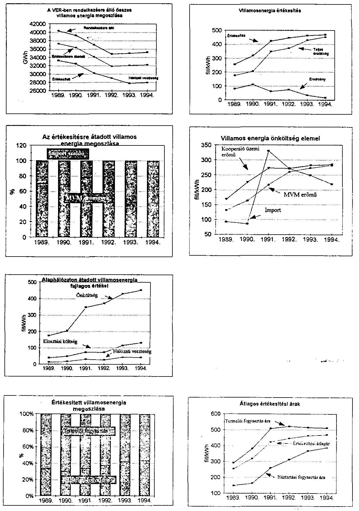

---

Költségek alakulása költségnemenként 1990 - 1994.

| Megnevezés | 1990. |  | 1991. |  | 1992. |  | 1993. |  | (M Ft)   1994. |  |
| :--: | :--: | :--: | :--: | :--: | :--: | :--: | :--: | :--: | :--: | :--: |
|  | terv | tény | terv | tény | terv | tény | terv | tény | terv | tény |
| Anyagjellegű ráfordítás | 46.846 | 42.809 | 70.345 | 64.965 | 79.809 | 79.999 | 92.566 | 80.531 | 93.210 | 94.302 |
| ebből: MVM Rt. | 56 | 66 | 80 | 87 | 855 | 872 | 455 | 472 | 912 | 617 |
| Személyi jellegű ráfordítás | 10.023 | 11.600 | 12.939 | 14.428 | 19.698 | 20.452 | 19.830 | 30.209 | 30.600 | 33.376 |
| ebből: MVM Rt. | 262 | 306 | 506 | 405 | 536 | 543 | 656 | 727 | 824 | 995 |
| Értékcsökkenési leírás | 9.447 | 9.513 | 10.203 | 9.852 | 20.009 | 29.655 | 25.300 | 30.248 | 27.500 | 28.685 |
| ebből: MVM Rt. | 65 | 65 | 66 | 75 | 1.294 | 1.896 | 1.294 | 1.893 | 1.835 | 2.007 |
| Egyéb költségek | 14.627 | 14.970 | 20.389 | 26.312 | 9.343 | 4.803 | 10.741 | 7.092 | 8.000 | 8.732 |
| ebből: MVM Rt. | 1.186 | 1.658 | 3.751 | 4.519 | 6.611 | 972 | 6.891 | 1.240 | 1.163 | 1.094 |
| Összesen | 80.943 | 78.892 | 113.876 | 115.557 | 128.859 | 134.909 | 148.437 | 148.080 | 159.310 | 165.095 |
| ebből: MVM Rt. | 1.569 | 2.095 | 4.403 | 5.086 | 9.296 | 4.283 | 9.296 | 4.332 | 4.734 | 4.713 |

---

# A fejlesztési és a javítási-karbantartási költségek alakulása 1990-től napjainkig (MVM, ill. MVM Rt. és a társaságok) * 

|  |  |  |  |  | (M Ft) |
| :--: | :--: | :--: | :--: | :--: | :--: |
|  | 1990. | 1991. | 1992. | 1993. | 1994. |
| Beruházás | 3.230 | 4.730 | 4.105 | 4.738 | 5.544 |
| Felújítás | 0 | 0 | 3.072 | 3.204 | 4.029 |
| Javítás-karbantartás | 10.997 | 14.568 | 8.481 | 9.576 | 14.207 |
| ÖSSZESEN | 14.227 | 19.298 | 15.658 | 17.518 | 23.780 |

Megjegyzés: A felújítás 1992-től része a beruházásnak.
1990-91-ben az MVMT - mint jogelőd - adatai, 1992-től az MVM Rt. és a társaságok összevont adatai szerepelnek.
*erőművi saját döntési célú beruházásokat tartalmazza

---

Az 1994. évi beruházások pénzügyi teljesítése (M Ft-ban)

|  | Terv | Pénzügyi telj. |
| :-- | :--: | :--: |
| I. MVM Rt. saját és rendszerérdekű ber. | 0 | 0 |
| Kiemelt rendszerérdekű ber. | 5515 | 6934,5 |
| Egyéb rendszerérdekű ber. | 9410 | 7984,2 |
| Alaphálózati ber. | 1500 | 1542,5 |
| Infrastruktúráli ber. | 600 | 505,6 |
| Kft-kbe történő befektetés | 2500 | 227,8 |
| Összesen: | 19525 | 17194,6 |
| ebből: külső forrás | 1327,0 | 2278,1 |

1994. évi kiemelt rendszerérdekű beruházások ráfordításai (M Ft-ban)

|  | Terv | Pénzügyi telj. |
| :-- | :--: | :--: |
| Dunamenti G-1 | 160 | 272 |
| Kelenföld Gt. | 2.615 | 4.000,3 |
| Dunamenti G-2 | 2.040 | 1.977,8 |
| Visonta déli bánya | 700 | 684,4 |
| Összesen | 5.515 | 6.934,5 |

1994. évi egyéb rendszerérdekű beruházások ráfordításai (MFt-ban)

|  | Terv | Pénzügyi telj. |
| :-- | :--: | :--: |
| Erőművek megújítása | 1.860 | 2.394,4 |
| Paks | 3.600 | 3.632,3 |
| Új kapacitások előkészítése | 1.350 | 161,1 |
| Stratégiai olajtárolók | 2.600 | 1.796,4 |
| Összesen | 9.410 | 7.984,2 |

1994. évi alaphálózati beruházások és felújítások ráfordításai (MFt-ban)

|  | Terv | Pénzügyi telj. |
| :-- | :--: | :--: |
| Alaphálózati beruházás | 580 | 558 |
| Alaphálózati felújítás | 920 | 984 |
| Összesen | 1.500 | 1.542 |

1994.

 évi infrastruktúrális beruházások ráfordításai (MFt-ban)

|  | Terv | Pénzügyi telj. |
| :-- | :--: | :--: |
| URIK | 265 | 68,3 |
| Távközlés és egyéb | 335 | 437,3 |
| Összesen | 600 | 505,6 |

---

# Beruházások pénzügyi teljesítése (MFt-ban) 

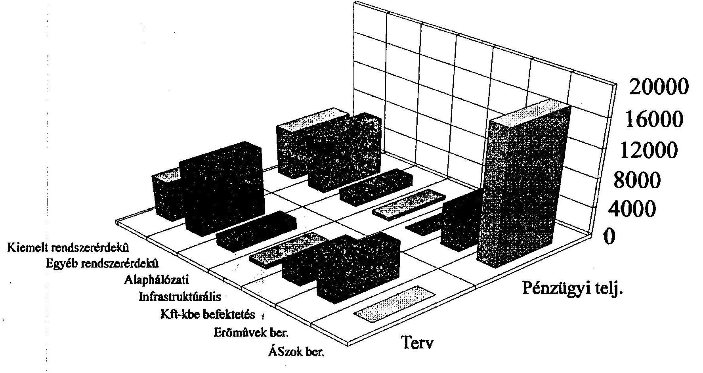

---

# Egyéb rendszerérdekű beruházások (MFt-ban) 

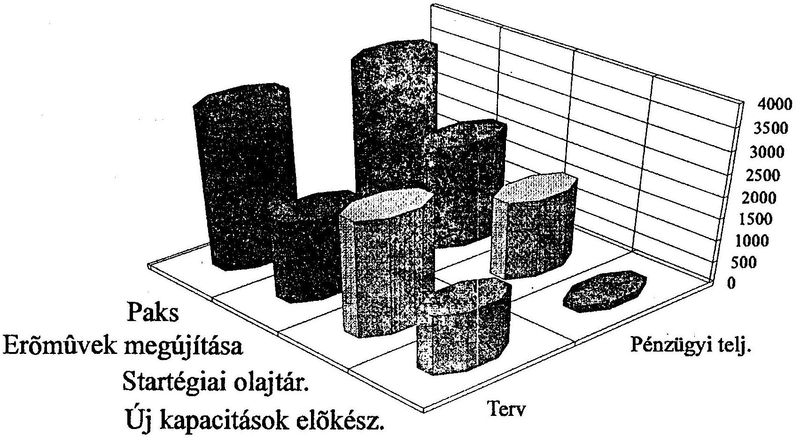

---

# Alaphálózati és infrastruktúrális beruházások (MFt-ban) 

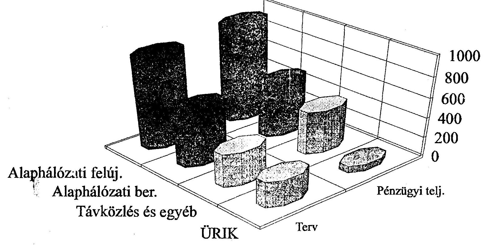

---

Összefoglaló adatok a Magyar Villamos Művekről (1955-1994)

|  Év | Összes
létszám | Villamosenergia iparág | Erőművek
(Erőkarral) | Erőművek Kft-i | Átvett bányák létszáma | Hálózati váti., ill. Rt.(OVIT-tal) |  |  | Ász-ok Kft-i | Egyéb váll.
(1991-től MVM Rt és az összes Kft.)  |
| --- | --- | --- | --- | --- | --- | --- | --- | --- | --- | --- |
|   |  |  |  |  |  | Üzemvitel | VHSZ | Összesen |  |   |
|  1955 | 23999 | 22751 | 10504 |  |  | - | - | - |  | 1326  |
|  1960 | 32527 | 30745 | 12513 |  |  | 12806 | 4038 | 16844 |  | 3170  |
|  1965 | 35940 | 32716 | 13606 |  |  | 15385 | 3736 | 19121 |  | 3213  |
|  1970 | 37554 | 34310 | 14164 |  |  | 16913 | 2696 | 19609 |  | 3781  |
|  1975 | 40022 | 36441 | 15221 |  |  | 17588 | 3011 | 20599 |  | 4202  |
|  1976 | 40313 | 36655 | 15274 |  |  | 17693 | 3075 | 20768 |  | 4271  |
|  1977 | 40226 | 36552 | 15255 |  |  | 17540 | 3163 | 20703 |  | 4268  |
|  1978 | 40048 | 36421 | 15309 |  |  | 17514 | 3060 | 20522 |  | 4217  |
|  1979 | 39431 | 35868 | 15267 |  |  | 17203 | 2800 | 20005 |  | 4156  |
|  1980 | 38815 | 35214 | 15397 |  |  | 16942 | 2320 | 19262 |  | 4156  |
|  1981 | 36409 | 34754 | 15349 |  |  | 16723 | 2161 | 18884 |  | 4176  |
|  1982 | 38135 | 34344 | 15175 |  |  | 16461 | 2204 | 18665 |  | 4295  |
|  1983 | 38463 | 34678 | 15422 |  |  | 16620 | 2155 | 18775 |  | 4266  |
|  1984 | 39526 | 35708 | 16017 |  |  | 17140 | 2070 | 19210 |  | 4299  |
|  1985 | 40431 | 36351 | 16369 |  |  | 17522 | 1972 | 19494 |  | 4568  |
|  1986 | 41763 | 38309 | 17718 |  |  | 18116 | 1966 | 20082 |  | 3963  |
|  1987 | 43077 | 39564 | 18691 |  |  | 18447 | 1936 | 20386 |  | 4000  |
|  1988 | 44021 | 40596 | 18722 |  |  | 19312 | 1837 | 21149 |  | 4150  |
|  1989 | 43481 | 40233 | 18438 |  |  | 19336 | 1722 | 21058 |  | 3985  |
|  1990 | 42329 | 39507 | 18039 | 10 |  | 19032 | 1710 | 20742 |  | 3548  |
|  1991 | 39657 | 38407 | 16242 | 83 |  | 19931 | 1537 | 21468 |  | 1947  |
|  1992 | 36423 | 36423 | 14665 | 72 |  | 19664 | 1531 | 21195 |  | 563  |
|  1993 | 39946 | 39946 | 19227 | 387 | 6608 | 18642 | 1595 | 20237 | 759 | 482  |
|  1994 | 44125 | 44125 | 23413 | 3039 | 13461 | 18964 | 1280 | 20244 | 1303 | 468  |

Megjegyzés: 1992. évtől összes létszám egyenlő a villamosenergia iparág létszámával

---

Foglalkoztatottak keresete és létszáma 1990 - 1994. években

| Megnevezés | M.e. | 1990. | 1991. | 1992. | 1993. | 1994. | Index \% |  |  |  |
| :--: | :--: | :--: | :--: | :--: | :--: | :--: | :--: | :--: | :--: | :--: |
|  |  |  |  |  |  |  | 91/90 | 92/91 | 93/92 | 94/93 |
|  |  |  |  |  |  |  |  |  |  |  |
|  |  |  | Összesen |  |  |  |  |  |  |  |
| Kereset | MFT |  | 8681 | 11435 | 13497 | 18416 | 24981 | 131.7 | 118.0 | 136.4 | 135.6 |
| Összes foglalkoztatott | fő |  | 42329 | 39657 | 36423 | 39946 | 44125 | 93.7 | 91.8 | 109.7 | 110.5 |
| Teljes munkaidősök | fő |  | 40285 | 37949 | 35127 | 38789 | 43076 | 94.2 | 92.6 | 110.4 | 111.1 |
| Előzőből: fizikai | fő |  | 27212 | 25525 | 23585 | 26519 | 29911 | 93.8 | 92.4 | 112.4 | 112.8 |
| szellemi | fő |  | 13073 | 12424 | 11542 | 12270 | 13165 | 95.0 | 92.9 | 106.3 | 107.3 |
| Teljes m. idős átlagkereset | Ft/fő |  | 208944 | 292966 | 372648 | 460194 | 563156 | 140.2 | 127.2 | 123.5 | 122.4 |
| Előzőből: fizikai | Ft/fő |  | 175178 | 244833 | 305958 | 379457 | 461307 | 139.8 | 125.0 | 124.0 | 121.6 |
| szellemi | Ft/fő |  | 279228 | 391855 | 508923 | 634689 | 794557 | 140.3 | 129.9 | 124.7 | 125.2 |

---

Az MVM Rt. és a társaságok gazdasági eredménye, adófizetése és kapott támogatásaik 1990-től napjainkig
(M Ft)

|  | 1990. | 1991. | 1992. | 1993. | 1994. |
| :--: | :--: | :--: | :--: | :--: | :--: |
| MVM Rt. (MVMT) |  |  |  |  |  |
| Mérleg szerinti eredmény | 14.689 | 6.407 | 1.132 | (31) | (2.692) |
| Fizetett összes adó | 13.918 | 4.083 | 1.549 | 440 | 130 |
| - ebből: társasági adó |  |  | 1.168 | 365 | 20 |
| Kapott állami támogatás | 3 | 2 |  |  |  |
| Ajkai Erőmű |  |  |  |  |  |
| Mérleg szerinti eredmény | 160 | 76 |  |  |  |
| Fizetett összes adó   - ebből: társasági adó | (9) | (36) |  |  |  |
| Kapott állami támogatás | 0,6 | 0,6 |  |  |  |
| November 7. Erőmű |  |  |  |  |  |
| Mérleg szerinti eredmény | 70 | 108 |  |  |  |
| Fizetett összes adó   - ebből: társasági adó | 13 | 59 |  |  |  |
| Kapott állami támogatás | 0,6 | 0,8 |  |  |  |
| Bakonyi Erőmű Rt. |  |  | (486) | (31) | (1.451) |
| Mérleg szerinti eredmény |  |  | (34) | (142) | 310 |
| Fizetett összes adó   - ebből: társasági adó |  |  |  |  | 38 |
| Kapott állami támogatás |  |  |  | 11 | 18 |
| Budapesti Erőmű Rt. |  |  |  |  |  |
| Mérleg szerinti eredmény | 169 | 218 | (681) | (607) | (1.111) |
| Fizetett összes adó   - ebből: társasági adó | (43) | 32 | (22) | (80) | 142 |
| Kapott állami támogatás | 0,1 |  |  |  | 53 |
| Dunamenti Erőmű Rt. |  |  |  |  |  |
| Mérleg szerinti eredmény | 690 | 383 | 381 | 754 | 192 |
| Fizetett összes adó   - ebből: társasági adó | (83) | (88) | 69 | 166 | 337 |
| Kapott állami támogatás |  |  |  |  | 138 |
| Mátrai Erőmű Rt. (Gogarin) |  |  |  |  |  |
| Mérleg szerinti eredmény | 645 | 264 | 130 | 67 | 533 |
| Fizetett összes adó   - ebből: társasági adó | 3 | (116) | (113) | 3.874 | 408 |
| Kapott állami támogatás | 7 | 9 | 8 | 14 | 19 |

---

| Paksi Atomerőmű Rt. |  |  |  |  |  |
| :--: | :--: | :--: | :--: | :--: | :--: |
| Mérleg szerinti eredmény | 1.103 | 1.300 | 355 | 466 | 396 |
| Fizetett összes adó   - ebből: társasági adó | 1.641 | 601 | 1.098 | 1.617 | 754 204 |
| Kapott állami támogatás | 7 | 5 |  |  | 8 |
| Pécsi Erőmű Rt. |

  |  |  |  |  |
| Mérleg szerinti eredmény | 167 | 176 | (711) | (891) | (997) |
| Fizetett összes adó   - ebből: társasági adó | (73) | (82) | (8) | (289) | 28941 |
| Kapott állami támogatás | 0,7 | 8 | 10 | 35 | 31 |
| Borsodi Hőerőmű   Mérleg szerinti eredmény | 161 | 36 |  |  |  |
| Fizetett összes adó   - ebből: társasági adó | 22 | (77) |  |  |  |
| Kapott állami támogatás | 2 | 2 |  |  |  |
| Tiszai Erőmű   Mérleg szerinti eredmény | 219 | 189 |  |  |  |
| Fizetett összes adó   - ebből: társasági adó | (51) | (148) |  |  |  |
| Kapott állami támogatás | 1 | 1 |  |  |  |
| Tiszai Erőmű Rt. |  |  |  |  |  |
| Mérleg szerinti eredmény |  |  | (502) | 76 | (1.592) |
| Fizetett összes adó   - ebből: társasági adó |  |  | 12 | 198 | 469129 |
| Kapott állami támogatás |  |  | 7 | 8 | 19 |
| Oroszlányi Hőerőmű   Mérleg szerinti eredmény | 178 | 87 |  |  |  |
| Fizetett összes adó   - ebből: társasági adó | 13 | 30 |  |  |  |
| Kapott állami támogatás | 2 | 2 |  |  |  |
| Tatabányai Erőmű   Mérleg szerinti eredmény | 54 | 134 |  |  |  |
| Fizetett összes adó   - ebből: társasági adó | (36) | (31) |  |  |  |
| Kapott állami támogatás | 2 | 2 |  |  |  |
| Vértesi Erőmű   Mérleg szerinti eredmény |  |  | (398) | 4 | (1.515) |
| Fizetett összes adó   - ebből: társasági adó |  |  | 77 | 98 | 440 |
| Kapott állami támogatás |  |  |  | 16 | 83 |

---

| EDÁSZ |  |  |  |  |  |
| :--: | :--: | :--: | :--: | :--: | :--: |
| Mérleg szerinti eredmény | 444 | 460 | (178) | 2 | (612) |
| Fizetett összes adó   - ebből: társasági adó | 143 | 200 | 301 | 401 | 245 |
| Kapott állami támogatás | 0,6 | 0,8 |  |  | 1 |
| DÉDÁSZ |  |  |  |  |  |
| Mérleg szerinti eredmény | 254 | 166 | (291) | (141) | 660 |
| Fizetett összes adó   - ebből: társasági adó | 115 | 119 | (80) | (233) | 101 |
| Kapott állami támogatás | 4 | 2 | 2 | 2 | 2 |
| DÉMÁSZ |  |  |  |  |  |
| Mérleg szerinti eredmény | 393 | 401 | (181) | 6 | (531) |
| Fizetett összes adó   - ebből: társasági adó | 249 | 284 | (25) | (71) | 83 |
| Kapott állami támogatás | 4 | 3 | 5 | 5 | 5 |
| ÉMÁSZ |  |  |  |  |  |
| Mérleg szerinti eredmény | 271 | 292 | (431) | 0,6 | (565) |
| Fizetett összes adó   - ebből: társasági adó | 67 | 137 |  |  | 134 |
| Kapott állami támogatás | 9 | 5 |  |  | 10 |
| TITÁSZ |  |  |  |  |  |
| Mérleg szerinti eredmény | 408 | 343 | (383) | (361) | (907) |
| Fizetett összes adó   - ebből: társasági adó | 125 | 189 | (78) | (95) | 157 |
| Kapott állami támogatás |  | 1 |  |  | 14 |
| ELMÚ |  |  |  |  |  |
| Mérleg szerinti eredmény | 460 | 417 | (239) | (606) | (3.777) |
| Fizetett összes adó   - ebből: társasági adó | 145 | 24 |  |  | 278 |
| Kapott állami támogatás | 4 | 5 | 9 |  | 16 |
| OVIT |  |  |  |  |  |
| Mérleg szerinti eredmény | 581 | 315 | (21) | 59 | 45 |
| Fizetett összes adó   - ebből: társasági adó | 427 | 262 | 416 | 527 | 126 |
| Kapott állami támogatás | 0,4 | 0,7 | 1 | 1 | 1 |
| ERŐKAR |  |  |  |  |  |
| Mérleg szerinti eredmény | 28 | 13 |  |  | (66) |
| Fizetett összes adó   - ebből: társasági adó | 179 | 168 |  |  | 42 |
| Kapott állami támogatás |  |  |  |  | 5 |

---

| VERTESZ   Mérleg szerinti eredmény   Fizetett összes adó   - ebből: társasági adó   Kapott állami támogatás | $\begin{gathered} 22 \\ 282 \\ 1 \end{gathered}$ |  |  |  |  |
| :--: | :--: | :--: | :--: | :--: | :--: |
| ERBE   Mérleg szerinti eredmény   Fizetett összes adó   - ebből: társasági adó   Kapott állami támogatás | $\begin{gathered} 148 \\ 724 \end{gathered}$ | $\begin{gathered} 60 \\ 420 \end{gathered}$ |  |  | $\begin{gathered} 27 \\ 18 \end{gathered}$ |
| VITÉV   Mérleg szerinti eredmény   Fizetett összes adó   - ebből: társasági adó   Kapott állami támogatás | $\begin{gathered} 4 \\ 47 \end{gathered}$ | $\begin{gathered} (1) \\ 48 \end{gathered}$ |  |  |  |
| MVM ÖSSZESEN   Mérleg szerinti eredmény   Fizetett összes adó   - ebből: társasági adó   - ebből: társasági adó | $\begin{gathered} 21.317 \\ 16.605 \\ 8.001 \end{gathered}$ | $\begin{gathered} 11.487 \\ 5.420 \end{gathered}$ | $\begin{gathered} (2.506) \\ 3.262 \\ 1.176 \end{gathered}$ | $\begin{gathered} (873) \\ 6.411 \\ 402 \end{gathered}$ | $\begin{gathered} (15.280) \\ 4.506 \\ 888 \end{gathered}$ |
| Kapott állami támogatás | 43 | 45 | 45 | 79 | 165 |

---

A jelenleg hatósági áras energiahordozók árváltozásai 1990. november 1. óta
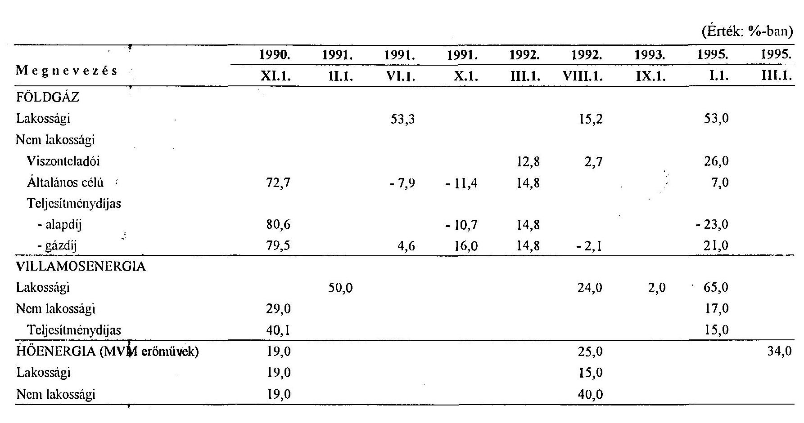

---

A vezetékes energiahordozók és emelt áraik (ÁFA nélkül)

|  Kategória | Átlagárak |  | Áremelés mértéke | Értékesített mennyiség megoszlása  |
| --- | --- | --- | --- | --- |
|   | 1994. évi | Emelt | % | %  |
|  VVM társaságcsalád össz. |  |  | 31,5 |   |
|  Villamos energia ( $\mathrm{Ft} / \mathrm{kWh}$ ) | 4,70 | 6,16 | 31 | 100,0  |
|  Lakossági | 3,88 | 6,40 | 65 | 36,9  |
|  nappali | 4,73 | 7,76 | 64 | 24,6  |
|  1. tömb < 50 kWh/hó | 3,70 | 6,50 | 76 | 9,9  |
|  2. tömb 50-300 kWh/hó | 5,30 | 8,50 | 60 | 13,8  |
|  3. tömb > 300 kWh/hó | 7,60 | 10,50 | 40 | 0,9  |
|  éjszakai | 2,20 | 3,69 | 68 | 12,4  |
|  1. tömb <200 kWh/hó | 1,90 | 3,50 | 84 | 8,3  |
|  2. tömb 200-1000 kWh/hó | 2,70 | 4,00 | 48 | 3,5  |
|  3. tömb >1000 kWh/hó | 3,50 | 4,50 | 29 | 0,6  |
|  Nem lakossági | 5,16 | 6,09 | 18 | 63,1  |
|  vasúti vontatás a.) | 3,15 | 4,20 | 33 | 2,5  |
|  közüti vontatás b.) | 3,80 | 5,50 | 45 | 1,3  |
|  közvilágítás c.) | 7,63 | 7,79 | 3 | 2,1  |
|  általános árszabás | 7,22 | 9,23 | 28 | 9,6  |
|  teljesítménydijas | 4,80 | 5,51 | 15 | 50,0  |
|  nagyfeszültség (átlag) | 3,88 | 4,20 | 8 | 20,6  |
|  középfeszültség (átlag) | 4,96 | 5,70 | 15 | 15,9  |
|  kisfeszültség (átlag) | 6,03 | 7,28 | 21 | 13,5  |
|  Hőenergia (Ft/GJ) | 382,0 | 512,0 | 34 |   |
|  Földgáz (Ft/GJ) |  |  |  |   |
|  Viszonteladói | 226 | 285 | 26 |   |
|  Végfelhasználói | 290 | 351 | 21 | 100,0  |
|  Lakossági | 285 | 405 | 53 | 32,9  |
|  Nem lakossági | 302 | 336 | 11 | 67,1  |
|  Általános célú | 356 | 382 | 7 | 14,8  |
|  Teljesítménydijas (átlag) | 308 | 338 | 10 | 52,2  |
|  gázdij | 236 | 286 | 21 |   |
|  teljesítménydij (FUMJ/h/év) | 287 | 220 | -23 |   |
|  Földgáz ( $\mathrm{Ft} / \mathrm{m}^{3}$ ) | 9,85 | 11,93 | 21 |   |
|  Viszonteladói | 7,69 | 9,69 | 26 |   |
|  Lakossági | 9,01 | 13,79 | 53 |   |
|  Nem lakossági | 10,28 | 11,41 | 11 |   |
|  Általános célú | 12,09 | 12,96 | 7 |   |
|  Teljesítménydijas (átlag) | 10,47 | 11,49 | 10 |   |
|  gázdij | 8,02 | 9,72 | 21 | 

  |
|  teljesítménydij (FUMJ/h/év) | 287,0 | 220,0 | $-23$ |   |
|  Vezetékes energiahordozók összesen |  |  | 26 |   |

a.) A teljesítménydijas nagyfeszültség áraival hasonlítandó össze. b.) A teljesítménydijas középfeszültség áraival hasonlítandó össze. c.) Tarifaszerkezeti módosulás miatt az érintetteket (önkormányzatok) számára.

---

Melléklet a 44/1994. (XII. 27.) IKM rendelethez
[A 21/1992. (VII. 23.) IKM rendelet 1. számú melléklete]

| Megnevezés (erőműtelepek) | Teljesítménydij   E Ft/MW/év | HŐDÜ |  |  |  | $\begin{aligned} & \text { Csapadékvíz } \\ & \text { és pótvíz díja } \\ & \mathrm{Ft} / \mathrm{m}^{2} \end{aligned}$ |
| :--: | :--: | :--: | :--: | :--: | :--: | :--: |
|  |  | gőz 25 bar   ésTelep   Ft/GJ | gőz 7-25 bar   kötött és   forró víz   $150^{\circ} \mathrm{C}$ felett   Ft/GJ | gőz 7 bar alatt   Ft/GJ | forró víz   $150^{\circ} \mathrm{C}$ és alatta   Ft/GJ |  |
| BAKONYI ERŐMŰ RT. |  |  |  |  |  |  |
| Ajkai | 1440 | 400 | 370 | 335 | 320 | 110 |
| Inotai | 1620 | 490 | 460 | - | 400 | 110 |
| BUDAPESTI ERŐMŰ RT. | 1260 | - | 370 | 335 | 320 | 110 |
| DUNAMENTI ERŐMŰ RT. MÁTRAI ERŐMŰ RT. | 1260 | - | 370 | - | 300 | 110. |
| Mátrai | 1440 | - | 370 | 335 | 320 | 110 |
| Mátravidéki | 1620 | - | 565 | - | - | 110 |
| PAKSI ERŐMŰ RT. | 1140 | - | - | - | 105 | 235 |
| PÉCSI ERŐMŰ RT. |  |  |  |  |  |  |
| Komlói | 1620 | - | 370 | - | 320 | 110 |
| Pécsi | 1440 | - | 460 | - | 400 | 110 |
| TISZAI ERŐMŰ RT. |  |  |  |  |  |  |
| Borsodi | 1440 | 500 | 460 | 420 | 400 | 110 |
| Tiszai | 1440 | - | 460 | - | 400 | 110 |
| VÉRTESI ERŐMŰ RT. |  |  |  |  |  |  |
| Bánhidai | 1440 | - | - | 420 | 400 | 110 |
| Dorogi | 1620 | - | 460 | 420 | - | 110 |
| Oroszlányi | 1440 | - | - | 420 | 400 | 160 |
| Tatabányai | 1440 | 370 | - | - | 320 | 110 |
| ÉSZAKDUNÁNTÚLI ÁRAMSZOLGÁLTATÓ RT. |  |  |  |  |  |  |
| Győri I. | 1620 | - | - | 420 | - | 250 |
| Soproni | 1620 | - | 460 | 420 | 400 | 110 |
| Székesfehérvári | 1620 | - | - | 420 | 400 | 160 |
| DÉLMAGYARORSZÁGI ÁRAMSZOLGÁLTATÓ RT. |  |  |  |  |  |  |
| Békéscsabai | 1620 | - | 460 | 420 | - | 110 |
| Kecskeméti | 1620 | - | - | 420 | 420 | 110 |
| Szegedi | 1620 | - | - | 420 | 420 | 110 |
| TISZÁNTÚLI ÁRAMSZOLGÁLTATÓ RT. |  |  |  |  |  |  |
| Debreceni | 1260 | - | 370 | 335 | 320 | 250 |
| Nyíregyházi | 1260 | - | 370 | - | 320 | 250 |

---

Az energiahordozók termelői ára (ÁFA nélkül)
Me: Ft/GJ

| Megnevezés | 1970 | 1986 | 1989 | 1991 | 1992 | 1994 | 1995 |
| :--: | :--: | :--: | :--: | :--: | :--: | :--: | :--: |
| Feketeszén | 19 | 85 | 108 | 184 | 196 | 328 |  |
| Barnaszén | 20 | 95 | 112 | 197 | 206 | 248 |  |
| Lignit | 14 | 71 | 115 | 177 | 190 | 213 |  |
| Kőolaj | 18 | 159 | 127 | 332 | 320 | 317 |  |
| Földgáz nagyüzemi | 22 | 136 | 126 | 347 | 312 | 312 | 343 |
| Földgáz puffer | 20 | 105 | 100 | 250 | 236 | 236 |  |
| Földgáz vegyipari | 9 | 97 | 95 | 212 | 212 | - | - |
| PB gáz | 39 | 163 | 150 | 360 | 390 | 630 |  |
| Gázolaj | 58 | 209 | 184 | 366 | 516 | 456 |  |
| Fűtőolaj | 21 | 138 | 126 | 206 | 206 | 237 |  |
| Teljesítmény-   díjas vill.en. | 157 | 569 | 758 | 1306 | 1306 | 1306 | 1600 |
| Hőenergia | 43 | 161 | 249 | 249 | 270 | 270 | 370 |

1992. után minden energiahordozó (a villamos energia és a földgáz kivételével) szabadáras, a közölt adatok tehát közelítő értékek

Az energiahordozók fogyasztói ára (ÁFA nélkül)
Me: Ft/GJ

| Megnevezés | 1970 | 1985 | 1989 | 1991 | 1992 | 1994 | 1995 |
| :--: | :--: | :--: | :--: | :--: | :--: | :--: | :--: |
| Szén | 19 | 43 | 69 | 226 | 230 | 328 |  |
| Brikett | 25 | 54 | 80 | 302 | 320 | 340 |  |
| Koksz | 33 | 100 | 145 | 374 | 380 | 370 |  |
| Tüzifa | 34 | 82 | 130 | 219 | 230 | 280 |  |
| HTO | 51 | 176 | 280 | 488 | 623 | 630 |  |
| PB gáz nyári | 54 | 102 | 180 | 339 | 694 | 694 |  |
| Földgáz | 40 | 70 | 114 | 230 | 265 | 265 | 424 |
| Távfűtés | 43 | 101 | 118 | 480 | 500 | 530 | 660 |
| Villamos energia nappali   600 kWh-tól | 254 | 318 | 404 | 1028 | 1470 | 1473 | 2220 |

[^0]
[^0]:    (s) sal a vezetékes energiahordozókra, előzetes becslés!

---

# Az 1995 évi áremelés hatásai 

A termelői célú értékesítés áremelkedésének kihatása "A" változatban 40, "B" változatban 28 MdFt-ra tehető. A földgáz és a villamos energia fogyasztói áremelések közvetlen hatása a lakosságra (2%-os ÁFA kulcs emeléssel) "A" változatban 60, "B" változatban 47 MdFt.

Az MVM Rt-be tartozó erőművekből kiadott hőenergia ára átlagosan 34%-kal emelkedik. Ez maga után vonja az önkormányzati ármegállapítási körbe tartozó távhőszolgáltatási díjak emelését.

A termelői energia áremelések begyűrűződése a gazdaságba és automatikus továbbhárításuk a végső felhasználó lakosságra nem kerülhető el.

Az egymást helyettesítő energiahordozók közül - piaci feltételek mellett - egyes szabadáras fajták (szén, tüzifa, propán-bután) fogyasztói áremelkedése valószínűsíthető.

Egészében véve a MEH számításaiból kikövetkeztethető, hogy a lakosságra háruló összes kihatás 1995 évben megközelítheti a 100 MdFt többlet kiadást.

---

# Vélemény a nemzetközi energia árak és a magyar árak összehasonlításáról 

A MOL Rt. és a MVM Rt. áremelési javaslataik alátámasztására többnyire statikus adatokkal operálnak. A következő általánosításra van lehetőség:

- A primer energiahordozókban (olaj, gáz, szén) önellátó országokban (Kanada, USA, Ausztrália) alacsony az energiaárak árszínvonala. Az importfüggőség arányának növekedésével az árszínvonal is emelkedik. A csak importból üzemelő országokban (Japán) az árszint többszöröse az önellátókénak.
- Hat-nyolc éve az olaj világpiaci ára nem nő, inkább csökken. Az országok inflációs rátái eltérőek és ez motiválja az árszínvonalat.
- Az árakban halmozódó adók eltérése is befolyásolja az árszínvonalak szóródását.
- Az erőművek műszaki színvonala (hatásfoka) hatással van a költségalakulásra és az árra is.
- Nálunk túlhangsúlyozott "keresztfinanszírozás" helytálló (induló fogyasztói áraink elmaradása miatt a nagy felhasználók fizetik a háztartási árak okozta veszteséget).
- Való igaz, hogy a nagy fogyasztónak olcsóbb eljuttatni a vezetékes energiát, mint a kis fogyasztónak, de a nyugati árrendszerekben nemcsak ez tükröződik. Az energia árszabása nyíltan vagy burkoltan mindenütt állami befolyás alatt áll (az energia nem igazán áru). Az egymással versengő államokban egyes számú prioritás a versenyképességhez és a gazdasági növekedéshez fűződő érdek, mert ez a népjólét alapja. Ennek alárendelve formálják az árakat.
- Az elemzések arról tanúskodnak, hogy a piacgazdaságokban közgazdaságilag rend van, a piaci törvények érvényesülnek.
- Az országok vezetékes energia árszínvonalát nem más országok energiaárai, hanem saját tényleges költségeik határozzák meg. Ezt a fő szabályt nem sérti meg, de moti-

---

válja az országonként eltérő gazdaságpolitika, adópolitika, életszínvonal politika és a költségeket fedező belföldi átlagárnak ipari és fogyasztói ármegoszlása is (amely az OECD országokban az ipari árat 1-nek tekintve a fogyasztói árszínvonalakat 0-2,7-szeres eltérítésekkel helyezi el.).

---

# A villamosenergia-ipar szerkezete Nyugat-Európa néhány országában 

Franciaország: Az áram fejlesztése, szállítása és elosztása állami monopólium, e jogot az Electricité de France-nak adták, amely teljes egészében az államé. E céget a kormány kizárta a privatizációs programból.
Legmagasabb az integráció.
Belgium: A belga áramfejlesztést 90%-ban - több cég közös tulajdonát képező Electrabel - a magánszektor uralja. 10% egy állami vállalat tulajdona.
A helyhatóságok felelnek az elosztásért. Ezek 50%-a az önkormányzatoké, további 50% az önkormányzatoknak magánszektorral közös tulajdona.

Hollandia: Négy áramfejlesztő vállalat van. Minden vállalat közvetve vagy közvetlenül tartományok vagy helyhatóságok tulajdona. A szállítási rendszert a négy áramfejlesztő vállalat tulajdonában lévő szövetkezeti vállalat működteti.
Az elosztó szolgálatok a helyi hatóságokhoz tartoznak.

Dánia: 12 vállalat végzi az áramfejlesztést, ebből 4 integrálja a termelést, szállítást, elosztást. Ezek többsége közvetlenül, vagy közvetve az önkormányzatokhoz tartozik. Az elosztást 100 társaság végzi, ezek fele az önkormányzatoké, a másik fele alapítások, vagy szövetkezetek együttese.

Németország: Nyolc fontos közvállalat - melyből kettő államosított - biztosítja és működteti az áramfejlesztő kapacitás 75%-át és
 üzemelteti a szállítási rendszert. A keleti tartományokban egy ehhez hasonló társaságot hoztak létre, amelyben a három legnagyobb nyugati cég 75%-os részesedéssel bír. Ezekben a tartományokban a tartományok is rendelkeznek részvényekkel. Több ezer regionális és helyi elosztó-szolgáltató társaság működik. A három legnagyobb áramfejlesztő vállalat öt kis- és közepes német vállalattal 51%-os részesedést biztosított magának a kelet-német regionális hálózatból. Külföldi beruházók így 49%-ot szerezhetnek, de erre kevés az esély, mert első opciót a helyi tanácsoknak ajánlják fel, amelyeket a nyolc nyugat-német társaság követ.
Legdecentralizáltabb az integráció.
Anglia és Wales:
Két szénbázisú villamosenergia termeléssel foglalkozó társaság jött létre 60%-os magántulajdonú hányaddal és egy atomerőmű társaság 100%-os állami tulajdonnal. A rendszer irányítását és a szállítást egy holding végzi. A 12 regionális elosztó társaság 100%-os magántulajdonban van.

Olaszország: Az ENI állami vállalat termeli a villamosenergia 53%-át. A szállítást, exportot, importot monopolizálta. Ellenőrzi az elosztás döntő részét, kivéve a helyhatósági vállalatok által bonyolított elosztást. Privatizálását 1994-ben kezdték meg, előttünk ismeretlen módon.

Ausztria: A szövetségi és tartományi kormányok tulajdonában nyolc villamosenergia termelő vállalat van. Hármat részben privatizáltak. Ezeket a szállítási rendszer működtetője (VBG) irányítja, amely maga is 51%-ban a szövetségi állam tulajdonát képezi. Kilenc tartományi áramszolgáltató van. Egyes tartományi törvények tiltják a külföldi tulajdont.

# KÖVETKEZTETÉSEK:

- Az elektromos ipar három fő kategóriába osztható. Ezek: integrált állami, decentralizált vegyes tulajdonú, az állam által uralt.
- Van egy általános tendencia a liberalizáció és a növekvő verseny irányában a gáz- és elektromos iparban. Az internacionalizáció reagálási módot alkot a gáz- és elektromos társaságok számára.

- A privatizáció előzetes feltételt képez az internacionalizációhoz, míg a nemzeti gáz- és elektromos vállalat kizárólag az államhoz tartozik (Európában és máshol a világban), semmiféle külföldi átvétel, semmiféle részvétel (és beruházás) nem lesz lehetséges.
- A közszolgálatok szerkezet-átalakítását erősen befolyásolják az Európai Közösség jogszabályozása és a privatizáció tárgyában folytatott nemzeti politikák.
- Csak lehatárolt számú társaságnak lesz kielégítő pénzügyi kapacitása és elég széles látókörre, hogy szembenézzen az internacionalizálási politikákkal, nevezetesen az Egyesült Királyság, Belgium, Franciaország, Németország és Spanyolország egyes vállalatainak.
Az internacionalizáció viszonylag új jelenség, az Egyesült Királyság kivételével (British Gas/).
- A gáz- és elektromos társaságok egyre inkább összeállnak megszokott kollektív vállalatokba.
- Komoly kockázata van annak, hogy a társaságok ipari politikailag megbuknak egy liberalizált és deregulált európai gáz- és elektromossági piacon. A legerősebb társaságok újra felveszik aktivitásukat és kiterjeszkednek a kisebb vállalatok rovására.
- Az Egyesült Királyság-beli British Gas kísérletei mutatják, hogy az internacionalizálás új munkahelyeket teremt az országokban, de nem tudja kompenzálni azokat a munkahely-veszteségeket, amelyek a piaci részesedés veszteségéből adódtak a szerkezet-átalakítási lépések során.

## A Kormány   J114/1994. (XII. 7.) Korm. határozata   a villamosenergia-ipari társaságok privatizálásáról

1. Az ellátás biztonságát és felelősségét szabályozó kérdéseket a társaságok alapszabályaiban speciális, a magyar állam tulajdonát képező részvény bevezetése útján, rendeletekben és a működési engedélyekben kell szabályozni.

Felelős: pénzügyminiszter ipari és kereskedelmi miniszter Magyar Energia Hivatal főigazgatója privatizációs kormánybiztos
Határidő: folyamatos
2. A villamosenergia-ipar privatizációját az alábbiak szerint kell végrehajtani:
2.1. Az MVM Rt.-ben az értékesíthető tulajdoni hányadot hazai kisbefektetők, hazai és külföldi intézményi befektetők, továbbá kárpótoltak részére kell értékesíteni.
2.2. A hálózati áramszolgáltató Rt.-k részvényeinek többségi részvénypakettjét szakmai befektetőknek, 15%-át kárpótoltaknak kell értékesíteni. A többi részvényt legkésőbb 1997-ig nyilvános forgalomba hozatal útján, hazai kisbefektetők, valamint hazai és külföldi intézményi befektetők részére kell értékesíteni, és azokat a tőzsdére be kell vezetni.
2.3. Az erőmű Rt.-k (a Paksi Atomerőmű Rt. kivételével) többségi részvénypakettjét, az iparági műszaki, fejlesztési, foglalkoztatási és szabályozási feltételek megteremtése után, szükség esetén tőkeemelés előírásával, szakmai befektetőknek, és ezt követően a többi részvényt legkésőbb 1997-ig nyilvános forgalomba hozatal útján hazai kisbefektetők, valamint hazai és külföldi intézményi befektetők részére kell értékesíteni, és a tőzsdére be kell vezetni.
2.4. A privatizációs eljárás során biztosítani kell az iparág minden gazdasági társaságánál a kedvezményes munkavállalói tulajdonszerzést.
2.5. A privatizáció nem eredményezheti a villamosenergia-ipar hazai beszállítóinak diszkriminálását.

Felelős: szabályozásért az ipari és kereskedelmi miniszter
privatizációért a pénzügyminiszter és a privatizációs kormánybiztos
Határidő: folyamatos
3. A Kormány egyetért azzal, hogy a célul kitűzött tulajdonosi szerkezetben a Paksi Atomerőmű és az OVIT kivételével a villamosenergia-ipar társaságai mind tulajdoni-lag, mind működésileg leválnak az MVM Rt.-től. A privatizáció hatékony lebonyolítása, valamint a privatizációból származó állami, illetve iparági bevételek megfelelő arányú megosztása céljából tulajdoni átrendezést kell megvalósítani az alábbiak szerint:
3.1. Az ÁV Rt. adja át az MVM Rt.-nek az OVIT Rt. és a Paksi Atomerőmű Rt. általa birtokolt (64,9 Mrd Ft névértékű) részvényeit az áramszolgáltató társaságok azonos értékű, MVM Rt. tulajdonú részvényeiért cserébe.

Felelős: pénzügyminiszter privatizációs kormánybiztos
Határidő: 1995. január 31.
3.2.1. Az ÁV Rt. adja át az MVM Rt.-nek a Pécsi, Bakonyi, Vértesi és Dunamenti Erőmű részvénytársaságok részvényeit 34,6 Mrd Ft értékben az MVM Rt. tulajdonában lévő azonos értékű Tiszai, Budapesti, Mátrai Erőmű Rt.-k részvényeiért cserébe.
3.2.2. Az ÁV Rt. vonja el a MVM Rt. tulajdonában maradt 55 Mrd Ft névértékű áramszolgáltatói részvényeket alaptőke leszállítás útján.

Felelős: pénzügyminiszter privatizációs kormánybiztos
Határidő: 3.2.1. pontra: 1995. január 31. 3.2.2. pontra: folyamatos
3.2.3. Az ÁV Rt. és az MVM Rt. a 2.3. pontnak megfelelően valósítsa meg a többségi tulajdonába került erőművi társaságok (a Paksi Atomerőmű kivételével) értékesítését. Az MVM-nél keletkező privatizációs bevételt az MVM Rt. a villamosenergia-rendszer fejlesztésére köteles felhasználni.

Felelős: pénzügyminiszter ipari és kereskedelmi miniszter privatizációs kormánybiztos
Határidő: folyamatos
4. A privatizáció megkezdéséhez létre kell hozni a célul kitűzött iparági tulajdoni és működési szerkezetnek megfelelő jogi, szabályozási és szerződéses környezetet.
4.1. Ennek végrehajtására részletes - a privatizáció javasolt ütemezéséhez illeszkedő - munkatervet kell kidolgozni, és annak megvalósítását meg kell kezdeni.

Felelős: ipari és kereskedelmi miniszter
környezetvédelmi és területfejlesztési miniszter
Magyar Energia Hivatal főigazgatója privatizációs kormánybiztos
Határidő: 1994. december 31. (a munkaterv elkészítése)

4.2. A szabályozás kialakítása során különös figyelmet kell fordítani az elektromos energia és a hő szolgáltatás áraira. Ennek keretében 1995. január 1-jéig be kell vezetni, és ezt követően rendszeres kiigazításokkal tartani kell a villamosenergia-törvényben foglaltaknak megfelelő költségarányos árakat.

Felelős: ipari és kereskedelmi miniszter pénzügyminiszter Magyar Energia Hivatal főigazgatója
Határidő: 1994. december 31.; illetve folyamatos
4.3. Ki kell dolgozni a villamos energia termeléséről, szállításáról és szolgáltatásáról szóló törvény végrehajtási rendeleteit.

Felelős: ipari és kereskedelmi miniszter
környezetvédelmi és területfejlesztési miniszter
pénzügyminiszter
Határidő: 1995. január 31.
4.4. A honvédelmi felkészülés és az országmozgósítás egyes feladatainak ellátása érdekében a honvédelemről szóló 1993. évi CX. törvény végrehajtásáról rendelkező 178/1993. (XII. 27.) Korm. rendelet 35. § (1) bekezdése szerinti kijelöléseket legkésőbb a privatizációig el kell végezni, illetve meg kell erősíteni.

Felelős: ipari és kereskedelmi miniszter
Határidő: 1995. január 31.
5. A Kormány egyetért azzal, hogy az ÁV Rt. a privatizáció kapcsán az érdekképviseleti szervekkel a humánpolitikai kérdésekben megállapodásra törekszik.

Felelős: pénzügyminiszter privatizációs kormánybiztos munkaügyi miniszter
Határidő: folyamatos
6. A privatizációs pályázati felhívások kiírása előtt a Kormány áttekinti az iparág jogi szabályozása terén elvégzett munkákat.

Felelős: ipari és kereskedelmi miniszter
környezetvédelmi és területfejlesztési miniszter
pénzügyminiszter
igazságügy-miniszter
Magyar Energia Hivatal főigazgatója
privatizációs kormánybiztos
Határidő: 1995. január 31.
7. A pályázati feltételeket - ideértve az MVM Rt. altársaságai privatizálását is (3.2.3. pont) - közzététel előtt a Kormánynak be kell mutatni.

Felelős: pénzügyminiszter privatizációs kormánybiztos
Határidő: folyamatos
Horn Gyula s. k., miniszterelnök

# ÁLLAMI PRIVATIZÁCIÓS ÉS VAGYONKEZELŐ RÉSZVÉNYTÁRSASÁG

1133 Budapest, Pozsonyi u. 56. Tel.: 267-6696 Fax: 267-6698
Levélcím: 1399 Budapest, Pf. 708. Központi telefon: 269-8600

Vezérigazgató
VIT-1444/995.

Hagelmayer István úr az Állami Számvevőszék
elnöke
Budapest

Budapest, 1995. július 7
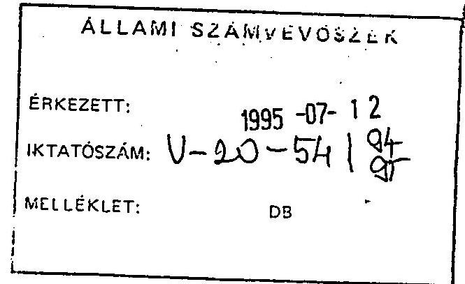

Tisztelt Elnök Úr!

Köszönettel kézhez vettem a részünkre eljuttatott, "az állam tulajdonosi funkció érvényesüléséről a Magyar Villamos Művek Rt-nél és társaságainál" tárgyú 1995. július 3-i jelentésüket.

Kérésüknek megfelelően a jelentés áttanulmányozása után - a teljesség igénye nélkül - az alábbi észrevételeket, megállapításokat tesszük.

1. Az előzetes helyzetfelmérő tanulmányban foglaltakhoz - 1995. június 12-én az ÁV Rt-nél tartott személyes megbeszélés során - észrevételeinket megtettük, ezt követően részletes írásos javaslataink is átadásra kerültek.

Megállapítást nyert, hogy a jelentés az észrevételeink és javaslataink többségét helyesen tartalmazza.
2. Szóbeli közlésünknek megfelelően ezúton is támogatunk és indokoltnak tartunk egy hatástanulmány közeljövőben történő elkészítésének megkezdését. A hatástanulmánynak célszerűen komplex módon kellene foglalkoznia azzal a kérdéscsoporttal, hogy a villamosenergia-ipari társaságok privatizációjának előrehaladása, befejezése után milyen hatások jelentkeznek az életszínvonalra, a villamosenergia fogyasztására, a villamosenergia árának alakulására, stb.
3. A jelentéssel kapcsolatos általános érvényű megállapításunk: a villamosenergiaiparban az elmúlt időszakban bekövetkezett változásokat, a fejlődést, egy-egy időszak jellemzőit, a cél- és eszközrendszereket valósan mutatja be, az elemzések és értékelések eredményei, valamint következtetései alapvetően elfogadhatóak. Ezekből következően igen hasznosnak és értékesnek tartjuk mindazok részére, akik a villamosenergia-ipar különböző

kérdéseiben a döntéseket meghozzák, akik a döntés-előkészítési folyamatban részt vesznek, és általánosságban mindazon szervek és személyek részére, akik valamilyen módon tevékenységükkel a villamosenergia-iparhoz közvetlenül, illetve közvetve kapcsolódnak.
4. A jelentés készítésének teljes folyamatában jó színvonalú együttműködést, segítőkészséget, javaslatainkat, észrevételeinket figyelembe vevő munkakapcsolatot tapasztaltunk az Állami Számvevőszék vezetői és munkatársai részéről, amelyet ezúton is megköszönünk.

Üdvözlettel

# MVM RT.

Lasecik Attila sk.

---

From: Dr. Hegyháti József
PHONE No.: 36 1 266 8492
Jul. 17 1995 2:47PM P01

'95 07/17 14:54 FAX 36 1 2003485
DUNAI ÁLL.TITK.
1001-002

MAGYAR KÖZTÁRSASÁG
IPARI ÉS KERESKEDELMI MINISZTÉRIUM

MINISZTER

Dr. Hagelmayer István
elnök úr
Állami Számvevőszék

Budapest

Tisztelt Elnök Úr!

"A Magyar Villamos Művek Részvénytársaságnál és társaságainál az állami
tulajdonosi funkció érvényesüléséről" készült jelentésüket megkaptam. Az
abban foglalt takkal, továbbá az ipari és kereskedelmi miniszternek szóló
ajánlásokkal egyetértek.

Úgy gondolom a jelentés véleményezésében abból indulhatok ki, hogy a
villamosenergiaipari privatizáció mindenekelőtt gazdasági kényszer.
Mérlegelésének rendező elve célszerűen az lehet, hogy a pénzügyi egyensúlyra
törekvés legalább olyan fontos nemzeti érdek, mint a villamosenergia-ellátás
egyensúlya. Az MVM Rt. pénzügyi-műszaki működőképessége ugyanis jó, a
várható villamosenergia kereslet alapján az előttünk álló 4-5 évben a
folyamatos ellátás biztonsága tartható. Magyar beruházási viszonylatban évek
óta kiemelkedően óvatos az MVM Rt. ráfordítása és a tulajdonváltás
időtartama alatt nem kifogásolható a beruházás dinamizálásának a csillapítása.

Nyilvánvaló, hogy az MVM Rt. hatalmas (600 Mrd Ft) vagyonának a
magánosításakor igen jelentős érdekek ütköznek. Természetes, hogy ebben a
kérdésben más a villamosenergia nagyfelhasználók és a fogyasztók érdeke
(gazdasági növekedés, versenyképesség, életszínvonal), más az ágazat, az
önkormányzatok, az érintett munkavállalók és az államnak mint tulajdonosnak
a költségvetés egyensúlyához fűződő érdeke. Az öt erőteljes érdekszféra
minden szereplője elkülönül az összes többitől. Ezért nehéz konszenzusra jutni,
de erre kell törekedni.

Való igaz, hogy az ország még nem rendelkezik kiforrott jogrenddel, gazdasági regulációval az energiaipar privatizációjához sem. Egyetértek az ajánlásokkal a tekintetben is, hogy az állami szerepvállalásban különösen a nemzeti vagyon védelmére és a folyamatos ellátás ellenőrzésére, a szabályozásban pedig a fogyasztóvédelemre, ennek alárendelve az árak alakítására, valamint az ágazati korszerűsítés feltételeinek a megteremtésére kell összpontosítani a fő figyelmet.

Az MVM Rt. privatizációjához legszükségesebb "minimál" program (törvénymódosítások, tulajdonosi struktúra, pályázati feltételek, stb.) már megvalósult. Ebben a privatizáció jogi akadályainak elhárítására törekedtek, ezután pedig
 a fogyasztóvédelemre kell figyelni. A továbbiakra kitekintő jogharmonizációs munkában azonban igen szoros együttműködésre van szükség az ÁPV Rt., a MEH és az IKM között, mert az ÁSZ ajánlásban felsorolt feladatuk megoldásában a tulajdonos, az árszabályozás és fogyasztóvédelem, továbbá az iparirányítás felelőssége ölelkezik. A nyitott kérdések megoldása - a társadalmi-gazdasági helyzet konkrét alakulásától függően - csak egyetértésben valósulhat majd meg.
Példaként említhető, hogy a sztrájkjog törvényileg már rendezett. Egy esetleges energiaipari sztrájk megelőzésében (érdekegyeztetés) nem az ipari miniszter, hanem a jelenlegi tulajdonos, a privatizációs miniszter tehet időben a legtöbbet. Ezt igazolja a július 4-én megvalósult sikeres egyeztetés.

Bizonyos, hogy a privatizációtól teljesen függetlenül mielőbb olyan árakat kell alkalmazni, amelyek a tényleges költségeken felül tartalmazzák a befektetett tőke megtérülését és a lekötött tőkével arányos profitot. Ezt kívánja az ágazat korszerűsödéséhez fűződő érdek mellett a privatizáció sikere is. Az áremelés azonban kompenzációt von maga után (vasút, nagy egészségügyi-, oktatási-, szociális szolgáltató rendszerek és a lakossági szegény rétegek költségvetési támogatása). Ez pedig nagy gond. Ezért az áremelés időpontja, mértéke most még nem rögzíthető, lehetséges, hogy az árrendezés indokoltságának puszta deklarálásával indul a magánosítás.

Budapest, 1995. július 17.
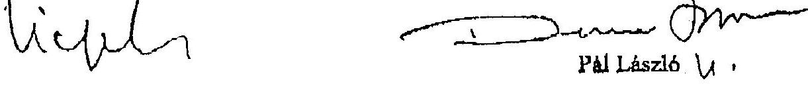

---

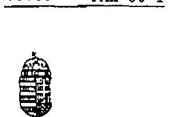

# A MAGYAR KÖZTÁRSASÁG TÁRCA NÉLKÜLI MINISZTERE 

$$
\begin{aligned}
& \text { ÁLLAMI SZÁMVEVŐSZÉK } \\
& \text { TÜ } \\
& \text { ÉRKEZETT: } \\
& \text { IKTATÓSZÁM: V-20-61/94=} \\
& \text { MELLÉKLET: - DB }
\end{aligned}
$$

Budapest 1995. július 13.
ST- 2033/95

Dr. Hagelmayer István úr
elnök
Állami Számvevőszék
Budapest

## Tisztelt Elnök Úr!

Az állami tulajdonosi funkció érvényesülése a Magyar Villamos Művek Részvénytársaságnál és társaságainál tárgyú jelentésüket megkaptam. Az abban foglalt észrevételeikkel lényegében egyetértek és további munkánk során hasznosítani fogom.

Megerősítem egy olyan hatástanulmány elkészítésének fontosságát, amely az ágazat privatizációjával összefüggésben elemzi annak hatását az életszínvonalra, a villamosenergia árának alakulására, fogyasztásának várható mértékére.

Ezúton is megköszönöm munkatársaimmal való eredményes együttműködésüket és véleményük messzemenő figyelembe vételét.
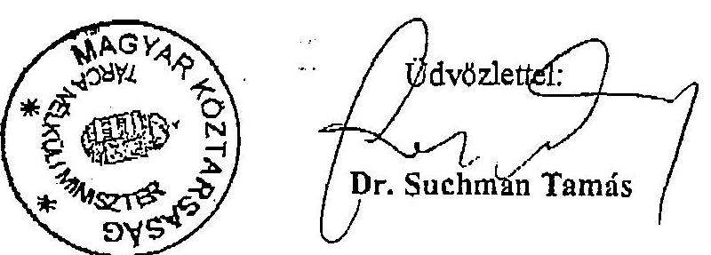

---

# Magyar Villamos Művek Rt. 

$10-1031 / 95$
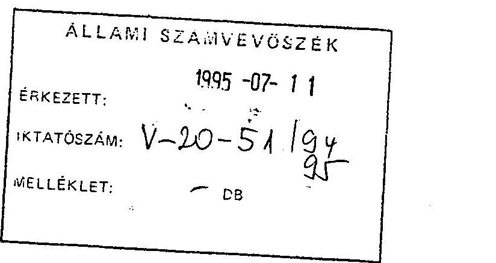

## Dr. Hágelmayer István

az Állami Számvevőszék elnöke részére

## Budapest

Tisztelt Elnök úr!

Köszönettel vettük levelét és annak mellékleteként számunkra megküldött Állami Számvevőszék-i jelentést az állami tulajdonosi funkció érvényesüléséről az MVM Rt.-nél és társaságainál.

Nagy örömünkre szolgál, hogy a jelentés tervezet vezetői és szakértői szinten előzetesen megtárgyalásra került és az anyag pontosítása érdekében tett javaslataink döntő többségét figyelembe vették a végleges összeállításban.

Elismerésünket szeretnénk kifejezni azért, hogy munkatársai ilyen rövid idő alatt olyan jelentést állítottak össze, mely igen magas szakmai ismeretről tanúskodik és reális értékelést ad valamennyi lényeges kérdésben az MVM Rt.-ről és társaságairól. A megküldött jelentéssel kapcsolatban lényeges változtatási javaslatunk nincs.

Budapest, 1995. július 11.

Tisztelettel:

Dr. Tombor Antal
műszaki vez.ig.h.

Székács Anna
közgazdasági vez.ig.h.

Magyar Villamos Művek
Részvénytársaság
3.

---

# Hagelmayer István Úrnak 

elnök
Állami Számvevőszék

## Budapest

## Tisztelt Elnök Úr!

Kérésére alapján az alábbiakban adom meg a "Jelentés az állam tulajdonosi funkció érvényesüléséről a Magyar Villamos Művek Részvénytársaságnál és társaságainál" című, 1995. július 3-án kelt anyaggal kapcsolatos véleményemet.

A Jelentés tervezet összeállítása során a Magyar Energia Hivatal különböző szinteken megadta az észrevételeit, amelyeket a Jelentés végleges elkészítésénél a készítők figyelembe vettek.

A teljesség kedvéért hangsúlyozni kívánom, hogy a folyamatos és biztonságos villamosenergia-ellátás és a szolgáltatás ára közötti ellentmondás feloldása alapvető szabályozási feladat.

A Jelentésben foglaltakkal egyetértek, az anyagot további felhasználásra alkalmasnak tartom.

Budapest, 1995. július 12.
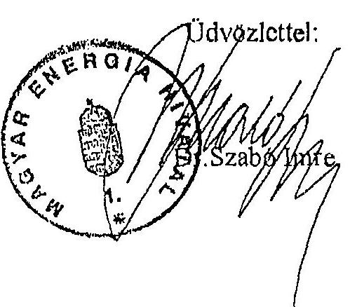

