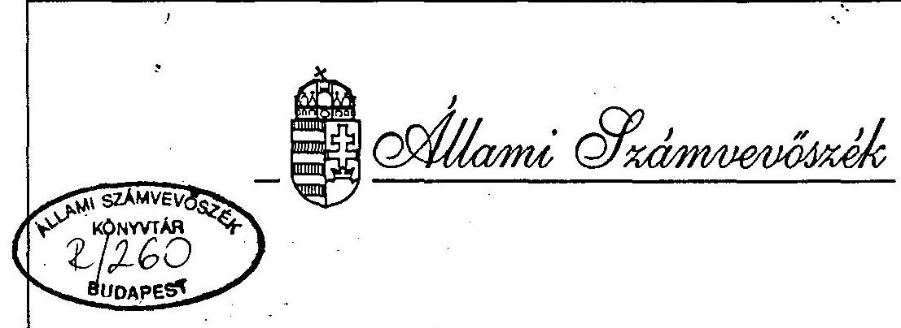
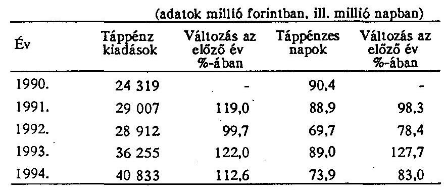
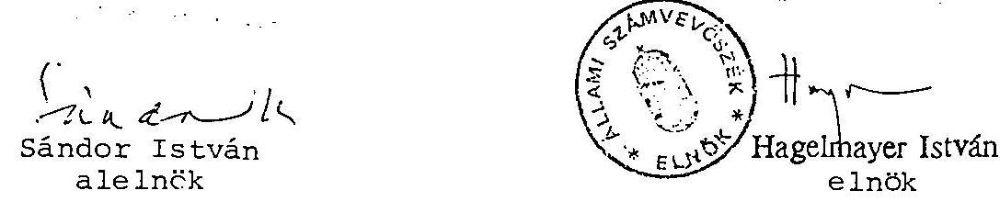

# JELENTÉS 

a felnôtt háziorvosi ellátásra fordított pénzeszközök felhasználásának vizsgálatáról

---

# JELENTÉS 

## a felnôt hâziorvosi ellátásra fordított pénzeszközök felhasználásának vizsgálatáról

A helyi önkormányzatokról szóló 1990. évi LXV. törvény a települési önkormányzatok feladatává tette a lakosság egészségügyi ellátásáról való gondoskodást.

Az Országgyûlés 1991. évben elfogadta a társadalombiztosítási rendszer megújításának koncepcióját, melynek alapján elkezdődött az egészségügy új rendszerének kiépítése, közöttük a háziorvosi ellátási formák kialakítása, a finanszírozás reformja. Az utóbbi alapvető céljaként a teljesítményhez igazodó, egységes orvosszakmai követelményrendszeren alapuló finanszírozási rendszer bevezetését jelölték meg.

A vizsgálat fô célja, annak megállapítása volt, hogy:

1. kellően összehangolt és megoldott-e a háziorvosi tevékenység jogi szabályozása, szakmai irányítása és felügyelete,
2. a helyi önkormányzatok az ellátási kötelezettségük teljesítése érdekében hatékony intézkedéseket tettek-e,
3. az egészségbiztosítási pénztárak a tervezéssel és finanszírozással, továbbá az ellenőrzéssel kapcsolatos feladataikat célszerűen és hatékonyan látják-e el,
4. az ÁNTSZ-ek a háziorvosi szolgálatokkal összefüggő, jogszabályi kötelezettségeiknek milyen színvonalon tesznek eleget,
5. a reformintézkedések, továbbá a finanszírozás új rendje megfelelően ösztönöz-nek-e a háziorvosi szolgálatok feladatainak színvonalas ellátására, továbbá
6. mindezek együttes hatásaként az elvárható mértékben javult-e a lakossági ellátás színvonala.

---

A vizsgálat keretében helyszíni ellenőrzést végeztünk a Népjóléti Minisztériumban, az Országos Tisztifóorvosi Hivatalban, az Országos Háziorvosi Intézetnél, az Országos Egészségbiztosítási pénztárnál, továbbá 12 Megyei Egészségbiztosítási Pénztárnál, és az Állami Népegészségügyi és Tisztiorvosi Szolgálat 12 megyei és fóvárosi intézeténél.

A vizsgálat 12 megyét és a fóváros 2 kerületét érintette, ahol a lakosság $57 \%$-a él és a felnőtt, valamint a gyermekeket is ellátó (vegyes) háziorvosok $53 \%$-a tevékenykedik.

Helyszíni ellenőrzésre a települéś önkormányzatok 3\%-ánál ( 97 önkormányzat, melyből 2 fóvárosi kerület, 33 város és 62 nagyközség, illetve község) került sor, mely közigazgatási területen 503 háziorvos, azaz az összes szolgálat $10,2 \%$-a múködik. A vizsgált önkormányzatok területén ellátott lakosság száma 996269 fő, az ország lakosságának $9,7 \%$-a. Az ellenőrzés által érintett minta fơbb jellemzőiben lefedi az országos átlagot.

Kövctkeztetések, javaslatok
Az 1992-ben elkezdett reform céljaként egy új, biztosítási jogalapra helyezett, a korábbinál hatékonyabb ellátás kialakítása, ezen belül a kétpólusú egészségügyi ellátás keretében az alapellátás megerősítésével a költségescbb szakosított és intézményi szakellátások tehermentesítése és a kapacitások igényckhez való igazítása fogalmazódott meg.

A társadalombiztosításnak a háziorvosi szolgálatok finanszírozására fordított kiadásai a reformintézkedések kezdete óta dinamikusan nőttek.

A folyósitott összegek

| 1992-ben | 10,7 milliárd forintot, |
| :-- | :-- |
| 1993-ban | 13,5 milliárd forintot, míg |
| 1994-ben | 18,3 milliárd forintot tettek ki. |

A háziorvosi szolgálatok kiadásának növekedési üteme meghaladta a gyógyítómegelőző ellátás egészének növekedési ütemét. Míg ez utóbbi átlagban 24\%-kal növekedett, addig a háziorvosi ellátásra fordított összeg 1992-ről 1993. évre $27 \%$-os, 1993 -ról 1994 -re a terv szintjén közel $28 \%$-os emelkedést m 'at.
Az önkormányzatok a Társadalombiztosítástól átvett pénzeszközökhü: az egész-

---

ségügyi ellátás múködéséhez további eszközökkel is hozzájárultak. Ennek a felnött háziorvosi ellátásra jutó összege a szakfeladati rend miatt viszont nem mutatható ki.

Az új struktúrában meghatározó szerepet szántak a háziorvosoknak. A Népjóléti Miniszter rendelete a betegek vizsgálatán, gyógykezelésén túl a háziorvosok feladatává tette a megelőzést, a tanácsadást és szưrést, a betegek egészségi állapotának ellenőrzését, rehabilitációját is.

A szabad orvosválasztással egyidejűleg a bejelentkezett biztosítottakról "törzskartont" kellett a háziorvosnak kiállítani, amely a lebonyolítás kampányszerüsége miatt az esetek többségében nem a vizsgálatokon alapult. Kitöltését adminisztrációs tehernek tekintették, s csak elvétve szűrésre, gondozásra kiterjedő feladatnak. A törzskartonok szolgáltak volna információval a lakosság egészségi állapotáról, erről azonban csak más forrásokból (pl. táppénzes statisztika) áll rendelkezésre viszonylag kevés adat.

A háziorvosi szolgálatok finanszírozásának jelenlegi helyzete elsődlegesen a háziorvost választó betegek számán és korösszetételén alapul és az elvárt teljesítmény átlagos ráfordítását téríti a normativitás elvén. A finanszírozás független a háziorvosi szolgálatok által nyújtott szolgáltatások mennyiségétől és minőségétől. A deklarált célokkal ellentétben nem ösztönzi a megelőzést, a szűrést és a gondozást, az orvos nem érdekelt az optimális szolgáltatás teljesítésében. Ez utóbbit ugyan közvetetten szolgálja a szabad orvos választás, ám a helyi adottságok függvényében ez sokszor csupán joga és nem lehetősége a biztosítottnak.

A háziorvosi rendszer a mennyiségben és minőségben megnövekedett feladatok ellenére a korábbi körzeti orvoslásban létrejött feltételekre, struktúrára épült. Háziorvosként területi ellátási kötelezettséggel általában a korábbi körzeti orvosok kaptak megbízást. A reformot egy szakmai felülvizsgálat, helyzetfelmérés, a körzethatárok indokolt módosítása és körzetfejlesztések nem előzték meg. A zsúfolt körzetek így nem szűntek meg, s a szabad orvosválasztás eredményeként a "kártyabegyűjtést" korlátozó mechanizmusok hiányában egyes esetekben számuk tovább nőtt. Az új finanszírozásnak kártyaszám növelésére ösztönző hatásán a degresszío 1993. július 1-jei bevezetése már nem tudott érdemben változtatni. Az átlagos kártyaszám felnőtt és vegyes háziorvosi körzetekben megközelíti a kívánatosnak tartott 1700 db -ot, azonban az átlag mögött jelentős különbségek tapasztalhatók. A háziorvosok egy részének a település jellegéből

---

adódóan, vagy a kártyák elfogadását követően történt körzetfejlesztés miatt csak néhányszáz kártyát sikerült begyűjteni, s ez a működtetésben okoz gondot. Ugyanakkor vannak háziorvosok, akik 3000-nél is több kártyát fogadtak el, azonban ennyi embert egy orvos nem tud megfelelően ellátni.

A háziorvosi rendszer bevezetésekor az alapellátásban magas volt a megfelelő szakképesítéssel nem rendelkező orvosok aránya, akiknek valamint az újonnan belépőknek 1998. év végéig háziorvosi szakvizsgát kellene tenniük. A képzési formák s a továbbképzések rendszere kiépültek, azonban a szakvizsgát eddig megszerzők csekély és a szakvizsgára kötelezettek magas száma alapján a határidő betartására nincs reális esély.

Megoldatlan a háziorvosi szolgálatok tevékenységének minőségellenőrzése. A társadalombiztosítás döntően a finanszírozási adatok helyességének ellenőrzését tekinti feladatának, vizsgálatai a szakmai tevékenységre alig terjednek ki, s az ehhez szükséges feltételekkel sem rendelkeznek. A tisztiorvosi szolgálatok által közel két éves késedelemmel megbízott szakfelügyelő főorvosok saját praxisuk mellett látják el feladatukat, ez ideig a területtel való ismerkedésen jutottak túl. A háziorvosi szolgálatok így lényegében az elmúlt két évben szakmai kontroll nélkül tevékenykedtek.

Az állami és önkormányzati feladatok szétválasztása során sok szereplős és hatáskörileg összehangolatlan, bonyolult irányítási, ellenőrzési rendszer alakult ki. A feladatellátásra kötelezett, tulajdonos önkormányzatok a személyi és tárgyi feltételek megteremtésében kaptak szerepet, az állami feladatok a Népjóléti Minisztérium és az irányítása alá tartozó különböző intézmények között oszlottak meg. A különböző közreműködők tevékenységét a megfelelő koordináció és a kölcsönös információ-áramlás hiánya egyaránt nehezíti.

Több területen az átszervezés helyett a feladatot ellátó szervezetek szétesése volt megfigyelhető (pl. táppénzes felülvizsgálati rendszer), s ez az egészségbiztosítás más alrendszereinek a kiadásait növelte.

Megteremtődtek a keretei az egészségügyi ellátások biztosítási alapokra helyezésének, így a társadalombiztosításnak az egészségügy költségeinek viselésében betöltött korábbi formális szerepe megváltozott. A megnövekedett feladatokkal azonban a társadalombiztosítás igazgatási szervei, majd az egészségbiztosítási

---

pénztárak megfelelő felkészülés és feltételek hiányában csak részben tudtak lépést tartani.

A gyógyító- megelőző szolgáltatások igénybevételére jogosító betegbiztosítási igazolványok (kártyák) érvényességének vizsgálata a számítástechnikai feltételek, az adatbázisok összekapcsolásának hiányában, valamint az érvényesitők mulasztásai miatt nem volt biztosítható. Így a kártya sem a jogosultság igazolásában, sem a háziorvosok finanszírozásában nem tölti be maradéktalanul szerepét. A támogatás számfejtése és kiutalása a háziorvosok által összeállított havi változásjelentések alapján történik, s ezek hatékony, számítástechnikai úton történő ellenőrzését nem sikerült kialakítani.
A rendszer múködtetésének fenntartása érdekében a háziorvosi szolgálatok múködtetőivel a formalizált szerződések megkötése, nyilvántartása, a teljesítménydíjak havi számfejtése és utalása képezte a tevékenység súlypontját, a szolgáltatások érdemi ellenőrzése, befolyásolása helyett.

További többletforrások hiányában az alapellátáshoz kapcsolódó ún. egyéb alapellátási feladatok finanszírozása (kislabor, fizikoterápia, ügyelet stb.) továbbra is báziselven történik. Az ügyeleti, készenléti ellátás reformjára - mivel a Társadalombiztosítás 1994. évi költségvetésében jóváhagyott előirányzatot átcsoportosították a közalkalmazotti bértábla bevezetése miatt - nem került sor.

A reform egyik leglényegesebb következménye az egészségügyi vállalkozások, magánorvosok megjelenése az ellátásban. Vállalkozásba általában a megfelelő kártyaszámmal rendelkező háziorvosok kezdtek, akik területi ellátási kötelezettséget is vállaltak az önkormányzattal kötött szerződésben. Ebben az esetben kötelezi a törvény a rendelés feltételeinek térítés mentes biztosítására az önkormányzatokat (rendelő és alapfelszerelés). A feladatellátásra kötelezett önkormányzatok szerepüket különféleképpen értelmezik, s a vállalkozó háziorvosok támogatása a konkrét követelményeket az esetek jelentős részében nélkülözi.

Mindezek alapján a gyógyító-megelőző alapellátásban a reformok ellenére az elmúlt években az ellátás minőségében érzékelhető változás nem következett be. Az ellenőrzés alapján az alábbi intézkedések megtételét javasoljuk:

---

# A Népjóléti Minisztérium részére: 

Az 1107/1994. (XI. 23.) Kormányhatározat mellékletében közzétett cselekvési programban meghatározott határidőket figyelembe véve, az egészségügyi rendszer továbbfejlesztésére vonatkozó jogi szabályozást, fel kell gyorsítani, ezen belül

- az egészségügyi irányításban és ellenőrzésben érintett szervezetek (minisztérium és intézetei, települési önkormányzatok, valamint a finanszírozó egészségbiztosítás) feladatai tekintetében megfelelő munkamegosztás érvényesüljön és egyértelmű felelősséggel párosuljon.
- Az önkormányzatok alapellátással kapcsolatos kötelezettségeit - önállóságukat is figyelembe véve - szakmai (egészségügyi) törvényben indokolt részletesebben szabályozni.
- A szükséges jogszabály módosítások kezdeményezésével a finanszírozás alapjául szolgáló dokumentáció vezetésével kapcsolatos szabályozási ellentmondások, joghézagok megszüntetése érdekében indokolt intézkedni (páciensregiszter, ambuláns napló vezetése).
- Halaszthatatlan az egyéb alapellátási feladatok körében finanszírozott ügyeleti (készenléti) ellátásnál is a reform bevezetése, az ehhez szükséges pénzügyi feltételek megteremtése.
- Az elfogadott kártyaszám miatt a háziorvosi rendszerben kialakult aránytalanságokat szakmai felülvizsgálat keretében indokolt feltárni, s ösztönözni az alapellátás személyi feltételeinek javítását, a háziorvosi ellátás céljainak jobban megfelelő praxisok kialakítását.
- A képzés- továbbképzés feltételeinek javítása érdekében a szükséges tennivalókat az Országos Háziorvosi Intézet feladatait is áttekintve indokolt meghatározni.
- Véglegesíteni és alkalmazni kell a kompetencialistát, mely alapja lehetne a szakmai követelmények számonkérésének, a többletteljesítmények mérhetőségének és esetleges díjazásának, továbbá az alapfelszerelési jegyzék pontosításának.
- Dönteni kell, hogy a szolgálatok orvosai milyen típusú kiegészítő tevékenységet (kislabor, fizikoterápia stb.) végezhetnek, és a TB támogatás rendjét ehhez kell

---

igazítani, amely támpontul szolgálhatna a működtetők részére a műszerbeszerzéskor is.

- Az egészségügyi feladatok tervezése, a különböző közreműködők feladatainak meghatározása, a lakosság egészségügyi helyzetét befolyásoló konkrét intézkedések megtétele szükségessé tenné egy, a mortalitási, morbiditási adatokat, illetve a különböző kockázati tényezőket felőlelő egységes információs rendszer kiépítését.

A számítógépes információs rendszerek kapcsolódási pontjainak felülvizsgálatával, az adminisztráció csökkentésének lehetőségeit célszerű feltárni.

# Egészségbiztosítási Önkormányzat részére: 

- Az egészségbiztosítási pénztárak szervezetét, múködését szervezeti működési szabályzatuk véglegesítésével, a szükséges belső szabályzatok elkészítésével kell stabilizálni, továbbá indokolt felülvizsgálni a meglévő szervezeti, személyi egyenetlenségeket. Szükséges a háziorvosi ellátás finanszírozásának egyes elemeit áttekinteni, és az egészségpolitika céljaival összhangban a szükséges változtatásokat végrehajtani.
- Az informatikai háttér fejlesztésével, az adminisztráció csökkentésének lehetőségeit is célszerű feltárni azon túl, hogy a finanszírozás alapjául szolgáló adatok ellenőrzését automatizálni szükséges.
- A szerződéses kapcsolat keretében az egészségügyi szolgáltatások mennyisége és minősége mérésének feltételeit, módszereit és az ellenőrzések eljárási kérdéseit is ki kell alakítani. Az ellenőrzéseknek a finanszírozás adatai mellett a szakmai tevékenység megítélésére is ki kell terjednie. Létre kell hozni azokat az ellenőrzési formákat, amelyek az egészségbiztosítás más alrendszereinek kiadásaira (pl. táppénz) gyakorolnak kedvező hatást.
- A vállalkozások megszűnése esetére kialakított pénzügyi elszámolás, illetve finanszírozás jelenlegi rendjét célszerű felülvizsgálni.

---

# RÉSZLETES MEGÁLLAPÍTÁSOK 

A gyógyító- megelőző ellátások finanszírozásában meglévő problémák és ellentmondások feloldására az Országgyúlés a 60/1991. (X. 29.) sz. OGY. határozatával kijelölte a társadalombiztosítási rendszer megújításának koncepcióját és rövid távú feladatait.

Az Országgyúlési határozat indokoltnak tartotta, hogy az egészségügyi ellátás biztosítási jogviszony alapján járjon, a felnőtt és gyermek körzeti orvosi ellátásban valósuljon meg a teljesítményhez igazodó, egységes orvosszakmai követelményrendszeren alapuló finanszírozási módszerek alkalmazása, a szabad orvosválasztás, az állami egészségügyi és betegbiztosítási feladatok meghatározása.

Az önkormányzati- és az Állami Népegészségügyi és Tisztiorvosi Szolgálatról (ÁNTSZ) alkotott törvények első lépésként megosztották az addig egységes feladatrendszert állami és önkormányzati feladatokra. A kormányzat fokozatosan kivonult az egészségügy közvetlen irányításából. A Népjóléti Minisztérium feladata elsősorban a jogszabály előkészítésben és a jogi szabályozás szakmai, szakmapolitikai tartalmának meghatározására koncentrálódik. A közvetlen irányító funkció jelentős részét a különböző szintű önkormányzatok, a hatósági funkciókat az ÁNTSZ-ek vették át.

A helyi önkormányzatokról szóló törvény a települési önkormányzatok kötelező feladatai között sorolja fel az egészségügyi alapellátást. A hatásköri törvény értelmében a települési önkormányzat az egészségügyi alapellátás keretében gondoskodik a körzeti egészségügyi (általános, gyermek-, fogorvosi) és védőnői ellátásról.

A finanszírozás és az egészségügyi rendszer 1992-ben elkezdett reformja kezdeti lépésként az alapellátásra terjedt ki. Nem előzte meg az egészségügyi szükségletek és kapacitások felmérése, összehangolása és ennek eredményeként olyan strukturális átalakítás, mely a körzeti egészségügyi szolgálatok helyén szerveződő háziorvosi szolgálatok megerősítéséhez, az ehhez szükséges feltételek biztosításához járult volna hozzá.

---

A határozat nem tartalmazott egyértelműen reformintézkedéseket a szakorvosi, a fekvőbeteg ellátó és szakosított egészségügyi intézményekre vonatkozóan. A megújulás az integrált gyógyító-megelőző egészségügyi ellátások közül kezdetben egyértelműen csak az alapellátásra terjedt ki. Ezért nem következett be az egészségügy átfogó korszerüsítése, azaz a felnőtt (vegyes), gyermekorvosi körzet megerősítésével, a feltételek megteremtésével a kevesebb költséggel együttjáró alapellátás szintjére tevődjön át a befejezett gyógyító munka egy része. A magasabb szintű kórházi, szakintézményi ellátásra csak a valóban szükséges mértékben kerüljön sor.

A háziorvosi és házi gyermekorvosi szolgálatról szóló 6/1992. (III. 31.) NM. sz. rendelet értelmében a háziorvosi szolgálat elsődlegesen, személyes és folyamatos ellátást nyújt az egészségügyi állapot megőrzése, a betegségek megelőzése és gyógyítása céljából.

A háziorvosi szolgálatok finanszírozása a 79/1992. (V. 12.) Kormányrendelet alapján 1992. július 1-tól szerződéses kapcsolat keretében valósul meg. A szerződéseket a megyei társadalombiztosítási igazgatóságok kötötték meg az egészségügyi ellátás biztonságát szolgáló területi ellátási kötelezettséget vállaló múködtetőkkel (önkormányzat, önkormányzati társulás, egészségügyi intézmény, vagy egészségügyi vállalkozás, magánorvos), illetve a területi ellátási kötelezettséget nem vállalo, de a bejelentkezett biztosítottak részére folyamatos háziorvosi ellátást nyújtó üzemorvos munkáltatójával, egészségügyi vállalkozással (magán orvossal).

Megítélésünk szerint a szolgálatok szinte ugyanazokat az ellátási kötelezettségeket teljesítik, mint a volt körzetorvosok. Az állampolgárok számára mind ez ideig érzékelhető változások sem a gyógyító munka minőségében, sem körülményeiben a körzeti orvosi ellátáshoz viszonyítva nem következtek be. A rendelési idő, a rendelési körülmények, a készenléti és ügyeleti szolgálat ellátása, a beteg és az orvos közötti kapcsolat szinte változatlan maradt. A megelőzési tevékenység pedig az érdekeltség hiánya miatt nem vált általánossá. A települések jelentős részében a szabad orvos választás megoldhatatlan, csupán elvi és nem gyakorlati lehetőség.

Borsod-Abaúj-Zemplén megyében az alacsony lélekszám miatt a települések 54\%-a saját háziorvossal nem rendelkezik, a háziorvosok 20\%-a 3, vagy ennél több csatolt községet lát el.

---

A reform egyik leglényegesebb következménye a háziorvosi szolgálat többszektorúvá válása, az egészségügyi vállalkozások, magánorvosok megjelenése az ellátásban.

# 1. A háziorvosi szolgálatok állami irányítása, ellenőrzése 

1.1. A háziorvosok szakmai-módszertani irányítása, ellenőrzése megoszlik a Népjóléti Minisztérium, az Állami Népegészségügyi és Tisztiorvosi Szolgálat az Országos Egészségbiztosítási Pénztár és az Országos Háziorvosi Intézet között a háziorvosi szolgálatok (felnőtt és gyermek) szervezése ugyanakkor - területi ellátási felelősségük révén - alapvetően az egyes helyi önkormányzatok feladata.

Megállapítható, hogy az ellenőrzésnek sincs jelenleg egyértelmű felelőse, illetve az ilyen jellegű tevékenység az említett szervek között nem eléggé elhatárolt, koordinálatlan.

A népjóléti miniszter - a feladat és hatásköréről szóló 49/1990. (IX. 15.) Korm. rendelet szerint - meghatározza a szakirányítás, a szakfelügyelet és a szakmai ellenőrzés rendszerét.

Az ÁNTSZ-ről szóló 1991. évi XI. törvényben a korábbi Kö̉egészségügyi Járványügyi Szolgálatokat egy új, centrális irányítású szervezetté alakították át, amelynek hatáskörébe tartozik a hagyományos járványügyi - közegészségügyi tevékenység mellett az egészségügyl ellátás felügyelete is.

A népjóléti miniszter a 6/1992. (III. 31.) NM. rendeletben a háziorvosi és a házi gyermekorvosi szolgálat rendjét, míg a szakfelügyeletet a 8/1993. (III. 31.) NM. sz. rendeletben szabályozta.

A háziorvosi szolgálatok szakmai felügyeletének célját és szervezeti rendszerét jóval később, a törvény hatályba lépését követően két év késéssel hozott népjóléti miniszteri rendelet határozta meg. A szakfelügyeletet az ÁNTSZ a megyei, illetve városi felügyelő szakfőorvosok útján látja el.
A szakfelügyelő főorvosok megbízására a városi (fővárosi, kerületi) tisztifőorvosok részéről 1993. év utolsó harmadában, de sok esetben csak 1994. év elején került sor. A késedelem megyénként eltérő és indokolatlan.

Győr- Moson- Sopron megyében 1993. október 1-jei hatállyal, Veszprém megyében 1994. április 1-tól bízták meg a szakfelügyelő főorvosokat. Debrecen-

---

ben és Hajdúbőszörményben 1994. január 1., Berettyơújfaluban február 1., Püspökladányban április 1. időponttal bízták meg a szakfelügyelő főorvosokat.

A szakmai tevékenység felülvizsgálatához a személyi feltételek tehát csak késve teremtődtek meg. Ennek megfelelően az OTH (Országos Tisztifőorvosi Hivatal) először csak az 1994. évi ellenőrzési tapasztalatokról tud átfogó jelentést bekérni a megyei szakfőorvosoktól. Vizsgálatunk idején még a háziorvosok létszámáról sem rendelkeztek információval, ugyanis nem épült ki a számítógépes kapcsolat a központ és a megyei tisztifőorvosi hivatalok között.

Az egészségügyi ellátás tartalmi, szakmai feladatainak számonkérését, figyelemmel kísérését, a minőségi követelmények biztosítását a Tisztiorvosi Szolgálat a városi szakfőorvosi rendszeren keresztül valójában nem tudja ellátni. A problémák a rendszer lényegéből adódóan abban jelentkeznek, hogy a háziorvosok közül bízzák meg a városi szakfőorvosokat, amely számukra sem szakmai, sem anyagi elismerést nem jelent (a díjazás mértéke az ellenőrzendő praxisok számától függően havi 3 - 10 ezer forint).

A felügyelő szakfőorvosi hálózat egyenetlenül fogja át a háziorvosi ellátást. Megyénként eltérő (15-60) háziorvos ellenőrzése jut 1 felügyelő szakfőorvosra, akik háziorvosként saját praxisukat is ellátják.

Nyíregyháza és a környező 52 önkormányzat területén működő 150 háziorvos szakfelügyeletét 2 felnőtt és 1 gyermek szakfőorvos végzi. Vidéken az 1 szakfőorvosra jutó háziorvosok száma $30-50$. Szeged város és környéke háziorvosai szakfelügyeletét ellátó két főorvos közül az egyik 65 , a másik 45 felnőtt körzet felügyeletét látja el.
Győr- Moson- Sopron megyében a 270 háziorvos szakfelügyelete 5 szakfőorvos feladata (átlag 54 háziorvos/szakfelügyelő főorvos).
Borsod- Abaúj- Zemplén megyében átlagosan 15 felnőtt háziorvos ellenőrzése jut 1 szakfelügyelő főorvosra.

A szakfőorvosok múködése nincs megfelelően szabályozva, kidolgozatlan az ellenőrzések követelményrendszere. Átfedések tapasztalhatók a szakfelügyelet, a finanszírozó, a kollegális orvosvezető, továbbá a feladatellátásra kötelezett települési önkormányzat ellenőrzési feladatai között. Az egészségügyi ellátás minőségének ellenőrzése több szerv feladatai között szerepel, valójában azonban egyik sem végez ilyen típusú vizsgálatokat.

---

A társadalombiztosításról szóló törvény végrehajtására kiadott 106/1992. (VI. 26.) sz. Kormányrendelettel módosított 89/1990. (V. 1.) MT. rendelet szerint a TB Igazgatási szervel jogosultak megvizsgálni többek között az egészségügyi szolgáltatások indokoltságát, azok teljesítését és minőségét, a szolgáltatás hozzáférhetőségét, hatékonyságát,

A szakfelügyeletről szóló NM rendelet szerint a szakfőorvosok vizsgálják egyebek mellett a megelőzés, a kórismézés, a gyógyítás, az ápolás, a gondozás, a rehabilitáció minőségét, aż orvos-szakmai elvek érvényesülését.

A háziorvosi szolgálatokról szóló NM rendelet alapján az egymás közül választott kollegális szakmai vezető háziorvos feladata a gyógyító megelőző munka színvonalának figyelemmel kísérése, a szakmai munka minőségbiztosítása.

A hivatkozott jogi szabályozás és a feltételek ellentmondásossága, hiányosságai miatt a szakfelügyeleti ellenőrzések többségében formálisak, a működési feltételek megismerésére, az előírt (finanszírozás alapjául is szolgáló, és a finanszírozó által ellenőrizendő) dokumentumok vezetésére irányultak.

Az ellenőrzések módszereit a 8/1993. (III. 31.) NM sz. rendelet szerint az országos tisztifőorvos állásfoglalásában határozza meg. Az Országos Tisztifőorvosi Hivatal 1994. március hónapban a Baranya megyei intézet által kidolgozott módszertani útmutatót küldte meg a megyei intézeteknek, melyhez észrevételeket, javaslatokat kértek, de az útmutató véglegezésére nem került sor. Hiányoznak a háziorvosi munka szakmai minősítésénél, értékelésénél alkalmazható ellenőrzési standardok.

A fővárosban szakfelügyelői értekezleten 1994. októberében felvetették, hogy módszertani levelek összessége nem áll a szakfőorvosok rendelkezésére, nincs felügyelő szakfőorvosi müködési szabályzat, a kollegális vezetőorvos és felügyelő szakfőorvos kapcsolata szabályozatlan stb.

Az egészségügyi ellátás minőségellenőrzése és a minőségbiztosítás annak ellenére nem vált az állami irányítás és a finanszírozás részévé, hogy a minőségi munkavégzés kritériumai számos ponton meghatározhatóak.

A háziorvosi tevékenység minőségellenőrzése során az eredmény mérhető lenne: az egészségmegőrzés, a gyógyult betegek száma, a krónikus betegek állapotromlásának megakadályozása, sürgősséggel és nem sürgősséggel történő kórházba utalás száma és aránya, maradandó károsodások, szövődmények, halálozás, adequát és hozzáférhető terápiák, a betegek megfelelő biztonságérzete, kellő informálásuk (állapotukról), megfelelő szervezettség, elle-

---

nőrizhetőség, az orvosok és egészségügyi szakdolgozók megfelelő empátiás készsége terén.

Az egészségügyi ellátás hazai válságjelenségeinek jelentős része az irányítás gyengeségéből, az ellenőrzések esetlegességéből, szervezetlenségéből, de gyakran teljes hiányából is adódik. A tervezett reformfolyamatok kulcsfontosságú célfeladata ezért ennek megújítása, megszilárdítása. Az ellenőrizetlenség orvos-szakmai, vezetési és gazdasági tényezők szempontjából egyaránt nagy nehézséget okoz. Csaknem teljesen ismeretlen maradt a ráfordítások viszonya a minőséghez, amely az egészségügy hatékonyságának megállapításához elengedhetetlen.
1.2. Az ellenőrzési rendszer szétesését bizonyítja a keresőképesség felülvizsgálati rendszerének helyzete is.
A keresőképesség orvosi elbírálásának ellenőrzési rendszere a vizsgált években az egészségpolitika bizonytalansága következtében folyamatosan háttérbe szorult.

A társadalombiztosítás a vizsgált időszakban a háziorvosok munkáját ellenőriztette, ugyanakkor a jogtalan - táppénz - igénybevétellel kapcsolatos szankcionálási lehetőséggel nem rendelkezett.

Az Országos Egészségbiztosítási Pénztár a társadalombiztosításról szóló törvény végrehajtására kiadott, már hivatkozott Kormányrendelet szerint vizsgálhatta a háziorvosok által nyújtott egészségügyi szolgáltatások indokoltságát, azok minőségét és hatékonyságát, ugyanakkor a fenti jogszabály 1995. április 1-vel hatályba lépő módosítása tette lehetővé az Egészségügyi Pénztárak ellenőrzésre jogosult orvosainak javaslattételi lehetőségét a táppénz megvonására, amennyiben annak jogi feltételei fennállnak.

A táppénzes ellenőrzés korábbi rendszere a vizsgált időszakban lényegében megszûnt:

- táppénzes szakfelügyelőket nem alkalmaznak,
-felülvizsgáló főorvosok státuszai megszűntek, - eltörölték az ún. 4 hetes felülvizsgáló bizottságok kötelező működését
- a Népjóléti Minisztérium a táppénzes ellenőrzésben nem vesz részt.

---

Az Országos Egészségbiztosítási Pénztár mind ez ideig nem tudta kiépíteni a táppénzes ellenőrző hálózatát oly mértékben, hogy az hathatós legyen.

A táppénzkiadások több évre visszatekintő adatai arra utalnak, hogy a betegszabadság rendszer alapvetően a bevezetés évében (1992-ben) tudta a növekedést mérsékelni. 1994-ben bár a táppénzkiadások abszolút forint értéke növekedett, a táppénzes napok száma csökkenést mutat.
(A megfigyelt időszakban a munkanélküliség növekedése miatt a táppénzre jogosultak száma is csökkent).

A táppénzkiadások növekedésben a táppénz alapját képező személyi jövedelmek mellett, a táppénzes arányszám emelkedése is szerepet játszott. Ez utóbbit részben a lakosság jelentős rétegeinek kedvezőtlen egészségi állapota, részben a társadalmi feszültségek és az egyéni problémák "medikalizálódása" fokozta, de nem elhanyagolható jelentőségű a táppénzbevételi gyakorlat helyenkénti indckolatlan liberalizmusa sem.

Jelenleg a táppénzkiadások "utalványozása" döntően a háziorvosra van bízva. Érdemi szakmai ellenőrzés hiányában a háziorvosok nem érdekeltek semmilyen formában, hogy a táppénzes százalék csökkenjen, illetőleg, hogy az OEP kiadása ne növekedjen.
1.3. A korábbi években kiadott, s jelenleg is hatályos minisztériumi utasítások néhány betegségcsoportban előírták a rendszeres szűrő vizsgálatokat. E tevékenység azonban még nem vált általánossá a háziorvosok munkájában.

---

Az elmúlt év elején az 1030/1994. (III. 29.) Kormányhatározat intézkedett új egészségmegőrző programról, amely szerint a leggyakoribb betegségcsoportok, illetve halálokok figyelembevételével ki kell dolgozni a keringési és dagahatos betegségek megelőzésének módszereit, a szűrővizsgálatok rendjét. A szabályozásra és a szükséges feltételek megteremtésére azonban nem került sor. A Népjóléti Minisztérium a Kormány egészségügyi cselekvési programjának elkészítéséig, illetve az 1107/1994. (XI. 23.) sz. Kormányhatározat megszületéséig lényegében nem tett kezdeményezést.

A Kormányhatározat szerint: "ki kell dolgozni és az Országgyúlés elé terjeszteni az egészségvédelem nemzeti programját az ágazaton belül is előtérbe helyezve a betegség megelózés fokozott elismerését".

Az emberek egészségi állapotának folyamatos romlása és az egészség összetett feltételrendszerének kialakítása olyan átfogó program készítését és megvalósítását teszi szükségessé, amely egységben kezeli a gyógyítás és a széles körű megelőzés kérdéseit. Ennek megfelelően az egészségügy területén - nemcsak a szándék szintjén - kiemelt szerepet kellene kapnia a megelőzésnek.

Az egészségügyben a gyógyítás és a betegségek korai felismerése mellett a legfontosabb a betegségek megelőzése (a primer prevenció). Ehhez megfelelő pénzügyi forrásokra is szükség van. Az egészségmegőrzés, az egészségfejlesztés stratégiájának ki kell terjednie az állam, a társadalom és a gazdasági élet valamennyi területére, mivel a teendők nagyrészt az egészségügyi ellátórendszer feladat- és hatáskörén kívül esnek.

A megelőző munka koordinálója az ÁNTSZ, végrehajtásában jelentős feladatuk van a háziorvosi szolgálatoknak és a prevenciós tevékenységet végzô hálózatoknak (iskola-egészségügy, foglalkozás-egészségügy, sportorvoslás, védőnői hálózat stb). A speciális igényű szűrővizsgálatokat a fekvő- és járóbeteg szakellátás intézményei végzik. További megelőző programok szervezése is szükséges (pl. onkológiai programok, diabetes program, stroke program, mentálhigiénés program stb). Külön is ki kell emelni a lakosság egészségi állapotát leginkább befolyásoló mentálhigiéné kérdéseit. Összehangolt lelki egészségvédelemre van szükség.

Az elsődleges megelőzés mellett nagyobb hangsúlyt kell fordítani a másodlagos megelőzést szolgáló szűrőprogramok hatékonyságára. A szűrővizsgálatokat a gazdaságosságot és hatékonyságot is figyelembe véve a leginkább

---

veszélyeztetett lakosság-csoportokban és a szakmailag indokolt gyakorisággal kell végezni.

A megelőzésben rejlő lehetőségek és elvégzésében meglévő elégtelen színvonal is felveti a háziorvosi szolgálatok szervezésének és érdekeltségi rendszerének újragondolását.

A prevencióra való törekvés elismerése nem jelenik meg a teljesítménydíjakban. A szürés és gondozás elismerése is hiányzik a pontrendszerből.

# 2. A háziorvos képzés helyzete 

A háziorvosi rendelet szerint 1998-ig minden háziorvosnak rendelkeznie kell az előírt szakvizsgával. A képzési program végrehajtása elsősorban az orvos egyetemek, míg a koncepció kidolgozása, a képzés menedzselése, a pénzügyi feltételek biztosítása az Országos Háziorvosi Intézet feladata.

A háziorvos képzésnek Magyarországon nincsenek kialakult hagyományai, emiatt a háziorvosi rendszerben jelenleg dolgozó orvosok szakképesítése, korösszetétele igen változatos, s emellett igen jelentős a szakorvosi képesítés nélkül dolgozó orvosok aránya 1994. december 31-én:

|  | Feinótt |  | Vegyes |
| :-- | :--: | :--: | :--: |
|  |  | körzet |  |
| - Szakvizsga nélkül betöltött (fő) | 569 |  | 1059 |
| - Szakvizsga nélküliek aránya az |  |  |  |
| összes háziorvosok \%-ában | $25 \%$ |  | $36 \%$ |

A szakvizsgára kötelezettek körének, továbbá a képzési, továbbképzési formáknak a meghatározása megtörtént, s az egyetemeken az oktatás is beindult.

A pályakezdő, fiatal orvosok számára akik háziorvosok kívánnak lenni, elvileg összesen 27 hónapos tanfolyami oktatást szerveztek, s akik majd 3 év önálló háziorvosi tevékenység után szakvizsgát (háziorvosi) tesznek.
Rövidített tanfolyamot szerveztek azok részére, akik már rendelkeznek egy szakvizsgával. A képzés időtartama 5-6 hónap, s a tanfolyamok önköltségesek. A már múködő megfelelő szakképesítés nélküli háziorvosok átképzó tanfolyamon vehetnek részt, amely egyéni képzést jelent, meghatározott időtartam nélkül. Az OHI saját költségvetéséből az önképzésekhez írásos anyagokat, könyv-

---

sorozatot (háziorvosi könyvek) video kazettákat bocsát a háziorvosok rendelkezésére kedvezményes ( $40 \%$ ) térítés mellett.

A háziorvosképzés költségeit az intézet részben saját költségvetési előirányzatából, részben a Népjóléti Minisztériumtól kapott pótelőirányzatokból finanszírozza.

Az intézet saját előirányzataiból 1993. évben 10275 ezer forintot, 1994. évben 21723 ezer forintot költött orvosképzésre. Ezen túl a minisztérium 1994. évben a pályakezdők képzésére 38952 ezer forint, a képzésben résztvevő orvosegyetemek dologi költségeire 24546 ezer forint pótelőirányzatot biztosított.

Az intézetnek az orvosegyetemek által meghirdetett átképzô tanfolyamok létszámáról nyilvántartása, információja nincs. Megállapítottuk, hogy a helyszíni ellenőrzés befejezéséig 1992 óta mindössze két fő szakvizsgázott háziorvostanból.

Az Intézet a 26/1991. (XII. 28.) NM. rendelet alapján a a háziorvosi ellátás szakterületén a képzésen túlmenően - az alapellátás szempontjából értékeli a lakosság megbetegedési viszonyait, valamint véleményezi az alapellátás területén müködő egészségügyi intézmények és szolgálatok müködési feltételeinek alakulását, javaslatot tesz az indokolt módosításokra.

Az Intézetet által felterjesztett Szervezeti- és Müködési Szabályzatot a vizsgálat időpontjáig a Népjóléti Minisztérium nem hagyta jóvá. Részben ebből, részben a kellő információ hiányából az intézet egyes, főként a háziorvosi ellátás helyzetét megítélő feladatainak nem tud eleget tenni.

Az Intézet kldolgozta az adatszolgáltatási rendszerét, melyet szintén jóváhagyásra felterjesztett a minisztériumhoz, azonban az ezzel kapcsolatos állásfoglalás a helyszini ellenőrzésünklg nem született meg. Mindezek miatt az OHI jelenleg nem rendelkezik a háziorvosi rendszerben dolgozó orvosokról olyan közvetlen adatállománnyal, melyböl pontosan megállapítható lenne országosan a szervezett állások száma, területi megoszlása, a betöltött álláshelyek száma, a müködő orvosok kormegoszlása, szakképesítésük differenciáltsága.
3. Az egészségügyi alapellátás biztosítási jogalapra helyezése

Az egészségügyi alapellátás biztosítási jogalapra helyezése és az egészségügyi ellátások társadalombiztosítási finanszírozásának reformját szolgáló intézkedések 1992-ben több területen indítottak el változást.

---

- A betegbiztosítási igazolványok (ún. kártya) kiadása és ezt követően a választott háziorvoshoz történő bejelentkezés;
-a háziorvosok müködtetőivel (önkormányzatok, egészségügyi intézmények, vállalkozások) a finanszírozási szerződések folyamatos megkötése és a változó szerződések befogadása;
- az évente változó finanszírozási rendszerben a szerződések alapján a TB támogatás folyósítása, a gyógyító- megelőző ellátások ellenőrzése.

A jelzett változásokból fakadó feladatokra a TB, majd az az egészségbiztosítás sem informatikai, sem a személyi, szervezeti feltételek oldaláról nem volt felkészülve, azokat menetközben igyekezett megteremteni.
3.1. A betegbiztosítási igazolványok nem voltak képesek megfelelni a kibocsátáskor megfogalmazott sokrétű funkciónak. Feldolgozásukat az informatikai rendszer korszerűtlensége is akadályozta, annak ellenére, hogy az ezzel kapcsolatos fejlesztésekre 1991-1993. között közel 1 milliárd forintot fordítottak.

A kártyakezelés rendszere nem alkalmas a háziorvosi szolgálat és a finanszírozó közötti elszámolásra. Ezért az E alap kezelője nem tudott eleget tenni azon kötelezettségének, mely szerint havonta tájékoztatja a háziorvost az érvénytelenné vált szelvényekről és ezt követően a teljesítménydíj nem folyósítható.

Nem biztosított a háziorvosok (müködtetők) által küldött változásjelentések és a feldolgozott ellenőrző szelvényekből nyert érvényességet tartalmazó listák adatainak ütköztetése, ellenőrzése. A számítógépes rendszer egy személy több háziorvoshoz leadott kártyájának kiszűrésére sem alkalmas. A különféle adatállományokból származó adatok nagy eltérést mutatnak.

[^0]
[^0]:    Vas megyében az 1993. év végi népesség száma 277 ezer fő, az érvényesített kártyák száma 228519 db , a háziorvosok (müködtetők) változásjelentése alapján 261150 db betegbiztosítási igazolványt finanszírozott a TB.
    Tolna megyében 1994, szeptemberében az ellátandó lakosság szám 209507 fó, a finanszírozott kártyaszám 216187 db .
    B.A.Z. megyében az 1994. augusztus havi teljesítménydij elszámolás szerint a finanszírozott összes betegbiztosítási igazolvány 770717 , a megye 1994. január 1-jei népesség száma 743835 .

---

A finanszírozó által a háziorvosi szolgálatoknál végzett ellenőrzések tapasztalatai is igazolják, hogy a változásjelentések meglehetősen nagy arányban tartalmaznak a finanszírozási szabályoknak meg nem felelő adatokat (érvénytelen kártyákat, egy személy több kártyáját stb.). A hibák más része a páciensregiszter vezetésének szabályozatlanságából ered. A finanszírozásnál figyelembe vett változás jelentések adatai nincsenek összhangban a páciensregiszterrel. (Pl. a betegbiztosítási igazolvány cseréjét új sorszámmal rögzítik, elhunytak törlésének hiánya stb.).

Az egészségügyi szolgáltatások biztosítási jogalapon történő igénybevételére jogosító betegbiztosítási igazolvány így sem a jogosultság igazolására, sem a háziorvosok teljesítmény díjazásának elszámolására nem bizonyult megfelelő eszköznek. A finanszírozás a háziorvosok körében az általuk beküldött, esetenként hibás, adatokat tartalmazó változásjelentések alapján történik. A kialakított módszerben az informatikai úton történt ellenőrzést a helyszíni ellenőrzések nem képesek helyettesíteni.
3.2. A háziorvos választáshoz kapcsolódott a törzskarton kitöltése, amely a szűréssel történő másodlagos megelőzés kiemelkedő jelentőségủ eszköze is. A törzskarton kitöltöttsége egyfajta minősítése a háziorvosi és a hozzá bejelentkezett biztosítottak kapcsolatának. A jogszabály "szabályszerü" kitöltést ír elő, amely valamennyi biztosított esetében a személyi adatokon túl a jelenlegi egészségi állapot jellemzőinek, a krónikus betegségeknek, egyéni kórelőzménynek, a laboratóriumi és egyéb szürés adatainak ismeretét és feljegyzését jelenti. A törzskarton kitöltésével az orvos átfogó képet kap a lakosság egészségi állapotáról, gondozásba veheti a hozzá bejelentkezett biztosítottakat és megtervezheti a prevenciót.

A törzskarton kitöltése az orvosválasztás viszonylag rövid ideje alatt - a rendkívül idő- és munkaigényesség miatt - az esetek többségében nem vizsgálatokon alapult, így az eredeti cél hatékony megvalósulása erőteljesen vitatható.

A törzskarton kitöltöttsége a Kormányrendelet életbe lépését követő fél év múltán, 1992. végén - az OEP 1993. januárjában végzett és a szolgálatok $19 \%$-ára kiterjedő ellenőrzése szerint - $34 \%$-os volt.

---

A fokozatos kitölthetőség felismerését követően született, 52/1993. (IV. 2.) Korm. rendelet 1993. november 30-i határidőt írt elő a hiány pótlására. Az ellenőrzés által feltárt hiány esetére a jogalap nélkül igénybe vett összeg visszafizetésére vonatkozó szankciót helyezett kilátásba. A teljes kitöltöttség költségigényére és a megvalósíthatóság körülményességére tekintettel, a szankcionálás helyett, megfontolandó lett volna az ösztönzés. A szankció ugyanis formális kitöltést eredményezhet és ez végső soron a biztosítottak érdekeit sérti. Emellett elöfordult, hogy a törzskarton kitöltését a biztosítottak ellenállása hiúsította meg.

Az ellenőrzést követően az OEP még két ízben vizsgálta a törzskartonok kitöltöttségét. A vizsgálatok keretében csak formai ellenőrzésre kerülhetett sor, mivel 1993. december - 1994. január hónapban egy ellenőrző főorvos napi átlagban 5-6 háziorvosnál 8-10 ezer karton kitöltöttségét ellenőrizte.

A törzskarton kitöltöttségének vizsgálata során a kitöltés határidejének meghosszabbítását engedélyezték, ill. a kitöltetlen törzskartonok után folyósított teljesítménydíjak visszafizetésétől eltekintettek. Az ehhez szükséges - kilátásba helyezett - jogszabály módosításra nem került sor, ezért a megyékben különböző gyakorlat alakult ki.

Somogy megyében a kitöltetlen törzskartonok miatti teljesítménydij visszafizetésére 1643 ezer forint fizetési felhívást bocsátottak ki.
Veszprém megyében a kitöltetlen törzskartonok $43 \%$-a esetében nem került sor szankcionálásra.
B.A.Z. megyében a kitöltetlen vagy hiányosan kitöltött törzskartonok száma 17 müködtetőnél 21374 db volt. Ezzel szemben 2 müködtetőnél 1218 Betegbiztosítási igazolvány után került sor a teljesítménydij visszafizetésére, ill. a teljesítménydij visszatartására.
3.3. A működtetőkkel köthető ötféle szerződéstípus tartalmát a társadalombiztosítás egészségbiztosítási felügyelő bizottsága hagyta jóvá. A szerződés alapján 1992. II. félévétől a háziorvoshoz bejelentkezett biztosítottak számától, korösszetételétől, a háziorvos szakképzettségétől függő teljesítményarányos díjazást és az ellátott terület településszerkezeti adottságait tükrözö területi pótlékot folyósítottak. Emellett - az 1991. december 31-én müködött és finanszírozott szolgálatok számára - az automatizmussal korrigált alapelőirányzatot továbbra is utalta a társadalombiztosítás, érintetlenül hagyva a korábbi bázisból eredő aránytalanságokat.

---

A háziorvosi ellátást, a finanszírozási reform bevezetését az alapelőirányzaton túl 1992. év második felében a kártyaszámtól függő, egy háziorvosi szolgálatra vetítve átlagosan 385 ezer forint teljesítménydíj szolgálta, melyet pótlólagos jövedelemként fizettek ki a háziorvosok és a szakdolgozók részére, teret engedve különféle egyedi jogértelmezésnek.

A háziorvosi rendszer bevezetése, a finanszírozás decentralizációja, a jogi szabályozás és a szerződésminták késői megjelenése miatt a TB igazgatóságok csak formálisan tudtak eleget tenni annak a követelménynek, hogy szerződés kötésre csak a feltételek vizsgálatát követően kerüljön sor. A múködtetők által közölt adatok, benyújtott dokumentumok helyszíni ellenőrzésére nem volt lehetőség.
1993. július 1-tól megszűnt az alapelőirányzat, s helyébe az adott körzet lakosság-számától és a rendelő adottságaitól függő fix összegű rendelőfenntartási díj lépett (20-35 ezer forint/hő). A finanszírozás meghatározó eleme a leadott kártyák alapján elszámolt teljesítménydíj lett. A díjfizetés alapjául szolgáló pontértéket az orvosok által jelentett biztosítási igazolványok száma, a korcsoportonkénti összetétel, a degressziós tényező és a szakképzettségi szorzó együttesen határozza meg. Ennek havonkénti összesítése után az Országos Egészségbiztosítási Pénztár az ún. háziorvosi kasszában rendelkezésre álló keretből megállapítja 1 teljesítménypont aktuális értékét. (A minimális pontértéket bevezetéskor a jogszabály 37 forintban rögzítette, s az ún. lebegtetett pontérték 1993. augusztusában 40 forintra, decemberre 43 forintra, 1994. augusztusára 54 forintra nőtt).
Új elemként került bevezetésre a degresszió, amely egy meghatározott pontérték felett ( 2.800 pont) a rendeletben meghatározott módon csökkenti a teljesítménydíjat. A túlzott kártyaszám elfogadása ellen ható tényező, azonban az érintettek tiltakozását váltotta ki, miután a biztosítási igazolványok leadását követően került bevezetésre, emellett a magas kártyaszám sok esetben nem az orvos szándékától függ, hanem a települési adottságoktól.

A degresszió a háziorvosi praxisok közel $40 \%$-át érintette különböző mértékben. 1975 szolgálatnál (az érintett praxisok $73 \%$-a) a degresszió miatti teljesítménypont levonás 500 alatt volt, 716 szolgálatnál 500 felett.

A TB a teljesítmény finanszírozás miatt szélsőséges finanszírozási helyzetbe került, területi ellátási kötelezettséggel múködő háziorvosi szolgálatok bevé-

---

telének kiegészítésére 1994. évben elkülönített alapot hozott létre. Az ebből történő támogatásra benyújtott kérelmek jelentős része éppen a degresszíóval volt összefüggésben.

Az alapra 687 háziorvosi szolgálat müködtetője nyújtott be pályázatot. 509 esetben a többletfinanszírozás kérésének indoka a háziorvosi szolgálat müködési területén éló lakosság, illetve a bejelentkezett biztosítottak magas száma, 178 pályázatnál pedig az alacsony lakosságszám volt. Az igények 73,5\%-a megfelelt a jogszabályi feltételeknek, azaz a településföldrajzi adottságok nem tették lehetővé körzethatár módosítással vagy új körzet létesítésével a degresszió szempontjából optimálisabb ellátási kötelezettség kialakítását. 1994. októberében összesen 531 pályázó 165 millió forint egyszeri támogatásban részesült.

Az 1994. évben a közalkalmazotti illetményrendszer bevezetéséhez rendelkezésre álló keret, a háziorvosi szolgálatok területén, a fix összegű rendelöfenntartási dij 32200 forinttal történő egységes felemelésével került elosztásra. Az átlagos értéken történő ellentételezés és a tényleges igény között egyes munkáltatóknál lényeges eltérés mutatkozott.

Pl. Sátoraljaújhely városban a háziorvosi szolgálatoknál az átlagos értéken történő ellentételezés havi 60600 forinttal kevesebb, mint a tételesen kimutatott igény.

A szektorsemleges finanszírozás elvére hivatkozással az E alap kezelője az ellentételezést kiterjesztette a nem közalkalmazottakra is. A vállalkozó (magán) orvosok praxisának fix diját egységesen 27 ezer forint/hó összeggel növelték.

Az egészségügyi reform első évében, 1992-ben a háziorvosi szolgálatok müködtetők szerinti megoszlása az egészségügyi ellátás korábbi szervezési elveit tükrözte. A területi ellátási kötelezettséget vállaló szolgálatok a volt körzeti egészségügyi szolgálatok helyén a községekben többnyire önkormányzati fenntartásban ( $63 \%$ ), városokban kórházi rendelöintézeti háttér esetén egészségügyi intézményhez integráltan múködtek (35\%). Egészségügyi vállalkozásként, magánorvosként területi ellátási kötelezettséggel a háziorvosok $2 \%$-a tevékenykedett.
1994. évben a többszektorú háziorvosi ellátásban országos szinten az önkormányzati (közalkalmazott) háziorvosok ( $40,3 \%$ ) mellett meghatározó a vállalkozó (magán) orvosok $38,0 \%$ jelenléte.

---

A területi ellátási kötelezettséget nem vállaló szolgálatok száma országosan a vizsgált években 500 körül, részarányuk 10\% alatt stabilizálódott. Ezzel szemben az összes betegbiztosítási igazolványnak csak 3,5\%-val rendelkeztek. A finanszírozásban 1993. július 1-ig számottevố hátrányt jelentett, hogy csak ún. kártyapénzt kaptak, alapelőirányzatban nem részesültek. A részükre kiutalt teljesítménydíj átlaga az alacsony kártyaszámmal összhangban 1992ben 21000 forint/hó, 1994-ben 60000 forint/hó. Üzemorvos munkáltatójával néhány ipari jellegű településen kötött a finanszírozó szerződést.

Vállalkozóként (magánorvosként) 1994-ben területi ellátási kötelezettség nélkül múködött a főváros 995 háziorvosának 3,8\%-a, vidéken pedig a 4222 háziorvos $1,2 \%$-a. Ez is jelzi, hogy az egészségügyi vállalkozásokhoz szükséges tőke bevonására csak igen szűk körben került sor. (A területi ellátási kötelezettséget vállaló vállalkozások esetében kötelezte a törvény az önkormányzatokat a rendeló és a alapfelszerelés térítésmentes rendelkezésre bocsátására).

Az egy háziorvoshoz leadott betegbiztosítási igazolványok (kártyák) országos átlaga 1994-ben 1681, az átlag mögött azonban müködtetőnként és területi bontásban is (2. és 3. sz. melléklet) jelentős különbségek figyelhetők meg.
3.4. A háziorvosi szolgálatok ellenőrzését a megyei TB igazgatóságok (majd megyei egészségbiztosítási pénztárak) egy más feladatstruktúrára létrejött ellenőrző főorvosi hálózat útján végzik. Az ellenőrzés személyi feltételei a megyék között sem arányosak.

Az OEP Egészségügyi Ellenőrzési Főosztálya tájékoztatója szerint az ellenőrzési feladatokat 117 orvos, 59 gyógyszerész látja el az országban. A személyi feltételek a megyék között rendkívül aránytalanok. Egy ellenőrzó orvosra országosan 70 háziorvos jut, azonban 7 megyében az átlagostól magasabb (Komárom 101, Szolnok 126, B.A.Z. megye 159). Ez utóbbi megyékben az ellenőrző orvosi létszám a háziorvosi szolgálatok finanszírozásához kapcsolódó orvosszakmai ellenőrzésekhez sem elegendő.

A finanszírozás kérdéseit tartalmazó Kormányrendelet és a társadalombiztosítási törvény módosítása a TB igazgatási szerveinek szak- és pénzügyi ellenőrzési feladatait, jogosultságát meghatározza. A jogi keretek megteremtése mellett, nem tisztázódtak az E alapból folyósított pénzeszközök elszámolásának,

---

ellenőrzésének módszertani kérdései (ellenőrizhetik-e és hogyan a finanszírozó MEP-ek a különbözö müködtetők - önkormányzatok, egészségügyi intézmények, egészségügyi vállalkozások - gazdálkodását a folyósított pénzeszközökkel, s ez a szerződéses kapcsolat keretében hogyan valósítható meg úgy, hogy a tulajdonos felügyeleti jogosítványait ne sértse).

Az egészségügy TB finanszírozásról szóló 52/1993. (IV. 2.) számú Kormányrendelet szerint, a háziorvosi szolgálat müködtetője az E alapból folyósított pénzeszközökröl az E alap kezelője által a szerződésben egységesen meghatározottak szerinti nyilvántartásokat köteles vezetni és - az E alap kezelőjével a szerződésben meghatározott módon - köteles elszámolni. A szerződésekben ugyanakkor a pénztár az elszámolásra vonatkozó kötelezettséget nem írt elő.

Az E alap kezelője a háziorvosi szolgálat finanszírozására kötött szerződést 30 napos határidővel felmondhatja, ha a háziorvosi szolgálat müködtetője ismételten és súlyosan megszegi a háziorvosi szolgálat müködtetésével kapcsolatos kötelezettségét, illetve a szerződésben foglaltakat. Ilyen szankció alkalmazására azonban ez ideig még nem került sor, a pénztárak a támogatás megvonásával törekedtek kikényszeríteni a szabályok betartását.

Berhlda 2. sz. háziorvosi körzetében 1994. április 1-jén ellenőrizte a MEP a törzskartonok kitöltését, megállapították, hogy azokon csak a személyi adatok szerepelnek. Az 1994. április 28 -án megtartott utóellenőrzéskor a törzskartonok még nem voltak teljeskörűen kitöltve, ezért 1994. július 11 -én újabb utóellenőrzésre került sor, mely a kitöltés megtörténtét állapította meg. A MEP 1994. áprilisában egyáltalán nem, május-június hóban csökkentett összegű teljesítménydíj ( 450356 Ft ) visszafizetésére - a Kormányrendelet alapján - fizetési meghagyást bocsátott ki a müködtető önkormányzattal szemben, amelyet az önkormányzat bírósági keresettel támadott meg.

A MEP-ek által lefolytatott ellenőrzések eljárási, realizálási kérdései belső szabályozás hiányában megyénként eltérő megítélés, helyi mérlegelés tárgyát képezik.

A B.A.Z. megyel MEP Egészségügyi és Gyógyszerügyi Osztálya 1993. évben a háziorvosok gyógyszer rendelési gyakorlatát ellenőrizte (dokumentáció, jogosultság stb. alapján), a feltárt hibák számszerüsített hatása 519192 forint volt, melyböl felszólításra 41005 forintot térítettek meg az érintett orvosok. A különbözct behajtására a pcrcs eljárás elkerülése érdekében ne: került sor.

---

A területi ellátásra kötelezett háziorvosi szolgálatok a nem hozzájuk bejelentkezett biztosítottak ellátásáért kiegészítő díjban részesülnek. Az elszámolások jogosságát alátámasztó ambuláns napló az esetek minden kétséget kizáró indokoltságának és a finanszírozható esetek számának megállapítására utólagos ellenőrzésére alkalmatlan. Az eseti ellátások finanszírozásának alapdokumentumát jelentő ambuláns napló vezetésével kapcsolatos részben szabályozási, részben kitöltési okokra visszavezethető hiányosságokra az Országos Egészségbiztosítási Pénztár által 1993. évben végzett ellenőrzés is rámutatott azonban a szükséges intézkedések nem történtek meg.

Egyes megyékben különös jelentösége van a külföldi állampolgárok eseti ellátásának is.
Az elszámolások ellenőrzésének hiánya az eseti ellátások díjának jelentős növekedését okozta.
Veszprém megyében az 1994. III. negyedévi eseti ellátásokra 5069 ezer forint került kifizetésre az 1994. évi kifizetések 76,5\%-kal haladták meg az 1993. évit.
4. A helyi önkormányzatoknak az egészségügyi alapellátással kapcsolatos tevékenysége

Az önkormányzatoknak a háziorvosi ellátással összefüggő legfontosabb teendőjük a személyi és tárgyi feltételek biztosítása az állami irányítás, a finanszírozás és ellenőrzés elkülönülése-, más szervezetek feladatává tétele következtében.

Az állami és önkormányzati feladatok szétválasztása kapcsán az önkormányzatok feladatellátását érintő szakmai véleményező, javaslattevő, felügyeleti, tájékoztatási kötelezettségek, illetve jogosultságok az ÁNTSZ egészségügyi és koordinációs feladatai között jelentek meg. A törvény az önkormányzatokat érintő tájékoztatási kötelezettséget a lakosság egészségi állapotáról, a szükséges tennivalókról éves gyakorisággal határozta meg. Megfelelő információ hiányában és az önkormányzatok nagy száma miatt ez végrehajthatatlan. A megyei tisztifőorvosok az elmúlt évben általában a megyei közgyűlés részére készítettek tájékoztatót a megye lakosságának egészségi állapotáról, melyet esetenként a települési önkormányzatoknak is megküldtek. Az egészségügyi alapellátás azonban a települési önkormányzatok kötelező feladata. Ezen a szinten viszont a kapcsolattartás sok esetben az önkormányzatok elzárkózó magatartása miatt is nehézségekbe ütközik.

---

Szeged városi önkormányzat képviselö-testülete nem tartott igényt a tisztiföorvos részéről felajánlott tájékoztatásra, annak ellenére, hogy az kérte az Egészségügyi Bizottság ülésén annak napirendre tüzését.
Szentes városban az alapellátás helyzetét tárgyaló beszámoló anyagát a tisztiföorvosnak nem küldték meg, és az ülésre sem hívták meg.

Az önkormányzatoknak az egészségüggyel kapcsolatos ellátási kötelezettségeiből fakadó feladata, hogy a testületek időközönként komplexen értékeljék a lakosság egészségügyi helyzetét, a háziorvosi ellátás feltételeit, minőségét. Az információhiány, továbbá főleg a kisebb önkormányzatok esetében a megfelelő szakértelem hiánya miatt, azonban ilyen jellegű napirendek tárgyalására többnyire nem került sor. Az ilyen alkalmak lehetőségét nyújtanának a különböző közreműködő szervek feladatainak áttekintésére, a szükséges intézkedéseknek a meghatározására. Megállapítottuk, hogy valamennyi testület foglalkozott ugyan e témával, de ezek általában részkérdésekre, a tárgyi feltételek javítására, személyi ügyekre, vagy a jövedelmi viszonyok meghatározására szorítkoztak.

A helyszíni vizsgálat tapasztalatai szerint mennyiségben és minőségben egyaránt megnövekedett követelmények ellenére a vizsgált önkormányzatoknál a háziorvosok létszáma érdemben nem emelkedett, s a kártyarendszer hatásaként az egyes szolgálatok leterheltsége számottevően differenciálódott, növelve ezzel a zsúfolt körzetek arányát. Kedvezőbb eredmények elsősorban a tárgyi feltételek javulásában mutathatók ki.

Az önkormányzatok többsége saját forrásból, vagy céltámogatással számottevően növelte a rendelők felszereltségét, műszerezettségét, s helyenként új rendelők létesítésével is javították a működési feltételeket.
A régebben épült rendelők kultúráltrága műszaki adottságai nem felelnek meg a korszerű követelményeknek.

A háziorvosi rendszer bevezetését követően a szolgálatok száma csak minimálisan ( $1 \%$-kal) emelkedett, eredményeként az egy orvos által ellátandó lakosságszám ma is megközelíti a kétezer (1985) fôt. Súlyosbítja a helyzetet, hogy az átlag településtípusonként és gyakran egy településen belül is jelentős egyenetlenséget takar. Jelenleg országosan a területi ellátási kötelezettséggel működő háziorvosok 38\%-hoz 2100 főn felüli lakosságszám tartozik, s közel $15 \%$ a 2500 fôt is meghaladó körzetek aránya.

---

Az indokolt körzetfejlesztések elmaradásának legfóbb oka a jelenlegi finanszírozási rend. A praxisok ugyanis a társadalombiztosítási támogatás meghatározó részét (az ún. teljesítményarányos díjat) a hozzájuk bejelentkezett lakosok száma lapján kapják. A meglévô orvosok így anyagilag nem az ellátási színvonal emelését elôsegitő körzetfejlesztésekben, hanem a pacientura-, s áttételesen a zsúfoltság növelésében érdekeltek. Nehezíti az új orvosok beállítását az is, hogy a kártyák elosztása 1992. évben megtörtént, s azok átrendezése szinte megoldhatatlan feladat elé állítja az önkormányzatokat.

A kártyarendszer hatásaként a meglévô orvosok leterheltségében is jelentôs - helyenként az ellátás szempontjából káros - különbségek alakultak ki. A lakosság szubjektív megítélése alapján, egyes orvosok olyan nagy mennyiségủ kártyákat gyüjtöttek be, mely már a színvonalas egészségügyi ellátást is veszélyezteti, máshol viszont az alacsony kártyaszám finanszírozási gondokat okoz.

Nyíregyházán két lakótelepi háziorvos egyenként 4100 kártyát gyüjtött.
A vizsgált önkormányzatok többsége ezért olyan esetekben sem kezdeményezte a háziorvosi szolgálatok számának növelését, amikor annak lehetôsége egyébként adott lett volna és a praxisok túlzott leterheltsége azt indokolta. Az elhatározott és megvalósított körzetfejlesztések jelentős részében viszont a kártyaszámok "begyújtése", a lakosság átirányítása okozott gondot.

Csongrád városban 1992. évben a meglévô 8 -hoz egy további háziorvosi szolgálatot alakítottak ki. Az orvos beállítására a kártyák elfogadásának idöszakában került sor, ennek ellenére 1994. szeptember 30-ig csupán 788 db-ot sikerült "begyû́tenie", miközben a jelenlegi 9-böl, 5 körzetben az 1800 db fölött van. Mosonmagyaróváron a 10 orvosi körzetet 1992. december 1-tôl 14-re fejlesztették. Az újonnan beállított orvosok közül 3-nál a "begyüjtött" kártyaszám még 1994. évben is 511 és 850 között volt.

Csepelen 1992. július 1-gyel 2 körzetfejlesztés történ. Közülök az egyiket 1993. évben meg kellett szüntetni, mivel az oda leadott egészségbiztositási kártyák alacsony száma miatt, gazdaságtalanná vált a körzet fenntartása.
Abony és Nagykáta önkormányzata szükségesnek ítélte új szolgálatok kialakítását, a fejlesztés azonban a müködő háziorvosok ellenállásába ütközött.

A háziorvosi rendszer bevezetését megelôzően az önkormányzatok az indokolt körzethatár-módosításokat nem végezték el. Esetenként ez is hozzájárult az egyes településen belüli aránytalanságok kialakulásához.

---

Földesen a korábbi üzemorvosi szolgálat megszünésekor, az ellátási körzetnek az emiatt szükséges módosítását nem végezték el. Jelenleg a két felnőtt háziorvos egyike 1559 fő-, míg a másik 3262 fő ellátásáról gondoskodik.

A területi ellátási kötelezettséggel működő szolgálatok leterheltségét - elsősorban a városokban - valamelyest mérséklik a háziorvosi feladatokat ellátó, de területi ellátási kötelezettséget nem vállaló üzemorvosok és a vállalkozások.

A vizsgált önkormányzatok többsége kiemelt figyelmet fordított a háziorvosi ellátás tárgyi feltételeinek javítására. Különböző alapítványi támogatásokból, céltámogatásból, illetve saját forrásból számos egészségügyi gép, illetve múszer beszerzése történt. Helyenként új orvosi rendelők létesültek, vagy a meglévők korszerűsítésére, felújítására került sor.

Különösen a kisebb (megfelelő szakemberrel nem rendelkező) önkormányzatoknál viszont érzékelhető volt a céltámogatások szakmai felülvizsgálatának-, illetve a szakmai segítségnyújtásnak a hiánya. Több helyen olyan beszerzésre is sor került, mely indokolatlanul terhelte az államháztartást, mivel az eszköz a betegellátásban nem hasznosul.

Hosszúpereszteg önkormányzata pályázat segítségével magzati szívhangvizsgálót, érdopplert, illetve ultrahang készülékeket vásárolt. A műszerek megfelelő́ hasznosulását akadályozza, hogy a háziorvos szakvizsgával nem rendelkezik, emellett a népességszám is alacsony.
Hetes község önkormányzata 1993. június 22 -én saját forrásból 436/ezer forint (+107 ezer forint ÁFA) értékben kislabor felszerelést vásárolt. Az eszközök használatbavétele nem történt meg, a vizsgálat idópontjában is becsomagolt állapotban voltak.
Doboz önkormányzat 1993. évben céltámogatásból minilabort szerzett be. Beüzemelése a vizsgálat idópontjáig nem történt meg, mivel a háziorvosi szolgálatok dolgozói azt müködtetni nem tudják.

Erőteljes törekvés tapasztalható az önkormányzatok részéről az olyan múszerek beszerzésére, melyek segítségével a kisebb kezeléseket, laboratóriumi vizsgálatokat a háziorvosok helyben elvégezhetik. Számos, az egészségügyi központoktól távollévő, településen fizikoterápiás készüléket, illetve laboratóriumi felszereléseket azzal a céllal szereztek be, hogy a lakosságot az egésznapos időkiesésektől, távoli utazásoktól mentesítsék. A társadalombiztosítás azonban, a kormányrendelet alapján, csak azokat a kiegészítő szolgáltatásokat finanszírozza, melyeket az orvosok a szerződés megkötése előtt is végeztek. A háziorvosok véleménye szerint további gond, hogy amennyiben a beteget

---

szakrendelőbe utalják be, ott a háziorvos által megállapított eredményeket nem fogadják el, újabb vizsgálatokra kerül sor, gyakran a háziorvos által használttal azonos színvonalú műszerekkel.

A Somogy megyében vizsgált 20 háziorvosi szolgálatból 4 helyen fizikoterápiát, 9-ben kislabort müködtetnek, a TB ezekhez a támogatást nem biztosítja.

A tárgyi feltételek megteremtése terén elért eredmények ellenére, gyakori azonban az olyan település is, ahol még a Népjóléti Minisztérium által meghatározott minimális felszereléseket, műszereket sem biztosították a szolgálatok számára.

A Csongrád megyében vizsgált 7 önkormányzatból 4-nél a rendelők felszereltsége hiányos volt. A Borsod-Abaúj-Zemplén megyében megkérdezett orvosok több, mint fele nem tartotta kielégítőnek a felszereltséget.

Különösen 1993. évben felgyorsult a területi ellátási kötelezettséggel működő háziorvosi szolgálatok magánosítása, vállalkozásba adása. Az 1994. szeptember 30-i állapot szerint, a körzetek $42 \%$-át magángyakorlatot folytató orvos látta el. A működtetés ilyen formáját a magas kártyaszámmal rendelkező orvosok választották, míg a kevésbé "jövedelmező" praxisok fenntartása önkormányzati feladat maradt.

Országosan a magángyakorlatot folytató orvosok átlagosan 1938 fó után részesülnek TB támogatásban, míg ugyanez az önkormányzati és intézményi müködtetésű szolgálatoknál csupán 1691 fő.

A magánorvosok térítésmentesen megkapták a rendelő́t, felszerelési tárgyaival együtt, ezen túl - az ellátási kötelezettségre tekintettel - az önkormányzatok különbözö formában támogatják az ilyen szolgálatokat. Szinte általánosnak tekinthető az épületfenntartásnak, továbbá a különböző közmüköltségeknek (fütés, világítás, víz, csatorna, telefonhasználat) az átvállalása, ezen túl több önkormányzat havi, vagy éves szintű pénzügyi támogatást is megállapított. Az összességében mértéktartó és indokolt támogatás mellett helyenként a szerződésben vállalt nagyságrend aránytalan terhet ró az önkormányzatra, míg az orvosnál indokolatlan jövedelem forrása.

A mindössze 1400 fős Klsmarja községben a vállalkozó orvos részére havi 116 ezer forint összegű támogatást állapítottak meg. A szükséglet kimunkálásakor ugyanis az 1993. évi kiadásból indultak ki, melyben a kártyapénz teljes felosztása,

---

ületve a háziorvos részére lízingelt gépkocsi költsége is szerepelt több, mint 1 millió forint összegben.
Inke község háziorvosai részére a testület, éves szinten, a betegbiztosítási kártyák száma alapján 500 forint/fő hozzájárulást nyújt.
Taszár község háziorvosa részére a két társult önkormányzat, a TB finanszírozáson túl, havi 170/ezer forint támogatást biztosít.

Általánosan jellemző, s főleg a támogatások mértékének későbbi felülvizsgálatakor jelentkező gond, hogy az önkormányzatok a vállalkozó orvosok pénzügyi helyzetéről információval nem rendelkeznek. A vizsgált önkormányzatok közül viszont, a szerződésben csupán egy kötötte ki a támogatás felhasználásával kapcsolatos ellenőrzési jogosultságát.

Az önkormányzatok és az egészségbiztosítási pénztár részéről sem alakult ki megnyugtatóan a megszűnő vállalkozások pénzügyi rendezésének módja. A teljesítményarányos díjak számfejtése korábban 2 hónapos, jelenleg egy hónapos eltolódással történik. Ennek megfelelően egy adott havi múködési-fenntartási költségre a fix összegű díj és a 2 hónappal korábbi kártyák figyelembevételével kimutatott teljesítményarányos díj nyújt fedezetet. A teljesítmények és az azok elismerését szolgáló díjak közötti időeltolódást ezért a vállalkozások megszűnése alkalmával, a pénzügyi rendezésnél nincs figyelembe véve. Így a vállalkozó orvos indokolatlan többlet támogatásban részesül, a feladatot átvevố múködtetőnél pedig a megfelelő pénzügyi fedezet hiányos.

Nyíradonyban a 3 felnőtt háziorvos 1993. július 1-től, 1994. június 30-ig vállalkozó magánorvosként múködött. A vállalkozás kezdetekor az önkormányzat az addig felgyülemlett pénzmaradványt, továbbá a májusi és júniusi teljes összegű teljesítményarányos díjat kiutalta részükre. A vállalkozási forma megszűnésekor a társadalombiztosítás viszont az 1994. május és június havi kártyák alapján folyósított összeget is az orvosok részére utalta ki. Ennek következtében a vállalkozó orvosok 12 hónap helyett, 14 havi ilyen ellátásban részesültek.

Az 1992. július 1-től kiutalt teljesítménydíjat a kormányrendelet céljellegűnek minősítette azzal, hogy azt - az orvosok véleményének figyelembevételével kizárólag annak a szolgálatnak a céljára kell fordítani, melynek teljesítménye alapján folyósították. Az önkormányzatok e kötöttséget csaknem mindenütt úgy értelmezték, hogy a díj kizárólag a szolgálatok dolgozóinak illetmény kiegészítésére használható fel, ezáltal a teljes összeget, vagy döntő hányadát többletbérként fizették ki.

---

A Békés-, Borsod-Abaúj-Zemplén- és Szabolcs-Szatmár-Bereg megyékben vizsgált önkormányzatok, szinte kivétel nélkül, az 1992. július 1. és 1993. június 30. között folyósitott teljesítményarányos díjak teljes összegét bérként fizették ki. A tôbbb megyében is gyakori volt az eljárás, allg akadt olyan önkormányzat, mely a dij meghatározott \%-át az egyéb müködési költségekre visszatartotta. Az igy kifizetett többletjövedelem Kabán a dolgozók besorolási bérének $85 \%$-át. Debrecenben $66 \%$-át tette ki.

A finanszírozási rend 1993. július 1-i változásakor a teljesítménydij aránya lényegesen megemelkedett, a korábbi kártyapénz 1993. júliusban 181\%-kal nőtt, decemberben csaknem megkétszereződött.

Az önkormányzatok többsége ennek megfelelően módosította a felosztás arányát, ennek során azonban eltérő módszereket alkalmaztak. Előfordult olyan eset is, amikor az önkormányzat továbbra is a szolgálat dolgozói között osztotta fel a teljes összeget, így a havi 33 ezer forintos fix rendelöfenntartási dijból kellett volna fedezni a dolgozók bérét, járulékait és a teljes működésifenntartási költségeket (Kismarja, Csopak).

Nagylak önkormányzat képviselö-testületének döntése értelmében a háziorvosi szolgálat 1994. évben a teljesítménydij $90 \%$-át bérre, $10 \%$-át dologi kiadásokra fordithatta.
Csongrád városban a bevételek $70 \%$-át a körzetben dolgozók, $8-10 \%$-át a közvetett résztvevők kapták meg bérkiegészítésként, $20-22 \%$-ot intézményi célokra forditottak.

A teljesítményarányos díjak felhasználásánál tapasztalható nagyfokú és indokolatlan különbségek fơként jogszabály értelmezési gondokra vezethetők vissza. A kormányrendeletben ugyanis a támogatások rendeltetése, felhasználási szabályai nem-, csupán azok céljellege fogalmazódott meg. Súlyosbitotta a helyzetet, hogy a vizsgált önkormányzatok mintegy felénél az összegek felosztására a testület állásfoglalását nem kérték ki.

Hasonló bizonytalanság tapasztalható a térítésköteles vizsgálatokért beszedett összegek felhasználása tekintetében is, annak ellenére, hogy a vonatkozó jogszabályok ezekre egyértelmúbb eligazítást adnak. Az ilyen bevételek meghatározott hányadából - helyi szabályozás alapján - illetménykiegészítést lehetne megállapítani a dolgozók számára, a fennmaradó összeg pedig a szolgálat egyéb többletköltségeit fedezné. A helyi szabályozás azonban általában elmaradt és a felhasználásra a legkülönbözöbb megoldások alakultak ki.

---

A szolgálatok egy részében bérkiegészitést nem állapítottak meg, a bevételt egyéb müködési kiadásokra fordították, ezzel szemben a Vas- és Somogy megyékben vizsgált önkormányzatok a teljes összeget bérként osztották fel. A két véglet valamennyi vizsgált megyében fellelhető.

A háziorvosi szolgálatok működtetői az orvosok helyettesítésével-, továbbá az ügyeleti, készenléti szolgálatok megszervezésével a lakosság folyamatos ellátásáról gondoskodnak. Egyre nagyobb terhet jelent azonban különösen az utóbbiak finanszírozása az önkormányzatok számára.

Az ügyeleti (készenléti) ellátás díjazását a Munka Törvénykönyve, a közalkalmazottak jogállásáról szóló törvény hatályba lépése számottevő mértékben érintette, a TB finanszírozás azonban ennek hatását nem tartalmazza.

Az önkormányzatoknak - 1994. január 1. és szeptember 30. közötti időben Albertirsán 2000 ezer forinttal, Abonyban 1693 ezer forinttal, Nagykátán 1057 ezer forinttal kellett kiegészíteni, a TB által az ügyeleti ellátásra kiutalt összeget. A Tolna megyében vizsgált önkormányzatoknál a TB. támogatás az ügyeleti költségeknek csupán $47-88 \%$-át fedezte.

A készenléti díj a TB finanszírozásában az 1992. évi szinten napi 300-500 forint, a munkaügyi szabályoknak megfelelően a munkáltatót terhelő díj azonban napi 1100 - 1700 forintot, havi szinten a járulékkal együtt 30-45 ezer forintot is jelenthet.

A több települést ellátó központi ügyeletek, összevont hétvégi ügyeletek fenntartására általában nem jöttek létre önkormányzati társulások. Ezek fenntartásával kapcsolatos többletköltségek viselése így egyre gyakoribb vitatéma az önkormányzatok között.

Az ügyeleti ellátás összhangjának biztositása az ÁNTSZ feladata. A feladatellátásra kötelezett önkormányzatok, a finanszírozó egészségbiztosítási pénztárak és az egészségügyi dolgozók között meglévő érdekellentétek miatt különösen kisebb településeken - az ügyeleti készenléti ellátás biztonsága, színvonala csak nagy erőfeszítések árán tartható fenn, a tisztifőorvos intézkedései sok esetben hatástalanok.

MátraszentImrén - a Gyöngyös városi ügyelet átszervezése következtében - a hétvégi központi ügyelet hosszabb ideje megoldatlan (jelenleg is készenléti formában ellátott),
Kazincbarclkán a házi gyermekorvosok a város felnőtt és gyermek lakosságát

---

együttesen ellátó központi ügyeleti szolgálatban nem vesznek részt (ez a háziorvosi szolgálatok részére elôirt folyamatos ellátás biztositásának egyik lehetséges megoldási módja). A tisztifőorvos jelzésére az önkormányzat nem intézkedett.

Az Országos Társadalombiztosítási Főigazgatóság vezető helyettese, egy 1992. évben kiadott állásfoglalásában, hozzájárult ahhoz, hogy az ún. kártyapénzből a háziorvosok részére gépkocsit lízingeljenek. Gyakorivá vált ezért a vállalkozó és közalkalmazotti orvosok esetében is a gépjárművek ilyen módon történő beszerzése.

A lízingelés lehetősége különösen a közalkalmazotti orvosok esetében vitatható. Az ezzel kapcsolatos díj jelentős összegeket emészt fel a bevételekből, csökkentve ezzel az ellátás színvonalát, továbbá tisztázatlan jogi helyzeteket teremt a gépkocsi tulajdonjogát, használatát, fenntartási költségeinek viselését illetően egyaránt. A társadalombiztosítási, illetve önkormányzati pénzből lízingelt gépkocsik tulajdonjoga, a lízingdíj kifizetését követően, minden esetben az orvosra száll át. Az üzemeltetésre, a fenntartási költségek viselésére vonatkozóan megnyugtató megállapodások nem születtek, vagy ha igen, az abban foglaltakat nem tartották be. Mindemellett a gépkocsikat, a lízingbevételtől kezdve, az orvosok sajátjukként kezeltek.

A Pest megyében vizsgált 3 önkormányzat összesen 16 db-, Berettyơújfalu város 6 db személygépkocsit lízingelt a közalkalmazott orvosok számára. A tomyospálcai háziorvos részére egyidöben 2 db Renault típusú gépkocsit is lízingeltek.
Egerszólát önkormányzat a lízingelt gépkocsi müködtetésére megállapodást nem kötött, valamennyi költséget az önkormányzat fizet.

Budapest, 1995. június

---

# FƯGGELÉK 

## A háziorvosok véleménye a háziorvosi ellátás helyzetéról

A helyszínen vizsgált megyékben - egy erre a célra összeállított kérdóív felhasználásával - megkérdeztük a háziorvosok egyrészét az ellátás helyzetét befolyásoló legfontosabb tényezőkről. A kérdóív segitségével döntően a tárgyi és személyi feltételek alakulására, a finanszírozás és az ellenőrzés helyzetére vonatkozó orvosi megítélést kívántuk megismerni. A megyénként megkérdezett, mintegy 25 orvos eltérő tartalommal és minőségben tett eleget kérésünknek, a legtöbb értékelhető válasz 317 volt, melyet a függelékhez csatoltunk.

A kérdésekre adott válaszokból megítélhetően, nem minden esetben sikerült elvonatkoztatni a szubjektivitástól, az egyéni érdekek motivációitól, ezért azok csak a helyszíni vizsgálat konkrét megállapításaival együtt alkalmasak a megfelelő következtetések levonására.

Az ellátandó lakosságszámot a megkérdezettek több, mint fele (57\%) megfelelőnek minősítette, s csak $31 \%$-uk tartotta soknak. A vizsgálati tapasztalatok szerint viszont ennél lényegesen magasabb a zsúfolt körzetek aránya. A válaszadók egy része, ezért vélhetően pénzügyi-, s nem a lakossági ellátás szempontjából minősítette a körzetnagyságot. Erre enged következtetni az is, hogy az egy körzetben optimálisan ellátható lakosságszámot a többség 1500 fő-ben, vagy e körüli nagyságrendben jelölte meg.

A lakosság korösszetételéhez kapcsolódó pontértékeket a megkérdezettek több, mint kétharmada ( $69 \%$ ) kifogásolta.
Az orvosok többsége szükségesnek tartaná a 60 éven felüli lakosság ellátásáért járó szorzó felemelését. Megítélésük szerint, ugyanis a jelenlegi pontérték nincs arányban az e körben elöforduló nagyszámú megbetegedések miatti többletmunkával.

---

A válaszadók csaknem kivétel nélkül (96\%)-ban) úgy nyilatkoztak, hogy munkájuk részét képezi a betegségmegelőzés is. Az erre irányuló tevékenység felsorolásában, azonban többnyire az egyéni és csoportos egészségnevelés, felvilágosító előadások tartása, s tanácsadás szerepel. Csak kevés orvos említi a rendszeres szürést, melynek nagy szerepe lenne a veszélyeztetett lakosság megismerésében, a megbetegedések korai feltárásában, s eredményesebb gyógyításában.

A képzés, illetve továbbképzés rendjét az orvosok közel háromnegyede (74\%) megfelelőnek minősítette. Elmondásuk szerint megteremtődtek a magas színvonalú továbbképzési lehetőségek, s ezeknek legfeljebb az időhiány szab korlátot. Jelezték viszont, hogy a szakvizsga kötelezettség rendeletben meghatározott határideje nem tartható. Szükségesnek tartanák a határidő módosítását, a szakvizsgára kötelezettek körének ellentmondásmentes meghatározását, a felmentési lehetőségek korlátozását, a képzés, továbbképzés állami irányításának rendezését. Javaslat fogalmazódott meg arra is, hogy a nyugdíjkorhatár betöltése után a szakvizsgával nem rendelkező orvosok esetében korlátozni kellene a szerződéskötés lehetőségét.

Az orvosoknak a szolgálatok tevékenységére irányuló ellenőrzéssel kapcsolatos véleménye részben a vizsgálati tapasztalatokkal megegyező. A megyei egészségbiztosítási pénztárak, 1993. és 1994. években is, a megkérdezett orvosok kétharmadánál tartottak helyszíni ellenőrzést. A vizsgálat főként a törzskartonok felfektetésére, a dokumentációra, a finanszírozott adatok helyességére irányult. Csak fenntartással fogadhatók azonban a szakfőorvosok tevékenységére vonatkozó válaszok. A megkérdezetteknek közel 60\%-a jelezte a szakfőorvosi ellenőrzés tényét, s szerintük gyakori volt a szakmai tevékenységre is kiterjedő vizsgálat. Az általunk áttanulmányozott jegyzőkönyvekből, feljegyzésekből megítélhetően, viszont az ellenőrzöttek aránya lényegesen alacsonyabb, s a vizsgálatok is főként a helyzetfelmérésre, a tárgyi, személyi feltételek bemutatására szorítkoztak.

Az orvosok kritikusabban ítélték meg a rendelkezésre álló tárgyi feltételeket. A megkérdezettek mintegy $40 \%$-a elégedetlen a rendelővel és a felszereltséget, műszerezettséget hiányosnak minősítette. Az önkormányzatoknál végzett vizsgálatok viszont azt igazolják, hogy jelentős erőfeszítések történtek a tárgyifeltételek javítására. Több helyen új rendelőket építettek, s a települések zömében számottevő összegeket fordítottak a rendelők felújítására, komfortosabbá tételére, továbbá a műszerezettség javítására. Tény, hogy a vizsgálatunk is több esetben észrevételezte

---

az alapfelszerelési jegyzékben szereplő eszközök beszerzésének elmaradását, de a hiányosan felszerelt rendelők $40 \%$-os aránya nem tekinthető országos helyzetképnek.

Egyes orvosok jelezték a Népjóléti Minisztérium által kiadott felszerelési jegyzékkel kapcsolatos aggályaikat is. Véleményük szerint, a jelenleg még nem létező, kompetencia listában szereplő feladatokhoz kellene igazítani a műszerezettséget. El kellene dönteni, milyen vizsgálati és gyógykezelési feladatok tartoznak a háziorvosi szolgálatok hatáskörébe, s ezekhez biztosítani a szükséges felszereléseket. A jelenlegi listán gyakran olyan eszközök is szerepelnek (pl. gyomormosó készlet, idegentest fogó), melyeket a gyakorlatban nem használnak.

Jelentős összegeket fordítottak az önkormányzatok személyi számítógépek és azok működtetéséhez szükséges szoftverek beszerzésére. A megkérdezett orvosok közel kétharmada ( $63 \%$-a) használ számítógépet a betegnyilvántartás és egyéb adminisztrációs feladatok megoldásához, a megelégedettségi szint ezek körében csak 70\%-os. Ennek okát általában a megfelelő programok hiányában látják. E vonatkozásban is tetten érhető a szakmai koordinálás hiánya, a szolgálatok a piacon fellelhető legkülönbözőbb programokat szerezték be. Jellemzó, hogy a vizsgált körben egyetlen olyan esetet sem tapasztaltunk, hogy a társadalombiztosítás megállapodást kötött volna a gépi adatszolgáltatásra. Ebben a pénztár fogadóképességének hiánya mellett, a szolgálatoknál alkalmazott szoftverek különbözósége is szerepet játszott.

A lakosság folyamatos ellátásáról a készenlétek, ügyeletek megszervezésével mindenütt gondoskodnak, s néhány kivételtől eltekintve, megoldott az orvosok helyettesítése is. A felmérésbe bevont szolgálatok kétharmada központi ügyelethez tartozik, készenlétet a megkérdezettek 30\%-ánál tartanak. Az orvosok 94\%-ának nyilatkozata szerint a helyettesítések rendje megnyugtatóan megoldott.

Minden körzetben biztosított az ápolónői létszám, van ahol egynél többet is foglalkoztatnak. Az adatlapot kitöltő praxisokban, azok számánál 16\%-kal több ápolónőt alkalmaznak, s azok 96\%-a megfelelő szakképesítéssel rendelkezik.

Az ellentmondások és az egyéni motivációk leginkább tettenérhetők az orvosoknak a finanszírozással kapcsolatos véleményében. Szinte általánosan a színvonalasabb ellátásra, illetve a többletmunkára való ősztönzés hiányát és a változtatás igényét

---

fogalmazták meg. Az orvosok $72 \%$-a úgy ítéli meg, hogy a jelenlegi finanszírozási rendszer nem teszi érdekeltté a magasabb szintű munkavégzésben és az a $89 \%$-át többletmunkára sem ösztönzi. Ennek ismeretében érthetetlen, hogy a díjazást szakmai szempontból $56 \%$-ban-, anyagilag $47 \%$-ban elfogadhatónak tartják.

A megkérdezettek közel kétharmada ( $62 \%$ ) a társadalombiztosítás által juttatott támogatás összegét a múködtetésre, illetve a rendelő fenntartására elegendőnek tartja. Figyelemre méltó, hogy a $6 \%$-uk nyilatkozata szerint az a fejlesztési igényeket is kielégíti. Az orvosok ismeretei szerint az önkormányzatok $50 \%$-a egészíti ki a társadalombiztosítástól kapott támogatás összegét. Amennyiben ez az adat reálisnak tekinthető, jelentős az olyan önkormányzat aránya ( $32 \%$ ), ahol indokolatlanul is támogatják a háziorvosi szolgálatot. (A társadalombiztosítási támogatás nem elegendő 113 szolgálatnál, az önkormányzat azt 150-nél egészíti ki.)

Meglehetősen vegyes a finanszírozás egyes elemeinek megítélése is. A fix összegű rendelő fenntartási díjjal az orvosoknak csak mintegy egyharmada ( $35 \%$ ) elégedett. Különösen az aprófalvas településeken - ahol egy orvos több település rendelójében végzi a feladatot - tartják alacsonynak az 1,3-as szorzót. A rendelet ugyanis nem tesz különbséget aszerint, hogy a díjból 2, vagy 3, esetleg több rendelőt kell-e fenntartani.

Hasonlóan elégedetlenséget vált ki a területi pótlék összege, az orvosoknak csak $17 \%$-a tartja azt megfelelőnek. Az összeg alacsony volta mellett, ez esetben is a belső aránytalanságokat sérelmezik, főként a több csatolt községgel rendelkező háziorvosok.

Erőteljes kritika érte a degressziót is. A megkérdezett orvosok kétharmada (65\%) nem ért egyet annak jelenlegi formájával. Az alapötlet önmagában hasznos lehet, hiszen gazdasági, pénzügyi eszközökkel kívánja megakadályozni a túlzsúfolt praxisok kialakulását. A kivitelezés módjával azonban az érintettek nem tudtak azonosulni. A bevezetésre a kártyák elfogadását követően került sor, amikor már a meglévő zsúfoltság csökkentését nem-, legfeljebb újabbak kialakulásának megakadályozását segíthette elő. Ennél is nyomósabb ellenérv, hogy különösen a községekben, ahol egy orvos tevékenykedik - az ellátási kötelezettség miatt - nem is tagadható meg a kártya elfogadása. Nagyobb településeken, városokban is gyakori, hogy hasonló objektív okok eredménye a 2800 fölötti pontszám.

---

A megkérdezett orvosok egyharmada müködtet a rendelójében kislabort, egynegyede pedig fizikotherápiát. A társadalombiztosítás viszont ennél lényegesen kisebb arányban finanszíroz ilyen tevékenységet. Főként a szakrendelőktől távoli településeken gyakori, hogy az önkormányzatok a lakossági igényeknek engedve megteremtették ezek feltételeit. A kormányrendelet viszont csak a korábban már müködő ilyen szolgáltatások társadalombiztosítási finanszírozását teszi lehetővé.

---

# A vizsgálatot irányította: 

dr. Sallai Antal régióvezető főtanácsos,
Dankó Géza és Kozák György számvevő tanácsosok
közreműködésével.
A helyszíni vizsgálatot végezték:
a Népjóléti Minisztériumnál, szakosított intézményeinél és a fóvárosban Marosi Gyöngyi számvevő tanácsos
Pozsonyi Lajos külső szakértő
dr. Gosztonyi. Judit külső szakértő
az Országos Egészségügyi Pénztárnál
Müller Ildió számvevố tanácsos
Molnár Istvánné Vagyonellenőrző Igazgatóságról
Borsod-Abaúj-Zemplén megye:
Dankó Géza
Hajdú-Bihar megye:
Kozák György
Molnár Mária
Heves megye:
Nagy Sándorné
Pest megye:
Tímár József
Somogy megye:
Szita László
Szabolcs-Szatmár-Bereg megye:
Hadhazi Sándor
Tolna megye:
Major Lászlóné
Vas megye:
Kántor Ilona
Tóth Ferencné
Veszprém megye:
dr. Vasváriné dr. Rózsa Anikó
Rénes Mária
Békés megye:
Galuska Józsefné
Csongrád megye:
dr. Klapcsik László
Grünwídné dr. Lavner Klára
Győr-M-S. megye:
Vécsey László

---

KIMUTATÁS
a felnött (és vegyes) háziorvosi szolgálatok müködtetőtípusonkénti alakulásáról
2. sz. melléklet
a V-1017/1994-95. sz.
vizsgálathoz

| Megnevezés | 1992. december |  |  |  | 1993. december |  |  |  | 1994. szeptember |  |  |  |
| :--: | :--: | :--: | :--: | :--: | :--: | :--: | :--: | :--: | :--: | :--: | :--: | :--: |
|  | Szolg.   száma | Megosz-   lás   \% | Finansz.   kártya | HSZ/   kártya | Szolg.   száma | Hegosz-   lás   \% | Finansz.   kártya | HSZ/   kártya | Szolg.   száma | $\begin{gathered} \text { Megosz- } \\ \text { lás } \\ \text { \% } \end{gathered}$ | Finansz.   kártya | HSZ/   kártya |
| - Önkornányzati múédtetésũ | 2.936 | 56,9 | 4.920 .388 | 1.677 | 2.535 | 48,7 | 4.286 .963 | 1.691 | 2.101 | 40,3 | 3.505 .755 | 1.669 |
| - Egészségügyi intézmény müködtetésében | 1.613 | 31,3 | 2.774 .646 | 1.720 | 843 | 16,2 | 1.511 .130 | 1.793 | 631 | 12,1 | 1.116 .284 | 1.769 |
| - Egészségügyi vállalkozás (magánorvos | 104 | 2,0 | 196.168 | 1.886 | 1.332 | 25,6 | 2.587 .796 | 1.943 | 1.981 | 38.0 | 3.839 .425 | 1.938 |
| Területi ellátási kötelezettséget vállaló szolgálatok együtt: | 4.653 | 90,2 | 7.891 .202 | 1.696 | 4.710 | 90,5 | 8.385 .889 | 1.780 | 4.713 | 90,4 | 8.461 .464 | 1.795 |
| Üzemorvos | 456 | 8,8 | 264.177 | 579 | 428 | 8,2 | 247.563 | 578 | 419 | 8,0 | 249.097 | 595 |
| Egészségügyi vállalkozás (magáncryos) | 49 | 1,0 | 19.839 | 405 | 69 | 1,3 | 40.359 | 585 | 85 | 1,6 | 61.485 | 723 |
| erületi ellátási kötele-   ettséget vállaló szolgála-   ok együtt: | 505 | 9,8 | 284.016 | 562 | 497 | 9,5 | 287.922 | 579 | 504 | 9,6 | 310.582 | 616 |
| Mindösszesen: | 5.158 | 100,0 | 8.175 .218 | 1.585 | 5.207 | 100,0 | 8.673 .811 | 1.666 | 5.217 | 100,0 | 8.772 .046 | 1.601 |

---

# KIMUTATAS 

a felnött (és vegyes) háziorvosi ellátás adatairól

| Megnevezés | Főváros | Megyeszék-   hely, város | Egyéb   város | Község | Összesen |
| :-- | :--: | :--: | :--: | :--: | :--: |
| Ter.ell. kôt.   vall.háziorv. |  |  |  |  |  |
| - felnött | 881 | 730 | 965 | 489 | 3.065 |
| - vegyes | 0 | 6 | 90 | 1.552 | 1.648 |
| - összesen | 881 | 736 | 1.055 | 2.041 | 4.713 |
| A ter.-hez.   tart.lakos-   ság szám | 1.769 .029 | 1.556 .559 | 2.296 .743 | 3.732 .382 | 9.354 .713 |
| Leadott kár-   tyák száma | 1.475 .995 | 1.343 .222 | 2.073 .037 | 3.569 .210 | 8.461 .464 |
| Egy körzetre   jutó lak.szám | 2.008 | 2.115 | 2.177 | 1.829 | 1.985 |

Körzetek sz.
lak.szám.szerint

- 1500 alatt 111
- $1.500-1.800 \quad 259$
- $1.801-2.100 \quad 214$
- 2-101-2.500 190
- 2.500 fölött 107
$54 \quad 61 \quad 525 \quad 751$
212170
170
237
237
237
369
364
218
1.164
1.010
1.106
1.106

Körzetek kártya-
szám szerint

- 1.500 alatt 322
- $1.500-1.800 \quad 251$
- 1.801-2.100 152
- 2.101-2.500 117
- 2.500 felett 39
186
184
184
167
123
76
626
505
434
1.314
1.140
1.022
1.022

Ter.ell. köt. nem vállaló
Háziorv. feladatot
ellátó üzemorv.

- szolgálatok
száma 76
- leadott kár- 17.219 tyák száma 17.219
- egy szolga- 1atra jutó
kártyaszám
227
693
673
542
595

Hö-i vállalko-
zás orvosa

- szolg.száma 38
- leadott kér- 25.709 tyák szám
- egy szolg. ju- 677
548
180
180
200
269
259
147
22
85
13.353
61.485

Ousz.olfog.
kártyaszám 1.518 .923
1.488 .397
2.169 .719
3.595 .037
8.772 .046

Kgr házior-
voara jutó
kártyaszám
1.526
1.572
1.825
1.723
1.581