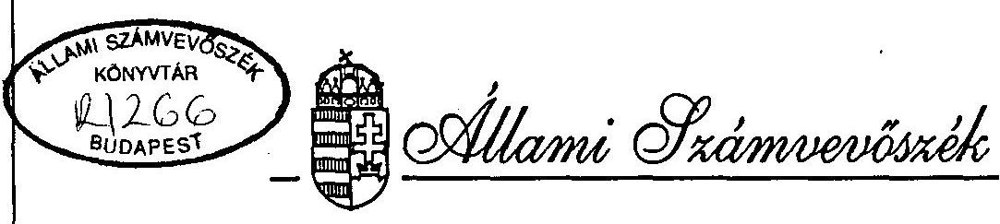
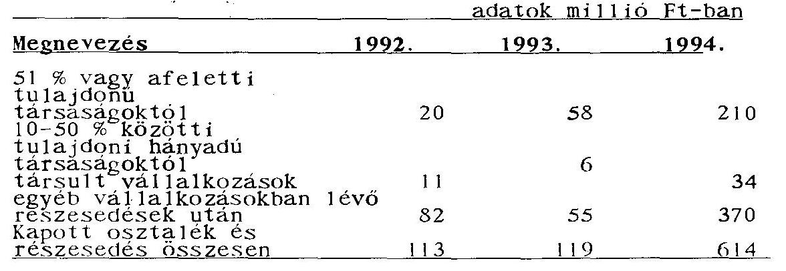
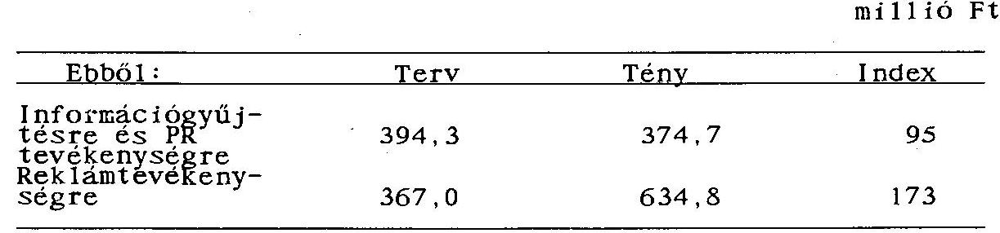
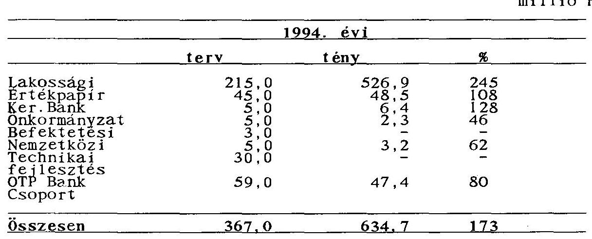
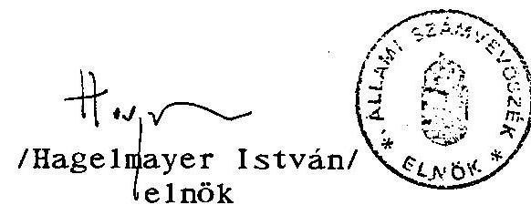
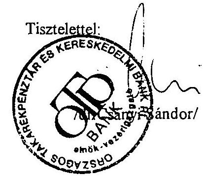
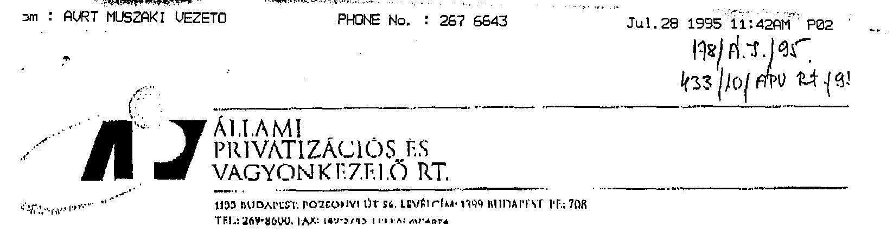
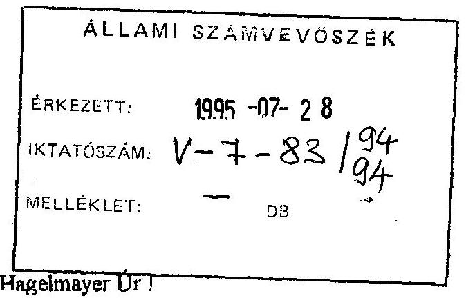
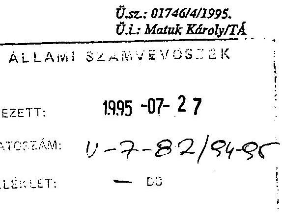
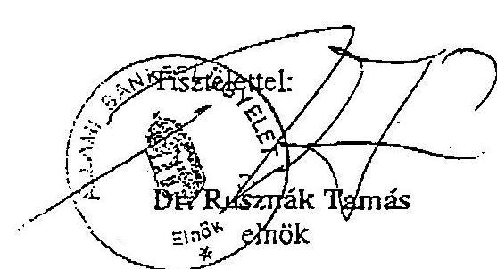

# JELENTÉS 

az Országos Takarékpénztár és Kereskedelmi Bank Rt. tevékenységének ellenôrzésérôl

---

A vizsgálat végrehajtásáért felelős: az ÁSZ IV. Vagyonellenőrzési Igazgatósága
dr. Kovács Árpád igazgató

A vizsgálatot vezette:
Harsányi Sándor osztályvezető főtanácsos
A vizsgálatot végezte az ÁSZ részéről:

| Beck Miklós | számvevő |
| :-- | :-- |
| dr. Borisz József | számvevő tanácsos |
| Lőrincz Alajos | számvevő tanácsos |
| dr. Majorosné |  |
| dr. Locskai Noémi | számvevő tanácsos |
| Makkai Mária | számvevő tanácsos |
| Németh Bélané | számvevő tanácsos |
| dr. Ocskovszky Jánosné | számvevő tanácsos |
| Rundle János | számvevő tanácsos |
| dr. Szöllősi Géza | számvevő tanácsos |
| Szücs Ivánné | számvevő |
| Vasas Sándorné dr. | számvevő tanácsos |

Az Állami Bankfelügyelet részéről:
dr. Pósfay Miklós
Matuk Károly
bankfelügyelö fôtandcsos
bankfelügyelö
valamint
Külső szakértő
dr. Botos Katalin

---

# T A R T A L O M J E G Y Z É K 

## I. BEVEZETÉS

## II. ÖSSZEFOGLALÓ MEGÁLLAPÍTÁSOK, KÖVETKEZTETÉSEK, AJÁNLÁSOK

1. Összefoglaló megállapítások, következtetések ..... 4
1.1. Az OTP helye a bankrendszerben ..... 4
1.2. Az OTP-nek mint pénzintézetnek a gaz- dálkodása és vagyonának alakulása ..... 6
1.3. Betétgyüjtés ..... 8
1.4. Hitelezés ..... 9
1.4.1. Vállalkozói és önkormányzati hitelezés ..... 10
1.4.2. Lakossági hitelezés ..... 12
1.5. Treasury tevékenység ..... 13
1.6. Befektetések ..... 14
1.7. Tulajdonosi szerkezet ..... 16
1.8. Szervezet ..... 18
1.9. Irányitási és döntési rendszer ..... 19
1.10. Tervezési rendszer, controlling, költséggazdálkodás ..... 21
1.11. A müködési költségek alakulása ..... 22
1.12. A beruházások és a fejlesztési költségek alakulása ..... 23
1.13. A bankbiztonság helyzete ..... 26
1.14. Az információs rendszer ..... 27
1.15. Az információs rendszer számítástechnikai háttere ..... 29
1.16. Belsö ellenőrzés ..... 30
1.17. Az ügyintézés szinvona1a ..... 31
1.18. Ügyfélszolgálati Iroda tevékenysége ..... 32
2. Ajánlások ..... 33

---

# III. RÉSZLETES MEGÁLLAPÍTÁSOK 

1. Az OTP mint pénzintézet gazdálkodása ..... 35.
1.1. A mérlegfőösszeg alakulása ..... 35.
1.2. Az eszközállomány alakulása ..... 38.
1.3. Az eszközök kockázati súlyozás szerinti megoszlása ..... 42.
1.4. A forrás állomány alakulása, összetétele ..... 43.
1.5. A bank saját tőkéjének alakulása ..... 45.
1.6. Nagybetétek alakulása ..... 46.
1.7. Az eszközállomány minősitése ..... 47.
1.8. Források és eszközök összhangja ..... 49.
1.9. Eredmény alakulása ..... 50.
1.10. Általános tartalék ..... 54.
1.11. Mérlegen kívüli tételek alakulása ..... 55.
2. Betétgyűjtés ..... 55.
2.1. Lakossági betétek ..... 56.
2.2. Vállalkozói betétek ..... 58.
2.3. Önkormányzati betétek ..... 60.
2.4. Országos Betétbiztosítási Alap és az OTP kapcsolata ..... 61.
3. Vállalkozási és önkormányzati hitelezés ..... 61.
3.1. Hitelezési tevékenység szervezése ..... 61.
3.2. A vállalkozói és önkormányzati hite- lezéssel kapcsolatos üzletpolitika ..... 64.
3.3. Vállalkozói és önkormányzati hitel- állomány alakulása ..... 66.
4. Lakossági hitelezés ..... 69.
4.1. Lakossági hitelezés helyzete ..... 69.
4.2. A minősített lakossági hitelek és a ..... 71. Bank által a $100 \%$-os állami garancia miatt nem minősített "Régi feltételű lakáshitelek" behajthatatlan hitel hányadának alakulása
4.2.1. A minősített hitelállomány alakulása és ezen belül a rossz minősitésű hitelek állománya

---

4.3. "Régi feltételű lakáshitelek" behajthatatlan állománya és a munkanélküliség
4.4. Az OTP és a költségvetés közötti kapcsolatok, a magánerős lakásépítési támogatások területén
4.5. A lakossági hitelezés és az OTP információáramlási kérdései
5. Treasury tevékenység ..... 82 .
5.1. A Treasury szervezete ..... 82 .
5.2. Stratégia, üzletpolitika ..... 83 .
5.3. Döntési hatáskörök és szabályozás ..... 83 .
5.4. Kamat lábkockázat kezelés ..... 84 .
5.5. Árfolyamkockázat kezelés ..... 84 .
5.6. Likviditás, kockázatkezelés ..... 85 .
5.7. A Treasury által kezelt állományok ..... 85 .
5.8. A Treasury forgalma és eredményessége ..... 88 .
6. Befektetések ..... 88 .
6.1. Szabályozás, szervezet ..... 88 .
6.2. Befektetési üzletpolitika, stratégi ..... 91 .
6.3. A befektetések állományának alakulása ..... 92 .a pénzintézeti törvény fogalom megha-tározása szerint
6.4. Az OTP csoport ..... 95.
7. Az OTP Bank Rt. irányítása, szervezete és a ..... 105. be1sõ e11enõrzés müködése, controlling
7.1. A tulajdonosi struktúra ..... 105 .
7.2. A döntési mechanizmusok ..... 106 .
7.3. Az OTP irányítása ..... 108 .
7.4. Az OTP fiókhálózatának je11emzõi ..... 110 .
7.5. Belsõ e11enõrzés ..... 111 .
7.6. A belsõ értékelési rendszer ..... 114. (Controlling)
8. Müködési költségek ..... 114 .
8.1. A költségtervezés alapja, s módszere ..... 114 .
8.2. A müködési költségek tervezését, mérését szabályozó belsõ elöírások, a költséggazdálkodás szabályozottsága

---

8.3. A müködési költségek alakulása ..... 119 .
8.4. Dologi költségek ..... 121 .
8.5. Értékcsökkenési leírás elszámolása ..... 124 .
8.6. Személyi jellegü kifizetések ..... 125 .
8.6.1. Létszám-, bérgazdálkodás, ..... 125 .bérköltségek
8.6.2. Létszám, átlagkereset ..... 126 .
8.6.3. Bérköltség, személyi jellegü ..... 128 .kifizetések
8.7. Marketing ..... 129 .
9. Beruházások, felújítások ..... 133 .
9.1. A beruházások szabályozottsága, ..... 133 .tervezési rendszere
9.2. A beruházási szabályok gyakorlati ..... 135 .érvényesülése
9.3. A beruházási költségek alakulása ..... 136 .1992-94. években
9.4. Az 1994. évi beruházások jellemzői ..... 137.
9.5. A számítástechnikai beruházások ..... 140 . jellemzői
9.6. Egyéb számítástechnikai beszerzések ..... 144 .
10. Vagyon és személyi védelem helyzete ..... 146 .
10.1. A bankbiztonsági szabályozás alakulása ..... 146 .
11. Információs rendszer ..... 150 .
11.1. Az információs rendszer szervezeti ..... 150 . kialakítása
11.2. Az információs rendszer szabályozottsága
11.3. Az információk adatforrása, előállítása ..... 152 .
11.4. Az információk pontossága ..... 153 .
11.5. A belsö információ igényének kielé- ..... 153 .gitése
11.6. A számítástechnikai terület jellemzői ..... 154 .
12. Az ügyintézés színvonala ..... 156 .
12.1. Személyi és tárgyi feltételek ..... 156 .
12.2. Az Ügyfélszolgálati Iroda ..... 157 .
12.3. A panaszügyek kezelése ..... 158 .

---

# J E L E N T É S 

az Országos Takarékpénztár és Kereskedelmi Bank Rt. tevékenységének ellenôrzésérô1

## I.

## B EVEZETÉS

Az Állami Számvevốszék Elnöke az Állami Számvevôszékről szóló 1989. év XXXVIII. törvényben foglalt felhatalmazása alapján elrendelte a többségi állami tulajdonban lévô Országos Takarékpénztár és Kereskedelmi Bank Rt.(továbbiakban OTP) tevékenységének ellepnôrzését.

Az Állami Számvevôszék fennállása óta elôször vizsgált univerzális kereskedelmi banki tevékenységet. Az ellenôrzés sajátos körülményét az jelentette, hogy a helyszini vizsgálatok idópontjában érvényes törvényi szabályozás nem tette lehetővé a számvevőknek a banktitoknak minősülô dokumentumok áttekintését. A betekintési jog csak az államtitokra és szolgálati titokra vonatkozott. Ezért az ellenôrzést végzõ számvevők konkrét ügyfélhez kötődô üzleti tranzakciókat (például hitel, váltó-ügylet, betét, stb. ) nem vizsgálhattak. Így az OTP tevékenységének pénzintézeti vonatkozásaira összesített adatok alapján tett megállapításokat egyedi ügyletek közvetlen tapasztalataival nem támaszthatták alá. Az Állami Bankfelügyelettei (továbbiakban BAF) való együttmüködés tette lehetővé, hogy e területről is bizonyos - általánositott - megállapítások szerepeljenek, melyért az Állami Számvevőszék köszönetét fejezi ki.

---

A pénzintézeti törvény (továbbiakban PIT) 1995. júniusában elfogadott módosítása nyomán az ÁSZ-nak lehetősége van a banktitok körébe tartozó egyedi ügyletek megismerésére. Tehát ilyen, munkáját korlátozó gonddal a jövőben nem kell számolnia.

Az ellenőrzés célja az volt, hogy megbizható és valós képet adjon az Országos Takarékpénztár és Kereskedelmi Bank Rt-nél az állam tulajdonosi funkciójának érvényesüléséról és az OTP vagyonnal való gazdálkodásáról.

A vizsgálat kitért arra, hogy:

- az OTP stratégiájában és üzletpolitikájában tükrözödik-e az állami tulajdonos által érvényesiteni kívánt érdek;
- a pénzintézet kialakított szervezete, irányítása és döntési mechanizmusa megfelelően szolgálja-e az elérni kívánt célt, az OTP belsó ellenőrzési rendszere mennyire segíti a szervezet céljainak megfelelő müködését; milyen a vagyon és személyi védelem helyzete a pénzintézetnél;
- a pénzintézet, mint részvénytársaság gazdálkodásának eredményessége a kitüzött céloknak megfelelően alakul-e;
- az OTP aktivitása hogyan változik, milyen a források és eszközök összetétele, azok változása, megvalósul-e az eszközök és források összhangja;
- az OTP üzemi költségei az elvégzendő feladatok alapján tervezettek-e, s a tényleges költségek ezt alátámaszt-ják-e;
- a beruházások (fejlesztések) bonyolítása megfelel-e a szabályozásnak és megvalósulásukkal a kívánt cél teljesül-e;

---

- mi az OTP stratégiai és üzletpolitikai célkitüzése a betétüzletág, a hitelüzletág, a befektetések és a treasury tevékenység területén; e tevékenységek szabályozása, döntési rendszere és a gyakorlat a kitüzött cél teljesülését segiti-e;
- az információs rendszer biztosítja-e a tulajdonos, a szakmai vezetés, az Állami Bankfelügyelet és az MNB információ igényének teljesítését, valamint hogyan funkcionál a be1só értékelési rendszer;

Az ellenőrzött időszak: 1992-1994, illetve egyes folyamatokat tekintve a jelentés lezárásáig, 1995. júniusig terjed.

A pénzintézetről készült jelentés tehát hangsúlyozottan kerüli a bankfelügyeleti-hatósági minősítéseket, illetve ahol ilyen elkerülhetetlen, ott a BAF álláspontját szerepelteti. Továbbá abban is eltér a szokásos gyakorlattól, hogy a közérthetőség érdekében egyrészt - a részletes megállapítások megfelelő pontjainál megtalálható - szövegközi magyarázatokat tartalmaz és tudatosan kerüli a szakkifejezések használatát, amikor erre lehetőség van.

A hitelezési tevékenység különösen a lakossági hitelezés társadalmi beágyazottságú. Ezért a vizsgálat bizonyos szociális összefüggések jelzésére is kisérletet tesz, bár nem készült külön felmérés - közvéleménykutatás - az OTP ügyfelei (lakosság, vállalkozók, vállalkozások) körében a bank szolgáltatási színvonalának megitéléséről. Ennek oka egyrészt a felmérés igen magas költségvonzata, másrészt az, hogy a vélemények valóságtartalmát csak a banktitok körében eljárva lehetett volna egyedileg kontrolálni. A megállapítások ezért az OTP-nél fellelhető dokumentumokra (panasziroda, be1só ellenőrzés anyagai) támaszkodtak.

---

# 11. 

## Ö S S Z E F O G L A L Ó M E G Á L L A P Í T Á S O K, KÖVETKEZTETÉSEK, A J ÁNLÁSOK

## 1. Összefoglaló megállapítások, következtetések

### 1.1. Az OTP helye a bankrendszerben

Az OTP szerepe rendkívül sajátos a magyar pénzpiacon. Az 1980-as évek közepéig - takarékszövetkezetek kivételével - gyakorlatilag egyetlen, a lakossággal kapcsolatban álló pénzintézet, több száz fiókjával a megtakarítások hagyományos gyüjtöhelye volt.

Az a funkció, amelyet mint országos hálózattal bíró takarékpénztár a forrásgyűjtésben, a költségvetés finanszirozásában betöltött és a gazdaságpolitika egyéb céljainak közvetítésében játszott (p1. lakásberuházás, lakáshítelezés), az univerzális bankká válás után is megmaradt és mind a mai napig kiemelt jellemzője müködésének.

Az OTP 1989-ben megkapta a kereskedelmi banki jogosítványokat, me1yek 1993-ban váltak teljeskörüvé. Egyértelmú volt, hogy a pénzintézet nem marad kizárólagosan lakossági bank. Tevékenysége a továbbiakban a betét -hi-tel-számlavezetés hármasságára épül, azaz a lakossági forrásgyűjtés és hitelezés mellett vállalatfinanszirozást is folytat. Utóbbi bár nem volt minden előzmény nélkül, a kisvállalkozások hitelezését már korábban elkezdte - az átállás mégis nehézségekkel járt. Szakemberek a vállalati számlavezetési gyakorlatra, - megfelelő vállalati üzletpolitikai és ügyfélfinanszirozási szakismeretekkel felkészülve - nem álltak rendelkezésre.

---

A pénzũgyi vezetés 1990-ben - a Világbank javaslatát követve - dõntõtt úgy, hogy a korábban állami intézményként mũkõdõ OTP részvénytársasággá alakuljon.

Ezzel az OTP elindult az univerzális bankká válás útján és egyike lett a PIT által definiált - egymással versenyben álló - kereskedelmi bankoknak.

A bankok kõzötti verseny kibontakozásakor a pénzpiac szereplõi eltérõ adottságokkal indultak. Ez egyrészt a pénzintézeti reform elõtti kiinduló állapot sajátosságaiból következett, másrészt pedig abból, hogy a kétszintũ bankrendszer kialakításakor létrehozott nagybankok alapvetően vállalatok finanszirozására szakosodtak, a nagyobb ügyfelek szétosztásával, meglehetôsen nagy ágazati koncentráltsággal.

Az OTP ebből a mesterséges "örökségbő1" kimaradt, ami egyértelmũen azzal az elõnnyel járt, hogy a vállalkozói partnereit maga választhatta meg, ugyanakkor némi hátrányt jelentett, hogy a korábban is jól prosperáló, fizetõképes vállalkozások már "elke1tek". Alapvetõ változás azóta sem következett be.

Az OTP évtizedeken keresztül a lakosság felé bizonyos állami szociális funkciókat is közvetített. Ez a helyzet részvénytársasággá alakulással alapvetően megváltozott. Ennek tudomásulvétele a lakossági ügyfélkörben nem volt zökkenömentes.

A vállalkozói piacra történõ érdemi belépése, illetve ott viszonylag jelentős térnyerése csak úgy volt lehetséges, ha versenytársainál kedvezőbb feltételeket és emeltebb színvonalú szolgáltatást kínált partnereinek.

---

Az OTP-nek a bankrendszeren belül elfoglalt súlya rendkivüli gazdaságpolitikai jelentöségü. Az államnak, mint tulajdonosnak egy ezer milliárdos mérlegfőösszegü, a magyar bankrendszerben versenytárs nélküli bank irányításában kiemelt szerepe van. A korábbi bankrendszer örökségeként kialakult piaci monopólium és az azt követöen már versenyben is megtartott piaci dominancia is ezt indokolja. A Kormány 1995. februárí határozatában erre tekintettel volt, amikor az OTP privatizációs koncepciójáról döntött. A bank szervezetét és tevékenységét érintö bármilyen változás nemcsak magát a szervezetet befolyásolja, hanem hatással van a gazdaság szinte valamennyi szereplöjére.

Ezt támasztja alá, hogy a több mint 40 pénzintézet összesített mérlegfőösszegének rendre 30 \%-on felüli hányadát \&z OTP birtokolja azáltal, hogy a lakossági forintbetétek csaknem kétharmada, a lakáshitelek $90 \mathrm{~m}-\mathrm{a}$, az önkormányzati számlák 96 m -a e pénzintézetnél van, és a vállalkozói hitelek egytizedét folyósítja. Méreténél és likvidítás böségénél fogva a költségvetés és a bankszektor felé is domináns, s e pozícióját az erősödő verseny és az 1994. negyedik negyedévétöl kezdődő szükülö likvidítás ellenére is megörizte. Mérete és tökeereje alapján nemzetközi összehasonlításban az európai középbankok kategóriájába sorolható.
1.2. Az OTP-nek mint pénzintézetnek a gazdálkodása és vagyonának alakulása

A pénzintézetek tevékenységét alapvetően meghatározó Pénzintézeti törvény számos szigorú előirást tartalmaz a bankok biztonságos müködése érdekében. Ezek közül legfontosabbak: a tökemegfelelési mutató, nagyhitelek, nagybetétek korlátai, szavatoló töke változása, mindenkori fizetőképesség biztosítása, és a különféle tartalékok képzése.

---

Az OTP Rt. 1994. év végi tōkemegfelelési mutatója - vagyis a szavatoló tőkének a súlyozott eszközökhöz viszonyitott arányának elöirt nagysága, ame1y a bank biztonságos müködésének mércéje - a kötelezö 8 \%-kal szemben $15,27 \%$ volt.

A pénzintézetekre vonatkozó szabályozások értelmezési gondjait is jelzi, hogy az Állami Bankfelügyelet álláspontja szerint a pénzintézet müködése nem mindenben felelt meg a törvényi elöírásoknak: például 1993-ban nem tett eleget az általános tartalékfeltöltési kötelezettségének, összes befektetéseinek állománya pedig - az elöírások ellenére - 1994 év végén meghaladta a bázis szavatoló tőke 100 \%-át. Ezen értelmezéssel szemben a törvény az elöirt általános tartalék kötelező szintjének elérését 1994. december 31-ig írta elő, ami megtörtént. A befektetéseknél pedig nincs arra elöírás, hogy a bázis szavatoló tőke a viszonyítási alap.

A pénzintézet aktivitását - müködése kiterjedtségét - a mérlegfőösszeg, vagyis a bank eszközei összértékének alakulása mutatja. Ennek növekedési lehetőségét azonban a saját tőke mértéke jelentősen befolyásolja.

Az OTP által elért 940 milliárd Ft-os múlt évi mérlegfőösszeg, az eszközök összetétele és a meglévő 40 milliárd Ft-nyi saját tőke azt jelenti, hogy a saját tőke és a szavatoló tőke jelenlegi szintje szolid és megbízható növekedéshez biztosít hátteret tőkeoldalról.

Az OTP eszközeinek több mint egyharmadát a hitelkihelyezések, döntően a lakosságnak nyújtott hitelek jelentik. Köze1 30 \%-os arányt képviselnek az értékpapírok, me1yen belül az állampapírok aránya a meghatározó. Mindez a bank sajátos helyzetét mutatja, és azt jelenti, hogy bár az elindult az univerzális pénzintézetté válás útján, azonban még 1994. év végén is alapvetően lakossági bank.

---

Az OTP - a bankrendszer korszerűsitését megelôzõ helyzetéből adódóan is - önálló betétesi bázissal rendelkezik, a lakosság hagyományos betétgyüjtöje.

Ennélfogva forrásainak 96 \%-a idegen forrás. A lakosságon kívül, bár arányaiban nem jelentós, volumenében azonban számottevõ még az önkormányzatok és vállalkozók betéte1helyezése. Forrásbősége lehetóséget adott arra, hogy a pénzpiac irányítójává, sőt a költségvetés finanszi rozójává váljék. Az állami garanciával fedezett értékpapírok magas volumene miatt eszközeinek jelentős hányada kockázatmentes. Likviditása a kívánt értéket rendszeresen meghaladja, az eszközök és források összhangját mindenkor biztosítanl tudta.

Az OTP Rt. 1992-1994 között eredményesen gazdálkodott. Az elöirt céltartalék-képzési kötelezettség teljesitése me11ett 1994-ben jelentősen megnövekedett mértékủ - 3,4 mi111 iárd Ft - adót fizetett a költségvetésnek. Általános tartalékát az elöirt szinten megképezte úgy, hogy közben a kárpótlási jeggyel lejegyzett osztalékelsöbbségi részvények után fix osztalékot is fizetett.

# 1.3. Betétgyüjtés 

Az OTP-nél a kihelyezések lehetőségét döntően a betétek biztosítják, melyek a bank összes forrásának több mint 80 \%-át adják.

A bank összes betétállománya (forint és deviza) az 1992. december 31-i 586 milliárd Ft állományról 1994. év végére 779 milliárd Ft-ra növekedett. A betétek közel $80 \%$-a lakossági elhelyezésekböl származik, amely azt tükrözi, hogy az OTP hagyományos takarékbetét gyüjtö jellegét mindmáig megörizte, piaci részesedése több mint $60 \%$.

---

Mindez annak ellenére áll fenn, hogy a lakossági betétek állományának növekedése az elmúlt 3 évben passziv megtakarításból, azaz kamatjóváirásból származik. Ezen belül csak a lakossági folyószámla és a devizabetétek állománya nőtt dinamikusan az elmúlt évben.

A mintegy 600 milliárd Ft lakossági betétek között az éven belül lekötöttek aránya 60 万 fe letti. Kedvezó ugyanakkor és a pénzintézet iránti bizalmat jelzi, hogy fokozatosan növekszik az éven túli lejáratú betétek állománya, annak ellenére, hogy a pénzpiac ennél kedvezőbb hozamú befektetéseket is kínál.

A 102 milliárd Ft vállalkozói betét aránya 1994. év végére még nem érte el a betétek $15 \%$-át, de a legdinamikusabb növekedés itt következett be. A betétek itt is döntően rövidlejáratúak és fôleg a gazdálkodó szervezetek pénzforgalmi számláinak állományából adódnak.

Az önkormányzatok számláikat 1991 elôtt kötelezően az OTP-nél vezettették. Az ezt követő szabad bankválasztás után az OTP szerepe az önkormányzatok gazdálkodásában kis mértékben csökkent ugyan, de meghatározó súlya nem változott. Az önkormányzatok betét állománya az 1992. december 31-i 53 milliárd Ft-ról, 1994. év végére 46 milliárdra csökkent, ezen belül, sajátosságaiból adódóan a látra szóló betétek aránya közel 80 吻.

# 1.4. Hitelezés 

A vállalkozói, önkormányzati és lakossági, valamint egyéb hítelek - ügyfelekkel szembeni követelések - állománya az elmúlt évben az OTP eszközállományának 33-36 \%-át teszik ki.

---

Ez az arány, amely a pénzintézeti átlaghoz viszonyítva alacsony azt mutatja, hogy az OTP-nek a kereskedelmi banki tevékenység ellátása érdekében, valamint forrásbőségéból adódóan megfogalmazott azon üzletpolitikai célkitüzését, miszerint törekedni kell nagyobb és stabilabb gazdálkodó szervezetek partnerként történő megnyerésére (mind számlavezetés, mind hitelezés) csak részlegesen sikerült megvalósítania.

# 1.4.1. Vállalkozói és önkormányzati hitelezés 

A vállalkozói hitelállomány 1994. év végén a hitelek közel 25 所-át teszi ki. Bár a vállalkozói területen az OTP részesedése ma is viszonylag szerény ( 9 所) az e területen elért aktivitásának eredményét mutatja, hogy a hitelállomány az 1992. december 31-i 49 milliárd Ft-ról, 1994. év végére 82 milliárd Fr-ra növekedett. Ezen belül a legnagyobb mértékben (közel háromszorosára) nőtt a nagyobb gazdáikodó szervezeteknek nyújtott fejlesztési hitel volumene, szemben a kisvállalkozók, müködési célú hiteleivel ame1yek állománya 6,3 milliárd Ft-ról 5,1 milliárd Ft-ra csökkent.

Az ez utóbbi körben bekövetkezett visszaesés részben a hitelképes kereslet csökkenésére utal. Ez annak ellenére történt, hogy közben számos, kedvezményes hitel (start, egzisztencia, stb.) igénybevételére nyilt lehetőség.

A vállalkozói hitelezési területet 1993 elött a jórészt fedezettel nem kellően biztosított, esetenként szakszerütlen hitelezés jellemezte. Ebben szerepet játszott, hogy a közel 300 fiókot érintő, decentralizált struktúrájú tevékenység ellátásához nem állt rendelkezésre elegendő vállalkozói finanszírozási tapasztalattal bíró munka-

---

társ, a szakmai követelmények megfogalmazása és az ellenőrzés is hiányos volt. Ezt tükrözi az is, hogy az 1993 elötti folyósításokból jelentősen megnőtt a rossz minősitésủ hitelek állománya.

A hitelezés biztonságának fokozása érdekében tett újraszabályozások, a kockázatkezelési mechanizmus bevezetése, a hitelezés szigorítása, valamint a bank belsö ellenőrzése által jelentős számban feltárt mulasztások miatti felelősségre vonás eredményeként 1994-ben a problémás hitelek állománya csökkent.

Az OTP-nek a vállalkozói hitelezési üzletpolitikai célkitüzéseit, csak differenciáltan sikerült teljesiterie. Jelentős elörelépés történt a hitelezés biztonságának fokozásában (jórészt evvel áll összefüggésben a minósített portfólió állomány stagnálása), valamint a megcélzott ügyfélkörök vonatkozásában a nagyvállalatok bevonásában. Ugyanakkor elmaradások vannak, így nem bővült a kisvállalkozói hitelezés, nem javult a portfólió állomány minősége, gondok vannak a követelések behajtásában.

Az önkormányzati hitelezés volt az 1992-1994 közötti időszakban a bank egyik legkisebb kockázattal járó, sikeres üzletága. A vezető pozíciót tükrözi, hogy a pénzintézet az önkormányzatok 96 f̊-ának, több mint 3000 egységnek vezeti számláit, melyekhez 4.400 intézmény is kapcsolódik, a pénzforgalom éves szinten közel 1.300 milliárd Ft.

Az önkormányzatok oldaláról a céltámogatások és ÁFA-visszaigény lés rendszere okán energikusan kezdeményezett hitelezési politika eredményeként az önkormányzatokhoz kihelyezett hitelek nominális szinten közel négysze-

---

resére, reálértéken is több mint háromszorosára, 13 milliárd Ft-ról 50 milliárd Ft-ra növekedtek. Ennek azonban ma már - egyes önkormányzatok eladósodását tapasztalva növekvő kockázatai vannak.

# 1.4.2. Lakossági hitelezés 

A lakossági hitelek a bank legnagyobb hitelezési üzletága. Nagyságrendjét mutatja, hogy 1994-ben a hitelszámlák megközelítik a két millió db-ot, a hitelállomány meghaladía a 192 milliárd Ft-ot, (1992-ben 175 milliárd), mely a bank összes hitelkihelyezésének mintegy $60 \%$-a. Ebből 11 \% fogyasztási hitel és mintegy 87 \% lakáshite1.

A lakáshite1 állományból 50 milliárd Ft az úgynevezett "régi feltételű" hitel, melyet 1988: december 31-ig folyósitott, a bank, akkor még a rendkívül alacsony kamat mellett. Ez az állomány annak ellenére is jelentős maradt, hogy a lakosság 1991-92-ben a törvényi kedvező lehetőséggel élve a felajánlott adósságkönnyítés fejében korábbi hiteleinek jó részét elötörlesztés formájában visszafizette.

A lakossági hitelek állománya 1994 évben kisebb mértékben emelkedett, mint azt megelözöen. Ez abból adódik, hogy a hitelek előző csökkenését nem ellensúlyozta az újabb feltételek mellett folyósitott hitel állomány, - sőt annak összege 1994-évre csökkent, -a növekedést a fogyasztási hitelek állomány emelkedése okozta. Ezen belül a folyószámla hitelek négy és félszeresére, az áruvásárlási hitelek pedig mintegy kétszeresére növekedtek.

A lakosság problémás minösitésủ hitelállománya csökkent, de a rossz minösitésủ kintlévőségek állománya 1994. december 31-re ugrásszerűen megnőtt. A rendelkezésre álló adatokból valószí-

---

nüsithető, hogy a hitelek rossz minősitésüvé válásának meghatározó tényezője a lakosság adott területen jelentkező munkanélkülisége.

Külön figyelmet igénye1, hogy az 1994. évi új feltételű lakáshite1 állományon belül már 189 millió Ft összegủ a nem problémamentes állomány, bár ez a teljes új feltételü 117 milliárd Ft lakáshitelállományhoz viszonyitva mindössze $1,5 \%$-ot tesz ki.

A lakossági hitelezéssel összefüggésben az OTP és a költségvetés között szoros kapcsolat van. A gazdaságpolitika által a lakosság részére juttatott támogatások nagy hányada az OTP-n keresztül realizálódik. Ennek legnagyobb tételei a törlesztési támogatás és a szociálpolitikai kedvezmény, me1yet a lakosság helyett a költségvetés térít meg az OTP számára. A támogatások elszámolása a PM részéről részben előleg folyósításával, részben pedig utólagos átutalással történik.

# 1.5. ${ }^{\text {T }}$ Treasury tevékenység 

A treasury tevékenység alapvető feladata a pénzintézet mindenkori fizetőképességének biztosítása, a kamat és árfolyamkockázat kezelése. Müködése a szabad források kihelyezésével a bank portfóliójának alakulását befolyásolja. Biztosítania kell azt is, hogy a bank egyszámláján csak az optimális egyenleg legyen, me1yet 1992-ben történő létrehozását követően rendre teljesített.

A jövedelmezősége a bank nyereséges müködésének fontos feltétele, mivel az OTP-nek 1992-1994. közötti forrásbősége a pénzintézetek között egyedülálló volt. A treasury szerepét jól mutatja, hogy az általa kezelt eszközállomány 1994. év végére elérte a mérlegfőösszeg $39 \%$-át.

---

Az OTP a hazai bankközi piacon irányító szerepet tölt be, részesedése eléri az $50 \%$-ot, amely a bank lehetöségei miatt ennél magasabb arányú is lehetne, de a más pénzintézetek fel vevöképessége korlátozott.

A treasury portfoliójában megjelenő állampapír állomány amely 120 milliárd Ft nagyságrendben stabilizálódott összefüggésben áll a likviditási elöírásokkal is. A likvid eszköztartás kötelezettsége ugyanis jegybankképes eszközökkel (elsősorban állampapírok) is teljesíthető. A jövedelmezöségre törekvő bank ezért a számláján tartott készpénzzel szemben a hozamot is biztosító értékpapír vásárlást helyezi elötérbe.

A devizaeszközök több mint $95 \%$-a a treasury kezelésében van, melynek nagy részét devizabetét formájában az MNB-nél helyezi el.

Átlagos havi forgalma 857 milliárd Ft volt, ame1y megközelítette az OTP éves mérlegfőösszegét. A nagyságrend azt is mutatja, hogy egy töredék százaléknyi hozame1térés is jelentős kihatással jár az eredményre. Mindhárom évben a treasury kamatbevétele meghaladta kamatráfordítását.

# 1.6. Befektetések 

A befektetések összértéke az OTP mérlegfőösszegének rendre több mint $30 \%$-át képviseli. Ezen belül az értékpapírok aránya dominál, 1994. év végén 259 milliárd Ft. Ezzel legnagyobb mértékben a költségvetés, szerényebb mértékben a pénzintézetek, önkormányzatok, vállalkozók és a MNB finanszirozója.

---

Tőkebefektetése 7,7 milliárd Ft névértéken 86 társaságban van. Ezek közül 52 társaságban 1991 elött szerzett részesedést, a befektetések névértékének 83 7-a pedig 1992-1994 közötti időszakban keletkezett.

A tőkebefektetések egy részét az OTP úgynevezett "OTP-csoport"-ként keze1i, és azokat sorolja ezek közé, ame1yek tevékenységükke1 szolgáltatásait bővítik. 1994 végén nyolc - ezek közül egy külföldön bejegyzett - társaság, 5,5 milliárd Ft névértéken tartozott ebbe a körbe.

Az OTP csoport tagjai két társaság kivételéve1 - nagyrészt szabályozási okok miatt - zártak, a tagok egymás kereszttulajdonosai, így végső soron a bank 100 7 -os tulajdonai. Az OTP-nek a csoporton belüli domináns tulajdonosi pozíciója ugyanakkor magában hordja azt a lehetőséget, hogy a tagok tevékenységét érintő döntéseknél egyes esetekben az OTP üzleti érdekei kerülnek elótérbe, illetve a profit optimalizálás csoport szinten valósul meg.

A csoport tagjaitól elvárt cél teljesülését - nevezetesen \& pénzügyi szolgáltatások szélesitését az ügyfelek számára - :994. év végéig teljeskörűen mérni nem lehetett. Az elte1t időszak a tagok egy részénél a müködési feltételek megteremtését - elsősorban alaptőkeemeléssel - szulgálta.

A Nemzetközi Pénzügyi Központ Budapest Kft. üzletrészének megvásárlása jövőbeni tőkebefektetésnek számít, me11ye1 a tőkebefektetések összege megduplázódik. Ezzel az OTP a központi irányitó apparátusának centralizált elhelyezését, a központi épületek üzemeltetését és fenntartását fogja megvalósitani.

---

# 1.7. Tulajdonosi szerkezet 

Az Országos Takarékpénztár állami vállalat pénzügyminiszteri határozattal, 1990. december 31-ével zártkörü alapitással egyszemélyes állami részvénytársasággá alakult át. Alapitásakor 23 milliárd Ft alaptőkével rendelkezett, amelyböl az alapító okirat szerint 8,5 milliárd Ft a készpénz-hányad.

Az alaptőkét az 1994 májusi közgyűlésen 5 milliárd Ft-tal megemelték, ezt a Pénzügyminisztérium hitelkonszolidációs államkötvény apport átadásával teljesítette.

A tulajdonosi jogokat az Rt.-vé történt átalakulást követően a Pénzügyminisztérium, az ÁVÜ, majd az ÁV Rt., a kisrészvényesek, valamint az alaptőke emelés után annak mértékéig a PM gyakorolja.

A tulajdonosi szerkezet az évi rendes közgyülések idöpontjában a következő volt:

| ldöpont | 1992.V.15. | 1993.IV. 30. | 1994.IV. 28. | 1995.V.19. |
| :--: | :--: | :--: | :--: | :--: |
| Tulajdonos | Tulajdon   (\%) | Tulajdon   (\%) | Tulajdon   (\%) | Tulajdon   (\%) |
| AV Rt. | 100 | 97,19 | 96,11 | 40,57 |
| PM |  |  |  | 17,86 |
| Helyi önkormányzatok |  |  |  | 1,92 |
| Egészségbiztositási önkormányzat |  |  |  | 10,00 |
| Nyugdijbiztosítási önkormányzat |  |  |  | 10,00 |
| Kisrészvényesek |  | 2,81 | 3,89 | 16,83 |
| OTP Bank Rt. |  |  |  | 2,82 |

---

Az állami tulajdonos 1992-ben az akkori részvénytöke 5 \%-át, 1,15 milliárd Ft névértékủ törzsrészvényt elsöbbségi részvénnyé alakitott át és ebből több lépésben 1993. augusztusig 894 millió forintnyit kárpótlási jegy ellenében, 1:1 cserearány mellett értékesitettek. (Az elsöbbségi részvényekbő1 megmaradt 256 millió forintnyit a társadalombiztosítási önkormányzatok kapták meg.) 1994. májusában az akkor még 23 milliárd forintos alaptőke 20 \%-ának megfelelő, 4,6 milliárdnyi törzsrészvény-csomagot ajánlottak fel a kárpótlási jegyek ellenében, szintén 3:2-es cserearánnya1. E lépések hatásai az előző tábla 1995-ös adatai közt szerepelnek, azonban ott az arányok már a 28 milliárd forintos alaptőkéhez viszonyitottak.

Törvényi előirás, hogy a föld fekvése szerinti önkormányzatot megllleti a belterületi föld értékének megfelelö részvény. Ennek értéke a számítások szerint 3.418 millió forint lenne, ami $12 \%$-os tulajdonosi részesedést jelent.

Az ÁV Rt. ügyvezetése mindössze 546 millió forint részvénycsomag átadásáról határozott 1994. augusztus 23-án, a részvények tényleges átadása 1994. decemberben megtörtént, az önkormányzatok az OTP Bank Rt. 1995. évi rendes közgyülésén résztvettek.

Je1enleg a helyi önkormányzatok 1,95 \%-os részesedéssel rendelkeznek az OTP tulajdonosi struktúrájában. Az ÁV Rt. egy később hatályba lépett jogszabály szerinti számítási módot alkalmazott - analógiaként - az annak hatálybalépése elött történt átalakulások esetén is. Ebböl következöen alacsonyabb az önkormányzatok részesedése az OTP tulajdonosi struktúrájában. Az önkormányzatok az eltérő számítási mód miatt az ÁV (ÁPV) Rt. ellen eddig nem inditottak pert.

---

# 1.8. Szervezet 

A szervezeti felépitést meghatározza, hogy az OTP a legnagyobb fiókhálózattal rendelkező pénzintézet és az, hogy a korábbi takarékpénztári tevékenysége 1991-töl kibővült, univerzális bankká alakult át.

A szervezet irányítási rendszere kétszintü: központi igazgatóságok, valamint a kerületi és megyei igazgatóságok irányít ják a fiókhálózatot.

A jelenlegi szervezeti felépitést az 1992. november 20-án hatályba lépő Szervezeti és Müködési Szabályzat határozza meg. Ez részletesen tartalmazza a központ osztályokig lebontott feladatát, felelősségét, hatáskörét, azonban a megyei és kerületi igazgatóságokra és a hálózati egységekre ezek nem kerültek kidolgozásra. A megyei és kerületi igazgatóságok a központi döntéseket, utasításokat, szabályzatokat közvetítik az alájuk tartozó fiókok felé.

Az OTP a hálózatát területi elv alapján szervezi és müködteti. Budapesten 22 kerületi igazgatóság irányit 79 fiókot, vidéken 19 megyei igazgatóság pedig 301-et. Ezen kívül Budapesten 4 speciális fiók müködik, amelyek az önkormányzatokkal, a vállalkozókkal, a hosszú lejáratú hitelezéssel és a postai betétekkel foglalkoznak.

A vidéki fiókok általában teljes szolgáltatást nyújtanak, - kivételt képeznek a kisebb vidéki fiókok, ahol a feltételek hiánya miatt nincs valuta- és devizaszolgáltatás -, a budapesti fiókok az önkormányzatok részére nem nyújtanak szolgáltatást, mivel ezzel egy központi fiók foglalkozik.

---

A kerületi fiókok ügyfélszolgálati helyeinek szolgáltatásaiban erős a specializáció, ez azonban nem az ügyfélkör igényeiből indul ki, hanem a fiókok fizikai adottságai által determinált.

A megyei igazgatóságok 7-33 fiók irányitását végzik, ezzel szemben a budapesti kerületi fiókok 1-7 fiókot irányítanak. Budapesten a főváros közigazgatási területeihez igazodva müködtetnek 22 kerületi fiókot, ame1yhez 80 egység tartozik.

Egy-egy kerületen belül a fiókok számát az indokolja, hogy számos esetben szüknek bizonyul az irányító fiók, ezért - fizikai korlátok miatt - egyes üzletágak más egységbe történő kihelyezésére kényszerültek.

Az irányítás hatékonysága növelésének jelentős tartaléka a igazgatóságok számának szűkítése. A bank erre való tekintettel, már meg is tette első lépéseit a fővárosban egyetlen irányító igazgatóság kialakítására.

Az OTP 1994. december 31-1 statisztikai zárólétszáma 15 ezer fő. Ebből 1902 fő $(12,7$ 所) a központban, 13.008 fö $(87,3$ 所) a hálózatban dolgozott.

Az OTP jelenlegi szervezeti felépítését a centralizáltság, a kissé bürokratikus, de megbízható működés jellemzi. A pénzintézet a szervezeti struktúra piaci igényeknek megfelelő átalakítását stratégiai célként határozta meg.

# 1.9. Irányítási és döntési rendszer 

Az SZMSZ melléklete az ún. döntési mátrix, tételesen megjelöli a javaslattevő, döntést hozó és döntést végrehajtó szervezeteket.

---

Az Igazgatóság a közgyưlés által elfogadott ügyrend alapján dolgozott az Alapszabály és a közgyűlési határozatok keretei között. Az ügyrendet 1992. július 30-i és az 1993. április 30-i rendes éves közgyűlésen módosították. Az Igazgatóság minden évben elkészítette a munkaprogramját, amely döntően az ügyrendben rögzített feladatokat tartalmazta, de számos az üzletpolitikai irányelvek végrehajtására irányuló kiemelt feladattal is foglalkozott.

A vezetöi értekezlet a vezérigazgató munkaértekezleteként az egyedileg nem szabályozott kérdésekben dönt, az Ügyvezetőség pedig tanácskozó testületként ellenőrzési, koordinációs és konzultációs feladatokkal foglalkozik.

Az OTP müködését az állandó Bizottságok is jelentősen segitik, ame1yek döntést hozó és döntést előkészitő szervezetként funkcionálnak. (Vezetői értekezlet, Ügyvezetőség, Eszköz-Forrás Bizottság, Központi Hitelbizottság).

Az Eszköz-Forrás Bizottság feladata a bank nem ügyfe1ekkel kapcsolatos kockázatainak (likviditás, kamat, árfolyam) szabályozása. Ez a bizottság alakítja ki továbbá a bank kamat és jutalékpolitikáját, és hagyja jóvá az eszköz-forrás szerkezet alakulását. A Központi Hitelbizottság cenzúra ügyekben és a müködést meghatározó speciális ügyekben jár el. A döntéshozata1t engedélyezési szintekhez - értékhatárhoz - kötötték.

A döniéseket, utasításokat a bank be1sõ szabályzatai, ügyviteli elöírások közvetítik a hálózat felé, az évi 150-180 különböző rendelkezést a Takarékpénztári Értesítőben teszik közzé. A központi utasítások és szabályzatok végrehajtója a kerületi és megyei igazgatóságokon keresztül a fiókhálózat. Problémát jelent az apparátus részére a szabályzatok nagy száma és napra kész ismerete.

---

Az OTP-nél nincs kialakítva a pontos követelményrendszerhez kapcsolódó anyagi, érdekeltségi rendszer, amely a központi irányítás lényeges eleme és kritériuma lenne.

# 1.10. Tervezési rendszer, controlling, költséggazdálkodás 

Az OTP tervezési rendszere az elmúlt években jelentősen megváltozott, de a bázis alapú költségtervezés megmaradt. A. jelenlegi tervezési rendszert 1994-től alkalmazzák; három éves stratégiai tervet, egyéves üzletpolitikai tervet, valamint éves eredmény- és mérlegtervet készítenek.

1993 öszétől folyamatban van egy belsó értékelési rendszer, a "controlling" rendszer kialakítása, ame1ynek célja a termékszintü, üzletági értékelés, a költségek felmerülési helye szerinti elemzés.

A controlling rendszer keretében már kialakították a hálózati profitcentrumok eszköz-forrás, gazdálkodási rendszerét, a mérlegtervezés fiókhálózati és központi folyamtát, az eredménytervezés és beszámolás rendszerét.

Az SZMSZ 1994. évi módosításával szabályozták a müködési költségekkel való gazdálkodást és a kötelezettségvállalás rendjét. Költséggazdákat jelöltek ki, akik a működéssel összefüggő költségekkel a jóváhagyott kereten belül gazdálkodnak.

A központban felmerült költségeket a központban könyvelik, összesítik. Itt készül az országos főkönyvi rendszer összesítése is. Az egyes megyei, kerületi igazgatóságok és a speciális fiókok (a 45 profitcentrum) negyedéves bontású terveket, s a tényleges költségalakulás követése érdekében havi, negyedéves összesítő elemzéseket készítenek.

---

A költségalakulás mérése mellett a hálózati igazgatóságok (profitcentrumok) rendszeresen készítenek jelentéseket:

- éves szöveges beszámolót,
- negyedéves beszámolókat,
- létszám- és bérgazdálkodásra, költségtervezésre vonatkozó adatokat közölnek a központi igazgatóságok információ kérései alapján.

A keretgazdálkodáson alapuló költségtervezés és ellenőrzés módszere megfelelő és célszerű eszköz egy ilyen nagyméretű és tagozódottságú szervezet esetében mint az OTP, de a bázisszemléleten alapuló tervezés és a keretgazdálkodás együttes alkalmazása a rendszer merevségét, rugalmatlanságát is jelenti. Az igazgatóságok önállósága csak a jóváhagyott keretek között érvényesül.

Feladat, illetve feladatváltozás szemléletű költségtervezésre a jelenlegi szervezettség mellett az igazgatóságok szintjén lenne mód, ehhez azonban hiányzik a megfelelő érdekeltség.

Az egyes üzletágakra vonatkozó tétel, vagy üzletági önköltségadatokkal nem rendelkeznek. Erre az üzletviteli funkciókat teljes mértékben automatizáló Integrált Irányitási Rendszer koncepciója sem nyújt megoldást.

# 1.11. A müködési költségek alakulása 

A költséggazdálkodás szempontjából meghatározó volt az 1992. év. A költségek előző évhez viszonyított jelentős növekedése ráirányitotta a figyelmet ennek a területnek a fontosságára. A tényleges müködési költségek évről évre 26 (3)-kal emelkedtek, 1994. évben meghaladták a 29 milliárd Ft-ot.

---

A müködési költségek összetétele mindhárom évben azonos. Mintegy $20 \%$ anyagjellegü ráfordítás, növekvö arányú (55-58 \%) a személyi jellegü ráfordítás, s $15 \%$ körül alakul az egyéb költségek aránya. A bérköltség növekmény a bank aktivitásának növekedésével, feladatváltozással indokolható tény. Az egyes éveken belüli viszonyszámok "állandósága" jól mutatja az OTP költséggazdálkodásában müködö tervgazdálkodási elemek jelenlétét, a keretgazdálkodás megszorító erejét.

Az OTP müködési költségei a banktevékenységböl származó kamatkülönbözethez viszonyítva 1992-ben 75 \%, 1993-ban 65 \%, 1994-ben $62 \%$. A viszonyítás azt mutatja, hogy az OTP nyereségpozíciója e tekintetben stabil; bár müködési költségei jelentős ütemben növekednek, a kamatkülönbözethez viszonyítva egyre kisebb hányadot jelentenek.

Elsősorban öröklött piaci pozícióiból adódóan az OTP eredményei egyértelmüen mutatják, hogy tevékenységének irányításában a költségtakarékosság bár ésszerü követelmény, de nem kényszerítő erő. A tulajdonosok részéről a takarékosság, az ésszerü költséggazdálkodás követelménye a Bankkal szemben eddig még nem fogalmazódott meg. A bank vezetése az erre vonatkozó követelményt 1993 és 1994 években meghatározta. Ennek alapján bevezették a költségtervezési rendszert, kiadták a gazdálkodásra vonatkozó szabályzatokat és konkrét intézkedéseket tettek a költségek csökkentése érdekében.

# 1. 12. A beruházások és a fejlesztési költségek alakulása 

Az OTP 1992-94. évi beruházási tevékenysége igyekezett követni a Bank üzletpolitikai célkitüzéseit, valamint a külső környezeti elvárások és belsö banki igények és

---

szükségletek teljesítését. A beruházási költségek az 1992. évi 6,2 milliárd Ft-ról 1994. évre 16,6 milliárd Ft-ra emelkedtek, ami több mint 2,5-széres növekedés. Ezen belül a számítástechnikai fejlesztések ötszörös, az építéssel összefüggö beruházások pedig 1,8-szoros emelkedést mutatnak.

A beruházási tevékenységet összehangolt, egységet alkotó szabályok keretében végzi. A szabályzatok meghatározzák a döntési, tervezési rendszert, a müszaki-pénzügyi-számviteli feladatokat és kötelezettségeket. A szabályzatokon túl végrehajtási utasításokkal, operativ döntésekkel biztositják az aktuális üzletpolitikai célkitüzések megvalósítását.

Az üzletpolitikai célkitüzések gyors változtatása azonban a beruházások megvalósításában eltéréseket idézett elő az éves tervekhez képest. Ez a címek közötti keret-átcsoportosítások, a többletköltségek, a terven felüli beruházások nagy számában mutatkozott meg. Bár a tervtől eltérő müszaki és pénzügyi megvalósításokat az illetékes vezetők előterjesztés alapján engedélyezik, az ilyen egyedi engedélyek gyakorisága 1994-ben növekedett.

A 1992-93. években indították be az Integrált Információs Rendszer (továbbiakban IIR) számítástechnikai projektjét. Az UNISYS céggel 1993 áprilisában 57 millió USD értékủ szerződést kötöttek, amelyben két fő fázisra bontották a fejlesztést. Az első fázisnak - a folyószámlavezetés (lakossági forint, deviza, vállalkozói, önkormányzati) fejlesztése és bevezetése - 1994. végére kellett volna elkészülnie. A második fázis tartalmazza a további üzletágakat, a legkülönbözőbb hitel és betétkonstrukciók, pénzpiaci műveletek, treasury számítógépes kezelését.

---

Az IIR projekt megvalósitása kapcsán egyértelmüen centralizált, koordinált beszerzések és döntések történtek. A feladatokat a központi apparátus csak nehézségek mellett és külsõ szakértők alkalmazásával tudta teljesíteni. A hazai követelményekhez, de elsősorban az OTP rendkivül sok egyedi megoldást tartalmazó rendszereihez történő illesztés mind a UNISYS-nek, mind a bank szakembergárdájának a vártnál sokkal nagyobb munkát jelentett.

A teljes Integrált Információs Rendszer megvalósitása az eredeti tervekhez képest késik. Az UNISYS szerződés teljesitésében, rendszerbe állításában is több menetes késedelem állt elő. Ez az idöközbeni forint leértékelések miatt is további többletköltségeket okoz. A befejezetlen beruházások egyidejũ aktiválása következtében az amortizációs költségek ugrásszerüen növekednek .

A bank számítástechnikai gépesítéséhez további fejlesztések szükségesek. A rendszer várható összkö1tségét és befejezési határidejét biztonsággal megbecsülni nem tudják.

Az OTP az elözetes terveknél egy évvel korábban üzembe állította a teljes UNISYS rendszer központi és valamennyi fiókban müködő vezérlő egységeit, és megfelelő számú munkaállomást. Ezek segitségével további beruházás né1kül a UNISYS eszközökön inditotta meg a bankközi elszámolásforgalmat (GIRO) 1994. novemberében, ame1ybe valamennyi fiókot bekapcsolta. Ugyancsak a már müködö UNISYS rendszerek segitségével oldotta meg az OTP a Kedvezményes Részvényvásárlási Program feladatait és müködteti be1sõ - OTP fiókok közötti - kliring rendszerét.

---

# 1.13. A bankbiztonság helyzete 

Az OTP Elnök-Vezérigazgatói Utasitással 1992. augusztus 1-én hatályba léptette a Bankbiztonsági Szabályzatát. Az ebben megállapított keretszabályok alapján a megyei és kerületi igazgatóságok egyedi (a bankfiókra kidolgozott) Bankbiztonsági utasításokat adtak ki a biztonsági rendszabályok konkrét helyi meghatározása érdekében.

A Bankfelügyelet elöirta, hogy a Bankbiztonsági Szabályzatot 1995. március 9-ig kell elkészíteniük a pénzintézeteknek. Mivel az OTP saját szabályzata már 1992-ben hatályba lépett e rendelkezést úgy hajtották végre, hogy a bankbiztonságra vonatkozó szabályaikat egységes szerkezetben ismét megjelentették, melynek tartalma a rendelkezésnek megfelel.

Az OTP a saját állományú főállású, illetve megbizás alapján müködő munkatársain kívül elsősorban az objektumok fegyveres örzésének védelmére, külső szerv, az OTP Bank Security Rt. szolgáltatásait veszi igénybe. E szervezetet az OTP 1994. március 29 -én 100 \%-os tőkeérdekeltséggel, zártkörű részvénytársaságként maga alapította.

A megfelelő biztonságot nyújtó örzés-védelem jelentós költségekkel jár. A saját apparátus fenntartásán kivül igénybe vett külső fegyveres örzés költségei 1994 -ben 488 millió Ft-ot tettek ki, és az elmúlt három évben az elektronikus és mechanikai védelmi rendszerekre 1,6 milliárd Ft-ot forditottak.

---

# 1.14. Az információs rendszer 

Az OTP-nél a külsó és belsó adatszolgáltatás 1993-ig decentralizált volt. Ezt követően tértek át centralizált rendszerre, amely áttekinthetőbbé tette a feladatmegosztást, a felelősségi viszonyokat és az információcserét a szakterületek között.

Az OTP információs rendszere kétlépcsős. A hálózati egységek adatait a megyei igazgatóságok, illetve a kerületi fiókok kap ják, ahol azokat ellenőrzik és összesítik. A központ összesített megyei és kerületi információkból dolgozik, ezek pontosságának biztosítása érdekében idönként további egyeztetésre van szükség.

H1bája a rendszernek, hogy egyes vezetői szinteken az információ köre nem kielégitő, az információk aggregáltsága nem megfelelő. A pontatlanság téves könyvelésből, a manuális feldolgozás hibájából adódik, ritkábban az ellenőrzés elmulasztása okozza. Külső szervek a deviza-adatszolgáltatás terén kifogásolták a pontosság hiányát.

Az adatszolgáltatás átfutási ideje változó annak függvényében, hogy rendszeres vagy eseti adatszolgáltatásról van szó. A rendszeres adatszolgáltatás idöigénye 5-10, mig a rendkivüli adatszolgáltatásé 10-12 munkanap.

Az információs rendszer legfőbb adatszolgáltatója a számvitel. Kevés a gépi úton előállitott analitikus - tranzakció szintü - információ. A statisztikák nagy része manuális összesítéssel készül. Az információ szolgáltatást neheziti, hogy többféle gépi és hagyományos feldolgozási rendszer él egymás mellett.

---

Az Információs rendszer s ezen belül az adatszolga1tatási kötelezettség szabályozottsága megfelelö, lényegében megteremti a külsõ szerveknek kötelezően nyújtandó információ biztosítására a jogi keretet.

A külsõ adatszo1gáltatásban problémát jelent a gyakori követelményváltozás, a rövid határidők adása (MNB, Állami Bankfe1ügyelet), me1ynek következtében gyakoriak a határidő csúszások. Az adatszo1gáltatás késedelme és hiányosságai miatt külsõ szankcionálásra nem került sor.
/. jegybanki jelentések zöme be1sõ adatigények kiszolgálására nem alkalmas, a vezetés számára alig hasznosítható, de a banknak nagy költséget jelent.

A bankfe1ügyeleti adatszo1gáltatás átfogóbb képet ad a bank müködésérö1, hasznos információkat nyújt úgy a vezetés, mint a tulajdonos számára, koncepcionális kérdésekben jól szo1gá1ja a döntéshozata1t.

A rendelkezésre álló be1sõ információk legkevésbé a bank-üzemgazdasági tevékenységet segitik. E területen gyakorta számla és tranzakció szintü adatok ismerete szükséges. Ilyen mélységũ információk gyüjtése azonban a jeleniegi technikával gyakorlatilag lehetetlen.

Az információk hiánya a döntés elökészitést, a döntéshozata1t és a gazdaságossági elemzéseket egyaránt neheziti. Nem elégiti ki maradéktalanul az igazgatóságok vezetőinek igényeit a központból visszaáramoltatott információ sem.

---

# 1.15. Az információs rendszer számítástechnikai háttere 

Az OTP jelenleg több mint száz különböző számítástechnikai rendszert üzemeltet. Ezeket a rendszereket különbözö Kft.-k, szoftverházak és az OTP saját fejlesztői készítették el. Az OTP vezetése 1990-ben átfogó korszerűsitő munkát indított be. Ennek az volt a célja, hogy integrált számlavezető rendszer és erre alapuló vezetői információs rendszer alakuljon ki.

Az elhúzódó, három évig tartó előkészítő munka után, 1993 -ban szerződést kötöttek az UNISYS céggel az Integrált Banki Információs rendszer fejlesztésére és bevezetésére. A "számlacentrikus" feldolgozásról az "ügyfélcentrikus" feldolgozásra áttérni hatalmas migrációs feladat.

A bankközi zsíró rendszer bevezetése, mivel 362 könyveló helyen egyszerre kellett megoldani komoly szervezési, oktatási feladatokat jelentett és a korábbi gyakorlatokat felváltó szemléleti változást is igényelt. A bankközi zsírórendszerbe 1994. november 18-tól kapcsolódott be.

A belsö pénzforgalom átfutási idejének csökkentése érdekében az OTP 1995. februárjában döntött a belsö klíringrendszer fejlesztéséröl, melynek célja az eddigi 2-5 napos átfutási idő egy napra rövidítése.

A bank 1994-ben létrehozta az Információbiztonsági Önálló osztályt, amely az adatvédelem legkorszerűbb módszereit alkalmazza és védi a bank információit.

---

# 1.16. Belsö ellenörzés 

Az OTP társasággá átalakulását követöen, a Felügyelő Bizottság és az OTP ügyvezetése megalakulásával a management igényt tartott a belsö ellenörzés átalakítására, személyi állományának szakmai megerősitésére. Megindult az ellenőrzés szakosodása. A függetlenített belsö ellenőrzés létszáma 1994. december 31-én 128 fő volt.

Az operativ szakterületek ellenőrzését üzemgazdasági és üzemviteli szempontok szerint, két, szervezetileg elkülönült ellenőrzési apparátus végzi. Kiemelten keze1i üzemgazdasági körben a számvitelt, a pénzügyeket, a költséggazdálkodást, az információs rendszert, a hálózatfejlesztést, a müszaki beruházást, a bankbiztonságot és az üzletpolitikát.

A üzemvitel témakörben a hangsúlyt a lakossági, a kereskede1mi banki, önkormányzati, treasury, befektetési területek ellenőrzésére helyezték. Ezt az 1994. évi ellenőrzési munkaprogram tükrözte először és számos megállapításuk valós helyzetértékelést tartalmaz. A megállapításokat, elmarasztalásokat konkrét intézkedések, szükség szerint személyi felelösségre vonások követték.

Számítástechnikai rendszerek müködtetése szükséges az adatbiztonság folyamatos fenntartásának ellenőrzéséhez. Ez az ellenőrzési szervezet fejlesztésében is súlyt kapott.

A szervezet munkájában a rendszeres ellenőrzések képezik az cllenőrzések döntő hányadát. A rendszeres vizsgálatok alapja törvényi, jogszabályi, vagy egyéb hatósági, illetve tevékenység jellegéből adódó kötelezettségek.

---

Eseti ellenörzésekre is sor került. Ezek részben az apparátuson belülről, részben külső megkeresésre indultak. A vizsgálatokról készített jelentést a szakmai vezetés megtárgyalja és terjeszti az ügyvezetés elé, ame1y dönt a megfelelő és konkrét intézkedések meghozataláról.

A pénzintézeti törvény a belsó ellenőrzés munkáját is meghatározta. Az 1993. évi módosítás behatóan foglalkozott a belsó ellenőrzés banki feladataival. Kiemelést érdeme1 a BAF-nak és a Jegybanknak küldendő információs jelentések ellenőrzési kötelezettsége. Az elmúlt év elejétől kezdődően, rendszeresen ellenőrzik e jelentéseket a legalsó szinttől, azaz a fiókoktól egészen a központi szintü összesítésig. Sok az egyezőtlenség, ezért javaslat készült arra, hogy a korszerűsítés me1y módja lehet alkalmas a különböző szintű jelentések szakszerű és pontos elkészítésére.

A belsö ellenőrzés szakmai irányítása a Felügyelő Bizottság részéről az éves munkaprogram tartalmi összeállításában, a készített vizsgálati jelentések érdemi megtárgyalásában és rendszeres beszámoltatásában jutott kifejezésre.

# 1.17. Az ügyintézés színvonala 

A személyi feltételek, - mint adottság a munkavégzés színvonalának megitéléséhez és minősitéséhez - viszonylag kedvező képet mutatnak, de szubjektív jellegéből következően folyamatos és következetes figyelmet igényelnek.

A tárgyi feltételek biztosításában is történt elörelépés. Meghatározó jelentőségủ a fiókhálózat kiépítettsége, megjelenése a korszerü munkavégzési és építészeti követelmé-

---

nyek szerint. Kidolgozták az OTP új arculatát tartalmazó építészeti elrendezési és berendezési követelményrendszert, illetve műszaki dokumentációt.

1992-töl 1994. év végéig összesen 33 új fiók megépítése, 23 fiók teljes felújítása, 13 fiók bővítése, illetve bővítéssel egybekötött felújítása fejeződött be, ami a bank fiókállományának mintegy 20 f̊r-át teszi ki.

Jelenleg a bank fiókhálózatának még 60 f̊-ában találhatók olyan feltételek, amelyek kisebb-nagyobb mértékben akadályozzák a kultúrált ügyfélszolgálatot és munkavégzést.

Folyamatosan vezetik be a különböző kártyarendszereket. Ezen túlmenően a korszerü banktechnikák között jelentős a pénzkiadó automaták megjelenése és hálózatának bővítése.

# 1.18. Ügyfélszolgálati Iroda tevékenysége 

Az Iroda feladata, hogy jelezze a központ szakterületei felé a napi ügymenet során szerzett tapasztalatokat, biztosítson megfelelő tájékoztatást a felső vezetés számára. Az iroda egyre fokozottabb szerepet tölt be a banki ügyvitelben. A vezetés számára fontos és időszerü jelzés értékủ információk belsö áramoltatását, fontosságának megfelelő súllyal szervezi és irányítja. Szerepe van abban is, hogy a panaszbejelentések száma figyelemre méltó csökkenést mutat.

Az OTP ügyintézése ellen 1992-ben 2186 db, 1993-ban 1323 db és 1994-ben 1003 db panaszbejelentés érkezett. A legtöbb panasz a lakossági folyószámla üzletághoz és a lakásépítési hitelezéshez kapcsolódott.

---

A kivizsgálás során 26 (3)-ban bizonyult a panaszbejelentés jogosnak, 12 (3)-ban részben jogosnak és 62 (3)-ban pedig megalapozatlan volt a bejelentés. A panaszok területi előfordulását illetően a budapesti hálózatok ellen 306 db, vidéken 392 bejelentés érkezett.

# 2. Ajánlások 

## A Kormány

1. Gondoskodjon arról, hogy a hatályos szabályozásnak megfelelő $253+1$ szavazat mellett az állam irányító szerepét hosszú távon is gyakorolja. Követelje meg az állami tulajdonosi jogokat gyakorló szervezetektől, hogy feladataikat megalapozottabban és hiánytalanul hajtsák végre.
2. Az államháztartási reform során mérlegel je az érzékelhető szociális feszültségek enyhítése érdekében a lakáshitelezéshez kapcsolódó terhek mérséklésének lehetőségét. Ehhez az OTP teljeskörűen mérje fel a régi feltételű lakáshitelek várhatóan behajthatatlan állományát.

A tulajdonosi jogokat gyakor1ó szervezetek

Kérjék fel a Felügyelő Bizottságot, hogy vizsgálja meg a működési mechanizmus, költséggazdálkodás, beruházási ráfordítások összhangját, célszerűségét és ezzel összefüggésben értékelje a szervezet működésének hatékonyságát.

Az OTP Igazgatósága

1. Tekintse át az üzletpolitika gyakorlati végrehajtását elősegítő irányítási rendszerét. Gondoskodjon arról, hogy az üzletpolitikában meghatározott feladatokat a bank szervezete maradéktalanul végrehajtsa, ehhez megfelelő érdekeltségi rendszert dolgozzon ki és müködtessen.

---

2. Vizsgálja át a vállalkozói hitelezés döntési rendszerét és gondoskodjon arról, hogy döntési hatáskörrel csak azok a fiókok rendelkezzzenek, ahol a szakmai feltételek egyidejüleg rendelkezésre állnak.
3. Értékel je az önkormányzati hitelezés helyzetét és mérlegel je a gazdasági környezetben e területen bekövetkező változásokhoz való alka lmazkodás módszereit.
4. Vizsgálja felül a gazdasági célszerüség szempontjából az OTP csoport tulajdonosi struktúráját és tárja fel az egyes tagok részleges privatizációjának lehetőségét.
5. Tekintse át a control1ing rendszer fejlesztése gyorsításának lehetőségét és egyidejüleg szabályozza, hogy a kü1önböző szervezeti egységeknél az elemzések, értékelések a számviteli adatokra és ne saját gyüjtésre épüljenek.
6. Mérlegel je az üzleti kockázatok csökkentése érdekében egy hitelutógondozási divizio felállításának célszerüségét és lehetőségét.
7. Gondoskodjon arról, hogy a megyei (kerületi) igazgatóságok szervezeti- és müködési szabályzatai készüljenek e1, dolgozza ki a kamatkockázat-kezelés szabályzatát.
8. Építse a piaci igények szerint aktualizált hálózatfejlesztési koncepcióra a beruházási terveket, az ingatlanvásárlásokat. A beruházások tervszerübb megvalósitása érdekében egyértelmüen határozza meg a döntési szinteket.
10.Vizsgálja meg az Integrált Információs Rendszer minél elöbbi kiépitésének lehetőségét. Ennek keretében mérje fel a további fejlesztési igényeket és azok várható költségvonzatát.

---

# 111. 

## RÉSZLETES MEGÁLLA P Í T ÁSOK

## 1. Az OTP mint pénzintézet gazdálkodása

### 1.1. A mérlegfőösszeg alakulása

Az OTP mérlegfőösszege a magyar bankrendszeren belül meghatározó. Arányait tekintve a több mint 40 pénzintézet összesített mérlegfőösszegének rendre $30 \%$-on felüli hányadát az OTP adja.

A pénzintézeti törvény közvetlenül nem korlátozza a mérlegfőösszeg nagyságát.

Egyes országokban kötelezően elöirják az összes eszköz és saját tőke arányát. Így például az európai standard szerint a mérlegfőösszeg a saját tőke 18-22 szerese lehet. Az OTP esetében ez az arány magas, a vizsgált időszakban a mérlegfőösszeg a saját tőke $26,28,6$ és 23,5 - szerese. Csak az ardnyokat tekintve ez a mérték a hazai pénzintézetek között azonban nem kiugró, mivel a nagybankok és a középbankok adatai - 1993. évben - hasonló mértéket tükröznek. A kisbankok esetében a mérlegfőösszeg nem éri el a saját tőke tízszeresét.

A pénzintézeti törvény elöírásai közvetett módon azonban mégis korlátot szabnak ennek az aránynak. A pénzintézet biztonságos müködését tükrözö tőkemegfelelési mutató melynek minimális szintje $8 \%$ kell legyen - behatárolja a mér legfőösszeg nagyságát.

A mutató nevezője a korrigált mérlegfőösszeg, amelynek a saját tökéhez, illetve a szavatoló tökéhez képest túlzott mértékủ megnövekedése a mutatót - az eszközök kockázati súlyozása szerinti megoszlásától függően - kedvezőtlen irányban módosíthatja.

---

Az OTP 1993-ban megfogalmazott stratégiai célkitüzései, valamint az egyes évekre meghatározott üzletpolitikai koncepcióihoz képest a bank mérlegfőösszege a következök szerint alakult:

|  |  | összegek mi11iárd Ft-ban |  |  |  |
| :-- | :--: | :--: | :--: | :--: | :--: |
| Időszak | Stratégia | Tervezett   változás   $\%$ | Tény | Változás\%   az elözo   évhez | Stratégia   tény \% |
| 1992. | 762 | 117 | 745 | 115 | 97,8 |
| 1993. | 869 | 114 | 830 | 111 | 95,5 |
| 1994. | 970 | 112 | 940 | 115 | 96,9 |

A pénzintézet aktivitása - me1yet a mérlegfőösszeg növekedése jól mutat - reálértékhez mérve kissé szükült, mivel a növekedés nem érte el az adott években végbement infláció mértékét - (rendre több mint $20 \%$ ) és a stratégiai célkitüzésekben megfogalmazott szint alatt maradt. Ez egyebek mellett azt is tükrözi, hogy a bank stabil és jövedelmező működése érdekében eltért egyes, stratégiájában megfogalmazott részcéloktól.

A bankrendszer egészének 1993. évi adatait áttekintve megállapítható, hogy a mérlegfőösszeg alapján mért növekedés a vegyesbankoknál volt a legjelentősebb (átlag $35 \%$ ), míg a legkevésbé dinamikusan ( $20 \%$ alatt) a nagybankok mérlegfőösszegei - így köztük az OTP-jé is növekedtek. Az elemzések és az 1993-as adatok azt tükrözik, hogy noha a nagybankok piaci részesedése valamelyest csökkent ugyan, de változatlanul magas.

Az OTP a magas piaci részesedését a kétszintü bankrendszer kialakulása elött mesterségesen megteremtett monopó1iumából adódóan érte el.
(p1: a lakosság adja idegen forrásainak 63, 65, $57 \%$-át, és veszi fel a hitelek $73,66,56 \%$-át).

---

Annak érdekében, hogy gyorsan kialakithassák és növelhessék vállalkozási, illetve vállalkozás finanszirozási részlegüket az üzletpolitikai célkitüzéseket a bank jogi besorolásának megfelelően az univerzális kereskedelmi bankká válással és ennek megfelelő stratégiával összhangban fogalmazták meg.

A törekvése tehát arra irányult, hogy egyrészt a szerény növekedésen túl az ügyfelekkel szembeni követelések arányát jelentősen növelje, másrészt azokon a piaci területeken, ahol már ezt megelőzően is piacvezető szerepet ért el, ezt a továbbiakban is megőrizze. Ennek reális alapjául szolgál a bank azon adottsága, hogy nagy hálózattal rendelkezik, így legnagyobb ügyfélköre - a lakosság, önkormányzatok - számára továbbra is rendelkezésre áll.

Az OTP-vel szemben a többi magyar nagy bank alapvetően a vállalatok finanszirozására szakosodott, meg1ehetösen nagy ágazati koncentráltsággal. Ezért 1989-töl kezdődően megindult az ügyfelek megszerzéséért a harc és a kilencvenes évek elejétől a bankok egyre inkább a lakossági piac felé nyitnak és próbálják ügyfeleiknek megnyerni. De a hagyományosan lakossági pénzintézetekként indított bankok így az OTP is, továbbra is uralják a lakossági üzletág döntő részét.

1993-ban, de 1994-ben is az önkormányzatok számláit 96 \%-ban az OTP vezeti és a lakossági megtakarítások közel 2/3-a nála csapódik le.

Az OTP tehát önálló betéti bázissal rendelkező pénzintézet. Meghatározó szerepe a korábbi bankrendszer örökségeként alakult ki, de ezt a pozíciót a bank az élesedő piaci verseny körülményei között is meg tudta örizni.

---

# 1.2. Az eszközállomány alakulása 

A pénzintézetek eszközállományának dőntő többségét öt mérlegtétel alkotja. Ezek: értékpapirok, pénzintézetekkel szembeni követelések, ügyfelekkel szembeni követelések, egyéb követelések és befektetett pénzügyi eszközök.

A kiemelt eszközök aránya közelíti, illetve fokozatosan növekedve meghaladja a $70 \%$-ot. Az egyes eszköztételek közül a legmagasabb arányt az ügyfelekkel szembeni követelések állománya jelenti (33-35-36 \%). Ez azonban a többi pénzintézethez viszonyítva rendkivül alacsony, hiszen azok alapvetően vállalkozások finanszírozására jöttek létre.

Mind az 1992-es, mind az 1993-as összesített pénzintézeti adatok szerint ez az arány az egyes bankcsoportoknál ennél magasabb, átlagosan $40 \%$ fölött van. Ez az alacsony arány a kockázatosabb piaccal szembeni óvatosságra a lakosság megváltozott magatartására, kihelyezési szokásaira, valamint a gazdálkodó szervezetek hitelképességére és kötelezettségvállalási lehetőségeire utal.

A középtávú stratégiai és az egyes évek üzletpolitikai célkitűzései között szerepe1t, hogy a bank jelentősen fokozza a nagyvállalkozások körében aktivitását, és ezzel az ügyfelekkel szembeni követelések arányát növel je.

1993-ben és 1994-ben kielégítő volt a vállalkozások hitelezése terén elért növekedés, ( 21,5 és $36,7 \%$ ). A lakossági kihelyezések növekedése nem jelentös ( 6 és $2 \%$ ). Az ügyfelekkel szembeni követelések összvolumenének változása a vállalkozások, valamint az önkormányzatok hiteligényének és hitelfelvételeinek jelentős megemelkedése miatt következett be.

---

Az ügyfelekke1 szembeni követelések között az éven túli követelések a lakossági szektorban közel háromszorosa az éven belülinek, mig a vállalkozásoknál az arány kiegyen1ítettebb. Mindez a hitelek jellegéből adódik, mivel a lakosságnál a hosszú lejáratú lakáshitelek, a vállalkozásoknál inkább az éven belüli folyószámla és forgóeszközhitelek a je1lemzöek.

A pénzintézetekkel szembeni követelések az összes eszközök közel $4 \%$-át teszik ki. Döntően éven belüli lejáratú kintlévőségek. Ez utóbbi a bankközi pénzpiac sajátosságából adódik. A pénzintézetekhez történt kihelyezés közel fele arányban devizában történt.

A forgatási célla1 vásárolt rövidlejáratú értékpapirok állománya az 1992. évi állomány felére csökkent és 1994. évben is közel ezen a szinten maradt. Ezen belül a 1993. évi jelentós csökkenés oka, hogy a likviditási kincstárjegy megszünt. A jegybankképes értékpapirok állománya csökkenö tendenciát mutat, mig a más kibocsátók álta1 kibocsátott kötvények és más tőkearányosan jövedelmező értékpapirok aránya fokozatosan emelkedik (4,4; 8,5; és 11,3 milliárd Ft).

A saját kibocsátású értékpapirok értékesitését az OTP 1993-ban már erőteljesen lecsökkentette és 1994. évben sem jelentös azok volumene.

A hitelek után a befektetett pénzügyi eszközök aránya a legmagasabb 18; 27, 5; 25 \%. Ezen belül jelentősen megnövekedett az éven túli lejáratú értékpapirok állománya. Az állam által kibocsátott értékpapiroknál 1992-ről 1993-ra $73,5 \%$-os a növekedés, mig a szint 1994-ben közel azonos maradt $(98,6 \%)$.

---

Ennek oka, hogy a bank döntően lakossági jellegéből adódóan tartósan forrásbőséggel rendelkezik és szabad forrásait a kevésbé biztonságos kihelyezések - hitelek helyett az államilag garantált értékpapírokban tartja.

Itt mutatkozik meg az állam mint szabályozó és- kevésbé -mint tulajdonos irányító szerepe, mivel a jegybank a nyilt piaci mũveleteken keresztül az állampapirok adásvételével alakítja a pénzmennyiséget. Az így bevont pénzeszközökkel a monetáris politika végrehajtásaként a költségvetés hiányát finanszirozza a jegybank. Ennek megfelelően a Magyar Államkötvény, a kincstári Államkötvény, és az MNB által kibocsátott devizakötvények állománya 129,3, 212,6 és 203,9 milliárd Ft volt. Ez összes befektetett pénzügyi eszközöknek 96,$4 ; 98,4$ és $93,4 \%$ - ka.

Tehát a bank olcsó forrásszerzési lehetöségei révén, valamint abból a tényböl fakadóan, hogy kevés a piacon a fizetöképes, illetve hitelképes kereslet, egyre nagyobb szerepet vállalt a költségvetés finanszírozásában.

A költségvetés - finanszírozási szükséglete miatt viszont kénytelen az OTP lehetöségeire támaszkodni, mivel olyan pénzintézet ahol a belföldi megtakarítások jelentős hányada gyülik össze. Ez abból is adódik, hogy az OTP még mindmáig megörizte alapvetően takarékpénztári, betétgyűjtö jellegét, és föleg ez magyarázza meg tevékenysége sajátosságait. Ugyanakkor a pénzintézet, mint gazdasági társaság köteles nyereség orientált módon gazdálkodni. Ezért az állami költségvetés felé történő kihelyezései is csak üzleti alapon - piaci kamattal - történhetnek.

---

A források dőntő többségét kitevő lakossági betétek kamata viszonylag alacsony, az állam a kihelyezéseket a költségvetés kimélése érdekében a bank szempontjából nullszaldóssá tehetné, de akkor, annak gazdálkodása nem fe1e1ne meg egy gazdasági társaságtól elvárt követe1ménynek.

Az OTP jelentős államkötvény állománnyal rendelkezik ma is, 1994. II. félévétől kezdődően azonban ez stagnál ilJetve, kismértékben csökken. Ma már a lakosságnak is lehetősége van közvetlenül államkötvényt vásárolni.

Az egyéb követelések aránya nem jelentős, annak e1lenére, hogy az 1993-ra lecsökkent állomány 1994-ben közel kétszeresére növekedett.

A kihelyezéseken belül jelentős minőségi eltérés van, me1yet a későbbiekben a kockázati céltartalék képzés alapjául szol gáló minősített állomány reprezentál.

A hitelezési tevékenység egy korlátozó szabálya a nagy Litelekre vonatkozó előírás.

A pénzintézeti törvény ugyanis szigorú limitet állapít meg többek között a nagy hite1ekre is. Nagy hitelnek minősül az egy hitelfelvevő részére történő összes kihelyezés értéke, ha az összesen, vagy egyenként a pénzintézet szavatoló tőkéjének $15 \%$-át meghaladja (ez a mérték az OTP-nél 4,3; 5,1 és 6,7 milliárd Ft).

Ennek a korlátozásnak az a célja, hogy a bank ne váljon egy vagy néhány hitelfelvevőtől túlzottan függővé.

Az OTP nagy hiteleinek állománya:

| 1992. | 7,1 | milliárd Ft | (1 db) | 1992-ben törlesztették |
| :--: | :--: | :--: | :--: | :--: |
| 1993. | 6,4 | milliárd Ft | (1 db) | 1993-ban törlesztettek |
| 1994 | 8,3 | milliárd Ft | (1 db) |  |

---

Az egy hitelfelvevőhöz kihelyezhető összes hite1 a pénzintézet szavatoló tőkéjének max. $25 \%$-a lehet. Az OTP nagy hiteleinek összege messze a megadott limit alatt maradt minden évben.

# 1.3. Az eszközök kockázati súlyozás szerinti megoszlása 

A pénzintézeteknek az egyes eszköztételeiket és mérlegen kívül vállalt kötelezettségeiket 0; 20; 50; és $100 \%$-os kockázati súlyozású csoportba kell besorolniuk. Ez a besorolás a tőkemegfelelési mutató számításához szükséges es nem egyezik meg a céltartalék képzés során az egyes ügyleick minösitésekor alkalmazott csoportosítással.

Az eszközök kockázati súlyozás szerinti megoszlása

| Kockázati csoportok | 1992. |  | 1993. |  | 1994. |  |
| :--: | :--: | :--: | :--: | :--: | :--: | :--: |
|  | Állomány   millio |  | Állomán   mil |  | Állomán   mil |  |
| 1 Kockázat mentes   0 \% | 438.861 | 63,31 | 509.369 | 61,3 | 533.963 | 56,84 |
| 2 Alacsony kocká-   zatú $20 \%$ | 34.539 | 4,52 | 35.583 | 4,3 | 35.061 | 3,73 |
| 3 Közepes kockázatú   $50 \%$ | 126.245 | 16,52 | 155.209 | 18,6 | 162.419 | 17,29 |
| 4 Tel jes kockázatú   $100 \%$ | 119.634 | 15,65 | 130.797 | 15,7 | 207.904 | 22,14 |
| Összesen | 764.279 | 100 | 830.958 | 100 | 939.347 | 100 |
| Átlagos kockázati   súly | 25,9 |  |  | 24,8 |  | 31,5 |

Az adatokból kitűnik, hogy jelentősen megnövekedett a tel jes kockázatú követelések állománya. Míg az összes eszköznövekedés 1994. évre $13 \%$ volt, a $100 \%$-os kockázatú eszközök növekedése $59 \%$-os. Tehát jelentős az eltolódás ebbe az irányba.

---

A közepes kockázati súlyú követelések állománya 17-18 \% közötti, azonban fontos azt is figyelembe venni, hogy az elöírások a jelzáloggal fedezett lakossági hiteleket 50 \%-os súlyozással engedik szerepeltetni. Az eszközök több mint fele a kockázatmentes kategóriába tartozik, me1y annak következménye, hogy az államkötvények aránya rendkívül magas.

Az eszköz-portfólió átlagos kockázati súlya 31,5 \%-ra emelkedett a korábbi 25,9 és $24,8 \%$-hoz képest. Az 1993. évi adatok szerint a pénzintézeti átlag $42,6 \%$.

# 1.4. A forrás állomány alakulása, összetétele 

A pénzintézetek legjellemzőbb sajátossága, hogy alapvetően idegen forrásokkal gazdálkodnak. Mérlegükben az idegen forrás volumene jelentősen meghaladja a saját forrás összegét. A forrásstruktúra a kamatráfordításokon keresztül a bank jövedelmezőségét befolyásolja. A forrásgyűjtés költségei csak biztonságos, jövedelmező kihelyezések mellett térülnek meg. (Az OTP idegen forrásainak alakulását az 1. sz. melléklet mutatja.)

Az OTP nem tartozik az erős saját tökebázisú pénzintézetek közé, de ugyanakkor nincs kiszolgáltatva a pénzpiacnak sem, mivel önálló betétesi bázissal rendelkezik. Ennélfogva állandó forrásböség jellemzi, így inkább meghatározója és irányítója lett a pénzpiacnak. A bankközi pénzpiac kamatát az OTP "határozza" meg.

Összes forrásain belül az idegen források aránya mindhárom évben $96 \%$ körüli. Meghatározó a rövidlejáratú kötelezettségek aránya, amely minden évben meghaladja a 80 \%-ot. Ezen belül döntő a lakossági megtakarításokból eredő betétek súlya, ame1yek 60,57 és $59 \%$-ot képviselnek.

---

A lakossági megtakarítások körében kedvező jelenség, hogy fokozatosan növekszik az éven túli elhelyezések aránya is. Mindez azt mutatja, hogy az OTP-nek korábbi - a bankrendszer korszerűsítését megelőző időszakban kialakult hegemóniáját sikerült megőriznie. Piaci részesedése a lakossági üzletágban - az egyre élesedő verseny ellenére változatlanul $60 \%$ feletti.

Az önkormányzati ügyfélkörben - az 1990. év utáni szabad bankválasztás ellenére - változatlan maradt az OTP meghatározó szerepe. Még 1994. évben is az önkormányzatok 96 \%-ának teljes pénzforgalmát, a hitelek $92 \%$-át az OTP kezelte.

A bank forrásai között az önkormányzatok betétei a vizsgált időszakban átlagosan $7 \%$ körüli értéket képviselnek. A vállalkozói ügyfélkör, illetve a kereskedelmi banki üz1etág piaci részesedése lényegesen alacsonyabb az előzőeknél.

A vállalkozók betétei döntően rövidlejáratúak, és föleg a gazdálkodó szervezetek pénzforgalmi számláinak állományából adódnak.

Összességében az OTP ügyfelekkel szembeni kötelezettségei az összes forráson belül 79,$2 ; 80,3 ; 85,3 \%$-ot képviselnek. Az ügyfelektől származó betétek több mint $20 \%$-a devizabetétböl ered. Az igy keletkező devizaforrások közel $80 \%$-át az MNB-nél helyezi el.

A pénzintézetekkel szemben fennálló kötelezettségek nagyobb hányada éven túli lejáratú. Meghatározó mértéket az MNB különböző konstrukciókból fakadó refinanszírozási hiteleiböl (világbanki; - ipari szerkezet-átalakítási program - egzisztencia; start- hite1, stb.) eredő kötelezettségek jelentenek.

---

A nemzetközi pénzintézetekkel szembeni kötelezettség az 1993. évi 2,3 milliárd Ft-tal szemben 1994. évre közel ötszörösére növekedett - 11,2 milliárd Ft. A nemzetközi hitelek közül a SANWA banktól felvett és a FUJI bank által szervezett ún "szindikált hitelekért betétcsere keretében az OTP hosszú lejáratú forint forráshoz jutott, amely az 1995-ös likviditás szükítő intézkedések miatt igen hasznos a bank számára.

Az EBRD-vel megkötött hitel-keretszerződés előzménye az volt, hogy az akkori szabályozás szerint csak éven túli devizaforrásból lehetett hosszú távú devizakihelyezést finanszírozni. Az OTP devizaforrásai föként rövid lejáratúak voltak, amelynek következtében szüksége volt hosszú lejáratú forrásra.

# 1.5. A bank saját tökéjének alakulása 

A források között alacsony hányadot képvisel a bank saját tőkéje. A saját tőke és a szavatoló tőke a vizsgált időszakban a következők szerint alakult:

| Megnevezés | 1992. | 1993. | 1994 |
| :--: | :--: | :--: | :--: |
| Jegyzett tőke Tőketartalék | $\begin{array}{r} 23.000,0 \\ 8,7 \end{array}$ | $\begin{array}{r} 23.000,0 \\ 10,3 \end{array}$ | $\begin{array}{r} 28.000,0 \\ 11,5 \end{array}$ |
| Eredménytartalék Mérlegszerinti | $-422,9$ | 229,7 | 6,9 |
| eredmény   Altalanos tartalek | $\begin{array}{r} 700,0 \\ 5.230,9 \end{array}$ | $\begin{array}{r} 5.735,5 \\ 28.975,5 \end{array}$ | $\begin{array}{r} 399,0 \\ 11.773,7 \end{array}$ |
| SAJÁT TÖKE   Alarende1t | 28.516,7 | 28.975,5 | 40.191,1 |
| kölcsöntöke Immateriális javak | - | $\begin{array}{r} 5.000,0 \\ -53,4 \end{array}$ | $\begin{array}{r} 5.000,0 \\ -260,6 \end{array}$ |
| Visszavásárolt saját részvény | - | - | $-548,7$ |
| SZAVATOLÓ TÖKE   Szavatoló tőke aránya a mérlegfőösszeghez \% | 28.516,7 | 33.922,1 | 44.381,8 |
| Jegyzett tőke aránya a mérlegfőösszeghez | 3,82 | 4,08 | 4,72 |
| a mérlegfőösszeghez | 3,08 | 2,77 | 2,98 |

---

Az OTP korábban kialakult ügyfélköréhez, hiteleihez, ellátandó feladataihoz képest alacsony tökével jött létre.

A pénzintézet biztonságos müködéséhez szükséges szavatoló tőke 1993. évre $18 \%$-kal nőtt, a növekedés legjelentősebb forrása a PM által lejegyzett 20 éves lejáratú alárendelt Kölcsöntöke, melyet a konszolidációval egyidejüleg, de attól elkülönítetten nyújtott. 1994-ben további növekedést eredményezett 5,0 milliárd Ft alaptöke-emelés, valamint az általános tartalék feltöltése az elóirt szintre.

A pénzintézetl törvény számos, lényeges mutató értékét a szavatoló tökéhez viszonyított mértékkel határozza meg (töke-megfelelési mutató, nagyhitelek, befektetések, stb.). A saját tőke és a szavatoló tőke jelenlegi szintje szolid és megbizható növekedéshez biztosít hátteret, tőke oldalról.

Jelenlegi tőkéje a banki kockázatok fedezetére ma még elégségesnek látszik, de a folyamatban lévő technikai fejlesztések, korszerűsitések tőkeigénye miatt egyre inkább elötérbe kerül a tőkeerő növelésének kérdése.

# 1.6. Nagybetétek alakulása 

Az OTP-nél a vizsgált időszak év végi állományi adatai, melyek a legnagyobb betétesek összesített elhelyezéseit tartalmazzák a következők:

| Nagybetétek összege |  | db | átlag | elsö | utolsó |
| :--: | :--: | :--: | :--: | :--: | :--: |
|  | millió Ft |  |  | millió Ft |  |
| 1992. | 10.809 | 13 | 831 | 2.040 | 376 |
| 1993. | 24.815 | 49 | 506 | 2.546 | 153 |
| 1994. | 42.933 | 49 | 876 | 15.220 | 120 |

A szavatoló tőke $15 \%$-a : 4,$3 ; 5,1$ és 6,7 milliárd Ft.

---

A nagybetétek állománya bár jelentös, de az összes idegen forráshoz viszonyítva nem meghatározó, értéke 1- és 5 \% között mozog. Figyelemre méltó az 1994. évi nagybetétállomány, ahol az első több mint hétszerese az OTP által nagybetétnek minösitett minimális összegnek és több mint kétszerese a szavatoló tőke $15 \%$-ának. Ennek ellenére a nagybetétektől való függés nem áll fenn.

A forrásgyűjtésen belül fontos vizsgálati szempont, hogy a pénzintézet mennyiben támaszkodik a nagybetétekre.

A lakossági betétekre jellemző, hogy számszerint sok, alacsonyabb összegű elhelyezésböl tevődik össze (természetesen sokkal költségesebb a sok kisbetét összegyüjtése). llyen esetben nincs küllönösebb jelentősége annak, ha egy betétes akár a tervezettnél korábban kiveszi a pénzét. Ennek csak tömeges előfordulás esetén lenne veszélye. Annál inkább jelentőséggel bir a nagybetéttel rendelkező ügyfelek lejárat előtti pénzfelvétele. Ezért a pénzintézetnek törekednie kell arra, hogy elkerülje a nagy egyedi betétekböl való függést.

A Bankfelügyelet - a mindenkori fizetőképesség alapelveiről kiadott - rendelkezésében elöirta többek között a nagybetétek alakulásának jelentési kötelezettségét. Nagy egyedi betétnek minösül a szavatoló tőke $15 \%$-át meghaladó betét.

# 1.7. Az eszközállomány minösitése 

A pénzintézetek eszközállományának minösitése meghatározza, hogy az intézmény képes-e hosszútávon is biztonságosan müködni, mivel determinálja a pénzintézet tartalékképzési kötelezettségét és ezen keresztül pedig befolyásolja a jövedelmezöséget.

---

A kintlévőségek, befektetések és mérlegen kivüli kötelezettségek minösitését az BAF által kiadott rendelkezés szabályozza. Az 1993. december 31-töl életbelépett módosítás a minösitési kategóriákat bővítette - bevezette a külön figyelandő kategóriát, a képzési kötelezettség mértékét tól-ig határok között tette lehetővé - nagyobb szabadságfokot biztosítva a bankok számára és a befektetéseket, függő és jövőbeli kötelezettségeket is bevonta a minösitési kötelezettség alá.

Ugyanakkor a számviteli törvény elöirta a befektetett, illetve a forgóeszközök közé tartozó kamatozó értékpapírok után a tárgyévben idöarányosan elszámolt kamatból a beszerzési árban elismert kamatnak megfelelő összeg erejéig is a céltartalékképzési kötelezettséget. (A minösített állomány és a hozzá kapcsolódó céltartalék igény, valamint a megképzett céltartalék összegét a 2. sz. melléklet mutatja.)

A céltartalék állomány és saját tőke arányát kifejező mutató a következők szerint alakult. 64,7; 106,2 és $89,5 \%$.

A saját tőke és a kockázati céltartalék alapvetően befolyásolja a pénzintézet kockázatviselő képességét, tekintettel arra, hogy a felmerülö veszteségeket e két forrásból kell fedeznie.

A mutatók alakulása azt tükrözi, hogy mig 1992-ben 100 egység saját tökére mintegy 65 egység céltartalék jutott, 1993-ban különösen megnőtt, de még 1994-ben is egyre jelentősebb szerep jut a céltartalékoknak; 100 egység tökére 106 és közel 90 egység céltartalék jut. Ez a szám a banki átlaghoz képest nem kedvezötlen, mert jelzi, hogy a kockázatviselő állományban a saját tőke és a kockázati céltartalék megközelítőleg azonos arányban vesz részt.

Kockázati céltartalék állományának megoszlása mutatja, hogy a követelések és kamatkövetelések után képzett céltartalék összege a meghatározó, mértéke az összes céltartalékon belül $90 \%$.

---

Az összes minősített ál1omány 1993-ról 1994-re 9,7 \%-kal, a problémás hitelek összege ugyanakkor mintegy $24 \%$-kal növekedett. Ennek egyik alapvető oka, hogy a külön figye1endő állomány, $69 \%$-kal emelkedett. Pozitivumként értékelhető, hogy az óvatosság elve alapján a külön figye1endő kategória nagyobb jelentőséget kapott, még akkor is, ha a képzett céltartalék átlagos mértéke $0,73 \%$.

A további három kategória összege nagyságrendileg nem változott ( 47 és 44 milliárd közötti), hanem eltolódott a rossz minősitésűek felé.

A képzés átlagos mértékével kapcsolatban megállapítható, hogy a lehetséges tól-ig határokon belül az alacsonyabb értékhez közelit minden kategóriában $(0,7 ; 14,7 ; 36,5 \%)$. Az átlag adatok a rossz minősités esetében ugyan ennél magasabb arányt tükröznek ( $88,76 \%$ ), de ennek oka az, hogy a be nem folyt kamatkövetelések után $100 \%$-os mértékủ kockázati céltartalékot kötelező képezni. (A kamatra képzett tartalék volumene az összes képzés $33 \%$-a.)

Je1entős növekedést okozott továbbá a befektetett, illetve a forgóeszközök között kimutatott kamatozó értékpapírok után; a beszerzési árban elismert kamat összegéig kötelezöen képzendő céltartalék összege.

# 1.8. Források és eszközök összhangja 

A pénzintézettel szemben egyik legfontosabb elvárás, hogy esedékes kötelezettségeit mindenkor teljesíteni tudja. Ezért a likviditásmenedzselés egyik alapja a lejárati összhang figyelése; a követelések és kötelezettségek különbségének vizsgálata az adott intervallumban, és a fedezetlenség vagy túlfedezettség elkerülése, pénzeszköz bevonásával, vagy kihelyezésével.

---

Likviditás kockázatkezelési módszertannal már 1992. óta rendelkezik a bank, majd az BAF előírásainak megfelelően 1993. júliusában kidolgozta "A mindenkori fizetőképesség alapelvei és az esedékességi napok nyilvántartási rendszere" címũ be1sõ szabályzatát, amelyben az eszköz-forrás gazdálkodás elveit és módszereit rögziti. Ennek egyik elemeként a fedezettséget a lejárati mérleg vizsgálatán keresztül, illetve annak elemzése és kezelése segitségével biztosítják.

A 0-30 nap közötti rövidlejáratú állomány túlfedezett. Likviditási szempontból a bank rendelkezésére álló forrás dőntően a lakossági betétek állományából tevődik össze. Bár jelentős hányada rövidlejáratú, de mind a tapasztalat, mind a nemzetközi gyakorlat azt mutatja, hogy az állomány közel kétharmad részét hosszútávú elhelyezésként kezelik (p1: Németországban a rövidlejáratú források 40 \%-át hosszúlejáratúnak tekintik.) A bank tehát dőntően rövidlejáratú forrásokból finanszíroz hosszúlejáratú hiteleket, azonban ez nem okozott és a későbbiekben sem okoz problémát.

A hiány inkább a hosszabb idő intervallumon belül jelentősebb, a 31-90 nap közötti, de a negatív érték alacsony, nem éri el a mérlegfőösszeg $1 \%$-át sem.

# 1.9. Eredmény alakulása 

A hosszútávú, stratégiai elképzelésekben megfogalmazott célok az egyes évekre lebontott üzletpolitikai célkitüzések meghatározásában öltenek konkrét formát. A bank éves pénzügyi-gazdálkodási tervét az üzleti stratégiával összhangban a Banküzemgazdasági főosztály készíti el a hálózati egységek által kidolgozott tervek, az igazgatóságok eredmény prognózisainak szintetizálásával.

---

Az elfogadott terv alapján a bank az eredmény alakulását a tényszámok ismeretében folyamatosan figyelemmel kíséri, és az eszköz-forrás összetétel alakulását, az üzletágak forgalmát, eredményességét elemezve jelzéseket ad a szükséges intézkedések megtétele érdekében.

Az OTP 1990. évi adózás utáni nyeresége közel 8,5 milliárd Ft volt és 1991-ben - a 15,3 milliárd Ft kockázati céltartalék képzés után is - 1,7 milliárd Ft adózás utáni nyereséggel zárta az évet. Az így képződött eredményt a közgyûlés döntése szerint teljes mértékben osztalékra kellett fordítania.

A rendelkezések 1993. évi módosítását megelőzően a bankok valójában a nem realizált eredmény után is adót (1989-1990-ben az OTP összesen mintegy 17 milliárd Ft-ot) és osztalékot fizettek. Ez abból adódott, hogy a be nem folyt kamatköveteléseket is bevételként kellett elszámolni. 1993-ban született az a kompromisszum, hogy bár továbbra is bevételként kell elszámolni az előzőek szerinti kamatköveteléseket, de az ilyen, ténylegesen be nem folyt követelések után $100 \%$-os mértékủ céltartalékot kötelesek képezni. Így ez a "bevétel" nem része az adóalapnak. (Az OTP 1992, 1993 és 1994. évre vonatkozó eredménykimutatásait a 3. sz. melléklet tartalmazza.)

A bank bevételei közül meghatározó a kamatbevétel, amely az összes bevételhez viszonyítva 1992-ben az előző évi szinten maradt, majd fokozatosan csökkent 61 \%-ról 57, illetve $52 \%$-ra esett vissza.

Ennek magyarázata az 1992. évben végrehajtott kamatcsökkentés, melyet 1993-ban is tovább folytatott az OTP, követve a pénzpiaci kamatlábcsökkenést. 1993-ban három izben csökkentette kamatait.

---

1994-ben viszont számos területen a kamat1áb emelkedett ugyan, de az abból adódó növekedést meghaladó mértékben emelkedett az összes bevéte1. (Így p1.: az egyéb pénzintézeti tevékenység bevételei.)

A bank bevételei között szerepe1t a költségvetésbő1 származó lakossági támogatások összege, ame1y az érintett években $26,7 ; 29,9$ és 28,4 milliárd Ft volt.

A bank átlagos kamatbevétele és átlagos forrásköltsége kedvezően alakult és így az érintett években a kamatmarge fokozatosan növekedett és $3,65 ; 4,58 \%$ és $6,0 \%$-ot ért e1. A pénzintézeti tevékenység költségei 21, 27, 28 \%-os mértékben növekedtek, ame1ynek döntő hányadát a szemé1yi jellegü ráfordítások jelentik (55, 59, 58 \%).

A pénzintézeti tevékenység bevételei dinamikus növekedést mutatnak ( 125,9 és $137,6 \%$ ), de költségei is hasonló arányban módosultak (120,2; 134,9 \%).

Figyelembe véve a céltartalékképzési kötelezettség korábbi években történt teljesítését a pénzintézeti tevékenység eredménye 1994-re jelentősen megnövekedett. Így csak az újonnan keletkezett képzési kötelezettségnek kellett eleget tenni, ame1y mintegy 2,5 milliárd Ft-ot jelentett az előző év végi állományhoz képest.
(Az OTP 1993-ban a harmadolási lehetőség e1lenére megképezte a szükséges tartalék teljes összegét.)

1994-ben jelentősen megnövekedett a rendkívüli ráfordítások összege. Ezt döntően az 1994. év előtt vásárolt kamatozó értékpapírok beszerzési árában elismert kamat miatti céltartalékképzés okozta, me1ynek következményeként 913,4 millio Ft-tal csökkent a bank eredménye.

---

Mindezek hatására a bank adózás elôtti eredménye, illetve ċnnak felosztása a következök szerint alakult:
millió Ft

|  | 1992. | 1993. | 1994. |
| :--: | :--: | :--: | :--: |
| Adózás elôtti |  |  |  |
| eredmény | 1.982,9 | 1.183,0 | 9.952,3 |
| Adófizetési |  |  |  |
| kötelezettség | 795,0 | 540,4 | 3.377,0 |
| Adózott eredmény | 1.187,9 | 642,6 | 6.575,3 |
| Általános tartalék |  |  |  |
| képz. felhasznált | $-410,9$ | $-504,6$ | $-6.038,2$ |
| Fizetett osztalék | 77,0 | 138,0 | 138,9 |
| Mérlegszerinti eredmény | 700,0 | 0 | 399,1 |

Az eredmény felosztása 1992-1994 évben döntöen úgy alakult, hogy a bank a szigorúan "kötelezö" mértéken túl nem fizetett osztalékot.

Ezt indokolta egyrészt az 1992, illetve 1993. évi a céltartalék képzés miatti szerény eredmény, valamint az általános tartalékképzési kötelezettség.

Összességében a bank jövedelmezően müködött.
$\wedge$. banki jövedelmezőség eddig is fontos mutató volt, azonban a közel jövőben méginkább felértékelödik jelentösége, hiszen a tőzsdei bevezetés után egyik legfontosabb mutató lesz az árfolyam alakulása szempontjából. Ennek alapját már megteremtette azzal, hogy az elmúlt években fokozatosan teljesítette tartalékolási (cél- és általános) kötelezettségeit.

---

# 1.10. Általános tartalék 

A törvényi elöírások szerint "a pénzintézetnek adózása utáni eredményéból az osztalék, illetve a részesedés kifizetése előtt általános tartalékot kell képeznie: - a mérlegfőösszeg $1,25 \%$-a és - a vállalt garanciák és kezességek $1 \%$-a erejéig". Amennyiben az általános tartalék összege a kötelező szint alá csökken, a törvény annak visszatöltését - legkésőbb három éven belül - kötelezővé teszi.

Az általános tartalék alakulása:

|  |  |  |  | millió Ft |
| :--: | :--: | :--: | :--: | :--: |
|  | 1991. | 1992. | 1993. | 1994. |
| Mérlegfőösszeg | 653.564 | 745.893 | 830.958 | 939.923 |
| $1,25 \%$ | 8.170 | 9.324 | 10.387 | 11.749 |
| gar. $1 \%$ | 16 | 30 | 55 | 25 |
|  | 8.186 | 9.354 | 10.442 | 11.774 |
| Képzett | 4.820 | 5.231 | 5.735 | 6.038 |
| Eltérés | 3.366 | 4.123 | 4.707 | 0 |

A szabályok szerint 1994-ben az általános tartalék szintjének feltöltése kötelező - tovább nem csúsztatható. Így 1994-ben több mint 6 milliárd Ft az az összeg, melyet az adózás utáni eredménynek le kell fednie (+ az osztalék). Erre az 1994. évi eredmények a lehetöségek biztosították. Ez a pénzintézet mérleg szerinti eredményét jelentösen csökkenti, ugyanakkor a saját tőkét, ezzel együtt a szavatoló tőkét emeli.

---

# 1.11. Mérlegen kívüli tételek alakulása 

Mérlegen kívüli tételek között kell szerepe1tetni a függő és a jövőbeni kötelezettségeket.
mí11ió Ft

|  | 1992. | 1993. | 1994. |
| :--: | :--: | :--: | :--: |
| 1. Függő kötelezettségek   - bankári tevékenységbő1   származó garanciák   - bank ellen indított   peres ügyekböl   eredó feltételes   kötelezettségek   - visszajgazolt   akkreditívek   - hitelkeret igénybe nem vett része   - megszerzett opciók | $\begin{gathered} 5.877 \\ 1.560 \\ 833 \end{gathered}$ | $\begin{gathered} 15.582 \\ 5.520 \\ - \end{gathered}$ | $\begin{gathered} 22.949 \\ 2.461 \end{gathered}$ |
| 2. Jövőbeni kötelezettségek   - kötelezettség   értékpapír   visszavasárlásra   - egyéb | $\begin{gathered} 8.040 \\ 5.330 \\ 2.710 \end{gathered}$ | $\begin{gathered} 18.720 \\ 18.546 \\ 174 \end{gathered}$ | $\begin{gathered} 5.164 \\ 5.164 \end{gathered}$ |
| Mérlegen kívüli tételek összesen | 13.917 | 34.302 | 28.113 |

Ezen tételek aránytalanul magas szintje veszélyeztetheti a bank biztonságát, mert a mérlegfőösszeg növelése nélkül olyan tevékenységek bővülését jelenti, amelyek részben a normál bankügyletek fedezetének biztosítása (pl: garancia vállalás) részben a spekulációs jövedelmek révén (opció) szolgálják a bank jövedelmezőségét, miközben a látható kockázatot nem növelik. A vállalt kötelezettségek érvényesítése esetén azonban jelentősen ronthatják a bank mutatóit az esetlegesen megnövekvő tartalékképzési kötelezettség miatt.
2. Betétgyüjtés
f. pénzintézeti tevékenység egyik kiemelt területe a betétgyűjtés, mely lehetővé teszi, hogy a gazdaságban keletkező szabad tőkék és megtakarítások a bank közvetítésével eljussanak az igénybevevő felhasználókhoz.

---

/z OTP-nek a betétgyüjtés hagyományos üzletága. Több évtizeddel ezelötti létrehozásának célja is a lakosság megtakaritásainak összegyüjtése, kezelése és azokból a lakosság hitelezése volt. 1991 elôtt, akkor még tanácsok, ma önkormányzatok kizárólagos számlavezetöje és betétgyüjtöje, valamint hitelezöje volt.

Kereskedelmi bankká válását követően ez a kör a gazdaság összes szereplöire kibővült. A betétgyüjtés - a pénzintézet müködésében betöltött - fontos szerepét érzékelteti, hogy betétállománya forrásainak több mint $80 \%$-a.

Az OTP betétel ügyfélkörönként

| Megnevezés | 1992. dec. | 31. | 1993. dec. | 31. 1994. dec |  |  |
| :--: | :--: | :--: | :--: | :--: | :--: | :--: |
|  | Állomany | Rész-   arány   \% | Állo mány | Részarány $\%$ | Állomán | Részarány $\%$ |
| Lakossági | 453.788 | 77.45 | 513.308 | 77.00 | 599.481 | 76.95 |
| Yállalkózói | 63.715 | 10.88 | 76.509 | 11.49 | 102.022 | 13.09 |
| Önkormányzati | 53.214 | 9.08 | 51.954 | 7.79 | 45.507 | 5.84 |
| Pénzintézetek | 63 | 0,01 | 5.820 | 0,87 | 1.395 | 0,18 |
| Devizakülföl- |  |  |  |  |  |  |
| diek | 15.104 | 2,58 | 19.026 | 2,85 | 30.643 | 3,94 |
| Betétállomány összesen | 585.884 | 100.00 | 666.617 | 100.00 | 779.048 | 100.00 |

# 2.1. Lakossági betétek 

Az OTP számos betétkonstrukciót kínál a lakosságnak. Így: könyvesbetétek, számlabetétek, (forint és deviza), nyug-dij-elótakarékossági betét, és egyéb betétek.

A lakossági betét üzletág naprakészen szabályozott. Az ügyviteli szabályzatok tartalmazzák az egyes konstrukciók kezelésére vonatkozó részletes szabályokat. A lakossági betét konstrukciók felülvizsgálata folyamatos, az életképtelen megtakarítási formákat megszüntetik.

---

Üzletpolitikájában 1992-től kezdődően a folyószámla betétek korszerűsítését, kiemelt kezelését tűzte ki feladatul. Ennek alapvető célja, a lakossági megtakarítások folyószámla felé terelése, amely viszonylag olcsó forrás, és az összefüggő számlarendszeren keresztül az ügyfelek pénzügyi szokásait, helyzetét is jobban megismerheti a pénzintézet.

A bank a konstrukciót és az ahhoz kapcsolódó szolgáltatásokat folyamatosan bővítette és továbbfejlesztette, pl: a számlához kapcsolódóan betét lekötésre is lehetőséget adott. Mindezek a lakossági ügyfélkörben kedvező visszhangra találtak, melyet az is mutat, hogy 1994 évben a folyószámla állomány erőteljesen megnövekedett.

Lakossági betétek lekötési idő szerinti bontásban

|  Megnevezés |  |  |  |  |  |  |  |  |  |  |  |  |  |  |  |  |  |  |  |  |  |  |  |  |  |  |  |  |  |  |  |  |  |  |  |  |  |  |  |  |  |  |  |  |  |  |  |  |  |  |  |  |  |  |  |  |  |  |  |  |  |  |  |  |  |  |  |  |  |  |  |  |  |  |  |  |  |  |  |  |  |  |  |  |  |  |  |  |  |  |  |  |  |  |  |  |  |  |  |  |  |

---

A forintbetétek állománya 1992-93-ban 33.216 millió It-tal növekedett, annak ellenére, hogy a kamatjóváirás 59.856 millió Ft volt. Ugyanez a változás következett be 1994 évben is, mivel a betétállomány növekedése (42.747 millió Ft) 23.909 millió Ft-tal kevesebb mint a kamatjóváirás összege ( 66.656 millió Ft). Ez arra utal, hogy a lakosság forintmegtakarításai csökkentek.

A deviza betétek esetében ezzel szemben abszolút növekedés történt. Jelzi: a lakosság megtakarításait áttereli a deviza megtakarítások felé.

# 2.2. Vállalkozói betétek 

Az OTP vállalkozói ügyfélkörét kereskedelmi bankká válása elött döntően a nem nyereségérdekelt szervezetek (társasházak, lakásszövetkezetek, társadalmi szervezetek) valamint kisvállalkozók alkották. 1989 évtől vezetheti a kü1önböző gazdálkodó szervezetek számláit.

Ezt követően üzletpolitikai célja volt a pénzintézetnek ezen ügyfélkör bővítése elsősorban nagyobb gazdálkodó szervezetekkel, annak érdekében, hogy kereskedelmi banki el ismertsége erősödjék. 1994. év végére ügyfélköre nagyrészt kialakult és a korábbiakhoz képest kibővült.

A gazdálkodó szervezetek és kisvállalkozók betétállománya azt tükrözi, hogy annak meghatározó hányada a pénzforgalmuk lebonyolítását szolgáló egyszámla állomány.

---

A vállalkozói betétek lekötési idő szerinti bontásban

|  Megnevezés | 1992. dec. | 31. | 1993. dec. | 31. | 1994. dec. | 31.  |
| --- | --- | --- | --- | --- | --- | --- |
|   | Állo-
mány | Rész-
rány
\% | Állo-
mány | Rész-
arány
\% | Állo-
mány | Részarány \%  |
|  Gazdálkodó szer-
vezetek betétei: |  |  |  |  |  |   |
|  Forint |  |  |  |  |  |   |
|  - látra szóló | 5.008 | 19,21 | 5.340 | 18,24 | 35.081 | 90,29  |
|  - éven belüli | 20.733 | 79,52 | 23.738 | 81,05 | 3.495 | 8,99  |
|  - éven túli | 333 | 1,27 | 209 | 0,71 | 279 | 0,72  |
|  Összesen | 26.074 | 100,00 | 29.287 | 100,00 | 38.855 | 100,00  |
|  Deviza |  |  |  |  |  |   |
|  - látra szóló | 480 | 54,79 | 521 | 19,16 | 1.094 | 60,18  |
|  - éven belüli | 396 | 45,21 | 2.198 | 80,84 | 724 | 39,82  |
|  - éven túli | 0 | - | 0 | - | 0 | -  |
|  Összesen | 876 | 100,00 | 2.719 | 100,00 | 1.818 | 100,00  |
|  Kisvállalkozók |  |  |  |  |  |   |
|  Forint |  |  |  |  |  |   |
|  - látra szóló | 8.477 | 82,28 | 165 | 1,32 | 11.275 | 88,98  |
|  - éven belüli | 1.701 | 16,51 | 12.263 | 97,85 | 1.334 | 10,53  |
|  - éven túli | 125 | 1,21 | 105 | 0,83 | 62 | 0,49  |
|  Összesen: | 10.303 | 100,00 | 12.533 | 100,00 | 12.671 | 100,00  |
|  Deviza |  |  |  |  |  |   |
|  - látra szóló | 35 | 35,00 | 40 | 45,45 | 30 | 60,0  |
|  - éven belüli | 65 | 65,00 | 48 | 54,55 | 20 | 40,0  |
|  - éven túli | 0 | - | 0 | - | 0 | -  |
|  Összesen: | 100 | 100,00 | 88 | 100,00 | 50 | 100,00  |
|  VÁLLALKOZÓK BE-
TETEI ÖSSZESEN: | 37.353 | - | 44.627 | - | 53.394 | -  |
|  Nem nyereségérdekeltségü |  |  |  |  |  |   |
|  Szervek |  |  |  |  |  |   |
|  Forint |  |  |  |  |  |   |
|  - látra szóló | 16.272 | 63,26 | 18.909 | 62,27 | 21.115 | 45,87  |
|  - éven belüli | 5.982 | 23,26 | 8.028 | 26,61 | 21.644 | 47,03  |
|  - éven túli | 3.468 | 13,48 | 3.233 | 10,72 | 3.269 | 7,10  |
|  Összesen: | 25.722 | 100,00 | 30.170 | 100,00 | 46.028 | 100,00  |
|  Deviza |  |  |  |  |  |   |
|  - látra szóló | 555 | 86,72 | 584 | 34,11 | 787 | 30,27  |
|  - éven belüli | 85 | 13,28 | 1.128 | 65,89 | 1.813 | 69,73  |
|  - éven túli | 0 | - | 0 | - | 0 | -  |
|  Összesen: | 640 | 100,00 | 1.712 | 100,00 | 2.600 | 100,00  |
|  Nem nyereség érde-
keltsegüek |  |  |  |  |  |   |
|  Összesen: | 26.362 | - | 31.882 | - | 48.628 | -  |
|  VÁLLALKOZÓK BE-
TETEI MINDÖSSZ: | 63.715 | - | 76.509 | - | 102.022 | -  |

Az OTP üzletpolitikájának megfelelően a vállalkozói beté- tekhez kapcsolódó kamatfeltételeit úgy határozta meg, hogy a látra szóló betéteket a készpénztartás alternativájának tekintette.

---

1993 roivemberétől a lekö̉tést ösztönözve folyamatosan emelte a lekötött betétek után fizetendő kamat mértékét, ennek ellenére a lekötött betétállománya csökkent és az alacsony kamat mellett vezetett elszámolási számla állománya növekedett.

# 2.3. Önkormányzati betétek 

1992-1994 között az önkormányzatok 96 ㅇ-ának az OTP vezette számláit. Ezen ügyfélkör fontossága a pénzintézet számára abban rejlik, hogy az önkormányzatok forrásainak jelentős hányada a költségvetési törvényben a parlament által jóváhagyott, biztos forrás. A bank egyik kiemelt üzletpolitikai célja az önkormányzati ügyfélkör megtartása, vezető piaci helyzetének megőrzése.

Önkormányzati betétek lekötési idö szerinti bontása

| Megnevezés | 1992. dec. 31. |  | 1993. dec. 31. |  | 1994. dec. 31. |  |
| :--: | :--: | :--: | :--: | :--: | :--: | :--: |
|  | Állomány | Részarány $\%$ | Állomány | Részarány $\%$ | Állomány | Részarány \% |
| forint |  |  |  |  |  |  |
| - látra szóló | 32.374 | 60.92 | 32.696 | 63,06 | 36.044 | 79.44 |
| - éven belüli | 16.653 | 31,34 | 15.609 | 30,10 | 7.974 | 17,58 |
| - éven tuii | 4.116 | 7.74 | 3.547 | 6,84 | 1.353 | 2.98 |
| összesen | 53.143 | 100.00 | 51.852 | 100.00 | 45.371 | 100.00 |
| deviza |  |  |  |  |  |  |
| - látra szóló | 0 | - | 38 | 37,25 | 53 | 38,97 |
| - éven belüli | 71 | 100,00 | 64 | 62,75 | 83 | 61,03 |
| - éven túli | 0 | - | 0 | - | 0 | - |
| összesen | 71 | 100.00 | 102 | 100.00 | 136 | 100.00 |
| Önkormányzatok betétei |  |  |  |  |  |  |
| Összesen: | 53.214 | - | 51.954 | - | 45.507 | - |

---

Az állományon belül a lekötött betétek összegének és részarányának csökkenése je11emezte az elmúlt 3 esztendőt. Ez összefüggésben áll azzal,hogy az önkormányzat pénzeszközeinek növekedési üteme elmaradt a kiadásoktól a növekvő fejlesztési kifizetések miatt. A megtakarítási hajlandóság, szándék csökkent, korábbi tartalékaikat felhasználták.

# 2.4. Országos Betétbiztosítás Alap és az OTP kapcsolata 

Az Alapról szóló törvény a betétekre vonatkozó korábbi állami garanciát az alap garanciájával váltotta fel. Ez a garancia a pénzintézet csödje esetén betétesenként egymillió forintig terjed. Az 1993. március 31-i hatál1yal létrehozott kötelező betétvédelmi alaphoz az OTP csatlakozott, éves tagdiját határidőre befizette. Ezen túl az OTP a pénzintézetek által létrehozott önkéntes betétvéde1mi alaphoz is csatlakozott.
3. Vállalkozási és önkormányzati hitelezés

### 3.1. Hitelezési tevékenység szervezése

Az OTP a vállalkozói és önkormányzati hitelezési tevékenységet az országos fiókhálózat bevonásával a területi hitelcenzúra bizottságok müködésének szabályozásával jelentősen decentralizálta. A közel 400 fiókból álló országos hálózat mindegyike - egy behatárolt döntési limiten belül - elláthat önálló hitelezési tevékenységet. Jelenleg kb. 300 fiók végez vállalkozói hitelezést.

A bank vállalkozói hitelezési tevékenységét jelenleg részlegesen - a jövőben teljeskörüen a 19 megyei igazgatóságra, 22 kerületi fiókra, valamint 7 speciális (ún. szakosított) irodára alapozva - építi fel.

---

A megyei igazgatóságokon és speciális irodákon müködö hitelcenzúra bizottságok hitel engedélyezési jogosultsága éven belüli hiteleknél 150 millió Ft, éven túli hiteleknél 80 millió Ft értékhatárig, a kerületi igazgatóságok testületi jogosítványa 10 millió Ft, illetve hosszú lejáratú hitel esetében 5 millió Ft-ig terjed. Az igazgatóságok engedélyezési hatáskörét meghaladó hiteligények esetében a hitelbírálat teljeskörü területi előkészitését és egy állásfoglalási javaslat rögzitését követően felsőbb szint, 300, illetve 150 millió Ft értékhatárig az üzletági igazgatóság hitelbizottsága, ezt meghaladó hiteligény esetén pedig a bank központi hitelbizottsága dönt.

A hitelcenzúra bizottságok müködése és személyi összetétele központilag tipizált egységes elemekre épül fel, azonban a helyi környezeti, forgalmi és szervezeti adottságok figyelembe vételével eltéréseket is tartalmaz. A területi cenzúra bizottságok müködését az igazgatóságok vezetői önállóan szabályozták.A bizottságok általában döntéseiket szavazat többség alapján hozzák. Esetenként az elmúlt időszaki negatív müködési tapasztalatok alapján sor kerül időszaki müködési korlátozásokra.

Így például a Borsod-Abaúj-Zemplén megyei Igazgatóság által kiadott hitelcenzúra bizottsági szabályzat a hitelengedélyezési döntéseket a bizottság állandó tagjainak egybehangzó szavazatához köti.

Az ismertetett decentralizált hitel engedélyezési-folyósítási rendszer a bank előnyös hálózati adottságait kívánta hasznosítani. A müködés dokumentáltsága és folyamatosága, a döntések szakmai megalapozottsága tekintetében a decentralizált területi bizottságok müködési színvonala jelentösen eltér. Az elaprózott vállalkozói hitelezés szakember szükséglete nehezen volt biztosítható.

---

A be1sõ e11enõrzési vizsgálatok jelentős mulasztásokat tártak fel a szakmai megalapozottság, döntési mechanizmus és bizottsági müködés vonatkozásában, me1y hiányosságok föként az ügyvite1i elöírások megszegéséből adódtak. A feltárt hiányosságok alapján a decentralizált müködés korlátozása és személyi intézkedések formájában a szükséges következtetéseket levonták, hatására a decentralizált engedélyezési mechanizmus szinvona1a javuló.

Az OTP megkezdte a területi hitelezési és kockázatkezelési funkciók szétválasztását, egy kockázatkezelési mechanizmus kialakítását.

Vezetői döntés alapján a Bank jövőbeni kockázatkezelési struktúrája három szintü és hierarchikus lesz. A közel kétéves múlttal rendelkező Kockázatkezelési Igazgatóság-on túl a megyei igazgatóságokon és szakosított irodákon, valamint az üzletági igazgatóságokon 1995. I. félévében kockázatkezelési részlegeket hoznak létre.

Az üzletági igazgatóságok és a profitcentrumok kockázatkezelö részlegeinek feladata - a vállalkozói hitelezési részlegeket részben tehermentesítve - egyrészt az adott döntési szinthez tartozó cenzúra bizottság titkársági teendőinek ellátása, a hitelkérelmek kockázati szempontú elemzése és véleményezése, második lépcsőben a hatáskörbe tartozó hitel-portfólió figyelési rendszerének bevezetése, független hitel-portfólió elemzés ellátása lesz.

A hitelező részleg - mérlegelve a kockázatokat - a hitel kihelyezésekben és a partner kapcsolatok ápolásában, a kockázat kezelők pedig az üzleti kockázatok minimalizálásában lesznek érdeke1tek, így várhatóan az e1térő érdekeltségük a döntéshozók informáltságát és a döntések megalapozottságát fogja javítani.

---

A kockázatkezelési tevékenységi rendszer bevezetése mint párhuzamos müködö szakmai hierarchia - várhatóan alapvetően kihat a jelenleg szakmailag egyenletlen hitelezési gyakorlat szinvonalára.

# 3.2. A vállalkozói és önkormányzati hitelezéssel kapcsolatos üzletpolitika 

Az 1993-ra meghirdetett üzletpolitikai irányelvek alapján változást kezdeményeztek a vállalkozói hitelezési gyakorlatban. Ekkor a bank egy szigorúbb és aktivabb hitelezési politikát hirdetett meg. Elöirányozta a portfólió tisztitását és a hitelezés biztonságának a fokozását. A hagyományos kisvállalkozói ügyfelek megtartását, kiemelt partnerek - gépjármú kereskedők, közjegyzök, ügyvédek, orvosok, gyógyszerészek - bővitését, számukra teljeskörü banki szolgáltatások nyújtását irányozta elö. A másik megcélzott ügyfélkörnek a stabil gazdálkodású nagyvállalatokat tekintette.

Az 1994. évi vállalkozói üzletpolitikai koncepció megtartva az ügyfélkör minőségének javitására rögzített korábbi célkitüzéseket és prioritásokat a hitelezési biztonság további fokozását irta elő.

A legkisebb kockázatot jelentő eredményes üzletág az önkormányzati finanszírozási terület volt. 1992-1994 között az önkormányzatok 96 当-nak, több mint 3000 önkormányzatnak volt számla vezető bankja az OTP, mely önkormányzatokhoz megközelítően 4400 intézmény is kapcsolódott.

A szabad bankválasztás ellenére az OTP megtartotta kiemelt szerepkörét az önkormányzatok finanszírozásában. Az éves hitelpolitikai koncepciók így a vezető banki pozíció megtartása érdekében a banki szolgáltatások bővítésére, a hitelezési tevékenység fokozására irányultak.

---

A meghirdetett üzletpolitikai célok alapján a hitelezési tevékenységben és portfólió állományban átrendeződés következett be, az eredmények azonban ellentmondásosak. Az 亡̇ves üzletpolitikai célkitüzések főként a központi üzletági igazgatóságok orientálását szolgálják. A területi igazgatóságok gazdálkodási önállósága jelenleg igen korlátozott, a gazdálkodásuk hatékonyságának mérésére szo1gáló tervezési- elszámoltatási- és érdekeltségi rendszer még nem alakult ki. A beinditott és folyamatban lévô fejlesztések azonban hosszabb távon ebbe az irányba mutatnak. Jelenleg a központ a hálózati profitcentrumok (a megyei, kerületi fiók más megnevezése) eszköz-forrás gazdálkodását az általuk készített negyedéves finanszirozási terv és az 5 naponként készített eszköz-forrás gazdálkodási ténymérleg alapján irányítja.

Az eredmény blokkban vezetik majd fel a profitcentrum gazdálkodási pozíciójából adódó forrás átvételek, átadások belsô banki kamatrendszerben számított költségei, illetve bevételei, valamint a meghatározott banki türéshatárt meghaladó terv-e1térések szankcionáló kamatterhei. Jelenleg az eredmény blokkok próba kitöltése és elemzése történik, mely végső soron csak a profitcentrum folyó forrásgazdálkodására fog támpontot adni. A minősített portfólió állomány alakulás költségeinek figyelése, a céltartalék szükséglet, a kétes követelések behajtási és a hite1ek leírási költségeinek és bevételeinek eredmény blokkban történő felvezetése csak a hosszabb távú elképzelésekben szerepel.

A tervezési és elszámoltatási rendszer - jelenlegi fejlesztés alatt lévô - állapota nem alkalmas az üzletáganként és ügyfélkörönként differenciált üzletpolitikai célkitüzések köz- vetítésére és szerves beépitésére, ezért az üzletpolitika deklarativ jelleggel csak orientálja a tervezési tevékenységet, a központ és profitcentrumok közötti tervegyeztetéseket, vitákat.

---

# 3.3. Vállalkozói és önkormányzati hitelállomány alakulása 

A vállalkozói hitelállomány az 1992. évi relative alacsony szinthez képest 1994-végére nominál értéken 166 当-al reál értéken 131 当-a1 49,3 milliárd Ft-ról 81,9 milliárd Ft-ra növekedett. (A tökeértéken figyelembe vett vállalkozói hitelállomány alakulását az 4. sz. melléklet mutatja.) A növekmény a gazdálkodószervek (közép és nagyvállalkozások) hitelállományának dinamikus $222 \%$-ra ( 175 $\%$ ) történő felfutásának és a kisvállalkozói hitelek jelentős ( $89 \%$, illetve $70 \%$ ) csökkenésének egyenlegeként jelentkezik.

A legdinamikusabban - közel háromszorosára - a gazdálkodó szervek fejlesztési célú hitelei növekedtek, a legnagyobb mértékben - nominálisan közel $20 \%$-al - a kisvállalkozások müködési hiteleinek állománya csökkent. Kiegyensúlyozottabb növekedés tapasztalható a megyei igazgatóságoknál ugyanakkor a szakosított irodák kivételével a kerületi igazgatóságok által folyósított hitelek állománya reál értéken közel a korábbi alacsony állomány felére csökkent. A kerületi igazgatóságok nem töltenek be jelentős szerepet a vállalkozói hitelezési üzletágban.

Az OTP a piaci tendenciákat követve, a hitelezési kockázatot mérsékelve folytatta a vállalkozói hitelezési tevékenységét. Az óvatos hitelezést mutatja, hogy a vállalkozóktól és a nem nyereségérdekeltsségủ szervezetektől gyüjtött betétállománya közel 30, illetve 25 \%-al mindvégig meghaladta a kihelyezett hitelek állományát.

A bank "kisvállalkozásokat finanszirozó" profilja visszaszorulóban van. Helyette a nagy kereskedelmi bankok konkurenseként fellépve a "jó adós" kategóriába sorolható nagyvállalatok felé építi kapcsolatait.

---

Az önkormányzatokhoz kihelyezett hitelek tőkeértéke a vizsgált időszakban nominál értéken közel négyszeresére, reálértéken is több mint háromszorosára, 12,7 milliárd Ft-ról 49, 7 milliárd Ft-ra növekedett. (Az önkormányzati hitelek állományának alakulását a 5. sz. melléklet tartalmazza.) A hitelállomány dinamikus felfutása mellett az önkormányzati betét állomány kisebb mértékben csökkent. 1992. évben az önkormányzati átlagos hitelállománynak még több mint négyszerese volt a betétállomány. 1994-ben e két állomány közel azonos értéket képviselt. Az önkormányzatok müködését finanszirozó hitelek (közalka1mazottak munkabér hitelei, valamint egyéb hite1 kategória) közel tízszeresre, a fejlesztési jellegú hitelek is több mint hatszorosra növekedtek.

Az önkormányzati üzletágat az OTP a legalacsonyabb üzleti kockázatú eredményes üzletágaként kezelte és folyamatosan bővítette, fejlesztette. Az üzletágat kiszolgáló banki szervezet pénzintézeti szempontból eredményes tevékenységet végzett. E folyamat eredményeként - valamint az önkormányzatok gazdálkodásának részbeni szabályozatlansága miatt - azonban jelentősen megnövekedett az önkormányzatok adósságállománya.

Az önkormányzatok finanszírozási helyzetében már bekövetkezett és várható alapvető korlátozások kihatásaira az üzletági igazgatóságnak a jövőben fel kell készülnie.

Az OTP-nek - vezető pozíciója alapján, annak veszélyeztetése nélkül - módjában áll az önkormányzati ügyfélkör differenciált kezelése, mely a bank önkormányzati üzletágának jellemző paramétereit nem csökkenti számottevően ( 3000 önkormányzat, 4400 kapcsolódó intézmény, közel 1300 milliárd Ft éves pénzforgalom).

---

A vállalkozói követelés állomány 1994. év végén 88.809,7 millió Ft volt, és ennek $39,3 \%$-át képviselte a 34.945,7 millió Ft értékủ nem problémamentes kintlévőség. A céltartalék szükséglet az 1992. január 1-i állapothoz képest közel másfé lszeresére növekedett. A rossz minösitésü állomány növekedése ezt az értéket jóval meghaladva, azonban több mint kétszeresére bővült. A vállalkozói és önkormányzati portfólió minősége a következöképpen alakult.

Vállalkozói hitelek

|  | Összes   özv. | Probléma-   mentes | Külön-   figye-   lendö | Atlag   alatt | Kétes | Rossz | Összes   minösi-   tett |
| :--: | :--: | :--: | :--: | :--: | :--: | :--: | :--: |
| 1992. |  |  |  |  |  |  |  |
| 1.1. | 63086 | 46341 | - | 0 | 12608 | 4137 | 16745 |
| 1993. |  |  |  |  |  |  |  |
| 1.1. | 56805 | 32147 | - | 5814 | 8075 | 10769 | 24658 |
| 1994. |  |  |  |  |  |  |  |
| 1.1. | 66808 | 31611 | 3538 | 2638 | 7476 | 21545 | 35197 |
| 1994. |  |  |  |  |  |  |  |
| 31. |  |  |  |  |  |  |  |
| - kerület | 2103,8 | 997,4 | 62,2 | 32,1 | 157,0 | 855,1 | 1106,5 |
| - megye | 57463.5 | 39063.7 | 1101.7 | 227.0 | 2524.2 | 14546.8 | 18399.8 |
| - kiemelt | 29242.4 | 13802.9 | 3158.1 | 701.8 | 3097.8 | 8481.8 | 15439.5 |
| - Ossz. | 88809.7 | 53864.0 | 4322.1 | 960.9 | 5779.0 | 23883.7 | 34945.7 |
| Önkormányzati hitelek |  |  |  |  |  |  |  |
| 1992. |  |  |  |  |  |  |  |
| 1.1. | 13012 | 12965 | - | 0 | 44 | 3 | 47 |
| 1993. |  |  |  |  |  |  |  |
| 1.1. | 12748 | 12643 | - | 69 | 4 | 32 | 105 |
| 1994. |  |  |  |  |  |  |  |
| 1.1. | 20613 | 20256 | 308 | 1 | 0 | 48 | 357 |
| 1994. |  |  |  |  |  |  |  |
| 31. | 49720.7 | 49377.7 | 200.7 | 0 | 82.0 | 60.2 | 343.0 |

Az összevont adatokon belül azonban jelentösek az eltérések az egyes területi igazgatóságok hitelezési tevékenységében a volumen és minöségi jellemzök vonatkozásában. Ezek az eltérések csak részben indokolhatóak a különböző terïleti adottságokkal.

---

A megyei profitcentrumok esetében a minősített állomány hányadát tekintve az átlagosnál ( 32 \% ) jelentősen jobb Vas (5,89\%), Pest (12,03\%), és Szabolcs-Szatmár (14,27 $\%$ ) megyék portfóliójának minősége, rosszabb Komárom-Esztergom ( 80,29 \%), Veszprém ( 62,58 \%) és Bács-Kiskun ( 50,12 \%) megyék kintlévőségének összetétele.

A kerületi profitcentrumok vonatkozásában az átlagos minősített állomány $52,59 \%$. Az átlagról jobb X. kerület (4,64\%), VIII. kerület ( $7,2 \%$ ), V. kerület ( $17,36 \%$ ), jelentősen rosszabb a XIII. kerület ( 79,67 \%), XVII. kerület ( 78,28 \%), II. kerület ( 71,56 \%) kintlévősége.

# 4. Lakossági hitelezés 

### 4.1. Lakossági hitelezés helyzete

A lakossági hitelezés jelentőségét és helyét a pénzintézeten belül jól érzékelteti a többi üzletágához viszonyított aránya és állományának alakulása.

A lakosági hitelezési üzletág (részarány 1992-ben 76 \%, 1994-ben $59 \%$ ) a Bank legnagyobb hitelezési üzletága. A lakossági hitelezés, elsősorban a lakáshitelezés nem mentes a pénzintézeti kockázatoktól.

Az összes lakossági hitelügylet darabszáma az 1992-1994. években tartósan közel van a 2 millió darabhoz. 1992. évhez képest 1994-ben 94 \%-ra csökkent, közel 14 ezer hitelügylettel kevesebbet jelent. Az összes hitelügylereknek közel $70 \%$-a a lakáshitel. A nyilvántartott lakás hitel ügyletekböl 1994-ben 34 \%-ot képviselnek a régi feltételü lakáshitelek.

---

A lakossági hitelek állománya 1994-ben elérte a 192 mi111árd Ft-ot és folyóáron közel $10 \%$-kal haladta meg az 1992. évit. Az 1994. évi 192 milliárd Ft-ból $11 \%$-ot tettek ki a fogyasztási- és mintegy $87 \%$-ot a lakáshitelek. A maradékot a lakáshitelezéshez kapcsolódó egyéb lakossági hitelek adták.

A lakáshitelek állománya folyóáron 1992. évhez képest 1994-ben 3,2 \%-kal nött, de 1993. évhez képest csökkent.

Az 1994. évi 167 milliárd Ft lakás hitelállományból régi feltételü lakáshitel 50 milliárd Ft, új feltételü lakáshitelek állománya 117 milliárd Ft volt. Föként a régi feltételü lakáshiteleknél, de az új feltételü lakáshitelek egy jelentős részénél is a lakosság részéről törlesztési lemaradások jelentkeznek.

A régi feltételü behajthatatlan lakáshitelekre az állami garancia lehetősége fennáll, illetve az új feltételü lakáshiteleknél - kivéve az 1994. január 1-töl érvényes feltételekkel nyújtott hiteleket - a behajthatatlan lakáshitelek csak az OTP céltartalék terhére írhatók le. Az 1994. január 1-töl nyújtott kamattámogatásos lakáshitelekné; - legújabb feltételűek - az állami garancia a behajthatatlan lakáshite1 $80 \%$-ára vonatkozik.

A lakossági hitelek állománya tehát 1994-ben kisebb mértékben emelkedett, mint azt megelözően 1993-ban. A korábbi - régi és új -.feltételek lapján nyújtott hitelekből fennálló tartozások csökkenését ( 16.503 millió Ft) 1994-ben nem pótolta a legújabb feltételú lakáshitelek kamattámogatásos és a nélküli - engedélyezéséből keletkezett állomány ( 10.920 millió Ft ).

---

A lakossági hitelezés második legfontosabb összetevöje a fogyasztási hitelek állománya 1994 -ben kiemelkedően nött (az 1992. évi 156 \%-ára.) Szinte minden konstrukció sikeres volt. Az áruvásárlási-szolgáltatási hiteleken belül a gépkocsivasárlás, de a személyi hitelek állománya is nőtt. Fogyasztási hiteleken belül a folyószámla hitelezés 1994-ben négy és félszeresére nött, 1992.-hez viszonyítva. A rövidlejáratú, kis összegủ hiteleket felváltják a hosszabb lejáratú és nagyobb összegüek, növelve a kihelyezés kockázatát is.

Az OTP a belsö hitelek nyújtására vonatkozóan a BAF által jóváhagyott szabályzatokkal rendelkezik. 1992-1994-ben belsö hite1re a vezető tisztségviselőknek és munkavállalóknak összesen 1,3 milliárd Ft-ot folyósitottak. Vezető tisztségviselőknek a Bank 1993-ban 9 fônek 9 millió Ft-ot és 1994-ben 7 fônek 16,3 millió Ft-ot folyósitott.
4.2.A minösített lakossági hitelek és a Bank által a $100 \%$-os állami garancia miatt nem minösített "Régi feltételü lakáshitelek" behajthatatlan hitel hányadának alakulása
4.2.1. A minösített hitelállomány alakulása és ezen belül a rossz minösitésủ hitelek állománya

Lakossági hitelállomány hitelminösítése (problémás törlesztésủ hitelei) és a kockázati céltartalék képzés tendenciája minösítési kategóriánként, az 1992-1994 -ben:
millió Ft

|  | Hitelminösítés |  |  | Hitelminösítés utáni céltartalék |  |  |
| :--: | :--: | :--: | :--: | :--: | :--: | :--: |
|  | 1992. | 1993. | 1994. | 1992. | 1993. | 1994. |
| Átlag alatti | 9.618 | 2.732 | 1.917 | 1.924 | 306 | 213 |
| Kétes | 5.980 | 5.136 | 5.225 | 2.990 | 1.960 | 1.661 |
| Rossz | 4.121 | 5.731 | 7.453 | 4.121 | 4.277 | 5.606 |
| Külön figye-   lendö | 0 | 4.230 | 4.244 | 0 | 44 | 43 |
| Mindösz-   szesen | 19.719 | 17.829 | 18.839 | 9.035 | 6.317 | 7.523 |

---

Az átlag alatti, kétes, rossz, külön figyelendö hitelminösités kategória szerinti összegek változásaiból megállapítható, hogy a kétes állomány közel azonos szinten maradt, a rossz minösitésü hitelek összege viszont jelentösen növekedett. Az átlag alatti ügyek hamarabb kerülnek a kétes, rossz minösitésü kategóriába, mint onnan ki a megoldott és végrehajtó által végrehajtott esetek.

A lakossági problémás törlesztésủ hitelek és ebböl a rossz minösitésűek alakulása 1992-1994. évben negyedéves bontásban a következö:

| Minösitési időszak | Minösített követelés |  | ebböl: Rossz követelés |  |
| :--: | :--: | :--: | :--: | :--: |
|  | millió Ft | \% | millió Ft | \% |
| 1992. dec. 31. | 19.719 | 100 | 4. 121 | 100 |
| 1993. márc. 31. | 21.404 | 109 | 4.429 | 101 |
| 1993. juni. 30. | 20.637 | 105 | 4.824 | 117 |
| 1993. szept. 30. | 19.294 | 98 | 4.974 | 120 |
| Minösitési idöszak | Minösített követelés |  | ebböl: Rossz követelés |  |
|  | millió Ft | \% | millió Ft | \% |
| 1993. dec. 31. | 17.828 | 90 | 5.731 | 139 |
| 1994. márc. 31. | 15.923 | 81 | 5. 105 | 124 |
| 1994. júni. 3. | 14.753 | 75 | 5.437 | 132 |
| 1994. szept. 30. | 14.215 | 72 | 5.527 | 134 |
| 1994. dec. 31. | 18.839 | 95 | 7.453 | 181 |

A lakosság problematikus törlesztésü, minösített hiteleinek állománya 1993. március 31. - 1994. szeptember 30. között folyamatosan csökkent.

---

A rossz minösitésũ kategória az elöbbivel ellentétes folyamatot mutat. A rossz minösitésũ lakosság1 hitelek 1994. december 31-re ugrásszerüen megnöttek.

A rossz minösitésũ hitelek után 1993-1994-évben 75 \%-os céltartalékképzés a megnövekedett banki kockázathoz képest alacsony, tekintettel arra, hogy - többek között - a behajtás költségei és idötartama megnöttek, az ingatlan jelzálog érvényesítése bizonytalan és az Ingatlan Rt. kapcsolódó feladatai nincsenek kialakítva. Továbbá a lakosság egy részének törlesztöképessége is elégtelen.

A minösített állomány és a céltartalék változása csaknem teljes egészében az 1989. évi januári - új feltételü - lakáshitelekhez kapcsolódott. Ennek oka, hogy ezen konstrukcióban az 1989-ben és 1990-ben folyósitott hitelek esetében lejárt az első 5 éves törlesztési támogatásos ciklus, a második 5 évben pedig a törlesztési támogatás mértéke felezödött, ame1y a lakosság egy jelentós rétegénél olyan összegü törlesztés növekedést eredményezett, amelyet már képtelenek voltak teljesíteni. A hátralékos állományt tovább növe1i, hogy a nemfizetés időszakára vissza ke11 vonni a törlesztési támogatást, illetve a felmondott hitelek esetében a felmondás idópontjáig jóváirt tel jes támogatást vissza kell vonni.

A lakossági hosszúlejáratú, ezen belül az 1989. évi januári feltételü lakáshiteleknél az elmúlt négy évben megképzett céltartalék $92 \%$-a a megyei igazgatóságokhoz kapcsolódott. Különösen Pest. Györ-Moson-Sopron, Hajdú-Bihar, Csongrád, Ko-márom-Esztergom, Nógrád és Békés megyékben növekedett - a megyei átlagot meghaladó mértékben - a céltartalék.

Külön figyelmet igényel, hogy már az 1994. év januári feltételü lakáshitel konstrukciókban is 189 millió Ft összegü minösített állomány képződött, amely 23 millió Ft kockázati céltartalékképzési kötelezettséget jelentett.

---

Hangsúlyozni kell, hogy a lakossági hitelezés (lakás- és fogyasztási hitelezés) globális szintjén is jelentösen növekedett az összes minösített hitelböl a rossz minösítésú állomány. Az összes minösítettböl a rossz hitelek aránya 1992-ben $21 \%$, 1993-ban $32 \%$ és 1994-ben $40 \%$.

A lakossági hitelezésben az átlagnál rosszabbnak minösített területek a következők:

| Megye1 fiókok | 1992. Hitelminösítés \%-ában a lakossági rossz hitelminösités növekedése |  |  |
| :--: | :--: | :--: | :--: |
| Borsod | 29 | 40 | 50 |
| Fejer | 27 | 38 | 45 |
| Bács | 25 | 36 | 45 |
| Szabolcs | 23 | 35 | 41 |
| Szolnok | 24 | 25 | 41 |
| Pest | 20 | 33 | 39 (Át laghatár) |
| Tolna | 18 | 33 | 38 |
| Lakossági megyei átlag | 21 | 32 | 39 |

Az OTP lakossági hitelezésben - a minösített rossz kategóriájú hiteleken belül - az átlagnál rosszabbnak minösíthető területek vizsgálata különösen rossznak mutatja Borsod, Fejér, Bács, Szabolcs, és Szolnok megyéket: Elsösorban Borsod megyét. Pest megye az átlag határon van, ezért is átlagosnál rosszabbnak kell minösiteni. Ugyanakkor azért is mivel Pest megye országosan a legnagyobb lakossági hitelállományú területek közé tartozik (egyedül akkora tartósan a hitelállomány nagyságrendje mint a Fövárosnak). Tolna megye is az átlaghatáron van, továbbá az 1992-1994. évek során nagyon gyorsan nőtt a rossznak minösithető hitelek aránya.

Az átlagosnál rosszabbnak minösíthető területek és a tartós munkanélküliség - országos munkanélküliségen belüli arányát a következők tükrözik.

---

| Terület megnevezése | Reprezentativ vizsgált megyékben regisztrált munkanélkü11 ek aránya az országos \%-ában (Idöszak végén) |  |  | Lakossági rossz hitel minösités növekedése a lakossági hitelminösités \%-ában OTP fiókonként |  |  |
| :--: | :--: | :--: | :--: | :--: | :--: | :--: |
|  | 1992. | 1993. | 1994. | 1992. | 1993. | 1994. |
| Borsod | 11. | 12 | 11 | 29 | 40 | 50 |
| Fejér | 4 | 4 | 4 | 27 | 38 | 45 |
| Bács | 7 | 6 | 6 | 25 | 36 | 45 |
| Szabolcs | 9 | 8 | 9 | 23 | 35 | 41 |
| Szolnok | 6 | 5 | 6 | 24 | 25 | 41 |
| Pest | 8 | 7 | 7 | 20 | 33 | 39 |
| Tolna | 3 | 3 | 3 | 18 | 33 | 38 |
| Lakossági megyei átlag | $x$ | $x$ | $x$ | 21 | 32 | 39 |

A lakossági hitelek szükséges banktermékenkénti hitelminösitése és kockázatkezelése a UNISYS projekt jelenlegi készültségi szintjén nem oldható meg. A Bank lakossági kockázatkezelési módszertan kialakítását csak most, késéssel tervezi.
4.3. "Régi feltételü lakáshitelek" behajthatatlan állománya és a munkanélküliség

Az állami garanciával rendelkező 1988. december 31-ig folyósitott "Régi feltételü lakáshitelek" jelentős banki és társadalmi kockázatot hordoznak magukban.

A régi feltételű lakáshiteleknél az OTP fiókok által behajthatatlannak minősített hitelek és a tartós munkanélküliség viszonyát a legrosszabb helyzetü megyékben és az érintett megyei OTP fiókoknál alábbiak mutat ják.

| Terület megnevezése | Reprezentativan vizsgált megyékben regisztrált munkanélkü11ek aránya az országos \%-ában (Idöszak végén) |  |  | Behajthatatlan régi feltételü lakáshite1 OTP fiókonként (1995. március1 felmérés) |
| :--: | :--: | :--: | :--: | :--: |
|  | 1992. | 1993. | 1994. | mil 110 Ft Megoszlás \%-a |
| Borsod | 11 | 12 | 11 | 522 |
| Pest | 8 | 7 | 7 | 446 |
| Szolnok | 6 | 5 | 6 | 416 |
| Szabolcs | 9 | 8 | 9 | 250 |
| bács | 7 | 6 | 6 | 200 |
| Fejér | 4 | 4 | 4 | 200 |
| Összesen | $x$ | $x$ | $x$ | 2034 |

---

Az 1992-1994. évek során kimutatható tartós munkanélküliségi részarány tendencia elsődlegesen meghatározza az OTP fiókok által behajthatatlannak minösithetö "Régi feltéte-lü lakáshitelek"-et. Mindez független attól, hogy a regisztrált munkanélküliek száma az egyes vizsgált területeken belül az 1992-1994. évek során csökkent.

Az OTP fiókok által behajthatatlannak minösített lakáshitelnél a legrosszabb helyzetben Borsod megye van. 1994. évben közel 60 ezer munkanélkü1ivel és több mint fél milliárd Ft helyi OTP fiók által behajthatatlannak minösithető hitellel. Az OTP fiókok által behajthatatlannak minösített régi feltételü lakáshite1 nagyságrendjében Borsod megye után következik Pest megye, közel fél milliárd Ft-tal, Szolnok megye több mint 400 millió Ft-tal. A. mezöny második felében következik régi feltételü behajthatatlan lakáshiteleivel (1994. év) Szabolcs megye 250 millió Ft-tal, Bács és Fejér megyék 200-200 millió Ft-tal.

A "Régi feltételü lakáshitelek"-nél, a behajthatatlan követeléseken felül megtéritési igénye van az OTP-nek azokkal a régi lakáshitelekkel kapcsolatban is amelyek tekintetében az adósok a felsorolt törvényi rendelkezések (kamatemelés) végrehajtása ellen bírósághoz fordultak és a bíróság az adós igényének részben, vagy egészben helyt ad. E tárgyban 1994. november 7-én a - lakásalappal kapcsolatos megállapodásra hivatkozva - a Pénzügyminisztérium döntött.

A fenti megállapodás alapján ezideig 5 másodfokon elvesztett per kapcsán kérte az OTP a költségvetéstöl a kamatkülönbözetet, összesen 247.113 Ft összegben.

A peres ügyek száma, a lakáshitelezésben 1991-töl 250 körüli volt ame 1 yeket az OTP kb. 90 \%-ban megnyert.

---

Azokat az adósokat, akik szociális helyzetük miatt nem képesek fizetni a megemelt törlesztörészletet, az OTP az önkormányzatokhoz irányítja, mivel lakásfenntartási támogatás címén a költségvetéstől az önkormányzatok kaptak forrást. A helyi önkormányzatok a szociális igazgatásról és az egyes szociális ellátási formákról szóló helyi rendeleteikben határozzák meg a jogosultság feltételeit.

Az állami garancia kérdésében kötött a PM-OTP megállapodásban rögzített szigorú feltéte1re való tekintettel, (bírósági végrehajtás) az OTP ezideig ilyen jogcímen egyetlen esetben sem kérte még - állami garancia címén a behajthatatlanná vált kölcsönösszeg megtérítését a Pénzügyminisztériumtól. A végrehajtás valamennyi fázisának lebonyolítási idöigénye ugyanis több év.

A behajtásnál a lakáshite1 banki biztosítékainak nagy hányadát jelentik a jelzáloggal terhelt ingatlanok. Korábbi tapasztalat, hogy a végrehajtás új szabályai - ha lehet tovább rontják a jelzálog biztosíték értékét. Az árverés során a becsérték feléig leszállítható a kikiáltási ár és a becsérték megállapításánál nincs jelentősége a fennálló hite1 mértékének.

A hite1tartozások beszedése (behajtás) - föként a "Régi feltételű lakáshitelek" - területén nyitott kérdések vannak az adósság behajtás jogszabályi hátterében, a jogszabály értelmezésében, a végrehajtás magas költség igényében és az ingatlan jelzálog érvényesitésének korlátozottságában.

---

1995. márciusában a "Régi feltételü lakáshitelek" behajthatatlan állománya a reprezentációban szereplő fiókoknál - 6 megyel igazgatóság - meghaladja a 2 milliárd Ft-ot. Ha a reprezentativ felmérés adatait kivetítjük a "Régi feltételü lakáshitelek" 1994. december 31-i állományára ( 50,2 milliárd Ft) - figyelembevéve a felmérés adatainak szóródását - akkor a "Régi feltételü lakáshitelek" 1994. évvégi behajthatatlan állománya minimálisan eléri az 5 milliárd Ft-ot. Amennyiben figyelembe vesszük az 1995. évben a nemzetgazdaságban várható további negatív tendenciákat, akkor a "Régi feltételü hitelek" behajthatatlan ¿llománya 1995-ben jóval meghaladhatja a fenti 5 milliárd Ft-ot is.
1996. Az OTP és a költségvetés közötti kapcsolatok, a magánerős lakásépítési támogatások területén

Az OTP-nek és egyéb bankoknak az éves költségvetésböl a magánerős lakásépítési támogatásra kifizetett összeg az 1992. évi 28,7 milliárd Ft-ról 1993-ra 112 \%-ra (32,7 milliárd Ft) növekedett, míg 1994-re ( 26 milliárd Ft) a pénzforgalmi áthúzódást nem tartalmazó pótköltségvetési elöirányzathoz képest - kisebb mértékben - 91 \%-ra csökkent. (Az 1994. évi magánerős lakásépítési támogatási költségvetési tényszám, mint viszonyítási alap a vizsgálat lezárásáig még nem állt rendelkezésre).

A Pénzügyminisztérium az OTP részére lakásépítési tämogatásként 1992-ben 27, 1993-ban 26 és 1994-ben 28 milliárd Ft-ot utalt át. 1994. évröl még 1,4 milliárd Ft támogatás mint a költségvetés kötelezettsége áthúzódott.

---

A támogatásokon belül a legnagyobb részarányú törlesztési támogatás és az 1994. évben jelentősen emelkedő a szociálpolitikai kedvezmény. A törlesztési támogatás és a szociálpolitikai kedvezmény részaránya 1994-ben az összes támogatásokon belül köze1 $76,2 \%$. Amennyiben pedig - a ma már nem adható - a megelőlegezett szociálpolitikai támogatás, szociálpolitikai kedvezmény és a megelölegezett szociálpolitikai támogatást is figyelembe vesszük, akkor 1994-ben a törlesztési támogatás, szociálpolitikai kedvezmény és a megelőlegezett szociálpolitikai támogatás összes támogatásokon belülí részaránya $81,9 \%$.

Az OTP-nél a magánérős lakásépítési tȧmogatások folyósitása feltételezi, hogy a költségvetéstöl a lakásépítési támogatások előleg igénylése, előleg adása és a költségvetés és az OTP közötti elszámolás korrekten valósul meg. 1994-ben az egyes hónapok, illetőleg negyedévek többségében a költségvetés tartozott az OTP-nek ( 100 milliótól 1,6 milliárd Ft-ig terjedő összegekke1). Ezen összegeket mint elszámolás utáni egyen1egeket a PM csak a tárgyhónapot követő hó végén - mintegy 1 hónapos késedelemmel téríti meg az OTP részére.

Két hónap során viszont - 1994. I. ( 468,7 millió Ft) és II. ( 862,1 millió Ft) hóban - az OTP tartozott a PM-nek. Ezt a költségvetés részére 1995. 03. 29-én térítette meg.

A régi feltételü lakáshiteleknél a költségvetési törvény kamatmértéke és az OTP által alkalmazott lakáscélú hitelkamatok közötti kamattámogatási különbözetre az OTP hátrányára - havi előleg finanszirozásban 1995. májusig

---

nem részesült. Ettöl az idöponttól a PM szintén folyósit elöleget. Az OTP a tényszámok alapján negyedévenként utólag számolt el a PM-el. Ezek az összegek jelentősek voltak 1994-ben: I-III. hóban 201 millió Ft, IV-VI. hóban 128 millió Ft, VII-IX. hóban 141 millió Ft és X-XII. hóban 155 millió Ft. ezen kamattámogatási összegeket az OTP megelölegezi a mintegy 1 hónappal későbbi költségvetési megtérités időpontjáig.

Az 1994. évi tényszámok alapján az OTP az előleg igénylési összegeket 1995-ben már nem egyforma átlagok alapján alakítja ki, hanem az előző havi tényszámok figyelembevételével pontosító korrekciókat vesz tekintetbe.

Az OTP mint profitorientált részvénytársaság nem engedheti meg magának az OTP és a költségvetés kölcsönös követelés és tartozás viszonyában, a korábbi években (1992-1994) és lényegében még jelenleg is alkalmazott gazdálkodási felfogást, ami a magánerős lakásépítési támogatások igény lése, fol yósitása, elszámolása és megtérítése területén, az OTP, valamint a költségvetés között megvalósult.
4.5. A lakossági hitelezés és az OTP információáramlási kérdései

Az informáclórendszerrel összefüggő nagyvolumenü Igényeket mutatja, hogy a lakossági hitelezés üzletág hitelügylet darabszáma az 1992-1994. években tartósan közel van az 1,8-1,9 millió hitelügylet számhoz. Az adatok jelentős része nincs elektronikus adathordozón. Az adatok nagyon jelentös hányadának forrása papír, karton és mikrofilmnyilvántartás. A régi ügyfeleknél az adatok jelentős része nem is áll rendelkezésre. (A régi ügyfelektöl a hiányzó adatokat be kellene gyüjteni, ez pedig egy-két éves munka lenne).

---

A hitelminősítések központi értékeléséröl - a reprezentativ felmérés egyes adatai szerint - a igazgatóságok nem mindig kaptak visszajelzést. A kétirányú rendszeres információáramlás kölcsönösen javíthatja a hitelportfólió összetételét. E kérdés összefügg a Bank Információáramlási rendszerének nem kellö rendezettségével.

A költségvetési kapcsolatok területén a törlesztési támogatások futamidő szerinti információáramlásának hiánya miatt a törlesztési támogatások prognosztizálása korlátozott mértékben valósitható meg.

A Lakossági Igazgatóság lakáspiaci orientációját nehezíti, hogy a lakossági ügyfélkommunikáció területén hiányos az információáramlás. A lakossági ügyfélkommunikációnak alkalmasnak kell lenni arra, hogy piackutatási célra felhasználják. Tehát az új konstrukciók kialakításánál figyelembe tudjanak venni egy olyan ügyfélkört, ame1y a kommunikáció valamelyik stádiumában a hiteligényléstöl eláll.

A folyószámla-hitelezés területének nagy fejlödése is - a megfelelő kockázatkezelés érdekében - újabb információk biztosítását teszi szükségessé.

Fogyasztási hite1eknél a piaci szegmentáció és piac elemzés érdekében további információkra (területi bontásban a lakosság foglalkoztatási és jövedelmi helyzete, fogyasztási szokásai és kereslete, stb.) lenne szükség. Az UNISYS II. fázisánál ez nincs biztosítva. A fogyasztási hitel információ szükséglete a banki stratégiából is kimarad.

Hiányos a koordináció a hitelállományi adatok egyezöségénél, eltérnek a különböző szakterületek adatai.

---

A lakossági folyószámla hitelezésben - többszörös felfutása miatt is - nagy adminisztrációs többletet okoz a UNISYS fejlesztés időbeni késedelme.

A lakossági hitelezés információellátási problémái tehát összefüggnek az UNISYS Projekt és az OTP információáramlási rendszer megvalósításának kérdéseivel.

# 5. Treasury tevékenység 

### 5.1. A Treasury szervezete

A Treasury szervezetét 1992-ben hozták létre. Az igazgatóság alapfunkciója a mindenkori fizetőképesség biztosítása, a kamat és árfolyamkockázat kezelése a megfelelö jövedelmezöség mellett. Ezek teljesítése a bank biztonságos müködésének alapfeltételeit jelentik. Ezért tulajdonít a pénzintézeti törvény is a folyamatos fizetőképesség fenntartásának fokozott jelentöséget.

Az OTP helyzete különleges a magyarországi pénzintézetekhez képest, mivel forrásbösége a bankrendszeren belül egyedülálló. Ennek következtében a Treasury jövedelmezöségre való törekvése a bank nyereséges müködésének fontos feltétele.

Forrásbösége a pénzpiac irányítására ad lehetőséget. Kihelyezési kényszere a Treasury számára nagy felelösséget is jelent, mivel biztosítania kell, hogy kihelyezései mindenkor megtérüljenek és olyan hozamot eredményezzenek, amellyel a forrástöbblet költségein felül nyereséget is realizalnak.

---

# 5.2. Stratégia, üzletpolitika 

Az 1993-ban elkészített stratégia az OTP-nek a treasury tevékenységet illetően csak fő irányvonalakat határoz meg, mert a tevékenységet befolyásoló külső gazdasági folyamatok, monetáris politika és az államháztartás helyzetének hatása több évre elöre csak rendkivül bizonytalanul becsülhető.

Az adott évekre vonatkozó üzletpolitika már részletesebben meghatározza a treasury-val szemben támasztott követelményeket és kijelöli a kulcspontokat. Így 1994-ben a bankközi piacon fenn kell tartani a "market-maker" szerepet, állampapír portfóliót javítani kell, új szolgáltatásként a customer service bevezetése, elsősorban a blue chip gazdálkodó szervezetek számára, új konstrukció az önkormányzatok részére, a kockázati elemzések korszerűsítése.

### 5.3. Döntési hatáskörök és szabályozás

A döntési hatásköröket alapvetően a Szervezeti és Müködési Szabályzat, az Eszköz-Forrás Bizottság határozatai, a Ritelezési Szabályzat, a Treasury belsö szabályzatai szabályozzák. A döntési hatásköröket, illetve limiteket öt szinten határozták meg: dealer, chief dealer, Treasury vezetője, Vezérigazgató-helyettes és Központi Hitelbizottság (KHB).A limiteket eszköz oldalon pénzintézeti kihelyezések, értékpapírok, vállalati hitelek, repo, a forrás oldalon betétek, hitelfelvét és határidős ügyletek összege szerint különböztették meg.

A likviditási, kamatláb-kockázati és devizakockázati politikát és ezek módszertanát a Bank Eszköz-Forrás Bizottsága határozta meg, illetve fogadta el.

---

A módszertannál, a limitek meghatározásánál abból indultak ki, hogy figyelembe vették azt a maximális veszteséget, me1y a bank számára még elfogadható.

# 5.4. Kamat lábkockázat kezelés 

Módszertanára vonatkozó elöterjesztést az OTP Eszköz-Forrás Bizottsága 1994. júliusában fogadta el. (A kamatkockázat annak a kockázata, hogy a piaci kamatlábak szintjének, arányainak változásából eredően a bank nyeresége, tökéje csökken vagy elvész.)

Az elöterjesztést szabályzatként kezelik, de valójában nem az, hanem a menedzselés módszertana. A konkrét munkavégzést és annak ellenörzését biztosító szabályzat nincs.

### 5.5. Árfoiyamkockázat kezelés

A módszertanát 1993. októberben fogadta el az Esz-köz-Forrás Bizottság, majd 1994. novemberében jóváhagyta a továbbfejlesztett változatát. Célja az, hogy a jövedelmezőség szem előtt tartása mellett megóvja a bankot a kedvezötlen árfolyam-ingadozásokból eredő veszteségtől.

Ennek kereteiben szabályozta az OTP a nemzetközi fizetési forgalom lebonyolítását, a fiókhálózatban végzett konverziók miatt keletkezett nyitott devizapoziciók lezárását, a stratégiai devizapozició felvételét és a dealingroom pozicióját. Bár ez esetben is "módszertant" hagyott jóvá az Eszköz-Forrás Bizottság, de ez tartalmában már jobban megfelel szabályzatnak.

---

# 5.6. Likviditás, kockázatkezelés 

Ez az a területe a Treasurynak, amely érvényes belsö szabályzattal rendelkezik. Elkészitését a BAF 4/1992. sz. rendelkezése irta elő. A belsö szabályzatot "A mindenkori fizetőképesség alapelvei és az esedékességi napok nyilvántartási rendszerérő1" címmel 1992. szeptemberében fogadták el, majd 1993-ban módositották.

Az OTP a mindenkori fizetőképesség biztosítására három számitási módszert alkalmaz. Méri a primér likviditási szintet, és a lejárati transzformációs gap-et, statikus fedezettségi elemzést végez, meghatározza a likviditási szükségletet és dinamikus fedezettségi elemzést végez.

A fizetöképesség biztosítása az OTP-nek nem jelent gondot.

### 5.7. A Treasury által kezeit állományok

A Treasury által kezeit eszközállomány a vizsgált időszak végére elérte a mérlegfőösszeg $39 \%$-át, mely közel fele-fele arányban megoszlik forint, illetve devizaállományra.

A Treasury által kezeit portfólió nagysága a bank mindenkori pozíciójától függ. A Treasury szerepe abban mutatkozik meg, hogy a portfólió összetételét hogyan alakítja és sikerül-e biztosítania, hogy a bank egyszámláján csak az optimális egyenleget tartsa.

A kiválasztott 9 idöpont adatai azt tükrözik, hogy ennek az elvárásnak eleget tettek.

---

A forintportfólió részei a, bankközi hitel, konzorciális hitel, váltó, kincstárjegyek, államkötvény, egyéb értékpapírok. Állománya 1994. végére elérte a 180 milliárd forintot. (Részleteiben az 6. sz. melléklet tartalmazza.)

Az OTP a hazai bankközi piacon, összefüggésben a folyamatosan fennálló forrástöbbleteivel kihelyezőként jelenik meg. Kiemelt szerepét jól mutatja az a tény, hogy piaci részesedése eléri az $50 \%$-ot.

A pénzintézetek felvevőképességeinek korlátaira utal az, hogy bár az OTP Rt. saját limitrendszere 45 milliárd Ft kihelyezést tenne lehetővé, a bankközi hitelállomány átlagosan 25 milliárd forint körül ingadozott, a pénzpiaci keresletnek megfelelően.A bankközi portfólió hozama folyamatosan felette volt a portfólió egyéb részei hozamának.

A kincstárjegyek állománya egyhatodára csökkent 1992-höz képest, amelynek egyik oka az volt, hogy a likviditási kincstárjegy konstrukció 1993-ban megszűnt, a bankok rövid távra csak a diszkont kincstárjegyekbe fektethettek be. Hozamuk az aukciókon elérhető hozamot tükrözi vissza.

Az államkötvény állomány 1993-ban rendkívüli mértékben megnőtt és 120 milliárd forint körüli nagyságban stabilizálódott. Jövedelmezösége fokozatosan javul, mivel a fix. viszonylag kedvezőtlen kamatozásúak lejárnak és változó kamatozású állami értékpapírokát vásárol a bank.

A Treasury portfóliójában megjelenő állampapir állomány összefüggésben áll a likviditási elöírásokkal. A likvid eszköztartás kötelezettsége ugyanis jegybankképes eszközökkel - elsősorban állampapírok - is teljesíthető. A jö-

---

vedelmezőségre törekvő bank, így érthető módon a számláján tartott készpénzzel szemben a hozamot is biztosító értékpapírvásárlásra törekszik.

A Treasury passzív forint müveletei nem voltak számottevöek 1994. 11. félévéig. Ezt követően megnövekedtek az idöszakos repo müveletek, határidös értékpapír müveletekkel történö forrásbevonások, illetve deviza forint betétcserék.

A devizaportfólió részei, devizakihelyezés az MNB-hez, Kereskedelmi Bankokhoz, vállalkozókhoz, önkormányzatokhoz, külföldre, devizakötvény, Swap ügyletek.

A devizaportfólió a vizsgált időszakban közel kétszeresére növekedett és 1994. végére meghaladta a 185 milliárd forintot. (Részleteiben a 7. sz. melléklet tartalmazza.)

A devizaeszközök több, mint $95 \%$-a a Treasury kezelésében van. Ezt indokolja az a kedvező lehetőség is, hogy ha a Bank az MNB-nél helyezi el a devizabetétet, nem kell kötelező tartalékot képeznie. Az így felszabaduló forrásait piaci kamatokkal tudja kihelyezni. Devizabetét állományának ezért több, mint $90 \%$-át az MNB-nél helyezi el. Devizaportfóliójából az egyéb belföldi és külföldi kihelyezése mintegy $12 \%$ volt.

Devizakötvény állománya folyamatosan növekedett és ez az MNB által kibocsátott kötvényekből áll.

Swap ügyletekkel 1993-tól foglalkoznak, nagyságrendje változó, év végi állománya 3 milliárd forint volt.

---

# 5.8. A Treasury forgalma és eredményessége 

Az átlagos havi forgalom 857.790 millió forint volt, mely összeg megközelítette az OTP éves mérlegföösszegét. Ennek közel $25 \%$-át a határidős és konverziós devizamüveletek adták. $37 \%$-ot tett ki az MNB-nél elhelyezett éven belül lekötött devizabetét és a belföldi bankoknak nyújtott forinthitel állomány.

A forgalom jól szemlélteti, hogy a Treasury viszonylag egyszerűnek tűnő funkciói mögött milyen óriási pénzmozgás áll. A nagyságrendből az is érzékelhető, hogy egy töredék százaléknyi hozame1térés is jelentős kihatással járhat az eredményre. A forgalmi adatok ismerete még inkább aláhúzza a kamat-, árfolyam-, és likviditáskockázat kezelési tevékenység fontosságát.

A Treasury kamatbevételel rendre meghaladták kamatráfordításait, mind forintban, mind devizában. Árfolyampolitikáját sikerült úgy alakítania, hogy annak eredménye pozitív volt.

## 6. Befektetések

### 6.1. Szabályozás, szervezet

Az 1991. december 1-én hatályba lépett 1991. évi LXIX. törvény a pénzintézetekről és a pénzintézeti tevékenységről meghatározta a befektetések fogalmát és szabályozta a befektetések pénzintézeti korlátait.

A törvényi szabályozás szerint: "Befektetés: az ingatlanokon, ingo dolgokon fennálló tulajdon, valamint a vállalkozásokban fennálló részesedés (részvény, üzletrész, stb.), továbbá a más pénzintézet részére nyújtott alárendelt kölcsöntö-

---

ke." Ez a törvènyl megfogalmazás - eltérően a Számviteli törvénytöl - mindent befektetésnek minösit, ami a megadott fogalomkörbe tartozik, függetlenül attól, hogy azt a pénzintézet tartós célla1, vagy forgatási célla1 tette.

- A BAF feladata a törvèny megtartásának ellenörzése, és indokolt esetben a szükséges intézkedések megtétele.
- A BAF a befektetéseket érintően több rendelkezést hozott a pénzintézetekre, igy az OTP-re vonatkozóan is. Ezekböl az állapítható meg, hogy a BAF a befektetésekre vonatkozó törvènyl korlátok betartását kiséri figyelemmel, ezekről kér részletes adatszolgáltatást. Ennek következtében az adatszolgáltatásokban befektetés címszó alatt megjelenó adatok nem fedik le teljeskörüen a PIT-ben meghatározott befektetési fogalmat.

Az Állami Bankfelügyelet 4/1993./PK. 16./ rendelkezésében kötelezte a pénzintézeteket legkésöbb 1994. június 30-ig befektetési szabályzat elkészitésére. Az OTP befektetési szabályzata határidöre elkészült, mindazt tartalmazza, amit a BAF rendelkezése elöirt. Ez viszont - a BAF részére szolgáltatandó adatokhoz hasonlóan - a befektetések teljes körét nem fedi le.

A befektetési szabályzat hatályba lépését megelózően az egyes befektetési tipusokat külön-külön kiadott utasítások szabályozták. A szabályoattal a befektetések nagy részénél a követendö eljárás már egy helyen található meg, ami az áttekinthetöbb és a könnyebb kezelhetöséget szol gálja.

A befektetésekre az OTP éves szinten felső határt (limitet) állapított meg.

---

A limit meghatározását a PIT közvetlenül nem írja elö, de a törvényben meghatározott befektetési korlátok, illetve a szavatoló tőke és a tőkemegfelelési mutatóra vonatkozó kötelezettség teljesitése ezt szükségessé tette.

A mindenkori limiten belül a befektetésekre vonatkozó döntésre jogosultak körét a Szervezeti és Müködési Szabályzathoz kapcsolódó döntési mátrix tartalmazta.
A mátrix a befektetéseket három csoportba sorolta, úgymint tartós befektetések, nem banküzemi célú ingatlan portfólióval kapcsolatos ügyek, értékpapír ügyletek.

A döntési jogosultság ez esetben is alapvetően az OTP legfelső vezetéséhez rendelt. 1992 második félévétöl a befektetések rendszeresen szerepeltek az OTP Igazgatóságának napirendjén.

A legfelső vezetés alatt az igazgatóságot, az un. állandó bizottságokat, vagyis a vezetői értekezletet, Központi Hitelbizottságot, Eszköz-Forrás Bizottságot és a vezérigazgató-helyetteseket kell érteni.
/. döntések központosítását alapvetően a PIT-nek való megfelelćs motiválta. Egyrészt azért, mert a befektetési korlátok az OTP egészére vonatkoznak, az azoknak való megfelelés igy könnyebben biztosítható. Másrészt a befektetések befolyásolják a pénzintézetre vonatkozó más elöírások betartását is, és azokra gyakorolt hatásuk is központilag figyelhető.

Az OTP szervezetében a befektetések kezelése megosztott az volt az elmúlt három érvben, többször változott. A legutolsó állapot szerint a következő területeket érinti: Befektetési Főosztály, Treasury Igazgatóság, Minősített kintlevőségek Főosztálya, az El látási és Beruházási Igazgatóság Értékpapír Önálló és az Értékpapír Kibocsátó osztály, megyei és kerületi igazgatóságok.

---

A befektetések közül a pénzintézeti törvény a csődeljárás során, illetve felszámolás következtében a pénzintézethez került tulajdoni hányadokra és a Hitelgarancia Rt. alapításakor megszerzett részesedésekre ír elő elkülönített kezelést. Az elkülönített kezeléssel az OTP élt, mivel a törvény csak így ad arra lehetőséget, hogy ezekre a befektetésekre a korlátok ne vonatkozzanak.

A befektetések kezelésével érintett szervezeti egységek alapvetö feladata a meghozott döntések végrehajtása, érdemi mozgásterük erősen korlátozott.

# 6.2. Befektetési üzletpolitika, stratégia 

1992-1994 között minden évben az üzletpolitika a befektetésekkel is foglalkozott, de eltérö tartalommal. Az 1992. évi befektetési üzletpolitika leíró jellegű volt, az elérni kívánt célról nem esett benne szó. Ezzel szemben az 1993. és 1994. évi az addig elért eredményeken túl az adott év célkitüzését is tartalmazta, az érintett területek fó irányvonalát meghatározta.

1993-ban készült el az 1993-1997. közötti időszakra az OTP stratégiai elképzelése, melynek része a befektetési politika is. A befektetések céljaként általában a jövedelemszerzést jelölték meg. Alapvető területként kiemelték az univerzális tevékenységet lehetővé tevő un. OTP csoport kialakítását. Ezen belül a pénzintézetet az OTP jelenti, a többi tag egyéb pénzügyi és más szolgáltatást nyújt (biztosítás, lizing, értékpapír forgalmazás, stb.).

A stratégiai elképzeléseket 1994-ben felülvizsgálták, aktualizálták. Ebben részletesen bemutatják az OTP csoport már meglévő tagjait, ismertetik a kialakításuknál érvényesített általános célokat, fő tevékenységi területüket.

---

Az egyes tagok és az OTP közötti konkrét együttmüködési lehetőségekről leírtak szűkszavúak. Nem tartalmazzák, hogy az egyes tagoknál az OTP mely területeket tekint kiemelt fontosságúnak ahhoz, hogy megvalósuljon a pénzügyi szolgáltatások kiszélesítése a bank ügyfelei számára, mely cél a csoport létrehozásának döntő motívuma volt.

# 6.3. A befektetések állományának alakulása a pénzintézeti törvény fogalom meghatározása szerint 

A befektetések állománya - a PIT szerinti tartalommal csak az OTP mérlegéből határozható meg, melynek oka, hogy az egyes befektetési típusok különböző szervezeti egységeknél találhatók, összevont nyilvántartás a hatályos szabályok szerint nincs.

A mérlegadatok alapján a befektetések állománya az alábbiak szerint alakult:

| Megnevezés | 1992. december 31. | 1993. december 31. | 1994. december 31. |
| :--: | :--: | :--: | :--: |
| Ingatlanok   - penzintézeti tevékenységet szolgalo   - nem pénzintézeti tevékenyseget szolgalo   Kötvények és más tókearányosan jövedelmező értékpapírok kincstarjegyek és jegybankkepés értékpapírok részvények és más nem tókearányosan jövedelmező értékpapírok   - $50 \%$ feletti tulajdon (társult vallálkozás)   - $10 \%$ alatti egyéb pü-i befektetés   Sajat részvények | $\begin{gathered} 13.702 \\ 12.611 \\ 1.091 \\ 139.688 \\ 70.791 \\ 4.166 \\ 1.427 \\ 1.720 \\ 1.019 \\ - \end{gathered}$ | $\begin{gathered} 15.649 \\ 14.573 \\ 1.076 \\ 235.378 \\ 28.592 \\ 5.052 \\ 2.298 \\ 854 \\ 1.900 \\ - \end{gathered}$ | $\begin{gathered} 20.603 \\ 19.520 \\ 1.083 \\ 234.794 \\ 23.806 \\ 18.084 \\ 5.618 \\ 879 \\ 11.587 \\ 549 \end{gathered}$ |
| Összes befektetés | 228.347 | 284.671 | 297.836 |

---

A befektetések összértéke az OTP mérlegfôösszegének jelentős hányadát teszi ki. Az egyes években rendre: $30,6 ; 34,3 ; 31,7 \%$ volt.

Az arányok többek között azt jelzik, hogy

- forrás többlettel rendelkezik az OTP,
- a bank hitelkihelyezéseit nem tudja a forrásai által biztosított ütemben növelni, a hitelképes ügyfelek csökkennek,
- a befektetéseken belül az értékpapírok - kincstárjegy, államkötvény, egyéb értékpapírok - aránya jelentős, melyek döntően kockázatmentesek, ugyanakkor biztos hozamot jelentenek.

Az értékpapírokat részleteiben az alábbi adatsorok mutat ják.

| Megnevezés | adatok millió Ft-ban |  |  |
| :--: | :--: | :--: | :--: |
|  | $\begin{gathered} 1992 . \\ \text { december } \\ 31 . \end{gathered}$ | $\begin{gathered} 1993 . \\ \text { december } \\ 31 . \end{gathered}$ | $\begin{gathered} 1994 . \\ \text { december } \\ 31 . \end{gathered}$ |
| Kincstárjegyek | 70.791 | 20.592 | 14.372 |
| A11amkötveny | 128.269 | 209.143 | 200.288 |
| Hitelkonszolidációs |  |  |  |
| a11amkötvény | - | 11.687 | 17.670 |
| Lakásalap fedezeti |  |  |  |
| kötvény | 28 | 28 | 28 |
| Onkormányzatok által kibocsátott kötvenyek | 2.783 | 796 | 1.133 |
| Vállalkozók által kibocsátott kötvenyek | 3.105 | 8.023 | 10.386 |
| Pénzintézetek által kibocsátott kötvenyek | 2.149 | 960 | 1.320 |
| MNB által kibocsátott deviza kötvenyek | 1.072 | 3.487 | 5.017 |
| Belföldi bankok által kibocsátott |  |  |  |
| devizakötvény | - | 293 | - |
| Egyéb szervek által kibocsátott |  |  |  |
| értékpapírok | 9 | 8.009 | 8.000 |
| Saját kibocsátású értékpapír | 2.273 | 952 | - |
| Karpotlási jegy | - | - | 386 |
| Összesen | 210.479 | 263.970 | 258.600 |

[^0]
[^0]:    *Ebből kincstári államkötvény 1992-ben 74.938, 1993-ban 74.832 és 1994-ben 71.649 millio Ft volt.

---

Az értékpapír állomány - azon túl, hogy befektetés - azt is jelenti, hogy az OTP a kibocsátók ilyen formában történő hitelezöje. Így legnagyobb mértékben a központi költségvetésé (kincstárjegy, államkötvény), szerényebb, de nem elhanyagolható mértékkel a pénzintézeteké, önkormányzatoké, vállalkozóké és az MNB-é.

Az adatokból az is kitünik, hogy az OTP-nek értékpapír kibocsátásából megszerezhető forrásra nincs szüksége.

Az OTP-nek 1994. végén 86 társaságban volt tökebefektetése, melyek névértéke 7.682 millió Ft volt. A tökebefektetések közül az OTP $51 \%$, vagy afeletti részesedéssel 9 társaságban, 10-50 \% közötti részesedéssel 33 társaságban, $10 \%$ alattival pedig 44 társaságban rendelkezett.

A tökebefektetések közül 52 db 1991-ben, illetve azt megelözően is megvolt, így a pénzintézeti törvény hatályba lépésekor az annak való megfelelést ezeknél is biztosítani kellett.A befektetések névértéke ezzel szemben döntöen a vizsgált időszakban nőtt meg, az állományból 6.371 millió Ft névértékủ befektetés 1992-1994. között keletkezett, döntően az OTP csoport tagjainál.

A tökebefektetések eredményességének egyik - de nem kizárólagos - mutatója a kapott osztalék és részesedés. Az OTP eredmény-kimutatása alapján az osztalék az egyes években az alábbiak szerint alakult.

---

# 6.4. Az OTP csoport 

A tökebefektetéseken belül a hangsúly - összhangban a stratégiában megfogalmazottakkal - az OTP csoporton van, melyek aránya 1994. év végén az állományból 5.476 millió Ft névértékkel $71,3 \%$ volt.

Az OTP csoport tagjai 1994. december 31-én az alábbiak: OTP Garancia Biztosító Rt. (1987), OTP Bróker Rt. (1990), OTP Ingatlan Rt. (1990), OTP Deutsche Leasing Kft. (1991, illetve 1993), Hungarian Finance and Trade Corporation HFT Co. (1994), OTP Banksecurity Rt. (1994), OTP Befektetési Alapkezeló Kft (1993), OTP Confidencia Kft (1994). (A zárójelben lévő évszámok a befektetés évét jelölik.)

Az OTP csoportba a pénzintézet saját definíciója szerint azok a befektetések tartoznak, amelyekben az OTP részesedése meghaladja az $50 \%$-ot, illetve bővítik a bank szolgáltatásait és amelyeket az OTP vezetése annak minősít. Ez a saját definíció nem pontos. Emellett a definíció mellett az OTP csoportra jelenleg elöirt döntési jogkör sem érvényesülhet maradéktalanul. A döntési mátrix szerint ugyanis az OTP csoport tagjaival kapcsolatos döntésre kizárólag az OTP Igazgatósága jogosult. Ez az elöírás megkerülhető, ha egyes befektetésekről valamely alacsonyabb színt dönt, s majd ezt követően sorolják a csoport tagjai közé a befektetést.

A csoport tagjai - a HFT Co. és OTP Deutsche Leasing Kft. kivételével - teljesen zártak, a tagok egymásnál tulajdonosok (kereszttulajdonlás), végsö eredményében az OTP. $100 \%$-os tulajdonai.

A zártság fenntartása hosszabb távon nem célszerű, mivel ez az állapot egyrészt a tagokat, azok vezetését elké-

---

nyelmesiti - majd az OTP megmondja mit tegyünk -, másrészt az OTP. $100 \%$-os (közvetlen és közvetett) tulajdona azt a lehetöséget is magában hordja, hogy az egyes tagok döntéseinél ne mindenkor a gazdasági célszerüség szempontjai érvényesüljenek, illetve a profit optimalizálás csoport szinten valósul meg.

Az egyes tagoknál a választott könyvvizsgáló az OTP könyvvizsgálójával azonos. A csoport tagoknál az ellenőrzés részére átadott könyvvizsgálói jelentések nagyon szegényes tartalmúak, gyakorlatilag a könyvvizsgálatnál szokásos formaszövegre korlátozódnak.

A csoport tagjainak fele már 1992 elött is megvolt. Önálló gazdálkodó szervként való müködésüket az értékpapír, illetve a pénzintézeti törvény tette és teszi szükségessé. Ezek úgy müködtek, mint az OTP főosztályai, s tevékenységüket, gazdálkodásukat az OTP, mint tulajdonos iránymutatása egyértelmüen meghatározta. Az OTP-nek ez a befolyása nagyrészt indokolt volt, mivel legtöbbjüknél a müködőképesség fenntartását kellett biztosítani.

Az érintett négy társaság adózás elötti eredménye az alábbiak szerint alakult. (1994-es adat a vizsgálat lezárásakor még nem állt rendelkezésre.)

|  |  | millió Ft |
| :--: | :--: | :--: |
| Megnevezés | 1992. | 1993. |
| OTP Garancia Biztosító Rt. | $-633$ | 3 |
| OTP Ingatlan Rt. | 131 | 58 |
| OTP Bróker Rt. | $-6$ | 1 |
| OTP Deutsche-Leasing Kft. | 0,04 | $-17$ |

---

Az OTP-nek osztalékbevétele a társaságoktól nem volt, söt a tulajdonos feljavító intézkedése - az egyes tagoknál eltérő módon - vált szükségessé. Közös volt mindegyiknél az, hogy alaptökét emeltek.

Az OTP csoport tagok és az OTP között különféle megállapodások, megbizási szerződések vannak érvényben. A csoport tagjainak müködését az ezekben rögzitett szolgáltatások igénybevételével is segiti, mint tulajdonos.

A csoport tagjaitól elvárt célt, nevezetesen, hogy a pénzügyi szolgáltatásokat szélesítik az ügyfelek számára, mérni nem lehetett tekintettel arra, hogy a müködési feltételek megteremtését szolgálta az eltelt időszak.

Ezek hatása a jövóben várható, körvonalai abban már mutatkoznak, hogy a csoport tagok 1994. évi tevékenysége után a tulajdonos OTP osztalékhoz jut.

OTP Garancia Biztosító Rt.

Az 1992. évi veszteség okainak vizsgálatakor kiderült, hogy az elsősorban az 1988-1991. december 31-dike között kötött, nem kellö körültekintéssel kialakított hitel-kezesi biztosítások kárigényének következménye. A jelzett időszakban a biztosító tulajdonosai egyenlő arányban a Hungári Biztosító, a Magyar Hitelbank Rt. és az OTP volt. 100 \%-os tulajdonossá 1992. december 16-án vált az OTP.

Ezt követöen az OTP Igazgatósága rendszeresen foglalkozott a biztosító helyzetével. A vagyonvesztés fedezésére, illetve a társaság által tervezett növekedés forrásigényének biztosítására kétszer alaptökét emeltek, összesen 3.000 millió Ft készpénz biztosításával. Az OTP Igazgatóságának 1994. március

---

28-i határozat alapján arról döntöttek, hogy az OTP faktorálja a kezesí biztosításokkal fedezett hiteleket, ezáltal lehetővé téve a társaságnak a biztosítási tevékenységre való koncentrálást. A faktorálás döntö része 1995-re húzódik át.

OTP Bróker Rt.

Létrehozását az értékpapírtörvény, illetve a PIT indokolta, mivel a bank értékpapír-forgalmazási tevékenységet nem végezhet, a tözsdén közvetlenül nem köthet ügyleteket.

A társaság kétes kintlevöségei 1992-ben megnövekedtek, céltartalékképzési kötelezettsége is megnőtt, s a várt bevétel elmaradása miatt veszteségessé vált. A kétes követelések döntö hányada határidős értékpapírügyletekböl származott, melyet a csödbejutott Yb1 Banknál és a Gyomaendrődi Takakrékszövetkezetnél helyezett el.

A társaság stabilizálására az OTP, mint $100 \%$-os tulajdonos az Igazgatóság határozata alapján - 200 millió Ft készpénzben teljesített alaptökeemelést hajtott végre.
A társaságnál 1994-ben az üzleti tevékenység jelentős eredményt hozott.

OTP Ingatlan Rt.

Az Ingatlan Rt. tevékenységének jelentős részét korábban az OTP végezte. Részvénytársasággá történő átalakulásakor az OTP-nek a lakás-beruházási és értékesítési tevékenységét le kellett választani, mivel ezeket kereskedelmi bank nem végezheti, így a társaság alapításának célja a bank e tevékenységének átvétele volt.

Az eredeti 100 millió Ft-os alaptőkét 1992-ben 60 millió Ft készpénzzel, majd 1994-ben 500 millió Ft készpénzzel és 580 millió Ft ingatlanapporttal felemelték.

---

Az OTP Ingatlan Rt. 1994. évi alaptőkeemelése példa arra, hogy mire ad lehetöséget, ha az ügyben szereplő cégek mindegyike közvetlen, vagy közvetett tulajdonlással az OTP Rt-hez tartozik (zártság).

Az Ingatlan Rt. 1994. április 27-i közgyülése 5/1994./
IV.27./ sz. határozatában rögzítette, hogy:
"A Közgyűlés elrendeli az OTP Ingatlan Rt. alaptőkéjének felemelését 500 millió Ft készpénzzel, és 580 millió Ft telekapporttal."

A közgyülés kijelölte az alaptőkeemelésre jogosultakat is, mely szerint az OTP Rt. 500 millió Ft készpénzzel és 50,8 millió Ft telekapporttal, a Concordia Kft. pedig 529,2 millió Ft telekapporttal vesz részt.

Az alaptőke - és egyéb - változásokat 1994. május 26-án a Fövárosi Cégbírósághoz bejelentették, azonban csak az OTP Ingatlan Rt. közgyülését követően tették meg mindazt, amit az alaptökeemelés előkészítéseként kellett volna megtenni. Ilyenek: Az OTP Igazgatósága csak az Ingatlan Rt. közgyülésén már megszavazottak után, április 28-án hagyta jóvá az alaptőkeemelésben való részvételét a pénzintézetnek.

- Az apportként szereplő telekingatlanok az OTP tulajdonában voltak, a Concordia Kft. részére csak 1994. november 30-án értékesítették. (Az értékesítést az Igazgatóság határozatában engedélyezte.)
A Concordia Kft. a Garancia Biztosító Rt., így közvetve az OTP $100 \%$-os tulajdonában állt. Közbeíktatása azért történt, hogy az OTP-nek a tulajdona az Ingatlan Rt-ben ne haladja meg - a PIT elöírásának megfelelö - 51 \%-ot. Mindez már a Közgyülés előtt is tudott volt az OTP-nél.

---

- Megváltozott az apportlista összetétele, ezért a korábbi értékelés elévült, így többletköltséget jelentő újbóli értékelést kellett kérni. A szakértö jelentése 1994. december 22-i keltü, melyben a telekapport 580 millió Ft-os értéke azonos - a megváltozott összetételü apport ellenére - a korábbi 1994. május 27-i értékeléssel.

Az egy hónappal korábban, vagyis 1994. november 30-án kelt OTP és Concordia Kft. közötti adásvételi szerződéseknél már a szakértői jelentésben szereplő értékekre hivatkoznak, s az árak is azonosak a később megállapított értékkel. A szakértöi jelentés tartalmazza, hogy az adás-vétel ténye a tulajdoni lapokon nincs széljegyzetelve sem.

Az Ingatlan Rt. 1994. december 12-én rendkívüli közgyűlést tartott, me lyen az új telekapport összetételét elfogadták. A közgyűlés határozata az apport teljesítésének hatá ridejét az 1994. április 27-i alaptőkeemelés cégbírósági bejegyzésétől számított 364. napban határozta meg. Ez a közgyűlés adott felhatalmazást az Ingatlan Rt-nek arra is, hogy a Concordia Kft-tól névértéken 100 millió Ft saját részvényt visszavásároljon.

Az Ingatlan Rt. 1995. április 6-án rendelkezésünkre bocsátott részvénykönyv másolata a Concordia Kft-t, mint részvényest nem tartalmazza, az Ingatlan Rt. 1994. december 16-1 bejegyzéssel mégis megjelenik részvényesként, pedig annak alapja a Concordia Kft-töl való részvényvásárlás lett volna. A vizsgálat ideje alatt a részvénykönyv módosításra került.

---

OTP Deutsche Leasing Kft.

Az OTP Lizing Kft-t az OTP és az Ingatlan Rt. 1991. december 31-én alapította, melynek egyik célja az volt, hogy egy majdan megalapítandó lizing vegyes vállalatba ezzel a céggel lépjen be. Ez 1993. július 22-én megtörtént, amikor a Kft. alaptökéjét 10 millió Ft-ról felemelték 100 millió Ft-ra, melyböl az OTP 51 \%-kal, a Deutsche Leasing AG. pedig 49 \%-kal részesedik.

A társaság gazdálkodását 1993-ban veszteséggel zárta, mivel mindössze egy lizing ügylete volt - az alapító OTP-vel -, s még az a a külföldi partner belépése előtt. Az új tulajdonosi struktúra mellett lizing tevékenységet 1993-ban nem végzett, a veszteséget - bevétel hiányában - a müködési és reklám költségek okozták.

Az alapító OTP a társaságot kiemelten kezelí, rugalmas hitel és forfetírozási konstrukciókkal segiti. Ennek ellenére az 1994. évi várható eredmény több mint 50 millió Ft veszteség, amit az üzleti tevékenység beindításának tervezettnél nagyobb nehézségei indokolnak.

Az OTP az elmúlt egy évben két alkalommal fordult az Állami Bankfelügyelethez olyan értelmü állásfoglalás kéréssel, hogy engedélyezze lizingtársaságok forfettírozási ügyleteinél azt, hogy visszkereset nélküli forfettírozás esetében az ilyen ügyletek ne essenek a pénzintézeti törvény belsö hitelekre vonatkozó korlátai alá. Az Állami Bankfelügyelet mindkét válaszában arról tájékoztatta az OTP-t, hogy a jelenlegi pénzintézeti törvény bankfelügyeleti értelmezése alapján az ilyen ügyletek hitelnek minősülnek. A pénzintézet ennek ellenére ezt a tevékenységet változatlanul folytatta.

---

Az OTP csoport másik 4 tagja a vizsgált időszakban jött létre, melyböl három 1994-ben, így tevékenységüket minősíteni erdemben nem lehet.

OTP Befektetési Alapkezelö Kft.
1993. július 21-én hozták létre azért, mert befektetési alapokat pénzintézet nem kezelhet. Jogosítványa egyaránt szól ingatlan és értékpapír alapok kezelésére.
1993. évi eredménye 300 ezer Ft veszteség volt, ezzel szemben 1994-ben az adózott eredménye - az elözetes adatok szerint több mint 6 millió Ft nyereség lesz. Jelenleg a társaság 8,6 milliárd Ft összértékben kezel alapokat.

OTP Confidencia Kft.
1994. július 18-án alakult 10 millió Ft-os alaptökével. Az OTP közvetlen részesedése 990. ezer Ft, a másik tulajdonos a KERBÓ Kft., amely az OTP csoport tulajdonában van, így közvetlenül és közvetve az OTP $100 \%$-os tulajdona. (Az OTP a Confidencia Kft. megalapítása előtt alaptökét emelt a KERBÓ Kft-nél ahhoz, hogy az új társaság alapításához elegendő forrással rendelkezzen.)

Az OTP alacsony közvetlen részvételét a PIT belsö hitelre vonatkozó előírásai tették szükségessé.

A társaság célja, hogy nyugdij-, és egészségpénztárak szervezését és vagyonkezelési feladatait lássa el. 1994-ben megkezdte az OTP Kiegészítő Nyugdíjpénztára koncepciójának kidolgozását. Gazdálkodását a törtév miatt minösiteni nem lehet.

---

OTP Bank Security Rt.

Az OTP 1994. március 29-én alapította 400 millió Ft alaptőkével. Célja, hogy a bankban az örzési, örszolgálati feladatokat, valamint a pénzszállítást és feldolgozást, stb. végezze. A társaság 1994-ben kizárólag az OTP részére végzett szolgáltatást. Távlati céljai között szerepel tevékenységének kiterjesztése más bankok számára is. Elözetes adatok nem álltak még rendelkezésre, igy azt megitélni, hogy az igénybe vett szolgáltatás a bank ráfordításait növeli vagy csökkenti nem lehet.

Hungarian Finance and Trade Corporation (HFT Co.)

A HFT Co-t 1989. február 11-én alapította a Metallgesellschaft Co. és a Magyar Külkereskedelmi Bank, melynek székhelye New York. Az OTP stratégiai befektetésként a Metallgesellschaft Co. tulajdoni hányadát vásárolta meg, melynek eredményeképpen $51 \%$ tulajdoni hányaddal rendelkezik.

Az átadott dokumentumok szerint a társaság tevékenységi köre kiterjed a kereskedelemre és kereskedelem finanszírozásra, valamint befektetési tevékenységre.

Az OTP külön megbízási szerzödést kötött a HFT Co-val arra, hogy az Egyesült Államokban és Oroszországban a HFT Co. az OTP üzleti kapcsolatirendszerének bővítése érdekében különböző pénzügyi és tanácsadói tevékenységet végezzen. A megbizási dij 300 ezer USA dollár/év.

Az átadott dokumentumok - a banktitok miatt - nem teljes körüek. A rendelkezésre állókból nem állapítható meg, hogy az OTP-nek mi volt a stratégiai oka, amiért e nem pénzintézeti tevékenységet ellátó társaságban részesedést szerzett. A doku-

---

mentumok nem adnak magyarázatot arra, hogy miközben egy külföldi bejegyzésũ társaság megvásárlása különbözö hatóságok, így a BAF, MNB, NGKM, PM engedélyezését igényelte, az OTP-n belül miért nem az Igazgatósága döntött, bár a döntés az akkor hatályos SZMSZ-nek megfelel.

Nemzetközi Pénzügyi Központ Budapest Kft. (INFIC KFT)

A befektetések között az INFIC Kft. jelenleg nem szerepel, de a rendelkezésre álló dokumentumok alapján befektetés lesz. Az OTP üzletrész vásárlásról döntött, mely üzletrész egyrészt saját üzemi célú beruházás, másrészt a központi épületek üzemeltetését is megvalósítja.

Az üzletrész átruházási szerződés 1994. május 4-ei aláírásakor a vásárlás még nem létező társaságra vonatkozott. Az adás-vételi tárgyát képező társaság az INFIC Kft. szétválásakor 1995. február 16-án jött létre a szerződésben foglaltak szerint. Az INFIC Kft-vel az OTP más üzleti kapcsolatban is áll, mivel annak ingatlan beruházásához a Bank deviza hitelt nyújtott.

A hitelvisszafizetés biztosított egyrészt az üzletrész átruházásért fizetendő vételárból, másrészt az ingatlanok értékesítéséből származó árbevétel engedményezéséből, harmadrészt pedig az OTP bejegyzett jelzálogjoga alapján. 1994. január 10-én aláírt HiteImegállapodás - amelyben rögzitésre kerültek különbözö OTP-t megillető speciális jogok és opciók - lehetővé tette, hogy a május 4-én megkötött Üzletrész-átruházási szerződés szerint a megvásárolandó üzletrészeken keresztül az épületegyüttes egy része az OTP tulajdonába kerüljön.

---

7. Az OTP Bank Rt. irányítása, szervezete és a belsö ellenőrzés müködése, controlling

# 7.1. A tulajdonosi struktúra 

Az Országos Takarékpénztár állami vállalat a pénzügyminiszter 3227/1990. számú határozata alapján 1990. XII. 31-ével zártkörü alapítással - egyszemélyes állami részvénytársasággá al akult át. Alapításakor 23.000 millió Ft alaptőkével rendelkezett. A társaság cégneve: Országos Takarékpénztár és Kereskedelmi Bank Részvénytársaság A tulajdonosi szerkezet több lépcsőben módosult, az évi rendes közgyűlések időpontjában a következő volt.

| Időpont | 1992.V.15. | 1993. IV. 30. | 1994. IV. 28. | 1995.V. 19. |
| :--: | :--: | :--: | :--: | :--: |
| Tulajdonos | Tulajdon   (\%) | Tulajdon   (\%) | Tulajdon   (\%) | Tulajdon   (\%) |
| AV Rt. | 100 | 97,19 | 96,11 | 40,57 |
|  |  |  |  | 17,86 |
| Helyi önkormányzatok Egészségbiztositási önkormányzat Nüggijbiztosítási önkormányzat Kisrészvenyesek OTP Bank Rt. |  |  |  | 1,92 |
|  |  |  |  | 10,0 |
|  |  | 2,81 | 3,89 | $\begin{aligned} & 10,00 \\ & 16,83 \\ & 2,82 \end{aligned}$ |

Az OTP részvényeiből a megyei, kerületi önkormányzatokat a belterületi földingatlanokért megllletö részvényeket (az 1989. XIII. tv. 21. §) 1994. decemberében adták át. Ezt részben indokolhatta a tulajdonos váltás (PM -ÁVÜ, majd az ÁV Rt.), de elfogadhatatlan, hogy az ÁV Rt-nél mint tulajdonosnál az 1992. X. 29-i megalapítása óta igen lassú a dön-tés-elökészítési munka.

Az Állami Számvevőszék az 1994-ben nyilvánosságra ho-zott-az ÁV Rt. 1993. évi tevékenységéről szóló jelentésében már jelezte, hogy az ÁV Rt-ben a banki portfólió kezelése nem megoldott, gyakorlatilag apparátusa sem volt hozzá.

---

A föld fekvése szerinti önkormányzatot megilletö belterületi föld értékének megfelelö üzletrész (részvény) értéke 3.418 millió Ft névértékü OTP törzsrészvény. Az ÁV Rt. ügyvezetése úgy határozott, - 1994. VII1.23-án - hogy mivel a törvény az önkormányzatoknak a föld értékének megfelelö értékü részvény kiadását írja elö és nem a föld értékével azonos névértékü részvényt, ezért a "kiadandó részvény mértékének megállapításakor a társaság idegen forrásait (hitéltartozásokat) figyelembe veszi és korrekciós tételként alkalmazza.

Az ÁV Rt. ügyvezetése, így csupán 546 millió Ft - szemben a 3,418 millió Ft-tal - részvénycsomag átadásáról határozott.

A tulajdonos (illetve tulajdonosok) (1992. évi LIII. tv. alapján az ÁV Rt.) az éves rendes közgyüléseken elfogadta az Igazgatóság által javasolt éves üzletpolitikai koncepciókat az elözö évi beszámolókat a mérlegeket, és az éves nyereség felosztásának javasolt módját.

A Felügyelö Bizottság, éves jelentéseiben megállapította, hogy az OTP kellö gondossággal kezelte az állami vagyont és eleget tett a tulajdonos elvárásainak.

# 7.2. A döntési mechanizmusok 

Az OTP Szervezeti és Müködési Szabályzata részletesen tartalmazza a döntési hatásköröket, javaslattevő döntést hozó, döntés végrehajtó megoszlásban.

A döntési mátrix a megyei igazgatóságok, kerületi fiókvezetök, a Pest-Buda Kereskedelmi Bank fiók, Budapesti Önkormányzati Fiók szintjéig terjed.

---

Az OTP-nél 1994. év végén 15000 fö dolgozott (statisztikai zárólétszám) 13008, ebből a központi létszám aránya $12,7 \%, 1902$ fö, a hálózatban dolgozók aránya pedig $87,3 \%$, amely 13008 dolgozót jelent.

A hálózati munkatársak közül 857 fő vezetőállású dolgozó, akik közvetlenül a 45 kerületi és megyei igazgatóságokat irányítják és amelybe beletartoznak a fiókigazgatók helyettesei is. A Bank irányítását, igy a központi dolgozók és a hálózatirányitással közvetlenül foglalkozó munkatársakkal együtt 2756 fő végzi, amely az összlétszám $18,4 \%$. Ez jelzi, a mai szervezeti és technikai körülmények között az OTP jelenlegi helyzetét. A Bank vezetésének határozott stratégiai célkitüzése van a szervezet fejlesztésének irányára. Eszerint a munkakör elemzésen alapuló munkakör értékelés alapján az ügyfélorientáltságot hangsúlyozó szervezeti struktúra kialakítását irányozták elő.

Az első szervezeti és működési szabályzat 1992. november 20-tól lépett hatályba. Az évek során folyamatosan változott.

A vezérigazgató közvetlen irányítása alá tartozik a titkárság az Ellenőrzési Főosztály és a Központi fiók szervezéséért felelős főosztályvezető helyettes. 1994. február 1-től hat vezérigazgató helyettes felügyeli a különböző szakterületeket.

Az SzMSz B/II. 5.2. pontjában rögzítettekkel ellentétben a hálózati egységekre, a megyei igazgatóságokra a kerïleti igazgatókra vonatkozó SzMSz nincs az OTP-nél, ez a szabályzat nem készült el. 1994-ben elkezdett munkakör elemzés alapján a bank 1995-re tervezi az SZMSZ-ben rögzíteni az igazgatóságok vezetőinek feladat, felelősség, hatásköri rendszerét.

A döntést hozó testületek telepítéséből következik az erősen centralizált jelleg, amely a szervezet egészének hagyományaiból az információs rendszer felépítéséből adódik és ez magában hordozza azt, hogy a szervezet hatékonyságainak tartalèka a decentralizált müködési feltételek megteremtésében rejlik.

---

# 7.3. Az OTP irányítása 

Az OTP Igazgatósága a közgyűlés által elfogadott ügyrend és munkaprogram alapján dolgozott az Alapszabály és a közgyűlési határozatok keretei között.

Az elfogadott üzletpolitikai koncepciónak megfelelően az OTP-nél elkészítették az éves terveket, és ezt az Igazgatóság félevenként figyelemmel kisérte, így a módosításokra folyamatos lehetősége volt.

Az Igazgatóság minden évben elkészítette a munkaprogramját, amely döntően az ügyrendben rögzített feladatokat tartalmazta. Az Igazgatóság többségében teljesítette munkatervét.

Az OTP minden évben kidolgozta üzletpolitikáját, abban a cél és eszközrendszert megjelölték. 1993. májusában elkészítették a cég középtávú (1993-1997-ig terjedő) stratégiai elképzeléseit, amely a többirányú stabilitást, a jövedelmező működést és a likviditás megőrzést tűzte ki célul.

A stratégia a várható feltételekből a nemzetgazdasági folyamatok elemzéséből indult ki, de figyelembe vette a banki környezet alakulását is, valamint a stratégiát befolyásoló sajátosságokat, mint például a piaci részesedést, tőkeellátottságot a jövedelmezőséget.

Nem készült felmérés a különböző ügyféltípusok igényeiről, prioritásairól, amely alapja lehetne a minőség javítását szolgáló stratégia kialakításának.
f. stratégiai célok meghatározásakor 1993-ig csak a központi igazgatóságok véleményét kérték meg a megyei, kerületi igazgatóknak csak utólagos véleménynyilvánításra volt módjuk. A stratégia 1994. évi felülvizsgálatakor 10 hálózati vezetőt is bevontak az előkészítő munkába.

---

/z OTP müködését az állandó Bizottságok is jelentősen segitik, amelyek döntést előkészitő és döntést hozó szervezetként funkcionálnak. (Vezetői értekezlet, Ügyvezetőség, Eszköz-Forrás Bizottság, Központi Hitelbizottság).

A vezetöi értekezlet 1993. V. 24-töl müködött, majd az 1994. II. 1-től érvényes SzMSz alapján állandó bizottságként - az egyedileg nem szabályozott kérdésekben - döntési hatásköre lett, elsősorban stratégiai kérdésekben.

Az ügyvezetöség testületként 1994. február 1-töl müködik és ugyanakkor ellenőrzési koordinációs konzultációs feladatokat is ellát.

Az Eszköz-Forrás Bizottság 1992. 11. félévétől müködik mint állandó bizottság. Feladata a bank nem ügyfelekkel kapcsolatos kockázatainak (likviditás, kamat, árfolyam) szabályozása. A bizottság alakítja továbbá ki a bank kamat-, és jutalékpolitikáját és hagyja jóvá az eszköz-forrás szerkezetének alakulását.

A Központi Hitelbizottság cenzúra elöterjesztéséröl és a bank müködését meghatározó speciális ügyekröl hoz döntést. A Központi Hitelbizottság engedélyezési hatáskörébe tartozik az éven belüli kereskedelmi banki és önkormányzati hitelek 300 millió Ft feletti, az éven túli hitelek 150 millió Ft feletti engedélyezése, a fogyasztási és lakáshitelek esetében pedig a 15 millió Ft értékhatár feletti hitelek engedélyezése. Éves munkaterv alapján müködik.

Az OTP elkészítette Hitelezési Szabályzatát, amely többek között tartalmazza a nagyhitelekre vonatkozó kérelmek elbírálási rendjét és a nagyhitelekröl való döntések meghozatalának rendjét. Azonban ellentétben a PIT 38. § (5) bekezdésével ezt nem a Szervezeti és Müködési Szabályzatban rögzítették hanem

---

önálló Szabályzatban jelenítették meg. Csupán a Szabályzat 1.8. pontja utal arra, hogy a hitelekre vonatkozó döntés és aláírási jogot az SzMSz tartalmazza.

# 7.4. Az OTP fiókhálózatának jellemzöi 

Az OTP a fiókhálózatot a Hálózati Igazgatóságon keresztül irányítja.

Az összesen 384 fiókból álló hálózatot Budapesten 22 kerületi igazgatóság ( 79 fiók), és vidéken 19 megyei igazgatóság irányítja ( 301 fiók).
Ezen kívül Budapesten 4 speciális fiók müködik, amelyek az önkormányzattal, a vállalkozókkal, a hosszúlejáratú hitelezéssel és postai betétekkel foglalkoznak.

A fiókok általában teljes szolgáltatást nyújtanak. Kivételt képeznek a kisebb vidéki fiókok, ahol a feltételek hiánya miatt nincs valuta és devizaszolgáltatás. A budapesti fiókok pedig az önkormányzat részére nem nyújtanak szolgáltatást - csak eseti jellegge1 -, mivel ezzzel egy központi fiók foglalkozik. A lakossági folyószámla szolgáltatásnál a szol gáltató vállalatokkal kapcsolatos elszámolások kötöttsége miatt kényszerül a bank a centralizációra. A hitelezés lakóhelyhez kötötten történik a kettős hitelezés elkerülése érdekében.

A kerületi és megyei igazgatóságokat az igazgatók irányít ják. A munkáltatói jogokat vezérigazgató gyakorol ja.

Az OTP a hálózatát területi elv alapján szervezi és müködteti. A megyei igazgatóságok általában minimum 7. maximum 33 fiók irányítását végzik 300-900 fö létszámmal dolgoznak. A kerületi igazgatóságok osztályokból, csoportokból állnak, funkcionál isan illeszkednek az OTP Bank Rt. központ jához.

---

A budapesti kerületi igazgatóságok min. 1 - max. 7 fiók irányitásával foglalkoznak. (Az V. kerület hét fiókkal a XII. kerület egy fiókkal képezi az Igazgatóságot.)

A vidéki fiókhálózat mérete és struktúrája kiemelkedően jó, a budapesti fiókhálózat fejlettsége fiókszámban és a nyújtott szolgáltatásokban a termékek differenciált telepítésében megfelelő. Budapesten a fiókszámhoz viszonyítva nagy az irányító igazgatóságok száma, amely az OTP hatékonyság növelésének egyik jelentős tartaléka.

# 7.5. Belsö ellenörzés 

A Szervezeti Müködési Szabályzat szerint a belsö ellenörzési szervezet közvetlen felügyeletét az elnők-vezérigazgató látja el, 1995. március 15 -töl a szervezet önálló igazgatóságként fejti ki tevékenységét.

A függetlenített belsö ellenörzés az OTP sajátos banki körü1ményeihez igazodik. A szervezet rendjét, az OTP-n belül elfogla1t helyét, felépítését az ellenörzés rendjét, müködésének szabályait vezérigazgatói utasítás rögziti.

Az OTP társasággá történő átalakulását követően, miután a Felügyelö Bizottság és az OTP ügyvezetése megalakult - jelentös személyi változások következtek be - a management fokozottabban igényt tartott a revizori munka átalakítására, személyi állományának szakmai megerösitésére. Megindult az ellenörzés szakosodása. Az operativ szakterületek ellenörzését az üzemgazdasági, üzemviteli szempontok szerint két szervezetben elkülönült ellenörzési apparátus végzi.

---

Az 1994 évi ellenőrzési munkaprogram már tükrözte az ez irányú elmozdulást az ellenőrzési munkában. Számos megállapítása valós helyzetértékelést tartalmaz. A megállapításokat, elmarasztalásokat konkrét intézkedések, szükség szerint személyi felelősségrevonások követték.

A bank működésében 1993 óta a belsó ellenőrzés súlya és szerepe felértékelődött. A felügyelő bizottság és a management támaszkodik az ellenőrzési munkára. Igényli az ellenőrzés jelzéseit, megteremtve annak személyi és tárgyi feltételeit.

Az ellenőrzés a banki tevékenység egészét átfogó rendszerként müködik, amely magában foglalja a vezetői, a munkafolyamatba ćpített és függetlenített belsö ellenőrzést.

Az ellenőri létszám 1990. és 1995. között megduplázódott, és 1994. december 31 -én 128 fó volt. Összetételében minőségi javulás állt be. A felsőfokú végzettségűek aránya kb. 38 \%-ról $70 \%$-ra emelkedett. Növekedett a képzett fiatal munkatársak aránya: a 45 év felettiek aránya csökkent, a 30-45 év közöttiek 40-42 \%, a 32 alattiak aránya $8 \%$-ról $21 \%$-ra emelkedett.

A számítástechnikai rendszerek müködtetésével szükségessé vált az adatbiztonság folyamatos fenntartásának ellenőrzése. Ez az igény az ellenőrzési szervezet fejlesztésében is súlyt kapott.

A szervezet munkájában a rendszeres ellenőrzések képezik az ellenőrzések döntő hányadát. Ezek az ellenőrzés súlyponti tematikái közé tartozó feladatok. Sor kerül azonban eseti ellenőrzésekre is.

A rendszeres vizsgálatok alapja törvènvi, jogszabályi, vagy egyéb hatósági, illetve tevékenység jellegéből adódó kötele-

---

zettségek. Az elvégzett vizsgálatokról készített jelentést a szakmai vezetés megtárgyalja és terjeszti az ügyvezetés elé, ame1y határoz a megfelelő és konkrét intézkedések meghozataláról.

Az OTP be1sõ e11enőrzésének vizsgálati programjaiban, azonban a többségi tulajdonos érdeke1nek meghatározása nem jelent meg, sem az ÁV Rt., sem a felügyelö bizottság részéről.

A be1sõ e11enőrzés újszerủ feladatai között jelentős elörelépés tapasztalható a banküzemgazdaság e11enőrzésében.

A számítástechnikai szakel1enőrzés 1994. januárjában alaku1t meg. A számítástechnikai szakrevízori osztály, azóta rendszeresen ellenőrzi, mind a fejlesztést, mind az üzemeltetést. Az utóbbi évben súlyponti témává az integrált információs rendszer fejlesztésének ellenőrzése vált.

A OTP részvénytársasággá szervezésekor, azzal egyidőben alakult meg a Felügyelő Bizottság, ame1y 1994. végére összetételében is megváltozott az eredetihez képest.

A társasági törvény elöírja, a társaság müködésének felügyelő bizottság által történő ellenőrzését. Ehhez igénybe veheti a függetlenített be1sõ e11enőrzést is és konkrét feladattal bizhatja meg, továbbá szakértőket is foglalkoztathat a társaság költségére. A tulajdonosi érdekek érvényesitését a felügyelö bizottságba delegált tagok útján ellenőrizhetik az alapitók.

Az ÁV Rt. a tulajdonosi ellenőrzés módjának deklarálásán túl egyéb követelményeket az OTP részére nem határozott meg. Elmulasztotta meghatározni, hogy az OTP ellenőrzését végző felügyelő bizottságban hány fö legyen, illetve kik azok akik az ÁV Rt. képviseletét látják el, továbbá nem határozta meg azt sem, hogy melyek azok a követelmények, amelyek képviseletét

---

és érvényesitését a bizottsági munkában szükségesnek tartja. A müködö felügyelő bizottságtól nem igényelte, sem a rendszeres, sem az eseti beszámolást a tulajdonosi érdekek képviseletéről.

A belsö ellenőrzés szakmai irányítása a Felügyelő Bizottság részéről az éves munkaprogram tartalmi összeállításában, a készített vizsgálati jelentések érdemi megtárgyalásában és rendszeres beszámoltatásában kifejezésre jutott.

A Felügyelő Bizottság munkáját féléves munkaprogram szerint végezte. E program dőntően a vonatkozó társasági törvény által elóirt feladatokat tartalmazza. A Bizottság üléseit a jogszabályban elöirt gyakorisággal tartotta meg.

# 7.6. A belsö értékelési rendszer (Controlling) 

A belsö értékelési rendszer alapjait 1993-ig megteremtették. Kialakították az eszköz-forrás gazdálkodási rendszerét és a mérlegtervezést a fiókhálózati és a központi szakterületeken. Részletes és átfogó eseménybeszámoló rendszert vezettek be, amely lehetővé teszi az eredmény negyedévenkénti részletes vizsgálatát, a fö banki üzletágak eredményhozzájárulásának mérését.

A rendszer továbbfejlesztése érdekében az OTP szerződést kötött külső tanácsadó céggel a megvalósításra.
8. Müködési költségek
8.1. A költségtervezés alapja, s módszere

Az OTP müködési költségeinek tervezési rendje 1992-1994 között jelentősen változott. Mindvégig megőrizte azonban a tervezés alapvonásaként a bázisalapú költségtervezést.

---

Az egyes hálózati egységek 1992-ben, 1993-ban önálló költségtervet készítettek, amely beépült a bank eredménytervébe. A központi egységek önálló költségtervet nem készítettek, ezeket a költségeket banki szinten, az eredményterv részeként határozták meg.

A jelenlegi tervezési módszer 1994-ben volt először hatályban; három éves stratégiai tervet, éves üzletpolitikai, valamint éves eredmény- és mérlegtervet készítettek.

A költséggazdálkodás, - tervezés, s a tényleges költségfelhasználás ellenőrzése a "keretgazdálkodás rendjén" alapul, amely egy ilyen tagoltságú, s méretü szervezetnél megfelelö és szükséges szervező erő.

A Szervezeti és Müködési Szabályzat 1994. évi módosításával szabályozták a müködési költségekkel való gazdálkodás és kötelezettségvállalás rendjét, költséggazdákat jelöltek ki, akik a müködéssel összefüggö költségekkel a jóváhagyott kereten belül gazdálkodnak.

Az SZMSZ elöírása szerint a költséggazdálkodás alape ive a fedezeti elv. Az egyes költségcsoportok költséggazdája felelös banki szinten az adott költségcsoport tervezéséért, s egyben ellenőrzési funkciót látnak el.

A bázisszemléleten alapuló tervezés és a keretgazdálkodás együttes alkalmazása azonban egyben a rendszer merevségében, ıugalmatlanságában is megjelenik.

Feladat, illetve feladatváltozás szemléletü költségtervezésre a jelenlegi szervezettség mellett a hálózati egységek szintjén lenne mód, ehhez azonban hiányzik a megfelelö érdekeltség. Az egyes müködési, gazdálkodási, ügykezelési folyamatok,

---

a "reálfolyamatok" ésszerüsítésére, egyszerüsítésére vonatkozó elemzése alapján további költségtakarékossági intézkedésekre van szükség.

Az 1994. március 16-tól müködő Bankfejlesztési Főosztály tevékenységi körében írta elő a bank vezetése

- a bank szervezeti struktúrájának fejlesztésére, korszerűsítésére javaslatok kidolgozását;
- a müködési mechanizmus egyes elemeinek racionalizálását
- a hatékonyság növelését és a szolgáltatás minőségének javítását célzó fiókszintủ múveletfolyamat rendszer fejlesztését.

Az osztály feladatainak megvalósítását a teljeskörű folyószámla szolgáltatás felülvizsgálatával és fejlesztési lehetőségeinek szolgáltatás felülvizsgálatával és fejlesztési lehetőségeinek kidolgozásával kezdték meg. A végleges javaslatok kidolgozása 1995. június közepéig, illetve szeptember közepéig várható.
8.2. A müködési költségek tervezését, mérését szabályozó belsö elöírások, a költséggazdálkodás szabályozottsága

A belsö gazdálkodás kereteit a bank igazgatósága által jóváhagyott éves pénzügyi és gazdálkodási terv határozza meg. A jóváhagyott terv a főkönyvi könyvelési számokhoz igazodó csoportosításban irányozza elő az egyes költségnemek tervezett összegeit.

Jelenleg az OTP-nek nincs egységes szerkezetbe foglalt aktualizált számviteli rendje, de a számlatükör és az ötös, költségnem számlaosztály szabályozása rendelkezésre áll, illetve az OTP-ben kiadott valamennyi utasítás tartalmazza az ahhoz szükséges számviteli, elszámolási rendet.

---

Az éves mérlegkészitést, az azzal kapcsolatos adatszolgáltatást évente kiadott ügyviteli utasításokkal szabályozták. Selejtezési, Leltározási Szabályzat, az éves pénzügyi és gazdálkodási terv készitésének, a költségkerettel való gazdálkodás rendjének szabályzatai rendelkezésre állnak.

A mérleg készités szabályozása mellett, azzal párhuzamosan él a Banküzemgazdasági Igazgatóság által kiadott 129-1994. sz. ügyviteli utasítás (nyomtatványgarnitúra és kitöltési utasítás) a hálózati profitcentrumok eredménykimutatásának elkészitéséhez, amely negyedéves és éves eredmény-kimutatás készitését írja elő a hálózati egységek részére.

Az egyes hálózati egységek eredményességének összehasonlító elemzése első ízben az 1994. évi adatok feldolgozását követően lehetséges.

Az igazgatóságok eredményének elemzését tartalmazó, az ügyvezetőség részére készülő tájékoztató a működési költségekre vonatkozóan is tesz megállapításokat. Visszatérő problémaként állapítja meg, hogy a központban elszámolt költségek jelentős hányada valójában az egyes hálózati egységeknél felmerülő költség, s így a reális elemzés alapjait az teremtené meg, ha megoldódna a költségek felmerülés hely szerinti elszámolása.

Az egyes üzletágakra vonatkozó tétel, vagy üzletági önköltségadatokkal nem rendelkeznek, s erre az üzletviteli funkciókat teljes mértékben automatizáló Integrált Irányítási Rendszer (UNISYS) koncepciója sem nyújt megoldást.
A megfelelő számítógépes rendszer (dream) kiválasztása megtörtént és a megvalósítás folyamatban van, használatba vétele 1995. év végére várható.

---

Az Ellátási és Beruházási Igazgatóság vezetője felhatalmazást kapott az un. dologi költségekkel való gazdálkodás banki szintü irányítására és az a költséggazdálkodási funkciók ellátására önálló osztályt hozott létre. Itt hoztak a keretmegszorításokon kivülı, a reálfolyamatok megismerésére alapozó költségtakarékosságot eredményező intézkedéseket. Felülvizsgálták a hálózat által saját hatáskörben megkötött üzemeltetéssel összefüggő szerződéseket, számos esetben felhívták a figyelmet a nem előnyös megállapodásokra, s előirták újak megkötését.

A Banküzemgazdasági Igazgatósággal közösen szabályozták a dologi költségek tervezését és beszámolók elkészítését. Az 1994. évre vonatkozó költségek tervei tehát a különböző szolgálati helyeken egységes szabályok, fogalmi értelmezések alapján készültek el.

Az OTP jóváhagyott költségterve alapján került visszaigazolásra a központi és hálózati szolgálati helyek költségterve, amelyek alapján az éves költségekkel önállóan gazdálkodnak és beszámolási kötelezettséggel tartoznak a költséggazdáknak.

A költségelemzés, az adatok megbizhatósága érdekében 1994-ben az adatfeldolgozáshoz és elemzéshez szükséges számítógépes rendszert kezdtek kiépíteni. Ennek bevezetésével elkerülhető lesz külön adatszolgáltatás elrendelése a költségek elemzéséhez és lehetővé válik a továbbiakban az eredménybeszámolóval egyező állapotú főkönyvi tényadatoknak a feldolgozása és tárolása annak érdekében, hogy az adatok elemzése ezen alapuljon.

A jelenlegi elemzési rendszerrel az 1993. évi tényadatok mint bázisadatoknál a fökönyvi könyvelés és a költségelemzés adatainak egyezősége nem biztosított, azt az ellenörzés kérésére manuális korrekciókkal teremtették meg. A jelenlegi költsége-

---

lemzések "saját" információ bázison alapulnak, a jóváhagyott mérleg adatok költségösszesen adataival az összhang csak külön manuális munkával teremthetö meg.

# 8.3. A müködési költségek alakulása 

A költséggazdálkodás szempontjából meghatározó volt az 1992. év az OTP gazdálkodásában. A költségek előző évhez viszonyított jelentő́s növekedése ráirányitotta a figyelmet ennek a területnek a fontosságára.

Az anyagköltségek, postaköltségek átlagos $30 \%$ feletti növekedése mellett, figyelemreméltó, hogy az értékcsökkenési leírás az előző évinek ötszörösére emelkedett. (Ebben nyilván szerepet játszott az 1992-ben hatályba lépett Számviteli törvény, s az által teremtett új elszámolási lehetőségek.)

Az 1993. évi müködési költségek összességében 2,6 \%- kal haladták meg a tervezett összeget, s 26 \%-kal az 1992. évi tényleges költségeket.
1994. évben a működési költségek az előző évhez viszonyítva $26 \%$-kal növekedtek.

|  |  |  |  |  | milió Ft |
| :--: | :--: | :--: | :--: | :--: | :--: |
|  | 1992. | 1993. | 93/92   $\%$ | 1994. | $\begin{gathered} 94 / 93 \\ \% \end{gathered}$ |
| anyagjellegú   ("dologi") ktg | 4098 | 4290 | 104 | 5283 | 123 |
| személyi jell. | 9977 | 13614 | 136 | 16747 | 123 |
| ráfordítások   - ebből bérkö1tség | 6556 | 9052 | 138 | 10899 | 120 |
| értékcsökkenési leírás | 1385 | 1523 | 109 | 2260 | 148 |
| egyéb költségek | 2604 | 3455 | 132 | 4786 | 138 |
| müködési költség összesen | 18064 | 22882 | 126 | 29016 | 126 |

---

A müködési költségek struktúrájára vonatkozóan a vizsgált évek mindegyikére igaz, hogy mintegy $20 \%$-a anyagjellegü ráfordítás, növekvő arányú ( $55-58 \%$ ) a személyi jellegü ráfordítás, s $15 \%$ körül változik az egyéb költségek aránya.

Az egyes évek közötti viszonyszámok "állandósága" jól mutatja az OTP költséggazdálkodásában müködö "tervgazdálkodási" elemek jelenlétét, a keretgazdálkodás megszorító erejét.

Az OTP müködési költségei a banktevékenységböl származó kamatkülönbözethez (kapott és fizetett kamatok különbsége) viszonyítva 1992-ben $75 \%$, 1993-ban $65 \%$, 1994-ben $62 \%$.

Az OTP nyereségpozíciója tehát e tekintetben stabil bár müködési költségei jelentős ütemben ( $26 \%$ ) növekednek, kamat és egyéb pénzintézeti tevékenységböl származó bevételeihez viszonyítva azonban egyre kisebb hányadot jelentenek.

Azon törekvés ellenére, hogy a költségek a felmerülés helyén kerüljenek elszámolásra, az elszámolt költségek egyre csökkenö aránya jelenik meg a hálózatban. (Ez az arány az összes költség tekintetében 1992-ben 70-30\%. 1994-ben 66-34 \%. a személyi jellegú ráfordításokat illetően 1992-ben 85-15 \%, 1994-ben 80-20 \%). Ennek objektív okai is vannak; a UNISYS rendszer fejlesztésével összefüggő, illetve a marketíng költségek jelentős hányada a központban merül fel.

|  |  |  | megyei |  | kerületi |  |
| :--: | :--: | :--: | :--: | :--: | :--: | :--: |
|  | összes költség |  | igazgatóságok |  | igazgatóságok |  |
|  | $\begin{gathered} \text { millió } \\ \text { Ft } \end{gathered}$ | \% | $\begin{gathered} \text { millió } \\ \text { Ft } \end{gathered}$ | \% | $\begin{gathered} \text { millió } \\ \text { Ft } \end{gathered}$ | \% |
| 1992. | 18064 | 100 | 8945 | 50 | 2687 | 15 |
| 1994. | 29016 | 100 | 13820 | 48 | 4604 | 16 |

---

1994. évben a központ költségfelhasználása az üzemeltetési költségeket tekintve 11 \%-kal haladja meg a jóváhagyott összeget, s 41 \%-kal az előző évi felhasználást.

A központi és egyben a bank szintű többletfelhasználás 1.812 millió Ft a dologi költségterv készítésekor még nem ismert feladatok miatt következett be.

Az 1994. évben bevezetett keretgazdálkodásnak megfelelően az önállóan tervező egységek tervszerű, takarékos gazdálkodásra törekedtek. Annak, hogy az üzemeltetési költség felhasználáson belül jelentősen eltolódott az arány a központi szolgálati helyek felé, s hogy az OTP üzemeltetési költségeinek 55 \%-a a központban keletkezett, az a magyarázata, hogy egyes központi egységek a marketing és számítástechnikai területen terven felül jelentős költséget használtak fel.

Az 1994-ben hatályba lépett szervezeti intézkedés, a költséggazdák kijelölése annak kétségtelen pozitív vonásai mellett, £ gazdálkodás mindennapi gyakorlatát illetően csökkentette az egységes költséggazdálkodás, az üzemgazdasági szemlélet átfogó érvényesítését, s egy parciális, kizárólag az adott költséggazda területére irányuló gyakorlatot alakitott ki.

# 8.4. Dologi költségek 

Az OTP 1994. évre jóváhagyott dologi költségkerete 11843 millió Ft, a tényleges költség 12269 millió Ft, 3 \%-kal magasabb.

Az anyagfelhasználás értéke a bázisévhez viszonyítva $25 \%$-kal növekedett. A növekedés elsősorban a számítástechnikai irodai anyagok, nyomtatványok költségeinek növekedéséból származik. Az anyagjellegú szolgáltatások az előző évhez viszonyítva 17 \%-kal nőttek.

---

Az értékcsökkenési leírás összege az évközbeni beszerzések, számítástechnikai, bankbiztonsági beruházások következtében az előző évhez viszonyítva $50 \%$-kal, a jóváhagyott kerethez viszonyitva $15 \%$-kal nőtt.

Az egyéb költségek a jóváhagyott kerethez viszonyítva jelentősen $27 \%$-kal, az előző évhez viszonyítva $54 \%$-kal emelkedtek. A növekedés a dologi költségtervben nem tervezett szakértői, pályázati és ügyvédi díjak, belföldi vállalkozóknak fizetett szolgáltatások miatt következett be.

A hálózat dologi költségfelhasználása ( 6965 millió Ft) a jóváhagyott keret $97 \%$-a. Ebben jelentősen szerepe van az anyagok - nyomtatványok, papiranyagok - elszámolási módjának.

Az OTP nyomtatványgazdálkodásának problémáit, a gazdálkodás egységesitését, korszerűsitését 1992. novemberében és 1993. januárjában tárgyalta az ügyvezetői értekezlet.

Az 5 milliárd Ft zártkörű alap-tőkeemelés kapcsán készült intézkedési terv szerint "az UNISYS rendszer belépésével összhangban racionalizálni kell a formanyomtatványokat, törekedve a nyomdai úton előállitott nyomtatványok számának csökkentésére. Ezt követően el kell készíteni az aktualizált nyomtatványkatalógust, egyidejüleg a gyártásra vonatkozó költségcsökkentő megoldást kell kidolgozni."

A nyomtatványgazdálkodást szabàlyozó utasítás a Gazdálkodási Szabályzat részeként csak 1995. februárjában adták ki.A hálózati egységeket az El látási és Beruházási lgazgatóság látja el nyomtatványokkal.

A készletek értékelésénél az OTP az úgynevezett FIFO módszert alkalmazza.

---

A módszer hiányossága: jelentősebb árváltozás esetén bekövetkezhet, illetve év végi nagy készletre vétellel elérhetó (valóságban számos példát mutat erre a rendelkezésre álló kimutatás), hogy az adott egység "negatív" anyagköltséget mutat ki.

A vásárolt készletek értékvesztésének elszámolása a Számvite1i törvénynek megfelelően szabályozott. Az ezen a címen elszámolt költség nem jelentős; 1992-ben 11 millió Ft, 1993-ban 370 ezer Ft, 1994-ben 583 ezer Ft.

A számítástechnikai terület jelentős dologi költség felhasználó.

1992-1993-ban önálló költségtervet nem készítettek, költségeik az eredményterv részeként kerültek meghatározásra.
1994. évre 1.557 .688 ezer Ft dologi költséget terveztek. A tényleges költség ennek $98 \%$-a, 1529783 ezer Ft. Ez a költség azonban $60 \%$-kal haladja meg az 1993. évi felhasználást. A jelentős növekedést a szakterület vezetői a folyamatban lévő beruházások (11R, szolgáltatás és hálózat fejlesztés), illetve a régi telepítésű, a már elavult számítástechnikai berendezések egyre magasabb fenntartási költségeivel magyarázzák. Az átlagosan is jelentős tervezett költségemelkedés, - figyelembe véve az egyéb költségek tervezett $95 \%$-os növekedését -, ellenére a tényleges költségalakulás ez alatt maradt ( $65 \%$ ).

A számítástechnikával összefüggésben 1992-1994. évben összesen 420 millió Ft szakértői díj kifizetést teljesítettek. Az ilyen címen történt kifizetések megháromszorozódtak. A kifizetés $83 \%$-át, 347 millió Ft-ot egy társaság részére teljesítettek, és a szakértői megbízások $42 \%$-a az 11 R rendszer fejlesztésével összefüggésben merült fel.

---

Az UNISYS rendszer telepítésén dolgozó UNISYS szakértők létszáma 32 fó. A szerződés szerinti járulékos szolgáltatások összege 7,3 millió dollár, az eddig kifizetett összeg 3,6 millió dollár (mintegy 400 millió Ft). Az Integrált rendszerrel kapcsolatos egyéb költségek (fordítás, szállás költség, anyagbeszerzés) 1993-1994-ben összesen 99,4 millió Ft-ot tettek ki.

Mindösszesen tehát az IIR kialakítása, a megfelelőnek ítélt, kiválasztott UNISYS rendszer telepítése 1992-1994-ben annak beruházási ráfordításain kívül további 919 millió Ft költségráfordításba került, nem véve figyelembe a rendszer kidolgozásán, telepítésén dolgozó OTP alkalmazottak költségeit.

# 8.5. Értékcsökkenési leírás elszámolása 

A Bank az értékcsökkenési leírás összegét - választva a Számviteli törvény által adott lehetőségek közül - a várható hasznos élettartam figyelembevételével a bruttó érték alapján, a lineáris leírás módszerével állapítja meg, s a társasági adótörvény által meghatározott lehetőségekkel megegyezően számolja el.

Az értékcsökkenés elszámolásához szükséges szabályozások alapvetően rendelkezésre állnak. A befektetett eszközök (a tárgyi eszközök, az immateriális javak) kategóriája, értékelése, az amortizációs elszámolási módja - az 1993. évi Számviteli politika alapján - szabályozott.

A dinamikusan bővülő eszköz állomány egyre nagyobb arányú értékcsökkenési leírás elszámolását teszi lehetővé. Az elszámolt amortizáció 1992-ben 1.385 millió Ft, 1994-ben 2.260 millió Ft, 63 \%-kal magasabb. Terven felüli értékcsökkenés címén 1992-ben 56 millió Ft-ot, 1993-ban 67 millió Ft-ot, 1994-ben 132 millió Ft-ot számoltak el.

---

# 8.6. Személyi jellegű kifizetések 

### 8.6.1. Létszám-, bérgazdálkodás, bérköltségek

A személyi költségek működési költségekhez viszonyított aránya 1992. évben $55 \%$, 1993-ban $59 \%$, 1994-ben $58 \%$.
A Bank a személyi költségeknek 66 \%-át bérként fizette ki. A személyi jellegű ráfordítások összege 1992-ben 9977 millió Ft, 1994-ben 16.747 millió Ft, 68 \%-kal magasabb. Ebből bérköltség 1992-ben 6.556 millió Ft, s 1994-ben 10.899 millió Ft, így $66 \%$-os a növekedés.

Az OTP elismeri a banki dolgozók nyelvtudását, étkezési hozzájárulást a Személyi Jövedelemadó törvény adta adómentesség mértékének megfelelően, munkaruha-juttatást (1993-ban 18.000 Ft, 1994-ben 24.000 Ft), illetve lakásépítési támogatást, üdülési támogatást ad, s jubileumi jutalmat fizet.

A személyi költségek alakulásával és ellenőrzésével 1993. óta mint költséggazda a Humáneróforrás Igazgatóság foglalkozik. Az éves bér és jövedelemgazdálkodási irányelveit kialakítják és bér és jövedelemfejlesztési javaslat is készül. A központi, a megyei és a kerületi igazgatóságok elkészítik saját igényeiket.

A hálózati egységek éves bérfelhasználási tervét jóváhagyják és a jóváhagyott költségadatok beépítésre kerülnek a bank éves gazdálkodási tervébe.

A központ szervezeti egységeinek létszám és bérkeretét külön szervezet tervezi és erről értesíti az érintett vezetőket. A tervezett intézkedéseket és adatokat a bank vezetése hagyja jóvá.

---

A jóváhagyott bérkerettel, illetve a bérkereten belül a beosztotti létszámmal az igazgatóságok szabadon gazdálkodnak.

A költséggazda felelős a személyi jellegủ költségek tervezéséért, tényleges alakulásáért, s igy egyben ellenőrzési funkciót lát el az igazgatóságok felett. Ellenőrzi a munkaerőhöz kapcsolódó költségek idöarányos alakulását, s havonta tájékoztatja a felügyeletet ellátó vezérigazgató-helyettest a költségek alakulásáról.

Az éves tervekben jóváhagyott létszám és bérkeretek évközbeni módosítására elöterjesztett kérelmeket felülvizsgálja, javaslatot tesz az elfogadásra, vagy elutasításra.
1993. évben a központban 102 fö tényleges létszámkeret növekedést, s 74 millió Ft bérkeret növekedést; a kerületi fiókokban 8 fő létszámkeret növekedést, 8 millió Ft többletbér felhasználási lehetőséget kaptak, a megyei igazgatóságok létszámnövelésre engedélyt nem kaptak, 2 millió Ft bérmegtakarítást értek el.

# 8.6.2. Létszám, átlagkereset 

Az OTP átlaglétszáma az 1992. évi 12.828 föröl 1994. évre 13.664 före, 6 \%-kal emelkedett. A központban foglalkoztatottak átlag létszáma az 1992. évi 1.345 föröl 1994. évre viszont $26 \%$-kal nött ( 1.695 före). Az 1994. évi zárólétszám meghaladta a 2.100 föt.

A többletlétszám engedélyeket új 'szervezetek létrehozása, meglévő szervezeti egységek továbbtagozódása, feladatátcsoportosítások és ezzel összefüggő létszám átcsoportosítások indokolták. A vizsgált időszakban hétszeresére nőtt az ellenőrzési területen dolgozók létszáma, kétszeresére a Humánerőforrás Igazgatóság, s a Hálózati Igazgatóság létszáma.

---

Az OTP központ alkalmazottainak 28 \%-a a Számitástechnikai Igazgatóságon, 19-14 \%-a az El látási és Beruházási Igazgatóságon, s 10-8 \%-a a Számviteli és Pénzügyi Igazgatóságon dolgozik.

A hálózatban dolgozók átlaglétszáma az 1992. évi 11483 fôröl 1994. évre 11.969 fôre, csak $4 \%$-kal emelkedett. Tehát minden hetedik hálózati egységben dolgozó OTP alkalmazottra jut egy, központi alkalmazott. Figyelembe véve, hogy a hálózati egységekben dolgozóknak sem mindegyike közvetlenül az ügyfélforgalmat intézi, ez az arány bizonyosan még kedvezőtlenebb az OTP ügyfélszolgálati tevékenységét illetően.

Az OTP Humánerőforrás lgazgatósága nem vizsgálta, s erre vonatkozóan adatokkal sem rendelkezik, hogy mennyi valójában a közvetlen ügyfélforgalomban foglalkoztatottak aránya, hogyan alakul az egyes hálózati egységek leterhelése.

A már 1992-ben felismert kedvezőtlen tendenciát nem sikerült megállítani, az Igazgatósági döntésnek nem szereztek érvényt.

Az alkalmazottak átlagkeresete 1992. évben 41.079 Ft, 1994-ben 64.256 Ft, 56 \%-kal emelkedett, az 1995. májusi közgyülés szemben a fö tulajdonos ÁV Rt. 15 \%-os engedélyével, $10 \%$-os bérfejlesztést engedélyezett.

A hálózatban dolgozók keresete minden évben alatta maradt a központban dolgozók átlagkeresetének és a növekedési üteme is lényegesen alacsonyabb.

| átlagkereset-Ft/hó/ | 1992. | 1994. | 1994-1992. \% |
| :-- | :--: | :--: | :--: |
| Központ | 54.235 | 94.625 | 174 |
| Hálózat | 39.243 | 59.955 | 152 |
| OTP átlag | 41.079 | 64.256 | 156 |

---

Amig 1992-ben a központban dolgozók átlagkeresete 38 \%-kal haladta meg a hálózatban dolgozók átlagkeresetét, ez a érték 1994-ben $58 \%$. Az eltérés részben a küllönböző besorolási összetételből is, illetve a vidéki keresetek átlagosan alacsonyabb színvonalából is következik.

Az OTP-én belül kialakították a kitüntetési és címadományozási rendszert. E rendszer müködtetése során adományozott kitüntetések, címek és elismerések elsősorban a végzett kiemelkedó munkateljesítményeket, szakmai munkavégzés színvonalát ismerik el. A Takarékpénztáron belül a címadományozást és kitüntetések odaítélését a kiemelkedő teljesítményért járó díjazást a kollektív szerződés rögzíti, szabályozza.

# 8.6.3. Bérköltség, személyi jellegü kifizetések 

E költségtényező tekintetében a központ irányító szerepe a keretgazdálkodás korlátai között ugyan, de nagyobb önállóságot hagy az egyes hálózati egységeknek. A központilag elhatározott keresetnövelés, a természetbeni juttatások egységes rendszere, illetve a központilag engedélyezett létszámkeret meghatározta mozgástérben az egyes hálózati egységek vezetői önállóságot élveznek.
1993. évtől az országos szintű központi bérszabályozás rendszere megszűnt, a bérfejlesztési lehetöséget kizárólag az OTP költségviselő képessége határoztat meg. Ennek alapján $20 \%$-os térfejlesztést hajtottak végre; a központi szolgálati helyeknél ez teljes egészében az alapbéreket növelte, a hálózatban az alapbérek növelésére $18,5 \%$-ot fordítottak.

A jutalmazási keret egy részének alapbéresítése mellett 1993-ban a bérszínvonal az 1992. évihez viszonyítva országosan $44,1 \%$-kal, a hálózatban $41,7 \%$ - kal, a központban 54,8 $\%$-kal növekedett.

---

1994-ben az Országos Érdekegyeztető Tanács a 17-19 \% közötti éves bruttó átlagkereset növekedést tekinti irányszámnak. (Minimum 13-15 \%, maximum 21-23 \%. ) Az OTP $20 \%$-os bérnövekedést irányzott elő, a tényleges növekedés $17 \%$. A jutalmazási mértékekben az 1993. év szinten tartását határozták el.

Saját gépjármú hivatalos használatáért 1993-ban 154 fő részére átlagosan 64 ezer Ft, összesen 9,8 millió Ft, 1994-ben 123 fó részére átlagosan 52 ezer Ft, összesen 6,4 millió Ft került kifizetésre. A saját tulajdonú gépjármú használatára vonatkozó, a törvényi előiráson alapuló, belsó szabályzatok rendelkezésre álltak.

A külföldi kiküldetések rendjét vezérigazgatói utasítás szabályozza. A külföldi utazások fele tanulmányi, $30 \%$-a üzleti, s $20 \%$-a tagsági kötelezettségből adódó út. A kiutazók döntő többsége, ( $90 \%$-a) a központ dolgozója.

# 8.7. Marketing 

Az OTP-nek nincs hosszú távú marketing stratégiája. Marketing tevékenységének megalapozására csak éves tervek készülnek. Erre egyre többet költenek; az 1992. évi 450 millió Ft (az összköltség $2 \%$-a volt), 1993. évre 615 millió Ft-ra nőtt (összköltség $3 \%$-a), 1994. évre pedig 1152 millió Ft lett, amely az 1992. évi tényszám két és félszerese ( $250 \%$ ) és az összköltség $4,3 \%$-a volt, ebből a hálózat közvetlen reklámköltségei csak $180 \%$-kal nőttek és arányuk is egyre csökkent az összes reklám-propaganda költségböl az 1992. évi 20 \%-ról 1994. évre $12 \%$-ra redukálódott.

A marketing tevékenység szervezeti kereteit jellemzi, hogy a Marketing Főosztály az Üzletpolitikai és Banküzemgazdasági Igazgatósággal egy vezérigazgató-helyettes alá tartozik, így közvetlen lehetőség nyilik arra, hogy az üzletpolitika alapozza meg a marketing tevekenyseget.

---

A Marketing Főosztály feladata körébe tartozik a piackutatás, a külső és belsó közönségkapcsolat és a reklámtevékenység szervezése, bonyolítása. Ezen kívül a hálózati megyei, és kerületi igazgatóságokon belül müködő önálló marketing szakemberek szakmai irányítása is feladatkörükbe tartozik.

A Marketing Terv az Ügyvezetőség által elfogadott éves Üzletpolitikai Terv és az egyes üzletágakkal, illetve funkcionális egységekkel folytatott konzultáció, igényfelmérés alapján készül, melyet - a költségtervvel együtt - az Ügyvezetőség hagy jóvá. A jóváhagyott tervet központ - hálózat bontásban is elöterjesztik. A hálózati egységek, igazgatóságok saját tervszámának ismeretében készítik el önálló marketing tervüket a helyi sajátosságok figyelembe vételével részletes cselekvési programmal, amely teljesítését számonkérik. Az éves beszámoló formájában a végrehajtást is figyelemmel kíséri a Marketing Főosztály.

Az OTP központi reklám-propaganda tevékenységére szintén egy részletes Marketing Terv készül, amely a föbb éves üzletpolitikai célokhoz kapcsolódik, de ennél többet is tartalmaz. Így az információgyüjtés, piackutatás témakörébe tartalmazó feladatokat, amely az OTP életében fontos feladat, hiszen a bankpiacon elfoglalt szerepét egyre agresszívabb támadások érik a versenytársak részéről és az ügyfelek szolgáltatási színvonal iránti igénye is fokozatosan növekszik.

A közönségkapcsolat, a pulblic-relations tevékenységböl meghatározó az, amelyet minden OTP alkalmazott végez, az ügyfelekkel való kapcsolattartásban. A közönségkapcsolat erősitését szolgálja a támogatási, mecénási tevékenységük, ame1yet marketing tervük is tartalmaz. Ezen belül kiemelkedö az un. támogatási tevékenységük, amelyre központi szinten - a fiókok külön - külön is áldoznak erre - a 170 millió Ft elöirányzattal szemben 265 millió Ft-ot használtak fel.

---

A sport, a kultúra a művészetek az oktatás területén folytatott mecénási tevékenységük egyértelmüen image épitő hatású. Az egy-egy tömegeket vonzó behatárolható célcsoportot érintő rendezvényen való részvételük már konkrét üzletági reklámhoz kapcsolódik (p1: OTP Diákol ímpia).

Reklámtevékenység már konkrét üzletáganként részletezve tartalmazza az elérendő célt és a felhasznált reklámhordozókat. Az OTP Marketing Tervét cselekvési program egészíti ki, ame 1 y feladat, felelős, határidő bontásban lefedi a Marketing Tervet.

Az 1994. évi Marketing Terv Központi egységre elöirányzott költségterve 761,3 millió Ft volt, a tényleges kiadás 1.110 millió Ft. A túllépés a vezetőség engedélye alapján történt.

Az információgyüjtés és a közönségkapcsolat rendkívül fontos tényező a bank marketing tevékenységében. E területen nem használták ki a költségkeretet, elmaradtak olyan hasznos piackutatási területek, mint a készpénzkímélö fizetési eszközök. a bankválasztás indokai, valamint a reklám arculat fogadtatás es ismertség vizsgálata. 1995. elején az elmaradt piackutatásokat elvégezték, jelenleg a feldolgozás folyamata tart.

---

A bank reklámtevékenységre az elöirányzott 367 millió Ft-tal szemben 634 millió Ft-ot költött.

Üzletáganként a következőképpen alakult a reklámköltség:

Az elöirányzattal szemben több mint $70 \%$-os túlteljesités a lakossági üzletágnál valósult meg 312 millió Ft többlet költség felhasználással.

Az 1994. évi üzletpolitikában kiemelt helyen szerepel a lakossági folyószámlához kapcsolódó szolgáltatások körének bővítése az üzletág modernizálása. Ehhez szükséges a szolgáltatási igény folyamatos erősitése a szükségletek élénkítése.

Éppen ezért a marketing tervben érthetetlenül keveset irányoztak elő (az össz lakossági üzletágra tervezett költség 215 millió Ft-ból csupán 85 millió Ft-ot a lakossági folyószámla reklámozására). A lakossági folyószámla reklámköltsége végül 306 millió Ft lett, a három és félszeres túlteljesités nem mutat egy tudatos reklám tevékenységet, hiszen a terjesztés ütemét idöben kell megtervezni. Az 1994. évi marketing terv készítésekor még nem ismerték azt a körülményt, hogy a konkurens pénzintézetek agresszív lépéseket tesznek a lakossági ügyfélkör el hóditására, ez részben alapul szolgál a reklámköltség jelentős túlteljesítésének magyarázatára.

---

Az ifjúsági termékcsomag reklámozására is az eredeti1eg elöirányzott 45 millió Ft-tal szemben 166 millió Ft-ot használtak fel igy jelentős majdnem négyszeres költségfelhasználás valósult meg.

A technikai fejlesztésekre vonatkozó reklámköltséget az UNISYS rendszer bevezetéséhez kapcsơlták, mivel a rendszer nem lépett életbe 1994. évben a költség felhasználás elmaradt.

Az OTP Csoport tagjai részére 47 millió Ft reklámköltség finanszírozását vállalta át az OTP.

A megyei, kerületi igazgatóságok marketing költség elöirányzatukat betartják.
9. Beruházások, felújítások
9.1. A beruházások szabályozottsága, tervezési rendszere

Az 1992. július 1-jén hatályba léptetett Szervezeti Müködési Szabályzat határozza meg az OTP beruházási tevékenységéért felelös szervezeti egység, feladatait, hatás- és felelösségi körét.
13/1991. számú Vezérigazgatói Utasítás, elöirta az OTP 1992-94. évi Beruházási Tervének egységes, az üzletpolitikai célkitüzéseknek és a takarékosság elvének figyelembevételével történő kidolgozását.

A Beruházási Szabályzat- amely keretszabályzat - 1993. március 1-jei hatállyal bevezetésre került. Elöirásai biztosítják a Bank valamennyi érintett szakterüllete számára a beruházások tervezésében, megvalósításában való közremüködést. Átfogja a beruházási tevékenység tel jes folyamatát.

Az elöterjesztett tervjavaslatok alapján az építési, bankbiztonsági és az egyéb tárgyi eszköz beszerzések Szakági Be-

---

ruházási Tervét az El1átási és Beruházási Igazgatóság az ügy-vitel- és információtechnikai beruházások Szakági Beruházási Tervét pedig a számítástechnikai szakterület készíti el.

A Beruházási Tervet az Igazgatóság hagyja jóvá, a beruházások megvalósitását ezt kōvetően lehet megkezdeni. A tervben nem szereplő́ beruházások megvalósitása pedig a Beruházási Terv jóváhagyási rendszerével azonos módon történő jóváhagyást követöen kezdhetö meg.

A jóváhagyott épitési, bankbiztonsági és egyéb beruházások visszaigazolása cimenként, a beruházási feladat pontos meghatározásával, a beruházási keretösszegek szükség szerinti közlésével történik. Az OTP beruházásainak megvalósitása során nagyobb részben az OTP Ingatlan Rt. vesz részt lebonyolítóként a folyamatban. Vidéken 1993-tól, Budapesten az 1994. év végén létrehozott keretszerződés alapján 1995-töl végzi a le bonyolító feladatokat.
\&z OTP beruházás-szabályozási rendszerének igen lényeges e1eme a. Versenytárgyalási Szabályzat.

A Versenytárgyalási Szabályzat részletezi a kiírási kötelezettségeknek, az ajánlatkérési eljárás lebonyolításának, a versenytárgyalások előkészítésének, az ajánlatok értékelésének, a döntéshozatalnak és az eredményhirdetésnek a szabályait.

Az OTP fiókhálózatának egységes funkcionális kialakítását és megjelenését biztosító kézikönyv, amely alapvetően az építési beruházások megvalósítási folyamatát szabályozza, 1994-ben elkészült. A kiviteli terveket - szakmai szempontból - az EBIG, vagy a megyei igazgatóságok, illetve a lebonyolító ellenörzi.

---

1. kivite1i munkák vállalkozásba adásával összefüggő érdemi kérdésekben a kötelezettségvállaló jogosult állást a végső döntés meghozatalára a Szervezeti Müködési Szabályzatban rögzitett testület vagy vezető jogosult.

Az SZMSZ kiadásával megteremtődtek a bankon belül a kötelezettségvállalás és utalványozás részletes szabályai, amelyek rögzítették azt is hogy a kötelezettségvállalással összefüggő szerződéseket - megkötésük elôtt - mely esetben kell a központban a Jogi Igazgatóságnak, hálózati egységeknél a jogtanácsosoknak véleményezésre átadni.

A jóváhagyott beruházások pénzügyi felhasználásáról - a lebonyolító bevonásával a kötelezettségvállalónak havonta, a beruházások műszaki készültségéről negyedévente kell beszámolót készítenie.

A jóváhagyott beruházások pénzügyi felhasználásáról és műszaki készültségéről negyedévente összefoglaló jelentés készül a Bank vezetése részére.

A beruházások üzembehelyezését követően el kell készíteni a teljes pénzügyi keretre vonatkozó tételes elszámolást és a megvalósult beruházás müszaki paramétereit tartalmazó adatokat.

# 9.2. A beruházási szabályok gyakorlati érvényesülése 

A Beruházási Szabályzat értelmében az éves beruházási tervet a tárgyévet megelőző év december végéig kell jóváhagyásra felterjeszteni. Az 1993-1994. években nem történt meg az éves beruházási tervek jóváhagyása az elöirt idöpontig. Ennek az az oka, hogy a beruházásokra fordítható pénzügyi keretösszeg végleges meghatározására csak az OTP üzletpolitikai koncepci-

---

ójának és éves beszámolójának (eredménykimutatásának) elkészitése után nyilik lehetöség. Áthidaló megoldásként a központi és hálózati egységek részére év elején egy a szükségesnél kisebb keretösszeg felhasználását biztosítják.

Az SZMSZ szerint a bank összes - ingatlanban, ingó dologban, vállalkozásokban fennálló - befektetései szavatoló tőke által limitált felső határának megállapítása, a limiten belül az egyes területek kereteinek meghatározása a Vezetői Értekezlet hatásköre. 1992-93. években a szük körü vezető1 értekezlet hagyta jóvá az egyes területek kereteit.

Az éves pénzügyi és gazdálkodási tervben nem szereplő fejlesztésekre, a tervmódosítás elfogadása után lehet kötelezettséget vállalni.

Az SZMSZ szerint a tervben nem szereplő, soron kívüli, vagy terven felüli ingatlanok vásárlásáról, értékesítéséröl 100 millió Ft értékhatárig vezérigazgató helyettes, efölött a vezérigazgató dönt.
9.3. A beruházási költségek alakulása 1992-94. években

Az OTP beruházási költségei az 1992. évi 6249,6 millió Ft-ról 1994. évre $16.603,2$ millió Ft-ra több, mint $2,5-$ szeresre nőttek. Ezen belül a számítástechnikai fejlesztések ötszörös, az építéssel összefüggö beruházások pedig 1,8 -szeres emelkedést mutatnak. (A beruházások alakulását a 8. sz. melléklet tartalmazza.)

Az inflációt, az ÁFA kulcsok emelését, a forint leértékelések hatásait kiszürve is megállapítható, hogy a beruházások területén jelentős a növekedés, ami egyébként megfelel a Bank fejlődési irányának, üzletpolitikájának, stratégiájának.

---

A korszerü, hatékony bank1 müködés biztosítása érdekében 1993-tól az Integrált Információs Rendszer megvalósítása került elötérbe. Ennek rendelték alá az építéssel összefüggö beruházási feladatokat, a fiókbövítéseket is.

Az építéssel összefüggő beruházásokon belül a megyei beruházások $40 \%$ alatti arányt képvise1nek. A felújítások és beruházások nagyobb része a fővárosra koncentrálódik. Ezen belül a központi beruházások súlya csökkent, mig a budapesti fejlesztések - elsősorban a különleges és vállalkozási fiókok kialakítása miatt - csaknem megduplázódtak.

Tendenciájában azonos képet mutat az OTP beruházásairól készített mérlegszerü kimutatás is (9. sz. mellékletben tartalmazza).

A mérlegadatok szerint (10. sz. melléklet) a beruházások növekedési ütemét jóval meghaladja a befejezetlen beruházások állományának növekedése, 1994. december 31-én a befejezetlen beruházások állománya elérte 9.519,3 millió Ft-ot, melyböl 5.926 millió Ft számítástechn1ka1, 3.593 millió Ft építési-, illetve bankbiztonsági beruházás.

A beruházásokra adott elölegek állománya 1994. év végére csökkent, 623,7 millió Ft volt, ami a beruházások összvolumenéhez viszonyítva elfogadható nagyságrend.

# 9.4. Az 1994. évi beruházások jellemzői 

Az OTP 1994. évi tókebefektetési és beruházási tervét a Vezetői értekezlet 1994. március 22-én és április 27-én is tárgyalta. A Bank vezetése érzékelte a tervjavaslat megalapozatlanságát és jelentős költségigényét. Különösen az Integrált

---

Információs Rendszerhez kapcsolódó kiegészítő számítástechnikai beruházások indokoltsága mögött meghúzódó szakmai viták miatt húzódott el a jóváhagyása. Nem látta kellően alátámasztottnak a vezetés a fiókhálózat bővítési igényeinek, ügyvite-1i- és információtechnikai fejlesztésének szükségességét sem.

Az 1994-ben 16,6 milliárd Ft értékủ beruházás valósult meg, ebböl 8,2 milliárd volt a számítástechnikai és 8,4 milliárd az építési, bankbiztonsági és egyéb beruházás, felújítás.

A Bank vezetöinek jóváhagyásával év közben jelentős keretmódosítások történtek A számítástechnikai területen három esetben, összesen 350 millió Ft nagyságrendben módosították az éves előirányzatokat.

A beruházásoknál az összesített előirányzaton belül maradtak, de a címenkénti keretek $70 \%$-ánál történt jelentősebb módosítás, vagy többletköltség, vagy lemaradás, illetve teljes elhagyás formájában. A címenkénti tervezett elöirányzatokat 1.417,3 millió Ft-tal lépték túl. Ebböl 767,3 millió Ft a műszaki tartalom-változás, előre nem látható okok, igényesebb bútorzat, klimatizálás, programmódosítás, forintleértékelés, infláció stb. miatti többletköltség.

A keretátcsoportosítások másik oka a terven felüli beruházások nagy száma és 650 millió Ft-ös értéke, amely mögött döntően ingatlanvásárlások állnak. A fővárosban 11, vidéken 9 előre nem tervezett ingatlanvétel történt fiókhálózat fejlesztési céllal. A Vezetői Értekezlet előirta, hogy át kell tekinteni a fióképítést megyei és fövárosi szinten egyaránt. Meg kell határozni az üzletpolitikai szempontokon alapuló hálózatfejlesztési irányokat. A hálózatfejlesztési koncepció csak 1995-ben készült el.

---

A terven felüli beruházások összegének több mint felét az a 3 fövárosi ingatlan-vétel tette ki, amely azonos tulajdonosi körhöz tartozó társaságok vagyonát képezte és az adásvételi szerződéseket ugyanazon a napon kötöt ték meg.

Az OTP egyik kiemelt ügyfele, - valamint az érdekeltségi körébe tartozó társaságok - ingatlanokat ajánlottak fel az OTP részére megvételre. Az ingatlanok ajánlati árát egy összegben 331 millió Ft + ÁFA értékben jelölték meg. Opciós szerződés megkötéséhez kérték ki az elnök-vezérigazgató engedélyét 1994. április 28 -án. Az opciós szerződést május 2 -án megkötötték, ennek alapján 90 millió Ft + ÁFA, összesen 112,5 millió Ft opciós díjat május 4 -én átutaltak.
A szerződés megkötéséhez - az SZMSZ elöírásait megsértve - csak utólag kérték ki a Jogi Igazgatóság véleményét. A Jogi Igazgatóság 1994. június 13 -án kelt állásfoglalásában az alapvető tulajdonjogi és elszámolási hibára hívta fel a figyelmet, ezért az opciós szerződést módosítani kellett és előkészítették az adás-vételi szerződéseket is. Az adásvételi-szerződéseket 1994. június 15 -én aláirták.
A fizetendő vételárak opciós díjjal csökkentett összegét 1994. június 16 -án kelt számlák alapján az OTP teljesítette.

Az ingatlan vásárláshoz kapcsolódó opciós díjból 32,81 millió Ft-ot egy, a csoporthoz tartozó másik Kft-vel majdan kötendő gépkocsi szállítási szerződésben kívántak elszámolni. Határidőt nem szabtak meg. Az OTP 1994. évi mérlegében az ÁFA nélküli összeg, mint beruházási szállítóknak adott előleg szerepel. A gépkocsivásárlásra átutalt elöleget 1995-ben visszafizették.

A megvásárolt ingatlanok tervezett hasznosításáról az 1994. november 24 -ei keltezésü belsö feljegyzés ad tájékoztatást. E szerint például a Húvösvölgyi úti ingatlant az OTP Deutsche Leasing Kft kapja meg.

A megvásárolt II. Húvösvölgyi u. 95. sz. alatti épület felújítás alatt állt. A felújítást ugyancsak a kiemelt ügyfél, mint vállalkozó végezte. Az OTP a felújítási munkák ellenértékeként, - a vételáron felül - 10,5 millió Ft-ot fizetett ki.

---

A társaság és az OTP űzleti kapcsolata más területekre is kiterjed. 1993-ban a cég zárt körü kőtvénykibocsátást hajtott végre 260 millió Ft értékben, futamideje 2 év 86 nap, fix kamata $21 \%$-os, a tóketörlesztés 1995. szeptember 30-án esedékes. Az OTP első kőtvénytulajdonosként 180 millió Ft, és egy Kft 80 millió Ft kőtvényt jegyzett. A Kft kötvényeit később értékesítette. Megjegyzendó, hogy 1993-ban a társaság mérleg szerinti eredménye 19,4 millió Ft veszteség volt, saját tőke értéke 322,6 millió Ft.

Az ingatlan vásárlások mellett ingatlan cserékre és ingatlan értékesítésekre is sor került.

1994-ben nyílvántartási értéken 731 millió Ft összegủ ingatlan értékesítést terveztek, amelyből az év során 410,5 millió Ft realizálódott.

Az egyéb beruházási célfeladatokra tervezett 1994. évi keret 708.1 millió Ft volt, amely $97,7 \%$-ra teljesült. Összegszerűségében a legnagyobb tételt az amortizációs csereként jóváhagyott gépkocsibeszerzés 238,6 millió Ft-os felhasználása jelentette, ami $32,9 \%$-kal haladta meg a tervezettet. Beszereztek 18 db mikrobuszt. 54 db személygépkocsit, összesen 158 millió Ft értékben.

Az egyéb beruházási célfeladatok között mutat ják ki az UNISYS rendszer telepítésének - építési, bankbiztonsági és egyéb tárgyi eszköz vásárlási - költségeit, melynek összege 1994. évben 137,7 millió Ft volt.

# 9.5. A számítástechnikai beruházások jellemzői 

A számítástechnikai beruházásokat az Igazgatóság központilag végzi és az illetékes (hálózati, EBIG, megyei stb.) Igazgatóságokkal történt egyeztetések után tervezi meg, szerzi be és telepíti a hálózatba.

---

Az ügyvitel-gépesítési beruházási tervnél fő célként határozták meg a bank egységes ügyviteli gépparkjának kialakítását, az eszközök tipizálását, a beszerzési lánc rövidítését. Alapvető feladat volt a valutavizsgálók, bankjegy- és érmeszámolók beszerzése, a telekommunikációs hálózat telex és telefax ellátottságának bővítése, fénymásoló és szővegszerkesztő kapacitás növelése.

Az OTP 1992. június 26-i Igazgatósági ülés határozatot hozott az Integrált Információs Rendszer tenderkiírásáról. Döntött arról, hogy a tender zártkörü. A pályázatot 1992. augusztusában 8 cégnek küldték meg, de csak öt érvényes ajánlat érkezett. Az ajánlatokat banki, számítástechnikai és pénzügyi szakemberekböl összeállitott bizottság értékelte és a UNISYS által ajánlott rendszer tünt a legkedvezőbbnek, müszaki és pénzügyi szempontból egyaránt.
A szerződést az OTP megbizásából az INTELTRADE Co. Ltd, mint vásáríó kötötte meg az UNISYS International Services B.V. szállítóval, 1993. áprilisában.
"A Megállapodás értelmében a Vásárló bizományos Árukat és kiegészítő szolgáltatásokat kíván kapni a Szállítótól, amely Árukért és Szolgáltatásokért a Vásárló 57.089.512 USD-t, a továbbiakban a Szerződéses Árat fizeti meg."

A "Áruk" kifejezés jelenti a rendszert (berendezések, szoftverek, alkalmazási szoftverek, technikai dokumentációk).

A "Szolgáltatások" kifejezés jelenti a felügyeletet, üzembehelyezést, müszaki segitségnyújtást, oktatást.

A "Vásárló" jelenti az INTELTRADE Külkereskedelmi Rt-t, valamint a végfelhasználó OTP-t, aki a vásárló minden jogával és kötelességével rendelkezik.

---

Az OTP önálló külkereskedelmi joggal rendelkezik, saját nevében is szerződhetett volna, de import bizományosi szerződést kötött az INTELTRADE Rt-vel 1993. január 28-án. Az import bizományosi szerződés tárgyaként az OTP megbizta a Bizományost, hogy "müködjön közre az OTP integrált információs rendszerére kiirandó tender előkészítésében, ideértve a kiírásban való szakértői közremüködést, majd a versenytárgyalás eredménye kapcsán a nyertes céggel saját nevében, de a Megbizó javára Fösse meg a külkereskedelmi szerzödést és .... bizományosként lássa el az annak lebonyolításával kapcsolatos külkereskedelmi tevékenységet." Ezt követően részletesen meghatározta a szerződés a bizományos feladatait a versenytárgyalás előkészítésében és lebonyolításában.

Az OTP-IIR tenderre vonatkozó INTELTRADE bizományosi szerződéstervezetet az OTP Jogi Igazgatósága 1993. január 14-i levelében véleményezte és jogi szempontból részletesnek és megfelelőnek tartotta.

Az import bizományosi szerződés 1993. január 28-ai megkötése elött már 1992. októberében megtörtént a pályázatok kiértékelése, a UNISYS cég kiválasztása. Az INTELTRADE az OTP szóbeli megbizása alapján vett részt a pályázatok kiértékelésében és UNISYS cég kiválasztásában.

A Bizományost - a szerződés értelmében - 1,4 \% bizományosi dij (+ÁFA) illeti meg, amit a nettó deviza vételár alapján kell kiszámítani. Az INTELTRADE Rt. közremüködéséért 1994. december 31-1g 55, 8 millió Ft bizományosi dijban részesült.

Az INTELTRADE felelősségét a külkereskedelmi, illetve a bizományosi szerződésben konkrétabban kellett volna meghatározni, mivel közöttük a kötelezettségek, a felelősség megosztásának kérdései a szerződésekben nem rendezettek.

---

Az UNISYS szerzödésben a fejlesztést két fö ütemre, úgynevezett fázisra bontották.

Az elsö fázis a folyószámla vezetés (lakossági forint, deviza, vállalkozói, önkormányzati) fejlesztése és bevezetése. Ennek 1994. végére kellett volna elkészülni.
1994. év elejére nyilvánvalóvá vált, hogy olyan nagymennyiségü módosítást kell végrehajtani a rendszeren, amely nem végezhető el az eredeti határidőre. Az elképzelés az volt, hogy a megvásárolt GWB (központi), illetve FINESSE (fiók) alap felhasználói modulok "testre szabását" oldja meg az UNISYS az OTP igényei alapján. Az eredeti ütemterv szerint ezt 1993. decemberéig kellett volna befejeznie a teszteléssel együtt. 1994-ben már az országos terítésnek kellett volna megtörténnie az 1. fázisra vonatkozóan.

A második fázis tartalmazza a további üzletágakat, a legkülönbözőbb hitel és betétkonstrukciók, pénzpiaci müveletek, treasury számítógépes kezelését.

A második fázis végrehajtása részben egyszerűbb, részben bonyolultabb feladat. Egyszerübb azért, mert kiépült a projekt infrastruktúrája, gyakorlatot szereztek az UNISYS-szel való együttmüködésben. Bonyolultabb annyiban, hogy több üzletágat kell a rendszernek átfognia. A második fázis végrehajtásához szükséges idö, pontos ütemterv csak a koncepcionális rendszerterv elkészitése után alakul ki.

Ma még jelentős a bizonytalanság a 2. ütem befejezése tekintetében.

Az IIR projekt helyzetéröl, a soron következö feladatokról és a UNISYS szerzödés teljesitéséröl az OTP Igazgatósága rendszeresen tájékoztatást kért a felelös igazgatóságtól, negyedéves beszámolási kötelezettséget irt elö.

---

Az OTP a rendszer finanszirozását a tender kibocsátásakor, - 1992. év közepén - saját forrásból kivánta megoldani. A szerződés szerinti ár 57.089 .512 USD volt, ebből 1994. év végéig kifizetésre került 39.542.473,30 USD, a hátralevõ kifizetés összege 17.547.038,70 USD. A pénzügyl teljesités 1994. év végén közel $70 \%$-os. A fizetési mód visszavonhatatlan akkreditiv. A teljes ár $10 \%$-át előlegként folyósitották a szerződés hatályba lépését követően. A szerződéses ár $50 \%$-át a leszállításkor kellett fizetni a hardver és a rendszerszoftver után. A hardver és a rendszerszoftver termékek $20 \%$-ának a kifizetése az átvételi eljárás sikeres befejezését igazoló, a felek által kölcsönösen aláirt jegyzőkönyv alapján kiállított számla ellenében történik.

Az alkalmazási szoftverek után a fizetési feltételek némileg eltérnek az előzőektől, 10-20-40 \%-os ütemezés szerint történik.

A kapcsolódó szolgáltatások szerződéses árának $70 \%$-át akkor lehet kifizetni ha a vásárló igazolja, hogy az illető szolgáltatás teljesítése megtörtént.

A végső kifizetésekre az Ideiglenes átvételi Bizonylat ( $10 \%$ ) valamint a Végső Átvételi Bizonylat alapján, vagyis a sikeres próbaüzem után fizethető ki a bekerülési érték utolsó $10 \%$-a. Ez a kitétel vonatkozik a folyamatosan telepített számítógépekre és a kapcsolódó szoftverekre is.

# 9.6. Egyéb számítástechnikai beszerzések 

Az UNiSYS szerződés alapján beszerzett áruk és szolgáltatások mellett 1994. év folyamán 4.905 .4 millió Ft értékủ egyéb számítástechnikai beruházás valósult meg részben az eredeti terv szerint, részben pedig tervmódosítások eredményeképpen.

---

1994. év során a számítástechnikai beruházások elöirányzatát háromszor módosították. Ennek eredményeként az 1994. évre jóváhagyott ügyvite1technikai tervet 210 millió Ft + ÁFA összegge1 módosították.

Az eredeti terv 100 db összesen 28 millió Ft értékủ fénymásológép beszerzésével számolt. Év közben az igények megnőttek és a közepes teljesítményű gépkategóriák irányába tolódtak el. Két nagyteljesítményű fénymásolót is beszereztek a nyomdába és az IIR projekt részére. A 27 db többletgép beszerzéséhez 30 millió Ft-tal megemelték a keretösszeget.

A tervmódosításokat az SZMSZ szerint engedélyeztették értékhatártól függően az elnök-vezérigazgatóval, illetve vezéri-gazgató-helyettessel.
1994. év során 2940 millió Ft összegű számítástechnikai berendezés üzembe helyezése (aktiválása) történt meg. Ezen túlmenően az immateriális javak között 299,4 millió Ft értékủ szoftver termék beszerzése történt meg.
1994. december 31-én csaknem 6 milliárd Ft a számítástechnikai beruházások befejezetlen állománya:

UNISYS beruházás 4356 millió Ft
egyéb beruházás 1570 millió Ft
összesen: 5926 millió Ft

Az UNISYS szerződés keretében beszerzett gépek és szoftvertermékek után az OTP értékcsökkenést még 1995. évben sem tervezett elszámolni, hiszen a rendszer tesztelése, próbaüzemelése áthúzódik 1996. évre is.

---

Az OTP Számviteli politikájában meghatározta a tárgyi eszközök értékcsökkenésének elszámolási módszerét. Ennek értelmében a bruttó érték után lineáris módszerrel, azaz az elhasználódás éveire azonos összegũ értékcsökkenést számolt el. A leirási kulcsok meghatározásánál elfogadták az adótörvény ajánlásaít.

A számítástechnikai eszközöknek és szoftvereknek a leírási kulcsa egyaránt $33 \%$, ami egyben azt is jelenti, hogy 3 év alatt 0-ra leíródik a rendszer.
10. Vagyon és személyi védelem helyzete

# 10.1. A bankbiztonsági szabályozás alakulása 

A 90-es évek elején - figyelembe véve a bankrendszer struktúrájában, a biztosító intézetek elvárásaiban az egyes bankokat veszélyeztető ún. kriminogén tényezők alakulásában, a minőségi biztonságtechnikai eszközök beszerezhetőségében beálló jelentős változásokat - az OTP vezetősége fokozott figyelmet fordított a bank biztonságos müködtetése feltételeinek megteremtésére.

1991-ben több ügyvezető igazgatói körlevelet adtak ki az egyes biztonsági intézkedések alkalmazásáról.
1992. július 1-vel hatályba lépett az OTP Szervezeti Müködési Szabályzata, mely szabályozza az Ellátási és Beruházási Igazgatósághoz tartozó Bankbiztonsági Főosztály szervezeti felépítését, hatáskörét, felelősségét.
1992. augusztus 1-i hatállyal megjelent a 13/1992. számú El-nök-Vezérigazgatói Utasítás az OTP Bankbiztonsági Szabályzatának alkalmazásáról.

---

A szabályzat mellékleteként kiadott "Biztonságtechnikai Müszaki Követelmények" egységes szerkezetbe foglalva, tételesen rögziti az OTP bankhelyiségeinek mechanikai és elektronikai védelmére vonatkozó követelményeket.

A Bankbiztonsági Szabályzatban megállapított keretszabályok alapján a megyei és kerületi igazgatóságok egyedi (a bankfiókra kidolgozott) Bankbiztonsági utasításokat adtak ki a biztonsági rendszabályok konkrét helyi meghatározása érdekében.

Vezérigazgatói Utasítások rendelték el; a személyazonosítás követelményeit a bankhelyiségek nyitására - zárására vonatkozó egyes bankbiztonsági rendelkezéseket, a fiókok nyitása-zárása időszakában a fegyveres örzés biztosítását, a központi épületere vonatkozó tüzriadó és bombariadó tervek kiadását, a pénzmosás megelózésére vonatkozó szabályokat és tel jeskörűen kötelezővé tették a bankhelyiségek fegyveres biztonsági örzését.

A 3/1993. (PK. 13.) BAF számú rendelkezés 12. § (1) bekezdés elöirja, hogy a Bankbiztonsági Szabályzatot 1995. március 9-ig a pénzintézeteknek el kell készíteniük. Mivel az OTP saját szabályzata már 1992-ben hatályba lépett, a BAF rendelkezést úgy hajtották végre, hogy a bankbiztonságra vonatkozó szabályaikat egységes szerkezetben ismét megjelentették az 57/1995. BER-1010 sz. Vezérigazgatói Utasításban.

A bankbiztonsági szabályokat ritkán elöforduló csekélyebb jelentöségủ és gyorsan helyrehozható hiányosságok kivételével betartják, a bankbiztonsági feladatokat az elöírásoknak megfelelően látják el. (Ilyen hiányosságok például a különböző oktatásokról elmaradtak pótoktatásának elmulasztása, az 1994-re a központi épületekre elöirt tüz, illetve bombariadóval kapcsolatos épület kiüritési gyakorlat elmaradása)

---

A bankbiztonsági tevékenységet országosan és folyamatosan az erre szakosodott szervezet ellenőrzi.

Úgyvezető igazgató által jóváhagyott vizsgálati program átfogó, rendszeres ( 3 évenként ismétlődő) téma és célvizsgálatokat ír elő. A program alapján éves Ellenőrzési Terv készül, me1yben rögzítik a megvizsgálásra kerülő fiókokat.

A bankbiztonságért felelős szervezet felépítését az OTP Szervezeti és Müködési Szabályzat, illetve a Bankbiztonsági Szabályzat rögzíti. Az OTP bankbiztonságának országos irányítására, (felügyeletére) és ellenőrzésére rendelt szerv az üzemvitelért felelős vezérigazgatóhelyettes alárendeltségébe tartozik.

A tevékenységet főosztályi szervezet látja el. Ennek létszáma 21 fő, me1yből érdemi bankbiztonsági tevékenységet 18 fő végez. Feladatkörükbe tartozik a 417 bankhelyiség mechani-kai-fizikai, illetve elektronikus védelmének, továbbá a 15.000 fős dolgozói állomány és a fiókokban tartózkodó ügyfelek személyi biztonságának megszervezése, irányítása, ellenőrzése.

A bankbiztonsági tevékenység fiókszintű megszervezési és a konkrét napi biztonsági feladatok egy részének ellátását a kerületi, - megyei szervek, valamint a különleges fiókok igazgatói ( 47 fő) a bankbiztonsági megbizottakkal együtt ( 47 fö) végzik.

Az OTP biztonsági szervezete magas színvonalon, jól látja el feladatait.

Az OTP a saját állományú főállású, illetve megbízás alapján működő munkatársain kívül elsősorban az objektumok fegyveres őrzésének védelmére, az OTP Bank Security Rt. szolgáltatásait

---

veszi igénybe. A társaság 1994. kö́zepétől 1995. február 1-ig folyamatosan vette át valamennyi OTP objektum örzését, 1995-ben 591 ört alkalmaztak. A pénz- és értékszállító tevékenységet az Rt. még csak részlegesen látja el a teljes feladat átvétele folyamatban van, e tevékenységgel 73 fö foglalkozik.

A Security Rt. szolgáltatásai feletti országos szakmai felügyeletet az OTP Bankbiztonsági Főosztálya látja el.

A külső fegyveres örzés- védelmi költségek 1994-ben a megyei fiókhálózatnál 412 millió, a budapesti fiókhálózat és a központi épületeknél 198 millió, összesen 610 millió Ft-ot tettek ki.

1992-1994-ben az elektronikus vagyonvédelmi rendszerek, valamint a mechanikai védelem részét képező korszerü értéktároló berendezések és eszközök rendszerbe állítására 1992. évben 214,5 millió Ft-ot, 1993. évben 577,3 millió Ft-ot és 1994. évben 849,9 millió Ft-ot forditottak.

A bank biztonságáért felelős teljes apparátus hatékony. Az elmúlt három évben az OTP sérelmére a veszélyes büncselekményű kategóriákban négy rablást (három esetben az elkövetők elfogva) két rablási kísérletet (egy elkövető elfogva) és három betörést követtek el, miközben a rendőrségi adatok szerint (1993-ban) országosan közel 50 ilyen jellegủ büncselekményt követtek el pénzintézetek, pénzkezelők sérelmére. A jelentős biztonságtechnikai fejlesztések az átfogó biztonsági szabályozás és a bank alkalmazottainak biztonsági felkészültsége hatékony visszatartó erőt képvisel a külső veszélyforrási környezetre.

---

# 11. Információs rendszer 

### 11.1. Az információs rendszer szervezeti kialakítása

Az OTP-nél kizárólag adatszolgáltatási feladatokat ellátó, szervezetileg elkülönült központi egység 1992-ig nem müködött. A külső és belsó adatszolgáltatás decentralizált volt, amely sok hátránnyal járt. Ezért az OTP intézkedéseket tett a centralizált információs rendszer kialakítása érdekében, melynek következtében 1992. végén felállitották az Infcrmációs Főosztályt. A főosztály hatáskörébe került: a bankon belüli információ áramlás rendjének szabályozása, a kötelező adatszolgáltatások elkészítési rendjének kialakítása, a külső szervek által előirt jelentések, információ gyüjtések megszervezése, az üzletágakkal kapcsolatos rendszeres és eseti jelentések, adatszolga̋ltatások megszervezése, a vezetői információs rendszer kia lakítása.

A teljesen kiépített centralizált rendszer előnye, hogy egyértelmú a feladatmegosztás az információs folyamatban, áttekinthetők a kapcsolatok a hálózat-központ-külső szervek között, jól körülhatárolt a felelősség és rendszeres információcsere a szakterületek között. Jelenleg azonban még nem történt meg e rendszer szervezeti kiépítése a hálózatban, s nem eléggé tisztázottak ebben a körben a felelősségi viszonyok, Az információs rendszer kétlépcsős, így a központ összesített megyei és kerületi információkból dolgozik, melyek pontossága esetenként megkérdőjelezhető. Az egyes vezetői szinteken az információ köre nem kielégítő és a kapott információk aggregáltsága nem megfelelő. A legfőbb információ forrás a főkönyv. Kevés a gépi úton előállított analitikából származó (tranzakció színtü) információ. A statisztikák nagy része manuális összesítéssel készül. Az információs feladatok teljesítését nagyon nehezíti, hogy csaknem minden területen többféle gépi és hagyományos feldolgozási rendszer él egymás mellett.

---

A centralizált információs rendszernek komoly kihivásoknak kellene eleget tennie. Ezen feladatok fakadnak abból a természetes tényböl, hogy az OTP Magyarország egyik legnagyobb bankja, me1y változó gazdasági környezetben (piacgazdaság, konkurencia harc, privatizációs folyamat, stb) müködik. Ennek következtében változnak a rendszer célkitűzései, korszerűsitik a rendszerben lezajló folyamatokat (több milliárdos számítógépes beruházás) bővülnek a rendszer méretei (új fiókok nyitása) s igy növekszik a folyamatok összetettsége, fejlődik az ismeretanyag, amely a rendszer tevékenységével közvetlenül, vagy közvetve kapcsolatban van.

A szervezeti egységek munkája közötti összehangolás hiányos. A szervezet nagyságából fakadó specializáció (munkamegosztás) a megfelelö minőségű együttmüködést bonyolulttá teszi. Ennek Lövetkeztében a horizontális koordinációs kapcsolatokban is jelenikeznek konfliktusok, melyek megoldásra várnak. Ezen körülmények meghatározzák, hogy a felső vezetésnek állandóan napirenden kell tartani az információs rendszer korszerűsítésével kapcsolatos témaköröket.

# 11.2. Az információs rendszer szabályozottsága 

A szabályozottság a szervezeti kialakítással összhangban változott. A kötelező információ szolgáltatás rendjéről kiadott Vezérigazgatói utasítás megteremtette a lehetőségét annak, hogy az Információs Főosztály a központi szakterületek kötelezettségeit is meghatározza. A külső és belsó igények kiszolgálását biztosító adatszolgáltatási kötelezettségek végrehajtása érdekében számos ügyrendet adtak ki.

Az információs rendszer s ezen belül az adatszolgáltatási kötelezettség szabályozottsága - egyes területek kivételével megfelelö, lényegében megteremti a külsö szerveknek kötelezöen nyújtandó információ biztosítására a jogi keretet.

---

A külsõ adatszolgáltatási kötelezettségeknek (p1. devizastatisztika, Ft-napi jelentés, MNB-nek rendkivüli adatszolgáltatás) rendkivül rövid határidők és a gyakori követelményváltozás miatt többször csak határidő csúszással tettek eleget.

Az ÁV Rt. mint tulajdonos - kérésének megfelelően - megkapja a számára szükséges információkat, a külső és belsó információ szolgáltatással kapcsolatban kifogásokat nem tett.

# 11.3. Az információk adatforrása, elöállítása 

Az adatforrásról való gondoskodás a központ feladata. Megteremtésekor fontos szempont volt, hogy a szükséges jelentések minél kevesebb humánerő ráfordítással és minél gondosabban elökészitettek legyenek. Ez a törekvés és az integrált analitikus rendszer hiánya tette szükségessé a rendkivül részletes számlarend kialakítását.

Adatforrásról, már az új konstrukciók születésekor az üzletági szabályozókkal egyidőben gondoskodnak. Meghatározzák a fôkönyvi elkülönités szükségességét, vagy azt a rendszert és módszert, mellyel az adat analitikus szinten gyüjtendő. Gépı analitika esetén ez egyaránt igényel szabályozó és fejlesztő tevékenységet, mindkettőt a központ végzi.

Korábban elsődleges adatforrás a fôkőnyv volt, az igények változásával jellemzővé vált az analitikus szintű adatok gyüjtése, melyeknek zöme lokális, kisebb hányada központi feldolgozást végző számítástechnikai rendszerböl nyerhető.

Az információk előállítása a bank szervezeti felépítését követve több lépcsőben, színtenként kumulált adatokkal történik.

---

Az előírt jelentéseket az őnállóan könyveló egységek elkészítik, majd a felügyeletüket ellátó fiókhoz továbbítják. Ezek az irányító fiókok a jelentések összegzésével jelentést készítenek, s azt számszaki és logikai ellenőrzés után a központba továbbít ják.

A bankszintű jelentéseket kevés kivételtől eltekintve az Információs Főosztály állítja elő és továbbítja a címzetteknek. Az információk előállítása a fiókhálózatban kb. $60 \%$-ban, az Információs Főosztályon mintegy $80 \%$-ban manuálisan történik.

# 11.4. Az információk pontossága 

A legfontosabb információkat, a főkőnyvből nyerik. A főkőnyvből számítástechnikai leválogatással készülő jelentések csak technikai probléma, vagy téves könyvelés miatt lehetnek pontatlanok. A korrekciót rendszerint rövid időn belül elvégzik.

A legtöbb analitikus adatbázisú jelentés - legalább végösszegében - főkőnyvvel egyeztethető. Az egyeztetés minden szinten kötelező. Ritkán előfordul, hogy a fiók jelentések összesítéséből származó adat a megfelelő főkőnyvi adattal nem egyezik. Ilyen esetekben igazgatósági szintű egyeztetést végeztetnek, s az irányító fiókkal - a központ - az eltérés okát tisztázza. A pontatlanságot leggyakrabban a manuális feldolgozás, ritkábban az ellenőrzés elmulasztása okozza.

### 11.5. A belsö információ igényének kielégítése

Az üzletági sźakterületek információ igényeiket a lehetöségekhez mérten korlátozzák. Kényszerüségböl elsösorban a profiljuknak megfelelő kötelező jelentéseket hasznositják, ritkán támasztanak rendkívüli adatszoigáltatást kívánó igényeket.

---

A jegybank részére készített jelentések zöme beisö igények kiszolgálására nem alkalmas, a vezetés számára alig hasznosítható.

A bankfelügyeleti adatszolgáltatás átfogóbb képet ad a bank müködéséröl, hasznos információkat nyújt úgy a vezetés, mint a tulajdonos számára, koncepcionális kérdésekben jól szolgálja a döntéshozatalı.

A rendelkezésre álló információk legkevésbé a banküzemgazdasági tevékenységet segitik. E területen gyakorta számla és tranzakció szintü adatok ismeretére van szükség, ilyen mélységü információk gyüjtése a jelenlegi technikával gyakorlatilag lehetetlen.

Az információk hiánya a döntés előkészitést, a döntéshozataıt és a gazdaságossági elemzéseket egyaránt neheziti és nem elégitik ki a megyei (kerületi) fiókok vezetőinek igényeit a központból visszaáramoltatott információk sem.

Az Információs Főosztály 1994. szeptembere óta rendszeresen megküldi a bankszintủ információkat tartalmazó szöveges havi jelentést, mely lehetővé teszi a megyei (kerületi) fiókok számára a bankon belüli képviselt súlyuk, helyzetük meghatározását.
11.6. A számítástechnikai terület jellemzői

Az OTP tevékenysége sok üzletágból tevődik össze. Ezek az üzletágak az elmúlt évek során különböző módon építették ki be 1 só folyamataikat, s így különböző struktúrák alakultak ki. Az OTP jelenleg több mint száz különböző számítástechnikai rendszert üzemeltet, ezeket a rendszereket külö́nbözö Kft-k, szoftverházak és saját fejlesztése készítette el.

---

Az OTP vezetése 1990-ben olyan átfogó korszerűsitő munkát indított be, amelynek az volt a célja, hogy integrált számlavezetö rendszer és erre alapuló vezetöi információs rendszer alakuljon ki.

A rendszer beindulása az alábbiak miatt jelentős késésben van:

- az OTP 1993-ban megpróbálta a meglévő sajátosságokat az új rendszerbe átvinni, s így az UNISYS sokkal több feladattal került szembe mint amire számított. Lényegében egy másfajta rendszer kialakítását szorgalmazták,
- az OTP szakembergárdája 1993-ban még nem ismerte az új rendszer jellegzetességeit, s az általuk támasztott igények, félreértések csak a részletes fejlesztésnél derültek ki,
- az UNISYS technikai team-ot hozott Magyarországra s nem volt banki szakemberük ( a mai napig sincs) aki összefogta volna az UNISYS fejlesztését,
- bebizonyosodott, hogy az OTP üzletágai egy lépésben nem integrálhatók az új rendszerbe (számlacentrikus feldolgozásról, ügyfélcentrikus feldolgozásra áttérni hatalmas migrációs feladat).

A jelenlegi állás szerint a folyószámla üzletágak területén a migrációt teljeskörűen 1996. első negyedévében fogják befejezni.

---

# 12. Az ügyintézés szinvonaia 

### 12.1. Személyi és tárgyi feltételek

A bank foglalkoztatottainak $12,2 \%$-a rendelkezik felsőfokú képzettséggel, (1717 fő) 77,3 \%-ának középfokú szakirányú képzettsége van. Számottevő a többirányú szakmai képzettséggel rendelkezők száma. Nyelvvízsgával, nagyon kevés, 322 fő rendelkezik.

A foglalkoztatottak 34,9 \%-ának öt évnél rövidebb szolgálati ideje van. A 6-10 év közöttiek aránya $22,1 \%$, a 20 év szolgálati idővel rendelkezők aránya $76,5 \%$. A $10-30$ éves szolgálati időt eltöltött dolgozók aránya $33 \%$. Az állomány átlag életkora 38,4 év. Az állomány $87,4 \%$-a nő, $12,6 \%$-a férfi.

A munkavégzés szinvonalának fejlesztését szolgáló lehetöségek felmérése folyik. Célja a bizalmi elvü ügyintézés fejlesztése. Ebben alapvető szerepe az oktatásnak, a továbbképzésnek van. A bank oktatási képzési tervvel rendelkezik, ame lynek központjában az ügyfélcentrikus ügyintézés áll. További cél, hogy a szakszerűségen túl domináljon az udvariasság, a kedvező üzleti megitélés, elsősorban az ügyintézőknél. Az Oktatási Központban a fenti céloknak megfelelö fejlesztö és szervezö munka folyik.

A tárgyi feltételek biztosításában alapvető szerepe a korszerű építészeti és munkavégzési feltételeknek megfelelően megépített fiókoknak és a számítástechnikai rendszereknek van.

A fejlesztések az ilyen követelményeknek ezideig csak részben tettek eleget. Kidolgozták az OTP új arculatát tartalmazó építészeti elrendezési és berendezési követelmény rendszert, illetve müszaki dokumentációt és folyik a számítástechnikai fejlesztés is.

---

A munkavégzés szinvonalát javítja a bank kapcsolódása a bankközi elszámoló rendszerhez (zsíró). A Bankközi Zsíró Rendszer az együttmüködő bankok egymásközti forint pénzforgal mának - számitógépes rendszerü - lebonyol itását szolgálja a bankszámla szerződésben meghatározottak szerint.

Az OTP hálózati egységei a más bankok felé továbbítandó megbízásaikat klíring-rendszeren keresztül továbbítják a Központi Zsiró Osztályhoz (KZSO). A KZSO a fiókoktól beérkezett bankközi megbízásokat - mint az OTP Bank egyetlen Zsíró kapcsolódási pontjával (GIS- mely a legmodernebb technikát képviseli) rendelkező egysége - a Bankközi Zsírórendszeren keresztül teliesíti. A KZSO a bankközi tételként beérkező jóváírásokat továbbítja a hálózati egységek felé.

A bank belsö pénzforgalmát - amely az önállóan könyvelő fiókok közötti pénzmozgást jelenti - belsö klíring-rendszerben bonyol itják le.

A belsö klíringtételek átlagos átfutási ideje 2-5 nap. Ennek további csökkentésére az Ügyvezetőség döntést hozott a belsö klíringrendszer fejlesztéséröl, melynek célja, hogy a tételek átfutási ideje 1 napra rövidül jön.

# 12.2. Az Ügyfélszolgálati Iroda 

Az OTP vezetése az Ügyfélszolgálati Irodát 1993. január 26-án hozta létre. A cél az volt, hogy, a bank javítsa az ügyfelekke1 kapcsolatait, magas szinvonalon kultúrált formában biztosítson információkat és tájékoztatást az OTP ügyfélkörében, tehermentesítse a hálózatot és a központot az ügyfelekkel kapcsolatos munkáktól.

---

Az iroda feladata, hogy jelezze a központ szakterületei felé a napi ügymenet során szerzett tapasztalatokat, biztosítson megfelelő tájékoztatást a felső vezetés számára.

1. panaszügyek ügyviteli rendjét egy 1977. évi Ugyviteli Szabályzat rögzítette. Azóta új egységes szerkezetü Ügyviteli Szabályzat nem készült, mig a hivatkozott szabályzat nincs èrvényben.

Az Ügyfélszolgálati Iroda szervezetileg önálló osztályként müködik helyét, szerepét, feladatait az SZMSZ-ben rögzitették.

Az iroda egyre fokozottabb szerepet tölt be a banki ügyvitelben. A vezetés számára fontos és időszerű jelzés értékủ információkat ad.

# 12.3. A panaszügyek kezelése 

1994-ben összesen 1003 db ügyirat érkezett az Ügyfélszolgálati Irodához, a megyei igazgatóságokhoz és a budapesti fiókhálózathoz. Ebből $31,8 \%$ ( 319 db ) a lakossági folyószámla üzletághoz kapcsolódik. A panaszok többnyire a rendelkezési joggal, az ügymeneti tájékozatlansággal, a dolgozók stilusával kapcsolatosak.

A panaszok $14 \%$-a ( 141 db ) lakásépitési hitelekkel, értékesitéssel kapcsolatos reklamáció.

A kivizsgálás során $26 \%$-ban bizonyult a panaszbejelentés jogosnak, $12 \%$-ban részben jogosnak és $62 \%$-ban pedig megalapozatlan volt a bejelentés.

---

A budapesti hálózatok ellen 306 db bejelentés érkezett, dōntően a XI. és III. kerületi fiókokat érintően. Vidéken a 392 bejelentésböl a Szabolcs-Szatmár-Bereg-Megyei Igazgatóság ellen 63, a Hevesmegyei Igazgatóság ellen 55 bejelentés érkezett, ezek közül jogosnak minősült 10-11 db.

Budapest, 1995. július 17.

/Sándor István/ aleInök

---

# M E L L É K L E T E K 

a V-7-77/1994-95. sz. jelentéshez

---

# IDEGEN FORRASOK ALAKULASA

|   | 1992. december 31. |  | 1993. december 31. |  | 1994. december 31. (Előzetes) |   |
| --- | --- | --- | --- | --- | --- | --- |
|   | Összeg | Megoszlás | Összeg | Megoszlás | Váltorás 93/92 | Összeg  |
|  RÖVIDLEJÁRATÚ KÖTELEZETTSEGEK | 641.564 | 86.0% | 682.746 | 82.2% | 106.4% | 757.025  |
|  1. Lakosság | 449.743 | 60.3% | 470.749 | 56.7% | 104.7% | 551.884  |
|  2. Onkormányzat | 52.565 | 7.0% | 49.546 | 6.0% | 94.3% | 69.837  |
|  3. Vállalkozók | 63.689 | 8.5% | 75.037 | 9.0% | 117.8% | 100.126  |
|  Ügyfelekkel szembeni kötelezettségek | 565.997 | 75.9% | 595.332 | 71.6% | 105.2% | 721.847  |
|  1. MNB | 371 | 0.0% | 18.421 | 2.2% | 0.0% | 2.795  |
|  2. Ker. bank | 79 | 0.0% | 8.178 | 1.0% | 10351.9% | 959  |
|  3. Nemzetközi mint | 908 | 0.1% | 1.748 | 0.2% | 192.5% | 2.016  |
|  Pénzintézetekkel szembeni kötelezettségek | 1.358 | 0.2% | 28.347 | 3.4% | 2087.4% | 5.770  |
|  Kötvenvek és más kamatozó értékpapírok | 18.118 | 2.4% | 6.528 | 0.8% | 36.0% | 4.876  |
|  Egyéb rövidlejáratú kötelezettségek | 56.091 | 7.5% | 52.339 | 6.3% | 93.7% | 24.532  |
|  ROSSZÚ LEJÁRATÚ KÖTELEZETTSEGEK | 75.261 | 10.1% | 114.616 | 13.8% | 152.3% | 133.227  |
|  1. Lakosság | 22.075 | 3.0% | 66.706 | 8.0% | 302.2% | 75.084  |
|  2. Onkormányzat | 1.060 | 0.1% | 2.435 | 0.3% | 229.7% | 1.006  |
|  3. Vállalkozók | 1.255 | 0.2% | 3.218 | 0.4% | 256.4% | 3.577  |
|  Ügyfelekkel szembeni kötelezettségek | 24.390 | 3.3% | 72.359 | 8.7% | 296.7% | 79.667  |
|  1. MNB | 13.309 | 1.8% | 7.649 | 0.9% | 56.6% | 18.544  |
|  2. Ker. bank | 0 | 0.0% | 0 | 0.0% | 0.0% | 554  |
|  3. Nemzetközi mint | 1.059 | 0.1% | 566 | 0.1% | 53.4% | 9.192  |
|  Pénzintézetekkel szembeni kötelezettségek | 14.568 | 2.0% | 8.215 | 1.0% | 56.4% | 28.290  |
|  Kötvenvek és más kamatozó értékpapírok | 36.303 | 4.9% | 29.042 | 3.5% | 80.0% | 20.270  |
|  Hátrasorolt kötelezettségek | 0 | 0.0% | 5.000 | 0.6% | 0.0% | 5.000  |
|  MINDÖSSZESEN | 716.825 | 96.1% | 797.362 | 96.0% | 111.2% | 890.252  |
|  FORRÁSOK ÖSSZESEN | 745.893 | 100.0% | 830.958 | 100.0% | 111.4% | 939.923  |

---

A kockázati céltartalék állományának alakulása (adatok millió Ft-ban)

|  Minősités | 1992. dec. 31. |  |  | 1993. dec. 31. |  |  | 1994. dec. 31. |  |   |
| --- | --- | --- | --- | --- | --- | --- | --- | --- | --- |
|   | Minősített állomány | Céltartalék |  | Minősített állomány | Céltartalék |  | Minősített állomány | Céltartalék |   |
|   |  | szükséglet | állomány |  | szükséglet | állomány |  | szükséglet | állomány  |
|  Problémamentes | 456.173 |  |  | 566.301 |  |  | 611.213 |  |   |
|  Külön figyelendő |  |  |  | 21.307 | 631 | 631 | 36.025 | 265 | 265  |
|  Átlag alatti | 15.582 | 3.116 | 2.337 | 5.462 | 778 | 778 | 3.876 | 572 | 572  |
|  Kétes | 15.628 | 7.814 | 5.860 | 12.684 | 6.723 | 6.723 | 11.661 | 4.250 | 4.250  |
|  Rossz | 13.588 | 13.588 | 10.190 | 27.558 | 22.557 | 22.557 | 31.739 | 28.171 | 28.171  |
|  Összesen: | 500.971 | 24.518 | 18.387 | 633.312 | 30.689 | 30.689 | 694.514 | 33.258 | 33.258  |

A kockázati céltartalékállomány százalékos megoszlása ( $3 / 4$-ban)

|  Minősités | 1992. dec. 31. |  |  | 1993. dec. 31. |  |  | 1994. dec. 31. |  |   |
| --- | --- | --- | --- | --- | --- | --- | --- | --- | --- |
|   | Minősített állomány | Céltartalék |  | Minősített állomány | Céltartalék |  | Minősített állomány | Céltartalék |   |
|   |  | szükséglet | állomány |  | szükséglet | állomány |  |  |   |
|  Problémamentes | 91,1 |  |  | 89,4 |  |  | 88,0 |  |   |
|  Külön figyelendő |  |  |  | 3,4 | 2,1 | 2,1 | 5,2 | 0,8 | 0,8  |
|  Átlag alatti | 3,1 | 12,7 | 12,7 | 0,9 | 2,5 | 2,5 | 0,5 | 1,7 | 1,7  |
|  Kétes | 3,1 | 31,9 | 31,9 | 2,0 | 21,9 | 21,9 | 1,7 | 12,8 | 12,8  |
|  Rossz | 2,7 | 55,4 | 55,4 | 4,4 | 73,5 | 73,5 | 4,6 | 84,7 | 84,7  |
|  Összesen: | 100,0 | 100,0 | 100,0 | 100,0 | 100,0 | 100,0 | 100,0 | 100,0 | 100,0  |

A kockázati céltartalék állományának változása (változás \%-ban)

|  Minősités | 1993./1992. |  |  | 1994./1993. |  |  | 1994./1992. |  |   |
| --- | --- | --- | --- | --- | --- | --- | --- | --- | --- |
|   | Minősített állomány | Céltartalék |  | Minősített állomány | Céltartalék |  | Minősített állomány | Céltartalék |   |
|   |  | szükséglet | állomány |  | szükséglet | állomány |  |  |   |
|  Problémamentes | 124,1 |  |  | 107,9 |  |  | 134,0 |  |   |
|  Külön figyelendő |  |  |  | 169,1 | 42,0 | 42,0 |  |  |   |
|  Átlag alatti | 35,1 | 25,0 | 33,3 | 71,0 | 73,5 | 73,5 | 24,9 | 18,4 | 24,5  |
|  Kétes | 81,2 | 86,0 | 114,7 | 91,9 | 63,2 | 63,2 | 74,6 | 54,4 | 72,5  |
|  Rossz | 202,8 | 166,0 | 221,4 | 115,2 | 124,9 | 124,9 | 233,6 | 207,3 | 276,5  |
|  Összesen: | 126,4 | 125,2 | 166,9 | 109,7 | 108,4 | 108,4 | 138,6 | 135,6 | 180,9  |

Fizetete: 195.06 .20.

---

# EREDMÉNYKIMUTATÁS 

| Sor-   szám | A tétel megnevezése | 1992. | 1993. | 1994. |
| :--: | :--: | :--: | :--: | :--: |
| 1. | Kapott kamatok és kamatjellegủ bevételek | 141.467 .351 | 125.420 .154 | 144.654 .817 |
| 2. | Fizetett kamatok és kamatjellegủ kifizetések | 117.598 .009 | 88.158 .380 | 98.274 .448 |
| 3. | Banktevékenységböl származó kamatkülönbözet (1-2) | 23.869 .342 | 37.261 .774 | 46.380 .369 |
| 4. | Kapott osztalékok és részesedések (a+b+c) | 113.643 | 118.614 | 613.944 |
| a.) | konszolidálásba bevont vállalkozásokban lévő részesedések után | 20.000 | 58.011 | 210.000 |
| b.) | társult vállalkozásokban lévő részesedések után | 11.357 | 5.745 | 33.774 |
| c.) | egyéb vállalkozásokban lévő részesedések után | 82.286 | 54.858 | 370.170 |
| 5. | Egyéb pénzintézeti tevékenység bevételei | 74.570 .252 | 90.899 .297 | 125.120 .321 |
| 6. | Egyéb bevételek | 4.421 .411 | 1.781 .662 | 10.871 .516 |
| 7. | Egyéb pénzintézeti tevékenység ráfordításai | 69.800 .811 | 83.955 .242 | 113.241 .003 |
| 8. | Egyéb ráfordítások | 13.273 .661 | 21.159 .439 | 28.953 .755 |
| 9. | Pénzintézeti tevékenység költségei | 18.063 .793 | 22.881 .794 | 29.015 .746 |
| 10. | Pénzintézeti tevékenység eredménye $(3+4+5+6-7-8-9)$ | 1.836 .383 | 2.064 .872 | 11.775 .646 |
| 11. | Nem pénzintézeti tevékenység nettó árbevétele | 14.059 .814 | 3.473 .414 | 3.509 .388 |
| 12. | Nem pénzintézeti tevékenység ráfordításai | 13.839 .509 | 4.065 .814 | 4.419 .332 |
| 13. | Nem pénzintézeti tevékenység eredménye (11-12) | 220.305 | $-592.400$ | $-909.944$ |
| 14. | Szokásos vállakozási eredmény ( $+-10+-13$ ) | 2.056 .688 | 1.472 .472 | 10.865 .702 |
| 15. | Rendkívüli bevételek | 356.201 | 418.708 | 588.173 |
| 16. | Rendkívüli ráfordítások | 429.974 | 708.194 | 1.501 .555 |
| 17. | Rendkívüli eredmény (15-16) | $-73.773$ | $-289.486$ | $-913.382$ |
| 18. | Adózás elötti eredmény ( $+-14+-17$ ) | 1.982 .915 | 1.182 .986 | 9.952 .320 |

---

ELEMZŐ TÁBLA A VÁLLALKOZÓI HITELEKRŐL
4. sz. melléklet

|  |  | Gazdálkodó   szervek   hitelei | Kisvállal-   kozók   hitelei | Nem nyer,   érd.szervek   hitelei | vállalk-i   deviza   hitelek | Összesen | Gazdálkodók |  |  | Kisvállalkozók |  |
| :--: | :--: | :--: | :--: | :--: | :--: | :--: | :--: | :--: | :--: | :--: | :--: |
|  |  |  |  |  |  |  | beruh. | forgóeszk |  | beruh. | forgóeszk |
| 1992. | Vidék | 8.959 .055 | 17.354 .371 | 5.652 .139 | 267.920 | 32.233 .485 |  |  |  |  |  |
|  | Budapest | 916.888 | 1.510 .795 | 148.214 | - | 2.575 .897 |  |  |  |  |  |
|  | Pest-Buda Vállalk. Ir. | 7.475 .912 | 3.559 .037 | 54.131 | 106.909 | 11.195 .989 |  |  |  |  |  |
|  | Központ | 1.512 .509 | - | - | 1.772 .139 | 3.284 .648 |  |  |  |  |  |
|  | Összesen | 18.864.364 | 22.424.203 | 5.854 .484 | 2.146 .968 | 49.290 .019 | 4.277 | 12.011 |  | 7.099 | 6.265 |
| 1993. | Vidék | 12.420 .857 | 16.188.201 | 5.756 .170 | 1.787 .015 | 36.152 .243 |  |  |  |  |  |
|  | Budapest | 788.287 | 1.315 .400 | 150.515 | - | 2.254 .202 |  |  |  |  |  |
|  | Pest-Buda Vállalk. Ir. | 9.325 .107 | 3.774 .494 | 142.798 | 1.152 .255 | 14.394 .654 |  |  |  |  |  |
|  | Központ | 5.979 .088 | - | - | 1.051 .543 | 7.030 .631 |  |  |  |  |  |
|  | Összesen | 28.513.339 | 21.278 .095 | 6.049 .483 | 3.990 .813 | 59.831 .730 | 6.290 | 19.886 |  | 7.644 | 5.978 |
| 1994. | Vidék | 21.922.830 | 14.637.416 | 7.692 .457 | 4.387 .583 | 48.640 .286 |  |  |  |  |  |
|  | Budapest | 718.755 | 938.936 | 148.453 | - | 1.806 .144 |  |  |  |  |  |
|  | Pest-Buda Vállalk.Ir. | 13.810 .096 | 4.365 .595 | 473.143 | 1.862 .857 | 20.511 .691 |  |  |  |  |  |
|  | Központ | 5.461 .708 | 56.575 | 716.459 | 4.686 .430 | 10.921 .172 |  |  |  |  |  |
|  | Összesen | 41.913.389 | 19.998.522 | 9.030 .512 | 10.936 .870 | 81.879 .293 | 13.684 | 22.060 |  | 7.910 | 5.112 |

Készítette: Kovács Andrea 1183m. Ellenörizte: Kunosiné 1552m.
Budapest, 1995. április 6.

---

# Onkormányzatok hitelei 

|  |  |  |  |  |  |  |  | zillió Ft. |  |
| :--: | :--: | :--: | :--: | :--: | :--: | :--: | :--: | :--: | :--: |
| Idöszak | Céli ${ }^{1}$   hit. | Onkorm. ${ }^{2}$   lakástár. | Zrt.lak. ${ }^{3}$   ép.hit. | $\begin{aligned} & \text { Inport } \\ & \text { hit. } \end{aligned}$ | Deviza ${ }^{5}$   hit. | $\begin{aligned} & \text { Eozalk. } \\ & \text { munkabér } \end{aligned}$ | Egyéb ${ }^{7}$   hit | Hitelek ${ }^{8}$   összesen | Betétek ${ }^{9}$   összesen |
| 1992. dec. | 3510 | 7060 | 372 | - | - | - | 1782 | 12734 | 53214 |
| 1993. dec. | 9446 | 6196 | 129 | 336 | - | - | 4601 | 20708 | 51954 |
| 1994. dec. | 24578 | 5217 | 209 | 294 | 291 | 9031 | 10088 | 49708 | 45507 |

---

Treasury portfólió

|   | 1992.06.01 | 1992.12.01 | 1992.12.31 | 1993.06.01 | 1993.12.01 | 1993.12.31 | 1994.06.01 | 1994.12.01 | 1994.12.31*  |
| --- | --- | --- | --- | --- | --- | --- | --- | --- | --- |
|  Bankkózi hitel | 8407 | 20620 | 25220 | 32757 | 43056 | 23533 | 23977 | 18405 | 23278  |
|  Konzorciális hitel | 0 | 0 | 0 | 0 | 6457 | 7767 | 10753 | 9758 | 9680  |
|  Váltó | 1965 | 2538 | 2744 | 1187 | 2091 | 2134 | 2074 | 655 | 566  |
|  Kincstárjegyek | 85717 | 95093 | 67916 | 22359 | 22498 | 20427 | 2929 | 8358 | 13570  |
|  Államkötvény | 4653 | 4744 | 49782 | 113996 | 120242 | 120222 | 126235 | 122976 | 116733  |
|  Egyéb értékpapírok | 500 | 1392 | 1980 | 2264 | 6191 | 13507 | 15550 | 16348 | 16914  |
|  Összesen: | 101242 | 124387 | 147642 | 172563 | 200535 | 187589 | 181518 | 176500 | 180741  |
|  Egyszámla egyenleg |  | 1734 | 19033 | 903 | 1009 | 1094 | 2218 | 69324 | 78163  |
|  Kötelezö tartalék | 83314 | 98781 | 95836 | 97808 | 72095 | 80795 | 77567 |  |   |

Treasury portfólió hozamaí

|   | 1992.06.01 | 1992.12.01 | 1992.12.31 | 1993.06.01 | 1993.12.01 | 1993.12.31 | 1994.06.01 | 1994.12.01 | 1994.12.31*  |
| --- | --- | --- | --- | --- | --- | --- | --- | --- | --- |
|  Bankkózi hitel | $35,98 \%$ | $19,88 \%$ | $22,99 \%$ | $18,53 \%$ | $23,61 \%$ | $23,09 \%$ | $26,59 \%$ | $34,03 \%$ | $34,10 \%$  |
|  Konzorciális hitel | - | - | - | - | $23,57 \%$ | $23,89 \%$ | $25,75 \%$ | $29,94 \%$ | $29,93 \%$  |
|  Váltó | $35,64 \%$ | $32,28 \%$ | $31,48 \%$ | $22,61 \%$ | $22,64 \%$ | $23,14 \%$ | $24,78 \%$ | $29,71 \%$ | $32,57 \%$  |
|  Kincstárjegyek | $17,96 \%$ | $18,80 \%$ | $20,16 \%$ | $17,70 \%$ | $22,20 \%$ | $25,28 \%$ | $27,83 \%$ | $33,31 \%$ | $31,02 \%$  |
|  Államkötvény | $21,50 \%$ | $21,50 \%$ | $20,84 \%$ | $18,70 \%$ | $18,40 \%$ | $18,39 \%$ | $19,11 \%$ | $22,33 \%$ | $22,37 \%$  |
|  Egyéb értékpapírok | $17,00 \%$ | $21,75 \%$ | $20,16 \%$ | $21,96 \%$ | $18,66 \%$ | $17,67 \%$ | $23,54 \%$ | $25,46 \%$ | $25,26 \%$  |

Treasury passzív múveletek

|   | 1992.06.01 | 1992.12.01 | 1992.12.31 | 1993.06.01 | 1993.12.01 | 1993.12.31 | 1994.06.01 | 1994.12.01 | 1994.12.31*  |
| --- | --- | --- | --- | --- | --- | --- | --- | --- | --- |
|  Bankkózi betét | 0 | 0 | 0 | 0 | 190 | 4580 | 30 | 5908 | 16048  |
|  Valódi passzív penziós | 663 | 0 | 0 | 4128 | 0 | 18249 | 0. | 0 | 8000  |
|  Összesen: | 663 | 0 | 0 | 4128 | 190 | 22829 | 30 | 5908 | 24048  |

[^0] [^0]: * Az 1994. december 31. -i adatok elözetes, nem auditált kimutatások alapján készültek

---

Treasury deviza portfólió

|   | 1992.06.01 | 1992.12.01 | 1992.12.31 | 1993.06.01 | 1993.12.01 | 1993.12.31 | 1994.06.01 | 1994.12.01 | 1994.12.31*  |
| --- | --- | --- | --- | --- | --- | --- | --- | --- | --- |
|  Devizakihelyezés az MNB-hez | 82859 | 89187 | 84667 | 108455 | 123674 | 130189 | 135785 | 152420 | 154852  |
|  Kereskedelmi bankok | 3474 | 2395 | 4021 | 3772 | 1979 | 6554 | 3381 | 6568 | 7048  |
|  Vállalkozók | 885 | 2299 | 2148 | 5777 | 2356 | 2061 | 4410 | 5801 | 7823  |
|  Önkormányzatok | 0 | 0 | 0 | 0 | 343 | 558 | 557 | 290 | 819  |
|  Küiföld | 2576 | 2944 | 4059 | 4084 | 6686 | 6456 | 6556 | 4016 | 5899  |
|  Devizakötvény | 0 | 706 | 1219 | 1817 | 3661 | 3780 | 4014 | 4732 | 5378  |
|  SWAP ügyletek | 0 | 0 | 0 | 1034 | 1023 | 2298 | 1034 | 3849 | 3349  |
|  Összesen | 89794 | 97531 | 96114 | 124939 | 139722 | 151896 | 155737 | 177676 | 185168  |

Treasury passzív műveletek

|   | 1992.06.01 | 1992.12.01 | 1992.12.31 | 1993.06.01 | 1993.12.01 | 1993.12.31 | 1994.06.01 | 1994.12.01 | 1994.12.31*  |
| --- | --- | --- | --- | --- | --- | --- | --- | --- | --- |
|  Kereskedelmi banki betét | 39 | 37 | 37 | 1260 | 707 | 1240 | 1253 | 1365 | 685  |
|  Küiföldi banki betét | 245 | 0 | 409 | 1385 | 391 | 474 | 661 | 1832 | 7007  |
|  SWAP ügyletek | 0 | 0 | 0 | 1032 | 1003 | 2292 | 1032 | 3898 | 2377  |
|  Összesen: | 284 | 37 | 446 | 3677 | 2101 | 4006 | 2946 | 7095 | 10069  |

Deviza teljes nyitott pozíció

|  Mérleg szerinti |  |  |  |  | 2873 | 3379 | 3436 | 10657 | 8163  |
| --- | --- | --- | --- | --- | --- | --- | --- | --- | --- |
|  Határidő |  |  |  |  | 1160 | 1271 | 970 | 817 | 68  |

- Az 1994. december 31. -i adatok előzetes, nem auditált kimutatások alapján készültek

---

Az OTP Bank Rt. beruházásainak alakulása

Összegek MFt-ban, ÁFA-val

| Megnevezés | 1992. |  |  | 1993. |  |  | 1994. |  |  |
| :--: | :--: | :--: | :--: | :--: | :--: | :--: | :--: | :--: | :--: |
|  | Terv | Tény | Tervtelj.   százaléka | Terv | Tény | Tervtelj.   százaléka | Terv | Tény | Tervtelj.   százaléka |
| Információtechnika | 2.300,0 | 1.502,2 | 65,3 | 4.271,2 | 4.632,6 | 108,5 | 7.552,5 | 7.578,1 | 100,3 |
| Ügyviteltechnika | 300,0 | 98,9 | 33,0 | 302,5 | 272,9 | 90,2 | 610,0 | 611,5 | 100,2 |
| Számitástechnika   összeven: | 2.600,0 | 1.601,1 | 61,6 | 4.573,7 | 4.905,5 | 107,2 | 8.162,5 | 8.189,6 | 100,3 |
| Epités | 5.713,5 | 4.157,8 | 72,7 | 5.331,1 | 5.242,7 | 98,3 | 7.360,0 | 6.660,1 | 90,5 |
| Bankbiztonság | 400,0 | 214,5 | 53,6 | 656,6 | 577,3 | 87,9 | 1.007,8 | 849,9 | 84,3 |
| Egyéb | 447,5 | 276,2 | 61,7 | 669,7 | 508,0 | 75,8 | 882,2 | 903,6 | 102,4 |
| Epités, bankbiztonság,   egyéb összesen: | 6.561,0 | 4.648,5 | 70,1 | 6.657,4 | 6.330,7 | 95,1 | 9.250,0 | 8.413,6 | 91,0 |
| MINDÖSSZESEN: | 9.161,0 | 6.249,6 | 68,2 | 11.231,1 | 11.233,5 | 100,02 | 17.412,5 | 16.603,2 | 95,4 |

---

Beruházások alakulása bruttó értéken

|  Megnevezés | 1992. év |  |  |  | 1993. év |  |  | 1994. év |  |   |
| --- | --- | --- | --- | --- | --- | --- | --- | --- | --- | --- |
|   | Nyitó érték | Évközi
növekedés | Évközi
csökkenés | Záró é/92.
Nyitó é:93. | Évközi
növekedés | Évközi
csökkenés | Záró é/93.
Nyitó é!94. | Évközi
növekedés | Évközi
csökkenés | Záró érték  |
|  B/III. 1.
PÉNZINTÉZETI
TEVÉKENYSÉG |  |  |  |  |  |  |  |  |  |   |
|  Beruházások | 771 | 5 064 | 4 007 | 1 828 | 8 736 | 4 602 | 5 962 | 12 441 | 8 911 | 9 492  |
|  - Központ | 755 | 4 595 | 3 574 | 1 776 | 8 059 | 4 042 | 5 393 | 11 555 | 7 862 | 9 086  |
|  a) SZIG
- UNISYS | 114 | 1 275 | 889 | 500 | 1 588
2 465 | 1 615 | 473
2 465 | 4 037
1 891 | 2 940 | 1 570
4 356  |
|  b) EBIG
- építés és egyéb | 641 | 3 320 | 2 685 | 1 276 | 4 006 | 2 427
(400) | 2 455 | 5 627 | 4 922 | 3 160  |
|  - Hálózat | 16 | 469 | 433 | 52 | 677
(400) | 560 | 569 | 886 | 1 049 | 406  |
|  B/III. 2.
NEM KÖZVETLEN PÉNZINTÉZETI
TEVÉKENYSÉG |  |  |  |  |  |  |  |  |  |   |
|  Beruházások |  | 37 | 23 | 14 | 15 | 13 | 16 | 73 | 62 | 27  |
|  - Központ |  | 23 | 18 | 5 | 8 | 9 | 4 | 32 | 32 | 4  |
|  b) EBIG
- építés |  | 23 | 18 | 5 | 8 | 9 | 4 | 32 | 32 | 4  |
|  - Hálózat |  | 14 | 6 | 69 | 7 | 4 | 12 | 41 | 30 | 23  |
|  Beruházások összesen: | 771 | 5 101 | 4 030 | 1 842 | 8 751 | 4 615 | 5 978 | 12 514 | 8 973 | 9 519  |

- gal jelölt tételek (400/millió Ft) technikai könyvelés, amely az 1993. évben végrehajtott decentralizálás eredményeként, befejezetlen állomány leadást jelent.

Budapest, 1995. március 6. /14.

Készítette: *SZ*

---

# MÉRLEGADATOK

az OTP Bank Rt. beruházásairól és a beruházásokra adott előlegekről

|   | Összegek MFt-ban, |  |   |
| --- | --- | --- | --- |
|   | $\begin{gathered} 1992 . \ \text { december } 31 . \end{gathered}$ | $\begin{gathered} 1993 . \ \text { december } 31 . \end{gathered}$ | $\begin{gathered} 1994 . \ \text { december } 31 . \end{gathered}$  |
|  Pénzintézeti tevékenység |  |  |   |
|  - beruházások | $1.828,5$ | $5.961,8$ | $9.491,9$  |
|  - beruházásokra adott elölegek | $1.029,4$ | 762,0 | 616,2  |
|  Nem közvetlen pénzintézeti tevékenység |  |  |   |
|  - beruházások | 14,5 | 16,8 | 27,4  |
|  - beruházásokra adott előlegek | - | 18,3 | 7,5  |
|  ÖSSZESEN: |  |  |   |
|  - beruházások | $1.843,0$ | $5.978,6$ | $9.519,3$  |
|  - beruházásokra adott előlegek | $1.029,4$ | 780,3 | 623,7  |

---

Elnok-vezérigazgató

# Hagelmayer István úr, az Állami Számvevőszék elnöke 

Budapest

Tisztelt Elnök Ưr!

Az Országos Takarékpénztár és Kereskedelmi Bank Rt. tevékenységének ellenőrzéséről készített, az Állami Számvevőszék elnöki értekezlete által megvitatott és elfogadott jelentést megkaptam, tartalmát ismerem.

A leírtakkal kapcsolatban észrevételem nincs.

Budapest, 1995. július 21.

ORSZÁGOS TAKARÉKPÉNZTÁR ÉS KERESKEDELMI BANK Rt. $511-4083195$.

---

Hagelmayer István
elnök úr
Állami Számvevőszék

Budapest

Budapest, 1995. július 25.

Koszonóm az Országos Takarékpénztár és Kereskedelmi Bank Rt. (OTP) tevékenységének ellenôrzésérôl készült, az Állami Számvevöszék (ÁSZ) elnöki értekezletu által elfogadott jelentést, melyet záró-észrevételezésre megküldeni szíveskedett.

A jelentés rendkivül részletesen és tényszerüen taglalja az OTP müködését, mellyel az alábbi megiegyzésnkkel egyetértünk. Az ÁSZ jelentésćben az OTP müködését nêhány kritikai észrevételtöl eltekintve szabályszerűnok és üzleti szempontból racinnálisnak találta.

Az OTP müködésének vizsgálata, illetve az arról készült jelentés értékelése során nem hagyható figyelmen kivül az a tény, hogy nem egy szigorú, "köbe vésett" szabályok és tervek alapján müködő költségvetési szerv került ez alkalommal górcső alá, hanem egy, az üzleti élet szabályai alapján rugalmasan müködő kereskedelmi bank, melynek kiemelt feladata a profit termelés. Ennek megfelelően a tulajdonosok, köztük az ÁV Rt., illetve az ÁPV Rt. tulajdonosi szerepköréből következô feladatok és lehetôségek is eltérnek a költségvetési szervek irányításának, felügyeletének feladataitól, lehetôségeitől.

Az OTP -vel kapcsolatos tulajdonosi elvárások kiemelten a bank eredményes müködését, illetve a privatizáció elökészitését fogalmazták meg, melyek elsősorban az üzleti tervekhen kerültek rögzítésre a menedzsment folelőssége mellett. Az OTP kiemelt feladatait a pénzintézeteket különösen sújtó, egyre nehezebb makroökonómiai környezetben sikeresen teljesítette. A kamatszint következtében csökkenő és rosszabb minőségủ hitelkereslet, az emelkedő tartalékképzés ellenére az OTP likviditását, pénzügyi eredményét, a pénzügyi szektorban helyzetét - természetesen részben örökölt helyzetéből következôen is - nem csupán megtartotta, de erösítette az elmúlt esztendőkben.

---

A bank adózás elötti eredményo 1004 bon mintegy ötsaöröcon meghaledta a korábbi óvok credményét, a megfelelő előkészitést követően a napokban befejezzödött privatizáció során a felkínált részvényeket $120 \%$-os árfolyamon mind külföldön, mind pedig helföldön jelentősen töljegyeclćh. Mindench alupján úgy véljüh, hogy az OTP megfelelően analgálta az állam érdekeit, és teljesítette a tulajdonosi elvárásokat.

Az OTP müködésénck ellenőrzésében kiemelt szerep a tulajdonosok által választott és a tulajdonosoknak fellelös Felügyelö Bizottsággia (és könyvvizsgálóra) hánult. A Felügyelö Bizottság éves terv alapján rendszercsen és szúrópróbaszerüen vizsgálta a bank müködésének szabályszerűségét, és - az üzleti tervvel összefüggésben is - tevékenységénck üzletszerüségét, mely minden esetben a tulajdonos fent, és az üzleti tervben megfogalmazott érdekeit szolgálta azok ismételt megfogalmazása nélkül. A bank müködésével kapcsolatns, tulajdonosi intézkedést igénylő hiányosságról az ÁV Rt., illetve az ÁPV Rt. az F̉B -től jelzést nem kapott.

Az OTP hatékonyságában bizonyosan rejtőznek még tartalékok, melyek a privatizációt követően megjelenő magánérdekeltvás füllytén nagy valóertetiségejel mobilizálódni fognak Az ÁV Rt. rugalmassága a bank vagyonkezelésével összefuggésben - melyet a jelentés kritikailag észrevételez - kétségtelenül elmarad a magántulajdonlás rugalmasságától, hiszen az állam inlajdonosi szerverectei tevékenységénck rendkívül azigurú formai és tartalmi feltételeknok kell megfelelni.

A privatizációt követően az ÁPV Rt. tulajdoni hányada a törvény által előírt $25 \%+1$ szavazat arányra zsugorodik (mely az ÁsZ jelentésében a Kormány felé ajánlásként frugalmazodik meg), igy az ÁPV Rt. továbbra is figyelemmel kisénteti un OTP müködését, én a stratégiai kérdésekben (alapszabály-módosítás, alaptöketöke emelés-, leszállitás, stb.) érvényesttheti (és szükség esetén érvényesitmi is fuzja) az Allami érdekeket. Reménycink szerint az immár többségében magántulajdonba került pénzintézet hatékonysága tovább javul, és továbbra is meghatározója lesz a hazai pénzügyi életnek.

# Üdvözlettel: 

---

# ÁLLAMI BANKFELÜGYELET   State Banking Supervigies 

Hivatkozással a V-7-78/1994-95. iktatőszámú, 1995. július 18-án kelt levelére, amelyben az Országos Takarékpénztár és Kereskedelmi Bank tevékenységének vizsgálatduot szulú jelentésének álu eszrevételezését kéri, az alábbiakat hozom szíves tudomására.

A 01746/3/1995. iktatószámú, 1995. június 28-án kelt levelemben már észrevételeztem, hogy az állami számvevôszéki jelentés 7. oldala 2. bekezdésében foglaltak kiegészítésre szorulnak. A befektetéseknél valóban nincs elôfrás arra, hogy a bázis szavatoló tőke a viszonyítási alap, ezt nem a pénzintézeti törvény, hanem bankfelügyeleti rendelet fogalmazza meg, azonban ha nem az Állami Bankfelügyelet által elôfrt bázis szavatoló tőke a szimítás viszonyítási alapja, hanem pl. az 1994. december 31-i auditált szavatolo tőke, az OTP ezt a szabályt kisebb mértékben ugyan, de ebben az esetben is megsérti.

További észrevételem ezzel a bekezdéssel kapcsolatban, a kapcsolódó hitelekre vonatkozik - amelyre az említett korábbi levelemben is felhívtam szíves figyelmét, egyszerũen kimaradt a jelentésbôl. Az OTP ez esetben is túllépi a pénzintézeti törvényben foglalt kereteket.

Jelentésük további megállapításaival egyetértek, egyúttal mégegyszer köszönöm az Állami Bankfelügyelet számára is hasznos feltáró munkát.

Budapest, 1995. július 20.

H- 1027 Budapest, Csalogány u. 9-11.
Tel.: (361) 267-2888, Fax: (361) 267-2927