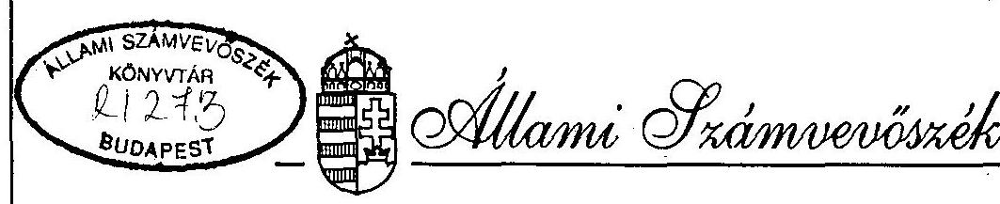
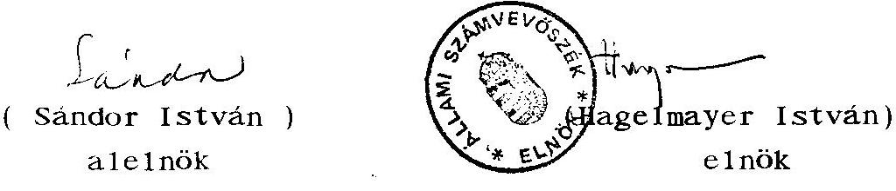
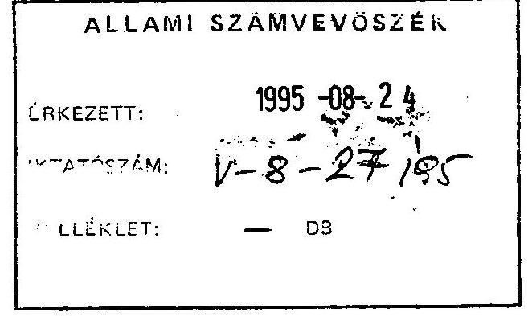
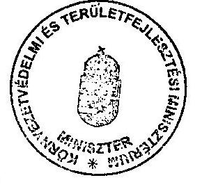
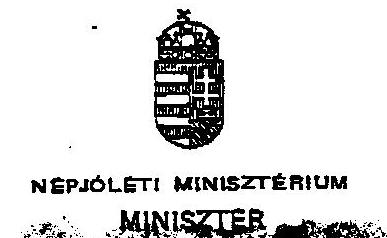
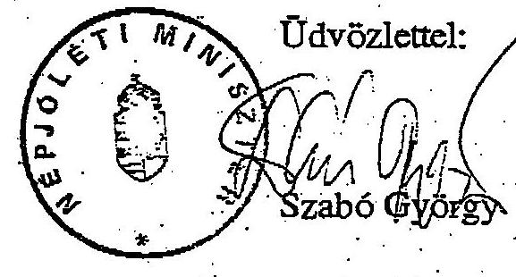
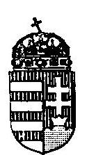
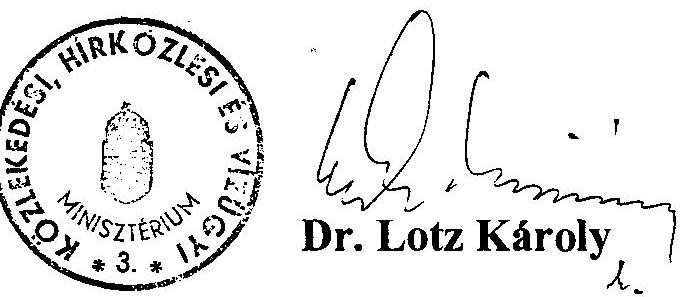

# JELENTÉS 

a Phare támogatások igénybevételével megvalósított levegôtisztaság- és vízminőség védelmi beruházások utóellenőrzéséről

---

A vizsgálat végrehajtásáért felelős: az ÁSZ IV. Vagyonellenőrzési Igazgatósága
dr. Kovács Árpád igazgató

A vizsgálatot vezette:
Krucsai Balázs osztályvezető főtanácsos

A vizsgálatot végezte:
Bank Lajos számvevö tandcsos
Istvánffy Lóránt
számvevö tandcsos,
Kiss Istvánné
számvevö tandcsos

---

# T A R T A L O M J E G Y Z É K 

## 1. Bevezetés

11. Összefoglaló megállapítások, következtetések, javaslatok ..... 3
111. Részletes megállapítások ..... 7
1.) A beruházások üzembehelyezése és elszámolása ..... 7
12. ) Az üzembehelyezett eszközök és létesítmények müködtetése ..... 12
13. ) A befeketett eszközök hasznosulása ..... 16

---

# ÁLLAMI SZÁMVEVÖSZÉK 

$\mathrm{V}-8-30 / 1995$.
Témaszám: 270

## J E L E N T É S

a Phare támogatások igénybevételével megvalósitott levegőtisztaság- és vizminőség véde1mi beruházások utóe11enőrzésérő1

## I.

## B E V E Z E T É S

Az Állami Számvevőszék 1992. II. felében 9 db - az Európai Unió Számvevőszékével közösen kiválasztott - Phare forrásból támogatott környezetvéde1mi projekt megvalósitását vizsgálta. Közülük 5 projekt, kereken 10 millió ECU költsége1őirányzattal, a levegőtisztaság - és a vizminőség véde1mét szo1gálta. Ezek az utóvizsgálatba bevont projektek a következök:

- Emisszió mérő hálózat korszerűsitése (3.800 ezer ECU)
- Imisszió mérő hálózat korszerűsitése (3.600 ezer ECU)
- Fluidágyas kazánátalakítás az Ajkai Hőerőmúben ( 830 ezer ECU)
- Iszapkotrás és nádaratás a Balatonon ( 850 ezer ECU)
- Körös-völgyi ho1tágak rehabilitációja ( 850 ezer ECU)

E projektek keretében megvalósuló beruházások üzembehelyezése zömmel az alapvizsgálat 1ezárását követően történt.

---

Az alapvizsgálat a támogatandó célok kiválasztásánál, a támogatások odaitélésénél és igénybevételénél számos hiányosságot tapasztalt. A jóváhagyott projektek megvalósitását azonban összességében pozitivan értékelte. Kifogásolta viszont, hogy pénzügyileg nem mindenütt készültek fel megfelelő módon a beruházások üzembehelyezésére és folyamatos müködtetésére. Elsősorban a költségvetési intézményeknél látszott kétségesnek a szükséges pénzügyi fedezet előteremtése.

Az utóvizsgálat célja annak megállapítása, hogy az üzembehelyezett új eszközöket és létesítményeket hogyan hasznosítják. Megvalósultak-e a projektekben elöirányzott célok, milyen kimutatható eredmények vannak az üzeme1tẹtők tevékenységében, illetve a levegő- és vizminőség javulásában.

Az utóvizsgálatba bevont szervek: Ajkai Hőerőmü, Környezet-gazdálkodási Intézet, Környezetvédelmi Főfelügyelőség, Kö-rös-vidéki Vízügyi Igazgatóság, Közép-dunántúli Vizügyi Igazgatóság, Szarvas Város Polgármesteri Hivatala. Vizsgált időszak: 1992. július 1-töl 1994. december 30-ig.

A helyszíni vizsgálat 1995. április 18-án kezdödött és 1995. május 16-án fejeződött be.

A vizsgálat megállapításai a beruházások üzembehelyezésének és folyamat os müködtetésének dokumentumaira, a felelős személyekkel folytatott interjukra és a helyszini szemlék tapasztalataira támaszkodnak.

---

# 11. 

## Összefoglaló megállapítások, következtetések, javaslatok

Az 1991-93. években a Phare program által nyújtott támogatási lehetőségeket kihasználva néhány költségvetési szerv és gazdasági vállalkozás közel 1,4 milliárd forint összegü levegötisztaság védelmet és több, mint 210 millió forint összegü vizminőség védelmet szolgáló beruházást valósitott meg. (1. sz. melléklet)

Az utóvizsgálatba bevont projektek keretében elöirányzott beruházások, két laboratórium kivételével, befejeződtek. A megvalósításukra nyújtott kereken 1 milliárd forint összegủ Phare támogatást az érintett szervek saját és egyéb forrásokból 600 millió forinttal egészitették ki.

A beruházások üzembehelyezése a vonatkozó előirásoknak megfelelően, szabályszerűen történt. Pénzügyi elszámolásuk (aktiválásuk) azonban a költségvetési intézmények egy részénél (környezetvédelmi felügyelőségek, vizügyi szervek, önkormányzat) nem felel meg a számvitelről szóló 1991. évi XVIII. törvény, illetve a költségvetés alapján gazdálkodó szervek beszámolási és könyvvezetési kötelezettségéről szóló 179/1991. (XII. 30.) kormányrendelet elöírásainak. A beruházási ráfordítások Phare forrásból finanszirozott hányadát könyveikben nem mutatták ki tőkenővekedésként (érték nélkül vették nyilvántartásba). Ennek megfelelően az elhasználódás miatti tőkeérték csökkenés kimutatását is mellőzték. A beruházott eszközök tulajdonviszonyai - a Körös-völgyi holtágak mütárgyainak kivételével - rendezettek.

Az új létesítményeket és eszközöket üzemeltető szervezetek - az alapvizsgálat során tett felhívásunkat is megszivlelve - igyekeztek megfelelően gondoskodni a folyamatos müködés

---

anyagi és személyi feltételeiről. A létesítmények többsége üzembehelyezése óta folyamatosan müködik. Kivételt képez az úszó nádarató gép, amely eddig gyakorlatilag nem végzett munkát, valamint az iszapkotró gép, ame1y több mint két éven át alig müködött.

A próbaüzemeltetés során kiderült, hogy az úszó nádarató gép alkalmazása a Balaton nagy kiterjedésũ vízfelületén rendkívül gazdaságtalan. Az egymástól távol fekvő nádasok miatti tetemes szállítási költségek, a vártnál költségesebb előkészítő munkák (stégek, egyéb tárgyak elözetes eltávolítása) miatt a költségek többszörösen meghaladják a jégen történő vágás költségeit. (Így üt vissza az a tény, hogy a Phare támogatások odaítélésénél az üzemeltetés gazdaságosságát nem mérlegelték). A gépnek a Velencei-tóra történő áttelepítését fontolgatják.

Az úszó iszapkotró gép kapacitásának kihasználását a finanszirozási források hiánya akadályozta. A "Balatoni Vizgazdálkodási Fejlesztési Program" elfogadásával 1995-töl a finanszirozási kérdések rendeződtek.

Teljes a kapacitások kihasználása azoknál a létesítményeknél, ahol az a megszakítás nélküli üzemmód sajátosságaiból következik (hőerőmúvi kazánok, vízszabályozó művek, légszennyezettséget mérő állomások).

Az üzemeltetés és a karbantartás költségeit a működtető szervezetek többsége az elmúlt években fedezni tudta. Néhány esetben (iszapkotró gép, emisszió mérő buszok) a költségvetési intézmény forrásainak szükössége a kapacitás kihasználását akadályozta. Az eszközök elhasználódásával és a szervizelési költségek növekedésével ezek a finanszirozási problémák a költségvetési intézményeknél fokozódhatnak. Megfelelő intézkedések nélkül a környezetvédelem céljait szolgá-

---

Ió, jelentôs ráfordításokkal kiépített mérö-rendszerek és létesítmények kihasználása és múszaki állapota kerül veszélybe.

A vizsgált projektekben kitüzött célok többsége a beruházások üzembehelyezésével és müködtetésével megvalósult. Jelentősen korszerűsödött az ország levegőszennyezettséget mérö rendszere és müszerbázisa. Az eseti és kézi mintavételezésre épülő rendszer 14 olyan korszerű állomással bővült, amelyek az ország legfrekventáltabb területein komplex és folyamatos méréseket végeznek emberi közreműködés né1kül. Hasonló fejlődés ment végbe a levegőszennyező források által kibocsátott szennyező anyagok (gázok, por, stb) mérése terén is. Az érintett hatóságok (környezetvédelmi felügyelőségek) és a gazdálkodó szervek részére mérési szolgáltatásokat végző intézmények 7 korszerű mozgó laboratóriumhoz jutottak, ame1yek az európai követelményeknek megfelelő módon és technikával pontos és megbizható, a külföldi cégek által is elfogadott méréseket produkálnak. Ezekre építve megfelelő, a környezetet védő intézkedések tehetők.

Az Ajkai Hőerőmüben elvégzett kazánátalakítások eredményeként az erőmű kéndioxid és nitrogénoxid kibocsátása a korábbinak felére csökkent. Jórészt ennek köszönhető, hogy Ajka város és környezetének levegótisztasága jelentősen javult.

A vizminőség védelmét szolgáló projektek keretében megvalósult beruházások is - bár viszonylag szerény mértékben - lehetőséget teremtettek arra, hogy az adott területeken a víz minősége javuljon. Megkezdődhetett a Keszthelyi-öböl vízszennyező anyagokat tartalmazó felső iszaprétegének ütemezett kotrása, a Körös-völgyi holtágak mederállapotának javítása, a vizszabályozás korszerűsítésével a holtágrendszer vízhozamának víźminőséget javító növelése.

---

A vizsgált projektek megvalósitása, a befektetett eszközök hasznosulása, a tapasztalt problémák ellenére, összességében eredményesnek értékelhetö. Nem hozott ugyan alapvető változást az ország álló -és folyó vizeinek és levegőjének minőségében, de szũkebb alkalmazási területükön eredményesen segitik az alapvető életelemek minőségének megőrzését és javitását. Arra van szükség, hogy a beruházások által nyújtott lehetöségek kihasználása még teljesebbé váljék. Erre az üzemeltetők részéről a törekvés adott, támogatásra érdemes.

Az Európai Unió illetékes bizottsága a közelmúltban tájékozódó felmérést végzett a Phare program által támogatott környezetvédelmi projektek megvalósulásának eredményeiről. Nem hivatalos információink szerint megállapításai megegyeznek a jelentésben foglaltakkal.

A vizsgálat során tapasztalt hiányosságok megszüntetésére (az üzembehelyezett eszközök elöírásoktól eltérő aktiválása, a tulajdonviszonyok rendezetlensége, a hatékonyabb hasznosítást segitő együttmüködés elmaradása) a vizsgált szerveket felszólítottuk. A szükséges intézkedéseket megtették, vagy elökészítésükről tájékoztatást adtak.

A vizsgálat tapasztalatai alapján javasoljuk:

1.) A Környezetvédelmi és Területfejlesztési, valamint a Népjóléti Minisztériumnak
a.) Kísérjék fokozott figyelemmel és tegyenek megfelelö intézkedéseket a Phare támogatások segitségével

- a környezetvédelmi felügyelöségeknél és a Környezetgazdálkodási Intézetnél üzembehelyezett emisszió mérő buszok és egyéb müszerek kapacitása-

---

nak teljesebb kihasználására és müködési költségeinek finanszirozására,

- az Állami Népegészségügyi és Tisztiorvosi Szolgálat megyei intézeteinél, valamint az Országos Közegészségügyi Intézetnél üzembehelyezett imisszió mérő állomások és mérő gépkocsik müködési költségeinek finanszirozására.
b.) A felügyeletük alá tartozó intézmények által müködtetett korszerü emisszió és imisszió mérő rendszer mérési eredményeinek hatékonyabb hasznosítása, a szükséges környezetvédelmi intézkedések jobb megalapozása érdekében segítsék elő, hogy az intézmények közötti együttmüködés szervezettebbé és eredményesebbé vál jék.

2.) A Közlekedési, Hírközlési és Vízügyi Minisztériumnak, hogy tegyen intézkedéseket a Phare támogatások segítségével beszerzett és jelenleg kihasználatlan úszó nádarató gépnek a Velencei-tóra történő áttelepítésére és megfelelő hasznosítására.

# III. 

## Részletes megállapítások

1.) A beruházások üzembehelyezése és elszámolása

Az utóvizsgálatba bevont projektek keretében a lóirányzott beruházások, két laboratórium kivételével, befejeződtek. Megvalósításukhoz az érintett költségvetési intézmények és gazdasági vállalkozások saját és egyéb kül-

---

sõ forrásokból is hozzájárultak. Üzembehelyezésük a vonatkozó elöírásoknak megfelelően, szabályszerűen történt. A befektetett eszközök aktiválása azonban a költségvetési intézmények egy részénél nem felel meg a számvitelről szóló 1991. évi XVIII. törvény, illetve a költségvetés alapján gazdálkodó szervek beszámolási és könyvvezetési kötelezettségéről szóló 179/1991. (XI1.30.) Kormányrendelet előírásainak.
1.1.) Az emisszió mérö hálózat korszerűsítésére 1991-93. között összesen 7 db emisszió (levegöszennyező anyag kibocsátás) mérö busz, különböző mérömüszerek és laboratóriumi kiegészítő eszközök beszerzése történt meg. Ezek az eszközök a következő intézmények tulajdonába kerültek:

- Egy-egy emisszió mérö buszt kapott a 12 környezetvédelmi felügyelöség közül 6 felügyelöség (Észak-magyarországi, Közép-Dunántúli, Közép-Dunavölgyi, A1-só-Tisza-vidéki, Tiszántúli és az Észak- dunántúli K.F.)
- Egy emisszió mérö busz, különböző mérömüszerek és laboratóriumi kiegészitő eszközök a Környezetgazdálkodási Intézet eszközállományát gyarapították.

A beszerzett és üzembehelyezett eszközök összértéke 453 millió forint, melyböl a Phare támogatás 416 millió forint ( 3,8 M ECU).

Az eredeti tervektól eltérően - a Phare támogatáson kívül szükséges finanszirozási források hiánya miatt a Környezetgazdálkodási Intézetben nem tudták üzembe

---

helyezni a büzmérő laboratóriumot és felépiteni a levegőtisztaság védelmi referencia laboratóriumot. Ez utóbbi hiánya az országos emisszió -és imisszió mérőhálózat müszereinek hitelesitését is neheziti. A laboratóriumok befejezéséhez mintegy 60 millió forint hiányzik. ( A KTM tájékoztatása szerint a referencia laboratorium üzembehelyezése 1995 év végén várható).

Az új eszközök aktiválása a Környezetgazdálkodási Intézetben és a környezetvédelmi felügyelőségek többségénél nem a vonatkozó előírásoknak megfelelően történt. Az üzembehelyezett eszközök értékét nem számolták el tőke növekedésként, esetenként csak a saját ráfordítást aktiválták, nem tartják nyilván az eszközök elhasználódását tükröző értékcsökkentést.
1.2.) Az országos levegőminőség mérő rendszer továbbfejlesztésére az Országos Népegészségügyi Központ 1991-93 között összesen 15 db konténeres, korszerü müszerekkel felszerelt méröállomást és 5 db mobil mérögépkocsit vásárolt. Ebből 1 mérőállomást és 1 mérőgépkocsit az Országos Közegészségügyi Intézetben, 14 mérőállomást és 4 mérőkocsit pedig az Állami Népegészségügyi és Tisztiorvosi Szolgálatnak (ÁNTSZ) az ország legszennyezettebb régióiban müködö 8 megyei intézeténél helyeztek üzembe 1993-ban (Baranya, Borsod, Győr, Heves, Komárom, Nógrád és Pest megyében)

A beszerzett és üzembehelyezett eszközök értéke összesen mintegy 384 millió forint, amit lényegében véve a Phare támogatásból finanszíroztak. A Népjóléti Minisztérium eddig mintegy 90 millió forinttal járult hozzá az eszközök beszerzéséhez és üzemeltetéséhez.

---

Az eszközök aktiválása 1994-ben szabályszerüen megtörtént.
1.3.) Az Ajkai Höerömüben a levegöt szennyezö anyagok kibocsátásának csökkentése érdekében 1990 és 1992 között összesen 4 db 100 t/óra teljesítményü gözkazánt alakítottak át korszerü, ú.n. fluidágyas tüzelésü üzemelésre.

1990-91-ben két kazán átalakítását saját, illetve hazai pénzforrásokból finanszirozták, majd 1992-ben a megitélt Phare támogatást is igénybe véve további két kazán átalakítását végezték el.

A beruházás megvalósítására összesen 541,4 millió forintot fordítottak, melyböl a Phare támogatás 81,4 millió forint, a Központi Környezetvédelmi alapból nyújtott támogatás pedig 60 millió forint volt.

A beruházások üzembehelyezése és aktiválása az elöírásoknak megfelelően történt.
1.4.) A Közép-dunántúli Vizügyi Igazgatóság a Keszthelyi öböl térségében 1992. májusában üzembe helyezte a holland IBC Beaver cég által gyártott nagyteljesítményü úszó iszapkotró gépet. Üzemeltetésének célja a Balaton fenék felső $10-15 \mathrm{~cm}$-es iszaprétegének eltávolítása, s ezáltal az algáknak táptalajt adó foszfor és nitrogén tartalom csökkentésével a víminőség javítása.

A kotrógép beszerzésére és üzembehelyezésére összesen 111 millió forintot költöttek. Ebböl a Phare támoga-

---

tások 73 millió, a vízügyi ágazat által biztosított források pedig 38 millió forintot tettek ki.

A nádállomány és közvetve a víz minőségének javítását kívánta szolgálni az ugyancsak 1992-ben beszerzett és próbaüzemelésre beállított úszó nádarató gép. Beruházási és üzembehelyezési költsége összesen 8 millió forintot tett ki.

Az üzembehelyezett gépek aktiválása nem felel meg a számviteli törvény és a vonatkozó rendelkezések elöírásainak. A Vízügyi Igazgatóság a gépeket csak mennyiségi nyilvántartásba vette, a tőkeérték növekedését könyveiben nem mutatta ki, értékcsökkenést nem számol el.
1.5.) A Körös-völgyi holtágak kritikusan kedvezőtlenné vált vízminőségének javítására Szarvas város önkormányzata - az érintett vízügyi és más szervek bevonásával 1990. márciusában átfogó, mintegy 430 millió forintot igénylő fejlesztési programot dolgozott ki.

E program első ütemében az ökológlaí és vízforgalmat szabályozó beavatkozások (vízkormányzó és vízszintszabályzó műtárgyak építése, mederszakaszok kotrása, stb.) valósultak meg. (2.sz. melléklet)

Az üzembehelyezett beruházásokra összesen 91,2 millió forintot fordítottak, amit $-5,6 \mathrm{M} \mathrm{Ft}$ Földmüvelésügyi Minisztérium-i támogatás kivételével - Phare forrásokból finanszíroztak.

Az üzembehelyezett beruházások a Magyar Állam tulajdonába és a Körösvidéki Vízügyi Igazgatóság kezelésébe

---

kerültek. Ennek ellenére - az érvényes elöírásoktól eltérően - a létesítményeket Szarvas Város Polgármesteri Hivatala aktiválta. A tulajdonviszonyok törvényes rendezésére az érintetteket felszólítottuk.
2.) Az üzembehelyezett eszközök és létesítmények müködtetése

A beruházott eszközök üzembehelyezésük óta folyamatosan üzemelnek. Kivételt képez a nádaradógép, amely a három év alatt gyakorlatilag nem végzett munkát. A többi eszköz müködése is csak részben tölti ki teljesen a kapacitást, egyeseknél az üzemidó még az igényelt mértéket sem éri el. Teljes kapacitáskihasználás azoknál a létesítményeknél van, ahol a müködés sajátossága a folyamatos, megszakítás nélküli üzem (hőerőmüvi kazánok, légszennyezettséget mérö állomások, vizszabályozó művek).

Az üzemeltetés és karbantartás költségeit, a müködtető szervezetek saját bevételi forrásaikból, illetve költségvetési támogatásból az eddig eltelt időszakban fedezni tudták. Forráshiány az üzemelést csak egy-két esetben korlátozta. A tapasztalatok szerint azonban a garancia idöszak lejárta után, a beruházott eszközök életkorának növekedésével a szervíz költségei jelentősen megemelkednek. Nö az üzemköltség is. Ugyanakkor a költségvetésböl származó és egyéb saját bevételi források szükülnek.

Ezért intézkedést igényel, hogy az üzemeltető költségvetési szervek számára az indokolt mértékủ üzemelés költségei intézményesen biztosítottak legyenek.
2.1.) A levegőszennyező anyagok kibocsátását ("emisszió") mérő laboratóriumokat és egyéb eszközöket a 6 környe-

---

zetvédelmi felügyelöség és a Környezetgazdálkodási Intézet (KGI) folyamatosan müködteti. A müszereket hitelesítették, gondoskodtak a szükséges kezelö szemé lyzet kiképzéséről. Az eszközök karbantartását részben tartós szerződéssel ( 3 felügyelőség), részben eseti megrendelésekkel oldják meg. Általános tapasztalat, hogy a szerviz szolgáltatás nehézkes, az alkatrészellátás megoldatlan, ezért idönként 2-3 hónapot is kell várni a szükséges alkatrész cserére.

Az új mérési kapacitások - a müködtetők tájékoztatása és a nyilvántartott üzemórák szerint - egyetlen intézménynél sincsenek teljesen kihasználva. A KGI elsősorban a gazdálkodó szervezetek részére végez térítés ellenében mérési szolgáltatásokat (új ipartelepek létesítésénél, új technológiák telepítésénél, stb.). A mérőbusz kihasználása általában 60-80 \% között mozog (egy garnitúra kiszolgáló személyzettel számolva, mert egy új garnitúra beállításával a kapacitás megduplázható lenne). A megrendeléseknek azonban így is eleget tudtak tenni.

A piaci verseny erős, a mérési szolgáltatást végző vállalkozók viszonylag nagy száma miatt a vállalási árak nyomottak. Ezek mérései ugyan kevésbé megbízhatóak, de a megrendelők igényeit kielégítik (a mérési jogosítványok ma még nincsenek feltételekhez kötve).

A dioxin laboratórium müszereinek és a többi új mérési müszernek a kihasználása ennél is kedvezőtlenebb, mintegy 25-30 \%-os. A jobb kihasználást itt is a megrendelések hiánya okozza.

---

A környezetvédelmi felügyelöségeknél lévő méröbuszok kihasználása is elmarad a müszaki lehetöségektöl és a régiók eltérő sajátosságai miatt változó (üzemóra teljesitmény évi 300-900 között mozog). A fizetett megrendelések behatároltak, a hatósági mérések egyébként szükséges növelését pedig a felügyelöségek részére juttatott költségvetési források szükössége korlátozza.
2.2.) A levegö szennyezettségét mérö 1993-ban üzembehelyezett konténeres méröállomások és mérögépkocsik a garanciális és szervizproblémák megoldását követően 1994-töl folyamatosan és megfelelően müködnek. Az új kapacitások mindenütt beépültek a müködtetö szervezetek tevékenységébe. A müködés sajátosságaiból adódóan a rendszer kapacitását lényegében tel jes egészében kihasznál ják.
2.3.) A fluidágyas tüzelésü kazánokat az Ajkai Hőerőmú folyamatosan üzemelteti. Kapacitáskihasználásuk teljes, csak az elöirt rendszeres karbantartás idejére állnak le. A kazánok terhelését az évszak és a gözigény változása határozza meg, de ez a fluidágyas üzemmódot nem befolyásolja.

A müködésnek tárgyi, pénzügyi, illetöleg szemé lyi akadályai nincsenek. Az import berendezések szervizelése, tartalék alkatrész ellátása nem ütközik akadályba.
2.4.) A nagyteljesítményü iszapkof ró gép 1992. májusában kezdte meg próbaüzemelését a Keszthelyi öbölben. Ebben az évben kapacitásának kb. 1/3-át használták ki, mintegy 60 hektáron végeztek kotrást, az eltávolitott anyag mennyisége több mint $115.000 \mathrm{~m}^{3}$ volt.

---

1993-ban és 1994-ben az iszapkotró gép - a szũkséges finanszirozási források hiánya miatt - gyakorlatilag alig üzemelt (3.sz. melléklet).

A "Balaton" Alapítvány 1994. szeptember 27-én az ARAL Hungária Kft-töl 30 ezer liter gázolajat kapott, amelyet térítés mentesen tovább adott a Balatoni Vízügyi Kirende1tségnek, azzal a kikötéssel, hogy kizárólag a kotróhajó üzemeltetésére használhatja fel. Ennek segitségével 1994. október 6. és november 16. között a kotróhajóval 10 hektárnyi területet tisztitottak meg.

A kotrógép üzemeltetésének finanszirozási problémáját végül is a "Balatoni Vízgazdálkodási Fejlesztési Programról" szóló 2100/1995. (IV. 12.) kormányhatározat oldotta meg, melynek 3. pontja szerint "A tó be1sõ terhelésének csökkentése érdekében a Keszthe1yi-õbõl lepelkotrási munkáit legkésõbb 1999 végéig be ke11 fejezni". Ezzel összhangban az 1995. évi kotrási feladatokra a fejezeti kezelésũ ágazati célelõirányzatok terhére összesen 62 millió forintot engedélyeztek. Ez lehetővé teszi a gép kapacitásának szinte teljes kihasználását, az iszapkotrás mintegy 150 hektáron történő elvégzését.

Az úszó nádarató gép az 1992. március-áprilisi próbaüzemén túl gyakorlatilag nem müködött. Sem konstrukciójában, sem gazdaságosságában nem alkalmas a Balaton nagy kiterjedésũ vízfelületén az egymástól viszonylag távol fekvő nádasok kezelésére. A rossz minőségũ, elhanyagolt nád a kereskedelemben nem értékesíthetõ, így a nád bevételével sem javítható a gazdaságosság. Az úszó nádaratás költsége többszöröse a jégről történő vágásénak, különösen a nagy szállítási távolság miatt.

---

A rövid ideig tartó jeges idöszakok miatt lett volna szũkség az úszó gép segitségére. A tervek szerint a part menti sávok szárait akarták rendben tartani ezzel a géppel. A munkát nagyon lelassitja a vizben lévõ stégek és egyéb, a hajó mozgását akadályozó tárgyak eltávolítása. A gép kihasználására a Velencei tavon keresnek megoldást.

A nádarató gép kihasználatlansága kapcsán emlékeztetnünk kell arra, hogy a Phare támogatások odaítélésénél elsödlegesen a megoldandó feladatok (célok) fontosságát és a megoldásra vonatkozó elgondolások müszaki megalapozottságát mérlegelték. A beruházások üzemeltetésének gazdaságossági kérdései nem képeztek mérlegelési szempontot. Arra sem a támogatást nyújtók, sem a támogatást igénylök nem forditottak kelló figyelmet.
2.5.) A Körös-völgyi holtágakban megépitett vizszabályozó mütárgyakat a Körösvidéki Vizügyi Igazgatóság Szarvasi szakasz mérnöksége folyamatosan üzemelteti. Az új helyzetnek megfelelö Üzemeltetési Szabályzatnak az összes érdekelt fellel (érintett önkormányzatok, Környezetvédelmi Felügyelöség) történő végső egyeztetése és jóváhagyása azonban még nem történt meg. Ezért még nincs megfelelö garancia arra, hogy a holtágban történó vízbetáplálás idöszaka és mennyisége a folyamatosan mért vizminöségi paraméterekkel összhangban történjen.
3.) A befektetett eszközök hasznosulása

A Phare támogatások igénybevételével megvalósitott beruházások - a program indításának sajátosságaival is összefüggésben - többnyire nem illeszkedhettek szervesen

---

megfelelően kiérlelt országos fejlesztési koncepciókba, esetenként ötletszerüek voltak. Ennek ellenére az ország adott rég1óiban, bizonyos terület eken szèlesebb körben is jól segítik az alapvetö életelemek, (víz, levegő) minöségének megörzését és javítását. Hasznosításuk, a tapasztalt problémák ellenére, összességében eredményesnek értékelhetö.
3.1.) A levegőszennyező anyagok kibocsátását mérő korszerű mozgó laboratóriumok ( 7 db ) beszerzésével és üzembehelyezésével kibövült és jelentősen korszerűsödött az országos mérőhálózat. A korábbinál megbízhatóbb és job ban dokumentált mérési adatok lehetővé teszik, hogy az illetékes hatóságok (környezetvédelmi felügyelőségek, önkormányzatok) szigorúbban megköveteljék a jogszabályokban elöirt szennyezési határértékek betartását, illetve a szükséges intézkedések végrehajtását. Ennek számos jele érzékelhető volt a vizsgálat során. Az eredmények különösen azokon a területeken jelentkeztek, ahol kialakult és szorosabbá vált a környezetvédelmi és az egészségügyi szervek együttmüködése (Fejér, Pest, Tolna és Veszprém megyében). Ezt konkrét példák is alátámaszt ják.

Az Ajkai Kristály Kft-nél bírságot szabtak ki a nem megfelelö leválasztóberendezéssel müködtetett festési technológia következtében megnövekedett környezeti nehézfémterhelés miatt. A Kft-t kötelezték megfelelö leválasztó beépitésére.

Az Inotai Aluminiumkohó jelentősen megnövelte környezete fluorid terhelését. A mérésekkel igazolt emisszio csökkentésére leválasztó berendezés beépítésére kötelezték a vállalatot.

A Közép-Duna-völgyi K.F. és a fővárosi, illetve Pest-megyei ÁNTSZ együttmüködésének eredménye a

---

STRABAG váci telephelyének leállítása és Százhalombattán a MOL Rt. emisszió csökkentési kötelezettségének hatósági előírása.

Az új mérési kapacitások által nyújtott lehetöségek azonban mint említettük messze nincsenek kihasználva. Ehhez a müködés finanszírozási forrásainak rendezése mellett a környezetvédelmi és az egészségügyi szervek együttmüködésének továbbá kiszélesítésére és a Környezetgazdálkodási Intézet hasonló jellegủ szolgáltatásainak fokozottabb hasznosítására lenne szükség.
3.2.) A levegőszennyező anyagok kibocsátását mérő hálózatnál is nagyobb mértékben korszerűsödött az ország levegőszennyezettségét mérő hálózat rendszere és müszerbázisa. A jelenlegi, országosan 689 ponton eseti és kézi mintavételezésre épülő rendszer 14 olyan korszerű állomással bővült, amelyek az ország legfrekventáltabb területein komplex és folyamatos méréseket végeznek emberi beavatkozás nélkül. (A hálózat teljessé tételéhez még további 39 ilyen állomás telepítésére lenne szükség).

A kapott adatokat a rendszer számítógépen feldolgozza és az eredményt az állomások floppy lemezen megküldik az Országos Közegészségügyi Intézetnek (OKI) összesítés céljából. Jelenleg folyamatban van a rendszer továbbfejlesztése, amelynek megvalósulása után az OKI központi számítógépére az országos hálózatból közvetlenül befutnak az adatok.

Az új mérési rendszer legfontosabb eredménye, hogy a korábbinál sokoldalubb, értékesebb és rendszerezettebb információk állnak az illetékes minisztériumok, az önkormányzatok és más hatóságok rendelkezésére a levegőszennyezés elleni hatósági fellépéshez.

---

A vizsgálat során az adatok hasznosításának számos megnyilvánulását tapasztaltuk. Így például:

- az állomásokat múködtető ÁNTSZ intézetek közvetlenül felhasználják a mérésekböl kapott információkat a helyi közegészségügyi intézkedésekhez. A folyamatos mérés rendszere döntö bizonyitékot ad a tartós levegöszennyezésre, amit a kibocsátó a tapasztalatok szerint egyre inkább kénytelen elfogadni. Lehetővé vált a szmogriadó elrendelésének a megalapozása.

Méréseket végeznek pl. fơutak környékén, iskolák, lakótelepek levegőminőségi állapotának megállapítására, az adatokat megkapják az önkormányzatok további intézkedésre. Mérések történtek lakóssági panaszok kivizsgálására is;

- az OKI központi adatbázisára befutott adatokból rendszeres jelentések készülnek a népjóléti és környezetvédelmi tárcák részére az ország régióinak mindenkori levegőszennyezettségi állapotáról;
- a városi, helyi TV állomások a lakosság tájékoztatására rendszeresen igénybe veszik az ÁNTSZ-ek mérési adatait. A helyi nyilvánosság tájékoztatást kap a szennyezések okairól, kibocsátóiról. Az OKI az adatokról a Meteorológiai Szolgálatot tájékoztat ja;
- az OKI tervezi a mért eredményekről egy rendszeres havi értesítő kiadását, amelyet az érdekeltek széles körében kivánnak terjeszteni.

Az új mérési rendszer azonban csak a hasznosítás lehetőségeit teremti meg, a levegótisztaság megőrzését és javítását az illetékesek intézkedései biztosíthatják.
3.3.) Az Ajkai Hőerőmũ kazánjainak fuidágyas tüzelésre való átalakítása vitathatatlanul jól hasznosult, az

---

eredmények mérhetök. A kazánok átalakítása utáni szennyező anyagkibocsátást 1993-ban egy környezetvédelmi cég müszeresen bemérte, majd 1994-ben a szakhatóság is ellenörzo méréseket végzett. Egybehangzó megállapításuk szerint, az erömü által kibocsátott $\mathbf{S O}_{2}$ és $\mathrm{NO}_{\mathrm{x}}$ szennyezőanyagok mértékének csökkenése átlagban meghaladja a célul kitüzött minimum $30 \%$-os kéndioxid, illetve $40 \%$-os nitrogénoxid csökkentési elöirányzatot. A kedvezőbb levegőszennyezési mutatók következtében az erőmüre kírott levegőszennyezési bírság 1994-re az 1991. év elöttihez képest a töredékére csökkent. További előny, hogy a fluidágyas tüzeléssel lehetővé vált az egyre romló minőségü, nagy hamutartalmú ajkai bányaszén elégetése is.

A környezetvédelmi garancia méréseket a BLAUTECH Humán és Környezetvédelmi Kft. végezte el 1993. 11. hóban.

A mérések szerint a hagyományos porszén tüzelés emissziójához képest a 9-es számú és 10-es számú fluidágyas kazán emissziójának a csökkenése:
teljes ( $100 \mathrm{t} / \mathrm{h}$ ) gözterhelés mellett:
kéndioxid $27,16 \%$, illetve $37,31 \%$
$\mathrm{NO}_{\mathrm{x}} \quad 50,45 \%$, illetve $56,49 \%$
csökkentett ( $60 \mathrm{t} / \mathrm{h}$ ) terhelés mellett:
kéndioxid $75,0 \%$, illetve $77,0 \%$
$\mathrm{NO}_{\mathrm{x}} \quad 54,9 \%$, illetve $55,8 \%$
A kénmegkötés mindkét kazánnál magasabb a kivitelező által garantált 55 \%-nál.

Lényegében véve a kazánok tüzelési módja korszerűsítésének eredménye, hogy az Erömü éves légszennyező anyag kibocsátása nagymértékben csökkent, amit az alábbi

---

adatok igazolnak.

|  | $\mathrm{SO}_{2}$ t/év | $\mathrm{NO}_{x}$ t/év | por t/év |
| :--: | :--: | :--: | :--: |
| 1991. | 25.553 | 3.941 | 2.604 |
| 1994. | 9.112 | 2.096 | 392 |

A felügyelöség kimutatása szerint az erömü által fizetett légszennyezési bírság 1990. óta folyamatosan csökkent, az 1991. évi 76 millió Ft-ról 1994-ben 2,8 millió Ft-ra, a kevesebb kibocsátott szennyező anyag miatt. (A porszennyezés csökkenését elsősorban a kémények elé időközben beépített szürök eredményezték).

Az erőmủ által kibocsátott kevesebb levegőszennyező anyag Ajka város és környezetének levegőminőségére kedvezően hatott. A Veszprém Megyei ÁNTSZ évek óta méri Ajka ülepedó por és $\mathrm{SO}_{2}$ szennyezettségét és a levegőtisztaság alakulásának trendjét. ( $\mathrm{NO}_{x}$-et müszer hiányában nem mérték).

A városban az ülepedó por 1990. óta folyamatosan a megengedett határérték alatt van ( $16 \mathrm{~g} / \mathrm{m}^{2}, 30$ nap). A $\mathrm{SO}_{2}$ ugyan mindig a $0,15 \mathrm{mg} / \mathrm{m}^{3}$ határérték alatt volt, de 1990. óta számottevően csökkent $0,04 \mathrm{mg} / \mathrm{m}^{3}$ téli időszak alatti terhelésről $0,01 \mathrm{mg} / \mathrm{m}^{3}$ körüli értékre. A nyári időszakban az $\mathrm{SO}_{2}$ szennyezettség még alacsonyabb.

A város levegójének minősége és az erőmủ emissziója között az összefüggés valószínüsithető, tekintve, hogy ez az egyik fö szennyezőforrása a városnak, de a hatás mértéke nem számszerüsithető. A város levegőjének tisztaságát ugyanis sok egyéb körülmény is befolyásolja (például az üveggyár, az egyedi családiházas fütési mód, a széljárás, meteorológiai viszonyok, stb.)

---

3.4.) A nagytel jesitményü holland úszó kotrógép beszerzésével a vizminöséget károsító anyagokat tartalmazó balatoní meder felsö iszaprétege eltávolításának müszaki feltételei - ha korlátozott mértékben is, de - megteremtödtek. E lehetöséget azonban eddig az üzemeltetés finanszírozási problémái miatt nem sikerült megfelelöen kihasználni.

Az eddig végzett kutatási eredmények igazol ják, hogy a kotrógép folyamatos müködtetésére a Balaton vizminöségének javítása érdekében nagy szükség lenne.

A kotrógépet üzemeltetö Vizügyi Kirendeltség 1992 és 1994. között elvégeztette azokat a kutatásokat, melyek megalapozták a kotrás folytatását, azaz kimutatták annak vizminöség javító hatását, és megnyugtató eredményeket adtak a zagyelhelyezésre vonatkozóan is. Összesen 7 kutatási jelentés készült ezekben a témákban.

A kutatások igazolták, hogy a kotrás a mederiszap felső, legnagyobb foszfor és algaspóra tartalmú rétegét sikeresen eltávolítja, melynek következtében a mederfenék foszfor tartalma mintegy $15-20 \%$-kal csökken, ami jelentós vizminöség javulást eredményez. A kikotort területen a visszatöltödés nem jelentős. Bebizonyosodott az is, hogy a kikotort zagy a természetre, a környezetre nem káros, a savanyú talajok javítására, a bányaterületek rekultivációjára is felhasználható.

A kotrási anyag vizsgálata azóta is folyamatos, erre kötelezö elöirást tartalmaz az érvényes vizjogi létesítési engedély.

---

Az úszó nádarató gép beszerzésére fordítolt eszközök a Balatonon történő üzemeltetés kedvezőtlen feltételei miatt - eddig még nem hasznosultak. Ennek ellenére a gép müszakilag jól megoldott, kipróbált, a Fertő-tavon évek óta használják. Amint a Velencei-tó vízszintje lehetővé teszi, áttelepítik, a nádaratást nem tiltó időszakokban űzembe helyezik és mivel ott kisebb a tó felülete várhatóan gazdaságosabban és hatékonyabban tudják használni. A Velencei-tavon a kisebb nádasok a tó közepén bakhátakon alakultak ki, aratásuk akár jégről, akár vízről csak bizonyos vízszint fölött megengedett, mivel a gyökér közelében megsérült növény kipusztul. Az évek óta tartó igen alacsony vízszint mind a Balatonon, mid a Velencei-tavon megszûnt, mindkét tavon közelít a maximumhoz. A legközelebbi nádvágási idõszakban a gépet már müködtetni tudják.

Amennyiben a tó nádasállománya egészséges, és a learatott nádat értékesíthetik, úgy árhévételt is eredményezhet az üzemeltetés.
3.5.) A Körös-völgyi holtág rendszerben elvégzett kotrási és egyéb munkák, illetve megépített vízszabályozó mútárgyak müködtetésének kezdeti eredményei a vízminőség javulásában mutatkoznak. A mérési adatok arra utalnak, hogy a projekt megvalósitása óta, 1993-tól kezdődően a II. osztályú integrált vízminőség szinte minden mérési helyen I. osztályura változott (4.sz. melléklet). Mind a víz oxigénháztartása, mind tápanyagtartalma szempontjából a korábbinál kedvezőbb értékeket regisztráltak.

A Környezetvédelmi Felügyelöség vizminőségi, a KÖVIZIG vízrajzi észlelőhálózat mérései és az ÁNTSZ-től kapott adatok azonban, a vizsgálat megállapítása szerint, a

---

mintavétel helye, ideje szempontjából összehangolatlanok és az egymás közötti adatcsere sem müködik zavartalanul. Kifogásolható az is, hogy a vizminöségi vizsgálatot végzők olyan nagy mértékben lecsökkentették a mintavételek számát, hogy az már a finom vízkormányzást biztosító mütárgyak, zsilipek célszerű müködtetését is akadályozhatja. E hiányosságok megszüntetéséről elsósorban az üzemeltetést végző KÖVIZIG-nek kell mielőbb gondoskodnia.

A Szarvas Város Önkormányzata és a többi érintett szerv is tudatában van annak, hogy a javuló vizminőség hosszútávú megőrzése és az ökológiai egyensúly fenntartása érdekében - amely a turisztikai fejlesztésre vonatkozó elképzelések alapját képezi - szűkség van a holtágrendszer további rehabilitációjára. Ennek során törekedni kell a jelenlegi vízhozam megduplázására, további iszapkotrási és vízpart védelmi munkálatokat kellene végezni.

Budapest, 1995. szeptember hó

Melléklet: 4 db táblázat
miniszteri levelek (4 oldal)

---

1. sz. melléklet a
V-8-30/1995. számú jelentéshez

A Phare támogatással megvalósitott beruházások
összesített ráfordításai
ezer Ft

| Projekt megnevezése | Finanszirozási források |  |  |  |
| :--: | :--: | :--: | :--: | :--: |
|  | Phare támogatás* | Saját forrás | Egyéb forrás | Öszzesen |
| 1. Emisszió mérö hálózat korszerüsítése | 416.000 | 37.000 | - | 453.000 |
| 2. Imisszió mérö hálózat korszerüsítése | 341.000 | 43.000 | - | 384.000 |
| 3. Fluidágyas kazánátalakítás az Ajkai Erömüben | 81.400 | 400.000 | 60.000 | 541.400 |
| 4. Iszapkotrás és nádaratás a Balatonon | 80.500 | 500 | 38.000 | 119.000 |
| 5. Körös-völgyi holtágak rehabilitációja | 85.550 | - | 5.600 | 91.150 |
| Öszzesen | 1.004 .450 | 480.500 | 103.600 | 1.588 .550 |

* A ráfordítás időontjában érvényes Ft/ECU árfolyamon számolva

---

2. sz. melléklet a
V-8-30/1995. sz. jelentéshez
A Körös-völgyi holtágrendszer rehabilitációja
Phare-program keretében végzett fejlesztési munkák

|  | Kötsség Ft. |
| :--: | :--: |
| 1. Siratói szivornya kiépítése | 4.353 .861 |
| 2. Bikazugi ág kenderáztatós rész kotrása | 12.001 .209 |
| 3. Annaligeti vízkormányzó mütárgy létesítése | 31.675 .254 |
| 4. Bikazugi híd létesítése | 14.939 .155 |
| 5. Torkolati vízszintszabályozó mütárgy lét. | 18.848 .039 |
| 6. Kákáfoki szivattyú telep új halrácsos mütárgy létesítése | 1.884 .200 |
| 7. Szappanoszugi rész kotrása | 7.647 .417 |
| Összesen | 91.349 .135 |

További víggazdálkodási feladatok: A vízóóló mũ bővítése, átépítése, a HAKI ág kotrása, mütárgyépítések, lokális kotrások a II. ütemre készített fejlesztési tanulmány szerint.

---

# 3. sz. melléklet a   V-8-30/1995. számú jelentéshez 

A Keszthelyi-öbölben üzembehelyezett úszó kotrógép
összefoglaló teljesítmény adatai

|  | 1992. | 1993. | 1994. | 1995.(terv) |
| :--: | :--: | :--: | :--: | :--: |
| Kotort terület (ha) | 58,7 | 19, 1 | 10 | 150 |
| Kotort anyag mennyisége (m3) | 117.400 | 38.200 | 19.939 | 300.000 |
| Költségek összesen (MFt) | 39,2 | 16, 1 | 3, 7 | 62,0 |
| ebböl: $\square$   Fenntartási ktsg. (MFt) | 29,9 | 14, 8 | 3, 7 | 44,6 |
| Tervezési ktsg. (MFt) | 2,1 | 1,3 | - | 10,9 |
| Eszközbeszerzés | 7,2 | - | - | 6,5 |

---

# 4. sz. melléklet a, 

$\mathrm{V}-8 \div 30 / 1995$. számu jelentéshez
ÁNTSZ Békés megyei Intézete
felszínvíz viszgálati eredményei
vïzminöségi osztályok kimutatása

| Év | Minta-   vétel   idöpontja | Minta megnevezése |  |  |  |  |
| :--: | :--: | :--: | :--: | :--: | :--: | :--: |
|  |  | Szarvas |  | B. Szentandrás |  | Szarvas |
|  |  | Camping | Tanázai Gólás | Szabadstrand | Duzzzestó t. | Anvuligeli Nd. | Számyegszóivó Nd |
| 1989 | 02,27 | III. | II. | III. | II. |  |  |
|  | 05.02 | II. | II. | II. | II. |  |  |
|  | 06.05 |  | III. | IV. |  |  |  |
|  | 07.18 | II. |  | II. | II. |  |  |
|  | 07.19 |  | I. | II. |  |  |  |
|  | 10,02 | II. |  |  | II. |  |  |
|  | 11,06 | I. | I. | II. | II. |  |  |
|  | 12,11 | II. | II. | II. | III. |  |  |
| 1990 | 03,11 |  |  |  | II. |  |  |
|  | 03,28 | II. | II. | I. |  |  |  |
|  | 04,23 |  |  |  | III. |  |  |
|  | 05,21 |  | I. | I. |  |  |  |
|  | 07,23 | II. | I. | III. | II. |  |  |
|  | 09,10 | I. | I. | I. | II. |  |  |
|  | 10,08 | II. | I. | II. | II. |  |  |
|  | 11,19 | II. | II. | II. | III. |  |  |
| 1991 | 03,25 | I. | II. | II. | II. |  |  |
|  | 05,20 | II. | I. | II. | III. |  |  |
|  | 06,17 | I. | III. | I. | II. |  |  |
|  | 07,08 | II. | II. | II. | IV. |  |  |
|  | 09,23 | II. | II. | II. | II. |  |  |
|  | 10,14 | II. | II. | III. | II. |  |  |
| 1992 | 09,25 | II. | II. |  | " |  |  |
|  | 05,04 | I. | I. |  |  |  |  |
|  | 06,08 | II. | II. |  |  |  |  |
|  | 08,17 | II. |  | II. |  |  |  |
|  | 08,31 | I. |  | I. |  |  |  |
|  | 09,21 | I. | I. | I. | II. |  |  |
| $1933^{* *}$ | 07,27 |  |  | I. |  | IV.* | II. |
|  | 08,03 |  | I. |  |  | IV.* |  |
| $1994^{* *}$ | 06,21 |  | I. |  |  |  |  |
|  | 06,23 |  | I | I. |  |  |  |

Megjegyzis:

* Egyedi megítélést igányel, közvetlen szennyezésre utal
** Évi egy mintavétel kevés, mintavétel gyakoriságát növelni kell

---

# A MAGYAR KÖZTÁRSASÁG KÖRNYEZETVÉDELMI ÉS TERÜLETFEJLESZTÉSI MINISZTERE 

M-220-5/1995. $L$ k orivo $1 i j$. 4.20

Hagelmayer István úr Állami Számvevöszék elnöke

Budapest

Tisztelt Elnök Úr!

A Phare támogatások igénybevételével megvalósitott levegôtisztaság-védelmi és vizminőség-védelmi beruházások utóellenőrzésével kapcsolatos jelentésüket köszönettel megkaptam.

Az anyagot áttanulmányozva megállapítottam, hogy a korábbi véleményünket figyelembe vették, a megküldött jelentéshez további észrevételt nem teszek.

Kérem a fentiek szíves tudomásulvételét.
Budapest, 1995. augusztus "¿̇̀ "

Üdvözlettel:

Dr. Baja Ferenc

---

Szám: 31.280/1995.

# Hagelmayer István úrnak elnök 

Állami Számvèvôszék

## Budapest

## Tisztelt Elnök Úr !

Az 1995. július 26-án kelt, V-8-25/1995. számú levelét és "a Phare támogatások igénybe vételével megvalósított levegôtisztaság- és vízminőség védelmi beruházások utóellenôrzésérôl", készített jelentését megkaptam. Tájékoztatását köszönöm.

A jelentést szakértôinkkel áttanulmányoztattam és a vêlemények alapján az állásfoglalásom a következô:

A jelentésnek a tárcát érintô részei pontosak, hũen adják vissza a kérdéssel kapcsolatos reális helyzetet. Örvendetes, hogy kifogások e területen nem merültek fel.

A jelentés 6. oldalán szereplő javaslatok 1./ pont a./ alpont második francia bekezdésében említett finanszírozási javaslattal kapcsolatban megemlítem, hogy a tárca felügyelete alatt optimálisan müködô imissziós mérőrendszer müködésének finanszírozására 1994-ben 25 millió forintot biztosítottunk az egészségfejlesztési szakmai programok terhére, mely összeg beépült a szolgálat költségvetésébe. Az idei évben már ez a keret az idôközben bekövetkezett infláció és áremelések miatt várhatóan nem lesz elégséges a rendszer múködtetéséhez.

A b./ alpontban említett együttmúködés hangsúlyozásával egyetértek. Magyarországon levegöminőséggel kapcsolatos méréseket négy célból végeznek és az adatáramlás nem minden esetben kifogástalan.

---

Imisszióval kapcsolatos mérések a népjóléti tárca felügyelete alatt történnek. Az adatok összesítése és hasznosítása országos szinten megfelelő formában történik. Rövidesen múködni fog az on line számítógépes adatgyüjtő és értékelő rendszer. A megyei ÁNTSZ intézetek és az illetékes környezetvédelmi felügyelőségek szintjén az együttmúködés és az adatok szolgáltatása a személyes kapcsolatoktól függően eltérő, esetenként javítandó. Ennek érdekében javasolni fogom a környezetvédelmi és területfejlesztési miniszternek egy közös körlevél kiküldését.

Emisszióra vonatkozó adatokat a KTM felügyelete alatt mérnek és gyüjtenek. Kívánatos lenne, hogy az összesített adatokat rendszeresen, az esetlegesen jelentkező adatigényeket pedig a kérésnek megfelelően minden szinten kielégítsék.

A levegő minőségére vonatkozó háttéradatokat a meteorológiai szolgálat méri. Eddig egy általuk készített kiadvány segítségével ezekhez az adatokhoz rendszeresen hozzá lehetett jutni. Információim szerint, anyagi okok miatt a jövőben a kiadványuk megjelentetésétől el fognak tekinteni. Ez a tény nehézségekhez vezethet.

Gépkocsi-forgalommal kapcsolatos emissziót a Közlekedési, Vízügyi és Hírközlési Minisztérium felügyelete alatt mérnek.

Budapest, 1995. szeptember " $\underline{A t}-$ :"

---

KÖZLEKEDÉSI, HIRKÖZLÉSI ÉS VÍZŰGYI MINISZTER

$557915 / 95$.

Dr. Hágelmayer István úr elnök

Állami Számvevőszék

# Budapest 

## Tisztelt Elnök Úr!

A PHARE támogatások igénybevételével megvalósított levegőtisztaság- és vizminőség védelmi beruházások utóellenőrzéséről szóló ÁSz jelentést köszönettel fogadtam.

A megállapításokat és az előremutató javaslatokat elfogadom, a jelentésre észrevételt nem teszek.

Budapest, 1995. augusztus " 8 "

Tisztelettel:
