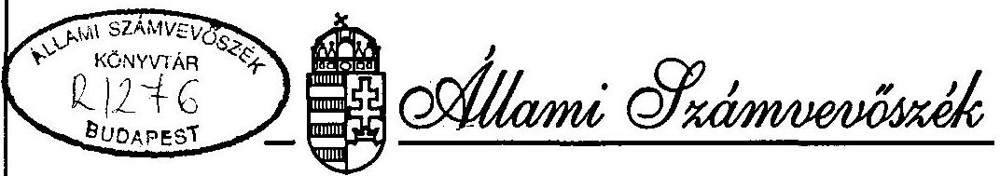

# JELENTÉS 

a kárpótlási törvények végrehajtása - különös tekintettel a kárpótlási jegyek felhasználására - című helyzetfeltárásról

---

A vizsgálat végrehajtásáért felelős: az ÁSZ IV. Vagyonellenőrzési Igazgatósága
dr. Kovács Árpád igazgató

Az ellenőrzést vezette:
dr. Elek János
osztályvezető főtanácsos
Az ellenőrzést végezték:

| Berzétey Attiláné | számvevő tanácsos |
| :-- | :-- |
| dr. Dotterweich Antal | számvevő tanácsos |
| Écsy Lajosné | számvevő |
| Hoffmann István | számvevő |
| dr. Szávai Tamás | számvevő tanácsos |
| Tóth István | számvevő tanácsos |

---

# JELENTÉS   a kárpótlási törvények végrehajtása   - különös tekintettel a kárpótlási jegyek felhasználására című helyzetfeltárásról 

## I.

## BEVEZETÉS

Az Állami Számvevőszék Elnöke az Országgyűlés Számvevőszéki Bizottsága felkérése alapján a kárpótlási törvények végrehajtásának helyzetfeltáró vizsgálatáról rendelkezett. A cél az volt, hogy a kárpótlási törvények végrehajtásáról, és a gazdaságszerkezetre, tulajdonosváltásra gyakorolt hatásáról - az ÁSZ lehetőségei között - átfogó képet nyújtson.

A feldolgozás súlypontjai a kibocsátott kárpótlási jegyek felhasználási területeit követik. Külön vizsgálva ezen belül, hogy a rendelkezésre álló lehetőségek mennyiben szolgálták - az értékmegőrzés érdekében - a jegyek beváltásának gyorsítását.

A kiindulópontot és az alapot a tulajdonviszonyok rendezése érdekében, az állam által az állampolgárok tulajdonában igazságtalanul okozott károk részleges, továbbá életüktől és szabadságuktól politikai okból jogtalanul megfosztottak kárpótlásáról alkotott törvények képezték.

---

E jelentés az Országos Kárrendezési és Kárpótlási Hivatal (OKKH), a Pénzügyminisztérium (PM), a Földművelésügyi Minisztérium (FM), az Igazságügyi Minisztérium (IM), az Állami Vagyonügynökség (ÁVÜ), az Állami Vagyonkezelő Részvénytársaság (ÁV Rt), a Kincstári Vagyonkezelő Szervezet (KVSZ), a Pénzintézeti Központ (PK) az Állami Értékpapír Felügyelet és a Nyugdíjfolyósító Igazgatóság (NYUFIG) iratai, dokumentumai, írásbeli nyilatkozatai, adatai, valamint a Kormányzati Ellenőrzési Iroda (KEI) titkos minőségű vizsgálati jelentése alapján készült és az 1990-1995. év közötti időszakra terjedt ki. A jelentés készítéséhez emellett az ÁSZ munkatársai hasznosították azokat a részinformációkat is, amelyek más számvevőszéki vizsgálatok során a témához kapcsolódóan korábban születtek.

Az ÁSZ együttműködött a KEI-vel, amely munkaterve alapján azt vizsgálta, hogy a kárpótlási jegyek kibocsátásakor, valamint azok megsemmisítésekor betartották-e a vonatkozó jogszabályokat, kizárja-e a folyamat szervezettsége a hamisítást, illetéktelenek kárpótlási jegyhez jutását, és biztosította-e a megsemmisítés átláthatósága, pontossága, technikaifeltételrendszere. A teljeskörű helyzetkép bemutatása érdekében e dokumentum röviden összefoglalja a KEI - nyilvánoságra hozható - főbb tapasztalatait, illetve utal az annak ajánlásai alapján hozott kormányhatározatra is.

A jelentés többszörös egyeztetés alapján került lezárásra. Jelen formában tartalmazza azokat a pontosításokat is, melyeket az előírásoknak megfelelően, kellő időben rendelkezésre bocsátott és elfogadott záróészrevételek indokoltak. Ezen észrevételek a jelentés mellékletét képezik.

---

# II. 

## ÖSSZEFOGLALÓ MEGÁLLAPÍTÁSOK, KÖVETKEZTETÉSEK, AJÁNLÁSOK

## 1. Összefoglalás, következtetések

A kárpótlási törvények megszűnését politikai döntések sorozata előzte meg. Az első döntéseket - összesen három - az Országgyűlés hozta határozat formában, kettőt 1989. évben, egyet pedig 1990. év elején. Az Országgyűlés 1989. évi határozataiban felhívta a Kormányt, hogy az 1945-1962. közötti törvénysértő elítélések, internálások és kitelepítések áldozatainak kártalanítása, továbbá a rendőrhatósági őrizetben fogva tartott (internált), valamint kitelepített személyek sérelmeinek orvoslása érdekében szolgáltasson elégtételt. Az 1990. év elején hozott határozatban az Országgyűlés az 1938-1945. közötti időszakban a faji vagy nemzetiségi hovatartozás vagy a nácizmus elleni magatartásuk miatt deportált vagy egyéb hátrányt szenvedett személyek sérelmeinek orvoslását kezdeményezte. A végrehajtás érdekében egyúttal arra is felhívta a Kormányt, hogy törvényjavaslatot terjesszen elő.

A törvényjavaslat koncepcióját 1991. tavaszán a Köztársaság Elnöke az Alkotmánybírósághoz nyújtotta be. Az Alkotmánybíróság határozatában kimondta, hogy a tulajdonviszonyok rendezése alkotmányos feladat, mivel az Alkotmány preambuluma célul tűzi ki a szociális piacgazdaságot. A tulajdonrendezés pedig komplex folyamat, amelynek a kárpótlási törvény csupán egy része.

Az Alkotmánybíróság tekintetbe vette, hogy a tervezett kárpótlás alapja nemcsak az elvett tulajdon lehet, hanem az elszenvedett sérelem is. A testület kimondta azt is,

---

hogy a kárpótlási törvény koncepciója részleges pénzbeli kárpótlást nyújt. A Köztársaság Elnöke által kikért alkotmánybirósági véleményt is figyelembe véve alkotta meg az Országgyűlés 1991. évben az első kárpótlási törvényt, amelyben a tulajdonviszonyok rendezése érdekében az állam által az állampolgárok tulajdonában igazságtalanul okozott károk részleges kárpótlásáról intézkedett. Ez a törvény azonban már előre jelezte, hogy a kárpótlás rendszere túlnyúlik az elmúlt rendszer által okozott károkon. A törvény ugyanis kimondta, hogy az 1949. május 1. és 1989. június 8. közötti időben alkotott jogszabályok alkalmazásával okozott károk kárpótlásáról külön törvény rendelkezik. E károk rendezésére alkotta meg az Országgyűlés az 1992. évben a második kárpótlási törvényt a tulajdonviszonyok rendezése érdekében, az állam által az állampolgárok tulajdonában az 1939. május 1-jétől 1949. június 8-ig terjedő időben alkotott jogszabályok alkalmazásával igazságtalanul okozott károk részleges kárpótlásáról.

Az életüktől és szabadságuktól politikai okokból jogtalanul megfosztottak kárpótlásáról született meg a harmadik kárpótlási törvény. E törvény szintén szélesebb kört ölelt fel, mint az elmúlt rendszer által okozott jogsérelem: hiszen hatálya az 1939. március 11. és 1989. október 23. között életüktől és szabadságuktól politikai okok miatt jogtalanul megfosztottakra terjed ki. A törvény hatályát az alkotmánybirósági normakontroll a törvényben meghatározottnál szélesebb személyi körre terjesztette ki. Kimondta, hogy 1995. szeptember 30-ig kell orvosolni azt a mulasztásos alkotmánysértést, amely a személyi kárpótlás lezárásával kapcsolatos, 1992. november 30-i határidővel előírt törvényalkotási kötelezettség teljesítésének elmulasztása miatt állt fenn.

---

Az Alkotmánybíróság által előírt törvénymódosítás folyamatban van. Csak elfogadása után ismerhető meg a kárpótlásra jogosultak teljes köre, s azzal összefüggő - véglegesnek tekinthető - pénzügyi-vagyoni igény, miközben szándék a kárpótlás folyamatának 1995. évi lezárása.

Az 1991. évi első, ún. vagyoni kárpótlási törvény gazdasági, tulajdoni megalapozására pontos, megbízható adatok nem álltak rendelkezésre sem a kárpótolandó javak mennyiségét, sem azok értékét illetően. A törvény előkészítése során a termőföld, a vállalat és a házingatlan képezte elsődlegesen a kárpótlási mérték meghatározásának számítási alapját.

Bár erre volt szándék, megfelelő alapinformációk hiányában nem tudták felmérni a más jellegű jogszabályok alkalmazásával okozott károk névértékét és azok után várható kárpótlási igényeket. (Például a korabeli államosításokról, igénybevételekről, letétbe helyezésekről rendelkező jogszabályok intézkedése a kártalanításról, azaz; a kártalanítás módját és mértékét mindmáig meg nem alkotott törvényre, vagy alacsonyabb szintű jogszabályra bízták. Ilyen volt egyes házingatlanok állami tulajdonba vételéről szóló 1952. évi törvényerejű rendelet, vagy a földreformmal kapcsolatos 1945. évi törvény.)

Csak becsülni tudták továbbá, hogy a mezőgazdasági termelőszövetkezetek tulajdonában lévő földek vonatkozásában milyen nagyságú többszörös kárpótlási igényre lehet számítani a halmozódó korábbi politikai jogszabályi intézkedések következtében. Nem foglalkoztak a törvények előkészítői érdemben azzal sem, hogy a kárpótlás megvalósításához egyáltalán milyen nagyságrendű vagyon vehető figyelembe, s hogy a tulajdonviszonyokba való ilyen beavat-

---

kozás milyen változásokat okoz, közvetett hatásokkal jár, s hogy a gazdaság működtetéséhez ezzel összefüggésben milyen további törvényeket, s főként milyen tartalommal kell megalkotni. (Például agrárpiaci rendtartás, szövetkezeti vagy az állami gazdaságok társasággá átalakulását is szabályozó törvények, stb.)

Ilyen előkészítés után az elfogadott degresszív skála alapul vételével a kárpótlás vagyoni, pénzügyi nagyságrendjét a kamatokat figyelembe véve akkor 100 milliárd Ft körülire becsülték.

A kárpótlási törvények alapján ezideig 130 milliárd Ft címletértékű kárpótlási jegy került kibocsátásra. A kamatokat is figyelembe vevő kárpótlási jegyérték - névértéken - 220 milliárd Ft körül van. Ehhez csatlakozik, hogy a már hatályos törvényi előírások szerint 1995. év végéig további közel félmilliónyi kárpótlási pótigény és becslések szerint mintegy 2,0-2,5 milliárd Ft címletértékű jegy kiadása várható. Ezen adatok természetesen még nem tartalmazzák a már hivatkozott, most előterjesztett törvénymódosítás nyomán jelentkező igényeket.

Az állami vagyon kezeléséért felelős szervezetek a kárpótlási célok megvalósításához szükséges állami vagyon tömeget 1993. évben már 220 milliárd Ft-ra becsülték. A korábban előirányozotthoz képest több mint 100%-kal nagyobb igény fedezetére az ÁVÜ ekkor 90 milliárd forint nominálértékű vagyont ajánlott fel, míg a kormány 1993. júliusi határozata szerint 120 milliárd Ft értékű vagyon biztosítása hárult az ÁV Rt-ra. A KVSZ-nek pedig egy másik kormányhatározat szerint 10 milliárd Ft bruttó nyilvántartási értékű volt szovjet ingatlant kellett kijelölnie kárpótlási jegy ellenében történő értékesítésre.

---

Bár papíron rendben volt a fedezet, különböző később részletezett - okok miatt a vagyonkezelő szervezetek a forgalomból együttesen eddig mindössze 68,5 milliárd Ft címletértékű kárpótlási jegyet vontak ki, amely névértéken mintegy 120 milliárd Ft összeget képvisel.

Közel 65 milliárd forint címletértékű jegy van ma is "kézben". Csak becslések vannak arra, hogy ebből az alanyi kárpótoltaknál 40, brókereknél 8 - 10, a szövetkezeteknél 10 - 12, az önkormányzatoknál pedig mintegy 5 milliárd forintnyi lehet. Az önkormányzatoknál, szövetkezeteknél lévő és az ún. másodlagos, - nem az igényjogosultak által közvetlenül beváltott - jegy tömeg ismét forgalomba kerülhet, újabb és újabb állami vagyonrészt köthet le. Ennek nagyságával, hatásával érdemében eddig senki nem foglalkozott, pedig ez a vizsgálathoz kapcsolódó konzultációk szerint - az alanyi kárpótoltaknál lévő és a még kiadásra váró jegyek képviselte szükségleten túl további, pontosabb nagyságrendjében nem ismert, de akár 50 - 100 milliárd Ft-os vagyoni igényt is jelenthet.

A Kormány 1991-ben létrehozta az Országos Kárrendezési és Kárpótlási Hivatalt, mely országos hatáskörű államigazgatási szervként a kárpótlási törvények végrehajtásában, a folyamat megszervezésében kulcsszerepet tölt be. Annak gazdasági összefüggéseivel, koordinálásával értelemszerűen nem foglalkozik. Feladata a kárpótlási határozatok meghozatala, a kárpótlási jegyek kinyomtatása, tárolása, kibocsátása, kárpótoltakhoz való eljuttatása, illetve a gondoskodás a kárpótlási jegyek megsemmisítéséről.

A kárpótlási folyamat rendszerszemléletű végrehajtása és ellenőrzése kormányzati feladatkör. A folyamatban résztvevő szaktárcák, intézmények, hivatalok, szervezetek

---

funkcionális feladatkörén belül - az OKKH kivételével - a kárpótlás végrehajtása csupán részfeladatot jelentett. A koordinációra kezdetben még formális döntés sem született. A helyzetet felismerve a Kormány határozatokat hozott a folyamat koordinálására 1992-93. években, de konkrét intézkedést keveset tett. Érdemi együttműködés nem alakult ki. A folyamatban résztvevő intézmények belső ellenőrzése - egy-egy szervezetet kivéve - nem vizsgálta a kárpótlás szabályszerű végrehajtását.

Eddig mintegy 1,8 millió db kárpótlási igényt nyújtottak be, amiből a Kárpótlási Hivatal mintegy 1,6 millió db-ot talált megalapozottnak. Ezen belül a vagyoni kárpótlások mintegy 96%-a, míg a személyi kárpótlások alig 45%-a volt megalapozott. A jogos igények elismeréséről a törvény előírásainak megfelelően a kárpótlás összegét feltüntető, az állammal szembeni követelést megtestesítő értékpapírt (kárpótlási jegy) állítottak ki. A kárpótlási jegy azonban az ilyen kötelezvény papíroktól eltérően nem tartalmazta a lejárati határidő megjelölését, ugyanakkor csak 1994. december 31-ig kamatozott.

Az OKKH a kárpótlási jegyek kibocsátására és forgalomba hozatalára kiírt pályázatot követően a Budapest Értékpapír és Befektetési Rt (BÉB Rt)-vel kötött szerződést azzal, hogy az OTP Bróker Rt-vel konzorciumot hozott létre.

A jegyek kiadását bonyolító BÉB Rt. az általa ténylegesen kiadott, letétben lévő és állami megsemmisítésre váró jegyekről - mint a KEI vizsgálata megállapította - teljeskörű
 és pontos nyilvántartással nem rendelkezik. Ezzel megsértette az értékpapírok és a szigorú számadású nyomtatványok nyilvántartását szabályozó előírásokat. A KEI szerint összeférhetetlenség is fennállt, mert a jegyek

---

kibocsátásával foglalkozó szervezet egyúttal másodlagos forgalmazó. Valamennyi tevékenység egy kézben tartása visszaélésre ad lehetőséget.

Eddig mindössze 16 milliárd Ft címletértékű kárpótlási jegyet semmisítettek meg. Ez a kibocsátottnak alig 12%-a, forgalomból kikerültnek pedig mintegy 23%-a. A felhasznált és az állam által bevont kárpótlási jegyek megsemmisítéséről a KEI vizsgálat lezárását követően, annak tapasztalatai nyomán, 1995. augusztusában született jogszabály. A kárpótlási törvények sem tartalmaznak erre vonatkozó utalást. A megsemmisítés 1994. március óta az OKKH, a BÉB Rt, az ÁVÜ és az ÁV Rt által közösen kidolgozott eljárási rend alapján folyt. A KEI megállapításai szerint azonban a tényleges gyakorlat csak részben felel meg az eljárási rendben leírtaknak. A megsemmisítés előkészítése nem megfelelő, mivel annak során a kárpótlási jegyek valódiságának ellenőrzése elmaradt. (A KEI tapasztalatai alapján a Kormány több pontból álló határozatban intézkedett a tarthatatlan helyzet megváltoztatására.)

A kárpótlásra jogosultaknak a jegy hasznosítására négy állami szervezet állt rendelkezésre; vagyoni kárpótlás során - kiírás szerinti állami vagyon értékesítésekor az ÁVÜ és az ÁV Rt (jelenleg összevontan már az Állami Privatizációs és Vagyonkezelő Rt. továbbiakban ÁPV Rt), a KVSZ és a jegy életjáradékra való váltása esetén pedig a az Országos Nyugdíjbiztosítási Főigazgatóság.

A kárpótlásban jelentős szerepet játszott az állampolgároktól korábban elvett földterület. Ez egyik oldalról mint kárpótlási igény alapja szerepelt, más részről pedig, mint a kárpótlási jegyek eredeti jogosultak által történő vagyonszerzés tárgyaként.

---

A vagyoni kárpótlási törvények alapján a szövetkezetek tulajdonában lévő 55,1 millió AK értékű földterületre vonatkozóan 77,9 millió AK értékű kárpótlási igényt nyújtottak be. Az elbírálás során az OKKH 62 millió AK-ra vonatkozó igényt fogadott el.

A földalap nagyságát meghaladó kárpótlási igény magyarázata, hogy az egykori jogszabályok szerint ugyanazt a földet időben egymás után több embertől elvehették.

A kárpótlási igények alapján 41,3 millió AK értékű 2,3 millió ha területet jelöltek ki földárverés céljára. Ebből a területből 37 millió AK értékű föld talált az árverések során gazdára.

Az 1991. évi első, a tulajdonviszonyok rendezése érdekében hozott törvény csak annak számára teszi lehetővé termőföldnek kárpótlási jegyért való megszerzését, aki vállalja, hogy azt 5 éven belül a termelésből nem vonja ki. Az előírás megszegését a törvény kártalanítás nélküli állami tulajdonba vétellel rendezi, bünteti. Nem rendelkezett azonban, hogy az előírás betartásának kötelezettségét mely szerv ellenőrzi. Következésképpen ilyen lépésre egyetlen esetben sem került sor.

A törvény vállalkozásszerűen mezőgazdasági tevékenységet végzőknek lehetővé teszi, hogy kárpótlási jegyük és az alapjául szolgáló kár különbözete erejéig, maximum együttesen 1 millió Ft-ig mezőgazdasági támogatási utalványt kapjanak. 3,7 milliárd Ft értékű ilyen utalványt adtak ki. Ebből az árveréseken összesen 2,8 milliárd Ft értékűt használtak fel. Az előírásokat nem mindig tartották be. Több mint 90 esetben kapott olyan személy vállalkozási

---

utalványt, akinek a kiutalt kárpótlási jegye meghaladta az 1 millió Ft-ot. Összesen mintegy 0,7 milliárd Ft értékben állítottak ki jogosulatlanul vállalkozási utalványt. A hibák kisebb-nagyobb szankcionálása természetesen nem egyenlíthette ki azt a hatást, amelyet az a kárpótlás közhangulati megítélésében, mint kár, s közvetve gondolkodási zavart okozott.

A földárverések lefolytatása jelentős változást eredményezett a tulajdoni szerkezetben. 1990. május 31-én az ország területének 32%-a volt állami; 61%-a szövetkezeti; 8%-a pedig magántulajdonban. Ezzel szemben az 1995. évi statisztika szerint január 1-én a földterület 28%-a volt állami; 44%-a szövetkezeti; 28%-a pedig magántulajdonban. A magántulajdon a folyamatban lévő földárverések és privatizációk következtében tovább növekszik, döntően az állami földek rovására.

A földárverések adott módon történő megvalósítása a hatékony gazdálkodásra alkalmatlan kisbirtokok tömegét hozta létre. A földhöz jutottak 85%-a ugyanis 10 ha-nál kisebb földterületet szerzett. A földet szerzőknek csupán 15%-a szerzett olyan nagyságú tulajdont, amely alkalmas lehet gazdaságos mezőgazdasági vállalkozási tevékenységre. Mindezek alapján a következő években a kisgazdaságok számának jelentős csökkenése és a 100 ha-t meghaladó nagybirtokok kialakulása várható.

A kárpótlási törvények végrehajtása erősítette a szövetkezeti átmeneti törvény hatását abban, hogy a földtulajdon és a földhasználat tartósan elváljon. Az így megszerzett földterület jelentős részét - legalább középtávon - bérleményként hasznosítják, elsősorban azoknak a szövetkezeteknek felajánlva, amelyektől a föld származik.

---

A kárpótlással megszerzett földek kisebbik részén tulajdonon alapuló vállalkozói tevékenység indult, melynek kezelése a jelenlegi rendszertől eltérő megoldásokat igényel az eszközellátásban, hitelezésben, támogatásban és a piaci kapcsolatok szervezésében.

Az egykori állami gazdaságok társasággá alakulásának folyamatát a kárpótlás ilyetén való megvalósulása ugyancsak zavarta. Termelési alapjaik változtak, az elhúzódó földkijelölések technikailag hátráltatták a vagyonérték meghatározását, s végső soron a tőkebevonást. Mindez jelentős, nem számszerűsíthető közvetlen és közvetett gazdasági veszteségeket okozott az országnak.

A kárpótlási törvények lehetővé teszik, hogy azok a kárpótlásra jogosultak, akik 1991. január 1-én 65. életévüket betöltötték, vagy munkaképességüket legalább 67%-ban elvesztették, jegyüket életjáradékra váltsák. A vagyoni kárpótoltak jegyeinek átváltását tekintve - azok felhasználása körébe eső - életjáradékra váltását és a személyi kárpótlásra jogosultak életjáradék formájában történő kárpótlását illetően - a jogalapban, a konstrukcióban, valamint az életjáradék megállapítása módjában és mértékében azonban lényeges különbségek vannak.

A koruknál fogva életjáradékra jogosultak a járadékot életük végéig kapják. A rokkantság alapján jogosultak járadékideje azonban korlátozott, nők esetében 15 év, férfiak esetében 12 év. Az életjáradék folyósításához szükséges fedezetet az ÁPV Rt privatizációs bevételeiből, ennek hiányában az állami költségvetésből biztosítják.
1994. év végéig személyi és vagyoni kárpótlás alapján 5,9 milliárd Ft életjáradék ellátást fizettek ki. E forma iránt eddig szerény igény mutatkozott, melyet a feltételek oldása némileg enyhíthet, azonban mint érdemi, a vagyon iránti keresletet csökkentő megoldással ezzel a jövőben sem lehet számolni.

A kárpótlási jegy - mint értékpapír - közvetlenül is aktív része a pénzügyi folyamatoknak. A pénzügyi hatások megítélése, előrebecsülése ugyanakkor csak nagy hibahatárral lehetséges, az esetek többségében legfeljebb a változások irányát lehet jelezni.

A törvényi előírások szerint a kárpótlási jegy bemutatóra szóló, átruházható, az állammal szemben fennálló követelést névértékben megtestesítő értékpapír, megteremtette a másodlagos forgalom lehetőségét. Másodlagos forgalomba a kárpótlási jegyek alapvetően két úton jutnak. Az eredeti kárpótoltaktól különböző szervezetek, vagy személyek által felvásárolt, illetve befektetési alapokba begyűjtött kárpótlási jegyek kerültek nagyobb részben másodlagos forgalomba. (Ide sorolható az egyes kereskedelmi szervezetek által fizetőeszközként elfogadott kárpótlási jegy is.) Másodlagos forgalomba kerülhet az a kárpótlási jegy is, amelyet a kárpótlási törvények erejénél fogva a mezőgazdasági nagyüzemek földárveréseken, illetve az önkormányzatok bérlakás eladása során kötelesek elfogadni.

A másodlagos forgalomba került kárpótlási jegyek mennyiségéről és értékéről - mint jelezzük - csak hozzávetőleges adatok állnak rendelkezésre. A másodlagos forgalomban a kárpótlási jegyek árfolyama - mivel azokon lejárati határidő és beváltási garancia nincs feltüntetve - nem a váltó, vagy kötelezvény természetének megfelelően alakul. Jól mutatja ezt az a körülmény, hogy a kárpótlási jegyek árfolyama akkor volt magasabb, amikor úgy tűnt, hogy azok beváltására az állam folyamatosan megfelelő kínálatot

---

biztosít. A privatizáció 1994 második felében bekövetkezett lelassulásával a jegyek hasznosítási lehetősége igen erőteljesen beszűkült, a kárpótlási jegyek árfolyama gyors ütemben, drasztikusan csökkent.

Ismert, hogy a mezőgazdasági tsz-ek eladósodottsága nagymértékű, bár ez elsősorban rövid lejáratú hitelekben testesül meg. Következésképpen várható, hogy a tsz-ek bankkal szembeni tartozásaik kiegyenlítésére jelentős összegű kárpótlási jegyet fordítanak, amelyek elfogadása a bank részéről feltehetően napi árfolyamon történhet, vagyonvesztést okozva a szövetkezetnek.

A tsz-ek elnehezült pénzügyi helyzetükben - likviditási gondjaik enyhítésére - jelentős nagyságrendben értékesítettek kárpótlási jegyet készpénzért. A kárpótlási jegyek eddigi felhasználása az agrárágazatot - a nemzetgazdaság többi ágazatához képest - aránytalanul terhelte, hiszen a földjellegű kárpótláson túl - az élelmiszeripar és a mezőgazdasági vállalatok (állami gazdaságok) privatizációjánál minimum 20%-ot kárpótlási jegyben lehetett fizetni, de több esetben, mivel erre a törvény lehetőséget nyújtott, ez 100% is volt. Az élelmiszeripari vállalatok tulajdonszerzése során azonban a magas jövedelmezőségű szakágazatok privatizációja már lezajlott, így kárpótlási jeggyel a tsz-eknek csak alacsony jövedelmezőségű - és gyakorlatilag a mezőgazdasági üzemekkel azonos eladósodottsági szinten álló - élelmiszeripari vállalatok megvásárlására volt és van lehetőségük. Ebből következik, hogy a kárpótlási jegyek élelmiszeripari vállalatok privatizációja során történő felhasználása csak korlátozott mértékben valósulhat meg. Az OKKH kezdeményezésére az ÁPV Rt 1995. márciusában mintegy 15 milliárd Ft értékű portfólió

---

csomagot állított össze, amelynél a mezőgazdasági termelők eredeti kárpótlási jegyekkel fizethetnek, az említett szűkülő lehetőségeken belül.

A jegyek jelentős része a pénzpiacon is megjelent, erőteljesen érintve az eladósodott mezőgazdasági szövetkezeteket (közvetve hitelező bankjaikat), az önkormányzatokat, egyes kereskedelmi vállalatokat.

A kárpótlási jegyek forgalmazása inflációs hatást váltott ki, a következő tényezőkön keresztül: életjáradékra váltása, ellenértékének fogyasztásra való fordítása, készpénzzel is fizetőképes privatizációs kereslet helyettesítése esetén, eladásakor szerzett készpénz munkabérre, folyó kiadásra fordítása során stb.

A politikai érdek és a magánosítás gyorsításának szándéka 1993-ban és részben 1994-ben a kárpótlási jegyek kivonásának, végső soron a jegy értékállósága megteremtése irányában hatott. Ez a késztetés azonban csak akkor eredményezett volna tartós hatást, ha az ÁVÜ és az ÁV Rt. a portfóliók értékesítésekor tömegesen, a 10%-os, illetve 20%-os limitnél nagyobb arányban fogad el kárpótlási jegyeket. Kiszakítja e vagyont abból az egyre szűkülő forgalomképes, tényleges értéket képviselő hányadból, amit más - például társadalombiztosítási - célokra, a költségvetési bevételek fedezetére már többszörösen lekötöttek. A gazdasági érdeknek felelt meg, hogy a privatizációs szervezetek kínálata - 1993 és 1994 első hónapjai kivételével - rendre és nagymértékben elmaradt az előirányzatoktól, majd a privatizáció 1994. második felében bekövetkezett visszaesése, a koncepcionális bizonytalanságok, a készpénzbevételek növelésének meghirdetése nyomán a jegyek felhasználási lehetősége rendkívül beszűkült.

---

A kárpótlási jegyet végső soron mindig állami tulajdon vásárlására fordítják. Az adott körülmények között az állami vagyonnak a felkárpótlási jegyekkel szembeni ajánlása messze elmaradt a kibocsátás által támasztott kereslet mögött. Ez a körülmény pedig meghatározó szerepet játszott a kárpótlási jegyek, mint értékpapírok másodlagos piaci árfolyamának kialakulásában, s ennek hatását erősíti az a körülmény is, hogy a kamatozás megszűnt. Természetszerű: az árfolyam mind mélyebbre süllyed.

A kárpótlást a döntéshozók politikai kérdésként kezelték, amelynek folyamán az eredetileg kitűzött cél a koalíciós pártok, a képviselők vitája, a bevont szakértők és az Alkotmánybiróság véleményezése következtében változott.

A kiindulásnál - vagyonmérleg és vagyonpolitikai irányelvek hiányában - a rendelkezésre álló állami vagyon nagyságát, összetételét és piaci értékét nem ismerték. Később derült ki, hogy az állami vagyon kisebb és kevésbé piacképes, mint azt feltételezték. Ezzel szemben, ha a kárpótlás az eredeti szándéknak megfelelően - valós értéket hordozó jegyek újabb kibocsátásának kötelezettségét feltételezve - fejeződik be, akkor az az eredetileg elképzelt
 tnél mintegy háromszor nagyobb vagyontömeget köt le.

A még a forgalomban lévő jegyek gyors kivonására is kevés a lehetőség. A következő években igen nagy nehézségeket okoz, hogy a kárpótlási folyamat kezdetén nem tervezték meg megfelelően: az ország teherbíró képessége figyelembevételével milyen időütemben, előkészítéssel, mekkora vagyon biztosítható.

---

Az állam tulajdoni és pénzügyi lehetőségeit adottságnak kell tekinteni. A hibák kiküszöbölése, a szükséges szervezeti, koordinációs feltételek javítása azonban a kárpótlás megvalósításának ugyancsak feltételei, s erről is gondoskodni kell.

# 2. Javaslatok 

Az ÁSZ a jelentésben, illetve a részletes megállapításokban foglaltak alapján - a KEI javaslata alapján hozott 1995. augusztus 8-i kormányhatározat ismeretében (1. sz. melléklet) további intézkedéseket tart szükségesnek.
I. Az Országgyűlés részére ajánlja:

- Igényelje, hogy a Kormány a kárpótlás lezárása és befejezése érdekében tegye meg a szükséges intézkedéseket. Az ezzel összefüggő törvénymódosításokat haladéktalanul terjessze be az Országgyűlésnek.
- Számoltassa be a kárpótlási folyamat befejezését követően a Kormányt a lezárásról, a törvények végrehajtásáról.

II. A Kormány részére:

- Vizsgálja felül a kárpótlással kapcsolatos törvényeket, szüntesse meg a joghézagokat, tegye egyértelműbbé a szabályokat,

---

- Mérje fel, hogy a kárpótlás lezárására mikor van reális lehetőség. Ennek időpontját szem előtt tartva a kibocsátott jegyértékkel összhangban milyen vagyoni kínálatot, s milyen időütemben tud megteremteni, s ezzel szemben a hátralévő kárpótlás mekkora vagyoni igényt jelent. Ezen belül vizsgálja meg, hogy az elsődleges, alanyi kárpótoltak részére milyen lehetőségek vannak egy ún. zártvégű állampapír kibocsátására.
- Teremtse meg annak feltételeit, hogy az arra illetékes állami szervek ellenőrizzék: a kárpótlás útján termőföldet szerzett személyek kötelezettségeiknek eleget tesznek-e, s ha nem, úgy a szükséges intézkedéseket tegyék meg.
- Gondoskodjon arról, hogy a koordináció, s a folyamat egészének belső ellenőrzése javuljon, azt egy tárcaérdekektől mentes szervezet - esetleg az OKKH - hatáskörébe utalva.

III. Az OKKH Elnöke részére:

- Intézkedjen saját hatáskörében, hogy a mintegy 0,7 milliárd Ft-ot kitevő - jogszabályellenesen kiadott - mezőgazdasági vállalkozási támogatást illetően kik a felelős személyek.

---

# RÉSZLETES MEGÁLLAPÍTÁSOK 

1. Törvényelőkészítés, annak feltételrendszere illetve végrehajtása

### 1.1. Törvényelőkészítés, annak feltételrendszere

A kártalanítási törvény előkészítése érdekében a PM, FM és az IM képviselői 1990. novemberében abban állapodtak meg, hogy a 3320/1990. Kormányhatározatnak megfelelően a PM korábbi kormányelőterjesztése alapján az Országgyűlés számára tájékoztatót készít, az IM elkészíti a kártalanítás általános koncepcióját, az FM pedig a földre vonatkozó elképzeléseiről ad ismertetést. Mindhárom minisztérium egyeztető tárgyalásra az anyagokat 1990. decemberéig bezárólag elkészítette.

Az előkészítés és egyeztetés folyamán - hatalmas méretű ügyirat és hatósági határozathalom alapul vétele mellett - kirajzolódott, hogy a kárpótlási törvény három vagyonjószág-csoportba sorolva biztosít részleges kárpótlást a jogsérelmet szenvedetteknek, amely a PM számításai szerint
a föld esetében 60 milliárd Ft-ot,
a lakás esetében 20 milliárd Ft-ot,
a vállalatok esetében 5 milliárd Ft-ot
tett ki, melynek összegét - a kárpótlási jegyek három évi kamatozását figyelembe véve - úgy ítélték meg, hogy az elérheti és esetleg meg is haladhatja a 100 milliárd Ft-ot.

---

Az előkészítés során valójában - a földet kivéve - a kárpótlásról szóló törvénytervezet megalapozására pontos, megbízható adatok nem álltak rendelkezésre a kárpótolandó javak mennyiségét, mind pedig azok értékét illetően.

Mindezek hiányában a törvényelőkészítők csak bizonyos, nem teljeskörű szakértői becslésekre támaszkodhattak. Külön felmérések nem készültek. A kárpótlási törvény várható társadalmi-gazdasági kihatása ira költségszámításokat a PM végzett. A költségszámítások háromféle degresszív kárpótlási mértékrendszerre épültek, a várható költségkihatások számítása kilenc változatot tartalmazott, és a földet kivéve, ahol a máig is használatos aranykorona érték a kiindulópont, az államosított vállalatoknál és lakásoknál a számítás alapját - 50 évre visszamenően pontos adatok, nyilvántartás hiányában - közgazdasági feltételezés képezte. (pl. egy főre jutó eszközérték, átlag számítás stb.)

Megállapítható, hogy az 1991. évi XXV. törvény (kárpótlás I.) előkészítése során - mint naturálisan dokumentálható vagyontárgyak - a termőföld, a vállalat és a házingatlan (lakás) képezte elsődlegesen a számítások alapját, a kárpótlási mérték meghatározását.

Dokumentálható adatok hiányában a törvényelőkészítők nem tudták felmérni a más jellegű jogszabályok alkalmazásával okozott károk mértékét és azok után várható kárpótlási igényeket (pl. vagyonelkobzás külföldre menekültek esetében stb.). Így ezek lényegében a fedezet tekintetében - összegszerűleg - nem ismert igényként jelentkeztek a későbbiek folyamán. Csak becsülni tudták, hogy a földek után milyen nagyságú többszörös kár-

---

pótlási kérelmekre lehet majd számítani az egykori politikai indíttatású jogszabályi intézkedések okozta tulajdonjogi változások következtében.

Ezek a tényezők idézték elő, hogy a prognózis degresszív skálás és pénzügyi korlátot követelt - szociális szempontokat alkalmazva -, azaz alacsony mértékű károknál a kárpótlás mértékét 100% körül határozták meg és a magasabb igények esetén a kárpótlás összege az 5 millió Ft-ot nem haladhatja meg.

Az IM tervezete, amely az első kárpótlási törvényre készült, nem tért ki arra, hogy mikor és milyen kárpótlási törvények lépjenek hatályba és azok végrehajtása mekkora nagyságrendű vagyoni fedezetet igényel. A koncepció mindössze a készítendő törvény legfontosabb rendelkezéseire, köztük a szabályozási elvekre tért ki, a törvény szerkezetére tartalmazott iránymutatást. A koncepció, illetőleg törvénytervezet elkészítéséhez a PM tanulmánya szolgált alapul, amely összevont adatokon nyugvó számításokat, becsléseket tartalmazott.

Lényegében nem tervezték meg mindenre kiterjedően, milyen kárpótlási jogosultsághoz, milyen időintervallum alatt, mekkora költségvetési hozzájárulásra van szükség, az ország teherbíró képességét is figyelembevéve. A kárpótlásra vonatkozó törvényekben - menetközben többször bővítették a kárpótlási jogosultságot.

Az OKKH a Kormány 101/1991. (VII. 27.) rendelete alapján, az Országos Kárpótlási Hivatal utódjaként (amely ezt megelőzően kifejezetten csak nyugdíjkiegészítési ügyekkel foglalkozott) 1991. augusztus 1-jével alakult meg.

---

A kormányrendelet az OKKH-t országos hatáskörű, önálló államigazgatási szervként határozta meg és felügyeletét a Kormányra bízta. A felügyelet jogát a Kormány általa kijelölt tagja gyakorolta.

Az OKKH elnöke hivatalánál fogva jelentős mértékben részt vett a kárpótlási jogszabályok előkészítésében és hivatalánál fogva meghatározó szerepet töltött be a megalkotott törvények végrehajtásában, a kárpótlási folyamat napi gyakorlatának alakításában. Rendszeres kapcsolatot tartott a felügyeletet ellátó miniszterrel (munkaügyi, később földművelésügyi), valamint az IM közigazgatási államtitkárával, a kormányrendelet alapján működő Miniszteri Bizottsággal tartott (e Miniszteri Bizottság jelenleg már nem működik).

Az OKKH a kárpótlási törvények végrehajtása során felügyeleti szerveit, továbbá az ÁvÜ-t, az Áv Rt-t és más arra jogosult szervet folyamatosan - heti rendszerességgel - tájékoztatta. Az általa adott információk felhasználásának tényszerűségéről, hatékonyságáról visszajelzést azonban nem kapott, illetve arról adatokkal nem rendelkezik, melynek oka, hogy a kárpótlás folyamatának kormányzati szintű koordinációjáról csak "papíron" gondoskodik.

A Kormány az OKKH felállását követően 1991. október 10-én a 3428/1991. sz. 1992. évben pedig a 3163/1992. sz. alatt hozott határozataiban a kárpótlási törvény végrehajtásához szükséges kormányzati feladatokról intézkedett, megjelölve a végrehajtásért felelős személyeket és határidőket.

---

A szervezeti-technikai feltételrendszert tekintve, az OKKH az egész kárpótlási folyamatot számítógépes program alapján, közigazgatási keretek között bonyolította le (a benyújtott kérelmek adatlapjai tartalmát rögzítették és megyei hivatali, majd országos szinten többszörösen ellenőrizve postázták a határozatokat).

Az OKKH - kormányhatározatban foglaltaknak megfelelően - intézkedett a kárpótlási jegyek kinyomtatásáról és leszállításáról, azok kibocsátásáról és forgalmazásáról gondoskodó szervezet kiválasztásáról, bezárólag pedig a jegyek fizikai megsemmisítését elvégző intézmény, azaz a BÉB Rt megbízásáról.

# 1.2. Kárpótlási jegyek kibocsátása 

Az OKKH-hoz benyújtott kárpótlási igények száma és azokra megállapított kárpótlás összege (címletértéken), valamint a mezőgazdasági vállalkozást támogató utalványok összege - 1991. és 1995. közötti időszakban - kárpótlási törvényenként a következők szerint alakult.

| Törvény megnevezése | Beadott igény | Meghozott határozat | Kárpótlás összege címletértéken | Mezőgazd-ot támogató utalvány |
| :--: | :--: | :--: | :--: | :--: |
|  | db | db |  |  |
| Vagyoni |  |  |  |  |
| 1991. XXV.tv | 817.486 | 817.446 | 55,2 | 3,1 |
| 1992. XXIV.tv | 78.625 | 78.187 | 10,2 | 0,6 |
| 1994. II. tv | 530.752 | 517.613 | 13,8 | - |
| összesen: | 1.426.863 | 1.413.246 | 79,2 | 3,7 |
| Személyi |  |  |  |  |
| 1992.XXXII. tv | 356.000 | 190.533 | 46,5 | - |
| 1994. II.tv. | 80.976 | 19.453 | 3,7 | - |
| összesen: | 436.976 | 209.986 | 50,2 | - |
| MINDÖSSZESEN |  |  |  |  |
| KÁRPÓTLÁS: | 1.863.839 | 1.623.232 | 130,0 | 3,7 |

---

Itt jegyzi meg az ellenőrzés, hogy a helyzetfelmérés az OKKH által szolgáltatott adatokra alapozódott, mivel különböző szervezetek - több esetben - egyazon kérdésben egymással nem egyező adatokat szolgáltattak. Ez általában abból adódott, hogy egyes intézmények információrendszere nem azonos szempontok szerint gyűjtött adatokat tartalmazott.

A kárpótlási folyamat kezdetétől 1995. július 30-ig eltelt időszakot felölelő táblázat adataiból megállapítható, hogy a benyújtott kárpótlási igények és meghozott határozatok, valamint a megállapított kárpótlási összegek döntő hányada - vagyoni és személyi vonatkozásban egyaránt -, az ún. első kárpótlási törvény alapján született. Az adatokból látható, hogy az ún. első és második vagyoni kárpótlási törvény alapján benyújtott igényeket - minimális eltéréssel - az OKKH teljes egészében megalapozottnak, jogosnak ítélte meg.

Az 1992. évi XXXII. tv. és az 1994. évi II. tv. (pótkárpótlás) alapján hozott személyi kárpótlások száma és a benyújtott igények között lényeges nagyságrendű eltérés mutatkozik. Összességében nézve a Hivatal a hozzá benyújtott személyi kárpótlási igényeknek több mint a felét - 227.558 db-ot - utasította el.

Végső soron a kárpótlási jegyes kifizetések - 1995. július 18-ig bezárólag - 1,6 millió db határozat alapján 130 milliárd Ft-ot tettek ki, címletértéken. Fentiekhez kapcsolódik még az 1992. évi XXXII. tv. az 1994. évi II. tv. alapján kifizetett egyösszegű személyi kárpótlások 1,2 milliárd Ft-os összege is, amelyet az OKKH 86.181 esetben - 211.051 db elutasítás mellett - az élet elvesztéséért, kis összegű kárpótlásként és életjáradékként fizetett ki.

---

Az OKKH 1991. augusztusában szerződés keretében intézkedett a kárpótlási jegy jellegét szem előtt tartva - mint bemutatóra szóló, átruházható, a kárpótlás összegének megfelelő, az állammal szembeni követelést névértékben megtestesítő értékpapírról -, hogy az Állami Pénzjegynyomda Rt az OKKH által megadott jellemzők szerint, lenyomassa és leszállítsa. A kárpótlási jegyek kibocsátására és forgalmazására pályázatot írt ki, amelyet 1991. szeptemberében a Bp. Értékpapír és Befektetési Rt (BÉB Rt) nyert meg azzal a kiegészítéssel, hogy indokolt esetben az OTP brókerrel konzorciumot hozzon létre. A forgalmazás megkötött szerződés, valamint kiegészítése alapján folyik jelenleg is.

A kárpótlási jegyek kiadását lebonyolító BÉB Rt az általa ténylegesen kiadott jegyekről összesítést nem tudott adni. A körültekintő szervezés hiánya mutatkozik meg a forgalmazási rend kialakításában, a kárpótlási jegy kibocsátás ütemtelenségében is. A KEI megállapításai szerint ehhez hozzájárult
 a folyamat koncepció és részleges jogi szabályozás nélküli elindítása, amelynek további következményei az összeférhetetlen ügyintézések (pl. BÉB Rt), a szakszerütlen intézkedések miatti visszaélések.

Az ügyintézési létszámigényt, a szükséges számítógépes kapacitást és a kárpótlási jegy mennyiséget rendre alábecsülték. Továbbá a különböző kárpótlási törvények egymást befolyásoló gazdasági kihatásaira számítást nem végeztek (jogosultságok halmozódásának kiszűrésére), a kárpótlási utalványok mennyiségét túlméretezték, a folyamatban résztvevő szervezetek között kommunikációs zavarok, hiányosságok jelentkeztek és nem működött kellően a belső ellenőrzési rendszer sem.

---

Ez ideig a kárpótoltak 130 milliárd Ft címletértékű kárpótlási jegyet kaptak, s a jelenleg hatályos törvények alapján további 2,0-2,5 milliárd Ft címletértékű jegy kiadása várható. Közel ötszázezer kárpótlási pótigény elbírálása is folyó évben, 1995. végéig történik meg. Az Alkotmánybíróság 1995. februári döntése ugyanis új - a személyi kárpótlást kiterjesztő - törvény megalkotására hívta fel az Országgyűlést. Ez további nagyságrendjében ma még nem pontosított - kárpótlási jegy kibocsátást jelent, illetve a kárpótlás 1995. végi lezárását későbbi időpontra halaszthatja.

Az OKKH működési kiadásai - megalakulásától 1994. év végéig bezárólag - 6,6 milliárd Ft-ot tettek ki, melynek meghatározó része az információ-technika kialakításához, nyomdai és egyéb technikai jellegű költségekhez kapcsolódik.

# 1.3. A kárpótlási jegyek megsemmisítése 

A kárpótlási jegyek megsemmisítésére vonatkozó jogszabály nem született, s a kárpótlási törvények sem tartalmaznak utalást a megsemmisítésre.

Az OKKH és a BÉB Rt között 1991. decemberében kötött megállapodás rendelkezik a jegyek megsemmisítéséről, a BÉB Rt feladatává téve.

A jegyek fizikai megsemmisítésének szabályozására az OKKH, a BÉB Rt, az ÁVÚ és az ÁV Rt együttesen kidolgozott egy egységes Eljárási Rendet, mely 1994. márciusában lépett életbe. Az Állami Értékapír Felügyelet az Eljárási Rendet elfogadta, de egyúttal a jegyek valódiságának előzetes ellenőrzésére hívta fel a figyelmet.

---

A KEI megállapította, hogy a megsemmisítés gyakorlata csak részben felel meg az Eljárási rendben leírtaknak. Megállapította továbbá, hogy a jegyek megsemmisítésének megfelelő előkészítése, ezen belül a kárpótlási jegyek valódiságának ellenőrzése sem valósul meg. A jegyek valódiságának vizsgálata csak közvetlenül a megsemmisítő gépbe történő behelyezés előtt történik, ún. manuális módszerrel. A megsemmisítési eljárás technikailag sem kielégítő, a gépi kapacitás szűkössége a folyamat felgyorsítását nem teszi lehetővé.

Az eljárási rendet részben tartják be; az előkészítés során végzik el a kárpótlási jegyek sorozat és sorszám szerinti összesítését, amit - a KEI szerint - már a beszállítóktól való átvételkor el kellene végezni. A jegyek valódiságának ellenőrzése a kivánalmaknak nem felel meg.

A BÉB Rt által eddig megsemmisített jegyek összege milliárd Ft-ban:

|  | privatizációs   jegyek | részvénycserés   jegyek | összesen: |
| :-- | :--: | :--: | :--: |
| 1994. | 1.8 | 11.4 | 13.2 |
| 1995. május 9. | 0 | 2.7 | 2.7 |
| összesen: | 1.8 | 14.1 | 15.9 |

Kitűnik, hogy 1995. május hóig összesen 15,9 milliárd Ft címletértékű (2.153.763 db) kárpótlási jegyet semmisítettek meg. Jelenleg a BÉB Rt-nél több milliárd Ft címletértékű kárpótlási jegy "vár" további megsemmisítésre (technikai feltételek hiánya miatt).

---

A volt szovjet ingatlanok értékesítése során a KVSZ fizetőeszközként kárpótlási jegyeket is elfogadott 0,7 milliárd Ft kamattal növelt címletértékben, amelyek szintén a BÉB Rt-nél helyeztek letétbe. Megsemmisítésükre ezideig nem került sor.

A kárpótlási jegyek kibocsátását, kezelését és megsemmisítését tekintve megállapítható, hogy a kárpótlási folyamat koncepció nélküli és részleges jogi szabályozás, valamint körültekintő szervezés hiánya következtében, továbbá összeférhetetlen ügyintézések és korábbi szakszerütlen intézkedések miatt visszaélésekkel terhelt.

A koncepció hiánya abban nyilvánult meg, hogy nem tervezték meg mindenre kiterjedően, milyen kárpótlási jogosultsághoz, milyen időintervallum alatt, mekkora költségvetési hozzájárulásra van szükség az ország teherbíró képességét is figyelembe véve. A kárpótlásra vonatkozó törvényekben többször bővítették a kárpótlási jogosultságot. Az ügyintézési létszámigényt, a szükséges számítógépes kapacitást és kárpótlási jegy mennyiséget alábecsülték. Ennek következtében kapkodóvá, ellenőrizetlenné vált az ügyintézés, a számítógépes rendszer a kárpótlási jegy kibocsátást koordináló BÉB Rt-nél összeomlott és ma is problémásan működik. A kárpótlási jegy megsemmisítő kapacitás elégtelensége komoly visszaélési lehetőségeket is magában hordoz.

A jogi szabályozás részletessége azért kifogásolható, mert a megsemmisítési folyamat megtervezését, jogi szabályozását elmulasztották. Ezért "hegyekben" áll a megsemmisítésre váró kárpótlási jegy. Megfelelő színvonalú őrzésük nem megoldott és többletköltséggel jár.

---

Jogi szabályozás hiánya miatt egyes minisztériumok sem tudják, hogy mit kezdjenek (pl. HM, BM, PM) a hozzájuk került jegyekkel. Az önkormányzatok számára is kérdéses, hogyan és milyen értékszámítással jutnak tulajdoni hányadaik ellenértékéhez, milyen teendőik vannak a birtokukba került kárpótlási jeggyel kapcsolatban.

A kárpótlási jegyek megsemmisítése egymással párhuzamosan, két különböző rendszerben - a BÉB Rt-nél és az OTP fiókokban - történik, ez utóbbiak esetében nem az értékpapírokra vonatkozó előírások betartásával. A BÉB Rt-nél a megsemmisítésre kidolgozott Eljárási rend megfelelő színvonalú, de csak részben tartják be. Így pl. nem megfelelő a jegyek valódiságának ellenőrzése, az átvétel összesítés nélkül történik.

A körültekintő szervezés hiánya következtében a jegykibocsátás üteme nem egyenletes, a nyilvántartások pontatlanok, eltérőek, a kiszolgáló OTP fiókoknál többlet, illetőleg hiány mutatkozik, a borítékok tartalma hiányos, nem kielégítő az állampolgárok tájékoztatása, kiszolgálása.

A BÉB Rt egyaránt foglalkozik a kárpótlási jegyek kibocsátásával (átvétel, hitelesítés, borítékolás stb.) másodlagos forgalmazással, letéti őrzéssel, valamint megsemmisítéssel. Valamennyi tevékenység egy kézben tartása visszaélésre ad lehetőséget, amelyet fokoz a szabályos nyilvántartások hiánya és a megsemmisítésre váró kárpótlási jegyek rossz tárolási körülménye. A BÉB Rt kárpótlási jegyekhez kapcsolódó szerződéses feladatainak végrehajtását az évek során az OKKH, az ÁVÜ és az ÁV Rt sem ellenőrizte.

---

A BÉB Rt bizonylatrendszere nem felel meg a számviteli törvény előírásainak, sorszám nélkül veszi át a brókerektől és a privatizációs pályázóktól a kárpótlási jegyeket, amely lehetetlenné teszi az utólagos visszakeresést, következésképpen hamisítást, vagy többszöri illetéktelen forgalomba kerülést téve lehetővé.

Nincs számítógépes visszacsatolás az eddig megsemmisített kárpótlási jegyek sorozat- és sorszámáról, így gyakorlatilag ellenőrizhetetlen, hogy korábban megsemmisítettnek nyilvánított sorszámmal nem kerülnek-e ismételten forgalomba kárpótlási jegyek. Nehézkes a többszörös igénybejelentés számítógépes kiszűrése, a szakszerütlen intézkedések lehetővé tették kárpótlási jegy juttatását jogosulatlanok részére.

Az értéktárba helyezett jegyek ellenében kiállított BÉB Rt letéti igazolások könnyen hamisíthatók, miközben azokat az értékpapírokkal egyenértékűen használhatták fel. A letéti igazolások nem előre sorszámozottak, azokat nem kezelik szigorú számadású nyomtatványként és nem tartalmazza a kárpótlási jegyek sorszámát, több esetben még címletértéket sem. Az igazolások adatai gyakran eltérnek a zsákokban tárolt jegyek értékétől.

A privatizációhoz kapcsolódó legtöbb letéti igazolást a BÉB Rt állítja ki, ugyanakkor az ÁVÜ és az ÁV Rt megbízásából mégis saját maga ellenőrzi a letét meglétét. Igen jelentős a különböző fiókokban (OTP + BÉB Rt) hosszú ideje tárolt, fel nem vett jegyek mennyisége, amelyek értékéről a BÉB nem vezet nyilvántartást. Nincs elfogadható leltár, amely alapján megállapítható lenne a tárolt kárpótlási jegyek pontos összege, rendeltetése (privatizációs letét vagy megsemmisítésre vár).

---

Az OKKH új vezetése számos intézkedést tett a végrehajtási folyamat szakszerűbbé tételére, de alapvetően rosszul szervezett területeken csak részleges javulást lehet elérni. A BÉB Rt szerződéses feladatainak OKKH részéről történő következetes ellenőrzése még mindig részleges és formális, amelyet - többek között - alátámaszt a forgalomból kivont kárpótlási jegyek visszaélésre módot nyújtó tárolása és őrzése.
1.4. A kárpótlási törvény végrehajtása az állami tulajdon privatizációja során, különös tekintettel a kárpótlási jegyek felhasználására
1.4.1. Az ÁVÜ-t nem vonták be a kárpótlással kapcsolatos országgyűlési és kormányzati döntések előkészítésébe. Az ÁV Rt pedig 1992. augusztus 28-án jött létre, így következésképpen nem vehetett részt a kárpótlással kapcsolatos korábbi döntések előkészítésében. A Kormány 1993-ban hozott határozatot arról, hogy a KVSZ is köteles kárpótlási jegyet elfogadni, így a KVSZ sem vett részt a döntéselőkészítésben.
1.4.2. Az ÁVÜ-nél lévő vagyon a kárpótlási folyamat kezdetén - könyvszerinti értéken - mintegy 2.000 milliárd Ft volt. Pontosabb adatok megfelelő nyilvántartások hiányában akkor még nem álltak rendelkezésre. Az ÁVÜ vagyonát 670 milliárd Ft értéken tartották nyilván az ÁV Rt megalakulásakor. Az ÁV Rt által kezelt privatizálható tulajdon értéke ugyanakkor 367 milliárd Ft volt. Jelezni szükséges, hogy az 1992. december 31-i tulajdon állapota az ÁV Rt és az ÁVÜ közötti vagyonátadások következtében folyamatosan változott. Az ÁV Rt jelzése szerint a privatizálható tulajdon nagysága olyan becsült érték volt, amely igen változatos minőségű kínálatot testesített meg.

---

A 3432/93. sz. Kormányhatározat szerint a KVSZ-nek 10 milliárd Ft nyilvántartási értékű, volt szovjet ingatlant kellett kijelölnie és felajánlania, kárpótlási jegy ellenében történő értékesítésre. A felajánlott volt szovjet ingatlanok között nem szerepelhettek repülőterek. A KVSZ a kormányhatározat alapján a kívánt nagyságrendben bruttó nyilvántartási értékben egyedileg jelölt ki ingatlanokat, amelyek értékesítése során alanyi jogon kapott kárpótlási jegyeket is elfogadott (volt szovjet ingatlanok eladása).

Részletesebben és érdemibben csak 1993-ban kezdtek foglalkozni a kormányzati illetékesek a kárpótlás vagyoni fedezetének ügyével. Egy 1993. augusztus 12-én készített előterjesztés szerint az ÁVÜ által kezelt vagyon a jegyzett tőke alapján - 1992. december 31-i állapot szerint - milliárd Ft-ban a következőképpen alakult:

Források:

Társaságok ÁVÜ-nél levő része nominális értéke: 490,0 Vállalatok összes jegyzett tőkéje: 180,0 ÖSSZESEN: (körülbelül) 670,0

Kötelezettségek:

TB-nek átadandó összesen kb. 100,0
Egyéb vagyonátadási kötelezettségek 16,0
Önkormányzatokat megillető rész: 6,0
Privatizációs lízing: 2,7
Felszámolás, csőd, veszteséges társaságok: 11,3
Készpénzért értékesítendő (kv-i tv. szerint) kb. 50,0
ÖSSZESEN: (körülbelül) 186,0

---

A fenti adatokhoz fűzött szöveges magyarázat szerint "az E-hiteles értékesítésre, KRP-re és kárpótlási célra összesen valószínűleg mintegy 484 milliárd Ft körüli nominális értékű vagyon állt rendelkezésre. Figyelembe kell venni ugyanakkor azt is, hogy ezen vagyonnak mintegy a harmada jelenlegi állapotában (kereslet, ismertség hiánya) valószínűleg nem értékesíthető, a többinél pedig a reális ár felső becslése a nominális érték 70%-a. Így ténylegesen a felsorolt célokra mintegy 220-230 milliárd Ft-nyi tényleges kínálat áll rendelkezésre."

Az előterjesztés rögzíti, hogy "a jelenlegi állapot szerint - tehát az ÁVÜ által akkor kezelt vagyonból 87 milliárd Ft-nyi nominális értékű kínálat áll rendelkezésre kárpótlási célra. Ez az összeg azonban a piac sajátosságai miatt nem jelentett még akkor sem ténylegesen ekkora kínálatot, mert:

- a társaságokat névérték alatt lehet eladni,
- kárpótlási célra azon társaságokat érdemes felajánlani, melyeknek már van többségi tulajdonosa,
- az eladható társaságok nem biztos, hogy még ez évben eladásra kerülnek."

Az ÁV Rt Igazgatósága is 1993. augusztusában tárgyalta a vagyonátadási kötelezettségekről szóló előterjesztést, amely bemutatta a kárpótlási jegyekkel szembeni kínálatképzés problémáit. Itt jelenik meg először, hogy a kárpótlási törvények alapján több mint 220 milliárd Ft névértékű kárpótlási jegy kerül forgalomba, ilyen mennyiségű állami vagyont kell te-

---

hát ellentételezésül felkínálni. Arra is utalás van, hogy ez az összeg további kárpótlási törvénnyel, illetve a további igénybejelentés lehetőségével
 még jelentősen növekedhet. A Kormány 1993. júliusi határozata szerint az ÁV Rt-re összesen 120 milliárd Ft összegű kínálat biztosítása hárult. (Rövidtávon a határozat az ÁvÜ-vel közösen 5-6 milliárd Ft összegű vagyon felajánlását határozta meg.)

A részvények névértékéből kiindulva a Kormány által meghatározott 120 milliárd Ft értékű vagyont az ÁV Rt-hez megalakításakor tartozó 160 gazdálkodó szervezet részvényeiből az alaptőke kb. 15%-ának értékesítésével kellett volna biztosítani. Ez azonban teljesen "elméleti szám", ugyanis a részvények piaci értéke egyes társaságok esetében a névértéket jelentősen meghaladhatja, más társaságok esetében azonban csak névérték alatt van az elérhető piaci ár.

Minél értékesebb az állami vagyon, annál kisebb mértékű részvénycsomag eladásával lehet azonos mennyiségű kárpótlási jegy felhasználását biztosítani. A kárpótlási jegyes kínálat sürgetése ezzel szemben azzal jár, hogy a részvények csak alacsonyabb áron értékesíthetők, mint egy későbbi időpontban, például a sikeres készpénzes privatizációt követően vagy a részvények tőzsdei bevezetése után. Az előterjesztés arra is rámutatott, hogy mind a társadalombiztosítási vagyonátadás, mind a kárpótlási jeggyel szembeni kínálatképzés szempontjából elsősorban az ÁV Rt portfóliójába tartozó, eredményesen gazdálkodó vállalati kör részvényei jöhetnek számításba és ezek mennyisége nem képes e két vagyonátadási kötelezettséget megoldani.

---

Az ÁvÜ Igazgatótanácsa évente 3-4 alkalommal beszámoltatta az ügyvezetést a kárpótlási kínálat alakulásáról, áttekintette a kárpótlási célra rendelkezésre álló vagyont.

A kárpótlási jegyek mennyisége és a fedezetül szolgáló állami vagyon közötti összhang a gyakorlatban két okból nem volt meg és ez okozta mindig is a kárpótlási jegyek privatizációs felhasználásának nehézségeit, azaz:

- csak megfelelő összetételű és minőségű állami vagyon tudja nyújtani a megfelelő kínálatot a jegyekkel szemben, viszont kevesebb áll rendelkezésre és az állam jelentős készpénzbevételekre is számít;
- a kárpótlási jegy nagytömegű megjelenését a privatizációs kínálat időben nem tudta (és nem tudja) követni, mivel a társaságok privatizációjának előkészítése és időbeli ütemezhetősége egyéb tényezőktől függő folyamat.

Megfelelő kínálatot csak akkor lehetett volna folyamatosan biztosítani, ha a privatizáció ütemét, sorrendjét, egész folyamatát a politikai döntések nyomán kibocsátott kárpótlási jegy piaci jelenléte határozza meg és nem pedig egyéb gazdasági szempontok. Nyilvánvaló, hogy a valóságban az állami bevételi érdekek szorításában az utóbbi szempontok dominálnak.

Az ÁvÜ kárpótlási jeggyel szemben tervezett kínálatként 1995. április 30-ig könyvszerinti értéken a korábbinak alig felét, összesen 43 milliárd Ft értékű vagyont különített el, évenként az alábbi bontásban:

---

| 1992-ben | 17,3 milliárd Ft |
| :-- | --: |
| 1993-ban | 23,0 milliárd Ft |
| 1994-ben | 2,7 milliárd Ft |

Az ÁVÜ esetében a kárpótlási jegyek forgalmazásával, kezelésével kapcsolatos költségek a vizsgálat időpontjáig 89,3 millió Ft összeget tették ki. Ez azonban nem foglalja magába a brókercégek részére kifizetett költségeket.

Az ÁV Rt Igazgatósága pedig már 1993. október 4-én a 111/1993. sz. határozatában 92,8 milliárd Ft névértékű részvénykinálatot jelölt ki kárpótlási jegyek ellenében, ami 30 milliárd Ft-tal kisebb a kormányhatározatban foglaltnál. Végül ezt a kárpótlási portfóliót is csökkentették. Azt a 49/1994. (II. 28) sz. igazgatósági határozat 49,2 milliárd Ft névértékű részvénycsomagra módosította.

Az Igazgatóság által kijelölt kárpótlási portfólióból az ÁV Rt 1994. december 31-ig azonban csak 15,2 milliárd Ft névértékű részvényt kínált fel nyilvánosan kárpótlási jegyekkel szemben.

Az ÁV Rt teljes kárpótlási jegybevétele 1995. április 25-ig címletértéken 14 milliárd Ft volt az un. portfólió pályázatokból, 0,8 milliárd Ft pedig a munkavállalók részére történő (MRP, ill. kedvezményes értékesítés) értékesítésekből származott.

Az ÁV Rt adatai szerint a kárpótlási jegyes értékesítés bevétele névértéken 22,6 milliárd Ft-ot tett ki, amelyet 335 millió Ft költségráfordítással - a bevétel közel 1,5%-ával - ért el.

---

Az előzőekben leírtak alapján megállapítható, hogy az érintett szervezetek bár figyelemmel kísérték a kárpótlási jegyek iránti keresletet, a kínálat érdekében azonban más irányú érdekeik miatt kevesebbet tettek az előírtaknál. Újabb felszólítások esetén kormányzati döntések alapján kisebb-nagyobb lépéseket tettek a kínálat növelése érdekében. Az intézkedések közül említést érdemel a portfóliók összetételének, nagyságrendjének a kereslethez történő igazítása.

A kereslet-kinálat összhangját - az ismertetett okok miatt - a legkevésbé sem sikerült megteremteni.
1.4.3. A nyilvános részvényforgalmazások technikáján kívül az ÁV Rt 1994. nyarán négy un. portfóliót hirdetett meg kizárólag kárpótlási jegyért. Két részvénycsomag gyógyszeripari társaságok részvényeiből, két csomag pedig márkavédelmi társaságok részvényeiből állt. Az összes részvény névértéke 116 millió Ft volt. Az értékesítés nyilvános pályázat útján történt, amelyen jogi személyek vehettek részt és a legmagasabb vételárat ajánló pályázó vásárolhatta meg a csomagot. Három pályázat sikerrel zárult, az utolsó pályázat során a nyertes pályázó visszalépett és az ÁV Rt megtartotta a részvényeket.

Az ÁV Rt esetében a kapott információk alapján nem állapítható meg, hogy összességében betartották-e a privatizáció során a törvény által meghatározott kötelező mértéket. Az egyes társaságok esetében a ténylegesen kijelölt mértékek 5 és 25% között szóródnak.

---

A forgalomból kivont kárpótlási jegyek értéke 1995. július 30-ig bezárólag - az ÁPV Rt adatai szerint címletértéken 68,5 milliárd Ft, névértéken pedig 120 milliárd Ft összeget képvisel.

Az ÁV Rt-nél a kárpótlási jegy bevonásának technikáit és felhasznált kárpótlási jegy mennyiségét a következő táblázat szemlélteti:

| Felhasználási terület: | Kárpótlási jegy címletértéken: | Kj kamattal növelt névértéken: |
| :--: | :--: | :--: |
| milliárd forintban: |  |  |
| Kj.-részvénycserék | 13,6 | 20,5 |
| Portfólió pályázatok MRP, ill. munka- | 0,5 | 0,8 |
| vállalók részére történő értékesítés | 0,8 | 1,3 |
| összesen: | 14,9 | 22,6 |

Az ÁV Rt-nél E-hitel felhasználás a privatizáció során nem volt. A Herendi Porcelángyár Rt 75%-át, valamint a DOKUT Rt egy részét MRP szervezet vásárolta meg. Ezen értékesítések során az ÁV Rt - az MRP-ről szóló törvénynek megfelelően - biztosította a kárpótlási jegy felhasználását. Az MRP szervezetektől 347,1 millió Ft címletértékű kárpótlási jegy mennyiség folyt be.

Az ÁV Rt a KRP program megvalósításában nem vett részt.
1.4.4. Az ÁVÜ különböző értékesítési eljárásainak alapjául az 1992. évi LIV. tv. (az időlegesen állami tulajdonban lévő vagyon értékesítéséről, hasznosításáról és

---

védeleméről) szolgált. Az ÁVÜ az alkalmazott értékesítési eljárásokat jogszabály alapján alakította ki. Az alkalmazott értékesítési eljárások során a kárpótlási jegyek bevonására mindig nyílt lehetőség.

Az egyes értékesítési technikák alkalmazására - annak ellenére, hogy a privatizációs törvény már megteremtette ezen eszközök alkalmazásának lehetőségét - a pályázati eljáráson kívül a piaci ismeretek bővülése és az értékesítés nehezebbé válása folyamán először csak az 1992-93. években került sor. Az első nyilvános ajánlattétellel történő értékesítések kárpótlási jegy ellenében 1992. évben jöttek létre. Kísérleti portfólió-csomag aukcióra 1993. évben került sor, majd ennek tapasztalatai alapján az 1994. év során kétféle aukciós eljárás került kialakításra: a portfólió-csomagok aukciós értékesítési eljárása, valamint az egyedi részvényaukciós eljárás.

Az ÁVÜ a Pillér I. és Pillér II. befektetési alapokat 1993. évben, a Pannon Váltó befektetési társaságot 1994. évben - a kárpótlási jegyek felhasználási lehetőségeinek bővítésére - hozta létre. E technikák lehetővé tették mintegy 6 milliárd Ft névértékű jegy bevonását.

Az ÁVÜ Szervezeti és Működési Szabályzata alapján a privatizációs döntéseket 250 millió Ft névértékű vagyon esetében az igazgatók és a PÁB (Privatizációs Állandó Bizottság), ezt meghaladó vagyoni érték esetén pedig az Igazgatótanács hozta, amelyeknek része volt a kárpótlási jegy elfogadásának aránya. A Portfolió Menedzsment Igazgatóság feladata volt a kisebbségi tulajdoni hányadok értékesítési koncepciójának

---

kialakítása. Az összes vagyonátadási kötelezettséget tekintve a kisebbségi részesedések értékesítési koncepciója kialakításakor a kárpótlási jegyért értékesítendő tulajdonrészt is meghatározták, javaslatot téve az értékesítés technikájára.

Az ÁVÜ esetében az egyes privatizációs technikák során érvényesült az első kárpótlási törvényben meghatározott kötelező kárpótlásra kijelölt mérték. Több esetben a kötelező 10-, illetve 20%-os mérték fölött határozták meg jegyért értékesíthető vagyont.

Az ÁVÜ az MRP, E-hitel és KRP programok megvalósításában részt vett. Az E-hitel esetében saját erőként címletértékben 1994. december 31-ig 394,1 millió Ft összegű címletértékű kárpótlási jegyet fogadott el. A KRP keretében bevont kárpótlási jegy névértéken 401,6 millió Ft volt. Az MRP szervezetek felhasználta kárpótlási jegy értékét külön kimutatni nem tudják.

Vonatkozó IT határozatok:
1992. január 15. Javaslat értékpapír és ingatlan befektetési társaságok létrehozására
1992. április 15. Döntés ingatlanalap létrehozásáról
1992. október 14. A kárpótlási jegyek felhasználási lehetőségeinek bővítése
1993. július 21. Tesztportfóliók létrehozása
1993. október 27. Döntés befektetési társaságok alapításáról.
1.4.5. A KVSZ a 10 milliárd Ft-os értékű portfólióba tartozó vagyontárgyakat nyilvános pályázati formában hirdette meg, amely tartalmazta a kárpótlási jegy elfogadására vonatkozó előírásokat. A beérkezett pályázatokról, a

---

felajánlott kárpótlási jegyek elfogadásáról a pályázati kiírás és az ajánlati árak alapján a Hasznosítási Tanács döntött. A Hasznosítási Tanács üléseiről jegyzőkönyv készült, mely tételesen tartalmazott minden egyes döntést.

Az ÁV Rt esetében a kárpótlási jegyek befogadására vonatkozó döntéseket igazgatósági határozatok formájában hozták meg.

A KVSZ a kárpótlási jegyek egységes és szabályozott formában történő elfogadására:

- a kárpótlási jegy elfogadási rendjéről szóló (40/1994. sz.) és
- a volt szovjet lakások értékesítésének rendjéről szóló (49/1994. sz.)
igazgatói utasításokat adta ki.

A KVSZ-nél 1994. év során 0,7 milliárd Ft névértékű kárpótlási jegyet fogadtak be. Ennek megoszlása: ingatlanértékesítésből 0,5 milliárd Ft, részvényértékesítésből 0,2 milliárd Ft. A részvényértékesítés körülményeit - a KVSZ-tól kapott tájékoztatás szerint - a KEI vizsgálta.
1.4.6. Az önkormányzatok és a szövetkezetek, amelyek a törvény előírásai alapján a kárpótlási jegyeket kamattal növelt névértéken voltak kötelesek elfogadni, az eredeti kárpótoltakhoz hasonló helyzetben vannak. Sőt, míg a magánszemélyeknél az általuk felhasznált kárpótlási jegy végül is többletjövedelemként jelentkezett, addig a tsz-ek és az önkormányzatok egyébként

---

is rossz anyagi helyzetét a korlátozott felhasználási lehetőség miatt csak tovább rontja a tulajdonukban lévő jegymennyiség.

Az ÁVÜ szerint az önkormányzatok és szövetkezetek részére korábban speciális privatizációs kínálat kijelölésére nem került sor. Az önkormányzatok és szövetkezetek ugyanakkor részt vehettek a privatizációs pályázatokon, a nyilvános kárpótlási jegy-részvénycseréken valamint az aukciókon. Az 1994. év folyamán érkeztek az ÁvÜ-höz olyan jelzések, hogy ezen szervezetek számára a hagyományos privatizációs eszközök nem megfelelőek. A döntési eljárás hosszadalmassága az önkormányzatoknál, a készpénz és a szakismeret hiánya a szövetkezeteknél gyakorlatilag lehetetlenné teszi kárpótlási jegy révén a vagyonhoz jutást, annak ellenére, hogy ezen szervezetek a kárpótlási jegyeket kötelező jelleggel, jogszabályok által előírt módon, föld, illetve lakás ellenében fogadták el.

Az Igazgatótanács 1995. április 12-én hozott határozatot az FM és a Mezőgazdasági Szövetkezetek és Termelők Országos Szövetsége által támogatott koncepcióról, miszerint tíz élelmiszeripari társaság részvényeit kárpótlási jegy ellenében mezőgazdasági termelőknek ajánlja fel.

Az ÁV Rt a kárpótlási jegy részvény-cseréknél a jegyzők körét nem korlátozta, tehát a szövetkezetek és az önkormányzatok ezeken az értékesítéseken részt vehettek, azonban allokációs elsőbbséget túljegyzés esetén a részvények elosztása során a vásárlók közül kizárólag a saját
 jogon kárpótlási jeggyel rendelkező magánszemélyek illetve egyes esetekben az érintett társaság munkavállalói élveztek.

---

Megállapításunk szerint a KVSZ-nél az 1993. évi CXI. tv. 8. § (2.) bekezdésére hivatkozással azt a helytelen gyakorlatot követték, hogy a kárpótlási jegyekből származó nettó bevételt is 50%-ban a települési önkormányzatok rendelkezésére bocsátották. Ez a gyakorlat ellentétes a Kormány 3432/1993. sz. határozatával, amely szerint "a KVSZ a hozzákerült kárpótlási jegyet köteles megsemmisíteni". A kárpótlási jegyekből származó bevételi hányad a költségvetési törvényben előírt bevételi kötelezettséget tekintve nem számít teljesítésnek.

A helytelen gyakorlat következtében az önkormányzatoknak 1994-ben a KVSZ 237,8 millió Ft összegben juttatott kárpótlási jegyet, illetve erről szóló igazolást. Ilyenformán a kárpótlási jegyek a végső megsemmisítés helyett ismételten forgalomba kerülhetnek (e minősítést az ÁSZ ellenőrzés, az IM és a PM érvelését is figyelembe véve, változatlanul fenntartja).
2. A kárpótlási törvények földdel kapcsolatos végrehajtása, különös tekintettel a kárpótlási jegyek felhasználására
2.1. A termelőszövetkezetek tulajdonában és használatában 1990. május 31-i állapot szerint 3,7 millió ha szövetkezeti és állami tulajdonú föld volt. Ennyi az a terület, amelyre az 1991. évi XXV. tv. alapján kárpótlási igény volt benyújtható, illetve kárpótlási célra kijelölhető. A terület, figyelembe véve az országos átlagú 15 AK/ha értéket 55 millió AK értéket képvisel.
2.2. Az 1991. évi XXV. tv. alapján és a pótleadási határidő alatt együttesen 77,9 millió AK értékre nyújtottak be kárpótlási igényt. Ebből az elbírálások során az OKKH 62 millió Ak értéket fogadott el. A földalap nagyságát

---

meghaladó kárpótlási igény magyarázata, hogy a kárpótlási törvény által érintett időszakban ugyanazt a földterületet több személytől is elvették, így ugyanarra a területre gyakran 3-4 személy is jogosan támasztott kárpótlási igényt.
2.3. A kárpótlási igények feldolgozása alapján 41,3 millió AK értéken 2,3 millió ha területet jelöltek ki földárverés céljára.
2.4. Az eddig lebonyolított földárverések során 37 millió AK értékű földterületet árvereztek el (1,9 millió ha). Az eltérés oka, hogy 27 gazdálkodó szervezet esetében jogorvoslati eljárás miatt a földárverések még nem voltak lebonyolíthatók, több helyen pedig az árverezés után visszamaradt területek keletkeztek.

A termőföld árverések alapvető célja az volt, hogy működőképes magángazdaságok jöjjenek létre és a tulajdonviszonyok az egyéni gazdaságok felé irányulva alakuljanak át.
2.5. Az árveréseknél alkalmazott 3.000 Ft/AK földérték megállapításánál az volt a cél, hogy a szövetkezetek a megvásárolt föld fejében méltányos árat kapjanak. Az 500 Ft/AK minimum megállapítására pedig azért került sor, mert előre nem lehetett tudni, hogy az egyes árveréseken milyen lesz a tényleges kereslet, hiánya pedig ne hozhassa lehetetlen helyzetbe a szövetkezeteket.
2.6. Az 1991. évi XXV. tv. 23. § (1.) bekezdése kimondja, hogy a földárverés során vételi jogát csak az a jogosult gyakorolhatja, aki kötelezettséget vállal arra, hogy a megszerzett földet a mezőgazdasági termelésből

---

öt éven belül nem vonja ki. A törvény 23. § (2.) bekezdése pedig leszögezi, hogy aki az (1.) bekezdésben vállalt kötelezettségét megszegi, attól a termőföldet kártalanítás nélkül állami tulajdonba kell venni és árverezés útján kell értékesíteni.

A törvény azonban nem rendelkezik arról, hogy a kötelezettség ellenőrzése kinek a feladata. Rendszeres ellenőrzés nélkül pedig nincs értelme tiltó rendelkezés megalkotásának. Az OKKH szerint az ellenőrzés az FM megyei hivatalainak feladata. Kétséges azonban, hogy ennek a követelménynek a hivatalok mennyiben tudnak megfelelni.
2.7. Egy-egy településen 1994. május 31-ig három árverést tartottak. Ezt követően csak a pótlólagos állami földalap árverésekre, illetve az esetleges jogorvoslati eljárás miatt elmaradt, vagy megismételt árverésekre került sor.
2.8. Az 1991. évi XXV. tv. 24. § (1.) bekezdése kimondja, hogy az a földárverésre jogosult, aki vállalja, hogy az adóhatóságnál az árveréstől számított 30 napon belül mezőgazdasági vállalkozóként bejelentkezik, és így mezőgazdasági vállalkozási támogatásként - az árverésen való termőföldvásárlás céljából - igényt tarthat a megállapított kár mértéke és a kárpótlás összege közötti különbözetre. A kárpótlás és a támogatás együttes összege azonban az 1 millió Ft-ot nem haladhatja meg. A törvény előírása alapján az OKKH 3,7 milliárd Ft értékű mezőgazdasági vállalkozási utalványt adott ki. Ebből az árverezések során eddig 2,8 milliárd Ft értékű használtak fel. Tekintettel arra, hogy a vállalkozás támogatási utalványt a mezőgazdasági szövetkezetek kárpótlási jegyre tudják átváltani, nem állapítható meg, ki-

---

zárólag utalvánnyal történt-e földért licitálás, illetve, hogy milyen nagyságú területet szereztek meg vállalkozási utalvánnyal.

A mezőgazdasági vállalkozási támogatás odaítélését vizsgálva megállapítható, hogy az OKKH nem tartotta be az 1991. évi XXV. tv. 23. §-ának előírásait. A Hivatal nyilvántartása alapján ugyanis megállapítható, hogy 948 esetben meghaladta a kiutalt támogatás összege a maximálisan adható 0,64 millió Ft értéket. Ezen belül 151 esetben olyan személy kapott utalványt, akinek a kárpótlási jegy értéke meghaladta az 1 millió Ft-ot, illetve az nem volt több mint 0,2 millió Ft. E személyek egyáltalán nem kaphattak volna utalványt, 36 személy pedig 1 millió Ft-ot meghaladó értékű kárpótlási jegy mellé 0,64 millió Ft-nál kevesebb értékű utalványt kapott a törvény előírásaiba ütköző jogosulatlan utalványkiutalás értéke a 936 esetben 701 millió Ft. Ez a körülmény azonkívül, hogy jelentős értékű indokolatlan kárpótlási jegy kibocsátást és így alaptalan jövedelmet eredményezett, jelentősen megzavarta a földárveréseket. Jogosulatlanul juttatott embereket előnyös árverezési pozícióba, rontva ezzel a többi jogosult esélyét.
2.9. A termelőszövetkezetek tulajdonába 23 milliárd Ft értékű kárpótlási jegy került.
2.10. A szövetkezetek használatában 1990. május 31-i állapot szerint 187.000 ha állami föld volt. Ebből az első árverezések céljára 59.797 ha-t - 947.000 AK értékben jelöltek ki. Ezenkívül állami gazdaságokban kijelölésre került 280.418 ha - 5,2 millió AK értékben - olyan terület, amely földcsere folytán került az állami gazdaságok tulajdonába. Ezek a területek a szövetkezeti

---

tulajdonú földek árverezésével egyidőben árverezésre kerültek. Az állami földek kárpótlási célú pótlólagos kijelölése során további 69.661 ha - 963.363 AK - szövetkezeti használatú és 134.749 ha - 1,3 millió AK ÁG illetve jogutód társaságok tulajdonába lévő földet azaz összesen 544.625 ha - 8,5 millió AK értékben - állami tulajdonú földet jelöltek ki árverésre.

Az állami tulajdonú pótlólag kijelölt földek árverése 1995. májusától történik.
2.11. Magyarország földterülete az 1990. május 31-i földnyilvántartási adatok szerint 9,3 millió ha. Ebből 2,9 millió ha (31,6%) az állami, 6,8 millió ha (60,9%) a szövetkezeti és 0,7 millió ha (7,5%) a magántulajdon. Ez az eddig lebonyolított földárverések következtében az alábbiak szerint módosult:

- állami tulajdon 2,6 millió ha 27,9%
- szövetkezeti tulajdon 4,1 millió ha 43,7%
- magántulajdon 2,3 millió ha 28,4%

Fentiek alapján várható, hogy mire a földárverések befejeződnek, az állami földtulajdon 20% alá csökken, a magántulajdon pedig meghaladja a 35%-ot.

Az árverések során liciten elnyert területek megoszlása területnagyság szerint:

| 0- 1 ha-ig | 34,82% |
| --: | --: |
| 1- 5 ha-ig | 37,36% |
| 5-10 ha-ig | 12,72% |
| 10-30 ha-ig | 11,34% |
| 30 ha-tól | 3,76% |

A területnagyságok megoszlása fordítottan arányos az egyes kategóriákban megszerzett összes terület nagyságával az alábbiak szerint.

---

| területnagyság | összes terület |
| :--: | :--: |
| 0-1 ha | 34.161 ha |
| 1-5 ha | 287.959 ha |
| 5-10 ha | 283.065 ha |
| 10-30 ha | 606.215 ha |
| 30 ha felett | 729.600 ha |

Mindebből megállapítható, hogy a földet szerzők 34,8%-a (0-1 ha-ig) a megszerzett területnek mindössze 1,8%-át szerezte meg. Az átlagosan megszerzett földterület nagysága pedig nem éri el a 3.000 m²-t. Ugyanakkor a 30 ha feletti földterületszerzők (3,7%) az összes megszerzett földterület 37,6%-át szerezték meg. Az adatokból megállapítható, hogy csupán a földet szerzők 15%-a (10 ha feletti földterület) szerzett olyan nagyságú földterületet, amely alkalmas lehet gazdaságos egyéni megművelésre.

A kárpótlás során földet szerzett új tulajdonosok korösszetételét vizsgálva megállapítható, hogy a tulajdonosok 55,5%-a 60. életévét betöltötte, 26,6%-a pedig már a 70. életévén is túl van. Ezekről a személyekről nehezen tételezhető fel, hogy hosszú távon mezőgazdasági tevékenységet kívánnak folytatni.

A 3.000 AK-nál nagyobb értékű földet az árverések során 131 fő szerzett. Az általuk megszerzett földterület 23.943 ha (555.372 AK). Ennek a földnek az átlagos AK értéke - 23 AK/ha - jelentősen meghaladja az országos átlagot (15 AK/ha). A 131 fő korösszetételét vizsgálva megállapítható, hogy 70,2%-uk - 92 fő - 65. életévét betöltötte. 60 fő pedig már 70 éves is elmúlt.

Mindezek alapján levonható az a következtetés, hogy a földárverések következtében nem alakult ki olyan elképzelt mezőgazdasági tulajdonszerkezet, amely az

---

egyéni farmgazdaság típuson nyugvó és rentábilis gazdálkodás megújítását eredményezheti. Ugyanakkor az új gazdasági szerkezet a falusi munkanélküliség csökkentésének gazdasági alapját sem teremtette meg.

A kialakult birtokszerkezet fenti okok miatt nem tekinthető stabilnak. Az elkövetkező években várható egyrészt a kisgazdaságok számának jelentős csökkenése, másrészt a ma is 100 ha feletti gazdaságok méretének jelentős növekedése.
3. Az életjáradék igénybevétele és folyósítása

# 3.1. Vagyoni kárpótlás életjáradékra váltása 

Az 1991. évi XXV. tv. a károsult magánszemélyek részére 1991. július 11-től lehetővé teszi, hogy kárpótlási jegyüket életjáradékra váltsák át. Az életjáradék igénybevételének lehetősége csak 1992. május 29-i napjától állt fenn, a részletes szabályokat rögzítő 1992. évi XXXI. törvény, valamint az eljárási szabályokat tartalmazó 87/1992. (V. 29.) Korm. rendelet szerint.

Életjáradék igénylésére a 65. majd az 1995. évi XIV. tv. hatálybalépésével a 60. életévét betöltött, illetőleg a munkaképességét legalább 67%-ban elveszített személy jogosult. Az életjáradékok összege évenként, az éves költségvetésben meghatározott mértékben növekszik.

### 3.2. Személyi kárpótlás életjáradékra váltása

Az életüktől és szabadságuktól politikai okból jogtalanul megfosztottak kárpótlását az 1992. évi XXXII. törvény, végrehajtásának szabályait a 111/1992. (VII. 1.)

---

Korm. rendelet rendezi. A törvény alapján megállapított kárpótlás 1992. január 1-től esedékes. A törvény egyösszegű kárpótlást állapít meg az élet elvesztéséért, valamint szabadságvesztés elszenvedéséért.

E törvény alapján a kérelmezőnek a kérelem benyújtásakor nyilatkoznia kell, hogy a kárpótlás melyik formáját - kárpótlási jegyet vagy életjáradékot - kívánja igénybe venni. Nyilatkozatát az eljárás jogerős befejezéséig megváltoztathatja. A személyi kárpótlás alapján kapott kárpótlási jegyek utólagos életjáradékra váltásának nincs törvényi lehetősége, kivéve a személyi kárpótlásra jogosult külföldi lakóhelyű személyeket, akik részére az 1994. évi XII. tv. lehetővé tette a már felvett kárpótlási jegyek átváltását 1994. május 31-ig.
3.3. Az életjáradék megállapításának és folyósításának menete, az elszámolások alakulása

Vagyoni kárpótlás címén a lakóhely szerint illetékes megyei Nyugdíjbiztosítási Igazgatóságok, személyi kárpótlás címén az OKKH, illetőleg a megyei (fővárosi) Kárrendezési Hivatalok bírálják
 el és állapítják meg a benyújtott igénylólapok adatai alapján - az életjáradék iránti igényeket. A benyújtott igények elbírálása, a kárpótlás összegének megállapítása számítógépen történik. Az igények elbírálásának folyamatáról mind az OTF, mind az OKKH részletes, mindenre kiterjedő Ügyviteli Utasítást, illetőleg Eljárási Szabályzatot adott ki, amely szabályzatok alapján - az OKKH esetében az OKKH Társadalmi Kollégiumának állásfoglalását is figyelembevéve - adottak a járadékok korrekt, a becsatolt bizonyító okiratok alapján történő megállapításához szükséges feltételek. A számítógépes program mechanikus ellenőrzési feladatok elvégzésére is alkalmas.

---

Mind a vagyoni, mind a személyi kárpótlás alapján folyó életjáradéki eljárás során hozott határozat ellen fellebbezni lehet az első fokon eljárt szervnél, a vagyoni kárpótlási járadék esetében az ONYF, a személyi járadék esetében az OKKH illetőleg a Fővárosi Bíróság jár el.

Az állandó külföldi lakóhellyel rendelkező jogosultak vagyoni életjáradékát a NYUFIG, személyi életjáradékát az OKKH állapítja meg.

A vagyoni életjáradékra átváltott kárpótlási jegyeket az OTF, az ÁVÜ és az OTP Bróker Rt. megállapodásában foglaltaknak megfelelően - az OTP kijelölt fiókjai letétként kezelik, majd megsemmisítik. A vagyoni kárpótlási törvény alapján, valamint a személyi kárpótlási törvény alapján megállapított életjáradékot egyaránt a Nyugdíjfolyósító Igazgatóság folyósítja.

A folyósítás menetét és szabályait az OTF a 100. sz. Ügyviteli Utasításában rögzítette ellátás fajtánként. Az utasítás rögzíti a feldolgozás menetét, tartalmazza a tételek és az alapbizonylatok ellenőrzését is.

A NYUFIG adatai szerint 1992. III-IV. negyedévétől kezdve - 1994. év végéig összesen 63,8 millió Ft vagyoni életjáradék folyósítására került sor, ebből külföldiek részére 0,35 millió Ft. Az ellátott személyek száma - negyedéves átlagban - 1992-ben 820 fő, 1993-ban 1.763 fő, 1994-ben 2.088 fő. A folyósított életjáradék volumene két év alatt csaknem a tízszeresére, a járadékok száma 2,5-szeresére növekedett. Az 1 főre jutó átlagos havi életjáradék 1.200 Ft-ról 1.600 Ft-ra nőtt. A meghozott jogerős határozatok számához viszonyítva az életjáradékot igénylők aránya elenyésző.

---

Az 1995. évi XIV. tv. rendelkezéseinek hatására 1995-ben növekedés várható, 1995. első negyedévében az életjáradékban részesülők száma 3.000 fő körül alakult.

A személyi kárpótlás alapján folyósított ellátások összege 1992-1994. években összesen 5,8 milliárd Ft, ebből 104,2 millió Ft-ot külföldiek részére ítéltek meg. Az ellátott személyek száma - negyedéves átlagban - 1992-ben 1.046 fő (ebből külföldi 4 fő) 1993. december 31-én 28.069 fő (ebből külföldi 132 fő) 1994. december 31-én 45.076 fő (ebből külföldi 1.009 fő). Az 1 főre jutó átlagos életjáradék havi összege 1992-ben 1.590 Ft, 1993-ban 2.115 Ft, 1994-ben 2.588 Ft volt. A külföldi lakóhelyű kárpótoltak életjáradékának folyósítása Ft-ban a Pénzintézeti Központnál vezetett forintszámlával történik. Az életjáradék valutára nem váltható át.

A vagyoni életjáradék folyósításához szükséges, kezelési költséggel növelt fedezetet az ÁVÜ privatizációs bevételeiből, ennek hiányában az állami költségvetésből kell biztosítani. 1994. évig a NYUFIG által kifizetett:
életjáradék összege 63,8 millió Ft
(postaköltséggel együtt)
működési költség
összes költség
1,3 millió Ft
65,1 millió Ft volt.

A vagyoni életjáradék elszámolása az ÁVÜ-vel nem volt zökkenőmentes, a nyugdíjbiztosítási alap 2 évig szerződéssel sem rendelkezett. Az ÁVÜ 1993. év végén 17,3 millió Ft-tal, 1994. év végére újabb 7 millió Ft-tal tartozott a NYUFIG-nak. 1995. évben a PM külön számlát nyitott, amelyre havonta előre átutalja a kifizetések várható értékét. Ezen a számlán 1995. május 3-án 23,7 millió Ft volt.

---

A személyi kárpótlás keretében folyósított ellátások fedezetére a PM az állami költségvetésben nevesített kárpótlási célú előirányzat terhére külön költségkeretet biztosít a NYUFIG számára.
1992. IV. negyedévétől az ellátás összege 5,8 milliárd Ft, amelyet növel a posta- és működési költség, 5,9 milliárd Ft. Az elbírálás megállapítás költségei az OKKH költségvetésében jelentkeznek. Az ellátások folyósításához szükséges költségek fedezetének biztosítása az OKKH és a NYUFIG között 1992. november 27-én megkötött megállapodásban foglaltak szerint - zökkenőmentes.
4. A kárpótlási jegyek felhasználásának egyéb lehetőségei a másodlagos piacon

Az 1991. évi XXV. törvény 7. §-a az állam kötelezettségeit tartalmazza a kárpótlási jegy tulajdonosával szemben. A törvényből kitűnik, hogy az állam nem biztosít a kárpótlási jegyért készpénz ellenértéket, mint általában az értékpapírok esetében jellemző, a kárpótlást vagyontárgyak magántulajdonba adásával kívánja végrehajtani. A kárpótlási jegy forgatható és átruházható értékpapír. Ez teszi lehetővé tulajdonosa számára, hogy amennyiben nem kíván tulajdont vásárolni a jegyéért - azt eladja: a kárpótlási jegy másodlagos forgalomba kerül.

A törvény eleve különbséget tesz a kárpótlási jegy felhasználás tekintetében aszerint, hogy az eredeti jogosult, vagy az azt megvásárló kíván élni a lehetőséggel. Így a törvény értelmében csak az eredeti kárpótlásra jogosult személy válthatja át kárpótlását életjáradékra, vásárolhat érte lakást vagy termőföldet.

---

A személyi kárpótlás alapján igényelt életjáradék esetén kárpótlási jegy kiállítására nem is került sor (az 1995. évi XIV. tv. hatálybalépéséig). A járadék igénylése a jogerős határozat alapján történt, így ezen a csatornán másodlagos forgalomba jegy nem kerülhetett. Más a helyzet a lakás és a termőföld vásárlásánál, ezekben az esetekben már a kárpótlási jegyeket befogadó önkormányzatok, illetőleg szövetkezetek lépnek fel a privatizációs folyamatban vásárlóként az ellenértékként kapott kárpótlási jegyekkel. Nem tartozik ebbe a körbe a kárpótlási jegyek határozattal együtt történt eladása. Ez esetben a vásárló elsődleges igénylőként vesz részt a kárpótlási jegy piacon.

A kárpótlási törvény megalkotásakor egyik fontos cél volt, hogy a kárpótoltak a privatizációban való részvétellel hasznosítsák a nekik megítélt kárpótlási jegyeket. Ez a cél csak kis részben teljesült, mivel a közvetlen privatizációs részvétel - objektív okok miatt - csekély volt. A kárpótoltak általában nem rendelkeznek a privatizációs felhasználáshoz szükséges készpénztőkével illetőleg szakismeretekkel. A kárpótoltak igyekeztek tehát jegyeiket minél előbb készpénzre váltani, így azok tömegesen jelentek meg a szabadpiacon, ahol vásárlóként azonnal megjelentek a privatizációs felhasználásban érdekelt vállalkozói csoportok. Így a kárpótlás intézményének valódi haszonélvezőivé sokkal inkább ezek az érdekesoportok váltak. A szabadpiacon alacsony áron felvásárolt kárpótlási jegyekkel a privatizációs pályázatokon többszörös értékű részvények vásárlására van (volt) lehetőségük.

Nem állnak rendelkezésre pontos adatok arról, hogy milyen tulajdonosok kezében összpontosulnak a kárpótlási jegyek. Ez év júliusáig összesen 130 milliárd Ft címletértékű jegy került forgalomba. Ennek - becslések szerint - 53-64%-a van a termelőszövetkezetek, önkormányzatok és

---

eredeti kárpótoltak tulajdonában, 5%-a a befektetési társaságok portfóliójában, 37-42%-a pedig a spekulációs célzattal felvásárolt kárpótlási jegy.

# 4.1. Ismert másodlagos csatornák 

### 4.1.1. Kárpótlási jegy hasznosító részvénytársaságok,

amelyek befektetési alapszerűen működnek, úgy, hogy a befektetési alapokra érvényes szigorú törvényi előírásokat nem kell betartaniuk, csupán a társasági törvény vonatkozik rájuk. A konstrukció fő előnye, hogy csökken a befektető kockázata, és a kárpótoltak lényegesen jobban járnak, mintha jegyeiket piaci áron értékesítenék. Hátránya, hogy az alapítók jelentős többletjogokat élveznek a döntésekben.

Nincsenek pontos adatok arra, hogy hány értékpapír forgalmazással foglalkozó társaság gyűjt be a szabadpiacon (és a tőzsdén) kárpótlási jegyeket. Az Állami Értékpapír Felügyelet által értékpapír tevékenységek végzésére kiadott teljeskörű engedélyek száma 59, bizományosi tevékenység végzésére 15 társaság kapott engedélyt, és 16 kárpótlási jegy befektetési társaság működését engedélyezték. Ez utóbbi társaságok egy része kimondottan a személyi jövedelemadó visszatérítési lehetőség kihasználása céljából jött létre, ezek egy ügyes technikával úgy gyűjtöttek be kárpótlási jegyeket, hogy a jegyzők egyben adókedvezményt is igénybe vehettek, általában jegyeik címletértéke vagy kamattal növelt névértéke erejéig.

A folyó év január 1-től a módosított SZJA törvény szigorította az adóvisszatérítés lehetőségét, gyakorlatilag megszüntette. A kedvezményt igénybevevőknek a ténylegesen befizetett összeget kell igazolniuk.

---

4.1.2. A befektetési alapokról szóló 1991. évi LXIII. tv. 12. §-a szerint a belföldi kibocsátású értékpapírok közül csak az 1990. évi VI. tv. hatálya alá tartozó értékpapírok, illetőleg állampapírok szerepelhettek a befektetési alapok portfóliójában.

Az 1994. évi XXXI. tv. 11. §-ával módosult a fenti rendelkezés, így a kárpótlási jegy az alap tőkéjének 15%-áig, illetőleg ha az alap elnevezésében szerepel a kárpótlási jegy elnevezés, a 25%-áig terjedhet.

A jegyhasznosítás ezzel a kisbefektetők számára átláthatóbb, így biztonságosabb befektetési alapok révén valósulhat meg.
4.1.3. Egzisztencia-hitellel történő privatizációs vásárlás esetén a kárpótlási jegyet saját erőként veszik figyelembe, kamattal növelt névértéken. Az ilyen céllal kárpótlási jegyet piaci áron felvásárlók kis befektetéssel nagyértékű állami vagyont szerezhetnek.
4.1.4. Csökkentik a kárpótlási jegyek szabadpiaci forgalmát a közvetlen kárpótlási jegy, részvény csereakciók, valamint a kisbefektetői részvényvásárlási program (KRP) keretében felhasznált kárpótlási jegyek.
1992. júniusától 1995. márciusáig az ÁvÜ által, a nyilvános kárpótlási jegy - részvény csereakciók és a KRP során felszívott kárpótlási jegyek címletértéke 11,4 milliárd Ft (kamattal növelt címletértéke 17 milliárd Ft). Ez a mennyiség az ÁvÜ által befogadottnak mintegy 27%-a. Átmenetileg csökkenti a kínálatot a kárpótlási jegyek megtakarítása is, amely esetekben a tulajdonosok jobb befektetési lehetőségekre várnak.

---

A kárpótlási jegy forgalom kisebb része - 1992. év végétől - a tőzsdén, nagyobb része pedig a tőzsdén kívüli csatornákon (un. OTC piacon) jelenik meg. A jegyek tőzsdei forgalmának aránya 1993. januárjában 5,6% volt, majd az év végéig (34,8%) egyenletesen emelkedett. Az 1994. szeptemberi 61%-ról az év végére 33%-ra esett vissza. Az összes tőzsdei forgalmon belül a kárpótlási jegyek forgalma 1994-ben mindössze 4,5%; 1995. I. negyedévében már csak 2,4% volt.

# 4.2. Egyéb lehetőségek 

A kárpótlási jegyeket - forgalmuk növelése, illetőleg árukészletük csökkentése érdekében - több áruházlánc is elfogadta, elsősorban nagyobb értékű tartós fogyasztási cikkek vásárlása esetén. Ezek az áruházak - pl. a Keravill, az IKEA, a Vasedény, a Rölltex, az Aranypók stb. igen alacsony 30-35%-os áron számították be a jegyeket. A vásárláskor elfogadott jegyeket a kereskedelmi cégek általában brókercégek segítségével hasznosítják.

A brókerek az átvett jegyeket a tőzsdén vagy a tőzsdén kívüli piacon értékesítik, emellett megbízás alapján vásárolnak is, ha lehetőség kínálkozik állami vagyon vásárlására jegy ellenében, amelynek során megbízóik óriási vagyonra tehetnek szert. Érdekük a jegy piaci árának minél alacsonyabb szinten tartása.

A kárpótlási jegy felhasználására sajátos megoldások is adódnak, legutóbb pl. egy Alapítvány tett ajánlatot a települési önkormányzatoknak kárpótlási jegyeik hasznosítására a települések egészségügyi szolgálata, orvosi műszerekkel való ellátásának javítását ígérve.

---

5. A kínálat és a kárpótlási jegyek árfolyamának alakulása

A Kormány 3428/1991. sz. határozatában az ÁVU feladatául jelölte ki a kárpótlási jegyekkel megvásárolható állami vagyon mértékének és körének meghatározását, a megfelelő kínálat biztosítását, a kárpótlási jeggyel tulajdont szerezni kívánók számára. A határozat szerint megfelelő lehetőségeket kell biztosítani a kisbefektetőknek is.

A személyi és a vagyoni kárpótlások során együttesen címletértéken - mintegy 150 milliárd Ft kárpótlási jegy kiadását becsülték előre. Mivel azonban a kárpótlási jegyekkel szembeni privatizációs kínálat biztosítása során kamattal növelt névértéket kell alapul venni, az összeget 220 milliárd Ft-ra tartották.

Ezzel szemben 1993. júliusáig konkrétan előkészítve mindössze néhány milliárdnyi vagyon állt, lehetséges kínálatként pedig az ÁVU 60 milliárd
 Ft-ot az ÁV Rt 15 milliárd Ft-ot jelzett. A kárpótlási folyamatok szempontjából döntő fontosságú privatizációs kínálat tehát nagyságrendekkel elmaradt a szükséges től. E nélkül viszont a jegy árfolyamának további csökkenése várható.

Az árfolyam védelme érdekében az állami vagyonkezelő szervezetek feladata volt, hogy készítsenek összehangolt programot, ütemezést a kárpótlási jeggyel szembeállítható, megfelelő mennyiségű és összetételű privatizációs kínálatra. Ennek a feladatnak azonban nem sikerült eleget tenni, a privatizációs kínálatra felajánlott állami vagyon iránt - annak összetétele és alacsony volumene miatt - nem volt kereslet. Ennek következtében a kárpótlási jegyek árfolyama folyamatosan csökkent. Amikor "kelendőbb" cégek értékesítését hirdették meg, növekedett a jegyek forgalma, és ezzel párhuzamosan az árfolyam.

---

A jegyek forgalmának és árfolyamának alakulását 1992. decembertől 1995. márciusig követve látható, hogy az árfolyam a kezdeti 80-90%-os arányról fokozatosan - az 1993. év végi - 1994. év eleji átmeneti, 60%-ig felmenő emelkedés után - csökkent, és 1995. I. negyedévében már csaknem 20%-ig süllyedt. Ennek alapvető oka, hogy a felkínált vagyon nagysága és szerkezete ismeretlen a piac lehetséges résztvevői körében, illetőleg a vagyon piaci értéke bizonytalan, a vagyonkezelők kárpótlási jegy ellenében nem piacképes vagyonrészeket ajánlottak fel.

A kárpótlási jegyek kereslet-kínálata, ennek függvényében az árfolyam alakulása elsődlegesen az állam politikai akaratától, illetőleg az annak végrehajtásával megbízott állami vagyonkezelő szervezetek beavatkozásától függ. E szervezetek - magas költségvetési befizetési kényszerük miatt - nem szívesen kínálták fel vonzó vagyontárgyaikat (részvényeiket) kárpótlási jegyért.

A jegy árfolyam esése 1993-ban arra késztette a Kormányt, hogy a vagyonkezelő szervezetek egyik kiemelt feladatává tegye a kínálat bővítését. Ennek következtében az ÁvÚ és az Áv Rt - főleg 1993. második félévében és 1994. tavaszán - a befektetők körében sikert arató, változatos kínálatot biztosított. Ez azonban az adott körülmények között nem volt fenntartható.

Budapest, 1995. szeptember 26.
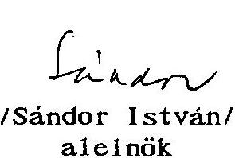
/Sándor István/ alelnök
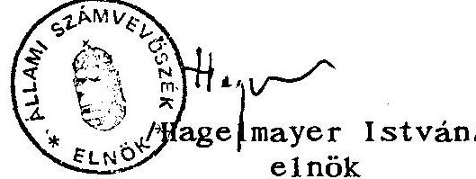

---

# A Kormány 2223/1995. (VIII. 8.) Korm. határozata 

a kárpótlási jegyek kibocsátási és megsemmisítési
rendjének továbbfejlesztéséről
A Kormány áttekintette a kárpótlási jegyek elsődleges forgalmazásának és megsemmisítésének rendjét, és a rendszer továbbfejlesztése érdekében az alábbi határozatot hozta:
1.a) A Kormány megállapítja, hogy a kárpótlási jegyek, mint közbizalmat élvező értékpapírok elsődleges forgalmazásának és megsemmisítésének a kárpótlási folyamat kezdetén kialakított rendje nem biztosítja az értékpapírforgalom megfelelő nyilvántartását, ellenőrzését és az értékpapírok biztonságos kezelését. Ezért külön-külön versenytárgyalást kell kiírni a kárpótláshoz kapcsolódó értékpapírok elsődleges forgalmazására és a megsemmisítési tevékenység végzésére. A versenytárgyalás során érvényesíteni kell a következő szempontokat:

- a két részfolyamat nyertese nem lehet azonos cég;
- a megsemmisítő nem folytathat a kárpótlási jeggyel brókeri tevékenységet;
- az elsődleges forgalmazó jelentősebb fiókhálózattal és értékpapír-kezelési gyakorlattal rendelkezzék;
- a nyertesnek tevékenységét legkésőbb 1996. január 1-jéig meg kell kezdenie.
b) A versenytárgyalást az Országos Kárpótlási és Kárrendezési Hivatal (OKKH) írja ki, és az elbírálásban a Pénzügyminisztérium és az Állami Értékpapír és Tőzsdefelügyelet (ÁÉTF) vesz részt.
Felelős: földművelésügyi miniszter
pénzügyminiszter
OKKH elnöke
ÁÉTF vezetője
Határidő: azonnal

2. Gondoskodni kell a kárpótlási jegyek forgalmazásával és megsemmisítésével kapcsolatban feltárt rendellenességek miatt a Budapest Értékpapír és Befektetési Rt-nél (BÉBRt.) a személyes felelősség vizsgálatának és érvényesítésének kezdeményezéséről.
Felelős: földművelésügyi miniszter
privatizációért felelős, tárca nélküli miniszter
Határidő: azonnal
3. A privatizációs ügyletek során az Állami Privatizációs és Vagyonkezelő Rt.

- gondoskodjon a privatizációs letétek átvételi és tárolási ellenőrzéséről, a naprakész, pontos nyilvántartásokról, a letéti igazolások kezeléséről, a megsemmisítés szakszerű ellenőrzéséről,
- vizsgálja meg, hogy a letéti igazolásokat miért fogadták el a sorozat és sorszám, címletérték pontos felsorolása nélkül, és a szükséges felelősségre vonásra tegyen intézkedést,
- a megsemmisítés felgyorsítását a saját lehetőségeivel segítse.
Felelős: privatizációért felelős tárca nélküli miniszter Határidő: folyamatos

4. A megsemmisítési folyamat felfüggesztésével egyidejűleg zárolni kell a BÉB Rt-nél tárolt, megsemmisítésre váró kárpótlási jegyeket, és gondoskodni kell azok tételes leltározásáról és biztonságos őrzéséről.
Felelős: földművelésügyi miniszter
a polgári nemzetbiztonsági szolgálatokat
felügyelő tárca nélküli miniszter
privatizációért felelős tárca nélküli miniszter
Határidő: azonnal
5.A Kormányzati Ellenőrzési Iroda (KEI) által készített vizsgálati anyagot át kell adni a feladatkörébe tartozó intézkedések megtétele céljából a Legfőbb Ügyészségnek, és a törvényi feltételek fennállása esetén kezdeményezni kell a büntetőeljárás megindítását.
Felelős: KEI elnöke
Határidő: azonnal
6. A másodlagos forgalmazás jogszabályi rendezést igénylő eseteiben a pénzügyminiszter, az igazságügy-miniszter és a földművelésügyi miniszter készítse elő az érintett jogszabályok módosítását, illetve kiadását.
Felelős: pénzügyminiszter
igazságügy-miniszter
földművelésügyi miniszter
Határidő: azonnal
Horn Gyula s. k., miniszterelnök

---

IGAZSÁGÜGYI MINISZTÉRIUM MINISZTER
19.809-2/1995. IM.

HAGELMAYER ISTVÁN úrnak, elnök

ÁLLAMI SZÁMVEVŐSZÉK

Budapest

## Tisztelt Elnök Úr!

A kárpótlási törvények végrehajtása körében, különösen a kárpótlási jegyek felhasználására tekintettel készített helyzetfelmérésről szóló jelentéssel (a továbbiakban: Jelentés) kapcsolatosan az alábbiakról tájékoztatom:

Mindenekelőtt köszönöm, hogy a helyzetfelméréssel kapcsolatos korábbi munkaanyagra a munkatársaim által tett észrevételek túlnyomó többségét a Jelentés készítése során figyelembe vették, egyúttal jelzem, hogy a korábbi levelünk 3., 8., 11., 12. és 13. pontjában megfogalmazott, de figyelembe nem vett - az esetek többségében csupán szövegezési pontosítást igénylő - észrevételeket változatlanul fenntartom.

Miután az anyag részben megváltozott, abba új elemek, illetőleg megállapítások is kerültek, az ezekkel kapcsolatos észrevételeimet az alábbiakban közlöm:

1) A Jelentés - annak 4. oldalán - a harmadik kárpótlási törvényről szólva egyebek között megállapítja: az Alkotmánybíróság e törvénnyel összefüggésben "leszögezte, hogy az ún. személyi kárpótlást egy újabb törvénnyel 1992. november 30-ig le kell zárni". Az Alkotmánybíróság azonban nem ezt, hanem azt mondta ki, hogy 1995. szeptember 30-ig kell orvosolni azt a mulasztásos alkotmánysértést, amely az 1992. évi XXXII. törvényben - 1992. november 30-i határidővel - előírt törvényalkotási kötelezettség teljesítésének elmulasztása miatt állt elő. Ehhez képest a Jelentés megállapítása nemcsak pontatlan, de félrevezető is, hiszen azt a benyomást kelti, mintha az állam immár harmadik éve nem tenne eleget az Alkotmánybíróság határozatában foglaltaknak. Valójában a Kormány a maga részéről betartotta az Alkotmánybíróság által megszabott határidőt, hiszen

---

az 1992. évi XXXII. törvény módosításáról szóló törvényjavaslatot 1995. júliusában benyújtotta az Országgyűléshez. E törvényjavaslat általános vitája jelenleg is folyik.
2) A Jelentés egyebek között azt is a törvény-előkészítők terhére rója, hogy nem foglalkoztak érdemben a kárpótlási törvényekből eredő további törvényhozási követelményekkel, nevezetesen azzal, hogy a tulajdonviszonyokba történő ilyen beavatkozás esetén a gazdaság működtetéséhez milyen újabb törvényeket és milyen tartalommal kell megalkotni. A Jelentés példaként az agrárpiaci rendtartásra és a szövetkezeti törvényre hivatkozik (5. old). E törvényeknek azonban nincs közvetlen összefüggésük a kárpótlással. Az agrárpiaci rendtartás esetén még a közvetett összefüggés is kétséges, a szövetkezeti törvény vonatkozásában pedig a közvetlen összefüggés csak az e törvény hatálybalépéséről és az átmeneti szabályok megállapításáról szóló külön törvény tekintetében értelmezhető.
3) A Jelentés 17. oldalán "az OKKH elnöke részére" javasolják annak felülvizsgálatát, hogy a mezőgazdasági vállalkozással (helyesen: vállalkozási támogatással) földet szerzett, de vállalkozóként az adóhatósághoz be nem jelentkezett személyek tekintetében "fennáll-e a tartós földhasználat". E javaslat megfogalmazásában nem szerencsés - sőt, kifejezetten zavaró - a "tartós földhasználat"-ra való utalás, hiszen ilyen elnevezéssel azt a speciális földhasználati jogintézményt illették, amelyet 1987-ben hatályon kívül helyeztek. Ettől eltekintve sem igazán világos azonban, hogy miért csak az utalvánnyal szerzett, de vállalkozóként be nem jelentkezett személyek esetében kellene megvizsgálni, hogy azok ténylegesen használják-e (helyesen: hasznosítják-e) az árverésen szerzett termőföldet, amikor ez a kötelezettség - a Kpt. 23. §-ának (1) bekezdése alapján - minden kárpótlási árverésen földet szerzett tulajdonost terhel. Az olyan személyek esetében pedig, akik utalvánnyal szereztek termőföldet nem csupán annak van jelentősége, hogy eleget tesznek-e hasznosítási kötelezettségüknek, hanem annak is, hogy ezt bejelentkezett vállalkozóként teszik-e, ellenkező esetben a Kpt. 24. §-ának (2) bekezdésében megfogalmazott jogkövetkezmények akkor is beállnak, ha egyébként a termőföldet (pl. bérbeadással) hasznosítják. Az arra illetékes állami szervek részére tehát azt kellene inkább javasolni, hogy ellenőrizzék: a kárpótlási árverésen termőföldet szerzett személyek a törvényben előírt (Kpt. 23. § (1) bek. és - utalvánnyal való földszerzés esetén - Kpt. 24. § (2) bek.) kötelezettségeiknek eleget tettek-e és ha nem, úgy a szükséges intézkedéseket tegyék meg. Ez utóbbit egyébként nem feltétlenül az OKKH, illetőleg a kárrendezési hivatalok feladatává kellene tenni, hiszen annak ellátására - álláspontunk szerint - a földhivatalok és - bizonyos vonatkozásban - az adóhatóságok sokkal alkalmasabbak (nem beszélve arról, hogy e szervek Kpt-ben, annak végrehajtási rendeletében és a termőföldről szóló törvényben szabályozott feladatkörével is ez állna összhangban).

---

4) Nem tartjuk kellően szabatosnak a Jelentés 21. oldalán található azt a megállapítást, amely szerint a "kárpótlási folyamatok szakmai irányítását" az OKKH elnöke végezte. E megállapítást ugyan a munkaanyag is tartalmazta, a véglegesített - szövegezésében kulturáltabb - Jelentésben azonban célszerűbb lenne úgy fogalmazni, hogy az OKKH elnöke jelentős mértékben vett részt a kárpótlási jogszabályok előkészítésében és - hivatalánál fogva - meghatározó szerepet töltött be a megalkotott törvények végrehajtásában, a kárpótlási folyamat napi gyakorlatának alakításában.
5) A Jelentés 25. oldalán (1.3. pont) szereplő az a kitétel, hogy a kárpótlási jegyek megsemmisítését illetően jogszabály nem született, csak a múltra vonatkozóan igaz. Időközben ugyanis kihirdették az egyes értékpapírok előállításának, kezelésének és fizikai megsemmisítésének biztonsági szabályairól szóló 98/1995. (VIII. 24.) Korm. rendeletet, amely a felhasznált és ez okból bevont kárpótlási jegyek megsemmisítése tekintetében is irányadó.
6) A Jelentés - annak 49-50. oldalán (3.2. pont) - megállapítja, hogy a személyi kárpótlás körében nincsen lehetőség a kárpótlási jegyek utólagos életjáradékra váltására. Bár ez a megállapítás ma még igaz, mégis célszerű volna utalni arra, hogy az ilyen tartalmú (a kárpótlási jegy helyett az életjáradék ismételt választását lehetővé tevő) törvényi szabályozást az Országgyűlés éppen a napokban tárgyalja (lásd ezzel kapcsolatban az életüktől és szabadságuktól politikai okból jogtalanul megfosztottak kárpótlásáról szóló 1992. évi XXXII. törvény módosításáról rendelkező T/1268. számú törvényjavaslat 7-8. §-át).

Végezetül megjegyzem, hogy a Jelentés mindazon megállapítása, amely a jogszabály-előkészítés komoly hiányosságait rója fel, csak annak tükrében értékelhető a tényleges súlyának megfelelően, ha figyelembe vesszük, hogy a kárpótlási törvényhozásnak kitaposatlan úton, minden előzmény nélkül, csaknem félévszázad legkülönbözőbb típusú állami "bűneit" kellett lehetőség szerint minél hamarabb, egységes jogi alapokon és feltételekkel rendeznie. E teljesítményt - különösen utólag - meg lehet ugyan ítélni a gazdasági racionalitás (gazdasági előkészítettség) szempontjából, de aligha lehet kizárólag ebből a nézőpontból hű képet festeni róla.

Budapest, 1995. szeptember 20.
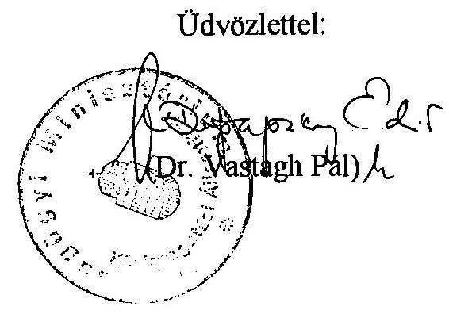

---

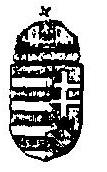

# ORSZÁGOS KÁRRENDEZÉSI ÉS KÁRPÓTLÁSI HIVATAL 

ELNÖK 92/8/1995.

## Dr. Hagelmayer István Úr Állami Számvevőszék Elnökének

## Budapest

Tisztelt Elnök Úr!
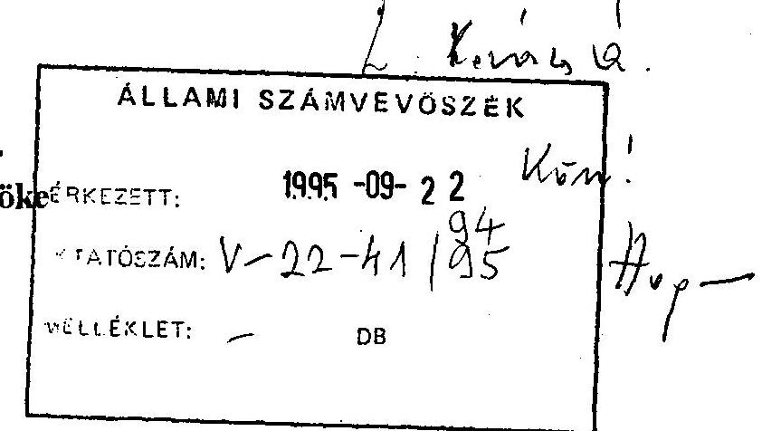

Az Állami Számvevőszék Vagyonellenőrzési Igazgatósága által a kárpótlási törvények végrehajtása tárgyában végzett helyzetfeltáró vizsgálatának összefoglaló - hivatalunk számára megküldött - jegyzőkönyvének megállapításaira az alábbi észrevételt teszem.

A vizsgálat megállapításait tényszerűnek, tárgyilagosnak, elemzéseit átgondoltnak, javaslatait a folyamat konkrét lezárására tekintettel fontosnak tartom.

A jelentés jobb átláthatósága érdekében és az összefüggések hangsúlyosabbá tétele érdekében a következőket ajánlom szíves figyelmébe.

- Ez évben várható kárpótlási jegy
 - kiáramlás becsült értéke, - az Alkotmánybíróság határozata nyomán születendő törvényben foglaltak nélkül 2-2,5 milliárd forint címletértéken (20-25 milliárd helyett, 6. és 25. oldal).

A számomra javasolt intézkedések (17. oldal) közül a mezőgazdasági vállalkozói támogatással árverezésen földet szerzett személyek vállalkozásával kapcsolatos ellenőrzésre jogszabályi felhatalmazás hiányában nem látok lehetőséget.

A kárpótlási folyamat egyes elemei összehangolatlanságának, - mely a kezdetektől mind a mai napig tart - megszüntetésére tett azon javaslattal, melyben a koordinátori szerepet, egy lehetséges megoldásként az OKKH-ra ruházná, egyetértünk, mert ennek hiányáról az elmúlt évek során több negatív tapasztalatot szereztünk. Véleményünk szerint a kárpótlás mielőbbi befejezésének érdekében a folyamat szereplőinek tevékenységét mind gazdasági mind politikai szempontból összehangolni szükséges.

Hivatalunk eddigi működésének értékelését - az esetenkénti jogos elmarasztalással együtt, segítőkésznek, és a jövőre nézve hasznos útmutatásnak értékelem.

A vizsgálatnak az Országos Kárrendezési és Kárpótlási Hivatal jövőbeni tevékenységét jobbító megállapításaiért köszönetet mondok.

Budapest, 1995. szeptember 15.
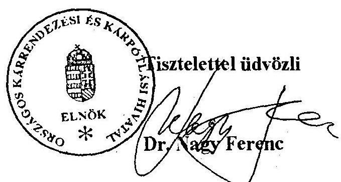

---

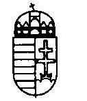

KORMÁNYZATI ELLENŐRZÉSI IRODA
ELNÖKE
Szám:..2:33/9....../1995.
Hagelmayer István úrnak,
ÁLLAMI SZÁMVEVŐSZÉK
ELNÖKE
Budapest
Tisztelt Elnök Úr!
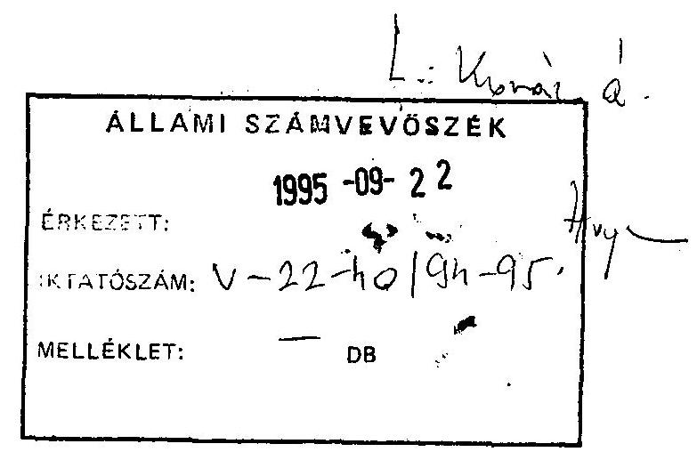

A kárpótlási törvények végrehajtása körében végzett helyzetfelmérésről - az Állami Számvevőszék által készített - jelentést munkatársaim áttanulmányozták.

A megállapítások a Kormányzati Ellenőrzési Iroda által korábban végzett ellenőrzések kibocsátást és megsemmisítést vizsgáló tapasztalataival összhangban vannak, az anyaggal kapcsolatban előzetes egyeztetésre is sor került.
Az esetleges értelmezési problémák elkerülése érdekében javasolom, hogy a jelentés 8. oldal 2. bekezdésének utolsó mondata helyébe a 28. oldal utolsó bekezdésének következő mondata kerüljön: "Valamennyi tevékenység egy kézben tartása visszaélésre ad lehetőséget".

Az ÁSZ által kifogásolt összeférhetetlenség kérdése a KEI vizsgálat során is felmerült. Tekintettel azonban arra, hogy az elsődleges forgalmazás jelentős része már lezajlott, nem tartottuk feltétlenül szükségesnek a már kialakított rendszer - a Kormányhatározatban rögzítetteken túlmenő - gyökeres megváltoztatását. Továbbá pénzintézet nem tiltható el a letétkezeléstől, más szervezet pedig nem rendelkezik a követelményeknek megfelelő fiókhálózattal.

Az anyaggal kapcsolatban egyéb észrevételt nem kívánok tenni.
Szeretném megjegyezni, hogy a vizsgálatban való együttműködés az ÁSZ részéről példaértékű volt, ezúton szeretném megköszönni Kovács Árpád úr segítő együttműködését.

Budapest, 1995. szeptember 19.
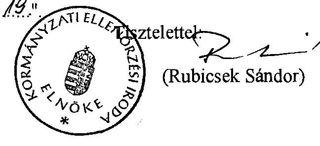

---

KINCSTÁRI VAGYONKEZELŐ SZERVEZET IGAZGATÓ

Budapest, 1995. szeptember 14. Ikt.szám: K/1101-768/1995. 29.49. Ügyintéző: Zboray Lóránt

Állami Számvevőszék
Hagelmayer István úr elnök

1393 Budapest
Pf.: 432

Tárgy: A kárpótlási törvények végrehajtása körében végzett helyzetfeltárás

Tisztelt Elnök Úr!

Kérésének megfelelően tanulmányoztam a tárggyal kapcsolatos jelentést és azzal kapcsolatban a következő észrevételeket teszem.
ad 31. oldal 1. bekezdés 3. mondat: a szöveget a következőkre javasolom módosítani: "..... a kivont" helyett a "kivánt" szóra.
ad 42. oldal 2. és 3. bekezdés: e két bekezdésben foglalt megállapításokkal kapcsolatosan mellékelten átadom a Pénzügyminisztérium Jogi és Koordinációs Főosztályától 1995. augusztus 18-án kapott, az állami vagyon értékesítése során a KVSz-hez beérkezett kárpótlási jegyek elszámolásával kapcsolatos 1243/1995. számú levél másolatát.

E két bekezdésben foglalt minősítéssel szemben - most már az idézett számú PM állásfoglalás birtokában is - a KVSz-nek a hozzá beérkezett kárpótlási jegyek elszámolásával kapcsolatos gyakorlatát változatlanul helyesnek tartom.

---

Fontosnak tartom rögzíteni azt is, hogy az önkormányzatok részére járó kárpótlási jegyek részükre történő tényleges visszajuttatására és a költségvetést megillető kárpótlási jegy hányad megsemmisítésére a KVSz az idézett számú PM állásfoglalás megérkezte után intézkedett.

Kérem észrevételeim szíves elfogadását.
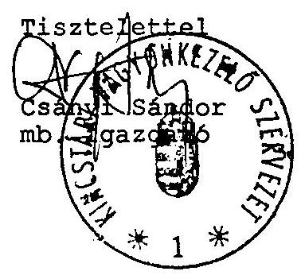

Melléklet: 1 pld.

---

# Pénzügyminisztérium 

Hivatkozási szám: $\begin{aligned} & 1101-420 / \mathrm{NL} / 94 . \\ & 1101-61 / \mathrm{NL} / 95 .\end{aligned}$

Tárgy:
Az állami vagyon értékesítése során a KVSZ-hez beérkezett kárpótlási jegyek elszámolása

## Jogi és Koordinációs Főosztály 1243/1995   Pénzügyi Jogi Osztály   Dr. Bíró Imre

## Csányi Sándor úrnak a Kincstári Vagyonkezelő Szervezet mb. Igazgatójának

Budapest
Zoltán u. 16.
1055

## Ztanyh   $14 \%$   75.08 .19/2t

Tisztelt Igazgató Úr!

A Kincstári Vagyonkezelő Szervezet korábbi igazgatójának fenti számú és tárgyú leveleire hivatkozással a kárpótlási jegyek költségvetési szervekre, így a KVSZ-re is egységesen kiterjedő hatályos számviteli előírásokon alapuló elszámolási rendjéről - Dr. Draskovics Tibor közigazgatási államtitkár úr egyetértő jóváhagyása alapján - a következőkben tájékoztatom.

1. A költségvetés alapján gazdálkodó szervekre vonatkozó számviteli előírások:
a) A költségvetési szervek, amennyiben kárpótlási jegyet vásárolnak, úgy azt beszerzési értéken kötelesek nyilvántartani. (A beszerzési ár azonos a kárpótlási jegyért fizetett összeggel.) Számviteli elszámolása: T Kárpótlási jegyek - K Pénztár.

---

b) Amennyiben a kárpótlási jegyhez az ingatlanok értékesítésekor, mint ellenértékhez jutottak hozzá, a szerződés szerinti értéken kell a kárpótlási jegyet nyilvántartásba venniök. (A beszerzési ár azonos a kárpótlási jegynek a szerződésben rögzítettek szerint meghatározott értékével.)

Ennek számviteli elszámolása:

- az ingatlanok értékének kivezetése a könyvekből nyilvántartási áron T 412 - K 12.
- az ingatlan ellenértékének könyvelése bevételként T 499 - K 931.
- kárpótlási jegyek vásárlása

T 19
vagy - K 499
321.
2. Számviteli elszámolás szempontjából a KVSZ kezelésében lévő állami vagyon értékesítéséből származó bevételként jelenik meg az ellenérték akkor is, ha készpénzzel egyenlítik ki, továbbá akkor is, ha annak fejében kárpótlási jegyet fogadnak el.
3. A 2. pontban leírtakból következően a Magyar Köztársaság 1994. évi költségvetéséről szóló 1993. évi XCI. törvény 8.§-ának (2) bekezdésében és az 1995. évi költségvetésről szóló 1994. évi CIV. törvény 10.§-ának (2) bekezdésében foglaltak nem értelmezhetők másként, mint

- az ingatlanok hasznosítása folytán a KVSZ a hozzá beérkezett - a törvény szerint meghatározott, a ráfordításokkal csökkentett összegű - kárpótlási jegyek 50%-át köteles átadni (térítés nélkül) az illetékes települési önkormányzatnak,
- az előbbiek után megmaradó kárpótlási jegyeket pedig a 3432/1993. Korm. határozatnak megfelelően kötelezően meg kell semmisíteni.

---

Az ismertetett értelmező állásfoglalás a hivatkozott törvényhelyek hatályon kívül helyezéséig, illetve módosításáig alkalmazható. Az ezzel kapcsolatos intézkedésre levelem egyidejű megküldésével az Állami Költségvetési Főosztály vezetőjét egyidejűleg felkértem.

Budapest, 1995. augusztus 15.

Tisztelettel:
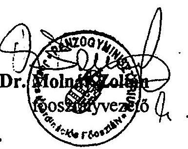

---

# 219/04/95.   433/24/143/195. 

1133 BUDAPEST. POZSONYI ÚT 56. LEVÉLCIM: 1395 BUDAPEST. PÉ: 700
TEL: 269-8600. FAX: 149-5745 TELEX: 20-2892

## Állami Számvevőszék

## Dr. Hagelmayer István úr, elnök részére

Budapest, Apáczai Csere János u. 10. 1052

## Tisztelt Elnök Úr!

## 1995-09-27

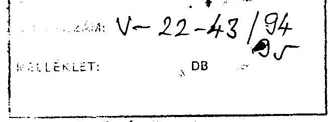

## 1 E E mais 4

Az Állami Számvevőszék által elkészített "A kárpótlási törvények végrehajtása különös tekintettel a kárpótlási jegyek felhasználására" című helyzetfeltáró jelentést áttanulmányoztuk, és az abban foglalt megállapításokat, javaslatokat megalapozottnak tartjuk, egyetértünk azokkal. Mindazonáltal engedje meg, hogy néhány apróbb pontosításra vonatkozó észrevételt tegyünk.

- A 35. oldal második bekezdésében:

Az ÁV Rt. Igazgatósága 1993. október 4-én hozott, 111/1993.sz. határozatában 92,8 Md Ft becsült piaci értékű, s nem ilyen névértékű részvénykínálatot jelölt ki kárpótlási jegyek ellenében.

- A 35. oldal utolsó bekezdésében:

Az adatok és a megállapítás pontosan (összhangban a 37. oldal táblázatával):
Az ÁV Rt. kárpótlási jegy bevétele 1995. április 25-ig címletértéken 14,9 Md Ft volt, ebből a kárpótlási jegy-részvénycserék 13,6 Md Ft, az ún. portfólió pályázatok 0,5 Md Ft, az MRP ill. a munkavállalók részére történő értékesítés 0,8 Md Ft bevételt jelentett.

- A 36. oldal 1.4.3. pontjában:

A gyógyszeripari és a márkavédelmi társaságok értékesített részvényeinek névértéke 148 M Ft, s nem 116 M Ft.

- A 37. oldal első bekezdésben:

Pontosítva az első mondat eleje: Az ÁVÚ és az ÁV Rt. által forgalomból kivont kárpótlási jegyek értéke...

- A 38. oldal második bekezdésében:

Az egyes kárpótlási jegyért történő értékesítési technikák alkalmazására valóban csak az 1992-93. években került sor. Ennek az a magyarázata - a jelentésben leírt okok mellett -, hogy a kárpótlási jegyek ekkor kerültek nagy tömegben a kárpótoltakhoz ill. a másodlagos forgalomba.

---

- A 39.oldal második bekezdésében:

Pontosítva: A KRP keretében bevont kárpótlási jegy névértéken 391 M Ft volt.

Az ÁPV Rt. a kárpótlási jegyek elfogadásának eljárása és a kárpótlási jeggyel szembeni kínálat megteremtése során a jövőben hasznosítani kívánja a jelentésben megfogalmazott megállapításokat és javaslatokat.

Budapest, 1995. szeptember 19.

Tisztelettel:
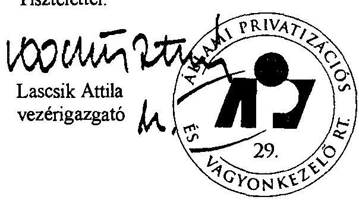

