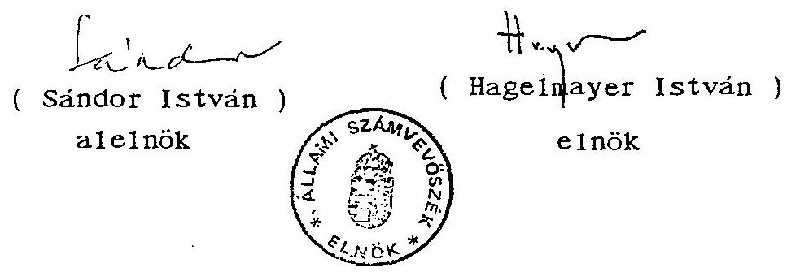

# J/1287. 

## JELENTÉS

"a szakszervezeti vagyon védelméról a munkavállalók szervezkedési és szervezeteik müködési esélyegyenlőségéról" szóló - többször módosított - 1991. évi XXVIII. tv. alapján a törvényben elốrt határidőket követően pótlólagosan benyújtott elszámolások ellenőrzéséról, azok hitelességének eredményéról

---

Készítette:
Dr. Elek János osztályvezető fötanácsos

---

# J E L E N T É S 

"a szakszervezeti vagyon védelméröl a munkavállalók szervezkedési és szervezeteik müködési esélyegyenlőségéröl" szóló - többször módosított - 1991. évi XXVIII. tv. alapján a törvényben elöirt határidöket követően pótlólagosan benyújtott elszámolások ellenőrzéséről, azok hitelességének eredményéről

A szakszervezeti vagyon védelméről, a munkavállalók szervezkedési és szervezeteik müködési esélyegyenlőségéről szóló - többször módosított - 1991. évi XXVIII. törvény (továbbiakban: törvény) 5. §. (7) bekezdése rendelkezett arról, hogy a törvényben elöirt határidőket követően beérkező vagyonelszámolások esetében az Állami Számvevőszék (továbbiakban: ÁsZ) ellenőrzési jogosultsága a második üzemi-közalkalmazotti tanács választások időpontjáig áll fenn és azt követő 60 napon belül az ellenőrzés eredményéről be kell számolnia az Országgyülésnek. E törvényi kötelezettség alapján a feladat teljesítéséről az alábbiakban számolok be.

A Munka Törvénykönyvéről szóló 1992. évi XXII. törvény 211. §. (1) bekezdése értelmében az üzemi tanácsi választásokat 1995. május 19. és május 26. között kellett megtartani, amelyek határidőben befejeződtek. A megadott időpontig a törvényben elöirt legutóbbi vagyonelszámolásról 1993. májusában készült jelentést követően az ÁsZ-hoz további vagyonelszámolás nem érkezett, így ellenőrzésre, hitelesség megállapítására nem volt szükség.

---

Tájékoztatom a T. Országgyưlést, hogy a törvény alapján a már elvégzett ellenőrzésekről, vagyone1számolások hitelességének eredményérő1 elózôleg 1991. novemberében a 3614. számú, valamint 1993. májusában az 10088 sz. jelentésben számoltam be az Országgyưlésnek.

Figyelemmel arra, hogy a törvény 5. §. (7) bekezdésének elsó mondata alapján az ÁsZ ellenőrzési jogosultsága a második üzemi tanács választásokig állt fenn a vagyone1számolásokkal kapcsolatos feladatot az ÁsZ teljesítettnek és befejezettnek tekinti.

Budapest, 1995. június 15.
