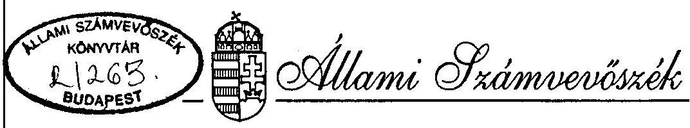
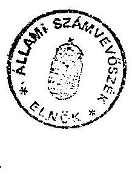
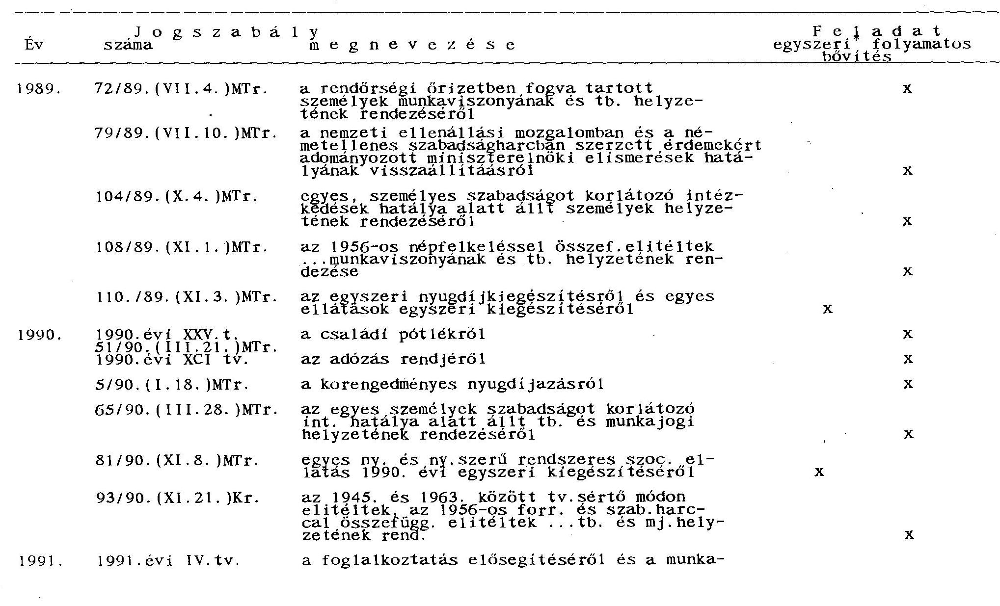

# JELENTÉS 

a Nyugdijfolyósító Igazgatóság müködése ellenőrzésének tapasztalatairól

---

A vizsgálat végrehajtásáért felelős: az ÁSZ IV. Vagyonellenőrzési Igazgatósága
dr. Kovács Árpád igazgató

A vizsgálatot vezette:
Dr. Csépán Magdolna osztályvezető főtanácsos
A vizsgálatot végezték:
Hajagos Józsefné számvevô tanácsos
dr. Kurucz István számvevô tanácsos
Szendrődi Józsefné számvevô
Az összefoglaló jelentést készítette:
dr. Kurucz István számvevô tanácsos

---

# ÁLLAMI SZÁMVEVŐSZÉK 

IV. VAGYONELLENÖRZÉSI IGAZGATÓSÁG
$\mathrm{V}-3-9 / 1995$.

## J E L E N T É S <br> a Nyugdijfolyósító Igazgatóság müködése ellenőrzésének tapasztalatairól

A vizsgálat célja a Nyugdijfolyósító Igazgatóság tevékenységi körének, müködési feltételeinek megismerése, továbbá annak megállapítása, hogy ebben milyen val tozások voltak 1989-1994. között, és a megváltozott követelményeknek az igazgatóság mennyiben tud megfelelni

A helyszíni vizsgálat 1995. február 20-tól április 14-ig tartott.

## ÖSSZEFOGLALÓ KÖVETKEZTETÉSEK

## I. A Nyugdijfolyósító Igazgatóság ellátási tevékenysége

1.) A Nyugdijfolyósító Igazgatóság (NYUFIG) az Országos Nyugdijbiztosítási Föigazgatóság irányítása alá tartozó igazgatási szerv. Tevékenysége mindkét biztosítási ág szempontjából igen fontos, sőt az Alapokba nem tartozó folyósítási feladatokat is végez.
Jelenlegi feladat- és hatáskörét alapvetően a 91/1993.(VI.9.) Kormányrendelet 3. § határozza meg. Feladatköre jelentösen bövült a vizsgált időszakban. A politikai és a gazdasági változásokat megjelenítő jogszabályok több új- és rendszeressé váló-, illetve egyszeri folyósítási feladatot határoztak meg a társadalombiztosítás, ezen belül a NYUFIG számára. A NYUFIG által folyósított kiadások aránya megközelítette az Alapok kiadásainak hatvan százalékát.
2.) Kapcsolatrendszerén belül nem kellően rendezett a munkakapcsolat a főigazgatósággal, a feladatmegosztás a MÁv Rt. Nyugdij Igazgatóságával.
Az ONYF-NYUFIG együttmüködésben az önkormányzatiságot érzékeltető elemek ellenére a költségvetési szervek alárölérendeltségét hangsúlyozó, érvényesítő munkakapcsolat a jellemző.

---

3.) A döntések előkészítői, és maguk a döntéshozók nem foglalkoztak azzal, hogy a gyakorlati megvalósitás (a folyósitás) mit jelent. Rendszeresen figyelmen kívül hagyták a folyósítások teljesíthetőségének körülményeit. Nem vizsgálták a végrehajtás feltételeit, -járulékos költségeit, a várható többletráfordításokat, illetve az elérhető megtakarításokat.

A nyugellátásokkal kapcsolatos döntések jelenlegi gyakorlata nehézkes. Az Országgyúlés nem vizsgálta, hogy a döntés átruházható-e a Nyugdíjbiztosítási Önkormányzatra.

A folyósítási munka igazgatósági előkészítése összességében megfelelő. A munkafolyamatba épített ellenőrzés eddig biztosítékot adott a hibák többségének kiszüréséhez.

Az új feladatok közül kiemelést érdeme1 a korengedményes nyugdíjazás, valamint a kárpótlási jegyek életjáradékra váltása. A megfelelő pénzügyi garanciák nélkül bevezetett korengedményes nyugellátás 1994-ig hétmilliárd forintos hiányt okozott a társadalombiztosításnak, melynek behajtása rendkívül nehéz, sok esetben reménytelen.
Az életjáradékosok száma, a kifizetett összeg évről-évre nő. A legújabb rendelkezések hatására várhatóan az eddigieknél is gyorsabb ütemú lesz a növekedés, me1y többletfeladatot ró a NYUFIG-ra és a megyei igazgatóságokra egyaránt.
4.) Az igazgatóság számítógépes szo1gáltatásai közül rossz a folyószámla feldolgozásának hatékonysága. A nagy költségge1, de több hónapos eltéréssel elvégzett összesités nem használható fel a megyei igazgatóságok operatív munkájához. A folyószámla könyvelés decentralizálása után -várhatóan 1996-tól- elkerül a feladat a NYUFIG-tól.
11. A Nyugdíjfolyósító Igazgatóság müködési feltételei

A növekvő követelmények végrehajtásához nem sikerült megteremteni a szükséges személyi, tárgyi feltételeket, me1y a jövőre nézve azzal a kockázattal jár, hogy az igazgatóság csak részben tudja ellátni a feladatait.
1.) Az igazgatóság a jogszabályi változásokkal összhangban készítette el, illetve módosította a belsö utasításokat, az ügyvíte1i rendet. A jogszabályi környezet kedvezötle-

---

nebbé vált a rendeletek gyakori módosítása, pontatlanságai miatt, ami megnehezítette a végrehajtást.
Esetenként a főigazgatóság jogszabály értelmezései is félreérthetők voltak.
2.) Többször változott az igazgatóság szervezeti felépítése. Nőtt a szervezeti egységek, ezen belűl a főosztályok, valamint a magasabb beosztású vezetők száma. A módosuló, illetve a bővülő feladatkör csak részben indokolta ezt.
3.) Jellemző volt a munkahelyi, területi megosztottság, melynek következtében nőttek a beruházási, üzemeltetési költségek, időszakonként romlottak a belsö és külső mun-kakapcsolati-, szolgáltatási feltételek.

Az igazgatóság számításai szerint javultak a fajlagos teljesítménymutatók, részben az ügyek számának csökkenése, részben a létszámnövekedés hatására. Ennek ellenére rendkívül magas volt a túlóra felhasználás, melynek nagysága megközelítette az előadók éves munkaidő alapjának mértékét. (A nagy leterhelés egészségkárosító következménnyel is jár.)

Jelentős összeget fizettek ki a túlmunka díjazására. A nagyobbrészt bérmegtakarításból származó jutalmazási keretet is föleg erre a célra használták fel, igy az nem jutalomként funkcionált. A bérmegtakarítás részben a tartós távollét, részben a be nem töltött létszám, illetve a létszámcserénél alkalmazott kisebb bérmegállapítás miatt keletkezett.
4.) Az igazgatóság pénzügyi lehetőségei korlátozottak voltak. A főigazgatóság határozta meg az igazgatóság gazdálkodási feltételeit, ugyanakkor nem adott tájékoztatást az évenkénti megtakarítások-, a pénzmaradvány felhasználásáról.

A főigazgatóság a NYUFIG létszámának jóváhagyásánál nem volt következetes. Hiányolható, hogy érdemben nem vizsgálta a feladatok végrehajtásának feltételeit, a kapcsolódó igazgatósági létszámgazdálkodást.
5.) A fejlesztésekre vonatkozó célkeretek főigazgatósági jóváhagyása rendszerint elhúzódott, részben a bonyolult döntési mechanizmus, részben a nem megfelelő igazgatósági előterjesztések miatt.

A bérelt ingatlanokon végzett felújítások aktiválása után az 1994. évre kimutatott állományi érték, illetve értéknövekedés nem a valós helyzetet tükrözi.

---

6.) A köztisztviselőkről szóló 1992. évi XXIII. törvény -vezetői kinevezésekre vonatkozó- előírásait nem tartották be az igazgatóságon. A követelményeket a vezető munkatársak beiskolázásával kívánják tel jesíteni, ezért várhatóan több éven keresztül nem érvényesül a törvényi előírás.

A dolgozók viszonylag nagy száma jár különböző, kötelezően előírt képzésre. Az erre fordított idő hozzávetőlegesen huszonöt, teljes munkaidőben foglalkoztatott munkatárs éves munkaidő alapjának felel meg.
7.) Az egységes társadalombiztosítási irányítás időszakában az ágazat nem rendelkezett önálló informatikai stratégiával. Az első stratégiai rendszerterv 1995. áprilisában készült el és a helyszíni vizsgálat időpontjában önkormányzati jóváhagyásra várt.

A NYUFIG 1989-tól saját informatikai tervvel rendelkezik. Számitógépes állományának komolyabb fejlesztése az említett évtől kezdődött el. A kapacitás bővítése, az informatikai rendszerek fejlesztése várhatóan folytatódik a következő években is.
Az állandóan változó jogszabályi környezet folyamatos munkát ad a fejlesztőknek. A komplex folyósítási rendszer (NYUFUR) karbantartása és kiterjesztése rendszeres feladat.

# JAVASLATOK 

## A Nyugdíjbiztosítási Önkormányzat

- vizsgálja meg az ellátásokkal kapcsolatos döntések előkészítését, végrehajtásának feltételeit, illetve költségvonzatát;
- vizsgálja meg az egyes ellátások emelésével, kiegészítésével kapcsolatosan, hogy csökkenthető-e az intézkedések éven belüli gyakorisága. A tapasztalatoktól függően kezdeményezzen jogszabálymódosítást;
- kezdeményezze a papíralapú adathordozók kiváltásának jogszabályi rendezését;

---

- tegyen javaslatot arra, hogy a NYUFIG és a MÁV Rt. Nyugdij Igazgatósága közötti feladatok megosztását jogszabály rögzitse.
- kezdeményezze, hogy a jogutód nélkül megszủnt cégek tartozását külsö forrásból térítsék meg;


# A Országos Nyugdijbiztosítási Fölgazgatóság 

a Nyugdijbiztosítási Önkormányzat e1nöksége, 36/1994.(V.24.) számú -a NYUFIG tevékenysége és müködési feltételei átfogó vizsgálatára vonatkozó- határozata végrehajtása keretében

- alakítsa ki a föigazgatóság és az igazgatóság szakigazgatási egységei közötti munkakapcsolatok normáit. Pontosan szabályozza a külsö kapcsolattartás feltételeit;
- vizsgálja meg hogy miként növelhető az igazgatóság pénzügyi, gazdálkodási önállósága, illetve felelössége.
A nem társadalombiztosítási Alapokat terhelö elszámolásokat úgy szabályozza, hogy minden bevétel és kiadás a NYUFIG-nál jelenjen meg;
- vizsgálja meg az igazgatósági munka-követelményeket, teljesítésük feltételeit és -idöigényét;


## A Nyugdijfolyósító Igazgatóság

- kérjen föigazgatósági állásfoglalást a szociálpolitikai egyezményes részarányos nyugdijak emelésénél követendö gyakorlatra;
- vizsgálja meg az özvegyi nyugdijak feléledése esetén hozott határozatok összegszerű helyességét;
- teremtse meg annak feltételeit, hogy a különbözö számítógépes rendszerek fejlesztése egységes informatikai szervezeten keresztül, illetve annak felelössége mellett történjen;
- úgy módosítsa a licenc díj fizetésének módját, hogy az ne terhel je elöre az igazgatóság pénzügyi forrásait;

---

# RÉSZLETES MEGÁLLAPÍTÁSOK 

## 1. A Nyugdijfolyósító Igazgatóság tevékenýsége

1. Az igazgatóság szerepe, tevékenységére ható körülmények

A NYUFIG az 1993-ig müködő Országos Társadalombiztosítási Föigazgatóság meghatározó súlyú igazgatási szervezete volt. Jelenleg a nyugdijbiztosító ágazat legnagyobb létszámú, szerteágazó feladatokat ellátó szerve.

Az igazgatóság feladatköre jelentősen bővült müködésének 45 éve alatt. Változott az elnevezése, többször módosult a felügyeleti szervi irányítás is.

Az 1950-ben alakult Országos Nyugdijintézet feladata volt a nyugdijak, árvasági ellátások, baleseti járadékok folyósítása. Felügyeletét a pénzügyminiszter, 1957-töl a munkaügyi miniszter látta el.

Másfél évtized múlva, 1964-ben -az. Intézet megszünése után- létrejött a NYUFIG. Időkőzben az igazgatóság jogosulttá vált egyes igények (özvegyi nyugdij, árvaellátás, házastársi-, családi pótlék) elbírálására.
Felügyeletét húsz éven át a SZOT, illetve annak TB. Föigazgatósága, majd 1984-töl 1991-ig a Minisztertanács, il letve az Országos Társadalombiztosítási Föigazgatóság (OTF) látta el.
Az igazgatóság feladata kiegészült az ellátások évenkénti emelésének végrehajtásával, a tüzelőutalványok kezelésével, a biztosítási díjak és egyéb letiltások levonásával, valamint 1987-től -összevonva a TB. Számítástechnikai Igazgatóságával- a folyósításhoz szükséges adatok gépi nyilvántartásával, a Föigazgatóság által elöirt számítástechnikai feladatok ellátásával.

Az 1991. évi LXXXIV. törvény döntött a társadalombiztosítás önkormányzati igazgatásáról. A 91/1993.(VI.9.) Kormányrendelet az Országos Nyugdijbiztosítási Főigazgatóságot bízta meg a NYUFIG felügyeletével, egyúttal meghatározta az igazgatóság hatáskörét és a -kibövült- feladatkörét.

A 4. sz. függelék összefoglalja azokat a jogszabályokat, ameiyek meghatározták a NYUFIG tevékenységét 1989-1994. között.A közel ötven jogszabály nem tartalmazza az idöközi

---

módosításokat, az 1975. évi II. törvény val tozásait, a nyugdijeme lésekre vonatkozó rendeleteket.

Az új és rendszeressé váló feladatok (például a politikai rehabilitációval; az elö-, korengedményes nyugdijazás bevezetésével; a kárpótlási jegyek életjáradékra váltásával kapcsolatos feladatok) mellett gyakoribbá váltak az egyszeri intézkedések, mint például az ellátások kiegészitése, a rendkívüli támogatások folyósitása.

Az Alapok kiadásán belül a NYUFIG által folyósitott kiadások aránya a vizsgált időszakban megközelítette a hatvan százalékot, mely 1994-ben 444 milliárd forint volt. Az Alapokat nem terhelő ellátások folyósításában az igazgatóság részaránya hétszeresére ( $4,5 \%$-ról $31,3 \%$-ra) nőtt 1994. végére (1. sz. melléklet), melynek múlt évi összege 63 milliárd forint volt.

# 2. Az igazgatóság kapcsolatrendszere 

A NYUFIG széleskörű kapcsolatot tart

- a főhatósággal (ONYF),
- a társadalombiztosítás szerveivel (ONYF és OEP megyei igazgatóságaival),
- külső szervekkel (intézmények, vállalatok), és
- a MÁV Rt. Nyugdij Igazgatósággal.

Az ONYF és a NYUFIG kapcsolata még nem klelégitő, különös tekintettel az igazgatóság önállóságára. Az önkormányzatíság mellett a szigorúbb, a költségvetési alá- fölérendeltséget hangsúlyozó viszony is jellemző a munkakapcsolatra.

A megyei igazgatóságokkal közvetlen és napi munkakapcsolatot tartottak. Alapvetően az új indításoknál elöforduló hibákat rendezték levélben, telefonon vagy faxon keresztül. Az OEP-ral a kapcsolattartás az ONYF-n keresztül valósul meg.

A külső kapcsolatok szervezésénél szintén a központosítás jellemző. Az ONYF olyan feladatokat is magára vállalt, (pl. a Postával való kapcsolat és szerződéskötés kezdeményezése, a Hadigondozottak Közalapítványával kötendő megállapodás), amelyek korábban igazgatósági hatáskörbe tartoztak. A jelenleg érvényes igazgatósági SZMSZ azt rögziti, hogy a főhatóságokkal való kapcsolattartás általában az ONYF-n keresztül történik. A Posta nem tartozik ide, de egyébként sem célszerű a jelzett pontatlan kifejezés használata a szabályzatban.

---

Önálló költségvetési intézménynek több önállóságot célszerű biztosítani.

A munkáltatókkal a korengedményes nyugdíj ügyekben rendszeres (bár szerződéssel nem szabályozott) a kapcsolat.

Sajátos, jogszabállyal nem rendezett munkakapcsolat alakult ki a MÁV RT. Nyugdíj Igazgatóságával.
A hagyomány és a korábbi, csak a MÁV-ot érintő speciális szolgáltatások miatt a folyósítást a MÁV Igazgatósága végzi (amely az összes folyósítás $5-6 \%-a$ ), de a NYUFIG feladata a pénzösszeg ellenjegyzése - annak ellenőrzési lehetösége nélkül -, a postára adás, a kiadások könyvelése. Szívességi alapon adják át az emelésekkel összefüggő ügyviteli utasításokat, veszik át és továbbítják a MÁV nyugdíjasok leveleit.

A vizsgálati tapasztalatok szerint nem volt kellően rendezett a jogszabályi értelmezéssel, a müködtetéssel kapcsolatos felügyeleti (föigazgatósági) tevékenység. (További részletek a II/1., 3., pontokban!)
3. Ellátási, folyósítási feladatok

# 3.1. A tevékenység teljesítménymutatói 

Az igazgatóság tevékenysége értékelésének egyik alkalmas eszköze az elintézett ügyek számának, változásának vizsgálata (2. sz. melléklet). Az igazgatóság nyilvántartása szerint minden megkeresés (beérkezés) külön beadványnak számít.

Az clintézett (ezen belül az egy före jutó) ügyek száma 1992-ig növekedett, majd a következő két évben, a feladatkör bövülése ellenére, együttesen közel húsz százalékkal csökkent az említett évhez képest.

Ennek oka, hogy kevesebb volt az un. visszatérő (elsősorban az 1929. év előtti közszolgálati időhöz, a személyi jövedelemadóhoz, a politikai rehabilitációhoz, a foglalkoztatáspolitikához kapcsolódó) ügyek száma, illetve jobb lett a korábbi ügyíratokat, az előzményeket kikereső nyilvántartási rendszer.

Fél százalékra csökkent a 30 napon túl, és öt és fél százalékra a 16-30 napon belül elintézett ügyek aránya. Az az elhúzódó ügyek részaránya egy-másfél százalék körül alakult.

---

Változtak a fajlagos mutatók, részben az ügyek számának csökkenése, részben a létszámnövekedés hatására. Csökkent az egy órára jutó ügyiratok száma (9,5-ről 7,3-ra), illetve 6,3 percről 8,2 percre nőtt az egy ügyiratra jutó idő.

Az igazgatóság számítása szerint ez nem elegendő. Átlagosan negyedóra - húsz perc az elfogadható mérték.

Az egyes osztályok között eltérőek az ügyiratokra vonatkozó mutatók, me1y elsősorban a szakmai feladat különbözőségének, eltérő munkaigényének a következménye.
Az igazgatóság által reálisnak tartott átlagos ügyintézési időt úgy érték el, hogy az elöadók éves munkaidőalapját megközelítő számú túlórát használtak fel, részben a munkahelyi, részben az otthoni munkavégzés keretében. A túlórák nyilvántartása, vezetése az egyes szervezeti egységek vezetőinek feladata, felelőssége.

# 3.2. A folyósítások menete és ellenőrzése 

A folyósítási munka menetét az 1. sz. függelék ismerteti. A folyósítások előkészítése, megszervezése, a kapcsolódó belsö ellenőrzési rendszer összességében megfelelő biztosítékot adott a végrehajtás során előforduló hibák többségének kiszüréséhez.

A havonta esedékes nyugdijak, járadékok folyósítását zárt számítógépes rendszeren keresztül hajtották végre. A postai utalványtól a folyósítást dokumentáló bizonylatig, részben gépi úton készült.

A folyósítás előkészítése során többszörös az ellenőrzés. Az indítási osztályokon ellenőrzött megyei határozatok két százalékánál találtak hibát. A múlt év végén a határozatok több mint nyolcvan százalékát már mágneslemezen küldték meg az igazgatóságok; 1991-ben még ötven százalékos volt az arány.

A bázis állományba történő felvétel után a gépi program ellenőrzi az adatokat. Hibás indító adatok esetén az ügyirat hibalistára kerül.

Az élő állomány gondozásával, a nyugdijasok, járadékosok kéréseivel, igényeivel az úgynevezett "folyósítási osztályok" foglalkoznak. Minden ügyiratot, pénzes és nem pénzes intézkedést ellenőriznek.
A nyilvántartás szerint az átlagos előadói hibaszázalék tíz százalék körül alakult. A bonyolultabb feladatot jelentő egyesített ellátások esetében felette, az öregségi

---

ügyekben ez alatt volt a hibásan előkészített iratanyagok aránya.

A munkafolyamatba épített ellenőrzést kiegészítve rendszeres célvizsgálatokat tartott az ellenőrzési föosztály (pl. az emelési hibahisták, a nem megengedett hibás tételek intézése, átfutási idô alakulása, ügyvite1i utasítások végrehajtása témákban), valamint a múlt év márciusában létrehozott szuperrevíziós föosztály, melynek alapvető feladata, hogy szúrópróbaszerűen ellenőrizze a főosztályokon már egyszer ellenőrzött anyagokat. Vizsgálja például az ügyvite1i utasítások végrehajtását, teszte1i az egyes intézkedések végrehajtásának feltételeit.

A helyszíni vizsgálat során végig kísértük a véletlenszerűen kiválasztott, de küllőnbőző ellátásokat érintő, eltérő ügyintézést igény1ő levelek útját, me1yek az egyes intézkedési helyekrő1 megfelelő dokumentálással kerültek tovább.

A vizsgálat keretében rendezetlennek találtuk az un. részarányos nyugdijak emelésének szabályozását, me1y elsősorban az igazgatóságnak róható fel.

Részarányos nyugdij: több országban létesített munkaviszony alapján megállapított nyugdijnak a szolgálati idó arányában megosztott része.

A folyósítást az OTF 80-1204/88. számú állásfoglalása alapján végzik. Az évek során jelentkező gondok újabb intézkedést igénye1tek volna.
A vizsgálat során (kiemelt ügyiratban) szereplő adatok szerint a 2/59-es részarány alapján 217 Ft-os esedékességet állapítottak meg 1995. márciusában, 1993. júliusig visszamenőlegesen, me1y az emelések hatására 2.897 Ft-ra nótt. Ugyanezen időszak alatt a csak Magyarországon dolgozó, minimális nyugdijra jogosult személy esetében kisebb volt az emelés százalékos mértéke.

# 3.3. Az éveinkénti emelések tapasztalatai 

A vizsgált időszakra je11emző volt, hogy rendszeresen több lépcsős nyugdijemelést kel1ett végrehajtani, változó százalékos értékekkel, módosult korlátokkal. A különbözö ellátásokat más-más feltéte11e1 eme1ték, me1yrő1 több jogszabály is rendelkezett. Mindezek megnehezítették az egyes ellátások emelésének megszervezését.

---

Az igazgatóságnak nincs tudomása arról, hogy vizsgálta-e felügyeleti szerv a parlamenti-, a kormányzati döntések végrehajtásának feltételeit, körülményeit.

A gondokat jól érzékelteti például a nyugdijemelési döntés és a folyósítás megszervezésének ügye.
Az intézkedés végrehajtásának időigénye -a NYUFIG számításai szerint- közel negyven naptári nap, de ennyi idő -néhány eset kivételével- nem állt rendelkezésükre. Több esetben a végrehajtásra biztosított idő tíz, illetve tizenötnaptári nap alatt volt.

Az előkészítés lerövidítése érdekében a hozzájuk eljutott jogszabálytervezet részben segítette a munkát, részben hátráltatta. Az utolsó pillanatban elhatározott módosítások (például az 1995. márciusi nyugdijemelés paramétereinek megváltoztatása) szükségessé tették a program módosítását, megzavarták az előkészítés menetét.

Az időben, illetve jobb időzítéssel meghozott döntésekkel tervszerűbb és kevésbé költséges lett volna a végrehajtás. Egy-egy hóközi emelés folyósítása 140-145 millió forint többletráfordítást okozott.

# 3.4. A foglalkoztatáspolitikai célú korengedményes nyugdíjazás 

Az 52/1987.(X.15.) MT. rendelet alapján 1988-ban megkezdődtek a korengedményes nyugdíjazások. Az 5/1990.(I.18.) MT. rendeletben biztosított kedvezőbb feltételek miatt (megszűnt az engedélykérési kötelezettség; öt évvel csökkent a férfiaknál elöirt minimális szolgálati idő) többszörösére - 1992-ben már hatvanezer fölé- emelkedett a korengedményes nyugdíjasok létszáma, majd 1994-ben az 1991. évi színt alá csökkent.
A csökkenés oka, hogy sokan elérték az öregségi nyugdij korhatárt, a kisebb cégek nem vállalták a fizetést (ez nem is volt érdekük), és elterjedt a rendelet módosításával (szigorításával) kapcsolatos kormányzati szándék.

A korengedményes nyugdíjazás ügyvitelénél először kézi, majd 1991-töl számítógépes (1994-töl nagyszámítógépes) nyilvántartást vezettek be, mely a befizetések és a folyósítások analitikai nyilvántartását is biztosította.

A korengedményes nyugdíjazás elszámolását az 1991. évi XXXVI. tv. úgy módosította, hogy az állami költségvetés

---

megté rítette a társadalombiztosításnak az 1990. év végéig fennálló 580 millió forint munkáltatói tartozást. Az 1991. évi 818 millió forint kintlevöséget (az 1992. évi LX. törvény elöirása alapján), a likviditási alap pótlására elkülönítetten kezelték, melyet 1994.év végéig kiegyenlítettek a munkáltatók.

A munkáltatók tartozása a sokszorosára nőtt és 1994. év végén meghaladta a 7 milliárd forintot, (az éves folyósítási összeg $71 \%$-át) mely rávilágít a bevezetés előkészítésének hiányosságaira. Az adatok tartalmazzák a MÁV Rt. Nyugdíj Igazgatósága kintlevöségeit. Az 52/1995.(V.10.) Kormányrendelet (a munkáltató elöre köteles kifizetni a tel jes összeget) megakadályozza a tartozások növekedését az új nyugdíjazások esetében (egyúttal csökkentheti az új igénylök körét), de nem ad megoldást a társadalombiztosításnál felhalmozódott hiány gyors megszüntetésére.
A számítógépes nyilvántartás alapján megállapítható az egyes munkáltatók helyzete, amiból következtetni lehet gazdasági, jogi körülményeikre. A nyilvántartásban szerepel például huszonhat jogutód nélkül megszünt cég neve. A 67 millió forintos tartozásuk behajtása nagy valószínűséggel nem realizálható.
Az OTF 2/1993. sz. utasítása behajtási, végrehajtási szervezeti egység létrehozására kötelezte a NYUFIG-ot, de ez nem történt meg. Megitélésünk szerint elhibázott volt az utasítás, mert nem lehet központilag és a fővárosból eredményesen szervezni a behajtási tevékenységet. Nincs is szükség külön szervezet létrehozására, hiszen a megyei igazgatóságoknál már megalakultak, müködnek. Célszerübb tehát a NYUFIG javaslata, mely a megyei egészségbiztositási pénztárakra bízná a nyugdijtartozások behajtását. (Idöközben az OEP 6/1995.sz. utasításával rendezödött az ügy.) Az önállóan végzett "behajtási" tevékenység eddig mérsékelt eredménnyel járt. Az elmúlt évben, a közel fél milliárd forintos követelésre, 77 millió forint volt a befolyt összeg.

# 3.5. A kárpótlási jegyek életjáradékra váltása 

A kárpótlási igények életjáradékra váltását az életüktől és szabadságuktól megfosztott kárpótoltak esetében az Országos Kárrendezési és Kárpótlási Hivatal, a vagyoni kárpótlás életjáradékra váltása esetén a nyugdíjbiztosítási ágazat megyei igazgatóságai bírállák el.
A személyi és vagyoni kárpótlás alapján folyósitott ellátások növekvő tendenciát mutatnak. Az elmúlt év végén a személyi kárpótlás alapján folyósított életjáradékok száma

---

45 ezer, a kifizetett összeg 3,5 milliárd Ft volt. A vagyoni kárpótlás alapján kétezren kaptak összesen 38 millió Ft életjáradékot.
A folyó évben már jóváhagyott törvény, az előkészített törvénytervezetek, valamint a februári alkotmánybírósági határozat jelentős változást (várhatóan növekedést) eredményez a kérelmezők száma, illetve a folyósított összeg tekintetében, ami a NYUFIG-ra és az ONYF megállapító szerveire egyaránt több feladatot ró. E témával részletesen a 2. sz. függelék foglalkozik.

# 3.6. Igényelbírálás, a megállapítások helyessége 

A 3. sz. melléklet részletezi, hogy az igazgatóság milyen esetekben rendelkezik igényelbírálási jogkörrel.
A végrehajtást nchezítette a jogszabályok gyakori módosítása. A hozzátartozói ellátásra, (különösen az özvegyi nyugdíjra) vonatkozó törvények változása szükségessé tették a kialakított rendszer folyamatos megújítását.

A hozzátartozói ellátások megállapítása 1986. évtől mikroszámítógépes feldolgozással készül. Ügyvitéli utasítás szabályozza azokat az eseteket, amikor a gépi megállapítás nem lehetséges. Ilyenkor hagyományos, manuális módszerrel történik az igényelbírálás.

A megállapítások együttes száma eltérő ütemben, de folyamatosan ( 146 ezerről 202 ezerre)nött 1993-ig, majd a következő évben 180 ezerre csökkent. A hozzátartozói ellátások (özvegyi-, szülői nyugdij) esetében a rendelet kiterjesztő hatása érződött az 1993-1994. évi eróteljesebb növekedésben. A házastársi pótlékkal összefüggő megállapítás csökkenése elsősorban azzal magyarázható, hogy nőtt a saját jogú nyugdíjjal, ellátással rendelkezők köre, és igen alacsony az a nyugdij összeg (jelenleg 9.670 Ft), amely felett már nem adható házastári pótlék. A pótlék összege jelenleg maximum 6.360 Ft .

A mikroszámítógépes határozatokat ugyanúgy ellenőrzik, mint az összes többi ügyiratot. A vizsgált időszakban azonban nem volt olyan célellenőrzés, amely a megállapítások helyességére irányult volna.

Felkérésünkre a szuperrevíziós főosztály ellenőrizte NYUFIG számítógépes megállapításai közül az általunk kiválasztott nap íratanyagát. A 239 megállapításból 221 hibátlan volt. A további 18 ügy esetében a rendszeres szociális járadékkal egyesített hozzátartozói igényt a jogtalanná

---

vált energiatámogatás visszavonását érintő alaki, adminisztratív hibákat találtak.

A külön elrendelt célellenőrzés nem terjed ki a hagyományos módszerrel történő megállapításokra. Ezek közül kiemeljük az özvegyi nyugdij feléledéseket, ahol célszerű megszervezni az igazgatósági célvizsgálatot.

A megyei igazgatóságoktól érkező megállapító határozatokat csak részlegesen, folyósítási szempontból vizsgálják (például az ellátás jogosságát, a visszamenőleges összeg nagyságát). Nem vizsgálják a megállapítások helyességét, de ez nem is lehet feladatuk.

# 3.7. Egyéb feladatok 

Az igazgatóság több olyan, általában é melkedő tételszámú szolgáltatást is végzett, amely nem tartozott az alaptevékenységhez.
Ezek közül kiemelést érdeme1 a folyószámlák feldolgozása, ami az adatrögzítéstöl a feldolgozásig kb. két hónapot. vett igénybe.
(A számítástechnikai főosztály tájékoztatása szerint a feldolgozás menetét zavarja, hogy a budapesti és pest megyei igazgatóságnál külső cég végzi az adatrögzítést, amit gyakran határidő után küldenek és az is pontatlan. Az egyeztetés befejezéséig nem készíthető el az országos összesítő sem.)

A hosszú átfutási idő miatt az operativ munkához nem adtak segítséget a feldolgozott adatok.
A központilag elvégzett hatalmas munka hasznossága így nagyon mérsékelt volt, ugyanakkor csak a NYUFIG-nál felmerülö havi költség megközelítette a 3 millió forintot.
A tervezett decentralizált folyószámla feldolgozás csökkentheti a NYUFIG müködési költségeit és növelheti a más célra hasznosítható feldolgozási kapacitást.

### 3.8. Az igazgatósághoz érkező észrevételek jellemzői

A vizsgált időszakban beérkező észrevételek, panaszügyek száma 1990-92. között az 1989 évihez képest a kétszeresére nőtt és az évenkénti megkeresések száma meghaladta a négyezret. A NYUFIG-ot illető észrevételek $28-30 \%-a$, míg a külső szerveket érintő ügyek több mint $90 \%-a$ volt indokolt.

---

A következő két évben a panaszok száma és indokoltságuk is jelentősen csökkent; az 1993-ban ezerkilencszázra, 1994-ben ezerkétszázra. A külső szerveket érintő arány lényegében nem változott, csak az indokoltság mértéke és aránya csökkent.

Az ismétlődő panaszok száma elhanyagolható; 1990-ben volt a legtöbb, összesen tizenkettó.

A vizsgált időszakban a legtöbb panasz a kifizetés elmaradása miatt volt, nemcsak összességében, de évenként is. Nagyságát tekintve külön említésre érdemes a hozzátartozói megállapítással, a folyósított összeg nagyságával, a házastársi-, családi pótlék megállapításával kapcsolatos panasz.
A legtöbb, és indokolt kérés (sürgetés) az egyesített ellátások osztályaihoz és a hozzátartozói osztályhoz érkezett. A nyilvántartásból azonban nem derült ki, hogy mit reklamált az ügyfél (például a késedelmes folyósítást, a megállapított összeget).
II. A Nyugdíjfolyósító Igazgatóság müködési feltételei, gyakorlata

1. A müködést meghatározó jogszabályi környezet

Az igazgatóság működését a vonatkozó törvények, kormányrendeletek, a főigazgatósági- igazgatósági utasítások, állásfoglalások, az ügyviteli rend szabályozza.
Az igazgatóság a jogszabályi változásokkal összhangban készítette el, illetve módosította az ellátásokat érintő belsö utasításokat, az ügyviteli rendet.
A helyszíni vizsgálat időszakában érvényes igazgatósági szervezeti és müködési szabályzatot 1995. február 15-i hatállyal hagyta jóvá az ONYF főigazgatója.

A müködést meghatározó jogszabályi környezet kedvezötlenebbé vált. A jogszabályok sokasága, a gyakori módosítások, az esetleges ellentmondások, pontatlanságok miatt (legtöbbször a jogszabály alkotó szándéka sem vált ismertté) nehezen lehetett kialakítani az egységes gyakorlatot a végrehajtásban.

Az ellentétes érdekek jogszabályi megjelenítése komoly feszültségek forrásává vált az egyes ellátásoknál.
Komoly gond a nyugellátás és a rendszeres szociális járadék közötti ellentmondás erősödése. Az RSZJ feltételei és

---

a hosszú szolgálati idővel, járulékfizetéssel megszerzett nyugdijjogosultság alapján kapott ellátás között elhanyagolható a különbség. Az RSzJ-ban részesülők ellátásai gyakran kedvezőbben változtak.
A feszültséget növelte, hogy az induló nyugdijak 1991-94. évek közötti átlagos összege 5-8 \%-kal (ezen belül a rokkant nyugdijaké $15-17$ \%-kal) kisebb volt, mint az összes kifizetett nyugdij egy före jutó átlaga. A különbség 1994-ben már közel ezer (a rokkant nyugdijnál több mint kétezer) forint volt. A kedvezőtlen tendencia várhatóan tartós marad.

A jogszabályi problémák miatt, illetve a jogosultság eldöntése érdekében gyakran volt szükség jogszabályi értelmezésre, állásfoglalásra.
A 5. sz. függelékben szereplő példák alapján a vizsgált idöszak fölgazgatósági gyakorlata több esetben kifogásolható. A nem egységes értelmezés, a szakmai bizonytalanságok, a követelményeket és következményeket végig nem gondoló döntés, a hosszú átfutási idő, a felügyeleti szervek ellentétes álláspontja nehezítették az igazgatósági végrehajtást.

# 2. A feladatellátás tárgyi, technikai feltételei 

### 2.1. Az igazgatóság szervezete

Az igazgatóság belsö -az igazgató és két helyettese között megosztott- irányítási rendszere nem-, de a három vezető felügyelete alá tartozó szervezet többször változott.
A szervezeti változások többnyire nem a konkrét ellátás, folyósítás változásához kapcsolódtak (bár erre is volt példa: a korengedményes nyugdij, életjáradék folyósítására létrehozott osztályok), hanem az igazgatóság szervezeti korszerűsítéséhez. Ennek keretében összevontak tanácsadói (számítástechnikai, müszaki-gazdasági, adatvédelmi) feladatokat, illetve a szervezetek közötti logikai kapcsolatokat tekintették irányadónak.

Ezzel összhangban került a számítástechnikai főosztályhoz a korábban önálló számítástechnikai és műszaki csoport, majd osztály, az igazgatási főosztálytól a titkársági főosztályhoz az információs részleg.
A legnagyobb változtatást 1994-ben hajtották végre, amikor az ellátások folyósítását új alapokra helyezték.

---

A szervezeti változásokkal együtt megszaporodott a szervezeti egységek száma (1989-1995. között ötvenhatról hetvennégyre), ezzel együtt a vezetök (ezen belül a magasabb beosztású vezetők) létszáma is. A jelenlegi vezetői létszám meghaladja a százat, ebből a Ktv. szerint besorolt vezetői létszám ötvennyolc fő.

A főosztályok köre négyről tizenötre, az osztályoké tízről huszonnyolcra nőtt, miközben megszüntek az önálló csoportok, és tizenkilencről ötre csökkent az önálló osztályok száma (részletesebb tájékoztatás a 3. sz. függelékben található).

# 2.2. Az igazgatóság elhelyezése 

A vizsgált időszakban a területi megosztottság volt a jellemző. Az igazgatóság egyes telephelyei többször változtak, időszakosan nőtt az egymás közötti távolság. A munkahelyi, területi megosztottság miatt emelkedtek a beruházási, üzemeltetési kiadások. Például a Hajógyári szigeti ráfordítások $84 \%$-a bérleti dij volt.
A költözések nagy terhet róttak az igazgatóságra, különös tekintettel arra, hogy a terjedelmes és pótolhatatlan íratanyagok szállításának, megőrzésének feladata mellett el kellett látni a napi munkát is. Növelte a gondot, hogy a jogszabályi előírások hiányosságai miatt az élő íratanyagot papíralapon is tárolni kell(ett).

Az elmúlt év végére a területi megosztottság (szétszórtság) némileg csökkent.

A NYUFIG végleges és összevont elhelyezését a nyugdijágazat új irodaháza megépítése után kívánja megoldani a föigazgatóság.

### 2.3. Az ügyfélszolgálati tevékenység és feltételei

A havi ügyfélforgalom 13-32 ezer, az átlagos havi forgalom $15,5-23,5$ ezer között alakult a vizsgált időszakban. A forgalom észrevehetően változott az egyes intézkedések (pl. igazolások kérése; tb. kártya kiadása, cseréje; ÁFA kompenzáció), vagy a téves, esetleg idő előtti sajtó, vagy egyéb információk hatására.

Az ügyintézés jellegét tekintve megoszlott a folyósítási jellegű, a helyben elintézhető ügyekre, illetve telefoni szolgálatra. A csúcsidőszakban a folyósítási osztályok

---

közremüködésével, az ügyféltérben végzett felvilágosítással tudták ellátni a feladatukat.
Az egy órára jutó személyes megkeresések száma 3-13 között változott, a telefoni hívások száma 10-23 között alakult.

Az ügyfélszolgálati munka számítástechnikai feltételei ugyan javultak, de az elözmények és az alapdokumentációk esetében továbbra is csak az iratanyagból tudtak dolgozni a munkatársak. Még nem kedvezőek az elhelyezési feltételek. Az irodatechnikai fejlesztés lehetősége korlátozott a helyhiány miatt. Nincs elég telefonvonal, de beszerelése esetén sem lenne helye az ügyintézőnek, mely ki hat az ügyfélszolgálati munka színvonalára és időszakosan akadálya a kulturált, gyors ügyintézésnek.

# 3. A müködés pénzügyi feltételei 

### 3.1. A müködési költség alakulása

A müködési költség 1989-94. között (a nyugdijas utalványok 1989-91. évi postai költsége nélkül), az ötszörösére nött, és 1994-ben 1,4 milliárd forint volt (a társadalombiztosítási alapok egészét tekintve hatszoros volt a müködési költség növekedése), miközben a szolgáltatási szektor folyamatos kiadása ennél mérsékeltebben, megközelitőleg a háromszorosára emelkedett.
A müködésre átvett pénzeszköz nagyságát a tervezett kiadások határozták meg. Az alaptevékenységük ellátásához szükséges pénzügyi forrást döntően a társadalombiztosítási alapból fedezték. A müködési ár- és dijbevétel (pl. a gépi adatfeldolgozás-, az épület bérbeadásának bevétele), illetve az egyéb bevételek (pl. tárgyi eszközök értékesítéséből, alkalmazottak-<térítéséből származó bevételek) nem érték el a müködési célú bevétel tíz százalékát.

A kiadások közel felét a bérre és járulékaira forditották. A fejlesztéseket a felügyeleti szerv által jóváhagyott célkeretből és pótelöirányzatból finanszírozta a NYUFIG. A célkereteket általában késedelmesen fogadták el. Ennek oka volt egyrészt, hogy a NYUFIG nem készített megfelelően részletezett javaslatokat, másrészt a felügyeleti szervnél bonyolult volt a döntési mechanizmus, elhúzódott az ágazati célok egyeztetése. A társadalombiztosítás egészét érintő fejlesztéseket (pl. a NYUGDMEG projekt megvalósítását) a központi igazgatási szerv hajtotta végre.

---

A beruházások növekvő kiadását meghatározták a jelentősebb számítástechnikai fejlesztések, ezen belül is kiemelhető az IBM központi számítógép, illetve AS/400-as gép beszerzése, telepítése.

Felújításokat saját és bére1t ingatlanokon egyaránt végeztek. A bére1t ingatlanokon végzett felújítás értékét aktiválták, de a 8-Sz-774/1992. számú OTF utasítás értelmében a nettó érték rendezéséről (nul1ára írásáról) csak a szerződés lejárta (1995. január 31.) után intézkedtek. Ezért az 1994. évre kimutatott állományi érték, illetve értéknövekedés nem tükrözi a tényleges helyzetet.
A költözések miatt növekedett a bér és dologi költség, melynek bruttó összege 39 millió forint volt. Ezen belül a bérkiadásokra 15, bútorra 11, kísértékủ tárgyi eszközök beszerzésére 13, szállításra 9 millió forintot fordítottak.
A kiadásokat növelte az áreme1kedések miatti többletkö1tség.
Az évenkénti megtakarítások sorsáról, valamint a pénzmaradvány nagyságáról a föigazgatóság döntött, melyről nincs írásos dokumentum az igazgatóságon.

# 3.2. A létszám-, a bér- és a jövedelmi helyzet 

Az igazgatóság un. engedélyezett létszáma 45 \%-kal, 781-ről 1.133-ra, az év végén betöltött létszáma 40 \%-kal, 792-ről 1.106-ra, az átlagos létszáma 25 \%-kal, 763-ról 956-ra nőtt a vizsgált időszakban. Az igényük ennél több volt (4. sz. melléklet), me1yet alátámasztanak a teljesítménymutatók adatai.
A föigazgatóság a vizsgált időszakban kért létszámfejlesztés hetven százalékát teljesítette. Nem indoko1ták meg az e1utasításokat, illetve a részleges, vagy az igénytől eltérő teljesítéseket. Előfordult, hogy a kére1emre nem is válaszoltak.
Az egyes évek létszámfejlesztésében nagy különbségek voltak. A jelentősebb létszámnövelésre föleg az utolsó három évben volt lehetőségük. Létszámfejlesztési igényüket a biztosítási ágak szétválásával, az újonnan jelentkező ellátásokkal, illetve a tételszám növekedésével, az ellenőrzési tevékenység megerősítésével, a biztosítási kártya feldolgozásával indoko1ták. Ennek megfelelően -az engedélyezett kereten belül- elsősorban az egyes e1látási, valamint a pénzügyi, számviteli, ellenőrzési szervezetek létszámát növe1ték.
Az előadói és revizori létszámszükséglet megállapításához készített normaszámítás alapján a jelenleginél több mun-

---

katárs felvételét tartja indokoltnak az igazgatóság vezetése. A számítások felügyeleti szintü értékelése, szakértői véleményezése eddig még nem történt meg.

A munkaterhelés következményeként nagyarányú volt a létszámmozgás, az egészségkárosodás. Az 1995. február eleji állapot szerint a 987 fö beosztott munkatárs fele öt évnél, ezen belül a többségük két évnél rövidebb ideje dolgozik az igazgatóságon. Az 1994-ben végzett egészségügyi szürövizsgálat szerint a megvizsgáltak $70 \%$-át nem találták egészségesnek. Az orvos-csoport tájékoztatása szerint ez kétszer magasabb arányú volt, mint más... intézmények vizsgálati eredménye.

Hat év alatt az egy före jutó átlagbér 9 ezer forintról 31 ezer forintra nőtt, mely követte a föigazgatóság egészének átlagbér emelkedését. (4/b. sz. melléklet).
A köztisztviselői törvény illetményre vonatkozó előirásait 1994. november 1-vel az igazgatóságon is végrehajtották.
A kifizetett átlagos jutalom 1989-90-ben 2,5-3,5 havi, 1991-94-ben 5-5,5 havi átlagbérnek felelt meg. A 100-120. fős vezetői kör (csoportvezetőtől az igazgatóhelyettesig) átlagosan 1,5-2,5 havi bérrel egyenlő összeget kapott az utolsó két év jutalmazási keretéből.
Az 1989-90. és az 1992. évben kifizetett jutalom több mint kilencven százaléka, 1991-ben és 1993-ban a kétharmada származott bérmegtakarításból. Bérmegtakarítás részben a tartós távollét (betegség, szülési szab.), részben az idöben be nem töltött létszámkeret, illetve a létszámcserénél alkalmazott kisebb bérmegállapítás miatt keletkezett. Részletes kimutatás, elemzés nem készült az igazgatóságon.
A bér és jutalom együttes havi átlaga 12 ezer forintról 44 ezer forintra nőtt a vizsgált időszakban.
A jutalomnak sajátos szerepe volt az igazgatóságon. A kifizetett összeg meghatározó része a túlmunka dijazására szolgált, ezáltal nem is jutalomként funkcionált.

# 3.3. A szakmai követelményrendszer és teljesitése 

A köztisztviselői törvény vezetői kinevezésre vonatkozó előírását nem tartják be az igazgatóságon, ami egyébként a társadalombiztosítási apparátus egészére is jellemzö. A vezetők négyötödének nincs meg a kötelező felsőfokú iskolai végzettsége. Ennek elsősorban az az oka, hogy hosszú éveken keresztül a felsőfokú társadalombiztosítási tanfolyam elvégzése volt a vezetői kinevezés feltétele.

---

A stabilnak tekinthető vezetői gárda nyolcvan százaléka rendelkezik ezzel a szakmai képesítéssel.
Jelenleg a vezetők negyede vesz részt 3 vagy 4 éves föiskolai képzésen. A képzési terv szerint 1995-ben és 1996-ban további 20-20 százalék kezdi meg felsőfokú tanulmányait.
Az igazgatóságon dolgozók viszonylag nagy száma jár különböző, kötelezően elöírt képzésre, me1y időnként gondot okoz a munkaszervezésben. Állami iskolába, illetve szakmai tanfolyamra 101 munkatárs jár és az 1995-ös tanévtól már közel háromszázötvenen vesznek részt szervezett oktatásban. A kötelezett vezetők kétharmadának ( 35 főnek), a -munkatársak több mint felének ( 326 főnek) kell közigazgatási alapvizsgát tenni. Közel kétszáz munkatársnak le kell tennie az ügykezelői alapvizsgát. A képzésre, továbbképzésre fordított idö kb. huszonöt, teljes munkaidöben foglalkoztatott munkatárs éves munkaidő alapjának felel meg. Az iskolai képzések elvégzésének kötelezettsége szerepel a vezetői megbízatásokban, illetve az ideig1enes átsorolásokban.

# 4. A NYUFIG tevékenységének informatikai háttere 

### 4.1. Az informatikai stratégia kialakítása

Az egységes társadalombiztosítás idején az ágazat önálló stratégiával nem rendelkezett. Az egykori OTF Fejlesztési Iroda az átmeneti időszakra (a világbanki kölcsönböl megvalósuló fejlesztés realizálásáig) készített stratégiai tervet. Ebben a müködőképesség megtartásához szükséges feladatokat rögzítették, mindkét biztosítási ágazatra. A nyugdij ágazatnál a folyósítási és a megállapítási fejlesztések szerepeltek, amelyek évekre lebontva, eltérő tartalommal és ütemben teljesültek.

A nyugdij ágazat központi igazgatási szervének létrehozása után egyik jelentős feladata lett az informatikai stratégia kialakítása.

Az ágazat informatikájának első stratégiai rendszerterve (KSIRT) világbanki támogatottsággal 1995. áprilisában elkészült, és a helyszini vizsgálat idöszakában önkormányzati jóváhagyásra várt. Mielöbb eldöntendő kérdés a társadalombiztosítás és az állambaztartás jövőbeni kapcsolata a stratégia projekt szintü lebontásához, megvalósításához.

Az igazgatóság számítástechnikai fejlesztéseinek hosszú távon és éves szinten illeszkednie kellett illetve kell

---

az előbbi stratégiához, ellátási feladatuk másságának figyelembe vétele mellett.

A NYUFIO rendszer saját fejlesztésű, de más az ágazaton belüli központi felelősség vállalású rendszerekhez való kapcsolatuk biztosított.

A központi felelősség vállalás előnyei:

- a közös platform az ágazaton belül,
- nagyobb volumenű beszerzések esetén kedvezőbb ár, jobb garanciális feltételek elérése mellett,
- kedvezőbb üzemeltetési költségek.


# 4.2. Hardver ellátottság 

Az állomány jelentős minőségi és mennyiségi fejlesztése 1989-ben indult. Az addig üzemelő R32-t IBM gépekkel váltották fel. (Kezdetben 4361, majd egy újabb fejlesztéssel 4381 típussal.) A perifériák kapacitását is fokozatosan bővítették.

A teljesítmény növelése és a kapacitás bővítése részben feladat növekedés (új folyósítási feladatok ellátása, betegbiztosítási kártya nyilvántartása, járulék bevételek központi könyvelése és ágazati elszámolása, családi pótlék jogosultság), részben az ellátottak számának növekedése miatt vált szükségessé.

1995-ben a központi családi pótlék és az aktív betegbiztosítási kártya nyilvántartásánál csökkent az ellátottak száma. A feladatokat az egészségbiztosítás vette át.

A folyósítás alapja IBM mainframe. A Sas utcában múködő számítóközpont gépparkja 2 db IBM 4381 egymással kommunikáló központi egységból, egymással összekapcsolható háttér tárolókból és 1 db AS/400 gépböl áll. A Váci úton is telepítettek egy AS/400 számítógépet, amely a TAF vonalon érkező információkat fogadja.

A központi egységek fenti módon való kapcsolása révén kiküszöbölik a külön fejlesztő gépet.

A Váci úton müködik egy ellátásokat megállapító mikroszámítógépes rendszer SYSTEM/36-ra telepítve.

Kisebb alkalmazási rendszerek PC-ken üzemelnek. Ezek száma megközelíti a 100-at.

---

# 4.3. Informatikai rendszerek 

### 4.3.1. Központi rendszerek

### 4.3.1.1. Komplex folyósítási rendszer (NYUFUR)

Ez egy centralizáltan végzett folyósitást támogató rendszer, amely IBM mainf ramen müködik. Nagy bonyolultságú, jelentős számú alrendszer segitségével napi, heti, havi és alkalmankénti batch feldolgozású rendszer.
A rendszer lekezelı a folyósitást, az emelést és az elszámolást, információt nyújt a fökönyvi könyvelésnek.

Egyes bonyolultabb esetben, amikor a nyugdijas több különbözö típusú ellátásban, illetve kiégészítésben részesül, az emelést algoritmussal nem tudja lekövetni, ezért kézi intézkedés szükséges.

A rendszert 1989-ben állitották üzembe, jelen állapotáig folyamatosan bővült a NYUFIG feladatainak kiterjesztésétől függően.

A rendszer jelen állapotában felhasználói oldalon a központi személyi adatbázis többféle lekérdezését teszi lehetővé, de miután elsődlegesen a folyósitást támogatja, csakis az aktuálisat, továbbá indexel (személyi adatok alapján megállapítja a törzsszámot).
Ma már vannak olyan alrendszerek, melyeknél a feldolgozás interaktív, habár csak részlegesen (input papír alapú, az output szükség szerint papír alapú vagy floppy). Pl. a hozzátartozói ellátások elbírálása, a házastársi pótlék megállapítása és beszüntetése.

A rendszer és a többi számítógépes rendszer közötti kapcsolat egyedül a floppy, amit az adatállomány teljeskörü védelme indokol.

### 4.3.1.2. Folyószámla központi könyvelése

A megyei egészségbiztosító pénztárak által decentralizáltan végzett rögzítések alapján havonta központilag könyvelik a folyószámlákat. A folyószámla adatok floppyn érkeznek és a könyvelt állományt is így továbbítják a megyéknek. A folyószámlák naprakészségét nem biztosítja a központi könyvelés, a decentralizált folyószámla könyvelés megvalósításával az igazgatóság ezen feladata megszünik, várhatóan 1996-ban.

---

# 4.3.2. AS/400 platformon müködö rendszer 

A BÉR/400 program, me1y a NYUFIG esetében a bérszámfejtési modult jelenti, de a rendszernek személyzeti és munkaügyi modulja is van. Ez utóbbiak alkalmazása szerepel a fejlesztési elképzelések között.

### 4.3.3. Egyéb alkalmazói rendszerek

Az igazgatóságon több kisebb, egy-egy részfeladatot támogatnak ezek a PC-ken müködö rendszerek, olyanokat mint a fôkönyvi könyvelés, a tárgyi eszköz nyilvántartás, a panasz ügyek, a munkakönyves nyilvántartás, némely külsõ kapcsolat.

### 4.4. Adatok mentése

Igazgatói ügyvite1i utasítás szabályozza.
Mentési szintek:

- állományi szinten, az alrendszerek futtatása után. Minimálisan három feldolgozást tárolnak vagy egy évre visszamenöleg követhetö a változás,
- minösített állománynál biztonsági mentés van hetente vagy havonta a rendszertől, illetve alrendszertől függően. A számítóközpontban (Sas utca) mentett állományt a Váci úton tüzrendészeti védö-jelzõ automatikával felszerelt helyiségben tárolják.


### 4.5. A fejlesztések jellemzői

Az állandóan változó jogszabályi környezet folyamatos "ad-hoc" feladatokat ró a fejlesztőkre. A NYUFUR karbantartása és kiterjesztése rendszeres feladatuk.

Az adatbázist érintő változásokat általában saját fejlesztésként, de a Szerzoi Jogvédö Hivatalon keresztül, licenc dij ellenében végezték a NYUFIG vezető tisztségviselö1, és más nagy tapasztalattal és szakmai felkészültségel rendelkezo munkatársai. A munkában rész1vevők több mint $50 \%$-a vezető. A kifizetett dij összege mintegy 10 millió forint volt.
A szerződésben rögzített dijat sohasem a teljesítés függvényében, hanem a szerződés aláírásától számított 15 napon belül kell a hivatal bankszámlájára utalni, amit az csak a teljesités függvényében fizet ki a fejlesztőknek. E fizetési gyakorlat nyilvánvalóan a vállalkozót (a hívatait) hozza kedvező pénzügyi pozícióba, míg a NYUFIG forrását elöre megterhe11.

---

A KSIRT-ben megjelölt 1995-1997. évi fejlesztési feladat: a megállapítás és a folyósítás rendszerintegrációja; az interaktív feldolgozás széles körü kiterjesztése, eszköz oldalának biztosítása; történeti nyilvántartás az adatbázisban; nyomtatási funkció az Információs Iroda részére, az igazolások kiállításához.

A fejlesztések az utóbbi idökig saját forrásból valósultak meg. Az elmúlt másfel évben, a napi feladatok miatti leterheltség következtében, a fejlesztéseket nagyrészt kü1sö szakmai segitséggel oldották meg.

A papír alapú adathordozók kiváltása, az irattározás csökkentése a KSIRT egyik feladata lesz. Előzőleg azonban ezen témakör jogszabályi oldalát kell rendezni. A megvalósítás forrása a világbanki hitel.

Budapest, 1995. július $2 \pi$

(HageImayer István)
elnök $h$

Me1léklet: 1-4/a-b.
Függelék: 1-5.

---

1. sz. melléklet
a V-3-9/1995. sz.Jelentéshez

---

NYUFIG részesedése a tb. Alapok kiadásaiból (mFt)

|  Év | Törvény száma | Tb. alapok kiadásai összesen |  |  |  | TB A-t nem terhe1ö ellátások összesen |  |   |
| --- | --- | --- | --- | --- | --- | --- | --- | --- |
|   |  |  | Ebból | NYUFIG |  |  |  |   |
|   |  |  | által | fol | 4:3x100 |  |  |   |
|  1. | 2. | 3. | 4. |  | 5. | 6. | 7. | 8.  |
|  1989. | 1990. évi LXXXI. tv. | 266.953 | 158.845 | (100,0) | 59,5 | - | - | -  |
|  1990. | 1991. évi XXXVI. tv. | 357.213 | 203.218 | (127,9) | 56,9 | 49.531 | 2.224 | 4,5  |
|  1991. | 1992. évi LX. tv. | 446.811 | 263.253 | (165,7) | 58,9 | 82.194 | 5.936 | 7,2  |
|  1992. | 1993. évi CV. tv. | 521.721 | 305.973 | (192,6) | 58,6 | 109.066 | 21.503 | 19,7  |
|  1993. | T/400 sz.tv.jav. | 624.943 | 367.630 | (231,4) | 58,8 | 128,702 | 31.170 | 24,2  |
|  1994. | előzetes | 739.423 | 444.087 | (279,6) | 59,9 | 199.562 | 62.542 | 31,3  |

- működési kiadások nélkül

---

2. sz. melléklet
a V-3-9/1995. sz. Jelentéshez

---

Az elintézett ügyek, az ügyintézési idõ alakulása a Nyugdíjfolyósító Igazgatóságnál 1989-1994. között

|  É v | Elintéze t t ügyek <br> Száma <br> (ezer db) |  | Ügyintézési idõ megoszlása \%-ban <br> 15 napon <br> belül |  |  | Összesen | Átlagos ügyintézói létszám* | Egy fôre jutó elintézett ügyek száma |
| :--: | :--: | :--: | :--: | :--: | :--: | :--: | :--: | :--: |
|  |  | Index <br> e év=100 |  |  |  |  |  |  |
| 1989. | 2506 | 107,50 | 73,70 | 15,80 | 10,50 | 100,00 | 238,00 | 10,53 |
| 1990. | 2559 | 102,10 | 69,00 | 17,50 | 13,50 | 100,00 | 262,00 | 9,77 |
| 1991. | 2936 | 114,70 | 72,10 | 19,60 | 8,30 | 100,00 | 287,00 | 10,23 |
| 1992. | 3266 | 111,20 | 73,70 | 18,50 | 7,80 | 100,00 | 306,00 | 10,67 |
| 1993. | 2821 | 86,40 | 93,80 | 5,60 | 0,60 | 100,00 | 314,00 | 8,98 |
| 1994. | 2680 | 95,00 | 93,90 | 5,60 | 0,50 | 100,00 | 345,00 | 7,77 |
| * az ügyintézói létszám tartalmazza a Ktv. szerint nem vezetõ beosztású munkatársakat |  |  |  |  |  |  |  |  |

---

3. sz. melléklet a V-3-9/1995. sz. Jelentéshez

---

# A Nyugdijfolyósító Igazgatóság igényelbirálási jogkörie 

1.) Meghalt nyugdijasok hozzátartozói által előterjesztett nyugellátási igények.
2.) Nyugellátás megállapítása után benyújtott házastársi és családi pótlék, illetve házastársi jövedelempótlék igények.
3.) Korhatár elérése, vagy megrokkanás miatt feléledő állandó özvegyi nyugdijra vonatkozó igények.
4.) Végkielégitésre vonatkozó igények.
5.) Árvaellátásnak rokkantság vagy tanulmányok folytatása címén történő továbbfolyósítása iránt előterjesztett igények.
6.) Méltányossági árvaellátás.
7.) Árvaellátás megállapítása után szülôtlenné vált árva ellátásának felemelésére vonatkozó igények.
8.) Hozzátartozói ellátások megállapítása után született árva (utószülött) ellátásának megállapítására vonatkozó igények.

---

4/a-b. sz. melléklet a V-3-9/1995. sz. Jelentéshez

---

A Nyugdíjfolyósító Igazgatóság létszámának változása 1989-1994 között

|  Id ö p o n t |  | L é t s z á m /fô/ |  |  |  |  | Megjegyzés  |
| --- | --- | --- | --- | --- | --- | --- | --- |
|  Év | hónap nap- | Igényelt | Engedélyezett |  | December | Átla- |   |
|   | java- jóvá- | létszámfej- |  |  | 31-i | gos |   |
|   | solt hagyott | lesztés |  | Össz. | összesen |  |   |
|  1989. | I. 1. |  |  | 781 |  |  |   |
|   | I. II.1. | 20 | 20 | 801 | 792 | 763 |   |
|  1990. | $\begin{aligned} & \text { V. } \quad \text { - } \end{aligned}$ | $\begin{aligned} & 10 \ & 17 \end{aligned}$ | $\begin{aligned} & 12 \ & - \ & 17 \end{aligned}$ | $\begin{aligned} & 813 \ & 813 \ & 830 \end{aligned}$ | 801 | 789 | OTF döntésre OTF nem válaszolt  |
|   | XI. 91.I.1. |  |  |  |  |  |   |
|  1991. | VIII. - | 22 | - | 830 | 849 | 820 | OTF nem válaszolt  |
|  1992. | III. IV.1. | 151 | $\begin{aligned} & 50 \ & 100 \ & 5 \end{aligned}$ | $\begin{aligned} & 880 \ & 980 \ & 985 \end{aligned}$ | 984 | 868 | az igénytól elté- 1 rő célra  |
|   | XII. XII.1. | 5 |  |  |  |  |   |
|  1993. | I. XI.1. | 97 | 50 | 1035 | 1002 | 889 | nem indokolták  |
|  1994. | $\begin{aligned} & \text { I. } \quad \text { I. } \ & \text { I. } 1 . \end{aligned}$ | $\begin{aligned} & 89 \ & - \ & 78 \end{aligned}$ | $\begin{aligned} & 88 \ & 1 \ & 10 \end{aligned}$ | $\begin{aligned} & 1123 \ & 1124 \ & 1134 \end{aligned}$ | 1106 | 956 | gk.v. stát. átad. az ONYF-től nem indokolták  |
|   | VII. IX.1. | 78 |  |  |  |  |   |
|  1995. | - | - | - | 1133 |  |  | nincs indoklás az 1 fő eltérésre  |

- elöirányzat

---

|  A Nyugdíjfolyósító Igazgatóságnál teljes munkaidőben foglalkoztatottak átlagos létszámának és bérének alakulása az 1989. - 1994. években állománycsoportonként |  |  |  |  |   |
| --- | --- | --- | --- | --- | --- |
|   |  | Éves bér |  | Jutalom (mFt) | Bér + Jutalom  |
|  Év | Átlagos létszám | Összesen (mFt) | Egy főre (eFt/hó) |  | Összesen (mFt)  |
|  Vezetők |  |  |  |  |   |
|  1989. |  |  |  |  |   |
|  1990. |  |  |  |  |   |
|  1991. |  |  |  |  |   |
|  1992. | 55 | 30,7 | 46,5 |  |   |
|  1993. | 43 | 35,9 | 69,6 |  |   |
|  1994. | 56 | 55,2 | 82,1 |  |   |
|  1995.* | 60 | 60,9 | 84,6 |  |   |
|  I. Besorolási osztály |  |  |  |  |   |
|  1989. | 51 |  |  |  |   |
|  1990. | 55 |  |  |  |   |
|  1991. | 57 |  |  |  |   |
|  1992. | 55 |  |  |  |   |
|  1993. | 34 | 15,5 | 38,0 |  |   |
|  1994. | 34 | 17,3 | 42,4 |  |   |
|  1995.* | 45 | 28,2 | 52,2 |  |   |
|  II. Besorolási osztály |  |  |  |  |   |
|  1989. |  |  |  |  |   |
|  1990. | 321 |  |  |  |   |
|  1991. | 358 |  |  |  |   |
|  1992. | 385 | 75,9 | 16,4 |  |   |
|  1993. | 416 | 120,4 | 24,1 |  |   |
|  1994. | 438 | 141,4 | 26,9 |  |   |
|  1995.* | 560 | 249,6 | 37,1 |  |   |
|  III. Besorolási osztály |  |  |  |  |   |
|  1989. |  |  |  |  |   |
|  1990. | 245 |  |  |  |   |
|  1991. | 251 |  |  |  |   |
|  1992. | 268 | 59,6 | 18,5 |  |   |
|  1993. | 252 | 61,9 | 20,5 |  |   |
|  1994. | 287 | 86,7 | 25,2 |  |   |
|  1995.* | 363 | 146,1 | 33,5 |  |   |
|  IV. Besorolási osztály |  |  |  |  |   |
|  1989. |  |  |  |  |   |
|  1990. | 91 |  |  |  |   |
|  1991. | 87 |  |  |  |   |
|  1992. | 90 | 19,9 | 18,4 |  |   |
|  1993. | 80 | 25,0 | 26,0 |  |   |
|  1994. | 62 | 24,1 | 32,4 |  |   |
|  1995.* | 105 | 44,3 | 35,2 |  |   |
|  Összesen: |  |  |  |  |   |
|  1989. | 703 | 76,6 | 9,1 | 22,8 | 99,4  |
|  1990. | 712 | 101,7 | 11,9 | 19,2 | 120,9  |
|  1991. | 753 | 134,6 | 14,9 | 62 | 196,6  |
|  1992. | 798 | 186,1 | 19,4 | 77,5 | 263,6  |
|  1993. | 825 | 258,7 | 26,1 | 98,3 | 357,0  |
|  1994. | 877 | 324,9 | 30,9 | 134,9 | 459,8  |
|  1995.* | 1133 | 529,1 | 38,9 | 40,9 | 570,0  |
|  * Előirányzat |  |  |  |  |   |

dr. Riesz György / gazdasági igazgató

/ Bali Györgyné / osztályvezető

---

1. sz. függelék a V-3-9/1995. sz. Jelentéshez

---

A folyósítás menete. A beépített ellenőrzési pontok dokumentációja alapján levonható következtetések

A havonta esedékes nyugdíjak, járadékok a számítógépes NYUFUR rendszeren keresztül kerülnek folyósításra, egészen addig változatlan összeggel, amíg az úgynevezett "Folyósítási Osztályok" az állomány adataiban módosítást nem eszközölnek. A NYUFUR zárt számítógépes rendszer, amely a bázis állományra vonatkozóan a postal utalványtól a folyósítást dokumentáló bizonylatíg mindent gépi úton készít.

Az első ellenőrzési pont a határozatok fogadásánál van beépítve. Az indítási osztályokon először ellenőrzik a határozat hozatalra jogosult aláírását, és a határozatok adatait, valamint azt, hogy tartalmazzák-e az előirt mellékleteket (pl. korengedményes nyugdijnál a munkáltatói nyilatkozatot). Ha eltérés, hiányosság van, telefon, fax, vagy erre a célra rendszeresített formanyomtatványok kitöltésével levélben egyeztetnek. Eddigi tapasztalat szerint az indítások több mint $2 \%$-ánál van egyeztetésre szükség.

A határozatok zöme floppy-n érkezik, jelenleg kb. $16 \%$ a hagyományos kézi határozatok száma, ez 1991. évben még kb. 50 \%-ot képviselt.
Az egyeztetést követően a bázis állományba viszik az adatokat és a számítógép elkészíti a kapcsolódó nyomtatványokat (könyvelési bizonylat, nyugdijas igazolvány, utazási igazolvány, boríték). Ismételt ellenőrzés után elkészül a törzsszámmal ellátott íratanyag, amelyet a folyósítási osztályokra továbbítanak. A gépi programban több ellenőrzési, ütköztetési pont van beépítve, amely ha nem teljesül, hiba1istára teszi az indítást és nem fogadja be az adatokat. Az élőállomány gondozását, a nyugdíjasok, járadékosok kéréseit, életükben bekövetkező változásokat az igazgatóhelyet-

---

tes irányítása alatt müködő fóosztályok végzik. Az osztályok neve tükrözi azokat az ellátásokat, amelyet ott intéznek. A "folyósítás menetének" megismerése érdekében néhány ügyirat útját végig követtük a postabontótól az irattárig. Az ügyirat föbb állomásai:

- Ugykezelési osztály: a beérkező postát a Postairányítóban bontják és csoportosítják. A törzsszám nélküli levél, megkeresés a Központi indexbe, az özvegyi ellátási igény az irányitón belül, külön csoportba kerül. Ezt követően mindegyik iratanyagot a "Munkakönyves" számítógépes nyilvántartásba veszik, ahol osztályonként csoportosítják, és a gépes listával irányít ják a folyósítási osztályokra.
- Folyósítási osztályokon számítógépen érkeztetik a postát, majd az ügykezelők kiszerelik hozzá az iratanyagot, amelyet az osztályvezető oszt szét az előadóknak. Az előadók a pénzes, vagy nem pénzes elkészített iratot a főosztályhoz tartozó revizornak adják át, vagy ha nem az osztályra tartozik, illetékességböl továbbítják. A számítógépes munkakönyvi nyilvántartásban minden lépés időpontja rögzitésre kerül.
A revízió által átvizsgált és hibásnak talált anyag az osztályvezető, vagy a főosztályvezető bevonásával jut vissza javításra az előadóhoz. A javított és aláirt iratanyagokat a munkakönyves rendszerben "kidátumozzák" és jellegüknek megfelelő úton mennek tovább.
- Pénzes intézkedést nem igénylő, adatmódosítást nem eredményező válaszok a postázóba, a többi, intézkedéshez kapcsolódó bizonylatok, változás értesítők a Számfejtési osztályon keresztül az adatrögzitőbe -a bázisállomány módosítására- kerülnek.
A helyszíni vizsgálat során a postabontóban kiválasztottunk különböző ellátás típusú és más-más ügyintézést igénylő leveleket (árvaellátás, özvegyi nyugdij megállapítás, hadigondozotti határozat, stb.) amit kb. két hét átfutási idó alatt

---

elintéztek. Az igények útja nyomon követhetö volt az egyes intézkedési pontokon, dátum szerint is.
A vizsgálat során a négy főosztály egy-egy osztályának tevékenységét áttekintve az alábbiakat tapasztaltuk:

- az ügyirat elintézésének átfutási ideje általában lában 30 nap alatt van. Néhány elhúzódóeset: (543-04601) családi pótlék folyósítás meghosszabbítása iránti kérelem. A kérelmező által beküldött iskolai igazoláson átírás volt, ezért az iskolától állásfoglalást kértek, ennek kapcsán jogtalan családi pótlék igénylésre derült fény.
(267-102549) a kérelmet a Miskolci Nyugdijbiztosítási Igazgatóságon nyújtották be január 17-én, és február 28-án került a NYUFIG illetékes osztályára, mert nem találták az előzményt.
A késedelmes ügyintézés leggyakoribb oka a kiegészitő adatkérés, vagy az előzményezés (hadigondozott ellátás,özvegyi nyugdij feléledés, stb.);
- több osztályon nem minden esetben dátumozták ki a munkakönyves rendszerben az elintézés időpontját, igy az iratanyag a hátralék listán ismételten megjelenik;
- a hiba okát egyes revizorok nem nevesitik a visszaadott anyagon (Rendszeres Szociális és Átmeneti Járadékok Osztálya);
- a főosztályokon gyüjtött hiba statisztikák alapján a revizorok által nem megfelelőnek itélt anyag 10 a alatt van, az egyesített ellátásokkal foglalkozó osztályokon e feletti, az öregségi osztályokon jóval 10 a alatt a hibaszázalék;
- az előadók között sok a kezdő, képzésüket folyamatosan végzik. Az új ellátások beindításánál a kiadott ügyviteli utasításokat megbeszélik, az egységes értelmezés érdekében.
Kiemelten említenénk meg a III. Főosztályon történő ellenőrzésünk tapasztalatát, ahol a 122-es emelésre vonatkozó ügyviteli utasítás -számunkra nem egészen érthető előírása- alkalmazása kapcsán fennálló aránytalanságra bukkantunk.

---

Az utasítás 13.1. pontja a részarányos nyugdíjak emelését szabályozza, ame1y szerint "emelés szempontjából megosztott ellátás esetén a ténylegesen folyósitott összeg az irányadó".

Részarányos nyugdij: több országban létesített munkaviszony alapján megállapított nyugdijaknak a szolgálati idő arányában megosztott része.
Ezzel a definícióval a megosztott nyugdij elkezd önálló életet élni és mindaddig nem 今-osan emelkedik, amíg a minimál nyugdijat el nem éri, függetlenül attól, hogy az ellátott nyugdijában ez milyen részarányt képvisel.
Az emelésekre vonatkozó jogszabály a részarányos nyugdijak emelésére nem tér ki. Ezen ellátások emelését OTF 80-1204/1988. számú állásfoglalása alapján végzik. 1989-ben kértek ezzel kapcsolatosan véleményt az OTF-től, mert a 117/1988. MT. rendelet már nemcsak 今-os emelést határozott meg, hanem korlátokat is. Az elmúlt évek során újabb állásfoglalást nem kértek, véleményünk szerint pedig erre szükség lett volna.

Ennek érzékeltetésére az ellenőrzőtt anyagból kiemelnénk az 521-02699 törzsszámú megállapítást, ahol 2/59-es részarány alapján 1995. márciusában 217 Ft-os esedékességet állapítottak meg, amely visszamenöleges (1993. VII. hóig) emelések hatására ma már 2.897 Ft, mert 1993-ban 140 今-kal, 1994. évben 131 és 67 今-kal, valamint 1995. évben 45 今-kal emelkedett.

Ugyanakkor az ellátottnak a nyugdijában ez a részarány elhanyagolható. Ezzel szemben egy minimál nyugdijat szerzett egyén, ha csak Magyarországon dolgozott, minden emelésnél csak néhány 今-kal részesül magasabb emelésben, mint az átlagos emelés 今-a.
Az ellenőrzést 1994. márciusáig minden anyagon a Revizori Főosztály végezte. A főosztály leterhelését mutatja be az alábbi táblázat, amelyből látható, hogy egy revizornak egy óra alatt 14-16 db ügyiratot kellett a vizsgált időszakban ellenőriznie. A fōosztályokra szétosztott revízió leterhe-

---

lésénél kedvezőbb a helyzet, mert a revizorok létszámának növekedésével egyidőben csökkent a beadványok száma.

# A Reviziós Föosztály adatai

|  Év | Fe 1 d 01 gozott anyag* db/hö | Revizori létszám* fő | $\begin{aligned} & \text { Fajlagos } \ & 1 \text { órára jutó } \ & \text { anyag reviz- } \ & \text { zoronként } \end{aligned}$  |
| --- | --- | --- | --- |
|  1989. | 66.130 | 32 | 15,6  |
|  1990. | 68.700 | 33 | 15,6  |
|  1991. | 66.460 | 33 | 14,9  |
|  1992. | 71.020 | 31 | 16,8  |
|  1993. | 58.950 | 31 | 14,0  |
|  1994. I-II. | 51.500 | 32 | 12,2 márc.-tól átszerv.  |
|  1994. III-XII. | 57.000 | 37 | 11,6  |
|  1995. I-IV. | 60.330 | 41 | 11,2  |

- átlagos érték

---

2. sz. függelék
a V-3-9/1995. sz. Jelentéshez

---

A kárpótlási jegyek életjáradékra váltásával összefüggö feladatok

A NYUFIG feladata a kárpótlási jegyekkel az 1991. évi XXV. törvény 7 § (4) bekezdésében foglaltakkal kezdődött: "A kárpótlásra jogosult kérésére a kárpótlási jegy ellenében a társadalombiztosítás keretében -külön törvény rendelkezései szerint- életjáradék folyósítható."
A kapcsolódó külön törvények:

- az 1992. évi XXXII. törvény: az életüktől és szabadságuktól politikai okból jogtalanul megfosztottak kárpótlásáról, ame1ynek néhány pontját az Alkotmánybíróság 1/1995.(II.8.) AB határozata módosított, mert azt alkotmányellenesnek találta, ugyanakkor felhívta az Országgyülést, hogy a "további kárpótlási törvényt 1995. szeptember 30-ig alkossa meg" és a 3 § (1) bek. módosított c. pontja visszamenőleges hatályú megsemmisítése folytán keletkezett igények érvényesítését biztosítsa,
- az 1992. évi XXXI. törvény a kárpótlási jegyek életjáradékra váltásáról, ame1yet az 1995. évi XIV. törvény alapjaiban módosított.
Az 1995. évi törvénymódosítások ismét feladatnövekedést jelentenek nemcsak a NYUFIG-nak, hanem a Nyugdijbiztosítási Önkormányzat minden szervezetének.

Személyi kárpótlás alapján járó életjáradék

Az életüktől és szabadságuktól politikai okból jogtalanul megfosztottak kárpótlási igényének életjáradékra váltását az Országos Kárrendezési és Kárpótlási Hivatal (OKKH) bírálja el és hozza meg a határozatot. A folyósítást a NYUFIG végzi, az OKKH által átadott floppys lista alapján.

---

A folyósitott összeg, és az érintettek létszámának alakulását az a.) melléklet mutatja be. 1992. IV. negyedévröl 1994. december 31-éig 5,8 MrdFt került kifizetésre. Ebböl 104,2 millió Ft külföldi kárpótoltnak és 387 millió Ft volt az egyösszegü, életelvesztéséért járó kifizetés.
Ha negyedéves bontásban vizsgáljuk a kifizetéseket 1993. évben egyenletes növekedés tapasztalható, mig 1994. évben löketszerü változások követik a Kárpótlási Hivatal kibocsátásait. Az életjáradékban részesülök száma viszont egyenletesen emelkedik. 1992. december 31-én 1.046 fö, 1993. december 31-én már 28.069 fö és 1994. december 31-én az ellátottak száma meghaladta a 45 ezret. A Pénzintézeti Központnak 2.000 feletti utalás ment, melynek nagy része egyszeri, kis összeguü, vagy életelvesztéséért járó kifizetés volt, az életjáradékban részesülök száma elenyésző.
Az Alkotmánybiróság 1/1995.(11.8.) AB határozata kibővitette az igénylők körét és felhivta a figyelmet az 1992. évi XXXII. törvény 20. § (2) bek. által említett különbörvény megalkotására, így a kárpótoltak számának és a folyósitás volumenének további növekedése várható.

Ezek a körülmények folyamatosan növelik a NYUFIG terhelését, jelenleg az információ területén, és a későbbiekben a folyósítások számának változásával is. Ma még igazán nem becsülhető a várható módosítások tényleges terhelést növelö hatása.
A Kárpótlási Hivatallal az együttmüködés szabályozott, az eddigi kiadásokat a Hivatal maradéktaqlanul megtérítette a nyugdijbiztosítónak, mégpedig olymódon, hogy 1992. és 1993. év vébén a tényleges kiadásoknál nagyobb összeget utalt át. Így 1994. december 31-ével az ONYF 3,5 Mrd. Ft pozitív egyenleggel rendelkezik.
A folyósitás lebonyolításáért 1992-töl 1994. december 31-ig 3,7 millió Ft müködési költség hozzájárulást és 27,1 millió Ft postaköltséget fizetett az OKKH.

---

Vagyoni kárpótlás alapján folyósitott életjáradék
Az 1992. évi XXXI. törvény szabályozása. ellentmondásos volt, ame1y szerint a müködési költségre 2 \%-ot lehetett forditani (beleértve a postaköltségeket is) és a járadékfizetésböl eredő költségek pedig nem terhelhették a tb. Alapot. Ezt az ellentmondást az 1995. évi XIV. törvény 3. § (2) bekezdése feloldotta azzal, hogy az ÁVÜ köteles
"az életjáradék megállapításával és folyósitásával kapcsolatban felmerült tényleges költségeket az ONYF-nek havonta -külön megállapodás szerint- átutalni."

Ez a külön megállapodás, még a törvény módosítását megelözően létrejött, ame1yben utaltak a módosítás szükségességére. Az ÁVÜ-PM-ONYF megállapodás, ame1y eleget tesz az említett törvény azon elöírásainak is, hogy a privatizációs bevéte1 hiányában "havi átutalásokat a központi költségvetés biztosítja."

A vagyoni kárpótlás alapján folyósitott életjáradék volumene két év alatt csaknem tízszeresére növekedett, a járadékosok száma pedig 2,5-szeresére. Ennek következtében az 1 före jutó átlagos életjáradék is $1.200 \mathrm{Ft} /$ hóról közel $1.600 \mathrm{Ft} /$ hóra változott. A havi átlagok alakulását befolyásolta az 1993. és 1994. évi $6 \%$ és $18 \%$-os emelés, az életjáradékosok korának alakulása és a visszamenőleges kifizetések is.
Az első külföldi életjáradék folyósitása 1993. IV. negyedévében volt, az összes Pénzintézeti Központos kifizetés 350,1 eFt, ez az összes folyósításnak $0,5 \%$-a. A b.) melléklet összefoglalva tartalmazza az elmúlt időszak adatait. Ha a táblázatot 1995. év első negyedévével kiegészítjük, lényegesen nagyobb mértékủ emelkedés tapasztalható, mint az előző negyedévekben. A márciusi életjáradékban részesülők száma meghaladta a 3.000 fôt.
A budapesti nyugdijbiztosítási igazgatóságra f. év január 1április 25-ig 4.000 igénybejelentés érkezett, a vidéki kirendeltségek adatai nem ismertek.

---

Az 1995. évi XIV. törvėny 5. § (6) bekezdése elöirja, hogy "a már életjáradékban részesülő jogosult esetében az életjáradék havi összegét a törvény rendelkezéseinek megfelelően a nyugdijfolyósító szerv hivatalból átszámítja. A próbaszámítást a márciusi állományon elvégezték, melynek tapasztalata alapján a járadékok átlag 70 \%-kal növekedtek, igen nagy szóródás mellett. A járadékosok 1 \%-ának ellátmánya csökkent, de elöfordult 2,5-szeres növekedés is.
Az állomány növekedés és a havi életjáradékok jelentős növekedése várhatóan ugrásszerü emelkedést fog okozni az ellátások fol yósításában.
A vagyoni életjáradékok elszámolása az ÁvÜ-nél az évek során nem volt zökkenőmentes. Két évig szerződéssel sem rendelkezett a nyugdijbiztosítási ágazat. Az ÁvÜ az 1993. év végéig fennálló 17,3 millió Ft tartozását 1994. szeptemberéig rendezte, amely december 31-ig ismét megemelkedett 7 millió Ft-ra.
Ez évtől megváltozott az elszámolás rendje. A PM külön számlát nyitott az életjáradék fedezetére, amelyre havonta és elöre utalja át a várható értéket. A számla egyenlege 16,7 millió Ft volt 1995. április végén.

Az 1992. évi XXXI. törvény alapján a kifizetett életjáradék 2 \%-a jár a társadalombiztosításnak (és annak negyede az OTP Bróker Rt-nek) a posta- illetve a müködési költség fedezetére, melynek összege a következők szerint alakult:

| Év | A társadalombiz- <br> tosításnak <br> fizetett hozzájárulás | Ebböl <br> Bróker RT-nek <br> (eFt-ban) |
| :--: | :--: | :--: |
| 1992. | 77,3 | 19,3 |
| 1994. (93-94. együtt) | 1.057 .9 | 108,0* |
| Összesen: | 1.135 .2 | 127,3 |
| 1995. IV. hó | $141,7^{* *}$ |  |

* az ONYF csak az 1993. évi részt fizette ki az OTP Bróker RT-nek
** az 1994. évi elszámoláshoz pótlólag kiszámla̋zva

---

# életüktől és szabadságuktól politikai okból jogtalanul megfosztottak kárpótlása 

|  |  |  |  |  |  | Lé t s z á m |  |  |
| :--: | :--: | :--: | :--: | :--: | :--: | :--: | :--: | :--: |
|  | éves |  | éves folyóistás |  |  | $\begin{gathered} \text { Üsszes* } \\ \text { fö } \end{gathered}$ | Külföldi fö | \% |
| év/n.év | folyóistás <br> eFt | \% | Külföldi <br> eFt | Egyösszegü <br> eFt | \% |  |  |  |
| 1992. <br> IV.n.év | 27109 |  | 333 | - |  |  |  |  |
| Dsszesen | 27109 |  | 333 | - |  | 1046 | 4 |  |
| 1993. <br> I. n.év | 219918 |  | 4073 | 60709 |  | 2007 | 46 |  |
| II.n.év | 528668 |  | 1993 | 65340 |  | 9682 | 27 |  |
| III.n.év | 719654 |  | 4105 | 22992 |  | 18832 | 66 |  |
| IV.n.év | 739267 |  | 8846 | 37333 |  | 25674 | 132 |  |
| Osszesen | 2207507 | 100,0 | 19017 | 186374 | 100,0 | 28069** | 271 | 100,0 |
| 1994. <br> I.n.év | 843728 |  | 12662 | 43250 |  | 33040 | 660 |  |
| II.n.év | 1122745 |  | 9718 | 39194 |  | 39043 | 308 |  |
| III.n.év | 863132 |  | 15008 | 81250 |  | 42773 | 269 |  |
| IV.n.év | 751283 |  | 47473 | 36925 |  | 44617 | 1009 |  |
| Osszesen | 3580888 | 162,2 | 84861 | 200619 | 107,6 | 45076** | 2246*** | 160,6 |
| Mindösszesen: | 5815504 |  | 104211 | 386993 |  |  |  |  |

* negyedéves átlaglétszám
** december 31-i állomány
*** utalások száma

---

Életjáradék vagyoni kárpótlás alapján

| Idöszak | Folyósitott járadék hóközivel eFt | \% | $\begin{gathered} \text { külföldi* } \\ \text { (PK) } \\ \text { eFt } \end{gathered}$ | \% | Létszám |  |  | \% |
| :--: | :--: | :--: | :--: | :--: | :--: | :--: | :--: | :--: |
|  |  |  |  |  | Elátott <br> fö ** | \% | Külföldi* <br> fö |  |
| 1992. <br> III-IV.n.év | 3865 | 100,0 | - |  | 820** | 100,0 |  |  |
| 1993. <br> I.n.év <br> II.n.év <br> III.n.év <br> IV.n.év | 3913 <br> 4167 <br> 5826 <br> 7867 | $\begin{aligned} & 102,2 \\ & 107,8 \\ & 150,7 \\ & 203,5 \end{aligned}$ | 11,4 | 100,0 | 839 <br> 1263 <br> 1382 <br> 1661 |  | 2 |  |
| Osszesen: | 21773 | 563,3 | 11,4 |  | 1763** | 211,7 | 2 |  |
| 1994. <br> I. n.év <br> II. n.év <br> III. n.év <br> IV. n.év | 8050 <br> 9820 <br> 10050 <br> 10286 | $\begin{aligned} & 208,3 \\ & 254,1 \\ & 260,0 \\ & 266,1 \end{aligned}$ | 65,0 <br> 7,3 <br> 148,9 <br> 117,5 |  | 1898 <br> 1986 <br> 2046 <br> 2069 |  | 5 <br> 7 <br> 4 <br> 15 |  |
| Osszesen: | 38206 | 337,7 | 338,7 | 2971 | 2088** | 254,6 |  |  |
| Mindösszesen: | 63844 |  | 350,1 |  |  |  |  |  |

* a folyósított járadékból, és az összes létszámból külföldi
** negyedévi átlag
*** dec. 31 -i állomány

---

3. sz. függelék
a V-3-9/1995. sz. Jelentéshez

---

A feladatellátás tárgyi, technikai feltételei

# Az igazgatóság szervezete 

1. Az igazgató felügyelete alatt a "klasszikus" funkcionális szervezeteken kívül szakfeladatokat ellátó egységek is működtek, ill. múködnek, pl. Nyugdij megállapítási, ill. - indítási Főosztály, a Mikroszámítógépes Feldolgozási fő/osztály.

Több változtatást hajtottak végre a szervezeti hierarchiában:

- létrehoztak föosztályokat, melyek mint önálló osztályok működnek (pl. Ellenőrzési Főosztály, Humánpolitikai Főosztály, Jogi Főosztály)
- szétváltak (fő)osztályok, feladatváltozások nélkül (1992-ben a Nyugdijmegállapítási és Számfejtési Főosztályból alakult a Nyugdijindítási, illetve a Számfejtési Főosztály. Ez utóbbinak osztályai, csoportjai, feladatai változatlanok. 1993-ban a főosztály megszűnt az egyik osztálya mint önálló osztály a csoportjaival a gazdasági igazgatóhelyettes felügyelete alá került, míg a másik osztály a Számítástechnikai Főosztály egyik osztálya lett.).

Mindezen szervezeti változások növelték a szervezeti egységek számát, a vezetöi létszámot, valamint a magasabb szintü vezetök számát.

1989-ben 26 szervezeti egység müködött, 1995-ben 29 a szervezeti egységek száma, 1989-ben a föosztályok száma 4, mig 1995-ben 8.
1994. évi szervezet korszerűsítés kapcsán a korábbi Reviziós Főosztályból egy kisebb létszáaủ, a legjobb revizorokból álló Szuperreviziós Főosztály alakult, és létrehozták az öt folyósítási főosztály revízori törzsét.
2. Az igazgatóhelyettes felügyelete alá tartozó szervezetek és feladataik

1989-93. között lényegében nem változtak, csupán az egyes önálló szervezetek elnevezése. Az ide tartozó összes szervezeti egység száma 19-20-18, az önálló munkatársak száma 1-2 fő. A szervezetek -önálló osztályá- tagolása a folyósítások megoszlásán alapult. Az egységek hierarchiája is lényegében változatlan, 13 önálló osztály, 5 csoport, amiből 2 önálló.

---

1994-töl itt is jelentős szervezeti korszerűsitést hajtottak végre, létrehozták az önálló folyósítási osztályokból a négy folyósítási főosztályt, a hozzá tartozó főosztályi törzzsel, melyek a pénzes intézkedések revizióját végzik. A főosztályok létrehozásának alapvető indoka -a feladatok számottevö bővülése, ezen belül az eset számok növekedése miatt-a folyósítási osztályok egyenletes terhelésének biztosítása, (minden főosztály az ott jelentkező valamennyi ellátás folyósításával foglalkozzon, az egyszerű ügyektől a legbonyolultabbakig) és nem utolsó sorban az ügyintézők és revizorok gyors és hatékony felkészítése. Mindez együtt járt a házon belüli ügyirat forgalom és a feldolgozás átfutási idejének csökkenésével.

A szervezet korszerűsítésének lehetöségét a koncentráltabb elhelyezés (folyósítási osztályok költözése a Váci útra) támogatta.

Mindez azonban maga után vonta a vezetői és adminisztratív létszám növekedését. Mára már 23 különféle szervezet müködik az igazgatóhelyettes felügyelete alatt.
3. A gazdasági igazgatóhelyettes felügyelete alatti szervezetek változásai

Az itt müködő szervezeti egységek további tagolódása, illetve számának növekedése 1989-95. között az igazgatóságon belül itt volt a legjelentősebb. Az 1989. évi szervezeti egység száma 1995-re megkétszereződött, az összlétszám is itt növekedett a legdinamikusabban, ez azonban elsősorban karbantartói létszámeme1kedést jelentett.

A legfőbb változások:

- 1991-ben a növekedés részben a folyósítási és az ügyviteli tevékenységhez kapcsolódó feladatok szétválasztása osztály szinten, a megfelelő csoportok létrehozásával, másrészről az önálló bérosztály felállítása és feladatainak tagolása csoportokra.
Ezen átszervezés biztosítja a két szektor könnyebb átláthatóságát.
- 1993-ban a Számfejtési Osztály és csoportjainak áthe1yezése az igazgató felügyelete alól, mivel az osztály munkája szorosan összefügg a költségvetési főosztály feladataival.
- Feladatbővülést jelentett az alapok szétválása, az adóskonszolidáció.
- A Gazdasági Osztály átalakítása Gazdálkodási és Ellátási Főosztál1yá részben a korábban a különböző feladatra mű-

---

ködő egy-egy csoportból osztály létrehozását jelentette, másrészről a különböző telephelyek üzeme1tetésére külön szervezet felállítását.
A Váci úti épület üzemeltetésének átvétele az OEP-től többlet feladatot és létszámot jelentett.

# A NYUFIG elhelyezése 

Az igazgatóság elhelyezésére mind 1989-ben, mind napjainkban a területi megosztottság a lellenzö. A vizsgált időszak alatt az igazgatóság telephelyei többször változtak. A megosztottságból származó gondokat fokozta a területileg nagyobb szóródás.

A megosztottságból adódóan az ügyvitel számítástechnikai támogatása nagyobb beruházási és üzemeltetési kiadásokat is jelent, azonkivül a folyósítási osztályok és az információ is több helyen müködtek.

Minden költözés rendkivül nagy terhet rótt az igazgatóságra, tekintettel a terjedelmes és póto1hatatlan iratanyagra, a folyamatos müködésre.

Az elhelyezések területi megoszlása és változása:
1989-ben Váci út, Ká11ai É. utca, Sas utca
1991-ben Váci út, Hajógyári sziget, Sas utca
1995-ben Váci út 71 és 73., Sas utca
A fenti ingatlanok részben a társadalombiztosítás tulajdonában/kezelésében lévők, részben bérlemények.

1989-ben a NYUFIG által elfoglalt valamennyi épület társadalombiztosítási vagyon volt.

1991-ben OTF döntés alapján a Bp.-i és Pest megyei Igazgatóság tervezett teljeskörü rekonstrukciója miatt kellett a Ká11ai É. utcából a Hajógyári szigeten biztosított bérleménybe költöznie.

A terv nem valósult meg, a Bp.-i Igazgatóság(ok) elhelyezése ma sincs még rendezve. Az ONYF a nyugdij ágazat elhelyezésére székház építésbe kezdett.

A Hajógyári sziget összes üzemeltetési költsége 1991-1994. között $289,6 \mathrm{mFt}$, melyből $234,3 \mathrm{mFt}$ a bérleti dij. 1994-től az ágazatok müködési költségvetésének szétválásával ez a kiadás már csak a nyugdij ágazatot terhelte.

1994-ben a Hajógyári sziget bérleti szerződése 1ejárt. Az eredeti tervek szerint az újonnan épülő székházba (ma OEP

---

használatában van) költözött volna a két önkormányzat és a két központi igazgatási szerv, a felszabaduló helyre pedig a Hajógyári szigetről a NYUFIG, lehetőséget teremtve a koncentráltabb elhelyezésre.

Ezen elgondolás sem realizálódott, de újabb kiadásokat eredményezett ismételten a nyugdijágazat számára, mert

- az új székházba még az egészségbiztosítási ágazat (önkormányzat és OEP) sem fért el,
- a nyugdijbiztosítási ágazat (önkormányzat és ONYF) elhelyezése nem oldódott meg, habár az ingyenes vagyonjuttatás keretéhen kértek a megüresedó Alkotmánybirósági épületét (Váci út 71.), amire ígéretet is kaptak az AVU-tól.
Ebben az esetben a Hajógyári szigetről a NYUFIG az eredeti tervek szerint költözött volna a Váci út 73 -ba.
- a bérleti szerződés lejártára a kiköltözés nem valósult meg, az addigi berleményt a szigethasznosító más bérlőnek már kiadta, ezért egy mühelycsarnokot kellett átalakítani több, mint 8 mFt-ért.
- az Alkotmánybíróság épületét végül a BM-nek juttatták, amelyet 1995. január 1-1996. június 30. között az ONYF bérli, díja havi $8,3 \mathrm{mFt}+$ ÁPA.

Az előbbiek miatt a NYUFIG 1994-95-ben több lépcsőben költözött ki a Hajógyári szigetről, a folyósítási osztályok és az Információs Iroda most már egy helyen, a Váci út 73-ban, a gazdaságiak pedig a Váci út 71 . alatti bérleményben helyezkedtek el.

Elhelyezkedés szempontjából

- legkedvezőbb képet a Sas utcai épület mutatja, ez abból adódik, hogy a számítóközpont és a nyomda eszközeinek helyigénye is figyelembe van véve. Az átlagos irodai elhelyezkedés mutató száma $7-9 \mathrm{~m}^{2} /$ fő;
- a Hajógyári sziget mutatói kielégítőek, habár a létszámnövekedés következtében fokozatosan romlottak. A lépcsőzetes kiköltözés miatt 1994. szeptember 1-től a bére1t iroda terület $1905 \mathrm{~m}^{2}$-re, az irattáéé $1339 \mathrm{~m}^{2}$-re csökkent;
- a Kállai Éva utcai és a Váci út 73. alatti irodák zsúfoltak, a $6 \mathrm{~m}^{2} /$ fő mutatószám alatt maradnak, sőt, 1994-ben a Váci úton az átlag $4,2 \mathrm{~m}^{2} /$ fő volt.

A NYUFIG végleges elhelyezését a meglévő telken (Váci út 73. udvara) épülő 8 emeletes irodaépület (NYÖK 123/1994. (XII.19.) határozat) és a "toronyház" átadása jelenti

---

1996-ban. Ezek lehetővé teszik a beköltözést a Sas utcából, illetve a bérleménybő1 való kiköltözést.

Az új épületre alapokmány nem készült, a rendelkezésre álló dokumentumokból megállapítható jel1emzők:

- hasznos alapterülete: $4000 \mathrm{~m}^{2}$
- tervezési dij : $\quad 8,3 \mathrm{mFt}$
- bonyolítási dij : $\quad 18,5 \mathrm{mFt}+\mathrm{ÁFA}$
- kivitelezési dij : $\quad 847,5 \mathrm{mFt}+\mathrm{ÁFA}$
- tervezett létszám : 240 fő
- befejezési határidő : 1996. március 31.

Az irattár alapterülete a vizsgált időszak alatt közel 50 \%-kal nőtt. Ez nem mind az iratanyag növekedésének következménye, hanem az okok között fe1le1hető a tömörített irattározás megszüntetése, az irodai helyiségekben tárolt iratanyagok irattárba való elhelyezése, tüzvéde1mi elöírások fokozottabb betartása.

# Az irattárolás számítástechnikai támogatottsága 

Jogi háttér rendezetlensége, hiányos jogszabályi elöírások miatt az iratanyagot papíralapon is tárolni kell.

A szünetelő irattár (ahol az ellátás folyósítása szünete1) iratanyagát a harmadik évben végzett finom selejtezés (csak a lényeges dokumentumokat tartják meg) után a negyedik évben mikrofilmre veszik. A folyósítási osztályoktól évente mintegy 200 ezer iratanyag érkezik a szünetelő irattárba. Ma már ennek a mennyiségnek a rögzitése, a kamera elhasználódása, és egyéb okok miatt egyre több gondot okoz.

1992-tő1 nem vesznek fe1 index kártyát, az index rekordokat számítógépen vezetik. A meglévő index kártyákat -10 millió db- optikai disken rögzítették, adatait bármikor lekérdezhetik.

Az ügyfélszolgálati munka körülményei
Az ügyfélszolgálat elsődlegesen, közvetlen kapcsolatban van az érintettekkel, körülményei meghatározóak az igények kezelésében, 11letve kielégítésében.

Az ügyfélforgalom jelzéseket vesz és továbbít a társadalomban végbemenő politikai és gazdasági változásokról, a problémák lecsapódása a havi ügyfélforgalomban mérhető. Minden kiemelkedően magas havi ügyfélforgalom mögött konkrét esemény húzó-

---

dik, sok esetben fokmérője a bekövetkező, vagy bekövetkezett változásoknak.

Az Információs Iroda vezetője havi jelentést készít az elmúlt hónap forgalmáról, megbontva az ügyek kezelése szerint. Az ügyfélforgalom emelkedő tendenciájú, de a szórás nagy. A legkisebb havi ügyfélforgalom is meghaladja a 13 ezer főt, a maximális pedig a 32 ezer főt.

A havi forgalom hirtelen megnövekedése mögött fel lehet lelni az aktuális -az ellátottak körét részben, vagy egészben érintö- eseményt.

Rendszerességgel magas az ügyfélforgalom az év első hónapjaiban az elozó évben folyósitott nyugdij összegéról szóló igazolás kérése, az év elejei nyugdijemelések miatt.
1992-ben az 1992. július 1-vel kötelező betegbiztosítási kártya kiadása, a hibás kártyák cseréje jelentősen növelte a havi forgalmat, június-július hóbán az ügyfélforgalom havonta meghaladta a 32 ezret.
Az 1993. szeptember havi forgalom mögött az ÁFA kompenzációrejlik, 1994. márciusában az egyszeri családi pótlék fol yósítása.

Ugyanakkor a nyugdijbiztosításhoz kapcsolódó ügyek (nyugdij megállapítás-, folyósítás sürgetése, soronkivüliség kérése, jogszabály módosítások értelmezése, igénybejelentések, határozatok módosítása, méltányossági emelések) is jelentkeznek az Információs Irodánál. Nem hanyagolható el a helytelen, csúsztatással napvilágot látó tömegtájékoztatásból származó reklamáció sem.

Az ügyek kezelése megoszlik:

- ügyiratra melyet adatrögzités után továbbítanak a folyósításhoz elintézésre,
- helyben elintézhető ügyekre, pl. igazolások kiadása, tájékoztatás, 1993. márciusig temetési segély kifizetése,
- telefon szolgálatra.

A csúcsidőszakokat csak a folyósítási osztályok besegítésével, az ablakok mellett, az ügyféltérben végzett információval teljesítette az Iroda.

Az Iroda terhelésének javulása -a forgalom növekedése me1-lett- az elhelyezési körülmények javulásával, az ott foglalkoztatottak létszámának növelésével függ össze.

# Elhelyezése 

A NYUFIG elhelyezéséből adódóan az Információs Iroda is több

---

helyen müködött.
1994-ben végzett beruházás eredményeként ma már az ügyféltérben végzett ügyfélszolgálat kultúrált körülmények között és színvonalon történik, de a telefon szolgálat csúcsterhelése nem csökkent. Létszámbővités a rendelkezésre álló hely szűkössége miatt nem lehetséges.

# Technikai eszközök 

1989-90. között minimális i rodatechnikai eszközök (kis teljesitményü fénymásoló, írógép) segitségével, számítástechnikai támogatottság nélkül végezték az ügyfélszolgálatot. Ez azt jelentette, hogy az ügyintézők csak iratanyagból dolgoztak, melyek elökeresése (irattár vagy folyósítási osztály) növelte az ügyfelek várakozásra fordított idejét.

A számítástechnikai támogatottság 1990. II. félévben a Váci úti irodánál indul a központi adatbázis lekérdezhetöségével, TAF vonalon keresztül. A Kállai Éva utcába nem telepítettek terminálokat, csak 1991-ben a Hajógyári szigetre.
1991. évi fejlesztése során ügyintézőnként telepítettek terminálokat, de ehhez belsó átalakításokat kellett megvalósítani a megfelelő hely biztosításához.
A számítástechnikai támogatottság révén ma az ügyintézők lekérdezhetik az ügyfél aktuális adatait, szükség esetén a központi indexböl kikereshetik a nyugdíjas törzsszámát, de előzmények és alapadatok esetében továbbra is az ügyfél törzsszám alapján nyílvántartott iratanyagából dolgoznak.

Az irodatechnika fejlesztését továbbra is korlátozza a rendelkezésre álló hely. Ma sincs a terminálokhoz nyomtató kapcsolva, az igazolásokat írógépen készítik, ami hosszadalmasabb, és a hiba-lehetőség is nagyobb.

Az átépített iroda működését segíti a sorszám osztó és a korszerü ügyfélhívó rendszer.

A telefonos ügyfélszolgálatot 1989-1990. között az OTF telefonközpontján keresztül ügyintézőnként 1 mellékállomáson, illetve a telefonszolgálatos 2 mellékállomáson bonyolította.

1991-ben mind a Váci úti, mind a Hajógyári szigeten lévő iroda kapott 1-1 fövonalat.
1994. évi átalakítás után a két telefonszolgálatos 1-1 fövonalon és 1-1 mellékállomáson bonyolítja a telefonszolgálatot, melyek gyakorlatilag napi 8 órán át terheltek. Telefonon a NYUFIG elérése ma is igen problémás.

---

Fejlesztés elsődleges korlátja a rendelkezésre álló hely, továbbl telefonszolgálatos leültetése lehetetlen.

---

4. sz. függelék a V-3-9/1995. sz. Jelentéshez

---

# Új feladatot jelentö jogszabályok jegyzéke 



---

|  |  | nélküliek ellátásáról (előnyugdíj) |  | $x$ |
| :--: | :--: | :--: | :--: | :--: |
|  | 1991. évi XII.tv. | egyes nyugdí jak felülvizsgálatáról ill. <br> egyes nyklegészitések megszüntetéséról | $x$ |  |
|  | 1991. évi XXV.tv. | tulajdonviszonyok rendezése érdekében az <br> állam által az állampolgárok tulajdonában <br> igazságtalanul okozott károk részlegeskár- <br> pótlásáról | felkészülés egy új feladatra |  |
|  | 1991.6vi XC. tv. | a magánszemélyek jövedelemadójáról |  | $x$ |
|  | 13/91.(I.18.)Kr. | a közforgalmi személyszállítási utazási <br> kedvezményekről |  | $x$ |
|  | 23/1991.(II.9.)Kr. | egyes bányászati dolgozók tb. kedvezményéről |  | $x$ |
|  | 19/91.(IV.19.)OGyh. | az egyes nyugdijak felülvizsgálatához szük- <br> segés adatszolgáltatásról | $x$ |  |
|  | 100/91-(VII.25.)Kr. | ```egyes nyugell.-ban részesülő, továbbá a csp.- bán részesülő családok 1991. évi rendkívüli támogatásáról``` | $x$ |  |
|  | 112/91.(IX.2.)Kr. | a volt közszolgálati alkalmazottakat érintő nyugdijjogi hátrányok enyhítéséről |  | $x$ |
|  | 134/91.(X.22.)Kr. | ```egyes nyugellátásban, ny szerü rendszeres szoc. ellátásba részesülők, továbbá csp.-ban részesülő családok rendkívüli támogatásáról``` | $x$ |  |
|  | 150/91.(XII.4.)Kr. | a bányásznyugdijról |  | $x$ |
|  | 164/91.(XII.21.)Kr. | ```egyes ny.ell. és egyéb ell.év végi egyszeri klegészítéséről``` | $x$ |  |
|  | 1992.  6vi LII. trv. | a nemzeti gondozásról |  | $x$ |
|  | 1992.  évi XXIV. trv. | a tulajdonv. rendezése érdekében az állam ál- <br> tal az állampolgárok tulajdonában .....igazság- <br> talanul okozottkárok részleges kárpótl. | felkészülés egy új feladatra |  |
|  | 1992. 6vi XXXI. trv. 87/92.(IV.29.)Kr. | a kárpótlási jegyek életjáradékra váltásáról végrehajtási utasítás |  | $x$ |
|  | 1992. 6vi XXXII.tv. | életüktől és szabads. pol.okból jogt. megf. |  |  |

---

| 111/92.(VII.1.) | kárpótl. végrehajtási utasítás | $x$ |
| :--: | :--: | :--: |
| 5/92.(1.13.)Kr. | az egyes múvészeti tev. folytatók öregségi ny. jogosultságáról | $x$ |
| 6/92.(1.16.)Kr. | a kiegészítő hadig. pénze11átásáról | $x$ |
| 51/92.(III.18.)Kr. | a volt nyugati hadifoglyok hitelutalványa1valkapcs, pénzköv. és ny.kieg. | $x$ |
| 54/92.(III.21.)Kr. | a tb. egészségügyi szolgáltatásának igénybevételre jogosito ig. | $x$ |
| 145/92.(XI.4.)Kr. | a ny. bányászok szénjárand. pénzbe1i megv. | $x$ |
| 175/92.(XII.) Kr. | az 1951. és 1956. között idöszakban pol. okokból megkú1. ....személyek tb. és mun- <br> kajogi helyzetének rendezéséról | $x$ |
| 1993. 1993. évi III. tv. | a szoc. igazgatásról és szoc. ellátásról | $x$ |
| 1993. évi CX. trv. | a honvédelemröl | $x$ |
| 178/93.(XII.27.)kr. | a honvédelem végrehajtásáról | $x$ |
| 111/93.(VIII.3.)Kr. | az ÁFA 1993. aug. 1-jei emelésével összefüggö egyidejü Takossági kompenzálásról | $x$ |
| 154/93.(X.28.) Kr. | az 1993. jan. 1-je előtt megállapított ny. ellátások, baleseti ny. valamint ny.szerü szoc. ell. egyösszegü kiegészítéséról | $x$ |
| 1994. 1994. évi XLV. tv. 1994. évi XLVI. trv. 113/94.(VIII.31.)kr. | a hadigondozásról - " - végrehajtásáról | $x$ |
| 1994. évi L1II.tvr. | a bírósági végrehajtásról | $x$ |
| 25/94.(II.25.)Kr. | a csp. egyszeri kiegészítéséről | $x$ |
| 134/94.(X.22.)Kr. | ny., baleseti ny. ny.szerü rendszeres szoc. ellátások visszamenóleges emeléséról, ill. egyösszegü kieg. | $x$ |
| 185/94.(XII.29.)Kr. | az 1995. évi energiaár-emelés részleges lakossági ellentételezéséröl | $x$ |

---

5. sz. függelék a V-3-9/1995. sz. Jelentéshez

---

Egyes jogszabályokhoz kapcsolódó NYUFIG kezdeményezések és föigazgatósági állásfoglalások (a vizsgálathoz kiemelt ügyiratok adatai alapján)

| A megoldásra váró (állásfog- <br> la1ást igényló) ügy témája | Hivatkozási szám |  | A levélváltás idópontja |  | Megjegyzés |
| :--: | :--: | :--: | :--: | :--: | :--: |
|  | NYUFIG | Föigazg. | kérdés | válasz |  |
| 1. Az özvegyi nyugdíj meg- <br> állapítása; férfi-nó 1- <br> gény jogosultsága; elté- <br> ró jog, -ellátási szin- <br> vonál | $\operatorname{Ig}-200 / 91$. <br> $\operatorname{Ig}-200 / 91$. | $\begin{gathered} 7-\mathrm{Ny}-271 / 91 . \\ - \\ - \end{gathered}$ | $\begin{aligned} & 1991.02 .18 . \\ & 1991.03 .25 . \end{aligned}$ | 1991.03.18. <br> 1992.05.25. | Csak részben vála- <br> szoltak a kérdésre <br> Az ismételt megke- <br> resésre nem érke- <br> zett válasz |
|  | $\operatorname{Ig}-200 / 91$. <br> $\operatorname{Ig}-200 / 92$. | $\begin{gathered} 7-\mathrm{Ny}-1176 / 92 . \\ 7-\mathrm{Ny}-1176 / 92 . \end{gathered}$ | $\begin{aligned} & 1992.04 .07 . \\ & 1992.06 .19 . \\ & 1992.10 .20 . \end{aligned}$ | 1992.12.28. <br> 1993.01.15. | $\begin{aligned} & 1992.05 .25 . \\ & 1992.12 .28 . \end{aligned}$ | Újabb sürgetésre sem válaszoltak érdemben (a NYUFIG be 1 só utasitást készített az Alkotmánybirósági döntés alapján) |
|  |  |  |  |  | Nem adtak érdemi vá- <br> laszt; a válasz lé- <br> nyege: ismételjék meg a kérdést; egyeztetést: 1993-ban. |
|  | $\operatorname{Ig}-200 / 93$. | - | 1993.01.15. | 1993.03.29. | Hivatkozás a 7 -Ny-271 számú, 1991. évi válaszra: a föig.-nak nincs újabb álláspontja. |
|  |  |  |  |  | A szakmai probléma idöközben jogszabályilag túlhaladottá vált, mert az 1975. évi 11.tv. T/58. 4-a a nemek szerinti megkülönböztetést törölte. Az 1990.XCII.tv. 1.4 szerint az intézkedés 1991.01.01-tól hatályos. |

---

|  2. Rokkantsági járadékok egyéb nem tbb. ellátások korlátozás nélküli utalása, együttfolyósítás esetén | Ig-200/93. | 7-Ny-392/93. | 1993.03.19. | 1993.05.10 | Válasz: az eddigi gyakorlatot kell folytatni, de jelzik a népjóleti Minisztériumnak a különböző ellátások együttfolyósításának és emelésének problémáját.
A kétszeres (esetenként háromszoros) emelések problémája jelenleg sincs rendezve  |
| --- | --- | --- | --- | --- | --- |
|  3. A 183/1993. (XII.31.) Korm. rend. 5. § végrehajtásával kapcsolatos kérdések (kiegészítések, emelések a korábban megszüntetett rokkantsági nyd. feléledéséné) az özvegyi nyd. megállapítása | Ig-200/94. | 7-Ny-/94. | 1994.01.20. | 1994.04.20. | Válasz: 1. a nyugdíj megszűnését követő emeléseket kiegészítéseket is figyelembe kell venni; 2. az özv. nyd. megállapításánál az igény megnyílás időpontja az irányadó.  |
|  4. A köz- ill. felsőoktatásról szóló 1993. évi 79-80. sz. tv. alkalmazása: az árvaellátás és a családi pótlék folyósítása a nyári szűnet tartamára; követendő gyakorlat az együttes igény esetén |  | $\begin{aligned} & \text { ONYF:7-IK- } \ & -113 / 94 . \ & \text { OEP:7-262/95. } \end{aligned}$ |  | 1994.11.14.
1995.03.06. | ONYF álláspont: az árvaellátás a tanulmányok befejezéséig, tehát a nyári szűnetben is jár.
OEP álláspont: a családi pótlék a tv. szerint a beiratkozástól (a hallgatói jogviszony létrejötétől) jár.
NYUFIG: az árvaellátást folyósítja, a csp. -t nem.  |

---

|  5. Lehet-e fő ellátásnak (teljes összeg!) tekinteni az adómentes- és kiegészítő ellátásnak (T. 65 A § szerint) az adóköteles ellátást -Az állandó özvegyi nyd. milyen jogcímen folyósítandó; adómentesség | $\operatorname{Ig}-200 / 95$. | $7 / 3-239 / 95$. | 1995.03 .16 . | 1995.04 .05 . | Válasz: 1. igen; 2. a kedvezőbb jogcímen kell folyósítani.
NYUFIG feladata: a nyilvánt. rendszert módosítani kell, de nem írják elő az elszámolási rendszer módosítását.
(az állásfoglalás nem számol az intézkedés várható következményeivel, költségkíhatásával.  |
| --- | --- | --- | --- | --- | --- |
|  6. A törvényes képviselők (gondnokok) részére milyen jogosultsági feltételek mellett állapítható meg családi pótlék | $\operatorname{Ig}-200 / 95$. |  | 1995.04 .06 |  | Elözmények:
OEP: nem jár (1993. IX. 1.; 7-b-367/93.) NM: jár (1994.VII. 21.;45625/94-XIV) Az ismételt kérés oka: sok panasz érkezett az igazgatóságra a csp. fizetés elmaradása miatt.  |