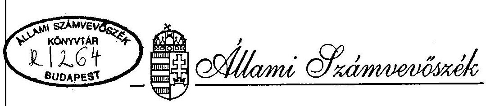
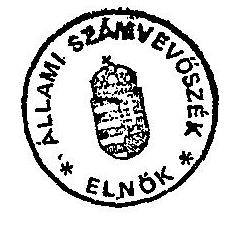
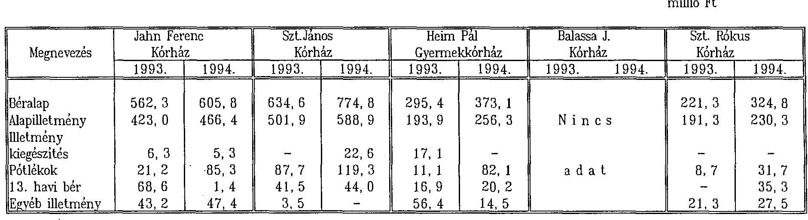

# JELENTÉS 

a betegellátás feltételeinek alakulása az egészségügyi
finanszírozási reform hatására
című vizsgálat tapasztalatairól

---

A vizsgálat végrehajtásáért felelős:
az ÁSZ IV. Vagyonellenőrzési Igazgatósága
dr. Kovács Árpád Igazgató

A vizsgálatot vezette:
dr. Csépán Magdolna osztályvezető főtanácsos

A vizsgálatot végezték:
dr. Fónyad Erzsébet számvevő
Hegyesné dr. Solymos Márta számvevő
Molnár Istvánné számvevő tanácsos
Pozsonyi Lajos szakértő

---

ÁLLAMI SZÁMVEVŐSZÉK
IV. VAGYONELLENŐRZÉSI IGAZGATÓSÁG
$\mathrm{V}-2-14 . / 95$.

# JELENTÉS 

a betegellátás feltételeinek alakulása az egészségügyi finanszírozási reform hatására címú vizsgálat tapasztalatairól

A vizsgálat célja annak megállapítása volt, hogy az egészségügyi finanszírozási reform hogyan hatott az intézetek pénzügyi helyzetére, mennyiben teremtette meg a kiegyensúlyozott gazdálkodás feltételeit. A változások milyen alkalmazkodási folyamatot indítottak el, és ez megfelel-e a reform céljainak.

A vizsgált időszak: 1992., 1993., 1994. évek

A vizsgált intézetek:
Jahn Ferenc Kórház-Rendelőintézet Szt. János Kórház-Rendelőintézet
Heim Pál Kórház-Rendelőintézet
Balassa János Kórház-Rendelőintézet
Szt. Rókus Kórház-Rendelőintézet

---

# 1. ÖSSZEFOGLALÁS, KÖVETKEZTETÉSEK 

A 80-as évek végétől párhuzamosan folyik az egészségügy és a társadalombiztosítás reformja. A rendszerváltás egészségügyi programja új prioritásokat fogalmazott meg az egészségügyi ellátórendszer számára. A hangsúlyt a megelőzésre, a lakossággal közvetlen kapcsolatban álló alapellátás fejlesztésére helyezték és általános cél volt, hogy a betegeket az olcsóbb ellátási szint felé irányítsák. Az intézmények ebben való érdekeltségének megteremtését az egészségügyi finanszírozás reformjától várták. Ma már bizonyos, hogy ezt kizárólag pénzügyi eszközökkel nem lehet megvalósítani.

Az egészségügy működési kiadásainak finanszírozása az 1990-ben végrehajtott forráscserével a társadalombiztosítás feladatává vált. A kiadások növekedésének felgyorsulása is indokolttá tette, hogy a nyújtott teljesítményektől független, számos szubjektív elemmel terhelt forráselosztást piaci elvek szerint működő finanszírozási rendszer váltsa fel, melyben az intézmény működésének fenntartása helyett szerződéses jogviszony alapján szolgáltatásokat vásárol a biztosító.

Olyan normatív, teljesítményelvű finanszírozási rendszert kívántak bevezetni, amely biztosítja a teljesítmények mérését, összehasonlíthatóságát, másrészt -miután normativitásánál fogva egy átlagos hatékonysági színvonalon finanszíroz- ösztönöz a költségek csökkentésére és a teljesítmények növelése érdekében a minőség javítására.

Közvetett hatásként a rossz ellátó szervezet átrendeződését, a szükségletekhez való jobb alkalmazkodást várták, továbbá azt, hogy az egészségügyben meglévő, de eddig érdekeltség hiánya miatt nem mozgósítható tartalékok révén lehetővé váljék az ellátás színvonalának megtartása, sőt javítása a társadalombiztosítás korlátozott pénzügyi lehetőségei mellett is.

Az új finanszírozás bevezetésekor a szolgáltatások egységes áron történő vásárlása csak távolabbi célként fogalmazódhatott meg, miután az intézetek adottságaiban, felszereltségében, pénzügyi helyzetében meglévő különbségek a működésképtelenség veszélye nélkül nem tették lehetővé az azonnali bevezetést. A nivelláláshoz szükséges anyagi eszközök hiányoztak, de a teljes kiegyenlítés a szakmai értékelések szerint túlméretezett egészségügyi ellátórendszer egészére nem is lett volna célszerű.

Az új finanszírozási rendszer bevezetését nem előzte meg a kötelező egészségbiztosítás keretében igénybevehető szolgáltatások -a finanszírozási lehetőségekkel összhangban álló- részletes szabályozása és a kapacitások ilyen értelmű egyeztetése. Ennek hiányában a törvény úgy rendelkezett, hogy az OEP-nek minden működő intézettel szerződést kell kötnie. Ma már az is nyilvánvaló, hogy ezzel a biztosító egyfajta csapdába került, a teljes ellátórendszer fenntartására ugyanis nem képes, legalábbis a járulékbevételekből nem.

A fekvőbeteg ellátás teljesítményelvű finanszírozásának bevezetésére átmeneti megoldásként olyan technikát választottak, mely a teljesítményeket egységes rendszerben méri (homogén betegségcsoportok -HBCS-k- ráfordítás igényességének arányait tükröző súlyszámok alapján), a díjazás viszont úgynevezett saját áras rendszerben történik. A saját ár (más néven alapdíj) intézetenként változó, azt az intézet korábbi pénzügyi pozíciói, és a bázisnak választott 1992-es év teljesítménye határozza meg. Változatlan teljesítmények esetén tehát a bevételek is változatlanok maradnak.

A járóbeteg ellátásban - ahol a reform előkészítésére viszonylag rövid idő állt rendelkezésre - csak az előirányzatok 30%-át vonták be a teljesítmény finanszírozásba. Az intézetek pontokban mért teljesítményük után az országos összesítés alapján számított pontérték szerint részesülnek díjazásban.

A bevezetés óta eltelt időszakban ez az átmenetinek szánt technika működött, a normativitás irányába továbblépésre nem került sor, sőt a reform szellemétől idegen elem -az egészségügyi dolgozók közalkalmazotti státuszának törvényi szabályozása- került a rendszerbe.

A teljesítmények növekedéséhez kötődő bevételi többletek elmaradnak más jogcímek (KJT, bérpolitika, gyógyszertámogatás, stb.) alapján fizetett támogatásoktól. A finanszírozási korlátként működő országos korrekciós tényező miatt a források növekedése csak kis mértékben volt befolyásolható az intézeti teljesítmények révén, így nem alakultak ki azok az érdekelt-

---

ségi viszonyok, melyektől a reformcélok megvalósulását várták. (Súlyosbítja a helyzetet, hogy a paraszolvencia a gyógyítást végző orvosok érdekeltségét elszakítja -esetenként szembeállítja- az intézeti érdekekkel.)

A vizsgált intézetek bevételeinek bővülése 1994-ben nagyjából az egészségügyi árindexnek megfelelő mértékű volt. Ez legfeljebb az előző évi állapot szinten tartását teszi lehetővé. Helyzetük ugyanakkor nem rosszabb, mint a költségvetési szféra más területein. A gyógyító-megelőző ellátások előirányzata 5 év alatt 66 milliárd Ft-ról 170 milliárdra emelkedett a társadalombiztosítás költségvetésében.

A gyógyító tevékenység tartalékaira feltárására egyedül a gyógyszer kiadások esetében születtek kezdeti lépések.

A kiadási szerkezet lényegesen nem változott. Továbbra is a legnagyobb kiadási tételt képezik a bérek. A béralap és a tb. járulék együttes aránya a kiadásokon belül 49-61 %. A bérek és az ehhez kapcsolódó létszám átfogó felülvizsgálatára sehol nem került sor. A KJT erősen korlátozza az intézetek önálló létszám és bérgazdálkodását.

A törvényi előírásokkal megmerevített kiadás szerkezet és a változó bevételek egyfajta teljesítmény kényszert jelentenek. Ebben a helyzetben nagy jelentősége van a pontos adatszolgáltatásnak. A kórlapok hiánytalan kódolásának orvosszakmai ellenőrzését több intézetben az orvosigazgató helyettese(i) végzi(k). Az előnyösebb finanszírozási feltételek miatt előfordul, hogy járóbetegként is kezelhető eseteket is a fekvőbeteg osztályokon látnak el, ami ellentétes a reformcélokkal.

A gazdálkodás terén a hagyományos intézményi magatartás nem változott. Jellemzőek az általános, differenciálás nélküli takarékossági intézkedések, a keretgazdálkodás szigorítása. Egyes, kiadásnövekedést okozó intézkedések elmaradásától várható károk (pl. higiénés területen) mérlegelésére nem kerül sor -ehhez a korrekt jelentési kötelezettség is hiányzik. (Pl.: kórházi fertőzések, melyek kezelése óriási többletkiadásokkal jár.)

A szakmai szabványok (protokollok) hiánya, a minőségbiztosítás követelményrendszerének kialakulatlansága miatt nem ellenőrizhető, hogy milyen területeken és mértékben indult meg a korábbi ellátási színvonal eróziója.

---

Az orvosi szakma folyamatosan küzd a pénzügyi korlátozásokkal szemben a kor színvonalának megfelelő feltételek biztosításáért, ugyanakkor saját tevékenysége átvilágítását és racionalizálását eddig nem tekintette feladatának. Egyedül a gyógyszeres terápiák felülvizsgálata kezdődött meg néhány intézetben.

A teljesítmény elszámolás bevezetésével az intézeti vezetés informáltsága javult, a költségek (kiadások) számbavétele azonban még a költségvetési gazdálkodás rendjének megfelelő, a kétféle rendszer megfeleltetése nem megoldott.

Összességében az állapítható meg, hogy a betegellátás anyagi feltételeiben a vizsgált intézeteknél érzékelhető visszaesés nem következett be. Az egészségügy válságos pénzügyi helyzetével kapcsolatos közhangulat a vizsgálat tapasztalatai alapján túlzottnak tűnik. A teljesítmény finanszírozás bevételekre gyakorolt hatása nem volt meghatározó, így az új rendszer a vele kapcsolatos elvárásoknak nem tudott megfelelni. A finanszírozási reform továbbfejlesztésének konkrét lépései, módszerei a bevezetéskor nem voltak kidolgozottak, így az elmúlt 2 év az útkeresés jegyében telt el az OEP-nél anélkül, hogy érdemi változásokra került volna sor.

Tanulságként is levonható, hogy az egészségügy átalakításához kiérlelt szakmapolitikai koncepció nélkül nem szabad hozzáfogni. Ezt sem finanszírozási technikák, sem különböző szintű egyeztetési és alkufolyamatok nem helyettesíthetik.

A továbblépéshez -ha ezt a normatív finanszírozásban látjuk- meg kell teremteni és ellenőrizni kell a ma minden szinten hiányzó normákat (a tb. által finanszírozott ellátás feltételeire, vásárolt szolgáltatások tartalmára, minőségére, a terápiákra, a költségek azonos számbevételére). Ismereteink szerint a folyamatban lévő -az egészségügyi ellátást és intézményhálózatot alapvetően befolyásoló- döntések előkészítése e területekre nem terjedt ki.

---

# JAVASLATOK 

## A Népjóléti Minisztérium

- Intézkedjék a szakmai protokollok, illetve a minőségbiztosítás kritériumrendszerének kidolgozása és bevezetése iránt.
- Szorgalmazza a kórházak akkreditációját.
- Dolgozza ki a szakmapolitikai elveknek, a területi ellátás követelményeinek és az OEP hosszú távú finanszírozási lehetőségének megfelelően megtervezett és egyeztetett egészségügyi struktúra kialakításának konkrét ütemtervét, határozza meg az átalakítás lépcsőfokait, az ehhez szükséges pénzügyi és jogszabályi feltételeket a negatív hatások legalább részbeni kiküszöbölésének stratégiáját.

Az OEP

- Dolgozza ki az egészségügyi szolgáltatások biztosítói, ellenőrzésének módszertanát, mely által megvalósítható
$=$ az elszámolt HBCS-k tartalmának összehasonlítása a szakmai szabványok előírásaival,
$=$ az elszámolási technikákkal, az ellátott eseteknek gyógyítás valódi tartalmától eltérő regisztrálásával szerzett jogtalan előnyök feltárása és kiküszöbölése.
- Hozza létre az ellenőrzés megfelelő szervezetét, az egészségügy szakellenőrzését végző más szervezetekkel együttműködve, illetve a kompetenciák tisztázásával.
- A HBCS-k tartalmát a szakmai protokollokkal folyamatosan egyeztetve törekedjék arra, hogy a súly- illetve pontszámok mindjobban kifejezzék az egyes ellátások átlagos költség arányait.
- Kezdeményezze a PM-nél az egészségügyi intézetek tervezési és beszámolási rendszerének a finanszírozás új feltételeihez történő igazítását.
- Írja elő az egészségügyi intézetek számára a finanszírozási rendszer továbbfejlesztéséhez, belső arányainak pontosításához szükséges kötelező és egységes tartalmú nyilvántartások vezetését.
- Az esetfinanszírozás intézeti normáinak megállapítása a tényleges ellátotti kör nagyságát figyelembe véve, arányosabban történjen.

---

# II. RÉSZLETES MEGÁLLAPÍTÁSOK 

1. A vizsgálatba bevont intézetek, kiválasztásának szempontjai

A vizsgált intézetek mindegyike önkormányzati tulajdonban van (a Jahn Ferenc, a Szt. János, a Heim Pál és a Balassa J. Kórház a Fővárosi Önkormányzat, a Szt. Rókus Kórház a Pest Megyei Önkormányzat felügyelete alá tartozik), úgynevezett közkórházak.

Tevékenységi körükbe az aktív és krónikus fekvőbeteg ellátás mellett a járóbeteg ellátás (szakrendelők, ambulanciák), gondozók működtetése, egyes alapellátási feladatok (fogászat, munkaegészségügyi ellátás, anya- és csecsemővédelem, stb.), továbbá 2 intézménynél a vérellátás tartozik. A Balassa Kórház kivételével esetfinanszírozás körébe tartozó, országosan még nem elterjedt műtéti és/vagy diagnosztikai eljárásokat is végeznek.

Az intézetek mindegyikének van olyan speciális profilja, melynek hatásköre országos, vagy több megyére kiterjedő. A Heim Pál Kórház gyermekegészségügyre szakosodott.
Az intézetek kiválasztásánál - az összehasonlítható feladatkör mellett - arra törekedtünk, hogy kapacitásuk, finanszírozási helyzetük, telepítési adottságai szempontjából különbözőek legyenek.

## 2. Bevételek

### 2.1. A bevételek alakulása, szerkezete

Az egészségügyi reform következtében a kórházaktól az alapellátás és egyes járóbeteg ellátást végző szakrendelők működtetése az önkormányzatok hatáskörébe került. A vizsgált intézményeknél a feladatváltozás az 1993. évi költségvetés csökkenésében jelentkezik. Miután a szakfeladatonkénti részletes elemzés meghaladta a vizsgálat lehetőségeit, a bevételek és kiadások vizsgálatát -összehasonlítható feladatstruktúrára- csak 1993. és 1994. között tudtuk elvégezni.

A vizsgált intézetek költségvetési bevételei 1994/93. viszonylatában 16,5-36,9 %-kal emelkedtek.

---

A NM hivatalos egészségügyi árindexe 1994. III. n. év végéig 123,2 % volt, a kórházak pénzügyi lehetőségeinek bővülése egy kivételével meghaladta ezt az értéket.

A bevételek között meghatározó - és folyamatosan növekvő - a társadalombiztosítástól működési célra átvett pénzeszközök aránya (1992-ben 70,9-94,7% között, 1994-ben 79-95 % között mozgott). A tb. támogatás jogcímeinek részletezését a 2.2. pont tartalmazza.

A saját folyó bevételek részesedése intézetenként igen eltérő (2,6-20 %). Kiemelkedő e szempontból a Heim Pál Gyermekkórház, amelynek saját folyó bevételei 1994.-ben az összebevétel 20 %-át tették ki.

A saját bevételek jelentős része szolgáltatási kapacitások értékesítéséből származik. Ez a lehetőség a kínálati piac kialakulásával szűkül, mely a
 bevételnövelés korlátjaként jelenik meg.

Vállalkozási tevékenységet három kórház folytat.
Az intézetek részt vettek a NM vagy az OEP által meghirdetett külöféle pályázatokon, bár az így elnyert összegek több esetben csak jelképes nagyságúak.

A Heim Pál Kórház jelentős alapítványi támogatásban is részesült, 1994-ben kb. 32 millió Ft bevétele származott e forrásból.

Az átmenetileg nélkülözhető források lekötéséből származó kamatbevétel a vizsgálat időszakában általában nem éri el az 1%-ot. A lekötések gyakorisága, időtartama, az összegek nagysága 1994-ben általában csökkent.

A bevételek között figyelembe vehető pénzmaradvány költségvetéshez viszonyított aránya 1992-ben 0,8 és 8% között mozgott, 1994-ben sehol sem haladta meg a 3%-ot. Az intézetek közül csak egy mutatja ki pénzmaradványát a tb. támogatás maradványaként, bár a finanszírozás aránya alapján ez más kórházaknál is valószínűsíthető.
A pénzmaradvány jóváhagyása továbbra is a fenntartó önkormányzat hatásköre. A vizsgált időszakban elvonásra nem került sor.

A jóváhagyás megítélésünk szerint formális, nem egyeztethető össze az intézeti önállósággal és a gazdálkodási felelősséggel (pl. a 13. havi bér kigazdálkodása).

---

A fenntartó önkormányzatoktól nagyrészt felújítási célra átvett pénzeszközök aránya a beszámolók szerint 1-3% volt a vizsgált időszakban. Az önkormányzatok a működéshez csak az egészségügyi intézetek által ellátott önkormányzati feladatok - egészségnevelés, óvoda, bölcsőde fenntartás - finanszírozásával járultak hozzá.

Az önkormányzatok valós szerepét azonban a pénzforgalmi adatok nem tükrözik a kórház fenntartásában. Mind a Fővárosi, mind a Pest Megyei Önkormányzat képez központi keretet az egészségügyi intézetek gép-műszer beszerzéseire. Az ebből beszerzett eszközöket aktiválásra adják át az intézeteknek.

A Fővárosi Önkormányzat kimutatása szerint a vizsgált 4 fővárosi kórház számára 1992-94. között összesen 1,2 milliárd Ft összegű keretből (ÁFA-val együtt) történt gép-műszer beszerzés részben fejlesztési, részben pótlási céllal.
2.3. A társadalombiztosítási támogatás előirányzatának évközi változása jogcímek szerint

A finanszirozási reform bevezetését megelőző 1992. évben a tb. támogatás évközi növekedése valamilyen kiadás növelő központi intézkedés ellentételezésére szolgált.

Pl. a teljes áras gyógyszerbeszerzésre való áttérés, a tb. járulék 1%-os emelése, a betegszabadság bevezetése miatt kaptak kompenzációt az intézetek. Jelentős tételt képezett a központi bérpolitikai intézkedés végrehajtásához folyósított összeg.

Ezen túlmenően néhány intézetnél fejlesztések finanszírozására is sor került.
1993. I. félévben az intézetek a finanszírozási jogszabályok (1992. évi LXXXIV. tv. és az 52/1993. (IV.2.) kormányrendelet) értelmében csak szintre hozott előirányzatuk időarányos részét kapták. A II. félévtől a szabályozás az egyes ellátási formák előirányzatainak 10, illetve 15%-os emelését írta elő. Az új rend szerint finanszírozott járó- és fekvőbeteg ellátások esetében ez a többlet csak az 1992. évi bázisnak megfelelő teljesítmények elérésekor realizálódhatott. Az ezt meghaladó teljesítmények alapján további plusz bevétel elérésére is lehetőség volt. Az új finanszírozás hatása az év 3 utolsó hónapjában érvényesült. (A szakellátás 1993. II. félévtől bevezetett új finanszírozási rendjét részletesen az 1. sz. függelék tartalmazza.)

---

1993-ban a fekvőbeteg ellátás teljesítményei alapján a vizsgált intézetek mindegyike többletbevételhez jutott a szintre hozott előirányzat időarányos részéhez képest. Ennek összege 10,7 és 67,6 millió forint között változott. Három intézet esetében az 1992. évit meghaladó teljesítmény (súlyszám összeg) a jogszabály szerint 15%-kal megemelt előirányzatnál nagyobb összegű bevételt eredményezett. Két kórháznál a teljesítmények elmaradtak az 1992. évi bázistól, így a 15%-os emelésnek csak egy részét kapták meg.

A többletbevétel elérését ebben az időszakban még az országos korrekciós tényező 1 feletti értéke is segítette. 1994-ben már ellentétes hatás érvényesült, mivel a többlet teljesítmények következtében az egész év folyamán 1 alatt maradt.

A járóbeteg ellátásban a két intézet kevesebb teljesítménydíjat ért el, mint az előirányzatából központosított rész, itt tehát egyértelmű veszteségről van szó (-1,5 illetve -1,8 millió Ft).

A reformintézkedések hatása egyenlegében mindenütt pozitív az 1993. évi szintre hozott előirányzathoz képest, a növekmény a tb. támogatás éves összegének 2,2-4,7%-a.

A teljesítménynövekedésből származó bevételi többletek szabadon felhasználhatók, a finanszírozási jogszabályok megteremtették a bér- és dologi kiadások közötti átjárhatóságot (az ÁBT 93. §-a alóli felmentéssel).

A finanszírozási reform bevezetésével egyidőben, de attól pénzügyileg függetlenül került sor az egészségügyben az 1993. évi központi bérpolitikai intézkedés végrehajtására. Ennek 7 hónapra járó összegét egyszeri támogatásként kapták az intézetek, az alapdijak folyamatban lévő kidolgozása miatt már nem épültek be a teljesítmény-finanszírozás rendszerébe (Erre csak 1994. októberétől került sor.).

A reformintézkedések tartalékából az OEP az év végén egyszeri, a likviditási helyzet javítását szolgáló támogatást folyósított. Ennek mértéke a vizsgált intézeteknél az éves tb. támogatás 1,2-1,3%-a volt.

1994-ben a tb. támogatási többlet legjelentősebb tétele a KJT szerinti bérkategóriák elérésére biztosított összeg volt. Ennek nagyságrendje 93-245 millió Ft között mozgott a vizsgált intézetek körében (részletesen a 3.2.3. pont foglalkozik a KJT végrehajtásának tapasztalataival).

Az intézeti előirányzatok szintre hozása 1994-re már nem történt meg, a támogatás éves összegének elszámolását 1993-ban megkötött alapszerződés kondícióihoz viszonyítva vezette le az OEP. Így az 1993. évi központi bérpolitikai intézkedés teljes éves kihatása növekményként jelentkezik. Hasonlóan "fiktív" növekmény a szolidaritási járulék központi befizetése helyett az intézetek költségvetésébe "visszatett" összeg is. E három tétel a kórházak támogatásnövekményének közel felét tette ki. (Ebben az elszámolási rendszerben a járóbeteg ellátás teljesítménydíj teljes egészében -a központosított rész visszanyerése is- többletnek minősül.)

Ez év végén az OEP az 1993. évihez hasonló nagyságrendben ismét folyósított egyszeri kiegészítő támogatást az intézeteknek.

Ez utóbbi kivételével 1994. I-IX. hóban a többlettámogatásokat kasszákra bontva, de egyszeri, az alapdíjba be nem épülő támogatásként kapták az intézetek.

Az OEP az 1994. évi L törvénnyel módosított 1993. évi CXV. tv. alapján 1994. II. félévtől megújította az intézetekkel kötött szerződést. A jogszabály értelmében az aktív és krónikus fekvőbeteg ellátás finanszírozási többletei beépültek az intézeti alapdijakba, így teljesítményfüggővé váltak. Vagyis csak a bázist meghaladó teljesítmények esetén realizálódnak a fix kötelezettségek fedezetére szolgáló támogatási többletek is. Ez fokozza a teljesítménykényszert. Hatása az idő rövidsége miatt a gazdálkodás egyensúlyára ma még nem becsülhető. (Az új szerződés feltételei 1994. IV. negyedévben érvényesültek a finanszírozásban.)

A vizsgált intézetek közül 1994-ben csak egy kórház teljesítménydíjában nem realizálódtak a beépülő növekmények.

A többi intézet azonban többletbevételt ért el, melynek a járó- és fekvőbeteg ellátásból származó együttes összege 31,5-116,1 millió Ft között változott. A növekmény az 1994. évi társadalombiztosítási támogatás 3,3-9,1%-a.

---

A teljesítmény-finanszírozásból származó bevételek 1993-hoz viszonyítva 1994-ben nem nőttek arányosan.

Ebben szerepet játszik az országos korrekciós tényező alakulása, mely 1994. év folyamán egyik hóban sem érte el az 1,00 értéket, és pl. 1994. tavaszán csak 0,84 volt. Ez azt jelenti, hogy változatlan bevétel elérése 20%-os többlet teljesítmény mellett lehetséges. Az országos teljesítménynövekedés viszont ismét visszahat a korrekciós tényező csökkenésére.

A teljesítmények bevételekre gyakorolt hatása az országos korrekciós tényező következtében bizonytalan, és a finanszírozás 2 hónapos csúsztatása miatt időben is elválik a hozzá kapcsolódó kiadások alakulásától.

A teljesítmény-elv szerint finanszírozott ellátások jövedelmezőségét -a teljesítmény alakulása mellett- a kasszák felosztással kialakított aránnyal is jelentősen befolyásolják.
2.3. Az 1993.-ban létrejött finanszírozási szerződés hatása egyes ellátási formák jövedelmezőségére

# 2.3.1. A kasszák kialakítása 

Az 1992. évi LXXXIV. tv. értelmében a finanszírozási szerződések előkészítéséhez az intézeteknek maguknak kellett felosztaniuk 1993. évi szintre hozott alapelőirányzatukat kasszákra az OEP útmutatója alapján. (A kassza az új finanszírozásban az egyes ellátási formák elkülönített pénzalapja.)

Ennek során meg kellett tervezni azt a szervezeti és tevékenységi struktúrát, mely alapján az intézet teljesítményeit kívánta realizálni, és hozzárendelni az előirányzat optimálisnak ítélt részét. A feladatot a finanszírozás részletes szabályainak ismerete és megfelelő előkészítés nélkül kellett végrehajtani. (Az 52/1993. (IV.2.) sz. Kormányrendelet a felosztásra adott határidő után jelent meg.)

Az intézetek vezetése általában körültekintően vizsgálta felül a működő struktúrát és dolgozta ki tervezetét az ellátási formák arányaira. Ennek során a vélt, vagy valós érdekek alapján többféle stratégiát követtek. Volt olyan kórház, amelyik a biztos bevételekre törekedve az elő-

---

irányzat kasszákra bontásánál a valóságos súlyánál nagyobb arányban vette figyelembe a munkaegészségügyi ellátást és a gondozókat. Ennek következtében (is) a fekvőbeteg ellátás alapdíja nem érte el az országos átlag 70%-át.

Máshol az előirányzat túlzottan nagy részét osztották a járóbeteg kasszára -abból kiindulva, hogy ennek 70%-a bázisfinanszírozásban marad. A 30%-os központosított rész visszanyerése az országos teljesítmények alapján kialakuló alacsony pontértékek következtében sem 1993-ban, sem 1994-ben nem sikerült. A járóbeteg ellátás részaránya a szerződés szerinti 18%-ról 13%-ra esett vissza.

A járóbeteg ellátás keretében elszámolt ambulanciák várható betegforgalmának megtervezése több helyen problémát okozott, hiszen korábban ezt az ellátástípust statisztikailag nem tartották nyilván, így tapasztalati adatok nem álltak rendelkezésre. A finanszírozási jogszabály szerint viszont -ha ambuláns eseteket is el akarnak szá-molni- erre a kasszára az intézeti előirányzat minimum 5%-át el kellett különíteni.

Az OEP - noha az 1993. évi CXV. tv. előírja a szerződések évenkénti felülvizsgálatát (22. § (9) bek.) -az új finanszírozás bevezetése óta eltelt időszakban nem adott lehetőséget az intézeti kasszák aránytalanságainak korrekciójára. Minden átcsoportosítás ugyanis a többi intézet finanszírozási lehetőségeit is érinti, így indokolt, hogy csak egységes elvek szerinti, átfogó rendezésre kerüljön sor. A nyilvánvalóvá vált aránytalanságok azonban feszültségeket támasztanak, a finanszírozás "átmeneti" jellege csak egy ideig indokolható a bevezetés problémáival.

A vizsgált intézetek közül egy kérte a kasszák közötti átcsoportosítást. A kassza-felosztás korrekciója - 3,6 millió Ft átcsoportosítása az aktív fekvőbeteg ellátás kasszájára - az intézet alapdíjának növekedése következtében a jelenlegi teljesítmények mellett mintegy 45 millió Ft-os éves többletbevételt jelentett volna az intézetnek.

---

# 2.3.2. Az alapdijak 

A fekvőbeteg ellátás alapdíjának alakulására elsődlegesen az intézetek korábban kialakult pénzügyi pozíciói és az 1992. évi betegforgalom alapján számított bázisteljesítmény volt hatással (ez utóbbi fordított arányban). Az alapdijak nagy szóródást mutatnak.

A korábbi "kijárásos" rendszerben nem alakult ki egyértelmű összefüggés az intézetek költségvetési pozíciói és az ellátás színvonala között, de nem érzékelhetők a telepítési helyzetből, az épületek korából és egyéb sajátosságokból adódó ráfordítás-igényesség eltérései sem.

Az 1994. évi szerződésmódosítás nem hozott változást sem az intézeti díjak nivellálásában, sem a kasszák aránytalanságainak megszüntetésében. Az aktív és krónikus fekvőbeteg ellátás új alapdíját az OEP az év folyamán folyósított finanszírozási többletek beépítésével alakította ki. Ennél a teljesítményelvű finanszírozás 12 hónapja alatt elért átlagos havi bevétel képezte a kiindulást.

A bázisteljesítményt az átdolgozott HBCS-nek megfelelően korrigálta a GYÓGYINFOK, ez alacsonyabb lett az induló értéknél. A két tényező együttes hatására (számláló növelése, nevező csökkenése) az alapdijak intézetenként eltérő mértékben emelkedtek. Az emelkedés mértéke a vizsgált intézeteknél az aktív ellátásnál 28-32%, a krónikus ellátásnál 0,5-12%.

A kasszafelosztás aránytalanságai, az alapdijak szakmailag nem
 indokolható mértékű eltérései továbbra is feszültségek forrásai az ellátó rendszerben.

### 2.4. Az intézetek likviditási helyzete

A vizsgált időszakban tartós likviditási problémák az ellenőrzött intézeteknél nem voltak. Az átmeneti fizetési nehézségeket takarékossági intézkedésekkel, a beszerzések korlátozásával, átütemezésével korrigálták. Működési hitel felvételére csak egy kórház kényszerült. Az intézetek számára gondot okozott a 13. havi bér, illetve ennek kifizetésére az OEP-től kapott előlegek törlesztése. Ezt jelzi az egyik kórházban a kiegyenlítetlen szállítói állomány magas szintje, máshol az utolsó részlet visszafizetésére kért 2 havi haladék.

---

A fizetőképességet kedvezőtlenül befolyásolta, hogy a tb. támogatás egyes jogcímeinek (pl. bérpolitika, KJT) utalására rendszertelenül, vagy utólagosan került sor. A betegellátás szezonális ingadozása a havi teljesítménydíjaknál okoz eltérést.

# 2.5. A teljesítmény-finanszírozás hatása a betegellátásra 

Az új finanszírozás által bevezetett érdekeltségi viszonyok néhány vonatkozásban a reform céljaival ellentétes hatást váltanak ki.

Az aktív ellátásban a finanszírozás logikája szerint az intézetek az ágyak maximális kihasználása mellett az ápolási idő minimalizálásában érdekeltek. Az alsó határnapot meghaladó ápolás esetén már megilleti őket a HBCS-re járó teljes díj. A járóbeteg ellátás pontértékének elértéktelenedése miatt inkább megéri az ambulancián is ellátható beteget az alsó határnapig "befektetni". Ez teljesen ellentétes a reform azon célkitűzésével, hogy a betegeket lehetőleg az olcsóbb ellátási szintek felé irányítsa.

A teljesítmény növelésére a betegszám emelkedése, illetve a magasabb súlyszámot biztosító esetek arányának növekedése ad lehetőséget, ez utóbbi a kódolással is befolyásolható. Jelenleg nem működik olyan ellenőrzési rendszer, amely a fekvőbeteg ellátásban kiszűrnén az indokolatlan, és csak adminisztratív úton előállított teljesítmény-növekményt. Nehéz ugyanis a határvonalat meghúzni a pontos kódolás (a fő diagnózis mellett a kísérő betegségek és szövődmények precíz regisztrálása) és a szabályozásban rejlő lehetőségek kihasználása között. (Ha több diagnózis áll fenn, akkor a legjobban fizetőt választják fődiagnózisnak, ennek alapján történik az eset besorolása a HBCS rendszerbe. Az "optimális" változat kiválasztására ismereteink szerint már számítógépes segédprogramok is kaphatók a szoftver piacon.)

Az adatfeldolgozást végző GYÓGYINFOK számítógépes rendszer csak a formai, illetve logikai hibák kiszűrésére képes, a nem valós teljesítmények kiszűrésére nem. Ez egyértelműen az ellenőrzési rendszer hiányossága, amelynek megoldása az OEP feladata.

---

Az országos korrekciós tényező differenciálás nélkül hat az intézetek teljesítménydíjának alakulására. Miután az állandó kiadások fedezete is függ a teljesítményektől, az intézetek számára létkérdés a 100% elérése, ezért túlbiztosításra törekszenek.

Az így beépített korlát ugyan megteremti a finanszírozó biztonságát, hatása hosszabb távon feltétlenül torzulásokat eredményez az egészségügyi ellátórendszer működésében, mert

- a jövedelmezőségi szempontok alapján kiválasztott fődiagnózisokból készített megbetegedési statisztikák nem a valós morbiditási helyzetet tükrözik, és
- nem teljesül az egészségügy "olcsóbbá tétele" -mint egyik reformcél. A "szükséges" betegszám biztosítására az intézetek megkeresik a lehetőséget. (Pl. a háziorvosokkal való kapcsolattartással.)

A vizsgált intézetekben 1994-ben - egy kivételével - az elbocsátott betegek száma 2-16%-kal nőtt. A kódolás ellenőrzése mindenütt kiemelt fontosságú feladatnak minősül. Tartalmi vonatkozásban ezt a tevékenységet megítélni természetesen nem tudtuk, azonban az előbb elmondottakról mint széles körben elterjedt gyakorlatról beszéltek az e témával foglalkozó szakemberek.

Az új szabályozás szerint az országosan nem elterjedt diagnosztika és műtéti eljárásokat a társadalombiztosítás külön kasszából, esetszám szerint téríti. A szerződésekben intézetenként maximálták a tb. által finanszírozandó vizsgálatok, illetve beavatkozások számát. Pl. egy CT vizsgálat térítési díja egységesen 5.000 Ft, de a Heim Pál kórháznak maximum 28 millió forintot fizet ki e jogcímen az OEP. A korlát miatt előfordul, hogy a szükséges vizsgálatok fedezetét az esetfinanszírozás nem biztosítja.

A reform folytatásaként 1994. október 1-vel megtörtént a vérellátás finanszírozásának átszervezése. Megszünt a vérellátás közvetlen társadalombiztosítási finanszírozása, és a vérellátó szolgáltatást igénybe vevő kórházak térítik a vér és vérkészítmények árát. Emiatt az érintett kasszák összegét az OEP megemelte a vérellátásról átcsoportosított összeggel, illetve a megfelelő HBCS-kbe beépítették a vér- és vérkészítmények költségkihatását.

---

Az idő rövidsége miatt konkrét finanszírozási tapasztalat kevés van, de elvileg is tisztázandónak tartjuk a kérdést, hogy annak a kórháznak, aki fizetésképtelen, meg lehet-e tagadni a készítményekkel való ellátását. A vérellátási szolgáltatást is végző kórház költségvetése terhére nem képes elviselni még az átmeneti fizetési problémákat sem.

# 3. A kiadások 

### 3.1. A kiadások szerkezete

A vizsgált intézetekben a finanszírozási reform bevezetése -a bevételekre gyakorolt mérsékelt hatása következtében- nem okozott jelentős változást a kiadások szerkezetében. A bérek és dologi kiadások közötti átjárhatóság lehetőségét csak egy kórház vette igénybe a 13. havi bér fedezetének előteremtéséhez.

A béralap részesedése az összkiadásokon belül két intézetnél nőtt, a többinél csökkent. Ennek oka, hogy a KJT bérkategóriáitól való elmaradás mértékének különbözősége miatt a kiegyenlítésre kapott tb. támogatás eltérő arányban emelte az intézetek béralapját.

A bérek és járulékaik 1994-ben az intézeti kiadások 49-61%-át tették ki.

Készletbeszerzésre 1994-ben az intézetek kiadásaik 15-32%-át fordították.
A készletbeszerzésre fordított kiadások aránya az összkiadáson belül a vizsgált időszakban gyakorlatilag nem változott, vagyis a növekvő bevételekből arányosan fordítottak többet e célra. A növekedés mértéke azonban nem mindenütt érte el az inflációs rátát.

Szolgáltatásokra 1994-ben a kiadások 7-13%-át költötték a vizsgált intézetek. E tekintetben meghatározó, hogy az intézet saját szolgáltató kapacitásokkal rendelkezik-e (konyha, mosoda), vagy vásárolja azokat.

Az ÁFA kiadások aránya 1993-ban 3-6% között mozgott, 1994-re 3-5%-ra mérséklődött. Összegszerűen két intézetnél mutatkozik csökkenés.

---

A felhalmozásra -tárgyi eszköz vásárlására és felújításra- költött összegek 1993-ban az intézeti kiadások 4-7%-át adták, ez 1994-re 2-4%-ra csökkent, egyes intézetekben összegszerűen is jelentősen visszaesett.

Összegezve a kiadási szerkezet változásait, megállapítható, hogy -egy kórház kivételével- a folyó kiadások bővülése elérte, vagy meghaladta a béralap növekedésének ütemét, vagyis a dologi kiadások aránya nem csökkent.

# 3.2. A létszámhelyzet és a bérkiadások 

### 3.2.1. Az intézetek létszámhelyzete

Az intézetek létszáma az alapellátás leválása miatt 1993-ra mindenütt jelentősen csökkent, 1994-re általában stabilizálódott.

Az egyes munkaköri csoportok aránya az összlétszámon belül nem mutat jellegzetes eltérést az intézetek között.

- Az orvosok képezik az összlétszám 13-17%-át.
- Az eü. szakdolgozók 45-51%-ot képviselnek, ebből 22-25% a közvetlenül ágy mellett dolgozók aránya.
- Az ügyvitelben a létszám 5-10%-a dolgozik.
- Igen magas -25-35% közötti- a kisegítő állomány (fizikai dolgozók) aránya (Ez a vásárolt, illetve saját rezsiben végzett szolgáltatások arányától, illetve a vállalkozási tevékenység jellegétől függ.).

Figyelembe véve a béreket terhelő kiadások magas szintjét, elemzésre szorulna, hogy indokolt-e a műszaki-gazdasági létszám ilyen arányú foglalkoztatása. Általában a saját rezsiben végzett javítás-szolgáltatás olcsóságára hivatkoznak, érdemi számítással azonban erre vonatkozóan nem találkoztunk.

Továbbra is jelentős a fluktuáció, különösen a szakdolgozói munkakörben. Az intézetekben 1994-ben a be- és kilépő forgalom együttesen az összes állományi létszám 32-33%-át érintette.

---

Az intézetek továbbra is kimutatják betöltetlen álláshelyeiket, bár ennek a finanszírozásában semmilyen szerepe nincs.

Viszonylag jelentős arányban foglalkoztatnak nyugdíjasokat (orvosi munkahelyeken és kisegítő állományban). E célra a béralap 6-9%-át fordították.
1994-ben a 100 ágyra jutó orvosok száma a 11,8 és 15 között mozgott. Ez alacsonyabb az országos átlagnál, mely az OEP adata szerint 1994-ben 17 volt.

1 fő orvosi létszámra jutó egészségügyi szakdolgozók száma 1994-ben a vizsgált intézetekben 2,78 és 3,73 között változtak. (Az országos átlag 1,99) Az intézetek többségénél mérsékelten növekvő tendenciát mutat.

A közalkalmazotti törvény munkavégzéssel kapcsolatos előírásai -a teljesíthető túlórák, ügyeletek számának a korábbi gyakorlatnál alacsonyabb szinten történő maximálása, továbbá a határozott időre szóló munkaviszony létesítésének korlátozása- ellentétes a létszám- és bérgazdálkodás szempontjaival.

# 3.2.2. Bérkiadások változása 

A vizsgált 5 intézet béralapja a KJT és a központi bérintézkedések hatására 1993. és 1994. között átlag 23%-kal növekedett. A bérkiadások szerkezetében a KJT bevezetésével jelentős változás ment végbe. A teljes munkaidőben foglalkoztatottak bérkiadásain belül többszörösére növekedtek a pótlékok. Az alapilletmények növekedése ettől elmaradt (110-132%).

A fentiek együttes hatására az átlagkeresetek munkaköri csoportonként és intézetenként változó mértékben emelkedtek.
Az orvosok átlagkeresete 1992. és 1994. között a vizsgált kórházakban 58-108%-kal emelkedett. Legmagasabb értéke átlag 58 eFt/hó/fő.

Az eü. szakdolgozók körében a keresetnövekedés hasonló az orvosokéhoz.
A legmagasabb átlagkeresettel rendelkező egészségügyi szakdolgozók 1994-ben havonta átlag 34,6 eFt-ot, a közvetlen ágy mellett dolgozók 36,9 eFt-ot kapnak.

Az ügyviteli és kisegítő állományban ettől elmaradt a keresetek növekedése. A 29-35 eFt közötti átlagkeresetek miatt nem vonzóak az ügyviteli munkakörök, betöltésük

---

szakképzett munkavállalóval nehézségekbe ütközik, nem beszélve a munkaerő piacon még inkább keresett szakmákról (pl. számítástechnikai szakember). De az átlag munkanélküli segély szintje alatt maradó fizikai bérek a szakképzettséget nem igénylő munkakörök (pl. mosodai dolgozó) betöltését is nehezítik.
A keresetek alakulásáról általánosságban elmondható, hogy az emelkedés mértéke meghaladta más ágazatokét, azonban az igen alacsony kiinduló értékek miatt ma is elmarad a társadalmi fontosság alapján indokolt szinttől.

# 3.2.3. A közalkalmazotti törvény végrehajtásának tapasztalatai 

A KJT bevezetése számos ellentmondást hordozott. A teljesítmény finanszírozás, a bevételek ezzel összefüggő változékonysága, és a KJT-ben megjelenő fix elosztási kötelezettség összeegyeztethetetlensége már a reform bevezetésekor is felmerült. Megoldásként a kormány-előterjesztésben az a javaslat fogalmazódott meg, hogy a teljesítmény díjazásban a KJT szerinti kötelezettségeket meghaladó bérszintet kell figyelembe venni, így lehetőség lesz a differenciálásra, illetve érdekeltségi rendszer működtetésére. Ez nem valósult meg.

A KJT-vel kapcsolatos döntési folyamatot és a fedezet biztosítását minden szinten az előkészületlenség, összehangolatlanság, és elkésettség jellemezte.

A bérigény felmérésére az OEP többször és több formában kért adatszolgáltatást az intézetektől (a minimálbér időközben történt emelése, illetve a pótlékokkal kapcsolatos utólagos NM-rendelet következtében). Az ütemes finanszírozást az OEP csak júniustól kezdődően tudta megvalósítani.

A KJT bérkategóriáinak eléréséhez szükséges fedezet biztosításánál csak a betöltött álláshelyeket vették figyelembe.

A vizsgált kórházak bérigénye 92,9 és 244,9 millió Ft között szóródott.

Az intézeti bérgazdálkodás szempontjából igen nagy probléma, hogy a KJT, valamint a MT egyes előírásainak hatását az úgynevezett változó bérekre a tb. nem ellentételezi. Ilyenek az ügyeleti, készenléti díjak növekménye,

---

a szabadság idejére járó átlagkereset emelkedése, a megnövekedett szabadság miatti helyettesítésekből származó többletek, stb.

Az előbb említett többletek kigazdálkodása mellett differenciálásra alig maradt lehetőség. Jutalmazásra 1994-ben az intézetek béralapjuk 1,8-2,7%-át fordították, egyedül a jelentős saját bevétellel rendelkező Heim Pál Kórház esetében került sor 7,8%-os kifizetésre.

A bérgazdálkodás feszültségei is közrejátszanak abban, hogy az intézetekben belső érdekeltségi rendszer nem működik.

# 3.3. Készletbeszerzés, készletgazdálkodás 

A vizsgált egészségügyi intézetek 1992-94. között növekvő bevételeik közel arányos részét fordították készletbeszerzésre. A növekedés 2 intézetnél meghaladta a hivatalos egészségügyi árindexet, de a többinél sem maradt el jelentősen.

A kiadások növekedésében az áremelések mellett egyes intézetekben a technikai haladás hatása is megjelenik. E kórházak anyagi helyzetük függvényében igyekeznek élni a gyógyítás biztonságát és hatékonyságát javító új szakmai lehetőségekkel (pl. zárt vérvételi rendszer fokozatos bevezetése, egyszer használatos eszközök
 alkalmazási területének a bővítése, korszerű varrófonalak, tűk, stb.)

A beszerzéseknél az olcsóbb források felkutatására törekednek - ez olykor minőségi problémákat is felvet.

Általában a korábbinál jóval több szállítóval tartanak kapcsolatot. Szempont a szállítások ütemezhetősége, az intézetek törekszenek a készletnövekedés elkerülésére.

Ugyanakkor -ha erre anyagi fedezetük van- az áremeléseket megelőzve nagyobb tételek felvásárlásával, „alkalmi” beszerzésekkel igyekeznek takarékoskodni (pl. lejárati időhöz közeledő gyógyszerek csökkentett áron való beszerzése).

A beszerzésekre a gazdasági vezetés általában keretszámokat határoz meg, amelyet a bevételek alakulásától függően emelnek, vagy újabb megszorításokra kerül sor. A

---

keretszámokat a bázis elv alapján bontják le intézeti osztályokra.

A készletbeszerzésekre fordított összeg legnagyobb hányadát a gyógyszerek és szakmai anyagok, illetve élelmiszerek kiadásai teszik ki.

# 3.3.1. A gyógyszerkiadások alakulása 

A gyógyszerárak 1992. január 1. és 1994. szeptember 30. között a NM árindexei szerint összesen 178 %-kal emelkedtek. A kórházak 1992-től tértek át a teljes áras gyógyszerbeszerzésre, melyre a társadalombiztosítás az adott évben részleges kompenzációt biztosított.

A gyógyszerkiadások aránya 1994-re - egy kórház kivételével - nőtt az intézetek költségvetési kiadásai között, mértékét tekintve igen nagy szóródást mutat. (Az arányszám 5-20 % közötti, egy betegre számítva pedig évi 3-12 ezer Ft közötti összeget használnak fel.)

Megítélésünk szerint a kórházak szakmai profiljának eltérései ilyen mértékű különbségeket nem indokolnak, ez inkább az intézetek korábbi finanszírozási helyzetéből adódik.

A vizsgálat átfedéseket is megállapított, a gyógyszer és szakmai anyag fogalomkörbe sorolt áruféleségeknél. A besorolás esetenként attól függ, hogy a beszerzést az intézeti gyógyszertár, vagy az anyagbeszerzés végzi-e?

A ráfordítások elemzésénél zavart okozhat, hogy az intézeti beszámoló a gyógyszerek beszerzésére fordított összegeket jeleníti meg, az intézeti gyógyszertár „felhasználásként” a betegosztályok részére kiadott gyógyszerek értékét -tehát költséget - mutat ki. (Harmadik adat lehetne a tényleges osztályos felhasználás, ezt a vizsgált intézetek jelenleg sehol nem számoltatják el.) Az eltéréseket nem mindig tudták a vizsgálat részére elfogadható módon dokumentálni.
Az intézeten belüli gyógyító tevékenység gazdaságosságának elemzéséhez megfeleltethetővé kellene tenni az eltérő adattartalmú nyilvántartásokat.

A gyógyszerek és szakmai anyagok 1994. évi kiadásainak

---

változása 1993-hoz képest intézetenként eltérő, zömében az árindexet meghaladó mértékű volt. Ez azt mutatja, hogy a vizsgált intézményeknél általában nem csökkent a gyógyszer-ellátottság színvonala, bár az összetétel változás hatásait nem tudtuk kiszűrni.

A vizsgált intézetek mindegyike foganatosított intézkedéseket a gyógyszergazdálkodás javítására. Ezek közül néhány tartalmában túlmutat az általános takarékossági gyakorlaton. Általános, hogy osztályos kereteket határoznak meg, a felhasználásról az osztályok vezetőit folyamatosan tájékoztatják. Az OEP-pal kötött szerződés alapján mindenütt működik kisebb-nagyobb hatáskörrel és intenzitással gyógyszerterápiás bizottság.

Van, ahol a leggyakoribb gyógyszerek felhasználását monitorozzák. Folyamatos az új készítmények figyelése, értékelése és ennek közzététele az osztályok felé. Az egyik kórházban a legdrágább gyógyszerek felhasználását külön engedélyhez kötötték.

Két kórházban terápiás protokollokat dolgoztak ki. Az ezektől való eltérést indokolni kell.
Egyes intézetekben a távozó betegek gyógyszer helyett receptet kapnak.

A szállítók viszonylag jelentős összegű termék- és pénzrabatot biztosítanak a kórházaknak. Ezek nyilvántartása és a ráfordításokban történő figyelembevétele, illetve a keretek utólagos módosítása nem megoldott.

# 3.3.2. Élelmezési kiadások 

A tapasztalatok azt mutatják, hogy az intézetek az élelmezés minőségének romlását tartották a „legkisebb rossznak” a betegellátás más tényezőivel szemben.
Az élelmezési kiadások 1994/93. év viszonylatában 13-28 %-kal növekedtek. Mindössze egy kórházban közelítették meg az infláció mértékét, azonban a kórház élelmezési kiadásai a vállalkozásként üzemeltetett büfé beszerzéseit is tartalmazzák. A nyersanyagnorma 1994-ben kórházanként eltérő, 125-145 Ft közötti volt.

A vizsgált kórházak közül egy nem rendelkezik működő főzőkonyhával, az élelmezést (ebédet) vásárolja. A vásá-

---

rolt élelmezés kiadásai egy év alatt megkétszereződtek, miközben az ellátott beteglétszám csak 6 %-kal nőtt, és minőségjavulásról sem beszélhetünk. A vásárolt szolgáltatás egyfajta kiszolgáltatottságot jelent.

A kórházakban készült jelentések mindegyike az étrend szűkítéséről (gyümölcs, sütemény, egyes húsféleségek hiányáról) számol be.

# 3.4. Szolgáltatások vásárlásának kiadásai 

A szolgáltatások vásárlására fordított kiadások aránya 1994-re kis mértékben visszaesett, vagy változatlan maradt. Belső szerkezetében módosult.

A karbantartási kiadások - ezen belül az épület karbantartás - továbbá a közműdíjak emelkedtek az egyéb szolgáltatások terhére. Csökkent az energia kiadások részaránya is, a takarékossági intézkedések eredményeként.

### 3.4.1. Energia kiadások, közműdíjak

Az energiagazdálkodásra korábban viszonylag nem nagy figyelmet fordítottak az egészségügyi intézetek. Ezt látszik igazolni az a mód, ahogy a jelentős árváltozásokra reagáltak, és viszonylag egyszerű intézkedésekkel elérték a kiadások szinten tartását, illetve csökkentését.

 Ilyenek az áramszolgáltatóval kötött kedvezőtlen szerződések felbontása és a kórház érdekeit jobban szolgáló új szerződések megkötése, a csúcsteljesítmények figyelése, takarékosabb világítótestek felszerelése, energetikus munkatárs foglalkoztatása, stb.

A könnyen mozgósítható tartalékok azonban kimerülni látszanak. Az 1995. évi drasztikus áremelések hatását már nem fogják mérsékelni.

Az energiafelhasználás racionalizálása jelentős forrásokat igényelne (fűtési rendszerek korszerűsítése, elavult vezetékhálózat cseréje, mérőműszerek alkalmazása, stb.). Erre jelenleg sem az OEP, sem a tulajdonos önkormányzat nem tud fedezetet biztosítani. Éppen ezért az intézeteknél is csak kívánságszinten fogalmazódnak meg a tennivalók, az általános takarékossági gyakorlaton túl nem rendelkeznek intézkedési tervvel.

---

A közműdíjak árindexe 1993-ban 171 %-os, 1993-ban 114 %-os volt. Az intézetek az odafigyelésen kívül -a fogyasztás, a számlák, a mérőórák folyamatos ellenőrzése, reklamációk- egyéb eszközzel nem rendelkeznek a kiadások további növekedésének mérséklésére.

# 3.4.2. Gép-, műszer karbantartás 

Az elmúlt évek jellemző tendenciája, hogy a gépek-, berendezések karbantartására kötött szerződések helyett -takarékossági okokból- inkább a meghibásodások javítását, vagy javíttatását részesítik előnyben az intézetek. Ez biztonságtechnikai kockázatokkal is járhat, másrészt a javítás miatti időkiesés akadályozhatja a betegellátást.

A vizsgált intézeteknél a gyógyítást veszélyeztető üzemzavar fenti intézkedéseknek tulajdonítható okból nem következett be.

### 3.5. Tárgyi eszközök állományának alakulása

Az ingatlanok nettó értéke 3 intézetnél a bruttó érték 80-83 %-a, a Szt. János Kórháznál 70 %, a Balassa J. Kórháznál 41 %.

Bár a Jahn Ferenc Kórház kivételével valamennyi intézet régi épületekben működik, az elmúlt években címzett támogatásból megvalósított rekonstrukciók hatása tükröződik a nettó érték alakulásában. A Balassa J. Kórház rekonstrukciója folyamatban van, illetve befejezése forráshiány miatt késik.

A gépek, berendezések esetében fordított a helyzet. A Balassa J. Kórház esetében az elhasználódottság mértéke 53 %, a többi intézetnél ennél alacsonyabb (40-52 %). A „0”-ra leírt állóeszközök állománya 1994-ben jelentősen emelkedett.

A vizsgált időszakban a gépek, berendezések beszerzésére fordított összes forrás intézetenként messze elmaradt az értékcsökkenés értékétől.

---

3.5.1. Gépek, berendezések, műszerek beszerzése

A forráscsere kapcsán megfogalmazott elvek szerint a gépek, berendezések akár fejlesztési, akár pótlási célra történő beruházása a fenntartó önkormányzat feladata. A vizsgált intézeteknél jellemzően több forrásból történtek a beszerzések.

Az önkormányzati támogatáson kívül az intézeti bevételek (saját bevétel, tb. támogatási többletei) alapítványi támogatások, különféle pályázatokon nyert összegek képezték a beszerzések forrását.

Az intézeti pénzforgalomban megjelenő - gép, berendezés vásárlásra fordított - kiadások ÁFA nélküli részaránya a vizsgált időszakban egy intézményt kivéve, jelentősen csökkent, sőt a legtöbb esetben összegszerűen is visszaesett.

A saját beszerzések főként az önkormányzati keretből kimaradó, de az intézet működése szempontjából fontosnak és ára alapján is megvehetőnek tartott orvostechnikai berendezésekre irányulnak.

E tevékenység minősítésekor nehéz megítélni, hogy a működési források beruházási célra való felhasználása jobban szolgálja-e és mely esetekben a betegek érdekeit, mintha ugyanezt az összeget gyógyszerre, egyszer használatos eszközök beszerzésére, illetve higiéniai feltételek magasabb szintű biztosítására fordítanák.

Megítélésünk szerint az elkülönült intézeti beruházások nem egy esetben inkább szolgálják az orvos, mint a beteg érdekeit. (Ezt bizonyítja a nagyértékű diagnosztikai eszközök kihasználatlansága is.)

A beszerzések nagy része pótlás. Új feladatellátáshoz kapcsolódó nagyobb volumenű fejlesztések esetén az OEP-pal előzetes - bár nem mindig eredményes - egyeztetést folytat az önkormányzat.

---

Sem a saját, sem az önkormányzati forrásból történt beruházások esetében nem elemzik az üzemeltetési kiadások és a várható bevételek viszonyát. Ehhez a HBCS-k nem is adnak támpontot, hiszen konkrét tartalmuk - hogy pl. milyen technikai színvonalat finanszíroz a biztosító - nem ismert. Ilyen számításokat csak az esetszám szerint finanszírozott eszközöknél lehetne elvégezni.

# 3.5.2. Épületfelújítás, karbantartás 

A számvitelileg és finanszírozási forrását tekintve is elkülönülő tevékenységek együttes tárgyalására az ad okot, hogy a kórházak az igen alacsony felújítási keretek miatt karbantartási előirányzatuk terhére is végeznek felújítási tevékenységet.

1994-ben a vizsgált intézetek közül a felújítási kiadások csak egy kórháznál haladták meg az 1 %-ot annak ellenére, hogy több intézet is kiegészítette pénzmaradványából a szűkös önkormányzati keretet. A többi intézetnél 1993-hoz viszonyítva összegszerűen is csökkent a felújításra fordított kiadás.

Az épület karbantartásra fordított összegek viszont minden intézetnél emelkedtek. A működési forrásokból végzett felújítások aktiválására nem kerül sor, így a ráfordítások az épület állományérték változásaként nem jelennek meg.

A karbantartó kapacitások ilyen irányú lekötöttsége esetenként a higiéniai festések háttérbe szorulását eredményezi. Ezeket „szükség szerint” végzik az előírt gyakoriság helyett.

### 3.6. Az intézetek higiénés helyzete

Az egészségügyi intézményekben a higiéniai követelmények maradéktalan és folyamatos biztosításával együtt járó kiadásnövekedés első megközelítésben ellentétes a minden területen megjelenő takarékossági szemlélettel. Nehezíti a reális mérlegelést, hogy a nem kellő színvonalon végzett fertőtlenítés hatására bekövetkező másodlagos fertőzésekről nincs korrekt jelentési kötelezettség, így a többletráfordítás vagy bevételkiesés nem állítható szembe a megelőzés költségével, holott a szeptikus betegek ápolása óriási összegekbe kerül.

---

A gazdasági vezetés éves keretösszeget határoz meg a tisztító- és fertőtlenítő szerekre. Ez nem követi az áremelést. Ezen túlmenően, a kórokozók körében kialakuló rezisztencia miatt a hagyományos tisztítószerekről esetenként korszerűbb, hatékonyabb szerekre kellene váltani.

Az egyszer használatos eszközökből igen nagy mennyiségre van szükség, így nem mindenütt tudják teljeskörűen biztosítani mindazt a lehetőséget, amely technikailag már megoldott.

Ezzel kapcsolatban megemlítendő a veszélyes hulladék elszállításának, megsemmisítésének problémája, mely rendkívül drága, és a többletkiadást az OEP nem minden kórházban finanszírozza.

Egyes ellátások esetében csak az ÁNTSZ által is jóváhagyott kompromisszumokkal tudják a működést biztosítani.

A továbblépéshez -az egyértelműen szükséges anyagi feltételek mellett- szemléletváltásra is szükség van. A költség-haszon elvének megfelelően elkészített korrekt elemzések segíthetnek ebben.

A vizsgált intézetek higiénés feltételei eltérőek. Van olyan kórház, amelyik a legkorszerűbb technológiával működő központi sterilizálóval rendelkezik, ami egyaránt lehetővé teszi fém és nem fém eszközök sterilizálását, és egy különleges csomagolásmód révén 1 éven át sterilen történő tárolását. Más intézményekben viszont az elemi higiénés feltételek biztosítása is pénzügyi korlátokba ütközik.

Általánosan is problémának tartjuk, hogy nincs definiálva, hogy a társadalombiztosítás a finanszírozott szolgáltatásokban milyen higiéniai előírásokat fizet meg, és vár el a biztosítottak érdekében. Jelenleg meglepően kevés az írott rendszabály, ezek is jórészt elavultak. A kompromisszumoknak, a takarékossági szempontok érvényesülésének ma is viszonylag tág tere van, és nem érzékelhető, hogy ez meddig bővülhet még anélkül, hogy a betegellátást veszélyeztetné.

---

4. A finanszírozási reform hatása a vezetői tevékenységre.
4.1. A tervezési és beszámolási rendszer

Az egészségügyi intézmények tervezési és beszámolási rendszere ma is a költségvetési gazdálkodás szabályainak megfelelő, tartalmában nem
 igazodott a finanszírozási reformmal bevezetett liberálisabb gazdálkodáshoz.

A tervezés új módszere még nem alakult ki.
A finanszírozási reform szellemének megfelelő tartalmi változás, hogy a várható bevételekhez kell a kiadásokat tervezni, és nem a "feladat-kiadás-bevétel-támogatás" klasszikus modellje érvényesül.

Az 1994. évi tervezésnél a Fővárosi Önkormányzat felügyelete alá tartozó kórházak csak a saját és önkormányzati bevételeiket és az ezekből fedezhető kiadásokat tervezték meg. A PM. közbelépésére csak 1994. VI. hóban készült el a tb. támogatást is tartalmazó költségvetés - az 1994. január 1-i állapotnak megfelelően. Ezt az eljárást a teljesítményváltozás miatt mozgó bevételek részaránya nem indokolta.

Az eredeti előirányzatok alultervezettek, amit a bevételek bizonytalansága, a tb. támogatás összegének jelentős évközi változása magyaráz (Néhány kiadási tétel esetében egyáltalán nem terveztek eredeti előirányzatot.).

A beszámolóban a kiadások és bevételek tevékenységenkénti felosztását továbbra is szakfeladatok szerint kell elvégezni, miközben a finanszírozás más tevékenységi bontásnak megfelelő kasszarendszerben történik. A kasszák és szakfeladatok csak néhány ellátásnál fedik egymást.

Mindez hátráltatja az intézetek nyilvántartási és elszámolási rendjének az új követelményekhez való igazodását, hiszen kettőzött számbavételt tenne szükségessé.

A költségvetési szervek tervezésének, gazdálkodásának és beszámolásának rendszeréről közzétett 137/1993. (X. 12.) Kormányrendelet néhány előírásában ugyan kivételként kezeli az egészségügyi intézeteket, de nem igazította az új követelményekhez a tervezési és beszámolási rendszerüket. Az OEP részéről sem történt ilyen irányú kezdeményezés.

---

# 4.2. Alkalmazkodás, vezetési stratégia 

A finanszírozási reform új követelményeket támasztott az intézeti vezetéssel szemben. A működést finanszírozó OEP az új rendszerben nem tekinti feladatának az intézet működésének fenntartását, így az intézeti vezetés joga és felelőssége lett a gazdálkodás tartós egyensúlyának biztosítása. Az előbbiekben szó esett azokról a korlátokról, melyek között e jogok és kötelességek érvényesülhetnek.

A vizsgálat tapasztalatai azt mutatják, hogy az új feltételrendszerben még nem alakult ki egységes vezetési stratégia a gazdálkodás egyensúlyát befolyásoló tényezők komplex kezelésére.

A minden szinten megjelenő takarékossági intézkedéseket az orvos szakma - számos tekintetben megalapozottan - tevékenységének korlátozásaként éli meg, a gazdasági vezetés viszont a költségérzékenységet hiányolja. Az eltérő szempontokat a hármas vezetés nem tudta feloldani. A járó- és fekvőbeteg ellátás teljesítményeinek alakulása nem gyakorolt akkora hatást az intézet bevételeire, hogy ez a működés és a szervezet jelentős módosítására késztette volna az intézeti vezetést. (Ez utóbbira intézeti hatáskörben nincs is lehetőség a végkielégítéshez szükséges fedezet hiánya miatt.)

Erre azonban komoly késztetés sem volt, hiszen a betegellátást közvetlenül érintő kiadásokat a működés feltételeit veszélyeztető mértékben nem kellett szűkíteni, a szervezet fenntartásához szükséges bérek rendelkezésre álltak. A változtatáshoz érdekeltség nem fűződött.

A vezetés rendelkezésére álló információs bázis bővült a teljesítmények és bevételek tevékenységenkénti részletezettségű adataival. Ezekről több intézetben folyamatosan készülnek értékelések, elemzések. A finanszírozás sajátos belső összefüggéseit, a teljesítmények növelésének a szabályozásban rejlő lehetőségét mindenütt jól ismerik és alkalmazzák.

A vizsgált intézetek vezetése eddig nem élt azzal a lehetőséggel, hogy az elemeire bontott gyógyító tevékenység bevételi adatait hasonló részletezettségű kiadás, illetve költségadatokkal állítsák szembe, és így a finanszírozásban elismert és tényleges ráfordítások elté-

---

rései mellett képet kapjanak saját gyógyító tevékenységük belső tartalékairól is (felesleges vizsgálatok, gyógyszerezések, indokolatlan rutineljárások, stb.). A bevételek és kiadások megfeleltetése az új finanszírozási egység - HBCS - szintjén sehol sem történt meg. Az összevetések osztályos szinten készülnek.

Ezek az elemzések a HBCS súlyszámok aránytalanságai, a kasszafelosztás problémái és a finanszírozáshoz nem illeszkedő számviteli nyilvántartási és elszámolási rendszer miatt nem alkalmasak az egyes osztályok munkájának minősítésére, intézkedések alapjául szolgáló következtetések levonására, és nem teszik lehetővé a belső érdekeltségi rendszer kialakítását.

A népjóléti kormányzat által a reform kezdete óta ígért szakmai protokollok a mai napig nem készültek el. A tb. finanszírozáshoz kapcsolódó minimális követelmények szabvány szintű rögzítése sem történt meg. Az ezzel kapcsolatos munkálatok elindítására az OEP tett intézkedéseket, ezek azonban jelenleg más feladatok mellett háttérbe szorultak. Így az intézetek vezetésére hárulna az a feladat, hogy a szakmák szabályainak megfelelően meghatározzák az orvosi tevékenység tartalmát az ellátott esetekre vonatkozóan. Ezek a "házi protokollok" a tervezés és az elszámolás mellett alapul szolgálhatnának a minőségbiztosítási rendszer kialakításához is. Az ezzel járó többletmunka és felelősségvállalásra az érdekeltség a jelenlegi finanszírozás keretei között nem teremtődött meg.
5. Távlati fejlesztési elképzelések összhangja a fenntartó önkormányzatok egészségpolitikai koncepciójával

A vizsgálat idején az egészségügyi kapacitások meghirdetett szűkítésével összefüggő fővárosi koncepciót csak fő vonásaiban ismerhettük meg.

Az Egészségügyi és Sport Bizottság alapelvként elfogadta, hogy a kapacitás leépítésétől várt gazdasági eredményt csak önálló, vagy gazdaságilag és műszakilag is elkülöníthető egységek megszüntetése biztosíthatja. A tárgyalások az OEP-pel megkezdődtek, de az érintett intézetek nevesítésére még nem került sor. Sem a leépítés pénzügyi, foglalkoztatási következményeinek kezelésére, sem a felszabaduló épületek hasznosítására nem fogalmazódtak meg még konkrét tervek, tekintettel a működtetéshez szükséges önkormányzati források hiányára.

---

A területi ellátási kötelezettség mai is meglévő szabályozásán túlmutató javaslatot a főváros és Pest megye közötti regionális együttműködés új formájára, a kapacitások összehangolására ezideig egyik önkormányzat sem tett.

A vizsgált intézetek fejlesztési elképzeléseiket saját személyi és tárgyi adottságaik alapján fogalmazták meg. Ezek mögött továbbra sem állnak a ráfordításokat és a várható teljesítményeket, illetve bevételeket összehasonlító elemzések.

A fejlesztési programokat a kialakuló új struktúrában nyilván újra egyeztetni kell.

Budapest, 1995. július 21.

(Hagelmáyer István )
elnök $h$

Melléklet: 1 - 13.
Függelék: 1

---

1-13. sz. melléklet
a V-2-14/1995. sz. Jelentéshez

---

Bevételek alakulása

|  Bevételek |  |  |  |  |  |  |  |  |  |  |  |  |  |  |   |
| --- | --- | --- | --- | --- | --- | --- | --- | --- | --- | --- | --- | --- | --- | --- | --- |
|   |  |  |  |  |  |  |  |  |  |  |  |  |  |  |   |
|   |  |  |  |  |  |  |  |  |  |  |  |  |  |  |   |
|   |  |  |  |  |  |  |  |  |  |  |  |  |  |  |   |
|  Bevételek |  | Jahn Ferenc |  |  | Szt. János |  |  | Heim Pál |  |  | Balassa J. |  |  | Szt. Rókus |   |
|   |  | Kórház |  |  | Kórház |  |  | Kórház |  |  | Kórház |  |  | Kórház |   |
|   | 1992. | 1993. | 1994. | 1992. | 1993. | 1994. | 1992. | 1993. | 1994. | 1992. | 1993. | 1994. | 1992. | 1993. | 1994.  |
|  Folyó bevételek | 155,3 | 154,6 | 183,8 | 114,8 | 140,2 | 178,1 | 144,4 | 177,8 | 247,1 | 17,7 | 22,2 | 18,6 | 38,0 | 40,4 | 37,7  |
|  Részarány | 8,5 | 8,9 | 7,8 | 5,1 | 6,7 | 6,9 | 15,1 | 19,1 | 19,8 | 3,3 | 4,2 | 2,6 | 4,4 | 4,6 | 3,7  |
|  -alaptev.tám. |  |  |  |  |  |  |  |  |  |  |  |  |  |  |   |
|  értékű bev. | 25,7 | 74,1 | 84,2 | 89,2 | 70,8 | 77,2 | 107,3 | 115,2 | 156,3 | 9,6 | 9,8 | 10,1 | 10,3 | 11,4 | 11,5  |
|  -vállalkozási |  |  |  |  |  |  |  |  |  |  |  |  |  |  |   |
|  Bevételek | 31,9 | 38,7 | 46,2 | 11,8 | 47,5 | 71,1 | - | 16,6 | 36,6 | - | - | - | - | - | -  |
|  -kamat bev. | - | - | - | 8,7 | 5,5 | 5,8 | 12,7 | 7,1 | 9,7 | 3,1 | 2,0 | 4,8 | 6,7 | 2,8 | 6,5  |
|  Felhalmozási |  |  |  |  |  |  |  |  |  |  |  |  |  |  |   |
|  és tőke jól.bev. | 8,6 | 1,5 | 0,2 | 0,5 | 0,2 | 1,1 | 0,4 | 1,1 | 2,6 | 0,7 | - | 0,3 | 3,3 | 2,1 | 0,6  |
|  Támogatások |  |  |  |  |  |  |  |  |  |  |  |  |  |  |   |
|  átveti pénzeszk. | 1.573,7 | 1.539,5 | 1.906,1 | 1.909,7 | 1.943,0 | 2.350,7 | 729,4 | 724,2 | 992,9 | 503,6 | 503,8 | 685,6 | 720,4 | 820,5 | 955,2  |
|  -felügy.szervtől | 44,2 | 29,5 | 10,2 | 23,5 | 50,0 | 26,0 | 23,3 | 31,3 | 14,2 | 5,1 | 3,8 | 5,6 | 17,3 | 9,3 | 1,2  |
|  -TB Alapoktól | 1.521,8 | 1.509,2 | 1.891,9 | 1.812,3 | 1.883,0 | 2.275,9 | 675,5 | 689,3 | 987,7 | 498,5 | 499,5 | 673,0 | 699,9 | 809,7 | 950,8  |
|  Részarány | 83,9 | 87,6 | 90,4 | 80,5 | 89,4 | 87,8 | 70,9 | 74,2 | 79,0 | 94,7 | 94,0 | 95,0 | 85,6 | 92,2 | 92,9  |
|  Záró évi |  |  |  |  |  |  |  |  |  |  |  |  |  |  |   |
|  pénzmaradvány | 39,3 | 27,1 | 23,4 | 45,4 |  |  |  |  |  |  |  |  |  |  |   |

 | 18,2 | 58,5 | 78,9 | 24,9 | 7,2 | 4,4 | 5,0 | 3,9 | 57,5 | 15,4 | 30,1  |
|  Záróégvetési |  |  |  |  |  |  |  |  |  |  |  |  |  |  |   |
|  bev. össz.: | 1.814,1 | 1.722,7 | 2.093,5 | 2.250,4 | 2.105,3 | 2.592,6 | 953,1 | 928,1 | 1.249,8 | 526,4 | 531,0 | 708,4 | 817,2 | 878,4 | 1.023,6  |
|  Fölvekedési index | - | 100,0 | 136,9 | - | 100,0 | 123,1 | - | 180,0 | 134,6 | - | 100,0 | 133,4 | - | 100,0 | 116,5  |

---

Kiadások alakulása

|  Kiadások | Jahn Ferenc |  |  | Szt. János |  |  | Heim Pál |  |  | Balassa J. |  |  | Szt. Rókus |  |   |
| --- | --- | --- | --- | --- | --- | --- | --- | --- | --- | --- | --- | --- | --- | --- | --- |
|   | Körház |  |  | Körház |  |  | Körház |  |  | Körház |  |  | Körház |  |   |
|   | 1992. | 1993. | 1994. | 1992. | 1993. | 1994. | 1992. | 1993. | 1994. | 1992. | 1993. | 1994. | 1992. | 1993. | 1994.  |
|  Béralap | 617,1 | 630,1 | 686,7 | 732,1 | 717,9 | 897,8 | 324,7 | 333,8 | 447,3 | 246,9 | 238,5 | 290,9 | 249,7 | 268,5 | 368,0  |
|  Bérzarány % | 35,1 | 37,2 | 33,9 | 32,9 | 35,2 | 35,2 | 37,4 | 36,1 | 38,1 | 47,6 | 45,4 | 42,0 | 31,2 | 31,7 | 36,2  |
|  Bérjellegű kiad. | 20,7 | 13,6 | 16,8 | 36,4 | 21,2 | 25,8 | 13,8 | 17,6 | 21,2 | 5,0 | 11,5 | 17,7 | 44,8 | 12,9 | 17,1  |
|  Kötszerek | 511,2 | 460,7 | 655,8 | 550,6 | 581,3 | 695,3 | 198,6 | 213,1 | 254,1 | 76,9 | 77,3 | 105,1 | 179,6 | 196,6 | 235,3  |
|  Bérzarány % | 29,1 | 27,2 | 32,4 | 24,7 | 28,5 | 27,3 | 22,9 | 23,1 | 21,6 | 14,8 | 14,6 | 15,1 | 22,4 | 23,1 | 23,1  |
|  -műszerek | 64,0 | 62,4 | 79,9 | 78,7 | 70,7 | 79,8 | 22,5 | 19,7 | 23,7 | 5,8 | 8,5 | 7,7 | 28,8 | 19,3 | 22,7  |
|  -gyógyszer | 312,0 | 292,6 | 420,8 | 266,8 | 292,4 | 300,2 | 100,5 | 75,7 | 119,9 |  | 25,5 | 38,9 |  |  |   |
|   |  |  |  |  |  |  |  |  |  | 54,4 |  |  | 77,7 | 96,0 | 103,7  |
|  -szokásos anyag | 5,2 | 5,4 | 11,8 | 132,2 | 132,3 | 187,4 | 8,9 | 58,7 | 51,4 |  | 25,2 | 33,5 |  | 46,2 | 71,6  |
|  -készenléti eszközök | 19,8 | 20,7 | 26,4 | 10,2 | 4,7 | 7,6 | - | - | - | - | 5,1 | 9,3 | - | 5,1 | 4,6  |
|  Szolgáltatások | 159,7 | 147,7 | 149,4 | 257,1 | 248,5 | 280,8 | 101,8 | 88,9 | 114,1 | 65,6 | 69,9 | 88,5 | 126,2 | 134,3 | 136,1  |
|  Bérzarány % | 9,1 | 8,7 | 7,3 | 11,5 | 12,2 | 11,0 | 11,7 | 9,6 | 9,7 | 12,7 | 13,2 | 12,7 | 15,8 | 15,8 | 13,4  |
|  -távhő, gőz, gáz |  |  |  |  |  |  |  |  |  |  |  |  |  |  |   |
|  ill. energia | 96,9 | 75,7 | 71,4 | 107,3 | 116,3 | 99,9 | 35,3 | 38,7 | 47,2 | 15,6 | 15,0 | 15,3 | 29,0 | 31,8 | 27,3  |
|  Közműdíj | 2,9 | 8,7 | 12,1 | 19,4 | 19,1 | 19,8 | 6,0 | 6,9 | 8,2 | 0,6 | 5,4 | 3,9 | - | 12,0 | 16,6  |
|  -vásárolt élelmezés | 0,1 | - | - | - | - | - | - | - | - | 13,5 | 8,4 | 16,4 | - | - | -  |
|  -karbantartás | 31,6 | 33,4 | 37,9 | 56,9 | 45,9 | 81,6 | 35,6 | 20,2 | 37,2 | 17,7 | 18,8 | 28,2 | 34,8 | 33,3 | 30,7  |
|  Kifizetendő kiadás, befizetés | 349,2 | 374,8 | 450,6 | 405,0 | 415,7 | 575,4 | 185,5 | 206,9 | 295,7 | 121,4 | 122,0 | 176,9 | 149,4 | 177,2 | 238,3  |
|  -tb. járulék | 278,1 | 281,4 | 306,5 | 334,9 | 322,9 | 404,0 | 144,0 | 145,6 | 202,9 | 108,8 | 106,8 | 130,7 | 116,9 | 120,3 | 165,2  |
|  Bérzarány % | 15,8 | 16,6 | 15,1 | 15,0 | 15,8 | 15,9 | 16,6 | 15,6 | 17,2 | 20,1 | 18,7 | 18,9 | 14,6 | 14,2 | 16,2  |
|  ÁFA | 68,2 | 70,9 | 82,3 | 65,6 | 81,2 | 124,2 | 35,2 | 48,7 | 42,3 | 11,9 | 13,4 | 23,2 | 30,6 | 53,4 | 45,1  |
|  Folyó kiadások |  |  |  |  |  |  |  |  |  |  |  |  |  |  |   |
|  összesen: | 1.657,9 | 1.626,9 | 1.959,2 | 1.981,3 | 1.984,6 | 2.475,4 | 824,4 | 860,3 | 1.132,4 | 515,8 | 520,2 | 679,1 | 750,3 | 789,8 | 995,9  |
|  Növekedési index % | - | 100,0 | 120,4 | - | 100,0 | 124,7 | - | 100,0 | 131,6 | - | 100,0 | 130,5 | - | 100,0 | 126,1  |
|  Felhalmozási kiad. | 91,4 | 64,3 | 65,7 | 66,0 | 56,9 | 65,7 | 42,6 | 63,5 | 42,0 | 5,0 | 2,6 | 12,8 | 49,4 | 58,2 | 19,9  |
|  -gépek, berendezések vásárlás | 72,2 | 22,5 | 23,9 | 45,4 | 22,2 | 51,7 | 24,4 | 27,7 | 20,9 | 3,4 | 2,6 | 11,0 | 32,6 | 42,9 | 8,2  |
|  -járművek vásárlás | 1,1 | 3,4 | 7,6 | - | - | - | - | 15,6 | 1,9 | - | - | 0,5 | - | 3,1 | -  |
|  -felújítások | 16,8 | 19,9 | 30,7 | 19,6 | 34,3 | 14,1 | 14,4 | 18,9 | 9,8 | 1,6 | - | 1,2 | 6,3 | 14,8 | 10,1  |
|  Köztes fogyasztás |  |  |  |  |  |  |  |  |  |  |  |  |  |  |   |
|  kiad. összesen: | 1.753,7 | 1.691,2 | 2.025,9 | 2.227,6 | 2.041,5 | 2.545,5 | 867,1 | 924,0 | 1.174,7 | 518,4 | 527,20 | 692,0 | 800,4 | 848,3 | 1.016,8  |
|  Növekedési index % | - | 100,0 | 119,7 | - | 100,0 | 124,7 | - | 100,0 | 127,1 | - | 100,0 | 131,2 | - | 100,0 | 119,9  |

---

# Átlagos statisztikai állományi létszám alakulása

|   | Jahn Ferenc |  |  | Szt. János |  |  | Heim Pál |  |  | Balassa J. |  |  | Szt. Rókus |  |   |
| --- | --- | --- | --- | --- | --- | --- | --- | --- | --- | --- | --- | --- | --- | --- | --- |
|   | Körház |  |  | Körház |  |  | Körház |  |  | Körház |  |  | Körház |  |   |
|   | 1992. | 1993. | 1994. | 1992. | 1993. | 1994. | 1992. | 1993. | 1994. | 1992. | 1993. | 1994. | 1992. | 1993. | 1994.  |
|  Átlagos stati. |  |  |  |  |  |  |  |  |  |  |  |  |  |  |   |
|  állományi létszám | 2.190 | 1.922 | 1.930 | 2.648 | 2.317 | 2.178 | 1.187 | 945 | 1.045 | 953 | 704 | 712 | 964 | 950 | 949  |
|  orvos | 285 | 248 | 249 | 531 | 367 | 360 | 191 | 147 | 153 | 191 | 125 | 120 | 154 | 155 | 154  |
|  egyéb egyetemi végz. | 30
 | 26 | 26 | 22 | 17 | 17 | 24 | 20 | 20 | 8 | 8 | 8 | 18 | 17 | 19  |
|  -beli szabályozó | 926 | 804 | 843 | 1.312 | 1.171 | 1.112 | 529 | 436 | 459 | 453 | 340 | 355 | 423 | 420 | 429  |
|  = ebből ágy mellett |  |  |  |  |  |  |  |  |  |  |  |  |  |  |   |
|  dolgozó | 506 | 426 | 476 | 527 | 524 | 534 | 307 | 246 | 252 | 162 | 151 | 157 | 207 | 206 | 210  |
|  -ügyviteli dolgozó | 108 | 107 | 108 | 134 | 135 | 123 | 88 | 76 | 82 | 64 | 53 | 52 | 93 | 96 | 94  |
|  -kissejtő áli | 841 | 737 | 704 | 649 | 627 | 566 | 355 | 275 | 331 | 237 | 178 | 177 | 276 | 262 | 253  |

---

Átlagkeresetek alakulása munkaköri csoportonként

|   |  |  |  |  |  |  |  |  |  |  |  |  |  |  | ezer Ft/hó  |
| --- | --- | --- | --- | --- | --- | --- | --- | --- | --- | --- | --- | --- | --- | --- | --- |
|   |  | Jann Ferenc |  |  | Szt. Janos |  |  | Heim Pál |  |  | Balassa J. |  |  | Szt. Rókus |   |
|   |  | Körhás |  |  | Körhás |  |  | Körhás |  |  | Körhás |  |  | Körhás |   |
|   | 1992. | 1993. | 1994. | 1992. | 1993. | 1994. | 1992. | 1993. | 1994. | 1992. | 1993. | 1994. | 1992. | 1993. | 1994.  |
|  orvos | 31,3 | 42,3 | 49,0 | 31,2 | 37,4 | 52,3 | 29,5 | 37,1 | 58,0 | 27,5 | 37,5 | 57,3 | 30,4 | N | N  |
|  -egyéb egyetemi végz. | 30,2 | 41,9 | 48,4 | 30,6 | 37,4 | 40,1 | 39,1 | 37,8 | 47,2 | 19,9 | 38,7 | 42,0 | 28,0 | i | i  |
|  -ell. szakdolgozó | 18,7 | 24,9 | 28,6 | 21,6 | 23,3 | 32,3 | 16,9 | 21,8 | 30,2 | 14,9 | 23,3 | 34,6 | 17,4 | n | n  |
|  = ebből ágy mellett |  |  |  |  |  |  |  |  |  |  |  |  |  |  | cs  |
|  dolgozó | 20,6 | 25,5 | 29,6 | 21,2 | 22,0 | 27,6 | 16,9 | 26,1 | 27,5 | 16,0 | 25,1 | 36,9 |  |  |   |
|  -ügyviteli dolgozó | 29,5 | 35,5 | 34,1 | 28,6 | 31,6 | 33,7 | 27,7 | 37,2 | 35,7 | 19,5 | 27,4 | 29,6 | 31,5 | a- | a-  |
|  -kiszegítő áll. | 17,2 | 21,3 | 19,6 | 19,2 | 20,3 | 25,0 | 19,9 | 23,7 | 23,7 | 13,1 | 16,5 | 21,9 | 15,9 | adat | adat  |

---

# Teljes munkaidőben foglalkoztatottak bérkiadásának alakulása 

---

Az egyes ellátási formák aránya a finanszírozásban

|  Ellátási formák (kasszák) | Jahn Ferenc Kórház |  | Szt.János Kórház |  | Heim Pál Gyermekkórház |  | Balassa J. Kórház |  | Szt. Rákus Kórház |   |
| --- | --- | --- | --- | --- | --- | --- | --- | --- | --- | --- |
|   | szerződés szerint | 1994. évi fin. | szerződés szerint | 1994. évi fin. | szerződés szerint | 1994. évi fin. | szerződés szerint | 1994. évi fin. | szerződés szerint | 1994. évi fin.  |
|  Fogyasztati ellátás |  |  |  |  |  |  |  |  |  |   |
|  6 kassza | - | - | 2, 1 | 2, 2 | 3, 4 | 3, 5 | 1, 0 | 1, 4 | 1, 6 | 1, 6  |
|  Munkaegészségügyi ellátás 7 kassza | 0,8 | 0,8 | 1, 2 | 1, 2 | - | - | 20, 2 | 18, 2 | - | -  |
|  Egyéb alapellátás |  |  |  |  |  |  |  |  |  |   |
|  6-11 kassza | - | 0, 1 | - | - | 10, 7 | 10, 0 | 0, 4 | 0, 3 | - | -  |
|  Condozók |  |  |  |  |  |  |  |  |  |   |
|  12-15 kasszák | 2,3 | 2,6 | 2, 0 | 2, 4 | 0, 7 | 0, 9 | 19, 8 | 19, 0 | 2, 4 | 2, 4  |
|  Járóbeteg ellátás |  |  |  |  |  |  |  |  |  |   |
|  16-19 kasszák | 12, 4 | 13, 0 | 18, 9 | 17, 2 | 15, 0 | 16, 3 | 10, 5 | 11, 2 | 18, 1 | 15, 5  |
|  Fekvőbeteg ellátás |  |  |  |  |  |  |  |  |  |   |
|  20-21 kasszák | 80, 5 | 79, 4 | 75, 6 | 73, 7 | 63, 2 | 62, 6 | 48, 1 | 50, 4 | 74, 8 | 77, 5  |
|  Vérellátás |  |  |  |  |  |  |  |  |  |   |
|  22 kassza | 3, 5 | 2, 4 | - | - | 7, 0 | 5, 2 | - | - | - | -  |
|  Míves |  |  |  |  |  |  |  |  |  |   |
|  24 kassza | - | 0, 7 | - | - | - | - | - | - | - | 1, 0  |
|  Esetfinanszírozás |  |  |  |  |  |  |  |  |  |   |
|  25 kassza | - | 0, 2 | 0, 2 | 3, 3 | - | 1, 5 | - | - | 3, 1 | 2, 0  |
|  Jukohológia, drog ell. |  |  |  |  |  |  |  |  |  |   |
|  26 kassza | 0, 5 | 0, 8 | - | - | - | - | - | - | - | -  |
|  Összesen: | 100, 0 | 100, 0 | 100, 0 | 100, 0 | 100, 0 | 100, 0 | 100, 0 | 100, 0 | 100, 0 | 100, 0  |

---

Ingatlanok és gépek-berendezések állományának alakulása

|   | Jahn Ferenc |  |  | SzL János |  |  |  |  |  |  |  |  |  |  |   |
| --- | --- | --- | --- | --- | --- | --- | --- | --- | --- | --- | --- | --- | --- | --- | --- |
|   | Kórház |  |  | Kórház |  |  |  |  |  |  |  |  |  | Szt. Rókus |   |
|   | 1992. | 1993. | 1994. | 1992. | 1993. | 1994. | 1992. | 1993. | 1994. | 1992. | 1993. | 1994. | 1992. | 1993. | 1994.  |
|  Ingatlanok |  |  |  |  |  |  |  |  |  |  |  |  |  |  |   |
|  -Bruttó érték Ny. | 1.414,3 | 1.459,6 | 1.491,3 | 765,0 | 1.213,6 | 1.274,8 | 341,0 | 527,0 | 607,0 | 225,0 | 172,0 | 172,0 | 888,7 | 911,5 | 929,3  |
|  -Bruttó érték össz | 1.459,2 | 1.491,3 | 1.475,2 | 1.213,6 | 1.274,8 | 1.258,1 | 527,0 | 607,0 | 624,0 | 172,0 | 172,0 | 177,0 | 911,5 | 929,3 | 1.038,1  |
|  -értékcsökkenés | 237,1 | 264,2 | 287,0 | 329,8 | 355,8 | 378,3 | 76,0 | 96,0 | 104,0 | 97,0 | 100,0 | 104,0 | 157,3 | 175,9 | 196,7  |
|  -Nettó érték | 1.222,1 | 1.227,2 | 1.188,1 | 883,8 | 919,0 | 879,8 |  |  |  |  |  |  |  |  |  |

 | 451,0 | 511,0 | 520,0 | 75,0 | 71,0 | 73,0 | 754,2 | 753,4 | 841,4  |
|  Nettó érték a |  |  |  |  |  |  |  |  |  |  |  |  |  |  |   |
|  Bruttó érték %-ában | 83,7 | 82,3 | 80,5 | 72,8 | 72,1 | 69,9 | 85,6 | 84,2 | 83,3 | 44,0 | 42,0 | 41,0 | 82,7 | 81,1 | 81,1  |
|  Gépek, berendezések |  |  |  |  |  |  |  |  |  |  |  |  |  |  |   |
|  -Bruttó érték Ny. | 480,4 | 565,7 | 544,4 | 614,9 | 802,4 | 933,5 | 223,0 | 284,0 | 324,0 | 92,0 | 132,0 | 134,0 | 313,7 | 308,4 | 376,1  |
|  -Bruttó érték össz | 559,3 | 544,4 | 644,1 | 802,4 | 933,5 | 1.228,8 | 284,0 | 324,0 | 445,0 | 132,0 | 134,0 | 187,0 | 308,4 | 376,1 | 420,1  |
|  -értékcsökkenés | 287,4 | 319,5 | 388,1 | 355,9 | 452,2 | 596,4 | 127,0 | 163,0 | 211,0 | 58,0 | 71,0 | 88,0 | 129,7 | 175,8 | 232,8  |
|  -Nettó érték | 272,0 | 225,9 | 256,1 | 446,6 | 481,3 | 632,3 | 157,0 | 161,0 | 234,0 | 73,0 | 64,0 | 99,0 | 178,7 | 200,2 | 187,3  |
|  Nettó érték a |  |  |  |  |  |  |  |  |  |  |  |  |  |  |   |
|  Bruttó érték %-ában | 48,6 | 41,5 | 40,0 | 55,7 | 51,6 | 51,5 | 55,3 | 49,7 | 52,6 | 56,0 | 47,0 | 53,0 | 57,9 | 53,2 | 44,6  |
|  0"-ra leírt eszk | 5,7 | 15,1 | 164,9 | 44,1 | 41,1 | 68,2 | 15,0 | 29,0 | 53,0 | 9,0 | 19,0 | 31,0 | 14,3 | 17,2 | 25,6  |

---

# A Fővárosi Önkormányzat gép- és műszer beszerzési keretének alakulása 

|  |  |  |  |  |  | millió Ft ÁFA-val |  |
| :--: | :--: | :--: | :--: | :--: | :--: | :--: | :--: |
| Kórházak | 1992. |  | 1993. |  | 1994. |  |  |
|  | Központi keret | Saját keret |  |  |  |  |  |
| Jahn F. Kórház | 23,5 | 19,6 | 54,6 | 5,0 | 47,2 | 10,2 | 160,1 |
| Szt. János Kórház | 59,9 | 21,9 | 219,0 | 154,4 | 104,6 | 110,2 | 670,0 |
| Heim Pál Kórház | 38,3 | 12,9 | 99,5 | 3,8 | 93,5 | 13,0 | 261,0 |
| Balassa J. Kórház | 44,7 | 0,8 | 24,5 | 2,9 | 26,8 | 5,0 | 104,7 |

## Megjegyzés

- Központi keret terhére beszerzendő gépekről, berendezésekről a Fővárosi Önkormányzat dönt, az intézetek igényei alapján. A rangsor összeállításánál szempont, hogy az megfeleljen a főváros egészségügyi-politikai céljainak, illetve legalább 5 intézet kérje. A nagyobb tételek beszerzését tendereztetik, ez árakban és egyéb feltételekben (pl. garanciális idő hossza) előnyt jelent.
- Saját keret terhére is a Fővárosi Önkormányzat Egészségügyi- és Sportügyi Ügyosztálya bonyolítja a beszerzést, de az intézetek kívánságának megfelelő eszközökre

---

|   | Juhn Ferenc |  |  | Szent János |  |  | Heim Pál |  |  | Balassa J. |  |  | Szent Nőkív. |  |   |
| --- | --- | --- | --- | --- | --- | --- | --- | --- | --- | --- | --- | --- | --- | --- | --- |
|   | Kivítás |  |  | Kivítás |  |  | Kivítás |  |  | Kivítás |  |  | Kivítás |  |   |
|   | 1992. | 1993. | 1994. | 1992. | 1993. | 1994. | 1992. | 1993. | 1994. | 1992. | 1993. | 1994. | 1992. | 1993. | 1994.  |
|  ágyak száma* | 13 | 13 | 13 | 57 | 57 | 57 | 36 | 37 | 37 | 3 | 3 | 3 | 10 | 10 | 10  |
|  Kervezető ágyútan** | 1.587 | 1.583 | 1.593 | 1.985 | 1.971 | 1.971 | 416 | 418 | 418 | 388 | 388 | 345 | 614 | 594 | 594  |
|  -átlag | 627 | 989 | 1.019 | 1.490 | 1.828 | 1.828 | 416 | 418 | 418 | 388 | 345 | 382 | 544 | 524 | 524  |
|  -krónikus | 766 | 574 | 574 | 495 | 143 | 143 | - | - | - | - | 26 | 43 | 70 | 70 | 70  |
|  Előcsókott betegnap | 36.074 | 32.169 | 35.397 | 40.943 | 37.863 | 37.600 | 12.719 | 11.873 | 13.840 | 11.388 | 11.100 | 12.052 | 18.470 | 18.562 | 18.957  |
|  -átlag | 30.241 | 31.818 | 29.697 | 38.853 | 37.430 | 36.943 | 12.719 | 11.873 | 13.840 | 11.388 | 11.340 | 11.964 | 18.202 | 18.284 | 18.727  |
|  -krónikus | 5.833 | 5.511 | 5.700 | 4.090 | 373 | 657 | - | - | - | - | 52 | 66 | 288 | 278 | 236  |
|  Egyágyas szoba |  |  |  |  |  |  |  |  |  |  |  |  |  |  |   |
|  -átlag % | 72,5 | 74,9 | 67,5 | 75,1 | 76,8 | 73,0 | 48,4 | 42,2 | 46,3 | 76,0 | 70,5 | 94,3 | 77,6 | 86,3 | 77,0  |
|  -krónikus % | 90,3 | 84,9 | 93,5 | 83,1 | 87,0 | 90,9 | - | - | - | - | - | 55,6 | 103,9 | 92,4 | 92,2  |
|  1 előzet beteg |  |  |  |  |  |  |  |  |  |  |  |  |  |  |   |
|  szó súlyszám | 1,086 | 1,003 | 0,996 | - | 1,054 | 1,106 | 1,087 | 0,719 | 0,776 | - | 0,984 | 0,974 | - | 1,005 | 0,992  |
|  1 előzet beteg |  |  |  |  |  |  |  |  |  |  |  |  |  |  |   |
|  szó súlyszáma ág. nap | 39,6 | 38,3 | 39,2 | - | 85 | 91 | - | - | - | - | 104,1 | 89,9 | - | 65,4 | 78,9  |
|  Felj.ág. nap(ágy nap) | 403 | 427 | 451 | 570 | 532 | 505 | 74 | 64 | 71 | 100 | 95 | 104 | 169 | 166 | 163  |
|  -átlag (ágy nap) | 205 | 234 | 251 | 417 | 511 | 458 | 74 | 64 | 71 | 100 | 95 | 96 | 148 | 148 | 143  |
|  -krónikus (ágy nap) | 218 | 193 | 206 | 153 | 21 | 47 | - | - | - | - | - | 6 | 23 | 20 | 20  |
|  Átlagos ágyúlási idő |  |  |  |  |  |  |  |  |  |  |  |  |  |  |   |
|  -átlag | 6,8 | 7,4 | 8,4 | 11,3 | 13,6 | 12,4 | 5,6 | 5,2 | 5,1 | 8,8 | 8,4 | 8,6 | 8,1 | 8,1 | 7,6  |
|  -krónikus | 37,4 | 35,0 | 35,6 | 37,4 | 57,3 | 72,2 | - | - | - | nincs adat | nincs adat | nincs adat | 85,1 | 72,8 | 87,7  |
|  300 ágyra jutó orvos | 13,9 | 11,6 | 12,0 | 12,9 | 12,1 | 12,2 | 13,2 | 14,1 | 13,8 | 11,8 | 11,8 | 11,8 | 14,5 | 15,0 | 15,0  |
|  - * - ellátóáig | 46,0 | 35,3 | 38,3 | 44,3 | 44,6 | 45,6 | 67,2 | 69,4 | 69,0 | 51,0 | 51,0 | 51,0 | 62,1 | 64,1 | 64,1  |
|  Ellátóáig. arány | 12,9 | 13 | 13,2 | 13,4 | 13,7 | 13,7 | 15 | 14,9 | 15 | 14,3 | 14,3 | 14,3 | 14,3 | 14,3 | 14,3  |
|  Átlag alapdíj *** | - | 32.553 | 41.678 | - | 33.065 | 42.341 | - | 48.175 | 66.166 | - | 22.286 | 30.691 | 31.442 | 40.457 | -  |
|  Krónikus alapdíj | - | 1.972 | 2.192 | - | 1.762 | 2.021 | - |  |  | - |  |  |  |  |  |

 | - | - | - | 1.550 | 1.558 | - | 3.014 | 3.371  |
|  Hosszú ápolás díja | - | 1.419 | 1.449 | - | 1.410 | 1.410 | - | 1.698 | 2.333 | - | 1.612 | 1.074 | - | 2.170 | 1.407  |
|  |   |   |   |   |   |   |   |   |   |   |   |   |   |   |   |

- A HM-GYÓGYSZERFOK kategóriázása 22 osztályos szakmát tart nyilván, ezeken belül számos további specializáció létesül. A finanszírozás szempontjából a labor, a képalkotó diagnosztika és a prosektura csak közvetetten jelentkezik a HECS-kben, nem önálló szakmák. Az intézetek eltérő szempontok szerint adták meg a működő szakmák számát.
- Az ágyszám és a kapacitási adatok az újszülött ágyak számát nem tartalmazzák.
- Az alapdíjak 1993. X. hétfő – 1994. IX. hóig. illetve 1994. X. hétfő érvényesek.

---

# Járóbeteg pontértékek, fekvőbeteg korrekciós tényezők, háziorvosi pontértékek

|   |  | Járóbeteg pontérték | Fekvőbeteg
Korr. tényező | Háziorvosi pontérték  |
| --- | --- | --- | --- | --- |
|  1993 | Július | 0.40436010 | 1.134286000 | 40.0  |
|   | Augusztus | 0.42161604 | 1.130098000 | 42.0  |
|   | Szeptember | 0.33676397 | 1.041321730 | 42.0  |
|   | Október | 0.32528179 | 0.946799342 | 42.0  |
|   | November | 0.30878119 | 0.956597412 | 43.0  |
|   | December | 0.37271479 | 0.900070643 | 54.0  |
|  1994 | Január | 0.29970134 | 0.938578100 | 54.9  |
|   | Február | 0.32549934 | 0.917837944 | 51.5  |
|   | Március | 0.26557253 | 0.878399702 | 57.0  |
|   | Április | 0.29400878 | 0.875207125 | 54.0  |
|   | Május | 0.29003384 | 0.847723406 | 52.0  |
|   | Június | 0.28692112 | 0.845538141 | 52.3  |
|   | Július | 0.36618696 | 0.961707281 | 54.0  |
|   | Augusztus | 0.33275715 | 0.997618267 | 53.7  |
|   | Szeptember | 0.28146568 | 0.962776966 | 53.0  |
|   | Október | 0.28090143 | 0.864698305 | 53.0  |
|   | November | 0.25528779 | 0.914020000 | 51.3  |
|   | December |  |  | 56.5  |

Készítette: ABACOM Kft

---

| Rovatrend és elnevezés |  | Árindex |  |  |  |  |
| :--: | :--: | :--: | :--: | :--: | :--: | :--: |
|  |  | $\begin{gathered} 1990 \\ \text { év } \end{gathered}$ | $\begin{gathered} 1991 \\ \text { év } \end{gathered}$ | $\begin{gathered} 1992 \\ \text { év } \end{gathered}$ | $\begin{gathered} 1993 \\ \text { év } \end{gathered}$ | $\begin{gathered} 1994 \\ \text { I-III. n.év } \end{gathered}$ |
| 111 | ÉLELMISZER | 137.80 | 118.02 | 123.01 | 128.83 | 122.20 |
| 112 | GYÓGYSZER | 116.80 | 184.53 | 231.95 | 122.18 | 123.41 |
| 113 | FELHASZNÁLT ENERGIA | 134.70 | 161.47 | 116.56 | 117.29 | 112.27 |
| 1141 | ORV.GYÓG. GÉP.BERENDEZ. | 133.20 | 125.36 | 129.59 | 129.92 | 133.87 |
| 1142 | ÜGYV. IR. GÉP.BERENDEZ. | 97.40 | 113.95 | 109.31 | 103.25 | 118.00 |
| 1143 | E. GÉP.SZERSZ.ESZKÖZ | 126.40 | 119.88 | 129.96 | 120.24 | 119.81 |
| 1144 | BÚTORIP.TERMÉK | 112.20 | 125.08 | 121.91 | 137.80 | 117.67 |
| 1145 | LÁBBELI ÉS TEXTILIP. T. | 120.10 | 124.91 | 123.01 | 116.07 | 118.05 |
| 1146 | GÖNGYÖLEG | 159.90 | 118.85 | 152.41 | 109.41 | 117.50 |
| 1191 | VEGYSZER | 123.60 | 116.43 | 121.24 | 116.91 | 109.20 |
| 1192 | SZAKMAI ANYAG.FOTÓCIKK | 106.60 | 106.85 | 118.05 | 115.34 | 121.25 |
| 1193 | TEXTIL, RÖVIDÁRU | 128.40 | 127.55 | 142.01 | 115.10 | 109.64 |
| 1194 | FŐE.FENNT.AG.ALK. | 123.20 | 115.48 | 125.40 | 167.15 | 132.59 |
| 1195 | ÁLLÓE.FENT.AG.ALK. | 129.20 | 110.79 | 119.91 | 119.22 | 117.05 |
| 1196 | HÁZT.ÉS KÖZHASZN. OIKK | 132.60 | 128.65 | 115.74 | 123.49 | 118.13 |
| 133 | KÖNYV.ÚJSÁG.ELŐF.OIJ |  | 144.04 | 132.02 | 137.45 | 124.46 |
| 1391 | IRODASZER.NYOMT. | 128.10 | 123.82 | 131.64 | 133.68 | 137.57 |
| 1392 | TISZTÍTÓSZEREK | 125.50 | 111.94 | 125.26 | 118.94 | 116.28 |
| 1393 | POSTAI ÚJDOK | 162.60 | 243.32 | 101.04 | 137.18 | 100.94 |
| 1394 | TAKARÍTÁS.MOSÁS | 118.50 | 132.15 | 115.62 | 117.27 | 113.68 |
| 1395 | FOGYASZTÁSZK.JAV.ÚJ | 122.00 | 138.55 | 123.74 | 142.87 | 121.04 |
| 1396 | ÁRUSZÁLLÍTÁS | 112.30 | 149.37 | 113.95 | 116.26 | 114.47 |
| 1397 | MÁS.SZELLEMI SZOLG. |  | 137.20 | 130.38 | 131.29 | 119.35 |
| 1398 | SORSZÁMOSÍTÁSI ÚJ | 125.00 | 135.60 | 128.62 | 126.30 | 119.47 |
| 1399 | E.ÁLLJ.SZOLG.DIJ | 109.60 | 123.71 | 129.00 | 125.89 | 120.99 |
| 1511 | INGATLAN BÉRLET | 124.70 | 145.62 | 124.74 | 126.30 | 119.47 |
| 1512 | GÉP-MŰSZER BÉRLET | 111.50 | 152.24 | 129.47 | 127.28 | 119.46 |
| 152 | TÁVHŐ.VILL.EN.GÁZ | 117.30 | 136.21 | 113.39 | 120.40 | 107.53 |
| 153 | MÁS. ÉLELMEZÉS | 129.80 | 123.98 | 123.60 | 132.93 | 122.38 |
| 154 | KÖZMŰDÍJ | 128.40 | 133.42 | 133.67 | 170.95 | 114.63 |
| 156 | HIRAD.TV.ELŐFIZ.DÍJ | 100.70 | 167.40 | 116.93 | 127.30 | 120.03 |
| 158 | ÁLLÓESZKÖZ KARBANTARTÁS | 122.50 | 132.07 | 128.54 | 118.98 | 115.57 |
| 352 | BELF.GÉP | 122.00 | 173.15 | 208.03 | 112.40 | 112.67 |
| 359 | E.BERUHÁZÁS | 116.00 | 122.40 | 120.82 | 114.65 | 106.98 |
| 361 | ÉPÍTÉS |  | 113.81 | 119.97 | 116.95 | 117.63 |
| 362 | GÉP | 120.40 | 130.86 | 117.33 | 107.47 | 113.94 |
| 363 | E.BERUHÁZÁS | 118.10 | 132.74 | 137.05 | 123.77 | 115.39 |
| 370 | ÖSSZESEN: | 123.60 | 144.04 | 154.73 | 123.27 | 119.21 |

---

Tanúsítvány az Állami Számvevőszék részére
a MT. és a Kjt. előírásainak végrehajtásához szükséges éves béralap hiányról, amit az OEP nem finanszíroz (az összegek az 1994. évi tényleges bérszint alapján vannak számítva).

1./ Kjt. 68. §/1/bek. a közalkalmazottak 13. havi illetménye.
20.660 eFt
2./ MT. 137.§ a betegállomány első 10 napjára a munkáltató terhére fizetendő 75%-os átlagkereset (betegszabadság). Ezt az OEP 19.EUP. 00.6381/1992. sz. iratában részlegesen kompenzálták évi 891,3 eFt béralap + járulékaival, így a fennmaradó béralap hiány
3./ MT. 124. § és a 147-148. § alapján a rendkívüli munkaidőben végzett munka pótlékainak emelése miatt
a./ évi 7.776 túlóra 25%-os pótlékának 50%-ra emelése (147.§/1/bek.) 146,2 Ft/óra átlagos órabér mellett
b./ évi 4.680 túlóra 25%-os pótlékának 100%-ra emelése a heti egy szabadnap második pihenőnappá nyilvánítása miatt (124.§/1/bek. és 148.§ /1/bek.) 146,2 Ft/óra átlagos órabér mellett
c./ ugyanaz, mint az előbbi b./ pont, de 50%-os pótlék 100%-ra emelése miatt
d./ évi 1.200 esetben az eredeti munkabeosztás szerinti pihenőnap áthelyezése miatt bevezetett 50%-os pótlék (148.§/1/bek.) 12 órás műszaknál 146,2 Ft/óra átlagos órabér mellett
4./ A 33,3%-al megemelt alapszabadság miatt kieső munkaerő részbeni visszapótlása miatti kiadás (Kjt.56.§a.) 3.800 eFt
5./ A 33,5%-al hosszabb alapszabadság miatt a szabadság idejére járó átlagbér összegének emelkedése, valamint az átlagbér számítási módjából adódó kiadás összegének emelkedése (Kjt. 56.§ a./ és b./pontja, valamint a MT. 152.§)
6./ A jubileumi jutalomra való jogosultság időtartamának csökkentése és a jutalom összegének 1,5 havi alapilletményről kettő, három, illetve öthavi alapilletményre emelése miatti többlet kiadás (Kjt. 78.§)
7./ A Kjt. illetményrendszerének bevezetésével járó műszakpótlék emelkedés
8./ Összesen az Intézmény által az alkalmazottak illetménye terhére kigazdálkodott finanszírozatlan bérköltség emelkedés (ami a bázisnak tekinthető – 1992. évi alapilletmény – 18,4%-al)
9./ Az ügyeleti szolgálat díjazásának emelésére sem biztosított az OEP fedezetet, holott ennek a díjazásnak az alapilletménnyel arányosan (MT. 149. §) kellene változni. Ennek az Intézmény részéről már kigazdálkodhatatlan fedezeti hiánya az ügyelet szolgáltatás 113/1992.(VII.14.) 149. sz. 7. 12-16. §-ai szerinti megszervezése miatt további
Összes béralaphiány
Budapest, 1995. március 28.

---

A jelentésben használt rövidítések
részletezése

HBCS  = Homogén betegségcsoport (a fekvőbeteg ellátás új finanszírozási egysége)

KJT  = Közalkalmazottak jogállásáról szóló törvény

OEP  = Országos Egészségbiztosítási Pénztár

GYÓGYSZERINFOK = Népjóléti Minisztérium Gyógyító Ellátás Információs Központja

---

1. sz. függelék
a V-2-14/1995. sz. Jelentéshez

---

A szakellátás 1993. II. félévtől bevezetett finanszírozási rendje

Az 1993. évi XLIV. törvénnyel módosított 1992. évi LXXXIV. törvény előírta az alapellátásban 1992-ben bevezetett finanszírozási reform továbbfejlesztését és a teljesítmény-finanszírozás kiterjesztését a járó- és fekvőbeteg ellátásra is.

A finanszírozás részletes szabályait az 52/1993.(IV.2.) Kormányrendelet és a végrehajtásra kiadott 9/1993.(IV.2.) NM. rendelet tartalmazza.

Az 1993. évi XLIV. törvény a bevezetés 1993. júliusra tervezett határidejét módosította. Ennek értelmében a járó- és fekvőbeteg szakellátásban az 1993. júliusban mért teljesítmények alapján számított díjat elsőként 1993. szeptember 20-án folyósították, mint október havi ellátmányt. Így az új rendszer hatása 1993-ban csak az év utolsó három hónapjában érvényesült a finanszírozásban.

A teljesítmény-finanszírozás bevezetésének alapfeltétele volt az egyes ellátási formák elkülönített pénzalapjainak – a kasszáknak – a kialakítása.

Ezek a fekvőbeteg ellátásban intézményenként és összesítve, a járóbeteg ellátásban országosan összesítve határozzák meg az elérhető teljesítménydíjak összegét. Az 1993. évi LXXXIV. tv. szerint az EAlap kezelője határozta meg az intézeti előirányzatok felbontásának szabályait, a finanszírozási jogszabályok erre részletes előírást nem tartalmaznak.

Az erre kiadott „Útmutató” alapján elkészített intézeti kassza felosztás az esetek többségében közvetlenül nem volt alkalmas a szerződéskötésre, és csak több fordulóban lebonyolított egyeztetések után váltak alkalmassá a számítógépes felgyűjtéssel kialakított országos kasszák a finanszírozásra.

Ennek
 több oka volt: a rendszer bonyolultsága, az intézeti nyilvántartásoktól eltérő szerkezetben kért adatszolgáltatás. Az intézetek egy része az előirányzatok szétválasztása során saját vélt érdekeit próbálta érvényre juttatni - anélkül, hogy a finanszírozás részletes szabályait ismerték volna. Ezek közzétételére ugyanis csak az "Útmutató"-ban megjelölt határidő után került sor.

---

Az intézet kasszafelosztás aránytalanságainak korrekciójára az elmúlt közel 2 év során az OEP nem adott lehetőséget. Megítélésünk szerint azzal, hogy az eü. intézetek számviteli beszámolási rendszere máig sem alkalmazkodott a finanszírozással létrehozott új feltételrendszerhez, ennek jelenleg sincs meg a költségek oldaláról kellően alátámasztott reális alapja.

A reformintézkedésekkel az egyes ellátási formákra eltérő finanszírozást vezetett be.

- A háziorvosi ellátáson kívüli egyéb alapellátási feladatok, továbbá a járóbeteg ellátás körébe tartozó egyes ellátási formák - gondozók, sport- és munkaegészségügyi ellátás továbbra is változatlan feladat-finanszírozásban maradtak. Az intézetek az 1993. évi szintre hozott előirányzatuk e kasszákra elkülönített részének 10%-kal emelt havi összegét kapták 12 hónapon át. 1994. októberétől az addig egyszeri támogatásként folyósított KJT, bérpolitika és szolidaritási járulék arányos összegével megemelte az OEP a havi előirányzatot, vagyis a továbbiakban nem külön jogcímen kapták e támogatási többleteket.
- Feladat + teljesítmény-finanszírozás bevezetésére került sor a járóbeteg szakellátásban - ide értve a kórházakban folyó ambuláns ellátást is.
Az intézetek 1993. évi szintre hozott előirányzatukból a járóbeteg kasszákra elkülönített összegek 70%-át továbbra is változatlan formában kapják. A törvény értelmében teljesítmény-dijazásra az országosan összesített járóbeteg kasszák 15%-kal növelt, és az intézeti kifizetésekkel (70%) csökkentett összege szolgál.
A teljesítmény szerinti dijazásra fordítható keret tehát központi kezelésben van, vagyis a járóbeteg kasszák összegének 30%-át elvonták az intézetektől.

Abban, hogy az intézetnek sikerül-e teljesítményei alapján "visszanyerni" a központi kezelésbe vont összeget, két tényező játszik szerepet. Az egyik az országos teljesítmény alakulása, és az ezt kifejező pontérték - erre később visszatérünk -. A másik a kasszafelosztásnál alkalmazott elv. Az az intézet, amelyik előirányzatának viszonylag nagyobb részét különítette el a járóbeteg ellátásra számítva a 70%-os biztos bevételre - nem biztos, hogy az országos teljesítmény növekedés miatt csökkenő pontértékek mellett visszanyeri a közös dijalapba "bevitt" magasabb összeget.

---

A járóbeteg ellátásban tételes teljesítmény-mérést alkalmaznak, melyet pontszámok fejeznek ki. Egy pont pénzértéke havonta az előbbiek szerint képzett központosított keret időarányos részének és az adott időszakban országosan teljesített összpontszámnak a hányadosa. A "lebegő pontos" rendszer egy finanszírozhatatlan teljesítmény-felfutás kivédésére szolgál.
A pontérték devalválódásának megakadályozásában nagy szerepet szántak a beutalási rendszernek. A nőgyógyászati szak- illetve ambuláns ellátás kivételével (ezekre külön kasszát alakítottak ki) az OEP csak a beutalóra végzett vizsgálatokat ismerte el teljesítményként. A rendszer azonban megkerülhető a "sürgősségre" való hivatkozással, másrészt az OEP ellenőrzési kapacitása sem volt elegendő az indokolatlan "teljesítmények" kiszűrésére.
1995-től az új szabályozás jelentősen oldotta a beutalási rend kötöttségeit a járóbeteg ellátásban.
Az 1994. októberétől érvényesülő szerződés módosítás érdemi változást nem hozott a járóbeteg ellátás finanszírozásában. A KJT, bérpolitika, stb. miatti többletek "beépítése" a 70%-os fix részt növelte. A teljesítmény-díjazásra fordított rész így arányában csökkent.

- A fekvőbeteg-ellátásban az új finanszírozási rendszer az ápolás várható időtartama szerint megkülönböztet aktív és krónikus eseteket, ezek finanszírozása eltérő.
Az aktív ellátásban a finanszírozás homogén betegség csoportok (HBCS-k) ellátásának átlagos költségei alapján kialakított, azok arányát tükröző súlyszámok szerint történik.
A krónikus ellátásban a súlyozott ápolási nap szerinti térítés a finanszírozás alapja.
Országosan még nem elterjedt eszközök, műtéti és diagnosztikai eljárások meghatározott körére speciális elszámolás szerint kapnak térítést a kórházak (esetfinanszírozás).

A súlyszámok pénzértékét az 1993. II. félévi bevezetéskor kötött szerződésekben intézetenként eltérően határozták meg, az aktív fekvőbeteg ellátásra kialakított és a törvényi előírások szerint 15%-kal növelt kasszaérték és az 1992. évi bázis teljesítmény (súlyszám összeg) hányadosaként. Ezt az úgynevezett saját áras rendszert az intézmények pénzügyi pozíciói között korábban kialakult jelentős eltérések miatt vezették be a működés zavartalansága érdekében.

Az indokolatlan és finanszírozhatatlan teljesítmény növekedés ellensúlyozására az országos korrekciós tényező

---

szolgál, mely a fekvőbeteg kasszákban adott hóban rendelkezésre álló összeg, és a saját árakkal számított - országosan összesített - teljesítménydíj hányadosa. 1 feletti értéke növeli, 1 alatti értéke arányosan csökkenti az intézetek saját áron számított bevételeit.
A finanszírozási rendszerbe épített automatizmus, hogy a 90% alatt teljesítő intézetek teljesítménydíját (a 115%-ra emelt előirányzat ...%-áról van szó!) a finanszírozás 90%-ra kiegészíti.

Az 1994. évi szerződés módosítás során megtörtént a különböző jogcímeken kiutalt támogatási többletek beépítése az intézeti alapdíjakba. Az új alapdíjak meghatározásánál kiindulást képezett egyrészt az új finanszírozás bevezetését követő 12 hóban elért teljesítménydíj 1 havi átlaga, (számláló), illetve a GYÓGYINPOK által átkonvertált HBCS-k alapján számított súlyszám összeg - ez az intézetek legtöbbjénél alacsonyabb értékű volt, mint a korábbi bázis súlyszám (nevező). Fentiek együttes hatására az új aktív alapdíjak általában jóval meghaladják a korábbiakat. (A megnövelt alapdíjak 1994. utolsó 3 hónapjában éreztették hatásukat a finanszírozásban.)

Az intézetek közötti eltérések változatlanul fennmaradtak, a nivelláció irányába továbblépésre nem került sor. A nivellációt - melynek alapelvei még nem ismertek - az OEP egy a szükségletekhez jobban igazodó, csökkentett egészségügyi ellátó hálózatra kívánja csak végrehajtani.
A kapacitás csökkentéssel kapcsolatos döntés előkészítése jelenleg van folyamatban.
