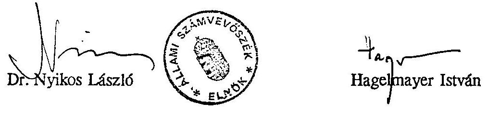

# Állami Számvevőszék

## JELENTÉS

a Központi Környezetvédelmi Alap pénzügyi-gazdasági ellenőrzéséről

---

A vizsgálat végrehajtásáért felelős:
az ÁSZ III. Költségvetési Ellenőrzési Igazgatósága
Bihary Zsigmond igazgató

Az ellenőrzést vezette:
Hegedűsné
dr. Müllern Veronika osztályvezető főtanácsos
Az ellenőrzést végezték:

| dr. Benkő János | számvevő tanácsos, |
| :-- | :-- |
| dr. Burján Margit | számvevő tanácsos |
| Czunyi Lajos | számvevő tanácsos |
| Csőry Györgyné | számvevő tanácsos |
| Patai Tamás | számvevő tanácsos |
| Simon Ákosné | számvevő tanácsos |
| Szijártó Károly | számvevő tanácsos |
| dr. Erőss Aladár | külső munkatárs |

---

# JELENTÉS 

a Központi Környezetvédelmi Alap pénzügyi-gazdasági ellenőrzéséről

Az emberi termelő tevékenység, az energiatermelés, a közlekedés, a mezőgazdaságban a kemikáliák fokozott felhasználása különböző szennyező anyagokkal terheli környezetünket, a levegőt, a vízkészletet és a talajt.

Az ország légszennyezettsége nem egységes. Súlyosan szennyezett az ÉK-DNY-i ipari tengely, mely az ország területének több mint egytizede, itt lakik a népesség közel fele. Ezen a tengelyen, illetve ennek közelében helyezkedik el a hat legszennyezettebb város, sorrendben: Budapest, Tiszaújváros, Miskolc, Százhalombatta, Ajka, és Tatabánya (1992. évi adatok).

Az ipari légszennyezés az 1990-es évek elején mérséklődött, elsősorban az egyes szennyező iparágak termelésének erőteljes visszaesése miatt. A közlekedési eredetű légszennyezés viszont nem csökkent, mivel a járművek átlagos életkora tovább nőtt, műszaki konstrukciójuk pedig korszerűtlenné vált. A kommunális légszennyezés azokon a településeken csökkent, ahol bővült a távhő és a gázszolgáltatás.

Hazánk felszíni vízkészlete csaknem teljeskörűen a szomszédos országok területéről érkezik, mindez jelentősen befolyásolja az átfolyó vizek minőségét, amely 1990-ig általában romlott. Ezt követően főként a termelés visszaesése miatt az ipari és mezőgazdasági eredetű szennyezés csökkent.

A vízigények több mint 90%-át a felszín alatti vizekből elégítik ki. Földtani védettség hiányában az ország vízelátását biztosító vízkészlet kétharmada "sérülékeny", azaz felszíni hatásokra, szennyeződésekre érzékeny. (A felszín alatti vizeink kb. felét jelentik az ivóvízellátásra alkalmas készletek.) Jelenleg nincs pontos ismeret a vízkészlet minőségének változásáról.

---

A lakosság 96%-a jó minőségű vezetékes ivóvízellátásban részesül. Közel 300 ezer ember él olyan településen, ahol az ivóvíz nitrátos. A csatornázott területen élő lakosság aránya több mint 50%.

Hazánkban évente mintegy 84 millió tonna szilárd hulladék keletkezik, ebből mindössze 4 millió tonna a települési, azaz a kommunális hulladék, 80 millió tonna a termelési hulladék, az utóbbi egyharmada ipari, mintegy 60%-a mezőgazdasági és faipari eredetű. Az összes hulladék csaknem fele szervetlen, szemben a nyugat-európai 10-30%-os aránnyal. Az éves hulladék mennyiségéből 4-4,3 millió tonna minősül veszélyes hulladéknak.

A környezet- és természetvédelem feladatait hazánk jelenlegi környezeti állapota, az állam teherbíró képessége, a piacgazdaságba való átmenet, a szerkezetátalakítás követelménye határozza meg.

Az állam korlátozott lehetőségeivel ösztönözni kívánja a környezet megóvását. Ennek egyik eszköze a Központi Környezetvédelmi Alap (elkülönített állami pénzalap), célja a környezetkímélő gazdasági szerkezet kialakításának ösztönzése, a környezeti ártalmak megelőzése, a bekövetkezett környezeti károk csökkentése, felszámolása, továbbá a védett természeti értékek, területek fenntartása, a hatékony környezetvédelmi megoldások előmozdítása, valamint a társadalom környezeti szemléletének fejlesztése.

Az Alap 1994-ben mintegy 7,7 Mrd Ft-tal gazdálkodott, működéséhez költségvetési támogatást nem kapott. Kezelője a Környezetvédelmi és Területfejlesztési Minisztérium. Tárcán belül ezt a feladatot a KKA titkársága, valamint a Közgazdasági és Költségvetési Főosztály látja el a Természetvédelmi Hivatal, a környezetgazdálkodás érintett szakfőosztályai, illetve a területen működő intézmények közreműködésével (12 Környezetvédelmi Felügyelőség (KÖFE), 4 Természetvédelmi Igazgatóság, 5 Nemzeti Park).

# Ellenőrzésünk során arra kerestünk választ, hogy: 

- az Alapból felhasznált pénzeszközök hogyan segítették a környezet védelmét, a természeti értékek megőrzését;
- a kezelést végző minisztérium szervezeti egységeinek működése, szervezettsége, szabályozottsága biztosította-e az Alap törvényes, célszerű és eredményes felhasználását.

---

A vizsgálat az 1992-94. években folytatott gazdálkodásra terjedt ki, az Alap működésének megítélése szükségessé tette, hogy a 80-as években indult pályázatok egy részét is áttekintsük.

# I. 

Következtetések, javaslatok

A Központi Környezetvédelmi Alap (KKA) működése sajátos, katalizátor szerepével részt kíván venni a lakosság szélesebb körét érintő környezetvédelmi célok finanszírozásában, illetve "szervezi" a nemzetgazdaság más területein lévő "pénzeszközök bevonását".

Az Alap forrásainak felhasználása azonban csak részben és nem kellő hatékonysággal szolgálta az állam célkitűzéseit, a törvényben meghatározott feladatokat, mindez indokolatlan pénzbőséget is előidézett. A kedvezőtlen jelenségek alapvetően négy problémakörre vezethetők vissza.

1. A hatáskörök, jogkörök tisztázatlansága megnehezítette a feladatok áttekinthetőségét, illetve egy-egy szakterület nemzetgazdasági szintű forrásigényének meghatározását. A környezet- és természetvédelmet szabályozó új törvények a vizsgálat befejezéséig még nem léptek hatályba. Ezt megelőzően a környezetvédelmet csaknem húsz évvel ezelőtti törvény szabályozta. Így az azóta eltelt időszakban számos (mintegy 300 db) különféle szintű jogszabály határozta meg a környezetvédelem működését. Ezek koordinálása hiányos volt, nem követték a társadalmi-gazdasági változásokat. Így a mai helyzetre jellemző, hogy ugyanazon környezetvédelmi célra (pl. víz-, levegőtisztaság-védelem) a rendelkezésre álló források, hatáskörök és jogkörök részben a kormányzati szerveken belül, részben a minisztériumok és az önkormányzatok között megoszlanak (pl. levegővédelmi feladata négy, míg vízvédelmi feladata három államigazgatási szervnek van). Ez a megosztottság, ami átfedésektől sem mentes, már önmagában is megnehezíti a védelmi feladatok egységes szemléletű, hatékony ellátását.

A hatáskörök, jogkörök nem teljeskörűen tisztázottak a kezelő minisztériumon belül sem. Ezek megoszlanak a KKA titkársága, a Környezetvédelmi Hivatal, a szakfőosztályok, a Természetvédelmi Hivatal, a Közgazdasági és Költségvetési Főosztály között. Ugyanakkor nincs kijelölt felelőse az Alap tárcaszintű ellenőrzésének, nincs megszervezve az Alap tárcán belüli pénzügyi információs rendszere.

A pénzügyi kezelést végző Közgazdasági és Költségvetési Főosztály az Alap működését sem ügyrendben (munkaköri leírásokban), sem gazdálkodási szabályzatban nem rögzítette, nem alakította ki a belső ellenőrzés elemi rendjét sem. Így a hatáskörök, jogkörök követhetetlenek, a hiányos szabályozás pedig lehetőséget teremtett a gazdálkodási fegyelem, a mérleg valódiságának megsértésére.

Az Alap kezelési feladataiba a Főosztály a viszonylag szűkös létszámhelyzetre való hivatkozással vállalkozásokat is bevont (erre jogszabály lehetőséget adott). Az elvégzett munka dokumentálása gyakran hiányos volt, ezért a munka teljesítése nem volt mindig igazolható.
2. Az Alap törvényi szabályozása esetenként hiányos, sőt ésszerűtlen előírásokat is tartalmaz.
Jogszabályi rendelkezés szerint a források felhasználási lehetősége igen széleskörű. Nincs kijelölve néhány kiemelt, jól körülhatárolható feladat, melyre koncentrált pénzfelhasználással a környezet- és természetvédelemben jelentősebb eredményeket lehetett volna elérni. (A vizsgált időszakban pályázatonként 16 MFt/db támogatás jutott.) A támogatott témák széleskörűsége, az elaprózott források és a fajlagosan alacsony támogatások miatt az Alap katalizátor szerepe csak igen szűk körben érvényesült.

Ésszerűtlennek minősíthető az az előírás, amely nem a feladat és forrás rendszerszemléletű összhangjára épít, hanem adott forrást adott feladathoz köt, azaz "megpántlikázza" a forrásokat. Így miközben az egyik feladatra a rendelkezésre álló pénzügyi keretet már felhasználták, nincs lehetőség arra, hogy egy másik feladat szabad pénzeszközeit átcsoportosítsák. Ezek a kötöttségek jelentősen hozzájárultak a nagyarányú, átmenetileg szabad pénzeszköz keletkezéséhez (a másik előidéző a pályázati rendszer működésének negatívumaival volt összefüggésben), amit értékpapír művelet keretében hasznosítottak. Az Alap ugyanis 1992-94. között 12 Mrd Ft saját és szabályozott bevétellel rendelkezett. Az ebből származó átmenetileg szabad pénzeszközök forgatásával, azaz értékpapír műveletekkel 34,3 Mrd Ft pénzforgalom keletkezett.

Megállapításaink szerint a tőkekihelyezések egy része szabálytalan, az előírt nyilvántartások vezetése visszamenőleges és hiányos volt. (Nem mindig lehetett megállapítani az értékpapír fajtáját; brókercégnek közvetítési díjat fizettek, holott

---

pénzintézeti kihelyezés esetén erre nem került volna sor; az utólagos könyvelés miatt a lekönyvelt és a szerződések alapján bizonyítható kamatbevételek jelentősen, mintegy 144 e Ft-tal eltértek.)

Törvényi előírás szerint a keletkezett források mintegy negyedét "közcélú környezetvédelmi feladatok" finanszírozására kell fordítani (2,1 Mrd Ft-ot használtak fel). Ennek keretében a mérő- és ellenőrző hálózatokat, illetve a természetvédelmi beruházásokat finanszírozzák. Mivel a jogszabály nem rendelkezik arról, hogy a két szakmai területre konkrétan mennyit kell fordítani, ezért ezekre összesen csak 1 Mrd Ft-ot használtak fel (a többit szakmai intézményi háttér, különféle szervezetek támogatására, szemléletformálásra fordították). Kifogásoltuk, hogy még e két kiemelt célra felhasznált pénzeszközök jórésze is a központi költségvetés pénzeszközeinek hiányát "pótolta". Ugyanis jelentős összegeket fordítottak ingatlan, gépkocsi, számítógép vásárlására, felújítására, holott ezeket a feladatokat elsősorban a fejezet költségvetési forrásaiból kellett volna megoldani.
3. A "környezetvédelmet közvetlenül elősegítő beruházások" támogatására kellett törvény szerint a források háromnegyed részét felhasználni, melyeket Tárcaközi Bizottság ítélt oda pályázat keretében. Összesen 1262 db pályázatot nyújtottak be, amiből 448 db-ot fogadott el a Bizottság 7,2 Mrd Ft támogatással. A tényleges felhasználás 3,5 Mrd Ft volt.

A pályázati rendszert nem szabályozták megfelelően, működésében jónéhány hiányosságot tapasztaltunk. Pontatlan, ellentmondásos és hiányos volt a kitöltési tájékoztató, illetve a támogatás igénylésére szolgáló űrlap. A pályázati döntések előkészítésében a területi szervek részvétele nem volt kellő mértékű, annak ellenére, hogy szakmai- és helyismeretük ezt indokolta volna. A bizottság elé kerülő pályázatokhoz nem mindig készült megfelelő műszaki és pénzügyi értékelés, pedig ez utóbbi tevékenységbe a Közgazdasági Főosztály még vállalkozót is bevont. (Előfordult, hogy olyan technológiát is támogattak, melynek már az indulásnál kétes volt a kimenetele.)
A "pályáztatás" általában igen lassú volt, a benyújtás és a beruházás elkezdése között hónapok, esetenként évek is elteltek.
A megítélt támogatások felhasználását viszonylag szűk körben ellenőrizték, a befejezett pályázatok utóellenőrzése sem volt folyamatos (1993-94. év végén csaknem 150 pályázat utóellenőrzésére még nem került sor). Nem volt jellemző az sem, hogy a lekötött, de hosszabb ideje felhasználatlan forrásokat felülvizsgálják, és indokolt esetben más célra fordítsák. Mindezek a negatívumok rányomták

---

bélyegüket a forrásfelhasználás hatékonyságára, hozzájárultak az indokolatlan pénzbőség kialakulásához is.

A pályázók többsége levegővédelmi beruházásokra kért támogatást. Ennek keretében a közlekedési légszennyezést csökkentő beruházásokat (autóbusz-motor rekonstrukciót, a villamosközlekedés korszerűsítését, a gépjárművek katalizátorral való felszerelését, illetve gázüzemű átállítását) az ipari légszennyezés mérséklését szolgáló fejlesztéseket és a települések gázellátását támogatták.

A közúti járműpark rekonstrukciója csak átfogó közlekedési program keretében lehet hatékony, így az Alap forrásaival csak a gondok elenyésző részét tudták megoldani. Tulajdonképpen ezek a források a vállalatok, illetve az önkormányzatok forráshiányát pótolták.
Jórészt eredménytelen volt a gépjárművek katalizátorral való felszerelésére, illetve gázüzemű átállítására odaítélt pénzeszközök felhasználása. Az ipari szennyezés mérséklését segítő pályázatok "eredményességében" tükröződött a támogatott iparág helyzete. Jellemző volt a beruházások határidőcsúszása, a megépített, de kihasználatlanul álló építmények sora, a pályázók visszafizetési gondjai.

A vízminőségvédelmi pályázatokra rendelkezésre álló forrásokat csaknem teljeskörűen az önkormányzatok kapták (1994-ig valamennyi pályázatot elfogadták). Ugyanezt a feladatot egyébként a központi költségvetés céltámogatás keretében is finanszírozta. Az Alap pénzeszközeit csatornázásra, illetve szennyvíztisztító mű létesítésére használták. A beruházások többsége még nem fejeződött be, ezért a felhasznált pénzeszközök hatékonyságát nem lehet megítélni. Tény viszont, hogy ezek a fejlesztések nemzetgazdasági szinten a közműolló szűkülését eredményezik.

Hulladékgazdálkodásra aránytalanul keveset fordítottak, azonban ezeknek a forrásoknak a többsége nem, vagy csak igen alacsony hatásfokkal hasznosult, holott a támogatások jelentős része a
 veszélyes hulladékok tárolására, megsemmisítésére irányult.
4. Az Alap hatékony működésének egyik gátja a szabálytalan pénzügyi kezelés volt. Az e feladatokkal megbízott Közgazdasági és Költségvetési Főosztály a bevételek nyilvántartásával, beszedésével kapcsolatos jogszabályi feladatokat nem megfelelően látta el, így nem volt tudomásuk arról, hogy ténylegesen az Alapnak milyen nagyságrendű forrása lehetne. Ugyanis két jelentős forrásnem az üzemanyagok környezetvédelmi termékdíja, illetve a bírságbevételek (közel 1,8 Mrd Ft

---

összegben) kintlevőségeit nem ismerték, sőt az előbbi forrásnem hátralékosairól sem volt tudomásuk. Ezek az adatok az Alap mérlegében sem szerepeltek. (Annak ellenére, hogy az üzemanyag-termékdíjhoz kapcsolódó nyilvántartások, illetve az ellenőrzési rendszer kialakítására közel 1 MFt-ot fizettek ki egy vállalkozónak.) Ugyancsak kifogásoltuk, hogy az 1994-ben megjelent új bevételi forrást, a bányajáradékot (teljesített bevétel $2,5 \mathrm{Mrd} \mathrm{Ft}$ ) előkészületlenség miatt tárgyévben nem tudták felhasználni, ezért a forrásokat értékpapírba fektették. Indokoltnak tartottuk volna, ha a pótköltségvetés összeállításakor jelzik a Kormánynak, hogy a kötelező feladatokhoz rendelt forrásokat tárgyévben nem tudják felhasználni. Erre azonban nem került sor.

Szabálytalannak minősítettük azt is, hogy a Főosztály a Budapest Banknál két számlát jogszabályi előírással ellentétben, csak háromnegyed évvel később szüntetett meg. Az államháztartási törvénnyel ellentétes döntést jelentett az is, hogy ugyanannál a banknál a főosztályvezető lemondott az Alap bankszámla-forgalma után járó kamatbevételről és ezzel a bankot ingyenes pénzfelhasználáshoz juttatta.

Az Alap számviteli rendje a vizsgált időszak elején szabályozatlan volt, később a szabályzatok elkészültek ugyan, de a számviteli munkában olyan hiányosságok keletkeztek, melyek következményeként a gazdasági események könyvelése nem volt mindig szabályszerű. Mindez oda vezetett, hogy az Alap 1992-93. évi mérlege nem volt valós (az 1993. évi könyvvizsgálat eredménye "elutasító záradék" lett).

Összegezve megállapítható, hogy a nemzetgazdasági szinten egyre nagyobb szerepet betöltő környezet- és természetvédelem szakmai céljait az Alap működése során nem segítette kellő hatékonysággal. A rendelkezésre álló forrásokkal jelentősebb szakmai eredményeket lehetett volna elérni, ha a működés teljeskörűen szabályozott, a források odaítélését segítő döntéselőkészítés szakmailag és közgazdaságilag megalapozott, az ellenőrzés megfelelő színvonalú.

Nem lehet teljeskörűen a pénzeszközök országos méretű felhasználását nyomon követni. A néhány millió forintos támogatások jórészt hiánypótló, kiegészítő szerepet töltöttek be. A környezetvédelem érdekében viszonylag csekély forrást tudtak bevonni a költségvetési és a gazdálkodó szféra területéről. Vagyis az Alap jelenlegi formájában, működésében nem alkalmas a törvényben deklarált célok teljesítésére.

---

Indokolt a jövőbeni működést úgy szabályozni (amennyiben az alapszerű kezelés továbbra is fennmarad), hogy a Minisztérium kizárólag az irányítás és az ellenőrzés feladatait lássa el, az összes többi technikai jellegű feladatot pedig pénzintézetre bízza. Ezzel egyidejűleg a koncentrált forrásfelhasználás érdekében a kiemelt szakmai célok prioritását is szükséges meghatározni.

Az Alap működésének, ellenőrzési rendszerének szabályozatlansága, a vállalkozók alkalmazása, az értékpapír műveletekben, a számviteli munkában előforduló jogszabálysértő gyakorlat, illetve az Alapot megillető kamatjövedelemről való lemondás felveti a KTM Közgazdasági és Költségvetési Főosztály vezetőjének felelősségét.

A KKA jogszabályszerű és hatékony működése érdekében javasoljuk:

# A Kormánynak 

- A Nemzeti környezeti- és természetpolitikai koncepció operatív végrehajtásához meg kell határozni a szakmai feladatok prioritását annak érdekében, hogy a rendelkezésre álló pénzeszközöket az így kialakult sorrend figyelembevételével lehessen felhasználni.
- A környezet- és természetvédelemmel kapcsolatos hatásköröket, jogköröket és az együttműködés rendjét magas szintű jogszabályban rendezzék.
- Tekintsék át a környezet és a természet védelmére rendelkezésre álló állami forrásokat, intézkedjenek ezek koncentrált és hatékony felhasználásáról.
- A Nemzeti Környezeti- és Természetpolitikai Koncepció figyelembevételével az érintett minisztériumok készítsék el saját ágazati koncepciójukat.
- A rendkívüli környezetszennyezés elhárításának rendszerét szabályozzák újra.

## A Környezetvédelmi és Területfejlesztési Minisztériumnak

- Kezdeményezzék az Alapot szabályozó törvény módosítását, a célhoz kötött források felhasználásának megszüntetése érdekében.
- Tekintsék át minisztériumon belül az Alap működésével kapcsolatos hatásköröket és jogköröket, tegyenek intézkedéseket a feladatok minisztériumon belüli koncentrált (esetleg egy szervezet keretében történő) végrehajtására.
- Készítsék el a minisztérium Szervezeti és Működési Szabályzatában rögzített feladatokkal összhangban a Közgazdasági és Költségvetési Főosztály ügyrendjét, a dolgozók munkaköri leírásait.

---

- Teljeskörűen szabályozzák az Alap gazdálkodását, számvitelét, ellenőrzését, pályázati rendjét.
- Szüntessék meg az Alapból a fejezeti költségvetéshez tartozó kiadások finanszírozását.
- Vizsgálják felül a szerződéssel lekötött, de tartósan fel nem használt pénzeszközöket, intézkedjenek azok felszabadításáról.
- Bontsák fel a gázautózás és katalizátor program területén több mint egy éve lekötött 500 MFt-ra vonatkozó szerződéseket, közte a Supergáz Rt. 310 MFt-os országos gáztöltő állomás építésére vonatkozó szerződést, mivel azok felhasználására eddig nem került sor.
- Szüntessék meg a Közgazdasági és Költségvetési Főosztályon a vállalkozók foglalkoztatását, ezzel egyidejűleg a pénzügytechnikai feladatok teljeskörű lebonyolításával pénzintézetet bízzanak meg.
- A műszergazdálkodásra minisztériumon belül felelős szervezetet (esetleg teamet) hozzanak létre. Ezzel egyidejűleg határozzák meg a laboratóriumok alap- és kiegészítő feladatait.
- Készítsenek Intézkedési tervet a jelentésben foglalt megállapítások és a javaslatok figyelembevételével.
- Kezdeményezzék a Közgazdasági és Költségvetési Főosztály vezetőjének felelősségre vonását, az Alap működési és ellenőrzési rendszerének szabályozatlanságáért, a vállalkozók alkalmazásában, az értékpapír műveletekben, a számviteli munkában előforduló jogszabálysértő gyakorlatért, illetve az Alapot megillető kamatjövedelemről való lemondásért.

# II. 

Részletes megállapítások

A hazánkban bekövetkezett társadalmi, gazdasági változások, a piacgazdaságba való átmenet, a szerkezetváltás igénye új követelményeket támaszt a környezet- és természetvédelemmel szemben. Ennek megfelelően új tartalmat kap a környezet, természet és a gazdaság kapcsolata, a környezetvédelem piackomformmá válik. Továbbra is kiemelt szerepet kap az állam a feladat irányításában, koordinálásában,

---

azonban a teherviselés jobban megoszlik a környezetet használó, a lakosság, az önkormányzat és az állam között.

# 1. A környezetvédelmi feladatok és az Alap kezelését végző szervezetek működésének összhangja, szabályozottsága 

A környezetvédelem szakmai feladatainak magas szintű jogi szabályozására utoljára csaknem húsz évvel ezelőtt került sor (1976. évi II. tv.). A törvény nem tartalmazott a végrehajtáshoz normákat, garanciális szabályokat a társadalmi nyilvánosság, és az ellenőrzés számára.

Jelenleg a környezetvédelem szabályozása az igen nagyszámú (mintegy 300 db különféle szintű), a gazdasági, társadalmi változásokat csak részben követő jogszabályok sokaságából áll. Többségük a 80-as évek közepén keletkezett, de még a 60-as évekből származó is van közöttük. Nem történt meg ezek koordinálása, aktualizálása, ezért a környezetvédelemmel kapcsolatos jogosítványok, hatáskörök nem egyértelműek, esetenként fedik egymást. Ez nehezíti a különböző gazdasági eszközök kölcsönhatásának felismerését, ami a tényleges környezeti állapot megismerését, a szükséges intézkedés megtételét nehezíti.

A levegővédelemmel kapcsolatos jogkörök és források megoszlanak a KTM (helyhez kötött pontforrás kibocsátása: emisszió) a KHVM (mozgó pontforrás kibocsátása), a Népjóléti Minisztérium (településen belüli légszennyezés: imisszió), a HM (rádioaktív légszennyezés), az önkormányzatok (szolgáltatók által kibocsátott légszennyezés) között.

A vizek mennyiségi és minőségi védelmének feladatköre, illetve az ehhez kapcsolódó pénzeszközök a KTM (Területfejlesztési Alap, KKA), KHVM (Vizügyi Alap), BM (önkormányzati cél- és kiegészítő támogatás), FM, NM (Fejezeti kezelésű előirányzatok), IKM, és az önkormányzatok (saját forrásaik) között oszlanak meg, illetve kiegészülnek PHARE "támogatással", és kedvezményes kamattámogatással.

A kialakult visszás helyzeten kívánt segíteni a Kormány 1993-ban, amikor felkérte a KTM-et, hogy készítse el a Nemzeti környezeti- és természetpolitikai koncepciót (NKTK), amit a Kormány 1994-ben elfogadott és a Parlament elé terjesztett tájékoztatásul.

A koncepció figyelembe veszi az ENSZ, az OECD és az Európa Tanács konvencióit, ajánlásait, kijelöli azt a feladat- és eszközrendszert, ami a meglévő állapotok javítását szolgálja. Hiányossága viszont, hogy konkrét pénzügyi elképzeléseket nem fogalmaz meg, a koncepcióhoz ágazati érdekeket kifejező feladatrendszer sem készült.

---

A koncepció megalapozta az új környezetvédelmi törvénytervezetet, melyet a vizsgálatunkkal egyidőben tárgyalt a Parlament.

Összességében tehát a KKA a környezet- és természetvédelem szakmai feladatainak ellentmondásos és hiányos szabályozása mellett működik.

# 1.1. Az Alap jogi szabályozottsága 

A KKA törvényi szintű szabályozására 1992. évben került sor (1992. évi LXXXIII. tv. IV. fejezet).

Ezt megelőzően a KKA működését (a Tanácsi Környezetvédelmi Alappal együtt) alapvetően a 10/1986. (IX.24.) OKTH rendelkezés határozta meg.

Az Alap törvényi szabályozása tartalmaz olyan elemeket, amelyek nem szolgálják a források rendeltetésszerű és hatékony felhasználását.

A törvény előkészítése közgazdasági oldalról nem volt kellően megalapozott, nem elemezték a szabályozás várható hatásait. A törvény módosítására 1995-ben került sor (1995. évi XXI. tv.), azonban ez a jogszabály sem korrigálta az eredeti törvényben meglévő hiányosságokat.

A törvény forrásnemenként korlátozza a felhasználást. Ennek következménye, hogy miközben az egyik felhasználási terület forrása "kiürül", addig a másik terület jelentős - más célra nem használható - forrással rendelkezik.
A "pántlikázott" forrásfelhasználás igen kedvezőtlen hatással volt a környezetvédelmi célok teljesítésére.

A minisztérium 1992-94-ben forráshiányra hivatkozva a vízminőség-védelmi pályázatok fogadásának felfüggesztésére kényszerült, miközben a többi forrásnem terhére több százmillió forint nagyságrendű értékpapír-állománnyal rendelkezett.

Ugyanilyen indokok miatt az Alap a szennyvizes pályázatok 1994. évi finanszírozására a Távközlési Alapból 337,7 MFt hitelt vett fel jegybanki alapkamatra, továbbá 313,5 MFt-ot vett át a PHARE "támogatásból". Ez az intézkedés igen negatívan érintette az önkormányzatokat, mivel mind a átvett pénzeszközöket, mind a hitelt (kamattal együtt) vissza kellett fizetni. Az önkormányzatok ugyanis visszafizetési kötelezettség nélkül kaptak támogatást az Alapból, amit az 1995. évi törvény már deklarál is.

A törvény a források 75%-át a "környezetvédelmet elősegítő beruházásokra", a 25%-át a "közcélú környezetvédelmi feladatokra" rendeli felhasználni. Ez utóbbi jórészt a minisztérium államigazgatási feladatainak finanszírozását jelentette,

---

pótolva ezzel a szűkös költségvetési pénzeszközöket. A felhasználás nem jogszabálysértő, mivel a törvény vonatkozó paragrafusa /33. § (1)/ erre lehetőséget ad.

Eszerint ugyanis mérő, ellenőrző hálózat kiépítésére, információs rendszer beszerzésére, védett természeti területek megóvására, kutatásra, ismeretterjesztésre, szakmai és intézményi háttér megerősítésére lehet fordítani a bevételeket. Ezeket a fejezetnél és az intézményhálózatnál (21 intézménynél) használták fel.

A források összemosódásával az államigazgatási feladatok finanszírozása két csatornássá vált, ami megnehezíti a szakmai feladatok tényleges kiadásainak tervezését, illetve kimutatását.

A nyugat-európai országokban a környezetvédelem egyes területei részletesen szabályozottak. Ausztriában például külön Környezetvédelmi Kódex tartalmazza az előírásokat.

# 1.2. A KKA-t kezelő szervezet irányítási mechanizmusa, szabályozottsága 

Az 1992. évi LXXXIII. tv. szerint az Alappal a miniszter rendelkezik, kezelője a KTM. A kezelést illetően a vizsgált időszakban kétféle gyakorlat érvényesült.

1993-ig a minisztérium SZMSZ-e szerint "a Közgazdasági és Költségvetési Főosztály (továbbiakban Közgazdasági Főosztály) kezeli a fejezethez tartozó elkülönített állami pénzalapokat" (Területfejlesztési Alap és KKA). Ez a feladatkör koordinációs, titkársági, nyilvántartási, könyvelési tevékenységre terjed ki. A szakfőosztályoknak "véleményezési", "figyelemmel kísérési" feladatai voltak.

1993-tól a szakmai főosztályok hivatali szervezetbe integrálódtak (4 hivatal jött létre), így az érintett Környezetvédelmi Hivatal kapott szakmai ellenőrzési és irányítási feladatokat, az operatív munkavégzés az 1993 II. félévétől működő KKA titkárságra hárult. Ezzel az intézkedéssel a Közgazdasági Főosztály feladatai csökkentek. A működést nehezítette, hogy a két szervezeti egységet más-más személy felügyelte (közigazgatási államtitkár és helyettes államtitkár).

A környező országokban a környezetvédelem állami feladatainak ellátását végző "szervezetek" jellege igen eltérő.

[^0]
[^0]:    Pl. Ausztriában a Környezetvédelmi Minisztérium az operatív feladatokban nem vesz részt. Az Alap forrásait egy kommunális bank

 kezeli, s az bonyolítja a pályáztatást, a szerződéskötést is. Lengyelországban lényegében alapítványként működik a támogatási rendszer, 160 fővel. A Cseh, valamint a Szlovák köztársaságokban minisztériumi keretek között most erősödik az alap működése. Bulgáriában a kezdeti lépéseknél tartanak, néhány fő tevékenykedik az érintett területen.

---

A Közgazdasági Főosztály vezetője az SZMSZ-be rögzített főosztályi feladatokat ügyrendben nem szabályozta annak ellenére, hogy 1993-tól a belső szervezeti tagozódás is megváltozott (2 osztály helyett 3 osztály működik). Nem készültek munkaköri leírások sem. Ennek hiányában az egyes osztályok feladatköre, jogköre, hatásköre, felelőssége, az osztályok közötti együttműködés rendje, az információáramlás szabályozatlan és tisztázatlan maradt.

A pénzügyi-számviteli munkában összemosódtak a hatáskörök, a vezetők tevékenységében rendszeressé vált az összeférhetetlen munkavégzés. Operatív tevékenységük miatt háttérbe szorult az irányítási, a szervezési és az ellenőrzési munka.

A főosztályvezető és az osztályvezetők olyan operatív feladatokat is ellátnak, amit irányítaniuk, ellenőrizniük kellene. Így pl. a főosztályvezető készíti az Alap költségvetését, a pénzügyi osztályvezető (aki egyszemélyben főosztályvezető-helyettes is) végzi a kontírozókönyvelői, a beszámoló készítési feladatokat, ugyanakkor a pénzügyi kifizetéseknél ellenjegyző funkciót is ellátnak.

Két osztályon a kialakult létszámfeltételek a vizsgált időszakban nem voltak megfelelőek (Beruházási Osztály 4 fő, Pénzügyi Osztály 6 fő).

Az Alap kezelését végző két osztálynak (pénzügyi és beruházási) az Alap feladatain túl a fejezet irányítási, finanszírozási, pénzügyi és számviteli feladatait is el kell látni. (Az intézmények száma 1992. elején 24 volt, míg 1994. év végén 35 intézmény működött.)

Kifogásolható, hogy a főosztályvezető a felügyeletet ellátó tisztségviselőt nem tájékoztatta a pénzügyi és számviteli munkában jelentkező gondokról, negatív jelenségekről, sőt az 1992. évi főosztályi beszámoló keretében a feladatok megfelelő szintű ellátásáról számolt be.

A Közgazdasági Főosztály működésének szabályozatlansága felveti a főosztályvezető felelősségét.

A KKA titkárságon is hasonló létszámgondok voltak. A főosztályi keretben működő titkárság 1993-ban 13 fővel kezdte meg működését, jelenleg 9 fővel dolgozik. A főosztály a KKA feladatok mellett a Phare programok kezelését is ellátja.
A titkárság átfogó, koordinációs szerepe az Alap működésében nem érvényesült (erre nem is volt jogosítványa).

A KKA-törvény lehetővé teszi, hogy a források maximum 1,5%-át az "Alap kezeléséhez, bevételeinek és felhasználásának ellenőrzéséhez szükséges költségek

---

fedezetére" (1992-94-ben összesen 118 MFt) fordítsák. Ezeket a forrásokat előnytelen budapesti banki szerződéssel célszerűtlen, indokolatlan és eredménytelen vállalkozói foglalkoztatás mellett pazarlóan használták fel. Ezen túl 1992. és 1993. évben szabálytalanul a KMÜFA-ról és a fejezeti kiadások között is elszámoltak a KKA-t érintő kezelési költségeket. Mindezen szabálytalanságok felvetik a Közgazdasági Főosztály vezetőjének felelősségét.

A Budapest Bankkal az OKTH először 1987-ben kötött szerződést (a bank közreműködésére a törvény is lehetőséget adott).

Feladata volt a pályázókkal való szerződéskötés, az Alap beruházási pénzeszközeinek kezelése és nyilvántartása, a folyósításokról éves, illetve negyedéves jelentés készítése. A pályázóknál esetenként pénzügyi ellenőrzést végzett. A BB-nak a szerződés értelmében (1992. X. 14-ig) az átmenetileg szabad pénzeszközök után betéti kamatot kellett volna fizetnie, a Bank azonban ennek nem tett eleget, a minisztérium pedig ezt tudomásul vette. Ezzel egyidejűleg a bank sem számolt fel szolgáltatásaiért díjat. Mivel sem a kamatbevételek, sem a szolgáltatási díjak külön-külön nem kerültek kimutatásra, ezért nem ismert, hogy az Alapnak "haszna" vagy "vesztesége" származott-e ebből a nettósított, szabálytalan elszámolásból.

Az alapszerződést 1992. X. 14-én átdolgozták, aktualizálták. Ezt követően 1992. X. 22-én a Közgazdasági Főosztály vezetője "Bankszámla szerződés kiegészítése" tárgyú átiratában hatályon kívül helyezte a szerződés 11. pontját, és elengedte a Budapest Banknak az átmenetileg szabad állami pénzeszközök utáni kamat fizetését. Ezzel az intézkedésével ingyenes pénzhasználathoz juttatta a bankot, lemondott az Alap kamatbevételeiről, megsértette az ÁHT 108 § (2.) bekezdését.

Ezzel szemben a bank szolgáltatásaiért a kiadási pénzforgalom 2%-át számította fel, mint bonyolítási díjat: 1992. és 1994. év között összesen 51,3 MFt-ot.

A Budapest Bank szolgáltatásait a minisztérium 1994. szeptemberében korlátozta (számlavezetési kötelezettséget megszüntette), ezzel arányban viszont nem mérsékelte a bank díjazását.

A főosztály SZMSZ-ben előírt KKA-t érintő kötelezettségeinek teljesítésére három gazdálkodó szervezetet is alkalmazott (DRAGON Kft., Pólus Pénzügyi és Vezetési Tanácsadó Rt., Éptilak Bt.). Ezek tevékenysége, díjazása több szempontból szabálytalan volt.
Az esetek többségében a vállalkozókkal megkötött szerződésben foglalt feladatok teljesítése nem volt dokumentálható, a munkavégzés azonosíthatatlan és ellenőrizhetetlen volt. Előfordult, hogy a tevékenység "mibenlétéről" még az érintett

---

osztályvezetők sem tudtak nyilatkozni. Ennek ellenére a számlákat kifizették. Azokat gyakran a főosztályvezető úgy utalványozta, hogy nem történt meg az ellenjegyzés, érvényesítés, a munka elvégzés igazolása (1. sz. függelék). Mindez felveti a főosztályvezető felelősségét.

# 1.3. Az Alap kezelésének szabályozottsága 

A vizsgált időszakban a minisztériumban a KKA kezelési rendjére nem készítettek átfogó írásos dokumentumot.

Az Alap gazdálkodási szabályzattal (tervezés, források felhasználási rendje, információáramlás) nem rendelkezik. Így szakmai és pénzügyi oldalról a tervezés és felhasználás belső folyamata szabályozatlan.

Az Alap kezeléséhez kapcsolódó részterületek - pénzügy-számvitel - belső szabályozása elkészült ugyan, de igen megkésve (1993. végén).

A kötelezettségvállalás és utalványozás rendjét először 1993. októberében határozták meg. A Számviteli Törvény előírása szerint a számviteli politika csak részlegesen került meghatározásra, 1992-ben nem készült el a számlarend. 1993-ban már összeállítottak egy számlatükröt, és az egyes számlák alkalmazásához fűztek tartalmi magyarázatot, az analitikus nyilvántartások rendszerét azonban továbbra sem alakították ki.
Szabályozatlan maradt a bizonylati rend. Leltározási szabályzattal sem rendelkeznek.
A főkönyvi kivonatokat nem készítették el, nem került sor az analitikus és szintetikus számlák egyeztetésére, a számlakijelölések egy része szabálytalan volt és a gazdasági eseményeket sem könyvelték teljeskörűen. Jogszabályi rendelkezéssel ellentétesen az Alapnak egy évig két bankszámlája is volt. Előfordult az is, hogy a pénzeszközök egy részét nem a bankszámlán kezelték.
Mindennek következményeként az Alap mérlege sem 1992-ben, sem 1993-ban nem volt valós (az 1994. évit nem tudták rendelkezésünkre bocsátani), nem felelt meg a teljesség és a folyamatosság követelményének sem.
Az éves beszámolót 1993-ban egy könyvvizsgáló szervezettel is megvizsgáltatták, melynek eredménye "elutasító záradék" lett.

A számviteli munkában talált hiányosságok - különösen a szabályozatlanság a számviteli elvek egy részének, illetve a mérlegvalódiság elvének megsértése - felvetik a főosztályvezető felelősségét (2. sz. függelék).

---

Az Alap működésének egészére rányomta bélyegét, hogy átfogó belső ellenőrzést egy esetben sem végeztek a kezelő szervezeteknél, az SZMSZ-ben egyetlen szervezeti egységet sem jelöltek ki erre a feladatra.

A Közgazdasági és Költségvetési Főosztályon belül a belső ellenőrzés rendszere teljeskörűen szabályozatlan volt, és az csak igen hiányosan működött. Függetlenített belső ellenőrt nem alkalmaztak, a folyamatba épített belső ellenőrzés pedig nem volt zárt, alig funkcionált (a kötelezettségvállalás, utalványozás rendjét csak 1993. októberében rögzítették). A vezetői ellenőrzés a hatáskörök tisztázatlansága, a vezetés munkájában meglévő összeférhetetlenség miatt esetleges volt.

A források felhasználásában döntési jogkörrel rendelkező Tárcaközi Bizottság működésére sem készítettek a jogszabályi kereteket kitöltő részletes szabályzatot.

# 2. Az Alap forrásainak tervezése 

Az Alap a jogszabályban előírt szabályozott és saját bevételeiből ez alatt az időszak alatt 12 Mrd Ft realizálódott, az ebből származó átmenetileg szabad pénzeszközök forgalma 34,3 Mrd Ft volt.

Így a KKA a vizsgált időszakban (1992-94.) 47,2 Mrd Ft bevétellel rendelkezett, amit csaknem teljeskörűen felhasznált (45,3 Mrd Ft) 1994. év végi záróegyenlege 1,9 Mrd Ft volt (1-3. táblázat).

Az elmúlt három évben a tényleges bevétel többszöröse volt az eredeti (10,4 Mrd Ft), illetve a módosított előirányzatnak (16,6 Mrd Ft). Ez kisebb részt a bevételi források bővülésével, nagyobb részt az évenként egyre magasabb arányú értékpapír kihelyezések tőkevisszatérülésével és az ehhez kapcsolódó kamatbevétellel volt összefüggésben. Az Alap forrásai a vizsgált időszakban folyamatosan bővültek. Saját forrásai a környezet- és természetvédelmi bírságok, az Alap javára teljesített visszatérítések, a kamatok és tőkejövedelmek voltak.

Az 1992. évben új bevételi forrásként jelent meg a külföldi gépjárművekre kivetett adó, és az üzemanyagok környezetvédelmi termékdíja (1992. május 1-től). Az 1994. évtől a források a bányajáradékkal bővültek.

A nyugat-európai országokban a piacgazdasági feltételek között mind jobban érvényesül a "szennyező fizet" elve és gyakorlata. A környezetvédelmi célú források ezekben az országokban jórészt a termékdíjakból, büntetésekből képződnek. Ausztriában például a

---

Környezetvédelmi Alap forrásait a korábban hosszú lejáratra kihelyezett kamatmentes hitelek törlesztő részletei, termékdíjak, bírságok és egyre növekvő mértékben a nemzetközi piacokon felvett hitelek képezik. Az állam a kamatbevételeket vállalja magára.

Az Alap legjelentősebb forrása (a tőkemegtérülés és a kamatbevételek után) az üzemanyagok környezetvédelmi termékdíja (Ükt). Az ebből származó összes bevétel 4,8 Mrd Ft volt, melyet a belföldön értékesített, valamint a saját felhasználású motorbenzin és gázolaj után kell fizetni. (1992. és 1993-ban motorbenzin után 667 Ft/t, a gázolaj után 595 Ft/t volt. A díjtétel 1993. októberétől emelkedett, mindkét termék esetében mintegy 60%-kal.

Az Ükt. bevezetéséről szóló törvény (1992. évi XVIII. tv.) végrehajtására a KTM minisztere két rendeletet (16/1992. VIII. 3. és a 17/1992. VIII. 3.) adott ki. Ebben szabályozta a bejelentési kötelezettséget, a források nyilvántartását és előírta a minisztérium ezzel kapcsolatos feladatát.

A Közgazdasági Főosztály a rendeletben előírt feladatainak 1993. és 1994. évben nem tett eleget. Az Ükt ellenőrzési és nyilvántartási rendszerének kialakítására, ennek naprakész vezetésére a Viridis Kft-vel 1994. X. 1-én szerződést kötött. A Kft. díjazását az Ükt bevételek 0,1%-ában határozták meg. A bevételekkel összefüggő nyilvántartási feladatokat a főosztályvezető indokolatlanul nem a pénzügyi osztályhoz, hanem a beruházási osztályhoz rendelte.

A vállalkozó által kialakított analitikus nyilvántartás nem felelt meg a Számviteli Törvényben előírt kritériumoknak. A nyilvántartás szerinti bevétel nem egyezett meg a számvitelben helyesen kimutatott tényleges bevétel összegével. A számviteli nyilvántartással egyeztetés nem történt.

A vállalkozó által vezetett nyilvántartás szerint 1994. évben 71 vállalkozónak volt bevallási és fizetési kötelezettsége. Ebből rendszeresen csak mintegy 20-25 cég adott bevallást.
Az üzemanyagokat forgalmazó gazdálkodó szervezeteket a Közgazdasági Főosztály sem 1993-ban, sem 1994-ben nem szólította fel a bevallási kötelezettség teljesítésére.
A vállalkozó helyszíni ellenőrzést egy esetben sem végzett. Ennek ellenére 1994. évben környezetvédelmi termékdíj ellenőrzés címen 188.625 Ft-ot, 1995. I. negyedévben (1994. évi munkavégzésre) 761.000 Ft-ot fizettek ki a Kft. részére.
A Közgazdasági Főosztály vezetője igazolta a munka elvégzését és egyben utalványozta a kifizetést. A beruházási osztályvezető a kifizetés jogosságát pedig úgy ellenjegyezte, hogy a munka elvégzéséről nem győződött meg. A bizonylat érvényesítése nem történt meg. A fentiek hiányában az Alap kezelőjének nem volt megfelelő információja az Alapot megillető bevételek nagyságáról, ezen kívül a valós bevételi hátralék sem volt ismert.

A Viridis Kft. foglalkoztatásával kapcsolatos szabálytalanságok felvetik a Közgazdasági Főosztály vezetőjének felelősségét.

---

Átengedett adóbevételek címén 1992-93-ban 1,6 Mrd Ft bevételi előirányzatot terveztek a külföldi gépjárművek után kivetett adóból. Ennek azonban csak mintegy a fele teljesült (0,9 Mrd Ft). A minisztériumnak a források nagyságára nem volt rálátása, a tervezés során a költségvetési törvényben rögzített (PM
 előkészítésében) adatokat vették figyelembe.
Új bevételi forrásként jelent meg 1994-ben a bányajáradék. Ennek nagyságrendjére ugyancsak nincsen ráhatása a minisztériumnak. 1994. évi teljesítés 2,5 Mrd Ft volt. E forrás terhére tájrendezési és környezethelyreállítási feladatokat kellett a tárcának előkészíteni. A pályázati felhívást azonban csak késve adták ki (1994. XI. hó), így az első döntésre csak 1995. február végén került sor. Pénzügyi teljesítés az ellenőrzés befejezéséig nem történt. A tárca a fenti pénzeszközt ( $2,5 \mathrm{Mrd}$ Ft-ot) 7 hónapja folyamatosan értékpapír vásárlásba fektette, és ebből kamatbevételt realizált.

A minisztérium értékpapír vásárlására vonatkozó döntése kifogásolható, mivel az 1994. évi pótköltségvetésnél elmulasztotta jelezni a Pénzügyminisztérium felé, hogy a rendelkezésére álló kötelező feladathoz rendelt forrást előkészítetlenség miatt nem tudja időben felhasználni.

Az MNB 1 hónapos diszkont kincstárjegy kínálata 3 Mrd Ft volt (1995. január 10-től). Az Alap ezt a kibocsátási szintet teljeskörűen jegyezni tudta volna. A kamatszint egyensúlyban tartása miatt a bank az általa felajánlott értékpapírállomány jegyzését egy vevő felé 50%-ban korlátozta. Ezért az Alap minden héten lejegyezte a maximális vételi lehetőséget, azaz 50%-ot, a másik 50%-ot viszont 40-50 szervezet jegyezte le.

A források között a bírságbevételek 1,8 Mrd Ft-ot jelentettek. Ezek keletkezése, összetétele a korábbi nagyipari struktúrához igazodott.

A bírságok 71%-a a légszennyezéshez kapcsolódott (a vizsgált időszakban ez a forrás intenzíven nőtt; 1992-ben még csak 48% volt). Arányát tekintve csökkent a szennyvízbírság: 23% (1992-ben 43% volt). Minimális volt a veszélyes hulladékhoz kapcsolódó bírság (4,3%), a zajvédelmi- (1,6%) és a természetvédelmi bírság összege. A bírságok háromnegyed része Miskolc, Győr, Pécs központú régiókban keletkezett.

A környezet védelmében jelenleg nem a prevenció, a környezeti ártalmak megelőzése, hanem a jogszabályban előírt határértéket meghaladó környezetet és a természetet szennyezők szankcionálása, bírságolása érvényesül. A bírságok mértéke, "visszatartó ereje" igen csekély.

A fővárosban a légszennyezettségi határérték túllépéséért 1993-ban 30 MFt bírságot szabtak ki, a "kibocsátó források" száma 564 db volt, így egy szennyezőre átlagosan 53 EFt jutott.

---

Az "elkövetőknek" inkább megéri kifizetni a bírságot, mint a több nagyságrenddel nagyobb, környezetet kímélő beruházásokat megvalósítani. A bírság összegét gyakorlatilag termelési költségnek tekintik.

A szankcionálás következményeiből származó bevételek nagyobbak lehetnének, ha a vonatkozó jogszabály a hatásköröket "egy kézbe" összpontosítaná.

Veszélyes mértékű zajkibocsátás esetén a KÖFÉ-knek nincs joga a tevékenységet felfüggeszteni vagy korlátozni, ehhez az Állami Népegészségügyi és Tisztiorvosi Szolgálat "engedélye" is szükséges.
Hasonló gondok jelentkeznek a kommunális hulladékból eredő szennyező állapot megszüntetésénél, "kikényszerítésénél" is, mivel ehhez az önkormányzatok megkeresése szükséges.

Ugyancsak forrásnövelő lehetne, ha az ezzel foglalkozó szervezeti egység kapacitását bővítenék.

Veszélyes hulladékok keletkezéséről az "elkövetők" önbevallásából kap információt a KÖFE. Helyszíni ellenőrzést azonban csak a "nagyobb" kibocsátóknál tudnak végezni. Nincs mód a hatóság részéről önállóan kezdeményezett "felderítésre" sem.

A természetvédelmi területeken, nemzeti parkokban foglalkoztatott természetvédelmi őr száma igen csekély, egy főre mintegy 4500 hektár rendszeres ellenőrzése jut. Ennek következménye, hogy igen ritka a védett vagy fokozottan védett állatokkal, növényekkel szembeni jogsértők tettenérése.
(Vizsgált időszakban összesen 677 helyszíni bírság volt, 385 Ft/fő átlagos összeggel.)
A felügyelőségeken, igazgatóságokon általában rendben találtuk a kapcsolódó nyilvántartásokat, megfelelő volt a bevételek behajtására tett intézkedés is. A Közgazdasági Főosztály az intézményektől év végén azonban nem kért kimutatást az adósokról, így a kintlevőségek összesített nagyságrendje a minisztérium előtt nem ismert. Az Alap mérlegében az adósok állományát egy évben sem mutatták ki. Helyszíni tapasztalataink szerint ezek jelentős hányada "kétes minősítésű" volt, mivel a szennyezést elkövető gazdálkodó szervezetek jelentős része ma már csőd, felszámolás, végrehajtási eljárás alatt áll.

A KÖFÉ-k részéről a vizsgált időszakban mintegy 80 igénybejelentés történt a felszámolás alatt álló szervezetekhez. Ezeknek azonban mintegy harmada fedezet hiányában nem elégíthető ki.

Az Alapnak a visszterhes támogatásokból keletkező forrása az 1992-1994 közötti időszakban 133 MFt volt. A vizsgált időszakban 253 MFt visszterhes támogatást folyósítottak a vállalkozási szférának, melyből 133 MFt-ot (52,6%-ot) térítettek vissza. A 120 MFt hátralékból csőd, felszámolási és peres eljárás miatti kétes

---

kintlevőség 50 MFt (az ezzel kapcsolatos behajtási intézkedést megtették). Törlesztési ütem módosítással összefüggő kintlevőség 40 MFt volt (Tiszamenti MGTSz 20 MFt, MENDOFIX Vegyipari Bt. 11 MFt, Villamos Állomásszerelő Rt. 9 MFt), a fennmaradó 30 MFt hátralék esetében viszont behajtási intézkedés nem történt.

A visszterhes támogatások kimutatását 1990. évtől visszamenőleg 1995. január 31-ével készítették el, ami akadályozta a kintlevőségek beszedését.

A források között legjelentősebb tétel a szabad pénzeszközök forgatásával volt összefüggésben, azaz az értékpapírműveletekkel.
A források felhasználásában mutatkozó negatív jelenségek, illetve a "pántlikázott" források miatt (feladat-forrás kötöttsége) az Alap a vizsgált időszakban folyamatosan egyre növekvő mértékben forrásbőséggel, azaz átmenetileg szabad pénzeszközzel rendelkezett, amit helyesen értékpapír-ügyletek keretében hasznosítottak.

A vizsgált 3 évben a tőkekihelyezések forgalma 39,5 Mrd Ft, az ebből származó tőkemegtérülés 34,3 Mrd Ft, az 1994. évi értékpapír állomány: 5,8 Mrd Ft volt (1992. év végén 1,2 Mrd Ft). A pénzpiaci műveletekkel 1,4 Mrd Ft kamatbevétel keletkezett. A tőkekihelyezések évente intenzíven nőttek, míg 1992-ben 1,8 Mrd Ft, addig 1994-ben már 34 Mrd Ft-ot jelentettek. (1994-ben pl. nyolc hónap alatt 1-1,1 Mrd Ft-ot harmincszor forgattak meg). Jellemző, hogy ugyanezen időszak alatt a környezetvédelmet közvetlenül elősegítő beruházásokra 3,5 Mrd Ft-ot fordítottak.

Az értékpapírforgalmat 1992-ben 9, míg 1993-ban 11 banknál, 1994-ben már csak (a lekötések kifutásainak figyelembevételével) az MNB-nél bonyolították le. Az ehhez kapcsolódó pénzügyi-számviteli tevékenységben az ellenőrzés során jónéhány hiányosságot tapasztaltunk. Mindez összefüggésben volt azzal is, hogy 1993. végéig még a szükséges nyilvántartásokat sem vezették. Elkészítésük után 1994-től sem feleltek meg a valódiság, világosság, folyamatosság és a bruttó elszámolás elvének. Mindez a mérlegvalódiság elvét is sértette.
Jellemző volt, hogy az értékpapír-vásárlásokról nem kértek letéti igazolást, így az értékpapír fajtája, (állami garanciája) esetenként még az ügylet jellege (értékpapír-vásárlás, vagy tartós betét-elhelyezés) sem volt mindig azonosítható. Hasonló gondokat okozott a kamatbevételek szerződésekkel való egybevetése is. Az értékpapír-forgalom lebonyolításába két Kft-t is bevont a Közgazdasági Főosztály. Az egyik Kft. (INHOLD Kft.), amellyel még szerződést sem kötött a Minisztérium, az Alap eszközeivel úgy folytatott bankközi tranzakciót, hogy a pénzforgalom nem futott át az Alap számláján. A másik Kft. (KULTURVESZT

---

Kft.) ügyleti tevékenységéért megbízási díjat fizettek, holott ugyanezen szolgáltatást a pénzintézet térítésmentesen látja el. A Kft. bankszámlájára 1992. utolsó napjaiban úgy utalt át a Közgazdasági Főosztály 210 MFt-ot, hogy annak rendeltetése ismeretlen volt. A célokat 1 héttel később, már az új évben határozták meg.
A City Banknál kincstárjegy-kötvényvásárlás fedezeti számlát nyitott, amely 2 évig működött. A számla forgalma a Minisztérium nyilvántartásaiban nem jelent meg, a számlakivonatok pénzforgalmát nem könyvelték. A záró, illetve a nyitó egyenleg a mérlegben nem szerepelt. Az értékpapír műveleteknél tapasztalt hiányosságok felvetik a Közgazdasági Főosztályvezető felelősségét (3. sz. függelék).

# 3. Az Alap forrásainak felhasználása 

Az Alap forrásaiból összesen 45,3 MFt kiadást teljesítettek. A rendeltetésszerű felhasználás reális megítélése érdekében kiszűrtük a pénzforgalomhoz kapcsolódó tőkekihelyezéseket (39,5 Mrd Ft), így az Alap szakmai céljaival összhangban álló felhasználás 5,8 Mrd Ft volt. (Ugyanezen célokkal összhangban a felhasználható, azaz a módosított előirányzat 16,6 Mrd Ft volt.) Az Alapot szabályozó törvény úgy rendelkezik, hogy a bevételeket két nagy szakmai területre kell felhasználni. A "környezetvédelmet közvetlenül elősegítő fejlesztésekre" (beruházásokra, műszaki intézkedésekre, a környezetbarát termékek forgalomba hozatalával kapcsolatos kereskedelmi megoldásokra, valamint a környezetvédelmi szemléletet szolgáló intézkedésekre, akciók megvalósítására) kell a bevételeknek legalább a 75%-át fordítani, amit pályázatok, illetve hitelgarancia formájában nyerhettek el a beruházók. Erre a célra 3,5 Mrd Ft-ot használtak fel. A másik nagy szakmai terület a "közcélú környezetvédelmi feladatok" finanszírozására pedig 2,1 Mrd Ft-ot fordítottak (1-3. táblázát).

### 3.1. A környezetvédelmi beruházásokhoz kapcsolódó pályázati rendszer működése

A vizsgált időszakban (1992-94.) 1262 pályázatot nyújtottak be (támogatási igénye 53,2 Mrd Ft), ebből 448 db-ot (36%) fogadtak el, a megítélt támogatás 7,2 Mrd Ft volt (ennek egy része 1994. után rövid lejáratú volt) ebből szerződés keretében 4,2 Mrd Ft-ot kötöttek le, a tényleges felhasználás azonban csak 3,5 Mrd Ft volt.

---

A pályázatok többségét (251) levegőtisztaság és zajvédelem címén nyerték el, ezt követte a vízminőség-védelemmel kapcsolatos pályázatok száma (119), illetve a hulladékgazdálkodás javítását szolgáló beruházások támogatása (78).

A környezetvédelmi beruházások keretében "védett természeti értékek megőrzésére, védett természeti területek természetvédelmi hasznosítására" is lehetőséget ad a törvény. Az ehhez szükséges igen magas (70%) saját forrás előírása miatt azonban a feladatot ellátó költségvetési szervek nem tudtak pályázatot benyújtani. (Mindössze 2 pályázat finanszírozására került sor.)

Az Alap felhasználását segítő pályázati rendszer a törvényi szabályozást követően alakult ki. Ennek keretében az elnyerhető támogatást visszterhesen (kamattal vagy kamat nélkül) vagy vissza nem térítendő formában kaphatták meg az igénylők. Nyereségérdekelt tevékenységre a törvény előírása szerint csak visszterhes támogatás adható. A vizsgált időszakban ezt a követelményt nem tartották be következetesen.

#### Abstract

A minisztérium értelmezése szerint ugyanis vannak "nyereséges, költségmegtakarító, bevételt képező" tevékenységek és vannak "bevételt nem képező tevékenységek". A törvényi előírás betartása érdekében megkeresték az Igazságügy- és a Pénzügyminisztériumot. Ezt követően az IM álláspontja szerint jártak el. A Pénzügyminisztérium véleményét - miszerint számviteli értelemben kell a vállalati szintű nyereséget értelmezni - a KTM nem vette figyelembe. Megállapításaink szerint a környezetvédelem makroszintű megközelítése a nemzetgazdasági érdek, "haszon-nyereség" megközelítés elfogadható, de csak akkor, ha a pályázat keretében nyújtott támogatás hatékonysága mérhető és az kimutathatóan környezetjavító eredményeket is hoz.

A pályázati kiírások, azaz az irányelvek 1993-tól évente jelentek meg a pályázati tájékoztatóval és az igénybejelentő lapokkal együtt.

A KKA űrlapok a Phare támogatáshoz kapcsolódó űrlapok mintájára készültek a kitöltési útmutatóval együtt. Az adaptáció következményeként az űrlap néhány pontja a magyar viszonyokhoz nem alkalmazkodik, ami megnehezítette az egységes értelmezést (4. sz. függelék).

A pályázatokat a KTM területi szerveihez, a KÖFÉ-khez kell benyújtani, ahol szinte mindig támogatták az igénylőket, még akkor is, ha az igények szakmailag vitathatóak voltak. Nemegyszer csak az igény jogosságáról nyilatkoztak, a szakmai, műszaki, közgazdasági feltételrendszerről, annak teljesíthetőségéről nem. (Egyébként ezirányú feladatokat számukra az SZMSZ sem írt elő.) A KÖFÉ-knek a pályázati kellékek ellenőrzése volt a feladata, illetve hiány esetén a pótlásra való

---

felszólítás. Ennek ellenére a pályázatok egy része kellék-, illetve adathiányosan került a bíráló Tárcaközi Bizottság elé (vízjogi engedély, önkormányzati testületi nyilatkozat, alkalmazási engedélyszám, árajánlat hiánya stb.), aminek gyakran a pályázat elutasítása lett a következménye (pl. ART EXPO Kft., Szegedi Közlekedési Kft., BIOMED Rt., RECO Kft.).

Tapasztalataink szerint a pályázatok döntéselőkészítő szakaszában, konkrét feladatok előírásával jobban kellene támaszkodni a KÖFÉ-k szakmai- és helyismeretére. Ez egyben a minisztériumot is tehermentesítené, és megalapozottabbá tenné a
 Tárcaközi Bizottság (TKB) döntését.

A felügyelőségek által továbbított pályázatokkal kapcsolatos tárcaszintű döntéselőkészítő munka a szakfőosztályok, a KKA titkárság és a Közgazdasági Főosztály feladata volt, amit alapvetően háttérintézménnyel (pl. Környezetvédelmi Intézet), illetve vállalkozásokkal végeztettek el, bérmunkában.

A szakmai értékelés keretében nem vették mindig figyelembe a 15/1982. (VII.9.) ÉVM. előírásait, miszerint új technológiákat csak alkalmazási engedély birtokában lehet megvalósítani (ez az eljárás a tárca céljaival is összhangban állt). Az ebből eredő hiányosságokat a szilárd hulladékok feldolgozását segítő beruházásoknál, esetenként a szennyvíztisztító műveknél tapasztaltuk (pl. üzembehelyezés elhúzódása, eredménytelen beruházás és termelő tevékenység).

A szakmai értékelésért évenként növekvő mértékű összeget fizettek ki, így pl. a Környezetvédelmi Intézetnek három év alatt 12 MFt-ot. Általában 2,5-5 óra/pályázat időráfordítással és 2,5-3 eFt/mérnőknap díjtétellel számoltak.

A Közgazdasági Főosztály által (vállalkozások közreműködésével) készített pénzügyi értékelés nem adott reális képet a pályázó pénzügyi helyzetéről, jövedelmezőségéről, az önkormányzatok saját forrásairól. A pályázatok értékelésére a DRAGON Kft-vel kötöttek szerződést (2000 Ft/pályázat összegben). A díjazás mértékétől az elvégzett munka színvonala, illetve közgazdasági értéke lényegesen elmaradt. A Kft. pénzügyi munkájának szakmai megalapozottsága több ponton kifogásolható volt.

A pénzügyi értékelés alapja a pályázó által beküldött mérleg és eredménykimutatás volt (tárgyévet megelőző két év mérlege). Sok esetben előfordult, hogy adatok hiányában elemzéseket nem lehetett végezni (pl. árbevétel-arányos eredményt, önkormányzatok összevont költségvetési adataiból elemzést).

---

A Kft. a pályázó által benyújtott adatszolgáltatásból két mutatószám kiszámítására - likviditás és árbevétel-arányos eredmény - törekedett. Az előbbit a közgazdasági szakirodalomban foglaltaktól eltérően, helytelenül számították ki.

A pályázati rendszerben tapasztalt negatív jelenségek arra hívják fel a figyelmet, hogy a döntéselőkészítés nem volt mindig megfelelő. Gyakori volt, hogy nem vizsgálták és nem minősítették a pályázó által ajánlott műszaki megoldásokat, a keresleti ár- és költségviszonyokat, a pályázó tőkeerejét, technikai felkészültségét, műszaki-szakmai hátterét.

Ft. Gyöngyőstarján-Rédics szennyvíztisztító, a Papiripari Vállalat lábatlani berendezése. Ugyancsak alkalmazási engedély nélkül ítélték meg a Kács-Tibolddaróc szennyvíztisztító támogatását is. A szerződés azonban nem jött létre, mivel az önkormányzat saját forrás hiányában attól elállt.

A döntéselőkészítésben meglévő hiányosságok gyakran meggátolták a közpénzek hatékony felhasználását.

A pályázatokkal kapcsolatos döntés a Tárcaközi Bizottság (TKB) feladata volt.
A bizottságban tagsággal bírt a BM, FM, IKM, KHVM és az NM képviselője. Mindhárom évben az előírta gyakrabban üléseztek (1992-94-ben összesen 20-szor). Általában a kért összeg 30-50%-át ítélték oda. Kedvező volt, hogy azonos típusú igényekről (vízminőségvédelmi támogatások, autóbusz motorok felújítása, villamos rekonstrukció) egy ülés keretében hoztak döntést. Ugyanakkor kifogásolható, hogy a jegyzőkönyvekben nem történt utalás a társtárcák véleményére, tekintettel arra, hogy a bizottságot a KTM helyettes államtitkára vezette.

A pályázatok elfogadása után (a TKB finanszírozási ígérvényével) a Budapest Bank kötött típusszerződéseket.

A megítélt támogatások "forrásmegjelölése" igen változó volt. Előfordult, hogy az összes forrás megegyezett a fejlesztés teljes bekerülési költségével, volt ahol ugyanez ÁFA nélkül, vagy csak a tervezett beruházási előirányzattal szerepelt. A saját forrás összetétele is igen sokszínű volt, különösen az önkormányzatok támogatási igényeinél. Volt ahol a saját források között céltámogatás (amit a központi költségvetés biztosít) vagy átvett pénzeszköz (Államháztartáson belül vagy gazdálkodó szervezetektől) szerepelt (pl. Rajka, Balatonkeresztúr, Balatonszemes, Gyöngyőstarján önkormányzatok). Találkoztunk olyan pályázattal is, ahol a saját források között a Vízügyi Alap is megjelent.

A szerződésben feltüntetett források eltérő értelmezése különösen akkor indokolatlan, ha azonos régióban, nagy volumenű állami pénzjuttatásról dönt a TKB egy ülés keretében.
A szerződések és a csatolt mellékletek adatai sem voltak mindig összhangban.

---

A szerződésben az ÁFA elkülönítése esetleges, de ilyen "előírás" a típusszerződésben nem volt. Ott ahol az ÁFA külön szerepel, nem utalnak arra, hogy visszautalás esetén ez az összeg mire használható. A pályázó gyakran csak a céltámogatás és a KKA támogatás kiutalásánál értesül arról, hogy a visszaigényelt ÁFA összegével csökkentik az átutalásra kerülő összeget.

A pályáztatás folyamata igen lassú, így a benyújtás és a beruházás elkezdése között közel egy év is eltelik, de a több éves elhúzódás sem ritka, ami rontja a pénzeszközök hatékony felhasználását.

A döntéshozataltól számítva 8-9 hónap telt el a szerződéskötésig. pl. Kunság Volán Kecskemét, Közlekedés Tudományi Intézet. Előfordult, hogy az 1991. december havi döntésekre csak 1993. november, december hóban kötöttek szerződést (Halásztelek, Esztergom, Miskolci Avas Bútorgyár).

Ez a hosszadalmas, több ponton szabályozatlan procedúra, az ehhez kapcsolódó információs rendszer hiánya volt az egyik előidézője az indokolatlanul nagy arányú forrásbőségnek.

- A TKB által meghozott döntések igen nagy hányada az év utolsó két hónapjára koncentrálódott. (1992: 40%; 1993: 58%; 1994: 53%). Így év végéig nemhogy a támogatás felhasználására, de gyakran még a szerződések megkötésére sem volt lehetőség.

1992-ben a Budapest Bank 77 szerződést kötött, ebből 14 már "áthúzódó" volt. 1993-ban 174 pályázat támogatásáról döntöttek, de ebből 101-re csak 1994-ben kötötték meg a szerződést. 1995. évre 125 szerződés húzódott át az előző évről.

- A felhasználatlanul álló, de szerződéssel lekötött források felszabadításáról először 1994. végén döntöttek, de akkor is csak néhány esetben (pl. Bruckner-Fodor Kft., néhány vízminőségvédelmi támogatás). Nem szabályozták ugyanis, hogy mennyi ideig lehet a lekötött forrásokat a pályázó rendelkezésére fenntartani.

Levegővédelemmel kapcsolatban a tartósan (legalább egy évre) lekötött és fel nem használt források összege a vizsgálat idejére elérte a 0,5 Mrd Ft-ot (katalizátorral és gázüzemű autókkal kapcsolatos pályázatok).

- Az Alap forrásaiból 1992-93. évben indokolatlanul magas tartalékot képeztek (917 MFt-ot), "fél nem osztott keret" címén.

A TKB-nak nem volt feladata az Alap forrásainak és felhasználásának teljeskörű áttekintése, minősítése. Kizárólag döntései előtt kapta meg azt a keretszámot, amit az adott ülésen "szétoszthatott". Megjegyezzük, hogy sem a KKA titkársága, sem a szakfőosztályok, illetve a Természetvédelmi Hivatal nem rendelkeztek az Alap pénzeszközeiről, likviditási helyzetéről átfogó ismeretekkel.

---

- A pénzügyi teljesítést kedvezőtlenül befolyásolta a folyamatban lévő beruházások időbeni elhúzódása, illetve a beruházók pénzügyi nehézségei.

Az 1992. évben 91 folyamatban lévő beruházás volt, a tervezett befejezési határidő menet közben 22 beruházásnál módosult: a kezdési időpont elhúzódása, pénzügyi megalapozatlanság, a tulajdonosi változások, csőd és felszámolási eljárás miatt. A "csúszás" 4-18 hónapot jelentett.

Az 1993. évben a folyamatban lévő beruházások száma 149 volt, ebből 93-nak kellett volna befejeződnie. Ezzel szemben megvalósult 54, meghiúsult 8, és 1994. évre áthúzódott 31. Erre az időre felerősödtek az előkészítés, tervezés és kivitelezés hiányosságaiból eredő problémák.

A pályázat keretében elnyert támogatások felhasználásának folyamatba épített ellenőrzése, illetve a befejezett beruházások utóellenőrzésének megszervezése, irányítása a Közgazdasági Főosztály feladata volt. Ennek a kötelezettségnek csak részlegesen tett eleget, egyrészt a már jelzett létszámhiány, másrészt az e célra rendelkezésre álló "beszedési díj" (1,5%) nem megfelelő hasznosítása miatt.

A folyamatba épített ellenőrzés hiányára hívta fel a minisztérium figyelmét a Budapest Bank 1993. februári átiratában, melyben felsorolta a "kritikus" beruházásokat (együttesen elérték a 100 MFt-os nagyságrendet), illetve kérte az indokolatlan pénzlekötések rendezését.

A befejezett beruházások utóellenőrzése sem volt folyamatos. 1991. elején 118 befejezett beruházás várt helyszíni felülvizsgálatra, műszaki és pénzügyi lezárásra, miután az ez irányú ellenőrzési munka 3 éven át szünetelt. 1993. év elején felülvizsgálatra várt 149, 1994. elején 152 beruházás.

A típusszerződések lehetővé teszik, hogy a kitűzött feltételek elmaradása esetén szankciókkal, támogatás visszavonásával élhessen a minisztérium. Teljes vagy részleges visszavonásra azonban csak elvétve került sor.

# 3.2. A pályázatok értékelése 

### 3.2.1. Levegő- és zajvédelemmel kapcsolatos pályázatok

A Kormány 1993-ban öt évre szóló Levegőtisztaság-védelmi intézkedési programot fogadott el a súlyosan veszélyeztetett térségek levegőminőségének javítására. Az intézkedések pénzigénye 20-60 Mrd Ft, ehhez az Alap hozzájárulásaként 7,5 Mrd Ft-tal számoltak.

---

A vizsgált időszakban 672 levegőtisztaság- és zajvédelmi pályázatot nyújtottak be (az összes pályázat valamivel több, mint fele), ebből 251-et (beruházási igény összege 19 Mrd Ft) fogadott el a TKB 4,2 Mrd Ft támogatással.

A pályázatok száma 1992-94. között több mint 10-szeresére nőtt, a támogatások zömét a közlekedési pályázatok kapták (csaknem 3 Mrd Ft-ot), az ipari és kommunális emisszió csökkentésére 300 MFt felhasználást terveztek.

A levegővédelmi programok támogatási iránya alapvetően három témakörre terjedt ki.

# 3.2.1.1 A közlekedési légszennyezés csökkentése 

Az elmúlt 15 évben a közlekedés vált az ország egyik legnagyobb légszennyezőjévé. (A levegőbe került szénmonoxid 52-55%-a, a nitrogénoxidok 40-45%-a, az ólom 90%-a a közlekedésből származik.) A kibocsátott anyagok mennyiségét és következményeit tekintve a közúti gépjármű-közlekedés szerepe a legnagyobb, több, mint 85%.

A felmérések szerint a fővárosban és a nagyvárosokban, az autóbuszok okozta légszennyezés egyre jelentősebb.

A 90-es évek elején Budapesten a Kossuth Lajos utcában a korom 55%-a, a kéndioxid 26%-a, a Károly körúton a korom 81%-a, a kéndioxid 53%-a autóbuszoktól származott.

A szennyezés oka a lelassult forgalom mellett az autóbuszmotorok elavult konstrukciója. Ezek többsége 20 évvel ezelőtti típusú, károsanyag kibocsátásuk 9-szer nagyobb, mint az EU (I) norma. Átlagéletkoruk a fővárosban 10, a vidéki közlekedésben 12 év. A buszok nagyrésze után amortizáció már nem képződik, a bevételek csak a karbantartásra, részben a felújításra nyújtanak fedezetet. (A járművek nagy része kétszer-háromszor annyi km-t futott, mint az előírt amortizációs norma.)

A tömegközlekedési vállalatok bevételeinek nagyobb részét évtizedek óta a támogatás és a fogyasztói árkiegészítés jelentette. A 80-as évek végére az állami támogatások jelentős csökkentésével ezek a vállalatok kritikus pénzügyi helyzetbe kerültek.

A járművek beszerzési ára az elmúlt 5 évben közel hatszorosára nőtt. Mindezek figyelembevételével a járműpark megújítása csak összehangolt közlekedési rekonstrukciós program keretében történhet, aminek csak egyik résztvevője lehet az Alap. A TKB nem mérlegelte annak előnyét, hogy milyen hatással lehetne a

---

városok levegőminőségére az autóbuszmotorok jelentősebb arányú környezetvédelmi felújítása, azaz a pénzeszközök koncentráltabb felhasználása. (A BKV 1993-ban 440 motorfelújítási igényének csak a felét hagyta jóvá a TKB, a szakfőosztályok ugyanis figyelembe vették, hogy a fővárosnak egyéb források /hitelek/ is rendelkezésére álltak.)

A vizsgált időszakban összesen 1100 autóbuszmotor rekonstrukciójához mintegy 350 MFt támogatást adtak a BKV-nak és a VOLÁN Vállalatoknak azzal a kikötéssel, hogy a motorok felújítását a RÁBA gyárban kell elvégeztetni.

A gyárban felújított, illetve gyártott motorok megfelelnek az EU I. normáknak, ami igen kedvező minősítés. A dolog "szépséghibája", hogy ezt a dokumentumot az a Kft. adta ki (AUTOKUT Kft.), ahol kifejlesztették a motorokat.

A VOLÁN Vállalatok autóbusz-rekonstrukcióját az Alap mellett a KHVM is támogatta. Ennek keretében a VOLÁN vállalatok évi 1 Mrd Ft támogatást kaptak. Ez 60 autóbusz beszerzésére adott lehetőséget. (Ennek mértékét jelzi, hogy a vállalatok mintegy 9 ezer autóbusszal rendelkeznek.)

A vizsgált időszakban három város önkormányzata pályázott a villamosközlekedés korszerűsítésére (Debrecen, Miskolc, Szeged). A debreceni és miskolci önkormányzatok 40% saját forrás mellé 1,2 Mrd Ft 50-50%-ban vissza nem térítendő és visszterhes támogatást kaptak.

A beruházás környezetvédelmi hatása csak közvetetten érvényesül.
 A TKB véleménye szerint, ha a villamosközlekedés megszünne, helyébe környezetszennyezőbb buszközlekedést kellene beállítani.

A miskolci önkormányzat csak pályaépítésre kapott támogatást, a debreceni önkormányzat ezenfelül járműpark korszerűsítésére is. (A szegedi pályázatot megfelelő árajánlat hiányában elutasították.)

A járműveket a Ganz-Hunslettől kívánták beszerezni. A benyújtott pályázat nem tartalmazott hivatalos árajánlatot, ezért a pályázatban a villamosok 1989. évi árát szerepeltették, azaz 84 MFt-ot. A szerződés megkötése után derült ki, hogy a vállalat a járműveket csak mintegy 140 MFt-os áron tudja szállítani. Emiatt az Alapkezelő és az önkormányzat között szerződés-módosításra került sor, ennek keretében csökkentették a beszerzésre kerülő villamosok számát.

Személygépjármű-katalizátorok felszerelésére az Alapból 6 vállalkozásnak ítéltek meg támogatást, 82 MFt összegben.

---

Eredményt csak a Fodor és Bruckner Kft. ért el (1,5 MFt), a többi vállalkozó vagy egyetlen katalizátort sem szerelt fel, vagy visszalépett a szerződéskötéstől.

Önmagában csak a városokban közlekedő személygépkocsik katalizátorral való felszerelése, (a mintegy 2,2 milliós járműállomány felét érintené) $25-30$ Mrd Ft ráfordítást igényelne. Gondot okoz, hogy az Alapból a költségeknek csak 1/3-át lehet kifizetni, a lakosságnak kell a másik $2/3$-át vállalni, amire igen szerény a hajlandóság.

A személygépjárművek katalizátorral való felszerelése eddig nem hozott eredményt. A több mint egy évig lekötött közpénzek nem kerültek felhasználásra.

A gépjárművek gázüzemű átállítása ugyancsak környezetvédelmi érdek (gázszettek felszerelése, töltőállomások létesítése). Az Alap erre a célra több, mint $0,5 \mathrm{Mrd}$ Ft-ot fordított.

A pénzeszközök felhasználását szintén nem lehet hatékonynak minősíteni. E témakörben nyújtott be pályázatokat az AUTÓ-HÍD Rt. (5. sz. függelék).
1993. áprilisában földgáztöltő állomás létesítésének finanszirozására kértek támogatást. A TKB erre a célra 10 MFt támogatást adott, a földgáztöltő kút azonban a vizsgálat befejezésekor még nem üzemelt.
1993. júliusában 29 MFt hitelgarancia igényel fordultak az Alaphoz, amit szintén megkaptak, azonban 18 hónap után sem használták fel a rendelkezésre álló pénzeszközt.

A beruházások befejezéséhez 1994. végén újabb 60 MFt-ot kértek és kaptak annak ellenére, hogy az eddig vállalt feladatokat nem teljesítették. A támogatott célok is igen vitatottak, ezek között szerepelt ingatlanvásárlás, közvilágítás kiépítése, működési költségek.
Ugyanez az Rt. "FB kúthálózat" építésére 1993-ban 310 MFt-ot kapott. A program szerint 20 kút létesítését tervezték, ebből azonban alig egynéhány valósult meg.
A TKB szokatlanul nagy számban (8 ízben) foglalkozott az Rt. támogatási igényével. Előfordult, hogy miniszteri "kérésre" ült össze a Bizottság. Az ülést egyébként az elnök is előkészítetlennek minősítette.

A járművek által kibocsátott szennyezés hatósági ellenőrzésének javítására a KHVM Közlekedési Főfelügyelete 1993-ban 40 MFt vissza nem térítendő támogatást kapott az Alapból mérőműszerek vásárlására. A területen működő Felügyeletek csak részben rendelkeztek a műszerpark üzemeltetéséhez szükséges fedezettel, így a szerződésben vállalt kötelezettségeket teljeskörűen nem teljesítették.

A Közlekedéstudományi Intézet Rt. 1993-ban "Green-Car-Center" információs bázis létesítésére 13,8 MFt-ot kapott az Alapból, a zöldkártya bevezetés hazai tapasztalatainak értékelésére, a nemzetközi gyakorlat adaptálására, szaktanácsadásra, térítésmentes motor-

---

beállításra, propaganda tevékenységre. A centrumot 48,1 MFt-ból akarták létrehozni, saját forrás nélkül. Az Alap mellett az OMFB, az Autóklub és a Phare program nyújtott volna támogatást az Intézet számára. A projekt kivitelezési helyzetéről az Alap tájékoztatást nem kapott, eddig átutalás nem történt, mivel a projekt a PHARE támogatás elhúzódása miatt nem indult be.

A közúti fejlesztés koncepciója szerint a 90-es évek közepére az elkerülő szakaszok megépítésével több, mint 400 településen csökkenteni kellett volna az átmenő forgalmat. Erre azonban nem került sor, ezért egyes településeken a városközpontokban forgalommentes övezet létrehozásával igyekeznek mérsékelni a levegőszennyezettséget.

Nyíregyháza és Tokaj város 1994-ben e célra összesen 97,4 MFt-ot kapott. Mindkét város légszennyezésre vonatkozó mérési adatai igen bizonytalanok, így az ígért eredmények nehezen lesznek minősíthetők.

# 3.2.1.2 Az ipari légszennyezés megszüntetésének ösztönzése 

E címen az Alap 450 MFt támogatást adott. A pályázatok "sorsa" tükrözi az ipar sajátos problémáit.

A súlyos helyzetbe került iparágaknál a beruházások (textilipar, kohászat, bányászat, építőipar) kivitelezési határidejét többször módosították, gyakori volt a 2-3 éves csúszás. Jellemző volt az elkészült, de kihasználatlanul álló objektumok sora (felszámolás, csőd miatt), illetve a visszafizetési gondok gyakorisága.

A Tatabányai Szénbányák Vállalat 1991-ben támogatást kapott a porszennyezés mérséklését segítő beruházásra. Az ehhez szükséges zárt tárolókat, illetve a kapcsolódó utak szilárd burkolását (porszennyezést gépkocsival szállították) nem tudták megvalósítani. A vállalat felszámolás alatt van, a brikettgyártó gépeket és ingatlanokat már az új Tatai Brikett Kft. üzemelteti, de a támogatott objektum a Szénbányák Vállalatnál maradt.

A Dunamarket Kft. 1991-ben kazánházi rekonstrukcióhoz 20,0 MFt visszatérítendő támogatást kapott. A rekonstrukció befejeztével a Kft. csődbe ment, a visszafizetési kötelezettségeinek nem tett eleget.

A Diósgyőri Acélmű okozta Miskolc légszennyezettségének a zömét (pl. szénmonoxid 84%). 1991-ben környezetvédelmi beruházás megvalósítására összesen 60 MFt támogatást kaptak az Alaptól, amit önkormányzati támogatás és állami alapjuttatás is kiegészített. Időközben az Acélművet privatizálták, majd ismét államosították, az új cég a rekonstrukciót végül is mintegy 50%-kal magasabb összegért fejezte be. Ezt követően a városi mérőállomások a légszennyezettség jelentős csökkenését regisztrálták.

---

A LATEX kőszegi üzemeinek fűtés-korszerűsítésére 12 MFt támogatást kapott, a beruházást a tervezettnél kisebb költséggel valósította meg, (miközben a privatizálás is megtörtént) azonban a szerződést háromszor módosították és a beruházás 10 hónapot "csúszott".

Az energiaipar, a háztartási gépgyártás és a gépipar egyes területén a támogatások felhasználása viszont hatékonynak minősült. A privatizált üzemeknél az új tulajdonosok (a külföldiek is) tovább folytatták a megkezdett beruházások építését, vagy éppen újabb forrásokért pályáztak (pl. Lábatlani Cementgyár).

A benyújtott igények egy része 1994-ben a pályázók és a kivitelezők egyre súlyosabb pénzügyi gondjait is tükrözi. Ezek ugyanis "hitelkérelmek", készletfeltöltés finanszírozását szolgáló fedezeti igények, melyeket a Bizottság természetesen elutasított.

# 3.2.1.3 A zajártalom csökkentése 

1992-93-ban összesen 10 pályázatot fogadtak el alig 150 MFt támogatással. A beruházások 95%-ban eredményesek voltak, mindössze egy pályázat volt sikertelen.

A Kőbányai Könnyűfémmű Kft. 1992. december végére fejezte be 4,5 MFt-os támogatással az üzem zajcsökkentését mérséklő beruházást. A mérések és a helyszíni ellenőrzés igazolta az eredményeket.

Hatékony beruházásnak minősült az M1-es út mentén elkészült zajárnyékoló fal (Tatabánya város védelmében) összesen 29 MFt költséggel. Ehhez az Alap 5 MFt vissza nem térítendő támogatással járult hozzá.

Ugyanakkor támogatás visszavonására is sor került. A Ringa Húsipari Rt. Kapuvári gyára nem teljesítette az előírt követelményeket (3,7 MFt-ot kellett visszafizetnie).

### 3.2.2. Vízminőségvédelmi pályázatok

Hazánkban a közüzemi víztermelés mértéke az elmúlt 5 évben némileg csökkent, jelenleg: mintegy $1 \mathrm{Mrd} \mathrm{m}^{3} /$ év, ebből az ivóvíztermelés 93%, a többi ipari minőségű. A lakosság körében a vezetékes vízzel való ellátottság megközelíti a 100%-ot. A közcsatornába bekötött lakások aránya országosan csak 44%. A közcsatornákba elvezetett szennyvíz mennyisége $2,2 \mathrm{M} \mathrm{m}^{3} /$ nap, aminek felét szennyvíztisztító telepekre vezetik. Ezek az ellátottsági adatok indokolták, hogy az Alap forrásait elsősorban a csatornázásra és szennyvíztisztító művek létesítésére fordítsák.

---

A vizsgált 3 évben vízminőségvédelemmel kapcsolatban 353 pályázat érkezett be a KTM-be, ebből a TKB 119 db-ot fogadott el, és mintegy 2,4 Mrd Ft támogatást ítélt meg a beruházásokhoz.

Az 1992-94. évek között indított vízminőségvédelmi beruházások előirányzatának 75-80%-át állami források fedezték többcsatornás finanszírozás keretében. (Ezen belül a KKA 10%; önkormányzatok központi költségvetésből származó céltámogatása 50%; Településfejlesztési Alap 6%; Vizügyi Alap 10%.) Emellett az önkormányzatok saját pénzeszköze, illetve a lakossági források és pénzintézeti hitelek is megjelentek.

Az állami feladatellátás hatékonyabb lett volna, ha a források felhasználása koncentrált lenne, és a kiemelt területek támogatására irányulna. Eddig főként csak kis települések részesedtek belőle.

A vízminőségi támogatásokat csaknem teljeskörűen az önkormányzatok kapták, mindössze 7 vállalkozást támogattak az Alapból. Míg 1992-93-ban valamennyi benyújtott pályázatot elfogadták (48), addig 1994-ben csak ezek 24%-át (72 db-ot).

Az önkormányzatok céltámogatás keretében 1991-93-ig minden évben kaptak támogatást a központi keretből, 1994-ben viszont ilyen címen nem lehetett pénzeszközöket igényelni.

A pályázatokat igen változatos "indokok" alapján utasították el, amelyben a szakmai érvek háttérbe szorultak.

Pl.: "mert nem kapott céltámogatást", "mert céltámogatást kapott", "mert a kértnél több céltámogatást kapott", "mert nem regionális jellegű", "elutasítva" forráshiány miatt.

Nem segítette a döntések szakmai megalapozottságát az, hogy a települések támogatási elvei eltértek az Országgyűlés (regionális és nem regionális jelentőségű vízbázisok szerinti elhatárolást alkalmaz a céltámogatások megítélésénél) és a KHVM (vízbázisok sérülékenysége szerint csoportosít) között.

A vizsgált időszak legnagyobb volumenű beruházása a Szigetközi víziközmű fejlesztésének (II. ütem) támogatása volt. (Az első ütem finanszírozásában az Alap nem vett részt, ennek keretében a térség közel 30 településének vezetékes vízellátását oldották meg.)

A támogatás megítélésénél a pályázatok benyújtása formális volt, mivel a döntés kormányhatározatra történt. (Hasonló volt a Velencei tó vízutánpótlásának támogatása is, ahol nem beruházást, hanem üzemeltetést finanszíroztak, törvényi előírással szemben.)

---

A II. ütem 1993-ban indult, ennek keretében csatornázást és szennyvíztisztítót (3 db) létesítenek. A beruházás előirányzata 3,4 Mrd Ft volt, ehhez az Alap 340 MFt-tal járult hozzá. A II. ütem két legnagyobb részberuházása az Alsó-szigetköz (Öttevény és 9 község) vízminőségvédelmi fejlesztése, illetve a Közép-szigetközi (Kimle és 7 község) szennyvízelvezetése és -tisztítása volt.

Az öttevényi beruházást úgy tervezték és kivitelezték, hogy az bővíthető legyen. Tekintettel arra, hogy a vezetékes víz mintegy harmadát kertkultúra öntözésére használják, ezért nem valószínű, hogy erre belátható időn belül szükség lesz.

Helyszíni ellenőrzés során a csatornázási munkák teljesítését nehezen lehetett követni, mivel az erről készült jegyzőkönyvek éppen a kivitelezés helyét nem jelölték meg. A tisztítómű gépi berendezéseiről bemutatott tárolási nyilatkozatok alapján nem volt mód az eszközök azonosítására. Ezeket az eszközöket (amit a KKA-ból finanszíroztak) hamarabb vették meg, mint ahogy magát az épület tervezését elkezdték volna.
A szennyvíztelep próbaüzemeltetésére várhatóan hosszabb időre (esetleg 1 évre is) lesz szükség, mivel ehhez a névleges terhelésnek el kell érni minimum 20%-ot. A telkek szennyvízbekötése viszont igen vontatottan halad, az önkormányzatnak pedig jogszabályi lehetősége lenne a szankcionálásra.

A szennyvízcsatorna építése más településeknél is gondokat jelez, hatékonyságát rontja a hálózatra való "rákötés" alacsony szintje.

Gyöngyössolymos szennyvízcsatornázására az Alap 8,6 MFt támogatást adott, amit a központi költségvetésből 42,2 MFt céltámogatás is kiegészített. A tényleges ráfordítás összegét eltérő módon mutatta ki az önkormányzat, mivel más adatot közölt a KKA (129 MFt) a céltámogatás elszámolásához, és mást az ÁSZ ellenőrzésének. A beruházás pénzügyi finanszírozását végző bank ezzel szemben 117 MFt-ról adott igazolást. A KKA támogatást hamarabb hívták le, mint ahogy az önkormányzat benyújtotta a számlát. A beruházás keretében 1191 ingatlan bekötésére volt lehetőség, amiből több mint 1 év után csak 20% valósult meg, részben azért mert az önkormányzat eladásra szánt telkek előközművesítését is elvégezte, részben pedig azért, mert a telkek közel 10%-án még vezetékes víz sem volt.

A Faddi szennyvízcsatorna építésénél (1992) a KKA a beruházás 30%-át
 (10,1 MFt) finanszírozta. Az üzembehelyezés több alkalommal meghiúsult, mivel olyan hiányosságok merültek fel, ami azt meggátolta (pl. a csatorna "visszafelé" lejtett, az akna 15 cm-re kiállt az út szintjéből). A beruházó önkormányzat a szerződésben vállalt kötelezettségétől jelentősen eltért. Emellett az érintett 513 ingatlan helyett csak 418-nál történt meg a csatornacsonk kiépítése. Ténylegesen azonban csak 84 ingatlant kötöttek rá a hálózatra.

A szennyvíztisztító művek létesítésénél mutatkozó hiányosságok többsége - mely a kivitelezéskor és az üzembehelyezéskor egyaránt jelentkeztek - az előkészítés hiányosságával volt összefüggésben.

---

A Papírípari Vállalat piszkei leányvállalata Lábatlanban szennyvíztisztító telepet épített, amihez 28 MFt támogatást kapott. A támogatást már visszafizette, azonban a rendszer működésében számos műszaki probléma volt (transzformátor leégés, csapágyhiba, vezetéktartó kiszakadás). Az illetékes KÖFE hatósági mérései szerint a kibocsátott, de már megtisztított ipari szennyvíz szerves anyaga az engedélyezett egyedi határértéket előfordult, hogy 3-4-szer is meghaladta.

Sárisáp községi szennyvíztisztító telepet az 1994. év végi műszaki átadásig csak mintegy 2/3 részben építették meg (ezzel szemben mintegy 90%-os támogatást vett igénybe). A próbaüzemeltetés két ízben is meghiúsult műszaki okok miatt, erre még 1995. közepén sem került sor.

Legnagyobb tavunk, a Balaton vízminőségének védelmét nem közvetlenül, hanem közvetetten, 9 település szennyvízcsatornázása és tisztítása címén támogatta az Alap 140 MFt összegben. Jellemző volt, hogy a beruházások átlag 1 évet csúsztak. Vízminőségvédelem szempontjából hatékonyságuk jórészt még nem mérhető. (Pl. Balatonszemesen csak 9% a telkek csatornahálózatba való bekötése.)

Az Alap koncentráltabb, jelentősebb volumenű igénybevételét nehezíti, hogy a balatoni üdülőkörzetben a települések (mintegy 170 önkormányzat) és a különböző intézmények (33) koordinációja igen hiányos. A Kormány ezt a feladatot 1993-ban a Balatoni Regionális Tanácsra bízta, azonban ehhez nem állt rendelkezésre a szükséges jogkör, illetve pénzeszköz. A Balatoni Regionális Rendezési Terv az ellenőrzés idején még csak kidolgozás alatt volt.

Az Alap célirányos felhasználásánál figyelembe kellene venni azt is, hogy a közvetlen szennyvízbevezetés környezetszennyező hatása már elenyésző (2% alatti), ugyanakkor a két legjelentősebb szennyező anyag: a foszfor és a nitrogén közül az utóbbi jórészt a légköri szennyeződésből kerül a Balaton vizébe (több mint 2000 tonna/év). A vizsgált időszakban viszont e térségben alig támogattak levegővédelemmel kapcsolatos pályázatokat.
Megjegyezzük, hogy a két anyag által előidézett szennyezettség tényleges nagyságára igen kevés, mindössze egyharmad a mért adat, a többi becslésre épül.

A vizsgált időszakban 60 vízminőségi fejlesztésnek kellett volna szerződés szerint befejeződni, ezzel szemben 37 fejeződött be. Ezek közül 12-ről a KTM-nek nem volt információja, 11-nél a befejezési határidő átcsúszott 1995. II. félévére. A befejeződött beruházások utóellenőrzését csak 1995. II. félévében kezdik meg, ugyanis a támogatások zömét 1994-ben ítélték oda. A kivitelezési idő átlag 2 év, így a beruházások befejezése előtt a támogatások hatékonyságát nem lehet megítélni. Kedvező viszont, hogy ezek a beruházások nemzetgazdasági szinten a közműolló szűkülését fogják előidézni.

Az Alapot szabályozó törvény előírja, hogy az azonnali beavatkozást igénylő környezeti károkozás elhárítására tartalékot kell képezni. Erre a feladatra a vizsgált időszakban 131 MFt-ot különítettek el az Alapból, és 61 MFt-ot használtak fel. A

---

tényleges felhasználás mértéke, a kárelhárítási költség megtérülése, a kiszabott bírság nagysága azonban nem volt megállapítható az információáramlás, illetve a nyilvántartás hiányossága miatt.

1993-ban 10 m³ olajszennyezés került egy csatornába, ahol az elkövető ismert volt. A II. fokozatú védekezés a KÖFE-nek 23 napig tartott és 2,9 MFt-ba került. Bírság kivetéséről és megtérítéséről a KTM-nek nincs tudomása.

Tótszentkút és Lébény térségében 1993-ban olajszökítéssel összefüggésben talaj és talaj-víz-szennyezés keletkezett, ezzel egyidejűleg 55 m³ savas maradék elhelyezését is meg kellett oldani. A kimutatott költség 7,4 MFt volt, bírságot nem róttak ki, holott a károkozó ismert volt.

Amennyiben az első fokú hatóságként eljáró KÖFE bírságot egyáltalán kiró, az általában csak töredéke a kárelhárítás költségeinek.

A hígtrágyával szennyezést okozó Sombereki Állami Gazdasággal szemben 44,2 eFt bírságot szabtak ki, a védekezési költség viszont 544 eFt volt.

Balatonfenyvesen 1000 m³ kommunális hulladék okozott talajvíz szennyezést. A 9 napig tartó III. fokú védekezés 1,3 MFt-ba került, a szennyező ismert. A főfelügyelőségi kimutatás szerint a bírság mértéke 10 eFt.

A felügyelőségek nem mindig igényelték a kiadások megtérítését.
Pl. 1993-ban a kazsok-1 III. fokozatú higanyszennyezésnél, amely a talaj cseréjével is járt, költséget nem mutattak ki. Hasonló a helyzet a Tatai tó II. fokozatú "algalokalizálásánál", a Tiszán a II. fokú árvízvédelmi készültségnél, illetve a Ráckeve-Soroksári Dunán a 16 napig tartó vízbetáplálásnál.

A rendkívüli környezetszennyezések (havária) elhárítására vonatkozó részletes szabályokat utoljára 1978-ban adtak ki, azóta a KTM-KHVM együttes utasítása szerint járnak el a két minisztérium területi szervei, tekintettel arra, hogy a környezetvédelmi és a vízügyi feladatok e téren még nincsenek elhatárolva. (A két tárca között a vízügyi kérdések szétválasztására jogilag már 1992-ben sor került.)

Ugyanarra a feladatra mindkét szervezet terveket készít, létszámot és eszközt biztosít, de a kárelhárítást csak a másik féllel szoros együttműködésben hajthatja végre.

KTM adatok szerint 1992-94-ben együttesen mintegy 500 rendkívüli környezetszennyezést regisztráltak. Ennek kb. 60%-a vízszennyezés volt. A legtöbb esetben

---

a kőolaj, illetve származékai okoztak rendkívüli vízminőségromlást. Az esetek egynegyedében azonban nem tudták azonosítani a szennyezést kiváltó anyagot.

A vízminőségvédelmi kárelhárításoknak még olyan költségeit sem mindig terhelték át - függetlenül a megtérülés 1-2 éves elhúzódásától - amikor a szennyező nevesíthető volt.

# 3.2.3. Hulladékgazdálkodást segítő pályázatok 

A környezeti ártalmak megelőzésére, illetve csökkentésére az Alapból 1992-94. között aránytalanul keveset fordítottak hulladékgazdálkodásra, mindössze kb. 400 MFt-ot, amivel 47 pályázatot támogattak. (Ebben a pályázatok igen alacsony színvonala is közrejátszott.) Megállapításaink szerint azonban ezeknek a pénzeszközöknek a nagy része nem, vagy csak igen alacsony hatásfokkal hasznosult.

A veszélyes hulladékok csaknem fele az alumíniumgyártás során keletkező vörösiszap volt. Hosszú évek során tetemes mennyiség keletkezett, ami azzal volt összefüggésben, hogy a vaskohászati felhasználásra irányuló törckvések eddig eredménytelenek maradtak. Így a felhalmozott vörösiszap megszüntetésére jelenleg nincs technológia, helyette a meglévő igen nagy mennyiség "biztonságos őrzése" kínálkozik megoldásként. Az Alap a környezeti károk mérséklésére a két gazdálkodó szervezetnek összesen 39,9 MFt támogatást adott.

Az Ajkai Alumínium Kft. az iszaptér résfalazására vett igénybe támogatást (20,8 MFt-ot), amit felhasznált, a beruházás befejezése azonban elhúzódott.

Az Almásfüzitői Alumínium Kft. a tárolótér befejezésére kapott támogatást, amit azonban nem vett igénybe, a beruházás pedig nem valósult meg.

A vizsgált időszak legnagyobb beruházását a BIOMED Rt. (korábban Kft.) tervezte. A vállalkozás Kökény község területén 348 MFt fejlesztési költséggel kívánt létrehozni egy "Hulladékártalmatlanító Művet" veszélyes hulladékok égetésére.

A beruházás tervezett forrásösszetételét jellemzi, hogy az Alap 60 MFt-tal, a Foglalkoztatási Alap 26,5 MFt-tal, míg az önkormányzat 1,9 MFt-tal járult hozzá, és mintegy 234 MFt-ot terveztek külföldi hozzájárulásként. A beruházást már 1993. közepén üzembe kellett volna helyezni, erre azonban nem került sor, és a kapott támogatást sem fizették vissza. A telephelyen különböző épületeket és építményeket (porta, szociális épület, irodák, garázs, kerítés, utak, stb.) hoztak létre, az égetőmű azonban nem épült fel. Tekintettel arra, hogy külföldi tőke bevonására nem került sor, eddig lényegében csak közpénzekből történtek a ráfordítások, amelyekről tételes elszámolás nem áll rendelkezésre.

---

Szükségesnek tartjuk a 60 MFt KKA támogatás, a 26,5 MFt Foglalkoztatási Alapból nyújtott támogatás, valamint az önkormányzati támogatások felhasználásának bírósági úton történő tisztázását. (A pert időközben megindították.)

Veszélyes hulladék (krómos bőrhulladék) felhasználását tervezte a RECO Kft. A beruházáshoz az Alap 5,7 MFt vissza nem térítendő támogatást adott.

A Kft. a támogatást felvette, a beruházást viszont még el sem kezdte, holott az üzembehelyezés szerződésben vállalt határideje 1992. február végén lejárt. A veszélyes hulladékot engedély nélkül az István-aknai telephelyen tárolja, a szakhatóság határozatainak - melyek szerint a hulladékot a jogosult részére kell átadni - nem tett eleget. Időközben a Kft. ellen felszámolási eljárás indult.

A hulladékgazdálkodásnak egyik legfontosabb területe a kórházi veszélyes hulladékok tárolása és ártalmatlanítása. Ezen a címen kórházak és vállalkozók kaptak támogatást.

Veszélyes hulladékégető létesítését a Szegedi Orvostudományi Egyetem (SZOTE) és a Debreceni Orvostudományi Egyetem (DOTE) még a vizsgált időszakot megelőzően kezdte meg, közel azonos összegű (32 MFt) fejlesztési költségelőirányzattal. Mindkét egyetem 12-12 MFt támogatást kapott a KKA-ból, a SZOTE visszatérítési kötelezettség mellett. A dokumentumok szerint a kazánok teljesítménye egyik esetben sem felelt meg a műszaki, illetve a környezetvédelmi előírásoknak. A SZOTE a támogatás összegét (12 MFt-ot) 1994-ben visszafizette.

A "VÁRDA" Építőlpari Ksz. egyszer használatos injekciós tű zárt rendszerben történő begyűjtésére vállalkozott. A 14,8 MFt-os beruházáshoz a vállalkozó 4,0 MFt támogatást vett igénybe 1991. évben, visszatérítési kötelezettség nélkül. A cég ellen időközben felszámolási eljárás indult.

A Jász-Nagykun-Szolnok megyei Hetényi Géza Kórház veszélyes hulladékégető építéséhez kezdett, melynek beruházási előirányzata 41 MFt volt, ehhez az Alap 24,7 MFt támogatást adott (50%-át visszatérítési kötelezettséggel). A rendkívül kedvező támogatást a kórház saját forrás hiányában nem tudta igénybe venni, a szerződés ezért meghiúsult. Ebben szerepe volt annak is, hogy a beépítésre tervezett berendezések működtetéséhez nem rendelkeznek kellő tapasztalattal.

A Nagyatádi Városi- és a Fővárosi Bajcsy-Zsilinszky Kórházban veszélyes hulladék égető beruházása van folyamatban, amihez az Alapból 16,5 MFt támogatást kaptak. Szembetűnő, hogy a nagyatádi beruházás befejezési határidejét szinte folyamatosan módosítják (1994. V. hó; 1994. VIII. hó; 1994. XII. hó; 1995. VI. 30.). 1994. végéig az Alapból kifizetés még nem történt.

A veszélyes hulladékok között fokozott figyelmet követel a galvániszap kezelése, amit az Alap is támogatni kíván. A Nagydobosi CINK Felületkezelő Kft. beruházásra 24,7 MFt-ot tervezett, amihez az Alap 4,8 MFt támogatást adott. A kivitelezés megkezdése után kiderült,

---

hogy annak befejezésére nincs remény. A támogatást ezért nem vették igénybe. A szerződés szerint a vállalkozónak fel kellett volna számolni a korábban keletkezett galvániszap telepet is. Ugyanis a Tsz. melléküzemágaként működött a galvanizáló üzem, mely megszűnt ugyan, viszont 1000 tonna galvániszapot maga után hagyott (100 tonna Nyíregyháza-Oroson, 900 tonna a Tsz. területén). A Tsz. vagyonát a felszámolás előtt értékesítették. A község polgármestere 1994-ben levélben fordult a KTM-hez, melyben 56,6 MFt-ot kért a környezeti ártalom megszüntetésére.

A hulladékgazdálkodásnak hosszú ideje megoldatlan gondja a használt akkumulátorok begyűjtése és feldolgozása. Évente országosan 20-27 ezer tonnára tehető (pontos adat nincs) a keletkezett használt akkumulátorok mennyisége.

Még az 1980-as években Gyöngyösorosziban az Országos Érc és Ásványbányák Vállalat használt akkumulátor feldolgozó üzem építésébe kezdett. A beruházásra 600 MFt-ot fordítottak. 1988-ban lakossági tiltakozás miatt leállították az építkezést (vagyonértékelés szerinti értéke kb. 1 Mrd Ft). Ezt követően (új telephely keresésén kívül) érdemi előrelépés nem történt.

A KKA e célra a vizsgált időszakban mindössze egy pályázatra adott támogatást.
A Kelet-Magyarországi MÉH Rt. 39,0 MFt értékű beruházással
 akkumulátor tárolótér létesítését határozta el. Ehhez 20,3 MFt támogatást kap. A beruházás befejezésének szerződés szerinti határideje 1994. december hó volt. A támogatást nem használták fel, a cég a privatizációt követően 1995. évi felhasználásra kért és kapott engedélyt.

A hulladékgazdálkodás sajátos problémája a használt gumiabroncsok, illetve a műanyag fóliák újrafeldolgozása.

A COMMER AUTOHAUS Kft. használt autóabroncsok feldolgozását tervezte. Hazánkban ugyanis évente mintegy 50 ezer tonna újra nem hasznosítható gumiabroncs keletkezik, ennek 2/3-át szerette volna a Kft. feldolgozni. A beruházás tervezett költsége 148 MFt volt, összetételére jellemző, hogy abból 40 MFt-tal az Alap, 26,2 MFt-tal az önkormányzat és 28,4 MFt-tal egy francia cég részesedett.
A források felhasználásának szerződésben rögzített sorrendjét nem tartották be. Hozzáférhető pénzeszköznek ezúttal is csupán a közpénz, a 40 MFt KKA támogatás bizonyult. A beruházás keretében felépült egy üzemcsarnok, mely berendezetlenül, üresen áll. Az üzembehelyezés szerződés szerinti határideje 1993. júniusa volt. A támogatás felét 1994. végéig már vissza kellett volna fizetni, de erre a vizsgálat befejezéséig nem került sor.

A sarkadi PELIKÁN Rt. műanyag (fólia) hulladék-feldolgozó üzem létesítését határozta el. 59,7 MFt költségelőirányzattal, amihez 10 MFt KKA támogatást kapott. Az üzembehelyezés határideje 1994. márciusa volt, amit időközben 1995. júniusra módosítottak. Eddig a támogatásnak a felét vették igénybe, és felállították a csarnok vázszerkezetét. Ezt követően az építkezés leállt, és hosszú idő óta szünetel. Az építési terület elhanyagolt, gyomos, méteres gaz borítja. A telepen - a Környezetvédelmi Felügyelőség megállapítása szerint - külföldi

---

eredetű műanyaghulladékot tároltak átmenetileg. Vizsgálatunk idején is található volt műanyagfólia a telephelyen.

Az Alapból 5 gazdálkodó szervezet kapott támogatást biobrikett gyártására. Ezek közül kettő eredménytelennek minősült.

A Sarud Tiszamenti Szövetkezet biobrikett-gyártó üzem létesítésére 10,9 MFt támogatást kapott, amit jórészt igénybe is vett. A létesítmény az üzembehelyezést követően nem egészen egy hónapig üzemelt. A beruházás műszakilag és főleg gazdaságilag egyaránt megalapozatlannak bizonyult.

A Tiszabő Mezőgazdasági Termékfeldolgozó és Kereskedelmi Kft. is szalmabrikett üzem létesítéséhez kapott 11,5 MFt támogatást az Alapból, (ebből 10,3 MFt-ot átutaltak). A Kft. csődbe jutott, majd felszámolták, ezért a község polgármestere a támogatás visszafizetésének elengedését kéri.

A Füzéri Kandalló Kft. a környezetében működő fűrészüzemekben keletkező, felhalmozódó fűrészporból és fahulladékból kívánt biobrikettet gyártani. A beruházáshoz az Alapból 14,3 MFt támogatást kapott, melyből eddig 9,5 MFt-ot használt fel. Az eddigi tapasztalatok szerint a fűrészpor az adott technológiával nem alkalmas brikett gyártására, ezért a cégnek új alapanyag után kell nézni, de még a késztermék-értékesítés lehetőségeit sem ismeri. Várható, hogy ez a vállalkozás is az előzőek sorsára jut.

A Szerencsi Szivárvány Rt. és a Biobrikett Kft. (Esztergom) részére az Alap 7,0 illetve 3,5 MFt összegű támogatást adott. A Szivárvány Rt-vel nem jött létre támogatási szerződés, míg a Biobrikett Kft. szerződéskötés után vonta vissza ajánlatát.

A TKB egy-egy új technológia bevezetésének támogatásánál nem járt el kellő körültekintéssel, nem vizsgálta az adott műszaki megoldások várható „kimenetelét”, a szükséges műszaki-szakmai-gazdasági háttér meglétét, így gyakori volt a közpénzek eredménytelen felhasználása.

# Elvétve sikeres beruházással is lehetett találkozni. 

A Sarkadi Cukorgyár 105,0 MFt tervezett ráfordítással a hulladékok csökkentését eredményező technológiai korszerűsítésbe kezdett. Ehhez a KKA-ból 30 MFt támogatást kapott, visszatérítési kötelezettség mellett. A beruházás határidőre megvalósult, a támogatást időben visszafizették.
A beruházás azonban elsődlegesen technológiai korszerűsítést jelentett, környezetvédelmi hatása csekély volt.

A hulladékgazdálkodásban egyre nagyobb gondot okoz a kommunális hulladék tárolása, megsemmisítése. Az ország mintegy 3200 településén kb. 3,9 millió lakás van. Ennek csak az 55%-ából szállítják el rendszeresen a települési hulladékot (3,3 millió tonna, kb. 20 millió $\mathrm{m}^{3}$ ). Ez a mennyiség a tíz évvel ezelőttinek kétszerese.

---

A hulladék kb. 40%-a másodnyersanyagként, kb. 50%-a energiahordozóként hasznosítható lenne megfelelő begyűjtőhálózat és háttéripar megléte esetén.

A hulladékgazdálkodással kapcsolatos gondok megoldásának elengedhetetlen feltétele, hogy korszerű lerakóhelyek létesüljenek. Örvendetes, hogy a vizsgált időszakban ilyen beruházás megvalósítására is sor került.

Marcaliban (Balaton déli part III. régió) modern, kommunális hulladékkezelő létesült 98,6 MFt fejlesztési költségelőirányzattal, melyhez a KKA 16,8 MFt vissza nem térítendő támogatást nyújtott. A beruházás kb. 100 ezer fős körzet gondjait oldja meg becslések szerint 40 évre. A megkérdezett szakemberek véleménye szerint a kivitelezés példamutató volt.

Sajnálatos, hogy a Balaton északi körzetében a hasonló kezdeményezés nem vezetett eredményre.

A Sümegi Önkormányzat „Kisregionális hulladékártalmatlanító” építését határozta el 66,7 MFt költség-előirányzattal, 15 MFt KKA támogatás mellett. A beruházás az érdekelt önkormányzatok helykijelöléssel kapcsolatos vitája miatt nem valósult meg. A támogatást visszavonták azzal, hogy az önkormányzatot új pályázat benyújtására hívták fel.

A hulladéklerakók építéséhez kapcsolódó támogatások odaítélésénél arra törekedtek, hogy lehetőleg több település együttesen, anyagi erőforrásaik koncentrálásával oldja meg a hulladékelhelyezési problémákat. Az ezekhez nyújtott támogatások (rendszerint nem túl nagy összegek), bár országosan alapvető változást nem eredményeztek, de az érintett területeken mégis fejlődést indukáltak, jóllehet esetenként csak a szeméttelep bekerítésére, az odavezető utak állapotának javítására, stb. voltak elegendők.

Megfigyelhető, hogy több település nem vette igénybe a megítélt támogatást (Kevermes, Vaja, Szente, Hidvégardó) a saját erőforrások időközben bekövetkezett beszűkülése miatt.

Hazánkban jelenleg két regionális égetőmű (Budapest, Dorog) üzemel, illetve négy átmeneti és az Aszódi veszélyeshulladék tároló működik. Ezért igen nagy jelentősége van annak, ha a hulladékot megsemmisítés vagy újrafeldolgozás előtt szakszerűen tárolják, illetve ha ebben az Alap támogatásával is részt vesz.

Az Állami Tervbizottság a 80-as évek elején úgy intézkedett, hogy 3 égetőműnek, 6 regionális lerakónak és 19 megyei átmeneti tárolónak kell megépülni. A feladat elhúzódására jellemző, hogy a Dorogi égetőmű (melynek beruházása még 1985-ben

---

indult) támogatási szerződése még az 1994. júliusi utóellenőrzés idején sem volt műszakilag lezárható.

Az égetőmű 3 gyógyszergyár közös beruházásában indult (5 ezer tonna/év égetőkapacitással) 1,5 Mrd Ft költségelőirányzattal. Az eredetileg tervezett 34 hónap helyett 64 hónap telt el az üzembehelyezésig, ekkor viszont már 2,2 Mrd Ft volt a bekerülési költség, amihez az Alap 585 M Ft támogatást adott.

# 3.3. Közcélú környezetvédelmi feladatok finanszírozása 

Az Alap forrásaiból 2,1 Mrd Ft-ot fordítottak közcélú környezetvédelmi célokra. Ezek jórésze a minisztérium, illetve az intézmények költségvetési hiányát „pótolta”. A feladatok finanszírozásával kapcsolatos döntési jogosítvány (tervezés, eredeti előirányzat meghatározása, pótelőirányzat biztosítása) miniszteri hatáskörbe tartozott. A pénzeszközök szétosztásánál a mérőhálózat fejlesztése és a védett természeti területek megóvása kapott prioritást.

### 3.3.1. A környezetvédelmi mérő-, ellenőrző hálózatok, illetve az információs rendszerek fejlesztése

A környezetvédelemben kialakított megfigyelőrendszerek alapvető feladata, hogy a környezetről, a környezetet károsító hatásokról olyan információkat szolgáltassanak, amelyek egyaránt alkalmasak a tudomány, a szakma és a nagyközönség információs igényeinek kielégítésére.

A jelenlegi megfigyelő rendszer szakterületek szerint tagolt. A víz- és a talajminőségi adatok kivételével kevés a mérésen alapuló adat.

A minisztérium kezelésében lévő levegőminőséget regisztráló mérőhálózat mennyiségileg és minőségileg is elmarad a fejlett európai országok színvonalától. Ez a rendszer sem a szakmai irányítás, sem az üzemeltetés, sem a szabályozás tekintetében nem egységes, a mérésekre való jogosultság más-más szervezet hatáskörébe tartozik.

A KTM a hatáskörébe tartozó ipari kibocsátás mennyiségét jórészt önbevallás alapján ismeri meg, aminek utóellenőrzését csak részben látja el. Erre elsősorban a „nagy kibocsátóknál” kerül sor. Az önbevallások megbízhatóságát jelzi, hogy a beküldött adatlapokon lévő kibocsátási értékeket nem kötelező műszeres méréssel alátámasztani.

---

A nemzeti parkok területén az 1980-as évek közepén 8 állomásból álló bioszféra-mérőhálózatot hoztak létre. Az adathasznosítás, a finanszírozás vitás kérdései és a műszerek meghibásodása miatt az állomások fele már 1992-ben nem üzemelt.

A felszíni vizek minőségének meghatározására, mintavételezésére országos törzshálózat keretében egységesített rendszer működik, melynek korszerűsítését tartalmazó szabványt 1994. októberében közzé tette a KTM. A tárcák közötti adatcsere adatforgalmi megállapításokon nyugszik.
Ugyanez nem mondható el a felszín alatti vizek és a talaj monitorizálására, mely észrevételezések döntő része nem tartozik a KTM hatáskörébe. A tárcának jelenleg csak a közüzemi vízművek egy részéről van adatszolgáltatásra támaszkodó ismerete.

A mérési feladatok egy része (pl. levegőminőségre vonatkozó) nemcsak a tárcák között, de a tárcán belül is rendezetlen. Nem határozták meg a laboratóriumok alapfeladatait, amit valamennyi labornak el kellene végezni, illetve azokat a kiegészítő, speciális feladatokat, amelyekre viszont csak néhánynak kellene felkészülni.

Jelenleg a 12 KÖFE szervezetén belül 12 laboratórium működik. Némi szakosodás ugyan már kialakult (pl. Baja: radioaktív mérés, Székesfehérvár: Velencei tó vizének mérése, Debrecen: a határt metsző vízfolyások mérése, Székesfehérvár: balatoni mérési munkák koordinálása), de valamennyi labor a „teljeskörű” mérésre törekszik, természetesen műszerigénye is erre épül.

Minisztériumon belül hatékony a laboratóriumok szakmai irányítása, „felügyelete” nem kellően hatékony annak ellenére, hogy e célra külön munkacsoportot hoztak létre. Indokolt lenne, hogy a műszerfejlesztések - a szakmai feladatok meghatározása után - tárca szinten koordinálásra kerüljenek szakmai és pénzügyi oldalról egyaránt.

Jelenleg a mérőműszer-állomány igen heterogén, a beszerzések egyedi kezdeményezésűek, nem veszik figyelembe a „piaci” lehetőségeket. Mindez nehezíti a műszerek karbantartását, javítását, hitelesítését.

A feladatok meghatározásának, a tárcaszintű koordinációnak a hiánya mellett növeli a gondokat az is, hogy a minisztérium nem rendelkezik a műszerek naprakész felmérésével, holott azok egy része igen elavult, még a vízügyi mérési igényekhez kapcsolódik.

---

Az utolsó állapotfelmérésre 1992-ben került sor, az ún. „fejlesztési programot” 1993-ban készítette el a tárca felkérésére egy külső szakértő. Ez utóbbi „tervezetet” azonban a KTM hivatalosan nem tekintette a műszerfejlesztés koncepciójának. A fejlesztéseket megalapozó tervként történő elfogadásáról nincsenek dokumentumok.

Ezek a hiányosságok az igen szűk forráslehetőségekre, illetve azok felhasználására is rányomták bélyegüket. A közcélú környezetvédelmi pénzeszközöknek mindössze 14%-át, azaz 666 MFt-ot terveztek műszerbeszerzésre, amiből 555 MFt-ot használtak fel.

Tervezéskor a felügyelőségek „kívánságlistát” állítottak össze, mivel a felhasználható keretet a minisztérium nem közölte. Az előirányzatok jóváhagyása, azaz a miniszteri döntés előkészítése a helyettes államtitkár, a Környezetvédelmi Főfelügyelőség, a Közgazdasági és Költségvetési Főosztály között oszlott meg. (A két főosztályon belül műszergazdálkodáshoz értő szakember nem volt.)

A műszerbeszerzés lehetőségeit a szakmai igények helyett a pénzügyi keretek szabták meg. Ezért előfordult, hogy egy-egy komplett műszercsomagot nem egyszerre, hanem csak több ütemben, a mindenkori pénzügyi keret függvényében szereztek be, amivel a műszer használhatóságát nehezítették.

A Közép-dunántúli Felügyelőség a Varian gyártmányú atomabszorpciós spektrofotométerhez szükséges összes felszerelést három részletben és körülbelül 10 hónap alatt kapta meg. Ugyanitt az ajándékba kapott gázkromatográf teljes kiépítése 1992-től 1994-ig tartott.

A felügyelőségek a bányajáradék bevezetésével egyidejűleg számítógép beszerzésre kaptak lehetőséget, de már az ahhoz szükséges nyomtatóra nem.

A pénzügyi „keretek” kialakítása, az igények teljesítése, esetenként egy-egy műszer telepítésének indoka a felügyelőségek előtt ismeretlen volt.

Indokolatlan volt a Phare programmal finanszírozott emissziós mérőkocsi Pécsre telepítése. (Az emisszió mérés ugyanis a Népjóléti Minisztérium hatáskörébe tartozik.)

Phare forrásból finanszírozták az egyenként 60 MFt-ot érő emissziós mérőkocsik beszerzését is. Ezeket úgy helyezték ki 6 KÖFE-hez, hogy nem gondoskodtak a szükséges üzemeltetési,
 fenntartási költségekről.

Megállapításaink szerint a vizsgált időszakban a műszerfelhasználásként kimutatott több mint félmilliárd forint jelentős nagyságrendű egyéb (pl. laboratórium építés, épületrész vásárlás, mérőállomás átalakítása, személyi használatú gépkocsik) beruházást is takar.

---

1992-93-ban az éves előirányzat közel felét használták fel műszerbeszerzésen kívüli célokra. 1994-ben egyik felügyeletnek sem adtak műszerbeszerzésre keretet.

A felügyelőségek 1993-ban jelentős pénzeszközöket kaptak a KKA forrásaiból számítógépparkjuk fejlesztésére (Szombathely, Székesfehérvár, Baja, Nyíregyháza, Szolnok, Szeged, Debrecen, Gyula összesen 4,5 MFt értékben). A számítógépek egy részét igazgatási, ügyviteli célokra is használják.

Megállapításaink szerint az előzőekben felsorolt fejlesztések megvalósítására a központi költségvetés pénzeszközeit kellett volna igénybe venni. A tárca finanszírozási gyakorlata ugyanis a fejezet költségvetési, igazgatási pénzeszközeinek a hiányát "pótolta". Így tehát a felügyelőségek beruházási lehetőségei jórészt csak a KKA forrásaira támaszkodtak, igen csekély volt a fejezet beruházási célú pénzeszköze.

A meglévő műszerpark kapacitás-kihasználtsága a KTM előtt csak részben ismert, felméréseket nem folytattak.

A kapacitás kihasználatlanságát jelzi, hogy a felügyelőségek egy része az alapfeladatokon túl vállalkozási tevékenységet is folytat (pl. a szolnoki, győri, szegedi központú KÖFE-knél a vállalkozásban végzett mérések aránya 20-50\% volt).

Ez a tevékenység ellentétes az alapító okiratban foglaltakkal, mivel abban vállalkozási tevékenység nem szerepel. Ugyanakkor ezt a tevékenységi formát a minisztérium hallgatólagosan elismeri, mivel a költségvetés tervezésekor minden évben megemeli az ebből származó bevételi előirányzatokat a központilag kladott tervezési utasítás figyelembevételével.

A környezetvédelmi felügyelőségek alapvetően labormérésekre, szakértői munkákra (szakvélemény, tanulmány) és $\mathrm{K}+\mathrm{F}$ tevékenységre vállalkoztak. Az előző két vállalkozási forma ellentétes a közigazgatási feladatokkal, a hatósági jogkörrel, visszaélésre adhat okot. (Mint vállalkozók megrendelésre "mérést végeznek", ugyanott mint hatóságok értékhatár felett "büntetnek".)

Az összeférhetetlenséget azzal a látszatintézkedéssel oldják fel, hogy a vállalkozást illetékességi területükön kívül végzik, más KÖFE-k területén.

A vállalkozási tevékenység az összeférhetetlenség mellett "gazdaságilag" sem rentábilis (a tényleges vállalkozás más szervezeti formát, hatáskört, jogkört igényelne):

---

- A kapacitás-kihasználatlanság csak látszólagos, ugyanis a KÖFE-k hatósági tevékenysége a mostaninál sokkal intenzívebb területi jelenlétet és labormérésekkel alátámasztott hatósági beavatkozást igényelne;
- A kimutatott "nyereség" is viszonylagos, mivel az "árak" nem tartalmazzák a teljes ráfordítást (pl. az amortizációt, a béreket, az általános kiadás egy részét);
- A rendszeressé váló vállalkozási tevékenység esetén megindul egy belső szervezeti átalakulás, amely súlypont eltolódáshoz vezet a közigazgatási feladatok kárára.

A vállalkozási tevékenység megakadályozhatja a laboratóriumok akkreditálását is, ami gátolja az európai normákhoz való felzárkózást.

Ugyanis a feltételek között szerepel, hogy "a vizsgáló laboratóriumoknak és személyzetének mentesnek kell lennie minden olyan kereskedelmi, pénzügyi és egyéb nyomástól, amely műszaki ítéletüket befolyásolhatná". "A vizsgálati tevékenységben részt vevő személyzet dijazása nem függhet sem az elvégzett vizsgálatok számától, sem annak eredményétől."

# 3.3.2. A természetvédelmi beruházásokra fordított pénzeszközök hatékonysága 

A környezet megóvásával együtt, vele egyenrangú feladatként jelentkezik világszerte a természet megóvásának szükségessége. A természetvédelem feladata a természet működésének, megújulásra képes rendjének, fennmaradásának biztosítása, az élő és élettelen környezet természetközeli állapotának megőrzése és a természeti értékek megóvása. (Hazánkban összesen 857 védett emlős és madárfaj, illetve 500 védett növényfaj van.) A megőrzés-védelem-kezelés egyaránt központilag irányított és finanszírozott szakmai, illetve hatósági tevékenység, a feladatok elsősorban az államra és az önkormányzatokra hárulnak.

Az Alapból 1992-94. években 464 MFt-ot fordítottak természetvédelmi fejlesztésekre (a közcélú környezetvédelmi feladatok $22 \%$-át).

A KKA felhasználását szabályozó jogszabályok nem határozták meg, hogy a természetvédelmi beruházásokra az Alapból milyen nagyságrendű összeget kell fordítani. Nincs szabályozva, hogy az intézmények beruházásai közül melyiket kell az Alapból és melyiket a tárcakeretből finanszírozni.

---

A természetvédelmi beruházások, fejlesztések döntő hányada a KTM intézményeiben - a 4 Természetvédelmi Igazgatóságoknál (TVI) és a Nemzeti Parkoknál (NPI) - került megvalósításra.

Az éves költségvetés tervezéséhez az intézmények igénylistát nyújtottak be, amit a minisztérium az utólagosan meghatározott pénzügyi keretek ismeretében jelentősen "meghúzott". Az intézmények előtt nem volt ismert, hogy igényeiket a tárca milyen szakmai érvek alapján fogadta el, illetve utasította vissza.

Míg 1993-ban az Országos Természetvédelmi Hivatal az általa igényelt összeget megkapta tetőszerkezet korszerűsítésére ( $16,5 \mathrm{MFt}$ ), addig a barcsi ősborókás vizutánpótlására kért 3 MFt-ból 1 MFt-ot, a szaporcai boltág rekonstrukció 2 MFt-os igényéből 1 MFt-ot hagytak jóvá.

Az előirányzat-felhasználást nehezítette, hogy a pótelőirányzatokat az év utolsó negyedében hagyták jóvá. Ezek a tárgyévben már nem voltak teljeskörűen felhasználhatóak.

Az 1992. évi pótelőirányzatot novemberben engedélyezte a miniszter. Ezért pl. Veszprémben az engedélyezett 1,5 MFt-ot nem tudták felhasználni a Tihanyi külső tó vizutánpótlásának megoldására, a Kiskunsági NPI-nél Szabadszállás-Balázspuszta élőhely rekonstrukció 2,2 MFt értékben szintén csak a következő évben valósulhatott meg.

Az Alapból természetvédelem címén felhasznált összegek egy része nem volt szoros összefüggésben a kifizetés jogcímével:

- Irodaházak építését, intézményi személygépkocsik beszerzését is támogatták a természetvédelemre biztosított keretből, sőt ezek az összegek jelentős arányt képviseltek.

A KKA-ból finanszírozták pl. a Bükki NPI székházának építését, felújítását ( 40 MFt ) a Kiskunsági NPI székház parkjának rendezését ( $0,8 \mathrm{MFt}$ ) a szarvasi új TVI székházának megvásárlását ( 25 MFt ) a Fertő-Hanság NPI-nál a tájvédelmi körzetek irodáinak kialakítását kb. 3,5 MFt, Természetvédelmi Hivatal székházának tetőtér beépítését kb. 16,5 MFt értékben.

- Jelentős összegeket költöttek oktatóközpontok, kutatóházak, kutatóállomások kialakítására, felújítására is.

A Közép-dunántúli TVI kutatóházra 12,7 MFt-ot, a Fertő-Hanság NPI természetvédelmi központ kialakítására 0,6 MFt-ot, (1995-1996-ra további 12 MFt-ot igényel) a Bükkl NPI oktatási központra pedig 10 MFt -ot fordítottak.

---

- Az intézmények kezelésében lévő területek megmunkálásához mezőgazdasági gépeket vásároltak. 1993-ban valamennyi intézmény részére biztosították terepjáró gépkocsik beszerzését ( $11,4 \mathrm{MFt}$ ).

1992-ben a pótelőirányzatból minden intézmény fejleszthette számítógép-parkját. Emellett csónakokat, terepjáró gépkocsikat, kisteherautókat is vásárolhattak. (Számítástechnikai fejlesztésre 1,4 MFt-ot; terepjárók, teherautók beszerzésére 32 MFt-ot fordítottak.)

Ezek a beruházások szükségesek voltak a szakmai feladatok ellátásához, azonban jelentős részüket (pl. irodaház, számítástechnika, épületfelújítás, székházépítés, gépkocsibeszerzés) a tárcakeretből, és nem az Alapból kellett volna finanszírozni.

Mindezek következménye, hogy az Alapból természetvédelem címén felhasznált amúgy is meglehetősen szűk keretből igen kevés (még félmillió Ft sem) jutott a törvényben rögzített természetvédelmi célra: "országos jelentőségű védett természeti területek megóvásá"-ra.

Az Alap legfontosabb feladatai között kellene szerepelni pl. az élőhely rekonstrukciónak, védett területek megóvásának, természetvédelmi létesítményeknek, területvásárlásoknak.

Jellemző volt az is, hogy élőhely rekonstrukcióra, természetvédelmi beruházásokra az intézmények is kisebb összeget igényeltek, de legtöbbször ezt sem kapták meg.

Közép-dunántúli TVI 1994-ben összesen 116 MFt-ot igényelt, ebből csak 500 eFt volt az élőhely rekonstrukcióra szánt összeg. A tárca az igényekből 13,6 MFt-ot hagyott jóvá, közvetlen természetvédelmi célokra azonban nem kaptak fedezetet.

A Kiskunsági NPI 44 MFt-os igényéből 13,8 MFt-ot kért élőhely rekonstrukcióra. Ezzel szemben $26,2 \mathrm{MFt}$ kapott, amiből az előbbi célt 0,5 MFt szolgálta.

A Hortobágyi NPI 71,8 MFt-os igényéből jelentős részt képviselt az élőhely rekonstrukció - 38,2 MFt - a kérelemből semmi sem teljesült.

A természetvédelem egyik feltétele - amit nemzetközi előírások is szabályoznak - a védett és fokozottan védett területek állami tulajdonba kerülése. (Magyarországon összesen 703,6 ezer hektár védett, ebből 86,6 ezer hektár fokozottan védett terület van.) A nemzeti parkok minősítésének is ez az egyik feltétele.

A területvásárlások növekvő összegeket igényelnének, erre azonban minimális keret jut évente (pl. 1994-ben 7,7 MFt).

---

A területvásárlások rendjét a tárca nem szabályozta, így vizsgálatunk során - dokumentációk hiányában - nem tudtuk nyomon követni, hogy a felajánlott területek közül melyiket miért vásárolták meg, hogyan határozták meg a forgalmi értéket (pl. a Kiskunsági Nemzeti Park területén).

Budapest, 1995. augusztus

Melléklet: 3 db táblázat
6 db függelék

---

# Az Alap pénzügyi munkájába bevont vállalkozások működése 

A DRAGON Kft-vel 1992. május 12-én kötöttek szerződést, a környezet és természetvédelemmel kapcsolatos kutatási kísérleti fejlesztési tevékenységre.

A "fejlesztési" munka eredményéről tanulmány nem készült, így a munka elvégzése nem igazolható. Ennek ellenére a díjat elszámolták és kifizették, de nem a KKA, hanem a KTM műszaki fejlesztési kiadásai ( $\mathrm{K}+\mathrm{F}$ tevékenység) terhére. ( 1992. VII. 24-én 112.500, 1992. VIII. 12-én 75.000, 1992. XI. 3-án 187.500, 1993-ban 150.000 Ft -ot.)

A Kft. részére a KTM igazgatási kiadásai terhére "Központi állami feladatok" rovaton a költségvetésből környezet- és természetvédelemmel kapcsolatos szakmai tervezés, szakértés címen 1993. V. 17-én 79.500, VI. 24-én 318.000 , és X. 14-én 201.750 Ft-ot fizettek ki (a szerződés kelte 1993. I.1.) ugyancsak dokumentálatlan teljesítmények mellett.

Ugyanez a Kft. 1994. évben már a KKA forrásai terhére ( $100.000 \mathrm{Ft}+$ ÁFA) a Közgazdasági főosztály vezetőjének szakértője volt. A munkavégzés igazolása rendre elmaradt, ennek ellenére a főosztályvezető utalványozta az összeg kifizetését.

Az Alap forrásainak felhasználásához kapcsolódó pályázatok értékeléséért a Kft. $2.000 \mathrm{Ft} / \mathrm{db}$ összeget számolt el. Az általa benyújtott számlák mellett a pályázatok felülvizsgálatának jegyzéke nem szerepelt, ennek hiányában a munkavégzés beazonosíthatatlan, ellenőrizhetetlen volt. A kifizetések legtöbb esetben teljesítés igazolás és érvényesítés nélkül történtek: pl. az 1994. április 13-i 396.000 Ft (ez nem vonatkozik a március havi 75.000 Ft kifizetésére) 1994. július 20-i 528.000 Ft, 1994. szeptember 13-i 404.800 Ft, 1994. október 12-i 283.800 Ft, 1994. november 9-i 110.000 Ft.

---

A Pólus Pénzügyi és Vezetési Tanácsadó Részvénytársasággal 1993. április 30-án kötött szerződést a Közgazdasági Főosztály vezetője.

Feladatuk a Központi Környezetvédelmi Alap felhasználásával kapcsolatos pályázatok bírálatra történő előkészítése, illetve további kezelési munkái voltak. A megbízás összege havi $60.000 \mathrm{Ft}+\mathrm{ÁFA}$ volt.

Az Rt. által benyújtott számlákon (45/1994/62/1994, 70/1994, 77/1994 sz.), melyek egyenként 66.000 Ft-ról szóltak, a munkavégzés jogcíme környezetvédelmi tanácsadás - ellentétes volt a szerződésben foglaltakkal. A benyújtott számlákon a "teljesítés igazolása" elmaradt és "érvényesítve" sem voltak. A munka elvégzését az ellenőrzésünk során nem tudták dokumentálni.

A Éptilak BT-vel 1994. május 5-én kötött szerződést a Közgazdasági Főosztály vezetője.

A szerződésben a Bt. feladataként eseti gazdasági szaktanácsadás, gazdálkodási elemzések és adatfeldolgozás szerepelt. (A szerződés időtartama 1994. május 1- 1994. december 31.)

A Bt-nek két egyenlő részletben összesen 1.050.000 Ft-ot fizettek ki 1994. szeptember 14-én és 1994. december 27-én. Mindkét benyújtott számlát a Közgazdasági Főosztály vezetője ellenjegyzés illetve érvényesítés nélkül utalványozta és fizettette ki. A teljesítés igazolására egy esetben sem került sor. A Bt. által benyújtott számlák csak SZJ számot tartalmaztak, ez alapján a számla jogcíme: egyéb üzletviteli tanácsadás, illetve építészeti, építőmérnöki tervezés, tanácsadás, szakértés volt.

A Közgazdasági Főosztály érintett két osztályának vezetője (beruházási és pénzügyi) a Bt. munkáját nem ismerte, a Közgazdasági Főosztály vezetője pedig a gazdálkodási elemzéseket, az adatfeldolgozásokat sem megnevezni, sem bemutatni nem tudta.

Budapest, 1995. augusztus

---

# A számviteli munka minősítése 

Az Alap kezelője az 179/1991. (XII.30.) Korm. rendeletben előírt rendező mérleget nem készítette el, ami az 1992. évi nyitómérleg alapját képezte volna.

Az Alap kezelője 1992. évre nem készítette el sem a számlarendet, sem a számlatükröt, ami számos hiányosság forrása lett. A főkönyvi számlák jelentős részét utólag könyvelték.

 le, ezekről belső bizonylat nem készült. Olyan főkönyvi kivonattal rendelkeztek, ami már az évvégi rendező tételeket is tartalmazta, tehát ez is csak év végén készült el.

A szabálytalan könyvelést bizonyítja, hogy a 32211. Bírság terhére vásárolt kincstárjegyek állománya számlán 144.880.000 Ft követel egyenleg van. Ennek magyarázatát nem tudták megadni.

A számviteli törvény előírásai szerint az analitikus nyilvántartások (pl. követelés, kötelezettség) rendjét nem alakították ki, ezért az Áht-n belüli pénzmozgások sem a valós képet mutatták.
Az 1992. évi mérleg a mérlegvalódiság, a teljesség és a folytonosság elvének nem felelt meg.

Hiányzik az előző évi (nyitó) állomány értékéből 598.000 eFt kötvényérték. Nem helyes a mérlegben kimutatott 270 MFt kötvényérték, mivel 17,3 MFt kimaradt az év végi leltárból. A kötvény értékével a tőkeváltozás összegét sem emelték.
Nem szerepel a Budapest Banknál vezetett két bankszámla egyenlege, sem a City Banknál vezetett bankszámla egyenlege.
A mérleg nem tartalmazta a kötelezettségek és az adósok állományát sem (ez utóbbit csak 1995. január végén kezdték el visszamenőlegesen könyvelni).

A szükséges szabályzatok 1993-ban elkészültek, ennek ellenére a könyvelésben jó néhány hibás tétel szerepelt.

---

Így pl.: az értékcsökkenési leírást a 421. Költségvetési tartalékok számlájára kontírozták; az értékpapírok állománynövekedésével járó tőkeváltozást, a 412. T oldalára, a csökkenést a 412. K oldalára kontírozták. Ugyanilyen hibát vétettek a kincstárjegyeknél. A 9. számlaosztályban nyitó tételt kontíroztak: T 491.-K 911., holott a bevételi számlák nem mérleg-számlák, azokon sem nyitó, sem záró tétel nem lehet. A számlák zárását a 493. Zárómérleg számlára vezették, a 494. Költségvetési bevételek és kiadások elszámolása helyett. A 93. számlacsoport számláit is 491. Nyitómérleg számlával nyitják.
1993. IV. negyedévében áttértek a számítógépes könyvelésre. A program nem felel meg a tevékenységi struktúrának, ezért az 1993. évi gazdasági eseményeket nem rögzítették teljeskörűen. Ebben szerepet játszik az is, hogy a bizonylati szabályzatban nem rögzítették a bizonylatok útját, a határidőket és az elvégzendő feladatokat, a felelősöket.

Meghatározták ugyan az analitikus nyilvántartások rendszerét, az egyeztetés módszerét. Ez utóbbival azonban elemeiben sem találkoztunk.

Nem tettek eleget a 67/1993. (V.5.) Korm. rendelet 20. § előírásának sem, mivel az éves és a féléves beszámoló összeállítása előtt főkönyvi kivonatot nem készítettek.

Az év végi beszámoló elkészült ugyan, de a kiegészítő mellékletből hiányzott a szöveges értékelés. Nem indokolták meg az "Aktív függő és átfutó elszámolások", valamint a "Passzív függő és átfutó elszámolások" összegét, így annak eredete és indokoltsága tisztázatlan.
1993. évi mérleg ugyancsak nem valós és nem felel meg a teljesség elvének:

- Az indulótőke rossz összeggel szerepelt, ugyanis az értékpapír többlet miatti tőkeváltozás nem volt lekönyvelve.
- Az alapkezelő a Mezôbank Rt-nél 17.300.000 Ft-ért értékpapírt vásárolt, de a leltárban és a mérlegben ez az összeg nem szerepelt (1994. március 12-én felvett jegyzőkönyv szerint). Az 1993. XII. 31-i értékpapír leltár csak utólagosan 1994. március 2-án készült el, amely szerint 2.754.500 eFt névértékű értékpapír volt az Alap tulajdonában, ez viszont egyezik a mérlegben kimutatott összeggel.

---

- A Budapest Banknál vezetett számlák egyenlege: 1140 E Ft, és a City Banknál vezetett számla egyenlege: 33 E Ft nem szerepelt a mérlegben.
A 140/1993. (X.12.) sz. Korm. rendelet úgy intézkedik, hogy az elkülönített állami pénzalapoknak csak egy számlája lehet. Az Alapnak ezzel szemben 1993-ban négy számlája volt (1 db az MNB-nél, 2 db a Budapest Banknál, 1 db a City Banknál; ez utóbbi 1991. május 7. - 1993. november végéig működött). Ezek közül a Budapest Bank számlákat szabálytalanul további egy évig (1994. szeptember 30-ig) működtették, ezzel az Alap pénzforgalmának egy részét az államháztartáson kívül bonyolították.
- A mérlegvalódiságot sértette, hogy az adósok és a kötelezettségek kimaradtak a mérlegből.

A Központi Környezetvédelmi Alapot tárgyaló 1992. évi LXXXIII. tv. IV. Fejezete 30. §-ának (5) bekezdése előírja "Az Alap éves beszámolóját, gazdálkodását egy független könyvvizsgáló szervezettel kell átvizsgáltatni és hitelesíttetni".
Az Alap 1993. évi költségvetési beszámolójának vizsgálatára egy Kft-t kértek fel.
Az 1993. évi könyvvizsgálat eredménye "Elutasító záradék" volt (kelte 1994. november 30).

A könyvvizsgálói jelentés (amely még 1995. május hóban is csak "tervezet" volt) néhány ponton hibás megállapításokat tartalmazott. Az első bekezdésben az Alap eredménykimutatásának vizsgálatával és hitelesítésével is foglalkozik, holott az Alap vállalkozási tevékenységet nem folytat, így eredménykimutatása sem lehet.

A könyvvizsgálói jelentés "3.9. Kötelezettségek" pontjában rögzíti, hogy "Az Alap kötelezettségeket nem mutat ki mérlegében. A kötelezettségekről analitikát nem vezet". Analitikát ugyan nem vezetett, de ehhez kapcsolódóan a főkönyvi könyvelésben egyetlen számlát sem nyitott meg. Helytelen az a kitétel is, hogy az Alap költségvetési támogatásban részesül.

Az 1994. évi számviteli munkában némi előrelépés tapasztalható, ennek ellenére további hiányosságot tapasztaltunk.

Már az 1994. évi nyitásnál számviteli hibát követtek el, mert a 494. Költségvetési bevételek és kiadások elszámolási számla három alszámláját az előző évi egyenleggel nyitották meg.

---

Az Alap számlarendjében az 1. számlaosztályban - amelynek az Alap gazdálkodásában nincs különösebb szerepe - olyan számlaelnevezéseket alkalmaztak, amelyek szakmailag érthetetlenek és nincsenek összhangban a hivatalos számlatükörrel.

Nem az előírásoknak megfelelően számolják el a tőkeváltozásokat, rosszul könyvelték a felvett fejlesztési célú hitelt.

Az 1994. évi beszámolót minősíteni nem tudtuk, mivel az 1995. április közepéig még ceruzás példányban sem készült el.

Budapest, 1995. augusztus

---

# Az értékpapírműveletekkel kapcsolatos tevékenység minősítése 

A Közgazdasági Főosztály 1993. III. negyedévéig az értékpapír műveletekről nem vezetett folyamatos nyilvántartást.

A fellelhető bizonylatok alapján utólag 1993. június hónapban került feldolgozásra a tárgyévi értékpapír-forgalom. Elkészült az egyedi nyilvántartás is.

Az 1991-1992. évi (egyedi) nyilvántartás csak 1994. év végén, illetve 1995. januárban az ÁSZ vizsgálat ideje alatt készült el.

Az 1992. évi utólagos adatfeldolgozás során kimutatott tényleges kamatbevétel 144 eFt-tal magasabb volt, mint amelyet a fellelt bizonylatokból meg lehetett állapítani.

A kamatbevételeket a szerződésekkel az ellenőrzés során sem lehetett teljeskörűen beazonosítani, így az eltérés okát a minisztérium pénzügyi dolgozóival együtt sem lehetett feltárni.

A Közgazdasági Főosztály az értékpapír-ügyletek során megsértette a bizonylati rend előírásait (4/1991. II.13. PM. sz. rend.) a Számviteli Törvény 15. §-ában foglalt alapelvek közül a valódiság, a világosság, a folytonosság, a bruttó elszámolás elveit, és az Áht 100. § (1) c. pontjában foglaltakat.

1991-1993. harmadik negyedévéig egy pénzintézetnél egyszerre több élő szerződés is volt, lejáratkor a kamatot nem utaltatták át az Alap számlájára, hanem a realizált bevételt újra befektették. A kamattőkésítés miatt a beszámolóban kimutatott kamatbevétel nem a valós képet mutatta.

---

Jellemzően nem kértek letéti igazolásokat, ennek hiányában nem volt bizonyítható, hogy a kereskedelmi bankokhoz átutalt pénzeszközök és a megkötött szerződések mögött valóban értékpapír-ügyletek álltak-e.
(1994. évben az MNB-nél bonyolított ügyletek már szabályszerűek voltak.)

Az Alaptól vásárolt néhány értékpapír-ügyletről a bizonylatok alapján nem volt megállapítható az értékpapír fajtája. Előfordult, hogy nemcsak államilag garantált értékpapírt vásároltak.

KONZUM BANK-nál 1992. VIII. 4.- 1993. III. 3-ig 50 MFt, illetve 1992. IX. 7.- 1993. III. 17-ig 50 MFt összegben, a szerződésből nem volt megállapítható az értékpapír fajtája.
A bankkal 1992. XI. 12-én kötött megállapodásból visszaigazolás hiányában a 40 MFt-os befektetés nem volt azonosítható.
A MEZŐBANK-kal (Budapesti fiók) kötött 40 MFt-os szerződésben bianko keretet adott a banknak, nem nevesítették, hogy milyen értékpapírt vásároljanak. A fiókkal 1992. X. 2-án 110 MFt-ról kötött szerződés szerint Lánchíd értékjegyet vásároltak, ami nem államilag garantált értékpapír.

Két esetben is előfordult, hogy a lejáratkor (1992. XII. 20-án) a kamatbevételt (2.848.600 Ft) nem utalták vissza csak késve (1993. II. hónapban).

Az értékpapír műveletekben (1991-1994. I. negyedév) közreműködött az INHOLD Vagyonkezelő és Befektető Kft. és a Kulturvest Kft. (1993. I. 5. - 1993. VIII. 5-ig).

Az INHOLD Kft-vel szerződést nem kötött a minisztérium, mégis a Kft. volt kapcsolatban a pénzintézetekkel.

Az Alap szabad pénzeszközeit a Kft. ajánlotta ki. A minisztérium nevében bankok között tranzakciót bonyolított le. A Közgazdasági főosztályvezető ezekről írásban rendelkezett. Ezzel az intézkedéssel az Alap számláján nem futott át a pénzforgalom, azaz kikerült az Alap gazdálkodásából (összesen 187,5 MFt).

Ilyen tranzakció volt pl.: az Ipari Szövetkezet és Fejlesztési Bank Rt-ból 22 MFt átutalása a Mezőbank Rt-nek (1991. X. 22.).

---

A City Bankból 1991. V. 28-án 30 MFt-ot, 1991. VI. 4-én 20 MFt-ot, 1991. VI. 10-én 50 MFt-ot az IPARBANK Rt-be irányítottak.

A Kulturveszt Kft-vel a minisztérium 1992. XII. 29-én kötött szerződést.
A szerződésben értékpapír vásárlási és eladási ügyletekben állapodtak meg. A szerződés szerint a Kft. a megbízási díjat (névérték 0,9%) vételkor és eladáskor egyaránt felszámíthatta, letétőrzés címen pedig a névérték 0,3%-át (összesen 2,1%-ot).

Ez a befektetés a minisztérium részéről igen "drága" volt, mivel a közvetlen pénzintézeti kihelyezéseknél költség nem merült fel, míg a bróker cég közvetítése költséggel járt.

A minisztérium 1992. XII. 29-én vételi szerződés nélkül 210 MFt-ot utalt át a Kft. bankszámlájára. Ennek célja ismeretlen. Értékpapír vásárlásra és a vételi szerződés megkötésére csak utólag, 1993. I. 5-én került csak sor (7 db 30 MFt-os ügylet).

A minisztérium a Kft-vel 1993. I. 5.-1994. III. 28-ig terjedő időszakban volt üzleti kapcsolatban, ennek keretében 745.970 eFt-ot fektettek be. A bizonylatok alapján a Kft. által lebonyolított értékpapírok adásvétele és a kamatelszámolások realizálása nem volt követhető.

A Kft. 1993. IV. hótól kezdődően költségeiről nem nyújtott be számlát, hanem a hozamot csökkentette a költségekkel. Ezzel a gyakorlattal a minisztérium megsértette a bruttó elszámolás elvét. A bizonylatokból nem volt megállapítható, hogy a költségelszámolások mely ügyletekhez tartoztak. Ellenőrizhetetlenné vált az is, hogy a bruttó hozam realizálása megtörtént-e.

A Kft-vel a minisztérium 1993. IV. 14-én több 360 napos (1 éves) kincstárjegy-ügyletet is lebonyolított (2097. sz. 50 MFt; 2101. sz. 39,4 MFt; 2102. sz. 70 MFt). (A letéti igazoláson rögzített adatokból nem derül ki, hogy a vásárlás mikor történt.) 1993. negyedik negyedévben a Kft-vel soron kívül eladták a tőzsdén az értékpapírokat.

A CITY BANK Rt-nél a minisztérium 1991. május 7-én kincstárjegy-kötvényvásárlás fedezeti számlát nyitott. A megállapodás 2. pontja szerint a számla értékpapír-vásárlási céllal átutalt összegek gyűjtésére szolgált, az átutalt összegek az értékpapír-vásárlás időpontjáig kerültek volna a számlán elhelyezésre. A számla

---

kamatozó számlaként funkcionált. A fedezeti számla azonban nem a szerződésben foglaltaknak megfelelően működött. A minisztérium által az értékpapírok vételére átutalt összegek sohasem kerültek rá a fedezeti számlára, csak az értékpapírok utáni hozamok. A számlán összegyűlt bevételek részben látraszólóan kamatoztak, részben tőkésített formában újra befektetésre kerültek.

A fedezeti számla 1991. V. 7-én 500 MFt hitelállománnyal indult, melynek kialakulásáról bizonylatot bemutatni nem tudtak. A minisztérium faxon rendelkezett arról, hogy az ugyanezen napon jóváírt 729 MFt kamatból 500 MFt-ot befektetnek. A számlán még aznap 729.166,67 Ft jóváírásra is került.

A fedezeti számla forgalma a minisztérium nyilvántartásaiban
 nem jelent meg, a számlakivonatok pénzforgalmát nem könyvelték. Az 1991. évi záró, illetve az 1992. évi nyitó egyenleg (33 eFt) a mérlegben sem szerepelt. A fedezeti számlán 1993. évben már nem volt forgalom, a számlát 1993. XI. hónapban megszüntették.

A CITY BANK-nál bonyolított ügyletekből a visszaigazolások alapján az értékpapírok fajtája nem volt megállapítható.

Találkoztunk olyan bizonylattal is, melyen az ügylet napja és a futamidő kezdete eltért egymástól, ezekben az esetekben az értékpapír vásárlás ténye sem volt igazolt (futamidő kezdete 1991. IV. 16., ügylet napja 1991. IV. 23. 100 MFt$).

Budapest, 1995. augusztus

---

# A pályázatok benyújtásához kapcsolódó űrlapok értékelése 

A pályázati űrlapok - melyek a Phare támogatásánál alkalmazott űrlapok mintájára készültek - hiányosságai megnehezítették a pályázatok benyújtását. Az adaptáció néhány ponton félreértelmezhető volt:

- A pályázati űrlap nem tesz különbséget költségvetési szervek, illetve gazdálkodó szervezetek között (pl. a pályázó önkormányzatnak hivatalosan kell igazolnia jogi helyzetét, bejegyzését).
- Az űrlapon a szakirányú pontosító (kiegészítő) kérdések 1993-94-ben hiányoznak (pl. a szennyvízcsatornázási támogatásoknál).
- A kitöltési útmutató (7. old. "A" pont) szerint olyan környezetvédelmi fejlesztésre is lehet pályázni, ami "még a nyugati országokban is kísérleti jellegű". Ez a lehetőség gondokat vet fel, egyrészt a források szűkössége, másrészt a támogatások jellege (beruházási és nem $\mathrm{K}+\mathrm{F}$ célú) miatt.
- A pályázati űrlap 7. oldalán feltüntetett szöveg szerint a pályázótól várják el "a támogatással végrehajtott fejlesztés utólagos ellenőrzésének javasolt módját". Ez a kitétel elfogadhatatlan, mivel ez a KTM feladata.
- Az űrlap nem tartalmazott olyan előírást, ami a szükséges hatósági engedélyek körét és szintjét szabályozza (pl. elvi engedélyezés). A kitöltési útmutató engedély-felsorolása sem volt teljes körű. (Vízvédelmi pályázatok esetében 1994. áprilisában részletes kiírás keretében egészítették ki a pályázati kiírás feltételeit.) A KTM szerint a pályázónak ismernie kell, hogy pályázott fejlesztéséhez milyen hatósági engedélyek szükségesek. Véleményünk szerint célszerű lenne ezeknek a tételes felsorolása.
- Az 1994-ben kiadott "Tájékoztató"-ban a pályázatok értékelése (III./3. pont) és a kitöltési útmutató nincs összhangban. A Tájékoztató szerint a pályázati alapfeltételek között szerepel, hogy "bizonyítható legyen a fejlesztés műszaki megvalósíthatósága" és e tekintetben a kivitelezési tervek megfelelőek legyenek, de az útmutató, illetve az űrlap ilyen dokumentumokat nem kér.

Budapest, 1995. augusztus

---

# Az Autóhíd Rt-nek nyújtott támogatások 

Az Autó-híd részvénytársaság 1993. áprilisában az autómotorok üzemeltetését szolgáló földgáz töltőállomás létesítésére pályázatot adott be. A létesítmény tervezett költsége 65 MFt volt, melyet a Főtaxi telephelyén terveztek megvalósítani. Jellemző, hogy a tervezett töltőállomás pályázatát a Közép-magyarországi Környezetvédelmi Felügyelőség pénzügyileg és szakmailag is vitathatónak tartotta. Az Rt. vezérigazgatója a miniszter titkárához írt levelében kijelentette, hogy ilyen jellegű észrevételre a Felügyelőségnek nincs jogosultsága. Ezt a véleményt a minisztérium minden ellenvetés nélkül elfogadta.

A pályázó 1993. áprilisától 1993. június végéig megépíthetőnek vélte a tervezett beruházást - ezt az ajánlatát minisztérium nem kifogásolta - melynek legköltségesebb része, a földgáztöltő állomás a vizsgálat befejezéséig nem készült el.

A Környezetvédelmi Intézet által is ellenőrzött beruházás 1994. év végén 95%-os készültségi állapotban volt, a tényleges felhasználás - csaknem a tervezettnek kétszerese - 120 MFt volt.

A vállalt határidő lejártakor - 1993. júniusában - az Rt. újabb igénnyel jelentkezett. Miniszteri ráhatásra rendkívüli Tárcaközi Bizottsági ülést hívtak össze, mivel az Rt. vezérigazgatója ezirányú kérésével levélben a miniszterhez fordult. A Tárcaközi Bizottságot vezető elnök szerint a bizottsági ülés nem volt előkészítve, nem volt megalapozva. Ennek ellenére az Rt. 28 MFt hitelgarancia igényét a Bizottság elfogadta, azonban felhasználására nem került sor, viszont 18 hónapig ez az összeg felhasználatlanul le volt kötve az Alapból.

Az Rt. 1994. elején azzal az igénnyel lépett fel, hogy a gáztöltőállomást a fővárosi telephely helyett Kaposváron építhesse fel. Az erre vonatkozó támogatást a Közgazdasági Főosztály megadta. Érdemi intézkedést az Rt. ez ügyben nem tett, hiszen azóta is a Főtaxi telepén lévő állomás építésére hivatkozik.

---

Az Rt. 1994. végén további 70 MFt összegű igényt nyújtott be, amelyet elfogadtak, holott a kérelem a létesítmény periférikus feladataira vonatkozott (25 MFt közműépítés, 25 MFt biztonságos világítás és üzembehelyezés, 20 MFt ingatlan vásárlás). A Tárcaközi Bizottság annak ellenére döntött így, hogy az Rt. pénzügyi helyzetét a minisztérium által végzett elemzések igen kritikusnak tartották, továbbá az eddig vállalt kötelezettségei közül egyet sem teljesített. A Bizottságnak mindössze annyi kikötése volt, hogy az Rt. a támogatás értékét másfélszeresen meghaladó tehermentes, forgalomképes ingatlant kössön le jelzálogként.

Az Autó-híd Rt. 1993 végén további 310 MFt-os visszatérítendő támogatást kapott az Alaptól országos földgáz és PB gáz kúthálózat kiépítésére, melyek a gázautózást hivatottak szolgálni. A programból, amely 20 kút létrehozását tervezte, lényegében alig valósult meg valami.

Közben szervezeti változások is voltak, 1993. decemberében az Autó-híd Rt. a Főtaxi telepén levő gáztöltő állomásban megtestesült vagyonát apportként bevitte a Supergáz Rt-be. A Supergáz Rt. átvállalta az Autó-híd Rt. összes Alappal szembeni kötelezettségét. Sem egyik sem a másik Rt. gazdálkodásáról teljes körű információkkal a minisztérium nem rendelkezett. Az 1993. évi mérleg szerint az Rt. eredménye 2 MFt volt.

A Bizottság az Autó-híd és a Supergáz Rt. pályázataival, azok módosításaival összesen 8 alkalommal foglalkozott. Emellett az Rt. valamennyi pályázatát és azok módosításait kritikusnak, újra értékelendőnek tartotta.

Megjegyezzük, hogy az Rt. pályázatainak benyújtásakor igen optimista pénzügyi likviditási tervvel rendelkezett. Ezek szerint már 1993-ban és 1994-ben a társaság milliárdos bevételekre tett volna szert, és a részvényeseknek 65%-os osztalékot ígért.

Összességében megállapítható, hogy a földgázértékesítésből a vizsgálat lezárásáig az Rt-nek kimutatott bevétele nem volt, így az összességében megítélt 418 MFt pályázati támogatás a vizsgálat befejezéséig nem hasznosult.

Budapest, 1995. augusztus

---

1992. év

# A KKA tervezett és tényleges pénzeszközeinek alakulása 

| Megnevezés | Eredeti előirányzat |  | Mód Ft Tény |
| :--: | :--: | :--: | :--: |
|  |  |  |  |
| NYITÓ | 25 | 25 | 501 |
| Bevételek   a) Bírság | 550 | 560 | 552 |
| b) ÜTD | - | 861 | 879 |
| c) Átengedett adó | 600 | 600 | 204 |
| d) Egyéb bevétel | 44 | 633 | 1644 |
| - kamat | 44 | 134 | 185 |
| - tőke megtérülés | - | 459 | 1289 |
| - beruházási AFA visszatérítés | - | 40 | 36 |
| - visszterhes tám. térítés | - | - | 7 |
| - visszatérítés + Szovjet | - | - | 100 |
| - függő | - | - | 26 |
| - egyéb | - | - | 1 |
| FORRÁSOK ÖSSZESEN | 1219 | 2679 | 3780 |
| FELHASZNÁLÁSOK |  |  |  |
| a) KV-t közvetlenül elősegítő fejlesztés (75%) | 320 | 1917 | 706 |
| b) Közcélú környezetvédelmi feladatok (25%) | 235 | 662 | 558 |
| Ebből:   - mérőhálózat fejl. | 101 | 219 | 212 |
| - természetvédelmi fejl. | 85 | 175 | 169 |
| - környezet-, és term. véd. K+F | 49 | 113 | 113 |
| - szakmai, int. háttér | - | 30 | 5 |
| - társ. szervek, alapítv. tám. | - | 30 | 10 |
| - társ. kv. szemlélet alakítás | - | 87 | 47 |
| - beszedési díj | - | 8 | 2 |
| - egyéb | - | - | - |
| c) Tartalék haváriára | 40 | 40 | 31 |
| d) Egyéb kiadásokra tartalék | 24 | 60 | 7 |
| e) Függő kiadások | - | - | 30 |
| f) Fel nem osztott keret | 600 | - | - |
| FELHASZNÁLÁSOK ÖSSZESEN: | 1219 | 2679 | 1332 |
| ÉRTÉKPAPÍR VÁSÁRLÁS: |  |  | 1853 |
|  |  |  | 3185 |
| ZÁRÓALLOMÁNY |  |  | 595 |

---

A KKA tervezett és tényleges pénzeszközeinek alakulása

| Megnevezés | Eredeti előirányzat |  | Mrd Ft Tény |
| :--: | :--: | :--: | :--: |
|  |  | Módosított |  |
| NYITÓ | 317 | 595 | 595 |
| Bevételek   a) Bírság | 550 | 550 | 575 |
| b) ÜTD | 1500 | 1300 | 1461 |
| c) Átengedett adó | 996 | 684 | 663 |
| d) Egyéb bevétel | - | 1371 | 2453 |
| - kamat | - | 197 | 297 |
| - tőke megtérülés | - | 1162 | 2106 |
| - beruházási AFA visszatérítés | - | 7 | 15 |
| - visszatérítés | - | 5 | 34 |
| - függő | - | - | - |
| - egyéb | - | - | 1 |
| FORRÁSOK ÖSSZESEN | 3363 | 4500 | 5747 |
| FELHASZNÁLÁSOK |  |  |  |
| a) KV-t közvetlenül elősegítő fejlesztés | 2376 | 3444 | 710 |
| b) Közcélú környezetvédelmi feladatok | 638 | 1025 | 957 |
| Ebből:   - mérőhálózat fejl. | 120 | 224 | 224 |
| - természetvédelmi fejl. | 142 | 209 | 209 |
| - környezet-, és term. véd. K+F | 88 | 123 | 123 |
| - szakmai, int. háttér | 60 | 161 | 151 |
| - társ, szervek, alapítv. tám. | 15 | 18 | 17 |
| - társ, kv. szemlélet erősítés | 167 | 235 | 203 |
| - beszedési díj | 46 | 48 | 23 |
| - egyéb | - | 7 | 7 |
| c) Tartalék haváriára | 32 | 31 | 18 |
| d) Egyéb kiadásokra tartalék | - | - | - |
| e) Függő kiadások | - | - | 10 |
| f) Fel nem osztott keret | 317 | - | - |
| FELHASZNÁLÁSOK ÖSSZESEN: | 3363 | 4500 | 1695 |
| ÉRTÉKPAPÍR VÁSÁRLÁS: |  |  | 3681 |
|  |  |  | 5376 |
| ZÁRÓALLOMÁNY |  |  | 371 |

---

A KKA tervezett és tényleges pénzeszközeinek alakulása

| Megnevezés | Eredeti előirányzat |  | Mód Ft Tény |
| :--: | :--: | :--: | :--: |
|  |  | Módosított |  |
| NYITÓ | 370 | 370 | 370

 |
| Bevételek   a) Bírság | 550 | 610 | 663 |
| b) ÜTD | 2100 | 2300 | 2502 |
| c) Átengedett adó | - | - | - |
| d) Egyéb bevétel | - | 3506 | 35093 |
| - kamat | - | 347 | 900 |
| - tőke megtérülés | 2755 | 2755 | 30930 |
| - beruházási AFA visszatérítés | - | 4 | 21 |
| - visszatérítés | - | - | 92 |
| - függő | - | - | - |
| - egyéb (köksön) | - | 400 | 338 |
| - bányajáradék | - | 2252 | 2496 |
| - Phare segély | - | 368 | 316 |
| FORRÁSOK ÖSSZESEN | 5775 | 9406 | 38628 |
| a) KV-t közvetlenül elősegítő fejlesztés | 5055 | 6281 | 2103 |
| b) Közcélú környezetvédelmi feladatok | 686 | 3055 | 654 |
| Ebből:   - mérőhálózat fejl. | 193 | 223 | 119 |
| - természetvédelm. fejl. | 110 | 119 | 86 |
| - környezet-, és term. véd. K+F | 60 | 85 | 85 |
| - szakmai, int. háttér | 68 | 93 | 51 |
| - társ. szervek, alapítv. tám. | 5 | 2 | 52 |
| - társ. kv. szemlélet alakítás | 230 | 253 | 212 |
| - beszedési díj | 20 | 62 | 42 |
| - egyéb (tájrendezés) | - | 2218 | 7 |
| c) Tartalék haváriára | 24 | 60 | 12 |
| d) Függő kiadások | 10 | 10 | -35 |
| FELHASZNÁLÁSOK ÖSSZESEN: | 5775 | 9406 | 2734 |
| ÉRTEKPAPÍR VÁSÁRLÁS: |  |  | 33966 |
|  |  |  | 36700 |
| ZÁRÓÁLLOMÁNY |  |  | 1928 |

