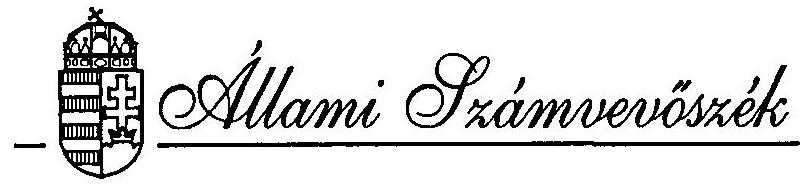
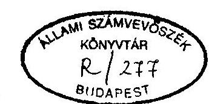
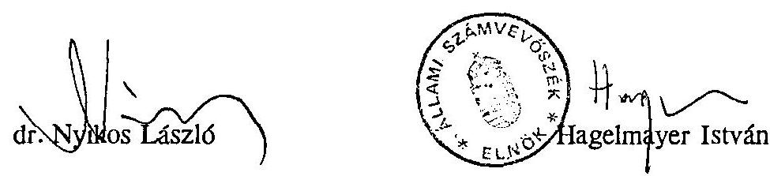

#  

## JELENTÉS

a költségvetési fejezetek jóléti célú kiadásainak
és jóléti intézményei működésének pénzügyi-gazdasági ellenőrzéséről

---

A vizsgálat végrehajtásáért felelős:
az ÁSZ III. Költségvetési Ellenőrzési Igazgatósága
Bihary Zsigmond igazgató

Az ellenőrzést vezette:
Matusek István osztályvezető főtanácsos
Az ellenőrzést végezték:

| Bittó Zoltán | számvevő tanácsos |
| :-- | :-- |
| Deák Tamásné | számvevő tanácsos |
| Holé Sándorné dr. | számvevő tanácsos |
| Éva Katalin | számvevő tanácsos |
| Maklári Ferencné | számvevő tanácsos |
| dr. Mihály Sándor | számvevő tanácsos |
| Norczen Győzőné | számvevő |
| Varga Szabolcs | számvevő |

---

# JELENTÉS 

a költségvetési fejezetek jóléti célú kiadásainak és jóléti intézményei működésének pénzügyi-gazdasági ellenőrzéséről

A költségvetési szervek jóléti intézményrendszerének és ellátottsági szintjének valamennyi költségvetésből fenntartott fejezetre és az általuk irányított önálló költségvetési intézményre kiterjedő felmérésére - ismereteink szerint - korábban nem került sor. Az ellenőrzés megszervezése számos elvi, gyakorlati és metodikai problémát vetett fel azért is, mert sem a hatályos jogszabályok, sem az állami költségvetés szerkezeti rendje nem ad egyértelmű eligazítást abban, hogy mely tevékenységeket és kiadásokat kell jóléti célúnak tekinteni. Megfelelő állami nyilvántartások hiányában csak külön felméréssel volt megállapítható a jóléti infrastruktúrát alkotó tárgyi eszközállomány mennyisége, néhány működési jellemzője, számvitelileg nyilvántartott értéke. Hasonlóképpen kellett információkat beszerezni az ellátottakról, a jóléti szolgáltatásban foglalkoztatottak létszámáról és néhány fajlagos mutatóról.

Ellenőrzésünk az 1993-94. évekről bekért, (javított és feldolgozott) adatokra, valamint a fejezetekre és néhány intézményre irányult.

Az adatszolgáltatással megkeresett elemi adatszolgáltatók száma 598 volt. Valamennyi fejezet és intézmény válaszolt, mintegy 15%-uk jelentős, több hónapos késedelemmel. A helyszíni ellenőrzés valamennyi fejezetre és azok néhány intézményére terjedt ki. A honvédelmi tárca területén - ilyen célú nyilvántartások hiányában - nagy munka- és időszükséglet árán volt felmérhető a jóléti ellátottság szintje.

Az ellenőrzés célja annak megállapítása volt, hogy a központi költségvetési fejezetek és intézmények mennyit költenek jóléti célokra és a jóléti intézményeikre,

---

s ezen belül mennyi az állami támogatás aránya. Értékeltük a rendelkezésre álló anyagi és személyi erőforrások célszerű felhasználását, annak szabályszerűségét és eredményességét.

A rendelkezésre álló adatok szerint a fejezeteknél és intézményeiknél 216 üdülő, 187 vendégház, 63 óvoda, 30 bölcsőde, 6 iskolai napközi és 22 szociális célú otthon működött 1994-ben. A jóléti szakfeladatokra elszámolt kiadások összege 6,1 milliárd Ft, aránya a költségvetési szervek összes kiadásának 0,7%-át teszi ki. A jóléti tárgyi eszközök bruttó értéke 25,8 milliárd Ft, a teljes eszközállomány mintegy 1,6%-a. A jóléti feladatok ellátásával összesen 7.914 fő foglalkozott, ebből teljes munkaidőben 7.262 fő, a költségvetési létszám 2,5%-a. A jóléti létszám és aránya valamelyest csökkent az előző évhez viszonyítva.

# I. 

## Részletes megállapítások

## 1. A jóléti kiadások állami szabályozásának rendszere a költségvetési szférában

A vizsgált időszakban (1993-94) átfogó módon hatályos jogszabályok törvényi szinten nem szabályozták a költségvetési intézményekben foglalkoztatott köztisztviselők és közalkalmazottak jóléti ellátásának rendszerét, a juttatások feltételeit.

Az államháztartási reform szükségességének gondolata már az 1987-es adóreform bevezetése során felvetődött, amelynek szerves részét kellett volna, hogy alkossa a szociális és ellátó rendszerek reformja. Új hangsúlyokkal, új szempontok is felmerültek a rendszerváltozás kezdetén.

Ekkor (1990-ben) a Kormány úgy határozott, hogy fel kell mérni az üdültetés helyzetét. Egy másik kormányhatározat úgy rendelkezett, (1991. szeptember 5-én), hogy ugyanazon év október 31-ig át kell tekinteni a központi költségvetési szervek üdülőinek kezelésével és üzemeltetésével, a beutalások rendjével stb. kapcsolatos rendszert és javaslatot kell készíteni a Kormány részére a korszerűsítésre.

Az előterjesztés előkészítése során vált nyilvánvalóvá, hogy a költségek, ráfordítások, bevételek tekintetében nem állnak rendelkezésre megfelelő adatok, ezért a Kormány egy újabb határozatával elrendelte, hogy 1992. január 1-jétől az üdülőket önálló költségvetési szervként kell működtetni és ki kell dolgozni az üdültetéshez kapcsolódó adatszolgáltatási kötelezettségeket, s az ezzel kapcsolatos jogszabályt soron kívül el kell készíteni.

---

Eddig sem az államháztartás reformjára, sem az előbb említett kormányhatározatok végrehajtására nem került sor.

A mulasztások miatt az ellenőrzés sem kellő joganyagra és szabályozásokra, sem megbízható, egységes adatokra nem támaszkodhatott.

A vizsgálati kört érintő 51 különböző szintű jogszabály és azok nagyszámú módosítása, kiegészítése együttesen sem fedi le még tűrhető mértékig sem a költségvetési területeken dolgozókat megillető ellátás szabályozását. A hatályos joganyagok szakmailag meghatározott követelményeket támasztó, illetve az azokat meghatározó része még más társadalmi-gazdasági viszonyra szabályozottan jelentek meg (pl. a könyvtárakról, művelődési otthonokról, sportlétesítményekről, munkahelyi étkeztetésről stb.), vagy periférikus rész-szabályozásnak tekinthetők (pl. köztisztviselők juttatásairól, a közalkalmazottak jogviszonyával összefüggő egyes kérdések rendszeréről, a kormányüdülőkről, a honvédségnél foglalkoztatottak közalkalmazotti jogviszonyával összefüggő kérdésekről stb.).

Pozitív kivétel a 10/1994. (I.30.) Korm. rendelet és a hozzá kapcsolódó 2/1994. (I.30.) NM rendelet. A két jogszabály a személyes gondoskodást nyújtó intézmények szakmai feladatait és működési feltételeit kellő részletességgel szabályozza a jelenlegi gazdasági, társadalmi feltételek figyelembevételével.

#### Abstract

A helyzet ellentmondásosságát fokozza az a körülmény, hogy a köztisztviselők és közalkalmazottak jogállását, előmenetelük feltételeit és bérezésüket nagyon egyértelmű, szinte a teljesítmény kvalifikációjától független rendszer szabályozza. A magyar államigazgatás hagyományai szerint a köztisztviselők és közalkalmazottak bér- és bérjellegű juttatásai mindenkor elmaradtak a termelő és szolgáltató ágazatban dolgozó hasonló képzettségű alkalmazottak jövedelmeitől. Ezt a különbséget volt hivatva kiegyenlíteni, vagy legalább is csökkenteni a foglalkoztatás biztonsága és a javadalmazáshoz hasonlatosan normatív alapon járó juttatások. A mai állapotok ennek csak részben és nagyon ellentmondásosan felelnek meg.

A rendelkezésre álló javak megoszlása az egyes fejezetek és intézmények között "történelmi" adottság, a juttatások, támogatások kialakult aránya a bázis-alapú tervezés eredménye. Az újabb keletű, bizonyos mértékig normatívnak tekinthető juttatások (pl. ruházati hozzájárulás) az azonos szabályozások ellenére mégis eltéréseket mutatnak, a fejezetek anyagi lehetőségei szerint.

Az állami költségvetésben címzetten jóléti kiadások esetlegesen fordulnak elő egyes fejezeteknél. Ez nem jelenti azt, hogy az adott fejezetnél a jelölt összeg teszi ki a jóléti kiadások egészét, vagy amelyik fejezetnek címzetten jóléti előirányzata

---

nincs, ott jóléti kiadások sincsenek. A tényleges jóléti kiadások más gyakorlati elvek szerint merülnek fel.

Egyértelmű szabályozás hiányában definiálatlan, hogy mely tevékenységeket, kiadásokat kell jóléti célúnak tekinteni.

#### Abstract

Az ellenőrzés eredményes elvégezése érdekében bizonyos önkényességgel jelöltük ki azokat a tevékenységeket és szakfeladatokat, amelyekre történő ráfordításokat jóléti tevékenységnek, illetve jóléti kiadásnak tekintettünk. A jóléti tevékenységek körébe soroltuk a munkahelyi üdültetést, vendéglátást (üzemi étkeztetést), az adott intézmény által a dolgozók gyermekeinek elhelyezésére szolgáló óvodai, bölcsődei, általános iskolai napközi otthoni ellátást, a saját célokra fenntartott munkaegészségügyi és fogorvosi ellátást, szolgálati lakást vagy átmeneti elhelyezést, saját dolgozók részére fenntartott művelődési-, kulturális-, sport- vagy szórakoztató intézmények működését. Ide soroltuk továbbá a lakáskölcsönnel való támogatást, a ruházati ellátást (a védőruha kivételével) és a munkáltató által biztosított étkezési hozzájárulást.

Az állami szabályozások ellentmondásainak körébe sorolhatók a kiadások szakfeladatrendre történő elszámolásánál lehetséges (megengedett) eltérések. Különösen határesetekben és több célúan felmerülő kiadások elszámolásánál térnek el egymástól az intézmények a választott szakfeladatok tekintetében. Esetenként az érdekeltség is befolyásolja a kiadások minősítését.

A fejezetek éves beszámolójában nem jelennek meg a jóléti szakfeladatokon és a kiadási rovatokon nevesítetten a lakáskölcsönök, a ruházati kiadások és a szolgálati lakásokkal kapcsolatos kiadások.

Fentiekből következik, hogy a jóléti kiadások valódi összegei és célok szerinti elkülönítésük egzakt módon nem állapítható meg. A kimutatott és tényleges adatok lehetséges eltérései ellenére - megítélésünk szerint - az általunk feltárt adatok jól megközelítik a valóságot, ehhez fogható pontosságú és részletezettségű információ-bázis nem létezik egyetlen fejezetnél sem.

Korábbi, ma már nem dokumentálható döntés alapján a Honvédelmi Minisztérium, illetve a Magyar Honvédség adatai nem jelennek meg a költségvetésben olyan részletességgel, hogy azok a polgári szervezetek adataival együtt kezelhetők lennének. A honvédő feladatot ellátó szervezeteket korábban mentesítették a szakfeladatrend alkalmazása alól, ebből következik, hogy ilyen adatok nem állnak rendelkezésre és nem is állíthatók össze. Egyáltalán nem jelennek meg a szakfeladatok között elkülönítetten az óvodai nevelés, napközi otthoni ellátás, fogorvosi szolgáltatás, átmeneti elhelyezést biztosító ellátás, bölcsődei ellátás, művelődési központok és házak tevékenysége, egyéb szórakoztatási és kulturális tevékenység.

---

A fenti hiányosságokkal a Honvédelmi Minisztérium és a Magyar Honvédség illetékes pénzügyi-számviteli szervei megsértették a költségvetés alapján gazdálkodó szervek beszámolási és könyvvezetési kötelezettségéről szóló 67/1993. (V.5.) Kormányrendelettel módosított 179/1991. (XII.30.) Kormányrendeletet.

Az ellátási szinteket jellemző naturális adatok sem álltak eddig rendelkezésre. Összeállításuk rendkívüli és nagy feladatot jelentett a HM és MH gazdasági ügyekkel foglalkozó szervei számára.

Miután a Magyar Honvédség egésze tekinthető egy önálló költségvetési szervezetnek és az azon belül kialakított központi és csapatgazdálkodási rendszer miatt analóg módon csak a jóléti intézmények egy része értelmezhető részben önálló szervezetnek, nagyobb részüknek még ilyen mértékű gazdálkodási önállósága sincs. Elvben és gyakorlatban sem érvényesül a 137/1993. (X.2.) Kormányrendeletnek a gazdálkodási jogkörökre vonatkozó szabályozása. Az érvényesítésükre való eddigi törekvések eredménytelennek bizonyultak.

Az ellenőrzés befejező szakaszában vált ismertté a Miniszterelnöki Hivatal Kormány-előterjesztése a központi költségvetési szerveknél dolgozók üdültetési rendszerének koordinációjáról. Az előterjesztésről az ellenőrzés lezárásáig a Kormány nem döntött, ezért annak értékelésétől eltekintettünk.

# 2. A fejezetekhez tartozó költségvetési intézmények jóléti tevékenységének értékelése 

a/ A jóléti tevékenység súlya, aránya a fejezetek költségvetési gazdálkodásában
Tekintettel a költségvetési intézmények, mint adatszolgáltatók nagy számára és az általuk üzemeltetett, illetve fenntartott jóléti célú egységek - ide vonatkozó adatok hiányában - ismeretlenségére, intézményenkénti részletesebb adatok bekérésére csak az ismert önálló jóléti intézményektől volt lehetőségünk. Megállapításaink ebben a fejezetben tehát az önálló jóléti intézmények által közölt adatokra támaszkodnak elsősorban. (A fejezethez tartozó valamennyi költségvetési intézmény jóléti ellátásának rendszeréről a bekért tanúsítványok, kérdőívek és személyes tapasztalatok alapján a függelékben adunk részletes áttekintést.)

A fejezetek költségvetéséhez viszonyítva a jóléti tevékenységek aránya marginális jelentőségű. A költségvetési fejezetek bevételeiből a jóléti bevételek aránya

---

0,64%, a fejezeteknek jutó költségvetési támogatáson belül a jóléti célokra jutó támogatás aránya 0,4% (2,2/a, 2/b. sz. mellékletek). A szakfeladatokra elszámolt jóléti célú kiadások a fejezetek kiadásainak mintegy 0,7%-át teszik ki (3. és 3/a. sz. mellékletek).

Társadalmi-gazdasági kihatását tekintve nem vehető alapul az ezekre a célokra fordított mintegy 6,1 milliárd Ft összegű kiadásoknak az egyéb költségvetési kiadásokhoz viszonyítottan alacsony aránya. Az érintettek számára a családi jövedelmi- és életviszonyokat alapvetően befolyásoló összegekről van szó, motivációs tényező a munkahelyválasztásban, illetve változtatásban.

A központi költségvetési fejezeteknél és intézményekben 1993. december 31-én közel 330.000 köztisztviselő és közalkalmazott dolgozott.

Ezek közül csak egyetlen fejezetet, a Honvédelmi Minisztériumot, illetve a Magyar Honvédséget véve alapul, az általuk fenntartott 175 létesítmény (bölcsőde, óvoda, helyőrségi művelődési klub, étkezde, átmeneti szállás) közel 50.000 honvédségi foglalkozású személy (hivatásos tiszt, tiszthelyettes, szerződéses állományú, közalkalmazott) és családjai részére, tehát mintegy 150-200.000 fő részére nyújt ellátást, szolgáltatást.

A Belügyminisztérium által fenntartott jóléti infrastruktúra több, mint 72.000 fő jóléti, szociális és egészségügyi ellátását biztosítja.

Ellenkező előjelű dimenziót jellemez
 az, hogy az Alkotmánybíróságnál a jóléti kiadások között a legnagyobb tétel egy megvásárolt lakás ára.

A közvetlenül, vagy közvetetten érintettek köre több, mint 1 millió főre becsülhető. Az önálló jóléti intézmények 1994. évi összes bevétele 5,4 milliárd Ft volt, amelyből 2,3 milliárd (42%) költségvetési támogatás a fejezeteket különböző címen megillető támogatásoknak csak 0,79%-a (5. sz. melléklet). Az ellátottak térítési díja átlagosan mintegy 14%-ot képviselt a bevételekben. Ez az alacsony arány a HM és BM intézmények nagy súlya és alacsony térítési díja miatt mutatkozik. A saját bevételek növekedésének fő forrása az áremelés volt, kisebb részt tett ki a férőhelyek és a szolgáltatások bővítése. Pályázati támogatást egyedül a Belügyminisztérium Gyermekintézményei és a HM veszprémi helyőrségi klubja nyert el összesen 1 millió Ft értékben.

A jóléti szakfeladatokon elszámolt kiadások támogatási aránya 1994-ben 38% (3/b. sz. melléklet), az előző évhez képest csökkenő tendenciájú.

A fejezetekhez közvetlenül tartozó önálló jóléti intézmények bevételi-kiadási arányai hasonlóképpen alakultak, tehát esetükben sincs szó számottevő preferenciáról, az intézményekhez tartozó jóléti szervezetekhez viszonyítva (5, 5/a, 6, 6/a. sz. mellékletek).

A fejezeti pénzellátás rendjéről bekért vélemények szinte kivétel nélkül (86%) azt tükrözték, hogy a pénzellátás rendje rugalmatlan, nem segíti elő az ésszerű gazdálkodást. Természetesen ezek a vélemények nem a fejezet irányítását érintették.

A felmerülő finanszírozási gondok operatív megoldása elsősorban az intézmények feladata. Néhány esetben a fejezetek indokoltnak tartották pótlólagos támogatás nyújtását, a fejezeti tartalék igénybevételét.

Az önálló jóléti intézmények saját bevételei 1,8 milliárd Ft nagyságrendűek voltak, a vállalkozási bevételeik meghaladták a 123 millió Ft-ot (2,96%). A támogatási arány ebben az intézményi körben meghaladta az 53%-ot (2/b, 5, 5/a sz. mellékletek).

Nemcsak ezt az intézményi kört érinti, de leginkább itt hat az 1994. évi CIV. törvény 16. §-a, amely a saját bevételek után 13% befizetési kötelezettséget ír elő, így azok a tevékenységek is ráfizetésessé válhatnak, amelyek eddig eltartották magukat.

A fejezetekhez tartozó önálló jóléti intézmények 1993-ban fejezeteiktől összesen 42,5 millió Ft pótlólagos támogatást kaptak működési kiadásaik kiegészítésére. Az átmeneti gondok operatív megoldására öt fejezet nyújtott támogatást jóléti intézményeinek, összesen 31,4 millió Ft összegben (mely összeg az összes jóléti kiadás 0,8%-a).

Az önálló jóléti intézmények kiadásai 1994-ben összesen 4,1 milliárd Ft-ot tesznek ki, amely mintegy félmilliárd Ft-tal kevesebb, mint az előző évi volt. A kiadások legnagyobb tételei a béralap, készletbeszerzések és szolgáltatások igénybevétele. Az élelmiszerekre történő ráfordítás alig több, mint fele a szolgáltatások kiadásainak. A karbantartási ráfordítás rendkívül alacsony, 2,35%-ot tesz ki, ez még az előző évi aránynál is rosszabb (6, 6/a. sz. mellékletek).

A szakfeladatonkénti kimutatott jóléti kiadások alakulását a 3/a. és 3/b. sz. mellékletek részletezik. Az adatok szerint a legjelentősebb jóléti ráfordítás sorrendben - az üdültetés, a gyermekintézmények fenntartása, a munkahelyi vendéglátás és egészségügy szakfeladatokra történt. Ezek együtt a jóléti kiadások közel 90%-át adják. A kulturális, sport tevékenység, valamint a szociális jellegű otthonok fenntartására történő ráfordítások nem számottevőek.

A bekért és feldolgozott adatok szerinti jóléti feladatokon a fejezeteknél, ill. a hozzájuk tartozó összes intézmény jóléti létesítményében 1994-ben összesen 7.914 főt alkalmaztak, 551 fővel kevesebbet, mint az előző évben (7/a. és 7/b. sz. mellékletek).

Az alkalmazottak mintegy 6,9%-a vezető beosztású, 30,7%-a ügyintéző, 2,9%-a ügyviteli alkalmazott, 58,6%-a fizikai dolgozó. Legmagasabb az összes jóléti célú foglalkoztatott létszámaránya a Honvédelmi Minisztérium területén (7,2%) (7/a. sz. melléklet). Az 1993. évi bérfejlesztés az önálló jóléti intézményeknél rendkívül eltérő mértékű volt, a nulla és 23% között szóródott. A legnagyobb mértékű fluktuáció a Miniszterelnöki Hivatal üdülőjénél és a Nemzetközi Gazdasági Kapcsolatok Minisztériuma üdülőinél volt észlelhető.

Az önálló jóléti intézmények által ellátandó feladatokban egyetlen esetet kivéve, változás nem volt. A Munkaügyi Minisztériumnál jelentkező feladatváltozás (bővülés) anyagi kihatása 20,3 millió Ft volt.

A helyszíni ellenőrzés során felkeresett valamennyi fejezetnél tájékozódtunk a jóléti intézményekkel és jóléti kiadásokkal kapcsolatos fejezeti elképzelésekről, tervekről.

A fejezetek többségének nincs kialakult jövőképe a jóléti feladatokról, a rendelkezésre álló jóléti vagyon további hasznosításáról, az ellátás jövendő sorsáról.

A Kormány álláspontja a központi költségvetésből finanszírozott szervezetek, illetve az államigazgatásban dolgozók jóléti ellátási rendszerének átalakításáról még nem ismeretes.

A kevés számú ide vonatkozó tervből megalapozottságával kiemelkedik a Művelődési és Közoktatási Minisztérium 1994. júniusi keltezésű miniszteri értekezletre készített előterjesztése, amely a jóléti és szociális intézmények hosszú távú működésére dolgozott ki javaslatokat. Az egyébként gondosan összeállított hatályos jogszabályokra alapított javaslatok sem tesznek kísérletet - talán kompetencia hiányában - a kérdés átfogó rendezésére (pl. óvodák, bölcsődék, egyéb jóléti szervezetek további sorsára).

A Magyar Távirati Iroda mérlegelte a térítési díjak emelését, de nem találták célszerű megoldásnak. Fontolgatják az üdülő konyhájának megszüntetését, mert működése gazdaságtalan.

A Központi Statisztikai Hivatal üdülőjének bérbeadásával igyekezett költségét csökkenteni.

A Munkaügyi Minisztérium 1995. január 1-jétől üdülőjét oktatási és pihenő központtá alakította.

Az Ipar- és Kereskedelmi Minisztérium üdülői kapacitása jelentősen meghaladja az igényeket. A felesleges üdülők értékesítésére hirdetett pályázat részleges eredménnyel járt.

A Pénzügyminisztériumnak ugyan fejezeti szintű elgondolásai nincsenek, de nem támogatja a VPOP elképzelését egy oktatási és üdülési centrum kialakítására.

# b/ A fejezethez tartozó jóléti intézmények vagyoni helyzete 

Az 1993. évi költségvetési beszámolók adatai szerint a költségvetési fejezetek tárgyi eszközállományának bruttó értéke összesen 1.590.526,3 millió Ft értékű volt. A számvitelileg kimutatott nettó érték 1.006.028 millió Ft (63,3%) (1. sz. melléklet), erősen romló aránnyal.

A jóléti tárgyi eszközök bruttó értéke - a fejezetekhez tartozó valamennyi intézmény adatait figyelembevéve (kerekítve) 25.854 millió Ft, a teljes eszközállománynak 1,6%-a. (1/a. sz. melléklet).

A legnagyobb értékű jóléti tárgyi eszköz állománnyal a Honvédelmi Minisztérium és a Belügyminisztérium rendelkezik.

Az Országgyűlés fejezetnél a jóléti tárgyi eszközök aránya ellenben 0,06%.
Az önálló jóléti intézmények eszközei képviselik értékben a nagyobb arányt 15.938 millió Ft-tal, amely a költségvetési szféra jóléti eszközeinek mintegy 62%-át teszi ki (4. sz. melléklet). Ennek az állománynak a nettó/bruttó értékhányada 73%. Az önálló jóléti intézmények jóléti tárgyi eszközeinek gyors avulása érzékelhető a vizsgált időszakban.

Mivel a jóléti eszközállományban az ingatlanok meghatározó arányt (85%) képviselnek, nem érzékeltetik kellőképpen az elhasználódottság mértékét. A vagyonról kimutatott adatok nem adnak támpontot a piaci reálértékekről, s mivel még jelenleg sem forgalomképesek, tényleges forgalmi értékük nem állapítható meg.

A költségvetési intézmények jóléti infrastruktúrája nem piaci viszonyok között jött létre. Megszerzésük, létrehozásuk szempontjai is mások voltak. Fenntartásuk, üzemeltetésük, valamint felújításuk és karbantartásuk költségeit korábban nagyobb részt az állami költségvetés fizette, bővítésük, fejlesztésük terhei megoszlottak a költségvetés, a fejezetek és intézmények között. A vizsgált időszakban fejlesztésre nem, felújításra és karbantartásra alig jutott központi forrás. A tendencián az sem változtat, hogy néhány fejezet a felújítási és karbantartási ráfordításainak nagyobb részét, vagy egészét a jóléti létesítményeire fordította (3/b. sz. melléklet). A működés központi támogatása csökkenő tendenciájú.

A jóléti eszközállomány minősége az üdülők vonatkozásában gyakorol leginkább hatást az igénybevételre. A tapasztalatok szerint az üdülők igénybevétele anyagi okokból visszaesett. Azok a családok, amelyek az üdülésükre költeni tudnak, a szolgáltatások iránt igényesebbé váltak. A felújítás, karbantartás elmaradásával járó színvonal-csökkenés rontja az igénybevételi hajlandóságot, a szabad kapacitások kereskedelmi értékesíthetőségét esetleg lehetetlenné is teszi.

A fejezetekhez tartozó üdülők állapota ma még többségüknél megfelel az igényeknek, de már mutatkoznak jelei a változásoknak. A Legfőbb Ügyészség hajdúszoboszlói üdülője iránt nincs érdeklődés, felvetődött az értékesítés gondolata.

A KSH hosszúpályi üdülőjében nincs melegvíz, a kályhák fafűtésűek, a fűtés a vendég feladata. Ez a kapacitás kereskedelmileg nem volt hasznosítható.

Az Ipar- és Kereskedelmi Minisztérium az alacsony igénybevétel miatt két üdülőt értékesített, egy alapítványi célokat szolgál és négyet leállított.
A bezárt üdülők elhanyagolt állapotban vannak, állaguk gyorsan romlik, többször feltörték azokat.

A Legfelsőbb Bíróság csillaghegyi hétvégi pihenője olyannyira leromlott, hogy sem üdülésre nem vették igénybe, sem pályázat útján értékesíteni nem lehetett.

A jóléti intézmények közül közvetlen költségvetési vagy fejezeti támogatásban az önálló jóléti intézmények részesülhetnek. A beruházásokra, felújításokra 1993-94-ben központilag juttatott támogatások jelentéktelenek voltak.

Felújításra és karbantartásra összesen 392 millió Ft-ot kaptak az önálló jóléti intézmények, amelynek az intézményi kör teljes kiadásaihoz viszonyított aránya nem éri el a 3%-ot (1/b sz. melléklet).

A jóléti ingatlanok bérbeadásából és elidegenítéséből származó bevételek 1993-94-ben elenyésző összeget tettek ki (2/c melléklet).
3. A költségvetési szférához tartozó jóléti tevékenység tárcaszintű irányítása és ellenőrzése
a/ A költségvetési fejezetekhez tartozó önálló jóléti intézmények irányítása
A Kormány 1991. novemberében hozott határozatának megfelelően a minisztériumok és az országos hatáskörű szervek többsége a kezelésében, illetve használatában lévő üdülő ingatlanokat 1992. I. 1-jétől önálló költségvetési szervvé alakította át, feltéve, hogy addig más státusz szerint működtek.

A Kormány határozata lakonikusan rövid volt, a hozzá rendelt jogszabály viszont nem jelent meg. Ennek a hiányosságnak is része van abban, hogy az egyes fejezetek - más útmutatás hiányában - eltérően értelmezték a kötelezettséget és eltérő szervezeti és elszámolási megoldásokat alakítottak ki esetenként a határozat célkitűzéseitől eltérően.

#### Abstract

A Magyar Tudományos Akadémia minden hozzá tartozó üdülőt önálló költségvetési intézménnyé alakította már 1990-ben. A Belügyminisztérium hasonlóképpen járt el. Több minisztérium egy szervezeti egységbe olvasztotta üdülőit és más jóléti, szociális intézményeit (Külügyminisztérium, Pénzügyminisztérium, Nemzetközi Gazdasági Kapcsolatok Minisztériuma, Művelődési és Közoktatási Minisztérium). Az Ipar- és Kereskedelmi Minisztérium az üdülőit egy szervezeti egységbe összevonva működteti.

A Magyar Távirati Iroda üdülőjének gazdálkodási adatai a Gazdálkodó Szervezet (valójában az MTI) részét alkotják, a kiadások külön szakfeladaton nem jelennek meg, azok a főkönyvi könyvelés adataiból elkülönítetten gyűjthetők ki. A Magyar Rádió és a Magyar Televízió 7 üdülője nem önálló költségvetési szerv. A Földművelésügyi Minisztérium üdülői szintén nem önálló intézmények, az FM költségvetésében "Jóléti intézmények" alcímen összevontan jelennek meg más, szintén nem önálló jóléti intézményekkel együtt, ugyanakkor egyes intézményeinek jóléti szervezetei az anya intézménybe tagozódva működnek.

A Legfelsőbb Bíróság a jóléti feladatok körében csak üdültetést biztosít. Ez a feladat beépül a fejezet költségvetésébe és beszámolójába. Az üdülők önállósággal nem rendelkeznek, csupán szakfeladaton jelennek meg.

A Központi Statisztikai Hivatal öt üdülője a KSH Gazdálkodó Szervezetéhez tartozik. Az üdülőket a Hivatalhoz tartozó valamennyi intézmény alkalmazottai igénybe vehetik.

A fejezeti szabályozásoknak a jóléti intézmények nem képezték a favorizált részét.

#### Abstract

Az állami költségvetésben szereplő 30 önálló jóléti intézmény közül 15-nek (50%) nincs alapító okirata. A Magyar Köztársaság 1992. évi költségvetéséről szóló 1991. évi XCI. törvény által előírt követelmény ellenére az intézmények 77%-ánál nem vizsgálták felül az alapító okiratokat. A vállalkozási tevékenység szabályozására összesen 2 intézménynél került sor (Állami Számvevőszék, Művelődési és Közoktatási Minisztérium). Önköltségszámítási szabályzata 16
 intézménynek (55%) nem volt, aktuális szabályzattal 7 intézmény rendelkezett.

A Honvédelmi Minisztérium vizsgált intézményei rendelkeznek alapító okirattal, alapító paranccsal, de azok régi keletűek (pl. balatonkenesei, mátraházai üdülők alapító okirata 1947-48. évekből valók), és/vagy nem igazodnak az államháztartási törvényben (1992. évi XXXVIII.) és azok végrehajtását szolgáló 137/1993. (X.12.) Kormányrendeletben foglalt szabályokhoz.

A katonai szervezetek által végezhető vállalkozási tevékenységekről a Magyar Honvédség parancsnokságának 14/1991. (HK.8.) intézkedése és az azt módosító 32/1991. (HK.10.) intézkedése rendelkezik. Az érvényben lévő két MH szabályozás nincs összhangban a később hatályossá vált állami szabályozásokkal.

---

A költségvetési tervezés alapeleme a jóléti intézményeknél a PM körirat, amelyet a fejezetek személyes konzultációkkal, írásbeli tájékoztatókkal egészítenek ki. Több fejezet közös értekezleten, vagy saját körirattal segíti a költségvetési tervezés munkáját.

Az intézményi éves beszámolókat a fejezetek többsége (12) számszakilag egyezteti, a szöveges indokolást felülvizsgálja, kiegészítő információkat kér (19). Indokolt esetekben személyes konzultációkra is sor kerül (9).

Ez a kialakult gyakorlat biztosítja, hogy a fejezet szintű éves beszámoló megfelelően összeállítható.

Az intézményektől bekért vélemények szerint az éves gazdálkodás kiértékelése során a felügyeleti szervek többnyire (67%) figyelembe veszik az intézmények érdemi információit, javaslatait, azonban megítélésük szerint ennek csak egy részét továbbítják a fejezetek a központi tervező szervekhez, legalábbis észrevételeik érdemi hatását alig érzékelik a tervezés változásai során.

# b/ Jóléti intézmények és feladatok fejezeti ellenőrzése 

A vizsgált évben (1993) a fejezetekhez tartozó jóléti intézmények ellenőrzése kiugróan meghaladta az előző és a következő évit, összesen 18 intézményi ellenőrzésre került sor. Számszerint a legtöbb ellenőrzést az MTA végeztette (9 esetben).

Az ellenőrzések több kisebb-nagyobb hiányosságot tártak fel. Így a Közlekedési, Hírközlési és Vízügyi Minisztérium ellenőrzése megállapította, hogy a minisztérium gazdálkodó szervezete 1994. óta részt vesz a Közúti Igazgatóságok Vendégház Kkt-ben. Az államháztartási törvény hatálybalépésével a Kkt. működtetése már nem felel meg a törvény előírásainak, mivel központi költségvetési szerv a Kormány engedélyével is csak olyan gazdasági társaságban vehet részt, amelyben felelőssége nem haladja meg vagyoni hozzájárulásának mértékét. A KHVM tájékoztatása szerint a közeljövőben a Kkt-t Kft-vé alakítják át és a fejezethez tartozó intézmények ebben való részvételének engedélyezésére irányuló kormányelőterjesztés készül.

A Müvelődési és Közoktatási Minisztérium Jóléti és Szociális Intézmények vezetésében zavarok támadtak, amelyek a gazdálkodásra is kihatottak. A vezetési hiányosságok felszámolására, ebből következően a gazdasági zavarok elhárítására miniszteri biztos kapott megbízást. Az újabb belső felmérések szerint a korábbiakhoz képest javulás észlelhető.

A Magyar Rádió ellenőrzési osztálya az ÁSZ 1992. évi pénzügyi-gazdasági ellenőrzésével kapcsolatban készített intézkedési terv végrehajtását értékelve vizsgálta a jóléti intézmények gazdálkodását, azokat rendben találta.

---

A Magyar Tudományos Akadémia két évenkénti rendszerességgel ellenőrzi intézményeit. Az ellenőrzés a belső szabályozások, elszámolási hiányosságok, leltározási és analitikus hiányosságok, egyes esetekben munkaköri összeférhetetlenségek felszámolására hívta fel a figyelmet. Az általános tapasztalat az volt, hogy a nehezebb gazdasági feltételek ellenére is színvonalasan működtek a jóléti intézmények.

A Belügyminisztérium Gazdasági Főigazgatóság Ellenőrzési Osztálya ugyancsak rendszeres ellenőrzéseket végez, elsősorban az üdülőkben.

Súlyos hiányosságnak tartjuk, hogy a Miniszterelnökség fejezet irányítása alatt működő Állami Üdülő és Oktatási Központ, valamint a Miniszterelnökségi Hivatal üdülőjének ellenőrzésére, annak ellenére sem került sor, hogy azokat már több év óta ellenőrzési tervük tartalmazta.

# II.   Következtetések és javaslatok 

Az állami költségvetés központi fejezeteit alkotó minisztériumoknál, országos hatáskörű szerveknél és az irányításuk alá tartozó költségvetési intézményekben (a továbbiakban központi költségvetési szervek) dolgozó köztisztviselők és közalkalmazottak (a továbbiakban állami alkalmazottak) jóléti juttatásai évtizedekig tulajdonképpen zártkörű témának számítottak. A döntések szűk körben, általában a nyilvánosság kizárásával, többnyire titkos határozatokkal születtek.

Jóléti ellátási rendszerről ebben a körben csak bizonyos megszorításokkal beszélhetünk, mert a jóléti jellegű juttatások történelmileg kialakult mennyiségi-minőségi szintje a megváltozott társadalmi viszonyok között sem valamilyen preferencia rendszernek, sem egyéb gazdaságpolitikai elvnek vagy normativitásnak nem felel meg.

A központi költségvetési szerveknél a jóléti, szociális juttatások, a működtetett infrastruktúra-hálózat, annak használati értéke, minősége, igénybevételének módja, támogatási formái magukon viselik az elmúlt évtizedek felfogását, időszakonként változó lehetőségeit és a rendszerváltást követő években a megalapozott döntésekig el nem jutó koncepciók által okozott zavarokat.

A kérdés kormányszintű állami kezelése 1990. óta sem felfogásában, sem gyakorlatában nem sokat változott a korábbiakhoz képest. Az ebben a tárgykörben tett

---

intézkedések a felgyülemlett problémák közül alig oldottak meg valamit, inkább bővítették az ellentmondások körét. A feladatfelülvizsgálatról számos kormányhatározat született, amelyeket érdemi intézkedések nem követtek.

Ellenőrzésünk megkezdéséig egyetlen állami szerv sem mérte fel kellő részletességgel a tényleges helyzetet, éppen ezért a kevés számú kormányzati intézkedés inkább intuitív alapú volt, sem mint megalapozott. A helyszíni konzultációk során szerzett tapasztalatok és a rendelkezésre álló dokumentumok szerint a Kormánynak és fejezetek többségének nincs határozott álláspontja, javaslata vagy terve az átalakításra.

Az államigazgatásban dolgozók jóléti ellátottságának színvonala a pénzben mérhető ráfordításoknál nagyobb súlyú kérdés, mivel az összefüggésbe hozható az államnak, mint közszolgálati és szolgáltató feladatokat ellátó szervezet működésének a minőségével. Ugyanakkor a célszerűtlenül működtetett infrastruktúra hálózat fenntartása szolgáltatásaihoz mérten túlzottan költséges, az elvárható igényeket reálisan nem képes kielégíteni, a szükségtelen kapacitások pedig növelik a költségvetés veszteségeit.

Erre a területre is érvényes az a megállapítás, miszerint a feladatok és a finanszírozás nincsenek egymással összhangban. Egyidejűleg van jelen a pazarlás és a hiány. Helyenként a fejlettséget meghaladó mértékű a jóléti ráfordítás, de paradox módon ez nem jelenti az ellátások magas színvonalát, mert a rendszer hatékonysága nagyon alacsony fokú. Itt is hiányzik a hatékony költségvetési politika egyik lényeges eleme, a következetes preferencia rendszer. A kiadások szűkítése az egységesen érvényesülő megszorításokon és nem a feladatok újrarendezésén alapult. A közgazdasági elemzésekhez szükséges alapvető adatok is hiányoznak.

A helyszíni ellenőrzés során feltárt számos hiányosság (alapító okiratok hiánya, illetve avultsága, az állami szabályozásokkal ellentétes HM intézkedések, elmaradt fejezeti ellenőrzések) az általános újraszabályozás során megfelelő rendezést, szabályozást igényelnek.

A rendelkezésre álló tárgyi eszközállomány kihasználtsága általában kielégítő, de annyiban díszfunkcionális, hogy az általuk nyújtott szolgáltatások nem minden tekintetben minősíthetők állami, vagy az adott költségvetési szerv által ellátandó feladatnak, s ha igen, elhelyezkedése nem feltétlenül a mostani szervezeti megoldásban a legcélszerűbb. A költségvetési fejezeteknek és a költségvetésből működő közszolgálati feladatokat ellátó szervezeteknek - összefüggésben az államháztartási

---

reformmal - általában nem lehet feladata saját célokat szolgáló jóléti intézmények és kapacitások fenntartása és működtetése.

Az ellenőrzés tapasztalatai szerint a természetbeni juttatásként igénybe vehető jóléti szolgáltatások iránti igények csökkentek. Ennek okai közé tartoznak az adószabályok változásai, a szabadon elkölthető családi jövedelmek csökkenése, a megdrágult ellátásokkal szembeni igényesség növekedése. A szabad férőhelyek értékesítése csak részben volt lehetséges.

Ellentmondásosak a szabad kapacitások értékesítési feltételei is. Korrekt számviteli adatok hiányában általában az intézmények nem ismerik pontosan a költségviszonyokat. Van, ahol a férőhelyet valamivel magasabb áron értékesítik, mint amit a saját dolgozó térít, van ahol a szűkített önköltséget és van, ahol a feltételezett teljes költséget téríttetik. Az alacsony térítési díj mellett az intézmény költségvetéséből támogatást kap az is, aki nem az intézménynél munkavállaló, a magas térítési díj pedig elhárítja az igénylők egy részét és ezzel bevételtől esik el az intézmény és romlik a gondozottak fajlagos ráfordítási mutatója.

A gyermekintézmények hálózata, az idősek otthonai és a napközi otthonok, a családi üdültetés, az iskolai táborok valós igényeket elégítenek ki. Többnyire a fenntartó költségvetési intézmény munkatársai és azok gyermekei, illetve a volt munkatársak nyernek bennük elhelyezést, de a központi költségvetés szervezetében való további működtetésük nem indokolt.

A munkahelyi üdültetés indokolatlan differenciálással működik a semmilyen, és a jó szállodai színvonalú ellátás között. Hasonlóképpen nagyon eltérő a fenntartásuk költségszínvonala. Nem azonosak a hozzájutás feltételei sem. A jobban ellátott területeken gyakrabban, vagy könnyebben igénybe vehetők az üdülési lehetőségek. A költségvetési támogatást a legtöbb helyen az kapja meg, aki igénybe veszi az üdülési lehetőséget, s ezzel többletjuttatást élvez.

A pénzbeni juttatások (étkezési és ruházati hozzájárulás) eredeti céljuknak már alig felelnek meg, mivel megadóztatásuk és a magas infláció miatt az életszínvonalat befolyásoló hatásuk jelképes.

A költségvetés terhére történő lakásjuttatás igen nagy személyi jövedelem differenciálódást okoz a jelenlegi körülmények között. Erre való tekintettel egyértelműbb, áttekinthetőbb és szigorúbb normatív alapú szabályozásra lenne szükség. A polgári költségvetési szerveknél a szolgálati lakások intézménye helyett célszerűbb-

---

nek tűnik a lakásfenntartás költségeihez való - differenciált, a protokolláris kötelezettségeket is mérlegelő - hozzájárulás. A köztársasági elnöki és a miniszterelnöki rezidencián kívül az Alkotmánybíróság elnöke és a Legfelsőbb Bíróság elnöke részére biztosít a törvény ereje jelenleg szolgálati lakást.

Nem megnyugtató a már megvásárolt szolgálati lakások sorsa. Csak részletesebb (cél)vizsgálat tisztázhatná, hogy az 1993-ban értékesített szolgálati lakások eladása minden esetben a törvényes feltételek között történt-e. Azt már korábbi ÁSZ vizsgálatok feltárták, hogy egyes esetekben a szolgálati lakások építése, vagy vásárlása során előfordultak visszaélések.

A lakásépítéshez nyújtott munkahelyi támogatások feltételei és összegei mutatják a legnagyobb eltéréseket. A lakáshoz jutás támogatásának ez a formája több vonatkozásban is igazságtalan és célszerűtlen. A juttatott összegek fejezetenkénti és intézményenkénti eltéréseit azonban semmi nem indokolja. A túlságosan alacsony összegű "támogatás" valójában nem segíti a lakásépítőt. A túlzottan magas összeg nem biztos, hogy társadalmilag-gazdaságilag indokolt versenyelőnyben részesíti a kedvezményezettet másokkal szemben. Előnyt élvez a kamatmentes kölcsönben részesülő a kamatot fizetővel szemben. Végül a lakáskölcsönben részesítettek köre preferált azokkal szemben, akik lakáskölcsönt nem kértek, vagy kaptak.

Mindent figyelembe véve a jelenlegi ellentmondásos támogatási formát az állami alkalmazottak kedvezményes kamatozású éves lakáshitel keretével (amit pl. az OTP kezelne) lehetne helyettesíteni.

Most már számos körülmény (a költségvetés, az előkészületben lévő államháztartási reform, az államigazgatás korszerűsítése, a társadalmi- és nyugdíjbiztosítási rendszer változásai, az előkészületben lévő haderőreform, a piaci viszonyok terjedése stb) indokolja, sőt megköveteli a változtatásokat.

Nem megnyugtató a központi költségvetési szervek jóléti, szociális célokat szolgáló eszközállományának helyzete. A bizonytalanság és a pénzhiány együttes következményeként az indokolt felújítások és karbantartások elmaradtak, a tetemes értéket megtestesítő nemzeti vagyon folyamatosan és gyorsulóan veszít értékéből. A rendezetlen helyzet többféle veszélyt hordoz magában: az állagromlás következtében a kapacitások igénybevétele még inkább csökken, tovább romlanak a fajlagos ráfordítások, az értékesítésre későn kijelölésre kerülő ingatlanok leromlása miatt csökken az elérhető árbevétel.

---

Az észlelt ellentmondások és anomáliák megszüntetését oly módon célszerű elérni, hogy a választott megoldások ne járjanak az állami alkalmazottak jogos érdekeinek sérelmével és a költségvetés szempontjából is előnyöket hozzanak.

A HM-MH jóléti-kulturális rendszere több vonatkozásban sajátos feladatokat teljesít. Ezekre a szolgáltatásokra, ellátásra és juttatásra a haderőnek a jövőben is szüksége van. Ugyanakkor az államháztartási reformmal és a haderőreformmal összhangban új szervezeti és gazdálkodási formák alkalmazásával önállóbb, de egyben hatékonyabb szervezetekkel az állami támogatás csökkenthető.

Hasonló elvek érvényesítését más fegyveres erőknél
 és rendvédelmi szerveknél (Rendőrség, Határőrség, Vám- és Pénzügyőrség, biztonsági szolgálatok) is elkerülhetetlennek tartjuk.

Ugyancsak eltérő kezelést igényelnek a Magyar Tudományos Akadémia, mint köztestület által fenntartott speciális jóléti intézmények (alkotóházak, tudósüdülők).

Ellenőrzési tapasztalatainkat összegezve elkerülhetetlen és sürgős feladatnak tartjuk az állami alkalmazottak jóléti-szociális juttatásainak normatív, egységes elveken alapuló, a társadalmi-gazdasági viszonyokhoz jobban igazodó szabályozását, aminek feltételét képezik az államigazgatás gyors korszerűsítése eredményeként kialakuló világos, stabil viszonyok. Valószínű, hogy a rendezés több lépcsőfokára lesz szükség, teljeskörű megvalósításához hosszabb időt kell szánni, mert a köztisztviselői, közalkalmazotti javadalmazási rendszer ma még nem teszi lehetővé a piaci viszonyok maradéktalan érvényesítését.

Mindezt figyelembe véve javasoljuk a Kormánynak, hogy az állami feladatok és intézményrendszer, továbbá az államháztartás reformjának részeként - figyelemmel a társadalmi- és nyugdíjbiztosítási rendszer változásaira, az előkészületben levő haderőreformra - készítse elő az állami alkalmazottak jóléti és szociális juttatásainak egységes törvényi szabályozását. A jóléti és szociális juttatások körének újraszabályozásához a következő elvek figyelembevételét ajánljuk:

1. Az egységes normatív alapú jóléti és szociális juttatások körébe javasoljuk sorolni az üdülési-, az étkezési- és a ruházati hozzájárulást, az egészségügyi ellátást, a kötelező munkáltatói nyugdíjkiegészítő biztosítást, a kedvezményes kamatozású lakáshitel keretet, valamint meghatározott munkakörökben a lakásfenntartáshoz való hozzájárulást, illetve szűk körben továbbá a fegyveres

---

testületeknél a szolgálati lakás juttatást. A juttatásokat nem indokolt adó, illetve járulékalapként kezelni.
2. A központi költségvetési szerveket mentesíteni célszerű az alaptevékenységüktől idegen jóléti és szociális létesítmények működtetésének és fenntartásának gondjaitól. Ezek a szolgáltatások más, az eddiginél célszerűbb rendszerben is elérhetővé tehetők. Az új alapú jóléti ellátási rendszer kidolgozása és elfogadtatása állami, kormányzati feladat.
-A kialakítandó rendszer átfogó szabályozásának alapelvei közé tartozónak tekintjük a társadalmi nyilvánosságot, meghatározott szempontok szerint érvényesített normativitást, a szakszervezeti és érdekvédelmi szervekkel való konszenzust, az államilag elismert igények pénzügyi szavatolását és értékállóságának fenntartását mindaddig, amíg az állami alkalmazottak javadalmazása beilleszthető a piac viszonyai közé. Az új alapú nivellációt az átlag feletti színvonalon képzeljük el.
—Az eredményes megvalósíthatóság feltételezi a jogszabályi háttér teljeskörű áttekintését és harmonizációját a kialakuló új rendszerrel.
—Az átrendezés megalapozott végrehajtása szükségessé teszi az érintett ingatlanállomány tulajdonjogi helyzetének áttekintését, szükség szerinti rendezését.

- A központi költségvetési intézmények által fenntartott gyermekintézményeket, szociális otthonokat, napközi jellegű idősek otthonait, munkahelyi konyhákat, vagy a területi önkormányzatok kezelésébe javasoljuk adni, vagy non-profit szervezetté célszerű azokat átalakítani.
- A költségvetési fejezetek és az ún. kincstári finanszírozású költségvetési szervezetek jóléti intézményhálózatának megszüntetésével egyidejűleg a köztisztviselők és közalkalmazottak üdülésének megszervezését egy közszolgálati érdekből szervezett non-profit működésű üdülési központra (centrumra) javasoljuk bízni.

A létrehozott üdülési központ a költségvetési fejezetekkel és intézményekkel szoros együttműködésben mérje fel az üdülési célokat szolgáló ingatlan állományt, a várható igényeket és ezek együttes ismeretében tegyen javaslatot az állami üdülőhálózat kialakítására.

A központi üdültetés céljaira szükségtelen üdülőingatlanokat pedig az Állami Privatizációs és Vagyonkezelő Részvénytársaság hasznosíthatja.

---

Az üdülési központot a Kormány hatáskörében és kormányzati feladatként a Miniszterelnökség fejezeten belül, de a Miniszterelnöki Hivataltól független szervként javasoljuk létrehozni. Az üdülési központ kezelésébe kerülő üdülőhálózat igénybevételét a közszolgálati létszámmal arányosan célszerű lehetővé tenni. A térítési díj mértéke olyan legyen, hogy az fedezze az önköltséget.
— Vendégházak, vendégszobák további fenntartását csak azokon a településeken tartjuk indokoltnak, ahol nincs (megfelelő) szállodai elhelyezés. Azokat a vendégházakat és vendégszobákat, amelyek eredeti rendeltetéséhez egyéb állami, közszolgálati feladat is tartozik, (pl. alkotóházak, tudósüdülők) javasoljuk továbbra is állami tulajdonban meghagyni.
—Szűk körben az arra alkalmas kettős hasznosítású létesítményekből célszerű országos, vagy nemzetközi szintű oktatási-továbbképző központokat kialakítani, (pl. a nemzetközi és hazai ellenőrzés oktatási továbbképző bázisa).
— A fegyveres erők és rendvédelmi szervek jóléti infrastruktúrájának elkülönült működtetését továbbra is célszerű fenntartani olyan gazdálkodási forma megválasztásával, ami a gazdálkodás eredményességét növeli, elősegíti a kapacitások jobb kihasználását és csökkenti, esetleg szükségtelenné teszi a költségvetési támogatás igényét. Ugyancsak indokolt lehet - legalább a legnagyobb igénybevétellel járó beosztásokban - a kötelező relaxálás intézményének bevezetése az egészség megőrzésének,- helyreállításának normatív alapú megszervezésével.
— Továbbra is az MTA kezelésében célszerű hagyni az akadémiai törzsvagyonba tartozó jóléti intézmények igénybevételének már kialakult rendszerét.

Budapest, 1995. augusztus

Melléklet: 44 lap

---

# Áttekintés a fejezetekhez tartozó valamennyi költségvetési intézmény jóléti ellátásának rendszeréről 

A fejezethez tartozó valamennyi költségvetési intézmény jóléti ellátásának rendszeréről bekért tanúsítványok, kérdőívek és személyes tapasztalatok alapján az állapítható meg, hogy a vizsgálatba bevont két év (1993-94) során az ellátás rendszere és színvonala lassan erodálódott. A férőhelyek száma és az igénybevett kapacitások többnyire csökkentek. Általában csökkent a jóléti célú feladatokat ellátók létszáma is. A jóléti bevételek és kiadások lényegében szinten maradtak, ezáltal reálértékben csökkentek.

A vizsgált körben többnyire a Honvédelmi Minisztérium és a Belügyminisztérium jelenti a meghatározó arányt a rendelkezésre álló kapacitásoknál. Ez a szolgáltatások minőségi különbségeiben is jelentkezik. A jóléti ráfordításoknál - a Honvédelmi Minisztérium eltérő nyilvántartási és elszámolási rendszere miatt - a kapacitásoknál mutatkozó túlsúly nem jelenik meg valós arányaiban.

A két nagy fejezet adatainak figyelmen kívül hagyása esetén az ellátottsági szintek, a rendelkezésre álló kapacitások és a kiadások töredéke marad a polgári köztisztviselőket és közalkalmazottakat foglalkoztató többi fejezetnél.

## Munkahelyi üdültetés

A jóléti tárgyi eszközállomány állapota, felszereltsége, viszonylagos pontosságú (piaci) értéke a "kincstári" vagyon felmérését és elemzését lehetővé tevő felmérés és műszaki kataszter hiányában az ellenőrzés során megállapíthatatlan volt.

Külön vizsgálatot indokolna a tulajdonviszonyok feltárása, tisztázása.
Adatok hiányában is kétségtelen, hogy a fejezetek és a hozzájuk tartozó intézmények által 1994-ben üzemeltetett 216 üdülő adja a jóléti infrastruktúra meghatározó arányát (8. sz. melléklet).

---

A költségvetési intézmények jóléti célú kiadásainak mintegy 40%-át az üdülés teszi ki.

Az üdülőkben főszezonban összesen 2.432 főt foglalkoztattak 1994-ben, akiknek többsége (1.893 fő) fizikai dolgozó volt. Az üdülők vezetőire átlagosan 20,3 irányított jut, ami a költségvetési terület átlagánál lényegesen jobb és jobb az előző év arányánál (9. sz. melléklet).

Az üdülők szolgáltatásai nem mindenütt felelnek meg az igényeknek. Az üdülők mintegy fele tud étkezést biztosítani saját konyha fenntartásával, további 14 üdülő egy másik, közeli üdülő szolgáltatását veszi igénybe. Semmiféle étkezési lehetőséget nem tud nyújtani 118 üdülő.

Pontatlanul, ellentmondásosan közölt adatok miatt nem állapítható meg, hogy az üdülők közül mennyi tart egész évben nyitva. Több adat egybevetése alapján ez mintegy 15-20%-ra tehető. A Balaton és az egyéb vizek partján épült üdülő iránt a nyári idényen kívül egyébként is kevés az érdeklődés, a hegy- és dombvidéki üdülők felszereltsége, személyzettel való ellátottsága pedig többnyire nem teszi lehetővé az éves üzemeltetést.

Az átlagosnál jobbak a fejezetekhez tartozó önálló költségvetési intézményként működő üdülők feltételei, amelyek többnyire idegenforgalmi szempontból frekventáltabb helyeken vannak, komfortosabbak. Karbantartásukra, felújításukra korábban rendszeresen és többet költöttek.

Egyébként az üdülő központi elhelyezkedése sem feltétlenül jelent előnyt. Pl. a volt Nemzetközi Gazdasági Kapcsolatok Minisztériumának a Siófok I. elnevezésű nagy, és megfelelő színvonalú üdülőjéből 2-3 nap után azért "menekültek" el a vendégek, mert a környék zajos, zsúfolt, pihenésre nem alkalmas.

Az üdülői férőhelyeken 1994-ben - a közölt adatok szerint - összesen 1.448.690 napot vettek igénybe, közel tízezer nappal kevesebbet mint 1993-ban. Egy férőhelyre átlagosan 107 napos (valamivel több, mint 1/4 éves) igénybevétel jutott. A saját dolgozók és családtagjai ebből 80%-os arányban részesedtek, ez az arány is romlott. Kereskedelmi úton a férőhelyek mintegy 17%-át értékesítették, nem egészen 3%-át csereüdültetéssel hasznosították.

A legtöbb üdülő a Földművelésügyi Minisztérium, a Közlekedési, Hírközlési és Vízügyi Minisztérium, a Művelődési és Közoktatási Minisztérium, a Belügyminisztérium és a Magyar Tudományos Akadémia által irányított területeken van (8. sz. melléklet).

---

A legtöbb férőhely a Belügyminisztérium fejezetnél található, összesen 3.243, a Miniszterelnökség fejezetnél (1.685), a Honvédelmi Minisztériumnál (1.490), a Közlekedési, Hírközlési és Vízügyi Minisztérium (1.013), valamint a Művelődési és Közoktatási Minisztérium (1.151) által irányított fejezetnél.

A sok tekintetben spontán módon alakult fejlődés következményeként az üdülői ellátottsági szintet jellemző férőhelyek számának átalakulása ésszerű összefüggéseket nem mutat.

A fejezetek és az irányításuk alá tartozó intézmények együttes létszám- és üdülői férőhely aránya azt mutatja, hogy 1994-ben átlagosan egy férőhelyre 31,2 fő munkavállaló jut. Ebből a szempontból legjobban ellátottnak tekinthető a Gazdasági Versenyhivatal (3,5 fő/férőhely). (A helyzet annyiban sajátos, hogy a siófoki üdülő nincs a Gazdasági Versenyhivatal tulajdonában, csak kezelésében. Az üdülő eszközeinek értéke nem jelenik meg a Hivatal mérlegében.) Sorrendben a Legfelsőbb Bíróság (4,1 fő) és a Nemzetközi Gazdasági Kapcsolatok Minisztériuma (6,3 fő) következik.

Átlag körüli a Közlekedési, Hírközlési és Vízügyi Minisztérium (27,5 fő) az Igazságügyi Minisztérium (32,6 fő), valamint a Művelődési és Közoktatási Minisztérium fejezetek (33,7 fő) ellátottsága.

Legrosszabb a Népjóléti Minisztérium (103,9 fő) és a Munkaügyi Minisztérium (89,9 fő) mutatója. A két szélsőérték közel 25-szörös különbséget mutat, amit nyilván kellően indokolni és elfogadhatónak tekinteni nem lehet.

A mélyebb elemzéshez szükséges információk hiányában bizonyos fenntartásokkal kell kezelni az előbbi összefüggéseket, mivel "egy üdülői férőhely" a minden fontosabb kényelmi szolgáltatásokat nélkülöző, és a luxus színvonalat elérő üdülői hely is. Egyes fejezetek (pl. Miniszterelnökség, Magyar Tudományos Akadémia) szélesebb kört látnak el az általuk foglalkoztatott munkavállalóknál. Más fejezeteknél az üdülők (egy része) más irányú feladatokat is ellát rendeltetése szerint (mint pl. vízügyi, közúti rendkívüli feladatok).

Vannak továbbá kettős, vagy többes hasznosítású létesítmények is (pl. oktatási központok), amelyeknél az igénybevétel lehetősége időben korlátozott.

Minősítő tényező továbbá az idényjelleg, a területi elhelyezkedés, a személyzet száma, a rendelkezésre álló teleknagyság stb.

Az 1993. és az 1994. évi költségvetési beszámolók szakfeladatonkénti tagolása együtt kezelte az üdültetés és szálláshely bevételi-kiadási adatait. Ezek szerint a kiadások 2.507 millió Ft-ot tettek ki ezen a szakfeladaton 1993-ban, 2.449,8 millió Ft-ot 1994-ben. A szakfeladat bevételei között kimutatott költségvetési támogatás aránya több, mint 32%. A támogatás aránya 1993-ban még meghaladta a 36%-ot. Ez egy év alatt több, mint 11 százalékpont romlást jelentett.

---

Külön vizsgálat tárgya lehetne az üdülők költségviszonyainak felmérése és összehasonlítása. Mint korábban bemutattuk, az önálló jóléti intézmények vonatkozásában elhatározott kormánydöntések eredménytelenek maradtak. A nem önálló (tehát többséget alkotó) üdülőknek általában nincs elkülönített számvitele és költségelhatárolása. E tekintetben a szakfeladatokra elszámolt kiadások összehasonlítása teljesen téves következtetésekre vezetne még a közvetlenül elszámolt kiadásoknál is.

Néhány fejezet nem az üdülőit támogatja, (esetleg nincs is üdülője) hanem üdülési támogatási átalányban részesíti munkatársait, akik ezt szabadon felhasználhatják, akik az üdülési lehetőség igénybevétele esetén önköltséget térítenek. A rendszer előnye az, hogy mindenki egyetemlegesen részesül belőle, ha üdül, ha nem. Hátránya, hogy "gyorsan bemosható" a személyi jövedelmek közé és adózással eljelentékteleníthető.

Ilyen megoldást alkalmaznak a Köztársasági Elnökségnél, az Országgyűlés fejezetnél, Földművelésügyi Minisztériumnál, a Művelődési és Közoktatási Minisztériumnál, a Népjóléti Minisztériumnál, a Munkaügyi Minisztériumnál, az
 Ipari és Kereskedelmi Minisztériumnál.

Megemlítjük, hogy a Földművelésügyi Minisztérium a megnövekedett kiadások miatt visszatért a kedvezményes üdültetés finanszírozásának korábbi rendszeréhez.

# Gyermekintézmények 

A gyermekintézmények szakfeladaton kimutatott bevételek összege 1994-ben 904 millió Ft volt, amelyből több, mint 80%-ot tett ki a költségvetési támogatás. A szakfeladatra elszámolt kiadások 1.197 millió Ft-ot tettek ki és a jóléti kiadások 19%-át képviselik (3/b. sz. melléklet).

## Óvodák

Óvodával a fejezetek közül csak néhány rendelkezik (10. sz. melléklet). A 63 óvoda közül 16 db-ot a Belügyminisztérium, 16 db-ot a Honvédelmi Minisztérium és 14 db-ot a Művelődési és Közoktatási Minisztérium működtet. A férőhelyek száma összesen 5.490 fő, 272 férőhellyel kevesebb az 1993. évinél. A férőhelyek többsége felett is az előbbi három minisztérium rendelkezik (70%).

A felvett gyermekek száma összesen 5.318 fő, 261 fővel kevesebb, mint az előző évben volt. Az átlagos helykihasználás 97%. A Pénzügyminisztérium, az Ipari és

---

Kereskedelmi Minisztérium óvodája 100% fölött kihasznált. A férőhelyeket meghaladó számú gyermeket vettek fel a Honvédelmi Minisztérium irányítása alá tartozó intézményekbe is. A legalacsonyabb helykihasználású (50%) a Nemzetközi Gazdasági Kapcsolatok Minisztériumáé volt mind a két évben.

Az idegen dolgozók gyermekeinek aránya mintegy 1/3. Az óvodák felszereltsége, állapota általában jó.

Egy kivételével mindegyik óvoda biztosítja a gyermekek étkeztetését, még akkor is, ha az ételt máshol készíttetik el.

Az óvodákban 1994-ben összesen 1.112 főt alkalmaztak, (348 fővel kevesebbet mint az előző évben), többségük szakalkalmazott, vagy fizikai dolgozó. Az óvodák ügyvitelét többnyire az anyaintézmény látja el, ezért az egyszerűsített ügyvitelre legfeljebb 1 ügyintézőt alkalmaznak, vagy annyit sem (11. sz. melléklet). Egy alkalmazottra 4,9 óvodás gyermek jut, 1,3 fővel több, mint egy évvel korábban.

# Bölcsődék 

A bölcsődék száma összesen 30 db volt 1994-ben, amelyek nagyobb számban a Belügyminisztérium, a Honvédelmi Minisztérium, a Népjóléti Minisztérium, valamint a Művelődési és Közoktatási Minisztérium által felügyelt intézményeknél működnek.

A férőhelyek száma 1.062, az 1993. évinél 30 hellyel kevesebb. A felvett gyermekek száma 1.012 fő, lényegében változatlan. Az idegen dolgozók gyermekeinek aránya 21%. Az intézmények átlagos kihasználtsága 95% (12.sz. melléklet).

A bölcsődék mindegyike biztosít élelmezést a gondozott gyermekeknek, többségük saját konyhával.

Az alkalmazott dolgozók száma 1994-ben 312 fő, ebből szakalkalmazott 160 fő, 114 fő fizikai dolgozó. Az ügyviteli alkalmazottak száma 18 fő. Egy alkalmazottra 3,2 fő gondozott jut (13. sz. melléklet). (Ez a mutató 1993-ban 3,9 fő volt.)

A legalacsonyabb kihasználtságú az Ipari és Kereskedelmi Minisztérium bölcsődéje. Túlzsúfoltak a Honvédelmi Minisztérium, a Népjóléti Minisztérium, a Külügyminisztérium és a Magyar Tudományos Akadémia bölcsődéi.

---

# Iskolai napközi otthonok 

A saját dolgozók általános iskolás korú gyermekeinek napközi otthonos iskolát a Belügyminisztérium, a Honvédelmi Minisztérium és a Pénzügyminisztérium tart fenn. A tanulószobák száma 1994-ben összesen 24, a férőhelyeké 645. A ténylegesen felvett tanulók száma 1994-ben 439 fő volt, így a helykihasználás mintegy 70%-os. (1993-ban a tanulószobák száma 31 volt, 105 férőhellyel több. A tanulók száma 1 év alatt 154 fővel csökkent.) A napközi otthonokban alkalmazott tanerők száma 69 fő, ebből 4 fő vezető. Ügyviteli alkalmazott összesen 1 fő van. Egy napközi otthonos munkaerőre átlagosan 6,4 tanuló jut átlagosan.

Könyvtára a Belügyminisztérium és a Honvédelmi Minisztérium napközi otthonainak van, összesen 9.347 kötet könyvvel (ebből a HM-re 120 kötet jut). Ugyancsak ezek a napközi otthonok rendelkeznek udvarral. Szabadfoglalkozáshoz szükséges szobái - az FM kivételével - minden iskolai napközi otthonnak vannak és nyári táborozást is szervez mindegyik (14. és 15. sz. mellékletek).

## Jóléti célú szociális otthonok

Időskorú volt munkatársak, színészek, művészek, illetve azok házastársai elhelyezése céljából 1994-ben 22 olyan szociális otthon működik, amelyek nem tartoznak a területi önkormányzatok felügyelete alá.

A férőhelyek száma együtt 7.180, de a nagy igény miatt a ténylegesen felvetteké majdnem kétszeresen meghaladja a férőhelyekét; (13.915 fő, (193%). Többségük tartós bentlakó, egy részük (137 fő) napközi otthonos ellátásban részesül. A legtöbb férőhellyel a Belügyminisztérium rendelkezik (1.045 fő), itt működik a napközi otthon is (16. sz.melléklet). Idesoroltan jelenik meg a Honvédelmi Minisztérium 5.270 fős szálláshelye is, azonban ezek rendeltetése más.

A Honvédelmi Minisztérium átmeneti szálláshelyeinek rendeltetése a családjuktól távol élő, vagy családdal nem rendelkező hivatásos tiszti, tiszthelyettesi állomány elhelyezése. Az 5.430 férőhelyen mintegy 11.800 főt helyeztek el 1993-ban, s közel ugyanennyit 1994-ben az 5.270 főre lecsökkent férőhelyen. A tartósan bentlakók száma 3.970 fő volt, a többi néhány hetes elhelyezést nyert.

Az otthonokban a fejezetek összesen 326 főt foglalkoztatnak.
Egy alkalmazottra átlagosan 42,6 ellátott jut (17. sz. melléklet). Az alkalmazottak közül 65 fő tölt be valamilyen vezető beosztást, akiknek túlnyomó hányada (58 fő) a HM állományába tartozik.

---

A Belügyminisztérium nyugdíjas otthonaiba és napközi otthonaiba szerzett jog alapján kerülnek az idősek. Itt nyernek elhelyezést továbbá a Nemzetbiztonsági Hivatal, az Információs Hivatal, a Katonai Biztonsági Hivatal Szakszolgálati Igazgatósága és a Büntetésvégrehajtás nyugdíjasai is.

A két Idősek Klubjának 110 férőhelyére 1994-ben 122 fő BM nyugdíjast és 13 fő külsősöt vettek fel.

Az 1994. évi költségvetési beszámolók adatai szerint az otthonok fenntartására a fejezetek közel 370 millió Ft-ot fordítottak, a jóléti kiadásaik 6%-át.

# Vendégházak, vendégszobák 

A vendégházak, vendégszobák rendeltetése a legszokatlanabb alkotó eleme a költségvetési intézmények jóléti infrastruktúrájának. Létrehozásuknak többféle oka volt, fenntartásuk is többcélú.

A létrehozás okai között említhető a szétszórtan elhelyezkedő szervezeti hálózat, gyakori belső kiküldetésekkel járó szálloda igény helyettesítése; a rendszeres külföldi kapcsolatok miatti szállodagondok megoldása, illetve az olcsóbb és személyre szabottabb vendéglátás; protokolláris rendeltetés; rejtett üdültetési lehetőségek kialakítása; rendkívüli helyzetre fenntartott kapacitások stb.

A vendégházak, vendégszobák rendeltetésük sokfélesége szerint gazdálkodásuk önállósága is sokféle. Jellemzően a ráfordításokat - a nagyobb vendégházak kivételével - nem különítik el, az igénybevétel utáni térítési díjak megállapítása is különféle elvek szerint történik. A térítési díj többnyire jelképes összeg, a szálláshely fenntartási költségeivel összefüggésbe nem hozható.

Az 1994. évben összesen 187 vendégházban 2.423 szoba és 6.762 férőhely állt rendelkezésre. A legtöbb objektummal a Földművelésügyi Minisztérium, a Belügyminisztérium, az Igazságügyi Minisztérium, a Közlekedési, Hírközlési és Vízügyi Minisztérium és a Honvédelmi Minisztérium rendelkezik.

A vendégek száma 1993-ban meghaladta a 137 ezret, 1994-ben a 153 ezret. Egy szobában az év folyamán átlagosan 61, illetve 63 vendég fordult meg (18. sz. melléklet).

Tartós használatra 1846 szobát adtak ki 1.420 férőhely igénybevételével.
Az ellentmondásosan szolgáltatott adatok miatt a rendelkezésre álló kapacitások kihasználása nem állapítható meg.

---

A vendégek ellátásáról - ideértve a HM átmeneti szálláshelyeit is - 184 fő gondoskodik (19. sz. melléklet).

# Kulturális létesítmények 

Saját kulturális célokra szolgáló művelődési otthonnal, klubbal a fegyveres erők és testületek rendelkeznek és két egyetem. A legtöbb klubot a honvédségi szervek tartják fenn a vidéki helyőrségekben.

Az ezen a területen foglalkoztatottak száma 942 fő, számottevő fölényben a BM és HM területén (930 fő). A létszámadatok magukban foglalják a művészegyüttesek művésztagjait is (20. sz. melléklet).

A BM Művelődési Központ 1993-94-ben részben önálló intézményként működött, 1995. január 1-től önálló költségvetési intézmény. Elsődleges feladata a szolgáltatás (étterem, büfé, cukrászda, rendezvények), de nem elhanyagolható a kulturális funkciója sem. Vállalkozásai nincsenek. Kulturális programjai céljára 316 fős színházterem, mozi áll rendelkezésre. A Művelődési Központ részét képezi a Szimfónikus Zenekar és az 55 tagú Duna Művészegyüttes. A Központnak 70.000 kötetes könyvtára van, amelynek közigazgatási gyűjteménye egyedülálló.

Az intézmény technikai felszereltsége, gépjárműparkja elavult.
A Magyar Honvédség Budapesten a Művelődési Házat és a Honvéd Művészegyüttest tartja fenn. Vidéken 5 kiemelt és 38 nem kiemelt helyőrségi klub működik. A Honvédelmi Minisztérium 1993-ban a kulturális intézmények fenntartására 758 millió Ft-ot fordított, amelyből 528,5 millió Ft volt a támogatás. A Honvédség 45 kulturális létesítménye 753 főt foglalkoztat, ebből 190 fő a Művészegyüttes létszáma. A Honvédelmi Minisztérium fejezeti szinten a művelődési házak és a kulturális tevékenység szakfeladatok költségeit elkülönítetten nem tartja nyilván. A budapesti Művelődési Ház számvitelileg nyilvántartott egyedi értéke 1 milliárd Ft, de a piaci értéke ennek többszöröse lehet.

A fejezetek által kimutatott kulturális célú szakfeladatrendi ráfordítás 1994-ben 25,7 millió Ft volt, ami az összes jóléti felhasználás 4,2%-a.

## Sportlétesítmények

A nem hivatalos sport célokra létesült sportlétesítmények száma - a fegyveres erők és testületek kivételével - nem jelentős. A Belügyminisztérium, a Magyar Honvédség és a Vám- és Pénzügyőrség területén a sportpályák használata csak részben (kisebb részben) szórakoztatási célú, fontosabb funkciója a kondíció fenntartása, fejlesztése, a hivatásgyakorlás.

---

A 47 sportlétesítmény működtetését 16 fő látja el, akik többsége fizikai dolgozó (21. sz. melléklet).

A jóléti jellegű sportráfordítások 1993. évi kiadásai mintegy 3,2 millió Ft-ot tettek ki (0,05%). Mint említettük az ez irányú kiadások csak részben tekinthetők jólétinek.

# Munkahelyi vendéglátás 

A munkahelyi vendéglátás szakfeladaton 1994-ben a költségvetési fejezetek 1057,7 millió Ft bevételt mutattak ki, amelyből a költségvetési támogatás 239 millió Ft volt (22%) és 1010,1 millió Ft kiadást számoltak el, ami az összes jóléti kiadás mintegy 16%-át jelentette (3/b. sz. melléklet). A HM a munkahelyi vendéglátás szakfeladaton 23,4 millió Ft-ot mutat ki erre az időszakra, ami csak tört része a tényleges ráfordításoknak.

A munkahelyi étkeztetés szervezeti rendszere már a korábbi évek államigazgatási "racionalizálása" során átalakult.

Többnyire megszűnt a saját konyha, saját személyzet alkalmazása, helyette különböző vállalkozások látják el a munkahelyi közétkeztetés feladatait. Ez alól kivétel a Magyar Honvédség, amelynek egységeinél több mint ezer polgári alkalmazottat foglalkoztatnak, zömében az alakulatok étkezdéiben.

Az étkeztetési vonalon jelentkező magas létszám leépítését a tárca - az 1995. évi rendkívüli intézkedései keretében - a tiszti és a sorállományú étkezdék létszámának egybevonásával megkezdte.

Az Igazságügyi Minisztériumnál 1994-ben foglalkoztatott 133 fő konyhai személyzet több mint fele az Országos Büntetésvégrehajtási Intézet állományában van.

Más okokból, de szintén nagy létszámot foglalkoztat az étkeztetésben a Belügyminisztérium. A belügyi szervek korábban megkülönböztetett ellátási színvonalat élveztek, ami azzal járt, hogy a jóléti, szociális intézmény hálózat az átlag feletti kiépítettségű volt és a szolgáltatások színvonalát, minőségét a kiszolgáló személyzet kiemelt aránya is elősegítette. Ilyen szempontból jól ellátottak a BM üdülői, az általa fenntartott otthonok és kulturális létesítmények.

A Honvédelmi Minisztérium és a Belügyminisztérium reprezentálja a közétkeztetésben foglalkoztatottak több mint 73%-át (22. sz. melléklet).

---

A többi fejezet általában üdülőiben és gyermekintézményeiben üzemeltet saját kezelésű konyhát, alig néhány főt tesz ki a fenntartott otthonokban alkalmazottak száma. Összesen három minisztériumban alkalmaztak étkezési normát 1993-94-ben.

#### Abstract

A Miniszterelnöki Hivatal Ellátó Szolgálatánál a napi étkezési önköltség 93 Ft/fő volt, ennek 61%-át térítették az igénybevevők, és a Belügyminisztérium Központi Igazgatóságánál 237 Ft/fő volt az önköltség, amelyből 25,3%-ot térítettek.

A Honvédelmi Minisztériumnál alkalmazott napi étkezési önköltség 104
 Ft volt, ami a felét sem éri el a BM-ének.

Az étkeztetések általánosan kialakított rendje szerint a költségvetési szervek utalvány formájában fizetnek étkezési hozzájárulást. Az étkezési hozzájárulás mértékében – más jóléti juttatásoktól eltérően – nagyobb szélsőségek nincsenek. A szabályozásnak megfelelően vagy készpénzben, vagy általánosabban utalványban adott támogatás havi $1.000-1.800 \mathrm{Ft}$ közötti tartományban mozgott.

# Lakáskölcsönök 

A költségvetési fejezetek és intézmények anyagi lehetőségeiktől függő mértékben támogatják munkatársaik lakásépítési törekvéseit, lakásgondjaik megoldását. Csekély kivételtől eltekintve kamatmentes kölcsönt bocsátanak az igénylők rendelkezésére.

A vizsgált két évben 17.435 fő 3,9 milliárd Ft összegű támogatási kérelmet nyújtott be. A ténylegesen támogatásban részesülők száma 12429 fő volt és 3,4 milliárd Ft kölcsönben részesültek. (Az 1994. évi adatok a 23. sz. mellékletben láthatók.)

A folyósított kölcsönök mértékében, feltételeiben rendkívüli szélsőségek tapasztalhatók. Az 1993. évi legkisebb kölcsön összege 7 ezer Ft volt, a maximális kölcsön 1.653.000 Ft (330 szoros különbség). A felszámított kamat legkisebb mértéke 3%, a legnagyobb kamat 33%. Az 1994. évi szélsőérték 8 ezer Ft-tól 2,9 millió Ft-ig terjedt.

A Földművelésügyi Minisztérium területén a legalacsonyabb 1 főre jutó lakáskölcsön átlagösszege 1993-ban a Veszprém megyei Földhivatalnál volt (15.000 Ft). A legalacsonyabb kölcsön összege 7.000 Ft. A tárca területén a legmagasabb összegű kölcsönt (500 ezer Ft), az FTC kiemelt Sportlétesítménynél folyósítottak.

A legnagyobb számban a Belügyminisztérium tudta munkatársait ilyen módon támogatni, de figyelembe kell venni, hogy a BM a legnagyobb létszámú fejezet és

---

helyzetének sajátosságához tartozik, hogy szervezeti rendszerébe tartozik a Rendőrség, a Határőrség is.

Az igénylők 59%-a részesült a BM-nél kamatmentes lakásépítési kölcsönben.

# Szolgálati lakás juttatások 

Az ellenőrzés során azt vizsgáltuk, hogy a megfigyelt években az egyes fejezetek és intézményei mennyit fordítottak szolgálati lakások vásárlására, illetve azok közül mennyit értékesítettek, azaz milyen értékváltozások voltak észlelhetők a juttatásoknak ezen a vonalán.

Egyértelműen megállapítható, hogy a szolgálati lakásállomány gyors fogyása tapasztalható. 1993. évben 5.717 db szolgálati lakást értékesítettek a fejezetek, illetve elsődlegesen a Honvédelmi Minisztérium (4.897 db) és a Belügyminisztérium ($696 \mathrm{db}$).

Ez a két minisztérium értékesítette a szolgálati lakások közel 98%-át.
A Közlekedési, Hírközlési és Vízügyi Minisztérium fejezetnél 1993-ban 85 szolgálati lakást értékesítettek 16,2 millió Ft-ért. Ugyanebben az évben 2 db lakást vásároltak 6,5 millió Ft-ért.

Az összes fejezet által eladott lakás szerződés szerinti ára összesen 1,7 milliárd Ft, egy lakás átlagos eladási ára 295.000 Ft volt.

Ugyanebben az évben 101 lakást vásároltak, illetve 55-nek a bérleti jogát vásárolták meg 279 millió Ft-ért.

A vásárolt lakások átlagára 2,5 millió Ft-ot tett ki. A vásárolt bérleti jogok átlagára 480.000 Ft volt.

A következő évben (1994-ben) 3.198 db szolgálati lakást adtak el és 34 db-ot vásároltak. A vásárolt lakások átlagára meghaladta a 3 millió Ft-ot, az eladott lakások szerződés szerinti átlagos ára 360 ezer Ft volt.

Az összes szolgálati lakás fenntartására 1994-ben 682 millió Ft-ot fordítottak, 80 millió Ft-tal kevesebbet, mint az előző évben (28. sz. melléklet).

---

# Hozzájárulás a ruházati kiadásokhoz 

A köztisztviselők és közalkalmazottak juttatásai között újszerű a ruházati költségtérítés. Korábban kötelező járandóságként csak a fegyveres erőknél és rendvédelmi szerveknél juttatott az egyenruházatra a költségvetés költségkeretet azzal az engedménnyel, hogy az előírt öltözékek és felszerelések kifogástalan állapotú megléte esetén a megmaradó összeg szabadon elkölthető volt. A kiszélesített hozzájárulási rendszer célja a köztisztviselők és közalkalmazottak megfelelő munkahelyi megjelenésének elősegítése volt.

Jóléti szempontból nem tartottuk indokoltnak megkülönböztetni a polgári, illetve egyenruha ellátást.

Mint az utóbbi években bármely juttatás feltételi rendszere évente változott. A vizsgált első évben (1993.) a természetben nyújtott munkaruha juttatás adómentes juttatás volt, 1994-ben már a juttatás minden formáját adó terhelte, ezáltal gyorsulóan devalválódott a reálértéke.

A fegyveres erőkkel és rendvédelmi szervekkel együtt 1993-ban 190975 fő részesült ruházati juttatásban összesen 4,1 milliárd Ft összegben. Az egy főre jutó összeg átlaga 21.600 Ft volt. A juttatások összegei 11.000 Ft – 35.000 Ft között szóródtak. Az 1994. évi adatok a 24. sz. mellékletben találhatók.

A vizsgálatba bevont egyéb jóléti juttatásokhoz hasonlóan a kialakult arányokban, illetve mértékekben itt sem állapítható meg törvényszerűség, azaz ésszerűség.

Az első évben (1993) a Legfelsőbb Bíróság és a Legfőbb Ügyészség ruházati támogatást nem fizetett munkatársainak. Aligha lehet kétséges, hogy a két testület tagjainak hivatali öltözéke, megjelenése nem magánügy. A következő évektől a bírói szakállomány a tárgyalások során viselendő egyenruházathoz (talár) kapnak pénzügyi ellátmányt.

A Belügyminisztérium a Központi Állami Kórház és intézményei kivételével a vizsgált időszakban fizetett ruházati költségtérítést. (A kórház dolgozói munka- és védőruha ellátásban részesültek.) A ruházati költségtérítés kifizetett összegei 11-35 ezer Ft között voltak személyenként.

A Rendőrség közrendvédelmi hivatásos állománya 33.000 Ft összeget kapott. Ugyanekkora összegben részesültek a vegyes ruházat viselésére jogosultak is. A közalkalmazottak 13.000 Ft összegű készpénzből vásárolhatták meg a szükséges ruhát.

A Honvédelmi Minisztérium fejezeti szinten 1993-ban 815,5 millió Ft-ot, 1994-ben 886 millió Ft-ot fizetett ruházati hozzájárulásként. Megjegyezzük, hogy a honvédség új arculatát biztosító egyenruházat még nem alakult ki véglegesen.

---

Az 1990. óta kisebb-nagyobb mértékben változó elképzelések miatt a folyamatos vásárlásokkal az egyenruhás állomány „egyenruházata” történelmi analízisre vált alkalmassá. A legújabb egyenruházati tervek megtartva, de túl nem hangsúlyozva a hazai hagyományokat, a NATO egyenruházatához hasonlatos megoldásokat kívánnak követni.

A Vám- és Pénzügyőrség átlagosan 31.550 Ft-os ruházati juttatásban részesítette tagjait.
Az APEH 208 millió Ft-ot fizetett ki 1993-ban ilyen címen 9.256 főnek. Ellenben a tényleges állományi létszáma 6.795 fő volt, 2.500 fő év közben kilépett.

# Munkaegészségügyi ellátás 

Munkaegészségügyi kiadásokra a fejezetek 1993-ban 651 millió Ft-ot, 1994-ben 853 millió Ft-ot számoltak el (3/b. sz. melléklet). Az ezen a területen alkalmazottak létszáma 584 fő, akiknek 95%-a Belügyminisztérium és a Honvédelmi Minisztérium speciális egészségügyi hálózatában működik (26. sz. melléklet). A munkaegészségügyi létszám egy év alatt összesen 67 fővel csökkent.

Budapest, 1995. augusztus

---

# 1994

## (Krav Ft-ban)

### 1. sz. melléklet

a V-16-84/1994-95. sz. -hoz

|  FEJEZET |  | IMMATERIALIS JAVAK |  |  | IMMATRANOK |  |  | GEP- MERENVEZES |  |  | JARMO |  |  | VOSZESEN |  |   |
| --- | --- | --- | --- | --- | --- | --- | --- | --- | --- | --- | --- | --- | --- | --- | --- | --- |
|  000 | FEJEZET | BROTTO | RETTO | B-RA | BROTTO | RETTO | B-RA | BROTTO | RETTO | B-RA | BROTTO | RETTO | B-RA | BROTTO | RETTO | B-RA  |
|   | MEGHÉVEZKSE | ERTEK | ERTEK | LEINT | ERTEK | ERTEK | LEINT | ERTEK | ERTEK | LEINT | ERTEK | ERTEK | LEINT | ERTEK | ERTEK | LEINT  |
|  01 | KATIATSASAGI ELKHYGEG | 0 | 0 | 0 | 0 | 0 | 0 | 1391 | 1896 | 0 | 0 | 0 | 0 | 1391 | 1896 | 0  |
|  02 | ORGZAGOTÜLES | 43662 | 8368 | 14977 | 2877828 | 1394877 | 0 | 716961 | 235272 | 218282 | 68643 | 36992 | 5 | 2899886 | 1674789 | 223264  |
|  03 | ALKOTMANTSURASAG | 18878 | 4329 | 2388 | 1336882 | 1328646 | 0 | 68366 | 24715 | 21852 | 19653 | 9487 | 824 | 1447981 | 1367897 | 24264  |
|  04 | LEGFELCHIN DIRASAG | 3824 | 1333 | 1878 | 275436 | 148316 | 12 | 75633 | 27873 | 21929 | 6639 | 2458 | 1914 | 361332 | 171174 | 24925  |
|  05 | MASTAR KATIATSASAG ÜSTESZGEGE | 17647 | 7318 | 6235 | 316828 | 273451 | 877 | 315158 | 78477 | 137866 | 57291 | 23671 | 4822 | 718188 | 377115 | 149888  |
|  06 | ALEAMI SZAMVEVUSZKK | 17218 | 6124 | 7839 | 182862 | 89885 | 0 | 143615 | 38595 | 52386 | 25934 | 15178 | 0 | 288829 | 149774 | 59345  |
|  07 | MINISZTERELKHYGEG | 487648 | 216323 | 35786 | 19113878 | 16528678 | 119551 | 14334389 | 5886473 | 2817894 | 1521832 | 744581 | 118275 | 35529949 | 22514558 | 3892484  |
|  08 | BELÜGTMINISZTERRUM | 1935455 | 1213414 | 281858 | 86811384 | 81128886 | 28632 | 19475564 | 6185659 | 3488765 | 9414994 | 3268981 | 2133924 | 116837973 | 91788979 | 5837191  |
|  09 | USUVESCIKI MINISZTERRUM | 193817 | 61858 | 24114 | 576888288 | 481621288 | 6238687 | 213768114 | 74675988 | 48929156 | 16983787 | 2874968 | 9767156 | 988297118 | 649743236 | 64971598  |
|  10 | ELMEZTEVZI GAZDASAGI KAPCSOLAT | 67886 | 34759 | 488 | 3392641 | 2642149 | 0 | 934226 | 291745 | 283156 | 313576 | 86729 | 487 | 4727542 | 3871456 | 284843  |
|  11 | BAPZOLESI MINISZTERRUM | 336828 | 124888 | 86844 | 28837838 | 21413862 | 184848 | 24523738 | 12428943 | 3857699 | 2815457 | 1514542 | 97389 | 55926753 | 35558816 | 4225988  |
|  12 | ISATSASÜGYI MINISZTERRUM | 168998 | 57248 | 18548 | 24637158 | 15727344 | 29481 | 2519498 | 1893676 | 328833 | 714819 | 328644 | 186829 | 28869681 | 17248824 | 474883  |
|  13 | KATLEKKÖKSI, MIRKKÖLESI ES VIZÜ | 415428 | 156336 | 48892 | 183582998 | 91695787 | 168887 | 15188328 | 6176187 | 3315744 | 6128566 | 2758916 | 1523452 | 126759898 | 182248362 | 3862889  |
|  14 | KULÜGYMINISZTERRUM | 182972 | 117839 | 2783 | 6123826 | 5637822 | 0 | 2181188 | 991412 | 88844 | 688234 | 136188 | 1493 | 9887332 | 6882381 | 84248  |
|  15 | FALMUVELESGÜTI MINISZTERRUM | 358971 | 134294 | 67255 | 15911582 | 12844929 | 163812 | 18548447 | 4436476 | 1963856 | 1473191 | 595468 | 396651 | 28358653 | 17273296 | 2589974  |
|  16 | MORRAGÜTI MINISZTERRUM | 196817 | 96749 | 5752 | 2239819 | 2187798 | 0 |

 1498985 | 984742 | 57272 | 43624 | 28668 | 1237 | 3978365 | 3137941 | 64261  |
|  17 | Pénzügyminisztérium | 494934 | 153818 | 173498 | 181693868 | 96472528 | 25688 | 5165791 | 1372535 | 2286818 | 658628 | 366847 | 14543 | 188885213 | 98365728 | 2588531  |
|  18 | Művelődési és Közoktatási Minisztérium | 718871 | 326971 | 192862 | 48233854 | 29563694 | 286746 | 17931149 | 5749982 | 5686681 | 479878 | 282318 | 68928 | 59365878 | 35844395 | 6234417  |
|  19 | Ipari és Kereskedelmi Minisztérium | 112274 | 42595 | 17969 | 4348524 | 2915843 | 264261 | 2414619 | 859842 | 594915 | 386465 | 127263 | 64318 | 7175879 | 3944537 | 941463  |
|  20 | Környezetvédelmi és Területfejlesztési Minisztérium | 83866 | 33383 | 7273 | 2784826 | 2262295 | 47148 | 1784343 | 778798 | 255945 | 374548 | 212831 | 1828 | 4866783 | 3278419 | 312194  |
|  21 | Magyar Tudományos Akadémia | 119599 | 38588 | 27101 | 4683113 | 3478451 | 5399 | 7584268 | 2236643 | 2858638 | 118413 | 41993 | 13954 | 12417385 | 5779587 | 2897884  |
|  22 | Magyar Távirati Iroda | 31778 | 8386 | 3737 | 833888 | 725388 | 0 | 718275 | 165849 | 284955 | 36781 | 14781 | 9844 | 1628634 | 914244 | 297736  |
|  23 | Gazdasági Versenyhivatal | 18928 | 5868 | 1891 | 0 | 0 | 0 | 64728 | 27241 | 12828 | 18491 | 5249 | 0 | 86139 | 37558 | 13111  |
|  24 | Központi Statisztikai Hivatal | 132197 | 36741 | 22486 | 638965 | 491253 | 293 | 897771 | 217815 | 213876 | 47645 | 25691 | 318 | 1716578 | 771588 | 236893  |
|   |  |  |  |  |  |  |  |  |  |  |  |  |  |  |  |   |
|   | Összesen | 6132888 | 2876860 | 967374 | 1824147582 | 789659314 | 7539542 | 342742561 | 123982266 | 77733286 | 42187483 | 12565212 | 14326591 | 1598526264 | 1182839966 | 188682882  |
|  |   |   |   |   |   |   |   |   |   |   |   |   |   |   |   |   |

---

## 1/a. sz. melléklet

a V-16-84/1994-95. sz-hoz

(ezer Ft-ban)

|  MEGNEVEZÉS | Immateriális javak |  |  | Ingatlanok |  |  | Gépék, berendezések |  |  | Járművek |  |  | Összesen |  |   |
| --- | --- | --- | --- | --- | --- | --- | --- | --- | --- | --- | --- | --- | --- | --- | --- |
|   | Bruttó | Nettó | 0-ra | Bruttó | Nettó | 0-ra | Bruttó | Nettó | 0-ra | Bruttó | Nettó | 0-ra | Bruttó | Nettó | 0-ra  |
|   | érték |  | leírt |  | érték |  | leírt |  | érték |  | leírt |  | érték |  | leírt  |
|  Országtörvény | 0 | 0 | 0 | 1547 | 957 | 0 | 324 | 281 | 0 | 23 | 0 | 23 | 1894 | 1238 | 23  |
|  Legfelsőbb Bíróság | 0 | 0 | 0 | 9600 | 3700 | 0 | 700 | 200 | 100 | 0 | 0 | 0 | 10300 | 3900 | 100  |
|  Magyar Köztársaság Ügyészsége | 0 | 0 | 0 | 38200 | 34200 | 0 | 300 | 200 | 0 | 0 | 0 | 0 | 38500 | 34400 | 0  |
|  Miniszterelnökség | 1059 | 19 | 277 | 1067563 | 818074 | 1508 | 143616 | 81244 | 19185 | 20898 | 5346 | 3223 | 1233136 | 904683 | 24193  |
|  Belügyminisztérium | 3300 | 900 | 0 | 9526119 | 7970633 | 0 | 203447 | 98040 | 11970 | 13270 | 5640 | 1600 | 9746136 | 8075213 | 13570  |
|  Honvédelmi Minisztérium | 0 | 0 | 0 | 10843000 | 6940000 | 350000 | 205000 | 70000 | 62000 | 98000 | 38000 | 4000 | 11146000 | 7048000 | 416000  |
|  Népjóléti Minisztérium | 240 | 110 | 0 | 237081 | 180415 | 0 | 46899 | 24148 | 82990 | 126873 | 95 | 126556 | 408393 | 203568 | 209446  |
|  Igazságügyi Minisztérium | 0 | 0 | 0 | 630800 | 535600 | 0 | 27600 | 13000 | 300 | 17000 | 9000 | 0 | 674400 | 557600 | 300  |
|  Közlekedési, Hírközlési és Vízügyi Minisztérium | 0 | 0 | 0 | 205493 | 177659 | 15 | 17876 | 10605 | 580 | 1776 | 5068 | 430 | 237576 | 197395 | 2018  |
|  Külügyminisztérium | 300 | 300 | 0 | 48200 | 37100 | 0 | 4900 | 2500 | 0 | 2500 | 2300 | 0 | 55900 | 42200 | 0  |
|  Földművelésügyi Minisztérium | 0 | 0 | 0 | 221299 | 170953 | 2978 | 16362 | 8134 | 625 | 850 | 0 | 850 | 232646 | 174387 | 3688  |
|  Munkagyi Minisztérium | 0 | 0 | 0 | 71864 | 9999 | 0 | 12984 | 1047 | 0 | 3159 | 1652 | 170 | 88007 | 12698 | 170  |
|  Pénzügyminisztérium | 324 | 217 | 0 | 691300 | 611537 | 0 | 84182 | 43402 | 6400 | 28000 | 8600 | 100 | 803806 | 663756 | 6500  |
|  Művelődési és Közoktatási Minisztérium | 1100 | 900 | 0 | 562018 | 478492 | 60 | 60915 | 39839 | 3732 | 4094 | 1561 | 327 | 627427 | 520192 | 4089  |
|  Ipari és Kereskedelmi Minisztérium | 250 | 60 | 0 | 117414 | 96074 | 2000 | 8765 | 2530 | 0 | 566 | 0 | 500 | 126995 | 98664 | 2500  |
|  Környezetvédelmi és Területfejlesztési Minisztérium | 3962 | 2431 | 1764 | 8366 | 5976 | 0 | 990 | 381 | 109 | 1583 | 611 | 127 | 14901 | 9394 | 2000  |
|  Magyar Tudományos Akadémia | 180 | 60 | 0 | 256763 | 217557 | 777 | 23150 | 11985 | 320 | 6498 | 2877 | 200 | 286721 | 232525 | 1276  |
|  Magyar Távirati Iroda | 0 | 0 | 0 | 4900 | 2800 | 0 | 3300 | 2300 | 0 | 0 | 0 | 0 | 8200 | 5100 | 0  |
|  Központi Statisztikai Hivatal | 0 | 0 | 0 | 111700 | 93900 | 200 | 1600 | 600 | 0 | 200 | 100 | 0 | 113500 | 94600 | 200  |
|  Összesen : | 10715 | 4997 | 2041 | 24653227 | 18385626 | 357538 | 862910 | 410436 | 188311 | 325290 | 80850 | 138106 | 25854438 | 18879513 | 686073  |

---

A jóléti tárgyi eszközök fenntartási, felújítási adatai 1994.

| MEGNEVEZÉS | Felújítás |  |  | Karbantartás |  |  | Összesen |  |  |
| :--: | :--: | :--: | :--: | :--: | :--: | :--: | :--: | :--: | :--: |
|  | intézmény   adatai   összesen   eFt | Jóléti   célú   felúj.   eFt | Jóléti c.   az intéz-   mény %-ban | intézmény   adatai   összesen   eFt | Jóléti   célú   karbant.   eFt | Jóléti c.   az intéz-   mény %-ban | intézmény   adatai   összesen   eFt | Jóléti   célú   összesen   eFt | Jóléti   c.   az intéz-   mény %-ban |
| Legfelsőbb Bíróság | 2745 | 2745 | 100.0 | 56 | 56 | 100.0 | 2801 | 2801 | 100.0 |
| Magyar Köztársaság Ügyészsége | 1073 | 1073 | 100.0 | 15 | 15 | 100.0 | 1088 | 1088 | 100.0 |
| Miniszterelnökség | 511716 | 46023 | 9.0 | 179024 | 9158 | 5.1 | 690740 | 55181 | 8.0 |
| Belügyminisztérium | 1137872 | 12186 | 1.1 | 896832 | 12124 | 1.4 | 2034704 | 24310 | 1.2 |
| Honvédelmi Minisztérium | 1363193 | 3036 | 0.2 | 2089103 | 6470 | 0.3 | 3452296 | 9506 | 0.3 |
| NGKM | 0 | 0 | 0.0 | 5375 | 5375 | 100.0 | 5375 | 5375 | 100.0 |
| Népjóléti Minisztérium | 1260692 | 128487 | 10.2 | 824099 | 9575 | 1.2 | 2084791 | 138062 | 6.6 |
| Igazságügyi Minisztérium | 247324 | 0 | 0.0 | 59695 | 2967 | 5.0 | 307019 | 2967 | 1.0 |
| Közlekedési, Hírközlési és Vízügyi Minisztérium | 1139584 | 10507 | 0.9 | 313575 |
 | 1438 | 0.5 | 1453159 | 11945 | 0.8 |
| Külügyminisztérium | 5678 | 2442 | 43.0 | 1434 | 1434 | 100.0 | 7112 | 3876 | 54.5 |
| Földművelésügyi Minisztérium | 441418 | 13941 | 3.2 | 242970 | 3486 | 1.4 | 684388 | 17427 | 2.5 |
| Munkaügyi Minisztérium | 3026 | 2950 | 97.5 | 2149 | 1593 | 74.1 | 5175 | 4543 | 87.8 |
| Pénzügyminisztérium | 151534 | 14880 | 9.8 | 192498 | 12203 | 6.3 | 344032 | 27083 | 7.9 |
| Művelődési és Közoktatási Min. | 1082869 | 48936 | 4.5 | 488657 | 13933 | 2.9 | 1571526 | 62869 | 4.0 |
| Ipari és Kereskedelmi Min. | 98842 | 5598 | 5.7 | 67075 | 1529 | 2.3 | 165917 | 7127 | 4.3 |
| Környezetvédelmi és Területfejlesztési Min. | 28709 | 224 | 0.8 | 56104 | 1654 | 2.9 | 84813 | 1878 | 2.2 |
| Magyar Tudományos Akadémia | 144182 | 9001 | 6.2 | 57588 | 4213 | 7.3 | 201770 | 13214 | 6.5 |
| Magyar Távirati Iroda | 22428 | 787 | 3.5 | 20631 | 368 | 1.8 | 43059 | 1155 | 2.7 |
| Központi Statisztikai Hivatal | 11922 | 181 | 1.5 | 22100 | 211 | 1.0 | 34022 | 392 | 1.2 |
| Összesen : | 7654807 | 302997 | 4.0 | 5518980 | 87802 | 1.6 | 13173787 | 390799 | 3.0 |

---

# 2. sz. melléklet

a V-16-84/1994-95. sz-hoz

|  FEJEZET | INTÉZM. ALAPT. | INTÉZM. EGYER | VALL. BEV. | KAMAT BEV. | INT. GAJ. FOLYT. | TÁNGYI ESZK. ÉRTÉK | FELHALM. ÉS IGÉNY | KAPOTT TÁMOG. | HITELEK ÉRTÉKPAP. BEV. | PÉNZFORD. BEV. | PÉNZFORD. MELK. | KÖHLÍSKOVET. BEVET. GESZ.  |
| --- | --- | --- | --- | --- | --- | --- | --- | --- | --- | --- | --- | --- |
|  80 |  |  |  |  |  |  |  |  |  |  |  |   |
|  81 | KÖTTÖNSZÁLLÍTÓ ELKÖRÖG | 0 | 354 | 0 | 0 | 354 | 0 | 0 | 218.135 | 0 | 211.859 | 3.402  |
|  82 | SZTÁSZGYŰSZ | 12.377 | 24.001 | 6.186 | 58.230 | 92.744 | 4.680 | 4.680 | 3.329.729 | 2.486.865 | 5.997.348 | 145.129  |
|  83 | ALKOTMÁNYBÍRÁSZ | 0 | 13.385 | 0 | 0 | 13.385 | 5.475 | 5.475 | 880.822 | 0 | 820.782 | 23.245  |
|  84 | LEGFOBB BÍRÁSZ | 29.852 | 9.534 | 0 | 0 | 39.386 | 225 | 225 | 599.798 | 0 | 639.728 | 1.314  |
|  85 | MAGYAR KÖZTÁRSASÁG GÖRFESZÉGE | 3.523 | 7.186 | 0 | 0 | 18.629 | 284 | 284 | 4.144.482 | 0 | 4.251.897 | 98.951  |
|  86 | ÁLLAMI SZÁMVEVŐSZÉK | 6.922 | 5.792 | 12.837 | 4.965 | 29.716 | 3.916 | 3.916 | 701.558 | 245.159 | 1.860.349 | 7.663  |
|  87 | MINISZTERELNÖKSÉG | 15.979.633 | 4.846.647 | 11.385.416 | 172.456 | 32.804.152 | 111.518 | 7.883.953 | 10.892.475 | 6.874.526 | 77.320.097 | 4.625.830  |
|  88 | BELÜGYMINISZTÉRIUM | 2.618.204 | 2.232.451 | 11.770 | 315.164 | 5.273.769 | 290.272 | 293.435 | 78.750.741 | 5.081.773 | 85.819.894 | 714.275  |
|  89 | HÖNYEDELMI MINISZTÉRIUM | 1.690.076 | 1.559.188 | 460.824 | 44.185 | 3.744.473 | 987.635 | 1.813.834 | 67.490.351 | 119.941 | 75.815.256 | 314.178  |
|  90 | REFORMISZTÉREL SÁJDAGÁGI KAPCSOLAT | 140.067 | 573.545 | 324.217 | 35.515 | 1.874.144 | 34.568 | 34.561 | 2.589.189 | 31.313 | 4.645.512 | 642.737  |
|  91 | KAPCSOLATI MINISZTÉRIUM | 2.038.097 | 1.158.486 | 1.822.246 | 213.838 | 5.433.459 | 63.523 | 124.783 | 238.344.844 | 4.764.891 | 282.896.078 | 1.784.960  |
|  92 | IDŐSSEGÉSI MINISZTÉRIUM | 1.737.637 | 248.654 | 0 | 66.692 | 2.844.983 | 23.888 | 23.981 | 17.852.346 | 2.329.483 | 22.088.391 | 230.137  |
|  93 | KÜLKERESZT, MINKÜZLESI ÉS VÍZÜGY | 28.249.001 | 16.124.880 | 5.282.514 | 1.878.993 | 42.655.316 | 883.943 | 1.128.226 | 5.282.184 | 17.369.652 | 121.613.105 | 2.594.336  |
|  94 | Külügyminisztérium | 1.199.334 | 1.262.925 | 0 | 11.251 | 2.473.518 | 51.178 | 51.178 | 7.887.888 | 0 | 10.188.119 | 594.413  |
|  95 | Földművelésügyi Minisztérium | 6.323.866 | 2.555.869 | 1.158.864 | 128.688 | 18.158.487 | 182.424 | 489.049 | 28.579.118 | 1.327.778 | 35.467.671 | 694.075  |
|  96 | Munkagyósi Minisztérium | 894.329 | 133.624 | 226.658 | 87.661 | 1.344.272 | 18.777 | 18.887 | 2.161.722 | 3.128.447 | 7.747.642 | 986.807  |
|  97 | Pénzügyminisztérium | 1.048.231 | 1.801.623 | 234.923 | 73.258 | 3.158.835 | 116.523 | 118.147 | 21.838.152 | 1.188.726 | 27.870.388 | 1.270.606  |
|  98 | Művelődési és Közoktatási Minisztérium | 4.711.814 | 2.721.066 | 923.882 | 399.671 | 8.756.353 | 54.723 | 58.975 | 56.511.652 | 8.982.558 | 78.764.666 | 1.384.129  |
|  99 | Ipari és Kereskedelmi Minisztérium | 1.109.499 | 2.418.966 | 5.317.185 | 494.475 | 9.348.845 | 87.920 | 8.497.156 | 2.388.803 | 16.850.869 | 37.431.737 | 2.478.781  |
|  100 | Környezetvédelmi és Területfejlesztési Minisztérium | 458.263 | 293.415 | 158.984 | 9.667 | 928.249 | 10.388 | 19.884 | 4.246.566 | 273.258 | 5.980.957 | 249.827  |
|  101 | Magyar Tudományos Akadémia | 778.489 | 1.190.219 | 518.673 | 196.284 | 2.675.585 | 9.181 | 34.749 | 6.210.247 | 1.854.958 | 13.887.129 | 413.166  |
|  102 | Magyar Távirati Iroda | 696.978 | 223.981 | 0 | 0 | 928.951 | 26.784 | 26.784 | 560.119 | 0 | 1.521.298 | 7.289  |
|  103 | Sajtóügyi Hivatal | 355 | 385 | 0 | 2 | 742 | 613 | 613 | 216.974 | 0 | 221.910 | 38.717  |
|  104 | Központi Statisztikai Hivatal | 49.556 | 73.782 | 911 | 6.656 | 138.825 | 1.782 | 1.782 | 2.826.437 | 255.118 | 2.673.978 | 4.237  |
|   |  |  |  |  |  |  |  |  |  |  |  |   |
|   |  |  |  |  |  |  |  |  |  |  |  |   |
|   |  |  |  |  |  |  |  |  |  |  |  |   |
|   |  |  |  |  |  |  |  |  |  |  |  |   |
|   |  |  |  |  |  |  |  |  |  |  |  |   |
|   |  |  |  |  |  |  |  |  |  |  |  |   |
|   |  |  |  |  |  |  |  |  |  |  |  |   |
|   |  |  |  |  |  |  |  |  |  |  |  |   |
|   |  |  |  |  |  |  |  |  |  |  |  |   |
|   |  |  |  |  |  |  |  |  |  |  |  |   |
|   |  |  |  |  |  |  |  |  |  |  |  |   |
|   |  |  |  |  |  |  |  |  |  |  |  |   |
|   |  |  |  |  |  |  |  |  |  |  |  |   |
|   |  |  |  |  |  |  |  |  |  |  |  |   |
|   |  |  |  |  |  |  |  |  |  |  |  |   |
|   |  |  |  |  |  |  |  |  |  |  |  |   |
|   |  |  |  |  |  |  |  |  |  |  |  |   |

 |  |  |  |  |  |   |
|   |  |  |  |  |  |  |  |  |  |  |  |   |
|   |  |  |  |  |  |  |  |  |  |  |  |   |
|   |  |  |  |  |  |  |  |  |  |  |  |   |
|   |  |  |  |  |  |  |  |  |  |  |  |   |
|   |  |  |  |  |  |  |  |  |  |  |  |   |
|   |  |  |  |  |  |  |  |  |  |  |  |   |
|   |  |  |  |  |  |  |  |  |  |  |  |   |
|   |  |  |  |  |  |  |  |  |  |  |  |   |
|   |  |  |  |  |  |  |  |  |  |  |  |   |
|   |  |  |  |  |  |  |  |  |  |  |  |   |
|   |  |  |  |  |  |  |  |  |  |  |  |   |
|   |  |  |  |  |  |  |  |  |  |  |  |   |
|   |

---

## 2/a. sz. melléklet

a V-16-84/1994-95. sz-hoz

|  FEJEZET | FEJEZET | BEVETEL | KAPOTT | BEVETEL | KAPOTT | BEVETEL | BEVETEL | BEVETELLEN | BEVETELLEN | BEVETELLEN | BEVETELLEN  |
| --- | --- | --- | --- | --- | --- | --- | --- | --- | --- | --- | --- |
|  650 | MEGHESEZÉS |  |  |  |  |  |  |  |  |  |   |
|  81 | KÜLÜGYMINISZTÉRIUM | 215.261 | 218.135 |  |  |  |  |  |  |  |   |
|  82 | ORSZÁGÜGYÉSZSÉG | 6.142.469 | 3.329.739 |  |  |  |  |  |  |  |   |
|  83 | ALKOTMÁNYBÍRÓSÁG | 852.147 | 888.822 |  |  |  |  |  |  |  |   |
|  84 | LEGFELSŐBB BÍRÓSÁG | 641.842 | 599.798 | 6.635 | 4.346 | 6.691 | 1.84% | 8.72% | 65.58% | 64.95% |   |
|  85 | MAGYAR KÖZTÁRSASÁG ÜGYÉSZSÉGE | 4.358.848 | 4.144.482 | 11.984 | 7.888 | 12.848 | 8.27% | 8.17% | 58.88% | 58.14% |   |
|  86 | ÁLLAMI SZÁMVEVŐSZÉK | 1.868.812 | 781.558 | 18.115 | 5.365 | 9.724 | 8.95% | 8.69% | 53.84% | 55.17% |   |
|  87 | MINISZTERELNÖKSÉG | 81.954.725 | 18.892.475 | 696.638 | 188.186 | 676.848 | 8.85% | 8.95% | 25.85% | 26.64% |   |
|  88 | BELÜGYMINISZTÉRIUM | 85.734.169 | 78.758.741 | 1.394.812 | 648.839 | 1.644.392 | 1.63% | 8.98% | 45.89% | 38.92% |   |
|  89 | HÜVÉDELMI MINISZTÉRIUM | 76.129.426 | 67.498.351 | 77.628 | 1.933 | 118.761 | 8.18% | 8.88% | 2.49% | 1.75% |   |
|  90 | KÜLFÖLDI GAZDASÁGI KAPCSOLATOK MIN. | 5.288.249 | 2.589.189 | 51.933 | 22.888 | 58.286 | 8.98% | 8.88% | 43.92% | 39.13% |   |
|  91 | EGÉSZSÉGÜGYI MINISZTÉRIUM | 283.881.838 | 238.344.844 | 1.898.777 | 571.252 | 1.864.718 | 8.38% | 8.24% | 52.37% | 53.65% |   |
|  92 | IGAZSÁGSZOLGÁLTATÁSI MINISZTÉRIUM | 23.838.528 | 17.852.346 | 61.693 | 47.245 | 68.351 | 8.27% | 8.26% | 76.58% | 78.28% |   |
|  93 | KÜLKERESKEDELMI, HÍRKÖZLÉSI ÉS VÍZÜGYI MIN. | 124.287.521 | 5.282.184 | 545.878 | 18.796 | 469.896 | 8.44% | 8.28% | 1.98% | 2.38% |   |
|  94 | KÜLÜGYMINISZTÉRIUM | 18.774.532 | 7.887.888 | 35.823 | 14.888 | 36.274 | 8.33% | 8.21% | 41.31% | 48.88% |   |
|  95 | FÖLDMŰVELÉSGÜGYI MINISZTÉRIUM | 36.162.546 | 28.579.118 | 384.364 | 95.377 | 385.898 | 8.84% | 8.46% | 31.34% | 31.26% |   |
|  96 | MŰKÖDÉSGÜGYI MINISZTÉRIUM | 8.653.729 | 2.161.722 | 29.177 | 8.564 | 38.891 | 8.34% | 8.48% | 29.35% | 27.72% |   |
|  97 | PÉNZÜGYMINISZTÉRIUM | 28.357.866 | 21.838.152 | 363.625 | 8 | 389.193 | 1.28% | 8.88% | 8.88% | 8.88% |   |
|  98 | KÖZLEKEDÉSI ÉS KÖZLEMÜGYI MINISZTÉRIUM | 88.148.795 | 56.511.652 | 1.811.985 | 515.877 | 1.835.393 | 1.26% | 8.91% | 58.98% | 49.75% |   |
|  99 | IPARI ÉS KERESKEDELMI MINISZTÉRIUM | 39.982.518 | 2.388.883 | 66.888 | 35.454 | 67.186 | 8.17% | 1.48% | 53.65% | 52.83% |   |
|  100 | KÖRNYEZETVÉDELMI ÉS TÉRÜLETI F. MIN. | 6.229.984 | 4.246.566 | 4.828 | 3.383 | 4.812 | 8.86% | 8.88% | 84.15% | 78.38% |   |
|  101 | MAGYAR TUDOMÁNYOS AKADÉMIA | 13.428.295 | 6.218.247 | 146.413 | 77.225 | 145.153 | 1.89% | 1.24% | 52.74% | 53.28% |   |
|  102 | MAGYAR TUDOMÁNYOS AKADÉMIA | 1.528.587 | 568.119 |  |  |  |  |  |  |  |   |
|  103 | GAZDASÁGI VERSENYHIVATAL | 268.635 | 216.974 |  |  |  |  |  |  |  |   |
|  104 | KÖZPONTI STATISZTIKAI HIVATAL | 2.678.215 | 2.826.437 | 12.835 | 7.646 | 12.835 | 8.48% | 8.38% | 59.57% | 59.57% |   |
|   | ÖSSZESEN | 921.628.267 | 554.837.846 | 5.921.447 | 2.248.416 | 6.138.846 | 8.64% | 8.41% | 37.97% | 36.63% |   |

---

## 2/b. sz. melléklet

a V-16-84/1994-95. sz-hoz

|  FEJEZET | BEVETEL | EDBÜL | BEVETEL | EDBÜL | BEVETELEI | TAMOGATAS | BEVETEL | BEVETELEI | TAMOGATAS  |
| --- | --- | --- | --- | --- | --- | --- | --- | --- | --- |
|   |  |  |  |  | ARANYA |  |  |  | ARANYA  |
|   |  |  |  |  | HOSSZÚ |  |  |  | HOSSZÚ  |
|   |  |  |  |  | TAMOGATÁS |  |  |  | TAMOGATÁS  |
|   |  |  |  |  | EZER FT-BAN |  |  |  | EZER FT-BAN  |
|  01 | KÜLÜGYMINISZTÉRIUM | 215.261 | 218.135 |  |  |  |  |  |   |
|  02 | ORSZÁGÜGYÉSZSÉG | 6.142.469 | 3.329.739 |  |  |  |  |  |   |
|  03 | ALKOTMÁNYBÍRÓSÁG | 852.147 | 888.822 |  |  |  |  |  |   |
|  04 | LEGFELSŐBB BÍRÓSÁG | 641.842 | 599.798 |  |  |  |  |  |   |
|  05 | MAGYAR KÖZTÁRSASÁG ÜGYÉSZSÉGE | 4.358.848 | 4.144.482 | 12.475 | 7.888 | 8.29% | 8.17% | 11.984 | 7.888  |
|  06 | ÁLLAMI SZÁMVEVŐSZÉK | 1.868.812 | 781.558 |  |  |  |  | 18.115 | 5.365  |
|  07 | MINISZTERELNÖKSÉG | 81.954.735 | 10.892.475 | 293.375 | 173.667 | 8.36% | 8.92% | 696.638 | 108.186  |
|  08 | BELÜGYMINISZTÉRIUM | 83.734.169 | 78.738.741 | 988.414 | 394.882 | 1.86% | 8.56% | 1.394.812 | 648.839  |
|  09 | HÜVÉDELMI MINISZTÉRIUM | 76.129.426 | 67.498.351 | 1.444.518 | 983.118 | 1.98% | 1.46% | 77.628 | 1.933  |
|  10 | KÜLFÖLDI GAZDASÁGI KAPCSOLATOK MIN. | 5.288.249 | 2.589.189 | 63.381 | 22.888 | 1.28% | 8.88% | 51.933 | 22.888  |
|  11 | EGÉSZSÉGÜGYI MINISZTÉRIUM | 283.881.830 | 238.544.844 | 17.221 | 7.379 | 8.81% | 8.88% | 1.898.777 | 571.252  |
|  12 | IGAZSÁGSZOLGÁLTATÁSI MINISZTÉRIUM | 23.838.528 | 17.852.346 |  |  |  |  | 61.693 | 47.245  |
|  13 | KÜLKERESKEDELMI, HÍRKÖZLÉSI ÉS VÍZÜGYI MIN. | 124.207.521 | 5.282.104 | 21.392 | 18.796 | 8.82% | 8.28% | 545.878 | 18.796  |
|  14 | KÜLÜGYMINISZTÉRIUM | 18.774.532 | 7.887.888 | 36.388 | 14.888 | 8.34% | 8.21% | 35.823 | 14.888  |
|  15 | FÖLDMŰVELÉSGÜGYI MINISZTÉRIUM | 36.162.546 | 28.579.118 |  |  |  |  | 384.364 | 95.377  |
|  16 | MŰKÖDÉSGÜGYI MINISZTÉRIUM | 8.653.729 | 2.161.722 | 22.288 | 7.664 | 8.26% | 8.35% | 29.177 | 8.564  |
|  17 | PÉNZÜGYMINISZTÉRIUM |

 28.357.866 | 21.838.152 | 586.573 | 215.426 | 1.79% | 8.99% | 363.625 | 8  |
|  18 | MŰVELKÜDÉSI ÉS KÖZOKTATÁSI MINISZTÉRIUM | 88.148.795 | 56.511.652 | 625.952 | 289.718 | 8.78% | 8.51% | 1.811.985 | 515.877  |
|  19 | IPARI ÉS KERESKEDELMI MINISZTÉRIUM | 39.902.518 | 2.388.883 | 64.791 | 34.218 | 8.16% | 1.43% | 66.888 | 35.454  |
|  20 | KÖRNYEZETVÉDELMI ÉS TÉRÜLETI FEJL. MIN. | 6.229.984 | 4.246.566 |  |  |  |  | 4.828 | 3.383  |
|  21 | MAGYAR TÜZOLTÓSÁGI ALAPÍTVÁNY | 13.428.295 | 6.218.247 | 147.173 | 77.225 | 1.18% | 1.24% | 146.413 | 77.225  |
|  22 | MAGYAR TÜZÉRATI IRODA | 1.528.587 | 568.119 |  |  |  |  |  |   |
|  23 | GAZDASÁGI VÉLEMÉNYHIVATAL | 268.635 | 216.974 |  |  |  |  |  |   |
|  24 | KÖZPONTI STATISZTIKAI HIVATAL | 2.678.215 | 2.826.437 |  |  |  |  | 12.835 | 7.646  |
|   |  |  |  |  |  |  |  |  | 8.48%  |
|   | Összesen | 921.628.267 | 554.837.846 | 4.163.941 | 2.238.613 | 8.45% | 8.48% | 5.921.447 | 2.248.416  |

---

A jóléti ingatlanok hasznosításából származó bevételek 1994.

2/c. sz. melléklet a V-16-84/1994-95. sz. hat-t-ban

| MEGNEVEZÉS | Jóléti ingatlan elidegenítés |  |  |  |  |  | Jóléti ingatlan bérbeadás |  |  |  |  |  |
| :--: | :--: | :--: | :--: | :--: | :--: | :--: | :--: | :--: | :--: | :--: | :--: | :--: |
|  | üdülő | bölcs., óvoda | lakás | vendég-   ház | egyéb | összesen | üdülő | bölcs., óvoda | lakás | vendég-   ház | egyéb | összesen |
| LEGFELSŐBB BÍRÓSÁG | 0 | 0 | 0 | 0 | 0 | 0 | 0 | 0 | 0 | 0 | 100 | 100 |
| MAGYAR KÖZTÁRSASÁG ÜGYÉSZSÉGE | 0 | 0 | 0 | 0 | 0 | 0 | 0 | 0 | 80 | 0 | 0 | 80 |
| MINISZTERELNÖKSÉG | 0 | 16000 | 3100 | 0 | 0 | 19100 | 2200 | 1000 | 0 | 200 | 1400 | 4800 |
| BELÜGYMINISZTÉRIUM | 0 | 0 | 0 | 0 | 29000 | 29000 | 0 | 200 | 0 | 0 | 4523 | 4723 |
| HONVÉDELMI MINISZTÉRIUM | 10000 | 0 | 0 | 0 | 52000 | 62000 | 115 | 2085 | 0 | 0 | 2690 | 4890 |
| NGM | 0 | 0 | 0 | 0 | 0 | 0 | 0 | 11000 | 0 | 0 | 0 | 11000 |
| NÉPJÓLÉTI MINISZTÉRIUM | 0 | 0 | 0 | 0 | 0 | 0 | 2256 | 1002 | 3039 | 593 | 536 | 7426 |
| IGAZSÁGÜGYI MINISZTÉRIUM | 0 | 0 | 0 | 0 | 0 | 0 | 100 | 0 | 4500 | 400 | 0 | 5000 |
| KÖZL., HÍRKÖZL. ÉS VÍZÜGYI M. | 699 | 0 | 7000 | 0 | 1000 | 8699 | 2400 | 0 | 400 | 0 | 320 | 3120 |
| PÖLOMŰVELÉSÜGYI MINISZTÉRIUM | 0 | 0 | 800 | 0 | 0 | 800 | 9953 | 0 | 774 | 390 | 764 | 11881 |
| MŰVELŐDÉSI ÉS KÖZOKTATÁSI MIN. | 236 | 1500 | 100 | 0 | 0 | 1836 | 9160 | 260 | 18590 | 0 | 0 | 28010 |
| IPARI ÉS KERESKEDELMI MIN. | 2000 | 0 | 13000 | 0 | 0 | 15000 | 400 | 0 | 120 | 520 | 20 | 1060 |
| KÖRNYEZETVÉDELMI ÉS TÉRFEJL.MIN. | 0 | 0 | 0 | 0 | 0 | 0 | 177 | 0 | 39 | 526 | 0 | 742 |
| ÖSSZESEN : | 12935 | 17500 | 24000 | 0 | 82000 | 136435 | 26761 | 15547 | 27542 | 2629 | 10353 | 82832 |

---

A költségvetési fejezetek tényleges kiadásai 1994

(ezer Ft-ban)

|  FEJEZET |  |  |  |  |  |  |  |  |  |  |  |  |  |  |  |  |  |  |  |  |  |  |  |  |  |  |  |  |  |  |  |  |  |  |   |
| --- | --- | --- | --- | --- | --- | --- | --- | --- | --- | --- | --- | --- | --- | --- | --- | --- | --- | --- | --- | --- | --- | --- | --- | --- | --- | --- | --- | --- | --- | --- | --- | --- | --- | --- |
|  KED | MEGNEVEZÉS |  |  |  |  |  |  |  |  |  |  |  |  |  |  |  |  |  |  |  |  |  |  |  |  |  |  |  |  |  |  |  |  |   |
|   |  |  |  |  |  |  |  |  |  |  |  |  |  |  |  |  |  |  |  |  |  |  |  |  |  |  |  |  |  |  |  |  |  |   |
|  80 |  |  |  |  |  |  |  |  |  |  |  |  |  |  |  |  |  |  |  |  |  |  |  |  |  |  |  |  |  |  |  |  |  |   |
|  81 |  |  |  |  |  |  |  |  |  |  |  |  |  |  |  |  |  |  |  |  |  |  |  |  |  |  |  |  |  |  |  |  |  |   |
|  82 |  |  |  |  |  |  |  |  |  |  |  |  |  |  |  |  |  |  |  |  |  |  |  |  |  |  |  |  |  |  |  |  |  |   |
|  83 |  |  |  |  |  |  |  |  |  |  |  |  |  |  |  |  |  |  |  |  |  |  |  |  |  |  |  |  |  |  |  |  |  |   |
|  84 |  |  |  |  |  |  |  |  |  |  |  |  |  |  |  |  |  |  |  |  |  |  |  |  |  |  |  |  |  |  |  |  |  |   |
|  85 |  |  |  |  |  |  |  |  |  |  |  |  |  |  |  |  |  |  |  |  |  |  |  |  |  |  |  |  |  |  |  |  |  |   |
|  86 |  |  |  |  |  |  |  |  |  |  |  |  |  |  |  |  |  |  |  |  |  |  |  |  |  |  |  |  |  |  |  |  |  |   |
|  87 |  |  |  |  |  |  |  |  |  |  |  |  |  |  |  |  |  |  |  |  |  |  |  |  |  |  |  |  |  |  |  |  |  |   |
|  88 |  |  |  |  |  |  |  |  

 |  |  |  |  |  |  |  |  |  |  |  |  |  |  |  |  |  |  |  |  |  |  |  |  |  |  |   |
|  89 |  |  |  |  |  |  |  |  |  |  |  |  |  |  |  |  |  |  |  |  |  |  |  |  |  |  |  |  |  |  |  |  |  |   |
|  90 |  |  |  |  |  |  |  |  |  |  |  |  |  |  |  |  |  |  |  |  |  |  |  |  |  |  |  |  |  |  |  |  |  |   |
|  91 |  |  |  |  |  |  |  |  |  |  |  |  |  |  |  |  |  |  |  |  |  |  |  |  |  |  |  |  |  |  |  |  |  |   |
|  92 |  |  |  |  |  |  |  |  |  |  |  |  |  |  |  |  |  |  |  |  |  |  |  |  |  |  |  |  |  |  |  |  |  |   |
|  93 |  |  |  |  |  |  |  |  |  |  |  |  |  |  |  |  |  |  |  |  |  |  |  |  |  |  |  |  |  |  |  |  |  |   |
|  94 |  |  |  |  |  |  |  |  |  |  |  |  |  |  |  |  |  |  |  |  |  |  |  |  |  |  |  |  |  |  |  |  |  |   |
|  95 |  |  |  |  |  |  |  |  |  |  |  |  |  |  |  |  |  |  |  |  |  |  |  |  |  |  |  |  |  |  |  |  |  |   |
|  96 |  |  |  |  |  |  |  |  |  |  |  |  |  |  |  |  |  |  |  |  |  |  |  |  |  |  |  |  |  |  |  |  |  |   |
|  97 |  |  |  |  |  |  |  |  |  |  |  |  |  |  |  |  |  |  |  |  |  |  |  |  |  |  |  |  |  |  |  |  |  |   |
|  98 |  |  |  |  |  |  |  |  |  |  |  |  |  |  |  |  |  |  |  |  |  |  |  |  |  |  |  |  |  |  |  |  |  |   |
|  99 |  |  |  |  |  |  |  |  |  |  |  |  |  |  |  |  |  |  |  |  |  |  |  |  |  |  |  |  |  |  |  |  |  |   |
|  100 |  |  |  |  |  |  |  |  |  |  |  |  |  |  |  |  |  |  |  |  |  |  |  |  |  |  |  |  |  |  |  |  |  |   |
|  101 |  |  |  |  |  |  |  |  |  |  |  |  |  |  |  |  |  |  |  |  |  |  |  |  |  |  |  |  |  |  |  |  |  |   |
|  102 |  |  |  |  |  |  |  |  |  |  |  |  |  |  |  |  |  |  |  |  |  |  |  |  |  |  |  |  |  |  |  |  |  |   |
|  103 |  |  |  |  |  |  |  |  |  |  |  |  |  |  |  |  |  |  |  |  |  |  |  |  |  |  |  |  |  |  |  |  |  |   |
|  104 |  |  |  |  |  |  |  |  |  |  |  |  |  |  |  |  |  |  |  |  |  |  |  |  |  |  |  |  |  |  |  |  |  |   |
|  105 |  |  |  |  |  |  |  |  |  |  |  |  |  |  |  |  |  |  |  |  |  |  |  |  |  |  |  |  |  |  |  |  |  |   |
|  106 |  |  |  |  |  |  |  |  |  |  |  |  |  |  |  |  |  |  |  |  |  |  |  |  |  |  |  |  |  |  |  |  |  |   |
|  107 |  |  |  |  |  |  |  |  |  |  |  |  |  |  |  |  |  |  |  |  |  |  |  |  |  |  |  |  |  |  |  |  |  |   |
|  108 |  |  |  |  |  |  |  |  |  |  |  |  |  |  |  |  |  |  |  |  |  |  |  |  |  |  |  |  |  |  |  |  |  |   |
|  109 |  |  |  |  |  |  |  |  |  |  |  |  |  |  |  |  |  |  |  |  |  |  |  |  |  |  |  |  |  |  |  |  |  |   |
|  110 |  |  |  |  |  |  |  |  |  |  |  |  |  |  |  | 

 |  |  |  |  |  |  |  |  |  |  |  |  |  |  |  |  |  |   |
|  111 |  |  |  |  |  |  |  |  |  |  |  |  |  |  |  |  |  |  |  |  |  |  |  |  |  |  |  |  |  |  |  |  |  |   |
|  112 |  |  |  |  |  |  |  |  |  |  |  |  |  |  |  |  |  |  |  |  |  |  |  |  |  |  |  |  |  |  |  |  |  |   |
|  113 |  |  |  |  |  |  |  |  |  |  |  |  |  |  |  |  |  |  |  |  |  |  |  |  |  |  |  |  |  |  |  |  |  |   |
|  114 |  |  |  |  |  |  |  |  |  |  |  |  |  |  |  |  |  |  |  |  |  |  |  |  |  |  |  |  |  |  |  |  |  |   |
|  115 |  |  |  |  |  |  |  |  |  |  |  |  |  |  |  |  |  |  |  |  |  |  |  |  |  |  |  |  |  |  |  |  |  |   |
|  116 |  |  |  |  |  |  |  |  |  |  |  |  |  |  |  |  |  |  |  |  |  |  |  |  |  |  |  |  |  |  |  |  |  |   |
|  117 |  |  |  |  |  |  |  |  |  |  |  |  |  |  |  |  |  |  |  |  |  |  |  |  |  |  |  |  |  |  |  |  |  |   |
|  118 |  |  |  |  |  |  |  |  |  |  |  |  |  |  |  |  |  |  |  |  |  |  |  |  |  |  |  |  |  |  |  |  |  |   |
|  119 |  |  |  |  |  |  |  |  |  |  |  |  |  |  |  |  |  |  |  |  |  |  |  |  |  |  |  |  |  |  |  |  |  |   |
|  120 |  |  |  |  |  |  |  |  |  |  |  |  |  |  |  |  |  |  |  |  |  |  |  |  |  |  |  |  |  |  |  |  |  |   |
|  121 |  |  |  |  |  |  |  |  |  |  |  |  |  |  |  |  |  |  |  |  |  |  |  |  |  |  |  |  |  |  |  |  |  |   |
|  122 |  |  |  |  |  |  |  |  |  |  |  |  |  |  |  |  |  |  |  |  |  |  |  |  |  |  |  |  |  |  |  |  |  |   |
|  123 |  |  |  |  |  |  |  |  |  |  |  |  |  |  |  |  |  |  |  |  |  |  |  |  |  |  |  |  |  |  |  |  |  |   |
|  124 |  |  |  |  |  |  |  |  |  |  |  |  |  |  |  |  |  |  |  |  |  |  |  |  |  |  |  |  |  |  |  |  |  |   |
|  125 |  |  |  |  |  |  |  |  |  |  |  |  |  |  |  |  |  |  |  |  |  |  |  |  |  |  |  |  |  |  |  |  |  |   |
|  126 |  |  |  |  |  |  |  |  |  |  |  |  |  |  |  |  |  |  |  |  |  |  |  |  |  |  |  |  |  |  |  |  |  |   |
|  127 |  |  |  |  |  |  |  |  |  |  |  |  |  |  |  |  |  |  |  |  |  |  |  |  |  |  |  |  |  |  |  |  |  |   |
|  128 |  |  |  |  |  |  |  |  |  |  |  |  |  |  |  |  |  |  |  |  |  |  |  |  |  |  |  |  |  |  |  |  |  |   |
|  129 |  |  |  |  |  |  |  |  |  |  |  |  |  |  |  |  |  |  |  |  |  |  |  |  |  |  |  |  |  |  |  |  |  |   |
|  130 |  |  |  |  |  |  |  |  |  |  |  |  |  |  |  |  |  |  |  |  |  |  |  |  |  |  |  |  |  |  |  |  |  |   |
|  131 |  |  |  |  |  |  |  |  |  |  |  |  |  |  |  |  |  |  |  |  |  |  |  |  |  |  |  |  |  |  |  |  |  |   |
|  132 |  |  |  |  |  |  |  |  |  |  |  |  |  |  |  |  |  |  |  |  |  |  |  | 

 |  |  |  |  |  |  |  |  |  |   |
|  133 |  |  |  |  |  |  |  |  |  |  |  |  |  |  |  |  |  |  |  |  |  |  |  |  |  |  |  |  |  |  |  |  |  |   |
|  134 |  |  |  |  |  |  |  |  |  |  |  |  |  |  |  |  |  |  |  |  |  |  |  |  |  |  |  |  |  |  |  |  |  |   |
|  135 |  |  |  |  |  |  |  |  |  |  |  |  |  |  |  |  |  |  |  |  |  |  |  |  |  |  |  |  |  |  |  |  |  |   |
|  136 |  |  |  |  |  |  |  |  |  |  |  |  |  |  |  |  |  |  |  |  |  |  |  |  |  |  |  |  |  |  |  |  |  |   |
|  137 |  |  |  |  |  |  |  |  |  |  |  |  |  |  |  |  |  |  |  |  |  |  |  |  |  |  |  |  |  |  |  |  |  |   |
|  138 |  |  |  |  |  |  |  |  |  |  |  |  |  |  |  |  |  |  |  |  |  |  |  |  |  |  |  |  |  |  |  |  |  |   |
|  139 |  |  |  |  |  |  |  |  |  |  |  |  |  |  |  |  |  |  |  |  |  |  |  |  |  |  |  |  |  |  |  |  |  |   |
|  140 |  |  |  |  |  |  |  |  |  |  |  |  |  |  |  |  |  |  |  |  |  |  |  |  |  |  |  |  |  |  |  |  |  |   |
|  141 |  |  |  |  |  |  |  |  |  |  |  |  |  |  |  |  |  |  |  |  |  |  |  |  |  |  |  |  |  |  |  |  |  |   |
|  142 |  |  |  |  |  |  |  |  |  |  |  |  |  |  |  |  |  |  |  |  |  |  |  |  |  |  |  |  |  |  |  |  |  |   |
|  143 |  |  |  |  |  |  |  |  |  |  |  |  |  |  |  |  |  |  |  |  |  |  |  |  |  |  |  |  |  |  |  |  |  |   |
|  144 |  |  |  |  |  |  |  |  |  |  |  |  |  |  |  |  |  |  |  |  |  |  |  |  |  |  |  |  |  |  |  |  |  |   |
|  145 |  |  |  |  |  |  |  |  |  |  |  |  |  |  |  |  |  |  |  |  |  |  |  |  |  |  |  |  |  |  |  |  |  |   |
|  146 |  |  |  |  |  |  |  |  |  |  |  |  |  |  |  |  |  |  |  |  |  |  |  |  |  |  |  |  |  |  |  |  |  |   |
|  147 |  |  |  |  |  |  |  |  |  |  |  |  |  |  |  |  |  |  |  |  |  |  |  |  |  |  |  |  |  |  |  |  |  |   |
|  148 |  |  |  |  |  |  |  |  |  |  |  |  |  |  |  |  |  |  |  |  |  |  |  |  |  |  |  |  |  |  |  |  |  |   |
|  149 |  |  |  |  |  |  |  |  |  |  |  |  |  |  |  |  |  |  |  |  |  |  |  |  |  |  |  |  |  |  |  |  |  |   |
|  150 |  |  |  |  |  |  |  |  |  |  |  |  |  |  |  |  |  |  |  |  |  |  |  |  |  |  |  |  |  |  |  |  |  |   |
|  151 |  |  |  |  |  |  |  |  |  |  |  |  |  |  |  |  |  |  |  |  |  |  |  |  |  |  |  |  |  |  |  |  |  |   |
|  152 |  |  |  |  |  |  |  |  |  |  |  |  |  |  |  |  |  |  |  |  |  |  |  |  |  |  |  |  |  |  |  |  |  |   |
|  153 |  |  |  |  |  |  |  |  |  |  |  |  |  |  |  |  |  |  |  |  |  |  |  |  |  |  |  |  |  |  |  |  |  |   |
|  154 |  |  |  |  |  |  |  |  |  |  |  |  |  |  |  |  |  |  |  |  |  |  |  |  |  |  |  |  |  |  |  | 

 |  |   |
|  155 |  |  |  |  |  |  |  |  |  |  |  |  |  |  |  |  |  |  |  |  |  |  |  |  |  |  |  |  |  |  |  |  |  |   |
|  156 |  |  |  |  |  |  |  |  |  |  |  |  |  |  |  |  |  |  |  |  |  |  |  |  |  |  |  |  |  |  |  |  |  |   |
|  157 |  |  |  |  |  |  |  |  |  |  |  |  |  |  |  |  |  |  |  |  |  |  |  |  |  |  |  |  |  |  |  |  |  |   |
|  158 |  |  |  |  |  |  |  |  |  |  |  |  |  |  |  |  |  |  |  |  |  |  |  |  |  |  |  |  |  |  |  |  |  |   |
|  159 |  |  |  |  |  |  |  |  |  |  |  |  |  |  |  |  |  |  |  |  |  |  |  |  |  |  |  |  |  |  |  |  |  |   |
|  160 |  |  |  |  |  |  |  |  |  |  |  |  |  |  |  |  |  |  |  |  |  |  |  |  |  |  |  |  |  |  |  |  |  |   |
|  161 |  |  |  |  |  |  |  |  |  |  |  |  |  |  |  |  |  |  |  |  |  |  |  |  |  |  |  |  |  |  |  |  |  |   |
|  162 |  |  |  |  |  |  |  |  |  |  |  |  |  |  |  |  |  |  |  |  |  |  |  |  |  |  |  |  |  |  |  |  |  |   |
|  163 |  |  |  |  |  |  |  |  |  |  |  |  |  |  |  |  |  |  |  |  |  |  |  |  |  |  |  |  |  |  |  |  |  |   |
|  164 |  |  |  |  |  |  |  |  |  |  |  |  |  |  |  |  |  |  |  |  |  |  |  |  |  |  |  |  |  |  |  |  |  |   |
|  165 |  |  |  |  |  |  |  |  |  |  |  |  |  |  |  |  |  |  |  |  |  |  |  |  |  |  |  |  |  |  |  |  |  |   |
|  166 |  |  |  |  |  |  |  |  |  |  |  |  |  |  |  |  |  |  |  |  |  |  |  |  |  |  |  |  |  |  |  |  |  |   |
|  167 |  |  |  |  |  |  |  |  |  |  |  |  |  |  |  |  |  |  |  |  |  |  |  |  |  |  |  |  |  |  |  |  |  |   |
|  168 |  |  |  |  |  |  |  |  |  |  |  |  |  |  |  |  |  |  |  |  |  |  |  |  |  |  |  |  |  |  |  |  |  |   |
|  169 |  |  |  |  |  |  |  |  |  |  |  |  |  |  |  |  |  |  |  |  |  |  |  |  |  |  |  |  |  |  |  |  |  |   |
|  170 |  |  |  |  |  |  |  |  |  |  |  |  |  |  |  |  |  |  |  |  |  |  |  |  |  |  |  |  |  |  |  |  |  |   |
|  171 |  |  |  |  |  |  |  |  |  |  |  |  |  |  |  |  |  |  |  |  |  |  |  |  |  |  |  |  |  |  |  |  |  |   |
|  172 |  |  |  |  |  |  |  |  |  |  |  |  |  |  |  |  |  |  |  |  |  |  |  |  |  |  |  |  |  |  |  |  |  |   |
|  173 |  |  |  |  |  |  |  |  |  |  |  |  |  |  |  |  |  |  |  |  |  |  |  |  |  |  |  |  |  |  |  |  |  |   |
|  174 |  |  |  |  |  |  |  |  |  |  |  |  |  |  |  |  |  |  |  |  |  |  |  |  |  |  |  |  |  |  |  |  |  |   |
|  175 |  |  |  |  |  |  |  |  |  |  |  |  |  |  |  |  |  |  |  |  |  |  |  |  |  |  |  |  |  |  |  |  |  |   |
|  176 |  |  |  |  |  |  |  |  |  |  |  |  |  |  |  |  |  |  |  | 

 |  |  |  |  |  |  |  |  |  |  |  |  |  |  |  |  |  |   |
|  177 |  |  |  |  |  |  |  |  |  |  |  |  |  |  |  |  |  |  |  |  |  |  |  |  |  |  |  |  |  |  |  |  |  |  |  |  |  |  |   |
|  178 |  |  |  |  |  |  |  |  |  |  |  |  |  |  |  |  |  |  |  |  |  |  |  |  |  |  |  |  |  |  |  |  |  |  |  |  |  |  |   |
|  179 |  |  |  |  |  |  |  |  |  |  |  |  |  |  |  |  |  |  |  |  |  |  |  |  |  |  |  |  |  |  |  |  |  |  |  |  |  |  |   |
|  180 |  |  |  |  |  |  |  |  |  |  |  |  |  |  |  |  |  |  |  |  |  |  |  |  |  |  |  |  |  |  |  |  |  |  |  |  |  |  |   |
|  181 |  |  |  |  |  |  |  |  |  |  |  |  |  |  |  |  |  |  |  |  |  |  |  |  |  |  |  |  |  |  |  |  |  |  |  |  |  |  |   |
|  182 |  |  |  |  |  |  |  |  |  |  |  |  |  |  |  |  |  |  |  |  |  |  |  |  |  |  |  |  |  |  |  |  |  |  |  |  |  |  |   |
|  183 |  |  |  |  |  |  |  |  |  |  |  |  |  |  |  |  |  |  |  |  |  |  |  |  |  |  |  |  |  |  |  |  |  |  |  |  |  |  |   |
|  184 |  |  |  |  |  |  |  |  |  |  |  |  |  |  |  |  |  |  |  |  |  |  |  |  |  |  |  |  |  |  |  |  |  |  |  |  |  |  |   |
|  185 |  |  |  |  |  |  |  |  |  |  |  |  |  |  |  |  |  |  |  |  |  |  |  |  |  |  |  |  |  |  |  |  |  |  |  |  |  |  |   |
|  186 |  |  |  |  |  |  |  |  |  |  |  |  |  |  |  |  |  |  |  |  |  |  |  |  |  |  |  |  |  |  |  |  |  |  |  |  |  |  |   |
|  187 |  |  |  |  |  |  |  |  |  |  |  |  |  |  |  |  |  |  |  |  |  |  |  |  |  |  |  |  |  |  |  |  |  |  |  |  |  |  |   |
|  188 |  |  |  |  |  |  |  |  |  |  |  |  |  |  |  |  |  |  |  |  |  |  |  |  |  |  |  |  |  |  |  |  |  |  |  |  |  |  |   |
|  189 |  |  |  |  |  |  |  |  |  |  |  |  |  |  |  |  |  |  |  |  |  |  |  |  |  |  |  |  |  |  |  |  |  |  |  |  |  |  |   |
|  190 |  |  |  |  |  |  |  |  |  |  |  |  |  |  |  |  |  |  |  |  |  |  |  |  |  |  |  |  |  |  |  |  |  |  |  |  |  |  |   |
|  191 |  |  |  |  |  |  |  |  |  |  |  |  |  |  |  |  |  |  |  |  |  |  |  |  |  |  |  |  |  |  |  |  |  |  |  |  |  |  |   |
|  192 |  |  |  |  |  |  |  |  |  |  |  |  |  |  |  |  |  |  |  |  |  |  |  |  |  |  |  |  |  |  |  |  |  |  |  |  |  |  |   |
|  193 |  |  |  |  |  |  |  |  |  |  |  |  |  |  |  |  |  |  |  |  |  |  |  |  |  |  |  |  |  |  |  |  |  |  |  |  |  |  |   |

 EIMUTATÁS a jelenti kiadások összegeiről, illetve azoknak a fejezeti kiadásokhoz viszonyított arányairól 1994

|   |  |  | _KHALLO JELENTI |  |  | INTÉZMÉNYEK | JELENTI | SZAKTELADATOK  |
| --- | --- | --- | --- | --- | --- | --- | --- | --- |
|   |  |  |  |  |  | KIADÁSAI |  | KIADÁSAI  |
|   |  |  | FEJEZETI |  |  | ARÁNYA |  | ARÁNYA  |
|   |  |  | KULTÜGYMINISZTÉRIUMI | KULTÜGYMINISZTÉRIUMI |  | FEJEZETI |  | FEJEZETI  |
|   | FEJEZET |  | KIADÁSOK | KIADÁSOK |  | HOSSZES | KIADÁSOK | HOSSZES  |
|  FEJEZET |  |  | HOSSZESEN | HOSSZESEN |  | KIADÁSOK | HOSSZESEN | KIADÁSOK  |
|  KÓD | MEGNEVEZÉS |  | EZER FT-BAN | EZER FT-BAN |  | % | EZER FT-BAN | %  |
|  01 | KÖZTÁRSASÁGI ELNÖKSÉG |  | 288.832 |  |  |  |  |   |
|  02 | ORSZÁGGYŰLÉS |  | 6.139.508 |  |  |  |  |   |
|  03 | ALKOTMÁNYBÍRÓSÁG |  | 847.494 |  |  |  |  |   |
|  04 | LEGFOBB BÍRÓSÁG |  | 648.745 |  |  |  | 6.691 | 1.04%  |
|  05 | MAGYAR KÖZTÁRSASÁG KORMÁNYA |  | 4.146.911 | 12.848 |  | 0.29% | 12.848 | 0.29%  |
|  06 | ÁLLAMI SZÁMVEVŐSZÉK |  | 1.863.488 |  |  |  | 9.724 | 8.91%  |
|  07 | MINISZTERELNÖKSÉG |  | 80.395.576 | 297.194 |  | 0.37% | 676.848 | 8.84%  |
|  08 | BELÜGYMINISZTÉRIUM |  | 83.981.594 | 888.818 |  | 1.05% | 1.644.392 | 1.96%  |
|  09 | HONVÉDELMI MINISZTÉRIUM |  | 75.557.861 | 1.433.565 |  | 1.98% | 118.761 | 8.15%  |
|  10 | NEMZETKÖZI GAZDASÁGI KAPCSOLATOK MIN. |  | 4.719.743 | 58.286 |  | 1.23% | 58.286 | 1.23%  |
|  11 | KÜLÜGYMINISZTÉRIUM |  | 281.327.898 | 16.298 |  | 0.81% | 1.864.718 | 0.38%  |
|  12 | IGAZSÁGSZOLGÁLTATÁSI MINISZTÉRIUM |  | 22.863.584 |  |  |  | 60.351 | 0.26%  |
|  13 | KÖZLEKEDÉSI, HÍRKÖZLÉSI ÉS VÍZÜGYI MIN. |  | 121.184.218 | 20.261 |  | 0.02% | 469.896 | 0.39%  |
|  14 | KÜLÜGYMINISZTÉRIUM |  | 18.334.766 | 36.274 |  | 0.35% | 36.274 | 0.35%  |
|  15 | FÖLDMŰVELÉSÜGYI MINISZTÉRIUM |  | 34.813.511 |  |  |  | 305.898 | 0.88%  |
|  16 | MŰRÁGYI MINISZTÉRIUM |  | 7.728.154 | 21.353 |  | 0.28% | 30.891 | 0.48%  |
|  17 | PÉNÜGYMINISZTÉRIUM |  | 27.749.248 | 498.488 |  | 1.88% | 389.193 | 1.48%  |
|  18 | MŰVELŐDÉSI ÉS KÖZLEKEDÉSI MINISZTÉRIUM |  | 78.528.769 | 618.666 |  | 0.79% | 1.835.393 | 1.32%  |
|  19 | IPARI ÉS KERESKEDELMI MINISZTÉRIUM |  | 34.805.413 | 64.454 |  | 0.19% | 67.186 | 0.20%  |
|  20 | KÖRNYEZETVÉDELMI ÉS TERÜLETFEJLESZTÉSI MIN. |  | 6.054.138 |  |  |  | 4.812 | 0.08%  |
|  21 | MAGYAR TUDOMÁNYOS AKADÉMIA |  | 13.169.272 | 145.153 |  | 1.18% | 145.153 | 1.18%  |
|  22 | MAGYAR TÁVIRATI IRODA |  | 1.441.692 |  |  |  |  |   |
|  23 | GAZDASÁGI ÉS HERSENYHIVATAL |  | 258.866 |  |  |  |  |   |
|  24 | KÖZPONTI STATISZTIKAI HIVATAL |  | 2.662.388 |  |  |  | 12.835 | 8.48%  |
|   |  |  |  |  |  |  |  | 8.68%  |
|   |  |  | 899.741.317 | 4.182.858 |  | 0.46% | 6.138.846 | 0.68%  |

---

3/b. sz. melléklet a V-16-04/1994-95. sz-hsz

|  FEJEZET GN. FEJEZETI MEGÖLÖST |  |  |  |  |  |  |  |  |  |  |  |  |  |  |  |  |  |  |  |  |  |  |  |  |  | 

 |  |   |
|---|---|---|---|---|---|---|---|---|---|---|---|---|---|---|---|---|---|---|---|---|---|---|---|---|---|---|---|---|---|---|
|   |  |  |  |  |  |  |  |  |  |  |  |  |  |  |  |  |  |  |  |  |  |  |  |  |  |  |  |  |   |
|   |  |  |  |  |  |  |  |  |  |  |  |  |  |  |  |  |  |  |  |  |  |  |  |  |  |  |  |  |   |
|   |  |  |  |  |  |  |  |  |  |  |  |  |  |  |  |  |  |  |  |  |  |  |  |  |  |  |  |  |   |
|   |  |  |  |  |  |  |  |  |  |  |  |  |  |  |  |  |  |  |  |  |  |  |  |  |  |  |  |  |   |
|   |  |  |  |  |  |  |  |  |  |  |  |  |  |  |  |  |  |  |  |  |  |  |  |  |  |  |  |  |   |
|   |  |  |  |  |  |  |  |  |  |  |  |  |  |  |  |  |  |  |  |  |  |  |  |  |  |  |  |  |   |
|   |  |  |  |  |  |  |  |  |  |  |  |  |  |  |  |  |  |  |  |  |  |  |  |  |  |  |  |  |   |
|   |  |  |  |  |  |  |  |  |  |  |  |  |  |  |  |  |  |  |  |  |  |  |  |  |  |  |  |  |   |
|   |  |  |  |  |  |  |  |  |  |  |  |  |  |  |  |  |  |  |  |  |  |  |  |  |  |  |  |  |   |
|   |  |  |  |  |  |  |  |  |  |  |  |  |  |  |  |  |  |  |  |  |  |  |  |  |  |  |  |  |   |
|   |  |  |  |  |  |  |  |  |  |  |  |  |  |  |  |  |  |  |  |  |  |  |  |  |  |  |  |  |   |
|   |  |  |  |  |  |  |  |  |  |  |  |  |  |  |  |  |  |  |  |  |  |  |  |  |  |  |  |  |   |
|   |  |  |  |  |  |  |  |  |  |  |  |  |  |  |  |  |  |  |  |  |  |  |  |  |  |  |  |  |   |
|   |  |  |  |  |  |  |  |  |  |  |  |  |  |  |  |  |  |  |  |  |  |  |  |  |  |  |  |  |   |
|   |  |  |  |  |  |  |  |  |  |  |  |  |  |  |  |  |  |  |  |  |  |  |  |  |  |  |  |  |   |
|   |  |  |  |  |  |  |  |  |  |  |  |  |  |  |  |  |  |  |  |  |  |  |  |  |  |  |  |  |   |
|   |  |  |  |  |  |  |  |  |  |  |  |  |  |  |  |  |  |  |  |  |  |  |  |  |  |  |  |  |   |
|   |  |  |  |  |  |  |  |  |  |  |  |  |  |  |  |  |  |  |  |  |  |  |  |  |  |  |  |  |   |
|   |  |  |  |  |  |  |  |  |  |  |  |  |  |  |  |  |  |  |  |  |  |  |  |  |  |  |  |  |   |
|   |  |  |  |  |  |  |  |  |  |  |  |  |  |  |  |  |  |  |  |  |  |  |  |  |  |  |  |  |   |
|   |  |  |  |  |  |  |  |  |  |  |  |  |  |  |  |  |  |  |  |  |  |  |  |  |  |  |  |  |   |
|   |  |  |  |  |  |  |  |  |  |  |  |  |  |  |  |  |  |  |  |  |  |  |  |  |  |  |  |  |   |
|   |  |  |  |  |  |  |  |  |  |  |  |  |  |  |  |  |  |  |  |  |  |  |  |  |  |  |  |  |   |
|   |  |  |  |  |  |  |  |  |  |  |  |  |  |  |  |  |  |  |  |  |  |  |  |  |  |  |  |  |   |

 |  |  |  |  |  |  |   |
|---|---|---|---|---|---|---|
|   |  |  |  |  |  |  |  |  |  |  |  |  |  |  |  |  |  |  |  |  |  |  |  |  |  |  |  |  |   |
|   |  |  |  |  |  |  |  |  |  |  |  |  |  |  |  |  |  |  |  |  |  |  |  |  |  |  |  |  |   |
|   |  |  |  |  |  |  |  |  |  |  |  |  |  |  |  |  |  |  |  |  |  |  |  |  |  |  |  |  |   |
|   |  |  |  |  |  |  |  |  |  |  |  |  |  |  |  |  |  |  |  |  |  |  |  |  |  |  |  |  |   |
|   |  |  |  |  |  |  |  |  |  |  |  |  |  |  |  |  |  |  |  |  |  |  |  |  |  |  |  |  |   |
|   |  |  |  |  |  |  |  |  |  |  |  |  |  |  |  |  |  |  |  |  |  |  |  |  |  |  |  |  |   |
|   |  |  |  |  |  |  |  |  |  |  |  |  |  |  |  |  |  |  |  |  |  |  |  |  |  |  |  |  |   |
|   |

---

4. o. politiket a V-16-04/1998-95. o.-hoz

|  MERKEZIN |  |  |  |  |  |  |  |  |  |  |  |  |  |  |  |  |  |   |
|---|---|---|---|---|---|---|---|---|---|---|---|---|---|---|---|---|---|---|
|  4. o. |  |  |  |  |  |  |  |  |  |  |  |  |  |  |  |  |  |   |
|  4. o. |  |  |  |  |  |  |  |  |  |  |  |  |  |  |  |  |  |   |
|  4. o. |  |  |  |  |  |  |  |  |  |  |  |  |  |  |  |  |  |   |
|  4. o. |  |  |  |  |  |  |  |  |  |  |  |  |  |  |  |  |  |   |
|  4. o. |  |  |  |  |  |  |  |  |  |  |  |  |  |  |  |  |  |   |
|  4. o. |  |  |  |  |  |  |  |  |  |  |  |  |  |  |  |  |  |   |
|  4. o. |  |  |  |  |  |  |  |  |  |  |  |  |  |  |  |  |  |   |
|  4. o. |  |  |  |  |  |  |  |  |  |  |  |  |  |  |  |  |  |   |
|  4. o. |  |  |  |  |  |  |  |  |  |  |  |  |  |  |  |  |  |   |
|  4. o. |  |  |  |  |  |  |  |  |  |  |  |  |  |  |  |  |  |   |
|  4. o. |  |  |  |  |  |  |  |  |  |  |  |  |  |  |  |  |  |   |
|  4. o. |  |  |  |  |  |  |  |  |  |  |  |  |  |  |  |  |  |   |
|  4. o. |  |  |  |  |  |  |  |  |  |  |  |  |  |  |  |  |  |   |
|  4. o. |  |  |  |  |  |  |  |  |  |  |  |  |  |  |  |  |  |   |
|  4. o. |  |  |  |  |  |  |  |  |  |  |  |  |  |  |  |  |  |   |
|  4. o. |  |  |  |  |  |  |  |  |  |  |  |  |  |  |  |  |  |   |
|  4. o. |  |  |  |  |  |  |  |  |  |  |  |  |  |  |  |  |  |   |
|  4. o. |  |  |  |  |  |  |  |  |  |  |  |  |  |  |  |  |  |   |
|  4. o. |  |  |  |  |  |  |  |  |  |  |  |  |  |  |  |  |  |   |
|  4. o. |  |  |  |  |  |  |  |  |  |  |  |  |  |  |  |  |  |   |
|  4. o. |  |  |  |  |  |  |  |  |  |  |  |  |  |  |  |  |  |   |
|  4. o. |  |  |  |  |  |  |  |  |  |  |  |  |  |  |  |  |  |   |
|  4. o. |  |  |  |  |  |  |  |  |  |  |  |  |  |  |  |  |  |   |
|  4. o. |  |  |  |  |  |  |  |  |  |  |  |  |  |  |  |  |  |   |
|  4. o. |  |  |  |  |  |  |  |  |  |  |  |  |  |  |  |  |  |   |
|  4. o. |  |  |  |  |  |  |  |  |  |  |  |  |  |  |  |  |  |   |
|  4. o. |  |  |  |  |  |  |  |

 |  |  |  |  |  |  |  |  |  |   |
|  4. oz. |  |  |  |  |  |  |  |  |  |  |  |  |  |  |  |  |  |   |
|  4. oz. |  |  |  |  |  |  |  |  |  |  |  |  |  |  |  |  |  |   |
|  4. oz. |  |  |  |  |  |  |  |  |  |  |  |  |  |  |  |  |  |   |
|  

---

Az önálló jóléti intézmények bevételei 1994 (szer F1-ban)

1. sz. melléklet a V-16-84/1994-95. sz-hoz

|  FEJEZET |  |  |  |  |  |  |  |  |  |  |  |  |  |   |
| --- | --- | --- | --- | --- | --- | --- | --- | --- | --- | --- | --- | --- | --- | --- |
|  KAD | KIS | NESNEVÉZES |  |  |  |  |  |  |  |  |  |  |  |   |
|  85 | 388124 | HIVATALI GÜLÜK INTERMEKTESZPÜNT | 3.350 | 1.546 | 0 | 0 | 4.984 | 0 | 0 | 7.888 | 0 | 11.984 | 571 | 12.475  |
|  87 | 388850 | KÖZPONTI ÁLLAMI GÜLÜ ÉS OKTATÁSI KÖZPONT | 14.188 | 26.174 | 18.382 | 0 | 58.576 | 218 | 218 | 151.821 | 0 | 232.437 | 924 | 233.361  |
|   | 888085 | MÉR HIVATALI GÜLÜ | 6.991 | 1.476 | 1.770 | 0 | 18.245 | 0 | 0 | 22.646 | 0 | 51.924 | 433 | 52.357  |
|   | 888886 | GÜLÜSZÁLLÓ BALATONFÜRED | 0 | 0 | 0 | 0 | 0 | 0 | 0 | 0 | 0 | 0 | 7.657 | 7.657  |
|  88 | 739757 | RM MÜVELŐDÉSI KÖZPONT | 65.448 | 36.821 | 0 | 0 | 181.469 | 0 | 0 | 89.364 | 0 | 196.813 | 0 | 196.813  |
|   | 739760 | GYÉPÉNKINTEZMÉNYEK | 0 | 0 | 0 | 0 | 0 | 0 | 0 | 0 | 0 | 0 | 0 | 0  |
|   | 739779 | GÜLÜK | 278.377 | 94.289 | 0 | 1.376 | 366.842 | 33 | 33 | 385.430 | 920 | 703.865 | 8.536 | 712.481  |
|  89 | 890388 | MH GYÉPÉNKINTEZMÉNYEK | 22.816 | 5.088 | 0 | 0 | 20.616 | 0 | 0 | 219.863 | 0 | 247.679 | 0 | 247.679  |
|   | 890608 | MH KULTURÁLIS INTÉZMÉNYEK | 102.591 | 36.831 | 55.366 | 0 | 193.908 | 0 | 0 | 412.547 | 0 | 608.998 | 1.356 | 618.346  |
|   | 890988 | MH GÜLÜK, VENDÉGLÁTÓZÁS | 99.129 | 52.387 | 54.431 | 0 | 285.947 | 0 | 0 | 351.588 | 0 | 559.447 | 27.846 | 506.493  |
|  10 | 387156 | HÜRM HIVATALI HÁZKÖZÜLÉTTAGN ÉS DÜLŐSÜDŐ | 2.667 | 13.448 | 0 | 0 | 16.187 | 0 | 0 | 19.177 | 0 | 35.204 | 6.245 | 41.529  |
|   | 313524 | HERZETKÖZI GAZDASÁGI KAPCSOLATOK MINISZTÉRIUMA | 5.177 | 5.739 | 0 | 751 | 11.667 | 0 | 0 | 3.631 | 1.351 | 16.649 | 5.283 | 21.852  |
|  11 | 332605 | HÁZPOLGÁRI MINISZTÉRIUM GÜLŐDÉ | 6.347 | 1.545 | 0 | 29 | 7.921 | 09 | 09 | 7.379 | 0 | 16.609 | 532 | 17.221  |
|  13 | 305351 | ORSZÁGOS VÍZÜGYI FŐIGAZGATÓSÁG HIVATALI GÜLÜ | 5.012 | 3.031 | 0 | 0 | 8.043 | 0 | 0 | 18.796 | 0 | 19.639 | 1.753 | 21.392  |
|  14 | 327286 | KÜLÜGYMINISZTÉRIUM JÜLETI INTÉZMÉNYEI | 14.939 | 2.704 | 0 | 0 | 17.723 | 0 | 0 | 14.088 | 0 | 35.023 | 565 | 36.308  |
|  16 | 310037 | MUNKAGYŰJTEMÉNY MINISZTÉRIUM HIVATALI GÜLÜ | 8.041 | 2.582 | 1.489 | 0 | 12.752 | 0 | 0 | 7.664 | 0 | 21.171 | 1.117 | 22.208  |
|  17 | 325381 | PÉNZÜGYMINISZTÉRIUM GZENELTETÉSI TAXATOSÁGA | 105.416 | 32.865 | 0 | 0 | 137.481 | 465 | 465 | 215.426 | 0 | 495.350 | 11.215 | 586.573  |
|  18 | 325312 | GYÉPÉNKÜGÜLÜ-CENTRUM | 130.969 | 50.652 | 0 | 0 | 197.621 | 694 | 694 | 187.161 | 0 | 392.446 | 1.172 | 393.610  |
|   | 327592 | MEN JÜLETI ÉS SZOCIÁLIS INTÉZMÉNYEK | 96.283 | 20.881 | 0 | 61 | 124.265 | 104 | 104 | 182.557 | 0 | 227.886 | 5.320 | 232.334  |
|  19 | 383169 | IKM HIVATALI GÜLÜK | 12.968 | 4.563 | 0 | 0 | 17.523 | 2.160 | 2.160 | 10.031 | 0 | 39.657 | 616 | 40.273  |
|   | 383170 | IKM GYÉPÉNKÜLETI INTÉZMÉNYEK | 7.985 | 228 | 0 | 0 | 8.133 | 0 | 0 | 16.107 | 0 | 24.408 | 30 | 24.510  |
|  21 | 388212 | AKADÉMIAI DÜLŐSÜDŐ | 472 | 0 | 0 | 0 | 472 | 0 | 0 | 0.523 | 0 | 0.995 | 275 | 9.278  |
|   | 388223 | SZEGEDI AKADÉMIAI GÜLÜ | 5.968 | 1.625 | 0 | 0 | 7.505 | 78 | 78 | 9.386 | 0 | 17.340 | 3 | 17.343  |
|   | 388234 | MATRAFÜREDI AKADÉMIAI GÜLÜ | 9.687 | 3.736 | 0 | 0 | 13.343 | 2 | 2 | 28.191 | 0 | 36.086 | 360 | 36.374  |
|   | 388245 | VESZPRÉMI AKADÉMIAI GÜLÜ | 2.876 | 817 | 0 | 0 | 2.093 | 16 | 16 | 4.424 | 0 | 7.483 | 0 | 7.491  |
|   | 388256 | BALATONALMÁSI AKADÉMIAI TUDÓS GÜLÜ | 3.165 | 671 | 0 | 0 | 3.036 | 0 | 0 | 5.132 | 0 | 9.804 | 69 | 9.153  |
|   | 388267 | BALATONVILLÁSI AKADÉMIAI TUDÓS GÜLÜ | 4.075 | 2.033 | 0 | 91 | 6.999 | 0 | 0 | 0.529 | 2.888 | 10.368 | 20 | 10.308  |
|   | 388270 | MATRAHAZA AKADÉMIAI TUDÓS GÜLÜ | 10.012 | 2.081 | 0 | 0 | 12.013 | 0 | 0 | 0.383 | 0 | 21.366 | 0 | 21.366  |
|   | 325436 | MÍR INT-1 KÜLSŐ GÜDŐZK | 4.665 | 58 | 0 | 0 | 4.715 | 0 | 0 | 9.643 | 0 | 16.541 | 0 | 16.541  |
|   | 325436 | MÍR ALKOTÓI EKSZPERTCSAPAT | 6.880 | 1.312 | 0 | 0 | 7.488 | 168 | 168 | 3.894 | 0 | 11.238 | 17 | 11.255  |
|   |  | ÖSSZESEN |  |  |  |  |  |  |  |  |  |  |  |   |
|   |  | ÖSSZESEN | 1.836.966 | 419.319 | 123.286 | 2.300 | 1.501.879 | 4.803 | 4.803 | 2.238.613 | 4.279 | 4.802.874 | 81.867 | 4.163.941  |

---

5/a. sz. melléklet

Az önálló jóléti intézmények bevételeinek százalékos megoszlása 1994 a V-16-84/1994-95. sz-hoz

|  |   |   |   |   |   |   |   |   |   |   |   |   |   |
| --- | --- | --- | --- | --- | --- | --- | --- | --- | --- | --- | --- | --- | --- |
|  103 |  |  |  |  |  |  |  |  |  |  |  |  |   |
|   |  |  |  |  |  |  |  |  |  |  |  |  |   |
|   |  |  |  |  |  |  |  |  |  |  |  |  |   |
|   |  |  |  |  |  |  |  |  |  |  |  |  |   |
|  103 | MEGNEVEZÉS |  |  |  |  |  |  |  |  |  |  |  |   |
|  |   |   |   |   |   |   |   |   |

   |   |   |   |   |
|  300124 | HIVATALI GÜGYSÜK INTÉZMÉNYÉPÜLET | 26.92% | 12.39% | 8.00% | 8.00% | 39.31% | 8.00% | 8.00% | 56.11% | 8.00% | 95.42% | 4.50% | 100.00%  |
|  300050 | ENZPONTI ÁLLAMI GÜGYSÜK ÉS OKTATÁSI INTÉZMÉNY | 6.04% | 11.22% | 4.41% | 8.00% | 21.67% | 8.09% | 8.09% | 64.73% | 8.00% | 99.68% | 8.40% | 100.00%  |
|  300085 | MEGYEI HIVATALI GÜGYSÜK | 13.35% | 2.82% | 3.40% | 8.00% | 19.57% | 8.00% | 8.00% | 43.25% | 8.00% | 99.17% | 8.03% | 100.00%  |
|  300086 | GÜGYSÜKSZÁLLÓ BALATONVIZSGÓ | 8.00% | 8.80% | 8.00% | 8.00% | 8.00% | 8.00% | 8.00% | 8.00% | 8.00% | 100.00% | 100.00% |   |
|  739757 | DM MŰVELŐDÉSI INTÉZMÉNY | 33.39% | 18.38% | 8.00% | 8.00% | 51.77% | 8.00% | 8.00% | 45.59% | 8.00% | 100.00% | 8.00% | 100.00%  |
|  739768 | GYERMEKKÖZPONTOK | 8.00% | 8.00% | 8.00% | 8.00% | 8.00% | 8.00% | 8.00% | 8.00% | 8.00% | 8.00% | 8.00% | 8.00%  |
|  739779 | GÜGYSÜK | 37.95% | 13.24% | 8.00% | 8.19% | 51.38% | 8.00% | 8.00% | 42.07% | 8.13% | 98.80% | 1.20% | 100.00%  |
|  890300 | MH GYERMEKKÖZPONTOK | 9.21% | 2.34% | 8.00% | 8.00% | 11.55% | 8.00% | 8.00% | 80.45% | 8.00% | 100.00% | 8.00% | 100.00%  |
|  890680 | MH KULTURÁLIS INTÉZMÉNYEK | 16.81% | 5.90% | 9.07% | 8.00% | 31.78% | 8.00% | 8.00% | 67.59% | 8.00% | 99.70% | 8.22% | 100.00%  |
|  890900 | MH GÜGYSÜK, VÉDELMI HÁZ | 16.98% | 8.93% | 9.28% | 8.00% | 35.11% | 8.00% | 8.00% | 59.93% | 8.00% | 95.39% | 4.61% | 100.00%  |
|  307156 | HSKM HIVATALI KAPCSOLATTARTÓ ÉS DÜLŐGÉP | 6.42% | 32.36% | 8.00% | 8.00% | 38.70% | 8.00% | 8.00% | 46.18% | 8.00% | 84.96% | 15.84% | 100.00%  |
|  313324 | HEMZETKHIT GAZDASÁGI KAPCSOLATTARTÓ MINISZTÉRIUM | 23.69% | 26.26% | 8.00% | 3.44% | 53.59% | 8.00% | 8.00% | 16.62% | 6.10% | 76.19% | 23.81% | 100.00%  |
|  322625 | HEPZÜLETI MINISZTÉRIUM GÜGYSÜKE | 36.86% | 8.97% | 8.00% | 8.17% | 46.80% | 8.52% | 8.52% | 42.05% | 8.00% | 96.91% | 3.89% | 100.00%  |
|  308351 | GÜGYSÜG VIZSGÁLATI FOGADATOS HIVATALI GÜGYSÜK | 27.17% | 14.17% | 8.00% | 8.00% | 41.34% | 8.00% | 8.00% | 50.47% | 8.00% | 91.81% | 8.19% | 100.00%  |
|  327286 | KÜLÜGYMINISZTÉRIUM JOGI INTÉZMÉNYEI | 41.05% | 7.65% | 8.00% | 8.00% | 48.71% | 8.00% | 8.00% | 40.67% | 8.00% | 98.45% | 1.55% | 100.00%  |
|  318837 | MŰHFAGGYI MINISZTÉRIUM HIVATALI GÜGYSÜK | 39.67% | 11.23% | 6.32% | 8.00% | 57.21% | 8.00% | 8.00% | 34.39% | 8.00% | 94.99% | 5.81% | 100.00%  |
|  325381 | PÉNZÜGYMINISZTÉRIUM GYERMEKGONDOSÁGI IGAZGATÓSÁGA | 28.81% | 6.33% | 8.00% | 8.00% | 27.14% | 8.09% | 8.09% | 42.53% | 8.00% | 97.79% | 2.21% | 100.00%  |
|  335312 | GYERMEKGÜGYSZ-CENTRUM | 35.31% | 14.90% | 8.00% | 8.00% | 50.21% | 8.18% | 8.18% | 47.55% | 8.00% | 99.70% | 8.30% | 100.00%  |
|  327572 | MEGYEI JOGI ÉS SZOCIÁLIS INTÉZMÉNYEK | 41.41% | 12.05% | 8.00% | 8.03% | 53.49% | 8.00% | 8.00% | 44.14% | 8.00% | 97.71% | 2.29% | 100.00%  |
|  303169 | IRM HIVATALI GÜGYSÜK | 32.18% | 11.33% | 8.00% | 8.00% | 43.51% | 5.36% | 5.36% | 44.77% | 8.00% | 98.47% | 1.53% | 100.00%  |
|  303170 | IRM GYERMEKJÖLETI INTÉZMÉNYEK | 32.24% | 8.93% | 8.00% | 8.00% | 33.17% | 8.00% | 8.00% | 66.82% | 8.00% | 99.05% | 8.15% | 100.00%  |
|  300212 | AKADÉMIAI DÜLŐGÉP | 5.89% | 8.00% | 8.00% | 8.00% | 5.89% | 8.00% | 8.00% | 91.94% | 8.00% | 97.03% | 2.97% | 100.00%  |
|  300223 | SZÁMÍTÁSTUDOMÁNYI AKADÉMIAI GÜGYSÜK | 34.37% | 9.37% | 8.00% | 8.00% | 43.74% | 8.40% | 8.40% | 53.66% | 8.00% | 99.98% | 8.82% | 100.00%  |
|  300224 | MATEMATIKAI AKADÉMIAI GÜGYSÜK | 26.41% | 10.27% | 8.00% | 8.00% | 36.68% | 8.01% | 8.01% | 55.51% | 8.00% | 98.99% | 1.01% | 100.00%  |
|  300245 | VÍZSZERZÉSI AKADÉMIAI GÜGYSÜK | 27.71% | 10.91% | 8.00% | 8.00% | 38.62% | 8.21% | 8.21% | 59.86% | 8.00% | 99.09% | 8.11% | 100.00%  |
|  300256 | BALATONALMASI AKADÉMIAI TUDÓS GÜGYSÜK | 34.58% | 7.33% | 8.00% | 8.00% | 41.91% | 8.00% | 8.00% | 56.87% | 8.00% | 99.25% | 8.75% | 100.00%  |
|  300267 | BALATONVILLÁGOSI AKADÉMIAI TUDÓS GÜGYSÜK | 26.52% | 11.06% | 8.00% | 8.50% | 38.08% | 8.00% | 8.00% | 46.40% | 10.00% | 99.09% | 8.11% | 100.00%  |
|  300278 | MATEMATIKAI AKADÉMIAI TUDÓS GÜGYSÜK | 46.86% | 13.11% | 8.00% | 8.00% | 59.97% | 8.00% | 8.00% | 39.24% | 8.00% | 100.00% | 8.00% | 100.00%  |
|  323428 | MŰR INTÉZMÉNY GÜGYSÜKE | 28.20% | 8.50% | 8.00% | 8.00% | 20.50% | 8.00% | 8.00% | 50.38% | 8.00% | 100.00% | 8.00% | 100.00%  |
|  324426 | MŰR ALKOTÁSZ EKBÜTÖDÜSÖ | 54.89% | 11.66% | 8.00% | 8.00% | 65.75% | 1.42% | 1.42% | 27.49% | 8.00% | 99.05% | 8.15% | 100.00%  |
|  |   |   |   |   |   |   |   |   |   |   |   |   |   |   |
|   |  |  |  |  |  |  |  |  |  |  |  |  |  |  |
|   |  |  |  |  |  |  |  |  |  |  |  |  |  |  |
|   |  |  |  |  |  |  |  |  |  |  |  |  |  |  |
|   |  |  |  |  |  |  |  |  |  |  |  |  |  |  |
|   |  |  |  |  |  |  |  |  |  |  |  |  |  |  |
|   |  |  |  |  |  |  |  |  |  |  |  |  |  |  |
|   |  |  |  |  |  |  |  |  |  |  |  |  |  |  |
|   |  |  |  |  |  |  |  |  |  |  |  |  |  |  |
|   |  |  |  |  |  |  |  |  |  |  |  |  |  |  |
|   |  |  |  |  |  |  |  |  |  |  |  |  |  |  |
|   |  |  |  |  |  |  |  |  |  |  |  |  |  |  |
|   |  |  |  |  |  |  |  |  |  |  |  |  |  |  |
|   |  |  |  |  |  |  |  |  |  |  |  |  |  |  |
|   |  |  |  |  |  |  |  |  |  |  |  |  |  |  |
|   |  |  |  |  |  |  |  |  |  |  |  |  |  |  |
|   |  |  |  |  |  |  |  |

  |  |  |  |  |  |  |
|   |  |  |  |  |  |  |  |  |  |  |  |  |  |  |
|   |  |  |  |  |  |  |  |  |  |  |  |  |  |  |
|   |  |  |  |  |  |  |  |  |  |  |  |  |  |  |
|   |  |  |  |  |  |  |  |  |  |  |  |  |  |  |
|   |  |  |  |  |  |  |  |  |  |  |  |  |  |  |
|   |  |  |  |  |  |  |  |  |  |  |  |  |  |  |
|   |  |  |  |  |  |  |  |  |  |  |  |  |  |  |
|   |  |  |  |  |  |  |  |  |  |  |  |  |  |  |
|   |  |  |  |  |  |  |  |  |  |  |  |  |  |  |
|   |  |  |  |  |  |  |  |  |  |  |  |  |  |  |
|   |  |  |  |  |  |  |  |  |  |  |  |  |  |  |
|   |  |  |  |  |  |  |  |  |  |  |  |  |  |  |
|   |  |  |  |  |  |  |  |  |  |  |  |  |  |  |

---

A: 042316 (KSHG) (vetőshypók kiosztási 1994 (kvár 77-kö)

|  |   |   |   |   |   |   |   |   |   |   |   |   |   |   |   |   |   |   |   |   |   |   |   |   |   |   |   |   |   |   |   |   |   |   |   |   |   |   |   |   |   |   |   |   |   |   |   |   |   |   |   |   |   |   |   |   |   |   |   |   |   |   |   |   |   |   |   |   |   |   |   |   |   |   |   |   |   |   |   |   |   |   |   |   |   |   |   |   |   |   |   |   |   |   |   |   |   |   |   |   |

---

a V-16-84/1994-95. sz-hoz

|  6/a. sz. melléklet |   |
| --- | --- |
|  a V-16-84/1994-95. sz-hoz |   |

|  FIZIKELT | HARLO JOLESI INTÉLMÉNY |  |  |  |  |  |  |  |  |  |   |
| --- | --- | --- | --- | --- | --- | --- | --- | --- | --- | --- | --- |
|  612 |  |  |  |  |  |  |  |  |  |  |   |
|  613 |  |  |  |  |  |  |  |  |  |  |   |
|  614 |  |  |  |  |  |  |  |  |  |  |   |
|  615 |  |  |  |  |  |  |  |  |  |  |   |
|  616 |  |  |  |  |  |  |  |  |  |  |   |
|  617 |  |  |  |  |  |  |  |  |  |  |   |
|  618 |  |  |  |  |  |  |  |  |  |  |   |
|  619 |  |  |  |  |  |  |  |  |  |  |   |
|  620 |  |  |  |  |  |  |  |  |  |  |   |
|  621 |  |  |  |  |  |  |  |  |  |  |   |
|  622 |  |  |  |  |  |  |  |  |  |  |   |
|  623 |  |  |  |  |  |  |  |  |  |  |   |
|  624 |  |  |  |  |  |  |  |  |  |  |   |
|  625 |  |  |  |  |  |  |  |  |  |  |   |
|  626 |  |  |  |  |  |  |  |  |  |  |   |
|  627 |  |  |  |  |  |  |  |  |  |  |   |
|  628 |  |  |  |  |  |  |  |  |  |  |   |
|  629 |  |  |  |  |  |  |  |  |  |  |   |
|  630 |  |  |  |  |  |  |  |  |  |  |   |
|  631 |  |  |  |  |  |  |  |  |  |  |   |
|  632 |  |  |  |  |  |  |  |  |  |  |   |
|  633 |  |  |  |  |  |  |  |  |  |  |   |
|  634 |  |  |  |  |  |  |  |  |  |  |   |
|  635 |  |  |  |  |  |  |  |  |  |  |   |
|  636 |  |  |  |  |  |  |  |  |  |  |   |
|  637 |  |  |  |  |  |  |  |  |  |  |   |
|  638 |  |  |  |  |  |  |  |  |  |  |   |
|  639 |  |  |  |  |  |  |  |  |  |  |   |
|  640 |  |  |  |  |  |  |  |  |  |  |   |
|  641 |  |  |  |  |  |  |  |  |  |  |   |
|  642 |  |  |  |  |  |  |  |  |  |  |   |
|  643 |  |  |  |  |  |  |  |  |  |  |  

 |
|  644 |  |  |  |  |  |  |  |  |  |  |   |
|  645 |  |  |  |  |  |  |  |  |  |  |   |
|  646 |  |  |  |  |  |  |  |  |  |  |   |
|  647 |  |  |  |  |  |  |  |  |  |  |   |
|  648 |  |  |  |  |  |  |  |  |  |  |   |
|  649 |  |  |  |  |  |  |  |  |  |  |   |
|  650 |  |  |  |  |  |  |  |  |  |  |   |
|  651 |  |  |  |  |  |  |  |  |  |  |   |
|  652 |  |  |  |  |  |  |  |  |  |  |   |
|  653 |  |  |  |  |  |  |  |  |  |  |   |
|  654 |  |  |  |  |  |  |  |  |  |  |   |
|  655 |  |  |  |  |  |  |  |  |  |  |   |
|  656 |  |  |  |  |  |  |  |  |  |  |   |
|  657 |  |  |  |  |  |  |  |  |  |  |   |
|  658 |  |  |  |  |  |  |  |  |  |  |   |
|  659 |  |  |  |  |  |  |  |  |  |  |   |
|  660 |  |  |  |  |  |  |  |  |  |  |   |
|  661 |  |  |  |  |  |  |  |  |  |  |   |
|  662 |  |  |  |  |  |  |  |  |  |  |   |
|  663 |  |  |  |  |  |  |  |  |  |  |   |
|  664 |  |  |  |  |  |  |  |  |  |  |   |
|  665 |  |  |  |  |  |  |  |  |  |  |   |
|  666 |  |  |  |  |  |  |  |  |  |  |   |
|  667 |  |  |  |  |  |  |  |  |  |  |   |
|  668 |  |  |  |  |  |  |  |  |  |  |   |
|  669 |  |  |  |  |  |  |  |  |  |  |   |
|  670 |  |  |  |  |  |  |  |  |  |  |   |
|  671 |  |  |  |  |  |  |  |  |  |  |   |
|  672 |  |  |  |  |  |  |  |  |  |  |   |
|  673 |  |  |  |  |  |  |  |  |  |  |   |
|  674 |  |  |  |  |  |  |  |  |  |  |   |
|  675 |  |  |  |  |  |  |  |  |  |  |   |
|  676 |  |  |  |  |  |  |  |  |  |  |   |
|  677 |  |  |  |  |  |  |  |  |  |  |   |
|  678 |  |  |  |  |  |  |  |  |  |  |   |
|  679 |  |  |  |  |  |  |  |  |  |  |   |
|  680 |  |  |  |  |  |  |  |  |  |  |   |
|  681 |  |  |  |  |  |  |  |  |  |  |   |
|  682 |  |  |  |  |  |  |  |  |  |  |   |
|  683 |  |  |  |  |  |  |  |  |  |  |   |
|  684 |  |  |  |  |  |  |  |  |  |  |   |
|  685 |  |  |  |  |  |  |  |  |  |  |   |
|  686 |  |  |  |  |  |  |  |  |  |  |   |
|  687 |  |  |  |  |  |  |  |  |  |  |   |
|  688 |  |  |  |  |  |  |  |  |  |  |   |
|  689 |  |  |  |  |  |  |  |  |  |  |   |
|  690 |  |  |  |  |  |  |  |  |  |  |   |
|  691 |  |  |  |  |  |  |  |  |  |  |   |
|  692 |  |  |  |  |  |  |  |  |  |  |   |
|  693 |  |  |  |  |  |  |  |  |  |  |   |
|  694 |  |  |  |  |  |  |  |  |  |  |   |
|  695 |  |  |  |  |  |  |  |  |  |  |   |
|  696 |  |  |  |  |  |  |  |  |  |  |   |
|  697 |  |  |  |  |  |  |  |  |  |  |   |
|  698 |  |  |  |  |  |  |  |  |  |  |   |
|  699 |  |  |  |  |  |  |  |  |  |  |   |
|  700 |  |  |  |  |  |  |  |  |  |  |   |
|  701 |  |  |  |  |  |  |  |  |  |  |   |
|  702 |  |  |  |  |  |  |  |  |  |  |   |
|  703 |  |  |  |  |  |  |  |  |  |  |   |
|  704 |  |  |  |  |  |  |  |  |  |  |   |
|  705 |  |  |  |  |  |

  |  |  |  |  |   |
|  706 |  |  |  |  |  |  |  |  |  |  |   |
|  707 |  |  |  |  |  |  |  |  |  |  |   |
|  708 |  |  |  |  |  |  |  |  |  |  |   |
|  709 |  |  |  |  |  |  |  |  |  |  |   |
|  710 |  |  |  |  |  |  |  |  |  |  |   |
|  711 |  |  |  |  |  |  |  |  |  |  |   |
|  712 |  |  |  |  |  |  |  |  |  |  |   |
|  713 |  |  |  |  |  |  |  |  |  |  |   |
|  714 |  |  |  |  |  |  |  |  |  |  |   |
|  715 |  |  |  |  |  |  |  |  |  |  |   |
|  716 |  |  |  |  |  |  |  |  |  |  |   |
|  717 |  |  |  |  |  |  |  |  |  |  |   |
|  718 |  |  |  |  |  |  |  |  |  |  |   |
|  719 |  |  |  |  |  |  |  |  |  |  |   |
|  720 |  |  |  |  |  |  |  |  |  |  |   |
|  721 |  |  |  |  |  |  |  |  |  |  |   |
|  722 |  |  |  |  |  |  |  |  |  |  |   |
|  723 |  |  |  |  |  |  |  |  |  |  |   |
|  724 |  |  |  |  |  |  |  |  |  |  |   |
|  725 |  |  |  |  |  |  |  |  |  |  |   |
|  726 |  |  |  |  |  |  |  |  |  |  |   |
|  727 |  |  |  |  |  |  |  |  |  |  |   |
|  728 |  |  |  |  |  |  |  |  |  |  |   |
|  729 |  |  |  |  |  |  |  |  |  |  |   |
|  730 |  |  |  |  |  |  |  |  |  |  |   |
|  731 |  |  |  |  |  |  |  |  |  |  |   |
|  732 |  |  |  |  |  |  |  |  |  |  |   |
|  733 |  |  |  |  |  |  |  |  |  |  |   |
|  734 |  |  |  |  |  |  |  |  |  |  |   |
|  735 |  |  |  |  |  |  |  |  |  |  |   |
|  736 |  |  |  |  |  |  |  |  |  |  |   |
|  737 |  |  |  |  |  |  |  |  |  |  |   |
|  738 |  |  |  |  |  |  |  |  |  |  |   |
|  739 |  |  |  |  |  |  |  |  |  |  |   |
|  740 |  |  |  |  |  |  |  |  |  |  |   |
|  741 |  |  |  |  |  |  |  |  |  |  |   |
|  742 |  |  |  |  |  |  |  |  |  |  |   |
|  743 |  |  |  |  |  |  |  |  |  |  |   |
|  744 |  |  |  |  |  |  |  |  |  |  |   |
|  745 |  |  |  |  |  |  |  |  |  |  |   |
|  746 |  |  |  |  |  |  |  |  |  |  |   |
|  747 |  |  |  |  |  |  |  |  |  |  |   |
|  748 |  |  |  |  |  |  |  |  |  |  |   |
|  749 |  |  |  |  |  |  |  |  |  |  |   |
|  750 |  |  |  |  |  |  |  |  |  |  |   |
|  751 |  |  |  |  |  |  |  |  |  |  |   |
|  752 |  |  |  |  |  |  |  |  |  |  |   |
|  753 |  |  |  |  |  |  |  |  |  |  |   |
|  754 |  |  |  |  |  |  |  |  |  |  |   |
|  755 |  |  |  |  |  |  |  |  |  |  |   |
|  756 |  |  |  |  |  |  |  |  |  |  |   |
|  757 |  |  |  |  |  |  |  |  |  |  |   |
|  758 |  |  |  |  |  |  |  |  |  |  |   |
|  759 |  |  |  |  |  |  |  |  |  |  |   |
|  760 |  |  |  |  |  |  |  |  |  |  |   |
|  761 |  |  |  |  |  |  |  |  |  |  |   |
|  762 |  |  |  |  |  |  |  |  |  |  |   |
|  763 |  |  |  |  |  |  |  |  |  |  |   |
|  764 |  |  |  |  |  |  |  |  |  |  |   |
|  765 |  |  |  |  |  |  |  |  |  |  |   |
|  766 |  |  |  |  |  |  |  |  |  |  |   |
| 

 767 |  |  |  |  |  |  |  |  |  |  |   |
|  768 |  |  |  |  |  |  |  |  |  |  |   |
|  769 |  |  |  |  |  |  |  |  |  |  |   |
|  770 |  |  |  |  |  |  |  |  |  |  |   |
|  771 |  |  |  |  |  |  |  |  |  |  |   |
|  772 |  |  |  |  |  |  |  |  |  |  |   |
|  773 |  |  |  |  |  |  |  |  |  |  |   |
|  774 |  |  |  |  |  |  |  |  |  |  |   |
|  775 |  |  |  |  |  |  |  |  |  |  |   |
|  776 |  |  |  |  |  |  |  |  |  |  |   |
|  777 |  |  |  |  |  |  |  |  |  |  |   |
|  778 |  |  |  |  |  |  |  |  |  |  |   |
|  779 |  |  |  |  |  |  |  |  |  |  |   |
|  780 |  |  |  |  |  |  |  |  |  |  |   |
|  781 |  |  |  |  |  |  |  |  |  |  |   |
|  782 |  |  |  |  |  |  |  |  |  |  |   |
|  783 |  |  |  |  |  |  |  |  |  |  |   |
|  784 |  |  |  |  |  |  |  |  |  |  |   |
|  785 |  |  |  |  |  |  |  |  |  |  |   |
|  786 |  |  |  |  |  |  |  |  |  |  |   |
|  787 |  |  |  |  |  |  |  |  |  |  |   |
|  788 |  |  |  |  |  |  |  |  |  |  |   |
|  789 |  |  |  |  |  |  |  |  |  |  |   |
|  790 |  |  |  |  |  |  |  |  |  |  |   |
|  791 |  |  |  |  |  |  |  |  |  |  |   |
|  792 |  |  |  |  |  |  |  |  |  |  |   |
|  793 |  |  |  |  |  |  |  |  |  |  |   |
|  794 |  |  |  |  |  |  |  |  |  |  |   |
|  795 |  |  |  |  |  |  |  |  |  |  |   |
|  796 |  |  |  |  |  |  |  |  |  |  |   |
|  797 |  |  |  |  |  |  |  |  |  |  |   |
|  798 |  |  |  |  |  |  |  |  |  |  |   |
|  799 |  |  |  |  |  |  |  |  |  |  |   |
|  800 |  |  |  |  |  |  |  |  |  |  |   |
|  801 |  |  |  |  |  |  |  |  |  |  |   |
|  802 |  |  |  |  |  |  |  |  |  |  |   |
|  803 |  |  |  |  |  |  |  |  |  |  |   |
|  804 |  |  |  |  |  |  |  |  |  |  |   |
|  805 |  |  |  |  |  |  |  |  |  |  |   |
|  806 |  |  |  |  |  |  |  |  |  |  |   |
|  807 |  |  |  |  |  |  |  |  |  |  |   |
|  808 |  |  |  |  |  |  |  |  |  |  |   |
|  809 |  |  |  |  |  |  |  |  |  |  |   |
|  810 |  |  |  |  |  |  |  |  |  |  |   |
|  811 |  |  |  |  |  |  |  |  |  |  |   |
|  812 |  |  |  |  |  |  |  |  |  |  |   |
|  813 |  |  |  |  |  |  |  |  |  |  |   |
|  814 |  |  |  |  |  |  |  |  |  |  |   |
|  815 |  |  |  |  |  |  |  |  |  |  |   |
|  816 |  |  |  |  |  |  |  |  |  |  |   |
|  817 |  |  |  |  |  |  |  |  |  |  |   |
|  818 |  |  |  |  |  |  |  |  |  |  |   |
|  819 |  |  |  |  |  |  |  |  |  |  |   |
|  820 |  |  |  |  |  |  |  |  |  |  |   |
|  821 |  |  |  |  |  |  |  |  |  |  |   |
|  822 |  |  |  |  |  |  |  |  |  |  |   |
|  823 |  |  |  |  |  |  |  |  |  |  |   |
|  824 |  |  |  |  |  |  |  |  |  |  |   |
|  825 |  |  |  |  |  |  |  |  |  |  |   |
|  826 |  |  |  |  |  |  |  |  |  |  |   |
|  827 |  |  |  |  |  |  |  |  |  |  |   |
|  828 |  |  |  |  |  |  |

  |  |  |  |   |
|  829 |  |  |  |  |  |  |  |  |  |  |   |
|  830 |  |  |  |  |  |  |  |  |  |  |   |
|  831 |  |  |  |  |  |  |  |  |  |  |   |
|  832 |  |  |  |  |  |  |  |  |  |  |   |
|  833 |  |  |  |  |  |  |  |  |  |  |   |
|  834 |  |  |  |  |  |  |  |  |  |  |   |
|  835 |  |  |  |  |  |  |  |  |  |  |   |
|  836 |  |  |  |  |  |  |  |  |  |  |   |
|  837 |  |  |  |  |  |  |  |  |  |  |   |
|  838 |  |  |  |  |  |  |  |  |  |  |   |
|  839 |  |  |  |  |  |  |  |  |  |  |   |
|  840 |  |  |  |  |  |  |  |  |  |  |   |
|  841 |  |  |  |  |  |  |  |  |  |  |   |
|  842 |  |  |  |  |  |  |  |  |  |  |   |
|  843 |  |  |  |  |  |  |  |  |  |  |   |
|  844 |  |  |  |  |  |  |  |  |  |  |   |
|  845 |  |  |  |  |  |  |  |  |  |  |   |
|  846 |  |  |  |  |  |  |  |  |  |  |   |
|  847 |  |  |  |  |  |  |  |  |  |  |   |
|  848 |  |  |  |  |  |  |  |  |  |  |   |
|  849 |  |  |  |  |  |  |  |  |  |  |   |
|  850 |  |  |  |  |  |  |  |  |  |  |   |
|  851 |  |  |  |  |  |  |  |  |  |  |   |
|  852 |  |  |  |  |  |  |  |  |  |  |   |
|  853 |  |  |  |  |  |  |  |  |  |  |   |
|  854 |  |  |  |  |  |  |  |  |  |  |   |
|  855 |  |  |  |  |  |  |  |  |  |  |   |
|  856 |  |  |  |  |  |  |  |  |  |  |   |
|  857 |  |  |  |  |  |  |  |  |  |  |   |
|  858 |  |  |  |  |  |  |  |  |  |  |   |
|  859 |  |  |  |  |  |  |  |  |  |  |   |
|  860 |  |  |  |  |  |  |  |  |  |  |   |
|  861 |  |  |  |  |  |  |  |  |  |  |   |
|  862 |  |  |  |  |  |  |  |  |  |  |   |
|  863 |  |  |  |  |  |  |  |  |  |  |   |
|  864 |  |  |  |  |  |  |  |  |  |  |   |
|  865 |  |  |  |  |  |  |  |  |  |  |   |
|  866 |  |  |  |  |  |  |  |  |  |  |   |
|  867 |  |  |  |  |  |  |  |  |  |  |   |
|  868 |  |  |  |  |  |  |  |  |  |  |   |
|  869 |  |  |  |  |  |  |  |  |  |  |   |
|  870 |  |  |  |  |  |  |  |  |  |  |   |
|  871 |  |  |  |  |  |  |  |  |  |  |   |
|  872 |  |  |  |  |  |  |  |  |  |  |   |
|  873 |  |  |  |  |  |  |  |  |  |  |   |
|  874 |  |  |  |  |  |  |  |  |  |  |   |
|  875 |  |  |  |  |  |  |  |  |  |  |   |
|  876 |  |  |  |  |  |  |  |  |  |  |   |
|  877 |  |  |  |  |  |  |  |  |  |  |   |
|  878 |  |  |  |  |  |  |  |  |  |  |   |
|  879 |  |  |  |  |  |  |  |  |  |  |   |
|  880 |  |  |  |  |  |  |  |  |  |  |   |
|  881 |  |  |  |  |  |  |  |  |  |  |   |
|  882 |  |  |  |  |  |  |  |  |  |  |   |
|  883 |  |  |  |  |  |  |  |  |  |  |   |
|  884 |  |  |  |  |  |  |  |  |  |  |   |
|  885 |  |  |  |  |  |  |  |  |  |  |   |
|  886 |  |  |  |  |  |  |  |  |  |  |   |
|  887 |  |  |  |  |  |  |  |  |  |  |   |
|  888 |  |  |  |  |  |  |  |  |  |  |   |
|  889 |  |  |  |  |  |  |  |  |  |  |   |
|  890 |

  |  |  |  |  |  |  |  |  |  |   |
|  891 |  |  |  |  |  |  |  |  |  |  |   |
|  892 |  |  |  |  |  |  |  |  |  |  |   |
|  893 |  |  |  |  |  |  |  |  |  |  |   |
|  894 |  |  |  |  |  |  |  |  |  |  |   |
|  895 |  |  |  |  |  |  |  |  |  |  |   |
|  896 |  |  |  |  |  |  |  |  |  |  |   |
|  897 |  |  |  |  |  |  |  |  |  |  |   |
|  898 |  |  |  |  |  |  |  |  |  |  |   |
|  899 |  |  |  |  |  |  |  |  |  |  |   |
|  900 |  |  |  |  |  |  |  |  |  |  |   |
|  901 |  |  |  |  |  |  |  |  |  |  |   |
|  902 |  |  |  |  |  |  |  |  |  |  |   |
|  903 |  |  |  |  |  |  |  |  |  |  |   |
|  904 |  |  |  |  |  |  |  |  |  |  |   |
|  905 |  |  |  |  |  |  |  |  |  |  |   |
|  906 |  |  |  |  |  |  |  |  |  |  |   |
|  907 |  |  |  |  |  |  |  |  |  |  |   |
|  908 |  |  |  |  |  |  |  |  |  |  |   |
|  909 |  |  |  |  |  |  |  |  |  |  |   |
|  910 |  |  |  |  |  |  |  |  |  |  |   |
|  911 |  |  |  |  |  |  |  |  |  |  |   |
|  912 |  |  |  |  |  |  |  |  |  |  |   |
|  912 |  |  |  |  |  |  |  |  |  |  |   |
|  913 |  |  |  |  |  |  |  |  |  |  |   |
|  914 |  |  |  |  |  |  |  |  |  |  |   |
|  913 |  |  |  |  |  |  |  |  |  |  |   |
|  914 |  |  |  |  |  |  |  |  |  |  |   |
|  915 |  |  |  |  |  |  |  |  |  |  |   |
|  916 |  |  |  |  |  |  |  |  |  |  |   |
|  916 |  |  |  |  |  |  |  |  |  |  |   |
|  917 |  |  |  |  |  |  |  |  |  |  |   |
|  917 |  |  |  |  |  |  |  |  |  |  |   |
|  918 |  |  |  |  |  |  |  |  |  |  |   |
|  918 |  |  |  |  |  |  |  |  |  |  |   |
|  919 |  |  |  |  |  |  |  |  |  |  |   |
|  920 |  |  |  |  |  |  |  |  |  |  |   |
|  919 |  |  |  |  |  |  |  |  |  |  |   |
|  920 |  |  |  |  |  |  |  |  |  |  |   |
|  921 |  |  |  |  |  |  |  |  |  |  |   |
|  921 |  |  |  |  |  |  |  |  |  |  |   |
|  922 |  |  |  |  |  |  |  |  |  |  |   |
|  922 |  |  |  |  |  |  |  |  |  |   |
|  923 |  |  |  |  |  |  |  |  |  |   |
|  923 |  |  |  |  |  |  |  |  |  |   |
|  924 |  |  |  |  |  |  |  |  |  |   |
|  924 |  |  |  |  |  |  |  |  |  |   |
|  925 |  |  |  |  |  |  |  |  |  |   |
|  925 |  |  |  |  |  |  |  |  |  |   |
|  926 |  |  |  |  |  |  |  |  |  |   |
|  926 |  |  |  |  |  |  |  |  |  |   |
|  927 |  |  |  |  |  |  |  |  |  |   |
|  927 |  |  |  |  |  |  |  |  |  |   |
|  928 |  |  |  |  |  |  |  |  |  |   |
|  928 |  |  |  |  |  |  |  |  |  |   |
|  929 |  |  |  |  |  |  |  |  |   |
|  930 |  |  |  |  |  |  |  |  |   |
|  929 |  |  |  |  |  |  |  |  |  |   |
|  931 |  |  |  |  |  |  |  |  |   |
|  932 |  |  |  |  |  |  |  |  |   |
|  933 |  |  |  |  |  |  |  |  |   |
|  933 |  |  |  |  |  |  |  |  |   |
|  934 |  |  |  |  |  |  |  |  |   |
|  935 |  |  |  |  |  |  |  |   |
| 

 936 |  |  |  |  |  |  |  |   |
|  936 |  |  |  |  |  |  |  |   |
|  937 |  |  |  |  |  |  |  |   |
|  937 |  |  |  |  |  |  |   |
|  938 |  |  |  |  |  |  |  |   |
|  938 |  |  |  |  |  |  |  |   |
|  939 |  |  |  |  |  |  |  |   |
|  940 |  |  |  |  |  |  |  |   |
|  939 |  |  |  |  |  |  |   |
|  941 |  |  |  |  |  |  |  |   |
|  941 |  |  |  |  |  |  |  |   |
|  942 |  |  |  |  |  |  |  |   |
|  942 |  |  |  |  |  |  |  |   |
|  943 |  |  |  |  |  |  |   |
|  943 |  |  |  |  |  |  |  |   |
|  944 |  |  |  |  |  |  |  |   |
|  944 |  |  |  |  |  |  |  |   |
|  945 |  |  |  |  |  |  |   |
|  945 |  |  |  |  |  |  |  |   |
|  945 |  |  |  |  |  |  |  |   |
|  945 |  |  |  |  |  |  |  |   |
|  946 |  |  |  |  |  |  |  |   |
|  946 |  |  |  |  |  |  |   |
|  947 |  |  |  |  |  |  |   |
|  947 |  |  |  |  |  |  |  |   |
|  948 |  |  |  |  |  |  |  |   |
|  948 |  |  |  |  |  |  |   |
|  948 |  |  |  |  |  |  |   |
|  949 |  |  |  |  |  |  |   |
|  950 |  |  |  |  |  |  |  |   |
|  949 |  |  |  |  |  |  |   |
|  951 |  |  |  |  |  |  |   |
|  952 |  |  |  |  |  |  |  |   |
|  953 |  |  |  |  |  |  |  |   |
|  954 |  |  |  |  |  |  |   |
|  954 |  |  |  |  |  |  |   |
|  955 |  |  |  |  |  |  |   |
|  955 |  |  |  |  |  |  |  |   |
|  956 |  |  |  |  |  |  |   |
| 956 |  |  |  |  |  |  |   |
| 957 |  |  |  |  |  |  |  |   |
|  957 |  |  |  |  |  |  |  |   |
| 958 |  |  |  |  |  |  |   |
| 958 |  |  |  |  |  |  |   |
| 959 |  |  |  |  |  |  |  |   |
| 96 |  |  |  |  |  |  |   |
| 96 |  |  |  |  |  |  |   |
| 96 |  |  |  |  |  |  |   |
| 97 |  |  |  |  |  |  |   |
| 97 |  |  |  |  |  |  |   |
| 98 |  |  |  |  |  |  |   |
| 98 |  |  |  |  |  |  |   |
| 98 |  |  |  |  |  |  |   |
| 99 |  |  |  |  |  |  |  |   |
| 99 |  |  |  |  |  |  |   |
| 90 |  |  |  |  |  |  |   |
| 910 |  |  |  |  |  |  |   |
| 911 |  |  |  |  |  |  |   |
| 912 |  |  |  |  |  |   |
| 913 |  |  |  |  |  |  |   |
| 914 |  |  |  |  |  |  |   |
| 915 |  |  |  |  |  |   |
| 916 |  |  |  |  |  |  |   |
| 92 |  |  |  |  |  |  |   |
| 92 |  |  |  |  |  |  |   |
| 93 |  |  |  |  |  |  |   |
| 93 |  |  |  |  |  |  |   |
| 93 |  |  |  |  |  |  |   |
| 94 |  |  |  |  |  |  |   |
| 94 |  |  |  |  |  |  |   |
| 94 |  |  |  |  |  |  |   |
| 94 |  |  |  |  |  |  |  |   |
| 95 |  |  |  |  |  |  |   |
| 95 |  |  |  |  |  |  |   |
| 96 |  |  |  |  |  |  |   |
| 96 |  |  |  |  |  |  |   |
| 97 |  |  |  |  |  |  |   |
| 98 |  |  |  |  |  |  |   |
| 98 |  |  |  |  |  |  |   |
| 99 |  |  |  |  |  |  |   |
| 99 |  |  |  |  |  |  |   |
| 917 |  |  |  |  |  |  |   |
| 99 |  |  |  |  |  |  |   |
| 918 |  |  |  |  |  |  |   |
| 919 |  |  |  |  |  |  |   |
| 920 |  |  |  |  |  |  |   |
| 93 |  |  |  |  |  |  |   |
| 93 |  |  |  |  |  |  |   |
| 94 |  |  |  |  |

 |  |   |
| 94 |  |  |  |  |  |  |   |
| 94 |  |  |  |  |  |   |
| 95 |  |  |  |  |  |   |
| 95 |  |  |  |  |  |   |
| 96 |  |  |  |  |  |   |
| 97 |  |  |  |  |  |  |   |
| 98 |  |  |  |  |  |   |
| 99 |  |  |  |  |  |   |
| 99 |  |  |  |  |  |   |
| 99 |  |  |  |  |  |  |   |
| 910 |  |  |  |  |  |   |
| 911 |  |  |  |  |  |   |
| 912 |  |  |  |  |  |   |
| 922 |  |  |  |  |  |  |   |
| 93 |  |  |  |  |  |   |
| 93 |  |  |  |  |  |   |
| 94 |  |  |  |  |  |  |   |
| 94 |  |  |  |  |  |   |
| 94 |  |  |  |  |  |  |   |
| 95 |  |  |  |  |  |  |   |
| 94 |  |  |  |  |  |   |
| 95 |  |  |  |  |  |  |   |
| 96 |  |  |  |  |   |
| 96 |  |  |  |  |  |   |
| 97 |  |  |  |  |  |   |
| 97 |  |  |  |  |  |   |
| 98 |  |  |  |  |  |  |   |
| 98 |  |  |  |  |  |   |
| 99 |  |  |  |  |  |   |
| 99 |  |  |  |  |   |
| 99 |  |  |  |  |   |
| 99 |  |  |  |  |  |   |
| 99 |  |  |  |  |   |
| 99 |  |  |  |  |  |   |
| 99 |  |  |  |  |  |  |   |
| 99 |  |  |  |  |  |   |
| 99 |  |  |  |   |
| 99 |  |  |  |   |
| 99 |  |  |  |  |   |
| 99 |  |  |  |  |  |   |
| 99 |  |  |  |  |  |   |
| 99 |  |  |  |  |   |
| 99 |  |  |  |  |  |   |
| 99 |  |  |  |  |  |  |   |
| 99 |  |  |  |  |  |   |
| 99 |  |  |  |   |
| 99 |  |  |  |   |
| 99 |  |  |  |   |
| 99 |  |  |  |   |
| 99 |  |  |  |   |
| 99 |  |  |  |   |
| 99 |  |  |  |   |
| 99 |  |  |  |  |   |
| 99 |  |  |  |  |   |
| 99 |  |  |  |  |   |
| 99 |  |  |  |   |
| 99 |  |  |  |   |
| 99 |  |  |  |  |   |
| 99 |  |  |  |   |
| 99 |  |  |  |  |   |
| 99 |  |  |  |  |   |
| 99 |  |  |  |  |   |
| 99 |  |  |  |  |   |
| 99 |  |  |  |  |   |
| 99 |  |  |  |  |  |   |
| 99 |  |  |  |  |  |   |
| 99 |  |  |  |  |   |
| 99 |  |  |  |  |   |
| 99 |  |  |  |  |   |
| 99 |  |  |  |  |   |
| 99 |  |  |  |  |  |   |
| 99 |  |  |  |  |  |   |
| 99 |  |  |  |  |  |  |   |
| 99 |  |  |  |  |  |  |  |   |
| 99 |  |  |  |  |  |  |  |  |  |  |  |  |  |  |  |  |  |  |  |  |  |  |  |  |  |  |  |  |  |  |  |  |  |  |  |  |  |  |  |  |  |  |  |  |  |  |  |  |  |  |  |  |  |  |  |  |  |  |  |  |  |  |  |  |  |  |  |  |  |  |  |  |  |  |  |  |  |  |  |  |  |  |  |  |  |  |  |  |  |  |  |  |  |  |  |  |  |  |  | 

---

Jóléti tevékenységgel foglalkozó dolgozók létszáma 1994.

7/a. sz. melléklet (fó) a V-16-84/1994-95.sz-hez

|  MEGNEVEZÉS | Vezető |  | Ügyintéző |  |  | Ügyvi- | Fizí- | Összesen |  | Összesenből |  |   |
| --- | --- | --- | --- | --- | --- | --- | --- | --- | --- | --- | --- | --- |
|   |  |  | összesen | ebből |  | teli | kai |  |  | teljes | rész- | nyugd.  |
|   |  |  |  | felsőf. | középf. | alk. | dolg. |  |  | m. idős | m. idős |   |

|  LEGFELSŐBB BÍRÓSÁG | 0 | 0 | 0 | 0 | 0 | 6 | 6 | 3 | 3 | 0  |
| --- | --- | --- | --- | --- | --- | --- | --- | --- | --- |

 --- |
|  MAGYAR KÖZTÁRSASÁG ÜGYÉSZSÉGE | 0 | 2 | 0 | 2 | 0 | 10 | 12 | 10 | 1 | 1  |
|  MINISZTERELNÖKSÉG | 22 | 52 | 22 | 30 | 16 | 354 | 444 | 405 | 10 | 29  |
|  BELÜGYMINISZTÉRIUM | 64 | 574 | 268 | 306 | 27 | 831 | 1496 | 1439 | 16 | 41  |
|  HONVÉDELMI MINISZTÉRIUM | 325 | 1302 | 382 | 920 | 72 | 1781 | 3480 | 3290 | 87 | 103  |
|  NGKM | 1 | 11 | 6 | 5 | 0 | 37 | 49 | 38 | 7 | 4  |
|  NÉPJÓLÉTI MINISZTÉRIUM | 24 | 91 | 62 | 62 | 8 | 232 | 388 | 334 | 21 | 33  |
|  IGAZSÁGÜGYI MINISZTÉRIUM | 29 | 51 | 22 | 29 | 13 | 242 | 335 | 299 | 19 | 17  |
|  KÖZL., HÍRKÖZL. ÉS VÍZÜGYI M. | 3 | 18 | 1 | 17 | 3 | 45 | 69 | 56 | 1 | 12  |
|  KÜLÜGYMINISZTÉRIUM | 3 | 10 | 6 | 4 | 2 | 41 | 56 | 47 | 0 | 9  |
|  FÖLDMŰVELÉSÜGYI MINISZTÉRIUM | 14 | 31 | 20 | 11 | 28 | 144 | 217 | 185 | 4 | 28  |
|  MUNKAÜGYI MINISZTÉRIUM | 1 | 1 | 0 | 1 | 0 | 19 | 21 | 13 | 0 | 8  |
|  PÉNZÜGYMINISZTÉRIUM | 14 | 48 | 14 | 34 | 20 | 271 | 353 | 286 | 11 | 56  |
|  MŰVELŐDÉSI ÉS KÖZOKTATÁSI MIN. | 24 | 201 | 115 | 117 | 17 | 420 | 693 | 616 | 21 | 56  |
|  IPARI ÉS KERESKEDELMI MIN. | 5 | 20 | 10 | 10 | 6 | 54 | 85 | 69 | 3 | 13  |
|  KÖRNY.VÉDELMI ÉS TER.FEJL.MIN. | 0 | 1 | 0 | 1 | 0 | 7 | 8 | 6 | 1 | 1  |
|  MAGYAR TUDOMÁNYOS AKADÉMIA | 17 | 10 | 6 | 4 | 19 | 133 | 179 | 153 | 9 | 17  |
|  MAGYAR TÁVIRATI IRODA | 0 | 1 | 0 | 1 | 1 | 11 | 13 | 10 | 0 | 3  |
|  KÖZPONTI STATISZTIKAI HIVATAL | 0 | 7 | 3 | 4 | 0 | 3 | 10 | 3 | 5 | 2  |

|  ÖSSZESEN : | 546 | 2431 | 937 | 1558 | 232 | 4641 | 7914 | 7262 | 219 | 433  |
| --- | --- | --- | --- | --- | --- | --- | --- | --- | --- | --- |
|  |   |   |   |   |   |   |   |   |   |   |

---

Jóléti tevékenységgel foglalkozó dolgozók létszáma intézménytípusonként 1994.

|  MEGNEVEZÉS | Vendég- |  |  |  | jóléti | ált.isk | kultúr. | jóléti | kettős | munka- | étkezt. | egyéb |   |
| --- | --- | --- | --- | --- | --- | --- | --- | --- | --- | --- | --- | --- | --- |
|   |  |  |  |  |  |  |  |  |  |  |  |  |   |
|   |  |  |  |  |  |  |  |  |  |  |  |  |   |
|  |   |   |   |   |   |   |   |   |   |   |   |   |   |
|  |   |   |   |   |   |   |   |   |   |   |   |   |   |
|  |   |   |   |   |   |   |   |   |   |   |   |   |   |
|  LEGFELSŐBB BÍRÓSÁG | 6 | 0 | 0 | 0 | 0 | 0 | 0 | 0 | 0 | 0 | 0 | 0 | 6  |
|  MAGYAR KÖZTÁRSASÁG ÜGYÉSZSÉGE | 12 | 0 | 0 | 0 | 0 | 0 | 0 | 0 | 0 | 0 | 0 | 0 | 12  |
|  MINISZTERELNÖKSÉG | 375 | 0 | 46 | 0 | 0 | 0 | 0 | 1 | 0 | 0 | 22 | 0 | 444  |
|  BELÜGYMINISZTÉRIUM | 460 | 80 | 236 | 75 | 28 | 58 | 218 | 3 | 59 | 61 | 218 | 0 | 1496  |
|  HONVÉDELMI MINISZTÉRIUM | 507 | 0 | 361 | 14 | 195 | 3 | 712 | 0 | 178 | 493 | 1017 | 0 | 3480  |
|  NGKM | 33 | 0 | 16 | 0 | 0 | 0 | 0 | 0 | 0 | 0 | 0 | 0 | 49  |
|  NÉPJÓLÉTI MINISZTÉRIUM | 63 | 23 | 115 | 90 | 0 | 0 | 0 | 7 | 0 | 3 | 87 | 0 | 388  |
|  IGAZSÁGÜGYI MINISZTÉRIUM | 116 | 0 | 28 | 14 | 0 | 0 | 0 | 0 | 0 | 0 | 177 | 0 | 335  |
|  KÖZL., HÍRKÖZL. ÉS VÍZÜGYI M. | 34 | 4 | 0 | 0 | 31 | 0 | 0 | 0 | 0 | 0 | 0 | 0 | 69  |
|  KÜLÜGYMINISZTÉRIUM | 35 | 0 | 11 | 10 | 0 | 0 | 0 | 0 | 0 | 0 | 0 | 0 | 56  |
|  FÖLDMŰVELÉSÜGYI MINISZTÉRIUM | 82 | 53 | 37 | 15 | 0 | 0 | 0 | 0 | 0 | 0 | 30 | 0 | 217  |
|  MUNKAÜGYI MINISZTÉRIUM | 21 | 0 | 0 | 0 | 0 | 0 | 0 | 0 | 0 | 0 | 0 | 0 | 21  |
|  PÉNZÜGYMINISZTÉRIUM | 313 | 0 | 21 | 0 | 0 | 8 | 0 | 5 | 0 | 6 | 0 | 0 | 353  |
|  MŰVELŐDÉSI ÉS KÖZOKTATÁSI MIN. | 169 | 13 | 203 | 68 | 72 | 0 | 12 | 0 | 0 | 21 | 135 | 0 | 693  |
|  IPARI ÉS KERESKEDELMI MIN. | 55 | 0 | 22 | 8 | 0 | 0 | 0 | 0 | 0 | 0 | 0 | 0 | 85  |
|  KÖRNY.VÉDELMI ÉS TER.FEJL.MIN. | 3 | 0 | 0 | 0 | 0 | 0 | 0 | 0 | 0 | 0 | 5 | 0 | 8  |
|  MAGYAR TUDOMÁNYOS AKADÉMIA | 125 | 11 | 16 | 18 | 0 | 0 | 0 | 0 | 0 | 0 | 9 | 0 | 179  |
|  MAGYAR TÁVIRATI IRODA | 13 | 0 | 0 | 0 | 0 | 0 | 0 | 0 | 0 | 0 | 0 | 0 | 13  |
|  KÖZPONTI STATISZTIKAI HIVATAL | 10 | 0 | 0 | 0 | 0 | 0 | 0 | 0 | 0 | 0 | 0 | 0 | 10  |
|  |   |   |   |   |   |   |   |   |   |   |   |   |   |
|  ÖSSZESEN : | 2432 | 184 | 1112 | 312 | 326 | 69 | 942 | 16 | 237 | 584 | 1700 | 0 | 7914  |

---

Üdülők összefoglaló adatai a V-16-34/1994-95. sz-hoz 1994.

| MEGNEVEZÉS | Összes |  | $=>$ ebből |  | Üdülő | $=>$ ebből | Igényb. | $=>$ ebből |  |  |
| :--: | :--: | :--: | :--: | :--: | :--: | :--: | :--: | :--: | :--: | :--: |
|  | int. | étkezést | saját | melegitő | férőhely | pótágy | kapacit. | saját | csereú- | keresk. |
|  | db | biztosít | konyha |  |  |  |  | dolgozó | dültet. | tevék. |
|  | db | db | db | db | fó | fó | nap | nap | nap | nap |

ORSZÁGGYŰLÉS

| 1 | 0 | 0 | 1 | 31 | 0 | 2480 | 2480 | 0 | 0 |
| :--: | :--: | :--: | :--: |

 :--: | :--: | :--: | :--: | :--: | :--: |
| 1 | 0 | 0 | 0 | 75 | 10 | 2692 | 1380 | 0 | 1312 |
| 4 | 1 | 0 | 1 | 98 | 0 | 5248 | 5010 | 238 | 0 |
| 17 | 11 | 9 | 7 | 1685 | 182 | 140158 | 66324 | 231 | 73603 |
| 18 | 11 | 10 | 3 | 3218 | 1033 | 362684 | 283803 | 3549 | 75332 |
| 7 | 7 | 7 | 5 | 1490 | 33 | 322282 | 311570 | 1972 | 8740 |
| 3 | 3 | 3 | 3 | 163 | 7 | 7055 | 3251 | 0 | 3804 |
| 13 | 2 | 2 | 4 | 423 | 37 | 38830 | 33351 | 525 | 4954 |
| 10 | 2 | 3 | 3 | 459 | 68 | 64568 | 60082 | 1063 | 3423 |
| 23 | 4 | 2 | 6 | 882 | 59 | 69640 | 57354 | 6372 | 5914 |
| 34 | 11 | 9 | 14 | 1013 | 137 | 67944 | 43193 | 2695 | 22056 |
| 3 | 1 | 1 | 1 | 207 | 15 | 8616 | 7023 | 315 | 1278 |
| 11 | 11 | 5 | 1 | 926 | 132 | 79457 | 61653 | 4059 | 13745 |
| 27 | 12 | 9 | 11 | 1151 | 127 | 92002 | 58959 | 7522 | 25521 |
| 10 | 5 | 4 | 5 | 459 | 62 | 20503 | 12642 | 0 | 7861 |
| 10 | 0 | 0 | 3 | 124 | 21 | 5766 | 4861 | 409 | 496 |
| 18 | 14 | 13 | 7 | 684 | 57 | 139632 | 120038 | 9371 | 10223 |
| 1 | 1 | 1 | 0 | 54 | 8 | 7560 | 7122 | 161 | 277 |
| 5 | 2 | 2 | 3 | 130 | 0 | 11573 | 11254 | 319 | 0 |

ÖSSZESEN : $\quad 216 \quad 98 \quad 80 \quad 78 \quad 13272 \quad 1988 \quad 14486901151350 \quad 38801 \quad 258539$

---

Üdülők állományi létszáma a V-16-84/1994-95. sz-hoz (fó)

1994.

|  MEGNEVEZÉS | Vezető | Ügyintéző |  |  | Ügyviteli
alk. | Fizikai
dolg. | Összesen | Összesenből |  |   |
| --- | --- | --- | --- | --- | --- | --- | --- | --- | --- | --- |
|   |  | összesen | ebből
felsőf. | középf. |  |  |  | teljes
m. idős | rész-
m. idős | nyugd.  |
|  LEGFELSŐBB BÍRÓSÁG | 0 | 0 | 0 | 0 | 0 | 6 | 6 | 3 | 3 | 0  |
|  MAGYAR KÖZTÁRSASÁG ÜGYÉSZSÉGE | 0 | 2 | 0 | 2 | 0 | 10 | 12 | 10 | 1 | 1  |
|  MINISZTERELNÖKSÉG | 18 | 27 | 1 | 26 | 13 | 317 | 375 | 341 | 9 | 25  |
|  BELÜGYMINISZTÉRIUM | 16 | 58 | 8 | 50 | 7 | 379 | 460 | 427 | 8 | 25  |
|  HONVÉDELMI MINISZTÉRIUM | 23 | 155 | 16 | 139 | 9 | 320 | 507 | 467 | 11 | 29  |
|  NGKM | 0 | 5 | 0 | 5 | 0 | 28 | 33 | 22 | 7 | 4  |
|  NÉPJÓLÉTI MINISZTÉRIUM | 7 | 0 | 0 | 0 | 2 | 54 | 63 | 33 | 12 | 18  |
|  IGAZSÁGÜGYI MINISZTÉRIUM | 9 | 9 | 3 | 6 | 8 | 90 | 116 | 95 | 14 | 7  |
|  KÖZL., HÍRKÖZL. ÉS VÍZÜGYI M. | 2 | 5 | 0 | 5 | 2 | 25 | 34 | 27 | 0 | 7  |
|  KÜLÜGYMINISZTÉRIUM | 1 | 1 | 0 | 1 | 1 | 32 | 35 | 28 | 0 | 7  |
|  FÖLDMŰVELÉSÜGYI MINISZTÉRIUM | 6 | 5 | 1 | 4 | 4 | 67 | 82 | 64 | 2 | 16  |
|  MUNKAÜGYI MINISZTÉRIUM | 1 | 1 | 0 | 1 | 0 | 19 | 21 | 13 | 0 | 8  |
|  PÉNZÜGYMINISZTÉRIUM | 11 | 30 | 2 | 28 | 20 | 252 | 313 | 254 | 10 | 49  |
|  MÜVELŐDÉSI ÉS KÖZOKTATÁSI MIN. | 3 | 25 | 2 | 23 | 10 | 131 | 169 | 134 | 11 | 24  |
|  IPARI ÉS KERESKEDELMI MIN. | 3 | 4 | 2 | 2 | 5 | 43 | 55 | 44 | 3 | 8  |
|  KÖRNYEZETVÉDELMI ÉS TER.FEJL.MIN. | 0 | 1 | 0 | 1 | 0 | 2 | 3 | 2 | 1 | 0  |
|  MAGYAR TUDOMÁNYOS AKADÉMIA | 14 | 0 | 0 | 0 | 7 | 104 | 125 | 107 | 3 | 15  |
|  MAGYAR TÁVIRATI IRODA | 0 | 1 | 0 | 1 | 1 | 11 | 13 | 10 | 0 | 3  |
|  KÖZPONTI STATISZTIKAI HIVATAL | 0 | 7 | 3 | 4 | 0 | 3 | 10 | 3 | 5 | 2  |
|  ÖSSZESEN : | 114 | 336 | 38 | 298 | 89 | 1893 | 2432 | 2084 | 100 | 248  |

---

# 10. sz. melléklet

a V-16-34/1994-95. sz-hoz

|  MEGNEVEZÉS | Összes |  | => ebből |  |  | Férőh. | Felv. | Tényl. | => ebből |   |
| --- | --- | --- | --- | --- | --- | --- | --- | --- | --- | --- |
|   | intézm. | étkezést | saját | melegítő | ruházatot | száma | száma | átlagos | saját d. | idegen d.  |
|   | száma | biztosít | konyha | konyha |  |  |  | létszám | gyermeke | gyermeke  |
|   | db | db | db | db | db | fő | fő | fő | fő | fő  |

|  MINISZTERELNÖKSÉG | 2 | 2 | 2 | 0 | 1 | 250 | 264 | 181.0 | 103 | 78  |
| --- | --- | --- | --- | --- | --- | --- | --- | --- | --- | --- |
|  BELÜGYMINISZTÉRIUM | 16 | 16 | 5 | 12 | 1 | 1380 | 1378 | 1048.0 | 842 | 206  |
|  HONVÉDELMI MINISZTÉRIUM | 16 | 16 | 12 | 4 | 16 | 1370 | 1428 | 1078.0 | 754 | 324  |
|  NGKM | 1 | 1 | 0 | 1 | 0 | 120 | 45 | 45.0 | 23 | 22  |
|  NÉPJÓLÉTI MINISZTÉRIUM | 7 | 7 | 3 | 2 | 1 | 615 | 552 | 455.0 | 352 | 103  |
|  IGAZSÁGÜGYI MINISZTÉRIUM | 1 | 1 | 0 | 1 | 0 | 125 | 111 | 111.0 | 60 | 51  |
|  KÜLÜGYMINISZTÉRIUM | 1 | 1 | 1 | 1 | 0 | 60 | 48 | 35.0 | 13 | 22  |
|  FÖLDMŰVELÉSÜGYI MINISZTÉRIUM | 2 | 1 | 2 | 1 | 1 | 135 | 122 | 106.0 | 69 | 37  |
|  PÉNZÜGYMINISZTÉRIUM | 1 | 1 | 1 | 0 | 1 | 90 | 95 | 85.0 | 37 | 48  |
|  MÜVELŐDÉSI ÉS KÖZOKTATÁSI MIN. | 14 | 14 | 12 | 8 | 9 | 1135 | 1085 | 936.0 | 488 | 448  |
|  IPARI ÉS KERESKEDELMI MIN. | 1 | 1 | 0 | 1 | 1 | 110 | 118 | 99.0 | 55 | 44  |
|  MAGYAR TUDOMÁNYOS AKADÉMIA | 1 | 1 | 1 | 1 | 1 | 100 | 72 | 67.0 | 60 | 7  |

ÖSSZESEN : 63 62 39 32 32 5490 5318 4246.0 2856 1390

---

# 11. sz. melléklet

a V-16-34/1994-95.sz-hoz (rő)

## 1994.

|  MEGNEVEZÉS | Vezető | Ügyintéző |  |  | Ügyviteli
alk. | Fizikai
dolg. | Összesen | Összesenből |  |   |
| --- | --- | --- | --- | --- | --- | --- | --- | --- | --- | --- |
|   |  | összesen | ebből |  |  |  |  | teljes | rész- | nyugd.  |
|   |  |  | felsőf. | középf. |  |  |  | m. idős | m. idős |   |

|  MINISZTERELNÖKSÉG | 1 | 23 | 21 | 2 | 2 | 20 | 46 | 44 | 1 | 1  |
| --- | --- | --- | --- | --- | --- | --- | --- | --- | --- | --- |
|  BELÜGYMINISZTÉRIUM | 13 | 170 | 122 | 48 | 0 | 53 | 236 |
 | 235 | 0 | 1  |
|  HONVÉDELMI MINISZTÉRIUM | 16 | 170 | 139 | 31 | 13 | 162 | 361 | 349 | 0 | 12  |
|  NGKM | 1 | 6 | 6 | 0 | 0 | 9 | 16 | 16 | 0 | 0  |
|  NÉPJÓLÉTI MINISZTÉRIUM | 6 | 57 | 53 | 4 | 1 | 51 | 115 | 109 | 1 | 5  |
|  IGAZSÁGÜGYI MINISZTÉRIUM | 1 | 14 | 14 | 0 | 0 | 13 | 28 | 26 | 1 | 1  |
|  KÜLÜGYMINISZTÉRIUM | 1 | 6 | 6 | 0 | 1 | 3 | 11 | 11 | 0 | 0  |
|  FÖLDMŰVELÉSÜGYI MINISZTÉRIUM | 2 | 12 | 11 | 1 | 1 | 22 | 37 | 36 | 0 | 1  |
|  PÉNZÜGYMINISZTÉRIUM | 1 | 8 | 7 | 1 | 0 | 12 | 21 | 17 | 0 | 4  |
|  MŰVELŐDÉSI ÉS KÖZOKTATÁSI MIN. | 10 | 110 | 100 | 10 | 0 | 83 | 203 | 195 | 0 | 8  |
|  IPARI ÉS KERESKEDELMI MIN. | 2 | 8 | 8 | 0 | 1 | 11 | 22 | 21 | 0 | 1  |
|  MAGYAR TUDOMÁNYOS AKADÉMIA | 1 | 8 | 6 | 2 | 1 | 6 | 16 | 16 | 0 | 0  |

|  ÖSSZESEN : | 55 | 592 | 493 | 99 | 20 | 445 | 1112 | 1075 | 3 | 34  |
| --- | --- | --- | --- | --- | --- | --- | --- | --- | --- | --- |
|  |   |   |   |   |   |   |   |   |   |   |

---

## Bölcsődék összefoglaló adatai 1994.

12. sz. melléklet a V-16-34/1994-95. sz-hoz

|  MEGNEVEZÉS | Összes intézm. száma | étkezést biztosít | %> ebből saját konyha | melegítő konyha | ruházatot biztosít | Férőh. száma | Felv. száma | Tényl. átlagos létszám | %> ebből saját d. gyermeke | idegen d. gyermeke  |
| --- | --- | --- | --- | --- | --- | --- | --- | --- | --- | --- |
|  BELÜGYMINISZTÉRIUM | 6 | 6 | 6 | 3 | 5 | 227 | 209 | 135.0 | 103 | 32  |
|  HONVÉDELMI MINISZTÉRIUM | 7 | 7 | 6 | 1 | 7 | 175 | 177 | 123.0 | 99 | 24  |
|  NÉPJÓLÉTI MINISZTÉRIUM | 7 | 7 | 4 | 4 | 6 | 292 | 317 | 197.0 | 106 | 91  |
|  IGAZSÁGÜGYI MINISZTÉRIUM | 1 | 1 | 1 | 0 | 1 | 50 | 36 | 25.0 | 22 | 3  |
|  KÜLÜGYMINISZTÉRIUM | 1 | 1 | 1 | 0 | 1 | 20 | 24 | 16.0 | 5 | 11  |
|  FÖLDMŰVELÉSÜGYI MINISZTÉRIUM | 2 | 1 | 1 | 0 | 2 | 60 | 42 | 37.0 | 30 | 7  |
|  MŰVELŐDÉSI ÉS KÖZOKTATÁSI MIN. | 4 | 4 | 4 | 2 | 4 | 150 | 139 | 105.0 | 79 | 26  |
|  IPARI ÉS KERESKEDELMI MIN. | 1 | 1 | 0 | 1 | 1 | 48 | 24 | 21.0 | 12 | 9  |
|  MAGYAR TUDOMÁNYOS AKADÉMIA | 1 | 1 | 1 | 1 | 1 | 40 | 44 | 28.0 | 19 | 9  |
|  ÖSSZESEN : | 30 | 29 | 24 | 12 | 28 | 1062 | 1012 | 687.0 | 475 | 212  |

---

Bölcsödék dolgozóinak létszáma a V-16-34/1994-95. sz-hoz (fő)

1994.

|  MEGNEVEZÉS | Vezető | Ügyintéző |  |  | Ügyvi- | Fizi- | Összesen | Összesenből |  |   |
| --- | --- | --- | --- | --- | --- | --- | --- | --- | --- | --- |
|   |  | összesen |  | ebből |  | kia |  | teljes | rész- | nyugd.  |
|   |  |  | felsőf. | középf. | alk. | dolg. |  | m.idős | m.idős |   |

|  BELÜGYMINISZTÉRIUM | 6 | 46 | 0 | 46 | 0 | 23 | 75 | 75 | 0 | 0  |
| --- | --- | --- | --- | --- | --- | --- | --- | --- | --- | --- |
|  HONVÉDELMI MINISZTÉRIUM | 1 | 6 | 0 | 6 | 0 | 7 | 14 | 14 | 0 | 0  |
|  NÉPJÓLÉTI MINISZTÉRIUM | 7 | 52 | 2 | 50 | 0 | 31 | 90 | 82 | 1 | 7  |
|  IGAZSÁGÜGYI MINISZTÉRIUM | 1 | 7 | 1 | 6 | 0 | 6 | 14 | 12 | 2 | 0  |
|  KÜLÜGYMINISZTÉRIUM | 1 | 3 | 0 | 3 | 0 | 6 | 10 | 8 | 0 | 2  |
|  FÖLDMŰVELÉSÜGYI MINISZTÉRIUM | 1 | 8 | 4 | 4 | 6 | 0 | 15 | 14 | 1 | 0  |
|  MŰVELŐDÉSI ÉS KÖZOKTATÁSI MIN. | 2 | 30 | 1 | 29 | 1 | 35 | 68 | 63 | 1 | 4  |
|  IPARI ÉS KERESKEDELMI MIN. | 0 | 8 | 0 | 8 | 0 | 0 | 8 | 4 | 0 | 4  |
|  MAGYAR TUDOMÁNYOS AKADÉMIA | 1 | 0 | 0 | 0 | 11 | 6 | 18 | 17 | 0 | 1  |

|  ÖSSZESEN : | 20 | 160 | 8 | 152 | 18 | 114 | 312 | 289 | 5 | 18  |
| --- | --- | --- | --- | --- | --- | --- | --- | --- | --- | --- |
|  |   |   |   |   |   |   |   |   |   |   |

---

14. sz. melléklet a V-16-34/1994-95. sz-hoz

| MEGNEVEZÉS | Összes | Etkezt. | Szakkép. | Nyári tá- | Szakképzett pe- | Rendelk. | Összes | Igényb. | Kihasz- | Szabad | Könyvtár |
|------------------|------|------|------|------|------|------|------|------|------|------|------|
|                | Int. | Udvarral | medelk. | pedagóg. | bort bizt. | dag. felügyelik | Száma | Száma |  |  |  |
|                | db | db | db | db | db | db |  |  |  |  |  |
| BELÜGYMINISZTÉRIUM | 3 | 3 | 3 | 3 | 3 | 3 | 17 | 520 | 319 | 61.3 | 10 | 9227 |
| HONVÉDELMI MINISZTÉRIUM | 1 | 1 | 1 | 1 | 1 | 1 | 3 | 75 | 69 | 92.0 | 3 | 120 |
| FÖLDMŰVELÉSÜGYI MINISZTÉRIUM | 1 | 0 | 0 | 0 | 1 | 1 | 0 | 0 | 0 | 0.0 | 0 | 0 |
| PÉNZÜGYMINISZTÉRIUM | 1 | 0 | 0 | 1 | 1 | 0 | 4 | 50 | 51 | 102.0 | 4 | 0 |

ÖSSZESEN : 6 4 4 5 6 5 24 645 439 68.1 17 9347

---

# 15. sz. melléklet

**Általános iskolai napköziotthonok dolgozóinak létszáma létszáma** (fő)

1994.

|  MEGNEVEZÉS | Vezető | Ögyintéző |  |  |  |  |  |  |  |   |
| --- | --- | --- | --- | --- | --- | --- | --- | --- | --- | --- |
|   |  | Összesen |  | ebből |  |  |  |  |  |   |
|   |  |  | felsőf. | középf. |  |  |  |  |  |   |
|  |   |   |   |   |   |   |   |   |   |   |
|  BELÜGYMINISZTÉRIUM | 3 | 34 | 34 | 0 | 0 | 21 | 58 | 58 | 0 | 0  |
|  HONVÉDELMI MINISZTÉRIUM | 0 | 3 | 3 | 0 | 0 | 0 | 3 | 3 | 0 | 0  |
|  PÉNZÜGYMINISZTÉRIUM | 1 | 5 | 4 | 1 | 0 | 2 | 8 | 7 | 0 | 1  |
|  ÖSSZESEN : | 4 | 42 | 41 | 1 | 0 | 23 | 69 | 68 | 0 | 1  |

---

16. sz. melléklet

Jóléti célú otthonok, szálláshelyek összefoglaló 8dát 16-04/1994-95. sz-hoz 1994.

|  MEGNEVEZÉS | Összes |  | ebből=> |  | Rendelk. | Elhely. |  |  |  |   |
| --- | --- | --- | --- | --- | --- | --- | --- | --- | --- | --- |

 | --- | --- | --- | --- | --- |
|   | int. | étkezést | saját | melegítő | ruháza- | férőhely | tényleg. | tartósan | megőrzés | napközis  |
|   |  | biztosít | konyha |  | tot b. | száma | létszáma | bentlak. | fő | fő  |
|   | db | db | db | db | db | fő | fő | fő | fő | fő  |

|  BELÜGYMINISZTÉRIUM | 8 | 3 | 2 | 4 | 0 | 1045 | 1171 | 1036 | 0 | 135  |
| --- | --- | --- | --- | --- | --- | --- | --- | --- | --- | --- |
|  HONVÉDELMI MINISZTÉRIUM | 3 | 3 | 3 | 2 | 0 | 5270 | 11771 | 3949 | 7791 | 0  |
|  NÉPJÓLÉTI MINISZTÉRIUM | 3 | 0 | 2 | 0 | 0 | 151 | 122 | 118 | 0 | 0  |
|  IGAZSÁGÜGYI MINISZTÉRIUM | 1 | 0 | 0 | 1 | 0 | 131 | 120 | 120 | 0 | 0  |
|  KÖZL., HÍRKÖZL. ÉS VÍZÜGYI M. | 1 | 0 | 0 | 0 | 0 | 53 | 50 | 50 | 0 | 0  |
|  FÖLDMŰVELÉSÜGYI MINISZTÉRIUM | 1 | 0 | 0 | 1 | 0 | 7 | 105 | 0 | 0 | 2  |
|  PÉNZÜGYMINISZTÉRIUM | 1 | 0 | 0 | 0 | 0 | 242 | 363 | 0 | 0 | 0  |
|  MŰVELŐDÉSI ÉS KÖZOKTATÁSI MIN. | 4 | 4 | 4 | 4 | 4 | 281 | 213 | 171 | 52 | 0  |

|  ÖSSZESEN : | 22 | 10 | 11 | 12 | 4 | 7180 | 13915 | 5444 | 7843 | 137  |
| --- | --- | --- | --- | --- | --- | --- | --- | --- | --- | --- |
|  |   |   |   |   |   |   |   |   |   |   |

---

# 11. 5\%. HILLELLE 

Jóléti célú otthonok dolgozóinak létszáma a V-16-34/1994-95. sz-hoz (fó)

| MEGNEVEZÉS | Vezető |  |  |  |  |  |  |  |  |  |  |
| :--: | :--: | :--: | :--: | :--: | :--: | :--: | :--: | :--: | :--: | :--: | :--: |
|  |  |  |  |  |  |  |  |  |  |  |  |
|  |  |  |  |  |  |  |  |  |  |  |  |
|  |  |  |  |  |  |  |  |  |  |  |  |
|  |  |  |  |  |  |  |  |  |  |  |  |

| BELÜGYMINISZTÉRIUM | 2 | 9 | 0 | 9 | 7 | 10 | 28 | 27 | 0 | 1 |
| :--: | :--: | :--: | :--: | :--: | :--: | :--: | :--: | :--: | :--: | :--: |
| HONVÉDELMI MINISZTÉRIUM | 58 | 6 | 2 | 4 | 0 | 131 | 195 | 185 | 6 | 4 |
| KÖZL., HÍRKÖZL. ÉS VÍZÜGYI M. | 1 | 13 | 1 | 12 | 1 | 16 | 31 | 27 | 1 | 3 |
| MŰVELŐDÉSI ÉS KÖZOKTATÁSI MIN. | 4 | 23 | 0 | 23 | 1 | 44 | 72 | 63 | 2 | 7 |

ÖSSZESEN :
$65 \quad 51 \quad 3 \quad 48 \quad 9 \quad 201 \quad 326 \quad 302 \quad 9 \quad 15$

---

Vendégházak, vendégszobák összefoglaló adatai 1994.

| MEGNEVEZÉS | Összes   int.   db | étkezést   biztosít   db | $\begin{gathered} \text { => ebből } \\ \text { saját } \\ \text { konyha } \\ \text { db } \end{gathered}$ | melegítő   konyha   db | Rendelkezésre á.   szobák   száma   fő | Vendégek   száma   fő | Tartós.   szobák   száma   fő | igénybev.   férőhely   száma   fő |
| :--: | :--: | :--: | :--: | :--: | :--: | :--: | :--: | :--: |

MAGYAR KÖZTÁRSASÁG ÜGYÉSZSÉGE MINISZTERELNÖKSÉG
BELÜGYMINISZTÉRIUM
HONVÉDELMI MINISZTÉRIUM
NÉPJÓLÉTI MINISZTÉRIUM
IGAZSÁGÜGYI MINISZTÉRIUM
KÖZL., HÍRKÖZL. ÉS VÍZÜGYI M. FÖLDMŰVELÉSÜGYI MINISZTÉRIUM MUNKAÜGYI MINISZTÉRIUM PÉNZÜGYMINISZTÉRIUM MŰVELŐDÉSI ÉS KÖZOKTATÁSI MIN. IPARI ÉS KERESKEDELMI MIN. KÖRNY.VÉDELMI ÉS TER.FEJL.MIN. MAGYAR TUDOMÁNYOS AKADÉMIA

| 14 | 0 | 0 | 0 | 30 | 68 | 43 | 0 | 0 |
| :--: | :--: | :--: | :--: | :--: | :--: | :--: | :--: | :--: |
| 3 | 0 | 0 | 0 | 44 | 109 | 2777 | 3 | 6 |
| 39 | 20 | 17 | 10 | 254 | 677 | 13786 | 4 | 8 |
| 47 | 24 | 19 | 14 | 1004 | 3143 | 54707 | 392 | 1320 |
| 8 | 1 | 1 | 1 | 62 | 125 | 7771 | 0 | 0 |
| 13 | 1 | 1 | 4 | 55 | 142 | 2718 | 1 | 2 |
| 10 | 0 | 0 | 3 | 122 | 376 | 4837 | 1389 | 4 |
| 5 | 2 | 3 | 4 | 345 | 857 | 35532 | 21 | 28 |
| 3 | 1 | 0 | 1 | 39 | 71 | 620 | 3 | 3 |
| 14 | 0 | 0 | 0 | 88 | 221 | 2448 | 4 | 7 |
| 13 | 12 | 12 | 12 | 216 | 499 | 17437 | 29 | 42 |
| 1 | 0 | 0 | 0 | 6 | 8 | 170 | 0 | 0 |
| 9 | 0 | 0 | 0 | 96 | 334 | 7325 | 0 | 0 |
| 8 | 2 | 2 | 0 | 62 | 132 | 3505 | 0 | 0 |

ÖSSZESEN :
$187 \quad 63 \quad 55 \quad 49 \quad 2423 \quad 6762 \quad 153676 \quad 1846 \quad 1420$

---

Vendégházak dolgozóinak létszáma ( 1994 .

| MEGNEVEZÉS | Vezető | Ügyintéző |  |  | Ügyvi-
teli
alk. | Fizi-
kai
dolg. | Összesen | Összesenből |  |  |
| :--: | :--: | :--: | :--: | :--: | :--: | :--: | :--: | :--: | :--: | :--: |
|  |  | összesen | ebből |  |  |  |  | teljes | rész- | nyugd. |
|  |  |  | felsőf. | középf. |  |  |  | m. idős | m. idős |  |

| BELÜGYMINISZTÉRIUM | 1 | 10 | 0 | 10 | 1 | 68 | 80 | 79 | 1 | 0 |
| :--: | :--: | :--: | :--: | :--: | :--: | :--: | :--: | :--: | :--: | :--: |
| NÉPJÓLÉTI MINISZTÉRIUM | 0 | 0 | 0 | 0 | 3 | 20 | 23 | 20 | 3 | 0 |
| KÖZL., HÍRKÖZL. ÉS VÍZÜGYI M. | 0 | 0 | 0 | 0 | 0 | 4 | 4 | 2 | 0 | 2 |
| FÖLDMŰVELÉSÜGYI MINISZTÉRIUM | 3 | 4 | 3 | 1 | 15 | 31 | 53 | 41 | 1 | 11 |
| MŰVELŐDÉSI ÉS KÖZOKTATÁSI MIN. | 0 | 4 | 0 | 4 | 0 | 9 | 13 | 12 | 0 | 1 |
| MAGYAR TUDOMÁNYOS AKADÉMIA | 0 | 2 | 0 | 2 | 0 | 9 | 11 | 5 | 5 | 1 |

ÖSSZESEN :

---

20. sz. melléklet a V-16-84/1994-95. sz-hoz (fó)

Kultúralis létesítmények dolgozóinak létszáma , 1994.

|  MEGNEVEZÉS | Vezető | Ügyintéző |  |  | Ügyvi-   teli   alk. | Fizi-   kai   dolg. | Összesen | Összesenből |  |   |
| --- | --- | --- | --- | --- | --- | --- | --- | --- | --- | --- |
|   |  | összesen | ebből |  |  |  |  | teljes | rész- | nyugd.  |
|   |  |  | felsőf. | középf. |  |  |  | m. idős | m. idős |   |

|  BELÜGYMINISZTÉRIUM | 7 | 153 | 71 | 82 | 7 | 51 | 218 | 203 | 4 | 11  |
| --- | --- | --- | --- | --- | --- | --- | --- | --- | --- | --- |
|  HONVÉDELMI MINISZTÉRIUM | 61 | 338 | 97 | 241 | 15 | 298 | 712 | 627 | 37 | 48  |
|  MŰVELŐDÉSI ÉS KÖZOKTATÁSI MIN. | 2 | 6 | 2 | 4 | 2 | 2 | 12 | 12 | 0 | 0  |

|  ÖSSZESEN : | 70 | 497 | 170 | 327 | 24 | 351 | 942 | 842 | 41 | 59  |
| --- | --- | --- | --- | --- | --- | --- | --- | --- | --- | --- |

 | --- | --- | --- | --- | --- | --- | --- |
|  |   |   |   |   |   |   |   |   |   |   |

---

# 21. sz. melléklet

a V-16-84/1994-95. sz-hoz (fó)

Jóléti célú sportlétesítmények dolgozóinak létszáma 1994.

|  MEGNEVEZÉS | Vezető | Összesen | Ebből |  |  | Ögyvi- | Fizikai | Összesen | Összesenből |  |   |
| --- | --- | --- | --- | --- | --- | --- | --- | --- | --- | --- | --- |
|   |  | összesen | felsőf. | középf. |  | lell |  |  | teljes | rész- | nyugd.  |
|   |  |  |  |  |  | alk. | dolg. |  | m. idős | m. idős |   |

|  MINISZTERELNÖKSÉG | 0 | 0 | 0 | 0 | 0 | 1 | 1 | 1 | 0 | 0  |
| --- | --- | --- | --- | --- | --- | --- | --- | --- | --- | --- |
|  BELÜGYMINISZTÉRIUM | 1 | 1 | 0 | 1 | 0 | 1 | 3 | 3 | 0 | 0  |
|  NÉPJÓLÉTI MINISZTÉRIUM | 1 | 5 | 2 | 3 | 0 | 1 | 7 | 5 | 2 | 0  |
|  PÉNZÜGYMINISZTÉRIUM | 0 | 0 | 0 | 0 | 0 | 5 | 5 | 4 | 0 | 1  |

|  ÖSSZESEN : | 2 | 6 | 2 | 4 | 0 | 8 | 16 | 13 | 2 | 1  |
| --- | --- | --- | --- | --- | --- | --- | --- | --- | --- | --- |
|  |   |   |   |   |   |   |   |   |   |   |

---

# 22. sz. melléklet

a V-16-84/1994-95. sz-hoz (fó)

|  MEGNEVEZÉS | Vezető | Ögyintéző |  |  | Ögyvi- | Fizi- | Összesen | Összesenből |  |   |
| --- | --- | --- | --- | --- | --- | --- | --- | --- | --- | --- |
|   |  | összesen | ebből |  |  | teli | kal |  | teljes | rész- | nyugd.  |
|   |  |  | felsőf. | középf. |  | alk. | dolg. |  | m. idős | m. idős |   |

MINISZTERELNÖKSÉG BELÜGYMINISZTÉRIUM HONVÉDELMI MINISZTÉRIUM NÉPJÓLÉTI MINISZTÉRIUM IGAZSÁGÜGYI MINISZTÉRIUM FÖLDMŰVELÉSÜGYI MINISZTÉRIUM MŰVELŐDÉSI ÉS KÖZOKTATÁSI MIN. KÖRNYEZETVÉDELMI ÉS TÉRFEJL.MIN. MAGYAR TUDOMÁNYOS AKADÉMIA

|  3 | 2 | 0 | 2 | 1 | 16 | 22 | 19 | 0 | 3  |
| --- | --- | --- | --- | --- | --- | --- | --- | --- | --- | --- |
|  7 | 24 | 1 | 23 | 3 | 184 | 218 | 218 | 0 | 0  |
|  78 | 186 | 22 | 164 | 29 | 724 | 1017 | 1014 | 2 | 1  |
|  2 | 8 | 4 | 4 | 2 | 75 | 87 | 82 | 2 | 3  |
|  18 | 21 | 4 | 17 | 5 | 133 | 177 | 166 | 2 | 9  |
|  2 | 2 | 1 | 1 | 2 | 24 | 30 | 30 | 0 | 0  |
|  3 | 13 | 0 | 13 | 3 | 116 | 135 | 128 | 3 | 4  |
|  0 | 0 | 0 | 0 | 0 | 5 | 5 | 4 | 0 | 1  |
|  1 | 0 | 0 | 0 | 0 | 8 | 9 | 8 | 1 | 0  |

ÖSSZESEN : 114 256 32 224 45 1285 1700 1669 10 21

---

Az intézményeknél nyújtott lakáskölcsönök a V-16-84/1994-95. sz-hoz 1994.

| MEGNEVEZÉS | Ig.   száma | Igényelt kölcsön |  |  | Rész.   száma |  |  |  |  |  |  |  |  |  |  |  |  |  |  |  |  |  |  |  |  |  |  |  |  |  |  |  |   |
| --- | --- | --- | --- | --- | --- | --- | --- | --- | --- | --- | --- | --- | --- | --- | --- | --- | --- | --- | --- | --- | --- | --- | --- | --- | --- | --- | --- | --- | --- | --- | --- | --- |
|   |  | Összege | min. | max. |  |  |  |  |  |  |  |  |  |  |  |  |  |  |  |  |  |  |  |  |  |  |  |  |  |  |  |   |
|   |  |  | eFt |  |  |  |  |  |  |  |  |  |  |  |  |  |  |  |  |  |  |  |  |  |  |  |  |  |  |  |  |   |
|   |  | 1 | 2 |  |  |  |  |  |  |  |  |  |  |  |  |  |  |  |  |  |  |  |  |  |  |  |  |  |  |  |  |   |
|   |  |  |  |  |  |  |  |  |  |  |  |  |  |  |  |  |  |  |  |  |  |  |  |  |  |  |  |  |  |  |  |   |
|  KÖZTÁRSASÁGI ELNÖKSÉG |  | 2 | 612 | 0 | 306 |  | 2 |  |  |  |  |  |  |  |  |  |  |  |  |  |  |  |  |  |  |  |  |  |  |  |  |   |
|  ORSZÁGGYŰLÉS |  | 18 | 3370 | 100 | 300 |  | 17 |  |  |  |  |  |  |  |  |  |  |  |  |  |  |  |  |  |  |  |  |  |  |  |  |   |
|  LEGFELSŐBB BÍRÓSÁG |  | 11 | 1645 | 0 | 0 |  | 11 |  |  |  |  |  |  |  |  |  |  |  |  |  |  |  |  |  |  |  |  |  |  |  |  |   |
|  MAGYAR KÖZTÁRSASÁG ÜGYÉSZSÉGE |  | 96 | 19862 | 26 | 350 |  | 69 |  |  |  |  |  |  |  |  |  |  |  |  |  |  |  |  |  |  |  |  |  |  |  |  |   |
|  ÁLLAMI SZÁMVEVŐSZÉK |  | 23 | 7125 | 70 | 500 |  | 22 |  |  |  |  |  |  |  |  |  |  |  |  |  |  |  |  |  |  |  |  |  |  |  |  |   |
|  MINISZTERELNÖKSÉG |  | 362 | 86823 | 13 | 800 |  | 300 |  |  |  |  |  |  |  |  |  |  |  |  |  |  |  |  |  |  |  |  |  |  |  |  |   |
|  BELÜGYMINISZTÉRIUM |  | 3271 | 1156536 | 25 | 3700 |  | 1787 |  |  |  |  |  |  |  |  |  |  |  |  |  |  |  |  |

  |  |  |  |  |  |  |  |  |   |
|  HONVÉDELMI MINISZTÉRIUM |  | 867 | 231629 | 200 | 500 |  | 813 |  |  |  |  |  |  |  |  |  |  |  |  |  |  |  |  |  |  |  |  |  |  |  |  |  |   |
|  NOKH |  | 22 | 7672 | 100 | 1200 |  | 22 |  |  |  |  |  |  |  |  |  |  |  |  |  |  |  |  |  |  |  |  |  |  |  |  |  |   |
|  NÉPJÓLÉTI MINISZTÉRIUM |  | 659 | 89368 | 12 | 500 |  | 469 |  |  |  |  |  |  |  |  |  |  |  |  |  |  |  |  |  |  |  |  |  |  |  |  |  |   |
|  IGAZSÁGÜGYI MINISZTÉRIUM |  | 517 | 112324 | 14 | 700 |  | 384 |  |  |  |  |  |  |  |  |  |  |  |  |  |  |  |  |  |  |  |  |  |  |  |  |  |   |
|  KÖZL., HÍRKÖZL. ÉS VÍZÜGYI M. |  | 758 | 128636 | 9 | 2200 |  | 621 |  |  |  |  |  |  |  |  |  |  |  |  |  |  |  |  |  |  |  |  |  |  |  |  |  |   |
|  KÜLÜGYMINISZTÉRIUM |  | 24 | 7365 | 65 | 500 |  | 19 |  |  |  |  |  |  |  |  |  |  |  |  |  |  |  |  |  |  |  |  |  |  |  |  |  |   |
|  FÖLDMŰVELÉSÜGYI MINISZTÉRIUM |  | 622 | 93508 | 7 | 700 |  | 529 |  |  |  |  |  |  |  |  |  |  |  |  |  |  |  |  |  |  |  |  |  |  |  |  |  |   |
|  MUNKAÜGYI MINISZTÉRIUM |  | 203 | 35146 | 25 | 1000 |  | 117 |  |  |  |  |  |  |  |  |  |  |  |  |  |  |  |  |  |  |  |  |  |  |  |  |  |   |
|  PÉNZÜGYMINISZTÉRIUM |  | 468 | 138260 | 22 | 1000 |  | 376 |  |  |  |  |  |  |  |  |  |  |  |  |  |  |  |  |  |  |  |  |  |  |  |  |  |   |
|  MŰVELŐDÉSI ÉS KÖZOKTATÁSI MIN. |  | 787 | 110052 | 20 | 2600 |  | 595 |  |  |  |  |  |  |  |  |  |  |  |  |  |  |  |  |  |  |  |  |  |  |  |  |  |   |
|  IPARI ÉS KERESKEDELMI MIN. |  | 86 | 12427 | 16 | 450 |  | 66 |  |  |  |  |  |  |  |  |  |  |  |  |  |  |  |  |  |  |  |  |  |  |  |  |  |   |
|  KÖRNY. VÉDELMI ÉS TER.FEJL.MIN. |  | 100 | 15573 | 30 | 500 |  | 93 |  |  |  |  |  |  |  |  |  |  |  |  |  |  |  |  |  |  |  |  |  |  |  |  |  |   |
|  MAGYAR TUDOMÁNYOS AKADÉMIA |  | 154 | 29080 | 28 | 550 |  | 140 |  |  |  |  |  |  |  |  |  |  |  |  |  |  |  |  |  |  |  |  |  |  |  |  |  |   |
|  MAGYAR TÁVIRATI IRODA |  | 23 | 5592 | 25 | 451 |  | 17 |  |  |  |  |  |  |  |  |  |  |  |  |  |  |  |  |  |  |  |  |  |  |  |  |  |   |
|  KÖZPONTI STATISZTIKAI HIVATAL |  | 28 | 9105 | 100 | 500 |  | 26 |  |  |  |  |  |  |  |  |  |  |  |  |  |  |  |  |  |  |  |  |  |  |  |  |  |   |

|  9101 | 2301710 | 7 | 3700 | 6495 | 1483472 | 8 | 2991 | 0 | 29 | 779779 | 253 | 228  |
| --- | --- | --- | --- | --- | --- | --- | --- | --- | --- | --- | --- | --- |
|  |   |   |   |   |   |   |   |   |   |   |   |   |

---

Ruházati kiadásokkal kapcsolatos adatok 1994.

24. sz. melléklet a V-16-34/1994-95. sz-hoz

|  MEGNEVEZÉS |  |  |  |  |  |   |
| --- | --- | --- | --- | --- | --- | --- |
|   |  |  |  | Érintettek száma |  |   |
|   | összesen | ebből |  | összesen | ebből |   |
|   | eFt | készpénz
eFt | utalvány
eFt | fő | készpénz
fő | utalvány
fő  |
|  KÖZTÁRSASÁGI ELNÖKSÉG | 1531 | 1477 | 54 | 38 | 38 | 0  |
|  ORSZÁGGYŰLÉS | 9466 | 9466 | 0 | 465 | 465 | 0  |
|  ÁLLAMI SZÁMVEVŐSZÉK | 5835 | 5835 | 0 | 348 | 348 | 0  |
|  MINISZTERELNÖKSÉG | 272055 | 271746 | 309 | 9838 | 7484 | 2354  |
|  BELÜGYMINISZTÉRIUM | 2088781 | 1627186 | 461595 | 70206 | 56989 | 13217  |
|  HONVÉDELMI MINISZTÉRIUM | 885600 | 204840 | 680760 | 45452 | 22760 | 22692  |
|  NGKM | 11731 | 11731 | 0 | 487 | 487 | 0  |
|  NÉPJÓLÉTI MINISZTÉRIUM | 91784 | 44203 | 47581 | 8879 | 2336 | 6543  |
|  IGAZSÁGÜGYI MINISZTÉRIUM | 343975 | 335563 | 8412 | 13167 | 12740 | 427  |
|  KÖZL., HÍRKÖZL. ÉS VÍZÜGYI M. | 128970 | 71330 | 57640 | 5213 | 3047 | 2166  |
|  KÜLÜGYMINISZTÉRIUM | 22952 | 22952 | 0 | 610 | 610 | 0  |
|  FÖLDMŰVELÉSÜGYI MINISZTÉRIUM | 174385 | 153571 | 20814 | 5719 | 4555 | 1164  |
|  MUNKAÜGYI MINISZTÉRIUM | 165020 | 162124 | 2896 | 5414 | 5354 | 60  |
|  PÉNZÜGYMINISZTÉRIUM | 376280 | 307358 | 68922 | 15618 | 14623 | 995  |
|  MŰVELŐDÉSI ÉS KÖZOKTATÁSI MIN. | 48200 | 36746 | 11454 | 4432 | 1693 | 2739  |
|  IPARI ÉS KERESKEDELMI MIN. | 144692 | 103947 | 40745 | 2326 | 2126 | 200  |
|  KÖRNYEZETVÉDELMI ÉS TER.FEJL.MIN. | 28885 | 25861 | 3024 | 1142 | 1088 | 54  |
|  MAGYAR TUDOMÁNYOS AKADÉMIA | 4744 | 4339 | 405 | 232 | 213 | 19  |
|  MAGYAR TÁVIRATI IRODA | 14054 | 14054 | 0 | 687 | 687 | 0

  |
|  KÖZPONTI STATISZTIKAI HIVATAL | 20311 | 19935 | 0 | 1059 | 1059 | 0  |
|  ÖSSZESEN : | 4839251 | 3434264 | 1367731 | 191332 | 138702 | 52704  |

---

A szolgálati lakásokkal összefüggő bevételek és kiadások (ÁFA nélkül)

1994.

|  MEGNEVEZÉS | Eladott lakások száma db | Elad. lakások ért. |  | Vásárolt lakások száma db | Vásárolt lakások értéke eFt | Vásárolt | b. jog | Szolg. lakások fenntartási és üzemeltet. ktg-e eFt  |
| --- | --- | --- | --- | --- | --- | --- | --- | --- |
|   |  | szerz. sz. eFt | befolyt eFt |  |  |  |  |   |
|  MINISZTERELNÖKSÉG | 2 | 14300 | 5992 | 2 | 3200 | 4 | 18716 | 2830  |
|  BELÜGYMINISZTÉRIUM | 489 | 24649 | 23511 | 7 | 28800 | 1 | 1475 | 38131  |
|  HONVÉDELMI MINISZTÉRIUM | 2596 | 1083915 | 426189 | 0 | 0 | 0 | 0 | 572030  |
|  NÉPJÓLÉTI MINISZTÉRIUM | 0 | 0 | 0 | 1 | 10000 | 0 | 0 | 7162  |
|  IGAZSÁGÜGYI MINISZTÉRIUM | 74 | 0 | 0 | 12 | 32661 | 0 | 0 | 7631  |
|  KÖZL., HÍRKÖZL. ÉS VÍZÜGYI M. | 28 | 26915 | 18548 | 1 | 6636 | 0 | 0 | 20317  |
|  KÜLÜGYMINISZTÉRIUM | 0 | 0 | 0 | 0 | 0 | 0 | 0 | 346  |
|  FÖLDMŰVELÉSÜGYI MINISZTÉRIUM | 9 | 2737 | 2887 | 4 | 2800 | 0 | 0 | 7698  |
|  PÉNZÜGYMINISZTÉRIUM | 0 | 0 | 0 | 2 | 5089 | 0 | 0 | 10534  |
|  MŰVELŐDÉSI ÉS KÖZOKTATÁSI MIN. | 0 | 0 | 82 | 0 | 0 | 0 | 0 | 10429  |
|  IPARI ÉS KERESKEDELMI MIN. | 0 | 0 | 0 | 0 | 0 | 0 | 0 | 34  |
|  KÖRNY.VÉDELMI ÉS TER.FEJL.MIN. | 0 | 0 | 0 | 0 | 0 | 0 | 0 | 624  |
|  MAGYAR TUDOMÁNYOS AKADÉMIA | 0 | 0 | 0 | 0 | 0 | 0 | 0 | 3517  |
|  KÖZPONTI STATISZTIKAI HIVATAL | 0 | 0 | 0 | 0 | 0 | 0 | 0 | 920  |
|  ÖSSZESEN : | 3198 | 1152516 | 477209 | 29 | 89186 | 5 | 20191 | 682203  |

---

a V-16-84/1994-95. sz-hoz Munkaegészségügyi feladatokat ellátó dolgozók létszáma (fő) 1994.

| MEGNEVEZÉS | Vezető |  | Ügyintéző |  |  | Ügyvi-
teli
alk. | Fizi-
kai
dolg. | Összesen | Összesenból |  |  |
| :--: | :--: | :--: | :--: | :--: | :--: | :--: | :--: | :--: | :--: | :--: | :--: |
|  |  |  | összesen | ebből |  |  |  |  | teljes | rész- | nyugd. |
|  |  |  |  | felsőf. | középf. |  |  |  | m.idős | m.idős |  |

| BELÜGYMINISZTÉRIUM | 5 | 55 | 24 | 31 | 0 | 1 | 61 | 56 | 2 | 3 |
| :-- | --: | --: | --: | --: | --: | --: | --: | --: | --: | --: |
| HONVÉDELMI MINISZTÉRIUM | 68 | 396 | 102 | 294 | 0 | 29 | 493 | 466 | 24 | 3 |
| NÉPJÓLÉTI MINISZTÉRIUM | 1 | 2 | 1 | 1 | 0 | 0 | 3 | 3 | 0 | 0 |
| PÉNZÜGYMINISZTÉRIUM | 1 | 5 | 1 | 4 | 0 | 0 | 6 | 4 | 1 | 1 |
| MŰVELŐDÉSI ÉS KÖZOKTATÁSI MIN. | 0 | 21 | 10 | 11 | 0 | 0 | 21 | 9 | 4 | 8 |

ÖSSZESEN : $\quad 75 \quad 479 \quad 138 \quad 341 \quad 0 \quad 30 \quad 584 \quad 538 \quad 31 \quad 15$
