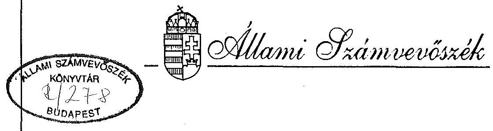
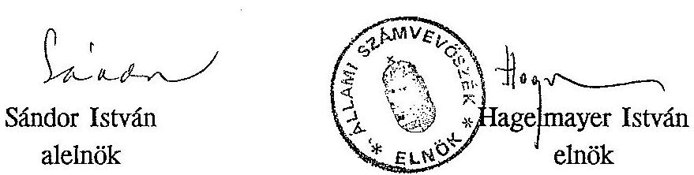
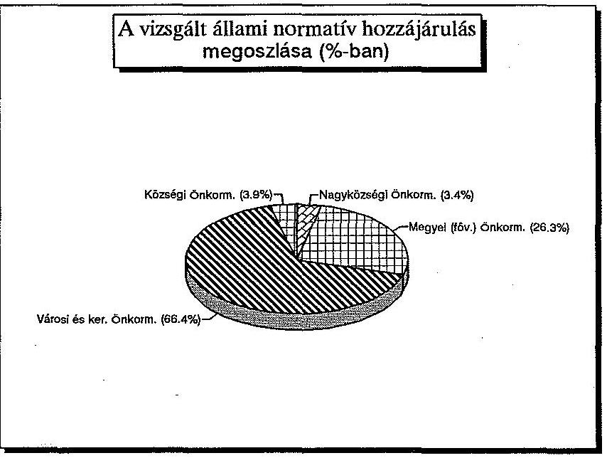
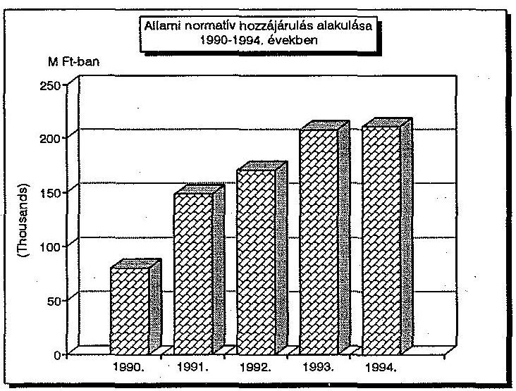
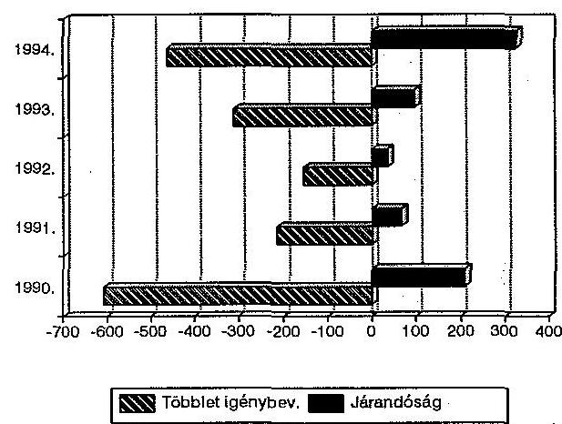
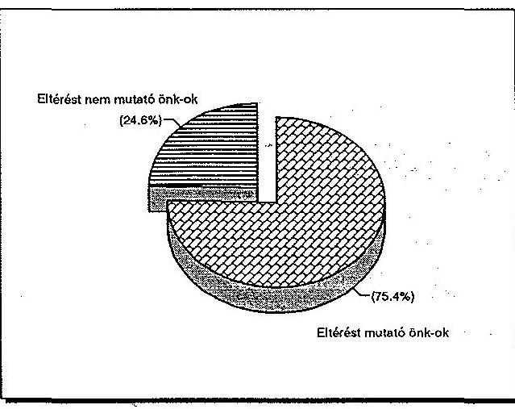
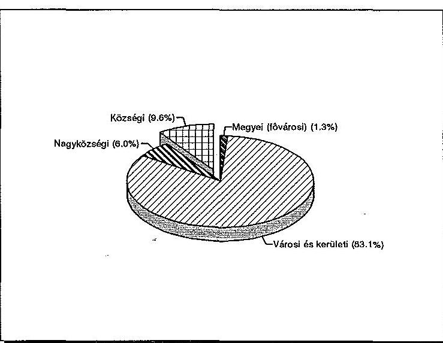

# JELENTÉS 

az önkormányzatok részére biztosított 1994. évi normatív állami hozzájárulás igénybevételének és elszámolásának ellenőrzési tapasztalatairól

---

# Jelentés 

az önkormányzatok részére biztosított 1994. évi normatív állami hozzájárulás igénybevételének és elszámolásának ellenőrzési tapasztalatairól

Az Állami Számvevőszék az Államháztartás viteléről szóló 1992. évi XXXVIII. törvényben foglaltak alapján, az 1994. évi költségvetés zárszámadásához kapcsolódóan ellenőrizte az 1993. évi CXI. törvényben az önkormányzatoknak 1994. évre nyújtott normatív állami hozzájárulások tervezésének, igénylésének, elszámolásának törvényességét, szabályszerűségét.

A vizsgálat célja annak megállapítása volt, hogy

- a tervezés során alkalmazott normatívák összhangban voltak-e a költségvetési törvény 3. számú mellékletében foglalt előírásokkal;
- az önkormányzatoknál és intézményeiknél a tervezés alapját képező mutatószámok, adatok időben, megfelelően dokumentálva rendelkezésre álltak-e;
- az önkormányzatok intézményeiknél az elszámolást megelőzően ellenőrizték-e az adatok valóságtartalmát, a törvényi előírásoknak való megfelelését;
- szabályszerű volt-e a normatív állami hozzájárulások igénybevétele és elszámolása, túllépés esetén időben teljesítették-e visszafizetési és kamatfizetési kötelezettségüket.

A tételes helyszíni ellenőrzés az ország önkormányzatainak 19%-ára, 601 önkormányzatra (19 megyei és a fővárosi, 193 városi, 22 fővárosi kerületi, 73 nagyközségi, 293 községi) és az önkormányzatok irányítása alá tartozó, a vizsgált mutatókkal érintett 1878 intézményre terjedt ki.
(Lásd 2. és 2/a. számú melléklet)

---

Az ellenőrzésbe bevont önkormányzatok együttesen 160,4 Md Ft normatív állami hozzájárulásban részesültek (3. számú melléklet), ami az ország valamennyi önkormányzata részére a törvényben juttatott 210,8 milliárd Ft normatív állami hozzájárulás 76%-a. A vizsgálat azonban kizárólag az ún. feladatmutatókhoz kötött hozzájárulások 115,2 Md Ft-os összegére terjedt ki.

# I. 

Összefoglaló megállapítások, következtetések, javaslatok

A normatív állami hozzájárulások 210,8 Md Ft-os összege az önkormányzatok finanszírozásában döntő tényezővé vált, mivel 1994-ben az önkormányzatoknak juttatott összes állami támogatás mintegy kétharmadát tette ki.

A normatív állami hozzájárulások tervezésének, igénylésének és elszámolásának gyakorlata az elmúlt években évről-évre javult. Az APEH-SZTADI országos összesített adatai szerint a hibaszázalék (a tervezett és a tényleges adatok közötti plusz és mínusz eltérések együttesen) az 1990. évi 3,9%-ról 0,9%-ra csökkent.

A javulás több tényező együttes hatására következett be. A költségvetési törvény 3. számú mellékletének előírásai az Állami Számvevőszék ellenőrzési tapasztalatait figyelembe vevő kisebb korrekciók mellett lényegében változatlanok. A feladatot ellátó önkormányzati munkatársak egyre gyakorlottabbá váltak, amihez hozzájárult a számvevőszéki ellenőrzések tapasztalatainak helyi hasznosítása is.

A jobb munkavégzésre kényszerítő erővel hatottak a bevezetett szankciók, különösen az Országgyűlés azon döntése, hogy az Állami Számvevőszék által feltárt, az önkormányzatok által jogosulatlanul igénybe vett normatív állami hozzájárulások összegét a központi költségvetésbe vissza kell fizetni.

A rendszer működését számos tényező kedvezőtlenül befolyásolta, s ezek egy részét 1994-ben sem sikerült kiiktatni.

Döntő hatással van a normatív állami hozzájárulások jogcímeinek mértékére a Magyar Köztársaság költségvetésének adott évi helyzete. Ez 1994-ben abban nyilvánult meg, hogy a normatív állami hozzájárulások együttes összege 1993-hoz képest mindössze 1%-kal, azaz 3 Md Ft-tal nőtt, reálértéke pedig jelentősen csökkent.

---

Kedvezőtlenül hatottak az érintett tárcák (Pénzügyminisztérium, Belügyminisztérium, Művelődési és Közoktatási Minisztérium, Népjóléti Minisztérium) között a korábbi években, az erőviszonyok alapján létrejött, nem kellően konzekvens megállapodások. Ezek a normatív állami hozzájárulások jogcímeinek indokolatlan növekedését, az ágazati szempontok irreális érvényesítését, ún. "kiegészítő támogatások", mint pótlólagos források bevezetését eredményezték. Az 1990-1994. közötti évek alatt a normatívák száma emiatt 12-ről 27-re nőtt.

Az ad-hoc megállapodások mellett elmaradt a tervezéshez, igénybevételhez, elszámoláshoz szükséges alapelvek és működési szabályok hosszabb távú, rendszerszemléletű, egységes jogszabályba foglalása.

Nem készült az egyes jogcímek tartalmának megfelelő részletes költségelemzés, amely alkalmas lenne az állam és az önkormányzatok közötti feladatmegosztáson alapuló költségviselés megalapozására.

További gondot jelentett, hogy - miközben a törvényi megfogalmazások színvonala javult - a tárcák az általuk önállóan, vagy közösen kialakított törvényi szöveget esetenként pontatlanul, vagy félreérthetően fogalmazták meg, s utólag a nem egyértelmű szabályozást jogszabályhézagként kezelték. Erre visszavezethetően adtak több esetben is az Alkotmánybíróság 60/1992. (XI.17.) AB határozata alapján jogszabálynak nem tekinthető szakmai véleményt, állásfoglalást az önkormányzati kezdeményezések többlet forrás iránti igényeinek utólagos elismerésére.

A normatív állami hozzájárulás igénybevételének feltételeit rögzítő törvényi előírás követelményrendszere és az ott rögzített szakmai statisztikai adatszolgáltatás tartalma, időpontja közötti összhang továbbra is hiányzik.

Az egyes jogcímek tartalmának értelmezéséhez a költségvetési törvényen kívül más jogszabályok részletes ismeretére is szükség van, de az önkormányzatok munkatársai ezeket az előírásokat nem mindig ismerik, s emiatt esetenként a törvény szövegét tévesen értelmezik.

Különösen súlyos probléma, hogy az önkormányzatok többsége továbbra sem tett eleget a helyi önkormányzatokról szóló 1990. évi LXV. törvény 92. § (2) bekezdésében foglalt ellenőrzési kötelezettségének és nem győződött meg az elszámolást megelőzően az igénylés alapját képező mutatószámok valódiságáról, az előírt

---

bizonylatok meglétéről, vezetéséről, annak ellenére sem, hogy erre az Önkormányzati tájékoztató 1993. évi 7. számában külön is felhívták a figyelmüket.

A vizsgált 601 önkormányzatnál a hozzájuk tartozó 5633 intézmény közül mindössze 1474-nél (26%) tartottak cél-ellenőrzést. (Lásd 12.számú melléklet)

Mindezek oda vezettek, hogy az önkormányzatok 1994. évi elszámolásait követő helyszíni ellenőrzésünk során - normatívák szerinti részletezésben -, ahol az egyes önkormányzatoknál az eltérések nem kompenzálják egymást, 240.093,6 E Ft jogosulatlan igénybevételt és 106.580,7 E Ft önkormányzatokat megillető állami hozzájárulást állapítottunk meg, amelynek egyenlege 133.512,9 E Ft költségvetést megillető visszafizetési kötelezettség. (Lásd 8. és 8/a. számú melléklet)

A Magyar Köztársaság 1995. évi költségvetéséről szóló 1994. évi CIV. törvény 3. sz. mellékletében az Állami Számvevőszék korábbi ajánlásainak figyelembevételével végrehajtott módosítások, azaz

- a gyermek- és ifjúságvédelemnél a nagykorúvá vált állami gondozottak esetében a "magáról gondoskodni nem tudó" tartalmi meghatározása;
- a "nappali szociális intézményi ellátásnál" a számítási módszer változtatása;
- a "kiegészítő állami hozzájárulás a nemzetiségi, etnikai, óvodai ellátáshoz" jogcímnél a cigánygyermekek felzárkóztatására az időtartamra vonatkozóak, a heti tíz óra teljesítésének előírása;
- a "kiegészítő állami hozzájárulás a nemzetiségi, etnikai vagy kéttannyelvű oktatáshoz" normatíva esetén a cigánytanulók felzárkóztatására a heti hat óra teljesítésének előírása stb.
megfelelően szolgálják a rendszer további működésének javítását.
Hasonlóan kedvezőnek ítélhető az Állami Számvevőszék által évek óta szorgalmazott, aggregált, az adott feladatcsoport megoldását a jelenleginél áttekinthetőbbé tévő, azt jobban szolgáló és könnyebben tervezhető, kevesebb számú normatív állami hozzájárulási jogcímhez való visszatérésnek az 1996. évi költségvetési irányelvekben való rögzítése.

A közoktatási törvény tervezett módosítása - elfogadása esetén - számos, a jelentésben ismertetett problémát megold, de a tanuló helyett a tanulócsoport alapján való finanszírozás önmagában nem hoz érdemi változást. A normatív

---

állami hozzájárulások jogcímeinek tartalma, a statisztikai számbavétel és az elszámolás szabályai közötti összhang hiánya miatt, - amennyiben ezek jogszabályi rendezése nem történik meg -, a felvetett problémák a jövőben is fennmaradnak.

Az Állami Számvevőszék fontosnak ítéli a gyermek- és ifjúságvédelmi törvény mielőbbi megalkotását és az Országgyűlés általi elfogadását. E nélkül a különböző jogszabályokban megfogalmazott, egy-egy részterületet érintő előírások átfogó, egyértelmű alkalmazása az önkormányzatoknál nem valósítható meg.

Mindezeket figyelembe véve az 1996. évi költségvetési tervezés keretében várhatóan megvalósuló intézkedéseken túlmenően indokoltnak tartjuk, hogy
a pénzügyminiszter az érintett tárcák bevonásával

- az 1996. évre szóló költségvetési törvényjavaslatban - a tárcák által kiadott állásfoglalások és a közoktatási törvény módosításának figyelembevételével - pontosítsa és tegye egyértelművé a jelentésben ismertetett, értelmezési vitára alapot adó normatív állami hozzájárulások jogcímeinek tartalmát;
- hozza összhangba a finanszírozási szempontokat az önkormányzati és a költségvetési információs rendszerrel és a szakmai statisztikák tartalmával, mérési időpontjaival, az alapdokumentumok pontos megjelölésével és vezetésük követelményeivel;
- ismételten hívja fel az önkormányzatok figyelmét ellenőrzési kötelezettségük teljesítésére, s ennek elmaradása esetére alakítson ki szankciókat;
- mérjék fel az egyes normatív állami hozzájárulásra jogosító jogcímekhez kapcsolódó intézmények tényleges költségeit és azokat elemezve határozzák meg hosszabb távra is az állami szerepvállalás mértékének megfelelő összegeket.

---

# II. 

## A vizsgálat részletes megállapításai

## 1. A központi szervek tevékenysége

1.1. Az érintett tárcák az Állami Számvevőszék korábbi, a normatív állami hozzájárulásokkal kapcsolatos vizsgálati tapasztalatait, a helyszíni ellenőrzések során tett megállapításait, összefoglaló javaslatait figyelembe véve tovább pontosították az előírásokat. Ennek révén több, a korábbi vizsgálatok alkalmával észrevételezett problémát megoldottak. Így pl.
—az "általános iskolai oktatás" jogcímnél rögzítették, hogy a magántanulók után a teljes összeg 1/3-a igénybe vehető, továbbá, hogy az általános iskola fogalma az első tíz osztályra terjed ki;
—a "fogyatékos gyermekek oktatása" jogcímnél egyértelművé tették, hogy a magántanulók is és a középiskolai tanulók is csak szakértői vélemény és a kijelölt intézményekben szerzett alapfokú végzettség bizonyítása alapján sorolhatók e körbe;
—a "gyermek és ifjúságvédelem" jogcímnél megfogalmazták, hogy a különleges gyermekotthonokban és más költségvetési szerv által fenntartott intézményekben, továbbá az SOS gyermekfaluban elhelyezettek után a normatív állami hozzájárulás nem igényelhető;
—a "kiegészítő állami hozzájárulások" esetében a cigánytanulók differenciált felzárkóztatásához előírták az MKM jóváhagyását továbbá azt, hogy egy gyermek után csak egy címen igényelhető a kiegészítő hozzájárulás;
—a "nappali szociális intézményi ellátás" jogcím kibővült szenvedélybetegek (kábítószert élvezők és egyéb, hasonló függőséget okozó szerrel, anyaggal visszaélők) nappali intézményi ellátásával, egyben korlátozó intézkedésként épült be, hogy a taglétszámban nem vehetők figyelembe a csak étkezésben részesülők, és a 30 napnál hosszabb ideig távollévők. Ez utóbbiakat a tagnyilvántartásból is törölni kell.
—az "óvodai ellátás" jogcímnél új előírás, hogy a statisztikai létszámba nem számíthatók be az előfelvételi igérvény alapján nyilvántartásba vett, de a felmérés időpontjában a tényleges óvodai ellátást még nem igénylő gyermekek.

---

1.2. A Magyar Köztársaság költségvetésének helyzete nem tette lehetővé, hogy 1994-ben az előző évinél lényegesen magasabb összegű normatív állami hozzájárulásban részesüljenek az önkormányzatok. Az Országgyűlés által 210,8 Md Ft-ban megállapított előirányzat - az inflációs rátát figyelembe véve - reálértéken 17-19%-kal volt alacsonyabb az 1993. évinél.

A tárcák közötti egyeztetések következtében a "szociálpolitikai feladatokra" korábban megállapított - 2.200 - 3.600 Ft/fő hozzájárulást 2.500 - 4.700 Ft-ra növelték, differenciálták a "gazdasági-társadalmi szempontból elmaradt települések támogatását" az előző évi egységes 2.200 Ft/fő helyett 1.200 - 2.300 Ft/fő hozzájárulási mértéket megállapítva. Ugyanakkor a "települési üzemeltetésre" adott 3.950 Ft/fő összeget 3.820 Ft/fő-re csökkentették. Újonnan épült be az 1994. évi költségvetésbe a "hajléktalanok átmeneti szállásai" jogcím 78.000 Ft/fő összeggel.

A szaktárcák és a PM - BM közötti tárgyalások csupán az egyes normatívák közötti átcsoportosításra irányulhattak, mivel a normatív állami hozzájárulások együttes nagyságrendje alapvetően meghatározott volt. Az előzőekben említett tétel kivételével a normatívák jogcímeihez rendelt mértékek nem változtak, miközben köztudott volt, hogy a költségek jelentősen növekedtek. (Lásd 6. és 13. számú melléklet)
1.3. A szaktárcák az ágazati érdekeket szem előtt tartva elnézőek voltak az önkormányzatok kiegészítő támogatás megszerzésére irányuló törekvéseivel szemben, s azokat esetenként jogszabálynak nem minősülő állásfoglalásaikkal legalizálták.

E téren az is problémát okozott, hogy a szaktárcák kiadmányozási gyakorlata túlságosan "liberális", s így alkalmanként munkatársak úgy adhattak ki állásfoglalásokat, engedélyeket, hogy nem vonták be az érdekelt másik főosztályt. További gond, hogy
 ezekről nem készült rendszerezett, naprakész, témánként csoportosított nyilvántartás. Az "állásfoglalások" nem voltak mindig egyértelműek, s előfordult, hogy a minisztériumi álláspont sem fogalmazódott meg konkrétan.

Jól érzékelteti a gondokat, hogy a költségvetési törvény szerint az "alapfokú művészetoktatás" állami hozzájárulási jogcím alapján az önkormányzatok, - mivel nincs szabályozva, hogy mely művészeti ágak tartoznak-e fogalomkörbe, - a

---

legkülönbözőbb "művészeti oktatáshoz" igényelhették az oktatottak után a 25.100 Ft/fő összeget (pl: bábjáték, népi- illetve társastánc, színjátszás stb).
A közoktatási törvény és a végrehajtására kiadott 11/1994. (VI.8.) MKM rendelet sem tartalmazza egyértelműen a tanítási órák minimális időtartamát, s erre a törvény finanszírozásra vonatkozó rendelkezései (114-119. §-ok) sem szolgálnak megfelelő támpontul. Utólagos tárca álláspont szerint a feltétel a minimum heti 80 perces gyakorlati oktatás, illetve a 6 tanórai foglalkozás.
1.4. Hiányzik a szaktárcákon belül a megfelelő koordináció. Azonos témában több főosztály is érintett és az ellenőrzési tapasztalatok szerint nem mindig kerül sor közöttük a szükséges egyeztetésre, néha pedig a közösen kialakított vélemény nincs összhangban a vonatkozó törvényekkel.

A Menekülteket Támogató Alapról szóló 1993. évi XXVI. törvény 3. § (1) bekezdésének c) pontja szerint az Alapból teljesíthető kiadás a menekültnek, illetve gyermekének gyermekintézményben történő elhelyezésével, általános és középiskolai - továbbá kivételesen indokolt esetben felsőfokú - oktatásával összefüggő költségek térítése. A törvény megjelenését követően az érintett önkormányzatok többsége az Alaptól igényelte a költségei térítését, ami többnyire meghaladta a normatív állami hozzájárulás összegét.
Néhány önkormányzat azonban nem az Alaptól kérte megtéríteni a menekültek oktatásával kapcsolatban felmerült költségeit, hanem arra hivatkozva, hogy nem tudja a menekült gyermeket azonosítani, a normatív állami hozzájárulást vette igénybe. Az MKM állásfoglalása szerint ez a megoldás is elfogadható, mert "az intézmény valóban nem képes a tanulót azonosítani", ezért normatív állami hozzájárulást is igénybe vehet.
A közoktatásról szóló törvény 2. számú mellékletében a gyermekek, tanulók adatai között állampolgárságuk is szerepel, s mivel az Alap felhasználása a külföldiek, a törvény 3. § (2) bekezdésében felsoroltak körét érinti, így azonosításuk megoldható. A tárca álláspontja ezen túlmenően azért is helytelen, mert kétszeres finanszírozásra adna lehetőséget, mely csak teljes körű ellenőrzés esetén lenne kiszűrhető.

Hasonló probléma mutatkozik az "alapfokú művészetoktatásnál" is a több tanszakon tanulók létszámának figyelembevétele kapcsán. A tárca illetékes főosztályának vezetője megkeresésünkre megállapította, hogy az az önkormányzat járt el helyesen, amelyik az egyidejűleg több tanszakon oktatott zeneiskolai tanulót

---

csak egyszer vette figyelembe a létszám megállapításánál. Ezzel azonos az Állami Számvevőszék véleménye is, mivel a költségvetési törvény oktatott tanulókról szól. A főosztályvezető azonban még ugyanabban a válaszlevelében azt is rögzítette, hogy a többszörös igénybevétel sem jogsértő, mert a törvény nem írja elő, hogy egy tanuló csak egyszer vehető figyelembe, függetlenül attól, hogy több hangszeren tanul.

Régi probléma a cigánygyermekek felzárkóztatására szolgáló kiegészítő normatív állami hozzájárulás igénybevétele jogszerűségének megítélése. Évek óta visszatérően jeleztük, hogy a vonatkozó előírások nincsenek összhangban, ezért nehéz, esetenként lehetetlen utólag meggyőződni az igénylés jogszerűségéről. Az önkormányzatok álláspontja szerint nemcsak a cigány etnikai csoportba tartozók részére szükséges a felzárkóztatás, hanem más, e csoportba nem tartozó hátrányos helyzetű gyermekek részére is, ezért utánuk is igényelték a kiegészítő normatív állami hozzájárulást.

A szaktárca és a PM legutóbbi, e kérdéssel összefüggő álláspontja szerint nem az etnikai hovatartozás, hanem a speciális foglalkozásokon való résztvétel az igénylés alapja. Ezt az álláspontot az Állami Számvevőszék részéről is elfogadhatónak tartanánk, ha a költségvetési törvény az igénybevétel feltételeként ezt írná elő. A jelenlegi szabályozás szerint azonban csak a cigánygyermekek felzárkóztatására vehető igénybe a hozzájárulás.

Itt vethető fel az a sajátos probléma is, hogy a fogyatékos cigánygyermekek után a fogyatékosok oktatására megállapított magasabb összegű normatív állami hozzájárulást és a kiegészítő normatív állami hozzájárulást is igényelték az önkormányzatok.

Az MKM Kisebbségi Főosztályának álláspontja szerint mindkét jogcímen jár a normatíva, mert külön-külön megoldandó célfeladatot szolgálnak. A költségvetési törvény tiltó rendelkezése hiányában valóban mindkét jogcím alapján igénybe vehető a hozzájárulás. A fogyatékos tanulók oktatásának speciális jellege miatt azonban a "felzárkóztatás" tartalmilag nem értelmezhető.

---

1.5. Továbbra sincs megoldva az igénylés alapjául szolgáló statisztikai adatok és a költségvetési törvény 3. sz. mellékletében felsorolt jogcímek tartalmának összhangja.
— A dolgozók középiskoláiban oktatottakról készítendő statisztikából - az MKM által is elismerten - pl. nem állapítható meg minden kétséget kizáróan valamennyi képzési formánál, hogy a képzésben az első, vagy a második szakma megszerzése céljából vesz-e részt a tanuló.
- Problémát jelent az is, hogy a szakiskoláknál az oktatottak létszámát a szeptember 15-i adatok alapján kell figyelembe venni, de pl. a gép- és gyorsíró szakiskolák statisztikája a november 1-i állapotot tartalmazza.

A pontatlan és nem egyértelmű jogszabályi előírások mellett gondot okozott, hogy a központi szervek is különböző álláspontot képviseltek egyes kérdésekben:
— Eltérő a szaktárca és a PM véleménye a külföldön tanuló diákok esetében. A szaktárca véleménye szerint a tanulói jogviszony külföldi tanulmányok miatti szüneteltetése (pl. a szülők tartós külszolgálata miatt) esetén a tanuló szerepel a tanév eleji statisztikában, magántanulónak minősül és a normatív állami hozzájárulás harmadrésze igényelhető. A PM szerint viszont akinek külföldi tanulmányai miatt tanulói jogviszonya szünetel, a statisztikában nem szerepeltethető és ebből következően a hozzájárulás sem vehető igénybe.
— Nincs egyetértés a két tárca között a tanév közben létesített szakiskola tanulói után igényelhető hozzájárulás időtartama tekintetében. A szaktárca "feltételezi", hogy pl. a november 1-vel induló iskola két hónappal később fejezi be a tanévet, s ezért indokoltnak tartja a teljes összegű normatív állami hozzájárulás igénybevételét. A PM álláspontja szerint az időarányos hozzájárulás igényelhető. Ez utóbbival ért egyet az Állami Számvevőszék is, azonban a törvény jelenleg ezt a kérdést egyértelműen nem szabályozza.
1.6. Nem működik a fogyatékosok oktatására vonatkozóan az intézmények kötelező érvényű kijelölési rendszere, bár azt a költségvetési törvény a "fogyatékos gyermekek oktatása" jogcímnél feltételezi. A fogyatékosok oktatását ellátó intézmények körének többsége még az 1980-as évek végén alakult ki és érdemi felülvizsgálat nélkül, gyakran hiányos feltételek mellett működik jelenleg is.

Sajátos finanszírozási problémát jelent, hogy a fogyatékos gyermekek oktatását végző intézmények "a többi tanulóval együtt haladásra képtelen, beilleszkedési,

---

magatartási, tanulási zavarral küzdő gyermekeket" is felvehetnek. Ezeket nem a szakértői- és rehabilitációs bizottság utalta az intézményekbe, de a gyermekek és szüleik számára is kedvező ez a megoldás. A jelenlegi jogszabály szerint azonban ezen gyermekek után a fogyatékosok oktatására biztosított normatív állami hozzájárulás nem igényelhető. Ellenőrzési oldalról komoly problémát okoz, hogy a középiskolákban a szükséges dokumentáció már nem áll rendelkezésre, mert az az alapfokú oktatási intézményben maradt.
1.7. A gyermek- és ifjúságvédő intézeteknél a felmerült gondok továbbra is elsősorban arra vezethetők vissza, hogy a gyermek- és ifjúságvédelemről szóló törvény megalkotásának elhúzódása miatt még ma sincs a követendő gyakorlatot átfogóan előíró jogszabály. A szakmai irányítást végző Népjóléti Minisztérium a több éve fennálló problémákat e törvény keretei között kívánja rendezni.

Az 1994. évi költségvetési törvényben hiányzik annak egyértelmű megfogalmazása, hogy ki tekinthető önmagáról gondoskodni nem tudónak, mi legyen az eljárás a csak időközi, vagy részleges ellátást igénylő, 18. életévüket betöltött, volt állami gondozott fiatalok esetében.
A költségvetési törvény a 18 éven aluli állami gondozottak esetében egyértelműen rögzíti, hogy a normatív állami hozzájárulás nem vehető igénybe a "más központi költségvetési szerv által fenntartott intézményben elhelyezettekre", nincs azonban egyértelmű tiltó rendelkezés a 18-24 éves korúakra vonatkozóan. A sorkatonai szolgálatot töltő fiatalok lényegében költségvetési szerv által fenntartott intézményekben vannak elhelyezve: Ugyanakkor a katonaságtól való ideiglenes eltávozásuk alkalmával igénybe vehetik, illetve veszik az intézeti ellátást. Emiatt, továbbá a fiatalokkal való kapcsolattartás során is merülnek fel a GYIVI-nek költségei, természetesen lényegesen kisebb mértékben mintha teljes ellátást kapnának. A jogszabályi előírások sem a katonai szolgálatukat töltők, sem a nagykorúvá vált és az állami gondoskodás kötelékében maradt, vagy oda visszafogadottak esetében sem rendezik a finanszírozási kérdéseket.
1.8. Hiányos a Népjóléti Minisztérium informáltsága, az önkormányzatok részéről mutatkozó új, vegyes típusú, a szociális ellátás biztosításával kapcsolatos gyakorlatról.

A tárca az Állami Számvevőszék ellenőrzése kapcsán szerzett tudomást arról, hogy az intézményekre vonatkozó önkormányzati szabályozások (alapító okiratok,

---

szMSz-ek) rendkívül hiányosak és így nem mindig szolgálnak támpontul a szociális törvényben szabályozott intézménytípusok megfeleltetéséhez.
Néhány átmeneti szállást nyújtó intézményben úgy helyeztek el egyes személyeket, hogy azokkal határozatlan idejű lakásbérleti szerződést kötöttek, ugyanakkor az "átmeneti elhelyezést nyújtó intézményi ellátás" normatíva alapján igényelték az elhelyezettek után a 87.000.-Ft/fő összeget az állami költségvetésből.

A Népjóléti Minisztérium mintegy ezer intézményének adatait "Évkönyv"-ben tartja nyilván, s a költségek változásait ezen keresztül kíséri figyelemmel. Költségelemzést azonban nem tudtak bemutatni, amely reálisan megalapozhatta volna az állami hozzájárulások összegét. Így az sem állapítható meg, hogy a minisztérium által a GYIVI-k tényleges költségráfordításaként közölt, 305-526 E Ft között szóródó 406.000 Ft-os átlag összegéből mennyi az elfogadható mérték.
2. A normatív állami hozzájárulások igénybevételének és elszámolásának helyessége az önkormányzatoknál

Az önkormányzatok munkatársainak szakmai gyakorlata évről-évre növekedett, így elszámolásaik is egyre pontosabbak lettek. A bevezetett szankciók és az Állami Számvevőszék ellenőrzései által is kikényszerített körültekintőbb, óvatosabb tervezést jelzi, hogy az 1994. évi elszámolásuk szerint (APEH-SZTADI adatok) az önkormányzatoknak országos szinten együttesen 1.194,7 M Ft (a hozzájárulások 0,6%-át kitevő) befizetési kötelezettsége keletkezett, az őket pótlólagosan megillető összeg 710,3 M Ft (0,3%), amelynek egyenlegeként az önkormányzatok a költségvetésbe 484,4 M Ft-ot (0,2%) kellett, hogy visszafizessenek. (Részletesen lásd 4. és 5. számú melléklet)

Az önkormányzatok elszámolását követően az Állami Számvevőszék által végzett helyszíni ellenőrzések összesített adatai szerint a vizsgált önkormányzatok a hozzájárulások 0,15%-át (240.093,6 E Ft-ot) vették jogosulatlanul igénybe, ugyanakkor 0,07% (106.580,7 E Ft) illeti meg az önkormányzatokat. Ennek egyenlege 133.512,9 E Ft, (0,08%) az állami költségvetést megillető visszafizetési kötelezettség. (Lásd 5/a, 8., 8/a, 10, 10/a. számú melléklet)

Az ellenőrzött 601 önkormányzat közül 453-nál (75%) mutatkozott eltérés. Ebből 305 önkormányzatnak visszafizetési kötelezettsége keletkezett, 148 önkormányzatot pedig többlethozzájárulás illet meg.
A visszafizetési kötelezettség döntő része, 77%-a a városi önkormányzatoknál

---

mutatkozott, holott részesedésük a vizsgált körben a normatív állami hozzájárulásokból csak 66%. (Lásd 7. számú melléklet)

A kétségtelenül kedvező tendencia mellett azonban továbbra is fellelhetők voltak a korábbi ellenőrzések során feltárt szabálytalanságok, hiányosságok, a törvényi előírások be nem tartására visszavezethető hibák.

Továbbra is általánosítható tapasztalat, hogy ugyanannál az önkormányzatnál a normatív állami hozzájárulás egyik jogcíme alapján többletigénybevételt, a másiknál pedig a jogosnál kisebb összegű igénybevételt tártak fel a számvevők. Ezek a törvények nem mindig megfelelő ismeretének és alkalmazásának, számos esetben a felületességnek és az önkormányzati és a hozzá kapcsolódó, ún. hatásköri törvényben megfogalmazott ellenőrzési kötelezettség elmulasztásának következménye.

Jól érzékelteti ezt a problémát, ha az
 egy önkormányzaton belül a plusz-mínusz eltéréseket normatíva jogcímenként bruttó módon vesszük figyelembe (tehát nem egymást kiegyenlítve), akkor a visszafizetendő összeg a $240,1 \mathrm{M} \mathrm{Ft}$-tal szemben $460,7 \mathrm{M} \mathrm{Ft}$, a járandóság pedig a $106,6 \mathrm{M} \mathrm{Ft}$-tal szemben $327,2 \mathrm{M} \mathrm{Ft}$ lenne. (Lásd 8/a. és 9. és 11. számú melléklet)

A vizsgált önkormányzatok döntő többsége nem ellenőrizte az intézményei által szolgáltatott alapadatok valóságtartalmát és számszaki helyességét. Nem fordítottak figyelmet a normatív állami hozzájárulások alapbizonylatait képező tanügyigazgatási, nyilvántartási, és egyéb, a költségvetési törvényben előírt alapokmányok helyességének ellenőrzésére. Az intézmények vezetői által szolgáltatott adatokat abból kiindulva, hogy azok helyességéért az intézményvezető felelős, általában automatikusan elfogadták.

A bekért tájékoztató adatok szerint a vizsgált önkormányzatokhoz tartozó intézmények (5633) közül 4159-nél (74%) nem folytattak ellenőrzést saját hatáskörben az önkormányzatok. Az ellenőrzötteknél összesen 28 M Ft többletigénybevételt, illetve 50 M Ft jogosulatlan igénybevételt okozó mutatószám korrekcióra került sor, még a költségvetési beszámoló elkészítését megelőzően. (Lásd 12. számú melléklet)

Mindössze három megyében (Békés, Somogy, Vas) nem volt dokumentált adat arról, hogy az ellenőrzések során a mutatószámokat, s ezen keresztül az igénylések összegét milyen mértékben korrigálták. Különösen feltűnő ez Somogy megyénél, ahol az intézmények 85%-át ellenőrizték, de korrekcióra a 76 intézmény egyikénél sem került sor.

---

A jelenlegi helyzetet azért tekintjük különösen súlyosnak, mert az ellenőrzött önkormányzatok közel 40%-a városi, fővárosi kerületi és megyei (fővárosi) önkormányzat volt. Náluk a szükséges szakemberállomány általában rendelkezésre áll, s ennek ellenére folytattak az elszámolások során a törvényi előírásoktól eltérő gyakorlatot. Esetenként ott is, ahol az Állami Számvevőszék ezt már korábban kifogásolta.

Továbbra is jellemző elszámolási hiba, hogy

- nem az intézmények statisztikai adataiból, hanem a tervszámok alapján töltötték ki az elszámolás dokumentumát képező 1994. évi költségvetési beszámoló 31. sz. űrlapját. Esetenként a tényadatok helyett az 1994. évi "várható" - az 1995. évi tervezéshez felhasznált - adatokat vették figyelembe;
- a KSH részére összeállítandó, december 31-i állapotot tükröző statisztikai adatok alapján készítették el az elszámolást, annak ellenére, hogy a költségvetési törvény más számítási módot határozott meg;
- a tényleges adatok törvény szerint meghatározott súlyozott átlagának (4/12 8/12) kiszámítása helyett a "záró" létszámot vették alapul;
- az állami gondozott gyermekek oktatási feladataira az intézményt fenntartó önkormányzat közvetlenül igényelte az oktatási normatívát, amelyre az 1994. évi törvényi előírások még nem adtak lehetőséget. Az állami gondoskodásban részesülők számánál figyelembe vették a 24. életévüket már betöltött fiatalokat, továbbá olyan 18. életévüket betöltött volt állami gondozottakat is, akik ellátást nem igényeltek, csak különböző segélyekért fordultak a gyermek- és ifjúságvédő intézethez;
- a nappali szociális intézményekben a gondozási napló alapján naponta összesített tagok számának és az éves nyitvatartási napok hányadosának kiszámítása helyett a férőhelyek számát vették figyelembe. Nem különítették el a nyilvántartásban a csak étkezésben részesülőket, illetve nem törölték a nyilvántartásból a 30 napnál hosszabb ideig távollévőket;
- az óvodai statisztikai létszámba azokat a gyermekeket is beszámították, akiket az un. előfelvételi igérvény alapján vettek nyilvántartásba, de a felmérés időpontjában tényleges óvodai ellátásban nem részesültek;
- nem vették figyelembe az intézmények átadás-átvételéből adódó változásokat;
- beszámították a szakközépiskolai és a szakmunkástanulói létszámba a másodszakmát megszerző tanulókat is;
- levelező, illetve esti tagozatos tanulókra is a nappali oktatásban részvevők után járó teljes összegű normatívát vették igénybe a törvényben előírt 1/3 helyett;
- nem dokumentálták a cigánytanulók felzárkóztatását;

---

- a törvényi szöveget helytelenül értelmezve a hasonló tartalmú jogcímek esetében a magasabb összegűt igényelték pl. a szakmunkások 2-3 éves nappali rendszerű érettségire felkészítő oktatása esetében;
- a gondozási napok számában nem vették figyelembe a kórházi ápolás és a szabadság időtartamát annak ellenére, hogy azt a költségvetési törvény megengedi.

A vizsgált önkormányzatok döntő többsége elszámolását határidőre benyújtotta, s egy-két kivételtől eltekintve befizetési kötelezettségeit is időben teljesítette.
3. A reálértéken csökkenő normatív állami hozzájárulások miatt beszűkülő finanszírozást az önkormányzatok egyéb forrásokból, sok esetben hitel felvételével pótolták. A normatívák jogcímeihez rendelt hozzájárulások ugyanis a vizsgált körben 1994-ben az intézményi kiadásoknak általában a 30-80%-át fedezték.

A Fővárosi Önkormányzatnál pl. a gyermek- és ifjúságvédelemre a normatív állami hozzájáruláson felül további, közel 70%-os kiegészítést nyújtott. A szociális ellátás intézményeinek kiadásaihoz 33-154%-kal járult hozzá. Legmagasabb kiegészítést a nappali szociális intézeti ellátásnál biztosítottak, de pl. a hajléktalanok átmeneti szállásainak fenntartására fordított összeg is több, mint duplája a normatív állami hozzájárulásnak.
Az oktatási intézmények közül a szakközépiskolai oktatáshoz volt a legkisebb -41%-os - a kiegészítés, míg az óvodai ellátás a legköltségesebb, az állami hozzájárulás a feladatnak csupán 28%-át fedezi. Mintegy 50% a kiegészítés az alapfokú művészetoktatásnál, valamint a szakmunkásképzés elméleti oktatásánál.

A szakmunkás-iskolai tanműhelyi képzésre a normatív állami hozzájárulás több mint háromszorosát fordította az önkormányzat. A fogyatékos gyermekek oktatása közel két és félszeresébe került, mint amennyit a normatív állami hozzájárulás egy oktatottra jutó kiadásból fedezett.
4. A önkormányzatok finanszírozásának jelenlegi rendszere számos problémát hozott a felszínre. Az állami hozzájárulások normativitása ellenére, az önkormányzatok szűkös gazdasági lehetőségei miatt jelentős eltérések tapasztalhatók a feladatok ellátásának színvonalában.
A működést zavaró jelenségek és azok negatív hatásai eltérő módon jelennek meg a községekben, a kisvárosokban, a nagyvárosokban és a megyei szinteken.

---

4.1. Alapvető probléma, hogy nem szabályozott az állam és az önkormányzatok közötti feladat elhatárolás. Nincs közöttük konkrétan kidolgozott munkamegosztás, így nem állapítható meg és nem mérhető a tényleges szükséglet az önkormányzatok által ellátott feladatok finanszírozása tekintetében.

Sem az új jogcímek kialakításánál, sem pedig a szabályozások módosításakor nem vették figyelembe, hogy a normatív állami hozzájárulás jogcímeinek összegeit a szakmailag indokolt költségigényből kiindulva lenne célszerű meghatározni. Az évenkénti inflációs rátát figyelembe véve az önkormányzatoknak juttatott állami támogatások nem őrizték meg reálértéküket. A gyermeklétszám helyenként jelentősebb csökkenése miatt az önkormányzatoknak az objektív okokból növekedő kiadások mellett kevesebb összegből kellett megoldaniuk intézményeik fenntartását.
4.2. A megyei önkormányzatok a központi költségvetéstől kapott állami hozzájárulások és saját bevételeik szűkös volta miatt egyre nehezebben tudnak eleget tenni az állami gondoskodással kapcsolatos feladataiknak.

Különböző gazdasági helyzetük miatt eltérő színvonalon látják el a gyermek- és ifjúságvédelem terén kötelezően előírt feladataikat. Törekednek azokat a tevékenységeket háttérbe szorítani vagy megszüntetni, amelyhez az állam nem biztosít pénzügyi támogatást (pl. utógondozás, életkezdési támogatások, nagykorúakká vált fiatalok ellátása). Ismételten felhívjuk a központi szervek figyelmét, hogy az állami gondoskodásra vonatkozó elavult szakmai jogszabályi előírásokat indokolt lenne mielőbb teljeskörűen áttekinteni. Ennek során célszerű lenne az állami feladatok körét egyértelműbben meghatározni és annak megfelelően a finanszírozás rendjét is módosítani.

Az elmúlt négy év alatt a GYIVI által elhelyezett gyermekek száma országos átlagban 4,9%-kal csökkent, egyidejűleg az egy főre jutó állami hozzájárulás mértéke 210.000 Ft-ról 245.000 Ft-ra emelkedett. Ennek eredményeként az állami ráfordítások abszolút összege csak 3,2%-kal nőtt, amely közel sem fedezte a költségnövekedéseket.

A fogyatékos gyermekek tekintetében a megyei önkormányzatok mellérendeltségi helyzetüknél fogva nem tudják összehangolni és koordinálni a fogyatékosok oktatását, és nem működtethetik a speciális feltételeket biztosító intézmények kijelöléses rendszerét sem.
Indokolt lenne ezért, ha a fogyatékosok oktatása egyértelműen állami feladattá

---

válna, amelyet a központi költségvetés az önkormányzatokon keresztül megfelelően finanszírozna.
4.3. Az önkormányzatok finanszírozásában neuralgikus pont a körzeti és a térségi feladatok ellátásához szükséges pénzügyi fedezet biztosítása. Az ilyen feladatokat ellátó intézményeket fenntartó önkormányzatok az elmúlt években hátrányba kerültek. Különösen igaz ez a székhelytelepülési önkormányzatokra, amelyek még akkor is rákényszerültek az intézmények működtetésére, ha a közös finanszírozásban részt vevő társönkormányzatok az intézményi teljes kiadásokat nem voltak hajlandók fedezni.

A forrásszabályozási - és ezen belül a normatív finanszírozási rendszer is - az elmúlt években jelentős mértékben átrendezte a települések gazdasági erőviszonyait. Kedvezőbb helyzetbe azok a települések kerültek, ahol nem volt és jelenleg sincs intézmény, viszont differenciáltan kedvezőtlen helyzetbe kerültek a körzeti-térségi feladatot ellátó intézményekkel rendelkező önkormányzatok.
4.4. A közös tulajdonú és közös fenntartású intézmények esetében gondot okoz, hogy az önkormányzatok a normatív állami hozzájárulásokat saját ellátottjaikra közvetlenül igényelhetik, ami elszámolás-, és ellenőrzéstechnikai szempontból vet fel problémákat, míg a tényleges kiadások és a normatív állami hozzájárulások közötti különbözet egymás közötti megosztását a jogszabályok az önkormányzatok megállapodására bízták. A gyakorlatban az ilyen pénzügyi terhek megosztása nagyon sok vitát, érdekellentétet eredményezett, előfordult, hogy az erre irányuló tárgyalások hosszadalmas pereskedésekre vezettek.

Az Állami Számvevőszék álláspontja szerint megoldást csak az ellátási kötelezettség és felelősség ismételt bevezetése jelenthetne. A településtípusokhoz kötődő konkrétabb kötelező feladatellátás és az ahhoz kidolgozott új finanszírozási rend hozhatna érdemi változásokat.

Budapest, 1995. október

---

# A V-1001-99/1995. számú vizsgálati jelentés mellékletei: 

1. sz. melléklet: A vizsgálatban részt vevők
2. sz. melléklet: Összesítés a vizsgált önkormányzatokról településtípusonként

2/a.sz.melléklet: A vizsgált önkormányzatok állami normatív hozzájárulása településtípusonként
3. sz. melléklet: Vizsgált önkormányzatok felsorolása és az 1994-re tervezett állami normatív hozzájárulás értéke
4. sz. melléklet: Az 1994. évi normatív állami hozzájárulás elszámolásának megyénkénti részletezése (TÁKISZ adatok alapján)
5. sz. melléklet: Az állami normatív hozzájárulás önkormányzati elszámolásának országos adatai 1990-1994. között.
5/a. sz.melléklet: Kimutatás a vizsgált önkormányzatok körében a saját elszámolásukhoz viszonyított ÁSZ vizsgálat által feltárt további eltérésekről (1990-1994. között)
6. sz. melléklet: A helyi önkormányzatok normatív állami hozzájárulásának jogcímei és összegei (1990-1994.)
7. sz. melléklet: Kimutatás a vizsgált és az elszámolási eltérést mutató önkormányzatok számának alakulásáról
8. sz. melléklet: Kimutatás az 1994. évi normatív állami hozzájárulás igénybevételénél tapasztalt eltérésekről vizsgált önkormányzatonként
8/a.sz. melléklet: Kimutatás az 1994. évi normatív hozzájárulás igénybevételénél megyénként tapasztalt eltérésekről
9. sz. melléklet: Kimutatás az 1994. évi normatív állami hozzájárulás jogcímenkénti igénybevételénél tapasztalt eltérésekről (Összesített adatok)
10.sz. melléklet: Kimutatás az önkormányzatok 1994. évi normatív állami hozzájárulás jogcímenkénti igénybevételénél tapasztalt eltérésekről (Önkormányzatonként)
10/a.sz.melléklet: Kimutatás az önkormányzatok 1994. évi normatív állami hozzájárulás jogcímenként tapasztalt eltérésekről (Megyénként)
11.sz. melléklet: Kimutatás a vizsgált önkormányzatoknál az állami normatív hozzájárulások jogcímenkénti eltéréséről településtípusonként
12.sz.melléklet: Kimutatás az önkormányzatok intézményeinek ellenőrzéséről
13.sz.melléklet: A feladatmutatókhoz kötött normatív állami hozzájárulás mutatószámainak és összegének alakulása

Összesen: 62 oldal

---

# A vizsgálat szervezésében és az összefoglaló jelentés összeállításában részt vett: 

Dr. Saly Ferenc régióvezető főtanácsos Müller Ildikó számvevő tanácsos
Dr. Nagy Ágnes számvevő tanácsos
Dr. Spilák Antal számvevő tanácsos
A vizsgálat koordinálásában részt vettek:
Farkas László régióvezető főtanácsos
Dr. Felleg Zsoltné régióvezető főtanácsos
Németh Péterné régióvezető főtanácsos
Dr. Sallai Antal régióvezető főtanácsos
A helyszíni vizsgálatot végezte:
Baranya megye:

Bács-Kiskun megye:

Békés megye:

Borsod-Abaúj-Zemplén megye:

Csongrád megye:

Fejér megye:

Dr. Ernst László számvevő tanácsos
Maczekó Károly számvevő tanácsos
Dr. Nagy Ágnes számvevő tanácsos
Dr. Koronics Károlyné számvevő tanácsos
Remeczki László számvevő tanácsos
Dr. Botta Tibor számvevő tanácsos
Nagy János számvevő tanácsos
Tréfás Antal számvevő tanácsos
Baji Ferencné számvevő tanácsos
Galuska Józsefné számvevő tanácsos
Kollár Lászlóné számvevő tanácsos
Fekete Tibor számvevő tanácsos
Hegedűs György számvevő tanácsos
Kocsis István számvevő tanácsos
Dr. Takács András számvevő tanácsos
Dr. Boda Sándor számvevő tanácsos
Csiszárné Kosik Mária számvevő tanácsos
Grünwaldné dr. Lavner Klára

 számvevő tan.
Dr. Ótott Lajos számvevő tanácsos
Cziffra Erzsébet számvevő
Ébner Vilmosné számvevő tanácsos
Horváth József számvevő tanácsos
Huberné Kuncsik Zsuzsa számvevő

---

Győr-Moson-Sopron megye:

Hajdú-Bihar megye:

Heves megye:

Jász-Nagykun-Szolnok megye:

Komárom-Esztergom megye:

Nógrád megye:

Pest megye és főváros:

Somogy megye:

Szabolcs-Szatmár-Bereg megye:

Dr. Lacó Bálintné számvevő tanácsos
Kalmár István számvevő tanácsos
Dr. Szeli Tibor számvevő tanácsos
Kozák György számvevő tanácsos
Kóródi József számvevő tanácsos
Molnár Mária számvevő
Szilágyi Sándor számvevő tanácsos
Hevesi Kornél számvevő
Maróti Sándor számvevő tanácsos
Nagy Sándorné számvevő tanácsos
Dr. Tóth András számvevő tanácsos
Buczkó András számvevő tanácsos
Dr. Csapó Anna számvevő tanácsos
Csomán Mihály számvevő tanácsos
Dr. Mezei Imréné számvevő
Ambrus Lajos számvevő
Böröcz Imre számvevő
Fátrainé Zsebedics Katalin számvevő tan.
Koltayné Szepesi Zsuzsanna számvevő tan.
Bocsi Sándor számvevő tanácsos
Fercsik Gyula számvevő tanácsos
Huszár Sándorné számvevő
Zeke József számvevő
Benczik Lászlóné számvevő tanácsos
Csecserits Imréné számvevő tanácsos
Fancsali Mária számvevő
Dr. Hábenczius Gyula számvevő
Gordos László számvevő tanácsos
Dr. Magyar György számvevő
Dr. Molnár Klára számvevő tanácsos
Müller Ildikó számvevő tanácsos
Nagy Józsefné számvevő tanácsos
Somogyiné dr. Legény Mária számvevő
Dr. Spilák Antal számvevő tanácsos
Dr. Telkes Imre számvevő
Tímár József számvevő tanácsos
Tornai József számvevő
Turnheimné Lakos Zsuzsa számvevő
Dr. Hegedűs György számvevő tanácsos
Huszti István számvevő
Dr. Szigeti István számvevő
Bacskai János számvevő tanácsos
Hadházy Sándor számvevő
Kenéz Sándor számvevő tanácsos

---

Tolna megye:

Vas megye:

Veszprém megye:

Zala megye:

László András számvevő tanácsos
Szücs Zoltán számvevő
Csekei Gyula számvevő tanácsos
Kispálné Wiedemann Györgyi számvevő
Major Lászlóné számvevő
Péntek László számvevő tanácsos
Dr. Gyuk József számvevő tanácsos
Horváth János számvevő tanácsos
Kántor Ilona számvevő
Komlósiné Bogár Éva számvevő
Rénes Mária számvevő tanácsos
Dr. Vasváriné dr. Rózsa Anik számvevő tan.
Szikszainé Király Mária számvevő
Angyalosi Dániel számvevő tanácsos
Csuti Lajos számvevő
Gerencsér Ferenc számvevő
Köcse Istvánné számvevő

---

# Összesítés a vizsgált önkormányzatokról településtípusonként

|  Sorszám | Megnevezés | Megyei (fővárosi) | Városi és kerületi | Nagyközségi | Községi | Összesen | Vizsgált önkormányzati intézmények száma  |
| --- | --- | --- | --- | --- | --- | --- | --- |
|  1 | Budapest | 1 | 22 | 0 | 0 | 23 | 170  |
|  2 | Baranya megye | 1 | 6 | 3 | 25 | 35 | 90  |
|  3 | Bács-Kiskun megye | 1 | 14 | 1 | 0 | 16 | 79  |
|  4 | Békés megye | 1 | 13 | 5 | 16 | 35 | 102  |
|  5 | Borsod-Abauj-Zemplén megye | 1 | 15 | 6 | 0 | 22 | 54  |
|  6 | Csongrád megye | 1 | 8 | 2 | 17 | 28 | 86  |
|  7 | Fejér megye | 1 | 7 | 5 | 10 | 23 | 98  |
|  8 | Győr-Moson-Sopron megye | 1 | 5 | 10 | 2 | 18 | 56  |
|  9 | Hajdú-Bihar megye | 1 | 15 | 0 | 0 | 16 | 60  |
|  10 | Heves megye | 1 | 7 | 1 | 37 | 46 | 128  |
|  11 | Komárom-Esztergom megye | 1 | 8 | 2 | 23 | 34 | 109  |
|  12 | Nógrád megye | 1 | 6 | 1 | 48 | 56 | 160  |
|  13 | Pest megye | 1 | 16 | 11 | 14 | 42 | 81  |
|  14 | Somogy megye | 1 | 12 | 1 | 6 | 20 | 42  |
|  15 | Szabolcs-Szatmár-Bereg megye | 1 | 16 | 13 | 41 | 71 | 190  |
|  16 | Jász-Nagykun-Szolnok megye | 1 | 15 | 2 | 1 | 19 | 59  |
|  17 | Tolna megye | 1 | 7 | 5 | 23 | 36 | 46  |
|  18 | Vas megye | 1 | 7 | 0 | 17 | 25 | 90  |
|  19 | Veszprém megye | 1 | 9 | 1 | 8 | 19 | 107  |
|  20 | Zala megye | 1 | 7 | 4 | 5 | 17 | 71  |
|   | Országos összesen: | 20 | 215 | 73 | 293 | 601 | 1878  |

---

# A vizsgált önkormányzatok állami normatív hozzájárulása településtípusonként 

| Db | Megnevezés | Állami normatív   hozzájárulás (Ft) |
| --: | :-- | --: |
| 20 | Megyei (főv.) Önkormányzat | 42094314145 |
| 214 | Városi és ker. Önkormányzat | 106589248437 |
| 74 | Nagyközségi Önkormányzat | 5489897389 |
| 293 | Községi Önkormányzat | 6215983788 |
| $\mathbf{6 0 1}$ | Mindösszesen | $\mathbf{1 6 0} \mathbf{3 8 9} \mathbf{4 4 3} \mathbf{7 5 9}$ |

---

# 3. számú melléklet a V-1001-99/1995. sz. vizsgálati jelentéshez 

## A vizsgált önkormányzatok felsorolása és az 1994-re tervezett állami normatív hozzájárulás értéke

| Sor-   szám | BM   kódszám | KSH | Önkormányzat megnevezése | Állami normatív   hozzájárulás (Ft) |
| :--: | :--: | :--: | :--: | :--: |
| 1 | 1 | 0113578 | Budapest Főváros | 22912490765 |
| 2 | 3 | 0109566 | I. kerület | 303994660 |
| 3 | 3 | 0103179 | II. kerület | 593084530 |
| 4 | 3 | 0118069 | III. kerület | 977364998 |
| 5 | 3 | 0105467 | IV. kerület | 911281080 |
| 6 | 3 | 0113392 | V. kerület | 394066760 |
| 7 | 3 | 0116586 | VI. kerület | 438987470 |
| 8 | 3 | 0129744 | VII. kerület | 361328660 |
| 9 | 3 | 0125405 | VIII. kerület | 450013240 |
| 10 | 3 | 0129586 | IX. kerület | 454300440 |
| 11 | 3 | 0110700 | X. kerület | 595426580 |
| 12 | 3 | 0114216 | XI. kerület | 979712920 |
| 13 | 3 | 0124697 | XII. kerület | 469496860 |
| 14 | 3 | 0124299 | XIII. kerület | 724997400 |
| 15 | 3 | 0116337 | XIV. kerület | 768809600 |
| 16 | 3 | 0111314 | XV. kerület | 550150860 |
| 17 | 3 | 0108208 | XVI. kerület | 409853670 |
| 18 | 3 | 0102112 | XVII. kerület | 515134290 |
| 19 | 3 | 0129285 | XVIII. kerület | 634719080 |
| 20 | 3 | 0104011 | XIX. kerület | 391189700 |
| 21 | 3 | 0106026 | XX. kerület | 479460240 |
| 22 | 3 | 0113189 | XXI. kerület | 653574900 |
| 23 | 3 | 0110214 | XXII. kerület | 349477240 |
|  |  |  | Budapest összesen | 35318915943 |
|  |  |  |  |  |
| 1 | 1 | 0200000 | Baranya megye | 958913560 |
| 2 | 5 | 0203975 | Baksa | 13907476 |
| 3 | 4 | 0231927 | Beremend | 45750142 |
| 4 | 5 | 0216461 | Berkesd | 13913844 |
| 5 | 5 | 0232391 | Drávaiványi | 6010714 |
| 6 | 5 | 0221698 | Drávasztára | 11140860 |
| 7 | 5 | 0206099 | Ellend | 5362180 |

---

| Sor-
szám | BM | KSH | Önkormányzat megnevezése | Állami normatív hozzájárulás (Ft) |
| :--: | :--: | :--: | :--: | :--: |
| 8 | 5 | 0227933 | Himesháza | 28165410 |
| 9 | 5 | 0203337 | Ivánbattyán | 5212545 |
| 10 | 5 | 0206415 | Kákics | 6080925 |
| 11 | 5 | 0220552 | Királyegyháza | 18377806 |
| 12 | 5 | 0211183 | Kisdér | 4397748 |
| 13 | 5 | 0212849 | Kisjakabfalva | 5160240 |
| 14 | 5 | 0210746 | Kistótfalu | 8178978 |
| 15 | 3 | 0226408 | Komló | 580696544 |
| 16 | 5 | 0215219 | Marócsa | 4472168 |
| 17 | 5 | 0220659 | Márok | 9503463 |
| 18 | 3 | 0223959 | Mohács | 469251140 |
| 19 | 5 | 0220686 | Ókorág | 5442820 |
| 20 | 5 | 0207153 | Palkonya | 5911906 |
| 21 | 5 | 0212867 | Pereked | 5371450 |
| 22 | 2 | 0219415 | Pécs | 3247654612 |
| 23 | 3 | 0210825 | Pécsvárad | 111384836 |
| 24 | 4 | 0228741 | Sellye | 56851202 |
| 25 | 3 | 0205519 | Siklós | 218334040 |
| 26 | 5 | 0223205 | Siklósbodony | 4356778 |
| 27 | 5 | 0231714 | Sósvertike | 6356302 |
| 28 | 5 | 0216771 | Székelyszabar | 10818252 |
| 29 | 3 | 0226578 | Szigetvár | 244451805 |
| 30 | 5 | 0219831 | Szilágy | 6645044 |
| 31 | 5 | 0213675 | Tengeri | 3577540 |
| 32 | 5 | 0220978 | Téseny | 9349420 |
| 33 | 4 | 0228024 | Villány | 83105410 |
| 34 | 5 | 0205209 | Villánykövesd | 6820656 |
| 35 | 5 | 0205892 | Vókány | 16857062 |
|  |  |  | Baranya megye összesen | 6237784878 |
| 1 | 1 | 0300000 | Bács-Kiskun megye | 938682160 |
| 2 | 3 | 0303522 | Baja | 917159158 |
| 3 | 3 | 0310719 | Bácsalmás | 144531178 |
| 4 | 4 | 0310180 | Bácsbokod | 50098048 |
| 5 | 3 | 0309469 | Jánoshalma | 172423000 |
| 6 | 3 | 0306442 | Kalocsa | 446356218 |
| 7 | 3 | 0319789 | Kecel | 132117650 |
| 8 | 2 | 0326684 | Kecskemét | 2163235970 |
| 9 | 3 | 0309344 | Kiskörös | 325870762 |
| 10 | 3 | 0320297 | Kiskunfélegyháza | 745631030 |
| 11 | 3 | 0332434 | Kiskunhalas | 707446222 |
| 12 | 3 | 0324396 | Kiskunmajsa | 236029214 |
| 13 | 3 | 0328130 | Kunszentmiklós | 187094470 |

---

| $\begin{aligned} & \text { Sor- } \\ & \text { szám } \end{aligned}$ | BM | KSH | Önkormányzat megnevezése | Állami normatív hozzájárulás (Ft) |
| :--: | :--: |

 :--: | :--: | :--: |
| 14 | 3 | 0317677 | Lajosmizse | 168004916 |
| 15 | 3 | 0319983 | Soltvadkert | 114617527 |
| 16 | 3 | 0330623 | Tiszakécske | 207125681 |
|  |  |  | Bács-Kiskun megye összesen | 7656423204 |
| 1 | 1 | 0400000 | Békés megye | 804095560 |
| 2 | 5 | 0429595 | Almáskamarás | 22699353 |
| 3 | 3 | 0418102 | Battonya | 142702920 |
| 4 | 3 | 0409760 | Békés | 490530892 |
| 5 | 2 | 0415200 | Békéscsaba | 1602507921 |
| 6 | 5 | 0419390 | Bélmegyer | 20115524 |
| 7 | 5 | 0413471 | Bucsa | 43500586 |
| 8 | 4 | 0431334 | Csabacsüd | 29165286 |
| 9 | 5 | 0434078 | Csabaszabadi | 7837959 |
| 10 | 4 | 0424819 | Dévaványa | 140025850 |
| 11 | 5 | 0422132 | Dombiratos | 15777870 |
| 12 | 5 | 0409432 | Ecsegfalva | 27152006 |
| 13 | 4 | 0432957 | Elek | 150461362 |
| 14 | 3 | 0433455 | Gyomaendrőd | 352895220 |
| 15 | 3 | 0405032 | Gyula | 688096690 |
| 16 | 5 | 0433297 | Hunya | 12226622 |
| 17 | 5 | 0424794 | Kardos | 14343540 |
| 18 | 5 | 0412177 | Kardoskút | 14465750 |
| 19 | 4 | 0403461 | Kétegyháza | 61282046 |
| 20 | 5 | 0403106 | Kétsoprony | 24267882 |
| 21 | 5 | 0421209 | Lökősháza | 33421395 |
| 22 | 5 | 0427906 | Magyarbánhegyes | 36794539 |
| 23 | 5 | 0420765 | Medgyesbodzás | 21026975 |
| 24 | 4 | 0430128 | Medgyesegyháza | 62644900 |
| 25 | 3 | 0419628 | Mezőberény | 225499035 |
| 26 | 5 | 0404206 | Mezőgyán | 22647664 |
| 27 | 3 | 0411873 | Mezőhegyes | 151834132 |
| 28 | 3 | 0430322 | Mezőkovácsháza | 124287713 |
| 29 | 5 | 0426028 | Nagybánhegyes | 26103684 |
| 30 | 5 | 0419257 | Okány | 44229900 |
| 31 | 3 | 0423065 | Orosháza | 620471898 |
| 32 | 3 | 0428565 | Sarkad | 199454138 |
| 33 | 3 | 0423870 | Szarvas | 361863720 |
| 34 | 3 | 0421883 | Szeghalom | 204843022 |
| 35 | 3 | 0416434 | Tótkomlós | 115681354 |
|  |  |  | Békés megye összesen | 6914954908 |
| 1 | 1 | 0500000 | Borsod-Abaúj-Zemplén megye | 1791530850 |

---

| Sor-   szám | BM | KSH | önkormányzat megnevezése | Állami normatív   hozzájárulás (Ft) |
| :--: | :--: | :--: | :--: | :--: |
| 2 | 4 | 0521032 | Alsózsolca | 90295830 |
| 3 | 4 | 0503939 | Cigánd | 64360988 |
| 4 | 3 | 0510728 | Edelény | 228678549 |
| 5 | 3 | 0533048 | Encs | 151810236 |
| 6 | 4 | 0502848 | Felsőzsolca | 105486383 |
| 7 | 3 | 0506691 | Kazincbarcika | 875452405 |
| 8 | 3 | 0513833 | Mezőcsát | 125294590 |
| 9 | 4 | 0511323 | Mezőkeresztes | 74799241 |
| 10 | 3 | 0519433 | Mezőkövesd | 363044034 |
| 11 | 2 | 0530456 | Miskolc | 4290580550 |
| 12 | 3 | 0514492 | Ózd | 828041200 |
| 13 | 3 | 0527410 | Putnok | 141333734 |
| 14 | 4 | 0519220 | Ricse | 39121340 |
| 15 | 3 | 0516054 | Sajószentpéter | 227582358 |
| 16 | 3 | 0527474 | Sárospatak | 343178392 |
| 17 | 3 | 0505120 | Sátoraljaújhely | 495937472 |
| 18 | 4 | 0522169 | Szentistván | 42521274 |
| 19 | 3 | 0530739 | Szerencs | 267673859 |
| 20 | 3 | 0521351 | Szikszó | 120192342 |
| 21 | 3 | 0528352 | Tiszaújváros | 406430196 |
| 22 | 3 | 0518306 | Tokaj | 236721225 |
|  |  |  | Borsod-Abaúj-Zemplén megye összesen | 11310067048 |
| 1 | 1 | 0600000 | Csongrád megye | 929390310 |
| 2 | 5 | 0616197 | Ambrózfalva | 9905704 |
| 3 | 5 | 0619062 | Árpádhalom | 11164056 |
| 4 | 5 | 0608192 | Bordány | 43072584 |
| 5 | 5 | 0602121 | Csanádalberti | 9263126 |
| 6 | 3 | 0605111 | Csongrád | 412510794 |
| 7 | 5 | 0613383 | Domaszék | 41698513 |
| 8 | 5 | 0619974 | Fábiánsebestyén | 37116219 |
| 9 | 5 | 0633020 | Forráskút | 31504676 |
| 10 | 3 | 0608314 | Hódmezővásárhely | 1034223962 |
| 11 | 3 | 0631024 | Kistelek | 146631876 |
| 12 | 3 | 0607357 | Makó | 498345375 |
| 13 | 5 | 0610515 | Maroslele | 32488752 |
| 14 | 3 | 0621555 | Mindszent | 106814426 |
| 15 | 3 | 0604349 | Mórahalom | 85680658 |
| 16 | 5 | 0620914 | Nagyér | 9921715 |
| 17 | 5 | 0612779 | Nagylak | 10535462 |
| 18 | 4 | 0617233 | Nagymágocs | 47889556 |
| 19 | 5 | 0606284 | Pitvaros | 29113588 |
| 20 | 2 | 0633367 | Szeged | 3355842014 |

---

| Sor-   szám | BM | KSH | Önkormányzat megnevezése | Állami normatív hozzájárulás (Ft) |
| :--: | :--: | :--: | :--: | :--: |
| 21 | 4 | 0632489 | Szegvár | 72247724 |
| 22 | 3 | 0614456 | Szentes | 610138880 |
| 23 | 5 | 0612265 | Székkutas | 38133630 |
| 24 | 5 | 0616966 | Tiszasziget | 21684362 |
| 25 | 5 | 0614924 | Újszentiván | 19502135 |
| 26 | 5 | 0621412 | Üllés | 45727630 |
| 27 | 5 | 0605546 | Zákányszék | 41463780 |
| 28 | 5 | 0617765 | Zsombó | 37367964 |
|  |  |  | Csongrád megye összesen | 7769379471 |
| 1 | 1 | 0700000 | Fejér megye | 972049770 |
| 2 | 4 | 0717376 | Aba | 61458205 |
| 3 | 3 | 0710481 | Bicske | 203151548 |
| 4 | 4 | 0713152 | Cece | 49867870 |
| 5 | 4 | 0720002 | Csákvár | 77081280 |
| 6 | 5 | 0721908 | Csókakő | 16019030 |
| 7 | 3 | 0703115 | Dunaújváros | 1161696174 |
| 8 | 3 | 0702802 | Enying | 139094965 |
| 9 | 5 | 0706114 | Füle | 14397041 |
| 10 | 3 | 0710296 | Gárdony | 118325654 |
| 11 | 5 | 0702200 | Isztimér | 15380455 |
| 12 | 5 | 0715972 | Jenő | 19974250 |
| 13 | 5 | 0721342 | Kajászó | 14284115 |
| 14 | 5 | 0721926 | Kápolnásnyék | 52739772 |
| 15 | 4 | 0717552 | Mezőfalva | 70176584 |
| 16 | 3 | 0718485 | Mór | 243302493 |
| 17 | 5 | 0727599 | Nadap | 5987971 |
| 18 | 5 | 0728848 | Pátka | 24180610 |
| 19 | 3 | 0723694 | Sárbogárd | 197639788 |
| 20 | 5 | 0725344 | Sárkeresztúr | 40094439 |
| 21 | 4 | 0720206 | Seregélyes | 61087616 |
| 22 | 2 | 0714827 | Székesfehérvár | 2435700220 |
| 23 | 5 | 0702459 | Vajta | 17505432 |
|  |  |  | Fejér megye összesen | 6011195282 |
| 1 | 1 | 0800000 | Győr-Moson-Sopron megye | 746767920 |
| 2 | 4 | 0810588 | Beled | 46875914 |
| 3 | 4 | 0815501 | Bősárkány | 33558512 |
| 4 | 3 | 0804039 | Csorna | 228869980 |
| 5 | 4 | 0815343 | Fertőszentmiklós | 56000327 |
| 6 | 2 | 0825584 | Győr | 2743829200 |
| 7 | 4 | 0817905 | Hegyeshalom | 52663986 |
| 8 | 4 | 0829221 | Jánossomorja | 92376994 |

---

| Sor-   szám | BM | KSH | önkormányzat megnevezése | Állami normatív hozzájárulás (Ft) |
| :--: | :--: | :--: | :--: | :--: |
| 9 | 3 | 0828334 | Kapuvár | 188058304 |
| 10 | 4 | 0833668 | Lébény | 45153150 |
| 11 | 3 | 0804783 | Mosonmagyaróvár | 593431796 |
| 12 | 4 | 0802495 | Nagycenk | 23577385 |
| 13 | 4 | 0824305 | Pannonhalma | 48349846 |
| 14 | 5 | 0811068 | Röjtökmuzsai | 7667780 |
| 15 | 3 | 0808518 | Sopron | 1177877780 |
| 16 | 4 | 0808536 | Szany | 28825562 |
| 17 | 4 | 0819035 | Tét | 61630554 |
| 18 | 5 | 0831839 | Újrónafő | 15219490 |
|  |  |  | Győr-Moson-Sopron megye összesen | 6190734480 |
| 1 | 1 | 0900000 | Hajdú-Bihar megye | 1088681410 |
| 2 | 3 | 0902918 | Balmazújváros | 315223286 |
| 3 | 3 | 0912788 | Berettyóújfalu | 477784302 |
| 4 | 3 | 0919956 | Biharkeresztes | 71343690 |
| 5 | 2 | 0915130 | Debrecen | 4406337920 |
| 6 | 3 | 0905573 | Derecske | 161964434 |
| 7 | 3 | 0903045 | Hajdúböszörmény | 559470976 |
| 8 | 3 | 0912803 | Hajdúdorog | 131758388 |
| 9 | 3 | 0910393 | Hajdúhadház | 215087449 |
| 10 | 3 | 0922406 | Hajdúnánás | 378367994 |
| 11 | 3 | 0905175 | Hajdúszoboszló | 486834024 |
| 12 | 3 | 0928103 | Nádudvar | 151353442 |
| 13 | 3 | 0906187 | Nyíradony | 118455160 |
| 14 | 3 | 0923117 | Polgár | 147234066 |
| 15 | 3 | 0910162 |

 Púspökladány | 360808812 |
| 16 | 3 | 0923214 | Téglás | 94993416 |
|  |  |  | Hajdú-Bihar megye összesen | 9165698769 |
| 1 | 1 | 1000000 | Heves megye | 764760440 |
| 2 | 5 | 1024554 | Abasár | 40717022 |
| 3 | 5 | 1023241 | Adács | 37966260 |
| 4 | 5 | 1006345 | Aldebrő | 12844108 |
| 5 | 5 | 1016090 | Atkár | 23367252 |
| 6 | 5 | 1006503 | Átány | 32610460 |
| 7 | 5 | 1011527 | Balaton | 19149188 |
| 8 | 4 | 1033260 | Bélapátfalva | 49160304 |
| 9 | 5 | 1022099 | Bükkszentmárton | 7152924 |
| 10 | 5 | 1016841 | Csány | 31889695 |
| 11 | 5 | 1009201 | Detk | 18321830 |
| 12 | 5 | 1017181 | Ecséd | 47216920 |
| 13 | 2 | 1020491 | Eger | 1357360298 |

---

| Sor-   szám | BM KSH   kódszám | Önkormányzat megnevezése | Állami normativ   hozzájárulás (Ft) |
| :--: | :--: | :--: | :--: |
| 14 | 51024235 | Erdőtelek | 58978632 |
| 15 | 31003276 | Füzesabony | 144839995 |
| 16 | 31005236 | Gyöngyös | 870429147 |
| 17 | 51008323 | Gyöngyöspata | 40916100 |
| 18 | 51019123 | Gyöngyössolymos | 42101775 |
| 19 | 51028088 | Gyöngyöstarján | 33981745 |
| 20 | 51011411 | Halmajugra | 20361126 |
| 21 | 31022309 | Hatvan | 554134140 |
| 22 | 51020242 | Heréd | 28950970 |
| 23 | 31014526 | Heves | 242562468 |
| 24 | 51010241 | Hevesaranyos | 14336470 |
| 25 | 51010074 | Istenmezeje | 28956194 |
| 26 | 51012502 | Kisnána | 19090724 |
| 27 | 51014535 | Kömlő | 36207662 |
| 28 | 31030401 | Lörinci | 132098850 |
| 29 | 51015796 | Ludas | 11011550 |
| 30 | 51016540 | Markaz | 27192288 |
| 31 | 51019965 | Mátraballa | 12850725 |
| 32 | 51014872 | Mátraderecske | 38501945 |
| 33 | 51031282 | Mikófalva | 13521396 |
| 34 | 51031565 | Mónosbél | 7421140 |
| 35 | 51024943 | Nagykökényes | 9990816 |
| 36 | 51031486 | Nagyréde | 46491926 |
| 37 | 51010418 | Nagyút | 11748132 |
| 38 | 51028282 | Nagyvisnyó | 16692356 |
| 39 | 51029276 | Novaj | 18575884 |
| 40 | 51027216 | Ostoros | 27063436 |
| 41 | 51019567 | Pély | 27448256 |
| 42 | 31012070 | Pétervására | 41336039 |
| 43 | 51027650 | Rózsaszentmárton | 29007152 |
| 44 | 51014128 | Tarnaörs | 33137936 |
| 45 | 51009964 | Tófalu | 10688912 |
| 46 | 51031246 | Visonta | 16722834 |
|  |  | Heves megye összesen | 5109865422 |
| 1 | 1 | 1200000 | Komárom-Esztergom megye | 698637380 |
| 2 | 51106682 | Ács | 6479139 |
| 3 | 51132346 | Almásfüzitő | 34703406 |
| 4 | 51118139 | Ácsteszér | 13550460 |
| 5 | 51129212 | Baj | 34753278 |
| 6 | 51116744 | Bajna | 30853708 |
| 7 | 51129355 | Bajót | 22289173 |
| 8 | 51124244 | Bakonybánk | 10390981 |

---

| $\begin{gathered} \text { Sor- } \\ \text { szám } \end{gathered}$ | BM | KSH | Önkormányzat megnevezése | Állami normativ hozzájárulás (Ft) |
| :--: | :--: | :--: | :--: | :--: |
| 9 | 5 | 1122381 | Bakonyszombathely | 25389893 |
| 10 | 5 | 1131422 | Bana | 24949260 |
| 11 | 5 | 1107311 | Bokod | 31578840 |
| 12 | 5 | 1133109 | Csatka | 7351587 |
| 13 | 5 | 1116416 | Császár | 30274173 |
| 14 | 3 | 1110490 | Dorog | 234445745 |
| 15 | 5 | 1133835 | Dunaalmás | 21332802 |
| 16 | 3 | 1125131 | Esztergom | 680445566 |
| 17 | 5 | 1106521 | Gyermely | 20513270 |
| 18 | 5 | 1111891 | Héreg | 15325736 |
| 19 | 5 | 1104525 | Kecskéd | 30460670 |
| 20 | 3 | 1117330 | Kisbér | 191606111 |
| 21 | 3 | 1105449 | Komárom | 385718029 |
| 22 | 5 | 1107630 | Kőmlőd | 16624870 |
| 23 | 4 | 1115255 | Lábatlan | 79259072 |
| 24 | 5 | 1126930 | Mocsa | 34072361 |
| 25 | 5 | 1127076 | Nagysáp | 23688100 |
| 26 | 5 | 1133826 | Neszmély | 20353256 |
| 27 | 3 | 1115352 | Nyergesújfalu | 123996100 |
| 28 | 3 | 1130766 | Oroszlány | 370215444 |
| 29 | 5 | 1133516 | Szákszend | 22478500 |
| 30 | 5 | 1118935 | Tarján | 49951432 |
| 31 | 3 | 1120127 | Tata | 585867025 |
| 32 | 2 | 1118157 | Tatabánya | 1385217855 |
| 33 | 4 | 1114155 | Tokod | 64156140 |
| 34 | 5 | 1134023 | Tokodaltáró | 45938080 |
|  |  |  | Komárom-Esztergom megye összesen | 5372867442 |
| 1 | 1 | 1200000 | Nógrád megye | 651146630 |
| 2 | 3 | 1213657 | Balassagyarmat | 556971690 |
| 3 | 5 | 1224341 | Bánk | 10322420 |
| 4 | 3 | 1233534 | Bátonyterenye | 325091998 |
| 5 | 5 | 1214234 | Buják | 36254070 |
| 6 | 5 | 1222594 | Cserhátsurány | 19499731 |
| 7 | 5 | 1220145 | Csesztve | 7664168 |
| 8 | 5 | 1230270 | Csécse | 17319278 |
| 9 | 5 | 1224439 | Dorogháza | 21284154 |
| 10 | 5 | 1204251 | Ecseg | 21231468 |
| 11 | 5 | 1205980 | Egyházasgerge | 11689285 |
| 12 | 5 | 1225496 | Endrefalva | 28805748 |
| 13 | 5 | 1222655 | Erdőkürt | 9961126 |
| 14 | 5 | 1215370 | Etes | 20734233 |
| 15 | 5 | 1224323 | Felsőpetény | 11789556 |

---

| Sor-   szám | BM | KSH | Önkormányzat megnevezése | Állami normativ hozzájárulás (Ft) |
| :--: | :--: | :--: | :--: | :--: |
| 16 | 5 | 1205324 | Herencsény | 12886180 |
| 17 | 5 | 1233242 | Hollókő | 8188279 |
| 18 | 5 | 1213204 | Hont | 10157497 |
| 19 | 5 | 1218625 | Karancsalja | 23898260 |
| 20 | 5 | 1208855 | Karancskeszi | 33437648 |
| 21 | 5 | 1226897 | Karancsság | 27878742 |
| 22 | 5 | 1228389 | Kazár | 31389854 |
| 23 | 5 | 1227243 | Kisbágyon | 7406588 |
| 24 | 5 | 1220190 | Lucfalva | 16754886 |
| 25 | 5 | 1202778 | Ludányhalászi | 23876418 |
| 26 | 5 | 1226967 | Magyargéc | 18186990 |
| 27 | 5 | 1220075 | Mátramindszent | 17069255 |
| 28 | 5 | 1204330 | Mátraszőlős | 24561860 |
| 29 | 5 | 1213222 | Mihálygerge | 10974864 |
| 30 | 5 | 1227915 | Mohora | 15610675 |
| 31 | 5 | 1221102 | Nagylóc | 31871552 |
| 32 | 5 | 1227580 | Nemti | 11506060 |
| 33 | 5 | 1204358 | Nógrád | 26278885 |
| 34 | 5 | 1229832 | Nógrádmarcal | 10749820 |
| 35 | 5 | 1212131 | Nógrádmegyer | 36333360 |
| 36 | 5 | 1219497 | Nógrádsipek | 13593290 |
| 37 | 5 | 1227340 | Nógrádszakál | 13644290 |
| 38 | 5 | 1205883 | Palotás | 26315239 |
| 39 | 5 | 1207199 | Patak | 17512405 |
| 40 | 3 | 1207409 | Pásztó | 189543976 |
| 41 | 5 | 1211590 | Piliny | 10995040 |
| 42 | 3 | 1223825 | Rétság | 55396390 |
| 43 | 5 | 1228884 | Rimóc | 33597375 |
| 44 | 4 | 1212195 | Romhány | 38887830 |
| 45 | 2 | 1225788 | Salgótarján | 929101875 |
| 46 | 5 | 1212520 | Ságujfalu | 21403332 |
| 47 | 5 | 1214881 | Sóshartyán | 20569498 |
| 48 | 5 | 1204507 | Szendehely | 25772117 |
| 49 | 3 | 1206628 | Szécsény | 153380885 |
| 50 | 5 | 1233011 | Szécsényfelfalu | 8236163 |
| 51 | 5 | 1228194 | Szuha | 9982206 |
| 52 | 5 | 1219044 | Szurdokpúspöki | 30071230 |
| 53 | 5 | 1232896 | Tar | 30162536 |
| 54 | 5 | 1230915 | Vanyarc | 24914490 |
| 55 | 5 | 1229498 | Varsány | 32541240 |
| 56 | 5 | 1210320 | Vizslás | 16113060 |
|  |  |  | Nógrád megye összesen | 3850517695 |
|  |  |  |  |  |

---

| Sor-   szám | BM | KSH | Önkormányzat megnevezése | Állami normatív hozzájárulás (Ft) |
| :--: | :--: | :--: | :--: | :--: |
| 1 | 1 | 1300000 | Pest megye | 1829295160 |
| 2 | 3 | 1327872 | Abony | 236130192 |
| 3 | 4 | 1331653 | Albertirsa | 146922304 |
| 4 | 4 | 1323199 | Alsónémedi | 60522400 |
| 5 | 3 | 1316188 | Aszód | 132439102 |
| 6 | 5 | 1318777 | Bernecebaráti | 16869161 |
| 7 | 3 | 1323278 | Budaörs | 327630420 |
| 8 | 3 | 1311341 | Cegléd | 705266180 |
| 9 | 3 | 1309247 | Dabas | 243523872 |
| 10 | 5 | 1309973 | Délegyháza | 25943210 |
| 11 | 4 | 1329647 | Dömsöd | 82238014 |
| 12 | 4 | 1309584 | Dunaharaszti | 241922160 |
| 13 | 3 | 1318616 | Dunakeszi | 394176085 |
| 14 | 5 | 1313480 |

 Erdőkertes | 56145572 |
| 15 | 3 | 1330988 | Erd | 739738830 |
| 16 | 4 | 1323649 | Göd | 162809425 |
| 17 | 3 | 1332559 | Gödöllő | 437034608 |
| 18 | 5 | 1303300 | Iklad | 33905834 |
| 19 | 4 | 1307807 | Isaszeg | 124864240 |
| 20 | 5 | 1322345 | Kemence | 17682280 |
| 21 | 5 | 1304570 | Márianosztra | 13805702 |
| 22 | 3 | 1310551 | Monor | 335196697 |
| 23 | 3 | 1313435 | Nagykáta | 263586920 |
| 24 | 5 | 1309991 | Nagykovácsi | 49727506 |
| 25 | 3 | 1319716 | Nagykörös | 530627688 |
| 26 | 4 | 1331732 | Nagymaros | 67309648 |
| 27 | 5 | 1320066 | Nyársapát | 29938031 |
| 28 | 4 | 1309821 | Pilis | 126903728 |
| 29 | 5 | 1315583 | Pusztazámor | 10218736 |
| 30 | 3 | 1317260 | Ráckeve | 143535058 |
| 31 | 5 | 1306840 | Söskút | 40774841 |
| 32 | 5 | 1321458 | Szada | 30207665 |
| 33 | 3 | 1317312 | Százhalombatta | 250291595 |
| 34 | 3 | 1315440 | Szentendre | 360611423 |
| 35 | 3 | 1328954 | Szigetszentmiklós | 263598360 |
| 36 | 5 | 1312690 | Sződ | 48220373 |
| 37 | 5 | 1328866 | Sződliget | 45924457 |
| 38 | 4 | 1330720 | Taksony | 77682318 |
| 39 | 3 | 1324934 | Vác | 842995900 |
| 40 | 5 | 1310737 | Vámosmikola | 25181940 |
| 41 | 4 | 1326815 | Vecsés | 252127422 |
| 42 | 4 | 1325034 | Zsámbék | 74833590 |
|  |  |  | Pest megye összesen | 9659623067 |

---

| $\begin{gathered} \text { Sor- } \\ \text { szám } \end{gathered}$ | BM | KSH | Önkormányzat megnevezése | Állami normativ hozzájárulás (Ft) |
| :--: | :--: | :--: | :--: | :--: |
| 1 | 1 | 1400000 | Somogy megye | 1130083590 |
| 2 | 3 | 1433853 | Balatonboglár | 136709260 |
| 3 | 3 | 1407117 | Balatonföldvár | 76848080 |
| 4 | 3 | 1433862 | Balatonlelle | 84627468 |
| 5 | 3 | 1432799 | Barcs | 258259770 |
| 6 | 5 | 1428316 | Bábonymegyer | 15981920 |
| 7 | 3 | 1421315 | Csurgó | 135270640 |
| 8 | 3 | 1414632 | Fonyód | 184699160 |
| 9 | 5 | 1433394 | Kapoly | 12333402 |
| 10 | 5 | 1409098 | Kaposfő | 24088330 |
| 11 | 2 | 1420473 | Kaposvár | 1591534060 |
| 12 | 5 | 1405272 | Kánya | 8971012 |
| 13 | 5 | 1415510 | Köröshegy | 25302902 |
| 14 | 3 | 1426675 | Lengyeltóti | 56259594 |
| 15 | 3 | 1418500 | Marcali | 298682758 |
| 16 | 3 | 1417941 | Nagyatád | 296885230 |
| 17 | 5 | 1429063 | Nagyberény | 22910814 |
| 18 | 3 | 1417631 | Siófok | 553671470 |
| 19 | 3 | 1408590 | Tab | 90556214 |
| 20 | 4 | 1406008 | Zamárdi | 55966000 |
|  |  |  | Somogy megye összesen | 5059641674 |
| 1 | 1 | 1500000 | Szabolcs-Szatmár-Bereg megye | 1576320360 |
| 2 | 3 | 1502325 | Baktalórántháza | 136900398 |
| 3 | 4 | 1526958 | Balkány | 118259578 |
| 4 | 5 | 1520677 | Beregsurány | 12236254 |
| 5 | 3 | 1530641 | Csenger | 92298738 |
| 6 | 4 | 1517756 | Demecser | 69592463 |
| 7 | 4 | 1514508 | Dombrád | 69387230 |
| 8 | 3 | 1518971 | Fehérgyarmat | 276722421 |
| 9 | 4 | 1505801 | Gávavencsellő | 64416077 |
| 10 | 3 | 1525636 | Ibrány | 112254100 |
| 11 | 4 | 1507843 | Jánkmajtis | 30604654 |
| 12 | 5 | 1529300 | Kispalád | 12647866 |
| 13 | 5 | 1509751 | Kisszekeres | 11585054 |
| 14 | 3 | 1509265 | Kisvárda | 443530400 |
| 15 | 5 | 1523728 | Kótaj | 64347456 |
| 16 | 5 | 1523612 | Kömörő | 10629552 |
| 17 | 5 | 1521290 | Laskod | 20119060 |
| 18 | 3 | 1519655 | Máriapócs | 38041258 |
| 19 | 5 | 1533224 | Márokpapi | 11366748 |
| 20 | 3 | 1518874 | Mátészalka | 571081490 |

---

| Sor-   szám | BM   kódszám | KSH | önkormányzat megnevezése | Állami normativ hozzájárulás (Ft) |
| :--: | :--: | :--: | :--: | :--: |
| 21 | 5 | 1532656 | Mezőladány | 18042204 |
| 22 | 4 | 1506488 | Nagyecsed | 130955614 |
| 23 | 3 | 1527155 | Nagyhalász | 104075686 |
| 24 | 5 | 1526976 | Nagyhodos | 5994724 |
| 25 | 3 | 1524785 | Nagykálló | 283107750 |
| 26 | 5 | 1527988 | Nagyszekeres | 10854924 |
| 27 | 5 | 1527119 | Nemesborzóva | 3738332 |
| 28 | 3 | 1514845 | Nyírbátor | 329696214 |
| 29 | 4 | 1515802 | Nyírbéltek | 53255580 |
| 30 | 5 | 1531158 | Nyírbogát | 62405010 |
| 31 | 5 | 1525973 | Nyírcsaszári | 23059244 |
| 32 | 5 | 1505041 | Nyírdézs | 12140315 |
| 33 | 2 | 1517206 | Nyíregyháza | 2562316885 |
| 34 | 5 | 1514696 | Nyíribrony | 19814949 |
| 35 | 4 | 1512274 | Nyírmáda | 82184535 |
| 36 | 5 | 1503878 | Nyírpilis | 16110208 |
| 37 | 5 | 1528060 | Nyírtass | 33797889 |
| 38 | 5 | 1509256 | Nyírtéte | 19234637 |
| 39 | 5 | 1512098 | Nyírtúra | 28034549 |
| 40 | 5 | 1522284 | Öfehértó | 44918140 |
| 41 | 4 | 1531769 | Ököritófülpös | 33422532 |
| 42 | 5 | 1532577 | Papos | 13860430 |
| 43 | 5 | 1523685 | Pátyod | 12149120 |
| 44 | 5 | 1517084 | Penészlek | 24711795 |
| 45 | 4 | 1514739 | Rakamaz | 83787347 |
| 46 | 5 | 1524581 | Rohod | 24246806 |
| 47 | 5 | 1523889 | Sonkád | 14823100 |
| 48 | 5 | 1522053 | Szabolcsbáka | 20822134 |
| 49 | 5 | 1503586 | Szabolcsveresmart | 26056441 |
| 50 | 5 | 1518005 | Szamosangyalos | 12440460 |
| 51 | 5 | 1516300 | Szamoskér | 10641007 |
| 52 | 5 | 1510436 | Szamossályi | 17979620 |
| 53 | 5 | 1513046 | Szamosszeg | 34787238 |
| 54 | 5 | 1530085 | Szamostatárfalva | 7894700 |
| 55 | 5 | 1531273 | Szamosújlak | 9076637 |
| 56 | 4 | 1504312 | Tarpa | 42631624 |
| 57 | 5 | 1533358 | Terem | 14686448 |
| 58 | 5 | 1508952 | Tiborszállás | 23083915 |
| 59 | 4 | 1517817 | Tiszabecs | 22634490 |
| 60 | 4 | 1512593 | Tiszadob | 47398580 |
| 61 | 3 | 1523524 | Tiszalök | 87119064 |
| 62 | 5 | 1514447 | Tiszatelek | 25940840 |
| 63 | 5 | 1533747 | Tiszavid | 11331156 |

---

| Sor-   szám | BM   kódszám | KSH   1507597 | Önkormányzat megnevezése | Állami normativ   hozzájárulás (Ft) |
| :--: | :--: | :--: | :--: | :--: |
| 64 | 3 | 1507597 | Tiszavasvári | 338911730 |
| 65 | 5 | 1516957 | Tornyospálca | 43196050 |
| 66 | 5 | 1508998 | Túristvándi | 12740615 |
| 67 | 3 | 1526611 | Újfehértó | 231797856 |
| 68 | 5 | 1508934 | Vámosoroszi | 10459719 |
| 69 | 3 | 1518324 | Vásárosnamény | 248818871 |
| 70 | 3 | 1516203 | Záhony | 91862905 |
| 71 | 5 | 1528750 | Zsarolyán | 12564282 |
|  |  |  | Szabolcs-Szatmár-Bereg megye összesen | 9197956058 |
| 1 | 1 | 1600000 | Jász-Nagykun-Szolnok megye | 906233260 |
| 2 | 5 | 1634050 | Hunyadfalva | 6257576 |
| 3 | 3 | 1622202 | Jászapáti | 139612906 |
| 4 | 3 | 1622105 | Jászárokszállás | 127715770 |
| 5 | 3 | 1618209 | Jászberény | 547278734 |
| 6 | 3 | 1623339 | Jászfényszaru | 85985232 |
| 7 | 3 | 1604923 | Karcag | 495746718 |
| 8 | 4 | 1617145 | Kenderes | 114597842 |
| 9 | 3 | 1625919 | Kisújszállás | 305061706 |
| 10 | 3 | 1622567 | Kunhegyes | 229313875 |
| 11 | 3 | 1632504 | Kunszentmárton | 207218750 |
| 12 | 3 | 1602626 | Martfű | 145891506 |
| 13 | 3 | 1604260 | Mezőtúr | 370188696 |
| 14 | 2 | 1627854 | Szolnok | 1799708236 |
| 15 | 3 | 1613815 | Tiszaföldvár | 210028835 |
| 16 | 3 | 1629726 | Tiszafüred | 295678071 |
| 17 | 3 | 1627313 | Törökszentmiklós | 461776736 |
| 18 | 3 | 1628228 | Túrkeve | 208956580 |
| 19 | 4 | 1615291 | Újszász | 174451616 |
|  |  |  | Jász-Nagykun-Szolnok megye összesen | 6831702645 |
| 1 | 1 | 1700000 | Tolna megye | 947313090 |
| 2 | 4 | 1708864 | Bátaszék | 129330734 |
| 3 | 3 | 1706497 | Bonyhád | 364973937 |
| 4 | 5 | 1706558 | Bölcske | 42463071 |
| 5 | 4 | 1724989 | Decs | 57274094 |
| 6 | 3 | 1707685 | Dombóvár | 472347584 |
| 7 | 5 | 1702565 | Döbrököz | 32179230 |
| 8
 | 3 | 1731501 | Dunaföldvár | 151484548 |
| 9 | 5 | 1715820 | Felsőnána | 12173024 |
| 10 | 5 | 1717914 | Felsönyék | 20293320 |
| 11 | 5 | 1730359 | Gyulaj | 23457248 |
| 12 | 5 | 1714164 | Harc | 10209636 |

---

| Sor-   szám | BM | KSH | Önkormányzat megnevezése | Állami normativ hozzájárulás (Ft) |
| :--: | :--: | :--: | :--: | :--: |
| 13 | 4 | 1726055 | Hógyész | 58957688 |
| 14 | 5 | 1727711 | Izmény | 10624756 |
| 15 | 5 | 1702033 | Kakasd | 25393972 |
| 16 | 5 | 1721731 | Kéty | 14475212 |
| 17 | 5 | 1717710 | Kisdorog | 16867340 |
| 18 | 5 | 1720701 | Mórágy | 18238405 |
| 19 | 4 | 1718388 | Nagydorog | 53902175 |
| 20 | 5 | 1727182 | Nagykónyi | 23026176 |
| 21 | 5 | 1715006 | Németkér | 33837968 |
| 22 | 5 | 1708961 | Öcsény | 38344388 |
| 23 | 3 | 1704862 | Paks | 367691058 |
| 24 | 5 | 1709371 | Pálfa | 29652020 |
| 25 | 5 | 1715459 | Regöly | 20145739 |
| 26 | 4 | 1720783 | Simontornya | 85595038 |
| 27 | 5 | 1725645 | Sióagárd | 18050735 |
| 28 | 2 | 1722761 | Szekszárd | 670546896 |
| 29 | 3 | 1724563 | Tamási | 219412190 |
| 30 | 5 | 1706901 | Tengelic | 37766120 |
| 31 | 5 | 1731459 | Tevel | 30479154 |
| 32 | 3 | 1725274 | Tolna | 211256994 |
| 33 | 5 | 1711031 | Tolnanémedi | 20970286 |
| 34 | 5 | 1732850 | Váralja | 18196452 |
| 35 | 5 | 1709414 | Várdomb | 21558142 |
| 36 | 5 | 1721625 | Zomba | 36426338 |
|  |  |  | Tolna megye összesen | 4344914758 |
| 1 | 1 | 1800000 | Vas megye | 682975390 |
| 2 | 5 | 1805102 | Balogunyom | 17149420 |
| 3 | 3 | 1827094 | Celldömölk | 221287148 |
| 4 | 5 | 1828796 | Egervölgy | 8147116 |
| 5 | 5 | 1824183 | Gencsapáti | 35103860 |
| 6 | 5 | 1811943 | Gyöngyösfalu | 13242170 |
| 7 | 5 | 1832188 | Hegyfalu | 10725616 |
| 8 | 5 | 1811387 | Ikervár | 26384744 |
| 9 | 5 | 1829957 | Káld | 18890045 |
| 10 | 5 | 1804640 | Kám | 7724562 |
| 11 | 3 | 1813532 | Körmend | 251006270 |
| 12 | 3 | 1816832 | Kőszeg | 223563578 |
| 13 | 5 | 1826046 | Kőszegpaty | 3935560 |
| 14 | 5 | 1814021 | Lukácsháza | 14251498 |
| 15 | 5 | 1814809 | Mersevát | 8052162 |
| 16 | 5 | 1823320 | Nemescsó | 5229104 |
| 17 | 5 | 1813684 | Perenye | 10992472 |

---

| $\begin{aligned} & \text { Sor- } \\ & \text { szám } \end{aligned}$ | BM | KSH | Önkormányzat megnevezése | Állami normativ hozzájárulás (Ft) |
| :--: | :--: | :--: | :--: | :--: |
| 18 | 5 | 1810311 | Pusztacsó | 3583240 |
| 19 | 3 | 1821306 | Sárvár | 310471484 |
| 20 | 5 | 1833172 | Szeleste | 11724268 |
| 21 | 5 | 1827997 | Szemenye | 6896598 |
| 22 | 3 | 1831583 | Szentgotthárd | 167371871 |
| 23 | 5 | 1821254 | Szentpéterfa | 18502134 |
| 24 | 2 | 1803009 | Szombathely | 1818217738 |
| 25 | 3 | 1804695 | Vasvár | 105238736 |
|  |  |  | Vas megye összesen | 4000666784 |
| 1 | 1 | 1900000 | Veszprém megye | 1046980420 |
| 2 | 3 | 1906673 | Ajka | 663047270 |
| 3 | 5 | 1903267 | Badacsonytördemic | 14960096 |
| 4 | 3 | 1905838 | Balatonalmádi | 126678800 |
| 5 | 3 | 1921175 | Balatonfüred | 335257060 |
| 6 | 5 | 1930252 | Borzavár | 12454538 |
| 7 | 5 | 1916072 | Csajág | 16666570 |
| 8 | 5 | 1916717 | Gic | 7465390 |
| 9 | 4 | 1923658 | Herend | 53859556 |
| 10 | 5 | 1930173 | Kislöd | 22606146 |
| 11 | 5 | 1924040 | Monostorapáti | 19155281 |
| 12 | 3 | 1931945 | Pápa | 789374946 |
| 13 | 3 | 1925593 | Sümeg | 112365396 |
| 14 | 3 | 1929434 | Tapolca | 366388430 |
| 15 | 5 | 1930465 | Tihany | 42031940 |
| 16 | 5 | 1924767 | Ugod | 26465392 |
| 17 | 3 | 1911439 | Várpalota | 385010680 |
| 18 | 2 | 1911767 | Veszprém | 1395155736 |
| 19 | 3 | 1926499 | Zirc | 117020720 |
|  |  |  | Veszprém megye összesen | 5552944367 |
| 1 | 1 | 2000000 | Zala megye | 717966120 |
| 2 | 5 | 2004738 | Bak | 24270051 |
| 3 | 5 | 2017543 | Bocfölde | 14402436 |
| 4 | 3 | 2003814 | Hévíz | 131185310 |
| 5 | 3 | 2018421 | Keszthely | 547862760 |
| 6 | 3 | 2012575 | Lenti | 170001000 |
| 7 | 3 | 2012122 | Letenye | 79273344 |
| 8 | 3 | 2030933 | Nagykanizsa | 1125366350 |
| 9 | 5 | 2027775 | Öhid | 11512301 |
| 10 | 4 | 2031741 | Pacsa | 40097745 |
| 11 | 5 | 2029160 | Páka | 20949156 |
| 12 | 5 | 2019080 | Söjtör | 24120044 |

---

| Sor-   szám | BM   kódszám | KSH | Önkormányzat megnevezése | Állami normatív   hozzájárulás (Ft) |
| :--: | :--: | :--: | :--: | :--: |
| 13 | 4 | 2012919 | Vonyarcvashegy | 38782700 |
| 14 | 2 | 2032054 | Zalaegerszeg | 1394094152 |
| 15 | 4 | 2011785 | Zalakaros | 54313563 |
| 16 | 4 | 2030313 | Zalalövő | 49849372 |
| 17 | 3 | 2032522 | Zalaszentgrót | 150807880 |
|  |  |  | Zala megye összesen | 4594854284 |
| 601 |  |  | Országos összesen (egyenleg) | 160389443759 |

---

# Az 1994. évi normatív állami hozzájárulás elszámolásának megyénkénti részletezése (TÁKISZ adatok alapján)

Adatok: Ft-ban

|  Megnevezés | Állami normatív hozzájárulás összesen | Elterés a jóváhagyottól |  | Egyenleg | Egyenleg össz hozzáj.  |
| --- | --- | --- | --- | --- | --- |
|   |  | Többletigénybevétel | Járandóság |  |   |
|  Budapest Főváros | 35318915943 | $-234165104$ | 143647148 | $-90517956$ | $-0.26 \%$  |
|  Baranya megye | 9161012618 | $-75371600$ | 34357216 | $-41014384$ | $-0.45 \%$  |
|  Bács-Kiskun megye | 11056905102 | $-53215980$ | 12394526 | $-40821454$ | $-0.37 \%$  |
|  Békés megye | 8538089849 | $-70859676$ | 9555248 | $-61304428$ | $-0.72 \%$  |
|  Borsod-Abaúj-Zemplén megye | 17185535272 | $-66503378$ | 33761746 | $-32741632$ | $-0.19 \%$  |
|  Csongrád megye | 8796220946 | $-71684502$ | 8687940 | $-62996562$ | $-0.72 \%$  |
|  Fejér megye | 8559130761 | $-88481000$ | 16357336 | $-50123664$ | $-0.59 \%$  |
|  Győr-Moson-Sopron megye | 8611538615 | $-87389104$ | 5070416 | $-82318688$ | $-0.96 \%$  |
|  Hajdú-Bihar megye | 11649721159 | $-27718750$ | 54490840 | 26772090 | 0.23\%  |
|  Heves megye | 6930740811 | $-27944894$ | 13195550 | $-14749344$ | $-0.21 \%$  |
|  Komrom-Esztergom megye | 6492938121 | $-28231290$ | 10401120 | $-17830170$ | $-0.27 \%$  |
|  Nógrád megye | 4910736246 | $-30716172$ | 9965900 | $-20750272$ | $-0.42 \%$  |
|  Pest megye | 17080710039 | $-71922246$ | 32157396 | $-39764850$ | $-0.23 \%$  |
|  Somogy megye | 7890507951 | $-40290820$ | 73895496 | 33604676 | 0.43\%  |
|  Szabolcs-Szatmár-Bereg megye | 13251753104 | $-26673442$ | 96474100 | 69800658 | 0.53\%  |
|  Jász-Nagykun-Szolnok megye | 9044357899 | $-37370552$ | 29536240 | $-7834312$ | $-0.09 \%$  |
|  Tolna megye | 5530891184 | $-17338986$ | 9710912 | $-7628074$ | $-0.14 \%$  |
|  Vas megye | 5824595731 | $-33398881$ | 28346745 | $-5052136$ | $-0.09 \%$  |
|  Veszprém megye | 8189740845 | $-68467314$ | 32969312 | $-35518002$ | $-0.43 \%$  |
|  Zala megye | 6803913322 | $-58931810$ | 55355900 | $-3575910$ | $-0.05 \%$  |
|  Országos összesen | 210827955518 | $-1194695501$ | 710331087 | $-484364414$ | $-0.23 \%$  |

---

# Az állami normatív hozzájárulás önkormányzati elszámolásának országos adatai 1990-1994. között 

Adatok: M Ft-ban

| Ev | Normatív   hozzájárulás | Önkormányzati elszámolás szerint |  |  | Egyenleg   a normatív   hozzájárulás   $\%$-ában |
| :--: | :--: | :--: | :--: | :--: | :--: |
|  |  | Többlet-   igénybevétel | Járandóság | Egyenleg |  |
| 1990. | 80086.8 | 2296.0 | 798.1 | -1707.9 | $2.13 \%$ |
| 1991. | 148526.5 | 1792.4 | 292.5 | -1499.9 | $1.01 \%$ |
| 1992. | 170313.9 | 1387.2 | 606.4 | -780.9 | $0.46 \%$ |
| 1993. | 207781.6 | 971.4 | 786.5 | -184.9 | $0.09 \%$ |
| 1994. | 210827.9 | 1194.7 | 710.3 | -484.4 | $0.23 \%$ |

---

# Kimutatás 

a vizsgált önkormányzatok körében a saját elszámolásukhoz viszonyított
ÁSZ vizsgálat által feltárt további eltérésekről
(1990-1994. között)

|  |  |  |  | Adatok: M Ft-ban |

  |
| --: | --: | --: | --: | --: | --: |
| Év | Vizsgált   önk-ok   norm.hozzáj. | ÁSZ vizsgálat szerint |  |  | Egyenleg a   normatív hozzá-   járulás %-ában |
|  |  | Többlet-   igénybevétel | Járandóság | Egyenleg |  |
| 1990. |  | 608.3 | 209.2 | -399.1 |  |
| 1991. | 48924 | 215.1 | 66.0 | -149.2 | -0.30 % |
| 1992. | 50705 | 155.2 | 35.9 | -119.3 | -0.23 % |
| 1993. | 77895 | 311.4 | 97.0 | -214.4 | -0.28 % |
| 1994. | 160389 | 462.6 | 326.5 | -133.5 | -0.08 % |

---

# A belföldi önkormányzatok normatív állami hozzájárulásának jogcímei és összegei (1990-1994.)

|  Sze-
kaim | Megnevezés |  | 1990. év | 1991. év | 1992. év | 1993. év |  | 1994. év  |
| --- | --- | --- | --- | --- | --- | --- | --- | --- |
|  1 | Lakóegészségügyi tev. | - kamattámogatás |  | 5000 Ft/fő | 5000 Ft/fő |  |  |   |
|   |  | - 20-30 éves korúakra |  |  | 3380 Ft/fő | 4680 Ft/fő |  | 4680 Ft/fő  |
|  2 | Települések általános támogatása |  | 2000 E Ft |  |  |  |  |   |
|   | Községek általános támogatása |  |  | 2000 E Ft | 2000 E Ft | 2000 E Ft |  | 2000 E Ft  |
|  3 | Általános támogatás | - állandó lakosú | 1170 Ft/fő | 2000 Ft/fő |  |  |  |   |
|   |  | - 3-13 éves korúak | 4180 Ft/fő |  |  |  |  |   |
|   |  | - 60 éven felül | 3230 Ft/fő |  |  |  |  |   |
|  4 | Külterületi hozzájárulás |  | 800 Ft/fő |  |  |  |  |   |
|  5 | Település üzemeltetés |  |  | 1400 Ft/fő | 3000 Ft/fő | 3950 Ft/fő |  | 3820 Ft/fő  |
|  6 | Gazd.társ.szempontból
elmaradt | település |  |  |  | 2200 Ft/fő |  | 2300 Ft/fő  |
|   |  | község települése |  |  |  |  |  | 1200 Ft/fő  |
|  7 | Színházak | szolgálat | 250 Ft/vázó | 450 Ft/vázó |  |  |  |   |
|   |  |  | 250 Ft/vázó | 300 Ft/vázó |  |  |  |   |
|  8 | Helyi közművelődési feladatok |  |  | 100 Ft/fő | 200 Ft/fő | 250 Ft/fő |  | 250 Ft/fő  |
|  9 | Területi (megye, főváros) feladatok |  | 1000 Ft/fő | 50000 E Ft/Önk | 400 Ft/fő | 490 Ft/fő |  | 490 Ft/fő  |
|  10 | Szociálpolitikai feladatok * |  |  | 3100 Ft/fő | 3500 Ft/fő | 2200-3600 Ft/fő |  | 2500-4700 Ft/fő  |
|  11 | Odalohelyi feladatok (minden Ft-hoz) |  | 2 Ft | 2 Ft | 2 Ft | 2 Ft |  | 2 Ft  |
|  12 | Sportfeladatok |  |  |  |  | 50 Ft/fő |  | 50 Ft/fő  |
|  13 | Gyermek- és ifjúságvédelem |  | 198 E Ft/fő | 210 E Ft/fő | 233 E Ft/fő | 245 E Ft/fő |  | 245 E Ft/fő  |
|  14 | Szociális intézményi ellátás |  | 115 E Ft |  |  |  |  |   |
|   | Szociális otthoni, intézeti ellátás |  |  | 147 E Ft/fő | 174 E Ft/fő | 186.40 E Ft/fő |  |   |
|   | Ápoló, gondozóotthoni és rekreációs ellátás |  |  |  |  |  |  | 186.40 E Ft/fő  |
|  15 | Szakosított szociális intézmény |  | 127 E Ft |  |  |  |  |   |
|   | Belnőtteknek fogyatékosok ápoló gondozó otth.ell. |  |  |  |  |  |  | 234 E Ft/fő  |
|  16 | Pintérkorúak elhelyezési, gyermekotthoni
és óvodai intézeti ellátása |  | 140 E Ft/fő | 172 E Ft/fő | 201 E Ft/fő | 275 E Ft/fő |  |   |
|   | Fogyatékos gyermekek ápoló,
gondozóotthoni és gyógypedagógiai int. ellátása |  |  |  |  |  |  | 275 E Ft/fő  |
|  17 | Általános iskolai oktatás |  |  | 30 E Ft/fő | 36 E Ft/fő | 41 E Ft/fő |  | 41 E Ft/fő  |
|  18 | Alapfokú zenei oktatás |  |  | 19 E Ft/fő |  |  |  |   |
|   | Alapfokú művészeti oktatás |  |  |  | 21 E Ft/fő | 25.10 E Ft/fő |  | 25.10 E Ft/fő  |
|  19 | Fogyatékos gyermekek oktatása |  |  | 56 E Ft/fő | 65 E Ft/fő | 70.70 E Ft/fő |  | 70.70 E Ft/fő  |
|  20 | Középiskolai oktatás |  | 39 E Ft/fő |  |  |  |  |   |
|  21 | Gimnáziumi oktatás |  |  | 44 E Ft/fő | 51 E Ft/fő |  |  |   |
|  22 | Gimnáziumi és szakiskolai oktatás |  |  |  |  | 62.50 E Ft/fő |  | 62.50 E Ft/fő  |
|  23 | Szakközépiskolai és szakiskolai oktatás |  |  | 54 E Ft/fő | 63 E Ft/fő |  |  |   |
|  24 | Szakközépiskolai oktatás |  |  |  |  | 66 E Ft/fő |  | 66 E Ft/fő  |
|  25 | Szakmunkásképzés (elméleti oktatás) |  |  | 33 E Ft/fő | 39 E Ft/fő | 42.10 E Ft/fő |  | 42.10 E Ft/fő  |
|  26 | Szakmunkásképző iskolai tanműhelyi oktatás |  |  | 36 E Ft/fő | 37 E Ft/fő | 40.60 E Ft/fő |  | 40.60 E Ft/fő  |
|  27 | Kiegészítő állami hozzájár. a nemzetiségi,
etnikai, vagy kétnyelvű oktatáshoz |  |  | 14 E Ft/fő | 15 E Ft/fő | 16.50 E Ft/fő |  | 16.50 E Ft/fő  |
|  28 | Diákotthoni ellátás |  | 44 E Ft/fő | 53 E Ft/fő | 62 E Ft/fő | 66 E Ft/fő |  | 66 E Ft/fő  |
|  29 | Óvodai ellátás |  |  | 15 E Ft/fő | 19 E Ft/fő | 27.50 E Ft/fő |  | 27.50 E Ft/fő  |
|  30 | Kiegészítő állt.hozzájár.a nemzetiségi,
etnikai óvodai ellátáshoz |  |  | 5 E Ft/fő | 5 E Ft/fő | 5.50 E Ft/fő |  | 5.50 E Ft/fő  |
|  31 | Idősek és fogy. nappali intézményi ell. |  |  | 24 E Ft/fő | 28 E Ft/fő | 30.85 E Ft/fő |  |   |
|   | Nappali szociális int.ellátás. |  |  |  |  |  |  | 30.85 E Ft/fő  |
|  32 | Idősek és fogy. szállásbizt. intézményi ellátása |  |  | 40 E Ft/fő | 80 E Ft/fő | 87 E Ft/fő |  |   |
|   | Átmeneti elhelyezést nyújtó int.ellátás |  |  |  |  |  |  | 87 E Ft/fő  |
|  33 | Hajléktalanok átmeneti szállásai |  |  |  |  |  |  | 78 E Ft/fő  |

- 1991-1992-ben csak az intaktív korú lakosokra.

---

# K imutatás 

a vizsgált és az elszámolási eltérést mutató önkormányzatok számának alakulásáról

| Sorszám | Megnevezés | Vizsgált önkormányzatok száma | ÁSZ vizsgálat során elszámolási eltérést mutató önk-ok száma | $\begin{gathered} \% \\ 3: 2 \end{gathered}$ |
| :--: | :--: | :--: | :--: | :--: |
|  | 1 | 2 | 3 | 4 |
| 1 | Budapest | 23 | 20 | 86.96 |
| 2 | Baranya megye | 35 | 32 | 91.43 |
| 3 | Bács-Kiskun megye | 16 | 16 | 100.00 |
| 4 | Békés megye | 35 | 24 | 68.57 |
| 5 | Borsod-Abaúj-Zemplén megye | 22 | 17 | 77.27 |
| 6 | Csongrád megye | 28 | 16 | 57.14 |
| 7 | Fejér megye | 23 | 14 | 60.87 |
| 8 | Győr-Moson-Sopron megye | 18 | 16 | 88.89 |
| 9 | Hajdú-Bihar megye | 16 | 13 | 81.25 |
| 10 | Heves megye | 46 | 30 | 65.22 |
| 11 | Komárom-Esztergom megye | 34 | 27 | 79.41 |
| 12 | Nógrád megye | 56 | 46 | 82.14 |
| 13 | Pest megye | 42 | 31 |

 73.81 |
| 14 | Somogy megye | 20 | 1 | 5.00 |
| 15 | Szabolcs-Szatmár-Bereg megye | 71 | 53 | 74.65 |
| 16 | Jász-Nagykun-Szolnok megye | 19 | 14 | 73.68 |
| 17 | Tolna megye | 36 | 28 | 77.78 |
| 18 | Vas megye | 25 | 22 | 88.00 |
| 19 | Veszprém megye | 19 | 17 | 89.47 |
| 20 | Zala megye | 17 | 16 | 94.12 |
|  | Országos összesen | 601 | 453 | 75.37 |

---

# 8. számú melléklet

a V-1001-99/1995. sz. vizsgálati jelentéshez

## Kimutatás

az 1994. évi normatív állami hozzájárulás igénybevételénél tapasztalt eltérésekről vizsgált önkormányzatonként

|  Sorszám | Önkormányzat megnevezése | A normatívák alapján |  | Egyenlegében |   |
| --- | --- | --- | --- | --- | --- |
|   |  | Visszafizetésre vonatkozó javaslat | Többlet hozzájárulásra vonatkozó javaslat | Önkormányzat által visszafizetendő | Többlet hozzájárulás illeti meg az önkormányzatokat  |
|  1 | Budapest főváros | 36036500 | 95411000 | 0 | 60375500  |
|  2 | I. kerület | 367500 | 0 | 367500 | 0  |
|  3 | II. kerület | 3287000 | 1125000 | 2162000 | 0  |
|  4 | III. kerület | 33997250 | 15762994 | 18234256 | 0  |
|  5 | IV. kerület | 1320750 | 297500 | 1023250 | 0  |
|  6 | IX. kerület | 286550 | 0 | 286550 | 0  |
|  7 | VI. kerület | 3841500 | 185000 | 3656500 | 0  |
|  8 | VII. kerület | 1203200 | 0 | 1203200 | 0  |
|  9 | X. kerület | 525200 | 1477500 | 0 | 952300  |
|  10 | XI. kerület | 6566500 | 70700 | 6495800 | 0  |
|  11 | XII. kerület | 8805900 | 1452000 | 7353900 | 0  |
|  12 | XIII. kerület | 7734550 | 601400 | 7133150 | 0  |
|  13 | XIV. kerület | 4082500 | 4980500 | 0 | 918000  |
|  14 | XIX. kerület | 2577500 | 1068200 | 1509300 | 0  |
|  15 | XV. kerület | 3766100 | 860100 | 2906000 | 0  |
|  16 | XVI. kerület | 1110600 | 0 | 1110600 | 0  |
|  17 | XVIII. kerület | 883000 | 360400 | 522600 | 0  |
|  18 | XX. kerület | 357500 | 765700 | 0 | 408200  |
|  19 | XXI. kerület | 3015300 | 702300 | 2313000 | 0  |
|  20 | XXII. kerület | 3629000 | 919100 | 2709900 | 0  |
|   | Budapest összesen | 122354900 | 126040294 | 56068608 | 62654000  |
|  1 | Baranya megye | 5172500 | 6180900 | 0 | 978400  |
|  2 | Bálványos | 16500 | 111700 | 0 | 95200  |
|  3 | Baranyajenő | 71500 | 287000 | 0 | 215500  |
|  4 | Barkács | 27500 | 164000 | 0 | 136500  |
|  5 | Drávafok | 410500 | 89100 | 321400 | 0  |
|  6 | Drávasztára | 11000 | 580500 | 0 | 569500  |
|  7 | Ellend | 0 | 27500 | 0 | 27500  |
|  8 | Hosszúhetény | 800050 | 66000 | 734050 | 0  |
|  9 | Kékesd | 0 | 104500 | 0 | 104500  |
|  10 | Királyegyháza | 27500 | 33000 | 0 | 5500  |
|  11 | Kistány | 41000 | 61700 | 0 | 20700  |
|  12 | Kiskorpádi | 57500 | 0 | 57500 | 0  |
|  13 | Kistótfalu | 247000 | 30850 | 216150 | 0  |
|  14 | Kömlő | 1087400 | 1401250 | 0 | 313850  |
|  15 | Maróc | 0 | 99000 | 0 | 99000  |
|  16 | Márok | 494100 | 0 | 494100 | 0  |
|  17 | Mohács | 1059100 | 851900 | 207200 | 0  |
|  18 | Okorág | 0 | 132000 | 0 | 132000  |
|  19 | Palkonya | 27500 | 0 | 27500 | 0  |
|  20 | Pereked | 82000 | 0 | 82000 | 0  |
|  21 | Pécs | 13523070 | 4080200 | 9442870 | 0  |
|  22 | Pécsvárad | 1858300 | 1375000 | 483300 | 0  |
|  23 | Sellye | 707600 | 125700 | 581900 | 0  |
|  24 | Siklós | 1004100 | 344100 | 660000 | 0  |
|  25 | Siklósbodony | 49500 | 0 | 49500 | 0  |

---

|  Sorszám | Önkormányzat megnevezése | A normatívák alapján |  | Egyenlegében |   |
| --- | --- | --- | --- | --- | --- |
|   |  | Visszafizetésre vonatkozó javaslat | Többlet hozzájárulásra vonatkozó javaslat | Önkormányzat által visszafizetendő | Többlet hozzájárulás illeti meg az önkormányzatokat  |
|  26 | Szava | 0 | 233500 | 0 | 233500  |
|  27 | Szakály | 0 | 57500 | 0 | 57500  |
|  28 | Szigetvár | 1722000 | 30850 | 1691150 | 0  |
|  29 | Téseny | 109500 | 30850 | 78650 | 0  |
|  30 | Várd | 3195500 | 5449600 | 0 | 2254100  |
|  31 | Völgyszentmiklós | 16500 | 0 | 16500 | 0  |
|  32 |  | 66000 | 30850 | 35150 | 0  |
|   | Baranya megye összesen | 31804720 | 21909050 | 15218920 | 5263250  |
|  1 | Bács-Kiskun megye | 1500000 | 0 | 1500000 | 0  |
|  2 | Baja | 43728800 | 34326100 | 9402700 | 0  |
|  3 | Bácsszentgyörgy | 27500 | 0 | 27500 | 0  |
|  4 | Bácsbokod | 419000 | 137500 | 281500 | 0  |
|  5 | Jánoshalma | 0 | 127700 | 0 | 127700  |
|  6 | Kalocsa | 158267 | 0 | 158267 | 0  |
|  7 | Kecel | 118050 | 165000 | 0 | 46950  |
|  8 | Kecskemét | 1815100 | 439300 | 1375800 | 0  |
|  9 | Kiskőrös | 117600 | 3237900 | 0 | 3120300  |
|  10 | Kiskunfélegyháza | 844150 | 212100 | 632050 | 0  |
|  11 | Kiskunhalas | 3565700 | 1830050 | 1735650 | 0  |
|  12 | Kiskunmajsa | 66000 | 0 | 66000 | 0  |
|  13 | Kunszentmiklós | 921300 | 481000 | 440300 | 0  |
|  14 | Lajosmizse | 508700 | 132000 | 376700 | 0  |
|  15 | Soltvadkert | 25100 | 462750 | 0 | 437650  |
|  16 | Tiszaalpár | 128500 | 0 | 128500 | 0  |
|   | Bács-Kiskun megye összesen | 53783667 | 41550400 | 15965967 | 3752700  |
|  1 | Békés megye | 298100 | 27500 | 270600 | 0  |
|  2 | Békésszentandrás | 137500 | 0 | 137500 | 0  |
|  3 | Békés | 957050 | 1834700 | 0 | 877650  |
|  4 | Békéscsaba | 493800 | 0 | 493800 | 0  |
|  5 | Bálványos | 192000 | 0 | 192000 | 0  |
|  6 | Bucsa | 301000 | 0 | 301000 | 0  |
|  7 | Csabaszabadi | 0 | 215950 | 0 | 215950  |
|  8 | Dévaványa | 186400 | 0 | 186400 | 0  |
|  9 | Dombóvár | 27500 | 0 | 27500 | 0  |
|  10 | Ecsegfalva | 110000 | 0 | 110000 | 0  |
|  11 | Elek | 1785200 | 0 | 1785200 | 0  |
|  12 | Gyula | 132000 | 0 | 132000 | 0  |
|  13 | Kardoskút | 63000 | 0 | 63000 | 0  |
|  14 | Kétegyháza | 616150 | 115500 | 500650 | 0  |
|  15 | Lőkösháza | 1179500 | 0 | 1179500 | 0  |
|  16 | Magyarbánhegyes | 220000 | 0 | 220000 | 0  |
|  17 |

 Medgyesegyháza | 92 550 | 0 | 92 550 | 0  |
|  18 | Mezőhegyes | 683 100 | 66 000 | 617 100 | 0  |
|  19 | Oldal | 27 500 | 0 | 27 500 | 0  |
|  20 | Orosháza | 549 100 | 0 | 549 100 | 0  |
|  21 | Sarkad | 203 850 | 186 400 | 17 450 | 0  |
|  22 | Szervon | 2 951 800 | 1 944 100 | 1 007 700 | 0  |
|  23 | Szeghalom | 194 500 | 0 | 194 500 | 0  |
|  24 | Törökszentmiklós | 476 700 | 150 600 | 328 100 | 0  |
|   | Békés megye összesen | 11 688 100 | 4 240 750 | 8 630 950 | 1 183 600  |
|  1 | Alsózsolca | 47 300 | 482 000 | 0 | 445 150  |
|  2 | Cigánd | 483 100 | 0 | 483 100 | 0  |
|  3 | Encs | 30 850 | 0 | 30 850 | 0  |
|  4 | Felsősolca | 234 350 | 608 600 | 0 | 374 250  |
|  5 | Kércz | 4 367 400 | 87 000 | 4 280 400 | 0  |
|  6 | Mozsgó | 110 000 | 23 000 | 88 000 | 0  |
|  7 | Mezőkövesd | 1 586 300 | 162 600 | 1 423 700 | 0  |
|  8 | Miskolc | 0 | 510 300 | 0 | 510 300  |
|  9 | Ózd | 2 772 000 | 1 479 700 | 1 292 300 | 0  |
|  10 | Rátka | 30 850 | 0 | 30 850 | 0  |
|  11 | Sárospatak | 1 828 400 | 1 975 600 | 0 | 147 200  |
|  12 | Sátoraljaújhely | 91 800 | 41 000 | 50 800 | 0  |
|  13 | Szent István | 30 850 | 0 | 30 850 | 0  |
|  14 | Szalaszend | 362 500 | 46 600 | 261 900 | 0  |
|  15 | Szászfa | 315 000 | 0 | 315 000 | 0  |
|  16 | Tiszaújváros | 852 900 | 0 | 852 900 | 0  |
|  17 | Tokaj | 132 000 | 357 700 | 0 | 225 700  |
|   | Borsod-Abaúj-Zemplén megye összesen | 13 215 650 | 5 777 600 | 9 140 650 | 1 702 600  |

---

|  Sorszám | Önkormányzat megnevezése | A normatívák alapján |  | Egyenlegében |   |
| --- | --- | --- | --- | --- | --- |
|   |  | Visszafizetésre vonatkozó javaslat | Többlet hozzájárulásra vonatkozó javaslat | Önkormányzat által visszafizetendő | Többlet hozzájárulás illeti meg az önkormányzatokat  |
|  1 | Árpádhalom | 165 000 | 82 000 | 83 000 | 0  |
|  2 | Bordány | 0 | 86 000 | 0 | 86 000  |
|  3 | Csongrád | 0 | 90 802 | 0 | 90 802  |
|  4 | Domaszék | 0 | 137 500 | 0 | 137 500  |
|  5 | Fábiánsebestyén | 165 000 | 186 400 | 0 | 21 400  |
|  6 | Hódmezővásárhely | 660 000 | 375 000 | 265 000 | 0  |
|  7 | Kiszombor | 125 500 | 0 | 125 500 | 0  |
|  8 | Mórahalom | 984 000 | 0 | 984 000 | 0  |
|  9 | Mindszent | 41 000 | 0 | 41 000 | 0  |
|  10 | Pusztamérges | 0 | 100 400 | 0 | 100 400  |
|  11 | Szeged | 0 | 1 077 700 | 0 | 1 077 700  |
|  12 | Szegvár | 779 000 | 0 | 779 000 | 0  |
|  13 | Székkutas | 0 | 30 850 | 0 | 30 850  |
|  14 | Tiszakürt | 110 000 | 0 | 110 000 | 0  |
|  15 | Újszentmárton | 27 500 | 0 | 27 500 | 0  |
|  16 | Zákányszék | 82 000 | 89 200 | 0 | 7 200  |
|   | Csongrád megye összesen | 3 139 000 | 2 265 852 | 2 435 000 | 1 561 852  |
|  1 | Fejér megye | 508 500 | 0 | 508 500 | 0  |
|  2 | Bicske | 455 700 | 0 | 455 700 | 0  |
|  3 | Csór | 95 000 | 30 850 | 24 150 | 0  |
|  4 | Csákvár | 165 000 | 70 700 | 94 300 | 0  |
|  5 | Dunaújváros | 421 000 | 825 000 | 0 | 204 000  |
|  6 | Enying | 287 000 | 0 | 287 000 | 0  |
|  7 | Gárdony | 286 000 | 71 850 | 214 150 | 0  |
|  8 | Jenő | 137 500 | 0 | 137 500 | 0  |
|  9 | Kajászó | 165 000 | 0 | 165 000 | 0  |
|  10 | Mezőszilas | 205 000 | 30 850 | 174 150 | 0  |
|  11 | Mór | 247 500 | 0 | 247 500 | 0  |
|  12 | Sárbogárd | 234 000 | 0 | 234 000 | 0  |
|  13 | Székesfehérvár | 4 818 000 | 4 582 500 | 255 500 | 0  |
|  14 | Velence | 82 000 | 0 | 82 000 | 0  |
|   | Fejér megye összesen | 8 085 200 | 5 391 750 | 2 877 450 | 204 000  |
|  1 | Beled | 141 400 | 0 | 141 400 | 0  |
|  2 | Bősárkány | 192 500 | 0 | 192 500 | 0  |
|  3 | Csorna | 41 000 | 488 300 | 0 | 425 300  |
|  4 | Fertőd | 27 500 | 0 | 27 500 | 0  |
|  5 | Győr | 144 000 | 0 | 144 000 | 0  |
|  6 | Győrszemere | 82 500 | 30 850 | 51 650 | 0  |
|  7 | Jánossomorja | 2 072 750 | 0 | 2 072 750 | 0  |
|  8 | Kapuvár | 207 100 | 644 850 | 0 | 427 550  |
|  9 | Lébény | 30 850 | 55 000 | 0 | 24 150  |
|  10 | Mosonmagyaróvár | 0 | 200 800 | 0 | 200 800  |
|  11 | Nagysér | 27 500 | 0 | 27 500 | 0  |
|  12 | Pannonhalma | 0 | 30 000 | 0 | 30 000  |
|  13 | Rajka | 0 | 55 000 | 0 | 55 000  |
|  14 | Sopron | 410 000 | 0 | 410 000 | 0  |
|  15 | Tét | 366 000 | 615 000 | 0 | 249 000  |
|  16 | Újbuda | 123 000 | 0 | 123 000 | 0  |
|   | Győr-Moson-Sopron megye összesen | 3 866 100 | 2 097 600 | 3 190 300 | 1 421 800  |
|  1 | Hajdú-Bihar megye | 3 430 000 | 0 | 3 430 000 | 0  |
|  2 | Balmazújváros | 55 000 | 0 | 55 000 | 0  |
|  3 | Berettyóújfalu | 9 155 400 | 5 874 000 | 3 281 400 | 0  |
|  4 | Biharnagybajom | 0 | 61 700 | 0 | 61 700  |
|  5 | Doboz | 49 080 | 546 000 | 0 | 497 500  |
|  6 | Derecske | 213 200 | 1 154 900 | 0 | 641 700  |
|  7 | Hajdúhadház | 192 500 | 198 000 | 0 | 5 500  |
|  8 | Hajdúszoboszló | 9 269 500 | 0 | 9 269 500 | 0  |
|  9 | Nádudvar | 41 000 | 215 950 | 0 | 174 950  |
|  10 | Nyíradony | 643 500 | 0 | 643 500 | 0  |
|  11 | Püspökladány | 753 300 | 5 500 | 747 800 | 0  |
|  12 | Püspökfürdő | 200 100 | 57 500 | 142 600 | 0  |
|  13 | Tócó | 192 500 | 0 | 192 500 | 0  |
|   | Hajdú-Bihar megye összesen | 24 194 080 | 8 113 550 | 17 762 300 | 0 |

 | 1 661 770  |
|  1 | Heves megye | 457 100 | 0 | 457 100 | 0  |
|  2 | Akibő | 68 500 | 92 550 | 0 | 24 050  |
|  3 | Atár | 41 000 | 0 | 41 000 | 0  |

---

|  Sorszám | Önkormányzat megnevezése | A normatívák alapján |  | Egyenlegében |   |
| --- | --- | --- | --- | --- | --- |
|   |  | Visszafizetésre vonatkozó javaslat | Többlet hozzájárulásra vonatkozó javaslat | Önkormányzat által visszafizetendő | Többlet hozzájárulás illeti meg az önkormányzatokat  |
|  4 | Atya | 18 500 | 27 500 | 0 | 11 000  |
|  5 | Belapátfalva | 212 100 | 0 | 212 100 | 0  |
|  6 | Detk | 41 000 | 0 | 41 000 | 0  |
|  7 | Ezérd | 208 650 | 0 | 208 650 | 0  |
|  8 | Erdőtelek | 438 000 | 0 | 438 000 | 0  |
|  9 | Füzesabony | 62 000 | 378 900 | 0 | 316 900  |
|  10 | Gyöngyöspata | 62 000 | 0 | 62 000 | 0  |
|  11 | Gyöngyöshalász | 55 000 | 92 650 | 0 | 37 650  |
|  12 | Gyöngyös | 302 500 | 71 850 | 230 650 | 0  |
|  13 | Hevesaranyos | 339 500 | 0 | 339 500 | 0  |
|  14 | Heves | 565 000 | 167 500 | 397 500 | 0  |
|  15 | Heréd | 0 | 110 000 | 0 | 110 000  |
|  16 | Heves | 536 300 | 243 450 | 292 850 | 0  |
|  17 | Kisköre | 205 500 | 0 | 205 500 | 0  |
|  18 | Kőröstetétlen | 193 200 | 229 100 | 0 | 35 900  |
|  19 | Lőrinci | 1 051 400 | 174 000 | 877 400 | 0  |
|  20 | Ludas | 0 | 41 000 | 0 | 41 000  |
|  21 | Markaz | 96 000 | 0 | 96 000 | 0  |
|  22 | Mátraderecske | 400 700 | 0 | 400 700 | 0  |
|  23 | Nagykökényes | 27 500 | 41 000 | 0 | 13 500  |
|  24 | Nagyréde | 164 500 | 30 850 | 133 650 | 0  |
|  25 | Nagyvanyó | 141 400 | 62 000 | 79 400 | 0  |
|  26 | Noszvaj | 0 | 61 700 | 0 | 61 700  |
|  27 | Ostoros | 206 000 | 0 | 206 000 | 0  |
|  28 | Pályi | 104 500 | 123 000 | 0 | 18 500  |
|  29 | Rózsaszentmárton | 0 | 116 700 | 0 | 116 700  |
|  30 | Tarna | 66 000 | 0 | 66 000 | 0  |
|   | Heves megye összesen | 6 082 550 | 2 097 650 | 4 765 200 | 780 300  |
|  1 | Komárom-Esztergom megye | 797 500 | 0 | 797 500 | 0  |
|  2 | Ács | 0 | 41 000 | 0 | 41 000  |
|  3 | Baj | 66 000 | 0 | 66 000 | 0  |
|  4 | Bajcs | 206 000 | 212 100 | 0 | 6 100  |
|  5 | Bejt | 170 900 | 41 000 | 129 900 | 0  |
|  6 | Bakonysárkány | 0 | 55 000 | 0 | 55 000  |
|  7 | Bakonyszombathely | 165 000 | 111 700 | 53 300 | 0  |
|  8 | Bír | 41 000 | 0 | 41 000 | 0  |
|  9 | Bokod | 61 700 | 0 | 61 700 | 0  |
|  10 | Dorog | 92 550 | 87 000 | 5 550 | 0  |
|  11 | Dunaalmás | 205 500 | 0 | 205 500 | 0  |
|  12 | Gyermely | 137 000 | 33 000 | 104 000 | 0  |
|  13 | Héreg | 68 500 | 0 | 68 500 | 0  |
|  14 | Kecskéd | 66 000 | 0 | 66 000 | 0  |
|  15 | Komárom | 124 800 | 66 000 | 58 800 | 0  |
|  16 | Környe | 27 500 | 0 | 27 500 | 0  |
|  17 | Lábatlan | 70 700 | 510 550 | 0 | 439 850  |
|  18 | Mocsa | 0 | 82 500 | 0 | 82 500  |
|  19 | Nagyigmánd | 0 | 147 550 | 0 | 147 550  |
|  20 | Nyergesújfalu | 274 500 | 0 | 274 500 | 0  |
|  21 | Oroszlány | 1 748 100 | 0 | 1 748 100 | 0  |
|  22 | Szákszend | 192 500 | 410 000 | 0 | 217 500  |
|  23 | Tarján | 53 000 | 51 700 | 0 | 1 300  |
|  24 | Tata | 2 348 354 | 793 600 | 1 554 754 | 0  |
|  25 | Tát | 1 482 000 | 602 100 | 879 900 | 0  |
|  26 | Tokod | 0 | 215 950 | 0 | 215 950  |
|  27 | Tokodaltáró | 150 500 | 0 | 150 500 | 0  |
|   | Komárom-Esztergom megye összesen | 8 527 004 | 3 670 750 | 6 031 404 | 1 235 150  |
|  1 | Nógrád megye | 245 000 | 0 | 245 000 | 0  |
|  2 | Balassagyarmat | 8 730 200 | 7 605 500 | 1 124 700 | 0  |
|  3 | Bánk | 66 000 | 57 500 | 8 500 | 0  |
|  4 | Bátonyterenye | 3 493 900 | 1 597 500 | 1 896 400 | 0  |
|  5 | Buják | 205 500 | 30 850 | 174 650 | 0  |
|  6 | Cserhátsurány | 41 000 | 99 000 | 0 | 58 000  |
|  7 | Dorogháza | 99 350 | 0 | 99 350 | 0  |
|  8 | Ecseg | 62 000 | 30 850 | 31 150 | 0  |
|  9 | Egyházasgerge | 0 | 22 000 | 0 | 22 000  |
|  10 | Endrefalva | 66 000 | 61 700 | 4 300 | 0  |
|  11 | Erdőtarcsa | 0 | 109 500 | 0 | 109 500  |
|  12 | Felsőpetény | 57 500 | 0 | 57 500 | 0  |
|  13 | Hollókő | 55 000 | 92 500 | 0 | 37 500  |

---

|  Sorszám | Önkormányzat megnevezése | A normatívák alapján |  | Egyenlegében |   |
| --- | --- | --- | --- | --- | --- |
|   |  | Visszafizetésre vonatkozó javaslat | Többlet hozzájárulásra vonatkozó javaslat | Önkormányzat által visszafizetendő javaslat | Többlet hozzájárulás illeti meg az önkormányzatokat  |
|  14 | Hőgyész | 16 500 | 92 500 | 0 | 76 000  |
|  15 | Karancsalja | 82 500 | 123 400 | 0 | 40 900  |
|  16 | Karancskeszi | 502 500 | 0 | 502 500 | 0  |
|  17 | Karancslapujtő | 832 000 | 0 | 832 000 | 0  |
|  18 | Kazár | 92 550 | 0 | 92 550 | 0  |
|  19 | Lucfalva | 247 500 | 41 000 | 206 500 | 0  |
|  20 | Magyarboly | 264 250 | 0 | 264 250 | 0  |
|  21 | Mátramindszent | 68 500 | 0 | 68 500 | 0  |
|  22 | Mátraszőlős | 123 000 | 5 500 | 117 500 | 0  |
|  23 | Mohora | 151 000 | 0 | 151 000 | 0  |
|  24 | Nagylóc | 55 000 | 0 | 55 000 | 0  |
|  25 | Nemti | 0 | 41 000 | 0 | 41 000  |
|  26 | Nógrád | 0 | 92 550 | 0 | 92 550  |
|  27 | Nógrádmarcal | 33 000 | 0 | 33 000 | 0  |
|  28 | Nógrádmegyer | 247 500 | 123 400 | 124 100 | 0  |
|  29 | Nógrádsipek | 55 000 | 0 | 55 000 | 0  |
|  30 | Palotás | 0 | 30 850 | 0 | 30 850  |
|  31 | Patak | 27 500 | 0 | 27 500 | 0  |
|  32 | Pécskút | 27 500 | 16 500 | 11 000 | 0  |
|  33 |

 Pénz | 68.500 | 0 | 68.500 | 0  |
|  34 | Nőség | 82.000 | 0 | 82.000 | 0  |
|  35 | Rímóc | 806.350 | 0 | 806.350 | 0  |
|  36 | Romhány | 68.500 | 0 | 68.500 | 0  |
|  37 | Sárgőzarján | 6.454.250 | 438.300 | 6.015.950 | 0  |
|  38 | Sárgőzár | 60.500 | 0 | 60.500 | 0  |
|  39 | Szőhelyén | 206.500 | 0 | 206.500 | 0  |
|  40 | Szendehely | 66.000 | 0 | 66.000 | 0  |
|  41 | Szécsény | 309.100 | 408.400 | 0 | 99.300  |
|  42 | Szécsényfelfalu | 149.000 | 30.850 | 117.150 | 0  |
|  43 | Szuha | 29.850 | 82.000 | 0 | 52.140  |
|  44 | Szurdokpüspöki | 137.500 | 333.800 | 0 | 196.300  |
|  45 | Tar | 48.500 | 49.500 | 0 | 3.000  |
|  46 | Veresegyház | 281.000 | 0 | 281.000 | 0  |
|   | Nógrád megye összesen | 24.713.880 | 11.816.550 | 13.756.450 | 850.140  |
|  1 | Pest megye | 4.844.600 | 1.188.000 | 3.656.600 | 0  |
|  2 | Abony | 193.700 | 0 | 193.700 | 0  |
|  3 | Almásfüzitő | 192.500 | 0 | 192.500 | 0  |
|  4 | Aszód | 0 | 264.100 | 0 | 264.100  |
|  5 | Somorja | 41.000 | 0 | 41.000 | 0  |
|  6 | Budaörs | 0 | 533.500 | 0 | 533.500  |
|  7 | Cegléd | 0 | 207.500 | 0 | 207.500  |
|  8 | Dömös | 152.700 | 27.500 | 125.200 | 0  |
|  9 | Dunaharaszti | 0 | 291.350 | 0 | 291.350  |
|  10 | Dunaharaszt | 3.976.400 | 0 | 3.976.400 | 0  |
|  11 | Erdőkertes | 469.400 | 401.500 | 67.900 | 0  |
|  12 | Erd | 0 | 988.500 | 0 | 988.500  |
|  13 | Isaszeg | 3.322.400 | 0 | 3.322.400 | 0  |
|  14 | Kemence | 27.500 | 344.500 | 0 | 317.000  |
|  15 | Márianosztra | 283.000 | 27.500 | 235.500 | 0  |
|  16 | Monor | 289.100 | 194.850 | 104.250 | 0  |
|  17 | Nagykáta | 68.100 | 99.000 | 0 | 30.500  |
|  18 | Nagykőrös | 2.799.850 | 2.227.800 | 572.050 | 0  |
|  19 | Nagymaros | 123.000 | 70.700 | 52.300 | 0  |
|  20 | Pécel | 1.196.500 | 125.700 | 1.010.850 | 0  |
|  21 | Ráckeve | 164.000 | 174.400 | 0 | 10.400  |
|  22 | Szigetszentmiklós | 185.300 | 185.100 | 200 | 0  |
|  23 | Szendehely | 0 | 346.000 | 0 | 246.000  |
|  24 | Százhalombatta | 1.455.800 | 660.000 | 795.800 | 0  |
|  25 | Sződliget | 800.200 | 25.100 | 775.100 | 0  |
|  26 | Szigetszentmiklós | 1.933.100 | 1.767.800 | 145.300 | 0  |
|  27 | Sződ | 451.000 | 287.000 | 184.000 | 0  |
|  28 | Taksony | 33.000 | 90.500 | 0 | 57.500  |
|  29 | Vác | 2.112.000 | 0 | 2.112.000 | 0  |
|  30 | Vámosmikola | 41.000 | 60.500 | 0 | 19.500  |
|  31 | Zsámbék | 231.000 | 2.585.900 | 0 | 2.554.300  |
|   | Pest megye összesen | 25.316.150 | 13.003.700 | 17.543.000 | 5.330.550  |
|  1 | Kaposvár | 0 | 164.000 | 0 | 164.000  |
|   | Somogy megye összesen | 0 | 164.000 | 0 | 164.000  |

---

|  Sorszám | Önkormányzat megnevezése | A normatívák alapján |  | Egyenlegében |   |
| --- | --- | --- | --- | --- | --- |
|   |  | Visszafizetésre vonatkozó javaslat | Többlet hozzájárulásra vonatkozó javaslat | Önkormányzat által visz. szafizetendő | Többlet hozzájárulás illeti meg az önkormányzat^  |
|  1 | Szabolcs-Szatmár-Bereg megye | 260000 | 576500 | 423500 | 0  |
|  2 | Csengersima | 561600 | 440200 | 121400 | 0  |
|  3 | Balkány | 533000 | 0 | 533000 | 0  |
|  4 | Beregújfalu | 61700 | 0 | 61700 | 0  |
|  5 | Csenger | 0 | 219000 | 0 | 219000  |
|  6 | Demecser | 123400 | 165000 | 0 | 41600  |
|  7 | Fehérgyarmat | 0 | 150100 | 0 | 150100  |
|  8 | Géberjén | 62500 | 205500 | 0 | 123000  |
|  9 | Kisléta | 44000 | 0 | 44000 | 0  |
|  10 | Kisszekeres | 0 | 205500 | 0 | 205500  |
|  11 | Kisvárda | 13897600 | 18366500 | 0 | 4468900  |
|  12 | Laskod | 82000 | 27500 | 64500 | 0  |
|  13 | Máriapócs | 0 | 27500 | 0 | 27500  |
|  14 | Mátészalka | 2187100 | 1562500 | 634600 | 0  |
|  15 | Mezőladány | 424000 | 0 | 424000 | 0  |
|  16 | Nagykálló | 205000 | 0 | 205000 | 0  |
|  17 | Nagyhalász | 44000 | 93000 | 0 | 49000  |
|  18 | Nagyecsed | 0 | 156000 | 0 | 156000  |
|  19 | Nagyszekeres | 0 | 125000 | 0 | 123500  |
|  20 | Nemesőd | 0 | 27500 | 0 | 27500  |
|  21 | Nyírbátor | 414700 | 2414500 | 0 | 1999800  |
|  22 | Nyírbogdány | 41000 | 267100 | 0 | 226100  |
|  23 | Nyírbogát | 41000 | 118700 | 0 | 75700  |
|  24 | Nyírcsászá | 178000 | 0 | 178000 | 0  |
|  25 | Nyírderzs | 55000 | 41000 | 14000 | 0  |
|  26 | Nyíregyháza | 2547500 | 1131200 | 1416300 | 0  |
|  27 | Nyíribrány | 195250 | 0 | 195250 | 0  |
|  28 | Nyímszálas | 123000 | 70700 | 52300 | 0  |
|  29 | Nyírpilis | 262200 | 984000 | 0 | 722300  |
|  30 | Nyírlád | 55000 | 0 | 55000 | 0  |
|  31 | Nyírtelek | 329500 | 0 | 329500 | 0  |
|  32 | Olaszliszka | 0 | 137500 | 0 | 137500  |
|  33 | Pátroha | 41000 | 247500 | 0 | 206500  |
|  34 | Paszab | 467000 | 0 | 467000 | 0  |
|  35 | Rakamaz | 55000 | 0 | 55000 | 0  |
|  36 | Rohod | 33000 | 68500 | 0 | 35500  |
|  37 | Szabolcsbáka | 246000 | 0 | 246000 | 0  |
|  38 | Szabolcsveresmart | 452000 | 141400 | 310800 | 0  |
|  39 | Szamosangyalos | 27500 | 41000 | 0 | 13500  |
|  40 | Szamoskőrös | 92550 | 82500 | 10050 | 0  |
|  41 | Szamosújlak | 192500 | 0 | 192500 | 0  |
|  42 | Szamoszöged | 246400 | 709200 | 0 | 455600  |
|  43 | Tarpa | 168900 | 22000 | 145900 | 0  |
|  44 | Tiszabercel | 239800 | 90500 | 149100 | 0  |
|  45 | Tiszavasvári | 890500 | 123400 | 787100 | 0  |
|  46 | Tisztaberek | 123000 | 55000 | 66000 | 0  |
|  47 | Tiszadob | 357500 | 0 | 357500 | 0  |
|  48 | Tiszacsécse | 2236000 | 2236000 | 399200 | 0  |
|  49 | Tisztaberek | 437000 | 121000 | 316500 | 0  |
|  50 | Tompalád | 41000 | 27500 | 13500 | 0  |
|  51 | Vásárosnamény | 27500 | 849100 | 0 | 821600  |
|  52 | Záhony | 50200 | 0 | 50200 | 0  |
|  53 | Zsarolyán | 41000 | 27500 | 13500 | 0  |
|   | Szabolcs-Szatmár-Bereg megye összesen | 30333700 | 32345400 | 8274700 | 10267400  |
|  1 | Jász-Nagykun-Szolnok megye | 769000 | 852600 | 0 | 83600  |
|  2 | Kunmadaras | 0 | 164000 | 0 | 164000  |
|  3 | Jászapáti | 1285200 | 0 | 1285200 | 0  |
|  4 | Jászszentandrás | 41000 | 92550 | 0 | 81550  |
|  5 | Jászberény | 862400 | 164300 | 698100 | 0  |
|  6 | Jászfényszaru | 449900 | 435000 | 14300 | 0  |
|  7 | Karcag | 1687500 | 1828500 | 0 |

 | 141000  |
|  8 | Kundarés | 137500 | 89300 | 48300 | 0  |
|  9 | Kunszentmárton | 111300 | 41000 | 70300 | 0  |
|  10 | Szolnok | 6688400 | 0 | 6688400 | 0  |
|  11 | Tiszaföldvár | 499100 | 0 | 499100 | 0  |
|  12 | Tiszafüred | 2297400 | 740400 | 1557000 | 0  |
|  13 | Törökszentmiklós | 435200 | 0 | 435200 | 0  |
|  14 | Újszász | 466400 | 61700 | 404700 | 0  |
|   | Jász-Nagykun-Szatmár megye összesen | 15770300 | 4489450 | 11701200 | 422350  |

---

|  Sor-
szám | Önkormányzat megnevezése | A normatívák alapján |  | Egyenlegében |   |
| --- | --- | --- | --- | --- | --- |
|   |  | Visszafizetésre vonatkozó javaslat | Többlet hozzájárulásra vonatkozó javaslat | Önkormányzat által visszafizetendő | Többlet hozzájárulás illeti meg az önkormányzatokat  |
|  1 | Tolna megye | 425000 | 0 | 754000 | 0  |
|  2 | Bátaszék | 105500 | 0 | 109500 | 0  |
|  3 | Bonyhád | 115500 | 2187500 | 0 | 2072000  |
|  4 | Bölcske | 233000 | 0 | 233000 | 0  |
|  5 | Daca | 68500 | 0 | 68500 | 0  |
|  6 | Dombóvár | 1840000 | 462000 | 1378000 | 0  |
|  7 | Döböly | 96000 | 123400 | 0 | 27400  |
|  8 | Dunaföldvár | 392300 | 62500 | 328800 | 0  |
|  9 | Gyulaj | 263500 | 0 | 263500 | 0  |
|  10 | Hőgyész | 324500 | 0 | 324500 | 0  |
|  11 | Kéty | 220000 | 0 | 220000 | 0  |
|  12 | Kiskőrös | 99000 | 41000 | 58000 | 0  |
|  13 | Nagylengyel | 89200 | 5500 | 83700 | 0  |
|  14 | Nagylõk | 0 | 102700 | 0 | 102700  |
|  15 | Nagymányok | 27500 | 137500 | 0 | 110000  |
|  16 | Öcsény | 203500 | 0 | 203500 | 0  |
|  17 | Paks | 3099500 | 2500000 | 599500 | 0  |
|  18 | Regöly | 0 | 30850 | 0 | 30850  |
|  19 | Simontornya | 352900 | 359100 | 0 | 6200  |
|  20 | Szakály | 27500 | 0 | 27500 | 0  |
|  21 | Szekszárd | 4878400 | 3811400 | 1087050 | 0  |
|  22 | Tamási | 164000 | 390300 | 0 | 226300  |
|  23 | Tengelic | 55000 | 30850 | 24150 | 0  |
|  24 | Törökkoppány | 61700 | 115000 | 0 | 53300  |
|  25 | Tolna | 27500 | 92650 | 0 | 65150  |
|  26 | Tolnanémedi | 41000 | 154250 | 0 | 113250  |
|  27 | Váralja | 0 | 30850 | 0 | 30850  |
|  28 | Zomba | 41000 | 0 | 41000 | 0  |
|   | Tolna megye összesen | 13626500 | 10707950 | 5756450 | 2837900  |
|  1 | Vas megye | 66000 | 42100 | 23900 | 0  |
|  2 | Csikvánd | 2310000 | 2936000 | 0 | 626050  |
|  3 | Egervár | 41000 | 0 | 41000 | 0  |
|  4 | Gencsapáti | 295100 | 115000 | 180100 | 0  |
|  5 | Gyöngyösfalu | 27500 | 0 | 27500 | 0  |
|  6 | Hegyhátsál | 212600 | 123000 | 89600 | 0  |
|  7 | Ikervár | 62500 | 0 | 62500 | 0  |
|  8 | Káld | 220000 | 61700 | 158300 | 0  |
|  9 | Kemenespálfa | 0 | 41000 | 0 | 41000  |
|  10 | Körmend | 998600 | 980800 | 17800 | 0  |
|  11 | Kőszeg | 1782600 | 492400 | 1290200 | 0  |
|  12 | Kőszegszerdahely | 0 | 27500 | 0 | 27500  |
|  13 | Lukácsháza | 0 | 27500 | 0 | 27500  |
|  14 | Mersevát | 178500 | 401050 | 0 | 222550  |
|  15 | Nemescsó | 27500 | 0 | 27500 | 0  |
|  16 | Peresznye | 0 | 58350 | 0 | 58350  |
|  17 | Sárvár | 1744400 | 3813960 | 0 | 2069560  |
|  18 | Szentgotthárd | 0 | 27500 | 0 | 27500  |
|  19 | Szemenye | 0 | 27500 | 0 | 27500  |
|  20 | Szombathely | 30850 | 0 | 30850 | 0  |
|  21 | Szombathely | 21200856 | 8292150 | 12908736 | 0  |
|  22 | Vasszécseny | 41000 | 61700 | 0 | 20700  |
|   | Vas megye összesen | 29349036 | 17529260 | 14967986 | 3149210  |
|  1 | Veszprém megye | 3207600 | 282800 | 2924800 | 0  |
|  2 | Álvásár | 3494600 | 2876150 | 618650 | 0  |
|  3 | Balatonakarattya | 1316274 | 0 | 1316274 | 0  |
|  4 | Balatonfüred | 2593900 | 165100 | 2428800 | 0  |
|  5 | Borzavár | 27500 | 92500 | 0 | 65000  |
|  6 | Csepreg | 82500 | 0 | 82500 | 0  |
|  7 | Gic | 55000 | 0 | 55000 | 0  |
|  8 | Herend | 33000 | 0 | 33000 | 0  |
|  9 | Kislőd | 156000 | 0 | 156000 | 0  |
|  10 | Pápa | 3215700 | 62500 | 3153200 | 0  |
|  11 | Sümeg | 66800 | 0 | 66800 | 0  |
|  12 | Tapolca | 471850 | 132000 | 339850 | 0  |
|  13 | Tihany | 157700 | 0 | 157700 | 0  |
|  14 | Ugod | 716950 | 0 | 716950 | 0  |
|  15 | Várpalota | 1492500 | 148700 | 1343800 | 0  |
|  16 | Veszprém | 10044300 | 2647300 | 7397000 | 0  |
|  17 | Ziró | 440000 | 262500 | 177500 | 0  |

---

|  Sor-
szám | Önkormányzat megnevezése | A normatívák alapján |  | Egyenlegében |   |
| --- | --- | --- | --- | --- | --- |
|   |  | Visszafizetésre vonatkozó javaslat | Többlet hozzájárulásra vonatkozó javaslat | Önkormányzat által visszafizetendő | Többlet hozzájárulás illeti meg az önkormányzatokat  |
|   | *Vagyon megnevezése* | 28.12.2014 | 1.186.500 | 21.967.624 | 65.000  |
|  1 | Zala megye | 729200 | 621200 | 108000 | 0  |
|  2 | Becsehely | 71500 | 0 | 71500 | 0  |
|  3 | Hévíz | 4092000 | 3875000 | 217000 | 0  |
|  4 | Keszthely | 673300 | 0 | 673300 | 0  |
|  5 | Lenti | 328700 | 168400 | 160300 | 0  |
|  6 | Letenye | 25100 | 81700 | 0 | 56600  |
|  7 | Nagykanizsa | 203600 | 132000 | 71600 | 0  |
|  8 | Sümeg | 164000 | 0 | 164000 | 0  |
|  9 | Pacsa | 493600 | 0 | 493600 | 0  |
|  10 | Póka | 219500 | 0 | 219500 | 0  |
|  11 | Sődör | 27500 | 61700 | 0 | 34200  |
|  12 | Vonyarcvashegy | 232918 | 0 | 232918 | 0  |
|  13 | Zalaegerszeg | 411200 | 1698600 | 0 | 1287400  |
|  14 | Zalakaros | 30860 | 0 | 30850 | 0  |
|  15 | Zalalövő | 27600 | 123400 | 0 | 95800  |
|  16 | Zalaszentgrót | 593800 | 500000 | 93800 | 0  |
|   | Zala megye összesen | 8323968 | 7240300 | 2536088 | 1452400  |
|   | Országos összesen | 460745359 | 327232458 | 240093625 | 106580722  |

---

# Kimutatás

## az 1994. évi normatív állami hozzájárulás igénybevételénél megyénként tapasztalt eltérésekről

Adatok: Ft-ban

|  Sorszám | Megnevezés | A normatívák alapján |  | Az önkormányzati egyenleg alapján |  | Az állami költségvetéssel szembeni kötelezettség  |
| --- | --- | --- | --- | --- | --- | --- |
|   |  | Visszafizetésre vonatkozó javaslat | Többlet hozzájárulás vonatkozó javaslat | Önkormányzat által visszafizetendő | Többlet hozzájárulás illeti meg az önkormányzatokat |   |
|  1 | Budapest | 122354900 | 126040294 | 58968606 | 62654000 | 3685394  |
|  2 | Baranya megye | 31864720 | 21909050 | 15218920 | 5263250 | -9955670  |
|  3 | Bács-Kiskun megye | 53763667 | 41550400 | 15965967 | 3752700 | -12213267  |
| 

 4 | Békés megye | 11688100 | 4240750 | 8630950 | 1183600 | $-7447350$  |
|  5 | Borsod-Abaúj-Zemplén megye | 13215650 | 5777600 | 9140650 | 1702600 | $-7438050$  |
|  6 | Csongrád megye | 3139000 | 2265852 | 2435000 | 1561852 | $-873148$  |
|  7 | Fejér megye | 8065200 | 5391750 | 2877450 | 204000 | $-2673450$  |
|  8 | Győr-Moson-Sopron megye | 3866100 | 2097600 | 3190300 | 1421800 | $-1768500$  |
|  9 | Hajdú-Bihar megye | 24194080 | 8113550 | 17762300 | 1681770 | $-16080530$  |
|  10 | Heves megye | 6082550 | 2097650 | 4765200 | 780300 | $-3984900$  |
|  11 | Komárom-Esztergom megye | 8527004 | 3670750 | 6091404 | 1235150 | $-4856254$  |
|  12 | Nógrád megye | 24713860 | 11816550 | 13756450 | 859140 | $-12897310$  |
|  13 | Pest megye | 25316150 | 13093700 | 17543000 | 5320550 | $-12222450$  |
|  14 | Somogy megye | 0 | 164000 | 0 | 164000 | 164000  |
|  15 | Szabolcs-Szatmár-Bereg megye | 30333700 | 32346400 | 8274700 | 10287400 | 2012700  |
|  16 | Jász-Nagykun-Szolnok megye | 15770300 | 4489450 | 11701200 | 420350 | $-11280850$  |
|  17 | Tolna megye | 13626500 | 10707950 | 5756450 | 2837900 | $-2918550$  |
|  18 | Vas megye | 29349036 | 17529260 | 14967986 | 3148210 | $-11819776$  |
|  19 | Veszprém megye | 28192374 | 6689600 | 21567824 | 65050 | $-21502774$  |
|  20 | Zala megye | 8323968 | 7240300 | 2536068 | 1452400 | $-1083668$  |
|  |   |   |   |   |   |   |
|   | Országos összesen | 460745359 | 327232456 | 240093625 | 106580722 | $-133512903$  |

---

# 9. számú melléklet

a V-1001-99/1995.sz.vizsgálati jelentéshez

## K imutatás

az 1994. évi normatív állami hozzájárulás jogcímenkénti igénybevételénél tapasztalt eltérésekröl (Összesített adatok)

|  Sorszám | Jogcím | Többletigénybevétel | Járandóság | Egyenleg  |
| --- | --- | --- | --- | --- |
|  1 | Ödülőhelyi feladatok | 1308392 | 15401556 | 14093164  |
|  2 | Gyermek- és ifjúságvédelem | 11760000 | 0 | $-11760000$  |
|  3 | Ápoló-, gondozóotthoni és rehabilitációs ellátás | 16216800 | 36348000 | 20131200  |
|  4 | Felnőtt fogyatékosok ápoló-,gondozóotth.ellátás | 39780000 | 7254000 | $-32526000$  |
|  5 | Nappali szociális intézményi ellátás | 18139800 | 15795200 | $-2344600$  |
|  6 | Átmeneti elhelyezést nyújtó intézményi ellátás | 3828000 | 3132000 | $-696000$  |
|  7 | Hajléktalanok átmeneti szállásai | 5538000 | 1404000 | $-4134000$  |
|  8 | Fogyatékos gyermekek ápoló-gondozó otth.és gy.p.i.ellátása | 2750000 | 275000 | $-2475000$  |
|  9 | Óvodai ellátás | 38784167 | 8415000 | $-30369167$  |
|  10 | Kiegészítő nemzetiségi óvodai ellátáshoz | 2183500 | 1485000 | $-698500$  |
|  11 | Általános iskolai oktatás | 104796000 | 10701000 | $-94095000$  |
|  12 | Alapfokú művészetoktatás | 15562000 | 10868300 | $-4693700$  |
|  13 | Fogyatékos gyermekek oktatása | 16119600 | 28280000 | 12160400  |
|  14 | Gimnáziumi és szakiskolai oktatás | 36375000 | 127312500 | 90937500  |
|  15 | Szakközépiskolai oktatás | 80586000 | 15510000 | $-65076000$  |
|  16 | Szakmunkásképző iskola elméleti oktatás | 20081700 | 7325400 | $-12756300$  |
|  17 | Szakmunkásképző iskolai tanműhelyi oktatás | 19447400 | 6293000 | $-13154400$  |
|  18 | Kiegészítő nemzetiségi kétnyelvű oktatáshoz | 12111000 | 19486500 | 7375500  |
|  19 | Kollégiumi ellátás | 15378000 | 11946000 | $-3432000$  |
|   | Összesen: | 460745359 | 327232456 | $-133512903$  |

---
 |  |   |
|---|---|
|   |  |  |  |  |  |  |  |  |  |  |  |  |  |  |  |  |  |  |  |  |  |  |  |  |  |  |  |  |  |   |
|   |  |  |  |  |  |  |  |  |  |  |  |  |  |  |  |  |  |  |  |  |  |  |  |  |  |  |  |  |  |   |
|   |  |  |  |  |  |  |  |  |  |  |  |  |  |  |  |  |  |  |  |  |  |  |  |  |  |  |  |  |  |   |
|   |  |  |  |  |  |  |  |  |  |  |  |  |  |  |  |  |  |  |  |  |  |  |  |  |  |  |  |  |  |   |
|   |  |  |  |  |  |  |  |  |  |  |  |  |  |  |  |  |  |  |  |  |  |  |  |  |  |  |  |  |  |   |
|   |  |  |  |  |  |  |  |  |  |  |  |  |  |  |  |  |  |  |  |  |  |  |  |  |  |  |  |  |  |   |
|   |  |  |  |  |  |  |  |  |  |  |  |  |  |  |  |  |  |  |  |  |  |  |  |  |  |  |  |  |  |   |
|   |  |  |  |  |  |  |  |  |  |  |  |  |  |  |  |  |  |  |  |  |  |  |  |  |  |  |  |  |  |   |
|   |  |  |  |  |  |  |  |  |  |  |  |  |  |  |  |  |  |  |  |  |  |  |  |  |  |  |  |  |  |   |
|   |  |  |  |  |  |  |  |  |  |  |  |  |  |  |  |  |  |  |  |  |  |  |  |  |  |  |  |  |  |   |
|   |  |  |  |  |  |  |  |  |  |  |  |  |  |  |  |  |  |  |  |  |  |  |  |  |  |  |  |  |  |   |
|   |  |  |  |  |  |  |  |  |  |  |  |  |  |  |  |  |  |  |  |  |  |  |  |  |  |  |  |  |  |   |
|   |  |  |  |  |  |  |  |  |  |  |  |  |  |  |  |  |  |  |  |  |  |  |  |  |  |  |  |  |  |   |
|   |  |  |  |  |  |  |  |  |  |  |  |  |  |  |  |  |  |  |  |  |  |  |  |  |  |  |  |  |  |   |
|   |  |  |  |  |  |  |  |  |  |  |  |  |  |  |  |  |  |  |  |  |  |  |  |  |  |  |  |  |  |   |
|   |  |  |  |  |  |  |  |  |  |  |  |  |  |  |  |  |  |  |  |  |  |  |  |  |  |  |  |  |  |   |
|   |  |  |  |  |  |  |  |  |  |  |  |  |  |  |  |  |  |  |  |  |  |  |  |  |  |  |  |  |  |   |
|   |  |  |  |  |  |  |  |  |  |  |  |  |  |  |  |  |  |  |  |  |  |  |  |  |  |  |  |  |  |   |
|   |

---

|   |  |  |  |  |  |  |  |  |  |  |  |  |  |  |  |  |  |  |  |  |  |  |  |  |  |  |   |
|---|---|---|---|---|---|---|---|---|---|---|---|---|---|---|---|---|---|---|---|---|---|---|---|---|---|---|
|   |  |  |  |  |  |  |  |  |  |  |  |  |  |  |  |  |  |  |  |  |  |  |  |  |  |  |   |
|   |  |  |  |  |  |  |  |  |  |  |  |  |  |  |  |  |  |  |  |  |  |  |  |  |  |  |   |
|   |  |  |  |  |  |  |  |  |  |  |  |  |  |  |  |  |  |  |  |  |  |  |  |  |  |  |   |
|   |  |  |  |  |  |  |  |  |  |  |  |  |  |  |  |  |  |  |  |  |  |  |  |  |  |  |   |
|   |  |  |  |  |  |  |  |  |  |  |  |  |  |  |  |  |  |  |  |  |  |  |  |  |  |  |   |
|   |  |  |  |  |  |  |  |  |  |  |  |  |  |  |  |  |  |  |  |  |  |  |  |  |  |  |   |

 |  |  |  |  |  |  |  |  |  |  |   |
|---|---|---|---|---|---|---|---|---|---|---|
|   |  |  |  |  |  |  |  |  |  |  |  |  |  |  |  |  |  |  |  |  |  |  |  |  |  |  |   |
|   |  |  |  |  |  |  |  |  |  |  |  |  |  |  |  |  |  |  |  |  |  |  |  |  |  |  |   |
|   |  |  |  |  |  |  |  |  |  |  |  |  |  |  |  |  |  |  |  |  |  |  |  |  |  |  |   |
|   |  |  |  |  |  |  |  |  |  |  |  |  |  |  |  |  |  |  |  |  |  |  |  |  |  |  |   |
|   |  |  |  |  |  |  |  |  |  |  |  |  |  |  |  |  |  |  |  |  |  |  |  |  |  |  |   |
|   |  |  |  |  |  |  |  |  |  |  |  |  |  |  |  |  |  |  |  |  |  |  |  |  |  |  |   |
|   |  |  |  |  |  |  |  |  |  |  |  |  |  |  |  |  |  |  |  |  |  |  |  |  |  |  |   |
|   |  |  |  |  |  |  |  |  |  |  |  |  |  |  |  |  |  |  |  |  |  |  |  |  |  |  |   |
|   |  |  |  |  |  |  |  |  |  |  |  |  |  |  |  |  |  |  |  |  |  |  |  |  |  |  |   |
|   |  |  |  |  |  |  |  |  |  |  |  |  |  |  |  |  |  |  |  |  |  |  |  |  |  |  |   |
|   |  |  |  |  |  |  |  |  |  |  |  |  |  |  |  |  |  |  |  |  |  |  |  |  |  |  |   |
|   |  |  |  |  |  |  |  |  |  |  |  |  |  |  |  |  |  |  |  |  |  |  |  |  |  |  |   |
|   |  |  |  |  |  |  |  |  |  |  |  |  |  |  |  |  |  |  |  |  |  |  |  |  |  |  |   |
|   |  |  |  |  |  |  |  |  |  |  |  |  |  |  |  |  |  |  |  |  |  |  |  |  |  |  |   |
|   |  |  |  |  |  |  |  |  |  |  |  |  |  |  |  |  |  |  |  |  |  |  |  |  |  |  |   |
|   |  |  |  |  |  |  |  |  |  |  |  |  |  |  |  |  |  |  |  |  |  |  |  |  |  |  |   |
|   |  |  |  |  |  |  |  |  |  |  |  |  |  |  |  |  |  |  |  |  |  |  |  |  |  |  |   |
|   |  |  |  |  |  |  |  |  |  |  |  |  |  |  |  |  |  |  |  |  |  |  |  |  |  |  |   |
|   |  |  |  |  |  |  |  |  |  |  |  |  |  |  |  |  |  |  |  |  |  |  |  |  |  |  |   |
|   |  |  |  |  |  |  |  |  |  |  |  |  |  |  |  |  |  |  |  |  |  |  |  |  |  |  |   |
|   |  |  |  |  |  |  |  |  |  |  |  |  |  |  |  |  |  |  |  |  |  |  |  |  |  |  |   |
|   |  |  |  |  |  |  |  |  |  |  |  |  |  |  |  |  |  |  |  |  |  |  |  |  |  |  |   |
|   |  |  |  |  |  |  |  |  |  |  |  |  |  |  |  |  |  |  |  |  |  |  |  |  |  |  |   |
|   |  |  |  |  |  |  |  |  |  |  |  |  |  |  |  |  |  |  |  |  |  |  |  |  |  |  |   |
|   |  |  |  |  |  |  |  |  |  |  |  |  |  |  |  |  |  |  |  |  |  |  |  |  |  |  |   |
|   |

---

|  |   |   |   |   |   |   |   |   |   |   |   |   |   |   |   |   |   |   |   |   |   |   |   |   |   |   |   |   |   |   |   |   |   |   |   |   |   |   |   |   | 

  |   |   |   |   |   |   |   |   |   |   |   |   |   |   |   |   |   |   |   |   |   |   |   |   |   |   |   |   |   |   |   |   |   |   |   |   |   |   |   |   |   |   |   |   |   |   |   |   |   |   |   |   |   |   |   |   |   |   |   |   |   |  

---

|  No. |  |  |  |  |  |  |  |  |  |  |  |  |  |  |  |  |  |  |  |  |  |   |
| --- | --- | --- | --- | --- | --- | --- | --- | --- | --- | --- | --- | --- | --- | --- | --- | --- | --- | --- | --- | --- | --- | --- |
|  1 |  |  |  |  |  |  |  |  |  |  |  |  |  |  |  |  |  |  |  |  |  |   |
|  2 |  |  |  |  |  |  |  |  |  |  |  |  |  |  |  |  |  |  |  |  |  |   |
|  3 |  |  |  |  |  |  |  |  |  |  |  |  |  |  |  |  |  |  |  |  |  |   |
|  4 |  |  |  |  |  |  |  |  |  |  |  |  |  |  |  |  |  |  |  |  |  |   |
|  5 |  |  |  |  |  |  |  |  |  |  |  |  |  |  |  |  |  |  |  |  |  |   |
|  6 |  |  |  |  |  |  |  |  |  |  |  |  |  |  |  |  |  |  |  |  |  |   |
|  7 |  |  |  |  |  |  |  |  |  |  |  |  |  |  |  |  |  |  |  |  |  |   |
|  8 |  |  |  |  |  |  |  |  |  |  |  |  |  |  |  |  |  |  |  |  |  |   |
|  9 |  |  |  |  |  |  |  |  |  |  |  |  |  |  |  |  |  |  |  |  |  |   |
|  10 |  |  |  |  |  |  |  |  |  |  |  |  |  |  |  |  |  |  |  |  |  |   |
|  11 |  |  |  |  |  |  |  |  |  |  |  |  |  |  |  |  |  |  |  |  |  |   |
|  12 |  |  |  |  |  |  |  |  |  |  |  |  |  |  |  |  |  |  |  |  |  |   |
|  13 |  |  |  |  |  |  |  |  |  |  |  |  |  |  |  |  |  |  |  |  |  |   |
|  14 |  |  |  |  |  |  |  |  |  |  |  |  |  |  |  |  |  |  |  |  |  |   |
|  15 |  |  |  |  |  |  |  |  |  |  |  |  |  |  |  |  |  |  |  |  |  |   |
|  16 |  |  |  |  |  |  |  |  |  |  |  |  |  |  |  |  |  |  |  |  |  |   |
|  17 |  |  |  |  |  |  |  |  |  |  |  |  |  |  |  |  |  |  |  |  |  |   |
|  18 |  |  |  |  |  |  |  |  |  |  |  |  |  |  |  |  |  |  |  |  |  |   |
|  19 |  |  |  |  |  |  |  |  |  |  |  |  |  |  |  |  |  |  |  |  |  |   |
|  20 |  |  |  |  |  |  |  |  |  |  |  |  |  |  |  |  |  |  |  |  |  |   |
|  21 |  |  |  |  |  |  |  |  |  |  |  |  |  |  |  |  |  |  |  |  |  |   |
|  22 |  |  |  |  |  |  |  |  |  |  |  |  |  |  |  |  |  |  |  |  |  |   |
|  23 |  |  |  |  |  |  |  |  |  |  |  |  |  |  |  |  |  |  |  |  |  |   |
|  24 |  |  |  |  |  |  |  |  |  |  |  |  |  |  |  |  |  |  |  |  |  |   |
|  25 |  |  |  |  |  |  |  |  |  |  |  |  |  |  |  |  |  |  |  |  |  |   |
|  26 |  |  |  |  |  |  |  |  |  |  |  |  |  |  |  |  |  |  |  |  |  |   |
|  27 |  |  |  |  |  |  |  |  |  |  |  |  |  |  |  |  |  |  |  |  |  |   |
|  28 |  |  |  |  |  |  |  |  |  |  |

  |  |  |  |  |  |  |  |  |  |  |   |
|  29 |  |  |  |  |  |  |  |  |  |  |  |  |  |  |  |  |  |  |  |  |  |   |
|  30 |  |  |  |  |  |  |  |  |  |  |  |  |  |  |  |  |  |  |  |  |  |   |
|  31 |  |  |  |  |  |  |  |  |  |  |  |  |  |  |  |  |  |  |  |  |  |   |
|  32 |  |  |  |  |  |  |  |  |  |  |  |  |  |  |  |  |  |  |  |  |  |   |
|  33 |  |  |  |  |  |  |  |  |  |  |  |  |  |  |  |  |  |  |  |  |  |   |
|  34 |  |  |  |  |  |  |  |  |  |  |  |  |  |  |  |  |  |  |  |  |  |   |
|  35 |  |  |  |  |  |  |  |  |  |  |  |  |  |  |  |  |  |  |  |  |  |   |
|  36 |  |  |  |  |  |  |  |  |  |  |  |  |  |  |  |  |  |  |  |  |  |   |
|  37 |  |  |  |  |  |  |  |  |  |  |  |  |  |  |  |  |  |  |  |  |  |   |
|  38 |  |  |  |  |  |  |  |  |  |  |  |  |  |  |  |  |  |  |  |  |  |   |
|  39 |  |  |  |  |  |  |  |  |  |  |  |  |  |  |  |  |  |  |  |  |  |   |
|  40 |  |  |  |  |  |  |  |  |  |  |  |  |  |  |  |  |  |  |  |  |  |   |
|  41 |  |  |  |  |  |  |  |  |  |  |  |  |  |  |  |  |  |  |  |  |  |   |
|  42 |  |  |  |  |  |  |  |  |  |  |  |  |  |  |  |  |  |  |  |  |  |   |
|  43 |  |  |  |  |  |  |  |  |  |  |  |  |  |  |  |  |  |  |  |  |  |   |
|  44 |  |  |  |  |  |  |  |  |  |  |  |  |  |  |  |  |  |  |  |  |  |   |
|  45 |  |  |  |  |  |  |  |  |  |  |  |  |  |  |  |  |  |  |  |  |  |   |
|  46 |  |  |  |  |  |  |  |  |  |  |  |  |  |  |  |  |  |  |  |  |  |   |
|  47 |  |  |  |  |  |  |  |  |  |  |  |  |  |  |  |  |  |  |  |  |  |   |
|  48 |  |  |  |  |  |  |  |  |  |  |  |  |  |  |  |  |  |  |  |  |  |   |
|  49 |  |  |  |  |  |  |  |  |  |  |  |  |  |  |  |  |  |  |  |  |  |   |
|  50 |  |  |  |  |  |  |  |  |  |  |  |  |  |  |  |  |  |  |  |  |  |   |
|  51 |  |  |  |  |  |  |  |  |  |  |  |  |  |  |  |  |  |  |  |  |  |   |
|  52 |  |  |  |  |  |  |  |  |  |  |  |  |  |  |  |  |  |  |  |  |  |   |
|  53 |  |  |  |  |  |  |  |  |  |  |  |  |  |  |  |  |  |  |  |  |  |   |
|  54 |  |  |  |  |  |  |  |  |  |  |  |  |  |  |  |  |  |  |  |  |  |   |
|  55 |  |  |  |  |  |  |  |  |  |  |  |  |  |  |  |  |  |  |  |  |  |   |
|  56 |  |  |  |  |  |  |  |  |  |  |  |  |  |  |  |  |  |  |  |  |  |   |
|  57 |  |  |  |  |  |  |  |  |  |  |  |  |  |  |  |  |  |  |  |  |  |   |
|  58 |  |  |  |  |  |  |  |  |  |  |  |  |  |  |  |  |  |  |  |  |  |   |
|  59 |  |  |  |  |  |  |  |  |  |  |  |  |  |  |  |  |  |  |  |  |  |   |
|  60 |  |  |  |  |  |  |  |  |  |  |  |  |  |  |  |  |  |  |  |  |  |   |
|  61 |  |  |  |  |  |  |  |  |  |  |  |  |  |  |  |  |  |  |

  |  |  |   |
|  62 |  |  |  |  |  |  |  |  |  |  |  |  |  |  |  |  |  |  |  |  |  |   |
|  63 |  |  |  |  |  |  |  |  |  |  |  |  |  |  |  |  |  |  |  |  |  |   |
|  64 |  |  |  |  |  |  |  |  |  |  |  |  |  |  |  |  |  |  |  |  |  |   |
|  65 |  |  |  |  |  |  |  |  |  |  |  |  |  |  |  |  |  |  |  |  |  |   |
|  66 |  |  |  |  |  |  |  |  |  |  |  |  |  |  |  |  |  |  |  |  |  |   |
|  67 |  |  |  |  |  |  |  |  |  |  |  |  |  |  |  |  |  |  |  |  |  |   |
|  68 |  |  |  |  |  |  |  |  |  |  |  |  |  |  |  |  |  |  |  |  |  |   |
|  69 |  |  |  |  |  |  |  |  |  |  |  |  |  |  |  |  |  |  |  |  |  |   |
|  70 |  |  |  |  |  |  |  |  |  |  |  |  |  |  |  |  |  |  |  |  |  |   |
|  71 |  |  |  |  |  |  |  |  |  |  |  |  |  |  |  |  |  |  |  |  |  |   |
|  72 |  |  |  |  |  |  |  |  |  |  |  |  |  |  |  |  |  |  |  |  |  |   |
|  73 |  |  |  |  |  |  |  |  |  |  |  |  |  |  |  |  |  |  |  |  |  |   |
|  74 |  |  |  |  |  |  |  |  |  |  |  |  |  |  |  |  |  |  |  |  |  |   |
|  75 |  |  |  |  |  |  |  |  |  |  |  |  |  |  |  |  |  |  |  |  |  |   |
|  76 |  |  |  |  |  |  |  |  |  |  |  |  |  |  |  |  |  |  |  |  |  |   |
|  77 |  |  |  |  |  |  |  |  |  |  |  |  |  |  |  |  |  |  |  |  |  |   |
|  78 |  |  |  |  |  |  |  |  |  |  |  |  |  |  |  |  |  |  |  |  |  |   |
|  79 |  |  |  |  |  |  |  |  |  |  |  |  |  |  |  |  |  |  |  |  |  |   |
|  80 |  |  |  |  |  |  |  |  |  |  |  |  |  |  |  |  |  |  |  |  |  |   |
|  81 |  |  |  |  |  |  |  |  |  |  |  |  |  |  |  |  |  |  |  |  |  |   |
|  82 |  |  |  |  |  |  |  |  |  |  |  |  |  |  |  |  |  |  |  |  |  |   |
|  83 |  |  |  |  |  |  |  |  |  |  |  |  |  |  |  |  |  |  |  |  |  |   |
|  84 |  |  |  |  |  |  |  |  |  |  |  |  |  |  |  |  |  |  |  |  |  |   |
|  85 |  |  |  |  |  |  |  |  |  |  |  |  |  |  |  |  |  |  |  |  |  |   |
|  86 |  |  |  |  |  |  |  |  |  |  |  |  |  |  |  |  |  |  |  |  |  |   |
|  87 |  |  |  |  |  |  |  |  |  |  |  |  |  |  |  |  |  |  |  |  |  |   |
|  88 |  |  |  |  |  |  |  |  |  |  |  |  |  |  |  |  |  |  |  |  |  |   |
|  89 |  |  |  |  |  |  |  |  |  |  |  |  |  |  |  |  |  |  |  |  |  |   |
|  90 |  |  |  |  |  |  |  |  |  |  |  |  |  |  |  |  |  |  |  |  |  |   |
|  91 |  |  |  |  |  |  |  |  |  |  |  |  |  |  |  |  |  |  |  |  |  |   |
|  92 |  |  |  |  |  |  |  |  |  |  |  |  |  |  |  |  |  |  |  |  |  |   |
|  93 |  |  |  |  |  |  |  |  |  |  |  |  |  |  |  |  |  |  |  |  |  |   |
|  94 |  |  |  |  |  |  |  |  |  |  |  |  |  |  |  |  |  |  |  |  |  |   |
|  95 |  |  |

  |  |  |  |  |  |  |  |  |  |  |  |  |  |  |  |  |  |  |   |
|  96 |  |  |  |  |  |  |  |  |  |  |  |  |  |  |  |  |  |  |  |  |  |   |
|  97 |  |  |  |  |  |  |  |  |  |  |  |  |  |  |  |  |  |  |  |  |  |   |
|  98 |  |  |  |  |  |  |  |  |  |  |  |  |  |  |  |  |  |  |  |  |  |   |
|  99 |  |  |  |  |  |  |  |  |  |  |  |  |  |  |  |  |  |  |  |  |  |   |
|  100 |  |  |  |  |  |  |  |  |  |  |  |  |  |  |  |  |  |  |  |  |  |   |
|  101 |  |  |  |  |  |  |  |  |  |  |  |  |  |  |  |  |  |  |  |  |  |   |
|  102 |  |  |  |  |  |  |  |  |  |  |  |  |  |  |  |  |  |  |  |  |  |   |
|  103 |  |  |  |  |  |  |  |  |  |  |  |  |  |  |  |  |  |  |  |  |  |   |
|  104 |  |  |  |  |  |  |  |  |  |  |  |  |  |  |  |  |  |  |  |  |  |   |
|  105 |  |  |  |  |  |  |  |  |  |  |  |  |  |  |  |  |  |  |  |  |  |   |
|  106 |  |  |  |  |  |  |  |  |  |  |  |  |  |  |  |  |  |  |  |  |  |   |
|  107 |  |  |  |  |  |  |  |  |  |  |  |  |  |  |  |  |  |  |  |  |  |   |
|  108 |  |  |  |  |  |  |  |  |  |  |  |  |  |  |  |  |  |  |  |  |  |   |
|  109 |  |  |  |  |  |  |  |  |  |  |  |  |  |  |  |  |  |  |  |  |  |   |
|  110 |  |  |  |  |  |  |  |  |  |  |  |  |  |  |  |  |  |  |  |  |  |   |
|  111 |  |  |  |  |  |  |  |  |  |  |  |  |  |  |  |  |  |  |  |  |  |   |
|  112 |  |  |  |  |  |  |  |  |  |  |  |  |  |  |  |  |  |  |  |  |  |   |
|  113 |  |  |  |  |  |  |  |  |  |  |  |  |  |  |  |  |  |  |  |  |  |   |
|  114 |  |  |  |  |  |  |  |  |  |  |  |  |  |  |  |  |  |  |  |  |  |   |
|  115 |  |  |  |  |  |  |  |  |  |  |  |  |  |  |  |  |  |  |  |  |  |   |
|  116 |  |  |  |  |  |  |  |  |  |  |  |  |  |  |  |  |  |  |  |  |  |   |
|  117 |  |  |  |  |  |  |  |  |  |  |  |  |  |  |  |  |  |  |  |  |  |   |
|  118 |  |  |  |  |  |  |  |  |  |  |  |  |  |  |  |  |  |  |  |  |  |   |
|  119 |  |  |  |  |  |  |  |  |  |  |  |  |  |  |  |  |  |  |  |  |  |   |
|  120 |  |  |  |  |  |  |  |  |  |  |  |  |  |  |  |  |  |  |  |  |  |   |
|  121 |  |  |  |  |  |  |  |  |  |  |  |  |  |  |  |  |  |  |  |  |  |   |
|  122 |  |  |  |  |  |  |  |  |  |  |  |  |  |  |  |  |  |  |  |  |  |   |
|  123 |  |  |  |  |  |  |  |  |  |  |  |  |  |  |  |  |  |  |  |  |  |   |
|  124 |  |  |  |  |  |  |  |  |  |  |  |  |  |  |  |  |  |  |  |  |  |   |
|  125 |  |  |  |  |  |  |  |  |  |  |  |  |  |  |  |  |  |  |  |  |  |   |
|  126 |  |  |  |  |  |  |  |  |  |  |  |  |  |  |  |  |  |  |  |  |  |   |
|  127 |  |  |  |  |  |  |  |  |  |  |  |  |  |  |  |  |  |  |  |  |  |   |
|  128 |  |  |  |  |  |  |  |  |  |  |

  |  |  |  |  |  |  |  |  |  |  |   |
|  129 |  |  |  |  |  |  |  |  |  |  |  |  |  |  |  |  |  |  |  |  |  |   |
|  130 |  |  |  |  |  |  |  |  |  |  |  |  |  |  |  |  |  |  |  |  |  |   |
|  131 |  |  |  |  |  |  |  |  |  |  |  |  |  |  |  |  |  |  |  |  |  |   |
|  132 |  |  |  |  |  |  |  |  |  |  |  |  |  |  |  |  |  |  |  |  |  |   |
|  133 |  |  |  |  |  |  |  |  |  |  |  |  |  |  |  |  |  |  |  |  |  |   |
|  134 |  |  |  |  |  |  |  |  |  |  |  |  |  |  |  |  |  |  |  |  |  |   |
|  135 |  |  |  |  |  |  |  |  |  |  |  |  |  |  |  |  |  |  |  |  |  |  |   |
|  136 |  |  |  |  |  |  |  |  |  |  |  |  |  |  |  |  |  |  |  |  |  |  |   |
|  137 |  |  |  |  |  |  |  |  |  |  |  |  |  |  |  |  |  |  |  |  |  |  |   |
|  138 |  |  |  |  |  |  |  |  |  |  |  |  |  |  |  |  |  |  |  |  |  |  |  |   |
|  139 |  |  |  |  |  |  |  |  |  |  |  |  |  |  |  |  |  |  |  |  |  |  |  |   |
|  140 |  |  |  |  |  |  |  |  |  |  |  |  |  |  |  |  |  |  |  |  |  |  |  |   |
|  141 |  |  |  |  |  |  |  |  |  |  |  |  |  |  |  |  |  |  |  |  |  |  |  |   |
|  142 |  |  |  |  |  |  |  |  |  |  |  |  |  |  |  |  |  |  |  |  |  |  |  |   |
|  143 |  |  |  |  |  |  |  |  |  |  |  |  |  |  |  |  |  |  |  |  |  |  |  |   |
|  144 |  |  |  |  |  |  |  |  |  |  |  |  |  |  |  |  |  |  |  |  |  |  |  |   |
|  145 |  |  |  |  |  |  |  |  |  |  |  |  |  |  |  |  |  |  |  |  |  |  |  |   |
|  146 |  |  |  |  |  |  |  |  |  |  |  |  |  |  |  |  |  |  |  |  |  |  |  |   |
|  147 |  |  |  |  |  |  |  |  |  |  |  |  |  |  |  |  |  |  |  |  |  |  |  |   |
|  148 |  |  |  |  |  |  |  |  |  |  |  |  |  |  |  |  |  |  |  |  |  |  |  |   |
|  149 |  |  |  |  |  |  |  |  |  |  |  |  |  |  |  |  |  |  |  |  |  |  |  |  |   |
|  150 |  |  |  |  |  |  |  |  |  |  |  |  |  |  |  |  |  |  |  |  |  |  |  |  |   |
|  151 |  |  |  |  |  |  |  |  |  |  |  |  |  |  |  |  |  |  |  |  |  |  |  |  |   |
|  152 |  |  |  |  |  |  |  |  |  |  |  |  |  |  |  |  |  |  |  |  |  |  |  |  |  |   |
|  153 |  |  |  |  |  |  |  |  |  |  |  |  |  |  |  |  |  |  |  |  |  |  |  |  |  |   |
|  154 |  |  |  |  |  |  |  |  |  |  |  |  |  |  |  |  |  |  |  |  |  |  |  |  |  |  |   |
|  155 |  |  |  |  |  |  |  |  |  |  |  |  |  |  |  |  |  |  |  |  |  |  |  |  |  |  |   |
|  156 |  |  |  |  |  |  |  |  |  |  |  |  |  |  |  |  |  |  |  |  |  |  |  |  |  |  |   |
|  157 |  |  |  |  |  |  |  |  |  |  |  |  |  |  |  |  |  |  |  |  |  |  |  |  |  |  |   |
|  158 |  |  |  |  |  |  |  |  |  |  |  |  |  |  |  |  |  |  |  |  |  |  |  |  |  |  |   |
| 

 159 |  |  |  |  |  |  |  |  |  |  |  |  |  |  |  |  |  |  |  |  |  |  |  |  |  |  |   |
|  160 |  |  |  |  |  |  |  |  |  |  |  |  |  |  |  |  |  |  |  |  |  |  |  |  |  |  |   |
|  161 |  |  |  |  |  |  |  |  |  |  |  |  |  |  |  |  |  |  |  |  |  |  |  |  |  |  |   |
|  162 |  |  |  |  |  |  |  |  |  |  |  |  |  |  |  |  |  |  |  |  |  |  |  |  |  |  |   |
|  163 |  |  |  |  |  |  |  |  |  |  |  |  |  |  |  |  |  |  |  |  |  |  |  |  |  |  |   |
|  164 |  |  |  |  |  |  |  |  |  |  |  |  |  |  |  |  |  |  |  |  |  |  |  |  |  |  |  |   |
|  165 |  |  |  |  |  |  |  |  |  |  |  |  |  |  |  |  |  |  |  |  |  |  |  |  |  |  |  |   |
|  166 |  |  |  |  |  |  |  |  |  |  |  |  |  |  |  |  |  |  |  |  |  |  |  |  |  |  |  |   |
|  167 |  |  |  |  |  |  |  |  |  |  |  |  |  |  |  |  |  |  |  |  |  |  |  |  |  |  |  |  |   |
|  168 |  |  |  |  |  |  |  |  |  |  |  |  |  |  |  |  |  |  |  |  |  |  |  |  |  |  |  |  |  |   |
|  169 |  |  |  |  |  |  |  |  |  |  |  |  |  |  |  |  |  |  |  |  |  |  |  |  |  |  |  |  |  |  |   |
|  170 |  |  |  |  |  |  |  |  |  |  |  |  |  |  |  |  |  |  |  |  |  |  |  |  |  |  |  |  |  |  |   |
|  171 |  |  |  |  |  |  |  |  |  |  |  |  |  |  |  |  |  |  |  |  |  |  |  |  |  |  |  |  |  |  |  |   |
|  172 |  |  |  |  |  |  |  |  |  |  |  |  |  |  |  |  |  |  |  |  |  |  |  |  |  |  |  |  |  |  |  |  |   |
|  173 |  |  |  |  |  |  |  |  |  |  |  |  |  |  |  |  |  |  |  |  |  |  |  |  |  |  |  |  |  |  |  |  |   |
|  174 |  |  |  |  |  |  |  |  |  |  |  |  |  |  |  |  |  |  |  |  |  |  |  |  |  |  |  |  |  |  |  |  |  |   |
|  175 |  |  |  |  |  |  |  |  |  |  |  |  |  |  |  |  |  |  |  |  |  |  |  |  |  |  |  |  |  |  |  |  |  |  |   |
|  176 |  |  |  |  |  |  |  |  |  |  |  |  |  |  |  |  |  |  |  |  |  |  |  |  |  |  |  |  |  |  |  |  |  |  |   |
|  177 |  |  |  |  |  |  |  |  |  |  |  |  |  |  |  |  |  |  |  |  |  |  |  |  |  |  |  |  |  |  |  |  |  |  |  |   |
|  178 |  |  |  |  |  |  |  |  |  |  |  |  |  |  |  |  |  |  |  |  |  |  |  |  |  |  |  |  |  |  |  |  |  |  |  |  |   |
|  179 |  |  |  |  |  |  |  |  |  |  |  |  |  |  |  |  |  |  |  |  |  |  |  |  |  |  |  |  |  |  |  |  |  |  |  |   |
|  180 |  |  |  |  |  |  |  |  |  |  |  |  |  |  |  |  |  |  |  |  |  |  |  |  |  |  |  |  |  |  |  |  |  |  |  |   |
|  181 |  |  |  |  |  |  |  |  |  |  |  |  |  |  |  |  |  |  |  |  |  |  |  |  |  |  |  |  |  |  |  |  |  |  |  |   |
|  182 |  |  |  |  |  |  |  |  |  |  |  |  |  |  |  |  |  |  |  |  |  |  |  |  |  |  |  |  |  |  |

 |   |
|  183 |  |  |  |  |  |  |  |  |  |  |  |  |  |  |  |  |  |  |  |  |  |  |  |  |  |  |  |  |  |  |  |   |
|  184 |  |  |  |  |  |  |  |  |  |  |  |  |  |  |  |  |  |  |  |  |  |  |  |  |  |  |  |  |   |
|  185 |  |  |  |  |  |  |  |  |  |  |  |  |  |  |  |  |  |  |  |  |  |  |  |  |  |  |  |  |   |
|  186 |  |  |  |  |  |  |  |  |  |  |  |  |  |  |  |  |  |  |  |  |  |  |  |  |  |  |  |   |
|  187 |  |  |  |  |  |  |  |  |  |  |  |  |  |  |  |  |  |  |  |  |  |  |  |  |  |  |  |   |
|  188 |  |  |  |  |  |  |  |  |  |  |  |  |  |  |  |  |  |  |  |  |  |  |  |  |  |  |  |  |   |
|  189 |  |  |  |  |  |  |  |  |  |  |  |  |  |  |  |  |  |  |  |  |  |  |  |  |  |  |  |   |
|  190 |  |  |  |  |  |  |  |  |  |  |  |  |  |  |  |  |  |  |  |  |  |  |  |  |  |  |  |   |
|  191 |  |  |  |  |  |  |  |  |  |  |  |  |  |  |  |  |  |  |  |  |  |  |  |  |  |  |   |
|  192 |  |  |  |  |  |  |  |  |  |  |  |  |  |  |  |  |  |  |  |  |  |  |  |  |  |   |
|  193 |  |  |  |  |  |  |  |  |  |  |  |  |  |  |  |  |  |  |  |  |  |  |  |  |  |  |  |   |
|  194 |  |  |  |  |  |  |  |  |  |  |  |  |  |  |  |  |  |  |  |  |  |  |  |  |  |  |   |
|  195 |  |  |  |  |  |  |  |  |  |  |  |  |  |  |  |  |  |  |  |  |  |  |  |  |   |
|  196 |  |  |  |  |  |  |  |  |  |  |  |  |  |  |  |  |  |  |  |  |  |  |  |  |  |   |
|  197 |  |  |  |  |  |  |  |  |  |  |  |  |  |  |  |  |  |  |  |  |  |  |  |   |
|  198 |  |  |  |  |  |  |  |  |  |  |  |  |  |  |  |  |  |  |  |  |  |  |  |   |
|  199 |  |  |  |  |  |  |  |  |  |  |  |  |  |  |  |  |  |  |  |  |  |  |  |  |   |
|  100 |  |  |  |  |  |  |  |  |  |  |  |  |  |  |  |  |  |  |  |  |  |  |   |
|  101 |  |  |  |  |  |  |  |  |  |  |  |  |  |  |  |  |  |  |  |  |  |  |   |
|  102 |  |  |  |  |  |  |  |  |  |  |  |  |  |  |  |  |  |  |  |  |  |  |   |
|  103 |  |  |  |  |  |  |  |  |  |  |  |  |  |  |  |  |  |  |  |  |  |  |   |
|  104 |  |  |  |  |  |  |  |  |  |  |  |  |  |  |  |  |  |  |  |  |  |  |   |
|  105 |  |  |  |  |  |  |  |  |  |  |  |  |  |  |  |  |  |  |  |  |  |  |  |   |
|  106 |  |  |  |  |  |  |  |  |  |  |  |  |  |  |  |  |  |  |  |  |  |  |  |   |
|  107 |  |  |  |  |  |  |  |  |  |  |  |  |  |  |  |  |  |  |  |  |  |  |  |   |
|  108 |  |  |  |  |  |  |  |  |  |  |  |  |  |  |  |  |  |  |  |  |  |  |  |  |  |   |
|  109 |  |  |  |  |  |  |  |  |  |  |  |  |  |  |  |  |  |  |  |  |  |  |  |  |  |  |  |  |  |  |   |
|  109 |  |  |  |  |  |  |  |  |  |  |  |  |  |  |  |  |  |  |  |  |  |  |  |  |  |  |  |  |  |  |  |  |  |  |  

 |
|  1110 |  |  |  |  |  |  |  |  |  |  |  |  |  |  |  |  |  |  |  |  |  |  |  |  |  |  |  |  |  |  |  |  |  |  |  |  |  |  |  |  |  |  |  |  |  |  |  |  |  |  |  |  |  |  |  |  |  |  |  |  |  |  |  |  |  |  |  |  |  |  |  |  |  |  |  |  |  |  |  |  |  |  |  |  |  |  |  |  |  |  |  |  |  |  |  |  |  |  |  |  |  |

---

|  |   |   |   |   |   |   |   |   |   |   |   |   |   |   |   |   |   |   |   |   |   |   |   |   |   |   |   |   |   |   |   |   |   |   |   |   |   |   |   |   |   |   |   |   |   |   |   |   |   |   |   |   |   |   |   |   |   |   |   |   |   |   |   |   |   |   |   |   |   |   |   |   |   |   |   |   |   |   |   |   |   |   |   |   |   |   |   |   |   |   |   |   |   |   |   |   |   |   |   |   |   |

---

|   |  |  |  |  |  |  |  |  |  |  |  |  |  |  |  |  |  |  |  |  |  |  |  |  |  |  |  |  |  |  |  |  |   |
| --- | --- | --- | --- | --- | --- | --- | --- | --- | --- | --- | --- | --- | --- | --- | --- | --- | --- | --- | --- | --- | --- | --- | --- | --- | --- | --- | --- | --- | --- | --- | --- | --- | --- |
|   |  |  |  |  |  |  |  |  |  |  |  |  |  |  |  |  |  |  |  |  |  |  |  |  |  |  |  |  |  |  |  |  |  |   |
|   |  |  |  |  |  |  |  |  |  |  |  |  |  |  |  |  |  |  |  |  |  |  |  |  |  |  |  |  |  |  |  |  |  |   |
|   |  |  |  |  |  |  |  |  |  |  |  |  |  |  |  |  |  |  |  |  |  |  |  |  |  |  |  |  |  |  |  |  |  |   |
|   |  |  |  |  |  |  |  |  |  |  |  |  |  |  |  |  |  |  |  |  |  |  |  |  |  |  |  |  |  |  |  |  |  |   |
|   |  |  |  |  |  |  |  |  |  |  |  |  |  |  |  |  |  |  |  |  |  |  |  |  |  |  |  |  |  |  |  |  |  |   |
|   |  |  |  |  |  |  |  |  |  |  |  |  |  |  |  |  |  |  |  |  |  |  |  |  |  |  |  |  |  |  |  |  |  |   |
|   |  |  |  |  |  |  |  |  |  |  |  |  |  |  |  |  |  |  |  |  |  |  |  |  |  |  |  |  |  |  |  |  |  |   |
|   |  |  |  |  |  |  |  |  |  |  |  |  |  |  |  |  |  |  |  |  |  |  |  |  |  |  |  |  |  |  |  |  |  |   |
|   |  |  |  |  |  |  |  |  |  |  |  |  |  |  |  |  |  |  |  |  |  |  |  |  |  |  |  |  |  |  |  |  |  |   |
|   |  |  |  |  |  |  |  |  |  |  |  |  |  |  |  |  |  |  |  |  |  |  |  |  |  |  |  |  |  |  |  |  |  |   |
|   |  |  |  |  |  |  |  |  |  |  |  |  |  |  |  |  |  |  |  |  |  |  |  |  |  |  |  |  |  |  |  |  |  |   |
|   |  |  |  |  |  |  |  |  |  |  |  |  |  |  |  |  |  |  |  |  |  |  |  |  |  |  |  |  |  |  |  |  |  |   |
|   |  |  |  |  |  |  |  |  |  |  |  |  |  |  |  |  |  |  |  |  |  |  |  |  |  |  |  |  |  |  |  |  |  |   |
|   |  |  |  |  |  |  | 

 |  |  |  |  |  |  |  |  |  |  |  |  |  |  |  |  |  |  |  |  |  |  |  |  |  |  |   |
|   |  |  |  |  |  |  |  |  |  |  |  |  |  |  |  |  |  |  |  |  |  |  |  |  |  |  |  |  |  |  |  |  |  |   |
|   |  |  |  |  |  |  |  |  |  |  |  |  |  |  |  |  |  |  |  |  |  |  |  |  |  |  |  |  |  |  |  |  |  |   |
|   |  |  |  |  |  |  |  |  |  |  |  |  |  |  |  |  |  |  |  |  |  |  |  |  |  |  |  |  |  |  |  |  |  |   |
|   |  |  |  |  |  |  |  |  |  |  |  |  |  |  |  |  |  |  |  |  |  |  |  |  |  |  |  |  |  |  |  |  |  |   |
|   |  |  |  |  |  |  |  |  |  |  |  |  |  |  |  |  |  |  |  |  |  |  |  |  |  |  |  |  |  |  |  |  |  |   |
|   |  |  |  |  |  |  |  |  |  |  |  |  |  |  |  |  |  |  |  |  |  |  |  |  |  |  |  |  |  |  |  |  |  |   |
|   |  |  |  |  |  |  |  |  |  |  |  |  |  |  |  |  |  |  |  |  |  |  |  |  |  |  |  |  |  |  |  |  |  |   |
|   |  |  |  |  |  |  |  |  |  |  |  |  |  |  |  |  |  |  |  |  |  |  |  |  |  |  |  |  |  |  |  |  |  |   |
|   |  |  |  |  |  |  |  |  |  |  |  |  |  |  |  |  |  |  |  |  |  |  |  |  |  |  |  |  |  |  |  |  |  |   |
|   |  |  |  |  |  |  |  |  |  |  |  |  |  |  |  |  |  |  |  |  |  |  |  |  |  |  |  |  |  |  |  |  |  |   |
|   |  |  |  |  |  |  |  |  |  |  |  |  |  |  |  |  |  |  |  |  |  |  |  |  |  |  |  |  |  |  |  |  |  |   |
|   |  |  |  |  |  |  |  |  |  |  |  |  |  |  |  |  |  |  |  |  |  |  |  |  |  |  |  |  |  |  |  |  |  |   |
|   |  |  |  |  |  |  |  |  |  |  |  |  |  |  |  |  |  |  |  |  |  |  |  |  |  |  |  |  |  |  |  |  |  |   |
|   |  |  |  |  |  |  |  |  |  |  |  |  |  |  |  |  |  |  |  |  |  |  |  |  |  |  |  |  |  |  |  |  |  |   |
|   |  |  |  |  |  |  |  |  |  |  |  |  |  |  |  |  |  |  |  |  |  |  |  |  |  |  |  |  |  |  |  |  |  |   |
|   |  |  |  |  |  |  |  |  |  |  |  |  |  |  |  |  |  |  |  |  |  |  |  |  |  |  |  |  |  |  |  |  |  |   |
|   |  |  |  |  |  |  |  |  |  |  |  |  |  |  |  |  |  |  |  |  |  |  |  |  |  |  |  |  |  |  |  |  |  |   |
|   |

---

|  110 |  |  |  |  |  |  |  |  |  |  |  |  |  |  |  |  |  |  |  |  |  |   |
| --- | --- | --- | --- | --- | --- | --- | --- | --- | --- | --- | --- | --- | --- | --- | --- | --- | --- | --- | --- | --- | --- | --- |
|  |   |   |   |   |   |   |   |   |   |   |   |   |   |   |   |   |   |   |   |   |   |   |
|  |   |   |   |   |   |   |   |   |   |   |   |   |   |   |   |   |   |   |   |   |   |   |
|  |   |   |   |   |   |   |   |   |   |   |   |   |   |   |   |   |   |   |   |   |   |   |
|  |   |   |   |   |   |   |   |   |   |   |   |   |   |   |   |   |   |   |   |   |   |   |

 |   |   |   |   |   |   |   |   |   |   |   |   |   |   |   |   |
|  111 |  |  |  |  |  |  |  |  |  |  |  |  |  |  |  |  |  |  |  |  |  |   |
|  |   |   |   |   |   |   |   |   |   |   |   |   |   |   |   |   |   |   |   |   |   |   |
|  112 |  |  |  |  |  |  |  |  |  |  |  |  |  |  |  |  |  |  |  |  |  |   |
|  113 |  |  |  |  |  |  |  |  |  |  |  |  |  |  |  |  |  |  |  |  |  |   |
|  114 |  |  |  |  |  |  |  |  |  |  |  |  |  |  |  |  |  |  |  |  |  |   |
|  115 |  |  |  |  |  |  |  |  |  |  |  |  |  |  |  |  |  |  |  |  |  |   |
|  116 |  |  |  |  |  |  |  |  |  |  |  |  |  |  |  |  |  |  |  |  |  |   |
|  117 |  |  |  |  |  |  |  |  |  |  |  |  |  |  |  |  |  |  |  |  |  |   |
|  118 |  |  |  |  |  |  |  |  |  |  |  |  |  |  |  |  |  |  |  |  |  |   |
|  119 |  |  |  |  |  |  |  |  |  |  |  |  |  |  |  |  |  |  |  |  |  |   |
|  120 |  |  |  |  |  |  |  |  |  |  |  |  |  |  |  |  |  |  |  |  |  |   |
|  121 |  |  |  |  |  |  |  |  |  |  |  |  |  |  |  |  |  |  |  |  |  |   |
|  122 |  |  |  |  |  |  |  |  |  |  |  |  |  |  |  |  |  |  |  |  |  |   |
|  123 |  |  |  |  |  |  |  |  |  |  |  |  |  |  |  |  |  |  |  |  |  |   |
|  124 |  |  |  |  |  |  |  |  |  |  |  |  |  |  |  |  |  |  |  |  |  |   |
|  125 |  |  |  |  |  |  |  |  |  |  |  |  |  |  |  |  |  |  |  |  |  |   |
|  126 |  |  |  |  |  |  |  |  |  |  |  |  |  |  |  |  |  |  |  |  |  |   |
|  127 |  |  |  |  |  |  |  |  |  |  |  |  |  |  |  |  |  |  |  |  |  |   |
|  128 |  |  |  |  |  |  |  |  |  |  |  |  |  |  |  |  |  |  |  |  |  |   |
|  129 |  |  |  |  |  |  |  |  |  |  |  |  |  |  |  |  |  |  |  |  |  |   |
|  130 |  |  |  |  |  |  |  |  |  |  |  |  |  |  |  |  |  |  |  |  |  |   |
|  131 |  |  |  |  |  |  |  |  |  |  |  |  |  |  |  |  |  |  |  |  |  |   |
|  132 |  |  |  |  |  |  |  |  |  |  |  |  |  |  |  |  |  |  |  |  |  |   |
|  133 |  |  |  |  |  |  |  |  |  |  |  |  |  |  |  |  |  |  |  |  |  |   |
|  134 |  |  |  |  |  |  |  |  |  |  |  |  |  |  |  |  |  |  |  |  |  |   |
|  135 |  |  |  |  |  |  |  |  |  |  |  |  |  |  |  |  |  |  |  |  |  |   |
|  136 |  |  |  |  |  |  |  |  |  |  |  |  |  |  |  |  |  |  |  |  |  |   |
|  137 |  |  |  |  |  |  |  |  |  |  |  |  |  |  |  |  |  |  |  |  |  |   |
|  138 |  |  |  |  |  |  |  |  |  |  |  |  |  |  |  |  |  |  |  |  |  |   |
|  139 |  |  |  |  |  |  |  |  |  |  |  |  |  |  |  |  |  |  |  |  |  |   |
|  140 |  |  |  |  |  |  |  |  |  |  |  |  |  |  |  |  |  |  |  |  |  |   |
|  141 |  |  |  |  |  |  |  |  |  |  |  |  |  |  |  |  |  |  |  |  |

  |   |
|  142 |  |  |  |  |  |  |  |  |  |  |  |  |  |  |  |  |  |  |  |  |  |   |
|  143 |  |  |  |  |  |  |  |  |  |  |  |  |  |  |  |  |  |  |  |  |  |   |
|  144 |  |  |  |  |  |  |  |  |  |  |  |  |  |  |  |  |  |  |  |  |  |   |
|  145 |  |  |  |  |  |  |  |  |  |  |  |  |  |  |  |  |  |  |  |  |  |   |
|  146 |  |  |  |  |  |  |  |  |  |  |  |  |  |  |  |  |  |  |  |  |  |   |
|  147 |  |  |  |  |  |  |  |  |  |  |  |  |  |  |  |  |  |  |  |  |  |   |
|  148 |  |  |  |  |  |  |  |  |  |  |  |  |  |  |  |  |  |  |  |  |  |   |
|  149 |  |  |  |  |  |  |  |  |  |  |  |  |  |  |  |  |  |  |  |  |  |   |
|  150 |  |  |  |  |  |  |  |  |  |  |  |  |  |  |  |  |  |  |  |  |  |   |
|  151 |  |  |  |  |  |  |  |  |  |  |  |  |  |  |  |  |  |  |  |  |  |   |
|  152 |  |  |  |  |  |  |  |  |  |  |  |  |  |  |  |  |  |  |  |  |  |   |
|  153 |  |  |  |  |  |  |  |  |  |  |  |  |  |  |  |  |  |  |  |  |  |   |
|  154 |  |  |  |  |  |  |  |  |  |  |  |  |  |  |  |  |  |  |  |  |  |   |
|  155 |  |  |  |  |  |  |  |  |  |  |  |  |  |  |  |  |  |  |  |  |  |   |
|  156 |  |  |  |  |  |  |  |  |  |  |  |  |  |  |  |  |  |  |  |  |  |   |
|  157 |  |  |  |  |  |  |  |  |  |  |  |  |  |  |  |  |  |  |  |  |  |   |
|  158 |  |  |  |  |  |  |  |  |  |  |  |  |  |  |  |  |  |  |  |  |  |   |
|  159 |  |  |  |  |  |  |  |  |  |  |  |  |  |  |  |  |  |  |  |  |  |   |
|  160 |  |  |  |  |  |  |  |  |  |  |  |  |  |  |  |  |  |  |  |  |  |   |
|  161 |  |  |  |  |  |  |  |  |  |  |  |  |  |  |  |  |  |  |  |  |  |   |
|  162 |  |  |  |  |  |  |  |  |  |  |  |  |  |  |  |  |  |  |  |  |  |   |
|  163 |  |  |  |  |  |  |  |  |  |  |  |  |  |  |  |  |  |  |  |  |  |   |
|  164 |  |  |  |  |  |  |  |  |  |  |  |  |  |  |  |  |  |  |  |  |  |   |
|  165 |  |  |  |  |  |  |  |  |  |  |  |  |  |  |  |  |  |  |  |  |  |   |
|  166 |  |  |  |  |  |  |  |  |  |  |  |  |  |  |  |  |  |  |  |  |  |   |
|  167 |  |  |  |  |  |  |  |  |  |  |  |  |  |  |  |  |  |  |  |  |  |   |
|  168 |  |  |  |  |  |  |  |  |  |  |  |  |  |  |  |  |  |  |  |  |  |   |
|  169 |  |  |  |  |  |  |  |  |  |  |  |  |  |  |  |  |  |  |  |  |  |   |
|  170 |  |  |  |  |  |  |  |  |  |  |  |  |  |  |  |  |  |  |  |  |  |   |
|  171 |  |  |  |  |  |  |  |  |  |  |  |  |  |  |  |  |  |  |  |  |  |   |
|  172 |  |  |  |  |  |  |  |  |  |  |  |  |  |  |  |  |  |  |  |  |  |   |
|  173 |  |  |  |  |  |  |  |  |  |  |  |  |  |  |  |  |  |  |  |  |  |   |
|  174 |  |  |  |  |  |  |  |  |  |  |  |  |  |  |  |  |  |  |  |  |  |   |
|  175 |  |  |  |  |

  |  |  |  |  |  |  |  |  |  |  |  |  |  |  |  |  |   |
|  176 |  |  |  |  |  |  |  |  |  |  |  |  |  |  |  |  |  |  |  |  |  |   |
|  177 |  |  |  |  |  |  |  |  |  |  |  |  |  |  |  |  |  |  |  |  |  |   |
|  178 |  |  |  |  |  |  |  |  |  |  |  |  |  |  |  |  |  |  |  |  |  |   |
|  179 |  |  |  |  |  |  |  |  |  |  |  |  |  |  |  |  |  |  |  |  |  |   |
|  180 |  |  |  |  |  |  |  |  |  |  |  |  |  |  |  |  |  |  |  |  |  |   |
|  181 |  |  |  |  |  |  |  |  |  |  |  |  |  |  |  |  |  |  |  |  |  |   |
|  182 |  |  |  |  |  |  |  |  |  |  |  |  |  |  |  |  |  |  |  |  |  |   |
|  183 |  |  |  |  |  |  |  |  |  |  |  |  |  |  |  |  |  |  |  |  |  |   |
|  184 |  |  |  |  |  |  |  |  |  |  |  |  |  |  |  |  |  |  |  |  |  |   |
|  185 |  |  |  |  |  |  |  |  |  |  |  |  |  |  |  |  |  |  |  |  |  |   |
|  186 |  |  |  |  |  |  |  |  |  |  |  |  |  |  |  |  |  |  |  |  |  |   |
|  187 |  |  |  |  |  |  |  |  |  |  |  |  |  |  |  |  |  |  |  |  |  |   |
|  188 |  |  |  |  |  |  |  |  |  |  |  |  |  |  |  |  |  |  |  |  |  |   |
|  189 |  |  |  |  |  |  |  |  |  |  |  |  |  |  |  |  |  |  |  |  |  |   |
|  190 |  |  |  |  |  |  |  |  |  |  |  |  |  |  |  |  |  |  |  |  |  |   |
|  191 |  |  |  |  |  |  |  |  |  |  |  |  |  |  |  |  |  |  |  |  |  |   |
|  192 |  |  |  |  |  |  |  |  |  |  |  |  |  |  |  |  |  |  |  |  |  |   |
|  193 |  |  |  |  |  |  |  |  |  |  |  |  |  |  |  |  |  |  |  |  |  |   |
|  194 |  |  |  |  |  |  |  |  |  |  |  |  |  |  |  |  |  |  |  |  |  |   |
|  195 |  |  |  |  |  |  |  |  |  |  |  |  |  |  |  |  |  |  |  |  |  |   |
|  196 |  |  |  |  |  |  |  |  |  |  |  |  |  |  |  |  |  |  |  |  |  |   |
|  197 |  |  |  |  |  |  |  |  |  |  |  |  |  |  |  |  |  |  |  |  |  |   |
|  198 |  |  |  |  |  |  |  |  |  |  |  |  |  |  |  |  |  |  |  |  |  |   |
|  199 |  |  |  |  |  |  |  |  |  |  |  |  |  |  |  |  |  |  |  |  |  |   |
|  200 |  |  |  |  |  |  |  |  |  |  |  |  |  |  |  |  |  |  |  |  |  |   |
|  201 |  |  |  |  |  |  |  |  |  |  |  |  |  |  |  |  |  |  |  |  |  |   |
|  202 |  |  |  |  |  |  |  |  |  |  |  |  |  |  |  |  |  |  |  |  |  |   |
|  203 |  |  |  |  |  |  |  |  |  |  |  |  |  |  |  |  |  |  |  |  |  |   |
|  204 |  |  |  |  |  |  |  |  |  |  |  |  |  |  |  |  |  |  |  |  |  |   |
|  205 |  |  |  |  |  |  |  |  |  |  |  |  |  |  |  |  |  |  |  |  |  |   |
|  206 |  |  |  |  |  |  |  |  |  |  |  |  |  |  |  |  |  |  |  |  |  |   |
|  207 |  |  |  |  |  |  |  |  |  |  |  |  |  |  |  |  |  |  |  |  |  |   |
|  208 |  |  |  |  |  |  |  |  |  |  |  |  |

  |  |  |  |  |  |  |  |  |   |
|  209 |  |  |  |  |  |  |  |  |  |  |  |  |  |  |  |  |  |  |  |  |  |   |
|  210 |  |  |  |  |  |  |  |  |  |  |  |  |  |  |  |  |  |  |  |  |  |   |
|  211 |  |  |  |  |  |  |  |  |  |  |  |  |  |  |  |  |  |  |  |  |  |   |
|  212 |  |  |  |  |  |  |  |  |  |  |  |  |  |  |  |  |  |  |  |  |  |   |
|  213 |  |  |  |  |  |  |  |  |  |  |  |  |  |  |  |  |  |  |  |  |  |   |
|  214 |  |  |  |  |  |  |  |  |  |  |  |  |  |  |  |  |  |  |  |  |  |   |
|  215 |  |  |  |  |  |  |  |  |  |  |  |  |  |  |  |  |  |  |  |  |  |   |
|  216 |  |  |  |  |  |  |  |  |  |  |  |  |  |  |  |  |  |  |  |  |  |   |
|  217 |  |  |  |  |  |  |  |  |  |  |  |  |  |  |  |  |  |  |  |  |  |   |
|  218 |  |  |  |  |  |  |  |  |  |  |  |  |  |  |  |  |  |  |  |  |  |   |
|  219 |  |  |  |  |  |  |  |  |  |  |  |  |  |  |  |  |  |  |  |  |  |   |
|  220 |  |  |  |  |  |  |  |  |  |  |  |  |  |  |  |  |  |  |  |  |  |   |
|  221 |  |  |  |  |  |  |  |  |  |  |  |  |  |  |  |  |  |  |  |  |  |   |
|  222 |  |  |  |  |  |  |  |  |  |  |  |  |  |  |  |  |  |  |  |  |  |   |
|  223 |  |  |  |  |  |  |  |  |  |  |  |  |  |  |  |  |  |  |  |  |  |   |
|  224 |  |  |  |  |  |  |  |  |  |  |  |  |  |  |  |  |  |  |  |  |  |   |
|  225 |  |  |  |  |  |  |  |  |  |  |  |  |  |  |  |  |  |  |  |  |  |   |
|  226 |  |  |  |  |  |  |  |  |  |  |  |  |  |  |  |  |  |  |  |  |  |   |
|  227 |  |  |  |  |  |  |  |  |  |  |  |  |  |  |  |  |  |  |  |  |  |   |
|  228 |  |  |  |  |  |  |  |  |  |  |  |  |  |  |  |  |  |  |  |  |  |   |
|  229 |  |  |  |  |  |  |  |  |  |  |  |  |  |  |  |  |  |  |  |  |  |   |
|  230 |  |  |  |  |  |  |  |  |  |  |  |  |  |  |  |  |  |  |  |  |  |   |
|  231 |  |  |  |  |  |  |  |  |  |  |  |  |  |  |  |  |  |  |  |  |  |   |
|  232 |  |  |  |  |  |  |  |  |  |  |  |  |  |  |  |  |  |  |  |  |  |   |
|  233 |  |  |  |  |  |  |  |  |  |  |  |  |  |  |  |  |  |  |  |  |  |   |
|  234 |  |  |  |  |  |  |  |  |  |  |  |  |  |  |  |  |  |  |  |  |  |   |
|  235 |  |  |  |  |  |  |  |  |  |  |  |  |  |  |  |  |  |  |  |  |  |   |
|  236 |  |  |  |  |  |  |  |  |  |  |  |  |  |  |  |  |  |  |  |  |  |   |
|  237 |  |  |  |  |  |  |  |  |  |  |  |  |  |  |  |  |  |  |  |  |  |   |
|  238 |  |  |  |  |  |  |  |  |  |  |  |  |  |  |  |  |  |  |  |  |  |  |   |
|  239 |  |  |  |  |  |  |  |  |  |  |  |  |  |  |  |  |  |  |  |  |  |  |   |
|  240 |  |  |  |  |  |  |  |  |  |  |  |  |  |  |  |  |  |  |  |  |  |  |   |
|  241 |  |  |  |  |  |  |  |  |  |  |  |  |  |  |  |  |  |

  |  |  |  |  |  |   |
|  242 |  |  |  |  |  |  |  |  |  |  |  |  |  |  |  |  |  |  |  |  |  |  |  |   |
|  243 |  |  |  |  |  |  |  |  |  |  |  |  |  |  |  |  |  |  |  |  |  |  |  |   |
|  244 |  |  |  |  |  |  |  |  |  |  |  |  |  |  |  |  |  |  |  |  |  |  |  |   |
|  245 |  |  |  |  |  |  |  |  |  |  |  |  |  |  |  |  |  |  |  |  |  |  |  |   |
|  246 |  |  |  |  |  |  |  |  |  |  |  |  |  |  |  |  |  |  |  |  |  |  |  |   |
|  247 |  |  |  |  |  |  |  |  |  |  |  |  |  |  |  |  |  |  |  |  |  |  |  |   |
|  248 |  |  |  |  |  |  |  |  |  |  |  |  |  |  |  |  |  |  |  |  |  |  |  |   |
|  249 |  |  |  |  |  |  |  |  |  |  |  |  |  |  |  |  |  |  |  |  |  |  |  |   |
|  250 |  |  |  |  |  |  |  |  |  |  |  |  |  |  |  |  |  |  |  |  |  |  |  |  |   |
|  251 |  |  |  |  |  |  |  |  |  |  |  |  |  |  |  |  |  |  |  |  |  |  |  |  |   |
|  252 |  |  |  |  |  |  |  |  |  |  |  |  |  |  |  |  |  |  |  |  |  |  |  |  |  |   |
|  253 |  |  |  |  |  |  |  |  |  |  |  |  |  |  |  |  |  |  |  |  |  |  |  |  |  |   |
|  254 |  |  |  |  |  |  |  |  |  |  |  |  |  |  |  |  |  |  |  |  |  |  |  |  |  |  |   |
|  255 |  |  |  |  |  |  |  |  |  |  |  |  |  |  |  |  |  |  |  |  |  |  |  |  |  |  |   |
|  256 |  |  |  |  |  |  |  |  |  |  |  |  |  |  |  |  |  |  |  |  |  |  |  |  |  |  |  |   |
|  257 |  |  |  |  |  |  |  |  |  |  |  |  |  |  |  |  |  |  |  |  |  |  |  |  |  |  |  |   |
|  258 |  |  |  |  |  |  |  |  |  |  |  |  |  |  |  |  |  |  |  |  |  |  |  |  |  |  |  |   |
|  259 |  |  |  |  |  |  |  |  |  |  |  |  |  |  |  |  |  |  |  |  |  |  |  |  |  |  |  |   |
|  260 |  |  |  |  |  |  |  |  |  |  |  |  |  |  |  |  |  |  |  |  |  |  |  |  |  |  |  |   |
|  261 |  |  |  |  |  |  |  |  |  |  |  |  |  |  |  |  |  |  |  |  |  |  |  |  |  |  |  |   |
|  262 |  |  |  |  |  |  |  |  |  |  |  |  |  |  |  |  |  |  |  |  |  |  |  |  |  |  |  |   |
|  263 |  |  |  |  |  |  |  |  |  |  |  |  |  |  |  |  |  |  |  |  |  |  |  |  |  |  |  |   |
|  264 |  |  |  |  |  |  |  |  |  |  |  |  |  |  |  |  |  |  |  |  |  |  |  |  |  |  |  |   |
|  265 |  |  |  |  |  |  |  |  |  |  |  |  |  |  |  |  |  |  |  |  |  |  |  |  |  |  |  |  |   |
|  266 |  |  |  |  |  |  |  |  |  |  |  |  |  |  |  |  |  |  |  |  |  |  |  |  |  |  |  |  |   |
|  267 |  |  |  |  |  |  |  |  |  |  |  |  |  |  |  |  |  |  |  |  |  |  |  |  |  |  |  |  |   |
|  268 |  |  |  |  |  |  |  |  |  |  |  |  |  |  |  |  |  |  |  |  |  |  |  |  |  |  |  |  |  |   |
|  269 |  |  |  |  |  |  |  |  |  |  |  |  |  |  |  |  |  |  |  |  |

  |  |  |  |  |  |  |  |  |  |   |
|  270 |  |  |  |  |  |  |  |  |  |  |  |  |  |  |  |  |  |  |  |  |  |  |  |  |  |  |  |  |  |  |  |   |
|  271 |  |  |  |  |  |  |  |  |  |  |  |  |  |  |  |  |  |  |  |  |  |  |  |  |  |  |  |  |  |  |  |  |   |
|  272 |  |  |  |  |  |  |  |  |  |  |  |  |  |  |  |  |  |  |  |  |  |  |  |  |  |  |  |  |  |  |  |  |   |
|  273 |  |  |  |  |  |  |  |  |  |  |  |  |  |  |  |  |  |  |  |  |  |  |  |  |  |  |  |  |  |  |  |  |   |
|  274 |  |  |  |  |  |  |  |  |  |  |  |  |  |  |  |  |  |  |  |  |  |  |  |  |  |  |  |  |  |  |  |  |   |
|  275 |  |  |  |  |  |  |  |  |  |  |  |  |  |  |  |  |  |  |  |  |  |  |  |  |  |  |  |  |  |  |  |  |   |
|  276 |  |  |  |  |  |  |  |  |  |  |  |  |  |  |  |  |  |  |  |  |  |  |  |  |  |  |  |  |  |  |  |  |   |
|  277 |  |  |  |  |  |  |  |  |  |  |  |  |  |  |  |  |  |  |  |  |  |  |  |  |  |  |  |  |  |  |  |  |   |
|  278 |  |  |  |  |  |  |  |  |  |  |  |  |  |  |  |  |  |  |  |  |  |  |  |  |  |  |  |  |  |  |  |  |   |
|  279 |  |  |  |  |  |  |  |  |  |  |  |  |  |  |  |  |  |  |  |  |  |  |  |  |  |  |  |  |  |  |  |  |   |
|  280 |  |  |  |  |  |  |  |  |  |  |  |  |  |  |  |  |  |  |  |  |  |  |  |  |  |  |  |  |  |  |  |  |   |
|  281 |  |  |  |  |  |  |  |  |  |  |  |  |  |  |  |  |  |  |  |  |  |  |  |  |  |  |  |  |  |  |  |  |   |
|  282 |  |  |  |  |  |  |  |  |  |  |  |  |  |  |  |  |  |  |  |  |  |  |  |  |  |  |  |  |  |  |  |  |   |
|  283 |  |  |  |  |  |  |  |  |  |  |  |  |  |  |  |  |  |  |  |  |  |  |  |  |  |  |  |  |  |  |  |  |   |
|  284 |  |  |  |  |  |  |  |  |  |  |  |  |  |  |  |  |  |  |  |  |  |  |  |  |  |  |  |  |  |  |  |   |
|  285 |  |  |  |  |  |  |  |  |  |  |  |  |  |  |  |  |  |  |  |  |  |  |  |  |  |  |  |  |  |  |  |   |
|  286 |  |  |  |  |  |  |  |  |  |  |  |  |  |  |  |  |  |  |  |  |  |  |  |  |  |  |  |  |   |
|  287 |  |  |  |  |  |  |  |  |  |  |  |  |  |  |  |  |  |  |  |  |  |  |  |  |  |  |  |   |
|  288 |  |  |  |  |  |  |  |  |  |  |  |  |  |  |  |  |  |  |  |  |  |  |  |  |  |  |  |   |
|  289 |  |  |  |  |  |  |  |  |  |  |  |  |  |  |  |  |  |  |  |  |  |  |  |  |  |   |
|  290 |  |  |  |  |  |  |  |  |  |  |  |  |  |  |  |  |  |  |  |  |  |  |  |  |  |  |   |
|  291 |  |  |  |  |  |  |  |  |  |  |  |  |  |  |  |  |  |  |  |  |  |  |  |  |  |  |   |
|  292 |  |  |  |  |  |  |  |  |  |  |  |  |  |  |  |  |  |  |  |  |  |  |

  |  |  |  |   |
|  292 |  |  |  |  |  |  |  |  |  |  |  |  |  |  |  |  |  |  |  |  |  |  |  |  |  |  |   |
|  293 |  |  |  |  |  |  |  |  |  |  |  |  |  |  |  |  |  |  |  |  |  |  |  |  |  |   |
|  294 |  |  |  |  |  |  |  |  |  |  |  |  |  |  |  |  |  |  |  |  |  |  |  |  |  |  |   |
|  295 |  |  |  |  |  |  |  |  |  |  |  |  |  |  |  |  |  |  |  |  |  |  |  |   |
|  296 |  |  |  |  |  |  |  |  |  |  |  |  |  |  |  |  |  |  |  |  |  |  |   |
|  297 |  |  |  |  |  |  |  |  |  |  |  |  |  |  |  |  |  |  |  |  |  |  |   |
|  298 |  |  |  |  |  |  |  |  |  |  |  |  |  |  |  |  |  |  |  |  |  |   |
|  299 |  |  |  |  |  |  |  |  |  |  |  |  |  |  |  |  |  |  |  |  |  |   |
|  299 |  |  |  |  |  |  |  |  |  |  |  |  |  |  |  |  |  |  |  |  |  |   |
|  300 |  |  |  |  |  |  |  |  |  |  |  |  |  |  |  |  |  |  |  |  |  |   |
|  301 |  |  |  |  |  |  |  |  |  |  |  |  |  |  |  |  |  |  |  |  |   |
|  302 |  |  |  |  |  |  |  |  |  |  |  |  |  |  |  |  |  |  |  |   |
|  303 |  |  |  |  |  |  |  |  |  |  |  |  |  |  |  |  |  |  |  |  |   |
|  303 |  |  |  |  |  |  |  |  |  |  |  |  |  |  |  |  |  |   |
|  304 |  |  |  |  |  |  |  |  |  |  |  |  |  |  |  |  |  |   |
|  304 |  |  |  |  |  |  |  |  |  |  |  |  |  |  |  |  |   |
|  305 |  |  |  |  |  |  |  |  |  |  |  |  |  |  |  |  |  |   |
|  305 |  |  |  |  |  |  |  |  |  |  |  |  |  |  |  |  |  |  |   |
|  306 |  |  |  |  |  |  |  |  |  |  |  |  |  |  |  |  |  |  |   |
|  306 |  |  |  |  |  |  |  |  |  |  |  |  |  |  |  |  |  |  |  |  |   |
|  307 |  |  |  |  |  |  |  |  |  |  |  |  |  |  |  |  |  |  |  |  |   |
|  308 |  |  |  |  |  |  |  |  |  |  |  |  |  |  |  |  |  |  |  |  |  |  |  |   |
|  309 |  |  |  |  |  |  |  |  |  |  |  |  |  |  |  |  |  |  |  |  |  |  |  |  |   |
|  310 |  |  |  |  |  |  |  |  |  |  |  |  |  |  |  |  |  |  |  |  |  |  |  |  |  |   |
|  311 |  |  |  |  |  |  |  |  |  |  |  |  |  |  |  |  |  |  |  |

  |  |  |  |  |  |  |  |   |
|  311 |  |  |  |  |  |  |  |  |  |  |  |  |  |  |  |  |  |  |  |  |  |  |  |  |  |  |  |  |   |
|  320 |  |  |  |  |  |  |  |  |  |  |  |  |  |  |  |  |  |  |  |  |  |  |  |  |  |  |  |  |  |  |   |
|  321 |  |  |  |  |  |  |  |  |  |  |  |  |  |  |  |  |  |  |  |  |  |  |  |  |  |  |  |  |  |  |  |  |  |  |  |  |  |  |  |  |  |  |  |  |  |  |  |  |  |  |  |  |  |  |  |  |  |  |  |  |  |  |  |  |  |  |  |  |  |  |  |  |  |  |  |  |  |  |  |  |  |  |  |  |  |  |  |  |  |  |  |  |  |  |  |  |  |  |  | 

---

|  No. | Művelet | Lat. (m) | Long. (m) | Aantal tijd geld | Aantal tijd geld | Aantal tijd geld | Aantal tijd geld | Aantal tijd geld | Aantal tijd geld | Aantal tijd geld | Aantal tijd geld | Aantal tijd geld | Aantal tijd geld | Aantal tijd geld | Aantal tijd geld | Aantal tijd geld | Aantal tijd geld | Aantal tijd geld | Aantal tijd geld | Aantal tijd geld | Aantal tijd geld | Aantal tijd geld | Aantal tijd geld | Aantal tijd geld | Aantal tijd geld | Aantal tijd geld | Aantal tijd geld | Aantal tijd geld | Aantal tijd geld | Aantal tijd geld | Aantal tijd geld | Aantal tijd geld | Aantal tijd geld | Aantal tijd geld | Aantal tijd geld | Aantal tijd geld | Aantal tijd geld | Aantal tijd geld | Aantal tijd geld | Aantal tijd geld | Aantal tijd geld | Aantal tijd geld | Aantal tijd geld | Aantal tijd geld | Aantal tijd geld | Aantal tijd geld | Aantal tijd geld | Aantal tijd geld | Aantal tijd geld | Aantal tijd geld | Aantal tijd geld | Aantal tijd geld  |
| --- | --- | --- | --- | --- | --- | --- | --- | --- | --- | --- | --- | --- | --- | --- | --- | --- | --- | --- | --- | --- | --- | --- | --- | --- | --- | --- | --- | --- | --- | --- | --- | --- | --- | --- | --- | --- | --- | --- | --- | --- | --- | --- | --- | --- | --- | --- | --- | --- | --- | --- | --- | --- | --- | --- |
|  1 |  |  |  |  |  |  |  |  |  |  |  |  |  |  |  |  |  |  |  |  |  |  |  |  |  |  |  |  |  |   |
|  2 |  |  |  |  |  |  |  |  |  |  |  |  |  |  |  |  |  |  |  |  |  |  |  |  |  |  |  |  |  |   |
|  3 |  |  |  |  |  |  |  |  |  |  |  |  |  |  |  |  |  |  |  |  |  |  |  |  |  |  |  |  |  |   |
|  4 |  |  |  |  |  |  |  |  |  |  |  |  |  |  |  |  |  |  |  |  |  |  |  |  |  |  |  |  |  |   |
|  5 |  |  |  |  |  |  |  |  |  |  |  |  |  |  |  |  |  |  |  |  |  |  |  |  |  |  |  |  |  |   |
|  6 |  |  |  |  |  |  |  |  |  |  |  |  |  |  |  |  |  |  |  |  |  |  |  |  |  |  |  |  |  |   |
|  7 |  |  |  |  |  |  |  |  |  |  |  |  |  |  |  |  |  |  |  |  |  |  |  |  |  |  |  |  |  |   |
|  8 |  |  |  |  |  |  |  |  |  |  |  |  |  |  |  |  |  |  |  |  |  |  |  |  |  |  |  |  |  |   |
|  9 |  |  |  |  |  |  |  |  |  |  |  |  |  |  |  |  |  |  |  |  |  |  |  |  |  |  |  |  |  |   |
|  10 |  |  |  |  |  |  |  |  |  |  |  |  |  |  |  |  |  |  |  |  |  |  |  |  |  |  |  |  |  |   |
|  11 |  |  |  |  |  |  |  |  |  |  |  |  |  |  |  |  |  |  |  |  |  |  |  |  |  |  |  |  |  |   |
|  12 |  |  |  |  |  |  |  |  |  |  |  |  |  |  |  |  |  |  |  |  |  |  |  |  |  |  |  |  |  |   |
|  13 |  |  |  |  |  |  |  |  |  |  |  |  |  |  |  |  |  |  |  |  |  |  |  |  |  |  |  |  |  |   |
|  14 |  |  |  |  |  |  |  |  |  |  |  |  |  |  |  |  |  |  |  |  |  |  |  |  |  |  |  |  |  |   |
|  15 |  |  |  |  |  |  |  |  |  |  |  |  |  |  |  |  |  |  |  |  |  |  |  |  |  |  |  |  |  |   |
|  16 |  |  |  |  |  |  |  |  |  |  |  |  |  |  |  |  |  |  |  |  |  |  |  |  |  |  |  |  |  |   |
|  17 |  |  |  |  |  |  |  |  |  |  |  |  |  |  |  |  |  |  |  |  |  |  |  |  |  |  |  |  |  |   |
|  18 |  |  |  |  |  |  |  |  |  |  |  |  |  |  |  |  |

  |  |  |  |  |  |  |  |  |  |  |  |  |   |
|  19 |  |  |  |  |  |  |  |  |  |  |  |  |  |  |  |  |  |  |  |  |  |  |  |  |  |  |  |  |  |   |
|  20 |  |  |  |  |  |  |  |  |  |  |  |  |  |  |  |  |  |  |  |  |  |  |  |  |  |  |  |  |  |   |
|  21 |  |  |  |  |  |  |  |  |  |  |  |  |  |  |  |  |  |  |  |  |  |  |  |  |  |  |  |  |  |   |
|  22 |  |  |  |  |  |  |  |  |  |  |  |  |  |  |  |  |  |  |  |  |  |  |  |  |  |  |  |  |  |   |
|  23 |  |  |  |  |  |  |  |  |  |  |  |  |  |  |  |  |  |  |  |  |  |  |  |  |  |  |  |  |  |   |
|  24 |  |  |  |  |  |  |  |  |  |  |  |  |  |  |  |  |  |  |  |  |  |  |  |  |  |  |  |  |  |   |
|  25 |  |  |  |  |  |  |  |  |  |  |  |  |  |  |  |  |  |  |  |  |  |  |  |  |  |  |  |  |  |   |
|  26 |  |  |  |  |  |  |  |  |  |  |  |  |  |  |  |  |  |  |  |  |  |  |  |  |  |  |  |  |  |   |
|  27 |  |  |  |  |  |  |  |  |  |  |  |  |  |  |  |  |  |  |  |  |  |  |  |  |  |  |  |  |  |   |
|  28 |  |  |  |  |  |  |  |  |  |  |  |  |  |  |  |  |  |  |  |  |  |  |  |  |  |  |  |  |  |   |
|  29 |  |  |  |  |  |  |  |  |  |  |  |  |  |  |  |  |  |  |  |  |  |  |  |  |  |  |  |  |  |   |
|  30 |  |  |  |  |  |  |  |  |  |  |  |  |  |  |  |  |  |  |  |  |  |  |  |  |  |  |  |  |  |   |
|  31 |  |  |  |  |  |  |  |  |  |  |  |  |  |  |  |  |  |  |  |  |  |  |  |  |  |  |  |  |  |   |
|  32 |  |  |  |  |  |  |  |  |  |  |  |  |  |  |  |  |  |  |  |  |  |  |  |  |  |  |  |  |  |   |
|  33 |  |  |  |  |  |  |  |  |  |  |  |  |  |  |  |  |  |  |  |  |  |  |  |  |  |  |  |  |  |   |
|  34 |  |  |  |  |  |  |  |  |  |  |  |  |  |  |  |  |  |  |  |  |  |  |  |  |  |  |  |  |  |   |
|  35 |  |  |  |  |  |  |  |  |  |  |  |  |  |  |  |  |  |  |  |  |  |  |  |  |  |  |  |  |  |   |
|  36 |  |  |  |  |  |  |  |  |  |  |  |  |  |  |  |  |  |  |  |  |  |  |  |  |  |  |  |  |  |   |
|  37 |  |  |  |  |  |  |  |  |  |  |  |  |  |  |  |  |  |  |  |  |  |  |  |  |  |  |  |  |  |   |
|  38 |  |  |  |  |  |  |  |  |  |  |  |  |  |  |  |  |  |  |  |  |  |  |  |  |  |  |  |  |  |   |
|  39 |  |  |  |  |  |  |  |  |  |  |  |  |  |  |  |  |  |  |  |  |  |  |  |  |  |  |  |  |  |   |
|  40 |  |  |  |  |  |  |  |  |  |  |  |  |  |  |  |  |  |  |  |  |  |  |  |  |  |  |  |  |  |   |
|  41 |  |  |  |  |  |  |  |  |  |  |  |  |  |  |  |  |  |  |  |  |  |  |  |  |  |  |  |  |  |   |
|  42 |  |  |  |  |  |  |  |  |  |  |  |  |  |  |  |  |  |  |  |  |  |  |  |  |  |  |  |  |  |   |
|  43 |  |  |  |  |  |  |  |  |  |  |  |  |  |  |  |  |  |

  |  |  |  |  |  |  |  |  |  |  |  |  |   |
|  44 |  |  |  |  |  |  |  |  |  |  |  |  |  |  |  |  |  |  |  |  |  |  |  |  |  |  |  |  |  |   |
|  45 |  |  |  |  |  |  |  |  |  |  |  |  |  |  |  |  |  |  |  |  |  |  |  |  |  |  |  |  |  |   |
|  46 |  |  |  |  |  |  |  |  |  |  |  |  |  |  |  |  |  |  |  |  |  |  |  |  |  |  |  |  |  |   |
|  47 |  |  |  |  |  |  |  |  |  |  |  |  |  |  |  |  |  |  |  |  |  |  |  |  |  |  |  |  |  |   |
|  48 |  |  |  |  |  |  |  |  |  |  |  |  |  |  |  |  |  |  |  |  |  |  |  |  |  |  |  |  |  |   |
|  49 |  |  |  |  |  |  |  |  |  |  |  |  |  |  |  |  |  |  |  |  |  |  |  |  |  |  |  |  |  |   |
|  50 |  |  |  |  |  |  |  |  |  |  |  |  |  |  |  |  |  |  |  |  |  |  |  |  |  |  |  |  |  |   |
|  51 |  |  |  |  |  |  |  |  |  |  |  |  |  |  |  |  |  |  |  |  |  |  |  |  |  |  |  |  |  |   |
|  52 |  |  |  |  |  |  |  |  |  |  |  |  |  |  |  |  |  |  |  |  |  |  |  |  |  |  |  |  |  |   |
|  53 |  |  |  |  |  |  |  |  |  |  |  |  |  |  |  |  |  |  |  |  |  |  |  |  |  |  |  |  |  |   |
|  54 |  |  |  |  |  |  |  |  |  |  |  |  |  |  |  |  |  |  |  |  |  |  |  |  |  |  |  |  |  |   |
|  55 |  |  |  |  |  |  |  |  |  |  |  |  |  |  |  |  |  |  |  |  |  |  |  |  |  |  |  |  |  |   |
|  56 |  |  |  |  |  |  |  |  |  |  |  |  |  |  |  |  |  |  |  |  |  |  |  |  |  |  |  |  |  |   |
|  57 |  |  |  |  |  |  |  |  |  |  |  |  |  |  |  |  |  |  |  |  |  |  |  |  |  |  |  |  |  |   |
|  58 |  |  |  |  |  |  |  |  |  |  |  |  |  |  |  |  |  |  |  |  |  |  |  |  |  |  |  |  |  |   |
|  59 |  |  |  |  |  |  |  |  |  |  |  |  |  |  |  |  |  |  |  |  |  |  |  |  |  |  |  |  |  |   |
|  60 |  |  |  |  |  |  |  |  |  |  |  |  |  |  |  |  |  |  |  |  |  |  |  |  |  |  |  |  |  |   |
|  61 |  |  |  |  |  |  |  |  |  |  |  |  |  |  |  |  |  |  |  |  |  |  |  |  |  |  |  |  |  |   |
|  62 |  |  |  |  |  |  |  |  |  |  |  |  |  |  |  |  |  |  |  |  |  |  |  |  |  |  |  |  |  |   |
|  63 |  |  |  |  |  |  |  |  |  |  |  |  |  |  |  |  |  |  |  |  |  |  |  |  |  |  |  |  |  |   |
|  64 |  |  |  |  |  |  |  |  |  |  |  |  |  |  |  |  |  |  |  |  |  |  |  |  |  |  |  |  |  |   |
|  65 |  |  |  |  |  |  |  |  |  |  |  |  |  |  |  |  |  |  |  |  |  |  |  |  |  |  |  |  |  |   |
|  66 |  |  |  |  |  |  |  |  |  |  |  |  |  |  |  |  |  |  |  |  |  |  |  |  |  |  |  |  |  |   |
|  67 |  |  |  |  |  |  |  |  |  |  |  |  |  |  |  |  |  |  |  |  |  |  |  |  |  |  |  |  |  |   |
|  68 |  |  |  |  |  |  |  |  |  |  |  |  |  |  |  |  |

  |  |  |  |  |  |  |  |  |  |  |  |  |   |
|  69 |  |  |  |  |  |  |  |  |  |  |  |  |  |  |  |  |  |  |  |  |  |  |  |  |  |  |  |  |  |   |
|  70 |  |  |  |  |  |  |  |  |  |  |  |  |  |  |  |  |  |  |  |  |  |  |  |  |  |  |  |  |  |   |
|  71 |  |  |  |  |  |  |  |  |  |  |  |  |  |  |  |  |  |  |  |  |  |  |  |  |  |  |  |  |  |   |
|  72 |  |  |  |  |  |  |  |  |  |  |  |  |  |  |  |  |  |  |  |  |  |  |  |  |  |  |  |  |  |   |
|  73 |  |  |  |  |  |  |  |  |  |  |  |  |  |  |  |  |  |  |  |  |  |  |  |  |  |  |  |  |  |   |
|  74 |  |  |  |  |  |  |  |  |  |  |  |  |  |  |  |  |  |  |  |  |  |  |  |  |  |  |  |  |  |   |
|  75 |  |  |  |  |  |  |  |  |  |  |  |  |  |  |  |  |  |  |  |  |  |  |  |  |  |  |  |  |  |   |
|  76 |  |  |  |  |  |  |  |  |  |  |  |  |  |  |  |  |  |  |  |  |  |  |  |  |  |  |  |  |  |   |
|  77 |  |  |  |  |  |  |  |  |  |  |  |  |  |  |  |  |  |  |  |  |  |  |  |  |  |  |  |  |  |   |
|  78 |  |  |  |  |  |  |  |  |  |  |  |  |  |  |  |  |  |  |  |  |  |  |  |  |  |  |  |  |  |   |
|  79 |  |  |  |  |  |  |  |  |  |  |  |  |  |  |  |  |  |  |  |  |  |  |  |  |  |  |  |  |  |   |
|  80 |  |  |  |  |  |  |  |  |  |  |  |  |  |  |  |  |  |  |  |  |  |  |  |  |  |  |  |  |  |   |
|  81 |  |  |  |  |  |  |  |  |  |  |  |  |  |  |  |  |  |  |  |  |  |  |  |  |  |  |  |  |  |   |
|  82 |  |  |  |  |  |  |  |  |  |  |  |  |  |  |  |  |  |  |  |  |  |  |  |  |  |  |  |  |  |   |
|  83 |  |  |  |  |  |  |  |  |  |  |  |  |  |  |  |  |  |  |  |  |  |  |  |  |  |  |  |  |  |   |
|  84 |  |  |  |  |  |  |  |  |  |  |  |  |  |  |  |  |  |  |  |  |  |  |  |  |  |  |  |  |  |   |
|  85 |  |  |  |  |  |  |  |  |  |  |  |  |  |  |  |  |  |  |  |  |  |  |  |  |  |  |  |  |  |   |
|  86 |  |  |  |  |  |  |  |  |  |  |  |  |  |  |  |  |  |  |  |  |  |  |  |  |  |  |  |  |  |   |
|  87 |  |  |  |  |  |  |  |  |  |  |  |  |  |  |  |  |  |  |  |  |  |  |  |  |  |  |  |  |  |   |
|  88 |  |  |  |  |  |  |  |  |  |  |  |  |  |  |  |  |  |  |  |  |  |  |  |  |  |  |  |  |  |   |
|  89 |  |  |  |  |  |  |  |  |  |  |  |  |  |  |  |  |  |  |  |  |  |  |  |  |  |  |  |  |  |   |
|  90 |  |  |  |  |  |  |  |  |  |  |  |  |  |  |  |  |  |  |  |  |  |  |  |  |  |  |  |  |  |   |
|  91 |  |  |  |  |  |  |  |  |  |  |  |  |  |  |  |  |  |  |  |  |  |  |  |  |  |  |  |  |  |   |
|  92 |  |  |  |  |  |  |  |  |  |  |  |  |  |  |  |  |  |  |  |  |  |  |  |  |  |  |  |  |  |   |
|  93 |  |  |  |  |  |  |  |  |  |  |  |  |  |  |  |  |  |

  |  |  |  |  |  |  |  |  |  |  |  |  |   |
|  94 |  |  |  |  |  |  |  |  |  |  |  |  |  |  |  |  |  |  |  |  |  |  |  |  |  |  |  |  |  |   |
|  95 |  |  |  |  |  |  |  |  |  |  |  |  |  |  |  |  |  |  |  |  |  |  |  |  |  |  |  |  |  |   |
|  96 |  |  |  |  |  |  |  |  |  |  |  |  |  |  |  |  |  |  |  |  |  |  |  |  |  |  |  |  |  |  |   |
|  97 |  |  |  |  |  |  |  |  |  |  |  |  |  |  |  |  |  |  |  |  |  |  |  |  |  |  |  |  |  |  |   |
|  98 |  |  |  |  |  |  |  |  |  |  |  |  |  |  |  |  |  |  |  |  |  |  |  |  |  |  |  |  |  |  |   |
|  99 |  |  |  |  |  |  |  |  |  |  |  |  |  |  |  |  |  |  |  |  |  |  |  |  |  |  |  |  |  |  |   |
|  100 |  |  |  |  |  |  |  |  |  |  |  |  |  |  |  |  |  |  |  |  |  |  |  |  |  |  |  |  |  |  |   |
|  101 |  |  |  |  |  |  |  |  |  |  |  |  |  |  |  |  |  |  |  |  |  |  |  |  |  |  |  |  |  |  |  |   |
|  102 |  |  |  |  |  |  |  |  |  |  |  |  |  |  |  |  |  |  |  |  |  |  |  |  |  |  |  |  |  |  |  |   |
|  103 |  |  |  |  |  |  |  |  |  |  |  |  |  |  |  |  |  |  |  |  |  |  |  |  |  |  |  |  |  |  |  |  |   |
|  104 |  |  |  |  |  |  |  |  |  |  |  |  |  |  |  |  |  |  |  |  |  |  |  |  |  |  |  |  |  |  |  |  |   |
|  105 |  |  |  |  |  |  |  |  |  |  |  |  |  |  |  |  |  |  |  |  |  |  |  |  |  |  |  |  |  |  |  |  |   |
|  106 |  |  |  |  |  |  |  |  |  |  |  |  |  |  |  |  |  |  |  |  |  |  |  |  |  |  |  |  |  |  |  |  |   |
|  107 |  |  |  |  |  |  |  |  |  |  |  |  |  |  |  |  |  |  |  |  |  |  |  |  |  |  |  |  |  |  |  |  |   |
|  108 |  |  |  |  |  |  |  |  |  |  |  |  |  |  |  |  |  |  |  |  |  |  |  |  |  |  |  |  |  |  |  |  |   |
|  109 |  |  |  |  |  |  |  |  |  |  |  |  |  |  |  |  |  |  |  |  |  |  |  |  |  |  |  |  |  |  |  |  |  |   |
|  110 |  |  |  |  |  |  |  |  |  |  |  |  |  |  |  |  |  |  |  |  |  |  |  |  |  |  |  |  |  |  |  |  |  |  |   |
|  111 |  |  |  |  |  |  |  |  |  |  |  |  |  |  |  |  |  |  |  |  |  |  |  |  |  |  |  |  |  |  |  |  |  |  |  |   |
|  112 |  |  |  |  |  |  |  |  |  |  |  |  |  |  |  |  |  |  |  |  |  |  |  |  |  |  |  |  |  |  |  |  |  |  |  |  |   |
|  113 |  |  |  |  |  |  |  |  |  |  |  |  |  |  |  |  |  |  |  |  |  |  |  |  |  |  |  |  |  |  |  |  |  |  |  |  |   |
|  114 |  |  |  |  |  |  |  |  |  |  |  |  |  |  |  |  |  |  |  |  |  |  |  |  |  |  |  |  |  |  |  |  |  |  |  |  |  |   |
|  115 |  |  |  |  |  |  |  |  |  |  |  |  |  |  |  |  |  |  |  |  |  |  |  |  |  |  |  |  |  |  |  |  |  |  |  |  |  |  |   |
|  116 |  |  |  |  |  |  |  |

 |  |  |  |  |  |  |  |  |  |  |  |  |  |  |  |  |  |  |  |  |  |  |  |  |  |  |  |  |  |  |   |
|  117 |  |  |  |  |  |  |  |  |  |  |  |  |  |  |  |  |  |  |  |  |  |  |  |  |  |  |  |  |  |  |  |  |  |  |  |  |  |   |
|  118 |  |  |  |  |  |  |  |  |  |  |  |  |  |  |  |  |  |  |  |  |  |  |  |  |  |  |  |  |  |  |  |  |  |  |  |  |  |   |
|  119 |  |  |  |  |  |  |  |  |  |  |  |  |  |  |  |  |  |  |  |  |  |  |  |  |  |  |  |  |  |  |  |  |  |  |  |  |  |   |
|  120 |  |  |  |  |  |  |  |  |  |  |  |  |  |  |  |  |  |  |  |  |  |  |  |  |  |  |  |  |  |  |  |  |  |  |  |  |  |   |
|  121 |  |  |  |  |  |  |  |  |  |  |  |  |  |  |  |  |  |  |  |  |  |  |  |  |  |  |  |  |  |  |  |  |  |  |  |  |  |   |
|  122 |  |  |  |  |  |  |  |  |  |  |  |  |  |  |  |  |  |  |  |  |  |  |  |  |  |  |  |  |  |  |  |  |  |  |  |  |  |   |
|  123 |  |  |  |  |  |  |  |  |  |  |  |  |  |  |  |  |  |  |  |  |  |  |  |  |  |  |  |  |  |  |  |  |  |  |  |  |  |   |
|  124 |  |  |  |  |  |  |  |  |  |  |  |  |  |  |  |  |  |  |  |  |  |  |  |  |  |  |  |  |  |  |  |  |  |  |  |  |  |   |
|  125 |  |  |  |  |  |  |  |  |  |  |  |  |  |  |  |  |  |  |  |  |  |  |  |  |  |  |  |  |  |  |  |  |  |  |  |  |  |   |
|  126 |  |  |  |  |  |  |  |  |  |  |  |  |  |  |  |  |  |  |  |  |  |  |  |  |  |  |  |  |  |  |  |  |  |  |  |  |  |   |
|  127 |  |  |  |  |  |  |  |  |  |  |  |  |  |  |  |  |  |  |  |  |  |  |  |  |  |  |  |  |  |  |  |  |  |  |  |  |  |   |
|  128 |  |  |  |  |  |  |  |  |  |  |  |  |  |  |  |  |  |  |  |  |  |  |  |  |  |  |  |  |  |  |  |  |  |  |  |  |  |   |
|  129 |  |  |  |  |  |  |  |  |  |  |  |  |  |  |  |  |  |  |  |  |  |  |  |  |  |  |  |  |  |  |  |  |  |  |  |  |  |   |
|  130 |  |  |  |  |  |  |  |  |  |  |  |  |  |  |  |  |  |  |  |  |  |  |  |  |  |  |  |  |  |  |  |  |  |  |  |  |  |   |
|  131 |  |  |  |  |  |  |  |  |  |  |  |  |  |  |  |  |  |  |  |  |  |  |  |  |  |  |  |  |  |  |  |  |  |  |  |  |  |   |
|  132 |  |  |  |  |  |  |  |  |  |  |  |  |  |  |  |  |  |  |  |  |  |  |  |  |  |  |  |  |  |  |  |  |  |  |  |  |  |   |
|  133 |  |  |  |  |  |  |  |  |  |  |  |  |  |  |  |  |  |  |  |  |  |  |  |  |  |  |  |  |  |  |  |  |  |  |  |  |  |   |
|  134 |  |

  |  |  |  |  |  |  |  |  |  |  |  |  |  |  |  |  |  |  |  |  |  |  |  |  |  |  |  |  |  |  |  |  |  |  |  |  |  |  |  |  |  |  |  |  |   |
|  135 |  |  |  |  |  |  |  |  |  |  |  |  |  |  |  |  |  |  |  |  |  |  |  |  |  |  |  |  |  |  |  |  |  |  |  |  |  |  |  |  |  |  |  |  |   |
| 136 |  |  |  |  |  |  |  |  |  |  |  |  |  |  |  |  |  |  |  |  |  |  |  |  |  |  |  |  |  |  |  |  |  |  |  |  |  |  |  |  |  |  |  |  |   |
| 137 |  |  |  |  |  |  |  |  |  |  |  |  |  |  |  |  |  |  |  |  |  |  |  |  |  |  |  |  |  |  |  |  |  |  |  |  |  |  |  |  |  |   |
| 138 |  |  |  |  |  |  |  |  |  |  |  |  |  |  |  |  |  |  |  |  |  |  |  |  |  |  |  |  |  |  |  |  |  |  |  |  |  |  |  |  |   |
| 139 |  |  |  |  |  |  |  |  |  |  |  |  |  |  |  |  |  |  |  |  |  |  |  |  |  |  |  |  |  |  |  |  |  |  |  |  |   |
| 140 |  |  |  |  |  |  |  |  |  |  |  |  |  |  |  |  |  |  |  |  |  |  |  |  |  |  |  |  |  |  |  |  |  |  |  |  |   |
| 141 |  |  |  |  |  |  |  |  |  |  |  |  |  |  |  |  |  |  |  |  |  |  |  |  |  |  |  |  |  |  |  |  |  |  |  |  |   |
| 142 |  |  |  |  |  |  |  |  |  |  |  |  |  |  |  |  |  |  |  |  |  |  |  |  |  |  |  |  |  |  |  |  |  |  |  |  |   |
| 143 |  |  |  |  |  |  |  |  |  |  |  |  |  |  |  |  |  |  |  |  |  |  |  |  |  |  |  |  |  |  |  |  |  |  |  |  |   |
| 144 |  |  |  |  |  |  |  |  |  |  |  |  |  |  |  |  |  |  |  |  |  |  |  |  |  |  |  |  |  |  |  |  |  |  |  |   |
| 145 |  |  |  |  |  |  |  |  |  |  |  |  |  |  |  |  |  |  |  |  |  |  |  |  |  |  |  |  |  |  |  |  |  |  |  |   |
| 146 |  |  |  |  |  |  |  |  |  |  |  |  |  |  |  |  |  |  |  |  |  |  |  |  |  |  |  |  |  |  |  |  |  |   |
| 147 |  |  |  |  |  |  |  |  |  |  |  |  |  |  |  |  |  |  |  |  |  |  |  |  |  |  |  |  |  |  |   |
| 148 |  |  |  |  |  |  |  |  |  |  |  |  |  |  |  |  |  |  |  |  |  |  |  |  |  |  |  |  |  |  |  |   |
| 149 |  |  |  |  |  |  |  |  |  |  |  |  |  |  |  |  |  |  |  |  |  |  |  |  |  |  |  |  |  |  |   |
| 150 |  |  |  |  |  |  |  |  |  |  |  |  |  |  |  |  |  |  |  |  |  |  |  |  |  |  |  |  |  |   |
| 151 |  |  |  |  |  |  |  |  |  |  |  |  |  |  |  |  |  |  |  |  |  |  |  |  |  |  |  |  |   |
| 152 |  |  |  |  |  |  |  |  |  |  |  |  |  |  |  |  |  |  |  |  |  |  |  |  |  |  |  |  |   |
| 153 |  |  |  |  |  |  |  |  |  |  |  |  |  |  |  |  |  |  |  |  |  |  |  |  |  |  |   |
| 154 |  |  |  |  |  |  |  |  |  |  |  |  |  |  |  |  |  |  |  |  |  |  |  |  |  |  |  |  |   |
| 155 |  |  |  |  |  |  |  |  |  |  |  |  |  |  |  |  |  |

  |  |  |  |  |  |  |  |  |  |  |   |
| 155 |  |  |  |  |  |  |  |  |  |  |  |  |  |  |  |  |  |  |  |  |  |  |  |  |  |  |  |  |   |
| 156 |  |  |  |  |  |  |  |  |  |  |  |  |  |  |  |  |  |  |  |  |  |  |  |  |  |  |  |   |
| 157 |  |  |  |  |  |  |  |  |  |  |  |  |  |  |  |  |  |  |  |  |  |  |  |  |  |  |  |  |  |  |  |  |   |
| 157 |  |  |  |  |  |  |  |  |  |  |  |  |  |  |  |  |  |  |  |  |  |  |  |  |  |  |  |  |  |  |  |   |
| 158 |  |  |  |  |  |  |  |  |  |  |  |  |  |  |  |  |  |  |  |  |  |  |  |  |  |  |  |  |  |  |  |  |  |  |  |  |  |  |   |
| 159 |  |  |  |  |  |  |  |  |  |  |  |  |  |  |  |  |  |  |  |  |  |  |  |  |  |  |  |  |  |  |  |  |  |  |   |
| 159 |  |  |  |  |  |  |  |  |  |  |  |  |  |  |  |  |  |  |  |  |  |  |  |  |  |  |  |  |  |  |  |  |  |  |  |  |  |  |
| 160  |  |  |  |  |  |  |  |  |  |  |  |  |  |  |  |  |  |  |  |  |  |  |  |  |  |  |  |  |  |  |  |  |  |  |  |  |  |  |  |  |  |  |  |  |  |  |  |  |  |  |  |  |  |  |  |  |  |  |  |  |  |  |  |  |  |  |  |  |  |  |  |  |  |  |  |  |  |  |  |   |  |  |   |   |   |   |    |    |     |     |     |    |    |  |    |  |    |  |    |  |    |  |    |  |  |  |  |  |  |  |  |  |  |  |  |  |  |  |  |  |  |  |  |  |  |  |  |  |   |  |    |    |  |    |     |    |    |     |     |    |     |     |     |  |    |   |  |    |  |    |  |   |   |  |  |   |  |  |  |  |  |  |  |  |  |  |  |  |  |  |  |  |  |  |   |  |  |  |   |   |    |     |    |     |    |     |      |       |         |        |      |    |     |    |     |  |    |  |    |  |  |  |  |  |  |  |  |  |  |  |    |  |     |  |    |    |  |   |    |   |  |      |      |      |      |       |     |       |     |      |      |      |      |    |     |     |     |    |     |  |   |   |  |    |     |       |    |     |     |      |       |     |      |       |     |      |    |      |         |      |      |      |         |     |     |     |   |   |      |   |      |      |     |       |     |        |    |  |    |  |    |     |       |    |     |     |     |     |     |  |    |  |    |  |    |  |  |  |  |  |  |  |  |  |  |    |          |    |    |     |      |        |     |     |     |           |  |    |      |      |      |     |      |    |  |

    |  |    |  |    |  |     |     |     |     |     |     |      |     |  |    |  |    |  |    |  |     |      |    |         |    |  |    |  |    |  |    |  |   |  |  |  |  |  |  |  |  |  |  |  |  |  |  |  |  |  |  |  |  |  |  |  |  |  |  |  |  |  |  |  |  |  |  |  |  |  |  |  |  |   |  |    |     |  |    |      |     |  |    |  |  |    |  |    |  |    |  |  |  |  |  |  |  |  |  |  |  |  |   |  |    |  |  |  |  |  |  |  |  |  |   |  |  |  |  |  |  |  |  |  |  |  |  |  |  |  |   |  |  |

---

|  10 |  |  |  |  |  |  |  |  |  |  |  |  |  |  |  |  |  |  |  |   |
| --- | --- | --- | --- | --- | --- | --- | --- | --- | --- | --- | --- | --- | --- | --- | --- | --- | --- | --- | --- | --- |
|  No |  |  |  |  |  |  |  |  |  |  |  |  |  |  |  |  |  |  |  |   |
|   |  |  |  |  |  |  |  |  |  |  |  |  |  |  |  |  |  |  |  |   |
|   |  |  |  |  |  |  |  |  |  |  |  |  |  |  |  |  |  |  |  |   |
|   |  |  |  |  |  |  |  |  |  |  |  |  |  |  |  |  |  |  |  |   |
|   |  |  |  |  |  |  |  |  |  |  |  |  |  |  |  |  |  |  |  |   |
|   |  |  |  |  |  |  |  |  |  |  |  |  |  |  |  |  |  |  |  |   |
|   |  |  |  |  |  |  |  |  |  |  |  |  |  |  |  |  |  |  |  |   |
|   |  |  |  |  |  |  |  |  |  |  |  |  |  |  |  |  |  |  |  |   |
|   |  |  |  |  |  |  |  |  |  |  |  |  |  |  |  |  |  |  |  |   |
|   |  |  |  |  |  |  |  |  |  |  |  |  |  |  |  |  |  |  |  |   |
|   |  |  |  |  |  |  |  |  |  |  |  |  |  |  |  |  |  |  |  |   |
|   |  |  |  |  |  |  |  |  |  |  |  |  |  |  |  |  |  |  |  |   |
|   |  |  |  |  |  |  |  |  |  |  |  |  |  |  |  |  |  |  |  |   |
|   |  |  |  |  |  |  |  |  |  |  |  |  |  |  |  |  |  |  |  |   |
|   |  |  |  |  |  |  |  |  |  |  |  |  |  |  |  |  |  |  |  |   |
|   |  |  |  |  |  |  |  |  |  |  |  |  |  |  |  |  |  |  |  |   |
|   |  |  |  |  |  |  |  |  |  |  |  |  |  |  |  |  |  |  |  |   |
|   |  |  |  |  |  |  |  |  |  |  |  |  |  |  |  |  |  |  |  |   |
|   |  |  |  |  |  |  |  |  |  |  |  |  |  |  |  |  |  |  |  |   |
|   |  |  |  |  |  |  |  |  |  |  |  |  |  |  |  |  |  |  |  |   |
|   |  |  |  |  |  |  |  |  |  |  |  |  |  |  |  |  |  |  |  |   |
|   |  |  |  |  |  |  |  |  |  |  |  |  |  |  |  |  |  |  |  |   |
|   |  |  |  |  |  |  |  |  |  |  |  |  |  |  |  |  |  |  |  |   |
|   |  |  |  |  |  |  |  |  |  |  |  |  |  |  |  |  |  |  |  |   |
|   |  |  |  |  | 

 |  |  |  |  |  |  |  |  |  |  |  |  |  |  |   |
|   |  |  |  |  |  |  |  |  |  |  |  |  |  |  |  |  |  |  |  |   |
|   |  |  |  |  |  |  |  |  |  |  |  |  |  |  |  |  |  |  |  |   |
|   |  |  |  |  |  |  |  |  |  |  |  |  |  |  |  |  |  |  |  |   |
|   |  |  |  |  |  |  |  |  |  |  |  |  |  |  |  |  |  |  |  |   |
|   |  |  |  |  |  |  |  |  |  |  |  |  |  |  |  |  |  |  |  |   |
|   |

---

|  16 |  |  |  |  |  |  |  |  |  |  |  |  |  |  |  |  |  |  |  |  |   |
| --- | --- | --- | --- | --- | --- | --- | --- | --- | --- | --- | --- | --- | --- | --- | --- | --- | --- | --- | --- | --- | --- |
|  17 |  |  |  |  |  |  |  |  |  |  |  |  |  |  |  |  |  |  |  |  |   |
|  18 |  |  |  |  |  |  |  |  |  |  |  |  |  |  |  |  |  |  |  |  |   |
|  19 |  |  |  |  |  |  |  |  |  |  |  |  |  |  |  |  |  |  |  |  |   |
|  20 |  |  |  |  |  |  |  |  |  |  |  |  |  |  |  |  |  |  |  |  |   |
|  21 |  |  |  |  |  |  |  |  |  |  |  |  |  |  |  |  |  |  |  |  |   |
|  22 |  |  |  |  |  |  |  |  |  |  |  |  |  |  |  |  |  |  |  |  |   |
|  23 |  |  |  |  |  |  |  |  |  |  |  |  |  |  |  |  |  |  |  |  |   |
|  24 |  |  |  |  |  |  |  |  |  |  |  |  |  |  |  |  |  |  |  |  |   |
|  25 |  |  |  |  |  |  |  |  |  |  |  |  |  |  |  |  |  |  |  |  |   |
|  26 |  |  |  |  |  |  |  |  |  |  |  |  |  |  |  |  |  |  |  |  |   |
|  27 |  |  |  |  |  |  |  |  |  |  |  |  |  |  |  |  |  |  |  |  |   |
|  28 |  |  |  |  |  |  |  |  |  |  |  |  |  |  |  |  |  |  |  |  |   |
|  29 |  |  |  |  |  |  |  |  |  |  |  |  |  |  |  |  |  |  |  |  |   |
|  30 |  |  |  |  |  |  |  |  |  |  |  |  |  |  |  |  |  |  |  |  |   |
|  31 |  |  |  |  |  |  |  |  |  |  |  |  |  |  |  |  |  |  |  |  |   |
|  32 |  |  |  |  |  |  |  |  |  |  |  |  |  |  |  |  |  |  |  |  |   |
|  33 |  |  |  |  |  |  |  |  |  |  |  |  |  |  |  |  |  |  |  |  |   |
|  34 |  |  |  |  |  |  |  |  |  |  |  |  |  |  |  |  |  |  |  |  |   |
|  35 |  |  |  |  |  |  |  |  |  |  |  |  |  |  |  |  |  |  |  |  |   |
|  36 |  |  |  |  |  |  |  |  |  |  |  |  |  |  |  |  |  |  |  |  |   |
|  37 |  |  |  |  |  |  |  |  |  |  |  |  |  |  |  |  |  |  |  |  |   |
|  38 |  |  |  |  |  |  |  |  |  |  |  |  |  |  |  |  |  |  |  |  |   |
|  39 |  |  |  |  |  |  |  |  |  |  |  |  |  |  |  |  |  |  |  |  |   |
|  40 |  |  |  |  |  |  |  |  |  |  |  |  |  |  |  |  |  |  |  |  |   |
|  41 |  |  |  |  |  |  |  |  |  |  |  |  |  |  |  |  |  |  |  |  |   |
|  42 |  |  |  |  |  |  |  |  |  |  |  |  |  |  |  |  |  |  |  |  |   |
|  43 |  |  |  |  |  |  |  |  |  |  |  |  |  |  |  |  |  |  |  |  |   |
|  44 |  |  |  |  |  |

  |  |  |  |  |  |  |  |  |  |  |  |  |  |  |   |
|  45 |  |  |  |  |  |  |  |  |  |  |  |  |  |  |  |  |  |  |  |  |   |
|  46 |  |  |  |  |  |  |  |  |  |  |  |  |  |  |  |  |  |  |  |  |   |
|  47 |  |  |  |  |  |  |  |  |  |  |  |  |  |  |  |  |  |  |  |  |   |
|  48 |  |  |  |  |  |  |  |  |  |  |  |  |  |  |  |  |  |  |  |  |   |
|  49 |  |  |  |  |  |  |  |  |  |  |  |  |  |  |  |  |  |  |  |  |   |
|  50 |  |  |  |  |  |  |  |  |  |  |  |  |  |  |  |  |  |  |  |  |   |
|  51 |  |  |  |  |  |  |  |  |  |  |  |  |  |  |  |  |  |  |  |  |   |
|  52 |  |  |  |  |  |  |  |  |  |  |  |  |  |  |  |  |  |  |  |  |   |
|  53 |  |  |  |  |  |  |  |  |  |  |  |  |  |  |  |  |  |  |  |  |   |
|  54 |  |  |  |  |  |  |  |  |  |  |  |  |  |  |  |  |  |  |  |  |   |
|  55 |  |  |  |  |  |  |  |  |  |  |  |  |  |  |  |  |  |  |  |  |   |
|  56 |  |  |  |  |  |  |  |  |  |  |  |  |  |  |  |  |  |  |  |  |   |
|  57 |  |  |  |  |  |  |  |  |  |  |  |  |  |  |  |  |  |  |  |  |   |
|  58 |  |  |  |  |  |  |  |  |  |  |  |  |  |  |  |  |  |  |  |  |   |
|  59 |  |  |  |  |  |  |  |  |  |  |  |  |  |  |  |  |  |  |  |  |   |
|  60 |  |  |  |  |  |  |  |  |  |  |  |  |  |  |  |  |  |  |  |  |   |
|  61 |  |  |  |  |  |  |  |  |  |  |  |  |  |  |  |  |  |  |  |  |   |
|  62 |  |  |  |  |  |  |  |  |  |  |  |  |  |  |  |  |  |  |  |  |   |
|  63 |  |  |  |  |  |  |  |  |  |  |  |  |  |  |  |  |  |  |  |  |   |
|  64 |  |  |  |  |  |  |  |  |  |  |  |  |  |  |  |  |  |  |  |  |   |
|  65 |  |  |  |  |  |  |  |  |  |  |  |  |  |  |  |  |  |  |  |  |   |
|  66 |  |  |  |  |  |  |  |  |  |  |  |  |  |  |  |  |  |  |  |  |   |
|  67 |  |  |  |  |  |  |  |  |  |  |  |  |  |  |  |  |  |  |  |  |   |
|  68 |  |  |  |  |  |  |  |  |  |  |  |  |  |  |  |  |  |  |  |  |   |
|  69 |  |  |  |  |  |  |  |  |  |  |  |  |  |  |  |  |  |  |  |  |   |
|  70 |  |  |  |  |  |  |  |  |  |  |  |  |  |  |  |  |  |  |  |  |   |
|  71 |  |  |  |  |  |  |  |  |  |  |  |  |  |  |  |  |  |  |  |  |   |
|  72 |  |  |  |  |  |  |  |  |  |  |  |  |  |  |  |  |  |  |  |  |   |
|  73 |  |  |  |  |  |  |  |  |  |  |  |  |  |  |  |  |  |  |  |  |   |
|  74 |  |  |  |  |  |  |  |  |  |  |  |  |  |  |  |  |  |  |  |  |   |
|  75 |  |  |  |  |  |  |  |  |  |  |  |  |  |  |  |  |  |  |  |  |   |
|  76 |  |  |  |  |  |  |  |  |  |  |  |  |  |  |  |  |  |  |  |  |   |
|  77 |  |  |  |  |  |  |  |  |  |  |  |  |  |  |  |  |  |  |  |  |   |
|  78 |  |  |  |  |  |  |  |  |  |  |  |  |  |  |  |  |  |  |  |  |   |
|  79 |

  |  |  |  |  |  |  |  |  |  |  |  |  |  |  |  |  |  |  |  |   |
|  80 |  |  |  |  |  |  |  |  |  |  |  |  |  |  |  |  |  |  |  |  |   |
|  81 |  |  |  |  |  |  |  |  |  |  |  |  |  |  |  |  |  |  |  |  |   |
|  82 |  |  |  |  |  |  |  |  |  |  |  |  |  |  |  |  |  |  |  |  |   |
|  83 |  |  |  |  |  |  |  |  |  |  |  |  |  |  |  |  |  |  |  |  |   |
|  84 |  |  |  |  |  |  |  |  |  |  |  |  |  |  |  |  |  |  |  |  |   |
|  85 |  |  |  |  |  |  |  |  |  |  |  |  |  |  |  |  |  |  |  |  |   |
|  86 |  |  |  |  |  |  |  |  |  |  |  |  |  |  |  |  |  |  |  |  |   |
|  87 |  |  |  |  |  |  |  |  |  |  |  |  |  |  |  |  |  |  |  |  |   |
|  88 |  |  |  |  |  |  |  |  |  |  |  |  |  |  |  |  |  |  |  |  |   |
|  89 |  |  |  |  |  |  |  |  |  |  |  |  |  |  |  |  |  |  |  |  |   |
|  90 |  |  |  |  |  |  |  |  |  |  |  |  |  |  |  |  |  |  |  |  |   |
|  91 |  |  |  |  |  |  |  |  |  |  |  |  |  |  |  |  |  |  |  |  |   |
|  92 |  |  |  |  |  |  |  |  |  |  |  |  |  |  |  |  |  |  |  |  |   |
|  93 |  |  |  |  |  |  |  |  |  |  |  |  |  |  |  |  |  |  |  |  |   |
|  94 |  |  |  |  |  |  |  |  |  |  |  |  |  |  |  |  |  |  |  |  |   |
|  95 |  |  |  |  |  |  |  |  |  |  |  |  |  |  |  |  |  |  |  |  |   |
|  96 |  |  |  |  |  |  |  |  |  |  |  |  |  |  |  |  |  |  |  |  |   |
|  97 |  |  |  |  |  |  |  |  |  |  |  |  |  |  |  |  |  |  |  |  |   |
|  98 |  |  |  |  |  |  |  |  |  |  |  |  |  |  |  |  |  |  |  |  |   |
|  99 |  |  |  |  |  |  |  |  |  |  |  |  |  |  |  |  |  |  |  |  |   |
|  100 |  |  |  |  |  |  |  |  |  |  |  |  |  |  |  |  |  |  |  |  |   |
|  101 |  |  |  |  |  |  |  |  |  |  |  |  |  |  |  |  |  |  |  |  |   |
|  102 |  |  |  |  |  |  |  |  |  |  |  |  |  |  |  |  |  |  |  |  |   |
|  103 |  |  |  |  |  |  |  |  |  |  |  |  |  |  |  |  |  |  |  |  |   |
|  104 |  |  |  |  |  |  |  |  |  |  |  |  |  |  |  |  |  |  |  |  |   |
|  105 |  |  |  |  |  |  |  |  |  |  |  |  |  |  |  |  |  |  |  |  |   |
|  106 |  |  |  |  |  |  |  |  |  |  |  |  |  |  |  |  |  |  |  |  |   |
|  107 |  |  |  |  |  |  |  |  |  |  |  |  |  |  |  |  |  |  |  |  |   |
|  108 |  |  |  |  |  |  |  |  |  |  |  |  |  |  |  |  |  |  |  |  |   |
|  109 |  |  |  |  |  |  |  |  |  |  |  |  |  |  |  |  |  |  |  |  |   |
|  110 |  |  |  |  |  |  |  |  |  |  |  |  |  |  |  |  |  |  |  |  |   |
|  111 |  |  |  |  |  |  |  |  |  |  |  |  |  |  |  |  |  |  |  |  |   |
|  112 |  |  |  |  |  |  |  |  |  |  |  |  |  |  |  |  |  |  |  |  |   |
|  113 |  |  |  |  |  |  |  |  |  |  |  |  |  |  |  |  |  |  |

  |  |   |
|  114 |  |  |  |  |  |  |  |  |  |  |  |  |  |  |  |  |  |  |  |  |   |
|  115 |  |  |  |  |  |  |  |  |  |  |  |  |  |  |  |  |  |  |  |  |   |
|  116 |  |  |  |  |  |  |  |  |  |  |  |  |  |  |  |  |  |  |  |  |   |
|  117 |  |  |  |  |  |  |  |  |  |  |  |  |  |  |  |  |  |  |  |  |   |
|  118 |  |  |  |  |  |  |  |  |  |  |  |  |  |  |  |  |  |  |  |  |   |
|  119 |  |  |  |  |  |  |  |  |  |  |  |  |  |  |  |  |  |  |  |  |   |
|  120 |  |  |  |  |  |  |  |  |  |  |  |  |  |  |  |  |  |  |  |  |   |
|  121 |  |  |  |  |  |  |  |  |  |  |  |  |  |  |  |  |  |  |  |  |   |
|  122 |  |  |  |  |  |  |  |  |  |  |  |  |  |  |  |  |  |  |  |  |   |
|  123 |  |  |  |  |  |  |  |  |  |  |  |  |  |  |  |  |  |  |  |  |   |
|  124 |  |  |  |  |  |  |  |  |  |  |  |  |  |  |  |  |  |  |  |  |   |
|  125 |  |  |  |  |  |  |  |  |  |  |  |  |  |  |  |  |  |  |  |  |   |
|  126 |  |  |  |  |  |  |  |  |  |  |  |  |  |  |  |  |  |  |  |  |   |
|  127 |  |  |  |  |  |  |  |  |  |  |  |  |  |  |  |  |  |  |  |  |   |
|  128 |  |  |  |  |  |  |  |  |  |  |  |  |  |  |  |  |  |  |  |  |   |
|  129 |  |  |  |  |  |  |  |  |  |  |  |  |  |  |  |  |  |  |  |  |   |
|  130 |  |  |  |  |  |  |  |  |  |  |  |  |  |  |  |  |  |  |  |  |   |
|  131 |  |  |  |  |  |  |  |  |  |  |  |  |  |  |  |  |  |  |  |  |   |
|  132 |  |  |  |  |  |  |  |  |  |  |  |  |  |  |  |  |  |  |  |  |   |
|  133 |  |  |  |  |  |  |  |  |  |  |  |  |  |  |  |  |  |  |  |  |   |
|  134 |  |  |  |  |  |  |  |  |  |  |  |  |  |  |  |  |  |  |  |  |   |
|  135 |  |  |  |  |  |  |  |  |  |  |  |  |  |  |  |  |  |  |  |  |   |
|  136 |  |  |  |  |  |  |  |  |  |  |  |  |  |  |  |  |  |  |  |  |   |
|  137 |  |  |  |  |  |  |  |  |  |  |  |  |  |  |  |  |  |  |  |  |   |
|  138 |  |  |  |  |  |  |  |  |  |  |  |  |  |  |  |  |  |  |  |  |   |
|  139 |  |  |  |  |  |  |  |  |  |  |  |  |  |  |  |  |  |  |  |  |   |
|  140 |  |  |  |  |  |  |  |  |  |  |  |  |  |  |  |  |  |  |  |  |   |
|  141 |  |  |  |  |  |  |  |  |  |  |  |  |  |  |  |  |  |  |  |  |   |
|  142 |  |  |  |  |  |  |  |  |  |  |  |  |  |  |  |  |  |  |  |  |   |
|  143 |  |  |  |  |  |  |  |  |  |  |  |  |  |  |  |  |  |  |  |  |   |
|  144 |  |  |  |  |  |  |  |  |  |  |  |  |  |  |  |  |  |  |  |  |   |
|  145 |  |  |  |  |  |  |  |  |  |  |  |  |  |  |  |  |  |  |  |  |   |
|  146 |  |  |  |  |  |  |  |  |  |  |  |  |  |  |  |  |  |  |  |  |   |
|  147 |  |  |  |  |  |  |  |  |  |  |  |  |  |  |  |  |  |  |  |  |   |
|  148 |  |  |  |  |  |  |  |  |  |  |  |  |  |

  |  |  |  |  |  |  |   |
|  149 |  |  |  |  |  |  |  |  |  |  |  |  |  |  |  |  |  |  |  |  |   |
|  150 |  |  |  |  |  |  |  |  |  |  |  |  |  |  |  |  |  |  |  |  |   |
|  151 |  |  |  |  |  |  |  |  |  |  |  |  |  |  |  |  |  |  |  |  |   |
|  152 |  |  |  |  |  |  |  |  |  |  |  |  |  |  |  |  |  |  |  |  |   |
|  153 |  |  |  |  |  |  |  |  |  |  |  |  |  |  |  |  |  |  |  |  |   |
|  154 |  |  |  |  |  |  |  |  |  |  |  |  |  |  |  |  |  |  |  |  |   |
|  155 |  |  |  |  |  |  |  |  |  |  |  |  |  |  |  |  |  |  |  |  |   |
|  156 |  |  |  |  |  |  |  |  |  |  |  |  |  |  |  |  |  |  |  |  |  |   |
|  157 |  |  |  |  |  |  |  |  |  |  |  |  |  |  |  |  |  |  |  |  |  |   |
|  158 |  |  |  |  |  |  |  |  |  |  |  |  |  |  |  |  |  |  |  |  |  |   |
|  159 |  |  |  |  |  |  |  |  |  |  |  |  |  |  |  |  |  |  |  |  |  |   |
|  160 |  |  |  |  |  |  |  |  |  |  |  |  |  |  |  |  |  |  |  |  |  |   |
|  161 |  |  |  |  |  |  |  |  |  |  |  |  |  |  |  |  |  |  |  |  |  |  |   |
|  162 |  |  |  |  |  |  |  |  |  |  |  |  |  |  |  |  |  |  |  |  |  |  |   |
|  163 |  |  |  |  |  |  |  |  |  |  |  |  |  |  |  |  |  |  |  |  |  |  |   |
|  164 |  |  |  |  |  |  |  |  |  |  |  |  |  |  |  |  |  |  |  |  |  |  |   |
|  165 |  |  |  |  |  |  |  |  |  |  |  |  |  |  |  |  |  |  |  |  |  |  |   |
|  166 |  |  |  |  |  |  |  |  |  |  |  |  |  |  |  |  |  |  |  |  |  |  |   |
|  167 |  |  |  |  |  |  |  |  |  |  |  |  |  |  |  |  |  |  |  |  |  |  |   |
|  168 |  |  |  |  |  |  |  |  |  |  |  |  |  |  |  |  |  |  |  |  |  |  |   |
|  169 |  |  |  |  |  |  |  |  |  |  |  |  |  |  |  |  |  |  |  |  |  |  |   |
|  170 |  |  |  |  |  |  |  |  |  |  |  |  |  |  |  |  |  |  |  |  |  |  |  |   |
|  171 |  |  |  |  |  |  |  |  |  |  |  |  |  |  |  |  |  |  |  |  |  |  |  |   |
|  172 |  |  |  |  |  |  |  |  |  |  |  |  |  |  |  |  |  |  |  |  |  |  |  |   |
|  173 |  |  |  |  |  |  |  |  |  |  |  |  |  |  |  |  |  |  |  |  |  |  |  |  |   |
|  174 |  |  |  |  |  |  |  |  |  |  |  |  |  |  |  |  |  |  |  |  |  |  |  |  |   |
|  175 |  |  |  |  |  |  |  |  |  |  |  |  |  |  |  |  |  |  |  |  |  |  |  |  |   |
|  176 |  |  |  |  |  |  |  |  |  |  |  |  |  |  |  |  |  |  |  |  |  |  |  |  |   |
|  177 |  |  |  |  |  |  |  |  |  |  |  |  |  |  |  |  |  |  |  |  |  |  |  |  |  |   |
|  178 |  |  |  |  |  |  |  |  |  |  |  |  |  |  |  |  |  |  |  |  |  |  |  |  |  |   |
|  179 |  |  |  |  |  |  |  |  |  |  |  |  |  |  |  |  |  |  |  |  |  |  |  |  |  |   |
|  180 |  |  |  |  |  |  |  |  |  |  |  |  |  |  |  |  |  |  |  |  |  |  |  |  |  |   |

  |  |  |  |  |  |  |  |  |  |  |   |
|  181 |  |  |  |  |  |  |  |  |  |  |  |  |  |  |  |  |  |  |  |  |  |  |  |  |  |   |
|  182 |  |  |  |  |  |  |  |  |  |  |  |  |  |  |  |  |  |  |  |  |  |  |  |  |  |   |
|  183 |  |  |  |  |  |  |  |  |  |  |  |  |  |  |  |  |  |  |  |  |  |  |  |  |  |   |
|  184 |  |  |  |  |  |  |  |  |  |  |  |  |  |  |  |  |  |  |  |  |  |  |  |  |  |   |
|  185 |  |  |  |  |  |  |  |  |  |  |  |  |  |  |  |  |  |  |  |  |  |  |  |  |  |   |
|  186 |  |  |  |  |  |  |  |  |  |  |  |  |  |  |  |  |  |  |  |  |  |  |  |  |  |  |   |
|  187 |  |  |  |  |  |  |  |  |  |  |  |  |  |  |  |  |  |  |  |  |  |  |  |  |  |  |   |
|  188 |  |  |  |  |  |  |  |  |  |  |  |  |  |  |  |  |  |  |  |  |  |  |  |  |  |  |   |
|  189 |  |  |  |  |  |  |  |  |  |  |  |  |  |  |  |  |  |  |  |  |  |  |  |  |  |  |  |   |
|  190 |  |  |  |  |  |  |  |  |  |  |  |  |  |  |  |  |  |  |  |  |  |  |  |  |  |  |  |   |
|  191 |  |  |  |  |  |  |  |  |  |  |  |  |  |  |  |  |  |  |  |  |  |  |  |  |  |  |  |  |   |
|  192 |  |  |  |  |  |  |  |  |  |  |  |  |  |  |  |  |  |  |  |  |  |  |  |  |  |  |  |  |   |
|  193 |  |  |  |  |  |  |  |  |  |  |  |  |  |  |  |  |  |  |  |  |  |  |  |  |  |  |  |  |  |   |
|  194 |  |  |  |  |  |  |  |  |  |  |  |  |  |  |  |  |  |  |  |  |  |  |  |  |  |  |  |  |  |   |
|  195 |  |  |  |  |  |  |  |  |  |  |  |  |  |  |  |  |  |  |  |  |  |  |  |  |  |  |  |  |  |  |   |
|  196 |  |  |  |  |  |  |  |  |  |  |  |  |  |  |  |  |  |  |  |  |  |  |  |  |  |  |  |  |  |  |   |
|  197 |  |  |  |  |  |  |  |  |  |  |  |  |  |  |  |  |  |  |  |  |  |  |  |  |  |  |  |  |  |  |  |   |
|  198 |  |  |  |  |  |  |  |  |  |  |  |  |  |  |  |  |  |  |  |  |  |  |  |  |  |  |  |  |  |  |  |  |   |
|  199 |  |  |  |  |  |  |  |  |  |  |  |  |  |  |  |  |  |  |  |  |  |  |  |  |  |  |  |  |  |  |  |  |   |
|  200 |  |  |  |  |  |  |  |  |  |  |  |  |  |  |  |  |  |  |  |  |  |  |  |  |  |  |  |  |  |  |  |  |   |
|  201 |  |  |  |  |  |  |  |  |  |  |  |  |  |  |  |  |  |  |  |  |  |  |  |  |  |  |  |  |  |  |  |  |  |   |
|  202 |  |  |  |  |  |  |  |  |  |  |  |  |  |  |  |  |  |  |  |  |  |  |  |  |  |  |  |  |  |  |  |  |  |   |
|  203 |  |  |  |  |  |  |  |  |  |  |  |  |  |  |  |  |  |  |  |  |  |  |  |  |  |  |  |  |  |  |  |  |  |   |
|  204 |  |  |  |  |  |  |  |  |  |  |  |  |  |  |  |  |  |  |  |  |  |  |  |  |  |  |  |  |  |  |  |  |   |
|  205 |  |  |  |  |  |  |  |  |  |  |  |  |  |  |  |  |  |  |  |  |  |  |  |  |  |

  |  |  |  |  |   |
|  206 |  |  |  |  |  |  |  |  |  |  |  |  |  |  |  |  |  |  |  |  |  |  |  |  |  |  |  |  |   |
|  207 |  |  |  |  |  |  |  |  |  |  |  |  |  |  |  |  |  |  |  |  |  |  |  |  |  |  |  |   |
|  208 |  |  |  |  |  |  |  |  |  |  |  |  |  |  |  |  |  |  |  |  |  |  |  |  |  |  |   |
|  209 |  |  |  |  |  |  |  |  |  |  |  |  |  |  |  |  |  |  |  |  |  |  |  |  |  |  |   |
|  210 |  |  |  |  |  |  |  |  |  |  |  |  |  |  |  |  |  |  |  |  |  |  |  |  |  |   |
|  211 |  |  |  |  |  |  |  |  |  |  |  |  |  |  |  |  |  |  |  |  |  |  |  |  |  |   |
|  212 |  |  |  |  |  |  |  |  |  |  |  |  |  |  |  |  |  |  |  |  |  |  |  |  |  |   |
|  213 |  |  |  |  |  |  |  |  |  |  |  |  |  |  |  |  |  |  |  |  |  |  |  |  |  |   |
|  214 |  |  |  |  |  |  |  |  |  |  |  |  |  |  |  |  |  |  |  |  |  |  |  |  |  |   |
|  215 |  |  |  |  |  |  |  |  |  |  |  |  |  |  |  |  |  |  |  |  |  |  |  |  |   |
|  216 |  |  |  |  |  |  |  |  |  |  |  |  |  |  |  |  |  |  |  |  |  |  |  |  |   |
|  217 |  |  |  |  |  |  |  |  |  |  |  |  |  |  |  |  |  |  |  |  |  |  |  |  |   |
|  218 |  |  |  |  |  |  |  |  |  |  |  |  |  |  |  |  |  |  |  |  |  |  |   |
|  219 |  |  |  |  |  |  |  |  |  |  |  |  |  |  |  |  |  |  |  |  |  |   |
|  220 |  |  |  |  |  |  |  |  |  |  |  |  |  |  |  |  |  |  |  |  |  |  |   |
|  2100 |  |  |  |  |  |  |  |  |  |  |  |  |  |  |  |  |  |  |  |  |  |  |   |
|  2111 |  |  |  |  |  |  |  |  |  |  |  |  |  |  |  |  |  |  |  |  |   |
|  212 |  |  |  |  |  |  |  |  |  |  |  |  |  |  |  |  |  |  |  |  |  |   |
|  213 |  |  |  |  |  |  |  |  |  |  |  |  |  |  |  |  |  |  |  |  |   |
|  214 |  |  |  |  |  |  |  |  |  |  |  |  |  |  |  |  |  |  |  |  |   |
|  215 |  |  |  |  |  |  |  |  |  |  |  |  |  |  |  |  |  |  |   |
|  215 |  |  |  |  |  |  |  |  |  |  |  |  |  |  |  |  |  |  |  |   |
|  216 |  |  |  |  |  |  |  |  |  |  |  |  |  |  |  |  |  |  |   |
|  216 |  |  |  |  |  |  |  |  |  |  |  |  |  |  |  |  |  |   |
|  217 |  |  |  |  |  |  |  |  |  |  |  |  |  |  |  |  |  |  |   |
|  218 |  |  |  |  |  |  |  |  |  |  |  |  |  |  |  |  |  |  |   |
|  219 |  |  |  |  |  |  |  |  |  |  |  |  |  |  |  |  |  |  |   |
|  219 |  |  |  |  |  |  |  |  |  |  |  |  |  |  |  |  |  |  |  |   |
|  2100 |  |  |  |  |  |  |  |  |  |  |  |  |  |  |  |  |  |  |  |   |
|  2110 |  |  |  |  |  |  |  |  |  |  |  |  |  |  |  |  |  |  |  |   |
|  2112 |  |  |  |  |  |  |  |  |  |  |  |  |  |  |  |  |  |  |  |  |  |   |
|  213 |  |  |  |  |  |  |  |  |  |  |  |  |  |  |  |  |  |  |  |  |  |  |

 |  11 |  |  |  |  |  |  |  |  |  |  |  |  |  |  |  |  |  |  |  |  |   |
|---|---|---|---|---|---|---|---|---|---|---|---|---|---|---|---|---|---|---|---|---|---|
|  |   |   |   |   |   |   |   |   |   |   |   |   |   |   |   |   |   |   |   |   |   |
|   |  |  |  |  |  |  |  |  |  |  |  |  |  |  |  |  |  |  |  |  |   |
|   |  |  |  |  |  |  |  |  |  |  |  |  |  |  |  |  |  |  |  |  |   |
|  12 |  |  |  |  |  |  |  |  |  |  |  |  |  |  |  |  |  |  |  |  |   |
|  13 |  |  |  |  |  |  |  |  |  |  |  |  |  |  |  |  |  |  |  |  |   |
|  14 |  |  |  |  |  |  |  |  |  |  |  |  |  |  |  |  |  |  |  |  |   |
|  15 |  |  |  |  |  |  |  |  |  |  |  |  |  |  |  |  |  |  |  |  |   |
|  16 |  |  |  |  |  |  |  |  |  |  |  |  |  |  |  |  |  |  |  |  |   |
|  17 |  |  |  |  |  |  |  |  |  |  |  |  |  |  |  |  |  |  |  |  |   |
|  18 |  |  |  |  |  |  |  |  |  |  |  |  |  |  |  |  |  |  |  |  |   |
|  19 |  |  |  |  |  |  |  |  |  |  |  |  |  |  |  |  |  |  |  |  |   |
|  20 |  |  |  |  |  |  |  |  |  |  |  |  |  |  |  |  |  |  |  |  |   |
|  21 |  |  |  |  |  |  |  |  |  |  |  |  |  |  |  |  |  |  |  |  |   |
|  22 |  |  |  |  |  |  |  |  |  |  |  |  |  |  |  |  |  |  |  |  |   |
|  23 |  |  |  |  |  |  |  |  |  |  |  |  |  |  |  |  |  |  |  |  |   |
|  24 |  |  |  |  |  |  |  |  |  |  |  |  |  |  |  |  |  |  |  |  |   |
|  25 |  |  |  |  |  |  |  |  |  |  |  |  |  |  |  |  |  |  |  |  |   |
|  26 |  |  |  |  |  |  |  |  |  |  |  |  |  |  |  |  |  |  |  |  |   |
|  27 |  |  |  |  |  |  |  |  |  |  |  |  |  |  |  |  |  |  |  |  |   |
|  28 |  |  |  |  |  |  |  |  |  |  |  |  |  |  |  |  |  |  |  |  |   |
|  29 |  |  |  |  |  |  |  |  |  |  |  |  |  |  |  |  |  |  |  |  |   |
|  30 |  |  |  |  |  |

  |  |  |  |  |  |  |  |  |  |  |  |  |  |  |   |
|  31 |  |  |  |  |  |  |  |  |  |  |  |  |  |  |  |  |  |  |  |  |   |
|  32 |  |  |  |  |  |  |  |  |  |  |  |  |  |  |  |  |  |  |  |  |   |
|  33 |  |  |  |  |  |  |  |  |  |  |  |  |  |  |  |  |  |  |  |  |   |
|  34 |  |  |  |  |  |  |  |  |  |  |  |  |  |  |  |  |  |  |  |  |   |
|  35 |  |  |  |  |  |  |  |  |  |  |  |  |  |  |  |  |  |  |  |  |   |
|  36 |  |  |  |  |  |  |  |  |  |  |  |  |  |  |  |  |  |  |  |  |   |
|  37 |  |  |  |  |  |  |  |  |  |  |  |  |  |  |  |  |  |  |  |  |   |
|  38 |  |  |  |  |  |  |  |  |  |  |  |  |  |  |  |  |  |  |  |  |   |
|  39 |  |  |  |  |  |  |  |  |  |  |  |  |  |  |  |  |  |  |  |  |   |
|  40 |  |  |  |  |  |  |  |  |  |  |  |  |  |  |  |  |  |  |  |  |   |
|  41 |  |  |  |  |  |  |  |  |  |  |  |  |  |  |  |  |  |  |  |  |   |
|  42 |  |  |  |  |  |  |  |  |  |  |  |  |  |  |  |  |  |  |  |  |   |
|  43 |  |  |  |  |  |  |  |  |  |  |  |  |  |  |  |  |  |  |  |  |   |
|  44 |  |  |  |  |  |  |  |  |  |  |  |  |  |  |  |  |  |  |  |  |   |
|  45 |  |  |  |  |  |  |  |  |  |  |  |  |  |  |  |  |  |  |  |  |   |
|  46 |  |  |  |  |  |  |  |  |  |  |  |  |  |  |  |  |  |  |  |  |   |
|  47 |  |  |  |  |  |  |  |  |  |  |  |  |  |  |  |  |  |  |  |  |   |
|  48 |  |  |  |  |  |  |  |  |  |  |  |  |  |  |  |  |  |  |  |  |   |
|  49 |  |  |  |  |  |  |  |  |  |  |  |  |  |  |  |  |  |  |  |  |   |
|  50 |  |  |  |  |  |  |  |  |  |  |  |  |  |  |  |  |  |  |  |  |   |
|  51 |  |  |  |  |  |  |  |  |  |  |  |  |  |  |  |  |  |  |  |  |   |
|  52 |  |  |  |  |  |  |  |  |  |  |  |  |  |  |  |  |  |  |  |  |   |
|  53 |  |  |  |  |  |  |  |  |  |  |  |  |  |  |  |  |  |  |  |  |   |
|  54 |  |  |  |  |  |  |  |  |  |  |  |  |  |  |  |  |  |  |  |  |   |
|  55 |  |  |  |  |  |  |  |  |  |  |  |  |  |  |  |  |  |  |  |  |   |
|  56 |  |  |  |  |  |  |  |  |  |  |  |  |  |  |  |  |  |  |  |  |   |
|  57 |  |  |  |  |  |  |  |  |  |  |  |  |  |  |  |  |  |  |  |  |   |
|  58 |  |  |  |  |  |  |  |  |  |  |  |  |  |  |  |  |  |  |  |  |   |
|  59 |  |  |  |  |  |  |  |  |  |  |  |  |  |  |  |  |  |  |  |  |   |
|  60 |  |  |  |  |  |  |  |  |  |  |  |  |  |  |  |  |  |  |  |  |   |
|  61 |  |  |  |  |  |  |  |  |  |  |  |  |  |  |  |  |  |  |  |  |   |
|  62 |  |  |  |  |  |  |  |  |  |  |  |  |  |  |  |  |  |  |  |  |   |
|  63 |  |  |  |  |  |  |  |  |  |  |  |  |  |  |  |  |  |  |  |  |   |
|  64 |  |  |  |  |  |  |  |  |  |  |  |  |  |  |  |  |  |  |  |  |   |
|  65 |

  |  |  |  |  |  |  |  |  |  |  |  |  |  |  |  |  |  |  |  |   |
|  66 |  |  |  |  |  |  |  |  |  |  |  |  |  |  |  |  |  |  |  |  |   |
|  67 |  |  |  |  |  |  |  |  |  |  |  |  |  |  |  |  |  |  |  |  |   |
|  68 |  |  |  |  |  |  |  |  |  |  |  |  |  |  |  |  |  |  |  |  |   |
|  69 |  |  |  |  |  |  |  |  |  |  |  |  |  |  |  |  |  |  |  |  |   |
|  70 |  |  |  |  |  |  |  |  |  |  |  |  |  |  |  |  |  |  |  |  |   |
|  71 |  |  |  |  |  |  |  |  |  |  |  |  |  |  |  |  |  |  |  |  |   |
|  72 |  |  |  |  |  |  |  |  |  |  |  |  |  |  |  |  |  |  |  |  |   |
|  73 |  |  |  |  |  |  |  |  |  |  |  |  |  |  |  |  |  |  |  |  |   |
|  74 |  |  |  |  |  |  |  |  |  |  |  |  |  |  |  |  |  |  |  |  |   |
|  75 |  |  |  |  |  |  |  |  |  |  |  |  |  |  |  |  |  |  |  |  |   |
|  76 |  |  |  |  |  |  |  |  |  |  |  |  |  |  |  |  |  |  |  |  |   |
|  77 |  |  |  |  |  |  |  |  |  |  |  |  |  |  |  |  |  |  |  |  |   |
|  78 |  |  |  |  |  |  |  |  |  |  |  |  |  |  |  |  |  |  |  |  |   |
|  79 |  |  |  |  |  |  |  |  |  |  |  |  |  |  |  |  |  |  |  |  |   |
|  80 |  |  |  |  |  |  |  |  |  |  |  |  |  |  |  |  |  |  |  |  |   |
|  81 |  |  |  |  |  |  |  |  |  |  |  |  |  |  |  |  |  |  |  |  |   |
|  82 |  |  |  |  |  |  |  |  |  |  |  |  |  |  |  |  |  |  |  |  |   |
|  83 |  |  |  |  |  |  |  |  |  |  |  |  |  |  |  |  |  |  |  |  |   |
|  84 |  |  |  |  |  |  |  |  |  |  |  |  |  |  |  |  |  |  |  |  |   |
|  85 |  |  |  |  |  |  |  |  |  |  |  |  |  |  |  |  |  |  |  |  |   |
|  86 |  |  |  |  |  |  |  |  |  |  |  |  |  |  |  |  |  |  |  |  |   |
|  87 |  |  |  |  |  |  |  |  |  |  |  |  |  |  |  |  |  |  |  |  |   |
|  88 |  |  |  |  |  |  |  |  |  |  |  |  |  |  |  |  |  |  |  |  |   |
|  89 |  |  |  |  |  |  |  |  |  |  |  |  |  |  |  |  |  |  |  |  |   |
|  90 |  |  |  |  |  |  |  |  |  |  |  |  |  |  |  |  |  |  |  |  |   |
|  91 |  |  |  |  |  |  |  |  |  |  |  |  |  |  |  |  |  |  |  |  |   |
|  92 |  |  |  |  |  |  |  |  |  |  |  |  |  |  |  |  |  |  |  |  |   |
|  93 |  |  |  |  |  |  |  |  |  |  |  |  |  |  |  |  |  |  |  |  |   |
|  94 |  |  |  |  |  |  |  |  |  |  |  |  |  |  |  |  |  |  |  |  |   |
|  95 |  |  |  |  |  |  |  |  |  |  |  |  |  |  |  |  |  |  |  |  |   |
|  96 |  |  |  |  |  |  |  |  |  |  |  |  |  |  |  |  |  |  |  |  |   |
|  97 |  |  |  |  |  |  |  |  |  |  |  |  |  |  |  |  |  |  |  |  |   |
|  98 |  |  |  |  |  |  |  |  |  |  |  |  |  |  |  |  |  |  |  |  |   |
|  99 |  |  |  |  |  |  |  |  |  |  |  |  |  |  |  |  |  |  |

  |  |   |
|  100 |  |  |  |  |  |  |  |  |  |  |  |  |  |  |  |  |  |  |  |  |   |
|  101 |  |  |  |  |  |  |  |  |  |  |  |  |  |  |  |  |  |  |  |  |   |
|  102 |  |  |  |  |  |  |  |  |  |  |  |  |  |  |  |  |  |  |  |  |   |
|  103 |  |  |  |  |  |  |  |  |  |  |  |  |  |  |  |  |  |  |  |  |   |
|  104 |  |  |  |  |  |  |  |  |  |  |  |  |  |  |  |  |  |  |  |  |   |
|  105 |  |  |  |  |  |  |  |  |  |  |  |  |  |  |  |  |  |  |  |  |   |
|  106 |  |  |  |  |  |  |  |  |  |  |  |  |  |  |  |  |  |  |  |  |   |
|  107 |  |  |  |  |  |  |  |  |  |  |  |  |  |  |  |  |  |  |  |  |   |
|  108 |  |  |  |  |  |  |  |  |  |  |  |  |  |  |  |  |  |  |  |  |   |
|  109 |  |  |  |  |  |  |  |  |  |  |  |  |  |  |  |  |  |  |  |  |   |
|  110 |  |  |  |  |  |  |  |  |  |  |  |  |  |  |  |  |  |  |  |  |   |
|  111 |  |  |  |  |  |  |  |  |  |  |  |  |  |  |  |  |  |  |  |  |   |
|  112 |  |  |  |  |  |  |  |  |  |  |  |  |  |  |  |  |  |  |  |  |   |
|  113 |  |  |  |  |  |  |  |  |  |  |  |  |  |  |  |  |  |  |  |  |   |
|  114 |  |  |  |  |  |  |  |  |  |  |  |  |  |  |  |  |  |  |  |  |   |
|  115 |  |  |  |  |  |  |  |  |  |  |  |  |  |  |  |  |  |  |  |  |   |
|  116 |  |  |  |  |  |  |  |  |  |  |  |  |  |  |  |  |  |  |  |  |   |
|  117 |  |  |  |  |  |  |  |  |  |  |  |  |  |  |  |  |  |  |  |  |   |
|  118 |  |  |  |  |  |  |  |  |  |  |  |  |  |  |  |  |  |  |  |  |   |
|  119 |  |  |  |  |  |  |  |  |  |  |  |  |  |  |  |  |  |  |  |  |   |
|  120 |  |  |  |  |  |  |  |  |  |  |  |  |  |  |  |  |  |  |  |  |   |
|  121 |  |  |  |  |  |  |  |  |  |  |  |  |  |  |  |  |  |  |  |  |   |
|  122 |  |  |  |  |  |  |  |  |  |  |  |  |  |  |  |  |  |  |  |  |   |
|  123 |  |  |  |  |  |  |  |  |  |  |  |  |  |  |  |  |  |  |  |  |   |
|  124 |  |  |  |  |  |  |  |  |  |  |  |  |  |  |  |  |  |  |  |  |   |
|  125 |  |  |  |  |  |  |  |  |  |  |  |  |  |  |  |  |  |  |  |  |   |
|  126 |  |  |  |  |  |  |  |  |  |  |  |  |  |  |  |  |  |  |  |  |   |
|  127 |  |  |  |  |  |  |  |  |  |  |  |  |  |  |  |  |  |  |  |  |   |
|  128 |  |  |  |  |  |  |  |  |  |  |  |  |  |  |  |  |  |  |  |  |   |
|  129 |  |  |  |  |  |  |  |  |  |  |  |  |  |  |  |  |  |  |  |  |   |
|  130 |  |  |  |  |  |  |  |  |  |  |  |  |  |  |  |  |  |  |  |  |   |
|  131 |  |  |  |  |  |  |  |  |  |  |  |  |  |  |  |  |  |  |  |  |   |
|  132 |  |  |  |  |  |  |  |  |  |  |  |  |  |  |  |  |  |  |  |  |   |
|  133 |  |  |  |  |  |  |  |  |  |  |  |  |  |  |  |  |  |  |  |  |   |
|  134 |  |  |  |  |  |  |  |  |  |  |  |  |  |

  |  |  |  |  |  |  |   |
|  135 |  |  |  |  |  |  |  |  |  |  |  |  |  |  |  |  |  |  |  |  |   |
|  136 |  |  |  |  |  |  |  |  |  |  |  |  |  |  |  |  |  |  |  |  |   |
|  137 |  |  |  |  |  |  |  |  |  |  |  |  |  |  |  |  |  |  |  |  |   |
|  138 |  |  |  |  |  |  |  |  |  |  |  |  |  |  |  |  |  |  |  |  |   |
|  139 |  |  |  |  |  |  |  |  |  |  |  |  |  |  |  |  |  |  |  |  |   |
|  140 |  |  |  |  |  |  |  |  |  |  |  |  |  |  |  |  |  |  |  |  |   |
|  141 |  |  |  |  |  |  |  |  |  |  |  |  |  |  |  |  |  |  |  |  |   |
|  142 |  |  |  |  |  |  |  |  |  |  |  |  |  |  |  |  |  |  |  |  |   |
|  143 |  |  |  |  |  |  |  |  |  |  |  |  |  |  |  |  |  |  |  |  |   |
|  144 |  |  |  |  |  |  |  |  |  |  |  |  |  |  |  |  |  |  |  |  |   |
|  145 |  |  |  |  |  |  |  |  |  |  |  |  |  |  |  |  |  |  |  |  |   |
|  146 |  |  |  |  |  |  |  |  |  |  |  |  |  |  |  |  |  |  |  |  |   |
|  147 |  |  |  |  |  |  |  |  |  |  |  |  |  |  |  |  |  |  |  |  |   |
|  148 |  |  |  |  |  |  |  |  |  |  |  |  |  |  |  |  |  |  |  |  |  |   |
|  149 |  |  |  |  |  |  |  |  |  |  |  |  |  |  |  |  |  |  |  |  |  |   |
|  150 |  |  |  |  |  |  |  |  |  |  |  |  |  |  |  |  |  |  |  |  |  |   |
|  151 |  |  |  |  |  |  |  |  |  |  |  |  |  |  |  |  |  |  |  |  |  |  |   |
|  152 |  |  |  |  |  |  |  |  |  |  |  |  |  |  |  |  |  |  |  |  |  |  |   |
|  153 |  |  |  |  |  |  |  |  |  |  |  |  |  |  |  |  |  |  |  |  |  |  |   |
|  154 |  |  |  |  |  |  |  |  |  |  |  |  |  |  |  |  |  |  |  |  |  |  |  |   |
|  155 |  |  |  |  |  |  |  |  |  |  |  |  |  |  |  |  |  |  |  |  |  |  |  |   |
|  156 |  |  |  |  |  |  |  |  |  |  |  |  |  |  |  |  |  |  |  |  |  |  |  |   |
|  157 |  |  |  |  |  |  |  |  |  |  |  |  |  |  |  |  |  |  |  |  |  |  |  |   |
|  158 |  |  |  |  |  |  |  |  |  |  |  |  |  |  |  |  |  |  |  |  |  |  |  |   |
|  159 |  |  |  |  |  |  |  |  |  |  |  |  |  |  |  |  |  |  |  |  |  |  |  |   |
|  160 |  |  |  |  |  |  |  |  |  |  |  |  |  |  |  |  |  |  |  |  |  |  |  |   |
|  161 |  |  |  |  |  |  |  |  |  |  |  |  |  |  |  |  |  |  |  |  |  |  |  |   |
|  162 |  |  |  |  |  |  |  |  |  |  |  |  |  |  |  |  |  |  |  |  |  |  |  |  |   |
|  163 |  |  |  |  |  |  |  |  |  |  |  |  |  |  |  |  |  |  |  |  |  |  |  |  |   |
|  164 |  |  |  |  |  |  |  |  |  |  |  |  |  |  |  |  |  |  |  |  |  |  |  |  |   |
|  165 |  |  |  |  |  |  |  |  |  |  |  |  |  |  |  |  |  |  |  |  |  |  |  |  |  |   |
|  166 |  |  |  |  |  |  |  |  |  |  |  |  |  |  |  |  |  |  |  |  |  |  |  |  |  |   |
| 

 167 |  |  |  |  |  |  |  |  |  |  |  |  |  |  |  |  |  |  |  |  |  |  |  |  |  |   |
|  168 |  |  |  |  |  |  |  |  |  |  |  |  |  |  |  |  |  |  |  |  |  |  |  |  |  |   |
|  169 |  |  |  |  |  |  |  |  |  |  |  |  |  |  |  |  |  |  |  |  |  |  |  |  |  |  |   |
|  170 |  |  |  |  |  |  |  |  |  |  |  |  |  |  |  |  |  |  |  |  |  |  |  |  |  |  |   |
|  171 |  |  |  |  |  |  |  |  |  |  |  |  |  |  |  |  |  |  |  |  |  |  |  |  |  |  |   |
|  172 |  |  |  |  |  |  |  |  |  |  |  |  |  |  |  |  |  |  |  |  |  |  |  |  |  |  |   |
|  173 |  |  |  |  |  |  |  |  |  |  |  |  |  |  |  |  |  |  |  |  |  |  |  |  |  |  |   |
|  174 |  |  |  |  |  |  |  |  |  |  |  |  |  |  |  |  |  |  |  |  |  |  |  |  |  |  |   |
|  175 |  |  |  |  |  |  |  |  |  |  |  |  |  |  |  |  |  |  |  |  |  |  |  |  |  |  |   |
|  176 |  |  |  |  |  |  |  |  |  |  |  |  |  |  |  |  |  |  |  |  |  |  |  |  |  |  |   |
|  177 |  |  |  |  |  |  |  |  |  |  |  |  |  |  |  |  |  |  |  |  |  |  |  |  |  |  |   |
|  178 |  |  |  |  |  |  |  |  |  |  |  |  |  |  |  |  |  |  |  |  |  |  |  |  |  |  |  |   |
|  179 |  |  |  |  |  |  |  |  |  |  |  |  |  |  |  |  |  |  |  |  |  |  |  |  |  |  |  |   |
|  180 |  |  |  |  |  |  |  |  |  |  |  |  |  |  |  |  |  |  |  |  |  |  |  |  |  |  |  |  |   |
|  181 |  |  |  |  |  |  |  |  |  |  |  |  |  |  |  |  |  |  |  |  |  |  |  |  |  |  |  |  |  |   |
|  182 |  |  |  |  |  |  |  |  |  |  |  |  |  |  |  |  |  |  |  |  |  |  |  |  |  |  |  |  |  |  |   |
|  183 |  |  |  |  |  |  |  |  |  |  |  |  |  |  |  |  |  |  |  |  |  |  |  |  |  |  |  |  |  |  |   |
|  184 |  |  |  |  |  |  |  |  |  |  |  |  |  |  |  |  |  |  |  |  |  |  |  |  |  |  |  |  |  |  |  |   |
|  185 |  |  |  |  |  |  |  |  |  |  |  |  |  |  |  |  |  |  |  |  |  |  |  |  |  |  |  |  |  |  |  |  |   |
|  186 |  |  |  |  |  |  |  |  |  |  |  |  |  |  |  |  |  |  |  |  |  |  |  |  |  |  |  |  |  |  |  |  |   |
|  187 |  |  |  |  |  |  |  |  |  |  |  |  |  |  |  |  |  |  |  |  |  |  |  |  |  |  |  |  |  |  |  |  |  |   |
|  188 |  |  |  |  |  |  |  |  |  |  |  |  |  |  |  |  |  |  |  |  |  |  |  |  |  |  |  |  |  |  |  |  |  |   |
|  189 |  |  |  |  |  |  |  |  |  |  |  |  |  |  |  |  |  |  |  |  |  |  |  |  |  |  |  |  |  |  |  |  |  |  |   |
|  190 |  |  |  |  |  |  |  |  |  |  |  |  |  |  |  |  |  |  |  |  |  |  |  |  |  |  |  |  |  |  |  |  |  |  |  |   |
|  191 |  |  |  |  |  |  |  |  |  |  |  |  |  |  |  |  |  |  |  |  |  |  |  |  |  |  |  |  |  |  |  |  |  |  |  |  |   |
|  192 |  |  |  |

  |  |  |  |  |  |  |  |  |  |  |  |  |  |  |  |  |  |  |  |  |  |  |  |  |  |  |  |  |  |  |   |
|  193 |  |  |  |  |  |  |  |  |  |  |  |  |  |  |  |  |  |  |  |  |  |  |  |  |  |  |  |  |  |  |  |  |  |  |  |   |
|  194 |  |  |  |  |  |  |  |  |  |  |  |  |  |  |  |  |  |  |  |  |  |  |  |  |  |  |  |  |  |  |  |  |  |  |  |   |
|  195 |  |  |  |  |  |  |  |  |  |  |  |  |  |  |  |  |  |  |  |  |  |  |  |  |  |  |  |  |  |  |  |  |  |  |   |
|  196 |  |  |  |  |  |  |  |  |  |  |  |  |  |  |  |  |  |  |  |  |  |  |  |  |  |  |  |  |  |  |  |   |
|  197 |  |  |  |  |  |  |  |  |  |  |  |  |  |  |  |  |  |  |  |  |  |  |  |  |  |  |  |  |  |  |   |
|  198 |  |  |  |  |  |  |  |  |  |  |  |  |  |  |  |  |  |  |  |  |  |  |  |  |  |  |  |  |   |
|  199 |  |  |  |  |  |  |  |  |  |  |  |  |  |  |  |  |  |  |  |  |  |  |  |  |  |  |  |  |   |
|  200 |  |  |  |  |  |  |  |  |  |  |  |  |  |  |  |  |  |  |  |  |  |  |  |  |  |  |  |  |   |
|  201 |  |  |  |  |  |  |  |  |  |  |  |  |  |  |  |  |  |  |  |  |  |  |  |  |  |  |  |   |
|  202 |  |  |  |  |  |  |  |  |  |  |  |  |  |  |  |  |  |  |  |  |  |  |  |  |  |  |   |
|  203 |  |  |  |  |  |  |  |  |  |  |  |  |  |  |  |  |  |  |  |  |  |  |  |  |  |  |  |   |
|  204 |  |  |  |  |  |  |  |  |  |  |  |  |  |  |  |  |  |  |  |  |  |  |  |  |  |  |  |   |
|  205 |  |  |  |  |  |  |  |  |  |  |  |  |  |  |  |  |  |  |  |  |  |  |  |  |  |  |  |   |
|  206 |  |  |  |  |  |  |  |  |  |  |  |  |  |  |  |  |  |  |  |  |  |  |  |  |  |  |   |
|  207 |  |  |  |  |  |  |  |  |  |  |  |  |  |  |  |  |  |  |  |  |  |  |  |  |  |  |   |
|  208 |  |  |  |  |  |  |  |  |  |  |  |  |  |  |  |  |  |  |  |  |  |  |  |   |
|  209 |  |  |  |  |  |  |  |  |  |  |  |  |  |  |  |  |  |  |  |  |  |  |  |  |   |
|  210 |  |  |  |  |  |  |  |  |  |  |  |  |  |  |  |  |  |  |  |  |  |  |  |  |   |
|  211 |  |  |  |  |  |  |  |  |  |  |  |  |  |  |  |  |  |  |  |  |  |  |  |   |
|  212 |  |  |  |  |  |  |  |  |  |  |  |  |  |  |  |  |  |  |  |  |  |  |  |   |
|  213 |  |  |  |  |  |  |  |  |  |  |  |  |  |  |  |  |  |  |  |  |  |  |   |
|  214 |  |  |  |  |  |  |  |  |  |  |  |  |  |  |  |  |  |  |  |  |  |   |
|  215 |  |  |  |  |  |  |  |  |  |  |  |  |  |  |  |  |  |  |  |   |
|  215 |  |  |  |  |  |  |  |  |  |  |  |  |  |  |  |  |  |  |  |   |
|  216 |  |  |  |  |  |  |  |  |  |  |  |  |  |  |  |  |  |  |  |   |
|  216 |  |  |  |  |  |  |  |  |  |  |  |  |  |  |  |  |  |  |  |  |   |
|  217 |  |  |  |  |  |  |  |  |  |  |  |  |  |  |  |

 | No. |  |  |  |  |  |  |  |  |  |  |  |  |  |  |  |  |  |  |  |  |  |   |
| --- | --- | --- | --- | --- | --- | --- | --- | --- | --- | --- | --- | --- | --- | --- | --- | --- | --- | --- | --- | --- | --- | --- |
|  12 |  |  |  |  |  |  |  |  |  |  |  |  |  |  |  |  |  |  |  |  |  |   |
|  13 |  |  |  |  |  |  |  |  |  |  |  |  |  |  |  |  |  |  |  |  |  |   |
|  14 |  |  |  |  |  |  |  |  |  |  |  |  |  |  |  |  |  |  |  |  |  |   |
|  15 |  |  |  |  |  |  |  |  |  |  |  |  |  |  |  |  |  |  |  |  |  |   |
|  16 |  |  |  |  |  |  |  |  |  |  |  |  |  |  |  |  |  |  |  |  |  |   |
|  17 |  |  |  |  |  |  |  |  |  |  |  |  |  |  |  |  |  |  |  |  |  |   |
|  18 |  |  |  |  |  |  |  |  |  |  |  |  |  |  |  |  |  |  |  |  |  |   |
|  19 |  |  |  |  |  |  |  |  |  |  |  |  |  |  |  |  |  |  |  |  |  |   |
|  20 |  |  |  |  |  |  |  |  |  |  |  |  |  |  |  |  |  |  |  |  |  |   |
|  21 |  |  |  |  |  |  |  |  |  |  |  |  |  |  |  |  |  |  |  |  |  |   |
|  22 |  |  |  |  |  |  |  |  |  |  |  |  |  |  |  |  |  |  |  |  |  |   |
|  23 |  |  |  |  |  |  |  |  |  |  |  |  |  |  |  |  |  |  |  |  |  |   |
|  24 |  |  |  |  |  |  |  |  |  |  |  |  |  |  |  |  |  |  |  |  |  |   |
|  25 |  |  |  |  |  |  |  |  |  |  |  |  |  |  |  |  |  |  |  |  |  |   |
|  26 |  |  |  |  |  |  |  |  |  |  |  |  |  |  |  |  |  |  |  |  |  |   |
|  27 |  |  |  |  |  |  |  |  |  |  |  |  |  |  |  |  |  |  |  |  |  |   |

  |  |  |  |  |  |  |  |  |  |  |  |  |  |  |  |  |  |  |  |   |
|  28 |  |  |  |  |  |  |  |  |  |  |  |  |  |  |  |  |  |  |  |  |  |   |
|  29 |  |  |  |  |  |  |  |  |  |  |  |  |  |  |  |  |  |  |  |  |  |   |
|  30 |  |  |  |  |  |  |  |  |  |  |  |  |  |  |  |  |  |  |  |  |  |   |
|  31 |  |  |  |  |  |  |  |  |  |  |  |  |  |  |  |  |  |  |  |  |  |   |
|  32 |  |  |  |  |  |  |  |  |  |  |  |  |  |  |  |  |  |  |  |  |  |   |
|  33 |  |  |  |  |  |  |  |  |  |  |  |  |  |  |  |  |  |  |  |  |  |   |
|  34 |  |  |  |  |  |  |  |  |  |  |  |  |  |  |  |  |  |  |  |  |  |   |
|  35 |  |  |  |  |  |  |  |  |  |  |  |  |  |  |  |  |  |  |  |  |  |   |
|  36 |  |  |  |  |  |  |  |  |  |  |  |  |  |  |  |  |  |  |  |  |  |   |
|  37 |  |  |  |  |  |  |  |  |  |  |  |  |  |  |  |  |  |  |  |  |  |   |
|  38 |  |  |  |  |  |  |  |  |  |  |  |  |  |  |  |  |  |  |  |  |  |   |
|  39 |  |  |  |  |  |  |  |  |  |  |  |  |  |  |  |  |  |  |  |  |  |   |
|  40 |  |  |  |  |  |  |  |  |  |  |  |  |  |  |  |  |  |  |  |  |  |   |
|  41 |  |  |  |  |  |  |  |  |  |  |  |  |  |  |  |  |  |  |  |  |  |   |
|  42 |  |  |  |  |  |  |  |  |  |  |  |  |  |  |  |  |  |  |  |  |  |   |
|  43 |  |  |  |  |  |  |  |  |  |  |  |  |  |  |  |  |  |  |  |  |  |   |
|  44 |  |  |  |  |  |  |  |  |  |  |  |  |  |  |  |  |  |  |  |  |  |   |
|  45 |  |  |  |  |  |  |  |  |  |  |  |  |  |  |  |  |  |  |  |  |  |   |
|  46 |  |  |  |  |  |  |  |  |  |  |  |  |  |  |  |  |  |  |  |  |  |   |
|  47 |  |  |  |  |  |  |  |  |  |  |  |  |  |  |  |  |  |  |  |  |  |   |
|  48 |  |  |  |  |  |  |  |  |  |  |  |  |  |  |  |  |  |  |  |  |  |   |
|  49 |  |  |  |  |  |  |  |  |  |  |  |  |  |  |  |  |  |  |  |  |  |   |
|  50 |  |  |  |  |  |  |  |  |  |  |  |  |  |  |  |  |  |  |  |  |  |   |
|  51 |  |  |  |  |  |  |  |  |  |  |  |  |  |  |  |  |  |  |  |  |  |   |
|  52 |  |  |  |  |  |  |  |  |  |  |  |  |  |  |  |  |  |  |  |  |  |   |
|  53 |  |  |  |  |  |  |  |  |  |  |  |  |  |  |  |  |  |  |  |  |  |   |
|  54 |  |  |  |  |  |  |  |  |  |  |  |  |  |  |  |  |  |  |  |  |  |   |
|  55 |  |  |  |  |  |  |  |  |  |  |  |  |  |  |  |  |  |  |  |  |  |   |
|  56 |  |  |  |  |  |  |  |  |  |  |  |  |  |  |  |  |  |  |  |  |  |   |
|  57 |  |  |  |  |  |  |  |  |  |  |  |  |  |  |  |  |  |  |  |  |  |   |
|  58 |  |  |  |  |  |  |  |  |  |  |  |  |  |  |  |  |  |  |  |  |  |   |
|  59 |  |  |  |  |  |  |  |  |  |  |  |  |  |  |  |  |  |  |  |  |  |   |
|  60 |  |  |  |  |  |  |  |  |  |

  |  |  |  |  |  |  |  |  |  |  |  |   |
|  61 |  |  |  |  |  |  |  |  |  |  |  |  |  |  |  |  |  |  |  |  |  |   |
|  62 |  |  |  |  |  |  |  |  |  |  |  |  |  |  |  |  |  |  |  |  |  |   |
|  63 |  |  |  |  |  |  |  |  |  |  |  |  |  |  |  |  |  |  |  |  |  |   |
|  64 |  |  |  |  |  |  |  |  |  |  |  |  |  |  |  |  |  |  |  |  |  |   |
|  65 |  |  |  |  |  |  |  |  |  |  |  |  |  |  |  |  |  |  |  |  |  |   |
|  66 |  |  |  |  |  |  |  |  |  |  |  |  |  |  |  |  |  |  |  |  |  |   |
|  67 |  |  |  |  |  |  |  |  |  |  |  |  |  |  |  |  |  |  |  |  |  |   |
|  68 |  |  |  |  |  |  |  |  |  |  |  |  |  |  |  |  |  |  |  |  |  |   |
|  69 |  |  |  |  |  |  |  |  |  |  |  |  |  |  |  |  |  |  |  |  |  |   |
|  70 |  |  |  |  |  |  |  |  |  |  |  |  |  |  |  |  |  |  |  |  |  |   |
|  71 |  |  |  |  |  |  |  |  |  |  |  |  |  |  |  |  |  |  |  |  |  |   |
|  72 |  |  |  |  |  |  |  |  |  |  |  |  |  |  |  |  |  |  |  |  |  |   |
|  73 |  |  |  |  |  |  |  |  |  |  |  |  |  |  |  |  |  |  |  |  |  |   |
|  74 |  |  |  |  |  |  |  |  |  |  |  |  |  |  |  |  |  |  |  |  |  |   |
|  75 |  |  |  |  |  |  |  |  |  |  |  |  |  |  |  |  |  |  |  |  |  |   |
|  76 |  |  |  |  |  |  |  |  |  |  |  |  |  |  |  |  |  |  |  |  |  |   |
|  77 |  |  |  |  |  |  |  |  |  |  |  |  |  |  |  |  |  |  |  |  |  |   |
|  78 |  |  |  |  |  |  |  |  |  |  |  |  |  |  |  |  |  |  |  |  |  |   |
|  79 |  |  |  |  |  |  |  |  |  |  |  |  |  |  |  |  |  |  |  |  |  |   |
|  80 |  |  |  |  |  |  |  |  |  |  |  |  |  |  |  |  |  |  |  |  |  |   |
|  81 |  |  |  |  |  |  |  |  |  |  |  |  |  |  |  |  |  |  |  |  |  |   |
|  82 |  |  |  |  |  |  |  |  |  |  |  |  |  |  |  |  |  |  |  |  |  |   |
|  83 |  |  |  |  |  |  |  |  |  |  |  |  |  |  |  |  |  |  |  |  |  |   |
|  84 |  |  |  |  |  |  |  |  |  |  |  |  |  |  |  |  |  |  |  |  |  |   |
|  85 |  |  |  |  |  |  |  |  |  |  |  |  |  |  |  |  |  |  |  |  |  |   |
|  86 |  |  |  |  |  |  |  |  |  |  |  |  |  |  |  |  |  |  |  |  |  |   |
|  87 |  |  |  |  |  |  |  |  |  |  |  |  |  |  |  |  |  |  |  |  |  |   |
|  88 |  |  |  |  |  |  |  |  |  |  |  |  |  |  |  |  |  |  |  |  |  |   |
|  89 |  |  |  |  |  |  |  |  |  |  |  |  |  |  |  |  |  |  |  |  |  |   |
|  90 |  |  |  |  |  |  |  |  |  |  |  |  |  |  |  |  |  |  |  |  |  |   |
|  91 |  |  |  |  |  |  |  |  |  |  |  |  |  |  |  |  |  |  |  |  |  |   |
|  92 |  |  |  |  |  |  |  |  |  |  |  |  |  |  |  |  |  |  |  |  |  |   |
|  93 |  |  |  |  |  |  |  |  |  |  |  |  |  |  |  |  |  |  |

  |  |  |  |   |
|  94 |  |  |  |  |  |  |  |  |  |  |  |  |  |  |  |  |  |  |  |  |  |   |
|  95 |  |  |  |  |  |  |  |  |  |  |  |  |  |  |  |  |  |  |  |  |  |   |
|  96 |  |  |  |  |  |  |  |  |  |  |  |  |  |  |  |  |  |  |  |  |  |   |
|  97 |  |  |  |  |  |  |  |  |  |  |  |  |  |  |  |  |  |  |  |  |  |   |
|  98 |  |  |  |  |  |  |  |  |  |  |  |  |  |  |  |  |  |  |  |  |  |   |
|  99 |  |  |  |  |  |  |  |  |  |  |  |  |  |  |  |  |  |  |  |  |  |   |
|  100 |  |  |  |  |  |  |  |  |  |  |  |  |  |  |  |  |  |  |  |  |  |   |
|  101 |  |  |  |  |  |  |  |  |  |  |  |  |  |  |  |  |  |  |  |  |  |   |
|  102 |  |  |  |  |  |  |  |  |  |  |  |  |  |  |  |  |  |  |  |  |  |   |
|  103 |  |  |  |  |  |  |  |  |  |  |  |  |  |  |  |  |  |  |  |  |  |   |
|  104 |  |  |  |  |  |  |  |  |  |  |  |  |  |  |  |  |  |  |  |  |  |   |
|  105 |  |  |  |  |  |  |  |  |  |  |  |  |  |  |  |  |  |  |  |  |  |   |
|  106 |  |  |  |  |  |  |  |  |  |  |  |  |  |  |  |  |  |  |  |  |  |   |
|  107 |  |  |  |  |  |  |  |  |  |  |  |  |  |  |  |  |  |  |  |  |  |   |
|  108 |  |  |  |  |  |  |  |  |  |  |  |  |  |  |  |  |  |  |  |  |  |   |
|  109 |  |  |  |  |  |  |  |  |  |  |  |  |  |  |  |  |  |  |  |  |  |   |
|  110 |  |  |  |  |  |  |  |  |  |  |  |  |  |  |  |  |  |  |  |  |  |   |
|  111 |  |  |  |  |  |  |  |  |  |  |  |  |  |  |  |  |  |  |  |  |  |   |
|  112 |  |  |  |  |  |  |  |  |  |  |  |  |  |  |  |  |  |  |  |  |  |   |
|  113 |  |  |  |  |  |  |  |  |  |  |  |  |  |  |  |  |  |  |  |  |  |   |
|  114 |  |  |  |  |  |  |  |  |  |  |  |  |  |  |  |  |  |  |  |  |  |   |
|  115 |  |  |  |  |  |  |  |  |  |  |  |  |  |  |  |  |  |  |  |  |  |   |
|  116 |  |  |  |  |  |  |  |  |  |  |  |  |  |  |  |  |  |  |  |  |  |   |
|  117 |  |  |  |  |  |  |  |  |  |  |  |  |  |  |  |  |  |  |  |  |  |   |
|  118 |  |  |  |  |  |  |  |  |  |  |  |  |  |  |  |  |  |  |  |  |  |   |
|  119 |  |  |  |  |  |  |  |  |  |  |  |  |  |  |  |  |  |  |  |  |  |   |
|  120 |  |  |  |  |  |  |  |  |  |  |  |  |  |  |  |  |  |  |  |  |  |   |
|  121 |  |  |  |  |  |  |  |  |  |  |  |  |  |  |  |  |  |  |  |  |  |   |
|  122 |  |  |  |  |  |  |  |  |  |  |  |  |  |  |  |  |  |  |  |  |  |   |
|  123 |  |  |  |  |  |  |  |  |  |  |  |  |  |  |  |  |  |  |  |  |  |   |
|  124 |  |  |  |  |  |  |  |  |  |  |  |  |  |  |  |  |  |  |  |  |  |   |
|  125 |  |  |  |  |  |  |  |  |  |  |  |  |  |  |  |  |  |  |  |  |  |   |
|  126 |  |  |  |  |  |  |  |  |  |  |  |  |  |  |  |  |  |  |  |  |  |   |
|  127 |  |

  |  |  |  |  |  |  |  |  |  |  |  |  |  |  |  |  |  |  |  |   |
|  128 |  |  |  |  |  |  |  |  |  |  |  |  |  |  |  |  |  |  |  |  |  |   |
|  129 |  |  |  |  |  |  |  |  |  |  |  |  |  |  |  |  |  |  |  |  |  |   |
|  130 |  |  |  |  |  |  |  |  |  |  |  |  |  |  |  |  |  |  |  |  |  |   |
|  131 |  |  |  |  |  |  |  |  |  |  |  |  |  |  |  |  |  |  |  |  |  |   |
|  132 |  |  |  |  |  |  |  |  |  |  |  |  |  |  |  |  |  |  |  |  |  |   |
|  133 |  |  |  |  |  |  |  |  |  |  |  |  |  |  |  |  |  |  |  |  |  |   |
|  134 |  |  |  |  |  |  |  |  |  |  |  |  |  |  |  |  |  |  |  |  |  |   |
|  135 |  |  |  |  |  |  |  |  |  |  |  |  |  |  |  |  |  |  |  |  |  |   |
|  136 |  |  |  |  |  |  |  |  |  |  |  |  |  |  |  |  |  |  |  |  |  |   |
|  137 |  |  |  |  |  |  |  |  |  |  |  |  |  |  |  |  |  |  |  |  |  |   |
|  138 |  |  |  |  |  |  |  |  |  |  |  |  |  |  |  |  |  |  |  |  |  |   |
|  139 |  |  |  |  |  |  |  |  |  |  |  |  |  |  |  |  |  |  |  |  |  |   |
|  140 |  |  |  |  |  |  |  |  |  |  |  |  |  |  |  |  |  |  |  |  |  |   |
|  141 |  |  |  |  |  |  |  |  |  |  |  |  |  |  |  |  |  |  |  |  |  |   |
|  142 |  |  |  |  |  |  |  |  |  |  |  |  |  |  |  |  |  |  |  |  |  |  |   |
|  143 |  |  |  |  |  |  |  |  |  |  |  |  |  |  |  |  |  |  |  |  |  |  |   |
|  144 |  |  |  |  |  |  |  |  |  |  |  |  |  |  |  |  |  |  |  |  |  |  |   |
|  145 |  |  |  |  |  |  |  |  |  |  |  |  |  |  |  |  |  |  |  |  |  |  |  |   |
|  146 |  |  |  |  |  |  |  |  |  |  |  |  |  |  |  |  |  |  |  |  |  |  |  |   |
|  147 |  |  |  |  |  |  |  |  |  |  |  |  |  |  |  |  |  |  |  |  |  |  |  |   |
|  148 |  |  |  |  |  |  |  |  |  |  |  |  |  |  |  |  |  |  |  |  |  |  |  |   |
|  149 |  |  |  |  |  |  |  |  |  |  |  |  |  |  |  |  |  |  |  |  |  |  |  |   |
|  150 |  |  |  |  |  |  |  |  |  |  |  |  |  |  |  |  |  |  |  |  |  |  |  |   |
|  151 |  |  |  |  |  |  |  |  |  |  |  |  |  |  |  |  |  |  |  |  |  |  |  |   |
|  152 |  |  |  |  |  |  |  |  |  |  |  |  |  |  |  |  |  |  |  |  |  |  |  |   |
|  153 |  |  |  |  |  |  |  |  |  |  |  |  |  |  |  |  |  |  |  |  |  |  |  |   |
|  154 |  |  |  |  |  |  |  |  |  |  |  |  |  |  |  |  |  |  |  |  |  |  |  |   |
|  155 |  |  |  |  |  |  |  |  |  |  |  |  |  |  |  |  |  |  |  |  |  |  |  |   |
|  156 |  |  |  |  |  |  |  |  |  |  |  |  |  |  |  |  |  |  |  |  |  |  |  |  |   |
|  157 |  |  |  |  |  |  |  |  |  |  |  |  |  |  |  |  |  |  |  |  |  |  |  |  |   |
|  158 |  |  |  |  |  |  |  |  |  |  |  |  |  |  |  |  |  |  |  |  |  |  |  |  |   |
| 

 159 |  |  |  |  |  |  |  |  |  |  |  |  |  |  |  |  |  |  |  |  |  |  |  |  |  |   |
|  160 |  |  |  |  |  |  |  |  |  |  |  |  |  |  |  |  |  |  |  |  |  |  |  |  |  |   |
|  161 |  |  |  |  |  |  |  |  |  |  |  |  |  |  |  |  |  |  |  |  |  |  |  |  |  |   |
|  162 |  |  |  |  |  |  |  |  |  |  |  |  |  |  |  |  |  |  |  |  |  |  |  |  |  |   |
|  163 |  |  |  |  |  |  |  |  |  |  |  |  |  |  |  |  |  |  |  |  |  |  |  |  |  |   |
|  164 |  |  |  |  |  |  |  |  |  |  |  |  |  |  |  |  |  |  |  |  |  |  |  |  |  |  |   |
|  165 |  |  |  |  |  |  |  |  |  |  |  |  |  |  |  |  |  |  |  |  |  |  |  |  |  |  |   |
|  166 |  |  |  |  |  |  |  |  |  |  |  |  |  |  |  |  |  |  |  |  |  |  |  |  |  |  |   |
|  167 |  |  |  |  |  |  |  |  |  |  |  |  |  |  |  |  |  |  |  |  |  |  |  |  |  |  |   |
|  168 |  |  |  |  |  |  |  |  |  |  |  |  |  |  |  |  |  |  |  |  |  |  |  |  |  |  |   |
|  169 |  |  |  |  |  |  |  |  |  |  |  |  |  |  |  |  |  |  |  |  |  |  |  |  |  |  |   |
|  170 |  |  |  |  |  |  |  |  |  |  |  |  |  |  |  |  |  |  |  |  |  |  |  |  |  |  |   |
|  171 |  |  |  |  |  |  |  |  |  |  |  |  |  |  |  |  |  |  |  |  |  |  |  |  |  |  |  |   |
|  172 |  |  |  |  |  |  |  |  |  |  |  |  |  |  |  |  |  |  |  |  |  |  |  |  |  |  |  |   |
|  173 |  |  |  |  |  |  |  |  |  |  |  |  |  |  |  |  |  |  |  |  |  |  |  |  |  |  |  |   |
|  174 |  |  |  |  |  |  |  |  |  |  |  |  |  |  |  |  |  |  |  |  |  |  |  |  |  |  |  |  |   |
|  175 |  |  |  |  |  |  |  |  |  |  |  |  |  |  |  |  |  |  |  |  |  |  |  |  |  |  |  |  |  |   |
|  176 |  |  |  |  |  |  |  |  |  |  |  |  |  |  |  |  |  |  |  |  |  |  |  |  |  |  |  |  |  |   |
|  177 |  |  |  |  |  |  |  |  |  |  |  |  |  |  |  |  |  |  |  |  |  |  |  |  |  |  |  |  |  |  |   |
|  178 |  |  |  |  |  |  |  |  |  |  |  |  |  |  |  |  |  |  |  |  |  |  |  |  |  |  |  |  |  |  |   |
|  179 |  |  |  |  |  |  |  |  |  |  |  |  |  |  |  |  |  |  |  |  |  |  |  |  |  |  |  |  |  |  |  |   |
|  180 |  |  |  |  |  |  |  |  |  |  |  |  |  |  |  |  |  |  |  |  |  |  |  |  |  |  |  |  |  |  |  |   |
|  181 |  |  |  |  |  |  |  |  |  |  |  |  |  |  |  |  |  |  |  |  |  |  |  |  |  |  |  |  |  |  |  |  |   |
|  182 |  |  |  |  |  |  |  |  |  |  |  |  |  |  |  |  |  |  |  |  |  |  |  |  |  |  |  |  |  |  |  |  |  |   |
|  183 |  |  |  |  |  |  |  |  |  |  |  |  |  |  |  |  |  |  |  |  |  |  |  |  |  |  |  |  |  |  |  |  |  |   |
|  184 |  |  |  |  |  |  |  |  |  |  |  |  |  |  |  |  |  |  |  |  |  |  |  |  |  |  |  |  |  |  |

  |  |  |  |   |
|  185 |  |  |  |  |  |  |  |  |  |  |  |  |  |  |  |  |  |  |  |  |  |  |  |  |  |  |  |  |  |  |  |  |  |  |   |
|  186 |  |  |  |  |  |  |  |  |  |  |  |  |  |  |  |  |  |  |  |  |  |  |  |  |  |  |  |  |  |  |  |  |  |  |   |
|  187 |  |  |  |  |  |  |  |  |  |  |  |  |  |  |  |  |  |  |  |  |  |  |  |  |  |  |  |  |  |  |  |  |  |  |   |
|  188 |  |  |  |  |  |  |  |  |  |  |  |  |  |  |  |  |  |  |  |  |  |  |  |  |  |  |  |  |  |  |  |  |  |  |   |
|  189 |  |  |  |  |  |  |  |  |  |  |  |  |  |  |  |  |  |  |  |  |  |  |  |  |  |  |  |  |  |  |  |  |   |
|  190 |  |  |  |  |  |  |  |  |  |  |  |  |  |  |  |  |  |  |  |  |  |  |  |  |  |  |  |  |  |   |
|  191 |  |  |  |  |  |  |  |  |  |  |  |  |  |  |  |  |  |  |  |  |  |  |  |  |  |  |  |  |   |
|  192 |  |  |  |  |  |  |  |  |  |  |  |  |  |  |  |  |  |  |  |  |  |  |  |  |  |  |  |   |
|  193 |  |  |  |  |  |  |  |  |  |  |  |  |  |  |  |  |  |  |  |  |  |  |  |  |  |  |  |   |
|  194 |  |  |  |  |  |  |  |  |  |  |  |  |  |  |  |  |  |  |  |  |  |  |  |  |  |  |   |
|  195 |  |  |  |  |  |  |  |  |  |  |  |  |  |  |  |  |  |  |  |  |  |  |  |  |  |  |   |
|  196 |  |  |  |  |  |  |  |  |  |  |  |  |  |  |  |  |  |  |  |  |  |  |  |  |  |  |   |
|  197 |  |  |  |  |  |  |  |  |  |  |  |  |  |  |  |  |  |  |  |  |  |  |  |  |  |  |   |
|  198 |  |  |  |  |  |  |  |  |  |  |  |  |  |  |  |  |  |  |  |  |  |  |  |  |  |  |   |
|  199 |  |  |  |  |  |  |  |  |  |  |  |  |  |  |  |  |  |  |  |  |  |  |  |  |  |   |
|  200 |  |  |  |  |  |  |  |  |  |  |  |  |  |  |  |  |  |  |  |  |  |  |  |  |  |   |
|  201 |  |  |  |  |  |  |  |  |  |  |  |  |  |  |  |  |  |  |  |  |  |  |  |  |  |   |
|  202 |  |  |  |  |  |  |  |  |  |  |  |  |  |  |  |  |  |  |  |  |  |  |  |   |
|  203 |  |  |  |  |  |  |  |  |  |  |  |  |  |  |  |  |  |  |  |  |  |  |  |   |
|  204 |  |  |  |  |  |  |  |  |  |  |  |  |  |  |  |  |  |  |  |  |  |  |  |   |
|  205 |  |  |  |  |  |  |  |  |  |  |  |  |  |  |  |  |  |  |  |  |  |  |   |
|  206 |  |  |  |  |  |  |  |  |  |  |  |  |  |  |  |  |  |  |  |  |  |  |   |
|  207 |  |  |  |  |  |  |  |  |  |  |  |  |  |  |  |  |  |  |  |  |  |  |   |
|  208 |  |  |  |  |  |  |  |  |  |  |  |  |  |  |  |  |  |  |  |  |  |   |
|  209 |  |  |  |  |  |  |  |  |  |  |  |  |  |  |  |  |  |  |  |  |   |
|  210 |  |  |  |  |  |  |  |  |  |  |  |  |  |  |  |  |  |  |   |
|  2110 |  |  |  |  |  |  |  |  |  |  |  |  |  |  |  |  |  |  |  |  |   |
|  2111 |  |  |  |  |  |  |  |  |  |  |  |  |  |  |

 |  |  |  |  |   |
|  21212 |  |  |  |  |  |  |  |  |  |  |  |  |  |  |  |  |  |  |  |   |
|  213 |  |  |  |  |  |  |  |  |  |  |  |  |  |  |  |  |  |  |  |  |   |
|  213 |  |  |  |  |  |  |  |  |  |  |  |  |  |  |  |  |  |  |  |  |  |   |
|  214 |  |  |  |  |  |  |  |  |  |  |  |  |  |  |  |  |  |  |  |  |  |   |
|  215 |  |  |  |  |  |  |  |  |  |  |  |  |  |  |  |  |  |  |  |  |  |  |   |
|  216 |  |  |  |  |  |  |  |  |  |  |  |  |  |  |  |  |  |  |  |  |  |   |
|  216 |  |  |  |  |  |  |  |  |  |  |  |  |  |  |  |  |  |  |  |  |  |  |  |   |
|  217 |  |  |  |  |  |  |  |  |  |  |  |  |  |  |  |  |  |  |  |  |  |  |  |  |  |  |   |
|  217 |  |  |  |  |  |  |  |  |  |  |  |  |  |  |  |  |  |  |  |  |  |  |  |  |  |  |  |  |  |   |
|  218 |  |  |  |  |  |  |  |  |  |  |  |  |  |  |  |  |  |  |  |  |  |  |  |  |  |  |  |  |  |  |  |  |  |  |  |  |  |  |  |  |  |  |  |  |  |  |  |  |  |  |  |  |  |  |  |  |  |  |  |  |  |  |  |  |   |   |    |      |      |                         219 |  |  |  |  |  |  |  |  |  |  |  |  |  |  |  |  |  |  |  |  |  |  |  |  |  |  |  |  |  |  |  |  |  |  |  |  |  |  |  |  |  |  |  |  |  |  |  |  |  |  |  |  |  |  |  |  |  |                                                          214 |  |  |  |  |  |  |  |  |  |  |  |  |  |  |  |  |  |  |  |  |  |  |  |  |  |  |  |  |  |  |  |  |  |  |  |  |  |  |  |  |  |  |  |  |  |                                                                                                                                                                                                          

---

|  |   |   |   |   |   |   |   |   |   |   |   |   |   |   |   |   |   |   |   |   |   |   |   |   |   |   |   |   |   |   |   |   |   |   |   |   |   |   |   |   |   |   |   |   |   |   |   |   |   |   |   |   |   |   |   |   |   |   |   |   |   |   |   |   |   |   |   |   |   |   |   |   |   |   |   |   |   |   |   |   |   |   |   |   |   |   |   |   |   |   |   |   |   |   |   |   |   |   |   |   |   |

---

|  14 |  |  |  |  |  |  |  |  |  |  |  |  |  |  |  |  |  |  |  |  |  |  |   |
| --- | --- | --- | --- | --- | --- | --- | --- | --- | --- | --- | --- | --- | --- | --- | --- | --- | --- | --- | --- | --- | --- | --- | --- |
|  15 |  |  |  |  |  |  |  |  |  |  |  |  |  |  |  |  |  |  |  |  |  |  |   |
|  16 |  |  |  |  |  |  |  |  |  |  |  |  |  |  |  |  |  |  |  |  |  |  |   |

 |  |  |  |  |  |  |  |   |
|  17 |  |  |  |  |  |  |  |  |  |  |  |  |  |  |  |  |  |  |  |  |  |  |   |
|  18 |  |  |  |  |  |  |  |  |  |  |  |  |  |  |  |  |  |  |  |  |  |  |   |
|  19 |  |  |  |  |  |  |  |  |  |  |  |  |  |  |  |  |  |  |  |  |  |  |   |
|  20 |  |  |  |  |  |  |  |  |  |  |  |  |  |  |  |  |  |  |  |  |  |  |   |
|  21 |  |  |  |  |  |  |  |  |  |  |  |  |  |  |  |  |  |  |  |  |  |  |   |
|  22 |  |  |  |  |  |  |  |  |  |  |  |  |  |  |  |  |  |  |  |  |  |  |   |
|  23 |  |  |  |  |  |  |  |  |  |  |  |  |  |  |  |  |  |  |  |  |  |  |   |
|  24 |  |  |  |  |  |  |  |  |  |  |  |  |  |  |  |  |  |  |  |  |  |  |   |
|  25 |  |  |  |  |  |  |  |  |  |  |  |  |  |  |  |  |  |  |  |  |  |  |   |
|  26 |  |  |  |  |  |  |  |  |  |  |  |  |  |  |  |  |  |  |  |  |  |  |   |
|  27 |  |  |  |  |  |  |  |  |  |  |  |  |  |  |  |  |  |  |  |  |  |  |   |
|  28 |  |  |  |  |  |  |  |  |  |  |  |  |  |  |  |  |  |  |  |  |  |  |   |
|  29 |  |  |  |  |  |  |  |  |  |  |  |  |  |  |  |  |  |  |  |  |  |  |   |
|  30 |  |  |  |  |  |  |  |  |  |  |  |  |  |  |  |  |  |  |  |  |  |  |   |
|  31 |  |  |  |  |  |  |  |  |  |  |  |  |  |  |  |  |  |  |  |  |  |  |   |
|  32 |  |  |  |  |  |  |  |  |  |  |  |  |  |  |  |  |  |  |  |  |  |  |   |
|  33 |  |  |  |  |  |  |  |  |  |  |  |  |  |  |  |  |  |  |  |  |  |  |   |
|  34 |  |  |  |  |  |  |  |  |  |  |  |  |  |  |  |  |  |  |  |  |  |  |   |
|  35 |  |  |  |  |  |  |  |  |  |  |  |  |  |  |  |  |  |  |  |  |  |  |   |
|  36 |  |  |  |  |  |  |  |  |  |  |  |  |  |  |  |  |  |  |  |  |  |  |   |
|  37 |  |  |  |  |  |  |  |  |  |  |  |  |  |  |  |  |  |  |  |  |  |  |   |
|  38 |  |  |  |  |  |  |  |  |  |  |  |  |  |  |  |  |  |  |  |  |  |  |   |
|  39 |  |  |  |  |  |  |  |  |  |  |  |  |  |  |  |  |  |  |  |  |  |  |   |
|  40 |  |  |  |  |  |  |  |  |  |  |  |  |  |  |  |  |  |  |  |  |  |  |   |
|  41 |  |  |  |  |  |  |  |  |  |  |  |  |  |  |  |  |  |  |  |  |  |  |   |
|  42 |  |  |  |  |  |  |  |  |  |  |  |  |  |  |  |  |  |  |  |  |  |  |   |
|  43 |  |  |  |  |  |  |  |  |  |  |  |  |  |  |  |  |  |  |  |  |  |  |   |
|  44 |  |  |  |  |  |  |  |  |  |  |  |  |  |  |  |  |  |  |  |  |  |  |   |
|  45 |  |  |  |  |  |  |  |  |  |  |  |  |  |  |  |  |  |  |  |  |  |  |   |
|  46 |  |  |  |  |  |  |  |  |  |  |  |  |  |  |  |  |  |  |  |  |  |  |   |
|  47 |  |  |  |  |  |  |  |  |  |  |  |  |  |  |  |  |  |  |  |  |  |  |   |
|  48 |  |  |  |  |  |  |  |  |  |  |  |  |  |  |

 |  |  |  |  |  |  |  |   |
|  49 |  |  |  |  |  |  |  |  |  |  |  |  |  |  |  |  |  |  |  |  |  |  |   |
|  50 |  |  |  |  |  |  |  |  |  |  |  |  |  |  |  |  |  |  |  |  |  |  |   |
|  51 |  |  |  |  |  |  |  |  |  |  |  |  |  |  |  |  |  |  |  |  |  |  |   |
|  52 |  |  |  |  |  |  |  |  |  |  |  |  |  |  |  |  |  |  |  |  |  |  |   |
|  53 |  |  |  |  |  |  |  |  |  |  |  |  |  |  |  |  |  |  |  |  |  |  |   |
|  54 |  |  |  |  |  |  |  |  |  |  |  |  |  |  |  |  |  |  |  |  |  |  |   |
|  55 |  |  |  |  |  |  |  |  |  |  |  |  |  |  |  |  |  |  |  |  |  |  |   |
|  56 |  |  |  |  |  |  |  |  |  |  |  |  |  |  |  |  |  |  |  |  |  |  |   |
|  57 |  |  |  |  |  |  |  |  |  |  |  |  |  |  |  |  |  |  |  |  |  |  |   |
|  58 |  |  |  |  |  |  |  |  |  |  |  |  |  |  |  |  |  |  |  |  |  |  |   |
|  59 |  |  |  |  |  |  |  |  |  |  |  |  |  |  |  |  |  |  |  |  |  |  |   |
|  60 |  |  |  |  |  |  |  |  |  |  |  |  |  |  |  |  |  |  |  |  |  |  |   |
|  61 |  |  |  |  |  |  |  |  |  |  |  |  |  |  |  |  |  |  |  |  |  |  |   |
|  62 |  |  |  |  |  |  |  |  |  |  |  |  |  |  |  |  |  |  |  |  |  |  |   |
|  63 |  |  |  |  |  |  |  |  |  |  |  |  |  |  |  |  |  |  |  |  |  |  |   |
|  64 |  |  |  |  |  |  |  |  |  |  |  |  |  |  |  |  |  |  |  |  |  |  |   |
|  65 |  |  |  |  |  |  |  |  |  |  |  |  |  |  |  |  |  |  |  |  |  |  |   |
|  66 |  |  |  |  |  |  |  |  |  |  |  |  |  |  |  |  |  |  |  |  |  |  |   |
|  67 |  |  |  |  |  |  |  |  |  |  |  |  |  |  |  |  |  |  |  |  |  |  |   |
|  68 |  |  |  |  |  |  |  |  |  |  |  |  |  |  |  |  |  |  |  |  |  |  |   |
|  69 |  |  |  |  |  |  |  |  |  |  |  |  |  |  |  |  |  |  |  |  |  |  |   |
|  70 |  |  |  |  |  |  |  |  |  |  |  |  |  |  |  |  |  |  |  |  |  |  |   |
|  71 |  |  |  |  |  |  |  |  |  |  |  |  |  |  |  |  |  |  |  |  |  |  |   |
|  72 |  |  |  |  |  |  |  |  |  |  |  |  |  |  |  |  |  |  |  |  |  |  |   |
|  73 |  |  |  |  |  |  |  |  |  |  |  |  |  |  |  |  |  |  |  |  |  |  |   |
|  74 |  |  |  |  |  |  |  |  |  |  |  |  |  |  |  |  |  |  |  |  |  |  |   |
|  75 |  |  |  |  |  |  |  |  |  |  |  |  |  |  |  |  |  |  |  |  |  |  |   |
|  76 |  |  |  |  |  |  |  |  |  |  |  |  |  |  |  |  |  |  |  |  |  |  |   |
|  77 |  |  |  |  |  |  |  |  |  |  |  |  |  |  |  |  |  |  |  |  |  |  |   |
|  78 |  |  |  |  |  |  |  |  |  |  |  |  |  |  |  |  |  |  |  |  |  |  |   |
|  79 |  |  |  |  |  |  |  |  |  |  |  |  |  |  |  |  |  |  |  |  |  |  |   |
|  80 |  |  |  |  |  |  |  |  |  |  |  |  |  |  | 

 |  |  |  |  |  |  |  |   |
|  81 |  |  |  |  |  |  |  |  |  |  |  |  |  |  |  |  |  |  |  |  |  |  |   |
|  82 |  |  |  |  |  |  |  |  |  |  |  |  |  |  |  |  |  |  |  |  |  |  |   |
|  83 |  |  |  |  |  |  |  |  |  |  |  |  |  |  |  |  |  |  |  |  |  |  |   |
|  84 |  |  |  |  |  |  |  |  |  |  |  |  |  |  |  |  |  |  |  |  |  |  |   |
|  85 |  |  |  |  |  |  |  |  |  |  |  |  |  |  |  |  |  |  |  |  |  |  |   |
|  86 |  |  |  |  |  |  |  |  |  |  |  |  |  |  |  |  |  |  |  |  |  |  |   |
|  87 |  |  |  |  |  |  |  |  |  |  |  |  |  |  |  |  |  |  |  |  |  |  |   |
|  88 |  |  |  |  |  |  |  |  |  |  |  |  |  |  |  |  |  |  |  |  |  |  |   |
|  89 |  |  |  |  |  |  |  |  |  |  |  |  |  |  |  |  |  |  |  |  |  |  |   |
|  90 |  |  |  |  |  |  |  |  |  |  |  |  |  |  |  |  |  |  |  |  |  |  |   |
|  91 |  |  |  |  |  |  |  |  |  |  |  |  |  |  |  |  |  |  |  |  |  |  |   |
|  92 |  |  |  |  |  |  |  |  |  |  |  |  |  |  |  |  |  |  |  |  |  |  |   |
|  93 |  |  |  |  |  |  |  |  |  |  |  |  |  |  |  |  |  |  |  |  |  |  |   |
|  94 |  |  |  |  |  |  |  |  |  |  |  |  |  |  |  |  |  |  |  |  |  |  |   |
|  95 |  |  |  |  |  |  |  |  |  |  |  |  |  |  |  |  |  |  |  |  |  |  |   |
|  96 |  |  |  |  |  |  |  |  |  |  |  |  |  |  |  |  |  |  |  |  |  |  |   |
|  97 |  |  |  |  |  |  |  |  |  |  |  |  |  |  |  |  |  |  |  |  |  |  |   |
|  98 |  |  |  |  |  |  |  |  |  |  |  |  |  |  |  |  |  |  |  |  |  |  |   |
|  99 |  |  |  |  |  |  |  |  |  |  |  |  |  |  |  |  |  |  |  |  |  |  |   |
|  100 |  |  |  |  |  |  |  |  |  |  |  |  |  |  |  |  |  |  |  |  |  |  |   |
|  101 |  |  |  |  |  |  |  |  |  |  |  |  |  |  |  |  |  |  |  |  |  |  |   |
|  102 |  |  |  |  |  |  |  |  |  |  |  |  |  |  |  |  |  |  |  |  |  |  |   |
|  103 |  |  |  |  |  |  |  |  |  |  |  |  |  |  |  |  |  |  |  |  |  |  |   |
|  104 |  |  |  |  |  |  |  |  |  |  |  |  |  |  |  |  |  |  |  |  |  |  |   |
|  105 |  |  |  |  |  |  |  |  |  |  |  |  |  |  |  |  |  |  |  |  |  |  |   |
|  106 |  |  |  |  |  |  |  |  |  |  |  |  |  |  |  |  |  |  |  |  |  |  |   |
|  107 |  |  |  |  |  |  |  |  |  |  |  |  |  |  |  |  |  |  |  |  |  |  |   |
|  108 |  |  |  |  |  |  |  |  |  |  |  |  |  |  |  |  |  |  |  |  |  |  |   |
|  109 |  |  |  |  |  |  |  |  |  |  |  |  |  |  |  |  |  |  |  |  |  |  |   |
|  110 |  |  |  |  |  |  |  |  |  |  |  |  |  |  |  |  |  |  |  |  |  |  |   |
|  111 |  |  |  |  |  |  |  |  |  |  |  |  |  |  |  |  |  |  |  |  |  |  |   |
|  112 |  |  |  |  |  |  |  |  |  |  |  |  |  |  |

 |  |  |  |  |  |  |  |   |
|  113 |  |  |  |  |  |  |  |  |  |  |  |  |  |  |  |  |  |  |  |  |  |  |   |
|  114 |  |  |  |  |  |  |  |  |  |  |  |  |  |  |  |  |  |  |  |  |  |  |   |
|  115 |  |  |  |  |  |  |  |  |  |  |  |  |  |  |  |  |  |  |  |  |  |  |   |
|  116 |  |  |  |  |  |  |  |  |  |  |  |  |  |  |  |  |  |  |  |  |  |  |   |
|  117 |  |  |  |  |  |  |  |  |  |  |  |  |  |  |  |  |  |  |  |  |  |  |   |
|  118 |  |  |  |  |  |  |  |  |  |  |  |  |  |  |  |  |  |  |  |  |  |  |   |
|  119 |  |  |  |  |  |  |  |  |  |  |  |  |  |  |  |  |  |  |  |  |  |  |   |
|  120 |  |  |  |  |  |  |  |  |  |  |  |  |  |  |  |  |  |  |  |  |  |  |   |
|  121 |  |  |  |  |  |  |  |  |  |  |  |  |  |  |  |  |  |  |  |  |  |  |   |
|  122 |  |  |  |  |  |  |  |  |  |  |  |  |  |  |  |  |  |  |  |  |  |  |   |
|  123 |  |  |  |  |  |  |  |  |  |  |  |  |  |  |  |  |  |  |  |  |  |  |   |
|  124 |  |  |  |  |  |  |  |  |  |  |  |  |  |  |  |  |  |  |  |  |  |  |   |
|  125 |  |  |  |  |  |  |  |  |  |  |  |  |  |  |  |  |  |  |  |  |  |  |   |
|  126 |  |  |  |  |  |  |  |  |  |  |  |  |  |  |  |  |  |  |  |  |  |  |   |
|  127 |  |  |  |  |  |  |  |  |  |  |  |  |  |  |  |  |  |  |  |  |  |  |   |
|  128 |  |  |  |  |  |  |  |  |  |  |  |  |  |  |  |  |  |  |  |  |  |  |   |
|  129 |  |  |  |  |  |  |  |  |  |  |  |  |  |  |  |  |  |  |  |  |  |  |   |
|  130 |  |  |  |  |  |  |  |  |  |  |  |  |  |  |  |  |  |  |  |  |  |  |   |
|  131 |  |  |  |  |  |  |  |  |  |  |  |  |  |  |  |  |  |  |  |  |  |  |   |
|  132 |  |  |  |  |  |  |  |  |  |  |  |  |  |  |  |  |  |  |  |  |  |  |   |
|  133 |  |  |  |  |  |  |  |  |  |  |  |  |  |  |  |  |  |  |  |  |  |  |   |
|  134 |  |  |  |  |  |  |  |  |  |  |  |  |  |  |  |  |  |  |  |  |  |  |   |
|  135 |  |  |  |  |  |  |  |  |  |  |  |  |  |  |  |  |  |  |  |  |  |  |   |
|  136 |  |  |  |  |  |  |  |  |  |  |  |  |  |  |  |  |  |  |  |  |  |  |   |
|  137 |  |  |  |  |  |  |  |  |  |  |  |  |  |  |  |  |  |  |  |  |  |  |   |
|  138 |  |  |  |  |  |  |  |  |  |  |  |  |  |  |  |  |  |  |  |  |  |  |   |
|  139 |  |  |  |  |  |  |  |  |  |  |  |  |  |  |  |  |  |  |  |  |  |  |   |
|  140 |  |  |  |  |  |  |  |  |  |  |  |  |  |  |  |  |  |  |  |  |  |  |   |
|  141 |  |  |  |  |  |  |  |  |  |  |  |  |  |  |  |  |  |  |  |  |  |  |   |
|  142 |  |  |  |  |  |  |  |  |  |  |  |  |  |  |  |  |  |  |  |  |  |  |   |
|  143 |  |  |  |  |  |  |  |  |  |  |  |  |  |  |  |  |  |  |  |  |  |  |  |   |
|  144 |  |  |  |  |  |  |  |  |  |  |  |  |  |

 |  |  |  |  |  |  |  |  |  |   |
|  145 |  |  |  |  |  |  |  |  |  |  |  |  |  |  |  |  |  |  |  |  |  |  |  |   |
|  146 |  |  |  |  |  |  |  |  |  |  |  |  |  |  |  |  |  |  |  |  |  |  |  |  |   |
|  147 |  |  |  |  |  |  |  |  |  |  |  |  |  |  |  |  |  |  |  |  |  |  |  |  |   |
|  148 |  |  |  |  |  |  |  |  |  |  |  |  |  |  |  |  |  |  |  |  |  |  |  |  |   |
|  149 |  |  |  |  |  |  |  |  |  |  |  |  |  |  |  |  |  |  |  |  |  |  |  |  |  |   |
|  150 |  |  |  |  |  |  |  |  |  |  |  |  |  |  |  |  |  |  |  |  |  |  |  |  |  |   |
|  151 |  |  |  |  |  |  |  |  |  |  |  |  |  |  |  |  |  |  |  |  |  |  |  |  |  |   |
|  152 |  |  |  |  |  |  |  |  |  |  |  |  |  |  |  |  |  |  |  |  |  |  |  |  |  |   |
|  153 |  |  |  |  |  |  |  |  |  |  |  |  |  |  |  |  |  |  |  |  |  |  |  |  |  |   |
|  154 |  |  |  |  |  |  |  |  |  |  |  |  |  |  |  |  |  |  |  |  |  |  |  |  |  |   |
|  155 |  |  |  |  |  |  |  |  |  |  |  |  |  |  |  |  |  |  |  |  |  |  |  |  |  |   |
|  156 |  |  |  |  |  |  |  |  |  |  |  |  |  |  |  |  |  |  |  |  |  |  |  |  |  |  |   |
|  157 |  |  |  |  |  |  |  |  |  |  |  |  |  |  |  |  |  |  |  |  |  |  |  |  |  |  |  |   |
|  158 |  |  |  |  |  |  |  |  |  |  |  |  |  |  |  |  |  |  |  |  |  |  |  |  |  |  |  |   |
|  159 |  |  |  |  |  |  |  |  |  |  |  |  |  |  |  |  |  |  |  |  |  |  |  |  |  |  |  |  |   |
|  160 |  |  |  |  |  |  |  |  |  |  |  |  |  |  |  |  |  |  |  |  |  |  |  |  |  |  |  |  |   |
|  161 |  |  |  |  |  |  |  |  |  |  |  |  |  |  |  |  |  |  |  |  |  |  |  |  |  |  |  |  |  |   |
|  162 |  |  |  |  |  |  |  |  |  |  |  |  |  |  |  |  |  |  |  |  |  |  |  |  |  |  |  |  |  |   |
|  163 |  |  |  |  |  |  |  |  |  |  |  |  |  |  |  |  |  |  |  |  |  |  |  |  |  |  |  |  |  |  |   |
|  164 |  |  |  |  |  |  |  |  |  |  |  |  |  |  |  |  |  |  |  |  |  |  |  |  |  |  |  |  |  |  |   |
|  165 |  |  |  |  |  |  |  |  |  |  |  |  |  |  |  |  |  |  |  |  |  |  |  |  |  |  |  |  |  |  |   |
|  166 |  |  |  |  |  |  |  |  |  |  |  |  |  |  |  |  |  |  |  |  |  |  |  |  |  |  |  |  |  |  |   |
|  167 |  |  |  |  |  |  |  |  |  |  |  |  |  |  |  |  |  |  |  |  |  |  |  |  |  |  |  |  |  |  |   |
|  168 |  |  |  |  |  |  |  |  |  |  |  |  |  |  |  |  |  |  |  |  |  |  |  |  |  |  |  |  |  |  |   |
|  169 |  |  |  |  |  |  |  |  |  |  |  |  |  |  |  |  |  |  |  |  |  |  |  |  |  |  |  |  |  |  |   |
|  170 |  |  |  |  |  |  |  |  |  |  |  |  |  |  |  |  |  |  |  |  |  |  |  |  |  |  |  |  |  |  |   |
|  171 |  |  |  |  |  |

 |  |  |  |  |  |  |  |  |  |  |  |  |  |  |  |  |  |  |  |  |  |  |  |  |  |  |   |
|  172 |  |  |  |  |  |  |  |  |  |  |  |  |  |  |  |  |  |  |  |  |  |  |  |  |  |  |  |  |  |  |  |  |   |
|  173 |  |  |  |  |  |  |  |  |  |  |  |  |  |  |  |  |  |  |  |  |  |  |  |  |  |  |  |  |  |  |  |  |  |   |
|  174 |  |  |  |  |  |  |  |  |  |  |  |  |  |  |  |  |  |  |  |  |  |  |  |  |  |  |  |  |  |  |  |  |  |  |  |   |
|  175 |  |  |  |  |  |  |  |  |  |  |  |  |  |  |  |  |  |  |  |  |  |  |  |  |  |  |  |  |  |  |  |  |  |  |  |   |
|  176 |  |  |  |  |  |  |  |  |  |  |  |  |  |  |  |  |  |  |  |  |  |  |  |  |  |  |  |  |  |  |  |  |  |  |  |  |   |
|  177 |  |  |  |  |  |  |  |  |  |  |  |  |  |  |  |  |  |  |  |  |  |  |  |  |  |  |  |  |  |  |  |  |  |  |  |  |   |
|  178 |  |  |  |  |  |  |  |  |  |  |  |  |  |  |  |  |  |  |  |  |  |  |  |  |  |  |  |  |  |  |  |  |  |  |  |  |   |
|  179 |  |  |  |  |  |  |  |  |  |  |  |  |  |  |  |  |  |  |  |  |  |  |  |  |  |  |  |  |  |  |  |  |  |  |  |  |  |   |
|  180 |  |  |  |  |  |  |  |  |  |  |  |  |  |  |  |  |  |  |  |  |  |  |  |  |  |  |  |  |  |  |  |  |  |  |  |  |  |  |   |
|  181 |  |  |  |  |  |  |  |  |  |  |  |  |  |  |  |  |  |  |  |  |  |  |  |  |  |  |  |  |  |  |  |  |  |  |  |  |  |  |  |   |
|  182 |  |  |  |  |  |  |  |  |  |  |  |  |  |  |  |  |  |  |  |  |  |  |  |  |  |  |  |  |  |  |  |  |  |  |  |  |  |  |  |  |   |
|  183 |  |  |  |  |  |  |  |  |  |  |  |  |  |  |  |  |  |  |  |  |  |  |  |  |  |  |  |  |  |  |  |  |  |  |  |  |  |  |  |  |   |
|  184 |  |  |  |  |  |  |  |  |  |  |  |  |  |  |  |  |  |  |  |  |  |  |  |  |  |  |  |  |  |  |  |  |  |  |  |  |  |  |  |  |   |
|  185 |  |  |  |  |  |  |  |  |  |  |  |  |  |  |  |  |  |  |  |  |  |  |  |  |  |  |  |  |  |  |  |  |  |  |  |  |  |  |  |  |   |
|  186 |  |  |  |  |  |  |  |  |  |  |  |  |  |  |  |  |  |  |  |  |  |  |  |  |  |  |  |  |  |  |  |  |  |  |  |  |   |
|  187 |  |  |  |  |  |  |  |  |  |  |  |  |  |  |  |  |  |  |  |  |  |  |  |  |  |  |  |  |  |  |  |  |  |  |  |   |
|  188 |  |  |  |  |  |  |  |  |  |  |  |  |  |  |  |  |  |  |  |  |  |  |  |  |  |  |  |  |  |  |  |  |   |
|  189 |  |  |  |  |  |  |  |  |  |  |  |  |  |  |  |  |  |  |  |  |  |  |  |  |  |  |  |  |  |  |  |  |   |
|  190 |  |  |  |  |  |  |  |  |  |  |  |  |  |  |  |  |  |  |  |  |  |  |  |  |  |  |  |  |  |  |  |   |
|  191 |  |  |  |  |  |  |  |  |  |  |  |  |  |  |  |  |  |  |  |  |

 |  |  |  |  |  |  |  |  |  |  |  |  |   |
|  192 |  |  |  |  |  |  |  |  |  |  |  |  |  |  |  |  |  |  |  |  |  |  |  |  |  |  |  |  |  |  |  |   |
|  193 |  |  |  |  |  |  |  |  |  |  |  |  |  |  |  |  |  |  |  |  |  |  |  |  |  |  |  |  |  |  |  |  |   |
|  194 |  |  |  |  |  |  |  |  |  |  |  |  |  |  |  |  |  |  |  |  |  |  |  |  |  |  |  |  |  |  |   |
|  195 |  |  |  |  |  |  |  |  |  |  |  |  |  |  |  |  |  |  |  |  |  |  |  |  |  |  |  |  |  |  |  |   |
|  196 |  |  |  |  |  |  |  |  |  |  |  |  |  |  |  |  |  |  |  |  |  |  |  |  |  |  |  |  |  |   |
|  197 |  |  |  |  |  |  |  |  |  |  |  |  |  |  |  |  |  |  |  |  |  |  |  |  |  |  |  |  |   |
|  198 |  |  |  |  |  |  |  |  |  |  |  |  |  |  |  |  |  |  |  |  |  |  |  |  |  |  |  |  |  |  |   |
|  199 |  |  |  |  |  |  |  |  |  |  |  |  |  |  |  |  |  |  |  |  |  |  |  |  |  |  |  |   |
|  100 |  |  |  |  |  |  |  |  |  |  |  |  |  |  |  |  |  |  |  |  |  |  |  |  |  |  |  |  |   |
|  101 |  |  |  |  |  |  |  |  |  |  |  |  |  |  |  |  |  |  |  |  |  |  |  |  |  |  |  |  |   |
|  102 |  |  |  |  |  |  |  |  |  |  |  |  |  |  |  |  |  |  |  |  |  |  |  |  |  |  |  |  |   |
|  103 |  |  |  |  |  |  |  |  |  |  |  |  |  |  |  |  |  |  |  |  |  |  |  |  |  |  |  |   |
|  104 |  |  |  |  |  |  |  |  |  |  |  |  |  |  |  |  |  |  |  |  |  |  |  |  |  |  |  |  |   |
|  105 |  |  |  |  |  |  |  |  |  |  |  |  |  |  |  |  |  |  |  |  |  |  |  |  |  |  |  |   |
|  106 |  |  |  |  |  |  |  |  |  |  |  |  |  |  |  |  |  |  |  |  |  |  |  |  |  |  |  |  |  |  |   |
|  107 |  |  |  |  |  |  |  |  |  |  |  |  |  |  |  |  |  |  |  |  |  |  |  |  |  |  |  |  |   |
|  108 |  |  |  |  |  |  |  |  |  |  |  |  |  |  |  |  |  |  |  |  |  |  |  |  |  |  |  |  |  |   |
|  109 |  |  |  |  |  |  |  |  |  |  |  |  |  |  |  |  |  |  |  |  |  |  |  |  |  |  |  |  |  |  |  |   |
|  110 |  |  |  |  |  |  |  |  |  |  |  |  |  |  |  |  |  |  |  |  |  |  |  |  |  |  |  |  |  |  |  |   |
|  111 |  |  |  |  |  |  |  |  |  |  |  |  |  |  |  |  |  |  |  |  |  |  |  |  |  |  |  |  |  |  |  |   |
|  1111 |  |  |  |  |  |  |  |  |  |  |  |  |  |  |  |  |  |  |  |  |  |  |  |  |  |  |  |  |  |  |  |   |
|  1120 |  |  |  |  |  |  |  |  |  |  |  |  |  |  |  |  |  |  |  |  |  |  |  |  |  |  |  |  |  |  |  |  |   |
|  1313 |  |  |  |  |  |  |  |  |  |  |  |  |  |  |  |  |  |  |  |  |  |  |  |  |  |  |  |  |  |  |  |  |  |  |  |   |
|  1320 |  |  |  |  |  |  |  |  |  |  |  |  |  |  |  |  |  |  |  |  |  |  |  |  |  |  |  |  |  |  |  |  |  |  |  |  |  |  |  |  |  |  |  |  |  |  |  |  |  |  |  |  |  |  |  |  |  |  |  |  |  |  |  |  |  |  |  |  |  |  |  |  |  |  |  |  |  |  |  |  |  |  |  |  |  |  |  |  |  |  |  |  |  |  |  |  |  |  |  |  | 

 |  |  |  |  |  |  |  |  |  |  |  |  |  |  |  |  |  |  |  |  |  |  |  |  |   |
| --- | --- | --- | --- | --- | --- | --- | --- | --- | --- | --- | --- | --- | --- | --- | --- | --- | --- | --- | --- | --- | --- | --- | --- | --- | --- |
|   |  |  |  |  |  |  |  |  |  |  |  |  |  |  |  |  |  |  |  |  |  |  |  |  |  |   |
|   |  |  |  |  |  |  |  |  |  |  |  |  |  |  |  |  |  |  |  |  |  |  |  |  |  |   |
|   |  |  |  |  |  |  |  |  |  |  |  |  |  |  |  |  |  |  |  |  |  |  |  |  |  |   |
|   |  |  |  |  |  |  |  |  |  |  |  |  |  |  |  |  |  |  |  |  |  |  |  |  |  |   |
|   |  |  |  |  |  |  |  |  |  |  |  |  |  |  |  |  |  |  |  |  |  |  |  |  |  |   |
|   |  |  |  |  |  |  |  |  |  |  |  |  |  |  |  |  |  |  |  |  |  |  |  |  |  |   |
|   |  |  |  |  |  |  |  |  |  |  |  |  |  |  |  |  |  |  |  |  |  |  |  |  |  |   |
|   |  |  |  |  |  |  |  |  |  |  |  |  |  |  |  |  |  |  |  |  |  |  |  |  |  |   |
|   |  |  |  |  |  |  |  |  |  |  |  |  |  |  |  |  |  |  |  |  |  |  |  |  |  |   |
|   |  |  |  |  |  |  |  |  |  |  |  |  |  |  |  |  |  |  |  |  |  |  |  |  |  |   |
|   |  |  |  |  |  |  |  |  |  |  |  |  |  |  |  |  |  |  |  |  |  |  |  |  |  |   |
|   |  |  |  |  |  |  |  |  |  |  |  |  |  |  |  |  |  |  |  |  |  |  |  |  |  |   |
|   |  |  |  |  |  |  |  |  |  |  |  |  |  |  |  |  |  |  |  |  |  |  |  |  |  |   |
|   |  |  |  |  |  |  |  |  |  |  |  |  |  |  |  |  |  |  |  |  |  |  |  |  |  |   |
|   |  |  |  |  |  |  |  |  |  |  |  |  |  |  |  |  |  |  |  |  |  |  |  |  |  |   |
|   |  |  |  |  |  |  |  |  |  |  |  |  |  |  |  |  |  |  |  |  |  |  |  |  |  |   |
|   |  |  |  |  |  |  |  |  |  |  |  |  |  |  |  |  |  |  |  |  |  |  |  |  |  |   |
|   |  |  |  |  |  |  |  |  |  |  |  |  |  |  |  |  |  |  |  |  |  |  |  |  |  |   |
|   |  |  |  |  |  |  |  |  |  |  |  |  |  |  |  |  |  |  |  |  |  |  |  |  |  |   |
|   |  |  |  |  |  |  |  |  |  |  |  |  |  |  |  |  |  |  |  |  |  |  |  |  |  |   |
|   |  |  |  |  |  |  |  |  |  |  |  |  |  |  |  |  |  |  |  |  |  |  |  |  |  |   |
|   |  |  |  |  |  |  |  |  |  |  |  |  |  |  |  |  |  |  |  |  |  |  |  |  |  |   |
|   |  |  |  |  |  |  |  |  |  |  |  |  |  |  |  |  |  |  |  |  |  |  |  |  |  |   |
|   |  |  |  |  |  |  |  |  |  |  |  |  |  |  |  |  |  |  |  |  |  |  |  |  |  |   |
|   |  |  |  |  |  |  |  |  |  |  |  |  |  |  |  |  |  |  |  |  |  |  |  |  |  |   |
|   |  |  |  |  |  |  |  |  |  |  |  |  |  |  |  |  |  |  | 

 |  |  |  |  |  |  |   |
|---|---|---|---|---|---|---|
|   |  |  |  |  |  |  |  |  |  |  |  |  |  |  |  |  |  |  |  |  |  |  |  |  |  |   |
|   |  |  |  |  |  |  |  |  |  |  |  |  |  |  |  |  |  |  |  |  |  |  |  |  |  |   |
|   |  |  |  |  |  |  |  |  |  |  |  |  |  |  |  |  |  |  |  |  |  |  |  |  |  |   |
|   |  |  |  |  |  |  |  |  |  |  |  |  |  |  |  |  |  |  |  |  |  |  |  |  |  |   |
|   |  |  |  |  |  |  |  |  |  |  |  |  |  |  |  |  |  |  |  |  |  |  |  |  |  |   |
|   |

---

|  100 |  |  |  |  |  |  |  |  |  |  |  |  |  |  |  |  |   |
|---|---|---|---|---|---|---|---|---|---|---|---|---|---|---|---|---|---|
|   | Department | Account Number | Account Number | Actual | Actual | Actual | Actual | Actual | Actual | Actual | Actual | Actual | Actual | Actual | Actual | Actual | Actual | Actual | Actual | Actual | Actual | Actual | Actual | Actual |   |
|  101 |  |  |  |  |  |  |  |  |  |  |  |  |  |  |  |  |   |
|  |   |   |   |   |   |   |   |   |   |   |   |   |   |   |   |   |   |
|  |   |   |   |   |   |   |   |   |   |   |   |   |   |   |   |   |   |
|  |   |   |   |   |   |   |   |   |   |   |   |   |   |   |   |   |   |
|  |   |   |   |   |   |   |   |   |   |   |   |   |   |   |   |   |   |
|  |   |   |   |   |   |   |   |   |   |   |   |   |   |   |   |   |   |
|  |   |   |   |   |   |   |   |   |   |   |   |   |   |   |   |   |   |
|  |   |   |   |   |   |   |   |   |   |   |   |   |   |   |   |   |   |
|  |   |   |   |   |   |   |   |   |   |   |   |   |   |   |   |   |   |
|  |   |   |   |   |   |   |   |   |   |   |   |   |   |   |   |   |   |
|  |   |   |   |   |   |   |   |   |   |   |   |   |   |   |   |   |   |
|  |   |   |   |   |   |   |   |   |   |   |   |   |   |   |   |   |   |
|  |   |   |   |   |   |   |   |   |   |   |   |   |   |   |   |   |   |
|  |   |   |   |   |   |   |   |   |   |   |   |   |   |   |   |   |   |
|  |   |   |   |   |   |   |   |   |   |   |   |   |   |   |   |   |   |
|  |   |   |   |   |   |   |   |   |   |   |   |   |   |   |   |   |   |
|  |   |   |   |   |   |   |   |   |   |   |   |   |   |   |   |   |   |
|  |   |   |   |   |   |   |   |   |   |   |   |   |   |   |   |   |   |
|  |   |   |   |   |   |   |   |   |   |   |   |   |   |   |   |   |   |
|  |   |   |   |   |   |   |   |   |   |   |   |   |   |   |   |   |   |
|  |   |   |   |   |   |   |   |   |   |   |   |   |   |   |   |   |   |
|  |   |   |   |   |   |   |   |   |   |   |   |   |   |   |   |   |   |
|  |   |   |   |   |   |   |   |   |   |   |   |   |   |

   |   |   |   |
|---|---|---|
|---|---|---|
|---|---|---|
|---|---|---|
|---|---|---|
|---|---|---|
|---|---|---|
|---|---|---|
|---|---|---|
|---|---|---|

---

|   |  |  |  |  |  |  |  |  |  |  |  |  |  |  |  |  |  |  |  |  |  |  |  |  |  |  |   |
|---|---|---|---|---|---|---|---|---|---|---|---|---|---|---|---|---|---|---|---|---|---|---|---|---|---|---|---|---|
|   |  |  |  |  |  |  |  |  |  |  |  |  |  |  |  |  |  |  |  |  |  |  |  |  |  |  |   |
|   |  |  |  |  |  |  |  |  |  |  |  |  |  |  |  |  |  |  |  |  |  |  |  |  |  |  |   |
|   |  |  |  |  |  |  |  |  |  |  |  |  |  |  |  |  |  |  |  |  |  |  |  |  |  |  |   |
|   |  |  |  |  |  |  |  |  |  |  |  |  |  |  |  |  |  |  |  |  |  |  |  |  |  |  |   |
|   |  |  |  |  |  |  |  |  |  |  |  |  |  |  |  |  |  |  |  |  |  |  |  |  |  |  |   |
|   |  |  |  |  |  |  |  |  |  |  |  |  |  |  |  |  |  |  |  |  |  |  |  |  |  |  |   |
|   |  |  |  |  |  |  |  |  |  |  |  |  |  |  |  |  |  |  |  |  |  |  |  |  |  |  |   |
|   |  |  |  |  |  |  |  |  |  |  |  |  |  |  |  |  |  |  |  |  |  |  |  |  |  |  |   |
|   |  |  |  |  |  |  |  |  |  |  |  |  |  |  |  |  |  |  |  |  |  |  |  |  |  |  |   |
|   |  |  |  |  |  |  |  |  |  |  |  |  |  |  |  |  |  |  |  |  |  |  |  |  |  |  |   |
|   |  |  |  |  |  |  |  |  |  |  |  |  |  |  |  |  |  |  |  |  |  |  |  |  |  |  |   |
|   |  |  |  |  |  |  |  |  |  |  |  |  |  |  |  |  |  |  |  |  |  |  |  |  |  |  |   |
|   |  |  |  |  |  |  |  |  |  |  |  |  |  |  |  |  |  |  |  |  |  |  |  |  |  |  |   |
|   |  |  |  |  |  |  |  |  |  |  |  |  |  |  |  |  |  |  |  |  |  |  |  |  |  |  |   |
|   |  |  |  |  |  |  |  |  |  |  |  |  |  |  |  |  |  |  |  |  |  |  |  |  |  |  |   |
|   |  |  |  |  |  |  |  |  |  |  |  |  |  |  |  |  |  |  |  |  |  |  |  |  |  |  |   |
|   |  |  |  |  |  |  |  |  |  |  |  |  |  |  |  |  |  |  |  |  |  |  |  |  |  |  |   |
|   |  |  |  |  |  |  |  |  |  |  |

 |  |  |  |  |  |  |  |  |  |  |  |  |  |  |  |   |
|   |  |  |  |  |  |  |  |  |  |  |  |  |  |  |  |  |  |  |  |  |  |  |  |  |  |  |   |
|   |  |  |  |  |  |  |  |  |  |  |  |  |  |  |  |  |  |  |  |  |  |  |  |  |  |  |   |
|   |  |  |  |  |  |  |  |  |  |  |  |  |  |  |  |  |  |  |  |  |  |  |  |  |  |  |   |
|   |  |  |  |  |  |  |  |  |  |  |  |  |  |  |  |  |  |  |  |  |  |  |  |  |  |  |   |
|   |  |  |  |  |  |  |  |  |  |  |  |  |  |  |  |  |  |  |  |  |  |  |  |  |  |  |   |
|   |  |  |  |  |  |  |  |  |  |  |  |  |  |  |  |  |  |  |  |  |  |  |  |  |  |  |   |
|   |  |  |  |  |  |  |  |  |  |  |  |  |  |  |  |  |  |  |  |  |  |  |  |  |  |  |   |
|   |  |  |  |  |  |  |  |  |  |  |  |  |  |  |  |  |  |  |  |  |  |  |  |  |  |  |   |
|   |  |  |  |  |  |  |  |  |  |  |  |  |  |  |  |  |  |  |  |  |  |  |  |  |  |  |   |
|   |  |  |  |  |  |  |  |  |  |  |  |  |  |  |  |  |  |  |  |  |  |  |  |  |  |  |   |
|   |  |  |  |  |  |  |  |  |  |  |  |  |  |  |  |  |  |  |  |  |  |  |  |  |  |  |   |
|   |  |  |  |  |  |  |  |  |  |  |  |  |  |  |  |  |  |  |  |  |  |  |  |  |  |  |   |
|   |  |  |  |  |  |  |  |  |  |  |  |  |  |  |  |  |  |  |  |  |  |  |  |  |  |  |   |
|   |

---

|  No. | Mutosmosis | Volatil/voly | Volatil/voly | Suma/gron. sch. | Volatil/voly. | Suma/gron. sch. | Volatil/vol. | Volatil/vol. | Volatil/vol. | Volatil/vol. | Volatil/vol. | Volatil/vol. | Volatil/vol. | Volatil/vol. | Volatil/vol. | Volatil/vol. | Volatil/vol. | Volatil/vol. | Volatil/vol. | Volatil/vol. | Volatil/vol. | Volatil/vol. | Volatil/vol. | Volatil/vol. | Volatil/vol.  |
| --- | --- | --- | --- | --- | --- | --- | --- | --- | --- | --- | --- | --- | --- | --- | --- | --- | --- | --- | --- | --- | --- | --- | --- | --- | --- |
|  1 |  |  |  |  |  |  |  |  |  |  |  |  |  |  |  |  |  |  |  |  |  |  |  |  |   |
|  2 |  |  |  |  |  |  |  |  |  |  |  |  |  |  |  |  |  |  |  |  |  |  |  |  |   |
|  3 |  |  |  |  |  |  |  |  |  |  |  |  |  |  |  |  |  |  |  |  |  |  |  |  |   |
|  4 |  |  |  |  |  |  |  |  |  |  |  |  |  |  |  |  |  |  |  |  |  |  |  |  |   |
|  5 |  |  |  |  |  |  |  |  |  |  |  |  |  |  |  |  |  |  |  |  |  |  |  |  |   |
|  6 |  |  |  |  |  |  |  |  |  |  |  |  |  |  |  |  |  |  |  |  |  |  |  |  |   |
|  7 |  |  |  |  |  |  |  |  |  |  |  |  |  |  |  |  |  |  |  |  |  |  |  |  |   |
|  8 |  |  |  |  |  |  |  |  |  |  |  |  |  |  |  |  |  |  |  |  |  |  |  |  |   |
|  9 |  |  |  |  |  |  |  |  |  |  |  |  |  |  |  |  |  |  |  |  |  |  |  |  |   |
|  10 |  |  |  |  |  |  |  |  |  |  |  |  |  |  |  |  |  |  |  |  |  |  |  |  |   |
|  11 |  |  |  |  |  |  |  |  |  |  |  |  |  |  |  |  |  |  |  |  |  |  |  |  |   |
|  12 |  |  |  |  |  |  |  |  |  |  |  |  |  |  |  |  |  |  |  |  |  |  |  |  |   |
|  13 |  |  |  |  |  |  |  |  |  |  |  |  |  |  |  |  |  |  |  |  |  |  |  |  |  

 |
|  14 |  |  |  |  |  |  |  |  |  |  |  |  |  |  |  |  |  |  |  |  |  |  |  |  |   |
|  15 |  |  |  |  |  |  |  |  |  |  |  |  |  |  |  |  |  |  |  |  |  |  |  |  |   |
|  16 |  |  |  |  |  |  |  |  |  |  |  |  |  |  |  |  |  |  |  |  |  |  |  |  |   |
|  17 |  |  |  |  |  |  |  |  |  |  |  |  |  |  |  |  |  |  |  |  |  |  |  |  |   |
|  18 |  |  |  |  |  |  |  |  |  |  |  |  |  |  |  |  |  |  |  |  |  |  |  |  |   |
|  19 |  |  |  |  |  |  |  |  |  |  |  |  |  |  |  |  |  |  |  |  |  |  |  |  |   |
|  20 |  |  |  |  |  |  |  |  |  |  |  |  |  |  |  |  |  |  |  |  |  |  |  |  |   |
|  21 |  |  |  |  |  |  |  |  |  |  |  |  |  |  |  |  |  |  |  |  |  |  |  |  |   |
|  22 |  |  |  |  |  |  |  |  |  |  |  |  |  |  |  |  |  |  |  |  |  |  |  |  |   |
|  23 |  |  |  |  |  |  |  |  |  |  |  |  |  |  |  |  |  |  |  |  |  |  |  |  |   |
|  24 |  |  |  |  |  |  |  |  |  |  |  |  |  |  |  |  |  |  |  |  |  |  |  |  |   |
|  25 |  |  |  |  |  |  |  |  |  |  |  |  |  |  |  |  |  |  |  |  |  |  |  |  |   |
|  26 |  |  |  |  |  |  |  |  |  |  |  |  |  |  |  |  |  |  |  |  |  |  |  |  |   |
|  27 |  |  |  |  |  |  |  |  |  |  |  |  |  |  |  |  |  |  |  |  |  |  |  |  |   |
|  28 |  |  |  |  |  |  |  |  |  |  |  |  |  |  |  |  |  |  |  |  |  |  |  |  |   |
|  29 |  |  |  |  |  |  |  |  |  |  |  |  |  |  |  |  |  |  |  |  |  |  |  |  |   |
|  30 |  |  |  |  |  |  |  |  |  |  |  |  |  |  |  |  |  |  |  |  |  |  |  |  |   |
|  31 |  |  |  |  |  |  |  |  |  |  |  |  |  |  |  |  |  |  |  |  |  |  |  |  |   |
|  32 |  |  |  |  |  |  |  |  |  |  |  |  |  |  |  |  |  |  |  |  |  |  |  |  |   |
|  33 |  |  |  |  |  |  |  |  |  |  |  |  |  |  |  |  |  |  |  |  |  |  |  |  |   |
|  34 |  |  |  |  |  |  |  |  |  |  |  |  |  |  |  |  |  |  |  |  |  |  |  |  |   |
|  35 |  |  |  |  |  |  |  |  |  |  |  |  |  |  |  |  |  |  |  |  |  |  |  |  |   |
|  36 |  |  |  |  |  |  |  |  |  |  |  |  |  |  |  |  |  |  |  |  |  |  |  |  |   |
|  37 |  |  |  |  |  |  |  |  |  |  |  |  |  |  |  |  |  |  |  |  |  |  |  |  |   |
|  38 |  |  |  |  |  |  |  |  |  |  |  |  |  |  |  |  |  |  |  |  |  |  |  |  |   |
|  39 |  |  |  |  |  |  |  |  |  |  |  |  |  |  |  |  |  |  |  |  |  |  |  |  |   |
|  40 |  |  |  |  |  |  |  |  |  |  |  |  |  |  |  |  |  |  |  |  |  |  |  |  |   |
|  41 |  |  |  |  |  |  |  |  |  |  |  |  |  |  |  |  |  |  |  |  |  |  |  |  |   |
|  42 |  |  |  |  |  |  |  |  |  |  |  |  |  |  |  |  |  |  |  |  |  |  |  |  |   |
|  43 |  |  |  |  |  |  |  |  |  |  |  |  |  |  |  |

  |  |  |  |  |  |  |  |  |   |
|  44 |  |  |  |  |  |  |  |  |  |  |  |  |  |  |  |  |  |  |  |  |  |  |  |  |   |
|  45 |  |  |  |  |  |  |  |  |  |  |  |  |  |  |  |  |  |  |  |  |  |  |  |  |   |
|  46 |  |  |  |  |  |  |  |  |  |  |  |  |  |  |  |  |  |  |  |  |  |  |  |  |   |
|  47 |  |  |  |  |  |  |  |  |  |  |  |  |  |  |  |  |  |  |  |  |  |  |  |  |   |
|  48 |  |  |  |  |  |  |  |  |  |  |  |  |  |  |  |  |  |  |  |  |  |  |  |  |   |
|  49 |  |  |  |  |  |  |  |  |  |  |  |  |  |  |  |  |  |  |  |  |  |  |  |  |   |
|  50 |  |  |  |  |  |  |  |  |  |  |  |  |  |  |  |  |  |  |  |  |  |  |  |  |   |
|  51 |  |  |  |  |  |  |  |  |  |  |  |  |  |  |  |  |  |  |  |  |  |  |  |  |   |
|  52 |  |  |  |  |  |  |  |  |  |  |  |  |  |  |  |  |  |  |  |  |  |  |  |  |   |
|  53 |  |  |  |  |  |  |  |  |  |  |  |  |  |  |  |  |  |  |  |  |  |  |  |  |   |
|  54 |  |  |  |  |  |  |  |  |  |  |  |  |  |  |  |  |  |  |  |  |  |  |  |  |   |
|  55 |  |  |  |  |  |  |  |  |  |  |  |  |  |  |  |  |  |  |  |  |  |  |  |  |   |
|  56 |  |  |  |  |  |  |  |  |  |  |  |  |  |  |  |  |  |  |  |  |  |  |  |  |   |
|  57 |  |  |  |  |  |  |  |  |  |  |  |  |  |  |  |  |  |  |  |  |  |  |  |  |   |
|  58 |  |  |  |  |  |  |  |  |  |  |  |  |  |  |  |  |  |  |  |  |  |  |  |  |   |
|  59 |  |  |  |  |  |  |  |  |  |  |  |  |  |  |  |  |  |  |  |  |  |  |  |  |   |
|  60 |  |  |  |  |  |  |  |  |  |  |  |  |  |  |  |  |  |  |  |  |  |  |  |  |   |
|  61 |  |  |  |  |  |  |  |  |  |  |  |  |  |  |  |  |  |  |  |  |  |  |  |  |   |
|  62 |  |  |  |  |  |  |  |  |  |  |  |  |  |  |  |  |  |  |  |  |  |  |  |  |   |
|  63 |  |  |  |  |  |  |  |  |  |  |  |  |  |  |  |  |  |  |  |  |  |  |  |  |   |
|  64 |  |  |  |  |  |  |  |  |  |  |  |  |  |  |  |  |  |  |  |  |  |  |  |  |   |
|  65 |  |  |  |  |  |  |  |  |  |  |  |  |  |  |  |  |  |  |  |  |  |  |  |  |   |
|  66 |  |  |  |  |  |  |  |  |  |  |  |  |  |  |  |  |  |  |  |  |  |  |  |  |   |
|  67 |  |  |  |  |  |  |  |  |  |  |  |  |  |  |  |  |  |  |  |  |  |  |  |  |   |
|  68 |  |  |  |  |  |  |  |  |  |  |  |  |  |  |  |  |  |  |  |  |  |  |  |  |   |
|  69 |  |  |  |  |  |  |  |  |  |  |  |  |  |  |  |  |  |  |  |  |  |  |  |  |   |
|  70 |  |  |  |  |  |  |  |  |  |  |  |  |  |  |  |  |  |  |  |  |  |  |  |  |   |
|  71 |  |  |  |  |  |  |  |  |  |  |  |  |  |  |  |  |  |  |  |  |  |  |  |  |   |
|  72 |  |  |  |  |  |  |  |  |  |  |  |  |  |  |  |  |  |  |  |  |  |  |  |  |   |
|  73 |  |  |  |  |  |

  |  |  |  |  |  |  |  |  |  |  |  |  |  |  |  |  |  |  |   |
|  74 |  |  |  |  |  |  |  |  |  |  |  |  |  |  |  |  |  |  |  |  |  |  |  |  |   |
|  75 |  |  |  |  |  |  |  |  |  |  |  |  |  |  |  |  |  |  |  |  |  |  |  |  |   |
|  76 |  |  |  |  |  |  |  |  |  |  |  |  |  |  |  |  |  |  |  |  |  |  |  |  |   |
|  77 |  |  |  |  |  |  |  |  |  |  |  |  |  |  |  |  |  |  |  |  |  |  |  |  |   |
|  78 |  |  |  |  |  |  |  |  |  |  |  |  |  |  |  |  |  |  |  |  |  |  |  |  |   |
|  79 |  |  |  |  |  |  |  |  |  |  |  |  |  |  |  |  |  |  |  |  |  |  |  |  |   |
|  80 |  |  |  |  |  |  |  |  |  |  |  |  |  |  |  |  |  |  |  |  |  |  |  |  |   |
|  81 |  |  |  |  |  |  |  |  |  |  |  |  |  |  |  |  |  |  |  |  |  |  |  |  |   |
|  82 |  |  |  |  |  |  |  |  |  |  |  |  |  |  |  |  |  |  |  |  |  |  |  |  |   |
|  83 |  |  |  |  |  |  |  |  |  |  |  |  |  |  |  |  |  |  |  |  |  |  |  |  |   |
|  84 |  |  |  |  |  |  |  |  |  |  |  |  |  |  |  |  |  |  |  |  |  |  |  |  |   |
|  85 |  |  |  |  |  |  |  |  |  |  |  |  |  |  |  |  |  |  |  |  |  |  |  |  |   |
|  86 |  |  |  |  |  |  |  |  |  |  |  |  |  |  |  |  |  |  |  |  |  |  |  |  |   |
|  87 |  |  |  |  |  |  |  |  |  |  |  |  |  |  |  |  |  |  |  |  |  |  |  |  |   |
|  88 |  |  |  |  |  |  |  |  |  |  |  |  |  |  |  |  |  |  |  |  |  |  |  |  |   |
|  89 |  |  |  |  |  |  |  |  |  |  |  |  |  |  |  |  |  |  |  |  |  |  |  |  |   |
|  90 |  |  |  |  |  |  |  |  |  |  |  |  |  |  |  |  |  |  |  |  |  |  |  |  |   |
|  91 |  |  |  |  |  |  |  |  |  |  |  |  |  |  |  |  |  |  |  |  |  |  |  |  |   |
|  92 |  |  |  |  |  |  |  |  |  |  |  |  |  |  |  |  |  |  |  |  |  |  |  |  |   |
|  93 |  |  |  |  |  |  |  |  |  |  |  |  |  |  |  |  |  |  |  |  |  |  |  |  |   |
|  94 |  |  |  |  |  |  |  |  |  |  |  |  |  |  |  |  |  |  |  |  |  |  |  |  |   |
|  95 |  |  |  |  |  |  |  |  |  |  |  |  |  |  |  |  |  |  |  |  |  |  |  |  |   |
|  96 |  |  |  |  |  |  |  |  |  |  |  |  |  |  |  |  |  |  |  |  |  |  |  |  |   |
|  97 |  |  |  |  |  |  |  |  |  |  |  |  |  |  |  |  |  |  |  |  |  |  |  |  |   |
|  98 |  |  |  |  |  |  |  |  |  |  |  |  |  |  |  |  |  |  |  |  |  |  |  |  |   |
|  99 |  |  |  |  |  |  |  |  |  |  |  |  |  |  |  |  |  |  |  |  |  |  |  |  |   |
|  100 |  |  |  |  |  |  |  |  |  |  |  |  |  |  |  |  |  |  |  |  |  |  |  |  |   |
|  101 |  |  |  |  |  |  |  |  |  |  |  |  |  |  |  |  |  |  |  |  |  |  |  |  |   |
|  102 |  |  |  |  |  |  |  |  |  |  |  |  |  |  |  |  |  |  |  |  |  |  |

 |  |   |
|  103 |  |  |  |  |  |  |  |  |  |  |  |  |  |  |  |  |  |  |  |  |  |  |  |  |   |
|  104 |  |  |  |  |  |  |  |  |  |  |  |  |  |  |  |  |  |  |  |  |  |  |  |  |   |
|  105 |  |  |  |  |  |  |  |  |  |  |  |  |  |  |  |  |  |  |  |  |  |  |  |  |   |
|  106 |  |  |  |  |  |  |  |  |  |  |  |  |  |  |  |  |  |  |  |  |  |  |  |  |   |
|  107 |  |  |  |  |  |  |  |  |  |  |  |  |  |  |  |  |  |  |  |  |  |  |  |  |   |
|  108 |  |  |  |  |  |  |  |  |  |  |  |  |  |  |  |  |  |  |  |  |  |  |  |  |   |
|  109 |  |  |  |  |  |  |  |  |  |  |  |  |  |  |  |  |  |  |  |  |  |  |  |  |   |
|  110 |  |  |  |  |  |  |  |  |  |  |  |  |  |  |  |  |  |  |  |  |  |  |  |  |   |
|  111 |  |  |  |  |  |  |  |  |  |  |  |  |  |  |  |  |  |  |  |  |  |  |  |  |   |
|  112 |  |  |  |  |  |  |  |  |  |  |  |  |  |  |  |  |  |  |  |  |  |  |  |  |   |
|  113 |  |  |  |  |  |  |  |  |  |  |  |  |  |  |  |  |  |  |  |  |  |  |  |  |   |
|  114 |  |  |  |  |  |  |  |  |  |  |  |  |  |  |  |  |  |  |  |  |  |  |  |  |   |
|  115 |  |  |  |  |  |  |  |  |  |  |  |  |  |  |  |  |  |  |  |  |  |  |  |  |   |
|  116 |  |  |  |  |  |  |  |  |  |  |  |  |  |  |  |  |  |  |  |  |  |  |  |  |   |
|  117 |  |  |  |  |  |  |  |  |  |  |  |  |  |  |  |  |  |  |  |  |  |  |  |  |   |
|  118 |  |  |  |  |  |  |  |  |  |  |  |  |  |  |  |  |  |  |  |  |  |  |  |  |   |
|  119 |  |  |  |  |  |  |  |  |  |  |  |  |  |  |  |  |  |  |  |  |  |  |  |  |   |
|  120 |  |  |  |  |  |  |  |  |  |  |  |  |  |  |  |  |  |  |  |  |  |  |  |  |   |
|  121 |  |  |  |  |  |  |  |  |  |  |  |  |  |  |  |  |  |  |  |  |  |  |  |  |   |
|  122 |  |  |  |  |  |  |  |  |  |  |  |  |  |  |  |  |  |  |  |  |  |  |  |  |   |
|  123 |  |  |  |  |  |  |  |  |  |  |  |  |  |  |  |  |  |  |  |  |  |  |  |  |   |
|  124 |  |  |  |  |  |  |  |  |  |  |  |  |  |  |  |  |  |  |  |  |  |  |  |  |   |
|  125 |  |  |  |  |  |  |  |  |  |  |  |  |  |  |  |  |  |  |  |  |  |  |  |  |   |
|  126 |  |  |  |  |  |  |  |  |  |  |  |  |  |  |  |  |  |  |  |  |  |  |  |  |   |
|  127 |  |  |  |  |  |  |  |  |  |  |  |  |  |  |  |  |  |  |  |  |  |  |  |  |   |
|  128 |  |  |  |  |  |  |  |  |  |  |  |  |  |  |  |  |  |  |  |  |  |  |  |  |   |
|  129 |  |  |  |  |  |  |  |  |  |  |  |  |  |  |  |  |  |  |  |  |  |  |  |  |   |
|  130 |  |  |  |  |  |  |  |  |  |  |  |  |  |  |  |  |  |  |  |  |  |  |  |  |   |
| 

 131 |  |  |  |  |  |  |  |  |  |  |  |  |  |  |  |  |  |  |  |  |  |  |  |  |  |  |  |  |  |  |   |
|  132 |  |  |  |  |  |  |  |  |  |  |  |  |  |  |  |  |  |  |  |  |  |  |  |  |  |  |  |  |  |  |  |   |
|  133 |  |  |  |  |  |  |  |  |  |  |  |  |  |  |  |  |  |  |  |  |  |  |  |  |  |  |  |  |  |  |  |  |   |
|  134 |  |  |  |  |  |  |  |  |  |  |  |  |  |  |  |  |  |  |  |  |  |  |  |  |  |  |  |  |  |  |  |  |   |
|  135 |  |  |  |  |  |  |  |  |  |  |  |  |  |  |  |  |  |  |  |  |  |  |  |  |  |  |  |  |  |  |  |  |   |
|  136 |  |  |  |  |  |  |  |  |  |  |  |  |  |  |  |  |  |  |  |  |  |  |  |  |  |  |  |  |  |  |  |  |  |   |
|  137 |  |  |  |  |  |  |  |  |  |  |  |  |  |  |  |  |  |  |  |  |  |  |  |  |  |  |  |  |  |  |  |  |  |   |
|  138 |  |  |  |  |  |  |  |  |  |  |  |  |  |  |  |  |  |  |  |  |  |  |  |  |  |  |  |  |  |  |  |  |  |   |
|  139 |  |  |  |  |  |  |  |  |  |  |  |  |  |  |  |  |  |  |  |  |  |  |  |  |  |  |  |  |  |  |  |  |  |   |
|  140 |  |  |  |  |  |  |  |  |  |  |  |  |  |  |  |  |  |  |  |  |  |  |  |  |  |  |  |  |  |  |  |  |  |   |
|  141 |  |  |  |  |  |  |  |  |  |  |  |  |  |  |  |  |  |  |  |  |  |  |  |  |  |  |  |  |  |  |  |  |  |  |   |
|  142 |  |  |  |  |  |  |  |  |  |  |  |  |  |  |  |  |  |  |  |  |  |  |  |  |  |  |  |  |  |  |  |  |  |  |   |
|  143 |  |  |  |  |  |  |  |  |  |  |  |  |  |  |  |  |  |  |  |  |  |  |  |  |  |  |  |  |  |  |  |  |  |  |  |   |
|  144 |  |  |  |  |  |  |  |  |  |  |  |  |  |  |  |  |  |  |  |  |  |  |  |  |  |  |  |  |  |  |  |  |  |  |  |   |
|  145 |  |  |  |  |  |  |  |  |  |  |  |  |  |  |  |  |  |  |  |  |  |  |  |  |  |  |  |  |  |  |  |  |  |  |  |  |   |
|  146 |  |  |  |  |  |  |  |  |  |  |  |  |  |  |  |  |  |  |  |  |  |  |  |  |  |  |  |  |  |  |  |  |  |  |  |  |  |   |
|  147 |  |  |  |  |  |  |  |  |  |  |  |  |  |  |  |  |  |  |  |  |  |  |  |  |  |  |  |  |  |  |  |  |  |  |  |  |  |  |  |   |
|  148 |  |  |  |  |  |  |  |  |  |  |  |  |  |  |  |  |  |  |  |  |  |  |  |  |  |  |  |  |  |  |  |  |  |  |  |  |  |  |  |  |   |
|  149 |  |  |  |  |  |  |  |  |  |  |  |  |  |  |  |  |  |  |  |  |  |  |  |  |  |  |  |  |  |  |  |  |  |  |  |  |  |  |  |  |  |   |
|  150 |  |  |  |  |  |  |  |  |  |  |  |  |  |  |  |  |  |  |  |  |  |  |  |  |  |  |  |  |  |  |  |  |  |  |  |  |  |  |  |  |  |  |   |
|  151 |  |  |  |  |  |  |  |  |  |  |  |  |  |  |  |  |  |  |  |  |  |  |  |  |  |  |  |  |  |  |  |  |  |  |  |  |  |

  |  |  |  |  |  |   |
|  152 |  |  |  |  |  |  |  |  |  |  |  |  |  |  |  |  |  |  |  |  |  |  |  |  |  |  |  |  |  |  |  |  |  |  |  |  |  |  |  |  |  |  |  |  |  |   |
|  153 |  |  |  |  |  |  |  |  |  |  |  |  |  |  |  |  |  |  |  |  |  |  |  |  |  |  |  |  |  |  |  |  |  |  |  |  |  |  |  |  |  |  |  |  |  |  |   |
|  154 |  |  |  |  |  |  |  |  |  |  |  |  |  |  |  |  |  |  |  |  |  |  |  |  |  |  |  |  |  |  |  |  |  |  |  |  |  |  |  |  |  |  |  |  |  |  |   |
|  155 |  |  |  |  |  |  |  |  |  |  |  |  |  |  |  |  |  |  |  |  |  |  |  |  |  |  |  |  |  |  |  |  |  |  |  |  |  |  |  |  |  |  |  |  |  |  |   |
|  156 |  |  |  |  |  |  |  |  |  |  |  |  |  |  |  |  |  |  |  |  |  |  |  |  |  |  |  |  |  |  |  |  |  |  |  |  |  |  |  |  |  |  |  |  |  |  |   |
|  157 |  |  |  |  |  |  |  |  |  |  |  |  |  |  |  |  |  |  |  |  |  |  |  |  |  |  |  |  |  |  |  |  |  |  |  |  |  |  |  |  |  |  |  |  |   |
|  158 |  |  |  |  |  |  |  |  |  |  |  |  |  |  |  |  |  |  |  |  |  |  |  |  |  |  |  |  |  |  |  |  |  |  |  |  |  |  |  |   |
|  159 |  |  |  |  |  |  |  |  |  |  |  |  |  |  |  |  |  |  |  |  |  |  |  |  |  |  |  |  |  |  |  |  |  |  |  |  |  |  |   |
|  160 |  |  |  |  |  |  |  |  |  |  |  |  |  |  |  |  |  |  |  |  |  |  |  |  |  |  |  |  |  |  |  |  |  |  |  |  |  |   |
|  161 |  |  |  |  |  |  |  |  |  |  |  |  |  |  |  |  |  |  |  |  |  |  |  |  |  |  |  |  |  |  |  |  |  |  |  |  |   |
|  162 |  |  |  |  |  |  |  |  |  |  |  |  |  |  |  |  |  |  |  |  |  |  |  |  |  |  |  |  |  |  |  |  |  |  |  |  |   |
|  163 |  |  |  |  |  |  |  |  |  |  |  |  |  |  |  |  |  |  |  |  |  |  |  |  |  |  |  |  |  |  |  |  |  |  |  |  |   |
|  164 |  |  |  |  |  |  |  |  |  |  |  |  |  |  |  |  |  |  |  |  |  |  |  |  |  |  |  |  |  |  |  |  |  |  |  |  |   |
|  165 |  |  |  |  |  |  |  |  |  |  |  |  |  |  |  |  |  |  |  |  |  |  |  |  |  |  |  |  |  |  |  |  |  |  |  |   |
|  166 |  |  |  |  |  |  |  |  |  |  |  |  |  |  |  |  |  |  |  |  |  |  |  |  |  |  |  |  |  |  |  |  |  |  |  |   |
|  167 |  |  |  |  |  |  |  |  |  |  |  |  |  |  |  |  |  |  |  |  |  |  |  |  |  |  |  |  |  |  |  |  |  |  |   |
|  168 |  |  |  |  |  |  |  |  |  |  |  |  |  |  |  |  |  |  |  |  |  |  |  |  |  |  |  |  |  |  |  |  |  |  |   |
|  169 |  |  |  |  |  |  |  |  |  |  |  |  |  |  |  |  |  |  |  |  |  |

  |  |  |  |  |  |  |  |  |  |  |  |  |  |   |
|  170 |  |  |  |  |  |  |  |  |  |  |  |  |  |  |  |  |  |  |  |  |  |  |  |  |  |  |  |  |  |  |  |  |  |  |   |
|  171 |  |  |  |  |  |  |  |  |  |  |  |  |  |  |  |  |  |  |  |  |  |  |  |  |  |  |  |  |  |  |  |  |  |  |  |  |   |
|  172 |  |  |  |  |  |  |  |  |  |  |  |  |  |  |  |  |  |  |  |  |  |  |  |  |  |  |  |  |  |  |  |  |   |
|  173 |  |  |  |  |  |  |  |  |  |  |  |  |  |  |  |  |  |  |  |  |  |  |  |  |  |  |  |  |  |  |  |  |   |
|  174 |  |  |  |  |  |  |  |  |  |  |  |  |  |  |  |  |  |  |  |  |  |  |  |  |  |  |  |  |  |  |   |
|  175 |  |  |  |  |  |  |  |  |  |  |  |  |  |  |  |  |  |  |  |  |  |  |  |  |  |  |  |  |  |  |  |   |
|  176 |  |  |  |  |  |  |  |  |  |  |  |  |  |  |  |  |  |  |  |  |  |  |  |  |  |  |  |   |
|  177 |  |  |  |  |  |  |  |  |  |  |  |  |  |  |  |  |  |  |  |  |  |  |  |  |  |  |  |   |
|  178 |  |  |  |  |  |  |  |  |  |  |  |  |  |  |  |  |  |  |  |  |  |  |  |  |  |  |  |  |   |
|  179 |  |  |  |  |  |  |  |  |  |  |  |  |  |  |  |  |  |  |  |  |  |  |  |  |  |  |  |  |  |   |
|  180 |  |  |  |  |  |  |  |  |  |  |  |  |  |  |  |  |  |  |  |  |  |  |  |  |  |  |  |  |  |   |
|  181 |  |  |  |  |  |  |  |  |  |  |  |  |  |  |  |  |  |  |  |  |  |  |  |  |  |  |  |  |  |   |
|  182 |  |  |  |  |  |  |  |  |  |  |  |  |  |  |  |  |  |  |  |  |  |  |  |  |  |   |
|  183 |  |  |  |  |  |  |  |  |  |  |  |  |  |  |  |  |  |  |  |  |  |  |  |  |  |  |  |  |  |  |  |  |  |  |  |  |  |  |  |  |  |  |  |  |  |  |  |  |
| 184 |  |  |  |
| 184 |  |  |  |  |  |  |  |  |  |  |  |  |  |  |  |  |  |  |  |  |  |  |  |  |  |  |  |  |  |  |  |  |  |  |  |  |  |  |  |  |  |  |  |  |  |  |  |
| 185 |  |  |  |  |
| 185 |  |  |  |  |  |  |  |  |  |  |  |  |  |  |  |  |  |  |  |  |  |  |  |  |  |  |  |  |  |  |  |  |  |  |  |  |  |  |  |  |  |  |  |  |
| 186 |  |  |  |  |
| 186 |  |  |  |  |  |  |  |  |  |  |  |  |  |  |  |  |  |  |  |  |  |  |  |  |  |  |  |  |  |  |  |  |  |  |  |  |  |  |  |  |  |
| 187 |  |  |  |
| 187 |  |  |  |  |  |  |  |  |  |  |  |  |  |  |  |  |  |  |  |  |  |  |  |  |  |  |  |  |  |  |  |  |  |  |  |  |  |  |  |  |
| 188 |  |  |  |
| 188 |  |  |  |  |  |  |  |  |  |  |  |  |  |  |  |  |  |  |  |  |  |  |  |  |  |  |  |  |  |  |  |  |  |  |  |
| 189 |  |  |  |
| 189 |  |  |  |  |  |  |
| 189 |  |  |  |  |  |  |  |  |  |  |  |  |  |  |  |  |  |  |  |  |  |  |  |  |  |  |  |  |  |  |  |  |  |  |  |  |  |
| 190 |  |  |  |
| 190 |  |  |  |  |  |
| 190 |  |  |  |  |  |  |  |  |  |  |  |  |  |

 |  |  |  |  |  |  |  |  |  |  |  |  |  |  |  |
| 191110 |  |  |  |
| 191110 |  |  |  |  |
| 1111111111120 |  |  |  |  |  |  |  |  |  |  |  |  |  |  |  |  |  |  |  |  |  |  |  |  |  |  |  |  |  |  |  |  |  |  |  |  |
| 1212121212131213131313132132133334 |  |  |  |  |  |  |  |  |  |  |  |  |  |  |  |  |  |  |  |  |  |  |  |  |  |  |  |  |  |  |
| 1341413341413414141414141414141534153415353535414154154154161541616161621035555556101011111112141555616210111111121556162101111121561621561621562162156215621621562156215621562156215735621621573636363636363636363736373637373737373737373837383738373837383839010111111111212101210121011111111212157416390101111121215741639390111121213939393939393931012121213157416310121213157416310121213157410121213157416310121315741631012131574163101112131574163101213157416310111112131574163210111112132132132132132132

---

|  No. | Mapa | Uniflaco
or total |  |  |  |  |  |  |  |  |  |  |  |  |  |  |  |  |  |  |   |
| --- | --- | --- | --- | --- | --- | --- | --- | --- | --- | --- | --- | --- | --- | --- | --- | --- | --- | --- | --- | --- | --- |
|   |  |  |  |  |  |  |  |  |  |  |  |  |  |  |  |  |  |  |  |  |   |
|   |  |  |  |  |  |  |  |  |  |  |  |  |  |  |  |  |  |  |  |  |   |
|   |  |  |  |  |  |  |  |  |  |  |  |  |  |  |  |  |  |  |  |  |   |
|   |  |  |  |  |  |  |  |  |  |  |  |  |  |  |  |  |  |  |  |  |   |
|   |  |  |  |  |  |  |  |  |  |  |  |  |  |  |  |  |  |  |  |  |   |
|   |  |  |  |  |  |  |  |  |  |  |  |  |  |  |  |  |  |  |  |  |   |
|   |  |  |  |  |  |  |  |  |  |  |  |  |  |  |  |  |  |  |  |  |   |
|   |  |  |  |  |  |  |  |  |  |  |  |  |  |  |  |  |  |  |  |  |   |
|   |  |  |  |  |  |  |  |  |  |  |  |  |  |  |  |  |  |  |  |  |   |
|   |  |  |  |  |  |  |  |  |  |  |  |  |  |  |  |  |  |  |  |  |   |
|   |  |  |  |  |  |  |  |  |  |  |  |  |  |  |  |  |  |  |  |  |   |
|   |  |  |  |  |  |  |  |  |  |  |  |  |  |  |  |  |  |  |  |  |   |
|   |  |  |  |  |  |  |  |  |  |  |  |  |  |  |  |  |  |  |  |  |   |
|   |  |  |  |  |  |  |  |  |  |  |  |  |  |  |  |  |  |  |  |  |   |
|   |  |  |  |  |  |  |  |  |  |  |  |  |  |  |  |  |  |  |  |  |   |
|   |  |  |  |  |  |  |  |  |  |  |  |  |  |  |  |  |  |  |  |  |   |
|   |  |  |  |  |  |  |  |  |  |  |  |  |  |  |  |  |  |  |  |  |   |
|   |  |  |  |  |  |  |  |  |  |  |  |  |  |  |  |  |  |  |  |  |   |
|   |  |  |  |  |  |  |  |  |  |  |  |  |  |  |  |  |  |  |  |  |   |
|   |  |  |  |  |  |  |  |  |  |  |  |  |  |  |  |  |  |  |  |  |   |
|   |  |  |  |  |  |  |  |  |  |  |  |  |  |  |  |  |  |  |  |  |   |
|   |  |  |  |  |  |  |  |  |  |  |  |  |  |  |  |  |  |  |  |  |   |
|   |  |  |  |  |  |  |  |  |  |  |  |  |  |  |  |  |  |  |  |  |   |
|   |  |  |  |  |  |  |  |  |  |  |  |  |  |  |  |  |  |  |  |  |   |
|   |  |  |  |  |  |  |  |  |  |  |  |  |  |  |  |  |  |  |  |  |   |
|   |  |  |  |  |  |  |  |  |  |  |  |  |  |  |  |  |  |  |  |  |   |
|   |  |  |  |  |  |  |  |  |  |  |  |  |  |  |  |  |  |  |  |  |   |

 |   |
|   |  |  |  |  |  |  |  |  |  |  |  |  |  |  |  |  |  |  |  |  |   |
|   |  |  |  |  |  |  |  |  |  |  |  |  |  |  |  |  |  |  |  |  |   |
|  

---

|  01 | |
| --- | --- |
|  02 | |

|  03 |  |  |  |  |  |  |  |  |  |  |  |  |  |  |  |  |  |  |  |  |   |
| --- | --- | --- | --- | --- | --- | --- | --- | --- | --- | --- | --- | --- | --- | --- | --- | --- | --- | --- | --- | --- |
|  04 |  |  |  |  |  |  |  |  |  |  |  |  |  |  |  |  |  |  |  |   |
|  05 |  |  |  |  |  |  |  |  |  |  |  |  |  |  |  |  |  |  |  |   |
|  06 |  |  |  |  |  |  |  |  |  |  |  |  |  |  |  |  |  |  |  |   |
|  07 |  |  |  |  |  |  |  |  |  |  |  |  |  |  |  |  |  |  |  |   |
|  08 |  |  |  |  |  |  |  |  |  |  |  |  |  |  |  |  |  |  |  |   |
|  09 |  |  |  |  |  |  |  |  |  |  |  |  |  |  |  |  |  |  |  |   |
|  10 |  |  |  |  |  |  |  |  |  |  |  |  |  |  |  |  |  |  |  |   |
|  11 |  |  |  |  |  |  |  |  |  |  |  |  |  |  |  |  |  |  |  |   |
|  12 |  |  |  |  |  |  |  |  |  |  |  |  |  |  |  |  |  |  |  |   |
|  13 |  |  |  |  |  |  |  |  |  |  |  |  |  |  |  |  |  |  |  |   |
|  14 |  |  |  |  |  |  |  |  |  |  |  |  |  |  |  |  |  |  |  |   |
|  15 |  |  |  |  |  |  |  |  |  |  |  |  |  |  |  |  |  |  |  |   |
|  16 |  |  |  |  |  |  |  |  |  |  |  |  |  |  |  |  |  |  |  |   |
|  17 |  |  |  |  |  |  |  |  |  |  |  |  |  |  |  |  |  |  |  |   |
|  18 |  |  |  |  |  |  |  |  |  |  |  |  |  |  |  |  |  |  |  |   |
|  19 |  |  |  |  |  |  |  |  |  |  |  |  |  |  |  |  |  |  |  |   |
|  20 |  |  |  |  |  |  |  |  |  |  |  |  |  |  |  |  |  |  |  |   |
|  21 |  |  |  |  |  |  |  |  |  |  |  |  |  |  |  |  |  |  |  |   |
|  22 |  |  |  |  |  |  |  |  |  |  |  |  |  |  |  |  |  |  |  |   |
|  23 |  |  |  |  |  |  |  |  |  |  |  |  |  |  |  |  |  |  |  |   |
|  24 |  |  |  |  |  |  |  |  |  |  |  |  |  |  |  |  |  |  |  |   |
|  25 |  |  |  |  |  |  |  |  |  |  |  |  |  |  |  |  |  |  |  |   |
|  26 |  |  |  |  |  |  |  |  |  |  |  |  |  |  |  |  |  |  |  |   |
|  27 |  |  |  |  |  |  |  |  |  |  |  |  |  |  |  |  |  |  |  |   |
|  28 |  |  |  |  |  |  |  |  |  |  |  |  |  |  |  |  |  |  |  |   |
|  29 |  |  |  |  |  |  |  |  |  |  |  |  |  |  |  |  |  |  |  |   |
|  30 |  |  |  |  |  |  |  |  |  |  |  |  |  |  |  |  |  |  |  |   |
|  31 |  |  |  |  |  |  |  |  |  |  |  |  |  |  |  |  |  |  |  |   |
|  32 |  |  |  |  |  |  |  |  |  |  |  |  |  |  |  |  |  |  |  |   |
|  33 |  |  |  |  |  |  |  |  |  |  |  |  |  |  |  |  |  |  |  |   |
|  34 |  |  |  |  |  |  |  |  |  |  |  |  |  |  |  |  |  |  |  |   |
|  35 |  |  |  |  |  |  |  |  |  |  |  |  |  |  |  |  |  |

 |  |   |
|  36 |  |  |  |  |  |  |  |  |  |  |  |  |  |  |  |  |  |  |  |   |
|  37 |  |  |  |  |  |  |  |  |  |  |  |  |  |  |  |  |  |  |  |   |
|  38 |  |  |  |  |  |  |  |  |  |  |  |  |  |  |  |  |  |  |  |   |
|  39 |  |  |  |  |  |  |  |  |  |  |  |  |  |  |  |  |  |  |  |   |
|  40 |  |  |  |  |  |  |  |  |  |  |  |  |  |  |  |  |  |  |  |   |
|  41 |  |  |  |  |  |  |  |  |  |  |  |  |  |  |  |  |  |  |  |   |
|  42 |  |  |  |  |  |  |  |  |  |  |  |  |  |  |  |  |  |  |  |   |
|  43 |  |  |  |  |  |  |  |  |  |  |  |  |  |  |  |  |  |  |  |   |
|  44 |  |  |  |  |  |  |  |  |  |  |  |  |  |  |  |  |  |  |  |   |
|  45 |  |  |  |  |  |  |  |  |  |  |  |  |  |  |  |  |  |  |  |   |
|  46 |  |  |  |  |  |  |  |  |  |  |  |  |  |  |  |  |  |  |  |   |
|  47 |  |  |  |  |  |  |  |  |  |  |  |  |  |  |  |  |  |  |  |   |
|  48 |  |  |  |  |  |  |  |  |  |  |  |  |  |  |  |  |  |  |  |   |
|  49 |  |  |  |  |  |  |  |  |  |  |  |  |  |  |  |  |  |  |  |   |
|  50 |  |  |  |  |  |  |  |  |  |  |  |  |  |  |  |  |  |  |  |   |
|  51 |  |  |  |  |  |  |  |  |  |  |  |  |  |  |  |  |  |  |  |   |
|  52 |  |  |  |  |  |  |  |  |  |  |  |  |  |  |  |  |  |  |  |   |
|  53 |  |  |  |  |  |  |  |  |  |  |  |  |  |  |  |  |  |  |  |   |
|  54 |  |  |  |  |  |  |  |  |  |  |  |  |  |  |  |  |  |  |  |   |
|  55 |  |  |  |  |  |  |  |  |  |  |  |  |  |  |  |  |  |  |  |   |
|  56 |  |  |  |  |  |  |  |  |  |  |  |  |  |  |  |  |  |  |  |   |
|  57 |  |  |  |  |  |  |  |  |  |  |  |  |  |  |  |  |  |  |  |   |
|  58 |  |  |  |  |  |  |  |  |  |  |  |  |  |  |  |  |  |  |  |   |
|  59 |  |  |  |  |  |  |  |  |  |  |  |  |  |  |  |  |  |  |  |   |
|  60 |  |  |  |  |  |  |  |  |  |  |  |  |  |  |  |  |  |  |  |   |
|  61 |  |  |  |  |  |  |  |  |  |  |  |  |  |  |  |  |  |  |  |   |
|  62 |  |  |  |  |  |  |  |  |  |  |  |  |  |  |  |  |  |  |  |   |
|  63 |  |  |  |  |  |  |  |  |  |  |  |  |  |  |  |  |  |  |  |   |
|  64 |  |  |  |  |  |  |  |  |  |  |  |  |  |  |  |  |  |  |  |   |
|  65 |  |  |  |  |  |  |  |  |  |  |  |  |  |  |  |  |  |  |  |   |
|  66 |  |  |  |  |  |  |  |  |  |  |  |  |  |  |  |  |  |  |  |   |
|  67 |  |  |  |  |  |  |  |  |  |  |  |  |  |  |  |  |  |  |  |   |
|  68 |  |  |  |  |  |  |  |  |  |  |  |  |  |  |  |  |  |  |  |   |
|  69 |  |  |  |  |  |  |  |  |  |  |  |  |  |  |  |  |  |  |  |   |
|  70 |  |  |  |  |  |  |  |  |  |  |  |  |  |  |  |  |  |  |  |   |
|  71 |  |  |  |  |  |  |  |  |  |  |  |  |  |  |  |  |  |  |  |   |
|  72 |  |  |  |  

 |  |  |  |  |  |  |  |  |  |  |  |  |  |  |  |   |
|  73 |  |  |  |  |  |  |  |  |  |  |  |  |  |  |  |  |  |  |  |   |
|  74 |  |  |  |  |  |  |  |  |  |  |  |  |  |  |  |  |  |  |  |   |
|  75 |  |  |  |  |  |  |  |  |  |  |  |  |  |  |  |  |  |  |  |   |
|  76 |  |  |  |  |  |  |  |  |  |  |  |  |  |  |  |  |  |  |  |   |
|  77 |  |  |  |  |  |  |  |  |  |  |  |  |  |  |  |  |  |  |  |   |
|  78 |  |  |  |  |  |  |  |  |  |  |  |  |  |  |  |  |  |  |  |   |
|  79 |  |  |  |  |  |  |  |  |  |  |  |  |  |  |  |  |  |  |  |   |
|  80 |  |  |  |  |  |  |  |  |  |  |  |  |  |  |  |  |  |  |  |   |
|  81 |  |  |  |  |  |  |  |  |  |  |  |  |  |  |  |  |  |  |  |   |
|  82 |  |  |  |  |  |  |  |  |  |  |  |  |  |  |  |  |  |  |  |   |
|  83 |  |  |  |  |  |  |  |  |  |  |  |  |  |  |  |  |  |  |  |   |
|  84 |  |  |  |  |  |  |  |  |  |  |  |  |  |  |  |  |  |  |  |   |
|  85 |  |  |  |  |  |  |  |  |  |  |  |  |  |  |  |  |  |  |  |   |
|  86 |  |  |  |  |  |  |  |  |  |  |  |  |  |  |  |  |  |  |  |   |
|  87 |  |  |  |  |  |  |  |  |  |  |  |  |  |  |  |  |  |  |  |   |
|  88 |  |  |  |  |  |  |  |  |  |  |  |  |  |  |  |  |  |  |  |   |
|  89 |  |  |  |  |  |  |  |  |  |  |  |  |  |  |  |  |  |  |  |   |
|  90 |  |  |  |  |  |  |  |  |  |  |  |  |  |  |  |  |  |  |  |   |
|  91 |  |  |  |  |  |  |  |  |  |  |  |  |  |  |  |  |  |  |  |   |
|  92 |  |  |  |  |  |  |  |  |  |  |  |  |  |  |  |  |  |  |  |   |
|  93 |  |  |  |  |  |  |  |  |  |  |  |  |  |  |  |  |  |  |  |   |
|  94 |  |  |  |  |  |  |  |  |  |  |  |  |  |  |  |  |  |  |  |   |
|  95 |  |  |  |  |  |  |  |  |  |  |  |  |  |  |  |  |  |  |  |   |
|  96 |  |  |  |  |  |  |  |  |  |  |  |  |  |  |  |  |  |  |  |   |
|  97 |  |  |  |  |  |  |  |  |  |  |  |  |  |  |  |  |  |  |  |   |
|  98 |  |  |  |  |  |  |  |  |  |  |  |  |  |  |  |  |  |  |  |   |
|  99 |  |  |  |  |  |  |  |  |  |  |  |  |  |  |  |  |  |  |  |   |
|  100 |  |  |  |  |  |  |  |  |  |  |  |  |  |  |  |  |  |  |  |   |
|  101 |  |  |  |  |  |  |  |  |  |  |  |  |  |  |  |  |  |  |  |   |
|  102 |  |  |  |  |  |  |  |  |  |  |  |  |  |  |  |  |  |  |  |   |
|  103 |  |  |  |  |  |  |  |  |  |  |  |  |  |  |  |  |  |  |  |   |
|  104 |  |  |  |  |  |  |  |  |  |  |  |  |  |  |  |  |  |  |  |   |
|  105 |  |  |  |  |  |  |  |  |  |  |  |  |  |  |  |  |  |  |  |   |
|  106 |  |  |  |  |  |  |  |  |  |  |  |  |  |  |  |  |  |  |  |   |
|  107 |  |  |  |  |  |  |  |  |  |  |  |  |  |  |  |  |  |  |  |   |
|  108 |  |  |  |  |  |  |  |  |  |  |  |  |

 |  |  |  |  |  |  |  |   |
|  109 |  |  |  |  |  |  |  |  |  |  |  |  |  |  |  |  |  |  |  |   |
|  110 |  |  |  |  |  |  |  |  |  |  |  |  |  |  |  |  |  |  |  |   |
|  111 |  |  |  |  |  |  |  |  |  |  |  |  |  |  |  |  |  |  |  |   |
|  112 |  |  |  |  |  |  |  |  |  |  |  |  |  |  |  |  |  |  |  |   |
|  113 |  |  |  |  |  |  |  |  |  |  |  |  |  |  |  |  |  |  |  |   |
|  114 |  |  |  |  |  |  |  |  |  |  |  |  |  |  |  |  |  |  |  |   |
|  115 |  |  |  |  |  |  |  |  |  |  |  |  |  |  |  |  |  |  |  |   |
|  116 |  |  |  |  |  |  |  |  |  |  |  |  |  |  |  |  |  |  |  |   |
|  117 |  |  |  |  |  |  |  |  |  |  |  |  |  |  |  |  |  |  |  |   |
|  118 |  |  |  |  |  |  |  |  |  |  |  |  |  |  |  |  |  |  |  |   |
|  119 |  |  |  |  |  |  |  |  |  |  |  |  |  |  |  |  |  |  |  |   |
|  120 |  |  |  |  |  |  |  |  |  |  |  |  |  |  |  |  |  |  |  |   |
|  121 |  |  |  |  |  |  |  |  |  |  |  |  |  |  |  |  |  |  |  |   |
|  122 |  |  |  |  |  |  |  |  |  |  |  |  |  |  |  |  |  |  |  |   |
|  123 |  |  |  |  |  |  |  |  |  |  |  |  |  |  |  |  |  |  |  |   |
|  124 |  |  |  |  |  |  |  |  |  |  |  |  |  |  |  |  |  |  |  |   |
|  125 |  |  |  |  |  |  |  |  |  |  |  |  |  |  |  |  |  |  |  |   |
|  126 |  |  |  |  |  |  |  |  |  |  |  |  |  |  |  |  |  |  |  |   |
|  127 |  |  |  |  |  |  |  |  |  |  |  |  |  |  |  |  |  |  |  |   |
|  128 |  |  |  |  |  |  |  |  |  |  |  |  |  |  |  |  |  |  |  |   |
|  129 |  |  |  |  |  |  |  |  |  |  |  |  |  |  |  |  |  |  |  |   |
|  130 |  |  |  |  |  |  |  |  |  |  |  |  |  |  |  |  |  |  |  |   |
|  131 |  |  |  |  |  |  |  |  |  |  |  |  |  |  |  |  |  |  |  |   |
|  132 |  |  |  |  |  |  |  |  |  |  |  |  |  |  |  |  |  |  |  |   |
|  133 |  |  |  |  |  |  |  |  |  |  |  |  |  |  |  |  |  |  |  |   |
|  134 |  |  |  |  |  |  |  |  |  |  |  |  |  |  |  |  |  |  |  |   |
|  135 |  |  |  |  |  |  |  |  |  |  |  |  |  |  |  |  |  |  |  |   |
|  136 |  |  |  |  |  |  |  |  |  |  |  |  |  |  |  |  |  |  |  |   |
|  137 |  |  |  |  |  |  |  |  |  |  |  |  |  |  |  |  |  |  |  |   |
|  138 |  |  |  |  |  |  |  |  |  |  |  |  |  |  |  |  |  |  |  |   |
|  139 |  |  |  |  |  |  |  |  |  |  |  |  |  |  |  |  |  |  |  |   |
|  140 |  |  |  |  |  |  |  |  |  |  |  |  |  |  |  |  |  |  |  |   |
|  141 |  |  |  |  |  |  |  |  |  |  |  |  |  |  |  |  |  |  |  |   |
|  142 |  |  |  |  |  |  |  |  |  |  |  |  |  |  |  |  |  |  |  |   |
|  143 |  |  |  |  |  |  |  |  |  |  |  |  |  |  |  |  |  |  |  |   |
|  144 |  |  |  |  |  |  |  |  |  |  |  |  |  |  |  |  |  |  |  | 

  |
|  145 |  |  |  |  |  |  |  |  |  |  |  |  |  |  |  |  |  |  |  |   |
|  146 |  |  |  |  |  |  |  |  |  |  |  |  |  |  |  |  |  |  |  |   |
|  147 |  |  |  |  |  |  |  |  |  |  |  |  |  |  |  |  |  |  |  |   |
|  148 |  |  |  |  |  |  |  |  |  |  |  |  |  |  |  |  |  |  |  |   |
|  149 |  |  |  |  |  |  |  |  |  |  |  |  |  |  |  |  |  |  |  |  |   |
|  150 |  |  |  |  |  |  |  |  |  |  |  |  |  |  |  |  |  |  |  |  |   |
|  151 |  |  |  |  |  |  |  |  |  |  |  |  |  |  |  |  |  |  |  |  |  |   |
|  152 |  |  |  |  |  |  |  |  |  |  |  |  |  |  |  |  |  |  |  |  |  |   |
|  153 |  |  |  |  |  |  |  |  |  |  |  |  |  |  |  |  |  |  |  |  |  |   |
|  154 |  |  |  |  |  |  |  |  |  |  |  |  |  |  |  |  |  |  |  |  |  |   |
|  155 |  |  |  |  |  |  |  |  |  |  |  |  |  |  |  |  |  |  |  |  |  |   |
|  156 |  |  |  |  |  |  |  |  |  |  |  |  |  |  |  |  |  |  |  |  |  |   |
|  157 |  |  |  |  |  |  |  |  |  |  |  |  |  |  |  |  |  |  |  |  |  |   |
|  158 |  |  |  |  |  |  |  |  |  |  |  |  |  |  |  |  |  |  |  |  |  |   |
|  159 |  |  |  |  |  |  |  |  |  |  |  |  |  |  |  |  |  |  |  |  |  |   |
|  160 |  |  |  |  |  |  |  |  |  |  |  |  |  |  |  |  |  |  |  |  |  |   |
|  161 |  |  |  |  |  |  |  |  |  |  |  |  |  |  |  |  |  |  |  |  |  |   |
|  162 |  |  |  |  |  |  |  |  |  |  |  |  |  |  |  |  |  |  |  |  |  |   |
|  163 |  |  |  |  |  |  |  |  |  |  |  |  |  |  |  |  |  |  |  |  |  |  |   |
|  164 |  |  |  |  |  |  |  |  |  |  |  |  |  |  |  |  |  |  |  |  |  |  |   |
|  165 |  |  |  |  |  |  |  |  |  |  |  |  |  |  |  |  |  |  |  |  |  |  |  |   |
|  166 |  |  |  |  |  |  |  |  |  |  |  |  |  |  |  |  |  |  |  |  |  |  |  |   |
|  167 |  |  |  |  |  |  |  |  |  |  |  |  |  |  |  |  |  |  |  |  |  |  |  |   |
|  168 |  |  |  |  |  |  |  |  |  |  |  |  |  |  |  |  |  |  |  |  |  |  |  |  |   |
|  169 |  |  |  |  |  |  |  |  |  |  |  |  |  |  |  |  |  |  |  |  |  |  |  |  |   |
|  170 |  |  |  |  |  |  |  |  |  |  |  |  |  |  |  |  |  |  |  |  |  |  |  |  |   |
|  171 |  |  |  |  |  |  |  |  |  |  |  |  |  |  |  |  |  |  |  |  |  |  |  |  |  |   |
|  172 |  |  |  |  |  |  |  |  |  |  |  |  |  |  |  |  |  |  |  |  |  |  |  |  |  |   |
|  173 |  |  |  |  |  |  |  |  |  |  |  |  |  |  |  |  |  |  |  |  |  |  |  |  |  |   |
|  174 |  |  |  |  |  |  |  |  |  |  |  |  |  |  |  |  |  |  |  |  |  |  |  |  |  |   |
|  175 |  |  |  |  |  |  |  |  |  |  |  |  |  |  |  |  |  |  |  |  |  |  |  |  |  |   |
|  176 |  |  |  |  |  |  |  |  |  |  |  |  |  |  |  |  |  |  |  |  |  |  |  |  |  |   |
|

  177 |  |  |  |  |  |  |  |  |  |  |  |  |  |  |  |  |  |  |  |  |  |  |  |  |  |  |   |
|  178 |  |  |  |  |  |  |  |  |  |  |  |  |  |  |  |  |  |  |  |  |  |  |  |  |  |  |   |
|  179 |  |  |  |  |  |  |  |  |  |  |  |  |  |  |  |  |  |  |  |  |  |  |  |  |  |  |   |
|  180 |  |  |  |  |  |  |  |  |  |  |  |  |  |  |  |  |  |  |  |  |  |  |  |  |  |  |  |   |
|  181 |  |  |  |  |  |  |  |  |  |  |  |  |  |  |  |  |  |  |  |  |  |  |  |  |  |  |  |  |   |
|  182 |  |  |  |  |  |  |  |  |  |  |  |  |  |  |  |  |  |  |  |  |  |  |  |  |  |  |  |  |   |
|  183 |  |  |  |  |  |  |  |  |  |  |  |  |  |  |  |  |  |  |  |  |  |  |  |  |  |  |  |  |  |   |
|  184 |  |  |  |  |  |  |  |  |  |  |  |  |  |  |  |  |  |  |  |  |  |  |  |  |  |  |  |  |  |  |   |
|  185 |  |  |  |  |  |  |  |  |  |  |  |  |  |  |  |  |  |  |  |  |  |  |  |  |  |  |  |  |  |  |  |   |
|  186 |  |  |  |  |  |  |  |  |  |  |  |  |  |  |  |  |  |  |  |  |  |  |  |  |  |  |  |  |  |  |  |   |
|  187 |  |  |  |  |  |  |  |  |  |  |  |  |  |  |  |  |  |  |  |  |  |  |  |  |  |  |  |  |  |  |  |   |
|  188 |  |  |  |  |  |  |  |  |  |  |  |  |  |  |  |  |  |  |  |  |  |  |  |  |  |  |  |  |  |  |  |  |   |
|  189 |  |  |  |  |  |  |  |  |  |  |  |  |  |  |  |  |  |  |  |  |  |  |  |  |  |  |  |  |  |  |  |  |   |
|  190 |  |  |  |  |  |  |  |  |  |  |  |  |  |  |  |  |  |  |  |  |  |  |  |  |  |  |  |  |  |  |  |  |  |   |
|  191 |  |  |  |  |  |  |  |  |  |  |  |  |  |  |  |  |  |  |  |  |  |  |  |  |  |  |  |  |  |  |  |  |  |  |   |
|  192 |  |  |  |  |  |  |  |  |  |  |  |  |  |  |  |  |  |  |  |  |  |  |  |  |  |  |  |  |  |  |  |  |  |  |   |
|  193 |  |  |  |  |  |  |  |  |  |  |  |  |  |  |  |  |  |  |  |  |  |  |  |  |  |  |  |  |  |  |  |  |  |  |  |   |
|  194 |  |  |  |  |  |  |  |  |  |  |  |  |  |  |  |  |  |  |  |  |  |  |  |  |  |  |  |  |  |  |  |  |  |  |  |   |
|  195 |  |  |  |  |  |  |  |  |  |  |  |  |  |  |  |  |  |  |  |  |  |  |  |  |  |  |  |  |  |  |  |  |  |  |  |   |
|  196 |  |  |  |  |  |  |  |  |  |  |  |  |  |  |  |  |  |  |  |  |  |  |  |  |  |  |  |  |  |  |  |  |  |  |   |
|  197 |  |  |  |  |  |  |  |  |  |  |  |  |  |  |  |  |  |  |  |  |  |  |  |  |  |  |  |  |  |  |  |  |  |  |   |
|  198 |  |  |  |  |  |  |  |  |  |  |  |  |  |  |  |  |  |  |  |  |  |  |  |  |  |  |  |  |  |  |   |
|  199 |  |  |  |  |  |  |  |  |  |  |  |  |  |  |  |  |  |  |  |  |  |  |  |  |  |  |  |  |  |  |  |  |   |
|  200 |  |  |  |  |  |  |  |  |  |  |  |  |  |  |  |  | 

 |  |  |  |  |  |  |  |  |  |   |
|  201 |  |  |  |  |  |  |  |  |  |  |  |  |  |  |  |  |  |  |  |  |  |  |  |  |  |  |   |
|  202 |  |  |  |  |  |  |  |  |  |  |  |  |  |  |  |  |  |  |  |  |  |  |  |  |  |  |  |   |
|  203 |  |  |  |  |  |  |  |  |  |  |  |  |  |  |  |  |  |  |  |  |  |  |  |  |  |  |   |
|  204 |  |  |  |  |  |  |  |  |  |  |  |  |  |  |  |  |  |  |  |  |  |  |  |  |  |  |   |
|  205 |  |  |  |  |  |  |  |  |  |  |  |  |  |  |  |  |  |  |  |  |  |  |  |  |  |  |  |   |
|  206 |  |  |  |  |  |  |  |  |  |  |  |  |  |  |  |  |  |  |  |  |  |  |  |  |  |  |   |
|  207 |  |  |  |  |  |  |  |  |  |  |  |  |  |  |  |  |  |  |  |  |  |  |  |  |  |  |   |
|  208 |  |  |  |  |  |  |  |  |  |  |  |  |  |  |  |  |  |  |  |  |  |  |  |  |  |   |
|  209 |  |  |  |  |  |  |  |  |  |  |  |  |  |  |  |  |  |  |  |  |  |  |  |  |  |  |  |   |
|  210 |  |  |  |  |  |  |  |  |  |  |  |  |  |  |  |  |  |  |  |  |  |  |  |  |  |   |
|  211 |  |  |  |  |  |  |  |  |  |  |  |  |  |  |  |  |  |  |  |  |  |  |   |
|  212 |  |  |  |  |  |  |  |  |  |  |  |  |  |  |  |  |  |  |  |  |  |  |  |  |  |   |
|  213 |  |  |  |  |  |  |  |  |  |  |  |  |  |  |  |  |  |  |  |  |  |  |   |
|  214 |  |  |  |  |  |  |  |  |  |  |  |  |  |  |  |  |  |  |  |  |  |  |  |   |
|  215 |  |  |  |  |  |  |  |  |  |  |  |  |  |  |  |  |  |  |  |  |  |  |   |
|  216 |  |  |  |  |  |  |  |  |  |  |  |  |  |  |  |  |  |  |  |  |  |  |  |   |
|  217 |  |  |  |  |  |  |  |  |  |  |  |  |  |  |  |  |  |  |  |  |  |  |   |
|  218 |  |  |  |  |  |  |  |  |  |  |  |  |  |  |  |  |  |  |  |  |  |   |
|  219 |  |  |  |  |  |  |  |  |  |  |  |  |  |  |  |  |  |  |  |  |  |  |  |   |
|  310 |  |  |  |  |  |  |  |  |  |  |  |  |  |  |  |  |  |  |  |  |  |  |  |   |
|  3220 |  |  |  |  |  |  |  |  |  |  |  |  |  |  |  |  |  |  |  |  |  |  |  |  |  |   |
|  3221 |  |  |  |  |  |  |  |  |  |  |  |  |  |  |  |  |  |  |  |  |  |  |  |  |  |  |  |  |  |  |   |
|  33333 |  |  |  |  |  |  |  |  |  |  |  |  |  |  |  |  |  |  |  |  |  |  |  |  |  |  |  |  |  |  |  |  |   |
|  33434 |  |  |  |  |  |  |  |  |  |  |  |  |  |  |  |  |  |  |  |  |  |  |  |  |  |  |  |  |  |  |  |  |  |  |  |  |  |  |  |  |  |  |  |  |  |  |  |  |  |  |  |  |  |  |  |  |  |  |  |  |  |  |  |  |  |   |   |    |   |   |  |  |  |   |  |    |    |   |  |  |  |  |  |   |  |   |  |  |  |  |  |  |  |  |  |  |  |  |  |  |  |  |  |  |   |  |   |  |  |  |  |  |  |  |  |  |  |  |  |  |  |  |  |  |  |  |  |  |  |  |  |  |  |  |  |  | 

 |  |  |  |  |  |  |  |  |  |  |  |  |  |  |  |  |  |  |  |  |  |  |  |  |  |  |  |  |  |  |  |  |  |  |  |  |  |  |  |  |  |  |  |  |  |  |  |  |  |  |  |  |  |  |  |  |  |  |  |  |  |  |  |  |  |  |  |  |  | 

---

|  101
102 |  |  |  |  |  |  |  |  |  |  |  |  |  |  |  |  |  |  |  |  |  |   |
| --- | --- | --- | --- | --- | --- | --- | --- | --- | --- | --- | --- | --- | --- | --- | --- | --- | --- | --- | --- | --- | --- | --- |
|   |  |  |  |  |  |  |  |  |  |  |  |  |  |  |  |  |  |  |  |  |  |  |   |
|   |  |  |  |  |  |  |  |  |  |  |  |  |  |  |  |  |  |  |  |  |  |  |   |
|   |  |  |  |  |  |  |  |  |  |  |  |  |  |  |  |  |  |  |  |  |  |  |   |
|   |  |  |  |  |  |  |  |  |  |  |  |  |  |  |  |  |  |  |  |  |  |  |   |
|   |  |  |  |  |  |  |  |  |  |  |  |  |  |  |  |  |  |  |  |  |  |  |   |
|   |  |  |  |  |  |  |  |  |  |  |  |  |  |  |  |  |  |  |  |  |  |  |   |
|   |  |  |  |  |  |  |  |  |  |  |  |  |  |  |  |  |  |  |  |  |  |  |   |
|   |  |  |  |  |  |  |  |  |  |  |  |  |  |  |  |  |  |  |  |  |  |  |   |
|   |  |  |  |  |  |  |  |  |  |  |  |  |  |  |  |  |  |  |  |  |  |  |   |
|   |  |  |  |  |  |  |  |  |  |  |  |  |  |  |  |  |  |  |  |  |  |  |   |
|   |  |  |  |  |  |  |  |  |  |  |  |  |  |  |  |  |  |  |  |  |  |  |   |
|   |  |  |  |  |  |  |  |  |  |  |  |  |  |  |  |  |  |  |  |  |  |  |   |
|   |  |  |  |  |  |  |  |  |  |  |  |  |  |  |  |  |  |  |  |  |  |  |   |
|   |  |  |  |  |  |  |  |  |  |  |  |  |  |  |  |  |  |  |  |  |  |  |   |
|   |  |  |  |  |  |  |  |  |  |  |  |  |  |  |  |  |  |  |  |  |  |  |   |
|   |  |  |  |  |  |  |  |  |  |  |  |  |  |  |  |  |  |  |  |  |  |  |   |
|   |  |  |  |  |  |  |  |  |  |  |  |  |  |  |  |  |  |  |  |  |  |  |   |
|   |  |  |  |  |  |  |  |  |  |  |  |  |  |  |  |  |  |  |  |  |  |  |   |
|   |  |  |  |  |  |  |  |  |  |  |  |  |  |  |  |  |  |  |  |  |  |  |   |
|   |  |  |  |  |  |  |  |  |  |  |  |  |  |  |  |  |  |  |  |  |  |  |   |
|   |  |  |  |  |  |  |  |  |  |  |  |  |  |  |  |  |  |  |  |  |  |  |   |
|   |  |  |  |  |  |  |  |  |  |  |  |  |  |  |  |  |  |  |  |  |  |  |   |
|   |  |  |  |  |  |  |  |  |  |  |  |  |  |  |  |  |  |  |  |  |  |  |   |
|   |  |  |  |  |  |  |  |  |  |  |  |  |  |  |  |  |  |  |  |  |  |  |   |
|   |  |  |  |  |  |  |  |  |  |  |  |  |  |  |  |  |  |  |  |  |  |  |   |
|   |  |  |  |  |  |  |  |  |  |  |  |  |  |  |  |  |  |  |  |  |  |  |   |

 |  |  |  |  |  |  |  |  |  |  |  |  |  |  |  |   |
|   |  |  |  |  |  |  |  |  |  |  |  |  |  |  |  |  |  |  |  |  |  |  |   |
|   |  |  |  |  |  |  |  |  |  |  |  |  |  |  |  |  |  |  |  |  |  |  |   |
|   |  |  |  |  |  |  |  |  |  |  |  |  |  |  |  |  |  |  |  |  |  |  |   |
|  

---

| No. | Ships/needs | Inhabited by family (Total) | Disch. gent with the car (Total) | Disch. gen. ed with the car (Total) | Inhab. gen. ed with the car (Total) | Inhab. gen. ed with the car (Total) | Inhab. gen. ed with the car (Total) | Inhab. gen. ed with the car (Total) | Total spent in the house (Total) | Inhab. gen. ed with the car (Total) | Inhab. gen. ed with the car (Total) | Inhab. gen. ed with the car (Total) | Inhab. gen. ed with the car (Total) | Inhab. gen. ed with the car (Total) | Inhab. gen. ed with the car (Total) | Total spent in the house (Total) | Inhab. gen. ed with the car (Total) | Total spent in the house (Total) | Total spent in the car (Total) | Total spent in the car (Total) |
| --- | --- | --- | --- | --- | --- | --- | --- | --- | --- | --- | --- | --- | --- | --- | --- | --- | --- | --- | --- | --- | --- |
| 1 | 1000.00 | 1,150,000 | 14,100.00 | 10,000.00 | 14,100.00 | 10,000.00 | 14,100.00 | 10,000.00 | 14,100.00 | 10,000.00 | 14,100.00 | 10,000.00 | 14,100.00 | 10,000.00 | 14,100.00 | 10,000.00 | 14,100.00 | 10,000.00 | 14,100.00 | 10,000.00 |
| 2 | 1000.00 | 1,150,000 | 14,100.00 | 10,000.00 | 14,100.00 | 10,000.00 | 14,100.00 | 10,000.00 | 14,100.00 | 10,000.00 | 14,100.00 | 10,000.00 | 14,100.00 | 10,000.00 | 14,100.00 | 10,000.00 | 14,100.00 | 10,000.00 | 14,100.00 | 10,000.00 |
| 3 | 1000.00 | 1,150,000 | 14,100.00 | 10,000.00 | 14,100.00 | 10,000.00 | 14,100.00 | 10,000.00 | 14,100.00 | 10,000.00 | 14,100.00 | 10,000.00 | 14,100.00 | 10,000.00 | 14,100.00 | 10,000.00 | 14,100.00 | 10,000.00 | 14,100.00 | 10,000.00 |
| 4 | 1000.00 | 1,150,000 | 14,100.00 | 10,000.00 | 14,100.00 | 10,000.00 | 14,100.00 | 10,000.00 | 14,100.00 | 10,000.00 | 14,100.00 | 10,000.00 | 14,100.00 | 10,000.00 | 14,100.00 | 10,000.00 | 14,100.00 | 10,000.00 | 14,100.00 | 10,000.00 |
| 5 | 1000.00 | 1,150,000 | 14,100.00 | 10,000.00 | 14,100.00 | 10,000.00 | 14,100.00 | 10,000.00 | 14,100.00 | 10,000.00 | 14,100.00 | 10,000.00 | 14,100.00 | 10,000.00 | 14,100.00 | 10,000.00 | 14,100.00 | 10,000.00 | 14,100.00 | 10,000.00 |
| 6 | 1000.00 | 1,150,000 | 14,100.00 | 10,000.00 | 14,100.00 | 10,000.00 | 14,100.00 | 10,000.00 | 14,100.00 | 10,000.00 | 14,100.00 | 10,000.00 | 14,100.00 | 10,000.00 | 14,100.00 | 10,000.00 | 14,100.00 | 10,000.00 | 14,100.00 | 10,000.00 |
| 7 | 1000.00 | 1,150,000 | 14,100.00 | 10,000.00 | 14,100.00 | 10,000.00 | 14,100.00 | 10,000.00 | 14,100.00 | 10,000.00 | 14,100.00 | 10,000.00 | 14,100.00 | 10,000.00 | 14,100.00 | 10,000.00 | 14,100.00 | 10,000.00 | 14,100.00 | 10,000.00 |
| 8 | 1000.00 | 1,150,000 | 14,100.00 | 10,000.00 | 14,100.00 | 10,000.00 | 14,100.00 | 10,000.00 | 14,100.00 | 10,000.00 | 14,100.00 | 10,000.00 | 14,100.00 | 10,000.00 | 14,100.00 | 10,000.00 | 14,100.00 | 10,000.00 | 14,100.00 | 10,000.00 |
| 9 | 1000.00 | 1,150,000 | 14,100.00 | 10,000.00 | 14,100.00 | 10,000.00 | 14,100.00 | 10,000.00 | 14,100.00 | 10,000.00 | 14,100.00 | 10,000.00 | 14,100.00 | 10,000.00 | 14,100.00 | 10,000.00 | 14,100.00 | 10,000.00 | 14,100.00 | 10,000.00 |
| 10 | 1000.00 | 1,150,000 | 14,100.00 | 10,000.00 | 14,100.00 | 10,000.00 | 14,100.00 | 10,000.00 | 14,100.00 | 10,000.00 | 14,100.00 | 10,000.00 | 14,100.00 | 10,000.00 | 14,100.00 | 10,000.00 | 14,100.00 | 10,000.00 | 14,100.00 | 10,000.00 |
| 11 | 1000.00 | 1,150,000 | 14,100.00 | 10,000.00 | 14,100.00 | 10,000.00 | 14,100.00 | 10,000.00 | 14,100.00 | 10,000.00 | 14,100.00 | 10,000.00 | 14,100.00 | 10,000.00 | 14,100.00 | 10,000.00 | 14,100.00 | 10,000.00 | 14,100.00 | 10,000.00 |
| 12 | 1000.00 | 1,150,000 | 14,100.00 | 10,000.00 | 14,100.00 | 10,000.00 | 14,100.00 | 10,000.00 | 14,100.00 | 10,000.00 | 14,100.00 | 10,000.00 | 14,100.00 | 10,000.00 | 14,100.00 | 10,000.00 | 14,100.00 | 10,000.00 | 14,100.00 | 10,000.00 |
| 13 | 1000.00 | 1,150,000 | 14,100.00 | 10,000.00 | 14,100.00 | 10,000.00 | 14,100.00 | 10,000.00 | 14,100.00 | 10,000.00 | 14,100.00 | 10,000.00 | 14,100.00 | 10,000.00 | 14,100.00 | 10,000.00 | 14,100.00 | 10,000.00 | 14,100.00 | 10,000.00 |
| 14 | 1000.00 | 1,150,000 | 14,100.00 | 10,000.00 | 14,100.00 | 10,000.00 | 14,100.00 | 10,000.00 | 14,100.00 | 10,000.00 | 14,100.00 | 10,000.00 | 14,100.00 | 10,000.00 | 14,100.00 | 10,000.00 | 14,100.00 | 10,000.00 | 14,100.00 | 10,000.00 |
| 15 | 1000.00 | 1,150,000 | 14,100.00 | 10,000.00 | 14,100.00 | 10,000.00 | 14,100.00 | 10,000.00 | 14,100.00 | 10,000.00 | 14,100.00 | 10,000.00 | 14,100.00 | 10,000.00 | 14,100.00 | 10,000.00 | 14,100.00 | 10,000.00 | 14,100.00 | 10,000.00 |
| 16 | 1000.00 | 1,150,000 | 14,100.00 | 10,000.00 | 14,100.00 | 10,000.00 | 14,100.00 | 10,000.00 | 14,100.00 | 10,000.00 | 14,100.00 | 10,000.00 | 14,100.00 | 10,000.00 | 14,100.00 | 10,000.00 | 14,100.00 | 10,000.00 | 14,100.00 | 10,000.00 |
| 17 | 1000.00 | 1,150,000 | 14,100.00 | 10,000.00 | 14,100.00 | 10,000.00 | 14,100.00 | 10,000.00 | 14,100.00 | 10,000.00 | 14,100.00 | 10,000.00 | 14,100.00 | 10,000.00 | 14,100.00 | 10,000.00 | 14,100.00 | 10,000.00 | 14,100.00 | 10,000.00 |
| 18 | 1000.00 | 1,150,000 | 14,100.00 | 10,000.00 | 14,100.00 | 10,000.00 | 14,100.00 | 10,000.00 | 14,100.00 | 10,000.00 | 14,100.00 | 10,000.00 | 14,100.00 | 10,000.00 | 14,100.00 | 10,000.00 | 14,100.00 | 10,000.00 | 14,100.00 | 10,000.00 |
| 19 | 1000.00 | 1,150,000 | 14,100.00 | 10,000.00 | 14,100.00 | 10,000.00 | 14,100.00 | 10,000.00 | 14,100.00 | 10,000.00 | 14,100.00 | 10,000.00 | 14,100.00 | 10,000.00 | 14,100.00 | 10,000.00 | 14,100.00 | 10,000.00 | 14,100.00 | 10,000.00 |
| 20 | 1000.00 | 1,150,000 | 14,100.00 | 10,000.00 | 14,100.00 | 10,000.00 | 14,100.00 | 10,000.00 | 14,100.00 | 10,000.00 | 14,100.00 | 10,000.00 | 14,100.00 | 10,000.00 | 14,100.00 | 10,000.00 | 14,100.00 | 10,000.00 | 14,100.00 | 10,000.00 |
| 21 | 1000.00 | 1,150,000 | 14,100.00 | 10,000.00 | 14,100.00 | 10,000.00 | 14,100.00 | 10,000.00 | 14,100.00 | 10,000.00 | 14,100.00 | 10,000.00 | 14,100.00 | 10,000.00 | 14,100.00 | 10,000.00 | 14,100.00 | 10,000.00 | 14,100.00 | 10,000.00 |
| 22 | 1000.00 | 1,150,000 | 14,100.00 | 10,000.00 | 14,100.00 | 10,000.00 | 14,100.00 | 10,000.00 | 14,100.00 | 10,000.00 | 14,100.00 | 10,000.00 | 14,100.00 | 10,000.00 | 14,100.00 | 10,000.00 | 14,100.00 | 10,000.00 | 14,100.00 | 10,000.00 |
| 23 | 1000.00 | 1,150,000 | 14,100.00 | 10,000.00 | 14,100.00 | 10,000.00 | 14,100.00 | 10,000.00 | 14,100.00 | 10,000.00 | 14,100.00 | 10,000.00 | 14,100.00 | 10,000.00 | 14,100.00 | 10,000.00 | 14,100.00 | 10,000.00 | 14,100.00 | 10,000.00 |
| 24 | 1000.00 | 1,150,000 | 14,100.00 | 10,000.00 | 14,100.00 | 10,000.00 | 14,100.00 | 10,000.00 | 14,100.00 | 10,000.00 | 14,100.00 | 10,000.00 | 14,100.00 | 10,000.00 | 14,100.00 | 10,000.00 | 14,100.00 | 10,000.00 | 14,100.00 | 10,000.00 |
| 25 | 1000.00 | 1,150,000 | 14,100.00 | 10,000.00 | 14,100.00 | 10,000.00 | 14,100.00 | 10,000.00 | 14,100.00 | 10,000.00 | 14,100.00 | 10,000.00 | 14,100.00 | 10,000.00 | 14,100.00 | 10,000.00 | 14,100.00 | 10,000.00 | 14,100.00 | 10,000.00 |
| 26 | 1000.00 | 1,150,000 | 14,100.00 | 10,000.00 | 14,100.00 | 10,000.00 | 14,100.00 | 10,000.00 | 14,100.00 | 10,000.00 | 14,100.00 | 10,000.00 | 14,100.00 | 10,000.00 | 14,100.00 | 10,000.00 | 14,100.00 | 10,000.00 | 14,100.00 | 10,000.00 |
| 27 | 1000.00 | 1,150,000 | 14,100.00 | 10,000.00 | 14,100.00 | 10,000.00 | 14,100.00 | 10,000.00 | 14,100.00 | 10,000.00 | 14,100.00 | 10,000.00 | 14,100.00 | 10,000.00 | 14,100.00 | 10,000.00 | 14,100.00 | 10,000.00 | 14,100.00 | 10,000.00 |
| 28 | 1000.00 | 1,150,000 | 14,100.00 | 10,000.00 | 14,100.00 | 10,000.00 | 14,100.00 | 10,000.00 | 14,100.00 | 10,000.00 | 14,100.00 | 10,000.00 | 14,100.00 | 10,000.00 | 14,100.00 | 10,000.00 | 14,100.00 | 10,000.00 | 14,100.00 | 10,000.00 |
| 29 | 1000.00 | 1,150,000 | 14,100.00 | 10,000.00 | 14,100.00 | 10,000.00 | 14,100.00 | 10,000.00 | 14,100.00 | 10,000.00 | 14,100.00 | 10,000.00 | 14,100.00 | 10,000.00 | 14,100.00 | 10,000.00 | 14,100.00 | 10,000.00 | 14,100.00 | 10,000.00 |
| 30 | 1000.00 | 1,150,000 |

 14,100.00 | 10,000.00 | 14,100.00 | 10,000.00 | 14,100.00 | 10,000.00 | 14,100.00 | 10,000.00 | 14,100.00 | 10,000.00 | 14,100.00 | 10,000.00 | 14,100.00 | 10,000.00 | 14,100.00 | 10,000.00 | 14,100.00 | 10,000.00 | 14,100.00  |
|  31 | 1000.00 | 1,150,000 | 14,100.00 | 10,000.00 | 14,100.00 | 10,000.00 | 14,100.00 | 10,000.00 | 14,100.00 | 10,000.00 | 14,100.00 | 10,000.00 | 14,100.00 | 10,000.00 | 14,100.00 | 10,000.00 | 14,100.00 | 10,000.00 | 14,100.00 | 10,000.00 | 14,100.00 | 10,000.00 | 14,100.00  |
|  32 | 1000.00 | 1,150,000 | 14,100.00 | 10,000.00 | 14,100.00 | 10,000.00 | 14,100.00 | 10,000.00 | 14,100.00 | 10,000.00 | 14,100.00 | 10,000.00 | 14,100.00 | 10,000.00 | 14,100.00 | 10,000.00 | 14,100.00 | 10,000.00 | 14,100.00 | 10,000.00 | 14,100.00 | 10,000.00 | 14,100.00 | 10,000.00  |
|  33 | 1000.00 | 1,150,000 | 14,100.00 | 10,000.00 | 14,100.00 | 10,000.00 | 14,100.00 | 10,000.00 | 14,100.00 | 10,000.00 | 14,100.00 | 10,000.00 | 14,100.00 | 10,000.00 | 14,100.00 | 10,000.00 | 14,100.00 | 10,000.00 | 14,100.00 | 10,000.00 | 14,100.00 | 10,000.00 | 14,100.00 | 10,000.00 | 14,100.00 | 10,000.00 | 14,100.00 | 10,000.00 | 14,100.00  |
|  34 | 1000.00 | 1,150,000 | 14,100.00 | 10,000.00 | 14,100.00 | 10,000.00 | 14,100.00 | 10,000.00 | 14,100.00 | 10,000.00 | 14,100.00 | 10,000.00 | 14,100.00 | 10,000.00 | 14,100.00 | 10,000.00 | 14,100.00 | 10,000.00 | 14,100.00 | 10,000.00 | 14,100.00 | 10,000.00 | 14,100.00 | 10,000.00 | 14,100.00 | 10,000.00 | 14,100.00 | 10,000.00 | 14,100.00 | 10,000.00 | 14,100.00 | 10,000.00  |
|  35 | 1000.00 | 1,150,000 | 14,100.00 | 10,000.00 | 14,100.00 | 10,000.00 | 14,100.00 | 10,000.00 | 14,100.00 | 10,000.00 | 14,100.00 | 10,000.00 | 14,100.00 | 10,000.00 | 14,100.00 | 10,000.00 | 14,100.00 | 10,000.00 | 14,100.00 | 10,000.00 | 14,100.00 | 10,000.00 | 14,100.00 | 10,000.00 | 14,100.00 | 10,000.00 | 14,100.00 | 10,000.00 | 14,100.00 | 10,000.00 | 14,100.00 | 10,000.00 | 14,100.00 | 10,000.00  |
|  36 | 1000.00 | 1,150,000 | 14,100.00 | 10,000.00 | 14,100.00 | 10,000.00 | 14,100.00 | 10,000.00 | 14,100.00 | 10,000.00 | 14,100.00 | 10,000.00 | 14,100.00 | 10,000.00 | 14,100.00 | 10,000.00 | 14,100.00 | 10,000.00 | 14,100.00 | 10,000.00 | 14,100.00 | 10,000.00 | 14,100.00 | 10,000.00 | 14,100.00 | 10,000.00 | 14,100.00 | 10,000.00 | 14,100.00 | 10,000.00 | 14,100.00 | 10,000.00 | 14,100.00 | 10,000.00 | 14,100.00 | 10,000.00 | 14,100.00 | 10,000.00 | 14,100.00 | 10,000.00 | 14,100.00 | 10,000.00  |

---

|  1 |  |  |  |  |  |  |  |  |  |  |  |  |  |  |  |  |  |  |  |  |  |  |  |  |  |  |   |
| --- | --- | --- | --- | --- | --- | --- | --- | --- | --- | --- | --- | --- | --- | --- | --- | --- | --- | --- | --- | --- | --- | --- | --- | --- | --- | --- |
|   |  |  |  |  |  |  |  |  |  |  |  |  |  |  |  |  |  |  |  |  |  |  |  |  |  |  |   |
|   |  |  |  |  |  |  |  |  |  |  |  |  |  |  |  |  |  |  |  |  |  |  |  |  |  |  |   |
|   |  |  |  |  |  |  |  |  |  |  |  |  |  |  |  |  |  |  |  |  |  |  |  |  |  |  |   |
|   |  |  |  |  |  |  |  |  |  |  |  |  |  |  |  |  |  |  |  |  |  |  |  |  |  |  |   |
|   |  |  |  |  |  |  |  |  |  |  |  |  |  |  |  |  |  |  |  |  |  |  |  |  |  |  |   |
|   |  |  |  |  |  |  |  |  |  |  |  |  |  |  |  |  |  |  |  |  |  |  |  |  |  |  |   |
|   |  |  |  |  |  |  |  |  |  |  |  |  |  |  |  |  |  |  |  |  |  |  |  |  |  |  |   |
|   |  |  |  |  |  |  |  |  |  |  |  |  |  |  |  |  |  |  |  |  |  |  |  |  |  |  |   |
|   |  |  |  |  |  |  |  |  |  |  |  |  |  |  |  |  |  |  |  |  |  |  |  |  |  |  |   |
|   |  |  |  |  |  |  |  |  |  |  |  |  |  |  |  |  |  |  |  |  |  |  |  |  |  |  |   |
|   |  |  |  |  |  |  |  |  |  |  |  |  |  |  |  |  |  |  |  |  |  |  |  |  |  |  |   |
|   |  |  |  |  |  |  |  |  |  |  |  |  |  |  |  |  |  |  |  |  |  |  |  |  |  |  |   |
|   |  |  |  |  |  |  |  |  |  |  |  |  |  |  |  |  |  |  |  |  |  |  |  |  |  |  |   |
|   |  |  |  |  |  |  |  |  |  |  |  |  |  |  |  |  |  |  |  |  |  |  |  |  |  |  |   |
|   |  |  |  |  |  |  |  |  |  |  |  |  |  |  |  |  |  |  |  |  |  |  |  |  |  |  |   |
|   |  |  |  |  |  |  |  |  |  |  |  |  |  |  |  |  |  |  |  |  |  |  |  |  |  |  |   |
|   |  |  |  |  |  |  |  |  |  |  |  |  |  |  |  |  |  |  |  |  |  |  |  |  |  |  |   |
|   |  |  |  |  |  |  |  |  |  |  |  |  |  |  |  |  |  |  |  |  |  |  |  |  |  |  |   |
|   |  |  |  |  |  |  |  |  |  |  |  |  |  |  |  |  |  |  |  |  |  |  |  |  |  |  |   |
|   |  |  |  |  |  |  |  |  |  |  |  |  |  |  |  |  |  |  |  |  |  |  |  |  |  |  |   |

  |  |  |  |  |  |  |  |  |  |  |  |  |  |  |  |  |  |  |   |
|   |  |  |  |  |  |  |  |  |  |  |  |  |  |  |  |  |  |  |  |  |  |  |  |  |  |  |   |
|   |  |  |  |  |  |  |  |  |  |  |  |  |  |  |  |  |  |  |  |  |  |  |  |  |  |  |   |
|   |  |  |  |  |  |  |  |  |  |  |  |  |  |  |  |  |  |  |  |  |  |  |  |  |  |  |   |
|   |  |  |  |  |  |  |  |  |  |  |  |  |  |  |  |  |  |  |  |  |  |  |  |  |  |  |   |
|   |  |  |  |  |  |  |  |  |  |  |  |  |  |  |  |  |  |  |  |  |  |  |  |  |  |  |   |
|   |  |  |  |  |  |  |  |  |  |  |  |  |  |  |  |  |  |  |  |  |  |  |  |  |  |  |   |
|   |  |  |  |  |  |  |  |  |  |  |  |  |  |  |  |  |  |  |  |  |  |  |  |  |  |  |   |
|   |  |  |  |  |  |  |  |  |  |  |  |  |  |  |  |  |  |  |  |  |  |  |  |  |  |  |   |
|   |  |  |  |  |  |  |  |  |  |  |  |  |  |  |  |  |  |  |  |  |  |  |  |  |  |  |   |
|   |  |  |  |  |  |  |  |  |  |  |  |  |  |  |  |  |  |  |  |  |  |  |  |  |  |  |   |
|   |  |  |  |  |  |  |  |  |  |  |  |  |  |  |  |  |  |  |  |  |  |  |  |  |  |  |   |
|   |  |  |  |  |  |  |  |  |  |  |  |  |  |  |  |  |  |  |  |  |  |  |  |  |  |  |   |
|  

---

# Kimutatás a vizsgált önkormányzatoknál az állami normatív hozzájárulások jogcímenkénti eltéréséről településtípusonként

Adatok: Ft-ban

|  Sorszám | Jogcím | Megyei (fővárosi) | Városi és kerületi önkormányzat | Nagy-
községi | Községi | Örszágos
összesen  |
| --- | --- | --- | --- | --- | --- | --- |
|  1 | Udülőhelyi feladatok | -172038 | 14497978 | -202918 | -29860 | 14093164  |
|  2 | Gyermek- és ifjúságvédelem | -11760000 | 0 | 0 | 0 | -11760000  |
|  3 | Ápoló-,gondozóotthoni és rehabilitációs ellátás | -8388000 | 28705600 | -372800 | 186400 | 20131200  |
|  4 | Felnőtt fogyatékosok ápoló.gond.otth.ellátás | 0 | -32526000 | 0 | 0 | -32526000  |
|  5 | Nappali szociális intézményi ellátás | 2622250 | -4812600 | -401050 | 246800 | -2344600  |
|  6 | Átmeneti elhelyezést nyújtó intézményi ellátás | 609000 | -1305000 | 174000 | -174000 | -696000  |
|  7 | Hajléktalanok átmeneti szállásai | -546000 | -3588000 | 0 | 0 | -4134000  |
|  8 | Fogyatékos gyermekek ápoló-gondozó otth.és gy.p.i.ellátás | -1650000 | -825000 | 0 | 0 | -2475000  |
|  9 | Óvodai ellátás | -6270000 | -14061667 | -2255000 | -7782500 | -30369167  |
|  10 | Kiegészítő nemzetiségi óvodai ellátáshoz | -44000 | 434500 | -82500 | -1006500 | -698500  |
|  11 | Általános iskolai oktatás | -21853000 | -63714000 | -3157000 | -5371000 | -94095000  |
|  12 | Alapfokú művészetoktatás | -602400 | -3765000 | 0 | -326300 | -4693700  |
|  13 | Fogyatékos gyermekek oktatása | 15695400 | -3535000 | -141400 | 141400 | 12160400  |
|  14 | Gimnáziumi és szakiskolai oktatás | 72625000 | 16750000 | 1562500 | 0 | 90937500  |
|  15 | Szakközépiskolai oktatás | -30888000 | -31614000 | -2574000 | 0 | -65076000  |
|  16 | Szakmunkásképző iskola elméleti oktatás | -7746400 | -4925700 | -84200 | 0 | -12756300  |
|  17 | Szakmunkásképző iskolai tanműhelyi oktatás | -8891400 | -6414800 | 2151800 | 0 | -13154400  |
|  18 | Kiegészítő nemzetiségi kéttannyelvű oktatáshoz | 7788000 | -198000 | -1155000 | 940500 | 7375500  |
|  19 | Kollégiumi ellátás | 1188000 | -2970000 | -1650000 | 0 | -3432000  |
|   | Összesen: | 1716414 | -113866689 | -8187568 | -13175060 | -133512903  |

---

# Kimutatás   az önkormányzatok intézményeinek ellenőrzéséről 

| Sor-   szám | Vizsgált önkormányzatok | Intézm.-ek   száma | Ebből: ellenőrzés |  | Az ell. megáll. eredménye (Ft) |  |
| :--: | :--: | :--: | :--: | :--: | :--: | :--: |
|  |  |  | volt | nem volt | $+$ | - |
| 1 | Budapest | 1170 | 201 | 969 | 581800 | 617500 |
| 2 | Baranya megye | 206 | 23 | 183 | 1665500 | 27500 |
| 3 | Bács-Kiskun megye | 356 | 184 | 172 | 477500 | 3059400 |
| 4 | Békés megye | 204 | 22 | 182 | 0 | 0 |
| 5 | Borsod-Abaúj-Zemplén megye | 345 | 85 | 260 | 4195850 | 15802000 |
| 6 | Csongrád megye * | 273 | 87 | 186 | 442350 | 7142300 |
| 7 | Fejér megye | 225 | 4 | 221 | 0 | 401600 |
| 8 | Győr-Moson-Sopron megye | 217 | 36 | 181 | 1404400 | 853900 |
| 9 | Hajdú-Bihar megye | 256 | 74 | 182 | 27500 | 1314450 |
| 10 | Heves megye | 247 | 106 | 141 | 319500 | 556100 |
| 11 | Komárom-Esztergom megye | 209 | 70 | 139 | 8979000 | 3247000 |
| 12 | Nógrád megye | 220 | 13 | 207 | 702850 | 57500 |
| 13 | Pest megye | 317 | 56 | 261 | 3801900 | 92400 |
| 14 | Somogy megye | 89 | 76 | 13 | 0 | 0 |
| 15 | Szabolcs-Szatmár-Bereg megye * | 440 | 182 | 258 | 0 | 137500 |
| 16 | Jász-Nagykun-Szolnok megye | 196 | 66 | 130 | 3501000 | 11898450 |
| 17 | Tolna megye | 146 | 41 | 105 | 1191000 | 2226200 |
| 18 | Vas megye | 170 | 52 | 118 | 0 | 0 |
| 19 | Veszprém megye | 190 | 10 | 180 | 344600 | 2503000 |
| 20 | Zala megye | 157 | 86 | 71 | 341000 | 522000 |
|  | Összesen: | 5633 | 1474 | 4159 | 27975750 | 50458800 |

* Körjegyzőségeknél az intézmények száma halmozottan jelentkezik

---

1. számú melléklet a V-1001-69/1995. sz. vizsgálati jelentéshez

A feladatmutatókhoz kötött normatív állami hozzájárulás mutatószámok (1991/1993. évek a költségvetési beszámolók, 1994. év a költségvetési előterjesztések alapján)

|  Sor-
szám | Normatíván | 1991 |  |  | 1992 |  |  | 1993 |  |  | 1994 |  |  | 1995 |  |  | 1996/1991.

 (%)  |
| --- | --- | --- | --- | --- | --- | --- | --- | --- | --- | --- | --- | --- | --- | --- | --- | --- | --- |
|   |  | Mutatószám |  |  |  |  |  |  |  |  |  |  |  |  |  |  |   |
|   |  |  |  |  |  |  |  |  |  |  |  |  |  |  |  |  |   |
|   |  |  |  |  |  |  |  |  |  |  |  |  |  |  |  |  |   |
|   |  |  |  |  |  |  |  |  |  |  |  |  |  |  |  |  |   |
|   |  |  |  |  |  |  |  |  |  |  |  |  |  |  |  |  |   |
|  1. | Örökség | 437 700 | 2 |  | 678 400 | 458 279 | 2 |  | 616 556 | 585 860 | 2 | 1 170 700 | 538 018 | 2 | 1 076 036 | 122 9 | 100,0  |
|  2. | Örökség | 26 480 | 210 000 |  | 5 582 900 | 26 979 | 233 000 |  | 6 053 107 | 25 581 | 246 000 |  | 6 267 345 | 25 203 | 245 000 | 6 174 735 | 95,1  |
|  3. | Állami Örökség |  |  |  |  |  |  |  |  |  |  |  |  |  |  |  |   |
|   |  |  |  |  |  |  |  |  |  |  |  |  |  |  |  |  |   |
|   |  |  |  |  |  |  |  |  |  |  |  |  |  |  |  |  |   |
|   |  |  |  |  |  |  |  |  |  |  |  |  |  |  |  |  |   |
|   |  | 39 386 | 147 000 |  | 5 788 632 | 38 501 | 174 000 |  | 5 751 374 | 40 114 | 186 400 |  | 7 477 250 |  |  |  |   |
|  4. |  |  |  |  |  |  |  |  |  |  |  |  |  |  |  |  |   |
|   |  | Felnőtt fogyatékosító szociális gondoskodás |  |  |  |  |  |  |  |  |  |  |  |  |  |  |   |
|  5. |  |  |  |  |  |  |  |  |  |  |  |  |  |  |  |  |   |
|   |  |  |  |  |  |  |  |  |  |  |  |  |  |  |  |  |   |
|   |  |  |  |  |  |  |  |  |  |  |  |  |  |  |  |  |   |
|   |  |  |  |  |  |  |  |  |  |  |  |  |  |  |  |  |   |
|   |  | 41 022 | 24 000 |  | 985 928 | 38 069 | 28 000 |  | 1 085 764 | 39 079 | 30 650 |  | 1 205 587 |  |  |  |   |
|  6. |  |  |  |  |  |  |  |  |  |  |  |  |  |  |  |  |   |
|   |  |  |  |  |  |  |  |  |  |  |  |  |  |  |  |  |   |
|   |  |  |  |  |  |  |  |  |  |  |  |  |  |  |  |  |   |
|   |  |  |  |  |  |  |  |  |  |  |  |  |  |  |  |  |   |
|   |  | 2 840 | 40 659 |  | 105 800 | 2 432 | 86 000 |  | 189 760 | 2 525 | 67 000 |  | 219 675 |  |  |  |   |
|  7. |  |  |  |  |  |  |  |  |  |  |  |  |  |  |  |  |   |
|   |  | Házaltatásának átmeneti szállásai |  |  |  |  |  |  |  |  |  |  |  |  |  |  |   |
|  8. |  |  |  |  |  |  |  |  |  |  |  |  |  |  |  |  |   |
|   |  |  |  |  |  |  |  |  |  |  |  |  |  |  |  |  |   |
|   |  |  |  |  |  |  |  |  |  |  |  |  |  |  |  |  |   |
|   |  |  |  |  |  |  |  |  |  |  |  |  |  |  |  |  |   |
|   |  | 6 976 | 172 000 |  | 1 475 072 | 6 246 | 201 000 |  | 1 657 345 | 6 326 | 275 000 |  | 2 289 650 |  |  |  |   |
|  9. |  |  |  |  |  |  |  |  |  |  |  |  |  |  |  |  |   |
|   |  | 377 938 | 15 000 |  | 2 992 040 | 260 432 | 19 000 |  | 7 228 208 | 281 222 | 27 500 |  | 10 483 805 | 383 241 | 27 500 | 10 539 128 | 101,4  |
|  10. |  |  |  |  |  |  |  |  |  |  |  |  |  |  |  |  |   |
|   |  |  |  |  |  |  |  |  |  |  |  |  |  |  |  |  |   |
|   |  | 17 964 | 8 000 |  | 59 920 | 26 288 | 6 000 |  | 146 442 | 32 966 | 5 500 |  | 161 313 | 34 100 | 5 900 | 187 500 | 189,4  |
|  11. |  |  |  |  |  |  |  |  |  |  |  |  |  |  |  |  |   |
|   |  | 2 006 |  |  |  |  |  |  |  |  |  |  |  |  |  |  |   |
|   |  |  |  |  |  |  |  |  |  |  |  |  |  |  |  |  |   |
|   |  |  |  |  |  |  |  |  |  |  |  |  |  |  |  |  |   |
|   |  | 3 006 |  |  |  |  |  |  |  |  |  |  |  |  |  |  |   |
|   |  |  |  |  |  |  |  |  |  |  |  |  |  |  |  |  |   |
|   |  |  |  | 

 |  |  |  |  |  |  |  |  |  |  |  |  |   |
|   |  | 6 396 |  |  |  |  |  |  |  |  |  |  |  |  |  |  |   |
|   |  |  |  |  |  |  |  |  |  |  |  |  |  |  |  |  |   |
|   |  | 879 |  |  |  |  |  |  |  |  |  |  |  |  |  |  |   |
|   |  | 1589 |  |  |  |  |  |  |  |  |  |  |  |  |  |  |   |
|   |  | 1291 |  |  |  |  |  |  |  |  |  |  |  |  |  |  |   |
|   |  |  |  |  |  |  |  |  |  |  |  |  |  |  |  |  |   |
|   |  |  |  |  |  |  |  |  |  |  |  |  |  |  |  |  |   |
|   |  |  |  |  |  |  |  |  |  |  |  |  |  |  |  |  |   |
|   |  |  |  |  |  |  |  |  |  |  |  |  |  |  |  |  |   |
|   |  |  |  |  |  |  |  |  |  |  |  |  |  |  |  |  |   |
|   |  |  |  |  |  |  |  |  |  |  |  |  |  |  |  |  |   |
|   |  |  |  |  |  |  |  |  |  |  |  |  |  |  |  |  |   |
|   |  |  |  |  |  |  |  |  |  |  |  |  |  |  |  |  |   |
|   |  |  |  |  |  |  |  |  |  |  |  |  |  |  |  |  |   |
|   |  |  |  |  |  |  |  |  |  |  |  |  |  |  |  |  |   |
|   |  |  |  |  |  |  |  |  |  |  |  |  |  |  |  |  |   |
|   |  |  |  |  |  |  |  |  |  |  |  |  |  |  |  |  |   |
|   |  |  |  |  |  |  |  |  |  |  |  |  |  |  |  |  |   |
|   |  |  |  |  |  |  |  |  |  |  |  |  |  |  |  |  |   |
|   |  |  |  |  |  |  |  |  |  |  |  |  |  |  |  |  |   |
|   |  |  |  |  |  |  |  |  |  |  |  |  |  |  |  |  |   |
|   |  |  |  |  |  |  |  |  |  |  |  |  |  |  |  |  |   |
|   |  |  |  |  |  |  |  |  |  |  |  |  |  |  |  |  |   |
|   |  |  |  |  |  |  |  |  |  |  |  |  |  |  |  |  |   |
|   |  |  |  |  |  |  |  |  |  |  |  |  |  |  |  |  |   |
|   |  |  |  |  |  |  |  |  |  |  |  |  |  |  |  |  |   |
|   |  |  |  |  |  |  |  |  |  |  |  |  |  |  |  |  |   |
|   |  |  |  |  |  |  |  |  |  |  |  |  |  |  |  |  |   |
|   |  |  |  |  |  |  |  |  |  |  |  |  |  |  |  |  |   |
|   |  |  |  |  |  |  |  |  |  |  |  |  |  |  |  |  |   |
|   |  |  |  |  |  |  |  |  |  |  |  |  |  |  |  |  |   |
|   |  |  |  |  |  |  |  |  |  |  |  |  |  |  |  |  |   |
|   |  |  |  |  |  |  |  |  |  |  |  |  |  |  |  |  |   |
|   |

