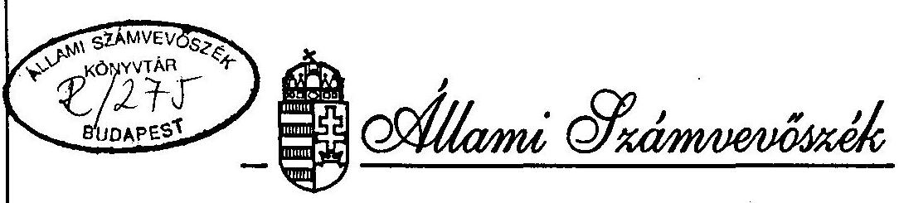
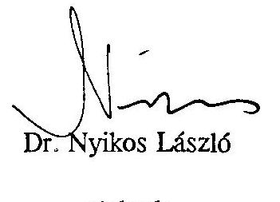
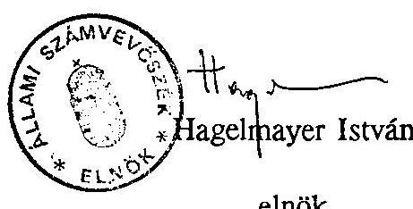

# JELENTÉS 

az Igazságügyi Minisztérium fejezet
pénzügyi-gazdasági ellenôrzésérôl

---

A vizsgálat végrehajtásáért felelós:
az ÁSZ III. Költségvetési Ellenőrzési Igazgatósága
Bihary Zsigmond igazgato

Az ellenőrzést vezette:
Hudik Zoltán osztályvezető főtanácsos
Az ellenőrzést végezték:

Belovai Sándorné számvevö
Domján Jenő
dr. Gálik Jenő
dr. Hábenczius Gyula
Kalmár István
Littomericzky Jánosné
Maczekó Károly
dr. Magyar György
Nagy Józsefné
Péntek László
Szücs Zoltán
Számely Kornél
dr. Telkes Imre
Tóth Bálint
Trenovszki István
számvevö
számvevö tandcsos
számvevö tandcsos
számvevö
számvevö
számvevö tandcsos
számvevö tandcsos
számvevö
számvevö
számvevö

---

# JELENTÉS 

## az Igazságügyi Minisztérium fejezet pénzügyi-gazdasági ellenôrzésérôl

Az Igazságügyi Minisztérium (továbbiakban: IM) költségvetési fejezet magában foglalja a minisztérium igazgatását, a bíróságokat, a szakértői intézeteket, a büntetésvégrehajtás intézményét (mint fegyveres rendvédelmi szervet). A költségvetés szerkezeti rendjébe ezáltal az igazságszolgáltatáshoz kapcsolódó, de alaptevékenységük szerint mégis eltérő szervek nyertek besorolást. A minisztérium alapvetően a jogalkotással összefüggő feladatokat látja el. Az igazságszolgáltatást az alkotmányos rendben a bíróságok gyakorolják az MK Legfelsőbb Bírósága (amely önálló költségvetési fejezet) elvi irányításával. Az igazságügyminiszter feladatköre - a bírói függetlenség sérelme nélkül - a bíróságok müködéséhez szükséges személyi és anyagi feltételek biztosítására, egyes igazgatási feladatokra korlátozódik.

Az igazságügyi szakértői intézetek tevékenységi körét az igazságügyminiszter állapítja meg, a szakértői müködés felett - a szaktevékenység szerinti illetékes miniszter szakfelügyeleti jogkörének kivételével - gyakorol felügyeletet. A büntetésvégrehajtás a szabadságvesztés-büntetés esetén hivatott biztosítani a fogvatartottak elhelyezését, őrzését és felügyeletét, anyagi és egészségügyi ellátását, továbbá gondoskodnia kell a fogvatartottak neveléséről, munkáltatásáról, képzéséről. A büntetésvégrehajtási intézetek müködését az igazságügyminiszter felügyeli.

A költségvetési gazdálkodás szempontjából további sajátosságot jelent, hogy az általános szabályozók (államháztartási, valamint költségvetési törvények és végrehajtási rendeletei) mellett a bíróságokról szóló törvény az Országos Bírói Tanács, valamint a megyei bírói tanácsok egyetértési jogát is deklarálja az éves költségvetési tervek előterjesztéséhez, illetve a bírósági költségvetés felosztásához. Kiemelhető még a büntetésvégrehajtás gazdálkodásának illeszkedése a fejezet

---

gazdálkodásához, egyrészt a fegyveres rendvédelmi szerv korábbi években gyakorolt önálló fejezeti jogosultsága, másrészt a büntetésvégrehajtási vállalatok gazdasági társaságokká történt átalakítása tekintetében.

A társadalmi változást követően a jogállamiság megvalósítása, az Európa Tanács keretében elfogadott ajánlások hazai jogrendszerben való megjelenítése a tárca jogalkotói tevékenységének folyamatos bővülésével járt. A bírói függetlenség alkotmányos elvének megerősítését jelentette a bíróságok ítélkező funkciójának és igazgatásának törvényi szabályozással megalapozott elkülönítése. Az igazságszolgáltatás korszerűsítése keretében: a megyei bíróságok szervezetébe integrálták a honvédelmi tárcától átvett katonai bíróságokat; önállóvá alakították (kamarai formában működnek) a közjegyzői és a bírósági végrehajtók szervezeteit; a jogállamiság elvárásaihoz közelítették az igazságügyi szakértőkre vonatkozó szabályokat, a szakértői intézetek gazdálkodását leválasztották a bíróságok gazdálkodásától; a magyar büntetőjog és a büntetésvégrehajtási jog az európai büntető igazságszolgáltatáshoz jobban közelítő rendszerré vált, azonban a büntetésvégrehajtásról szóló törvényi szabályozás késése kedvezőtlenül hat a szervezet működésére.

Az ellenőrzés 1992. évig visszamenőleg tekintette át az IM fejezet gazdálkodását. Az éves költségvetési törvények a fejezet részére 1992-1995. években 12,3-21,2 Mrd Ft kiadási előirányzatot határoztak meg. A kiadási előirányzatokat 1993. és 1994. években módosították pótköltségvetéssel. (1993-ban: a 14,9 Mrd Ft-ot 1 Mrd Ft-tal növelve, 1994-ben: a 19,6 Mrd Ft-ot 12,2 M Ft-tal csökkentve.)

Az ellenőrzés célja volt annak értékelése, hogy az IM fejezet múködéséhez és tevékenységének fejlesztéséhez biztosított költségvetési eszközök felhasználása során a törvényességi, célszerüségi és eredményességi szempontok hogyan érvényesültek. Az ellenőrzés kitért a gazdálkodás szabályozottságára, a gazdálkodást irányító, felügyelő, ellenőrző tevékenységekre, a kijelölt intézményeknél (minisztériumi szervezet, fővárosi és hat megyei bíróság, Igazságügyi Szakértői Intézetek Hivatala, IM Büntetésvégrehajtás) a feladatok és a pénzügyi források összehangolására. Értékelésre került továbbá az IM Büntetésvégrehajtásnál a korábbi számvevőszéki vizsgálat alapján hozott intézkedések hasznosulása, a költségvetési és vállalati gazdálkodás elkülönítésének végrehajtása.

---

# I.   ÖSSZEFOGLALÓ MEGÁLLAPÍTÁSOK, KÖVETKEZTETÉSEK, JAVASLATOK 

Az új államigazgatási struktúra kialakítása már 1990. évben elkezdődött, a jogalkotási feladatok ugrásszerű növekedésével, a miniszteri feladat- és hatáskörök újraszabályozásával, a politikai és közigazgatási államtitkári funkciók bevezetésével, a változó és megnövekedett feladatokhoz igazodó minisztériumi szervezet kialakításával. Az 1990. évi szabályozások az alapokat igyekeztek meghatározni,ezt a funkciót ellátták. Az azóta történt szabályozások, a gyakorlati tapasztalatok és az ezek közötti összhang megteremtése időszerűvé teszik egyes szabályozások újragondolását, illetve korrekcióját. (Ilyen az 1990. évi XXXVIII. tv., melynek átmeneti jellegére, a köztisztviselői, közalkalmazotti stb. törvényekkel összhangba hozására már a tv.indoklása is utalt.)

A minisztérium 1992-94. évi szervezet átalakításai tartalmaztak célszerűtlen elemeket is, a változtatásokat feladatelemzések általában nem készítették elő. Az 1995. évi átszervezésnél a kifogásolható megosztottságok többsége megszüntetésre került. Nem teljesen rendezett még a bírósági létszám és bérgazdálkodás fejezeti kezelése, hosszabb időt igényel az IM Büntetésvégrehajtás (továbbiakban: IM Bv) fejezeti gazdálkodásba illeszkedése (a szakmai és gazdálkodási felügyelet, irányítás összhangjának kialakítása).

A központi költségvetési gazdálkodás 1990-es évek elejétől formálódó rendjében (költségvetési, államháztartási, számviteli törvények) a tárca már nem szorgalmazta a gazdálkodásának belső részletes szabályozását, a figyelemfelhívás és az egységes értelmezés céljából a körleveles tájékoztatást tartotta elegendőnek. Az egyes költségvetési szerveknél szerzett ellenőrzési tapasztalatok (hiányosságok) azt támasztották alá, hogy az egyes területek jogszabályban biztosított önállóságát nem sértő fejezetszintű gazdálkodási szabályzat (hatáskörök, felelősségek meghatározásával) hatékonyabb eszköze lenne a gazdálkodásnak. A központi kezelésbe vont költségvetési előirányzatok felhasználásának, pénzügyi lebonyolításának (kötelezettségvállalás, ellenjegyzés) módosítása a tárca jogszabálytól eltérő gyakorlata miatt szükséges.

A hatályos szabályozási keretek között számos ellentmondás feszül a Bíróság - mint önálló hatalmi ág - gazdálkodása körül, ami az igazságügyminiszter

---

feladatait illetően alkotmányos vitához is vezetett. (Az Alkotmánybíróság a kifogások általános jellegére tekintettel helybenhagyta a miniszter részére meghatározott bíróságokkal kapcsolatos igazgatási feladatokat, de nyitva hagyta ezen feladatok körének törvényhozó általi mérlegelését.) A fejezet költségvetésében a Bíróságok cím a megyei (fővárosi) bíróságokat és a helyi bíróságokat mint önálló, illetve részben önálló költségvetési szerveket foglalja magában. A költségvetési gazdálkodás elóírásainak (Áht és végrehajtási rendeletei, számviteli törvény stb.) betartásáért a fejezeti felügyeleti szerv a felelős, ezzel szemben a bíróságokról szóló törvény (továbbiakban: BSZ) pénzügyi-gazdasági felelősség nélküli egyetértési jogot biztosít az Országos Bírói Tanácsnak (továbbiakban: OBT) és a megyei bírói tanácsoknak. Ha a tárca adott esetben felvállalja az OBT egyet nem értését, attól még az. Országgyűlés a költségvetés megszavazásánál figyelmen kívül hagyhatja azt (pl. 1995. évi költségvetés elfogadása).

Sem az Áht végrehajtási rendelete, sem a BSZ-ben biztosított egyetértési jog nem érvényesülhetett a megyei bíróságoknál, mivel költségvetésüket - gazdaságossági megfontolásokból - nem bontják meg a helyi bíróságok szerint. Ebben az OBT gyakorlatot közelítő - állásfoglalása nem helyettesítheti a törvényi szabályozás betartását, vagy indokolt esetben a módosítását. Logikusnak tűnik, hogy az OBT beleszólást igényel egyes operatív gazdálkodási feladatokba (pl. lakáscélú munkáltatói támogatás), de akkor rendezni kell ennek jogszabályi hátterét.

Az IM Bv az 1960-as évektől az igazságügyi tárca szakmai felügyelete alatt áll, fegyveres testületi jellegére tekintettel azonban önálló és az általánostól eltérő gazdálkodást folytathatott. A költségvetési gazdálkodás szabályainak módosítását követően (1990. évi CIV. tv., Áht) továbbra is elkülönülten (fejezetként) gazdálkodott, így csak formálisan képezte az IM fejezet címét az állami költségvetésben. Ehhez hozzáajárult az is, hogy a pénzügyi tárca is elkülönítetten kezelte (esetenként kezeli). Az IM Bv címrendjének megfelelő (önálló költségvetési szerv szerinti) besorolása 1994. évben megtörtént, de erről az előírástól eltérően alacsonyabb helyettes államtitkári, illetve országos parancsnoki - szinten intézkedtek (137/1993. (X.12.) Korm.rend.). Az IM Bv belső gazdálkodási rendje jelentős korszerűsítést élt meg, az 1994. évben kiadott új szabályzata részleteiben még tovább bővíthető.

Az IM Bv alaptevékenységi feladatát, a fogvatartottak foglalkoztatását, munkáltatását részben a költségvetési, részben a vállalkozási szférában hajtja végre. A bv vállalatok gazdasági társaságokká (Kft) alakításával megoldást nyert a korábbi ÁSZ vizsgálatoknál is kifogásolt probléma, az intézeti és vállalati gazdálkodás

---

elkülönítése. (Nem átgondolt intézkedések következtében ideiglenesen részvénytársaság létrehozására is sor került). Lényegében az átalakulással sem oldódott az állami feladat végrehajtásának (fogvatartottak foglalkoztatásának) és a piacképesség elérésének ellentmondásossága. Labilisnak tekinthető - jogszabályi rendelkezés hiányában - az állami feladat biztonságát a Kft-kel kötött megállapodásokra alapozni. A fogvatartottak foglalkoztatása részben költségmegtakarítást jelent (munkadíjuk a minimálbér kb. $45 \%$-a, tb járulékot nem fizetnek ezután). Jelentősebb azonban a többletkiadás, a szabad munkavállalók alkalmazásához képest (szakképzettség, teljesítmény, biztonsági követelmények stb.). Önmagában nem a gazdasági-társasági forma befolyásolja a munkáltatás helyzetét. A szükségszerű megoldásnak - esetenkénti, vagy normatív állami támogatással - a Kft-k életbentartása látszik.

A tárca költségvetésének tervezése - az általános gyakorlathoz igazodóan bázisszemléletű, a pénzügyi kormányzattal folytatott tervezési alkuban a fejezetgazda szerepkör főként a bírósági, kisebb mértékben a minisztériumi és szakértői intézeti többletfeladatokra tudott támaszkodni (az IM Bv önállósága miatt). Az állami költségvetés egészére jellemzően a kiadási előirányzatok nagyobb hányada a bér és tb járulék, az ezekhez kapcsolódó törvényi előírásokra tekintettel a tervezés az IM fejezetnél különösen behatárolt. A működési kiadások előirányzatai a teljes éves fejezeti költségvetésekből 90-94\%-ot tettek ki, a felújítási előirányzatok $2-5 \%$, a kormányzati beruházások előirányzatai $2-3 \%$ között alakultak. Az 1995. évi költségvetésben jelentősen csökkennek a dologi kiadásokon belül a készletbeszerzésekre, karbantartásra fordítható összegek, a pénzügyi kormányzat által felújításokra előírt $40 \%$-os csökkentés mind rontják a nagy ingatlan- és eszközállománnyal rendelkezők - büntetésvégrehajtás, bíróságok, szakértői intézetek - gazdálkodási pozícióit.

Átfogó rendezést igényelne a tárca saját bevételeinek kezelése. A bevételek nagyobb részének forrása - a bíróságokon hozott ítéletek, határozatok következménye - nincs teljes összhangban a költségvetési gazdálkodás elveivel (137/1993. (X.12.) Korm.rend. 11. §), indokolt lenne leválasztani a költségvetési szerv múködésével nem összefüggő bevételeket. Ebben a rendszerben az a bírósági költségvetési szerv jut kedvezőbb gazdálkodási helyzetbe, ahol több a bevételt biztosító itélet, vagy határozat.

A szakértői intézetek is bevételeikből pótolták a hiányzó támogatási forrásokat (bírósági permegelőző fázis - szerződéses túlmunkával készített - szakértői véle-

---

mények díjbevétele), de az alaptevékenységből származó bevételek - a bírósági gazdálkodástól történt leválás után - továbbra is a bíróságok bevételét növelték. Nem hanyagolható el, hogy ezek a bevételek fedezték a jogszabályok által előírt olyan feladatok ellátását, melyekhez központi támogatást nem kaptak. A költségvetési gazdálkodás tisztaságát, átláthatóságát kell segíteni a müködéssel nem összefüggő tételek állami bevételkénti kezelésével. Ezzel együtt szükséges gondoskodni a tényleges szükségletek felméréséről, ennek megfelelő költségvetési támogatás biztosításáról.

A tárca saját bevételei - jellegükből adódóan - pontosan nem tervezhetők (bázisalapon valószínűsíthetők) ilyen körülmények között, mégis jelentős túlteljesítések fordultak elő. (A mérlegelésnél szükséges figyelembe venni, hogy a tárca összes bevételének közel negyedét képezik a saját bevételek.) A túlteljesítések relatívan rugalmas lehetőséget adtak a forrásgondok áthidalására, jogszabályban biztosított fejezeten belüli előirányzat módosítások kihasználásával (ezáltal a pénzmaradvány minimalizálásával). Előfordultak 1992-93. években - a bírák és bírósági dolgozók kötelezően előírt ruhapénzének kifizetése érdekében - szabálytalan dologi kiadásokra eszközölt saját hatáskörű átcsoportosítások (bíróságoknál, de fejezeti jóváhagyással). 1994. évben tárca javaslatra a pótköltségvetési törvény legalizálta az ilyen célú átcsoportosítást. Sajátos mozgásteret biztosítottak még a PM hozzájárulásával költségvetési törvényekben előírt bevétel részeként tervezett - cégközzétételi díjakból befolyt - illetékjellegű bevételek. Ezek átfutó számlán kezelt év végi egyenlegei azonban nem kerülnek be a tárca pénzmaradvány elszámolási rendszerébe.

Az IM Bv költségvetési tervei közgazdaságilag nem voltak megalapozottak, előfordult a gazdálkodási szabályok súlyos megsértése (1992-ben visszatartott személyi jövedelemadó előleget és tb járulékot működési kiadásokra fordítottak). Felelősségrevonás lényegében nem történt (a gazdasági vezető 1 évre szóló kinevezése után nem kapott további bizalmat), a beszámoló elfogadásával a kormányzat és a parlament tudomásul vette a müködőképesség fenntartásának szükségességét. Súlyos gondokkal küzdöttek a bv vállalatok (célgazdaságok) is, nőtt az adósságállományuk. A Kormány 1992. év során kiemelten foglalkozott a bv vállalatokkal: célelőirányzatok biztosításával, adótartozás elengedésével. Ezek között indokolatlan volt a csődeljárás alatt nem álló vállalatok adótartozásának elengedése (tökerész APEH szerint $232,2 \mathrm{M} \mathrm{Ft}$ ). 1993-ban a pótköltségvetési törvény 1 Mrd Ft pótelőirányzatot biztosított, ebből a vállalati tartozásokat 1993. évben kiegyenlítették, de "értelmezési pontatlanságból" 1994. évben alaptevékeny-

---

ségi költségvetésként tervesítették. (A vállalati tartozások kiegyenlítéséhez hozzátartozott, hogy elengedésre került a Testületi Hozzájárulási Alappal szembeni 121 M Ft összegű tartozás, amihez nem kérték a felügyeleti szerv engedélyét.)

A fogvatartott munkáltatás sajátosságai a bv vállalatok támogatását igényli (okait az IM Bv bemutatta a pénzügyi tárcának), mivel az árbevételek nem nyújtanak elegendő fedezetet. A vállalati támogatások leépítése idejében azonban a pénzügyi kormányzat ezt az indoklást nem vállalta fel, inkább létszámfejlesztést támogatott, illetve konzervált más ésszerűbb megoldás helyett. (A támogatás a költségvetésben 765 fő létszámnövelésként jelent meg, ami valójában a meglévő állomány bérének költségvetésből történő megtérítését eredményezte a vállalatok számára.)Az ilyen támogatás kötött felhasználhatósága miatt nem ösztönzi a vállalatokat (Kft-ket) a takarékos felhasználásra és ezzel együtt előfordulhat céltól eltérő felhasználás (amelyekre a helyszíni ellenőrzés számításai is rámutattak). Méltányolható az IM Bv vezetésének állomány megtartása iránti törekvése a béralap növelésére, de intézkedéseik nem minden esetben voltak szabályszerűek ( 765 fó 1994. évi lecsökkentéséhez Kft-tól történő visszavezényléshez nem volt felhatalmazásuk; tb támogatást nem kizárólag az adott célra használták fel; indokolatlan szintrehozás történt a költségvetés tervezésénél stb.).

A bv vállalatok fejlesztési támogatását finanszírozták a Központi Finanszírozási Alapból, 1994. évi megszüntetésekor létrehozott ún. Kockázati Alap müködése azonban nem felel meg a költségvetési gazdálkodás előirásainak. Ugyanakkor az is megállapítható, hogy előnyei a likviditási gondok áthidalásában, a fejlesztések támogatásában jelentkeztek. Hátrányosan érintette a termékszerkezet változtatásához szükséges gépbeszerzéseket, amortizációs cseréket, hogy a törzstőke $30 \%$-ának megfelelő pénzbetétből elmaradt összesen 705 M Ft befizetése.

Az IM fejezet összkiadásai 1990-tól 1994-re háromszorosára nőttek. Ezen belül a bírósági kiadások négyszeres, a minisztériumé kétszeres, az IM Bv esetében 140\%-os növekedést mutattak, a szakértői intézetek mindössze 35\%-os kiadási előirányzat növelésben részesültek. Az arányok ilyen alakulása elsősorban a bíróságok külön törvény alapján (1990. évi LXXXVIII. tv.) elért béralap növekményének következménye (kezdő bíró, illetve megyei tanácselnök bíró havi fizetései 1990-ben 18.400 Ft, illetve 28.200 Ft, 1994. évben: 79.200 Ft, illetve 136.944 Ft ), és összefüggésbe hozható a feladatnövekedésekkel. Továbbá nem utolsó́ sorban közrejátszottak az IM Bv és szakértői intézetek forrás problémái,

---

ezek kezelésének - állami és tárcafeladatok finanszírozásának - kiforratlansága a változó társadalmi-gazdasági feltételek között.

A tárcánál foglalkoztatott állománycsoportok, köztisztviselők, közalkalmazottak, bírák, bírósági dolgozók, hivatásos állományúak, valamint fizikai munkavállalók eltérő feladataira és jogviszonyára tekintettel egységes bérgazdálkodás nem alakulhatott ki. Az állománycsoportok közül a hivatásos állomány bér és előmeneteli rendszere nem került még újraszabályozásra, a megoldást a több éve előkészítés alatt álló szolgálati törvény megalkotása hozhatja.

A fejezet létszám- és bérgazdálkodás szempontjából reprezentáns címei a Bíróságok és az IM Bv. A fejezet összlétszámának több mint felét ( 8 ezer fő) a bíróságok foglalkoztatják, mintegy 6300 fő a büntetésvégrehajtás állományához tartozik. (A fogvatartottak számára munkadíjat és nem munkabért számfejtenek, nem munkaviszonyban, hanem bv jogviszonyban állnak.) A bíróságok létszámgazdálkodásában érintett szakfőosztályok kimagasló létszámfejlesztést terveztek 1993. évben, de csak a töredéke realizálódott (az első változat 2241 fős létszámfejlesztési elképzelésével szemben 160 fő). Ez nemcsak a költségvetési korlátokat szemlélteti, a tervezés megalapozottságának a kérdését is felveti. Az IM Bv-nél 1993. évtől létszámfejlesztés címén ( $765+500$ fő) biztosított béralap és tb járulék összegek felhasználása utalt a számítások megalapozatlanságára. A bér- és tb járulék fedezetére kapott összeget az IM Bv-nél átadott pénzeszközként indokolt kezelni.

Az igazságügyi igazgatás korszerűsítési folyamatában szervezetileg kiváltak a közjegyzók, bírósági végrehajtók és részben az igazságügyi szakértők. A bírósági végrehajtók kiválásával tényleges létszámcsökkentés nem történt. A kivált létszám terhére az új rendszer beindítása, a fokozott ellenőrzés, kapcsolattartás a magán végehajtókkal és a nyilvántartás ellátása a bíróságokon álláshelyek létesítését igényelte. A tárca továbbra is vállalta az igazságügyi szakértés intézményi kereteken belüli végzését, az azonban további döntést igényel, hogy mit indokolt feltétlenül állami feladatként felvállalni. Ehhez célszerű a szakértői intézetek gazdálkodását átmenetileg kiemelten kezelni a felhasználható tárca források számbavételével, emellett kezdeményezhető a szakfelügyeletet gyakorló más tárcák támogatási lehetőségének igénybevétele is. Mindezek rendezése keretében felülvizsgálatot érdemel a bírák és bírósági dolgozók előmeneteléről, javadalmazásáról szóló törvényi szabályozás hatályának kiterjesztése a szakértői intézetek állományára.

---

A tárca eszközgazdálkodásában a készletbeszerzések volumenének alakulását illetően az IM Bv területe a meghatározó (összelőirányzat 81-84\%-át teszik ki), 1992-93. években túlköltekezés volt kimutatható. Az 1994. évi megtakarításokra a gazdálkodást szigorító intézkedések mellett alapvetően a fogvatartotti létszámcsökkenés adott lehetőséget (készletbeszerzések döntő hányadát az élelmiszerre fordított kiadások képezték). Jelentősek még a bíróságok irodaszer, nyomtatvány beszerzései, tendenciája a kiadások állandó emelkedését mutatta.

A nagyértékű tárgyi eszköz beszerzések a tárcán belül csak az IM Bv-nél központosítottak. Egyes gépkocsi vásárlásoknál, illetve cseréknél a takarékossági elvek háttérbe szorultak (pl. Bács-Kiskun megyei Bíróság), az IM Bv gépjármúállományának többlépcsős típus váltásánál a választást, döntéseket megalapozó dokumentációval nem rendelkeztek. A számítástechnikai eszközök alkalmazása hatékonyabb koordinációt igényel. A számítástechnika fejlődési ütemével a beszerzések nem tudtak lépést tartani (amit a korszerűségi mutatók támasztottak alá).

A szolgáltatások között kimutatott többlet kiadások főként az IM Bv és Bíróságok jelentős ingatlanállományával kapcsolatos ráfordítások növekedésével, másrészt a bíróságok, szakértői intézetek postaköltségének dinamikus emelkedésével hozhatók összefüggésbe. A Magyar Posta 1993. évtől bevezetett rendszere - tértivevényes levélpostai küldeményeket ajánlottan lehet feladni - igen érzékenyen érintette elsősorban a bíróságok költségvetését. Ha a központi költségvetés egészét tekintjük, abban kedvezőnek értékelhető, hogy a Magyar Posta a piaci viszonyok érvényesítése révén már nem igényel költségvetési támogatást. A konklúziót számítások támaszthatnák alá, milyen összegben mentesült a költségvetés kiadásoktól, ezzel szemben hogyan alakultak a többletkiadások.

A tulajdonviszonyok rendezésének, valamint a számviteli és ingatlankataszter nyilvántartások összhangjának hiányára visszavezethető okok miatt az IM fejezet ingatlanállományának hitelessége nem volt alátámasztható. A hiányosságok rendezése a jogi háttér figyelembevételével (Szvt, Áht és végrehajtási rendeletei, 1972. évi 31. tvr., többször módosított 26/1987. (VII.30.) Korm.rend., 22/1991. (IX.27.) PM rendelettel módosított 8/1991. (III.6.) PM rendelet) és egységes értelmezéssel - fejezeti koordinálással - végrehajtandó feladat. Más tárcáknál szerzett hasonló ellenőrzési tapasztalatokra tekintettel meg kell jegyezni, hogy több objektív tényező is hátráltatja a számviteli előirások érvényesülését a fejezetek ingatlan- és lakásgazdálkodásában (eltérő ingatlan értékelések, egységes

---

értelmezés hiánya a vagyonértékủ jogok számviteli megjelenítésében stb). Mindezek felvetik az ingatlangazdálkodással összefüggő számviteli előirások egyszerűsítési lehetőségének megvizsgálását, természetesen a vagyonvédelem szem elôtt tartásával.

Az ingatlanállomány múszaki állapotának felmérésében végzett fejezet szintű tevékenység a legszükségesebb feladatokról objektív képet adott. Az ingatlannyilvántartások bizonytalanságainak tisztázása mellett feltétlenül indokolt még az állagminősités teljeskörüvé tétele. Az ingatlan felújítások előíásszerűen az önálló költségvetési szervek hatáskörébe tartozó feladatok, de a takarékosabb gazdálkodást segíti a tárcánál is alkalmazott központosítás. A felújítások, beruházások központi kezelésének belső szabályozásával, a feladatkörök és a felelősségi szintek részletes behatárolásával lehet javítani az ingatlangazdálkodás végrehajtásán és ellenőrzésén. Előfordultak a kellő gondosság hiányára utaló esetek (pl. a Fővárosi Bíróság részére eszközölt ingatlanvásárlás és felújítás - a gyors elhelyezésre történt hivatkozással), önálló gazdálkodói szinten szabálytalan pénzügyi elszámolások (Tolna megyei Bíróság építési beruházásánál és a Dombóvári Városi Bíróság bútorzatának pótlásánál, cseréjénél).

A fejezet lakásállományának dőntő része az IM Bv használatában áll, cz, illetve a büntetésvégrehajtás elkülönült gazdálkodása nem adhat mentességet a központi nyilvántartás vezetése alól (a lakásoknak kimutatott vagyonértéke nem volt, erről egységes értéknyilvántartást nem vezettek). A lakástámogatás előirányzatai is teljes egészében az IM Bv címen jelentek meg, de a fejezet ezen felül képezett lakáscélú munkáltatói támogatásra pénzügyi keretet. Ezek felhasználásában a dolgozók lakástámogatásának tárcán belüli eltérő kezelése, a megyei bíróságok sajátos lakástámogatási gyakorlata egyaránt szükségessé teszik a fejezeti lakásgazdálkodás összhangjának megteremtését.

A számviteli rendelkezések változásait tárca szinten előíásszerűen kezelték, ezek értelmezését körlevelek kiadásával igyekeztek egységessé tenni. Az önállóan gazdálkodó szervek (bíróságok) számlarend szabályzattal általában nem rendelkeztek (a helyi sajátosságoknak megfelelő kiegészítést nem végezték el), ezért a személyi feltételektől nagy mértékben függő - szabályos, illetve szabálytalan gazdálkodással találkozott a helyszíni ellenőrzés. A felesleges vagyontárgyak hasznosításának, selejtezésének, valamint a leltározás rendjének szabályozása csak az 1994-95. években gyorsult fel. A leltározás szabályozatlansága mellett a koordinációs együttműködés hiánya, továbbá a felügyeleti ellenőrzés realizálá-

---

# II.   A VIZSGÁLAT FŐBB MEGÁLLAPÍTÁSAI 

## 1. A feladatok, a szervezeti rendszer és a gazdálkodási feltételek összhangja

A társadalmi-gazdasági változások következtében - a központi költségvetésből gazdálkodó szervezetek között - a feladatváltozások (bővülések) terén egyik legérzékenyebben érintett terület az IM költségvetési fejezethez sorolt szervezetek, testületek tevékenysége.

### 1.1. Feladatokban, szervezetben bekövetkezett változások

Az IM fejezetet alkotó címek költségvetési gazdálkodást folytatő szervezeteinek - minisztérium, bíróságok, szakértői intézetek, büntetésvégrehajtási intézmények alaptevékenységét a rendszerváltás különböző módon és mélységben érintette. Így a vizsgált időszakot megelőzően megkezdődött az új államigazgatási struktúrát tükröző minisztériumi szervezet kialakítása, a változó és megnövekedett jogalkotási feladatokhoz történő szervezeti igazodás.

Az igazságügyminiszter feladata és hatásköre Kormányrendeletben (41/1990. (IX. 15.) Korm.rendelet) került szabályozásra. Erre az időszakra esett a politikai, valamint közigazgatási államtitkári funkciók bevezetése (1990.évi XXXIII. tv. alapján). A tárcát érintő feladatbővülések, szervezeti változások folytatódtak, azokat a 10/1992. IM utasítással közzétett Szervezeti- és Müködési Szabályzatban (SZMSZ) rögzítették. A minisztérium szervezeti struktúrája továbbra sem jutott nyugvópontra, 1994. évben két alkalommal és 1995. évben ismét módosították az SZMSZ-ét.

A minisztérium felső vezetése alá rendelt egyes hivatali egységek (Sajtó Titkárság, Alkotmányelókészítő Titkárság, Oktatási és Továbbképzési Főosztály) besorolása a hatályos átmeneti törvényi szabályozás (1990. évi XXXIII. tv.) alapján vitatható. Eszerint e szervezetek szakmai tevékenysége jobban kapcsolódik a közigazgatási államtitkár irányítása alatt álló hivatali apparátushoz, mint a miniszter, vagy politikai államtitkár közvetlen alárendeltségéhez. Más szabályozást is figyelembe véve (1992. év XXIII. tv. 6. § (1) bek. és 112/1992. (VII.7.) Korm.rendelet) a minisztérium köztisztviselői tekintetében fő szabályként a közigazgatási államtitkárt illetik a munkáltatói jogok, de a Kormány tagja által

---

irányított központi közigazgatási szervnél a miniszter gyakorolja a munkáltatói jogkört az SZMSZ szerint alárendelt szervezeti egységek köztisztviselői tekintetében. Az 1990. évi XXXIII. tv. indoklása utal a később hatályba lépő jogszabályokkal történő összehangolás igényére (ezért volt átmeneti szabályozás), a tapasztaltak ennek időszerűségét támasztják alá.

A helyettes államtitkárok feladatainak meghatározásánál a törvényi szabályozásnak megfelelően jártak el, de a létszámuk változott, (1992. júniusáig 4 fő, 1994. januárjáig 3, ezt követően ismét 4 fő). Az álláshelyek bevezetését, illetve megszüntetését a feladatok részletes elemzésével nem alapozták meg. A költségvetési gazdálkodás felügyeleti irányítása az SZMSZ szerint alapvetően egy kézben van (IV.sz. helyettes államtitkár hatásköre). A büntetésvégrehajtásnál létrehozott gazdasági társaságokra vonatkozó miniszteri (tulajdonosi) hatáskört ugyanakkor másik (I. számú) helyettes államtitkárhoz utalták, a büntetésvégrehajtás szakmai felügyeleti hatáskörével együtt. A gazdasági társaságok részére biztosított költségvetési támogatások figyelemmel kísérését a hatáskörök ilyen megosztása nehezíti.

A minisztériumi átszervezések eredményeként 1992-94. években átmenetileg ún. hivatalok funkcionáltak, a közigazgatási államtitkár közvetlen irányítása alatt (az Igazgatási, az Igazságszolgáltatási, valamint a Pénzügyi Hivatal). Jogállásukat az SZMSZ nem tartalmazta, gyakorlatilag a főosztályokkal azonos jog- és hatáskörrel rendelkeztek. A korábbi szervezeti egységek (főosztályok, önálló osztályok) elnevezése főosztályi jogállással ügyosztályra módosult. Az egyes hivatalok feladatmeghatározása célszerütlen elemeket is tartalmazott (pl. a Pénzügyi Hivatal fejezetszintű tervezési, gazdálkodási, beszámolás irányítási hatásköre a Bv OP-re nem terjedt ki; a fővárosi, megyei bíróságok költségvetési gazdálkodásának fejezeti felügyelete megosztott volt az Igazságszolgáltatási és Pénzügyi Hivatal között, szervezetileg különválasztották a szintetikus és az analitikus nyilvántartás feladatainak végrehajtását; a számítástechnikai és informatikai fejlesztés tárcaszintű koordinálása és a kapcsolódó tevékenységek is több szervezeti egység feladatát képezte).

A minisztérium 1995. évi újabb átszervezésénél visszatértek a főosztály struktúrához, feladatösszevonásokkal a kifogásolt megosztottságok többsége megszüntetésre került (könyvvitel, informatika, anyagi-müszaki terület irányítása stb.)

Célszerünek látszik további felülvizsgálat alá vonni: a Bv OP felügyeletét ellátó szervezet létszámát, múködési költségvetésének beillesztését a minisztérium gazdálkodásába, valamint a bíróságok létszám- és bérgazdálkodását. A tárcánál új

---

elemmel bővült a döntéselőkészítés rendszere a Miniszteri Tanácsadó Testület intézményének bevezetésével, mely esetileg müködve hatékonyan segítheti a tárcaszintủ döntések hozatalát.

A jogállam megvalósításának fontos feladata volt a bíróságokról szóló törvény többlépcsős módosításával a bírák ítélkezésében és a bírói szervezetben elfoglalt helyének, jogainak, kötelességeinek, függetlenségük biztosítékainak rendezése. Megváltozott az igazságügyminiszter, illetve a minisztériumi szervezet funkciója (1989.évi XLII. tv., a bíróságok igazgatásában 1992-től fontos szerep jutott a megyei (fővárosi) bírói tanácsoknak és az Országos Bírói Tanácsnak).

Az új feladatok ellátását segítette a bírói álláshelyek számának - 1990-1994. közötti $23 \%$-os - növelése (1994. év végére: 2199 fő), a nagyobb számú bírósági alkalmazottak létszámának kisebb mértékủ növelése mellett (1994. év végén: 5874 fó). A soron következő jogszabályi változásokra tekintettel a tárca további létszámfejlesztésekkel számol. A bíróságok feladatának és hatáskörének bővülését az infrastruktúra fejlesztése fáziskéséssel követte. A megnövekedett feladatokra tekintettel, valamint a törvénnyel létrehozott új bíróságok elhelyezésére több mint 40 ingatlan került térítésmentesen a bíróságok használatába, a költségvetési források fokozatosan tették lehetővé az épületek bírósági célra történő átalakítását, üzemeltetési feltételek biztosítását, további ingatlanok vásárlását.

Az igazságügyi igazgatás területén a szakértői hálózat intézményrendszerét kisebb, főként gazdálkodást érintő módosítás érte, és kiváltak az igazságszolgáltatás szervezetéből a közjegyzök, valamint bírósági végrehajtók. A tárca továbbra is vállalta az igazságügyi szakértés IM alá tartozó intézményi kereten belüli végzését és átszervezéssel létrehozta az Igazságügyi Szakértői Intézetek Hivatalát (1992-től a Hivatal és az intézetek ténylegesen önálló költségvetési címként gazdálkodtak). Az átszervezésnél a tevékenység átvilágítására (figyelembe véve az Országos Szakértői Kamara létrehozását, funkcionálását is), továbbá az ellátásához szükséges költségvetés reális megállapítására nem került sor. Nem nélkülözhető annak felmérése, hogy a szakértői tevékenységet mely szakterületen és milyen mértékben lehet, illetve kell állami feladatnak felvállalni.

A büntetésvégrehajtás alaptevékenységében értelemszerűen lényeges változás nem következett be, előrelépés történt viszont a költségvetési és vállalati gazdálkodás elkülönítésében a büntetésvégrehajtási vállalatok gazdasági társaságokká alakításával. A büntetésvégrehajtás megfelelő szervezetének és múködésének kiala-

---

kításához szintén elengedhetetlen az állami feladatok és feltételrendszerének deklarálása, ezt még hátráltatja a törvényi szabályozás hiánya.

# 1.2. A tárca költségvetési gazdálkodásának szabályozottsága, irányítása, felügyelete 

Az IM és a felügyelete alá tartozó költségvetési szervek gazdálkodása a vizsgált időszakot megelőzően részletesen szabályozott volt, amelyben a büntetésvégrehajtás (fegyveres testületi jellegére tekintettel) szabályozása elkülönült. 1992-től a költségvetési gazdálkodás törvényi szabályozásában bekövetkezett változtatások, valamint a dereguláció a tárca belső gazdálkodási rendelkezéseit többségében érvénytelenné tették. Egyrészt a hatálytalanítás, másrészt az újraszabályozás hiánya következtében a gyakorlatban a régi szabályok fennmaradtak. Az újraszabályozást a tárca nem szorgalmazta, a gazdálkodási gyakorlatban a jogszabályok általános alkalmazása terjedt el. Ezek megjelenéséről, a végrehajtandó feladatokról, követelményekről a fejezetgazda körlevelekben, értekezletek útján tájékoztatta a tárcairányításhoz tartozó költségvetési szerveket. Előnyösen segítené a fejezetszintű gazdálkodást - az egyes területek jogszabályokban biztosított önállóságát nem sértő - gazdálkodási szabályzat kiadása.

Késett az IM Bizonylati Szabályzat kiadása, valamint a költségvetési szervek rendelkezése alatt álló lakásokra vonatkozó - miniszteri hatáskörbe tartozó szabályozás. Ez utóbbi esetében a miniszteri rendelet csak a büntetésvégrehajtás területét érintette, az IM más területét nem. A rendelet megalkotása alól a Kormány felmentést adhat, de a tárca a helyszíni ellenőrzés befejezéséig ilyen igényt nem jelzett. A törvényes határidő 1994. Ol. Ol-jén járt le (1993. évi LXXVIII tv. 87. § és 93. §), felmentést a 1038/1995. (V.10.) Korm. határozat adott.

A felújítási, beruházási keretek felhasználása terén - az erős központosítás érvényesítése miatt - a kötelezettségvállalók körét szűkítették. A szabályozott engedélyezési eljárásra (OBT véleményezés, egyetértés, miniszteri jóváhagyás) tekintettel a kötelezettségvállalás 1994. évtől bevezetett korlátozása (helyettes államtitkári szintre emelése) nem látszik indokoltnak. Nem felel meg a hatályos előírásnak - az éves költségvetésben (fejezet 5. címen) jóváhagyott felújítási előirányzatok felhasználásánál - a kötelezettségvállalás és ellenjegyzés gyakorlata (137/1993. (X.12.) Korm. rend. 27. §). Tárcaintézkedés alapján a megyei (fővárosi) bíróság, vagy a szakértői intézet kötelezettségvállalásra feljogosított vezetője volt az aláíró a tervezési, kivitelezési szerződésben (a bíróság költségvetésében az

---

előirányzat, illetve a fedezet nem szerepelt), az ellenjegyzést (kevés kivétellel) csak a tárca feljogosított szakfőosztálya végezte. Ezért a központi kezelésbe vont költségvetési előirányzatok felhasználásának, pénzügyi bonyolításának tárcánál történő újraszabályozása szükséges.

A fejezethez sorolt költségvetési címek számára az általános jogszabályi előirásokat meghaladó - részletesebb információt biztosító - adatszolgáltatási kötelezettséget nem írtak elő. Az intézmények pénzügyi helyzetének figyelemmel kísérése a negyedéves, (1994-től) havi pénzforgalmi jelentések feldolgozásával valósul meg. Részletesebb elemzéseket (kiemelt előirányzat kiadást, illetve bevételt jellemző tendencia stb.) alkalmanként végeztek.

A számítástechnikai és informatikai fejlesztések - beszerzések, térítésmentes átvétel, PHARE segélyprogram keretében - több területet (cégbíróságok, jogszabály nyilvántartást, adminisztráció korszerűsítés, gazdasági szervezetek adatfeldolgozása) érintettek. A hatályos rendelkezést (1039/1993.) (V.21.) Korm. hat.) figyelembe véve összeállításra került az IM informatikai célkitűzése. A megfogalmazott elképzelések megvalósításának kritikus elemeként vették számításba a pénzügyi korlátokat. Kifogásolható, hogy ilyen hivatkozással a stratégiai tervezés komplex folyamatának kidolgozását már nem tartották indokoltnak. A feladatok és hatáskörök széttagoltságával is összefüggésbe hozható, hogy a gazdasági területeket is átfogó egységes fejlesztési koncepciót a tárca nem alakított ki. Fejezeti ajánlások (szabályozás) hiánya miatt a gazdasági szervezetek eltérő paraméterű technikai háttérrel és szoftverrel rendelkeznek.

A fejezet költségvetésében a Bíróságok cím több önálló költségvetési szervet foglal magába. A hozzá tartozó önálló és részben önálló költségvetési szervek (megyei bíróságok, illetve helyi bíróságok) gazdálkodási tevékenységének koordinálása a minisztériumi szervezet egységeinek feladat- és hatáskörébe tartozik. A bíróságokról szóló törvényben - országos, illetve megyei bírói tanácsok részére meghatározott költségvetési gazdálkodással kapcsolatos egyetértési jogok gyakorlásához pénzügyi-gazdasági felelősség nem tartozik. A költségvetési gazdálkodás előírásainak betartása, betartattatása a fejezeti felügyeleti szerv vezetőjét terheli. Ez számos ütközés forrása, ami a fejezeti (közte a bírósági) költségvetés - OBT egyetértését nélkülöző - parlamenti elfogadásában csúcsosodott.

Az Áht alapján a megyei (fővárosi) bíróság elnöke - mint önálló költségvetési szerv vezetője - egyszemélyi felelős, az igazságszolgáltatás feladatainak végrehajtását,

---

a költségvetés tervezését, beszámolását és ellenőrzését szakmai, valamint gazdasági szervek tevékenységének irányításával biztosítja. A helyszíni ellenőrzés adatai, tapasztalatai szerint a megyei bíróságok (kevés kivétellel) nem osztották fel költségvetésüket a helyi bíróságok (részben önálló költségvetési szervek) között. Ezáltal sem a költségvetési gazdálkodás előírásai (139/1993. (X.12.) Korm.rend. - elemi költségvetés, beszámoló, adatszolgáltatás készítése), sem a bíróságokról szóló törvény (BSZ) - megyei bírói tanácsok egyetértési jogára vonatkozó rendelkezései nem érvényesülhettek. A hatályos szabályozástól eltérő gyakorlattal az OBT is foglalkozott. Állásfoglalásával a rendelkezést szándékozta a gyakorlathoz közelíteni, ez azonban az elemi költségvetés és beszámoló készítésének kötelezettsége alól nem adhat mentességet.

Az országos, illetve megyei bírói tanácsok egyetértési jogának gyakorlásához biztosított időtartam ( 30 nap) meghaladja a fejezet számára Áht által meghatározott határidőt ( 20 nap), mely alatt a felügyeletéhez tartozó önálló költségvetési szervek felosztott költségvetési előirányzatait vissza kell igazolni. Összességében a bíróságok gazdálkodásával kapcsolatos szabályozási anomáliák a törvényi, jogszabályi háttér mielőbbi összehangolását igénylik. Pontosítani célszerú az önálló és részben önálló költségvetési szervek költségvetési gazdálkodási feladatait.

Az OBT egyetértési jogosítványát sajátosan - a BSZ, illetve a végrehajtására kiadott miniszteri rendelet szellemét meghaladóan - az operatív gazdálkodáshoz kapcsolódva érvényesítették a tárca lakásgazdálkodásánál, a lakáscélú munkáltatói támogatásánál. Alapvetően a munkáltatói támogatás rendszere igényel korszerűsítést, ehhez igazodóan szükséges a szabályozás korrekciója.

A büntetésvégrehajtás az 1960-as évek elején került az igazságügyi tárca felügyelete alá. A pénzügyi szabályozás a fegyveres testületi besorolásra tekintettel az 1980-as években az általánostól eltérő gazdálkodást engedélyezett. (1979. évi II. tv., 107/1981. PM utasítás). Az IM Bv ezek alapján rendelkezett fejezeti jogosítványokkal (fejezeti pénzellátási számlával, bevételi számlával). Az 1990. évi szabályozás már áttételesen, nem direkt módon tekintette fejezetnek a testületet (12/1990. (V.22.) PM-HM együttes rendelet), továbbra is biztosított volt a közvetlen pénzellátás.

A költségvetési gazdálkodás szabályainak módosításával meghatározásra került a fejezeti jogkör gyakorlása is (1990. évi CIV. tv., az Áht és végrehajtási rendeletei 1992-93. években). A büntetésvégrehajtás azonban 1994. májusáig (helyettes

---

államtitkári állásfoglalás megjelenéséig) fejezetként gazdálkodott, annak ellenére, hogy 1991. évvel kezdődően az IM fejezet címeként szerepelt az állami költségvetésben. Miniszteri feladatot képezett volna az IM Bv önálló és részben önálló költségvetési szerveinek besorolása, a helyettes államtitkári állásfoglalás és országos parancsnoki intézkedés helyett (137/1993. (X.12.) Korm.rend. 2. § és 6. §). A testület pénzellátási számlája megszüntetésre került, de a bevételi és letéti számlák megszüntetését csak a helyszíni ellenőrzés időszakában tették folyamatba. (A bevételi számla 1995. 03. 02-án megszűnt, a letéti számla 1995. 12. 31-i megszüntetéséről intézkedtek.) Ezt követően a fejezeti jogosítványt törvényesen már az IM gyakorolja, de a pénzügyi tárca gyakorlatában továbbra is előfordul a büntetésvégrehajtás elkülönülő kezelése. (PM Biztonság-gazdasági Osztályának közvetlen tervegyeztetései, adatszolgáltatási igényei stb.).

Az IM Bv költségvetési szervei közül az igazságügyminiszter által 1991-ben alapított Bv Központi Ellátó Intézet (KEI) nem felelt meg az önálló költségvetési szerv kritériumának. (4/1991. (II.13.) PM rend., 137/1993. (X.12.) Korm.rend.). Részben önálló költségvetési szervvé visszasorolták, de az alapítást elrendelő utasítás tovább él. A KEI szerepe a büntetésvégrehajtás gazdálkodásában jelentős, felügyeleti, irányítási jogkörének meghatározása azonban hiányzik az IM Bv SZMSZ-éből, amit pótolni kell.

Az IM Büntetésvégrehajtás gazdálkodásában egyfelől az országos parancsnokságon, valamint az intézeteknél korábban működő anyagi-technikai szolgálatok tevékenységét meghatározó szabályzat (ÁGSZ) volt az irányadó, e szolgálati ág és a pénzügyi szolgálat 1992. évben történt összevonásáig. Másfelől a költségvetési gazdálkodást az intézetek költségvetési és pénzgazdálkodásáról szóló (1985-től hatályos) országos-parancsnoki intézkedés szabályozta. A bekövetkezett változások a szabályozásokat elavulttá tették, hatálytalanításuk késett (az IM Bv OP intézkedése 1994-ben került hatályon kívül, az ÁGSZ hatálytalanítását a helyszíni ellenőrzés időszakában tették folyamatba). A kettős könyvvitelre történt átállással egyes tevékenységek szabályozásra kerültek, de a gazdasági jellegű tevékenységek új, átfogó jellegű szabályozására nem került sor. A bv intézetek költségvetési gazdálkodását szabályozó új országos parancsnoki intézkedés (O299/1994. IM Bv OP int.) nem olyan részletezettségű, hogy abból az IM Bv gazdálkodási rendjét teljeskörűen le lehet vezetni.

A tartósan állami tulajdonban maradó vállalkozói vagyon kezeléséről, illetve ilyen gazdálkodó szervekről szóló rendelkezések (1992. évi LIII. tv., 126/1992. (VIII.18.)

---

Korm.rend.) a bv vállalatok gazdasági társasággá alakítását is előirták. A tárcánál miniszteri biztos irányításával hajtották végre az intézeti és vállalati vagyon szétválasztását (1993. év végi mérleg alapján). A létrehozott Kft-k közremüködését az állami feladatokban a bv intézetekkel kötött megállapodás hivatott biztosítani. Nem kellően átgondolt intézkedésekre enged következtetni a Büntetésvégrehajtási Vállalkozási Rt létrehozása (a miniszteri biztos - Rt vezérigazgató - IM Bv parancsnok helyettesi funkciók egyszemélyi betöltése, Rt nyereségérdekeltségének szerepe). Az Rt létrehozása az okmányok alapján szabályosan történt, egyes kiadásainak elszámolásánál azonban nem kellő gondossággal jártak el (a 10 M Ft alaptőke és egyéb kiadások helytelenül az IM Bv-t terhelték). A felemás helyzet megoldását jelentette az Rt miniszteri határozattal történt jogutód nélküli megszüntetése (1/1994. (VIII.24.) IM sz. határozat).

A Kft-k megalakítása óta eltelt idő tapasztalatai szerint megállapítható, hogy az átalakulás önmagában nem rontotta és nem javította a gazdálkodást. A fogvatartottak foglalkoztatásának állami feladat jellegének szem elött tartásával legtakarékosabb megoldásnak tekinthető a Kft-k életbentartása esetenkénti, vagy normatív támogatással. Az IM Bv szervezeti müködési rendjét célszerű módosítani, mivel az OP a Kft-k felügyeletét ellátó (de szervezetileg IM Bv-hez tartozó) Gazdasági Társaságok Főosztály szakmai munkáját nem irányíthatja.

# 2. A költségvetés tervezése és finanszírozási rendszere 

A költségvetési gazdálkodásban 1991. évtől meghatározóvá vált a címrend szerinti tervezés. Az IM fejezet címrendi tagozódása - az IM Igazgatása, Bíróságok, Szakértői Intézetek, IM Büntetésvégrehajtás, Fejezeti kezelésű előirányzatok - a vizsgált időszakban nem változott. A címrendi megjelenítéstől azonban eltérő gyakorlatot folytattak 1994. májusáig az IM Bv önálló, elkülönített "fejezeti" gazdálkodására tekintettel.

Az IM fejezet gazdálkodás szempontjából reprezentáns címei a Bíróságok és az IM Bv a fejezet kiadási előirányzatainak mintegy $95 \%$-át jelenítik meg, közel fele-fele arányában. A bírósági kiadás dinamikus növekedésének következményeként 1992. évtől meghaladták az IM Bv előirányzatait (1995-ben már 1,5 Mrd Ft-tal). A bíróság a vizsgált időszakban 6-11 Mrd Ft nagyságrendű összegekkel gazdálkodott, az IM Igazgatás cím éves kiadási előirányzatai 3OO-6OO M Ft körül mozogtak, a szakértői intéztek éves költségvetése csak közelítette a 3OO M Ft-ot.

---

A tárca költségvetésének tervezése - az állami költségvetéssel szinkronban alapvetően bázisszemléletű. Nagy szerepe van a PM-mel folytatott tervezési alkunak. Az előző évhez képest jelentkező bizonyítható többletfeladatok alapján kimunkált előirányzat szükségletek a minisztériumi vezetés ráhangolódásán, illetve képviseletén keresztül jutnak Kormány, majd parlamenti döntés elé. A fejezetgazda szerepkör az IM Bv esetében csak a vizsgált időszak utolsó évében kezdett erősödni, a felügyeleti és a költségvetési szerv hatékonyabb együttmüködésére van szükség a továbbiakban. (Az IM Bv gazdálkodását érintő kérdésekben ennélfogva a fejezetirányítás szerepe háttérbe szorult.)

A tárca - az említett sajátosságok miatt - elsősorban a bírósági, kisebb mértékben a minisztériumra és szakértői intézetekre háruló feladatokkal összefüggésben tudott korlátozott összegű fejlesztési többletet elérni. A bizonyítható többletfeladatok mellett évek óta a költségvetés belső szerkezetének átrendezésével kellett fedezni az egyes kiadási csoportokat különböző módon érintő áremelkedéseket. A tárca a BSZ előírásainak figyelembe vételével igényelte az Országos Bírói Tanács véleményét is, de érvényesülésének akadálya - az Áht és a BSZ ellentmondásossága következtében - az OBT egyet nem értése esetén van. (A PM tervezési irányelveinek megfelelően elkészített 1995. évi tervjavaslattal az OBT nem értett egyet, indoklásra, bemutatásra került az OGY részére, de a költségvetési törvény elfogadásánál nem vették figyelembe.)

A költségvetés nagyobb hányadát (hasonlóan más tárcákhoz) a bér és tb előirányzatok képezik. A köztisztviselők, közalkalmazottak jogállásáról szóló törvények behatárolják ezen a téren a gazdálkodást, de a bírák, bírósági dolgozók előmeneteléről és javadalmazásáról szóló 1990. évi LXXXVIII. törvény egyértelmú besorolásaival tovább szükítette a beavatkozási lehetőségeket (megjegyezve, hogy lényegesen kedvezőbb helyzetet biztosított). Ezek is alátámasztják a költségvetés tervezésének a tárca részéről a többletfeladatok hangsúlyozását.

A bíróságokat érintően kimagasló fejlesztési igény kimunkálására került sor 1993. évben (I. változat 2241 fős létszámfejlesztés, 11,8 Mrd Ft; II. változat 1119 fős létszámfejlesztés, 4,7 Mrd Ft), ezzel szemben lényegesen kisebb fejlesztési támogatást fogadtak el, mindössze 160 fős létszámfejlesztés mellett. Ez jelzi a költségvetési források korlátait, ugyanakkor a terv és tényszámok eltérésének nagyságrendje a megalapozottságot is kétségessé teszi.

---

A fejezet költségvetési támogatás előirányzatainak 10\%-a körüli saját bevétel előirányzatokat terveztek, a teljesítési adatok az eredeti előirányzatok kétszeres összegét közelítették (1992: 3,1 Mrd Ft, 1993: 2,5 Mrd Ft, 1994: 2,8 Mrd Ft). Ezek adtak fedezetet olyan esetekben, amikor pl. a jogszabályokban megjelenő újabb feladatok nem jártak az állami támogatás növelésével. Az alaptevékenység támogatás értékủ bevételeinek jelentős része a bíróságokon hozott ítéletek, határozatok következménye, mely összegek a bíróságok költségvetésébe folynak be. A bevétel jellegéből következik, hogy pontosan nem tervezhető, a bírói függetlenség kizárja bármilyen irányú befolyásolhatóságát, ugyanakkor elmaradása korlátozná a már jóváhagyott kiadási előirányzatok teljesítését is.

A gyakorlatban a saját bevételek túlteljesítése fordult elő, aminek felhasználásában a minisztérium és a bíróságok érdeke azonos. A jogszabályban (137/1993. (X.12.) Korm.rend. 16. § és 35. §) felügyeleti szerv részére biztosított előirányzatmódosítási lehetőség kihasználása esetén a pénzmaradvány elszámolásánál csak a módosított előirányzat feletti összeget vonta el a pénzügyi kormányzat. (Pl. 1994-ben teljeskörűen éltek ezzel a lehetőséggel a bíróságok.) Ennélfogva az állami költségvetés kevesebb bevételhez jutott. A bírói döntésekből származó bevételek bíróságoknál történő felhasználása a költségvetési szervek tervezési alapelveivel sincs teljes összhangban (137/1993. (X.12.) Korm. rend. 11. §). Felülvizsgálatot érdemelnek a bíróságokhoz befolyó bevételek, a költségvetési szerv múködésével összefüggésbe nem hozható bevételek leválasztása céljából (pl. ezek állami bevételként történő tervezésével, a bíróságoknál átfutó bevételként jelennének meg a bírák által kiszabott fizetési kötelezettségből, vagy az elkobzott bűntárgyak értékesítéséből származó bevételek). Ez tisztábbá tenné a költségvetési gazdálkodást, de egyben igényli, hogy a központi költségvetés biztosítsa a feladatellátás tényleges szükségletét.

A hiányzó fedezetek kigazdálkodására 1992-93. években előfordultak szabálytalan előirányzat átcsoportosítások is. (Bíróságok 36,5 M Ft, illetve 268,2 M Ft összegű saját hatáskörű átcsoportosításai dologi előirányzatokra.) Az Áht (24. §) előírásaitól eltérő hibás gyakorlat előfordulásában megállapítható volt a felügyeleti szerv felelőssége is (költségvetést jóváhagyó főosztályvezetői levél tanúsága szerint). Ennek elkerülésére 1994-ben a tárca javaslatára a pótköltségvetési törvény legalizálta a béralapról és a tb járulékról dologi kiadásokra történő átcsoportosítást ( 400 M Ft összegben).

---

A költségvetési fejezeten belül a szakértői intézetek igen feszített gazdálkodást folytatnak. Ez fennáll az új gazdálkodási struktúra (Szakértői Intézetek Hivatala) létrehozása óta, mivel az 1992. évi költségvetés összeállításánál csak az intézetek korábban elkülönítetten kezelt költségvetéseit vonták össze, az 1991. évi tényleges kiadást vették alapul. Emellett közrejátszottak az átszervezéssel járó gondok, az alaptevékenység korszerűsítésével együttjáró bizonytalanságok (állami feladat kamarai tevékenység elkülönítése, intézményi háttér biztosítása). 1992-ben a Költségvetési cím - egyébként sem magas - kiadási és támogatási előirányzatát (222 M Ft) 8,8 M Ft-tal csökkentette.

A szakértői intézetek is jelentős többletbevételt (1992-ben: 34 M Ft, 1993-ban;; 18 M Ft) realizáltak, alapvetően ezáltal kerülték el a likviditási nehézségeket. A ténylegesen befolyt bevétel a költségvetési törvényben jóváhagyott összegnek mintegy 29 -szerese. Ez abszolút értékben a tárca költségvetés elenyésző részét teszi ki, de ezzel együtt elmondható, hogy a cím kiadásainak $18 \%$-a (a dologi kiadások közel fele) ilyenformán elkerüli a parlamenti döntéshozatalt. A címben kimutatott saját bevételeknél figyelmet igényel, hogy azok döntően a bírósági permegelőző fázisban kért szakértői vélemények díjbevételéből származnak (melyeket szerződéses jogviszonyban, túlmunkával készítenek!). Az alapfeladatként végzett szakértői tevékenységekkel összefüggő bevételek 1992. utáni években is a Bíróságok költségvetési cím bevételét növelték. A szakértői intézetek bevételei sem nélkülözhetik a költségvetési gazdálkodás átláthatósága céljából elvégzendő felülvizsgálatot.

A szakértői intézetek működését veszélyeztető forrás problémákra tekintettel célszerúnek látszik a tevékenység racionalizálása mellett a fenntartási és fejlesztési kiadások tervezésének átmenetileg kiemelt kezelése, akár más - a tárca rendelkezésére álló - források terhére is.

A Büntetésvégrehajtás gazdálkodási feladatainak felosztása - az Országos Parancsnokság, a Központi Ellátó Intézet, valamint a bv intézetek szintjei között megfelel az egységes központilag irányított szervezet múködési követelményeinek. (Az OP képez előirányzatot a béralap 95\%-ára, a főosztályai által kezelt dologi kiadásokra és a parancsnoki tartalékra; KEI tervezi az intézetek térítésmentes ellátásához szükséges előirányzatokat; az alaptevékenységet végző bv intézetek fenntartási kiadásait és a központosított bérszámfejtés mellett fennmaradó bér, bérjellegủ kiadások előirányzatait.) Hiányosság egyrészt, hogy a parancsnokságon tartalékolt előirányzatról csak analitikus nyilvántartást vezettek. Másrészt az

---

intézetekkel nem közölték a pótelőirányzat forrását (OGY, Kormány, saját hatáskör), a kiadott összeg a tartalék mely tételét csökkenti. Ezek függvényében nem biztosított a beszámolók valósághủ kitöltése sem.

Az IM Bv költségvetési tervei általában előírásszerűen készültek el, közgazdaságilag kevésbé voltak megalapozottak. A rendelkezésre álló előirányzatok 1992. évben a bv intézetek múködését nem biztosították. Müködési célra fordítottak személyi jövedelemadó előleg és tb járulék visszatartásából származó jelentős összegeket (dologi kiadásokon 663 M Ft , nagyértékủ tárgyi eszköz beszerzésnél 85 M Ft túllépés történt). A gazdálkodási szabályok ilyen súlyos megsértéséről, illetve hogyan került az IM Bv ilyen helyzetbe, részletes elemzés nem készült. (Az éves költségvetési beszámoló és Kormánynak készített előterjesztés mindössze tényként közölte a költségvetési hiányt, a működőképesség fenntartásának szükségességét.) Az 1993. évi alapelőirányzat támogatási összege ezek ellenére 164 M Ft-tal volt alacsonyabb az előző évihez képest, a csökkentés oka utólag nem volt megállapítható.

Relatíven kedvezőbb feltételeket teremtettek az 1993-94. években tervezhető kiadási többletek (1,3, majd 1,8 Mrd Ft). Enyhített a helyzeten a Btk módosításából bekövetkezett fogvatartotti létszámcsökkentés is. Az OP takarékossági intézkedésével az intézetek költségvetése csak a legszükségesebb kiadásokra biztosított fedezetet. Állagmegőrzésre nem tudtak költeni. 1993. II. félévében a pótköltségvetési törvény 1Mrd Ft pótelőirányzatot biztosított, nem volt egyértelmű felhasználási céljának meghatározása (vállalati - intézeti felhasználás), valamint beépülése az 1994. évi költségvetésbe. (A vállalati tartozás 1993-ban kiegyenlítésre került. A pótelőirányzat összegét 1994. évben az alaptevékenységi költségvetésben tervesítették.)

A pótelőirányzatból tartozások kiegyenlítésére 358 M Ft-ot átutaltak az IM Bv Központi Finanszírozási Alapjára (KFA). Mivel akkor a vállalatok tartozása ennél nagyobb volt, a KFA-val szemben 98.586 E Ft, a Testületi Hozzájárulási Alappal (THA) szemben 121.641 E Ft tartozás maradt fenn. Ennek végleges elengedését csak a felügyeleti szerv és nem az országos parancsnokhelyettes engedélyezhette volna. Egyébként az ÁSZ 1991. évi vizsgálati megállapítása alapján a THA és KFA számlák elszámolása megtörtént, megszüntetésükre csak 1994. évben került sor.

1993-ban a béralap növekedés ( 518 M Ft ) tervezésére a létszámfejlesztésre kapott lehetőség következtében került sor ( 765 fő a bv vállalatok állománytáblájában,

---

500 fó bv költségvetési intézményeinél). A bv vállalatokhoz vezényelhetó hivatásos állomány illetményének betervezését indokolta, hogy a vállalati árbevétel nem fedezte a sajátos körülmények, a fogvatartottak munkáltatásának többletköltségeit. A költségvetési törvényben ezt a megoldást könnyebben indokolhatónak tartották. A feltöltetlenség figyelmen kívül hagyásával, a magasabb átlagbérrel történt tervezéssel szinte egyidejűleg tudtak $20 \%$ bérfejlesztést és 13. havi bért "kigazdálkodni", következésképpen a tervszámok nem voltak számításokkal megalapozottak. A bv vállalatokhoz vezényelt hivatásos állomány illetményét és költségvonzatát a vállalatok fizették, ezért a költségvetésben nem bér és tb járulékként, hanem átadott pénzeszközként kellett volna szerepeltetni. A költségvetési intézmény hivatásos állományának 500 és vállalathoz vezényelt 765 fős létszámfejlesztésével együtt kezelt bér és létszámadatainak áttekintése ellentmondást hozott felszínre. Az állománycsoportonként kimutatott béralap változás adatai az egyezőség hiányára és a jóváhagyott céltól eltérő - a különbözet ( $15,7 \mathrm{M} \mathrm{Ft}$ ) polgári alkalmazottak bérfejlesztésére történő - felhasználására utalnak. A tiszti és tiszthelyettesi állománynál egyaránt a bázis átlagbérnél magasabb átlagbérrel számoltak, így a meglévő állomány béralapján burkolt bérfejlesztés történt. (A vizsgálat számítása szerint mintegy 54 M Ft indokolatlanul került beállításra.)

Az IM Bv részére 1994. évre az előző évhez képest a fejlesztési többletet (1,8 Mrd Ft) arányosan elosztva tervezték (dologi kiadásokat $71 \%$-kal, felújítási előirányzatokat $50 \%$-kal, nagy értékủ tárgyi eszközök előirányzatát $48 \%$-kal tudták növelni. A pótköltségvetés $212,8 \mathrm{M}$ Ft összegű elvonása az intézetek müködési költségvetését sújtotta. 1994. évben is a béralapgazdálkodás érdemel megkülönböztetett figyelmet. Az IM Bv vezetése - az állomány megtartása érdekében - a béralap növelésére számos intézkedést tett (rendfokozati illetményemelés, egyszeri juttatások). Ugyanakkor ezek között előfordultak szabálytalanságok is. Az 1993. évi pénzmaradvány megtévesztő indoklása alapozta meg a felügyeleti szerv "tudomásul vételét" a dologi előirányzatból $41,6 \mathrm{M} \mathrm{Ft}$ béralapra történt átcsoportosításról. Az indoklást a könyvelés adatai nem támasztották alá. Szabálytalanul növelték ( $97,7 \mathrm{M} \mathrm{Ft}$-tal) a béralapot azáltal, hogy a tb támogatást nem kizárólag az adott célra - a IM Bv két központi egészségügyi intézményénél használták fel. Szabálytalan könyveléssel (az előirányzatnövelés helyett a vele szembeállított kiadás csökkentéssel) a kimutatott 1994. évi bérmaradvány eltért a valóságtól. Szabályosan a béralap és tb járulék előirányzatok túllépését kellett volna kimutatni (bérmaradvány $174,9 \mathrm{M} \mathrm{Ft}$-tal, a tb járulék maradvány 43 M Ft-tal volt kevesebb). Ebben közrejátszott az is, hogy az egészségügyi ellátást továbbra is bv

---

feladatnak tekintették. Ennek fennmaradása esetén viszont megfontolandó az állami finanszírozás visszaállítása ezeknél az egészségügyi intézményeknél.

A Kormány több esetben kiemelten foglalkozott a bv vállalatok (célgazdaságok) helyzetével, a vállalati adósságok rendezéséhez célelőirányzatokat biztosított (3149/1992. és 3266/1992. Korm. határozatok). Ezek között a csődeljárásban nem érintett bv vállalatok (későbbiekben Kft-k) adótartozásának elengedéséről is rendelkezett (3266/1992. Korm.hat. 6. pontja), amelynek tőkerésze az APEH egyeztetése szerint $232,2 \mathrm{M}$ Ft-ot tesz ki. Miután erre a Kormánynak nem volt felhatalmazása, a megoldást a rendelkezés visszavonása vagy pl. a zárszámadási törvény keretei közötti rendezés jelentheti.

A döntően bv vállalatok fejlesztési támogatását szolgáló Központi Finanszírozási Alapot 1994. évben megszüntették, utódja az ún. Kockázati Alap lett (az alapító képviselőjének 4/1994. sz. határozata). Az alap léte és múködése eltér a jogszabályok adta lehetőségektől. Egyrészt 1994. III. 31. után csak törvénnyel létrehozott alap müködhetett. Másrészt feltételezve, hogy az alap csak a Kft-k "közös pénzét" jelentené, a tulajdonosi joggal felruházott igazságügyminiszter nem vonhat el a Kft-k árbevételeiből annak alapszerü kezelésére céljából. Az igazságügyminiszter nevében (akár a maga által gyakorolt vagyonkezeléssel, akár vagyonkezelő szervezet megbízása útján) Kft-ktől elvont összegeknek ugyanis a tárca költségvetésében bevételként kellene megjelenni, nem a Kockázati Alapban. A Kockázati Alap számlájának MHB-nél történt kezelése sem igazodott az előírásokhoz. (140/1993. (X.12.) Korm. rend.)

A fejezeti kezelésű előirányzatok cím lényegében a felügyeleti hatáskörben mozgatott előirányzatok levezetésére szolgált. Az itt tervezett előirányzatok a fejezet többi címére kerültek leosztásra, előirányzat módosítással. Az előirányzat mozgások szabályosak, nyomon követhetők voltak. Ezen a címen tervezett kormányzati beruházás (1992. évben 235 M ft, előző évi pénzmaradványból felhasználható 26 M Ft-tal kiegészítve) jelentősebb hányada a bíróságoknál került felhasználásra, kisebb mértékű ráfordítás jutott a szakértői intézetekre (ez az arány 1992-ben $86 \%$, illetve $14 \%$ volt).

A fejezetirányítás eszközei a kötöttpályás lehetőségek miatt korlátozottak. Egyik lehetőség, hogy a jóváhagyott előirányzatok közül egyesek felhasználását a tárca későbbi engedélyéhez kötötte (pl. a jubileumi jutalom és a készenléti díjak céleloóirányzatként történt engedélyezése). Másik eszköz az IM gazdálkodó szerve-

---

zeténél kezelt - cégközzétételi díjakból befolyó - bevétel felhasználása, abból pótelöirányzat engedélyezése. Ez a forrás rendkívül rugalmas mozgásteret biztosít a tárca részére. A PM 46834/1991. sz. állásfoglalása alapján az IM a cégközzétételi díjakat átfutó bevételként kezeli, valós bevételként az az intézmény könyveli, ahová az IM átutalja. Ezek a bevételek a költségvetési törvényben elöírt bevétel részeként - mint az IM és a bíróságok illetékjellegủ bevételei - tervezésre kerültek. A tervezettnél azonban lényegesen nagyobb összegekhez jutottak az intézmények (1993-94. években a többletbevétel a bíróságoknál meghaladta a 100 M Ft -ot, az igazgatásnál a 10 M Ft-ot). A cégközlöny kiadónak járó - évi 80-100 M Ft körüli - összegek kifizetései is átfutó számláról történtek, így nem jelentek meg az IM valódi kiadásaként. Az átfutó számla év végi egyenlegei (1993-94. években: $37,7 \mathrm{M} \mathrm{Ft}$, illetve $73,5 \mathrm{M} \mathrm{Ft}$ ) sem kerültek be a tárca pénzmaradvány elszámolási rendszerébe.

A fejezet tartalékkal egyébként nem rendelkezett. A Fővárosi Bíróság költségvetésében - az OBT-vel egyeztetett - béralapon képzett tartalék, mint fel nem használható előirányzat került jóváhagyásra. Évközi elosztása után az érintett bíróságok költségvetése ezzel az előirányzat mozgással módosult.

Az állam által megelőlegezett gyermektartásdíjak - 1994. évig fejezeti kezelésű előirányzatként tervezett - behajtásra váró állománya folyamatosan nőtt. A megtérülésekre évek óta jellemző a $13 \%$-os arány, így lényegében ( $87 \%$-ban) a kifizetések véglegesen az államot terhelik. Ennek a tendenciának a javítása érdekében kétirányú módosításra lenne szükség. Egyrészt szigorítani szükséges a szabályozást a tekintetben, hogy a megtérülésre vonatkozó "reményt" milyen feltételek alapján állapítsák meg a bíróságok. Másrészt a megelőlegezett összegekkel, a késedelmi kamatokkal, a végrehajtás során lefoglalt ingóságok várható eladási árával (bizományosi értékesítés esetén) kapcsolatos nyilvántartási feladatok új típusú, rendszerszemléletű szabályozása szükséges (ideértve a késedelmi kamat egységes alkalmazásának előírását, és a hátralék törlésére vonatkozó jogkör egyértelmű szabályozását).

A költségvetési támogatást a fejezethez tartozó intézmények részére időarányosan, ütemesen biztosították. A feladatokhoz kapcsolódó pótelöirányzatot a feladat jellegéhez igazodóan- egy összegben, vagy időarányosan - finanszírozták meg. A címek és intézmények előirányzatait előírásoknak megfelelően tartották nyilván. A tárca költségvetési számlájának hóvégi ( $60-90 \mathrm{MFt}$ ) és év végi egyenlege: (24-26 M Ft) is alátámasztják az arányos finanszírozást.

---

A fejezetnél az egyes évek pénzmaradványai a költségvetés nagyságrendjéhez képest minimális összegben keletkeztek. Ez összefüggésben áll a kiadások folyamatosságával, valamint azzal, hogy az intézmények sem kényszerültek a bankszámlák év végi lenullázására (mivel a PM az önrevízión felül minimális többletelvonást alkalmazott).

Az IM 1993-94. években átmenetileg szabad pénzeszközök terhére többnyire 30 napos diszkont kincstárjegyet vásárolt (1994-ben összesen 1.094,8 M Ft értékben), közvetlenül az MNB-től. Az egyszeri befektetés legkisebb és legnagyobb összege 20 M Ft, illetve 160 M Ft volt. Az elért kamat 1994. évben 21,683 M Ft-ot tett ki. Kamatbevételek terhére személyi célú kifizetésre a tiltó rendelkezést tartalmazó 137/1993. (X.12.) Korm.rend. hatályba lépése előtt került sor (136 E Ft jutalom), ezt követően kamatbevételekből jutalmazás nem történt).

# 3. A költségvetés végrehajtása 

A költségvetési törvényekben meghatározott előirányzatokat a pótköltségvetések két alkalommal módosították. 1993. évben az IM Bv-nél kialakult, többségében az előző évről áthúzódó gazdálkodási nehézségek enyhítésére biztosított 1 Mrd Ft célelőirányzat jelent meg ily módon. 1994-ben a 12 M Ft összegű csökkentés lényegében az IM Bv rendfokozati illetményemelése és a kormányzati takarékossági elvonások egyenlegeként jött létre.

A teljesítési adatok évente különböző mértékben tértek el az előirányzatoktól. Ez egyes területeken a túlköltekezés eredménye, másfelől a bevételi előirányzatok túlteljesítésének saját hatáskörű felhasználásából adódott.

### 3.1. Létszám- és bérgazdálkodás

A jogalkotással, igazságszolgáltatással és büntetésvégrehajtással összefüggő feladatokat köztisztviselők, bírák és bírósági alkalmazottak, közalkalmazottak, hivatásos állományúak és fizikai munkavállalók foglalkoztatásával látják el. Az IM fejezet részére az éves költségvetési törvények növekvő bér és hozzá kapcsolódó tb előirányzatot állapítottak meg. A béralap és a tb járulék együttes összege az 1992. évi 7,53 Mrd Ft-ról 1994. évre 12,2 Mrd Ft-ra nőtt.

A bérjellegủ előirányzatok bérekhez történő átsorolásával a személyi juttatások és a tb járulék együttes összege 1995. évben 16 Mrd , amely a fejezet éves kiadási

---

előirányzatának 70,4\%-a. (A bírósági cím tekintetében ez az arány a fejezeti átlagnál magasabb: 1995. évben $81 \%$.) A tárca éves előirányzatából 95,7\%-ot kitevő hányad a bíróságok és büntetésvégrehajtás címeknél a fennmaradó rész az IM igazgatás, valamint a Szakértői intézetek címeknél került felhasználásra.

A büntetésvégrehajtási intézményekben a fogvatartottak létszáma az 1992. év végi 15913 fơről 1994. december 31-re 12697 fôre csökkent. Ez a jelentős létszám az IM Bv létszám- és bérgazdálkodásában nem játszik szerepet, ellátásuk a dologi kiadásokra gyakorol hatást.

A tárca felügyeletéhez tartozó szervezeti egységek költségvetési létszáma 1994. évben 15149 fő, a betöltött álláshelyek száma 14617 fő volt, a feltöltöttség $96 \%$ volt, mely az előző évek arányával azonos. A létszám több mint felét, (54\%) a bíróságoknál foglalkoztatták, ezen belül a bírói létszám 2199 fó (27\%). A létszám további döntő hányada a büntetésvégrehajtás állományához tartozott, ebből 5330 fő hivatásos állományban teljesít szolgálatot. A minisztérium 353 fő ( $2,3 \%$ ), míg a szakértői intézetek 21 fő ( $2,1 \%$ ) foglalkoztatásával látják el feladataikat.

A tárca jogalkotási, igazságszolgáltatási feladatainak bővülése ellenére az összlétszám a vizsgált időszakban mindössze 1073 fővel növekedett, melyből 600 fő (69\%) a büntetésvégrehajtás címet érintette. (1993-tól többlet létszámként jelent meg a ténylegesen évekekkel korábban vállalatokhoz vezényelt 765 fó - béralapjának költségvetésből történő finanszírozására tekintettel - ez a költségvetési létszámot nem változtatta.) A Szakértői Intézetek Hivatala és a hozzá tartozó intézmények létszáma - a nem kellő mértékű bérezés miatt - ezen időszakban 69 fővel, (mintegy $28 \%$-kal) csökkent.

A tárcához tartozó szervezeteknél az eltérő feladatokhoz igazodóan változatos képet mutatatott vezetők - beosztottak aránya. A minisztériumnál a vezetők aránya $15,8 \%$, ugyanez az IM Bv-nél $4,9 \%$. A létszámnövekedéssel összefüggésben a bíróságoknál a vezetők száma 59 fơvel nőtt (új ügyszakok kialakítása, bíróságok létrehozása stb.), a büntetésvégrehajtás arányai nem változtak, mivel a létszámfejlesztés az örzési és biztonsági feladatoknál kialakult hiányokat szüntette meg (őrszemélyzet). A minisztériumi szervezetnél az átszervezés és a köztisztviselői törvény szerinti besorolás következtében csökkent a vezetők aránya.

A bírák, bírósági dolgozók előmeneteléről és javadalmazásáról szóló törvény (továbbiakban előmeneteli törvény) elfogadása azzal járt, hogy a Bíróságok címen a béralap előirányzat dinamikusan, 1990. évhez képest $456 \%$-kal növekedett, így

---

1994. évben 5.443,8 M Ft volt. A bírósági dolgozók eltérő szabályozással biztosított kedvezőbb bérezését reprezentálja, hogy a tárca bérelőirányzatának $64 \%$-át a Bíróságok cím béralapja alkotja. Ez a tárca összlétszámának $53 \%$-át kitevő 8170 fó bírósági dolgozó ellátását szolgálja. A bírósági előmeneteli rendszer azonos gyakorlat és képzettség esetén magasabb díjazást biztosít a bíráknak, mint a köztisztviselői besorolás. Így a minisztériumban elsősorban nem a bírói gyakorlatot szerzett, hanem más, külső munkaterületeken dolgozó munkatársakat tudnak felvenni.

A bírák és bírósági dolgozók utoljára 1994. január 1-jén részesültek bérfejlesztésben. Az OBT 1995. áprilisában állásfoglalást juttatott el az igazságügyiminiszterhez, melyben indokoltnak és szükségesnek ítélték a bírák és bírósági dolgozók javadalmazásának 1996. január 1-jétől történő emelését. Az elmaradt bérfejlesztésre, az inflációra, az adószabályok időközi módosítására történt hivatkozások hasonlóan érvényesíthetők más költségvetési szervnél dolgozó munkavállalók esetében is. Ennélfogva az igények teljesítése a költségvetési szférán belül további feszültségek forrása lehet.

A bíróságok tevékenységének, feladatainak alakulását, annak munkaerő igényét az IM Igazságszolgáltatási Hivatal a fennállásáig rendszeresen értékelte, elemezte. Eszerint a tényleges fejlesztések elmaradtak az igényektől. (A bírósági ügyek száma pl. az 1990. évi 716 ezer esetről 1200 ezerre nőtt 1994. évre, ezen időszakban ettől elmaradva $23 \%$-kal nőtt a bírák létszáma.) Az ügyek bonyolultsága nem összemérhető, de az esetszám önmagában is a feladatok növekedését mutatta.

A bírósági végrehajtás hatékonyságának javítását célzó törvény életbelépésével a bíróságok ez irányú feladatai átrendeződtek. Az állami követelések behajtásának eredményessége érdekében, a rendszer beindításával járó többletfeladatokkal, a fokozott ellenőrzés igényével indokolták a korábban e területen dolgozó közel 400 fő (álláshely) megtartását. Így az új típusú - törvényben meghatározott - feladatoknak megfelelő munkakörök kialakításával az átállás létszámcsökkentést nem eredményezett.

Az IM Bv-nél foglalkoztatott hivatásos állomány illetményrendszerének megállapítását a hatályos rendelkezés miniszteri hatáskörbe utalta. Az illetményrendszer a beosztási követelmények, a rendfokozat, valamint a szolgálatban eltöltött idő alapján határozta meg a bérezést.

---

A szükséges egyeztetés hiányában a társfegyveres testületektől elmaradva került emelésre a rendfokozati illetmény. 1993. év végétől újra szabályozott az egyeztetési kötelezettség az alapvető juttatások tekintetében (137/1993. (X.12.) Korm.rend.).

A szolgálati törvény megalkotásának elhúzódásával továbbra is fennáll az a helyzet, hogy a hivatásos állomány részére fizetett teljesítményelismerést (mely tartalmában megegyezik a közalkalmazottak, köztisztviselők 13. havi illetményével) nem törvény, hanem miniszteri utasítás szabályozza.

A köztisztviselők jogállását szabályozó törvény (Ktv) hatálya alá a tárca összlétszámának mindössze 2,1\%-a ( 371 fő) tartozik (IM, Igazságügyi Szakértői Intézetek Hivatala). Az 1993. évi költségvetési törvény által előírt 18.000 Ft-os illetményalap szerinti besorolásra csak az 1995. évi költségvetés tartalmazott fedezetet. (1994. második felében pl. a köztisztviselők $81,4 \%$-a még nem érte el ezt a szintet.)

A tárcán belül feszültség forrásává vált a Ktv és az előmeneteli törvény eltérő szabályozása. Egyes - egymással összehasonlítható munkakörök - betöltéséhez eltérő képesítési követelményeket és bértételeket írtak elő. (Pl. felsőfokú végzettségként az előmeneteli törvény elfogadja a felsőfokú szaktanfolyami képesítést is, szemben a Ktv-vel.)

A közalkalmazottak jogállásáról szóló törvény alapján sorolták be az IM Bv korábbi polgári alkalmazotti állományát, az igazságügyi szakértői intézetek állományát, valamint a bíróságok jóléti intézményeiben alkalmazott munkavállalókat.

Az IM Bv közalkalmazotti állománya 1992. évben 10\%, 1993. évben 1.500 Ft béremelést kapott, mely biztosította a törvény szerinti besorolást. 1994. évben az átlagbérek 25.000 Ft körül szóródtak, amely a kvalifikált munkaerő megtartását már nem tette lehetővé. A közalkalmazotti jogviszonyra történt átállásnál a korábbi jogosultság (teljesítményelismerés) megszüntetésekor - a rendelkezések kellő összhangjának hiánya - e juttatás időarányos részének visszatartását idézte elő. (Utólagos kifizetésével a bv vezetése egyetértett, arra a költségvetési lehetőségek függvényében intézkednek.)

A jelenleg közalkalmazotti besorolásban múködő szakértők - orvosok, toxikológusok, műszaki és könyvvszakértők stb. - tevékenységét az igazságszolgáltatás nem nélkülözheti. A közalkalmazotti bérek elmaradása, a magánszakértői tevékenység kedvezőbb jövedelmi viszonyai hosszabb távon ellehetetlenítik az intézményi szakértői tevékenységet.

---

A bíróságoknál az előmeneteli törvény nem terjedt ki valamennyi dolgozóra. Az ún. "fizikai" állománycsoportba tartozó mintegy 1100 fó munkaviszonyára, bérezésére, egyéb járandóságaira a Munka Törvénykönyve az irányadó. Az állami költségvetési szerveknél foglalkoztatottak közalkalmazotti és köztisztviselői jogviszonyának szabályozását nem követte a BSZ - Munka Törvénykönyvére utaló rendelkezésének módosítása. Így a bíróság állami szerv ugyan, de fizikai dolgozóira továbbra is a nem állami szerveknél munkaviszonyban állókra érvényes szabályozás vonatkozik. A bíróságok fizikai dolgozóinak átlagbére szerény bérfejlesztéssel az 1992. évi 11.910 Ft-ról 1994. évre 14.925 Ft-ra emelkedett.

Az egyéb bérjellegű előirányzatokon belül jelentősen növekedett a bíróságoknál a népi ülnökök részére történő kifizetések összege. Az ítélkezésben résztvevő, nem a bíróság kötelékéhez tartozó népi ülnök részvételéért fizetett díj és átlagkereset térítés tárca szintű szabályozása minimum értéket határozott meg a tiszteletdíj tekintetében. Ennek összegét a bíróságok helyi szabályozással növelték. (A fővárosi bíróság a tiszteletdíjat 350, majd $500 \mathrm{Ft} /$ nap-ban állapította meg, melyhez további étkezési díjat is kifizettek 30-50 Ft értékben. A népi ülnöki rendszer működését a bíróságok és a tárca ellenőrzése vizsgálta. A betöltött szerepük változása és a költségek növekedése miatt felmerült a teljeskörű átvilágítás igénye, melynek realizálása indokolatlanul húzódik.

A belföldi és külföldi kiküldetésre fordított kiadások növekedését meghaladóan emelkedett a kiküldetésekkel kapcsolatos saját gépkocsi használatáért - elsősorban a végrehajtók részére - fizetett térítési díj összege. A kifizetések szabályozottságát és tendenciáját a belső ellenőrzés vizsgálta, szükségesnek tartotta az egységes szabályozás bevezetését. Erre nem került sor, időközben a költségtérítésben döntően érintett bírósági végrehajtók többsége kivált a bírósági szervezetből.

# 3.2. Eszközbeszerzések, szolgáltatások 

A tárca eszközgazdálkodásában - az önálló költségvetési szervek jellegéhez igazodóan egyaránt megtalálhatók a központosítás és a decentralizálás elemei. A központosítás az IM Bv készletbeszerzéseit és nagyértékű tárgyi eszköz beszerzéseit jellemzi. A fejezet többi címénél a költségvetési intézmények nagyobb önállósággal rendelkeztek.

A fejezet dologi kiadásain belül a készletbeszerzésekre fordított összegek 23,9\%-os növekedést mutattak (1992: 1.7 Mrd Ft, 1994: 2.1 Mrd Ft). Ez az átlag érték az

---

IM Bv készletbeszerzései - volumenének és növekedési mutatójának - meghatározó szerepe következtében alakult ki (IM Bv készletbeszerzései képezték az összes előirányzat $81 \%$-át, ezt követte a Bíróság $16 \%$ körüli részesedése). Az IM Igazgatás készletbeszerzésre fordított kiadásai $20 \%$-kal a bíróságok és szakértői intézetek ráfordításai mindössze $2 \%$ körüli mértékben emelkedtek.

A készletbeszerzésekre fejezeti szinten jóváhagyott eredeti előirányzatokat a vizsgált időszak első két évében jelentősen túllépték (1992-ben 319,9 M Ft-tal, 1993-ban 330,2 M Ft-tal), amit lényegében mindkét évben az IM Bv túlköltekezése idézett elő. Az 1993. évi pótköltségvetési törvény 1 Mrd Ft-tal megemelte az IM Bv előirányzatait, a készletbeszerzések túllépése így is bekövetkezett ( $42,1 \mathrm{M} \mathrm{Ft}$ összeggel). Az 1994. évre jóváhagyott előirányzatot az IM Bv 321 M Ft-tal már csőkkenteni tudta. Erre egyrészt szigorító intézkedések kiadásával - egyes beszerzések befagyasztásával - elért, másrészt az élelmiszerre fordított kiadásoknál tervezettől alacsonyabb fogvatartotti létszámmal összefüggésben jelentkező megtakarítások adtak lehetőséget.

Az IM Bv központi vagy helyi beszerzéseinek csoportosítását szabályozó helyszíni ellenőrzés idején még hatályos - (O2O2/1985. OPh) intézkedés rendezöelvei már túlhaladottak. Az igazságügyminiszter által 1991. évben alapított IM Bv Központi Ellátó Intézetet a központi beszerzések szervezésére, lebonyolítására hozták létre. A KEI által beszerzett készletek aránya tendenciájában növekedést mutatott, de az összes beszerzésekhez képest látszólag nem jelentős (1994: 19,1\%). Ennek magyarázata, hogy az összes beszerzések 42-44\%-át alkotó - elsősorban fogvatartottak élelmezését biztosító - élelmiszer nyersanyagok döntően helyi beszerzésűek. Mások az arányok a raktárakban tárolt anyagok és késztermékek esetében, mivel a készletek 50-53\%-át a KEI telephelyein tárolják. Az IM Bv OP folyamatosan foglalkozik a KEI szerepének továbbfejlesztésével. Ennél az alapvető szakmai és biztonsági szempontok mellett nem nélkülözhetők a döntéseket alátámasztó gazdaságossági számítások (a központi beszerzés előnyei mellett a járulékos költségek, a helyi, illetve intézeti árajánlatok figyelembevétele).

A készletbeszerzések jelentős tétele a tüzelő, hajtó és kenőanyag kiadás csoport, amely a fejezeten belül az IM Bv és Bíróságok címeknél számottevő (IM Bv: 220 M Ft nagyságrendjében, Bíróságok: 21-27 M Ft). A ráfordítási arányok alapvetően a járművek mellett az ingatlanállománnyal hozhatók összefüggésbe, mivel e kiadások nem elkülönítetten kezelt, de meghatározó része a járművek üzemelését és az épületek múködtetését biztosítja. (1992. és 1993. években ezen a kiadáscso-

---

porton a teljesítés kétszerese volt a tervezettnek!) Kiemelést indokolnak még az irodaszer, nyomtatvány beszerzések, melyeknek több mint háromnegyede a bíróságok költségvetését terheli (meghaladta a 100 M Ft-ot). A bíróságok kisértékű tárgyi eszköz beszerzései között évente növekvő hányadot (a Fővárosi Bíróságnál 38-42\%) képeztek, mert a pénzügyi korlátok szükségszerűen a könyv, folyóirat kiadás csoporton éreztették hatásukat.

Fejezeti összesítésben a készletek $8,1 \%$-os emelkedése elmaradt a beszerzések dinamikájától annak következményeként, hogy nőtt az azonnali felhasználás, illetve a raktári készletek reálértéke csökkent. 1994. évben erőteljesebb készletnövekedés volt tapasztalható a bíróságoknál a szakanyagok, ezen belül a számítógépes anyagok magasabb értékszintje miatt (ez megfelelt a teljes éves felhasználásnak).

A tárca nagyértékủ tárgyi eszköz beszerzéseit nem központilag bonyolította. A beszerzés iránti kérelmek engedélyezését helyettes államtitkári szinthez kötötték, az elbírálás alapja a pénzügyi teljesíthetőség. (Ebből eredő pazarlást a helyszíni ellenőrzés nem tapasztalt.) Az IM Bv nagyértékủ tárgyi eszköz beszerzései viszont már központosítottak, ebben az Országos Parancsnokság és a KEI szorosan együttműködött. A tárgyi eszköz beszerzésekre előírt versenytárgyalásokat általában mellőzték, megelégedtek a piackutatás eredményeivel. (A helyszíni ellenőrzés megítélése szerint a tendereztetéshez szükséges személyi feltételek az OP-n és a KEI-nél adottak.)

A minisztériumnál, bíróságoknál a beszerzések között nagyobb összegben irodatechnikai (másológépek, iratmegsemmisítők stb.), számítástechnikai eszközök vásárlása, gépjárműbeszerzés szerepelt, az éves pénzügyi lehetőségekhez igazodóan. Ezt támasztja alá, hogy az önálló költségvetési szerveknél a beszerzések nagyobb hányada a gazdasági év végére esett. A minisztérium számítástechnikai eszközellátottsága darabszám szerint megfelelő, de az utóbbi évek jelentős volumenű (1992-94. években összesen 52 M Ft ) fejlesztése mellett is csak közel 5\%-ban mondható korszerűnek. Kimagasló volt az 1994. évi 35 M Ft összegű számítástechnikai eszközbeszerzés, ahol célprogramra (alkotmány előkészítésével kapcsolatos feladtok, jogtörténeti kutatások stb.) kapott 20 M Ft-os támogatás (ÁFI) növelte a fejlesztési lehetőségeket. A bíróságok számítástechnikai ellátottsága megfelelőnek minősíthető, ehhez hozzájárultak a PHARE programban térítésmentesen kapott berendezések.

---

A tárca költségvetési szervei gépjármúbeszerzéseket általában önállóan bonyolították, kivételt képeztek az IM és a Miniszterelnöki Hivatal (MEH) 1991. évi megállapodása alapján beszerzett - 28 db VW Golf és 7 db VW Passat típusú gépkocsik. Ezekből a megyei (fővárosi) bíróságok is részesültek. A vizsgált időszakra esett e gépkocsik MEH közvetítésével biztosított cseréje (a korábban csak használatba adott gépjárművek az IM tulajdonába kerültek). Ebben a konstrukcióban a bíróságok forráskiegészítést is kaphattak (pl. Csongrád megyei Bíróság). Előfordult, hogy a számviteli és vagyonvédelmi előírások figyelmen kívül hagyásával az 1993. évben vásárolt VW Golf gépkocsit magánszemély részére értékesítették (Bács-Kiskun megyei Bíróság). A gépkocsi eladási árában nem ismertették el a kormányzati csere miatti árengedményt. Ezzel és az újonnan vásárolt VW Vento gépkocsi többletkiadásával együtt (ÁFA-val) mintegy 600 E Ft összeggel feleslegesen terhelték a bíróság 1993. évi múködési költségvetését. Az IM Bv gépjármú állománya is jelentősen korszerűsödött a típusváltással, ez azonban csak a gépjárműpark $44 \%$-át érintette. A típusváltás három hullámban zajlott. 1990-ben a rendőrség POLICE tenderéhez kapcsolódva FORD gépkocsikat vásároltak ( 9 db ), 1992-ben RAIR PEUGEOT Kft-vel kötöttek szerződést (53+77 db gépjármúbeszerzés történt), 1994-ben OPEL Astra gépkocsik ( 40 db ) beszerzésére került sor. A típusváltások döntéselőkészítését megalapozó dokumentáció nem került elő.

Az IM Bv speciális igényeit eszközoldalról fegyverzeti anyagok, valamint híradásés biztonságtechnikai berendezések szolgálják. A korábban használatban lévő fegyverek harctéri jellegére tekintettel már 1989. évben miniszteri intézkedés történt a fegyverzeti anyagok újbóli rendszeresítésére. A végrehajtás a forráslehetőségek függvényében - szerződések ütemében - az előírások betartásával realizálódik. Az IM Bv a híradás- és biztonságtechnikai fejlesztések tárgyában 1997-ig kialakítandó elképzelésekkel és hozzárendelt pénzügyi tervvel rendelkezik, az éves keretek azonban korlátozott lehetőséget biztosítanak.

A tárca szolgáltatásokra fordított tényleges kiadásai 1992-93. években 11-19\%-kal meghaladták a jóváhagyott előirányzati összegeket (mintegy 1,2 M Ft). Az 1994. évi teljesülés $0,3 \%$-kal az eredeti előirányzat alatt maradt. A pontosnak látszó 1994. évi tervezés mögött azonban költségvetési címenként lényeges eltérések húzódnak meg. Az IM Igazgatás 16,6 M Ft-tal, a bíróságok 112,7 M Ft-tal, a szakértői intézetek 4,3 M Ft-tal lépték túl az előirányzataikat, amit az IM Bv $83,1 \%$-os teljesítése kompenzált.

---

A kiadási többletek meghatározó tényezőjének tekinthető a postaköltségek dinamikus növekedése. A bíróság tértivevényes levélpostai küldeményeit 1993. július 1-jétől (6/1992. (I.23.) KHVM rendelet alapján) csak ajánlottan lehet feladni.

# 3.3. Ingatlannyilvántartás, ingatlanokkal összefüggő előirányzatok 

Az IM fejezet mérlegben kimutatott vagyonának mintegy háromnegyedét az ingatlanállomány képezi (1994. évi 22,3 Mrd Ft eszközállományból 15,7 Mrd Ft az ingatlanérték). A mérlegadatok szerint az igazgatási címnek (minisztériumnak) nincs ingatlana, a legtöbb ingatlanvagyon az IM Bv-nél szerepel (12,1-12,9 Mrd Ft), a fejezeti ingatlanérték $83,6 \%$-át teszi ki, jelentősebb még a bíróságok ingatlanvagyona ( $16,3 \%$ ); elenyésző a fejezeti értékhez képest a Szakértői Intézetek Hivatalának ingatlanértéke (O,1 Mrd Ft).

Az ingatlanvagyon hitelességének megállapításához a fejezettől bekért tulajdonlapok arra utaltak, hogy nem rendezték teljeskörűen az ingatlanok kezelői jogát. Más rendelkezés hiányában a telekkönyvi tulajdonlapon szereplő ingatlankezelő rendelkezik a tulajdonjoggal és az ingatlanállományt a kezelő mérlegében kell kimutatni. A fejezeti szinten kimutatott ingatlanvagyon 53,6\%-ának az Igazságügyi Minisztérium került kezelőként bejegyzésre, ezzel szemben a mérlegben ingatlanállományt nem mutatott ki. (Ugyanakkor a fejezet egyes címei mérlegében kimutatott ingatlanállománynál több esetben a tulajdonlapon nem az adott intézmény a bejegyzett kezelő.)

Sajátos helyzet forrása, hogy az új bíróságot az esetenként kiadott törvény hozza létre (nem a minisztérium), de a tárca biztosítja a müködéséhez szükséges feltételeket. A törvényi alapítás külön alapító okirat készítését nem indokolja, így a költségvetési gazdálkodásban irányadó törvényi szabályozás alapító okirat készítésére vonatkozó előirásai (Áht 87-90. §) nem érvényesülhettek. (1987. évi I. tv. és 26/1987. (VII.30.) Korm.rend. szerint az állami tulajdonok felett tulajdonosi jogot gyakorlo szervek határozata - illetve határozatával kiadott alapító okirata - adja az állami ingatlant a költségvetési szerv kezelésébe.)

A fejezet és intézményei az ingatlanokra vonatkozóan előírt nyilvántartásokat egymástól elkülönítetten kezelték, ezzel függhet össze a számviteli és ingatlankataszteri adatok közötti összhang hiánya. Segítette volna az egységes értelmezést az összefüggések fejezet szintű szabályozása, az ellentmondások kiszűrését pedig az ellenőrzés ez irányú kiterjesztése.

---

A költségvetési fejezetek részére elôírt (22/1991. (IX.27.) PM rendelettel módosított 8/1991. (III.6.) PM rendelet) ingatlankataszterek alapján a helyszíni vizsgálat számára összeállított kimutatások (tanúsítványok) is alátámasztották a fejezeti ingatlanállománnyal összefüggő adatok körüli bizonytalanságot. A pontatlanságok rendszerezetlen nyilvántartásra, az adatközlő intézmények egyéni értelmezésére és mechanikus összegzésre vezethetők vissza. Hozzájárult még az anomáliák kialakulásához a leltározás szabályozási hiányossága, mivel az ingatlan leltározást nem kiemelten az intézmény vagyonában betöltött jelentősége szerint kezeli.

Az ellentmondások miatt nem lehetett megállapítani sem a valódi nyilvántartási értéket, sem az ingatlanállomány valóságos állapotának megfelelő (1972. évi 31 .tvr. szerinti) adatait. Összességében az IM fejezet ingatlanállományának hitelessége nem volt alátámasztható. Meg kell jegyezni, hogy fejezeti szinten jelentkezett ellentmondások kialakulásában közrejátszott az IM Bv "fejezeten belüli fejezeti jogosítványainak" gyakorlása (1994. május 1-jéig), a pénzügyi tárcával tartó önálló kapcsolatrendszere.

A költségvetési törvényekben az ingatlanokkal összefüggő kiadásokat és bevételeket előirányzatszerűen összesítve nem különítették el. Ezeket más kiemelt előirányzatok (működési kiadások, felújítás, kormányzati beruházás, illetve működési bevételek) foglalták magukba. Önállóan csak a kormányzati beruházások között a lakásépítés és lakástámogatás előirányzatait írták elő (a fejezet részére 1992-95. évekre biztosított előirányzat aránya csak a költségvetés ezrelékében fejezhető ki).

A pénzforgalmi kimutatások részletesebben tartalmazzák a fejezet önálló költségvetési szervei által tervezett és teljesített adatokat, ezek közül csak egyes tételek hozhatók összefüggésbe az ingatlanokkal. Így a szolgáltatások között a távhó, gáz, gőz, villamosenergia kiadások ( 400 M Ft körüli összegek) a közmúdíj (víz, csatorna) kiadások (a 120-130 M Ft összegű teljesítés adatok 50\%-os teljesítésnek feleltek meg). Ezek a kiadáscsoportok 1992-93. években együttesen a pénzforgalmi kimutatáson elszámolt összes szolgáltatás közel felét (43,9-40,3\%-át) képezték. Alultervezett volt a tüzeló, hajtó és kenőanyag készletbeszerzés, az épületek, építmények vásárlás, létesítés 1992. évi elöirányzata nyolcszoros túlteljesítést mutatott, a bevételek közül a helyiség bérbeadás tétele háromszoros összegben teljesült, ingatlanértékesítést nem terveztek, így 1993-ban előirányzat nélkül 1,1 M Ft teljesítést mutattak ki.

---

# 3.4. Felújítások, beruházások 

Az éves költségvetési törvények a felújítási és beruházási előirányzatokat - az 1993. év kivételével - IM Bv és fejezeti kezelésben határozták meg. (1993-ban bíróság és szakértői intézetek bontásban is.) A tárca érdekkörébe tartozó felújítási és beruházási munkák finanszírozását a fejezeti kezelésű előirányzatból központosítottan végezték, ehhez saját hatáskörű átcsoportosításokkal további összegeket is felhasználtak (cégbíróági díjbevétel, pénzmaradvány stb.)

A rendelkezésre bocsátott kimutatások szerint előfordult, hogy felújításra átcsoportosított keretből - az előírásoktól eltérően - beruházási tevékenységet finanszíroztak (Budaőrsi Városi Bíróság épületének létesítése 1992-ben, 274 M Ft összegben.)

Az IM Bv felújítási és beruházási előirányzatainak kezelésére a fejezeti irányítás nem terjedt ki, a pénzügyi tárcával fennálló önálló pozíciójára tekintettel. Ilyenformán a körlevélen alapuló belső szabályozás is csak a bíróságokat és szakértői intézeteket érintette. A felújításaik, beruházásaik tervezése a pénzügyi kondíciók ismeretében központilag (IM Pénzügyi Főosztály) történt. A pénzügyi kifizetést a tárca kezelésű fedezetből az intézmények gazdasági hivatalán keresztül bonyolították le.

A fejezeti tevékenységekből külön figyelmet érdemel két munka: a főváros kiemelt nyolc bíróságának elhelyezéséről, műszaki állapotának felméréséről szóló tanulmány készíttetése (1993. évben), valamint 171 bírósági épület adataira vonatkozó - saját munkával (1994-ben) összeállított osztályozás és állagminősítés. A tanulmány hasznosnak ítélhető abból a szempontból, hogy objektív képet igyekezett adni a nagyobb gondokkal küzdő területekről (pl. Budai Központi Kerületi Bíróság), ezek megoldására különböző ráfordítási változatokat adott. Megoldásként mégsem könyvelhető el, mivel közvetve a korlátozott forráslehetőségekre mutatott rá (a főváros bíróságainak szűkített körére összesen 4,5 Mrd Ft ráfordítás szükségletet állapítottak meg). A tárcafelmérés felszínre hozta, hogy a 171 bírósági épület közel fele nagyobb, részleges, vagy teljes felújítást igényel, alkalmatlan (felújítani sem érdemes) 9 épület. Figyelembe véve az ingatlanállomány nyilvántartása körüli bizonytalanságot és az IM Bv korábbi elkülönülését, feltétlenül indokolt a fejezeti kezelés teljeskörűvé tétele, a prioritások objektív megalapozásának biztosítására.

A fejezeti kezelésű felújítások, beruházások előirányzatainak felhasználásáról általában a minisztérium állapodott meg a vállalkozókkal. Az egyes munkák

---

iratanyagának szúrópróbaszerű ellenőrzésénél megállapítható volt, hogy a 10 M Ft feletti gazdasági tevékenység esetén (egy kivétellel) betartották a versenyeztetési kötelezettséget (egy ingatlan vásárlás egyezség útján, ugyanakkor az OGY Költségvetési Bizottságának egyetértésével történt). Egyes esetekben azonban nem kellő gondossággal jártak el pl. a Fővárosi Bíróság részére 1991-ben vásárolt Bp. I., Varsányi I. u. 40-44 sz. alatti ingatlan esetében, illetve annak felújításánál; Tolna megyei Bíróságnál az építési beruházási tevékenység elszámolásánál. (A fővárosi épület kiválasztását a felsőszintű tárcavezetés vételi szándékra vonatkozó döntését követően vált csak egyértelművé a felújítás elkerülhetetlensége, vitatható volt a zártkörű versenyeztetés eredményessége, a szerződés módosításokkal változott az elvégzendő munkák tartalma a költségek párhuzamos növekedésével. Ezekre a gyors elhelyezési szükséglet sem adhat felmentést. A Tolna megyénél tapasztalt - bútorvásárlás, teniszpálya felújítás - pénzügyi elszámolásainak szabálytalanságát illetően az önálló költségvetési szerv felelős.

Az éves költségvetési törvények 1992-1995. évekre együttesen 2,2 Mrd Ft kiadási előirányzatot határoztak meg felújítási feladatokra, a kormányzati beruházási előirányzatok összesített adata 1,8 Mrd Ft-ot tett ki. A felújításokra rendelkezésre álló összeg a pénzügyi kormányzat által előírt $40 \%$-os csökkentése az IM fejezetet is igen érzékenyen érintette a már ismert műszaki állapot jellemzőinek figyelembevételével. A kormányzati beruházás előirányzaton biztosított növekmény ( 100 M Ft) árverési csarnok kialakítására szolgál, melyet az új végrehajtási rendszer igényel.

A felújítások és beruházások megfelelő nyilvántartására tárcaszinten nem alakítottak ki a számvitelhez igazodó egységes rendszert. Ez kitűnt a helyszíni ellenőrzés részére készített kimutatások adatainak bizonytalanságából, a levonható következtetések eltérő értelmezéséből. Kifogásolható elvileg, hogy a mérlegben kimutatott ingatlanállomány értékkel nem áll arányban a felújítási előirányzatok felosztása a két reprezentáns terület - a Bíróságok és az IM Bv címek - között. (Ingatlan értékarányok: $16 \%-84 \%$; Felújítási ráfordítás értékarányok: $66-34 \%$.) Figyelembe véve az IM Bv korábbi eltérő könyvvitelét, az átállás következményeként az eltérő értékfelmérésekkel, az aránytalanság teljes mértékben mégsem támasztható alá. (Az aránytalanság mellett szól még a bíróság és a büntetésvégrehajtás épületeinek darabszám szerinti megoszlása - $33 \%$, illetve $67 \%$ - azonban az ingatlannyilvántartás megbízhatatlansága ezt is megkérdőjelezi.)

---

# 3.5. Lakásgazdálkodás 

Az IM fejezet lakásállományáról központi nyilvántartást nem vezettek. Ez csak részben magyarázható azzal, hogy a lakásállomány dőntő része ( $92-94 \%$-a) az IM Bv szerveinek használatában áll. A megállapításoknál ezért figyelembe kellett venni a helyszíni ellenőrzés részére készített kimutatásokat, bár ez az adatszolgáltatás sem volt teljeskörű. A nyilvántartási adatszolgáltatási hiányosságok forrásának is tekinthető, hogy fejezeti szinten, illetve a tárca valamennyi szervezetét érintő - az egységes gyakorlatot biztosító - lakásszabályozási rendelet nem készült (1993. évi LXXVIII. tv. - lakástörvény - 87. §). Mindössze az IM Bv részére készítettek külön szabályozást, ugyanakkor felemás helyzetet teremtett, hogy az igazságügyi dolgozók munkáltatói támogatásának szabályzatát az IM Bv-re nem terjesztették ki. (A jogszabályok a fejezet felügyelete alá tartozó szervekre tartalmaznak előírást.)

Az 1992-1995. évek alatt a tárca rendelkezésű lakásállomány (1992: 1512 lakás) folyamatosan csökkent, a fővárosban erősebben ( $38 \%$-kal), vidéken nem sokkal az átlag alatt ( $20 \%$-kal). A lakásszám gyarapodás ( 55 db - fóként saját építésből, kisebb részt vásárlásból) nem tudta kompenzálni a szolgálati jelleg törlés és eladás következtében alapvetően csökkent lakásszámot ( $166+237 \mathrm{db}$ ). 1992. évben még közel azonos arányt képviseltek az önkormányzati és saját kezelésű lakások (751, illetve 761 db ), 1995. elejére az önkormányzati kezelésűek száma felére csökkent.

A tárca költségvetési szervei használatában és kezelésében álló - a költségvetési eszközökből létesített, illetve beszerzett - lakásoknak kimutatott vagyonértéke nincs, erről egységes értéknyilvántartást nem vezettek. A szolgálati lakások értékbeli nyilvántartását előíró jogszabály, belső szabályzat nem állt rendelkezésre, pl. IM igazgatás 2 db szolgálati lakásának és a bíróságok 93 db lakásának értéke egyáltalán nem szerepelt a kimutatásokban, az IM Bv 1400 szolgálati lakásainak csak részben volt érték kimutatása. (A tárca indoklása, miszerint a bírósági lakások hivatali épületekben történt elhelyezése miatt értéke nem elkülöníthető, arra való tekintettel sem helytálló, hogy több megyénél társasházi lakásról, vagy családi házról van szó.)

Az éves költségvetési törvényekben meghatározott lakástámogatási előirányzatok teljes egészében az IM Bv címen jelentek meg (1992: 30 M Ft, 1995: 80 M Ft, 1993-94. években előirányzatot nem határoztak meg). A fejezet azonban átcsoportosítással és többletbevételből - a kiemelt előirányzaton felül képezett pénzügyi keretet a lakáscélú munkáltatói támogatásra. (1992-93. években elő-

---

irányzat nélkül elszámolt teljesítési alakulásként 314 M Ft körüli bevételi forgalmat, ezzel szemben 175 M Ft kiadási forgalmat mutattak ki.) A munkáltatói támogatás forrásának jelentős tétele (közel fele) költségvetési juttatás, kisebb ( $20 \%$ körüli) hányada származott kölcsön visszatérítésekből. A kiadási forgalom nagyobb részét ( $58-68 \%$-át) az eredeti rendeltetés szerinti munkáltatói kölcsön kifizetésre fordították, lakásvásárlásokra 20\% körüli összegeket mutattak ki.

Alapvetően az igazságügyi dolgozók lakáscélú támogatásának nem egységes - IM Bv figyelemen kívül hagyásával történt - szabályozásával (51399/1992. IM IV/1) hozható összefüggésbe, hogy a minisztérium, bíróságok és szakértői intézetek vonatkozásában a lakástámogatás forrásai és felhasználási tételei eltértek a büntetésvégrehajtásétól, így a fejezeti szintű összesítéstől. A bíróság, minisztérium és szakértői intézetek együtt kezelt lakástámogatás célú pénzkészletei a fejezetet ilyen célú pénzkészleteinek több mint háromnegyedét tették ki. (A pénzkészlet további hányada a büntetésvégrehajtásnál került kimutatásra.)

A fejezeti szinten együtt kezelt szerveknél évente növekvő számú dolgozónak (1992: 236 fő, 1994: 325 fő) tudtak lakáskölcsönt biztosítani, az egy főre jutó átlagos kölcsönösszeg növekedése mellett (1992: 155 E Ft/fő, 1994: 170,7 E Ft/fő). Csak kis számú kölcsönigény (8-27) nem került teljesítésre.

A megyei bíróságok a felügyeletük alá tartozó dolgozók lakásügyeinek megoldása érdekében "közbenjártak" az illetékes önkormányzatoknál. Így a lakáskiutalásért a munkavállaló lakáshasználatbavételi díjat az önkormányzatnak nem fizetett. Ebben a konstrukcióban a bérlőkijelölési jog megvásárlását a fejezet finanszírozta közvetlenül az önkormányzatnak. A munkavállaló részére szerződésben a bíróságnak térítendő egyszeres lakáshasználatbavételi díjfizetést írtak elő, általában részletfizetési lehetőséggel.

A bírósági dolgozók önkormányzati lakáshoz jutásának gyakorlata több ponton kifogásolható. A tárca az önkormányzatoktól általában többszörös bérlőkijelölési jogot vásárolt, a munkavállalóval kötött szerződések esetenként nem intézkedtek a munkaviszony megszűnése esetén a lakás sorsáról, illetve visszafizetési kötelezettségről. Az ilyen önkormányzati tulajdonú, IM rendelkezésű bérlakások révén a megvásárolt bérlőkijelölési joggal a minisztériumnak tárgyi eszközhöz kapcsolódóan vagyoni joga keletkezett, amit az immateriális javak között kellett volna a mérlegben kimutatni (Sztv., 179/1991. (XII.30.) Korm.rend.). A tárca belső szabályzata a lakásokkal összefüggő nyilvántartások vezetését a bíróságoknak

---

írta elő, az ilyen lakások a bírósági kimutatások között - mivel a költségvetésüket sem terhelte - nem szerepeltek. (Ezeket az IM rendelkezésű szolgálati lakások között kell kimutatni.) A szabályzat a lakástámogatási keret felhasználását kölcsön adására írta elő, a bérlőkijelölési jogért az önkormányzatnak átutalt összegek viszont nem kölcsönök voltak, következésképpen a gyakorlat a szabályozásnak ellentmond.

# 3.6. Számviteli rend, vagyonvédelem 

Tárca szinten a költségvetési szervek gazdálkodási tevékenységének segítésére keretet adó számlarend, számlakeret-tükör az előírásoknak (1991. évi XVIII. tv., 179/1991. (XII. 30.) Korm.rend.) megfelelően kiadásra került. A vizsgált időszakban bekövetkezett módosításokat (67/1993. (V.5.) Korm.rend., 1993. évi VIII.tv.) a számlarenden átvezették. Ezeket azonban az önállóan gazdálkodó szervek a helyi sajátosságaikkal történő kiegészítés nélkül vezették be.

A számviteli szabályok értelmezését a tárca körlevelek kiadásával igyekezett egységessé tenni. Ezek útmutatást adtak a rendezőmérleg készítéséhez, tételesen leírásra kerültek pl. az állam által előlegezett gyermektartási díjjal, a tárgyi eszköz felújítással, a vásárolt kezelőjoggal, maradványelszámolással, kiadási és bevételi előirányzatokkal kapcsolatos teendők.(47.168/1992., 47.305/1992., 87.010/1995. IM IV/1. számú körlevelek, melyeket megyei bíróságok részére, elnök, gazdasági hivatalvezető körben terítettek.)

Számlarend szabályzattal a megyei (fóvárosi) bíróságok általában nem rendelkeztek. Ez és a könyvelési adatok különböző gépesítettségi foka egyaránt nehezítette a pénzügyi-számviteli rendszer áttekinthetőségét. Ezáltal az indokoltnál nagyobb mértékben függ a gazdálkodás szabályossága a személyi feltételektől (általában a felkészültségtől, de különösen a helyismerettől). Előnyös helyzetben vannak azok a gazdasági hivatalok, ahol a szakember állomány többsége résztvett a rendszer kialakításában (a Fővárosi Bíróság GH), szemben azokkal, ahol a személyi feltételek kedvezőtlenebbek (pl. Bács-Kiskun megyei Bíróság GH).

A számlarend, selejtezési-, leltározási- és bizonylati szabályzatot az IM Bv területén országos parancsnoki intézkedéssel adták ki. Ebben a hatályos rendelkezés szerint (179/1991. (XII.30.) Korm.rend. 39. §) a miniszter az illetékes. A büntetésvégrehajtásnál a fejezet más költségvetési szerveihez képest lényegesen

---

több követelményt támasztott, hogy a fegyveres szervek korábbi egyszerűbb számviteléról kellett átállni a kettős könyvvitelre, egyben az új számviteli rendre.

Az új számviteli rend bevezetésének személyi és tárgyi feltételei az IM Bv-nél nem álltak megfelelő színvonalon rendelkezésre, ezért a pénzügyi kormányzat jelentős támogatást biztosított (1990-91. években: 30+60 M Ft-ot). Az 1991. évi ÁSZ vizsgálat - az ilyen célú támogatás felhasználására vonatkozó - megállapításaira figyelemmel az IM Bv intézkedési tervet készített, végrehajtását a helyszíni vizsgálat ellenőrizte. Az elsősorban technikai eszközbeszerzés célú támogatásból személyi ösztönzésre, jutalmazásra is fordítottak összegeket, amit takarékosabb megoldásnak minősítettek pl. egy külső cég megbízásához viszonyítva.

A fejezet központi bankszámláit - az előírásoknak megfelelően - a Magyar Nemzeti Banknál vezetik. A bankszámlák szúrópróbaszerű ellenőrzése szabálytalansággal nem találkozott. A fejezeti letéti számla kezelése is megfelelt az előírásoknak, azon költségvetési gazdálkodást nem folytattak. Gyakorlatilag az érvényes bírói határozatok alapján igényelt kártalanítási összegek ideiglenes kezelésére szolgál. (1994-ben 46 ügyben $55,3 \mathrm{M}$ Ft átmenő forgalom volt a számlán.)

Az IM Bv a fogvatartottak letéti számlán kezelt pénzének értékállóságát próbálta megteremteni az intézetei letéti számlákról központosított összegek magas kamatra történő elhelyezésével az Ybl Banknál. A bankbotrányt követően a pénz visszakerült az intézeti számlákra, de azóta az OP az ilyen célú kihelyezést letiltotta. A fogvatartottaknak egyéni kihelyezésre (takarékbetét nyitására) van lehetőségük. Előkészítő tárgyalások történtek már biztosítótársaságokkal értékállósággal egybekötött fogvatartotti élet- és balesetbiztosítás kötési lehetőségekről.

A csődeljárásról, a felszámolási eljárásról és a végelszámolásról szóló 1991. évi IL. tvr. és az IM utasításának megfelelően a Fővárosi Bíróságnál az ún. Díjfedezeti Letéti Számla megnyitásra került (megyei bíróságok egyidejű értesítésével), ugyanakkor a számla kezelése rendezetlen. A tárca közreműködését igényli, hogy a törvényi előírás végrehajtása is szabályozásra kerüljön.

A fejezet ingatlanvagyonának hitelessége kisebb mértékben függvénye a számviteli hiányosságoknak. Alapvető probléma forrás, hogy a tárcánál nem biztosított a számviteli és ingatlankataszter nyilvántartások közötti adategyezőség. Intézményi, de fejezeti szinten sem írták elő a kétféle adatkezelés időszakos egyeztetését. Az ingatlankataszter készítését egyszeri adatszolgáltatásként értelmezték. Figyelmen kívül maradt a változások folyamatos jelzési kötelezettsége (22/1991. (IX.27.)

---

PM rendelettel módosított 8/1991. (III.6.)PM rendelet), valamint a tulajdonos (kezelő) általános ingatlannyilvántartási kötelezettsége (többször módosított 26/1987. (VII.30.) Korm.rend. 27. §). A számviteli hiányosságok közé tartoznak és az éves költségvetési beszámolók valódiságát tették kérdésessé az évközi ingatlan értékváltozások egyes elemei (1992. évben előírástól - 179/1991. (XII.30.) Korm. rend. eltérő értékcsökkenés elszámolás, 1993. évben a felújítás pénzforgalmi adatainak eltérése), melyek közötti ellentmondásokat fejezeti szinten kell tisztázni.

Más tárcákhoz hasonlóan számos problémával jár a vagyonkimutatásokban a számviteli előírások érvényesítése. Kiemelhetők ezekről a vagyonértékelések eltérései (beleértve a telek és építmény elkülönítését is), valamint a vagyonértékű jogok számviteli kezelésének anomáliái. A vagyonértékelések eltérése különösen éreztette hatását az IM fejezetnél, mivel itt találkoztak a hagyományos kettős könyvvitelről történt átállás vagyonértékelésével. Mindezek közrejátszanak abban, hogy számviteli előírások költségvetési gazdálkodásban elvárt kedvező hatásai alulmaradnak. Megfontolást igényel az is, hogy egyes költségvetési intézmények a forráskorlátok miatt nem szorgalmazzák az ingatlanérték telek és építmény szerinti megosztását.

A tárcánál a felesleges vagyontárgyak hasznosításának, selejtezésének szabályzata 1994. évben került kiadásra, ezt követően selejtezést nem hajtottak végre. 1992-93. évek ilyen irányú szabályozatlansága mellett a végrehajtott tárgyi eszköz értékesítések szúrópróbaszerű ellenőrzése kifogásolni valót nem talált. Hiányosság azonban, hogy a nullára leírt számítástechnikai eszközök sorsáról - felhalmozásuk ellenére - nem döntöttek, selejtezés nem történt.

Az IM a vizsgált időszakban érvényes leltározási szabályzattal nem rendelkezett. (A szabályozási tevékenység 1995-ben gyorsult fel.) Ezáltal a leltározások elkészítésének, lebonyolításának és kiértékelésének nem volt megfelelő hatáskörrel rendelkező gazdája. Ez különösen éreztette hatását a PHARE program keretében kapott - 1,5 millió ECU összértékủ - számítástechnikai eszközök leszállítása, nyilvántartásba vétele körüli bonyadalmakban. Annak ellenére, hogy miniszteri biztos is kijelölésre került (az Informatikai és Jogi Főosztály vezetőjének személyben), a megyei bíróságokhoz - "Cégbíróságok országos informatikai hálózata" fejlesztés céljára - leszállított eszközök bizonylatolása koordinálatlan és rendezetlen volt, a nyilvántartásba vétel elhúzódott, valódisága utólag már ellenőrizhetetlen. A nagyértékű számítógéppark tételes felmérése helyett a számbavételt nyilvántartó kartonokról végezték, így a többlet - hiány sem került kimunkálásra.

---

Mindezek alapján az ilyen leltárfelvétel hitelesnek nem tekinthető, a vagyonvédelem elemi feltételei nem teljesültek ez esetben.

# 3.7. Pénzügyi-gazdasági ellenőrzés rendszere 

Az IM fejezet felügyeleti jellegű pénzügyi-gazdasági ellenőrzési rendszerét az aktuális SZMSZ-ek rögzítették. A költségvetési ellenőrzéseket a hatályos jogszabályokkal összhangban a közigazgatási államtitkár közvetlen felügyelete alatt múködő Ellenőrzési Önálló Osztály (későbbiekben ügyosztály, majd főosztály) végezte. A feladat meghatározások részletesebb kifejtést érdemelnek a cél-, témaés utóellenőrzések esetében, valamint a két évenkénti költségvetési ellenőrzések fejezethez tartozó önálló költségvetési szervek teljes körére - kiterjesztése érdekében.

Az ÁSZ korábbi - az ellenőrzési rendszerrel kapcsolatos - témavizsgálata kifogásolta, hogy a tárca vizsgálatai nem terjedtek ki a pénzügyi-gazdasági folyamatok minden területére (mérlegvalódiság, létszám- és bérgazdálkodás témakörére). Az ÁSZ ellenőrzését követően pozitív változások következtek be az ellenőrzési munka személyi és tárgyi feltételeinek alakulásában, továbbá az ellenőrzési programok a hiányolt témakörökkel kibővültek. Nagy hangsúlyt kaptak - a vizsgálati programokban és jelentésekben egyaránt - a speciális, bírósági területre vonatkozóan a gyermektartásdíjak behajtásának, a bírói, végrehajtói, elnöki és tárgyi letétek kezelésének szabályossági ellenőrzései. Ezek nagyságrendjének az utóbbi években tapasztalt növekedésére tekintettel célszerű a vizsgálatokat a megnövelt létszámmal működő belső ellenőrök tevékenységével, valamint a megfelelő munkafolyamatba épített ellenőrzésekkel szélesíteni. A vizsgált időszak alatt megosztott volt a fejezet szintű létszám- és bérgazdálkodás irányítása, következésképpen ellenőrzése is. (A Pénzügyi Hivatalhoz az IM Igazgatás, az Igazságszolgáltatási Hivatalhoz a Bíróságok tartoztak, a IM Bv a fejezettől is elkülönült.) Ezek átmenetileg hatásköri és illetékességi vita forrásává váltak.

A tárca felügyeleti jellegű pénzügyi-gazdasági ellenőrzéseit a közigazgatási államtitkár által jóváhagyott tervek alapján végezték. Évente 11-12 intézmény ellenőrzése - többségében - terv szerint valósult meg (áthúzódó vizsgálat volt 1993-ban a Hajdú-Bihar megyei Bíróság ellenőrzése, 1994-ben betegség miatt elmaradt az Igazságügyi Szakértői Intézetek Hivatalának ellenőrzése). Évente 2-4 utó- és témavizsgálatot végeztek, az ellenőrzési megállapítások helyszíni realizálással történtek.

---

Az ellenőrzés rendszerében nem határoztak meg a tárca intézményeinek komplex - a szakfőosztályok bevonásával végrehajtandó - ellenőrzésére feladatokat (az IM Ellenőrzési Főosztály többszöri kezdeményezése ellenére). Megfontolásra javasolható ilyen jellegű ellenőrzések - pl. 4 éves ciklusban történő - rendszeressé tétele.

Az Ellenőrzési Főosztály feladatához sorolták a minisztérium gazdálkodó egységeinek belső ellenőrzését, részletesebb szabályozása azonban elmaradt. A gazdálkodást folytató szervezeti egységeknél a függetlenített belső ellenőrzés a gyakorlatban az IM Igazgatás cím két évenkénti pénzügyi-gazdasági ellenőrzése keretében valósult meg. (Mindössze egy alkalommal kaptak megbízást a Pénzügyi Hivatal, az Igazságszolgáltatási Hivatal és a Jogi Informatikai Ügyosztály költségvetési ellenőrzésére, sem a program, sem a jelentés nem ölelte fel teljeskörűen a gazdálkodási tevékenység lényeges területeit.)

A belső ellenőrzésről alkotott jogszabályok szerint a gazdálkodás egész területére, egyes folyamatok, részlegek tevékenységének átfogó értékelésére is sort kell keríteni. Ennek a követelménynek az IM teljes mértékben nem tudott eleget tenni, beleértve az Ellenőrzési Főosztály és a helyettes államtitkár területén dolgozó belső ellenőr együttes tevékenységét is. Nem terjedt ki az ellenőrzés pl. a fenntartó és a gépjármú szolgálatokra.

Az ellenőrzések megállapításai után nyomon követhetők egyes intézkedések, de a minisztériumnál konkrét hiányosságokra vonatkozó intézkedési tervek - határidők és felelősség megjelölésével - általában nem készültek. Ezzel is összefüggésbe hozható, hogy egyes esetekben (pl. a számítástechnikai fejlesztéseknél - PHARE program végrehajtásánál - a vagyonnyilvántartás és mérlegvalódiság ellenőrzést követően) késtek, illetve elmaradtak az intézkedések. A vagyonnyilvántartások tisztázatlanságához vezetői és munkafolyamatba épített ellenőrzések hiányosságai is hozzájárultak.

A pénzügyi-gazdasági, műszaki terület felügyeletét ellátó helyettes államtitkár felügyelete alatt 1992-tól funkcionáló függetlenített belső ellenőr szerepe és személye az SZMSZ-ben nem szerepelt. Tevékenységét más - országmozgósítással és polgári védelemmel, külföldi csereüdültetés szervezésével stb. kapcsolatos feladatokkal együtt látta el, ami nem biztosított kelló hatékonyságot. Célszerúbb az IM függetlenített belső ellenőrzési feladatait - az Ellenőrzési Főosztály helyett - a miniszter, vagy a közigazgatási államtitkár felügyelete alá rendelt függetlenített belső ellenőrrel megoldani.

---

Az IM Bv ellenőrzési rendszerét (feladatát, szervezetét) az elmúlt években többször módosították. Ennek eredménye, hogy az Országos Parancsnokság (Bv OP) felügyelete alá tartozó intézetek és intézmények ellenőrzési elve megfelelő, rendszerében egymásra épülő. Hiányosság azonban, hogy a Bv OP belső ellenőrzését, valamint a központi szerv hatáskörébe tartozó intézmények belső ellenőrei feletti felügyeletet, irányítási és továbbképzési feladatokat nem szabályozták kellő mélységben.

A pénzügyi-gazdasági ellenőrzések mélységét bővíteni, szakszerűségét erősíteni kell (pl. mérlegvalódiság vizsgálatoknál), a szabályszerűségi ellenőrzéseken túl indokolt a célszerűségi és eredményességi vizsgálatok bővítése is. Ehhez szükségesnek tűnik - a IM Bv gazdálkodási területéhez mérten - a revizori létszám növelése.

Az ellenőrzési tervekben meghatározott feladatokat kisebb áthúzódásokkal végrehajtották (áthúzódott a Budapesti Fegyház és Börtön, IMEI intézmények költségvetési ellenőrzése; terven felüli megbízás miatt halasztódott a Sopronkőhidai Fegyház és Börtön ellenőrzése; Fővárosi Bv Intézet új vezetésének mindössze féléves tevékenységére tekintettel késett az ellenőrzés).

A vizsgálati anyagokkal összefüggésben megállapítható volt, hogy a vizsgálati programok kellően - esetenként túlzottan is - részletezettek voltak, a részjelentések tartalma és színvonala széles skálán mozgott. Az intézetek készítettek intézkedési terveket, a hiányosságok megszüntetését utóellenőrzések kontrollálták.

Az intézeteknél folyó belső ellenőrzési tevékenység feltételrendszere, így színvonala sem javult. Alapvetően nem változott az a probléma, hogy a 36 bv intézmény és intézet ellenőrzését körzetesített rendszerben látta el 14 fő függetlenített belső ellenőr. A személyi változások és a magas fluktuáció mellett, továbbá egyéb okok miatt (pl. betegállomány, áthelyezés) az intézmények és intézetek közel 25\%-ánál nem funkcionált függetlenített belső ellenőrzés. A munkafolyamatba épített ellenőrzés esetenként hiányt szenvedett (pl. számlalikvidáció hiánya).

A Bv OP belső ellenőrzésének főosztályok tevékenységével összefüggő feladatait körvonalazta a parancsnokság SZMSZ-c. Ezek azonban nem állnak összhangban az egyes munkaköri leírásokkal, nem tartalmazzák kellő mélységben a munkafolyamatban épített ellenőrzési pontokat. Az ellenőrzési rendszer lényeges eleme a kötelezettségvállalás, ellenjegyzés, utalványozás- érvényesítés alrendszere. Előfordult, hogy egyszemélyben történt - főosztályvezetői - kötelezettségvállalás, ellentétben az Ált és a 137/1993. (XI.12.) Korm.rend. előírásaival.

---

1992. évben függetlenített belső ellenőrt neveztek ki a Bv OP állományában. Feladatait az országos parancsnok közvetlen alárendeltségében, jóváhagyott ellenőrzési tervek alapján látta el. Tevékenysége eredményességét jelezte, hogy lényeges rendszerbeli hiányosságokat tárt fel (szabálytalan kötelezettségvállalás, lakásépítési alap nyilvántartási hiányosságai stb.). Nem valósult meg azonban az ellenőrzések teljeskörűsége, elmaradt a létszám- és bérgazdálkodás területének áttekintése.

Budapest, 1995. szeptember

Mellékletek: 1-4. sz. táblázatok

alelnök

---

1.sz. melléklet a V-24-98/1995. sz. jelentéshez

# IM fejezet költségvetési létszám alakulása 1992-1994. években

|  Év | Megnevezés | Köztisztv. tv. hatálya | Bíróság és ügyész- ségi előmeneteli t a t o z ó | Köza1ka1m. tv. 1 é t s zám | 1971. évi tvv. tőrv.k. | Munka-törv.k. | Összesen  |
| --- | --- | --- | --- | --- | --- | --- | --- |
|  1992. | IM | 327 | - | - | - | - | 327  |
|   | Bíróság | - | 6.651 | 3 | - | 1.160 | 7.834  |
|   | Szakértóintézet | 16 | - | 374 | - | - | 390  |
|   | Büntetésvégrehajtás | - | - | 975 | 4.550 | - | 5.525  |
|  Összesen: |  | 343 | 6.651 | 1.352 | 4.550 | 1.160 | 14.076  |
|  1993. | IM | 347 | - | - | - | - | 347  |
|   | Bíróság | - | 6.754 | 99 | - | 1.020 | 7.873  |
|   | Szakértóintézet | 16 | - | 374 | - | - | 390  |
|   | Büntetésvégrehajtás | - | - | 975 | 5.050* |  | 6.025*  |
|  Összesen: |  | 363 | 6.754 | 1.448 | 5.050 | 1.020 | 14.635  |
|  1994. | IM | 353 | - | - | - | - | 353  |
|   | Bíróság | - | 6.912 | 112 | - | 1.146 | 8.170  |
|   | Szakértóintézet | 15 | - | 306 | - | - | 321  |
|   | Büntetésvégrehajtás | - | - | 975 | 5.330* | - | 6.305*  |
|  Összesen: |  | 368 | 6.912 | 1.393 | 5.330 | 1.146 | 15.149  |

Megjegyzés: * Nem tartalmazza a Kft-khez vezényeltek létszámát

---

# IM fejezethez tartozó címek létszám beosztás szerinti megoszlás alakulása 1992-1994. évben 

(fö)

| Beosztás   megnevezése | IM |  |  | Bíróság |  |  | Szakértői intézet |  |  | Büntetésvégrehajtás |  |  | Összesen |  |  |
| :--: | :--: | :--: | :--: | :--: | :--: | :--: | :--: | :--: | :--: | :--: | :--: | :--: | :--: | :--: | :--: |
|  | 1992. | 1993. | 1994. | 1992. | 1993. | 1994. | 1992. | 1993. | 1994. | 1992. | 1993. | 1994. | 1992. | 1993. | 1994. |
| Főo. és magasabb vezető | 18 | 18 | 20 | 106 | 114 | 109 | 1 | 1 | 1 | 55 | 55 | 54 | 180 | 188 | 184 |
| Vezető | 47 | 50 | 36 | 726 | 761 | 782 | 34 | 34 | 25 | 255 | 255 | 256 | 1062 | 1100 | 1099 |
| Ügyintéző | 183 | 170 | 183 | 3587 | 3600 | 3810 | 174 | 174 | 91 | 1880 | 2066 | 2067 | 5824 | 6010 | 6151 |
| Ügyvit.alk. | 17 | 47 | 53 | 2314 | 2270 | 2316 | 144 | 144 | 171 | 76 | 76 | 76 | 2551 | 2537 | 2616 |
| Fizikai alk. | 62 | 62 | 61 | 1101 | 1128 | 1153 | 37 | 37 | 33 | 3259 | 3573 | 3582 | 4459 | 4800 | 5099 |
| Összesen: | 327 | 347 | 353 | 7834 | 7873 | 8170 | 390 | 390 | 321 | 5525 | $6025^{*}$ | $6305^{*}$ | 14076 | 14635 | 15149 |

Megjegyzés: * Nem tartalmazza a Kft-khez vezényeltek létszámát

---

Igazságügy 1 Minisztérium

# 3. sz. melléklet   a V-24-98/1995.sz. jelentéshez 

Pénzforgalmi kiadások alakulása 1992-1994

|  |  | M Ft-ban |  |
| :--: | :--: | :--: | :--: |
| Megnevezés | 1992 | 1993 | 1994 |
| Folyó kiadások   - eredeti elöirányzat   - módosított elöirányzat   - teljesítés | $\begin{aligned} & 10.770,8 \\ & 11.396,6 \\ & 11.477,1 \end{aligned}$ | $\begin{aligned} & 13.536,5 \\ & 14.745,5 \\ & 14.520,8 \end{aligned}$ | $\begin{aligned} & 17,940,1 \\ & 18.258,0 \\ & 18.124,0 \end{aligned}$ |
| Felhalmozás és töke jellegü kiadások   - eredeti elöirányzat   - módosított elöirányzat   - teljesítés | $\begin{aligned} & 967,9 \\ & 1.326,0 \\ & 1.354,5 \end{aligned}$ | $\begin{aligned} & 968,5 \\ & 999,0 \\ & 995,8 \end{aligned}$ | $\begin{aligned} & 1.132,9 \\ & 1.409,1 \\ & 1.401,4 \end{aligned}$ |
| Támogatások, elvonások és egyéb kiadások   - eredeti elöirányzat   - módosított elöirányzat   - teljesítés | $\begin{aligned} & 121,7 \\ & 1.081,7 \\ & 1.152,8 \end{aligned}$ | $\begin{aligned} & 126,3 \\ & 1.100,0 \\ & 1.074,6 \end{aligned}$ | $\begin{aligned} & 150,6 \\ & 1.050,9 \\ & 1.017,5 \end{aligned}$ |
| Kiadások összesen (Kiegyenlitő, függő és átfutó tételek nélkül)   - eredeti elöirányzat   - módosított elöirányzat   - teljesítés | $\begin{aligned} & 11.860,4 \\ & 13.804,3 \\ & 13.984,4 \end{aligned}$ | $\begin{aligned} & 14.631,3 \\ & 16.844,5 \\ & 16.591,2 \end{aligned}$ | $\begin{aligned} & 19.223,6 \\ & 20.718,0 \\ & 20.542,9 \end{aligned}$ |
| Felhalmozás és töke jellegü kiadások AFI finanszirozásban   - eredeti elöirányzat   - módosított elöirányzat   - teljesítés | $\begin{aligned} & 435,0 \\ & 477,0 \\ & 479,0 \end{aligned}$ | $\begin{aligned} & 305,0 \\ & 305,0 \\ & 305,0 \end{aligned}$ | $\begin{aligned} & 435,0 \\ & 407,5 \\ & 407,5 \end{aligned}$ |
| Felhalmozás az összes kiadásból (\%)   - eredeti elöirányzat   - módosított elöirányzat   - teljesítés | $\begin{aligned} & 8,16 \\ & 9,61 \\ & 9,69 \end{aligned}$ | $\begin{aligned} & 6,62 \\ & 5,93 \\ & 6,00 \end{aligned}$ | $\begin{aligned} & 5,89 \\ & 6,80 \\ & 6,82 \end{aligned}$ |

---

Igazságügyi Minisztérium
4. sz. melléklet
a V-24-98/1995.sz. jelentéshez

Pénzforgalmi bevételek alakulása 1992-1994

| Megnevezés | 1992 | 1993 | 1994 |
| :--: | :--: | :--: | :--: |
| Kö1tségvetési támogatás   - eredeti elöirányzat   - módosított elöirányzat   - teljesités   Saját bevétel   - eredeti elöirányzat   - módosított elöirányzat   - teljesítés   Saját bevétel teljesítés alapján   - alaptevékenység bevételei   - intézményi tevékenység bev.   - kamatbevétel   - nagyértékủ tárgyi eszköz értékesités bevétele   - készletek, tartalékok ért.   - értékpapírok értékesítése   - államháztartáson belüli felhalmozási célú bevéte1   - államháztartáson kivüli felhalmozás célú bevéte1   - támogatás visszatérülések   - pénzmaradvány, elözö évi érdekeltségi alap igénybevétel   - egyéb   - tb.töl átvett pöénzeszköz (Bv) Bevételek összesen (kiegyenlitö, függö és átfutó tételek nélkü1)   - eredeti elöirányzat   - módosított elöirányzat   - teljesités   Beruházási juttatás (AFI kezelésben)   - eredeti elöirányzat   - módosított elöirányzat   - teljesítés | $\begin{gathered} 10.625,0 \\ 10.823,7 \\ 10.823,7 \\ 1.235,4 \\ 2.980 .6 \\ 3.157,5 \end{gathered}$ | $\begin{gathered} 13.197,3 \\ 14.282,6 \\ 14.271,9 \\ 1.434,0 \\ 2.521,5 \\ 2.533,0 \end{gathered}$ | $\begin{gathered} 17.684,5 \\ 17.852,3 \\ 17.852,3 \\ 1.529,1 \\ 2.857,2 \\ 2.857,2 \end{gathered}$ |
|  |  |  |  |
|  |  |  |  |
|  |  | 11,1 | 0,1 |
|  | 225,0 | - | 12,2 |
| - pénzmaradvány, elözö évi érdekeltségi alap igénybevétel | 583,9 | 157,5 | 238,1 |
| - egyéb | 80,3 | 48,9 | 84,4 |
| - tb.töl átvett pöénzeszköz (Bv) | 273,8 | 301,8 | 344,6 |
| Bevételek összesen (kiegyenlitö, függö és átfutó tételek nélkül) |  |  |  |
| - eredeti elöirányzat   - módosított elöirányzat   - teljesítés | $\begin{gathered} 11.860,4 \\ 13.804,3 \\ 13.981,1 \end{gathered}$ | $\begin{gathered} 14.631,3 \\ 16.804,1 \\ 16.804,9 \end{gathered}$ | $\begin{gathered} 19.223,6 \\ 20.709,7 \\ 10.709,5 \end{gathered}$ |
| Beruházási juttatás (AFI kezelésben)   - eredeti elöirányzat   - módosított elöirányzat   - teljesítés | $\begin{gathered} 435,0 \\ 477,0 \\ 479,0 \end{gathered}$ | $\begin{gathered} 305,0 \\ 305,0 \\ 305,0 \end{gathered}$ | $\begin{gathered} 435,0 \\ 407,5 \\ 407,5 \end{gathered}$ |