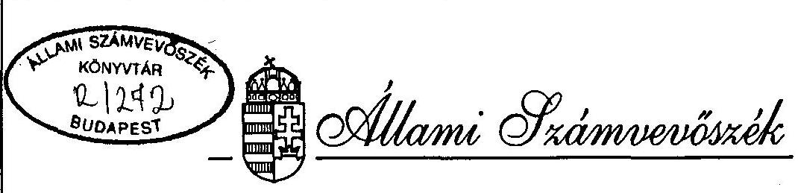
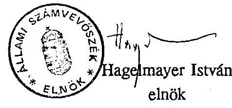

# JELENTÉS 

a helyi önkormányzatok 1994. évi kiegészítő támogatásának és a központosított előirányzatok felhasználásának ellenőrzéséről

---

# Jelentés 

a helyi önkormányzatok 1994. évi kiegészítő támogatásának és a központosított előirányzatok felhasználásának ellenőrzéséről

Az Országgyűlés az 1994. évi központi költségvetésből a helyi önkormányzatok által ellátandó, a tv. 5. sz. mellékletében felsorolt feladatokra - 20 jogcímen összesen 29,7 milliárd Ft - központosított előirányzatot állapított meg. A támogatást az önkormányzatok meghatározott feltételek mellett, felhasználási kötöttséggel vehették igénybe. A központosított előirányzatok közül az ellenőrzés

- a közműfejlesztés Szja-ban megszüntetett kedvezményének ellentételezése,
- a munkanélküliek jövedelempótló támogatása,
- a gyermeknevelési támogatás,
- a közalkalmazotti törvény végrehajtásának támogatása,
- a nevelési segély kiegészítése
felhasználásának ellenőrzésére terjedt ki. Az ellenőrzés körébe vont támogatások a központosított előirányzatok 78%-át képezik.

A helyi önkormányzatokról szóló 1990. évi LXV. tv. 87. paragrafusának (1) bekezdése alapján a Magyar Köztársaság 1994. évi költségvetéséről szóló 1993. évi CXI. tv. az önhibáján kívül hátrányos helyzetű helyi önkormányzatok kiegészítő támogatására 2.000 millió Ft előirányzatot hagyott jóvá. A támogatást az önkormányzatok a költségvetési törvény 6. sz. mellékletében meghatározott feltételek alapján az év során folyamatosan igényelhették.

---

Az ellenőrzés célja: annak megállapítása volt, hogy

- a központi költségvetésből a különböző feladatokra elkülönített előirányzatok felhasználása hogyan realizálódott, mennyiben elégítették ki a jelentkező igényeket;
- a támogatási igények benyújtásánál, a támogatások odaítélésénél, felhasználásánál és elszámolásánál figyelembe vették-e a vonatkozó törvényi előírásokat. Az önkormányzatok által beterjesztett igények adattartalma valósnak minősíthető-e;
- a támogatási rendszer működésének eredményessége, célszerűsége hogyan értékelhető.

Helyszíni ellenőrzést tartottunk a Pénzügy- és a Belügyminisztériumban, továbbá 8 megyében a TÁKISZ-oknál és 72 önkormányzatnál, valamint a fővárosban a FÁKISZ-nál, illetve a VI. és a XI. kerületi önkormányzatoknál. (1. sz. melléklet)

A vizsgálat az ellenőrzés tárgyát képező módosított központosított előirányzatok 3,9%-át és a ténylegesen felhasznált kiegészítő támogatás 18%-át érintette. (2/a., b.sz. melléklet)

# Összefoglaló megállapítások, következtetések, javaslatok 

A központosított előirányzatok és az önhibáján kívül hátrányos helyzetű önkormányzatok kiegészítő támogatása az önkormányzatok forrásorientált normatív szabályozásának kiegészítő elemét képezik. A szabályozás bevezetésekor elsősorban az önkormányzatiság kialakulásából, a szabályozó rendszer változásából adódó problémák, a normatívák által nem kezelt egyedi helyzetekből, helyi sajátosságokból fakadó eltérő feladatok megoldásának segítését szolgálták. A szabályozás bevezetésétől eltelt időszakban - a pénzügyi szabályozás feltételeinek változása következtében - szerepük lényegesen módosult, felértékelődött, melynek okai összetettek. A gazdaság teljesítményének csökkenése az önkormányzatokat több szempontból is hátrányosan érintette. Egyrészt a bevételek változása nem tartott lépést a kiadások növekedésével, másrészt a piacgazdaság kiépítése során az átalakítás veszteseit érintő problémák legnagyobbrészt az önkormányzatokat terhelték a bővülő szociális igények, feszültségek, a foglalkoztatásból kikerülők gondjai részbeni megoldásának feladatával.

---

Az elmúlt években végbement társadalmi, gazdasági változások és a csaknem minden területre kiterjedő intenzív jogi szabályozás hatását az önkormányzatok feladatellátásának bővülésére jól tükrözi a központosított előirányzatok jogcímének és mértékének jelentős növekedése. Míg 1991-ben 8 jogcímen mindössze 948 millió Ft központosított előirányzatot biztosított az éves költségvetési törvény, addig 1994-re a jogcímek száma 20-ra, az előirányzat összege pedig 29,7 milliárd Ft-ra emelkedett, ezzel a költségvetési hozzájárulásból, támogatásból, átengedett adókból származó önkormányzati bevételek közel 9%-át tette ki.

A növelést elsősorban a lakosság szociális rászorultsága, valamint a közműberuházások jelentős anyagi terhei indokolták. Az önkormányzathoz telepített ezen segélyezési, támogatási feladatokra 6 jogcímen eredetileg 16,8 milliárd Ft-ot, míg a közalkalmazotti törvény bevezetésének többletbérigényére, valamint a főváros közlekedésének, elavult vízcsőhálózata rekonstrukciójának támogatására 4 jogcímen összesen 10,8 milliárd Ft-ot biztosított a költségvetés 1994-ben.

A helyi önkormányzatok által felhasználható központosított előirányzatok terhére történő finanszírozás a lényegét, alapjait tekintve feladatfinanszírozásnak minősíthető. Működésével kapcsolatosan kifogásolható, hogy túlzottan szétaprózódott, sokféle jogcímen lehet hozzájutni.
A konkrét feladatok ellátásához a költségvetés által biztosított központosított előirányzatok egy része nem a feladattal kapcsolatos kiadás egészére nyújt fedezetet, más része pedig - azáltal, hogy azt az önkormányzatnak meg kell előlegeznie - jelentős saját pénzeszközök folyamatos lekötését igényli. Így elsősorban az egyébként is hátrányos helyzetben lévő önkormányzatok terheit növelik.

A központosított támogatások olyan feladatok finanszírozásához járulnak hozzá, melyekhez az önkormányzatok egyéb pénzügyi forrásaira, a polgármesteri hivatalok többletadminisztrációjára, szervező tevékenységére, helyi ismereteire van szükség. E sokirányú adatszolgáltatási, nyilvántartási és elszámolási kötelezettségnek azonban az önkormányzatok többsége - részben szakmai felkészültség és technikai feltételek hiányában - a törvények, rendeletek előírásainak nem tud eleget tenni.

A központosított előirányzatok igénylésénél az önkormányzatok nem mindig tartották be a jogszabályokban foglaltakat. Ehhez hozzájárult az is, hogy a törvényekben, rendeletekben az egyes támogatási formák igénybevételének, elszámolásának feltételei nem mindig egyértelműek, illetve hiányosak. Ezért a minisztériumok - esetenként egymásnak is, vagy a törvény szellemének ellentmondó -

---

állásfoglalásokat, útmutatókat adtak ki, ennek ellenére a vizsgálat során több olyan probléma merült fel, amelyekre az állásfoglalások sem tértek ki.

A központosított előirányzatokon belül a közműfejlesztések támogatása ösztönözte a lakosságot a közműhálózati infrastruktúra kiépítésére. Ugyanakkor az önkormányzatok bevételeire és kiadási struktúrájára is kihatással volt: a kedvezmények miatt csökkentette a helyi adóból származó bevételt, és az önkormányzati intézményeket érintő hozzájárulással növelte a kiadásokat.

A nevelési segély kiegészítésének rendszere a kedvezőtlenebb pénzügyi helyzetben lévő önkormányzatokat, amelyek megfelelő saját forrást nem tudnak biztosítani, kizárja e központi támogatásból, ezért a jelenlegi formában történő működését nem látjuk hatékonynak. A kapott támogatásokat több esetben az előirányzatnál mérsékeltebb saját forrás felhasználása miatt nem tudták teljes mértékben igénybe venni.

A közalkalmazotti törvény bevezetésével összefüggő többletkiadások egységes kiszámításánál a - sokoldalú, körültekintő előkészítő munka ellenére - az "F" kategóriába való sorolást esetenként a jogszabálytól eltérően értelmezték. Ezért, akik nem vették figyelembe a megváltozott törvényi előírásokat, jogtalanul jutottak előnyhöz azokkal szemben, akik a törvényi szigorításokat betartva saját forrásból rendezték az "F" lehetséges kategória miatti többletkiadást.
A közalkalmazotti törvény illetményrendszerének bevezetéséből adódó éves többletbérigény felmérését követően az önkormányzatok támogatását is éves szinten, nem a pénzforgalmi szemléletű finanszírozásnak megfelelően határozták meg, ami a központi költségvetésben 1,2 milliárd Ft-os szükségtelen többletkiadást eredményezett.

Az önkormányzatok a gyermeknevelési támogatás és a munkanélküliek jövedelempótló támogatásának igénylésénél és elszámolásánál a kormányrendelet nem egyértelmű előírása, illetve a jogszabályok pontatlan alkalmazása miatt többször szabálytalanul jártak el.

A költségvetési törvény előírása szerint ha az önkormányzat a központosított támogatást nem a megjelölt feladatra használja fel, illetve a törvényben rögzített arányt meghaladó mértékű támogatást vesz igénybe, köteles a támogatást visszafizetni. Mindezeket figyelembe véve a 7. sz. melléklet szerinti önkormányzatok a megjelölt jogcímen és összegben vettek igénybe jogtalanul támogatásokat.

---

Az önhibáján kívül hátrányos helyzetű önkormányzatok kiegészítő támogatása is a szabályozás állandó elemévé vált, és átmeneti csökkenés után az előirányzat jelentősen növekedett. Ennek oka részben az, hogy elmaradt az állam és az önkormányzat feladatainak az elhatárolása. A régi struktúrára - az évtizedek alatt kialakult ellátásra, elért színvonalra és szerkezetre - telepített forrásszabályozás, az állami támogatás, hozzájárulás reálértékének csökkenése, az önkormányzatok döntési problémái az önkormányzatok költségvetésében egyre több egyensúlyi problémát okoznak, melyet a saját bevételek még a vagyon mobilizálásával együtt sem képesek feloldani.

Az önkormányzatok az elmúlt években az állami pénzügyi támogatási lehetőségek által ösztönözve igen jelentős, sok esetben lehetőségeiket meghaladó fejlesztéseket valósítottak meg.
A beruházások üzembehelyezése után a működési kiadások is megnövekedtek, így egyre több igény jelentkezett, illetve jelentkezik a kiegészítő támogatások iránt.

Ezt támasztja alá az a tendencia, hogy az elmúlt 4 évben a felhalmozási és tőke jellegű kiadások országosan közel 90%-kal nőttek, ezen belül 1992-ben az előző évihez képest a növekedés 53%-os. Részarányuk 1994-ben - a felhalmozási célra átadott pénzeszközökkel, fejlesztési hitel visszafizetéssel együtt - 19%-ot képvisel az önkormányzatok költségvetéséből. A felhalmozási jellegű bevételek és az igénybevett cél- és címzett támogatások összességében, átlagosan e kiadásoknak csak 60-80%-át fedezték az elmúlt években.
A gazdálkodási feszültségeket növelte a szabályozó rendszer kiszámíthatatlansága is. Az önkormányzatok költségvetési támogatásáról, valamint a központi adók megosztásáról a mindenkori éves költségvetésben dönt az Országgyűlés. Ezáltal az anyagi feltételek biztosítása újrafogalmazódik. Az önkormányzatok ugyanakkor a beruházási döntéseknél többnyire azzal a támogatási kondícióval számoltak, amivel az indításkor rendelkeztek. A kiegészítő támogatások 1993. évi vizsgálata során már érzékelhető volt, hogy megnövekedett azoknak a településeknek a száma, amelyek a beruházások folytatása, valamint a jelentkező hitelvisszafizetési kötelezettségek miatt kerültek forráshiányos helyzetbe.

A költségvetések egyensúlyban tartása, a jelentkező likviditási gondok enyhítése érdekében megnőtt az igénybevett hitelek mértéke, az önkormányzatok harmada pedig kiegészítő támogatásra benyújtott pályázattal kívánta - főként saját döntése következtében adódó - pénzügyi gondjait mérsékelni.

---

Ezt elősegítette az a körülmény is, hogy a szabályozás 1994-ben bővítette a kiegészítő támogatás igénybevételi lehetőségét, de az 1993. évihez képest kiszámíthatatlanabbá vált mind az elbírálók, mind az önkormányzatok számára. Az önkormányzatok az elbírálás szempontjait előzetesen nem ismerték.

A támogatási igények elbírálásánál a döntéselőkészítést végzők együttműködésének hiánya, az előzetes megállapodástól eltérő döntés további problémákat okozott, és indokolatlan átcsoportosításhoz vezetett a központosított előirányzatok és a kiegészítő támogatás között.

A kiegészítő támogatások odaítélésénél a TÁKISZ-ok kikapcsolása a rendszerből nagyon megnehezítette a kormányzati szervek munkáját. Az önkormányzatok a támogatást sok esetben nem a megfelelő jogcímen igényelték, és a benyújtott pályázataik dokumentáltsága hiányos volt. Több önkormányzat a kizáró feltételek megléte ellenére nyújtott be igényt a kiegészítő támogatásra, mégis kedvező elbírálásban részesült. Számos önkormányzatnál sem forráshiány, sem egyéb működést akadályozó körülmény nem állt fenn, hanem a törvénnyel ellentétesen különböző fejlesztési feladatok megvalósításához, illetve saját döntésből fakadó, erőn felüli elkötelezettségek miatt kértek és kaptak támogatást.

Az 1994. évi támogatási igények elbírálásánál változatlanul alapvető problémát jelentett, hogy nincs pontos minősítési szempont és ehhez igazodó statisztikai bázis, ami alapján általános érvénnyel meg lehetne állapítani, hogy melyik önkormányzat tartozik az önhibáján kívül hátrányos helyzetű kategóriába.

A támogatásokkal a forráshiányt kiváltó okok nem szűntek meg. A gazdasági szempontokat nélkülöző önállósági törekvések eredményeként a kistelepülések egy része csak úgy képes a központi támogatással létrehozott intézményeit működtetni, ha ehhez további központi támogatást kap. Ugyanakkor a kiegészítő támogatási forma megléte, az elosztás módja az önkormányzatok egy részét indokolatlan igények benyújtására készteti, és nem a hatékony, takarékos gazdálkodást ösztönzi.

Az önkormányzati forrásszabályozás fogyatékosságát is mutatja, hogy 1994-re közel megötszöröződött az előző évhez képest a kiegészítő támogatás iránti igény, melynek azonban csak harmadát lehetett kielégíteni. A támogatás összegét a megnövekedett igények miatt 1994-ben évközben 2 milliárd Ft-tal fel kellett emelni, ami arra is enged következtetni, hogy a normatív hozzájárulások fajlagos

---

mértékének változatlanul hagyása tovább nem tartható.
Már az elmúlt évi vizsgálatunk során javaslatot tettünk a kiegészítő támogatás alkalmazott formájának a megváltoztatására és a szabályozó rendszer felülvizsgálatára, a szükséges korrekciók elvégzésére. Ennek ellenére 1995-ben a költségvetési törvény a működésképtelenné vált helyi önkormányzatok kiegészítő támogatására 6.421 millió Ft előirányzatot tartalmaz, amely 4.421 millió Ft-tal haladja meg az
 1994. évre eredetileg tervezett, és 2.010 millió Ft-tal a felhasznált összeget. Kifogásolható továbbá, hogy nem növekedett a gazdasági-társadalmi szempontból elmaradott települések által normatív alapon igénybe vehető kiegészítő támogatás összege.

Az 1995. évi költségvetési törvény módosította, s ezzel az 1994. évihez képest javította a kiegészítő támogatásra vonatkozó szabályozást. Ismét bekapcsolta az előkészítés fázisába a TÁKISZ-okat, folyamatos elbírálás helyett évente két alkalommal döntenek a támogatásról, melyről a Magyar Közlönyben adnak tájékoztatást. A megnövelt támogatási forrás keretekre bontását ismét a törvény tartalmazza, a vis maior keretből nyújtott támogatás rendeltetésszerű felhasználásáról pedig - a felhasználást követő 30 napon belül - az önkormányzat minden esetben köteles beszámolni. Az előirányzatból 1 milliárd Ft a saját hibából tartósan fizetésképtelen helyi önkormányzatok támogatását szolgálja.

A költségvetési törvény alapján amennyiben az önkormányzat valótlan adatot szolgáltatott, köteles a támogatást visszatéríteni.
A helyszíni vizsgálatok megállapítása szerint az önkormányzatok olyan esetben is igényeltek és kaptak kiegészítő támogatást, amikor nem álltak fenn annak törvényi feltételei, sem forráshiány, sem egyéb működést akadályozó körülmény. Az ilyen esetek többségében az igénybejelentésből a döntéshozók számára ez látható volt, így az önkormányzatok adatszolgáltatása nem minősíthető valótlannak. Ezért csak a kettős támogatásban részesült Nagyér és Kétpó, illetve a kizáró feltételeket figyelmen kívül hagyó Kötcse, valamint az 5. sz. mellékletben felsorolt, (nemcsak a helyszíni vizsgálattal érintett) a céltámogatásról le nem mondott önkormányzatok esetén javasoljuk a jogtalan támogatás visszavonását.

---

Vizsgálati megállapításaink alapján a Pénzügyminisztériumnak és a Belügyminisztériumnak az alábbi javaslatokat tesszük:

1. Az államháztartási reformhoz kapcsolódóan a jövőben nem indokolt fenntartani az önkormányzati pénzügyi szabályozó rendszer részeként a központosított előirányzatokat ilyen szerkezetben, jogcímen és összegben. A jogcímek egy része beépíthető lenne a minisztériumok, központi szervek költségvetésébe, másik része a normatív hozzájárulások összegébe, illetve több jogcímen időszerűtlensége miatt megszüntethető lenne.
Mindaddig azonban, amíg fennmarad e támogatási forma, a részletes megállapítások 1.3. fejezetében érintett szabályozási pontatlanságok megszüntetésével egyértelművé kell tenni a központosított előirányzatok igénybevételének valamennyi feltételét, szabályát.
2. Az önkormányzati gazdálkodás biztonsága érdekében érvényesíteni kell az önkormányzati törvény azon előírását, hogy a meghatározott feladatokon felül csak olyan kötelezettségeket állapítsanak meg az önkormányzatok számára, amelyekhez egyidejűleg az Országgyűlés biztosítja az ellátáshoz szükséges pénzügyi fedezetet is.
3. Az önhibáján kívül hátrányos helyzetű önkormányzatok támogatását az önkormányzati "csődtörvénnyel" összhangban kellene felülvizsgálni. E nélkül, illetve az államháztartás reformja nélkül az eddigi rendszer kezelhetetlenné válik módszerében és finanszírozásában egyaránt.
A rendelkezésre álló anyagi erőforrásokkal továbbra is a kiegyenlítő rendszer normativitásának az erősítését, az egyedi elbírálás lehetőségének jelentős, a rendkívüli esetekre való leszűkítését tartjuk célszerűnek utólagos elszámoltatás mellett.
Ehhez azonban az elbírálási szempontok, a döntések nyilvánossága és a gazdasági-társadalmi szempontból elmaradott települések rendelkezésére álló normatív források bővítése is szükséges.
4. A helyszíni vizsgálat által feltárt, - 5., 7. számú melléklet szerinti - 1994. évi jogtalanul igénybevett központosított és kiegészítő támogatás visszafizettetéséről, a törvényes állapot helyreállításáról az 1994. évi zárszámadásban gondoskodjanak.
Ezzel összefüggésben a közalkalmazotti törvény végrehajtásából adódó jogtalanul igénybevett - többlettámogatás 1995-98. évi kihatása is rendezendő (normatív hozzájárulások érintett előirányzata, hitelszerződések).

---

# Részletes megállapítások 

## 1. Központosított előirányzatok

### 1.1. A Központosított előirányzatok mértékének meghatározása, évközi változása

A központosított előirányzatok 1994. évi eredeti költségvetési előirányzata 29.731,1 millió Ft volt, melyből a vizsgált előirányzatok kereteit

- a bázisidőszak tapasztalati adatai,
- a szociális igazgatásról és a szociális ellátásokról szóló törvény előírásai,
- a várható ellátotti kör prognosztizálása, valamint
- a közalkalmazotti törvényből fakadó többletbérkiadás előzetes felmérése alapján tervezték meg.

Az 1994. évi költségvetésről szóló 1993. évi XCI. törvény 41. § (2) bekezdésében a Kormány felhatalmazást kapott arra, hogy a központosított előirányzatok jogcímei között, valamint a központosított és kiegészítő támogatások között átcsoportosításokat hajtson végre. Amennyiben e lehetőséget a Kormány már kimerítette, a törvény 40. § (1) bekezdés b/ pontja alapján a központosított előirányzatok 20 jogcíme közül 9-nél előirányzat-módosítási kötelezettség nélkül teljesíthetett kifizetéseket, ha a szükséglet meghaladta az előirányzatot.

A vizsgált támogatások közül e tekintetben kivételt képezett a nevelési segély kiegészítésére szolgáló előirányzat, ugyanis ennek elosztására a népjóléti miniszter által kiírt pályázat alapján került sor, módosítására nem volt lehetőség.

A központosított előirányzatokból a kiegészítő támogatások javára a 2051/1994. (V. 31.) sz. kormányhatározattal 970 millió Ft-ot csoportosítottak át. Ebből 950 millió Ft-ot a gyermeknevelési támogatásból vettek igénybe.

Az 1994. évi pótköltségvetésről rendelkező 1994. évi LXV. törvény 1,9 milliárd Ft többletforrást biztosított a központosított támogatásokhoz, melyből 1,3 milliárd Ft-tal a közműfejlesztési támogatást növelték. A közalkalmazotti törvény végrehajtásának támogatásához biztosított előirányzat-módosítás +1,1 milliárd Ft volt. A vizsgálatunk tárgyát nem képező egyéb központosított előirányzatokat a kormányhatározat 20 millió Ft-tal, a pótköltségvetés pedig - az önkormányzatok által

---

a közalkalmazotti bérek kifizetéséhez vállalt többletkiadások kamatterheinek a tervezettől elmaradó támogatási igénye miatt - további 500 millió Ft-tal csökkentette.

Nem történt előirányzatmódosítás, vagy átcsoportosítás a munkanélküliek jövedelempótló támogatásánál, ahol 652 millió Ft maradvány keletkezett.
A kormányhatározattal és a pótköltségvetéssel a központosított előirányzatok támogatási kerete 30.661,1 millió Ft-ra módosult.

A központosított előirányzatok közötti átcsoportosítás 1994-ben nem volt. A kormányhatározattal átcsoportosított, majd a pótköltségvetésben juttatott többlettel módosított előirányzathoz képest összességében 1.075 millió Ft a maradvány, melynek 91%-a a vizsgálattal érintett támogatásoknál keletkezett. A vizsgált ötféle központosított támogatási jogcímre a tényleges kifizetések közel 79%-át fordították, 23,2 milliárd Ft összegben.

Az egyes előirányzatokkal szemben jelentkező többletigény a jogcímek között átcsoportosítással rendezhető lett volna. Ezt támasztja alá az a körülmény, hogy a központosított támogatások felhasználása összességében az eredeti előirányzat szintjén - 29.585,5 millió Ft - realizálódott, azaz az eredeti előirányzathoz képest 145 millió Ft megtakarítás mutatható ki.
(A központosított előirányzatok alakulását a 3. sz. melléklet mutatja be.)

# 1.2. A központosított támogatások igénylésének rendszere 

A központosított előirányzatok odaítéléséről egyes esetekben a szaktárcák, vagy tárcaközi bizottságok döntöttek, többségük igénybevétele azonban az előírt adatszolgáltatás felterjesztése esetén - dokumentumok, bizonylatok csatolása nélkül - automatikusan valósult meg, odaítélésük nem volt mérlegelhető.

Az önkormányzatok a központosított előirányzatokra a TÁKISZ-okon keresztül nyújtották be igényeiket. A TÁKISZ-ok feladatát a költségvetési törvény és kormányrendeletek írták elő. A beérkezett igények összesítését és az összesített igények felterjesztését kellett elvégezniük, az igények realitásának, megalapozottságának vizsgálata nem volt feladatuk. Munkájuk ellátásához számítógépes programokat és több olyan szakmai tájékoztatást kaptak a minisztériumoktól (BM, PM, NM), amelyek az egyes előirányzatok igénylésének rendjét előíró jogszabályok

---

betartását, egységes értelmezését segítették elő. A tájékoztatók általában a törvényi előírással összhangban voltak, egyes esetekben azonban azok szellemével, a jogalkotói szándékkal ellentétes értelmezésre is lehetőséget adó állásfoglalást tartalmaztak.

A közalkalmazotti törvény végrehajtásának támogatásánál a TÁKISZ-oknak az igények összesítésén túl felülvizsgálati kötelezettsége is volt. A központi források arányának meghatározását külön program segítségével ellenőrizték le az 1993. I. félévi beszámolók módosított előirányzat adatai alapján. A központi támogatási igény meghatározása a számítások helyességét tekintve tehát megalapozott volt. Nem végeztek ugyanakkor érdemi, tartalmi ellenőrzést az intézményi alapadatok tekintetében (pl. a bérbesorolások, pótlékra való jogosultság elbírálása stb.). Azokat változtatás nélkül elfogadták, mivel erre nem terjedt ki a TÁKISZ-ok jogköre.

Az érintett minisztériumok folyamatosan vezették a támogatási jogcímek szerinti nyilvántartást, melyből naprakészen megállapítható volt az előirányzatok, valamint az ezek terhére átutalt összegek alakulása. A kifizetett támogatások és az előirányzatok szinkronjának biztosítása érdekében a PM és a BM illetékes munkatársai egyeztették nyilvántartásaikat. Ennek ellenére a két minisztérium éves adata 7,6 millió Ft-tal eltér egymástól. Ez arra vezethető vissza, hogy az önkormányzatok egy része a tévesen igénybe vett összegeket ugyan visszautalta, ám erről a BM-et nem értesítette, más részük az előirányzatról lemondott, de az összeg átutalására már a tárgyévben nem került sor.

# 1.3. Az önkormányzatok által igénybevett támogatások 

A helyi önkormányzatok az egyes támogatási célokra különböző - és több esetben az előírtaktól eltérő - módon adták be igénylésüket. A vizsgálat az 1994. évi igénylésekre és a kapott támogatásokhoz kapcsolódó kifizetésekre terjedt ki. Az 1994. évi pénzügyi felhasználás az önkormányzatoknál ettől eltérő.

Az önkormányzatok beszámolási rendszerének hiányossága, hogy nem teszi lehetővé a központi költségvetésből kiutalt összegek és az ehhez kapcsolódó tényleges önkormányzati kifizetések reális pénzügyi folyamatának a kimutatását. Ugyanis a kifizetések egyes előirányzatoknál megelőzik a visszaigényléseket, viszont a beszámolóban az igényelt és az önkormányzatoknak kiutalt összeg szerepel. Ebből adódóan a gyermeknevelési támogatásnál és a munkanélküliek jövedelempótló

---

támogatásánál nem az önkormányzat tényleges tárgyévi pénzmozgása jelenik meg. A beszámolóból nem állapítható meg a támogatási célonként kifizetett összeg sem. Ezáltal a támogatás igénylése és a felhasználás közötti összhang, valamint az igénylési rend betartása a beszámolóikból nem ellenőrizhető.

Az egyes támogatási formákkal kapcsolatban a vizsgálat során tapasztalt nyilvántartási, adatszolgáltatási hiányosságokat, a finanszírozás problémáit a támogatás igénybevételére vonatkozó megállapítások után ismertetjük.

# 1.3.1 Közműfejlesztési támogatás 

A magánszemélyek számára az új közmű építéséhez befizetett hozzájárulásnak a 15%-át az állami költségvetés a 89/1991. (VII.12.) kormányrendelet alapján visszatéríti. Az ellenőrzés során - részben a jogszabály pontatlan megfogalmazására, részben a visszaigénylést lebonyolító települési önkormányzatok hibás gyakorlatára visszavezethetően - az alábbi főbb hiányosságokat állapítottuk meg:

- Az önkormányzatok a támogatáshoz nem kérték a magánszemélyek igénybejelentését. Általában a visszaigénylést az önkormányzatok kezdeményezték, egyidejűleg azonban az érintetteket nem nyilatkoztatták, hogy helyi adóban, vagy vállalkozási ráfordításaik között nem számolták-e már el a befizetést.
- A hozzájárulás igénylésekor - fentiekből is következően - nem mindig szűrték ki a magánvállalkozókat, akiknek a visszatérítés nem jár, mivel módjuk van a közműberuházásra fizetett hozzájárulást költségeik között elszámolni.
Ennek következménye, hogy vállalkozóknak is igényeltek és fizettek ki közműfejlesztési támogatást. (Pl. Tokod)
- A kormányrendelettel ellentétben a közműbefizetésre vonatkozó igazolás általában nem a visszatérítendő, hanem a befizetett összegről szólt, a befizetések pedig több esetben a visszaigényelhető ÁFÁ-ra is fedezetet nyújtottak. Az ÁFÁ-t is tartalmazó befizetés és a 15%-os támogatás ezen összeg szerinti igénybevétele jogszabályellenes.
- Az önkormányzatok általában nem vizsgálták, hogy a befizetéseket nem számolták-e már el a helyi adó fizetésénél is, mivel a jogszabály ezt követően tiltja a visszaigénylést.
- Az önkormányzatok olyan befizetések után is igényelték a támogatást, melyek nem tartoznak a kormányrendeletben megfogalmazott közműfejlesztési kiadások közé.

---

A lakóházba történő gázbevezetés - tehát a telekhatáron belül felmerült - költsége, illetve telefonbeszerelés után is visszaigényelte a támogatást Kaposújlak, Csurgó.

- A visszatérítés a befizetés napjától számított egy évig igényelhető a települési önkormányzattól. Nem tisztázott, hogy e jogvesztő határidő vonatkozik-e az önkormányzatra is.
Ugyanis helyenként az önkormányzatok nem éltek azzal a lehetőséggel, hogy negyedévente igényelhetik a támogatást; több esetben csak az év végén összesítették a különböző közműfejlesztési befizetések után visszajáró összeget. Így a visszaigénylés meghaladta a befizetéstől számított egy évet. (Pl. Heves város, Majosháza, Szigetvár esetében).
- Nem szabályozott, hogy mi a teendő akkor, ha egy beruházás részben vagy
 egészben nem valósul meg, miközben a lakossági hozzájárulás után a támogatást már igénybevették és kifizették. Esetenként az önkormányzatok a bizonytalan kimenetelű beruházással kapcsolatos támogatás összegét visszatartották.

Alsónémediben 5 fő részére nem fizették ki a 15%-os közműfejlesztési támogatást, mivel bizonytalan a telefonjuk bekötése.

- A támogatás elszámolása során előfordult a nettó módon való elszámolás is: a magánszeméllyel csak a fizetendő összeg 85%-át fizettették be, s a 15%-ot azonnal a költségvetésből igényelték. Így azonban - a határidőre be nem fizetett összegek miatt - jogtalan igénybevétel is keletkezett. (Pl. Kerékteleki)

A dokumentáltság sok esetben nem minősíthető hitelesnek a közműfejlesztési támogatást igénylő önkormányzatoknál.

Gyömrön a közműfejlesztési támogatás kifizetésének jogosságát igazoló bizonylatot nem csatolták az átvételi igazoláshoz.

Tiszakürtön csak jelen vizsgálatunk kapcsán készítettek összesítő kimutatást a közműbefizetésekhez kapcsolódó támogatás kifizetéséről a pénztárbizonylatok alapján.

Tiszaszentimrén a visszaigénylés alapdokumentumaként használt füzet nehezen áttekinthető, a visszaigénylés számítási alapja nem egyezik meg a számlakívonat egyenlegével.

Fábiánsebestyénben úgy fizették ki a támogatást, hogy az elszámolási számláról felvett összeget nem vételezték be a pénztárba és nem állítottak ki kiadási pénztárbizonylatot, így az okmányszerűség hiányában a kifizetés időpontja sem állapítható meg.

---

Verpeléten - részben a nehezen átlátható nyilvántartások miatt - az önkormányzat az esedékes részletfizetések alapján, a lakossági befizetést megelőzően igényelt vissza támogatást.

Vámosmikola az 1992. évi telefonhozzájárulás után háromszor igényelte vissza a 15%-os támogatást. (1992., 1993., 1994.) Az összeget - a lakosság nyilatkozata alapján - elkülönített közműszámlán tartják.

Zsombó községben az igénylésben megjelölt távbeszélőhálózat támogatási céltól eltérően egyéb közművek lakossági befizetéseinek visszatérítésére használtak fel 574,3 ezer Ft-ot.

A közműfejlesztési támogatást az önkormányzathoz való megérkezésétől számított 15 napon belül kell kifizetni, ami sok esetben nem teljesült. Ez az önkormányzatok átmeneti likviditási gondjainak a visszaigényelt támogatás segítségével történő áthidalásával, (pl. Tardos, Nagykökényes) a nyilvántartások figyelmetlen vezetésével magyarázható.

A visszaigényelt támogatást esetenként az önkormányzatok kezdeményezésére a lakosok egyéb beruházások (pl. Nagyút) vagy a beruházásokat megvalósító, részben önkormányzati tulajdonú gazdasági társaságok támogatására (pl. Tiszavárkony) ajánlották fel.

# 1.3.2 Nevelési segély kiegészítése 

A Népjóléti Minisztérium pályázati felhívása alapján a támogatásra azok az önkormányzatok számíthattak, amelyek a családi pótlékra jogosult gyermekek számára vetítve legalább 1.000 Ft/fő összegű rendszeres nevelési segélyt terveztek. Az előírt számítási mód alapján igényelhető összeg lényegesen meghaladta az előirányzatot, így a saját forrás kiegészítésére csak az igények 35,8%-át kapták meg az önkormányzatok.

A pályázás, illetve az elnyert összegek felhasználásának jogszerűsége sok esetben a nem megfelelő szabályozottság miatt nem egyértelmű.

- Az önkormányzatok egy része nem szabályozta a rendszeres nevelési segélyek megállapításának, folyósításának és felülvizsgálatának rendjét, annak ellenére, hogy a szociális törvény megjelenését - és a nevelési segélyek megállapításával kapcsolatos jogszabályi előírás hatályon kívül helyezését - követően is fenntartották e támogatási formát.

---

- Az államháztartás információs rendszere is csak összevont, korcsoporttól független támogatási adatokat igényel, így sok esetben nem állapítható meg a tervezett rendszeres nevelési segély összege.
- A helyi szociális ellátásról szóló önkormányzati rendeletek a gyermekek étkezési díjának csökkentését sok esetben rendkívüli nevelési segélyként határozzák meg.

Fentiekből következően, amennyiben az önkormányzat költségvetési rendelete nem kellő tagolású, a pályázati feltételek között szereplő tervezett saját forrás megléte nem volt ellenőrizhető, annak ellenére, hogy a pályázat kapcsán a Népjóléti Minisztérium felhívta az önkormányzatok figyelmét, hogy a rendszeres segélyeken belül bontva kezeljék a kiskorúak támogatására kifizetett rendszeres nevelési segélyt az egyéb szociális segélyektől.

A szűkös anyagi helyzetben lévő önkormányzatok - mivel nem volt lehetőségük saját forrásból megfelelő mértékű rendszeres nevelési segélyt tervezni - elestek a támogatás lehetőségétől is.

Néhány önkormányzat technikai átcsoportosítást hajtott végre a rendkívüli segélyek terhére, hogy megfeleljen a pályázati feltételnek. (Fábiánsebestyén, Heves, Verpelét, Kömlő, Nagyút). Ezen önkormányzatok pályázata szabálytalan volt, mert a kimutatott saját forrás nagysága nem azonos a testület által jóváhagyott előirányzattal.

A nevelési segély kiegészítését szolgáló támogatás az önkormányzatok rendszeres szociális kiadásaihoz nyújt többletforrást. Ennek ellenére a felhasználás sok esetben - az NM állásfoglalása alapján - nem a rendszeres kiadásokhoz kapcsolódott.

A nevelési segély kiegészítéseként kapott összeget részben, vagy egészben fiatalkorúak átmeneti segélyezésére, tankönyvekre, beiskolázási segélyre fordították Szigetváron, Tiszakürtön, Tiszavárkonyban, Tatabányán, Tardos községben, Vezsenyben, Tiszaszentimrén.

Tokodon az étkezés térítési díját nem a nyersanyagköltség, hanem a - szállító rezsijét és kalkulált nyereségét is tartalmazó - beszerzési ár alapján állapították meg, mely így jelentősen megemelkedett. Annak érdekében, hogy ne csökkenjen az igénybevétel, általános, 20 Ft/fő/nap kedvezményt állapítottak meg. A térítési díj jogszabályellenesen megállapított összege miatt adott támogatást is figyelembe vették a nevelési segély kiegészítésére szolgáló támogatás elszámolásakor.

---

A szociális támogatásokkal kapcsolatos nyilvántartásokat a városokban, nagyobb településeken általában már számítógépre vitték, így áttekinthetőbbé vált a támogatott családok szociális helyzete, kevesebb a nyilvántartási hiányosság.
A rendszeres nevelési segélyek felülvizsgálata esetenként elmaradt, vagy a felülvizsgálathoz nem készült környezettanulmány.

A nevelési segélyt kiegészítő támogatás felhasználásáról az önkormányzatoknak 1995. február 1-ig kellett elszámolniuk. A beszámolóban sok esetben figyelmen kívül hagyták, hogy csak a saját forrás arányában jogosultak a támogatás igénybevételére, illetve - amennyiben a saját forrás a pályázati feltételben megszabott határérték alatt van - a teljes támogatási összeget vissza kell fizetni.

Elszámolásában nem a saját forrással arányosan vette figyelembe a támogatást Szelevény, Vése, Bakonyszombathely, Kerékteleki, Pilismarót, Pilisszántó.

A saját forrás felhasználása nem érte el az előírt, családi pótlékra jogosultanként 1.000 Ft-os mértéket, s ezért az egész támogatás igénybevétele jogtalan volt Tiszavárkony, Tiszakürt, Nagyút, Kömlő esetében.

A nevelési segély kiegészítésére pályázaton elnyert összeget az önkormányzatok egy összegben megkapták, így az - amennyiben a folyamatosan képződő, segélyezésre fordítható saját forrásokat a későbbiekben ténylegesen felhasználták - a finanszírozás szempontjából kedvező volt.

# 1.3.3 Gyermeknevelési támogatás 

A szociális törvény alapján, a törvényben részletezett feltételek megléte esetén normatív pénzbeli ellátásként - gyermeknevelési támogatásban részesülhetnek a 180 nap társadalombiztosítási idővel rendelkező, keresőtevékenységet nem folytató, illetve rendszeres pénzellátásban nem részesülő 3 és többgyermekes anyák.

A támogatás igénybevétele jogszerűségének ellenőrzését sok esetben nehezítette a nyilvántartások pontatlan vezetése, a támogatás jogos igénybevételét bizonyító alapdokumentumok - születési anyakönyvi kivonatok másolata, a család jövedelmére vonatkozó adatok, az előírt biztosítási idő igazolása - hiánya. A nyilvántartások kötelező adattartalmát a szociális törvény írja elő, vezetéséért a jegyzőt teszi felelőssé. Ennek ellenére több településen nem vezetnek egyáltalán nyilvántartást a gyermeknevelési támogatásban részesülőkről (pl. Tiszavárkony, Szelevény, Vése

---

önkormányzatai), vagy a vezetett nyilvántartás nem felel meg a szociális törvény előírásainak (pl. Pilisszántó, Szágy, Kötcse, Kaposújlak, Sásd, Cserdi).

Az önkormányzatok több esetben a jogos összegtől eltérő támogatást igényeltek vissza.

#### Abstract

A belső egyeztetés és ellenőrzés hiánya miatt a jogosan járó gyermeknevelési támogatásnál kisebb összeget igényeltek vissza Tiszakürtön, valamint a főváros XI. kerületében. Ez utóbbi esetben az önkormányzat az 1993. decemberében 5 fő, 1994. januárjában pedig 131 fő részére kifizetett támogatás és járulékának 1.125 ezer Ft-os összegéről ugyan kiállította az adatlapot, ám az 1994. február 4-i keltezésű igénylés további sorsa - az adminisztráció hiányosságai miatt - nem követhető nyomon.

Gyömrön pontatlan igénylés következtében a jogos összegnél 345 ezer Ft-tal többet igényeltek vissza.

Vámosmikolán 1994. elején az előző időszakra érvényes nyugdíjminimum alapján fizettek, a leigénylésnél azonban már figyelembe vették annak felemelését. A különbözet kifizetésére év végéig nem került sor. Ez részben annak következménye, hogy a főkönyvi könyvelésben a gyermeknevelési támogatást az egyéb pénzbeli támogatásokkal együtt könyvelték, ami nehezítette az igénylés és a kifizetés egyeztetését.

Egyedi esetként előfordult, hogy az önkormányzat elmulasztotta a támogatáshoz kapcsolódó társadalombiztosítási járulék befizetését (pl. Gyömrő 1.233 ezer Ft), vagy az igénylés hónapjában tévesen részösszegű támogatást állapított meg (pl. Szágy).

A jogosultság megszűnését követően a népjóléti miniszter több esetben állapított meg kivételes méltányosságból gyermeknevelési támogatásra való jogosultságot (Pl. Kunszentmárton, Tiszakürt, Hatvan, Szögliget, Terézváros, Jászdózsa településeken).

A jogosultság változását az önkormányzatok általában figyelték, szükség szerint intézkedtek a támogatás megszüntetéséről, illetve a jogtalanul felvett támogatás visszafizetéséről.

A gyermeknevelési támogatás - hasonlóan a munkanélküliek jövedelempótló támogatásához - az önkormányzatoknak általában finanszírozási gondot okoz. Bár a támogatást a költségvetés utólag megtéríti, a legalább egy hónapos megelőlegezés

---

folyamatosan - a támogatottak számától függően - kisebb-nagyobb pénzösszeget köt le.

# 1.3.4 Munkanélküliek jövedelempótló támogatása 

A munkanélküli járadék folyósítási időtartamának lejártát követően - a szociális törvényben részletezett feltételek esetén - jövedelempótló támogatásban részesülhet a munkanélküli. A támogatás alapösszegének 50%-át a központosított előirányzatokból visszaigényelheti a települési önkormányzat.

A munkanélkülieknek fizetendő jövedelempótló támogatást, illetve ebből az önkormányzati forrásokat terhelő 50%-ot 1994-től már más előirányzatoktól elkülönítetten tervezték az önkormányzatok, ehhez azonban nem mindig kaptak megfelelő információt a munkaügyi központoktól a munkanélküli járadékellátásból kikerülők várható létszámára vonatkozóan. (Pl. VI. kerület)

A törvény, valamint a támogatás folyósításának és elszámolásának szabályairól rendelkező kormányrendelet nem mindig egyértelmű előírása, illetve a jogszabályok pontatlan alkalmazása és a munkafolyamatokba épített ellenőrzés hiánya miatt az ellenőrzés több szabálytalanságot tárt fel:

- A nyilvántartások hiánya, (Pl. Vése, Szólád, Kétpó, Nagyrév, Tiszavárkony, Vezseny önkormányzatai) vagy pontatlan vezetése (pl. Szágy, Pilisszántó, Alsónémedi, Cserdi) jellemzi a vizsgált települések egy részét. Csupán az igénylő szóbeli kérelme és a munkaügyi központ igazolása alapján ítélték meg a támogatást Szágy, Cserdi, Hobol önkormányzatainál.
- Általános szabályként a szociális törvény szerint a támogatás a kérelem benyújtásától esedékes. A gyakorlatban azonban előfordult, hogy csak a benyújtást követő hónaptól, illetve - a gyermeknevelési támogatásra előírt folyósítási szabály szerint - a hónap 15-ét követően benyújtott igényeknél félhónapra nyújtottak támogatást. Arra is volt példa, hogy a benyújtást megelőző időponttól - a járadék megszűnését követő naptól - állapították meg a jövedelempótló támogatást.
- A támogatás megállapításának feltétele, hogy a család egy főre jutó havi jövedelme ne haladja meg az öregségi nyugdíjminimum 80%-át. A támogatás havi összegének megállapításához a jogosultság alapjául szolgáló jövedelem kiszámításánál a családi pótlékot különbözőképpen vették figyelembe az önkor-

---

mányzatok. Esetenként a családi pótlék egy családtagra jutó részét helytelenül a támogatást igénylő saját jövedelmeként mutatták ki (Pl. Vése, Majosháza) annak ellenére, hogy az időközben módosított Szociális törvény már pontosította az alapfogalmakat.

- A támogatás jogosságát az önkormányzatok többsége felülvizsgálta, általában évente egyszer, a folyósítás lejárta előtt egy hónappal, illetve ha valamilyen változás jutott az illetékesek tudomására, de voltak olyan települések is, ahol a felülvizsgálatra nem került sor. (Pl. Hobol, Nagyrév, Vése, Szólád, Tiszaörs, Gyömrő)
A felülvizsgálatok során több esetben kiderült, hogy a támogatást jogtalanul vették néhányan igénybe, mivel időközben munkaviszonyt létesítettek, vagy nyugdíjjogosultságot szereztek, s a nyugdíj összegét 6 hónapra visszamenőleg megkapták, ugyanakkor a támogatásról nem mondtak le. (Pl. Hatvan 7 fő, Verpelét 5 fő, Terézváros 2 fő, Dömös 2 fő.)
- Az önkormányzatok szociális ellátást szabályozó helyi rendeletei alapján az alaptámogatást esetenként vagy
 folyamatosan az öregségi nyugdíj legkisebb összegéig, vagy annak 120%-áig kiegészítették.

A támogatás alapösszegén felül ítéltek meg kiegészítést Sásdon, a nyugdíjminimum 120%-ára egészítették ki a támogatást pl. a főváros VI. kerületében, valamint az év első öt hónapjában a XI. kerületben, az öregségi nyugdíj legkisebb összegéig egészítették ki Tardoson és az év júniusától a XI. kerületben.

Az önkormányzatok egy része az általa kiegészített támogatás 50%-át igényelte vissza, mivel a támogatás folyósítását és elszámolását szabályozó kormányrendeletet helytelenül értelmezte. Az esélyegyenlőséget nem biztosító értelmezést erősítette a Népjóléti Minisztérium 1993. januári állásfoglalása is. A kormányrendelet 1994. februári módosítása bizonyítja, hogy az állásfoglalás ellentétes volt a szociális törvény szellemével. A módosítás csupán az alapösszeg (a nyugdíjminimum 80%-a) 50%-ának visszaigénylésére ad lehetőséget.

Ennek ellenére a helyszíni ellenőrzés olyan jogtalan igénybevétellel is találkozott, ahol az egész év folyamán a kiegészítéssel növelt támogatás arányos részét igényelték vissza. Ez részben a munkafolyamatba épített ellenőrzés hiánya miatt következhetett be.

A főváros VI. kerületében egész évben a lekönyvelt - 120%-ra kiegészített támogatási összeg 50%-át igényelték vissza, s ezzel 8.406 ezer Ft támogatást vettek jogosulatlanul igénybe.

---

A gyermeknevelési támogatást és a munkanélküliek jövedelempótló támogatását az esetek többségében a kormányrendeletben meghatározott határidőben és adattartalommal igényelték vissza. Előfordult azonban, hogy az adatok egyeztetésének elmaradása, helytelen javítása vagy téves információk alapján az önkormányzat jogosulatlanul vett igénybe támogatást, vagy - esetenként igen jelentős - számára járó összeget nem igényelt vissza.

Kétpó községben kerekítési hiba miatt kétszer töltötték ki az októberi adatlapot, ami alapján a támogatást is kétszer kapták meg. Ezzel ellentétben egyszer sem igényelték le annak a 4 főnek a júniusi támogatást, akikről tévesen azt a tájékoztatást adta a munkaügyi központ, hogy nem működtek együtt. Egyenlegében 148 ezer Ft a jogtalan igénybevétel.

A belső egyeztetés hiánya miatt Gyömrőn 63 ezer Ft-ot jogtalanul vettek igénybe, míg Tiszakürtön még 18 ezer Ft támogatás jár.

A főváros XI. kerületében az adatlapot az ügyfélszolgálati iroda állította össze, a visszaigénylés pedig a közgazdasági osztály feladata volt. Az év során összesen 4.263 ezer Ft összegű támogatást nem igényeltek vissza, részben a szervezeti egységek közötti információáramlás hiányosságai miatt. Két esetben az adatlapok FÁKISZ-hoz való továbbításáról - a nem megfelelő adminisztráció miatt - nem lehetett teljes bizonyossággal meggyőződni.

A jogtalanul igényelt összeg kiszűrésére, illetve statisztikai elemzésre alkalmatlan a TÁKISZ-hoz benyújtott adatlap, mivel a támogatásban részesülők száma - a törthavi támogatások, esetleg visszamenőleges korrekciók miatt - sokszor nem arányos a kifizetett összeggel.

A munkaügyi központok sok esetben nem tájékoztatták a szociális törvényben előírt háromhavonta az önkormányzatokat a munkanélküliek együttműködéséről.

A munkanélküliek jövedelempótló támogatása nemcsak a támogatás előfinanszírozását igényli az önkormányzattól, hanem 50%-ának - illetve az alapösszegnél magasabb támogatás esetén a különbözet teljes összegének - végleges finanszírozását is, ami egyre nagyobb megterhelést jelent a munkanélküli járadékos körből kikerülők számának folyamatos növekedése miatt.

A szociális törvény módosítása a legalább 6 hónapja jövedelempótló támogatásban részesülőknél lehetővé teszi - illetve bevezetése esetén a további támogatás feltételéül szabja - a külön díjazás fejében végeztetendő közösségi munkavégzést. A közösségi munkavégzés bevezetése is többlet önkormányzati forrásokat igényel-

---

ne, melyet főleg a kisebb települési önkormányzatok nem tudnak biztosítani.
A vizsgált körben mindössze az önkormányzatok 20%-a szabályozta a közösségi munkavégzést, ám a gyakorlatban még ennél is kisebb hányaduk foglalkoztatta így az érintetteket. A település területén végzendő köztisztasági, tereprendezési, kommunális munkákhoz vették igénybe a támogatásban részesülők egy részének munkáját.

# 1.3.5 A közalkalmazotti törvény végrehajtásának támogatása 

A közalkalmazotti törvény szerint 1994. január 1-től járó bér és járulékainak többletét - a helyi önkormányzatok finanszírozásában való részvételének arányában - a központi költségvetés viseli. A többlet felét 1994-ben, - az önkormányzatok által saját forrásból, vagy hitel felvételével megelőlegezett - felét pedig 1996-98-ban téríti meg.

A központi költségvetést terhelő kiadási hányad számításához az önkormányzatok általában helyesen vették figyelembe a számítás alapjául szolgáló 1993. I. félévi módosított bevételi előirányzataikat. E számítási mód hibája azonban, hogy az önkormányzatok jelentős hányada nem módosítja az I. félév előirányzatait, s így az esetenként nem kellően megalapozott tervezés következtében - a ténylegestől eltérő arányban jelent meg a központi költségvetés kötelezettsége.
A szétvált településeknek módjuk volt a szétválás előtti közös költségvetési beszámoló alapján figyelembe venni az állami finanszírozási arányt, ennek ellenére nem minden önkormányzat élt e lehetőséggel.

Pálmajór a Nagybajomból való kiválást követően nem a közös beszámoló szerinti állami bevételi arányt vette figyelembe. A központi hozzájárulási arányt 72,36% helyett 24,83%-ban határozta meg, így 212 ezer Ft-tal kevesebb állami támogatás igénybevételére nyílt lehetősége.

A költségvetési törvény alapján az egy havi illetménykülönbözetet 13-mal, a pótlékdifferenciát 12-vel kellett szorozni az éves többletkiadás számításához, melynek 1/12-ed részét bocsátották havonta az önkormányzatok rendelkezésére. 1994-ben - a pénzforgalmi szemléletű költségvetési finanszírozás következtében csak 11-szer (februártól decemberig) kellett az új, megnövelt közalkalmazotti illetményeket kifizetni. 1995. januárjától az 1995. évi költségvetési törvény a korábbi évek bérpolitikai intézkedéseire - köztük a közalkalmazotti illetményrendszer bevezetéséből adódó többletkiadásokra (az illetménykülönbözet teljes össze-

---

gének 13-szorosára, illetve a pótlékkülönbözet 12-szeresére) is - kiemelt előirányzatot biztosít. Ennek alapján megállapítható, hogy 1994-ben a központi költségvetés az illetmény 2 havi, a pótlékok 1 havi, valamint a társadalombiztosítási járulék ezekkel arányos különbözetével túlfinanszírozta az önkormányzatokat, ami 1.251 millió Ft fölösleges többletkiadást okozott.

Az önkormányzatok az illetmények és pótlékok különbözetének számítását megelőzően felülvizsgálták a közalkalmazottak besorolását, ennek során azonban nem mindig vették figyelembe a közalkalmazotti törvény módosítását, illetve a végrehajtást szabályozó kormányrendelet szigorító előírásait.

Jogosulatlanul vett igénybe támogatást Dömös, Tardos, Gyömrő, a XI. kerület, amikor tévedésből feljebb soroltak közalkalmazottakat, üres álláshelyre vagy helyettesítés esetén állítottak be bértöbbletet, illetve nem a foglalkoztatás arányában számolták a részmunkaidősök bérét.

Előfordult, hogy az előírtnál lejjebb soroltak közalkalmazottakat. Az adatok téves összeállításával a lehetségesnél alacsonyabb támogatást és hitelt vehettek igénybe pl. Tokod, Kerékteleki önkormányzatai.

Ebből következően többletbérigényként mutatták ki az adatlapon a nem kötelezően, hanem lehetséges alapon F-kategóriába sorolt pedagógusok, valamint a - szintén csak önkormányzati forrásból fedezhető - várakozási időnek nem kötelezően előírt csökkentéséből adódó bérnövekményt is. Ezzel nemcsak az 1994-ben folyósított támogatás egy részét vették jogtalanul igénybe, hanem ugyanekkora összegű garantált hitelt is, melynek törlesztése és kamatai 1998-ig szintén a központi költségvetést terhelik.

Az F-kategóriába sorolásnál a csak "lehetségesen" besoroltak többletigényét is feltüntette az adatlapon a Heves megyei önkormányzat, Verpelét, Nagykökényes, Tenk, a fővárosi XI. kerület.

Terézvárosban 15 főt a várakozási idő nem kötelező csökkentésével soroltak előre, s ezzel 303 ezer forint támogatást jogosulatlanul vettek igénybe.

Az illetménypótlékot általában csak a lehetséges és az alsó határ szerint számított összegben vették figyelembe, de kivétel is akadt:

Nagyúton a pedagógusokat a területi pótlék nem illeti meg, mivel a község nem szerepel a területfejlesztés kedvezményezett településeinek jegyzékében.

---

A közalkalmazotti törvény végrehajtásának bértöbbletigényét az önkormányzatok zöme a költségvetési törvényben előírtak szerint mérte fel. Az adatszolgáltatást határidőre készítették el.

A besorolások - illetve az intézmények adatszolgáltatásának - valódiságát az önkormányzatok polgármesteri hivatalainak kellett ellenőriznie, amit többségükben meg is tette.

A közalkalmazotti törvény végrehajtásához kapcsolódó saját rész finanszírozása jelentős megterhelést jelentett az önkormányzatoknak, előfordult, hogy ehhez is szükségessé vált működési hitel felvétele.
Az állami hozzájárulás arányának megfelelő többletköltség felét zömében a központi költségvetés garanciavállalásával felvett hitelből fedezték. Saját forrást általában csak akkor vettek igénybe, ha ez olyan alacsony összeget igényelt, ami nem jelentett nagy megterhelést az önkormányzat költségvetésének. A vizsgált körben ez az önkormányzatok 6%-át jelentette.

A saját források további megterhelését okozta, hogy a "lehetséges" F-kategóriások bértöbbletét nem volt mód megosztani a központi költségvetéssel. Több önkormányzat ezért inkább visszasorolta az érintetteket, ám az ezt követő perek alapján mégis fizetni kellett.

A "lehetséges" alapon F-kategóriába soroltak többlet saját forrás igénye pl. Hatvanban 21,5 millió Ft, Tatabányán 2,4 millió Ft, Hevesben 10,6 millió Ft volt.

Heves város ezen felül a saját rész finanszírozásához már nem rendelkezett elegendő saját forrással, s ezért 13,9 millió Ft működési hitelt vett fel.
2. Az önhibáján kívül hátrányos helyzetű önkormányzatok kiegészítő támogatása

Az 1994. évi költségvetési törvény 2 milliárd Ft előirányzatot hagyott jóvá kiegészítő támogatásként, ami az előző évi előirányzatnál 500 millió Ft-tal, az 1993. évi teljesítésnél pedig 414 millió Ft-tal több.

1994-ben a kiegészítő támogatás alanyi jogosultság alapján történő juttatásának rendszere is megmaradt, némileg bővült az 1993. évi szabályozáshoz képest:

---

A gazdasági-társadalmi szempontból elmaradott településeket 2.300 Ft/fő (100 Ft-tal több, mint az előző évben), az elmaradott körzetek településeit pedig - ez évben először - 1.200 Ft/fő normatív hozzájárulás illeti meg, amennyiben szerepelnek a kormány 161/1993. (XI.17.) sz. rendeletével közzétett kedvezményezett települési jegyzékben.

A bővülés azonban látszólagos, mivel a támogatandók körét újra szabályozták és az e körbe tartozó települések népességszáma kisebb, és így összességében a normatíva előirányzata azonos az 1993. évivel, 1,7 milliárd Ft.

# 2.1. Az előirányzat évközi változása 

Az önhibáján kívül hátrányos helyzetbe került önkormányzatok számára előirányzott 2 milliárd Ft-os kiegészítő támogatási keret az első félév végére elfogyott, így 970 millió Ft-ot a központosított előirányzatokból csoportosított át a kormány 2051/1994. (V. 31.) sz. határozata.

A költségvetési törvény 17. § (6) bekezdése alapján a normatív állami támogatások, valamint a címzett- és céltámogatások előirányzatából lemondással felszabaduló összegek a kiegészítő támogatás előirányzatát növelik.
Az 1994. évi cél-, címzett támogatások lemondásáról - összesen 245,9 millió Ft-ról - folyamatosan adott tájékoztatást a BM. A PM az előirányzat módosításánál azonban az ÁFI által közölt téves adatot, 255,5 millió Ft-ot vett figyelembe.

A lemondásokkal felszabaduló források elszámolásának, illetve felhasználási lehetőségének ügyviteli folyamata a PM-en belül sincs kellően összehangolva, ezért késedelemmel, szeptembertől több lépésben került sor az előirányzat módosítására, és novembertől az összeg felhasználására.

Az 1994. évi pótköltségvetésről rendelkező LXV. törvény további 1 milliárd Ft-ot juttatott a kiegészítő támogatásra felmerülő igények fedezetére.

Az átcsoportosítással, pótköltségvetéssel, valamint a támogatás-lemondásokkal módosított előirányzat év végére 4.420,3 millió Ft-ra növekedett. (4. sz. melléklet)

---

# 2.2. A szabályozás módosulása 

A támogatási jogcímek köre 1994-re kibővült. A vis maior esetek és az alapvető lakossági ellátásra forráshiány miatt képtelen önkormányzatok támogatásán túl egyéb, működőképességet akadályozó körülmények elhárítására is igényelhettek támogatást az önkormányzatok.

A kiegészítő támogatás igénybevételének szabályozása az előző évhez képest lényegesen módosult:

- Az előirányzat támogatási jogcímek szerinti megbontását a törvény nem tartalmazta.
- A döntést a kormány helyett a pénzügyminiszter és a belügyminiszter együttes hatáskörébe utalta a törvény mindhárom jogcímen.
- Kikapcsolta a TÁKISZ-okat a döntéselőkészítésből. - A támogatások folyamatos benyújtására adott lehetőséget, s a benyújtás sorrendjében történő döntést írt elő.

Az Állami Számvevőszék e változtatásokkal kapcsolatos aggályait már az 1994.
 évi költségvetési törvénytervezet véleményezése, valamint az 1993. évi kiegészítő támogatás ellenőrzése kapcsán kifejtette. Így többek között nem tartotta nélkülözhetőnek a TÁKISZ-ok helyi ismereteken alapuló véleményét, elemzését, a folyamatosan történő egyedi elbírálás miatt nehezen biztosíthatónak vélte az objektív, megalapozott döntést, az év későbbi hónapjaiban felmerülő problémák megoldására pedig nem látta biztosítottnak a fedezetet.

### 2.3. A támogatási igények elbírálása

A két miniszter együttes döntési jogkörének megalapozott gyakorlása érdekében a PM és a BM illetékesei 1994. februárjában egyeztető tárgyalást folytattak. Ezen tisztázták a döntéselőkészítés, elbírálás egységes gyakorlatát biztosító elveket, a szükséges adminisztratív teendőket, illetve meghatározták, hogy a rendelkezésre álló összeg felhasználása során az egyes jogcímek között milyen főbb arányok tartását látják indokoltnak.
A kiegészítő támogatás tárgyában a két minisztériumhoz beérkező pályázatokat az első félévben a minisztériumok külön-külön, az előzetes megegyezéstől eltérően bírálták el.

---

Az önkormányzatok 1994. évben folyamatosan nyújthatták be kiegészítő támogatás iránti kérelmüket a minisztériumokhoz. Gyakori eset volt, hogy egy önkormányzat többször nyújtott be igényt az év folyamán. A pályázatok között mindhárom igénylési jogcím - vis maior, az alapvető lakossági ellátásra önhibáján kívül képtelen önkormányzat, egyéb működőképességet akadályozó körülmény - megtalálható, zömét azonban működési forráshiány alapján nyújtották be.

A döntést előkészítő minisztériumok általában csak a törvény által előírt okmányok becsatolása esetén foglalkoztak érdemben a kérelmekkel. Szükség szerint a hiányzó okmányok pótlására kérték fel az önkormányzatokat. Esetenként kiegészítő információkat kértek a TÁKISZ-októl, pénzintézetektől. Ennek ellenére hiányosan beküldött kérelmek elbírálására is sor került (Pl. Törökkoppány, Heves, Nagykökényes, Kömlő).

# 2.3.1 A kizáró feltételek érvényesülése 

A költségvetési törvény szerint nem igényelhetett forráshiányra és egyéb működőképességet akadályozó körülmény elhárítására kiegészítő támogatást az 1994. évben központi céltámogatással beruházást indítani szándékozó azon önkormányzat, amely saját forrás rendelkezésére állásáról nyilatkozott, kivéve, ha

- az ivóvíz-ellátás fejlesztésére kapott céltámogatást,
- a beruházás pénzügyi forrásai között tervezett saját pénzeszköz teljes egészében a lakosságtól, vagy más szervtől átvett pénzeszközökből származott,
- a települési önkormányzat lemondott a központi céltámogatásról.

Ennek ellenére a BM-ben döntésre előkészített 188 önkormányzati pályázatból 21 esetben, a PM-ben előkészített 563 pályázatból pedig 24 esetben olyan önkormányzat kapott kiegészítő támogatást, amely új, induló beruházásához céltámogatásban is részesült. E 45 önkormányzat (5. sz. melléklet) megsértette a költségvetési törvény 6. sz. mellékletének 2., 3. pontjában foglalt előírásokat. Közülük 8 - ezt felismerve - a kiegészítő támogatás odaítélését követően lemondott a céltámogatásról.

A BM Önkormányzati Gazdasági Főosztálya - észlelve a támogatások elbírálásánál elkövetett hibát (a kizáró feltétel esetleges meglétét) - 1994. év augusztus-szeptember hónapban felszólította az addig - törvényellenesen - kettős támogatásban részesült önkormányzatok egy részét, hogy haladéktalanul küldjék el a céltámo-

---

gatásról való lemondásukat, vagy a kapott és kiutalt kiegészítő támogatást fizessék vissza. E felszólítás hatására 18 érintett önkormányzatból 13 lemondott a céltámogatásról. (Pl. Vasvár)
A törvényi előírás és a felszólítás ellenére nem mondott le 5 önkormányzat (Abaliget, Bordány, Kislód, Nagydobos, Tiszavasvári).

Bordány község önkormányzata 1994. évben új induló beruházására, életveszélyessé vált tantermek kiváltása címén kapott 5.500 ezer Ft céltámogatást. Ennek ellenére 3.000 ezer Ft kiegészítő támogatást igényelt és kapott. A BM felszólító levelére írt válaszában a polgármester azt az indokot hozta fel a lemondás megtagadására, hogy eredeti nyilatkozatában sem hallgatta el a céltámogatást, a kiegészítő támogatást mégis megkapta az önkormányzat.

Az 1994. évi költségvetésről szóló 1993. évi XCI. törvény 19. § (5) bekezdés alapján, ha az önkormányzat valótlan adatot szolgáltatott, köteles a támogatást visszatéríteni. Ezért azokban az esetekben, amikor a valótlan adatszolgáltatás ténye, tehát a törvényellenesség a BM számára is nyilvánvalóvá vált, fölösleges volt az önkormányzati testületek lemondó nyilatkozatait kérni a céltámogatásra vonatkozóan, hanem a jogtalanul igénybe vett támogatás visszafizetésére kellett volna felszólítania.

A fennmaradó 19 önkormányzat a lemondásra felszólító levelet sem kapott, mely több okra vezethető vissza:

- A BM számítógépes nyilvántartásában 1994-ben csak a közös beruházást lebonyolító önkormányzat szerepelt, a beruházáshoz társult önkormányzatoké nem, ugyanakkor 11 ilyen önkormányzat kapott kiegészítő támogatást.
Ezek egy része a kiegészítő támogatás igénylésekor úgy nyilatkozott, hogy nincs induló beruházása, tehát adatszolgáltatása valótlannak minősül, mivel a céltámogatás közös igénylésekor is nyilatkozniuk kellett a céltámogatási törvény végrehajtási utasítása alapján.

Almáskamarás a május 6-i értesítés szerint 3,5 millió Ft kiegészítő támogatást kapott. Pályázatához mellékelte a képviselő-testület nyilatkozatát, miszerint 1994-ben "nem szándékozik beruházást indítani", miközben Nagykamarással közösen 800 ezer Ft céltámogatásban részesült egészségügyi intézmény gép-műszer beszerzéséhez (1994. évi 37. sz. Magyar Közlöny 225. sorszám).

- Egyes önkormányzatok eleve céltámogatott beruházáshoz kértek - törvénytelenül - kiegészítő támogatást. A törvényi kizáró feltételt a döntést előkészítők

---

figyelmen kívül hagyták és a kért kiegészítő támogatást ezen önkormányzatoknak is javasolták. (Pácin, Járdánháza)

- Azt követően, hogy a BM már felszólította a kettős támogatásban részesített önkormányzatokat a jogellenes állapot megszüntetésére, a PM előterjesztésében (VI-VII. ütem) 6 olyan megyei önkormányzatot részesítettek - illetékbevétele kiesését ellensúlyozandó - kiegészítő támogatásban, amely a céltámogatást az év folyamán már igénybe vette. Ez egyben a két minisztérium közötti együttműködés hiányosságára is utal.

A költségvetési törvény előírásai között - a forráshiány miatti kiegészítő támogatás igénylése esetén - kizáró feltétel a 6 hónapra vagy ennél hosszabb időre lekötött bankbetéttel való rendelkezés. Ennek ellenére előfordult, hogy a döntéselőkészítők ezt nem vették figyelembe.

Kötcse község önkormányzata az 1994. évre szóló érvényes céltámogatással megvalósuló iskolai tornaszoba építésének tervezettnél magasabb beruházási kiadásához igényelt kiegészítő támogatást. Az igényléshez csatolt dokumentumok között szerepelt az OTP igazolása arról, hogy az önkormányzat egy évet meghaladó időre kötött le 2,5 millió Ft-ot. A község ezért jogtalanul részesült az 5 millió Ft kiegészítő támogatásban.

# 2.3.2 A bírálati elvek érvényesülése 

A támogatási kérelmek felülvizsgálatában, illetve a kiegészítő támogatás odaítélésére vonatkozó javaslattétel elkészítésében a két minisztérium munkatársai közötti együttműködés nem az előzetes megbeszélésükön emlékeztetőben rögzített munkamegosztás és bírálati szempontok szerint történt.

Ezt támasztja alá az a körülmény, hogy az önkormányzatok által 1994. március végéig beküldött 159 támogatási kérelem feldolgozása még folyt a PM-ben, amikor a BM - előzetes egyeztetés és 2 kivétellel a szükséges dokumentumok csatolása nélkül - 15 önkormányzat közel 72 millió Ft-os támogatásáról nyújtott be listát. A 2 db csatolt kérelem egyike sem felelt meg tartalmilag a kiegészítő támogatás feltételeinek, - a PM illetékes szakembereinek felülvizsgálata szerint - mivel önként vállalt fejlesztési feladat (Tokaj), illetve 13. havi bér forrását (Eperjeske) kívánták a támogatással megteremteni. Ennek ellenére a BM által benyújtott lista alapján a 15 önkormányzat a támogatást megkapta.

---

A BM által a későbbiekben kiegészítő támogatásra javasolt önkormányzatok további listáit is dokumentumok nélkül adták át a PM-nek, csupán egy csatolt igazolással, melyben arról nyilatkoztak, hogy a támogatandó kérelmek dokumentumai az előírt formai követelményeknek megfelelnek, s azok irattározása a BM-ben történik.

A PM döntést előkészítő munkatársainak szakmai észrevételei ellenére a fenti - az előzetes egyeztetéstől eltérő - gyakorlat alapján a belügyminiszter 10 esetben összesen 188 önkormányzatnak 881,7 millió Ft kiegészítő támogatás odaítéléséről döntött, melyhez a pénzügyminiszter aláírásával hozzájárult.
A támogatások jogcímét, belső tartalmát a PM-ben nem ismerték, mivel a kérelmek közvetlenül a belügyminiszterhez érkeztek.

A Belügyminisztériumba beadott és ott elbírált kérelmek ügyiratainak áttekintése alapján megállapítható, hogy a kérelmek felülvizsgálata megtörtént. Nem állapítható meg azonban, hogy az elbírálás milyen szempontok szerint történt,

- a javasolt támogatás például miért kevesebb az igényelt összegnél (Máriapócs, Kevermes, Nyírderzs, Rém, Szólád, Erdőhorváti, Nyírlugos, Pócspetri, Almáskamarás, stb.);
- a támogatást a BM javaslata alapján az önkormányzatok az igényelt jogcímek közül melyikre kapták meg.

Mindezek alapján megállapítható, hogy a két miniszter együttes döntéséhez a miniszterek nem rendelkeztek egyeztetett információval. Ez a gyakorlat annál is inkább kifogásolható, mert előfordult, hogy mind a két minisztériumhoz benyújtott támogatási igényt önkormányzat ugyanarra a jogcímre hivatkozva, és a két minisztérium nem kellő együttműködése miatt kétszer kapta meg a kért támogatást.

Csongrád megyében Nagyér község önkormányzata az 1993. évi CXL. tv. 6. számú mellékletének 2. pontjában foglaltakra hivatkozva a Pénzügyminisztérium Önkormányzati és Területfejlesztési Főosztályára 1994. április 1-én elküldött kérelmében 4.870 ezer Ft kiegészítő támogatást igényelt.
1994. április 29-én a Belügyminisztérium Önkormányzati Gazdasági Főosztályára az 1993. évi CXL. tv. 6. számú mellékletének 2. és 3. pontjára hivatkozva nyújtottak be támogatási igényt. Ebben megismételték a község eredeti költségvetésében működési hitel felvételével ellensúlyozott 4.870 ezer Ft-os működési hiányra vonatkozó kérelmüket és további 4.000 ezer Ft-ot igényeltek egyéb működőképességet akadályozó körülmény elhárítására.
A helyszíni vizsgálat megállapítása szerint e 4 millió Ft-ot nem a működőképesség

---

fenntartására, hanem - a működési hiányra kért kiegészítő támogatás elbírálását megelőzően - induló beruházáshoz (egészségház építésére) kérték valójában. A belügyminiszter a pénzügyminiszter egyetértésével 1994. május 6-án 8.000 ezer Ft, a pénzügyminiszter pedig a belügyminiszter egyetértésével két ütemben, június és november hónapban összesen további 3 millió Ft állami támogatást engedélyezett. Így a település a 8.870 ezer Ft kiegészítő támogatási igénnyel szemben 11.000 ezer Ft támogatásban részesült. A kettős támogatás következtében, a jogtalan igénybevétel 6.130 ezer Ft.

Kétpó község polgármestere az 1994. évi költségvetés forráshiányának finanszírozására 7.004 ezer Ft támogatást kért, az igényt mindkét minisztériumnak elküldték külön-külön. A BM a kért összegből 5.000 ezer Ft támogatást javasolt, amit a községi önkormányzat meg is kapott. A PM ugyanezen támogatási kérelmet bírálta el és csökkentette 413 ezer Ft-tal a Kjt. végrehajtása miatt saját forrásból biztosítandó összeggel, és így 6.591 ezer Ft támogatást kapott meg az önkormányzat.
Mindezek alapján az önkormányzat az általa kért 7.004 ezer Ft támogatási igénnyel szemben 11.591 ezer Ft támogatást kapott, melyből 4.587 ezer Ft jogtalan.

A támogatások odaítélésére gyakran - a PM-BM emlékeztetőben rögzítettekkel ellentétesen - olyan esetekben is javaslatot tettek, amikor a beterjesztett kérelem alapján megállapítható volt, hogy a település nem forráshiányos, csupán a megkezdett, vagy új beruházásaihoz, illetve az intézmények 1994. évi működését nem veszélyeztető egyéb feladatok megoldására kért támogatást.
Pl. Baranya megyében Bicsérd község az általános iskola fütési rendszerének meghibásodása, illetve egy megkezdett, de befejezetlen beruházás befejezéséhez kért 2.000 ezer Ft támogatást, amelyre 1.500 ezer Ft-ot kapott. Működési kiadásai az 1994. évi költségvetés szerint 47,5%-kal növekedtek az 1993. évi tényleges kiadásokhoz viszonyítva. A fejlesztési kiadások 1994. évi előirányzata - az 1993. évi tényleges 267 ezer Ft kiadással szemben - 5.200 ezer Ft volt.

Csongrád megyében Apátfalva község 3.000 ezer Ft kiegészítő támogatásban részesült a határforgalom miatti többletköltségekre. A község nem határátkelőhely. 1994. évi költségvetésében hiányt nem tervezett be. Tartalék előirányzata 7.023 ezer Ft.

Csanytelek község kiegészítő támogatás iránti kérelmét a BM Önkormányzati Gazdasági Főosztálya elemezte és megállapította, hogy az önkormányzat fejlesztésre és új beruházásra, út-, telefonhálózat fejlesztésére igényelt támogatást, mivel a bevételi
 forrásai erre nem nyújtottak fedezetet. A település 1994. évi költségvetési előirányzata 33,2%-os emelkedést mutatott. E kiértékelést megküldték a politikai államtitkárnak, ennek ellenére a település 7,2 millió Ft kiegészítő támogatásban részesült.

---

Derekegyház 5.800 ezer Ft támogatást kért és 4.000 ezer Ft támogatást kapott művelődési ház átvételére, illetve üzemeltetésére.

Cserdi község útfelújításra, megkezdett munka befejezésére kért és kapott 1 millió Ft támogatást.

Móricgát 5 millió Ft kiegészítő támogatást kapott a Bugac-Móricgát összekötő út megépítéséhez. A településnek 15.718 ezer Ft volt az 1994. évi költségvetési előirányzata, melyből 2.428 ezer Ft fejlesztési előirányzat (15,4%), 2.721 ezer Ft tartalék előirányzat (17%). Az 1993. évi tényleges kiadás 7.321 ezer Ft, míg a bevétel 9.256 ezer Ft volt.

Ballószög település faluház építéséhez kért és kapott 4 millió Ft kiegészítő támogatást.

Bácsalmás útépítésre kért és kapott 6,5 millió Ft támogatást, holott az 1994. évi költségvetésében fejlesztésre 20.620 ezer Ft-ot, felújításra 6.291 ezer Ft-ot, célfeladatra 7.811 ezer Ft-ot, általános tartalékra 25.595 ezer Ft-ot irányzott elő.

Gyümölcs március 11-én kelt pályázatában egyéb működőképességet akadályozó körülményként szennyvíztisztító, illetve gerinccsatorna-építés és középiskola létesítés forrásszükségletét nevezte meg. A kérelemhez az 1993. évi zárszámadási rendeletet április 26-án, a képviselő-testület 58/1994. (IV.30.) sz. határozatát a pályázat benyújtásáról pedig május 2-án juttatták el a BM-be. A testületi határozat gimnázium létesítését nevezi meg a pályázat céljaként. Az igényelt 25,5 millió Ft-tal szemben 25 millió Ft-ot kaptak, mely összeggel az iskola létrehozását és fenntartását szolgáló közalapítványhoz járultak hozzá.

A forráshiányok elbírálását lassította és nehezítette, hogy a törvény 1994-ben nem írta elő a kérelmeknek - a nagyobb helyi ismerettel rendelkező TÁKISZ-ok által összeállítandó - előzetes minősítését, elemzését, így mindez a feladat a minisztériumok munkatársaira hárult.

A PM-ben az elemzés kiindulópontjaként általában azt vizsgálták, hogy az önkormányzat által megtervezett bevételek fedezetet nyújtanak-e az alapvető lakossági ellátást biztosító intézmények működtetésére, ideértve a közalkalmazotti törvény bevezetéséből adódó többletkiadásokat, valamint az 1991. előtt vállalt hiteleket és azok kamatait is. Amennyiben 1994-re indokolatlanul magas működési kiadással számolt az önkormányzat, úgy a bázisidőszaki kiadások - indokolt, központilag is elismert jogcímeivel - korrigált összegét vették figyelembe.

Az egyéb működőképességet gátló körülmény alapján támogatást igénylő önkormányzatok egy része - az elutasítást követően - ismételten benyújtotta kérelmét.

---

Ezek felülvizsgálatára akkor került sor, ha az önkormányzat új körülményre hivatkozott, ami megváltoztatta a korábbi megítélését.

Több esetben a minisztérium munkatársai a maguk által meghatározott bírálati szempontoktól - főleg az oktatási feladatok ellátása terén - eltértek, hiszen javaslatot tettek iskolaépítés befejezését segítő támogatás nyújtására (Járdánháza, Alsóberecki) vagy korábban felvett fejlesztési célú hitelek visszafizetésére.

A vis maior miatti kérelmek közül általában nem támogatták azokat, amelyek:

- más törvény hatáskörébe tartoztak (pl. céltámogatás),
- a domborzati viszonyokból adódó karbantartási feladatok elmaradására visszavezethető károkra vonatkoztak,
- magántulajdonú ingatlanok aszálykárát kívánták enyhíteni,
- a lejárt hitelek átütemezésével megoldhatók,
- az önkormányzat által önként vállalt olyan feladatokat, amelyek a későbbiekben önerőből folytathatók.

A vis maior esetekre biztosított támogatás jelentős részét tűz, víz-, vihar- és aszálykár enyhítésére, életveszélyessé vált intézmények (pl. óvoda) felújításához nyújtották, de nem egyértelműen vis maior esetek is előfordultak.

Jászdózsa község polgármestere az 1994. május 16-i keltezésű levelében pénzügyi támogatást kért a 6 tantermes iskola felépítésére. A vizsgálat időpontjáig a 20 millió Ft-ból 1.570 ezer Ft került felhasználásra (talajmechanikai szakvélemény ellenértékére, statikai díjra, tervezői díjra és az épülő új iskola telekrészének megvásárlására). A beruházás további finanszírozásához a PM Önkormányzati és Területfejlesztési Főosztály vezetője 1995. február 7-i keltezésű levelében javasolta az 1996. évi céltámogatási kérelem benyújtását, melynek kiegészítésére a vis maior keretből további 21,8 millió Ft-ra (1995. évre 10 millió Ft, 1996. évre 11,8 millió Ft) látott lehetőséget.

Esetenként, ha a kárelhárításhoz szükséges összeget előzetesen nem lehetett pontosan megállapítani - figyelembevéve az ÁSZ korábbi javaslatát -, utólagos elszámolási kötelezettség mellett kapták az igénylők a támogatást. (Pl. Paks, Békés Megyei Önkormányzat, Hegyfalu).

A BM által kezdeményezett kifizetéseken kívül április-májusban - az előzetesen egyeztetett elvek alapján - 2 ütemben csupán 104 önkormányzat jogos támogatási

---

kérelmét lehetett kielégíteni 1.041,6 millió Ft összegben, valamint további 8 egyedi döntés született 76,7 millió Ft kiegészítő támogatás - főként vis maior jogcímen való - nyújtásáról.
Ezzel az éves 2 milliárd Ft-os költségvetési keret május közepére elfogyott. Felhasználása jogcímenként az alábbiak szerint alakult:

|  |  |  |  | Millió forint |
| :--: | :--: | :--: | :--: | :--: |
|  | Jogcím | Keretfelosz-   tási terv | 1994. I-V. havi tényleges igénylés | támogatás |
| 1. | vis maior | 300 | 132 | 94 |
| 2. | forráshiány | 1500 | 2254 | 951 |
| 3. | egyéb   ebből:   BM javaslata | 200 | 1602 | 955 |
|  |  | - | 1216 | 882 |
| Összesen: |  | 2000 | 3988 | 2000 |

A keret kimerülése miatt a Kormány a 2051/1994. (V.1.) sz. határozatával 970 millió Ft-ot csoportosított át a központosított előirányzatokból, ami azonban még az április-május hónapokban beérkezett jogos kérelmek támogatására sem volt elegendő. Ezért a 3. ütemben, június végén elbírált igénylésekre egységesen a 233 támogatott számára a támogatási összeg 68,2%-át utalták át, az 1421,5 millió Ft 31,8%-át (451,5 millió Ft) csak az 1 milliárd Ft-os pótköltségvetési előirányzat juttatását követően, novemberben kapták meg az önkormányzatok.

További három ütemben 215 önkormányzat részesült összesen 965,5 millió Ft kiegészítő támogatásban, egyedi döntések alapján pedig 3 önkormányzat kapott 17,1 millió Ft-ot.

Fentieken kívül - fedezet hiányában - 1994-ben is e keretösszeg terhére számolták el a 74/1991. (VI.10.) sz., a személyes szabadságukban korlátozott állampolgárok támogatásáról szóló kormányrendelet alapján az önkormányzat által a nyugellátásban nem részesülők számára folyósítandó 6,6 millió Ft-os összeget.

A kiegészítő támogatás jogcímek szerinti igénylésének és felhasználásának adatait a 6. sz. melléklet mutatja be.

A cél- és címzett támogatások lemondásával tévesen módosított előirányzathoz képest 9,6 millió Ft maradvány keletkezett, ám a PM és a BM zárszámadással kapcsolatos egyeztetése kapcsán tisztázódott az előirányzat helyes összege, mely-

---

hez képest nincs maradvány.

# 2.4. A hátrányos helyzet oka és a támogatások felhasználása 

Az önkormányzatok hátrányos pénzügyi helyzetének kialakulása több tényezőre vezethető vissza.
A normatívák 1993. óta nem emelkedtek, nem követik az infláció, valamint az ÁFA változásainak kihatásait.

Az önkormányzatok feladatai bővültek, melynek fedezetét teljes egészében nem biztosították. A közalkalmazotti törvény bevezetése jelentős bér és TB többletkiadást idézett elő. Jelentősen bővültek a szociálpolitikai feladatokkal összefüggő kiadások pl. a munkanélküliek jövedelempótló támogatása, segélyek stb.
A központi szabályozás alapján, a korábbi önkormányzati döntések kihatásaként megnövekedtek a fejlesztési célú kiadások. A megkezdett beruházások leállítása sok esetben már nem volt lehetséges, illetve célszerű.
A községekben az infrastruktúra fejlesztésének keretében gáz- és telefonhálózat kiépítésére került sor 1993-1994-ben, amit lakossági hozzájárulással és egyéb forrásból terveztek megvalósítani. Az egyéb forrásnál jelentkező bevételkiesést az önkormányzatoknak hitelfelvétellel kellett pótolniuk. A hitel tőke- és kamatterheinek törlesztése már forráshiányt idézett elő (Verpelét, Kömlő, Tenk). Emellett a gázberuházások megvalósításával az önkormányzatoknak meg kellett kezdeni az intézményhálózatuk fűtékorszerűsítését is (Heves város, Kömlő, Aldebrő stb.).
Egyes önkormányzatok a település nagyságához mérten nagyobb intézményhálózatot üzemeltetnek, ezért azok kihasználtsága alacsony.

Az önkormányzatok a kapott kiegészítő támogatást a pályázatban megjelölt céloknak megfelelően részben működtetésre, részben fejlesztési célra használták fel. A támogatás összege javította az önkormányzatok pénzügyi helyzetét, de teljesen nem oldotta fel a feszültséget.

[^0]
[^0]:    Hatvan város vis maior bekövetkezése miatt kapott 21250 ezer Ft-ot a célnak megfelelően a polgármesteri hivatal épületének felújítására használta fel. Az év során e célra kifizetett összeg mintegy 23,6 millió Ft, de még nem fejeződött be a felújítás. A forráshiányként a második félévben kapott 26 millió Ft-ot a kiadásainak finanszírozására fordította. A második félévtől a felhalmozási jellegű kiadások jelentős túlteljesítése miatt októbertől év végéig három ütemben mintegy 72 millió Ft hitelfelvételre kényszerült.

---

Heves város önkormányzatánál az év elején kapott 20 millió Ft az 1993. év során felvett 22 millió Ft működési célú hitel tőke és kamatai egy részének fedezetéül szolgált.
Az év második felében leutalt 28803 ezer Ft egy részét az 1990. előtt felvett hitelek 1994. évet érintő tőke- és kamattörlesztésére fordította, amelynek összege mintegy 6 millió Ft. A többi a közalkalmazotti törvény végrehajtásából adódó mintegy 14 millió Ft saját erő, valamint a dologi kiadásoknál jelentkező forráshiány egy részének fedezetéül szolgált.

A támogatások felhasználásának hatékonyságát mérsékelte, hogy a kiegészítő támogatás közel 20%-át az év utolsó hónapjában kapta meg az érintett 155 önkormányzat. Így egyes önkormányzatoknak feladataik végrehajtásához hitelt kellett felvenni, míg másoknál a támogatás egy része pénzmaradványt képezett.

A támogatást az önkormányzatok - néhány vis maior esetet kivéve, amikor előírták számukra az elszámolási kötelezettséget, - felhasználási kötöttség nélkül kapták. Esetenként az önkormányzati bevételek a tervezettnél kedvezőbben alakultak, ezért a támogatást többletfeladatok megvalósítására, beruházások indítására fordították. E beruházások megvalósítása a jövőben újabb működési kiadásokat eredményez, így újabb forráshiányt idézhet elő.

Megállapítható, hogy a rendelkezésre álló keret kibővülése, a nem következetes elbírálás, az elszámolási kötelezettség hiánya miatt az önkormányzatok általában nem törekednek a gazdálkodásuk átfogó áttekintésére, a tartós pénzügyi egyensúlyi állapotnak a - hátrányos pénzügyi helyzetet kiváltó okok megszüntetésével való - létrehozására. Ezért az eddig is kiegészítő támogatásban részesült települések egy része potenciálisan a jövőben is pályázni fog kiegészítő támogatásra.

Budapest, 1995. augusztus

Sándor István
alelnök

---

A vizsgálatot irányította és a jelentést összeállította:
Németh Péterné régióvezető főtanácsos
A jelentés összeállításában közreműködött:
dr. Klapcsik László számvevő tanácsos
Turnheimné Lakos Zsuzsa számvevő

A helyszíni vizsgálatot végezték:
Baranya megye:
dr. Koronics Károlyné számvevő tanácsos
Borsod-Abaúj-Zemplén megye:
dr. Takács András számvevő tanácsos
Csongrád megye:
dr. Klapcsik László számvevő tanácsos
Heves megye:
dr. Tóth András számvevő tanácsos
Jász-Nagykun-Szolnok megye:
dr. Csapó Anna számvevő tanácsos
Komárom-Esztergom megye:
Ambrus Lajos számvevő tanácsos
Pest megye:
Marosi Gyöngyi számvevő tanácsos
Somogy megye:
Szita László számvevő tanácsos
Főváros:
Tornai József számvevő
Müller Ildikó számvevő tanácsos
Turnheimné Lakos Zsuzsa számvevő

---

Az 1994. évi központosított előirányzatok és a kiegészítő támogatás igénybevételének ellenőrzési köre

| MEGYE | Közműf. | Nevelési | Gyerm.nev. | Munkanélk. | Közalk. | Együtt | Kieg. | Öszesen |
| :--: | :--: | :--: | :--: | :--: | :--: | :--: | :--: | :--: |
|  | tám.eFt | tám.eFt | tám.eFt | tám.eFt | tám.eFt | tám.eFt | tám.eFt | tám.eFt |
| Baranya | 790 | 3786 | 2989 | 14527 | 16650 | 38742 | 54792 | 93534 |
| Borsod | 20159 | 11238 | 9117 | 41356 | 29213 | 111083 | 159066 | 270149 |
| Budapest | 1556 | 30681 | 25838 | 45137 | 61137 | 164349 |

 2078 | 166427 |
| Csongrád | 3896 | 3876 | 11523 | 29565 | 42248 | 91108 | 103572 | 194680 |
| Heves | 9882 | 6001 | 16169 | 52755 | 111157 | 195964 | 223407 | 419371 |
| Komárom | 29345 | 16925 | 22457 | 55002 | 60227 | 183956 | 25646 | 209602 |
| Pest | 11415 | 1774 | 6364 | 4963 | 8091 | 32607 | 51005 | 83612 |
| Somogy | 4097 | 3242 | 4283 | 8139 | 12990 | 32751 | 98944 | 131695 |
| Szolnok | 7614 | 3317 | 12127 | 33233 | 26059 | 82350 | 75968 | 158318 |
| Összesen | 88754 | 80840 | 110867 | 284677 | 367772 | 932910 | 794478 | 1727388 |
| Kv.-i előir. | 2700000 | 1850000 | 3540000 | 7250000 | 7400000 | 22740000 | 2000000 | 24740000 |
| Mód. előir. | 4000000 | 1850000 | 2590000 | 7250000 | 8500000 | 24190000 | 4420336 | 28610336 |
| Felhasználás | 3120418 | 1849096 | 3152645 | 6597623 | 8494418 | 23214200 | 4410730 | 27624930 |
| Maradvány | 879582 | 904 | -562645 | 652377 | 5582 | 975800 | 9605 | 985405 |
| Vizsgálati arány |  |  |  |  |  |  |  |  |
| Felhasználáshoz \% | 2.8 | 4.4 | 3.5 | 4.3 | 4.3 | 4 | 18 | 6.3 |
| Mód.előir.-hoz \% | 2.2 | 4.4 | 4.3 | 3.9 | 4.3 | 3.9 | 18 | 6 |

---

# A vizsgált önkormányzatok kiegészítő támogatásának megyénkénti kimutatása 

| Megye   megnevezése | Vis maior |  | Forráshiány |  | Egyéb működési hiány |  | Mindösszesen |  |
| :--: | :--: | :--: | :--: | :--: | :--: | :--: | :--: | :--: |
|  | önk.sz.   db | támogatásösszeg   eFt | önk.sz.   db | támogatásösszeg   eFt | önk.sz.   db | támogatásösszeg   eFt | önk.sz.   db | támogatásösszeg   eFt |
| Baranya | 1 | 1289 | 5 | 49023 | 4 | 4500 | 10 | 54792 |
| Borsod |  |  | 9 | 149066 | 1 | 10000 | 10 | 159066 |
| Csongrád | 1 | 1000 | 6 | 79504 | 5 | 23068 | 12 | 103572 |
| Főváros | 1 | 2000 |  |  | 1 | 78 | 2 | 2078 |
| Heves | 3 | 28504 | 7 | 170903 | 2 | 28000 | 12 | 223407 |
| Komárom |  |  | 5 | 15646 | 1 | 10000 | 6 | 25646 |
| Pest |  |  | 2 | 15000 | 3 | 36005 | 5 | 51005 |
| Szolnok | 1 | 20000 | 7 | 45041 | 3 | 10927 | 11 | 75968 |
| Somogy |  |  | 6 | 89944 | 3 | 9000 | 9 | 98944 |
| Összesen | 7 | 50773 | 47 | 614127 | 23 | 129578 | 77 | 794478 |

---

# 3. számú melléklet

a V-1021-22/1994-95.sz.vizsgálati jelentéshez

## Központosított előirányzatok 1994. évi alakulása

M Ft-ban

| Kiemelt előirányzat |  | Eredeti | 2051 sz. | Együtt | Pótkts. | Módosított
előirányzat | Teljesítés | Eltérés* |  |   |
| --- | --- | --- | --- | --- | --- | --- | --- | --- | --- | --- |
| Szám | Megnevezése | 1 | Korm.h.sz. | 2 |  | 3 |  | 1-től | 2-től | 3-tól  |
| 1 | Közműfejlesztés támogatás | 2700 | - | 2700 | +1300 | 4000 | 3120 | +420 | +420 | -880  |
| 13 | Munkanélküliek járadékpótló támogatás | 7250 | - | 7250 | - | 7250 | 6598 | -652 | -652 | -652  |
| 14 | Gyermeknevelési támogatás | 3540 | -950 | 2590 | - | 2590 | 3153 | -387 | +563 | +563  |
| 17 | Közalkalmazotti törvény végrehajtása | 7400 | - | 7400 | +1100 | 8500 | 8494 | +1094 | +1094 | -6  |
|   | Együtt | 20890 | -950 | 19940 | +2400 | 22340 | 21365 | +475 | +1425 | -975  |
| 12 | Nevelési segély | 1850 | - | 1850 | - | 1850 | 1849 | -1 | -1 | -1  |
|   | Vizsgált előirányzat összesen | 22740 | -950 | 21790 | +2400 | 24190 | 23214 | +474 | +1424 | -976  |
|   | Egyéb központosított támogatás | 6991 | -20 | 6971 | -500 | 6471 | 6372 | -619 | -599 | -99  |
|   | Központosított előirányzat összesen | 29731 | -970 | 28761 | +1900 | 30661 | 29586 | -145 | +825 | -1075  |

- eltérés = többletfelhasználás
- eltérés = megtakarítás

---

V-1021/94 sz. vizsgálathoz

Az 1994. évi kiegészítő támogatás előirányzatának alakulása

| Támogatás jogcíme | igényelt |  | teljesítés |  |  | teljes. | mértéke |
| :--: | :--: | :--: | :--: | :--: | :--: | :--: | :--: |
|  | azima   db. | mértéke   M Ft. | azima   db. | mértéke   M Ft. |  | \% | \% |
| Vis maior | 68 | 875.7 | 39 | 224 |  | 57.4 | 25.6 |
| működési hiány | 690 | 9725.1 | 484 | 3101.8 |  | 70.1 | 31.9 |
| egyéb * | 271 | 2121.4 | 228 | 1084.9 |  | 84.1 | 51.1 |
| * ebből DM | 192 | 1216.3 | 188 | 881.7 |  | 97.9 | 72.5 |
| összesen | 1029 | 12722.2 | 751 | 4410.7 |  | 73 | 34.7 |
|  |  |  |  |  |  |  |  |
| Előirányzat |  |  |  | 2000 |  |  |  |
| módosítás jogcímei: |  |  |  |  |  |  |  |
| Korm.rend. |  |  |  | 970 |  |  |  |
| ÁR 8854/1994.deo. |  |  |  | 255.5 |  |  |  |
| Normatív lemondás |  |  |  | 194.8 |  |  |  |
| Pótköltségvetés |  |  |  | 1000 |  |  |  |
| Módosított előirányzat (PM) |  |  |  | 4420.3 |  |  |  |
| Maradvány |  |  |  | 9.6 |  |  |  |

---

Céltámogatást és kiegészítő támogatást egyidejűleg jogtalanul igénybe vevő önkormányzatok

| Sor   szám | Település megnevezése | ...Céltámogatás |  | Kiegészítő támogatás eFt |
| :--: | :--: | :--: | :--: | :--: |
|  |  | sorsz. | eFt |  |
| 1 | Abaliget | 98 | 4480 | 2400 |
| 2 | Almáskamarás | 225 | 800 | 3500 |
| 3 | Békés megyei & | 142 | 24000 | 74000 |
| 4 | Bordány | 103 | 5500 | 3000 |
| 5 | Gulács | 174 | 240 | 2173 |
| 6 | Hajdú megyei & | 181 | 28800 | 53000 |
| 7 | Heves megyei & | 186 | 20000 | 98300 |
| 8 | Járdánháza | 109 | 20557 | 10000 |
| 9 | Kislőd | 204 | 160 | 4650 |
| 10 | Mátészalka | 217 | 10611 | 30000 |
| 11 | Mersevát | 154 | 5025 | 2265 |
| 12 | Monok | 111 | 4000 | 500 |
| 13 | Nagydobos | 224 | 750 | 2000 |
| 14 | Nyíngelse | 115 | 2738 | 1400 |
| 15 | Pácin | 117 | 2780 | 7400 |
| 16 | Paszab | 118 | 5235 | 1000 |
| 17 | Somogyamos* | 223 | 14825 | 1500 |
| 18 | Felsőnyék | 265** | 1530 | 2000 |
| 19 | Igenszemese |  |  | 2000 |
| 20 | Keszőhidegkút |  |  | 2000 |
| 21 | Kisszékely |  |  | 2000 |
| 22 | Nagyszékely |  |  | 2000 |
| 23 | Ozora |  |  | 3000 |
| 24 | Tolnanémedi |  |  | 1434 |
| 25 | Tiszavasvári | 124 | 2500 | 5000 |
| 26 | Tolna megyei & | 275 | 36800 | 50000 |
| 27 | Vas megyei & | 281 | 25448 | 154500 |
| 28 | Zala megyei & | 287 | 52400 | 19000 |
|  | Összesen |  | 269179 | 540022 |

[^0]
[^0]:    * Nagyatád céltámogatott beruházásához társult
    ** Tamási céltámogatott beruházásához társultak

---

# Az önhibáján kívül hátrányos helyzetű önkormányzatok 1994. évi támogatásának üteme jogcímenként

| Döntések időpontja | Vis. | maior | Forráshiány |  | Egyéb | működési hiány | Összesen |   |
| --- | --- | --- | --- | --- | --- | --- | --- | --- |
|   | önkorm.sz. | tám.össz. | önkorm.sz. | tám.össz. | önkorm.sz. | tám.össz. | önkorm.sz. | tám.össz.  |
|   | db | eFt | db | eFt | db | eFt | db | eFt  |
| Döntések 1 |  |  |  |

  |  |  |  |   |
|  Április | Belügyminisztérium |  |  |  | 188 | 881664 | 188 | 881664  |
|  Április | 5 | 30869 | 65 | 767712 | 8 | 46815 | 78 | 845396  |
|  Május | 1 | 13000 | 25 | 183210 |  |  | 26 | 196210  |
|  Június* | 5 | 50310 | 217 | 1330030 | 11 | 41200 | 233 | 1421540  |
|  Döntések 2 |  |  |  |  |  |  |  |   |
|  November | 5 | 7968 | 54 | 158752 | 2 | 1500 | 61 | 168220  |
|  November | 14 | 67597 | 89 | 366957 | 13 | 61299 | 116 | 495853  |
|  December | 2 | 2600 | 34 | 295124 | 2 | 3793 | 38 | 301517  |
|  Egyedi döntések |  |  |  |  |  |  |  |   |
|  1.25-X.25 | 6 | 52160 |  |  | 4 | 39600 | 10 | 91760  |
|  X. 28 | 1 | 2000 |  |  |  |  | 1 | 2000  |
|  Szem. szab. |  | 6571 |  |  |  |  | 0 | 6571  |
|  Összesen | 39 | 233075 | 484 | 3101785 | 228 | 1075871 | 751 | 4410731  |
|  *Ebből: | Júniusi kifizetés |  |  |  |  |  |  | 969993  |
|   | Novemberi kifizetés |  |  |  |  |  |  | 451547  |

---

Az 1994. évi központosított és kiegészítő támogatás jogtalan igénybevétele

| Onkormányzat megnevezése | Közmű | Nevelési | Gyerm.ne | Munkane | Kozalk. | Kieg. | Öszzesen |
| :--: | :--: | :--: | :--: | :--: | :--: | :--: | :--: |
|  | tamept. | tamept | tamept | tamept. | tamept. | tamept | tamept |
| Bakongszombathely |  | 114 |  |  |  |  | 114 |
| Budapest VI.Ker. |  |  |  | 8406 | 303 |  | 8709 |
| Budapest XI.Ker. |  |  |  |  | 2579 |  | 2579 |
| Csurgó | 397 |  |  |  |  |  | 397 |
| Dömös |  |  |  |  | 50 |  | 50 |
| Fábiánsebestyén |  | 135 |  |  |  |  | 135 |
| Gyömrő |  |  | 345 | 63 | 52 |  | 460 |
| Heves |  | 1778 |  |  |  |  | 1778 |
| Heves megyei a. |  |  |  |  | 2843 |  | 2843 |
| Kaposújlak | 201 |  |  |  |  |  | 201 |
| Kerékteleki | 289 | 18 |  |  |  |  | 307 |
| Kétpó |  |  |  | 148 |  |  | 148 |
| Kömlő |  | 626 |  |  |  |  | 626 |
| Nagykökényes |  |  |  |  | 227 |  | 227 |
| Nagyút |  | 41 |  |  | 100 |  | 141 |
| Pilismarót |  | 6 |  |  |  |  | 6 |
| Pilisszántó |  | 21 |  |  |  |  | 21 |
| Szelevény |  | 92 |  |  |  |  | 92 |
| Szigetvár |  | 186 |  |  |  |  | 186 |
| Tardos |  | 93 |  |  | 35 |  | 128 |
| Tatabánya |  | 974 |  |  |  |  | 974 |
| Tenk |  |  |  |  | 265 |  | 265 |
| Tiszakürt |  | 219 |  |  |  |  | 219 |
| Tiszaszentimre |  | 445 |  |  |  |  | 445 |
| Tiszavárkony |  | 143 |  |  |  |  | 143 |
| Tokod | 35 | 49 |  |  |  |  | 84 |
| Vámosmikola | 501 |  |  |  |  |  | 501 |
| Verpelét | 541 | 400 |  |  | 128 |  | 1069 |
| Vese |  | 14 |  |  |  |  | 14 |
| Vezseny |  | 62 |  |  |  |  | 62 |
| Nagyér |  |  |  |  |  | 6130 | 6130 |
| Kétpó |  |  |  |  |  | 4587 | 4587 |
| Kökése |  |  |  |  |  | 5000 | 5000 |
| Öszzesen | 1964 | 5416 | 345 | 8617 | 6582 | 15717 | 38641 |

* közközben rendezte!

