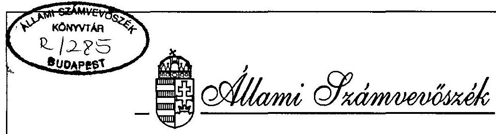
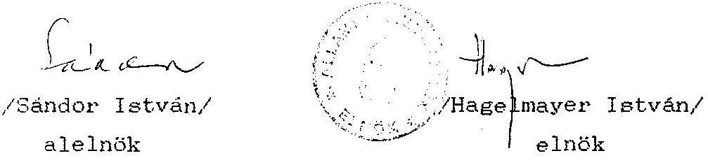
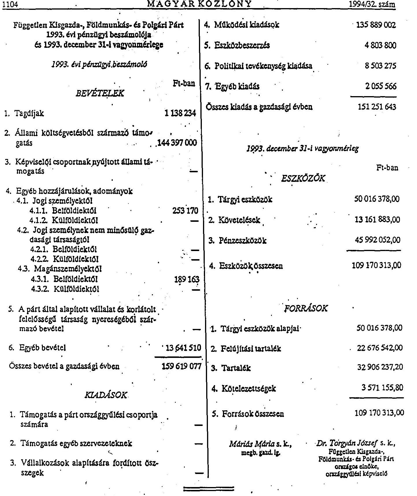

# JELENTÉS 

a Független Kisgazda-, Földmunkás és Polgári Párt 1993-1994. évi gazdálkodása törvényességének ellenôrzésérôl

---

A vizsgálat végrehajtásáért felelős: az ÁSZ IV. Vagyonellenőrzési Igazgatósága
dr. Kovács Árpád igazgató

A vizsgálatot vezette:
dr. Elek János osztályvezető főtanácsos

A vizsgálatot végezte:
dr. Dotterweich Antal számvevö tanácsos
Hoffmann István
számvevö

---

# ALLAMI SZAMVEVOSZEK 

$\mathrm{V}-1008-7 / 95$.
Tsz: 286.

## J E L K N T E S

a Független Kisgazda-, Földmunkás és Polgári Párt 1993-1994. évi gazdálkodása törvényeaségének ellenôrzésérôl

## I.

A vizsgálat célja, idôszaka, módszere, körülményei

A pártok müködésérôl és gazdálkodásáról szóló - többször módosított - 1989. évi XXXIII. törvény (továbbiakban: párttörvény) 10. 8. (1.) bekezdése, valamint az Allami Számvevôszékrôl szóló 1989. évi XXXVIII. törvény 5. 8-a alapján a pártok gazdálkodása törvényességének ellenôrzésére az Allami Számvevôszék (továbbiakban: ASZ) jogosult. A törvény felhatalmazása alapján az ASZ 1995. II. félévi ellenôrzési tervében rögzített ütemezésnek megfelelően elvégezte a Független Kisgazda-, Földmunkás és Polgári Párt (a továbbiakban: párt) gazdálkodása törvényességének ellenôrzését.

Az ellenôrzés célja annak megállapítása volt, hogy a párt müködéséhez szabályszerűen igénybevehetô forrásokat használt-e fel, a párttörvényben elôirt gazdálkodó tevékenységet folytatott-e, valamint betartotta-e a gazdálkodással összefüggô pénzügyi-számviteli szabályokat.

---

Az ellenőrzött idöszak a lezárt 1993. és 1994. gazdasági év, valamint az 1995. év elsõ féléve volt.

Az ellenőrzés módszere szúrópróbaszerũ vizsgálat a párt országos központjában rendelkezésre bocsátott iratok, dokumentumok alapján.

A helyszíni ellenőrzés 1995. augusztus 22-töl szeptember 21-ig tartott.

A párt gazdálkodása törvényességének ellenőrzése a Magyar Közlöny 1991. évi 28. számában közzétett AS2 általános ellenőrzési program szempontjai alapján történt.

# II. 

A párt gazdálkodásáról szóló 1993-1994. évi beszámolók ellenőrzésének tapasztalatai

1. Altalános megállapítások

A párttörvény 9. 8. (1.) bekezdése alapján a pártok kötelesek az elöző évi gazdálkodásukról szóló beszámolót a törvény 1. sz. mellékletében meghatározott formában a tárgyévet követő év április 30-ig a Magyar Közlönyben közzétenni. A párt az 1993. évi gazdálkodásáról és az 1994. évi gazdálkodásáról szóló beszámolót (1. és 2. sz. melléklet) a törvényes határidöben jelentette meg.

---

A közzétett beszámolók nem felelnek meg a számviteli törvényben 1992. évtől érvényes módon konkrétan megfogalmazott számviteli alapelveknek, ennek következtében főösszegükben és részleteikben nem a tényleges állapotot tükrözik. Az ellenőrzés tapasztalata szerint a beszámolók tartalmát illetően a következõ számviteli alapelvek nem teljesültek:

- A TELJESSEG ELVET sérti, hogy a beszámolók nem tartalmazzák a párt helyi és megyei szervezeteinek valamennyi, tárgyévi gazdálkodásra vonatkozó adatát. Az 1993. évi gazdálkodásról közzétett beszámolóban a helyi szervezetek többségének bevételi és kiadásai nem szerepelnek, a megyei szervezetek adatai sem teljeskörüek. Az 1994. évi beszámolóban nem szerepelnek a Csongrád megyei szervezethez tartozó helyi szervezetek adatai.
- A VALODISAG ELVET sérti, hogy a beszámolók egyes sorai nem felelnek meg a tényleges állapotnak. Az 1993. évi gazdálkodásról közzétett beszámoló az Országos Központban tapasztalt kontirozási hibák, halmozódások ki nem szúrése, továbbá a megyei szervezetek adatszolgáltatásainak a kettős könyvvitelbe történt beépitése során elkövetett hibák miatt a valóságtól eltérő adatokat is tartalmaz. Az 1994. évi beszámoló is tartalmaz kontirozási hibák, halmozódások ki nem szürése miatt pontatlan adatokat.
- A KOVETKEZETESSEG ELVET sérti, hogy nem határozták meg a beszámolók egyes sorainak tartalmát, valamint azon fôkönyvi számlák tartalmát, amelyek megnevezéséből a tartalom egyértelmüen nem állapítható meg.

---

A párt esetében csak 1994. év második felévétől szünt meg az egyszeres és kettős könyvvezetés egyidejü megléte. A jelzett idóponttól a megyei szervezetek havonkénti elszámolással és az alapbizonylatok beküldésével számolnak el, a naplófôkönvv vezetése megszünt, 1994. I. félévében azonban eltérő könyvvezetési elvek érvényesültek az Országos Központban és a megyei szervezeteknél.

A beszámolókra vonatkozó részletes megállapítások elött rögzíteni szükséges, hogy az éves beszámolóra vonatkozóan nem egyértelmü, szakmailag vitatható a párttörvényben a szabályozás, amelyet megerősített a számviteli törvény végrehajtására készített kormányrendelet. A szabályozással olyan ellentmondás keletkezett a párttörvényben elöírt beszámolási forma és a számviteli törvényben foglalt szabályok alkalmazása között, amely a gyakorlatban szakmailag nem oldható fel. Erre figyelemmel a tett észrevételek alapvetően olyan hiányosságokra irányulnak, amelyek elkerülhetők lettek volna, ha a párt kialakítja a megfelelő számviteli rendjét, és a beszámoló sorainak valamint a számviteli kategóriák közötti összhangot.

# 2. Részletes megállapítások 

2.1. A párt 1993. évi gazdálkodásáról közzétett beszámoló ellenörzése

### 2.1.1. A bevételekkel kapcsolatos megállapítások

- A tagdíjak összege nem teljeskörü, a 911. sz. "Tagdij bevételek" fôkönvvi számlára Baranya, BAZ, Fejér, Győr-Mo-son-Sopron, Hajdú-Bihar, Nógrád, Somogy, Szabolcs-Szat-

---

már-Bereg, Zala, Békés, Veszprém megyék és a budapesti szervezet beszámolója alapján került az 1.138.243 Ft összeg, tehát 8 megyei szervezet egyáltalán nem közölt a megyei szervezetre vonatkozóan sem adatot. Az adatközlõ megyék többsége esetében pedig az összeg csak a megyei szervezetre vonatkozik. Itt kell rögzíteni, hogy Nógrád megye esetében a naplófôkonyv - és így az I. félévi beszámoló is - csak 1993. április 23-tól tartalmaz adatot, a megyei pártelnök ugyanis az 1993. augusztus 11-én az FKGP Országos Központjában felvett jegyzökönyvben rögzítette, hogy csak ezen idóponttól tudja vállalni a megalapozott tájékoztatást.

- Az állami költségvetésbôl származó támogatás 144.397 E Ft összege csak a párttörvény 5. 8. (2.) bekezdése alapján megkapott összeg, nem szerepel benne a 362. sz. "Egyéb költségvetési támogatások" fôkönyvi számlára könyvelt 31.980 E Ft összegü székházfelújítási keret.
- Az egyéb hozzájárulások, adományok beszámoló soraival kapcsolatban általános megállapítása az ellenôrzésnek, hogy sem a megyei szervezetek beszámolói, sem az Országos Központban ezek alapján könyvelési bizonylatul készített feladásokban nem található meg a "jogi személynek nem minősülõ gazdasági társaságoktól" sor és ennek belföldiektől, külföldiekböl alábontása sem. Ennek következtében adatok csak a jogi személyektól és a magánszemélyektól származó hozzájárulások sorokon találhatók.

---

Az ellenôrzés megállapítása szerint a belföldi jogi személyektől származó adományok összege nem pontos, a Békés megyei szervezet beszámolójában 223.100 Ft szerepel ilyen címen, az alapbizonylatok tanúsága szerint 130 E Ft az Országos Központtól származik, a jogcím "13 megyétől levont vetőmag ára", 10 E Ft a Hajdú-Bihar megyei pártszervezettől érkezett belföldi postautalványon, azonban a Hajdú-Bihar megyei szervezet naplófôkönyvéböl nem állapítható meg, hogy jogi személy lenne az adományozó, a megyei szervezet az akkor rendelkezésére álló pénzből utalta át a 10 E Ft összeget. Helytelenül az egyéb bevételek között szerepel a 982. sz. "Bort, Búzát, Békességet alapítvány" elnevezésű fôkönyvi számlára könyvelt 1.000 Ft összegu adomány.

A belföldi magánszemélyektől származó adományok összege azon túlmenően, hogy a helyi szervezetek ilyen címen jelentkezo bevételeit nem tartalmazza, azért is pontatlan, mert e soron található 4.325 Ft-nak megfelelő USD-ben befizetett külföldi magánszemélytől származó hozzájárulás.

- Az egyéb bevételek összege az elözöekben említetteken túlmenően azért is pontatlan, mert a 98. sz. "Rendkívüli bevételek" fôkönyvi számla egyenlegét helytelenül növelték "fel nem használt Ft fed. v. ut" 69.600 Ft Összegével. További hiba, hogy helytelenül szerepel a beszámolóban 328.180 Ft összeg, az összeghez nem kapcsolódik alapbizonylat, jogcímeként "92. évet érintő bevételek" van megjelölve, a beszámolóban így semmiképp nem szerepeltethetõ.

---

Halmozódást is tartalmaz a beszámoló, a budapesti szervezet 80 E Ft-ban rögzített "Kisgazda Evkönyv értéke" címen befolyt bevételt, azonban ez az Országos Központtól származik, itt rögzítették is a kiadást az 51164. sz. fôkönyvi számlán, valójában csak párton belüli pénzmozgás történt.

# 2.1.2. A kiadásokkal kapcsolatos megállapítások 

- A beszámoló "Támogatás egyéb szervezeteknek" sora nem tartalmaz adatot, holott az 524. sz. "Egyéb szociális támogatások" fôkönyvi számla 1.781.919 Ft záróegyenlege zömében más társadalmi szervezetnek juttatott támogatásból adódik.
- A "müködési kiadások" és a "politikai tevékenység kiadása" sorok együttes tartalmát vizsgálta az ellenôrzés, mivel párton belül nem készült szabályozás arra nézve, hogy mely kiadások minősülnek müködési, illetve politikai jellegünek. Számlarend készült, azonban az ilyen címet viselõ dokumentum nem rögzíti azon fôkönyvi számlák tartalmát, amelyek elnevezése alapján egyértelmüen nem állapítható meg, a számla tartalma. Ennek következtében az sem állapítható meg, hogy mikor minősül költségnek, és mikor eszközbeszerzésnek egy kiadás. A párt megnyitotta a 145. sz. "Propaganda eszközök" fôkönyvi számlát, erre könyveltek pl. december 13-án "asztalteritő, zászló" beszerzéseket, 78.820 Ft összegben, az egyedi érték 20 E Ft alatt van, az 5117. sz. "Propaganda anyag (film, zászló, táb-

---

1a)" fókönyvi számlán is könyveltek zászlò beszerzéseket pl. március 2-án 64.125 Ft összegben, elválasztó követelmény hiányában nem állapítható meg a helyes számlatartalom.

Altalános hiba, hogy mind a költségek, mind az eszközbeszerzések összege zömében tartalmazza az általános forgalmi adót, holott a beszerzési ár, elöállitási költség a számviteli törvény elöirása szerint általános forgalmi adót nem tartalmazhat.

A "támogatás egyéb szervezeteknek" beszámolósor üresen hagyása is torzítja a müködési és politikai kiadások öszzegét.

Problémát okoz az is, hogy a számlatükör igen részletesen és nem mindig egyértelmüen bontja meg a költségeket, így gyakorlatilag a legtöbb kiadási jogcím esetében a tételt kontírozó döntésétől függ, hogy minek minösíti az adott kiadást. Kontírozási hibák is elöfordultak pl. az 5116. sz. "Könyv, folyóirat, napilap" fơkönyvi számlán található pl. virágvásárlás 730 Ft öszzegben. Helytelen, hogy 1992. évi költségek címen 1. 714.389 Ft összeget tartalmaz a beszámoló.

- Az eszközbeszerzés soron található öszzeg pontatlan, itt a párt esetében a kettős könyvvezetés miatt a tárgyi eszközök beszerzése és a 20 E Ft egyedi beszerzési érték alatti tárgyi eszközök terv szerinti értékcsökkenése együttes összege szerepelhetne. A gyakorlatban azonban

---

zömében az Országos Központ azon beszerzései szerepelnek a 4.803.800 Ft közölt összegben, amelyröl tárgyi eszköz nyilvántartó lapot állítottak ki, a beszerzési ár pedig általában helytelenül tartalmazza az általános forgalmi adót is.

Torzítja az eszközbeszerzések összegét az is, hogy a megyei szervezetek beszámolói alapján az Országos Központban kiállított könyvelési feladások indokolatlanul átminősítették a szervezet által közölt adatokat. Igy pl. Ko-márom-Esztergom megye telefonvonalért fizetett 150 E Ft hozzájárulást, ezt ingatlan beszerzéseként minősítették, Zala megye 525 E Ft értékben vásárolt egy személygépkocsit, a 141. sz. "Jármüvek" fơkönyvi számlán azonban helytelenül 435 E Ft van könyvelve. Ez a kiadások föösszegét is torzítja.
2.2. A párt 1994. évi gazdálkodásáról közzétett beszámoló ellenőrzése

# 2.2.1. A bevételekkel kapcsolatos megállapítások 

- A tagdijak összege nem teljeskörü és nem pontos. Nem teljeskörü, mert a Csongrád megyei szervezethez tartozó szervezetek tagdijbevételét nem tartalmazza. Nem pontos, mert ugyan az elôzõ évekhez képest a helyi szervezetek bevételei megjelennek már a beszámolóban, de minden bevétel tagdijbevételként lett kontirozva. A megyei szervezetek 1994. évrơl már bekérték a helyi szervezetek bizony-

---

latait és pénzügyi beszámolóit, azonban a bevételekröl egyetlen bevételi pénztárbizonylatot állítottak ki, és azt az Országos Központ a 911. sz. Tagdijbevételek fókönyvi számlára kontirozta helytelenül. A Tolna megyei szervezet az alapszervezetek pénzügyi beszámolóit is beküldte a kiállított bevételi pénztárbizonylatokon kivül, igy megállapítható volt, hogy a paksi alapszervezet esetében a bevételi pénztárbizonylaton kontirozott 22.580 Ft tagdij a pénzügyi beszámoló szerint igy oszlik meg:

- 1994. évi nyitó egyenleg: 19.420 Ft
- tagdij: $\quad 2.810 \mathrm{Ft}$
- egyéb bevétel: $\quad 350 \mathrm{Ft}$

A tényleges tagdij tehát 2.810 Ft , egyéb bevétel 350 Ft , a nyitó egyenleget pedig semmilyen bevételi jogcímen nem lehet szerepeltetni. A tíz alapszervezetböl csak négy amely kizárólag tagdijat jelent bevételként, a tagdijak fókönyvi számlán elvétve szerepel tagkönyv, tagkönyv betétlap befizetés összege is.

- Az állami költségvetésböl származó támogatás 132.612.747 Ft összege a párttörvény 5. 8. (2.) bekezdés alapján kapott összeg.
- A képviselöcsoportnak nyújtott állami támogatás 7.707 E Ft összege választási kampánytámogatás 367 fő részére. Mivel ilyen sor a beszámolómintában nem szerepel, az ellenörzés az öszzeg jelzett módon történő szerepeltetését nem kifogásolja.

---

- Az egyéb hozzájárulások belföldi jogi személyektől beszámolóban található 374.927 Ft összeg helytelen, ez ugyan a 9312. sz. azonos elnevezésũ fökönyvi számla egyenlege, de szerepel benne 100 E Ft összeg, amelyet az Országos Központ utalt a Somogy megyei szervezet részére. A Somogy megye által ilyen címen rögzített 150 E Ft hozzájárulásnak ez része, ki nem szürése pontatlanságot eredményezett.

Nem ezen a beszámolósoron szerepel az Allampolgárok Érdekképviseleti Szövetségétől származó, összesen 10.002.800 Ft összegũ adomány, bizonylatolási, könyvelési szabálytalanságok következtében a beszámoló "egyéb bevétel" sorában található ez az összeg. A fôkönyvi számla egyenlegében és a beszámoló ezen során helytelenül szerepel összesen 103.077 Ft összeg, mivel ez az Amerikai Magyarok Szövetségétől, tehát külföldi jogi személytől származó adomány.

További hiba, hogy a beszámolóban az Allampolgárok Érdekképviseleti Szövetségétöl származó adományt nem nevesítették. Helytelenül az "egyéb bevétel" beszámolósor összegében szerepel 20 E Ft összegũ, a Független Magyar Ojságtól, tehát jogi személytöl származó adomány.

- Az egyéb hozzájárulások külföldi jogi személyektől helytelenül, az elôzõ gondolatjeles bekezdésben leírtak miatt nem tartalmaz összeget. További hiba, hogy a 103.077 Ft összeget nem nevesítették. A "külföldi magánszemély támo-

---

gatása" fơkönyvi számlán helytelenül szerepel 249.590 Ft öszzeg, az alapbizonylat szerint ez külföldi jogi személytől származik, további hiba, hogy az adományozót nem nevesítették.

- A belföldi magánszemélyektől származó hozzájárulások soron feltüntetett 1.212 .282 Ft összeg pontatlan, az ilyen elnevezésü fökönyvi számla azonos összegu egyenlegében ugyanis szerepel 103.077 Ft összeggel (1994. április 15-i 1 E USD összegu) külföldi magánszemélytől származó befizetés, továbbá 174.082 Ft ugyancsak külföldi magánszemélytől kapott adomány. A fökönyvi számla halmozódást tartalmaz 80 E Ft összegben. A 80 E Ft összeg az Országos Központtól származik, a beszámolóban közölt összeg emiatt is pontatlan.
- A külföldi magánszemélyektől származó hozzájárulások összege egyrészt az elôző két gondolatjeles bekezdésben leirtak miatt pontatlan, további hiba, hogy a 103.077, a 174.082, és az 572.094 Ft összegü támogatásokat nem nevesítették adományozónként.
- Az egyéb bevétel soron található összeg pontatlan, egyrészt az elôző gondolatjeles bekezdésekben leírtak miatt, továbbá mert november 29-i keltezéssel "téves utalás visszautalása" jogcímen 2.137 Ft-ot könyveltek a főkönyvi számlára, holott ez nem bevétel, a 964. sz. fökönyvi számla tartozik oldalára pedig összesen 2.740 Ft-ot könyveltek helytelenül, amelyek nem bevételcsökkentő tételek.

---

# 2.2.2. A kiadásokkal kapcsolatos megállapítások 

- A beszámoló "Támogatás egyéb szervezeteknek" sora nem tartalmaz adatot, az ellenőrzés megállapítása szerint azonban az 524. sz. "Egyéb szociális támogatás" fôk0̈nyvi számla 668.416 Ft összesen adata túlnyomórészben egyéb szervezeteknek nyújtott támogatásból adódik, más szervezeteknek nyújtott támogatás található az 5241. sz. Egyéb támogatás fôk0̈nyvi számlán is. E témakörnél szükséges rögzíteni, hogy a Független Magyar Ifjúság és a Kisgazdapárt Országos Női Szövetsége 0́nálló, alapszabállyal rendelkezõ nyilvántartásba vett társadalmi szervezetek, mindazonáltal gazdálkodásuk beleolvad a párt számvitelébe.

A Független Magyar Ifjúságot illetően a szervezet kódszáma alapján rendelkezésre bocsátott gépi kigyưjtések szerint a következõ kiadások terhelték a pártot:

- teljes munkaidőben foglalkoztatottak bére: 359.000 Ft
- tiszteletdij: $\quad 121.440 \mathrm{Ft}$

öszzesen: 460.440 Ft

A Női Szövetséget illetően:

- TB járulék: 89.927 Ft
- Betegazabadgág: $\quad 10.714 \mathrm{Ft}$
- Nyugdijas foglalkoztatott bér: 210.000 Ft
- Teljes munkaidöben foglalkoztatott bér: 113.667 Ft
- Postai szolgáltatások: 4.900 Ft
- Tárgyi eszközök karbantartása: 6.930 Ft

öszzesen: 436.138 Ft

---

Az SZJA, TB, a munkáltatói járulék és egyéb költségvetési kapcsolatokat is a párt teljesiti a két szervezet helyett. A kialakított gyakorlat törvénysértō, a két szervezet helyett teljesített kiadások egyéb szervezeteknek nyújtott támogatásnak minősülnek. A szervezeteknek saját adószámmal, könyvvezetéssel kellene rendelkeznlük.

- A "müködési kiadások" és a "politikai tevékenység kiadása" sorokat 1994. évet illetően is együttesen vizsgálata az ellenőrzés, mivel ez évben sem készült belsõ elöírás arra nézve, hogy mely kiadások minősülnek müködésinek illetve politikainak. Az eszközbeszerzés és a költségek esetében az általános forgalmi adót illetően elörelépés történt, tekintettel arra, hogy a második félévtől az Országos Központban történt valamennyi kiadási bizonylat kontirozása, túlnyomórészt megfelelően, a hibák a megyék elsõ féléves bizonylatainál jelentkeznek általában, ahol is az AFA összeget nem vették ki sem a költségek, sem a beszerzések összegéből.

A müködési kiadások összege halmozódást tartalmaz, az 5241. sz. "Egyéb támogatás" fơkönyvi számlán április 14-i keltezéssel könyvelt 80 Ft összeg valójában elöleg az alapbizonylat tanúsága szerint, a tényleges kiadások a megfelelő költségnem számlákon jelentkeznek.

Itt szükséges rögzíteni, hogy az alapszervezetek kiadásait, akárcsak a bevételeket egy kiadási pénztárbizonylat alapján az 5691. sz. "Alapszervezetek kiadásai" fơkönyvi

---

számlára kontirozták, nem a megfelelő költségnem számlákra. Kontirozási hibák is előfordulnak pl. az 5112. sz. irodaszer, nyomtatvány főkönyvi számlára 468 Ft összegben szállásköltséget is könyveltek.

- Az eszközbeszerzés soron feltüntetett 809.705 Ft nem pontos. Könyvelési, bizonylatolási hibák miatt a fökönyvi számlák alapján a helyes összeg nem állapítható meg. Igy pl. a 141. sz. jármúvek fôkönyvi számlán könyvelt 1994. évi beszerzések az ellenőrzés megállapítása szerint zömében valójában 1993. évben történtek, de az évben tárgyi eszköz nyilvántartó kartont nem állítottak ki a beszerzett személygépkocsikról.
- Az egyéb kiadások soron lévő 16.581.334 Ft összege1 kapcsolatosan az ellenőrzés nem kifogásolja, csak rögzíti, hogy a 86-88. számlacsoportok számláinak tartozik egyenlegei összesenje.
III.

# A beszámolók megalapozottságát alátámasztó   könyvvizsgálati megállapítások 

1.1. Az 1993. évi könyvvezetés ellenőrzése

Az 1993. évi V-1010-20/1993. sz. Vizsgálati jelentés a könyvvezetési kötelezettséget illetően 12-14. oldalán felsorolta a január 1. - június 30. közötti időszakra szúrópróbaszerú ellenőrzéssel megállapított hiányosságokat.

---

Az ellenôrzés megállapítása szerint a második félévben is fennállt az a helytelen gyakorlat, hogy nem egységes könyvvezetési rendszer érvényesült a párt egészét illetően.

Hibák származtak abból is, hogy a megyei szervezetek beszámolói adatait több esetben indokolatlanul megváltoztatták a könyvelés alapjául szolgáló feladásokban, igy alapbizonylatoktól eltérő jellegű és összegű gazdasági események szerepelnek a beszámolóban.

Az Országos Központban tapasztalt, a beszámolót torzító kontirozási hibák a II. fejezetben ismertetésre kerültek, a mérlegszámlákat illetően is elôfordultak helytelen kontirozások.

Jellemzó hiányosság volt az egész évben, hogy a helyi szervezetek bevételi és kiadási adatai zömében nem épültek be a könyvvezetés rendszerébe.

# 1.2. Az 1994. évi könyvvezetés ellenőrzése 

Az ellenőrzés megállapítása szerint a könyvvezetés egységes rendszere az év második felében megvalósult, a bizonylatoknak az Országos Központban történt kontirozása gyakorlattá vált, megszünt a megyei szervezeteknél a könyvvezetés. Előrelépést jelent a korábbi évek gyakorlatához képest az is, hogy megtörtént a megyei naplófôkönyvek adatainak ellenörzése az Országos Központ részéről, a tapasztalt hibákat a szervezetek több mint fele korrigálta.

---

Ez évben a helyi szervezetek bevételi és kiadási adatai túlnyomórészt beépültek a könyvvezetésbe, hiba azonban, hogy a bevételek és a kiadások csak egy-egy jogcímen (tagdíjak és különféle egyéb költségek) kerültek be a fơkönyvi könyvelésbe. A kontirozási hibák részletezése a vizsgálati részjelentés II. fejezetében megtörtént.

# 1.3. Az 1995. évi könyvvezetés ellenőrzése 

A szúrópróbaszerú ellenőrzés megállapítása szerint a fókönyvi számlákra bizonylatok alapján, idősorrendben rögzítik a gazdasági eseményeket. Ez évet illetően is tapasztalhatók kontirozási hibák, pl. a 9111. sz. Tagdíjak fókönyvi számlán február 10-i keltezéssel könyvelt 79.988,70 Ft összegből a pénztárbizonylat alapján 4.517,70 Ft "1994. évi nyitó készlet".

A helyi szervezetek kiadásai ez évben is helytelenül egyetlen fơkönyvi számlán az 565. sz. Helyi szervezetek költségein találhatók június 30-án 222.819,30 Ft összegben.

Megfelelő számlarend, más belsó utasítás hiányában ez évet illetően sem vizsgálhatta az ellenőrzés a müködési és a politikai költség helyességét.
2. Az analitikus nyilvántartások és a bizonylati rend ellenőrzése
2.1. A párt Központja - a számviteli törvényben foglaltaknak megfelelően - vezeti a tárgyi eszközök nyilvántartását, SZJA köteles kifizetések és elszámolásra kiadott előlegek

---

nyilvántartását, TB bevallás és befizetés, valamint a szállítók követelését mutató nyilvántartást.
2.2. Személyi jövedelemadó bevallásának és befizetési kötelezettségének a párt mindkét évben eleget tett. Ugyancsak rendbenlévőnek találta az ellenőrzés a társadalombiztosítással kapcsolatos nyilvántartásokat, bevallásokat és befizetéseket is.
2.3. A párt szigorú számadású nyomtatványként kezeli a pénztárbizonylatokat és a kiküldetési rendelvényeket.
2.4. A bizonylati rend és fegyelem - a legutóbbi ASZ ellenőrzés óta - javult.

A párt központi számvitele 1994. és 1995. évben - a számviteli törvény 83. §. (1.) bekezdésében foglaltaknak eleget téve - minden gazdasági mũveletről, eseményről, amely az eszközök, illetve az eszközök forrásainak állományát vagy összetételét megváltoztatja - az ellenőrzés megállapításainak tanúsága szerint - egy-egy kivételtől eltekintve, bizonylatot állított ki, megfelelő dokumentációval ellátva. Ezt a vezetés egy belsõ ügyviteli utasítás kiadásával érte el, amelynek végrehajtását - 1994. évtől kezdődően - folyamatosan ellenőrizte.
2.5. A külföldi utaztatások ügymenete és elszámolási gyakorlata a hatályos elöírásoknak, jogszabályoknak eleget tesz.

---

A párt devizaforgalmának volumene - 1993. és 1994. évben egyaránt - az éves engedélyezett kereten belül alakult. A devizafelhasználást, illetve forgalmat az újonnan készített házipénztár pénzkezelési szabályzaton belül külön szabályozták. A devizaforgalom lekönyvelésére a fơkönyvi számlák között devizaelszámolási számlát nyitottak. Ezzel megszüntették azt a korábbi gyakorlatot, amelyet az ASZ ellenörzés legutóbb kifogásolt. A valuta átvételét és mozgását ezt követően - minden esetben dokumentálták, pénztárbevételi és kiadási bizonylat kiállításával, a kiutazókat pedig elszámoltatják.
2.6. Utólagos elszámolásra kiadott előlegek nyilvántartása és elszámoltatása rendje megfelelō. A kiadott összegek nagyságrendje és gyakorisága jelentősen leszükült. Az előleg felvételére jogosultakat - áttekinthető módon - külön megnyitott fơkönyvi számla alapján - számoltatják el.

A legutóbbi ASZ ellenőrzés felhívta a párt vezetését, hogy számoljon el az elszámolatlan külföldi utakkal. Ennek érdekében a párt 1994. év elején adatokat kért a Magyar Külkereskedelmi Bank Rt-töl. A megkapott hivatalos adatok alapján felszólította mindazon személyeket, akik a felvett utielöleggel (valutával) azideig nem számoltak el, az elszámoltatások folyamatban voltak az ellenőrzés idöszakában.
2.7. A költségtérítések gyakorlatát tekintve a párt egységesen szabályozta a

- hivatali gépjármú hivatali;
- saját gépjármú hivatali

---

célú használatát. A gyakorlat során az ezzel kapcsolatos jogszabályi rendelkezéseket, azaz az SZJA-ban, illetve annak felhatalmazása alapján az üzemanyag felhasználás megtérítésének módjait rendezô 66/1992. (IV. 1.) sz. kormányrendeletben foglaltakat az ellenôrzött idôszakban általában betartotta. 1993. IV. negyedévében és 1994. I. félévében azonban több esetben elöfordult, hogy a gépjármüvek üze-ma-nyag-elszámolásánál nem az útvonal-nyilvántartás alapján történő norma szerinti elszámolást alkalmazták, hanem üzemanyagszámlák alapján térítették meg a költségeket.

A párt a gazdálkodásához és ügyviteléhez szükséges szabályzatokkal rendelkezik, a következökben:

- Számviteli és Vagyonkezelési Szabályzat;
- Devizaelszámolási Szabályzat;
- Kiküldetési költségek elszámolási Szabályzat;
- Leltározási és Selejtezési Szabályzat;
- Házipénztár Pénzkezelési Szabályzat;
- Megyei Szervezeteinek Ugyviteli Rendje;
- Közúti gépjármú használata és költségelszámolása Szabályzat;
- Számviteli Politika.

A gazdálkodás és ügyvitel szinvonala már 1993. év végén javult, de komolyabb változás 1994. közepén indult meg, amikor gazdasági igazgatócsere történt. A gazdasági ügyek irányitására gyakorlott és képzett munkavállalót alkalmaztak.Mindezt a párt Országos Ellenőrzô Bizottsága

---

által végzett vizsgálat is alátámasztotta, amelyet 1995. júniusában végzett el. A vizsgálat átfogta a párt gazdasági tevékenységét, annak szabályosságára terjedt ki, megyei szintig bezárólag. Vizsgálta a korábbi ASZ ellenőrzés megállapításai alapján hozott belsõ intézkedések végrehajtását is. Megállapította, hogy az elôírt intézkedéseket döntõ részében megvalósították, a hiányosságokat felszámolták.

# IV. 

## A párt bevételi forrásainak és gazdálkodó tevékenységének vizsgálata

A párt bevételi forrásai tagdíjakból, hozzájárulásokból, állami költségvetési támogatásból, gazdálkodó tevékenységbôl és egyéb bevételből származtak a vizsgált idôszakban, összhangban a párttörvény 4. 8. (1.) bekezdésének rendelkezéseivel.

A párt a párttörvény 6. 8. (1.) bekezdésének a./ pontjában említett gazdálkodó tevékenységek közül az ellenôrzés részére adott nyilatkozat és az ellenôrzés megállapítása szerint a kiadványok, jelvények, ingók értékesítésének lehetôségével élt. A párttörvény 6. 8. (1.) bekezdésének b./ pontja alapján az Országos Központ a tulajdonában álló ingatlant hasznosította díj ellenében.

Az ellenôrzés tiltott gazdálkodó tevékenységet állapított meg két esetben:

---

- az Országos Központ számlát állított ki "folyamatos jogsøgélyszolgálati jogtanácsadás" címén 100 E Ft összegben;
- a Hajdú-Bihar megyei szervezet készpénzfizetési számla alapján 1994. november 30-án bevételezett "terembérleti dij" címén 2 E Ft-ot, nem tulajdonában álló ingatlan hasznosításából eredöen.

A párttörvény 6. 8. (1.) bekezdésében felsorolt tevékenységeken kívül más tevékenység, így jogtanácsadás dí ellenében nem végezhető, a nem tulajdonban lévő ingatlan hasznosítása ugyancsak tilos.

# V. 

## Az ASZ korábbi jelentésében foglalt felhívásra tett intézkedések

A párt az 1993. évi Vizsgálati jelentésben tett felhívás egyes pontjaira a következõ intézkedéseket tette:

1. Megjelentette ismételten az 1992. évi beszámoloját, ebben már nemcsak az Országos Központ adatai szerepelnek. Teljesen pontos beszámoló elkészitésére azért nem volt lehetöség, mert több megyei szervezet esetében a vezetőség változásnál a pénzforgalmi okmányokat nem adták át az új vezetés részére, annak ellenére, hogy emiatt a párt feljelentéseket tett, birósági eljárásokat kezdeményezett. A nem pótolható adathiánynok miatt nem indokolt a beszámoló pontositására felhívás.

---

2. Intézkedtek a fennálló hitel visszakövetelés iránt, a megyei bíróság jogerős ítéletét bemutatták.
3. Intézkedtek az elszámolatlan hivatalos célú valutafelvételek elszámolása iránt.

# VI . 

## Felhívás a törvényes állapot helyreállítására

A vizsgálat megállapításai alapján a párttörvény 10. 8. (4.) bekezdésében kapott felhatalmazás alapján az Allami Számvevõszék felhívja a párt elnökét, hogy:

1. Az ellenôrzési megállapítások figyelembevételévek készítsék el és tegyék közzé a párt tényleges állapotnak megfelelő gazdálkodási adatai tartalmazó 1993. és 1994. évi beszámolóit.
2. Készítsék el a számvitelről szóló törvény elõírásainak megfelelő számlarendet és az egyes beszámolósorok tartalmát rögzítõ belsõ elõírást.
3. A Független Magyar Ifjúság és a Nõi Szövetség párttól elkülönített könyvvezetésérõl gondoskodjanak.

---

4. A párttörvény 6. 8. (5.) bekezdése, valamint a 4. 8. (4.) bekezdése alapján a IV. pontban részletezett tiltott gazdálkodó tevékenységböl származó 102 E Ft összeget a jelentés kézhezvételétól számitott 15 napon belül fizessék be az állami költségvetésbe.

A párttörvény 6. 8. (5.) bekezdése értelmében további szankcióként a párt költségvetési támogatását a tiltott gazdálkodó tevékenység bevételével 102 E Ft, azaz százkettőezer Ft-tal csökkenteni kell. Erre az ASZ a szükséges kezdeményezést megteszi.

Budapest, 1995. november "29."

Melléklet: 2 db

---

1. Támogatás a párt országgyưlési csoportja számára
2. Támogatás egyéb szervezetehnek
3. Vállalkozások alapítására forditott öszszegek

---

4.2 Az adó- és pénzügyi-, vám-, valamint a munkaügyi, társadalombiztosítási ellenőrzést szigorítani, a tipikus visszaélési területekre koncentrálni szükséges.
Felelós: a pénzügyminiszter
a népjóléti miniszter
a munkaügyi miniszter
a társadalombiztosítási önkormányzatok felkérésével
Határidő: azonnal
4.3 Az adó-, pénzügyi szervek és a rendőrség személyi és technikai feltételeit javítani kell. Ennek érdekében az APEH, a VPOP és a Határőrség részére együttesen a többletbevételek terhére 2,5 milliárd forintot, a rendörség részére 1 milliárd forintot kell rendelkezésre bocsátani.
Felelós: a pénzügyminiszter
Határidő: 1995. június
4.4 Meg kell vizsgálni a munkavállalói igazolvány bevezetésének olyan lehetőségét, amely módot ad a társadalombiztositási és a munkaügyi nyilvántartások összevetésére, összchangolására, ezzel a feketemunka-végzés feltárására.

Felelós: a munkaügyi miniszter
a népjóléti,miniszter
a belügyminiszter
a társadalombiztosítási önkormányzatok felkérésével
Határidő: 1995. június

## 5. Egyéb intézkedések

5.1 A Kormányt rendszeresen tájékoztatni kell az e határozatban foglaltak végrehajtásáról, valamint az ország gazdasági-pénzügyi helyzetéröl.
Felelós: pénzügyminiszter
az érintett miniszterek bevonásával
Határidó: a tárgyhónapot követő hónap 30-a
5.2 Az e határozatban foglaltakkal kapcsolatban felül kell vizsgálni a Kormány 1995. I. félévi munkatervét, valamint az 1995. 1. félévi jogalkotási tervét, és javaslatot kell készíteni a szükséges módosításra.
Felelós: a Miniszterelnöki Hivatal közigazgatási államititkára
Határidó: 1995. március 31.

Horn Gyula s. k.,
miniszterelnök

## KÖZLEMENYEK HIRDETMENYEK

Független Kisgazda-, Földmunkás- és Polgári Párt 1994. évi beszámolója

## BEVÉTELEK

1. Tagdíjak 6117757
2. Állami költségvetésbő̉l származó támogatás 132612747
3. Képviselői csoportnak nyújtott állami támogatás 7707000
4. Egyéb hozzájárulások, adományok
4.1. Jogi személyektől
4.1.1. Belföldiektől 374927
4.1.2. Külföldiektől
4.2. Jogi személynek nem minősülő gazdasági társaságtól
4.2.1. Belföldiektől
4.2.2. Külföldiektől
4.3. Magánszemélyektől
4.3.1. Belföldiektől 1212282
4.3.2. Külföldiektől 884978
5. A párt által alapított vállalat és korlátolt felelősségủ társaság nyereségéből' származó bevétel
6. Egyéb bevétel 15868919

Összes bevétel a gazdasági évben 160778610

## KIADÁSOK

1. Támogatás a párt országgyúlési csoportja számára
2. Támogatás egyéb szervezeteknek
3. Vállalkozások alapítására fordítolt ơszszegek
4. Müködési kiadások 136960185
5. Eszközbeszerzés 809705
6. Politikai tevékenység kiadása 43129940
7. Egyéb kiadás 16581334

Összes kiadás a gazdasági évben 197481164

---

Független Kizgazda-, Földmunkás- és Polgári Párt 1994. december 31-i vagyonmérlege

# Eszközök 

1. Tárgyi eszközök
2. Követelések
3. Pénzeszközök

Eszközök összesen

## Források

1. Tárgyi eszközök alapjai
2. Feltiitási tartalék
3. Tartalék
4. Kötelezettségek

Források összesen
Szücs Ernőné s. k.,
mb. gazdasági igazgató

## Források

Dr. Torgyán József s. k., Független Kizgazda-, Földmunkás-és Polgári Párt elnöke, országgyüési képrisció

Helyesbités: A Magyar Közlöny 1995. évi 21. számában kínlrdetett, az általános vámpóliék bevezetéséröl szóló 9/1995. (III. 17.) IKM-PM együttes rendelet 3. § (2) bekezdés b) pontja helyesent
„3) a külföldiek magyarországi befeleltetéséröl szóló 1988. évl XXIV. iörvény 18. és 21. §-ainak alkalmazása, és"
(Kéziraihiba)