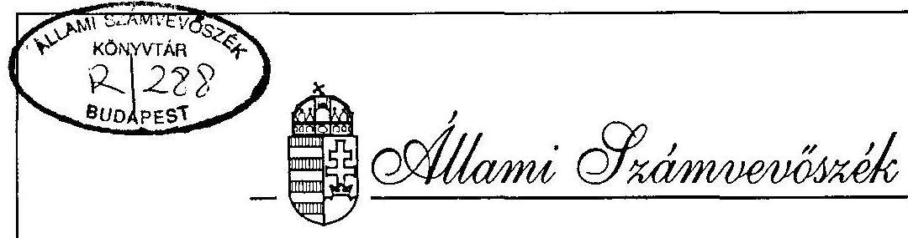
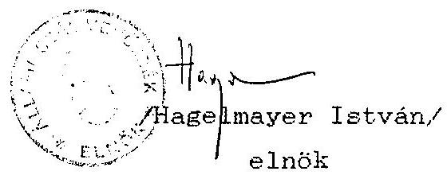

# JELENTÉS 

a Magyar Igazság és Élet Pártja
1993-1994. évi gazdálkodása törvényességének ellenőrzéséről

---

A vizsgálat végrehajtásáért felelős: az ÁSZ IV. Vagyonellenőrzési Igazgatósága
dr. Kovács Árpád igazgató

A vizsgálatot vezette:
dr. Elek János osztályvezető főtanácsos

A vizsgálatot végezte:
dr. Szávai Tamás számvevő tanácsos
Écsy Lajosné
számvevő

---

# ALLAMI SZAMVEVOSZEK 

V-1009-10/1995.
Tsz: 287 .

## J E L E N T E S

a Magyar Igazság és Elet Pártja
1993-1994. évi gazdálkodása törvényességének ellenôrzésérôl

## I.

## A VIZSGALAT CELJA, MÓDSZERE, IDOSZAKA, KOROLMENYEI

A pártok müködésérôl és gazdálkodásáról szóló - többször módosított - 1989. évi XXXIII. törvény (továbbiakban párttörvény) 10. 8. (1) bekezdése, valamint az Állami Számvevõszékrôl szóló 1989. évi XXXVIII. törvény 5. 8. alapján a pártok gazdálkodása törvényességének ellenôrzésére az Állami Számvevôszék (továbbiakban: ASZ) jogosult. A törvényi felhatalmazás alapján az ASZ második félévi ellenôrzési tervének megfelelôen vizsgálta a Magyar Igazság és Elet Pártja (a továbbiakban: párt) gazdálkodása törvényességét. Az ASZ az 1993. évben alapított párt gazdálkodásának törvényességét elsôízben vizsgálta.

Az ellenôrzés célja annak megállapítása volt, hogy a párt müködéséhez szabályszerűen igénybevehetõ forrásokat használt-e fel, a párttörvényben engedélyezett gazdálkodó tevékenységet folytatott-e, valamint betartotta-e a gazdálkodással összefüggõ pénzü-gyi-számviteli szabályokat.

---

Az ellenôrzés az 1993. és 1994. évi beszámolóval lezárt idõszakra, valamint a folyó I. félév egyes bevételeire terjedt ki. A folyó evi vizsgálat részeként az ellenôrzés kitért az 1994. évi választásokra kapott külön költségvetési támogatási kerettel való elszámolásra is. A helyszíni ellenőrzés 1995. augusztus 22 -töl szeptember 22 -ig tartott.

A jelentés megállapításai a párt országos központjában rendelkezésre boosátott. valamint a helyi szervekto̊l bekért íratok, dokumentusok alapján lefolytatott helyszini ellenőrzés tapasztalatain alarainak. A helyszini vizsgálatokat követöen az Allami Számvevôszék lehetôséget biztosított a párt részére és a hiányzó adatok. íratok pótlására. nyilatkozatok megtételére.

A párt gazdálkodása törvényességének ellenőrzése a Magyar Közlöny 1991. évi 28. számában közzétett ASZ általános ellenőrzési program szempontjai alapján történt.

# AZ ELLENORZES MEGALLAPITASAI 

## II.

Az éves beszámolók pontossága és teljeskörüsége

## 1. Altalános megállapítások

A párt az 1993. évi beszámolóját 1994. április 30-án, a Magyar Közlöny 46. számában, az 1994. évi beszámolóját 1995. április 28-án a Magyar Közlöny 33. számában jelentette meg (1. és 2. sz. melléklet). A beszámolókat - az adományok részletezéseinek kivételével - a párttörvény 1. sz. mellékletében elöirt formában és tartalommal hozták nyilvánoszágra.

---

A közzétett beszámolók a Központ és a helyi szervezetek egy részének összesített gazdálkodási adatai tartalmazzák.

Az éves beszámolók tartalmát illetően több esetben pontatlanság, illetve a teljeskörüség hiánya tapasztalható. Egyik évben sem tartalmazzák teljeskörüen a beszámolók a helyi szervezetek gazdálkodási adatait. Emellett az 1994. évi beszámoló adatai és a könyvelési adatok között eltérés mutatkozik.

Az elmondottak miatt a számviteli alapelvek közül nem teljesült a teljesség és a valódiság elve. Azáltal, hogy nem határozták meg a beszámoló egyes sorainak tartalmát a következetesség elvét sem sikerült érvényesiteni. A munkakör nettó könyvelése miatt a bruttóelszámolás elve sérült.

A beszámolóval kapcsolatban tapasztalt hiányosságokért nem marasztalható el minden esetben a párt. Ennek a más pártoknál is kifogásolt helyzetnek az az alapvető oka, hogy az éves beszámolóra vonatkozóan nem egyértelmü, szakmailag vitatható a párttörvényben a szabályozás, amelyet megerősített a számviteli törvény végrehajtására készített kormányrendeletet. A szabályozással olyan ellentmondás keletkezett a párttörvényben elöírt beszámolási forma, és a számviteli törvényben foglalt szabályok alkalmazása között, amely a gyakorlatban szakmailag nem oldható fel. Erre figyelemmel a tett észrevételek alapvetően olyan hiányosságokra irányultak, amelyek elkerülhetők lettek volna, ha a párt kialakítja a megfelelő számviteli rendjét, és a beszámoló sorainak valamint a számviteli kategóriák közötti összhangot.

---

2. Az 1993. és 1994. évi beszámolókhoz kapcsolódó részletes megállapítások
2.1. A beszámolók 4. Egyéb hozzájárulások, adományok során egyik évben sem részletezték a párttörvény 1. sz. mellékletében elöirt - adományozók szerinti - bontásban a pártnak nyújtott támogatásokat. Ezenkívül az 1994. évi beszámolóban nem nevezitették a külföldiektől szénmazó 100.000 Ft feletti hozzijárulást sem. Igy pl. a könyvelési adatok szerint a párt bankszámláján jóváirt 138.956,57 Ft értékủ 2.289,99 DM adományozóját a beszámolóban nem nevezték meg.
2.2. A III. 1.2/b. pontban részletezett könyvvezetési hibák miatt az 1994. évi beszámolóban a ténylegesnél 28.158,81 Ft-tal kevesebb bevételt és 1.580 Ft-tal több kiadást mutattak ki.
2.3. A helyi szervezetek hiányos adatszolgáltatása miatt az éves beszámolók nem tekinthetők teljeskörünek és pontosnak.

Az éves beszámoló készitésének idöszakában az Országos Központ több izben is felszólította a helyi pártszervezeteket az adatszolgáltatásra, amely felhívásnak azok maradéktalanul nem tettek eleget. A bejegyzett, de pénzforgalmat nem bonyolító szervezetektöl a gazdálkodás nemlegességét tanúsitó igazolást nem kértek. Ezért a beszámoló nem teljes.

A beszámolók pontatlanságához az elöbb említett teljeskörüzés hiányán túlmenően hozzájárult a helyi szervezetek részére elöirt kötelezö éves adatszolgáltatás hiányos tartalma is.

---

2.4. Az 1994. évi beszámoló azért sem nevezhető teljeskörünek, mert a Magyar út Alapítvány által az országgyúlési választásokhoz biztosított 5.053 .992 Ft összegü költségátvállalást nem tartalmazza. A párttörvény 4. 8. (5.) bekezdése szerint a nem pénzben nyújtott anyagi hozzájárulásnak minösülö költségátvállalást a beszámoló bevételi oldalán az adományozó névszerinti feltüntetésével, a kiadásí oldalon pedig a politikai tevékenység kiadásai elnevezésủ soron azonos összegben kellett volna szerepeltetni.

# III. 

A beszámolók megalapozottságát alátámasztó
könyvviteli megállapítások

## 1. Könyvvezetés

### 1.1. Altalános megállapítások

A párt a vizsgált időszakban az egyszeres könyvvitel rendszerében - naplófôkönyv vezetésével - tett eleget a számvitelról szóló 1991. évi XVIII. törvény (továbbiakban: Szt.) 12. 8-ában elöirt könyvvezetési kötelezettségének.

A gazdálkodás szervezettségének biztosítása érdekében számviteli politikájukat írásban rögzítették. Ennek során elkészítették: a számviteli szabályzatot, a házipénztárkezelési utasítást, a gépkocsi-használati, anyaggazdálkodási és a tagdijbefizetés rendjét szabályozó utasításokat.

---

Feit említett szabályozások azonban nem biztosították a választott könyvelési rendszer egységes - valamennyi szervezeti egységre kiterjedõ - alkalmazását, mivel a naplófökényvben nem rögzítették teljeskörűen és folyamatosan a párt valamennyi szervezeti egységének pénzforgalmi gazdasági adatait.

# 1.2. Rózületes megállapítások 

a./ Az Alapazabály értelmében a helyi pártszervezet önálló jogi személlyé válik az Országos Elnökség elfogadó nyilatkozatára. Az egyesülési jogról szóló 1989. évi II. törvény 2. §. (4.) bekezdése értelmében az a szervezeti egység nyilvánítható önálló jogi személlyé, amelynek önálló ügyintéző és képviseleti szerve van, valamint a müködéséhez szükséges önálló vagyonnal (önálló költségvetéssel) rendelkezik. E feltételek a pártnál a vizsgálati idôszakban nem teljesültek.

Az alkalmazott gyakorlat is ellentmond a helyi szervezetek önállóságának, ugyanis a Hódmezővásárhelyi Szervezet kivételével a helyi szervezetek - a központ által választott és így a párt valamennyi önálló egységére kötelező - könyvvezetést nem végeztek.

A helyi szervezetek által vezetendő nyilvántartás formájáról a Számviteli Szabályzat nem rendelkezik. A gazdálkodásról szóló körlevelek és utasítások pénztárkönyv vezetését, valamint a bevételekröl és kiadásokról negyedéves adatszolgáltatási kötelezettséget írnak elö a helyi szervezetek számára.

---

A helyi szervezetek többsége a pénztárkönyv-vezetési kötelezettségének eleget tett. A gazdálkodásról szóló negyedéves adatközlést azonban csak 1995. I. negyedévétől kezdték teljesíteni, de még ezt sem teljeskörüen. Ezen adatszolgaltatás formája és tartalma korszerűsítésre szorul.
b./ A könyvviteli zárlati munkák ellenőrzése során megállapítást nyert, hogy 1994. év végén a naplófôkönyvi adatok számozaki egyeztetésének elmaradása miatt a téves könyveléseket nem helyesbitették. Emiatt 28.188,81 Ft összegü külföldi adomány nem szerepel a naplófôkönyv megfelelő jogcimen kimutatott bevételei között, illetve a téves összeadások miatt összesen 1.580 Ft-tal több kisdást mutattak ki a müködési kiadások között. Fentiek következménye az is, hogy a helyi szervezetek 27.147.60 Ft összeguu nyitó egyenlegének felhasználása a naplófôkönyv adataiból nem állapítható meg.
c./ A naplófôkönyvben a pénzbevételek és pénzkiadások elszámolásával kapcsolatban az ellenőrzés az alábbi hiányosságokat állapította meg.

- Az egy fö részére folyósitott munkabért nettó módon könyvelték el.
- Egyes esetekben a helyi szervezeteknek kifizetett ellátmányokat, illetve utólagos elszámolásra átadott pénzeket közvetlenül a kiadások között elszámolták, és nem tartották nyilván elszámolási elöleg tartozásként.

---

- Az ellátmányok és utólagos elszámolásra kifizetett pénzek és azok visszafizetésének könyvelésével kapcsolatos hiányosság, hogy a pénzmozgásokat a pénztári forgalom könyvelésével párhuzamosan a követelések növekedése és csökkenése soron nem könyvelték el. Emiatt a naplófökönvvben a pénzügyi elszámolások egyezősége csak a felvett előlegek visszafizetése alkalmával állt helyre.

2. Az analitikus nyilvántartások, a bizonylati rend és az egyéb elszámolási szabályok ellenőrzése
2.1. A pártnál a naplófökönyv mellett az egyszeres könyvvitel keretében - a Szt. 80. 8-ában elöirt - kiegészítő és analitikus nyilvántartásokat nem vezették. Igy pl. a követelésekröl, a kölcsönkapott eszközökröl, a pártot szimbolizáló jelvények és nyakkendők értékesitésének elszámolásáról semmilyen nyilvántartást nem vezettek. A nyugtaadási kötelezettséget nem tartottak be.
2.2. a./ A Szt. 83. 8. (2.) bekezdése értelmében a számviteli (könyvviteli) nyilvántartásokba csak szabályszerűen kiállitott bizonylat alapján szabad adatokat bejegyezni. Azáltal, hogy a helyi szervezetek az adatszolgaltatásukhoz nem csatolták eredeti bevételi és kiadási bizonylataikat és a könyvelés év végén az igy ellenörizhetetlen tartalmú adatszolgaltatás alapján történt, ez a számviteli alapelv sérelmet szenvedett.

Csongrád Városi Szervezet pénztárkönyvet nem vezetett, az elöirt bevételi és kiadási pénztárbizonylatokat nem használta.

---

b./ A számviteli törvény fent hivatkozott szakasza szerint a pénzeszközöket érintő gazdasági müveletek, események bizonylatait késedelem nélkül, a pénzmozgással egyidejüleg, illetve a pénzintézeti értesítés megérkezésekor rögzíteni kell. Fenti elöirást a helyi szervezetek közül a Csongrád Városi Szervezet nem tartotta be.

A Központ 1995. évi könyvelésének gépi könyvelésre történő folyamatban lévő átszervezése részben hozzájárult ahhoz, hogy a tárgyévi pénzforgalmi adatok az ellenőrzés idöpontjában csak részben kerültek rögzítésre. A pénztári forgalmat augusztus, a bankforgalom nyilvántartását július hónapig könyvelték el.
c./ A Szt. 85. 8-a meghatározza a bizonylatok alaki és tartalmi kellékeit. Ezek érvényesitésével kapcsolatban az ellenörzés az alábbi észrevételeket tette.

- A Központ belsö utasításban történt szabályozása ellenére a pénztárbizonylatokat 1994. júliusáig egyáltalán nem utalványozták.
- Több esetben elöfordult, hogy a bevételi pénztárbizonylatokról hiányzik a befizető aláírása. Igy pl. a pártot szimbolizáló jelvények értékesítése során csak a befizetett összeget tüntették fel, az értékesített mennyiség és a befizető aláírása nélkül.

Ugyancsak hiányzik a befizető aláírása az 1994. július 4-én bevételezett 5.000 Ft összegu költséghozzájárulásról.

---

- Bizonylati hiányosság, hogy 1994. február 11-én "térképvásárlás" címén kifizetett 2.000 Ft számlával történő igazolása és a fenti összeg átvevőjének aláírása hiányzik a bizonylatról.
d./ További hiányosság, hogy a belföldi kiküldetéshez igénybevett saját gépkocsihasználat esetén a fizetendó térítési dijat nem minden esetben támasztották alá a belső szabályzatban elöirt útvonalnyilvántartással.
e./ A szigorú számadású nyomtatványok körét nem jelölték ki, bár a pénztáribizonylatokat a gyakorlatban annak tekintették és erről nyilvántartást vezetnek.
2.3. A párt 1 fő alkalmazottjának munkabéréből a SZJA és TB köteleg kifizetéseket levonta és az illetékesek részére idöben átutalta. Egyéb adóköteles kifizetések nem történtek.

# 2.4. Egyéb megállapítások 

- A kiadások és bevételek alapbizonylatai a könyvviteli adatok alapján könnyen és gyorsan visszakereshetők.
- A bankszámlák nyitó- és záróegyenlegének könyvelt értéke megegyezik a vonatkozó bankkivonattal.
- A bizonylatok tárolása biztonságosnak tekinthető.

---

# IV. 

## A párt bevételeinek és gazdálkodó tevékenységének ellenôrzése

A vizsgált idôszakban a párt a pártot szimbolizáló jelvényeket és nyakkendôket értékesített, vállalkozást nem alapított, részvényt nem vásárolt.

A Hódmezôvásárhelyi Szervezet az általa bérelt helyiséget bérbe adta, melybôl 1994. november 17 -én 20.000 Ft, 1995. február 20-án 10.000 Ft tiltott bevétele származott. A párttörvény 6. 8. (1.) bekezdés b. pontja csak a saját tulajdonú ingatlan bérbeadását engedélyezi.

A párttörvény elôírása szerint a párt nêvtelen adományt nem fogadhat el. Ezzel ellentétes, hogy 1994. január 3-án kelt 7.624 Ft (130,39 DEM) összegu külföldi adomány befizetési bizonylatáról hiányzik az adományozó megnevezése.
V.

## Felhívás a törvényes állapot helyreállítására

A vizsgálat megállapításai alapján a párttörvény 10. 8. (4.) bekezdésében kapott felhatalmazás alapján az Allami Számvevôszék felhívja a párt elnökét, hogy:

---

1./ Az ellenőrzési megállapítások figyelembevételével készítsék el és tegyék közzé a párt módosított 1994. évi pénzügyi beszámolóját.
2./ A számviteli rendben (számviteli politika) feltárt hiányosságokat küszöböljék ki a könyvelés számítógépre történő áttérése és az ezzel járó újraszabályozása során. Alakítsák ki a lelyi szervezeteknek a párt beszámolási rendszeréhez igazodó adatszolgáltatását, melyhez kapcsolódóan az eredeti bizonylatokat juttassák el a központba.
3./ A belsö szabályzatok korszerűsítését hajtsák végre, így a helyi szervezetek önállóságát illetően oldják fel az Alapszabály és az alkalmazott gyakorlat közötti ellentmondást, jelöljék ki a szigorú számadású nyomtatványok körét.
4./ Szüntessék be a IV. pontban jelzett tiltott gazdálkodó tevékenységet.
5./ A párttörvény 6. 8. (5.) bekezdése, valamint 4. 8. (4.) bekezdése értelében a tiltott gazdálkodásból és névtelen adományból származó 37.647 Ft bevételnek megfelelő összeget a jelentés kézhezvételétől számított 15 napon belül fizessék be az állami költségvetésbe.

---

A párttörvény 4. 8. (4.) bekezdése utolsó mondata értelmében további szankcióként a párt költségvetési támogatását a tiltott vagyoni hozzájárulás összegével 37.647 Ft, azaz harminchéte-zer-hatszáznegyvenhét Ft-tal csökkenteni kell. Erre az ASZ a szükséges kezdeményezést megteszi.

Budapest, 1995. december "19."
/Sándor István/
alelnök

Melléklet: 2 db

---

# MAGYAR 

A Magyar Igazság és Élet Pártja 1993. évi pénzügvi zárómérlege

## Ezer forint

## Bevételek

1. Tagdijak 322
2. Állami költségvetésböl származó támogatas
3. Képviselöi csoportnak nyújtott állami-támogatás
4. Egyéb hozzájárulások, adományok 99
5. A párt által alapított vállalat és kfi. nyereségéből származó bevétel
6. Egyéb bevétel 36

Összes bevétel a gazdasági évben 457

## Kiaddssok

1. Támogatás a párt országgyúlési csoportja számára
2. Támogatás egyéb szervezeteknek
3. Vállalkozások alapitására forditott ösz. szegek
4. Müködési kiadások 67
5. Eszközbeszerzés
6. Politikai tevékenység kiadása 14
7. Egyéb kiadások 107

Összes kiadás a gazdasági évben 188
Záró pénzkészlet 269
(olvashatatlan aldrás)

---

# A Magyar Igazság és Elet Partija 1994. evi pénżügyi beszámolója 

## Bevételek

1. Tagdijak ..... 2430
2. Állami költségvetésbol származó tá- ..... 11448
3. Képviseloi csoportnak nyújtott állami támogatás
4. Egyéb hozzájárulások, adománvok ..... 2227
5. A párt által alapitott vallalat és kft. nyereségéból származó bevétel
6. Egyéb bevétel ..... 142
Összes bevétel a gazdasági évben ..... 16247
Kiadások
7. Támogatás a párt országgyưlési cso- portja számára
8. Támogatás egyéb szervezcteknek ..... 10792
9. Vállalkozások alapitására forditott összegek
10. Múködési kiadások ..... 1112
11. Eszközbeszerzés ..... 69
12. Politikai tevékenység kiadása ..... 529
13. Egyéb kiadások ..... 2545
Összes kiadás a gazdasági évben ..... 15047
Czurka Istvan a. k., pérteltok