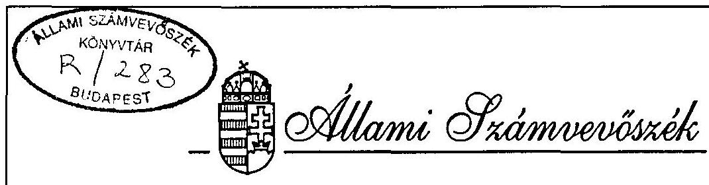
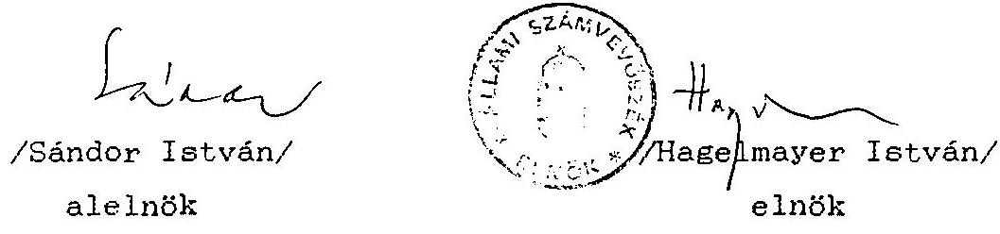
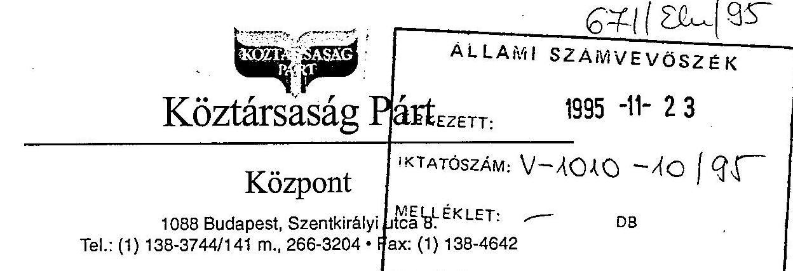
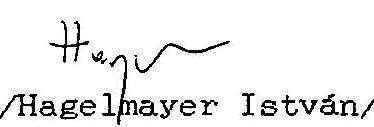

# JELENTÉS 

a Köztársaság Párt
1993-1994. évi gazdálkodása törvényességének ellenôrzésérôl

---

A vizsgálat végrehajtásáért felelős: az ÁSZ IV. Vagyonellenőrzési Igazgatósága
dr. Kovács Árpád igazgató

A vizsgálatot vezette:
dr. Elek János osztályvezető főtandcsos

A vizsgálatot végezte:
Tóth István
Berzétey Attiláné
számvevô tandcsos
számvevő tandcsos

---

# ALLAMI SZAMVEVOSZEK 

$\mathrm{V}-1010-8 / 1995$.
Tsz: 288 .

## J E L E N T E S

## a Köztársaság Párt 1993-1994. évi gazdálkodása törvényességének ellenőrzéséröl

I.

A vizsgálat célja, módszere, idôszaka, következményei

A pártok müködéséröl és gazdálkodásáról szóló - többször módositott - 1989. évi XXXIII. tv. (továbbiakban: párttörvény) 10. 8.(1.) bekezdése, valamint az Allami Számvevõszékrõl szóló 1989. évi XXXVIII. tv. 5. 8-a alapján a pártok gazdálkodása törvényességének ellenôrzésére az Allami Számvevõszék (továbbiakban: ASZ) jogosult. A törvènvi felhatalmazás alapján az ASZ II. fèlévi ellenôrzési tervének megfelelően vizsgálta a Köztársaság Párt (továbbiakban: párt) gazdálkodása törvényességét.

Az ellenőrzés célja annak megállapítása volt, hogy a párt müködéséhez szabályszerűen igénybevehetõ forrásokat használt-e fel, a párttörvényben engedélyezett gazdálkodó tevékenységet folytatott-e, valamint betartotta-e a gazdálkodással összefüggõ pénz-ügyi-számviteli szabályokat.

---

Az ASZ a párt gazdálkodásának törvényességét ezúttal elsõ ízben vizsgálta. A párt ugyanis 1992. novemberében alakult és az 1994. évi országgyûlési választáson ért el olyan eredményt, hogy az alapján állami költségvetési támogatást kap, és így a párttörvény 10. S. (3.) bekezdésében elôirtak szerint az ASZ 2 évente köteles gazdálkodása törvényességét ellenôrizni.

Az ellenôrzés 1993. január 1-tôl 1994. december 31-ig terjedô, beszámolóval lezárt idôszakra, valamint a folyó év I. félév egyes bevételeire terjedt ki.

A helyszíni ellenôrzés 1995. szeptember 4-tôl 1995. szeptember 22-ig tartott.

A jelentés megállapításai a párt Országos Központjában rendelkezésre bocsátott iratok, dokumentumok alapján lefolytatott helyszini ellenôrzés tapasztalatain alapulnak. A párt Szervezeti Szabályzata szerint ugyanis a pártnak Snálló jogi személy helyi szervezetei nincsenek. Gazdálkodási adatainak teljeskörũ könyvelése az Országos Központban történik.

A párt gazdálkodása törvényességének ellenôrzése a Magyar Közlöny 1991. évi 28. számában közzétett ASZ általános ellenőrzési program szempontjai alapján történt.

---

# II. 

## A párt gazdálkodásáról szóló 1993-1994. évi beszámolók pontossága és teljeskörüsége

## 1. Altalános megállapítások

A párt 1993. évi pénzügyi zárómérlegét (továbbiakban: beszámoló) a Magyar Közlöny 1994. évi 43. számában, az 1994. évi beszámolóját a Magyar Közlöny 1995. évi 31. számában jelentette meg (1. és 2. sz. melléklet). A beszámolókat a párttörvény 3. 8. (1.) bekezdésében megjelölt határidőn belül, de az 1. sz. mellékletben elôirt formától eltérően hozták nyilvánosságra. A beszámolók bevételi részénél mindkét év esetében eltértek a párttörvényben elôirt szerkezeti bontástól.

A közzétett beszámolók a párt egészének gazdasági adatait tartalmazták. Egyik évben sem tartalmazzák a bevételek az adott évben kapott tárgyi adományok értékét. A beszámoló elkészítésének alapjául szolgáló számitási anyag alapján az egyes bevételi és kiadási tételeknek a naplófôkönyvbe bejegyzett adatokkal való egyezősége ellenőrizhetó. A beszámolók a könyvelt adatok alapján készültek.
2. Részletes megállapítások
2.1. Az 1993. évi beszámoló ellenőrzése

Az 1993. évi beszámoló bevételi adatai nem a párttörvény 1. sz. mellékletében meghatározott részletezésben lettek összeállítva. További hiányosság, hogy a bevételek közül

---

hiányzik 300 E Ft értékũ tárgyi adomány értéke. Ezért a bevételek értéke a beszámolóban ennyivel kevesebb a ténylegesnél.

A beszámoló kiadási részének "müködési kiadások" sorában indokolatlanul szerepel 575.412 Ft munkabér és járulékaként 1994. január hónapjában kifizetett összeg. Ezen összegnek az 1994. évi kiadások között kellett volna szerepelnie.

Mindezek miatt az 1993. évi beszámoló adatai nem pontosak.

# 2.2. Az 1994. évi beszámoló ellenőrzése 

### 2.2.1. A bevételekkel kapcsolatos megállapítások

A beszámolóban az 1. Tagdíjak soron kimutatott 14.020.019 Ft bevétel valójában nem tagdijakból származó bevétel.

A párt vezet a tagdijfizetésekről analitikus nyilvántartást, e nyilvántartás szerint 1994. évben 248.250 Ft-ot fizettek be tagdij címén, az ezen felüli összeget valójában az Egyéb hozzájárulás, adományok soron kellett volna feltüntetni a valós helyzetnek megfelelően a jogi személyektől származó bevétel 2.730 .923 Ft , jogi személynek nem minősülő gazdasági társaságtól származó bevétel 275 E Ft, a többi magánszemélyektől származó bevétel.

Nem tartalmaz külön soron a beszámoló 58.938 Ft kamatbevételt, valamint 160.000 Ft egyéb bevételt, amely gazdálkodási tevékenységbōl származó bevételnek minōsül.

---

A párt - a bérbeadóval kötött szerzôdésben foglaltaknak megfelelöen - felújította a Budapest VIII. Szentkirályi u. 8. sz. alatti ingatlannak a párt által bérelt helyiségeit. A szerződés értelmében a felújításra elfogadott költségvetési összeg $50 \%$-át a párt a bérleti dijba 1 év alatt beszámíthatja. A bérleti dijból e jogcímen adott engedmény összege 4.500 E Ft. Mivel a felújítást döntően a párt tagjai végezték el társadalmi munkában, a 4.500 E Ft a tagok részéről a pártnak adott nem pénzbeli vagyoni hozzájárulásnak minősül, ezért az összeget fel kellett volna tüntetni a beszámoló 4.3. Magánszemélyektől származó egyéb hozzájárulások során. A párt az elvégzett munka értékét - mindkét fél által elfogadott elôzetes kalkuláció alapulvételével - a párttörvény 4. 8. (5.) bekezdésének megfelelően felértékelte, de a beszámoló összeállításához irányadó kitöltési útmutató hiányában a beszámolóban nem szerepeltette.

# 2.2.2. A kiadásokkal kapcsolatos megállapítások 

Az 1. Támogatás a párt országgyûlési csoportja számára soron szereplő 5.817 E Ft az 1994. évi országgyûlési választások lebonyolítására kapott költségvetési támogatás felhasználása. Ezt az összeget az ellenôrzés véleménye szerint a 6. Politikai tevékenység kiadása soron kellett volna feltüntetni. Nem szerepel a müködési kiadások között 575.412 Ft munkabér és járulékai címén 1994. január hónapban kifizetett összeg, mivel azt tévesen 1993. évi kiadásként könyvelték és az 1993. évi beszámolóban közölték.

---

# III. 

Az 1993-1994. évi beszámolók megalapozottságát alátámasztó könyvviteli és gazdálkodási megállapítások

## 1. A könyvvezetés rendje

A párt könyvvezetési kötelezettsége teljesítésének a 157/1992. (XII. 4.) sz. Korm. rendelet 8. 8. (3.) bek. alapján egyszeres könyvvitel vezetésével tesz eleget. A gazdasági események rögzitésére a számviteli törvény 80. 8. (2.) bekezdésében felsorolt nyilvántartási lehetöségek közül a naplófôkōnyvet alkalmazza. A naplófôkönyv rovatait egyes esetekben igényeiknek megfelelôen alakitották ki, illetőleg módositották. Igy pl. a párt területi választási szervezetei (19 megye és Budapest) - az un. rezidensi irodák - nem rendelkeznek önálló gazdálkodási jogkörrel. Bevételeiket és kiadásaikat az elszámolással megküldött eredeti bizonylatok alapján - a köspont naplófôkönyvében vezetik, oly módon, hogy külön rovatokon elkülönítve is feltüntetik az irodák adatait. Ezek megegyeznek a rezidensi irodákról ezen felül vezetett analitikus nyilvántartás adataival.

A párt rendelkezik számviteli szabályzattal, valamint a naplófôkönyvet kiegészitő analitikus nyilvántartásokkal. A könyvvezetés minden esetben alapbizonylatok alapján történik, a könyvviteli zárlatot elvégzik.

Az ellenőrzés megállapítása szerint a naplófôkönyv vezetésénél nem érvényesül a számviteli törvény 83. 8. (2.) bekezdés a./ pontjában megfogalmazott követelmény, amely szerint "...

---

a készpénzforgalmat érintõ bizonylatainak adatait késedelem nélkül, a pénzmozgással egyidejúleg, illetve a pénzintézeti értesítés megérkeztekor, az egyéb pénzeszközöket érintő tételeket a tárgyhetet követő hó 15 -ig köteles könyveiben rögzíteni". A Központ pénzforgalmának könyvelése sem naprakész, a pénztári és banki forgalmat elkülönítetten könyveli. A naplófôkönyv "kelet" oszlopában nem a könyvelés dátuma, hanem a bizonylat kelte szerepel. Ebből kifolyólag a napi pénzkészlet megállapítása a könyvelésbõl nem lehetséges.

A naplófõkönyvekben - különösen az 1993. évben vezetettben gyakori a nem szabályszerű, utólagos javítás. Ennek egyik oka, hogy a befizetések lekönyveléséhez az alapbizonylaton nem mindig áll a könyvelõ rendelkezésére a megfelelõ információ (kontirozás), pl. hogy az adott befizetés tagdij vagy adomány. Ez a tagdijbefizetésekről készült analitikus nyilvántartás összeállítása során válik egyértelmũvé.

A naplófõkönyvben a kifizetett munkabért nem bruttó módon számolják el, így a munkabérek közterheit nem a tényleges pénzügyi rendezés idópontjában helyezik kiadásba. Nem alkalmazzák a Követelés és Tartozás, valamint az Indulótőke és a Tőkeváltozás rovatokat. A naplófõkönyv vezetésében tapasztalt hiányosságok ellenére - az azt kiegészítő, részletezõ analitikus nyilvántartások és számítási (zárlati) anyagok segítségével - megbízható és valós kép alakítható ki a szervezet egészének vagyoni, jövedelmi, pénzügyi helyzetéről. Mindezek figyelembevételével megállapítható, hogy a párt könyvvitelében a számviteli alapelvek alapvetően érvényesültek.

---

2. Az analitikus nyilvántartások, a bizonylati rend és az elszámolási szabályok betartása
2.1. A vizsgált idôszakban a következõ analitikus nyilvántartásokat vezették:

- SZJA köteles kifizetések egyedi nyilvántartása;
- TB köteles kifizetések egyedi nyilvántartása;
- tárgyi eszközök nyilvántartása;
- választási irodák elszámolásai;
- elszámolásra felvett elõlegek analitikus nyilvántartása;
- párt által felvett kölcsönök analitikus nyilvántartása;
- szigorú számadású nyomtatványok nyilvántartása.

A nevezett analitikus nyilvántartások egy kivételével megfelelnek a jogszabályi elõírásoknak, illetve a velük szemben támasztandó követelményeknek.

Az elszámolásra felvett elôlegek nyilvántartásából csupán a felvett összeg nagysága, a felvétel, illetve elszámolás idõpontja, valamint a felvevõ személye állapítható meg. Ennek oka az, hogy elszámolásra kiadott pénzek analitikus nyilvántartási kötelezettségét a párt számviteli szabályzata elõírja ugyan, de nem határozza meg a nyilvántartás tartalmát. Nem szabályozták továbbá sem a számviteli szabályzatban, sem egyéb szabályzatban, hogy milyen célra, milyen elszámolási határidôre, milyen formában, ki engedélyezhet elszámolásra pénzfelvételt. Mindezek ellenére egyik évben sem volt elszámolatlan elõleg.

---

A pártnak vagyona nincs, ennek megfelelően állóeszköz-nyilvántartást nem vezet. A beszerzett tárgyi eszközöket az érvényes számviteli elöírásoknak megfelelően tartja nyilván, a 20 E Ft feletti értékú eszközökröl egyedi nyilvántartást, a 20 E Ft alatti értékú eszközökröl folyamatos mennyiségi nyilvántartást (leltárt) készítenek. A nyilvántartások tartalmazzák a vidéki irodák eszközeit is.
2.2. A házipénztárra, illetve a pénzforgalomra vonatkozóan a Számviteli Szabályzat és a Pénzforgalmi Szabályzat tartalmaz rendelkezéseket. A Számviteli Szabályzat kimondja, hogy "minden kiadási bizonylat alapbizonylatokkal van alátámasztva, melyek kifizethetőségét Palotás János pártelnök aláírása teszi lehetővé".

A Pénzforgalmi Szabályzat szerint pedig "pénztárbizonylatok kitöltésére csak akkor kerül sor, ha az alapbizonylatokon (számlák) Palotás János pártelnök engedélyező aláírása szerepel.

Mindezek ellenére 1993. és 1994. években a pénztári bevételek és kiadások alapbizonylatának többségéről hiányzik a pártelnök engedélyező aláírása. Szinte kizárólag a pártelnök által kötött szerződések alapján eszközölt kifizetések alapbizonylatán található az engedélyező aláírása. A bevételek és kiadások többségét a párt gazdasági vezetője utalványozta. Általános hiányosság továbbá, hogy az elszámolásra történő pénzfelvétel esetén a kifizetés alapbizonylat és a felvételi cél megjelölése nélkül történik. Igy nem állapítható meg a pénzfelvétel jogossága.

---

1993-ban 7 esetben összesen 27.148 Ft-ot fizettek ki postaköltség címén úgy, hogy ahhoz a postai számla nem volt csatolva. A kiadási pénztárbizonylatokhoz csupán egy a pénz felvevöje által készített névsor volt csatolva, ami azonban alapbizonylatként nem fogadható el.

1994-től ez a hiányosság megszünt. Postaköltséget kizárólag postai számla ellenében fizettek ki.

1993-ban és 1994-ben egyaránt rendszeresen elöforduló hiányosság, hogy különbözö személyek más nevére szólo adomány és kölcsön befizetéseket eszközöltek anélkül, hogy a befizetéshez az adományozó, illetve a hitelnyújtó személyét bizonyító alapbizonylatot csatoltak volna.

A pénztári kiadások esetében sem mindig tartották be a bizonylati fegyelmet. 1994-ben több esetben elöfordult, hogy a kiadott pénzt nem a kiadási pénztárbizonylaton feltüntetett felvételre jogosult vette fel anélkül, hogy a bizonylathoz a felvételre jogosító meghatalmazást csatolták volna.
2.3. Az adózásra, illetőleg járulékfizetésre vonatkozó jogszabályok betartása

A párt mindkét vizsgált évben vezetett olyan nyilvántartásokat, amelyek alkalmasak a személyi jövedelemadó, a társadalombiztosítási, nyugdij- és egészségbiztosítási járulék, valamint a munkaadoi és munkáltatói járulék alapjának, öszzegének megállapítására. E nyilvántartások alapján teljeskörűen ellenőrizhető a kötelezettségek megállapítása és teljesítése.

---

Személyi jövedelemadó és társadalombiztosítási járulékok bevallási és befizetési kötelezettségét a párt mindkét évben teljesítette. Vezetik a 89/1990. (V. 1.) MT rendeletnek a 48/1992. (III. 12.) Korm. rend. 71. §-ának (20.) bekezdésével megállapított VI. számú melléklet szerinti járulékelszámolási lapot is, azonban annak alapján a levont egészségbiztosítási és nyugdíjjárulékról a dolgozók részére igazolást nem adtak ki a tárgyévet követő március 31-ig.
2.4. A magáncélú gépjármũ hivatalos használatának elszámolása során betartják a 60/1992. (IV. 1.) sz. Korm. rendelet, valamint az 1991. évi XC. tv. előirásait. A pártnak saját tulajdonú gépkocsija nincs.
2.5. Hivatalos külföldi kiküldetés elszámolására a vizsgált időszakban nem került sor. Igy a párt részére 1994. évi állami költségvetési támogatása alapján rendelkezésre álló 867.930 Ft-os valutakeretből felhasználás nem történt.

# 2.6. Egyéb megállapítások 

A naplófőkönyvi adatok alapján a pénztári és banki kiadások és bevételek alapbizonylatai könnyen, gyorsan visszakereshetők.

A bankszámlák nyitó- és záróegyenlegének könyvelt adata megegyezik a vonatkozó bankkivonattal. A házipénztár éves nyitó- és zárópénzkészletének a naplófőkönyvvel való egyezősége azonban nem ellenőrizhető, mivel a fordulónapi pénztárleltár jegyzökönyvezése nem történt meg egyetlen esetben sem.
A bizonylatok tárolása biztonságosnak tekinthető.

---

# IV. 

A párt bevételeinek és gazdálkodó tevékenységének vizsgálata

1. A párt 1993-1994. években a párttörvény által tiltott adomanyokat nem kapott, névtelen adományt nem fogadott el. Tárgyi adományokat a párt 1993. évben 300 E Ft értékben fogadott el irodabútor formájában, 1994. évben 4.500 E Ft értékũ irodafelújítási társadalmi munkát kapott párttagjaitól.
2. A vizsgált idôszakban a párt a párttörvényben engedélyezett gazdálkodó tevékenységet nem folytatott. A párt 1994. január 4-én a J. and Zs Kft-vel óriásplakát hirdetőhely felkutatására kötött szerződést. Az ellenôrzés álláspontja szerint ez a párttörvényben nem engedélyezett ügynöki jellegũ tevékenységnek minősül. A megállapodás teljesítése alapján a párt a hirdetőhelyek felkutatásáért 160 E Ft-ot kapott. Ez az összeg a párt számára tiltott bevételnek minősül.
3. A párt 1995. IV. 1-én Aranyút Kft címen egyszemélyes kft-t alapitott, melynek cégbírósági bejegyzése a helyszíni ellenôrzés befejezésekor még folyamatban volt. Egyéb társaságot, vállalatot a párt nem alapított, más társaságban részesedést nem szerzett.
4. A párt értékpapírt nem vásárolt.

---

# V. 

## Javaslat a szükséges intézkedések megtételére

A vizsgálat megállapításai alapján a párttörvény 10. 8. (4.) be kezdésében kapott felhatalmazás alapján az Állami Számvevôszék felhívja a párt elnökét, hogy:

1. Az ellenôrzési megállapítások figyelembevételévek készíttesse el és tegye közzé a párt módosított 1993. és 1994. évi pénzügyi beszámolóját.
2. A pénzforgalmi szabályzatban szabályozzák az elszámolási elöleg felvételének és elszámolási rendjét.
3. Tegyen intézkedést a számviteli törvény elöírásainak megfelelő alapbizonylat nélkül történő kifizetések és bevételezések megszüntetésére.
4. Szüntessék be a más nevére szóló pénzfelvételek és befizetések meghatalmazás nélküli eszközlését.
5. A IV/2. pontjában megállapított, a párttörvény 6. 8-ába ütköző, tiltott gazdálkodásból származó 160 E Ft bevételnek megfelelő összeget a párttörvény 4. 8. (4.) bekezdésében elöírtaknak megfelelően a jelentés kézhezvételétől számított 15 napon belül fizettesse be az állami költségvetésbe.

---

A párttörvény 4. 8. (4.) bekezdése utolsó mondata értelmében további szankcióként a párt költségvetési támogatását a tiltott vagyoni hozzájárulás összegével 160 E Ft, azaz százhatvanezer Ft-tal csökkenteni kell. Erre az ASZ a szükséges kezdeményezést megteszi.

Budapest, 1995. november " 29 ".

Melléklet: 2 db

---

Az Országos Választási Bizottság
közleménye

Az Országos Választási Bizottság adatai:

Az Országos Választási Bizottság hivatali helyiségének címe: 1051 Budapest, Kossuth tér 4., V. emelet 63.

Az Országos Választási Bizottság elnöke:
dr. Németh János

Titkára:
dr. Kara Pál

Tagjai:
dr. Erdel Árpád
dr. Horváth Sándor
dr. Kukorelli István
dr. Benyák György
dr. Bordás Vilmos
Cséfalvay István
dr. Jakab István
dr. Janklovics Tibor
Kelemen Géza
dr. Martini Jenó
dr. Mály József
dr. Orbán Péter
dr. Reviczky Károly
dr. Salamon Ferenc
dr. Sik János
dr. Szoboszlai György
dr. Tütös Sándor
dr. Zombori Zoltán

A Köztársaság Párt
1993. évi zárómérlege

1992. évi pénzmaradvány:

1993. 'évi bevételek

TRIBU Bt. (belföldi) . 3500000,00
Mirtha Consulling Anstalt (küllföldi) 1000000,00
Palotás János (belföldi magánszemély) 1500000,00
Pál Vadász (külföldi magánszemély) 583158,89
Egyéb befizetések
(500 000 Ft alatti támogatásokból) 5241 830,00
Bankkamat 27683,66
Bevételek összesen: 11852672,55

1993. évi kiadások

Múködési kiadás 9327705,44
Eszközbeszerzés
(gép-, berendezés, felszerelés) -303 275,00
Politikai tevékenység kiadásai 1413800,30
Kladások összesen: 11044780,74
Pénzmaradvány: 1198177,14

Palotás János s. k., * * * Schmidtné
* * *dr. Holló Erzsébet s. k.,
* * *gr. * *gr. * *gr. *

---

4. A Magyar Televiziôval szerzôdéses viszonyba került vállalkozásoknál adóellenôrzést kell végezni.

Felelós: APEH elnöke
Határidd: 1995. július 31.
5. A Kormány felhívja a Magyar Televizió elnőkét, hogy
a) intézkedjék a "New York, New York" cimú músor készítése és közvetítése során elkövetett szabálytalanságok miatti felelősségrevonás iránt;
b) gondoskodjon az intézmény gazdálkodási és pénz-ügyi-számviteli fegyelmének megszilárdításáról, a músorgyártási és személyi követelményrendszer kislakításáról, bevezetéséről, továbbá e rendszer következetes betartásának ellenôrzéséről, valamint a vezetési folyamatba épített belsô ellenôrzési rendszer erôsitésérôl;
c) a Magyar Televiziónál megvalósulólétszámcsökkentéssel egyidejüleg intézkedjék a belsô foglalkoztatás elsôbbségének biztosítása, továbbá a létszámcsökkentés után pontos munkaköri leírások készítése érdekében.

Horn Gyuht s. k.,
ministerelnők

## V. rész

## KOZLEMENYEK HIRDETMENYEK

Az Országos Kárrendezési és Kárpótlási Hivatal
közleménye
termôföldárverés elmaradásáról
A Budapest Fôváros Kárrendezési Hivatal (1053 Budapest, Kecskeméti u. 10-12.) által közzétett alábbi árverési hirdetmények elmaradnak:

A Magyar Közlöny 1995. évi 23. számában, az 1019. Idalon megjelent, Pillsborosjenő kö̉szégben, a Rozmaig Szövetkezet (Budapest II., Patakhegyi u. 83-85.) által kijelölt termôföldterületre, 1995. május 2-án, 10 órára meghirdetett árverés - a Földrendező Bizottság kérésére - elmarad. Késóbbi idópontban kerül megtartásra.

A Magyar Közlöny 1995. évi 23. számában, az 1020. oldalon megjelent, Piliscsaba közzégben, a Rózmaring Szövetkezet (Budapest II., Patakhegyi u. 83-85.) által kijelölt termôföldterületre, 1995. május 2-án, 10 órára meghirdetett árverés - a Földrendező Bizottság kérésére - elmarad. Késóbbi idópontban kerül megtartásra.

A Kôztársaság Párt
1994. évi pénzügyi zárómérlege

## I. BEVETELEK

1. Tagdijak

14020019
ebből 500000 Ft feletti befizetések

1. Palotás János 2500000
2. Bereck Imre 2100000
3. dr. Kovács István 800000
4. Nyitrai Ferenc 600000
5. Állami költségtéritésbő́l 10849000
6. Képviselócsoportoknak nyújtott támogatás 5817000
7. Egyéb hozzájárulások, adományok

1: Botos Épito Kft.
1000000
Bevételek összesen
31686019

## II. KIADASOK

1: Támogatás a párt orlzággyúlési csoportja számára
5817000
2. Müködési kiadás 18510845
3. Eszközbeszerzés 300450
4. Politikai tevékenység kiadása 6470889
5., Egyéb kiadás
298823
Összes kiadás
31398007

## Palotás János s. k.,   1.   Schmidmé   pártelnők dr. Holló Erzsébet s. k., gazdasági igazgató

A Kereszténydemokrata Néppárt 1992. évi pénzügyi beszámolója

## I. BEVETELEK

1. Tagdijak 4118300
2. Állami költségvetésból származó támogatás 76336210
a) Pénzügyminisztérium. székház felújf́tás 28300000
3. Képviselói csoportnak nyújtott állami támogatás

---

# ÉSZREVÉTEL 

Az Állami Számvevőszék V-1010-7/1995 számú jelentéséhez

Az észrevételt megelőzően magam részéről is szeretném kiemelni, hogy a vizsgálat egésze a Köztársaság Párt számára, számos eddig tisztázatlan szabályozás tekintetében adott - követendő megoldási javaslatokat, segitőkészen mutatott rá egyes nyilvántartásaink hiányosságaira, segitve ezzel az elkövetkező időszak feladatainak még jobb színvonalon történő elvégzését. A vizsgálat legkissebb mértékben sem hátráltatta napi feladatainkat, az ellenőrzésben résztvevő személyekkel való munkakapcsolatunk számunkra igen pozitív és együttmúködő volt.

## Konkrét észrevételeink:

1. A jelentés számos, föként a számviteli rendszer hiányosságaira vonatkozó, a jövőt tekintve azonnal módosítható, figyelembe vehető megállapítást tesz (például pénzügyi befizetések és kiadások esetén a meghatalmazások hiánya, stb).
A leírtak alapján az észrevételezett kifogásokat két pont kivételével elfogadjuk. Ezzel egyidejűleg a jelentés V. fejezetének 1.-2.-3.-4. pontja szerint a párt elnöke felé tett intézkedési felhívásnak - jelen észrevételben érintett és kifogásolt részek kivételével - elnöki utasítás kiadásával eleget tettem.
2. A jelentés 2.2.1. pontja szerint a beszámolóban szereplő "Tagdijak" valóban nem tagdijból, hanem "Egyéb hozzájárulás, adomány" -okból származott.

Álláspontomat fenntartva a befizetések jogcímét a befizető és a befizetést elfogadó szándéka határozza meg, így azt a vizsgálat nem minősítheti át.

---

Nem vitatjuk, hogy a Köztársaság Párt az alakuláskor nyilvántartásaiban, alapszabályában, jegyzőkönyveiben nem egyértelműen rögzítette a tagdíjak értelmezését (például: alapító okiratában a tagdíjfizetést a tagsági jog kötelező kellékeként írta elő), ezt azonban jórészt az 1995-ös Közgyűlésén korrigálta. Az életszerűség azonban bizonyította, hogy az 1995-ös Közgyűlésig sem zártunk ki egyetlen tagot sem a tagdíjfizetés elmaradásáért, illetve a közgyülések nem rendelkeztek kötelező tagdijmértékröl.

Ennek megfelelően a Köztársaság Párt tagdíjfizetési előirása ma már egyértelműen, mint lehetőség, de nem mint kötelezettség jelenik meg a párt tagjainál. A tagdijnak nincs kötelezően meghatározott értéke (ajánlott összegként üzletembereknél 50 e Ft/év vagy e feletti befizetés, míg egyéb magánszemélyeknél 10 e Ft/év vagy e feletti összeg). Ezzel összhangban már 1994-ben is a párt tagjai által történő befizetések egyben tagdijfizetést is jelentenek, kivéve, ha a befizető ettől külön (eltérő) rendelkezést nem tesz. A leírt elvet jogszabály nem tiltja, sőt alkalmazásához a Köztársaság Pártnak külön politikai érdeke is fúződik. Ezzel tudjuk kifejezni, hogy a Köztársaság Párt kiadásainak döntő hányadát tagjainak befizetéséből, (tagdijak) fedezi, és csak töredék részben a kevésbé átlátható egyéb hozzájárulásokból, adományokból.

Nem vitatom, hogy az analitikus nyilvántartásból hiányosan állapítható meg, hogy mely befizetés tagdij és mely befizetés egyéb hozzájárulás, adomány. A vitatott befizetéseknél azonban a befizetőknek az a szándéka sem jelenik meg, hogy egyéb hozzájárulást kívánt adni, míg tagi mivoltából adódóan a saját adózott jövedelméből történő befizetés sokkal életszerűbben tagdij, mint támogatás. A Köztársaság Párt számára elvi fontosságú, hogy tagjainak önkéntes pénzbeli befizetései jelentették pénzügyi forrásainak többségét, eltérően a legtöbb politikai párttól. Szükség esetén ezért utólagosan is hajlandóak vagyunk írásos nyilatkozatot kérni, beszerezni tagjainktól, hogy a befizetés szándéka tagdijfizetés volt. A párt részéről tagdíjként fogadtuk el, így utólag pótolható a nyilvántartás pontatlansága és egyértelmüvé tehető a befizető és a befizetést elfogadó szándéka. Meggyőződésem, hogy a szerződő felek egybehangzó nyilatkozata után adminisztrációs hiba nem lehet a jogcím átminősítésének jogi alapja.
3. A jelentés IV/2. pontja szerint a Köztársaság Párt 160 e Ft értékben végzett a párt számára tiltott tevékenységet azáltal, hogy óriásplakát hirdetőhelyeket kutatott fel annak ellenében, hogy a hirdetőhelyek "értékét" hirdetésben, azaz a párt népszerűsítését szolgáló plakátok kihelyezésében kompenzálják.

---

Álláspontom szerint ez a megoldás a Köztársaság Párt számára kifejezetten megengedett, a pártokról szóló 1989. évi XXXIII. törvényi szabályozás elveivel is összhangban álló 6. § (1) így nem tekinthető a párt számára tiltott bevételnek. Vitatjuk a szóbeli egyeztetésen elhangzott azon levezetést, hogy az eljárás azért megy túl a törvényben megengedett tevékenységen mert a táblahelyek az irásos megállapodás szerint 1 évig áll díjmentesen a hirdető cég rendelkezésére és ez idő alatt nem kizárólagosan a párt plakátjai voltak a táblákon kihelyezve. Álláspontunk szerint ilyen megkötés a törvényi szabályozásban nincs, a tevékenység célja a szerződésböl is következöen egyértelmü, és a párt népszerüsítése politikai céljainak és tevékenységének megismertetése volt.
A jelentésben nem kaptunk választ arra a felvetésünkre, hogy a 160 e Ft a vizsgálat álláspontján belül is ellentmondásos, mivel azon hónapok amikor a táblák a Köztársaság Párt hirdetéseit tartalmazták, még a jelentés jogértelmezésben sem voltak tiltottak.

Ezek pedig az 1994-es országgyúlési választás idején átlag 3 hónapos kihelyezést jelentettek, míg az önkormányzati választáskor további 2-3 hónapos hirdetési lehetőséget biztosítottak, ami az 1 éves időszak közel felét jelentette, így a vitatott összeget arányosítani kellett volna.

Álláspontunk szerint azonban az ezen túli időszak közvetlen összefüggésben van a kampányidőszakban kapott hirdetési lehetőséggel, mivel egy táblahely a helyből és az eszközből (tábla) áll, ahol értelemszerúen ellentételezni kellett a táblák időleges átengedését is. A szerződés célja azonban egyértelmúen a párt bemutatása, népszerüsítése, amit a törvény kifejezetten megenged. Jogszabályi hellyel sem alátámasztott az a vizsgálati feltételezés, hogy a hirdetőtábla helyek felkutatása "ügynöki tevékenység". A párt tagjai által ellenszolgáltatás nélkül végzett tevékenység besorolása - ha ez elkerülhetetlen - sokkal inkább a párt tagjai által végzett egyéb hozzájárulás, adomány, amelynek értékmeghatározását és a kölcsönös leszámlázását éppen a pártok múködéséről és gazdálkodásáról szóló törvény (4.§ 5.bek.) és a vonatkozó számviteli elöírások írják elő.

Tisztelettel kérjük a leírt két észrevételünk újragondolását, elfogadását. Szeretnénk kiemelni, hogy a Köztársaság Párt annak ellenére, hogy induló politikai pártként számos nehézséggel, szabályozásokon belüli hiányossággal, az értelemszerủen hiányzó tapasztalattal végezte tevékenységét, rendkívül szigorú elvek szerint törekedett a törvényesség lehetőség szerinti teljeskörű betartására és ennek a jövőben is kiemelt hangsúlyt kívánunk adni.

---

Tisztelettel kérem továbbá tájékoztatásukat arról, hogy a jelentéshez mellékelt kísérőlevél szerinti észrevételnek az észrevételekben vitatott részek tekintetében milyen jogkövetkezményei lehetnek. Az észrevétel jelent-e halasztó hatályt az előirt közzételi kötelezettség, az előírt befizetési kötelezettség, vagy a párt költségvetési támogatásának automatikus csökkentése tekintetében. A jelentés nem ad egyértelmü tájékoztatást aról, hogy a párt milyen jogorvoslati lehetőséggel élhet, vagy az észrevétel tartalmától függetlenül a jelentés megállapításai „ jogerős „ határozati jellegűek.

# Megkülönböztetett tisztelettel: 

Palotás János
elnök

Budapest, 1995. november 22.

---

Budapest, 1995. november 59. $\mathrm{V}-1010-11 / 1995$.

P A L O T A S JANOS úr a Köztársaság Párt elnöke

Budapes.t

Tisztelt Elnök Ur!
Az Allami Számvevôszék V-1010-7/1995. sz. jelentésére tett észrevételét köszönettel megkaptam, amelyre az alábbiak szerint szeretnék visszareagálni.

A jelentés II./2.2.1. pontjához adott észrevétel elsõ mondata teljes egészében elfogadható. A befizetés jogcímére vonatkozó megállapításokat az ellenôrzés a párt tagdíjakról vezetett analitikus nyilvántartására, továbbá a befizetések alapbizonylataira alapozta. Mivel a beszámolóban a bevételek között külön soron kell számot adni a tagdíjakról és az egyéb hozzájárulásokról, adományokról, a befizetés bizonylatából egyértelmüen ki kell derülnie a befizetés jogcímének.

A jelentés IV./2. pontjában rögzített tiltott gazdálkodásból származó 160 E Ft árbevétel megállapítására a párttörvény 6. 8. (1.) bekezdésében foglaltak alapján került sor. Ez a bekezdés a párt részére a párt politikai céljainak és tevékenységének megismertetése érdekében történő kiadvány megjelentetését és terjesztését, a pártot szimbolizáló jelvények és más ilyen célú tárgyak árusítását, pártrendezvények szervezését engedélyezi. Engedélyezi továbbá a párt tulajdonában álló ingatlanok és ingók díj ellenében történő hasznosítását és elidegenítését.

A kft-vel kötött szerzödésben szereplő hirdetőhely felkutatás azonban nem minősíthető sem a pártot ismertető kiadványnak, sem a pártot szimbolizáló jelvény árusításának.

---

A szerzõdés a párttörvény 6. 8. (1.) bek. b. pontjában foglaltakkal akkor lenne összeegyeztethető, ha a párt a tulajdonában lévő ingatlanokon felállítandó hirdetőhelyek rendelkezésre bocsátására kötött volna megállapodást.

Az az érvelés sem fogadható el, hogy a hirdetőhely felkutatás a párt tagjai által ellenszolgálatás nélkül végzett tevékenység, amelynek értéke adománynak minösítendő. A hirdetőhely felkutatása ugyanis nem a párt részére, hanem a párt által, mint vállalkozó kötött szerződés alapján ellenszolgáltatás fejében történt.

Az Allami Számvevôszék észrevételeinek jogkövetkezményeire vonatkozó kérdésére válaszolva tájékoztatom, hogy a jelentés jelen levelemmel válik véglegessé. Igy az intézkedési kötelezettségek a mellékelten megküldött jelentés kézhezvételétől válnak esedékessé. A párttörvény nem ad jogorvoslati lehetöséget az Allami Számvevôszék felhívásával szemben. Ebből adódóan a jelentésben szereplő felhívás alapján a párttörvény 4. 8. (4.) bekezdésében szereplő kötelezettség életbe lép. Amennyiben a párt kötelezettségének az elôírt határidôre nem tesz eleget a tartozást a párttörvény 4. 8. (4.) bekezdés második mondata értelmében adók módjára kell behajtani.

Tájékoztatom Elnök Urat továbbá arról is, hogy a mellékelt jelentés kerül egyben a nyilvánosság elé is, amelyhez észrevételét tartalmazó levelét és viszont válaszomat csatolom.

Tisztelettel:

Melléklet: 1 db