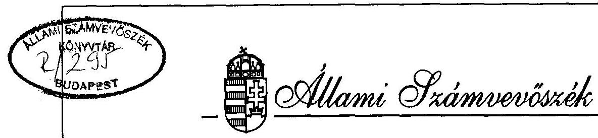
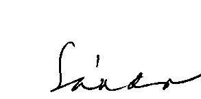
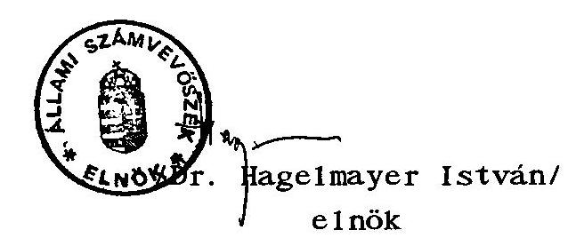

# JELENTÉS 

a Szülői Kamara részére az állami költségvetésből juttatott 1993-1994. évi támogatás felhasználásáról

---

A vizsgálat végrehajtásáért felelős: az ÁSZ IV. Vagyonellenőrzési Igazgatósága
dr. Kovács Árpád igazgató

A vizsgálatot vezette:
dr. Elek János osztályvezető főtanácsos

A vizsgálatot végezte:
Écsy Lajosné számvevö
dr. Szávai Tamás számvevö tanácsos

---

# ÁLLAMI SZÁMVEVŐSZÉK 

$\mathrm{V}-1015-9 / 1995-96$.
Tsz: 299 .

## J E L E N T É S

## a Szülöi Kamara 1993-1994. évi állami költségvetési támogatás felhasználásának ellenörzéséről

I.

A vizsgálat körülményei, célja, módszere

Az Állami Számvevőszékről szóló törvény értelmében az Állami Számvevőszék (továbbiakban: ÁSZ) ellenőrzi az állami költségvetésbő1 juttatott támogatás felhasználását a társadalmi szervezeteknél. Az Országgyúlés 58/1993. (VII. 9.) és a 31/1994. (IV. 13.) sz. határozataiban döntött a társadalmi szervezetek 1993 és 1994. évi állami költségvetési támogatásáról. Fentiek figyelembevételével az ÁSZ 1995. évi ellenőrzési terve alapján került sor az ellenőrzés lefolytatására.

A Szülői Kamara (továbbiakban: SZÜK) tevékenységének célja az 5-18 év közötti kiskorú tanulók szüleinek választott képviselete szorgalmazása, és kialakítása az oktatási rendszerben, törvényileg szabályozott módon. Tevékenységét 1992. évben a Müvelődési és Közoktatási Minisztérium együttmüködése és támogatás ígéretével kezdte. A SZÜK feladatai ellátásához a költségvetési támogatás mellett egyéb támogatással és saját bevétellel is rendelkezett.

---

Az ellenőrzés célja annak értékelése volt, hogy a SZÜK az állami költségvetési támogatást az Országgyúlés Társadalmi Szervezetek költségvetési Támogatását Koordináló Bizottsága által előirt jogcímekre és az alapszabályában megfogalmazott tevékenységi céloknak megfelelően használta-e fel, és ezt a célt a lehető legkisebb eszköz illetve pénz felhasználásával valósította-e meg, továbbá a gazdálkodásra, nyilvántartásra és beszámolásra vonatkozó jogszabályokat hogyan tartotta be.

A vizsgálat a lezárt 1993-1994. évi gazdálkodási évre terjedt k1. Az ÁSZ a pénzfelhasználást a SZÜK által átadott dokumentumok alapján vizsgálta. A helyszíni ellenőrzés 1995. október 9-től november 27-ig tartott megszakításokkal.

Mindezek figyelembevételével került sor a SZÜK részére 1993-1994. években jóváhagyott állami költségvetési támogatás felhasználásának ellenőrzésére.

# II. 

Az 1993-1994. évi pénzfelhasználás ellenőrzésének tapasztalatai

1. Az Országgyülés által odaítélt központi költségvetési támogatás felhasználásának ellenőrzése
1.1. a. A SZÜK az 1993. évi feladatai ellátásához - müködésre, külföldi kapcsolattartásra, tanfolyamszervezésre, tanácsadó szolgáltatásra, szülői évkönyv kiadására összesen 15.847 E Ft költségvetési támogatási igényt nyújtott be az Országgyúlés Társadalmi szervezetek költségvetési támogatását koordináló bizottságához.

---

Az Országgyưlés 58/1993. (VII. 9.) határozata alapján 1.000 E Ft támogatásban részesült a SZÜK. Ez az összeg a SZÜK könyvelésében kimutatott 1.335 E Ft összes bevéte1nek 75\%-a. Az éves szinten rendelkezésre álló pénz a kitüzött program korlátozott mértékũ megvalósításához volt csak elegendó.
b. A SZÜK az 1993. évı költségvetési támogatás jogcímenkénti felhasználásáról az Országgyülés Társadalmi Szervezetek Költségvetési Támogatását Koordináló Bizottságát tájékoztatta.

Mive1 a költségvetési támogatás felhasználását a könyvelésben nem különitették el a többi bevéte1tő1, az e1lenőrzés a SZÜK teljeskörũ pénzforgalmát vizsgálta. Ennek során a bizonylatok és a könyvelési adatok alapján megállapitotta, hogy a SZÜK - technikai okokból bevételeiből 1993. szeptember 2-án 500 E Ft-ot átadott - a SZÜK megalakulását előkészitő, majd a SZÜK szervezését, a müködtetéshez szükséges források beérkezéséig a SZÜK müködtetését részben ellátó Szülői Egyesületnek. A pénz átadása azért történt, mert az 1.000 E Ft összegũ költségvetési támogatás odaítélése (1993. április 7.) és átutalása (1993. augusztus 2.) között elte1t hosszabb idő miatt a SZÜK tevékenységével összefüggő számlákat az Egyesület számlájáról fizették ki, mive1 jelentősebb összegű egyéb bevéte1le1 a SZÜK nem rendelkezett.

A Szülői Egyesületnek történt 500 E Ft összegű pénzátadás a közölt indokok alapján tartalmilag elfogadható, de a pénzügyi elszámolás módja vitatható, mivel a SZÜK és a Szülői Egyesület között írásbeli megállapodás nem jött létre a fenti pénzügyi műveletek lebonyolítására. Az esemény a két megtartott közgyülés beszámolójában rögzítésre került, így a tagság előtt ismert volt.

---

c. A SZÜK-nek 1993-ben összesen 1.344 E Ft forrás állt rendelkezésére. Ebből 9,7 E Ft az előző évről áthozott maradvány, 1.000 E Ft a költségvetési támogatás összege és 334 E Ft az egyéb bevételekből képződött.

Ezzel szemben 1.267,2 E Ft összegü kiadást számoltak el. A könyvelési adatokból azonban nem állapítható meg, hogy a három jogcímre kapott költségvetési támogatás - müködésre 550 E Ft, Szülői Évkönyvre 200 E Ft, nemzetközi tevékenységre 250 E Ft (megjegyzendó, hogy gépelési hiba folytán a müködésre 500 E Ft nemzetközi tevékenységre pedig 2.500 E Ft szerepel a támogatásról szóló értesítésben, de értelemszerüen a SZÜK ezt 500 E Ft-nak, illetve 250 E Ft-nak tekintette) -, felhasználása hogyan alakult. A kiadások jelentős részét - 938,8 E Ft-ot ugyanis "egyéb" költségként 230 E Ft-ot pedig "anyag"költségként könyvelték el a szükséges bontás nélkü1.

Az ellenőrzés felhívására a kiadások jogcímek szerinti megfelelő részletezését bemutatták. Annak szerkezete és arányai megfelelnek az elfogadott pályázat jogcím szerinti elöírásainak.
1.2. a. Az 1994. évi 19.920 E Ft összegü költségvetési támogatási igényükkel szemben ez évben is csak 1.000 E Ft támogatásban részesültek, melyből bérjellegü kiadásokra 600 E Ft-ot, dologi kiadásokra pedig 400 E Ft-ot fordítottak.

A 2.501 E Ft összes bevételböl 1.000 E Ft (40\%) a költségvetési támogatás, 1.350 E Ft (54\%) a pályázat útján elnyert támogatások és 151 E Ft (6\%) a különféle egyéb bevételek (évkönyv, körlevél értékesítés, tagdij, bankkamat) összege.

---

Az előző évi 77 E Ft összegű maradvány figyelembevételével a SZÜK 1994-ben összesen 2.578 E Ft forrással rendelkezett.
b. A rendelkezésre álló pénzforrásból 1.857 E Ft-ot használtak fel, az 1994. év végi pénzmaradványuk pedig 721 E Ft volt. Az összes kiadásnak több mint a felét (53\%) a szervezői, szakértő, adminisztrátori díjak és jogi tanácsadás költségei tették ki. A fennmaradó összeg a működéssel összefüggő dologi kiadás volt (posta, telefon, útiköltség, nyomtatvány, nyomdai költségek), illetve 39 E Ft összegű nemzetközi tagdíjat fizettek ki.

A felhasználási jogcímenként kimutatott kiadások elkülönítetten tartalmazzák a költségvetési támogatás jogcímekre engedélyezett felhasználását. A 600 E Ft összegű bérjellegű kiadás és 400 E Ft dologi kiadás tételes elszámolását elkészítették és 1995. január 26-án az Országgyűlés Társadalmi Szervezetek Költségvetési támogatását Koordináló Bizottságának megküldték.
1.3. Az 1993. és 1994. év kiadásai belsó összetételének vizsgálata során az ellenőrzés megállapította, hogy a központi költségvetési támogatást a szervezet működésére, a SZÜK célja szerinti tevékenységre fordították.

Abban, hogy a program megvalósításához szükséges összeg hiánya ne korlátozza túlzott mértékben a tevékenységet, nagy szerepe volt néhány aktív munkatársnak, akik úgy döntöttek, hogy munkájuk ellenértékét csak akkor kérik, ha az elnyert támogatások a kifizetés fedezetét biztosítják.

Ezért az elvégzett munka eredménye jelentősen meghaladta az anyagi ráfordítás mértékét. A tevékenység hatékonynak tekinthető. Néhány példa az elvégzett munkára:

---

- Javaslattétel az 1993. évi LXXIX. a közoktatásról szóló törvényhez. A törvény számos a SZÜK általi ajánlatot szövegében ismétel.
- A Parlament Oktatási, Tudományos, Ifjúsági és Sport Bizottsága munkájában 1993-1994. évi állandó meghívottkénti részvétel.
- 1994. évben részvétel az Európa Tanács társult tagjaként müködő Európai Szülők Szövetségének munkájában.
- A Közoktatás Politikai Tanács szülői oldalának munkáját 1992. évtől 1993. év végéig a SZÜK képviselete látta el.
- Kidolgozott javaslat a választott és politikamentes szülői képviselet szervezeti kialakítására, a képviselet törvényi létrehozására és korszerü finanszirozására a magyar közoktatásban.
- Az iskolaszékek létrehozásának támogatása, körlevelek, össze jövetelek, teletext információk segitségével.
- Rendszeres sajtótevékenység a szülők és az iskolák kapcsolata témáról az országos napilapokban és a Köznevelés folyóiratban.
- 600 oldalas szakfordítás készítése az európai régió területén a szülő-iskola kapcsolatról és annak elméletéről.
- A végzett munka eredményéröl körlevelekben, évkönyvben, közgyülés és számtalan fórum keretében rendszeresen tájékoztatták, és további munkára ösztönözték a 120 ezer fős toborzott tagságot.

---

2. A pénzfelhasználás törvényességével kapcsolatos megállapítások

# 2.1. A számviteli rend ellenörzése 

A SZÜK a könyvvezetéssel küllső vállalkozást bizott meg, me1y a számvite1ről szóló törvény (a továbbiakban: Szt.) és a 157/1992. (XII. 4.) Korm. rend. által elöirt beszámolókészítési és könyvvezetési kötelezettségként - saját döntés alapján - egyszerüsített mérleg készítést és a hozzá kapcsolódó egyszeres könyvvitelt választotta. A vállalkozó az egyszeres könyvviteli kötelezettségnek 1993. évben naplófôkönyv vezetéssel tett eleget, az 1994. évtől számítógépes könyvelésre tértek át pénztárkönyv vezetése mellett. A vállalkozói tevékenységnek az alaptevékenységtől történő megfelelő szétválasztásáról gondoskodtak.

A vizsgált időszakra, vagyis a lezárt 1993. és 1994. évre vonatkozó mérleget és eredménykimutatást elkészítették, me1y tartalma a könyveléssel alátámasztott.

A számviteli politika kialakításának hiányában nem határozták meg a szervezet csekély forgalmához igazodó minimális követelményeket, a gazdasági müveletek rögzítésének és a könyvviteli zárlat elvégzésének idópontját, a kapcsolódó analitikus nyilvántartások körét és formáját, a szigorú számadású bizonylatokat, a bizonylati, valamint utalványozási rendet.

### 2.2. A bizonylati rend ellenörzése

A bizonylatok az alaki, tartalmi követelményeknek nem fele1tek meg, mivel azokról a kifizetés jogosságának, illetve a teljesítés megtörténtének igazolása elmaradt. A bizonylatokat csak néhány esetben utalványozták.

---

Fentieken kivül az ellenôrzés a bizonylatok kiállításával kapcsolatban az alábbi hiányosságokat állapította meg.

- A SZÜK elnöksége a kamara elnöke részére, annak kérésére - azért, mert az elnők saját lakását ajánlotta fel, hogy ott 1992 nyara óta a SZÜK müködhessen - 1994. május 7 -én az irodáért, az irodai szolgáltatásért visszamenőlegesen 18 hónapra havi 42 E Ft bérleti és tiszteletdij kifizetését engedélyezte 756 E Ft értékben. A kifizetés azonban nem az engedélyezett jogcímen és összegben történt. Május 24-én a pénztárbizonylat tanúságaként 700 E Ft-ot fizettek ki az elnők részére az elnők által kiállitott számla alapján. A számla "142 274 szakértés, tervezés" munkáról szólt.

Az ellenőrzést végzők felhívására mind a SZÜK elnöke, mind az Ellenőrző Bizottságának elnöke egyhangúan írásban nyilatkoztak, hogy a szakértés - tervezés címén eszközölt 700 E Ft összegủ kifizetés a 756 E Ft-os más jogcímen engedélyezett keret terhére történt. A helyiségbérletre engedélyezett 756 E Ft-ot az elnők nem vette fel. Az 1993. évi decemberi közgyűlési beszámolóban az elnők már jelezte, hogy igényli a forráshiány megszünése esetén az anyagi és természetbeni hozzájárulását legalább részben kompenzálja a SZÜK. A fenti kifizetés az elnők több éves tevékenységének részbeni ellenértéke.

- A naplófôkőnyv 2/13 során 1993. december 29-én "jogi anyag" megjegyzéssel 60 E Ft kifizetést könyveltek el bizonylat nélkül. Az ellenőrzés megállapítása szerint a jelzett összeg a Szülői Egyesület részére került átadásra az Egyesült által megelölegezett kiadás kiegyenlítésére. Ezért az ellenőrzés a pénzátadás megfelelő bizonylati dokumentálásának hiányát kifogásolja.

---

- A SZÜK egyes munkatársai részére megtérítette azoknak a kamara érdekében saját lakásukról folytatott telefonbeszélgetések díját a benyújtott számlák alapján. E kifizetésekkel kapcsolatban az ellenőrzés azt kifogásolja, hogy a vizsgálat során nem tudtak bemutatni írásos megállapodást vagy valamely igazolást, amely alapján a kifizetett térítési díj összegének jogossága ellenőrizhető lenne. Ugyanis egyes esetekben a számla 100\%-a, más esetekben bizonyos összegekkel csökkentett része került kifizetésre. Kifogásolja az ellenőrzés azt is, hogy 1994. május 28-ig e kifizetések nem az eredeti telefonszámlák, hanem azok másolata alapján történtek. Így fordulhatott elő az az eset, hogy egy telefonszámla két különböző pénztári kifizetés mellékletei között szerepel.

Az 1993. szeptember 21. - 1993. október 20. közötti időszakra vonatkozó 12.394 Ft összegű telefonszámla az 1993. november 21-én, majd 1994. március 23-i számlakifizetések között ismételten szerepelt. Az ellenőrzés megállapítása szerint azonban kétszeres kifizetés nem történt. A telefonszámlák kifizetésénél kifogásolt helytelen gyakorlatot 1995. évben megszüntették.

- Reklám, díj címén a PC Szof tvertő1 1993. november 21-én a bevételi pénztárbizonylaton 90.000 Ft bevételt tüntettek fel, me1y a naplófőkönyvben is rögzítésre került. A SZÜK által kiállított és mellékelt számlában azonban 95 E Ft szerepel, 1993. október 21-i dátummal. Így a pénztárba 5 E Ft-tal kevesebb összeget vételeztek be, mint ami a kibocsátott számlán szerepelt. Ezt az 5 E Ft összeget az ÁSZ ellenőrzés ideje alatt a pénztárba befizették.
- Az elszámolási előlegekről analitikus nyilvántartást nem vezettek. A pénztárbizonylatok tanúsága szerint az ellen-

---

őrzés időpontjáig egy személy által 1994. május 13-án közlekedési költségekre fölvett 20 E Ft előleg elszámolatlan. Ugyanez a személy 1994. június 22-én 60 E Ft előleget vett fel, melyet 1994. december 30. dátummal visszavételeztek, és ezzel egyidőben útiköltség-térités címén, nevezett személy részére újból kiadásba helyeztek, a kifizetés jogosságát igazoló bizonylatot nem csatolták. A bemutatott útnyilvántartás tanúsága szerint, az érintett személy által két részben átvett 80 E Ft jogos és végleges kifizetésnek minősül, me1y könyvelésének módja kifogásolható.

# 2.3. Egyéb megállapítások 

A SZÜK saját tartós vagyonnal nem rendelkezett, ezért eszköznyilvántartást sem kellett készítsen.

A vizsgált időszakban SZJA és társadalombiztosítási beval1ási és befizetési kötelezettség nem merült fel. A vállalkozói tevékenységet érintő adófizetési kötelezettségének a SZÜK eleget tett.

A SZÜK 1995. áprilisi közgyűlése határozatképtelen volt. A valódi kamara létrehozása a szükséges pénzeszközök, a Müvelődési és Közoktatási Minisztérium fokozatos elhatárolódásra, a Pedagógus Szakszervezettel kialakult érdeke11entét miatt belátható időn belül nem tűnt megvalósíthatónak. A célul tüzött tevékenység egyesületi keretek közötti folytatása lehetetlennek látszott. A kamara megszüntetését kimondó határozatképes közgyűlés összehívására nem volt anyagi fedezet. Ezért a szervezet elnöke 1995. május 5-én - a te-

---

vékenység beszüntetésével egyidejűen - a Legfőbb Úgyészségnél kezdeményezte a SZUK megszüntetését. A vizsgálat befejezéséig a kérdésben döntés még nem született, ezért az Állami Számvevőszék javaslatot tesz a felügyeletet ellátó Úgyészségnek a megfelelő intézkedés megtételére.

Budapest, 1996. március ". 5 ."

/Sándor István/
ale1nők
