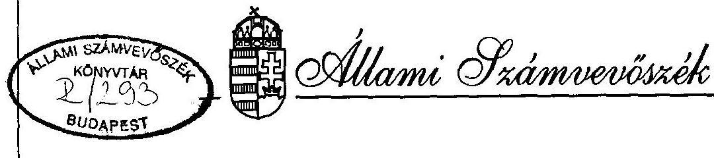
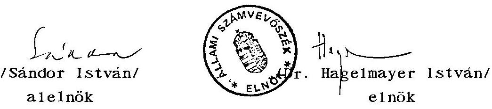

# JELENTÉS 

a Magyar Szocialista Párt
1992-1993-1994. évi gazdálkodása törvényességének ellenôrzésérôl

---

A vizsgálat végrehajtásáért felelős: az ÁSZ IV. Vagyonellenőrzési Igazgatósága
dr. Kovács Árpád igazgató

A vizsgálatot vezette:
dr. Elek János
osztályvezető főtandcsos
A vizsgálatot végezte:
Écsy Lajosné
számvevő
dr. Szávai Tamás
számvevő tandcsos
Hoffmann István
számvevő

---

ÁLLAMI SZÁMVEVÖSZÉK
V-1016-17/1995-96.
Tsz: 300 .

# J E L E N T É S 

a Magyar Szocialista Párt
1992-1994. évi gazdálkodása törvényességének ellenőrzéséről

## 1 .

## A VIZSGÁLAT CÉLJA, MÓDSZERE, IDŐSZAKA, KÖRÜLMÉNYEI

A pártok müködéséröl és gazdálkodásáról szóló - többször módosított - 1989. évi XXXIII. törvény (továbbiakban párttörvény) 10. §. (1) bekezdése, valamint az Állami Számvevőszékről szóló 1989. évi XXXVIII. törvény 5. §. alapján a pártok gazdálkodása törvényességének ellenőrzésére az Állami Számvevőszék (továbbiakban: ÁSZ) jogosult. A törvényi felhatalmazás alapján az ÁSZ 1995. évi ellenőrzési tervének megfelelően vizsgálta a Magyar Szocialista Párt (a továbbiakban: MSZP) gazdálkodása törvényességét.

Az ellenőrzés célja annak megállapítása volt, hogy az MSZP müködéséhez szabályszerűen igénybevehető forrásokat használt-e fel, a párttörvényben engedélyezett gazdálkodó tevékenységet folytatott-e, valamint betartotta-e a gazdálkodással összefüggő pénzü-gyi-számviteli szabályokat, és a törvény által ingyenes használatba adott ingatlanok használatánál az erre vonatkozó törvény elöírásait.

A vizsgálati jelentés az Országos Központban, a Komárom-Esztergom és Nógrád megyei Szövetségné1, a Budapesti Szövetségné1, a Tatabánya városi, Salgótarján városi, Szécsény városi szervezeténél, valamint az MSZP Budapest I. és XVII. kerületi szervezeténél végzett vizsgálatok jelentései alapján készült.

---

Az ellenőrzés 1992. január 1-től 1994. december 31-ig terjedő, beszámolóval lezárt időszakra, valamint az 1995. év egyes bevételeire terjedt ki. A helyszíni ellenőrzés 1995. október 30-tól december 22-ig tartott.

Az ellenőrzés módszere szúrópróbaszerű vizsgálat volt. A jelentés megállapításai a helyszíneken rendelkezésre bocsátott iratok, dokumentumok alapján lefolytatott ellenőrzés tapasztalatain alapulnak.

A párt gazdálkodása törvényességének ellenőrzése figyelembe vette a Magyar Közlöny 1991. évi 28. számában közzétett ÁSZ általános ellenőrzési program szempontjait is.

Az ellenőrzés végrehajtása során figyelemmel kellett lenni arra, hogy az 1992. január elsején életbe lépett számviteli törvény hatálya kiterjed a pártokra is. Továbbá, a párttörvényt módosító 1992. évi LXXXI. törvény megváltoztatta az előző évi gazdálkodásról a Magyar Közlönyben közzé teendő beszámoló tartalmát.

# II. 

## A PÁRT GAZDÁLKODÁSÁRÓL SZÓLÓ 1992-1993-1994. ÉVI BESZÁMOLÓK ELLENÖRZÉSÉNEK TAPASZTALATAI

## 1. Általános megállapítások

Az MSZP az 1992, 1993. és 1994. évi beszámolókat (1. sz. melléklet) a párttörvény 9. §. (1.) bekezdésében elöirt határidőben és a törvény 1. sz. mellékletében elöirt formában és tartalommal hozta nyilvánosságra.

A közzétett beszámolók az Országos Központ és az önálló jogi személyiségge1 rendelkező 19 megyei szövetség, a budapesti

---

Elnökség és a Politikatörténeti Intézet gazdálkodásának összesített adatait tartalmazzák. A megyei adatszolgáltatások tartalmazzák a hozzájuk tartozó szervezetek adatait is.

A megyei szövetségek többszörös felszólítása ellenére azonban néhány községi szervezet nem számolt el a bevételeiröl és kiadásairól, melynek következtében megyei szinten pénzügyi zárómérleghez összegzett gazdálkodási adatok nem tekinthetöek teljeskörünek.

Az éves beszámolók egyik évben sem tartalmazzák teljeskörüen az MSZP bevételeit, illetve 1994-ben kiadásait sem. Emellett tartalmi pontatlanságok és egyes esetekben a bevételeknél a támogatások halmozódása tapasztalható.

# 2. Részletes megállapítások 

2.1. Az 1992, 1993. és 1994. évi beszámolók ellenörzése
2.1.1. Egyik évben sem mutatták ki teljeskörüen a beszámolókban a párt által alapított kft-k értékesítéséből származó bevételeket. Az ellenőrzés által megvizsgált bizonylatok alapján az alábbi készpénz befizetések nem szerepelnek a bevételek 5. sorában:

| Befizetés | Befizetett | Értékesitett kft |
| :--: | :--: | :--: |
| kelte | összeg (Ft) | megnevezése |
| 1. 1992. nov. 23. | 700.000 | Anonimus KFT |
| 2. 1993. szept. 18. | 500.000 | VEKTOR KFT |
| 3. 1993. dec. 1. | 5.000 .000 | Orgona KFT |
| 4. 1994. dec. | 600.000 | CENTRAL KFT |

A fentieken kivül 1994-ben bevételként nem mutatták ki a jelentés 111./2.1.4. sz. pontjában részletezettek sze-

---

rinti - az Orgona kft értékesítése során a vételárba teljesítésként 625.000 Ft értékben beszámított 2 db személygépkocsi átadását sem.
2.1.2. Az 1993. évi beszámoló kiadásai között nem szerepel a párt egyik vállalkozásának átvilágitásáért kifizetett 2.295.393 Ft. Nem tartalmazza az 1994. évi beszámoló a választásokra készített szórólapok 4.979.508 Ft összegủ ellenértékét sem.
2.1.3. A beszámoló pontatlanságát zōmében a munkavégzés során elöfordult néhány hiba, az egyes gazdasági események eltérő értelmezése, kisebb részben a belsö információs rendszer egy elemének hiánya okozta. A belsö információs rendszerben ugyanis a vizsgált időszakban még nem volt megoldott, hogy a párt különbözö szervezeti egységei által, különféle idöpontban kapott egyéb hozzá járulások és adományok adományozónként nevesítve éves országos szinten összesitésre kerüljenek. Az elöfordult hiányosságok az alábbiak:

- Az 1994. évben a Nógrád Megyei Irodánál 717.519 Ft, Salgótarján Városi Irodánál 331.695 Ft, összesen: 1.049.214 Ft egyéb bevételt könyveltek 1993. évi elévült tartozás címén. Az összeg a Nógrádhő, illetve Tarjánhő kft-k részére meg nem térített karbantartási és fütési dijból, valamint a KVSZ részére járó, át nem utalt fenntartási költség-hozzájárulásból tevödött össze. Az Szt. értelmében a meg nem fizetett tartozás elévülés esetén sem minősül bevételnek, ezért azt a párt éves pénzügyi jelentése sem tartalmazhatja.
- A budapesti szövetségné 1993. évben az Óbuda Újlak, illetve az Óbudai Baráti Kör részéről a III. kerületi pártszervezet javára kapott támogatásokat 2.800 Ft összegben tévesen egyéb bevételként könyvelték.

---

- A Budapest I. kerületi pártszervezet esetében az egyes vállalkozások támogatás, illetve bérleti dij címen bevételezett befizetéseit a könyvelést végző budapesti szervezet esetenként eltérő rovatokra könyvelte.
2.1.4. A párt könyvviteli rendjében megoldották, hogy az Országos Központ és a megyei szintü, illetve a budapesti szövetségek közötti belsö pénzmozgásból adódó halmozódást az éves beszámolóból kiszúrjék. Ezt a követelményt azonban a területi szintek egymásközti (mint például városi szervezetek közötti, vagy városi és megyei szintű szervezetek közötti) belsö pénzmozgások esetében még nem sikerült teljesíteni. Így a pénzügyi beszámolóban halmozódást okozott, az oroszlányi szervezet 8.000 Ft-os hozzájárulása a megyei szövetség által rendezett megyegyülés költségeihez, valamint a miskolci városi szervezet 750.000 Ft támogatása a Borsod megyei Szövetségnek.

# III. 

## A BESZÁMOLÓK MEGALAPOZOTTSÁGÁVAL KAPCSOLATOS KÖNYVVIZSGÁLATI MEGÁLLAPÍTÁSOK

## 1. Általános megállapítások

Az MSZP 1992-ben az egyszerüsített kettős könyvvitelről áttért az egyszeres könyvvitelre.

Könyvvezetési kötelezettségüknek az Országos Központban és a területi gazdasági központokban (megyei szövetségek) naplófökönyv, a pártszervezetnél pedig pénztárkönyv vezetésével tesznek eleget.

---

A számviteli és pénzügyi munka jól szervezett. A beszámolási és könyvvezetési feladatokat a számvitelről szóló 1991. évi XVIII. törvény (továbbiakban: Szt.) alapján teljeskörűen szabályozták.

Az Országos Központban a párt gazdálkodásával összefüggő pén-zügyi-számviteli és egyéb adminisztratív feladatokat, valamint a székház üzemeltetését a párt egyszemélyes kft-je, a "Múködtető KFT" látta el.

A megyei szövetségek és a hozzájuk tartozó pártszervezetek adatait a megyei szövetségek dolgozzák fel és összesítik.

Az egyszeres könyvvezetési mód szabályai szerint a párt egészére kialakított számítógépes könyvelési program biztosította, hogy a helyi szervezetek és a megyei szövetség megyei szintű gazdálkodási adatai beépüljenek a párt pénzügyi zárómérlegébe.

A számviteli munka megfelelő szervezettsége ellenére előfordultak olyan könyvelési és bizonylatolási hiányosságok, melyek több tekintetben sértik az Szt. előírásait. A könyvvezetés során néhány esetben megsértették a számviteli alapelvek közül a teljesség, valódiság és a bruttó elszámolás elvét.

# 2. Részletes megállapítások 

### 2.1. A könyvvezetés rendje, szabályszerűsége

2.1.1. A párt egységesen kialakított gazdálkodási rendje szerint a városi és községi helyi szervezetek pénzmozgását a megyei szövetség könyveli. A helyi szervezetek csak pénztárkönyvet vezetnek, saját bankszámlájuk forgalmáról banknyilvántartást nem készítenek.

---

A könyvelés időbeli és térbeli elkülönülése miatt a megyei szövetségek és a helyi szervezetek a pénzmozgások naprakész rögzítésének az Szt-ben előirt módon nem tettek eleget. A pénzmozgások folyamatos rögzítésének követelménye csak Komárom-Esztergom megyében érvényesült, ahol a banki és pénztári nyilvántartásokat naprakészen vezették. Ezzel szemben a Nógrád megyei szövetségné még pénztári nyilvántartást sem vezettek.
2.1.2. A kifizetés elszámolásának alapját képező bizonylat hiányában került átutalásra 2.295 .393 Ft , 1993. január 14-én egy ausztriai cégnek.

Az ellenőrzés időpontjában előkerült számlák alapján megállapítást nyert, hogy ez az összeg a pártot terhelő kiadásként a Kossuth Kiadó átvilágítási költségeit tartalmazza, melyet a Kossuth Kiadó tartozásaként tartottak nyilván. A fenti összeget a kiadások között nem számolták el és az MSZP 1993. éves beszámolójában sem szerepel.
2.1.3. Az Országos Központ által a Kossuth Könyvkiadó Kft részére 1993. november 18-án - 1994. január 20-i visszafizetési határidőre - készpénzben nyújtott 5.000 E Ft összegű kölcsön visszafizetése nem történt meg.

Az Országos Központ főkönyvelójének nyilatkozata és a csatolt megrendelés és számla szerint a fenti kft a választásokra MSZP szórólapokat készittetett a Kossuth Nyomda Rt-vel, me1ynek 4.979 .508 Ft értékét az MSZP felé nem számlázták ki és a kft ezt a teljesítést a tartozása kiegyenlítésének tekintette. Ez az elszámolási mód azonban az Szt. 15. § (10.) pontja szerinti bruttó elszámolási elvet sérti, miszerint a követelések és a kötelezettségek egymással szemben nem számolhatók el.

---

A szórólapok MSZP-t terhelő 4.979 .508 Ft-ról szóló számlájának hiánya miatt a fenti összeg az MSZP 1994. évi kiadásai között sem a könyvelésben, sem a beszámolóban nem szerepel. Ezenkivül a fenti helytelen elszámolás pénzügyi rendezése sem történt meg.
2.1.4. Az MSZP által alapított kft-k értékesítésének a könyvviteli nyilvántartásokban történt rögzitésével, illetve a könyvelés alapját képező bizonylatok kiállításával kapcsolatban az ellenőrzés az alábbi hiányosságokat állapította meg:

Az eredetileg mintegy 95.000 E Ft-os alaptőkével létrehozott Orgona Kereskedelmi és Szolgáltató kft privatizálása során az 1993. március 1-én megkötött adásvételi szerződés - 4 év alatti részletfizetésre - 21.000 E Ft-os vételárat tartalmaz. 1993. november 8-án - a korábbi szerződést módositva a 4 évre szóló fizetési megállapodást 1993. december 31-i egyösszegű teljesitésre változtatták, a vételár 11.400 E Ft-os csökkentésével. Így az új vételár 9.600 E Ft lett. 1993. december 14-én kötött újabb megállapodás szerint a vevő a fenti módosított vételárból 4.600 E Ft-ot a Demokrácia és Szolidaritás Alapitványba fizet.

Az Országos Központ nyilvántartásaiban a fenti szerzödések alapján 9.600 E Ft összegű vevő tartozást könyveltek el a "5596. Értékesített kft-k tartozás előirása" analitikus számlán a "72. Vagyonváltozás" számlával szemben. A tartozás részbeni kiegyenlítésére a vevő 1993. december 1-én 5.000 E Ft-ot fizetett be az Országos Központ pénztárába, mely összeget a tartozás csökkenéseként fenti számlákon elkönyvelték, de az Országos Központ bevételei között nem mutatták ki. Ugyancsak a fenti számlákon, a

---

tartozás csökkenéseként az - 1993. VS (12.) 14. vegyes bizonylat alapján - "DEMISZ Szerződésre hivatkozással elkönyveltek 3.975 E Ft-ot. A könyvelés alapját képező alapbizonylatot az ellenőrzésnek bemutatni nem tudták.

Fenti számlákon további tartozáscsökkenésként elkönyveltek 625 E Ft-ot. Ez az összeg - az 1994. április 26-i adásvételi szerződés, illetve az Orgona kft által kiállított számlák szerint - az MSZP Országos elnöksége részére átadott 2 db Lada 2105. típusú személygépkocsi ellenértéke volt, melyet helytelenül szállitói tartozásként tartanak nyilván. A vevő ugyanis a tartozása ellentételezéseként adta át a fenti személygépkocsikat, és ezt az Országos Központ teljesítésként beszámította a vételárba.

A könyvelési adatokból - a hiányos bizonylatok miatt nem állapítható meg a vevő részéről történt teljesítés tény leges összege.

Az ellenőrzés a vevő fizetési kötelezettségének tényleges teljesítéséről nyilatkozatot kért. Az ellenőrzést végzők a kért tájékoztatást nem kapták meg.
2.2. Az analitikus nyilvántartások, a bizonylati rend és az egyéb elszámolási szabályok betartásának ellenőrzése

# 2.2.1. Analitikus nyilvántartások 

Az Országos Központban - az Szt-ben leirtaknak megfelelően - vezetik az egyszeres könyvvezetéshez kapcsolódó analitikus nyilvántartásokat.

---

# 2.2.2. Bizony1ati rend és fegyelem 

A bizonylatok kiállítása és dokumentáltsága - összességében értékelve - az elöirt alaki és tartalmi követelményeknek megfelel. Az Országos Központ a III./2.1. pontban foglaltak kivételével, a bekövetkezett gazdasági müveletekröl, eseményekröl, - ame1yek az eszközök és azok forrásainak állományát és összetételét megváltoztatják szabályszerú bizonylatokat állított ki. A bizonylatok adatait a könyvviteli nyilvántartásokban rögzitették. A szigorú számadású nyomtatványok körét meghatározták, nyilvántartását vezetik.

Az utalványozási rend meghatározott. Az Országos Központban a pénztárbizonylatokon és pénztárjelentéseken azonban az az ellenör aláírása nem szerepel.

A párt XVII. kerületi szervezeténél a pénzforgalommal kapcsolatos bizonylatokat nem ellenörzik, az utalványozást elmulasztották, ami ellentétes az Szt. 85. §. c./ pontjában foglaltakkal.

### 2.2.3. Külföldi utaztatások ügymenete

Az ÁSZ legutóbbi ellenőrzése során - 1993. I. félévében - kifogásolta, hogy az Országos Központ ügyvitelében a külföldi utaztatások elszámolásának rendjét zártkörüen, azaz áttekinthető és ellenőrizhető módon nem szervezte meg. Következésképpen az MSZP devizafelhasználásának vo1umene és szabályszerűsége - 1992. és 1993. évben - pénztárbizonylatok és könyvelési adatok alapján nem állapitható meg, mivel devizapénztárt nem nyitottak, a kiküldetéssel kapcsolatos deviza (valuta) elszámoláshoz és nyil-

---

vántartáshoz szükséges nyomtatványokat pedig nem alkalmazták, ame1yek a következők:

- a banktól felvett ellátmányról nyilvántartás, - az Sz.ny. 318-119 jelü valutabevételi bizonylat, - meghatalmazás devizafelvételhez, pénztárkiadás és bevételi bizonylat, összesitő, visszavételezési nyomtatvány.

A felsorolt számviteli analitikák hiányában a könyvelésben rögzített adatok tehát zárkörűen nem ellenőrizhetők, Külkereskedelmi Bank által adott valutaforgalmi kimutatásával való egybevetés sem nyújt megnyugtató képet. Az MSZP csak 1994. év elejétől alkalmazta a valutaforgalom elszámolásához elengedhetetlen pénztárbevételi és kiadási bizonylatokat, az analitikát jelentő nyomtatványokat azonban nem vezette be, bár beszerzésükről intézkedett. Mindazon utazások valutaleszámolása, különösképpen ahol pénzmaradvány keletkezett és ez jelentős gyakoriságú, a könyvelésből nem tünik ki.

Így adódott elő például, hogy - 1994. április 25-én elszámolt görögországi utazáshoz felvett 1.740 USD-ból felhasználtak 973 USD-t, a pénztárba viszont nem 767 USD-t, hanem csak 627 USD-t fizetett vissza a kiutazó. A különbség 140 USD.

A könyvelés és a banki számlakivonat - éves szinten - 140 USD forintösszegével nem egyezett. Ennek elszámolása, illetve könyvviteli rendezése a Párt részéről 1996. évi feladat.

A "Külföldi kiküldetési utasítás és költsége1számolás" lap, amelyet az utaztatások elszámolásához alkalmaz az

---

Országos Központ, 1993-94. évben több esetben hiányosan van kitöltve. Hiányzik

- a kiküldetést engedélyező felettes szerv megnevezése,
- a kiküldetést elrendelő aláírása,
- a kiküldetésben eltöltött idő szükségességének, feladat elvégzésének igazolása.

Elöfordult olyan utaztatás is - 1993. július 15-i angliai kiküldetés - amelyhez a házipénztárból 37 GBP-t vett fel a kiutazó, pénztárkiadási bizonylat kiállítása nélkül. A "Kiküldetési Utasítás" hiányosan volt kitöltve. A költségelszámolási lapon a dologi kiadások között - taxi- és vonalhasználat címén 15,4 GBP-t számolt el a kiutazó, bizonylatok nélkül.

Hivatalos külföldi útra, egy fő - 1993. szeptember 13-án - felvett a KKB-tól 1.030 USD-t, amelyből napidij címén 130 USD-t számolt el. A visszajáró 900 USD visszavételezéséről pénztárbevételi bizonylatot nem állitottak ki, a banki befizetések között ez az összeg nem szerepel.

Ez a gyakorlat sérti az Szt. 83. §. (1.) és (2.) bekezdésében foglaltakat valamint a 30/1992. (II. 13.) Korm. rendelet 9. §. (3.) bekezdésében előirtakat.

Szintén sérti a 30/1992. (II. 13.) sz. Korm. rendeletben, továbbá az Szt-ben előirtakat, hogy egy küldöldi útra 1993. szeptember 16-án KKB-tól felvettek 104 USD-t, amellyel - mivel az utazás elmaradt - nem számoltak el. Nem áll rendelkezésre bizonylat, amely tanúsítaná, hogy a házipénztár bevételezte-e, vagy a banknak visszafizett-ék-e a fenti összeget.

A hatályos rendeletben foglaltakat több pontban sérti az a kirívó gyakorlat, amelyre 1993. évben hat izben került

---

sor. A párt egyik választott vezető tisztségviselője február 21. és május 20-a között úgy tett öt külföldi utat, hogy az utazási költségeket utólag számoltatta el. Összesen 148.512 Ft összegű valutát vett fel utólag a pénztárból, melynek kifizetését "Feljegyzés" formájában kérelmezte hatáskörébe tartozó beosztottjától.

A kiutazások úgy történtek,hogy minden esetben elmaradt, illetve elmulasztották

- az utazáshoz szükséges "Devizaigénylés"-t megtenni,
- a használatos "Külföldi kiküldetési utasítás és költsége1számolás" lapot kiállítani.

Ezek mellőzése következtében a tisztségviselő az

- engedélyezett és hivatalosan igényelt valuta,
- a kiküldetést engedélyező felettes szerv megjelölése, annak engedélyezése,
- az indulási és érkezési adatok feltüntetése,
- a kiküldetésben eltöltött idő szükségességének és a feladat elvégzésének igazolása
nélkü1 eszközö1t külföldi utazásokat.

A külföldi utaztatásokhoz kapcsolódóan az Országos Központ 1994. évben kifizetett és felhasznált 1.204 E Ft összegű valutaellátmány után nem adózott le. Az adóhiány az APEH felé mintegy 400 E Ft-ot jelent. Szükséges, hogy az MSZP 1996. év folyamán a külföldi utaztatás ügyvitelés és elszámoltatását megnyugtató módon rendezze és szabályozza.
2.2.4. Gépjármú üzemeltetéssel összefüggő költségtérítések gyakorlata

Az MSZP a vizsgált időszakban a saját tulajdonú személygépjármú hivatalos célra történő igénybevételéért fize-

---

tendő térítésekre munkavállalóival (magánszemély) megállapodásokat kötött. A megállapodásokban minden évben a hatályos kormányrendeletben elóirtak szerint rögzítette a térítendő 1 km-re jutó normaköltséget. A szúrópróbaszerűen vizsgált kifizetett költségtérítések a rendeletben elóirtaknak megfeleltek.

Az MSZP az SZJA törvényben 1995. július 1-én életbe lépett új rendelkezést alkalmazta, illetve betartotta. Minden személygépkocsija után, ame lyeket használatra kiadott - természetbeni juttatásnak minősítve -, a rendelkezésben rögzítettek alapján a személyi jövedelemadót levonta és megfizette.

# 2.2.5. Adózásra, illetöleg járulékfizetésre vonatkozó jogszabályok betartása 

Az MSZP a magánszemélyek jövedelemadójáról szóló - többször módosított - 1991. évi XC. törvény, illetve az adózás rendjéről szóló 1990. évi XCI. törvényben foglaltaknak - egy kivétellel - a vizsgált időszakban mindenben eleget tett. Kivétel: az 1994. és 1995. évi devizaellátmány utáni személyi jövedelemadó bevallás, előlegbefizetés és adózás elmulasztása - téves értelmezés - következtében.

Az MSZP mint munkáltató, 1992. 1993. 1994. évben eleget tett társadalombiztosítási feladatainak, így:

- a TB alapokat megillető befizetéseket,
- nyílvántartási és adatszolgáltatási kötelezettségeket,
- TB ellátások kifizetését
teljesítette.

Egy esetben az MSZP elmulasztotta a TB járulék bevallását és befizetését, egy nagyobb összegű jutalom kifizeté-

---

se esetében. A jutalom kifizetésére 1994. június 17-én került sor a házipénztárból, 3.360 E Ft összegben. Az összeg $44 \%$-os TB járuléka 1.478 E Ft-ot képviselt. Az MSZP a helyszini vizsgálat időtartama alatt - a megállapítás alapján - intézkedett, tartozását a TB-vel rendezte.

Az Országos Központ TB elszámolási számlája rendezett, fizetési kötelezettségeit teljesítette. Ugyanez vonatkozik a személyi jövedelemadó, munkavállalói és a munkaadói járulékokra is.
2.2.6. A párt leltározási rendje szabályozott, a vizsgált időszakban előírt leltározást elvégezték.

# IV. 

## AZ MSZP BEVÉTELSZERZŐ GAZDÁLKODÓ TEVÉKENYSÉGÉNEK VIZSGÁLATA

1. Az MSZP a párttörvény által engedélyezett alábbi gazdálkodó tevékenységeket folytatta:

- saját tulajdonában álló irodahelyiségeit, személygépkocsijait és egyéb ingóságait bérbeadással hasznosította,
- a tulajdonában álló gazdasági társaságokat és saját ingóságait (tárgyi eszközöket) értékesítette,
- átmenetileg felesleges pénzeszközeit kamatoztatta,
- propaganda anyagokat, kiadványokat és tagkönyveket értékesített.

A fentiekböl származó bevételeket a könyvelésben és az éves beszámolókban nem tel jeskörüen mutatták ki.

---

2. Az MSZP a saját alapítású 33 egyszemélyes korlátolt felelősségủ társaságából a vizsgált időszakban 14-et értékesített (a benne dolgozók vásárolták meg), 15 pedig megszűnt, illetve felszámolásra került. Jelenleg 4 müködő társasággal rendelkeznek.

A párt által alapított vállaltok és kft-k értékesítésekből:

| 1992-ben | 22.881 E Ft |
| :-- | --: |
| 1993-ben | 5.700 E Ft |
| 1994-ben | 334.950 E Ft |
| Összesen: | 363.531 E Ft összegü |

bevételt mutattak ki az éves beszámolókban. A jelentés 2.1.1. sz. pontjában részletezettek szerint a ténylegesen befolyt bevétel fentieket meghaladó összegű volt.
3. Az ellenőrzés vizsgálta az MSZP gazdálkodása körében, hogy az ingatlanait

- a párttörvény 6. §. (1.) bek. b./ pontja szerint hasznosi-totta-e, illetve
- az 1990. évi LXX. tv. alapján használta-e.

A társadalmi szervezetek kezelői jogának megszüntetéséről szóló 1990. évi LXX. törvény kártalanítás nélkül megszüntette a társadalmi szervezeteknek (beleértve az MSZP-t is) az állami tulajdonú ingatlanokra vonatkozó kezelói jogát. Ugyanakkor ezekre az ingatlanokra ingyenes használati jogot biztosított a fenti törvény. Ezzel egyidőben előírta a Kormány részére, hogy 1991. június 30-ig javaslatot kell tegyen az Országgyülésnek az e törvény alapján megszűnt kezelői joggal érintett ingatlanok hasznosításának módjáról, mely a helyszíni vizsgálat időpontjáig nem történt meg.

Az MSZP a törvényi kötelezettségének megfelelően 1990. október 15-ig bejelentette a Zárolt Állámi Vagyont Kezelő és

---

Hasznositó Intézménynek (ZÁVKI) (jelenleg Kincstári Vagyonkezelő Szervezet: KVSZ) azon használatában lévő ingatlanok jegyzékét, me1y ingatlanokra nézve a törvény értelmében a kezelói jog megszünésével egyidöben ingyenes használati jogot szerzett. A benyújtott jegyzék alapján a párt 365 ingatlanra szerzett ingyenes használati jogot.

Az idézett törvény azt is kimondta, hogy a ZÁVKI kezelésébe került ingatlanok nem idegeníthetők el és nem terhelhetők meg, valamint az ingatlan használata - törvény eltérő rendelkezésének hiányában - másnak nem engedhető át.

A vizsgált időszakban az MSZP-nél jelentős összegű egyéb be vétel keletkezett az ingyenes használati jogú ingatlanokban müködő más szervezetektől, illetve gazdasági társaságoktól üzemeltetési költséghozzájárulás címen befizetett összegekböl. Az üzemeltetési költséghozzájárulásból származó bevételek akkor tekinthetők elfogadhatónak, ha azok az ingatlan kezelőjének minősülő KVSZ által kötött bérleti, illetve használatbaadási szerződés alapján az ingatlanban tartózkodó szervezetektől származnak és az ingatlan üzemeltetési feladatainak ellátására a KVSZ a párttal üzemeltetési megállapodást kötött, valamint a költséghozzájárulás mértéke nem haladhatja meg a tényleges ráfordításokat.

Tekintettel arra, hogy az MSZP nem rendelkezett az idézett két törvény végrehajtásának ellenőrzésére alkalmas, megfelelő naprakész nyilvántartással, az ellenőrzés felhívására a párt megkezdte és folyamatosan rendelkezésre bocsátotta az ingyenes használatú ingatlanok adatainak feldolgozását. Ez a munka - bár igen magas készültségi fokot ért el - a helyszíni vizsgálat befejezésekor még nem zárult le.

---

Az ingatlan használatával kapcsolatos vizsgálathoz az ellenőrzés felhasználta a KVSZ által rendelkezésre bocsátott adatokat is.

Az ingatlanok használatával kapcsolatos általános megállapítások a következők:
a./ A vizsgálat időpontjában a párt használatában a ZÁV-KI-nak bejelentett 365-nél kevesebb ingatlan volt. A helyszíni vizsgálat idején a csökkenésről pontos adatot nem tudtak rendelkezésre bocsátani. Az utólag bemutatott adatok ellenőrzésére már nem volt mód. Az ingatlanfogyásnak csak a ZÁVKI-nak benyújtott listán 349. sorszámmal szerepe1tetett 1081. Bp. Köztársaság tér 26. sz. ingatlan esetében van törvényes indoka. A Köztársaság tér 26. sz. alatti ingatlan az 1991. évi XLIV. tv. értelmében a párt tulajdonába került.

Az MSZP ingyenes használatú ingatlanaíró1 nem rendelkezhetett, nem cserélhette el, nem adhatta át másnak. Ennek ellenére néhány ingatlant elcseréltek, vagy használati jogáról lemondtak a KVSZ,vagy az önkormányzat javára. Példaként szerepelnek az alábbi esetek:

- Elcserélték a ZÁVKI-nak benyújtott listán 202-es sorszámmal szereplő Szécsény Rákóczi Ferenc u. 113. számú ingatlant a ZÁVKI utódjaként alakult Kincstári Vagyonkezelő Szervezettel a Szécsény Rákóczi Ferenc u. 79. sz. ingatlan egy részének ingyenes használati jogáért.
- A 171. sorszám alatti pétervásári $37 \mathrm{~m}^{2}$-es ingatlant 41 $\mathrm{m}^{2}$-esre cserélték el az önkormányzattal.
- Olyan ingatlanra is ingyenes használati jogot igényeltek, a ZÁVKI-nak benyújtott 365 ingatlant tartalmazó

---

listán, mely használati jogáról már lemondtak. Ilyen például a listán 188-as sorszámmal szereplő Esztergom Bajcsy Zs. u. 4. sz. alatti $2.292 \mathrm{~m}^{2}$-es állami tulajdonú ingatlan, mely használati jogát - a tulajdonjog megváltoztatása nélkül - 1989. december 27 -én megállapodással átadták az Esztergomi Városi Tanács VB-nek azzal a feltétellel, hogy az átvevő térítésmentesen biztosít $87,5 \mathrm{~m}^{2}$ területet a párt működéséhez.

- Az előbb említettel közel azonos a 281-es sorszámmal szereplő Kisvárda Lenin (Szent L.) út 42. sz. alatti $634 \mathrm{~m}^{2}$ alapterületű ingatlan sorsa annyiban, hogy azt is úgy szerepe1tették a ZÁVKI-nak leadott jegyzéken, hogy annak használati jogáról már korábban 1990. január 3-án lemondtak a Kisvárda Városi Tanács javára a párt oly módon, hogy abból $216 \mathrm{~m}^{2}$ terület kezelói jogát igénye1te. Később 1992. októberében a párt a maradék ingatlanrészt elcserélte a Kisvárda Városi Önkormányzattal, az annak tulajdonát képező Bocskai u. 29. sz. alatti ingatlan használatára.
- A 172. sorszámon bejelentett MSZP Eger Városi Szervezetének Eger, Széchenyi utca 23. sz. alatti, összesen $301 \mathrm{~m}^{2}$ alapterületű helyiségek használati jogáról az Eger Városi Önkormányzat javára 1992. január 29-én az MSZP Városi Szervezete lemondott.
- Más ingatlan használati jogáról a párt lemondott a KVSZ részére, mint például a Szeged Csongor téren található 141. számon bejelentett ingatlan esetében.
b. / A gazdálkodó tevékenység ellenőrzése kiterjedt az MSZP által ingyenesen használt ingatlanok használatára is. Mint ismeretes, ezek közül egy db a Bp. Köztársaság tér 26. sz. alatti időközben törvényi rendelkezés alapján a

---

párt tulajdonába került. Ez ingatlan helyiségeivel a párttörvény értelmében a párt szabadon rendelkezett, így azokat bérbe is adhatta, melyből törvényes bevétele származott.

A többi ingatlan vonatkozásában a párttörvény 6. §. (1.) b./ pontja értelmében hasznosítási tilalom van hatályban, amelyet tovább szigorít az 1990. évi LXX. tv.

E törvény értelmében a párt az ingyenes használatot nem engedheti át, még szívességi használatra sem. Az ellenőrzés az alábbi szabálytalanságokat tárta fel:

- A párt Esztergom Városi Szervezete a székhelyéül szo1gáló - a ZÁVKI-nak bejelentett listán 188-as sorszámmal szereplő -, Esztergom, Bajcsy Zs. u. 4. sz. alatt található ingatlan eseti bérbeadásával 1995. évben 100.000 Ft bevételt ért el, me1y a párttörvény idézett szakasza értelmében tiltott gazdálkodásból származó bevéte1nek minősül.
- A pártnak a KVSZ megkerülésével kötött helyiséghasználatra vonatkozó szerződései - függetlenül attól, hogy hasznosításból származó bevételt nem realizáltak - , az 1990. évi LXX. törvény értelmében semmisnek minősülnek. Ez áll fenn pl. a Budapest, I. kerület által kötött valamennyi, a Bp. XVII. kerület által 1995. évben megkötött egyik szerződésére, a Nógrád megyei Szövetség által kötött szerződések zömének esetében.
- A szerződések egy része ellentmondásos, feltételeket tartalmaz, mint például a Nógrád megyei Szövetség által 2 db személygépkocsi tárolására alkalmas garázs bérbeadására vonatkozó úgy fogalmaz, hogy a szerződő fél lehetöséget kap arra, hogy a "párt használatában lévő

---

helyiségeket rendezvényei céljára alkalmanként igénybe vegye". E szerződésekben foglalt "alkalmankénti igénybevétel" ellentmond a tényleges gyakorlat folyamatos igénybevételének.

- Az ellenőrzés az MSZP ingyenes használatába került a 350. tételszáma alatti Budapest, VIII. Köztársaság tér 27. számú $3.585 \mathrm{~m}^{2}$ alapterületú ingatlanával kapcsolatban az alábbiakat állapította meg.

Az ingatlanban korábban a KISZ és 1989. tavaszától a BIT került elhelyezésre. Ezek a szervezetek az MSZP jogelődjétől megközelítően az épület 50\%-ára kizárólagos ingatlanhasználatot kaptak. Az 1990. évi LXX. sz. törvény 4. §-a kimondja, hogy a törvény nem érinti harmadik személynek az ingatlanra fennálló szerzett jogait.

Az 1990. évi LXX. sz. törvényt követően a BIT - mint az épületben korábban "elhelyezett" szervezet - harmadik személynek minősült, kezelői joggal nem rendelkezett, viszont az épületben - előbbiekben megszerzett - jogosultságát kívánta érvényesíteni, ez ügyben eljárt a KVSZ-nél. Jogosultságát a Bp. VIII. Köztársaság tér 27. sz. alatti ingatlan 50\%-ára a KVSZ 1992. február 12-én kelt BIT-tel történt megállapodásában elismerte.

A BIT, mint harmadik személy a törvénybő1 következően ingyenes használatot nem kaphatott. A Köztársaság tér 27. sz. épület $50 \%$-ára $1.825,87 \mathrm{~m}^{2}$ határozatlan időre szóló ingatlan használati jogot élvez. Együttmüködési megállapodás alapján gazdasági társaságokkal - bérleti díj fizetése nélkül - együtt használja a helyiségcsoportokat.

Az épület üzemeltetését az MSZP a KVSZ-szel kötött 1992. február 21-i megállapodás alapján végzi.

---

A KVSZ az MSZP-ve1 kötött 1992. február 21-i "Használati megállapodása" alapján a Budapest, VIII. Köztársaság tér 27. sz. épületében további $1.759,62 \mathrm{~m}^{2}-\mathrm{t}$ az MSZP budapesti Tanácsa és a Pest megyei Elnökség ingyenes használatába adott.

Az MSZP Országos Központjának a fenti ingatlan használói költségtéritést fizetnek, melyek a törvényes elöírásoknak megfelelnek, mivel a KVSZ a párttal üzemeltetési szerzödést kötött és a költségtérítés összege ténylegesen alacsonyabb az összes ráfordításnál.
c./ A KVSZ-töl függetlenül kötött szerződések használatbaadásról, illetve szívességi használatról szóltak oly módon, hogy azok bérleti díjat nem tartalmaztak, csak üzemeltetési, karbantartási, költséghozzájárulást. Ugyancsak költséghozzájárulást fizettek a pártnak azokban az esetekben is, amikor a KVSZ kötötte meg az üzemeltetési szerzödést az általa beutalt szervezettel.

Az ellenőrzés mindkét esetben vizsgálta az MSZP-nek fizetett költségtérítések jogos mértékét, amelyekről az alábbiakat állapította meg:

- A felmerült tényleges költségek tételes kigyüjtése, és azok igénybevevők szerinti felosztása különféle mutatószámok és mérések alapján a pártra nem jellemző. Az ellenőrzés egyedül a Budapest, XVII. kerületi pártszervezet által használt 167. sorszámon 1173. Budapest, Pesti út 167. sz. alatt bejelentett ingatlan esetében talált ilyen elfogadható megoldást, ahol a szolgáltatást igénybevevők igazoltan a felmerült költségeket térítették.

---

- A megvizsgált ingatlanok esetében az üzemeltetés és fenntartási költséghozzájárulás összegét éves szinten elöre fix összegben határozták meg a szolgáltatást igénybevevővel kötött szerződésekben, havi részletfizetési kötelezettség mellett, utólagos elszámolási kötelezettség né1kül. Ez alól csak a Nógrád megyei Szövetség által használt 196-os sorszámon bejelentett Salgótarján Kossuth L. u. 8. sz. alatti ingatlan kivétel, me1y esetében az 1995. évre vonatkozó szerződéseket kiegészités címen módosították utólag olyan értelemben, hogy a fizetett költséghozzájárulást előlegnek tekintik, és év végén a költségmegosztás véglegesen megtörténik.

A fix összegben meghatározott költségtérítések esetében az ellenőrzés részére előzetes költségszámitást bemutatni nem tudtak. A helyszini ellenőrzés megkezdése időpontjában nem lehetett megállapítani, hogy a szerződések alapján a párt részére fizetett térítés mennyiben felelt meg a ténylegesen felmerült költségeknek. Az ellenőrzés felhívására megkezdték a rezsiköltségek ingatlanonkénti tételes kigyüjtését. A bemutatott számításokeredményei azt mutatják, hogy ingatlanonként az MSZP által kifizetett üzemeltetési költségek meghaladják a szolgáltatást igénybevevők által térített összeget. Így jogosulatlan bevétel nem keletkezett.
4. Az ellenőrzés a vizsgált időszakban a megvizsgált dokumentumok alapján az ingatlanhasznosításon túlmenően a párttörvény által tiltott gazdálkodásból származó bevételt csak egy területi szervezetnél állapított meg.

Az ellenőrzés részjelentésében foglaltak szerint az esztergomi Városi Szervezet reklámtevékenységböl - melyet a párttörvény nem tesz lehetővé - összesen 312.040 Ft tiltott bevételre tett szert.

---

# V. 

## A BELSŐ ELLENŐRZÉS VIZSGÁLATA

A párt alapszabálya szerint a pártnál Központi Pénzügyi Ellenőrző Bizottság (továbbiakban: KPEB) müködik, mely feladatát és hatáskörét a 28. szakaszban az alábbiakban határozták meg:
a./ ellenőrzi a pártvagyon kezelését,
b./ ellenőrzi a párt központi, valamint a párt országos intézményeinek, vállalkozásainak és alapítványainak gazdálkodását,
c./ véleményezi a párt gazdasági tevékenységét,
d./ véleményezi a párt központi költségvetését és a költségvetési beszámolóját,
e./ tapasztalatairól tájékoztatja a pénztárnokot, az Országos Elnökséget, az Országos Választmányt és a Kongresszust, szükség szerint intézkedéseket kezdeményez.

A KPEB 1992-1994. között az alapszabály szerint müködött. Véleményezte az MSZP költségvetését és beszámolóját. Elvégezte az Országos Központ számviteli ellenőrzését. Felmérést végeztek a megyei szervezetek technikai ellátottságáról. Véleményezték a Kossuth Könyvkiadó átalakulási elképzeléseit és az MSZP által alapított kft-k privatizációját. Ellenőrizték a párt által alapított alapítványok gazdálkodását.

Az alapszabály az alacsonyabb szintű pártszervezetek ellenőrzéséről nem tartalmaz előirást. A gyakorlatban a KPEB és a megyei szerveztek együttmüködve végeznek közös vizsgálatokat.

A helyszíni vizsgálat során a számvevőszéki ellenőrzés az Országos Központon túlmenően, csak a Budapesti Szövetségné1 és az I. kerületi szervezeténél találkozott a helyi szintű ellenőrző bizottság munkájával.

---

A folyamatba épített ellenőrzést nem szabályozták, me1y a gyakorlatban csak az aláírási jog (utalványozás) gyakorlása során érvényesûl. A pártnál függetlenített be1ső e1lenőrt nem alkalmaztak.

# VI. 

## FELHÍ VÁS A TÖRVÉNYES ÁLLAPOT HELYREÁLLÍTÁSÁRA

A vizsgálat megállapításai alapján a párttörvény 10. §. (4.) bekezdésében kapott felhatalmazás alapján az Állami Számvevőszék felhívja a párt e1nökét, hogy:
1./ Az ellenőrzési megállapítások figyelembevételével készítsek el és tegyék ismételten közzé a párt 1993. és 1994. évi pénzügyi beszámolóját.
2./ A párttörvény 6. §. (5.) bekezdése, valamint 4. §. (4.) bekezdése értelmében a jelentés IV. 3/b. és 4. pontjaiban részletezett, összesen 412.040 Ft tiltott gazdálkodásból származó bevételnek megfelelő összeget a jelentés kézhezvételétől számított 15 napon belûl fizessék be az állami költségvetésbe.

A párttörvény 4. §. (4.) bekezdése utolsó mondata értelmében a párt költségvetési támogatását ugyanezen összeggel, azaz 412.040 Ft-tal csökkenteni kell. Erre az ÁSZ a szükséges intézkedést megteszi.
3./ Az 1994. és 1995. évi külföldi kiküldetések valutaellátmánya után be nem fizetett személyi jövedelemadó hiányt az adózásra vonatkozó jogszabályok alapján teljeskörűen állapítsa meg és fizesse be az Adóhatóságnak.

---

4./ A számviteli rend teljeskörü helyreállítása érdekében a könyvvezetés és a bizonylatolás körében megállapított hiányosságokat számolják fel. A jelentés III. 2.1.2., 2.1.3. és 2.1.4. pontjaiban részletezett bizonylati és elszámolási hiányokat pótolják. A külföldi kiküldetések elszámolási rendjét teljeskörüen szervezzék meg.
5./ Tisztázzák az ingyenes használati jog megszerzése céljából a bejelentett 365 ingatlan, illetve részingatlan valós tulajdoni helyzetét és azt egyeztessék a KVSZ-szel.
6./ Szüntessék meg az ingyenes használati jogú ingatlanok esetében a nem KVSZ által kötött szerződések alapján az ingatlanokban tartózkodó szervezetekkel a törvényekkel ellentétes jogviszonyt.

Mivel a jelentés az adóhatóság hatáskörébe tartozó jogszabályokat érintő megállapításokat is tartalmaz, az ÁSZ tájékoztatja azokról az Adó- és Pénzügyi Ellenőrzési Hivatalt. Kezdeményezi továbbá az ingyenes használati jogot biztosító 1990. évi LXX. tv. által érintett ingatlanok sorsának végső rendezését.

Budapest, 1996. március " $\odot$."

Me11éklet: 1 db

---

# A Magyar Szocialista Párt 1992. évi beszámolója 

## E Ft-ban

## A) Bevetelek

1. Tagdijak 17399
2. Állami költségvetésbőı származó támogatás 139420
3. Képviselöi csoportnak nyújtott állami támogatás 80
4. Egyéb hozzájárulások, adományok
4.1. Jogi személyektól
4.1.1. Belföldiektól (az 500000 forint feletli hozzájárulás nevesitve) 4642
4.1.2. Külföldiektől (a 100000 forint feletli hozzájárulás nevesitve)
4.2. Jogi személynck nem minősülő gazdasági társaságtól
4.2.1. Belföldicktól (az 500000 forint feletli hozzájárulás nevesitve)
4.2.2. Külföldiektől (a 100000 forint feletli hozzájárulás nevesitve)
4.3. Magánszemélyektól
4.3.1. Belföldiektól (az 500000 forint feletli hozzájárulás nevesitve)
4.3.2. Külföldiektől (a 100000 forint feletli hozzájárulás nevesitve)
5. A párt által alapított és korlátolt felelőssćgủ társaság nyeresćgéből származó bevétel
6. Egyéb bevétel

Összes bevetel a gazdasági évben
414319

## B) Kiadások

1. Támogatás a párt országgyúlési csoportja számára
2. Támogatás egyéb szervezetcknck 20825
3. Vállalkozások alapítására forditott öszszegek
4. Müködési kiadások 106276
5. Eszközbeszerzés 17065
6. Politikai tevékenység kiadása 239284
7. Egyéb kiadások 15898

Összes kiadás a gazdasági évben
399434
Dr. Szekeres Imre s. k., Máté László s. k., ugyvezetó aleinók pénztárnok