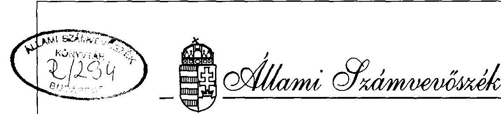
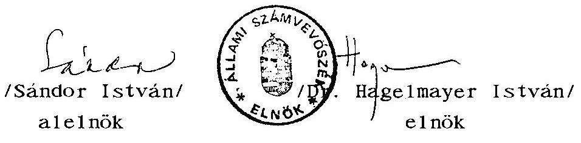
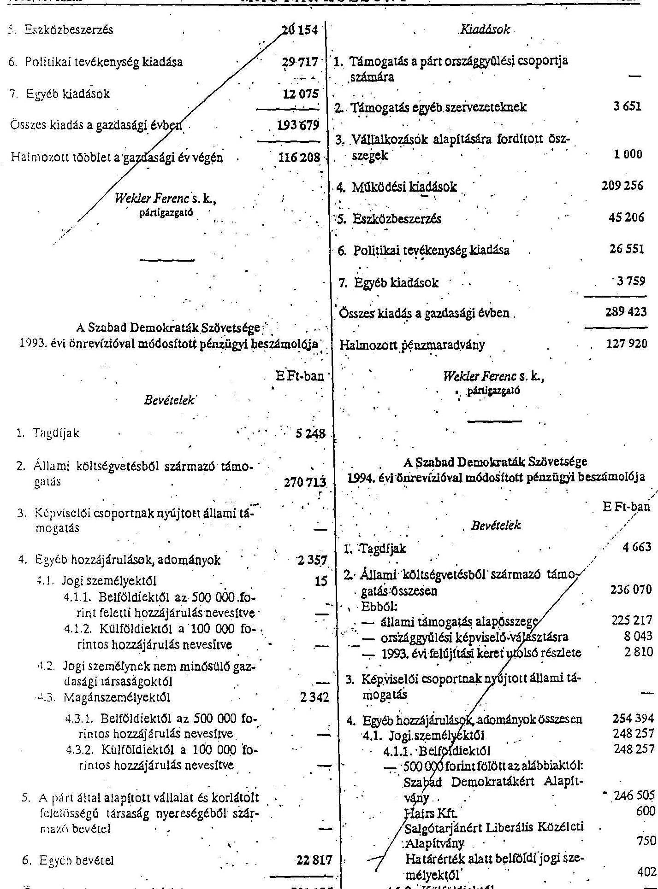
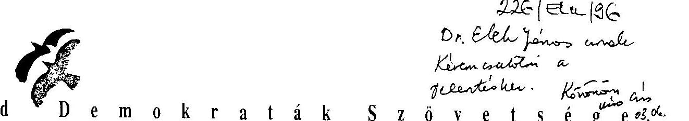
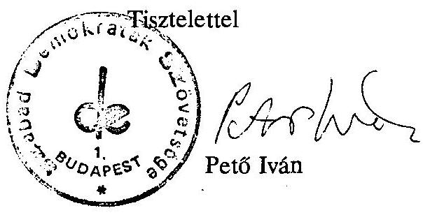

# JELENTÉS 

a Szabad Demokraták Szövetsége
1992-1993-1994. évi gazdálkodása törvényességének ellenőrzéséről

---

A vizsgálat végrehajtásáért felelős: az ÁSZ IV. Vagyonellenőrzési Igazgatósága
dr. Kovács Árpád igazgató

A vizsgálatot vezette:
dr. Elek János osztályvezető főtanácsos

A vizsgálatot végezte:

| Berzétey Attiláné | számvevő tanácsos |
| :-- | :-- |
| dr. Dotterweich Antal | számvevő tanácsos |
| Tóth István | számvevő tanácsos |

---

ÁLLAMI SZÁMVEVŐSZÉK
V-1017-11/1995-96.
Tsz: 301 .

JELENTÉS
a Szabad Demokraták Szövetsége
1992-1994. évi gazdálkodása törvényességének ellenőrzéséről

# I. 

## A VIZSGÁLAT CÉLJA, MÓDSZERE, IDŐSZAKA, KÖRÜLMÉNYEI

A pártok működéséről és gazdálkodásáról szóló - többször módosított - 1989. évi XXXIII. tv. (továbbiakban: párttörvény) 10. §.(1.) bekezdése, valamint az Állami Számvevőszékről szóló 1989. évi XXXVIII. tv. 5. §-a alapján a pártok gazdálkodása törvényességének ellenőrzésére az Állami Számvevőszék (továbbiakban: ÁSZ) jogosult. A törvényi felhatalmazás alapján az ÁSZ II. félévi ellenőrzési tervének megfelelően vizsgálta a Szabad Demokraták Szövetsége (továbbiakban: párt) gazdálkodása törvényességét.

Az ellenőrzés célja annak megállapítása volt, hogy a párt működéséhez szabályszerűen igénybevehető forrásokat használt-e fel, a párttörvényben engedélyezett gazdálkodó tevékenységet folytatott-e, valamint betartotta-e a gazdálkodással összefüggő pénzügyi-számviteli szabályokat.

Az ÁSZ a párt 1991. évi gazdálkodásának törvényességét 1993. évben vizsgálta. A jelenlegi ellenőrzés az 1992. évi beszámolóra, alapvetően az 1993. és 1994. évek beszámolóval lezárt időszakaira, továbbá a folyó 1995. év I. félévére terjedt ki.

---

A helyszíni ellenőrzés 1995. október 4-től december 15-ig tartott.

A jelentés megállapításai a párt Országos Központjában rendelkezésre bocsátott iratok, dokumentumok, a párt által módosított és ismételten közzétett pénzügyi beszámolók alapján lefolytatott helyszíni ellenőrzés tapasztalatain alapulnak.

# II. 

## A PÁRT GAZDÁLKODÁSÁRÓL SZÓLÓ 1992-1993-1994. ÉVI BESZÁMOLÓK ELLENŐRZÉSÉNEK TAPASZTALATAI

## 1. Általános megállapítások

A párttörvény 9. §. (1.) bekezdése értelmében a pártok kötelesek az előző évi gazdálkodásukról szóló beszámolót a törvényben meghatározott formában - a tárgyévet követő év április 30-ig - a Magyar Közlönyben közzétenni. A párt az 1992. évi pénzügyi zárómérlegét 1993. július 23-án, az 1993. évi pénzügyi zárómérlegét 1994. április 29-én, az 1994. évi zárómérlegét 1995. április 28-án tette közzé.

Az Állami Számvevőszék 1993. év első félévében vizsgálta a párt 1991. évi gazdálkodásának törvényességét. E vizsgálat észrevételeinek alapján, valamint a párt vezetése és belső ellenőrzése megállapításai eredményeképpen 1993. év második félévétől a párt gazdálkodását, számviteli rendjét irányító vezetést és végrehajtó apparátust átszervezték, megújították. 1993. július 1-jétől új könyvelési programot és adminisztrációs rendszert vezettek be.

---

Az Állami Számvevőszék felhívására 1995. szeptember 25-én ismételten megjelentették a Magyar Közlönyben az 1991. évi, továbbá önrevízió végrehajtása után az 1992, 1993, 1994. évi módosított pénzügyi zárómérlegeiket (1. sz., 2. sz., 3. sz és a 4. sz. mellékletek). A jelenlegi ÁSZ ellenőrzés megállapításait a módosított pénzügyi zárómérlegek vizsgálatára alapozta.

Az ellenőrzés megállapítása szerint a módosított beszámolók sem feleltek meg maradéktalanul a számviteli törvényben konkrétan megfogalmazott egyes számviteli alapelveknek, ennek következtében sem főösszegükben, sem részleteikben nem a tényleges állapotot tükrözik.

A beszámolók tartalmát illetően a következő alapelvek nem érvényesültek:

- A valódiság elvét sérti, hogy a beszámolók egyes sorai nem felelnek meg a tényleges állapotnak.
- A következetesség elvét sérti, hogy nem határozták meg pontosan és egyértelműen a beszámolók egyes sorainak, valamint főleg azon főkönyvi számlák tartalmát, amelyek megnevezéséből a tartalom egyértelműen nem állapítható meg.
- A bruttó elszámolás elvét sérti, hogy esetenként a bevételekkel a költségeket csökkentették.
- A teljesség elvét sérti, hogy a főkönyvi könyvelésben nem az alapbizonylatok, hanem az azokról készült összesítők alapján könyveltek, az alapbizonylatok ellenőrzése nélkül, így nem bizonyított, hogy valamennyi pénzügyi művelet rögzítése megtörtént. Esetenként a területi szervezetek által könyvelt alapbizonylatok (bevételi és kiadási pénztárbizonylatok) sorszám szerint hiányosak.

---

Az ellenőrzés ezúttal is megjegyzi, hogy az éves beszámolóra vonatkozó szabályozás nem egyértelmű, szakmailag vitatható. Egységes értelmezést biztosító kitöltési útmutató nem készült, így pártonként eltérő felfogások érvényesítésére van lehetőség. Erre figyelemmel az ellenőrzés csak az egyértelműen jogszabályba ütköző hibákat, hiányosságokat kifogásolja.

# 2. Részletes megállapítások 

### 2.1. Az 1992. évi beszámoló ellenőrzése

### 2.1.1. A bevételekkel kapcsolatos megállapítások

Az adatgyűjtés hibája folytán a külföldi adományozók kivételével az adományok esetében nem állapítható meg, hogy azok magánszemélytől, vagy jogi személytől származnak. Valamennyi helyi szervezethez befolyt adományt "magánszemélytől származó értékhatár alatti adományként" szerepeltetnek a beszámolóban. Egy magánszemélytől származó 1 M Ft-os adomány esetében a beszámolóban az adományozó nevét (Barát László) nem tüntették fel.

A beszámoló egyéb bevétel oszlopában szereplő 16.044 E Ft-os összegből összesen 261 E Ft a párt központjának a helyi szervezetektől származó bevétele. Ugyancsak egyéb bevételként könyveltek több, a párt területi szervezetétől a központi pénztárba eszközölt befizetést. Valójában ezek csak pénztárak közötti átvezetések.

A párt által vásárolt vonatjegyek fedezetére kapott 76.694 Ft adományt kiadáscsökkentésként könyvelték külföldi jogi személytől származó hozzájárulás helyett.

---

Hiányzik a beszámolóból 98.375 Ft bérleti díj bevétel, továbbá 76.694 Ft a Friedrich Neumann Alapítványtól kapott támogatás, amit bevétel helyett a könyvelés kiadáscsökkentésként könyvelt.

# 2.1.1. A kiadásokkal kapcsolatos megállapítások 

A párt helyi szervezetei által a központi pénztárba fizetett halmozott bevételeket eredményező összegeket működési kiadásként halmozottan tartalmazza a beszámoló.

Hiányzik a kiadások közül 76.694 Ft külföldi kiküldetéshez kapcsolódó utiköltség, amelyet a költségek fedezetére kapott adomány helyett költségcsökkentésként könyveltek.

### 2.2. Az 1993. évi beszámoló ellenőrzése

### 2.2.1. A bevételekkel kapcsolatos megállapítások

Az 1. Tagdíjak soron közzétett összeg megegyezik a könyvelés adataival, tartalmazza a területi szervezetek befizetéseit is.

Az állami költségvetésből származó támogatásból 236.363 E Ft a párttörvény 5. §. (2.) bekezdése alapján kapott alapösszeg, 34.410 E Ft pedig az 1993. évi felújítási keret.

A 4.1. jogi személyektől származó hozzájárulások, adományok soron szerepeltetett összeg nem tartalmazza a párt nagykanizsai és zalaegerszegi csoportjai nevére kiállított, és a Friedrich Neumann Alapítvány által kiegyenlített számlák, illetőleg deviza átutalások összegét összesen 650.624,60 Ft értékben. Ennek az összegnek nevesítve szerepelnie kellett volna a "külföldiektől származó 100.000 Ft-os hozzájárulás" soron is.

---

A 6. egyéb bevétel soron feltüntetett 22.817 E Ft tartalmaz 6.093 E Ft költségtérítésből származó összeget.

Az ellenőrzés megállapítása szerint a közölt összeg pontatlan, mivel a költségtérítésből származó 6.093 E Ft tartalmaz az előbbiekben részletezett, külföldi jogi személytől származó 651 E Ft összegű, belföldi jogi személytől származó 70 E Ft és magánszemélytől származó 102.380 Ft összegű hozzájárulást, továbbá itt tüntettek fel 10,3 E Ft vállalkozási tevékenységből, 110 E Ft propaganda tevékenységből, és 2.530 E Ft összegű, gazdálkodási tevékenységből származó bevételt.

Költségcsökkentésként könyveltek és számoltak el továbbá összesen 133 E Ft biztosítási kártérítést. Több esetben költségtérítésből származó bevételként szerepeltettek területi irodától a csoportnak nyújtott, illetőleg a központtól a területi irodának átutalt ellátmányt. Ezáltal összesen 102 E Ft összegű halmozódásból eredő bevétel keletkezett. Fentiek miatt nem a valós helyzetet tükrözik a vállalkozói, a propaganda tevékenységből és az egyéb rendkívüli bevételekből származó bevételek és a magánszemélyektől származó hozzájárulások sorokon közölt összegek.

# 2.2.2. A kiadásokkal kapcsolatos megállapítások 

A párt a működési jellegű kiadásai között 31.593.266 Ft összegben költségként elszámolt értékcsökkenési leírás is szerepel, amely nem tényleges kiadás.

---

# 2.3. Az 1994. évi beszámoló ellenőrzése 

### 2.3.1. A bevételekkel kapcsolatos megállapítások

- A tagdíjak beszámolóban szerepeltetett 4.663 E Ft összegét a 91. sz. "Tagdíjak" főkönyvi számla 4.663.359,9 Ft egyenlege alapján tüntették fel. 2.700 Ft tagdíjat a 962. sz. Költségtérítések főkönyvi számlára könyveltek, így a beszámolóban szerepeltetett összeg pontatlan.
- Az egyéb hozzájárulások belföldi jogi személyektől 248.257 E Ft összesen adata és részletezése is pontatlan.

Két kft-től származó, összesen 520 E Ft összegű hozzájárulást a beszámolóban helytelenül a "belföldi magánszemélyektől származó adományok" soron tüntettek fel. Emiatt a "határérték alatt belföldi jogi személyektől" sor 402 E Ft összege pontatlan.

Az EUROTEAM kft-től kapott 2.000 E Ft adományt helytelenül a Szabad Demokratákért Alapítványtól származó adományként könyvelték és szerepeltették a beszámolóban. Ennek következtében az 500 E Ft fölötti hozzájárulást nyújtók között nem nevesítették az adományozót.

- A beszámoló nem tartalmaz külföldi jogi személyektől származó hozzájárulás sort. Az ellenőrzés megállapítása szerint több esetben térítettek a párt részére külföldi szervezetek költségeket (1994. január 31. költségtérítés 433 USD, utazási költségtérítés 753 DEM), ezek azonban helytelenül az egyéb bevétel sor összegében találhatók.

---

- A közzétett beszámoló "Jogi személynek nem minősülő gazdasági társaságtól" soron összeg nincs. Az ellenőrzés megállapítása szerint a szekszárdi csoport 25 E Ft összegű, a gyöngyösi csoport 10 E Ft összegű, a miskolci csoport 1,1 E Ft összegű, a dunaújvárosi csoport 100 E Ft összegű adományt kapott jogi személynek nem minősülő gazdasági társaságoktól.

Fentiek miatt pontatlan a magánszemélyektől származó hozzájárulások sor összege is.

- Egyéb bevétel címén 21.941 E Ft szerepel a beszámolóban. Az ellenőrzés megállapítása szerint a közölt összeg pontatlan. A "Különféle egyéb bevételek" főkönyvi számlára könyvelt 7 E Ft nem árbevétel, helyesen a szállítók főkönyvi számlával szemben kellett volna könyvelni. E főkönyvi számlán fel nem vett munkabér címén összesen 69 E Ft is szerepel, ez ugyancsak nem bevétel. A "Rendkívüli bevételek" főkönyvi számlán árbevételként található 401.220 Ft összeg ugyancsak nem árbevétel. Az ellenőrzés megállapítása szerint az "Biztosítási díjak" főkönyvi számlán is szerepelnek kártérítésből származó összegek, azonban ezekkel az összegekkel a bruttó elszámolás elvét megsértve a költségeket csökkentették. A kártérítések teljes összegét kellett volna a rendkívüli bevételek között szerepeltetni.

A Költségtérítések főkönyvi számla 5.385.665 Ft záróegyenlegében a következő jogcímek bevételei is találhatók:

- 2.700 Ft tagdíj,
- 12 E Ft belföldi magánszemélyektől származó hozzájárulás 500 E Ft alatt,

---

- 55 E Ft belföldi jogi személyek hozzájárulásai 500 E Ft alatt
- 274 E Ft külföldi jogi személyek hozzájárulásai 100 E Ft felett (Friedrich Neumann Alapítvány);
- 153 E Ft külföldi jogi személyek hozzájárulásai 100 E Ft alatt
- 650 E Ft belföldi jogi személyek hozzájárulásai 500 E Ft felett (Kincstár kft).
- 2.370 E Ft gazdálkodási tevékenységből származó bevétel.

A felsorolt összegeknek a beszámoló megfelelő sorain kellene szerepelni, az értékhatár feletti összegeknél nevesítve kellett volna szerepeltetni az adományozókat.

A "Propaganda tevékenység bevétele" főkönyvi számlán 100 E Ft összegű jogi személytől származó adományt is rögzítettek, amelyet a "Határérték alatti belföldiektől származó" főkönyvi számlán kellett volna könyvelni és a beszámolóban is így szerepeltetni.

# 2.3.2. A kiadásokkal kapcsolatos megállapítások 

- A "támogatás egyéb szervezeteknek" beszámoló soron 3.786 E Ft összeg található, amely a "Különféle támogatások" elnevezésű főkönyvi számla 77.163.016 Ft összesen adatának a választásokra fordított 73.377.483 Ft összeggel csökkentett összege. Az ellenőrzés megállapítása szerint egyéb szervezetnek nyújtott támogatásként szerepel a beszámolóban a székesfehérvári területi iroda által magánszemélynek adott 5 E Ft összegű albérleti hozzájárulás.

---

- Működési kiadásként összesen 213.123 E Ft összeg szerepel a beszámolóban, az analitikus nyilvántartásban azonban 231.083 E Ft összeget tesz ki az alkalmazott főkönyvi
 számlák választási költségekkel csökkentett tartozik egyenlegeinek összege.

A közölt összeg pontatlan azért is, mert a biztosítási díjak főkönyvi számla követel oldalára könyvelték a biztosítóktól kapott térítések egy részét, több százezer forint összegben, a "Posta, telefon, napilapok költségei" főkönyvi számla esetében ugyancsak a költségeket csökkentették a 4x4 újság bevételével, megsértve a bruttó elszámolás elvét.

Az ellenőrzés nem kifogásolja, de jelzi, hogy a működési kiadások összegében 28.688 E Ft összegben értékcsökkenési leírás szerepel, amely nem kiadás, csak a költségek között elszámolt összeg.

- Az "eszközbeszerzés" soron 11.913 E Ft szerepel. Az összegzett főkönyvi számlák alapján az állapítható meg, hogy a párt az immateriális javak és a tárgyi eszközök beszerzését tekinti eszközbeszerzésnek. Az ellenőrzés megállapítása szerint az eszközbeszerzések összege helytelenül tartalmazza az előzetesen felszámított forgalmi adó összegét is, ugyanis a számvitelről szóló többször módosított 1991. évi XVIII. törvény 35. §. (1.) bekezdése szerint a beszerzési ár nem foglalhatja magában az általános forgalmi adót, a hatósági díjakat és az illetékeket.
- A "politikai tevékenység kiadása" soron feltüntetett 75.080 E Ft adata egyezik az analitikus nyilvántartás ilyen cím alatti összesen adatával. A párt a politikai

---

tevékenységek kiadásai között szerepelteti a beszámolóban külön-külön soron az országgyűlési választási kampány 280.000 E Ft összegét és az önkormányzati választási kampány 30.000 E Ft összegét. Az összesen 310.000 E Ft összeg egyezik a rendelkezésre bocsátott analitikus nyilvántartások "Választások" összesen adatával, azonban a számlarend előírásával ellentétben nem nyitották meg a "Választásokkal kapcsolatos költségek" főkönyvi számlát. Így ezen költségek összege a főkönyvi kivonatból nem állapítható meg csak az analitikus nyilvántartások alapján.

- Az "egyéb kiadások" soron a beszámolóban 14.175 E Ft szerepel, azonban a rendelkezésre bocsátott analitikus nyilvántartásból nem állapítható meg, hogy mely főkönyvi számlák egyenlegei, illetve mely főkönyvi számla egyenlege a feltüntetett összeg.

A költségekkel kapcsolatban általános hiba, hogy ezek összegében szerepel az általános forgalmi adó összege.
III.

A BESZÁMOLÓK MEGALAPOZOTTSÁGÁVAL KAPCSOLATOS KÖNYVVIZSGÁLATI MEGÁLLAPÍTÁSOK

# 1. A könyvvezetés rendje 

A párt könyvvezetési kötelessége teljesítésének a számviteli törvény 12. §-a, illetőleg a 157/1992. (XII. 4.) sz. Korm. rendelet 8. §. (2.) bek. alapján kettős könyvvitel vezetésével tesz eleget. A számítógépes főkönyvi könyvelés mellett rendelkezik olyan kiegészítő és analitikus nyilvántartásokkal,

---

amelyek - a számviteli törvény 79. §. (6.) bekezdésének megfelelően - a főkönyvi számlák számszerű egyeztetésének lehetőségét hivatottak biztosítani.

A vizsgált 1992-1993-1994. években a főkönyvi könyvelés a párt központjában történt. Alapszabályban rögzített szervezeti rendje szerint a párt gazdálkodásában önálló gazdálkodási jogosultsággal vettek részt a párt területi szervezetei (területi irodák, fővárosi kerületek, csoportok), amelyek naplófőkönyvben rögzítették gazdasági eseményeiket. A gazdálkodás egészének számbavétele a párt "konszolidált" mérlegében, centralizáltan történt.

A párt gazdálkodásának megújítását célzó, 1993. évben megindult folyamat eredményeképpen a párt gazdálkodási ügyrendjét az 1/1993. számú Igazgatói Utasításban szabályozták. Ebben rögzítették az egyes gazdálkodó egységek pénzügyi, számviteli rendszerét, feladatait, a központi könyvvezetéshez kapcsolódás módszerét. A főkönyvi könyvelés az évenként kiadott, a Szabad Demokraták Szövetsége Számviteli Rendje című belső előírás szerint történt, oly módon, hogy a területi szervezeti egységek elkészítették az 1/1993. sz. Igazgatói Utasításban előírt bevételi és kiadási összesítőket, ezekhez mellékelték a naplófőkönyvet, a bevételi és kiadási pénztárbizonylatokat és a kapcsolódó alapbizonylatokat. A központban végrehajtott kontírozás alapbizonylatai a havi bevételi és kiadási összesítők alapján készített negyedéves könyvelési feladások. Rögzítették, hogy a könyvviteli zárlat időpontja a tárgyévet követő év január 25. napja, a beszámoló elkészítésének határnapja február 28. A belső előírás könyvvizsgálati kötelezettséget is előír, ez a követelmény azonban a gyakorlatban nem érvényesült.

---

Az éves számviteli rendben rögzítették számviteli politikájukat is. Ez az "Anyag és Eszközgazdálkodási Szabályzat" szabályozási körébe utalta a befektetett eszközök és a forgóeszközök megkülönböztetésének, értékelésének ismérvei meghatározását, továbbá az értékcsökkenés választott leírási módszerei és azok indoklása rögzítését. A szabályzat az értékcsökkenés elszámolásra "a geometriai degresszív értékcsökkenési leírási módszert" jelöli meg, indoklás nélkül. Ilyen módszer alatt a gyakorlatban a nettó érték alapján állandó kulccsal történő értékcsökkenési leírást értik és alkalmazzák. A szabályozás nem utal legalább a számviteli törvény általános előírásaira a befektetett eszközök egyes eszközcsoportjai illetően. A terven felüli leírás, értékvesztések kritériumait, meghatározásuk módját nem szabályozták.

A számviteli politika rögzíti azt is, hogy a vásárlás esetén elszámolható bekerülési értéket a számviteli törvény 35. §-a alapján határozzák meg. A számvitelről szóló törvény 35. §-a (1.) bekezdését azonban pontatlanul idézi az előírás, aminek következtében a beszerzések és a költségek összege - helytelenül - teljes egészében tartalmazza az általános forgalmi adót, az esetleges hatósági díjakat és illetékeket.

A párt Számviteli Rendjének részét képező számlarend nem tesz eleget annak a követelménynek, mely szerint tartalmaznia kellene azon számlák tartalmát, amelyek megnevezéséből a tartalom egyértelműen nem következik. Ebből eredően nem következetes a kontírozás, amely kihat az éves beszámoló egyes sorainak tartalmára is.

A számlarend és a számlatükör nem rendelkezik a számviteli törvény 78. §. (5.) bekezdésében előírt 0. számlaosztályról, a gyakorlatban azonban 1994. évben megnyitották és alkalmazzák a "0. Nyilvántartási számlákat" tartalmazó számlaosztályt.

---

A hosszú lejáratú kötelezettségek nyilvántartására kijelölt "Egyéb hosszú lejáratú hitelek" főkönyvi számlára könyveltek 10 M Ft hitelfelvételt, amelyet december 28-án visszafizettek, így az nem minősül hosszúlejáratú hitelnek.

A "Rövidlejáratú hitelek" főkönyvi számla és a "Rövidlejáratú kölcsönök" főkönyvi számla tartalma elválasztó követelmény hiányában külön-külön nem vizsgálható, gyakorlatilag mindkét főkönyvi számlán találhatóak kerületi csoportok részére nyújtott összegek "hitelezés" ill. "kölcsön" címen.

A számlatükör 2. számlaosztálya "Készletek" cím alatt öt számlacsoportot jelöl ki, azonban a párt a gyakorlatban e számlaosztály számláit nem alkalmazza, a befektetett eszközöknek nem minősülő beszerzéseket költségnek számolják el.

Az 1994. évi számlatükör szerint a "választásokkal kapcsolatos költségek" rögzítésére két alszámlát is kell nyitni, külön az országgyűlési és külön a helyhatósági választással kapcsolatos költségeknek, azonban ezt az előírást nem tartották be.

Az egyes főkönyvi számlákon tapasztalt, beszámolót torzító kontírozási hibák részletes ismertetése a jelentés II. fejezetében szerepel. A beszámolót nem torzító kontírozási hibák is tapasztalhatók, így például a 831. sz. "Térítés nélkül átadott vagyontárgyak nyilvántartás szerinti értéke" főkönyvi számlán 1994. évben 23,9 E Ft szerepel, azonban az ellenőrzés megállapítása szerint csak ellenérték fejében értékesítettek számítástechnikai eszközöket. Az 563. sz. "Hatósági díjak" főkönyvi számlán szerepel bírság összege is, amely a számviteli törvény előírásai szerint egyéb költségként nem elszámolható. A belső előírás alapján egyedi mérlegelés követően az egyéb vagy a rendkívüli ráfordítások között kellett volna szerepeltetni.

Az 1. számlaosztály 12. "Ingatlanok" számlacsoportjában a 121. "Telek, belterületi föld főkönyvi számlán, és a 122. "Épületek, építmények" főkönyvi számlán található összegek a Mérleg u-i központi székházra vonatkoznak. A központi székházat a párt térítés nélkül kapta. A számviteli törvény előírásai szerint a térítés nélkül kapott telek és épület értékkel nem szerepeltethető az ingatlanok számlacsoportban. E célra a 0. számlaosztályban kell nyilvántartási számlát nyitni.

A belső előírás nem rögzítette, hogy mely főkönyvi számlák alapján állapítható meg a működési kiadások és az egyéb kiadások mérlegsor tartalma. A szabályozás hiányossága miatt nem vizsgálható külön-külön a két beszámoló sor tartalma, az analitikus nyilvántartás alapján sem állapítható meg, hogy mely főkönyvi számlák alapján került beállításra az egyéb kiadások összege. A "Támogatás egyéb szervezeteknek" mérlegsorhoz nem kapcsolódik olyan főkönyvi számla, amely ezen kiadásokat tartalmazná.

Az 1994. évi belső előírás a "Választásokkal kapcsolatos költségek" kritériumait sem rögzíti, gyakorlatilag számos főkönyvi számla egyenlegének egy részét tekintik ilyen költségnek. Az ilyen címen közölt összegek csak 1994. évi kiadásokat rögzítenek, előre meghatározott elválasztó követelmény hiányában a gazdasági eseményt kontírozó döntésétől függhetett a gyakorlatban a minősítés.

---

2. Az analitikus nyilvántartások, a bizonylati rend és az elszámolási szabályok betartása

# 2.1. Analitikus nyilvántartások 

### 2.1.1. Eszköznyilvántartás

Nem érvényesülnek az Eszközgazdálkodási Szabályzat és a számviteli törvény előírásai, mert az eszközök jellemző adatait tartalmazó egyedi nyilvántartó lapokat nem állítottak ki. A gyakorlatban csak a leltározást végzik el, azonban nem a Leltározási Szabályzat előírásainak megfelelően, mivel egyedi nyilvántartó kartonok hiányában ezekkel történő egyeztetés sem lehetséges.

### 2.1.2. Elszámolásra kiadott előlegek

A Szabályzatok szerint beszerzésre, kiküldetési költségekre, vendéglátásra és üzemanyagvásárlásra adható ki előleg. Az elszámolásra előírt határidőt - 30 nap vagy a kiküldetést követő 3. nap - nem minden esetben tartják be, de a kiadott előlegekkel elszámolnak, az analitikus nyilvántartást kielégítően vezetik.

### 2.1.3. Szigorú számadás alá vont bizonylatok

A párt szabályzatban rendelkezik a szigorú számadás alá vont bizonylatok köréről. A Központi Iroda vonatkozásában a szabályzat az elszámolási utalvány tömböket, készpénzfelvételi tömböket, pénztárnaplókat, kiadási és bevételi pénztárbizonylatokat, kiküldetési rendelvényeket, szállítólevél tömböket, készpénzfizetési számlákat, kiküldetési rendelvényeket, szabadságengedélyek nyilvántartását írja elő.

---

Ezzel szemben a vizsgált évekre vonatkozóan nyilvántartásokat csak a kiadási és bevételi pénztárbizonylatokról, az MHB készpénzfelvételi utalványokról és az OTP készpénzutalványokról vezettek. A területi irodák bizonylatairól a központi irodában nyilvántartással nem rendelkeznek. 1994. évtől a területi irodák naplófőkönyveit, illetőleg pénztárkönyveit már hitelesíti a központi iroda.

# 2.1.4. Külföldi kiküldetések 

A vizsgált 1992-1994. években a párt hivatalos külföldi utazással kapcsolatos kiadásait az adott évekre jóváhagyott állami költségvetési támogatása alapján rendelkezésére álló valutakeretből teljesítette.

Már az 1993-ban lefolytatott ÁSZ vizsgálat is kifogásolta, hogy a párt nem tartotta be az akkor hatályos 29/1990. (XII. 27.) MT rendelet 2. §. (2.) bekezdésének és a 7. §. (1.) bekezdésének előírásait. Egyúttal az ÁSZ elnöke törvényességi felhívással élt a törvényes állapot helyreállítására.

A párt 1995. január 1-jei hatállyal készítette el a Külföldi Kiküldetési és Elszámolási Szabályzatát. A Szabályzat azonban továbbra sem felel meg a 30/1992. (II. 13.) Korm. rendelet 7. §-ában előírtaknak. Nem szabályozza ugyanis a rendelet 3-6. §-aiban foglaltak alkalmazásának formáját, eseteit, a differenciálás elvét és mértékét. Ennek hiányában nem lehet megállapítani például az azonos célországba különböző időpontban utazott különböző személyek által felvett eltérő napidíj mérték indokát.

A vizsgált időszakban a párt továbbra sem követelte meg a 30/1992. (II. 13.) sz. Kormányrendeletben kötelezővé tett "külföldi kiküldetési utasítás és költségelszámolás" szabvány-nyomtatvány előírás szerű használatát.

---

Az ellenőrzés mind a kiutazások engedélyezése, mind az elszámolása tekintetében szabálytalanságokat észlelt. A vizsgált időszak elején az utasításról hiányzott a kiküldetés elrendelése. 1994-től általánossá vált az elrendelés, de azt nem a párt képviseletre jogosult vezetője írta alá, hanem a külügyi titkár.

A pártnál a valuta átadásáról bizonylatot nem állítottak ki, azt az átvevők aláírásukkal nem igazolták. Ugyanez a helyzet az elszámoláskor esetleg visszafizetendő ellátmány esetében. A befizetés tényét igazoló pénztárbizonylat kiállítására nem került sor.

Az utazások elszámolása nem a 30/1992. (II. 13.) sz. Kormányrendelet előírásai szerint történik. Az elszámolások ugyanis nem tartalmazzák a határátlépés pontos időpontját, így a kinttartózkodás pontos időtartama és esetenként a felvett
 napidíj összegének jogossága nem állapítható meg. A dologi kiadások elszámolásának dokumentálása több esetben hiányos.

# 2.1.5. Gépjármű üzemeltetéssel összefüggő költségtérítések 

A magántulajdonú gépjármű hivatalos célú használatának elszámolása során betartották a 60/1992. (IV. 1.) Kormányrendeletet, valamint az 1991. évi XC. tv. előírásait.

A párt hivatalos gépkocsijainak üzemanyag felhasználását benzinszámla alapján számolták el és fizették ki. Az üzemanyag felhasználásának a gépkocsi futásteljesítménnyel való összevetésére alkalmas analitikus nyilvántartást nem vezetnek.

---

# 2.2. A bizonylati elv és a bizonylati fegyelem 

### 2.2.1. Kötelezettségvállalás, utalványozás

A párt szabályzatai (alapszabályok, számviteli rend, házipénztári szabályzat, igazgatói utasítás) nem tartalmaznak egyértelmű utalást a párt egészére vonatkozó gazdálkodással összefüggő jogosultságok, a felelősség viselésének tekintetében. Az 1/1993. sz. Igazgatói Utasítás egyes pontjai elavultak. Az adott évekre vonatkozó házipénztári kezelési szabályzat rögzíti a pénztári kiadások, bevételek elrendelésére jogosultak körét. Az alkalmazottak feladatait a munkaköri leírások tartalmazzák. A pénztáros rendelkezik az aláírásra jogosultak mindenkor érvényes névsorával és kézjegyével.

A bankszámlák feletti rendelkezési jogot a banki aláírásbejelentő kartonokról lehet követni.

Az 1995. január 1-jétől hatályos Szervezeti és Működési Szabályzat 20.1.5. pontja már konkrétan szabályozza a központ és a területi szervezetek pénzügyeiben is kötelezettségvállalásra és aláírásra (utalványozásra) jogosultak körét.

### 2.2.2. Bizonylatolás

A számviteli törvény 53. §. (1.) és (2.) bek. előírása szerint minden gazdasági eseményről "... bizonylatot kell kiállítani", a könyvviteli nyilvántartásokba csak szabályszerűen kiállított bizonylatok alapján szabad adatokat bejegyezni.

---

A bizonylati fegyelmet érintő jogszabályok, illetőleg a belső szabályzatok előírásait nem tartották be. Így pl. a szabályzatban előírt pénztárellenőr és pénztári utalványozó tevékenységek a gyakorlatban nem működtek. A pénztárbizonylatokon sem a pénztárellenőr, sem az utalványozó aláírása nem található meg. Az alapbizonylatok többségén sem található utalványozói aláírás.

A pénztári bevételezéseket és kiadásokat idősorrendben, általában alapbizonylatok alapján rögzítik. A megbizási díjak kifizetése esetében a megbizási szerződéseket nem csatolják a kiadási pénztárbizonylathoz, azokat külön gyűjtik, de a kiadási pénztárbizonylatokról még a szerződésekre való hivatkozás is hiányzik. A kifizetés jogossága a szerződésekből sem állapítható meg, mivel azokról a megbízás teljesítésének igazolása minden esetben hiányzik.

Néhány esetben alapbizonylat (számla) nélkül is teljesítettek kifizetéseket.

A párt zalaegerszegi és nagykanizsai területi szervezete a vizsgált időszakban rendszeresen adományban részesült a Friedrich Neumann Alapítványtól. Az adomány olyan formában került a párthoz, hogy a párt helyi szervezete nevére szóló eredeti számlákat az Alapítványnak átadták, és az Alapítvány az összeget a párt helyi szervezetének kifizette. A helyi szervezet által kiállított, az 1/1993. sz. Igazgatói Utasítás 18. sz. mellékletében rendszeresített, negyedévenként kitöltött "összesítő"-ben ezeket az összegeket nem adományként, hanem "költségtérítésként" számolták el bevételként, és nem az eredeti számlák, hanem azok fénymásolt példánya alapján. Az Utasítás az "összesítőnek" csak a kiadásokat tartalmazó részéhez közöl kitöltési útmutatót, a bevételekhez nem, emiatt az összesítő adatait a főkönyvi könyvelésben is helytelenül rögzítik.

---

3. Az adózásra, illetőleg járulékfizetésre vonatkozó jogszabályok betartása

A párt központi irodája a vizsgált években vezette a személyi jövedelemadó, a társadalombiztosítási, nyugdíj- és egészségbiztosítási járulék, valamint a munkaadói és munkáltatói járulék alapjának, összegének megállapítására szolgáló nyilvántartásokat. A nyilvántartások alapján a befizetési kötelezettségek megállapítása és teljesítése ellenőrizhető. A munkáltatótól származó jövedelemről és az adóelőleget levonásáról előírt adatlapokat kitöltötték, a magánszemélyeket nyilatkoztatták.

A személyi jövedelemadó bevallási és befizetési kötelezettséget mindkét évben teljesítették.

A párt alapszabályából következően a korábbi években (1990, 1991) a párt területi szervezetei közül néhányan önálló adóalanyként szerepeltek az APEH-nál. Ezek nyilvántartása, számbavétele a központban nem történt meg. Az 1993. évben lefolytatott önrevízió során feltárták a hiányosságokat, felvették a kapcsolatot az APEH-vel és annak segítségével pótolják a hiányosságokat. Az APEH 1995. október hó 25-én kelt határozatában foglaltak szerint a pártnak folyószámla hátraléka nincs.

Az ellenőrzés az alapbizonylatok vizsgálata során feltárt néhány szabálytalanságot:
1993. és 1994. évben nem vonták le a jövedelemadó előleget a devizaellátmányok jövedelemnek tekintendő hányada után. Így 1993. évben 38 személy összesen 516.399 Ft, 1994. évben 33 személy összesen 438.506 Ft adóalapot képező bevétele után nem vontak le személyi jövedelemadó előleget.

---

A párt 1994. év vonatkozásában a személyi jövedelemadóról szóló, többször módosított 1991. évi XC. törvény 9. §. (2.) bekezdésének alkalmazásával nem állapított meg adóköteles jövedelmet képező bevételt, mivel értelmezése szerint a párt költségvetési forrásból - a részére folyósított költségvetési támogatás 4%-os keretén belül (36/1991. XII. 23. PM rendelet) - folyósítja a külföldi utazásokhoz felhasznált napidíjak Ft fedezetét.

Az Adó- és Ellenőrzési Értesítő 1994. évi 10. számában megjelent 292. sz. PM-APEH állásfoglalás értelmében a pártok által fizetett devizaellátmány nem minősül költségvetési forrásból származónak. Ezért 1994. évben a 9. §. (2.) bekezdés c./ pontját alkalmazva a napdíjak 30%-át meghaladó részt a magánszemélyek munkaviszonyból származó, adóköteles bevételként kellett volna adóztatni.

A társadalombiztosítási járulékok havi összesítő elszámolásait elkészítették.

A párt - főleg a korábbi évek hiányosságai, valamint 1994. évi likviditási problémái miatt keletkezett, önrevízióval feltárt - összesen 3.597.939 Ft összegű társadalombiztosítási folyószámla-tartozását és késedelmi pótlékot a Fővárosi és Pest Megyei Egészségbiztosítási Pénztárral kötött megállapodás alapján, 1995. december 10-től 12 hónap alatt havi egyenlő részletekben törleszti.

Vezetik az egészségbiztosítási és nyugdíjjárulék alapját és összegét tartalmazó járulékelszámolási nyilvántartó lapot.

---

IV.

# A PÁRT BEVÉTELSZERZŐ GAZDÁLKODÓ TEVÉKENYSÉGÉNEK ELLENŐRZÉSE 

A párt bevételei az önrevízióval módosított pénzügyi beszámolói szerint a vizsgált években

- tagdíjakból
- állami költségvetési támogatásból
- hozzájárulásokból, adományokból
- egyéb bevételekből származtak.

Gazdálkodó tevékenység keretében a párt propaganda tárgyakat, kiadványokat értékesített és pártrendezvényeket szervezett, továbbá a tulajdonában álló ingókat és ingatlant, valamint a tulajdonában nem lévő helyiségeket hasznosított.

A "Költségtérítések" főkönyvi számlán gyakorlatilag zömében nem költségtérítések bevételei találhatók.
1995. évig a párt területi szervezetei önálló gazdálkodási jogkörrel rendelkeztek. Bevételeiket a központ nem az alapbizonylatokról, hanem összesítőkről rögzítette a főkönyvi könyvelésben (L: III. fejezet 1. pont). Ezek alapján erre a számlára könyvelték a párt egyes fővárosi kerületi csoportjainak és területi irodáinak nem a tulajdonukban álló helyiségek hasznosításából származó bevételét.

A párttörvény 6. §-a tételesen felsorolja azokat a tevékenységeket, amelyeket a párt költségeinek fedezése érdekében folytathat. A 6. §. (1.) bekezdés b./ pontja értelmében a párt "a tulajdonában álló ingatlanokat és ingókat díj ellenében hasznosíthatja és elidegenítheti".

---

A párt egyes kiadásainak fedezetét szolgáló, nem saját tulajdonú ingatlanok hasznosításából származó bevétel tiltott tevékenységből származó bevétel, amelyre vonatkozóan 1993. évtől érvényesülnek a párttörvény 4. §. (4.) bekezdésében meghatározott jogkövetkezmények. Eszerint a párt az általa elért, tiltott bevétel összegét köteles befizetni az állami költségvetésnek, és a párt költségvetését ugyanannyi összeggel csökkenteni kell.

Az ellenőrzés a "Költségtérítések" főkönyvi számlán könyvelt bevételek közül kizárólag azokat sorolta a tiltott gazdálkodási tevékenységből származó bevételek körébe, amelyekre vonatkozóan számlákkal, számításokkal a párt nem tudta alátámasztani, hogy az általa másnak átengedett helyiségek ellenében kapott "költségtérítés" összege a helyiséget használó terhére keletkezett rezsiköltségen felül nem tartalmaz jövedelmet. A párt által ilyen címen realizált bevétel
1992. évben mintegy 400.000 Ft
1993. évben 1.082.694 Ft
1994. évben 395.616 Ft volt.

Az 1992. évi tiltott gazdálkodásból származó bevételek vonatkozásában a párttörvény még nem írt elő szankciót. A jogkövetkezményeket az 1993. és 1994. években elért, összesen 1.478.310 Ft összegű bevételre kell érvényesíteni.

A párt a vizsgált években részvényt nem vásárolt, gazdasági társaságban tiltott részesedésre nem tett szert, szabad pénzeszközeit tiltott módon nem hasznosította.

---

# V. 

## 1. A folyó 1995. évi gazdálkodás ellenőrzése

### 1.1. Könyvvizsgálati megállapítások

1995. évben a főkönyvi könyvelést a párt Központi Irodája a területi szervezetek által beküldött eredeti alapbizonylatok alapján végzi, így azok a - beszámolót is torzító - könyvelési hiányosságok, amelyek a korábbi években "összesítőkről" történt könyvelés miatt keletkeztek, megszűntek. Továbbra is fennáll viszont a számlarend kifogásolt hiányosságai miatti téves könyvelés lehetősége.
1996. évben a jelentés IV. fejezetében részletezett, tiltott gazdálkodási tevékenységből származó bevételeket a 962. Költségtérítések bevételei számlára már nem könyvelnek, a számlán csak a ténylegesen költségtérítésként bevételezett összegek szerepelnek.

A számlatükör előírásával ellentétesen a 2. számlaosztály számláit nem nyitották meg 1995-ben sem. Az eszközbeszerzések összegében ez évben is benne található az általános forgalmi adó összege.

A számlatükör tartalmazza a Jogi személynek nem minősülő gazdasági társaságoktól származó hozzájárulások főkönyvi számlát. A gyakorlatban e főkönyvi számlát nem alkalmazzák, így az ilyen 500 E Ft alatti értékű adományt a "határérték alatti belföldi jogi személyektől származó adományok" főkönyvi számlára könyvelik.

A még mindig tapasztalható néhány könyveléstechnikai hiányosság megszüntetésével - a párt számvitele, az azt kiegészítő analitikák és a beszámolóhoz készült számítási (zárlati) anyagok segítségével - 1995. évben már megbízható és valós kép alakítható ki a szervezet egészének vagyoni, jövedelmi, pénzügyi helyzetéről.
1.2. A gazdálkodással összefüggő egyéb jogszabályok érvényesülése
1995. évben az ellenőrzés személyi jövedelemadó előleg levonási kötelezettség elmulasztását állapította meg.

Egy esetben a megbízott nyilatkozata figyelembevételével a kifizetésből akkor sem vontak adóelőleget, amikor a megbízottnak a párttól származó kifizetése is meghaladta a 110.000 Ft-ot. Az év első 9 hónapjában 219.230 Ft megbizási díjat fizettek ki egy személynek adóelőleg levonása nélkül.
1995. március 20-a után a hivatali gépjárművet vezető személyeket MOL kártyával látták el, azzal a kikötéssel, hogy a későbbiekben csak MOL kútnál tankolhatnak. Ennek ellenére előfordul, hogy kártyával rendelkező személyek más cégtől származó benzinszámlát nyújtanak be elszámolásra, és a pénztár a benyújtott számlát kifizeti.

---

# VI. 

## FELHÍVÁS A TÖRVÉNYES ÁLLAPOT HELYREÁLLÍTÁSÁRA

A vizsgálat megállapításai alapján a párttörvény 10. §. (4.) bekezdésében kapott felhatalmazás alapján az Állami Számvevőszék felhívja a párt elnökét, hogy:
1./ Az ellenőrzési megállapítások figyelembevételével készítsék el és tegyék ismételten közzé a párt 1993. és 1994. évi pénzügyi beszámolóját.
2./ A párttörvény 6. §. (5.) bekezdése, valamint 4. §. (4.) bekezdése értelmében a jelentés IV. fejezetében összegzett, tiltott gazdálkodásból származó 1.478.310 Ft bevételnek megfelelő összeget a jelentés kézhezvételétől számított 15 napon belül fizessék be az állami költségvetésbe.

A párttörvény 4. §. (4.) bekezdésének utolsó mondata értelmében a párt költségvetési támogatását ugyanezen összeggel, azaz 1.478.310 Ft-tal csökkenteni kell. Erre az ÁSZ a szükséges intézkedést megteszi.
3./ Az adózás rendjéről szóló 1990. évi XCI. törvény, valamint az 1991. évi XC. törvény előírásai szerint rendezze a külföldi kiküldetések devizaellátmányának adóköteles hányada után - a jelentés III./3. pontjában részletezett - személyi jövedelemadóval kapcsolatos kötelezettségeit.
4./ A számviteli rendben feltárt hiányosságokat küszöböljék ki, hajtsák végre a belső szabályzatok pontosítását, gondoskodjanak az azokban foglalt előírások végrehajtásáról. Korszerűsítsék - az új jogszabályoknak megfelelően - a külföldi kiküldetések rendjére és elszámolására szolgáló szabályzatot.

---

Mivel a jelentés az adóhatóság hatáskörébe tartozó jogszabályokat érintő megállapításokat is tartalmaz, az ÁSZ tájékoztatja azokról az Adó- és Pénzügyi Ellenőrzési Hivatalt.

Budapest, 1996. március "5."

Melléklet: G db

---

# 4628 

## V. rész

## KÖZLEMÉNYEK HIRDETMÉNYEK

A Szabad Demokraták Szövetsége 1991. évi önrevízióval módosított pénzügyi zárómérlege

Ft-ban
A) Tényleges bevételek

1. Tagdíjak
5929215
2. Állami
 költségvetésből származó támogatás
171883750
Ebből parlamenti frakció kerete
25723750
Összesen
171883750
3. Egyéb hozzájárulások
a) jogi személyektől
2531046

- ebből 500000 Ft feletti hozzájárulás a következő belföldiektől: Alapítvány az Európai Magyarországért
2427052
- ebből 100000 forint értéknek megfelelő összeg a következő külföldiektől:
Niederlandische - Middenstans bank
b) jogi személynek nem minősülő gazdasági társaságtól
c) magánszemélyektől
2341749
Összesen
4872795

4. A párt propagandatevékenységéből
534862
5. A párt gazdálkodó tevékenységéből
6. A párt által alapított vállalatok és kft-k nyereségéből származó bevételei
7. Egyéb bevételek

- bankkamatok
2698225
- költségtérítések
7259932
- kft. törzstőke kivonás
1000000
- hitelfelvétel
18000000
- egyéb
444959
Összesen
29403116
Összes pénzbevétel a gazdasági évben
212623738

B) Tényleges kiadások

1. Hozzájárulások juttatása
a) a párt országgyűlési csoportja számára
b) a párt helyi szervei számára
c) a párt által fenntartott vagy támogatott intézmények számára
122080
d) más társadalmi szervezetek számára
3179307
e) külföldi intézmények, szervezetek számára
5400
Összesen
14761552
2. Személyzeti költségek
a) munkabérek
46555576
b) költségtérítések, napidíjak
7302852
c) társadalombiztosítási hozzájárulások
18634345
d) szociális, utazási stb. támogatások
168372
Összesen
72661145
3. Általános költségek
a) adók, illetékek
607520
b) épületek fenntartása, karbantartása, közüzemi díj
10602150
c) helyiségek bérlete
8871678
d) adminisztrációs és postaköltségek
8009492
e) különféle egyéb költségek
14104634
Összesen
42195474
4. Sajtó- és propagandaköltségek
2853799
5. A választásokkal kapcsolatos költségek
6. Egyéb tevékenységgel kapcsolatos költségek

- hitel-visszafizetés
18000000
- különféle elszámolási kiadások
4607032
Összesen
22607032
Összes kiadás a gazdasági évben
167688054
C) Tényleges pénzügyi helyzet a gazdasági év zárásakor

Bevételek a gazdasági évben
212623738
Kiadások a gazdasági évben
167688054
Többlet a gazdasági évben
44935684
Halmozott többlet az előző gazdasági évből
13300275
Halmozott többlet a gazdasági év végén
58235959
Wekler Ferenc s. k., pártigazgató

---

# 2. sz. melléklet a V-1017-11/95-96. sz. jelentéshez 

A Szabad Demokraták Szövetsége 1992. évi önrevízióval módosított pénzügyi beszámolója

E Ft-ban
Bevételek

1. Tagdíjak
5864
2. Állami költségvetésből származó támogatás

225250
3. Képviselői csoportnak nyújtott állami támogatás
4. Egyéb hozzájárulások, adományok 4493
4.1. Jogi személyektől 1902
4.1.1. Belföldiektől 286

- ebből 500000 Ft feletti hozzájárulás:

4.1.2. Külföldiektől
1616

- ebből 100000 Ft feletti hozzájárulás

1616

- Friedrich Naumann Alapítvány 837
- Német Liberális Párt 117
- Svéd Liberális Párt 100
- Parl Eur Groupe Liberal 138
- Centre D'Etuder Liberal 107
- Como Martech Europe AG 211
- Dr. Franz Weber Alapítvány 106
4.2. Jogi személynek nem minősülő gazdasági társaságtól
4.3. Magánszemélyektől 2591
4.3.1. Belföldiektől 2591
4.3.2. Külföldiektől

5. A párt által alapított vállalat és korlátolt felelősségű társaság nyereségéből származó bevétel
126
6. Egyéb bevétel 16044

Összes bevétel a gazdasági évben 251651

## Kiadások

1. Támogatás a párt országgyűlési csoportja számára
2. Támogatás egyéb szervezeteknek 3570
3. Vállalkozások alapítására, fordított összegek
4. Működési kiadások 128163

1995/79. szám
5. Eszközbeszerzés
20154
6. Politikai tevékenység kiadása
7. Egyéb kiadások
12075

Összes kiadás a gazdasági évben
193679
Halmozott többlet a gazdasági év végén
116208

## Wekler Ferenc s. k.,   pártigazgató

A Szabad Demokraták Szövetsége 1993. évi önrevízióval módosított pénzügyi beszámolója

E Ft-ban
Bevételek

1. Tagdíjak
5248
2. Állami költségvetésből származó támogatás
3. Képviselői csoportnak nyújtott állami támogatás
4. Egyéb hozzájárulások, adományok 2357
4.1. Jogi személyektől 15
4.1.1. Belföldiektől az 500000 forint feletti hozzájárulás nevesítve
4.1.2. Külföldiektől a 100000 forintos hozzájárulás nevesítve
4.2. Jogi személynek nem minősülő gazdasági társaságoktól
4.3. Magánszemélyektől 2342
4.3.1. Belföldiektől az 500000 forintos hozzájárulás nevesítve
4.3.2. Külföldiektől a 100000 forintos hozzájárulás nevesítve
5. A párt által alapított vállalat és korlátolt felelősségű társaság nyereségéből származó bevétel
6. Egyéb bevétel 22817
Összes bevétel a gazdasági évben
301135

---

* 5. Eszközbeszerzés
6. Politikai tevékenység kiadása
7. Egyéb kiadások
Összes kiadás a gazdasági évben
Halmozott többlet a gazdasági év végén
Wekler Ferenc s. k.,
pártigazgató

A Szabad Demokraták Szövetsége
1993. évi önrevízióval módosított pénzügyi beszámolója

## Bevételek

1. Tagdíjak
2. Állami költségvetésből származó támogatás
3. Képviselői csoportnak nyújtott állami támogatás
4. Egyéb hozzájárulások, adományok
4.1. Jogi személyektől
4.1.1. Belföldiektől az 500000 forint feletti hozzájárulás nevesítve
4.1.2. Külföldiektől a 100000 forintos hozzájárulás nevesítve
4.2. Jogi személynek nem minősülő gazdasági társaságoktól
4.3. Magánszemélyektől
4.3.1. Belföldiektől az 500000 forintos hozzájárulás nevesítve
4.3.2. Külföldiektől a 100000 forintos hozzájárulás nevesítve
5. A párt által alapított vállalat és korlátolt felelősségű társaság nyereségéből származó bevétel
6. Egyéb bevétel
Összes bevétel a gazdasági évben

Kiadások

1. Támogatás a párt országgyűlési csoportja számára
2. Támogatás egyéb szervezeteknek 3651
3. Vállalkozások alapítására fordított összegek 1000
4. Működési kiadások 209256
5. Eszközbeszerzés 45206
6. Politikai tevékenység kiadása 26551
7. Egyéb kiadások 3759

Összes kiadás a gazdasági évben 289423
Halmozott pénzmaradvány 127920

## Wekler Ferenc s. k.,   pártigazgató

A Szabad Demokraták Szövetsége
1994. évi önrevízióval módosított pénzügyi beszámolója

## Bevételek

1. Tagdíjak 4663
2. Állami költségvetésből származó támogatás összesen 236070
Ebből:

- állami támogatás alapösszege 225217
- országgyűlési képviselő-választásra 8043
- 1993. évi felújítási keret utolsó részlete 2810

3. Képviselői csoportnak nyújtott állami támogatás
4. Egyéb hozzájárulások, adományok összesen 254394
4.1. Jogi személyektől 248257
4.1.1. Belföldiektől 248257

- 500000 forint fölött az alábbiaktól: Szabad Demokratákért Alapítvány
- 246505

Hairs Kft. 600
Salgótarjánért Liberális Közéleti Alapítvány 750
Határérték alatt belföldi jogi személyektől
4.1.2. Külföldiektől

---

| 4629 |  |  |
| :--: | :--: | :--: |
| 4629 |  |  |
| 4629 | 4629 | 4.2. Jogi személynek nem minősülő gaz- |
|  | Kiadások | dasági társaság |
| 1. Támogatás a párt országgyűlési csoportja |  |  |
| számára |  |  |
| 2. Támogatás egyéb szervezeteknek | 3651 | 6137 |
| 9 |  |  |
| 3. Vállalkozások alapítására fordított össze- |  |  |
| szegek | 1000 | 6127 |
| 4. Működési kiadások | 209256 | 10 |
| 5. Eszközbeszerzés | 45206 | 5. A párt által alapított vállalat és korlátolt |
| 6. Politikai tevékenység kiadása | 26551 | felelősségű társaság nyereségéből szár- |
| 7. Egyéb kiadások | 3759 | mazó bevétel |
| Összes kiadás a gazdasági évben | 289423 | 517068 |
| Halmozott pénzmaradvány | 127920 | Előző évekről áthozott megtakarítás |
|  |  | 644988 |
| Wekler Ferenc s. k.,   - pártigazgató |  | Kiadások |
| A Szabad Demok | Szövetsége |  |
| 1954. évi önrevízióval módosított pénzügyi beszámolója |  |  |
|  |  | E Ft-ban |
| Bevételek |  |  |
| 1. Tagdíjak | 4663 |  |
| 2. Állami költségvetésből származó támogatás összesen | 236070 |  |
| Ebből: |  |  |
| - állami támogatás alapösszege | 225217 |  |
| - országgyűlési képviselő-választásra | 8043 |  |
| - 1993. évi felújítási keret utolsó részlete | 2810 |  |
| 3. Képviselői csoportnak nyújtott állami támogatás |  |  |
| 4. Egyéb hozzájárulások, adományok összesen | 254394 |  |
| 4.1. Jogi személyektől | 248257 |  |
| 4.1.1. Belföldiektől | 248257 |  |
| - 500000 forint fölött az alábbiaktól: |  |  |
| Szabad Demokratákért Alapítvány | 246505 |  |
| Hairs Kft. | 600 |  |
| Salgótarjánért Liberális Közéleti |  |  |
| Alapítvány | 750 |  |
| Határérték alatt belföldi jogi sze- |  |  |
| mélyektől | 402 |  |
| 4.1.2. Külföldiektől | - |  |

4030
4.2. Jogi személynek nem minősülő gazdasági társaságtól
4.3. Magánszemélyektől 6137
4.3.1. Belföldiektől 6127
4.3.2. Külföldiektől 10
5. A párt által alapított vállalat és korlátolt felelősségű társaság nyereségéből származó bevétel
6. Egyéb bevétel 21941

Összes bevétel a gazdasági évben 517068
Előző évekről áthozott megtakarítás 127920
Halmozott bevétel a gazdasági évben 644988

Kiadások

1. Támogatás a párt országgyűlési csoportja számára
2. Támogatás egyéb szervezeteknek 3786
3. Vállalkozások alapítására fordított összegek
4. Működési kiadások 213123
5. Eszközbeszerzés 11913
6. Politikai tevékenység kiadása 75080
6.1. Országgyűlési képviselő-választási kampány 280000
6.2. Önkormányzati képviselő-választási kampány 30000
7. Egyéb kiadások 14175

Összes kiadás a gazdasági évben 628077
Halmozott pénzmaradvány 16911
Wekler Ferenc s. k., pártigazgató

---

Hagelmayer István úr, az Állami Számvevőszék elnöke részére

Tisztelt Elnök Úr!

A Szabad Demokraták Szövetségénél megtartott ellenőrzésről szóló V-1017-9/1995-96 számú vizsgálati jelentésre a következő észrevételeket tesszük.

A hivatkozott jegyzőkönyv általános megállapításaival kapcsolatban megjegyezzük, hogy az elmúlt időszakban a Szabad Demokraták Szövetsége pénzügyi elszámolási rendszerét módosítottuk, korrigáltuk, aminek alapvető célja a Számviteli Törvény, a Párttörvény és az egyéb hivatkozott jogszabályok minél korrektebb betartása volt. Úgy gondoljuk - talán Önök kel egyetértésben - megállapítható, hogy a Szövetség létrejötte óta végbement szervezeti változtatásokkal, belső szabályozásokkal elértük, hogy a párt gazdálkodása a korábbinál lényegesen egységesebb, áttekinthetőbb lett. Szabályozásra került a területi irodák, csoportok működése, a központ elszámolási rendje, tisztázódott az önálló jogi személyek problémáköre, a belső pénzmozgások bizonylatrendszere is. Ennek kapcsán a Párttörvény szellemiségének, a törvényalkotó szándékának megfelelően egyértelműen és valósághűen mutatható ki az SZDSZ mindenkori vagyoni helyzete, bevételei, kiadásai, s az, hogy a gazdasági események tekintetében mindenkor a törvényes előírások maximális betartására törekedtünk.
Itt kívánjuk leszögezni azt is, hogy nem tartjuk a jelenlegi állapotot véglegesnek és tökéletesnek, azon folyamatosan - az Önök megállapításainak figyelembevételével is - javítani kívánunk.

Említést kell tenni arról az objektív körülményről is, hogy a pártokat érintő jogszabályok nem mindig egyértelműek, néhány konkrét kérdést többféleképpen lehet értelmezni. A vizsgálati jegyzőkönyvvel kapcsolatos problémáink is ezek köré csoportosulnak.

---

Egyes konkrét észrevételeink:

1. A külföldi kiküldetések napidíjának személyi jövedelemadózásával kapcsolatban:
a./ az 1993-ban kifizetett napidíjaknál a párt alkalmazottaitól az adót levontuk, kimutattuk, befizettük. A nem alkalmazásunkban álló kiküldötteket - bár nem vontuk le tőlük az SZJA-t - külügyi titkárságunkon keresztül kiértesítettük arról, hogy a felvett napidíjuk adóköteles, és ennek megfelelően az 1993-as adóbevallásukban szerepeltessék azt, illetve az adót fizessék be.

Tekintettel arra, hogy az ÁSZ megállapításai szerint ezen eljárás nem felel meg a SZJA törvényben előírt kötelezettségünknek, ezért az Önök észrevétele alapján a következő lépéseket tesszük:

Nyilatkozatokat kérünk be az érintettektől, hogy értesítésünk kapcsán bevallották-e a személyi jövedelemadót, illetve megfizették-e azt. Azon érintettek esetében, akik ezt nem tették meg, a párt önrevízió keretében rendezi azt az Adóhivatal felé.
b./ A személyi jövedelemadóról szóló, többször módosított 1991. évi XC. törvény 9.§.2. bekezdése szerint
"A devizaellátmány a magánszemélynek olyan munkaviszonyból származó bevétele, amelynek összegéből a./ költségvetési és önkormányzati forrásból történő folyósítás esetén, ideiglenes kiküldetésnél az alapnapidíj másfélszeresét ... meghaladó részt kell az összjövedelemhez hozzáadni."

A 36/1991.(XII.23.) PM rendelet 5.§-a szerint a pártok a külföldi hivatalos utazási költségeik fedezésére az Országgyűlés által jóváhagyott tárgyévi támogatási keretösszeg és a pártok működéséről és gazdálkodásáról szóló törvény figyelembevételével megállapított költségvetési támogatás négy százalékának megfelelő összegű konvertibilis valutát vásárolhatnak.

A Szövetség e két idézett rendelkezés szabályai szerint járt el, amikor az 1994. évben kifizetett, az alapnapidíjak másfélszeresét egyetlen egyszer meg nem haladó napidíjakból nem vont személyi jövedelemadót, mivel azt nem tekintette összevonandó jövedelemnek. Mindig ügyeltünk arra, hogy a kifizetett külföldi utazási költségek összege ne haladja meg az állami támogatás 4%-át.
Véleményünk szerint a költségvetési támogatás egyértelműen költségvetési forrásnak minősül, a jelentésben hivatkozott PM-APEH állásfoglalás csak a költségvetési szervekre terjed ki, ami nem azonos a költségvetési forrással. Az SZJA törvény egyértelműen költségvetési forrást említ. Megítélésünk szerint helyesen jártunk el, amikor a napidíjakból nem vontunk le az SZJA-t.

---

2. A jegyzőkönyv 27-28. oldalán megjelenő tiltott tevékenységből származó bevétel kapcsán az alábbiakat szeretnénk egyértelműen rögzíteni:

A párt használatában, de nem a tulajdonában álló ingatlanok kapcsán bevételszerzést célzó hasznosítási tevékenységet a területi, valamint a budapesti csoportok szándékosan nem folytattak. Az 1995. évig önálló gazdálkodási jogkörrel rendelkező szervezetek költségtérítési bevétellel a magas fenntartási költségek fedezetét kívánták megteremteni.

Esetenként
 viszont tényszerűleg előfordult, hogy egyes szervezetek a fenntartási költségeken túlmenően működési kiadásaikra is fogadtak el költségtérítést, melyről számlát állítottak ki, így az összesítő alapján költségtérítésként és nem adományként került lekönyvelésre.

A helytelen gyakorlatot elismerjük, de kérjük az Állami Számvevőszéket, hogy a "tiltott bevétel" helyett a vizsgálati jelentésben szereplő összeget "költségtérítésből származó többletbevétel"-ként szíveskedjen minősíteni.

A vizsgálat során feltárt hiányosságok megszüntetésére a felhívás alapján a szükséges intézkedéseket megtesszük és a tett intézkedésekről az Állami Számvevőszéket az előírt határidőn belül tájékoztatjuk.

Budapest, 1996. március 6.

---

Budapest, 1996. március V-1017-14/1995-96.

DR. PETŐ IVÁN úr
a Szabad Demokraták Szövetsége
elnöke

# BUDAPEST

Tisztelt Elnök Úr!

Megkaptam a Szabad Demokraták Szövetségénél megtartott ellenőrzésről készült V-1017-9/1995-96. számú vizsgálati jelentésünkre tett észrevételeit, amelyet ezúttal megköszönök, a már megtett intézkedéseit tudomásul veszem.

Levelének 1.b/, illetőleg 2. pontjában közöltekkel kapcsolatban a következőkről tájékoztatom:
1., A külföldi kiküldetések devizaellátmányának 1994. évi adóztatásával összefüggően véleményünk továbbra is az, hogy a pártok által fizetett napidíjak adóköteles hányadát az 1991. évi XC. törvény 9. §.(2) bekezdés c, pontja és nem a 9. §. (2) bekezdés a, pontja szerint kell megállapítani, figyelembe véve az Adó és Pénzügyi Értesítő 1994. évi 10. számában 292. sorszám alatt megjelenő PM-APEH együttes állásfoglalást is.

---

Mivel a devizaellátmányok adóztatásával kapcsolatos - a párt által vitatott - megállapítás az adóhatóság hatáskörébe tartozó jogszabály alkalmazását érinti, felkérjük az Adó és Pénzügyi Ellenőrzési Hivatalt álláspontjának közlésére.
2., A párt által ingyenesen használt helyiségek hasznosításából származó összegek megállapításánál figyelembe vettük a párt által pótlólag beküldött számításokat is, azok minősítésének megváltoztatására nincs lehetőségünk.

Kérem tájékoztatásom szíves tudomásul vételét.

Tisztelettel
(Dr. Hagelmayer István)
