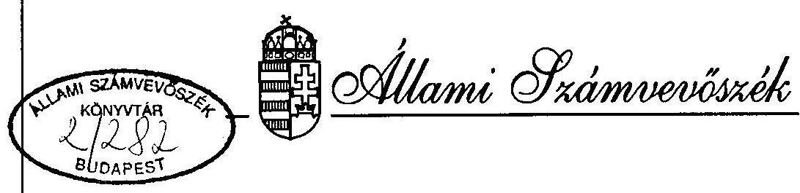

# JELENTÉS 

100 millió márka kedvezményes hitel (START-hitel) és az 50 millió márka értékủ német szénsegély felhasználásának ellenőrzéséről

---

A vizsgálat végrehajtásáért felelős: az ÁSZ IV. Vagyonellenőrzési Igazgatósága
dr. Kovács Árpád igazgató

A vizsgálatot vezette:
Kemény Emil osztályvezető főtanácsos
Készítették:

Benti Gabriella számvevö tanácsos
Réthelyi Jenő
számvevö
Tardos József
számvevö

---

# TARTALOMJEGYZÉK 

OLDAL

1. BEVEZETÉS ..... 1
1.1. ElÓZMÉNYEK ..... 1
1.2. A VIZSGÁLAT ..... 2
2. ÖSSZEFOGLALÓ MEGÁLLAPÍTÁSOK, JAVASLATOK ..... 6
2.1. START HITELPROGRAM ..... 6
2.2. SZÉNSEGÉLY PROGRAM ..... 7
2.3. JAVASLATOK ..... 9
3. RÉSZLETES MEGÁLLAPÍTÁSOK ..... 11
3.1. A FORRÁSOK KÉPZÉSE ÉS FELOSZTÁSA ..... 11
3.2. A HITELPROGRAM ÁTFOGÓ ÉRTÉKELÉSE ..... 14
3.3. A HELYSZíNI ELLENÓRZÉSEK TAPASZTALATAL ..... 25
3.4. A SZÉN BESZERZÉSE, ÉRTÉKESÍTÉSE, PÉNZÜGYI ELSZÁMOLÁSA ..... 28
3.5. ENERGIAMEGTAKARÍTÁST CÉLZÓ KEDVEZMÉNYES HITELEK ..... 31
3.6. START GARANCIA ALAP ..... 35

---

# JELENTÉS 

100 millió márka kedvezményes hitel (START-hitel) és az 50 millió márka értékủ német szénsegély felhasználásának ellenőrzéséről

## 1.   BEVEZETÉS

### 1.1. Előzmények

1.1.1. A Német Szövetségi Köztársaság Kormánya 1991. évben két segélyprogram indításával is hozzájárult a Magyarországon végbement politikai változást követő gazdasági gondok áthidalásához és a piacgazdaság fejlesztéséhez.

## 100 millió márka összegű START-hitel

1.1.2. A német kormány a magyar magángazdaság fejlesztése és megerősödése céljából 100 millió DEM összegủ kedvezményes hitelt ajánlott fel, amelyet a kis- és középszintű magánvállalatok alapítására lehet felhasználni. A segély feltételeit rögzítő kormányközi megállapodást a felek 1991. május 13 -án irták alá.
1.1.3. A megállapodások értelmében a programok pénzügyi bonyolítását német részről a Deutsche Ausgleichsbank, magyar részről a Magyar Nemzeti Bank végzi.
1.1.4. A kormányközi szerződés 2. cikke értelmében a Magyar Köztársaság kormánya a német fél által nyújtott hitellel azonos nagyságú forint ellenérték folyósitására vállalt kötelezettséget.

Ennek alapján, a Magyar Nemzeti Bank a Deutsche Ausgleichsbank által folyósított kölcsön összegét további, annak forint ellenértékével megegyező összegű refinanszírozási forrással egészítette ki.

---

# 50 millió márka értékủ szénsegély 

1.1.5. A rendszerváltás gazdasági nehézségei az 1990-91-es téli fütési időszakban a lakossági szénellátásban zavart, átmeneti hiányt okoztak. Az 1990. októberi taxisblokád miatt kiélezödött politikai viszonyok között kritikus politikai helyzetet okozott volna egy hiányos vagy akadozó szénellátás, ezért a Magyar Kormány miniszterelnöke a Német Szövetségi Köztársaság kancelláriához, illetve kormányához fordult segítségért. A kormányközi egyeztetést követően 1991. január 10-én a Német Szövetséǵi Köztársaság kormánya és a magyar Köztársaság kormánya egyezményt írt alá 50 millió DEM értékủ azonnali, vissza nem térítendő szénsegély nyújtásáról. Az egyezmény rögzítette a német fél feltételeit a szén beszerzésére és az értékesítés magyarországi körülményeire.

### 1.2. A vizsgálat

1.2.1. Az Állami Számvevőszék és a Német Szövetségi Számvevőszék elnökei 1994. végén megállapodtak abban, hogy a német Kormány által a magyar közép- és kisüzemek alapításához nyújtott kedvezményes hitel felhasználását összehangoltan fogják ellenőrizni.

A Német Kormány az ún. "keleti tartományok" gazdasági fejlődésének elősegítése érdekében - a magyarországi START-hitelhez hasonló kedvezményes hitelprogramot indított a $90^{\circ}$-es években. A hasonló témában lefolytatott összehangolt nemzeti vizsgálatok alapján a két számvevőszék szakértői összehasonlító elemzést készítenek a hitelprogramok hatásáról, hatékonyságáról az eltérő gazdasági és kulturális körülmények között. Az összegző részt - a nemzeti nyelvekre fordítva - a végleges jelentés mellékleteként kezelik. Az Állami Számvevőszék - a forrás és a felhasználás részbeni kapcsolódása miatt - a START-hitel vizsgálaton túl az 50 millió márkás német szénsegély program ellenőrzését is beállította éves munkatervébe.

A vizsgálat célja annak megállapítása volt, hogy:
1.2.2. - az előkészítésért és megvalósításért felelős szervezetek - Ipari és Kereskedelmi Minisztérium (IKM), Magyar Nemzeti Bank (MNB) - hogyan érvényesítették a két Kormány között aláirt egyezményekben foglaltakat;
1.2.3. - a kedvezményes hitel és a segélyforrások felhasználása illeszkedik-e a hazai jogszabályi keretekhez, hogyan ellenőrzik a pénzeszközök felhasználását;
1.2.4. - az egyezményekben megfogalmazott célkitüzések hogyan valósultak meg.

---

# Az ellenőrzés módszere 

1.2.5. A vizsgálatot a pénzügyi ellenőrzés szabályszerűségi és hatékonysági szempontjai alapján folytatjuk le, a vizsgálati program alapján, amelynek összeállításához az ÁSZ által 1995 februárjában készített elővizsgálat megállapításait, valamint a Német Szövetségi Számvevőszék által kidolgozott ellenőrzési koncepció tervezetet vettük alapul.
1.2.6. A hiteleket folyósitó pénzintézetek és a létrejött hitelügyletek nagy száma miatt több, különböző vizsgálati módszer együttes alkalmazása volt szükséges:

- A START-hiteleket folyósitó 17 nagy- és középbanktól, illetve a központtal nem rendelkező 28 takarékszövetkezettől kérdőíves teljes körű adatszolgáltatást kértünk.
- 18 bankfiók hitelnyújtási gyakorlatát ellenőriztük a helyszínen interjúk és a dokumentumok alapján. A kiválasztott 18 fiók négy nagy és két középbankot reprezentált az ország hat - gazdaságilag eltérő adottságú - körzetében.
- A helyszíni vizsgálatok során tételesen átvizsgáltunk 183 szerződést, meglátogattunk és interjút készítettünk 53 hitelfelvevővel.
1.2.7. Jelentésünkben eltértünk az érvényben lévő banki terminológiától. A bankok - a Bankfelügyelet javaslata alapján - hatfokozatú adósminősítést végeznek és akivel a legkisebb probléma is van ún. "minősített" státusba kerül. A vizsgálat során - az áttekinthetőség érdekében - háromra redukáltuk e kategóriák számát:

1. Jó adós
2. Minősített adós (kamat vagy/és tőkehátraléka van)
3. Felszámolás alatti szerződés

Az értékelésnél a minősített eseteknek nem része a felszámolás alatti esetek halmaza.
1.2.8. A vizsgálat a program előkészítésétől (1991) az 1995. március 31-ig terjedő időszakot fogta át.
1.2.9. A vizsgálat alapdokumentumai

- a Német Szövetségi Köztársaság és a Magyar Köztársaság kormánya között 1991. május 13-án és 1991. január 10-én létrejött kormányközi megállapodások,
- a Deutsche Ausgleichsbank és a Magyar Nemzeti Bank között megkötött szerződések és a szerződés mellékletét képező Útmutatás,

---

- a Magyar Nemzeti Bank és a kereskedelmi bankok között a kölcsönre vonatkozóan létrejött keretszerződések,
- a Kormány 3044/1991. január 31-i határozata, amely intézkedett a beérkező szén árbázisáról, az árkiegészítés forrásáról, az import szerződések megkötéséről,
- a Kormány 3077/1991. február 21-i határozata a német kormány által felajánlott 100 millió DM kedvezményes hitel felhasználásáról,
- a Kormány 3283/1991. július 10-i határozata, amely rendelkezett a szénsegélyből befolyt összeg felosztásáról az energiamegtakarítást szolgáló beruházások kedvezményes hitelezésére, és a START-hitel Garancia Alap létrehozására,
- a Kormány 3209/1993. május 27-i határozata a START-hitel Garancia Alap szabad pénzeszközeinek átcsoportosítására.
1.2.10. A helyszíni ellenőrzés kezdete: 1995. április 18.
befejezése: 1995. június 16.
1.2.11. A vizsgálat helyszínei:

100 millió márka kedvezményes hitel

- Ipari és Kereskedelmi Minisztérium
- Magyar Nemzeti Bank
- Országos Takarékpénztár Rt.

Pest-Budai Igazgatóság
Pest Megyei Fiók
Szombathelyi Fiók

- Magyar Hitelbank Rt.

Budapesti Fiók
Miskolci Fiók
Szombathelyi Fiók
K Kereskedelmi Bank Rt.
Pest Megyei Fiók
Székesfehérvári Fiók
Miskolci Fiók
Budapest Bank Rt.
Pest Megyei Fiók
Székesfehérvári Fiók
Miskolci Fiók
・ Postabank Rt.
Budapesti Fiók

---

Székesfehérvári Fiók
Kecskeméti Fiók

- Mezőbank Rt.

Szombathelyi Fiók
Székesfehérvári Fiók
Kecskeméti Fiók

# 50 millió márka szénsegély 

- Magyar Nemzeti Bank
- Ipari és Kereskedelmi Minisztérium
- Magyar Hitelbank Rt.
- Magyar Vállalkozásfejlesztési Alapítvány
- Állami Energetikai és Energiabiztonságtechnikai Fel ügyelet
1.2.12. Tájékozódás és adatgyüjtés céljából felkerestük az alábbi szervezeteket:
- Dunabank Rt.
- Agrobank Rt.
- Magyar Külkereskedelmi Bank Rt.
- Iparbankház Rt.
- Corvinbank Rt.
- Realbank Rt.
- Investbank Rt.
- Takarékszövetkezetek
- Creditanstalt Rt.
- West LB Hungaria Rt.
- Európai Kereskedelmi Bank Rt.
- Adó- és Pénzügyi Ellenőrzési Hivatal
- Tartalékgazdálkodási Igazgatóság
- TÜZÉP Kft.
- Lignimpex Külkereskedelmi Vállalat

---

# 2.   ÖSSZEFOGLALÓ MEGÁLLAPÍTÁSOK, JAVASLATOK 

### 2.1. START hitelprogram

2.1.1. A vállalkozásokat segitő számos hitelkonstrukció együttes hitelállománya 1994. év végén $875,7 \mathrm{Mrd}$ Ft, ebből a kisvállalkozói hitelek összege $89,2 \mathrm{Mrd}$ Ft volt.

A START hitelprogram során kihelyezett hitel összege 1994. év végén 11,9 Mrd Ft, ami az összes vállalkozói hitel $1,36 \%$-a és a kisvállalkozói hitelek $13,3 \%$-a.
2.1.2. A START hitelprogram eddigi végrehajtása során a szerződést aláiró német és magyar fél betartotta a szerződésben foglaltakat, illetve attól csak kölcsönös megállapodás alapján tértek el.
2.1.3. A német fél által megfogalmazott szerződéses feltételeket az MNB beépítette a kereskedelmi bankokkal kötött refinanszirozási szerződésébe. A kereskedelmi bankok e refinanszirozási szerződések alapján dolgozták ki - nagyjából egységes formában - a hitelek folyósitását szabályozó belső utasitást.
2.1.4. A szigorú hitelezési feltételek ellenére - az alacsony kamat miatt - végig rendkivül nagy volt a vállalkozók érdeklődése a program iránt, amely jól volt előkészitve, bevezetve és szervezve.
2.1.5. A START hitel szabályzata értelmében a hitelt csak magánszemély igényelhette, jogi személy nem. Ez a rendelkezés hátrányosan érintette azokat a kisvállalkozókat, akik összefogva, üzletrészek vásárlására használták fel a hitelt. A kamatok és a törlesztés igy nem volt a vállalkozás terhére költségként elszámolható, s a visszafizetéseket adózott jövedelemből kellett teljesíteni.
2.1.6. A hitelprogram első négy éve alatt 4961 kisvállalkozó jutott összesen mintegy 11.9 Mrd Ft hitelhez. Ebből 1995. március 31 -ig 238 esetben ( $4,8 \%$ ) kellett a szerződés felbontását kezdeményezni és további 323 szerződő ( $6,5 \%$ ) küzd kisebb-nagyobb fizetési gonddal. Ezen belül a már három éve müködő vállalkozások esetében $6,8 \%$ a felszámolás alatti és $7,6 \%$ a minősített szerződések száma.
2.1.7. A hitelkérelmekhez csatolt üzleti tervek szinvonala rendkivül egyenetlen. Az esetek mintegy $20 \%$-ában nem érte el a minimális színvonalat sem és mindössze $25 \%$-ánál találtunk szakmailag kifogástalan anyagot. A vállalkozók többsége nem vett igénybe külső segitséget az üzleti terv készitéséhez, és nem is tudtak a már müködő intézményesült lehetőségekről (pl. Magyar Vállalkozásfejlesztési Alapitvány hálózata).

---

2.1.8. Az ipari és kereskedelmi kamarák nem tudtak kapcsolatot teremteni és tanácsaikkal segíteni az induló vállalkozásokat.
2.1.9. Az ellenőrzött szerződések jelentős részénél az önkormányzat által kiállított vállalkozói igazolványban engedélyezett tevékenység nem esett egybe a vállalkozás profiljával és a vállalkozói igazolvány kiadásának nem feltétele a szakmai képesítést igazoló adat feltüntetése.
2.1.10. A kereskedelmi bankoknál a hitelszerződések dokumentumainak nyilvántartása nem egységes, több helyen volt hiányos és áttekinthetetlen, ami az ellenőrzést nehézzé és időigényessé tette.
2.1.11. Az MNB Bankfőosztályán a refinanszirozási szerződések és a cenzúrabizottsági döntések nyilvántartása rendezetlen, a dokumentumok ellenőrzése nehéz. A kereskedelmi bankokhoz kihelyezett pénzek, valamint a törlesztések helyzetét bemutató számítógépes tabló csak a vizsgálat után került naprakész állapotba. A bank csak a harmadszori megkeresésre tudott számszakilag pontos és konzisztens adatokat szolgáltatni a számvevőknek.
2.1.12. A kereskedelmi bankok és más bankközi szervezet sem rendelkezik a kétes és rossz adósokat nyilvántartó adatbázissal. Ez lehetővé teszi a visszaéléseket és nehezíti a bankok hitelbíráló és adósminősítő tevékenységét.
2.1.13. A nyilvántartási pontatlanságok ellenére a vizsgálat nem állapított meg szabálytalanságot. A START hitelprogram jól szolgálta a magyarországi kisvállalkozások indulását, fejlődését.

# 2.2. Szénsegély program 

2.2.1. A segélyprogram alapján az 1991-92-es fütési szezonban beérkezett, több mint 300 ezer tonna szén segített áthidalni az országban átmenetileg keletkezett lakossági szénhiányt.
2.2.2. Az egyik szénszállítmány öngyulladása miatt a költségvetésnek 310 M Ft vesztesége keletkezett. A kár rendezésére, illetve a felelősség megállapítására irányuló per folyamatban van.
2.2.3. A világpiaci ár és a magyar lakossági fogyasztói ár különbözeteként felmerült 552 M Ft-ot a költségvetés finanszírozta.
2.2.4. A szén értékesítéséből az MNB elkülönített számlájára 1876 M Ft folyt be, amelyet a bank 40-60 \%-os megosztásban átutalt az MVA "Start Hitelgarancia Alap", illetve az IKM Magyar Hitelbank Rt.-nél vezetett "Energiatakarékosság" nevủ számláira.

---

A helyszíni vizsgálat lezárásakor az MHB által nyilvántartott, átvett összeg 12,4 M Ft-tal volt több, mint az MNB által nyilvántartott, átadott összeg.
2.2.5. A Német Szövetségi Köztársaság és a Magyar Köztársaság kormányának küldöttségei a tárgyalások során megállapodtak abban, hogy a magyar kormány a pénzeszközök teljes felhasználásáról 1992. január 31-ig zárójelentést készít. A zárójelentés nem készült el, és nem készült beszámoló a német szövetségi kormánynak.
2.2.6. A nemzetközi szerződés nem rendelkezik a visszaforgatott források végleges tulajdonlásáról, az újrafeltöltődő alapok majdani lezárásáról.
2.2.7. Az energiaracionalizálási hitelprogram eredményesen valósította meg a szerződésben kitüzött célokat. A program eredményeként a számított energamegtakarítás $3200 \mathrm{TJ} /$ év, ami a nemzetgazdaság szintjén 1300 M Ft évi megtakarításnak felel meg.
2.2.8. Az energiamegtakarítást célzó alapból elkülönített Kockázati Hitel Keret - amely az elöirt pénzügyi garanciákkal nem rendelkező fejlesztések elősegitésére létesült - nem váltotta be az elözetes elképzeléseket, müködtetése nem hatékony.
2.2.9. A program müködtetésére fordított költség nem haladta meg a szerződésben meghatározott 22 M Ft -ot, azaz az alaptőke ( $1.137,5 \mathrm{MFt}$ ) $2 \%$-át, de a programot kamatveszteség érte azzal, hogy a müködési költségeket a tényleges kifizetések előtt - a magasan kamatozó "Energiatakarékosság" számláról indokolatlanul korai időpontban alacsonyabb kamatú közbenső technikai számlára helyezték át.
2.2.10. Az MVA kezelésében lévő START Garancia Alap szervezetten és ellenőrzötten müködik. A vizsgálat időpontjáig 514 kérelem érkezett, amelyekből a zsűri 381-et hagyott jóvá. A jóváhagyott hitelgarancia 1.252 M Ft START hitel felvételét tehát az összes kihelyezés több mint $10 \%$-át - tette lehetővé.
2.2.11. A vizsgálat időpontjáig 19 kérelem érkezett a bankoktól a garancia érvényesitésére. Ezek közül az MVA kilenc igényt elfogadott, tíz esetben elutasítás, illetve ismételt felülvizsgálat mellett döntött. Az MVA kifogásolta, hogy egy bank a Garancia Alap Szabályzatának szellemével össze nem egyeztethető szerződéseket kötött vállalkozókkal. Ennek következtében - bukás esetén - a teljes veszteség a Garancia Alapra hárul, míg a bank kihelyezései megtérülnek az ügyfél ingóságainak értékesítése révén.
2.2.12. A garancia díjak befizetésének és nyilvántartásának rendszere nem megfelelő; nem támogatja kellően sem a vezetés sem az ellenőrzés információ igényét.

---

2.2.13. A Garancia Alap lekötött eszközeiből finanszírozott Reorg-Start Hitel nevủ program - amely felszámolás alatt álló vállalatok eszközeinek megvásárlására nyújtott hiteleket - nem váltotta be a tervezett elképzeléseket. A program iránt nincs igazi érdeklődés. A kereskedelmi bankokhoz átutalt 500 M Ft-ból mindössze 42 M Ft-ot helyeztek ki.

A sikertelen program a Garancia Alapnak jelentős kamatveszteséget okoz, mivel a kereskedelmi bankok átlagosan $25 \%$-kal kevesebbet fizetnek a pénzért, mint a korábbi állampapírok hozama.

# 2.3. Javaslatok 

## A Kormány

2.3.1. Vizsgálja meg, milyen intézkedésekkel lehet javítani a vállalkozások és ezen belül a kisvállalkozások hitelhez jutásának feltételeit, ezáltal tőkeellátottságát, valamint helyreállítani a szolgáltató és termelő szektorok között kialakult eltolódást.
2.3.2. Kezdeményezzen intézkedéseket a gazdasági jellegủ peres ügyek eljárás menetének gyorsítására.

## Az ipari és kereskedelmi miniszter

2.3.3. Vizsgáltassa felül az Energiaracionalizálási programból leválasztott Kockázati Hitel Keret müködtetését, illetve megszüntetése esetén a feladat átterhelését más, már müködő Garancia Alapra.
2.3.4. Intézkedjen az Energiaracionalizálási program működési költségének átutalásából származó kamatveszteségek csökkentése érdekében.
2.3.5. Gondoskodjon arról, hogy a kormányközi megállapodásban rögzítettek szerint készüljön zárójelentés a szénsegély program pénzeszközeinek felhasználásáról és a zárójelentés alapján küldjön beszámolót a Német Szövetségi Köztársaság Kormányának. A beszámolóban adjon a Pénzügyminisztériummal egyeztetett javaslatot a visszaforgatott alapok rendelkezési, illetve tulajdoni jogának tisztázására.

## Az MNB elnöke

2.3.6. Kezdeményezzen tárgyalásokat a hitelt folyósitó Deutche Ausgleichsbank szakértőivel a kisvállalkozók érdekeinek nem megfelelő korlátozások (három éven túli vállalkozások hitelhez jutása, társas vállalkozások adózási hátránya) módosításáról a visszaforgatott pénzek kihelyezésénél.

---

2.3.7. Hivja fel a START hitel refinanszírozásában résztvevő kereskedelmi bankok vezetőinek figyelmét a hitelszerződések és kapcsolódó iratok rendszerezett és áttekinthető dokumentálására.

# Az Állami Bankfelügyelet elnöke 

2.3.8. Kezdeményezzen tárgyalásokat a Bankszövetség és az MNB bevonásával egy országos adósnyilvántartó adatbázis létrehozásának jogi, technikai és anyagi feltételrendszeréről.

## Az Ipari és Kereskedelmi Kamarák elnökei

2.3.9. Vizsgálják meg az okát annak, hogy szervezeteik miért nem tudtak kapcsolatba kerülni a vizsgálat által érintett kisvállalkozói körrel, és hogy a továbbiakban miben tudnák segíteni az induló, vagy a már működő kisvállalkozói réteget.

## Az MVA Kuratóriuma

2.3.10. Intézkedjen, hogy a Vállalkozásfejlesztési Iroda a START Hitel Garancia Alap nyilvántartási rendszerének 3.6.4. pontban felsorolt hiányosságait szüntesse meg.
2.3.11. Vizsgálja felül a REORG-START Hitel programmal kapcsolatos korábbi döntését, és módosítsa a kereskedelmi bankokkal kötött szerződését oly módon, hogy a pénz az MVA számlájáról csak a kihelyezéskor legyen lehívható.

---

# 3.   RÉSZLETES MEGÁLLAPÍTÁSOK 

## START hitelprogram

### 3.1. A források képzése és felosztása

3.1.1. A Deutsche Ausgleichsbank és a Magyar Nemzeti Bank között létrejött 100 millió DEM összegű hitelszerződés szerint a pénz az alábbi ütemezésben volt lehivható:

| 1991 | 40 millió DEM |
| :-- | :-- |
| 1992 | 20 millió DEM |
| 1993 | 20 millió DEM |
| 1994 | 20 millió DEM |

3.1.2. 1992-ben a Szövetségi Parlament hozzájárult az eredeti szerződéstől eltérő, gyorsított lehíváshoz, tehát a 93-ra és 94-re beállított 20-20 millió DEM 1992-es felhasználásához.

A START hitelek tényleges lehívása az alábbiak szerint alakult:

1. táblázat

START lehívás

| Dátum | Összeg   DEM | Deviza   középárfolyam | Összeg   Ft |
| :--: | :--: | :--: | :--: |
| 1991.10 .18 . | 1423717,3 | 44,4983 | 63352999,53 |
| 1991.12 .30 . | 24422751,0 | 50,0700 | 1222847143,00 |
| 1992.02 .21 . | 14153531,0 | 47,6400 | 674274216,80 |
| 1992.09 .08 . | 20000000,0 | 53,2000 | 1064000000,00 |
| 1992.12 .15 . | 20000000,0 | 51,5300 | 1030600000,00 |
| 1993.03 .18 . | 20000000,0 | 52,3600 | 1047200000,00 |
| Összesen: | 99999999,3 |  | 5102274359,33 |

Az első három lehívásra a kereskedelmi bankok tényleges hiteligénylései alapján került sor, az esedékes napi árfolyamok figyelembevételével. (Ez a magyarázata a tört márka értékeknek.)

---

Az utolsó három tétel esetében az MNB saját forrásaiból megelõlegezte a tényleges lehívás elôtt a kereskedelmi bankok refinanszirozását, és a márka hányadot összevontan hívta le.

Az elvileg keletkezett teljes Start-hitel alap az 1. táblázat szerinti forint érték kétszerese, tehát 10.205 M Ft .
3.1.3.
2. táblázat

START-hitel felosztása a kereskedelmi bankok között

|  | M Ft |  |
| :--: | :--: | :--: |
| B A N K | Bankszövetség által jóváhagyott keret | Engedélyezett hitel |
| Agrobank Rt. | 345,0 | 284,2 |
| BB Rt. | 1005,0 | 1012,0 |
| Dunabank Rt. | 320,0 | 462,0 |
| Investbank Rt. | 170,0 | 173,8 |
| Iparbankház Rt. | 263,0 | 268,4 |
| Corvinbank Rt. | 184,0 | 203,0 |
| MHB Rt. | 1407,0 | 1553,0 |
| MKB Rt. | 247,0 | 280,8 |
| M.Taksz.Bank Rt. | 353,0 | 361,4 |
| Mezôbank Rt. | 532,0 | 683,5 |
| KHB Rt. | 1227,0 | 1284,7 |
| OTP Rt. | 2053,0 | 2035,6 |
| Postabank Rt. | 814,0 | 862,0 |
| Creditanstalt Rt. | 142,0 | 143,2 |
| Realbank Rt. | 164,0 | 190,0 |
| WEST LB Hungaria Rt. | 178,0 | 79,6 |
| Európai Ker.Bank Rt. | 126,0 | 49,7 |
| Takarćkszövetkczctek | 130,0 | 172,0 |
| Összesen: | 9660,0 | 10098,9 |

A hitelkonstrukcióban részt vevő 17 bank és a 28 - központtal nem rendelkező takarékszövetkezet bank között a rendelkezésre álló START hitel keretet a Magyar Bankszövetség osztotta fel.

A ténylegesen engedélyezett és kihelyezett hitel összege 107 M Ft-tal kisebb, mint az elvileg keletkezett hitel-alap, mivel az MNB az 1. táblázatban szereplő tényleges lehívási idöpontok elött meghitelezte a pénzt a kereskedelmi bankoknak és az aktuális összeg képzéséhez az aznap érvényes középárfolyamon számította a

---

márka értékét és tette hozzá a magyar fél $50 \%$-át. Az elvi felosztás, az átutalás és a ténylegesen engedélyezett forint összegek közötti eltérés oka a szakaszos lehívás, illetve a forint folyamatos leértékelődése a márkához képest.
3.1.4. Az egyes bankok számára jóváhagyott keret a felhasználási igény szerint átcsoportosítható volt az MNB-n keresztül más kereskedelmi bankhoz.
3.1.5. Az MNB - a kereskedelmi bankok megkeresése alapján - esetenként engedélyezte a tőketörlesztésekből és az idő előtti visszafizetésekből keletkező alapok újra kihelyezését. 1994. év végéig ez az összeg közel 1800 M Ft volt, így az 1994. év végéig elsődlegesen és másodlagosan kihelyezett START hitel összege 11,9 Mrd Ft.

1. sz. ábra

A hitelkihelyezések éves megoszlása ` 91 -`94

|  | MFt | $\%$ |
| :--: | :--: | :--: |
| 1991 | 3264 | 27,4 |
| 1992 | 5219 | 43,9 |
| 1993 | 1539 | 12,9 |
| 1994 | 1878 | 15,8 |
| Összes hitel ( 91-`94) | 11900 | 100,0 |

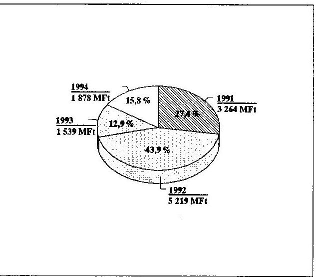

---

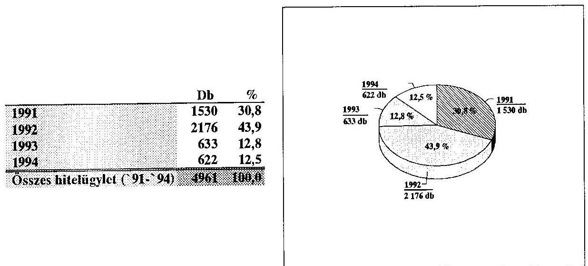

# 3.2. A hitelprogram átfogó értékelése 

3.2.1. A START hitel program értékeléséhez a kereskedelmi bankoktól teljes körű adatszolgáltatást kértünk az 1991-1994. év végéig megkötött szerződésekről és e szerződések 1995. március 31-ig történt minősítéséről.
3.2.2. Az időszak alatt 4961 db Start hitel szerződést kötöttek a kereskedelmi bankok összesen 11.899,7 M Ft értékben. A vállalkozások hitel- és kamattörlesztési helyzetét a 3. és 4. sz ábrák mutatják be.
A felmondott szerződések száma az összes szerződés $4.8 \%$-a.
3. sz. ábra

A hitelügyletek számának megoszlása `91 -`94
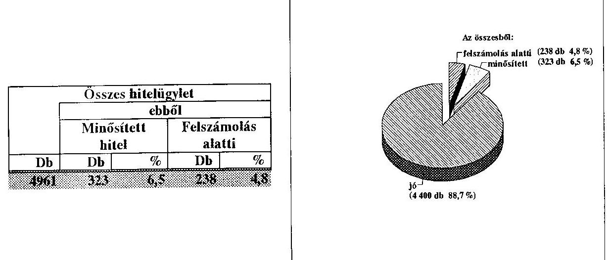

---

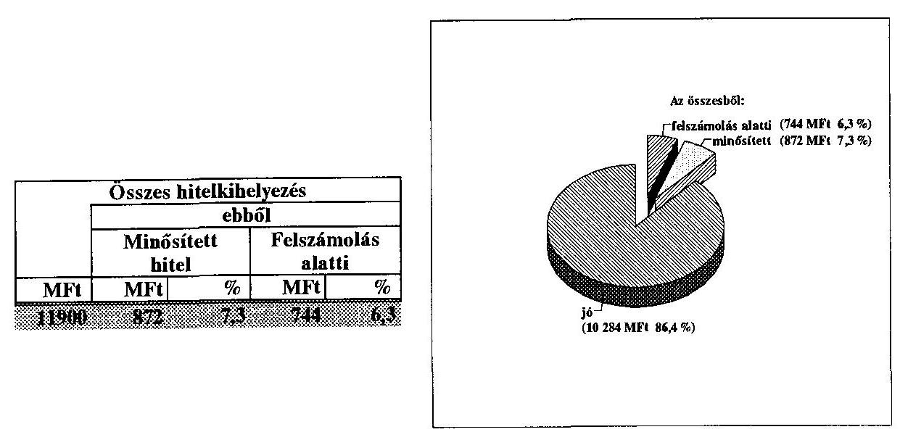

A kihelyezett 11,9 Mrd Ft Start hitelből a bankoknál 1995. március 31-ig 744 M Ft kétes követelés keletkezett ( $6.25 \%$ ).
3.2.3. A hitelkihelyezés dinamikája - a rendelkezésre álló források függvényében változó volt.

A hitelügyletek számának és összegének éves alakulása hasonló képet mutat, ami arra enged következtetni, hogy az évek során nem változott az átlagosan kihelyezett hitelek nagysága.

A vállalkozásokkal kapcsolatos problémák (minősités, felmondás) az idő múlásával korrelálnak, de abszolút értékük nem magas.

---

# A hitelügyletek számának alakulása ` 91 -`94 

|  | Összes hitelügylet száma |  |  |  |  |
| :--: | :--: | :--: | :--: | :--: | :--: |
|  |  | ebből |  |  |  |
|  |  | Minősített hitel |  | Felszámolás alatti |  |
|  | Db | Db | $\%$ | Db | $\%$ |
| 1991 | 1530 | 117 | 7,6 | 104 | 6,8 |
| 1992 | 2176 | 152 | 7,0 | 115 | 5,3 |
| 1993 | 633 | 43 | 6,8 | 12 | 1,9 |
| 1994 | 622 | 11 | 1,8 | 7 | 1,1 |

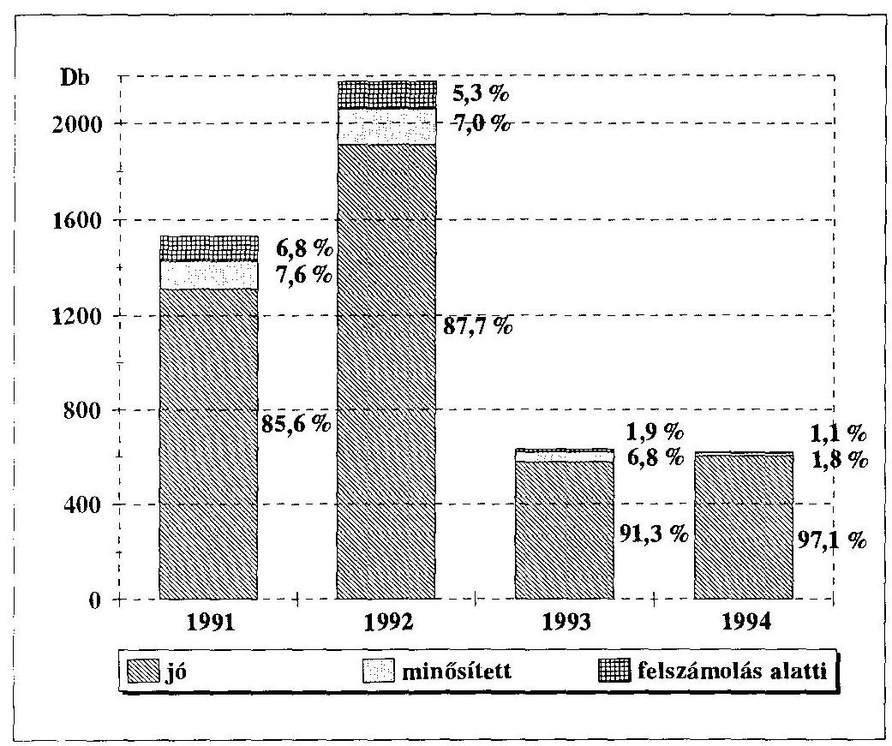

Az adatok azt mutatják, hogy a három évet megélt vállalkozások helyzete viszonylag stabilizálódik és ha a minősített esetek egy része idővel felszámolás alá is kerül az összes bukás sem darabszámban, sem értékben nem haladja meg a $10 \%$-ot.

---

# A hitelkihelyezések alakulása `91 -`94 

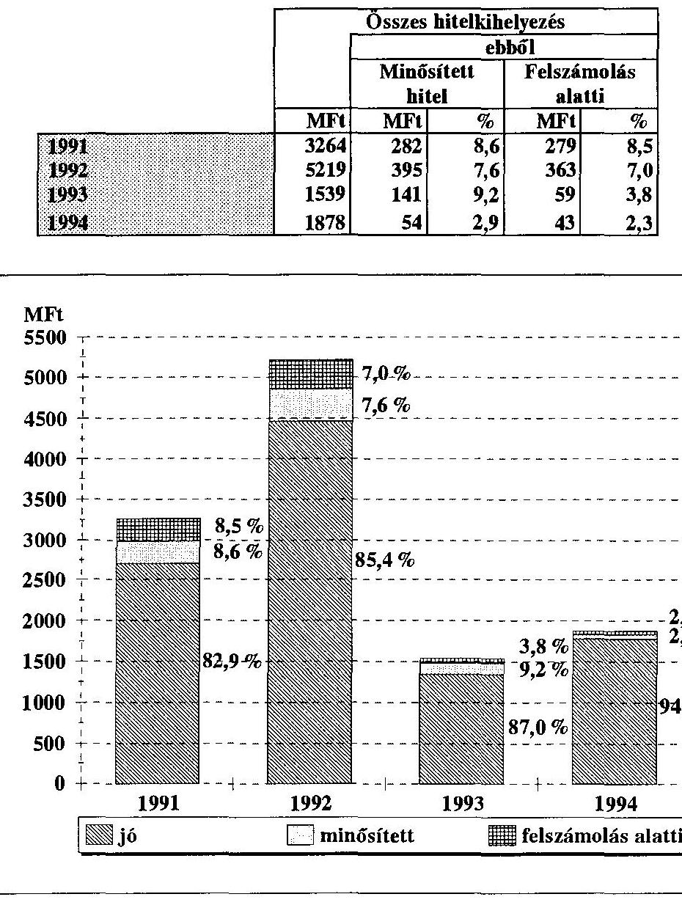

---

3.2.4. A kereskedelmi bankok nem befolyásolták a hitelek szektoronkénti megoszlását, így az a beérkezett reális hiteligények alapján a vállalkozói piac helyzetét tükrözi.
7. sz. ábra

A hitelügyletek számának szektoronkénti megoszlása ` 91 -`94

|  | Db | $\%$ |
| :-- | --: | --: |
| Ipar | 758 | 15,3 |
| Mezógazdaság | 282 | 5,7 |
| Egészségügy | 247 | 5,0 |
| Idegenforgalom | 105 | 2,1 |
| Kereskedelem | 1957 | 39,4 |
| Szolgáltatás | 1289 | 26,0 |
| Egyéb | 323 | 6,5 |
| Összesen | 4961 | 100,0 |

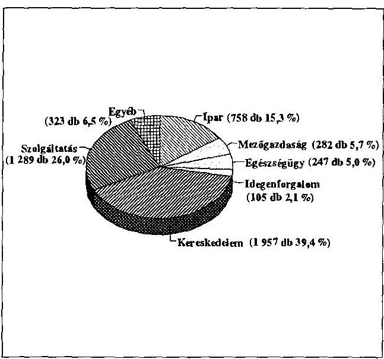
8. sz. ábra

A hitelkihelyezésck szektoronkénti megoszlása ` 91 -`94

|  | MF1 | $\%$ |
| :-- | --: | --: |
| Ipar | 2407 | 20,2 |
| Mezógazdaság | 470 | 3,9 |
| Egészségügy | 565 | 4,7 |
| Idegenforgalom | 393 | 3,3 |
| Kereskedelem | 4414 | 37,1 |
| Szolgáltatás | 3086 | 25,9 |
| Egyéb | 565 | 4,7 |
| Összesen | 11900 | 100,0 |

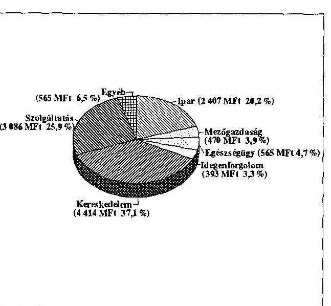

---

Stagnáló gazdaság és magas infláció mellett az alacsony tőkeigényű és gyors tőkemegtérülésủ vállalkozások életképesebbek. Ennek megfelelően a Start hitelek több mint fele a kereskedelem és szolgáltatás területére irányult és ennek a két szektornak ( $6.3 \%$ ) az átlag alatti a bukási tényezője ( $5,5 \%$, illetve $6,1 \%$ ). Az ipari vállalkozások $7,9 \%$-a, az idegenforgalom $12,6 \%$-a ment csődbe ugyanazon időszak alatt.
3.2.5. A Start hitel alapszabálya lehetőséget adott több indulási forma finanszirozására. A vállalkozási formák szerinti hitelkihelyezés az alábbiak szerint alakult:
9. sz. ábra

A hitelügyletek számának vállalkozási formák szerinti megoszlása ` 91 -`94

|  |  |  |
| :-- | --: | --: |
|  | '91 - | 94 |
| Vállalkozás | Db | $\%$ |
| Alapítás | 2752 | 55,5 |
| Fejlesztés | 1686 | 34,0 |
| Profilváltás | 52 | 1,0 |
| Csatlakozás | 256 | 5,2 |
| Egyéb | 215 | 4,3 |
| Összesen | 4961 | 100,0 |

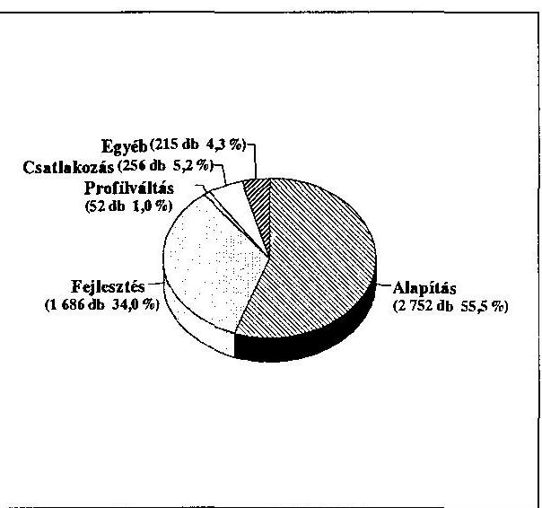
10. sz. ábra

A hitelkihelyezések vállalkozási formák szerinti megoszlása ` 91 -`94

|  |  |  |
| :-- | --: | --: |
|  | '91 - | 94 |
| Vállalkozás | MF1 | $\%$ |
| Alapítás | 6300 | 52,9 |
| Fejlesztés | 4166 | 35,0 |
| Profilváltás | 112 | 0,9 |
| Csatlakozás | 779 | 6,5 |
| Egyéb | 543 | 4,6 |
| Összesen | 11900 | 100,0 |

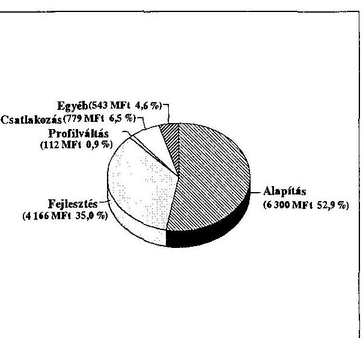

---

Az ábrák bizonyítják, hogy a Start hitel az eredeti célkitűzéseknek megfelelően döntően új vállalkozások indítását segítette elő, de hozzájárult már működő vállalkozások fejlesztéséhez is.

A hitel minősitések, és felmondások száma, valamint összege nem mutat szignifikáns eltérést a különböző vállalkozás indítási formáknál.
3.2.6. A Start hitelről szóló belső banki utasítások rendelkeztek a kihelyezhető kölcsön felső és alsó határáról. A bankok egy része az összeget márkában (minimum 10 E DEM, maximum 250 E DEM), más része forintban (minimum 400 E Ft , maximum 10000 E Ft ) határozta meg.
11. sz. ábra

A hitelügyletek számának összeghatár szerinti megoszlása ` 91 - ` 94
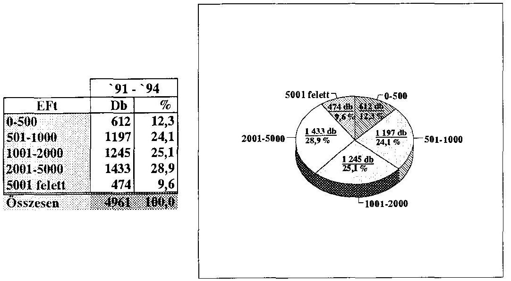

---

A hitelkihelyezések összeghatár szerinti megoszlása `91 - `94

|  | 91 - 94 |  |
| --: | --: | --: |
| EFt | MFt | $\%$ |
| $0-500$ | 278 | 2,3 |
| $501-1000$ | 990 | 8,3 |
| $1001-2000$ | 2009 | 16,9 |
| $2001-5000$ | 4815 | 40,5 |
| 5001 felett | 3808 | 32,0 |
| Osszesen | 11900 | 100,0 |

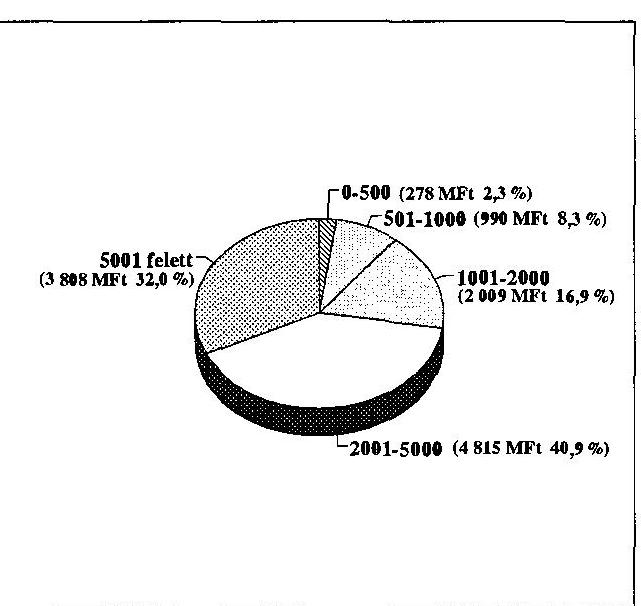

A vállalkozásokhoz felvett hitel nagysága egyenes korrelációt mutat a vállalt kockázattal; az egyre növekvő összegű hiteleket felvevő vállalkozások egyre növekvő számban kerültek szembe fizetési gondokkal, illetve felszámolással.

Az egyes hitelkategóriákhoz tartozó minősítések és bukások aránya a különböző hitel-kategóriákban:
13. sz. ábra

A hitelügyletek kockázatai összeghatárok szerint `91 - `94
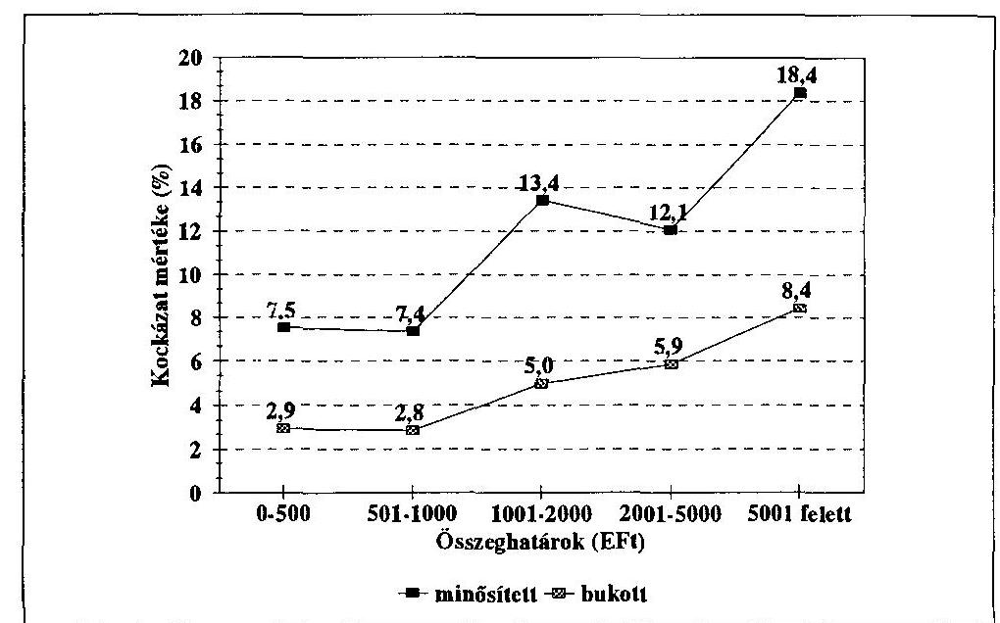

---

3.2.7. A Start-hitelhez az ország teljes területén, azonos feltételek között lehetett hozzájutni. A feldolgozott megyei adatok a szerződéskötések helyi megosztását tükrözik. A helyszini vizsgálatok során találtunk arra példát, hogy a vállalkozás, tehát a hitel felhasználása az ország egy másik területén történt, de az esetek száma és összege az összes kötéshez képest elhanyagolható. A bankok a szerződéskötéskor nem támasztottak a vállalkozás müködési területével kapcsolatos követelményt, ha a kérelem az egyéb feltételeknek megfelelt.
14. ábra

A START-hitel kihelyezésének megyénkénti megoszlása
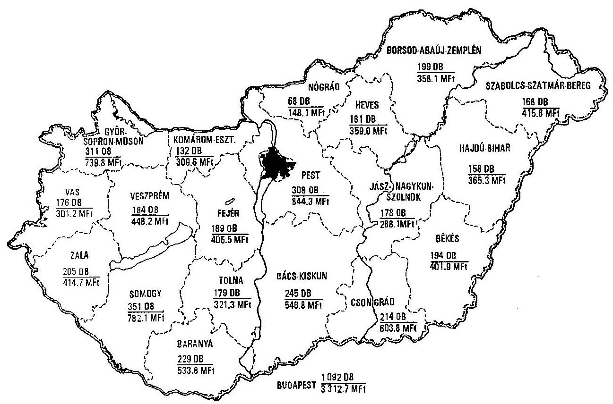

A megkötött hitelügyletek száma, illetve a kidolgozott hitelek összege megyénként jelentős eltérést mutat. A legtöbb szerződést Budapesten kötötték ( 1092 db , illetve $3.312,7 \mathrm{M} \mathrm{Ft}$ ) a legkevesebbet Nógrád megyében ( 68 db , illetve $148,1 \mathrm{M} \mathrm{Ft}$ ). Kisebb a szóródás, ha a szerződések számát és összegét az egyes megyékben élő népességre vetítjük.

---

Hitelügyletek megyénként `91 - `94
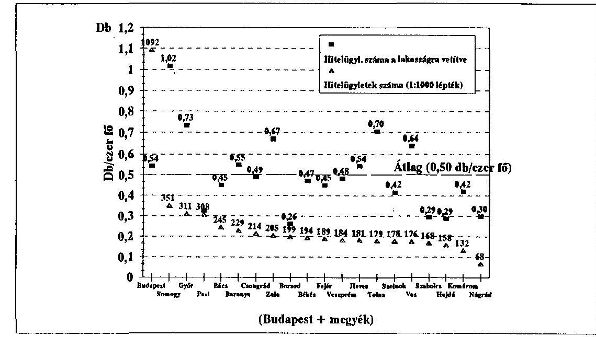
16. sz. ábra

Hitelkihelyezések megyénként `91 - `94
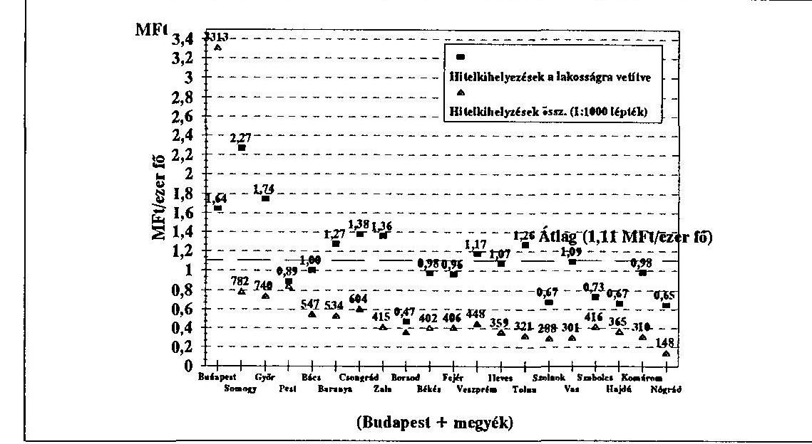

---

# A felmondott hitelügyletek aránya megyénként `91 - `94 

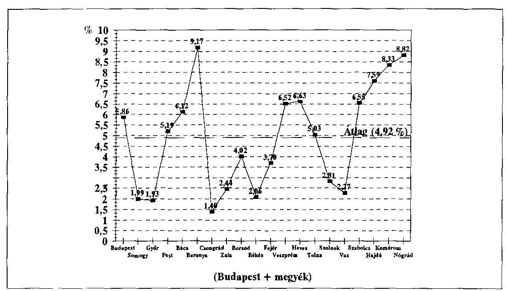
18. sz. ábra

A vissza nem térített hitelek aránya megyénként `91 - `94
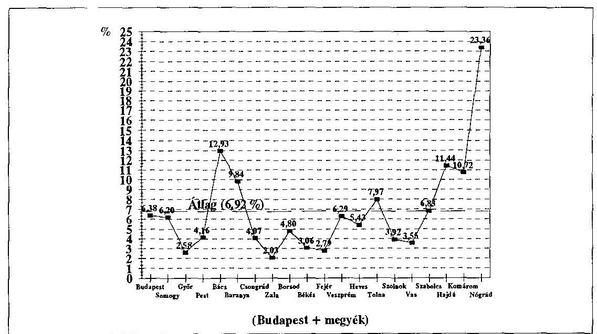

---

A vállalkozási hajlam, illetve bekövetkezett bukások mértéke jellemző az egyes megyék általános gazdasági helyzetére. Így például átlag feletti a vállalkozói kedv Somogy, Győr-Moson-Sopron, Tolna, Vas és Zala megyékben, míg ugyan itt átlag alatti a felmondott hitelek száma és összege. A térségben az átlagos 6,3\%kal szemben 2-3 \% közötti a fizetésképtelenné vált vállalkozások következtében keletkezett kétes követelés összege. Alacsony vállalkozói kedvet (és valószínűleg lehetőséget) találunk a közismerten hátrányos régiókban: Szabolcs-SzatmárBereg, Nógrád, Borsod-Abaúj-Zemplén és Hajdú-Bihar megyékben és itt az átlag feletti a csődbe jutott vállalkozások száma is. Ezekben a térségekben a bankoknak fokozott kockázattal kell szembenézniük. A kihelyezett hitelek összegére vetítve az országos $6,3 \%$-os bukási tényezővel szemben - a felmondott hitelösszegek 10$23 \%$ között mozognak.

# 3.3. A helyszíni ellenőrzések tapasztalatai 

## A mintavétel

3.3.1. A hitelkihelyezések nagy száma és szétszórt területi elhelyezkedése miatt a helyszíni ellenőrzés során a csoportos mintavételezés módszerét alkalmaztuk.

- A hitelt kihelyező 18 bankból kiválasztottuk a hat - országos hálózattal rendelkező - legnagyobb hitelforgalmú bankot (Budapest Bank, Magyar Kereskedelmi Bank, Magyar Hitelbank, Országos Takarékpénztár és Kereskedelmi Bank, Postabank, Mezőbank).
A minta mérete $33 \%$.
- A területi megoszlást illetően az ország 20 megyéjéből (19 megye és egy megyei jogú város Budapest) hat helyszínt választottunk ki az alábbi megfontolások alapján:
$=$ magas ipari koncentráció, világváros (Budapest)
$=$ egy metropolisz közvetlen vonzáskörzete (Pest megye)
$=$ Ausztria vonzáskörzete, határforgalom (Vas megye)
$=$ recesszióval sújtott nehézipari övezet (Borsod-Abaúj-Zemplén megye)
$=$ mezőgazdasági, élelmiszeripari térség (Bács-Kiskun megye)
$=$ ipari-mezőgazdasági vegyes térség (Fejér megye)
A minta mérete $30 \%$.
- Térségenként 3-3 fiókot látogattunk meg, ahol kiválasztottunk minden felmondott és minősített szerződést és a problémamentes szerződésekből - a minél nagyobb időhorizont miatt - a 91-92-es kötésekből vettünk mintát.
3.3.2. Összességében az eddig megkötött közel 4900 Start-hitel szerződésből a helyszíni vizsgálatok során 183 ( $4 \%$ ), az 561 minősített esetből 40 -et ( $7 \%$ ) és a 238 felmondott esetből 16 -ot ( $7 \%$ ) ellenőrzött a vizsgálat.

---

# A bankfiókoknál végzett vizsgálat megállapításai 

3.3.3. A szerzödések előkészitettsége rendezett. A vizsgált esetek mindössze $10 \%$-ában fordult elő, hogy a kölcsönkérelem elöirt dokumentumai közül valamelyik hiányos volt. A megkötött szerződések minden esetben az irányelvekben meghatározott célokat támogatták.
3.3.4. A kérelmező vagyonát, meglévő saját eszközeit és esetleges külső forrásait a bank mindenkor figyelembe vette. A meglévő vagyon az esetek $80 \%$-ában mint hitelfedezet, a fennmaradó $20 \%$-ban mint müködő tőke jött számításba.
3.3.5. A támogatás mértéke nem haladta meg az irányelvekben elöirt $70 \%$-ot. A vizsgált minta alapján a "saját erő" $35-38 \%$ között volt. A bankok az esetek nagy többségében méltányosan minösítették saját erőnek a hitelkérelmet megelőző célirányos - fejlesztéseket, beruházásokat.
3.3.6. Valamennyi kölcsönkérelemhez csatoltak üzleti tervet, de az üzleti tervek minősége, az esetek $20 \%$-ában nem érte el az elvárható színvonalat, sem tartalmában, sem formai megjelenítésében. A müszaki-gazdasági tervezést információ hiányában - becsléssel pótolták. A kezdő vállalkozók nagy része, még ha tud is róla, nem képes megfizetni egy professzionális cég szolgáltatásait egy üzleti terv készitésére. A bankok alkalmazottai föleg formai segítséget nyújtottak (üzleti elemzésekkel nem támogatták a vállalkozókat a banki kockázat csökkentését a fedezet értékelésével biztositották).

A vizsgált szerződések mindössze $25 \%$-ánál találtunk szakmailag kifogástalan, gazdasági elemzésre és részletes piackutatásra támaszkodó üzleti tervet.
3.3.7. A kérelemért folyamodók egyetlen esetben sem fordultak a területen müködő ipari vagy kereskedelmi kamarához segítségért, illetve tanácsért.
3.3.8. A hitelkérelem befogadását az üzleti terv és a fedezetek vizsgálata alapján a cenzúrabizottság terjeszti elő és a bank vezetője dönti el. A döntés joga bankonként eltérően delegált. Általában a folyósitó bankfiók vezetője jogosult a döntésre, de néhány országos nagybank esetében a döntést a központi vagy területi igazgató hozza meg. A vizsgált esetek azt támasztották alá, hogy az alacsonyabbra helyezett döntési szint kedvezőbb a vállalkozások szempontjából. A helyi ismeretek (családi, ipari tradíciók) alapján a helyi bank olyan vállalkozásokat is megsegíthet, amelyeket egy központi mérlegelés esetén hátrább soroltak volna.
3.3.9. A bankok folyamatosan figyelik a vállalkozásokat. Valamennyi vizsgált bank belső utasitása előirja a vállalkozók időszakos helyszíni ellenőrzését.

---

A kapcsolattartás a vidéki, kisvárosi környezetben személyes jellegủ, a banktisztviselők az üzletvitelen túl sok esetben a személyes (családi, egészségi) problémákat is ismerik.
3.3.10. A megítélt hitelek folyósitása minden megvizsgált esetben szabályszerű volt. A bankok - szigorú belső szabályozás alapján - csak valamennyi feltétel fennállása esetén tették lehetővé a pénz felvételét, mindenkor bekérve és dokumentálva a számlákat. Egyetlen olyan eset fordult elő, hogy a vállalkozó a felvett hitelt egy korábbi vállalkozásának finanszírozására fordította, de ezt a szerződést a bank felmondta, jelenleg bírósági eljárás van folyamatban.

Négy olyan esettel találkoztunk, amikor a vállalkozó - fél év elteltével - a teljes összeget visszafizette, illetve fel sem vette a bankból, mivel induló üzletét kilátástalannak minősítette.

# Minősített hitelek 

3.3.11. A vizsgált minősített esetek $80 \%$-ánál már az első üzleti évben jelentkeztek kamatfizetési és $60 \%$-ánál tőketörlesztési gondok. A bankok minden esetben elemezték a vállalkozás életben maradásának esélyeit. A vizsgálat által érintett szerződéseknél - a banki minősités alapján - 50-60 \%-nál várható a megerősödés, a fizetési gondok elmúlása.

Az általános banki gyakorlatban 60 napos az ún. "aktív hitelgondozás", és csak ezek után kezdeményezi a hitelek megszüntetését.

Az aktív hitelgondozás fázisai:
$=15$ nap késedelem - várakozó álláspont
$=16-30$ napig felszólítás fizetésre, illetve írásos magyarázat a késedelemre
$=31-60$ napig egyedi mérlegelés
3.3.12. A kölcsönszerződés felbontására minden vizsgált esetben a törlesztések és a kamat elmaradása volt az indok. A bankok minden esetben törekedtek a peren kívüli megállapodásra, ezért a vizsgált 16 esetből csak 5 úgy került bíróság elé. Általános banki és vállalkozói vélemény, hogy a gazdasági bíráskodás jelenlegi rendszere nem felel meg az élet által támasztott követelményeknek. A peres eljárás átfutása 2-4 év és még törvényes ítéletek birtokában is nehéz a megitélt pénzekhez hozzájutni.
3.3.13. A gazdasági gondokkal küzdő (minősített) szerződések vizsgálatakor az alábbi föbb okokkal találkoztunk:
$=$ a vállalkozás irreális üzleti terven alapult ( $50 \%$ )
$=$ a piaci környezet megváltozott az induló, vagy tervezett feltételekhez képest $(30 \%)$

---

$=$ családi, egészségi okok $(20 \%)$

# Helyszíni vizsgálat vállalkozóknál 

3.3.14. A meglátogatott vállalkozások $90 \%$-a rendezett volt, a célnak megfelelően müködött. A felvett hitelek $80 \%$-a építési jellegủ volt vagy kész üzletrész megvásárlására fordították.

A vállalkozók által említett, általánosítható megállapítások:

- a Start hitel rendkívül jó és hasznos volt, de a megkérdezettek $50 \%$-a a magas infláció miatt ennek kamatait is nehezen tudja kitermelni;
- az import alapanyag vámjának emelkedése az esetek $40 \%$-ában gazdaságtalanra fordította a termelést;
- a mezőgazdasági szektorban nem működik az árutőzsde és hiányzik a kockázati tőke, ami megfinanszirozná a termelést;
- a magas kamatok, a banki kezelési költség és az átutalások hosszú átfutási ideje miatt a vállalkozók a készpénz forgalmat részesítik előnyben. A számlapénz minimális, rossz a fizetési morál a vállalkozók között, rengeteg a behajthatatlan követelés, kevés a jogi garancia;
- drága és kevés a forgóalap;
- nincs megfelelő munkaadói védelem, a munkanélküliség ellenére rossz a munkavállalói morál, a vállalkozók ki vannak téve az alkalmazottak visszaéléseinek (lopások, csalások, fiktív betegállomány, amit a munkavállaló fizet);
- nagyértékủ gépi beszerzésekhez gyakorlatilag nem lehet kölcsönt kapni a 150 $\%$-os fedezeti igény miatt;
- a megkérdezettek $10 \%$-a a gazdaság jelenlegi állapotában már nem fogna bele a vállalkozásba a rossz külső feltételek miatt. Általános vélemény, hogy a kormány politikája nem "vállalkozás-barát".

## Az 50 millió márka értékủ szénsegély program

### 3.4. A szén beszerzése, értékesítése, pénzügyi elszámolása

3.4.1. A német kormánnyal kötött segélyegyezmény alapján a magyar kormány nevében a Nemzetközi Gazdasági Kapcsolatok Minisztériuma (NGKM) 1991. február 6án megbízási szerződést kötött a Lignimpex Fa-, Papir és Túzelőanyag Külkereskedelmi Vállalattal (LIGNIMPEX) az import szén beszerzésére és annak

---

a Tüzelö- és Építőanyag Kereskedelmi Vállalaton (TÜZÉP) keresztüli forgalmazására.
3.4.2. A szénbeszerzésben 6 németországi és 3 egyéb külföldi székhelyű exportáló kereskedő cég müködött közre.
Szerződött szénmennyiség: $\quad 369600$ tonna
Beérkezett szénmennyiség: $\quad 370366$ tonna
Belföldi értékesítésre átadva: $\quad 300296$ tonna
Tartalékolás: $\quad 70070$ tonna
Külföldi számlaérték: $\quad 50014927$ DEM
A szénsegélyt teljes összegében szénvásárlásra használták fel.
3.4.3. A vásárolt szén származási hely szerinti megoszlása:

|  | $\%$ |
| :-- | --: |
| - német | 8,1 |
| - dél-afrikai | 24,8 |
| - lengyel | 51,3 |
| - cseh | 10,4 |
| - jugoszláv | 5,4 |

A dél-afrikai eredetủ szén már hosszabb ideje németországi raktárakban tárolt készlet volt, így azt német származásúnak tekintve a német részarány $32,9 \%$. Ez magasabb a szerződésben előirányzott értéknél.

A hazai átlagtól eltérő, magas fütőértékủ dél-afrikai szén több helyen felhasználói problémát okozott (gazdaságtalan volt a fütés, illetve kiégett a kazán belseje). A reklamációk után szükségessé vált ezeknek a szénfajtáknak a keverése, ami többlet költséget okozott.
3.4.4. A szén döntő része még a fütési szezonban 1991. február - április hónapokban beérkezett és azt értékesítették.
A fütési szezon után (május-augusztus hónapokban) beérkezett szén - az összes mennyiség $19 \%$-a - a Tartalékgazdálkodási Igazgatósághoz (TIG) került.

A DANUBIA Brennstoffhandels Ges. Mbh. Wien által 1991 októberében szállított erősen szennyezett lengyel borsószén a tárolás során begyulladt. Az öngyulladás során elégett, illetve tönkrement mintegy 20 ezer tonna szén 100 millió forint értékben.

---

A tűzoltási munkálatok, a tárolási porladás miatt a szén minősége nagymértékben romlott, ami 210,2 millió forint értékesitési áruveszteséget okozott, és összesen 310,2 millió forint veszteséget jelentett a magyar költségvetésnek.A kár rendezéséért a TIG a bírósához fordult, a per tárgyalása még folyamatban van.
3.4.5. A program pénzügyi lebonyolítását német részröl a Deutsche Ausgleichsbank (DA), magyar részéről a Magyar Nemzeti Bank (MNB) végezte.

A szénértékesítésből befolyt összegeket az MNB egy elkülönített számlán kezelte, amelyre 1994. közepéig az alábbi befizetések történtek:

Áruérték
Fogyasztói árkiegészités
Többlet ábevétel
Összesen:

1022262 E Ft
$551879 \mathrm{E} F \mathrm{Ft}$
302081 E Ft
1876222 E Ft

Az MNB a befolyt összeg $40 \%$-át a Start Garancia Alap müködéséhez a Magyar Vállalkozásfejlesztési Alapítványhoz utalta. Az MNB és az Alapítvány nyilvántartásában szereplő összegek megegyeznek.

Az összeg $60 \%$-át a Magyar Hitelbank Rt. (MHB Rt.) "Energiatakarékosság" elnevezésủ számlájára utalták át. A helyszíni vizsgálat lezárásakor az MNB nyilvántartásában szereplő $1125,6 \mathrm{M} \mathrm{Ft}$ átadott és az MHB Rt.-nél nyilvántartott 1138,0 M Ft átvett érték között 12,4 M Ft eltérés volt.
3.4.6. A szén értékesítéséből származó bevételeket a LIGNIMPEX utalta az MNB számlájára. A kedvezményes eladási árhoz kapcsolódó állami hozzájárulást árkiegészitést - az APEH összevontan, a LIGNIMPEX-től kapott elszámolás alapján - három tételben utalta át a banknak.

A 68/1991.(V.30.) Kormányrendelet a szilárd tüzelőanyagok fogyasztói árkiegészitését megszüntette. A forgalmazók csak ezen időpontig alkalmazhatták a fogyasztói árkiegészitéssel és ártámogatással csökkentett árat a lakossági eladásaiknál.

A többlet ábevétel a közületi, valamint az 1991. június 1. utáni lakossági értékesités után keletkezett.

Az Adó- és Pénzügyi Ellenőrzési Hivatal a szénsegélyakció pénzügyi elszámolását 1992-ben ellenőrizte.
3.4.7. A szénsegély keretében vásárolt szénnek a hazai kondíciók szerinti értékesítése a fogyasztói árkiegészitéssel és a TIG-nél jelentkező veszteséggel a magyar költségvetésnek összesen 862.079 E Ft-jába került.

---

3.4.8. A Német Szövetségi Köztársaság és a Magyar Köztársaság kormányának küldöttségei a tárgyalások során megállapodtak abban, hogy a magyar kormány a pénzeszközök teljes felhasználásáról 1992. január 31-ig zárójelentést készít. A zárójelentés nem készült el, és nem készült beszámoló a német szövetségi kormánynak sem.
3.4.9. Az 50 millió DEM segély felhasználásával sikerült áthidalni a lakossági szénellátás átmeneti hiányát.

# 3.5. Energiamegtakarítást célzó kedvezményes hitelek 

## A hitel forrása

3.5.1. A Kormány 3283/91. számú, 1991. év július 10-i ülésén hozott határozata alapján a Magyar Nemzeti Bank az ún. "német szénsegély"-ből befolyt befizetések $60 \%$ át az IKM "Energiatakarékosság" elnevezésủ MHB Rt.-nél vezetett számlájára utalta összesen 1138,0 M Ft összegben.

Az MNB által átutalt pénzalap után - az IKM és az MHB Rt. közötti "Betéti szerződés" alapján - a kereskedelmi bank (ún. kihelyezés előtti) kamatot fizet, amely a mindenkori piaci kamatokat követi (1991-ben $35 \%$, jelenleg évi $26 \%$ ), és ezt negyedévenként tőkésíti. A jóváirt kamat és a beruházók által visszafizetett hitelek (és hitel-kamatok) növelik a kihelyezhető tőke összegét, forrást teremtve az energiatakarékossági beruházások folyamatos megvalósitására.
3. táblázat

A források alakulása
M Ft

|  | 1991. | 1992. | 1993. | 1994. | 1995.Ln. | Összesen |
| :-- | :--: | :--: | :--: | :--: | :--: | :--: |
| MNB átutalás | 871,6 | 263,1 | 2,9 | 0,4 | 0,0 | 1138,0 |
| MHB Rt. kamat   (kihelyezés elötti) | 109,1 | 238,1 | 212,7 | 188,9 | 13,1 | 761,9 |
| Visszafizctés   (tőke+ kamat) | 0,7 | 81,2 | 208,0 | 554,8 | 98,8 | 943,5 |
| Döntés után meghiúsult   (az alapba visszavezetett) |  | 83,5 | 162,8 | 112,9 | 54,5 | 413,7 |
| Mindösszesen | 981,4 | 665,9 | 586,4 | 857,0 | 166,4 | 3257,1 |

---

# A hitel kihelyezése 

3.5.2. Az Ipari és Kereskedelmi Minisztérium az energiatakarékossági hitel pályázat rendszerének pénzügyi és müködtetési konstrukcióját más szervekkel együtt kidolgozta, majd "Pályázati felhívás" formájában széles körben publikálta.

Az energiaigényesség csökkentése és az energiaracionalizálási lehetőségek kiaknázása érdekében, az erre a célra igénybe vehető kedvezményes hitelek kamata 1992. végéig a jegybanki alapkamat $75 \%$-a volt. 1993. évtől kezdődően összhangban a Kormány gazdaságélénkítő, antiinflációs programjával - a kamat a jegybanki alapkamat $75 \%$-áról $50 \%$-ra csökkent (amit növel a $3 \%$ kereskedelmi bankkamat $+0,5 \%$ műszaki felülvizsgálati díj).
3.5.3. A jól előkészített pályázat iránt mindvégig igen nagy volt az érdeklődés. A pályázatokat az MHB RT. területi fiókjaihoz nyújtották be a vállalkozók, ahol minden pályázatot minősítettek a szükséges formai és tartalmi követelmények alapján. Vizsgálták, hogy a pályázat mennyire tesz eleget a kiírásban rögzített pénzügyi feltételeknek (saját forrás minimum $15 \%$, illetve megtérülési ráta legalább $18 \%$ ), valamint minősítették a kérelmezőt a hitelkihelyezés belső banki szabályozása alapján is. A vizsgálat kiterjedt a hiteligénylő vagyoni helyzetére, a banki biztosítékokra, az üzleti terv megalapozottságára és a vállalkozás törlesztési teherviselő képességére.
3.5.4. A pályázat műszaki megalapozottságát, szerződések alapján két energiagazdálkodással foglalkozó szakintézet (az Állami Energetikai és Energiabiztonságtechnikai Felügyelet /ÁEEF/ és az Energiagazdálkodási Rt. /EGI/ vizsgálta és minősítette.
3.5.5. A pályázatokkal kapcsolatos végső döntést egy - elismert pénzügyi és műszaki szakemberekből álló - szakmai zsűri hozta meg. Döntéseiknél minden esetben figyelembe vették az energetikai szakintézetek javaslatát és a bank minősítését.
3.5.6. A hiteleket olyan fejlesztések finanszírozásához ítélték meg, amelyek megvalósítása eredményeként egyértelműen (mérhető módon) igazolható energiahordozó-megtakarítás jelentkezik. Szükséges feltétel volt, hogy a fejlesztés hatásaként megtakarított energia értéke képviselje legalább $50 \%$-ban a költségmegtakarítást.

A vizsgálat időpontjáig összesen 330 pályázatot nyújtottak be. A szakmai zsűri 196-ot minősített hiteltámogatásra érdemesnek; ezek teljes költsége $4.358,3 \mathrm{M} \mathrm{Ft}$. hiteligénye $3.049,77 \mathrm{M}$ Ft. Egy beruházásra maximálisan 50 M Ft a hitel összege. A 196 jóváhagyott pályázatból csak 171 beruházás megvalósítására került sor (Id. táblázat). A befejezett beruházások száma: 76, a többi folyamatban van. Eddig két beruházó vált fizetésképtelenné, ami a banknak 54 M Ft veszteséget okozott.

---

| (db) |  | millió Ft | millió Ft |
| :--: | :--: | :--: | :--: |
|  | Egység | Teljes ktg. | Hitel |
| Szakmai Zsúri által elfogadott pályázatok | 196 | 4358,3 | 3049,7 |
| Szakmai Zsúri által elutasított, ill. visszavont hitelkérelmek | 92 | 2034 | 1421,6 |
| Müszaki-, pénzügyi-,   ill. hitelvizsgálat   alatt álló pályázatok | 42 | 1527,4 | 838,1 |
| Benyújtott pályázatok összesen | 330 | 7919,7 | 5309,4 |
| Az elfogadott pályázatok helyzete |  |  |  |
| Elfogadott, élő beruházások (folyamatban lévô, ill. megvalósult egységek) | 171 | 3775 | 2636 |
| - a központi hitelkcret terhére | 161 | 3666,9 | 2548,7 |
| - a Kockázati Hitel Keret terhére | 10 | 108,1 | 87,3 |
| Jóváhagyás után meghiúsult tételek | 25 | 583,3 | 413,7 |

3.5.7. Az "Energiatakarékosság" számlára átutalt tőke kamathozamából 1993-ban (150 M Ft) Kockázati Hitel Keretet létesítettek.
A Kockázati Hitelkeret célja: az energiamegtakarítási szempontból kiemelkedő olyan beruházások megvalósításának támogatása, amelyek nem rendelkeznek az előirt pénzügyi garanciákkal, de a beruházás hozama fedezetül szolgálhat a hiteltörlesztéshez. E keretből egy beruházáshoz maximálisan 15 M Ft a hitellehetőség.

A Kockázati Hitel Keret nem a tervezett hatékonysággal hasznosult. 1995 márciusáig 10 beruházó részére összesen $87,3 \mathrm{M} \mathrm{Ft}$ hitelt nyújtottak és két év alatt a keret mindössze $58,2 \%$-át használták fel.
A Kockázati Hitel Keret használatáért $4 \%$ többletkamatot kell fizetnie a hitelfelvevőnek.

Nem indokolt a $+4 \%$ kamatból az MHB $2 \%$-os részesedése akkor, amikor az e hitelkeretet érő esetleges veszteség a kihelyezett tőke mértékében a pénzalapot és nem a bankot terheli.

---

# Eredmények 

3.5.8. A 171 beruházás összesen 3774,9 M Ft fejlesztési költségéhez 2636,3 M Ft hiteltámogatás lett jóváhagyva. A számított energiahordozó megtakarítás: 3201,1 TJ/év.
5. táblázat

A várható csúcsídei teljesítmény megtakarítás:

|  | A várható energiahordozó-   megtakarítás megoszlása: |  |  |
| :-- | :-- | :--: | :--: |
| villamos teljesítmény | 15556 kW |  |  |
| földgáz teljesítmény | $1545 \mathrm{Nm} 3 / \mathrm{h}$ | villamosenergia | 841.2 |
| távhő teljesítmény | 10585 kW | folyékony szénhidrogén | 488.0 |
|  |  | gáznemú | 1296.2 |
|  |  | szén (incl. egyéb) | 575.8 |

3.5.9. Az energiahordozó-megtakarítás olajegyenértéke $76,2 \mathrm{kt} / \mathrm{év}$, amely átlagosan 130 USD/t értékkel véve, mintegy 9,9 millió USD/év megtakarítását teszi lehetővé, ami átszámítva kereken 1237 millió Ft/év. Az összes nemzetgazdasági szintű költség megtakarítás $1300,4 \mathrm{M} \mathrm{Ft}$, tehát az egyéb költségekben jelentkező megtakarításhoz képest meghatározó jelentőségű az energiaköltség megtakarítás.
3.5.10. Az energiamegtakarítási beruházások további járulékos haszna, hogy ezen akciók eredményeként csökken a környezetbe kibocsátott káros szennyező anyagok mennyisége.

A légszennyezés csökkenését a következők jellemzik:

| Me.: t/év | $\mathrm{SO}_{2}$ | $\mathrm{NO}_{\mathrm{x}}$ | CO | Szilárd |
| :--: | :--: | :--: | :--: | :--: |
| Szennyező anyag csökkenés | 2074,6 | 273,4 | 330,9 | 107,9 |

3.5.11. Az energiamegtakarításra vonatkozó adatok a pályázatok számításaira, illetve a pályázók utólagos önbevallására támaszkodtak. A vizsgálatnak nem volt lehetősége energetikai típusú ellenőrzésre és ilyen utóvizsgálatot a nagy költség és munkaigényesség miatt a szakmai zsűri mindössze négy beruházás befejezését követően rendelt el. E vizsgálatok folyamatban vannak.

---

3.5.12. A pályázatok nyilvántartása pontos és korszerủ. A készített havi kimutatások és negyedéves összefoglaló értékelések kellően támogatják a közreműködők munkáját és megbízható forrással szolgáltak a jelentés készitéséhez.
3.5.13. A hitelkonstrukció működtetésére évenként az alaptőke ( 1.138 M Ft ) $2 \%$-a, azaz maximálisan 22 M Ft fordítható.
1992. végéig az MHB-nál vezetett "Energiatakarékosság" betétszámláról közvetlenül utalták a működési költségeket.
1993. év elején az IKM az ERŐTERV RT.-t bízta meg a működési költségek kezelésével.

Ettől az időponttól kezdve nem közvetlenül, hanem egy "működési költség" számlán, majd az IKM MNB-nél veze tett számláján keresztül került a pénz az ERŐTERV számlájára. Kedvezőtlen az alap számára hogy a kamat kisebb a "működési költség" mint az "energiatakarékosság" számlán.

Ez a kamatveszteség annál jelentősebb, minél korábbi időpontra helyezik az átvezetést. Az átutalások, valamint a tényleges kifizetések időpontjai azt tanúsítják, hogy indokolatlanul korai időpontokban csökkentették a betéti összeget; indokolatlanul hosszú időszakot tartózkodik nagy összeg a "müködési költségszámlán".
3.5.14. Az 1994. évi müködési költségeknél a "készenléti dij" címen kimutatott összesen $1,45 \mathrm{M} \mathrm{Ft}$ hibás. Ez a tétel tartalmazza az ÁEEF-et megillető számítógépes nyilvántartási és információszolgáltatási rendszer 950 E Ft-os dijazását. A fennmaradó 500 E Ft nem nyújt fedezetet az ÁEEF és az EGI számára szerződés alapján járó $1,2-1,2 \mathrm{M}$ Ft készenléti dijra.

# 3.6. Start Garancia Alap 

## Az alap forrása és eszközeinek alakulása

3.6.1. A kormány 3283/1991. sz. 1991. július 10-i határozatával az 50 millió márka értékủ német szénsegély értékesítéséből az MNB külön számlájára befolyt forint összeg $40 \%$-ából a Start hitel támogatására Garancia Alapot létesített, és kezelésével a Magyar Vállalkozásfejlesztési Alapítványt (MVA) bízta meg. A Garancia Alap müködését 1991 augusztusában kezdte meg.

---

Az Alap eszközeinek alakulása (E Ft-ban):

| Megnevezés | 1991 | 1992 | 1993 | 1994 | Összesen |
| :-- | --: | --: | --: | --: | --: |
| Kapott tőke | 572813 | 175371 | 1889 | 243 | 750316 |
| Befektetések nettó hozama | 77554 | 207916 | 14656 | 207507 | 507633 |
| Bank kamat | 3176 | 3236 | 246 | 4558 | 11216 |
| Garanciadíj | 277 | 7523 | 14910 | 15168 | 37878 |
| Bevételek összesen: | 653820 | 394046 | 31701 | 227476 | 1307043 |
| Kezességi fizetések | 0 | 438 | 491 | 16109 | 17038 |
| Egyéb jutalék, bankköltség | 4050 | 1745 | 3933 | 6857 | 16585 |
| Múködési költségek | 3247 | 4290 | 4748 | 5685 | 17970 |
| Kiadások összesen: | 7297 | 6473 | 9172 | 28651 | 51593 |
| Eredmény | 73710 | 212202 | 20640 | 198582 | 505134 |
| Mérleg szerinti saját tőke | 646523 | 387573 | 22529 | 198825 | 1255450 |

Megjegyzés
1993. évi befektetések nettó hozama: 161011
1992. évi módosítás miatt: -146355

Összesen: 14656

# Az alap célja és müködése 

3.6.2. Az Alap készfizető kezességet vállal fedezethiánnyal küzdő vállalkozók esetében, hogy tevékenységükhöz Start hitelt kaphassanak. A vállalkozó a kezesség vállalására irányuló kérelmét a hitelt nyújtó bank közvetítésével juttatja el az Alaphoz. A kérelmet a bank csak hitelképesség esetén továbbítja.

A garancia díja a garantált hitel összegének évi $4 \%$-a. Kezességvállalás esetén a bank $2 \%$-os kezelési költség helyett csak $1 \%$-ot számolhat fel.
3.6.3. A garancia kérelmeket 9 tagból álló szakértői zsűri bírálta el. Ennek titkárát az MVA adja, tagjai jelölésére az MVA kuratóriumának elnöke kéri fel az alábbi szerveket: Pénzügyminisztérium, Ipari és Kereskedelmi Minisztérium, Földmüvelésügyi Minisztérium, vállalkozói érdekképviseletek, Magyar Bankszövetség.

A Garancia Alaphoz a vizsgálat időpontjáig (1995. március 31.) 514 kérelem érkezett, amelyből a zsűri 381 -et hagyott jóvá. Ezzel 1.251 .583 M Ft Start Hitel felvételét tette lehetővé. A vállalt garancia összértéke 682.302 M Ft .

---

Eddig 19 kérelem érkezett a bankoktól a garancia érvényesitésére vonatkozóan. Ebből jogi szakvélemény alapján 9 igényt fogadtak el. Tíz esetet elutasítottak, illetve még elbírálás alatt áll. A kezességi fizetés megtagadására az indokok az alábbiak voltak:

- a benyújtott kérelmek egy része nem tartalmazta a szabályzat által előirt dokumentumokat megfelelő formában, így ezek ügyintézése folyamatban van;
- a bank nem tudta igazolni, hogy a vállalkozó a garanciadíjat befizette;
- egy kérelem esetében a bank nem a Garancia Alap Szabályzatának szellemében kötötte meg a hitelszerződést a vállalkozóval. E jogi probléma tisztázása után nyílik lehetőség a kérelemmel kapcsolatos végleges döntés meghozatalára.
3.6.4. A benyújtott garanciabeváltási igények átvizsgálása több hiányosságot, hibát tárt fel a nyilvántartási rendszerben, amelyek részbeni kiküszöbölésére az MVA 1994 végén, ez év elején kísérletet is tett.

A problémák:

- a készfizető kezességvállalási okiratot a folyósító bank előterjesztése alapján kiadták, de ebben nem szerepelt a ténylegesen megkötött hitelszerződés kelte és lejárata. A nyilvántartási anyagba ez általában csak akkor került, amikor a hitelt a folyósitó bank felmondta.
- A garancia hatálybalépésének feltétele, hogy az első negyedre vonatkozó garanciadíjat az ügyfél befizesse és a folyósitó bank az MVA-hoz átutalja. Az esetek jelentős részében a kereskedelmi bankok nem jelezték, hogy az átutalt garancia díjak kinek a szerződésével kapcsolatosak. 1995 februárjában kérdezte meg az MVA a bankokat, hogy az 1991-93-ban történt átutalások mely hitelügyeletekkel voltak kapcsolatosak. Néhány benyújtott garanciaigény elbírálá- sának elhúzódása ebből fakad.
- A kezességvállalások dossziéiban nem szerepel, hogy egyáltalán hatályba lépett-e az okirat.
- Az elfogadott garancia-igények esetében nem szerepelnek a dossziékban az átutalás engedélyezésével kapcsolatos iratok, valamint a bank tájékoztatója a végrehajtási eljárás eredményéről. A bank köteles az MVA-t tájékoztatni a végrehajtásról és az ügy lezárásaként a behajtott összeg alapján az MVA-val el kell számolnia miután az a garanciát a vissza nem fizetett összeg százalékában vállalta. A nyilvántartás ilyen rendszere miatt a Garancia Alap eleshet a ráeső pénz visszaszerzésétől.
- Az egyik kereskedelmi bank két készfizető kezességi vállalás teljesítése iránti igénnyel lépett fel. Mindkét esetben az Alap adott garancia okiratot. Az Alaphoz a szerződések csak az igény bejelentésekor kerültek el, így az MVA csak 1994-ben tudta meg, hogy a bank 1991-ben, illetve 1992-ben az

---

ügyfelekkel két-két szerződést kötött. A szerződések közül az egyiknél fedezetként az ügyfél ingóságai és ingatlanai állnak, a másiknál csak a Start Garancia Alap kötelezettségvállalása. Eljárásával a bank a teljes kockázatot a Start Garancia Alapra hárította, mivel bukás esetén az egyik szerződés összege a banknak megtérül a Garancia Alap $100 \%$-os kezességével, míg a másikra pedig kielégitő fedezetet nyújtanak az ügyfél elzálogositott eszközei.

Ez a szerződéskötési gyakorlat a Start Hitel Garancia elveinek megsértése.

- A garancia vállalások és a beérkező díjak jelenlegi nyilvántartási rendszere alapján az MVA nem tud arra a kérdésre válaszolni, hogy valamennyi esedékes dij befizetése beérkezett-e, illetve melyik banknál kell az átutalást megsürgetni.

# REORG-START Hitel 

3.6.5. 1993-ban a magyar pénzügyi kormányzat tárgyalásokat kezdeményezett a német partnerekkel annak érdekében, hogy a Start Garancia Alapban lekötött eszközök egy részét valamilyen hitel konstrukció keretében fel lehessen használni gazdaságfejlesztésre. A tárgyalások eredményeként a német fél hozzájárult 500 M Ft felszabadításához - ha az MNB ugyanennyit hozzáad - egy új program céljára. A Reorg-Start Hitel nevü program keretében kis- és középméretű vállalatok számára adnak hitelt a felszámolás alatt álló vállalatok eszközeinek megvásárlásához.

A hitelkonstrukció tervezetét az MVA Kuratóriuma 1994. február 17-i ülése hagyta jóvá. Az ügyvezető igazgató előterjesztése nem emlitette azt a tényt, hogy a konstrukció eredményeként a Garancia Alapot kamatveszteség éri. Arra sem tért ki, hogy az 500 M Ft-ot azonnal átutalja a kiválasztott négy banknak és - az MNB-töl eltérően - nem lehivásos alapon, a konkrét igény szerint adja át.

A pályázati feltételek szerint a vásárolandó vagyontárgyak értékének $70 \%$-áig nyújtható maximum 15 M Ft hitel. A felszámítandó kamat feltételei és futamideje lényegében azonos a Start Hitelnél alkalmazottakkal. Részletesen meghatározták azt is, hogy a pályázónak szakmai önéletrajza mellett milyen dokumentumokat, igazolásokat kell a kérelméhez csatolni. A kérelmek elbírálását a kereskedelmi bankok végzik, az MVA-nál zsúrit nem hoztak létre.
3.6.6. A Reorg-Start hitel szétosztására az MVA 1994 májusában négy kereskedelmi bankkal kötött megállapodást. Ezt követően az OTP, az OKHB és az MHB 150150 millióit, a Takarékbank 50 millió forintot kapott a program céljaira. Az MNB - a rendelkezésre bocsátott dokumentumok szerint - külön-külön kötött szerzödést az azonos összegű refinanszirozásra a négy bankkal. Az MVA és az MNB között nem készült szerződés.

---

Az MVA és a négy bank közötti szerződés melléklete a Reorg-Start Hitel Szabályzata, ennek bevezetője szerint "az MVA az MNB-vel és a kormányzati felelősökkel kidolgozta a Reorg-Start feltételrendszerét és szabályzatát".

A kereskedelmi bankoknak az MVA a keretösszegeket meghatározatlan idöre utalta át, szerződéseik alapján a kereskedelmi bankok az MVA-nak a mindenkori jegybanki alapkamat $75 \%$-át fizetik negyedévenként. Ez 1994-ben $17 \%$ volt, jelenleg $21 \%$.
3.6.7. A hitel-konstrukció 1994 júliusában indult. Az MVA-hoz érkezett tájékoztatások szerint 1994. december 31-ig a Kereskedelmi Bank 10 hitelt folyósított 42 millió forint értékben, az OTP nem használta fel az MVA-tól kapott pénzt, de az MNB refinanszírozási kerete terhére 61 millió értékben adott Reorg-Start hitelt. A Takarékbank és az MHB még nem folyósított ilyen hitelt, tehát nem is használta a Reorg-Start hitel céljaira átutalt pénzt.

A felhasználás képe azt mutatja, hogy a Reorg-Start hitelkonstrukció bevezetésénél a két pénzforrás egységes kezelése - az eredeti Start Hiteltől eltérően - nem valósult meg. Következésképpen a felhasználás ellenőrzése is nehezebb lesz.

Az MVA-tól átvett finanszírozási források után a kereskedelmi bankok a jegybanki alapkamat $75 \%$-át fizetik negyedévenként. 1995. március 31 -ig az MVA-nak a négy bank 70,7 millió forint kamatot fizetett. Tekintettel arra, hogy a Start Garancia Alap eszközei korábban $25 \%$ - 30,9 \%-os hozamú államkötvényekbe voltak befektetve a Garancia Alapot jelentős kamat veszteség, érte a Reorg-Start Hitel céljaira átadott eszközei miatt.

Budapest, 1995. október 24.
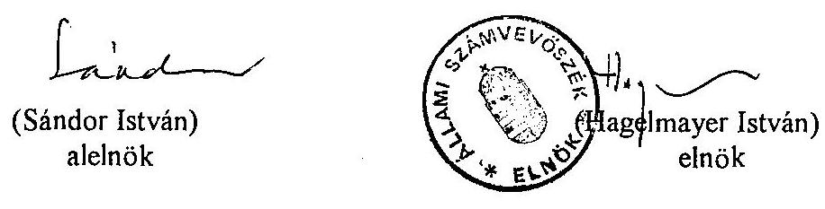