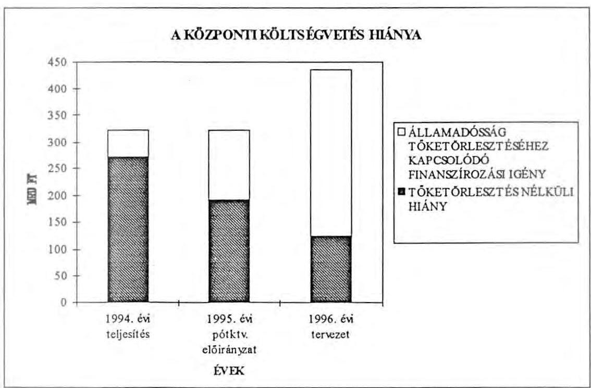
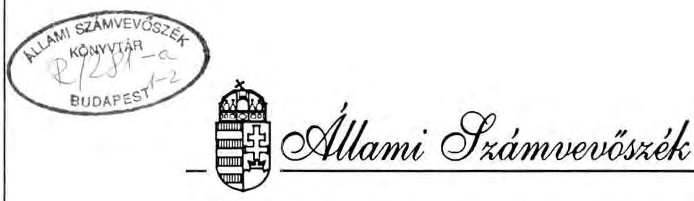
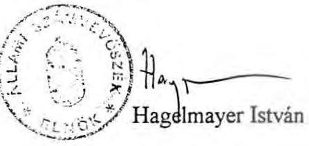

# VÉLEMÉNY 

A MAGYAR KÖZTÁRSASÁG 1996. ÉVI KÖLTSÉGVETÉSÉRŐL
(A költségvetési dokumentum törvényességi és szakmai ellenőrzése, javaslatok.)
(1. füzet)

---

# Rövidítések jegyzéke 

| ÁFA | - Általános forgalmi adó |
| :-- | :-- |
| ÁFI Rt. | - Állami Fejlesztési Intézet Rt. |
| Áht. | - Államháztartási törvény |
| ÁPV Rt. | - Állami Privatizációs és Vagyonkezelő Rt. |
| ÁSZ | - Állami Számvevőszék |
| BM | - Belügyminisztérium |
| EB Rt. | - Magyar Exporthitel Biztosító Rt. |
| Eximbank | - Magyar Export-Import Bank Rt. |
| GFS | - Nemzetközi Kormányzati Pénzügyi Statisztika |
| IKM | - Ipari és Kereskedelmi Minisztérium |
| KSH | - Központi Statisztikai Hivatal |
| MÁV Rt. | - Magyar Államvasutak Rt. |
| MBFB | - Magyar Befektetési és Fejlesztési Bank |
| ME | - Miniszterelnökség |
| MNB | - Magyar Nemzeti Bank |
| NM | - Népjóléti Minisztérium |
| PM | - Pénzügyminisztérium |
| Szt. | - Számviteli törvény |

---

# Tartalomjegyzék 

BEVEZETÉS ..... 2

1. VÁLTOZÁSOK AZ ÁLLAMHÁZTARTÁS SZERKEZETÉBEN ÉS SZABÁLYOZÁSÁBAN 4
1.1 A TÖRVÉNYJAVASLAT SZÁMSZAKI MELLEKLETEINEK TARTALMA ..... 4
1.1.1 A GFS (Nemzetközi Kormányzati Pénzügyi Statisztikai) rendszerű elszámolás ..... 4
1.1.2 Az Áht. egyes előírásainak érvényesítése a törvényjavaslat mellékleteiben. ..... 5
1.2 AZ ÁLLAMHÁZTARTÁSI REFORM ELEMEI A TÖRVÉNYJAVASLATBAN ..... 6
1.2.1 A Magyar Államkincstár létrehozása és működési feltételei ..... 6
1.2.2 Az elkülönített állami pénzalapok feladatainak integrálása a költségvetésbe ..... 7
1.2.3 Az államháztartási reform keretében egyes állami feladatok finanszírozásának várható módosulása ..... 8
1.2.4 A kincstári vagyon 1996. évre tervezett működtetése, hasznosítása ..... 8
2. A TÖRVÉNYJAVASLAT TÖRVÉNYESSÉGI ÉS SZÁMSZAKI MINŐSÍTÉSE ..... 9
2.2 A TÖRVÉNYJAVASLAT NORMASZÖVEGÉHEZ KAPCSOLÓDÓ ÉSZREVÉTELEK ..... 9
2.2 A TÖRVÉNYJAVASLAT SZÁMSZAKI MELLÉKLETEIVEL KAPCSOLATOS ÉSZREVÉTELEK ..... 17
2.2.1 Az 1-2. és a 9. számú mellékletek egyezősége. ..... 17
2.2.2 Megjegyzések egyes költségvetési címek előirányzataihoz. ..... 18
3. AZ 1996. ÉVI KÖLTSÉGVETÉSI TÖRVÉNYJAVASLAT ELŐIRÁNYZATAINAK HATÁSA AZ ÁLLAMHÁZTARTÁS ALRENDSZEREIRE ..... 19
3.1 A TERVEZETT ELŐIRÁNYZATOK KRITIKUS TÉTELEI. ..... 19
3.2 AZ ÁLLAMHÁZTARTÁS ALRENDSZEREINEK MŰKÖDÉSI FELTÉTELEI. ..... 20
3.2.1 A központi költségvetés alrendszere. ..... 20
3.2.1.1 A kormányzat közvetlen bevételei és kiadásai ..... 20
3.2.1.2 A központi költségvetési szervek előirányzatai ..... 23
3.2.2 A társadalombiztosítási alapok és a központi költségvetés kapcsolata ..... 24
3.2.3 A helyi önkormányzatok alrendszere ..... 25
3.2.4 Az elkülönített állami pénzalapok. ..... 26
JAVASLATOK ..... 28

---

# Bevezetés 

Az 1996. évi költségvetési javaslat jelentős lépés az államháztartási reform megvalósításának útján. Nemcsak az 1996-ra vonatkozó előirányzatokat tartalmazza, hanem az államháztartás vitelében is jelentős változásokat eredményez.

Az Állami Számvevőszék Alkotmányban foglalt kötelezettsége alapján a költségvetés előirányzatai megalapozottságáról mond véleményt. Az utóbbi években kialakult gyakorlat szerint ezt a kötelezettségét oly módon teljesíti, hogy tájékoztatja az Országgyűlést a tervező munka folyamatáról, az előirányzatok kialakításánál figyelembe vett számítási módszerről.

A törvényjavaslattal párhuzamosan készítették elő az államháztartási törvény módosítását, amit meghatároz az államháztartási reform keretében megalapítandó Magyar Államkincstár. E törvények elfogadásával új finanszírozási rend jogi keretét teremti meg az Országgyűlés, ami azon túl, hogy a költségvetés finanszírozásának takarékosabb, ésszerűbb rendjét biztosítja, megindítja a költségvetési gazdálkodás átalakítását, megteremti az elszámoltathatóság elvi feltételeit.

Az államháztartás gazdálkodási rendjében hosszabb távra érvényes szabályozás, stabilitás és kiszámíthatóság szükséges. Az Áht. módosítása is ezzel az igénnyel készült. Ugyanakkor több olyan kitétel is szerepel a törvényjavaslatban, ami "külön törvény szerint" a főszabálytól eltérő megoldásra is módot ad. A költségvetési törvényjavaslat is hivatkozik külön törvények szabályozási lehetőségére. A külön, meg nem nevezett törvényekre utaló szabályozás alapján rövid távú érdekek érvényesülhetnek, az egységes jogalkalmazás háttérbe szorulhat.

A költségvetési törvényjavaslat az elkülönített állami pénzalapok alrendszerének jelentős átalakítását is tartalmazza azzal, hogy számos feladat forrásainak és kiadásainak költségvetésbe integrálásáról rendelkezik. Az Állami Számvevőszék ellenőrzései a legtöbb esetben azt bizonyították, hogy az alapok működési céljainak teljesítését nem segítette az alapszerű kezelés, sokkal inkább a pénzeszközök és az irányítás szétforgácsolásához vezetett.

Az Áht. megalkotása óta az 1996. évi az első olyan költségvetés, amely az előirányzatokat költségvetési címenként megbontja rendes és rendkívüli tételekre. A szétválasztás elsősorban a következő évek költségvetési bázisa kialakításánál hasznosul, de már az 1996. évi költségvetés megalapozását is segítheti.

Véleményünkben az 1996. évi előirányzatok számos tételének bizonytalanságára utalunk. Ezek közül két jelentős bevételi tétel a költségvetés teljesítését bizonytalanná teszi. Az egyik a privatizációtól remélt 107 milliárd Ft, amit az 1995. évről áthúzódó, bizonytalan nagyságú kötelezettségek növelnek. Az Állami Számvevőszék - a korábbi évek teljesítéseinek alakulására alapozva - úgy ítéli meg, hogy a tervezett privatizációs bevétel nem jelent reális, teljesíthető finanszírozási forrást. A másik megalapozatlan bevételi tétel a vámbiztosíték tervezett 33 milliárd Ft-os összege. Ennek bevétellé minősítését az Állami Számvevőszék az 1994. évi zárszámadás ellenőrzése kapcsán is kifogásolta.

---

A Kincstár megalapítása, az ezzel kapcsolatos finanszírozás megváltozása, az elkülönített állami pénzalapok által ellátott egyes feladatok költségvetésbe integrálása jelentős változásokat eredményez a költségvetés egyes tételeiben is. Ezek kidolgozása, a kidolgozás részletezettsége a törvényjavaslatban nem minden esetben követhető nyomon. Új vonást jelent az is, hogy az államháztartási rendben bekövetkező változások miatt az 1995. költségvetési év pénzügyi lezárásának eredményét az 1996. évi előirányzatok módosítási kötelezettségével kell összekötni, méghozzá olyan időpontban, hogy az áthúzódó fizetési kötelezettségek ne okozzanak működési zavart. Mindezek előrevetítik azt, hogy 1996-ban indokolt lesz az Országgyűlés elé terjeszteni az előirányzatok pontosítását, átrendezését, ami a nagy horderejű változtatások természetes velejárója.

Az Állami Számvevőszék a költségvetésről készített véleményét két füzetben terjeszti az Országgyűlés elé. Az 1. füzet tartalmazza az államháztartás szerkezetében, szabályozásában bekövetkező változások ismertetését, a törvényjavaslat szakaszaihoz rendelve azokat az észrevételeket, javaslatokat, amelyek a törvényjavaslat pontosítását tartalmazzák. A 2.sz. füzetben a helyszíni ellenőrzés tapasztalatait adjuk közre.

---

# 1. Változások az államháztartás szerkezetében és szabályozásában 

### 1.1 A törvényjavaslat számszaki mellékleteinek tartalma

### 1.1.1 A GFS (Nemzetközi Kormányzati Pénzügyi Statisztikai) rendszerű elszámolás

A Kormány az 1996. évi költségvetési törvényjavaslatot - a külföldön elfogadott és a Nemzetközi Valutaalap által alkalmazott - GFS számbavételi rendszer egyes elemeinek alkalmazásával készítette el, folytatva a költségvetési mérlegeket megújító, 1995. évben megkezdett átalakítást. Így a központi költségvetés bevételi és kiadási előirányzatai, valamint a központi költségvetés mérlege nem tartalmazza a központi költségvetés külföldi hitelfelvételeit, bel- és külföldi államadósságának szerződés szerint esedékes törlesztését, illetőleg az államkötvények visszavásárlási összegét. Ezek külön fejezetben, a kiadási és bevételi főösszegektől elkülönítve, illetve a mérlegben "vonal alatt" jelennek meg.

## A költségvetési hiány összetevői

A központi költségvetés tervezett hiánya 1996-ban 124.754,1 millió forint. Ez a hiány az államháztartás folyamatos működéséből származik. (Ez az összeg nem tartalmazza a központi költségvetés hitelfelvételeit és törlesztéseit.) A régi szemléletű mérleg-összeállítás szerint - az adósságszolgálat tőketörlesztésével kapcsolatos tételekkel együtt - a "hiány" 436.109,2 millió forint lenne. Hitelfelvétellel, értékpapír-kibocsátással valójában a 436.109,2 millió forintot kell finanszírozni. A költségvetési politika és a kiadások alakításában fontos információ, hogy a finanszírozandó hiány milyen összetevőkből áll. Ennek feltételét biztosítja a GFS szerinti mérleg alkalmazása. A következő grafikon a GFS rendszer segítségével mutatja be a régi szemléletű mérlegrendszer alapján számított költségvetési hiány összetevőit.

A grafikon jól szemlélteti, hogy a finanszírozandó hiány növekvő összegén belül az adósságszolgálat nélküli hiány csökken, az adósságszolgálathoz kapcsolódó, determinált finanszírozási igény pedig ugrásszerűen nő.

---

# A költségvetési mérlegek szerkezetének változásai 

A törvényjavaslat számszaki részletezettségének 1996. évi változása lehetővé teszi az előirányzatok elkülönített tervezését, elszámolását és ellenőrzését. A korábbinál követhetőbb lesz az előirányzat módosítások és a teljesítés értékelése a bevételi előirányzatok gazdálkodási szabályoknak megfelelő megbontásával.

Az 1996. évi költségvetés szerkezete azonban az 1996-ban érvényesített módosítással sem tekinthető véglegesnek, miután a Kormány az Áht. 116. §-ában előírt mérlegek részletes tartalmát és szabályait még nem alakította ki. Ez azt jelenti, hogy a mérlegek tartalmának évenkénti kisebb-nagyobb változtatásával, majd a teljes körű mérlegrendszer kidolgozásával szinte minden évben változik a költségvetés szerkezete, adatállománya. A költségvetési törvényjavaslatokkal egyidőben kidolgozott és próbára tett szerkezeti változtatások sok hibalehetőséget rejtenek magukban. A költségvetés részletes adatait megadó szervezetek előzetesen nem ismerik, hogy az általuk szolgáltatott adatokat milyen összefüggéseket tartalmazó mérlegrendszerben mutatják be. Rendszeresen elmarad az adattartalom pontos definiálása is. Mindezek megnehezítik az elszámoltatást, az ellenőrizhetőséget, a költségvetésben fontos idősorok kialakítását, az összehasonlítható adatállományok előállítását pedig lehetetlenné teszik.

### 1.1.2 Az Áht. egyes előírásainak érvényesítése a törvényjavaslat mellékleteiben

Az államháztartási törvényben előírt azon kötelezettséget, amely szerint a rendes bevételeket és kiadásokat szét kell választani a rendkívüliektól, első alkalommal teljesítették. A törvényjavaslat
számú mellékleteiben valamennyi költségvetési cím előirányzatát rendes vagy rendkívüli tételnek sorolták be. A megkülönböztetés segíti az előirányzatok mérlegelését.

A pozitív változás azonban még nem teljes körű, mert a kiadások fentiek szerinti minősítése és ennek megfelelő elkülönítése még nem egységes elvek alapján történt meg. Fejezetenként és feladatonként más-más elvek szerint minősítettek, elsősorban a fejezeti kezelésű előirányzatok tételeinél. Egyes fejezeteknél a céljellegű előirányzatok, a közalapítványi támogatások, a pályázati előirányzatok, a vállalkozásoknak, társadalmi önszerveződéseknek stb. nyújtott felhalmozási célú támogatások nem kerültek a tartalmuknak megfelelő rendkívüli kiadások közé.

Az Áht. tervezett módosítása és a költségvetési törvényjavaslat sem tartalmaz előírást arra, hogy a rendes és rendkívüli előirányzatok között a felhasználás során el lehet-e térni, az előirányzat-átcsoportosítás megengedett-e. A rendkívüli kiadások rendszerint valamilyen célfeladathoz kapcsolódnak, aminél a célok szerinti felhasználás és a tételes elszámoltatás indokolt. Ezért a rendkívüli bevételek és kiadások felhasználási lehetőségéről külön szabályozás kialakítása indokolt.

A törvényjavaslat általános indoklása - az Áht.-ban és a 138/1993. Korm. rendeletben foglaltaknak megfelelően - első ízben tartalmazza a kiemelt jelentőségű beruházások, a célprogramok, az értékhatár feletti és alatti intézményi beruházások részletező adatait, 1999-ig ütemezve a kiadási szükségleteket.

---

# 1.2 Az államháztartási reform elemei a törvényjavaslatban 

### 1.2.1 A Magyar Államkincstár létrehozása és működési feltételei

Az államháztartási törvény tervezett módosítása, az államháztartási reform - elsősorban az Államkincstár, a kincstári finanszírozás - megvalósításának jogi kereteit teremti meg. Az Áht. tervezett módosítása ennek megvalósítását jelenti, s az 1996. évi költségvetési törvényjavaslat a módosítás egyes elemeit már tartalmazza.

A központi költségvetési szervek tekintetében a szabályozás fontos új eleme, hogy az előirányzatok meghatározzák a teljesítés lehetőségét, a támogatást nem havi ütemezésben bocsátják az intézmények rendelkezésére, hanem a fizetési kötelezettségek alapján teljesítményarányosan, utólag. Az új finanszírozási rend bevezetésével nem lesz mód az intézményi hatáskörben történő előirányzat-módosítására. A terven felüli többletbevételek és az előirányzat-maradványok felhasználását, az ezzel összefüggő előirányzat-módosítást csak a fejezet felügyeletét ellátó szerv vezetője engedélyezheti. Ebből eredően megnövekedett a költségvetés pontos tervezésének, a feladatok ellátásához szükséges kiadási és bevételi előirányzatok kidolgozásának, az évközben végrehajtott előirányzat-módosítások dokumentálásának jelentősége. A kincstári rendszerben jogszerű kifizetésre ugyanis csak meglévő előirányzat alapján kerülhet sor. Mindezek miatt megváltozik, növekszik a fejezetek pénzügyi irányítását
 ellátó apparátus feladatköre.

A kincstári finanszírozás az államháztartáson belül a fizetési kötelezettségeket "nettósítja", azaz tényleges pénzforgalom nélkül bonyolítja le. Megszűnik az intézmények önálló bankszámlája, amelyeket elszámolási számlák váltanak fel. Az államháztartáson kívüli pénzforgalom lebonyolítására az egységes kincstári számla szolgál. Az intézményeknek nem lesz módjuk szabad pénzeszközeiket értékpapírokba fektetni. A likvid pénzeszközeket a kincstár a költségvetés finanszírozására használja, illetve az fekteti be, ha arra lehetőség van. Ez a finanszírozási forma várhatóan jelentős kamatmegtakarítást eredményez a költségvetésnek, mert a megfelelő likviditás kevesebb értékpapír kibocsátással is megoldható.

A kincstári rendszer bevezetéséhez a kormányhatározat különböző szabályozási feladatokat írt elő, amelyek közül eddig több nem teljesült. Így a kincstári rendszer 1996-ra tervezett szakaszának megvalósítása - jogszabályi háttér hiányában - a működésben zavarokat okozhat. A részletek kidolgozására, a kincstári szervezet felállítására a Kormány 1995 júliusában meghozott döntése után kevesebb mint fél év állt rendelkezésre. Ez meglehetősen nagy kockázatot jelent a szabályozási és technikai feltételek megteremtésében egyaránt. A központi költségvetési szervek a kincstári rendszer bevezetésével együttjáró változásokat (intézményekre háruló feladatok, végrehajtási jogszabályok, nyilvántartás, ügymenet stb.) nem ismerik, a kincstári körbe tartozó intézmények számára az új rendszerrel kapcsolatos oktatás, továbbképzés még nem kezdődött meg.

Mobilizálható forrást jelenthetnek a költségvetésnek a kincstári körbe kerülő központi költségvetési szervek, a megszüntetett elkülönített állami pénzalapok eddig ellenőrizhetetlen pénzügyi befektetései, az ÁFI Rt.-nél lévő, a korábbi finanszírozási rend miatt a költségvetésben - szabálytalanul - teljesítésként elszámolt, kiutalt összegek maradványai. Az összeg megállapítása, költségvetésbe fizettetése az 1995. év pénzügyi zárásának különleges feladata. Azzal, hogy ezek a maradványok csak a fejezetek előirányzat-módosítása alapján használhatók fel, egyben lehetőséget teremtenek az intézményeknél lévő befektetések, korábbi évekről áthúzódó pénzmaradványok céljainak felülvizsgálatára, azok elvonására, illetve a költségvetésben jóváhagyott összegek kiegészítésére.

---

Tekintettel arra, hogy a gazdálkodási, finanszírozási rendszer megváltoztatása miatt a költségvetés főösszege legalább 50-90 Mrd Ft-tal megnövekszik, indokolt, hogy az előirányzat növekményét az Országgyűlés hagyja jóvá költségvetési cimenként. Ez azt jelenti, hogy az 1995. évi zárszámadás feladatai részben a korábbi évekétől eltérőek. Az időbeli ütemezést is az intézmények megfelelő működési feltételeinek megteremtéséhez kell igazítani azzal, hogy emellett a Kincstár működése indulásának pillanatától a kincstári elveknek megfelelő elszámolást és ellenőrzést is biztosítani kell.

# 1.2.2 Az elkülönített állami pénzalapok feladatainak integrálása a költségvetésbe 

Az államháztartási reform megvalósításában lényeges intézkedés, hogy az 1996. évi költségvetési törvényjavaslat az 1995-ben működő 29 elkülönített állami pénzalap többségének feladatait, bevételeit és kiadásait a költségvetésbe integrálja. A törvényjavaslatban önálló alapként csak 5 elkülönített pénzalap szerepel. A megszüntetett alapoktól átvett feladatok kiadási és bevételi összegei beépültek a felügyeletet ellátó fejezet "fejezeti kezelésű" előirányzatai közé.

Az elkülönített állami pénzalapok működésében számtalan párhuzamosság, átfedés jelentkezett, amely lehetőséget teremtett a pénzeszközök szétforgácsolására, pazarlására. A költségvetés és az alapok által finanszírozott feladatok pénzügyileg összemosódtak, lehetőség volt a szoros elszámoltatás megkerülésére. Az alapok működésében jelentkező gondokra az ÁSZ vizsgálatok is sorozatosan felhívták a figyelmet.

A költségvetésbe integrált feladatok alapszerű finanszírozását felváltó szabályozás még nem teljeskörű. A törvényjavaslatban megfogalmazottak alapján az alapok megszüntetése előkészületlen nemcsak az ellátandó feladatok alapos elemzésének, de a pénzügyi kérdések rendezésének hiánya miatt is. (Az kétségtelen, hogy a huzamosabb előkészítés viszont - esetleg - ismét megakadályozta volna az intézkedés végrehajtását.) 1996-ban az alapok integrálása még nem jelent előrelépést a támogatási rendszer áttekinthetősége, a programfinanszírozás szélesítése terén. Nem történt meg ugyanis az ágazati feladatok komplex felülvizsgálata, csupán beemelték az egyes alapokra tervezhető kiadási előirányzatokat a címrendbe.

A törvényjavaslat 65. §-a kötelezi a fejezetekért felelős minisztereket, hogy 1996. február 1-ig a pénzügyminiszterrel egyetértésben alakítsák ki a megszűnt alapokkal kapcsolatos pályázati rendszer működtetését, a teljesíthető kiadások körét, a kiadások feletti döntési hatáskört, a feladatellátáshoz szükséges díjak körét. A költségvetésbe integrált speciális feladatok zavartalan működéséhez ki kell alakítani a programfinanszírozás rendszerét, körültekintően kell megoldani a megszűnt alapok 1995. évi pénzügyi lezárását, s lehetőséget kell biztosítani az 1996. évi előirányzatok esetleges módosítási szükségleteire. Tekintettel a miniszteri rendeletek későbbi megjelenésére, s az 1995. gazdálkodási év lezárásának különleges feladataira, indokolt, hogy 1996. évben a Kormány terjessze be a költségvetésben csak elnagyoltan szereplő feladatsor és az ezzel kapcsolatos fejezeti kezelésű előirányzatok megfelelő részletezését úgy, hogy azt az Országgyűlés a nyári szünet előtt tárgyalhassa.

Pontos kimutatás szükséges arról, hogy a források és kiadások az integrálás után a költségvetésben hol jelennek meg, melyik bevétel lesz a központi költségvetés rendes bevétele, mekkora az az összeg, amely az alap megszűnése miatt rendkívüli bevételként vagy kiadásként felmerül, illetve melyek azok a bevételek, amelyek a fejezeti bevételeket gyarapítják.

Az Áht. előírása értelmében az elkülönített alapok 1995. évi pénzügyi beszámolóit is független könyvvizsgálók vizsgálják felül. A könyvvizsgálat megteremti a feltételeket ahhoz, hogy a pénzügyi év lezárásával a megszűnt alapok 1995. évi záróállománya, valamennyi vagyontár-

---

gya, pénzeszköze megfelelő helyre és nyilvántartásba kerüljön az államháztartásba. Intézkedni szükséges a vagyonról, befektetett eszközökről, követelés- és kötelezettség állományról, értékpapírok utáni hozamról, stb. A megfelelő intézkedés alapján tudják a könyvvizsgálók az átadás okmányait hitelesíteni. (Az 1994. évben megszűnt Világkiállítási Alap könyvvizsgálata bizonyította, hogy ezek nélkül az intézkedések nélkül az eszközök átadási adatainak hitelesítése megfelelően nem történhet meg.)

# 1.2.3 Az államháztartási reform keretében egyes állami feladatok finanszírozásának várható módosulása 

A költségvetési törvényjavaslat indokoló része tartalmazza azt az elképzelést, hogy az államháztartási reform részeként egyes feladatokat, melyek a költségvetésen kívül hatékonyabban, gazdaságosabban láthatók el, át kell szervezni közhasznú, illetve gazdasági társasággá.

A törvényjavaslat 1. és 2. számú mellékletében ezeknek a tervezett intézkedéseknek a hatása nem jelenik meg az előirányzatokban. Ezzel kapcsolatban konkrét, számszerűsíthető elképzelés nem szerepel az előterjesztésben. Amennyiben az intézmény- és feladat felülvizsgálat évközben megvalósul, azt eredményezi, hogy a költségvetésben a tervezettől eltérően használják fel az előirányzatokat.

Az Áht. 94. § (2) bekezdése szerint központi költségvetési szerv a Kormány engedélyével alapíthat gazdasági társaságot. A törvényjavaslat szerint a létrejövő társaságok számára a központi költségvetési szerv köteles az eszközöket térítésmentesen rendelkezésre bocsátani. Bizonyos állami feladatok ellátásának hatékony finanszírozása érdekében a közhasznú társaságok, gazdasági társaságok alapítása indokolt. Ezzel a megoldással rugalmasabb, a körülményekhez alkalmazkodó, előbb-utóbb versenyhelyzetbe kerülő szervezetek közreműködésével valósulnak meg állami feladatok. Ugyanakkor az államnak leszámlázott szolgáltatás adó- és nyereségtartalma megnöveli a szolgáltatás várható árát. Felhívjuk a figyelmet arra, hogy a megalapított gazdasági társaságok "átszervezése", megszüntetése, az ingyenesen átadott eszközök visszaszerzése szinte lehetetlen, ha később kiderül, hogy az állami feladat ellátására mégsem felel meg ez a forma. Ezért indokolt, hogy a Kormány kizárólag költség-haszon elemzésre épülő előterjesztés alapján engedélyezze állami feladatok ellátására hivatott közhasznú, illetőleg gazdasági társaság megalapítását.

### 1.2.4 A kincstári vagyon 1996. évre tervezett működtetése, hasznosítása

A vagyonkezelés, a tulajdonlás részletes szabályainak megállapítása a korábbi szándékoktól eltérően nem önálló törvényben, hanem az államháztartási törvény módosítása keretében történik meg. Az Áht. módosításban, az általános definíció mellett, a kincstári vagyon tekintetében megfogalmazódik az a kritérium is, hogy a kincstári vagyon a társadalom és a nemzetgazdaság működését, az állami feladatok megvalósítását szolgálja. Ennek megfelelően az állami tulajdonból való kikerülés esetén a vagyon ellenértéke a központi költségvetést illeti meg.

A kincstári vagyonnal való gazdálkodás szükséges elvi szigorítása mellett az Áht. módosítása lehetővé teszi a külön törvényben történő szabályozást. A költségvetési törvényjavaslat (a korábbi szabályozást követve) arra ad felhatalmazást, hogy a kincstári vagyon értékesítésére, cseréjére, bérbeadására a fejezetekért felelős miniszterek engedélye is elegendő. Értékesítés esetén a bevétel 50%-a a költségvetési szervnél maradhat. A szabályozás új eleme, hogy 10 M Ft értékhatár feletti értékesítéseknél az ÁPV Rt. jogosult az értékesítési eljárás lefolytatására, nyilvános versenytárgyalás megtartása mellett.

---

# 2. A törvényjavaslat törvényességi és számszaki minősítése 

### 2.1 A törvényjavaslat normaszövegéhez kapcsolódó észrevételek

## A költségvetéssel együtt benyújtandó törvényjavaslatok

Az Áht. 86. §-a értelmében "a társadalombiztosítás gazdálkodásának előirányzatait, a bevételek és a kiadások összegét, rendeltetését, valamint a hiány fedezésének módját, illetve a többlet rendeltetését, a hitelfelvételeket a költségvetési törvénnyel egyidejűleg jóváhagyásra az Országgyűlés elé kell terjeszteni". A társadalombiztosítási alapok költségvetését - az előző évekhez hasonlóan - a Kormány nem terjesztette be a költségvetési törvénnyel együtt, ezért az alapok és a központi költségvetés pénzügyi kapcsolatai nem ítélhetők meg.

A Kormány a költségvetési törvénnyel szinte együtt terjesztette be az Országgyűlésnek a különböző adótörvényeket és az Áht. módosítását. A törvényjavaslatok szövegének harmonizálása, az esetleges módosítások érvényesítése az előirányzatokban ez évben is gondot jelent majd.

A törvényjavaslat több olyan jogszabályra utal, ami előkészítés alatt áll, illetve a törvényjavaslat kötelezi a minisztereket, hogy az elkülönített állami alapok költségvetésbe integrálásával kapcsolatos rendeleteket alkossák meg. Ezek miatt a törvényjavaslatba beállított egyes előirányzatok tehát nem hatályos vagy beterjesztett jogszabályon alapulnak, összegszerűségük számításokkal nem támasztható alá.

## A MÁV Rt. likviditási hiteleinek átvállalása

A törvényjavaslat 4. § (4) bekezdése a MÁV Rt. által az 1992-95. években állami kezességvállalás mellett felvett likviditási hiteleleit a központi költségvetés adósságába építi be. A XVII. PM fejezetben (II. kötet 17/50 oldalán) találhatók azok a fizetési kötelezettségek, amelyek 1996-ban esedékessé válhatnak. Ezek között szerepelnek a MÁV Rt. hiteleleivel összefüggő kezesi kötelezettségek is, holott a törvényjavaslat 4. § (4) bekezdése a kezesi kötelezettséget a költségvetés adósságává váltja át.

Felhívjuk a figyelmet arra, hogy indokolt a vonatkozó kezesi szerződések módosítása a törvényjavaslattal való összhang megteremtése érdekében.

## A Bős-Nagymaros Vízlépcsőrendszer beruházáshoz felvett osztrák hitel törlesztése

A törvényjavaslat 4. § (6) bekezdése értelmében a Kormány átvállalja a Bős-Nagymarosi Vízlépcsőrendszer beruházáshoz felvett osztrák bankhitel törlesztését. A beruházás részbeni finanszírozása az osztrák Credit-Anstalt Bankverein által az Österreichische Verbundegesellschaft részére folyósított hitelből valósult meg.

A javaslat szerint a Magyar Villamosművek Rt. — időközben meghiúsult — áramszállításaival törlesztendő adósság 1995. december 31-től kormányhitelként szerepelne. Indokolt az adósság pontos összegével a 4. § (6) bekezdést kiegészíteni. Az adósság összege az általános indokolás alapján 1995. év végén 11.067,4 millió ATS - prognosztizált Ft/ATS árfolyamon - közel 150 Mrd Ft. A hitel átvállalásával párhuzamosan a költségvetési javaslat 1. számú mellékletében nem szerepel a kötelezettséghez kapcsolódó törlesztés (XXXII. fejezet), valamint az 1996. évi hiányt növelő kamatkiadás sem (XXX. fejezet).

---

# Az 1996. évi létszámcsökkentések kiadásainak előirányzata 

A költségvetési törvényjavaslat 6. §-a a társadalombiztosítási járulék 1996. évi csökkentése által felszabaduló többlet-előirányzat 75%-áról rendelkezik. A javaslat szerint az összeg a VII. Miniszterelnökség fejezet 10. cím 2. alcímén céltartalékot képez az 1996. évi végrehajtandó létszámcsökkentések egyszeri többletkiadásainak részbeni fedezetére. Az előirányzat felhasználására a törvényjavaslat szerint a Kormány kap felhatalmazást.

Formai hiányosság, hogy a céltartalék-képzés előírt helye - a VII. ME 10. cím 2. alcím -
 az 1. számú melléklet címrendjében nem szerepel. A képződő céltartalék összege még nem állapítható meg, mert a társadalombiztosítási járulék csökkentésére döntés még nem született, csak az érdekegyeztető tárgyalások folynak.

A törvényjavaslat 43. § (1) bekezdésének c) pontja a központi költségvetés előirányzatmódosítási kötelezettség nélkül teljesülő - automatikusan túlléphető — kiadásai közé sorolja a központi költségvetési szerveknél 1996-ban végrehajtandó létszámleépítéssel összefüggő, a 6. $\S$-ban előírt céltartalékot. A 6. § értelmében a törvényjavaslatban különböző költségvetési címen szereplő társadalombiztosítási előirányzatokat csökkenteni kell és átcsoportosítani a VII. ME fejezet 10. cím 2. alcímre. Ez az előirányzat képezi a létszámcsökkentések részbeni fedezetét.

A költségvetési törvényjavaslat 43. § (1) bekezdés c) pontjában a létszámcsökkentések miatti többletkiadások "automatikus tétellé" minősítése azt jelenti, hogy az előirányzatok külön módosítás nélkül is túlteljesíthetők. A létszámcsökkentés kiadási többlete számos intézmény előirányzatát érinti. A kincstári finanszírozás alapelve, hogy csak jóváhagyott (módosított) előirányzatok erejéig teljesíthetők a kifizetések. Emiatt a céltartalék automatikus tétellé sorolása nem indokolt, technikailag nem illeszthető a kincstári finanszírozási rendbe.

## A vámbiztosíték elszámolása

A törvényjavaslat 7. § (3) bekezdése a vámbiztosíték számla mindenkori egyenlegét a központi költségvetés rendes bevételeként határozza meg. A bevételként történő számbavétel mind jogi, mind közgazdasági szempontból alaptalan. Javasoljuk a törvényjavaslat 7. § (3) bekezdésének elhagyását, ezzel együtt a bevételek közül a 33 milliárd Ft-os előirányzat törlését.

Közgazdaságilag az importőrök által befizetett összeg célja a köztartozások (vámáru után járó vám és a vámmal együtt fizetendő adók, díjak, illetékek) megfizetésének garantálása. A közterhek fedezetére letétként elhelyezett vámbiztosíték csak a vámhatározat meghozatala után válik ÁFA, vám-, illetve fogyasztási adóbevétellé. Ténylegesen csak a köztartozások kiegyenlítésére befizetett része jelent bevételt a költségvetésnek. (Adott esetben a letétbe helyezett összegből az importőr visszatérítést is kaphat.)

A vámjog részletes szabályainak megállapításáról és a vámeljárás szabályairól alkotott 39/1976. (XI. 10.) PM-KkM együttes rendelet előírja:
"A készpénzben nyújtott vagy ilyen címen befizetett vámbiztosítékot:
a) a vámárunak a belföldi forgalom számára történő vámkezelése után, ... ... a keletkezett vám és adófizetési kötelezettség teljesítéseként kell elszámolni, illetve vissza kell fizetni ha a vámbiztosíték indokoltsága - e jogszabály értelmében - megszünt."

---

A vámbiztosíték - amellyel a polgári jogban az óvadék állítható párhuzamba - a vám és egyéb köztartozás közlése után válik állami bevétellé, a köztartozás a vámhatározat alapján keletkezik. Amíg a vámkezelés nem történik meg, addig a vámbiztosítékot a letéti pénzkezelés szabályai szerint kell kezelni az erre vonatkozó 140/1983. (X.12.) Korm. rendelet alapján.

A vámbiztosíték a költségvetés likvid pénzeszköze, amit a bevételek és kiadások ütemkülönbsége miatt keletkező átmeneti finanszírozási szükségletekre lehet csak igénybevenni. Ha a biztosíték összegét bevételi forrásként megtervezik, ez jogilag azt jelenti, hogy a biztosíték jelleggel befizetett összeget más célra fordítják, közgazdaságilag pedig azt, hogy a következő időszakra terhelt rejtett államadósságot "keletkeztetnek". (Ha a vámbevétel mértéke csökken, a biztosítékba helyezett összegek is csökkennek. A költségvetés forráshiánya ekkor válik láthatóvá.)

Az a gyakorlat, hogy a vámbiztosíték számla év végi egyenlegét a költségvetés bevételeként elszámolják a költségvetési finanszírozásában is előbb-utóbb problémaként jelentkezik, hiszen a belső államadósság finanszírozására forrást kell teremteni. A bevételek közé beállított vámbiztosíték összege 1993-ban 13,3 Mrd Ft, 1994-ben 23,5 Mrd Ft volt. 1996-ban 33 Mrd Ft a vámbiztosítékbol rendes bevételként tervezett összeg. Az 1994. évi 23,5 Mrd Ft rendezésére az Állami Számvevőszék az 1994. évi zárszámadási jelentés kapcsán javaslatot tett. A vámbiztosíték számla 1993. évi 13,3 Mrd Ft-ot kitevő egyenlegének rendezésére is szükség van. Ellenkező esetben a számláról hiányzó összegek rejtett államadósságként később eredményeznek költségvetési gondokat.

# 1: :ilumi :ugyon utáni részesedés korlátozása 

A törvényjavaslat 8. § (1) bekezdése előírja, hogy az ÁPV Rt-hez tartozó gazdasági társaságokban az állami részesedés után az 1996. évben kifizetett osztalék és az állami vagyon más hozadéka ne képezze teljes összegében a központi költségvetés bevételét. A hivatkozott paragrafus (2) bekezdésében a költségvetési javaslat összegszerűen - 10 Mrd Ft-ban - rögzíteni kívánja az ÁPV Rt. által a költségvetésbe befizetett állami vagyon utáni részesedést.

A tervezett 10 Mrd Ft felett befolyó osztalékról, hozadékokról nem lehet lemondani, hiszen a tisztán állami tulajdonú társaság minden hozadéka az államot, mint tulajdonost illeti meg. Korlátozás csak a minimálisan elvárható befizetés összegére vonatkozóan lenne célszerű és indokolt.

A részletes indokolásban található magyarázat nincs összhangban a javaslat normaszövegével: "Az állam mint tulajdonos elvonja a tulajdonosi jogosítvánnyal felruházott szervezet kezelésében levő kereskedelmi bankokban és más pénzintézetekben, valamint vállalkozásokban levő állami részesedés, illetve az állami vagyont megtestesítő részvények után az 1996. évben kifizetésre kerülő osztalékot és az állami vagyon más hozadékát." A leírtakon túl az államháztartás jelenleg nincs abban a helyzetben, hogy bármekkora bevételről lemondhasson, különösen akkor nem, ha az jogszerűen megilleti.

## A privatizációs bevételek

A privatizációs bevételek 1995-ben várhatóan jelentősen elmaradnak a tervezett 150 Mrd Ft-tól. E bevételi előirányzat megalapozatlanságára az ÁSZ a pótköltségvetés tervezetének véleményezésekor rámutatott. A törvényjavaslat 8. § (2) bekezdésében - az elmaradó 1995. évi 150 Mrd Ft-on túl - 1996-ra 100 Mrd Ft-os további bevételt ír elő. Figyelembe véve, hogy

---

más kötelezettségek teljesítése is szükséges, és a privatizációnak, vagyonkezelésnek is vannak költségei, az 1995-96-ra előirányzott összesen 250 Mrd Ft-os költségvetési befizetéshez 300-350 milliárdos privatizációs készpénzbevételi igény tartozik. Ilyen nagyságrendű bevétel teljesítésének előirányzását pedig a reálfolyamatok és az eddigi gyakorlat ismeretében megalapozatlannak kell tekinteni.

A törvényjavaslat 8. § (2) bekezdése előírja, hogy "Az 1995-96. évekre tervezett 250 000 millió privatizációs bevétel teljesülése esetén a további privatizációs bevételekből 60-40% arányban, de legfeljebb 7000 M Ft a Munkaerőpiaci Alapot illeti meg, 5000 M Ft pedig - a központi költségvetés bevételeként - a XX. Környezetvédelmi és Területfejlesztési Minisztérium fejezetben használható fel, kizárólag területfejlesztési célokra."

A Munkaerőpiaci Alap a fenti 7 Mrd Ft-ot 1996. évi bevételi előirányzatai között megtervezte. Ezen összeg realizálása rendkívül bizonytalan. Még ha lesz is privatizációs bevétel a 250 Mrd Ft-on felül, akkor is kérdéses, hogy eléri-e a 7 Mrd Ft-ot az alapra jutó rész. A költségvetési törvény szövegében szükséges lenne megfogalmazni, hogy amennyiben a privatizációs bevételek év közbeni alakulása nem biztosítja az alap számára a 7 Mrd Ft-ot, de a kiadások teljesítése miatt az indokolt, akkor az általános tartalék - esetleg más forrás - terhére kell a szükséges összegű pótelőirányzatot biztosítani.

# A költségvetési szervek használatában, kezelésében lévő ingatlanvagyon 

A költségvetési törvényjavaslat 11. §-a - a megelőző évihez hasonlóan - a központi költségvetési szervek használatában, illetve kezelésében lévő ingatlanok értékesítésére, bérbeadására, az ezekből származó bevételek meghatározott részének felhasználására hatalmazza fel a minisztereket, költségvetési szerveket, különböző értékhatárokhoz kötve.

Az állami feladatok strukturája és szervezetei folyamatosan változnak. Az állami ingatlanok tulajdoni, kezelői viszonyai, a vagyontárgyak elidegenítése, megterhelése fejezeti, intézményi szinten nem ítélhetők meg. Az elsősorban a fejezeti szempontokhoz rendelt vagyongazdálkodás visszafordíthatatlan folyamatokat eredményezhet, aminek következtében nemkívánatos helyzet alakulhat ki. Nem indokolt az sem, hogy az elidegenítésből származó bevételek az egyes fejezetek, intézmények költségvetési pozícióját javítsák, relatíve jobb helyzetet teremtve számukra a többi fejezethez, intézményhez képest.

Az Állami Számvevőszék továbbra is fenntartja az 1995. évi költségvetési törvényjavaslat véleményezése során kialakított álláspontját, miszerint az állami ingatlanvagyonnal az államháztartás egészének érdekeit figyelembe véve, kormányzati szinten célszerű gazdálkodni.

## A központi beruházások 1995. évi maradványa

A törvényjavaslat 12. § (1)-(2) bekezdései a központi beruházások 1995. évi maradványainak előirányzat-módosítási jogát a pénzügyminiszterre ruházza. Tekintettel arra, hogy a pénzeszközöket kezelő ÁFI Rt-nél több, az előző évekből származó keretmaradvány, kötvénykibocsátásból eredő pénzeszköz, a helyi önkormányzatok fejlesztési forrásainak maradványa is felhalmozódott, a maradványok vizsgálata indokolt az előirányzat-módosítás előtt. A gyakorlati végrehajtás megvalósításához kötelezni kell az ÁFI Rt-t, hogy a könyvvizsgálóval hitelesített beszámolóját legkésőbb április 15-ig készítse el, bár az Szt. csak május 31-i határidőt ír elő.

---

# A központi költségvetési szervek vállalkozási eredménye 

A törvényjavaslat 13. § (1) bekezdésében - amely a központi költségvetési szervek vállalkozási tevékenységéből származó eredményt osztja meg az intézmények és a központi költségvetési szervek között - a gondolatjelek között található "a (2) bekezdésben foglalt kivétellel" szövegrész elhagyását javasoljuk, mert zavarja a bekezdés értelmezhetőségét. A (2) bekezdésben leírtak egyértelművé teszik, hogy az alaptevékenységre fordított eredmény levonható.

## A központi költségvetési szervek előirányzatai teljesítésének felülvizsgálata

A törvényjavaslat 14. § (1) bekezdése szerint a fejezetért felelős szerv vezetőjének feladata, hogy a központi költségvetési szervek előirányzatai teljesítésének felülvizsgálatát elvégezze. Az 1993-94. évi zárszámadási ellenőrzés során azt tapasztaltuk, hogy ezt a feladatukat a fejezetért felelős szervek vezetői általában nem kellő körültekintéssel teljesítették.

Felhívjuk a figyelmet arra is, hogy a kincstári rendszerre való átállás miatt még az év lezárása előtt intézkedni indokolt az intézmények tulajdonában lévő értékpapírok, egyéb befektetett eszközök kezeléséről, amelyek a korábbi években nem képezték a pénzmaradvány elszámolás alapját.

## A helyi önkormányzatok felhasználási kötöttséggel járó állami támogatása

A törvényjavaslat 20.§ (1) bekezdésének e) pontja a helyi önkormányzatoknak új, felhasználási kötöttségekkel járó támogatást állapít meg a területi fejlettségi különbségek mérséklésére. E paragrafus (5) bekezdése úgy rendelkezik, hogy a majd "külön törvény alapján létrejövő" megyei fejlesztési tanácsok által kiírt pályázatok útján jutnak támogatáshoz az önkormányzatok. A törvényjavaslat 94. §-a pedig felhatalmazza a Kormányt, hogy e támogatási forma hozzájutási feltételeit rendeletben szabályozza.

Az elhúzódó szabályozási, pályáztatási munkák miatt javasoljuk, hogy a 20. § (5) bekezdése és a 94. § határidőt is tartalmazzon. Egyébként elképzelhető, hogy az önkormányzatok 1996-ban esetleg nem jutnak hozzá kellő időben e jogcím szerinti támogatásukhoz.

## A volt tanácsi vállalatok értékesítéséből származó bevételek

A költségvetési törvényjavaslat 25. §-a rendelkezik a volt tanácsi vállalatok értékesítéséből származó bevételek helyi önkormányzatot megillető részéről. A normaszöveg az előző évekhez képest csak annyiban változott, hogy az önkormányzatokat megillető "bevétel" helyett a jelenlegi javaslatban "készpénzbevétel" szerepel, ami a korábbihoz képest szűkítést jelent. A módosítás indoklását a törvényjavaslat nem tartalmazza.

## Az előre nem tervezhető beruházási, felújítási feladatok

A költségvetés 42. § (4) bekezdés előírása alapján nem szükséges az Országgyűlés jóváhagyását kérni az előirányzat rendeltetését nem módosító, fejezetek közötti előirányzatátcsoportosításhoz, ha "központi költségvetési szervek átszervezésével, felügyeletének megváltoztatásával, költségvetési feladatok, kötelezettségek - fejezetek közötti megállapodáson alapuló - átadásával-átvételével, előre nem tervezhető beruházási, felújítási feladatok felmerülésével függ össze;"

---

A költségvetési törvényben, vagy más jogszabályban definiálni kell az előre nem tervezhető beruházás fogalmát. Az ilyen többletkiadások felmerülésekor a más fejezettől történő átcsoportosítás helyett javasoljuk a fejezeti tartalék vagy, ha ez nem elegendő, az általános tartalék igénybevételét.
"Az előre nem tervezhető beruházási, felújítási feladatok" miatt a fejezetek közötti átcsoportosítás lehetősége - különösen ennek tartalmi meghatározása nélkül - a fejezetek gazdálkodási biztonságát veszélyezteti.

#
 Fejezetek közötti átcsoportosítás jogának átruházása 

A törvényjavaslat 44. § (1) bekezdésében az Országgyűlés a Kormányra ruházza át néhány előirányzat fejezetek közötti átcsoportosításának jogát. Ezek közül indokolatlan a 7. § (2) bekezdés e) pontjában szereplő 3 Mrd Ft-ot kitevő "egyéb rendkívüli kiadások" előirányzat átcsoportosítási jogának Kormány hatáskörbe történő adása. Az összeg rendeltetéséről a törvényjavaslatban nincs semmilyen információ. A váratlan, előre nem tervezett kiadások teljesítésére pedig - az Áht. 25. § (2) bekezdésének előírása szerint - az általános tartalék szolgál.

## A pénzügyminiszter átcsoportosítási joga

A törvényjavaslat 46. § (4) bekezdése a pénzügyminiszter átcsoportosítási jogát határozza meg, mely kiterjed a XVII. PM fejezet 13. Fejezeti kezelésű előirányzatok címre is. Így a törvényjavaslat adott passzusának korrigálása szükséges a következők szerint: "A XVII. Pénzügyminisztérium fejezeten belül a pénzügyminiszternek a fejezeten belüli átcsoportosítási joga az: a) 113. címekre...terjed ki."

A költségvetési szervek által a közhasznú, illetve gazdasági társaságok részére átadandó eszközök

A törvényjavaslat 58. §-a alapján "Az államháztartási reform keretében létrejövő közhasznú, illetve gazdasági társaság részére a központi költségvetési szerv köteles az alapító által megjelölt eszközöket térítésmentesen rendelkezésre bocsátani."

Az általános indokolás szerint az átszervezett intézmények a továbbiakban is 100%-os állami tulajdonú gazdálkodó szervként, vagy közalapítványként, állami igazgatás, illetve felügyelet mellett működnek, állami feladataikat jogszabályi felhatalmazás alapján továbbra is ellátják, ezért indokolt, hogy a vagyonátadás térítésmentesen történjen.

Egy intézmény átalakulása gazdasági társasággá maga után vonja a profitérdekeltséget. Ebből következően a végzett feladatokért hasznot is tartalmazó ellenszolgáltatást számláznak. A megfelelő döntés és vagyonátadás megalapozásához javasoljuk, hogy a Kormány csak költséghaszon elemzés alapján járuljon hozzá az alapításhoz, a vagyonátadáshoz.

## A Menekülteket Támogató Alap megszünése miatti bevételek kezelése

A megszűnt alapoktól átvett feladatokhoz kapcsolódó bevételi előirányzatok a törvényjavaslat 64. §-a értelmében az adott kiadási előirányzat-csoport kiadásaira használhatók fel. A törvényjavaslat szerint fentiek nem vonatkoznak a Menekülteket Támogató Alaptól átvett feladatokra. Korábban az érintett Alap rendelkezhetett a költségvetési támogatáson kívüli egyéb bevételekkel is.

---

# A munkavédelmi bírság bevételi előirányzata 

A 78. § (2) bekezdésében a munkavédelemről szóló törvény módosítása, valamint a 66. § (7) bekezdésében foglalt szabályozás ellentmondásban van. A hivatkozott két jogszabályhely a munkavédelmi bírságot mint bevételi forrást a Munkaerőpiaci Alapnál, valamint a Munkaügyi Minisztérium "Fejezeti kezelésű előirányzataiban" egyaránt figyelembe veszi. (A költségvetési előirányzatok tervezése a 66. § (7) bekezdése szerint történt.)

## A köztisztviselői törvény módosítása

A jelenleg hatályos, a köztisztviselők jogállásáról szóló törvény szövegébe a törvényjavaslat 80. §-ában foglalt kiegészítés ugyan beilleszthető, azonban olyan előírásokat javasol, melyek más jogszabályokban már rögzítettek. Az érvényben lévő 1990. LXXVIII. törvény és az 1989. évi XXXVIII. törvény a bírósági és ügyészségi dolgozók, továbbá az Állami Számvevőszék dolgozói illetmény-kiegészítését - a költségvetési törvény javaslatától és a köztisztviselők javadalmazásáról szóló törvénytől — eltérő mértékben szabályozza. E szervek feladatellátásából eredő preferált illetménykiegészítés további fenntartása indokolt. Ennek érdekében a hivatkozott törvények módosítása szükséges, mert nélküle az e területen dolgozó felsőfokú végzettségű alkalmazottak kedvezőtlenebb jövedelmi helyzetbe kerülnek mint a köztisztviselők.

## Az orosz haditechnikai szállítások elszámolása

Az ÁSZ az 1994. évi zárszámadás véleményezése során foglalkozott az orosz haditechnikai szállítások elszámolásának kérdésével. Ennek kapcsán a következő megállapítást tettük: "A jövevény vonatkozóan az 1994. évi XIII. tv. 1. § (1) bekezdés c) pontjának módosítása célszerű olyan értelemben, hogy az orosz haditechnikai szállításokkal kapcsolatban elszámolt kiadási összeg elkülönüljön az intézmény - IX. Honvédelmi Minisztérium, 2. cím, 6. alcím - tényleges dologi kiadásaitól és külön szerepeljen a 4. Orosz haditechnikai szállítások megnevezésű kiemelt előirányzaton." Az ÁSZ javaslata az elszámolás egyértelművé, áttekinthetőbbé tételét célozta.

A költségvetési törvény tervezetének 81. §-a az érvényben lévő törvényi szabályozástól és az ÁSZ javaslattól tartalmában különbözik. A törvénytervezet javaslata a jelenleg érvényben lévő szabályozást - amely az adott tétel elszámolását kiemelt előirányzat mélységben határozza meg - feloldja, és csak azokat a fejezeteket nevezi meg, melyekbe a kiadási tételek elszámolhatók.

A törvényjavaslat 81. § tartalmával nem értünk egyet. Javasoljuk, hogy a kiadási tétel elszámolásának helye az 1994. évi XIII. törvényben továbbra is egyértelműen, kiemelt előirányzatként kerüljön jóváhagyásra.

## Helyi önkormányzatok címzett- és céltámogatási keretmaradványainak rendezése

A törvényjavaslat második részében (a 69-89-ig §-ok) azoknak a törvényeknek a módosítása szerepel, amelyek a költségvetés előirányzatainak megalapozását szolgálják. Ezek között nem szerepel a helyi önkormányzatok címzett és céltámogatási rendszeréről szóló 1992. évi LXXXIX. törvény módosítása, holott a Kincstár létrehozása és működése miatt a törvény 12 § (2) bekezdésének módosítása indokolt. Ezzel együtt rendezni kell az évek között áthúzódó keretmaradványok előirányzatainak jóváhagyási rendjét is.

---

A törvény hatályos szövege szerint "A jóváhagyott és az adott évben fel nem használt központi támogatást az év végén az Állami Fejlesztési Intézet a központi költségvetésből lehívja. Ezt az önkormányzat a következő évben, illetőleg a beruházás tervezett befejezését követő év végéig használhatja fel."

- A kincstári finanszírozás elvének ez a szabályozás ellentmond, hiszen az önkormányzatok által megvalósított beruházások számláit a kincstár utólag kifizeti - hasonlóan az eddigi gyakorlathoz - viszont nincs szükség a jóváhagyott, de az adott évben fel nem használt támogatás "leutalására". Ez a megfogalmazás a Kincstár működési rendjében nem értelmezhető.
- A hivatkozott törvényi előírás nem felelt meg sem az államháztartási, sem a számviteli törvénynek, mert pénzforgalmilag még nem teljesített tételt állít be teljesített kiadásként. A Kincstár működése ezt a szabálytalan és az ÁSZ által többször is kifogásolt gyakorlatot automatikusan megoldja. A Kincstár működési elvének megfelelően viszont nem lesz mód előirányzat nélkül kifizetéseket teljesíteni. Az 1995. és a korábbi évekről áthúzódó, az önkormányzatokat megillető maradvány összegével meg kell emelni a VIII. BM fejezet 17. cím 3. alcímének összegét ahhoz, hogy az előző évekről áthúzódó keretmaradványokból a Kincstár a kifizetéseket jogszerűen teljesíteni tudja. Az önkormányzati törvénnyel és az Áht-val összhangban az előirányzat megnövelésére csak az Országgyűlésnek van hatásköre.

# Jogszabályi hivatkozások a törvényjavaslatban 

A törvényjavaslat több szakaszában szerepel a "külön jogszabály szerint" kitétel, esetenként még meg sem alkotott jogszabályra hivatkozva: pl. 20. § (5) bekezdés; 21. §.

A könnyebb kezelhetőség érdekében javasoljuk a törvényjavaslat kiegészítését egy olyan jegyzékkel, melyből a "külön jogszabály"-ra való hivatkozás a konkrét jogszabállyal azonosítható. A konkrét hivatkozás nélkül korlátlan felhatalmazás történhet.

## A törvényjavaslat néhány §-ának téves hivatkozása

- A 32. § normaszövegében a nem biztosítottak után a központi költségvetés által az Egészségbiztosítási Alapnak fizetett általános hozzájárulás 12.000 M Ft-os összegére hivatkozás téves. A hozzájárulás a javaslat 1. számú mellékletében ténylegesen a XI. NM fejezet 10. cím 4. alcím 4. kiemelt előirányzatában szerepel.
- A 40. § utolsó mondatában a gondolatjelek között szereplő "az általa külföldön levett hitelekre" helyett az "az általa külföldön felvett hitelekre" szövegrészt javasoljuk.
- A 43. § (1) bekezdés e) pontjában a törvényjavaslat 1. számú mellékletére vonatkozó hivatkozások pontatlanok. A törvényjavaslat adott szakaszát javítani szükséges a következők szerint: "a társadalombiztosítási szervezetek által folyósított ellátásoknál (XI. Népjóléti Minisztérium fejezet 10. cím), kivéve a nem biztosítottak utáni térítés (XI. Népjóléti Minisztérium fejezet, 10. cím, 4. alcím, 4. kiemelt előirányzat);..."
- A 46. § (5) bekezdésében a törvényjavaslat 1. számú mellékletére vonatkozó hivatkozás helytelen, mivel a XVIII. Művelődési és Közoktatási Minisztérium fejezeten belül a 10. cím, 1. alcím, 2. előirányzat-csoport alatt nincsen 3. kiemelt előirányzat.

---

- A 63. § (2) bekezdés e) pontjában megjelölt címrendi hivatkozás hibás. A törvényjavaslat 1. számú mellékletében nem szerepel a XVII. fejezetben 18. cím 6. alcím.
- A 66. § (1) bekezdés címrendre vonatkozó hivatkozás helyesen: "A XIII. Közlekedési, Hírközlési és Vízügyi Minisztérium fejezet 11. cím, 2. alcím, 10. előirányzat-csoport tekintetében bevétel: ..."
- A 68. § (7) bekezdésében a hivatkozás helyesen a következő: "A (6) bekezdésben megállapított mérték...".
- A 68. § (8) bekezdésében található címrendi hivatkozás helyesen "a XVII. PM fejezet 18. cím 5. az 1. számú mellékletben".
- A 72. § módosítja az 1993. évi III. törvényt. A törvényszöveg szedése értelemzavaró. Keverednek a törvényjavaslat és a szociális ellátásról szóló törvény szövegrészei.

# 2.2 A törvényjavaslat számszaki mellékleteivel kapcsolatos észrevételek 

### 2.2.1 Az 1-2. és a 9. számú mellékletek egyezősége

- A törvényjavaslat 1. és 2. számú mellékletében szereplő rendes és rendkívüli előirányzatok együttes összegei számszakilag megegyeznek a 11. számú melléklet megfelelő soraival, illetve az 1. §-ban feltüntetett kiadási, bevételi főösszeggel és hiánnyal.
- Az Áht 115. §-a szerint az államháztartás mérlegeinek a költségvetés előterjesztésekor a vonatkozó év és az azt megelőző év várható adatait kell tartalmaznia. Ennek a feltételnek az I. kötet 270. oldalán található mérleg megfelel azzal a kiegészítéssel, hogy a felsoroltakon kívül az 1995. évi pótköltségvetés adatait is tartalmazza. (A mérleg szerkezete azonos a 11. sz. melléklettel.)

A mérlegben néhány előirányzat nem egyezik a pótköltségvetés előirányzatával. Az eltérések a következők:

| Kiadások | Pótköltségvetés előirányzata |  |
| :-- | :--: | :--: |
|  | 270. oldal   táblázatában | törvény szerint |
| Központi költségvetési szervek támogatása | 379.474,4 | 378.736,4 |
| TB közreműködésével folyósított ellátások | 198.922,0 | 202.830,0 |
| Elkülönített állami pénzalapok támogatása | 39.418,0 | 38.988,0 |
| Helyi önkormányzatok támogatása | 313.350,9 | 310.610,9 |
| Együtt | 931.165,3 | 931.165,3 |

Az I. kötet 270. oldalán található táblázatban a sor alatt lévő számok tartalma nem konzekvens, feltehetően tévedésből került a táblázatba.

---

# 2.2.2 Megjegyzések egyes költségvetési címek előirányzataihoz 

- 1996. január 1-vel felállításra tervezett Kincstár működtetésére 1 Mrd Ft kiadási előirányzat szerepel. Az összeg szükségességét alátámasztó számításokat a benyújtott előterjesztés nem tartalmazza. Az államháztartási reform végrehajtására - a korábbi évekhez hasonlóan további 400 M Ft kiadási előirányzatot tartalmaz a PM fejezet.
- Az 1996. évi költségvetési javaslat Nemzetközi elszámolások és a Költségvetés belföldi adóssága fejezeteiben - a GFS rendszerhez igazodóan - a kiadási főösszegben nem jelennek meg az adósságtörlesztés előirányzatai. Ugyanakkor több fejezetnél a kiadások között szerepel a hiteltörlesztés: XIX. IKM fejezet fejezeti kezelésű előirányzat 3. alcím "Származékos világbanki kölcsönök adósságszolgálata" jogcímen tőke-, és kamattörlesztés; XVI. fejezet Munkaügyi Minisztérium igazgatása cím, fejezeti kezelésű speciális előirányzat 4. kiemelt tételén pedig Világbanki hiteltörlesztés.
- A törvényjavaslat 1. számú mellékletében a XXIII. Magyar Rádió fejezet 3. előirányzat csoport 1. kiemelt tételén "Rádió támogatása" jogcímen 323,4 M Ft támogatási előirányzat szerepel. A jogcím kifizetési célját, indokolását a törvényjavaslat nem tartalmazza.
- A kincstári finanszírozás és az ÁFI megszűnése mellett indokolatlan a XVII. PM fejezet fejezeti kezelésű előirányzat 3. alcím 4. kiemelt tételén az ÁFI részére a beruházások lebonyolítási jutaléka címén tervezett 390 M Ft összeg, miután a Kincstár szolgáltatásait ingyenesen biztosítja.

Az Útalapjai
 kapcsolatban az általános indoklás mellékletében (I. kötet 466. oldal) az Útalap tervezett összes kiadása 101 M Ft-tal magasabb, mint a fejezeti indokolásban (II. 13/57 oldal).

- A költségvetési törvényjavaslat fejezeti indoklásának részét képezi a központi költségvetési szervek teljes munkaidőben foglalkoztatott dolgozóinak illetmény- és létszám adata. Ez a munkaköri besorolási csoportonként részletező táblázat a Pénzügyminisztérium kivételével valamennyi fejezetnél szerepel.

---

# 3. Az 1996. évi költségvetési törvényjavaslat előirányzatainak hatása az államháztartás alrendszereire 

### 3.1 A tervezett előirányzatok kritikus tételei

A bevételi - és a Kormány közvetlen kiadásait jelentő - előirányzatok egyes tételeinek megalapozására vonatkozó helyszíni ellenőrzések tapasztalatait a 2. füzet I. rész 2, 4. és 5. fejezetei tartalmazzák. Ehelyütt azokra a tételekre hívjuk fel a figyelmet, amelyek bizonytalanná teszik az 1996. évi költségvetés végrehajtását.

- A törvényjavaslat 1996-ra 107.000 millió forint privatizációs bevételt tervez, az 1995-re tervezett 150.000 millió forint privatizációs bevétel áthúzódó, nem teljesített részén kívül. Az 1995. évre tervezett bevétel nagyobbik részét feltehetően csak 1996-ban fogják teljesíteni és a 150.000 millió forintos költségvetési befizetéshez valójában 230 milliárdos készpénzbevétel tartozik. Így az 1996-ra tervezett újabb 100.000 millió Ft-ot, amihez - a privatizációs költségeket és a már vállalt egyéb kötelezettségeket figyelembevéve - az ÁPV Rt. számításai szerint 180 milliárdos készpénzbevétel szükséges, megalapozatlannak kell tekinteni. Annál is inkább, mert itt valójában arról van szó, hogy a Kormány 1995-96-ra összesen több mint 400 milliárd Ft-os készpénzbevétel realizálását ígéri. Ez az összeg mintegy kétszerese az elmúlt évek összes privatizációs készpénzbevételének. Ebből 1995-ben várhatóan csak 50-70 milliárd realizálódik, s ez lényegében már lekötött a működés költségeire, a hitelek törlesztésére, a vállalt garanciák teljesítésére.

Csak a nagyságrendek érzékeltetésére: 1990-ben kevesebb mint 1 milliárd, 1991-ben 30 milliárd, 1992-ben 66 milliárd, 1993-ban 133 milliárd Ft privatizációs készpénzbevétel folyt be. Ez utóbbinak a döntő többségét azonban tőkeemelés címén visszaforgatták a MATÁV-ba. 1994-ben a 215 milliárd Ft-os bevételi tervnek kevesebb mint 20%-a teljesült. Annak érdekében, hogy az ÁPV Rt. befizetési kötelezettségének - legalább részben eleget tegyen - 1994-ben 15 Mrd Ft hitelt vett fel. 1990-94 években a privatizációs és vagyonkezelő szervezetek az államháztartás számára összesen 106 milliárd Ft-ot fizettek be.

- A törvényjavaslat 7. § (3) bekezdése alapján a vámbiztosíték bevételi számla mindenkori egyenlege a központi költségvetés rendes bevételét képezné. Ennek alapján a Vám és importbefizetések alcím 224 milliárd forintos előirányzatába beépítettek 33 milliárd forint vámbiztosítékot. Az előirányzat törlését javasoljuk, amellyel kapcsolatos álláspontunkat a 10-11. oldalon már kifejtettük.
- 1996. január 1-től az elkülönített állami pénzalapok közül a tervezet szerint 18 alap integrálódik a fejezeti kezelésű előirányzatokba, illetve a Menekülteket Támogató Alap a Belügyminisztérium fejezet "Menekültügyi és Migrációs hivatal és szervei" címhez. Az általános indoklás alapján minden fejezetbe integrált alapra érvényes, hogy a kötelezettségek és egyéb kiadások fedezetét a központi költségvetés bruttó kiadásai fogják tartalmazni. A bruttó kiadások fedezetére szolgálnak a volt alap jogcímein befolyó saját bevételek és az azt kiegészítő költségvetési támogatás. A törvényjavaslat nem tartalmaz elegendő információt a megszűnő alapok jogcímein befolyó bevételekről, a bevételeket meghatározó miniszteri rendeletek csak 1996-ban készülnek el. Ezen bevételi előirányzatok megalapozottsága hiányos.

---

- Az adó-előirányzatok teljesülése az adóbeszedés jelenlegi gyakorlata mellett nem valószínűsíthető. Szükségesnek látszik az adóbeszedés szigorítása, az adóellenőrzés eredményességének javítása. Az 1996. évi költségvetési javaslatban megjelenő többlet-előirányzat (amely a bevételeket beszedő szervek intézményi beruházásaira 1,2 milliárd Ft-ot, a fejlesztési programokra közel 4 milliárd forintot irányoz elő) az államháztartás jelenlegi pénzügyi helyzetében jelentős nagyságrendű támogatást jelent. Ezért javasoljuk, hogy a Kormány adjon tájékoztatást az 1996-os zárszámadás keretében az előirányzat célnak megfelelő felhasználásáról, az általa elért eredményekről.

# 3.2 Az államháztartás alrendszereinek működési feltételei 

### 3.2.1 A központi költségvetés alrendszere

### 3.2.1.1 A kormányzat közvetlen bevételei és kiadásai

## Az államadósság finanszírozása

A központi költségvetés bel- és külföldi adósságállományából az esedékességnek megfelelően 1996-ban 341,6 milliárd forintot kell törleszteni. Ez az összeg az 1995-re előirányzott törlesztéseknek több mint kétszerese (208%-a). A növekedés három tényezőnek tudható be:

- Az államkötvény adósságtörlesztése az 1995. évi 125 milliárd forintról 1996-ra 204,1 milliárd forintra növekedett. A növekedés nagy részét (90%-át) a hiányt finanszirozó államkötvények adósságtörlesztése teszi ki. Ez is azt mutatja, hogy a korábbi évek magas költségvetési hiányai miatt keletkezett államadósság terhei növekvő kötelezettséget jelentenek a költségvetés finanszírozásában.
- Az 1995-ben előirányzattal nem szereplő Egyéb hiteltörlesztések 1996-ban 81,8 milliárd forintot tesznek ki. Ezen összeg fő összetevői egyrészt az 1995-ben a Kormány által felvett, a forgóalap finanszírozását szolgáló devizahitel törlesztése (51 milliárd forint), másrészt a MÁV hiteleinek átvállalásából keletkező adósság törlesztése (28 milliárd forint).
- A hosszú lejáratú hitelek törlesztése is ugrásszerűen növekedett, az 1995. évi 15 milliárd forintról 47 milliárd forintra. Ez azt jelenti, hogy a költségvetés a piaci kamatnál alacsonyabb kamatozású MNB hiteleinek fokozott törlesztésébe kezd.

Az 1996-ra esedékes hiteltörlesztések és államkötvény visszavásárlások fedezetére újabb értékpapírokat kell kibocsátani és újabb hiteleket kell felvenni. A kibocsátandó értékpapírok (államkötvény vagy kincstárjegy), illetve a hitelek összetételét, összegeit a Kormány - 1995-höz hasonlóan - nem kívánja rögzíteni. Ilymódon a finanszírozást a piaci viszonyoknak megfelelően, ugyanakkor törvényesen tudja végrehajtani.

1990-1994 között a központi költségvetés bruttó belföldi tartozásaiban jelentős átrendeződés ment végbe. Az MNB-től felvett kedvezményes kamatozású hitelek részaránya az 1990. év végi 57,6%-ról 1994 végére 21%-ra esett vissza, miközben az állami értékpapírok részesedése a tízszeresére nőtt.

Az összes adósságszolgálat 1996-ra várhatóan 895 milliárd forint, ami az 1995 évre tervezett adósságszolgálatot 45%-kal haladja meg. A tervezett összeg 62%-át a kamatkiadások teszik ki, 38%-át a törlesztések. Ez a megoszlás az 1995-re tervezetthez képest (73% kamat, 27% törlesztés) kedvezőbbnek tűnik. Nominális értékben azonban mind a kamatkiadások, mind a tör-

---

lesztések növekedtek. A központi költségvetés bruttó belföldi államadósságának nagysága, illetve növekedése tehát továbbra is nagyon magas adósságszolgálattal jár, ami determinálja a költségvetés megaterét.

# Az állami kezességvállalások keretei, előirányzata 

A törvényjavaslat az abszolút összegek mellett sok helyen megengedi a hitelek járulékos költségeiből, illetve az árfolyamok változásából adódó növekedést, ami az előirányzatot meghaladó teljesítést okozhat. További bizonytalanságot jelentenek a korlátozás nélküli felelősségvállalások lehetőségei is.

Az 1996. évi állami kezességvállalások

| A kezesség célja | A kezesség keretállománya 1996. év végén | Az 1996. évi vállalható kezesség keretösszege | Az 1996-ban várhatóan beváltott összeg |
| :--: | :--: | :--: | :--: |
| Egyedi kezességek | 270 Mrd Ft + járulékos hitelktg. és árfolyamvált. | 20,6 Mrd Ft + járulékos hitelktg. és árfolyamvált. | 3,5 Mrd Ft |
| Jogszabályokon alapuló állami felelősségvállalás | állományi összeg nem képezhető | keretösszeg nem képezhető | része a 3,5 Mrd Ft-nak |
| Energiahordozók importja és biztonsági készletezése | nincs adat | nincs korlátozás | nincs előirányzat |
| A törvényjavaslat 40. §-ában megadott bankoktól felvett hitelek | nincs korlátozás | nincs korlátozás | nincs előirányzat |
| A MBFB által felvett külföldi hitel | nincs adat | 40 Mrd Ft | nincs előirányzat |
| Az EXIM Bank exportcélú garanciái | 25 Mrd Ft + az árfolyam változása | 8,5 Mrd Ft + az árfolyam változása | 1 Mrd Ft |
| Az EB Rt. politikai és árfolyam-biztosítási kötelezettsége | 110 Mrd Ft + az árfolyam változása | 30 Mrd Ft + az árfolyam változása | 4 Mrd Ft |
| A Hitelgarancia Rt. kezességei | 35 Mrd Ft + járulékos hitelköltség és az árfolyamváltozás | a Hitelgarancia Rt. 1996-ban vállalt kezességeinek 70 százaléka | 1,5 Mrd Ft |
| Összesen: | legalább 440 Mrd Ft | legalább 99,1 Mrd Ft | 10 Mrd Ft |

Az állami kezességvállalások előirányzott összege 1996-ban csökken. Ezt főként az magyarázza, hogy az "egyedi kezességek" jogcímen folyósított kiadások csökkennek, mivel a MÁV Rt. szanálása keretében a társaság 1992-1995. években felvett likviditási hitelei és azok kamatterhe nem kezesség érvényesítésével összefüggő kiadás, hanem adósságtörlesztés lesz. Az elkülönített állami pénzalapoknak a központi költségvetésbe olvasztásával azok a felelősségvállalások nem érvényesülnek majd, amelyek az egymás közötti hitelekhez fűződnek.

---

# Az 1996. évi költségvetési törvény MÁV Rt-vel kapcsolatos rendelkezései

A Kormány végre kívánja hajtani a MÁV Rt. teljes körű pénzügyi konszolidációját, megteremtve ezzel a feltételeket a társaság mielőbbi reorganizációjához.

Az 1996. évi költségvetési törvényjavaslat 4. § (4) bekezdésében a központi költségvetés átvállalja a MÁV Rt. által 1992-1995. években állami kezességvállalás mellett felvett likviditási hitelek és azok kamatainak megfizetését. A hitelek állománya 1996-ban a központi költségvetés adósságát növeli, valamint új címként jelenik meg a MÁV Rt. hitelek kamata (I. kötet 484. oldal). Ezáltal a MÁV Rt. egyedi támogatása az állami feladatrendszerbe nem illeszkedő módon jelenik meg, és a hiteltörlesztési kötelezettségének XXXII. fejezetbe rendezésével a központi költségvetés hiányát kevesebbnek mutatják be. Kamatfizetési kötelezettségként 6.580,3 M Ft szerepel. Ezzel szemben a XXXI. a költségvetés belföldi adósságát összefoglaló fejezetben 6.600 M Ft kamatfizetési előirányzat jelenik meg. Az eltérés oka valószínűleg az árfolyamok különbözősége. A hitelállomány prognosztizált összege 42,2 Mrd Ft. Az 1996-os költségvetési évben esedékes törlesztés - amint azt a törvényjavaslat 2. §-ának b) pontja bemutatja - mintegy 28 Mrd Ft.

A Kormány által - a MÁV Rt. konszolidációja keretében — átvállalt az 1992-1995. években állami kezességvállalás mellett felvett hitelek és azok kamatainak bemutatásánál az 1996. évi költségvetési törvényjavaslatban az 1995. évben a 2197/1995. (VII. 13.) sz. kormányhatározat szerint felvehető 22 Mrd Ft hitelből csak 17 Mrd Ft szerepel. A javaslat nem tartalmazza a közlekedési, hírközlési és vízügyi miniszter, valamint a pénzügyminiszter hatáskörébe utalt, 1995. decemberében felvehető 5 Mrd Ft hitellel járó későbbi terheket. (A MÁV Rt. gazdasági konszolidációja, valamint tevékenységének racionalizálása érdekében szükséges intézkedésekről szóló 2117/1994. (XI. 8.) sz. kormányhatározat a pénzügyminisztert felhatalmazta, hogy 1995. évre legfeljebb 25 Mrd Ft hitel felvételéhez a Kormány nevében garanciát vállaljon. Ezt a 25 Mrd Ft hitelt csökkentette a 2197/1995 sz. kormányhatározat 22 Mrd Ft-ra.)

1996-ban a MÁV Rt-vel kapcsolatos költségvetési tehervállalás közvetlen költségvetési kiadásként szerepel az előirányzatokban. Ez a tétel jelentős növekedést okoz a gazdálkodó szervezetek támogatásánál. Az egyedi termelési árkiegészítés és dotáció keretében a MÁV Rt. részére - az 1995. évi támogatásnak kétszerese - 29,8 Mrd Ft-os előirányzat áll rendelkezésre. Ebből 1 Mrd Ft-ot a törvénytervezet 62. §-a értelmében a létszámcsökkentéssel, a végkielégítéssel és a korengedményes nyugdíjazással összefüggő 1996. évi kiadások fedezetére használhatnak fel.

A központi költségvetés MÁV Rt-vel összefüggő kiadásai 1996-ban

|  Az előirányzat
jogcíme | Az
 állomány
nagysága | Az 1996-ban esedékes
összeg  |
| --- | --- | --- |
|  1992-1995. közötti likviditási hitelek átvállalása | 42,2 Mrd Ft | 28,0 Mrd Ft  |
|  Az átvállalt hitelek kamata | - | 6,6 Mrd Ft  |
|  Egyedi termelési árkiegészítés és dotáció | - | 29,8 Mrd Ft  |
|  Összesen: | - | 64,4 Mrd Ft  |

Megjegyzés: A táblázat nem tartalmazza a meghatározott feladatok, beruházások megvalósításához folyósítandó összegeket.

---

# A Magyar Export-Import Bank és a Magyar Exporthitel Biztosító Rt. 

A költségvetési törvényben több helyen találhatók az Eximbankkal és az EB-vel kapcsolatos rendelkezések. 1996-ban az Eximbank és az EB összesen 4 Mrd Ft tőkeemelésben részesül.

A törvényjavaslat 7. § (2) bekezdésének b) pontjában a rendkívüli kiadások és bevételek között szerepel az Eximbanknak és az EB-nek nyújtandó alaptőke-juttatás. Ez összesen 2 Mrd Ft.

Ezen kívül a tervezet további 2 Mrd Ft alaptőke-emeléshez kéri az Országgyűlés jóváhagyását, amely alaptőke-emelés piacképes értékpapír átadása útján kívánják megvalósítani. Az értékpapírok fajtájáról és eredetéről azonban a költségvetési törvény információt nem tartalmaz.

A törvényjavaslat 73. § a Magyar Export-Import Bank Részvénytársaságról és a Magyar Export Hitel Biztosító Rt-ről szóló 1994. évi XLII. törvényt módosítja. A módosítás célja, hogy megteremtse az export ösztönzése érdekében bevezetni kívánt kamatkiegyenlítési rendszer jogi alapját. A rendszer lényege, hogy az Eximbank az exporthiteleket finanszírozó pénzintézetek, illetve közvetlenül az exportőrök vagy külföldi vevők részére kedvező, a saját refinanszírozási költsége alatt nyújt hitelt. A központi költségvetés az Eximbank által nyújtott hitel kamata és a refinanszírozási költségei közötti eltérést finanszírozza. A kamatkiegyenlítési rendszer közvetett exporttámogatásként fogható fel. 1996-ra 600 M Ft-ot irányoznak elő erre a célra.

## Koncessziós bevételek a költségvetésben

A. A. 1. 1995. évi költségvetés véleményezésénél felhívta a figyelmet arra, hogy az Áht. szerint a koncessziós díj a központi költségvetés bevétele. A koncesszióról szóló 1991. évi XVI. törvény 13. § (3) bekezdése kimondja, hogy az állam által kötött koncessziós szerződésekből származó díjat elkülönítetten kell nyilvántartani, felhasználásáról az Országgyűlés az éves költségvetési törvény elfogadása során határoz. Az Országgyűlés tájékoztatása érdekében indokolt bemutatni, hogy milyen koncessziós szerződéseket kötöttek eddig, ebből milyen összegű bevételre lehet számítani.

Az 1996. évi költségvetési törvényjavaslat általános indoklásának mellékleteként már található egy táblázat a koncessziós díjbevételekről (271. oldal). A tájékoztató táblázat szerint a koncessziós díjbevételek előirányzata a megkötött szerződések alapján 297 millió Ft, a folyamatban lévő szerződések alapján 800 millió Ft. A központi költségvetés bevétele ezekből 341 millió Ft, a többi 756 millió Ft a fejezetek saját bevétele. A fejezet saját bevételévé minősített koncessziós bevétellel kapcsolatosan indoklást a törvényjavaslat nem tartalmaz. Az összeg elkülönítetten a fejezet bevételei között nem található. Szerepel azonban a XVII. PM fejezet 22. cím 1. alcímén szereplő vegyes bevételek között (fejezeti indoklások II. kötet 17-45 oldal) 600 millió Ft "koncessziós díjbevétel (szerencsejáték)" jogcímen, amit viszont az általános indoklás tájékoztató melléklete nem tartalmaz.

### 3.2.1.2 A központi költségvetési szervek előirányzatai

A központi költségvetési szervek 1996. évi támogatási előirányzata közel 14 %-kal haladja meg az 1995. évi pótköltségvetési törvényben előirányzott összeget. A növekmény döntően strukturális változások hatására jött létre. Az elkülönített állami pénzalapok megszüntetése azzal jár együtt, hogy kiadásaik és bevételeik beépültek a fejezet előirányzataiba; a 4,2 %-os munkaadói járuléknak saját forrásból történő finanszírozását néhány fejezetnél csak többlettámogatással lehetett megoldani; a pótköltségvetésben az általános tartalékból finanszírozott, de

---

tartós elkötelezettséget jelentő feladatok 1996. évi fedezetéről; továbbá a létszámleépítésekkel járó egyszeri költségek forrásáról is gondoskodni kellett.

A bevételi és kiadási előirányzatok tervezése az előző éveknél szigorúbb feltételek, követelmények mellett történt meg, bár az 1996. évi központi költségvetési irányelvek késedelmes közzététele jelentős mértékben lerövidítette a tervezési időszakot. A bevételi előirányzatok alátervezésének megszüntetésére ösztönzött a saját bevételek tervezésénél a minimum előirányzat meghatározása, továbbá az Áht módosításában is szereplő azon előírás, hogy a támogatásértékű bevételek eredeti előirányzatot meghaladó többletének csak 50 %-át használhatja fel az intézmény, a további 50 % a központi költségvetést illeti.

Az intézmény és feladat-felülvizsgálat területén csak a felülvizsgálat igénye fogalmazódik ismételten meg, miután az 1996. évi tervezés során a fejezetek többsége továbbra sem vállalt kezdeményező szerepet az intézményrendszer korszerűsítésében. A feladatfelülvizsgálat és a feladatellátás ésszerűsítése nélkül a létszámcsökkentés önmagában nem hozhat számottevő változást. Amennyiben a várakozásoknak megfelelően az intézmény- és feladat-felülvizsgálat év közben megvalósul és ennek az előirányzatokat érintően is hatása lesz, az azzal jár majd, hogy a költségvetésben jóváhagyott előirányzattól eltérő felhasználás jelenik meg.

A közbeszerzési rendszer megalapozása a tervezés során csak korlátozottan érvényesült. Az ehhez szükséges végrehajtási szabályok hiánya miatt nem tudott beépülni a tervező munkába. A feszes pénzügyi keretek ellenére többnyire nem mérték fel a rendelkezésre álló készleteket és nem terveztek szigorító intézkedéseket a beszerzések, eszközfelhasználások körében.

Az 1996. január 1-vel felállításra tervezett Kincstár a központi költségvetési szervek gazdálkodásában jelentős változást idéz elő. Az önálló bankszámlák megszűnésével, a kincstári egyszámla bevezetésével a központi költségvetés likviditásmenedzselése kedvezőbbé válik, jelentős mértékben csökken a finanszírozáshoz szükséges pénz mennyisége. Az intézmények új helyzetbe kerülnek, automatikusan megszűnik az intézmények értékpapírvásárlási lehetősége. Ez a központi költségvetés egésze számára kedvező, hiszen a kamatkiadás mérséklődik. Az intézmények gazdálkodásában viszont problémát jelenthet a korábbi kamatbevételek elmaradása, ami egyes feladatok finanszírozásában zavarokat okozhat.

A kincstári finanszírozás miatt - ami szerint kiadásokat csak jóváhagyott, illetve módosított előirányzat erejéig lehet teljesíteni - kiemelt szerepet kap a tervezés, a tervezőmunka. Mindezek jelentős mértékben megnövelik a fejezetek szerepét és felelősségét a tervezésen túl az előirányzat-módosítások engedélyezésében is.

# 3.2.2 A társadalombiztosítási alapok és a központi költségvetés kapcsolata 

A költségvetési törvényjavaslat 31. §-ában elengedi a társadalombiztosítási alapok 1992-1993. években kialakult (állampapírokkal nem fedezett) hiányát, a központi költségvetéssel szemben keletkezett adósságát, illetve átvállalja az állami értékpapírok kibocsátásával fedezett adósságtörlesztését. Az alapok 1994. évi hiányát is gyakorlatilag teljes összegében elengedi. Mindez összhangban áll az 1995. évi pótköltségvetésről szóló 1995. évi LXXII. törvény 11. §-ával, amely előírja, hogy a társadalombiztosítás állampapírokkal nem fedezett 1992-1993. évi hiányát az 1996-os költségvetési év során kell rendezni.

---

A költségvetési törvényjavaslat a folyamatos ellátás biztosítása érdekében - a társadalombiztosítási alapok bevételeinek és kiadásainak időbeli eltéréséből adódó pénzügyi hiányok fedezésére - a kincstári egységes számlához kapcsolt megelőlegezési számláról a Nyugdíjbiztosítási Alap részére 24 Mrd Ft, az Egészségbiztosítási Alap részére 30 Mrd Ft összegig folyósít kamatmentes hitelt. (Megjegyezzük, hogy 1994-ben a Nyugdíjbiztosítási Alap napi bontású hitelfelvételi csúcsa mintegy 53 Mrd Ft, az Egészségbiztosítási Alap hasonló hitelfelvételi maximuma több mint 66 Mrd Ft volt.) A törvényjavaslat értelmében a megállapított kereten felüli hitelt jegybanki alapkamatra kapják az alapok. 1995-ben a költségvetés a forgóalapról a likviditási problémák elkerülése érdekében kamatmentes hitelt nyújtott az alapoknak. Mivel a társadalombiztosítási alapok 1996. évi költségvetését a Kormány nem terjesztette elő a központi költségvetés tervezetével együtt, nem lehet megítélni azt, hogy az alapok költségvetése számolt-e az 1996. évi kamatteherrel, s ha igen, milyen értékben. (Az alapok eddig megismert költségvetési változatai nem számolnak kamatköltséggel.)

A kincstári rendszer kialakításával a költségvetési intézmények által a társadalombiztosítás részére fizetett járulékot úgynevezett "egyenlegezéssel" állapítják majd meg. Ez azt jelenti, hogy az egységes kincstári számláról csak a ténylegesen kifizetendő személyi kiadások összegét utalják ki a költségvetési intézményeknek. A társadalombiztosítási alapoknak járó összeget közvetlenül az alapok kapják meg. A társadalombiztosítást illető pénzek tehát nem is kerülnek az intézményekhez. Így azok kifizetésének késleltetése, illetve más célú elköltése sem lehetséges majd. A társadalombiztosítási hátralékok egy része a költségvetési intézmények járulékfizetési hátralékaihoz kapcsolódik. Ezek a kincstári rendszer életbe lépésével előreláthatólag megszűnnek. Ez azonban nem jelentős nagyságrend, miután az összes tartozás 1-2%-át teszi ki a
szervek adóssága.

# 3.2.3 A helyi önkormányzatok alrendszere 

A helyi önkormányzatokat érintően változott a szabályozás mértékrendszere a normatív hozzájárulások, központi támogatások, átengedett bevételek és az önkormányzati adók tekintetében. Ezzel együtt a helyi önkormányzatok forrásai lényegében az 1995. évi várható teljesítés szintjén alakulnak. Növekedés csak a feladatok változásából adódik. Az állami támogatás és hozzájárulás 3,6 %-kal csökken 1996-ra, ezt a személyi jövedelemadó átengedés mértékének emelkedése, továbbá a gépjárműadó tervezett növekedése ellensúlyozza.

A normatív hozzájárulásban legjelentősebb változás a közoktatás finanszírozási rendszerében várható. Az ellátottak, férőhelyek számára épülő normatív hozzájárulást felváltja a pedagógus álláshely alapján számított hozzájárulás. A módosítás a tanévhez igazodva 1996. augusztus 1-től lép hatályba. A problémát az okozza, hogy az 1996. évi költségvetési évben az első hét hónapra a régi normatívákkal kell tervezni. A pedagógus álláshely alapján számított normatív hozzájárulás kidolgozás alatt van. Ennek részletezését tartalmazza majd a törvényjavaslatban hivatkozott, de még el nem készült 3/a számú melléklet. Ez a körülmény az önkormányzatok, önkormányzati intézmények tervező munkáját hátráltatja. (A törvényjavaslat 19. §-ához füzött lábjegyzet szerint az új közoktatási álláshely szerinti normatívákat egy később benyújtandó kiegészítés fogja tartalmazni.)

Továbbra sincs megoldva a normatív hozzájárulás alapját képező naturális mutatók nyilvántartásának központi szabályozása, a szaktárcák és a KSH általi ellenőrzése.

---

Gondot okoz a társadalombiztosítás által finanszírozott egészségügyi intézmények költségvetéseinek összeállítása is. A pontszámrendszer alapján történő, utólagos finanszírozás mellett az intézmények a költségvetés összeállítása során információval egyáltalán nem rendelkeznek, így a költségvetés - a társadalombiztosítás által nyújtott forrás ismeretének hiányában - nagy bizonytalansággal tervezhető csak meg. Ez a jóváhagyott költségvetés gyakori évközi módosításával fog együttjárni.

A helyi önkormányzatok forrásszabályozásában változás következik be a cél- és címzett támogatási rendszerben, a központosított előirányzatokban, valamint az önhibájukon kívül tartós fizetésképtelen helyzetbe került és hátrányos helyzetű önkormányzatok támogatási rendszerében is. A cél-, címzett támogatásokra az 1995. évivel lényegében egyező összeg használható fel.

Az önhibájukon kívül tartósan fizetésképtelen helyzetbe került önkormányzatok támogatási rendszerének módosulása arra irányul, hogy kiszűrje és kizárja azokat a negatív jelenségeket, melyek az eddigi helyzetet jellemezték. E támogatási rendszer (továbbá a területi kiegyenlítést szolgáló fejlesztési célú támogatás) pályázati feltételeit azonban a törvényjavaslat nem rögzíti. A szigorított feltételek mellett továbbra is nagy felelősség hárul a bejelentett igények elbírálóira, a döntéshozókra.

A személyi jövedelemadó az átengedett bevételek körében az önkormányzatok jelentős forrása. Az átengedés mértékének, a szabályozás módjának változása az egyes önkormányzatokat eltérően érinti. Ennek konkrét hatására a törvényjavaslat nem tér ki.

Sőt a helyi önkormányzatok 1996-ban nem kerülnek be a kincstárba, a kincstári finanszírozás új rendszere a helyi önkormányzatokat is érinti. Változás történik azáltal, hogy a helyi önkormányzatok az őket megillető támogatásokat és bevételeket a személyi juttatásokat és egyéb kifizetéseket terhelő, a központi költségvetést, az elkülönített állami pénzalapokat és
 a társadalombiztosítási önkormányzatokat megillető levonások és járulékok különbségeként kapják meg. Ezzel a központi költségvetés finanszírozási szükséglete lényegesen csökken, ugyanakkor a kedvezményezett szervek bevétele a központi átutalással biztosított, s tervezhetővé válik. A helyi önkormányzatok betételhelyezése és értékpapírvásárlása nem esik korlátozás alá, a nettó finanszírozás a helyi önkormányzatok feladatellátásában is működési problémákat okozhat. (Hiányként jelenik meg az az összeg, amely ma az átmenetileg feleslegessé váló pénzeszközök befektetésének hozadékaként valamely feladat finanszírozását szolgálja.)

# 3.2.4 Az elkülönített állami pénzalapok 

Az elkülönített állami pénzalapok alrendszerében jelentős változást jelent az Áht. módosítása és az 1996. évi költségvetési törvény. Az Áht. módosítási javaslata értelmében "Az alap létrehozásának feltétele, hogy a meghatározott feladatok állami ellátásához legalább felerészben célzott adójellegű befizetések, hozzájárulások, járulékok, illetve bírságok címén államháztartáson kívülről származó források legyenek közvetlenül hozzárendelhetők." Az 1995-ben működő 29 alap feladataival kapcsolatban a finanszírozási rendszer átalakítása - ami gyakorlatilag 19 elkülönített alap megszüntetését jelenti - e szerint az elv szerint történt meg.

---

Az átalakítás, összevonás után megmaradt 5 alap ennek a feltételnek megfelel.
Az elkülönített állami pénzalapok számának változása

| Megnevezés | Elkülönített alapok száma |  |
| :-- | :--: | :--: |
|  | 1995-ben | 1996. évi költségvetési javaslatban |
| 1995. évi költségvetési törvényben | 29 | 0 |
| Költségvetésbe integrált alapok száma | 19 | - |
| Megszünő alap | 1 | - |
| Alapok összevonása | 5 | 1 |
| Változatlanul alapként működő alapok | 4 | 4 |

Az Országos Játék Alap megszűnik. Bevételeivel azonban a játékadó előirányzatában nem számoltak (II. kötet 17/62 oldal). A költségvetésbe integrált 19 alap feladatainak alapszerű finanszírozása változik csak meg, ami nem jelenti egyben a feladatok megszünését is. A korábban az alapok által ellátott feladatok bevételei és kiadásai 1996-tól rendes és rendkívüli előirányzatként szerepelnek a költségvetésben. (1996. évben "Fejezeti kezelésű" előirányzatként 1.12.11.11.  elveket majd tovább kell részletezni a később megszülető miniszteri rendeletek és a gyakorlati tapasztalatok alapján.) Az átalakítás teremti meg a feltételét, hogy az Országgyűlés költségvetési joga, az egyéb költségvetési feladatokhoz hasonlóan a szorosabb elszámoltatás ezeknél a tételeknél is érvényesüljön. (Az alapokra vonatkozó, hatályon kívül helyezni javasolt törvények szerint általában a miniszterek gyakorolhatták a költségvetés megállapításának jogát.)

Az Áht. módosítási javaslata az alapok működésére, elszámolási rendjére a korábbinál pontosabb és szigorúbb feltételeket tartalmaz.

---

# Javaslatok 

Javaslataink a törvényjavaslat normaszövegének pontosításához, a számszaki helyesbítéshez és a hosszabb távon megvalósítandó feladatokhoz kapcsolódnak.

## 1. A költségvetési törvényjavaslat normaszövegének, illetve mellékleteinek korrekciója

A 2.1 pontban foglalt pontosító észrevételek átvezetését megfontolásra javasoljuk. Az alábbi javaslatokra külön is felhívjuk a figyelmet:
1.1. A törvényjavaslat 8. § (1) bekezdésének olyan módosítását javasoljuk, amely szerint az ÁPV Rt-hez tartozó gazdasági társaságokban az állami részesedés után az 1996. évben kifizetésre kerülő osztalék és az állami vagyon más hozadéka teljes egészében a központi költségvetés bevételét képezi.
1.2. A törvényjavaslat 43. § (4) bekezdéséhez kapcsolódóan javasoljuk a költségvetési törvényben, vagy más jogszabályban definiálni az előre nem tervezhető beruházás fogalmát. A hivatkozott paragrafusban megfogalmazott többletkiadások forrásául - a fejezetek közötti átcsoportosítás helyett - a fejezeti, továbbá az általános tartalékot javasoljuk megjelölni.
1.3. A törvényjavaslat 58. §-ának kiegészítését javasoljuk azzal, hogy a Kormány csak költség-haszon elemzés alapján járuljon hozzá a reform keretében létrejövő közhasznú, illetve gazdasági társaság alapításához, ingyenes vagyonátadáshoz.
1.4. A törvényjavaslat 19. § (1) bekezdését javasoljuk kiegészíteni azzal, hogy a 3/a számú melléklet legkésőbb 1996. február 28-ig álljon a helyi önkormányzatok rendelkezésére.
1.5. A törvényjavaslat 20. § (5) bekezdését a pályázat kiírási határidejével, illetve a 94. §-át a kormányrendelet megalkotására vonatkozó határidővel javasoljuk kiegészíteni.
1.6. A költségvetési törvényjavaslatban vagy az Áht. tervezett módosításában szabályozni szükséges a rendes és rendkívüli előirányzatok közötti átcsoportosítás lehetőségét, rendjét, továbbá az átcsoportosításra jogosultak körét. Egyes költségvetési címeknél az előirányzat besorolásának felülvizsgálata is indokolt.
1.7. Javasoljuk a költségvetési törvényjavaslat 7. § (3) bekezdésének törlését és ennek megfelelően a vám- és importbefizetések tervezett előirányzatának (XVII. fejezet 19.cím 3. alcím) és ezzel összhangban a költségvetés bevételi főösszegének 33 Mrd Ft-tal való csökkentését.

Az Országgyűlés rendelje el az állami forgóalap Vám-biztosíték bevételi számla 1993. év végi 13.332,4 M Ft záróegyenlegének a számla javára történő visszafizetését.

---

1.8. A törvényjavaslat 43. § (1) bekezdésének c/ pontjából az előirányzat-módosítási kötelezettség nélkül teljesülő kiadások köréből javasoljuk törölni a központi költségvetési szerveknél 1996-ban végrehajtandó létszámleépítéssel összefüggő céltartalékot.
1.9. Az Országgyűlés rendelje el, hogy az Áht. 16. § (1) bekezdésében foglaltak figyelembe vételével a fejezetek felügyeletét ellátó szerv ismételten vizsgálja felül a bevételek és kiadások - a Pénzügyminisztérium egységes elvek alapján kontrollálja - rendes és rendkívüli előirányzatok szerinti besorolását.
1.10. A Pénzügyminisztérium az ÁPV Rt. bevonásával ismételten vizsgálja felül a privatizációs bevételek és a költségvetési befizetések realitását, különös tekintettel a már vállalt garanciák, kötelezettségek, hiteltörlesztések, valamint privatizációs költségek készpénzigényére.
1.11. A vámbiztosítékkal érintett köztartozások pénzügyi fedezetének biztosítása érdekében a vámbiztosítékokkal kapcsolatos javaslatunkat az 1/b pont tartalmazza.
1.12. A költségvetésbe integrált elkülönített állami pénzalapok feladataival kapcsolatos bevételi előirányzatok felülvizsgálata, az előirányzatok módosítása szükséges a bevételeket szabályozó miniszteri rendeletek megalkotása alapján.

# 2. A kincstár működésével, az elkülönített állami pénzalapok költségvetésbe integrálásával összefüggésben az 1995. pénzügyi év lezárásával kapcsolatos feladatok 

2.1. A megszűnő pénzalapok 1995. évi beszámolójának és mérlegének összeállításához a Pénzügyminisztérium és a fejezetet felügyelő miniszter intézkedjen,

- hogy az alapok vagyona, befektetett eszközei és forrásai (záróállománya), a rövid és hosszú távú követelések és kötelezettségek melyik szervezethez, költségvetési címhez kerüljenek;
- az alapok átadásával-átvételével összefüggő feladatok és azok hiteles végelszámolásának biztosítására.
2.2. A kincstári rendszerre való áttéréssel összefüggésben, az 1995. évre vonatkozó pénzügyi források rendezése érdekében az ÁFI Rt. az 1995. évi könyvvizsgálóval hitelesített beszámolóját legkésőbb április hó 15-ig készítse el és nyújtsa be.
2.3. A kincstári rendszerre való átállás miatt még az év lezárása előtt intézkedni kell a központi költségvetési intézmények tulajdonában lévő értékpapírok, egyéb befektetett eszközök kezeléséről, amelyek a korábbi években nem tartoztak a pénzmaradvány elszámolás körébe. A Pénzügyminisztérium intézkedése szükséges, hogy a pénzmaradványok felülvizsgálata során, a különböző jogcímek befizetési kötelezettségei a pénzügyi beszámolóban egyértelműen megjelenjenek, ellenőrizhetők legyenek.
2.4. A helyi önkormányzatok címzett és céltámogatási rendszeréről szóló 1992. évi LXXXIX. törvény 12. § (2) bekezdésének módosítása szükséges a kincstári

---

finanszírozás bevezetése miatt. Egyben rendelkezni kell az évek között áthúzódó keretmaradványok előirányzatai jóváhagyási rendjéről.

# 3. A mérlegrendszer kidolgozására, az információrendszer átalakítására vonatkozó további javaslatok

## 3.1.
A központi költségvetés információs rendszerét az államháztartási mérlegrendszer adattartalmára építve kell kialakítani. A központi költségvetésre vonatkozóan olyan zártrendszerű beszámolási rendet kell kialakítani, ami a számviteli elveknek megfelel.

## 3.2.
A központi költségvetés alrendszerén belül legyenek elkülönítve a Kormány közvetlen rendelkezési körébe tartozó előirányzatoktól az intézményi előirányzatok. Az elkülönítéssel egyidejűleg a törvényjavaslat 1. és 2. sz. mellékletének szerkezetét is át kell alakítani.

## 3.3.
Az államháztartási reform keretében szabályozandó, hogy az államháztartás egyes alrendszerei milyen konkrét feladatokra adhatnak át pénzeszközöket egymásnak.

## 3.4.
A "Nemzetközi pénzügyi elszámolások" fejezetre vonatkozó hatályos jogszabályokat úgy kell módosítani, hogy:

- a költségvetési végrehajtók feladat- és hatásköre egyértelmű legyen;
- olyan információs rendszer működjön, amely biztosítja a fejezet megfelelően dokumentált pénzmozgásainak folyamatos követését.

Budapest, 1995. október 26.

Nyíkos László
alelnök

Hagelmayer István
elnök

---

# VÉLEMÉNY 

A MAGYAR KÖZTÁRSASÁG 1996. ÉVI KÖLTSÉGVETÉSÉRŐL
(Helyszíni ellenőrzés)
(2. füzet)

---

# Rövidítések jegyzéke 

| AB | Alkotmánybiróság |
| :--: | :--: |
| APEH | Adó és Pénzügyi Ellenőrzési Hivatal |
| ÁFI | Állami Fejlesztési Intézet |
| BM | Belügyminisztérium |
| FEFA | Felsőoktatási Fejlesztési Alap |
| FM | Földművelésügyi Minisztérium |
| GFA | Gazdaságfejlesztési Alap |
| GVH | Gazdasági Versenyhivatal |
| GYIA | Gyermek és Ifjúsági Alap |
| HM | Honvédelmi Minisztérium |
| IM | Igazságügyi Minisztérium |
| KIA | Központi Ifjúsági Alap |
| KKA | Központi Környezetvédelmi Alap |
| KMúFA | Központi Műszaki Fejlesztési Alap |
| KTM | Környezetvédelmi és Területfejlesztési Minisztérium |
| LB | Legfelsőbb Bíróság |
| MKÜ | Magyar Köztársaság Ügyészsége |
| MR | Magyar Rádió |
| MTI | Magyar Távirati Iroda |
| MTV | Magyar Televízió |
| ME | Miniszterelnökség |
| MeH | Miniszterelnöki Hivatal |
| MNB | Magyar Nemzeti Bank |
| MPA | Munkaerőpiaci Alap |
| MSZA | Munkanélküliek Szolidaritási Alapja |
| MűM | Munkaügyi Minisztérium |
| MKM | Művelődési és Közoktatási Minisztérium |
| NKA | Nemzeti Kulturális Alap |
| NM | Népjóléti Minisztérium |
| OGY | Országgyűlés |
| OMMF | Országos Munkabiztonsági és Munkaügyi Főfelügyelőség |
| OTKA | Országos Tudományos Kutatási Alap |
| PM | Pénzügyminisztérium |
| RA | Rehabilitációs Alap |
| TEFA | Területfejlesztési Alap |

## Jogszabályok:

Áht. Az államháztartásról szóló többször módosított 1992. évi XXXVIII. törvény
Ktv. A köztisztviselők jogállásáról szóló módosított 1992. évi XXIII. törvény

---

# TARTALOMJEGYZÉK 

I. fejezet
AZ 1996. ÉVI KÖZPONTI KÖLTSÉGVETÉS ELŐIRÁNYZATAINAK MEGALAPOZOTTSÁGÁNAK ELLENŐRZÉSE
BEVEZETÉS ..... 1

1. A MAKROSZINTŰ SZÁMÍTÁSOK MEGBÍZHATÓSÁGA ..... 1
2. A KÖLTSÉGVETÉS EGYES FŐ BEVÉTELI ELŐIRÁNYZATAINAK MEGALAPOZOTTSÁGA ..... 3
2.1 TÁRSASÁGI ADÓ (PÉNZINTÉZETEK NÉLKÜL) ..... 4
2.1.2 Pénzintézetek társasági adója és osztaléka ..... 5
2.1.3 Magyar Nemzeti Bank befizetései ..... 5
2.2 KÜLÖNLEGES HELYZETEK MIATTI BEFIZETÉSEK ..... 6
2.3 VÁM ÉS IMPORTBEFIZETÉSEK ..... 6
2.4 JÁTÉKADÓ ..... 7
2.5 EGYÉB BEFIZETÉSEK ..... 8
2.6 FOGYASZTÁSHOZ KAPCSOLT ADÓ ..... 8
2.6.1 Általános forgalmi adó ..... 8
2.6.2 Fogyasztási adó ..... 9
2.7 LAKOSSÁG KÖLTSÉGVETÉSI BEFIZETÉSEI ..... 9
2.7.1 Személyi jövedelemadó ..... 9
2.7.2 Egyéb lakossági adók ..... 10
2.7.3 Lakossági illetékek ..... 10
3. A FEJEZETEK KÖLTSÉGVETÉSI ELŐIRÁNYZATAI ..... 11
3.1 A FEJEZETI TERVEZÉS IRÁNYÍTÁSA, ÖSSZEHANGOLÁSA ..... 11
3.1.2 A közbeszerzési rendszer ..... 14
3.1.3 A kincstári intézményrendszer ..... 15
3.2 AZ INTÉZMÉNY- ÉS FELADAT-FELÜLVIZSGÁLAT EREDMÉNYEI ..... 16
3.3 KIADÁSI ELŐIRÁNYZATOK ..... 18
3.3.1 Személyi juttatások ..... 20
3.3.2 Társadalombiztosítási járulék ..... 22
3.3.3 Dologi előirányzat ..... 22
3.3.4 Fejezeti kezelésű előirányzatok ..... 23
3.3.4.1 Tárca szinten központosított feladatok ..... 23
3.3.4.2 Az elkülönített állami pénzalapok integrálása ..... 25
3.3.5 Felhalmozási kiadások ..... 27
3.3.6 Az elkülönített állami pénzalapok támogatása ..... 29
3.3.6.1 Központi Környezetvédelmi Alap ..... 30
3.3.6.2 Nemzeti Kulturális Alap ..... 31
3.3.6.3 Munkaerőpiaci Alap ..... 31
3.4 BEVÉTELI ELŐIRÁNYZATOK ..... 33

---

4. NEMZETKÖZI ELSZÁMOLÁSOK ..... 34
4.1 KIADÁSOK MEGALAPOZOTTSÁGA ..... 34
4.2 A BEVÉTELI ELŐIRÁNYZATOK MEGALAPOZOTTSÁGA ..... 35
5. A BELFÖLDI ÁLLAMADÓSSÁG ..... 36
5.1 A KÖLTSÉGVETÉS BELFÖLDI ADÓSSÁGA KIADÁSI ELŐIRÁNYZATAINAK MEGALAPOZOTTSÁGA ..... 37
5.2 A KÖLTSÉGVETÉS BELFÖLDI ADÓSSÁGA BEVÉTELI ELŐIRÁNYZATAINAK MEGALAPOZOTTSÁGA ..... 38
5.3 A KÖZPONTI KÖLTSÉGVETÉS FINANSZÍROZÁSA, ADÓSSÁGMENEDZSELÉS ..... 39
6. A KÖLTSÉGVETÉS TÖRLESZTÉSEI ÉS HITELFELVÉTELEI FEJEZET ..... 40
6.1 KIADÁSI ELŐIRÁNYZATOK MEGALAPOZOTTSÁGA ..... 40
6.1.1 Belföldi adósság törlesztése ..... 40
6.1.2 Nemzetközi adósság törlesztése ..... 41
6.2 A BEVÉTELI ELŐIRÁNYZATOK (KÜLFÖLDI HITELFELVÉTELEK) MEGALAPOZOTTSÁGA ..... 41
7. AZ ÁLLAMI KEZESSÉG ÉRVÉNYESÍTÉSE ..... 42
II. fejezet
A HELYI ÖNKORMÁNYZATOK 1996. ÉVI KÖLTSÉGVETÉSÉNEK ELŐKÉSZÍTÉSÉRŐL, KÜLÖNÖS TEKINTETTEL AZ ÁLLAMI TÁMOGATÁSOK
 TERVEZÉSI, MÓDSZERTANI KÉRDÉSEIRE
A/ A TERVEZÉS FELTÉTELRENDSZERE ..... 45
B/ AZ 1996. ÉVI FORRÁSSZABÁLYOZÁS JELLEMZŐI, KÜLÖNÖS TEKINTETTEL AZ ÖNKORMÁNYZATI KÖLTSÉGVETÉSEK EGYES BEVÉTELEINEK MEGALAPOZOTTSÁGÁRA ..... 47
8. ÁLLAMI HOZZÁJÁRULÁS TERVEZÉSE ..... 48
A/ NORMATÍV ÁLLAMI HOZZÁJÁRULÁS ..... 48
B/ CIMZETT- ÉS CÉLTÁMOGATÁSOK ..... 49
C/ KÖZPONTOSÍTOTT ELŐIRÁNYZATOK ..... 51
D/ A MŰKÖDÉSKÉPTELENNÉ VÁLT HELYI ÖNKORMÁNYZATOK KIEGÉSZÍTŐ ÁLLAMI TÁMOGATÁSA ..... 51
E/ TERÜLETI KIEGYENLÍTÉST SZOLGÁLÓ FEJLESZTÉSI CÉLÚ TÁMOGATÁS ..... 52
9. ÁTENGEDETT BEVÉTELEK ..... 52
10. SAJÁT BEVÉTELEK ..... 53
11. AZ 1996. ÉVI GAZDÁLKODÁS EGYENSÚLYA ..... 53
12. A HELYI ÖNKORMÁNYZATOK NETTÓ FINANSZÍROZÁSA ..... 54

---

# I. fejezet   AZ 1996. ÉVI KÖZPONTI KÖLTSÉGVETÉS ELŐIRÁNYZATAI MEGALAPOZOTTSÁGÁNAK ELLENŐRZÉSE 

## Bevezetés

Az ellenőrzés célja annak megállapítása volt, hogy az 1996. évi központi költségvetésről szóló törvényjavaslat megalapozottságát a tervezésnél alkalmazott módszerek, az állami feladatrendszer és a szabályozók javasolt módosításai kielégítően biztosítják-e, a költségvetési javaslat összeállítása megfelel-e az államháztartásról szóló - többször módosított - 1992. évi XXXVIII. törvény, valamint a végrehajtására kiadott kormányrendeletek előírásainak.

A Pénzügyminisztérium központi tervező és koordináló tevékenysége mellett a helyszínen ellenőriztük az Alkotmánybíróság, a Legfelsőbb Bíróság, a Magyar Köztársaság Ügyészsége, a Miniszterelnökség 1-6. cím, a Belügyminisztérium, a Honvédelmi Minisztérium, a Népjóléti Minisztérium, a Környezetvédelmi és Területfejlesztési Minisztérium, a Földművelésügyi Minisztérium, a Munkaügyi Minisztérium, a Művelődési és Közoktatási Minisztérium, a Magyar Távirati Iroda, a Magyar Rádió, a Magyar Televízió, a Gazdasági Versenyhivatal fejezetek és a kezelésükben lévő elkülönített állami pénzalapok közül a Nemzeti Kulturális Alap, a Munkaerőpiaci Alap, a Központi Környezetvédelmi Alap költségvetési javaslatainak kimunkálását. Ennek során vizsgálatunk különösen a fejezeti tervezést összefogó szervező munkára, intézményi szinten a minisztérium gazdálkodó szervezetére, továbbá egyes, szúrópróbaszerűen kiemelt fejezeti kezelésű előirányzat tervezésének megalapozottságára irányult.

Ellenőrzésünk kiterjedt továbbá a költségvetés egyes fő bevételi előirányzatainak megalapozottságára, a nemzetközi elszámolások, a költségvetés belföldi adóssága, a költségvetés törlesztései és hitelfelvételei fejezetekre, valamint a kezességvállalások tervezésére is.

## 1. A makroszintű számítások megbízhatósága

Az 1996. évi központi költségvetést megalapozó makroszámítások és elemzések előkészítése, így a tervezés feltételrendszere összességében kedvezőbbnek ítélhető meg az előző évinél. Bár szinte valamennyi korábbi kockázati tényező fellelhető volt, hatásuk azonban esetenként mérséklődött.

A megelőző év(ek) gyakorlatához képest kedvező, új elem a rövid és hosszabb időszakhoz kötődő makroszintű tervezés, a gazdasági folyamatok figyelésének, a stratégia kidolgozásának az igénye, melyhez a szervezeti feltételek kialakítása is megtörtént.

A Pénzügyminisztériumban 1995. január hónapban a középtávú gazdaságpolitikai feladatok kidolgozására belső átszervezéssel létrehozták a Gazdaságpolitikai

---

Főosztályt. Mellette a Gazdasági Elemzési és Modellezési Főosztály feladata maradt az évközi folyamatok figyelése, a makroszintű háttérszámítások elkészítése, a számítások koordinációja, a havi gyorsjelentések, elemzések (monitoringok) összeállítása.

E tervezési módszer az 1996. évi költségvetés előkészítésében még korlátozottan jutott kifejezésre. Az 1996. évi költségvetés makroszintű megalapozása ugyanis elsősorban a rövidtávú stabilizációs programhoz kapcsolódott. A hosszabb távú gazdaságpolitikai koncepció - későbbi megalkotása miatt - a tervező munka előkészítésében, s így a költségvetés megalapozásában mérsékelten érvényesülhetett.

A rövidtávú gazdasági stabilizációt szolgáló 1023/1995. (III.22.) Korm. határozat, majd az 1995. évi XLVIII. törvény alapján készült makroszintű számítások kitekintést tartalmaztak az 1996. évre, megalapozva ezzel a költségvetési irányelvek kidolgozását.

A Kormány viszont - többszöri átdolgoztatás után - csak 1995. augusztus hó végén fogadta el vitaanyagként a három éves gazdaságpolitikai stratégiai programot, melyet az érdekegyeztető fórumok szeptember elején ismerhettek meg.

A gazdasági folyamatok és az éves teljesítés megítéléséhez jó alapul szolgáltak a havi gyorsjelentések, elemzések, a szakterületektől bekért információk. Előrelépés tapasztalható az információk tartalmi eltérésének tisztázásában, értelmezésében.

A lényeges eltéréseket az információt szolgáltatók évente többszöri konzultáció keretében tisztázzák (PM-MNB-KSH-tárcák).

Az előző évekhez képest csökkentette az adatok felhasználásának kockázatát, hogy az APEH kevesebb javítással, pontosabb adathalmazt állított elő az 1994. évi jövedelem képződésről, a befolyt adókról. Adatszolgáltatásának időbeni eltolódása azonban - az ezt pótoló egyéb információk hiánya miatt is - kedvezőtlenül befolyásolta az előkészítő munkát, nem volt elég idő a részletes elemzésre.

Az APEH csak 1995. augusztus elején tudott információt szolgáltatni a vállalkozások 1994. évi jövedelemképződéséről, a befolyt adóikról. Az adózás rendjéről szóló törvény módosítása ugyanis megszüntette a vállalkozások előzetes adatszolgáltatási kötelezettségét. Ugyanakkor nem épült ki helyette más, a makrogazdasági irányok számításánál hasznosítható információs rendszer.

A gazdasági folyamatok megfigyelési rendszerét korszerűsítették. A jelenlegi nemzetgazdasági statisztikai információs rendszer azonban - minden előrehaladás ellenére - nem képes kielégíteni a kormányzati gazdaságpolitika alapvető igényét: koherens képet alkotni a mindenkori gazdasági folyamatokról.

A rendelkezésre álló információkat jelenleg több területen az esetlegesség jellemzi. A makrogazdasági prognózisok megalapozottabb módosítására csak negyedévente nyílik lehetőség. Különösen így van ez a reálfolyamatok mutatóinak esetében.

---

Negyedévente állnak rendelkezésre például a beruházások, a teljes körű létszám és bér, az állatállomány, az építőipar és a termelő infrastruktúra ágazati teljesítményének alakulását tükröző adatok és a külkereskedelmi árindexek.

Félévenként készülnek felmérések a várható konjunktúra vállalkozói, pénzintézeti megítéléséről.

Az előző évekhez hasonlóan az információs kör nem teljes. Hiányoznak a nemzeti, és ennek részeként az állami vagyon értékére, a vállalkozások évközi termelési mutatóira, a nonprofit szervezetekre vonatkozó adatok. Ezen kívül a KSH részéről nem kap kellő hangsúlyt a gazdasági-társadalmi fejlődés szempontjából meghatározó területek statisztikai nyomon követésének fejlesztése (pl. beruházások, $\mathrm{K}+\mathrm{F}$ ráfordítások).

Még mindig nincs kellő előrehaladás a termelő infrastruktúra, a bank, a biztosítás és az egyéb pénzügyi területek információs rendszerének fejlesztésében. Változatlanul kevés az információ a lakossági fogyasztás, jövedelem, foglalkoztatás statisztikai részterületekről.

A lakosság jövedelméről és fogyasztásáról rendelkezésre álló legutolsó részletes adatok 1992. évre vonatkoznak. A háztartás-statisztikai adatok feldolgozásánál kétéves az elmaradás.

A KSH - Kormány által jóváhagyott - fejlesztési terveiben e problémák többségének megoldására van elképzelés. A statisztikai rendszer átalakítása, az európai követelményekhez igazítása hosszadalmas folyamat, melyhez még nincs elegendő speciális képzettségű szakember.

# 2. A költségvetés egyes fő bevételi előirányzatainak megalapozottsága 

Az 1996. évi központi költségvetés fő bevételi előirányzatait többnyire a gazdasági- és jövedelemprognózisok figyelembevételével, s nagyobb hányadukban számszakilag alátámasztottan tervezték.

Az egyes adónemek bevételi előirányzatának várható teljesülését eltérően befolyásoló kockázati tényező, hogy a tervezésük alapjául szolgáló statisztikai adatbázis nem volt maradéktalanul teljes körű, vagy/és helyessége nem volt kifogástalan. Ez részben az adóalanyok magatartására, adózási fegyelmének lazaságaira, részben a statisztikai adatgyűjtés-szolgáltatás hasznosítási hiányosságaira vezethető vissza. Bizonytalansági tényezőt jelentett esetileg a jogi szabályozás késedelme, hiánya is.

A tervezés során az adóhatóságok által rendelkezésre bocsátott adónemenkénti pénzforgalmi adatokat csak egyes adónemeknél hasznosították.

Az előirányzatok teljesülése feltételezi az adóbeszedés szigorítását, beleértve az adóhatósági ellenőrzés eredményességének javítását is.

---

# 2.1 Társasági adó (pénzintézetek nélkül) 

Az 1996. évi központi költségvetés társasági adó jogcímen - a kiegészítő adó 16,1 Mrd Ft-os tervezett összegével együtt - 71,8 Mrd Ft pénzforgalmi bevételi előirányzatot tartalmaz, ami 28,4%-kal több az 1995. évi várható (55,9 Mrd Ft) teljesítésnél.

Az előirányzat tervezés alapjául szolgáló számítások 1996-ra a nemzetgazdaságban a reálfolyamatok kedvező tendenciáinak erősödését, a társaságok adózás előtti eredményének az előző évinél dinamikusabb, közel 28%-os növekedését feltételezik.

Az adóbevételi számítás ugyanakkor 4%-os, illetve 1996. év végére 5%-os társadalombiztosítási járulékkulcs csökkentésre épült. A járulékcsökkentés mértékének hatása - azt elfogadó törvény hiányában - nem ítélhető meg az eredményprognózisban.

Bizonytalansági tényező a tervezésben, hogy a gazdasági szektorok jövedelem szerkezetére vonatkozó makroszámítások bázis adatállománya - elsősorban az adózói magatartásra visszavezethetően - nem teljes körű. A tervezési kockázatot mérsékelő kontroll a helyszíni vizsgálat idején még folyamatban volt.

Az adatbázist az 1994. évi adóbevallások és az 1995. évi - az időarányos pénzforgalmi adatokat is figyelembe vevő - teljesítési összesítők képezték.

Visszatérő probléma, hogy a társasági adóalanyok egy része elmulasztja a bevallás benyújtását, a beérkezett bevallások egy hányada pedig feldolgozásra alkalmatlan. Ezért az adóbevallások 91%-a volt csak feldolgozásra alkalmas.

A makroszámok alapján készült prognózis és a PM ágazati főosztályain készített bevételi előirányzat adatok ütköztetése a helyszíni vizsgálat idején még folyt.

A társasági adótörvény tervezett módosításában nevesített kedvezmények számításba vétele nem teljes.

Nem számszerűsíthették a vállalkozói övezetben megvalósuló gép- és épületberuházások után igénybevehető kedvezményt, mivel a vállalkozói övezetté minősítésről rendelkező jogszabály még nem készült el, ezen régiókat még nem határozták meg.

Az adókedvezmények összegének 3 Mrd Ft-ban prognosztizált növekménye csak abban az esetben nem rontja a költségvetés pozícióját, ha a kiegészítő adó hasonló mértékkel tervezett bevétel növekménye realizálódik, illetve túlteljesül.

Az eredményszemléletű adóbevétel biztonságos tervezése és a pénzforgalmi áthúzódások megalapozott számbavétele mellett - a decemberi adófeltöltések miatt nem zárható ki 1996-ban sem az előirányzattól való nagyobb eltérés.

Az időarányos, ütemes teljesítés helyett a társasági adóbevétel jelentős hányada (a pénzforgalmi egyenlegre vetítve 1993-ban 51%-a, 1994-ben 60%-a) december

---

hónapban folyt be, s az 1995. évi időarányos adatok is erre engednek következtetni.

# 2.1.2 Pénzintézetek társasági adója és osztaléka 

Pénzintézetek társasági adója jogcímen 1996. évre 9,4 Mrd Ft - az 1995. évi várható bevételt 1,5 Mrd Ft-tal meghaladó - pénzforgalmi előirányzatot terveztek.

A tervezéshez felhasznált adatállomány - az ÁSZ korábbi jelzései ellenére - változatlanul nem volt teljes. Nem tartalmazta a pénzügyi tevékenység kiegészítő szolgáltatásai ágazatba sorolt szervezeteket, így azok befizetéseivel az előirányzat meghatározásánál nem számoltak.

A jelzett adóalanyi kör tevékenységének pénzintézeti törvényi szabályozása, Bankfelügyelet alá rendelése megoldatlan. Adataik csak az APEH nyilvántartásaiban szerepelnek, s a költségvetés tervezésénél rendszeresen számításon kívül maradnak.

A tényadatokra épülő eredményprognózis szerint a kereskedelmi bankok céltartalékképzés előtti eredménye - az 1995. évi várhatóhoz hasonlóan - a tervévben is negatív előjelű lesz. Így paradox módon - a többszáz milliárd Ft kihatással végrehajtott bankkonszolidáció ellenére - a bevétel tervezésnél számításba vett 9 Mrd Ft pénzforgalmi előirányzat realizálása a céltartalék felszabadítás függvénye.
1996. évre az állami (rész)tulajdonú pénzintézeteknél számottevő osztalékfizetést nem terveztek.

A biztosító intézetektől 0,4 Mrd Ft társasági adóbevétel befizetésére számítanak, szemben a korábbi évek veszteségével, illetve a minimális befizetéssel. A szakértői becslések - az 1994. évi tényadatokra támaszkodva - az inflációkövető díjbevétel növekedéssel lényegében arányos adóbefizetést prognosztizáltak. Az előirányzat teljesülése szempontjából kisebb bizonytalansági tényezőt jelenthet, hogy nem számszerűsítettek adókedvezményt és nem terveztek pénzforgalmi áthúzódást.

### 2.1.3 Magyar Nemzeti Bank befizetései

Az 1996. évi költségvetési javaslat az MNB befizetéseként 20,5 Mrd Ft-ot (az 1995. évi előzetesen felmért 30,8 Mrd Ft teljesítéshez mérten 33%-kal kevesebbet) irányoz elő.

Az 1996. évre számításba vett és a PM által elismert eredményromlás döntően az MNB forráskivonási törekvésén alapul (a pénzintézeti hitelek állományának csökkentése, a kamat tervezett csökkentése, a tervezett árfolyam-leértékelés). A prognosztizált eredmény, illetve az előirányzott befizetés realizálása e tényezők alakulásának tervszerűségétől függ.

Pénzforgalmi áthúzódás esetén az előirányzatnál kisebb összegű teljesítés valószínűsíthető.

---

Az előirányzat tervezésnél pénzforgalmi áthúzódással nem számoltak, holott az, az MNB-ről szóló 1991. évi LX. tv. 78. § szerinti nyereségadóelőleg fizetés szabályai alapján nem zárható ki.

Csökkentené a pénzforgalmi áthúzódást, növelné a forgóalap (kincstári egyszámla) likviditását a jegybanki adóbefizetés havi
 ütemezése a jelenlegi negyedéves helyett. (A PM kezdeményezte a szükséges törvénymódosítást.)

# 2.2 Különleges helyzetek miatti befizetések 

Különleges helyzetek miatti befizetésekből a költségvetési javaslat 16,3 Mrd Ft bevétellel számol (ezen belül a bányajáradék előirányzata 16 Mrd Ft , míg a koncessziós díjaké mindössze 0,3 Mrd Ft ). Ez 52%-kal kevesebb az 1995. évi pótköltségvetéssel módosított 34 Mrd Ft előirányzatnál, mely egyébként 16 Mrd Ft összegű - a Hírközlési Alapot megillető koncessziós díjból teljesítendő - egyszeri befizetési kötelezettséget tartalmaz.

A bányajáradék befizetés meghatározásánál - a várható teljesítéshez mérten - számításba vett 2 Mrd Ft-os bevételcsökkenést a szénhidrogén termelés óvatosan prognosztizált visszaesésére és járadékkulcsának a törvényjavaslat szerinti (28,8%-ról 23,2%-ra) mérséklésére alapozták, figyelembe véve a nyersanyagárak emelkedését is. A gazdasági folyamatokban jelzett növekedés hatására módosuló szénhidrogén kitermelés esetén nem zárható ki az előirányzat túlteljesítése.

Az Áht. (21. §) szerint a központi költségvetés bevételeit képezik a koncessziós szerződésekből származó bevételek. Az 1996. évi költségvetési törvényjavaslat (66. §) értelmében a koncessziós szerződésekből származó díj 70%-a a KHVM fejezet bevétele.

A számítás a koncessziós szerződésekből származó díjbevételt 30-70%-os arányban megosztja a központi költségvetés vállalkozások költségvetési befizetései (0,3 Mrd Ft) és a KHVM fejezet bevételei (0,8 Mrd Ft) között. (E fejezetbe integrálódik a Hírközlési Alap, a koncessziós bevétel 70%-ának korábbi jogosultja.)

### 2.3 Vám és importbefizetések

A költségvetési javaslat szerinti 224 Mrd Ft vám- és importbefizetés 2,6%-kal kevesebb az e jogcímen várható 1995. évi 232 Mrd Ft-nál.

Az előirányzat kialakításánál figyelembe vették a GATT és egyéb nemzetközi megállapodásokban foglalt vám és vámon kívüli befizetés csökkentési kötelezettségeket.

A vámcsökkentési kötelezettségekből adódóan 1996-ban a termékek jelentős részénél 33%-kal csökken a vámtétel.

---

A 224 Mrd Ft előirányzatba azonban - a költségvetési törvényjavaslat normaszövegével összhangban, de véleményünk szerint indokolatlanul - rendes bevételként beépítettek 33 Mrd Ft vámbiztosíték (7. § (3) bekezdés).

Az Állami Számvevőszék az 1994. évi költségvetés zárszámadása ellenőrzéséről készült jelentésében sem értett egyet a vámbiztosítékok vámbevételként történő kezelésével. A PM által folytatott gyakorlattal ugyanis ezek a köztartozások pénzügyi fedezet nélkül maradnak. Az elszámolatlan vámbiztosítékoknak végleges bevételkénti számbavételével a központi költségvetés adott éves hiánya csökken, a belföldi államadóssága viszont nő, anélkül, hogy az kimutatásra és kezelésre kerülne.

A készpénzben teljesített vámbiztosíték a vámkezelést követően - határozati formában - kiszabott köztartozások pénzügyi fedezetének minősülnek, nem tekinthetők előlegnek. (Az előleg - jogi szempontból - a majd teljesítendő összeg egy - általában kisebb - része. A vámbiztosítékot ugyanakkor a vámeljárásról szóló, módosított 39/1976. (XI.10.) PM-KKM együttes rendelet 6. § (1) bekezdése szerint a vámáru után járó köztartozások együttes összegének erejéig kell nyújtani, tehát a teljes összeget kell előre befizetni, illetve kezesi nyilatkozattal igazolni.) A készpénz biztosítékok ezért letéti jellegűek és a hivatkozott jogszabály szerint is ennek megfelelően kellene azokat kezelni.

A vámbiztosítékok befizetésére szolgáló számlán kb. 90%-ban a vámkezelés előtt álló, vagy már vámkezelt vámáruk közterheinek pénzügyileg még nem rendezett (a költségvetés megfelelő vám- és adóbevételi számláira még át nem utalt) fedezetét jelentik, átlagosan 10%-uk visszafizetésre kerül.

A piacvédelmi intézkedésként betervezett vámpótlék 79 Mrd Ft-os összegének teljesülését jelentősen befolyásolhatja a kapcsolódó visszaigénylések nagyságrendje, amely a becslések szerint mintegy 5 Mrd Ft.

# 2.4 Játékadó 

A költségvetési javaslat 6,7 Mrd Ft játékadó bevételi előirányzata közel 40%-os növekedést vár az 1995. évi 4,8 Mrd Ft várható befizetéshez mérten. A prognózis a szerencsejáték szervezéséről szóló, többször módosított 1991. évi XXXIV. tv. költségvetési törvényben megjelenített - adóalapot szélesítő és/vagy adómértéket növelő - módosítására épült.

A folyamatos sorsolású szerencsejátékoknál, a totónál és a lottónál a játékadó mértékének növekedése, valamint a bingó adómentességének megszüntetése képezi az előirányzat-növekmény több, mint felét (1.085 M Ft). A játék- és pénznyerő automatáknál - az adókulcsok szintentartása mellett - a nyereményalap növekedése az adótöbblet forrása.

A játékost megillető, át nem vett nyeremények összegének számításba vétele elmaradt, holott az a hivatkozott törvénymódosítás szerint - az Országos Játék Alap megszűnésére tekintettel - játékadó bevételt képez.

---

A rendelkezésre bocsátott számítási anyagban pénzforgalmi áthúzódások címen összeg nem szerepel, holott az adózás törvényben szabályozott rendje szerint indokolt lenne.

Az előirányzat teljesítésének valószínűségét - az adókulcsok jelentős emelése következtében várhatóan az adóelkerülési törekvések, az illegális szerencsejáték terjedése rontják. A kedvezőtlen hatásokat mérsékelheti az ellenőrzés és - a kiszabható bírság felső határa emelésével - a szankcionálás szigorítása.

# 2.5 Egyéb befizetések 

Az egyéb befizetésként előirányzott 17 Mrd Ft bevétel az 1995. évi várható 12 Mrd Ft teljesítéshez képest 41,6% növekedést mutat. Ezen összegből az APEH hatáskörébe tartozó szankciókhoz (bírság, pótlék stb.) kapcsolódó bevételek előirányzata 12 Mrd Ft, a VPOP-é 1 Mrd Ft. Az 1995. első féléves tényleges adatokkal számított várható teljesítések nem igazolják az előirányzat megalapozottságát.

A tervezett bevétel nagyvonalú becslésre épült: pl. a késedelmi pótlék 1995. I-VI. havi tényadatai nem érik el az 1,6 Mrd Ft-ot, mégis 4,5 Mrd Ft-ot terveztek. Egyéb befizetés jogcímen megközelítőleg 3 Mrd Ft-ot visszautaltak, ennek ellenére 0,5 Mrd Ft befizetést terveztek. A prognosztizálásra indoklás a költségvetési törvényjavaslatban nem található. Hiányzott az előírások (kivetések) bevételi előirányzatának bemutatása is.

A biztosítások speciális (gépjármű kötelező és vagyon) adója címen - mely adónem várhatóan a tervévben kerül bevezetésre - 4 Mrd Ft előirányzattal számolnak. E speciális adóbevételt megalapozó jogszabálytervezet, valamint ahhoz illeszkedő részletes számítás az ellenőrzéskor nem állt rendelkezésre.

### 2.6 Fogyasztáshoz kapcsolt adó

### 2.6.1 Általános forgalmi adó

Az általános forgalmi adó 1996. évi előirányzata 504,2 Mrd Ft, amely az 1995. évi 443 Mrd Ft várható teljesítéshez mérten 14%-os, az 1995. évi előirányzathoz 15%-os növekedést jelent.

Az általános forgalmi adóbevétel mérsékelt növekedésének prognosztizálása az árszínvonal 1995. évinél lényegesen alacsonyabb emelkedését, a lakossági fogyasztás, valamint az intézményi dologi kiadások volumencsökkenését feltételezi.

Az előirányzat az általános forgalmi adó törvény - kisebb besorolási változtatásokat tartalmazó - módosítása mellett, elsősorban az adórövidítések megakadályozására épül.

Az előirányzat tervezés bázisadatai továbbra is több, elkerülhető kockázatot rejtenek, pontosabbá tételükre - a több ízben tett számvevőszéki észrevételek, javaslatok ellenére - nem született intézkedés. Nem tartjuk megnyugtatónak ugyanis, hogy a lakosság vásárolt

---

fogyasztásáról - amelyre az előirányzat 77,3%-a alapozódik - részletes, termékcsoportonkénti statisztikai adatok nem álltak rendelkezésre.

A KSH a lakossági fogyasztás szerkezetére vonatkozóan 1993. évben készített felmérést utoljára és ennek adatait publikálta. A lakossági fogyasztás 55-60%-a viszont a kiskereskedelemből származik, amellyel kapcsolatban megbízható adatok nem állnak rendelkezésre.

A tervezés bizonytalanságát jelzi, hogy a lakosság vásárolt fogyasztásán belül a szolgáltatások 1995. évi 84,8 Mrd Ft adóbevételi előirányzatától a várható 72,8 Mrd Ft teljesítés jelentősen elmarad. Ugyanakkor 1996-ra ez utóbbihoz mérten 20,9%-os növekedéssel számolnak. (Az árkiegészítés adóalap növelő hatása mellett sem elhanyagolható az emelkedés mértéke.)

Bizonytalansági tényező, hogy az eredményszemléletben készült és a költségvetési javaslatban szereplő pénzforgalmi előirányzat közötti 5 Mrd Ft különbözet nem megfelelően alátámasztott.

Az áthúzódó hatásokról és a pénzforgalmi előirányzatot közelítő korrekciókról, az 5 Mrd Ft levezetéséről számítások nem álltak rendelkezésre.

Az 1996. évi előirányzat megítélésünk szerint nem számol a vállalkozások fizetési készsége változásának, a kintlévőségek alakulásának hatásával.

# 2.6.2 Fogyasztási adó 

A fogyasztási adó 1996. évi 230 Mrd Ft-os előirányzata az 1995. évi 195 Mrd Ft várható teljesítéshez mérten 18%-os növekedést mutat.

A szeszesitalok, cigaretta, kőolaj származékok adótételeinek 15%-os emelkedése, a HTO áremelés áthúzódó hatása és a 21%-os adóvalorizáció figyelembevételével a számításokkal alátámasztott előirányzat megalapozottnak tekinthető, teljesítése valószínűsíthető.

### 2.7 Lakosság költségvetési befizetései

### 2.7.1 Személyi jövedelemadó

Az e jogcímen prognosztizált 1996. évi 480 Mrd Ft befizetésből - a költségvetési törvényjavaslat 23. §-a figyelembevételével - a központi költségvetést megillető összeg 379,4 Mrd Ft, ami 32%-kal meghaladja az 1995. évi 287 Mrd Ft várható teljesítést.

Az 1994. évi adóbevallások szinte teljes körű (98%) összesítésével nyert adatállomány realitását rontja, hogy az adóalanyok több, mint 10%-a (egyéni vállalkozói kör) valószínűsíthetően a ténylegesnél kevesebb jövedelmet ismer el.

---

Az adó alapját képező jövedelem meghatározásánál a lakossági bruttó átlagkeresetek 19,5%-os növekedésével, illetve a keresettömeg 14,7%-os bővülésével számoltak. Ez utóbbi az elmúlt időszak tényleges adatai alapján óvatos becslés. Az adóbevételi előirányzat teljesülését befolyásolják még az adóterhek növekedésével együttjáró adóelkerülési törekvések, illetve a "feketegazdaság" elleni hatékonyabb fellépés.

A progresszív adóalapot képező jövedelmek tervezett 15%-os növekedése mellett a progresszív jövedelemadó 23%-ot meghaladóan emelkedik, azaz az átlagos adóterhelés - differenciáltan ugyan, de - növekedni fog.

A személyi jövedelemadó törvény tervezett módosításának normaszövege többször - a helyszíni ellenőrzést követően is - változott, ami maga után vonta az egyébként bevált tervezési metodikai rendszer adótábla-, adó-jóváírási számításainak ismételt korrekcióját. Ez nehezítette a tervezés körültekintő, reális voltának megítélését.

# 2.7.2 Egyéb lakossági adók 

Az e jogcímen tervezett 5,2 Mrd Ft bevételi előirányzaton belül 3,5 Mrd Ft lakossági vámbevétellel és 1,7 Mrd Ft szeszadóval kalkulál a költségvetési javaslat.

A lakossági vámbevételnek a várható teljesítéshez mért 0,3 Mrd Ft növekedése, mivel az csak az árfolyamváltozás mértékével számol, reálisnak ítélhető.

A szeszadó bevétel ugyanakkor túlértékeltnek tűnik, tekintettel az 1994. év óta tapasztalt fokozatos bevétel csökkenésre (1994. évben 1,7 Mrd Ft, az 1995. évi várható teljesítés 1,4 Mrd Ft, a VPOP 1996. évi prognózisa 1,3 Mrd Ft).

### 2.7.3 Lakossági illetékek

Az illetékek tervezett bevétele 24,5 Mrd Ft, 16,7%-kal haladja meg az 1995. évi 21 Mrd Ft várható teljesítést és 8,8%-kal az 1995. évi előirányzatot.

A bevételi előirányzatból 12,5 Mrd Ft bélyegilleték, 12 Mrd Ft az illetékhivatalok bevételének költségvetést illető (50%) része.

A befolyásoló tényezők figyelembevételével és részletes számításokkal alátámasztott előirányzat a várható bevételekhez viszonyítottan 3,5 Mrd Ft összegű növekedést prognosztizál.

---

# 3. A fejezetek költségvetési előirányzatai 

### 3.1 A fejezeti tervezés irányítása, összehangolása

A központi költségvetési fejezetek és intézményeik 1996. évi költségvetési előirányzatainak összeállításához a PM által kiadott tervezési körirat fő vonásaiban az előző évivel azonos, változásai részben összefüggésbe hozhatók az államháztartási reformtörekvésekkel.

A PM az Áht. 16. § (2)-(3) bekezdésében foglaltak előző évektől részben eltérő értelmezésével és osztályozásával a felhalmozási kiadások teljes - az intézményi beruházással kiegészült - körét rendkívüli kiadásként kezeli. Így az intézmények rendes kiadásaiként a szorosan vett működési kiadások jelennek meg. Ezzel a csoportosítással összhangban áll - és megszünteti a korábbi ellentmondást - az a dologi kiadásokat csökkentő szerkezeti változás, amely a felhalmozások ÁFA-ját a felmerüléshez igazodóan a beruházásokhoz, felújításokhoz illeszti.

A költségvetési törvényjavaslat 1-2. sz. melléklete szerkezetében megjelenítve, szemléletesen mutatja be a rendes, rendkívüli bevételeket és kiadásokat.

Jellemzően több, előző években rendkívüli kiadásnak minősülő előirányzat rendes kiadásként jelenik meg. A felhalmozási
 kiadások kivételével a rendes és rendkívüli kiadásokat nem egységes felfogás szerint, gyakran ellentmondásosan osztályozták. A fejezeti kezelésű előírányzatok közül többnek rendes kiadásként való kezelése véleményünk szerint nem felel meg az Áht. 16. § (3) bekezdésében foglaltaknak, ami a besorolások érdemi felülvizsgálatának elmaradására utal.

Az 1994. évi CIV. törvény szerint rendkívüli kiadásnak minősültek a fejezeti kezelésű speciális támogatások előirányzat-csoport előirányzatai valamennyi fejezet valamennyi költségvetési címénél, a fejezeti kezelésű előirányzatok ágazati, szakmai célfeladata címzett és céltámogatásai, továbbá az alapítványok támogatása.

Néhány példán keresztül bemutatva a költségvetési törvényjavaslat 1. sz. mellékletében ugyanakkor a fejezeti kezelésű előirányzatok az FM-nél, a KHVM-nél (az állami céltartalékokkal kapcsolatos feladatok kivételével) rendes, míg az NM-nél, az IKM-nél (az alapítványi támogatás kivételével) rendkívüli kiadások.

Megítélésünk szerint - a kiemelt példánál maradva - az ágazati célfeladatok többsége, illetve azok az alapítványi támogatások, melyekre az alapító központi költségvetési szerv az alapító okiratban nem vállalt rendszeres kötelezettséget, a költségvetés rendkívüli kiadásai.

Nem egységes rendező elv szerint sorolták a közalapítványok támogatását a költségvetés fejezeti rendjébe.

A közalapítványok többségét a Kormány nevében az alapítói jogot gyakorló miniszter fejezetéhez sorolták. Ettől eltérően pl. a ME fejezetben szerepel Az 56-os Magyar Forradalom Történetének Dokumentációs és Kutatóintézete.

---

Közalapítvány támogatása, holott a Kormány az alapítói jog gyakorlásával a belügyminisztert ruházta fel.

A fejezeti kezelésű speciális előirányzatok tervezése egy-egy soron jelenik meg a költségvetési törvényjavaslatban.

A fejezeti kezelésű speciális előirányzatok létrehozásának célja az volt, hogy azok a kiadások és bevételek, amelyek az adott címhez kapcsolódnak, de nem tartoznak szorosan az intézmény alaptevékenységéhez, jogcímenként elkülönítetten jelenjenek meg.

A központi költségvetés rendes bevételét képező speciális előirányzatok intézményhez rendelése megkívánja azok kiemelt előirányzat-csoportokra bontott tervezését.

PI: a GVH-nál az EK-hoz fűződő versenytörvény módosításával kapcsolatos tartós feladatok 40 M Ft-os rendes kiadása speciális előirányzat, ami a személyi juttatások, a társadalombiztosítási járulék és a dologi kiadások fedezetéül szolgál.

Az Alkotmánybíróság 28/1995. (V.19.) ÁB. számú határozatára figyelemmel a központi költségvetés fejezetrendje a költségvetési törvényjavaslat 1-2. számú mellékletében - a XII. Igazságügyi Minisztérium fejezetből kiemelve - önálló, új XXVIII. fejezetként jeleníti meg a Bíróságokat. Az alkotmányellenes helyzet felszámolására az Alkotmánybíróság többféle megoldási módot tartott lehetségesnek. Ezek közül véleményünk szerint célirányosabb a Bíróságok cím előirányzatára vonatkozó átcsoportosítási jog konkrét szabályozása.

A költségvetési törvényjavaslat 46. § (6) bekezdése szerint a Bíróságok fejezetnél a fejezetért felelős szerv vezetője az igazságügyminiszter. A Bíróságok tervezésének technikai hátterét - fejezeti feladatokat ellátó, saját apparátus hiányában - továbbra is az IM igazgatása szolgáltatná az önálló fejezetbe sorolástól függetlenül. Mindez kérdésessé teszi a XXVIII. Bírósági fejezet létjogosultságát.

A Bíróság, mint önálló hatalmi ág végrehajtó hatalommal szembeni védettségét a költségvetési törvényjavaslat 42. § (1) bekezdés a. pontja - az IM fejezet címeként is - garantálja. E szerint, ugyanis az Országgyűlés magának tartja fenn a jogot a Bíróság fejezet 1. cím előirányzatának - a központi költségvetés tartalék előirányzatai terhére történő előirányzat növelés kivételével - év közbeni megváltoztatására.

Meg kell jegyezni ugyanakkor, hogy ezzel sem nyert feloldást a bíróságokról szóló törvény és a költségvetési gazdálkodásra vonatkozó általános szabályok közötti ellentmondás. (Az Országos Bírói Tanács és a Megyei Bírói Tanácsok gazdálkodással összefüggő egyetértési jogának érvényesülése, a saját bevételi források megfeleltetése a költségvetési előírásoknak.) Továbbra is megmaradt az egyes bíróságok saját bevételei és a gazdálkodásuk közötti kapcsolat.

A PM az előző évinél jóval szűkebb körben, összevontabb adatokkal terveztette meg a központi költségvetési szervekkel a kiadásokat és a bevételeket. Ez gyengítette az előirányzatok számszaki megalapozását és a költségvetési javaslat értékelésének lehetőségét, mivel a bekért aggregált adatok tervezése nem mindenütt épült az elemi költségvetések

---

adataira. A két év tervadatainak összehasonlítása, - azoknál a fejezeteknél, ahol az 1995. évi szerkezetnek megfelelő részletes tervezést nem végezték el - nehézségekbe ütközött.

A költségvetés tervezésének Áht-ban rögzített eljárási rendje nem érvényesült maradéktalanul. Az 1996. évi központi költségvetés irányelveinek késedelmes közzététele ugyanis lerövidítette - az arra épülő PM tervezési köriratban foglaltak érvényesítésére szolgáló - tervezési időszakot.

A Kormány 2200/1995. (VII.13.) számú határozatában döntött a pénzügyminiszter előterjesztése alapján az 1996. évi központi költségvetés irányelveiről. A nagy intézményhálózattal és sokrétű feladattal rendelkező fejezetek közül több nem tudta betartani határidőre a tervezési köriratban meghatározott feladat ütemezéseket, azok rövidsége miatt (pl.: NM, MKM, FM, KTM).

Az intézmények, feladatok nagy száma is közrejátszott abban, hogy az MKM fejezet az 1996. évi költségvetéssel kapcsolatos feladatait az előírt határidőre nem készítette el, megsértve ezzel az Áht 51. § (1) pontjában foglaltakat. Csak részben végezte el a 137/1993. (X.12.) Kormány rendelet 7. § (2) és (4) bekezdéseiben meghatározott fejezeti feladatokat.

A feszített ütemű tervezés ugyanakkor különlegesen jó koordinációs munkát és gyors döntéseket követelt volna, ami sem a fejezetek és a PM, illetve a Kormány szintjén, sem pedig egyes fejezeteken belül nem valósult meg maradéktalanul.

A tervezési köriratban foglaltak részben nem voltak egyértelműen értelmezhetők. A PM - az időközben hozott kormánydöntésekre is figyelemmel - kiegészítéseket (a fejezeti indoklások számszaki tábláihoz), módosításokat igényelt (a munkaadói járulék kiadásként terveztetése, az MTI-nél az ÁFA számbavétele, az illetménykiegészítés mértékének emelése stb.).

Mindez azt eredményezte, hogy a megalapozott költségvetés készítéséhez csak részben voltak meg a szükséges feltételek.

Az 1996. évi költségvetési irányelvek, illetve a tervezési körirat az előző évinél szigorúbb feltételeket, követelményeket támasztott a bevételi és kiadási előirányzatok tervezésénél.

A saját bevételek előirányzatának kialakításához tervezési minimumot határoztak meg.

A bevételi előirányzatok alátervezésének megszüntetésére ösztönöz, hogy az alaptevékenység támogatásértékű bevételének költségvetésben jóváhagyott eredeti előirányzatát meghaladó többletének 50%-a a központi költségvetést illeti meg.

A támogatások csökkentésének - célul tűzött - követelménye általában nem az intézményi feladat-felülvizsgálat, szervezetkorszerűsítés eszközével érvényesült, annak ellenére, hogy azt a PM tervezési körirat is megfogalmazta. Az 1996. évi költségvetés kialakításánál a kiadások és a bevételek előirányzata nem mindig kapcsolódik a feladatok és a források összhangjához. Az 1996. évi tervezés változatlanul bázisalapú. A támogatási

---

előirányzatokat a PM és az érintett tárcák közti egyeztetéssel, alkumechanizmus keretében határozták meg.

Az MKM és a PM között az egyeztetések során a PM elállt a felsőoktatási létszámleépítés II. ütemének végrehajtásától, amely az MKM-től további 2.100 M Ft elvonást jelentett volna.
Ezzel szemben az MKM-nek 800 M Ft-tal kellett csökkentenie a fejezet támogatási előirányzatát.

A GVH feladatai bővülésével megindokolt 77,5 M Ft többlettámogatási igénye az alkufolyamat eredményeként 45 M Ft összegben nyert elismerést a költségvetési javaslatban. Ennek során nem dokumentálták, hogy a támogatási többlet jogcímenként mely feladatokat, milyen mértékben finanszíroz. (Így a GVH álláspontja az, hogy a munkák előrehaladtával - a törvényi előírásokat betartva - születik aktuális döntés a tényleges felhasználásra vonatkozóan.)

A HM fejezet keretszáma a PM-mel folytatott tervalkuk során többször változott a haderő átalakítás elgondolásainak a tervezés menetében történő egyeztetései kapcsán is. A tervezési idő rövidsége miatt született fejezeti döntés arról, hogy nem az elemi költségvetésekre, hanem az alapadatok becslésére épüljön a tervezés.

Az egyeztetések a helyszíni ellenőrzés ideje alatt is folytak, döntően a többletigények szakmai megalapozottságáról, a pénzügyi fedezetről és az átcsoportosítási lehetőségekről.

Az állami feladat és intézményrendszer korszerűsítése végrehajtására - az elkülönített állami pénzalapok fejezetekbe integrálására, ezzel összefüggésben az ágazati szakmai feladatok áttekintésére - fordítható idő nem volt elegendő a teljes körű dokumentáltság megteremtéséhez. A kiadásokat és bevételeket alátámasztó jogszabályi háttér az ellenőrzés időpontjában csak az előkészítés stádiumában volt.

Végül is a Kormány az Áht. 52. § (1) bekezdésében foglalt határidő betartásával nyújtotta be a Parlamentnek az 1996. évi költségvetési törvényjavaslatot. (A fejezeti indoklásokat azonban jelentős késéssel kaptuk meg, ami nehezítette a megalapozott véleményalkotást.)

# 3.1.2 A közbeszerzési rendszer 

A közbeszerzési rendszer tervezett bevezetésének megalapozása a költségvetési tervezés során nem, illetve korlátozottan érvényesült.

A közbeszerzési rendszer 1996. évre tervezett bevezetéséhez illeszthetően az értékhatár feletti beruházásokról a PM az 1995. évi XL. törvény 95. §-ára hivatkozással kért információt. Az értékhatár feletti beruházások összegéről, forrásösszetételéről az éves ütemezés előrevetítésével nyert adatok költségvetési hatásának felmérésében bizonytalansági tényező azok közgazdasági tartalmának hiánya, illetve az adatszolgáltatók értelmezési gondjai is.

---

A fejezetek és intézményeik tervező munkája nem irányult a közbeszerzési rendszer bevezetése 1996. évi költségkihatásainak felmérésére. A tervezés időszakában az ehhez szükséges végrehajtási szabályok ismeretének hiányában ugyanis a közbeszerzés időszükséglete, tárgyi, személyi feltételei még nem voltak felmérhetők.

A közbeszerzésekről szóló 1995. évi XL. törvény 94. § (2), (4) bekezdésében foglalt feladatok végrehajtásának késedelmével a Kormány mulasztásos törvénysértést követett el, mivel az előírt határidőn belül nem jelölte ki a Közbeszerzések Tanácsának hatáskörébe utalt tagjait.

A Közbeszerzések Tanácsának létrehozása szeptemberben kezdődött el. Az IM és az IKM tájékoztatása szerint a Kormány október hónapban rendeletben szabályozza a Közbeszerzési Értesítőben történő közzététel rendjét.

A központi költségvetési szervek kiadási előirányzataira - feladatellátásuk sajátosságaival, eszközigényességével összefüggésben - valószínűsíthetően eltérő mértékű hatást gyakorolhat a törvény hatályba lépése. A közbeszerzési törvény alkalmazása szempontjából egyes, potenciálisan jelentős fejezeteknél a központi beszerzés, illetve a beszerzések versenyeztetése már gyakorlat, így a közbeszerzési törvény végrehajtása ezeknél várhatóan kevesebb zökkenővel jár.

A HM fejezetnél számos területen jelenleg is központosított és versenytárgyalásra kötelezett a beruházás, eszközbeszerzés, továbbá Beszerzési Hivatal működik.

A BM fejezetnél a Központi Beszerző Iroda 1995. január 1-jétől önálló költségvetési szervként működik.

Az Országgyűlés fejezet tartalmazza a Közbeszerzések Tanácsa tervezett költségvetését (4. cím) - 65 M Ft kiadási és 5 M Ft saját bevételi előirányzat különbözeként - 60 M Ft költségvetési támogatást igényel. Az előirányzat a kapcsolódó szabályozás hiányában (pl. bevételek) nem minősíthető.

# 3.1.3 A kincstári intézményrendszer 

A kincstári funkciók egységes intézményrendszerben való ellátásáról szóló 2189/1995. (VII.04.) sz. Kormányhatározatban előírt feladatok közül több teljesült, mások - döntően az 1995. szeptember végére határidősek - késedelme ugyanakkor a kincstári rendszer 1996-ra tervezett szakaszának kiépítését, az erre való felkészülést, s így zavartalan működését veszélyeztetheti.

A tervezés időszakában nem volt, s jelenleg sem ismert a központi költségvetési szervek előtt a kincstári rendszer bevezetésével együtt járó (intézményi feladat, nyilvántartás, ügymenet) változás, az azzal összefüggő továbbképzés rendje, tematikája. A fejezetek általában nem készítettek likviditási tervet (sem előirányzat felhasználási tervet).

A költségvetési szférán kívüli, pénzforgalmat igénylő kiadások és bevételek várható időbeli ütemezésének felmérése megítélésünk szerint a kincstári rendszerben sem

---

nélkülözhető. Ugyanakkor a megalapozott likviditási, előirányzat felhasználási tervekhez szükséges feltételek az előzőekben jelzettek miatt nem voltak adottak.

A kincstári szervezet kialakítására az 1996. évi költségvetési törvényjavaslat összesen 1 Mrd Ft direkt működési és felhalmozási kiadással számol, fejlesztési többletként (XVII. fejezet 12. cím). Az előirányzatok bizonytalanságát jelzi, hogy az ellenőrzéskor részletes számítások nem álltak rendelkezésre, ezért nem vezethető le egyértelműen az összes működési és felhalmozási igény, illetve annak az MNB-t, az ÁFI-t érintő átcsoportosítási fedezete.
 A költségvetési törvényjavaslat fejezeti indoklása sem számszerűsíti az ÁFI eddigi feladatainak költségvetési finanszírozási terheit, illetve az MNB-től átveendő szervezeti egységek költségeinek eredménykihatását. (Az MNB prognózisa eredményromlást jelez 1996-ra.)

A tervezéshez szeptemberben előterjesztett 2.633 M Ft-ra becsült összes működési és felhalmozási igény a személyi juttatást 650 főre - a banki szférához igazítva 127 E Ft/fő/hó átlagjövedelemmel, a dologi kiadásokat a PM fejezet átlagos kiadásaiból kiindulva, bérleti díjak figyelembe vételével tartalmazza.

A költségvetési törvényjavaslat 1. sz. mellékletében a tervezés különböző fázisában változatlanul 1 Mrd Ft a megjelenített kiadási előirányzat, azon belül azonban a személyi juttatások összege növekedett.

# 3.2 Az intézmény- és feladat-felülvizsgálat eredményei 

Az 1996. évi tervezés során az ellenőrzött fejezetek többsége továbbra sem vállalt kezdeményező szerepet a változatlanul célként megjelölt feladat, szervezet felülvizsgálatban, az intézményrendszer korszerűsítésében, egyes szervezetek megszüntetésében, átalakításában. Az intézmények ki- és átszervezésének gyarapodó száma ellenére az elmozdulás még lassú, döntően a létszámcsökkentéssel motivált. Az ellenőrzött körben a felülvizsgálat eredményei ezért elmaradnak a kitűzött céloktól, érzékelhető hatásuk a költségvetési előirányzat csökkentésében, a kiadások megtakarításában nem tapasztalható. Egyes elhatározott intézmény átalakítások jogszabályi háttere a tervezés időszakáig nem készült el, ezért azok az 1996. évi költségvetési törvényjavaslatban még nem szerepelnek.

A MúM fejezet a feladat-felülvizsgálat során három intézmény átszervezésére, átalakítására tett javaslatot, ami költségvetési támogatásban együttesen 0,3 M Ft megtakarítást eredményez. Az Országos Munkavédelmi Tudományos Kutatóintézet a 2242/1995.(VIII.24.) Kormányhatározattal való megszüntetésével - jogutódjaként a Munkavédelmi Közalapítvány létrehozásával - a fejezet saját bevétele és kiadása 152,5 M Ft-tal, létszáma 68 fővel kevesebb. Ez az átszervezés költségvetési támogatás csökkentést nem eredményezett.
Az Országos Munkavédelmi Képző és Továbbképző Intézet, valamint a Nemzeti Szakképzési Intézet átszervezésére tett javaslatok a szükséges jogi szabályozás késedelme, elmaradása miatt csak az előkészítés szintjéig jutottak el.

Az MKM fejezet az áttekinthetőbb, egyszerűbb költségvetés érdekében címeinek csökkentésére tett javaslata szervezetkorszerűsítő intézkedéseket is takar. Döntöttek arról, hogy 1996. január 1-jétől átadják a Fővárosi Önkormányzatnak a

---

Rock Színházat, a Játékszínt, a Kamaraszínházat, a keszthelyi Helikon Kastélymúzeum pedig közhasznú társasággá alakul. A fejezet költségvetését az intézmények átadása 307,4 M Ft-tal csökkentette. Folyamatban van a Professzorok Háza, a Szerzői Jogvédő Hivatal és az MKM Jóléti és Szociális Intézmények közhasznú társasággá való átalakítása.

A HM a haderő-átalakítással és a költségtakarékosabb működéssel összefüggésben költségvetési címrendje jelentős változtatására tett javaslatot. A címekhez, alcímekhez tartozó szervek egy részének megszüntetése, "karcsúsítása", más címhez, alcímhez sorolása még csak tervezet szintjén került meghatározásra. Döntés a 88/1995. (VII.6.) OGY határozat alapján valószínűsíthetően csak október elejére várható, ami előre vetíti a fejezet költségvetési tervének esetleges átdolgozását.

Az NM fejezet intézményhálózatának felülvizsgálata, átszervezése megkezdődött. Kormányhatározat alapján folyamatban van az Állami Népegészségügyi és Tisztiorvosi Szolgálatok átvilágítása, a feladatcsökkentési lehetőségek, egyes tevékenységek vállalkozási formában történő folytatásának vizsgálata.
Mindezek az 1996. évi előirányzatokban még nem tükröződhetnek.
Az MKÜ fejezet a Legfőbb Ügyészség és a Területi Ügyészségek címeit Ügyészségek elnevezéssel egy címbe sorolta, tekintettel a felújítás és eszközgazdálkodás összevonására, a közös pénzügyi, számviteli feladatokra.

Az FM fejezet közhasznú társasággá átalakítani tervezett 3 kutató intézetének költségvetési adatait - a szükséges jogszabályi háttér hiányában - az 1996. évi költségvetési törvényjavaslat 1-2. melléklete tartalmazza. (A támogatási előirányzat összesen 176,5 M Ft.) Elképzelésük szerint az FM Műszaki Intézet teljes feladatkörével, a Gabonatermesztési Kutató Intézet és az Öntözési Kutató Intézet a vállalkozási jellegű feladataival alakul át.
Az állami támogatásból végzett kutatási feladatok fejezeti kezelésű előirányzatként a tarcánál maradnak. Az indításhoz szükséges finanszírozási feltételek biztosítása nagyvonalú számításaik szerint 1996-ban 220 M Ft többlettámogatási igénnyel járna, melyet a költségvetési törvényjavaslat - megítélésünk szerint indokoltan nem ismer el.

A párhuzamosságok megszüntetése, az infrastrukturális háttér ésszerűbb kihasználása érdekében fejezetek közötti feladatátrendezésre, fejezeten belüli szervezetkorszerűsítésre nem került sor - így az a költségvetési javaslatokba nem épülhetett be - ott sem, ahol erre a korábbi számvevőszéki vizsgálatok már jeleztek lehetőséget.

A KTM a regionális szervek területi elosztás szerinti feladat-hatásköri átrendezésére nem tett javaslatot. Így pl. a környezet- és a természetvédelmi területi szervek - mindegyik a saját kiépített infrastruktúrájával - párhuzamosan működnek egyes városokban, ami növeli a fejezet költségvetési kiadásainak, így támogatásának összegét.

A környezetvédelmi és a vízügyi tevékenységek párhuzamosságainak, átfedéseinek, a vízügyekkel kapcsolatos hatósági-szakhatósági hatáskörök ellentmondásainak felszámolására, a kapcsolódó KTM-KHVM hatáskörök

---

megfelelő rendezésére utaló javaslatokat az 1996. évi költségvetési javaslat nem tartalmaz.

Előfordul, hogy a szervezetkorszerűsítést, a gazdasági formáció változtatását a kapcsolódó törvényalkotás elhúzódása, vagy magasabb szintű döntés hiánya hátráltatja.

Az MTV-nél és az MR-nél intézmény- és feladat-felülvizsgálatot nem végeztek. Várakozásuk szerint ugyanis a rádiózásról és televíziózásról készülő törvény oly mértékben megváltoztatja majd e szervek jogállását, finanszírozását, működését, szervezetét, hogy jelenleg nem indokolt az átalakításuk.

Az MTI gazdasági társasággá való átalakításáról 1993-ban hozott kormányhatározatra figyelemmel a Vezérigazgatói Tanács javaslatot készített a részvénytársasággá történő átszervezésre. Az átalakulásra vonatkozó kormányzati döntés hiányában az 1996. évi költségvetési javaslat továbbra is tartalmazza a fejezet éves előirányzatait.

# 3.3 Kiadási előirányzatok 

A bázis alapon megtervezett kiadási előirányzatok - takarékos gazdálkodást is feltételezve - a vizsgált kör kisebb hányadánál tekinthetők a feladatokkal összhangban lévőnek (pl. AB, LB, ME, MKÜ, MR).

A támogatási fedezet behatárolásával, a bevételek determinációjával összefüggésben a fejezetek más részének kiadási főelőirányzatai elmaradnak a - gyakran változatlan, esetenként növekvő - feladataik ellátásához szükségesnek ítélt ráfordítás igényétől. Ez következményében a kiadási - elsősorban a dologi - előirányzatok alátervezéséhez, belső szerkezetének torzulásához vezethet.

Ugyanakkor a tervezés során a változások várható hatásainak felmérésében az előirányzatok számszaki alátámasztásában tapasztalt hiányosságok is gyengítették a kiadások megalapozottságát.

Egyes fejezetek a 2219/1995. (VIII.4.) Kormányhatározattól eltérően határozták meg előirányzataikat, másoknál az egyes címek kiadásai nem a valóságos ráfordításaikat tartalmazzák.

Az MTV a kormányhatározatban rögzítettől eltérően 6 Mrd Ft támogatási többlettel, igény-szinten készítette el a költségvetési tervjavaslatát. A kormányhatározatban rögzített feltételeknek megfelelő, részletes tervezési dokumentáció az MTV-nél az ellenőrzés időpontjában nem állt rendelkezésre. A fejezet 1996. évi elfogadott költségvetési tervszámait az annál jóval magasabb 1995. évi várható kiadások nem támasztják alá. Azok csak az intézményfelülvizsgálat, a reális gazdaságossági számítások, a megfelelő teljesítménykövetelmény rendszer kialakítása, az ehhez kapcsolódó létszám meghatározása, a külső gyártás erőteljes csökkentése, valamint a belső gazdálkodás szigorítása révén teljesíthetők. Mindez igényli a média törvény mielőbbi megalkotását, elfogadását is.

---

Az MKM Igazgatási cím MKM Igazgatása és MKM Külkapcsolatok alcímei közös központi irányítási és pénzügyi-gazdasági szervezettel rendelkeznek, melyek kiadásai az igazgatási alcímnél kerültek megtervezésre és elszámolásra. A kiadások felosztását nem végezték el, ezért a tényleges kiadások és az 1996. évi költségvetési javaslatban a különböző alcímeken tervezett kiadások nem a valóságos ráfordításokat tartalmazzák. Az igazgatási kiadások alcímek közötti elkülönítése a megoldandó feladatok közé tartozik.
A Külkapcsolatok Főosztály sajátos szerepet tölt be az MKM struktúrájában. Egyrészt főosztályi feladatokat lát el, másrészt "önálló intézményként" gazdálkodást folytat, önálló alcímen intézményi költségvetés és beszámoló készítésére kötelezett, azonban alapító okirattal nem rendelkezik.

Előfordult az is, hogy a részletes számítások kimunkálása helyett tapasztalati adatok, illetve becslés alapján alakították ki az 1996. évi költségvetési törvényjavaslat kiadási előirányzatait.

Az MKM Igazgatása 1996. évi dologi kiadásainak javaslatát - a tervezés fázisában - semmilyen számítási anyaggal, egyéb dokumentummal nem támasztotta alá, kiadási elemekre, költségnemekre nem bontotta.

A FM az előző évi tényadatok és a tárgyévi várható adatok alapján határozta meg az 1996. évi költségvetés adatait.

A fejezetek a működőképesség fenntartása érdekében 1995-ben bevezetett szigorú takarékossági intézkedések 1996. évre áthúzódó hatásait - melyek mértékét általában nem ítélték számottevőnek, vagy az adott kiadásnemnél áremelkedések kompenzációjaként kezelték - többnyire nem számszerűsítették. Így azok hatása az előirányzatokban nem, vagy kevéssé volt mérhető. (pl.: NM, MTI)

A HM fejezetnél javaslatok készültek a feleslegessé váló és a MH működéséhez nem szükséges eszközök, készletek felmérésére és rendszerből történő kivonására. Tervezik az "M" készletek feleslegessé váló részének békeellátásban történő hasznosítását. A felesleges és el nem adható katonai ingatlanokat kiürítés után át kívánják adni a Kincstári Vagyonkezelő Szervezetnek, ezzel az őrzési és állagvédelmi kiadásokat megtakarítják. A fentiek 1996. évre vonatkozó költségkihatásaira számítási anyaggal nem, csak becsléssel rendelkeznek.

A kiadási előirányzatok valószínűsíthető túllépése a feladatok reálisabb számbavételével és a tervezési szabályok rugalmasabb alkalmazásával több esetben elkerülhető lenne. Előfordul, hogy magas szintű jogszabályok vagy kormányhatározatok által elrendelt feladatok és forrás szükségletük összhangját sem biztosítja a fejezet költségvetése.

A HM fejezet feladatai a haderő-átalakítással nem csökkennek, ezért a korábbi évekhez hasonlóan 1996. évre sem biztosított a feladatok és a források kielégítő összhangja.

Az NM fejezet 1996. évben az egészségügyi és szociális intézményrendszer átalakításához igényelt 4-5 Mrd Ft helyett csak 2 Mrd Ft többlettámogatást kapott. Így az intézményrendszerek átalakítására csak lassúbb ütemben kerülhet sor.

---

Az MTI fejezetnél a feladatok és a pénzforrások összhangja, a működőképesség fenntartása nem biztosított. Ennek alapvető oka, a hírügynökségi tevékenységek költséges volta és a bevételek korlátozottsága mellett, a felhalmozódott közel 200 M Ft kiegyenlítetlen kötelezettség. Jelenleg nem szerepel a fejezet bevételi adatában közel 80 M Ft visszaigényelhető ÁFA, melyre a működőképesség fenntartásához szükség lenne.

# 3.3.1 Személyi juttatások 

Az előírt létszámleépítés végrehajtásán túl 1996. évben - a HM-en kívül - csak néhány fejezetnél várható további létszámcsökkenés. Ezek költségvetési kiadásokra gyakorolt hatása a tervezési időszakban még nem volt felmérhető, tekintettel az ezt megalapozó feladat-felülvizsgálat befejezésének tervévre való áthúzódására (pl.: NM, FM, MKM).

A vizsgált intézmények többsége a személyi juttatások javasolt előirányzatait a tervezési köriratnak megfelelően számította ki. Előfordult azonban ettől eltérő előirányzat tervezés is.

A HM fejezetnél, figyelemmel a 85/1995. (VII.6.) OGY határozatban meghatározott létszámirányszámra, nem az engedélyezett létszám, hanem az 1995. évi tény és az 1996. év végi terv létszám átlagára számították ki a személyi juttatásokat. A rendszeres és nem rendszeres személyi juttatásokat az előírásokkal összhangban, de átlagos %-okkal vették figyelembe a költségvetés összeállításánál.

A KTM igazgatásánál a tervezéskori tényleges létszámból kiindulva tervezték a rendszeres személyi juttatások előirányzatát. A létszám bővülést és a létszám leépítést csak besorolási osztály szinten vették figyelembe.

Az alapilletményeket a fejezetek - a 2273/1995. (IX.8.) Korm. határozatnak megfelelően - a köztisztviselőknél a 20.000 Ft-os illetményalappal, a közalkalmazottaknál pedig 8.500 Ft-os illetménnyel számolták ki. A fegyveres erők és rendvédelmi szervek hivatásos állományú tagjainál figyelembe vették az 1996. évi bérfejlesztési lehetőségeket, a rendőrségnél 20%-ot, a rendvédelmi szerveknél 15%-ot.

A Ktv. alapján az intézményeknek az alapilletmények ±20%-os differenciálására van lehetőségük, azzal a megkötéssel, hogy a köztisztviselő 1995. VI. 30-ig megállapított illetménye nem csökkenhet. A legtöbb intézménynél vizsgálták az alapilletmények beállási szintjét, azok törvényi előírásokhoz való megfelelését. Előfordult viszont, hogy ez elmaradt (MTI, KTM).

A soros előrelépések pénzügyi kihatásait az ellenőrzött
 körben általában nem számszerűsítették, és így azzal 1996. évi személyi juttatások tervezésénél - esetenként kis összegükre tekintettel - külön nem számoltak (MTI, MTV, MüM-, MKM-igazgatás).

A besorolási és fizetési fokozatok csak egyes intézményeknél térnek el a köztisztviselői és a közalkalmazotti törvények besorolásaitól. Ennek többletkihatása az illetményalap 1996. évi növekedése miatt várhatóan nem jelentkezik, a magasabb fizetési osztályba soroltak mérsékeltebbre tervezett fizetésemelései következtében (BM, ME Határon Túli Magyarok Hivatala).

---

A fejezetek többsége a létszámleépítések után is rendelkezik üres álláshelyekkel. A betöltetlen álláshelyek nem megfelelő nyilvántartása - mivel nem mutatható ki a tartós illetmény megtakarítás összege - esetenként az illetménytervezés alátámasztottságát gyengíti (MüM, MTI).

Egyes fejezeteknél a különböző okok miatt be nem töltött álláshelyek aránya magas, s képez(het) tartalékot jutalomfizetésekre.

Az AB fejezet 1996. évi költségvetési előirányzata - az AB törvény előírása alapján - 11 fő alkotmánybíró és a hozzátartozó törzskár kiadásaival számol. Az AB szakmai feladatait jelenleg 9 fő alkotmánybíró látja el. A hiányzó két alkotmánybíró OGY általi megválasztásának elmaradása a törzskárra együtt 12 üres állást eredményez.

A LB fejezetnél a betöltetlen álláshelyek aránya 8,5 %, amelyeknek több mint fele a legmagasabb fizetési osztályba tartozó tanácselnök, bíró, tanács jegyző, főosztályvezető munkakörhöz kapcsolódik.

Az MKŐ fejezetnél az üres álláshelyek száma 1995. VI. 30-án 220 fő (8,3%), ebből 57 fő nyugdíjazás miatt felmentési idejét tölti. Az üres állások terhére 85 fő nyugdíjast foglalkoztatnak. A túlnyomórészt nagyobb jövedelmű - III. ügyészi - üres álláshelyek magas aránya azonban befolyásolja a rendszeres személyi juttatások tervezésének megalapozhatóságát.

Az MeH igazgatás alcímén a 266 engedélyezett létszámból 24, az Ellátó Szolgálat alcímen a 216 engedélyezett létszámból 17 álláshely üres, melyhez rendelkeznek illetménnyel.

A MüM fejezet igazgatás címénél az 1996. évre engedélyezett 233 fős létszámból 16 a betöltetlen álláshely. Az üres állások illetményét az adott időszakra vonatkoztatva nem mutatták ki.

A létszámleépítések mellett feladatbővüléshez kapcsolódóan, számszerűen megadott létszámfejlesztésekkel is számolhattak az érintett fejezetek. Egy esetben azonban ettől eltérő tervezést tapasztaltunk.

A KTM fejezet hatósági feladatok bővülésére, új intézményrészek létrehozására, regionális feladatbővülésre 1996. évben 126 fő létszámfejlesztéssel számolhatott. A tényleges intézményenkénti lebontás végül - azonos kiadási tétel mellett - fejezeten belül ennél 6 fővel több köztisztviselő létszám bővülést eredményezett.

A tervezési körirat a kiemelt előirányzatok közötti átcsoportosításra vonatkozóan követelményt, megkötést nem tartalmaz. Néhány fejezetnél az 1996. évi költségvetési tervezés során a személyi juttatások és a dologi kiadások között átcsoportosítást hajtottak végre. Előfordult, hogy a megszorító intézkedések mellett - a nem rendszeres személyi juttatások valószínűsíthető felültervezésével - tartalékot képeztek.

Az LB-nél a dologi kiadások terhére személyi kiadásokra - megbízási, ügyvédi, védői díjak fedezetére - 0,7 M Ft átcsoportosítást terveztek.

---

Az AB-nél a nem rendszeres személyi juttatások között - nem kellően alátámasztva - felültervezték a gépkocsivezetők szabadidő megváltására (10 napos átalányidőre) szolgáló 0,2 M Ft, valamint a betegszabadság idejére fizetett díjazás 0,7 M Ft összegét.

Az MKÜ fejezetnél az 1995. év időarányos teljesítési adatai nem igazolják kellően (a II. félévi várhatóan jelentősen megnövekedő kiadásokat figyelembe véve sem) a nem rendszeres személyi juttatások közül a túlóra, napidíj, készenléti-, illetve a külső személyi juttatások közül a megbízási díj előirányzatait.

Az LÜ-nél a túlóra- és napidíjnál, a területi ügyészségeknél a helyettesítési és készenléti díjnál számítási anyaggal, illetve az 1995. év felhasználási adatával alá nem támasztott növekménnyel számoltak. A szakértői megbízási díj 1996. évi 8,2 M Ft-os előirányzata - az 1995. I. félévi kb. 0,6 M Ft-os kifizetéssel szemben - ugyancsak felültervezett.

A MeH Igazgatás alcímnél az állományba nem tartozó foglalkoztatottak részére betervezett 33 M Ft személyi juttatás (az előirányzatnak közel 10%-a), további mintegy 33 fő foglalkoztatását tenné lehetővé. (A sokrétű feladatok ellátása érdekében jelenleg külső szakértőket alkalmaznak megbízási díjból.)

# 3.3.2 Társadalombiztosítási járulék 

A költségvetési törvényjavaslat 6. §-a arról rendelkezik, hogy a társadalombiztosítási járulék 1996. évi csökkentése következtében felszabaduló támogatási előirányzat 75%-ának megfelelő összeggel a társadalombiztosítási járulék tervezett kiadási előirányzatát csökkenteni kell. Ebből az ME fejezet 10. cím 2. alcímén céltartalékot kell képezni. Ez az 1996. évi létszámcsökkentések egyszeri kiadásainak részbeni fedezetéül szolgál.

A törvényjavaslat e szövegét az 1. számú melléklet adatai nem támasztják alá.
A ME fejezet nem tartalmaz céltartalékként előirányzatot. A fejezetek a társadalombiztosítási járulékot változatlan kulccsal tervezték.

A társadalombiztosítási járulék csökkentéséről a költségvetési törvényjavaslat nem rendelkezik. Így az 1996. évben végrehajtandó létszámcsökkentések, illetve azok többletkiadásai fedezetének mértéke jelenleg nem ismert, bizonytalan.

### 3.3.3 Dologi előirányzat

A dologi kiadások előirányzatait általában a "maradékelv" alapján határozták meg. Az előirányzat tartalma az előző évekhez mérten változott a felhalmozási kiadások ÁFA-jának átcsoportosításával, valamint a munkaadói járulék fizetési kötelezettséggel.

Az 1996. évi dologi kiadások között szerepel a költségvetési szerveknél foglalkoztatottak bruttó keresete után fizetendő munkaadói járulék összege,

---

melynek fedezetét csak az I-VI. fejezetnél, az APEH-nál, a VPOP-nál, a rendőrségnél, a bíróságoknál és a HM-nél biztosítja többlettámogatás.

Az intézmények már évek óta nem számolhattak a dologi kiadásoknál automatizmussal. Az 1995. évi évközi, illetve a tervezett árváltozások (energia, közüzemi díjak, stb.) számszerűsítésének hiánya az 1996. évi költségvetési tervjavaslat szinte valamennyi előirányzatának realitását megkérdőjelezi. A dologi kiadások 1996. évi költségvetési előirányzata több esetben várhatóan nem nyújt fedezetet a kiadásokra.

A HM-nél, az MKM-nél a dologi kiadásokat a jelenleg érvényes adótételekkel, szolgáltatási, közüzemi díjakkal számolták, ami megkérdőjelezi az előirányzatok realitását.

A MüM fejezet OMMF címénél az 1996. évi fejlesztésként kapott 17 M Ft-tal megnövelt előirányzat sem elegendő a várható kiadások fedezetére. Az igazgatás címnél a Lánchíd Irodaház részére tervezett pénzeszközátadás előreláthatóan szintén kevésnek bizonyul: az 1995. évben várható 118 M Ft-tal szemben az 1996. évi költségvetési javaslat 71 M Ft-tal kalkulál.

A feszes pénzügyi keretek ellenére többnyire nem mérték fel a rendelkezésre álló készleteket és nem terveztek szigorító intézkedéseket a beszerzések és eszközfelhasználások körében. Ugyanakkor esetileg - a felmérés mellett - még tartalékok képzésére is törekedtek (GVH).

A dologi kiadások javára más kiemelt előirányzatból való átcsoportosítás csak ritkán fordult elő (MTI, NM, KTM). Ezek között is találkoztunk azonban a tervezési irányelvekhez nem illeszkedő, illetve a megengedettnél nagyobb összegű dologi kiadási előirányzattal.

Az NM igazgatásnál - a megváltozott és 1995-ben teljes mértékben még nem érvényesített feladatstruktúrával indokoltan - a kiadási előirányzatot 50 M Ft-tal a szociális és egészségügyi célú előirányzatok terhére emelték fel.

A KTM-nél a PM köriratban leírtak be nem tartása miatt, a dologi kiadások előirányzata 10,7 M Ft-tal magasabb összegben került meghatározásra, mivel a beruházási és felújítási ÁFA visszatervezése elmaradt.

# 3.3.4 Fejezeti kezelésű előirányzatok 

### 3.3.4.1 Tárca szinten központosított feladatok

Az 1996. évi tervezési körirat a fejezeti kezelésű előirányzatok jogcímek szerinti felülvizsgálatát is megcélozta.

A felülvizsgálat keretében a tárcák többsége eleget tett a köriratban megfogalmazott követelményeknek: a bázisjellegű előirányzatokat az intézményi költségvetésekbe integrálták (pl. ME), az egyéb fejezeti előirányzatokat pedig összevonták. Ez azonban nem eredményezte a költségvetési támogatás csökkenését. Az előirányzatok összevonását több esetben nem a célszerűség motiválta, ezért az előirányzatok mögött álló feladatok áttekinthetősége is romlott.

---

A fejezeti kezelésű előirányzatok köre ugyanakkor a fejezetek egy részénél új feladatokkal bővült.

Az 1996. évi előirányzatok megalapozottságát megkérdőjelezi, hogy több fejezet az ágazati feladatok tekintetében számítási anyaggal nem rendelkezett.

Előfordul, hogy az 1996. évi tervjavaslat előirányzati összege elmarad az eredetileg vele szembeállított szakmai igényektől. Ez esetenként megkérdőjelezi az eredeti célkitűzések realitását, megvalósíthatóságát. Egyes esetekben felvetődik az a kérdés is, hogy ezeket állami feladatként, illetve ebben a formában kell-e finanszírozni (pl. alapítványok támogatása).

A GVH a fejlesztési többlettel összefüggő címrend változtatását javasolta, így a fejezeti kezelésű előirányzat új címként került az 1996. évi költségvetésbe.

A HM fejezetnél a NATO Békepartnerség feladatai 790 M Ft-tal, és az augusztus 20-i tűzijáték 40 M Ft-tal új költségvetési előirányzatok. A tűzijáték fedezetét a fejezetnek saját bevételeiből kell megteremteni.

A KTM 290,1 M Ft összeggel 3 fejezeti kezelésű feladatot az intézményi költségvetésekbe integrált, emellett azonban elmaradt még egyes témák (Alföld, Szigetköz) összevont kezelése.
A fejezet az 1.580,1 M Ft fejezeti kezelésű ágazati célelőirányzatának 95%-át, míg az ellenőrzés csak 20%-át tartja megalapozottan kötelezettségvállalással lekötöttnek.
A nemzetközi tagdíjak 1996. évre tervezett 140 M Ft kiadási előirányzata, mintegy 15 M Ft nagyságrendben, túlzott. A tervezésnél ugyanis nem vették figyelembe az 1995. évben kifizetett, vagy még kifizethető korábbi tartozásokat. A nemzetközi tagdijfizetések rendszere felülvizsgálatra szorul, különös tekintettel az ózonkibocsátás témakörére.
A Szigetköz kárainak mérséklését célzó 178,7 M Ft-os kiadási előirányzat felhasználására konkrét tervek nincsenek, csak koncepciók vannak. (A tervezéskor még az idei előirányzat 25-30%-a is szabad volt.)
A Grassalkovich Kastély Alapítvány támogatására, lényegi szakmai-műszaki megalapozás nélkül, 250 M Ft igényt nyújtott be a fejezet. A KTM-PM közti megállapodás 450 M Ft-ot tartalmazott. A törvényjavaslatban 370 M Ft-ot szerepeltetnek, mert 80 M Ft-ot átcsoportosítottak a KTM intézmények dologi kiadásaira.
A természetvédelmi területek védettségi szintjének helyreállítása program 500 M Ft-os előirányzatának megfelelő megalapozottsága, az ellenőrzés rendelkezésére bocsátott adatokból nem állapítható meg.

Az NM fejezetnél a tervezés során végrehajtott többszöri módosulás miatt a prezentációban szereplő fejezeti kezelésű ágazati célelőirányzatok realitása csak a szűkített, részletes számításokkal alátámasztott szakmai programok alapján lenne elbírálható.
Az új feladatként megjelenő falugondnoki hálózat fejlesztésére 200 M Ft-ot irányoztak elő, amely meghívásos pályázati rendszerben az 500 főnél kisebb lélekszámú falvakban, tanyákon működik.
A társadalmi szervezetek támogatási előirányzata becslésre épült, annak ellenére, hogy a támogatási előirányzatot - az egészségügyi intézményrendszer

---

átalakításával járó növekvő társadalmi önszerveződésre számítva - 40 M Ft-ról 200 M Ft-ra felemelték.
A fejezet 11 egészségügyi, szociális és egyéb célú alapítványt támogat. Az alapítványok támogatása egyes esetekben jelentősen eltér az előző évitől. Alapvetően az egészségügyi célú alapítványok támogatása csökkent.
Az ápolási szakmai programokban az otthoni ápolási szolgálat kialakítására betervezett 80 M Ft-os összeg a korábbi elképzeléseket csak lényegesen szerényebb keretek között fedezi.

# 3.3.4.2 Az elkülönített állami pénzalapok integrálása 

A fejezeti kezelésű előirányzatok között új az 1996. évtől megszüntetni tervezett elkülönített állami pénzalapok bevételi és kiadási előirányzata. Az 1995. évi 29 elkülönített állami pénzalap közül 1996. január 1-től - a törvényjavaslat 63. §-ában foglaltak szerint - 19 alap a megfelelő fejezetbe integrálódik.

Az elkülönített állami pénzalapok megszüntetése előrelépés a vonatkozó államháztartási reformcélok megvalósításában.

Ugyanakkor pozitív hatásai az előkészítés hiányosságai miatt az 1996. évi költségvetési törvényjavaslatban csak korlátozottan érvényesülnek.

Az 1996. évi költségvetés összeállításához a Kormány a költségvetési irányelvben fogalmazta meg az elkülönített állami pénzalapok átalakítását célzó javaslatok kidolgozásának követelményét, célként megjelölve, hogy a feladatellátás, a finanszírozás legtöbb esetben a központi költségvetésbe illeszkedjen.

A rövid tervezési idő is közrejátszott abban, hogy az érintett minisztériumok általában nem vizsgálták az 1996.
 január 1-től megszüntetni tervezett alapokat érintően a szakmai feladatok és tevékenységi körök indokoltságát, az ágazati feladatok tekintetében az esetleges párhuzamosságok megszüntetését. Elmaradt a feladatok és források összhangjának elemzése, illetve megteremtése, a forrástöbbletek feltárása, és ezzel összefüggésben a költségvetési támogatások esetleges csökkentése is.

Nem történt meg az ágazati feladatok komplex felülvizsgálata és sorolása, hanem a minisztériumok - egymástól is eltérő szerkezeti rendben - automatikusan beemelték az egyes alapokra tervezhető kiadási előirányzatokat a költségvetési köriratban előírt címrendbe. Így az alapok integrálása 1996-ban lényegében még nem jelent előrelépést a támogatási rendszer áttekinthetőségében és a programfinanszírozás szélesítésében.

Az 1996. évi költségvetési törvényjavaslat 65. § (2) bekezdése szerint, a fejezetekért felelős minisztereknek a pénzügyminiszterrel egyetértésben, 1996. február 1-jéig kell rendeletben szabályozni a megszűnt alapoktól átvett feladatok ellátásához szükséges, bevételi forrásul szolgáló díjak körét. Ezen kívül a 66. § rendelkezik a törvényi szinten szabályozandó bevételi források köréről. A szakmai célok megfogalmazásának és forrásuk szabályozásának hiánya a költségvetési törvényjavaslat elfogadását követő időszakra ütemezése - megkérdőjelezi a kapcsolódó bevételi kiadási előirányzatok megalapozottságát is.

---

A PM fejezethez tartozó és integrálni tervezett Gépjármű Felelősségbiztosítási és Kárrendezési Alap bevételi előirányzata kimunkálásánál az értékpapír állomány utáni várható hozammal nem számoltak. A függő kár kifizetés és a járadékfizetési kötelezettség előirányzatának tervezéséhez a szükséges alapadatokat a Hungária Biztosító nem adta meg. A működési kiadások (247 M Ft) felültervezettek, a keretszám kifizetésre nem kerülő tételekkel is számol. Megalapozatlan a korábbi 7%-os jutalék helyett 10%-os jutalékkal tervezett biztosítói megbízási díj (195 M Ft), érvényes szerződés hiányában.

Az ÁSZ vizsgálatok tapasztalatai mellett az 1994-es gazdálkodási évet minősítő könyvvizsgálói jelentések negatív megállapításai is ráirányítják a figyelmet arra, hogy az ágazati feladatokká "integrált alapok" korábbi működésének hatékonysága és eredményessége elmaradt a szakmai célkitűzésektől.

A könyvvizsgálatok szerint a korábbi alapok egy részénél a mérlegek nem valósak, a követelések és a kötelezettségvállalások nyilvántartásai nem teljes körűek. Ezek rendezése a költségvetés reális összeállításának egyik szükséges feltétele. (Az integrálásra kerülő 19 elkülönített állami pénzalap közül 5-öt elutasította, s csak 9 beszámolóját és mérlegét fogadta el hitelesnek a könyvszakértői vizsgálat.)

A KTM fejezet költségvetésében szereplő TEFA-nál a kezeléssel összefüggő nyilvántartási hiányosságok - az elmúlt évi ÁSZ vizsgálat során tett megállapítások után - nem csökkentek. A követelésállomány megállapításához megbízható nyilvántartással nem rendelkeznek. Az alap 1994. évi új mérlege a KTM által elrendelt intézkedési terv szerint 1995. október végére készülhet el. A megfelelő ügyviteli rend hiányzik, a szerződésekről vezetett nyilvántartás, valamint a pénzügyi és számviteli adatok egyeztetése nem biztosított. Az 1995. évi pénzkészlet várható záróállománya alultervezettnek minősíthető, mivel az ÁFI adatszolgáltatása szerint az 1667,3 M Ft bevétel döntő hányadának 1995. évi felhasználására nagy valószínűséggel nem kerülhet sor. Az ellenőrzés időpontjában - a szerződéskötés (947,2 M Ft), és a döntés előtt (145,5 M Ft) álló pályázatok figyelembevételével - a teljesen szabad keret 574,6 M Ft.

A GYIA létrejöttével a - korábban a ME fejezet által kezelt és 1995. VI. 30-adikával megszűnt - KIA feladatai átkerültek az MKM-hez. A KIA 1994. évi beszámoló jelentése felülvizsgálatának könyvvizsgálói megállapításai megkérdőjelezik az 1996. évi előirányzatok megalapozottságát (a törvényi szabályozásnak nem megfelelő és nem hiteles döntési mechanizmus, az 1993. évi XXV. törvénnyel ellentétes pénzeszköz odaítélés, a beszámoló jelentés valódiságát sértő hiányosságok).

A BM fejezetnél a Menekültügyi és Migrációs Hivatalhoz integrált Menekültügyi Alap 1996. évi kiadási előirányzata 7100 fős átlagos menekült létszám ellátásával számol. A menekültek számának növekedése esetén a tervszám irreálissá válhat. Az alap 1994. évi beszámolójának és mérlegének könyvvizsgálata elutasító volt.

A fejezetek egy része az integrált alapok bevételi és kiadási előirányzatait nem az alapokról szóló törvényi előírások szerinti részletezésben bontotta meg. Előfordult olyan

---

eset is, hogy alaptól átvett bevételi előirányzatokat nem a fejezeti kezelésű előirányzatok között mutatták ki. Ezek miatt az Országgyűlés a költségvetési törvényjavaslatból nem kap megfelelő tájékoztatást arról, hogy az egyes címeken összevontan kimutatott előirányzatok mögött milyen szakmai programok finanszírozására szolgáló pénzeszközök húzódnak meg.

Az előirányzatok szakmai célok szerinti felhasználását a költségvetési törvényjavaslatban nem mutatják be: az FM fejezet a Mezőgazdasági és Erdészeti Alap, Földvédelmi Alap, Halgazdálkodási és Vadgazdálkodási Alap, az MKM a csatolt FEFA, GYIA tekintetében.

A KTM-nél a TEFÁ-tól átvett feladatok kiadási előirányzatának megbontása átfedéseket takar az egyes jogcímek között, az önkormányzatoknak juttatott és a vállalkozói támogatások esetében. A vállalkozások címen ugyanis a bonyolítók részére juttatott támogatások is zömmel önkormányzati célokat szolgálnak (pl. csatorna, tisztító mű).

A fejezetek az integrált alapok kezelésével összefüggő működési előirányzatok tervezésénél igen heterogén módon jártak el. Ezeket az előirányzatokat rendre nem a fejezetek igazgatási kiadásai között tervezték meg, ami nem felel meg a 139/1993. (X.13.) Korm. rendeletben foglaltaknak.

A fejezetek egy része a fejezeti kezelésű előirányzatok között szerepelteti a működéssel kapcsolatos kiadásokat (pl. a BM, a PM kezelő szervezettel, a KTM megbízás alapján külső szervezettel kívánja lebonyolítani a feladatokat).

Az MKM a 14. költségvetési címen Program Kezelő Titkárságot kíván létrehozni önálló intézményként, mely tartalmazza az OTKA irodát, a FEFA és a GYIA kezelő szervezeteit. Az intézmény működésére vonatkozó szervezeti döntések hiányában a kiadási és bevételi előirányzatok megalapozottsága nem értékelhető.

# 3.3.5 Felhalmozási kiadások 

A felhalmozási kiadások - intézményi, egyéb beruházások, felújítások - előirányzatai a korábbi évekről felgyülemlő igények miatt is feszültségekkel terheltek. A beruházási és felújítási előirányzatokat (különösen az utóbbit) számos esetben nem alapozták meg a szükségletek felmérésével.

A rendelkezésre álló keretek és a fejezetek által tervezett igények egyeztetése alkumechanizmussal ment végbe. Az igényektől elmaradó előirányzatok miatt indokolt fejlesztési elképzelések halasztására, nem egy esetben a már elkezdett beruházások, felújítások megvalósítási ütemének lassítására kényszerülhetnek az érintett költségvetési szervek. A pénzügyi keretek által meghatározott műszaki tartalom szerint kötött szerződések, a kivitelezések elhúzódása, többnyire rontja az előirányzat-felhasználás hatékonyságát.

A BM fejezet Határőrség címénél az egyéb beruházások 240 M Ft-os összege csak a folyamatban lévő beruházások elvégzését teszi lehetővé. A Tűzoltóság címnél szintén csak a folyamatban lévő beruházásokat fedezi a 368 M Ft-os keret, amely az évek óta húzódó - forrás hiányában elmaradt - beruházási igényük 10%-a.

---

Az NM fejezetnél beruházásra 5.500 M Ft költségvetési támogatást irányoztak elő 1996. évre, amely a tényleges igénynél 27%-kal alacsonyabb. Forráshiány miatt az eredeti elképzelésekhez képest kevesebb fordítható a Soproni Városi Kórház rekonstrukciójára (előirányzata megegyezik az 1995. évi mértékkel), az intézetek gép-műszer beszerzéseire, a mentőgépjárművek cseréjére. A folyamatban lévő, valamint az 1996. évben indítandó beruházások évekig tartó determinációja további új beruházások indításának korlátja lehet. Az 1996. évi 960 M Ft-os felújítási előirányzat 9 folyamatban lévő felújítás fedezete. Közel 30 tervezett felújítási munkát forrás hiányában halasztani kell.

Az LB székházának felújítása évek óta a pénzügyi fedezet ütemének függvényében folyik.

Az MKŐ fejezetnél az 1996. évre rendelkezésre álló 37,5 M Ft felújítási összegből csak a halaszthatatlanul szükséges kazán, felvonó cseréket, felújításokat tudják elvégeztetni, fedezethiány miatt az épületek állagának fokozatos romlását nem tudják megakadályozni.

Az FM fejezetnél a felhalmozási kiadások 1996. évi előirányzata 75%-kal alacsonyabb mint az intézmények által felmért szükséglet.

Az MKM fejezetnél az intézményi beruházások 1996. évi igénye 13 Mrd Ft, a törvényjavaslat ezzel szemben 2,8 Mrd Ft-ot tartalmaz, ami a beruházások átütemezését teszi szükségessé. A felújítások törvényjavaslatban szereplő összege a felmért igény 25%-át fedezi. Az intézmények jó része műemlék, vagy műemlék jellegű épületekben működik, melyek költségigénye a szakmai kötöttségek és a kulturális értékek védelme miatt sokkal nagyobb mértékben nő az átlagos építőipari árszínvonalnál.

Az MR fejezetnél is jelentősen meghaladták az igények a tervezetben rögzített mértéket. A szűk keretek miatt évek óta halasztott feladatok (pl. a 23-24. sz. stúdiókba klíma telepítése és az Eszterházy palota tetőtér beépítése) tovább tolódnak.

A KTM fejezet címei felújítási feladataira a tárca által benyújtott minimumigény 78 M Ft. Ezzel szemben a költségvetési törvényjavaslatban szereplő felújítási előirányzat 43,5 M Ft, az 1995. évi várható értékkel egyező.
A fejezet 1996. évi költségvetési törvényjavaslatban szereplő beruházási célprogramjának összesen 1.145 M Ft-os előirányzatánál az előterjesztett igények 30-50%-kal magasabbak voltak.
A Céltámogatást Kiegészítő Keret (CKK) törvényjavaslatban szereplő összege 50%-kal haladja meg az előző évi előirányzatot. (A feladatra benyújtott pályázati igények 3,1 Mrd Ft-ot tettek ki.)
Az előző években az előirányzatok teljesítését jelentős áthúzódások jellemezték. (Pl. az 1994. évről áthúzódó és 1995. évben felhasználható összeg 199,6 M Ft, ami az 1994. évi keret kétharmada volt.)
A vizsgálat idején az 1995. évi előirányzat nem volt teljesen leterhelve, és az eddigi lemondott igények összesítése az ellenőrzésig még nem történt meg. Az 1994. évi pénzmaradványból a 2138/1995. Korm. határozatban meghatározott felhasználható összegnél az ÁFI Rt. nyilvántartásai 29 M Ft-tal kisebb értéket

---

tartalmaznak. A fentiek alapján a törvényjavaslatban szereplő 600 M Ft felhasználásának realitása megkérdőjelezhető.
A Budai Vár célprogramra az 1996. évi KTM igény 479 M Ft-os összege túlzó volt. A költségvetési törvényjavaslatban szereplő 300 M Ft döntő részében jelenleg is becsült, dokumentumokkal nem alátámasztott. Az előző években rendelkezésre álló több, mint 300 M Ft régészeti feltárásokat, honoráriumokat, szakértői díjakat, propaganda célokat szolgált. A romos - volt HM - épületszerkezet helyrehozatalára csak 1996-ban terveznek jelentősebb ráfordításokat, miközben az épület ideiglenes fedése is tönkrement.

Az MTV felújítási és felhalmozási előirányzatai tartalmát legnagyobbrészt az előző években elhalasztott feladatok teszik ki. Az intézményi beruházás jogcímen tervezett 800 M Ft előirányzat közelít a korábbi évek ténylegesen megvalósult intézményi beruházás értékéhez. Az MTV-nél gyakorlat, hogy nem a beruházási tervben rögzített fontossági sorrendben, hanem a különböző szervezeti egységeknél vállalt kötelezettségek alapján veszik igénybe beruházásra a forrásokat. Ez is közrejátszik abban, hogy a Műszaki Igazgatóság által évek óta elengedhetetlennek tartott rekonstrukciók, beruházások rendre elmaradnak. Így természetes következmény, hogy bizonyos meghatározó műszaki feladatok szükségessége évről-évre visszatér, illetve aktuális marad.

# 3.3.6 Az elkülönített állami pénzalapok támogatása 

Az 1996. évi költségvetési törvényjavaslat 5 elkülönített állami pénzalap működtetésével számol.

Változatlanul elkülönített állami pénzalapnak tervezik a Nemzeti Kulturális Alapot, az Útalapot, a Vízügyi Alapot, a Központi Környezetvédelmi Alapot, melyek törvényi szabályozás alapján működnek.

A Foglalkoztatási Alap, a Munkanélküliek Szolidaritási Alapja, a Rehabilitációs Alap, a Szakképzési Alap és a Bérgarancia Alap összevonásával egységes Munkaerőpiaci Alap létrejöttét tervezik a Munkaügyi Minisztérium felügyelete és kezelése mellett. Ezeknek az alapoknak az összevonását a korábbi ÁSZ vizsgálatok is javasolták, ugyanis az egységes Munkaerőpiaci Alap működtetése mellett biztosítható a foglalkoztatáspolitikai célokhoz rendelt pénzeszközök hatékonyabb felhasználása.

Az MA működésének szabályozásához szükséges törvénytervezet a költségvetési törvényjavaslattal egyidejűleg nem készült el.

A MA-ról szóló törvényjavaslat elkészítésére
 a MÜM-ben törvényelőkészítő munkacsoport alakult, a törvényjavaslat elfogadásának várható időpontja jelenleg nem ismert.

A költségvetési törvényjavaslat mellékletei csak GFS rendszerben tartalmazzák az elkülönített állami pénzalapok összesített adatait. Ezért az alapok 1995. évre várható jelentős nagyságrendű összesített záróállományáról nem, hanem a fejezeti indoklások

---

köteteiben az egyes alapok záróállományaira vonatkozóan - kap tájékoztatást az Országgyűlés.

Az 5 elkülönített állami pénzalap 1995. évi várható záróállománya 29.408 M Ft, melyből a NKA 135 M Ft-tal, az MA 29.273 M Ft-tal részesedik.

Ugyanakkor egyes alapok 1995. évi bevételi, kiadási előirányzatainak várható teljesítési adatai nem a valós bevételi és pénzfelhasználási folyamatokat tükrözik, így a KKA "0" záróállomány kimutatása sem.

A törvényjavaslat vonatkozó mellékletében az 1995. évi értékpapír vásárlás címen 45.900 M Ft-ot mutatnak ki, ezzel szemben megtérülésként csak 42.900 M Ft-tal számoltak, így az értékpapírok visszaváltása mellett 3.000 M Ft várható pénzkészletről nem adtak számot.

Az államháztartás alrendszereként működő elkülönített állami pénzalapok 1996. évi folyó bevételi előirányzata 157.693,2 M Ft, amiből költségvetési támogatás 3.385 M Ft, folyó kiadási előirányzata 162.489,8 M Ft; a GFS egyenlege -4.796,6 M Ft.

Az elkülönített állami pénzalapok 3,4 Mrd Ft összegű költségvetési támogatásának indokoltsága - figyelemmel az 1995. évről várható záróállományokra, valamint az 1996-os többletforrás bevonásokra - megkérdőjelezhető.

# 3.3.6.1 Központi Környezetvédelmi Alap 

Az Alap bevételeit (13.685,2 M Ft) az 1995. évi várható adatok és a törvényi szabályozás lehetőségeinek figyelembevételével határozták meg. A környezetvédelmi célokra fordítandó kiadási tervszámok (13.550,8 M Ft) kialakításának szerkezeti rendje a törvényi szabályozásnak megfelel.

Az 1996. évi kiadási előirányzatok megfelelő kialakítását azonban megkérdőjelezi a KKA követelés és kötelezettségvállalásokra vonatkozó nyilvántartási rendszerének megbízhatatlansága.

A KKA 1994. évi beszámolóját a könyvvizsgálók a feltárt hibák miatt elutasító záradékkal látták el.

A KKA 1996. évi kiadási előirányzatán belül a közvetlenül környezetvédelemhez kapcsolódó célok finanszírozására az összes kiadási előirányzatból 9.284 M Ft-ot terveznek, mely megfelel a törvény szerinti forrásmegosztásnak.

A közcélú környezetvédelmi feladatokra tervezhető előirányzatok növekedése az előző évekhez képest különösen két területen jelentős, a KKA kezelési és működési költségeinél, valamint a közcélú környezetvédelmi feladatoknál.

---

A működésre, kezelésre tervezett 1996. évi előirányzat az 1995. évi várható teljesítéshez viszonyítva 2,5-szeresére, míg a közcélú környezetvédelmi feladatokra tervezett előirányzat 40%-kal növekedett.

Az előirányzatok ilyen mértékű növelése változatlanul lehetőséget ad a környezetvédelemmel összefüggő, de a tárcára háruló feladatoknak, burkoltan a KKA terhére történő finanszírozására.

Felülvizsgálatot igényel továbbá, hogy a bányajáradék 1995. évi 2.628 M Ft előirányzatával szemben a tájrendezési feladatokra fordított 203,1 M Ft különbségeként jelentkező forrás - mely 1995. évben tartósan értékpapír állományban kamatozik - a következő évben milyen célokat finanszíroz.

# 3.3.6.2 Nemzeti Kulturális Alap 

Az NKA az 1996. évre 1.047 M Ft bevételi, illetve kiadási előirányzattal számol. A tervezett forrás 66,9%-a (715 M Ft) kulturális jellegű járulékokból származó adójellegű bevétel.

Az NKA bevételeinek megalapozottsága, a megbízható bázisinformációk hiányában nem értékelhető. Az APEH részéről nincs hitelt érdemlő nyilvántartás a kulturális járulékot fizetők köréről, illetve az NKA-nak nincs információja arról, hogy az APEH-hoz befizetett kulturális járulék összege ténylegesen milyen nagyságrendet képvisel.

Az MKM és az APEH közötti megállapodás ellenére az APEH a szerződésben vállalt kötelezettségének maradéktalanul nem tett eleget. A befolyt kulturális járulékokról 1993. és 1994. évben nem készített negyedévenként elszámolást, holott ezt az 1993. XXIII. tv. előírja.

Az APEH első elszámolását 1995. június 1-én küldte meg az NKA részére. Az elszámolás számszaki vonatkozásait az 1994. éves beszámolót auditáló könyvvizsgálók azonban nem fogadták el.

Az NKA a járulékokkal kapcsolatos nyilvántartási és adatszolgáltatási rendszer kiépítésére az APEH részére 65 M Ft fejlesztési forrást adott át, amelyről az APEH nem számolt el, az NKA kezelője pedig ezt tudomásul vette.

### 3.3.6.3 Munkaerőpiaci Alap

Az összevonásra tervezett alapokat kezelő MüM és az NM egymástól függetlenül készítette el az 1996. évi költségvetési tervjavaslatot és nyújtotta be a PM-hez összesítésre. A tervezéshez az MA-ra vonatkozóan összesített munkaerőpiaci adatok nem álltak rendelkezésre a MüM-nél, ennek hiányában a jogcímek szerinti előirányzatokat részletes számításokkal nem támasztották alá.

---

Az NM az 1996. évi tervezéshez a PM rendelkezésére bocsátotta az RA bevételi és kiadási tervszámait, valamint javaslatot tett a rehabilitációs hozzájárulás 6.000 Ft/fő/évről 7.000 Ft/fő/évre történő emelésére.
Az RA 1996. évi nyitóállománya várhatóan 500 M Ft. Az 1995. évi várható teljesítés (487 M Ft) az 1995. évi eredeti előirányzatnak (855 M Ft) mindössze kb. 45%-át teszi ki, s nem éri el az 1994. évi tényleges felhasználást sem.
A tervezett összes bevétel (1.096 M Ft) és a tervezett összes kiadás (760 M Ft) figyelembevételével több mint 300 M Ft záróállománnyal számolnak 1996. év végére. Az RA forrásbősége alapján megkérdőjelezhető a rehabilitációs hozzájárulás felemelésének szükségessége.

A MüM és az NM által kezelt elkülönített állami pénzalapok összevonását, további működtetését, az előirányzatok megalapozottságát érintően szintén problémát jelent, hogy mérlegeik nem feleltek meg a számviteli törvény előírásainak.

Az RA 1994. évi mérlege nem felelt meg a valódiság követelményének, ezen kívül több esetben súlyosan megsértették a számviteli törvényt, valamint a 179/1991. sz. Korm. rendelet előírásait. A beszámoló hitelesítését az ellenőrző könyvvizsgáló cég megtagadta.

A MüM felügyelete alatt korábban működő négy alap 1994. évi beszámolóit a könyvvizsgálók korlátozott hitelesítő záradékokkal látták el.
A beszámolókban a követelések analitikus nyilvántartása ugyanis nem volt teljes körű, a függő, átfutó és kiegyenlítő bevételeket, kiadásokat nem minden esetben alkalmazták, ezek analitikája nem támasztja alá a mérlegsorok adatait. Nem érvényesült a bruttó elszámolás elve.

Az MA az 1996. évre 99.400 M Ft bevételi és 101.555 M Ft kiadási előirányzattal számol, a folyó évi kiadási többletet az 1995. évi záróállományból tervezik fedezni.

Az MA forrásai között 3.070 M Ft a költségvetési támogatás és 7.000 M Ft a privatizációból származó bevétel.

A kiadások közül a munkaügyi központok működésére 7.000 M Ft-ot terveztek, melynek indokoltsága az ellenőrzés időszakában információs bázis hiányában nem volt értékelhető.

A munkaügyi központok adatai 1993. évtől kezdődően a zárszámadási és költségvetési adatokban nem szerepeltek, mert az MSZA finanszírozta azokat. Az MSZA kiadásaiból csak az átadott pénzeszközök nagyságrendje volt megállapítható, a ténylegesen felmerült kiadások nem. Nem volt információ arról sem, hogy a munkaügyi központoknak milyen egyéb bevételük volt az adott években. (A munkaügyi központok 1996. évi működési kiadásainak költségvetése az ellenőrzést követően készült el.)

Az alappal kapcsolatos gazdálkodási jogköröket az ellenőrzés időpontjában még a fejezeten belül sem tisztázták, ugyanekkor rendezetlen volt még az is, hogy a munkaügyi központokra milyen feladat hárul, és szabályozatlanok voltak az előirányzat-módosítási jogkörök is. (Ezeket a készülő törvény, illetve a végrehajtási utasítás tartalmazni fogja.)

---

# 3.4 Bevételi előirányzatok 

A saját bevételek előirányzatainak meghatározását - a szigorú tervezési irányelvek ellenére - a fejezetek döntő hányadánál 1996-ra vonatkozóan is visszafogottság jellemezte. Az ellenőrzött központi költségvetési szervek többsége az irányelvek szerint járt el, de előfordult ettől eltérő tervezés is.

A KTM fejezetnél a bevételek - figyelembevéve az elmúlt évek előirányzatainak teljesülését - változatlanul alátervezettek. A tervezésnél nem vették figyelembe a meteorológiai szolgáltatás fizetésére vonatkozó döntést, aminek hatását 150 M Ft-ban minimalizálják. Egyes természetvédelmi szervek az alaptevékenység ellátása során létrehozott áru- és készlet értékesítéséből (pl. disznóvény-cserje forgalom) nem terveztek bevétel-növekedést, figyelmen kívül hagyva azok volumenének emelkedését, s az inflációt.

Az MTV eredetileg nem javasolt, majd a tervezés későbbi szakaszában - a PM által 15%-os mértékkel indokoltnak tartott és kezdeményezett előfizetői díjemeléssel szemben - az előfizetői díjbevétel 10%-os (éves szinten 780 M Ft) emelkedését tervezi a fizetési morálra figyelemmel.

A bevételi előirányzatot nem mindenütt támasztják alá megfelelő számítások.
A HM fejezet 10 Mrd Ft-os bevételi előirányzatából mintegy 4,5 Mrd (készletek, ingatlanok, eszközök értékesítési árbevétele) reális számításokkal nincs alátámasztva.

Az NM fejezet által felügyelt gyógyító-megelőző intézetek körében a bevételek előreláthatóságának foka a teljesítményelvű finanszírozás bevezetésével jelentősen csökkent, az ott szereplő összegek jórészt becslésen alapulnak.

Az FM fejezetnél az ingatlan-nyilvántartás igazgatási szolgáltatási díjak jogszabályi módosítása folytán 2.775 M Ft bevétel emelkedéssel számolnak a földhivatalok többletfeladatainak finanszírozására. A többletbevétel nincs reális számításokkal alátámasztva.

A bevételi előirányzatok tervezésénél bizonytalansági tényező az is, hogy az intézményi szolgáltatások, ellátások díjtételei emeléséhez szükséges jogszabályi módosítások kidolgozása több fejezetnél - az ellenőrzés időszakában - nem fejeződött be. (Pl. az FM, MTV).

Ugyanakkor a kellően nem átgondolt, a kiadásokhoz igazodó bevételek tervezése, teljesülésük elmaradása esetén, finanszírozási problémákat okozhat.

Az MR fejezet 1996. évi bevételét az 1995. évi előirányzatot 843 M Ft-tal meghaladóan tervezték. Ezen belül jelentkezik az előfizetői díjak emelkedéséből származó 390 M Ft-os többletbevétel.

---

# 4. Nemzetközi elszámolások 

A külföldön elfogadott és a Nemzetközi Valutaalap által alkalmazott GFS rendszerű elszámolásra való áttérés a központi költségvetés fejezetrendjében a nemzetközi elszámolásokat érintő szerkezeti változással járt.

Az 1996. évi költségvetési törvényjavaslat 2. sz. mellékletében a központi költségvetés fejezetrendje a bevételi oldalon - vonal alatt - a XXXII. A költségvetés törlesztései és hitelfelvételei fejezettel bővült. A korábbiaktól eltérően ugyanakkor a XXX. Nemzetközi elszámolások fejezet bevételi oldala nem tartalmazza a nemzetközi szervezetektől tervezett hitelfelvételeket.

Ezzel - az Állami Számvevőszék által többször kifogásolt gyakorlatot megszüntetve, az Áht. 14. §-ban foglaltaknak megfelelően - a felvett külföldi hitel nem képezi a központi költségvetés bevételét, illetve a külföldi adósságállomány esedékes tőketörlesztése nem jelenik meg kiadásként. Ezeket vonal alatt mutatja be a költségvetési törvényjavaslat az 1-2. sz. mellékletek XXXII. fejezetében.

A nemzetközi elszámolások (XXX) fejezet tervezett egyenlege a központi költségvetés hiányát 25,6 Mrd Ft-tal növeli. Az előző évben eredetileg előirányzotthoz (6,1 Mrd Ft) viszonyított jelentős növekedés a már jelzett szerkezeti változással függ össze. A nemzetközi szervezetektől felvenni tervezett 30,3 Mrd Ft hitel bevételként nem, de kiadásként megjelenik a fejezetben.

Az 1996. évi költségvetési törvényjavaslat 4. § (6) bekezdésében foglaltak és az 1. számú melléklet nincs összhangban, mivel nem biztosítottak előirányzatot a XXX. és a XXXII. fejezet kiadásai között a Magyar Villamosművek Tröszt adósságának kormányhitelként való átvállalására (Bős-Nagymarosi Vízlépcsőrendszer meghiúsulása miatt).

A törvénytervezet elfogadása esetén a költségvetés hiánya növekszik az 1996. évben fizetendő kamat összegével és a tőketörlesztés miatt a pénzszükséglet is nagyobb.

A dollárban megadott összegek átszámításához a központi költségvetés tervezése során nem egységes, azonos értékkel prognosztizált, hanem két árfolyamot (146 Ft/USD, 126,22 Ft/USD) alkalmazott. Ebben közrejátszott a nem dolláralapú hitelnyújtás esetén a keresztárfolyamok hatásának tükröztetése is.

### 4.1 Kiadások megalapozottsága

A fejezet 39,6 Mrd Ft tervezett kiadásának döntő hányadát (96%) a Nemzetközi pénzügyi szervezetek és külföldi pénzintézetek hitelei cím előirányzatai képezik. A tervszám nagyobb része szerződésen
 alapul, számszakilag alátámasztott, ugyanakkor egyes tételeknél ezek hiánya bizonytalanságot okoz.

A világbanki hitelek kihelyezésére előirányzott összeg 17,6 Mrd Ft.

---

Az MNB nyilvántartásai figyelembevételével határozták meg az előző években a Világbankkal megkötött hat programszerződés alapján lehívni tervezett összeget. A Kis-Balaton és a Vízközmű és csatornázási program finanszírozásához újonnan felvenni tervezett 70 M USD kölcsönre vonatkozó megállapodás még nem jött létre, aláírására az információ szerint az év végéig vagy 1996. első negyedévében kerül sor. Így a kölcsön 10%-ára képzett előirányzat szerződéssel nem alátámasztott.

Az US AID lakásfinanszírozáshoz kapcsolódó hitel kihelyezést az 1995. évi költségvetésben is terveztek, érvényes szerződés nélkül. Az 1996-ra számításba vett 19 Mrd Ft hitelkihelyezés és a 280 M Ft kapcsolódó kamat és rendelkezésre tartási jutalék törlesztési előirányzata továbbra sem érvényes szerződésre épült, hanem az 1994. májusában kelt szerződéstervezetre. Ebből nem ítélhető meg a továbbkölcsönzés kamatfeltétele és a fizetőképes kereslet. (A keretszerződést a PM-től kapott tájékoztatás szerint várhatóan októberben aláírják.)

A Vegyes kiadások cím 1,6 Mrd Ft előirányzatában a japán segély 0,1 Mrd Ft összeggel átfutó tételként szerepel. Az előző évhez képest változás, hogy az 1995-ben 2,8 Mrd Ft előirányzattal tervezett PHARE segélyek - az ehhez szükséges megalapozó adatok hiányában - nem szerepelnek. Véleményünk szerint az államháztartási feladatokat finanszírozó PHARE segélyek számbavétele, kiadási előirányzatának tervezése a központi költségvetésben - az Országgyűlés tájékoztatása érdekében is - feltétlenül indokolt lenne.

A cím további tételeit a nemzetközi tagdíjak, nemzetközi tagsággal összefüggő tőkehozzájárulások (910 M Ft), MSZH tagdíj (50 M Ft), nemzetközi fejlesztési társulás (IDA) alapjainak feltöltése (300 M Ft), CERN tagdíj (158 M Ft), magyar, angol és amerikai kötvény-megállapodások szerinti törlesztések (48,1 M Ft) alkotják.

# 4.2 A bevételi előirányzatok megalapozottsága 

A nemzetközi elszámolásokból 13,9 Mrd Ft, ezen belül kormányhitelek visszatérülése címen 8,6 Mrd Ft bevétellel számol a költségvetés. A dollár elszámolású hitelek törlesztése az előirányzott 1,2 Mrd Ft összeget várhatóan meghaladja, annak alátervezettsége következtében. A dollár elszámolású kormányhitelek visszatérülését a PM által prognosztizáltnál alacsonyabb átváltási szorzó alkalmazása miatt 184 M Ft-tal (16%-kal) kisebb összegben mutatták ki.

Az MNB az országonkénti kimutatása alapján esedékes törlesztést 126,22 Ft/USD árfolyamszorzóval számította ki, ami 19,78 Ft-tal alacsonyabb a PM által alkalmazott 146 Ft-os kurzusnál.

A tervezésnél figyelemmel voltak az adós országok törlesztési hajlamára és ezáltal kiszűrték a kétes bevételeket. Mindez az ezen a címen tervezett bevételek teljesülésének valószínűségét erősíti.

A fizetési kötelezettségüket tartósan nem teljesítő országok 1996. évben esedékes törlesztő részlete után (Algéria 3,3 M USD, Etiópia 0,5 M USD, Nicaragua 0,4 M USD) nem számoltak kormányhitel visszatérülést az előirányzat kimunkálása során. Ugyanakkor kétesnek minősítették Szíria 1996-ra esedékes 517 E USD visszafizetését, holott 1995-ben 106 M Ft bevétel származott a korábban felvett hiteleinek törlesztéséből.

Lejárt követelések értékesítéséből 1995. évhez hasonlóan nem terveznek bevételt, annak ellenére, hogy az 1995. évi 3,3 Mrd Ft követelésállomány a forintleértékeléssel, illetve újabb követelések lejártával (Algéria 4.9994 E USD, Nicaragua 292 E USD) tovább növekedett.

A rubel elszámolású hitelek visszatérülésére előirányzott 7,4 Mrd Ft legnagyobb tétele (6 Mrd Ft) a volt Szovjetunióval szemben transzferábilis rubelben keletkezett - Oroszország által átvállalt - követelés. Az 1090/1994. (XI.29.) Kormányhatározat alapján létrehozott tárcaközi bizottság által meghatározott vállalkozói kör részére kidolgozott pénzügyi konstrukció lehetővé teszi a követelések diszkontráttal történő megvásárlását. Az ilyen módon történő értékesítésből származó bevételre előirányzott összeg számításokkal nincs alátámasztva és nem ismert, hogy milyen információk alapján prognosztizálták a 6 Mrd Ft bevételt. (A kormányhitelek törlesztéseként szállított haditechnikai eszközök egyenlegjavító hatása a XXX. fejezetnél csak a zárszámadásnál jelentkezik, a módosított 1994. évi XIII. törvény rendelkezése szerint.)

A belföldre továbbkölcsönzött hitelek visszatérülésére prognosztizált 2,1 Mrd Ft az MNB számítása alapján megalapozott.

# 5. A belföldi államadósság 

A költségvetési törvényjavaslat 1-2. sz. mellékletében (a XXXI. fejezet 553,5 Mrd Ft kiadási és 163,4 Mrd Ft bevételi előirányzatának különbözeteként) a költségvetés belföldi adósságát 390,1 Mrd Ft hiányösszeggel tervezik.

A kiadási és bevételi előirányzatoknak a törvényjavaslat szerinti számbavételével és a XXXI-XXXII. fejezetek előirányzatainak elkülönítési módjával 1996-ban is csak részben biztosított, hogy a központi költségvetés hiányaként a folyó bevétel és a folyó kiadás egyenlege kerüljön megállapításra.

A XXXI-XXXII. fejezetek belső szerkezete nem egységes elvek szerint rendezett. Mindkét fejezet azonos adósságállomány kiadási terhét (kamatát vagy törlesztését) rögzíti, elengedhetetlen a harmónia megteremtése, de mindenek előtt indokolt a XXXI. fejezeten belüli előirányzati jogcímrendezés.

A "költségvetés által felvett MNB hitelek kamata" kiadási cím egyéb költség és jutalékként elszámolandó (5. cím) megbízási díjat is tartalmaz a 3. alcímében.

A XXXII. fejezet belföldi államadóssággal összefüggő bevételi előirányzatot annak ellenére nem tartalmaz, hogy a költségvetési törvényjavaslat normaszövegének 4. §-a hitelfelvételre, illetve állami értékpapírok kibocsátására szóló felhatalmazásokat rögzít, illetve azokkal finanszírozási forrásként számoltak.

---

# 5.1 A költségvetés belföldi adóssága kiadási előirányzatainak megalapozottsága 

A kiadási előirányzatok tervezésénél a számítások bizonytalanságát az eltérő kamatprognózisok okozzák.

A Kormány részére 1995. augusztusában összeállított MNB tájékoztató - a csökkenő infláció ellenére - nem számol jegybanki alapkamat változással. A PM a tervezésnél 1996. első félévére 28%, második félévére 25% alapkamatszinttel kalkulált.

Az 1995-ben felvett hitel kamat előirányzatának realitása a hiteligénybevételi feltételek szerződésben rögzítésének - Áht. előírást is sértő - elmulasztása miatt nem minősíthető.

A pénzintézetek által 1995. márciusában felvett - és a központi költségvetésnek továbbkölcsönzött - 42,4 Mrd Ft devizahitel 1996. évi kamatelőirányzata a feltételeket rögzítő szerződések hiányában nem alátámasztott.

Az államkötvények, kincstárjegyek kamat előirányzatait számszakilag csak részben alapozták meg. Bizonytalan a várható kibocsátások nagysága, összetétele, amit fokoz, hogy eltér a PM és az MNB álláspontja a pénzpiac megítélésében.

PM-nek az állampapírok szerkezet-átalakítására, a befektetési hajlandóságra és bizalomra, a kamat és hozam mértékére vonatkozó kedvezőbb becslését ez évben sem alapozza meg az MNB 1996. évi monetáris politikájának ismerete.

A költségvetési törvényjavaslat normaszövege - az Áht. 36. § b., pontjától és a kötvényről szóló 1982. évi 28. tvr. 8. § (1) bekezdésétől eltérően - 1996. évre nem rögzít kamatmentes államadósság kötvényesítését. A "0"-ás államadósság átalakítás 1996. évi kamatelőirányzata - a szokásos évi kétszeri kamatfizetés figyelembevételével - 10-15 Mrd Ft-tal alátervezett.

A költségvetési törvényjavaslat - 1995. évtől eltérően - a kamatmentes államadósság kötvényesítéséből az MNB-t illető kamat egyidejű társasági adóelőlegkénti befizetésére nem ír elő kötelezettséget. Ebből következően a 0-ás adósságállomány átalakítás tartós forrásteremtési kötelezettséget jelent.

Nem mutatható ki egyértelmű összefüggés az MNB részére a költségvetés terhére fizetett pénzeszközök (kamatmentes adósság-átalakítás, jutalék, hitelértékpapírkamatok) és azok hasznosulása (20,5 Mrd Ft társasági adóbefizetés) között.

Az egyéb kamat, költség és jutalék kifizetések címen összesen 19,9 Mrd Ft kiadási előirányzattal számol az 1996. évi költségvetési javaslat, egyes tételeknél nem a várható realitással.

---

A kedvezményes kamatozású lakáshitelek kamatkiegészítésére előirányzott 1,8 Mrd Ft az 1995. I-VIII. havi tényleges elszámoláshoz (5,8 Mrd Ft) mérten alátervezett.

A MÁV hitelek kamatának tervezése nem kellően megalapozott, csak részben épült (épülhetett) dokumentumokra. A megkötött hitelszerződések szerződés szerinti kamatmozgásai és árfolyamváltozások, a további hitelfelvétel összegszerű meghatározásának későbbre ütemezése (5 Mrd Ft) és ismeretlen szerződés feltételei miatt az állami teher nagysága és annak kamata sem ismert pontosan.

A MÁV likviditási hiteleinek tervezett kezelése és ezzel összefüggésben a kapcsolatos előirányzatok megjelenítése a központi költségvetés fejezetrendjében vitatható.

A MÁV Rt. által az 1992-95. évekre állami kezességvállalás mellett felvett likviditási hiteleiket 1995. XII. 31-től államadósságként kívánja kezelni a Kormány, és erre kér felhatalmazást a törvényjavaslat 4. § (4) bekezdésében. Ezáltal ugyanis a MÁV egyedi támogatása az állami feladatrendszerbe nem illeszkedő módon jelenik meg, s a hiteltörlesztési kötelezettségének XXXII. fejezetbe rendezésével a központi költségvetés hiányát kevesebbnek mutatják be. (A MÁV hitelek kamata a normaszövegben foglaltakhoz illeszkedően szerepel a fejezetben.)

A MÁV és a Magyar Állam nevében eljáró PM által vállalt garanciák és megkötött kezesi szerződések alapján a beváltás terhét a XVII. fejezet 18. címében kellene tervezni.

# 5.2 A költségvetés belföldi adóssága bevételi előirányzatainak megalapozottsága 

A privatizációs bevételek mellett a jamburgi gázszállítás 23,0 Mrd Ft-os előirányzata érvényes ármegállapodás hiányában nem minősíthető.

A bankoknak, pénzintézeteknek nyújtott alárendelt kölcsöntőkével összefüggésben 8,3 Mrd Ft-ra prognosztizált bevételi előirányzatot 1,6 Mrd Ft-tal nagyobb bevételi tervet rögzítő számítási anyaggal támasztotta alá a PM. (Ebben 5,8 Mrd Ft - törvényi felhatalmazás nélkül - 1995-ben bekövetkezett állománynövekedés is figyelembevételre került.)

Az államháztartáson kívüli adósok államkölcsön utáni 8 Mrd Ft-os kamatfizetési, állami alapjuttatás utáni 0,6 Mrd Ft-os járadékfizetési kötelezettségének tervezett bevételi előirányzatával szemben a központi költségvetést az ÁFI-tól átvett refinanszírozási hitel után 18,2 Mrd Ft folyó kiadás (kamat) terheli. (XXXI. fejezet, 1. cím, 4. alcím)

A közel 8 Mrd Ft-os eltérést (adósságteher növekedést) az államháztartáson kívüli adósok szerződésben vállalt kötelezettségeinek egyedi elengedései, tőkekonverziók és fizetési átütemezések okozzák.

A gazdaság teherbíró képességével nincs összhangban az állami vagyonnal kapcsolatos osztalék befizetési kötelezettség mértékének meghatározási módja.

---

ÁPV Rt részére, az 1995-ben képződő nyereségének összegéből - függetlenül annak nagyságától - 10 Mrd Ft befizetési kötelezettséget ír elő a törvényjavaslat.

Az ÁPV Rt. 100%-os állami tulajdonlása miatt az 1995. év teljes nyereségének osztalékkénti befizettetését indokolt rögzíteni, alsó korlát megjelölésének lehetőségével (törvényjavaslat 8. § (2) bekezdés szövege és a 2. sz. melléklet XXXI. fejezet 3. bevételi cím előirányzat).

A kincstári egységes számla betéti kamat 12,0 Mrd Ft-os előirányzata az állami forgóalap számlák 1995. VII-IX. hónapok közötti tényleges napi állományának, valamint a központi költségvetés 1996. évi finanszírozási tervének összevetése alapján alátervezett.

# 5.3 A központi költségvetés finanszírozása, adósságmenedzselés 

Az 1996. évi finanszírozási terv még nem jóváhagyott finanszírozási stratégiára alapozott.
Finanszírozási forrásalapként - a privatizációs bevételeken, az összevezetésre kerülő intézményi (kincstári) számlákon túl - alapvetően a belföldi megtakarításokat célozzák meg, piaci feltételű igénybevétel mellett. A fokozatosság érdekében - a pénzpiac építéssel párhuzamosan - átmenetileg az MNB közvetlen finanszírozási lehetőségének megtartását is indokoltnak látja a PM Államadósság Kezelő Központja.

Az 1995. májusában részben önálló szervként létrehozott intézmény adja az adósságmenedzselés szervezeti kereteit.

A társadalombiztosítási alapoknál 1996-ban a központi forgóalap növekvő (17,0 Mrd Ft-tal) igénybevételével kalkuláltak a finanszírozási tervben. Ez azonban - az alapok 1996. évi költségvetése egyidejű ismeretének hiányában - nem minősíthető. A hiány prognosztizálása viszont kérdésessé teszi az 1992-től keletkezett adósságuk 1996. évi tényleges pénzügyi teljesíthetőségét, amit a 1995. évi LXXII. törvény 11. §-a előír.

A több tíz milliárd forintos nagyságrendű bevétellel - a finanszírozási források között - a költségvetési törvényjavaslat nem kalkulált.

A kincstári rendszer tervezett belépéséhez kapcsolódó 50,0 Mrd Ft összegben számszerűsített finanszírozási igénycsökkenés szilárd becslésnek minősíthető.

Az állami forgóalap számlák, valamint a csökkentett mértékben ugyan
 (budapesti számlák állományának 80%-a), de korábban visszacsatolt számlák 1995. szeptemberi alakulását és az intézkedések 1996. januárjától várható hatását csak mérsékelten vették figyelembe.

A központi költségvetés hiányát, finanszírozását és tartozását bemutató táblák adatai esetenként egymáshoz, illetve a törvényjavaslathoz viszonyítva eltérnek.

---

A hatályos költségvetési törvényben rögzített 1995. évi 150 Mrd Ft-os privatizációs bevétel tárgyévi teljesülésének eltérő számbavétele a havi és éves finanszírozási tervben okozza a központi forgóalap 1996. XII. 31-re kimutatott állományváltozásának eltérését (a havi tervnél -24,5 Mrd Ft, az éves tervnél -71,97 Mrd Ft, az eltérés -57,5 Mrd Ft).

A XXXII. fejezet 189,3 Mrd Ft-os hiteltörlesztési előirányzatával szemben "A központi költségvetés bruttó tartozása és lejárata" című tábla 187,3 Mrd Ft-ot tartalmaz. Ugyanezen tábla hiányt finanszírozó, illetve egyéb hiteltörlesztés adatai további milliárdokkal térnek el a törvényjavaslat normaszövegének 2. §-ában rögzített kötelezettségektől.

Eltérés állapítható meg a központi költségvetés hiteleinek állománya és lejárata táblán (I. kötet 483. oldal) belül is. Az 1995. és 1996. évi állomány különbözete az 1995-ben felvett hiányt finanszírozó devizahitel (0-48.999,8 M Ft) és a MÁV hitel (14.928,4-42.206,8 M Ft) esetében nem egyezik meg a törlesztésként közölt (50.959,8 M Ft-tal, illetve 28.046,9 M Ft-tal) adatokkal. Szemléletében sem egységes a tábla adatsora, ugyanis az árfolyamváltozással esetlegesen számolt.

# 6. A költségvetés törlesztései és hitelfelvételei fejezet 

### 6.1 Kiadási előirányzatok megalapozottsága

### 6.1.1 Belföldi adósság törlesztése

Az állam által felvett hosszú lejáratú hitelek, valamint az 1996. évi visszaváltási ígérettel kibocsátott államkötvények tőkevisszafizetésének pénzügyi feltételét a fejezet előirányzatai - a világbanki hitelek törlesztését kivéve - biztosítják. Fedezetet nyújtanak továbbá a devizában teljesítendő kötelezettségek árfolyamveszteségének rendezésére is.
A hiányt finanszírozó államkötvény, a MÁV pénzügyi szanálásával összefüggő adósság és a devizahitel törlesztéseknél együttesen betervezett 10,87 Mrd Ft árfolyamveszteség megítélésünk szerint - a XXXI. fejezetbe tartozó kamatjellegű kiadás.

A költségvetésnek továbbkölcsönzött világbanki hitelek törlesztési előirányzata mindössze 255,7 M Ft, az MNB által dokumentáltan várható (esedékes) 285,4 M Ft-tal szemben.

A központi költségvetést terhelő államadósság egységes kezelésének és nyilvántartásának az Áht. 112. § (2) bekezdésében előírt követelményére árfolyamveszteség elszámolásánál - 1995. májusában felhívta az ÁSZ a PM figyelmét.

A MÁV pénzügyi szanálása miatti adósságtörlesztés 28.046,9 M Ft-os rendkívülinek minősített kiadási előirányzata törvényi felhatalmazás és részben dokumentáció nélküli.

---

A helyi önkormányzatok által az 1993. évi CXI. törvény 72. §-ának végrehajtásaként felvett hitel 1996. évi törlesztésének 2.829,5 M Ft előirányzata az 1994. XII. 31-i hitelállomány bizonytalansága miatt nem minősíthető.

A törvényjavaslathoz mellékelt "A központi költségvetés hiteleinek állománya és lejárata" című táblának az önkormányzatok által felvett hitel sorában 1994. XII. 31-i állományként 8.488,9 M Ft-ot rögzítettek, ami nem egyezik meg az 1994. évi zárszámadási törvényjavaslat vonatkozó adatával. (A zárszámadási törvényjavaslati normaszöveg 18. § (3) bekezdésének 569.953,6 M Ft-jából önkormányzati hitel 7.765,2 M Ft, míg a számítási anyagrész 154. oldalán 1994. XII. 31-én 7.887,1 M Ft.)

Az állam nevében vállalt kötelezettség ellenére nem szerepel a fejezet előirányzataként a kincstárjegyek 1996. éves többszáz milliárd forintos pénzforgalmú törlesztésének összege.

# 6.1.2 Nemzetközi adósság törlesztése 

A XXXII. fejezet előirányzatai összeállításánál nem számoltak az ipar ágazati szerkezetkiigazítási programra felvett 200 M USD kölcsön kamatával (13,6 M USD) és tőketörlesztésével (25 M USD) arra hivatkozva, hogy a kölcsön nem az államháztartási feladatok finanszírozását szolgálja, így nem befolyásolja a központi költségvetés bevételeit, kiadásait.

Véleményünk szerint - amint azt az 1994. évi zárszámadás ellenőrzésekor is kifejezésre juttattuk - a jelzett tételek kimutatása a központi költségvetési javaslatban indokolt. A kölcsönt a Világbanknál ugyanis a Kormány vette fel, s ezért - a felhasználási céltól függetlenül - az a külföldi államadósság körébe tartozik.

A nemzetközi adósságtörlesztés címen a korábban nemzetközi pénzügyi szervezetektől felvett hitelek törlesztésére előirányzott 8,6 Mrd Ft számszakilag megalapozott. A hiteltörlesztések előirányzatait ugyanis az MNB nyilvántartásaira alapozva és a PM által megadott árfolyam figyelembevételével alakították ki.

### 6.2 A bevételi előirányzatok (külföldi hitelfelvételek) megalapozottsága

A költségvetés külföldi hitelfelvételeinek 30,2 Mrd Ft összege megegyezik a XXX. fejezet kiadási oldal 2. címén előirányzott összeggel, kivéve a KFW hitelek kihelyezését, amely a XIII. KHVM fejezetben került kimutatásra, kiadásként. Ezért az előirányzat megalapozottságával kapcsolatos észrevételeinket a XXX. fejezet (nemzetközi pénzügyi szervezetek és külföldi pénzintézetek hitelei) kiadásainak tárgyalása során ismertetjük.

Az előirányzott hitelfelvétel 28,6%-a tőketörlesztésként, 36,8%-a pedig kamat és rendelkezésre tartási jutalékként kerül visszafizetésre a nemzetközi pénzügyi szervezeteknek.

---

# 7. Az állami kezesség érvényesítése 

A PM az Áht. és más törvényi szabályozásnak, valamint az ezzel összhangban lévő belső eljárási rendnek megfelelően készítette elő a költségvetési garanciák várható adatait.

Az állami kezességvállalások széttagolt és hiányos szabályozására, illetve az egységes jogi szabályozás szükségességére a korábbi számvevőszéki vizsgálatok felhívták a figyelmet.

Előrelépést jelent e téren, hogy a PM, az állami - egyedi - és a külön törvényi kezességvállalásokra kiterjedően 1995. évben szabályozta az állami kezességvállalások eljárási rendjét.

A PM döntése szerint 1995. szeptember 30-ig kell kidolgozni az állam tulajdonában lévő vállalkozói vagyon értékesítésével kapcsolatos kezességvállalás és az állami kezesség célszerű ellenőrzési rendjét.

Ez a belső szabályozás azonban nem helyettesíti a kezességvállalás egységes jogi szabályozását.

A tervezés megalapozottságát az egyedi kezességek - szakfőosztályok által végzett kockázati besorolása szolgálta. A jogszabályi kezességek kötelezettségvállalásának tervezhetőségét ugyanakkor nehezíti az, hogy a kötvény kibocsátások és takarékbetétek kockázati elemzéséhez szükséges információk hiányában a PM csak becsült adattal számolt. A kezességvállalásokról a PM-ben vezetett nyilvántartás teljes körűnek ítélhető.

Az érvényben lévő, kormányhatározattal alátámasztott, egyedi kezességvállalások állománya az 1995. VIII. 30-i állapotnak megfelelően: kormányhatározat szerint 250.664,5 M Ft, szerződéssel lefedett állomány 201.711,7 M Ft (80,5%). A PM 8.353,4 M Ft-ot 1993. évtől kezdődően nem tudott ütemezni, jelenleg sem ismert ugyanis az ÁPV Rt. által a MALÉV privatizációjával összefüggésben vállalt állami garancia konkrét feltételrendszere.

A költségvetési törvényjavaslatban az 1996. évben kezesi felelősség alapján esedékessé válható fizetési kötelezettségeket a PM fejezet tételesen bemutatja, ezzel eleget tesz az Áht. 42. § (2) bekezdésében foglaltaknak. Az állam által vállalt bruttósított kezességi érvényesítés teljes tervezett összege 1996. évre 10.000 M Ft.

A jogszabályi és egyedi kezességek 1996. évi tervezésénél négy gazdálkodó szervezet, az agrár ágazat, és kötvény kiváltással számolnak összesen 3.500 M Ft várható érvényesítésével.

Az 1996. évi tervezet kiegészül az Eximbank által vállalt garancia ügyletekből eredő fizetési kötelezettséggel (1000 M Ft), az EB Rt. általi biztosítási tevékenységből eredő fizetési kötelezettséggel (4.000 M Ft).

A törvényjavaslatban az állami kezességvállalási jogcím - a Kisvállalkozói Garancia Alap megszűnésével kapcsolatban az állam részéről a Hitelgarancia Rt. felé vállalt viszontgarancia ügyletből várható 1.500 M Ft-os fizetési kötelezettséggel - bővült.

---

Az 1996. évi előirányzat lényegesen elmarad az előző években tervezettektől. Ennek oka, hogy a MÁV pénzügyi szanálása miatt a garanciális kötelezettség az adósságszolgálatba került át. A kezesi felelősségi nyilvántartás szerinti hitelösszeg összesen 25.264 M Ft. Kifogásolható, hogy a kezesi szerződések jelenleg is érvényben vannak, az 1996. évi költségvetésben mégis adósságszolgálatként kerülnek kimutatásra. Ezek rendezését haladéktalanul meg kell kezdeni.

---

# Állami Számvevőszék 

## VÁLASZ

A MAGYAR KÖZTÁRSASÁG 1996. ÉVI KÖLTSÉGVETÉSÉRŐL KÉSZÍTETT ÁLLAMI SZÁMVEVŐSZÉKI VÉLEMÉNYRE ADOTT PÉNZÜGYMINISZTÉRIUMI ÉSZREVÉTELRE

Együtt kezelendő a T/1456/2. számon benyújtott ÁSZ véleménnyel

---

# Dr. BOKROS LAJOS   pénzügyminiszter úr részére 

## Budapest

## Tisztelt Bokros Úr!

Áttekintve a Magyar Köztársaság 1996. évi költségvetéséről készített számvevőszéki véleményre adott észrevételeit, azokkal kapcsolatban a következő a véleményem:

1. Az észrevételek többsége az ÁSZ véleményében foglaltak további magyarázatát, indoklását tartalmazza, amelyben nem vitatják az ÁSZ véleményét, megállapításait.
2. Sajnálatosan az ÁSZ által megfogalmazott javaslatok közül mindössze két javaslat megvalósításáról nyilatkozik a Pénzügyminisztérium. Több fontos kérdéssel kapcsolatos álláspontot egyáltalán nem tartalmaz az észrevétel, például az állami vagyon utáni részesedés korlátozása, fejezetek közötti átcsoportosítás jogának átruházása, pénzügyminiszter átcsoportosítási joga, költségvetési szervek által a közhasznú, illetve gazdasági társaságok részére átadandó eszközök feltétele stb.
3. Néhány szakmai kérdésben továbbra sem értünk egyet. Az észrevételekben foglalt érvelést vitatva, a következő témákban az alábbiakat ajánlom figyelmébe:

## I. B) 2.1. A törvényjavaslat normaszövegéhez kapcsolódó észrevételek

Változatlanul fenntartjuk a vámbiztosíték elszámolásával kapcsolatos álláspontunkat, javasolva a törvényjavaslat 7. § (3) bekezdésének törlését. (A vámbiztosíték elszámolása tárgyában tett észrevétel a korábbihoz képest új érvet nem tartalmaz, azokat ismétli.)
A készpénzben teljesített vámbiztosítékok a vámkezelést követően - határozati formában - kiszabott köztartozások pénzügyi fedezetét képezik. A készpénz biztosítékot előre, a vámáru után járó köztartozások együttes összegének erejéig kell nyújtani, ezért az letéti jellegű és a vámeljárásról szóló, módosított 39/1976. (XI.10.) PM-KkM együttes rendelet 6. § (1) bekezdése szerint is ennek megfelelően kell azokat kezelni. Az 1996-ban hatályba lépő vámtörvény egyértelműen letétként határozza meg a készpénz biztosítékot, így a törvények közötti összhang megteremtése érdekében is szükség van a költségvetési törvényjavaslat 7. §-a (3) bekezdésének törlésére.
Költségvetési szempontból sem tartható a vámbiztosíték számla mindenkori egyenlegének a központi költségvetés rendes bevételeként való elszámolása, mivel ennek következtében nem lesz pénzügyi fedezete a meghozott, de még pénzügyileg rendezetlen, illetve meghozandó vámhatározatok pénzügyi rendezésének. Amennyiben a Vám- és Pénzügyőrség jogszabályi kötelezettségének megfelelően felgyorsítja a vámhatározatok kiadását és pénzügyi rendezését,

---

úgy a vámbiztosíték összegének év végi egyenlege számottevően csökken, a központi költségvetés vám-, adó és vámmal összefüggő bevételei pedig nőnek.
1993-ban a helyszíni ellenőrzés nem vizsgálta a vámbiztosíték kérdését, ezért nem született ezzel összefüggő megállapítás. Az 1995. évi pótköltségvetéshez adott ÁSZ vélemény viszont már felhívta a figyelmet a helytelen elszámolási gyakorlatra.

# II. A) 3.1. A fejezeti tervezés irányítása, összehangolása 

Véleményünk változatlanul az, hogy a megalapozott költségvetés készítéséhez csak részben voltak meg a szükséges feltételek. Nem vitatjuk, hogy jogszabályi hiányosságok is közrejátszottak abban, hogy a fejezetek, a költségvetési intézmények a tervezés folyamatosságának szükségességét nem érzékelik kellő hatásfokkal. Helyszíni tapasztalataink azonban egyértelműen igazolják, hogy a tervező szervek a költségvetési irányelvek, a tervezési körirat kiadásához kötik ez irányú tevékenységüket.
A helyszíni ellenőrzési tapasztalatok - melyet példán keresztül bemutattunk - azt igazolták, hogy a központi költségvetés rendes bevételét, kiadását képező, intézményhez rendelt fejezeti kezelésű speciális előirányzatok a tervezés időszakában személyi juttatások, társadalombiztosítási járulék és dologi kiadások kiemelt előirányzatra bonthatók. Ugyanakkor kétségtelen tény, hogy az államháztartási törvény szerint a fejezeti kezelésű speciális előirányzat-csoport jogcímei a költségvetésben kiemelt előirányzatként jelennek meg.
Az Alkotmánybíróság 28/1995. (V.19.) AB számú határozatában jelzett megoldási módokra és az Igazságügyi Minisztérium fejezet 1995. évi pénzügyi-gazdasági ellenőrzése tapasztalataira alapozódott a Bíróság önálló fejezetben történő megjelenítését érintő - a célszerűségi szempontokat is figyelembevevő - véleményünk. Érveinket az észrevétel nem cáfolja, csak jelzi, hogy választásával - a költségvetési törvényjavaslatban szereplő megoldással - az Országos Bírói Tanács egyetértett.
Ugyancsak a hivatkozott és Miniszter Úrnak szeptemberben megküldött
 jelentés megállapításaira építkezve tettünk megjegyzést a bíróságok saját bevételeivel kapcsolatosan. Paradoxnak tartjuk ugyanis, hogy a bíróságok az ítélkezési tevékenységükkel összefüggésben realizált saját bevételt a költségvetési gazdálkodás szabályai szerint felhasználhatják.

## II. B) 3.3. Kiadási előirányzatok

A felhalmozási kiadások körében a céltámogatást kiegészítő keret 600 M Ft-os előirányzatának realitását megkérdőjelező megállapításunkat érvekkel támasztottuk alá. Az észrevétel ezekre konkrétan nem tér ki, hanem a benyújtott igények és az 1995. évről áthúzódó ütemek figyelembe vételére hivatkozva, általánosságban észrevételezi véleményünket. Így ezekre a jelentésben már leírtakon kívül reagálni nem tudunk.
A Munkaerőpiaci Alap és a beépítésre kerülő Rehabilitációs Alap tervezésére vonatkozó észrevételezett megállapításunk a helyszíni ellenőrzés tapasztalatán alapul. Ennek helytállóságát az egyeztetések során sem a Népjóléti Minisztérium, sem a Munkaügyi Minisztérium nem kifogásolta. Nyilvánvaló, hogy a helyszíni ellenőrzés befejezését követő intézkedéseket - amennyiben azokra sor került - jelentésünk nem követhette.
A rehabilitációs hozzájárulás $6.000 \mathrm{Ft} / \mathrm{fő} /$ évről $7.000 \mathrm{Ft} / \mathrm{fő} /$ évre történő emelésének szükségességét a Rehabilitációs Alap 1995. évi várható igénybevétele, záró állománya, illetve az 1996. évre tervezett záró állománya egyaránt megkérdőjelezi. (A költségvetési törvényjavaslat szerint összevonásra kerülő öt elkülönített állami pénzalap pénzforgalmi számláinak 1995. december 31-i, várható 29,3 Mrd Ft összegű állománya felett a munkaügyi miniszter jogosult rendelkezni.)

# II. B) 1. Állami hozzájárulások 

Az állami hozzájárulások tervezésénél a normatívák számának csökkentésével kapcsolatban a Pénzügyminisztérium véleményében helyteleníti az Állami Számvevőszék megállapítását (Vélemény a Magyar Köztársaság 1996. évi költségvetéséről II. füzet 49. oldal 2. bek.), mely pontosan idézve "megszünik ugyanakkor a gazdasági, társadalmi szempontból elmaradott települések kiegészítő támogatása, melynek helyébe lényegében a nem normatívának számító területi kiegyenlítését szolgáló fejlesztési célú támogatás lép".

Tekintettel arra, hogy az 1996. évi költségvetési törvényjavaslat már nem tartalmazza a Magyar Köztársaság 1995. évi költségvetése 3. sz. mellékletében a helyi önkormányzatok normatív állami hozzájárulásának jogcímei és összegei között 3. szám alatt szerepelt, a gazdasági-társadalmi szempontból elmaradott települések kiegészítő támogatását, így helytállónak érezzük azon megállapításunkat, hogy ezen normatíva 1996. évre megszünik.

1996-ban a gazdasági-társadalmi szempontból elmaradott települések a személyi jövedelemadó normatívan elosztásra kerülő részéből és nem normatívaként kapják meg a támogatást.

A Pénzügyminisztérium észrevételének ezzel a részével egyetértünk, mivel az Állami Számvevőszék véleményét tartalmazó 2. füzet 52. oldalán szintén megállapítja, hogy a személyi jövedelemadóból az elmaradott, kedvezőtlen gazdasági adottságú, az országos átlagot meghaladó munkanélküliségű körzetekbe tartozó települések, önhibájukon kívül hátrányos pénzügyi helyzetük miatt az átlagos összegnek - 1741 forint/főnek - kétszeresét kapják.

A területi kiegyenlítését szolgáló fejlesztési célú támogatás többsége a területfejlesztés kedvezményezett területeinek jegyzékéről szóló 61/1995. (V. 30.) Korm. rendelet mellékletében szereplő településlista figyelembevételével került meghatározásra, így szintén - a jelentős foglalkoztatási gondokkal küzdő térségek településén túl - a gazdasági-társadalmi szempontból elmaradott települések támogatását szolgálja.

## II. B) 3. A helyi adók

A költségvetési törvényjavaslat a helyi adók 6 milliárd forintos növekedésével számol az 1995. évi várható összeghez képest.

Az Állami Számvevőszék az 1996. évi törvényjavaslatról készített véleményében a helyi adók 1996. évre prognosztizált növekedését túlzottnak tartja. A jelentésünkben leírtakon túlmenően véleményünket az alábbiakkal támasztjuk alá.

- Az Országgyűlés még nem módosította, illetve nem hagyta jóvá a helyi adókról szóló törvényt, amely az egyes adónemek mértékének növelését, illetve a mentességek körének jelentős mértékű szűkítését irányozza elő. Ennek ismerete nélkül a helyi adóbevétel várható összegének megalapozottsága nem, illetve nehezen ítélhető meg.
- Megítélésünk szerint a jelentős mértékű helyi adót kivetni tudó önkormányzatok száma már 1992-1993-ban elérte azt a szintet, amelynek emelkedése esetén érdemben nem várható az össz adóbevétel növekedése. Ezt támasztja alá, hogy 1992-ben az összes önkormányzat kb. 47%-a, míg 1995-ben is csak valamivel több mint 50%-a vezetett be helyi adót. A helyi adókat

---

bevezető önkormányzatok számának 1995. évi alakulását az is befolyásolta, hogy az 1995. évi költségvetésről szóló törvény értelmében nem minősíthető önhibáján kívül hátrányos helyzetben lévő önkormányzatnak az az önkormányzat, amely a helyi adó bevezetéséről nem döntött. Ennek megfelelően jelentős számban formális bevezetésről beszélhetünk, mivel a mentességek széles körű biztosításával érdemi bevétel növekedést nem értek el.
Ezt mutatja, hogy az 1994. évi 34 milliárd forintos tényleges helyi adóbevétellel szemben az 1995. évi költségvetés csak 36 milliárd forinttal számolt.

- Az adómértékek tervezett növelése nem jelent automatikus adóbevétel emelkedést, mivel a helyi rendeletek módosítása az önkormányzatoktól függ, amely viszont a helyi adóztatás lehetőségével van szoros kapcsolatban. Az adómértékek növeléseivel egyidejűleg az állampolgárok és a vállalkozások adófizetési képessége korlátlanul nem növekszik.
A helyi adókról szóló törvény tervezett módosítása ugyan növeli a mozgásteret az önkormányzatok számára, de nem hagyható figyelmen kívül az sem, hogy a jelenlegi mértékek maximumával sem él az önkormányzatok jelentős része.
- A mentességek törvényi szintű feloldása nem jelenti egyben azok automatikus megszűntetését, mert ez egyrészt összefügg a lakosság, illetve a vállalkozások adófizető képességével, másrészt különösen az iparűzési adó tekintetében egyre nő azon önkormányzatok száma, amelyek egyes vállalkozások mentességének biztosításával kívánják a helyi foglalkoztatást, illetve jövedelemtermelő képességet fokozni.
A tervezett helyi adóbevétel várható összegének megítélésével kapcsolatban megjegyezzük, hogy a helyi adókról szóló 1990. évi C. tv. módosításának általános indoklásához a Pénzügyminisztérium a következőket füzi hozzá "Tekintettel a helyi adóztatás lokális jellegére és az önkormányzatok nagyfokú döntési önállóságára, a Javaslatban szereplő módosításoknak az egyes adóalanyokra gyakorolt várható hatását egzakt módon prognosztizálni nem lehet".

Budapest, 1995. november 13.

