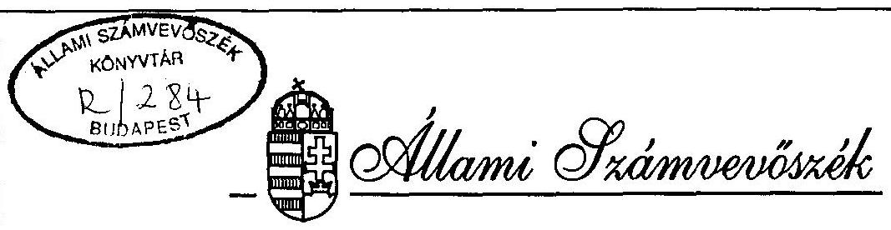
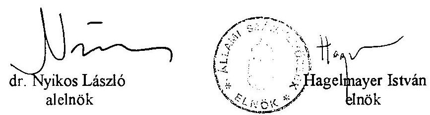
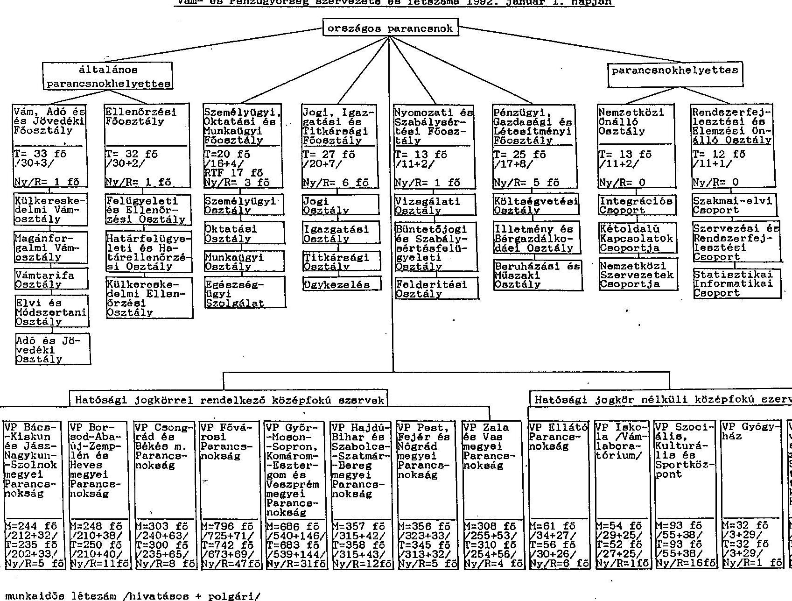
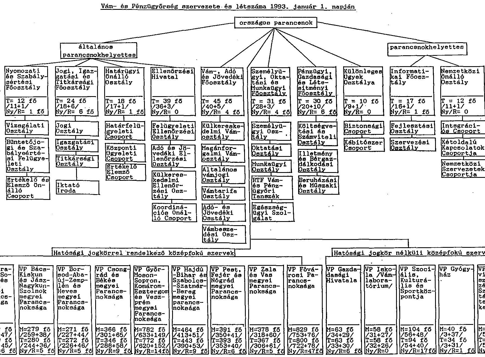
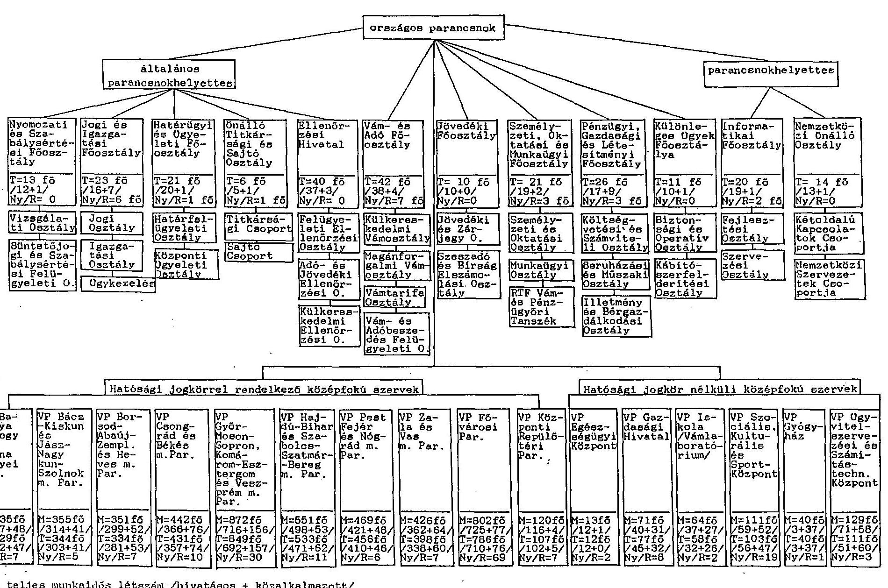

# JELENTÉS 

a Vám- és Pénzügyőrség működésének és gazdálkodásának ellenőrzéséről

---

A vizsgálat végrehajtásáért felelős:
az ÁSZ III. Költségvetési Ellenőrzési Igazgatósága
Bihary Zsigmond igazgató

Az ellenőrzést vezette:
Horváth Sándor osztályvezető főtanácsos

A jelentést összeállította:
Fogarasi Miklós számvevő tanácsos

Az ellenőrzést végezték:
Bánkné Simon Judit
számvevő
Bodonyi Miklós
számvevő tanácsos
Csontosné Kiss Margit
számvevő
Gömöri József
számvevő tanácsos
Hegedűsné Erdélyi Piroska
számvevő tanácsos
László Józsefné
számvevő tanácsos
Révész János
számvevő tanácsos
dr. Sipos Dóra
számvevő
Surdnyi Tamás
Szöllősiné Hrabóczki Etelka
számvevő tanácsos
Takácsné Szűk Mária
számvevő
Temesváry Miklós
számvevő
Uram Ferenc
számvevő
Vargané Loch Márta
külső szakértő
Varga Balázs
számvevő
Császár Zoltán
külső szakértő

---

# TARTALOMJEGYZÉK 

BEVEZETÉS ..... 1
I. ÖSSZEFOGLALÓ MEGÁLLAPÍTÁSOK, KÖVETKEZTETÉSEK ..... 2
JAVASLATOK ..... 10
II. RÉSZLETES MEGÁLLAPÍTÁSOK ..... 14
A. A VÁM- ÉS PÉNZÜGYŐRSÉG SZAKMAI TEVÉKENYSÉGE ..... 14

1. A SZAKMAI TEVÉKENYSÉG JOGI, SZERVEZETI KERETEI, SZEMÉLYI FELTÉTELEI ..... 14
1.1 A működés jogi szabályozottsága ..... 14
1.2 A feladat és a szervezet összhangja ..... 17
1.3 Létszám szakmai összetételének alakulása ..... 21
2. VÁMELLENŐRZÉSI FELADATOK ..... 23
2.1 Külkereskedelmi áruforgalom ..... 23
2.2 Halasztott vámfizetés ..... 28
2.3 Nem külkereskedelmi áruforgalom ..... 30
3. JÖVEDÉKI FELADATOK ..... 31
3.1 Személyi, szervezeti feltételek ..... 32
3.2 Jövedéki engedélyezés ..... 32
3.3 A jövedéki ellenőrzés ..... 34
3.4 Az elkobzott jövedéki termékek megsemmisítése, szankcionálás ..... 35
3.5 Zárjegy bevezetése ..... 36
4. HATÓSÁGI FELADATOK ..... 37
4.1 A bírósági felülvizsgálatok tapasztalatai ..... 38
4.2 Felügyeleti intézkedés ..... 41
4.3 II. fokú határozatok ..... 42
4.4 Jövedéki bírság ..... 43
4.5 Szabálysértési hatósági tevékenység ..... 44
4.6 Méltányossági ügyek elbírálása ..... 45
4.7 Nyomozati tevékenység ..... 47
5. VÉGREHAJTÁS ..... 48
5.1 Adó- és vámhátralékok alakulása ..... 48
5.2 Jövedéki tevékenységgel kapcsolatos hátralékok ..... 49
5.3 Az adó- és vámhátralékok beszedése, végrehajtás ..... 49
5.5 Jövedéki terméket, tevékenységet terhelő adó-, bírság-, hátralék beszedése, végrehajtása ..... 51
5.6 Törvényes zálogjog, azonnali beszedési megbízás érvényesítése ..... 51
5.7 Ingó- ingatlan végrehajtás ..... 52
5.8 Veszteségelszámolások rendszere ..... 53

---

6. A VÁM- ÉS PÉNZÜGYŐRSÉG INFORMATIKAI RENDSZERE ..... 53
6.1 Az informatikai rendszer fejlesztése, helyzete ..... 53
6.2 A szakmai tevékenység informatikai megalapozása ..... 56
B. A VPOP MŰKÖDÉSÉNEK PÉNZÜGYI-, SZEMÉLYI- ÉS TÁRGYI FELTÉTELEI, A KÖLTSÉGVETÉSI GAZDÁLKODÁS ..... 59
7. SZABÁLYOZOTTSÁG, SZÁMVITELI REND ..... 59
8. A KÖLTSÉGVETÉSI ELŐÍRÁNYZATOKKAL VALÓ GAZDÁLKODÁS ..... 61
9. LÉTSZÁM-, BÉR- ÉS ESZKÖZGAZDÁLKODÁS, ELHELYEZÉSI KÖRÜLMÉNYEK ..... 62
10. FELÜGYELET ÉS BELSŐ ELLENŐRZÉS ..... 64

---

# Jelentés   a Vám- és Pénzügyőrség működésének és gazdálkodásának ellenőrzéséről 

## Bevezetés

A vámjog szabályozásáról szóló 1966. évi 2. tvr., valamint a végrehajtásáról rendelkező 9/1966. (II.5.) Kormány rendelet szabályozza a Vám- és Pénzügyőrség feladatait, testületi jellegét, szervezetét, hatáskörét, jogait, eljárási szabályait.

A többször módosított Kormány rendelet és a kapcsolódó jogszabályok alapján a Vám- és Pénzügyőrség (VP) egyenruha és fegyver viselésére jogosult rendészeti testület. Alaprendeltetése a Magyar Köztársaság pénzügyi- és gazdasági rendjének védelme érdekében a vám-, deviza-, adó- és jövedékekkel kapcsolatos ellenőrző tevékenység, a pénzügyi bűncselekmények és a kapcsolódó szabálysértések megelőzése, az elkövetett ilyen jellegű jogsértések felderítése, a szabálysértések elbírálása, a bűncselekmények nyomozása, valamint a nemzetközileg ellenőrzött termékek és technológiák forgalmának ellenőrzése.

A VP (szakmai és gazdálkodási) főfelügyeletét a pénzügyminiszter látja el. A külkereskedelmi áruforgalommal kapcsolatos nemzetközi vámügyekben a pénzügyminiszter az ipari és kereskedelmi miniszterrel egyetértésben jár el.

Az ellenőrzött időszakban (1992. január 1. - 1994. december 31.) a külkereskedelmi tevékenységet folytató vámalanyok száma 251 %-kal, 27.995-ről 98.293-ra emelkedett. A jövedéki alanyok száma (1994. március 1-jétől, az engedély kötelezettség időpontjától 1994. december 31-ig) 66 %-kal, 63.001-ről 104.428-ra növekedett. Az adóalanyi kör növekedése együtt járt a vámigazgatási és a vámellenőrzési feladatok halmozott emelkedésével.

A VP a központi költségvetés bevételének 1992. évben 34,9 %-át (276,7 Mrd Ft), 1994. évben pedig 39,2 %-át (467,9 Mrd Ft) realizálta.

A VP a Pénzügyminisztérium költségvetési fejezeten belül önálló címet képező országos hatáskörű központi költségvetési szerv. Feladatai ellátása érdekében 1992. évben 3,9 Mrd Ft, 1994. évben 8,2 Mrd Ft kiadást teljesített (ezen belül a költségvetési támogatás aránya 94,6 %, illetve 95 % volt). A foglalkoztatottak száma 1994. évben meghaladta az 5680 főt, a tárgyi eszközök nettó értéke a 3,4 Mrd Ft-ot.

---

Az ellenőrzés célja

- a vám- és adóigazgatási, vámeljárási, jövedéki, informatikai tevékenység törvényességének és eredményességének,
- az intézmény gazdálkodásában a törvényességi, célszerűségi és eredményességi követelmények érvényesülésének, valamint
- a szervezet felépítésének és működésének, a rendelkezésre álló személyi, tárgyi és pénzügyi feltételeknek a jogszabályokban előírt feladatokkal való összhangjának
értékelése volt.
A Vám- és Pénzügyőrség működését (vám-, adóztatási és jövedéki tevékenységet, hatósági feladatainak ellátását, gazdálkodását) a Kormánytól független ellenőrző szervezet még nem vizsgálta, így ellenőrzésünkben a tényfeltáró jelleg is hangsúlyosabban jelenik meg.

A vizsgálat a Vám- és Pénzügyőrség Országos Parancsnokságára (VPOP) és szerveire, a megyei (fővárosi) parancsnokságokra (decentrumokra), egyes vámhivatalokra, valamint a Vám- és Pénzügyőrség Ügyvitelszervezési és Számítástechnikai Központjára (VPÚSZK) terjedt ki.

Az ellenőrzés az 1992-1994. évek és 1995. I. n. év szakmai tevékenységét, valamint az 1993-1994. évek gazdálkodását és az 1995. év költségvetése megalapozását értékelte.

A helyszíni vizsgálat befejezését követően került sor az APEH és a VP közös felügyeleti irányítás alá helyezésére, az ellenőrzés ezért erre a kérdésre nem térhetett ki.

Az informatikával és a VP gazdálkodásával összefüggő részletesebb megállapításokat a jelentés 1. és 2. számú Függeléke tartalmazza.

# I. 

## Összefoglaló megállapítások, következtetések és javaslatok

A Vám- és Pénzügyőrség a gazdasági környezettel összhangban folyamatosan változó és növekvő feladatainak - amelyek időnként rendkívüli kihívást jelentettek - igyekezett eleget tenni. Tapasztalataink szerint ezen törekvés - a személyi, tárgyi és egyéb feltételek részbeni hiánya miatt is - változó mértékben járt eredménnyel. Ellenőrzésünk során szabálytalanságokat, törvénysértést is megállapítottunk mind a szakmai feladatok, mind a gazdálkodás területén.

Az 1992-1995 közötti években a VP - a feladatok folyamatos bővülése, az azokat meghatározó jogszabályok változása következtében - a folyamatos átszervezés időszakát élte át. Az állandóságot elsősorban a fegyveres jelleg és a szervezeti tagoltság jelentette. A megvalósított szervezet-korszerűsítést a feladatok változása (jövedéki feladatok,

---

különleges ügyek, határvámhivatalok irányítása) kényszerítette ki. A szervezeti korrekciók során azonban nem sikerült teljes körűen kiküszöbölni a hatásköri átfedéseket, a párhuzamos feladatellátásokat (Vám- és Adó Főosztály, Határügyi és Ügyeleti Főosztály, Nyomozati és Szabálysértési Főosztály és a Különleges Ügyek Főosztálya látott el párhuzamosan vámigazgatási, irányítási, felügyeleti feladatokat).

A VP alaptevékenységét, működési rendjét - egységes vámtörvény hiányában - számos, különböző szintű jogforrás szabályozta. A feladatellátást a hézagos, ellentmondásos többszintű szabályozás mellett az is kedvezőtlenül befolyásolta, hogy a vámjog legmagasabb szintű jogforrása az 1966. évi 2. tvr. elavult, továbbá a tvr-t, mint jogforrást a jelenlegi jogalkotási hierarchia már nem tartalmazza. A piacgazdaság kialakulása érdekében, az EU Társulási Megállapodásának jogharmonizációs követelményéhez igazodóan évente több alkalommal végrehajtott módosítás az áttekinthetőség, ezzel összefüggésben az egységes értelmezés akadályát képezte. A jövedéki feladatok ellátása területén külön problémát jelentett, hogy a jövedéki-, a szabálysértési- és a büntetőeljárásról szóló törvények ugyanazon termékkel és cselekménnyel kapcsolatosan eltérően rendelkeztek.

A hivatásos állomány szolgálati viszonyának szabályozása - a különböző szintű jogszabályokból, illetve azok egy részének a VP pénzügyőri állományára való kiterjesztése következtében - nem egyértelmű. A testület jogállását, a szolgálati viszonyt indokolt "A fegyveres szervek hivatásos állományának szolgálati viszonyáról" szóló törvényben rendezni.

A szervezet leterheltsége rendkívül nagy, amelynek elsődleges oka a létszámhiány, melyet súlyosbított a jelentős fluktuáció. A növekvő feladatok és a szükséges szakképzett munkaerő optimális aránya csak hosszútávon biztosítható, mivel a jelenleg rendelkezésre álló munkaerő szakmai összetétele sok kívánnivalót hagy maga után, a meglévő személyzet kiképzése, továbbképzése időigényes. Hátrányos, hogy a pénzügyőri munka nem vonzó, így a munkanélküliség viszonylag magas aránya sem jelent tartalékot és megoldást a VP számára. A VP jövedelmi viszonyai - a piacgazdaság körülményei között - nem segítik a munkaerő megtartását, egyben fokozott veszélyeztetettséget is jelentenek a korrupció szempontjából.

A feladatellátást kedvezőtlenül érinti a szervezet elhelyezése, a munkavégzéshez szükséges eszközök, felszerelések hiánya, illetve elavult műszaki állapota.

A Vám- és Pénzügyőrség tevékenysége, feladatellátása a vizsgált időszakban - a VPOP szándékai ellenére - rendkívül ellentmondásos, az elvárhatónál alacsonyabb hatékonyságú volt, amiben egyaránt szerepet játszottak a kedvezőtlen személyi-, tárgyi és eszközfeltételek (az állomány leterheltsége, kedvezőtlen jövedelmi viszonyok, korrupciós hatások, személyi összeférhetetlenség, elhelyezési gondok, elégtelen eszközellátottság stb.), a szervezet informatikai rendszerének kialakulatlansága és a jogi szabályozás hiányosságai.

A külkereskedelmi áruforgalomban - a jogszabályban előírt - teljes körű belső áruvizsgálat személyi és egyéb feltételei hiányoznak (kis terület, nagy távolság, szervezetlenség), a VP pedig nem dolgozta ki a szelektív ellenőrzés módszerét, így

---

háttérbe szorult az áruvizsgálat, illetve esetlegessé vagy éppen kampányszerűvé vált. A belső áruvizsgálat elmaradása vagy gyorsított (felületes) elvégzése, a vámérték döntően okmányok alapján való megállapítása miatt a behozott árumennyiség nagyságrendjét, az illegálisan beérkező áruk volumenét, ebből következően a költségvetést ért veszteséget - a feketekereskedelmet gyarapító bevételt - megközelítőleg sem lehet számszerűsíteni.

A vámrendelet előírásainak eltérő értelmezése és a szükséges belső utasítás hiánya miatt a vámhivatalok eltérő gyakorlatot folytattak az 1992. augusztus 1-je előtt vámbiztosíték nélkül, behozatali előjegyzésben vámkezelt vámáruk visszaviteli határidejének meghosszabbításakor. A vámrendelet előírásait - a visszaviteli határidők naprakész figyelésének megoldatlansága miatt - az intézkedések késedelmével (egyes esetekben több hónapos, egy fővárosi vámhivatalnál 2 éves késéssel) rendszeresen megsértették.

A halasztott vámfizetés új engedélyezési rendjének bevezetésére a VPOP nem készült fel, megbízhatatlan az ügyfelek tartozásának nyilvántartása, ami több esetben lehetővé tette a gondatlanságból eredő, illetve szándékos visszaélést.

A VPOP többször megsértette a vámrendelet 98. § (2) bekezdésében foglaltakat, amikor a nyilvántartás szerint tartozással terhelt vámadósok részére halasztott vámfizetéshez engedélyt adott. A vámrendelet 6. § (4) bekezdésében foglaltak megsértését jelentette, amikor szóban, majd írásban abban állapodtak meg egy szállítmányozó Rt-vel, hogy az Rt. által nyújtott készfizető kezességet a pénzintézeti készfizető kezességgel azonosan bírálják el.

A VP nyilvántartási rendszerének hiányosságai miatt nincs információ arra vonatkozóan, hogy egy adott időszakban milyen összegű vám és vámmal együtt fizetendő adók, illetékek megfizetésére vállalt készfizető kezességet az általános engedéllyel rendelkező.

A vámbiztosítékok között jelentős arányt képviselt a készpénzben teljesített vámbiztosítékok összege. A vámhatározatokkal kiszabott köztartozásokat a VP az indokoltnál hosszabb idő alatt utalta át a vámbiztosíték számláról a központi költségvetés megfelelő vám-adó-illeték bevételi számlájára. A vámbiztosíték rendszertől idegen megoldás, hogy a Pénzügyminisztérium a befizetések és a pénzügyi rendezések lebonyolítására bevételi számlát nyitott és annak év végi egyenlegét (1993. évben 13,3 Mrd Ft, 1994. évben 23,5 Mrd Ft) elvonta. A számlák záróegyenlegének leürítésével a kivetés előtt álló köztartozások, illetve többletbefizetések fedezetlenné váltak. A vámbiztosíték költségvetési bevételezése az elmúlt két évben 36,8 Mrd Ft fedezethiányt okozott.

A nem külkereskedelmi áruforgalomból származó vámbevételeken belül a legjelentősebb részarányt az import gépjárművek (döntően személygépkocsik) adó- és vámbevétele jelentette. A vámkezelések jogi háttere ellentmondásos volt, a vámérték meghatározására a VPOP nem dolgozott ki egységes módszert. 1995. január 1-vel a vámrendelet egyértelműbbé tette a vámérték alapjának megállapítását.

---

A jövedéki feladatoktól elmaradó létszám miatti gondokat tovább növelte, hogy
 a személyi állomány képzését, kiképzését is meg kellett oldani. A terület önállóan, a munkafolyamatba épített ellenőrzés nélkül látta el feladatát.

A jövedéki engedélyezés alkalmazott módja a regisztrálás követelményeinek megfelelt, a leendő jövedéki alanyok valós feltételek alapján történő megszűrésére azonban nem volt alkalmas. Az engedélyezés során a törvény egységes jogértelmezése és alkalmazása érdekében kiadott VPOP állásfoglalás - a jobbító szándék ellenére - törvénysértő tartalmú, ami lehetővé tette a jövedéki engedélyek esetenként feltételes (a gyártáshoz használt berendezések hitelesítéséig történő) megadását. Az engedélyezés komoly (törvényi szabályozással is összefüggő) problémája volt, hogy nem tudott lépést tartani a liberalizált külkereskedelem következtében felgyorsult termelési, forgalmazási folyamatokkal.

A jövedéki ellenőrzés eredményességét hátrányosan befolyásolta, hogy annak módszertana kidolgozatlan volt, a törvényi szabályozás pedig nem adott felhatalmazást a minden területre kiterjedő végrehajtási rendelet kiadására.

A jövedéki törvény előírásai szerint az elkobzott jövedéki terméket meg kell semmisíteni, de annak értelmezését, módját nem szabályozta. A VPOP kérésére a PM Forgalmiadó Főosztálya által kiadott állásfoglalás alapján követett gyakorlat pedig ellentétes volt a törvény határozott és egyértelmű előírásaival. (A problémát a vizsgálat befejezése után hatályba lépett 1995. évi LXVIII. törvény, valamint a végrehajtására kiadott 13/1995. (VII.12.) PM rendelet oldotta meg.)

A jövedéki termékek adótartalmának költségvetésbe való befizetése, a termékek útjának jobb nyomonkövetése érdekében került bevezetésre a zárjegy, amely nem váltotta be a hozzáfűzött reményeket, mivel nem biztosította a termék azonosítását és nyomonkövetését a termelőtől a kiskereskedelmi értékesítésig.

A nagy adótartalmú termékek elszámoltatása terén a jövedéki törvény kettősséget tart fenn, mely alapján a VP szervek rendszeres vizsgálataik során ellenőrzik (ellenőriznék) a készleteket, ugyanakkor a felmerült adókötelezettség befizetését az adórendszer önbevallásra építi. Ez utóbbi kötelező és rendszeres ellenőrzését - a jövedéki törvényhez hasonlóan - jogszabály nem írja elő. Ugyancsak eltérő a készlethiány (többlet) és az adóhiány szankcionálása, mely szintén nem kedvez az adóbefizetés teljesítésének.

A hatósági tevékenységét a VP - figyelemmel a feladat ellátását befolyásoló tényezőkre is - összességében kielégítően ugyan, de több hibával látta el.

A bírósági felülvizsgálatok próbaszerű áttekintése alapján különösen szembetűnő, hogy a vizsgált esetek több mint felénél állapították meg az államigazgatási eljárásról szóló törvény - tényállás tisztázására vonatkozó szakaszának - megsértését, melynek következtében esetenként új eljárás elrendelésére is sor került. Az új eljárásra való utasítás oka volt az is, hogy a jogi szabályozás nem egységes, hiányos, több területen (pl. jövedék) nem eléggé körültekintő. Ez is közrejátszott abban, hogy nem egységes jogértelmezésen alapuló bírósági ítéletekkel is találkoztunk.

---

Meg kell jegyezni ugyanakkor, hogy a VP a hatósági tevékenységről nyilvántartást nem vezet. Így nem tekinthető át a vámhivatalok határozatai ellen benyújtott jogorvoslatok száma, az elbírálás módjának aránya, s annak változásai. Mindez a másodfokon hozott határozatok ellenőrzését is befolyásolta.

A pervesztes ítéletek következtében elmaradt adó- és vámbevételek növekvő tendenciájának mérséklésére - az ellenőrzés tapasztalatai szerint - nem minden esetben tették meg a szükséges intézkedéseket. Jogértelmezést, jogalkalmazást segítő iránymutatások nem álltak időben és teljes körűen rendelkezésre. Peres eljárások során szerzett ismereteket a tapasztalatok szerint csak kis mértékben hasznosították. A pervesztes esetek okai nem kerültek összegzésre, ezek többségét nem is követte a belső szabályozás. Figyelemmel arra, hogy a vámhatóság importőrökkel szembeni pozíciója a bírósági felülvizsgálatokon felmutatott eredményeitől is függ, változtatni indokolt a hatósági munka jelenlegi rendszerén, nem egységes - koordinációt nélkülöző - gyakorlatán.

A felügyeleti intézkedések döntően jogszerűen, a hatályos előírások betartásával valósultak meg. Egy alkalommal azonban a pénzügyminiszter - felügyeleti jogkörét gyakorolva - jogszerű vámhatósági határozatot semmisített meg. A jövedéki területen feltárt törvénysértő VPOP felügyeleti intézkedés alapján pedig ügyészi óvást és intézkedést indítványoztunk. (A Legfőbb Ügyész jogi álláspontunkkal egyetértett, tekintettel azonban arra, hogy a VPOP a kifogásolt felügyeleti intézkedéseket visszavonta, a jogi előírásokkal összhangban álló új határozatokat kiadta, további ügyészi intézkedés megtételét nem tartotta indokoltnak.)

A VPOP több esetben - a másodfokú határozatot követően - elmulasztotta felszólítani a kötelezetteket a jövedéki bírság befizetésére és elmaradt az illetékes megyei parancsnokságok értesítése is a befolyt bírságokról.

A méltányossági ügyek elbírálásánál - 1995-től - az adóra vonatkozó jogszabályokkal azonos előírások érvényesülnek, míg a korábbi - az ellenőrzött években hatályos szabályozás az elbírálásra jogosult belátására bízta a döntést. Az előbbiekből következően ellenőrzésünk csak a döntések törvényi követelményekkel való összhangját vizsgálhatta. A határozatok többségükben törvényesek voltak.

A vámnyomozati tevékenység - az adott feltételek között (kedvezőtlen személyi, tárgyi, technikai feltételek, nyomozati információs rendszer és a jogi felhatalmazások hiánya) eredményesnek minősíthető.

A VP által kimutatott kintlévőségi adatok megbízhatatlanok. Az előírások időpontja rendszeresen változik és még 1994. évben sem került a helyére.

A VPOP és a Dunabank Rt. között 1993. áprilisában aláirt keretszerződés alapján a vámadósok a bank számláira is teljesíthettek befizetéseket és ezáltal az állami bevételek időleges, illetve végleges (kamat) átengedése valósult meg. A pénzintézet ugyanis a megkötött megállapodás alapján - a hatályos MNB szabályozással ellentétesen - több napig a számláján tartotta a költségvetést illető bevételeket, kamatfizetés nélkül.

---

Megoldatlan volt az ellenőrzött években és továbbra is az maradt a késedelmi pótlékok elszámolása, valamint a vám- és importterhek előírásainak és befizetéseinek dokumentálása. Ezek megvalósítására a VPOP a szükséges intézkedések megtételét részben elmulasztotta.

A jövedéki tevékenységgel összefüggő központi költségvetési bevételek beszedésével kapcsolatos belső szabályok ellentmondásosak és nem biztosították a jövedéki alanyok teljes körű nyilvántartását, a jövedéki bírság előírásának dokumentáltságát, a hátralékok meghatározását, a szükséges információáramlást. Az előbbiekből következően a szeszadónál nem volt kimunkált 1995. I. negyedévének végén az 1994. év végi hátralék nagysága. A jövedéki követelések behajtására pedig az illetékes főosztály - a jövedéki törvény hatályba lépésétől 1995. február 5-ig - egyáltalán nem tett intézkedéseket.

A VPOP Vám- és Adóbeszedés Felügyeleti Osztálya több esetben kötött az Áht. előírásait figyelmen kívül hagyó megállapodást a fizetés átütemezéséről és a késedelmi pótlék elengedéséről. A törvénysértő tevékenységet legalizálta a VPOP ügyrendje is.

A csőd-, felszámolási-, végelszámolási eljárásokhoz a VP - a szervezési és információs rendszer hiányosságai miatt - sok esetben késedelmesen csatlakozott. Az eljárásokban tanúsított magatartását a kompromisszum-készség jellemezte, lehetőséget teremtve ezáltal a likviditási gondokkal terhelt vállalkozások talponmaradására, a foglalkoztatás segítésére és ezáltal a köztartozások (kisebb mértékű ugyan, de ugyanakkor) biztosabb, folyamatosabb realizálására. Az eljárásokban kötött megállapodások teljesítését azonban folyamatosan egyetlen szervezet sem figyelte.

A csőd-, felszámolási- és végelszámolási eljárásokból származó veszteség leírás az ellenőrzött időszakban 3 Mrd Ft volt. A hitelezői veszteség elszámolás egy részét a VPÜSZK dokumentációi teljes körűen nem támasztották alá.

A VPOP nem intézkedett érdemben a bírságként kiszabott köztartozás beszedésére (nem bocsátott ki azonnali beszedési megbízást, nem kezdeményezett ingó-ingatlan végrehajtást). A lefoglalt jövedéki termékek értékesítéséből származó bevétel egy része nem a PM által megjelölt adószámlára érkezett, hanem az analitikus nyilvántartás tanúsága szerint a Csongrád Megyei Bíróság Gazdasági Hivatala által kezelt számla bevételét növelte.

Az azonnali vámfizetési kötelezettség alá tartozó adósok határidőben nem teljesített tartozásai behajtásának kezdeményezésénél jelentős, nem ritkán 4-6 hónap, vagy azt meghaladó volt a késedelem. Az azonnali beszedési megbízások eredményessége a VPÜSZK adattörzsállományának megbízhatatlansága, a késedelmes kibocsátás, a fizetési készség hiánya következtében rendkívül alacsony.

Köztartozás hátralékának beszedésére, a vámárura utólagosan érvényesített törvényes zálogjogon túlmenően, a VP egyetlen esetben sem folytatott le ingó-ingatlan végrehajtási eljárást. Előfordult az is, hogy a jogszabályi ellentmondások következtében a VP a kőolaj-származékoknál nem gyakorolhatta a vámáru feletti közvetlen vámfelügyeleti jogosultságát, így nem volt lehetősége e termékkörben a törvényes zálogjog érvényesítésére.

---

A tapasztalt hiányosságok, nyilvántartási problémák egyik oka, hogy nem alakították ki a VP teljes tevékenységét lefedő egységes informatikai rendszert. Az informatikai rendszernek, a számítástechnikai alkalmazásokon túlmenően, tartalmaznia kell a "manuális" információáramlási csatornákat, így biztosítva egy átfogó vezetői információs rendszert is. (Ennek a szükségességét a VP részéről is látták és adott helyzetben megoldásként mutatkozott a VP informatikai rendszerének kialakítását célzó PHARE program. Sajnálatos, hogy a program - részben belső, részben külső okokból - nem valósult meg, bár ez is csak a vámigazgatás területére ajánlott megoldást, így nem fedte volna le a VP teljes tevékenységi körét.)

Az eddig kifejlesztett és jelenleg is működő, illetve fejlesztés alatt álló rendszerek közös problémája a VP decentralizált működése és egyben általános illetékessége. Ez ugyanis szükségessé teszi azt, hogy a különböző adatok az ország különböző helyszínein rendelkezésre álljanak, és ezt a feltételt a távadatátviteli hálózat hiánya gyakorlatilag nem biztosítja. Ez magyarázza a vámigazgatásban - egyébként be nem vált - adatcentralizálási törekvést.

A VP meglévő informatikai rendszerének színvonala is elmarad a követelményektől. Az adatok megbízhatósága rengeteg kívánnivalót hagy maga után, több esetben előfordultak adathibák, adatvesztések, illetve adatduplikációk. Súlyos hiányosság, hogy egy-egy adat útja sokszor nem, vagy csak nehezen követhető. Nem kellően megoldott az adatok védelme, mivel a jelenleg használt floppy-s rendszer rendkívül védtelen. Sok esetben nem ismerik fel az egyes védelmek beépítésének szükségességét, és megelégszenek a számítógépes adatok nem hozzáértők elleni védelmével.

Az informatikai rendszer helyzetének javulása várható, mivel mind a vezetői szándék, mind pedig az anyagi forrás - legalábbis annak jelentős része - adottnak tekinthető. A feladat eredményes megoldása érdekében az informatikával foglalkozó személyi állomány olyan felülvizsgálata is szükséges, amely kiterjed a vonatkozó állomány informatikai irányú képzettségére, illetve gyakorlati tapasztalatára, valamint arra, hogy rendelkezésre álljanak azok a szakemberek, akik képesek informatikai oldalról megközelíteni az adott vámszakmai szempontokat.

A VP gazdálkodása - a többször módosított, de 1983. évben készült gazdálkodási szabályzat következtében - alapvetően szabályozatlan, nem felel meg a hatályos törvényi előírásoknak. Több, a gazdálkodás részterületeit érintő szabályzat is hiányzik (kötelezettségvállalás, ellenjegyzés, érvényesítés, utalványozás, eszközgazdálkodás, központi beszerzés stb.), illetve a meglévő szabályzatok módosításra szorulnak (számlarend, leltározás, selejtezés stb.). A gazdálkodási szabályzatok hiányában a VP különböző szervei között (VPOP, Fővárosi Parancsnokság, VPGH) egyes területeken párhuzamos feladatellátás veszélye áll fenn (pl.: ingatlanüzemeltetés, felújítás, gépjárműgazdálkodás stb.).

A VPOP a részben önálló költségvetési szervekre vonatkozó Kormány rendelet előírásait megsértve nem készített önálló költségvetést, az intézmények számára és a központi beszerzésekre elkülönített keret után fennmaradó pénzeszközökkel gazdálkodott.

---

A hatályos gazdálkodási szabályzat, valamint az alkalmazott gyakorlat rendkívül leszűkítette a részben önálló megyei parancsnokságok gazdálkodási önállóságát, célszerű és eredményes gazdálkodását. Ezen szervezetek besorolásának - a szervezet nagyságrendje, a feladatellátás mennyisége, összetettsége és felelőssége szerinti felülvizsgálata indokolt.

A VPOP számlarendje - bár annak kialakítására a hatályos Kormány rendelet figyelembevételével került sor - nem rögzíti a részben önálló költségvetési szervek VPOPhoz való számviteli kapcsolódását, így hiányos, a szakmai sajátosságokat nem tükrözi. Az időközben bekövetkezett változások átvezetésére nem került sor. Az alkalmazott számlatükör a tevékenységek közvetlen kiadásait nem bontotta fel szakfeladatokra, csak szervezeti egységekre.

Egyes években (1993-1994.) a főkönyvi
 könyvelés hiányos, naprakészsége nem volt biztosított. A főkönyvi könyvelésben a hiányosság mellett helytelen elszámolásokat (átfutó, függő és kiegyenlítő elszámolások) is tapasztaltunk.

A költségvetési előirányzatok tervezésénél (mind a bevételi, mind pedig a kiadási előirányzatoknál egyaránt) az alátervezés volt jellemző a vizsgált időszakban. A kiadási előirányzatok meghatározása során ebben a feladatellátásra központilag rendelkezésre bocsátható összeg szűkös nagyságrendje is szerepet játszott, amit a felügyelő Pénzügyminisztérium is elismert.

A VP gazdálkodási területének létszáma - a szakmai feladatellátáshoz szükséges létszámhoz hasonlóan - nem érte el a feladatnövekedéshez szükséges reális mértéket, egyes esetekben komoly létszámhiány alakult ki. A működést tovább nehezítette a jelentős fluktuáció és a létszám képzettség szerinti kedvezőtlen megoszlása.

A VP eszközgazdálkodása szabályozatlan, koordináltsága nem megfelelő, ami elsősorban az egységes szerkezetű, a hatályos jogi előírásokkal és a célszerű, hatékony feladatellátással összhangban álló gazdálkodási szabályzat hiányára vezethető vissza. Az eszközgazdálkodási munkát hátrányosan befolyásolta, hogy az eszközök analitikus nyilvántartását hiányosan vezették.

A testület hivatásos állományánál több típusú fegyverzetet (6 féle pisztolyt, 2 féle géppisztolyt és 3 féle lőszert) rendszeresítettek. Indokoltnak tartjuk a VP - az esetleges alkalmazás körülményeihez igazodó - fegyver- és lőszerellátás egységesítésére való törekvését.

A VP rendelkezésére álló, saját kezelésében lévő ingatlanállomány nem elegendő a feladatok hatékony ellátásához, illetve az elhelyezési gondok megoldása érdekében jelentős bérleti díj fizetési vonzata volt. Az egyes szervek elhelyezési körülményei rendkívül különbözőek. Azok az épületek, amelyek beruházására és felújítására az elmúlt években került sor jó állapotúak, de az épületállomány döntő többsége felújításra szorul.

A VP belső ellenőrzési rendszere - szemléletbeli és ebből következően rendszerbeli okokból - jelenlegi formájában nem biztosítja az ellenőrzés lényegét jelentő objektív, független véleményalkotást, nem nyújt segítséget a vezetői funkció gyakorlásához.

---

A jelentés megállapításainak hasznosításra ajánlása mellett a Vám- és Pénzügyőrség tevékenysége feltételeinek javítása érdekében a következőket javasoljuk.

# a Kormány: 

1. A VP célszerű és hatékony feladatellátása érdekében tegyen lépéseket a hiányzó, illetve kiegészítésre szoruló törvények, rendeletek mielőbbi meghozatala érdekében. Ennek keretében:

- az államháztartás számvitelének szabályozása során gondoskodjon az állami forgóalap bevételi számláihoz kapcsolódó részletező (folyószámla) nyilvántartások tartalmi, formai és egyezőségi követelményeinek meghatározásáról;
- gondoskodjon a VP és a szállítással, szállítmányozással foglalkozó szervezetek (ezek közül kiemelten a MÁV) - a határátkelőhelyek áru- és személyforgalommal kapcsolatos - feladatainak a szabályozásáról, ebben rögzítse, hogy feladataik ellátása során minden területen biztosítaniuk kell a vámkezelés zavartalan végrehajtását, az ellenőrzés feltételeit;
- a VP nyomozati tevékenységének eljárásjogi oldalról való megerősítése érdekében
$=$ a VP gépkocsi megállítási jogosultságát a KRESZ-ben is rögzítse;
$=$ bővítse a közúti közlekedés rendőrhatósági igazgatásáról szóló 20/1990. (VIII. 6.) BM rendelet 12. §. 7. bek. b. pontját a Vám- és Pénzügyőrség megjelölésével (a megkülönböztető jelzések engedély nélküli felszerelése);
$=$ egészítse ki a bankszámlák megnyitásáról szóló 39/1984. (XI.5.) MT rendelet 2. § (3) bek.-ben előírt adatszolgáltatási kötelezettség címzettjeit a VPOP megjelölésével.

2. A központi költségvetést megillető bevételek realizálásának elősegítése érdekében

- intézkedjen a pénzben letétbe helyezett vámbiztosítékok költségvetési bevételként történő elszámolási gyakorlatának megszüntetésére. A vámbiztosítékok átmeneti kezelésére jelöljön ki az állami forgóalaphoz kapcsolódó letéti számlát és szabályozza annak pénzforgalmi és elszámolási rendjét;
- a költségvetési és a zárszámadási törvényjavaslatokhoz kapcsolódó általános és részletes indoklásokban teljes körűen és a pénzforgalom elvének következetes alkalmazásával prezentálja a Vám- és Pénzügyőrség által előírt költségvetési bevételek elmaradásának adatait; térjen ki a felszámított, de nem realizált késedelmi pótlékok - mint behajtandó állammal szembeni tartozások - összegeire, a vám-, adó- és egyéb tartozások kintlevőségeit a pénzügyi esedékesség alapján minősítse;
- teremtse meg a fogyasztási adó tényleges befizetésének és a jövedéki termékek gyártásával, importálásával összefüggő mennyiségi elszámoltatások

---

összekapcsolásának lehetőségét. Ennek érdekében vizsgálja meg az adójegy differenciált bevezetésének lehetőségét, mely során a termelő, importáló az adójegy megvásárlásakor befizeti az adót, az ellenőrzés ennek kapcsán az adójegyek meglétének ellenőrzésére koncentrálható.
3. A vámigazgatás, vámkezelés hatékonyságának - szabályozási és szervezési oldalról történő - javítása céljából
— készítse elő a csőd- és felszámolási eljárásról szóló, többször módosított 1991. évi IL. törvény módosítását annak érdekében, hogy az államháztartás alrendszerébe tartozó hitelezők által követendő egységes magatartás és az állami követelésekről való lemondás módja és esetei egyértelműen szabályozásra kerüljenek, továbbá a módosításnál rendezze a vámáruból következő törvényes zálogjog és egyéb zálogjog kapcsolatát;

- gyorsítsa meg - a határátkelőhelyek működésében a kiadások csökkentése, a tevékenység szervezettségének növelése érdekében - a jelenlévő hatóságok feladatának, technikai felszereltségének, létszámának felülvizsgálatát. Ezzel összefüggésben intézkedjen a különleges ügyek (kábítószer, fegyver) felderítésében a hatóságok egységes fellépése érdekében;

# a Pénzügyminisztérium, Ipari és Kereskedelmi Minisztérium: 

1. A hatékonyabb működés érdekében készíttesse el a VP funkcióelemzésen alapuló, teljes körű átvilágítását.
2. Kezdeményezze az állami bevételekkel kapcsolatos összehangolt információs rendszer kialakítását, különös tekintettel a létrehozás alatt álló kincstári rendszerre és ennek integráns részeként kezelje a VP információs rendszerét.
3. Erősítse meg az adó- és vámjellegű állami bevételekkel kapcsolatos felügyeleti tevékenységét, kísérje figyelemmel az Állami Számvevőszék ellenőrzési megállapításainak hasznosítását, ennek keretében
— az állami bevételek realizálásában játszott szerepének megfelelő súllyal kezelje a VP éves költségvetését;

- a beléptetett áru mozgásának követhetősége érdekében írja elő, hogy az ügyfél a belépő vámhivatalnál köteles megjelölni a vámkezelés céljára igénybe veendő vámhivatalt;
- a főként déli határszakaszon működő, illegálisnak nem minősíthető nem kívánatos kereskedelem mérséklése érdekében szabályozza, hogy adott határszakaszon naponta mindössze egy (oda-vissza) alkalommal lehet a határt illetékmentesen átlépni;

---

- hozza összhangba a lefoglalt kőolajszármazékok vámraktárban való elhelyezésére vonatkozó szabályozást (1966. évi 2. tvr-t és a vámrendeletet);
- tegyen lépéseket a visszaélés lehetőségének csökkentésére az import áfa bevételi számlának az import áfa bírság számlától való elkülönítésével.

# a Vám- és Pénzügyőrség Országos Parancsnoksága: 

1. A Vám- és Pénzügyőrség működése (szakmai tevékenysége) és gazdálkodása során az ellenőrzés által feltárt hiányosságok felszámolására (a megtett javaslatok felhasználásával) tegyen gyors és hatékony intézkedéseket. Ennek keretében kezelje kiemelten:

- haladéktalanul alakítsa ki a hatósági tevékenység teljes körű információs rendszerét, melyben legalább a II. fokú határozatok száma és összege, a fellebbezések száma és összege, megváltoztató, helybenhagyó, új eljárásra utasító bontásban rendelkezésre áll. Hasonló összeállítás szükséges a bírósági felülvizsgálatok alakulásáról is;
- állítson össze egy autentikus jogértelmezésen alapuló állásfoglalás gyűjteményt és gondoskodjon folyamatosan aktualizálásáról;
- javítsa a nyomozati tevékenység eljárásbeli és tárgyi feltételeit. A közbenső ellenőrzések eredményességét önálló, vámhivataloktól független, külön megyei parancsnoksági (decentrumi) alárendeltségben működő állandó akciócsoportok felállításával biztosítsa;
- vizsgálja meg a jövedéki alanyok számának számottevő emelkedése miatt a jövedéki szervezetek önállóságának növelését, jövedéki hivatalok felállításával (pl. a nyomozó hivatalokhoz hasonlóan), a nagy jövedéki termékelőállító importáló szervezetek termékforgalmának és adókötelezettsége teljesítésének ellenőrzéséhez tekintettel a Jtv. 1995. évi módosítására és kiegészítésére - állandó pénzügyi felügyelet felállításának lehetőségét;
- tárja fel, hogy milyen lehetőségek vannak az elkobzott jövedéki termékek export útján történő hasznosítására vagy egyéb értékesítésre.
- megfelelő belső utasítással gondoskodjon a zárt árusítású diplomata boltok részére érkező jövedéki termékek vonatkozásában a vámrendelet eljárási szabályainak és a Jtv. anyagi jogi előírásainak a vámkezelésnél történő együttes alkalmazásáról.
- a végrehajtási tevékenység szervezeti feltételeinek javítása érdekében a megyei parancsnokságok (decentrumok) irányításával állítson fel (az 1995. január 15-én létrehozott, vámhivatalokhoz telepített végrehajtási alegységek helyett) önálló végrehajtói irodákat a speciális ismereteket feltételező végrehajtói állomány koncentrált feladatellátása, a behajtásból hasznosításra váró vagyontárgyak mielőbbi (központi) értékesítésének megvalósítására;

---

- gondoskodjon a VPOP, illetve a VPMP pénzintézeti kapcsolatait rögzítő érvényes szerződések teljes körű felülvizsgálatáról, ennek eredményeként a gazdasági szempontok figyelembevételével intézkedjen azok módosításáról;
- módosítsa a VPOP, illetve a VPMP-k és a Dunabank Rt. közötti Együttműködési Szerződéseket annak érdekében, hogy állami bevételek megfizetése időbeli késlekedés nélkül kerüljön elszámolásra. A Dunabank Rt. támogatását, állami felvállalás esetén nevesített gazdaságpolitikai döntésként indokolt kezelni;
- rendezze a napi, szolgálati idő utáni (főként az éjszakai) szállítási igények kielégítésének rendjét. A tehergépkocsik kihasználásának tervezésénél vegye figyelembe a váratlan felderítés esetén haladéktalanul megoldandó szállítási feladatok ellátását is;
- a VPOP is készítsen minden évben elemi költségvetést, a tartalékra (pótkeret) szolgáló összeget különítse el a költségvetéstől és reálisabban állapítsa meg, továbbá szüntesse meg a jelenleg részben önállóan gazdálkodó költségvetési szervek költségvetésének szándékos alátervezését;
- takarékossági és célszerűségi elvekből kiindulva mérje fel a lőszimulátor alkalmazásának kihatását. A számítógépes lőszimulátor és a lőgyakorlatok összevetésénél vegye figyelembe a vámhivatalok leterheltségét, a kiképzés színvonalát és a lőgyakorlatok gyakoriságát; egyidejűleg gondoskodjon a hivatásos állomány egységes fegyverzettel történő ellátásáról;
- készítse el a belső ellenőrzés szabályzatát, ebben a gazdálkodásban betöltött szerepének megfelelően határozza meg a függetlenített belső ellenőrzés szervezeten belüli elhelyezését, feladatait.

2. Az informatikai tevékenység színvonalának javítása érdekében:

- tegyen rendet az adóalanyok folyószámla nyilvántartásában, megteremtve az adatok megbízhatóságát, teljeskörűségét, naprakészségét. Ennek érdekében:
= záros határidőn belül végezze el a nyilvántartott adatoknak az adóalanyokkal történő visszamenőleges egyeztetését, a hibás adatok korrekcióját. Felhasználva a távadatfeldolgozás előnyeit is, szüntesse meg az VPÚSZK hatósági jogkört sértő adatmódosítási lehetőségét,
$=$ kezdeményezze az igazoltan objektív okokból nem bizonyítható terhelések összegeinek rendezését,
= az adathibák és -hiányok keletkezését, de legalább felhalmozódását az adatok továbbításának és feldolgozásának folyamataiba épített - elsősorban automatizált - ellenőrzés kialakításával és hézagmentes működésével akadályozza meg,

---

$=$ a feldolgozás és nyilvántartás rendjét a számviteli elvek és szabályok alapján alakítsa ki, biztosítva az adatállományok valódiságát és rekonstruálhatóságát,
$=$ a vámadatbázis működtetésének tervezett átvételéig végezzen - a feldolgozások teljeskörűségére irányulóan - rendszeres kontroll egyeztetéseket a Kopint-Datorggal;
— az utólagos vámeljárások ügyviteli szabályozását oly módon alakítsa át, hogy az alapvámkezelést végző vámszervek a birtokukban lévő adatok alapján járjanak el. Ehhez gondoskodjon a helyileg rögzített adatok hozzáférési lehetőségéről. Kezdeményezze a Kopint-Datorggal kötött üzemeltetési szerződés fizetési feltételeinek igénybevétel-arányos elvekre épülő módosítását;
— az áruforgalmi vámkiszabás személyi számítógép parkjának 1994. évi lecseréléséből felszabadult gépek lehetőség szerinti hasznosításánál azokat a területeket részesítse előnyben, ahol a manuális adminisztráció racionalizálásával idő- és kapacitás megtakarítások érhetők el (pl. a megyei bevételi számlákhoz kapcsolódó utasforgalmi folyószámlák, magán gépkocsiimport, árutovábbítási-visszajelzési és tranzitfigyelési rendszer);
— dolgoztassa ki a külső és belső fejlesztőktől megkövetelendő dokumentálási rendet;
— haladéktalanul dolgoztassa ki a megfelelő adatbiztonsági, adatvédelmi eljárásokat, amelyek védelmet biztosítanak mind a szándékos mind pedig a véletlen adathibákkal szemben. Vizsgálja meg az adatok fizikai mozgásának szükségességét és szűrje ki a redundanciákat;
— biztosítson megfelelő szintű és színvonalú oktatást a számítástechnikát használók részére, amely a felhasználói programokon túlmenően terjedjen ki a számítástechnikai alapismeretekre is.

# II. 

## Részletes megállapítások

## A. A Vám- és Pénzügyőrség szakmai tevékenysége

## 1. A szakmai tevékenység jogi, szervezeti keretei, személyi feltételei

### 1.1 A működés jogi szabályozottsága

A VP alaptevékenységét, működési rendjét számos különböző jogforrás tartalmazza. A többszintű szabályozás nehezen kezelhető, ezen túlmenően az is hátrányosan befolyásolja a feladatellátást, hogy a hatályos jogszabályok egy része közel 30 éves.
 Az évente több alkalommal végrehajtott módosítások célja egyrészt a piacgazdaság kialakulásának elősegítése, másrészt az EK Társulási Megállapodásból adódóan a jogharmonizációs programhoz való csatlakozás előkészítése volt.

A vámeljárással kapcsolatos alapjogszabály az 1966. évi 2. tvr. A helyszíni vizsgálat időszakában a tárcaközi koordináción lévő új vámtörvény-tervezet számos koncepcionális bizonytalansággal terhelt volt. Pl. nem volt végleges PM álláspont a VP jogállását illetően.

Az alapjogszabályban és végrehajtási rendeleteiben a vámjog hierarchikusan jól felépített és teljes körű. (1966. évi 2. tvr. végrehajtásáról szóló 9/1966. (II.5.) számú Kormány rendelet, a vámjog részletes szabályainak megállapításáról és a vámeljárás szabályozásáról megjelent 39/1976. (XI.10.) PM-KkM együttes rendelet, továbbiakban vámrendelet). Az országos parancsnok a 10300/1987. számú utasításában a vámkezelés részletes szabályait rögzítette. A vámigazgatás egy sor egyéb jogszabályt is alkalmazott, amelyek közül az adójogszabályok emelhetők ki jelentősségük miatt.

A vámjog és az adójog eltérő rendelkezéseiből, illetve az értelmezés különböző lehetőségeiből ellentmondások adódtak az adók és a vámok kiszabása, közlése, elengedése, mérséklése, a kötelezettségvállalás, az elévülési idő területén.

Az adójog egységesen 5 éves elévülési időt határoz meg, a vámjog - a különböző esetek figyelembevételével - 6 hónapot, 1, 2, illetve 5 évet rögzít. Az előbbiekből következően a vámhatóság által hozott közigazgatási határozatokban a vámra, valamint a vele összefüggő adóra más elévülési idő érvényes.

A vámjogszabályok alapvető hibája, hogy az alkalmazott alapfogalmakra (pl. kezesség, törvényes zálogjog) nem tartalmaznak értelmezést. Ugyanakkor a hatósági munkában, vagy a bírósági felülvizsgálatok során ezen fogalmakat a Ptk. 272. §-ában történt meghatározástól eltérően alkalmazzák.

E két fogalom ellentmondásos alkalmazhatóságát jól példázza a bírósági felülvizsgálat jogértelmezése, illetve a csőd-, felszámolás- és végelszámolásról szóló 1991. évi IL. törvény szerinti eljárás. Ez utóbbinál a felszámolási eljárásban a felszámoló rendelkezik a vagyonnal, a zálogjog az értékesítéssel megszűnik. A törvényes zálogjognál viszont a vámáru a vám megfizetése előtt nem adható ki a felszámolónak, ezáltal az áru felett nem rendelkezhet.

Kezesség esetén a probléma abból származik, hogy az a vámbiztosíték egyik formája és a vámjog szerint - szemben a Ptk-val - nem szerződésen, hanem egyoldalú nyilatkozaton alapul. (A végrehajtási szakaszban a kezesek a Ptk-ra hivatkoznak és ez érvényesül a bírósági felülvizsgálatoknál is.)

Belső ellentmondást hordoz magában az is, hogy a vámkezelések valamennyi esetben önálló államigazgatási eljárások, de pl. a raktározásnál a vámrendelet csak egységes vámárunyilatkozatot vagy jegyzőkönyvet ír elő, határozathozatalt azonban nem.

A jövedéki szabályozás területén az 1993. évi LVIII. törvény (Jtv.) megjelenése új fejezetet nyitott. Célja a piaci viszonyok rendezése, a fekete kereskedelem visszaszorítása, az adórövidülések megakadályozása.

A Jtv. több fázisban, alapvető rendelkezéseit illetően 1993. július 1-jén lépett hatályba.

Az ellenőrzés így gyakorlatilag csak egy év tapasztalatait tekintette át.
A keretjellegű törvény hiányosságait - a helyszíni ellenőrzésünk befejezését követően kihirdetett - 1995. évi LXVIII. tv. részben megszüntette, a végrehajtásra általános rendeletalkotási jogkört a pénzügyminiszter számára teljeskörűen nem biztosított.

Az 1995. évi LXVIII. tv. - a jövedéki tevékenység számos területén történő szigorítás mellett - szélesítette a pénzügyminiszter jogosítványait. Ennek figyelembevételével került kiadásra a 13/1995. (VII.12.) PM rendelet, amely szabályozza a jövedéki termék elszámolható termelési, raktározási, mérési, szállítási veszteségének normáit és többleteit, valamint a jövedéki ellenőrzés alól elvont termék vámhivatal által történő lefoglalását, elkobzását és megsemmisítését.

A jövedéki ellenőrzés alól elvont termékekkel kapcsolatos eljárásokat nehezítette, hogy a jövedéki terület eljárási szabályai nem voltak egyértelműek. Az 1995. évi LVIII. tv. 22. §-a - amely a Jtv. 55. §-át (3) bekezdéssel egészítette ki - eljárási szabályokat is tartalmaz.

Ellentmondás volt tapasztalható a jövedéki törvény, valamint a szabálysértésről szóló és a büntető eljárásról szóló törvények, továbbá a Btk. egyes szakaszai között. A jövedéki ellenőrzés alól elvont, megtalált jövedéki termékek megsemmisítését rendelte el a Jtv. (a kőolaj termékek kivételével), így a büntető eljárásban azok nem alkalmazhatók bizonyítékként.

Az 1995. évi LXVIII. törvény az elvonás fogalmát, az elvonás eseteit pontosabban határozza meg a jogkövetkezmények érvényesíthetősége érdekében.

A Jtv. hatályba lépését követően joghézag, szabályozatlan terület is kialakult, így indokolt az ágazati előírások felülvizsgálata.

A Jtv. pl. hatályon kívül helyezte a szesz előállításáról, forgalomba hozataláról és felhasználásáról szóló 11/1992. (III.18.) FM rendeletet, így szabályozatlanok a pálinka főzési módok, az újrafinomítás kérdése, az előállítási jogosultság.

A büntető eljárásról szóló 1973. évi I. törvény 16. §-a szerint a pénzügyi bűncselekmények nyomozására a VP kizárólagos hatáskörrel rendelkezik. A nyomozóhatóság feladata a pénzügyi bűncselekmények és szabálysértések felderítése, a felelősségrevonás előkészítéséhez szükséges eljárások végrehajtása.
"A bűncselekmények a VP-i nyomozásának részletesen szabályozó" 37/1991. (XII.24.) PM rendelet a szervezeti keretekről is intézkedett. Szabályozottnak minősíthetők a tevékenység részterületei is.

Idetartozik az elkobzás végrehajtása tárgyú 13/1979. (VIII.10.) IM rendelet, a (117/1984. (IK 12) IM-PM-BM-Legf.Ügy. utasítás), az igazságügyi szakértőkről szóló 2/1988. (V.19.) IM rendelet.

A szabálysértéssel kapcsolatos hatósági munka szabályozása teljes körű.
A VP nyomozati szervei a törvényben nem kaptak jogosultságot a bírói engedélyhez nem kötött titkosszolgálati eszközök (informátorok alkalmazása, személyek megfigyelése, fedő vállalkozások) használatára. Az 1993. évi I. törvényben megfogalmazott kizárólagos jogosultság gyakorlása ugyanakkor széleskörű felhatalmazást feltételez.

A vám behajtásához kapcsolódó munkafolyamatot a vámrendelet ellentmondásosan szabályozta. A rendelet 1. §-a a köztartozások beszedésére I. fokú hatósági jogkörben való eljárást követel meg, miközben a 98. § az azonnali beszedési megbízás kibocsátását a hatósági jogkörrel nem rendelkező, számlavezető vámszerv (VPÜSZK) kötelezettségévé teszi.

A hivatásos pénzügyöri állomány szolgálati viszonyának szabályozása ellentmondásos. A fegyveres erők és a fegyveres testületek hivatásos állományának szolgálati viszonyáról szóló 1971. évi 10. tvr. nem terjed ki a testület tagjaira.

A jelzett tvr. néhány rendelkezését a 45/1981. (X.8.) MT rendelet terjesztette ki a VP hivatásos állományára (áthelyezés, vezénylés, szabadság, szolgálati viszony megszüntetése stb.). A szolgálati viszony egyéb kérdéseit a jogszabálynak nem minősülő 7/1978. (PK. 10.) PM utasítás rögzíti.

A testület jogállását, a szolgálati viszonyt a fegyveres szervek hivatásos állományának szolgálati viszonyáról szóló törvényben indokolt szabályozni.

# 1.2 A feladat és a szervezet összhangja 

A VP az 1992-1995 közötti időszakban a feladatok állandó bővülése és a kapcsolódó jogszabályok változása következtében a folyamatos átszervezések időszakát élte át.

Az adó- és vámjogszabályok évente több alkalommal módosultak, a jövedéki ellenőrzés hangsúlyosabb megjelenése törvényi szintű szabályozásban öltött testet.

Az állandóságot a fegyveres jelleg, valamint a struktúra tagoltsága jelentette. A rendelkezések szerint a hivatásos állomány joga és kötelessége kényszerítő intézkedéseket külön szabályozott módon, fegyvert alkalmazni, a jogszerű magatartás betartatása, a jogszerűtlen cselekedetek megszüntetése érdekében, ha más eljárás nem vezet eredményre. E feladatsor indokolja a testület fegyveres jellegét.

A szervezet struktúrájára a 9/1966. (II.5.) Kormány rendelet tartalmazott intézkedéseket. Ennek nyomán - az államigazgatási eljárás körében a hatósági jogkörökhöz jól illeszkedő - hármas felépítési rend jött létre a VP alsó-, és középfokú szerveivel, továbbá a felsőfokú vezetéssel (1. sz. melléklet).

A VPOP a testület felsőfokú szerve, amely az alsó- és középfokú szervek felügyeletét, irányítását látja el. Középfokú szervek a fővárosi és megyei parancsnokságok, valamint a működéshez kapcsolódó - hatósági jogkörrel nem rendelkező - szervek (anyagi-technikai szakterület, kiképzés, számítástechnika). A VP alsófokú szervei a hatósági jogkörrel rendelkező vámhivatalok, valamint ezek kirendeltségei, továbbá a speciális feladattal bíró egyéb alsófokú szervek (pl. vámáruraktár).

A VP alapító okirattal nem rendelkezik. A testület esetében a jogszabály sem fogadható el alapító okiratként, mivel az ÁHT által előírt adatokat nem tartalmazza.

Az 1966. évi 2. tvr. és a 9/1966. (II.5.) Kormány rendelet nem határozta meg a VP székhelyét, nem intézkedett a gazdálkodási jogkörökről.

A felügyeletet ellátó Pénzügyminisztérium elmulasztotta az országos hatáskörű szerv alapító okiratát az 1991. évi XCI. törvény előírásainak megfelelően 1992. június 30-ig felülvizsgálni.

A VPOP Szervezeti és Működési Szabályzattal nem rendelkezik, azt helyettesíti a PM utasítással kiadott Működési és Ügyviteli, valamint a Szervezeti és Szolgálati Szabályzat.

A VPOP 1992. előtt osztály-csoport szervezetben látta el feladatát. Az utasforgalomban és a külkereskedelmi áruforgalomban jelentős növekedés volt tapasztalható a jelzett időszaktól, amely együtt járt a VP feladatainak bővülésével. Ez indokolttá tette az országos hatáskörű szerv átszervezését főosztály-osztály struktúrára.

A határátkelőhelyeken éves átlagban több mint 100 millió átkelés történt. A ki-illetve belépő gépjárművek száma meghaladta a 30 milliót, amelyből a kamionok száma közel 2 millió volt. A külkereskedelmi áruforgalom növekedését jól szemlélteti, hogy 1985. évben mindössze 300, 1994-ben mintegy 100 ezer gazdálkodó szervezet volt érdekelt az export-import tevékenységben.

A szervezeti módosítás célja az volt, hogy a szakmailag elkülöníthető feladatokra - a felelős szakmai irányítás érdekében - önálló szervezeti egységeket hozzanak létre. A változás eredményeként az 1991. évi 9 szervezeti egység helyett 12 főosztály (önálló osztály) működött 1994. év végén, és ennek megfelelően bővült a létszám is.

A feladatok változása következtében nem vitatható a jövedéki terület, a különleges ügyek (kábítószer, biztonsági, operatív terület), továbbá a határvámhivatalok irányítására létrejött elkülönült szervezeti egységek szükségessége.

A hatósági jogkörrel rendelkező középfokú szervek, megyei parancsnokságok két-három megyére kiterjedő illetékességi területet felölelő rendszere a tapasztalatok szerint működőképes. Ezen a szinten a 24/1993. (IX.23.) PM rendelet alapján létrehozott VP Központi Repülőtéri Parancsnokság jelentett változást.

Az átszervezés megalapozott volt, mivel a légiforgalom vámellenőrzésére az általánostól eltérő nemzetközi szabályok is vonatkoznak, továbbá jelentősen emelkedett mind az utas, mind a kereskedelmi forgalom. Ugyanakkor nem volt tisztázott a közigazgatási hovatartozás miatti jövedéki illetékesség, mivel a Fővárosi Parancsnokság 1. sz. Vámhivatalának dolgozói nem rendelkeztek belépővel a tranzit büfék ellenőrzéséhez.

A határ és a belterületi vámhivatalok - az alapfeladatok végrehajtásához szükséges szervezeti egységei általában kiépítettek. Ugyanakkor a jövedéki szabályozással összefüggő szervezeti változásokat - elsősorban a létszámkorlátozások miatt - nem oldották meg következetesen.

Az alsófokú szerveknél, továbbá a VPOP-n belül a jövedéki terület különvált a vám- és adóigazgatástól. A középfokú szervek esetében ezt a korrekciót vizsgálatunk után hajtották végre.

Az ellenőrzött időszak elején lépett életbe a 23/1992. (VII.14.) PM rendelettel módosított 37/1991. (XII.24.) PM rendelet, mely szerint a megyeszékhelyeken - a vámhivataloktól elkülönült - nyomozóhivatalokat kellett felállítani.

A külkereskedelmi jog alanyi joggá válásával, az egyéni vállalkozások számának növekedésével szaporodtak a pénzügyi bűncselekmények (15. sz. melléklet), összetettebbé váltak az elkövetési módok, a szervezettség jelei mutatkoztak. Mindezek alapján a testületi jelleg erősítése indokolt volt.

A VP az ellátandó feladatokhoz, működéshez rendelkezésére álló elégtelen pénzügyi forrásokat rendkívüli nehézségek árán és változó hatékonysággal volt képes hasznosítani.

A legnagyobb gondot a megfelelően kiképzett és gyakorlott létszám elégtelensége jelentette. A létszámhiány miatt jelentős túlóráztatásra került sor.

A VP-nél - 1993-as adatok szerint - rendkívül magas volt a teljesített túlórák száma. (Havi átlagban 35-40 ezer óra.) Ehhez társul, hogy a testületnél tapasztalt létszámgondok miatt 15-20 ezer szabadnapot nem adhattak ki ugyanezen időszak alatt. A szolgálatban töltött idő csökkentése érdekében közel 350 fő létszámbővítés látszik szükségesnek.

Országos felmérés készült
 1994-ben az egyes szolgálati helyek terheléséről, majd erre alapozva fejlesztési koncepciót dolgoztak ki. E szerint a jogszabályokban rögzített feladatok elvégzéséhez mintegy 850 fős létszámfejlesztés indokolt. Ennek meghatározásakor azt is figyelembe vették, hogy az állomány kiképzési (előkészítő, alapfokú tanfolyam) időigénye 1,5 év (a pénzügyőr ezt követően válik alkalmassá a teljes jogkörű munkára). Az állomány kiképzésére, felkészítésére fordítandó minimálisan 1,5-2 év szükségessége az elmúlt időszakban elkerülte a döntéshozók figyelmét. A testület sem a vámigazgatás (azonnali vámkiszabás), sem a jövedéki területen

---

(jövedéki törvény hatálybalépése) jelentkező új feladatok esetében nem kapott lehetőséget a felkészülésre. A létszámigények pontosítására, megalapozására indokolt figyelmet fordítani.

Az 1966. évi 2. tvr. szerint az államhatáron lebonyolódó áruforgalom ellenőrzésében a határőrség (a továbbiakban: HÖR) is szerepet kap. Ennek részletes feltételeiről azonban a jogszabályok nem rendelkeztek. A pontatlan szabályozásból hatásköri tisztázatlanságok, a határátkelőhelyeken létszámaránytalanság, egészségtelen rivalizálás (pl. kábítószer felderítés), továbbá párhuzamos - kellően nem koordinált - fejlesztések adódtak.

Az országba való belépés után először a határőrség ellenőrzi az útleveleket. A határőrnek az útlevélkezelésen kívül joga és kötelessége a gépjárműveket átvizsgálni, hogy nem lopottak-e, nincs-e elrejtve kábítószer, fegyver, lőszer, robbanó vagy sugárzó anyag. Amennyiben más árut talál, akár rejtekhelyen is, intézkedésre nem jogosult.

Vámvizsgálat előtt a pénzügyőr nyilatkoztatja a belépni szándékozót, hogy van-e elvámolni valója. A nyilatkozat megtétele után jogosult a gépkocsi átvizsgálására. Ha a csempészni szándékozott árut a határőr megtalálta, a belépő személynek joga van azt bejelenteni a vámvizsgálat alkalmával. Mivel bejelentését megtette, már nem büntethető. Vámkezelés után - ha egyéb jogszabály nem tiltja -, az árut behozhatja.

A létszámviszonyokat jól jellemzi Ferihegy nemzetközi repülőtér példája. Itt a HÖR mintegy 300 fős, a rendőrség 250 fős, a VP mindössze 126 fős létszámmal van jelen.

A határátkelőhelyeken mind a határőrség, mind a VP külön, számítógépekkel támogatott informatikai rendszert üzemeltet, illetve telepít.

A határátkelőhelyek működési kiadásainak csökkentése, az ellenőrzés szervezettebbé tétele érdekében indokolt a HÖR és a VP munkamegosztásának felülvizsgálatáról szóló a 2165/1994. (XII.30.) sz. Kormányhatározat végrehajtásának meggyorsítása. Az áruforgalom ellenőrzésében - a szükséges feltételek megteremtésével egyidejűleg - a VP kizárólagosságát célszerű deklarálni.

A VPOP-n belül vezetői szinten nem oldották meg az ágazati és funkcionális feladatok szétválasztását.

Az országos parancsnok nem felügyeli az Ellenőrzési Hivatalt, közvetlen felügyelete alá tartozik azonban a Vám- és Adó Főosztály, továbbá a Jövedéki Főosztály.

A szakmai és funkcionális feladatok felügyelete a parancsnokhelyettesekhez telepíthető, az első számú vezető a parancsnoki beosztáshoz kötődő területeket felügyelheti (személyi, operatív, jogi-igazgatási, ellenőrzési ügyek stb.).

A VPOP-nél szabályozási pontatlanságokból eredő párhuzamos feladatmeghatározások is előfordulnak.

---

A 9208/1993 VPOP utasítással megállapított VPOP ügyrend 21. §-a szerint a Vám- és Adó Főosztály feladata: "a vámigazgatási munka országos szintű irányítása, felügyelete és szakmai ellenőrzése". Ugyanezen dokumentum 29. §-a a Határügyi és Ügyeleti Főosztály alapfeladatáról megállapítja: "a határvámhivataloknál lebonyolódó nemzetközi utas-, ajándék- és áruforgalom vámellenőrzésének központi felügyelete és az ebből adódó speciális feladatok ellátása". A specialitásokra tekintettel a határvámhivatalok felügyeletét külön kezelték, de azt a Vám- és Adó Főosztály általános felügyeleti jogköréből nem emelték ki, mindkét szervezet ugyanazon jogosultságokat kapta meg a határvámhivatalokat illetően. A gyakorlati végrehajtásban ez értékelhető problémát nem okozott, az ügyrend pontosításával azonban az átfedés lehetősége is megszüntethető.

A megyeszékhelyeken működő nyomozóhivatalok egyik fő feladata a pénzügyi büncselekmények felderítése az illetékességi körükbe eső területen. Ugyanakkor a felderítés szakmai felelőse a VPOP-n nem a Nyomozati és Szabálysértési Főosztály, hanem a Különleges Ügyek Főosztálya, illetve azon belül a Kábítószer Felderítési Osztály. A Főosztály feladatait rögzítő VPOP ügyrend azonban nem említi az egyik legfontosabb területet, a kábítószerrel kapcsolatos tennivalókat.

# 1.3 Létszám szakmai összetételének alakulása 

Az ellenőrzött időszakban a VP megfelelő szakmai összetételű munkaerőállománnyal nem rendelkezett, annak ellenére, hogy a betöltetlen álláshelyek száma az engedélyezett létszámhoz mérten nem volt számottevő. A létszámmozgás jelentős volt.

A betöltetlen álláshelyek száma a hivatásos állománynál 1992. évben 121 fő, 1993. évben 218 fő, 1994. évben 68 fő volt. A közalkalmazotti állománynál az 1992. évi 23 főről (1993. évben 56 fő) az 1994. évre 24 főre változott a betöltetlen státuszok száma (2. sz. melléklet).

A létszámhiány 1993. évben főképp a jövedéki területen jelentkezett. A betöltetlen álláshelyek elsősorban a IV. negyedévben az esedékes (december 30-ig tartó) nyugdíjazásokkal voltak összefüggésben.

Ugyanakkor a testület teljes állományi létszámán belül a VPOP létszáma 4,5% körül volt, ami a funkció sajátosságait is figyelembe véve más szervekkel is összevetve magasnak tekinthető. Az ún. funkcionális szervekkel (pénzügyi, gazdasági, egészségügyi, szociális és kulturális) együtt az arány megközelítette a 12%-ot.

Az ügyintézői (hivatásos) állomány gyakori cserélődése figyelemre méltó. Három év alatt 2167 fő lépett be 797 fő kilépése mellett (az összes hivatásos állománynál 2221 fő lépett be, 818 fő lépett ki). 1993. évben volt a legnagyobb a fluktuáció, a belépési forgalom az ügyviteli állománynál 24,2%, a kilépési forgalom 8,2% volt (3. sz. melléklet).

---

Az ügyintézői állomány magas fluktuációja, valamint a szakmai felkészültség nem megfelelő színvonala a vámellenőrzési, jövedéki, hatósági és végrehajtói munka minőségét kedvezőtlenül befolyásolta.

A jövedéki területen mindössze 1 fő rendelkezett jogi végzettséggel. A hatósági feladatokat ellátók létszámának növekedése mellett a jogi végzettségűek száma számottevően csökkent. 1992. évben a VP-n 56 fő (29%), 1994. évben 44 fő dolgozott, amely a hatósági munkát végzők 16%-a. A 44 fő jogi egyetemet végzett munkatársból mindössze 7 fő tette le a jogtanácsosi szakvizsgát. A jogtanácsosi képzettség aránya 5,8%. (Összehasonlításként meg kell említeni, hogy az APEH-nél ez az arány 1992. évben 41,5% volt!)

A behajtások teljesítési mutatói és a szakképzési hiányosságok között is szoros összefüggést tapasztalt az ellenőrzés.

A végrehajtási feladatokat ellátó Vám- és Adóbeszedés Felügyeleti Osztály és a Jövedéki Főosztály közgazdasági felsőfokú (állami vagy szakmai) végzettségű munkatárssal egyáltalán nem rendelkezett. A végrehajtói munkakör betöltésére előírt feltételek mindössze egy főnél adottak. A behajtási feladatokhoz nem nélkülözhető becsüs felvétele sem megoldott.

A hivatásos állomány állami iskolai végzettség szerinti megoszlása nem mutat kedvező képet (4. sz. melléklet). A magasan kvalifikált szakemberek aránya a kívánatosnál és a szükségesnél alacsonyabb.
1992. évben a 3775 fő hivatásos állomány 12,6%-a rendelkezett felsőfokú iskolai végzettséggel, 1994. évben a 4634 fős állomány 13,6%-a. Növekedett az egyetemet, a főiskolát végzettek és ezen belül a több diplomával rendelkezők száma.
1992. évben 3185 fő, a hivatásos állomány 84,4%-a középfokú iskolai végzettséggel rendelkezett. Ez a szám 1994. évre 3882 főre emelkedett, az aránya azonban a teljes állományon belül 83,7%-ra csökkent.
1992. évben 116 fő (az állomány 2,7%-a), 1994. évben 123 fő szakmunkás, illetve 8 általános iskolát végzett volt (pl. őrszolgálatnál).

A VP hivatásos vezetői állományából 1992. évben 117 fő (39%), 1994. évben 147 fő (35,9%) rendelkezett felsőfokú végzettséggel. Középfokú végzettsége 1992. évben 183 főnek (61%), 1994. évben 262 főnek (63,9%) volt.

A szaktanfolyami végzettség szerinti megoszlás sem kedvező, a fiatal állomány szakmai végzettsége elmarad a szükségestől (5. sz. melléklet).

A hivatásos állományon belül a felsőfokú szaktanfolyami végzettségűek száma csökkent (1992. évben 124 fő, 1994. évben 104 fő volt, arányuk viszont változatlanul 2,2%). A középfokú és alapfokú szaktanfolyammal rendelkezők száma és aránya növekedett az 1992. és 1994. évek között. Az előkészítő végzettséggel rendelkezők száma 1993-ban növekedett, majd 1994-ben kevesebb, mint felére csökkent. Kedvezőtlen, hogy 1992. és 1994. között mind

---

létszámát, mind arányát tekintve nőtt a szaktanfolyami végzettség nélküliek létszáma.

Jelentős a nyelvtudással rendelkezők aránya, azonban továbbra is az alapfokú nyelvvizsga jellemző.

A Vám- és Pénzügyőrség feladataiból következően a nyelvismeret fontos követelmény, különösen a határvámhivataloknál szolgálatot teljesítőknél. A hivatásos állományból nyelvvizsgával rendelkezők száma: 1992. évben 500 fő, ez a hivatásos állomány 13,6%-át jelentette. Ez a szám 1993. évre 554 főre, 1994. évre 707 főre emelkedett, ebből 14%-nak felsőfokú, 28,9%-nak középfokú, míg 57,1%-nak alapfokú nyelvvizsgája volt. (14 fő két felsőfokú, 17 fő pedig két középfokú nyelvvizsgával rendelkezett.)

A hivatásos állománynál a bérfejlesztés mértéke, az alkalmazott érdekeltségi rendszer - annak ellenére, hogy az a színvonalas munkavégzés és a többletteljesítmények elismerésének lehetőségét magában hordozta, hatásait azonban csak korlátozottan fejtette ki - a munkaerőpiaci és korrupciós kihívásokkal szemben nem jelentett megtartó, illetve visszatartó erőt.

A fegyelmi elbocsátások aránya az 1992. évi 11,7%-ról 1993. évben 14,6%-ra növekedett, míg 1994-ben 11,3% volt. Az 1992-ben fegyelmi okokból elbocsátott 31 fő közül 13, 1993-ban 45 főből 29, 1994-ben 38 főből 26 esetben korrupciós, illetve korrupció gyanús cselekmény miatt került sor a szolgálati viszony fegyelmi úton való megszüntetésére.

A hivatásos állomány 7%-a (323 fő) közvetlen rokoni kapcsolatban állt egymással. Az ellenőrzés a véletlen kiválasztás alapján megvizsgált 33 fő esetében - közvetlen hozzátartozóval alá-fölérendeltségi, elszámolási viszony fennállása miatti összeférhetetlenségre, mentességet kérő vagy erre utaló dokumentumot nem talált. Ennek felügyeleti szervi, illetve belső szabályozása is hiányzott.

# 2. Vámellenőrzési feladatok 

### 2.1 Külkereskedelmi áruforgalom

A külkereskedelmi áruforgalom vámkezelésének legfontosabb mozzanata a külső és a belső áruvizsgálat (a külkereskedelmi áruforgalom alakulását a 6. sz. melléklet mutatja be).

A külső áruvizsgálat az árut kísérő bizonylatok, az árunyilatkozat adatainak és az áru külső jegyeinek összehasonlításából, valamint a vámzár felülvizsgálatából áll. A belső áruvizsgálat az áru legfontosabb jellemzőit tisztázza. Ennek során ellenőrzik mindazon adatokat, amelyek meghatározzák a vámot és a vámmal együtt kivetendő adókat, illetékeket.

Az ellenőrzés tapasztalatai szerint sem beléptetéskor, sem a belterületi vámvizsgálat alkalmával - döntően a vámhivatalokra jellemző létszámhiány miatt - nem helyeztek

---

hangsúlyt a belső áruvizsgálatra. A belső áruvizsgálat kiesése vagy gyorsított elvégzése miatt az országba behozott árumennyiség tényleges nagyságrendjét, az illegálisan behozott áruk volumenét, ebből következően a költségvetést ért veszteséget (egyidejűleg a feketekereskedelmet gyarapító bevételt) megközelítőleg sem lehet megállapítani.

Pl. a FÁK országaiból és a Balkánról érkező kamionok jelentős hányadán nincs vámzár, ezért is indokolt belső áruvizsgálatot tartani. Idő és létszámhiány, valamint a határátkelők alacsony átbocsátóképessége, továbbá az érdekképviseletek (túlórák magas száma elleni) tiltakozása miatt a vámkezeléseket meggyorsították és csak okmányszerű ellenőrzést végeztek.

A határvámhivatalok belső áruvizsgálatot legtöbb esetben csak oly módon tartottak, hogy valamely vámudvarba kísérték a kamiont, ez azonban létszámkiesést és a határvámhivataloknál a munka lassulását okozta. Egyes esetekben a feltételek hiánya nem tette lehetővé az alapos vámvizsgálatot.

Tomyosnémetiben rakományellenőrzés esetén a teljes kamionsor leállt. Az árurakodás a buszsávnál okozott forgalmi akadályt. Rédicsen és Záhonyban mindössze két kamion félreállítására van lehetőség a szúrópróbaszerű áruvizsgálat esetén.

Záhonyban a VP szolgálati helyétől 6 km-re fejtik át a kőolajszármazékokat, így a VP nem végez helyszíni ellenőrzést. További problémát jelentett, hogy nem került meghatározásra
 a normál vasúti kocsiba történő átfejtési veszteség maximális értéke. (Helyszíni vizsgálatunk után kiadott 13/1995. (VII.12.) PM rendelet rendezte ezt a kérdést.)

A vasúti szerelvények beléptetése és a vámkezelési indítvány között mintegy negyedév az átfutási idő, részben a MÁV és a VP közötti kapcsolattartás rendezetlensége, részben a záhonyi vasúti átkelő vámtechnikai feladatok ellátására való alkalmatlansága miatt. A szerelvények beléptetése az átrakodási szükséghelyzet miatt két lépcsőben valósult meg. A beléptetéshez jelentkező széles nyomtávú szerelvényeknél a beléptetést a záhonyi állomáson működő kirendeltség végezte, ahol a belépő vonatjegyzék alapján a vasút árubejelentési kötelezettségének tett eleget. Átrakodási és áttengelyezési okok miatt a vámkezelési indítványt a VP csak a későbbi időpontban kapta meg a vasúttól. A kényszer-várakozási idő a vasút kapacitásától függően változott.

Az előbbiekben jelzett okokra is visszavezethető, hogy a záhonyi határátkelőhöz tartozó Fényeslitke szolgálati helyen 1992. évben 5.676, 1994. évben 5.001 esetben történt "árudézsmálás" vámzársértés és vagonfeltörés következtében. (A vasúton feladott áru meglétéért, sértetlen célbajuttatásáért a MÁV közvetlen felelősséggel tartozik.)

A MÁV és a VP nem kellően koordinált munkakapcsolata miatt, a záhonyi MÁV Körzeti Állomásfőnökség területén, a bejelentési kötelezettség teljesítése után a vasút a vámáruval rakott kocsit a forgalmi és az átrakodási igényeinek megfelelően a körzet bármely területére irányíthatja. Így tételes vámvizsgálat nélkül kerülhetnek átrakásra és továbbításra a vasúti szállítmányok.

---

# A MÁV helytelen gyakorlatát tükrözi a szállítás közben történt útvonalmódosítás VP-értesítése nélküli engedélyezése is. 

Pl. Záhonyból különböző külkereskedelmi áruk indítása után a fuvaroztató módosította a célállomást. A MÁV, a VP engedélye nélkül tett eleget az árutulajdonosok kérésének, a VP engedélye és tudta nélkül szolgáltatta ki az árut.

A fenti helytelen gyakorlat következtében egy esetben a záhonyi vámhivatal mintegy két éve nyomozást folytat a szállítmány után.

Az ellenőrzés hiányosságai miatt nem állapítható meg a költségvetés bevételkiesése.
Az állomásra beérkezett kocsik átrakásáról a MÁV a VP-vel való egyeztetés nélkül dönt, így egyidejűleg 6-7 helyen folytatják a rakodást összesen egy pénzügyőr felügyelete mellett. A rakodási helyek között átlagosan 15-20 km a távolság. Az átrakás további problémája, hogy a FÁK országokban alkalmazott vagon tartalma esetenként 2-4 normál vasúti kocsinak felel meg, ezért az árumennyiség pontos meghatározása a különböző egységrakományok miatt is problémás.

Elfogadhatatlan, hogy a tranzitáru átrakodása a vámzár nélküli széles nyomtávú vasúti kocsiban a VP jelenléte nélkül "bízalmi elven" alapul.

A tartálykocsi átfejtő a vámszolgálati helytől mintegy 10-11 km-re található. Tuzséron és Komoron még gépkocsi sem állt rendelkezésre a vámellenőrzés érdekében a helyszínre való kijutáshoz.

A helyszíni ellenőrzés hiánya a csővezetékes (pipeline) szállítással történő behozatal esetén is tapasztalható. A csővezetéken érkező vámáruk vámkezelése szinte szabályozatlan, a vámellenőrzés megoldatlan.

A csővezetéken szállított áruk vámkezelése - a 20/1992. (VIII.7.) PM-NGKM együttes rendelettel módosított vámrendelet 25/A § (3) bek. szerint árubejelentési kötelezettségből állt. Ezen az árubejelentésen alapuló okmányszerű "külső vámkezelés"-nek sem nevezhető módszeren a 35/1994. (XII. 24.) PM-KKM együttes rendelettel módosított vámrendelet sem változtatott lényegesen.

A módosított rendelet végrehajtására kiadott 32/1995. (02.08) VPOP utasítás sem gondoskodott a csővezetéken szállított energiahordozók vámkezelésének szabályozásáról.

Az utasítás alapvetően az árubejelentés szabályozására korlátozódik, a vámellenőrzés fontosságára nem helyez különösebb hangsúlyt. Az árubejelentés a csővezeték üzemeltetője és a külföldi szállítók közötti átadás-átvételi elismervény (Jegyzék), amely a beérkezett áruk mennyiségének munkanaponkénti regisztrálására és a Vámhivatal részére történő átadására szolgál. A "Jegyzékben" foglalt adattartalom ellenőrzéséről az Utasítás nem rendelkezik.

---

A vámhivatalok nem vizsgálták a hitelesített Jegyzék szerint beérkezett energiahordozók mennyiségét, pedig az képezi a vámérték alapját és esetenként kérdéses volt az adatok valódisága. (E vámáruk vámkezelése során kivetett köztartozás 1995. I. negyedévben mintegy 6,7 Mrd Ft volt.)

A Barátság Kőolajvezeték őrizetlen föld feletti állomásán található a mérőóra, az elzárócsap és a kitérővezeték, amely az órát elkerüli. A vizsgálat során nem sikerült egyértelműen hivatalosan tisztázni, hogy a beérkező szénhidrogén mikor halad át a mérőórán és mely esetben kerüli el azt.
1994. december 31-ig a Barátság Kőolajvezetéken érkezett szénhidrogén mennyiségét az ungvári mérőállomáson a magyar és az ukrán fél által felvett jegyzőkönyv tartalmazza. A jegyzőkönyv alapján a vállalat székhelye szerinti siófoki vámhivatalnál található okmányok alapján történt a vámkezelés.

A Záhonynál belépő mérőóra állása alapján csak 1995. elejétől végzi a területileg illetékes kisvárdai vámhivatal a vámkezelést.

A gázvezetéken beérkező vámáruk elszámolását a mérőóra körültekintést nélkülöző telepítése is nehezítette. A VPOP Utasítás 1.9 pontja szerint "Amennyiben az üzemeltető a vámkezelés tényét nem tudja igazolni, jogellenes forgalomba hozatal miatt eljárást és szankciót kell alkalmazni a mérőállomás vezetője ellen." A mérőállomás azonban a VP részéről ellenőrizhetetlen, mivel az Ukrajnában, Beregszászon van, így a mérőállomás vezetőjét nem lehet felelősségre vonni. (Ugyanakkor Beregdarócon a MOL Rt. által üzemeltetett számítógépes kontroll mérőállomás működik.)

Az Utasítás tranzitforgalomra vonatkozó 2.2 pontja az ENSZ-Embargó betartásával kapcsolatos előírásokat is figyelmen kívül hagyta.

Az utasítás szerint Szerbiába történő gázszállításnál a Szegedi Vámhivatal a kiléptetésnél a beléptető Vámhivatalt értesíti. ENSZ engedély-okmány beszerzésének szükségességét a VPOP utasítása meg sem említette.

A csővezetékes szállítás vámellenőrzésének feltételeit a VP csak részben teremtette meg. A meglévő hiányosságok hátráltatták, illetve lehetetlenné tették a vám kiszabását.

A VP a méréshez szükséges szakértőkről nem gondoskodott. Az árubejelentés (jegyzék) adatainak valódiságát döntően nem ellenőrizte. Ellenőrzés esetén annak időpontjai nem egyeztek meg a jelentett mérőóra-állások leolvasásának időpontjaival. Nem követelték meg a MOL Rt-től, hogy a jegyzéken az árutulajdonos neve feltüntetésre kerüljön (ennek hiányában nem állapítható meg, hogy az áru tulajdonosa rendelkezik-e a szükséges engedélyekkel). Egyes esetekben telefaxon történő értesítés alapján ellenőrzés nélkül vettek nyilvántartásba vámárukkal kapcsolatos adatokat.

A vámellenőrzés hiányosságaira vezethető vissza, hogy elmulasztották a vámraktárba betárolt vámáru kötelező leltározását.

---

A Fővárosi Parancsnokság 1. és 6. számú Vámhivatalainál az ellenőrzött időszakban a vámhivatalok egyik évben sem tettek eleget leltározási kötelezettségüknek.

A raktározott áruk évenkénti számbavételének negatívumai a vámterületen tárolt áruk vonatkozásában is megállapíthatók.

A Fővárosi Parancsnokság 1. számú Vámhivatala 16 esetben végzett ellenőrzést, ugyanakkor a leltárról készült jegyzőkönyv nem felel meg a vámrendelet 6. számú melléklet 13/2 pontjában előírt adattartalomnak, a 6. számú Vámhivatal a leltározás megtörténtéről dokumentációt bemutatni nem tudott.

A vámrendelet 47. § (2) bekezdése értelmében a behozatali előjegyzésben vámkezelt vámáru után kiszabott vámot biztosítani kell. A gyakorlatban a biztosíték melletti vámkezelés csak 1992. augusztus 1-jétől valósult meg (7. sz. melléklet).

Az 1992. augusztus 1-je előtt vámbiztosíték nélkül, behozatali előjegyzésben vámkezelt vámáruk visszaviteli határidejének meghosszabbításakor - a vámrendelet előírásának eltérő értelmezése, valamint a VPOP utasításának hiánya miatt - a vámhivatalok eltérő gyakorlatot folytattak. A főváros két legnagyobb külkereskedelmi áruforgalmat lebonyolító vámhivatala közül az 1. sz. Vámhivatal vámbiztosíték mellett, amíg a 6. sz. Vámhivatal biztosítás nélkül hosszabbítja meg a határidőket.

Az 1. sz. Vámhivatal pl. egy Rt. áruját 1991-ben behozatali előjegyzésben vámkezelte, majd 1994-ben a visszaviteli határidő meghosszabbításának feltételeként biztosítékot kért. Az Rt. jogorvoslatért fordult a VPOP-hoz, aki levélben értesítette azon álláspontjáról az Rt-t és az 1. sz. Vámhivatalt, miszerint a vámbiztosíték nélkül kiadott és behozatali előjegyzésben vámkezelt vámáru visszaviteli határidejének meghosszabbításakor nem kell vámbiztosítékot nyújtani. Ugyanakkor a tárgyra vonatkozó - a vámhivatalok részére kötelező utasítás - nem készült, pedig jelenleg több ezer olyan behozatali előjegyzési tétel van, amelynél az előjegyzésbevétel 1992. augusztus 1. előtt történt és amely mögött nincs biztosíték.

A behozatali előjegyzésben behozott vámáruk visszaviteli határidejének figyelését elmulasztották, ezért több esetben késett a köztartozások kivetése.

A vámrendelet 54. § (3) bek.-e szerint az el nem számolt (vissza nem szállított) előjegyzett vámáru után esedékes vámmal együtt fizetendő adó és illeték beszedése iránt a határidő lejártát követő 5 napon belül intézkedni kell. Mivel a vámhivataloknál nem megoldott a visszaviteli határidők naprakész figyelése, csak jelentős (több hónapos, egy vámhivatalnál két éves) késedelemmel tesznek eleget intézkedési kötelezettségüknek. (A Fővárosi Parancsnokságon több ezerre tehető az el nem számolt behozatali előjegyzések száma. Ebből következően a visszaviteli határidő elmulasztásához kapcsolódó határozatok kiadására egy év után került sor.)

A behozatali előjegyzések között a legjelentősebb a bérmunka. Amennyiben a bérmunka-végzés alapanyag felhasználással kapcsolatos, az ellenőrzés körülményes.

---

A vámhivatal nem tudja ellenőrizni, hogy az adott termékhez mennyi anyag került felhasználásra, pl. konfekció esetén nehéz meghatározni a ruhaanyag szükségletet. A legtöbb esetben a bérmunka elszámolása után a dokumentációk szerint a behozatali előjegyzésben jelzett anyagmennyiség felhasználásra került, pl. a Szegedi Vámhivatalnál átnézett, felülvizsgált 10 esetben az elszámolás "0" maradványt regisztrált.

A vámhivataloknál az ellenőrzött időszakban jelentősen emelkedett a bérlet, haszonbérlet, kölcsön és a haszonkölcsön címen történő vámkezelések (kipróbálások) száma.

A Miskolci Vámhivatalnál 1 M Ft-ot meghaladó vámértékű személygépkocsi behozatali előjegyzését kérték haszonkölcsön címen. A visszaviteli határidő többszöri meghosszabbítás után elérte az 5 évet. Ezen időszak alatt gyakorlatilag fizetési kötelezettség nélkül vették igénybe a gépkocsit, ami megkérdőjelezi a meghosszabbítás indokoltságát.

A külföldiek magyarországi befektetéséről szóló 1988. évi XXIV. törvény pontatlan megfogalmazásait csak 1995. január 1-jével korrigálták, így több éven keresztül lehetőség nyílt arra, hogy az egy év elhasználódási időt meg nem haladó eszközök is beszerzésre kerüljenek vámmentesen. (A vámmentes vámkezelések - kiemelten az apportként vámkezelt eszközök vámértéke és a nem érvényesített vám - adatait a 8. sz. melléklet tartalmazza.)

A vámrendelet 7. § (5) bek.-e szerint az apport címén történő behozatalt a külkereskedelmi áruforgalom szabályai szerint kell vámkezelni, ugyanakkor a külkereskedelemtől szóló 1974. évi III. törvény és a 112/1990. (XII.23.) kormányrendelet nem terjed ki az apportra, úgy az nem volt behozatali engedélyköteles.

# 2.2 Halasztott vámfizetés 

A vámrendelet 1992. augusztus 1-jével hatályos módosítása - a 20/1992. (VII.17.) PMNGKM együttes rendelet - szigorította a vámfizetés feltételeit (azonnali vámkiszabás, vámbiztosíték), de a szabályozás nem volt teljesen zárt a vám- és importterhek megfizetésénél.

A halasztott vámfizetés engedélyezésének VPOP hatáskörbe adása nem segítette elő a vámeljárás során kiszabott köztartozások költségvetésbe való beáramlását.

Az általános engedély megadásához az ügyfélnek két feltételnek kellett eleget tennie: a kérelem benyújtásának évében nem lehetett vámtartozása, valamint a kiszabásra kerülő vám megfizetésére a számlavezető pénzintézet kezességvállalásával kellett rendelkeznie.

A VPOP többször megsértette a vámrendelet 98. §-ának (2) bekezdésében foglaltakat, amikor a nyilvántartás szerint tartozással terhelt vámadósoknak halasztott vámfizetési engedélyt adott.

---

Az ellenőrzött időszakban 1.121 db engedélyt adtak ki, ebből 40%-nyi esetben a folyószámlakivonaton kisebb összegű hátralék volt. A hátralék jelentősebb része téves számlára történt átutalás vagy azonosítatlan befizetés volt, amely az egyeztetések eredményeként helyesbítésre került.

Előfordult, hogy az 1992. augusztus 1. előtt keletkezett tartozás a VP részére akkor vált ismertté, amikor az ügyfél az általános engedélyének meghosszabbítása érdekében megkereste a VPÜSZK-t.

Két külföldi érdekeltségű kft. pl. 2,5 M Ft, illetve 29 M Ft késedelmi pótléktartozás mellett rendelkezett
 halasztott vámfizetési engedéllyel.

A VPOP figyelmen kívül hagyta a vámrendelet 6. § (4) bek.-ben foglaltakat, amikor 1992. július 21-én szóbeli, majd 1994. július 1-jén írásbeli megállapodást kötött egy szállítmányozó Rt.-vel, miszerint a VPOP az Rt. által nyújtott készfizető kezességet a pénzintézeti készfizető kezességgel azonosan bírálja el.

Ezen megállapodás értelmében az Rt. és annak részvételével alapított társaságok (akiknél a bankgaranciát az Rt. kezességvállalása helyettesítette) tényleges bankgarancia és érvényességi korlátozás nélkül kaptak általános kezességvállalási engedélyt.

Nem megfelelő gondossággal járt el a VPOP, amikor minimális törzstőkével és bankgaranciával rendelkező cégeknek általános kezességvállalási engedélyt adott.

A nyilvántartási rendszer hiányosságai miatt nincs információ arra vonatkozóan, hogy egy általános engedéllyel rendelkező egy adott időszakban milyen összegű vám és vámmal együtt fizetendő adók, illetékek és díjak megfizetésére vállalt készfizető kezességet. Feltételezhető, hogy a kezességvállalás a részére nyújtott bankgarancia sokszorosa, amelynek következtében bizonytalan a kezességvállalás érvényesíthetősége.

A 6. sz. Vámhivatal pl. az 1995. február 27-i állapot szerint 38 M Ft összegben fogadta el egy szállítmányozó kft. készfizető kezességvállalását (az érvényes általános kezességvállalási engedély alapján) behozatali előjegyzés elszámolási határidejének meghosszabbításakor. Ugyanakkor a kft. 30 M Ft bankgaranciával rendelkezett és nincs adat arra vonatkozóan, hogy egyéb vámkezeléseknél és más vámhivataloknál hány esetben és milyen összeg erejéig vállalt készfizető kezességet.

A VPOP felkészületlenségét a halasztott vámfizetés bevezetésére egy belső vizsgálati anyag is feltárta. A hátralék alakulását elemző jelentésben rögzítésre került, hogy a VPÜSZK-n megbízhatatlan az ügyfelek tartozásának nyilvántartása.

A VPOP a folyószámlák rendezetlensége miatt a gazdálkodó szervezetekkel folytatott egyes esetekben rendkívül hosszú ideig elhúzódó folyószámla-egyeztetések idejére, azok gyorsítása érdekében (legalább átmenetileg) nem vonta vissza az általános engedélyt a társaságoktól. Az erélyesebb testületi fellépés hiányát valószínűsíthetően befolyásolta a saját nyilvántartás megbízhatatlansága is.

---

A vizsgálat ideje alatt 1995. március 1-jén is tisztázás alatt állt egy budapesti rt., egy bácsi rt. és egy budapesti kereskedelmi és szolgáltató kft. folyószámlája. Egy tatabányai rt. már 1992. augusztus 1-jétől halasztott vámfizetési engedéllyel rendelkezett, feldolgozatlan korrekciós tételei ellenére.

A halasztott vámfizetéses rendszer és a "számítógéppel támogatott" információs rendszer megbízhatatlan adatai lehetővé tették a gondatlanságból eredő, illetve szándékos visszaélést.

Pontatlan, aktualizálatlan nyilvántartás miatt egy művészeti és kereskedelmi kft. 914 M Ft vám- és 116 M Ft kamattartozást realizált néhány nappal a vámfizetési engedély megadása után. Ezt követően négy hónap telt el a kft. fizetési felszólításáig. Ezután került sor az időközben "köddé vált" kft. engedélyének visszavonására.

Egy olajforgalmazással foglalkozó, halasztott vámfizetési engedéllyel rendelkező kft. tartozását (672 M Ft) a feladóvevény postai bélyegzőjének hamisításával próbálta rendezni. Az egyeztetésnél derült ki - az ellenőrző szelvény bemutatása után - a hamisítás ténye.

A készfizető kezesség vagy bankgarancia megléte igazolásának elmaradása is hozzájárult ahhoz, hogy néhány esetben fedezetlen számlával szemben kívánt a VPOP azonnali beszedési megbízást érvényesíteni, halasztott vámfizetési preferenciát élvező ügyfelekkel szemben.

Egy kereskedelmi és szolgáltató kft. 1.792 M Ft halmozódó tartozása után nyújtottak be 130 M Ft összegben inkasszót, természetesen eredménytelenül. Egy kereskedelmi kft. ellen szeptember 26-án nyújtottak be azonnali beszedési megbízást, holott már szeptember 15-én a cégközlönyben közzétették a kft. felszámolását.

A VPOP, elsősorban az 5 Mrd Ft összegű felderített visszaélés miatt, 1994. júliusától korlátozta az összes érvényes engedélyt, kiemelve a jövedéki termékeket a halasztott vámfizetéssel vámkezelhető áruk köréből. Ugyanakkor a korlátozó határozatot megtámadók (többek között egy budapesti kereskedelmi kft.) fellebbezésének helyt adtak. Az eljárás nincs összhangban az egységes jogalkalmazás elvével.

# 2.3 Nem külkereskedelmi áruforgalom 

A nem külkereskedelmi áruforgalomból származó bevétel jelentős része az import gépjárművek adó- és vámkivetéséből származott (9. sz. melléklet).

A vámkezelések megfelelő jogi háttere nem volt biztosított. A vámérték meghatározásának módjára nem volt konkrét VP-utasítás, valamint országosan egységes, kidolgozott módszer.

A vámrendelet 94. § (1) bek.-e szerint a vámérték alapja a külföldön kiállított számla, ennek hiányában értéknyilatkozat. A belső utasítás 176. § (1) bek.-e szerint a vám alapja az eladási országban kialakított átlagár.

---

A nem egyértelmű rendelkezések, valamint a központi utasítás hiányában a 9278/1986. VPOP IV. sz. parancsnokhelyettesi utasítást is alkalmazták, amely már az egyes gépkocsi elemek elhasználódásával is számol a vámérték megállapításánál.

A beköltözőkkel (hazatelepülők, bevándorlók, menekültek) kapcsolatos jogi szabályozás - a gépjárművek vonatkozásában - nem egyértelmű, így lehetőséget adott a vám- és adófizetés elkerülésére.

A vámrendelet 83. § (1) bekezdése alapján a beköltözőnek egy évig lehetősége van a saját tulajdonú gépjárművek bejelentésére. A közúti közlekedés rendőrhatósági igazgatásáról szóló 20/1990. (VIII.6.) BM rendelet 78. §-a szerint a beköltözők által behozott gépkocsik forgalomba állítási kötelezettsége azonnal jelentkezik.

A vámellenőrzés szervezési gondjai a diplomáciai képviseletek részére érkező áruk vámkezelésénél is megmutatkoztak.

A diplomáciai testületek nyugatról történő áruszállításai a Budaörsi Vámudvarba érkeznek, a vámkezelést azonban a Fővárosi Parancsnokság 4. sz. Vámhivatalából (XIII. kerület) kell megoldani!

Hasonló, de az előbbiektől eltérő probléma a diplomaták vámszabadterületen (Székesfehérvár, Kiskunfélegyháza) történő vásárlása, ahol az áruk vámkezelésére csak a diplomaták erre irányuló kérése után kerülhet sor. Ennek elmaradása esetén a VP-nek nincs jogszabályi felhatalmazása és eszköze a vám megállapítására és viszonosság hiányában annak megfizettetésére (1966. évi 2. tvr. 7. § 3. pont).

A zárt árusítású diplomata boltba érkező jövedéki termékek vámkezelésének szabályszerű végrehajtása a megfelelő VPOP utasítás hiányában akadályba ütközik.

A diplomaták vámkedvezményét a Bécsi Egyezményben vállalt kötelezettséggel összhangban a vámrendelet biztosítja. A Jtv. és a vámrendelet - diplomata boltba érkező jövedéki termékek vonatkozásában - látszólagos ellentmondásait belső utasításban indokolt rendezni.

# 3. Jövedéki feladatok 

Az Országgyűlés - egyfelől a költségvetés feladatainak teljesítéséhez szükséges források fokozott védelme, másfelől a jövedéki termékek piacán a tisztességes verseny kialakulása érdekében - 1993. május 25-i ülésnapján elfogadta a jövedéki törvényt.

Az 1993. július 1-jén hatályba lépett a jövedéki szabályozásról és ellenőrzésről, valamint a bérfőzési szeszadóról szóló 1993. évi LVIII. törvény (a továbbiakban: Jtv.) célkitűzéseinek realizálása azonban differenciált képet mutat.

---

# 3.1 Személyi, szervezeti feltételek 

A jövedéki feladatok ellátásához a költségvetés pótelőirányzata által biztosított létszám nem elegendő. A jövedéki termékkör kiszélesítése, az adminisztratív terhek növelése nem jelentette a létszámkeretek változását, mely az állomány tűrőhatárához közeli túlórázásához vezetett.

A Jtv.-ben foglalt feladatok végrehajtására a VP 1993. december 31-én 571 fő álláshellyel rendelkezett, s a többszöri törvénymódosítás ellenére - mely minden esetben többletfeladatot jelentett - ennyivel rendelkezik ma is. Ezt a létszámot terheli mintegy 100 fő státusz, mely a nyomozószolgálat céljaira került átadásra.

A kezdő illetmények alacsony színvonala, a munka sajátosságaiból adódó leterheltség és veszélyeztetettség miatt a létszámkeretet nem sikerült feltölteni. 1993. december 31-én 362 fő, 1994. december 31-én 364 fő látta el a jövedéki teendőket.

A személyi állomány szakmai képzettsége, kiképzése a feladatok végrehajtását korlátozottan tette lehetővé, amely az egyéb okok mellett a személyi állomány egzisztenciális problémáira is visszavezethető volt. Feladataikat ennek ellenére önállóan végezték a munkafolyamatba épített ellenőrzés szinte teljes hiánya mellett, ez különösen nagy hangsúllyal a HTO fogyasztási adókötelezettség megállapításánál mutatkozott.

A kialakított belső kiképzési, továbbképzési rendszer nem vette figyelembe a jövedéki terület integritását, sajátosságát és a vámellenőrzéshez viszonyított veszélyeztetettség mértékét. A jövedéki szervezetek kialakítása nem egységes, nem biztosítja indokolt mértékben a szakmai önállóságot. A szervezet kialakításánál a csekély létszámra tekintettel alapelvként fogalmazódott meg, hogy ezen szervezetek mobil szervezeti egységként dolgoznak, így a feladatok függvényében a jövedéki ellenőrzés mellett ellátják a jövedéki alanyoknál a jövedéki termékek exportjával, importjával kapcsolatos feladatokat is, illetőleg a vámszolgálatot ellátó egyúttal jövedéki ellenőrzést is folytat. Ez a megoldás a helyszíni vizsgálatok tapasztalatai szerint a létszámarányok miatt egyedüli megoldásként mutatkozott. Nyilvánvalóvá vált azonban, hogy a két terület kétféle ismeretanyagot feltételez. Nehezíti a munkát, hogy a Jtv. hatályba lépését követő másfél évvel a jövedéki területen foglalkoztatott állomány 30%-a még alapképzésben sem részesült, ami az iskolarendszer korlátozott kapacitására vezethető vissza.

### 3.2 Jövedéki engedélyezés

A jövedéki engedélyezés célja, hogy a jövedéki tevékenységet folytató adóalanyok az ellenőrző hatóság számára ismertté és ezáltal ellenőrizhetővé váljanak. A jövedéki törvény 1993. július 1-jétől lépett hatályba, az ezt megelőző időszakban jövedéki tevékenységet folytató adóalanyok számára türelmi időt biztosított a jövedéki engedélyek beszerzéséhez. Az adóalanyok 1993. augusztus végéig zavartalanul folytathatták tevékenységüket, de 1994. február 28-ig a jövedéki engedély késedelmes benyújtása még nem járt jogkövetkezményekkel.

---

A jövedéki engedélyezés nem volt képes a leendő jövedéki alanyok valós feltételrendszer alapján történő szelektálására, az csak a regisztrálás követelményének felelt meg (a területi parancsnokságok a benyújtott kérelmek 95%-át elfogadják, a kiskereskedelemmel kapcsolatos, önkormányzatok hatáskörébe utalt engedélyezés csak a teljes körű bejegyzést biztosította). Az 1995. évi LXVIII. tv. a jövedéki engedély megszerzését az eddigieknél lényegesen szigorúbb feltételekhez kötötte, így - többek között - bevezette a jövedéki biztosíték rendszerét.

Az adózás, a jövedéki bírság elkerülésére több lehetőség volt, mely pl. hozzájárult az utóbbi évek gázolajjal történő visszaéléseihez. A Jtv. nem határozott meg minimális alaptőkét, fedezetet, ezért az adókötelezettség teljesítésére, a jövedéki bírság behajtására nem volt biztosíték. (A jövedéki engedély kiadásához előírt adó- és vámtartozás igazolásához elegendő volt egy új társaság alapítása.)

A háztartási tüzelőolaj rendszer bevezetésére szintén kellő körültekintés nélkül került sor.

A jelentős adminisztráció inkább a VP szervezeteket és a jogszerű felhasználókat sújtotta, mint az adóteher kijátszására törekvőket akadályozza. A terület permanens újraszabályozása minden alkalommal lehetőséget adott annak kijátszására. Az adminisztráció fokozása az ellátás biztonságát veszélyeztette.

A VPOP és az ORFK az előbbi indokok alapján több alkalommal felhívta az illetékesek figyelmét. A probléma kezelését célzó rendelkezés kiadására ellenőrzésünk befejezése után került sor, így annak hatásáról nincsenek tapasztalataink.

A Jtv. értelmében a sörtermelőknek a 39. § (1) bek.-e előírja, hogy a gyártáshoz használt üzemi berendezéseket a termelő hitelesíttetni köteles.

A hitelesítésre az OMH nem volt felkészülve és csak hosszú átfutási idő után tudta teljesíteni a megrendeléseket. A hitelesítés elvégzéséig a jövedéki engedélyt a VPOP feltételesen megadta.

A Miskolci Megyei Parancsnokságon 36 esetben adtak ki feltételhez kötött engedélyt, ebből sör előállításához 16, szeszes ital előállításához 7, a többi kőolaj termékek nagykereskedelméhez kapcsolódik.

A Jtv. alapján a jövedéki engedély feltételes megadása törvénysértő volt, mert a törvény tételesen felsorolta azokat a feltételeket, amelyek szükségesek az engedély kiadásához, ezek hiányában a jövedéki engedély nem adható ki.

A jövedéki engedélyezés rendszerbeli problémája, hogy az import liberalizációja kapcsán felgyorsult termelési, forgalmazási folyamatokkal a szervezet, a létszám és az eljárási mód nem tudott lépést tartani, nem tudta felügyelni teljes mértékben a jövedéki termékek piaci folyamatait, a feketekereskedelemmel kapcsolatos eredményei rejtettebb, szervezettebb visszaéléseket indukáltak.

---

Termelési tevékenységre 1994. március 1-jei állapot szerint 1025, önálló raktározásra 361, nagykereskedésre 4602, export tevékenységre 1021, import tevékenységre 1371, kiskereskedelmi tevékenységre 54621
 db engedélyt adtak ki a hatóságok. A nagykereskedők jelentős száma (ezen belül a termék sajátosságaira való tekintettel a kőolajtermékekkel foglalkozó mintegy 1000 vállalkozás) az értékesítési folyamat ellenőrzését - az ellenőrző apparátus létszáma mellett - ellehetetleníti. Európai összehasonlításban is teljesen irreálisnak tűnik, hogy a dohánykereslet kielégítéséhez Magyarországon 2400 nagykereskedő, 600 importőr, 20 termelő üzem szükséges. (Ez utóbbiból azonban csak 5 ténylegesen meglévő dohánygyár van.)

A Jtv. hiányosságaként értékelhető, hogy nem határozta meg egyértelműen a kis- és nagykereskedelem fogalmát, így a kiskereskedők gyakran nagyobb mennyiséget szereztek be, mint a nagykereskedők, s rájuk a Jtv. kevesebb adminisztratív kötelmet fogalmazott meg. Sajátos probléma a rendkívül módon elszaporodott ún. diszkont értékesítés, ahol a nagy- és kiskereskedelmi tevékenység nem választható szét. Az 1995. évi LXVIII. törvény ugyan a nagy- és kiskereskedelmi tevékenység elhatárolását szolgáló módosításokat írt elő, de nem tiltotta meg a nagytételű áruk kiskereskedők részére történő kiszolgálását.

# 3.3 A jövedéki ellenőrzés 

A jövedéki ellenőrzés feladata, hogy felügyelje egyrészt a jövedéki alanyok törvényben meghatározott kötelezettségeinek betartását, másrészt felderítse a jövedéki termékek gyártásával, forgalmazásával kapcsolatos törvénysértéseket.

Az előző feladatkörbe tartozik annak ellenőrzése, hogy a jövedéki alany tevékenysége folyamán a Jtv. (engedély visszavonásával kapcsolatos) 12. §-ában előírt feltételeknek eleget tesz-e.

Ezen ellenőrzési kötelezettségének a VP kellő információs rendszer (teljes körű jövedéki alany-adófolyószámla kivonat) hiányában nem tud megfelelni.

A július 12-ével életbe lépett 1995. évi LXVIII. törvény 12. § (2) bek. szigorította ugyan a jövedéki tevékenység folytatásának adóhátralékkal kapcsolatos előírásait, azonban továbbra is folytathatja a jövedéki tevékenységet az adóalany, akinek személyi jövedelemadó, társasági adó, tb és helyi adó fizetési kötelezettsége van.

Az ellenőrzés módszertana kidolgozatlan, a közterületi ellenőrzésekre önálló ellenőrzést végrehajtó szervezetek nincsenek. A VP szervezetek hatékony piaci ellenőrzésre a létszámviszonyok, a megfelelő jogi háttér, az intézkedés tekintélyének hiánya miatt nem képesek (a jövedéki ellenőrzés fontosabb adatait a 10., 11., 12. sz. mellékletek tartalmazzák).

Az üzlethelyiségen kívüli, utcai árusítás ellenőrzése vegyes feladatok elé állítja a VP szerveit. Egyrészt feladatként jelentkezett a Jtv-ben meghatározott tiltott tevékenységek felderítése, másrészt az utcai piacokon árusított áruk

---

származásának ellenőrzése (abból a szempontból, hogy azok legálisan kerültek-e az ország területére, megfeleltek-e a kereskedelemben előírt követelményeknek (pl. hamisított áru kiszűrése), az adózási előírásoknak (pl. szerzői jogdíj) stb). A VP feladatai közé tartozik ezen területeken a kereskedelmi forgalomba nem hozható áruk kiszűrése is. Ez utóbbi feladatok a piaci ellenőrzések kapacitását jelentős mértékben lekötik, holott azok inkább a vámhatósági munka országhatáron belüli utóellenőrzéseként, visszacsatolásaként foghatók fel.

A szervezeti egységként rendelkezésre álló néhány fő csoport a piacok lezárására, ellenőrzésére önállóan nem képes, így a piacellenőrzés nem bizonyult hatékonynak. Megoldást kizárólag a rendőri erőkkel történő közös fellépés jelentett, melynek létjogosultságát az is igazolta, hogy az ellenőrizendők tömeges jelenléte esetenként felbátorította őket az ellenőrzés megtagadására. Kényszerítő eszközök alkalmazásának jogi alapjai ezen a téren nem rendezettek. A személyi állomány önvédelemmel és kényszerítő eszközök alkalmazásával kapcsolatos kiképzettsége is javításra szorul.

Gátolja az ellenőrzés hatékonyságát a VPOP 1992. évi 7. sz. Parancsnoki parancsának végrehajtása, amely szerint az ellenőrzésben résztvevő dolgozók egyenruhában végzik feladatukat, így azok megjelenése nem segíti elő a tettenérést.

A hatékony fellépést ellehetetlenítette a Jtv. 67. §-ának nem egyértelmű megfogalmazása, mely a jövedéki elvonást a forgalombahozatal tényállásához kötötte. Ennek bizonyítása a fenti módszerekkel nem lehetséges, mindössze a birtokbantartás rögzíthető, illetve ez alapján a forgalombahozatal szándéka feltételezhető. Ezeket azonban a Jtv. az előszavában leírtak ellenére nem szankcionálta.

# 3.4 Az elkobzott jövedéki termékek megsemmisítése, szankcionálás 

Az elkobzott jövedéki termékek megsemmisítése, értékesítése ellentmondásokkal terhelt. A Jtv. a megsemmisítés konkrét módját nem szabályozza, nem ad felhatalmazást a szabályozásra. A VPOP kérésére a PM Forgalmiadó Főosztálya úgy foglalt állást, hogy "... e követelményeknek nem csupán a termékek fizikai megsemmisítése tehet eleget. A hazai piacról történő kivonását a szóban forgó termékek külföldön való elhelyezése is biztosítja", ami viszont ellentétes a Jtv. 68. § (4) bekezdésében foglaltaknak, amely szerint az elkobzott jövedéki terméket a vámhivatal felügyelete mellett meg kell semmisíteni. A megsemmisítést a törvény nem definiálta, annak meghatározására nem hatalmazta fel a Pénzügyminisztériumot és a VPOP-t sem.

A megsemmisítés pontos meghatározásának hiánya miatt a Magyar Értelmező Kéziszótár (Akadémia Kiadó 1972. - 926. oldal -) meghatározását indokolt irányadónak tekinteni. A definíció alapján a megsemmisítés kritériumának nem tett eleget a továbbfelhasználás, illetve újrafeldolgozás gyakorlata (pl. a kávétermékből ismételten kávé lesz, tisztázatlan minőségű üzemanyagot gyakran a készletre történő rátöltéssel hasznosítanak újra).

A tényleges megsemmisítés ugyanakkor gazdasági szempontból nem mindig indokolt, emellett annak környezeti hatásai is kedvezőtlenek és költségesek. Az

---

esetleges értékesítés esetén célszerű a jövedéki termékek körét komplexen kezelni, a vámeljárás során a VP szervek birtokába került jövedéki termékre is kiterjeszteni, mivel annak belföldi kereskedelme a piaci szereplők pozícióját ugyanúgy befolyásolni képes.

A külföldi állampolgárok szankcionálása megoldatlan, miután a bírság befizettetésére általában nincs mód, szabálysértés esetén pedig többnyire - az áru elkobzása mellett - figyelmeztetés, büncselekmény esetén megrovás kiszabása a gyakorlat. Az előbbieknek igazán visszatartó ereje nincs. (Egyéb vagyoni elkobzást, pl. gépjármű kényszerértékesítését a fennálló jogrend nem teszi lehetővé.)

A külföldiek által a határvámhivatalnál leadott (nem elkobzott) nem vámkezelhető jövedéki termékek körébe tartozó áruféleségek kezelése nem felel meg a vámeljárás szabályainak.

Az értékesítésből befolyt összeg tulajdonost megillető része nem kerül kiutalásra, az minden esetben a raktározási költségekre nyújt fedezetet. A kifizetésre a jelenlegi adminisztrációs lehetőségek egyébként sem adnának lehetőséget. Az áruk értékesítésének figyelemmel kísérése utasonként nem megoldott, az utas személyi adatai a megkereséshez elégtelenek (az útlevél nem tartalmaz lakcímet). Az anyanyelvi tájékoztatás nem megoldott.

Az 1995. évi LXVIII. törvény a Jtv. 67-68. §-át módosította, így a törvény egyes korábban nem egyértelmű rendelkezései - más jogszabályokkal összhangban - részben helyesbítésre kerültek.

# 3.5 Zárjegy bevezetése 

A magyar jövedéki szabályozás korábban már ismerte a zárjegy és az adójegy intézményét, azt differenciáltan alkalmazta. Az adójegy - ellentétben a zárjeggyel - garantálta az adó befizetését, mivel annak felhelyezésével az adóalany egyidejűleg teljesítette az adózási kötelezettségét.

A kialakított zárjegyrendszer nem váltotta be a hozzá fűzött reményeket. Az adó tényleges befizetésének megtörténtét nem biztosította, a forgalmazás különböző fázisaihoz az áruk nyomonkövetése a Jtv. módosítása kapcsán beszerzett nyilvántartások vezetésével együtt sem volt képes. Az előbbieken túlmenően a termék azonosítását (sem a kiszerelés mennyisége, sem a termékre vonatkozó információk tekintetében) nem biztosította. Emellett a hamis zárjegyet a helyszíni ellenőrzés nem tudja kiszűrni, így az elkobzás foganatosítását akadályozza. Kontroll információs rendszerek a jövedéki engedélyezés és ellenőrzés területén meghatározóan nem álltak rendelkezésre.

A kialakított zárjegyrendszer a fenti alapvető hiányosságok mellett folyamatosan, fennakadás nélkül működött. A zárjegy-igénylések és megrendelések meghatározóan jogszerűen történtek, a szükséges jövedéki engedélyt, importszerződést benyújtották. Ennek ellenőrzésére azonban nem rendelkeznek kidolgozott ellenőrzési módszerrel.

---

Az elégtelenség oka elsősorban az, hogy a zárjegy megléte a terméken nem azt jelenti direkt módon, hogy adózott termékről van szó - hiszen a fogyasztási adó önbevalláson alapszik - csupán, hogy feltehetőleg jövedéki engedéllyel rendelkező termelő, importőr állította elő, illetve hozta be az országba. Jövedéki szempontból ez a forgalmazás különböző szakaszaiban nem nyújt információt, mivel a tv. alapján "illegális" árunak minősül a zárjegyzett termék is, ha azt nem jövedéki alany forgalmazza, illetve nem üzlethelyiségben értékesíti.

# 4. Hatósági feladatok 

A központi költségvetésbe befolyt - a Vám- és Pénzügyőrség által kezelt - vám- és adóbevételek összege a vizsgált időszakban dinamikusan növekedett (1992. évben 267 Mrd Ft, 1994. évben 440 Mrd Ft, 13. sz. melléklet). A realizált bevételek végső soron a hatósági tevékenység keretében, határozathozatallal kerültek kiszabásra, így a hatósági tevékenység eredményessége a VP munkájának megítélése szempontjából meghatározó.

Az ellenőrzés tapasztalatai szerint a hatósági feladatokat a VP - az adott körülményeket figyelembe véve, néhány kivételtől eltekintve - kielégítően látta el.

Erre utal, hogy a bírósági útra terelt jogorvoslatok száma és a köztartozások összege viszonylag elenyésző (1992. évben 38 db, 85,8 M Ft, 1993. évben 98 db 403,7 M Ft, 1994. évben 176 db 520,9 M Ft).

A VP által realizált adó- és vámbevételekhez viszonyítva a perveszteség miatt kieső (előírt) köztartozás mindössze 0,1 % volt 1994. évben.

A nyilvántartási, ügyiratkezelési rendszerből adódóan - s külön kigyűjtés hiányában - a vizsgált évekre vonatkozóan nem állt rendelkezésre pontos adat a külkereskedelmi, a nem külkereskedelmi forgalomban és a jövedéki bírságolásnál a vámhivatalok első fokon hozott határozataira benyújtott fellebbezésekről, a másodfokon határozattal elbírált, s jogerőre emelkedett ügyekről, s arról, hogy a másodfokú határozatok hány esetben hagyták jóvá, változtatták meg, illetve semmisítették meg az első fokon hozott határozatokat. Ennek hiányában a másodfokú hatósági tevékenység értékelése is nehézségbe ütközött.

A hatósági jogok gyakorlásának részbeni megítéléséhez, a bírósági felülvizsgálati szakaszba került II. fokú határozatok, valamint a II. fokú határozatot megváltoztató bírósági ítéletek számának és összegének viszonya adott eligazítást. A vizsgált időszakban megtámadott II. fokú határozatokat megváltoztató ítéletek és a megtámadott határozatok számának aránya lényegesen nem változott. Az előírt köztartozások tekintetében az arány azonban a VP szempontjából kedvezőtlen irányban módosult.
1992. évben a megtámadott határozatokban előírt köztartozások összegének mindössze 28,3 %-át (24,3 M Ft); 1993-ban 74,4 %-át (300,5 M Ft); 1994-ben már 77,3 %-át (402,6 M Ft) vesztette el, illetve új eljárás lefolytatására kötelezték a VP-t.

---

# 4.1 A bírósági felülvizsgálatok tapasztalatai 

Az államigazgatási eljárásról szóló 1957. évi IV. törvénynek (Ae) a - tényállás tisztázását előíró 26. §-a - megsértése miatt a vizsgált esetek több mint 50 %-ánál új eljárás elrendelésére került sor.

Ebbe a kategóriába tartozik a gépkocsi vámértékének meghatározásával kapcsolatos bizonytalanság. A vámérték megállapítására nincs irányadó szabályozás. A vámrendelet 94. § (2) bekezdése szerint "a vámáru szokásos külföldi árának" meghatározása problémát jelent.

Általános tapasztalat, hogy a tényállás pontos felderítésében közreműködő műszaki, igazságügyi szakértőket a vámhivatalok a legtöbb esetben nem veszik igénybe. Pl. a Pest, Fejér és Nógrád megyei Parancsnokság 1715/94., 1716/94., 1717/94., 1718/94., 1719/94., 1720/94., 1735/94., 1737/94., 1738/94., 1739/94. számú határozatait a Budakömyeki Bíróság helyezte hatályon kívül és új eljárásra kötelezte a vámhatóságot. A 11 db gépkocsi vámértékének megállapításánál elsősorban az előbbiekben megjelölt bizonytalansági tényezők miatt vétett a vámhatóság az Ae 26. § (1) bekezdésben foglalt előírások ellen. Továbbá a határozat indoklási részének tartalmára vonatkozó feltételek sem feleltek meg az Ae. 43. § (1) bek. c., pontjában rögzítetteknek.

Az előbbi ismétlődő problémákat a VPOP is érzékelte. A hatósági munka javítása érdekében kiadásra kerülő iránymutatásokkal, útmutatókkal, utasításokkal esetenként segítette a jogalkalmazást. A felsorolt intézkedések azonban nem elégségesek, nem nyújtanak kellő információt a bírósági felülvizsgálatok során alkalmazandó eredményes, következetes
 jogi képviselet ellátásához.
1993. évtől a VPOP a Vám- és Pénzügyőri Értesítőben teszi közé a tevékenységgel összefüggő bírói ítéleteket és iránymutatásokat. Az Értesítőben azonban a jogerős ítéleteknek csak a töredéke jelenik meg és jóval azok meghozatalát követően, így többségében a preventív jelleg nem érvényesülhet.

Az eljárási jogsértések körében külön figyelmet érdemel, hogy az 1957. évi IV. törvény 61. § (3) bek.-e a határozathozatalt követő egy év után nem ad lehetőséget a határozat módosítására, az 1966. évi II. tvr. 11. § (4) bek. viszont igen.

Pl. a jogszabályi vámmentesség alkalmazásának ellenőrzése eredményeként a Kecskeméti Vámhivatal alaphatározatát (1991. 04. 26.) az utóellenőrzés jegyzőkönyve alapján a 1455/2/1992. sz. határozattal 1992. május 28-án módosították. A Kecskeméti Városi Bíróság a vámhatóság határozatát - az egy éven túli módosítás miatt - 1994. május 31-én hatályon kívül helyezte. További jogorvoslatról a Megyei Parancsnokság Jogi és Hatósági Osztályának nem volt tudomása.

A Legfelsőbb Bíróság hasonló esetben nem minősítette az ügyet a korábbi határozat módosításaként, hanem az 1966. évi tvr. 11. § (4) bek. a. pontja alapján 5 év elévülési időn belüli vámfizetési kötelezettséget állapított meg.

---

A jogszabályi vámmentesség alkalmazásának utóellenőrzéseként a Gyöngyösi Vámhivatal 1991. IV. 26-án kelt alaphatározatát 1992. június 1-jén módosították. Az Egri Városi Bíróságon első fokon a vámhatóság (az Ae. 61. § (3) bek. alkalmazásával) elvesztette a pert. A vámhatóság ez esetben élt a jogorvoslati lehetőséggel és a Heves Megyei Bíróságon (2 Pf 20676/1993/6. számú ítélet) megnyerte a pert. Fellebbezés után a Legfelsőbb Bíróság Kf III 25229/1994/5. számú ítéletében 1994. június 24-én helybenhagyta a másodfokon hozott ítéletet. Az esetek különlegessége, hogy mindkét vámhatóságnál ugyanazon importőrrel szemben hoztak határozatot, hasonló tárgykörben.

Előfordult, hogy a VPOP nem tájékoztatta időben a II. fokon eljáró vámhatóságot a Legfelsőbb Bíróság döntéséről.

Az Ellenőrzési Hivatal hatósági utóellenőrzéseinek hatását vizsgálatunk más szempontból is értékelte. Az utóellenőrzések jegyzőkönyveiben foglalt megállapításokkal - általában - a módosított határozatok számottevően növelték a megalapozottságot és a szabályszerűséget (az utóellenőrzések során megállapított köztartozásokat a 14. sz. melléklet tartalmazza).

Előfordult, hogy a hatósági ellenőrzés alapján módosított, majd a bírósági felülvizsgálat szerint helybenhagyott vámhatósági határozatot a Fővárosi Bíróság, mint másodfokú bíróság megváltoztatta és új eljárás elrendelésére kötelezte a vámhatóságot, azon indoklással, hogy a tényállás "nem nyert egyértelmű bizonyítást".

Az utólagos ellenőrzés során feltárt adó és vámfizetési kötelezettség (3.564.747 Ft) megítélését végső soron (7916/2-1992. sz. VP Fővárosi Parancsnoksági határozat) az döntötte el, hogy a vámáru műanyag matrica vagy film árucsoporthoz tartozik-e. Körültekintőbb előkészítéssel pl. a KSH állásfoglalás bekérésével esetleg megelőzhető a bírósági útra terelés.

Meg kell szüntetni azt a helytelen gyakorlatot, mely szerint az Ellenőrzési Hivatal kizárólag a vizsgálati jegyzőkönyvet küldi meg az I. fokú vámhatóságoknak. A tényállás teljes tisztázása és az új döntés meghozatala ugyanis bizonyítékon kell hogy alapuljon, melyeket a döntést hozó szervek rendelkezésére kell bocsátani, lehetőséget biztosítva arra, hogy azok birtokában esetleges további bizonyítási eljárást folytassanak.

Az esetek jelentős részében a gyors reagálásnak, a haladéktalan intézkedésnek kiemelkedő jelentősége van. A VPOP a tárgyi- és más ítéletek miatt ügyészi óvást kezdeményezett, azok egy része a késedelmes intézkedés, más része az ügyészség részéről történt megtagadás miatt átmenetileg nem járt eredménnyel.

Az államigazgatási határozatok másik részét a bíróság anyagi jogi előírások megsértése miatt változtatta meg, jellemzően a jövedéki törvénysértésekkel kapcsolatos ügyekben. Több esetben a származás igazolási kötelezettségre vonatkozó rendelkezéseket értelmezi a vámhatóság a bíróságétól eltérően (Jtv. 67. § b. pont, 70. § (1) bek., az 1995. évi LXVIII. tv. a Jtv. 67. §. b. pontját helyesbítette).

A Hódmezővásárhelyi Vámhivatal Bü. 13/1/1993. sz. határozata 1.903.104 Ft jövedéki bírság kivetéséről és 1.120 liter tiszta szesz elkobzásáról rendelkezett.

---

Az ügy jelenlegi állása szerint a Csongrád Megyei Bíróság, mint másodfokú bíróság helybenhagyva a Szegedi Városi Bíróság ítéletét új eljárás lefolytatását rendelte el. A bíróság elfogadta a felperesnek azon védekezését, hogy a tiszta szesznek nem tulajdonosa, mindössze szállítója volt, mellyel egy ismeretlen személy bízta meg. (Új eljárás lefolytatása esetén legfeljebb 50.000 Ft jövedéki bírság szabható ki a magánszemély részére a Jtv. 66. § (1) bek. d. pontja alapján.)

A Szentesi Vámhivatal Bü. 9/1-1993. sz. határozatának pervitele az előbbi esethez hasonló volt. A határozat 248.226 Ft jövedéki bírság kivetéséről és 460 liter kommersz rum és vodka elkobzásáról rendelkezett. A Gyulai Városi Bíróság ebben az esetben is elfogadta a felperes érvelését, mely szerint itt is a magánszemély a jövedéki terméknek csak szállítója és nem tulajdonosa volt, amelyre egy ismeretlen hölgy kérte fel, és hatályon kívül helyezte a vámhatósági határozatot, egyidejűleg új eljárás lefolytatására kötelezte a vámhivatalt. Az ítélet 1994. április 26-ai keltezésű. Az eljárás további sorsáról az ellenőrzésnek nincs információja.

A fenti esetekben a Jtv. megsértői a törvény szövegének nem egyértelmű előírásait használják fel érdekeik védelmében.

Egyes bírósági ítéletek a hatósági jogalkalmazási munkában zavart, bizonytalanságot keltettek, mivel nem az egységes jogértelmezésen alapultak és egymásnak ellentmondtak. Ennek feloldása, valamint az egységes vámeljárás megvalósíthatósága érdekében a VPOP - a Legfőbb Ügyészséggel együtt - a Legfelsőbb Bírósághoz fordult Kollégiumi Állásfoglalás meghozatala érdekében.

A gépjármű behozatallal összefüggő határozatok jelentős része az ún. kettős számlázással kapcsolatos. Ritkán fordul elő, hogy a kérésre kiállított "fiktív" számla mellett az eredeti - az osztrák vámszervek által kiutazáskor lebélyegzett számla is előkerül. A Siófoki Városi Bíróság a lefolytatott bizonyítási eljárás során az eredeti számla előtalálását, mint tényállást bizonyítottként fogadta el, amely alkalmas a csempészet büncselekménye megvalósításának megállapítására. Mindezek ellenére a bíróság felmentette a vádlottat.

A Soproni Vámhivatal Bü. 29/1992. sz. feljelentést tett egy siófoki lakos, kft. ügyvezető igazgató ellen, aki alaposan gyanúsítható csempészet büncselekménye elkövetésével. A gyanúsított egy IVECO-40 típusú (1992. évjáratú) tehergépkocsit kívánt vámkezelttetni, melyről egy 120.000 ATS-ről (a kft. részére) kiállított számlamásolatot mutatott be. Az eredeti 246.000 ATS-ről (a gyanúsított nevére) szóló számla összetépett állapotban került elő. Az 1992. szeptember 8-án hozott (a vámhatóság részére 1992. október 1-jén érkezett) jogerős ítélet a tényállás valóságos megállapítása ellenére a bizonyított csempészet elkövetőjét felmentette a jogkövetkezmények alól. (Az ítélet indoklási részében a vámrendeletre a § megjelölése nélkül történt hivatkozás, miszerint "a külkereskedelmi áruforgalomban az országba hozott áruk vámkezelése a belterületi vámhatóságnál történik". Az idézet indoklási részét a hivatkozott jogszabály nem támasztja alá.)

---

Ebben az ügyben és más hasonló esetekben, amikor a vámhivatal parancsnoka már felhívta a figyelmet a vámhatóság törvényes eljárását kétségbevonó ítéletre, a VPOP vezetésének haladéktalanul intézkednie kellett volna a rendkívüli jogorvoslat kezdeményezése érdekében.

# 4.2. Felügyeleti intézkedés 

A felügyeleti intézkedések jogszerűségének megítéléséhez (a Győr-Moson-Sopron, Komárom-Esztergom és Veszprém Megyei Parancsnokságon) áttanulmányozott dokumentációk alapján megállapítható, hogy a felügyeletet ellátó hatóság helyesen döntött, amikor a másodfokon hozott vámhatósági határozatokat helybenhagyta. A vizsgált határozatok ellen további fellebbezéssel nem éltek.

A jövedéki tevékenység felügyeleti intézkedésének eredményeinél már nem ilyen kedvezőek a tapasztalatok. Felügyeleti intézkedésként változtatta meg a VPOP az első- és másodfokon hozott jogszerű vámhatósági határozatot a jövedéki engedéllyel nem rendelkező adóalanyok esetében, és összesen 124,4 M Ft jövedéki bírságot engedett el.

A Jtv. 70. § (5) bekezdése alapján a jogerős jövedéki bírság sem hivatalból, sem kérelemre nem engedhető el és nem mérsékelhető, fizetési halasztás és részletfizetés nem adható. Ezért az Állami Számvevőszék a PM állásfoglalásán alapuló törvénysértő határozatok, a VPOP országos parancsnoka általános helyettesének 1994. július 8-án kelt 9.946/160-1994. és 9.946/161-1994. számú határozatai, valamint a másodfokú vámhatóság 1994. augusztus 23-án kelt 4.434/1994. számú határozata ellen ügyészi óvás és ügyészi intézkedés megtételét indítványozta. A Legfőbb Ügyész Vlü.1097/1995/3-I. számú levelében a Számvevőszék jogi álláspontjával egyetértett, de a kifogásolt felügyeleti intézkedések - VPOP saját hatáskörében való - visszavonására, a jogszabályi előírásoknak megfelelő új határozatok kiadására tekintettel további ügyészi intézkedés megtételét nem tartotta indokoltnak.

Egy budapesti kft. önrészesedéses (franchise) rendszerben üzemeltetett benzinkutakat, amelyből kettőt a vámhatóságok ellenőriztek. Az egyik benzinkutat (egy kft-t) a Fővárosi Parancsnokság 3. sz. Vámhivatala 1994. április 28-án ellenőrizte és jövedéki engedély hiánya miatt 67,7 M Ft jövedéki bírság megfizetését írta elő a 1057/1-1994. sz. határozatában. Másodfokú határozat az ügyben nem született. A VPOP felügyeleti intézkedéssel az elsőfokú határozatot megváltoztatta, a cselekményt a Jtv. 66. § (1) bekezdés b. pontjába ütköző szabálysértésnek minősítette és ezért a 69. § (6) b. pontja alapján 100 E Ft jövedéki bírságot szabott ki.

A Fővárosi Parancsnokság 1. számú Vámhivatala a másik benzinkutat (egy bt-t) 1994. május 2-án ellenőrizte és 54,7 M Ft jövedéki bírság megállapítása mellett az ott található árut elkobozta. A bt. a jövedéki tevékenységet 1994. február 11-én kezdte meg. A VP országos parancsnokának általános helyettese az első- és másodfokon hozott határozatot felügyeleti intézkedés keretében megváltoztatta és az elkobzott termék visszaadását elrendelte.

---

A szakmai felügyeletet ellátó Pénzügyminisztérium a hatósági tevékenység megfelelő színvonalú kontrollja és segítése mellett esetenként indokolatlanul beavatkozott.

Felügyeleti intézkedés keretében egy esetben a pénzügyminiszter - a PM Vámigazgatási Önálló Osztály véleményét is felülbírálva - a megalapozott másodfokú vámhatósági határozatot jogszabályi alátámasztottság nélkül határozattal megsemmisítette.

A VP Fővárosi Parancsnoksága 15541/4-1994. számú határozatát (amelyben a PM Vámigazgatási Önálló Osztály által feltárt vámhivatali határozat hiányosságai pótlásra kerültek) a 780/SZI/1994. sz. 1994. április 29-én kelt határozatával a pénzügyminiszter megsemmisítette, egyidejűleg 10.571 E Ft vámtartozás törlését rendelte el. A határozat indoklása különös figyelmet érdemel, mely szerint "a vámhivatalnak a raktárfelügyelet biztosításában elkövetett mulasztása is közrejátszott az egyetemlegesen fizetésre kötelezettek cselekményének megvalósításában". A határozat az egyetemlegességre kötelezett közül az egyiket (egy fuvarozó kft-t) mentesítette, a másik felet az elsőfokú bíróság nem mentette fel, és a másodfokú bíróság az ítéletet jogerősen helybenhagyta. A pénzügyminiszter - megsemmisítő határozatának indoklási részében az államigazgatási eljárásról szóló 1981. évi L. törvény 71. § (1) bekezdésének megsértésére hivatkozott, holott éppen a PM sértette meg beavatkozásával a hivatkozott törvényt.

A PM 780/SzI/94. számú határozata a vámtartozás törlésére terjedt ki és az Áe 71. § (1) bek.-e szerinti felügyeleti jogkört gyakorolva nem érintette az I. fokú határozat egyéb rendelkezéseit.

Megemlítjük, hogy sem a másodfokú vámhatóság, sem az azt megsemmisítő törvénysértő határozat nem érintette az elsőfokú határozat adókra vonatkozó részét, így az jogerős és végrehajtható. Információink szerint a helyszíni ellenőrzést követően további intézkedésre - a 12116/2-95. ügyiratszámú VP utasítás alapján 9.462 E Ft ÁFA és 15.533 E Ft fogyasztási adó visszautalására - került sor, amely szabályszerűségéről nem volt módunk meggyőződni.

# 4.3 II. fokú határozatok 

A II. fokú vámhatósági határozatokat többségében a szabályszerű jogalkalmazás jellemezte, néhány esetben azonban
 a VPOP állásfoglalását alkalmazva nem a jogszabályi előírások alapján került sor az alaphatározat módosítására, "méltányossági jogkört" gyakorolva a jövedéki törvény megsértőivel szemben.

A Budakömyéki Vámhivatal 4874/1994. számú határozatában a jövedéki törvény előírásainak megfelelően mintegy $2,5 \mathrm{M} \mathrm{Ft}$ jövedéki bírságot vetett ki, valamint $1,9 \mathrm{M}$ Ft értékű jövedéki termék elkobzását rendelte el, mivel az adóalany jövedéki engedélyekkel nem rendelkezett. A II. fokú határozatot hozó Pest, Fejér, Nógrád megyei Parancsnokság - a 14618/VPOP II. sz. állásfoglalása 1. pont d/a pontjában foglaltakat alkalmazva - a jövedéki bírságot 90 E Ft-ra mérsékelte és az elkobzott jövedéki termék visszaadását rendelte el azon indokkal, hogy a jövedéki engedélyezés iránti kérelmet 1993 augusztusában már benyújtották a polgármesteri hivatalnak. A jövedéki alany

---

11 hónapig nem szorgalmazta az engedély beszerzését. 1994. március 1-je után az engedély nélküli tevékenység folytatása a jövedéki törvény 67. § a. pontjával ellentétes. Tehát több mint 4 hónapig engedély nélkül történt a jövedéki termékek forgalmazása. Meglepő fordulat akkor következett be, amikor az ellenőrzést követő napon a jövedéki engedélyt beszerezték.

Adatok hiányában nem számszerűsíthető, hogy a VP szervezeteiben az eljárások során az alkalmazott 14618/VPOP II. számú állásfoglalás (1. d/a pont) mekkora bevételkiesést jelentett a költségvetés számára. A törvénysértő állásfoglalást a - a legfőbb ügyész számvevőszéki megkeresésének időszakában - a VPOP visszavonta.

A másodfokú határozatokban tapasztalt következetlenség egy esetben azt eredményezte, hogy az előírás szerű alaphatározat mellett két egymással ellentmondó II. fokú határozatot hozott a vámhatóság. A megalapozatlan (utóbbi) határozat meghozatalában az NGKM jogszabálysértő állásfoglalása is közrejátszott.

#### Abstract

A Hódmezővásárhelyi Vámhivatal - a behozatali engedély hiányában - 13 kocsirakomány, 289.750 kg összsúlyú karbamid műtrágya vámkezelését visszautasította. A vámkezelést a Külgazdasági Közlöny 1994. január 5-ei számában közzétett NGKM határozat alapján tagadták meg, mely szerint a fenti termékre 20.000 tonna behozatali kontingens került megállapításra. A vámhivatal határozatát a II. fokú határozat az első változatban helybenhagyta. Az ügyfél az NGKM-hez fordult panaszával. Az NGKM Jogi és Titkársági Főosztálya Piacvédelmi Osztálya 1994. március 7-én kelt (iktatószám nélküli) állásfoglalása szerint az apport nem része a külkereskedelmi áruforgalomnak, így arra az import engedélyezésére vonatkozó szabályok nem alkalmazhatók. A 31/1992. (XII.30.) PM-NGKM rendelettel módosított 39/1976. (XI.10.) PMKkM együttes rendelet 7. § (5) bek. a. pontja alapján "Az apport címen történt behozatalt a külkereskedelmi áruforgalom szabályai szerint kell vámkezelni". Az állásfoglalásban foglaltakat a VP mechanikusan, kontroll nélkül hajtotta végre, ezzel (a második változatban) a II. fokú határozat engedélymentes vámkezelést biztosított a belföldi forgalom számára. Az NGKM állásfoglalása a fenti vámjogszabály megsértése mellett a 113/1990. (XII.23.) Kormány rendeletben megfogalmazott piacvédelmi intézkedések célját is megkérdőjelezte, és erősítette az engedélykötelezettség apportkénti kijátszásának lehetőségeit.

# 4.4 Jövedéki bírság 

A jövedéki bírságot elsőfokon kiszabó határozatok megfellebbezéséről, a kiadott másodfokú határozatokról pontos adatok nincsenek. A VPOP Jövedéki Főosztályán végzett szúrópróbaszerű ellenőrzésünk pedig megállapította, hogy a kiválasztott másodfokú határozatokban előírt jövedéki bírságok befizetésére egyetlen esetben sem került sor, a fizetésre kötelezetteket - a jövedéki szabályozásról és ellenőrzésről, valamint a bérfőzési szeszadóról szóló módosított 1993. évi LVIII. tv. 73. § (2) bek. előírásai ellenére - nem szólították fel a tartozás kiegyenlítésére (budapesti egyéni vállalkozó, kft., bt., jobbágyi Kkt., dánszentmiklósi Tsz). Az érintett parancsnokság az esedékességet követően a befizetés elmaradásáról nem vagy csak nagy késéssel kapott értesítést. (A VP Fővárosi Parancsnokság és a VP Pest, Fejér és Nógrád Megyei Parancsnoksága pl. 1995

---

februárjában kapott első ízben értesítést a VPOP Jövedéki Főosztályától az 1994. évben befolyt jövedéki bírságokról.)

A rendelkezésre álló kimutatás szerint 1994. évben 6062 esetben (2.143.226 E Ft összegben) szabtak ki jövedéki bírságot, melyből 5037 eset (1.622.368 E Ft) vált jogerőssé. (Az 5037 esetszám az első- és a másodfokon lezárult, jogerőssé vált ügyeket tartalmazza.)

A vizsgálat alá vont esetekben (jegyzőkönyv, elsőfokú határozat, fellebbezés, másodfokú határozat) az ügyintézés során betartották az előírt határidőket, a határozatok formailag megfeleltek az Államigazgatási eljárás általános szabályairól szóló, módosított 1957. évi IV. törvény előírásainak.

A gépi nyilvántartásban a bírság befizetési határidejeként helytelenül a másodfokú határozat keltétől számított 15. napot jelölik meg és nem a közlés (kézbesítés) napját.

A Pest, Fejér és Nógrád Megyei Parancsnokság 5059 sz. határozata 1994. szeptember 30-án kelt, azonban a Salgótarjáni Vámhivatal tértivevénye szerint az átvétel 1994. október 13-án történt, tehát e napon vált jogerőssé. Befizetési határidőként 1994. október 15-ét tartják nyilván, holott a helyes határidő 1994. október 28-a. Ugyanígy a többi esetben is nyilvánvalóan eltér a másodfokú határozat keltének és az ügyfél általi kézhez vételének időpontja.

# 4.5 Szabálysértési hatósági tevékenység 

A jogorvoslati lehetőség igénybevétele minden szabálysértési formánál megmutatkozott, legnagyobb mértékben a visszaélés jövedékkel és HTO-val ügyeknél. A fellebbezések egy részénél az elkövetők nem a szabálysértés tényét vitatták, hanem a kiszabott pénzbírság mérséklését kérték. A másodfokú határozatok közel kétharmada helybenhagyta az elsőfokon hozott határozatot, a többi esetben megváltoztató, illetve új eljárást elrendelő határozat született. A Fővárosi Parancsnokságon kiválasztott ügyek áttekintése során formai vagy tartalmi hibát, határidőn túli ügyintézést nem tapasztaltunk.

Az elsőfokon határozattal elbírált szabálysértési ügyek száma nőtt, 1992. évben 3824 esetszám, 1993. évben 7546 esetszám, 1994. évben 9307 esetszám volt. Az esetek 57%-a vám-, 38%-a devizaügy, 5%-a pedig visszaélés jövedékkel, HTO-val, valamint az adóügyi szabályok megsértése.

A másodfokon elbírált ügyek száma 1992-ben 258, 1993-ban 359, 1994-ben 464 db volt, eszerint az elbírált szabálysértési ügyek 94-95%-a elsőfokon emelkedett jogerőre. Ez egyúttal az elsőfokú szabálysértési tevékenység szakszerűségét is minősíti.

A Fővárosi Parancsnokságon, 1994. évben 97 másodfokú határozatot hoztak, melynek 60%-a az elsőfokú határozatot helybenhagyó volt. A megváltoztató határozatok döntő többségében a pénzbírságot mérsékelték.

---

# 4.6 Méltányossági ügyek elbírálása 

Az államháztartásról szóló, módosított 1992. évi XXXVIII. tv. 108. § (2) bek. értelmében az államháztartás alrendszereinek követeléseiről lemondani csak törvényben meghatározott módon és esetekben lehet. Ebből következően a vámrendeletnek a vám méltányosságból történő mérséklését, elengedését szabályozó előírásai ellentétesek az Áht-val.

Nem külkereskedelmi forgalomban a vám, kamat és vámkezelési díj mérséklését vagy elengedését a vámrendelet 101. §-a, magánszemély adótartozásának mérséklését vagy elengedését az adózás rendjéről szóló, módosított 1990. évi XCI. tv. 82. §-a, a vámhatóságnak az importáló általános forgalmi adó alóli mentesítését az általános forgalmi adóról szóló, módosított 1992. évi LXXIV. tv. 72. §-a szabályozza.

A méltányossági ügyek elbírálásánál, a jogosult fórumok kijelölésénél a VP figyelmen kívül hagyta ugyan az Art. előírásait, de ezáltal feloldotta azt a jogszabályi anomáliát, hogy ugyanazon magánszemélynek más-más fórumon kellett benyújtania a vámra és az általános forgalmi adóra (és esetlegesen a fogyasztási adóra) vonatkozó kérelmét.

A vámmal, kamattal és vámkezelési díjjal kapcsolatos méltányosságot a vámrendelet a megyei (fővárosi) parancsnokság jogkörébe utalta a vizsgált időszakban.

Az adómérséklés kérelem elbírálására az adózás rendjéről szóló törvény 50. § (4) bekezdése az adózó lakóhelye, illetve székhelye szerinti megyei székhelyen lévő vámhivatal illetékességét jelölte meg, a VPOP azonban a 398/1992. sz. rendelkezéssel a megyei parancsnokság hatáskörébe utalta az általános forgalmi adó alóli mentesség engedélyezését.

A vámmal kapcsolatos méltányosságot a vámrendelet 1995-től az elsőfokú határozatot hozó vámhivatal hatáskörébe utalta, így a jogszabályok a vámra és az adókra vonatkozó méltányossági jogkört azonos szinten szabályozzák. Az a probléma is rendeződött, hogy a vizsgált időszakban a vámra vonatkozó méltányosság gyakorlását az elbírálásra jogosult belátására bízta a vámrendelet. 1995-től a szabályozás megegyezik az adóra vonatkozó jogszabályokban közölt feltételekkel (magánszemély megélhetésének súlyos veszélyeztetése, állampolgárok széles körét érintő közösségi feladatok ellátása).

A szúrópróbaszerűen kiválasztott és megvizsgált határozatok hatáskör tekintetében egy kivételével - megfeleltek az előírásoknak, jogi személy esetén két szinten, magánszemély esetében egy szinten történt a vám és az adó elengedésére beadott kérelmek elbírálása.

A határozatok többségükben megfeleltek az Áe. előírásainak. Az eljárásra vonatkozó határidőt a vizsgált esetekben nem lépték túl.

Jogszabállyal alá nem támasztott - nem jogos - adó elengedés is előfordult.

---

A Pest, Fejér és Nógrád Megyei Parancsnokság 4160/1993. sz. határozata egy pilisborosjenői magánszemély méltányossági kérelmének elbírálásáról a vámon és a vámkezelési díjon kívül a fogyasztási adót és az általános forgalmi adót is elengedte, azonban csak a vámrendelet megfelelő §-ára hivatkozott, elmulasztotta az adózás rendjéről szóló törvényre való hivatkozást. Az adótartozás elengedésének törvényi feltétele (megélhetés súlyos veszélyeztetése) nem állt fenn. Az adózás rendjéről szóló törvény szerint az adótartozás mérséklésére a megyei székhelyen lévő vámhivatal illetékes, így a határozat meghozatalával a parancsnokság törvényellenesen járt el.

A Pest, Fejér és Nógrád Megyei Parancsnokság 4053/1-94. sz. határozata egy monori lakhelyű magánszemély méltányossági kérelmének elbírálásáról, amelyben a vámtartozás 50%-át engedték el, nem tartalmazott jogszabályi hivatkozást.

A Fővárosi Parancsnokság 13420/1994. sz. határozatával egy budapesti kórház méltányossági kérelmét bírálta el. Az ügyirat nem tartalmazza azt az igazolást, mely az általános forgalmi adó törvény szerint feltétele az adó alóli mentesítésnek, s amely szerint a kérelmező nem rendelkezik áfa levonási jogosultsággal.

A fogyasztási adó elengedését méltányosságból kizárólag magánszemély esetében tette lehetővé a jogszabály a vizsgált időszakban. Ennek ellenére többször sor került társadalmi szervezet, egyház adókötelezettségének elengedésére.

A Borsod-Abaúj-Zemplén és Heves megyei Parancsnokság 1310/1993. sz. határozata egy egyházi szervezet méltányossági kérelmére a vám, a vámkezelési díj és az általános forgalmi adó mellett a fogyasztási adót is elengedte (40 E Ft), az általános forgalmi adó törvényre hivatkozva. A határozatánál még kifogásolható, hogy nem tartalmazza a 3 éves elidegenítési korlátozásra vonatkozó rendelkezést.

A megyei parancsnokság - kimutatása szerint - az egyházak részére 1992. évben 8 esetben, 1993. évben 18 esetben, 1994. évben 1 esetben engedte el határozattal méltányosságból - jogalap nélkül - a fogyasztási adót.

A halasztott vámfizetésre jogosult gazdálkodó szervezetek folyószámla rendezésével kapcsolatban a VPOP által hozott méltányossági határozatok nem minden esetben feleltek meg az előírásoknak.

A VPOP 18559/1993. sz., egy budapesti gépjármű kereskedelmi vállalkozás vám megfizetés alól való mentesítése ügyében hozott határozata nem tartalmazott jogszabályra való hivatkozást.

A VPOP 32749/1994. sz., egy budapesti kereskedelmi kft. ügyében hozott határozata nem tartalmazta az elengedett késedelmi pótlék összegét.

---

# 4.7 Nyomozati tevékenység 

A rendelkezésre álló dokumentációk, információk alapján a vámnyomozó szolgálat tevékenysége - működésének körülményeit és a pénzügyi feltételeket figyelembevéve - pozitívan értékelhető. A nyomozás kézzelfogható eredményei többek között az elkobzott termékek számának növekedésében és a hatósági munka segítésében tapasztalhatók. (A felderített vámdevizajogi szabálysértő cselekmények kapcsán lefoglalt termékek adatait a 15. sz. melléklet tartalmazza.)

A vámnyomozó tevékenység hatékonyabbá tételét, az operatív felderítést, a gyors, rajtaütésszerű akciók végrehajtását, a szervezett bűnözés elleni eredményesebb fellépést a jelenlegi feltételrendszer nem segíti elő. Különösen a feltételrendszer eljárásbeli és eljárásjogi oldala szorul változtatásra. Pl. a
 határvámhivataloknál és a belterületi vámhivataloknál teljes körű vámvizsgálatot nem lehet lefolytatni, ezért a beléptetés és a vámvizsgálat között - közbenső ellenőrzéssel - nyomozati felderítő akciókat kell végrehajtani a potenciális elkövetőkkel szemben. A jelenlegi - okmányok bemutatásával és szúrópróbaszerű vizsgálatával történő - vámkezelés közel áll az önadózáshoz. Prevenciót jelenthet a közbenső ellenőrzés megvalósítása.

A nyomozati információs rendszerben tapasztalható hiányosság, hogy a Vám- és Pénzügyőrségnek nincs központi bűnügyi nyilvántartása. Ennek következtében nem állapítható meg pl. a jövedéki törvény 68. § (3) bek. szerinti ismételt tettenérés (amikor a HTO-val üzemelő gépkocsi lefoglalható).

Az eljárásjogi feltételrendszerhez tartozik, hogy a KRESZ-ben nem rögzítették a Vám- és Pénzügyőrség gépkocsi megállítási jogát. A VP nyomozati tevékenységének fontosságára a közúti közlekedés rendőrhatósági igazgatásáról szóló 20/1990. (VIII.6.) BM rendelet sem helyezett hangsúlyt.

A rendelet "a megkülönböztető és figyelmeztető jelzést adó készülékek felszerelésének engedélyezése" tárgyú III. fejezetének 12. § (7) bek. b. pontja valamennyi, közbiztonsági, rendészeti feladatokat ellátó szervezet részére biztosítja a megkülönböztető jelzések engedély nélküli felszerelését, csak a Vám- és Pénzügyőrség részére nem.

A feltételrendszer tárgyi-technikai oldala - az ellenőrzés tapasztalatai szerint - szintén pótlásra szorul.

- Nincs számítógépes összeköttetés a felderítő és a nyomozó szervek között.
- Elégendő gépjármű nem áll rendelkezésre egy rajtaütésszerű akció végrehajtásához.
- A gépkocsik részére rendszámcsere, "fedőrendszám" alkalmazását nem tették lehetővé.
- A VP gépkocsik fehér színe szintén nem javít a felderítés eredményességén.
- Rádiókapcsolat nincs, mivel engedélyezett frekvenciasávval a vámhatóságok nem rendelkeznek.
- Elengedhetetlenül szükséges távcső és fényképezőgép nem áll rendelkezésre valamennyi nyomozóhivatalnál.

---

# A személyi feltételek sem segítik az eredményesebb nyomozati munkát. 

A személyi állomány fiatalokból áll, akik a keretjogszabályokat ismerik, a tételes anyagi jogi előírások végrehajtásához nincs kellő gyakorlatuk. Hátráltatja a nyomozati munkát, különösen annak felderítő szakaszát az adórevizori jártasság hiánya.

## 5. Végrehajtás

### 5.1 Adó- és vámhátralékok alakulása

A VP által kimutatott kintlévőségi adatok megbízhatatlanok. Az előírások időpontja rendszeresen változik és még 1994. évben sem került a helyére, mivel a kintlévőségeket nem a pénzügyi teljesítés határidejéhez, hanem a kivetés időpontjához igazították. Másrészt a VP kezelésében lévő forgóalapszámlák tényleges pénzforgalma sem jelenik meg teljes körűen a vámadósok folyószámláin.

A terhelési összesítőszám nélküli tételeknél a tárgyidőszak (1992. évben) - a számviteli törvény előírásaival ellentétben - 1992. 03. 21-től 1993. 02. 26-ig tartott, az azonnali vámkiszabásnál a tárgyidőszaki félév zárási adatait 1992. 07. 31. - 1993. 01. 8. között tartják nyilván. A halasztott vámfizetési körben a tárgyfélév 1992. 07. 31-től 1993. 01. 22-ig tartott.

A VáMSzÁM 2.0 vámadat-feldolgozó rendszer évzárásának ütemezéséről kiadott 182/1994. (XI.16.) VPOP utasítás és az 1995. I. 18-i összevont értekezleten elhangzottak ellenére sem biztosított, hogy az 1994. év zárásával teljes körűen és pontosan tartalmazzák az előírásokat, a befizetéseket és a rendezetlen hátralékot az adósok folyószámlái.
1995. januárjában 40 Mrd előírást meghaladó bevételt mutatott ki a VPÜSZK döntően előírási- előírásfeldolgozási és egyéb hiányosság miatt. Az okonként számszerúsítetlen tételekkel tízmilliárdokkal alacsonyabb összegben került meghatározásra a pénzügyileg ténylegesen rendezetlen köztartozás.

A VPOP mulasztást követett el az állami érdekérvényesítés terén és figyelmen kívül hagyta a 3/1992. (MK. 30.) MNB rendelkezés 5. § (1) bekezdésében foglaltakat is.

A VPOP és a Dunabank Rt. által 1993. áprilisban aláírt Együttműködési keretszerződéssel az állami bevételek felhatalmazás nélküli ideiglenes és végleges (kamat) átengedése valósult meg, amikor a központi költségvetés forgóalap számláin a tényleges befizetést követően 10-11 nappal később került jóváírásra a Dunabanknál rendezett köztartozás összege.

Az adósok Dunabank Rt. fiókjaiba befizetett éves forgalma 1993-ban 3,8 Mrd Ft, 1994-ben 17,5 Mrd Ft, 1995-ben - a januári, februári tényleges forgalomra alapozva, a bankhálózat bővítése, vámpótlék bevezetése nélkül prognosztizálható összege meghaladja a 40 Mrd Ft-ot.

A késedelmi pótlékok elszámolása az ellenőrzött időszakban megoldatlan volt.

---

# 5.2 Jövedéki tevékenységgel kapcsolatos hátralékok 

A Jtv. végrehajtására kiadott belső szabályok ellentmondásai miatt csak részben biztosított az adó, a jövedéki bírság előírás szerű dokumentálása, a befolyt bevétel, a hátralékok meghatározása.

A jövedéki eljárásban kiszabott tartozások végrehajtási eljárásának szabályairól szóló 186/1994. (XI.18.) VPOP utasítás 1. §-a is nélkülözi a végrehajtási tevékenység eredményességét biztosító átgondoltságot, mivel nem teremtette meg az eljáró szervezetek közötti biztonságos információáramlást, megosztotta a jog- és hatásköröket.

Az utasítás 1. § (2) bek.-e végrehajtásra a jövedéki alany lakóhelye, illetve székhelye szerint illetékes vámhivatalt kötelezte, miközben a befizetés tényét információ hiány miatt a vámhivatal ellenőrizni nem tudja. Ugyanezen § (3) bek.-e viszont a határidőre nem fizető adós felszólítását és az azonnali beszedési megbízás kibocsátását, vagy az illetmény letiltását a Jövedéki Főosztály intézkedési körébe utalta.

A szeszadó vámhivatali elszámolásainak év végi hátralékát (1993-ban 2,3 M Ft, az éves forgalomnak megközelítőleg 0,1%-a volt), többségében pénzügyileg rendezték. Az 1994. XII. 31-i hátralék összege 1995. III. 16-án még nem volt ismert. Az 1994. évi zárás hiánya, a következő év nyitása és az 1995. évi gazdasági események rögzítése nem történt meg.

A jövedéki bírság előírása 1994. évben 2.143 M Ft, jogerősen 1.622 M Ft volt, melyből 181 M Ft folyt be. A követelések behajtására a VPOP Jövedéki Főosztálya 1995. február 5-ig érdemi intézkedést nem tett.

### 5.3 Az adó- és vámhátralékok beszedése, végrehajtás

A VP külön szervezetet hozott létre 1992. IV. 1-jétől a köztartozások behajtására, ami kezdetben Vámbevételi, majd Vám- és Adóbeszedési Felügyeleti Osztályként működik. Az osztály az ellenőrzött időszak alatt az ügyrend szerinti feladatait nem, vagy esetenként a törvényi előírások betartása nélkül látta el.

A VPOP Vám- és Adóbeszedési Felügyeleti Osztálya 1992. év IV. - VII. hónapokban mintegy 60 esetben csődeljárás  kívüli fizetés átütemezésről és késedelmi pótlék elengedéséről kötött - törvényi, jogszabályi előírásba és VPOP utasításba ütköző - megállapodást, amelyet 1994. XII. 31-ig további 140 új, s számos esetben módosító megállapodás követett.

A VPOP a fenti megállapodásokkal figyelmen kívül hagyta az Áht 108. § (2) bekezdésének, a vámrendelet 101. §-ának előírásait. A fizetési határidő átütemezésének VP által folytatott gyakorlatához a PM 1993. VI. 17-én adta törvényi felhatalmazás nélkül egyetértését, s csak 1994. VI. 20-án vonta vissza. Legalizálja a törvénysértő tevékenységet a VPOP ügyrendje is, az 1,0 M

---

Ft-ot meghaladó állami követelés elengedésének átruházható kiadmányozási jogkörét országos parancsnoki hatáskörbe utalva.

A VPOP osztályvezetője és néhány előadója - akik kiadmányozási jogosultságuk híján is esetenként önállóan írtak alá a VP nevében megállapodást - a tartozás átütemezésekor rögzített feltételek következetes számonkérésének rendszeres elmulasztásával tevőlegesen hozzájárultak az adósok köztartozás megfizetési fegyelmének romlásához.

A megállapodásokban, jegyzőkönyvekben rögzített fizetési határidőket csak tájékoztató jelleggel kezelték, amit az adós kérésére többször módosítottak, vagy új megállapodást kötöttek. Ennek ellenére a megállapodásoknak csak kevesebb, mint 30%-a teljesült.

A VPÜSZK incasso kibocsátását megakadályozó intézkedése miatt az adósonkénti köztartozások összege általában tovább emelkedett.

Lejárt tartozás átütemezéshez, illetve csődeljárás során kötött, módosított megállapodásokhoz kapcsolódó egyedi engedéllyel 1992-ben 0,4 Mrd Ft, 1993-ban 1,4 Mrd Ft, 1994-ben 1,2 Mrd Ft késedelmi pótlékot engedtek el.

# 5.4 Csőd-, felszámolás,- végelszámolás 

A csődeljárásról, felszámolási eljárásról és a végelszámolásról szóló többször módosított 1991. évi IL. törvény VP-t érintő feladatainak végrehajtására a VPOP a 2054/1992. sz. utasítással rendelkezett.

A vámhivatalok megyei parancsnokságok részére történő információtovábbításával (rendezetlen vámáru, tartozások) késik a köztartozások egyeztetett számbavétele, ebből következően a hitelezői igények bejelentése.

A VP-nek a csőd-, felszámolási- és végelszámolási eljárásokban tanúsított magatartását a kompromisszum-készség jellemezte, lehetőséget teremtve a likviditási gondokkal terhelt vállalkozások talponmaradására, a foglalkoztatás segítésére és ezáltal a köztartozások (kisebb mértékű ugyan, de ugyanakkor) biztosabb, folyamatosabb befolyására.

Ezt támasztja alá az a tény is, hogy a VP mindössze 7 alkalommal kezdeményezett felszámolási eljárást az ellenőrzött időszakban. A kezdeményezések elmaradásában közrejátszhatott az is, hogy a VPÜSZK nyilvántartása nem minden esetben aktualizált (a csőd-, felszámolási és végelszámolás adatait a 18., 19., 20. sz. melléklet tartalmazza).

A 2054/1992. számú utasítás és módosításai (illetve az 1993-as aláíratlan tervezet) nem teremtették meg a VPOP és a megyék között - értékhatártól függően - megosztott feladatok korrekt ellátását, aminek következménye az egyezségi tárgyalásokon való passzív részvétel, a pénzügyi teljesítés figyelőrendszerének - a főváros kivételével - teljes hiánya.

---

A felszámolási-végelszámolási eljárásokhoz első alkalommal a VPOP általában csak jogfenntartói hitelezői igényt nyújtott be, számtalanszor elkésve. A 30 napos eljárási idő elmulasztása miatt az ellenőrzés két esetben tapasztalta közvetlen államigazgatási kár elszámolását.

Egy társaság felszámolási eljárásában 249,4 M Ft összegben, illetve egy kft. felszámolásánál 18,2 M Ft összegben került állami követelés leírásra.

Az eljárásokban kötött megállapodások teljesítését - a fővárosi ügyeket kivéve - valamilyen szinten folyamatosan egyetlen szervezet sem figyelte. A tartozás megfizetés időbeliségének egyáltalán nem tulajdonítottak jelentőséget.

A számszerűsített hitelezői igény összegét, az egyezség tárgyául meghatározott követelés jogosságát - a véletlenszerűen kiválasztott mintegy 150 eljáráshoz tartozóan - szinte kivétel nélkül vitatták az adósok.

Az eljárás alatt lévő gazdálkodó szervezetek közbenső és zárómérlegére - indokoltság ellenére - észrevételt többségében nem tettek.

# 5.5 Jövedéki terméket, tevékenységet terhelő adó-, bírság-, hátralék beszedése, végrehajtása 

Az előírt szeszadó hátralék beszedésére tett intézkedések esetiek, formálisak, megállapítható eredménytelenségük. Felszámolási eljárás alatt egy adós van.

A jövedéki bírságot kiszabó határozatok jogerőre emelkedett részéből 1993-ban annak 20%-át, 1994. évben pedig mindössze 9%-át fizették be a szabálysértők, 1994. évben kizárólag önkéntes alapon. A bírságként kiszabott 1994. évi köztartozás, illetve az 1993. évi hátralék beszedésére érdemben a VPOP nem intézkedett; azonnali beszedési megbízást nem bocsátott ki, ingó-ingatlan végrehajtást nem végzett.

A lefoglalt jövedéki termékek értékesítéséből származó bevétel egy része - amit az elszámolásokról vezetett analitikából megállapítható volt - nem a PM által az MNB-nél megnyitott adószámlára érkezett. Több röszkei, csongrádi tételből adódóan 1994-ben 1,6 M Ft a Csongrád Megyei Bíróság Gazdasági Hivatala által kezelt számla bevételét növelte.

### 5.6 Törvényes zálogjog, azonnali beszedési megbízás érvényesítése

A 26/1993. (IX.27.) PM-NGKM együttes rendelettel módosított vámrendelet által deklarált törvényes zálogjog érvényesítésére tett intézkedések jellemzően dokumentálisan nem követhetők nyomon (kivétel Miskolc). A zálogjog érvényesítését korlátozza a vámraktárak hiánya.

Az azonnali vámfizetési kötelezettség alá tartozó adós határidőben nem igazolt tartozásainak behajtása érdekében általában 1-2 hónap (3. sz. vámhivatal, Eger,

---

Mátészalka, stb.), nem ritkán 4-6 hónap vagy még több az incassó kibocsátás kezdeményezésénél a késlekedés (1. sz. Vámhivatal, Pécs).

Azonnali beszedési megbízásokat az ellenőrzött megyék nem bocsátottak ki a 176/1994. sz. VPOP utasítás 5 hónapos hatálya alatt. A VPÜSZK által 1992-95-ben folyamatosan kibocsátott incassók eredményessége nagyon alacsony (1992-ben 13,8%, 1993-ban 5,36%, 1994-ben 5,3%), amiben szerepe a VPÜSZK adóstörzs állományának minősége mellett az időtényezőnek, fizetési készség hiányának, stb. van.
1994. VII. 8-i zárási adatállományában 11128 adószámhoz (10%) kettő vagy több cégnévben, címben, vagy más adatban különböző rekord tartozott; 57575 adószámnál (
 50 % ) hiányzott a pénzforgalmi jelzőszám, stb.

A jogszabályi ellentmondások következtében a kőolajszármazékoknál a VP nem gyakorolhatta a vámáru feletti közvetlen vámfelügyeleti jogosultságát. Ennek következtében nincs lehetőség a vámáru (gázolaj) tekintetében a törvényes zálogjog érvényesítésére.

A vámrendelet 41. § (3) bekezdése értelmében a gázolajat, mint robbanó és tűzveszélyes anyagot vámraktárba felvenni nem lehet. Ugyanakkor a vámjog szabályozásáról szóló 1966. évi 2. tvr. és az adózás rendjéről szóló 1990. XCI. tv-t módosító 1992. évi XXXV. tv. 1. § (1)-(2) bekezdése szerint (amely 1992. június 13-án lépett hatályba) "a vámárut a vám - ideértve a vámtartozást is - erejéig törvényes zálogjog terheli", de mint a következő példából kitűnik a vámrendelet erősebbnek bizonyult a bíróság előtt a tvr-nél, illetve a törvénynél.

Egy Nagytarcsai ügynöki kereskedelmi kft. 1993. augusztus 26-án azonnali eljárásban gázolajat vámkezeltetett, mely után fizetési kötelezettségének határidőre nem tett eleget. A Szolnoki vámhivatal szeptember 24-i határozatával elrendelte az áru vámraktárba történő felvételét és erre a célra a MOL Rt. telepét jelölte meg. (A MOL Rt. telepe, mint bérelt raktár szintén vámraktárnak minősül.) A közvetlen vámfelügyelet után megállapított költségtérítés összege 114 M Ft volt, mely ellen a vámadós keresettel élt. A bíróság másodfokon elutasította a vámhivatal eljárását azon indokkal, hogy megsértette a vámrendelet 41. § (3) bekezdését.

# 5.7 Ingó-ingatlan végrehajtás 

Köztartozás hátralékának beszedésére - a vámárura utólagosan érvényesített törvényes zálogjogon túl - a VP ingó-ingatlan végrehajtási eljárást egyetlen esetben sem folytatott le (21. sz. melléklet).

A VPOP a végrehajtási tevékenység elősegítésére kiadta a 176/1994. (X.31.) sz. utasítását, melynek 8. pontja szerint, amennyiben a köztartozás eléri, vagy meghaladja a 100 E Ft-ot és a tartozást más módon behajtani nem lehet és az adós ingatlannal rendelkezik, határozattal kell elrendelni az ingatlan végrehajtást. 1995. IV. 1-jéig az utasítást nem hajtották végre.

---

# 5.8 Veszteségelszámolások rendszere 

A csőd-, felszámolási, végelszámolási eljárásból származó veszteségleírás 1992-1994. években 3,0 Mrd Ft-ot tett ki. Ebből a 337 M Ft-ot képviselő hitelezői veszteségelszámolást a VPÜSZK dokumentációi nem támasztották alá ( $312,1 \mathrm{M} \mathrm{Ft}$ ).

A kielégítetlen hitelezői követelésből a késedelmi pótlékot nem a Csődeljárásról, felszámolási eljárásról és végelszámolásról szóló 1991. évi IL. törvény 35. § (2)-nek a betartásával (késedelmi kamat és pótlék legfeljebb a felszámolási zárómérleg elkészítésének időpontjáig érvényesíthető) írták le, ezért a 147,3 M Ft késedelmi pótlék követeléskénti elszámolásának és leírásának egy része indokolatlan volt.

## 6. A Vám- és Pénzügyőrség informatikai rendszere

A VPOP információs rendszere nem mindenben nyújt kielégítő támogatást a szakmai feladatok ellátásához. A naprakészségre, teljeskörűségre és megbízhatóságra irányuló általános érvényű követelmények egyikének sem felel meg maradéktalanul. Az adatszolgáltatás körülményes, pontossága esetenként nagyságrendileg sem helytálló. Az elmúlt években ebből időnként - pl. a bérmunkához behozott anyagok feldolgozásának és kivitelének hiányos jelzése miatt - gazdaságpolitikai szintű anomáliák, illuzórikus - nem kis részben az adathibák miatt látványosan megugrott kintlevőségek behajtására számító költségvetési várakozások keletkeztek.

A fő figyelem - elfogadott stratégiai célok hiányában - mindig részterületekre irányult, így az informatika egésze és azon belül is az egyes szakterületek ügyviteli folyamata hézagos, nem alkot rendszert. A központi koordináció gyengesége tette lehetővé, hogy az egyes szakterületek - sajátos érdekeik érvényesítésével - egymástól elszigetelt és az aktuális feladataikhoz igazodó számítógépes alkalmazásokat kezdtek bevezetni. A koordinálatlan folyamat az erőforrások szétaprózását is jelentette.

A komplexitás hiánya a konkrét megoldásoknál is jelentkezett, miután az egymáshoz szervezeti és ügyviteli vonatkozásban is szorosan kapcsolódó feladatok gépesítését nem végezték el.

### 6.1 Az informatikai rendszer fejlesztése, helyzete

A VP informatikai munkáját alapvetően külső tényezők (törvények, rendeletek, nemzetközi egyezmények) befolyásolták. Az átfogó, a rendelkezéseket összefüggéseiben tárgyaló vámtörvény hiánya az informatikai munkára is hátrányos hatással volt.

A szakmai feladatok teljesítését meghatározó jogszabályok rövid időn belüli változásai előkészítetlen és ezért aránytalan rész-fejlesztésekre kényszerítették a VP-t. A fejlesztések nem kellő átgondoltságát az is motiválta, hogy a kormányzati szervek egyidejűleg több, eltérő jellegű és tartalmú információigényt fogalmaztak meg.

---

Az előbbiekből következően, az átgondolt, hosszabb távú feladatok tükrében végrehajtott tervezés és szakmai irányítás hiánya erőteljesen megmutatkozott az ellenőrzött időszakban alkalmazott számítástechnikai rendszerek kialakításában.

A rendszerek fejlesztésével a VP kezdettől a Kopint-Datorg céget bízta meg. Valamennyi rendszer koncepcionálisan a központosított adattárolás elvére épült.

Így szoros függőségi viszony alakult ki a VP és a központi adatfeldolgozást vállaló külső vállalkozás között, amely következményeként a VP valamennyi fontosabb, szakmai tevékenységet támogató számítástechnikai rendszere külső rendszerfelügyelet alá került.

A megoldást vélelmezhetően a kormányzati információigény (vám- és külkereskedelmi statisztika) indukálta, figyelmen kívül hagyva azt az informatikailag és szakmai szempontból is fontos körülményt, hogy a központosított adatbázis alacsonyabb hatékonysággal képes kiszolgálni a perifériális területeket.

Az egyes programfejlesztésekért érvényesített árak csak esetenként álltak arányban a tényleges teljesítménnyel, a folyamatos szolgáltatásokra kötött szerződések feltételei pedig általában nem követték a tartalmi változásokat és nem ösztönöztek a takarékosságra.

A Vám- és Pénzügyőrség vezetésében nem érzékelték azt, hogy a megfelelő számítástechnikai alkalmazás elképzelhetetlen alapos felmérési, tervezési és szervezési munka nélkül. Utólag nem ítélhető meg, hogy ennek felismerése esetén - a jogszabályváltozások kényszerítő hatása alatt - milyen lehetőség lett volna a szükséges feltételrendszer biztosítására.

A vezetői igények nem elég körültekintő megfogalmazása, az informatikának a szakmai feladatellátásban betöltött szerepének vezetői tisztázatlansága jól tükröződik a feladat ellátásáért felelős szervezeti egység helyzetének alakulásában.

Az 1992 októberében létrehozott Informatikai Főosztály, amelynek feladata megalapításának indoklása szerint - a fejlesztések, beszerzések egységesítése, a szakmai főosztályok informatikai munkájának segítése volt, az ellenőrzésünk idején készült szervezetátalakítási tervezet szerint megszűnik. A feladat részbeni ellátását egy nagyobb mértékben alárendelt helyzetű Informatikai Iroda végezné. A tervezetben a VPÜSZK nem került nevesítésre, bár jellegénél fogva - az Informatikai Főosztállyal közösen -, megfelelő ügyvitelszervezési és számítástechnikai központ létrehozását biztosíthatná.

A VPOP-n belül, önálló kezdeményezéssel került kidolgozásra az utasforgalom vámkezelésének számítógépes rendszere. A rendszer több évig megbízhatóan működött, folyamatos naprakészsége vám-szakmailag és számítástechnikailag is biztosított volt. Az utasforgalmi azonnali vámbeszedés beindításakor a VPOP nem foglalkozott a bevált saját fejlesztésű program felhasználásának vizsgálatával, az új rendszert nem egyeztették a régi program fejlesztőivel. A program alkalmazása során felmerült problémák (pl.: belépés nehézsége) körültekintőbb megvalósítással kiküszöbölhetők lettek volna.

---

A kereskedelmi áruforgalom nyilvántartására készült Tranzit és Export kezelő rendszer is saját fejlesztésű volt. A program alkalmas volt a keret-engedélyek figyelésére is. A részterület önálló fejlesztésével a VPOP nem foglalkozott, a kidolgozásra került új számítógépes rendszer, illetve távlatilag az egységesebb adatfeldolgozás veszi át a program eddig ellátott feladatait.

Ellenőrzésünk idején a VP-nél alkalmaztak egy ENSZ embargót kezelő rendszert. Az ENSZ által készített rendszer kezelését nehezítette, hogy ahhoz jó angol nyelvtudás és számítástechnikai ismeret egyaránt kellett. Alkalmazása szempontjából hátrányos volt, hogy a műholdas távadatfeldolgozási rendszerhez telepített munkaállomás (hordozható számítógép) viszonylag kis számban állt rendelkezésre.

A váminformatikai rendszer 1992-ben új alapokról indult fejlesztése eredménytelenül zárult, amelyért a VP felelőssége megállapítható.

A VP nem járt el kellő körültekintéssel a tender kiírásánál és a tender győzteseinek kiválasztásánál, ugyanis nem mérte fel helyesen a bonyolult és speciális szakismereteket igénylő feladat sikeres teljesítésének külső és belső feltételeit. A megkötött szerződést csak további egy év múlva, 1994 nyarán bontotta fel.

Az előbbiekből következően az átfogó informatikai rendszer létrehozásának folyamatából két év esett ki.

A helyszíni ellenőrzésünk idején még előkészítés alatt álló új fejlesztés várható eredményessége nem volt megítélhető. A nemzetközi szervezetek által ajánlott, több országban már alkalmazott és a kormány által is elfogadott ASYCUDA váminformatikai programcsomag átvétele és alkalmazása - az azt alkalmazó országok által szerzett tapasztalatok figyelembevételével - kedvezőbb kiindulási feltételeket jelentenek a megvalósításban. Ennek sikerességéhez feltétlenül szükséges a VP integrációs igényű informatikai stratégiájának, koncepciójának kialakítása, amellyel a szervezet ellenőrzésünk befejezéséig sem rendelkezett.

A VP adatfeldolgozó és informatikai rendszere adat- és titokvédelmi, valamint működésbiztonsági szempontból nem mindenben kielégítő.

A munkahelyeken, a döntően a személyi számítógépekre jellemző elhelyezési és üzemi viszonyok következtében a gépek fizikai védelmét a helyiségek zárása, illetve felügyelete jelentette. A gépek kifejezett fizikai védelmét szolgáló további megoldást nem alkalmaztak.

Nem, illetve csak korlátozott mértékben megoldott a hálózatkiesések problémája. A gépekhez szünetmentes áramforrást nem mindenütt telepítettek.

Azokban az esetekben sincsenek háttérszolgáltatások, ahol egy helyen több rendszer üzemel több gépen. Ebből következően géphiba esetén a meghibásodott gép által ellátott feladatot nem képes egy másik, helyileg ugyanoda telepített gép átvenni.

---

# 6.2 A szakmai tevékenység informatikai megalapozása 

Az ellenőrzött időszakban növekvő összegű költségvetési bevételt realizált szervezet szakmai és pénzügyi tevékenységét egy meglehetősen heterogén, még jelentős részben manuális munkán alapuló nyilvántartási és adatfeldolgozási rendszer szolgálta ki. A mind szélesebb körben - különösen az azonnali vámkiszabási rendszer 1992. augusztus 1-jei bevezetését követően - elterjedő személyi számítógép használat tanuló korszakát éli, az egyirányú adatáramlás és a centralizált, kötegelt (batch) feldolgozás 90-es évek előtti logikáját fenntartva. Az adatok nagy része visszaigazolás, kontroll nélkül kerül központi feldolgozásra, az aktuális információk nem, vagy csak késve jutnak el a hatósági feladatokat ellátó hivatalokba és középirányító szervekhez.

A VP nyilvántartási és adatfeldolgozási rendszerét nem készítették fel a külkereskedelem liberalizációjával 1994. végére 100 ezerhez közelítő alanyi kör, a megsokszorozódott vámeljárások adatainak, a szerteágazóbbá és bonyolultabbá vált jogi szabályozás által megkívánt elszámolási és nyilvántartási feladatok megbízható, gyors kezelésére.

A számítástechnikai alkalmazások túlzottan célra orientáltak, ezért a korszerű technika igénybevétele messze elmaradt a lehetőségektől.

Az azonnali vámkiszabás számára üzembe helyezett számítógépeket csak - a vámárunyilatkozatok adatai alapján - a közterhek megállapítására és az írásos határozatok meghozatalára (kinyomtatására) készítették fel. A hivatalok egyéb adminisztratív feladatainak gépi támogatására az elmúlt években rendszerszerűen nem került sor.

Nem éltek a számítástechnika által biztosítható egyéb olyan lehetőségekkel sem, amelyek a kevés tapasztalattal és alacsony szakképzettséggel rendelkező személyi állomány vámhatósági tevékenységét hatékonyan támogatják pl. a vámérték helyességének elbírálásában, egyes szállítók, fuvarozók, áruféleségek, eljárási módok fokozott figyelésében.

Az áruforgalmi vámeljárások területén a rendszer abból a szempontból is vegyes összetételű, hogy a közterhek megállapítását és kiszabását végző vámhivatalok és kirendeltségek jelentős részét nem látták el számítógépekkel. Ez elsősorban a határ vámhivatalokra érvényes, ahol a vasúti forgalom kivételével viszonylag kis számban fordul elő határozathozatal. Nem mellékes körülmény, hogy a vámbiztosíték összegének meghatározása - ezt akár pénzben, akár kezesi nyilatkozattal teljesítik - a vámköteles forgalom számottevő részére manuális eszközökkel történt. A határon közreműködő speditőrök előkészítő tevékenysége javított ugyan a helyzeten, de a részükről előkalkulált közterhek összegének kontrollját nem teszi nélkülözhetővé.

A gépi ellátottságot lényegesen segítette - több tízmillió Ft ráfordítás megtakarításával is - a vámudvarok növekvő számú létesítése, ahol a számítógépek biztosítását a VP - kezdetben csak helyenként, a legutóbbi időben általánosan
 - az üzemeltető feladatává tette.

---

A vámadatfeldolgozás problémái a központi folyószámla vezetési rendszerben mutatkoztak meg legmarkánsabban. A problémát növelték a számlavezetés hiányosságai, halmozódó adathibák, szabálytalan javítások.

A rendszerrel kapcsolatos problémák döntő többségében adathibákból eredtek és milliárdos nagyságrendet érintettek. A folyószámla egyenlegek tisztázatlansága alapvetően adatkonvertálási okokra vezethető vissza, a folyószámla-egyeztetésben csak az 1991. évig jutottak el.

A korábbi, VIKI rendszerből örökölt tételek feldolgozása - az adatok hibái és megbízhatatlan azonosítási rendszeréből következően - a számtalan belső utasítás ellenére nem valósult meg.

A folyószámla rendszer 1995. évi változásának kifejlesztését a Kopint-Datorgtól rendelték meg, amely teljesítési határideje ellenőrzésünk befejezését követően volt. Az üzemeltetési leírás VP részéről való véleményezésével, alkalmazhatóságának szakmai szempontból való megítélésével nem találkoztunk.

Az adathibák ellen az alkalmazott rendszer védekezésre gyengén felkészített volt, a szükséges korrekciók - részlegesen - külső és belső tényezők miatt rendkívül lassan valósultak meg.

A folyószámla adatok módosítására a számviteli elveket sértő módon is sor került, ami nemcsak az áttekinthetőséget akadályozta, hanem hatósági jogok hatáskör nélküli gyakorlásával veszélyes, visszaélésre is alkalmas helyzetet teremtett.

A folyószámlákat a fizetési határidők sorrendjében vezették, így a nyilvántartásban a fizetési kötelezettség keletkezésének időpontján túlmenően a könyvelés dátuma sem jelent meg. Az utólag végzett módosításokat ezen elvnek megfelelően, az eredeti fizetési határidőre visszadátumozva könyvelték le, megváltoztatva a mindenkori folyószámla-állományokat.

A VPÜSZK tevékenységének több napig tartó felfüggesztésével lenne csak megoldható egy korábbi - meghatározott időpontbani - állomány meghatározása.

A rendszerszemlélet hiányát a jövedéki területen tapasztaltak alapján lehet legjobban megítélni, ahol az 1993. márciusban a külső fejlesztő cég által adott viszonylag részletes rendszerjavaslat elutasítására került sor. A VP képviselője a szakterületet átfogóan kezelő rendszer helyett csak néhány elemi feladatot elvégző programot kívánt megvalósítani. A megkötött szerződés már csak alrendszerekről szólt, amelyek - a megvalósulás alapján - szakmailag megkérdőjelezhetők. A jelentős mértékben lecsökkentett feladatokra a teljes rendszer elkészítéséért megjelölt összeg figyelembevételével kötötték meg a szerződést, amely miatt a VP elmarasztalható.

A megvalósult rendszer nem biztosítja, hogy egy jövedéki alany teljes "kortörténetét" megadja. A különböző, felmerülő kérdésekre egy programon is több helyről kell összeválogatni a választ.

---

Az időközben létrejött Jövedéki Főosztály sem tett meg mindent a használható rendszer kidolgozása érdekében. Ebből következően az 1994. évi zárás idején sem volt biztosított a jövedéki feladatok végrehajtásának számítógépes szoftver háttere. A szerződés megvalósítása során is pénzügyi fegyelemsértés és a költségvetés számára nem számszerűsíthető kár keletkezett.

A számítástechnika alkalmazásával végzett vámkiszabási tevékenység az 1992. augusztusa előtti gyakorlathoz viszonyítva - amikor hónapok teltek el a vámkezelés és a határozat kézbesítése között - alapvetően meggyorsult és relatíve egyszerűbbé vált, azonban - a helyszíni tapasztalatok szerint - többnyire nem jelentett azonnali határozat hozatali.

A vámhivatalok az esetek jelentős részében indokolatlanul élnek a jogszabályban biztosított 3 napos átfutási idővel. Célszerűbb munkaszervezéssel, a reális létszám biztosításával, a számítógépek működési biztonságának javításával és egyéb intézkedésekkel elejét lehetne venni az ügyfelek visszahívásának és a költségvetés is korábban hozzájutna a bevételekhez. A késleltetett határozat-hozatal miatt felmerülő postaköltség és a biztosítékok bevételi számlákra utalásának bankköltsége is jelentős mértékben csökkenthető lenne.

Mivel a kezesi nyilatkozatok a vámkezelés lefolytatásával érvényüket vesztik, határozat hiányában a már pénzben megfizetendő biztosíték meghatározása, illetve kontrollja újabb manuális műveletet igényel. A gyakorlatban előforduló olyan esetekben, amikor a vámkezelt árut a vámszervek biztosíték megfizetése nélkül engedik elszállítani, indokolatlan kockázatot vállalnak.

Az utasforgalomban 1995. február 1-jével bevezetett azonnali vámkiszabási rendszerhez a szükséges számítógépes ellátás szintén csak részben valósult meg és csak a vámkiszabási és határozat hozatali mozzanatokra irányult. Az adatok feldolgozásának és nyilvántartásának további folyamatait - a hivatalok döntő többsége változatlanul manuális munkával végezte. A megyei parancsnokságok vámbevételi számláira befolyó közterhek határidőre történő megfizetésének rendszerszerű figyelemmel kísérése és a behajtásuk iránti intézkedések időbeni megtétele helyenként a manuális megoldások nehézkességén kívül szervezési és szervezeti okokból sem volt biztosított (Hajdú-Bihar és Szabolcs-Szatmár-Bereg megyei és Pest, Fejér és Nógrád megyei parancsnokságok).

A magánforgalom vámkezeléséhez kapcsolódó adminisztráció terén ellenkező, túlbürokratizált manuális megoldásokkal is találkoztunk.

A magán gépkocsiimport vámkezelésének jelentős részét végző fővárosi 7. sz. vámhivatal - közel azonos adattartalommal - többszörös naplózó nyilvántartást vezet. Ugyanakkor a külszolgálatosok árubehozatalának bizonylattömbjeit bár irattározzák, személyre szóló nyilvántartás nem készül. A vámmentes keret kitöltésének figyelemmel kísérése így nem is lehet hézagmentes. A hivatal gépesítése az ellenőrzési tevékenység hatékonyságának javítása mellett - a felesleges adminisztráció kiiktatása következtében - érzékelhető mértékű kapacitásokat is felszabadítana.

---

A VP összesített adatainak megbízhatósága mind tartalmi, mind számszaki vonatkozásban a központi költségvetés és egyes kormányzati intézkedések megalapozása szempontjából súlyosnak is minősíthető problémákat okozott.

A VP által kivetett köztartozások, a befolyt bevételek, a különbségként jelentkező kintlévőségek és az azok után felszámított késedelmi pótlékok éves összegei pontatlanok. Az elmúlt évek költségvetési és zárszámadási prezentációja ezért, illetve téves értelmezések miatt a törvényhozás számára is félrevezető volt.

Az adatfeldolgozási rendszert jellemző adathiányok és adathibák a külkereskedelmi statisztika adatszolgáltatását kevésbé érintették, a számbavétel módszertani sajátosságai, valamint a statisztikát készítő Kopint-Datorg adatellenőrzési és korrigálási gyakorlata következtében.

# B. A VPOP működésének pénzügyi-, személyi- és tárgyi feltételei, a költségvetési gazdálkodás 

A Vám- és Pénzügyőrség (VP), a Pénzügyminisztérium költségvetési fejezeten belül önálló címet képező központi költségvetési szerv, amely azonban az (Áht) 87. § (1) és a 88. § (3) bekezdése szerinti alapító okirattal nem rendelkezik. Működését az 1966. évi 2. tvr. és annak végrehajtási rendelete, a 9/1966. (III.5.) Kormány rendelet határozta meg.

A VP feladatai a vizsgált időszakban 1992. I. 1 - 1995. II. 15. folyamatosan növekedtek, ezek egy részéhez forrást nem, vagy csak jelentős késéssel, illetve részlegesen kapott.

A Vám- és Pénzügyőrség Országos Parancsnoksága (VPOP) részben önálló besorolású, hatósági jogkörrel rendelkező, illetve nem rendelkező ún. középfokú szerveket irányított és ellenőrzött.

## 1. Szabályozottság, számviteli rend

A Vám- és Pénzügyőrség gazdálkodása az elavult - többször módosított, de 1983-ban készült - és az azóta bekövetkezett jogszabályi változások alapján nem korrigált, jelenleg is hatályos gazdálkodási szabályzat miatt alapvetően szabályozatlan. A hatályos gazdálkodási szabályzat a jogszabályi előírásokon túlmenően a ténylegesen folytatott gyakorlatnak nem felel meg, nem áll azzal összhangban.

A gazdálkodási szabályzat hiánya miatt több részterület szabályozása hiányzik (kötelezettségvállalás, ellenjegyzés, utalványozás, eszközgazdálkodás stb.), illetve a meglévő szabályozás módosításra szorul (számlarend, számlatükör, leltározás stb.). A szabályozási hiányosságok mind a VPOP-nál, mind a megyei parancsnokságoknál

---

éreztették hatásukat. Egyes esetekben - pl. a VPOP Gazdálkodási Főosztálya vezetőjének munkaköri leírásánál - a rögzített feltételek betartása a gazdálkodást ellehetetlenítené.

A VPOP - a részben önálló költségvetési szervekre vonatkozó hatályos jogszabályi előírásokkal ellentétben - nem készített önálló költségvetést. Ennek hiányában az intézmények számára és a központi beszerzésekre elkülönített keret után fennmaradt pénzeszközökkel gazdálkodott.

Az ügyrendek általános megfogalmazásai miatt, a gazdálkodás egyes részterületein (pl. ingatlanüzemeltetés, felújítás, gépjárműgazdálkodás, beszerzések), az egyes szervezeti egységek között (VPOP, Fővárosi Parancsnokság, VPGH) párhuzamos feladatellátás veszélye áll fenn.

A költségvetési gazdálkodással összhangban nem álló módon, a gazdálkodás megfelelő szabályozása hiányában egyes esetekben részben önálló költségvetési szervekhez további részben önálló szervek tartoznak (pl.: Miskolci Üdülő, Pénzügyőr klubok).

A részben önálló költségvetési szervnek besorolt megyei parancsnokságok jelentős létszámmal végzik bonyolult és felelősségteljes szakmai és gazdálkodási feladataikat. Ugyanakkor a hatályos gazdálkodási szabályzat, valamint az alkalmazott gyakorlat minimális gazdálkodási szabadságot, önállóságot biztosított az ellenőrzött években az egyébként többségükben a gazdálkodás vitelére alkalmas szervezeti egységgel rendelkező - a parancsnokságoknak. A gazdálkodási jogkörök centralizálása a célszerű és eredményes gazdálkodást hátrányosan befolyásolta.

A hatályos jogi szabályozás meghatározza azokat a feltételeket, amelyek alapján önállóan gazdálkodó költségvetési szervnek lehet besorolni a költségvetési gazdálkodó szervezeteket.

A VPOP számlarendje hiányos és - a szakmai sajátosságok részletezésének hiánya miatt - túlságosan általános. A számlarend kialakításánál nem vették figyelembe, hogy 1994. május 1-jéig a VP a Pénzügyminisztérium fejezeten belül fejezeti költségvetési számlával rendelkezett, nem aktualizálták az utóbbi évek jogszabályi változásainak megfelelően.

A VPOP a fejezeti költségvetési számla tartalmának megfelelő analitikát nem vezetett.

A szakmai tevékenységek, illetve gazdálkodási tevékenységek közvetlen kiadásait a számlatükör csak szervezeti egységekre bontotta fel, bár egy-egy szervezet többféle szakfeladatot is ellátott. A hiányosság következtében a VP kiadásait csak egyetlen szakfeladaton mutatta ki.

A szakfeladatok elkülönítésének hiánya miatt az oktatás, üdültetés, munkahelyi vendéglátás, munkaegészségügyi ellátás stb. feladatok bevételi és kiadási adatai, mint a Vám- és Pénzügyőrség szakmai tevékenységének adatai jelentek meg összevontan.

---

A főkönyvi könyvelés vezetése is hiányos volt (a "0"-ás számlaosztályban, három szervezeti egység kivételével csak 1994-től kezdődően könyvelték az előirányzatokat). A hiányosság az adathiányokon túlmenően a naprakészségben is megmutatkozott.

A számviteli előírásokat megsértve - a leltározás elmulasztásával, illetve helytelen, a beszámoló benyújtásának időpontjához nem igazodó ütemezés miatt - a beszámolót leltárral nem támasztották alá.

Az egyes feladat-átcsoportosítások esetén a VP nem minden esetben határozta meg az átadás-átvétel módját, határidőit.

# 2. A költségvetési előirányzatokkal való gazdálkodás 

A VP Pénzügyi Gazdasági és Létesítményi Főosztálya az évenkénti költségvetési előirányzatok tervezéséhez iránymutatásokat adott ki. A részben önálló egységek által megfogalmazott költségvetési igények alapján a költségvetési javaslatokat tárgyalás keretében hagyták jóvá, amelyekről jegyzőkönyveket készítettek.

A VP kiadási- és bevételi előirányzataira egyaránt az alátervezés volt a jellemző az ellenőrzött években. Az eredeti előirányzatokat lényegesen meghaladták a tényleges teljesítési adatok.

A kiadási előirányzatok egy részét központosították (felújítás, tárgyi eszközbeszerzés stb.), azokat külön igények alapján pótelőirányzatként bocsátották az alsóbbfokú szervek rendelkezésére.

A kiadási előirányzatok módosítására általában az év közben kapott többletfeladatok következtében került sor. Így az előirányzat-változtatások döntő többsége országgyűlési-, kormány- és fejezeti hatáskörben valósult meg.

A kiadási előirányzatok alultervezésének indoka volt az is, hogy a tervezés időszakában meglévő feladatellátás pénzügyi szükségletét a kormányzat - a szűkös költségvetési lehetőségekre hivatkozással - nem biztosította. Ezt az 1995. évi költségvetési előirányzatok meghatározásakor a felügyeletet gyakorló PM fejezet írásban is megerősítette.

Az év közben felmerülő új feladatok - általában tartalmilag és szakmailag korrekten kimunkált - előirányzatainak pénzügyi fedezetét döntően a VP rendelkezésére bocsátották. Ezek egy részénél a feladatok időbeli elhúzódása következtében nem került sor.

A kiadási előirányzatok túllépésének további oka a bázisszemléletű tervezés - mely a költségvetési gazdálkodás elmúlt időszakbani jellemzője volt -, amelynek következtében a feladatellátásra ténylegesen biztosított pénzügyi lehetőségek nem fedezték az időközben bekövetkezett árváltozásokat, inflációs hatásokat.

---

A bevételi előirányzatoknál az alultervezés, mind az alaptevékenység támogatásértékű, mind az egyéb bevételeknél tapasztalható volt.

A bevételek alakulására döntő hatással volt a kintlévőségek állományának alakulása. A kintlévőségek behajtását - amelyek nagyrésze 1992-ben, illetve azt megelőzően keletkezett - 1993-ban kezdték meg, amikor az már meghaladta az 1 Mrd Ft-ot. A követelések összege - a behajtások ellenére - 1994. évben is közel 1 Mrd Ft volt.

A VP működését az 1993-1994. években növekvő arányban finanszírozták a
 saját bevételek.

Az alaptevékenység támogatásértékű bevételeit, bár azok az eredeti előirányzatot jelentősen meghaladták, fejezeti hatáskörben nem módosították. Ebből következően a VP-nek 1993-ban jelentős összegű befizetési kötelezettsége keletkezett, amelyet zárszámadásában nem mutatott ki és nem is teljesített.

A bevételi jogcímek alakulásának ellenőrzése során feltártuk, hogy a VPOP – egy 1988 előtti PM felhatalmazás alapján – a központi költségvetést illető bevételeket (vámraktározási költségtérítések között ÁFA-bírságot, vámbírságot) intézményi bevételként számolt el.

A jogszabályok által előírt pénzellátási tervet a VPOP megfelelően készítette el. A részben önálló költségvetési szervek, az éves pénzellátási terv alapján, havonta kaptak ellátmányt. A tényleges ellátmány-összegek azonban sok esetben jelentősen eltértek a tervezettektől.

A VP által alkalmazott – a gazdálkodási feladatok számítástechnikai feldolgozását végző programnak elvileg alkalmasnak kellett volna lennie a likviditási helyzet bemutatására. Ennek a feltételnek azonban nem felelt meg, így a likviditási problémákra hivatkozással tartotta vissza a VPOP a részben önálló költségvetési szervei havi ellátmányának egy részét.

A pénzmaradványok – az ellenőrzött években – eltérő összegben álltak a VP rendelkezésére. A legnagyobb összegű pénzmaradvány 1993. évben képződött, bér és közterhei maradványaként, a dologi előirányzatok egyidejű túllépése mellett.

Az Áht előírásaival ellentétesen a költségvetési törvény által jóváhagyott bér- és társadalombiztosítási kiemelt előirányzatait – ebben az évben – dologi kiadásokra használták fel.

# 3. Létszám-, bér- és eszközgazdálkodás, elhelyezési körülmények 

A VP gazdálkodási területének létszámalakulása – a testület létszámhelyzetéhez hasonlóan – nem tartott lépést a feladatnövekedéssel. A létszámhiány a feladat kevésbé hatékony ellátásában mutatkozott meg.

A gazdálkodási feladatok ellátását hátrányosan befolyásolta a fluktuáció, a képzettség szerinti kedvezőtlen megoszlás, illetve az üres álláshelyek számának

---

alakulása is. A szakmai tevékenységgel összhangban e területen is indokolt a feladatellátáshoz szükséges létszám felmérése és a szükséges mérték biztosítása.

A VP-nél az ellenőrzött években kedvezően alakultak a jövedelmi viszonyok. Ez a megvalósított bérfejlesztés mellett, a bevezetett érdekeltségi rendszer következménye volt. A tapasztalt jövedelmi viszonyok azonban nem jelentettek kedvező helyzetet a gazdasági környezet kihívásaival szemben, mivel a jövedelmek abszolút összege elsősorban az állomány mintegy 75-80%-át kitevő hivatásos állománynál – alacsony volt.

A VP eszközgazdálkodása – a gazdálkodási szabályzat hiánya következtében szabályozatlan, koordináltsága (az eszközök vásárlása többféle módon valósulhat meg) nem megfelelő.

Az eszközök analitikus nyilvántartására külső kft. által végzett programot használtak, a nyilvántartó kartonokat azonban hiányosan vezették (nem töltöttek ki minden adatot, hiányoztak az adott eszközre vonatkozó azonosítók).

Az eszközök analitikus nyilvántartásánál a számviteli törvény előírásaival ellentétes elszámolást is tapasztaltunk, amikor több épület felújítási összegét egy összegben szerepeltették és számolták el az értékcsökkenést.

A központi beszerzéseket (az e körbe tartozó termékek körét, a beszerzés módját, forrásait stb.) nem szabályozták, így azok cél- és tervszerűsége megkérdőjelezhető.

A 20 E Ft egyedi érték feletti gépek, berendezések, felszerelések beszerzését decentralizálták, de a pénzügyi fedezetet általában központosították. Ebből következően a megyei parancsnokságoknak csak szűk körben volt lehetőségük önálló beszerzésre.

A gépjárműbeszerzéseknél a szakfeladat ellátása biztonságának elsődlegessége mellett az engedményt, az üzemeltetés költségkihatásait, valamint a termék hazai előállításának szempontjait vették általában figyelembe. Az ellátás érdekében – az új beszerzések mellett alkalmanként használt, jó állapotú járművek beszerzésére is sor került.

A feladatellátáshoz szükséges gépjármű-ellátottság az 1993-1994. években nem volt kielégítő. A feszültség feloldására várhatóan az 1995. év költségvetésében biztosított pénzügyi forrás felhasználásával kerül sor.

Az eszközök selejtezése szabályozott, de a hatályos szabályozás több ponton (pl.: érvényességi hatály megjelölése) kiegészítésre szorul. A mintavételszerűen ellenőrzött selejtezések a jogszabályi és a selejtezési szabályzatban foglalt előírásoknak megfeleltek.

A karbantartásra előirányzott összegek – az ellenőrzött időszakban – általában nem voltak elegendők a szükséges feladatok ellátására. Az előirányzatok 1993-1994. években való túllépésének alapvető oka – a növekvő eszközállomány figyelembevételével nem megfelelően meghatározott, alultervezett összeg volt.

---

A VP rendelkezésére álló, saját kezelésében lévő ingatlanállomány nem elegendő a szervezet elhelyezésére, hátrányosan befolyásolja a feladatellátást. Az épületállomány nem nőtt a feladatokkal arányosan, így bérelt ingatlanokban helyeztek el egyes szervezeteket (pl.: Budapest Hajnóczi utcában a Jövedéki Főosztály, Pénzügyi Főosztály, Ellenőrzési Hivatal stb.). A VPOP kezelésébe adott Mester utcai új székház nem oldotta meg az elhelyezési gondokat.

Az egyes szervek elhelyezési körülményei rendkívül különbözőek. Kulturált, jó elhelyezést azok az épületek biztosítanak, amelyek létesítésére, illetve felújítására az elmúlt években került sor. Az épületek jelentős száma azonban felújításra szorul, amelyre a jelenlegi pénzügyi lehetőségek mellett nincs mód.

A növekvő feladatok létszámigényét vidéki pályakezdő fiatalok felvételével igyekeznek kielégíteni. Ez viszont a szolgálati lakások iránti igényt növeli, ami jelenleg megoldhatatlan probléma elé állítja a VPOP vezetését.

A lecsökkent pénzügyi lehetőségek a lakásgazdálkodás területén is feszültségekhez vezettek. A probléma megoldására a közeljövőben – a kidolgozásra kerülő lakáskoncepció figyelembevételével – nem kerülhet sor. Az elhelyezés megoldására rövid távon az egyedüli megoldás a dolgozók bérelt ingatlanokban való elhelyezése, amelynek viszont jelentős pénzügyi vonzata van.

A felújításokra belső szabályzat nem készült, így azok döntően ütemezés nélkül valósultak meg. Egyes szervezetek (VPOP, Fővárosi Parancsnokság, VPGH) ügyrendjeinek általános megfogalmazásai miatt a felújítások megvalósítási folyamatának hatásköri- és munkaszakaszai nem különíthetők el. A középfokú szervek – az ellenőrzött időszakban – éves költségvetésük kidolgozásával egyidejűleg felújítási szándékaikat is számszerűsítették. A felújítási terv jóváhagyása a költségvetési tárgyalásoknak nem volt része, az az előirányzatok jóváhagyásakor nem került meghatározásra.

A beruházási tevékenységet – belső szabályzat hiányában – a hatályos jogszabályi előírásoknak megfelelően végezték. A pénzügyi elszámolásokat azonban nem vezették megfelelően. Ez abban is megmutatkozott, hogy a főkönyvi könyvelésben az ÁFI által kifizetett pénzeszközöket nem könyvelték, így az 1993-1994. évek beszámolóiból – a jogszabályi előírások megsértésével – hiányzott az üzembe nem helyezett beruházások összege. Ez a mérlegvalódiság elvét sérti.

A VP gazdálkodásának részletes ellenőrzési megállapításait a 2. számú Függelék tartalmazza.

# 4. Felügyeleti és belső ellenőrzés 

A Pénzügyminisztérium, mint a VPOP felügyeleti szerve az ellenőrzésünk előtt közvetlenül fejezte be – 1992., 1993. és részben 1994. évre vonatkozó – felügyeleti jellegű ellenőrzését és az erről készült jelentést 1994. XII. 7-én adta át az ellenőrzött szervezetnek.

---

A vizsgálat a gazdálkodási tevékenység szabályozottságára, a költségvetési tervjavaslatok megalapozottságára, a tervezett és tényleges bevételek és kiadások eltérésének vizsgálatára, az erőforrásokkal való gazdálkodás hatékonyságára és a belső ellenőrzési tevékenység minősítésére terjedt ki.

Az ellenőrzésről készült jelentés tényszerűen tartalmazza a feltárt hibákat a kijavítására előírt határidőkkel együtt. A javaslatban szereplő határidők nagyon feszítettek, így annak VP általi teljesíthetősége megkérdőjelezhető.

A hibák kijavítására a VP intézkedési tervet dolgozott ki, az abban foglalt feladatok végrehajtására 1995. évben folyamatosan kerül sor.

A VP tevékenységének felügyeleti ellenőrzését legalább 3 évente indokolt elvégezni. Az ellenőrzés során feltárt hiányosságok kijavítását pedig utóellenőrzés keretében szükséges kontrollálni.

A munkafolyamatba épített ellenőrzés az elavult belső szabályozások, nem kellően előkészített átszervezések, valamint a pénzügyi szakterület állandó fluktuációja miatt elmarad a követelményektől.

Az általános vizsgálatokban a belső ellenőrön kívül a Pénzügyi Főosztály feladata szerint érintett vezetői, dolgozói is részt vettek, így részükről ez a vizsgálat munkafolyamatba épített ellenőrzésnek felel meg. A középfokú szerveknél a belső ellenőrzés a gazdasági osztályokhoz vagy csoportokhoz tartozott. Ők végezték a vámhivatalok gazdasági tevékenységének ellenőrzését. Kivételt képez a gazdasági hivatal, ahol függetlenített belső ellenőrt alkalmaztak.

A Vám- és Pénzügyőrségnél belső ellenőrzési szabályzat nem készült, a folytatott gyakorlat meghiúsítja az ellenőrzés lényegét jelentő objektív, független véleményalkotást. A belső ellenőr elhelyezése a szervezeti hierarchiában és tényleges munkájának egy része összeférhetetlen az ellenőrzéssel és nem felel meg a 96/1987. (XII.30.) PM. rendelet 10. §-ában foglalt előírásnak.

A gazdasági területet vizsgáló belső ellenőr a Pénzügyi Főosztály Költségvetési Osztályának dolgozója. A gazdasági terület ellenőrzését az összes középfokú szervnél a VPOP dolgozója végezte, aki az ellenőrzésen kívül más feladatot is ellátott. Feladatai közé tartozik a gépkocsi beszerzések lebonyolítása. Egyéb feladatait (gépkocsi kárügyintézés, szervezési teendők) általában az határozza meg, hogy az osztályon belül éppen mi a legsürgősebb munka.

Indokolt, hogy az Ellenőrzési Hivatalon belül alakítsák ki a gazdasági folyamat ellenőrzésének lehetőségét, és a szükséges személyi feltételekről is gondoskodni kell.

A VP-nél Ellenőrzési Hivatal működik, de a feladatai közé csak a szakmai ellenőrzés tartozott, a gazdasági terület ellenőrzése nem. Az általános vizsgálatokat a hivatal koordinálta.

Egy fő a költségvetési ellenőrzéshez nem elegendő. A középfokú szerveknél 3 évenként általános vizsgálatot kell tartani, amely a szerv egész tevékenységére

---

kiterjed. Ennek a kötelezettségének a belső ellenőr nem tett eleget (nem is tudott eleget tenni). 1992. évben 2 vizsgálat, 1993. évben 3 vizsgálat nem teljesült.

Alapvető hiányosság, hogy a költségvetési ellenőrzések nem tértek ki a beszámolók adatainak a főkönyvi kivonatokkal való összevetésére, a számviteli információs rendszer megbízhatóságára.

A VP beszámolóját a középfokú szervek főkönyvi adatainak összesítésével készítették el az országos parancsnokságon, így a középfokú szervek rossz könyvelését is az OP-nál helyesbítettek. Az utólagos javításokat a belső ellenőrzési rendszer kiépítésével meg kell szüntetni.

Ugyancsak az ellenőrzés hiányának tudható be, hogy a középfokú szervek az induló tőkét 1994. évben sem rendezték. A beszámoló tényleges tartalmi felülvizsgálatáról a VPOP visszajelzést nem adott a középfokú szerveknek és így ők abban a tudatban végezték munkájukat, hogy mindent jól könyvelnek.

Budapest, 1995. október hó

Melléklet: 3 db

---

# MELLÉKLETEK 

A Vám- és Pénzügyőrség működésének és gazdálkodásának ellenőrzéséről szóló Jelentéshez
1995. október

---

# MELLÉKLETEK 

Sorszám MEGNEVEZÉS
1/1. Vám- és Pénzügyőrség szervezete és létszáma 1992. január 1. napján
1/2. Vám- és Pénzügyőrség szervezete és létszáma 1993. január 1. napján
1/3. Vám- és Pénzügyőrség szervezete és létszáma 1994. január 1. napján
2/1. Létszám alakulása beosztási szintek szerint 1992.
2/2. Létszám alakulása beosztási szintek szerint 1993.
2/3. Létszám alakulása beosztási szintek szerint 1994.
3. A létszámmozgás (fluktuáció) alakulása 1992-1994. években
4/1. Létszám megoszlása képzettség szerint 1992.
4/2. Létszám megoszlása képzettség szerint 1993.
4/3. Létszám megoszlása képzettség szerint 1994.
5. A Vám- és Pénzügyőrség hivatásos állományának szaktanfolyami végzettség szerinti megoszlása időszak: 1992., 1993., 1994. évek
6. A vámkezelt export-import forgalom alakulása
7. A behozatali előjegyzések részletes adatai
8. Vámmentes vámkezelések
9/1. Belföldi forgalom számára vámkezelt gépkocsik adatai 1992.
9/2. Belföldi forgalom számára vámkezelt gépkocsik adatai 1993.
9/3. Belföldi forgalom számára vámkezelt gépkocsik adatai 1994.
10/1. Kiszabott jövedéki bírság és jogerősen kiszabott jövedéki bírság esetszáma és összege (ezer Ft) elvont termék, készlethiány, készlettöbblet és egyéb jogsértés után 1993. évi bontásban
10/2. Kiszabott jövedéki bírság és jogerősen kiszabott jövedéki bírság esetszáma és összege (ezer Ft) elvont termék, készlethiány, készlettöbblet és egyéb jogsértés után 1994. évi bontásban
11. Az 1994. évi piac ellenőrzési tevékenység
12. Kimutatás a jövedéki ellenőrzés adatairól 1994. évi bontásban
13. Vám- és Pénzügyőrség által kezelt (nettó) adó- és vámbevételek alakulása
14. A vámhatósági utóellenőrzések eredményeként megállapított köztartozások
15. Felderített vám- és devizajogszabályt sértő cselekmények kapcsán lefoglalt értékek adatai
16. Azonnali beszedési megbízások eredményessége
17. Adó- és vámhátralék rendezésére tett intézkedések
18. Csődeljárásra vonatkozó adatok
19. Felszámolási eljárásra vonatkozó adatok
20. Jogutód nélkül megszűnt szervezetekre

 vonatkozó adatok
21. Ingó- és ingatlan végrehajtások eredményessége

---

22/1. Költségvetési előirányzatok alakulása 1992.
22/2. Költségvetési előirányzatok alakulása 1993.
22/3. Költségvetési előirányzatok alakulása 1994.
22/4. Költségvetési előirányzatok alakulása 1995.
23. A pénzmaradvány alakulása, felhasználása 1992.-1993.-1994. években
24. Állománycsoportonkénti átlagbér és jutalom alakulása
25. Tanúsítvány a VP cím feladatváltozásáról, illetve az azt követő szervezeti-, létszám és költségvetési módosításról 1992. 01. 01. - 1995.
26. Felhalmozási (fejlesztési) kiadások összetétele
27. Kimutatás az 1991. január 1. - 1994. közötti időszakban kihelyezett (lekötött, befektetett) vagyonrészekről

---

14. sz. melléklet.

Vám- és Pénzügyőrség szervezete és létszáma 1992. január 1. napján

|  általános parancsnokhelyettes |  |  |  |  |  |  |  |  |  |  |  |  |  |  |  |  |  |  |  |  |  |  |  |  |  |  |  |  |  |  |  |  |  |  |  |  |  |  |  |  |  |  |  |  |  |  |  |  |  |  |  |  |  |  |  |  |  |  |  |  |  |  |  |  |  |  |  |  |  |  |  |  |  |  |  |  |  |  |  |  |  |  |  |  |  |  |  |  |  |  |  |  |  |  |  |  |  |  |  | 

---

1/2 32. melléklet

Vám- és Pénzügyőrség szervezete és létszáma 1993. január 1. napján

|  |   |   |   |   |   |   |   |   |   |   |   |   |   |   |   |   |   |   |   |   |   |   |   |   |   |   |   |   |   |   |   |   |   |   |   |   |   |   |   |   |   |   |   |   |   |   |   |   |   |   |   |   |   |   |   |   |   |   |   |   |   |   |   |   |   |   |   |   |   |   |   |   |   |   |   |   |   |   |   |   |   |   |   |   |   |   |   |   |   |   |   |   |   |   |   |   |   |   |   |   |   |

---

# Vám- és Pénzügyőrség szervezete és létszáma 1994. január 1. napján

|  Hromozati és Szabálysértési Főosztály | Jogi és Igazgatási Főosztály | Határügyi és Ügyelati Főosztály | Önálló Titkársági és Sajtó Osztály | Ellenőrzési Hivatal | Vám- és Adó Főosztály | Jövedéki Főosztály | Személyzeti, Oktatási és Humánügyi Főosztály | Pénzügyi, Gazdasági és Létszámolási Főosztály | Különleges Ügyek Főosztálya | Informatikai Főosztály | Nemzetközi Önálló Osztály  |
| --- | --- | --- | --- | --- | --- | --- | --- | --- | --- | --- | --- |
|  T=13 fő /12+1/ Hy/R= 0 | T=23 fő /16+7/ Hy/R=6 fő | T=21 fő /20+1/ Hy/R=1 fő | T=6 fő /5+1/ Hy/R=1 fő | T=40 fő /37+3/ Hy/R= 0 | T=42 fő /38+4/ Hy/R=7 fő | T= 10 fő /10+0/ Hy/R=0 | T= 10 fő /10+2/ Hy/R=3 fő | T=26 fő /17+9/ Hy/R=3 fő | T=11 fő /10+1/ Hy/R=0 | T=20 fő /19+1/ Hy/R=2 fő | T= 14 fő /13+1/ Hy/R=0  |
|  Vizsgálati Osztály | Jogi Osztály | Határfelügyelati Osztály | Titkársági Csoport | Felügyelati Ellenőrzési Osztály | Külkereskedelmi Főosztály | Jövedéki és Zároló Csoport | Személyzeti és Oktatási Osztály | Költségvetési és Számviteli Osztály | Biztonsági és Operatív Osztály | Fejlesztési Osztály | Kétoldalú Kapcsolatok Csoportja  |
|  Büntetőjogi és Szabálysértési Felügyelati Osztály | Igazgatási Osztály | Központi Ügyelati Osztály |  | Adó- és Jövedéki Ellenőrzési Osztály | Magánforgalmi Vám Osztály | Szeszadó és Bírság Elszámoló Osztály | Humánügyi Osztály | Beruházási és Műszaki Osztály | Biztonságtechnikai Felderítési Osztály | Szervezési Osztály | Nemzetközi Szervezetek Csoportja  |
|   |  |  |  |  |  | Vámtarifa Osztály |  |  |  |  |   |
|   |  |  |  |  | Külkereskedelmi Ellenőrzési Osztály | Vám- és Adóbeszedési Felügyelati Osztály | Vám- és Adóbeszedési Felügyelati Osztály |  |  |  |   |

# Hatósági jogkörrel rendelkező középfokú szervek

|  VP Baranya Somogy és Tolna megyei Parancsnokság | VP Bács-Kiskun és Jász-Nagykun-Szolnok m. Parancsnokság | VP Borsod-Abaúj-Zemplén és Heves m. Parancsnokság | VP Keongrád és Békés m. Parancsnokság | VP Győr-Moson-Sopron, Komárom-Esztergom és Veszprém m. Parancsnokság | VP Hajdú- Bihar és Szabolcs-Szatmár-Bereg m. Parancsnokság | VP Pest Fejér és Nógrád m. Parancsnokság | VP Zala és Vas m. Parancsnokság | VP Fővárosi Parancsnokság | VP Központi Repülőtéri Parancsnokság | VP Képzési Központ | VP Gazdasági Hivatal | VP Iskola /Vámlaboratórium/ | VP Szomszédság- Külterületi és Sport Központ | VP Gyógyház | VP Ügyvitelszervezési és Számítástechnikai Központ  |
| --- | --- | --- | --- | --- | --- | --- | --- | --- | --- | --- | --- | --- | --- | --- | --- |
|  M=335fő /387+48/ | M=355fő /314+41/ | M=351fő /299+52/ | M=442fő /366+76/ | M=442fő /716+156/ | M=551fő /498+53/ | M=469fő /421+48/ | M=426fő /362+64/ | M=802fő /725+77/ | M=120fő /116+4/ | M=13fő /12+1/ | M=71fő /40+31/ | M=64fő /37+27/ | M=111fő /34+52/ | M=111fő /343fő | M=40fő | M=129fő /71+58/  |
|  T=329fő /282+47/ | T=334fő /303+41/ | T=334fő /281+53/ | T=334fő /281+53/ | T=357+74/ | T=849fő /692+157/ | T=533fő /471+62/ | T=398fő /410+46/ | T=386fő /338+60/ | T=786fő /710+76/ | T=107fő /102+5/ | T=107fő /12+0/ | T=107fő /12+0/ | T=107fő /756+47/ | T=107fő /756+47/ | T=111fő /51+60/ | T=111fő /51+60/  |
|  Hy/R=7 | Hy/R=0 | Hy/R=7 | Hy/R=10 | Hy/R=30 | Hy/R=11 | Hy/R=6 | Hy/R=7 | Hy/R=69 | Hy/R=7 | Hy/R=2 | Hy/R=3 | Hy/R=2 | Hy/R=3 | Hy/R=3 | Hy/R=3 | Hy/R=3  |

M = teljes munkaidős létszám /hivatásos + közalkalmazott/

T = teljes munkaidős tényleges létszám /hivatásos + közalkalmazott/

Hy/R = nyugdíjas, illetve részmunkaidőben foglalkoztatottak

---

Vám- és Pénzügyőrség 1. cím /

Létszám alakulása beosztási szintek szerint 1992.

Fő

| Megnevezés | Állománytáblás létszám | Költségvetésben eng. létszám | Átlag létszám | Záró létszám |
| :--: | :--: | :--: | :--: | :--: |
|  | hiv. közalk. | hiv. közalk. | hiv. közalk. | hiv. közalk. |
| Első vezető | 3 | - |  | 3 |
| Vezető | 312 | 1 |  | 300 |
| Ügyintéző | 3448 | 140 |  | 3339 |
| Ügyviteli alk. | - | 398 |  | - 387 |
| Fizikai | 137 | 439 |  | 137 |
| Összesen | 3900 | 978 | 3900 | 984 |

Összesenből:
teljes munkaidőben
fogl.
4566
részmunkaidős
62
nyugdíjas
112

Eng. létszám beosztási szintenkénti bontására nincs adat

---

Vám- és Pénzügyőrség
1. cím
2/2. sz. melléklet

# Létszám alakulása beosztási szintek szerint 

1993.

Fő

| Megnevezés | Állománytáblás költségvetésben Átlag   létszám   eng. létszám   létszám | Záró   létszám |  |
| :--: | :--: | :--: | :--: |
|  | hiv. közalk. | hiv. közalk. | hiv. közalk. hiv. közalk. |
| Első vezető | 3 | - | 3 |
| Vezető | 392 | 1 | 392 |
| Ügyintéző | 3973 | 184 | 3794 |
| Ügyviteli alk. | - | 411 | - |
| Fizikai | 176 | 463 | 176 |
| Összesen | 4544 | 1059 | 4583 1080 |

Összesenből:
teljes munkaidőben
fogl.
5204
részmunkaidős
54
nyugdíjas
131

---

Vám- és Pénzügyőrség cím

# Létszám alakulása beosztási szintek szerint

1994. év

|  Megnevezés | Állománytáblás létszám |  | Költségvetésben eng. létszám |  | Átlaglétszám |  | Zárólétszám |   |
| --- | --- | --- | --- | --- | --- | --- | --- | --- |
|   | hív. | közalk. | hív. | közalk. | hív. | közalk. | hív. | közalk.  |
|  Felső vezető | 3 | - |  |  |  |  | 3 | -  |
|  Vezető | 410 | 2 |  |  |  |  | 400 | 2  |
|  Ügyintéző | 4125 | 237 |  |

  |  |  | 4059 | 240  |
|  Ügyviteli alk. | - | 414 |  |  |  |  | - | 417  |
|  Fizikai | 180 | 490 |  |  |  |  | 173 | 485  |
|  Összesen | 4718 | 1143 | 4703 | 1120 |  |  | 4635 | 1144  |
|  Összesen |  |  |  |  |  |  |  |   |
|  - teljes munka-
időben foglalk. |  | 5595 |  |  |  |  |  |   |
|  - részmunkaidős |  | 58 |  |  |  |  |  |   |
|  - nyugdíjas |  | 126 |  |  |  |  |  |   |

---

# A létszámváltozás (funkció) alakulása 1992-1994. évében

|  Végnevezés | 1992. |  |  |  | 1993. |  |  |  | 1994. |  |  |  |  |  |  | Záró  |
| --- | --- | --- | --- | --- | --- | --- | --- | --- | --- | --- | --- | --- | --- | --- | --- | --- |
|   | Nyitó
létsz. | belépett
fő |  | kilépett
fő |  | Nyitó
létsz. | belépett
fő |  | kilépett
fő |  | Nyitó
létsz. | belépett
fő |  | kilépett
fő |  | létsz.  |
|   |  | fő | közalk. | fő | közalk. |  | fő | közalk. | fő | közalk. |  | fő | közalk. | fő | közalk. |   |
|  Vezetők | 306 | 7 | - | 9 | - | 304 | 2 | - | 12 | - | 396 | 4 | 1 | - | - | 400  |
|  Ügyintézők | 2898 | 795 | 70 | 247 | 35 | 3479 | 842 | 84 | 285 | 42 | 3978 | 530 | 115 | 285 | 58 | 4299  |
|  Ügyviteli alkalmazottak | 347 | - | 80 | - | 40 | 387 | - | 38 | - | 16 | 405 | - | 24 | - | 12 | 417  |
|  Férfikollektíva | 525 | - | 90 | - | 45 | 570 | 39 | 8 | - | 3 | 812 | 2 | 98 | - | 49 | 883  |
|  Szervezeten belül | 4074 | 802 | 240 | 258 | 120 | 4740 | 883 | 128 | 297 | 83 | 5389 | 538 | 238 | 285 | 118 | 5779  |

---

Vám- és Pénzügyőrség
/cím/

# Létszám megoszlása képzettség szerint 

1992.

Fő

| Megnevezés | posztgraduális   végz. | felsőfokú   végz. | középfokú   végz. | szakmunkás   végz. | általános iskolai   végz. |
| :--: | :--: | :--: | :--: | :--: | :--: |
| Felső vezető |  |  |  |  |  |
| hivatásos | - | 3 | - | - | - |
| közalk. | - | - | - | - | - |
| Vezető |  |  |  |  |  |
| hivatásos | - | 117 | 183 | - | - |
| közalk. | 1 | - | - | - | - |
| Ügyintéző |  |  |  |  |  |
| hivatásos | - | 291 | 3048 | - | - |
| közalk. |  | 24 | 116 | - | - |
| Ügyvit. alk. |  |  |  |  |  |
| hivatásos | - | - | - | - | - |
| közalk. | - | 2 | 286 | 53 | 46 |
| Fizikai |  |  |  |  |  |
| hivatásos | - | - | 14 | - | 123 |
| közalk. | - | 1 | 23 | 137 | 272 |

---

Vám- és Pénzügyőrség
/cím/

# Létszám megoszlása képzettség szerint 

1993.

Fő

| Megnevezés | posztgraduális   végz. | felsőfokú   végz. | középfokú   végz. | szakmunkás   végz. | általános iskolai   végz. |
| :--: | :--: | :--: | :--: | :--: | :--: |
| Felső vezető |  |  |  |  |  |
| hivatásos | - | 3 | - | - | - |
| közalk. | - | - | - | - | - |
| Vezető |  |  |  |  |  |
| hivatásos | - | 131 | 261 | - | - |
| közalk. | 1 | - | - | - | - |
| Ügyintéző |  |  |  |  |  |
| hivatásos | - | 379 | 3415 | - | - |
| közalk. |  | 26 | 156 | - | - |
| Ügyvit. alk. |  |  |  |  |  |
| hivatásos | - | - | - | - | - |
| közalk. | - | 1 | 304 | 54 | 46 |
| Fizikai |  |  |  |  |  |
| hivatásos | - | - | 59 | - | 117 |
| közalk. | - | - | 29 | 153 | 254 |

---

Vám- és Pénzügyőrség
/cím/
4/5. sz. melléklet

# Létszám megoszlása képzettség szerint 

1994.

Fő

| Megnevezés | posztgraduális   végz. | felsőfokú   végz. | középfokú   végz. | szakmunkás   végz. | általános iskolai   végz. |
| :--: | :--: | :--: | :--: | :--: | :--: |
| Felső vezető |  |  |  |  |  |
| hivatásos | - | 3 | - | - | - |
| közalk. | - | - | - | - | - |
| Vezető |  |  |  |  |  |
| hivatásos | 1 | 147 | 262 | - | - |
| közalk. | 1 | - | - | - | - |
| Ügyintéző |  |  |  |  |  |
| hivatásos | - | 471 | 3607 | - | - |
| közalk. | - | 39 | 197 | - | - |
| Ügyvit. alk. |  |  |  |  |  |
| hivatásos | - | - | - | - | - |
| közalk. | - | - | 316 | 54 | 39 |
| Fizikai |  |  |  |  |  |
| hivatásos | - | - | 51 | - | 129 |
| közalk. | - | - | 27 | 166 | 288 |

---

Vám- és Pénzügyőrség
/cím/

5. sz. melléklet

A Vám- és Pénzügyőrség hivatásos állományának
szaktanfolyami végzettség szerinti megoszlása
időszak 1992., 1993., 1994. évek

|  |  |  |  |  | fő/\% |  |
| :--: | :--: | :--: | :--: | :--: | :--: | :--: |
| Szaktanfolyam/év | 1992. | 1993. | 1994. | megoszlás %-a |  |  |
| felsőfokú | 124 | 126 | 104 | 3,3 | 2,9 | 2,2 |
| középfokú | 926 | 995 | 1177 | 24,5 | 22,8 | 25,4 |
| alapfokú | 1721 | 1912 | 2141 | 45,6 | 43,9 | 46,2 |
| előképző | 132 | 554 | 276 | 3,5 | 12,7 | 6,0 |
| nincs | 872 | 771 | 937 | 23,1 | 17,7 | 20,2 |
| összesen | 3775 | 4358 | 4635 | 100,0 | 100,0 | 100,0 |

---

# A vámkezelt export-import forgalom alakulása 

## Behozatal

|  | 1992. |  | 1993. |  | 1994. |  |
| :--: | :--: | :--: | :--: | :--: | :--: | :--: |
|  | Eset   (db) | érték   (Mrd Ft) | Eset   (db) | érték   (Mrd Ft) | Eset   (db) | érték   (Mrd Ft) |
| Végl. behozatal | 778827 | 974,6 | 873877 | 981,5 | 1138240 | 1355,9 |
| Ideiglenes behozatal | 76237 | 202,9 | 80926 | 174,9 | 99588 | 235,4 |
| Újrabehozatal | 20621 | 7,3 | 20101 | 29,9 | 24778 | 27,7 |
| Összesen | 875685 | 1184,8 | 974904 | 1186,3 | 1262606 | 1619,0 |

## Kivitel

|  | 1992. |  | 1993. |  | 1994. |  |
| :--: | :--: | :--: | :--: | :--: | :--: | :--: |
|  | Eset   (db) | érték   (Mrd Ft) | Eset   (db) | érték   (Mrd Ft) | Eset   (db) | érték   (Mrd Ft) |
| Végl. kivitel | 714219 | 649,4 | 579860 | 665,4 | 699046 | 876,9 |
| Ideiglenes kivitel | 16183 | 22,4 | 15727 | 22,4 | 19160 | 34,0 |
| Újrakivitel | 129204 | 207,8 | 122358 | 223,0 | 164054 | 263,5 |
| Összesen | 859606 | 879,6 | 717945 | 910,8 | 882260 | 1174,4 |

---

Vám- és Pénzügyőrség
/cím/
6. sz. melléklet

A behozatali előjegyzések részletes adatai

| Jogcím | 1992. |  | 1993. |  | 1994. |  |
| :--: | :--: | :--: | :--: | :--: | :--: | :--: |
|  |

 Eset | érték | Eset | érték | Eset | érték |
|  | (db) | (Mrd Ft) | (db) | (Mrd Ft) | (db) | (Mrd Ft) |
| Haszonkölcsön szerződés | 9.910 | 50.535,6 | 7.709 | 8.365,2 | 8.261 | 11.004,6 |
| Bérleti szerző-   dés | 2.519 | 14.780,6 | 3.126 | 8.148,2 | 4.613 | 17.438,0 |
| Bérmunka | 54.373 | 129.925,0 | 61.946 | 146.792,9 | 77.727 | 201.829,7 |
| Bérmunkához minta | 5.686 | 216,6 | 5.751 | 180,6 | 6.405 | 231,2 |
| Javítás | 1.559 | 2.221,7 | 1.235 | 9.507,6 | 1.553 | 2.891,0 |
| Kipróbálás | 922 | 1.299,8 | 586 | 849,1 | 652 | 1.123,4 |
| Vállalkozás (külföldi Mo-on) | 538 | 482,1 | 226 | 430,2 | 377 | 1.869,3 |
| Pálvázati lízing | 481 | 2.572,7 | 164 | 226,7 | - | - |
| Lízing | 249 | 876,7 | 183 | 403,0 | - | - |
| Öszzesen | 76.237 | 202.910,8 | 80.926 | 174.903,5 | 99.588 | 235.387,2 |

---

Vám- és Pénzügyőrség cím

Vámmentes vámkezelések

| Jogcím | 1992. |  |  | 1993. |  |  | 1994. |  |  |
| :--: | :--: | :--: | :--: | :--: | :--: | :--: | :--: | :--: | :--: |
|  | Eset   (db) | Vámérték   (M Ft) | Nem érv. vám (M Ft) | Eset   (db) | Vámérték   (M Ft) | Nem érv. vám (M Ft) | Eset   (db) | Vámérték   (M Ft) | Nem érv. vám (M Ft) |
| Oktat., kutat., kult. célú áru | 7.075 | $5.350,0$ | 425,5 | 9.056 | $8.414,9$ | 451,5 | 14.266 | 11.241,9 | 656,7 |
| Szavatosság, jótállás | 9.835 | $5.045,8$ | 469,8 | 9.825 | 2.525,8 | 190,1 | 11.115 | 3.038,1 | 1.001,0 |
| Megsemmisített, megsemmisült vámáru | 432 | 608,1 | 26,0 | 620 | 776,6 | 23,7 | 108 | 92,0 | 2,9 |
| Exportáruhoz devizamentes csomagolóanyag | 37.295 | 63.736,3 | 8.305,5 | 38.906 | 23.841,7 | 2.063,4 | 43.394 | 38.369,0 | 3.911,8 |
| Belföldi tértíáru | 8.284 | 2.128,7 | - | 8.724 | 7.391,6 | - | 7.437 | 6.619,5 | - |
| "Alulfejlett" országból behozott vámáru | 72 | 331,1 | 40,0 | 21.538 | 1.620,9 | 140,5 | 765 | 4.964,4 | 820,5 |
| Kiviteli előjegyzésből visszahozott áru | 10.386 | 4.329,2 | - | 6.634 | 14.720,1 | - | 8.546 | 7.878,8 | - |
| Áru minta, katalógus, prospektus és hasonló | 15.694 | 241,8 | 17,3 | 21.261 | 206,8 | 11,5 | 18.683 | 163,4 | 12,4 |
| Államnak ellenszolg. nélkül felajánlott vámáru | 12 | 0,6 | 0,1 | 21 | 7,9 | 0,9 | 20 | 19,5 | - |
| Apport | 20.262 | 37.633,4 | 4.364,7 | 14.350 | 37.117,3 | 2.716,4 | 17.483 | 50.871,3 | 5.716,6 |
| Alapítvány részére | 61 | 92,6 | 7,5 | 62 | 164,3 | 12,7 | 127 | 100,7 | 5,9 |
| Műemlék felújításához | 28 | 16,7 | 1,4 | 12 | 6,0 | 0,4 | 3 | 0,3 | - |
| Phare Program keretében | 34 | 74,2 | 6,5 | 296 | 1.547,8 | 118,9 | 332 | 477,8 | 41,2 |
| Könyv, folyóirat, zenemű | 8.346 | 446,7 | 6,1 | 10.475 | 536,8 | 6,2 | 11.663 | 632,4 | 7,4 |
| Öszzesen | 117.816 | 120.035,2 | 13.670,4 | 141.778 | 98.878,5 | 5.736,2 | 133.942 | 124.467,1 | 12.176,4 |

---

Vám- és Pénzügyőrség /cím/

Belföldi forgalom számára vámkezelt gépkocsik adatai 1992.

|  Vámkezelés | Vámkezelt gépkocsik | Elszabott vám  |
| --- | --- | --- |
|  jogcíme | db száma | Ft-ban  |
|  Kereskedelmi |  |   |
|  Vámtarifa | 70.171 |   |
|  Bevándorló R83. par. | 1.455 |   |
|  Külszolgálat R84. par. (6/a) | 129 |   |
|  Külszolgálat | 2.156 |   |
|  R84. par. (6/b) |  |   |
|  Hagyaték R86. par. | 23 |   |
|  Külföldi biztosító |  |   |
|  által szolg. R89. par. | 6 |   |
|  Egyéb jogcímen |  |   |
|  R71-90. par. | 513 |   |
|  Öszzesen | 74.453 | 2.359.244.866  |

---

Vám- és Pénzügyőrség
/cím/
9/2. sz. melléklet

Belföldi forgalom számára vámkezelt gépkocsik adatai 1993.

| Vámkezelés   jogcíme | Vámkezelt gépkocsik   db száma | Kiszabott vám   Ft-ban |
| :-- | :--: | :-- |
| Kereskedelmi   Vámtarifa | 72.010 |  |
| Bevándorló R83. par.   Külszolgálat R84. par. (6/a)   Külszolgálat   R84. par. (6/b) | 1.597 |  |
| Hagyaték R88. par. | 144 |  |
| Külföldi biztosító   által szolg. R89. par. | 2.641 |  |
| Egyéb jogcímen   R71-90. par. | 9 |  |
| Öszzesen | 74.401 |  |

---

# 9/3. sz. melléklet

Belföldi forgalom számára vámkezelt gépkocsik adatai 1994.

|  Vámkezelés
jogcíme | Vámkezelt gépkocsik
db száma | Kiszabott vám
Ft-ban  |
| --- | --- | --- |
|  Kereskedelmi
Vámtarifa | 11.488 |   |
|  Bevándorló R83. par.
Külszolgálat R84. par. (6/a)
Külszolgálat
R84. par. (6/b) | 981
107
3.247 |   |
|  Hagyaték R86. par. | 12 |   |
|  Külföldi biztosító
által szolg. R89. par. | 14 |   |
|  Egyéb jogcímen
R71-90. par. | 313 |   |
|  Összesen | 16.162 | 626.528.188  |

---

Vám- és Pénzügyőrség /cím/

Kiszabott jövedéki bírság és jogerősen kiszabott jövedéki bírság esetszáma és összege (ezer Ft) elvont termék, készlethiány, készlettöbblet és egyéb jogsértés után 1993. évi bontásban

|  Jszt.66.par.(1)bek. | Kiszabott jövedéki bírság |  | Kiszabottból jogerős jövedéki bírság |   |
| --- | --- | --- | --- | --- |
|  alapján | esetszáma | Összege (E Ft) | esetszáma | összege (E Ft)  |
|  Elvont termék után | 696 | 1.129.203 | 488 | 790.442  |
|  Készlethiány után | 8 | 2.303 | 6 | 1.612  |
|  Készlettöbblet után | - | - | - | -  |
|  Egyéb jogsértés után | 131 | 17.695 | 92 | 12.386  |
|  Öszzesen | 835 | 1.149.201 | 586 | 804.440  |

---

Vám- és Pénzügyőrség /cím/

Kiszabott jövedéki bírság és jogerősen kiszabott jövedéki bírság esetszáma és összege (ezer Ft) elvont termék, készlethiány, készlettöbblet és egyéb jogsértés után 1994. évi bontásban

|  Jszt.66.par.(1)bek. alapján | Kiszabott jövedéki bírság |  | Kiszabottból jogerős jövedéki bírság |   |
| --- | --- | --- | --- | --- |
|   | esetszáma | Összege (E Ft) | esetszáma | összege (E Ft)  |
|  Elvont termék után | 4.993 | 2.105.500 | 4.118 | 1.590.110  |
|  Készlethiány után | 54 | 12.153 | 45 | 11.360  |
|  Készlettöbblet után | 10 | 268 | 7 | 220  |
|  Egyéb jogsértés után | 1.005 | 25.305 | 867 | 20.678  |
|  Öszzesen | 6.062 | 2.143.226 | 5.037 | 1.622.368  |

---

Az 1994. évi piac ellenőrzési tevékenység

|  Az ellenőrzést végző szerv megnevezése | Ellenőrzések
száma | Elkövetési érték
( Ft)  |
| --- | --- | --- |
|  Baranya, Somogy és Tolna megyei Parancsnokság | 121 | 3.031.701  |
|  Bács-Kiskun és Jász-Nagykun-Szolnok megyei
Parancsnokság | 94 | 3.941.465  |
|  Borsod-Abaúj-Zemplén és Heves megyei Parancsnokság | 202 | 4.813.537  |
|  Csongrád és Békés megyei Parancsnokság | 63 | 15.402.097  |
|  Fővárosi Parancsnokság | 41 | 28.778.915  |
|  Győr-Moson-Sopron, Komárom-Esztergom és Veszprém
megyei Parancsnokság | 85 | 1.868.207  |
|  Hajdú-Bihar és Szabolcs-Szatmár-Bereg megyei
Parancsnokság | 44 | 819.432  |
|  Pest, Fejér és Nógrád megyei Parancsnokság | 9 | 892.327  |
|  Zala és Vas megyei Parancsnokság | 18 | 0  |
|  Öszzesen | 677 | 59.547.681  |

---

Vám- és Pénzügyőrség
/cím/

# KIMUTATÁS 

a jövedéki ellenőrzés adatairól, 1994. évi bontásban

| Jövedéki ellenőrzés által feltárt elvonások |  |  |  |  |  |
| :--: | :--: | :--: | :--: | :--: | :--: |
| Jövedéki termék megnevezése | Mér-ték-egység | Jövedéki ellenőrzés alól elvont termékek |  | Az elvont termékből lefoglalt mennyiség | Elvont termékek után járó (kiszabható) jövedéki bírság össz. Ft. (Jost.69.par.) |
|  |  | mennyisége | értéke,   fogy.áron   számítva Ft |  |  |
| Cigeretta, szivar | $\begin{gathered} 1000 \\ \mathrm{db} \end{gathered}$ | $40.371,03$ | 154.011.779 | 37.019,27 | 223.063.731 |
| Fogyasztási dohány | kg | 230,98 | 329.202 | 215,02 | 508.094 |
| Szesz | hif | 154.190,72 | 167.846.894 | 32.582,33 | 269.336.901 |
| Szeszes ital | hif | 65.655,66 | 87.499.271 | 58.350,37 | 157.394.916 |
| Sör | hl | 326.180,66 | 27.333.131 | 1.700,07 | 35.533.225 |
| Kávé | kg | 60.690,01 | 27.091.941 | 55.717,07 | 16.895.920 |
| Motorbenzin | liter | 4.279.902 | 326.767.968 | 139.240 | 405.533.129 |
| Gázolaj, tüzelőolaj | liter |  |  |  |  |

 | 29.150.321 | 1.759.941.591 | 4.503.666 | 2.604.961.223 |
| Összesen |  | - | 2.550.821.777 | - | 3.703.227.139 |

II.

| HTU és üzemanyag ellenőrzés adatai |  |  |  |  |  |
| :--: | :--: | :--: | :--: | :--: | :--: |
| Ellenőrzések megnevezése | Ellenőrzési napok száma | Ellenőrzött gépjárművek ill. lakások felh. (db) | Felderített visszaélések száma (db) | Jövedéki ell. alól elvont menny.   (liter) | Kiszabható jövedéki bírság összege (Ft) |
| Közúti gépjármű ellenőrzés | 465 | 21.951 | 1.285 | 83.089 | 66.116.640 |
| Gázolaj felh.-ok ell. | 794 | 435 | 48 | 1.433.608 | 12.545.329 |
| HTU-ut. igénylők ell. | 1.424 | 22.664 | 698 | 423.396 | 68.495.153 |

---

Vám- és Pénzügyőrség
/cím/

Vám- és Pénzügyőrség által kezelt (nettó) adó- és vámbevételek alakulása

| Sor-   szám | Megnevezés | 1992. év előírás (kivetés) |  | 1993. év bevétel   Mrd Ft. |  | 1994. év előírás (kivetés) |  |
| :--: | :--: | :--: | :--: | :--: | :--: | :--: | :--: |
|  |  | előírás   (kivetés) | bevétel   Mrd Ft. | előírás   (kivetés) | bevétel   Mrd Ft. |  | bevétel   Mrd Ft. |
| 1. | Vám | 74,1 | 69,1 | 71,7 | 74,7 | 97,7 | 93,3 |
| 2. | Stat. illeték | 19,8 | 23,5 | 24,9 | 24,6 | 31,1 | 28,7 |
| $1+2$ | Összes | 93,9 | 92,6 | 96,6 | 99,3 | 128,8 | 122,0 |
| 3. | ÁFA | 166,0 | 165,5 | 211,2 | 216,1 | 303,0 | 292,5 |
| 4. | Fogy. adó | 16,8 | 7,9 | 19,9 | 14,0 | 27,4 | 25,1 |
| $3+4$ | Összes | 182,8 | 173,4 | 231,1 | 230,1 | 330,4 | 317,6 |
| 5. | Késedelmi pótlék vám stat. ill. |  |  |  |  |  |  |
|  | ÁFA és FA után |  | 0,2 |  | 0,5 | 46,0 | 1,3 |
| 6. | Bírság | 0,3 | - | 0,8 | - | - |  |
| 7. | Szeszadó |  | 2,2 |  | 1,9 |  | 1,7 |
| 8. | Vámkezelési díjak |  | 6 |  | 3,3 |  | 1,8 |
| 9. | Külföldi rendszámú járművek adója | - | 2,3 | - | - | - | - |
| 10. | Vámbiztosíték | - | - | - | 13,3 | 23,5 | 23,5 |
| 1-10 | Összes | 277,0 | 276,7 | 328,5 | 348,4 | 528,7 | 467,9 |

---

# A vámhatósági utóellenőrzések eredményeként megállapított köztartozások 

|  |  |  | (Ft) |
| :--: | :--: | :--: | :--: |
|  | 1992. | 1993. | 1994. |
| Vám | 461.706.518 | 1.112.000.446 | 448.295.703 |
| Vámkezelési díj | 25.375.233 | 105.363.810 | 60.050.276 |
| Stat. ill. | 37.951.989 | 160.203.060 | 90.131.984 |
| Vámbírság | 153.366.554 | 53.594.424 | 35.584.376 |
| ÁFA | 410.580.151 | 1.698.604.915 | 440.585.863 |
| ÁFA bírság | 154.505.387 | 715.161.288 | 149.457.034 |
| ÁFA pótlék |  | 407.239.532 | 78.419.872 |
| Fogyasztási adó | 316.914.706 | 560.385.734 | 31.928.995 |
| Fogy.adó bírság | 61.961.782 | 44.291.839 | 15.879.738 |
| Kamat R103.par.(5) |  | 77.786.577 |  |
| Kamat R103.par.(7) |  | 123.713.218 | 16.165.810 |
| Jövedéki bírság |  |  | 58.869.442 |
| Költségtérítés |  |  | 2.537.000 |
| Összesen | 1.622.362.320 | 5.058.344.643 | 1.427.926.093 |

---

Felderített vám- és devizajogszabályt sértő cselekmények kapcsán lefoglalt értékek adatai

|  | Lefoglalt értékek (Ft) |  |  |  |  |  |
| :--: | :--: | :--: | :--: | :--: | :--: | :--: |
| Jogsértési kategória | 1992. | Megoszlás   % | 1993. | Megoszlás   % | 1994. | Megoszlás   % |
| Csempészet és   vámorozás | 896.060.568 | 50,89 | 1.539.269.779 | 56,32 | 1.205.466.389 | 40,44 |
| Vámszabálysértés | 68.696.177 | 3,91 | 115.134.355 | 4,21 | 242.367.710 | 8,13 |
| Vámjogsértés   összesen | 964.956.745 | 54,80 | 1.654.404.134 | 60,53 | 1.477.834.099 | 48,57 |
| Devizagazdálkodás   megsértése forint | 100.406.890 | 5,70 | 34.796.998 | 1,27 | 36.635.817 | 1,23 |
| áru | 504.432.935 | 28,64 | 230.403.809 | 8,43 | 115.974.007 | 3,89 |
| valuta | 186.573.334 | 10,60 | 431.116.886 | 15,78 | 994.083.801 | 33,35 |
| Összesen | 791.413.159 | 44,94 | 696.317.693 | 25,48 | 1.146.693.625 | 38,46 |
| Devizaszabálysértés forint | 1.989.978 | 0,11 | 19.743.698 | 0,72 | 35.043.583 | 1,18 |
| áru | 2.120.822 | 0,12 | 70.639.488 | 2,58 | 140.373.305 | 4,71 |
| valuta | 457.410 | 0,03 | 291.978.751 | 10,69 | 34.571.095 | 1,16 |
| Összesen | 4.568.210 | 0,26 | 382.361.937 | 13,99 | 209.987.983 | 7,04 |
| Devizajogszértés   összesen | 795.981.369 | 45,20 | 1.078.679.630 | 39,47 | 1.356.681.608 | 45,51 |
| Lefoglalt érték   összesen | 1.760.938.114 | 100,00 | 2.733.083.764 | 100,00 | 2.804.515.707 | 100,00 |

---

Vám- és Pénzügyőrség /cím/

Azonnali beszedési megbízások eredményessége

| Megnevezés | 1991. | 1992. | 1993. | 1994.  |
| --- | --- | --- | --- | --- |
| VP által a számlavezetőhöz benyújtott azonnali beszedési megbízások száma (db) | - | 4.240 | 2.908 | 3.015  |
| Sikertelen beszedési megbízások száma (db) | - | 1.635 | 2.259 | -  |
| Részben sikeres beszedési megbízások száma (db) | - | 2.605 | 649 | -  |
| Sikeres beszedési megbízások száma (db) | - | 2.605 | 649 | -  |
| Beszedési megbízással követelt összeg (E Ft) | - | 4.326.000 | 4.027.000 | 2.169.042  |
| Beszedési megbízás eredményeként rendezett összeg (E Ft) | - | 597.000 | 216.000 | 116.203  |

---

Adó- és vámhátralék rendezésére tett intézkedések

| Megnevezés | 1991. | 1992. | 1993. | 1994.  |
| --- | --- | --- | --- | --- |
| Adós szervezetek száma (december végén) |  | 10.000 |  |   |
| Intézkedések:
- azonnali beszedési (eset)
megbízás (E Ft)
- végrehajtási eljárás (eset)
kezdeményezése (E Ft)
- felszámolási eljárás (eset)
kezdeményezése (E Ft)
- Saját hatáskörben leírt (eset)
követelés ügyv. rendezése (E Ft)
Ebből
= számítástech. feldolgozás (eset)
miatti helyesbítés (E Ft) |  | 4.240
4.326.000
-
-
-
-
-
1.258.340 | 2.908
4.027.000
-
-
-
1.258.340 | 3.015
2.169.042  |
| Intézkedések összesen: |  |  |  |   |
| Adó- és vámtartozások összesen (E Ft) |  | 34.462 | 40.880 | 63.067  |
| Végrehajtási eljárás során követelt összeg (E Ft) |  | - | - | -  |

---

Csődeljárásra vonatkozó adatok

|  |  |  | E Ft-ban |
| :--: | :--: | :--: | :--: |
| Megnevezés | 1992. év | 1993. év | 1994. év |
| VP részvétellel folyó csődeljárások száma (db) | 1.122 | 428 | 320 |
| VP követelés összege /E Ft/ | 19.142.997 | 11.589.368 | 4.703.619 |
| ebből adó- és vámtartozás | 12.277.110 | 6.463.187 | 2.064.689 |
| késedelmi pótlék | 6.865.867 | 5.126.181 | 2.638.730 |
| bírság |  |  |  |
| Lezárult eljárások száma (db) | 537 | 301 | 33 |
| ebből megegyezés (db) | 347 | 139 | 18 |
| Megegyezés esetén a |  |  |  |
| VP követelés |  |  |  |
| ebből - befolyt | - | - | - |
| - elengedett | 1.825.049 | 704.984 | 175.418 |
| - átütemezett | 5.105.339 | 5.642.954 | 2.093.686 |
| ebből éven belül | 1.864.732 | 5.158.317 | 2.084.009 |
| éven túli | 3.240.607 | 484.637 | 9.677 |

---

Felszámolási eljárásra vonatkozó adatok

| Megnevezés | 1992. év | 1993. év | 1994. év |
| :--: | :--: | :--: | :--: |
| VP részvétellel folyó |  |  |  |
| felszámolási eljárások száma (db) | 837 | 1.820 | 2.644 |
| VP követelés összege (E Ft) | 19.366.592 | 25.865.736 | 28.485.738 |
| ebből adó- és vámtartozás (E Ft) | 13.710.479 | 11.894.232 | 6.874.523 |
| késedelmi pótlék (E Ft) | 5.656.114 | 13.971.504 | 21.611.215 |
| bírság (E Ft) |  |  |  |
| Lezárult felszámolási eljárás (db) | 6 | 14 | 65 |
| Befolyt követelés (E Ft) | 9.752 | 263,5 | 8.083 |
| elengedett összeg (E Ft) | - | - | - |
| hitelezési veszteség (E Ft) | 8.210 | 6.658 | 322.109 |
| VP által kezdeményezett |  | 

 |  |
| felszámolási eljárás (db) | - | 4 | 1 |
| ezen eljárásokban a | - |  |  |
| VP követelés (E Ft) |  | 1.258.340 | 69.381 |
| Lezárult eljárások száma (db) | - | - | - |
| Lezárult eljárásokból |  |  |  |
| VP követelés (E Ft) | - | - | - |
| ebből befolyt (E Ft) | - | - | - |
| átütemenzett (E Ft) | - | - | - |
| elengedett (E Ft) | - | - | - |
| meghiúsult (E Ft) | - | - | - |

---

Vám- és Pénzügyőrség
/cím/

20. sz. melléklet

Jogutód nélkül megszűnt szervezetekre vonatkozó adatok

|  |  |  | E Ft-ban |
| :--: | :--: | :--: | :--: |
| Megnevezés | 1992. év | 1993. év | 1994. év |
| VP részvétellel folyó |  |  |  |
| végelszámolások száma (db) | - | 291 | 345 |
| VP követelés összege | - | 1.275.101 | 2.363.682 |
| ebből adótartozás |  |  |  |
| késedelmi pótlék |  |  |  |
| bírság |  |  |  |
| Követelésből |  |  |  |
| befolyt átütem |  |  |  |
| elengedett |  |  |  |
| meghiúsult |  |  |  |

---

Vám- és Pénzügyőrség /cím/

2.1. sz. melléklet

# Ingó- és ingatlan végrehajtások eredményessége

|  Megnevezés | 1992. | 1993. | 1994.  |
| --- | --- | --- | --- |
|  Sikeres végrehajtási eljárások száma (db) | 4 | 649 | -  |
|  Részben sikeres végrehajtási eljárások száma (db) | 4 | 649 | -  |
|  A végrehajtási eljárás során befolyt összegből:
- azonnali inkasszó (E Ft)
- készpénz (E Ft) | 415 | 216.000 | 116.203  |
|  A végrehajtási eljárások során:
- lefoglalt ingó- és ingatlan vagyon értéke (E Ft) Ebből:
- értékesítés, ill. hasznosítás után befolyt összeg (E Ft) |  |  |   |
|  Befolyt összeg mindösszesen (E Ft) |  |  |   |

---

# Költségvetési előirányzatok alakulása 1992.

|  Megnevezés | Béralap | TB-járulék | Dologi kiadás | Felújítás | Nagyértékű tárgyi eszk. beszerzés működési ktg-ből | Kiadások összesen | Saját bevételek | Támogatás | Egyéb | M Ft-ban ÁH beruh.  |
| --- | --- | --- | --- | --- | --- | --- | --- | --- | --- | --- |
|  1. Előző évi eredeti előirányzat | 1.321,9 | 526,0 | 582,2 | 139,3 | 110,5 | 2.679,9 | 212,0 | 2.467,9 |  | 285,5  |
|  2. Szerkezeti változás | - | - | - | - | -20,6 | -20,6 | - | -20,6 |  | -  |
|  3. Bázis előirányzat /1+2/ | 1.321,9 | 526,0 | 582,2 | 139,3 | 89,9 | 2.659,3 | 212,0 | 2.447,3 |  | 265,5  |
|  4. Szintrehozás | - | - | - | - | - | - | - | - |  | -  |
|  5. Összesen /3+4/ | 1.321,9 | 526,0 | 582,2 | 139,3 | 89,9 | 2.659,3 | 212,0 | 2.447,3 |  | 265,5  |
|  6. Automatizmus | 132,2 | 52,6 | 34,9 | 8,4 | 5,4 | 233,5 | - | 233,5 |  | -  |
|  7. Alap előirányzat /5+6/ | 1.454,1 | 578,6 | 617,1 | 147,7 | 95,3 | 2.892,8 | 212,0 | 2.680,8 |  | 265,5  |
|  8. Fejlesztési többlet | 556,9 | 297,6 | 194,4 | -47,7 | 8,0 | 1.011,2 | - | 1.011,2 |  | 9,5  |
|  9. éves előirányzat | 2.011,0 | 876,2 | 811,5 | 100,0 | 103,3 | 3.904,0 | 212,0 | 3.692,0 |  | 275,0  |
|  10. évközi módosítás | 63,8 | -2,0 | 457,3 | 4,8 | 296,7 | 820,6 | 474,6 | 138,7 |  | 408,9  |
|  a./ Országgyűlés b./ Kormány c./ felügyeleti d./ saját hatáskörű | 63,8 | -2,0 | 77,4 |  | 52,5 27,0 | 191,7 27,0 |  | 111,7 27,0 | 80,0 | 260,0  |
|  11. Módosított előirányzat (9+10) | 2.074,8 | 874,2 | 1.268,8 | 104,8 | 400,0 | 4.724,6 | 686,6 | 3.830,7 | 207,3 | 683,9  |
|  12. Teljesítés | 2.007,6 | 785,0 | 1.383,6 | 104,8 | 400,0 | 4.681,0 | 686,6 | 3.830,7 | 207,3 | 622,1  |

---

# Költségvetési előirányzatok alakulása 1993.

|  Megnevezés | Béralap | TB-járulék | Dologi kiadás | Felújítás | Nagyértékű tárgyi eszk. beszerzés működési ktg-ből | Kiadások összesen | Saját bevételek | Támogatás | Egyéb | M Ft-ban ÁH beruh.  |
| --- | --- | --- | --- | --- | --- | --- | --- | --- | --- | --- |
|  1. Előző évi eredeti előirányzat | 2.011,0 | 876,2 | 811,5 | 100,0 | 103,3 | 3.904,0 | 212,0 | 3.692,0 |  | 275,0  |
|  2. Szerkezeti változás | 63,8 | -2,0 | 37,4 | - | 39,5 | 138,7 | - | 138,7 |  | 260,0  |
|  3. Bázis előirányzat /1+2/ | 2.074,8 | 874,2 | 848,9 | 100,0 | 142,8 | 4.042,7 | 212,0 | 3.830,7 |  | 535,0  |
|  4. Szintrehozás | 32,7 | 14,4 | 39,5 | - | 40,5 | 127,1 | - | 127,1 |  | -  |
|  5. Összesen /3+4/ | 2.107,5 | 888,6 | 888,4 | 100,0 | 183,3 | 4.169,8 | 212,0 | 3.957,8 |  | 535,0  |
|  6. Automatizmus | - | - | - | - | - | - | - | - |  | -  |
|  7. Alap előirányzat /3+6/ | 2.107,5 | 888,6 | 888,4 | 100,0 | 183,3 | 4.169,8 | 212,0 | 3.957,8 |  | 535,0  |
|  8. Fejlesztési többlet | 65,4 | 23,1 | 353,9 | 300,0 | 291,8 | 1.034,2 | 106,9 | 927,3 |  | 615,0  |
|  9. éves előirányzat | 2.172,9 | 911,7 | 1.242,3 | 400,0 | 475,1 | 5.204,0 | 318,9 | 4.885,1 |  | 1.150,0  |
|  10. évközi módosítás | 262,3 | 115,4 | 967,6 |  | 120,0 | 1.465,3 |  | 1.439,6 | 45,7 |   |
|  a./ Országgyűlés | 234,3 | 103,4 | 284,8 |  | 80,0 | 702,5 |  | 702,5 |  |   |
|  b./ Kormány | 28,0 | 12,0 | 657,1 |  | 40,0 | 737,1 |  | 737,1 |  |   |
|  c./ felügyeleti d./ saját hatáskörű |  |  | 25,7 |  |  | 25,7 |  |  | 45,7 | 61,0  |
|  11. Módosított előirányzat (9+10) | 2.435,2 | 1.027,1 | 2.209,9 | 400,0 | 595,1 | 6.669,3 | 318,9 | 6.324,7 | 45,7 | 1.211,0  |
|  12. Teljesítés | 2.248,9 | 910,5 | 2.412,8 | 253,2 | 583,8 | 6.409,2 | 520,9 | 6.324,7 | 45,7 | 1.150,4  |

---

# Költségvetési előirányzatok alakulása 1994.

|  Megnevezés | Béralap | TB-járulék | Dologi kiadás | Felújítás | Nagyértékű tárgyi eszk. beszerzés működési ktg-ből | Kiadások összesen | Saját bevételek | Támogatás | Egyéb | M Ft-ban  |
| --- | --- | --- | --- | --- | --- | --- | --- | --- | --- | --- |
|  1. Előző évi eredeti előirányzat | 2.172,9 | 911,7 | 1.242,3 | 400,0 | 475,1 | 5.204,0 | 318,9 | 4.885,1 |  | 1.150,0  |
|  2. Szerkezeti változás | 262,3 | 115,4 | 967,6 |  | 120,0 | 1.465,3 |  | 1.465,3 |  | 61,0  |
|  3. Bázis előirányzat /1+2/ | 2.435,2 | 1.027,1 | 2.209,9 | 400,0 | 595,1 | 6.669,3 | 318,9 | 6.350,4 |  | 1.211,0  |
|  4. Szintrehozás | 253,6 | 111,8 | 888,8 | 300,0 | 118,5 | 1.652,7 |  | 1.652,7 |  |   |
|  5. Összesen /3+4/ | 2.688,8 | 1.138,9 | 3.098,7 | 700,0 | 713,6 | 8.322,0 | 318,9 | 8.003,1 |  | 1.211,0  |
|  6. Automatizmus |  |  |  |  |  |  |  |  |  |   |
|  7. Alap előirányzat /5+6/ | 2.688,8 | 1.138,9 | 3.098,7 | 700,0 | 713,6 | 8.322,0 | 318,9 | 8.003,1 |  | 1.211,0  |
|  8. Fejlesztési többlet | 406,5 | 224,2 |  |  |  | 830,7 | 90,3 | 540,4 |  | 804,0  |
|  9. éves előirányzat | 3.095,3 | 1.363,1 | 3.098,7 | 700,0 | 713,6 | 9.152,7 | 409,2 | 8.543,5 |  | 2.015,0  |
|  10. évközi módosítás | 208,6 | 42,5 | 495,8 | 76,2 | 1,5 | 824,6 | 282,8 | 68,6 | 473,2 | 224,0  |
|  a./ Országgyűlés |  |  |  |  |  |  |  |  |  |   |
|  b./ Kormány | 40,9 | 18,1 |  |  |  | 59,0 |  | 59,0 |  | 224,0  |
|  c./ felügyeleti | 82,9 | 24,4 | 5,8 | 4,0 |  | 118,9 | 107,3 | 9,6 |  |   |
|  d./ saját hatáskörű | 84,8 |  | 490,2 |  |  | 575,0 |  |  |  |   |

 | 72,2 | 1,5 | 848,7 | 175,5 |  | 473,2 |   |
|  11. Módosított előirányzat (9+10) | 3.305,9 | 1.405,4 | 3.612,3 | 176,2 | 478,1 | 8.977,9 | 892,0 | 7.812,7 | 473,2 | 1.791,0  |
|  12. Teljesítés | 3.271,0 | 1.405,4 | 3.705,0 | 121,7 | 463,0 | 8.968,1 | 692,0 | 7.812,7 | 473,2 | 1.787,5  |

---

Költségvetési előirányzatok alakulása 1995.

| Megnevezés | Béralap | Tbj-járulék | Dologi
kiadás | Felújítás | Nagyértékű
tárgyi eszk.
beszerzés
működési
költségvetésből | Kiadások
összesen | Saját
bevételek | Támogatás | Egyéb | $\begin{gathered} \text { M Ft-ban } \\ \text { Áfa beruh. } \end{gathered}$ |
| :--: | :--: | :--: | :--: | :--: | :--: | :--: | :--: | :--: | :--: | :--: |
| 1. Előző évi eredeti   előirányzat | 3.097,3 | 1.362,9 | 3.116,5 | 100,0 | 476,6 | 8.153,3 | 409,2 | 7.744,1 |  | 2.015,0 |
| 2. Szerkezeti vál-   tozás | 40,9 | 18,1 |  |  |  | 59,0 |  | 59,0 |  | 224,0 |
| 3. Bázis előirány-   zat /1+2/ | 3.138,2 | 1.381,0 | 3.116,5 | 100,0 | 476,6 | 8.212,3 | 409,2 | 7.803,1 |  | 1.791,0 |
| 4. Szintrehozás | 421,9 |  | -406,3 |  |  | 15,6 |  | 15,6 |  |  |
| 5. Összesen /3+4/ | 3.560,1 | 1.381,0 | 2.710,2 | 100,0 | 476,6 | 8.227,9 | 409,2 | 7.818,7 |  | 1.791,0 |
| 6. Automatizmus | 144,4 | 63,5 | 438,3 |  |  | 646,2 |  | 646,2 |  |  |
| 7. Alap előirány-   zat /5+6/ | 3.704,5 | 1.444,5 | 3.148,5 | 100,0 | 476,6 | 8.874,1 | 409,2 | 8.464,9 |  | 1.791,0 |
| 8. Fejlesztési többlet |  |  | 300,0 | -40,0 | 10,0 | 270,0 | 53,2 | 216,8 |  | 409,0 |
| 9. éves előirányzat | 3.704,5 | 1.444,5 | 3.448,5 | 60,0 | 486,6 | 9.144,1 | 462,4 | 8.681,7 |  | 2.200,0 |
| 10. évközi módosítás   a./ Országgyűlés   b./ Kormány   c./ felügyeleti   d./ saját hatáskörű | 27,1 | 11,9 | 52,2 |  |  | 91,2 |  | 91,2 |  | 74,0 |
| 11. Módosított előirányzat (9+10) | 3.731,6 | 1.456,4 | 3.500,7 | 60,0 | 486,6 | 9.235,3 | 462,4 | 8.772,9 |  | 2.274,0 |
| 12. Teljesítés | 3.731,6 | 1.456,4 | 3.500,7 | 60,0 | 486,6 | 9.235,3 | 462,4 | 8.772,9 |  | 2.274,0 |

---

# A pénzmaradvány alakulása, felhasználása 1992-1993-1994. években 

|  |  |  | E Ft-ban |
| :--: | :--: | :--: | :--: |
| Megnevezés | 1992. | 1993. | 1994. |
| 1. Előző évek maradványa   2. Jóváhagyott előző évi pénzmaradvány | 129.058 | 47.605 | $\begin{array}{r} -6.193 \\ 456.572 \end{array}$ |
| 3. Összes (halmozott) pénzmaradvány (1+2) | 129.058 | 47.605 | 450.379 |
| Tárgyidőszakban felhasznált pénzmaradv.   4. jutalomra+TE   5. készletbeszerzésre   6. szolgáltatásra   7. beruházásra   8. felújításra   9. egyéb célra |  | 47.605 | 255.198 |
|  |  |  | 72.200 |
|  |  |  | 111.996 |
| 10. Összesen (4+..+9) | 129.058 | 47.605 | 439.394 |
| 11. Felhasználatlan pénzmaradvány a beszámolási időszak végén (3-10) | - | - | 10.985 |
| Tárgyidőszaki bevételei kiadásai | $\begin{aligned} & 696.592 \\ & 4.681.063 \end{aligned}$ | $\begin{aligned} & 519.748 \\ & 6.409.189 \end{aligned}$ | $\begin{aligned} & 684.878 \\ & 8.966.069 \end{aligned}$ |
| Tárgyidőszaki jóváhagyott pénzmaradv. bevételi többletből kiadási megtakarításból | 47.605 | $\begin{gathered} 202.000 \\ 254.572 \end{gathered}$ | 11.856 |

---

Vám- és Pénzügyőrség /cím/

Állománycsoportonkénti átlagbér és jutalom alakulása

|  |   |   |   |   |   |   |   |   |   |   |   |   |   |
| --- | --- | --- | --- | --- | --- | --- | --- | --- | --- | --- | --- | --- | --- |
|  Állománycsoport | 1992. |  |  |  | 1993. |  |  |  | 1994. |  |  |  |   |
|   | átlagbér |  | jutalom |  | átlagbér |  |  | jutalom |  | átlagbér |  |  | jutalom  |
|   | hiv. | közalk. | hiv. | közalk. | hiv. |  | közalk. | hiv. |  | közalk. | hiv. |  | közalk.  |
|  Felső vezetők | 132.333 | - | 85.559 | - | 135.863 |  | - | 83.025 | - | 163.002 | - |  | 82.777  |
|  Vezetők | 53.405 | 55.995 | 28.548 | 29.359 | 59.232 |  | 56.974 | 25.546 | 30.385 | 65.464 | 90.417 |  | 35.117  |
|  Ügyintézők | 26.665 | 23.680 | 11.341 | 9.443 | 29.807 |  | 22.900 | 9.586 | 9.396 | 31.136 | 22.947 |  | 17.858  |
|  Ügyv. alk. | - | 15.581 | - | 7.155 | - |  | 16.473 | - | 7.242 | - | 20.325 |  | -  |
|  Fizikai | 33.693 | 15.704 | 14.889 | 7.361 | 42.931 |  | 17.608 | 12.789 | 6.819 | 44.450 | 20.177 |  | 19.647  |
|  Összesen: | 28.617 | 16.890 | 12.597 | 7.625 | 31.985 |  | 17.936 | 10.757 | 7.353 | 33.706 | 22.037 |  | 19.124  |

---

### Tanúsítvány

a VP cím feladatváltozásáról, illetve az azt követő szervezeti-, létesítmény- és költségvetési módosításról 1992. 01. 01 - 1995.

|  Képzést | Megtekintés | Feladatváltozás | A feladatváltozás megtekintése | Költségvet. előirányulandó | Költségvet. előirányulandó | Költségvet. előirányulandó  |
| --- | --- | --- | --- | --- | --- | --- |
|   |  |  | szervezeti át-
alakulásban | létesítmény-
váltásban (+-) | forrásalap
egyes | forrásalap
egyes  |
|  1992. | 3145/92.Korm.et.
hat. | EKG távmagatartásalap.
KUR 1. szám. ig.
kísérlet | - | +250 | 69,4 | 10,6  |
|   | 3161/92.Korm.et.
hat. | Kiváti határokról. | +11 új határőr
megyei tása | +94 | 21,2 | 16,4  |
|   | 3229/92.Korm.et.
hat. | Nemzetközi Kombinált
Árumállítási
(ROI) |  | +6 | 1,3 | 4,8  |
|   | 3245/92.Korm.et.
hat. | Amennyiségi vázakombás
és -barázdálás felté-
teleinek megteremtése |  |  |  | 99,1  |
|   |  | Nyomozó hivatások *
feltételezése (Eritem) |  |  |  |   |
|  1993. |  | Embargós feladatok |  |  |  | 55,0  |
|   | 3096/93.Korm.et.
hat. | Jövedéki tv. végrehajt.
zárágy |  |  | 245 | 340,0  |
|   | 3160/93.Korm.et.
hat. | HIC
felhasználás-ellenőrzése |  | +55 | 33,9 | 127,0  |
|  1994. | 1993. évi XXXVI. tv.
64/1994.(IV.30) Kős.
9/1994.(IV.30) KM. r. | Megrendelt *
feladatok ellátása |  |  |  |   |
|   |  | SAD-okmány *
bevételezése |  |  |  |   |
|   | 1994. IX. tv-vel
módosított 1973. évi
I. tv. 16. par. | Vámjogi bűncselekményekkel
kapcsolatos
nyomozóhatósági fel-
adatok (bélyeghamisítás) * |  |  |  |   |
|   | 3037/1994. Korm.et.
hat. | M tartalék képzése * |  |  |  |   |
|  1995. II.2. | 3027/95.Korm.hat. | Kiváti határokról. | 2. Hó-hóly kövesítése | +34 | 31,6 | 52,2  |
|  1995. | 1994. évi CX. tv. | Hírpoltikai
intézkedés | Közelgő
béremelése |  | 7,2 |   |
|  III. 13. | 5. par/1) Bek. |  |  |  |  |   |

- A feladatokhoz előirányzat nem kerül biztosításra.

---

# 94. sz. medikációs

|   |  |  |  |  |  |  |  | M. Ft-ban  |
| --- | --- | --- | --- | --- | --- | --- | --- | --- |
|   |  | 1992. |  | 1993. |  | 1994. |  |   |
|   | eredeti
célkiadás | teljesített | eredeti
célkiadás | teljesített | eredeti
célkiadás | teljesített | eredeti
célkiadás | teljesítés  |
|  |   |   |   |   |   |   |   |   |
|  Rehabilitációs kiszámlázás |  |  |  |  |  |  |  |   |
|  ebbét |  |  |  |  |  |  |  |   |
|  Ingatlan létesítés |  |  |  |  |  |  |  |   |
|  - fejezeti készültségi
céltervezetből |  |  |  |  |  |  |  |   |
|  - működési költség-
vetésből | 0 | 28,7 | 6,2 | 61,2 | 128,6 | 96,5 | 128,6 | 128,6  |
|  - Áfa finanszírozás
elszámolás | 494,6 | 588,7 | 1.053,8 | 1.047, |

 6 | 1.573, 7 | 1.807, 4 | 2.185, 0 | 2.185, 0  |
|  - egyéb forrásból |  |  |  |  |  |  |  |   |
|  Ingatlan felújítás |  |  |  |  |  |  |  |   |
|  - fejezeti készültségi
céltervből |  |  |  |  |  |  |  |   |
|  - működési költség-
vetésből | 96 | 104, 6 | 400, 0 | 252, 7 | 100, 0 | 121, 2 | 58, 0 | 58, 0  |
|  - Áfa finansz-
irányítás |  |  |  |  |  |  |  |   |
|  - egyéb forrásból |  |  |  |  |  |  |  |   |
|  Gépjármű vételére |  |  |  |  |  |  |  |   |
|  - fejezeti készültségi
céltervből |  |  |  |  |  |  |  |   |
|  - működési költség-
vetésből | 85, 0 | 113, 4 | 120 | 108, 6 | 120, 0 | 115, 2 | 120, 0 | 120, 0  |
|  - Áfa finansz-
irányítás | - | - | 6, 0 | 6, 0 | - | - | - | -  |
|  - egyéb forrásból |  |  |  |  |  |  |  |   |
|  Gépjármű felújítás |  |  |  |  |  |  |  |   |
|  - fejezeti készültségi
céltervből |  |  |  |  |  |  |  |   |
|  - működési költség-
vetésből | 2, 0 | 0, 2 | - | 0, 2 | - | 0, 5 | - | -  |
|  - Áfa finansz-
irányítás |  |  |  |  |  |  |  |   |
|  - egyéb forrásból |  |  |  |  |  |  |  |   |
|  Számítástechnika
vételére |  |  |  |  |  |  | 130, 0 | 130, 0  |
|  - fejezeti készültségi
céltervből |  |  |  |  |  |  |  |   |
|  - működési költség-
vetésből |  |  |  |  |  |  | 130, 0 | 130, 0  |
|  - Áfa finansz-
irányítás |  |  |  |  |  |  |  |   |
|  - egyéb forrásból |  |  |  |  |  |  |  |   |
|  Számítástechnika
vételére |  |  |  |  |  |  | 130, 0 | 130, 0  |
|  - fejezeti készültségi
céltervből |  |  |  |  |  |  |  |   |
|  - működési költség-
vetésből |  |  |  |  |  |  | 130, 0 | 130, 0  |
|  - Áfa finansz-
irányítás |  |  |  |  |  |  |  |   |
|  - egyéb forrásból |  |  |  |  |  |  |  |   |
|  Számítástechnika
vételére |  |  |  |  |  |  | 130, 0 | 130, 0  |
|  - fejezeti készültségi
céltervből |  |  |  |  |  |  |  |   |
|  - működési költség-
vetésből | 247, 9 | 247, 9 | 345, 9 | 413, 5 | 230, 0 | 251, 3 | 160, 0 | 160, 0  |
|  - Áfa finansz-
irányítás |  |  |  |  | 1.573, 7 | 1.807, 4 | 2.185, 0 | 2.185, 0  |
|  - egyéb forrásból |  |  |  |  |  |  |  |   |
|  Összes felh. kiszámlázás |  |  |  |  |  |  |  |   |
|  - létesítés, beszerzés |  |  |  |  |  |  |  |   |
|  - fejezeti készültségi
céltervből |  |  |  |  |  |  |  |   |
|  - működési költség-
vetésből | 312, 9 | 400, 0 | 475, 1 | 583, 3 | 478, 6 | 483, 0 | 488, 6 | 488, 6  |
|  - Áfa finansz-
irányítás | 494, 6 | 588, 7 | 1.059, 6 | 1.053, 6 |  |  |  |   |
|  - egyéb forrásból |  |  |  |  |  |  |  |   |
|  - felújítás |  |  |  |  |  |  |  |   |
|  - fejezeti készültségi
céltervből |  |  |  |  |  |  |  |   |
|  - működési költség-
vetésből | 100, 0 | 104, 6 | 400, 0 | 252, 9 | 100, 0 | 121, 7 | 60, 0 | 60, 0  |
|  - Áfa finansz-
irányítás |  |  |  |  |  |  |  |   |
|  - egyéb forrásból |  |  |  |  |  |  |  |   |

---

Vám- és Pénzügyőrség
/cím/

KIMUTATÁS
az 1991. január 1. - 1994. közötti időszakban kihelyezett /lekötött, befektetett/ vagyonrészekről

| Sor-   szám | Befektetés   helye | fajtája | A kihelyezés időpontja | A befektetés időtartama ill. megszünés időpontja | A kihelyezés feltételei /kamat, lejárat, hozam/   Ft | Kihelyezett érték összege /Ft/ |
| :--: | :--: | :--: | :--: | :--: | :--: | :--: |
| 1. | MHB Ft Széchenyi I. Főigazgatóság | pénzeszk.   kihelyezés | 1992.02.06. | 1992. március 10. | 3.813.000 | 130.000.000 |
| 2. | " | " | 1992.02.06. | 1992. február 24. | 910.000 | 70.000.000 |
| 3. | " | " | 1992.03.04. | 1992. március 25. | 1.365.000 | 90.000.000 |
| 4. | " | " | 1992.05.13. | 1992. június 16. | 1.971.000 | 60.000.000 |
| 5. | " | " | 1992.06.10. | 1992. július 13. | 5.100.000 | 200.000.000 |

---

# 1. számú FÜGGELÉK 

A Vám- és Pénzügyőrség információs rendszere

---

# A Vám- és Pénzügyőrség információs rendszere 

## 1. Informatikai környezet

A VP munkáját meghatározó információigényt főleg külső tényezők, a folyamatosan változó törvények, az IKM (KKM, NGKM), PM (BM) rendeletek, valamint a nemzetközi egyezmények determinálták. A VP informatikai munkáját számos tényező nehezítette.

Az átfogó, a rendelkezéseket összhangjukban és tárgyalási módjukban egységes értelmezéssel bemutató vámtörvény hiánya érzékelhető volt a testület munkájában. Az előkészítés alatt álló vámtörvényből is hiányzik az informatikai jellegű gondokra a válasz. Az ügyviteli, eljárási és általában az informatikai összefüggéseket rendszerszemléletben kezelő átfogó államigazgatási reform hiánya is hátrányosan érintette a VP feladatteljesítését.

A törvények és rendeletek gyors változásai előkészületlen és ezért aránytalan részfejlesztésekre kényszerítették a VP-t. A hullámokban végrehajtott, kampányszerű gépesítések jellemzően kormányzati késztetésre - az anyagi források részleges rendelkezésre bocsátásával - többnyire külső kivitelezéssel valósultak meg. A VPOP nem állt a folyamatok élére, mivel nem tudatosodott kellően a rendszerszemlélet, az informatikai fejlesztések koncepcionális megalapozásának szükségessége.

A törvények, rendeletek sokszor az utolsó pillanatban jelentek meg, nem is mindig tartalmazták a VP által előre jelzett problémák megoldásáról szóló részleteket, és általában nem volt idő a szervezett felkészülésre (pl. a 35/1994.(XII. 24.) PM-IKM együttes rendelet).

A külkereskedelem liberalizációja az ügyfelek számát egy év alatt mintegy százezres nagyságrendre változtatta, az 1992. évi új rendszer bevezetéséhez kevés idő állt rendelkezésre. A jövedéki törvény és módosítása, az ellenőrzési hivatalok felállítása, az utasforgalmi azonnali vámbeszedés rendelete csak pár hónapos előkészítési időt adott az informatikának. Ez rendkívül kevés az előzmények, tapasztalatok nélküli érdemi és megalapozott informatikai előkészítéshez.

Kormányzati középtávú cél az EK-tagság, igazodás az EK-követelmény-rendszerhez, ugyanakkor a fejlesztési lépések kampányszerűek, lokálisak (1992. azonnali vámbeszedés, 1993. vám-ellenőrzési hivatalok, 1993. jövedéki ellenőrzés, 1994-95. új vámokmány,

---

1996. tervezett új EK-tarifa-rendszer) voltak, és a VP-nek összehangolt, átfogó koncepciója, stratégiája, kidolgozott követelményrendszere nem volt.

A kormányzati szervek a VP-től egyidejűleg több, eltérő jellegű és tartalmú információigény kielégítését várták el (pénzügyi-vám-adó, kormányzati, külkerstatisztikai, pénzügyi-gazdasági-ellenőrzési, közrendészeti), aminek következtében figyelemmel a fejlesztések jellegére, az adatfeldolgozás pontosságára - fokozott a hiba-, a "redundancia" (ismétlés-) és keveredési veszély.

Törvényi rendelkezés hiányában az összefüggő és kapcsolódó feladatok végrehajtásában közreműködő államigazgatási szervezetek között (VPOP - APEH - BM-Határőrség - BM Gazdasági Rendőrség - Fogyasztóvédelmi Főfelügyelőség stb.) célirányos és kötelező együttműködés nem valósult meg, csökkentve ezzel a szervezet működési hatékonyságát.

# 2. Rendszerfejlesztések 

A rendszerfejlesztések általános tapasztalata, hogy az aktuális igények alapján tervezett rendszer már az elkészültekor elavult. Ezért fontos a tervezésnél a hosszútávon várható feladatok figyelembe vétele abban az esetben is, ha ennek csak részeit lehet megvalósítani.

A hosszabb távú tervezés és a szakmai irányítás elfogadásának a hiánya markánsan éreztette hatását a különböző VÁMSZÁM rendszerek kialakításakor.

A VIKI, VÁMSZÁM, VÁMSZÁM2.0, VÁMSZÁM2.1 rendszerek durván 1-1 évet működtek. A teljes rendszercseréknek oka az állandóan változó jogszabályi háttér, illetve legalább ilyen súllyal a rendszertervezés hiánya volt.

A rendszer fejlesztésével a VP kezdettől a Kopint-Datorg céget bízta meg. Mindegyik rendszer a központosított adattárolás elvére épült. Ez a koncepció feltételezhetően
 egyrészt a kormányzati információigényen alapult (vám- és külkereskedelmi statisztika), másrészt szoros függőségi viszonyt teremtett a VP és a központi adatfeldolgozást vállaló külső cég között.

Az azonnali vámbeszedési ügyviteli rendszer tervezésekor sem gondolták végig informatikailag, hogy a központosított adatbázis milyen hatékonysággal szolgálja ki a perifériális területeket. Az erőltetett adatközpontosítást a VÁMSZÁM 2.0 és VÁMSZÁM 2.1 is megtartotta. Ennek következménye, hogy a helyszínen megőrzött adatok felhasználhatóságáról egyik rendszer sem gondoskodott teljeskörűen.

A VÁMSZÁM 2.1 1995. évi bevezetésének egyik fő indoka az EU okmányra való átállás volt. Ennek azonban ellentmond az, hogy a SAD okmány bevezetéséről már 1992. júniusában kormánydöntés született 1994. január 1.-i határidővel, így már a VÁMSZÁM 2.0-tól elvárható követelményként kellett volna megfogalmazni a SAD, illetve az ezzel gyakorlatilag megegyező tartalmú EU okmány kezelését.

---

A tervezetlenség az oka az utólagos eljárások körüli számos problémának. Ezen eljárások szerves részét képezik a vámkezelési folyamatnak, ennek ellenére az utólagos eljárást kezelő modul az első VÁMSZÁM rendszernek még nem volt része. Az előbbiekből következik, hogy a feladat felmérése nem volt kellő mélységű, és a megoldás megtervezése nem volt megfelelő. Az adatlánc hosszú és lassú, bár a kezdeti több hónaposról néhány hetesre csökkent az átfutási idő. A lassúság oka a már említett központosítás és a manuális adattovábbítás (ellenőrzésünk ideje alatt volt folyamatban a direkt adatátviteli lánc kiépítése).

A VÁMSZÁM 2.1 bevezetésével a WINDOWS-os környezetre való áttérés célszerűsége az informatikai szakemberek körében vita tárgyát képezi. A változtatás együttjárt azzal, hogy az árunyilatkozat adatai nem fértek el egyszerre a képernyőn. Az áttérés ellen szólt az is, hogy ez a környezetváltás tette szükségessé a gépek cseréjét is.

Az 1995-ben új központi számítógépen és a Kopint-Datorg által fejlesztett programokkal induló új folyószámla könyvelési rendszerről az ellenőrzés - részletes rendszerleírás és gyakorlati működés hiányában - nem szerezhetett ismereteket. Így nem volt megítélhető, hogy az eddigi rendszerek fogyatékosságai megismétlődnek, vagy kiiktatásra kerülnek.

A fejlesztéssel a VP valamennyi fontosabb, szakmai tevékenységet támogató számítástechnikai részrendszere a Kopint-Datorg rendszerfelügyelete alá került, ami nem tekinthető kívánatos állapotnak. A gyakorlat azt tükrözi, hogy a több év óta fennálló közvetlen kapcsolat jellemzően nem a költségtakarékos, racionális, hatékony és rendszerszerű megoldások elterjedését eredményezte. Az offenzív üzletpolitikát folytató - többségi állami tulajdonú - vállalkozás monopolisztikus helyzetének kialakulása a VP - mint megrendelő - informatikai koncepciótlanságának is köszönhető.

A Kopint-Datorg a fejlesztési megrendeléseket többnyire azzal nyerte el, hogy elébe menve az igényeknek, működőképes programokat készített és mutatott be a PM és a VPOP felső vezetői számára.

Az aktuális feladatok ellátására kifejlesztett számítástechnikai programok a döntéseket követő, hosszabb ideig tartó tesztelési, kiigazítási folyamat után, de megelőző ügyvitelszervezés és rendszerbe illesztés nélkül kerültek alkalmazásra. Egy számítástechnikai szervező cégtől az összefüggések, folyamatok ismeretére alapozó átfogóbb igényű rendszerjavaslatok is elvárhatók lettek volna.

A Kopint-Datorg informatikai fejlesztései jellemzően a vámigazgatási területeken bizonyultak eredményesebbnek, mert a korábbi batch rendszerű feldolgozás időszakában vámszakmai jártasságra tett szert és a vámadatbázis kezelése, a külkereskedelmi statisztika készítése kapcsán érdekeltsége is közvetlenül jelentkezett.

Az egyes programfejlesztésekért a VP-vel szemben érvényesített árak csak esetenként álltak arányban a teljesítménnyel. A folyamatos szolgáltatásokra kötött szerződések feltételei nem követték a tartalmi változásokat és nem ösztönöztek a takarékosságra, ezért a VP számára kedvezőtlenek.

---

Az azonnali vámkiszabás bevezetéséhez kifejlesztett programért a Kopint-Datorg nem számított fel térítést, ami erősítette versenypozícióját. A program 1995. évi - a SAD okmány bevezetéséhez kapcsolódó - továbbfejlesztése viszont 20 M Ft ellenében történt. Figyelembe véve, hogy számítástechnikai szempontból az új bizonylatfajta feldolgozása nem jelentett a korábbihoz képest lényeges változást, az összeg nagysága túlzottnak tekinthető. A jövedéki és a HTO utalvány nyilvántartó programokért kifizetett összegek is lényegesen meghaladták e programok használati értékét.

Az azonnali vámkiszabás teljes számítógép állományának és programrendszerének cseréjével járó, 100 M Ft-ot meghaladó fejlesztés szükségessége szakmailag, tekintettel a VP tervbe vett nagy léptékű - PHARE segélyből támogatott - fejlesztésére és az új rendszer lassúbb működésére, gyakorlati okokból is megkérdőjelezhető.

A rendszerfelügyeletet, a programok és a törzsadatok karbantartását, valamint a vámadatbázis működtetését és abból adatok szolgáltatását - a vonatkozó szerződések szerint - a VP a floppyn átadott adatok tételszáma alapján (1994-ben 174 Ft + ÁFA egységáron) térítette a Kopint-Datorgnak. Az 1994-ben kifizetett összeg megközelítette a 300 M Ft-ot. A fizetési feltételek az 1992. előtt működött batch feldolgozások logikájának még megfeleltek (amikor az adatrögzítés és a vámhatározat nyomtatás is a Kopint-Datorgban történt), azóta viszont már nem. (A külkereskedelmi statisztika összeállításához a vámadatbázisból kiválogatott adatokért a VP nem kap térítést.)

Az átalányban történt és az igénybevett szolgáltatástól elszakadó térítési rendszer nem tette érdekeltté a VP-t, hogy a vámadatbázisból megrendelt adatszolgáltatásokat a szükséges mértékre korlátozza. Nem volt kimutatható költségvonzata az adatbázis utólagos vámeljárások miatti operatív, de szakmailag indokolatlan igénybevételének sem.

# 2.1. Vezetői igények 

A Vám- és Pénzügyőrség felső vezetői - és esetenként a számítástechnikai területen dolgozók - nem érzékelték, illetve nem tudatosult bennük, hogy a megfelelő számítástechnikai alkalmazás elképzelhetetlen alapos felmérési, tervezési és szervezési munka nélkül.

A VP legfelsőbb vezetése szintjén mind szóban, mind írásban megfogalmazódott az egységes informatikai, számítástechnikai rendszer kidolgozásának szükségessége, megvalósítására azonban ellenőrzésünk befejezéséig nem került sor. A testület felső vezetésének munkáját - a döntéshozatal megfelelő megalapozottságát, informáltságát hátrányosan befolyásolta az informatikai rendszer helyzete, a folyamatszervező szervezet és a megfelelő ellenőrzés hiánya. Az előbbiek következtében a döntések meghozatalához hiányos, illetve több napos késéssel megérkező információk álltak rendelkezésre és nem volt naprakész elemző munka sem.

---

Az informatika helyzetének és szerepének vezetői oldalról való tisztázatlanságát mutatja az Informatikai Főosztály helyzetének és szerepének - az ellenőrzött időszakban való - alakulása.

Az Informatikai Főosztályt 1992. októberében hozták létre. A főosztály megalakításának egyik indoka a fejlesztések, beszerzések egységesítése volt. A főosztály utasításait végigkövetve megállapítható, hogy azok a fejlesztések és a napi üzemeltetések körüli teendők mellett kiterjedtek a gépbeszerzésekre, adat- és vírusvédelemre stb. is.

Az Informatikai Főosztály dolgozói között nemcsak jól képzett informatikai, hanem vámszakmailag képzett és gyakorlatot szerzett szakemberek is voltak. Ennek ellenére vámszakmai szempontból segítségre szorult, informatikai szempontból viszont minden szakterületre rendelkezett képzett szakemberekkel. Informatikai oldalról így, ha nem is mindig tökéletesen, illetve esetlegesen nem megfelelő módon, de kezelte a felmerült problémákat.

A társasztályok, illetve a főosztályok és az Informatikai Főosztály között nem alakult ki a megfelelő kapcsolat. A főosztály informatikai szempontból vett vezető szerepét nem tudták elfogadtatni. A szakmai főosztályok és az Informatikai Főosztály nem tudtak partnerként együtt dolgozni (a VPÜSZK-val és a Vám-Adó Főosztállyal nem alakult ki a megfelelő munkakapcsolat, az Ellenőrző Hivatal, vámhivatalok illetve a Jövedék Főosztály pedig, bár igényelték a szakmai irányítást, ezt nem minden esetben kapták meg). Valószínűleg a fentiek eredményezték azt, hogy 1994. júniusában szűkítették a főosztály működési területét.

Felső vezetői szinten szükséges lett volna megoldani az informatikai szakemberekkel való együttműködést, elfogadtatva az informatika sajátos, mellérendelt - sokszor mégis meghatározó - szerepét a szervezeti egységekkel, illetve a szervezeti egységek vezetőivel. Egy számítástechnikai-informatikai fejlesztés megvalósíthatatlan belső koordináció nélkül, amelyet informatikai oldalról csak megfelelő szakembergárda felügyelhet. Egy ilyen szakmai csoport csak akkor működhet megfelelő hatékonysággal, ha közvetlen felső vezetői irányítás alatt áll.

A vezetői igények ellentmondásosságát, következetlen végrehajtását jól tükrözi a VPOP Ellenőrzési Hivatalának - amely a szervezeten belül a szakmai tevékenység belső ellenőrzési feladatait látta el - számítógépes ellátottsága és annak gyakorlati munkában való alkalmazása.

Az Ellenőrzési Hivatal 1994. tavaszától a testület egyéb területeihez képest kimagaslóan jó eszközellátottsággal rendelkezett.

A gépi háttérnek ki kellett volna kényszerítenie a Hivatal munkájának informatikai felmérését a rendelkezésre álló technika kihasználására. Ez azonban - megfelelő vezetői szemlélet hiányában - nem valósult meg. Ehelyett az ellenőrzési területen a Kopint-Datorgtól lekért előzményadatokból, vagy a külkereskedelmi adatbázisból kapott adatokból történő egyszerű lekérdezésekre vagy ugyancsak egyszerű táblázatkészítésre használták a gépeket.

---

A köztartozások kalkulálására készítettek egyedül saját programot, ami adattartalmilag megkérdőjelezhető. Az adatokat nem a vámhivatalok által készített államigazgatási határozatok alapján töltötték fel, a programnak nincs kapcsolata a folyószámla adatokkal. Súlyos hibaforrás, ha ugyanaz az adat több helyen párhuzamosan keletkezik és az adatok érvényességének a feltételéül nem szabják az adott adatok egyezőségének a vizsgálatát.

A 20 gépből álló hálózat leterheltsége minimális és az on-line összeköttetés igényén kívül, a hivatal munkáját támogató rendszerrel (pl. ellenőrzési terv előkészítésének támogatása, az eredmények visszacsatolása, stb.) kapcsolatos konkrét elképzelés (sem szóban sem írásban) nem született.

# 2.2. Folyószámla rendszer 

A folyószámla rendszerrel kapcsolatos feladatok közvetlenül a VPÜSZK-hoz tartoztak. A rendszerrel kapcsolatos problémák 90%-ban adathibákból eredtek, amelyek milliárdos nagyságrendeket érintettek. Alapvető (rendszer-) tervezési probléma az adatok megbízhatatlan azonosítási rendszere is.

A VIKI rendszerből örökölt dupla, illetve azonosíthatatlan tételek feldolgozása emiatt évekig nem zárult le. 1992-től a megalakult Informatikai Főosztály feladatai közé tartozott a VPÜSZK felügyelete. A probléma megoldására számtalan belső utasítás született, de az intézkedések rossz hatásfoka csak növelte a rendszer adatszerkezetének hiányos kialakítását.

A folyószámla-egyenlegek tisztázatlansága adatkonvertálási okokra vezethető vissza (a folyószámla-egyeztetésben csak az 1991. évig tudtak eljutni). A folyószámla rendszer kifejlesztését (VAX és VÁMSZÁM 2.1 miatt) megrendelték a Kopint-Datorgtól, a bevezetés-próbaüzem határideje 1995. március 31. volt. A párhuzamos működtetését a vizsgálat befejezéséig nem sikerült beindítani, így a rendszer nem ítélhető meg. A Kopint-Datorg az üzemeltetési leírást átadta, de ennek a dokumentumnak a VP általi véleményezésével nem találkoztunk.

A vámadatfeldolgozás problémái a központi folyószámla vezetési rendszerben csúcsosodtak ki, tetézve a számlavezetésnél is tapasztalható hiányosságokkal, szabálytalanságokkal. Az éveken keresztül halmozódó adathibák időnkénti kampányszerű javítása ellenére az adatállomány egészében megbízhatatlan. Az egyes vámadósok folyószámláinak állapota többnyire alkalmatlan határozott intézkedések megalapozására.

Az adathibák elleni védekezésre gyengén felkészített rendszerben a szükséges korrekciók elvégzése külső és belső tényezők miatt rendkívül vontatott.

A gyakran - öt év alatt háromszor - megváltoztatott adatfeldolgozási rendszerek között a szükséges konverziót (átjárást, megfeleltetést) nem teremtették meg, ezért a korábbi rendszerekben jelentkező hibák javítása bonyolult és újabb hibalehetőségek forrása.

---

A tömeges előfordulásnak természetesen elejét vehette volna a VP, ha folyamatosan figyelemmel kíséri a folyószámla egyenlegek (kintlévőségek) mindenkori állományát, egyeztet a vámadósokkal, illetve a nyilvánvalóan hibás adatokat rövid időn belül javítja. Ezek egyikére sem fordított kellő figyelmet, ami együtt járt egyes vámadósok tartozásainak tetemes méretűvé növekedésével és ezek nagy része behajthatatlanságával.

Az egyenlegek kialakulásában szerepe volt az adóalanyok jelentős számú átalakulásának, amely az esetek többségében folyamatos nyomonkövetéssel és egyeztetéssel nem jelentett volna megoldhatatlan feladatot. A VPÜSZK az adóalanyok törzsadatainak karbantartásához nem vette igénybe az APEH törzsállományát (csak az új alanyok adatainak egyeztetéséhez), így a már bejegyzett vállalkozásoknál történt változásokat - a
 bejelentési kötelezettségük elmulasztása esetén és egyeztetés hiányában - gyakran csak lényegesen később regisztrálta. A szükséges információk hiánya okozza jelenleg is a több tucat számlán mutatkozó túl fizetés és tartozás összevezetésének elmaradását.

Természeténél fogva lényegesen kisebb a hibaarány a pénzforgalmi tételek felvezetésénél. A bevételek és visszautalások teljes körű elszámolását és napi egyezőségét - függő számlák közbeíktatásával - a rendszer biztosította. A hibás, vagy hiányos azonosító adatok miatt folyószámlára nem könyvelhető (függő) tételek állományának viszonylag magas összege (1994. év végén közel 2 Mrd Ft) szintén az egyeztetések elmaradását mutatja. (A függő tételek keletkezésére és rendezésére vonatkozó éves adatok nem álltak rendelkezésre). A rendezetlen állomány nagysága operatív hiánypótlással (a bankok és az adóalanyok megkeresésével) lényegesen csökkenthető. Erre az ÜSZK - egyes feleslegesen végzett tevékenységek elhagyásával - kapacitást is át tudna csoportosítani.

A folyószámla adatok - számviteli elveket sértő - módosítási rendje nemcsak az áttekinthetőséget akadályozta, hanem hatósági jogok hatáskör nélküli gyakorlásával veszélyes (visszaélésre is alkalmas) helyzetet teremtett. A megítélést motiválja, hogy a folyószámla nyilvántartás számviteli rendje sem állami, sem VP szinten nem volt és ma sem szabályozott. Ezt figyelembe véve is megállapítható, hogy a VP folyószámla vezetési rendje sértette a számvitelről szóló 1991. évi XVIII. törvénynek a valódiság, a világosság és a folytonosság elvét meghatározó 15. §-át.

A folyószámlákat az idősoros - a feljegyzés időpontja szerinti - könyvvezetés helyett a fizetési határidők sorrendjében vezették. A nyilvántartásban sem a fizetési kötelezettség keletkezésének (vámhatározatnak), sem a könyvelésnek a dátuma nem jelent meg. Az utólag végzett módosításokat is ennek megfelelően, az eredeti fizetési határidőre visszadátumozva könyvelték le. Ezáltal a mindenkori folyószámla állományokat változtatták meg, állandó mozgásban tartva a lezárt évek egyedi és összesített adatait. A módszer következtében egyes időpontok folyószámla adatainak, illetve állományának rekonstruálása csak elvileg végezhető el.

A VPÜSZK folyamatos tevékenységének több napig tartó felfüggesztésével oldható csak meg, hogy az utólagos korrekciók tételes kiemelésével egy korábbi állapot kimutatható legyen. Ilyen jellegű igényétől a helyszíni ellenőrzésünk - a körülményekre tekintettel - elállt.

---

További súlyos hiányosság, hogy a módosításokat sok esetben nem dokumentálták, így a korrekciók indokoltsága és számszaki helyessége nem volt közvetlenül megítélhető. A hatósági határozatban kiszabott közterhek hibás adatainak újabb határozattal történő - szabályos - módosítása helyett - a hosszadalmas és időnként eredménytelen eljárás mellőzésével - a VPÜSZK nem ritkán saját hatáskörben, un. manuális korrekcióval helyesbített. Előfordultak olyan esetek is, hogy a nyilvántartásból nem derült ki a módosítást végző személye, ami az ellenőrizhetetlen és illetéktelen manipulálás lehetőségét jelentette. A módosításra jogosultak körének korlátozására csak 1994. közepén intézkedtek.

A számítógépes feldolgozásnál észlelt és a 99999999. számú azonosítóra a tényleges befizetésekből "beengedett" input hibák sorozata valótlan követelésállomány kimutatását eredményezte. Az 1994. évi zárás időpontjában 1992. évből 15829 tételből 3,2 Mrd Ft-ot, 1993-ból 3550 tételből adódóan 0,7 Mrd Ft-ot, 1994. év adathiányos 4414 tételéhez tartozó 1,9 Mrd Ft-ot nem írták jóvá az ügyfél folyószámláján. Így az állami követelésállomány a késedelmi pótlékot illetően valótlan, amit hatásában tovább fokoz - a vámhivatalok által részben, vagy egészben elszámolt - a vámbiztosítékoknak az adósok folyószámláira 1992-től adónemenként tömegesen felvezetésre nem került része.

Az adósok folyószámlájának rendezetlen késedelmi pótlék adatát szintén számtalan esetben visszamenőlegesen változtatták - a rendszerbe "beengedett" input hibák, vámbiztosíték elszámolási hiányosságok, a követett pénzforgalmi gyakorlat, jogszabálytól eltérő eseti megállapodás, az adósok nem elégséges tájékoztatása, vámhivatali dolgozók tévedése, stb. miatt - manuális beavatkozással.

Az ismertetett okok miatt gyakorlatilag nem volt lehetőség a valós folyamatok megfigyelésére, értékelésére.

A helyszíni ellenőrzésnek nem volt pl. módja hiteltérdően meggyőződni arról, hogy a rendkívül magas 1991. év végi 138 Mrd Ft kimutatott kintlévőségnek mi lett a sorsa (milyen összeg bizonyult valósnak és ebből mennyi folyt be, mekkora összeget és milyen okokból minősítettek hibás adatnak).

# 2.3. Jövedéki rendszer 

A rendszerszemlélet hiányát legjobban a jövedéki területen lehetett lemérni. A jövedékkel kapcsolatos tennivalók nagyobb súlyt kaptak, amikor 1993 közepén önállóvá vált a Jövedéki Főosztály. Pozitívum, hogy már a törvényalkotási folyamat ideje alatt elkezdődött a számítógépes fejlesztés előkészítése a várható munkaigényre tekintettel. A rendszerek elkészítésével ebben az esetben is a Kopint-Datorgot bízták meg.

A Kopint-Datorg 1993 márciusban viszonylag részletes jövedéki rendszer javaslatot adott. Ennek a tervnek a VP részéről történt véleményezése egyértelműen negatív volt és informatikai tájékozatlanságra vallott. A VP képviselője elutasította a jövedéki területet átfogóan kezelő rendszer elkészítésének tervét és csak néhány adott, elemi feladatot

---

elvégző programot kívánt használni. A véleményből egyértelműen kiderült, hogy a rendszerterv véleményezője informatikai szempontból nem volt képes átlátni a teendőket.

Az előbbiek tükrében egyértelműen a VP hibájának kell tekinteni azt, hogy a KopintDatorggal megkötött szerződés már nem jövedéki rendszerről, csak alrendszerekről szólt, és a megvalósulás alapján az alrendszerek ténye szakmailag megkérdőjelezhető.

A Kopint-Datorg munkatársai olyan anyagot nem készítettek, ami a jelenleg működő programok közti kapcsolatokat elemezné, s az illeszkedési felületek megtervezése nélkül nem lehet alrendszerekről beszélni. Ugyanakkor nem róható fel a Kopint-Datorg hibájául, hogy nem kezelte magasabb szinten a problémát, mint ahogy a szerződéses partnere elvárta tőle.

Megmagyarázhatatlan, hogy a jelentős mértékben lecsökkentett feladatokra az eredeti, teljes rendszer elkészítéséért kért összegre kötötték meg a szerződést. Ebben a VP úgyszintén elmarasztalható.

Az előzőekben leírt szemléleten nem változtatott az időközben létrejött Jövedéki Főosztály sem. Az elkészült programok igen alacsony színvonaláért ez a mindenféle alapos tervezést szükségtelennek tartó hozzáállás nagymértékben felelősé tehető. Így a programok teljesen izoláltan működtek, és legtöbbször az sem megoldott, hogy az egyes programoknak a saját hatáskörén belül kezelt adatokra, műveletekre, törlésekre visszatekintése legyen.

Nem kereshető ki például olyan információ, ami összegzi egy jövedéki alany teljes "kórtörténetét" az engedély kiadásától kezdve az esetleges visszavonásokon keresztül az aktuális időpontig. A különböző felmerülő kérdésekre egy programon belül is több helyről kell összeszedni a választ. Nem történik meg automatikusan annak az ellenőrzése egy jövedéki engedély kiadásakor, volt-e az ügyfélnek fél éven belül visszavonva az engedélye.

A főosztály részéről a fejlesztés irányítója illetve a fejlesztésben részt vevők a napi munkájuk elvégzése mellett (ami főleg kezdetben rengeteg bejáratlan problémát jelentett), szükségszerűen igyekeztek ezt a kérdést a lehető legegyszerűbben kezelni. A Jövedéki Főosztály, állítása szerint, igényelte az Informatikai Főosztály segítségét, amit nem kapott meg.

Az 1994. évi zárlat határidején (1995. I. hó) sem volt biztosított a centralizált jövedéki feladatok végrehajtásának számítógépes szoftver háttere, ami a Jövedéki Főosztály nem kellő hozzáértésének, pénzügyi fegyelemsértésnek, eredményes vezetői és függetlenített belső ellenőrzés elmaradásának tudható be.

Az 1993. VII. 12-én a VPOP Vám, Adó és Jövedéki Főosztály, valamint a Kopint-Datorg által visszamenőleges hatállyal aláírt szerződés annak ellenére elnagyoltan általános, hogy már korábban összeállításra került a VP törvényi kötelezettségéből eredő részletes követelmények jegyzéke, amit a Kopint-Datorg 1993. III. 24-én átadott rendszerjavaslatának elkészítéséhez felhasznált.

A szerződés tartalmi teljesítésének határidejét nem, a vállalkozás díját 6,2 M Ft + ÁFA összegben, 3,0 M Ft előzetes (első alrendszer átadásakor) pénzügyi

---

teljesítésével rögzítette. Az előleg kifizetésére a szerződés aláírását megelőzően, a szakmai teljesítés dokumentálásának hiánya mellett került sor. Ugyancsak dokumentálatlan a végső teljesítésért átadás-átvételi jegyzőkönyv mellékelése nélkül (sőt a számlán rögzítetten is részlegesen teljesített feladatra) kifizetett 3,2 M Ft-ról szóló számla. A számla érvényesítésével figyelmen kívül hagyták a költségvetési szervek tervezésének, gazdálkodásának, beszámolásának rendjéről szóló 137/1993. (X.12.) Kormány rendelet 28. §-át.

A "számítógépes rendszer" tényleges készültségi állapota alapján megállapítható, hogy a jövedéki bírság központi adattömege - az alrendszer kidolgozatlansága, készületlensége miatt - teljesen megbízhatatlan. A jövedéki bírság "alrendszer" outputjai is kidolgozatlanok.

A szeszadó számla forgalmának minden munkaszakasza manuálisan vezetett.
Az Áht. 98. § (2) bekezdésében foglaltakat sérti az előleg-számla szerződés nélküli kifizetése (számla kelte 1993. VI. 16., kifizetve VI. 28-án; szerződés dátuma 1993. VII. 12).

Pénzügyi kár következett be a szoftver készítést tartalmazó végszámla (3,2 M Ft + ÁFA) kifizetésén túl, az 1994. IV. 23-i (ugyancsak visszamenőleges hatályú) szoftver karbantartási szerződés aláírásával, a 62010/94. sz. számlájának (2,0 M Ft + ÁFA) kifizetésével. A szerződés és kiadási terhe valójában a részben elkészült, illetve elkészületlen alrendszerek "toldozgatását" szolgálta.

A Jövedéki Főosztály mulasztása következtében a költségvetést 1994-ben milliárdos nagyságrendű kiesés érte és nem volt példaértékű az adózók köztartozás fizetési hajlandóságának javulásában.

A helyszíni ellenőrzés lezárásáig átadott dokumentumok szerint, nem kezelte jelentőségének megfelelő szinten a kialakult helyzetet a VPOP felső vezetése sem. A 3055/1995. sz. levél szerint az országos parancsnok a bírság-beszedési mulasztás vizsgálatának elrendelése mellett a jövedéki feladatot 1994-ben ellátottnak minősítette, holott a tevékenység eredményessége - a bírság beszedés hiányában - nem állt fenn.

# 2.4. Utasforgalmi rendszer 

Az önálló kezdeményezésű, testületen belül fejlesztett legnagyobb számítógépes rendszer az utasforgalomhoz kötődött.

Az utasforgalmi vámkezelések határozathozatali és pénzügyi elszámolási tevékenysége 1995. január végéig a VP megyei parancsnokságok számítóközpontjaiban történt. A gépi feldolgozást több helyen a VP saját fejlesztésű, Clipper nyelven írott programja támogatta, amelyet a Csongrád-Békés megyei "rendszergazda" készített pontos és részletes vám-szakmai tájékozottság alapján. Ezt a programot a szegedi kísérleti üzem után - tekintettel a külföldi utazások szabaddá tétele miatt megnövekedett és részben majdnem kereskedelmi méretűvé duzzadt utasforgalomra - általános megyei "decentrum"-i használatra engedélyezték.

---

Az "UTAS"-függőnyilvántartás nevű program több évig megbízhatóan működött, folyamatos naprakészsége vám-szakmailag és számítástechnikailag biztosított volt. A program nem igényelt különleges eszközöket, a megyei "decentrumi" gépek bármelyikén működhetett. A nagy utasforgalmú területeken (pl. Csongrád-Békés megyében évi 40 ezer utas-vámáru-nyilatkozat) mintegy 10 fős csoportot foglalkoztatott folyamatosan ez a vámolási tevékenység.

A tapasztalatok szerint a VPOP ezen a területen csak nagy késleltetéssel és nem mindig hatékonyan reagált az utasforgalomban jelentkező térbeli és időbeli változásokra, ami a frekventált helyeken még a gépesített feldolgozás ellenére sem akadályozta meg a kézi munka igényes (postázás, csekk-kivezetési stb.) tevékenységi körben a túlmunkát, az eszköz- és létszámhiányt. A program foglalkozott az utasforgalmi vámügyletek minden részletével a vámkiszabástól a módosító határozatokon (részletfizetés, elengedés stb.) keresztül a kiegyenlítések rögzítéséig, ill. a kiegyenlítetlen tételek nyomoztatásáig.

Ezzel párhuzamosan létezett a hegyeshalmi vámhivatal részére külső fejlesztő által kidolgozott utasforgalmi rendszer. Ez a rendszer szintén évekig működött a nyugati határszélen, azonban az utasforgalommal kapcsolatos problémák a két területen eltérőek.

Az új rendszer kialakításával kapcsolatos döntéshez mindenképpen szükséges lett volna a meglevő két rendszer összehasonlító elemzése, és annak vizsgálata, hogy melyiket könnyebb továbbfejleszteni.

Az utasforgalmi azonnali vámbeszedés beindításakor, 1995-ben, a VPOP egyáltalán nem foglalkozott a bevált saját fejlesztésű programjának vizsgálatával. Az új rendszer nem került egyeztetésre a régi fejlesztőkkel, ami a felmerült problémák tükrében indokolt lett volna.

Az új programba belépés pl. még a jogosult kezelők számára is nagy mértékben megnehezített, ami
 részben sok rontott tételt hoz létre, de távlatilag okozhat "hanyag" vagy "elnéző" vámkezelést is (február első két hetében Nagylakon kb. 15, Röszkén kb. 100 utas-vámkezelés volt, az utóbbinál a naplósorszám 135-nél tartott).

Jellemző, hogy induláskor mindkét nevezett helyen a gépi nyilvántartással párhuzamosan továbbra is vezették a kézi, ún. KPBVN-nyilvántartást is.

A program árucikk-törzse a nyugati határszakaszon jellemző utasforgalmi tételeket tartalmazta, a déli és keleti határszakaszon más áruféleségek a jellemzők, ami ott tovább nehezíti és lassítja az amúgy is személyenként kb. 20-30 percig tartó ügyintézést, mert még a törzsadatfelvitelt (cikktörzs+tarifálást) is helyben kell elvégezni. Ez is egyik jellemző példája annak, hogy a VP-nél bevezetett programok előzetes rendszer- és ügyvitelszervezési színvonala rendkívül alacsony.

Volt példa arra, hogy egy autóbusznyi utasból 20 árunyilatkozat esetén 6-15 óráig (9 órát) tartott a gépesített vámkezelés, mindez kézi feldolgozással 3-4 órát vett volna igénybe.

---

# 2.5. Tranzit és export kezelő rendszer 

A TRANZIT és EXPORT kereskedelmi áruforgalom nyilvántartására a Csongrád-Békés megyei parancsnokság számítóközpontjában 1989-ben készült saját fejlesztésű Clipper nyelvű számítógépes program "Kiviteli napló és Gépjárműadó" néven. A program korábban foglalkozott a keret-engedélyek figyelésével is, ami az azonnali vámbeszedés bevezetésével megszűnt. Ellenőrzésünk idején a gépjárművek be- és kiléptetését rögzítette, egyúttal meghatározta a (kilépéskor) fizetendő gépjárműadót (úthasználati díjat). A program a rögzítéskor ellenőrizte a fontosabb adatokat.

A részterület önálló fejlesztésével a VPOP nem foglalkozott. Rövid távon a naplózásoknak a VÁMSZÁM2.1 rendszerben, távlatilag az ASYCUDA-rendszeren belül lesz helye. Ennek megvalósításáig működtetik egyes határ-vámhivataloknál, de az információ továbbításán - lassúsága miatt - változtatni szükséges.

A távadatfeldolgozási rendszer bevezetéséig is indokolt lett volna hurok rendszerben (határállomásról-határállomásra) minden tranzit és kilépő áruforgalmi mozgás adatait "körözni" egyszerű eszközökkel, ami a nyomozások számát csökkentette volna. Gyorsaságával és pontosságával a rakomány-eltűnéseket és az adminisztrációs hiba miatti ügyfélvárakozást szinte kizárná (utóbbi azért lényeges, mert a jövedéki szállítmány csak akkor léphet ki, ha a belépését igazolták).

A tranzit forgalomban az ügyfél nem kötelezett az azonnali befizetésre, a határozat megnevezi, hogy kinél (speditőr) kell befizetni az útadót. A határvámhivatal havonta összesített jelentést küld a terhelésekről a VPOP-nak, amely minden hó 15-éig lehívja a speditőröktől a felmerült összeget. A direkt értesítéseket telexen vagy telefaxon küldik meg, de csak a célként megjelölt kiléptető hivatalhoz.

A nyomoztatások legfőbb oka az információ-továbbításban van. A szállítmányok "átokmányolói" vagy a "külkereskedelmi" ügyek intézői többnyire elfelejtik értesíteni a változásról az illetékes határ-vámhivatalokat. Néha emberi mulasztás is a keresések oka, más esetekben viszont egyszerű informatikai probléma: a kiléptető hivatal nem tudja azonosítani (elolvasni) a beléptető bélyegzőjét (pl. 08205 vagy 08206 Vámosszabadi vagy Rajka?).

A röszkei határforgalom 1993-ban 180 ezer, 1994-ben az embargó miatt csak 30-40 ezer járművet jelentett, amit 3 gép és 2-2 fő be- és kiléptető pénzügyőr látott el, ami arra utal, hogy a határok áteresztő képességét rugalmas létszámátvezényléssel és az informatikai rendszer gyorsításával együtt lehetne növelni (bár a déli határszakaszon az embargó betartatása miatti tételes vámvizsgálat is lassítja az áthaladást).

### 2.5.1. ENSZ embargót kezelő rendszer

A SAMSAT műholdas távadatfeldolgozási rendszer déli határvidéken telepített EMBARGÓ és KONTINGENS figyelő munkaállomása egy laptop (hordozható) számítógép. Figyelemre méltó tény, hogy a VP területén igen kevés helyen volt látható

---

hordozható számítógép, pedig a technikának egyre közelebb kellene kerülnie az eseményekhez, a munka (pl. vámolás) helyszínéhez. A SAMSAT rendszer továbbítja az adott határállomásra szóló kiviteli (kontingens) engedélyeket.

Az ENSZ által készített rendszer kezelését nehezítette, hogy ahhoz jó angol nyelvtudás és számítástechnikai ismeretek egyaránt kellettek, amelyekkel a pénzügyőr szakemberek nem rendelkeztek. Célszerű volna kidolgoztatni egy olyan magyar nyelvű programot, amely a SAMSAT-rendszer adataira épül, azokat a személyzet részére kezelhető állapotba hozza és kontingens-figyelésre is lehetőséget ad. Erre sajnos még csak kezdeményezés sem történt.

# 2.6. Az informatikai fejlesztés várható irányai 

A VP felelőssége abban is megállapítható, hogy a váminformatikai rendszer teljesen új alapokról, 1992-ben indult fejlesztése eredménytelenül zárult.

A 8,0 M ECU PHARE segélyből tervezett és kormányzati szinten is koordinált fejlesztés előkészítő munkái jelentősen, közel egy évig elhúzódtak, ami az időigényes procedúrák mellett a felkészületlenséggel is kapcsolatba hozható.

A VP nem járt el kellő körültekintéssel a tender-kiírásánál és a tender győzteseinek kiválasztásánál, ugyanis nem mérte fel helyesen a bonyolult és speciális szakismereteket igénylő feladat sikeres teljesítésének külső és belső feltételeit. A megkötött szerződést csak további egy év múlva, 1994. nyarán bontotta fel, nem megfelelő teljesítés miatt.

Két év esett ki az átfogó informatikai rendszer létrehozásának folyamatából, miközben a számítástechnika teret hódított ugyan a VP tevékenységeiben, de magas abszolút és fajlagos költségekkel, a szakmai feladatok lehetséges támogatásánál lényegesen alacsonyabb színvonalon.

Az élenjáró számítógépes rendszereket gyártó és forgalmazó, nemzetközileg ismert DIGITAL cég számára nagy nehézséget okozott a magyar vámszabályok megismerése, a fokozatosan körvonalazódó felhasználási igényeknek megfelelő dokumentumok elkészítése. A folyamatos konzultációkhoz létrehozott vegyes összetételű - számítástechnikai és vámszakmai területeket képviselőkből álló - team számára a feladatok és feltételek megértetése végül is nem járt eredménnyel.

A VPOP a szerződéses összeget nem utalta át a cégnek és a már folyósított előleget visszavonta (a döntés indokait a PHARE bizottsága is elfogadta).

Elhamarkodottnak ítélhető annak a két DIGITEL gyártású VAX számítógépnek a beszerzése 1993-ban, amelyeket programfejlesztési célra és az új számítóközpont központi gépének szántak. A gépeket hosszabb ideig raktárban tárolták és csak a folyószámla nyilvántartás 1995. évi átszervezésénél hasznosították.

---

A helyszíni ellenőrzésünk idején előkészítés alatt álló új fejlesztés várható eredményessége még nem ítélhető meg. A nemzetközi szervezetek által ajánlott, több országban már alkalmazott, illetve bevezetni tervezett - és a magyar kormány által is elfogadott - ASYCUDA váminformatikai programcsomag átvétele és a már megszerzett tapasztalatok kedvezőbb kiindulási feltételeket jelentenek.

A programcsomag helyi viszonyokra adaptálása és a VP teljes tevékenységét értelemszerűen lefedő integrált informatikai rendszerbe történő illesztése a feladat bonyolultságára tekintettel buktatókat rejt. Pesszimizmusra ad okot, hogy a VP még a legutóbbi időkig sem rendelkezett integrációs igényű informatikai stratégiával, koncepcióval, aminek hátrányos következményei a távadatfeldolgozás 1995. évi bevezetésénél is tapasztalhatók.

# 2.7. Eszközbeszerzések, felhasználási biztonság 

Az Informatikai Főosztály utasításokkal próbálta a gépbeszerzéseket (amíg hatáskörében volt) szabályozni. Az előbbiekben ismertetett okok, valamint bizonyos kiemelt területek (pl.: Hegyeshalom) soron kívüli ellátása okozta a számítógépek heterogén eloszlását mind darabszám, mind pedig típus, illetve konfiguráció terén.

Célszerű lett volna - lehetőleg még rendszerszervezési stádiumban - a szervező és a leendő felhasználó között a szükséges géptípus egyeztetése. Ennek elmaradása (igény vagy javaslat) több esetben okozott üzemeltetési problémát, illetve megkérdőjelezhető hardver fejlesztést.

A jövedéki rendszerek néhány lekérdezése gyakorlatilag használhatatlan a válaszidő hosszúsága miatt. Ennek egyik oka, hogy az üzemszerűen használt számítógépek kapacitása lényegesen kisebb, mint a fejlesztésnél használt gépeké.

Ellentmondásos, hogy a külkereskedelmi áruforgalom teljes gépparkját lecserélték, ugyanakkor a gépértékhez képest elhanyagolható értékű hálózati csatolóelemek a régiek maradtak.

Központilag nem megoldott a számítógépek szervizelése. Ezek saját területen való megoldásáról külön utasítás rendelkezett. Nincsenek háttérgép szolgáltatások ott sem, ahol egy helyen több rendszer üzemel különböző gépeken. Így valamelyik gép hibája esetén annak funkcióját nem képes egy másik, helyileg ugyanoda telepített, de más feladatot ellátó gép átvenni. Nem, vagy csak korlátozott mértékben megoldott a hálózatkiesések problémája, valamint nem mindenütt valósult meg a gépek fizikai védelme. A gépekhez szünetmentes áramforrást nem mindenütt telepítettek.

## 3. Adatfeldolgozás

A vámadatfeldolgozás területén a primer adatrögzítés (a vámáru-nyilatkozat kitöltése) manuális, a számítógépre rögzítés és a helyszíni határozathozatal döntő többségében gépesített és közvetlenül az adat keletkezési helyén (a vámhivatalokban) valósult meg.

---

Az import áruforgalmi és vámadatokat a vámhivatalok ún. "dekádonként" (újabban "pentádonként", hetente) gyűjtötték, géppel és kézzel összesítették, majd manuálisan (adatlemezen és futárral) továbbították a területi központokba (decentrumokba). A vámhivatalban rögzítették és továbbították az ún. utólagos eljárások adatvisszakérési igényeit is. A területi (decentrumi) adatgyűjtés egyszerű technikai művelet, adatkoncentrálás, amit helyi archiválás és manuális adattovábbítás követett a VPÜSZK felé.

A VPÜSZK fogadta, tovább koncentrálta, mennyiségileg és technikailag ellenőrizte a beérkező adatokat, adatpótlási kérelmet vagy hibalistát küldött vissza a primer rögzítés helyeire. A koncentrált adatokról leválasztotta az ún. folyószámla adatokat, archiválta (5 évig), a vámadatok folyószámla adatok nélküli részét mágnesszalagon (a tervek szerint lemezen), de ellenőrzésünk idején még manuálisan továbbította egy VP-n kívüli feldolgozási helyre.

A vámadatbázist kezelő Kopint-Datorghoz az adattovábbítási láncon, de beavatkozás nélkül, közvetlenül (külön lemezen) jut el az eredeti rögzítőhelyek (vámhivatalok) adatvisszakérési igénye az utólagos és ellenőrzési eljárások végrehajtói részére.

A Kopint-Datorgban ellenőrzik, rögzítik és újból archiválják a primer gépi rögzítésű vámárunyilatkozatok (alap-eljárások), valamint az utólagos eljárások teljes adatát. A koncentrált adatokból képezik a vámadatbázist, amely több célt szolgál. Részben adatokat továbbít (vissza) a VP-nek, részben adatokat szolgáltat különböző államigazgatási szerveknek (NGKM/IKM, PM, KSH, Kormány, Parlament, ügyészségek, bíróságok stb.).

Az adatlánc hosszú és lassú. A középszintű (decentrumi) feldolgozás felesleges, csak további hibalehetőséget visz a rendszerbe. Helyette elég lenne, ha csak összegyűjtenék a vámhivatalok lemezeit és változatlan formában postáznák a VPÜSZK-nak (1995-től ez már várhatóan megtörténik, de maradt a megyei adatkoncentrálás). A megyei decentrumokban az adatlemezek 5 éves tárolása ezért szükségtelen.

Az eredeti vámárunyilatkozat adatai - a vámhivatali számítógépek állítólagos tárolási kapacitási korlátai, de valójában a VÁMSZÁM2.0 program feldolgozási technikája következtében - csak a továbbítás (feladás) időpontjáig (1994. végéig mindössze 1 hétig, 1995-től kb. 2 hónapig) maradtak a rögzítő vámhivatalban visszaolvasható állapotban. Ezt követően az utólagos eljárások és ellenőrzések részére a legmagasabb szintű feldolgozási helytől kellett visszakérni az eredeti eljárás adatait. A vizsgálati tapasztalatok szerint számos vámhivatal számítógépén elfért és rajta is volt az 1992. óta keletkezett adatmennyiség.

Továbbra is megmaradt annak a lehetősége, hogy a vámhivatalnál hibásan rögzített vámárunyilatkozat törlése után annak azonosító sorszámát újra kiadják. A decentrum pótlólagosan újra rögzítheti a valószínűsíthetően elveszett bizonylat adatait, ami először feljut a legfelső adatszintre, hogy onnan visszakerüljön az eredeti eljárás rögzítőjéhez, a vámhivatalba. Ez az egyik fő oka az utólagos eljárások adathiány miatti lassúságának, illetve részben ez is oka a folyószámla-tételek duplázódásának. Sajnos sem a vámhivatal, sem a decentrum programjai nem képesek az általuk korábban rögzített, archivált és folyamatosan őrzött adataik visszaolvasására és közvetlen felhasználására.

---

A működő programrendszernek nincs kellő mértékű belső adminisztrációja, ami 1994-ig a részleges adathiányok legfőbb okozója volt (ennek ellensúlyozására 1995-től megszüntették a gyűjtőives vámokmány-elszámolások rendszerét és bizonyos mértékű adatszámlálást is bevezettek).

A vámáru-nyilatkozatok a pénzügyi teljesítés hiányában bennragadhattak a vámhivatal gépében, ugyanakkor a pénzügyi teljesítések már megjelenhettek a folyószámla-kezelésnél. A vámokmányon rögzített árutételek vagy fizetendő tételek mennyiségét (darabszámát) az alsó szintű program nem rögzítette, így az be sem kerülhetett az adattovábbítási lánc belső ellenőrzési
 rendszerébe.

A primer adatok helyszíni (határozathozatal előtti) ellenőrzése hiányos, sokszor fatális hibák ellen nem védett (pl. az áru deviza-értéke Líra vagy 1000 Líra egységben stb.), ezért sokszor csak a legfelső adatszinten derült ki (ha egyáltalán kiderült) az adatminőségi hiba.

Nem volt megfelelő szintű technikai segédlet (Help, súgógép, számítógépes kézi-szótár stb.) az alkalmazók kezében, így a kézi adatrögzítés fázisában nem voltak feltárhatók a pontatlanságok.

A vámárunyilatkozat, mint nyomtatvány zsúfolt és rendezetlen, kézi (tollal) kitöltésre alkalmatlan, a kitöltött bizonylat sok helyen olvashatatlan, amely szintén adathibákhoz vezetett.

Meg kell vizsgálni, hogy elkülöníthetők és külön kezelhetők-e a külkerstatisztikai adatok a vám-adó-illeték (pénzügyi) adatoktól már az első rögzítéskor, de a későbbi adatfeldolgozásban is.

Az ügyfél-nyilvántartásban néhány lényeges hibaforrás tapasztalható. Az ügyfél vagy a közreműködő (pl. szállítmányozó) megbízása, illetve cégszerűsége nem mindig azonosítható.

Hiba (törvénykezési hiba), hogy az ügyfél már a cégalapítás fázisában (cégbírósági igazolás birtokában) vámkezeltethet. Az ilyen vámalanyok sokszor meg sem alapítják a cégüket, de bejelentkeznek a "halasztott vámfizetési körbe", vámkezeltetnek, a vámárut fizetés nélkül elvihetik, de miután a céget jegyző személyek a VP nyilvántartásában igazolvány-számukkal és lakcímükkel nem azonosítottak, nem lesz behajtható a tartozás.

Az ügyfél, a rendszerbe bejelentkezéstől számított visszaigazolás ideje (átfutási idő 2-3 hét) alatt még több vámhivatalnál is bejelentkezhet és vámkezeltethet. Nincs megbízható cégazonosító, a jelenleg használt adóigazgatási szám nem elégséges, és a visszaéléseket sem zárja ki.

A halasztott vámfizetési engedélyek visszavonásáról szóló gépi listás tájékoztató kb. 1-2 hét átfutási idővel került a hivatalokba, ami szintén visszaéléseket okozhat. A "halasztott" befizetési körben nem került vissza a kiszabó vámhivatalba a pénzügyi teljesítés igazolása. A helyi ügyféltörzs országos frissítésével egyidejűleg az ügyfél folyószámla-egyenlegének állásáról szóló tájékoztatást is kötelezővé kellett volna tenni a felsőbb szintű feldolgozó helyek számára.

---

Az utólagos eljárásokban, törvényi rendelkezéssel kell megakadályozni a visszatérítést, ha az ügyfélnek a követelésével egyidejűleg (vám-, illeték stb.) köztartozása is van.

# 3.1. Összesített adatok 

Az összesített adatok megbízhatósága úgy tartalmi, mint számszaki vonatkozásban a központi költségvetés és egyes kormányzati intézkedések megalapozása szempontjából okozott súlyosnak is minősülő problémákat. A VP szervei által kivetett közterhek, az azok ellenében befolyt bevételek, a különbségként jelentkező kintlevőségek és az azok után felszámított késedelmi pótlékok éves összegei pontatlanok. Az elmúlt évek költségvetési és zárszámadási prezentációja ezért, illetve téves értelmezések miatt a törvényhozás számára is részben félrevezető volt.

A kiszabott vám- és adótartozások adatai az adóalanyok folyószámláinak összesítéséből keletkeztek. A folyószámlákon ugyanakkor az előző évekre visszamenőleg is több tízmilliárd Ft-os nagyságrendben végeztek korrekciókat, jellemzően tartozást csökkentő előjellel. Az 1991. év végén kimutatott 138 Mrd Ft kintlevőséget pl. a következő évben - elsősorban adathibák miatt - 43 Mrd Ft-tal csökkentették.

A központi költségvetés és zárszámadás indoklásában megbízhatatlansága miatt évek óta nem szerepeltetik a késedelmi pótlék tartozások összegeit, amelyek a nyilvántartások szerint az 1991. év végi 34 Mrd Ft-ról 1994. végére folyamatos ütemben - 132 Mrd Ft-ra nőttek. Ennek egy része valós állammal szembeni tartozás.

A pontatlanságok mellett szinte eltörpül néhány milliárd Ft-os kihatásával az az értelmezési zavar, hogy a meg nem fizetett köztartozásokat (kintlevőségeket) a fizetési határidő helyett a kiszabás napjához viszonyítva, fiktív módon határozták meg.

A központi költségvetés vámbevételként számolta el a vámbiztosíték címén letétbe helyezett pénzösszegek év végi állományait. A közterhek megfizetésének fedezetéül szolgáló pénzeszközök a költségvetés pozícióját 1993-ban 13,3 Mrd Ft-tal, 1994-ben 23,5 Mrd Ft-tal jogellenesen javították. (Ráadásul a vámbiztosítékok összegének mintegy kétharmada import ÁFA-hoz, 5-10%-a fogyasztási adóhoz kapcsolódott.)

Az adatfeldolgozási rendszert jellemző adathiányok és hibák a külkereskedelmi statisztikát kevésbé érintették a számbavétel módszertani sajátosságai, valamint a statisztikát készítő Kopint-Datorg adatellenőrzési és korrigálási gyakorlata következtében. A korábbi évekre jellemző - tárcák közötti - metodikai viták is nyugvópontra kerültek.

---

# 3.2. Adatkezelés, adatmozgások 

### 3.2.1 Adatkezelés

Az informatikai feladatok sarkalatos pontját jelentik az adatokkal kapcsolatos kérdések (az adatok hozzáférése, az adatok megbízhatósága).

Általában nem lehet megfelelőnek minősíteni az adatok hozzáférhetőségét. Ennek alapvető oka, hogy a VP-nél nem beszélhetünk átfogó számítógépes rendszerről, illetve arról, hogy a vámigazgatás informatikai szempontból számítógépes feldolgozással lefedett lenne. A VP tevékenysége során munkájával és az államháztartási bevételek beszedésével kapcsolatos adatoknak csak egy része kerül számítógépre, és ezek az adatok sem képezik egy egységes rendszer részét. Nem tisztázott kinek, hol, mikor és milyen adatra van szüksége.

A belföldi forgalombahozatal számára történő vámkezelés - az informatikailag egyébként legjobban lefedett - területén pl. ha az ügyfél nem a határon vámkezeltet, akkor úgynevezett árutovábbításra kerül sor. Ekkor a határállomáson egy kézi (papír) naplóba vezetik be a tételt, majd az ügyfél a belterületi vámhivatalba viheti az árut vámkezeltetni. Itt egyrészt a VP számítógépes rendszerével elvégzik a vám kiszabását, illetve a folyószámlához, vámstatisztikához stb. szükséges adatokat továbbítják a megfelelő helyre, másrészt valamilyen hagyományos postai úton (levél, telefax) értesítik a határvámhivatalt, hogy az ügyfél a belterületi vámhivatalnál megjelent. Ez utóbbi megtörténtekor a határvámhivatal a naplójából kivezeti a függőben hagyott tételt. Ez az értesítés gyakran elmarad és ez az oka a nagyszámú, időt és pénzt pocsékoló nyomozásoknak, amelyek gyakran hónapokon keresztül nem vezetnek eredményre.

Ebben a folyamatban a határvámhivatalnál csak manuális tevékenység történik, és az árutovábbítás ténye sehol sem kerül fel a számítógépes rendszerbe. (Több olyan vámhivatal van, ahol ezt a naplózási folyamatot géppel végzik, de az egyes tételek be- és kivezetése ebben az esetben is manuálisan történik, és erre vonatkozó adat rendszerszinten nem jelenik meg.)

A vasúton történő árutovábbításnál külön probléma, hogy a MÁV csak részben vagy egyáltalán nem tesz eleget a fizetési kötelezettségeinek, ha az általa továbbított áru nem kerül vámkezelésre. A vasút saját szabályzata szerint átdiszponálhatja a vámárut a címzett rendelkezése alapján, miközben az általa továbbított áruk után a közúti fuvarozókkal ellentétben nem vállal készfizető kezességet.

Értelemszerűen azok az adatok, amelyek nem kerültek az informatikai rendszerbe, nem is hozzáférhetőek a rendszer felhasználói számára. Ha az ügyfél árutovábbítást kér, akkor a határvámhivatal csak akkor tekintheti az ügyet elintézettnek, ha posta (levél, telefax) útján visszajelzést kap egy másik vámhivataltól. Ez azonban mindenképp jelentős, a vámigazgatás működése során megengedhetetlen nagyságú időkiesést okoz. Ennek az időkiesésnek köszönhetően a költségvetés forrástól eshet el a késedelmes bevétel miatt.

---

Ugyancsak nem kielégítő azon adatok elérése, amelyek bekerültek ugyan a számítástechnikai rendszerbe, de a fizikai elhelyezkedés miatt nem hozzáférhető. A VP a vizsgálat időpontjában még nem rendelkezett távadatátviteli rendszerrel, így illuzórikus általában adatelérésről beszélni.

A VP-nél az adatok megbízhatóságát számos körülmény befolyásolja. Ilyen az adatrögzítés, amelynek során folyamatosan ellenőrizni kell (kétszeres rögzítéssel vagy egyéb módon, pl. kapcsolatba hozható értékek logikai ellenőrzése, kizárások vizsgálata) az adatok helyességét. A VPÜSZK-nál tapasztalható hibák egy része (pl. tételszám nélküli tételek) egyértelműen az ilyen ellenőrzés hiányára utal.

Az adatok megbízhatatlanságát okozhatja egyéb, "véletlen" esemény is. Egy adatrögzítési hiba észlelése teljesen véletlenszerű, így már ebben a fázisban megjelenhet a szándékos manipuláció. Távadatfeldolgozás esetén is történhet adatvesztés, de miután itt a küldő és a fogadóhely "látja" egymást, nincs akadálya a hibás átvitel azonnali javításának. A VP-nél alkalmazott floppy-s átvitel esetén a probléma bonyolultabb, mivel az adathiba javítását csak a küldőhely képes elvégezni, ami egyrészt manuális beavatkozást igényel (ez mindig hibaforrás), másrészt időveszteséget okoz.

Az adatrögzítési fegyelem területén a VPOP belső vizsgálatai néhány esetben hiányosságokat tártak fel, amelyek fegyelmi felelősségre vonással is jártak. Egyik esetben az 1993-ban végzett belső ellenőrzés vámérték-eltéréseket mutatott ki kb. 500-5000 Ft/tétel mértékig, amelyről a kézi bizonylatolást ugyan elvégezték, de a módosító tételeket 1 éven keresztül nem rögzítették a gépi nyilvántartásban (az adat nem került be az országos vámadatbázisba), ezért a határozat-módosítási lehetőség megszűnt és a megállapított vámtöbblet behajthatatlanná vált.

A vámhivatalokban keletkezett alapadatok továbbításának és feldolgozásának valamennyi eleme, illetve folyamata kritikusnak minősíthető. Az adatbiztonság, teljeskörűség elemi követelményeinek sem szereztek érvényt a folyamatok megszervezésénél, sok esetben elmaradt a gyakorlatban jelentkező működési zavarok, hibák okainak rendszerszerű elhárítása. A kiadott számos intézkedés a szabályok fegyelmezett végrehajtására alapozott és ritkábban élt a számítástechnikailag programozható - ezért nem kikerülhető - kényszerek alkalmazásával.

Ismétlődően fordult elő, hogy számítógép hiányában, vagy átmeneti üzemzavar (leállás) miatt manuálisan elvégzett vámkiszabások adatai a vámhivatalokban és a megyei parancsnokságokon (decentrumokban) duplán kerültek rögzítésre és továbbításra. A dupla feladás nem számított egyedi esetnek mágneslemezes (floppys) adattovábbításoknál sem, a hivatalok és a megye, a megyék és a VPÜSZK viszonylatában. A duplázódást egyik szinten sem ellenőrizték automatizált (gépi) módon, így az adatok egy része kétszer került az adóalanyok folyószámlájára (ezzel az ellenőrzés idején is még találkozni lehetett), és az összesítésekbe.

Az adatok floppyn történő - önmagában sem kellően biztonságos - továbbítási rendjét az a súlyos hiányosság is jellemezte, hogy nem megfelelően ellenőrizték az adatok hiánytalan, hibátlan megérkezését és ennek szükséges korrekcióját. Ebből következően a központi szinteken adathiányok keletkeztek (beleértve a

---

közterhek előírásának elmaradásait is). Adathiányokat okozott továbbá a hibalisták javításának gyakori elhúzódása, nem egy esetben elmaradása, a különböző - ügyintézési és adatfeldolgozási - okokból elfektetett iratok adatainak kiesése az időszaki feldolgozásokból.

Az adatfeldolgozás hierarchizált szintjein végzett összesítések (a floppy lemezeken lévő adatállományok összemásolása) során torzulások is jelentkeztek. Így fordulhatott elő pl., hogy egyes adóalanyok folyószámláin a határozatban kiszabott és automatikusan floppyra kerülő adatoknak a százszorosa jelent meg. Más esetekben milliárdos nagyságrendet is elérő adathibák abból származtak, hogy a Ft adatok közé idegen adatok (pl. adóigazgatási szám, pénzforgalmi jelzőszám töredékek) is keveredtek.

A feldolgozásra került adatállományok összesítésének egyezőségét (de legalább megközelítő pontosságát) a folyószámlákat vezető VPÜSZK és a vámadatbázist gondozó Kopint-Datorg között rendszeresen nem ellenőrizték. Az egy alkalommal, 1993-ban végrehajtott állomány egyeztetés több ezres tételszámra és több tízmilliárd Ft-os összegre vonatkozóan mutatott ki (ún. csillagos listán) eltéréseket. Ezek kijavítása elkezdődött ugyan, de egy idő után abbamaradt.

A távadatfeldolgozás 1995. évi bevezetésével a floppyn történő adattovábbítás problémáinak azon része, amely technikai természetű, várhatóan megoldást nyer. Lényeges előrelépés jelei a helyszíni ellenőrzés lezárásakor azért nem voltak láthatók, mert az adatátvitel technikai korszerűsítését az ügyviteli, adatfeldolgozási rendszer átfogó felülvizsgálata ezúttal sem előzte meg. A központi és a helyi számítógépek közötti közvetlen kommunikáció lehetőségei - legalábbis kezdetben - nagyrészt kihasználatlanok maradnak.

# 3.2.2 Adatmozgások 

A vámrendszer központosított adatbázisa teszi szükségessé az adatok nagy tömegű utaztatását, mivel az azonnali vámbeszedés érdekében az adatvégpontokra, az eredeti adatok keletkezési helyére tették az alapvámeljárást és annak módosításjellegű ügyintézését. Már 1992-ben, az azonnali vámbeszedési ügyviteli rendszer kialakításánál szükséges lett volna végiggondolni informatikailag, hogy mely adatoknak kell az államigazgatás és a VP vezetési információ adatigényét kielégíteni, mely adatok helyben maradására (mennyi
 ideig) van szükség, és mely adatok szükségesek a központilag vezetett folyószámlák kezeléséhez. Valószínűsíthető az is, hogy az általános számítógépesítés kezdeti szakaszában a rendszer tervezői és szervezői nem bíztak meg az adatvégpontok szakszerűségében, pontosságában, és ezért határoztak a központi adatgyűjtés és adatellenőrzés mellett.

A kialakított programrendszerbe nem építettek be megfelelő helyekre és minőségben gépi adatellenőrzési pontokat és a programon kívüli nehézkes naplózásos rendszerrel oldották meg az ügykezelés ellenőrzését (minden ügy adata gépbe került és elintéződött-e). Elmulasztották olyan adattovábbítási ellenőrzési rendszer kialakítását, amely mennyiségileg, tartalmilag és minőségileg is megfelelő lett volna az adatvesztések, sérülések megakadályozására, továbbá elmulasztották a fogadóhelyekről történő

---

visszaigazolást a feladó helyek „megnyugtatására”, önellenőrzésének és az adat nyomonkövetésének lehetővé tételére.

A Kopint-Datorg a vámszám-rendszert úgy alakította ki, hogy a primer (vámhivatali) adatnak legalább egyszer, kritikus esetekben akár többször is el kellett jutnia az adatkezelés csúcsára (a vámadatbázisba), hogy onnan visszakérve a primer adaton (vámérték módosítás vagy utólagos eljárás céljából) módosítani lehessen.

Ez teljesen szükségtelen és időt rabló megoldás, mivel a számítástechnikai szakma ebben az időben már ismerte a tömörített adattárolás és archiválás hatékony technikáit, amelyek alkalmazásával az adatvégpontok saját maguk is tárolhatták és visszaolvashatták volna - akár évekre visszamenőleg is - az általuk létrehozott eredeti adatot (határozatot).

A vámhivataltól a megyéig, a megyétől a VPÚSZK-n át a Kopint-Datorgig mindenhol tárolták az eredeti vagy csoportosított adatokat lemezen (miután a lemezek adatellenőrzési célt nem szolgálnak, a kötelező archiválást leszámítva teljesen feleslegesen és komoly lemezköltségek, adminisztráció és időveszteség árán), de egyik helyre sem készült archív állományt visszafejtő program. A problémát súlyosbítja, hogy a vámalanyok folyószámla adatai központi helyen tároltak, ezekről nincs rendszeres és részletes visszajelzés a konkrét vámügyintézést végző hivatalokhoz. Ez rendkívül megnehezítette a vizsgált időszakban az érdemi ügyintézést végző vámhivatalok munkáját.

Az adatkonverziók (rendszerközi megfeleltetések) problémája permanens jelenség az utóbbi években. Átlagosan másfél, két évente változott a vámadat-feldolgozó rendszer és vele együtt a vámeljárás tárgyának azonosítója (a vámárunyilatkozat kódja). Ugyanakkor nem jártak el kellő gondossággal annak érdekében, hogy az új keletű azonosítók lefelé „kompatibilisek” (megfeleltethetők) legyenek. Minden új azonosító rendszer (legutóbb az EU-okmány) bevezetésekor előre meg kellett volna tervezni, hogy mi történjék a vámadatbázisban és a folyószámla-nyilvántartásban évek óta őrzött adatok átalakításával, esetleg olyan másodlagos azonosítók vagy kódok bevezetésével, beiktatásával, amelyek kizárólag a számítástechnikai jellegű azonosítást segítik.

A konvertálási igény másik oka a rendeletek gyakori változása, amikor egy viszonylag már jól működő rendszeren belül egyes adatok tartalmát (jelentését vagy értékét) kellett megváltoztatni. Ez az adatállományok időbeni elhatárolásait tette szükségessé, ami számítástechnikailag önmagában is nehéz feladat. Amennyiben ez rossz adatfeldolgozási megoldásokkal párosul (pl. módosításkor felülíródik, eltűnik az eredeti vámolás időpontja stb.), akkor az adatok nagy mértékű azonosíthatatlanságához, az ügyek elintézhetetlenségéhez járul hozzá. A VPOP szakmai főosztályainak egyik legfőbb feladata lenne, hogy támogassák a számítástechnikusokat az adatpontosság és adatbiztonság megteremtésében.

---

# 4. Szervezeti és személyi feltételek 

### 4.1. Szervezeti feltételek

A VP informatikailag egy Budapest-központú, koncentrált információ-felhalmozás alapjaira felépített, domináns (vám-, külker-, jövedéki) szakmai szellemi irányítás mellett működő, országosan 3-as tagozódású szervezet (centrum $<-$ VPOP/VPÜSZK -decentrum $<-$ Területi szervek - lokális $<-$ Vámhivatalok). A szervezeti adottságok, működési feltételek a következő jelentősebb problémákat okozzák.

1991-től napjainkig az informatikai rendszer színvonala (az adatok továbbításának lassúsága) akadályozta meg a szervezet és az erőforrások decentralizálását, ami pedig a területi szervek (2. vezetési szint) részleges visszafejlődéséhez, postahivatalszerű működési mechanizmusának kialakulásához vezetett. Itt hasznos lehet néhány jól felszerelt középszintű vezetési és adatgyűjtési bázis kialakítása, miáltal a pénzügyi (vám-, adó-) adatok közelebb kerülnének a keletkezési és az újrafelhasználási (utólagos eljárások) helyéhez, az országos irányítás számára pontosabb, ellenőrzöttebb, megbízhatóbb adatok jutnának a VPÜSZK-ba.

A számítástechnikai fejlődést szakmailag gátolja a parancsnoki irányítási rendszer. Sok esetben a VPOP olyan utasításokat ad ki és olyan határidőket szab, amelyeket a számítástechnikai lehetőségek alaposabb ismeretében nem tenne. A szervezet fejlesztését célzó állami intézkedések (jövedéki törvény stb.) és az ezzel járó elkülönült költségvetési finanszírozások a szervezet, az információáramlás szükségtelen és előnytelen széttagolódásához, elaprózódásához vezetett (Id. ellenőrzési hivatalok és jövedéki osztályok külön létszámmal és külön informatikai eszközökkel való feltöltése, még a kevésbé fejlett területek fejlesztésének rovására is).

A VP külön operatív hírszolgálati (információ-továbbító és irányító) részleggel rendelkezik, amely szeparáltan működik, holott más szervezeti keretek között több részterületen is kiszolgálhatná és összefoghatná az áru- és személyforgalmi információkat.

A nagytömegű adatfeldolgozások permanens szervezeten kívülre helyezése a VP informatikai szervezetek fejlődését visszafogta. A VPOP-re koncentrált belső számviteli-, pénzügyi és bér-munkaügyi számítástechnikai feldolgozások szakmai fejlesztése elkülönül a vám-adó-külkerstatisztikai vonal fejlődésétől, ami helytelen.

Nem helyeselhető a VPOP vezetésének az a döntése, hogy 1994. nyarán a VP működő számítástechnikai alkalmazásainak felügyeletét a VPOP Vám- és Adófőosztályához telepítette, mert így - megfelelő felkészültség hiányában - gyakorlatilag megszűnt e tevékenység szakmai tartalma. A számítástechnikai kvalitással rendelkező Informatikai Főosztály feladatkörének - a távadatfeldolgozás bevezetésére és a váminformatika fejlesztésére - szűkítése azzal járt, hogy a működő alkalmazások irányítása és a jellemzően külső fejlesztések átvétele, ellenőrzése autodidakta laikusok kezébe került.

A helyszínen felkeresett vámszervek egyikénél és az VPÜSZK-ban sem történt az utóbbi időszakban számítástechnika-szakmai ellenőrzés, amire korábban

---

kisebb-nagyobb rendszerességgel sor került. A szakmai irányítás szükségességét az is jelzi, hogy a megyei decentrumok számítástechnikai rendszergazdái szakmai kérdéseikkel továbbra is gyakran fordultak az Informatikai Főosztályhoz.

A kép teljességéhez természetesen az is hozzátartozik, hogy a tapasztalható - és az illetékes vezetők előtt sem teljesen ismeretlen - fogyatékosságok többsége nem újkeletű. Megszüntetésüket - még a számítástechnikai szakterületet is jellemző - szemléletbeli korlátok, a vámszakmai szervezetek különböző okokra (nem utolsó sorban ellenérdekeltségükre) visszavezethető ellenállása és jobb érdekérvényesítő pozíciója gátolta.

A költségvetési finanszírozás és az általa meghatározott szervezeti keretek, valamint a technológiai (technikai) háttér nem állnak összhangban a feladat nagyságrendjével (kb. 7 Ft költséggel „termelnek ki” 1.000 vám-illeték forintot, míg - információink szerint -Nagy-Britanniában 100 angol fonthoz viszonyítva 2,40 angol fonttal).

Rendkívül fontos egy informatikai rendszer fejlesztése, működtetése, hatékonysága szempontjából a munkában résztvevő szakembergárda. 1990-1995. között megfiatalodott a testület, az átlagos életkor kb. 27-28 év, az új típusú szakmai tapasztalattal rendelkezők kb. 40 évesek (főleg a magasabb rangúak és beosztásúak), az informatika területén sok a polgári alkalmazott. Mind az általános vámszakmai, mind az informatikai (számítástechnikai) területen dolgozók képzettek, de különösen a kombinált szaktudás szintje rendkívül alacsony.

Az alacsony bérezés, a nagy igénybevétel és a szinte alkalmasság-vizsgálat nélküli létszámfelvétel miatt is kb. 5-20%-os a fluktuáció. A humán és technikai erőforrások területi megoszlása helyileg és folyamatában (rugalmasságában), továbbá színvonalában sem eléggé igazodik a feladatok jelentkezésének gyakoriságához (ld. a frekventált áru- és személyforgalmi átkelési szakaszok: Győr-Sopron, Csongrád-Békés és Szabolcs-Szatmár megyékben).

# 4.2. Oktatás 

A hatékony alkalmazás feltétele a megfelelő informatikai kultúra elterjedése, ennek egyik alapvető feltétele, hogy a számítógéppel dolgozók megfelelő általános és a saját rendszerükre vonatkozó ismeretekkel rendelkezzenek.

A VP-nél az általános számítástechnikai ismeretek irányított terjesztése nem történt meg. Az Informatikai Főosztály feladatköre is csak a konkrét rendszerekhez kapcsolódó oktatás szervezését említi meg, a többi szervezeti egységnek pedig értelemszerűen nem is lehet feladata egy általános számítástechnikai oktatás.

Szervezett oktatás csak a VÁMSZÁM rendszerekhez tartozott, amelyek csak a rendszerhasználatra terjedtek ki. Az oktatások általában már az üzemelési időszakban történtek. Külső fejlesztések esetén az oktatás bizonyos esetekben nem volt része a rendszerre vonatkozó szerződéseknek. A külön oktatási szerződések néhány órás, és adott

---

esetben nem is a helyszínen történő betanítást jelentenek - megdöbbentően magas díjtételekért.

Az oktatottak feladata lenne szélesebb körben továbbadni az ismereteiket. A központi oktatásokon több alkalommal a terület valamelyik vezetője vagy az „éppen ráérő pénzügyőr” vett részt, így a számítógépet valóságban kezelő személy csak az írásos kezelői utasításokra és általános szakmai és számítástechnikai ismereteire támaszkodhatott. Ez is oka volt a számítógépes rendszerek átállások utáni gyakori adathibáinak.

Az oktatási idő a közbülső két esetben nem csak a vállalási összeg tükrében kevés, hanem az oktatás céljainak figyelembevételével is. Például a VÁMSZÁM 2.1 rendszerben szükség lett volna WINDOWS alapismeretek oktatására is, ezt azonban nem tartalmazta az oktatás díja, valamint a szerződés csak 4 turnus oktatását tartalmazza egy 10 gépes hálózaton, ami decentrumonként csak néhány ember képzését tette lehetővé.

A rendszerekhez kötődő drága és minimális oktatáson túl a Kopint-Datorg rendszeresen ajánlatot tett általános célú tanfolyam tartására külön szerződés keretében.

Létezik a VPI-n belül is számítástechnikai képzés, de az ezeken való részvételnek több kritériuma van (pl. szolgálati idő), amit vámhivatali oldalról nehezményeztek is.

Fontos lenne az olyan jellegű oktatás, ami legalább annyit lehetővé tesz, hogy a gép mellett dolgozók tisztában legyenek saját tudásukkal és azzal, hogy mikor milyen szakember segítségét kell kérniük.

A számítógépek és a számítástechnikával kapcsolatos igények egyértelműen megkövetelik bizonyos számítástechnikai ismeretekkel rendelkező szakembergárda meglétét a felhasználói területeken is. Ez a szakembergárda kialakulása révén két csoportra bontható, tudásukat öntevékeny módon szervező, így átfogó ismeretekkel nem rendelkező és kifejezetten számítástechnikai végzettségű, azt főfoglalkozásban végző munkatársakra.

Az első csoportba tartoznak azok a szakemberek, akik eredetileg is a VPOP valamilyen területén dolgoztak és a számítógép megjelenésekor átvették a számítástechnikai feladatok ellátását (saját ambíciójuk révén vagy kinevezés alapján), például ilyen a rendszergazdák egy része. Ezek az emberek nem feltétlenül dolgoznak számítástechnikai beosztásban.

Feladatuk általában kimerül valamelyik kisebb rendszer fel-használói oldalról való kezelésében, véleményezésében. Ambíciójuk szerint, tulajdonképpen szabadidejükben foglalkoztak a napi munkát is elősegítő kisebb számítógépes fejlesztésekkel, így ötleteik, eredményeik csak a saját fejükben léteztek, illetve esetleg „szájhagyomány útján” terjedtek. Ez ideiglenesen betöltött egy űrt, így látszólag volt gazdája a számítógépes rendszernek. Mivel autodidakta módon szerezték meg számítástechnikai tudásukat, az óhatatlanul felszínes, csak a számítógépre vonatkozik, nem egy komplett átfogó rendszerre. Ez párosulva azzal, hogy nincs egy kidolgozott átfogó terv, azt eredményezte, hogy a számítástechnika alkalmazása megrekedt a jelenlegi manuális rendszerek másolásánál, illetve a működő rendszerek üzemeltetésének biztosításánál.

---

A másik csoport a kimondottan számítógépek üzemeltetésére felvett számítástechnikai szakemberek. Ezek feladata a gépek üzemeltetésének biztosításán kívül egyszerű ad-hoc feladatok ellátása. (pl. táblázatok, kimutatások készítése). Ezeknek a szakembereknek vámszakmai ismeretei gyakorlatilag nincsenek és számítástechnikai korlátai és lehetőségei fejlesztési szempontból közel ugyanazok, mint az előző pontban említetteké.

A két csoportban a VP-nál nincs olyan számítástechnikai szakember, aki a konkrét alkalmazási terület számítástechnikai fejlesztési tervét elkészíthetné (ez nem is egy-egy szervezeti egység feladata), és aki egy külső fejlesztővel szemben megfelelően képviselni tudná az adott szakterület érdekeit. Így a VPOP mint „megrendelő” nem tudta az érdekeit megfelelően érvényesíteni. Különösen érvényes ez a VPOP-val hosszú ideje együttműködő, már-már monopolhelyzetben levő Kopint-Datorg esetében. (lásd
 később) Így a külső fejlesztések végeredménye sem lényegesen több (különböző nyilvántartó rendszerek) mint a meglévő manuális munka kiváltása mennyiségileg több adat időben gyorsabb kiszolgálásával.

A fejlesztésben résztvevő megfelelő szakmai képzettségű szakember hiányából származó súlyos problémákat leginkább a jövedéki rendszerek sorsa mutatta (a jövedéki törvény 1993-as érvénybelépése tette szükségessé ennek a területnek az informatikai fejlesztését). A Jövedéki Főosztály saját bevallása szerint sem rendelkezett olyan szakemberrel, aki a feladatokat képes lett volna átfogóan megfogalmazni.

Az előbbiek következménye volt, hogy a Kopint-Datorg által javasolt átfogó jövedéki rendszer tervét informatikai szempontból senki sem tudta megítélni, és ezért a feladat már a kezdeteknél leértékelődött, amelynek következménye a jelenlegi állapot.

# 4.3. Külső fejlesztés 

Jogi oldalról a Kopint-Datorggal való együttműködést egy 1990-es szerződés szabályozta, ami 1995. december 31-ig a Kopint-Datorgot bízta meg a vám kiszabásával kapcsolatos rendszerek fejlesztésével.

Fejlesztési oldalról rövid távon indokolt volt, hogy a VP a vámhoz kötődő számítógépes rendszereinek kifejlesztésével, az ezen a területen már tapasztalatokkal rendelkező Kopint-Datorgot bízta meg. A szerződés megkötésében jelentős szerepe volt az időnek, mivel egy, a szervezeten belüli fejlesztő, üzemeltető egység alkalmassá tétele ilyen volumenű feladatok végrehajtására több időt vett volna igénybe, mint amennyi rendelkezésre állt.

A VP azonban hosszabb távon is elkötelezte magát a Kopint-Datorg mellett, mert a valójában a folyószámlával foglalkozó VPÜSZK-t kivéve (1992 őszéig) kifejezetten az informatika területét lefedő szervezeti egysége nem volt. Ez gyakorlatilag a rendszerek fejlesztésének és üzemeltetésének oldaláról is több problémát vetett fel.

A szerződésekben nem iktattak be ellenőrzési fázisokat.
Több esetben nem volt szankcionálása a késéseknek, a fizetések fix dátumokra történtek (VÁMSZLA, VÁMSZÁM2.0, VÁMSZÁM2.1).

---

A szerződésekhez általában nem tartozott részletes feladat-specifikáció, így utólag nem dönthető el, mi képviselte a megállapodás tárgyát (pl. jövedéki alrendszerek). Egy piaci cég nem biztos, hogy érdekelt a feladat komplex megoldásában, sőt mint külső cégnek valójában módja sincs a rendszerszemléletű munkához szükséges környezeti adatok beszerzésére.

Előfordult, hogy egy adott munka kifizetésre került az alapszerződésen és utána a karbantartási szerződésen belül is.

A szerződések díjtételei nem voltak kalkulációval alátámasztva. Előfordult olyan eset, amikor egy szerződésben a Kopint-Datorg által megajánlott ár annak ellenére elfogadásra került, hogy a feladat lényegesen lecsökkent. Ez arra utal, hogy a VP nem állt alkuhelyzetben a Kopint-Datorggal szemben.

Az előbbiek alapján nem volt szerződéses kikötés, ami a megbízottat minőségi munkára, határidő betartására motiválta volna. Mint külső fejlesztő valójában abban volt érdekelt, hogy a feladatok továbbgondolása (ami egy részletes egyeztetett rendszerterv esetén automatikusan megtörténne) lehetőleg új megbízás vagy karbantartási szerződés kapcsán valósuljon meg.

A rendszerek átvétele és a fizetési teljesítések legkésőbb a telepítésnél megtörténtek, bár ilyenkor a rendszerek valós készültségi (használhatósági) foka alacsony.

A VÁMSZLA fejlesztésénél kötöttek ki először próbaüzemet, amikor az új és a régi rendszer párhuzamosan működik. Egy egyedileg kifejlesztett rendszer üzemképességét és üzembiztonságát csak egy viszonylag hosszú, üzemi körülmények között megtartott próbaüzem tudja bizonyítani. Az átállások egyébként minden esetben számos problémát okoztak.

Az oktatási szerződések tartalma és összege közötti jelentős eltérés is a különböző érdekeltségeket mutatja.

A fejlesztések a legtöbb esetben olyan területet, témát érintettek, ami a testület megváltozott vagy új feladataihoz kötődtek. Ezek mögött értelemszerűen nem lehetett kialakult ügyvitel illetve bizonylati rend.

Számítógépes rendszertervezés az ügyviteli feladatok megoldása nélkül elképzelhetetlen. Ahol a VP ezeket a feladatokat nem tudta megoldani ott – mivel a szerződések erről nem szóltak – az ügyvitellel kapcsolatos problémák megoldása vagy meg nem oldása a megbízott jóindulatától függött.

A külső fejlesztésből következően jelentős gazdasági, szakmai problémák vetődtek fel az üzemeltetés során, amelyek egy része saját fejlesztés esetén elkerülhető lett volna.

A bérmunkában üzemeltetett rendszerek hosszabb távon szükségszerűen drágák (a VÁMSZÁM 2.0 adatfeldolgozására 1994-ben kb. 300 M Ft-ot fizettek).

Az üzemeltetőnek nincsen joga még a nyilvánvaló adathibákat sem javítani, ami teljesen jogos, mint ahogy az is jogos, hogy az üzemeltető nem is vállalná fel

---

ennek a felelősségét, így a javítási idő nagyon hosszú. Ez lassítja az adatforgalmat és ennek anyagi vonzatai is vannak a kamatok stb. formájában.

Adatvédelmi szempontból is megfontolandó a helyzet fenntartása, figyelemmel arra, mennyiben engedhető meg, hogy egy piaci szférában is működő cég hozzájuthasson más cégek egyedi adataihoz.

Véleményünk szerint egészségesebb és megoldható lett volna a rendszerek lehetőség szerint teljeskörű testületen belüli menedzselése, ami értelemszerűleg nem zárja ki nagy volumenű fejlesztések esetén külső cég megbízását, esetleg háttérgép "házon kívüli" biztosítását.

# 5. Adatvédelem 

Az adat adminisztráció hiányosságai okozták a VP egyik legnagyobb mértékű informatikai eredetű bevételi veszteségét. Ez a koncepciójában elhibázott adat"vándoroltatással" és a majdnem évente-kétévente változtatott feldolgozó rendszerek közötti adat(azonosító)-"konverzió"-val együtt permanens gondokat okozott a testület szinte minden területén, de elsősorban az import vám-adó-illeték beszedése és behajtása területén.

Minden jól szervezett számítógépes rendszer képes arra, hogy önmagát adminisztrálja, ennek technikai lehetőségeit maga a számítógép és a számítástechnika biztosítja. Valószínűleg az egyes rendszerek gyors, kampányszerű kifejlesztésének és sürgős bevezetésének igénye okozta, hogy az önadminisztrációra nem fordítottak kellő figyelmet. Súlyos informatikai probléma, hogy sem az ügy alanya (cég és/vagy személy), sem pedig a tárgya (pl. vámáru-nyilatkozat szám) nem azonosítható egyértelműen és hiánytalanul a jelenlegi adatbázisban.

A vámáru-nyilatkozatot tekintve sem a kézi, sem a gépi adatfeldolgozó rendszerek nem rendelkeztek olyan "szigorú elszámolású bizonylati azonosító"-val, amely kizárhatná a kézi és gépi vámadatbázis és folyószámla nyilvántartás hiányait és eltéréseit. A vámárunyilatkozat belső adattartalmának tételes "számbavétele" is elmaradt, bár az 1995-ben bevezetett vámrendszer már képes volt egyes célorientált számolásra (adatsorok, tételsorok - rekordok - száma, forint-mindösszesen).

További adatvesztést okozhatnak, és okoztak a számítógépes vírusok. Ezt a problémát érzékelték a VP részéről is, és tettek lépéseket a vírusfertőzések elkerülésére. Ma már általános aktív vírusvédelem van jogtiszta szoftverekkel. Ez az intézkedés eredményesnek bizonyult.

Az a tény, hogy nincs a vámigazgatás kellőképpen felszerelve jó programokkal, maga után vonja a helyi fejlesztéseket. Ezek csak elvileg tarthatók kézben, nagy a veszélye az ismeretlen illetve ellenőrizetlen helyről származó programok megjelenésének és ez magában hordozza a fertőzés esélyét.

---

Az adatok megbízhatóságához szorosan kapcsolódik az adatok archiválása, amelyre megfelelő szabványok vonatkoznak. A VP adatait részben a VPÚSZK, részben a KopintDatorg ezeknek a szabványoknak megfelelő módon archiválta.

A VÁMSZÁM rendszerek határállomásokon történt bevezetésekor előírásra került, hogy a rendeleteknek megfelelően az általuk felküldött adatokat tartalmazó floppyk egy példányát öt évig meg kell őrizni. Ez az intézkedés tulajdonképpen látszatintézkedés, ugyanis ezek a floppyk nem alkalmasak a rajtuk tárolt adatok ilyen időtartamig való biztonságos megőrzésére, de nem is volt ilyen célú vizsgálat.

A VP területén eddig nem derítettek fel olyan visszaélést, amely kizárólag a számítógépes adatok manipulálásával történt, de ennek nem a megfelelő adatvédelmi környezet az oka, hanem egyrészt a VP ilyen beosztásban dolgozói megbízhatósága, illetve a szakmai ismeret hiánya (a két feltétel bármelyikének teljesülése esetén védett a rendszer), másfelől pedig az, hogy az informatikai rendszer egyéb hiányossága (pl. árutovábbítás visszaigazolása fiktív, illetve már egyéb esetre kiadott azonosítóval) lényegesen egyszerűbb módot ad a visszaélésekre.

Ez utóbbira példa egy székesfehérvári autókereskedő cég esete, amikor nagy mennyiségű gépkocsi került az országba a vám megfizetése nélkül. (Az eset csak véletlenül, egy a Közlekedésfelügyelettől érkező megkeresés alapján derült ki.)

Az adatvédelem (az adatokhoz való illetéktelen hozzáférés, illetve az adatok manipulálásának megakadályozása) területén különbséget kell tenni a nagygépes rendszerek (folyószámla rendszer a VPÚSZK-nál, ill. vámadatbázis és külker statisztika a Kopint-Datorgnál) és a kisgépes rendszerek között. Az adatvédelmi szempontok a nagygépes rendszerek esetében a gépen belül jórészt automatikusan teljesülnek, így ezeknél az adatvédelem kérdése megoldott.

Lényegesen rosszabb a helyzet a PC-k és a PC-s rendszerek esetén. Egyedi PC-k esetén az adatvédelem csak a gép illetéktelen hozzáférés elleni fizikai védelmével, azaz a gép elzárásával oldható meg, ugyanis az általunk megismert rendszerek olyan szabványos adatállományokat használnak, amilyeneket egyedi gépek esetén bárki (aki alapfokot kis mértékben meghaladó számítástechnikai ismeretekkel rendelkezik) manipulálhat.

Külön veszélyt jelent, hogy adott esetben a gép kezelője - aki csak az általa használt program kezelését ismeri -, illetve az adott parancsnok meg van győződve arról, hogy a jelszóval védett programjának adataihoz csak a program kezelője tud hozzáférni, és ezért adott esetben fel nem róható módon nem kellő gondossággal kezeli azt. Ez már visszautal az oktatás problematikájára.

Hasonló a helyzet a helyi hálózatba kötött gépeknél is. Ezek Novell hálózati szoftver felügyelete alatt dolgoznak, amely laikus felhasználóval szemben viszonylag jól védett, de védelmük nem elégíti ki egy VP szintű intézmény igényét.

Az adatfeldolgozó rendszerek tervezésénél ügyelni kellett volna arra, hogy ne csak a programokba bejutás legyen kulccsal vagy jelszóval védett, hanem a gépeken és az

---

adattovábbítást szolgáló adathordozókon (lemezeken) se legyenek az adatok közvetlenül olvashatók, manipulálhatók.

Egy takarítónő vagy "korrupt" alkalmazott képes némi vámos és jó alapszintű, esetleg közepes számítástechnikai tudással arra, hogy ezeket az adatokat elolvassa vagy megváltoztassa.

Az adatok a Vámszám 2.1. rendszer kivételével a gépek merevlemezeiről, ill. az adatláncban továbbított mágneslemezekről bármely ún. "direkt-editorral" olvashatóak és átírhatóak. Az ilyen jellegű beavatkozás az azonnali vámbeszedési rendszerben látszólag szükségtelen, de már a halasztott vagy utólagos ügyfélkörben könnyebben látható a jelentősége. Intézkedés nem történt a lehetőségek szűkítésére.

Adatvédelmi-adatforgalmi szempontból semmiképpen sem minősül kielégítőnek az az eljárás, amikor pl. az azonnali vámkiszabás során keletkező adatot a vámhivatalok többszörös áttétellel floppy-n küldik be a VPÜSZK-ba. Bármelyik floppy-n levő adat közvetlenül módosítható, és így nem kizárható a folyószámla adatainak meghamisítása sem.

Ez azért rendkívül veszélyes, mert bár megfelelő okmánykezelési rend mellett (pl. valamennyi folyószámlával, illetve vámbiztosíték elszámolással kapcsolatos határozat floppy-val való egyeztetése) ez a manipulálás elvileg kiderül. Miután ez hatalmas manuális munkát jelent, így meglehetősen nagy a tévesztés, illetve az egyeztetés "nagyvonalú" elvégzésének a valószínűsége is (ha egyáltalán van értelme ennek a megoldásnak).

Budapest, 1995. október hó

---

# 2. számú FÜGGELÉK 

A Vám- és Pénzügyőrség gazdálkodása
1995. október

---

# ÁLLAMI SZÁMVEVŐSZÉK 

V-21-75/1994/95.

## A Vám- és Pénzügyőrség gazdálkodása

## 1. A gazdálkodás szabályozottsága

A VP gazdálkodása alapvetően szabályozatlan. A többször módosított gazdálkodási szabályzat (2555/1983. VPOP utasítás) még 1983. évben készült, így az Áht és a számviteli törvény előírásainak, valamint a ténylegesen folytatott gyakorlatnak nem felel meg. Az új szabályzat ellenőrzésünk ideje alatt még kidolgozás alatt állt.

A Testület gazdálkodásának irányítását a VPOP Pénzügyi, Gazdasági és Létesítményi Főosztálya (PGL) végezte.

A hatályos gazdálkodási szabályzat a részben önálló intézmények jogosítványait több ponton korlátozta (pl. bevételi előirányzat túlteljesítése esetén a különbözet felhasználását a PGL engedélyezte, a béralap megtakarítás felhasználásáról az országos parancsnok döntött).

Sem a VPOP-nál, sem a megyei parancsnokságoknál nem készült külön szabályzat a kötelezettségvállalásról, ellenjegyzésről, érvényesítésről, utalványozásról, bár egyes szabályzatokban (pl. szolgálati ügyrend) a kötelezettségvállalásra, utalványozásra utalás történt.

A
 VPOP gazdálkodási főosztálya vezetőjének munkaköri leírásában a kötelezettségvállalás értékhatár megjelölésével szerepel (50 M Ft-ig). Az e fölötti kötelezettségvállalásra azonban a dokumentumokban nincs utalás. Egy-két dolgozó munkaköri leírásában az utalványozási jogkör 10 M Ft-ig szerepel. A VPGH ideiglenes gazdálkodási szabályzata pozitív példa, mivel abban e témára vonatkozóan több szabály is megtalálható.

Nincs aktuális eszköz (készlet) gazdálkodási szabályzat, nem szabályozták a központi beszerzéseket sem, így annak célszerű megvalósulása megkérdőjelezhető.

A VPOP a részben önálló költségvetési szervekre vonatkozó, a 137/1993. (X.12.) Kormány rendelet 7. és 8. §-ának előírásait megsértve nem készített önálló költségvetést. A VPOP gyakorlatilag az intézmények számára és a központi beszerzésekre elkülönített keret után fennmaradó pénzeszközökkel gazdálkodott. Ez a tervszerűség szempontjából erősen kifogásolható.

---

Nem készítették el a 137/1993. (X.12.) Kormány rendelet 6. § (5) bekezdésében előírt szabályozást. A gazdálkodási szabályzatban foglaltak csak részben elégítik ki a rendeletben előírt tartalmi követelményeket.

Az ügyrendek túlságosan általános megfogalmazásai miatt a VPOP, a Fővárosi Parancsnokság és a VPGH között a párhuzamos feladatellátás veszélye áll fenn. (Pl.: ingatlanüzemeltetés, gazdálkodás, felújítás, gépjárműgazdálkodás, karbantartás, beszerzések.)

Kifogásolható, hogy egy részben önálló költségvetési szervhez további részben önálló szervek tartoznak (pl.: Miskolci Üdülő, Pénzügyőr klubok).

A részben önállóan gazdálkodó szervezetek többsége rendelkezett a gazdálkodás vitelére alkalmas önálló szervezeti egységgel.

A részben önálló megyei parancsnokságok többszáz fős létszámmal dolgoztak. Szervezetük nagyságrendje, bonyolultsága, feladataik mennyisége, összetettsége és felelősségük alapján indokolt a gazdálkodási jogkörök többségének a parancsnokságokhoz való telepítése, ezáltal a VPOP-nak a megyék gazdálkodásába való beavatkozásának csökkentése. Indokolt a hivatkozott jogszabályi előírás alapján a parancsnokságok besorolásának felülvizsgálata, a gazdálkodás területén az önállóság lényeges növelése, a gazdálkodás személyi feltételének megerősítése mellett.

A 137/1993. sz. Kormány rendelet 6. § (3) a., és b., pontjai meghatározták azokat a kritériumokat, amely alapján önállóan gazdálkodó költségvetési szervként lehet besorolni a költségvetési szerveket.

A gazdálkodási szabályzat, valamint az alkalmazott gyakorlat minimális gazdálkodási szabadságot, önállóságot biztosított a parancsnokságok számára. A parancsnokságok ugyan bármilyen kérdésben kezdeményezéssel élhetnek a VPOP-nál, de ténylegesen csak a VPOP engedélye, illetve döntése alapján léphetnek. A gazdálkodási jogkörök ilyen mértékű centralizálása a megyei parancsnokságok célszerű és eredményes gazdálkodását nehezíti. A gazdálkodási szervezeti egységek feladata lényegében ajánlások, tervek elkészítése, majd a VPOP döntése alapján az annak megfelelő végrehajtás.

A többször módosított 2555/1983. (V.30.) Gazdálkodási Szabályzat több, a gazdálkodási jogosítványokat korlátozó rendelkezést tartalmaz.

A középfokú szerv pl. a jóváhagyott bevételi és kiadási előirányzatától - annak főösszegén belül - csak a PGL előzetes engedélye alapján térhet el. A tárgyévi költségvetésben a középfokú szerv részére tervezett bevétel túlteljesülése esetén a különbség felhasználását a PGL engedélyezheti, a béralap megtakarítások felhasználásáról az országos parancsnok dönt. A polgári alkalmazottaknál keletkező béralap megtakarításokról a középfokú szervek a tárgyév nov. 30-ig kötelesek jelentést tenni a PGL-nek.

A gazdálkodási szabályzatban rögzített kötelezettségeken túlmenően további korlátozások (bérleti szerződések jóváhagyatása, gépjármű és 50 E Ft egyedi

---

érték feletti tárgyi eszközök és ingatlanok selejtezésének engedélyezése, stb.) lassítják és korlátozzák a középfokú szervek gazdálkodását.

Az előbbiek igen bizonytalanná teszik a megyék gazdálkodását (Kecskemét pl. igyekezett takarékoskodni, a megtakarítás terhére azonban csak a PGL engedélye alapján vásárolhatott eszközöket).

# 2. Számviteli rend 

A VPOP számlarendje, bár annak kialakítására a 179/1991. (XII.30.) Kormány rendelet figyelembevételével került sor, hiányos és uniformizált. Nem rögzíti, hogy számvitelileg a részben önálló költségvetési szervek miként kapcsolódnak a VPOP-hoz. A számlarend nem tartalmazza a főkönyvi számlák és az analitikus nyilvántartások kapcsolatát, a zárlati teendőket és azok időpontját.

A tevékenységek közvetlen kiadásait a számlatükör csak szervezeti egységekre bontja fel, holott egy-egy szervezet többféle szakfeladatot lát el. Ennek következménye, hogy a VP zárszámadásában a kiadásokat egyetlen szakfeladaton mutatta ki.

A számlarendet 1992. óta nem aktualizálták, nem vezették át a számlatükörben történt változtatásokat. A főkönyvi számlák tartalmának leírásából nem tűnnek ki a VP-re vonatkozó sajátosságok. A VP számlarendje nem rögzítette az analitikus nyilvántartások és a főkönyvi számlák kapcsolatát, valamint az analitikus nyilvántartások formáját, tartalmát, azok vezetésének módját és a főkönyvvel való egyeztetését.

A számlarend kialakításánál nem vették figyelembe, hogy a VP 1994. május 1-jéig a XVII. Pénzügyminisztériumi fejezeten belül fejezeti költségvetési számlával rendelkezett.

A fejezeti költségvetési finanszírozási számlára a 352-es főkönyvi számla használatát írta elő a kormányrendelet, ez a számla az 1993. XII. 31-i és az 1994. XII. 31-i főkönyvi kivonatokban nem szerepelt.

A fejezeti költségvetési számlára átutalt támogatást azonnal a VPOP költségvetési számlájára utalták át, így a fejezeti finanszírozási számlának már a hónap elején 0 volt az egyenlege.

A fejezeti költségvetési számla tartalmáról a beszámoló fejezeti bevétel és pénzellátás űrlapját kellett kitölteni. A VPOP az itt szereplő adatokról analitikát nem vezetett.

## A főkönyvi könyvelés 0-ás számlaosztályában országos szinten 1994-től kezdődően könyvelték az előirányzatokat.

A Gazdasági Hivatal a Vám- és Pénzügyőri Iskola, a Szociális Kulturális és Sport Központ már 1993-ban is könyvelte az előirányzatokat a 0-ás számlaosztályban.

---

Az előirányzatok naprakész könyvelése az országos parancsnokságon 1994. évben is elmaradt. Ennek oka, hogy a parancsnokság előirányzatait a maradék elv alapján állították össze, önálló költségvetést a VPOP-on nem készítettek. Ez ellentétes a 137/1993. (X.12.) Kormány rendelettel, mert az önállóan gazdálkodó költségvetési szerv előirányzatainak együttesen tartalmaznia kell, mind a saját, mind a gazdálkodási jogkörébe utalt részben önálló költségvetési szervek előirányzatait.

A kiadási és bevételi előirányzatokon kívül mást nem könyveltek a 0-ás számlaosztályban, ez ellentétes a 179/1991. (XII.30.) Kormány rendelet 36. § (1) bekezdésével. Az előirányzatok 0-ás számlaosztályban történő könyvelésekor az alkalmazott főkönyvi program nem tett eleget a rendelet 29. § (1) bekezdésében előírtaknak.

A jubileumi jutalom a főkönyvi számlák között két helyen is szerepelt 1993. évben, mind a bér, mind pedig a bérjellegű kiadások között. Helyesen a jubileumi jutalomnak a bérjellegű kiadások között kell szerepelnie, ezt az 1993. évi beszámoló kitöltésénél figyelembe is vették, de a főkönyvi könyvelésben nem rendezték, ezért itt sem egyeztek a főkönyvi kivonat adataival.

Az 1993. évi számlatükröt nem módosították a 67/1993. (V.5.) Kormány rendeletnek megfelelően, ezért a beszámoló egyes sorainak hivatkozásánál szereplő főkönyvi számlaszámok nem feleltek meg a főkönyvi kivonatokban lévő számlaszámoknak.

A Kormány rendelet előírásainak figyelmen kívül hagyása miatt a főkönyvi kivonatban helytelenül szerepelt az induló tőke és a tőke-változás összege. Nem vezették át az 1992. évi tőkeváltozások összegét az induló tőkére. A beszámoló ezért eltér a főkönyvi kivonattól, mivel abban a helyes összeget szerepeltették.

A vizsgált parancsnokságok közül csak a Borsod-Abaúj-Zemplén és Heves megyei Parancsnokság vezette át a főkönyvben az 1992. évi tőke változás összegét az induló tőkére 1993. január 1-jén.

Helytelenül használták (a 411. és 412. főkönyvi számlák bontása helyett) a 413-as és 414-es főkönyvi számlákat, a dolgozóknak nyújtott lakásépítési kölcsönök induló tőkéje és tőke változásánál. Ezek a főkönyvi számlák a Kormány rendelet 9. sz. mellékletében nem szerepeltek.

A főkönyvi kivonattal összehasonlítva az 1993. évi beszámoló adatait megállapítható, hogy az 1-es, a 3-as és a 4-es számlaosztályok egyenlegei eltértek a főkönyvben és a beszámolóban. A főkönyvben szereplő összegek magasabbak voltak.

Az 1-es számlaosztály 152,1 M Ft összegű eltérését az okozta, hogy a befektetett eszközöknél nem vették figyelembe a 0-ra leírt eszközök bruttó értékét a beszámolóban. A számlatükörben helytelenül bontották meg a főkönyvi számlákat, a teljesen 0-ra leírt eszközöket a felújítások után hozták be, ezért nem szerepeltették az értékét beszámolóban. E gyakorlat ellentmond a számviteli törvény 15. § (3) bekezdésének.

---

A főkönyvi kivonat és a beszámoló között további 9,8 M Ft-os eltérésként jelentkezett a 9-es számlaosztályban a pénzmaradványnak, valamint az egyéb bevételek és a felügyeleti szervtől kapott támogatás 2 M Ft összegű helytelen elszámolása.

Az 1993. évi költségvetési beszámolóban az immateriális javak és tárgyi eszközök táblázatát a megyei parancsnokságok által összeállított táblázatok összesítése alapján állították össze, ennek adatai azonban nem egyeztek meg az összesített főkönyvi kivonat adataival.

Az 1993. évi beszámolót a VPOP-nál - a Fővárosi Parancsnokság és a Vám- és Pénzügyőri Iskola kivételével - nem támasztották alá leltárral, ezzel megsértették a számviteli törvény 42. §-ának előírásait.

Az 1994. évi főkönyvi könyvelésben nem vezették a dolgozóknak nyújtott munkáltatói lakáskölcsönök összegét. A főkönyvi kivonatban csak az induló adatok szerepeltek. Ez a gyakorlat ellentétes a számviteli törvény 15. § (2) bekezdése előírásával, mely szerint a lakástámogatások összegét a főkönyvi könyvelésben rögzíteni kell.

A főkönyvi kivonat és az 1994. évi beszámoló adata nem egyezett meg a lakástámogatások 1994. évben könyvelt összegével. A beszámolóban az analitikus nyilvántartás alapján vették figyelembe a lakástámogatások összegét.

A külföldi kiküldetések céljára történő valuta felvételét és elszámolását külön valutapénztárban kell lebonyolítani, de a VPOP-nál valutapénztár nem működött.

Az 1994. évi beszámolóban az alaptevékenység támogatásértékű bevételét 107,3 M Ft-tal felemelték, de az emeléshez szükséges fejezeti engedéllyel a vizsgálat idején nem rendelkeztek. Ez ellentmond a 137/1993. (X.12.) Kormány rendelet 16. § (1) bekezdésében foglaltaknak.

A VPOP 1994. év december 31-i fordulónappal a 3879/1 számú parancsnoki utasítás alapján minden középfokú szervénél leltárt rendelt el. Az időpontok ütemezése téves volt, mert a leltár kiértékelések időpontjára (1995. február 10.) a középfokú szervek a beszámolóikat a VPOP részére már megküldték. A VPOP-nak a VP beszámolóját ugyanezen időpontban kellett leadni a Pénzügyminisztériumba. Az 1994. évi beszámoló sincs leltárral alátámasztva, ezzel megsértették a számviteli törvény 42. §-a előírásait.

A Vám- és Pénzügyőrségnél - a tapasztalt helytelen elszámolás miatt - felül kell vizsgálni az átfutó, a függő és a kiegyenlítő főkönyvi számlák tartalmát. Hiányosság az is, hogy az ilyen jellegű kiadásokról és bevételekről nem vezetnek tételes analitikus nyilvántartást.

Függő bevételként szerepelt a bírósági úgyszak megkezdéséig a bünjelként lefoglalt külföldi pénzek ellenértéke. Ezek a bevételek letéti bevételnek számítanak, amit letéti számlán kell nyilvántartani. A hiányosság pótlásaként intézkedni kell a letéti számla mielőbbi megnyitásáról és a bünjelként lefoglalt pénzek megfelelő nyilvántartásba vételéről.

---

Átfutó bevételként szerepeltek olyan bevételek is, amelyeket a középfokú szervek számlájára fizettettek be, amelyet csekken továbbutaltak az Országos Parancsnokság számlájára. Ezeket a befizetéseket közvetlenül az OP számlájára indokolt teljesíteni és ezzel elkerülhető a továbbutalás.

Szabályozni szükséges a függő beruházások elszámolási rendjét is, mivel az 1993. évi beszámolóban itt szerepelt az ártándi beruházásra átutalt 50 M Ft-os kiadási összeg, amit ténylegesen 1994. évben számoltak el kiadásként.

A Vám- és Pénzügyőrség költségvetéseiben és költségvetési beszámolóiban csak egy szakfeladat, a 751229 vám- és pénzügyőrségi tevékenység szakfeladat szerepelt, ezzel megsértették a számviteli törvény 15. §-ának, és a 179/1991. (XII.30.) Kormány rendelet 36. § (1) bekezdésének előírásait. Nem teljesítették az 1993. és 1994. évi beszámolóhoz és költségvetéshez készült kitöltési utasítások előírásait sem.

A szakfeladatok kiadási és
 bevételi adatait az ellenőrzés gyűjtötte ki a részben önálló egységek főkönyvi és pénzforgalmi adataiból, mert az 1994. évi összevont és a revizió rendelkezésére bocsátott főkönyvi kivonat 7-es számlaosztály szakfeladatonkénti bontásában a főkönyvi számláknak már nincs egyenlegük. A kigyűjtött adatokban nem szerepel az adott területen dolgozó hivatásos állomány bére és TB járuléka, mert azt a VPOP beszámolója tartalmazza. A bevételi adatokban nem szerepelnek a pénzforgalom nélküli bevételek sem.

A Vám- és Pénzügyőrség Egészségügyi Központja az ellátmányából gazdálkodott. A Központ az 50 E Ft ellátmányt 1994. évben a gazdasági hivatal, 1995-ben pedig a VPOP Hajnóczi utcai pénztárában vette fel.

A szakfeladatok elkülönítésének hiánya miatt az alábbi szakfeladatok adatai, mint vám- és pénzügyőrségi kiadások és bevételek jelentek meg az 1993. évi és 1994. évi beszámolókban és költségvetésekben: oktatás, üdültetés, munkahelyi vendéglátás, munkaegészségügyi ellátás, művészeti tevékenység, kulturális tevékenység és sporttevékenység.

A feladat-átcsoportosítások esetében a VP nem mindig határozta meg az átadás-átvétel módját, határidőit és arról sincs ügyirat, hogy 1995. január 1-jével a VPOP-hoz került az egészségügyi központ gazdasági elszámolása.

A testületi tagok üdültetését a Hévízi Gyógyházban, a Miskolc Tapolcai Üdülőben és a pihenőházakban oldják meg. A pihenőházak kiadásai a Vám- és Pénzügyőrség Szociális Kulturális és Sport Központjának beszámolójában szerepeltek, a tapolcai üdülő kiadásai a Borsod-Abaúj-Zemplén és Heves megyei Parancsnokság beszámolójában elkülönítve szerepel - mivel az üdülő bevételeiről és kiadásairól önálló beszámolót készít -, a Hévízi Gyógyház önállóan készített beszámolót.

Indokolt felülvizsgálni a Pénzügyőri Klubok (PK) működését és kapcsolódásukat a VP beszámolójához, főkönyvi elszámolásához. A PK működési szabályzatának III. része szerint a klub részben önálló költségvetési szerv, de a klubok MNB számlájának 1994. XII. 31-i egyenlege a VP beszámolójában nem szerepelt.

---

A VP beszámolójában nem valósult meg a bruttó elszámolás elve, mert a saját költségvetési számláján lebonyolított étkezési kiadások és a forgalmazás bevétele nem jelent meg a beszámolóban. Az önköltségesség elve sem érvényesült, mert az elszámolásokban az üzemeltetéssel és dolgozók bérével összefüggő kiadások nem érzékelhetők, ennek megfelelően ezekre a bevételek sem nyújtottak fedezetet. Az érvényesített árak csak az ételek nyersanyag-kiadásait tartalmazták.

# 3. A Vám- és Pénzügyőrség költségvetési tervezéssel kapcsolatos irányító tevékenysége 

A VP Pénzügyi Gazdasági és Létesítményi Főosztálya a költségvetések tervezéséhez minden évben iránymutatást adott ki a részben önálló egységei részére, majd összegyűjtötte a költségvetéssel kapcsolatos igényeket. A részben önálló egységek által elkészített költségvetési javaslatokat költségvetési tárgyalás keretében hagyták jóvá.

A költségvetési tárgyalásokról jegyzőkönyvek készültek, amelyekben meghatározták a részben önálló költségvetési szerv kiemelt kiadási (bér, TB járulék, dologi), bevételi és támogatási előirányzatainak összegét.

A VP kiadási előirányzatainak egy része központosításra került, azokat csak pótelőirányzatként bocsátották az alsóbbfokú szervek rendelkezésére. Központosított előirányzatok voltak a felújítás, a tárgyi eszköz beszerzések, valamint az adott év költségvetésében új feladatként jelentkező kiadási többletek.

A középfokú szervek költségvetését a PGL szándékosan alátervezte, túlzott mértékben tartalékolt attól való félelmében, hogy évközben forrás biztosítása nélkül kap feladatot a VP. (Erre konkrét példa volt a fűszerpaprika jövedéki termékké válása.) Az alátervezés miatt sokszor minimális kiadásokra is (pl. karbantartás) a PGL-től kellett a középfokú szerveknek pótkeretet kérni.

A bevételek alakulását nagymértékben meghatározták a kintlévőségek, amelyek mind 1993., mind 1994. év végén meghaladták az 1 Mrd Ft-ot. A kintlévőségek behajtását a folyószámla egyeztetők kiküldésével 1993. év folyamán kezdték meg, miközben a kintlévőségi állomány nagy része 1992-ben vagy 1992 előtt keletkezett.

Az azonnali vámkiszabás bevezetésével a befizetésekkel egyidőben történt az előírások könyvelése. A VP az adósok főkönyvi számlán a vámkezeléskor felmerült szakértői, kiszállási díjakat és költségeket számolta fel (költségtérítések), amelyeket a vámmal szabtak ki és szedtek be. A költségtérítéseket a VPÚSZK által összeállított listák alapján könyvelték, elsődleges bizonylat nincs a főosztályon. A másodlagos bizonylatok valóságtartalmát nem ellenőrizték.

Munkaszervezési probléma, hogy a hibák kiszűrésére csak az ügyfelekkel történő folyószámla egyeztetések során nyílik lehetőség, helyett célszerűbb lenne előbb a VP-n belül egyeztetni a kintlévőségeket és utána kiküldeni a folyószámla egyeztetőket az ügyfeleknek.

---

A bevételek általában alultervezettek voltak, az előirányzatokat jelentősen meghaladták a teljesítési adatok, mind az alaptevékenység támogatásértékű, mind pedig az egyéb bevételeknél. A kintlévőségek behajtására több munkát kell fordítani, mert ez jelentősen növelné a VP saját bevételét.

# 3.1 Az előirányzatok tervezése, az éves költségvetési előirányzatok megalapozottsága 

Az eredeti kiadási előirányzatot lényegesen meghaladták a teljesítési adatok. Az előirányzatokat általában az évközben kapott többletfeladatok miatt kellett módosítani, így azok döntő többsége kormány-, országgyűlési- és fejezeti hatáskörű volt.

A tervezés bázis adatokon alapult. A bázisszemléletű tervezés problémája a várható árváltozások figyelembevételének elmaradása, amely a dologi kiadások realitását teszi kérdésessé.

A Vám- és Pénzügyőrség 1992. évi feladatainak ellátására 3.692 M Ft támogatást és 212 M Ft saját bevételt biztosított az 1991. évi XCI. költségvetési törvény.

1992-ben új határátkelőhelyek működési kiadásaira 106,5 M Ft-ot, EGK-val kötött társulási megállapodásra 100,6 M Ft-ot, kombinált áruszállításra 4,6 M Ft-ot, az azonnali vámkiszabás bevezetésére 147,5 M Ft-ot, a társadalombiztosítási járulék 44%-ra történő felemelésére 20,0 M Ft-ot, valamint a határvámhivatalok számítógépesítésére 4,0 M Ft-ot kapott a testület pótelőirányzatként és pénzügyi fedezetként.
1992. évben a költségvetési támogatásból 157,1 M Ft-ot zároltak, ennek egy részét, 106,9 M Ft-ot azonban a saját bevétel 1992. évi emelésével ellentételezték, ezért a kiadásokat csak 50,2 M Ft-tal csökkentették.

A Vám- és Pénzügyőrség 1993. évi feladatainak ellátására az 1992. évi LXXX. költségvetési törvény 4.885,1 M Ft költségvetési támogatást, és 318,9 M Ft saját bevételt biztosított.

Az 1993. évi költségvetésben fejlesztési többletként jelentek meg 479,2 M Ft-tal a PHARE segélyprogramhoz kapcsolódó vámfeldolgozási rendszer kiépítésére (ebből 185,8 M Ft-ot egyéb dologi kiadásokra használtak fel), 73 M Ft-tal a kábítószer felderítésére, 300 M Ft-tal a meglévő határátkelőhelyek felújítására, valamint 114,8 M Ft-tal az év folyamán megnyíló új határátkelőhelyek működési kiadásaira fordított összegek. A fenti módosítások alakították ki az 1993. évi költségvetés eredeti előirányzatát.

Az 1993. évi LXXII. pótköltségvetési törvény összesen 677 M Ft többlettámogatást biztosított az ENSZ embargós feladatok végrehajtásának ellenőrzésére, a jövedéki törvény végrehajtásával kapcsolatos zárjegyek előállítási kiadásaira, és a háztartási tüzelőolaj felhasználásának ellenőrzésére.

---

A közalkalmazottak jogállásáról szóló 1992. évi XXXIII. tv. (Kjt) megvalósításához biztosított bérpolitikai keretből a bér és a TB járulék összegének emelésére 25,5 M Ft jutott.
A VP részére 1993. évben a 2043/1993. számú kormányhatározat 737 M Ft-ot biztosított elsősorban az azonnali vámbeszedés után felmerülő bankköltségek, zárjegyek legyártására és a megnövekedett bérleti díjak fedezetére.
1994. évben az 1993. évi CXL költségvetési törvény 7744,1 M Ft támogatást és 409,2 M Ft saját bevételt biztosított a VP-nek.

Az 1993. évi pótköltségvetés és a 2043/1993. kormányhatározat szintrehozásként 879,1 M Ft-tal módosította az előirányzatokat. Fejlesztési többletként 540,4 M Ft támogatás és 90,3 M Ft saját bevétel emelése növelte az 1994. évi eredeti előirányzat összegét.
1994. évben a közalkalmazotti bérek és TB járulékának emelésére 59 M Ft költségvetési támogatást kaptak.
1994. XII. 31-én 114,4 M Ft értékű kifizetetlen szállítói számlája volt a VP-nek, amelyet az 1995. évi költségvetésből kell kifizetni. A szűkös anyagi lehetőségek miatt az előző évről áthozott tartozások összege a VP gazdasági helyzetét tovább rontja.

Az 1994. évi CIV. költségvetési törvény 8.681,7 M Ft költségvetési támogatást és 462,4 M Ft saját bevételt hagyott jóvá 1995. évre.

Az 1995. évi tervezési irányelvekben a felújításokra fordítandó keretek 40%-os csökkentését írták elő, emiatt csökkent 40 M Ft-tal a VP 1995. évi felújítási előirányzata is.

A fegyveres testületeknél a 3275/1994. évi kormányhatározat 10%-os bérfejlesztést biztosított 1995. évre. A VP-nél az alapilletményre vetített összeg 144,4 M Ft. A TB járulék bérnövekedéssel kapcsolatos emelkedése 63,5 M Ft.

A dologi kiadások növekedését az 1995. évi eredeti előirányzatnál 410,7 M Ft többlettámogatás és 53,2 M Ft saját bevétel emelése - valószerűen - fedezi.

Fejezeti kezelésű előirányzatként hagytak jóvá a fűszerpaprika jövedéki termék ellenőrzésének kiadásaira 300 M Ft-ot.

A fenti módosítások alakították ki az 1995. évi költségvetés összegét.
Az 1995. évi költségvetést 1994. évi árszinten határozták meg. A tervezés során figyelembe nem vett, várhatóan feladat-bővülésként jelentkeztek az újonnan megnyitott határátkelőhelyek dologi kiadásai, a gazdasági bűncselekményekkel kapcsolatos nyomozóhatósági feladatok ellátása, és a feketegazdaság felszámolásának eredményességére való törekvés, valamint azon idegenrendészeti tevékenység megvalósítása, amelyre a Vám- és Pénzügyőrség pótelőirányzatot igényelt.

---

A VP 1995. évi költségvetésének értékelésénél figyelembe kell venni, hogy a VPOP hátrányos gazdasági helyzetét többször jelezte a PM-nek készített előterjesztésben (ezt az 1995. évi költségvetés visszaigazolásában a PM helyettes államtitkárának levele is igazolta, amelyben elismerte, hogy a jogszabályokban meghatározott többletfeladatokhoz reálisan megtervezett előirányzatoknak csak egy részét tudta a felügyeleti szerv figyelembe venni). A gazdasági helyzet elemzését ellenőrzésünk befejezésekor készítették a Pénzügyminisztérium részére.

# 3.2 Az előirányzatok teljesítése 

A vizsgált időszakban a VP feladatai állandóan növekedtek, amelyek fedezetére nem minden esetben állt rendelkezésre többletforrás. A működéshez, feladatellátáshoz szükséges pénzügyi eszközökkel a Testület az ellenőrzött időszakban rendelkezett, feladatait azonban olyan hatékonysággal volt képes ellátni, amilyenre költségvetési forrásai elegendőek voltak.

A VP, mint adóhatóság speciális költségvetési intézmény, amelynél a ráfordított többletkiadások a központi költségvetés jelentős bevételi forrását képező bevételek (vám, adó stb.) gyorsabb növekedésével párosulnak. A feszültségmentes és hatékony működéshez biztosított többlet-támogatás valójában nem egyszerűen költségvetési támogatás, hanem befektetést jelentene a munkavégzés, a bevétel-kitermelés hatékonyságának növekedésén keresztül. Mindezekhez természetesen hozzátartozik a gazdálkodás hatékonyságának, terv- és célszerűségének szükséges növelése is.

### 3.2.1 Az állammal szembeni kötelezettségek teljesítése

A Vám- és Pénzügyőrségnél nem alakult ki egységes rendszer az adózás területén.
A költségvetéssel elszámolandó általános forgalmi adót a középfokú szervek önálló adóalanyként vallották és fizették be a megyei adóhatóságoknak, míg az országos parancsnokság adóbevallásában a saját általános forgalmi adó adatai mellett a személyi jövedelemadó és munkavállalói járulék összesített adatai szerepeltek.

A személyi jövedelemadó és a munkavállalói járulék utalgatása célszerűtlen és többlet bankköltséget okozott.

A hivatásos állomány és a VPOP közalkalmazotti állományának bérét és járandóságait az országos parancsnokságon számfejtették. A hivatásos állomány nettó bérét a VPOP postautalványon kiutalta a vámszerveknek. A levonás alap adatai a VPOP-n álltak rendelkezésre.

A középfokú szervek közalkalmazotti állományának bérét és járandóságait a középfokú szerveknél számfejtették. A bruttó béreket a VPOP a részben önálló egységek költségvetési számlájára havonta átutalta, így ez a költségvetésben szerepelt. A járandóságokból levont személyi jövedelemadó és munkavállalói járulék összegét a középfokú szervek visszautalták a VPOP számlájára,

---

ahol a VPOP-n levont összegekkel együtt továbbutalták a fővárosi adóhivatalnak. A középfokú szervek által átutalt személyi jövedelemadó és munkavállalói járulék alapadatai a részben önálló egységek analitikus nyilvántartásaiban szerepelnek.
Az APEH Fővárosi Igazgatósága által 1994. október 9-én készített adófolyószámla kivonatban szereplő eltéréseket a vizsgálat időpontjáig nem rendezték.

Adóhiány a személyi jövedelemadónál és az általános
 forgalmi adónál volt. Az adóhiányok 1993. év előtt keletkeztek, így a nyitóegyenlegben szerepeltek.
1993. évtől kezdődően - az 1994. harmadik havi SZJA átutalását kivéve - csak néhány napos késések fordultak elő az adó átutalásoknál. Az 1994. március havi személyi jövedelemadó összegét likviditási problémák és szabályozatlanság miatt csak május 16-án utalták át.

A munkavállalói járulék kódját az adóbevallásban rosszul tüntették fel 1993. január és április hónapokban és az adófolyószámla kivonaton mint munkaadói járulék szerepel.

Az adó átutalásoknak a főkönyvi adatokkal való egyeztetése az átfutó számlák nem megfelelő alábontása miatt nehéz, ezért célszerű a főkönyvi számlák átfutó kiadásainak további bontása a bérből történt levonásoknak megfelelően.

Nem szabályozott a bérfeladások ellenőrzése.

# 3.2.2 A kiadások teljesítésének alakulása 

A kiadások 1993. évi főösszege az eredetileg előirányzott 5.204 M Ft-tal szemben 6.543,5 M Ft-ra, 25,7 %-kal emelkedett, a módosított előirányzatot azonban nem érte el (97,8 %).

A kiadások 34,4 %-a a kifizetett bérre, 13,9 %-a a TB járulékra, 8,9 %-a a tárgyi eszközök és az immateriális javak felhalmozására, 3,9 %-a a felújításra fordítódott. A fennmaradó 38,9 %-a jutott a Testület működési dologi kiadásaira. Ez utóbbi kiadások közül a legjelentősebb a szolgáltatások 1.385,7 M Ft összegű kiadása, ami az eredeti előirányzatot 135,6 %-kal haladta meg.

Az igen jelentős túlteljesítés oka elsősorban a bérleti díjak és a különféle szolgáltatások ugrásszerű növekedése volt. A bérleti díjnövekedés az infláció mellett az évközi feladatnövekedés miatt megnövekedett létszám elhelyezéséhez kapcsolható. Ez az előirányzat előbbiekből következően nem is volt jól tervezhető. A különféle egyéb szolgáltatásoknál csak a bankköltség a 30 M Ft-os előirányzattal szemben - az azonnali vámbevétel következtében - 410 M Ft-ra növekedett.

Az 1993. évi előirányzat-módosítások gyakorlatilag OGY, Kormány és a pénzmaradvány felhasználása tekintetében felügyeleti szervi hatáskörben történtek, saját hatáskörben sem kiadási, sem bevételi előirányzatot nem módosítottak. Ennek következménye a dologi kiadási előirányzat mintegy 6 %-os túllépése, amely az Áht 93. §-ának előírásait sérti. (A dologi előirányzat túllépés különböző tételeknél, de valamennyi vizsgált intézménynél bekövetkezett.) VP-szinten túllépés volt a módosított előirányzathoz képest a

---

készletbeszerzéseknél (1,5 %), a szolgáltatásoknál (1,7 %), a különféle kiadások és befizetések tételénél (3,1 %), ezen belül a többi kiadás növekedésének vonzataként a vásárolt termékek és szolgáltatások ÁFA-jánál (31,5 %).
A készletbeszerzéseknél legkiugróbb az egyenruha-, munkaruha-, védőruha-kiadás növekedése, a 110 M Ft összegű eredeti előirányzatot a teljesítés 71,7 M Ft-tal haladja meg, amelynek oka a létszámnövekedések miatti többletkiadás. (Mivel többlet létszámot is évközben kapott a VP, több esetben a kiadásnövekedés nem tekinthető tervezési hibának.)

A legjelentősebb összegű előirányzat-módosítást a 3096/1993. sz. és a 3160/1993. számú Kormányhatározatok alapján az 1993. évi pótköltségvetési törvényben a jövedéki törvény végrehajtásából eredő feladatokra biztosított 461 M Ft jelentette. Az előirányzatmódosítást elszámolási kötelezettséghez nem kötötték, részben ennek következménye, hogy a cél szerinti felhasználást a testület az ellenőrzésnek kielégítő módon nem tudta dokumentálni. Az előirányzat felhasználásakor kiadásgyűjtést nem végeztek. A pótelőirányzat ugyanakkor indokolt, tervezése kellően részletes és dokumentált volt, de tapasztalati adatok hiányában becslésre épült.

Jelentős volt az azonnali vámbevétel miatti postaköltség-emelkedés, amelyre több hónapos késéssel kapott 410 M Ft pótelőirányzatot a VP a 2043/1993. (X.28.) számú kormányhatározat alapján.

Az előirányzat késői megadása ténylegesen kimutatható többletköltségeket okozott az intézménynek. A hiányzó forrást alapvetően egyes beszerzések elhalasztásával gazdálkodták ki, a Ft leértékelések és az infláció miatt a későbbi beszerzések már magasabb összegű kiadást jelentettek (pl. gépjárművek, számítógépek beszerzése).

A kiadások 1994. évi főösszege az eredeti előirányzathoz képest 8,7 %-kal emelkedett, a módosított előirányzatot azonban nem érte el (98,7 %). A Testület működési dologi kiadásaira fordított összeg százalékos arányát tekintve (39,3 %) csaknem megegyezik az 1993. évivel.

A kiadások 52,7 %-a béralap és TB járulék. Tárgyi eszközök és immateriális javak felhalmozására 584.738 E Ft-ot (6,6 %) költöttek, ebből a legjelentősebb tétel a gépek, berendezések, felszerelések létesítése és vásárlása (218.598 E Ft). Felújításra mindössze 121.710 E Ft jutott (1,4 %), ami még így is meghaladja a 100 M Ft-os eredeti előirányzatot.

A működés dologi kiadásai közül a legjelentősebb tétel - az előző évhez hasonlóan - a szolgáltatásokra, ezen belül a bérleti díjakra kifizetett összeg.

Előfordult egyes előirányzatok más célra történő felhasználása a szükséges előirányzat-átcsoportosítás nélkül.

6 M Ft-tal növelték a lakástámogatásra rendelkezésre álló 10 M Ft összegű kiemelt előirányzatot az egyéb kiemelt előirányzat terhére, előirányzat-átcsoportosítást azonban nem hajtottak végre.

---

Előfordult, hogy a PM az előirányzat-rendezést megelőzően utalta át a pénzeszközt (pl. a KJT 72. § (8) bek. szerinti többletkiadások előirányzata esetében).

1994-ben a VP nem kapott forrást a fűszerpaprika jövedéki ellenőrzéséhez szükséges 28 M db zárjegy előállításához, így a ténylegesen felmerült 21,84 M Ft-ot a testületnek kellett kigazdálkodnia.

# 3.2.3 A bevételek teljesítésének alakulása 

A bevételek 1993. évi főösszege (pénzforgalom nélküli bevételekkel együtt) 6.901,8 M Ft volt. Ez mintegy 32,6 %-os bevételnövekedést jelent, a módosított bevételi előirányzatot 3,2 %-kal haladta meg.

Az alaptevékenység támogatásértékű bevételeit nem módosították fejezeti hatáskörben (holott azok az eredeti előirányzatot jelentősen meghaladták) és emiatt a VP-nek mintegy 140 M Ft összegű bevételi többlet befizetési kötelezettsége keletkezett az 1993. évi költségvetési törvény 13. §-ában foglaltak alapján. A befizetési kötelezettséget a VP a zárszámadásában nem mutatta ki és nem is teljesítette.

A bevételek szerkezetében a támogatásértékű bevételek aránya volt a legnagyobb (a támogatást kivéve), ezen belül kiugróan magas (370,8 M Ft) az alaptevékenységgel összefüggő szolgáltatási díjbevétel (pl. költségtérítés, vámbírság, áfa-bírság, kiszállási díj, őrzésvédelmi szolgáltatás, gépkocsi alkalmassági vizsgálat díja).

Jelentős volt a 67,1 M Ft a helyiségbérleti díjbevétel. A pénzforgalom nélküli bevétel (az előző évi pénzmaradvány felhasználása) 45,7 M Ft volt. Tárgyi eszközök és immateriális javak értékesítéséből minimális (3,2 M Ft) bevételt értek el.

A támogatás az eredeti előirányzathoz (4.885.100 E Ft) képest 6.324.710 E Ft volt (29,5 %-os emelkedés). A támogatás részaránya az összes bevételen belül 91,6 %-ot tett ki, a VP működésében tehát meghatározó volt.

A bevételek 1994. évi főösszege (pénzforgalom nélküli bevétellel együtt) 8.999.034 E Ft volt, ami az előző évihez képest mintegy 30 %-os emelkedést mutat. Az alaptevékenységgel összefüggő szolgáltatási díjbevétel (365.911 E Ft) volt a legjelentősebb a támogatásértékű bevételeken belül. Ez az összeg valamivel alacsonyabb az 1993. évihez képest, aminek oka a vámjogszabály 1993. évi módosításának (vámudvarok létrehozása és ott végzett költségtérítés nélküli vámkezelés) 1994. évi kihatása.

Helyiségbérleti díjbevételből az előző évhez képest lényegesen több (102.347 E Ft) folyt be.

A támogatás az eredeti előirányzattal (7.644.100 E Ft) szemben 7.812.719 E Ft volt, 23,5 %-kal haladta meg az előző évit, összegszerűen 1.488.009 E Ft-tal volt magasabb. A támogatás részaránya az összes bevételen belül az 1993. évi 91,6 %-kal szemben 1994. évben már "csak" 86,8 % volt.

---

A saját bevételek 1994. évben valamivel nagyobb arányban finanszírozták a VP működését az előző évinél.

A VPOP az 1988. évi adóreform bevezetése előtti PM felhatalmazás alapján a központi költségvetést illető bevételeket jogtalanul intézményi bevételként számolta el.

A VPOP Pénzügyi Gazdasági és Létesítményi Főosztálya által intézményi bevételként kezelt vámraktározási költségtérítések között 137,9 M Ft áfa-bírságot és 150,6 M Ft vámbírságot tartott nyilván 1994. december 31-én. E két jogcímen a VPOP saját intézményi bevételként szedett be 1993. évben 17,1 M Ft, 1994. évben 5,5 M Ft központi költségvetést illető követelést.

A költségvetési előirányzatok és tényleges teljesítésük részletes adatait a 22. számú melléklet tartalmazza.

# 4. Pénzellátás 

A VP 1994. május 1-jéig rendelkezett fejezeti pénzellátási számlával, amelyről a PM által átutalt ellátmányt a VPOP költségvetési elszámolási számlájára továbbította. A fejezeti pénzellátási számlát más célra nem használta.

A VP nem minősül fejezetnek, így a 140/1993. (X.12.) Kormány rendelet 6. § a. pontja, 46. § (1) bekezdése, valamint a PM 3/1993. (PK 16.) tájékoztatója alapján a fejezeti pénzellátási számla 1993. december 31-e utáni használata jogszabálysértő volt. A számlát a PM-nek kellett volna megszüntetnie. A számla használatáig sem szerepelt a VP számlatükrében, illetve számlarendjében, használatát nem szabályozták.

A VPOP a PM számára a negyedéves pénzellátási terveit az előírásoknak megfelelően készítette el. A részben önálló költségvetési szervek éves pénzellátási terv alapján havonta kaptak a VPOP-tól ellátmányt. (A gazdálkodási szabályzatban még negyedéves finanszírozás szerepelt.) A tervet azonban rendszerint nem tudták tartani, a tényszámok gyakran, esetenként jelentősen, eltérnek a tervezett ellátmánytól. Jelentős volt a pótellátmány-kérések száma, illetve előfordult, hogy a VPOP likviditási gondokra hivatkozva részlegesen visszatartott ellátmányt.

Pest megyében pl. az 1994. október hónapra átutalt javadalom nem fedezte a megyei parancsnokság és az alsó fokú szervek működési és üzemeltetési kiadásait. A likviditási feszültség megoldására kb. 8 M Ft-ot kért a megye átutaltatni pótellátmányként.

Pest megye 1994. május havi javadalmából likviditási okok miatt 4 M Ft-ot vontak el. Az elvonás miatt előre betervezett technikai eszköz beszerzését a II. félévre kellett halasztania.

A külső számítástechnikai kft-vel kötött szerződés alapján a kidolgozott programnak alkalmasnak kellett volna lennie a likviditási helyzet kimutatására is, ennek a feltételnek azonban nem felelt meg, indokolt a szerződés ilyen értelmű módosítása.

---

Elkerülhetők lettek volna az időszakos likviditási feszültségek, ha a hivatásos állomány bérszámfejtését nem adják át feladatként a VPGH-nak.

A VPOP ugyanis bruttó illetményeket utalt át a VPGH-nak, ugyanakkor az SZJA bevallást az adóhatóságnak a VPOP végezte. Így előfordult, hogy a levont személyi jövedelemadó-előleg egy hónapig is a VPGH-nál volt. Az ebből fakadó likviditási gondokat megoldotta a feladat visszakerülése a VPOP-ra.

Likviditási gondokat okozhat a kötelezettségvállalások (VPOP, VPGH) nyilvántartásának és az előirányzat-módosítás nyilvántartásának (VPOP) hiánya is.
1994. év végén a VPGH-nál (44,4 M Ft), a Miskolci Parancsnokságnál (14,6 M Ft), a Fővárosi Parancsnokságnál (93 M Ft) javadalom-elvonás volt.

Likviditási feszültségeket okozott a VPGH-nál olyan ellátási kötelezettség előírása, amelynek pénzügyi fedezete nem volt meg a szerv költségvetésében (a költségvetésben egyenruházat 3.000 fő részére, ténylegesen évközi létszámemelkedés miatt 4.700 fő részére).

Az alsó fokú szervek a megyei parancsnokságoktól kaptak ellátmányt, amelyet a helyi postahivataloknál nyitott pénzforgalmi betétkönyvekbe utaltak át kötelezően minden hónap 10. napjáig.

# 5. A pénzmaradvány alakulása 

Az 1992. évi beszámolóban 47,6 M Ft pénzmaradványt mutattak ki a VP-nél. Az 1993. évi zárszámadásban pénzforgalom nélküli bevételként csak 45,7 M Ft-ot számoltak el, ami megegyezett a Pénzügyminisztérium által jóváhagyott és az 1993. évi beszámolóban kimutatott összeggel, de nem egyezett meg a főkönyvi kivonat összegével, mivel 36,0 M Ft
 szerepelt a 981-es főkönyvi számlán.

A főkönyvi számlákon előző évről áthúzódó 2,9 M Ft pénzmaradvány szerepelt (a 4211 és 4212 főkönyvi számlák egyenlegeként), ezzel szemben az 1993. évi beszámoló pénzmaradvány kimutatás űrlapján nem mutatták ki az előző évről áthúzódó pénzmaradványt.

Az 1993. évi beszámoló adatai szerint 484,2 M Ft pénzmaradvány keletkezett a VP-nél, ezzel szemben a 494 költségvetési bevételek és kiadások elszámolása főkönyvi számla 1993. XII. 31-i egyenlege $522,3 \mathrm{M}$ Ft volt.

A pénzmaradványból $188,3 \mathrm{M}$ Ft bérmaradvány, $116,6 \mathrm{M}$ Ft TB járulék maradvány, $146,8 \mathrm{M}$ Ft felújítási pénzmaradvány, $11,3 \mathrm{M}$ Ft pedig tárgyi eszközök vásárlásának maradványa volt, míg a dologi kiadásoknál 182,9 M Ft-tal túllépték a módosított előirányzatot.

A költségvetési törvény bér és társadalombiztosítási kiemelt előirányzatait dologi kiadásokra használták fel, ezzel megsértették az Áht 24. § 3. pontjának előírásait.

---

A saját bevételeknél $202,1 \mathrm{M}$ Ft többletbevétel keletkezett, ennek döntő része az alaptevékenység támogatásértékű bevételéből származott, amelynek előirányzatát nem módosították. Az alaptevékenység támogatásértékű többletbevételét a 137/1993. (X.12.) Kormány rendelet 35. § 1/e bekezdése alapján, mint pénzmaradványt terhelő elvonást kellett volna szerepeltetni az 1993. évi pénzmaradvány elszámolásánál. A Kormány rendelet előírásainak megsértése miatt $139,6 \mathrm{M}$ Ft-tal magasabb volt a VP költségvetési pénzmaradványa.

Az 1993. évi költségvetési törvény 13. § (1) bekezdése szerint a módosított előirányzatot meghaladó támogatásértékű többletbevétel a központi költségvetést illeti meg, ezt a kötelezettségét a VP nem teljesítette.

A Pénzügyminisztérium ugyanakkor 1994. július 14-én 27,6 M Ft-ot elvont és 456,6 M Ft pénzmaradványt hagyott jóvá. A jóváhagyott pénzmaradványból $122,5 \mathrm{M}$ Ft-ot technikai eszközfejlesztésre, $112,2 \mathrm{M}$ Ft-ot felújításra, a különbözetet pedig dologi kiadásokra használták fel.
1994. évben a VP-nél $11,8 \mathrm{M}$ Ft pénzmaradvány keletkezett, ezt módosítja a bérleti díjak emelése miatt a 137/1993. (X.12.) Kormány rendelet által előírt 5%-os befizetési kötelezettség, amely a pénzmaradvány összegét 4,6 M Ft-tal csökkenti, így a VP-nél 1995. évben felhasználható pénzmaradvány összege $7,3 \mathrm{M}$ Ft volt.

A Vám- és Pénzügyőrség 1993. és 1994. években nem vásárolt kötvényt, kincstárjegyet és nem támogatott alapítványt.

A VP - az ellenőrzött években - kettő alapítványt hozott létre, illetve támogatott 1992-ben. A Sport és a Nyugdíjas alapítványt a VP 1991. december 31. dátummal hozta létre. Az alapítványok cégbírósági bejegyzésére 1992. március hónapban került sor. Az alapítványok támogatási összegét, az 5.000-5.000 E Ft-ot 1992. május és június hónapokban utalták át. Az alapítványok létrehozásához nem rendelkeztek Kormányengedéllyel, az ellentétes a 4/1991. (II.13.) PM rendelet 42. § (3) bekezdése előírásával. (A pénzmaradvány alakulásának részletes adatait a 23. számú, a vagyoni helyzet változásának (lekötött, befektetett eszközök) adatait a 26. számú melléklet tartalmazza.)

# 6. Létszám- és bérgazdálkodás 

### 6.1 A létszám alakulása

A létszámemelkedés nem érte el a feladatnövekedéshez reálisan szükséges létszámigényt, a Testület a feladatellátás során egyes esetekben komoly létszámhiánnyal küzdött. A létszámhiány nem feladatellmaradásban, hanem annak kevésbé hatékony ellátásában mutatkozott meg.

A VPOP-n belül és a vizsgált megyei (fővárosi) parancsnokságoknál a bérgazdálkodás és a létszámgazdálkodás elválik egymástól, más-más szervezeti egység feladata. A VPOP-nál pl. a bérgazdálkodást a PGL-n belül az Illetmény- és Bérgazdálkodási Osztály, a

---

létszámgazdálkodást a Személyzeti, Oktatási és Munkaügyi Főosztályon belül a Munkaügyi Osztály végezte.
1993. évben a VP átlaglétszáma 4.873 fő volt, ennek 80%-át a hivatásos állományba tartozók tették ki. 1994. évre az átlaglétszám 5.667 főre emelkedett, ebből a hivatásosok aránya szintén 80%-os volt.

Indokolt a létszám és a szükséges béralap szakfeladatonkénti felmérése a szükséges létszám- és bérfejlesztés esetén vállalható többlet költségvetési bevétel összevetésével. Az állami költségvetés bevételeinek jelentős részét realizáló szervezet, megfelelő létszámfejlesztés esetén a jelenlegi bevétel többszörösének beszedésére válna alkalmassá.

A vizsgált időszakban a VP-nél - alapvetően az alacsony átlagjövedelem miatt - igen jelentős volt a fluktuáció. Mind a belépettek, mind a kilépettek esetében meghatározóak a hivatásos állományban szolgálók voltak.
1993. évben a VP nyitó létszáma 4.740 fő volt, a belépő hivatásosak és közalkalmazottak létszáma a többletfeladatokhoz elért létszámfejlesztésnek is köszönhetően (1.009 fő) a nyitó létszám 21%-a. A kilépő forgalom is jelentősen alakult (tovább csökkentve az amúgy sem elégséges létszámot) a kilépett 360 fő hivatásos és közalkalmazott dolgozó 6%-át tette ki a nyitó létszámnak és az évközben belépetteknek.
1994. évben a VP nyitó létszáma 5.389 fő volt, a belépettek száma ennek 15%-a, a kilépettek száma 6,3%-a volt.

A létszám képzettség szerinti megoszlása sem kedvező. 1993. évben a hivatásos vezetők 67%-a volt középfokú végzettségű, az ügyintézők állománycsoportjában a felsőfokú végzettségűek aránya mindössze 10%. 1994. évben ugyanezen csoportokban a végzettségi arány 64%, illetve 11,5% volt.

Az üres álláshelyeken belül a hivatásos állomány aránya a jelentősebb, 1993. évben 218 ügyintéző, ebből tartósan (6 hónapon túl) 16 fő, 1994. évben 69 fő, illetve 22 fő hiányzott.

A VP Pénzügyi Gazdasági és Létesítményi Főosztályán 1992. évtől két főosztályvezető, a Költségvetési Osztályon három osztályvezető dolgozott. Az ellenőrzés időpontjában a Költségvetési Osztálynak nem volt vezetője. A Költségvetési Osztály dolgozóinak 78%-a, a 9 főből 7-en 1993. évtől teljesítenek szolgálatot a testületnél. Az osztály megerősítésre szorul pénzügyi gazdasági szakember felvételével, mivel e terület feladata a VP egész gazdasági tevékenységének irányítása.

Az osztálynak kell meghatároznia a szervezet egészére vonatkozó egységes számviteli politikát, a gazdasági folyamatok szabályozásának irányelveit, és ennek az osztálynak a feladata többek között a költségvetési tárgyalások lebonyolítása, a középfokú szervek költségvetéseinek elbírálása, valamint a költségvetési beszámolók felülvizsgálata. A fenti fontos feladatokat állandó létszámcserék mellett nem lehet megvalósítani.

---

A középfokú szerveknél gazdasági területen az osztályvezető általában felsőfokú végzettséggel (Számviteli Főiskola), a beosztottak többsége közgazdasági érettségivel rendelkezett.

# 6.2 Bérgazdálkodás 

A működési kiadásokon belül a béralap aránya - az ellenőrzött időszakban folyamatosan csökkent (1992. évben 43,1%, 1993. évben 40,2%, 1994. évben 39,5% volt), összege elmaradt a módosított előirányzatoktól (22. számú melléklet).

A béralap módosított előirányzathoz viszonyított csökkentése 1992. évben 4,6% (tény $2.007,6 \mathrm{MFt}$), 1993. évben 7,7% (tény $2.248,9 \mathrm{MFt}$), 1994. évben 1,1% (tény $3.271,0 \mathrm{MFt}$) volt.

Az 1992. és 1993. évi bérmegtakarítás oka a létszámhiány mellett a gyermekgondozás, gyermekápolás és a betegállomány miatti távollét.

Bérfejlesztésre 1992. évben 177,1 M Ft-ot (fedezete a 10%-os mértékű bérautomatizmus, valamint a bérmegtakarítás), 1993. évben $45,7 \mathrm{M} \mathrm{Ft}$-ot fordítottak a bérpolitikai intézkedések során. 1994. évben bérfejlesztés nem volt.

A teljes munkaidőben foglalkoztatottak részére ténylegesen kifizetett bértömeg 1992. évhez mérten 1993. évben 32,5%-kal, 1994. évben - a létszámfejlesztésekkel is összefüggésben - 75,3%-kal emelkedett.

A béralap terhére történt jutalmazások 1992. évhez képest 1993-ban 87%-kal, 1994. évben 156,6%-kal emelkedtek.

A VP hivatásos állományánál az egy főre jutó havi alapilletmény 1992. évben 27.280 Ft, 1993. évben 29.146 Ft (ebből a beosztási illetmény 19.025 Ft, illetve 19.070 Ft) volt, 1994. évben az előző évhez képest 2,3% a csökkenés mértéke. Az alapilletmény változása a számottevő munkaerőmozgással, illetve a bérfejlesztések elmaradásával van összefüggésben.

A közalkalmazottak tényleges bére 1993. december 31-én 8,9%-kal meghaladta a közalkalmazottak jogállásáról szóló törvényben foglalt alapbeállási szinteket. 1994. évben az alapbeállási szint 121,6% volt. A legmagasabb beállási szintek a VPGH-nál (156,8%) és a VPOP-nál (155%) mutatkoznak.

Az előbbiekben foglaltakból következöen az egyes állománykategoriákon belül az átlagbér eltérő mértékben, így pl.: a vezetői állománycsoportban (24. számú melléklet) az átlagbér 1994. évre 1992. évhez viszonyítva a hivatásos állománynál 22,6%-kal ($65.464 \mathrm{Ft}$/hó), közalkalmazottaknál 61,5%-kal ($90.417 \mathrm{Ft}$/hó) emelkedett.

A főfoglalkozásúaknál, a vezetői és az ügyintézői állománynál 1994. évben - 1993. évhez viszonyítva - az egy főre jutó bruttó bér átlagos összege csökkent, az ügyviteli

---

és fizikai állománycsoportnál növekedett. Az egy főre jutó bérkiadás csökkenése az átlagosnál magasabb jövedelemmel rendelkező szakemberek távozása és az új létszámfelvételeknél a kezdő munkatársak alacsonyabb bérének következménye.

VP szinten az egy főre jutó éves bruttó jutalom 1994. évben átlagosan 204 E Ft volt (index 1993. évhez 170%). A jutalom emelkedés az 1994-től bevezetett céljutalmazási rendszerrel kapcsolatos.

A főfoglalkozású hivatásos állománynál valamennyi szinten és beosztásban az egy főre jutó bruttó bérkiadás 1994. évben kevesebb volt az 1993. évi kifizetéseknél, az egy főre jutó jutalom aránya azonban növekedett.

A közalkalmazotti főfoglalkozású állománynál felső szinten az ügyintézői állomány egy főre jutó éves bruttó bérkiadása csökkent, valamennyi egyéb szinten és beosztásban viszont nőtt az 1993. évi kifizetésekhez képest. Az egy főre jutó bruttó jutalom az előző évhez viszonyítva 35,45-tel (125 E Ft-tal) nőtt.

Az egy főre jutó havi bruttó átlagos jövedelem a főfoglalkozású dolgozóknál 1994. évben átlagosan 45 E Ft volt. Ebből 28 E Ft (62%) bérkiadás, 17 E Ft (37,8%) jutalom.

# 6.3 Érdekeltségi rendszer 

A VP anyagi érdekeltségi rendszere 1993. évben a 102/1991. (PK. 20.) PM utasításon, 1994. évben a 3/1994. (PK 6.) PM utasításon alapult. Az érdekeltségi rendszer nem jelentett jelentős ösztönzést, az alaptevékenység hatékonyabb ellátásához kevéssé járult hozzá.

Az 1993. évi utasítás alapján kialakított érdekeltségi rendszer keretében kiosztható céljutalom egyrészt bizonytalan volt, másrészt az egyéb, de béralapot terhelő kifizetések (túlóradíjak) igen magas összege miatt a VP a rendelkezésre álló forrás jelentős részét arra volt kénytelen kifizetni. (A részletes adatokat a 24. sz. melléklet tartalmazza.)

A jóváhagyott béralap 30%-ából volt képezhető jutalmazási keret 1993-ban, és 1994-ben. 1993. évben azonban ezt a Testület eredményes "felderítő tevékenységéhez" kötötte az utasítás, a céljutalom összege a jóváhagyott költségvetésben szerepelt. Az 1993. évi szabályozás évi egyszeri előleg kifizetését engedélyezte, ennek időpontját azonban nem határozta meg.

Ennek következményeként a 111/1994. (VI.15.) VPOP utasítás a szabadidő megváltási díj maximálásával korlátozta (behatárolta) a kifizethető túlóra díjakat. Ez az utasítás azonban csak 1994. július 1-jén lépett hatályba, így a vizsgált időszaknak csak kisebb részében fejthetett ki pozitív hatást.

Az 1994. évi szabályozás a céljutalom negyedévenkénti kifizetését rögzítette, csökkentve ezáltal a jutalom tényleges kifizetéséhez kapcsolódó bizonytalanságot. A PM utasítás alapján a jutalmazás részletes elveit, a jutalmazottak körét, a differenciálásra szolgáló mutatókat a pénzügyminiszter

---

által jóváhagyott belső utasítással kellett szabályozni. A szabályozás elkészült, de elmaradt a pénzügyminiszteri jóváhagyás.

A differenciálás szabályait ugyanakkor esetileg kibocsátott utasítások határozták meg. Problémát jelentett, hogy a hivatásos, illetve közalkalmazotti állományra megállapított keret nem volt átjárható, így a megyei (fővárosi) parancsnoknak indokoltság esetén sem volt lehetősége az ettől eltérő differenciálásra, keretátcsoportosításra.

# 7. Eszközgazdálkodás 

A VP eszközgazdálkodása szabályozatlan, koordináltsága nem megfelelő. Az eszközök vásárlása megvalósulhat központi beszerzésként, a VPOP által biztosított pótkeretből, a középfokú szerv költségvetésében jóváhagyott előirányzatból. A beszerzések szabályozatlanságából következöen előfordulnak rendszeresen egy bizonyos forrásból, de egy-egy konkrét esetben ad-hoc jelleggel
 más beszerzési forrásból való beszerzések is.

### 7.1 Az eszközgazdálkodás szabályozottsága

A Vám- és Pénzügyőrség - ellenőrzésünk idején hatályos - Gazdálkodási Szabályzata 1983. évben készült. A gazdálkodási tevékenységet nagymértékben befolyásolta az aktualizált gazdálkodási szabályzat hiánya.

A VP gazdálkodási szabályzatának kiadásáig a gazdasági hivatalnál ideiglenes gazdálkodási szabályzatot adtak ki 1994. évben. Az országos gazdálkodási szabályzat elkészítésén jelenleg dolgoznak a Pénzügyi és Gazdasági Főosztályon.

A Leltározási Szabályzat, amelyet 1994. november 2-án hagyott jóvá az országos parancsnok, kiegészítésre szorul.

A szabályzatot több fontos részt illetően - a leltározás és a leltár fogalmán túl - ki kell egészíteni a forgóeszközökkel és a forrásokkal, továbbá azon leltározások körénél, ahol az eszközök meghatározása előfordul, a forrásokkal, a leltározás módjánál az egyeztetéssel történő leltározással.

A szabályzat 11. pontja kiegészítésre szorul a beruházások, a beruházási előlegek, a készletek, a követelések, az értékpapírok, a pénzeszközök, az egyéb aktív pénzügyi elszámolások, a kötelezettségek és az egyéb passzív pénzügyi elszámolások leltározásával.

A Vám- és Pénzügyőrség Ügyviteli és Működési Szabályzatában, amelyet 1994. évben adtak ki, egyes helyeken még mindig álló- és fogyóeszközök szerepeltek, ezt módosítani kell.

Az eszközök analitikus nyilvántartását egy kft. által készített program alapján végezték. A Kft. székhelye Szegeden van. A távolság sok esetben a folyamatos

---

munkavégzést akadályozta. Az 1994. évi leltár adatok feldolgozásánál több probléma is felmerült, ezért előfordult olyan középfokú szerv is, ahol a gépi feldolgozás mellett kézzel is feldolgozták a leltárt.

A VPOP-nál az eszközök analitikus nyilvántartó kartonjait 1992. január 1-jével vezették fel a számítógépes nyilvántartásba. A kartonokon nem töltöttek ki minden adatot. Hiányoztak róla az adott eszközre vonatkozó azonosítók, ez ellentétes a 179/1991. (XII.30.) Kormány rendelet 36. § (1) bekezdésében foglaltakkal.

Az eszközök analitikus nyilvántartásánál a számviteli törvény 35. § (3) bekezdésének előírásával ellentétesen az épületek felújítási összegét több épületre vonatkozóan egy összegben szerepeltették 148,3 M Ft-os bruttó értékkel. Itt számolták el a felújítás értékcsökkenését is az 1993. és 1994. években. A felújítási összeget épületenként külön-külön kell elszámolni.

A 179/1991. (XII.30.) Kormány rendelet 21. § (3) bekezdésének előírásával ellentétesen, érték nélkül tartották nyilván a segélyekből kapott eszközök értékét.

A Mohácsi ponton kikötő, alumínium létra, Notebook számítógép stb. érték nélkül szerepelt a nyilvántartásokban. Az eszközök ENSZ MISSZIÓ-tól, amerikai segélyből és brit segélyekből származtak. A számviteli törvény szerint, amennyiben az átadó (ajándékozó) nem közöl értéket, akkor forgalmi értéken kell a tárgyi eszközt nyilvántartásba venni.

Az épületek 1994. évi analitikus nyilvántartásában nem szerepelt a Mester utcai székház épületének, viszont benne volt a Szent István téri, a régi VPOP székház épületének értéke. A két épület cseréjére még 1993. évben sor került, így az értékek helyesbítését haladéktalanul el kell végezni.

# 7.2 Központi beszerzések 

A központi beszerzésekre a PM-től kapott ellátmány terhére a VPOP keretet képezett. A központi beszerzéseket (az e körbe tartozó termékek körét, a beszerzés módját, forrásait, feltételeit, finanszírozását, a felelősséget) nem szabályozták, ezért a beszerzések cél- és tervszerűsége megkérdőjelezhető.

A kialakult gyakorlat szerint a gépjárműveket mindig, a nagy értékű tárgyi eszközöket (elsősorban számítógépeket), a fegyvereket jellemzően központilag szerezték be és adták át térítésmentesen az intézményeknek.

Decentralizálták, de pénzügyi fedezetét általában központosították a 20 E Ft egyedi érték feletti gépek, berendezések, felszerelések beszerzésének. A beszerzés pénzügyi fedezetéhez (a pótkerethez) az érintett intézmény külön igénylés útján juthatott hozzá, illetve előfordult, hogy elutasították azt. Az előbbi következtében megyei szinten elég szűk körben volt lehetőség önálló beszerzésre, ugyanakkor ad hoc jelleggel előfordult az általánostól eltérő gyakorlat is. (Pl. fegyvereket 1994. évben a VPGH már saját hatáskörben - nem központi beszerzésként - vásárolhatott.)

---

# 7.3 Gépjárműbeszerzések 

A gépjárműbeszerzéseknél a VPOP négy alapvető szempontot vett figyelembe. A szakfeladat ellátása biztosításának prioritása mellett a beszerzési forrásnál az engedmény lehetőségét, az üzemeltetés olcsóságát, valamint a gépjármű legalább részben magyar termék voltát veszik figyelembe. Esetenként vásároltak jó állapotban lévő használt gépjárműveket is.
A gépjárműellátottság színvonala 1993-1994. években nem volt kielégítő. Az 1995. évi költségvetésben erre a célra biztosított 100 M Ft célszerű felhasználása lehetőséget biztosít a korrekciókra és pótlásokra.

### 7.4 Selejtezés

A selejtezést a 3897/1/1994. VPOP VII. számú utasítás melléklete szabályozta. A szabályzat korszerű, de több ponton kiegészítésre szorul.

A szabályzat nem határozta meg, mely vagyontárgyakra terjed ki a hatálya (pl. csak a VP kezelésében lévő, az idegen, vagy ideiglenesen átvett vagyontárgyakra nem), a leselejtezett, de értékesítésre kerülő vagyontárgyak esetében melyek az értékesítés feltételei, módjai. Nem tüntette fel, hogy a selejtezésre javasolt vagyontárgyakról készült kimutatásnak milyen azonosító adatokat kell tartalmaznia.

Nem rendelkezik a szabályzat arról sem, hogy ki kezdeményezhet selejtezést, a selejtezésre javasolt eszközökre vonatkozóan milyen esetekben kell szakértői véleményt kérni, mikor, milyen feltételekkel történhet értékesítés magánszemélynek (saját dolgozónak).

A szabályzat szerint az ingatlanok, valamint az 50 E Ft egyedi értékhatár feletti vagyontárgyak selejtezéséhez és értékesítéséhez a VPOP előzetes engedélye szükséges. Selejtezésre évente egyszer, indokolt esetben többször is sor kerülhet. A szúrópróbaszerűen felülvizsgált selejtezések - a gépjármű selejtezések kivételével - a jogszabályi, valamint a szabályzat előírásainak megfeleltek.

A gépjármű selejtezésekről a fenti szabályzat mellett a 8061/1992. VPOP utasítás is rendelkezett. Eszerint a gépjármű selejtezéseket és értékesítéseket a PGL engedélye alapján a VPGH elődje, a VP Ellátó Parancsnokság (VPEP) végezte. A VPEP átszervezésekor kiadott, a VPGH feladatait meghatározó utasítás ezt a feladatot nem tartalmazta, így a két utasítás között nincs összhang.

A gépjármű értékesítésekre bizományosi szerződések keretében került sor. Helyben értékesíteni csak az esetben lehetett a VPGH közreműködése mellett, ha ezt a PGL engedélyezte, mert az üzemképtelenség miatti beszállítás gazdaságtalan lenne.

A gépjárművek selejtezésére nem minden esetben az előbbiek szerint került sor. 1993. évben előfordult, hogy a megyei parancsnokság maga selejtezte le a járművet, az elért bevételt pedig saját bevételeként kezelte.

---

A VP eszközállománya az 1992. évi beszámoló szerint, 618.423 E Ft értékű ingatlan feleslegessé válása miatt, ezzel az értékkel csökkent. Erre vonatkozóan a szervezet az ellenőrzésnek semmilyen dokumentumot nem tudott bemutatni, az állománycsökkenésről kért nyilatkozat szerint - vélelmezhetően - az adat adminisztrációs hiba.

# 7.5 Karbantartás 

A tárgyi eszközök karbantartására 1993. évben a 40 M Ft-os eredeti és módosított előirányzattal szemben a teljesítés 44%-kal magasabb, összesen 57,6 M Ft volt. A karbantartásra fordított kiadás a mérleg szerinti tárgyi eszköz érték (2.836.212 E Ft) 2%-a volt.

A VPGH 1993. és 1994. években is túllépte a karbantartásra rendelkezésre álló előirányzatot. Túllépés mutatkozott 1994. évben a Fővárosi Parancsnokságnál is. A túllépések oka az alultervezés mellett a karbantartandó eszközállomány folyamatos növekedése mind mennyiségben, mind értékben.

Karbantartást végeztek eseti jelleggel, illetve átalánydíjas szerződések alapján. Ilyen szerződéseket általában a felvonókra, kazánokra, fénymásolókra, faxokra, esetenként számítógépek szervizelésére kötöttek.

### 7.6 Ingatlangazdálkodás, elhelyezési körülmények, tárgyi feltételek

A VP rendelkezésére álló saját kezelésű ingatlanállomány - bár mérleg szerinti értéke viszonylag jelentős (1993. évben csaknem 3 Mrd Ft) - nem elegendő a feladatok hatékony ellátásához, illetve tetemes bérleti díj fizetésére kényszeríti a Testületet. (A VP a 2/1969. (I.23.) Kormány rendelettel elvesztette korábbi ingatlanainak jelentős részét).

Az egyes szervek elhelyezési körülményei rendkívül különbözőek. Igen kulturált elhelyezés mellett az ellenőrzés zsúfolt, szerényen berendezett, nem megfelelő munkakörülményeket biztosító elhelyezéssel is találkozott.

Jó állapotban vannak elsősorban azok az épületek, amelyek beruházására és felújítására az elmúlt években került sor (a VPOP székház a Mester utcában, a Fővárosi Parancsnokság az Auróra utcában, a Pest, Fejér és Nógrád megyei Parancsnokság a Rózsa utcában, stb.). Az újonnan felújított épületekben jobbak a munkafeltételek és jobb az eszközellátottság is, mint a felújításra váró épületekben.

Nagyon sok épület felújításra szorul, de erre a jelenlegi költségvetés mellett nincs lehetőség. Leromlott állapotú ingatlanok pl. a Váci Vámhivatal, a Miskolci Vámhivatal, a Gyöngyösi Vámhivatal stb. épülete. Fel kellene újítani többek között az iskola és a szociális, kulturális központ, valamint az Egészségügyi Központ épületét is.

---

A testület elhelyezését szolgáló épületállomány nem nőtt a feladatokkal arányosan. Sok helyen bérelt épületekben vannak a szervezetek (pl.: Budapest Hajnóczi utca, Munkácsy Mihály u., Mária u.).

A vámhivatalok kb. 50-60%-a (jelentős részük bérlemény), a nyomozóhivatalok kb. 70%-a küzd elhelyezési problémákkal.

A VPOP-nak kormányhatározattal kezelésébe adott Mester utcai székháza a szervezet egy helyen való elhelyezésére nem elegendő, ezért a VPOP egyes szervezeti egységei több ingatlanban nyertek elhelyezést. A Mester utcai székház kezelésbe adása így továbbra sem oldotta meg véglegesen a legfelsőbb szerv elhelyezési problémáit.

Kecskeméten a parancsnokság és a vámhivatal együtt volt elhelyezve. A jövedéki törvényből adódó feladatok, a nyomozóhivatalok önállóvá válása, a feketegazdaság visszaszorítására irányuló igény a létszámot megnövelte, az elhelyezés feltételei (pl. az irodák száma) azonban nem változtak.

A Borsod-Abaúj-Zemplén és Heves Megyei Parancsnokságon nem megoldott a gépjárművek, valamint a lefoglalt áruk tárolása sem.

Bérleti díjként 1993. évben a VP összesen 199 M Ft-ot, 1994. évben 414,6 M Ft-ot fizetett ki. Bérbeadásból ugyanakkor 1993. évben csak 67,1 M Ft-ot, 1994. évben 102,3 M Ft bevételt ért el.

A bérleti díjak megállapításánál szempontként vették figyelembe, hogy a bérlő részt vesz-e a Testület hatósági munkájában (pl. IBUSZ), avagy sem. Az első esetben a bérleti díj jelképes, a második esetben viszont a piaci érték körül mozgott.

Helytelen, hogy a bérleti szerződések egy részénél negyedéves bérleti díj fizetésben állapodtak meg a szervek, holott a testület havi finanszírozásban részesül.

A bérleti díjbevételekből a pénzmaradvány kimutatásakor 1993. évben egyáltalán nem jeleztek befizetési kötelezettséget, bár a 137/1993. (X.12.) Kormány rendelet 35. § e. pontjának hatályba lépését követően is kötöttek bérleti szerződéseket. A befizetési kötelezettség összege 794 E Ft.

A VP-nek 1993. évben ingatlanértékesítésből 2.405 E Ft összegű bevétele keletkezett, az 1993. évi költségvetési törvény 10. § (3) bekezdése szerinti befizetési kötelezettségét teljesítette, a fennmaradó összeget az előírások szerint használta fel.

A határőrség jelképes bérleti díjat fizet. A bérleti díjakat az infláció miatt a VP évközben 17%-kal megemelte, az emelést azonban nem minden bérleti szerződés esetében tudta érvényesíteni. A határőrség sok esetben forráshiányra, az évközi emelésre való hivatkozás miatt nem fizetett. A két szervnek az indokolt összegű bérleti díj fizetésben megfelelő szinten szükséges mielőbb megegyeznie.

---

# 7.7 Lakásgazdálkodás 

A Testület feladatai a vizsgált években jelentős mértékben növekedtek, ez maga után vonta a létszám növekedését is. Az állomány jelentős része (60-70%-a) 30 éven aluli pályakezdő, többségük lakással sem rendelkezik. A lakáshelyzet a legkritikusabb a fővárosban, ahol a pályakezdő fiatalok száma mintegy 1.000 fő, nagyobb részük vidékről nyert felvételt. A Testület tagjainak elhelyezése a feladatok ellátásához, a szolgálati szervezés folyamatosságához (vezénylésekhez) feltétlen szükséges, a rendelkezésre álló források azonban nagyságrendileg évek óta változatlanok.

A VP lakásgazdálkodásának központi irányító szerve a VPOP, amely
 feladatkörében országosan tervezi, szervezi, irányítja és ellenőrzi a lakásgazdálkodást.

A VP lakáskoncepciójának tervezete szerint a szolgálati lakások elosztásánál elsőbbséget a szolgálati érdek, vagyis a feladatok maradéktalan és folyamatos ellátásához fűződő áthelyezések, vezénylések szolgálati lakás-szükséglete élvezne. A szolgálati lakások elosztásánál az egyéni rászorultság mértéke csak a szolgálati érdeket követően lenne figyelembe vehető, mivel a Testületnek nem feladata a szociális alapon való lakáshoz juttatás.

A VP 1993. január 1-jén összesen 500 lakással, többségében a VP kezelésében lévővel (333) rendelkezett. Évközben az állomány 26 lakással gyarapodott (többségében vidéki saját építésű lakással), ugyanakkor 43 lakással csökkent, ebből 40 lakás esetében a szolgálati jelleg (a 21/1991. (IX.12.) PM rendelet alapján) törlése miatt.

A VP 1991. szeptemberében a szolgálati jelleg megszüntetéseket a kezelésében lévő lakások esetében határozatlan időre felfüggesztette, mivel nem rendelkeztek a lakáspótláshoz szükséges elegendő pénzügyi fedezettel. Ugyanakkor a nem a Testület kezelésében lévő lakások esetében a szolgálati jelleg törlésével sokan éltek (a későbbiekben a lakásokat megvásárolták), amelynek a következménye jelentős számú lakásvesztés lett.
1993. évben a Testület összesen 42, többségében vidéken lévő elosztható lakással rendelkezett. Ezt növelte 19 felszabadult lakás, így összesen 61 lakással rendelkeztek, amelyből 60 elosztásra is került. A rendelkezésre álló lakásokból az aktív állományú testületi tagok részesedése alacsony.

A Testület 1993. és 1994. években új lakásberuházást nem kezdett meg. Jelentős, 3 év alatt befejeződő lakásépítést Budapesten az Auróra utcában kezdtek, amelynek eredményeként 18 új lakással gyarapodott a lakásállomány.

Budapesten 1995. év elején 105 lakásigénylőt tartottak nyilván, ezen felül vannak a nőtlen és hajadon testületi tagok szolgálati férőhelyen való elhelyezési igényei.

Ez utóbbiakat szolgálati férőhelyen, albérletben, bérelt COOPTOURIST lakásokban helyezték el. Ez utóbbi elhelyezési megoldás, valamint az albérleti hozzájárulás (1993-ban 3,3 M Ft, 1994-ben 7,5 M Ft) jelentős kiadást jelent. A főváros nem rendelkezik megfelelő ágyszámú szolgálati férőhellyel, holott legalább 150-200 fő elhelyezéséről kellene gondoskodnia.

---

Az 1993. évi költségvetési törvény lakásépítésre nem, lakástámogatásra 60 M Ft-ot, az 1994. évi költségvetés lakástámogatásra 15 M Ft-ot, lakásépítésre 50 M Ft-ot irányzott elő.

A Lakásépítési alapszámlán 1993. évben 26.220 E Ft, 1994. évben 43.085 E Ft állt rendelkezésre; összesen 1993. évben 21.766 E Ft-ot (ez az összeg alacsonyabb, mint az 1992. évi, amely 24.279 E Ft volt) illetve 1994. évben 31.214 E Ft-ot fizettek ki egyéni lakáscélú támogatásra.

# 8. Felújítás 

A felújításokra vonatkozóan belső szabályozás nem készült, így azok szabályozatlanul, ütemezés nélkül kerültek megvalósításra.

A VPOP, a Fővárosi Parancsnokság és a VPGH ügyrendjeinek eléggé általános megfogalmazásai miatt nem elkülöníthető a felújítások megvalósítási folyamatában a munka-, feladat-, és hatáskör-megosztás.
1993. évben felújításra 253.150 E Ft-ot fordított a Testület, ennek 99,8%-át épületek, építmények felújítására. Az eredeti előirányzat 400 M Ft volt, így igen jelentős, 146.850 E Ft volt a maradvány összege, ami az eredeti előirányzat 36,7%-a. A magas maradványt a Testület zárszámadásának szöveges indokolásában egyes felújítások áthúzódásával magyarázta, ugyanakkor ténylegesen csak 5 felújítás esetében volt szó áthúzódásról, így a magyarázat csak részben elfogadható.

A VP zárszámadásában maradványként a fenti összeget mutatta ki, ugyanakkor a VPOP ügyrendje szerint a felújítások végrehajtásáért felelős Beruházási és Műszaki Osztály analitikus nyilvántartásában a teljesítés 342 M Ft, a maradvány 58 M Ft volt.

Az épület, építmény felújítások főkönyvi számlájához analitikus nyilvántartás nem kapcsolódott, ezzel sértve a 179/1991. Kormány rendelet 9. sz. mellékletének 1. számlaosztályára vonatkozó előírásokat.

A Beruházási és Műszaki Osztály nyilvántartása nem támasztja alá a főkönyvi számla adatait, mivel nemcsak felújítást, hanem karbantartási és beruházási munkákat, valamint ÁFA-t is tartalmaz. (Pl. Biharkeresztes ingatlanvásárlás, irodák, vendégszobák festése, mázolása stb.) A két nyilvántartás közti eltérés a két osztály munkakapcsolatának problémájára is utal.

A középfokú szervek a vizsgált években éves költségvetésük kidolgozásával egyidejűleg részletesen kidolgozták felújítási tervüket is. A tervek tételesen felsorolták a felújításokat és azok költségkihatását. A felújítási terv azonban a PGL és a középfokú szervek közötti költségvetési tárgyalásnak nem része, így a tervtárgyaláson a Beruházási és Műszaki Osztály vezetője részt sem vett. A felújítási előirányzat így a középfokú szervek költségvetési előirányzatai között nem is szerepel. A Beruházási és Műszaki Osztály a felújítási tervekről a döntést már külön egyeztetés nélkül hozta meg, közölte a középfokú szervekkel a jóváhagyott felújításokat és azok pénzügyi keretét.

---

A kereteket a szervek évközben pótelőirányzatként kapták meg. 1993. évben a keret összesen 89 M Ft volt. (Az igények ezt az összeget többszörösen meghaladták.) A felújítási előirányzat fentiek szerinti kezelésének gyakorlata kifogásolható, mivel annak, az egyéb előirányzatokkal együtt a költségvetés részének kellene lennie.

A 400 M Ft felújítási előirányzatból 300 M Ft-ot a "Közúti határátkelőhelyek helyzetének javításáról" szóló 3161/1992. Kormány határozat 6. pontja alapján terveztek, összesen 10 feladatra. A tervezett felújítások között szerepelt pl. a rédicsi határátkelő szennyvízkezelésének (1994. évre áthúzódott), valamint az átkelő főépületének felújítása is.

Az ellenőrzés keretében az 1995. februárjában tartott helyszíni szemle a rédicsi határátkelőhelyen siralmas állapotokat talált. A rendelkezésre álló irodahelyiségek többsége egyszerre 2-3 funkciót is ellát (pl. raktár, iroda, telexszoba stb.), mind az épület, mind az irodák rendkívül leromlott állapotúak, lepusztultak. Kb. $2 \mathrm{~m}^{2}$ irodahelyiség terület jut 2 személyre.

Megoldatlan az adótitok szabályai szerint kezelendő iratok, a lefoglalt áruk raktározása. Nincs helyiség a nemzetközi delegációk fogadására (a parancsnoki szoba eredeti funkciójának sem felel meg). A leírt állapotok sok vámhivatalra, határátkelőhelyre is érvényesek. Érthetetlen és elfogadhatatlan - az előbbiekben jelzett - magas felújítási maradvány, mivel igen jelentős reális igény mellett keletkezett.
1994. évben mindössze 100 M Ft eredeti előirányzat állt rendelkezésre. Ez évben - bár a terveket kidolgoztatták - a középfokú szervek új felújításaira keretet nem biztosítottak. (Erről tájékoztatást a szerveknek írásban nem küldtek). Szóbeli közlés szerint a 100 M Ft-ot a folyamatban lévő felújítások befejezésére tervezték felhasználni. A tényleges felhasználás 121,7 M Ft, maradvány nem volt.

A VP 1994. I. félévi beszámolója szerint az 1993. évben jóváhagyott felújítási keretből az I. félévben a határátkelőhelyeken - az általános karbantartási munkákon kívül - különösebb felújítási tevékenységet nem végeztek. Az ellenőrzés álláspontja szerint az előbbiek is bizonyítják, hogy a 3161/1992. Kormány határozat 6. pontjának előírásait a VP még 1994. évben sem hajtotta végre maradéktalanul, bár arra a pénzügyi fedezetet megkapta.

A Fővárosi Parancsnokság esetében - a VPOP döntése alapján 1994. áprilisában - a felújítás átkerült a VPGH illetékességébe. A hatáskör-átadás indokára vonatkozó dokumentumot az ellenőrzés nem talált. 1994. évben az épületek közös bejárása megtörtént, az ütemes felújítás azonban nem indult be. A főváros saját hatáskörben két felújítást is elvégzett, az Auróra utcában tetőszigetelést és az 5. sz. Vámhivatal pótmunkáit.

A VPGH épületfelújításra 16,8 M Ft pótkeretet kapott, ugyanakkor 20,4 M Ft-ot költött e tevékenységre. (A felújítási tevékenységet általában idegen kivitelezőkkel végeztették.) A kiadási előirányzat túllépést a Mária utcai objektum felújítása okozta, a hiányzó pénzügyi fedezetet az építési anyagok és az ingatlankarbantartás tervezett előirányzatából fedezték.

---

Borsod-Abaúj-Zemplén és Heves Megye Parancsnokságán 1992-1993. években felújításra került a parancsnokság székháza. Az irodahelyiségek szépek, ügyfelek fogadására alkalmasak. Ugyanakkor, mire a felújítás befejeződött, a szervezet az évközi feladat- és létszámnövekedés következtében a székházat már kinőtte. Végleges megoldást tehát önmagában a felújítás nem jelentett.

Helyiséghiány miatt nem megfelelő az irattár, valamint a nyomtatványok elhelyezése, a lefoglalt vámáruk raktározási körülményei, a HTO és az éghető anyagok mintáinak - külön helyiség hiánya miatt - tárolása szabálytalan. Négy osztályvezetőnek pl. nincs külön irodája, stb. A bővítésre, az irodák számának növelésére már megvannak az elképzelések, illetve az első lépést (épületvásárlás) már meg is tette a parancsnokság. A megyében több vámhivatal, illetve épület felújítása maradt el pénzügyi fedezet hiányára való hivatkozás miatt.

# 9. Beruházások 

A beruházásokra nincs belső szabályzat, a beruházásokkal kapcsolatos feladatokat a 138/1993. (X.12.) Kormány rendeletben foglaltak szerint végezték.

A költségvetési juttatásból megvalósított beruházásoknál az ÁFI kimutatásai adták az alapadatokat. A Beruházási Osztály beruházásonként vezette az analitikát, összesített kimutatást félévente a beruházásonként vezetett analitikákból készített.

A főkönyvi könyvelésben az ÁFI által kifizetett pénzeszközöket nem könyvelték, ezért az 1993. és az 1994. évi beszámolóból hiányzott az üzembe nem helyezett beruházások összege, ez ellentétes a 179/1991. (XII.30.) Kormány rendelet 36. § (1) bekezdésének előírásával. (A felhalmozási, fejlesztési kiadások összetételét a 26. számú melléklet tartalmazza.)
1992. évben 245 M Ft intézményi beruházást, 10 M Ft lakástámogatást és 20 M Ft lakásépítési támogatást biztosított a költségvetési törvény. Az év folyamán a 3161/1992. sz. Kormány határozat alapján 260 M Ft-tal felemelték az intézményi beruházások összegét. Saját hatáskörben 103 M Ft-tal módosították az intézményi beruházások összegét, így 608 M Ft állt rendelkezésre. Az intézményi beruházásoknál az 1992. évi felhasználás 548 M Ft volt. Az 1992. évi 60,2 M Ft maradványt 1993. évben elvonták a VP-től.
1993. évben állami alapjuttatásként az intézményi beruházásoknál 1.090 M Ft-ot, a lakástámogatásnál pedig 60 M Ft-ot biztosított a költségvetési törvény.
1992. évhez képest azért nőtt az intézményi beruházások összege, mert az előzőekben már említett 3161/1992. számú Kormány határozat új határátkelőhelyek megnyitását írta elő és ehhez biztosította a fedezetet az 1993. évi költségvetési törvény. A megjelölt új határátkelőhelyek többek között Battonya, Méhkerék, Pácin és Letkés.
1993. évben állami alapjuttatásból kifizetett intézményi beruházások összege 1006,8 M Ft, az ebből üzembehelyezett beruházások összege 133,4 M Ft volt. Az 1993. évi mérleg

---

adataiban nem szerepelt 873,4 M Ft üzembe nem helyezett beruházás, ami sérti a mérlegvalódiság elvét.
1993. évben 143,4 M Ft maradvány keletkezett a beruházásoknál, amelyből 77 M Ft-ot kormányhatározattal elvontak.

Az 1994. évi költségvetésben intézményi beruházás címén 1.950 M Ft-ot, lakástámogatásként 15 M Ft-ot, lakásépítésként pedig 50 M Ft-ot hagytak jóvá, ezt az összeget az intézményi beruházások esetében az 58.320/1994. számú PM ügyirat alapján 100 M Ft-tal felemelték, majd az 1994. évi pótköltségvetési törvény alapján 324 M Ft-tal csökkentették.

A beruházási összeg növekedését 1993. évhez viszonyítva az okozta, hogy a határátkelőhelyeken kamion terminálok kiépítése vált szükségessé.

Az 1994. évi alapjuttatásból az intézményi beruházásoknál 1652,0 M Ft-ot fizettek ki. 1994. évben állami alapjuttatásból 307,4 M Ft az üzembe helyezett beruházások értéke. Az üzembe nem helyezett beruházások értéke 1344,6 M Ft-ot tett ki, amely összeg hiányzik az 1994. évi mérleg beszámolóból, ez ellentétes a 179/1991. (XII.30.) Kormány rendelet 12. § (2) bekezdésében foglaltakkal.

Az 1995. évi költségvetésben 335 M Ft intézményi beruházást, 15 M Ft lakástámogatást és 50 M Ft lakásépítési beruházást hagytak jóvá. 1.800 M Ft a PHARE program keretében megvalósuló határátkelőhelyek korszerűsítését szolgálja.

A PHARE
 program keretében megvalósuló beruházások összegénél csak az 50%-ot kell állami alapjuttatásként biztosítani, a fennmaradó 50%-ot pedig PHARE segélyből nyújtják.
1995. év folyamán a fenti keretből - várhatóan - a következő határátkelőhely-beruházások valósulnak meg: Nagylak, Rédics, Gyula, Ártánd, Záhony és Rajka.

Az elmúlt években befejezett beruházásokból jelenleg - annak ellenére, hogy a magyar oldalon készen van az átkelőhely - nem működik Battonya és Méhkerék. Az átkelők átadására csak abban az esetben kerülhet sor, ha a szomszédos ország elkészül a másik oldalon a határátkelőhellyel.

A két határátkelőhely megépítését a fentiekben már említett kormányhatározat írta elő. (Battonya és Méhkerék fenntartási kiadásaira 1994. évben 5850,6 E Ft-ot fizettek ki, amely csak a legszükségesebb kiadásokat fedezte.)

Az állami alapjuttatásból megvalósított beruházásoknál a főkönyvben rendezni kell az üzembe nem helyezett beruházások értékét. A beruházások kivitelezését és ehhez igazodóan kifizetését úgy indokolt ütemezni, hogy a rendelkezésre bocsátott összeg maradványa év végén a legkisebb legyen.

Budapest, 1995. október hó
