# J/1661 

## Állami Számveröszék

## JELENTÉS

az Állami Vagyonügynökség és
az Állami Vagyonkezelő Részvénytársaság 1994. évi tevékenységének, valamint a jogutód szervezet megalakulási költségeinek
az Állami Privatizációs és Vagyonkezelő Rt-nél végzett ellenőrzéséről

---

A vizsgálat végrehajtásáért felelös:
az ÁSZ IV. Vagyone11enőrzési Igazgatóság

Dr. Kovács Árpád igazgató

A vizsgálatot vezette:

Harsányi Sándor osztályvezető főtanácsos

A vizsgálatot végezte:

| Beck Miklós | számvevő |
| :-- | :-- |
| dr. Borisz József | számvevő tanácsos |
| Lőrinc Alajos | számvevő tanácsos |
| Makkai Mária | számvevő tanácsos |
| dr. Molnár Barnabás | számvevő tanácsos |
| Németh Béláné | számvevő tanácsos |
| dr. Ocskovszky Jánosné | számvevő tanácsos |
| Rundik János | számvevő tanácsos |
| dr. Szö11ősi Géza | számvevő tanácsos |
| Szücs Ivánné | számvevő |
| Vasas Sándorné dr. | számvevő tanácsos |

---

# T A R T A L O M J E G Y Z É K 

I. BEVEZETÉS, A VIZSGÁLAT KÖRÜLMÉNYEI ..... 1 .
II. ÖSSZEFOGLALÓ MEGÁLLAPITÁSOK, KÖVETKEZTETÉSEK, AJÁNLÁSOK ..... 4.
1.1. A vagyon hasznosítása, az ÁVÚ és az ÁV Rt. tevékenysége ..... 4.
1.2. A vagyon értéke ..... 9 .
1.3. Kötelezettségek ..... 12.
1.4. A vagyon nyilvántartása ..... 13.
1.5. Az új privatizációs szervezet létreho- zásának költségei ..... 15.
2. Ajánlások és javaslatok ..... 17.
2.1. Az Állami Számvevőszék kéri az Országgyülést, hogy ..... 17.
2.2. Az Állami számvevőszék javasolja Kormánynak, hogy ..... 17.
2.3. Az Állami Számvevőszék indoko1tnak tartja, hogy az ÁPV Rt. Igazgatósága és Ügyvezetése ..... 18.
III. RÉSZLETES MEGÁLLAPÍTÁSOK ..... 20.

1. A ÁVÜ 1994. évi tevékenysége ..... 20.
1.1. Bevételek és kiadások alakulása ..... 20.
1.2.1. Bevételek, kiadások tervezési rendszere ..... 20.
1.2.2. Bevételek ..... 21.
1.2.3. Kiadások ..... 26.

---

1.2.4. Reorganizáció ..... 30
1.2.5. Az Állami Vagyonügynökséget ..... 36.
1994. december 31-e után
megilletö bevételek
1.2. Kötelezettség teljesités és garanciavállalás ..... 38.
1.2.1. Kötelezettségvállalás szabályozása ..... 38.
1.2.2. Kötelezettségvállalások és
kifizetések 1994-ben ..... 39.
1.3. A privatizációs folyamat jellemzői ..... 41.
1.4. Az állami vagyon alakulása az ÁvU-nél ..... 45.
2. Az ÁV Rt. 1994. évi tevékenysége ..... 53.
2.1. Az ÁV Rt. vagyoni helyzetének alakulása ..... 53.
2.1.2. Az ÁV Rt. saját vagyona és jegyzett tökéje ..... 53.
2.1.3. A tőketartalék növekedését elöidéző tényezők ..... 55.
2.1.4. A tőketartalékot csökkentő tényezők ..... 60.
2.1.5. Az ÁV Rt. eredménytartaléka ..... 64.
2.1.6. Az ÁV Rt. 1994. évi eredménye ..... 64.
2.1.7. Az ÁV Rt. 1994. évi vagyoni helyzete ..... 69.
2.1.8. Tökekonszolidáció ..... 71.
2.2. Az ÁV Rt. által 1994. és 1995 ..... 72. ..... 72.
I. félévében vállalt garan- ciális kötelezettségek
2.2.1. Kötelezettségvállalások és ..... 73. kifizetések 1994. és 1995. ..... 73.
I. félévben
IV. AZ ÁVÚ ÉS ÁV RT. ÖSSZEVONÁSÁNAK, ..... 74. ILLETVE AZ ÁPV RT.MEGALAKULÁSÁNAK KÖLTSÉGEI

1. Költöztetés ..... 75.
2. Irodaátalakítás, irodafelújítás ..... 76.
3. Arculat kialakítása ..... 78.
4. Számitógép hálózat egységesítése ..... 78.
5. Gépkocsi beszerzés ..... 79.
Telefon hálózat kiépítése is mơtil ..... 80. telefon beszerzése

---

# J E L E N T É S 

az Állami Vagyonügynökség és
az Állami Vagyonkezelö Részvénytársaság 1994 évi tevékenységének, valamint a jogutód szervezet megalakulási költségeinek az
Állami Privatizációs és Vagyonkezelö Rt.-nél végzett ellenörzéséröl

## I.

## BEVEZETÉS, A VIZSGÁLAT KÖRÜLMÉNYEI

Mind a korábbi, mind az új privatizációs törveny az Állami Számvevőszék kötelezettségévé teszi e törvény végrehajtásáért felelős szervezet évente ismétlődő ellenőrzését és a tapasztalatokról az Országgyűlés tájékoztatását.

Az Állami Vagyonügynökség (ÁVÜ) és az Állami Vagyonkezelö Rt. (ÁV Rt.) 1994. évi tevékenysége vizsgálatának előkészítésekor már több, koncepcionál isan különböző változatban haladt az új privatizációs törvény kidolgozása és szövegezése, melynek részeként, mint lehetséges változat szerepelt a jogutód Állami Privatizációs és Vagyonkezelő Rt. (ÁPV Rt.) létrehozása. Ugyanakkor még hatályban volt az időlegesen állami tulajdonban lévő vagyon értékesítéséről, hasznosításáról és védelméről, valamint a tartósan állami tulajdonban maradó vállalkozói vagyon kezeléséről és hasznosításáról szóló törvény. Előbbi az ÁVÜ, utóbbi az ÁV Rt. feladatait írta elő.

A vizsgált időszak sajátossága és az előzőkhöz képest lényegi változást jelent, hogy az új privatizációs törvény a vagyonmegőrzés és gyarapitás helyett az ÁV Rt. jogutódjának az ÁPV Rt-nek a feladatává és tevékenysége elsődleges céljává a magánosítást, a rábízott vagyon értékesítését teszi.

---

Ez a müködés tartalmi változásával jár, s azt kivánja, hogy a számvevőszék alapvetően olyan kiindulásból foglalkozzon a kőzelmúlt folyamataival, hogy azok az új 1995. második felétől már törvényi kereteiben is megváltozott gazdaságpolitikai törekvést mennyiben alapozták meg. Az ÁSZ ellenőrzésének ezért alapvetően azokra a kérdésekre kellett irányulnia, amelyek az ÁPV Rt. további müködéséhez nyújtanak hasznosítható ellenőrzési tapasztalatokat. Ez nem mond ellent annak, hogy a számvevők az ÁVÜ és az ÁV Rt. - majd bizonyos később részletezett kapcsolódások miatt - az ÁPV Rt. lépéseit az akkor érvényben lévő jogi szabályozás alapján minősitsék.

Az ellenőrzés az Állami Vagyonügynökség és az Állami Vagyonkezelö Rt. 1994. és részben 1995. évi tevékenységének azon területeire terjedt ki, amelyek az ÁPV Rt. müködése szempontjából meghatározóak. Így az elsősorban a vagyonváltozás folyamataira, nyilvántartására, az üzleti célkitüzések megalapozottságára, a tömeges vállalatfelszámolás vagyonkezelőt érintő okaira, a meghatározó tranzakciók előkészitettségére, a bevételekre, kiadásokra, a kötelezettség vállalásokra és a személyi-tárgyi feltételek alakulására irányult. Bár az összevonás, újjászervezés hatékonyságát, a szervezeti működés szabályozottságát, belsó ellenőrzöttségét csak a következő évben, az ÁPV Rt. tevékenysége eredményeinek vizsgálatánál lehet értékelni, de a létrehozás körülményeit, költségeit - mint az indulás meghatározó, hosszabb távra ható elemét - már a jelen dokumentum is bemutatja és a tapasztalatokat külön fejezetben foglalja össze.

Az ÁSZ évről évre vizsgálta az ÁV Rt. saját gazdálkodását és 1994-ben zárta le az ÁvÜ-nél az intézmény költségvetési szervi gazdálkodásának ellenőrzését. A tapasztalatok alapján ismetlódóen felhívta a figyelmet a takarékossági követelmények érvényesítésére és a hibák, mulasztások kijavításának

---

köztük fegyelmi felelösségrevonást kezdeményezett, és jelentése alapján az ügyészség csekkel visszaélés és számviteli fegyelem megsértése címén az ÁV Rt.-nél indított, ma is folyamatban lévő eljárást. Ezen előzmények is indokolták az ÁPV Rt. létrehozása költségeinek vizsgálatát.

A jelentés összefoglalója nem korlátozódik a részletesen ismertetett megállapítások kivonatára, hanem figyelembe veszi az ÁSZ más olyan dokumentumait is, amelyek az ÁPV Rt. és jogelődei tevékenységét a vizsgált időszakban érintették. Így felhasználja a kárpótlás, a villamosipari privatizáció megalapozása, az OTP, több volt állami gazdaság átalakulása és múködése, a központi és a társadalombiztosítási költségvetés végrehajtása, valamint a Budapest Bank tökerendezése témakörében írt jelentésekben foglaltakat. (Utóbbi dokumentum titkos. A részletes megállapításokat tartalmazó fejezet csak az ÁV Rt.-t közvetlenül érintő tényeket szerepelteti.)

Az ÁPV Rt.-vé szerveződött ÁV Rt. mint gazdasági társaság 1994. évi tökekonszolidációját, melynek adatai szükségesek voltak a vizsgálathoz, a számviteli elöírások szerint 1995. szeptember 30-ig kellett elvégezni. Ez egyik meghatározója volt a vizsgálat lehetséges befejezésének, de az ellenőrzések ütemezését az új szervezet kialakításának, telepítésének idöszükséglete, továbbá a személyi változásokkal járó kapcsolatfelvételi tennivalók, kötöttségek is befolyásolták.

Az új vezetés a vizsgálatot messzemenően segítette. A részanyagokat és a jelentés tervezetét az ÁPV Rt. érintett szervezeti egységeivel majd Ügyvezetésével és Felügyelő Bizottságával és végül Igazgatóságával - több szakaszban - egyeztettük. A dokumentumot véleményezésre a privatizációért felelős miniszter ugyancsak megkapta. A kapott észrevételeket és az arra adott választ - jelezve, hogy az elfogadott észrevet - csatol juk.

---

# II. 

## Ö S S Z E F O G L A L Ó M E G Á L L A P Í T Á S O K, KÖVETKEZTETÉSEK, A J ÁN LÁSOK

## 1. Összefoglaló megállapítások, következtetések

1. 1. A vagyon hasznosítása, az ÁVÚ és az ÁV Rt. tevékenysége

A privatizációs szervezetek az 1994. évi üzleti tervek kialakításakor nem a lehetőségeket, hanem az "elöirt" költségvetési, illetve egyéb fizetési kötelezettségeket vették alapul, vagyis "visszaszámoltak". Az államháztartás nehéz helyzetére hivatkozó sürgetések is hozzájárultak ahhoz, hogy a készpénzes értékesítés lehetőségeit túlbecsüljék. Ugyanakkor a vagyon iránti fizetöképes kereslet ismerete - ami értékesítési elöfeltétel, s melynek alapján az privatizálni kívánt portfólió valós, piaci értééére lehetett volna következtetni - hiányos volt.

A privatizációs szervezetek, jellemzően a forgalomképes vagyon döntő többségével rendelkező ÁV Rt. az értékesítés belsö feltételeinek megítélésénél nem a tényleges lehetőségekböl - az előkészítés feladatsorának kötöttségeiböl, az áthúzódó tranzakciók pénzügyi lezárhatóságából, a szabályozási és az egyeztetési tennivalókból valamint mindennek idöigényéböl - indultak ki.

Az év második felétől a gazdaságpolitikai változás és az azt szolgáló törvénye lökészítő munka megindulása nyomán az ÁVÚ elbizonytalanodott a privatizációs tevékenységében. Az ÁV Rt. pedig szakmai és szervezeti okokból, valamint a részben hatáskörén kívüli döntési zavarokra visszavezethető előkészitettségi hiányossagok miatt nem volt képes nagyobb léptékű privatizációs tevékenységre.

---

Az ÁV Rt.-t a kormányzati gazdaságpolitika változásai erőteljesebben érintették mint az ÁVƯ-t. Az ÁV Rt. ugyanis, ha koncepcionális bizonytalanságokkal, kitérökkel is, de a létrehozásakor kinyilvánított célnak megfelelően alapvetően a tartósan állami tulajdonúnak minősített vagyon megőrzésére és gyarapítására rendezkedett be.

Miközben a müködési feltételek az ÁVƯ-nél és az ÁV Rt. -nél egyaránt a szervezeti stabilitás ellen hatottak és zavarták a napi munkát, meg kellett volna felelni annak a kormányzati szándéknak ami a magánositás gyorsítását hirdette. Ez az ellentmondás 1994-ben és 1995. elsö felében feloldhatatlan volt. A privatizációs folyamat jelentösen lelassult.

A privatizációs bevételek szembeállítása a folyó költségvetési kiadásokkal - az elöre elköltés - önmagában is rontja az értékesítési pozíciókat. A vevők számára nyilvánvalóvá teszi az eladó beszorított helyzetét. Ez 1994 -ben és 1995-ben azért jelentett különös kockázatot, mert a privatizációs bevétel - a megelőző évekkel ellentétben - néhány nagy tranzakció megvalósulásától függött.

Nem lehet pontosan megállapítani, hogy a müködés-környezeti, felkészültségi adottságok és külföldön is ismert, költségvetési érdekek diktálta "beszoritottsági" tényező közül melyik mennyiben oka az államháztartás egyensúlyát súlyosan érintő, gyenge teljesítménynek, de 1994 -ben a tervezett 215 milliárd Ft készpénzbevételnek nem egészen $13 \%$-a, folyt be. Az ÁVÚ és az ÁV Rt. összes bevétele 126 milliárd Ft, de ebből készpénz csak 28 milliárd. A többi kárpótlási jegyben és hitelben teljesített ábevétel. Az államháztartással szembeni kötelezettségek részletre

---

az ÁV Rt. 1996. decemberi törlesztési határidövel és több mint 5 milliárd Ft kamatteherrel 16, 5 milliárd Ft devizahitelt vegyen fel. A felvétel pillanatában nem a követelés állomány szolgált a hitelállomány fedezetéül, hanem a jövöbeni privatizációs bevétel. Ennek bizonyitéka, hogy a szerzödések biztositékaként a hitelnyújtók konkrét társasági részvények lekötését kérték (MOL, MATÁV).

Az ÁvÜ-nél az 1994. évi összes értékesités bevétele 26 (3)-kal meghaladta az 1993. évit, de a 21 milliárd Ft-os készpénzbevétel a tervezettnek és az elözö évinek egyaránt csak a fele. Az értékesíthető portfólió értékromlásán túl a privatizációs folyamat 1994. évi problémáit a bevételek összetételében megjelenő markáns változás is jelzi. 1994-ben - föként az első félévi teljesitések következtében - 244 (3)-kal nőtt a kárpótlási jegyre, és 35 (3)-kal az E-hitelre történő értékesités, mely meglehetős késéssel a korábban meghirdetett gazdaságpolitikai céloknak - kárpótlási jegy ellenében a kínálat növelése és a kedvezményes feltételű "belföldi" tulajdonszerzés támogatása - igyekezett megfelelni.

Az ÁV Rt. múlt évi tevékenységét alapvetően meghatározta, hogy az 1994. évi költségvetési törvényben előirt befizetési kötelezettségek, a központi alapokra történő átutalások, valamint a saját hatáskörben hozott korábbi döntések és elkötelezettségek az üzleti tervet kényszerpályára terelték. Az államháztartási befizetések és az egyéb kötelezettségek teljesitéséhez 175 milliárd Ft privatizációs bevetelt kellett elöirányozni.

Mint jeleztük, nem vizsgálták érdemben, hogy ennek teljesitéséhez rendelkeztek-e a belsö és külsö (keresleti) elöfeltételekkel. A következmény: az ezermilllárdos

---

vagyonnal rendelkezö szervezet üzleti tevékenységének vesztesége 7,2 milliárd, míg összes vesztesége 57 milllárd Ft volt. Utóbbi összeg azonban a számviteli elöírásoknak megfelelően tartalmazza azokat a kiadásokat is. amelyeket a kötelezettségek (részleges) teljesitése érdekében át tudtak utalni.

Az 1995. év indítása lényegében a korábbi gyakorlat és tendenciák folytatódását mutatta. Az ÁSZ ismétlődő figyelemfelhívása és annak ismerete ellenére, hogy a különböző kötelezettségek, a privatizációs ügyletek előkészítése és a szervezet közvetlen működtetése már önmagában is nagyobb összeget lekötött, mint ami bármikor is a privatizációból az államháztartásnak jutott, a központi költségvetés 150 milliárd Ft bevétellel számolt. Ezzel szemben az ÁPV Rt. félévvel később elfogadott üzleti terve, eltérve a törvényi előirányzattól. 7 milliárddal kisebb. 143 milliárd Ft befizetést szerepeltet, s ez magában foglalja az elkülönített állami pénzalapokra átadni tervezett összegeket is.

A kötelezettségek többsége teljesítésének halasztásával járt 1995-ben, hogy eddig készpénzben 40 milliárd Ft folyt be, ami 10 milliárd Ft közvetlen költségvetési befizetést tett lehetővé. Érdemi változásra csak - az egyébként célul kitűzött és nagy kockázatot hordozó energetikai tranzakciók teljes körének és a távközlés magánosításának további, az üzleti tervek szerint 1995 -re még nem tervezett lépéseinek megvalósulása esetén van mód. Ennek belsó feltételeit az ÁPV Rt. szervezetszerű működése megindulását követően megteremtették. A korábbi, évekig tartó, koncepcionális vitákat lezárták, s a legnagyobb, villamosipari, olaj -és gázipari tranzakciók előkészítése felgyorsult.

---

Az elözöekben foglalt tapasztalatok is jelzik, hogy a koncepció-váltások és az azzal járó átszervezések is igen jelentös közvetlen és közvetett költséggel járnak és az idöbeli veszteség, a privatizáció halasztása vagyonvesztést okoz. Az ÁvÜ - Áv Rt. 1992. év végi szétválásakor, majd a két szervezet alig két és félévvel későbbi összevonásakor gyakorlatilag újra indult a tranzakciók előkészítése és a vagyonkezelés feltételeinek megteremtése. Következményként milliárdos nagyságrendben váltak és válnak feleslegessé a korábban készített szakértöi anyagok és előkészítő munka, valamint megszakadt a folyamatosság a privatizációs és vagyonkezelő szervezetekhez tartozó társaságok tevékenységének figyelemmel kisérésében.

Maguknak a privatizációs szervezeteknek a müködtetése is egyre növekvő költségekkel jár, 1995-ben már 4,2 milliárd Ft körül alakul, 300 millió Ft-tal magasabb mint azt az év elején az ÁvÜ-Áv Rt. együttes elöirányzatai mutatták. E mellett a különböző kötelezettségvállalások, a felvett hitelek törlesztése, a lényegében adósság átvállalást jelentö befektetések, valamint az értékesítési és vagyonkezelési költségek is egyre nagyobb hányadát emésztik fel a készpénzbevételeknek.

Az ÁvÜ - Áv Rt. ilyen kiadásai 1993-ban kereken 53 milliárd Ft -ot, 1994 -ben 62 milliárd Ft -ot tettek ki, és az 1995-re elöirányzott összeg valamint az 1996-ról szóló elözetes adatok is hasonló nagyságrendet jeleznek.

A növekvő összeg csak részben tulajdonítható be1só körülményeknek, például az inflációs hatásoknak, vagy annak, hogy a megfelelő befektetők megnyerése mind többe irül. Az ilyen kiadásokon belül egyre nagyobbak azok foglalkoztatáspolitikával, iparpolitikával összefüggö.

---

lényegében vá1ságkezeléshez kapcsolódó tételek, amelyek vállalására más források hiányában, kormányzati döntések alapján kényszerültek a privatizációs és vagyonkezelö szervezetek, illetve a jogutód ÁPV Rt.

A magánosítás folyamata ezekkel a sokszor még nem is létező bevételek terhére tett lépésekkel fokozatosan olyan kényszerpályára került, ahol az ÁPV Rt.-nek egyre kisebb a lehetősége megfelelö értékesítési árak és a magyar érdekeket érvényesitő biztosítékok, kikötések elérésére. Ezt jelzi, hogy a pályázati feltételek menet közbeni módosítása - egyes reménybeli befektetök vagy a "siker érdekében" a pályázók teljes köre kedvezményezése érdekében - meglehetősen gyakori. Az a pillanatnyi előnyökért felvállalja a versenyeztetés hitelének kockáztatását.

# 1.2.A vagyon értéke 

Az ÁvÚ-hoz és az Áv Rt.-hez tartozó vagyon együttes értéke - a saját tőke alapján - 1994. elején kereken 1834 milliárd Ft (ÁVÚ 440 milliárd Ft, ÁV Rt. 1394 milliárd Ft.), mig az év végén az 1564 milliárd Ft-ot tett ki, majd a két szervezet ÁPV Rt.-vé szervezésekor a vagyonérték 1590 milliárd Ft körül alakult. (Az utóbbi, a nagyobb saját tőke azzal függ össze, hogy az ÁPV Rt.-hez utóbb olyan vállalatokat is soroltak, amelyek korábban minisztériumi hatáskörben voltak.) A törvènyl előírások változásával a vagyonból a korábbinál nagyobb hányad, 1233 milliárd Ft értékesíthető, illetve lehet fedezete a kárpótlásnak, társadalombiztosítási vagyonátadásnak.

Az 1994. és 1995.évi folyamatok egyaránt azt jelzik, hogy a privatizációs szervezetekhez tartozó vagyon csökkenése csak részben tulajdonítható az értékesítések, részvény kárpótlási jegycserek eredményének vagy az ingyenes

---

vagyonjuttatásoknak. A vállalatok felszámolásakor az ÁVÜ - ÁV Rt., majd az ÁPV Rt. hatásköréböl kikerülö tulajdon!ömeg jelentösen csökkentette a privatizálható vagyont. A vagyonvesztés a vizsgált időszakban is folytatódott.

A privatizációs és vagyonkezelö szervezetek a hozzájuk tartozó társaságok közül 1994. végén 367 felszámolás alatt lévő társaságot tartottak nyilván, 122 milliárd Ft eszközértékkel. (Ez az adat már nem tartalmazza azt a több mint 150, korábban hasonló sorsra jutott vállalatot. amelyet a nyilvántartásból már kivezettek.)

A felszámolás nem csak a privatizálható tulajdoni hányadot csökkenti, hanem igen jelentős - közvetlen - vagyonvesztést is jelent. Az eljárás végén ugyanis a tulajdonos átlagosan a felszámolásba vont eszközérték $10 \%$-ához jut hozzá. Ezt figyelembevéve az 1994. év végi állapot szerinti vagyonvesztés, bár hatásában idöben elhúzódva, de összességében 110 milliárd Ft-ra tehetö.

A tömeges vállalatfelszámolás alapvetően a privatizációs és vagyonkezelö szervezeteken kivüli, piacvesztési és egyéb okokkal, a hatáskörükbe tartozó társaságok gazdalkodásának gyengeségével vagy azok termékszerkezetének avultságával magyarázható. A problémákhoz azonban hozzájárult, hogy a szükségesnél kevesebb figyelem jutott a válságjelenségek idöbeni felismerésére és az ennek megfelelö lépések megtételére. Az ÁVÜ és az ÁV Rt. - évek folyamatában alig változó passziv - magatartásának tulajdonithatóan sokszor még annak pontos ismerete is hiányzott és hiányzik, hogy hány társaságuknál van ún. mandátum rélküli vezető, függöben tartott közgyülés, vagy nincs elfogadott pénzügyi mérleg. E látszólag formai követelményeknek a nem teljesülése a napi ismeretek hiá-

---

A tömegesen jelentkező csőd-probléma feloldására alkalmatlan eszköznek bizonyult, hogy az ÁVÜ és az ÁV Rt. részvényvásárlásainak, tökeemeléseinek jelentős részét valójában tartozás-konverzióként vállalta. Vagyis a nehéz helyzetbe került cégek tartozásait az ÁVÜ vagy az ÁV Rt. teljesítette. Ezzel a banki jelzálogjog a privatizációs és vagyonkezelö szervezetekre szállt, de az ugyanakkor átvette a vagyonvesztés kockázatát. A kockázatot növeli, hogy ezen jogok a nyilvántartásokból nem követhetők megfelelően. Más esetekben is, évek óta tapasztalt és hiába kifogásolt hiányosság, hogy a különböző szerződéses jogok, kötelezettségek nyilvántartása - és így azok érvényesítése - nem megfelelö.

Az ÁPV Rt. a felszámolás sorsára jutott vállalatoknál nemcsak annak a két szervezetnek a jogutódaként szerepel, mely egykor felelős volt a vagyon kezeléséért és gyarapitásáért, hanem az eljárásban hitelezöként is érdekelt. E lehetőség abból származik, hogy a korábbi vagyonelvonásoknál és az ún. Munkavállalói Résztulajdonosi Program hitele inél kezesi felelőssége van, és hasonló, ha az a vállalat jut felszámolásra, amely előzőleg gondjai elodázására hitelt kapott, vagy az ÁVÜ - ÁV Rt. átvállalta hiteleit. A hiányos nyilvántartások az ÁPV Rt.-t ilyen érdekei érvényesítésében is akadályozni fogják, melynek ugyancsak vannak anyagi következményei.

Az 1994. évi folyamatokban a vagyonvesztés másik meghatározó eleme az ÁV Rt. tevékenységéhez kapcsolódik. Az ÁV Rt.-nél a mérlegfőösszeg az 57 milliárd Ft veszteségnek tulajdoníthatóan 1023 milliárdról 965 milliárd Ft-ra csökkent, miközben a kötelezettségek és a céltartalékok is nőttek 43 milliárdról 46 milliárd Ft-ra.

---

Igy a saját vagyon 980 milliárdról 919 milliárd Ft-ra, több mint 60 milliárddal csökkent. Ehhez 2,5 milliárddal a céltartalék képzés is hozzájárult, melyben jelentős tétel a Magyar Televizio Antenna Hungáriától megvásárolt milliárdos tartozása miatt képzett 0,5 milliárdos összeg. Az ÁPV Rt. a tartozás kiegyenlitésére utóbb felszólította a TV -t, de ennek megtörténtére kicsi a remény. Így az lényegét tekintve egy költségvetési rendben gazdálkodó szervezet állami vagyon terhére történő támogatása marad.

# 1.3. Kötelezettségek 

Az ÁPV Rt. kötelezettségeinek döntö többsége rövidlejáratú, így az ezekkel kapcsolatos kifizetések mind terhelik az 1995 évet, s a kötelezettségeknek csak $22 \%$-át fedezi a követelésállomány. További $78 \%$-ot az állami vagyon értékesítéséból származó bevételből kell kiegyenlíteni.

A korábban ÁVÜ -hoz tartozó vagyonra nézve kedvezőbb a helyzet, de a nagyságrendi eltérésekből következöen e "hozzárendelt" portfólió értékesítése nem képes ellensúlyozni az Áv Rt. 1994. évi tevékenysége következményeként az ÁPV Rt.-nél 1995-ben jelentkező problémákat.

A kötelezettségek közül a reorganizációs célú - vagyis pénzügyi, piac -és versenypolitikai, valamint foglalkoztatási és környezetvédelmi szempontokat érvényesitő - kifizetések 1994-ben összesen 6,8 milliárd Ft-ot tettek ki. Ebböl az ÁVÜ 5,6-al, az ÁV Rt. 1.2 milliárddal részesedett. Ezek az összegek szerényebbek mint amit 11 milliárd Ft értékben az akkor még hatályos ún. Vagyonpolitikai irányelvek szerepeltet. A reorganizáció követésére és hatékonyságának vizsgálatára elöirt eljárási rend azonban

---

nem készült el és a kifizetések a kitüzött céloknak nem feleltek meg. Bár a pénzügyi nehézségekkel küzdö vállalkozások folyó fizetési gondjainak - akár ismétlődő - rendezése a működőképesség fenntartása érdekében esetenként megindokolható, ezt azonban sem vagyonkezelésnek, sem értékesítést előkészítő reorganizációnak nem lehet tekinteni. Adott formájában az burkolt költségvetési támogatás.

A kötelezettségek sorában további jelentős tétel, hogy az ÁVÚ és az ÁV Rt. fennállása alatt különböző jogcímeken értékesítési garanciákat vállalt. Bár 1994 -ben a garanciavállalás korábbi 50 jogcímét 10 -re csökkentették és maga a vállalt 22 milliárd Ft összeg is szerényebb az előző évekénél, de a jogutód ÁPV Rt.-re a korábbi évek halmozódásai miatt még így is összesen több mint 33 milliárd Ft teher hárul. Ennek fedezetét ugyancsak a privatizációs bevételekből kell előteremteni.

Az ÁPV Rt-nek jövőbeni tevékenysége során, mint jogutódnak nagyszámú későbbi eredményét befolyásoló peres üggyel kell számolnia. Az ÁVÚ -től őrökölt, lejárt határidejű kiegyenlítetlen követelések 763 millió Ft-ot képviselnek. 61 peres ügye van az önkormányzati részesedés mértékének vitatása miatt. Nem sokkal jobb a helyzet a nagy közszolgáltató vállalatok értékesítésével kapcsolatban. Még nem jutott nyugvó pontra az önkormányzatokkal a vita, bár ez 1995-1996. évben jelentkező probléma lesz.

# 1.4.A vagyon nyílvántartása 

A vagyonkezelés, a magánosítás vezénylésének alapfeltétele, hogy a felelős szervezeteknek a rájuk bízott vagyonról feladatuknak megfelelö összetételü és részletezettségü adaták legyenek.

---

Az ÁVÜ 1990-1992-ben még nem rendelkezett kiépitett, adatokkal feltöltött, ellenörizhetöséget biztosito információs rendszerrel. Több éves fejlesztéssel - részben a szamvevöszeki figyelemfelhivások hatására - az Ügynökség létrehozta az ún. Privatizációs Információs Rendszert (PIR), me1y lehetővé tette, hogy az ÁVÜ elöször 1993. évról vagyonmérleget készitsen.

Az áV Rt. ugyancsak 1993-ban építette ki saját - alapvetően a vagyonkezelési szerepnek megfelelö - információs rendszerét. Részben e felfogásnak tulajdonítható, hogy az áV Rt. -nek 1994 -ben nem volt olyan kimutatása, amely a hozzátartozó társaságokban lévő "tartós" és "privatizálható" tulajdoni hányadot értékben és százalékban egyértelmüen tükrözte. A jogutód szervezet tőkeszerkezetének egységes kimutatása érdekében ezt az ÁPV Rt. utóbb külön elkészítette. Ez sem felelt meg azonban az új igényeknek. A cégek mérleg szerinti vagyonkimutatásával és az áV Rt. egykori controlling rendszerének adatsorával amely a folyamatos vezetői döntések alapja volt - rendkivül nagy, milliárdos eltéréseket mutatott.

Az ÁVÜ által kidolgozott PIR rendszer vagyonnyilvántartásának alapja a vállalatok, társaságok saját tőkéjenek értéke. A vagyon alakulását a privatizációs és vagyonkezelö szervezetnek havonta, negyedévenként is szükséges követni. A privatizációs tranzakciókat ezért a nyitómérleg növelésével, illetve csökkentésével "keresztülvezetik", igy jelenik meg a záróvagyon értéke. Az éves auditált zárómerlegének alapján korrigálva ezt elöállitható a privatizációs szervezethez tartozó társaságok gazdálkodási eredménye. A PIR ezért rendszerét tekintve, további ellenörzési pontok beépitésével alapja lehet az ÁPV Rt. vagyonnyilvántartásának. Jelentös mértékben, bár nem teljeskörűen tud visszatekintő információkat is szolgál-

---

tatni, amelyek a "tartós" és a "hozzárendelt" vagyon föbb változásainak követéséhez szükségesek. Ez azért fontos, mert egy más alapokra helyezett rendszer kiépitése és adatokkal feltöltése költséges és éveket vesz igénybe, s ez alatt a magánosítás vagyoni oldalról nem lenne követhetö.

# 1.5. Az új privatizációs szervezet létrehozásának költségei 

Az új privatizációs törvény 1995. június 16-án lépett hatályba és ezt követően a Kormány jóváhagyta az ÁPV Rt. Alapító Okíratát és Szervezeti és Müködési Szabályzatát. A törvény közel egy éves előkészitése során minden kon-cepció-változat, majd törvénytervezet a két szervezet összevonásával számolt és nyilvánvaló volt, hogy ennek jelentős a költségvonzata.

Bizonyos előkészítő lépések a múlt év második felében történtek, de végül sem kormányzati szinten, sem az ÁvÜ-Áv Rt. hatáskörében nem készült olyan koncepció, amely a lehetséges változatokat bemutatva tartalmazta volna az ÁV Rt. jogutódjaként létrehozott új szervezet zökkenőmentes indulásának feladatmeghatározását és a szervezet kiépítésével járó várható költségeket. Később, az adott helyzetnek megfelelően az ÁPV Rt. hatáskörében a költségeket nagyvonalúan összefoglalták. E számítás azonban nem tekinthető felkészülést megalapozó dokumentumnak és nem jelzi azokat a kérdéseket sem - például bérszínvonal -, melyekben a tulajdonosi jogok gyakorlójának - a Kormánynak - a döntése (hozzájárulása) szükséges.

A változó koncepció és a megvalósítási tervek hiánya azzal járt, hogy az ÁPV Rt. létrehozásakor felmerülő különböző költségeket nem lehetett mihez viszonyítani.

---

Az átszervezés költségére az egyes területeken jelentkező igények ellenőrzés nélkül teljesülhettek, függetlenül attól, hogy azok az új szervezet tevékenységének megkezdéséhez elengedhetetlenül szükségesek, vagy költségtakarékosság szempontjait is figyelembevéve a müködéshez indokolhatók voltak-e vagy sem. Az átgondolatlanságot bizonyítja, hogy a két szervezet ÁPV Rt. -vé alakítását megelózó összeköltözése miatt, lényegében minden szervezeti egységet kétszer kellett mozgatni.

Részben az elökészítetlenség, részben a pénzügyi korlátok hiánya okozta, hogy az összevonás összes költsége meghaladta az 500 millió Ft-ot.

A Kormány által jóváhagyott 480 fös állományi létszám magasabb, mint a két szervezet korábbi együttes létszáma.

Az ÁPV Rt., amely az 1994 -ben veszteséges ÁV Rt. jogutódja, bértömegének meghatározásánál saját magára nézve nem érvényesítette a Kormány azon határozatát, hogy a veszteséges vagy adózott eredményt el nem érö társaságoknál a keresettömeg ne növekedjék, illetve az átlagkereset növekedése ne haladja meg a $6 \%$-ot. A kormányhatározat alapján lehetséges 1160 millió helyett az ÁPV Rt. 1995-ben 1330 millió Ft-os bértömeggel gazdálkodik, 6 ๕-os átlagkereset növekedés helyett pedig 22 ㅅ-ot biztosított. A bértábla alsó és felső elérhető jövedelemhatára a kisegítő és egyéb alkalmazotti munkakörben havi 50 120 ezer, az érdemi munkatársaknál 90 - 200 ezer, míg a vezetés felsőbb szintjein, az ügyvezető igazgatói kategóriában havonta 380 - 980 ezer Ft. Utóbbiaknál a jövedeleubeállás ma az alsó határ közeleben van.

---

A létszám és bérgazdálkodás szabályait vezérigazgatói utasítás írja elő. A szabályozás szerint a mozgóbér a munkavállalót alanyi jogon illeti meg, tehát az alapbérként funkcionál. A prémium mértékének kiinduló alapja sem az alapbér, hanem az alap és mozgóbér együttes összege. A vezérigazgatói utasítás nem jelöl meg olyan alapelveket, amelyek az ÁPV Rt. eredményességéhez kötődnek. Elvileg minden munkatárs anélkül teljesítheti a kitüzött prémiumfeladatát, hogy az ÁPV Rt. mint társaság üzleti tervét, privatizációs céljait megvalósítaná. így a mozgóbér és a prémium nem feladat és teljesítmény orientált.

# 2. Ajánlások és javaslatok 

2.1. Az Állami Számvevőszék kéri az Országgyülést, hogy

- fogadja el az ÁsZ jelentését; erösítse meg határozatával - az ÁVÜ-Áv Rt. 1994. évi tevékenységéröl szóló kormánybeszámolóban foglaltakat is figyelembevéve Kormánynak tett javaslatok hasznosítását; számoltassa be a privatizációs minisztert azok végrehajtásról;

2.2. Az Állami Számvevőszék javasolja Kormánynak, hogy

- tekintse át - hasznosítva az ÁsZ korábbi jelentéseit is -, hogy a társasági müködés és a sajátos feladatkör jogi szabályozottsága milyen további korrekciókat igényel annak érdekében, hogy a szervezeti müködés ellentmondásai ne jelentkezzenek; tegyen a müködési költségek felülvizsgálata alapján ennek keretében olyan intézkedéseket - beleértve az esetleges jogszabálymódosításokat is - amelyek az ÁPV Rt.-t nagyobb takarékosságra készte-

---

- mérje fel az állam gazdálkodói vagyonát a már meglévö illetve előkészületben lévő törvények alapján terhelö kötelezettségeket (társadalombiztosítás, kárpótlás), valamint azt, hogy a jelzett kötelezettségeknek milyen ütemben, milyen portfóliót felhasználva, mekkora mértékben tud eleget tenni és ez miként hat a privatizáció folyamatára; tegye meg a felmérése alapján szükséges lépéseket;
- kezdeményezze tulajdonosi jogkörében eljárva annak vizsgálatát, hogy az ÁPV Rt. bérköltségeinek megállapításakor milyen - dokumentumokban nem követhető - okok miatt tértek el a vonatkozó Kormányhatározattól; érvényesítse - ha szükséges - a személyes felelösséget;
- kezdeményezze a csödeljárásról, a felszámolási eljárásról és a végelszámolásról szóló törvény olyan módosítását, amely a folyamat ellenörzöttségét javítja és nagyobb lehetőségeket biztosít az állami érdekek érvényesítésére.

2. 3. Az Állami Számvevöszék Indokoltnak tartja, hogy az ÁPV Rt. Igazgatósága és Ugyvezetése

- tegyen ismételten határozatot intézkedést a Magyar Televizió felé követelése behajtására, vizsgálja felül az Antenna Hungáriával kötött szerzödést és ha szükséges kezdeményezze annak módosítását,
- alakítsa ki az ÁPV Rt. olyan tervezési rendszerét, amely lehetővé teszi az éves üzleti tervek jobb megalapozasát;

---

- mérje fel az ÁVÜ - ÁV Rt-től származó jogfolytonos kötelezettségeket és az ÁPV Rt. jövőbeni bevételeit terhelö peres ügyeket és annak lehetséges hatásait.
- gondoskodjon arról, hogy a PIR rendszerbe olyan ellenörző pontok épüljenek be, amelyek az ún. hozzárendelt vagyon változást jobban ellenöríthetővé teszik.
- dolgozzon ki stratégiát és eszközrendszert a vagyonvesztés egyik tetemes forrását jelentő felszámolási eljárás elkerülésére; - biztosítsa haladéktalanul, hogy a kötelezettségek és jogok nyilvántartása és figyelemmel kisérése megfeleljen azoknak a követelményeknek, amelyek az állami érdekek érvényesitésének alapfeltételeit képezik;
- tekintse át a kialakított bérszerkezetet és kezdeményezzen olyan változtatásokat, amelyek a feladat és teljesítmény-követelmény érvényesitését megfelelően biztosítják.
- készítsen intézkedési tervet a fentiekben foglalt javaslatok végrehajtására.
2.4. Az Állami Számvevőszék felkéri az ÁPV Rt. Felügyelő Bizottságát, hogy
- ellenőrizze és segitse hatáskörében az ÁSZ javaslatainak és a kért intézkedési tervnek a végrehajtását.

---

# 111. 

## RÉSZLETES MEGÁLLA P Í T ÁSOK

A jelentés részletes megállapításaiban külön-külön foglalkozik az Állami vagyonügynökség és az Állami Vagyonkezelö Részvénytársaság 1994. évi tevékenységével.

1. A ÁvU 1994. évi tevékenysége
1.1. Bevételek és kiadások alakulása
1.2.1. Bevételek, kiadások tervezési rendszere

Az ÁvU pénzügyi tervezésében a bevételi elöirányzatok meghatározásánál alapvetö volt az elöirt befizetési kötelezettségek, kiadási elöirányzatok oldaláról történö közelités. A költségvetési törvény, a Vagyonpolitikai Irányelvek és egyéb jogszabályok által elöirt befizetési, illetve fizetés teljesítési kötelezettségek számbavétele a bevétel tervezésének alapja. Ezek és a privatizáció folyamatának, az egyes tranzakciók lehetséges végrehajtása figyelembevételével alakítják ki az adott év pénzügyi tervét. A bevételi és kiadási tervelöirányzatot az ügyvezetés hagyta jóvá. (Az 1994., 1995. évekre jóváhagyott bevételi és kiadási elöirányzatokat az 1., 2. számú mellékletek mutat ják be).

A bevételi oldal tervezését a Privatizációs Információs Rendszer pénzügyi tervezési modulja segítette. A tranzakciós ügyintézók adatszolgáltatása alapján a PIR számítn:épes adatházisában rögzítették az aditt

---

A pénzügyi tervezést, a szerződések, kötelezettségek nyilvántartását rögzítő szabályzatok rendelkezésre álltak, azokat aktualizálták.

A szervezeti, jogszabályi változtatások előkészítése már 1994. év elejétől állandóan napirenden volt. Ez a magyarázata annak is, hogy 1995. évre Vagyonpolitikai Irányelvek kidolgozására sem került sor, bár az év első felében még mindig hatályos törvény szerint ezt az adott évre vonatkozó költségvetési törvénnyel egyidejűleg kell az Országgyűlés elé terjeszteni.

Az 1995. évre vonatkozó Költségvetési törvény sem a bevételeknél, sem a kiadásoknál nem osztotta meg a még működő két privatizációs szervezet között az elöirányzatokat. Az "állami vagyon felett tulajdonosi jogosítvánnyal rendelkező szervezet" kifejezéssel élt és erre vonatkozóan fogalmazott meg bevételi előirányzatokat, írt elő befizetési kötelezettségeket, illetve határozott meg kiadási kereteket.

A két működő privatizációs szervezet ezek megosztását illetően egyeztetést nem folytatott.

# 1.2.2. Bevételek 

Az 1994. évre vonatkozó Költségvetési törvény a Vagyonügynökség számára:

- előirta
4.000 millió Ft befizetését a központi költségvetésbe,
- előirányzott a törvényben meghatározott jogcímủ kiadások fedezetére 26.800 millió Ft-t,

---

Ebból múködési költségvetés elöirányzata 1.800 mi11 ió Ft, privatizációval összefüggö közvetett és közvetlen kiadások elöirányzata 10.000 millió Ft, jótállással, szavatossággal, kezességvállalással kapcsolatos kiadások elöirányzata 15.000 millió Ft.

- szabályozta, hogy a jótállási, szavatossági, kezességi kötelezettségekre képzett pénzeszközeit elkülönített számlán az MNB-nél köteles elhelyezni.

Az Országgyülés az 1994. évre vonatkozó Vagyonpolitikai Irányelveket - a Vagyonügynökség fennállása óta először a törvény által elöirt idöben, vagyis a megelőzö évben - 1993. december 24-én elfogadta. Az időlegesen állami tulajdonban lévő vagyon hozadékaként, értékesítéséből származó bevételként elöirányzott összeget közvetett módon - a bevételek terhére teljesítendő kiadási elöirányzatok alapján - 47.300 millió Ft-ban határozta meg.

Az Országgyűlés 1994. október 18-án módosította az 1994. évre szóló Költségvetési törvényt, s benne a privatizációs bevételek terhére elöirányzott kiadások összegét. Ennek eredményeként a Költségvetési törvény és a Vagyonpolitikai Irányelvek együttes elöirása a privatizációs bevételi elöirányzatot a Vagyonügynökség vonatkozásában $14 \%$-kal csökkentette; 47.300 millió Ft-ról 40.800 millió Ft-ra.

A készpénz kiadások fedezetéül tervezett az ÁvÜ vagyonhozadék címén 4.000 millió, értékesítésböl származó készpénzbevételként pẹdig 35.500 millió Ft-ot. Ez utóbbiakból származó készpénzbevétel $42 \%$-át devizabevételként irányozták elö.

---

A bevételi elöirányzat tervezés a költségvetéssel való szoros kapcsolatból adódóan pénzforgalmi szemléletü. Az adott idöszakban pénzügyileg is megvalósult árbevételt mutatja, s értelemszerüen eltér az adott év értékesítésének összegétöl. A pénzügyileg még nem tel jesült árbevételt külön, az ú.n. követelésállományban mutat ják ki.

Az 1994. évi privatizációs (értékesítési) készpénz bevétel 21,4 milliárd Ft; fele az 1993. évi készpénzbevételnek, s 52 \%-a kiadási elöirányzatok szerint szükségesnek.

A készpénzbevétel 74 ㅅ-a forint, s 26 ㅅ-a devizabevétel, (1993-ban a készpénzbevétel 73 ㅅ-a származott devizából).

Az értékesítés összes bevétele 1994-ben 98, 17 milliárd Ft, 26 \%-kal haladja meg az 1993. évit, belsö struktúrájában azonban jelentösen megnőtt a kárpótlási jegyre, E-hitelre történő értékesítés aránya. Az 1994. évi bevétel 22 ㅅ készpénz, 31 ㅅ-a az E-hitel, s 47 ㅅ-a a kárpótlási jegy ellenébeni. 1993. évhez viszonyítva 244 ㅅ-kal nőtt a kárpótlási jegyért, s 35 ㅅ-kal az E-hitelre történő értékesítés.

Vagyonhozadék (osztalék, egyéb bevételek) címén terveztek 4 milliárd Ft-ot. A tényleges bevétel kimutatásaikban ettöl 35 ㅅ-kal kevesebb, 2,6 milliárd Ft az 1993. évi vagyonhozadék összegével közel azonos.

A bevételi kimutatások szerint 2 milliárd Ft az osztalék bevétel. Ez a társaságoktól az előző évek után késve befizetett osztalékból, s az 1994 évet illető, 1994-ben beérkezett osztalékból tevődik össze.

Az 1993. évi eredményfelosztások szerint az ÁvÜ-höz tartozó társaságoktól 1994. évi osztalék bevételt 1.791 millió Ft-ban határozzák meg, ebböl 1995. már-

---

A társaságok éltek a VPI és az IT által biztosított lehetöségekkel és a társaságok pénzügyi helyzetének javitása érdekében a nyereség nagyobb hányadát a társaságba visszaforgat ták.

Az ÁvÜ-nek az osztalék címén beérkező bevételeket közvet lenül a költségvetésbe kell befizetnie. Az ezen a jogcímen elöirányzott 4 milliárd Ft költségvetési befizetési kötelezettségének - bár a tényleges osztalékbevétel ettöl elmaradt - az ÁvÜ 1994-ben eleget tett.

Az ÁvÜ 1994. évi bevételi előirányzatát túlteljesítette (112 \%), s 26 \%-kal több a tényleges bevétele, mint az 1993. évi. Ezen belül azonban jelentősen csökkent mind részarányát, mind összegét illetően a készpénz ellenébeni értékesítés: $40 \%$-kal maradt el az elöirányzattól, s $48 \%$-kal az előző év készpénzbevételétöl.
1995. évi költségvetési törvény 9. §-sa rendelkezik az állam vagyonával kapcsolatos kérdésekröl. A felelös szervezet(ek) megjelölése nélkül elöirányozza, hogy minden állami tulajdont megtestesítő részvény után 1995-ben kifizetésre kerülő osztalék, állami vagyon utáni hozadék a központi költségvetés bevételét képezi, továbbá, hogy az állami vagyon privatizációjából 150 milliárd Ft bevételt kell a kamatkiadásokra fordítani.

A költségvetési törvény a fenti befizetési kötelezettségeken felül (9. § 4. pont) előirányoz a privatizációval összefüggö közvetlen és közvetett kiadásokra, továbbá a jótállással, szavatossággal, kezességvállalással kapcsolatos kiadások fedezetére, a vagyon privatizációjából további, 22.501 millió Ft-ot.

---

(Ebből 13.000 millió Ft a privatizációval összefüggő közvetlen és közvetett kiadás, továbbá 8.000 millió Ft ....... a jótállásai, kezességvállalással kapcsolatos kiadás és a müködési költségvetési elöirányzat 1.501 millió Ft).

A költségvetés elfogadásakor a még létező két privatizációs szervezet közötti elöirányzat megosztásról nem intézkedtek. Az Állami Vagyonügynökség az Ugyvezető Igazgató 1995. március 24-i jóváhagyásával 1995. évre 26 milliárd Ft készpénzbevételt irányzott elö. Ebből 2 milliárd Ft a vagyonhozadék, s 24 milliárd az értékesités készpénzbevétele.

A tervezett 1995. évi összes bevétel 66 milliárd Ft, melyböl a tervezett készpénzhányad 26 milliárd Ft ( 39 \%), a kárpótlási jegyért történő értékesités 25 milliárd Ft ( 38 \%), s E hitelért 15 milliárd Ft ( 23 \%). Összességében a készpénzbevétel kismértékủ ( 8 \% ) növekedése mellett a privatizációs bevétel 33 \%os csökkenését tervezték az 1994. évhez viszonyítva. Az értékesités tervezett értéke a kárpótlási jegy ellenébeni értékesitésnél 55 \%-a az 1994. évi tényleges értékesitésnek, s az E-hitelné1 is 51 \%-a az előző év tényleges értékesitésnek.

Ezekben a "tervszámokban" a portfólió romlásán túl tükrözödött a privatizációs szervezet sorsa körüli bizonytalanság is.

Az 1995. I. félévi bevételek igen alacsonyak. A privatizációs készpénzbevétel 6,87 milliárd Ft, az 1994. évi bevétel 32 \%-a. (Ebből 34 \%-a devizabevétel). Az összes bevétel 21,64 milliárd Ft, az 1994. évi bevétel 22 \%-a. Ebből 48 \% kárpótlási jegyért, 13 \% az E-hitelért történő értékesités, s 39 \% a készpénz ellenébeni értékesités. Ennek a bevételnek a 46

---

Az alacsony 1995. évi összes bevételi elöirányzat ( 66 milliárd Ft), 67 \%-a az 1994. évi tényleges értékesítésnek. Ezen belül a készpénz bevételi elöirányzat azonban ( 24 milliárd Ft), 12 ๗-kal magasabb az előző évinél. Az összes tervezett bevétel az elgondolt struktúrában az idöarányosan kedvezötlen teljesités ellenére valószinüsithető.

A bevételi elöirányzatokat alapvetően az ÁvÜ kiadási szükségletei (vagyis különböző jogcímü befizetési kötelezettségei, s müködési célú tervezett ráfordításai) alapján, a "kiadási szükségletek fedezeteként" irányozták elő. Az elöirányzatok kialakításában szerepet játszott az egyes tranzakciók felelősei által feladott bevételi elöirányzatok feldolgozása. Hiányzik azonban az ÁvÜ-höz tartozó vagyon bevétel szempontú átfogó elemzése, s ennek az ismeretanyagnak a folyamatos karbantartása.

A bevétel igen jelentős része azonnal és egyidejü ugyanolyan összegü kiadás is. A kárpótlási jegy ellenében történő értékesités egyidejüleg ugyanilyen összegü kiadás is mint kárpótlási jegy megsemmisités, az E-hitel ellenében történő értékesitésre befolyó összeget, egyidejüleg tovább kell utalni államadósság törlesztésre.
(A bevételek 1994. évi, 1995. I. félévi tényleges adatait összehasonlitva az adott időszak előirányzataival a 3. sz. melléklet részletezi).

# 1.2.3. Kiadások 

Az Állami Vagyonügynökség kiadásait a bevételekhez hasonlóan a: adott évre vonatkozó Költségvetési törvényben és az ú.n. Vaevonpolitikai Irányelvekben foglalt föbb elöirán

---

kitották. Ezek alapján dolgozták ki, s hagyta jóvá az ÁVÚ ügyvezetése - a bevételi tervekkel egyidejüleg - a kiadási tervet.

Az 1994. évre a már hivatkozott jogforrások a többszöri módosítás után készpénz kifizetésként 40,8 milliárd Ft kiadási elöirányzatot határoztak meg. Ez az összes kiadás 45 ㅅ-a. A 40,8 milliárd Ft-on belül a privatizációval összefüggő kiadás 22.8 milliárd Ft, a központi költségvetési befizetés 4 milliárd Ft, reorganizációs célú kifizetés 11 milliárd Ft, MBFB Rt. alaptőke emelése 2 milliárd Ft, E-hitel fedezetére pedig 1 milliárd Ft az előirányzat.

A privatizációval összefüggő kiadások be1só struktúrájában elöirták, hogy az ÁVÚ müködési költsége 1.8 milliárd Ft, a vagyonkezelés privatizációs kiadásai 8.5 milliárd Ft, és a szavatosságra, kezességre, garanciára pedig 12.5 milliárd Ft fizethető.

A kifizetési jogcímek egy része között azok taxativ megfogalmazásának hiánya miatt - azonban jelentös az átjárhatóság. Az elöirányzat mérés, viszonyítás ezért csak fenntartásokkal kezelhető.

Az ÁVÚ összes kiadási elöirányzata 91,3 milliárd Ft. A készpénzes kiadásokon túl a bevételi elöirányzatokkal együtt mozogva az államadósság törlesztésére E hitel bevételéből 30 milliárd fordítható, a kárpótlási jegy kivonás pedig 30 milliárd Ft lehet.

Az 1994. évi kiadási elöirányzatot összességében 7 \%-kal túllépték. Ez azonban nem jelent valóságos kiadási többletet. A

---

lesztésre, ugyanis 29,3 milliárd Ft-ot, a tervezettné1 46 万-kal többet forditottak, a kárpótlási jegy kivonás, illetve átadás az önkormányzatnak 44,9 milliárd Ft, 49 万-kal magasabb az elöirányzottnál.

A készpénz kiadások összege 24,1 milliárd Ft, 42 \%-kal alacsonyabb az elöirányzatnál. Költségvetési befizetési kötelezettségét - 4 milliárd Ft - az ÁvÜ teljesítette, illetve 0,5 milliárd Ft-ot befizetett a Világkiállítási Alap javára.

A saját müködési, szervezetfejlesztési elöirányzatot (1,8 milliárd Ft) teljes egészében felhasználta. A garanciafedezet képzésre elöirányzott 1 milliárd Ft-ot elkülönítette. Ezzel együtt az ezen a címen elkülönített összeg az 1993. évi elkülönítést is figyelembe véve, összesen 5 milliárd Ft. Az összeget az elöírásoknak megfelelően MNB letéti számlán tartják.

Az MBFB Rt. törzstöke emelésére tervezett 2 milliárd Ft fizetést az ÁV Rt. teljesítette az ÁvÜ helyett, mert a feladatmódosulás miatt az ÁvÜ a megfelelő készpénzforrást átutalta az ÁV Rt-nek.

A kezességvállalás, jótállás, szavatosság címén tervezett kifizetés 12,5 milliárd Ft, a tényleges kifizetés 1,7 milliárd Ft, s a reorganizáció, befektetés címén elöirányzott 11 milliárd Ft helyett a tényleges kifizetés 5,6 milliárd Ft.

A Költségvetési törvény 8,5 milliárd Ft-ot irányzott elö vagyonkezelési, privatizációval összefüggö költség címén. A tényleges kifizetés 9,2 milliárd Ft, 8 \%-kal magasabb. A kiadísi elöiránvzat túllépése azonban törvènvi elöirásotra.

---

A kiadásokból az értékesitési tevékenységgel összefüggö - befolyásolható - tervezési elöirányzat 5,7 milliárd Ft volt, az összes kiadás $6 \%$-a. A tényleges kifizetés 5,2 milliárd Ft; 9 (3)-kal marad az elöirányzat alatt. Ebböl a vagyonkezelök részére fizetett dij, vagyonkezeléssel összefüggö költség 0,6 milliárd Ft, az értékesitéssel járó dij, értékesitéssel kapcsolatos költség pedig 4,7 milliárd Ft.

A kiadási elöirányzatban nem szereplő további kifizetéseket is teljesitettek, 50 millió Ft-ot költöttek az elmaradott térségek támogatására, 130 millió Ft-ot befizettek a Kisvállalkozói Garanciaalap javára, s a kárpótlási jegy életjáradékra váltás elérte az 50 millió Ft-ot. A kifizetésekre törvényei elöírások alapján került sor.

Az 1994. évre vonatkozó Vagyonpolitikai Irányelv a privatizációs költségekre összesen az ÁvÜ-t és az Áv Rt-t együttesen véve 10 milliárd Ft-ot irányzott elő. A VPI nem ezt bontotta meg, hogy ebböl melyik szervezetre mennyi jut. Az ÁvÜ ezen összegnek mintegy felét használta fel.
Összességében a Költségvetési törvény és a VPI elöirányzatait nem lépte túl az ÁvÜ, illetve azokat az elöirt szinten teljesítették.

Az 1995. évi Költségvetési törvény, bár óvatos megfogalmazásban, de azzal a feltételezéssel élt, hogy az ÁvÜ és Áv Rt. összevonása az új szervezet kiépítése 1995. január 1-töl megtörténik. A törvényl megfogalmazás szerint "az állam vagyona felett tulajdonosi jogokat gyakorló szervezet által müködtetett állami vagyon privatizációjával összefüggö közvetlen és közvetett kiadásokra, jótállással, szavatossággal, kezesség"

---

Ebből elöirt a privatizációval összefüggő közvetlen és közvetett kiadásokra 13,0 , a jótállásra, szavatoságra, kezességvállalással kapcsolatos kiadásokra 8,0 és a müködési költségvetésre 1,5 milliárd Ft-ot.

Az ÁVƯ 1995. évi készpénzkiadási elöirányzata - a tervezett készpénzbevétellel egyező összegű - 26 milliárd Ft. Ez már önmagában $15 \%$-kal meghaladja a Költségvetési törvényben az új, egy, privatizációs szervezetre elöirányzott kiadási elöirányzatot.

Az ÁvÜ összes kiadási elöirányzata 66 milliárd Ft-al, 26 milliárd Ft készpénzkiadáson kivül 15 milliárd Ft államadósság törlesztéssel (E-hitel bevétel továbbutalása), illetve 25 milliárd Ft értékủ kárpótlási jegy kivonással, önkormányzatnak történő átadással számol. 1995. június 16-ig elszámoltak összesen 17,8 milliárd Ft kiadást. Ebből a készpénz bevételt terhelő kiadás 6,9 milliárd Ft, az összes tervezett készpénz kiadás $27 \mathrm{~F}-\mathrm{a}$.

Összességében az ÁvU kiadásai nem mutattak jelentős túllépést az idöarányosan tervezhetöhöz képest.

# 1.2.4. Reorganizáció 

Elvileg az ÁvU a reorganizációs és befektetési jellegủ tranzakcióval a szóban forgó vagyonelem privatizálhatóságának fenntartását, a privatizációs feltételek javítását kívánta elérni., A törvényl célnak tehát az értékesitésre történő elökészités, egy aktiv, reorganizációs tevékenység felel meg. Ez nem azonosítható a folyamatos müködés pénzügyi zavarainak elthiritásával, mint ez több esetben tapasztalható vol

---

Az 1994. évre vonatkozó Vagyonpolitikai Irányelv elöirta, hogy az ÁVÜ privatizációs bevételeiböl 11 milliárd Ft-ot kell elöirányozni az állami tulajdon (pénzügyi, piaci- és versenypolitikai, foglalkoztatási, környezetvédelmi szempontokat érvényesitő) reorganizációja cél jára.

Az ezen a címen 1994-ben ténylegesen felhasznált összeg 5,6 milliárd Ft. Ebből elkülönitésük szerint $22 \%$ (1,2 millió Ft)a reorganizációs célú és $78 \%$ ( 4,3 milliárd Ft) befektetés jellegü kifizetés.

Reorganizációs célra 14 esetben teljesitettek kifizetést. Ezek dokumentáltsága a pénzügyi elszámolhatóságot illetően megfelelő igazgatói, ügyvezetőségi, ill. igazgatósági döntésen alapulnak. A törvényi célnak - az értékesítésre történő elökészítésnek - azonban nem felelnek meg. Pénzügyi nehézségekkel küzdö vállalkozások akut, folyó fizetési, müködési gondjait oldottak meg a legtöbb esetben. A törvényben megfogalmazott reorganizációs célú kifizetésre a helyszíni vizsgálat során áttanulmányozott iratok nem utalnak. Az ezen a címen kifizetett 1,2 milliárd Ft gyakorlatilag burkolt költségvetési támogatás az ahhoz szükséges egyeztetési, eljárási kötelezettségek teljesitése nélkül.

Például a Szigetvári Cipőgyár azonnali bérfizetési gondjainak megoldására 15 millió Ft-ot adtak, vagy GANZ-WEST Rt. részére 100 millió Ft vissza nem térítendő támogatást juttattak pénzügyi gondjai megoldására.
M. Gördülöcsapágy M. Rt. részére 556 millió Ft vissza nem térítendő támogatást nyújtottak a folyamatos müködés fenntartására.

---

Fővárosi Patyolat helyett tartozás megfizetésre kekrült sor 33 millió Ft összegben. Az összeget kölcsönszerződés formájában juttatták a Fövárosi Patyolat Vállalat VA részére. A kölcsönszerződés lejárata 1995. január 31. Ezt a kőncsőnt nem fizették meg az ÁSZ vizsgálat befejezéséig.

MASTERF1L Rt-től követelés megvásárlás finanszirozási problémák átmeneti megoldására 120 millió Ft értékben.

Az ÁVÚ a tartozást az adóskonszolidációs reorganizációs eljárás keretében, a Reorganizációt Felügyeló Tárcaközi Bizottság egyetértésével vállalta át. A társaság szerződésben kötelezte magát a tartozás 1995. június 30 -ig történő visszafizetésére, ezt nem teljesitették, mivel a visszafizetés forrását, a vagyonértékesítést nem oldották meg.

Befektetés céllal összesen 4,3 milliárd Ft összegben 25 kifizetést teljesítettek. A kifizetések igazgatósági, ügyvezetöségi, illetve igazgatói döntéssel megalapozottak.

A kifizetések közül 13 esetben összesen 2 milliárd Ft-ot fordítottak részvényvásárlásra, tőkeemelésre, s juttattak így ezeknek a társaságoknak pénzt, javítva likviditásukat. A részvényvásárlás, tőkeemelés jelentős része tartozáskonverzió. Az adott társaság helyett az ÁVÚ teljesítette a hitelező kereskedelmi banknak a vállalkozás tartozását.

Az ezekhez kapcsolódó megállapodások minden esetben rögzítik, hogy a bank által érvényesített jelzálog jog az ÁVÚ-re száll. A jelzálog jogok nyilvántartása, érvényesítése azonban a rendelkezésre álló dokumentálása nem volt követhetö. Így a Vagyonügynökség teljeskörűen nem tudja érvényesíteni a különböző szerződésekböl következő származékos jogait.

---

Példák:
A befektetés célú kifizetések között szerepel 70 mill1ó Ft kötvényvásárlási célú kifizetés a Soproni Szönyeggyár Rt. részére. A kifizetést megalapozó megállapodás szerint a SOTEX Rt. vállalta, hogy a reorganizációs kötvényt 1994. március 31-ig a lejegyzö ÁVÚ részére átadja. A kötvények az ÁVÚ 1994. évi, 1995. évi nyilvántartásaiban nem szerepeltek.

A részjelentés egyeztetése során a Vagyonügynökség közölte:
" A kötvények nem kerültek kibocsátásra, mert a kötvénykibocsátó a kibocsátási tervben vállalt gazdasági mutatók teljesitését nem tudta vállalni. A SOTEX Rt. részvényeit 1995. április 26-án az ÁVÚ értékesítette. A vevő kötelezettséget vállalt az ÁVÚ felé fennálló 105 millió Ft tartozás megfizetésére, s annak első részét szerződés szerint teljesítette. A vevővel szembeni e szerződés szerinti követelés az egyéb követelések között szerepel.

Ingatlanvásárlásra forditottak négy különböző ingatlan megvásárlásával összesen 1,4 milliárd Ft-ot. A vásárlások célja általában ezekben az esetekben is az eladó társaság folyó fizetési gondjainak megoldása, a csőd, vagy felszámolás elkerülése.
(Egy ingatlanvásárlás esetében az egységes - állami tulajdoni helyzet megteremtése volt a cél.)

Társaságalapításra az ÁVÚ 1994-ben négy ízben fordított összesen 295 millió Ft-ot.

A Vagyonügynökség pénzügyi befektetöl tanácsadó feladatra alapított 1994-ben két társaságot, a Váltó és Kereskedelmi Kft-t és a Közép Pannon Regionális Kockázati tőkebefektető Kft-t.

Az ÁVÚ ezen kívül részt vett a Budapesti Ingatlanhasznosítási és Fejlesztési Rt. a Balatonkörnyéki Regionális Társasár :

---

E társaságok célja, kapcsolata a Vagyonügynökség törvényben megfogalmazott céljaival, feladataival, tevékenységével nem indokolható.

Az adóskonszolidációs körbe vont vállalkozások részére az ÁvÜ 1994. évi reorganizációs, befektetési célú kifizetései között szerepel 1.544 millió Ft kifizetés.

| Masterfil Rt. | 120 millió Ft |
| :-- | --: |
| Magyar Gördülöcsapágy Müvek | 956 millió Ft |
| Magyar Viscosa Rt. | 201 millió Ft |
| Szekszárdi Húsipari Rt. | 225 millió Ft |
| Szolnoktej Rt. | 42 millió Ft |

A Kormány 1078/1993. (XII.20.) határozata a bank- és adóskonszolidáció megvalósitásának feladatairól, továbbá a Pénzügyminisztérium adóskonszolidáció szabályairól szóló közleménye figye lembevételével az ÁvÜ az Igazgatótanács döntései alapján konszolidációs megállapodást kötött a következő társaságokkal, (illetve azok hitelezőivel):
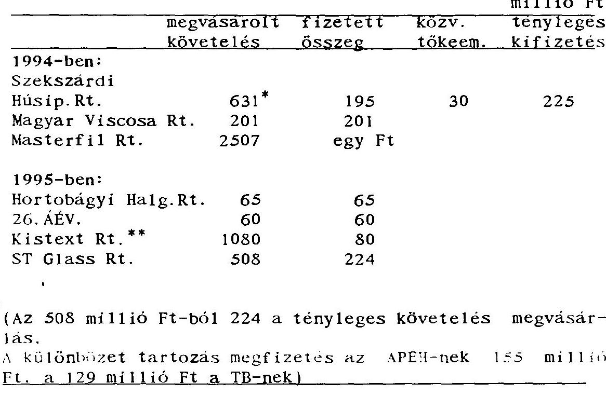

---

A követeléseket különbözö bankoktól - alapvetően az MHB-töl és a BB Rt-töl - vásárolta meg.

Az engedményezési szerzödések egy részénél abban állapodtak meg, hogy a Bank által kikötött zálog és jelzálog szerzödések átszállnak az új tulajdonosra - az ÁvÜ-re, más esetekben kizárólag a jelzálog felszabadításról intézkednek.

Az ÁvÜ az adóskonszolidációban az ÁvÜ-höz került követelések között tartja nyilván a fenti hét konszolidációs megállapodás alapján általa megvásárolt követeléseken túl azokat a követeléseket is, amelyeket egy 1994. május 6-1 megállapodással adott át részére a Pénzügyminisztérium (4. sz. melléklet).

Ez az Engedményezési szerzödés - amely 1993. október 1. napjától befagyott és "bizonytalan" minösitésü - 13 ipari-élelmiszeripari vállalat különböző bankokkal szembeni tartozása - összesen 17,4 milliárd Ft értékben -, melyeket a Pénzügyminisztérium a bankkonszolidáció keretében kivásárolt.

A követelések ellenértékét az adott vállalkozás privatizációs bevételéből egy, a megállapodás részét képező árbevételmegosztási táblázat alapján kell megfizetni a Pénzügyminisztérium részére. Eddig nem utaltak a Pénzügyminisztériumnak e szerződés alapján.

Reorganlzációs, beruházási célokra az 1995. évi Költségvetési törvény elöirányzatot nem fogalmazott meg.

Az ÁvÜ az 1995. évi tervében 26 milliárd Ft kiadási elöirányzattal számolt. Ebböl saját, törvényben meg nem fogalmazott elöirányzata 7 milliárd Ft reorganlzációs, befektetési célú kiadás.

---

1995 június közepéig összesen 232 millió Ft-ot költöttek el. Ennek 25 当-a ( 60 millió Ft) reorganizációs célú, s 75 当-a ( 172 millió Ft) befektetési kiadás. A reorganizációs célú kifizetés teljes egészében üzletrészvásárlás, tökeemelés a már elözőekben ismertetett tartozáskonverzió, így valós reorganizációt, értékesítésre való előkészítést nem jelent.

# 1.2.5. Az Állami Vagyonügynökséget 1994. december 31-e után megilletö bevételek 

A Vagyonügynökség bevételeit pénzforgalmi szemléletben tartja nyilván, így az adott időszakra vonatkozó bevételei között annyit mutat ki, amennyit pénzügyileg is realizált. Az értékesítések alapján a következő években esedékes, illetve a be nem érkezett árbevételt a beszámolási időszak követelésállományában mutatja be.

A kimutatásból nem tünik ki, hogy ebből mennyi a már "lejárt", idöben ki nem egyenlített követelés, de a Vagyonügynökség a szerződéstárban rendelkezik ezzel az információval.

A követelés állományt a szerződéstár adatai alapján értékesítési szerződésenként állítják össze, s így igen nagy a jelentösége a tranzakciós ügyintézők fegyelmezett adatszolgáltatásának.

---

A Vagyonügynökség követelésállománya:
1993. dec. 31. 1994. dec. 31. eFt-ban

| értékesítési szerződésekböl | 15.343 .385 | 12.772 .935 |
| :--: | :--: | :--: |
| vagyonkezelési | 4.530 .278 | 4.530 .278 |
| földhaszonbér.és egyéb sz. |  | 81.209 |
| összesen: | 19.873 .663 | 17.384 .422 |
| Ebböl a köv.évben esedékes | 10.873 .663 | 6.950 .037 |
| további években | 8.882 .435 | 10.384 .422 |

(1994 év végén a lejárt, be nem folyt követelések értéke 762 millió Ft, az összes követelés 4,4 当-a)

Az összes bevételhez viszonyítva a jövőbeni esedékes bevétel aránya 1993-ban 25 当., 1994-ben: 18 当 volt.

A Vagyonügynökséget 1994. december 31. után az elöző évek értékesítési szerződései alapján megilletö bevétel 17,4 milliárd Ft. Ebböl 1995-ben esedékes 7,0 milliárd Ft, az összes tárgyévi bevételi elöirányzat $10 \%$-a.

A követelésállomány Ft-ban mutatja az ÁVU jövőbeni bevételeit. (Ennek összetételére (pl. készpénz és kárpótlási jegy) vonatkozóan a 5. sz. melléklet nyújt információt).

Az 1995 év 1. félévében nyilvántartott 16,5 milliárd Ft követelés 83 当-a készpénz, 14 当-a kárpótlási jegy, s 3 当-a E hitel.

---

# 1.2. Kötelezettség teljesítés és garanciavállalás 

### 1.2.1. Kötelezettségvállalás szabályozása

Az ÁVÚ a törvényi szabályozás szerint a kötelezettségvállalásaihoz - kezességvállalást, jótállási, illetve szavatossági felelösséget - köteles a pénzügyminiszter egyetértését megszerzzni.

Tartalmát illetően ugyanez a szabályozási elv vonatkozik a jogutód ÁPV Rt-re is.

Az anyagi kihatásokkal járó kötelezettségvállalásokat további belsö utasítások is szabályozzák. Az 1994-ben érvényes ügyvezetői igazgatói utasítás (18/1994) a különbözö kötelezettségvállalásokat két nagy csoportba sorolta és szükítette az addigi 49 helyett 10 jogcímre történő garanciavállalást. Az utasítás meghatározta, hogy mikor, milyen esetben használhatók a jogcímek és mit jelentenek kivéve az "egyéb" jogcímet, amely több (10-15 eddig alkalmazott) garanciatípust is magában foglalhat.

A két nagy csoport egyike a gazdálkodó egységek privatizálhatóságának fenntartását segitő kötelezettségvállalások. Ezek köze tartozik a Hitel (lízing-) garancia, amely a gazdálkodó egység hitel felvételéhez, prolongálásához, lizing szerződések kötéséhez adott ÁVÚ kötelezettségvállalást esetleg készfizető kezességet jelent, továbbá az állami vállalattól elvont vagyonelemekkel kapcsolatos kötelezettség.

A másik fó típus a privatizációs jótállás jogi- és kellékszavatosság vállalása. Ezek közé a jogi szavatosság, a társaság tulajdonáért vállalt garancia, a permentességi garancia. mű-

---

ködési garancia, a környezetvédelmi garancia, a pénzügyi és mérleg jótállás, munkavállalók iránti garancia és az egyéb címen adott garancia tartozik.

A korábbiakhoz képest -részben az ÁSZ észrevételeit figyelembevéve - módosulást jelentett a döntési és egyetértési hatáskörön belül, hogy minden kötelezettségvállalási ügy értékhatártól függetlenül az ÁVÚ Igazgatótanács döntési hatáskörébe tartozott.

Az ÁVÚ megalakulásától 248 gazdálkodó szervezet esetében és E-hitelre eladott bérleti jogokra összesen 56.039 millió Ft kötelezettséget vállalt az alábbi részletezésben:

| 1991-ben | 19.545 | millió Ft | 24 gazdálkodó szervezet |
| :--: | :--: | :--: | :--: |
| 1992-ben | 17.998 | millió Ft | 58 gazdálkodó szervezet |
| 1993-ban | 11.191 | millió Ft | 113 gazdálkodó szervezet |
| 1994-ben | 3.447 | millió Ft | 49 gazdálkodó szervezet |
| 1995 elsó |  |  |  |
| félévben | 1.015 | millió Ft | 4 gazdálkodó szervezet és |
| E hitel | 2.843 | millió Ft. |  |

# 1.2.2. Kötelezettségvállalások és kifizetések 1994-ben 

Az ÁVÚ 1994-ben 49 gazdálkodó szervnél 3.447 millió Ft és 1995. I. félévében 4 gazdálkodó szervezetnél 1.015 millió Ft összesen 4.462 millió Ft értékben vállalt különböző jogcímen garanciát. Ebből kifizetett, megszűnt és elévült 1.273 Ft. Jelenleg még fennálló fizetési kötelezettsége 3.189 Ft .

Az ÁVÚ 1994. évi és az 1995. I. félév1 garanciális kifizetéseinek nyilvántartásha vétele a vonatkozó utasítás elöíri-

---

Minden kötelezettségvállalási úgy értékhatártól függetlenül az ÁvÜ Igazgatótanács döntési hatáskörébe tartozott. Ez az 1994-ben folytatott gyakorlat azonban nem a törvényl elöírásokon, hanem a privatizációért felelös tárcanélküli miniszter és a pénzügyminiszter között 1993. március 19-én létrejött külön megállapodáson alapult (6. sz. melléklet).

Az 1994. évi Vagyonpolitikai Irányelvek, 15 milliárd Ft-ot irányzott elő jótállással, szavatossággal és kezességvállalással kapcsolatos kiadásokra, valamint az ÁvÜ 1 milliárd Ft-ot képezhetett kedvezményes hitelkonstrukció (E hitel) keretében történő értékesités garanciafedezetére.

1994-ben ténylegesen az ÁvÜ 1 milliárd 664 millió Ft-ot fizetett ki jótállásra, szavatosságra és kezességvállalásra, amely 25 gazdálkodó szervezetet érintet.

Az ÁvÜ 1995 első félévében 1086 millió Ft-ban 15 társaság garanciális kötelezettségvállalását egyenlítette ki.

Az ÁvÜ fennállása alatt, értékesítései során garanciákat vállalt. 1995. június 15-i állapot szerint az elkövetkezendó évekre a jogutód állami szervezetnek 22,7 milliárd Ft-os a kötelezettsége.

Az 1994-ben kötött készfizetői szerződések, garancia fizetési megállapodások tartalmazzák a kötelezettségek mértékét és jogcímét. A részvény-, az üzletrész-, az ingatlan csereszerzödésekből azonban a jogcímek és azok mértéke nem értelmezhető minden esetben és a szerződések elválaszthatatlan részét képező mellékletek közül több is hiányzik. Az Igazgatótanácsi határozatok, illetve azokat előkészítő előterjesztések is szükségesek ahhoz, hogy nyomon követhető legyen az ÁvÜ tény-

---

Kormányhatározat szerint az 1994. évi mérlegek lezárásáig a vagyonátadásnak, illetve a kötelezettségek átvállalásának meg kell történnie, hogy a változások már szerepeljenek az érintett társaságok 1994. évi mérlegeiben, valamint az ÁVÜ 1994. évi vagyonkimutatásában. A gazdasági események (elvi döntések) lényegében 1994-ben történtek, a szerződésböl eredő jogok és kötelezettségek ezért szerepelnek az 1994. évi vagyon mérlegben.

# 1.3. A privatizációs folyamat jellemzői 

1994. évben az ÁVÚ kezelésében lévő vagyon privatizációja lelassult. A pályázatok száma közel harmada-, a meghirdetett társaságok száma pedig csak közel fele az 1993. évinek. A csökkenésben az is szerepet játszott, hogy a privatizációs pályázatok egy jelentős részét az önprivatizációs program keretében a megbizott tanácsadók - és nem az ÁVÜ - hirdették meg. E program keretében 103 társaság került magánkézbe. Az új pályázati kiírásokban növekedett a készpénzhányad aránya.

Az ÁVÜ 1994. évben - a tervezetet meghaladóan - 98,2 milliárd Ft bevételt realizált. A részvény-értékesítések 66.703 millió Ft-ot - 214 értékesített társaságot -, a vagyonvédelmi értékesítések 28.523,8 millió Ft-ot - 267 db vagyonvédelmi értékesítést - képviselnek. A részvényértékesítést összességében 102,6 \%-on, a vagyonvédelmi értékesítést 496,7 \%-on realizálta (7. és 8. sz. melléklet).

Az állami tulajdonrésszel rendelkező ÁVÜ-hőz tartozó társaságokban az állami tulajdon $52,5 \mathrm{~m}$-ot, az önkormányzati tulajdón $4,4 \mathrm{~m}$-ot, a belföldi befektetők tulajdona $30,1 \mathrm{~m}$-ot, a külföldi befektetők tulajdona $12,9 \mathrm{~m}$-ot képvisel.

---

A külföldiek 1994. évben Magyarországon - a zöldmezős beruházás nélkül - 57 társaságban 94 befektetést eszközöltek, összességében 37,4 milliárd Ft értékben. 385 befektetésük együttes összege az 1990-1994. években 205,1 milliárd Ft-ot tesz ki.
milliárd Ft-ban

| Megnevezés: | 1994.   évben | 1990-94.   években | megoszlás   $\%-\mathrm{a}$ | Rangsor   (1990-1994) |
| :-- | :--: | :--: | :--: | :--: |
| Németország | 6,44 | 41,39 | 20,18 | II. |
| USA | 11,58 | 23,12 | 11,27 | III. |
| Ausztria | 3,05 | 42,54 | 20,74 | I. |
| Nagy-Británia | - | 13,56 | 6,61 | VI. |
| Franciaország | 5,17 | 18,66 | 9,10 | IV. |
| Hollandia | 1,08 | 16,04 | 7,82 | V. |
| Belgium | 4,17 | 13,27 | 6,47 | VII. |
| Svédország | 0,30 | 9,97 | 4,86 | VIII. |
| Svájc | 0,52 | 7,78 | 3,79 | X. |
| Olaszország | 0,04 | 3,93 | 1,92 | XII. |
| FÁK | - | 5,24 | 2,55 | XI. |
| Egyéb | 5,00 | 9,64 | 4,70 | IX. |
| Összesen: | 37,35 | 205,14 | 100,00 |  |

(A hazai és a külföldi befektetők által megszerzett tulajdon átlagos értékeit 9. sz. melléklet tartalmazza.)

A hazai befektetöket támogató privatizációs technikák

|  |  | 1992. | 1993. | 1994. |
| :-- | :-- | :--: | :--: | :--: |
| MRP: | - db | 8 | 121 | 66 |
|  | - érték, Mrd Ft | 1,74 | 22,57 | 13,92 |
| Lizing: | - db | - | 9 | 14 |
|  | -érték, Mrd Ft | - | 2,83 | 2,78 |
| E hitel | - értéke Mrd Ft | 5,72 | 22,94 | 21,14 |

---

Az ÁVÜ 1994. évben 362 tranzakcióban - a vételár közel 50 (3)-ában - 22,2 milliárd Ft címletértékủ, 35,1 milliárd Ft összegű kamattal növelt értékủ kárpótlási jegyet fogadott el. Ezen felül megközelítőleg 10 milliárd Ft összeget képviselnek a nyilvános ajánlattételek-, a KRP-, valamint az életjáradékra való átváltás során "felszivott" kárpótlási jegyek.

Az ÁPV Rt. (az ÁVÜ-töl eredően) 8.428 db szerződést és szerződésmódosítást tart nyilván 1995. június 16-án. Ebböl a szerződésmódosítások 56 (3)-ot képviselnek.

A lejárt határidejű, kiegyenlítetlen követelések 1994. december 31-én 17 esetet és 762,5 millió Ft-ot képviselnek. A kiegyenlítetlen követelések behajtására az ÁVÜ felszólításokat (földhaszonbérleti dijak befizetéseinek elmaradása esetén) pert, szakértői vizsgálatokat kezdeményezett.

61 ügye van az ÁVU-nek az önkormányzatokkal az 1989. évi XIII. tv. alapján a belterületi föld utáni önkormányzati részesedés mértékének vitatása miatt.

Az ÁVU által ezideig kötött és 2009-ig hatályos értékesítési szerzödésekben szereplő fizetési kötelezettségek értéke 16.493, melyböl a készpénz aránya 83 (3)-ot, a kárpótlási jegy aránya 14 (3)-ot, az E hitel aránya 3 (3)-ot képvisel. (A 2009-ig terjedő privatizációs bevételek évenkénti bontást az 5. sz. melléklet szemlélteti.)

A vevői kötelezettségek nyilvántartásáról, figyeléséről és számonkéréséről ügyvezetői utasítás intézkedik. Ezt az ÁPV Rt. 1995. július 24-től Vezérigazgatói utasítással módosította. =

---

szerződésben vállalt kötelezettségét, úgy az ügyvezetői igazgatói értekezlet dőnt a vevővel szembeni szankcióérvényesités módszereiről.

Az ÁVÚ által kötött értékesitési szerződésekben rögzített fizetési kötelezettségeket a Szerződéstár tartja nyilván.

A szerződési nyilvántartó programba a szerződés leadásakor bevezetik a vevő összes fizetési kötelezettségét, fizetési határidő és fizetési mód (készpénz, kárpótlási jegy, E hitel) - feltüntetésével. A nyilvántartás alapján lekérdezhető egy adott időszakban esedékes bevétel. Azoknál a szerződéseknél, ahol nincs összegszerüen feltüntetve a vevő, illetve a partner fizetési kötelezettsége (tőzsdei értékesités, bizományi szerződés), csak a dátumot irják be és a lejáratkor kérik meg az illetékes ügyintézőtől az elszámolásra vonatkozó adatokat.

A szerződéstárban 94 db mezőgazdasági föld haszonbérleti szerződést tartanak nyilván. A bérleti idỏ általában 10 év. A bérleti dij a szerződésekben nem összegszerű, hanem aranykoronánként általában 15 kg újbúza ára az aktuális tőzsdei árfolyam szerint. Az FM által igazolt aszálykár esetén - az aszálykár mértékétól függően - a bérleti dij mérséklésre, illetve elengedésre kerül. A földhaszonbérleti díjakból származó bevételeket emiatt csak becsülni lehet. Az eddigi tapasztalatok a földhaszonbérletekből várható bevételek éves nagyságát 80-100 millió Ft-ra valószínüsítik.

A nyilvános és zártkörü pályázatokról a nyilvántartások megtalálhatók a PIR-ben. A zártkörü versenyeztetés elrendelése kizárólagos Igazgatótanácsi hatáskör. Az ÁVÚ versenyeztetési szabályzatát folyamatosan módosították, a pályázatokon az ellenjegyzést tevő jogász saját pecsétjének dokumentálásával is megtörtént.

---

Az ÁVÜ 1994. évben 289 db pályázat keretében 267 társasági tulajdont hirdetett meg. Ebböl a sikeres pályázatok aránya $78 \%$ volt, magasabb, mint az elözö évben.

Az ÁVÜ által 1994. évben kiírt 289 db privatizációs pályázatból a nyilvános pályázatok aránya $97 \%$ ( 281 db ), míg a zártkörü pályázatok aránya csak $3 \%$ ( 8 db ) volt. (Ágazatonkénti megbontását a 10. sz. melléklet mutatja be.)

A nyilvános pályázatokból 218 db minösült sikeresnek, 29 db sikertelennek és 34 db pedig lezáratlannak. A zártkörü pályázatokból 7 db volt sikeres, 1 db sikertelen. A nyilvános pályázatok 49,4 milliárd Ft-ot, a zártkörü pályázatok, 4,0 milliárd Ft-ot képviseltek.

# 1.4. Az állami vagyon alakulása az ÁVÜ-nél 

Az 1994. évi tevékenység ellenörzése során alapvető szempont volt annak megitélése, hogy az ÁVÜ-nél a több éves fejlesztéssel kialakított és adatokkal feltöltött Privatizációs Információs Rendszer (PIR) és az ehhez integrált pénzügyi és számviteli rendszer (a szükséges továbbfejlesztéssel) alapja lehet-e új privatizációs törvényben rögzített vagyonhoz kapcsolódó beszámolási kötelezettség teljesítésének.

Az ÁVÜ hatáskörébe tartozó vagyon köre megalapításától kezdve csak fokozatosan vált ismertté. Az 1992. évi ÁsZ jelentés, a javaslati részben határozottan megfogalmazta a vagyonnyilvántartás kialakításának zárt rendszerü, bizonylatokkal alátámasztott igényét, a társaságok saját tökéjére alapozva.

A PIR rendszert az ÁVÜ-nél folyamatosan alakitották ki és

---

állami vagyon éves vagy idôszaki mérlegéról és a privatizációs tevékenység eredményéröl. Az ÁVÜ ezzel együtt a PIR-re1 a saját belsó adatszolgáltatási és vezetői információs rendszerét is kielégítette.

Az ÁVÜ vagyonnyilvántartásának alapja a vállalatok, társaságok saját tökéjének értéke, melynek alapdokumentumai az éves beszámoló részét képező (illetve speciális helyzetekben pl. átalakulás) mérlegek.

A mérleg csak év végi állapotot tükröz, az ÁvÜ-nek azonban jóval szorosabban, gyakrabban - havonta negyedévenként - is szükséges a vagyon alakulását követnie. Ennek érdekében a privatizációs tranzakciókat (ebből is 28 fajtát tart nyilván az ÁvÜ) a nyitómérleg értékének növekedésével, illetve csökkenésével keresztülvezetik, ez adja az idópontnak megfelelő záróvagyon értékét, amelyet a vállalaitok, társaságok éves zárómérlegének ismeretében korrigálnak. Ez a korrekció azonban egy jelentős mutatószám, mivel ez adja meg az ÁvÜ hatáskörébe tartozó cégek gazdálkodási eredményét, amely lehet veszteség és nyereség is.

A PIR alapja lehet az ÁPV Rt. vagyonnyilvántartásának, mivel jelentős mértékben, de nem teljeskörűen olyan visszatekintő, információkat szolgáltat, amely részben, tendenciájában, megközelítően alkalmas a tartós és hozzárendelt vagyon változásának döntő jellegű követelésére, így annak ellenőrzésére.

A PIR három elkülönített vagyoni körre ad elsődleges információt: a vállalati vagyoni körre, a társasági vagyoni körre, az elvont vagyonelemek hasznosítása vagyoni körre.

---

A társasági és vállalati vagyoni kör megoszlik, a müködö cégek (ez a mindenkori privatizálható vagyon), a felszámolási eljárás alatt álló cégek és a végelszámolási eljárás alatt álló cégekre.

A nyilvántartás megfelelően tartalmazza a vállalati, a társasági és az elvont vagyoni körökön belüli tranzakciókat és a vagyonelemek közötti tranzakciókat egyaránt. A vállalati vagyoni körböl a vagyonvédelmi értékesítést és vagyonvédelmi apportot, vagyoneIvonást tartják nyilván.

A társasági vagyoni körön belüli jellemző tranzakciók a következők: vagyonátadás, társasági átalakulás, tökeemelés, tökecsökkentés, társaság alapítás, társasági tulajdonrészek értékesítése, felszámolás, végelszámolás.

A vagyoni körök közötti tranzakcióból a vagyoneIvonás (vállalati kör csökken elvont vagyon nö) és a vállalat átalakulása társasággá a jelentős, valamint a felszámolási és végelszámolás befejezésekor a vállalati társasági vagyon a könyvszerinti értékkel csökken és esetlegesen a vagyonfelosztás után fennmaradó vagyonelemek átvételével nö az elvont átvett eszközök vagyoni körének értéke.

Az összesen 28 tranzakció teljeskörűen lefedi a vagyonmozgásokat és tájékoztat a privatizálható vagyoni részről és a felszámolás, végelszámolási eljárás alatt álló cégek vagyonáról is.

Az ÁvÜ vagyonának alakulása
1994. évben az ÁvÜ-hőz tartozó saját vagyonú (értékesíthető) társaságok és vállalatok vagyona a következőképpen alakult.

---

|  | 1994. I. 1-i   saját vagyon |  |  | 1994. XII. 31-i |
| :--: | :--: | :--: | :--: | :--: |
|  | db | Md Ft | db | Md Ft |
| Vállalatok | 156 | 62,6 | 9 | 2,3 |
| Társaságok | 768 | 368,7 | 638 | 226,4 |
| Elvont vagyon | - | 9,7 | - | 7,0 |
| Összesen | 924 | 441,0 | 647 | 235,7 |

Az összes vagyonértékböl a kisebbségi tulajdonhányad (a 25 a alatti tulajdonrész) mintegy egyharmaddal részesült, ami azt jelzi. hogy a kisebb társaságok maradtak ÁvÜ tulajdonban. Részletezve 11. sz. melléklet tartalmazza az 1996. évi vagyonmérleget.

Állami vállalatok vagyoni köre
1994. január 1-én 156 vállalat tartozott az ÁvÜ-höz 62,6 milliárd Ft-os vagyonnal a társasággá átalakulások miatt ez a vagyon minimálisra csökkent ( 2,3 milliárd Ft-ra).

Az átalakítások könyv szerinti értéken 18,1 milliárd Ft-tal csökkentették a vagyont, ezzel viszont a társasági vagyon nött, mégpedig a vállalati vagyon felértékelése miatt 22,8 milliárd Ft-tal, amely azt jelzi, hogy a felértékelés $25 \mathrm{a}-\mathrm{os}$ volt ( 62 cég átlagos értéke). A vállalati vagyonátadás értéke 15,3 milliárd Ft.

Táraság 1 vagyoni kör

A társaságok vagyona 368,7 milliárd Ft-ról 226,4 milliárd Ft-ra csökkent, döntő többségében a privatizáció eredményeként. Az ÁvÜ 1994. évben 227 társaság üzletrészeit, részvényeit értékesítette 109,3 milliárd Ft nyilvántartási érté-

---

ben. A szerződés szerinti eladási ár 77,3 milliárd Ft. A különbség 32 milliárd Ft, amely azt jelzi, hogy ennyivel kevesebb értékkel adták el a cégeket, amely a saját tökére vetítve 71 万-os árfolyamnak felel meg és ez valamivel magasabb az 1993-ban teljesített 66,8 万-nak.
1994. év során 178 társaság 100 万-os privatizációs értékesítése történt meg.

Az ÁvU-höz tartozó vagyon változásában jelentős tényező a társaságok, vállalatok gazdálkodásából eredő vagyonvesztés. A vállalati vagyoni körben ez 11,9 milliárd Ft volt, ame1y 8,8万-os, a társasági vagyoni körben pedig ez 17,3 milliárd Ft ame1y 6,7 万-os vagyonvesztés.

A legfontosabb vagyonváltozások mint a privatizáció és az átalakítások mellett az ÁvU gazdálkodó1 vagyonán kívül esö vagyonelemek - felszámolás, végelszámolás alatt álló cégek vagyona - jelentős szerepet játszanak az ÁvU tevékenységében.

A felszámolási eljárás és a végelszámolási eljárás alá került szervezetek növekedése jelzi az ÁvU portfóliójának romlását.

Felszámolás

A felszámolási eljárás miatt az ÁvÜ hatásköréből kikerülő vagyontömeg jelentősen csökkentette a privatizálható vagyont.
(Saját töke)

|  | Felszámolási eljárás alatt álló cégek |  |  |  |
| :--: | :--: | :--: | :--: | :--: |
|  | 1994. I. 1. |  | 1994. XII. 31. |  |
|  | db | Md Ft | db | Md Ft |
| Vállalat | 274 | 94,9 | 295 | 95,3 |
| Társaság | 26 | 5,7 | 65 | 11,3 |
| Összesen | 300 | 100,6 | 360 | 106,6 |

---

A cégek száma 1994. január 1-töl 60-nal nőtt, év végére a vagyon értéke több mint 100 milliárd Ft , ennek döntő többsége mint privatizálható vagyon kikerült az ÁVÚ hatóköréből.

A felszámolási eljárás végén a tulajdonos átlagosan a vagyon 10 万-át, kapja csak meg, s ez jelentős vagyonvesztést idéz elö. 1994. évtöl jellemzö, hogy a hitelező bankok által alapitott társaságok lettek a kivásárló befektetők.

Az ÁVÚ és az ÁV Rt. - évek folyamatában alig változó passzív - magatartásának tulajdoníthatóan sokszór még annak pontos ismerete is hiányzott és hiányzik, hogy hány társaságuknál van ún. mandátum nélküli vezető, függöben tartott közgyülés, vagy nincs elfogadott pénzügyi mérleg. E látszólag formai követelmények a napi ismeretek hiányát jelzik. Utalnak arra, hogy a vállalatok irányítása koncepciótlan, az a szabályozástól, jogi helyzettől függetlenül, valójában a helyi menedzsmentek ügyszeretetére bízott. Ilyen elözmények után természetszerű a tömegesen jelentkező csőd-probléma, melynek feloldására alkalmatlan eszköznek bizonyult, hogy az ÁvÜ és az ÁV Rt. részvényvásárlásainak, tőkeemeléseinek jelentős részét valójában tartozás-konverzióként vállalta. Vagyis a nehéz helyzetbe került cégek tartozásait az ÁVÚ vagy az ÁV Rt. teljesítette és a banki jelzálogjog a privatizációs és vagyonkezelő szervezetekre szállt, mintegy átvéve a vagyonvesztés kockázatát. Ezen jogok a vagyonkezelő szervezetek nyilvántartásaiból nem követhetők. Jelzi azt a más esetekben is, évek óta tapasztalt, s hiába kifogásolt hiányosságot, hogy a különböző szerződéses jogok, kötelezettségek nyilvántartása és érvnyesítése nem megfelelö.

A gazdálkodó szervezetek menedzsmentjének egy része elsősorban túlélési szempontok miatt értékesit vagyont, vagyonelemeket. Az ÁVÚ információs rendszere ezt azonban nem tudja megbizhatóan figyelemmel kisérni.

---

E helyett további gondokat vetít elöre. Az ÁPV Rt. felszámolás sorsára jutott vállalatoknál nemcsak annak a két szervezetnek a jogutódaként szerepel, mely egykor felelős volt a rá bizott vagyon jobb sorsáért, hanem abban hitelezőként is érdekelt... Ezt a sajátos helyzetet például az idézte elő, hogy a korábbi vagyone1vonások mértékéig (föleg az ú.n. decentralizált privatizáció területén) kezesi felelőssége van a hitelezők felé és hasonló a helyzete, ha az ú.n. Munkavállalói Résztulajdonosi Program során tulajdonhoz jutott MRP szervezet nem tud teljesíteni. További lehetőség, hogy ha az vállalát jut felszámolásra, amely előzőleg pénzügyi gondjai megoldására likviditási hitelt kapott, vagy az ÁVÚ - ÁV Rt. hitelt vállalt át. A hiányos nyilvántartások ilyen érdekei érvényesítésében is akadályozni fogják.

A felszámolási kivásárláshoz kötődő 1994. évtől érvényes kamattámogatás 0,4 milliárd Ft volt (október havi állapot), amelyet 1 milliárd Ft hitelhez nyújtottak.

# Végelszámolási eljárás 

1994. év végén 131 cég állt végelszámolási eljárás alatt, vagyonértékük 32 milliárd Ft volt.

Végelszámolás során a gazdálkodó szervezet jogutód nélkül megszünik, az eljárás során várható, hogy a cégek vagyona fedezetet nyújt kötelezettségeik fedezetére, és a megmaradt vagyon a tulajdonosok között felosztható.

A felszámolás a bíróság előtt azok felügyelete alatt folyik így a tulajdonosi jogokat az ÁVÚ nem gyakorolhatja a cégek vagyoni helyzetét nem kisérheti figyelemmel. A végelszámolásban a cénbiróságnak csak törvényességi felügyelete van. így a

---

Az ÁvÜ hatásköre és szerepe az állami tulajdonban levō vállalatok, társaságok esetében a felszámolás során csak korlátozottan érvényesül.

A jelenlegi törvényi-jogi háttér nem veszi kellöen figyelembe az állami tulajdonos érdekeinek érvényesitését és ez a vagyonvesztés megakadályozását nem segiti elö.

Az ÁvÜ Tranzakciós Igazgatóságok tevékenységének súlypontja a privatizáció volt, nem pedig a felszámolás, végelszámolás. Ezért feltétlenül helyes volt ezen tevékenység szervezetét és irányitását önálló szervezeti keretek köze tenni, a Felszámolási és Végelszámolási Igazgatóság létrehozásával (1995. június 15 -töl).

A tömeges vállalatfelszámolás a privatizációs és vagyonkezelö szervezeteken kivüli, piacvesztési és egyéb okokkal is magyarázható. E mellett azonban az is tény, hogy a szükségesnél kevesebb figyelem jutott arra, hogy a válságjelenségeket idöben felismerjék és "kezel jék".

A végelszámolók érdekeltsége sok esetben nem szolgálja az eljárás mielöbbi befejezését. Az ÁPV Rt-nél alkalmazott sikerdijak összege nem kötődik az eljárás során megmaradó, és a tulajdonosok között felosztható vagyon nagyságához, vagyis nem ad igazi ösztönzést.

Az ÁvÜ be1sõ szabályozási rendszerében munkaszerzödésekben még nem alakította ki azokat a jelzörendszereket és szankciókat, amelyek a hozzátartozó vagyon felszámolását megelözhetik.

---

# Vagyonel vonás 

Az ÁvÜ-nél a vagyonelvonásnak általában két formája van. Az átalakulás elôtti vagyonelvonás és amikor az átalakuló társaság müködéséhez nem feltétlenül szükséges vagyonelemeket leválasztják, vagy a végelszámolás elôtt vonják el az eszközöket a gazdálkodó szervezetektöl. Általában az elvont vagyon értékesitésével az ÁvÜ az adott céget bízza meg. Az elvont vagyon értéke 1994. évben 4,2 milliárd Ft volt, s ez az 1994. január 1-i nyitóállományt - 9,7 milliárd Ft-ot - növelte.

A vagyon nyilvántartása megfelelö. A vagyonelem az elvonáskor önálló, új vagyonkategóriaként szerepel és önálló elszámolási egységként kezelik, az ÁvÜ-nél addig ameddig nem értékesítik, vagy felhasználják, 1994. évben 5,6 milliárd Ft értékủ elvont vagyont értékesítettek. Az elvont vagyont 7,5 milliárd Ft-ért értékesítették, ez a könyvszerinti értéket 34 f̊-kal haladta meg, és 1 milliárd Ft értékủ vagyont apportáltak, tökeemelésre használtak fel.
Így az 1994. év végi záró állomány értéke 7 milliárd Ft (12. sz. melléklet).
2. Az ÁV Rt. 1994. évi tevékenysége
2. 1. Az ÁV Rt. vagyoni helyzetének alakulása
2.1.2. Az ÁV Rt. saját vagyona és jegyzett tökéje

Az ÁV Rt. részesedéseit az alapító okirat apport listája szerint az 1992. évi LIII. tv. hatálya alá tartozó gazdálkodó szervezetek jegyzett tökéje alapján mutatja ki, igy a tartós tula:donhánv: 1 : : : ÁV Rt. iecyzett töké iébe kerö:

---

tárása alapján - az ÁV Rt. nem alkalmazta megfelelően, hiszen vagyonát jegyzett töke alapon és nem a társaságok saját tőke alapú értékelése alapján vette számba. Mivel az alapító okiratot 1994. december 31-ig nem módosították, így az 1994. éves beszámoló az ÁV Rt. vagyonát jegyzett tőke alapon mutatja be, és a kiegészitő melléklet tartalmazza a saját vagyon alapú kimutatást.

Az ÁV Rt. saját tőkéje 1994. január 1-jei nyitóállományhoz viszonyítva - 979,7 milliárd Ft-ról, 1994. év végére 919,2 milliárd Fr-ra csökkent.

A 60,5 milliárd Ft-os csökkenés döntő többségét az 1994. évi 57 milliárd Ft-os veszteség okozta.

Az ÁV Rt. jegyzett tōkéje a nyitóállományhoz viszonyítva változatlanul, 289,2 milliárd Ft. Az ÁV Rt. a cégbíróságon nem kezdeményezte a jegyzett tőke felemelését, amelyet az 1992. L111. tv. 4. § (3) bekezdése értelmében az utolsó vállalat átalakítása után kellett volna megtennie, hiszen még 1994. év végén 7 vállalat, illetve intézet várt arra, hogy gazdasági társasággá alakuljon. Az 1992. október 29. után átalakult társaságok teljes vagyona a töketartalékba került. (Az átalakult társaságok tartós tulajdonhányadát a jegyzett tőkében kell kimutatni az utolsó átalakulás után alaptőkeemeléssel). Az ÁV Rt. tōkeszerkezete nem adott reális képet a tartós állami vagyonról és a privatizálható vagyoni részröl, mert a töketartalékban szerepel a tartós, nem privatizálható vagyonrész is.

A töketartalék az 1994. évi nyitóállományhoz viszonyítva 1.8 milliárd Ft-tal emelkedett, igy 1994. év végcre 678 milliárd

---

# 2.1.3. A töketartalék növekedését elöldéző tényezők 

A töketartalék összességében 15,6 milliárd Ft-tal nött. Ebböl az 1994. évben társasággá átalakitott cégek értéke 3,1 mill1árd Ft, az állományba vett és az ÁVÜ-töl átvett cégek jegyzett töke értéke 9,9 milliárd Ft, az egyéb változás értéke pedig 2,6 milliárd Ft volt.

## Társasággá átalakulások

Az év folyamán 15 vállalatot alakitottak át társasággá, me1y az ÁV Rt. vagyoni részesedését több mint 3 milliárd Ft-al növelte. A tárgyidőszakban átalakitott társaságok többségénél nem állt rendelkezésre az átalakulási terv és vagyonmérleg, esetenként további alapvető dokumentációk is hiányoztak (pld. DIALOG Filmstúdió Kft.).

A társasági átalakulásokat az 1992. évi LIII. törvény, illetve az átalakulásokat részletesen szabályozó LIV. törvény 1993. június 30, illetve 1993. december 31. idöpontokban írta elő. Az ÁV Rt. 1995-ben még 7 át nem alakitott vállalattal rendelkezett, ame1yeknek összes vagyoni értéke kb. 8,1 milliárd Ft, ezek:

Épitéstudományi Intézet, Épitésügyi Minősége11enőrző Intézet, Országos Húsipari Kutató Intézet, Technika Külkereskedelmi Vállalat, Sportlétesítmények Váll., MÉV Mecseki Ércbányászati Vállalat, RÉV Recski Ércbányászati Vállalat.

A Sportlétesítmények Vállalat átalakítása és társasági bejegyzése folyamatban van, a vállalatot a BM átvette. A Húsipari Kutató Intézettel szemben felszámolási eljárás indult, a MÉM ezt tudomásul véve állami vállalatként az egységet átvette.

---

A Technika Külkereskedelmi Vállalat, Épitéstudományi, valamint Építésügyi Minőségellenőrző Intézetek átalakítási kísérletei ezideig meghiusultak. Az ÁV Rt. a cégeket állami vállalatként szándékozik átadni az IKM-nek, a minisztérium ezeket csak átalakított társaságok formájában kész átvenni. (További egyeztetések szükségesek.)

A Mecseki Ércbányászati Vállalat átalakítását gátolja, hogy a cég tevékenysége rekultivációs és humán jellegű kötelezettségekkel jár, melyek teljesítése állami forrást igényel.

Társaságok és részesedések állományba vétele

E körben két kohászati társaságnak a 76/1994. (V.17.) Korm. rendelet szerint az ÁVÚ részéről történő átadása, az IKARUS Rt. állami tulajdonú 7,4 milliárd Ft névértékủ részvényeinek állományba vétele, valamint két kisebb volumenú tulajdonhányad rendezés szerepel, összesen 9,9 milliárd Ft értékben.

Az 1991. augusztus 30-án zártkörű alapítással létrehozott 11,5 milliárd törzstökével rendelkező társaság 7,4 milliárd névértékủ állami tulajdonú részvénye az alapító Ikarus Vállalat tulajdonában (kezelésében) maradt a 1994 évi ÁV Rt. hatáskörbe vonásáig. Az állami tulajdonú részvények elvonása kezdetben az ÁVU, - majd az ÁV Rt. vontatott intézkedései ered-ményeként csak jelentős késedelemmel történt meg.

A stratégiainak minősített és az adósság konszolidációval is érintett IKARUS társaság megalakulásától kezdve csődhelyzetben van.

A kritikus gazdálkodási helyzet jórészt azzal áll összefüggésben, hogy a buszgyártó társaság jelenlegi és középtávon reálisan várható éves r'ndelésállománya

---

a korábbi KGST szakosítási időszak megrendeléseinek 15-20 ㅁ-ra zsugorodott. A Csepel Autó szanálás során történt leválasztását követően, a természetes fogyás mellett a kapacitások átstruktúrálására és átfogó karcsúsítási intézkedésekre nem került sor. A társaság gazdálkodási egyensúlyát biztosító intézkedések elmaradásában közvetve az állami vagyonkezelö szervezetek késedelmes és hézagos intézkedései is szerepet játszottak.

Pénzintézeti részvények állományba vétele

Az 1994 évi mérleg mellékletében szerepel a két pénzintézet, az OTP Rt. és az MBFB Rt. közel 2,0 milliárd Ft névértékü részvényeinek állományba vétele.

Az azonosan könyvelendő két tétel azonban jelentősen eltérő ügyletet tartalmaz. Az OTP Rt. esetében 1,15 milliárd Ft névértékủ részvény 1994 évi állományba vétele gyakorlatilag az ÁV Rt. vagyon részesedését növelö korrekciós tétel, me1y mögött tranzakció nem húzódik meg. A módosítás eredményeként kialakult ÁV Rt. pénzintézeti társasági tulajdoni hányada (1994. évi záróállomány) azonban azonos az 1995. május 19-i közgyűlési tulajdonosi szerkezettel, illetve az ÁSZ 1995. júliusában lezárt OTP vizsgálatának e vonatkozású megállapításaival. Tehát a módosítással megnövelt ÁV Rt. részesedés a tényhelyzetet tartalmazza.

A hiba az 1990. december 31 -én zártkörü alapítással, 23 milliárd Ft jegyzett tőkével létrehozott pénzintézet állami tulajdonú részvényeinek ÁV Rt. állományba vételénél keletkezett. Továbbá szembetűnő, hogy a részesedés módosítás összege megegyez̃ik az állami tulajdonosnak 1992-ben lefolytatott akciójával, amikor 1150 millió Ft névértékü törzsrészvényt elsőbhséai részvénnyé alakított át, melyet részben kárpótlási

---

Az MBFB Rt. 800 millió Ft névértékủ tőketartalék növekménye az ÁVƯ által eszközölt és 50 m-ban az ÁV Rt. javára végrehajtott tőkeemeléssel és a kibocsátott új részvények állományba vételével kapcsolatos.

Az ÁVÜ az 1993. évi Vagyonpolitikai irányelvben rögzített kötelezettsége alapján 1993-ban két alkalommal 4, majd 2 milliárd Ft átutalásával növelte az MBFB Rt. vagyonát. A fenntartandó állami tulajdoni hányad biztosítására a tőkeemelések kapcsán kibocsátott új részvények meghatározott hányada az ÁV Rt. hatáskörébe került. Az MBFB Rt. 1993. december 17-i közgyülésén 125 m -os ázsióval elhatározott 2 milliárd Ft-os tőkeemelése, illetve a kibocsátott 1,6 milliárd Ft névértékủ új részvényeknek az 50 m -a - mint áthúzódó téma - került az ÁV Rt-nél 1994-ben állományba.

Az OTP Rt-vel kapcsolatos korrekció a vagyonnyilvántartás korábbi jelentős hiányosságát rendezte.

Beszolgáltatott banki részvények állományba vétele

Megalakulását követően az ÁV Rt. az 1992. évi LIV. törvény elöirásának megfelelően eröfeszítéseket tett a vállalatok tulajdonában lévő pénzintézeti tagsági jogot biztosító részvények felmérésére és begyüjtésére. Az adatok felmérésére, illetve pontositására irányuló vállalati megkeresések a vállalatok passziv ellenállásába ütköztek. A pénzintézetek többsége a részvénykönyvek vonatkozó kivonatainak közlésétől a bankt itokra történő hivatkozással elzárkózott, mely magatartást helyesen a Bankfelügyelet állásfoglalása is megerősitctt.

---

Az ÁV Rt. 1994-ben összesen 13 pénzintézet 383 millió Ft névértékủ részvényét gyüjtötte be és vette állományba.

Az 1992-94 év közötti időszakban összesen 17 pénzintézet 2.743 .931 milliárd Ft értékủ részvényét szolgáltatták be a vállalatok.

Az ÁV Rt. nyilvántartásai, a vonatkozó tevékenysége megfelel t a törvényi elöírásoknak.

Töketartalékot növelö tárgyidőszaki korrekciók

A vizsgált időszakban 4 társaság esetében összesen 124 millió értékben került sor a részesedéseket, és a töketartalékot növelö könyvelési korrekciókra, 4 esetben 6331 E Ft értékben a kárpótlási jegyekre történt korábbi értékesités módosítására, további négy társaságnál a kiadott önkormányzati tulajdon 43,987 E Ft értékben történő visszavételezésre és egy társaságnál 139.513 E Ft értékkel módosították a korábban könyvelt értékvesztést. A 13 vagyonnyilvántartást korrigáló könyvelési müvelet összesen 313.804 E Ft tesz ki. Keletkezésük föként a nem szabályos, megfelelő dokumentációkkal nem kellően alátámasztott, nagyvonalú könyvelési müveletekre utal.

Az ÁV Rt. töketartaléka részben a részesedések változásával párhuzamosan alakult. A vagyonkezelö könyveiben összesen 15,6 milliárd Ft töketartalék növekményt vezet le. Ez kimutatása szerint a következö tételekből áll:

Töketartalék növekmény/E Ft

- Kárpótlási jegy miatti
helyesbités
6.331

---

Töketartalék növekmény

- 1994-ben átalakult cégek
$13.001 .538$
- Értékvesztés helyesbités 139.513
- Tulajdoni hányad rendezés 123.973
- Részvény állományba vétel
$1.950 .000$
összesen
$15.648 .328$

A társasági átalakulásokkal kapcsolatban feltüntetett 13 mi 1 1 iárd Ft tőkenövekmény különböző típusú tranzakciók indoko1atlan összevonásából adódik. Ez helyesen a társasági átalakulásokból származó 3,1 milliárd Ft összeget, törvényi szabályozásra az ÁVÜ-töl átvett 2,54 milliárd Ft társasági vagyon összeget, a késedelmesen állományba vett 7,3 milliárd Ft vagyonrészeket tartalmazza.

A kimutatott töketartalék növekménynek csak egynegyede függ össze az 1994-ben bonyolított müveletekkel, a többi korábbi idöszaki feladatokkal áll összefüggésben.

# 2.1.4. A töketartalékot csökkentö tényezők 

A 13,5 milliárd Ft-os töketartalék csökkenésböl 1,2 milliárd Ft volt a meghiúsult átalakítás, 7,3 milliárd Ft pedig az energia és a K+F portfólióból az ÁV Rt-töl elvont társaságok értéke. 4,1 milliárd Ft-os csökkenést az önkormányzati tulajdonrészek átadása okozott.

Ezt a gazdasági társaságok átalakulásáról szóló 1959. évi XIII. tv. és az 1992. évi LIV. törvény szabályozta.

Az 1989. évi XIII. törvény 21. § (2) bekezdésének eltérö ér-

---

ték meghaladja az 5 milliárd Ft-ot. Ez annál inkább figyelemre méltó, mert terheli a privatizálható vagyoni rész összegét és azért valószínűsíthető, mert a Legfelsőbb Bíróság néhány esetben már az önkormányzat javára hozta meg nem jogerős itéletét. A próbaperek állása feltételezi, hogy az ÁV Rt-nek további kötelezettségei származhatnak az önkormányzati tulajdonrészek kiadásával.

Az előzőekben felsorolt tőketartalék csökkenések az ÁV Rt. részesedéseket is érintették.

További 0,9 milliárd Ft-os tőketartalék csökkenés a részesedéseket nem érinti.
Ebből 750 millió Ft végleges tőketartalék átadás és támogatás címén valósult meg.

730 millió Ft-ot a Hungária Biztosító részére egy korábbi, 1992. évi szerződés alapján utaltak át mint utolsó részletet, amelynek kamatvonzata 1994. március 31-ig 362 millió Ft volt.

7 millió Ft az Igazgatóság 353/1994. (XI. 8.) sz. határozata alapján a Borsodferr Rt. müködtetéséhez szükséges pénzátutalás.

Támogatás címén 3,4 millió Ft-ot fizettek ki.A támogatás címén adott ingyenes vagyonjuttatást sem az 1992. évi LIII. törvény sem a Vagyonpolitikai Irányelvek nem tartalmazzák, így ez törvényellenesen történt. Ebből 400 ezer Ft-ot a AIESEC Magyar Közgazdászhallgatók Egyesülete részére, mint közérdekü kötelezettségvállalás fizetett ki az ÁV Rt.

Az Alpok-Adria munkaközösség elnöki tisztségéből adódó feladatok eredményes ellátása érdekében 2 millió Ft támogatást utalt át az ÁV Rt. a Somogy megyei ön-

---

Az ÁV Rt. mérlegében a tōketartalék átadása során 10 millió Ft szerepel mint tōkejuttatás a Hírlapkiadó Vállalat részére.
E végsō összeg kialakulását számos gazdasági esemény elözött meg, ame lyet a könyvelés nem regisztrált megfelelöen, s ebben szerepet játszott a döntések összevisszasága és a dokumentumok hiánya is.

A Hirlapkiadó Vállalat az alapító okirat szerint 1994. augusztus l-én alakult át részvénytársasággá, alaptökéje 198,050 ezer Ft volt. Ezt az összeget az átalakulást követöen az ÁV Rt. tōketartalékként nem vette állományba, így az ÁV Rt. saját tökéje nem tartalmazza azt; ezzel az összeggel nem mutatja a valós képet.

Az ÁV Rt. elözöleg még 1994. április 15-vel kívánta a Hírlapkiadó Vállalatot átalakítani részvénytársasággá. A 168/1994. (IV. 14.) sz. határozata döntött arról is, hogy a Hírlapkiadó Rt-nél 615 millió Ft-os saját tőkeemelést hajt végre, ebből 553 millió Ft a jegyzett tőkét növeli, 61 millió Ft pedig a tőketartalékot. Az 1994. április 15-ei átalakítás meghiúsult, de a 615 millió Ft-ot 1994. április 28-án az ÁV Rt. átutalta a Hírlapkiadó Vállalat részére. Az ÁV Rt. nem gondoskodott arról, hogy az átutalást az átalakulásig elkülönített számlára eszközölje. Így történhetett, hogy a Vállalat igazgatójának engedélyével jelentős összegeket fizettek ki a vállalat "nem szokásos" tevékenységével összefüggésben (például reklámszerzödés a Hudson Kft-vel 149 millió Ft értékben).

A Hírlapkiadó Vállalat Igazgatója ellen az ÁV Rt. büntető feljelentést kezdeményezett hütlen kezelés - alapos gyanúja miatt. Az ÁV Rt. könyveiben a 615 millió Ft-os átutalast a részesedések között vettek állományba úgy, hogy a cég még vállalatként müködött, igy részesedése (reszvenye) meg nem lehetett.

---

Az 1994. augusztus 1-ei átalakításig a Hirlapkiadó Vállalat "elköltött" a 615 millió Ft-ból 407 millió Ft-ot és az ÁV Rt-nek csupán 208 millió Ft-ot sikerült zárolnia. Az átalakulási vagyonmérleget ennek alapján úgy határozta meg az ÁV Rt., hogy 198,048 ezer Ft jegyzett tőkét és 21,083 ezer Ft tőketartalék részt állapított meg.

Ezzel szemben a Hirlapkiadó Rt. 1994. augusztus 1-ei mérlegében 198,048 ezer Ft jegyzett tőke és 12,757 ezer Ft tőketartalék szerepel.
A Hírlapkiadó Vállalat az idöközben elköltött 407 millió Ft értékủ összegre 1995. március 17-én megállapodást irt alá az ÁV Rt. és a Hírlapkiadó Rt. képviselöje, amelyben az ÁV Rt. 406,717 ezer Ft-ot nem kamatozó követelésként tart nyilván a Hirlapkiadó Rt-vel szemben. A Hirlapkiadó Rt. vállalta, hogy mérleg szerinti eszközeit értékesíti és ez a bevétel szolgál az ÁV Rt követelésének fedezetéül.

Az ÁV Rt. vezetése az 1995. február 21-1 Igazgatósági ülésen az Igazgatóság elnökének szóbeli előterjesztése alapján értesült és azonnal döntött arról, (35/1995. (február 21.) sz. határozat), hogy az ügyvezetés a PM-me1 adóskonszolidációs kötvénycsomag megvásárlására szerződést kössön, illetve a BB Rt-vel tőketartalék átadására megállapodást írjon alá. Az ügylet lebonyol itásával kapcsolatban az ÁV Rt. jogi képviselöjének álláspontja szerint a PM-ÁV Rt. közötti - államkötvény vásárlására vonatkozó - szerződés azon kitétele, amely szerint elsődlegesen az ÁV Rt. tulajdonában lévő részvényeket kell értékesiteni, sértette az akkor még hatályos 1992. évi LIII. tv. és az ahhoz kapcsolódó 126/1992. a Kormányrendelet elöírásait. Javaslata szerint a szerződést csak akkor kösse meg az ÁV Rt., ha a pénzügyminiszter, mint a tulajdonosi jogok gyakorlója, erre írásbeli utasitást ad. Véleményét az Igazgatóság figyelmen kívül hagyta. 1995. február 28-án 111995. sz. határozatában, a BB Rt. 1294. évi erc. 20

---

Ft-ról, 12 milliárd Ft-ra módosította. A tényleges átadás azonban már 1995. február 27-i értéknappal megtörtént. A gazdasági esemény az ÁV Rt. könyveiben 1995. évi tételként szerepel.

# 2.1.5. Az ÁV Rt. eredménytartaléka 

A saját tőkét mint saját vagyont 7,9 milliárd Ft-tal növelte az eredménytartalék, amely az 1993. évi mérleg szerinti eredmény - amely 12,2 milliárd Ft volt - és az osztalékra, igénybevett 4,3 milliárd Ft különbsége.

Az ÁV Rt. (az 1992. évi LIII. 22. § alapján) adózott nyereségének, 10 7̆-ában elkülönített eredménytartalékot képezhet, amelyet reorganizációra, a hozzátartozó társaságok veszteségeinek fedezetére, kártérítési igények kielégítésére használhat fel. Ennek nyitóállománya 2,2 milliárd Ft volt, a felhasználás öt társaságot érintett: a Felsőtíszai EFAG-ot 61,9 millió Ft-tal, a Szarvasi Agrár Rt-t 16,2 millió Ft-tal, a Távközlési Kutatóintézetet 915 millió Ft-tal, a RÉV Mátrabánya Rt-t 101 millió Ft-tal és a Szikra Lapnyomdát 50 millió Ft-tal támogatták.

Az összesen 1,1 milliárd Ft-os felhasználás alapján alakult ki az 1,1 milliárd Ft-os záróállomány.
2.1.6. Az ÁV Rt. 1994. évi eredménye

A saját vagyont döntően az ÁV Rt. 1994. évben kialakult 57 milliárd Ft-os vesztesége csökkentette, ebböl
7.2 mi 11 iárd Ft

---

Az üzleti tevékenység veszteségét a privatizációs bevételek 1994. évi jelentős elmaradása idézte elö.

Az ÁV Rt. 1994. évi üzleti terve 175 milliárd Ft privatizációs bevételt irt elő annak érdekében, hogy az 1994. évi költségvetési törvényben elöirányzott befizetési kötelezettséget teljesítsék és a központi alapokra átutalhassák az elöirányzatokat, valamint az Igazgatóság és az ügyvezetőség már korábbi döntéseit, a kötelezettségvállalásokat teljesítsék. Így az 1994. évi üzleti terv kényszerpályán mozgott, nem a reális lehetőségek mérlegelése alapján állitották össze, hanem a bevétel tervezésénél a kiadások kielégítése volt az alapvetö szempont. Az 1994. évre tervezett privatizációs bevétel 175 milliárd Ft, ame1ynek több mint $80 \%$-át 125 milliárd Ft-ot az MVM Rt., és a gázszolgáltató társaságok 19 milliárd Ft-os privatizációjából reméltek. Ennek feltétele volt a tulajdonosi viszonyok rendezése, az energia törvény jóváhagyása, a Magyar Energia Hivatal létrehozása, az árak rendezése. Ezek elhúzódása a privatizációt meghiusitotta. A fennmaradó 31 milliárd Ft-os készpénzhányadú privatizációs elöirányzat sem teljesült a bevétel csupán 7 milliárd Ft lett.

Az összes privatizációs bevétel készpénz, kárpótlási jegy, egyéb konstrukciók, 27,2 milliárd Ft volt (részletezve cégenként a 13. sz. melléklet tartalmazza).

A privatizációs bevételekből megvalósult 7,0 milliárd Ft-os készpénz bevétel, - amelyet 10 cég képviselt - nem az elözctesen tervezett cégekböl tevődött össze, igy jelzi azok elökészítettllenségét, adhoc jellegét. A privatizációs bevételekben megtérült az eladott részvények névértéke ( 154 \%), de az eladási ár saját tőke aránya csupán 77 \%-os.

---

A kárpótlási jegy ellenében 19,3 milliárd Ft bevétel valósult meg kamattal növelt névértéken. A részvényesi jogok gyakorlója felszólította az ÁV Rt-t, hogy teremtsen megfelelő kínálatot a kárpótlási jegyekkel szemben. Az ÁV Rt. 1994. év során 49.2 milliárd Ft névértékben jelölt ki részvényeket a kárpótlasi jegyekkel szemben.

Egyéb privatizációs bevétel $0,8 \mathrm{milliárd} \mathrm{Ft} \mathrm{volt} . \mathrm{Az} \mathrm{ÁB} \mathrm{Aegon}$ Rt-ben levő 2,7 万-os 784 millió Ft névértékủ üzletrészét és 115 millió Ft eszközértéket eladták. Az Aegon Internacionál MV cég 315 millió Ft készpénzzel és 576 millió Ft névértékủ OKHB Rt., Budapest Bank Rt., MHB Rt. részvényekkel "fizetett". Azok vételárát az ÁV Rt. 434 millió Ft-ban tudta be, ez a névérték $75 \%$-a. Ugyanakkor az MHB-nál a saját tőke jegyzett tőke aránya $12,8 \%$ az OKHB-nél $20,5 \%$ a BB Rt-nél $113,5 \%$, de a 12 milliárdos tőketartalék juttatás nélkül 43,9 (\%) ez mind jóval alatta marad a $75 \%$-os árfolyamnak, így az eladási ár egy fiktív adat, ezt a privatizációs technikát a törvény nem tartalmazza.

Az ÁV Rt. osztalékbevétele: 4,3 milliárd Ft, az egyéb bevételekkel ( 1,5 milliárd Ft), a privatizációs bevételekkel összes bevétele 33,6 milliárd Ft volt.
1994. évi költségek alakulása a következő:
múködési költségek
2,1 milliárd Ft
vagyonkezeléssel kap-
csolatos költségek
2,9 milliárd Ft
privatizációval kap-
csolatos költségek
1,0 milliárd Ft
értékesített vagyon
könyv szerinti értéke
17,6 milliárd Ft

---

Az üzleti tevékenység
eredménye ennek alapján:
7,2 milliárd Ft veszteség

A müködési költségek a tervezett 1,5 milliárd Ft-tal szemben 40 \%-kal, 0,6 milliárd Ft-tal növekedtek a jelentősen elmaradt bevételek ellenére is.

Itt okként az ÁV Rt. jelentése a hirdetés és PR költségek 0,6 milliárd Ft-os tényét említi. A FB jelentése azonban megállapítja, hogy "az ÁV Rt. pénzügyi helyzetének gyökeres val tozása a kiadások utalványozásánál még nem váltott ki megfelelő visszafogottságot. Erre utal, hogy a tervezett müködési kiadásokat jelentősen túllépték...."
"Ennek megfelelően az FB 1995. évi feladattervében szerepel a müködési kiadások (pl. a tanácsadók foglalkoztatása) egyes kritikus csoportjainak vizsgálata", ame1y feltétlenül aktuális feladatnak minösithető. A müködési költségen belül az ÁV Rt. 104,7 millió Ft-ot fizetett ki tanácsadók részére csak az ÁV Rt-vel kapcsolatos tevékenységek miatt (például hitelfelvételi tanácsadás 4,2 millió Ft, hitelszerződés jogi dokumentációja 1,5 millió Ft, jogi tanácsadás 7,5 millió Ft, stb.).

A vagyonkezeléssel összefüggő költségek elérték a 2,9 milliárd Ft-ot. A reorganizációs vagyonkezeléshez kapcsolódó elöirányzott feladatoknak az ÁV Rt. 1994. évben nem tudott eleget tenni, mivel a privatizációs bevételek elmaradtak, és így a program teljesítéséhez szükséges forrással nem rendelkezett.

Privatizációval összefüggő költségek 1 milliárd Ft értékűek, a 27 milliárd Ft-os bevétel 3,5 \%-a.

Az értékesített vagyon könyv szerinti értéke, mint ráfordítás az ÁV Rt-nél 17,6 milliárd Ft. A Számviteli Törvényt megfelelően alkalmazta az ÁV Rt., de itt figyelembe kell venni azt

---

Az egyéb ráfordítások összege pedig 17,2 milliárd Ft.

Az egyéb ráfordítások értékvesztést tartalmaznak 14,6 milliárd Ft értékben. A számviteli törvény szerint értékvesztést kell elszámolni azon cégeknél, ahol az adózás elötti eredmény két éven túl veszteség, és a saját tőke/jegyzett tőke viszonyszáma 100 f̊ alatt van. Értékvesztést 12 társaságnál számoltak el, ebből jelentős tétel a Magyar Hitelbank Rt. 7,5 milliárd Ft-os, a Kereskedelmi Bank 4,4 milliárd Ft-os értékvesztése. További ráfordítás növelő tényező volt a 2,4 milliárd Ft értékủ céltartalék, amelyet egyedi értékelés alapján a kétes követelések miatti várható veszteségekre képezték, ezek közül az MTV tartozás átvállalása miatti céltartalék képzés 0,5 milliárd Ft értékben növelte a veszteséget.

- A pénzügyi műveletek eredménye 1,6 milliárd Ft nyereség volt, amely a rövidlejáratú befektetések hozamát tartalmazza.
- A rendkívüli eredmény 51,4 milliárd Ft veszteséget mutat, amelyböl az 1993. évi XCI. tv. 6. § (7) bekezdése alapján az ÁV Rt. részére elöirt átutalási kötelezettség a költségvetés részére összesen 28,3 milliárd Ft értékü, ebböl pénzügyileg rendezve 16,3 milliárd Ft, 1995. évre áthúzódik 12,0 milliárd Ft.

A további 20.0 milliárd Ft-ot pedig a bevont és megsemmisített kárpótlási jegyek kamattal növelt értéke adja.

Végeredményben az ÁV Rt. 1994. évi vesztesége 57 milliárd Ft, amely a saját vagyon 6 \%-os csökkenését okozta, de ennek többsége a költségvetési befizetési kötelezettségek a kárpótlási jegyek névértéke, és az 1994.

---

# 2.1.7. Az ÁV Rt. 1994. évi vagyoni helyzete 

Az ÁV Rt. 1994. évi vagyoni helyzete romlott az előző évhez viszonyitva.
1994. évi nyitómérleg adatai alapján az mig 1.023 milliárd Ft mérlegfőösszegböl, a kötelezettségek, céltartalékok, és a passziv idóbeli elhatárolások 43,3 milliárd Ft-ot tettek ki addig az 1994. évi zárómérleg 965,3 milliárd Ft-os összegéböl ugyanezen kötelezettségek és a céltartalék 46,2 milliárd Ft-ot képviseltek.

A mérlegfőösszeg csökkenése 1,023 milliárd Ft-ról 965,3 milliárd Ft-ra, valamint a kötelezettségek növekedése, a saját vagyon jelentős csökkenését vonta maga után 979,7 milliárd Ft-ról 919,1 milliárd Ft-ra. A csökkenés 60,6 milliárd Ft.

A kötelezettségeknél külön ki kell emelni azt a tényt, hogy annak döntö többsége rövidlejáratú, így az ezekkel kapcsolatos terhek mind az 1995. évet terhelik.

A saját vagyon csökkenéséhez hozzájárult 2,5 milliárd Ft értékben az ÁV Rt. 1994. évi céltartalék képzése, amelyben jelentős tételként - 0,5 milliárd Ft - szerepel az Antenna Hungária Rt-tól átvállalt követelés, amely az MTV tartozásának átvállalását jelentette. (Az ügyletet részletesen a 14. sz. melléklet szemlélteti.)

Az ÁV Rt. az Antenna Hungária Rt-tól megvásárolta a Magyar Televizió 1 milliárd Ft-os tartozását. Ez a finanszirozási szabályokat sérti, mert áttételesen egy költségvetési rend szerint gazdálkodó szervezet támogatását jelenti az állam vállalkozói vagyona terhére. Kikerülve a költségvetési törvény által biztosított - és az Országgyűlés által jóváhagyott - ke-

---

teket azon felüli juttatásban részesítette az MTV-t, mivel a cég tartozását a vizsgálat lezárásáig sem egyenlitette ki, az ÁV Rt. (ÁPV Rt.) a követelés behajtását egy esetben kezdeményezte.

Az 1994. évi mérleg elemzése rávilágit arra is, hogy az ÁPV Rt. kötelezettségeinek csupán $22 \%$-át fedezi követelésállománya. Így azoknak döntő többségét az állami vagyon privatizációjából származó bevételből szükséges kiegyenlíteni.

Az 1995. évi XXXIX. törvény - az állam tulajdonában lévő vállalkozói vagyon értékesítéséröl szóló törvény 25. §-a, - előirja az ÁPV Rt. tájékoztatási kötelezettségét a tulajdonában álló és hozzárendelt vagyon változásáról. Az információs rendszer csak akkor ad teljes képet a privatizálható vagyon mindenkori értékéröl, és a hozzá kapcsolódó elkölthetó bevételről, ha mellette megtalálható a vagyont terhelő, rövid és hosszútávú, bizonylatokkal, szerződésekkel alátámasztott kötelezettségek értéke is. E nélkül a vagyonváltozásról, a rendelkezésre álló vagyonról, annak állami bevételt jelentő részéről reális képet nem lehet kapni és adni.

A könyvvizsgálat tapasztalatai is alátámasztják azt, hogy a vagyon hitelesítése során nem állt rendelkezésre olyan egységes kimutatás, amely egyértelmüen tükrözi az ÁV Rt-hez tartozó társaságokban levő tartós, valamint privatizálható és privatizálandó tulajdoni hányadot értékben és százalékban egyaránt.

Az ÁSZ kérésére - így nem egy rendszeres, a törvény által elöirt adatszolgáltatási követelmény teljesitése alapján - az ÁPV Rt. összeállitotta a privatizálható vagyon értékét az 1994. december 31-i állapotnak megfelelően. Az összeállitás alapjául a társaságok 1994. évi beszámolói szolgáltak, a privatizálható vagyon értéke pedig kimutatás szerint 297 milli-

---

A privatizálható vagyon kimutatása nem tükrözi az Áv Rt-hez tartozó értékesíthető vagyoni érték megbizható valós képét. Az alapadatok végösszegben megegyeznek a könyvelés által rögzített részesedések, értékpapírok nyilvántartási értékével ( 942 milliárd Ft), de a belsö, cégenkénti értékek a véletlenszerú kiválasztás alapján eltérést mutatnak:

| Megnevezés | Mérleg 1994. vagyon | Controlling dec. 31-1 kimutatása | érték: millió Ft eltérés a mérleghez viszonyítva |
| :--: | :--: | :--: | :--: |
| MOL Rt. | 86,088 | 88,779 | $+2,691$ |
| Paksi Erömü | 63,100 | 63,299 | $+199$ |
| MATAV | 90,409 | 69,498 | $-20,911$ |
| MBF Rt. | 7,105 | 6,305 | - 800 |
| Pick | 109, | 106, | $-3$, |
| Herz Rt. | 0 | 630, | $+630$, |
| OTP | 17,506 | 16,240 | $-1,266$ |
| MHB | 8,452 | 7,411 | $-1,041$ |
| Postabank | 1,309 | 1,236 | - 73 |
| Agrobank | 0 | 672 | $+672$ |
| Szarvasi Agrár Rt. | 506 | 306 | - 200 |

Az ÁV Rt. privatizálható vagyonának ezen kimutatása nem ad lehetöséget arra, hogy az 1995. évi XXXIX. törvény által elöirt vagyonkimutatás induló állapotát összességében és részleteiben hitelesen lehessen megállapítani, ezért az egész nyilvántartási rendszer módosítást igényel, felülvizsgálatra szorul, az alapadatok gyüjtésében, adatok tartalmában, ellenőrzésében, összetételében egyaránt.

# 2.1.8. Tökekonszolidáció 

Az ÁV Rt. elkészítette - a Számviteli Törvény alapján - 1994 évre vonatkozóan az összevont (konszolidált) mérleget és kiegészítő mellékletét.

---

Az ÁV Rt. 419 leányvállalatot vont be az összevonásba (konszol idációba). Az összevont (konszol idált) mérleg elkészitéséhez szükség volt arra, hogy az anyavállalat és a hozzá tartozó, a vele befektetési kapcsolatban levó jelentős, vagy többségi érdekeltségủ leányvállalat, gazdasági társaság a merlegét a Számviteli Törvény szerint tovább részletezze. Szükség volt továbbá arra is, hogy a mérlegekben az eszközöket és forrásokat azonosan értékel jék.

Az ÁV Rt. beszámolási kötelezettsége a Számviteli Törvény átmeneti rendelkezéseinek értelmében, (SZT 42 § (6) bekezdés) csak tökekonszol idációra korlátozódik.
2.2. Az ÁV Rt. által 1994. és 1995 I. félévében vállalt garanciális kötelezettségek

Az Áv Rt. által szerzödésszerűen vállalt kezességvállalás rendjét a 11/1994. sz. és a 19/1994. sz. vezérigazgatói utasítások szabályozzák.

Az ÁV Rt. olyan társaság kötelezettségéért vállalhat kezességet, amelynek a kezességvállalás időpontjában legalább $50 \%+$ 1 szavazat arányban tulajdonosa. Az $50 \%+1$ szavazat arányt el nem érö tulajdonlás esetén csak külön indokolt esetben vállalhat kezességet akkor, ha a kezességvállalás a társaság tulajdonosával együttesen történik.

Az ÁV Rt. a gyakorlatban a garancia miatt nyújtott hiteltartozásait nem elkülönítve, hanem más követelésekkel együtt tartja nyilván a fökönyvi számláján.

---

2.2.1. Kötelezettségvállalások és kifizetések 1994. és 1995. I. félévben

A pénzügyi terv készítéséhez és a cash flow tervezéséhez negyedévenként a Befektetési Igazgatóság felülvizsgálatot végez az összes társaságra azzal a céllal, hogy a negyedév során meg-állapítsa a várható garanciális kifizetések összegét. Ez a vizsgálat a kockázatelemzés összesítésén alapul.

Egyrészt számszerúsítik a garanciavállalásból adódó kötelezettségeket a szerzödések szerinti ütemezésben és tóke kamat bontásban, másrészt a kifizetési kötelezettségeknek megfelelő ütemezésú üzleti tervet készítenek.

A kapott valószínúség és a várható érték alapján tervezte az Áv Rt. azt az összeget, amelyet a kezességvállalások fedezetére - 90 万-os megbizhatósággal - a pénzügyi tervben rögzített.

Az ÁV Rt. 1994-ben 28 társaságnál 19.059 millió Ft összegben vállalt kezességet, 4.015 millió Ft összegben ( 21 ㅅ) kellett jótállnia. A vállalt kezességek egy része, 8.473 millió Ft értékben 1994-ben lezárult, amelyböl 1.630 millió Ft hitelt a gazdálkodó szervek visszafizettek, illetve 3.912 millió Ft összegben az Áv Rt. kezesként jótállt.

A 10.586 millió Ft összegủ záróállományú kezességvállalás 1995-ben is tovább terheli az Áv Rt-t.

---

IV.

# AZ ÁVÚ ÉS ÁV RT. ÖSSZEVONÁSÁNAK, ILLETVE AZ ÁPV RT. MEGALAKULÁSÁNAK KÖLTSÉGEI 

Az Országgyúlés 1995. május 17 -én fogadta el a "Az állam tulajdonában lévó vállalkozói vagyon értékesítéséról" szóló XXXIX tv-t. E törvény 9 §-a előirja, hogy az Állami Vagyonkezelő Részvénytársaság (Áv Rt.) elnevezése Állami Privatizációs és Vagyonkezeló Részvénytársaságra (ÁPV Rt.) változik. A 10 § szerint az Állami Vagyonügynökség (ÁvÜ) a törvény hatálybalépésével megszünik. A törvény 1995. június 16 -án lépett hatályba, tehát ez idöponttól kezdődően müködik az ÁPV Rt. A Kormány az ÁPV Rt. Alapító Okiratát az 1047/1995. (VI.17.) határozatával, a Szervezeti és Müködési Szabályzatot pedig 1076/1995. (VIII.8.) határozatával hagyta jóvá.
Az SZMSZ tartalmazza az ÁPV Rt. szervezeti felépítését és határozza meg azt, hogy e szervezet statisztikai állományi létszáma legfeljebb 480 fó lehet.

A törvény és a kormányhatározatok nem intézkednek a megszünés és az átalakulás várható költségeiről. Az ÁvÚ és Áv Rt. és az ÁPV Rt. sem készített olyan átfogó koncepciót, amelyben egy teljeskörü, az új szervezet azonnali, zökkenőmentes müködését biztosító feladatokat és azok költségvonzatát felmérték volna. Erre annál is inkább szükség lett volna, mert egyrészt a jogelöd áv Rt. 1994. évi gazdálkodása mintegy 57 milliárd Ft veszteséggel zárult, másrészt a törvény közel egy éves előkészítése során az mindvègiq iudott volt, hogy a két szervezetet összevonják és ennek költségvonzata lesz.

---

A koncepció hiánya azzal a következménnyel járt, hogy az átalakulással összefüggö egyes költségeknek nem volt korlátja. A későbbiekben - menet közben - kialakított, vagy jóváhagyott költségkereteket a megkezdett munkák már determinálták. Így az "átszervezés" költségeibe az egyes területeken felmerült igények kontroll nélkül bekerülhettek, függetlenül attól, hogy azok elengedhetetlenül szükségesek-e az új szervezet azonnali müködéséhez és rendelkeznek-e az ahhoz szükséges pénzügyi fedezettel.

Kiinduló pont hiányában az alábbi területeken felmerült költségeket vizsgáltuk a rendelkezésre álló dokumentumok alapján:

1. költöztetés
23,1 millió Ft
3. irodaátalakítás, irodafelújítás
87,5 millió Ft
4. arculat kialakítása
16,9 millió Ft
5. számítógép hálózat egységesítése 33,0 millió Ft
6. gépkocsi beszerzés
42,6 millió Ft
7. telefon hálózat kialakítás és mobil telefon beszerzés
6,2 millió Ft
8. személyi jellegú költségek 304,2 millió Ft
összesen:
513,5 millió Ft

# 1. Költöztetés 

A költöztetés összköltsége 23,1 millió Ft volt. Döntően két jogcímen merült fel, egyrészt az ÁV Rt. beköltözése a Pozsonyi úti székházba, másrészt a székházon belüli költöztetés, bútormozgatás.

Az ÁV Rt. székhelyének áthelyezése már 1994. februárjától többször felmerült, végső döntést 1995. április 4-én az ÁV Rt. ügyvezetése 176/1995. (április 4.) sz. határozatában hozott. E szerint a költözés kezdő idópontja 1995. április 12. volt. A költöztetést két cég végezte, annak együttes költsége

---

A belsö bútor mozgatások, szerelések, kifizetett dija 8,1 millió Ft. Ez kettős célt szolgált. Magában foglalta az ÁV Rt. beköltözésekori elhelyezését és az ÁPV Rt. új szervezeti struktúrájának megfelelö, végleges elhelyezéséhez szükséges átrendezéseket is.
Figyelembe véve azt, hogy az ÁV Rt. beköltöztetése mindössze két hónappal az új szervezet felállítása elött történt, a belsö mozgatások költségei a duplikációk elkerülésével csökkenthetők lettek volna, ennek mértéke azonban elkülönítetten nem jelenik meg.

Az új szervezet felállítását megelőzően az ÁV Rt. beköltöztetésének célszerüsége nem igazolható, hiszen két hónapos idötartam alatt a Pozsonyi úton párhuzamosan két szervezetet elkülönítetten kellett müködtetni, annak minden költségvonzatával együtt.

Az ÁV Rt. volt székháza - Bánk bán utca 17/B - a mai napig üresen áll, tehát az épület átadására külső kényszerítő körülmény nem állt fenn. Az üres irodaépület örzése, védése az ÁPV Rt-t terheli.
2. Irodaátalakítás, Irodafelújítás
1995. július 4-én az ÁPV Rt. ügyvezetése részére készült elöterjesztésben az épületben lévő helyiségek felújítását az ÁPV Rt. megalakulásával támasztották alá, azzal érveltek, hogy a felsö vezetés megfelelő, illetve az azonos tevékenységet ellátó munkatársak lehetöség szerint egymáshoz közel legyenek elhelyezve. Az előterjesztés azt is tartalmazta, hogy az ajánlatok alapján a nyertes vállalkozót kiválasztották és a munkavégzés folyamatban van. Az ügyvezetés 99/1995 (július 25.) sz. határozatában a vezérigazgató engedélyezte az ÁPV Rt. megalakulásával

---

alakítási költségeket 70 millió Ft + ÁFA keretösszegig. Az ügyvezetés 162/1995. (augusztus 3.) határozatában elfogadta a nyertes vállalkozóval a keretszerződés megkötését.

Mindezekkel ellentétben a vállalkozási keretszerződést már 1995. június 30-án aláirták, söt a konkrét kivitelezési munkákra addig már 6 db vállalkozási szerzödést is - 40,4 millió Ft értékủ munkára - megkötöttek (46 \%). Ebből az is következett, hogy a keretösszeg meghatározása közel 50 a-ban már determinált volt, azaz a döntés "kényszerpályán" született.

A folyamatokból az látható, hogy az ÁPV Rt. ügyvezetése az irodafelújításokkal kapcsolatban hozott részdöntését csak késöbb rendezte a saját szabályzatainak megfelelően. Ez egyben azt jelenti, hogy szabályzatukat formálisnak tartották és azt tudatosan hagyták figyelmen kívül.

A keretszerződéshez tartozó konkrét vállalkozási szerzödések nem felelnek meg a szerzödések elöirt kritériumainak. Nevezetesen az egyes szerzödésekböl nem derül ki egyértelmüen a vállalt munka volumene és nincs a szerzödésekhez mellékelve az annak szerves részét képező költségvetés sem.

Az irodafelújításokra 1995. október 20-ig 17 db szerződést kötöttek, az elvégzett munkákról a számlák beérkeztek, összesen 77,2 millió Ft kifizetése megtörtént. A kifizetett számlák 117 db helyiség teljes felújítását, átalakítását tartalmazzák (padlótól a mennyezetig). Az ÁPV Rt. megalakulása miatt szükséges átalakítások címszó alatt egybemosódtak az új szervezet és a folyamatos felújítás miatti költségek. A felújításokra jóváhagyott keretösszeget az ÁPV Rt. fel fogja használni, így e jogcímen 87,5 millió Ft-kiadással kell számolni. A vizsgálat eredményeként 1995. november 6-án az ügyvezetői értekezlet az irodaátalakítás és irodafelújítás költségeinek megbontását elfogadta.

---

# 3. Arculat kialakítása 

Az ÁVÜ 1995. áprilisában kétfordulós pályázatot hirdetett az ÁPV Rt. arculati munkáira.
A biráló bizottság és a szakértők véleménye alapján az ÁVÜ és az ÁV Rt. vezetői a kiválasztott ügynökséget bizták meg a feladattal. Az ügynökség május végén a munkálatokat elkezdte és az ÁPV Rt. müködésének kezdő napjára - június 17. - az induláshoz szükséges arculati feltételeket megteremtette. A vállalkozási keretszerződést és az ahhoz kapcsolódó vállalkozási szerződéseket már az ÁPV Rt. kötötte meg, június 16-án, illetve azt követöen. Az arculat kialakítás költsége 16,9 millió Ft.
4. Számítógép hálózat egységesítése

Az ÁVÜ és az ÁV Rt. számítógépes szolgáltatásainak egységesítése érdekében az ügyvezetés 94/1995. (július 20.) sz. határozatában döntött arról, hogy a meglévő hálózatot kell optimalizálni. Ezt követöen a pályázati kiírás megtörtént, az ajánlatkérések beérkezésének határideje 1995. augusztus 3. volt. A pályázatok kiértékelése és elbirálása után az ügyvezetőség 284/1995. (augusztus 29.) sz. határozatában rögzítette az elvégzendő feladatokat és annak költségkeretét.

A jóváhagyott 33 millió Ft költségelőirányzatot október 12-ig csaknem tel jes egészében felhasználták.

Az elvégzett munkák körébe tartozott az elavult 200 db volt ÁvÜ tulajdonát képező gép alaplapjának cseréje és a müködéshez szükséges egyéb eszközök beszerzése is, (pl. 6 db lézer nyomtató, 50 db klaviatúra, stb.). Az eddigi felhasználás a

---

Nem vitatva, hogy a költségeket az azonnali müködés biztosítása indokolta, nincs magyarázat azonban arra, hogy a megvalósítás érdekében miért csak az új szervezet felállítása után másfél hónappal később intézkedtek.

# 5. Gépkocsi beszerzés 

Az átalakulást megelözően az ÁVÜ 28 db az ÁV Rt. 33 db személygépkocsival rendelkezett. Valamennyi gépkocsi üzemképes és további használatra alkalmas volt. Az összesen 61 db gépkocsiból 3 db-ot minösitettek erősen használtnak.

Az ÁPV Rt. vezérigazgatójának készített - 1995. június 19-i feljegyzés szerint a rendelkezésre álló 61 db gépkocsival szemben az igény 66. Így 2 db új gépkocsi azonnali beszerzését javasolták a többlet igény miatt, és 3 db Honda típusú gépkocsi lecserélését VW Vento típusra.
1995. július 13-án az ÁPV Rt. megrende1t 8 db VW Vento, és 2 db VW Passat gépkocsit, 1995. július 24-én a VW Ventora vonatkozó megrendelést 9-re módositották.
1995. október 20-án a 2 db VW Passat szállításából egyet lemondtak és helyette egy VW Ventot rendeltek, továbbá egy db AUDI A6-os gépkocsival is bővítették a megrendelést. Az újonnan beszerzendő 12 db gépkocsi ellenértéke 42,6 millió Ft.

Összesen tehát a maximum 480 fő statisztikai állománnyal rendelkező új szervezet 73 db gépkocsival rendelkezik, átlagosan 6,6 före jut egy autó.

---

6. Telefon hálózat kiépítése és mobil telefon beszerzése

Az új szervezet felépítésének megfelelő telefon átkötések, illetve telefon vonalak építési költsége összesen 2 millió Ft-ba került.

Az ÁPV Rt. megalakulásakor összesen 81 kézi mobil telefonnal és 21 gépjármübe szerelt rádiótelefonnal rendelkezett. Az ÁPV Rt. 1995. július 1-töl - szeptember 19-ig 38 db új készüléket vásárolt 4,2 millió Ft értékben. Az ÁPV Rt-nek tehát 140 db mobil telefon van a tulajdonában, vagyis minden harmadik munkatársra jut egy mobil telefon, a meglévö, jól kiépített fix telefonhálózat mellett.
7. Személyi jellegü költségek

Az összevonást megelőzően a két szervezet létszáma 472 fó volt (ÁVÜ 306; ÁV Rt. 166 fő). A kormány által jóváhagyott SZMSZ az ÁPV Rt. statisztikai állományi létszámát 480 fóben határoztá meg.

Az új szervezet kialakítása együtt járt a létszámstruktúra módosításával. A törvény kihirdetését követően - 1995. május 24-én - az ÁvÜ-nél létrehozták a Létszámleépítési Bizottságot, tekintettel arra, hogy a törvény az ÁvÜ megszünéséről döntött.

A bizottság feladata volt, hogy meghatározza a létszámleépítés végrehajtásának elveit és annak idöbeli ütemezését. Döntsön a létszámleépítéssel érintett munkavállalók részére - a jusszabály alapján járó juttatásokon felüli - juttatások odaítéléséről.

---

A bizottság első ülésén határozott arról, hogy az új szervezetnél a vezető beosztású személyek kijelölése az elsődleges feladat, majd ezt követően a vezetők döntenek az átvételre kerülő munkatársak kiválasztásáról. E döntés értelmében a bizottság a létszámleépítés elvelvel és idöbeli ütemezésével nem foglalkozott. Az ülésekről készült emlékeztetök nem adnak választ tehát arra, hogy hány munkatársnak és miért kellett megszüntetni a munkaviszonyát.

A bizottság megvizsgálta azokat a lehetőségeket, melyek a munkaviszony megszüntetése esetén a munkavállalók részére a jogszabályban elöirtakon túl a legkedvezöbb juttatásokat biztositják. Ez vonatkozott a ruhapénz elszámolhatóságára, a munkáltatói kamatmentes kölcsön visszafizetésének módjára, az ösztönző illetmény kifizetésére. Ez utóbbi járandóságról úgy határozott a bizottság, hogy mindazok akik 1995. június 16-át követöen lennének jogosultak az összeg felvételére, kapják meg az ösztönzö illetményt legkésöbb az ÁvU megszünésével egyidöben. Erre az adott lehetöséget, hogy 1994. december 1-vel módosították az ÁvÜ Köza1kalmazotti Szabályzatát.

A Lésztámleépítő Bizottság valójában kitűzött feladatainak csak korlátozottan tudott megfelelni, mivel nem rendelkezett a céljai ellátásához szükséges összes információval. Ezt tükrözi az 1995. június 9-i ülés emlékeztetője is, miszerint: ..."megkezdődött az ÁPV Rt. szervezése anélkül, hogy erről az ÁVÜ vezetőjét, vagy valamely vezető munkatársát értesítették volna. "... Ilyen körülmények között az LB munkája kétséges. Információk hiányában nem tudja a bizottság betölteni rendeltetését."

---

| Korkedvezményes nyugdijazás | 14 fő | $11,8 \mathrm{millió} \mathrm{Ft}$ |
| :-- | :--: | :--: |
| Felmentés |  |  |
| (egyoldalú megszüntetés) | 8 fő | $48,1 \mathrm{millió} \mathrm{Ft}$ |
| Közös megegyezés | 38 fő | $44,0 \mathrm{millió} \mathrm{Ft}$ |
| Összesen: |  |  |

A 103,9 millió Ft-ot tovább növelte az ÁvÚ megszünése után esedékes ösztönző illetmény kifizetése, amely 101 föt érintett, 31,7 millió Ft összegben. Az így felmerült bérköltség az ÁvÚ-nél összesen: 135,6 millió Ft volt.

Az Áv Rt-nél létszámleépítő bizottság létrehozására nem volt szükség, mivel a szervezet nem szünt meg. Az Áv Rt-nél a létszám csökkentéssel kapcsolatban semmilyen dokumentum nem áll rendelkezésre, így a munkaviszony megszüntetésének oka, indokoltsága sem állapítható meg.

Az Áv Rt-nél a munkaviszony megszüntetésének módozata és bérvonzata az alábbiak szerint alakult:

| Nyugdijazás saját jogon | 1 fő | $1,0 \mathrm{millió} \mathrm{Ft}$ |
| :-- | :-- | :-- |
| Korkedvezményes nyugdijazás | 2 fő | $0,1 \mathrm{millió} \mathrm{Ft}$ |
| Felmondás | 2 fő | $0,1 \mathrm{millió} \mathrm{Ft}$ |
| Közös megegyezés | 20 fő | $61,6 \mathrm{millió} \mathrm{Ft}$ |
| Összesen: |  |  |

A ket szervezet összevonása, illetve a létszám csökkentés miatt felmerült bérköltség összesen 198,4 millió Ft, melynek TB vonzata 85,3 millió Ft. (Az ÁPV Rt. számítási anyaga szerinti 71,3 millió Ft-ot növelni kell az ösztönzö illetmény TB járulékával is). Továbbá a korkedvezménnyel nyugdijba ment

---

A 85 fó eltávozott dolgozó miatt kifizetett bér és TB, valamint a várható nyugdij kifizetések együttes összege 304,2 millió Ft.

Az új szervezet kialakított létszámstruktúráját nem vitatva, nem hagyható figyelmen kivül az a tény, hogy 1995. június 16-tól, október 13-ig 90 fó új munkavállaló lépett be az ÁPV Rt-hez. Miután a létszámleépítések indoka nem dokumentált, így a leépítés, a létszámcsere szükségessége és azok költségvonzata nem ítélhetö meg.

Az átszervezés költségeinél figyelembe kellene venni még a két szervezetnél azonos munkakörben dolgozók bérének különbségét is. Tekintettel arra, hogy az átszervezéskor nem ebböl indultak ki, az ÁPV Rt. bértömegének kialakítását kellett, illetve lehetett vizsgálni, a Részvényesi Jogokat gyakorló privatizációért felelös tárca nélküli miniszternek készített feljegyzés és az ahhoz csatolt részletes számítások alapján.

Az ÁPV Rt. számítási anyagából az alábbiak állapíthatók meg:

- Az ÁPV Rt. bértömegének meghatározásánál - helyesen - az ÁvÜ és Áv Rt. 1994. évi tényleges kereseti adataiból indultak ki.
- Az így meghatározott átlagkeresetet növelték - az 1023/1995 (március 22.) Kormányhatározatra hivatkozással - 15 a-kal. Igy az éves bértömeg 1.257 .134 ezer Ft.

A bérkiáramlás szigorítására vonatkozó kormányhatározat az állami tulajdonosi irányítás alá tartozó társaságokra vonatkozóan elöirja, hoqy " 2.14.b) A közgyülések legfelint'

---

" 2.14.c) A veszteséges, vagy adózott eredményt el nem érö ..... társaságoknál .....a keresettömeg ne nöjön ..... A tulajdonos jóváhagyásával ..... az e pontban felsorolt társaságoknál az átlagkereset növekedése ne haladja meg a 6 $\%$-ot".

Az ÁPV Rt. állami tulajdoni irányitás alá tartozó társaság, az Áv Rt. jogutódja, ame 1y 1994. évben veszteséges volt, ezért a kormányhatározat 2.14. c) pontjának elöírásait kellett volna alkalmazni. Így a $6 \%$-os átlagkereset növekedéssel számolva az ÁPV Rt. éves bértömege 1.158 .752 ezer Ft lehet (ez 98.382 ezer Ft eltérést jelent).

Arra vonatkozóan, hogy az ÁPV Rt. bértömegének meghatározásakor az 1023/1995. (március 22.) Kormányhatározatban elöirt, kedvezőbb (2.14. b) lehetőség alkalmazható, dokumentáció nem áll rendelkezésre.

Az ÁPV Rt. azonban a $15 \%$-kal növelt éves bértömegét különbözö korrekciókkal még tovább emeli:
Ezek; azonos munkakörben dolgozók (ÁvÜ-Áv Rt.) átlagbér szinvonalának egységesítése, a vezetői bérek átlagostól eltérő növelése, a felső vezetöknél bérszerkezet változása, a nem vezetöknél bérszerkezet külön változása, a külső belépők (minőségi csere) miatti átlagkereset külön növekedése, a jogi állomány (visszatérö) rendezése.

A korrekció hatása összességében 76,4 millió Ft/év. Az igy kialakított bértömeget tekinti az ÁPV Rt. 1995. évi bértömegnek, (1:247.134 ezer Ft +76.441 ezer Ft - 3.750 ezer Ft), ar ly a számítás alapjául szol gáló bértömeghez képest $22 \%$-os növekedést jelent.

---

A kormányhatározatban rögzített átlagkereset növekedés azonban felső határt jelent. Minden további korrekció, csak ezen belül lehetséges. A kormányhatározat 2.14. c) pontjában elöírtakat figyelembe véve a lehetséges 1.158 .752 ezer Ft helyett az ÁPV Rt. 171.073 ezer Ft-tal többel, 1.329 .815 ezer Ft-os bértömeggel gazdálkodik.

A számítási anyag és a feljegyzés jóváhagyása után készített 1/1995. sz. módosított vezérigazgatói utasítás rögziti az ÁPV Rt. létszám és bérgazdálkodás elveit, szabályait. E szerint a bérszerkezet elemei a következők: alapbér, mozgóbér, prémium, célprémium, jutalom.

A vezérigazgatói utasítás ellentmondásos kitételt tartalmaz a mozgóbérre vonatkozóan. Nevezetesen: "A mozgóbérek kialakításának rendszerében az egységvezetők havi gyakorisággal az aktuális feladatokat, követelményeket személyre szólóan meghatározzák. A havi mozgóbér a munkavállalót alanyi jogon illeti meg, csak indokolt írásbeli határozat alapján csökkenthető...."

Az alanyi jogból adódóan a mozgóbér alapbérként funkcionál, melyet az is bizonyít, hogy a prémium mértékének a kiinduló alapja az alap és mozgóbér együttes összege (havi bér).

A vezérigazgatói utasítás a prémium általános kritériumait nem határozza meg. Azt ugyan tartalmazza, hogy az egységvezetőknek személyre szólóan kell a prémiumfeladatokat kitüzni, de ÁPV Rt. tevékenységéhez kötődő olyan alapelveket nem köt ki, amelynek ÁPV Rt. szintjén történő teljesítése esetén prémium egyáltalán fizethető. Ennek hiányában a prémium nem teljesítményhez kötött, azaz mozgóbér jellegü.

---

Az 1023/1995. (március 22.) sz. Kormányhatározat sajátos értelmezése vezetett oda, hogy az országos átlaghoz képest szélsöséges kereset1 viszonyok alakulhatnak ki. Az ÁPV Rt-nél általános iskolai képzettséghez kötött kisegítő és egyéb alkalmazott munkakörben az évi jövedelem minimuma 535.500 Ft ; (44.625 Ft/fö/hó) és maximuma 1.466 .250 (122.188 Ft/fö/hó) Ft lehet.

A vezérigazgatói utasítás a legmagasabb kategóriára (ügyvezető igazgató) felsőfokú iskolai végzettséget, szakdiplomát, vezetői gyakorlatot ír elő. Az itt elérhetó éves jövedelem minimuma 4.620 .000 Ft ( 385.000 Ft/fö/hó), maximuma 11.880 .000 Ft ( 990.000 Ft/fö/hó) lehet.

Budapest, 1995, november "27.
(Sándor István)
alelnök
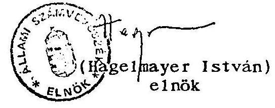

---

V-15-111/1995.
Témaszám: 278

# M E L L E K L E T 

az Állami Vagyonkezelö Részvénytársaság 1994. évi tevékenységének, valamint a jogutód szervezet megalakulási költségeinek az
Állami Privatizációs és Vagyonkezelö Rt〜nél végzett ellenőrzéséről készült jelentéshez

---

1994. március 03.

# Az Állami Vagyonügynökség 1994. éves tervezett bevételi és kiadási terve (millió Ft.)

|  |   |   |   |
| --- | --- | --- | --- |
|  |   |   |   |
|  |   |   |   |
|  |   |   |   |
|  Bevételek: |  |  |   |
|  Készpénz: |  | 43.170 | 39.500  |
|  (ebből) : Vagyonhozadék: | 2.410 |  | 4.000  |
|  Ért. devizáért: | 25.540 |  | 14.600  |
|  Értékesítés Ft.: | 15.220 |  | 20.900  |
|  Hitel: |  | 21.720 | 20.000  |
|  Kárpótlási jegy: |  | 13.040 | 30.000  |
|  Bevételek összesen: |  | 77.930 | 89.500  |

## Kiadások:

|  Közvetlen és közvetett priv. költs.: | 7.712 | 8.500  |
| --- | --- | --- |
|  Érték-sel összef. költség: | 4.293 | 5.700  |
|  Önkormányzatnak: | 1.149 | 2.300  |
|  Társaságnak utalás ( $20 \%$ ): | 2.270 | 500  |
|  ÁVÜ müködés, szerv.fejl.: | 1.350 | 1.800  |
|  Kezesség, jótáll.,szav.: | 5.650 | 12.500  |
|  Költségvetési befiz.: | 2.610 | 4.000  |
|  Reorganizáció (befektetés): | 8.930 | 11.000  |
|  Garanciafedezet képzése: | 2.000 | 1.000  |
|  MBF Rt. törzstökeemelés: | 2.000 | 2.000  |
|  Világkiállítási Alap: | - | 500  |
|  AV Rt. törzstökeemelés ( 1993 -ról ): | 6.500 | -  |
|  Elmaradott térségek támogatása: | - | -  |
|  Foglalkoztatási Alap | 1.900 | -  |
|  Területfejlesztési Alap | 1.300 | -  |
|  Mezőgazdasági Fejl. Alap | 1.300 | -  |
|  Gjármú és Kárrend. Alap | 720 | -  |
|  Kisváll.Garanciaalap: | 2.000 | -  |
|  Készpénz kiadások összesen: | 43.972 | 41.300  |
|  Államadósság törl.: | 22.200 | 20.000  |
|  Kárp. jegy kivonás, és önkorm.-nak: | 13.040 | 30.000  |
|  |   |   |
|  |   |   |

---

# Az Állami V'agyonügynökség 1995. évre tervezett bevételei és kiadásai (millió Ft.) 

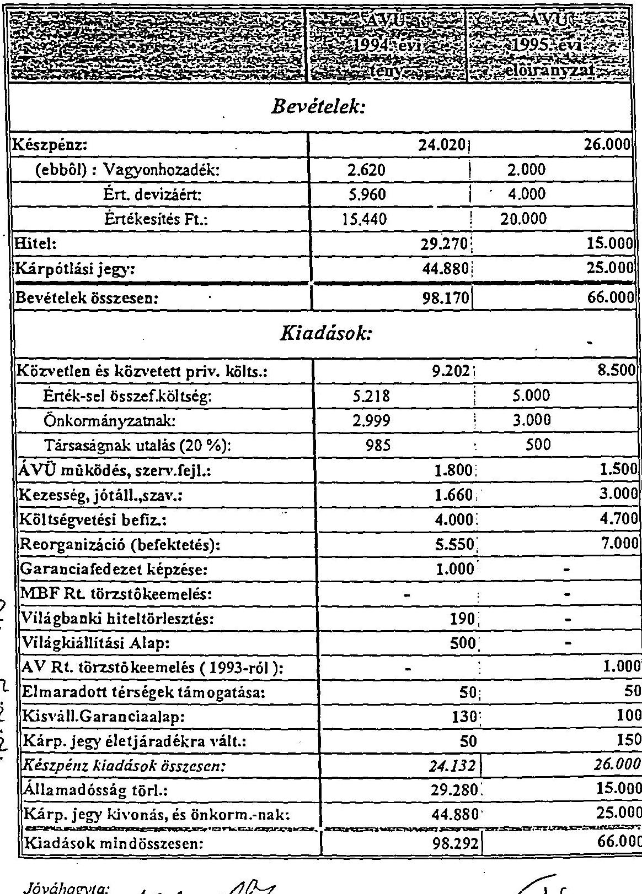

---

A Vagyonügynökséghez tartozó állami vagyon értékesítésével és hasznosításával összefüggő BEVÉTELEK 1994-ben

|  |   |   |   |   |   |   |   |   |   |
| --- | --- | --- | --- | --- | --- | --- | --- | --- | --- |
|   | 1993. | 1994. |  |  |  | 1995 | 1995.06.15. |  | köv.  |
|   | tény | elöir.* | tény | $\%$ | $\%$ | elöir. | tény | $\%$ | évekre áth.  |
|   | a | b | c | c/a | c/b | d | e | e/d | f  |
|  is bevétele |  |  |  |  |  |  |  |  |   |
|  izbevétel | 40.76 | 35.50 | 21.40 | 52.5 | 60.3 | 24.00 | 6.87 | 28.6 | -  |
|   | 15.22 | 20.90 | 15.44 | 101.4 | 73.9 | 20.00 | 4.51 | 22.6 | -  |
|   | 25.54 | 14.60 | 5.96 | 23.3 | 40.8 | 4.00 | 2.36 | 59.0 | -  |
|   | 21.72 | 20.00 | 29.27 | 134.8 | 146.4 | 15.00 | 2.73 | 18.2 | -  |
|  isi jegyért | 13.04 | 30.00 | 44.88 | 344.2 | 149.6 | 25.00 | 10.33 | 41.3 | -  |
|   | 75.52 | 85.50 | 95.55 | 126.5 | 111.8 | 64.00 | 19.93 | 31.1 | -  |
|  tozadék | 2.41 | 4.00 | 2.62 | 108.7 | 65.5 | 2.00 | 1.25 | 62.5 | -  |
|   | - | 4.00 | 2.00 | - | 50.0 | 2.00 | 1.15 | 57.5 | 2.03  |
|  iij | - | - | 0.62 | - | - | - | 0.10 | - | -  |
|  evételek | - | - | - | - | - | - | 0.46 | - | -  |
|  sesen: | 77.93 | 89.50 | 98.17 | 126.0 | 109.7 | 66.00 | 21.64 | 32.8 | ** 36.76  |

bevételeit nem direkt módon irányozták eló, hanem a kiadási szükségletek fedezeteként került meghatározásra 47 mrd Ft az adóskonszolidáció kapcsán megvett követelések

---

# (Hitel ill. tartozásátvállalásokból, engedményezésekből)

|  26-os Epitőip.Rt. | 60,000 | SZT/9995 | MHB-tól, ill BB Rt.-tól megvett követelés  |
| --- | --- | --- | --- |
|   |  |  | PM engedményezés (PM módosítás szerint 873.020 eFt)  |
|  Budapesti Tefipari Rt. | 1,291,841 | SZT/5857 |   |
|  Csongrádi Gabona Rt. | 263,140 | SZT/5857 | PM engedményezés  |
|  Debreceni Hús Rt. | 292,696 | SZT/5857 | PM engedményezés  |
|  Ganz Gépgyár Holding Rt. | 305,900 | SZT/5857 | PM engedményezés  |
|  Hortobágyi Halgazdaság | 65,000 | SZT/7852 | MHB-tól megvett követelés  |
|  Kistext Rt. | 1,080,362 | SZT/9729 | MHB-tól megvett követelés  |
|  Magyar Viscosa Rt. | 201,181 | SZT/7178 | MHB-tól megvett követelés  |
|  Masterfil Rt. | 2,507,008 | SZT/7175 | MHB-tól megvett követelés  |
|  MGM RT. | 2,138,036 | SZT/5857 | PM engedményezés  |
|  Ringa Húsipari Rt. | 1,203,371 | SZT/5857 | PM engedményezés  |
|  Salgótarjáni Acél Rt. | 430,000 | SZT/5857 | PM engedményezés  |
|  ST. Glass Rt. | 508,000 | SZT/7968 | Tartozáskivásárlás  |
|  Szekszárdi Húsipari Rt. | 1,393,856 | SZT/5857 | PM engedményezés  |
|  Szolnoktej Rt. | 48,900 | SZT/5857 | PM engedményezés  |
|  TAURUS | 8,255,426 | SZT/5857 | PM engedményezés  |
|  Törökszentmiklós Baromfi Rt. | 261,446 | SZT/5857 | PM engedményezés  |
|  VILATI | 1,122,300 | SZT/5857 | PM engedményezés  |
|   | 21,428,463 |  |   |
|  |   |   |   |

---

(Hitel ill. tartozásátvállalásokból, engedményezésekből)

|  Törzsaság neve | Követelés Szegé eFt | SZT/ | Megjegyzés  |
| --- | --- | --- | --- |
|  26-os Epitöip.Rt. | 60,000 | SZT/9995 | MHB-tól, ill BB Rt -tól megvett követelés  |
|  Budapesti Tejipari Rt. | 1,291,841 | SZT/5857 | PM engedményezés (PM módosítás szerint 873.020 eFt)  |
|  Csongrádi Gabona Rt. | 263,140 | SZT/5857 | PM engedményezés  |
|  Debreceni Hús Rt. | 292,696 | SZT/5857 | PM engedményezés  |
|  Ganz Gépgyár Holding Rt. | 305,900 | SZT/5857 | PM engedményezés  |
|  Magyar Viscosa Rt. | 201,181 | SZT/7178 | MHB-tól megvett követelés  |
|  Masterfil Rt. | 2,507,008 | SZT/7175 | MHB-tól megvett követelés  |
|  MGM RT. | 2,138,036 | SZT/5857 | PM engedményezés  |
|  Ringa Húsipari Rt. | 1,203,371 | SZT/5857 | PM engedményezés  |
|  Salgótarjáni Acél Rt. | 430,000 | SZT/5857 | PM engedményezés  |
|  Szekszárdi Húsipari Rt. | 1,393,856 | SZT/5857 | PM engedményezés  |
|  Szolnoktej Rt. | 48,900 | SZT/5857 | PM engedményezés  |
|  TAURUS | 8,255,426 | SZT/5857 | PM engedményezés  |
|  Törökszentmiklós Baromfi Rt. | 261,446 | SZT/5857 | PM engedményezés  |
|  VILATI | 1,122,300 | SZT/5857 | PM engedményezés  |
|   | 19,775,101 |  |   |
|  |   |   |   |

---

Az AVÜ által kötött értélesítést szerzödéseliben szereplő fizetést kötelezettségele évenkénti bontásban

| EV | Bevétel összege | A bevétel megoszldsa |  |  |
| :--: | :--: | :--: | :--: | :--: |
|  |  | Készpénz | Kápótilasi jegy | E-bitel |
| 1995 | 4.070 .897 .299 | 1.809 .874 .215 | 1.748 .564 .394 | 432.458 .690 |
| 1996 | 1.265 .293 .561 | 1.123 .462 .561 | 141.831 .000 | - |
| 1997 | 5.580 .578 .898 | 5.501 .572 .713 | 79.006 .185 | - |
| 1998 | 1.002 .463 .289 | 871.423 .289 | 131.040 .000 | - |
| 1999 | 891.374 .571 | 765.730 .571 | 125.644 .000 | - |
| 2000 | 835.816 .893 | 715.568 .893 | 120.248 .000 | - |
| 2001 | 775.531 .390 | 775.531 .390 | - | - |
| 2002 | 641.307 .346 | 641.307 .346 | - | - |
| 2003 | 557.221 .873 | 557.221 .873 | - | - |
| 2004 | 412.733 .935 | 412.733 .935 | - | - |
| 2005 | 111.779 .038 | 111.779 .038 | - | - |
| 2006 | 103.263 .222 | 103.263 .222 | - | - |
| 2007 | 99.328 .222 | 99.328 .222 | - | - |
| 2008 | 96.627 .644 | 96.627 .644 | - | - |
| 2009 | 48.895 .274 | 48.895 .274 | - | - |
|  | 16.493 .112 .455 | 13.714 .320 .186 | 2.346 .333 .579 | 432.458 .696 |

---

# MEGÁLLA P O D A G 

a privatizációért felelős tárca nêlkoili miniszter és a pénzügyminiszter között az 1992. évi LIV. törvény 17. paragrafus (1) bekezdésében foglalt rendelkezés végrehajtásáról.

A felek a privatizáció gyors lebonyolítása érdekében az időlegesen állami tulajdonban levô vagyon értékesítéséról, hasznosításáról és védelméról szóló 1992. évi LIV. törvény 17. paragrafus (1) bekezdés elôírásait 1994. december 31-ig az alábbiak szerint hajtják végre:
a) 500 millió forintig ügyletenként minden garanciavállalásról, amely a Vagyonügynökséghez tartozó állami vagyon terhére történik, illetőleg, amely a Vagyonügynökséget készpénzfizetésre kötelezi, az Állami Vagyonügynökség esetileg, saját hatáskörében, szabadon dönt.
b) 500 millió forint és 1 milliárd forint közötti a) pont szerinti kötelezettségvállalást megelőzően a pénzügyminisztérium közigazgatási államtitkára írásbeli. nyilatkozatát kell a kötelezettségvállalással kapcsolatban a döntés elôtt írásban beszerezni.
c) 1 milliárd forintnál magasabb ügyletenkénti kötelezettségvállalás esetén a pénzügyminiszter jogosult az elôzetes írásbeli egyetértő nyilatkozat megtételére.
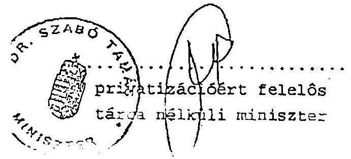
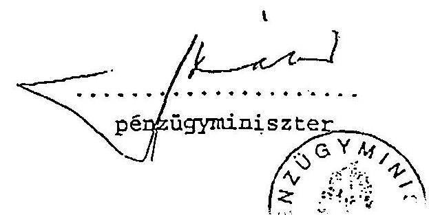

---

# Részvényértékesitések ágazatonként az Állami Vagyonügynökségnél 1994-ben

|  Ágażat | Értékesített
társaságok
db | Értékesített
jegyzett tőke
nagysága
MFt | Eladási
ár
MFt | Árfolyam
%  |
| --- | --- | --- | --- | --- |
|  Mező-, erdő-, vadgazdálkodás | 19 | 3585,2 | 3575,2 | 99,72  |
|  Bányászat |  |  |  |   |
|  Feldolgozóipar | 103 | 34142,2 | 33539,2 | 98,23  |
|  Villamosenergia-,gáz-, hő- és |  |  |  |   |
|  Építőipar | 11 | 3463,9 | 2812,7 | 81,2  |
|  Kereskedelem, közúti jármű és
közzsükségleti cikk javítás | 60 | 16161,5 | 17961,2 | 111,13  |
|  Szálláshely-szolgáltatás és javítás | 11 | 6177,9 | 6566,9 | 106,29  |
|  Ingatlanügyek, bérbeadás és
gazd. tev. segítő szolg. | 9 | 1312,4 | 2198,4 | 167,5  |
|  Oktatás |  |  |  |   |
|  Egyéb közösségi, társadalmi és
személyi szolgáltatás | 1 | 167,5 | 50,2 | 29,97  |
|  ÖSSZESEN: | 214 | 65010,6 | 66703,8 | 102,6  |

---

# Vagyonvédelmi értékesítések ágazatonként az Állami Vagyonügynökségnél 1994

|  Ágazat | Vagyonvé
delmi
értékesítés
ek
db | Könyvszer
inti érték
MFt | Eladási ár
MFt | Árfolyam
$\%$  |
| --- | --- | --- | --- | --- |
|  Mezö-,
vadgazdálkodás | 44 | 263,6 | 280,6 | 106,4  |
|  Bányászat | 9 | 216,7 | 144,4 | 66,6  |
|  Feldolgozóipar | 64 | 4961.0 | 24885,9 | 598  |
|  Villamosenergia-, gáz-, hö-
és vízellátás' |  |  |  |   |
|  Építóipar | 22 | 122,2 | 464 | 379,7  |
|  Kereskedelem, közúti jármú
és közszükségleti cikk
javítás | 13 | 454,5 | 1769.0 | 389,2  |
|  Szálláshely-szolgáltatás és
javitás | 11 | 65,5 | 24,5 | 37,4  |
|  Ingatlanügyek, bérbeadás és
gazd. tev. segítő szolg. | 103 | 458,9 | 933,4 | 203,3  |
|  Oktatás |  |  |  |   |
|  Egyéb közösségi, társadalmi
és személyi szolgáltatás | 1 | 0,0 | 22 |   |
|  ÖSSZESEN: | 267 | 5742,4 | 28523.8 | 496,7  |

---

A hazai és a külföldi befekte:ök részvétele a privatizációban

| A hazai befektetők által megszerzett
tulaidon átlagos értéké |  |  |  |  |  |  | A külföldi befektetők által megszerzett
tulaidon átlagos értéke |  |  |  |  |  |  |
| :--: | :--: | :--: | :--: | :--: | :--: | :--: | :--: | :--: | :--: | :--: | :--: | :--: | :--: |
|  | 1992 |  |  | 1993 |  | 1994 |  | 1992 |  |  | 1993 |  | 1994 |
| tranzakciók   db | eFt | tranzakciók   db | eFt | tranzakciók   db | eFt | tranzakciók   db | eFt | tranzakciók   db | eFt | tranzakciók   db | eFt |  |  |
| 21 | 10,502 | 27 | 20,477 | 49 | 24195 | 1 | 16,920 | 1 | 100 | 12 | 5,298 |  |  |
| 30 | 129,523 | 52 | 76,675 | 92 | 134,174 | 7 | 382,596 | 6 | 86,347 | 13 | 33,805 |  |  |
| 7 | 93,711 | 22 | 189,614 | 54 | 244,765 | 4 | 355,598 | 5 | 1,174,820 | 36 | 476,806 |  |  |
| 23 | 147,960 | 72 | 271,893 | 124 | 343,765 | 2 | 725,031 | 6 | 509,833 | 43 | 750,686 |  |  |
| 73 | 155,150 | 291 | 139,414 | 671 | 201,601 | 7 | 786,852 | 21 | 660,322 | 72 | 1,484,227 |  |  |
| 154 |  | 464 |  | 990 |  | 21 |  | 39 |  | 176 |  |  |  |

---

Az Állami Vagyonügynökség által 1994-ben kiirt privatizációs pályázatok ágazatonként

| Ágazat | Meghir detett társaság ok száma | Pályázatok száma | Pályázatok, db |  |  |  |  |
| :--: | :--: | :--: | :--: | :--: | :--: | :--: | :--: |
|  |  |  | Nyilt | Zárt | Sikeres | Siker-   telen | Lezá-   ratlan |
| Mezö-, erdö-, vadgazdálkodás | 15 | 15 | 15 | 0 | 10 | 1 | 4 |
| Bányászat | 1 | 1 | 1 | 0 | 0 | 1 | 0 |
| Feldolgozóipar | 110 | 121 | 114 | 7 | 99 | 11 | 11 |
| Épitöipar | 17 | 18 | 18 | 0 | 16 | 1 | 1 |
| Kereskedelem, közúti jármú és közszükségleti cikk javitás | 75 | 81 | 81 | 0 | 65 | 12 | 4 |
| Szálláshely-szolgáltatás és javitás | 14 | 16 | 15 | 1 | 14 | 2 | 0 |
| Szállitás, raktározás, posta és távközlés | 3 | 3 | 3 | 0 | 3 | 0 | 0 |
| Ingatlanügyek, bérbe adás és gazd. tev. segitő́ szolq. | 16 | 18 | 18 | 0 | 14 | 1 | 3 |
| Egészségügyi és szociális ellátás | 12 | 12 | 12 | 0 | 1 | 0 | 11 |
| Egyéb közösségi, társadalmi és személyi szolgáltatás | 4 | 4 | 4 | 0 | 3 | 1 | 0 |
| ÖSSZESEN: | 267 | 289 | 281 | 8 | 225 | 30 | 34 |

---

# ÁLLAMI VAGYONÜGYNÖKSÉG 

## ÁLLAMI VÁLLALATI VAGYON ALAKULÁSÁNAK RÉSZLETEZÉSE

Db
MdFt
1994. évi nyitó
$+\quad$ saját vagyonu ..... 128 ..... 62.61

- saját vagyonu ..... 28 ..... 94.9
Felszámolás alatt ..... 274 ..... 21.19
Végelszámolás alatt ..... 86 ..... 178.7
Csökkenés
- elvonás ..... 7.93
- felszámolás alá eső ..... 31 ..... 1.23
- végelszámolás ..... 44 ..... 18.05
- vagyonvédelem ..... 0.57
- átalakulás ..... 60 ..... 18.13
- átadás ..... 24 ..... 15.27
- megszünés ..... 10 ..... 0.55
- gazdálkodásból eredő ..... 11.93
Összesen: ..... 169 ..... 73,66
Növekedés
- felszámolás alatti ..... 29 ..... 1.23
- végelszámolás alatti ..... 44 ..... 18.05
- átalakulás vissza ..... 1
Összesen: ..... 74 ..... 19.28
1994. évi záró
$+\quad$ saját vagyonu ..... 6 ..... 2,27
- saját vagyonu ..... 3 ..... 95,28
Felszámolás alatt ..... 295 ..... 26,77
Végelszámolás alatt ..... 117 ..... 124,32

---

# TÁRSASÁGI VAGYON ALAKULÁSÁNAK RÉSZLETEZÉSE

|   | Db | MdFt  |
| --- | --- | --- |
|  1994. évi nyitó |  |   |
|  + | saját vagyonu | 744  |
|   | saját vagyonu | 24  |
|   | F elszámolás alatt | 26  |
|   | Végelszámolás alatt | 3  |
|   | Elvonás | -  |
|   | Összesen: | 797  |
|  Növekedés |  |   |
|   | - átalakulás | 62  |
|   | - alapítás | 109  |
|   | - visszavásárlás | -  |
|   | - alaptőkeemelés | -  |
|   | - felszámolás | 39  |
|   | - végelszámolás | 12  |
|   | - elvonás | -  |
|   | Növekedés összesen: | 222  |
|  Csökkenés |  |   |
|   | - értékesítés | 230  |
|   | - vagyonátadás | 16  |
|   | - alaptőkecsökkenés | -  |
|   | - megszűnés | 5  |
|   | - felszámolás | 39  |
|   | - végelszámolás | 12  |
|   | - elvonás | -  |
|   | - gazdálkodásból eredő | -  |
|   | Csökkenés összesen: | 302  |
|  1994. évi záró |  |   |
|  + | saját vagyonu | 623  |
|   | saját vagyonu | 15  |
|   | Felszámolás alatt | 65  |
|   | Végelszámolás | 14  |
|   | Elvonás | -  |
|   | Összesen: | 717  |

---

# ALLAMI VAGYONÜGYNÖKSÉG 

## ELVONT ÁLLAMI VÁLLALATI VAGYON ALAKULÁSÁNAK RÉSZLETEZÉSE

1994. évi nyitó ..... 9,71
Növekedés

- elvonás ..... 4,67
Csökkenés
- értékesítés ..... 5,58
- appert, egyéb ..... 0,05
- tökeemelés ..... 0,91
- átadás ..... 0,82
Csökkenés összesen: ..... 7,36

1994. évi záró ..... 7.02

---

PRIVATIZĀCIÓS BEVETELEK ES EREDMÉNYEK
1994. évben EFt-ban

| Cegek neve | Fizetési   mód | Készp.   érté-   kesítés | Kárpótl.   jegy | Egyéb priv.   bevétel | Bevétel   összesen | Bevétel |  |
| :--: | :--: | :--: | :--: | :--: | :--: | :--: | :--: |
|  |  |  |  |  |  | Jegyzett | Saját |
| MOL Rt. |  |  | 7.073 .686 |  | 7.073 .686 | 145 | 54 |
| Antenna |  |  |  |  |  |  |  |
| Hungária |  |  | 1.126 .390 |  | 1.126 .390 | 154 | 110 |
| Chinoin |  | 105.120 | 3.361 .482 |  | 3.466 .602 | 525 | 118 |
| Richter Ge- |  |  |  |  |  |  |  |
| deon Rt. |  | 666.065 |  |  | 666.065 | 133 | 140 |
| Biogál Rt. |  |  | 488.052 | 397.481 | 885.533 | 228 | 169 |
| Egis Rt. |  | 3.528 .733 | 1.439 .387 |  | 4.968 .120 | 206 | 86 |
| Humán Rt. |  | 6.666 |  |  | 6.666 | 50 | 28 |
| Alkaloida Rt. |  |  | 332.950 |  | 332.950 | 194 | 141 |
| Dokut Rt. |  |  | 25.680 |  | 25.680 | 100 | 71 |
| KAGE Rt. |  |  | 66.207 |  | 66.207 | 662 | 547 |
| Szegedi Pap- |  |  |  |  |  |  |  |
| rika Rt. |  |  | 52.966 |  | 52.966 | 662 | 780 |
| Pick Szeged Rt. |  |  | 66.207 |  | 66.207 | 662 | 208 |
| Pecunia Rt. |  | 447 |  |  | 447 | 100 | 100 |
| Zenemúkia- |  |  |  |  |  |  |  |
| dó Rt. |  | 75.000 |  |  | 75.000 | 177 | 143 |
| Szikra Lap- |  |  |  |  |  |  |  |
| ny.Rt. |  |  | 52.748 |  | 52.748 | 90 | 51 |
| AB-AEGON Rt. |  | 350.000 |  | 434.040 | 784.040 | 100 | 120 |
| Hungária |  |  |  |  |  |  |  |
| Biztosító Rt. |  | 1.092 .193 |  |  | 1.092 .193 | 175 | 240 |
| OTP Rt. |  |  | 4.859 .791 |  | 4.859 .791 | 102 | 71 |
| MKB Rt. |  | 1.040 .923 | 372.283 |  | 1.413 .206 | 105 | 50 |
| Intereurópa |  |  |  |  |  |  |  |
| Bank Rt. |  | 175.554 |  |  | 175.554 | 116 | 116 |
| Összesen: |  | 7.040 .701 | 19.317 .829 | 831.521 | 27.190 .051 | 155 | 77 |
| ebböl | deviza |  |  |  |  |  |  |
|  | bevétel! | 4.988 .826 | - | - | 4.988 .826 |  |  |

---

# A MAGYAR TELEVÍZIÓ   TARTOZÁSAINAK AZ ÁV RT. RÉSZÉRŐL VALÓ ÁTVÁLLALÁSA 

A Magyar Televizió (MTV) hosszútárvú fizetési elmaradása miatt az Antenna Hungária Rt., a továbbiakban (ÁHRT) komoly likviditási zavarokkal küszködött 1994. évben (ÁHRT az infrastruktúra portfólió egyik stratégiai fontosságú társasága az Áv Rt-nek).

Az ÁHRT az MTV-vel való többszöri egyeztető tárgyaláson sem jutott eredményre az MTV-ve1 (a tartozások elérték az 1,5 milliárd Ft-ot), ezért bírósághoz fordult.
Az 1994. november 3-án lezárult tárgyalás a 39.G.76.574/1994/5 sz. itélettel zárult, amely kötelezte az MTV-t 906,1 millió Ft tartozás és 77 millió Ft késedelmi kamat fizetésére.

A helyzet megoldása érdekében Békesi László a Pénzügyminiszter a Privatizációs kormánybiztos segítségét kérte "az Állami Vagyonkezelő Rt. vállalja át, vagyis közvetlenül fizesse ki az Antenna Hungária Rt. részére a sugárzási díjemelésböl származó MTV és MR fizetési kötelezettségeit olymódon, hogy 800 millió Ft-ot az ÁHRT részére kiegyenlíti, és ÁHRT osztalékkötelezettségétöl eltekint.
Mivel az MTV nem áll jogviszonyban az ÁV Rt-vel és az 1992. évi LIII. törvény szerint az ÁV Rt. érdekeltségi körén kivülálló szervezet tartozás átvállalását nem teszi lehetővé.
1994. december elején az ÁHRT fizetésképtelenné vált.

---

Az ÁV Rt. igazgatósága többször tárgyalta az ügyet és határozatokat hozott, végül a 393/1994. (XII. 13.) sz. határozatát módosította a 409/1994. (XII.20.) sz. határozattal olymódon, hogy az ÁV Rt. névértéken szerezzen vételi opciót az MTV tartozás megvasárlására olymódon, hogy 750 millió Ft-ot átutal az ÁHRT számlájára tartozás kiegyenlítés címén és 254 millió Ft osztalékköveteléséröl az ÁV Rt. lemond. Ezen ügyletet az 1994. évi december 19-én aláírt megállapodás rögzíti, amelyet az ÁV Rt. mint engedményes (Lascsik Attila aláírásával) és az ÁHRT mint engedményezō írtak alá.

Az ÁV Rt. 1994. évi könyveiben követelésként tartja nyilván az MTV Tartozását 1,003,962 ezer Ft értékben. Ezen összegre 1994. évben $50 \%$-os céltartalékot képzett az ÁV Rt. úgy, hogy a Magyar Televiziót nem értesítette a követelés átvállalásáról!

Igy nem is szólította fel írásban a követelés kiegyenlítésére, nem bizonyosodott be az, hogy az MTV nem akar fizetni, csak feltételezték a nem fizetést és ennek alapján állitották be a mérlegbe és az eredménykimutatásba az 501.981 ezer Ft céltartalékot a kétes követelések miatti várható veszteségek fedezetére.

Az ÁV Rt. jogosítványai ezt a tartozás átvállalást nem teszik lehetővé, így ez az ügylet törvénye11enes, és kikerüli az állami költségvetési szervek gazdálkodási rendszerének törvényeit is. A céltartalék képzése azt feltételezi, hogy ezen összeg kifizetését az ÁV Rt-nek az MTV nem fogja teljesíteni, így ez az ÁV Rt. részére 1 milliárd Ft veszteséget okoz és csökkenti az állami vagyon feletti rendelkezés összegét is.

---

# 1133 BUDAPEST. POZSONYI UT 50. LEVELCIM: 1399 BUDAPEST. PE: 708   TEL: 269-8600. FAX: 149-5745 TELEX: 20-2892 

Felügyelö Bizottság elnöke
dr. Kovács Árpád
számvevö igazgató
Állami Számvevőszék

Az ÁVÜ és az ÁV Rt. 1994. évi tevékenységéröl, valamint az ÁPV Rt. megalakulásával összefüggő költségek ellenőrzéséről készített ÁSZ jelentésre - kérésének megfelelően - az alábbi észrevételt teszem:

Mint Ön előtt ismert az ÁPV Rt. Felügyelö Bizottsága kinevezése 1995. június 17 -én történt meg, így az FB - jelenlegi felállásában - a két "jogelőd" vagyonkezelő szervezet elmúlt évi tevékenységéről saját hatáskörű vizsgálati tapasztalatokkal nem rendelkezik. Ezért a konkrét, számszerűségeket tartalmazó megállapításokra észrevételeimben nem térek ki.

Az ÁSZ Jelentés összefoglaló megállapításainak többségével egyetértek, mert az ÁPV Rt. Felügyelö Bizottsága véleményeiben hasonló megállapításokra jutott:

- a privatizáció ütemének lassulása;
- a készpénzbevételek tervezettől való elmaradása;
- a költségvetési törvényben előírt befizetési kötelezettségektől elmaradás;
- az elkülönített állami pénzalapokra történő átutalások elmaradása;
- a szerződéses kötelezettségek nyilvántartási rendszerének hiányosságai;
- a reorganizációs célú kifizetések támogatás jellegủ felhasználási

---

(Mellékelten megküldöm az FB hasonló témában készített véleményeit és vizsgálati jelentését.)

Némileg eltérő a közelítésem a vagyonvesztést illetően. A vagyonvesztés nem szűkíthető le csupán a felszámolási eljárás alá vont vagyoni körre (7. oldal 3. bekezdés vége), annál szélesebben értelmezendő.

A vagyonvesztés, ezen belül a felszámolási eljárás alá került cégek számának és azok vagyontömegének növekedése - megítélésem szerint - felveti a vagyonkezelési tevékenység, a tulajdonosi joggyakorlás minőségét. A vagyonkezelési tevékenység jelentőségét és fontosságát a jelentés különböző témaköreinél javasolom kiemeltebben kezelni. (Megjegyzem, hogy a felszámolás is tekinthető egy bizonyos típusú magánosításnak, más kérdés ez esetben a piaci érték alakulása.)

Nagyon fontos megállapításnak tartom a két szervezet vagyonkimutatásával foglalkozó összefoglaló megállapításokat és a részletes jelentésben leírtakat.

A bemutatott vagyoni helyzet alapján, az ÁPV Rt. portfóliójába tartozó társaságok és részesedések pontos nyilvántartásának hiányában a privatizációra, kárpótlásra, vagyonjuttatásra felkínált vagyontömeg nagysága válik kérdésessé. A témakör jelentősége miatt sajnálattal tapasztaltam, hogy a tényleges vagyoni helyzet kimunkálására irányuló javaslat nem került megfogalmazásra az ÁSZ részéről. Fontos volna ez azért is, mert a privatizációs törvény több ponton ír elő vagyonrendezést (70.§. 8., 9., 11., 12.). Az alaptőke leszállítása a vagyoni struktúra pontos ismeretének hiányába nem megoldható feladat.

Ugyancsak hiányolom az ajánlások köréből a könyvvizsgáló tevékenységére utaló feladatok megfogalmazását. Amennyiben az észrevételezés menetében az ÁSZ Jelentésének 65-70. oldalán tett megállapítások nem módosulnak a könyvvizsgálóval szembeni elvárások is felvethetők. Különös tekintettel az ÁV Rt. vagyonának visszamenőleges rendezése, valamint az ÁPV Rt. Alapító Okiratában megáározott alaptőke nagyságának és összetételének kimutatásában.

---

A Kormány részére tett ajánlások második pontjában javasolom a szövegből "az állami tulajdonosnak" szöveg elhagyását. A felszámolási eljárásban a hatályos törvény lehetőségeinek kihasználásával és a törvény módosításával a tulajdonosi érdekek érvényesítése erõsíthetõ. Azonban ez nem korlátozható kizárólag az állami tulajdonosra; másfelől nem változtatható meg a törvénynek az a felfogása, mely szerint a felszámolási eljárásban alapvetően a hitelezők védelme a cél.

A részletes jelentés 30. oldalán a törvényi célokkal nem összefüggõ társaság alapításokat kifogásolja a Jelentés. Ennek rendezésére, felülvizsgálatára azonban az ajánlások között nem tér vissza.

Az ÁPV Rt. Felügyelö Bizottsága részére címzett ajánlások átfogalmazását javasolom. Az ÁSZ jelentése tartalmazza az ÁPV Rt. megalakulásával kapcsolatos költségek, ezen belül kiemelten a bérköltségek, illetve a bértömeg nagyságának meghatározására tett megállapításokat. Ezeket a vizsgálati megállapításokat - amennyiben az észrevételezés során érdemben nem módosulnak, - tényszerűnek kell tekinteni.

A Felügyelö Bizottság az ÁPV Rt. Igazgatósága és Ügyvezetése részére tett ajánlások alapján készítendõ Intézkedési Terv ellenõrzését végezné el. Kérem javaslatom elfogadását.

Bizom abban, hogy észrevételeim az ÁSZ Jelentés egyeztetõ szakaszában segítséget nyújtanak a jelenségek tényszerủ megítélésében és a meglévõ hiányosságok felszámolásában.

Budapest, 1995. november 17.

Melléklet: 3 db

---

# Az ÁPV Rt. Felügyelö Bizottsága   VÉLEMÉNYE   az ÁPV Rt. és az ÁVÜ 1994. évi tevékenységéröl készült beszámolóhoz 

A gazdasági társaságokról szóló törvény 36. §. (2) bekezdése alapján a Felügyelő Bizottság feladata, hogy megvizsgálja a Részvényesi Jogok Gyakorlója elé terjesztett valamennyi - a müködéssel kapcsolatos beszámolót.

E törvényi kötelezettségének tesz eleget az ÁPV Rt. Felügyelő Bizottsága azzal, hogy véleményezi az ÁV Rt. és az ÁVÜ 1994. évi tevékenységéről készült összefoglalót és beszámolókat.

Véleménye kialakításakor vizsgálati tapasztalattal még nem rendelkezik a jogelőd szervezetek tevékenységéről, mivel a testület tagjait a Kormány 1049/1995.(VI.17.) sz. és annak kiegészitő határozatával nevezte ki. Az FB eltelt időszak alatti mukája nem nyújt elegendő információt ahhoz, hogy biztonsággal, kellő megalapozottsággal állást foglaljon a két szervezet tevékenységéről, számszaki eredményeinek értékeléséről, megbízhatóságáról. Feladatait az 1995. évi XXXIX. törvény alapján kezdte meg, ezzel szemben a beszámolók a korábbi hatályos törvények alapján végzett tevékenységről adnak számot.

Az FB megállapítja, hogy az ÁPV Rt. Igazgatósága 1995. szeptember 6-án tárgyalta és 141. sz. határozatával jóváhagyta az ÁV Rt. és az ÁVÜ 1994. évi beszámolója alapján készített összefoglalót. Az egyedi beszámolók jöváhagyása - a vagyonkezelő szervezetek eltérő jogállásából adódóan - különböző módon történt:

Az ÁV Rt. éves beszámolóját - a társasági és a számviteli törvény elöírásainak megfelelően - a könyvvizsgáló hitelesítő záradékával már az ÁPV Rt. Igazgatósága (3/1995. (VI.19.) határozatával terjesztette a

---

Részvényesi Jogok Gyakorlójához elfogadásra, az ÁV Rt. FB elnöke jelentésével egyidejűleg.

A Részvényesi Jogok Gyakorlója 1/1995. (VI.26.) határozatával az ÁV Rt. Igazgatóságának beszámolóját, a Felügyelö Bizottság és a könyvvizsgáló jelentését elfogadta.
Az ÁV Rt. 1994. évi tevékenységéről összeállított beszámoló megegyezik a jóváhagyott, a számviteli törvény alapján készített éves beszámoló jelentéssel.

Az ÁVÜ 1994. évi tevékenységéről szóló beszámolót az ÁPV Rt. vezérigazgatója fogadta el a 160/1995. (VIII.03.) számú határozatával. (Az ÁVÜ Igazgatótanácsa ekkor már tisztségéből felmentésre került.)

Az ÁPV Rt. Felügyelö Bizottsága megállapítja, hogy az 1992. évi LIII. és LIV. törvény elöirásainak megfelelően az ÁV Rt. és az ÁVÜ 1994. évi tevékenységéről

- az éves beszámolókat elkészítette;
- a beszámolók tartalmazzák a kötelezöen elöírt tématerületeket (vagyon alakulása, hasznosítása);
- a Vagyonpolitikai irányelvek végrehajtásának bemutatását;
- a központi költségvetésnek és az elkülönített állami pénzalapoknak történt befizetések összegét.

Formailag tehát a két vagyonkezelő szervezet a korábbi törvényeknek megfelelően eleget tett beszámolási kötelezettségének. Hiányolja azonban a Felügyelö Bizottság, hogy az ÁV Rt-nél müködő, előző felügyelö bizottsági jelentés megállapításaiból, valamint a könyvvizsgáló szakmai levelében megfogalmazott észrevételekböl levont következtetéseket az összefoglaló nem tartalmazza.

---

A Beszámolók tartalmi elemzése kapcsán a Felügyelõ Bizottság felhívja a Részvényesi Jogok Gyakorlójának figyelmét néhány fontos, a hatályos privatizációs törvény alapján müködõ ÁPV Rt. eddigi müködése során is már megjelenõ problémára, amelynek kiküszöbölését szükségesnek tartja:

1. Törvényekben elöírt határidõk betartása.

Az éves beszámolók összeállítása, testületi elfogadása késett, Az Országgyűléshez az elõírt határidõben - az elõzõ évi állami költségvetés végrehajtásáról szóló törvényjavaslat elkészítésével egyidejüleg - nem került benyújtásra.
2. Az 1994. évre vonatkozó VPI elöírta (4 pont 2. bekezdés), hogy az ÁV Rt. és az ÁVÜ a reorganizáció nyomonkövetésére és hatékonyságának vizsgálatára eljárási rendet dolgozzon ki. A reorganizáció szabályozását átfogó eljárási rend elkészítésérõl az FB-nek nincs tudomása. A Felügyelõ Bizottság a kérdés fontosságát hangsúlyozza, mert 1995. évre az üzleti - pénzügyi terv megközelítõleg 12 milliárd forint kihelyezésével számol. Fontos, hogy a reorganizációs célú támogatások tényleges eredményessége, hatékonysága mérhetõ legyen.
3. Az 1994. évi költségvetési befizetési kötelezettségek, valamint az elkülönített állami pénzalapoknak történõ átutalások teljesítése nem érte el a VPI-ben és a költségvetési törvényben elöírt összegeket. Az 1995. évi költségvetési törvényben elõírt befizetési kötelezettség teljesítését az 1995. évi üzleti-pénzügyi terv sem igazolja vissza.
4. 1994. év során a privatizáció üteme lelassult, a készpénzbevétel aránya visszaesett annak ellenére, hogy a privatizációs stratégia a készpénzbevétel fontosságát hangsúlyozta. Az összbevételen belül a készpénzhányad növelése fontos követelmény a privatizációs költségek finanszírozása, az eddigi kötelezettségvállalások és a költségvetési befizetési kötelezettségek teljesítése szempontjából is.

---

5. Vagyonátadási kötelezettségeinek 1994. évben sem tett eleget a két vagyonkezelő szervezet. Évek óta megoldatlan a társadalombiztosítási önkormányzatok részére történő vagyonátadás. Reálisan 1995. év végéig sem biztosítható a társadalombiztosítás pénzügyi alapjainak költségvetéséről szóló 1995. évi LXXIII. törvény szerinti teljesítés. (Ezt az ÁPV Rt. 1995. évi üzleti pénzügyi terve sem irányozza elő.) Társaságok részére azonban apportáltak vagyonelemeket a vagyonkezelők.

Az ÁPV Rt. Felügyelö Bizottsága az ÁV Rt. és az ÁVÜ 1994. évi tevékenységéről készült beszámolókat és az összefoglalót - fentiek figyelembe vételével - tudomásul veszi.

Budapest, 1995. október 20.
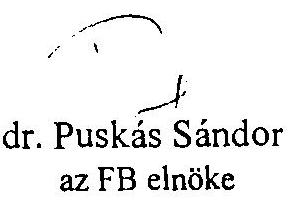

---

# 1133 NUDAFEST. POZSONYI UT So. LEVELCIM: 1399 NUDAFEST. PE: 708   TEL: 209-8000. FAX: 149-5745 TEIEX: 20-2892 

Budapest, 1995. november 22.

Állami Számvevőszék
Dr. K o vá e s Árpád úr
számvevő igazgató
Budapest

Tárgy: Az ÁVÚ és ÁV Rt. összevonása, illetve az ÁPV Rt. megalakulása költségeinek ellenôrzéséről szóló V-15-103/1995. számú ÁSZ jelentés észrevételezése

Tisztelt Számvevő Igazgató Úr!

Szíves felhasználásra mellékelten megküldöm a fenti tárgyú jelentésre készített anyagunkat.
A végleges jelentés összeállításánál kérjük a mellékelt észrevételeinket figyelembe venni szíveskedjenek.
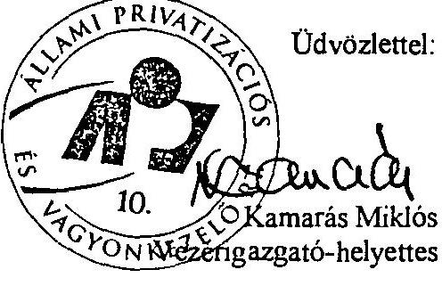

Melléklet

---

# Észrevételek 

## az Állami számvevőszék V-15-103/1995.SZ. jelentéséhez, amely az ÁVÜ és ÁV Rt. összevonása, illetve az ÁPV Rt. megalakulása költségeinek ellenőrzésére vonatkozik

A jelentéssel kapcsolatos észrevételeinket az 1989. évi XXXVIII.tv. értelmében az alábbiak szerint tesszük meg.

II/1. Összefoglaló megállapítások, következtetések fejezethez

## 4. oldal 1. bekezdéshez

Álláspontunk szerint az állami vagyonkezelő szervezetek kellő szakmai és szervezeti felkészültséggel rendelkeztek az 1994. évi tervek végrehajtásához és csak külső okok vezettek a privatizáció 1994. évi lelassulásához. (Pl. az előző év végén a sikeres MATÁV privatizáció lényegében ugyanazon szakmai és szervezeti körülmények között valósult meg.)

Fenti okok miatt kérjük a vonatkozó megállapitás törlését.
6. oldal 1. bekezdéshez ( illetve a 61. oldaltól a 65. oldalig)

Az a megállapítás, mely szerint az ÁV Rt. tevékenységének veszteségét a privatizációs bevételek 1994. évi jelentős elmaradása idézte elő, pontositásra szorul.

A költségvetési törvény az ÁV Rt-re a különféle pénzalapok javára történő befizetési kötelezettség teljesítését írja elő, amelyet a ráfordítások között mutatunk ki. Ez 1994. évben 28.269 mFt -ot tett ki.

A kárpótlási jegyek megsemmisítése vagyonvesztésnek tekinthető, amelyet szintén a ráfordítások között számolunk el. Ennek összege 20.047 mFt .

Az ÁV Rt. a Számviteli törvényben elöírtak betartása érdekében 14.587 mFt értékvesztést számolt el. Fenti összeg 12 társaság nyilvántartási értékét módosította, döntő mértékben 2 kereskedelmi bank (MHB Rt. és Kereskedemi Bank Rt; 11.994 mFt) Kormányhatározatoknak megfelelő konszolidációjának következtében.

A fentiek mindösszesen 62.903 mFt -ot tesznek ki, amelyek megítélésünk szerint nem a

---

Amennyiben ezek a törvenyi kötelezettségek nem lennének, úgy az ÁV Rt. eredménye pozitív, azaz 5-6 milliárd Ft lenne.

Kérjük észrevételeink alapján megállapításaikat módosítani szíveskedjenek.

# 7. oldal 3. bekezdéshez 

Megitélésünk szerint megtévesztõ azon észrevétel, hogy a vagyonvesztés alapvetően az ÁVÜ, ÁV Rt. majd ÁPV Rt. tevékenységének eredménye.

Véleményünk szerint a vagyonvesztés döntően a szervezetek hatáskörébe tartozó társaságok gazdálkodásának, piacvesztésének illetve nem megfelelő termékszerkezetüknek köszönhetö.

## 9. oldal 1. bekezdéshez (illetve 66. oldal 3. bekezdéshez)

Az ÁV Rt. feladatai közé tartozik társaságainak müködöképes fenntartása. Az Antenna Hungária Rt-nél lévô Magyar Televizió tartozás miatt a társaság hitelképtelenné vált, további müködése veszélyeztetve volt. Ennek elkerülése érdekében kereste az ÁV Rt. az Antenna Hungária Rt. müködöképességének lehetőségét. Ezt úgy biztositotta, hogy nem megfizette, hanem megvásárolta az Antenna Hungária Rt-tól a Magyar Televizióval szembeni követelését. (Faktoring pénzügyi műveletet hajtott végre.)

A tranzakció még áttételesen sem jelent a Magyar Televizió felé támogatást, mivel az egyik hitelezo helyett egy másik hitelezo lépett fel. Ezt a tényt támasztja alá, hogy az ÁV Rt. követelései kozött fenti összeget szerepelteti.

A Magyar Televizió felé fennálló követelésünk behajtására tettünk lépéseket. A tárgyal kapcsolatos levelezést mellékeljük. (1/a és 1/b sz. melléklet)

Megitélésünk szerint a jelentésben a tranzakció értékelése helytelenül került bemutatásra..
Kérjük a megállapítás szükséges módosítását.

## 9. oldal 2. bekezdéshez

Az ÁV Rt-nek - alapítói határozat teljesitése következtében - 16,5 mdFt ( 150 mUSD) hitelt kellett felvennie.

Ezen hitelállomány esetén a felvétel pillanatában nem a követelés állomány szolgált fedezetül, hanem a jövőbeni privatizációs bevétel. Ezek bizonyítéka az is, hogy a szerződések biztositékaként a hitelnyújtók konkrét társasági részvények lekötését kérték (MOL, MATÁV).

## 9. oldal 3. bekezdéshez

Ahogyan az 1.2.4 pont észrevételezésénél részletesen kifejtettük, az állami vagyonkezelö szc: :z: :k :a 'vos tirvény szc:in' f: 't :almazásaknà feg: a :rivatizáltatc:ág fenntartáráa tuc: : :tics:tesere eszkozóitek a kifog:isolt kifizeteseket. n:an peing borkolt korisegvetesi kifizetésként.

A reorganizációra fordított összegek valóban alacsonyabbak voltak a kívánt mértéknél. Ennek

---

Megitélésünk szerint ezen reorganizációs ráfordítások nélkül nagyobb számban kerültek volna a társaságok felszámolási illetve végelszámolási helyzetbe, ami tovább növelte volna a vagyonkezelők vagyonvesztését.

Kérjük a megállapítás módosítását.
10. oldal utolsó bekezdéséhez (illetve 67. oldal utolsó bekezdéséhez)

Az ÁSZ-vizsgálat negatívan értékeli az ÁV Rt. Controlling igazgatósága által szolgáltatott adatok és a mérlegadatok közötti egyezőség hiányát.

Az eltérés oka a névérték alatti és feletti tulajdoni hányad szerzés és értékesítés. Példaként említve a MATÁV Rt. számvitel szerinti 90.409 mFt és a controlling szerinti 69.498 mFt közötti eltérést. Tizenhatmilliárd-nyolcszázhatvannégymillió Ft értékủ részvényt 1993. december hóban 40.000 mFt-ért vásárolt meg az ÁV Rt. Ugyanezen társaságnál névértéktől eltérő árfolyamon történő értékesítés is megvalósult. Így alakult ki a számvitel szerinti és a controlling szerinti nyilvántartás közötti különbözet. Az ilyen jellegű, könyvszerinti értékben helyesen kimutatott eltérések az 1995. évi XXXIX. törvényre történő átállásnál szintén eltérést fognak mutatni a könyvekből történő kivezetett összeg és a hozzárendelt vagyonként állományba vett összeg között.

# 12. oldal 1. és 2. bekezdéshez 

Téves az ÁSZ azon megállapítása, mely szerint az ÁPV Rt. megalakulásával kapcsolatban nem készült koncepció a két szervezet összevonására illetve költségvonzataira. Ennek magyarázatát az alábbiak támasztják alá:

- Bartha Ferenc kormánybiztos létrehozott az ÁVÜ és ÁV Rt. vezető munkatársaiból egy operatív bizottságot, melynek feladata az új szervezet struktúrájának és költségvonzatainak, a várható átalakítás ütemének, technikai feltételeinek és lebonyolításának kidolgozása volt.
- 1995. június elején az ÁVÜ és az ÁV Rt. vezetése feladattervet készített a törvényböl és a szervezeti átalakulásból eredő kötelezettségekről.
Az ÁVÜ vezetése ennek végrehajtását Ügyvezetői utasításban, az ÁV Rt. pedig Ügyvezetői határozatban állapította meg.
Ezen határozatokban foglaltak végrehajtásáról a felelős vezetőket folyamatosan beszámoltatták.
- Az átszervezés kapcsán várható kötelezettségek tervezését az is bizonyitja, hogy az ÁV Rt. 1994. évi éves beszámolójában 120 mFt céltartalékot képzett.
- Az ÁV Rt. 1995. évi üzleti-pénzügyi tervében 100 mFt-os számítástechnikai és egyéb eszköz bővítést tervezett, továbbá egyéb költségeinek 250 mFt-os növekedését irányozta elő, amely alapvetően a költözködés és szervezeti változás várható költségkihatásait tartalmazta.

Fentiekkel kapcsolatos iratanyagot a vizsgálat során az ÁSZ munkatársainak rendelkezésére bocsátottuk.
12. oldal 3. bekezdéshez

---

Álláspontunk szerint az összevonás a lehetőségekhez képest tervszerűen zajlott le. Szíveskedjenek a jelentésben szereplő 524 mFt olyan tételeket is tartalmaz, amik nem hozhatók közvetlen összefüggésbe az átszervezéssel.

Függetlenül attól, hogy a két szervezet együtt vagy külön müködik bizonyos költségek mindenképpen felmerülnek, így pl. irodafelújitás, mobiltelefon beszerzés, gépkocsi beszerzés (összesen kb. 80 mFt ).

# 12. oldal utolsó bekezdéstöl a 14. oldalig 

Az ÁPV Rt. az ÁV Rt. alapító okiratának módosításával, annak lényegében teljesen új szerkezetben és tartalommal történő kiadásával jött létre.

Az Országgyúlés az új privatizációs törvény megalkotásával, a kormány az ÁPV Rt. szervezeti és müködési szabályzatának jóváhagyásával, deklarálta és megerősítette, hogy az addigi privatizációt, új koncepcionális illetve szervezeti keretek között kívánja folytatni.

Álláspontunk szerint, nem tekinthető tehát bázisként az ÁPV Rt. megítélése szempontjából az előző két szervezet müködése, illetve annak egyes részelemei sem.

Véleményünk szerint az ÁV Rt. feladatai, illetve 200 fő alatti létszáma, (hasonlóképpen a volt ÁVU) csak igen korlátozott esetekben adhat reális képet a közel 500 fös ÁPV Rt. bérgazdálkodásának megítéléséhez.

A többségi állami tulajdonban lévő gazdálkodó szervezetek bérgazdálkodására vonatkozó kormányhatározat, az ÁPV Rt.-re a törvényi illetve kormányhatározatokon alapuló specialitásai következtében, közvetlenül nem érvényesíthető.

Az ÁV Rt. tevékenységéből fakadóan mint az 1994. évi beszámolóban is szerepeltettük, a kárpótlási jegyek kivonása, továbbá a költségvetési befizetési kötelezettségeit is, a kiadásai között szerepelteti, tehát veszteségét növeli. Sajátos módon alapfeladatának eredményesebb teljesítése a költségvetési befizetések növelése, kárpótlási jegyek bevonása, veszteségeinek növeléset eredményezi. Ezen keresztül csökken a merlegében szereplő privatizációra kijelölt vagyon allománya.

A privatizációs törvény megjelenését követően az ÁV Rt. 1995. év üzleti tervének módosításával határozta meg az ÁPV Rt. 1995. évi üzleti-pénzügyi tervét, ezen belül kialakította az új szervezet érdekeltségi rendszerét is.

Az új szervezet bérpolitikájának kialakításában abból indult ki, hogy a változatlan munkakörbe sorolt munkatársak átlagos bérnövekedése ne haladja meg a $15 \%$-ot. Az ezt meghaladó bérnövekedést csak az alapvetően megváltozott feladataiból következően a munkakörök megváltozásával függ össze.

A bérszerkizet átlagosan havi $20 \%$ mértékủ mozgó bért is tartalmaz, amelyek személyre szabott felidatok teljesítéséhez kapcsolódnak. Ezen mozgó bér nem automatikus, havi kic:ekelés alapján civonható.

Az új szervezetet a Kormány, a létszámkereteket pedig a részvényesi jogok gyakorlója

---

szigorítására vonatkozó 1023/1995. sz. Kormányhatározatban megfogalmazott korlátozások betartását.

Módosításra szorul (13. oldal 3. bekezdés) az ügyvezető igazgatók havi jövedelme, ami ellentétben az ÁSZ jelentésben kimutatotakkal 300-400 eFt között van. Ez magában foglalja a havi mozgóbérek összegét is.

Szükséges megjegyezni, hogy az 1/1995. Vezérigazgatói utasításban foglaltak a jövedelmi viszonyok éves mértékét határozzák meg, mely mindenkor az elvégzet munka minőségétől, mennyiségétől egyénileg differenciált mértékben kerülnek meghatározásra.

Ezzel ellentétben a megállapítások olyan látszatot keltenek, ami az ÁPV Rt. megalakulásával ilyen kereseti viszonyok ténylegesen ki is alakultak volna, hiszen pl.. az ügyvezető igazgatói kategóriában kijelenti, hogy havonta közel 1 mFt -ot keresnek.

A fentiek szerint kérjük, hogy az ÁP' Rt. bértömegével illetve átlagkereset növekményével kapcsolatos megállapításaikat módosítani szíveskedjenek.

# 14. oldal 2. bekezdéshez 

Az ÁPV Rt. az összevonás utáni módosított üzleti-pénzügyi tervét az Igazgatóság 1995. szeptember 20-án tárgyalta.A 158/1995 sz. határozatában az ÁPV Rt. müködési költségeire 4,285 mdFt összeget hagyott jóvá nem pedig 6 mdFt-ot.

Kérjük az összeg módosítását.
Megjegyezzük továbbá, hogy az ÁVÜ, ÁV Rt.kiadásainak döntő többségét törvényben és kormányhatározatokban elöirt kötelezettségek teljesítésére fordítja.

Tévesnek tartjuk azt a beállítást, hogy saját döntési hatáskörében illetve értékesitési és vagyonkezelési tevékenységével folyamatosan növekvő kiadásokat produkál illetve irányoz elő.

## 16. oldal 3. bekezdéshez

Meg kívánjuk jegyezni, hogy a vagyonvesztés megállítására a vagyonkezelő szervezetnek csak korlátozott lehetőségei vannak. A gazdaság globális piacvesztéseit illetve más makrogazdasági tényezőket csak bizonyos kereteken belül tud befolyásolni.

Megitélésünk szerint a felszámolási eljárások elkerülése csak operatívabb vagyonkezelési tevékenységgel illetve ehhez kapcsolódó jelentősebb reorganizációs forrásokkal lehetséges.

## 16. oldal 4. bekezdés

Véleményünk szerint a jelenleg kialakított bérszerkezet tartalmazza a feladat és teljesítmény követelmény érvényesítését.

K: :i: az c:r: :onatkozó megállapítások korrigálását.

1. Az ÁVÜ 1994. évi tevékenysége fejezethez

---

27. oldal utolsó bekezdéstöl a 30. oldal utolsó elötti bekezdésig

Álláspontunk szerint az ÁVƯ a reorganizációs és befektetési jellegủ tranzakcióival a szóban forgó vagyonélem privatizálhatóságának fenntartását, a privatizációs feltételek javitását kívánta elérni és ez a törekvése az esetek többségében sikerült is. Erre az 1992.évi LIV. törvény az időlegesen állami tulajdonban levő vagyon értékesítéséről, hasznosításáról és védelméről V. fejezet $70 . \S$ és $72 . \S$-ában "A vagyon hasznosítása" címszó alatt az ÁVƯ részére lehetőséget ad arra, hogy " Ha az állami vagyon elidegenítésének feltételei kedvezőtlenek, a Vagyonugynökség gondoskodik az állami vagyon kezeléséről.".." A Vagyonügynökség jogosult az állami vagyont oly módon hasznositani, hogy azt nem pénzbeli hozzájárulás formájában bocsátja gazdasági társaság rendelkezésére." Továbbá a $16 . \S 2$. bekezdés alapján a befolyó bevételeket az értékesítés előkészitéséhez szükséges reorganizáció költségeire, gazdasági társaság alapítására fordíthatja.

A jelentésben kifogásolt konkrét cégekre vonatkozó tételes indoklásunkat a 2.sz. mellékletben ismertetjük.

# 2. AV Rt. 1994. évi tevékenysége fejezethez 

### 2.1.4. A töketartalékot csökkentő tényező ponthoz

58. oldal 2. bekezdéshez

A jelentésben hivatkozott törvény nem tiltja a támogatás címén adott ingyenes vagyonjuttatást. Az ÁV Rt. a saját gazdálkodása során képződött eredménytartalékából jogszerűen eszközölhet ilyen kifizetéseket.

## 59. oldal utolsó bekezdéshez

Az ÁV Rt. azért nem képzett céltartalékot, mert egyrészt a Hirlapkiadóval Rt-vel szembeni követelése még nem határidőn túli, másrészt a kötelezettség forrása a lapok privatizációjából származó bevételek (pl. Express esetében közel 2 mdFt ).

## 60. oldal 1. bekezdéshez

A Hirlapkiadó Rt-nél az elsődleges gazdasági esemény 615 mFt tőkeemelést irányzott elő. Ennek könyvelése a számviteli alapelvekkel egyezően került lekönyvelésre. A 407 mFt meg nem valósult tőkeemelés hitellé történő átalakítása csak az elsődleges gazdasági esemény csökkentéseként könyvelhető le. Így véleményünk szerint a kivezetés számviteli alapelvet nem sért.

### 2.1.5. Az AV Rt. 1994. évi eredménye ponthoz

61. oldaltól a 65. oldalig az észrevétel megegyezik az 1. fejezet 6. oldal 1. bekezdéséhez tett észrevételünkkel.
Az előzőek mellett külön meg kívánjuk jegyezni a következőket:

---

62. oldal 1. bekezdéshez

Jelen megállapítás az 1994. évi privatizációs bevételek elmaradását korrekt módon mutatja be. Kérjük az összefoglaló részben ennek megfelelő kiemelését.
62. oldal utolsó és 63. oldal 1. bekezdéshez

A kifogásolt üzleti tranzakciót nem tartjuk törvényellenesnek, mert az a vevővel kölcsönösen kialkudott megállapodás alapján realizálódott.

Nem elegendő pusztán a befogadott banki részvények árfolyamait figyelembe venni, hanem egy két évre visszanyúló elemzés kapcsán a csere érékként szereplő ÁB AEGON részvények értékelését is el kellene végezni.

# 65. oldal 3.-4.-5. bekezdéshez 

Az ÁSZ ezen észrevételére az 1.1 pontban kifejtetteket itt is fenntartjuk. Az ott megállapított észrevételeink következményeként a $6 \%$-os saját vagyon csökkenés abban a szemléletben nem helytálló.

## 66. oldal 5. bekezdéshez

Jelen megállapításra vonatkozó véleményünket az összefoglaló jelentésnél (9. oldal 2. bekezdés) kifejtettük, melyet itt is kérünk figyelembe venni.

### 2.1.17. az ÁV Rt. 1994. évi vagyoni helyzete ponthoz

67. oldal 2. bekezdés - 68. oldal 2.2 bekezdésig

Az itt leírt megállapítások több szempont szerinti csoportositást fognak össze, amiből a nyilvántartás hiányát és összegszerű eltérését vonják le. A vizsgálat időpontjában érvényes 126/1992 sz. és az azt módosító Kormányhatározatok a privatizálható és tartós tulajdoni hányadot az adott társaság jegyzett tőkéjének arányában határozzák meg.

Az ilyen szemléletben összeállított kimutatásunkat az 1994. évi éves beszámoló kiegészítő mellékletének 13. sz. melléklete mutatja be.
A fökönyvi nyilvántartási adat és a fenti szemléletủ adat között az eltérés a társaság jegyzett tőkéje és az ÁPV Rt. tulajdoni hányada nem azonos.

Ennek egyik oka a névértéktől eltérő árfolyamon történő vásárlás, pl.:MATÁV.
Másik okként említjük meg, hogy a számvitel a társasági tulajdoni hányadból értékvesztést számol el, ami az adott társaság könyveiben nem jelenik meg.

Ily módon a fökönyv ésa controlling információk a fentiek miatt természetesen eltérhetnek és el is térnek egymástól.
3. Az ÁVÜ és ÁV Rt. összevonásának, illetve az ÁPV Rt. megalakulásának költségei fejezethez

---

70. oldal 3. pont 4. bekezdéshez

Az ÁV Rt. 1995. április 12-én költözött be a Pozsonyi úti székházba. Az összevonás előtti átköltöztetés elősegítette a müködés folyamatosságát, és az új Rt. szervezeti és személyi előkészitését. A két "elödintézmény", költözésért felelős vezető́i igyekeztek úgy meghatározni az egyes szervezeti egységek rendelkezésére bocsátott területeket, hogy az minél jobban megfeleljen a majdani kivánalmaknak. Azonban az áprilisban lebonyolított költöztetéskori elhelyezkedés nem felelhetett meg teljes egészében az 1995. június 16.-án megalakult ÁPV Rt. szervezeti felépítésének. Az ÁPV Rt. személyi- és szervezeti kialakítása a vezérigazgató kinevezésével kezdödött. Ezután folyamatosan történtek a kinevezések: a vezérigazgatóhelyettesek, majd az ügyvezető igazgatók körében. Mindaddig amíg az egyes igazgatóságok szervezése be nem fejeződött, nem volt tudható, hogy egy-egy egység melyik korábbi szervezeti egységből válogatja össze a munkatársait, és honnan hányat.

A fenti elözmények, és a júniusban elfogadott szervezeti felépítés ismeretében az összevonás után készített elhelyezési tervben is igyekeztünk messzemenően figyelembe venni az eredeti állapotot, hogy minél kevesebb személyt kelljen költöztetni.

A két székház közötti költöztetés költségeként $25,4 \mathrm{mFt}$-ot említ a jelentés. Tudomásunk szerint az ÁV Rt. átköltöztetése, az eszközök és bútorok szét- és összeszerelése $15,0 \mathrm{mFt}$ volt, továbbá $6,8 \mathrm{mFt}$-ot költöttek már áprilisban olyan iroda-átalakítási munkákra, melyek az akkori elhelyezéshez elengedhetetlenül szükségesek voltak. Szorosan az ÁPV Rt. szervezetének felállításával összefüggésben (június 16. után) összesen $1,3 \mathrm{mFt}$ volt az az összeg, amelyet költöztetés finanszírozására használtunk fel.

# 3.1. Koltöztetés ponthoz 

## 72. oldal 5. bekezdéshez

Félreérthető az a megállapítás miszerint " azokat az eszközöket is átköltöztették, melyek létszámváltozás miatt később feleslegessé váltak, és azokat raktározásra visszaszállíttatták". Az áprilisi költözéskor nem szállították át a Pozsonyi útra az összes bútort, tehát egy ideig még a Bánk bán utcai épületben valóban voltak bútorok, amelyeket csak az új szervezet elhelyezése után szállítottunk el, azonban visszaszállítás nem történt. A "felesleges" eszközök a Pozsonyi úti Egyházközségtől bérelt, a székház szomszédságában lévő pinceraktárban kerültek.

## 73. oldal 7. bekezdéshez

Az VV Rt. volt (Bánk bán utcai) székháza a TB-nek átadandó ingatlanok közé lett sorolva, ebben a közeljövöben várható újabb döntés és utána intézkedés. A ház fenntartásának költségei ( $2,3 \mathrm{mFt}$ - örzés-védelem, eseti karbantartás, stb.) véleményünk szerint nem tekinthetők a költözködés, illetve az összevonás részének.
73. .l.il 1. bekezdéshez
hogy többségében a szervezeten kivili, a

---

# 3.2. Iroda-felújitás ponthoz 

## 74. oldal 3. bekezdéshez

Az átalakítási-felújítási munkák az ajánlatkérés időpontjában nem voltak teljeskörűen és konkrétan meghatározhatók, ezért a bíráló bizottság - a várható költségeket tekintve - egységár ajánlat alapján hasonlította össze a pályázó kivitelező cégeket.

Az előzőeknek megfelelően a megkötött keretszerződés is csak a munkák költségbeli korlátozását tartalmazza. Az egyes vállalkozási szerződésekben az átalakítandó-felújítandó munkaterület azonban már pontosan meghatározott, és az előrelátható munkafolyamatok is rögzítve vannak. A meghatározott helyiségekben elvégzendő munkák a felmérési naplókban kerültek tételesen rögzítésre, melyet minden alkalommal számlázás előtt ellenőrzünk. A számlák mögött található összesítők és a felmérési naplók, valamint az ajánlatban adott egységárak alapján a számlák jogossága és mennyiségi ellenőrzése megfelelő alapossággal elvégezhető.

## 73. oldal 5. bekezdéshez

Az "iroda-felújításokról" szóló bekezdésben mindenhol a "felújítás" megnevezés szerepel. Fontosnak tartjuk tisztázni, hogy bár az Ügyvezetés a 99/1995. (VII.25.) sz. határozatban a 70 mFt (+ÁFA) keretet iroda-átalakításokra hagyta jóvá, az új szervezet felállítása miatti átalakítások és az irodák állaga miatti felújítás egyidejűleg folyt. Bár a használó szempontjából végül is nincs különbség - mindkét tevékenység a megfelelő munkakörülmények kialakítását szolgálja, az Ügyvezetés az 590/1995. (XI. 06.) sz. határozatában ( 3.sz. melléklet ) szétválasztotta a két költséget, és hatályon kivül helyezte a 99/1995. (VII.25.) sz. határozatot. Ennek megfelelően az iroda-átalakítási (az új szervezet felállítása miatti átépítések - beleértve ezen helyiségek felújítását is) munkálatokra $39,8 \mathrm{mFt}$-ot (+ÁFA), az irodák állaga miatt indokolt felújítási munkálatokra pedig $57,2 \mathrm{mFt}$-ot (+ÁFA) használ fel az ÁPV Rt.

### 3.4. Számitógép hálózat egységesitése ponthoz

## 75. oldal utolsó bekezdéstöl 76. oldal 2. bekezdésig

A jelentésben hivatkozott (84/95. sz.) ügyvezetői döntés nem az ÁVÜ korábbi hálózatának későbbi megszüntetésére irányult, hanem mint egy olyan későbbi fejlesztési lehetőséget vet fel a fizikai hálózat strukturált hálóként történő kiépítésére, amelyet műszaki és gazdasági számításokkal meg kell alapozni. Megjegyezzük, hogy ez esetben is a korábbi beszerzések döntő hányada ( az ethernet kártyák kivételével a fejlesztés megvalósítása esetén beépülnek az új rendszerbe).

## A fentiek szerint kérjük a szövegezést korrigálni.

A jelentes kifogásolja, hogy a számítógépes hálózat megvalósitása érdekében miért csak az új szervezet felállítása után másfél hónappal később lépett a szakmai szervezeti egység.

---

valószinüséggel kilehetett számítani a végleges szervezeti struktúrát illetve létszámot (munkaállomások számát). Tehát álláspontunk szerint az ügyvezetői döntés nem volt megkésett, hanem inkább megelőzte a szervezetre vonatkozó kormány döntést.

Kérjük, hogy fenti indoklásunkat a jelentésbe beépíteni szíveskedjenek.

# 3.5. Gépkocsi beszerzés ponthoz 

76. oldal 3. bekezdéstöl a 77. oldal 3. bekezdésig

Az orokölt gépkocsipark és az azzal történő gazdálkodás megítélésénél az autók kora mellett más szempontokat is figyelembe kell venni: lefutott km., káresemények (törések), javítási költségek alakulása a futásteljesítmény függvényében, az autók piaci értéke, illetve ennek egy ponton túl ugrásszerü csökkenése. Éppen gazdaságossági megfontolásból (még jó áron való értékesités) kezdtük meg a gépkocsik lecserélését - a szállító (Porsche Hungária) által a Miniszterelnöki Hivatalnak biztosított kedvezmények igénybevételével. A gyors lépést az is motiválta, hogy a Hivatal és a Porsche Hungária közötti szerződés idén december 31-én lejár.

Az autók száma alapján nem lehet kijelenteni, hogy az sok vagy kevés. A minösitéshez mérlegelni kell a szervezet által ellátandó feladatokat, azok megoldásának lehetséges módjait és költségigényeit (pl. hány céggel kell a kapcsolatot tartani, vagy hány vidéki bíróságon, cégbíróságon kell az Rt-t képviselni, és az úgy olcsóbb-e ha saját alkalmazott utazik oda, vagy ha helyi ügyvédet biz meg az Rt., stb.).

Mindemellett helytelen a jelentésben az új beszerzésű autók számával növelni a gépkocsiparkot, ugyanis a vezérigazgató úr a beszerzés engedélyezésével egy időben döntött az eladandó gépkocsikról is.

### 3.6. Telefonátkötés és telefon beszerzés

## 77. oldal 4. - 5. bekezdéshez

A telepített telefonhálózat átkötési- és kiépítési költségeinek megítélésénél figyelembe kell venni a Pozsonyi úti székház kihasználtságát az összevonás előtt, illetve utána. Azokban a szobákban amelyekben korábban egy fö dolgozott - vagy esetleg üresen állt - az összevonás után már két munkatárs került elhelyezésre. Mindez együtt járt azzal, hogy a rendelkezésre álló infrastruktúrát is az új helyzethez kellett igazítani.

A mobil telefonok számának megitélése is csak a feladat és az ellátott funkció együttes merlegelésével minösithető. A jelentésben azonban javasoljuk korrigálni a számot, ugyanis valóban történt készülék beszerzés ( a Westel BNV idején biztosított kedvezményét kihasználva vásároltunk készülékeket $40 \%$ árengedménnyel), azonban az új készülékek a tönkrement, illetve a meghibásodó darabok pótlását szolgálják. A mobil telefonok használatát újra szabályzó - aláírás alatt lévő - vezérigazgatói utasítás következtében 130 db készülék lesz üzembehelyezve, ezek legnagyobb része személyeknél, illetve a gépkocsikban, kisebh -

---

dijcsomagot, amely révén - néhány szolgáltatásbeli kisebb jelentőségű előny mellett - kb. 30\%kal alacsonyabb lett a mobil telefon költsége a cég számára.

Összességében tehát a két elődszervezet 102 db . készülékéhez képest kb .30 db -bal növekszik az ÁPV Rt. által használt mobil telefonok száma, az új, kedvezményes dijcsomag megszerzésével viszont $30 \%$-kal csökkentettük a költségeket.

Meg kell jegyezni, hogy akikhez ilyen készüléket telepített a vezérigazgató úr, azokat egyúttal kötelezte is arra, hogy 8-20 óra között (bizonyos vezetők minden nap - beleértve a szabadnapokat is - 24 órán át) elérhetőek legyenek.

# 3.7. Személyi jellegü költségek fejezethezz 

## 77. oldal utolsó bekezdéstöl 83. oldalig Az ösztönzö illetménnyel kapcsolatos észrevételeink

Az ÁVÜ az ösztönzö illetmény tekintetében 1995 július 1-ét bezáróan 9.600 eFt-ot valamint ennek bérvonzatát kifizetett volna mint jogszerű járandóságot, így ennek szerepeltetése nem indokolt (összegszerűsége $9.600+4.200=13,800 \mathrm{eFt}$ ).

Ezáltal a kedvezményezettek köre 36 fővel csökken és nem 126 hanem csak 90 fō.
A kiemelt megállapítás is módosul, miszerint 85 fō távozása került 313 mFt -ért, véleményünk szerint a helyes fogalmazás; 17 fō nyugdíjaztatása és 67 fō távozása együttesen 166.7 $\mathrm{mFt}+$ járuléka, a nyugdíjaztatás várható 1996-os évet terhelő költsége 20.5 mFt és az ösztönzö illetmény kifizetése a fenti 90 före 28.3 mFt +járuléka. Eközben egyértelműen megtakarításra került az átkerült ÁVÜ-s létszámot illetően a 13. havi bérkifizetés időarányos része; hozzávetőlegesen $22-24 \mathrm{mFt}+$ járuléka.

Összesítve/mFt/:

|  | Kifizetés | Megtakarítás | Járulék egyenleg | Összesen |
| :-- | :--: | :--: | :--: | :--: |
| 1995 | $166,7+28,3$ | 22 | 76,12 | 271,12 |
| 1996 | 20,5 |  |  | 20,5 |

A nyolc általános végzettségiiek jövedelmével kapcsolatos észrevételeink
Az ÁPV Rt.-nél nyolc általános iskolai végzettséggel 5 fő dolgozik; alapbérük 45-61 eFt közötti, míg egy fö átvett ÁV Rt. munkavállaló alapbére 70 eFt. Alapt- mozgóbér arányuk 5081 eFt közötti ami azt jelenti, hogy minimum 600 eFt , maximum 972 eFt lehet éves szinten.

---

Az ÁVU mint költségvetési szerv nem müködött veszteségesen és teljesítette 1994-ben a gazdálkodási követelményeket. Az 1995 évi költségvetési elöirányzatban szereplő bér és tb költségek idöarányos részét nem lépte túl.

Az ÁV Rt. mint speciális állami funkciókat is ellátó részvénytársaság a számviteli törvény alapján csak a vagyon értékesitésének és a más törvényekben lefektetett kiadási kötelezettségeinek elszámolási módjából fakadóan mutatott ki veszteséget. Mindezektől eltekintve gazdálkodása pozitív eredménnyel járt volna. (Észrevételünk részletesebb kifejtését a jelentés 6. oldal 1. bekezdésével kapcsolatosan fejtettük ki.)

Ezen tények ismerete alapján az új szervezet eleve nem sorolható be a veszteséges gazdálkodó egységek körébe és igy számára a kiemelt fontosságú illetve tartalmában és mennyiségében is bővülő feladatok ellátása érdekében került a $15 \%$-os bérnövekmény meghatározásra..

A további $7 \%$-os mérték egyrészt a korrekciók írásos anyagában részletesen, számszakilag alátámasztott tények igazolják, másrészt, ha megvizsgáljuk az alap és mozgóbér arányt a következö összefüggést tapasztaljuk, ami magyarázatot ad ennek nagyságrendjére.

Az ÁPV Rt. megalakulásakor a ténylegesen kiadott személyre szóló adatok alapján a mozgóber az alapbér $20 \%$-ában lett meghatározva. ami nagyságrendileg havi 12 mFt -ot jelent és ennek 6.5 hónapra jutó szorzata adja a korrekciók mértékét. A mozgóbér nem automatikus eleme a javadalmazásnak, amit az eltelt időszak eseményei gyakorlatilag is alátámasztanak, vagyis feladathoz rendelt és annak nem megfelelő minőségü teljesitése esetén elvonható.

Kérjük, hogy észrevételeinket elfogadni és a végleges jelentés összeállitásánál figyelembe venni sziveskedjenek.

Budapest, 1995. november 22.
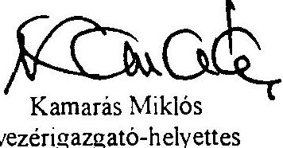

---

Budapest, 1995. november 23.
$\mathrm{V}-15-410 / 95$

L A S C S I K ATTILA úr, Vezérigazgató Állami Privatizációs és Vagyonkezelö Rt.

# B U D A P E S T 

Tisztelt Lascsik Úr!

Köszönettel vettem a V-15-103/95. számú jelentés-tervezetre tett észrevételeit.

A továbbiakban az Önök észrevételeinek sorrendjében, az Önök hivatkozásaihoz igazodva adjuk meg a választ. Megjegyezzük, hogy az átdolgozás során az új szövegben az oldalszámok változhstnak, ezért mindig a régi számozásra hivatkozunk és úgy fogalmazunk, hogy abból a visszautalás egyértelmü legyen.
ad 4. oldal 1 . bekezdés

Önök szerint az ÁVÜ és az ÁV Rt. ke11ö szakmai felkészültséggel rendelkezett feladatai megoldásához 1994-ben és csak külsö okok vezettek a privatizáció lelassulásához.

Véleményüket csak kisebb részben van módunk elfogadni.
A felkészültségi problémákról az ÁSZ különbözö jelentései az 1994. év első félévére kitekintö ÁVÜ és ÁV Rt. dokumentum, a villamosipari privatizációval foglalkozó jelentés, stb. - ismétlődően szóltak, s e kritikákat akkor az érintett vezetés elfogadta. Ezzel cgvált az új szövegben jelezzük, hogy a "szakmai irányultság" kialakítását a kormányzati gaz-

---

daságpolitika változásai is hátráltatták és még egyértelmübbé tesszük, hogy a megállapítás elsősorban az AV Rt. -re vonatkozik, s azért, mert alapvetően a vagyonkezelésre irányult felkészültsége.
ad. 6. oldal 1.bekezdés (illetve a 61.oldaltól a 65. oldalig)

Észrevételük önmagának ellentmond, mert a részletes megállapítások sorában a 62. oldal 1. bekezdése - Önök szerint - "a privatizációs bevétel elmaradását korrekt módon mutatja be", mig ugyanezt a 6.1. alatt azt pontositásra javasolják, mondvan pontositásra szorul, hogy az ÁV Rt. tevékenyégének veszteségét a bevételek jelentós elmaradása okozta. Vagyis: a bevételek fedezték a kiadásokat és a ráfordításokat. A tények ennek ellentmondanak, hiszen ha az elöirányzott 175 milliárd helyett 27 a tényleges bevétel, akkor nyilvánvaló, nem a kiadások miatt alakult ki az 57 milliárdos veszteség, hanem a bevételek elmaradása miatt.

Észrevételük elfogadására nincs módunk.
Megitélésükben a veszteségek "nem a tevékenység eredménytelenségére utalnak, (hanem azok) a törvényi elöírások következményei." Véleményünk szerint az ÁV Rt. gazdálkodását mint más gazdasági társaságokét - a törvényi elöírások szabályozták (GT, SZT. költségvetési törvény, stb.), igy természetszerüen ezeknek megfelelően kellett gazdálkodnia. A 28 milliárd Ft költségvetési beflzetést törvény írta elö, s ha nem értek el bevételt, természetes, hogy az veszteséget okoz.

A számviteli törvény betartása az értékvesztésre nézve az ÁV Rt-nél is kötelezö. A részvénytársaságokra nézve az eredmény az értékvesztéssel együtt vizsgálandó. Ezt be kell tervezni a rafordítások közé.
ad. 7. oldal 3. bekezdés.

Észrevételüket elfogadjuk.

---

piacvesztéseinek illetve nem megfelelö termékszerkezetének tulajdonítható". Ugyanakkor utalni fogunk arra, hogy közelebbrool milyen hibákat és magatartásbeli problémákat rovunk fel a privatizációs szervezeteknek
ad. 9.oldal 1.bekezdéséhez (illetve 66. oldal 3. bekezdéshez)

Észrevételüket részben elfogadjuk.
Az utólag, most rendelkezésre bocsátott dokumentum alapján módosítjuk azt a megállapításunkat, hogy a tartozás beha jtásáról nem intézkedett az ÁV Rt. Fenntartjuk viszont, hogy az Antenna Hungáriától átvállalt tartozás ügyében az ÁV Rt. nem kellően megalapozott üzleti döntést hozott. Az 1 éven túli követelés behajthatatlannak minősül, ezt le kell írni, melynek fedezete - közvetve - az állam Önökre bizott gazdálkodói vagyona. A Magyar Televizio tartozását azóta sem fizette meg, igy egy ÁV Rt. hatáskörén kivüli költségvetési szervet hozott "kedvezö helyzetbe".
ad. 9.oldal 2. bekezdés

Észrevételüket elfogadjuk.
Köszönjük, a hitelfelvétellel kapcsolatos pontositásukat, gyakorlatilag szó szerint beépitjük a szövegbe.
ad. 9.oldal. 3.bekezdés

Észrevételük, illetve annak indoklása alapján nem látunk okot a jelentésben foglaltak módosítására.

Az észrevételükben szereplő törvényi hivatkozások sajnálatosan hiányosak. Nem tartalmazzák az azokat teljessé tevő mondatot, mely igy szól "az állami vagyon közvetlen kezelésére a Vagyonügynökség csak kivételesen és átmenetileg jogosult." (1992. évi LIV. törvény 70-72 paragrafusai)

Mindemellett a hivatkozott törvény megfogalmazásai szerint az eseti likviditási gondok - akár ismétlődö - rendezése ál-

---

A becsatolt tárgybani mellékletet köszönettel vettük. Ezek azonban ismertek voltak, megállapításainkat többek között ezekre is alapoztuk.
ad. 10. utolsó bekezdés, (illetve 67. oldal utolsó bekezdés)

Köszönjük a klegészitő magyarázatot.
ad. 12. oldal 1. és 2. bekezdés

Csak részben van módunk elfogadni.
Ismert elöttünk, hogy Bartha Ferenc kormánybiztos létrehozta az operativ bizottságot. Ennek tevékenységéröl azonban a vizsgálat ideje alatt nem kaptunk dokumentumot, amennyiben ezt pótolják utalunk rá a megállapítások között.

A vizsgálat során az ÁVÚ és az ÁV Rt. 1995. június elején készített feladattervét, amely a szervezeti átalakulásból eredó kötelezettségeket tartalmazta nem bocsátották rendelkezésünkre. Az ÁPV Rt. munkatársai egyedül a 10/1995. sz. ügyvezetői utasítást adták át, amely az "ÁVÚ megszüntetéséröl, aktuális átadás-átvételek előkészítéséröl" szól. Ez a megszüntetés teendőlt tartalmazza és nem az új szervezet felállításának költségeiről rendelkezik.

Az ÁV Rt. 1994. évi beszámolójában valóban képzett az átszervezés miatti munkaviszony megszüntetésekkel kapcsolatos kötelezettségekre 120 millió Ft céltartalékot. Ez azonban nem azonos a vizsgálat által kifogásolt és hiányolt, az új szervezet kiépítésével járó várható költségmeghatározással.

Megjegyezzük továbbá, hogy az ÁV Rt. 1995. évi üzleti-pénzügyi tervében az egyéb költségek növekedéséről ( 250 millió Ft), annak indoklásáról szóló dokumentumot nem adtak át.
ad. 12. oldal 3. bekezdés

Észrevetelük alapján pontosítjuk az adatot.
A részletes jelentéshez füzött észrevételeik alapján az

---

ad. 12. oldal utolsó bekezdésétól a 14. oldalig

Álláspontjukat nincs módunk elfogadni.
A bértömeg meghatározására tett megállapításainkat változatlanul fenntartjuk. Azt a kitételüket, hogy a bérkiáramlást korlátozó kormányhatározat az ÁPV Rt. -re közvetlenül nem érvényesíthetö" helytelennek, az Önök által leírtakkal ellentétesnek tartjuk.

Az ÁPV Rt. az ÁV Rt. jogutódja. Állami tulajdonú gazdasági társaság. Sem a Kormány, sem a részvényesi jogok gyakorlója nem hozott olyan határozatot, ame1y a vonatkozó kormányhatározat alól mentesíti a szervezetet. Jelenlegi okfejtésük azért is megmagyarázhatatlan számunkra, mert Suchman Tamás miniszter úr részére készített feljegyzésre - mint abban írják - azért került sor, hogy "az ÁPV Rt. 1995. évi bérfelhasználása összhangban legyen az 1023/1995 kormányhatározat bérkiáramlást korlátozó elöirásaival".

A rendelkezésünkre álló 1/1995. - módosított - vezérigazgatói utasítás szerint a mozgóbér alanyi jogon jár, ami szerintünk - automatizmust feltételez.
ad. 13. oldal 3. bekezdés
Az észrevételt csak részben van módunk elfogadn1.
A jövedelem ugyanis értelemszerüen magában foglalja a mozgóbért és a prémiumot is.

Az egyes kategóriáknál megjelölt jövedelmi adatokra vonatkozóan még egyértelmübb tesszük, hogy az az elérhető jövedelem.
ad. 14. oldal 2. bekezdés

Észrevételüket elfogadjuk és a szöveget klegészítjük.
Észrevételüknek megfelelően 4,3 milliárd Ft-ra pontositjuk az adatot :a :a:2702, :a az ÁVÜ-ÁV Rt. 1995. évi ecvôt-

---

ad. 16. oldal 4. bekezdés

Nem tudjuk elfogadni észrevételüket.
Azt, hogy a bérszerkezet tartalmazza a feladat és teljesitmény követelmény érvényesitését nincs alátámasztva észrevételükkel sem, tekintettel arra, hogy a vezérigazgatói utasítás erre vonatkozóan kritériumokat nem tartalmaz.
ad. 58. oldal 2. bekezdés

Nincs módunk észrevételük elfogadására.
A hatályos VPI. 1994. évi 8. pont szerint az ÁV Rt. vagyonából ingyenes átruházásra kizárólag törvényi felhatalmazás alapján kerülhet sor.
ad. 59. oldal utolsó bekezdést

Elfogadjuk, töröltük a szövegrészt.
ad. 6. oldal 1. bekezdés

Fenntartjuk véleményünket.
A Hirlapkiadó Rt. elsődleges gazdasági eseménye a társasági átalakulás. Ezt a töketartalék javára kellett volna könyvelni. A tőkeemelés csak ezután következhet.
ad. 62., 63. első bekezdés

Nincs indoka a változtatásnak.
Ez említett privatizációs technikát a törvény nem tartalmazza. A vevővel kialkudott ár az ÁV Rt-re nézve kedvezötlen.

---

ad 67. oldal 2. bekezdés

Köszönjük a magyarázatot, de véleményünket fenntartjuk.
Az ÁV Rt. feladata, hogy a tulajdonában álló állami vagyont számbavegye. A tulajdonában álló vagyont a részesedések között mutatja ki, és nem a társaságok mérlegében, így az alapinformáció, amit felhasználnak, nem mérvadó.
ad. 70. oldal 3. pont 4. bekezdés

Nem tudjuk elfogadni az észrevételt.
Az észrevétel 1-2 bekezdése magyarázat, a megállapításon nem változtat. A 6,8 millió Ft iroda-átalakítási munkákra fordított összeggel a költöztetés költségeit nem tudjuk csökkenteni, mivel a pénzügyi osztálytól kapott részletes kimutatás szerint ez fuvarozási, bútorszállítási költség.
ad. 72. oldal 5. bekezdés

Elfogadjuk az észrevételt.
A visszaszállításra hivatkozó pontositásukat elfogadjuk, a hivatkozott mondat módosul:
"..... feleslegessé váltak, azokat a székház szomszédságában levö pinceraktárban helyezték el".
ad. 73. oldal 2. bekezdés

Elfogadjuk az észrevételt.
Az örzés, védelem (Bánk bán utca) költségeit kivesszük.
ad. 73. oldal 3. bekezdés

Elfogadjuk az észrevételt.

---

ad. 74. oldal 3. bekezdés

A megállapítást fenntartjuk.
Az irodafelújításokra vonatkozó vállalkozási szerzödések az elvégzendó munkákat, annak természetes mértékegységben meghatározott nagyságát ( $\mathrm{pl} . \mathrm{m}^{2}$ ) a szerződések nem tartalmazzák. A felmérési napló a szerződéshez szervesen illeszkedö költségvetést nem helyettesíti, mivel az tényeket rögzít és akár a szerzödés tartalmától eltérő is lehet.
ad. 73. oldal 5. bekezdés

Észrevételüket elfogadjuk, a szöveget pontosítjuk.
A "felújítás" kifejezést "iroda átalakítás, irodafelújítás"-ra módosítottuk.
A vizsgálat eredményének tekintjük a költségek megbontását, ezért a végleges jelentésben e tényre utalunk.
ad. 75. oldal utolsó bekezdésétől a 76. oldal 2. bekezdéséig

Részben elfogadjuk.
Töröljük a jelentésböl azt a részt, amely az ávÜ korábbi kiépített hálózatának megszüntetéséröl szól.

Az ügyvezetői döntés időszerűségére vonatkozó álláspontunkat fenntartjuk, az azonnalj működés biztosítása az SZMSZ életbelépésének idópontjától független.
ad. 76. oldal 3. bekezdésétől, a 77. oldal 3. bekezdésig

Észrevételüket nem tudjuk elfogadni.
A gépkocsi parkkal kapcsolatban a jelentésben a mennyiséget nem minösítettük. Az eladandó gépkocsikról szóló vezérigazgatói dö:tés dokumenturat eg:etként eddig nem adták át.

---

ad. 77. oldal 4-5 bekezdésében

Nincs indok észrevételük alapján a szöveg módosítására.
A telefonok használatához fűződött indoklást, mint magyarázatot köszönjük.
A telefonok számát korrigálni nem áll módunkban, mert mint ahogyan Önök is jelzik, csak a későbbiekben fogják csökkenteni az üzembehelyezett telefonok számát.
ad. 77. oldal utolsó bekezdésétől a 83. oldalig

Észrevételüket csak kis részben fogadjuk el.
Az ösztönző illetmény összegét korrigáljuk, de csak 1995. június 15 -ével bezárólag. Igy a kedvezményezettek köre 126 fơröl, 101 före, a kifizetett összeg - 6.157 ezer Ft + 2.709 ezer $\mathrm{Ft}=8.866$ ezer Ft-tal kevesebbre - 304,2 millió Ft-ra módosul.

A kiemelt megállapítást módosítottuk: "a 85 fő eltávozott dolgozóhoz kapcsolódó...." szövegre.

Az Önök által javasolt 22-24 millió Ft megtakarítást nem tudjuk figyelembe venni.

Az ÁvU-t az új privatizációs törvény megszüntette, így ebből a szempontból nincs jelentősége annak, hogy gazdálkodása nem volt veszteséges.

Az Áv Rt. bár Önök szerint "speciális állami funkciót is ellátó" részvénytársaság a számviteli törvény eredménykimutatásra vonatkozó előírásai alól nem kapott felmentést.

A 6. oldal 1. bekezdésével kapcsolatban kifejtett indokaikat nem tudjuk elfogadni. Az eredményt befolyásoló költségtényezők, ráfordítások közül egyes tételeket kiemelni nem lehet.

A Számviteli törvény előírásai közül kiemelik az értékvesztés elszámolását, amely érthetetlen, hiszen számos más elő-

---

összegezve tehát az ÁV Rt-t a veszteségesen gazdálkodó társaságok közé kell sorolni.

A bérnövekmény meghatározásakor a "kiemelt fontosságú, illetve tartalmában és mennyiségében is bővülö feladatok" ellátásával indokolják a 15 a-os növelést, de a miniszter úrnak készített feljegyzésükben nem utalnak arra, hogy a tulajdonos hozzájárulása szükséges a nem veszteséges társaságokra engedélyezett magasabb szintre történö emeléshez is. ( $10 \%$ helyett $15 \%$ ).

A korrekciókat a számítási anyagban valóban részletezik. Véleménykülönbség csak abban van, hogy mindennemü korrekció a meghatározott keresettömegen belül lehetséges. E megállapításunktól eltekinteni nem tudunk.

Tiszte1t Vezérigazgató Úr!

Válaszunkkal - a munkatársaival folytatott konzultációt is figyelembevéve - értelemszerüen módosítjuk, kiegészítjük és pontosítjuk a szöveget.

A jelentés végleges formáját az ÁSZ elnöki értekezletén elhangzottak alapján Elnök úr jóváhagyásával nyeri el. Ezt a változatot - a záróészrevételekre lehetőséget adva - az ÁPV Rt. Igazgatósága részére a nyilvánosságra hozatal és az Országgyülés részére történő megküldés elött átadjuk.

Ezúton szeretném munkatársaim és magam nevében megköszönni Kamarás Miklós vezérigazgató-helyettes úrnak és az ÁPV Rt. minden kollégájának a korrekt, segítökész együttmüködést.
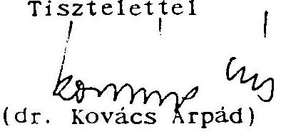

---

# 1133 BUDAPEST. POZSONVI UT Sp. LEVELCIA: 1399 BUDAPEST. I'F: 708   TEL: 269-8000. FAX: 149-5745 TELEX: 20-2892 

1051/6i14

## Állami Számvevőszék

Dr. Hagelmayer István
elnök

## Budapest

Tisztelt Elnök Úr!
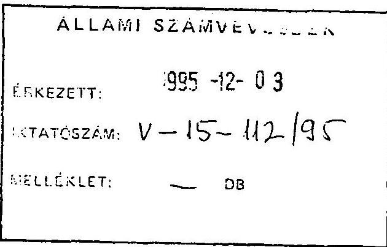

Köszönettel megkaptuk az Állami Számvevőszék J/1661. sz. jelentését az Állami Vagyonügynökség és az Állami Vagyonkezelő Részvénytársaság 1994. évi tevékenységének, valamint a jogutód szervezet megalakulási költségeinek az Állami Privatizációs és Vagyonkezelő Rt-nél végzett ellenőrzéséről.

Az ÁPV Rt. Igazgatósága megtárgyalta a Jelentést és az abban foglaltakat tudomásul vette azzal, hogy a jelentéssel kapcsolatos észrevételeinket írásban küldjem meg Elnök úrnak.

Jelen levelemben ezeket a fö észrevételeket foglalom össze, azzal az reménnyel és igénnyel, hogy Elnök úr azokat el tudja fogadni. Másrészről nem kívánok kitérni a vizsgálati jelentés előzetes vitáiban felmerült szakmai-értelmezési különbségekre (a részletkérdéseket illetően), mivel bízom abban, hogy a két intézmény későbbi munkakapcsolatában illetve a következő átfogó vizsgálat időpontjára meg tudjuk szüntetni azokat.

A jelentés megállapításaihoz észrevételeinket a következőkben foglalom össze:

1. Az ÁVÜ és ÁV Rt összevonása, az ÁPV Rt müködése (a privatizáció) folyamatosságának biztosítása tervszerű és (a kormányzattal is) összehangolt keretek között történt. Az összevonás költségeit optimális mértékűnek tartjuk.

Nem értünk egyet az ÁSZ azon megállapításával, mely szerint az ÁPV Rt. megalakulásával kapcsolatban nem készült koncepció a két szervezet összevonására illetve költségvonzataira. Ennek magyarázatát az alábbiak támasztják alá:

- Már 1994. év októberében Bartha Ferenc kormánybiztos létrehozott az ÁVÜ és ÁV Rt. vezető munkafársaiból egy operatív bizottságot, melynek feladata az új szervezet struktúrájának és költségvonzatainak, a várható átalakítás ütemének, technikai feltételeinek és lebonyolításának kidolgozása volt.
- 1995. június elején az ÁVÜ és az ÁV Rt. vezetése feladattervet készített a törvényböl és a szervezeti átalakulásból eredő kötelezettségekről.

---

- Az ÁVU vezetése ennek végrehajtását Ügyvezetői utasitásban, az ÁV Rt. pedig Ügyvezetői határozatban állapitotta meg. Ezen határozatokban foglaltak végrehajtásáról a felelős vezetőket folyamatosan beszámoltatták.
- Az átszervezés kapcsán várható kötelezettségek tervezését az is bizonyitja, hogy az ÁV Rt. 1994. évi éves beszámolójában 120 mFt céltartalékot képzett, 1995. évi üzletipénzügyi tervében 100 mFt -os számítástechnikai és egyéb eszköz bővitést tervezett, továbbá egyéb költségeinek 250 mFt-os növekedését irányozta elő, amely alapvetően a költözködés és szervezeti változás várható költségkihatásait tartalmazta.

Az ÁSZ Jelentésben összefoglalt költségek elfogadásánál elsődleges szempont volt a privatizációt előkészitő illetve megvalósitó tevékenység folyamatosságának, felgyorsitásának biztositása, különös tekintettel a stratégiai cégek vonatkozásában. Ezzel együtt mindenképpen el akartuk kerülni a privatizációs folyamat esetleges megtöréséből származó veszteségeket, amelyek nagyságrendje többszöröse lehetett volna az ÁSZ által kifogásolt költségeknek. Természetesen emellett ésszerủ költségtakarékosságra törekedtünk. Az összevonás költségeinek mérlegelésénél érdemes figyelembe venni azt a tényt is, hogy az állami vagyonkezelő szervezetek összevonása (összeköltöztetése) révén felszabadult egy közel 1 Mrd Ft értékủ épület, amely átadásra kerülhet a társadalombiztosítási önkormányzatok számára.

Az 1995. év második felében felgyorsuló privatizációs folyamat, az 1995. évre meghatározott feladatok teljesülésének pozitív kilátásai napjainkra igazolták a megvalósitott intézkedéseink helyességét.

Elözőekben ismertetett indokaink igazolják álláspontunkat, amely szerint Az ÁVÚ és ÁV Rt összevonása, az ÁPV Rt müködése (a privatizáció) folyamatosságának biztositása tervszerü keretek között történt. Az összevonás költségeinél jórészt sikerült megfelelö optimalizálást végrehajtani.
2. Az ÁV Rt. illetve a jogutód ÁPV Rt számvitelileg kimutatott "vesztesége" fogalmilag nem azonos a termelő és szolgáltató szektorban müködő gazdasági társaságok veszteségével és nem alkalmas az állami vagyonkezelö szervezet tevékenységének, teljesítményének minösitésére. ( Ez téves következtetések levonására ad alkalmat pl. az 1023/1995. Korm. Határozat követelményeinek alkalmazásánál, amikor a béremelés mértéke ehhez a mutatóhoz kötődik.)

Az ÁV Rt. ( illetve a jogutód ÁPV Rt. ) olyan speciális részvénytársaság, amely a privatizáció előkészitésére, végrehajtására, az állami vagyon időleges illetve tartós kezelésére jött létre.

---

A privatizáció előkészítése és a vagyonkezelés költségekkel, kiadásokkal jár, amelyek a privatizációs bevételben térülnek meg. Az ÁV Rt. (illetve a ÁPV Rt. ) sajátossága az is, hogy a különféle törvényekben és jogszabályok olyan kötelezettségeket írnak elő számára mint

- a privatizációs bevétel terhére történő központi költségvetési befizetések illetve állami alapokra történő befizetések,
- a társaságoktól beérkező osztalék befizetése a központi költségvetésbe
- kárpótlási jegyek bevonása stb...

Ezek a ráfordítások teszik alapvetően az ÁPV Rt eredményét negatívvá. Az elszámolás rendszere törvényszerűen tartalmazza a veszteség megjelenését mégpedig olyan összefüggésben, hogy minél több és nagyobb értékủ privatizációt hajt végre a szervezet és minél jobban teljesíti a parlament által törvényekben elôirt kötelezettségeit, annál nagyobb mértékủ veszteséget kénytelen mérlegében kimutatni. Ilymódon, ha 1994. évben az ÁV Rt teljes egészében teljesítette volna a bevételi és befizetési előirányzatait, akkor a számvitelileg kimutatott vesztesége meghaladta volna a 100 Mrd Ft-ot.
1994. év vonatkozásában a költségvetési törvény az ÁV Rt-re a különféle pénzalapok javára történő befizetési kötelezettség teljesítését írja elő, amelyet a ráfordítások között mutatunk ki. Ez 1994. évben 28.269 mFt -ot tett ki.

A kárpótlási jegyek megsemmisítése vagyonvesztésnek tekinthető, amelyet szintén a ráfordítások között számolunk el. Ennek összege 20.047 mFt .

Az ÁV Rt. a Számviteli törvényben elôirtak betartása érdekében 14.587 mFt értékvesztést számolt el. Fenti összeg 12 társaság nyilvántartási értékét módosította, döntỏ mértékben két kereskedelmi bank (MHB Rt. és Kereskedelmi Bank Rt; 11.994 mFt ) Kormányhatározatoknak megfelelő konszolidációjának és jegyzett tőkéjük csökkentésének következtében.

A felsorolt tételek mindösszesen 62.903 mFt -ot tesznek ki, amelyek megítélésünk szerint nem a tevékenység eredménytelenségére utalnak, hanem a törvényi előirások következményei.

A felsorolt indokok alapján a számviteli elöirások szerint kimutatott "veszteség" nem alkalmas arra, hogy az ÁV Rt (illetve a jogutód ÁPV Rt) tevékenységét, teljesitményét minösitse és ebböl eredő következményei az 1023/1995. Korm. Határozat végrehajtása során érvényesüljön.

---

3. Az ÁPV Rt felállítása során (az ÁV Rt jogi-, gazdasági bázisán) olyan törvényileg és jogszabályilag elöirt feladat-, szervezet- és létszámstruktúra változáson esett át, amely szintén lehetetlenné teszi az 1023/1995. sz. kormányhatározat mechanikus alkalmazását.

Az állam tulajdonában lévő vállalkozói vagyon értékesítéséről szóló 1995. évi XXXIX. törvény - a privatizáció folyamatának törésmentes továbbvitele miatt rendelkezett úgy, hogy az ÁPV Rt az ÁV Rt jogi-, gazdasági bázisán müködjön, ugyanakkor feladatai jelentősen bívültek (minőségileg is megváltoztak). A Kormány 1076/1995. határozatával hagyta jóvá az ÁPV Rt Szervezeti Müködési Szabályzatát, amely a megváltozott feladatokat képezi le egy ugyancsak megváltozott szervezeti struktúrára. Értelemszerűen a 170 fös ÁV Rt és az új feladat - és szervezeti struktúrához igazodó 480 fös ÁPV Rt létszám - és bérstruktúrája mechanikusan nem hasonlítható össze, illetve az összehasonlítás téves következtetések levonását eredményezi az új szervezet bérgazdálkodását illetően.

Az Állami Számvevőszéknek átadott számítás szerint (az ÁVÜ és ÁV Rt béradataira alapozott súlyozottan átlagolt számítások) azt mutatják hogy a maximálisan elérhető bérnövekmény nem haladja meg a $15 \%$-ot és $7 \%$ technikai bérnövekményként jelentkezik.

Ezen indokokra valamint az 2. pontban kifejtett álláspontunkra hivatkozva állítjuk, hogy a többségi állami tulajdonban lévő gazdálkodó szervezetek bérgazdálkodására vonatkozó 1023/1995.kormányhatározat az ÁPV Rt.-re mechanikusan és közvetlenül nem alkalmazható. Az ÁPV Rt által kialakított indulási bérstruktúra, bérgazdálkodási-, érdekeltségi rendszer összhangban van a rendeletalkotó szándékával és megitélésünk szerint biztositja a szervezeti célok és feladatok végrehajthatóságának érdekeltségi feltételeit.
4. Az állami vagyonkezelő szervezetek (az ÁVÜ és ÁV Rt) reorganizációs illetve befektetés jellegü kifizetéseivel - a hatályos törvények szerinti felhatalmazásuknál fogva - a hatáskörükbe tartozó gazdasági társaságok privatizálhatóságának fenntartását illetve a privatizációs feltételek javítását kívánták elérni és ez a törekvésük az esetek többségében sikeres volt. Ezek a tranzakciók semmiképpen nem egyszerüsithetők le mint "burkolt költségvetési támogatások", mint ahogyan az ÁSZ jelentésben szerepel.

Az állami vagyonkezelő szervezetek alaposan kidolgozott reorganizációs illetve privatizaciós tervek megvizsgálása után, csak kivételes esetben eltek a jelzett kifizetésekkel. A reorganizációra fordított összegek valójában alacsonyabbak voltak a kívánt mértéknél. Ennek oka a vagyonkezelők pénzügyi lehetőségeinek korlátozottsága volt.

---

Álláspontunk szerint reorganizációba illõ lépés az életképes, potenciális piacokkal rendelkező cégek megmentése a felszámolástól olyan módon, hogy a forgóeszköz finanszírozási gondok falán rést ütünk pénzügyi injekcióval, . (Ennek tipikus példája a Magyar Gördülöcsapágy Müvek, amely a vonatkozó 1993. évi kormányhatározat értelmében a 12 kiemelt ipari vállalat egyike, melynek megőrzése iparpolitikai, foglalkoztatáspolitikai szempontok alapján is indokolt és a reorganizációs lépések eredményeként a felszámolást elkerülve privatizációjára 1996. első felében sor kerülhet. Ugyancsak példaként említhető a Soproni Szőnyeggyárnak nyújtott, a pénzügyi reorganizációt elősegitő, visszatérülő kifizetés, ahol a felszámolást elkerülve privatizációját elvégezhettük).

Megitélésünk szerint ezen reorganizációs ráfordítások nélkül nagyobb számban kerültek volna társaságok felszámolási illetve végelszámolási helyzetbe, ami tovább növelte volna az állami vagyonkezelő szervezetek vagyonvesztését (amelynek elkerülését maga az ÁSZ jelentés is szorgalmazza).

Véleményünk szerint az állami vagyonkezelö szervezetek által eszközölt reorganizációs juttatások a gazdálkodó szervezetek termelési-, piaci helyzetének stabilizálásán keresztül harmonizálnak a hatályos törvényekben, illetve az 1994. évi Vagyonpolitikai Irányelvekben megfogalmazott célkitüzésekkel.

Tisztelt Elnök Úr!
Ismételten megköszönöm Önnek és a vizsgálatot végzõ munkatársainak a színvonalas szakmai munkáját, azokat az értékes ajánlásokat, amelyek megvalósitásával javíthatjuk tevékenységünket, a privatizáció és vagyonkezelés eredményességét. Külön köszönetet mondok, hogy a jelentés nemcsak a hibákat mutatta be, hanem kitért azokra a pozitív folyamatokra és eredményekre (pl. az információs- és vagyonnyilvántartási rendszer fejlődése), amelyekre alapozva tovább javíthatjuk az ÁPV Rt. müködését.

Tájékoztatom arról, hogy az ÁPV Rt. Igazgatósága a jelentés megtárgyalásával egyidőben határozott arról, hogy az Állami Számvevőszék jelentésében foglalt hibák megszüntetésére, ajánlásainak végrehajtására az ÁPV Rt. Ügyvezetése készítsen intézkedési tervet, amely végrehajtásának folyamatos ellenőrzésére felkértük az ÁPV Rt. Felügyelő Bizottságát.

Budapest, 1995. november 30.
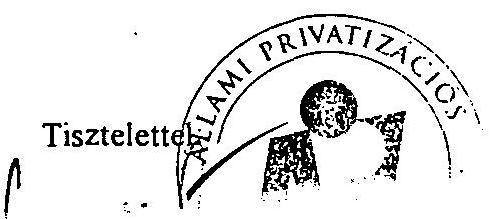

---

# S Z O K A I IMRE úr 

az Állami Privatizációs és Vagyonkezelö Rt.
Igazgatóságának elnöke

B U D A P E S T

Tisztelt Elnök úr!

Köszönettel vettem szíves záróészrevételeit. Engedje meg, hogy azokra röviden csak a tartalmi ügyeket érintve reagáljak, közöl jem az Állami Számvevőszék végleges álláspontját.

Mindenek elött igen örülök annak, hogy Önök elfogadták mindazokat az észrevételeinket, amelyek a privatizációs bevételek tervezésével, a felszámolás felé sodródó vállalatok ügyeinek intézésével, a tárgyalási pozíciók romlásával, a lehetőségek korlátaival, a kialakult értékesítési kényszerpályával, vagyis a magyar privatizáció nem kívánatos jelenségeivel kapcsolatosak.

Ugyancsak tartalmi kérdésnek tartom az ÁPV Rt. megalakulásával és a kialakított bérszerkezettel kapcsolatos észrevételeinket. Mint Ön elött ismert, az elmúlt években ismétlődően vizsgáltuk az ÁVÜ és ÁV Rt. müködésének saját költségeit és sajnos mindig arra jutottunk, hogy e szervezetek saját gazdálkodását nem a takarékosság jellemzi. Ezt kellett az ÁPV Rt. megszervezésével kapcsolatban is rögzítenem. Úgy vélem, a leírt tényeket Önök sem vitatják és engedje meg, hogy azok alapján a magunk részéről más következtetésre jussunk, mint Önök.

Attól a megállapításunktól sem tudok eltekinteni, hogy miközben az új privatizációs szervezet maga is felelős a bér-

---

az összhangot írásban megigéri a felügyeló miniszternek. Az ÁPV Rt. az ÁV Rt. jogutód szervezete. Az ÁPV Rt. a jogelőd részvénytársaság igen sikertelen előző évi teljesitése után, annak aránytalanul magas, eredményekkel legkevésbé sem alátámasztott jövedelmeihez képest induló pozíciójában $22 \%$-os bértömegnövekedést engedett meg magának. Ennek megitélésében azt hiszem nem az a döntő kérdés, hogy a számviteli elöírásoknak mekkora a szerepe a múlt évi veszteségben.

Jól tudom az ÁSZ-nak nincs formális jogosítványa arra, hogy etikai kérdésekben véleményt nyilvánítson, de szóva kell tennie, ha ilyen jelenségeket tapasztal. Kérem fogadja el, nem kioktatásnak szánom, meggyőződésem, hogy az önmérséklet és a példamutatás - ha van ilyen - hajtóereje a gazdaságnak. Ezért is kénytelen vagyok az ezzel kapcsolatos javaslatok fenntartására.

Tisztelt Elnök úr!
Ezekkel a véleménykülönbségekkel együtt úgy vélem munkatársaink együttmüködése messzemenöen jó volt, s ebben meggyőződésem szerint Önnek és az Igazgatóságnak is van része. Kérem engedje meg, hogy ezt külön is megköszönjem.
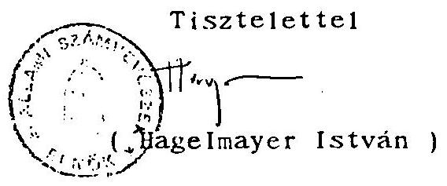