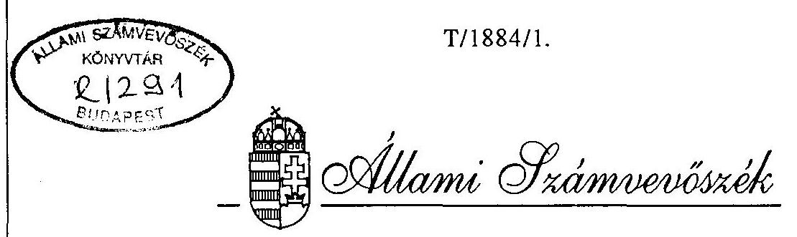

# JELENTÉS 

a társadalombiztosítás pénzügyi alapjainak
1994. évi zárszámadásához kapcsolódó ellenőrzések tapasztalatairól

---

A jelentés elkészitéséért felelös:
az ÁSZ IV. Vagyonellenőrzési Igazgatóság
dr. Kovács Árpád Igazgató

A vizsgálatot vezette
dr. Csépán Magdolna osztályvezető főtanácsos

A vizsgálatban közremüködtek:
Balla Józsefné
tanácsos
dr. Fónyad Erzsébet
számvevő
Hegyesné dr. Solymosi Mária
számvevő
Hajagos Józsefné
tanácsos
dr. Kurucz István
tanácsos
Molnár Istvánné
tanácsos
Szendrődi Józsefné
számvevő
Dankó Géza
tanácsos
Fátrainé Zsebedics Katalin
tanácsos
Hirka Mihály
tanácsos
Szita László
tanácsos
Zeke József
tanácsos
Vécsey László
tanácsos
Pozsonyi Lajos
szakértö

---

# T A R T A L O M J E G Y Z É K 

1. B EVEZETÉS ..... 1 .
II. ÖSSZEFOGLALÓ MEGÁLLAPÍTÁSOK, KÖVETKEZTETÉSEK, AJÁNLÁSOK ..... 4.
2. Zárszámadási vizsgálat föbb tapasztalatai, következtetések ..... 4.
1.1. Az alapok beszámolási és könyv- vezetési kötelezettségének tel- jesítése, szabályozottsága ..... 4.
1.2. Az alapok föbb elöirányzatainak teljesülése ..... 5.
1.3. Az egyes ellátási kiadások vizs- gálatának fontosabb megállapításai ..... 6.
1.4. Az alapok müködési költségvetése ..... 8.
1.5. Az alapok vagyoni helyzetének alakulása ..... 9.
3. Ajánlások, javaslatok az ÁSZ 1994. évi zárszámadási vizsgálat alapján ..... 12.
2.1. az Országgyülésnek ..... 12.
2.2. a Kormánynak ..... 14.
2.3. a társadalombiztosítási önkormány- zatoknak és központi igazgatási szerveinek ..... 14.
III. RÉSZLETES MEGÁLLAPÍTÁSOK ..... 17 .
4. Az alapok beszámolási és könyvvezetési kötelezettségének teljesitése ..... 17.
1.1. A számviteli törvény és a költségve- tési elöírások betartása ..... 17.
1.2. A saját számviteli rend kialakítása ..... 18.
1.3. A mérlegtételek tartalma, valódisá- ga, leltárral való alátámasztottsága ..... 19.
1.4. Az alapok vagyonkimutatása ..... 21.

---

2. Az alapok elöirányzatának tel jesülése ..... 21.
2.1. A tervezett elöirányzatok és a tényleges tel jesités ..... 21.
2.2. A bevételek alakulását meghatározó tényezők ..... 23.
3. A legfontosabb ellátási kiadások alakulása ..... 24.
3.1. Nyugdijkiadások ..... 24.
3.2. Az Egészségbiztosítási alap ellátási kiadásai ..... 26.
3.2.1. A gyógyító-megelőző egészségügyi ellátások finanszi rozása ..... 26.
3.2.2. Az E. Alap egyéb kiadásai ..... 37.
4. Az Alapok müködési költségvetése ..... 38.
4.1. A müködési költségvetés bevételei ..... 38.
4.2. A Nyugdijbiztosítási Alap müködési kiadása i ..... 39.
4.2.1. Az Ny. Alap folyó kiadása i ..... 40.
4.2.2. Felhalmozási és fejlesztési célú kiadások ..... 41.
4.2.3. Megbízási és vállalkozási szerző- déskötések a nyugdijágazatban ..... 44.
4.2.4. A foglalkoztatottak létszáma ..... 45.
4.3. Az Egészségbiztosítási Alap müködési kiadása i ..... 45.
4.3.1. Az E. Alap folyó kiadása i ..... 46.
4.3.2. Felhalmozási és fejlesztési kiadások ..... 47.
4.3.3. Az 1993. és 1994. évi pénzmaradvány felhasználása ..... 49.
4.3.4. Megbízási és vállalkozási szerződés- kötések az egészségbiztosítási ága- zatban ..... 50.
4.3.5. Az egészségbiztosításban foglalkoztatott létszám alakulása ..... 51.
5. Az alapok vagyoni helyzetének alakulása 1994-ben ..... 51.
5.1. A vagyongazdálkodási tevékenység szabályozottsága ..... 51.

---

5.2. A pénzügyi szétváláshoz kapcsolódó vagyonmegosztás lebonyolítása ..... 52 .
5.2.1. A naturális vagyonmegosztás ..... 52 .
5.2.2. A múködési célú ingatlanvagyon mego
osztása a két ágazat között ..... 53 .
5.3. Pénzpiaci tevékenység, befektetések
1994-ben a Nyugdíjbiztosítási Alapnál ..... 54 .
5.3.1. Rövid lejáratú befektetések ..... 54 .
5.3.2. Tartós befektetések ..... 54 .
5.3.3. A vagyongazdálkodás eredményessége,
szabályszerüsége ..... 56 .
5.4. Pénzpiaci tevékenység, befektetések
1994-ben az Egészségbiztosítási Alapnál ..... 57 .
6. A társadalombiztosítás vagyonnal való
ellátása ..... 58 .
6.1. Az ingyenes vagyonjuttatás helyzete
(1994-95-ben) ..... 58 .
6.2. A járuléktartozás fejében elfogadott
vagyon 1994-ben ..... 60 .
6.2.1 Elszámolás a két Alap között ..... 60 .
6.2.2. Az átvett vagyon hasznosulása ..... 61 .
7. Az alapok likviditási helyzete
1994-ben ..... 62 .
7.1. A társadalombiztosítással szembeni
tartozások állományának és össze-
tételének alakulása ..... 62 .
7.2. Az állami forgóalap hiteljellegú
igénybevétele ..... 64 .
7.3. A biztosítási alapok éves hiányának
finanszirozása ..... 64 .
8. A társadalombiztosítás által
folyósitott ellátások ..... 65 .
8.1. A kiadások alakulása 1994-ben ..... 65 .
8.2. Egyes ellátások részletes vizsgá-
latának tapasztalatai ..... 66 .
8.3. Elszámolás a finanszirozókkal ..... 69 .

---

# ÁLLAMI SZÁMVEVÖSZÉK 

V-12-81/1995-96.
Témaszám : 275

## J E L E N T É S

a társadalombiztosítás pénzügyi alapjainak
1994. évi zárszámadásához kapcsolódó
ellenörzések tapasztalatairól

## I. B E V E Z E T É S

Az államháztartásról szóló 1991. évi XXXVIII. törvény elöírásai szerint a társadalombiztosítás költségvetésének végrehajtásáról szóló törvényjavaslatot az Országgyưlés az Állami Számvevöszék jelentésével együtt tárgyalja meg.

A zárszámadási ellenőrzés kötelezettségének az ÁSZ 1992. óta minden esztendöben eleget tett.

A két biztosítási alap zárszámadását egyaránt meghatározta és befolyásolta, hogy 1994-ben valósult meg az alapok tényleges pénzügyi és vagyoni szétválása. Ez sem zárult le azonban teljeskörűen, mert a vagyoni kérdések egy részének rendezése 1995-re húzódott át. Mindez az önkormányzatokat, az igazgatási apparátust - föleg az önálló tevékenységét megkezdő nyugdíjbiztosítás dolgozóit - igen nehéz feladat elé állította, amivel még könyvvizsgáló közremüködése mellett sem volt könnyü megbirkózni.

---

Az 1994. évhez kapcsolódó ellenörzéseket az ÁSZ két szakaszban bonyolította le. Az első időszakban (júliusban) még csak olyan területeken lehetett dolgozni, ahol nem volt szükség a zárszámadás adattartalmának ismeretére. Majd az ellenörzéseket fel kellett függeszteni és csak akkor lehetett folytatni, amikor az alapok költségvetési beszámolóinak könyvvizsgálata - amit a világbanki kölcsönszerződés kötelezöen ír elö - lezárult.

Az Egészségbiztosítási Alap zárszámadását az 1995. július 31-én megtartott Közgyülésen, a Nyugdíjbiztosítási Alap zárszámadását pedig az Önkormányzat szeptember 5-i Közgyülésén fogadták el. Ezt követően fejeződtek be (szeptemberben) az ÁSZ helyszíni vizsgálatai és készültek el a főbb tapasztalatokat összegző részjelentések.

A társadalombiztosítás pénzügyi alapjainak 1994. évi zárszámadásáról szóló T/1884. számú törvényjavaslat országgyülési benyújtására azonban hónapokkal később, 1996. januárjában került sor.

Az ÁSZ végleges jelentése természetszerűen csak a benyújtott törvényjavaslathoz csatlakozhat. A helyszini vizsgálatok és a jelentés véglegesítése között így kényszerüen, az Állami Számvevőszéken kívül eső okok miatt hosszabb idő telt el, sőt a Nyugdíjbiztosítási Alapnál a korábban megismert zárszámadási adatok is módosultak. Ezen adatok utólagos ellenőrzésére már nem volt lehetőség.

Az Egészségbiztosítási és a Nyugdíjbiztosítási Alap zárszamadási ellenőrzése során az ÁSZ a fő hangsúlyt az 1994. évi 1. törvénnyel módosított 1993. évi CXV. törvényben foglaltak

---

megvalósulására, az eltéréseket meghatározó főbb okok ellenőrzésére helyezte, a szabályszerűségi és célszerűségi szempontok, valamint az ágazati sajátosságok egyidejű érvényesítése mellett.

Az ellenőrzésnek változatlanul célja a vizsgált év folyamatainak széleskörű áttekintése, a nyugdíjbiztosítás és az egészségbiztosítás helyzetének, nehézségeinek bemutatása. Ilyen megközelítésben a megállapítások részlegesen érintik az 1995. esztendőt is.

Az ÁSZ az elmúlt időszakban több megye egészségbiztosítási pénztára és nyugdijbiztosítási igazgatósága, továbbá a Nyugdijfolyósító Igazgatóság feladatkörét, működését is vizsgálta. Ezen kivül a főváros öt kórházában tekintette át a működési kiadások társadalombiztosítási forrásból való finanszírozásának pénzügyi hatásait. E vizsgálatok zárszámadáshoz kapcsolódó, főbb tapasztalatai a jelentésbe beépültek.

A megalapozó vizsgálati dokumentumokat és a jelentés tervezetét az érintettekkel, az OEP és az ONYF főigazgatójával egyeztettük. Ennek alapján a szükséges pontosításokat, elfogadott megjegyzéseket a szövegben átvezettük. A jelentés tervezetét - észrevételeiket kérve - ugyancsak megkapták az Egészségbiztosítási és a Nyugdijbiztosítási önkormányzatok vezetői valamint a Népjóléti Minisztérium és a Pénzügyminisztérium. A kapott záróészrevételeket csatoljuk, s ahol az éles véleménykülönbségek ezt különösen indokolják, ott arra a szövegben is utalunk.

---

# 11. ÖSSZEFOGLALÓ MEGÁLLAPÍTÁSOK, KÖVETKEZTETÉSEK, AJÁNLÁSOK 

A társadalombiztosítás 1994. évi zárszámadásának ellenôrzése során általános érvényű és sajnos évek óta kényszerűen ismétlődő megállapítás, hogy a kifogásolt alaphelyzet nem változott, a jelzett rendszerbeli gondok nem oldódtak meg.

A társadalombiztosítás ellátórendszerében 1994-ben érdemi reformértékủ - változások nem következtek be. Az egészségügyet érintően eredetileg tervezett lépések döntö többségét kényszerüen elhalasztották, helyettük bérpolitikai intézkedéseket hajtottak végre.

Az Alapok pénzügyi helyzete kedvezôtlenül alakult. A bevételek sem a Nyugdijbiztosítási, sem az Egészségbiztosítási Alap esetében - hasonlóan mint a korábbi években - 1994-ben sem fedezték a kiadásokat. Eközben a pénzbeli juttatások reálértékének színvonalát nem sikerült megörizni és nem javult a természetbeni ellátások szinvona1a sem.

A feladatok ellátásához - az 1992-töl rendezetlen hiányok és a feltöltetlen likviditási tartalék miatt - rendszeresen és jelentős összegben voltak szükségesek a hitelfelvételek, a kintlevöségek állománya tovább nőtt, bár a növekedés üteme lassult. A helyzetet befolyásoló tényezők összetett hatásainak "végeredménye" a tartós és növekvő deficít.

1. A zárszámadási vizsgálat föbb tapasztalatai, következtetések
1.1.Az alapok beszámolási és könyvvezetési kötelezettségének teljesítése, szabályozottság.

Az ismétlődő tapasztalat, hogy a társadalombiztosításra is vonatkozó költségvetési elöírások maradéktalanul nem tarthatóak be. Az eltéréseket, sajátosságokat rendszerbe foglaló

---

külön - törvènyl szintü - szabályozás már több éve várat magára. A költségvetési beszámolót a Nyugdijbiztosítási Alapnál nem sikerült határidöre (márciusra) elkészíteni. Az Alapok közötti különbözö elszámolások, pénzügyi "hidak" miatt a könyvvizsgálat is elhúzódott.

Egyes - a mérlegtételek tartalmát, valódiságát érintő problémák részben a megfelelő szabályok hiányának tulajdoníthatók. A kimutatott adósságállomány - a tett erőfeszitések ellenére - 1994. év végén sem felelt meg teljeskörüen a mérlegvalódiság követelményének. A könyvvizsgálatot végző cég az Alapok beszámolóit hitelesitő záradékkal látta el (1. sz.melléklet.) .
1.2. Az alapok föbb elöirányzatainak teljesülése

A Nyugdijbiztosítási és az Egészségbiztosítási Alap bevételi és kiadási összegei egyaránt meghaladják az elöirányzatokat.

A bevételek zárszámadás szerinti, közel 5 milliárd forint többletét elsődlegesen a járulékbevételek növekedése eredményezte. Ennek kedvező hatását "mérsékelte" a vagyonjuttatásból elérni kívánt bevétel elmaradása.

A kiadási elöirányzatokat a két alapnál együttesen csaknem 47 milliárd forinttal lépték túl.

A kiadások növekedése alapvetően három ellátásnál (nyugellátások, táppénzkiadások és a gyógyszertámogatás) volt a vártnál sokkal nagyobb mértékủ.

---

A kritikus kiadási tételekre elöirányzott összegek évek óta kevésnek bizonyulnak, mert az elöirányzatok betartásához nélkülözhetetlen kormányzati intézkedések az egészségbiztosítás területén nem születtek meg, illetve a várt hatások nem következtek be. Ezért zárult 1994-ben is - szükségszerűen - jelentős mértékű, 42 milliárd forintos hiánnyal a társadalombiztosítás költségvetése.

Az ÁSZ számszaki észrevételeinek összhatásaként - a Nyugdijbiztosítási Alap esetében a bevételek összegét 3 millió forinttal növelni, a kiadásokat pedig 304 millió forinttal csökkenteni kell, ami a hiányt 307 millió forinttal mérsékli.
1.3. Az egyes ellátási kiadások vizsgálatának fontosabb megállapításai

A nyugdijkiadásokat a törvényi elöírások értelmében a nettó keresetek várható alakulása determinálja. A tervezés időszakában is látható volt - mint azt az ÁSZ a TB alapok 1994. évi költségvetése megalapozottságával kapcsolatban jelezte -, hogy az eredeti elöirányzat a szükséges mértékủ nyugdijemelésekre nem nyújt elegendő fedezetet. Emiatt a tényleges kiadások - a két alapra együttesen - 29 milliárd forinttal növekedtek az elöirányzathoz viszonyítva. Éves szinten a nyugdijkiadások $26,6 \%$-kal emelkedtek.

Az Egészségbiztosítási Alap esetében az ÁSZ részletesen a gyógyító-megelőző egészségügyi ellátásokra forditott összegek felhasználását vizsgálta.

---

Az eredeti elöirányzatot 1994. áprilisában az L. törvény 5.400 millió forinttal megemelve 169.880 millió forintra módosította, az egészségügyben dolgozókat érintő bérintézkedések miatt. Ennek végrehajtása végül több, mint 25 milliárd forintba került, ami az elöirányzaton belül átcsoportosításokat igényelt és egyes tervbe vett reformintézkedések elmaradását okozta (például fogászati ellátás, vagy a mentés-betegszállítás átalakítása).

Az Egészségbiztosítási Önkormányzat által befogadott fejlesztések müködési többletigényére a tervezettnél kevesebbet, 2,3 milliárd forintot fordítottak. A célok kijelölése és az elbírálás általában a korábbi gyakorlatot követte. Az Önkormányzat néhány esetben olyan "befogadásokról" döntött támogatólag, amelyek nem feleltek meg az elbírálás alapját képező szakmai rangsornak.

Az ilyen - kivételes - eltérést az elöírások nem zárják ki, azonban CM Klinikák Rt. befogadásáról hozott döntéshez és a 150 millió forintos összeg kifizetéséhez vezető eljárás minden lépésében volt olyan hiba, mulasztás, gondatlanság, ami hatályos törvényt, szabályt, belsö elöirást és elnökségi határozatot sértett és végeredményében jelentős kárt okozott az Egészséghiztosítási alapnak. Az OEP 1995. májusában már foglalkozott az üggyel és tett bizonyos intézkedéseket a kárenyhítésre. Ez azonban nem változtathat a történteken. Az ÁsZ indokoltnak tartja a személyes felelösség megvizsgálását és ezzel arányban a szükséges lépések megtételét.

Az ellenőrzés során láthatóvá vált, hogy az egészségügyben is erösödnek a magánosítás törekvései. Ez gazdaságpolitikai szempontból érthető, ugyanakkor - a szektorsemleges finanszírozást akadályozó - számos gondot is felvet.

---

Ilyen az amortizáció megoldatlansága, a privatizációs folyamatok egységes elveken alapuló kezelésének hiánya, a biztosítottak érdekeinek képviselete, a létrehozott kapacitások kezelése stb.

Az egészségügyi kockázatok csökkentését elősegitő programokra fordított 2 milliárd forint felhasználását számos visszásság, ellentmondás és szabálytalanság terhelte.

Ez az ÁSZ véleménye szerint azt bizonyítja, hogy a pályázati rendszer célszerütlenül müködik és változtatásra szorul. Köze1 100 millió forintot tesznek ki azok a kifizetések, amelyek a pályázati célokhoz nem kapcsolhatóak, tipikusan müködési jellegüek. Ezeket az arcu-lat-tervezéssel, könyvkiadással kapcsolatos összegeket müködési költségvetés forrásait "megkímélendő", a kockázatkezelést szolgáló pénzeszközök terhére számolták el.

Az ÁSZ utóbbi megállapítását az észrevételezés során az Egészségbiztosítás részéről vitatták. Megítélésünk szerint a müködési és az ellátási kiadások nem csoportosíthatók át szabadon. Ez a költségvetés logikájával ellentétes és tudomásulvetele értelmetlenné tenné az elöirányzatok tervezését és a végrehajtás ellenörzését.

# 1.4. Az alapok müködési költségvetése 

A társadalombiztosítás ellátási feladatainak teljesítésére - az 1993. évi pénzmaradvány összegét is figyelembe véve - összességében 1994-ben 16,6 milliárd forint állt rendelkezésre. Ebből a müködtetés kiadásait 6,2 milliárd forint a nyugdíjbiztosítás, 10,4 milliárd forint pedig az egészségbiztosítás területén szolgálta.

---

A müködési költségvetés egyes tervezett elöirányzatai teljesülésének vizsgálatára egyik ágazat esetében sem volt teljeskörüen lehetöség. Az 1994. évi L. törvényben "központosított elöirányzat" címen szerepe1tetett és részletezett (különféle ágazati célfeladatokhoz kapcsolódó) kiadási elöirányzatokat a zárszámadási törvényjavaslat 10. és 11. számú mellékletei nem mutatják be. Ezek föleg a központi irányítás címhez kerültek át, de ott már csak összevont adat szerepel.

Ebben szerepet játszik a tervezési rendszer (mert az elöirányzatot nem a felhasználás helyén tervezik meg), valamint az alapkezelö - törvényben biztosított elöirányzat átcsoportosítási joga - és az államháztartási törvény vonatkozó elöírása közötti ellentmondás, értelmezési zavar.

Ennek ellenére sem fogadható el, hogy eredetileg jóváhagyott tételek - így különösen a beruházási, az informatikai, illetöleg a világbanki kölcsönnel kapcsolatos kiadások - a zárszámadásban külön meg sem jelennek. Az ÁSZ helyszíni vizsgálata idején e tételek ellenörzése csak korlátozottan volt megoldható.

# 1.5. Az alapok vagyoni helyzetének alakulása 

A társadalombiztosítás vagyongazdálkodása nem szabályozott, az erröl szóló törvényt az Országgyülés még nem alkotta meg. A befektetési és vagyonkezelési feladatokat az önkormányzatok saját hatáskörükben 1994-ben nem szabályozták, a közgyülések, illetve az elnökségek egyedi döntéseket hoztak.

---

Az ÁSZ véleménye szerint e döntések során - mindkét ágazatban - esetenként nem megfelelöen alkalmazták az önkormányzati irányításról szóló törvény elöírását, mely szerint a vagyonnal kapcsolatos tulajdonosi jogokat kizárólag a Közgyülés gyakorolhatja.

Az ÁSZ véleményét az Egészségbiztosítás részéről különösen élesen vitatják. Csak a tulajdonosi döntések egy szükebb körére tartják indokoltnak a "kizárólagos" értelmezést. Ugyanakkor az ÁSZ véleményével megegyezik a törvényességi felügyeletet gyakorló Nepióleti Minisztérium államtitkárának - 1996. január 30-án kelt - csatolt véleménye. Ez - többek között - a jelentésben késöbb hivatkozott konkrét esetre törvénysértést állapít meg és utal az Alapot ért veszteségre.

Az 1994. év során - januári visszamenőleges hatállyal naturálisan is megosztották az alapoknak a korábbi évek bevételi többletéből származó tartalék vagyonelemeit.

Az ÁSZ számszerủ megállapításai alapján - a Nyugdíjbiztosítási Alapnál - módosítani kell a befektetések hozama tartalék és a tartósan befektetett eszközök állományi adatát.

A müködési és a jóléti ingatlanvagyon rendezésére 1994-ben nem került sor.

Befektetéseket csak a Nyugdíjbiztosítási Alapnál valósítottak meg, a tartalék pénzeszközök terhére. A vagyonmegosztáskor ennek jelentős része került az ágazathoz. Ebből rövidlejáratú pénzpiaci műveleteket, ingatlan és üzletrész vásárlásokat valósitottak meg. A müködési célú

---

ingatlanvásárlások - noha az Alap igazgatási apparátusának elhelyezését szolgálják - valójában a vagyon felélésnek is tekinthetők amiból hozam, pénzügyi előny nem származik.

Az Egészségbiztosítási Alapnál új befektetésre nem került sor. Itt viszont vagyonkonverziót hajtottak végre. A banki részvényeket MEDICOR részvényekre cserélték, amire jelentős értékvesztést kellett elszámolni.

A vagyonkezelés területén mindkét Alapnál több eljárási hiányosság volt tapasztalható.

A törvényben elóirt, eredetileg 300 milliárd forint értékủ ingyenes vagyonátadás - melyre számítva az éves költségvetésekben mindig szerepeltettek bevételi elöirányzatokat, 1994-ben sem valósult meg.

Az átadásra szánt összeg 1995-ben 55-65 milliárd forintra mérséklődött, miközben a vagyonjuttatás célját továbbra sem határozták meg. Az alapok pénzügyi helyzetének stabilizálásához ez a nagyságrend már nem lehet elegendö és fennáll a vagyon felélésének veszélye is.

Az elmúlt év végéig összesen 11.4 milliárd forint értékủ vagyon került átadásra, amiból 7 milliárd forintot tesznek ki az OTP és a Postabank részvényei.

Járuléktartozás fejében 1994-ben 967 millió forint értékben vettek át vagyonelemeket. A tulajdoni helyzet miatt a két Alapot közösen megillető vagyon elszámolása és nyilvántartása a két ágazat között rendezetlen.

---

# 2. Ajánlások, javaslatok 

Az ÁSZ a társadalombiztosítási alapok 1994. évi zárszámadásához kapcsolódó vizsgálata alapján, valamint figyelemmel arra, hogy az 1996. évi TB költségvetés javaslatának véleményezése során is tett e jelentésben foglaltakat megerősitő ajánlásokat, a következőket javasolja.

### 2.1. Az Országgyülésnek, hogy

-- mielőbb alkossa meg a társadalombiztosítás működési, gazdálkodási vagyongazdálkodási kérdéseinek, kapcsolatrendszerének, az államháztartás információs és mérlegrendszerébe való illesztésének tơrvényi szintü szabályait,
-- fontolja meg a Nyugdíjbiztosítási és az Egészségbiztosítási Alap költségvetése, illetőleg zárszámadása külön törvényekben történő jóváhagyásának lehetőségét (az ōnálló prezentáció feltételeinek megteremtésével együtt),
-- követel je meg az Alapok zárszámadásának a költségvetéssel megegyező prezentációját,
-- tekintse át a társadalombiztosítás önkormányzati irányításának helyzetét, annak müködését, jogi hátterét.
-- fogadja el az ÁSZ-nak a Nyugdíjbiztosítási Alap zárszámadásával kapcsolatos számszerủ megállapításait, mely szerint:

---

a Nyugdijbiztosítási Alap bevételi föösszege 373.961 m.forintról 373.964 m. forintra kiadási föösszege
397.733 m.forintról 397.429 m.forintra hiánya
23.772 m forintról 23.465 m.forintra
a Nyugdijbiztosítási Alap befektetések hozama tartaléka
3.645 m.forintról 3.765 m.forintra
a tartósan befektetett eszközök állománya
14.331 m. forintról 13.600 m.forintra módosul
-- mérlegel je az ÁSZ-nak az Egészségbiztosítási Alap zárszámadásánál a kockázatkezelö pénzeszközökkel kapcsolatos számszerü észrevétele érvényesítését, me lynek következtében
az Egészségbiztosítási Alap kiadási föösszege 364.904 m. forintról 364.805 m . forintra a hiány összege
18.119 m. forintról 18.020 m . forintra
a gyógyitó-megelőző egészségügy ellátás kiadása
169.525 m . forintról 169.426 m . forintra
a müködési költségvetés pénzmaradványa
687 m .forintról 588 m . forintra
változna.
-- a társadalombiztosítás pénzügyi alapjainak 1994. évi zárszámadásáról szóló törvényjavaslatban foglaltaknak megfelelően módosítsa az 1995. évi CXXI. törvény 32. §-át.

---

-- vegye figyelembe a társadalombiztosítás pénzügyi alapjainak 1996. évi költségvetéséről készített T/1680/1. számú ÁSZ vélemény - egészségügy-finanszirozást érintö - javaslatait, nevezetesen:
maradjon el az 1996. évi költségvetési törvényjavaslat szövegebo1 8. paragrafus (1) bekezdésében foglalt "intézményi" szó,
ne legyen lehetöség az 1996. évi költségvetési törvényjavaslat 15. paragrafus 3. bekezdése szerint - a kockázat kezelésére szolgáló elöirányzatok felhasználásától eltekintve - a gyógyító-megelözö egészségügyi ellátás elöirányzata terhére a társadalombiztosítási feladat (finanszirozási) körébe nem tartozó szolgáltatások, eljárások szerződéses alapú finanszirozására,
határozzák meg konkrétan a társadalombiztosítási alapok 1996. évi költségvetéséről szóló törvenyben az egészségügyi kockázatkezelés azon területeit, amélyeket támogatni kell.

# 2.2. A Kormánynak, hogy 

-- tegye meg a szükséges intézkedéseket az Országgyülésnek ajánlott törvények előkészítésére,
-- az ingyenes vagyonjuttatásra vonatkozó törvènyl elöírásokat maradéktalanul hajtsa végre,
-- alakítsa ki az egészségügyet érintö privatizációs változások koncepcionális hátterét, szervezett keretek között tartásának feltételeit.

---

-- az egészségügyi intézmények beszámolási rendszerét úgy alakítsa át hogy abban a teljesítményfinaszirozásból eredő sajátosságok is érvényre jussanak,
2.3. A társadalombiztosítási önkormányzatoknak és közponigazgatási szerveinek, hogy
-- a társadalombiztosítás önkormányzati irányításáról szóló 1991. évi LXXXIV. törvény elöírásait maradéktalanul tartsák be,
-- tekintsék át és értékeljék az ágazatok számára stratégiai szempontból kiemelt fontosságú informatikai fejlesztések helyzetét, szervezeti és személyi feltételeit,
-- mielőbb alakítsák ki az ingyenes vagyonjuttatás keretében kapott és átvételre kerülő vagyon hasznosítási-gazdálkodási koncepcióját (amelynek elsődleges célja a biztosítási alapok hozambevételeinek gyarapítása), hasonlóan
-- a tartozás fejében átvett és átvételre kerülő vagyonnelemek hasznosítási koncepcióját, müködési mechanizmusát (amelynek elsődleges célja a kiesó járulékbevételek mielőbbi pótlása),

---

-- fokozzák az ágazati ellenőrzési rendszerek hatékonyságát (különös tekintettel az ÁSZ által az egészségügy finanszirozása területén feltárt hibák jövőbeni kiküszöbölésére),
-- dolgozzák ki az egészségügyi kockázatok kezelésére szo1gáló pénzeszközök célszerű, hatékony, objektív elbíráláson alapuló és a törvényes elöírásoknak megfelelő elosztási-pályázati rendszerét,
-- alakítsanak ki az önkormányzatok és az igazgatási szervek működéséhez közvetlenűl kapcsolódó kiadások egyértelmü elhatárolására alkalmas belsó szabályokat,
-- rendszeresen és következetesen értékeljék, kérjék számon a vállalkozási és megbízási szerzödések teljesítését.
-- gondoskodjanak a zárlati munkák időbeni ütemezéséről, a költségvetési beszámolók határidöre történö elkészítéséről.
-- vizsgálják meg, hogy a CM Klinika Rt. ügyben személy szerint kit és milyen mulasztások terhelnek és ennek alapján tegyék meg a szükséges intézkedéseket.

---

# 111. RÉSZLETES MEGÁLLAPÍTÁSOK 

1. Az alapok beszámolási és könyvvezetési kötelezettségének teljesitése

A társadalombiztosítás az államháztartás alrendszere, beszámolási és könyvvezetési kötelezettségét - a számviteli törvényen kivül - jelenleg is a költségvetési szférára érvényes szabályok határozzák meg.

Az ÁSZ minden eddigi zá́rszámadási jelentésében azt állapította meg, hogy a költségvetési elöírások alkalmazása csak eltérések mellett lehetséges. Az eltérések azonban megfelelő módon nem szabályozottak. A sajátos pénzügyi, gazdálkodási kérdéseket egységes elvek alapján rendező törvėny mindeddig nem született, illetőleg a jelenleg is érvényben lévő 1992. évi LXXXIV. törvény ezt a követelményt nem elégiti ki.A társadalombiztosítási önkormányzatok ez irányú kezdeményezései eddig nem jártak eredménnyel.

Az ÁSZ ezúttal is jelzi a hiányosságot és rámutat a szabályozatlanságból eredő ellentmondásokra.
1.1. A számviteli törvény és a költségvetési elöírások betartása

A Pénzügyminisztérium nem hagyta jóvá az Alapok költségvetési beszámolójának elkészítésére vonatkozó un. D-jelű nyomtatványt és annak kitöltési útmutatóját.

---

Ehelyett az előző évek gyakorlatát követve ismét az "A" - jelű (intézményi) nyomtatvány használatát írta clö. Ily módon azonban (legalábbis formálisan) továbbra is szabálytalannak kell minösíteni az alapok tárgyévben történő tartalékképzését, továbbá a pénzforgalom nélküli tételek folyó bevételként, illetve kiadásként való elszámolását. A szabályozás hiányosságait a PM egyedi leiratai nem pótolják (2. melléklet).

A nyugdijbiztosítási ágazat a költségvetési beszámolókat a 179/1991. (XI1. 3.) kormányrendelet szerinti márciusi határidöre nem készítette el. (Ehhez egyébként nem fűződik szankció.) A világbanki kölcsönszerződés egyik kikötése az éves beszámoló auditálása, ez azonban - nagyrészt a pénzügyi szétválással összefüggő okok miatt - elhúzódott. Az auditált beszámolók végül csak augusztusban készültek el. A megbizott könyvvizsgáló szervezet a könyvelési tételek felülvizsgálatai során számos hibát tàrt fel, amelyet (már jóval a határidő után) visszamenőleg helyesbitettek.

Az alapkezelők az elöbbiek miatt a vonatkozó kormányrendeletben foglaltaktól eltérően állitották össze az alapok 01. sz. Mérleg és a 29. sz. Pénzmaradvány kimutatását is.
1.2. A saját számviteli rend kialakítása

Az Országos Nyugdijbiztosítási Fölgazgatóság (ONYF) letrehozta az önálló számviteli tevékenység ellátását végző szervezetet, kialakította önálló pénzügyi és számviteli rendjét. Az év végí beszámoló elkészitését nehezítette, hogy a zárlati munkákat manuálisan végezték el, a gépi zárás feltételeinek hiányában.

---

A számviteli tevékenységet szabályozó számlarend nem tartalmazza a számviteli politika leírását, amit a számviteli törvény megkövetel (ebben kellene rögzíteni például az Alapok vagyonát képező eszközök értékvesztésének elszámolási módját, stb.).

A bizonylati fegyelmet érinti, hogy elöfordult: a korábban bizonylatokról lekönyvelt tételt, módosításkor egyszerüen "lehagyták". Ez - helyesbitő könyvelési tétel nélkü1 - megengedhetetlen. A számlarend nem határozza meg, hogy az alaptevékenység kiadásai között csak a saját tevékenységre fe1merülö kiadások számolhatók el. Emiatt az Országos Egészségbiztosítási Pénztárral (OEP) való elszámolások nehezen áttekinthetöek. Hasonló problémák merülnek fel az ágazat által folyósított, de külső forrásokból finanszírozott ellátásoknál is.

Az OEP idöben felkészült az önálló pénzügyi és számviteli tevékenység ellátására. Azon kívül, hogy az év végén a zárlati feladatokat az auditálás "megduplázta", lényegesebb gond nem merült fel.
1.3. A mérlegtételek tartalma, valódisága, leltárral való alátámasztottsága
1.3.1.A Nyugdíjbiztosítási Alapra 1994. évi mérlegében kimutatott tartozás és a " túlfizetés" adata nem valós. A folyószámla egyeztetés ezúttal sem volt teljeskörü.A túlfizetések zömmel a beval1ás elmulasztásából erednek. Mindezek következtében a mérlegben kimutatott saját tóke sem tekinthető valós adatnak.

---

A könyvelési rendszer hiányosságaiból, illetve a két ágazatnál alkalmazott megoldások eltéréseiböl eredően az ONYF (NYUFIG) által folyósított, de az OEP feladatkörébe tartozó korhatár alatti (rokkant és baleseti) nyugdijakra a zárszámadás 3. sz. mellékletben kimutatott 57.771 millió forintos összegtöl eltérö adat szerepel ONYF beszámolójában.

A mérleg saját töke adata azért sem pontos, mert az 1994-ben vásárolt ingatlanokat nem aktiválták, illetőleg azok után értékcsökkenést nem számoltak el.

Járuléktartozás fejében átvett vagyon a Ny. Alap mérlegében a tulajdonviszonyok rendezetlensége miatt nem szerepel.

A kincstárjegyek 1994. XII. 31-i állománya azért helytelen adat, mert azokat a különbözö ügyletek kapcsán a nyilvántartási érték helyett eladási áron vezették ki a fókönyvből és az árfolyamnyereséget bevételként nem számolták el.

A Ny. Alap tulajdonába vagyonmegosztással kerültek a 400 millió forintos névértéket képviselö Lupis részvények. A részvénytulajdon azonban a fókönyvben és a 0 -ás számlaosztályban sem szerepe1t.
1.3.2. Az Egészségbiztosítási Alap esetében is fennáll, hogy az adós állomány 1994. év végi adata nem valós. Az ÁSZ 1993. évi zárszámadási vizsgálata kimeritően foglalkozott a járulék és folyószámla nyilvántartás súlyos gondjaival. Az ennek nyomán készített OEP intézkedési terv (3.sz. melléklet) elöirta, hogy az adósokkal történő egyeztetést és a kapcsolódó számlarendezéseket 1995. II. 28-ig (teljes körűen) el kell végezni.

---

Ez azonban az eröfeszitések ellenére sem valósult meg. A járulék- és folyószámla nyilvántartás jelenlegi rendszere mellett a teljeskörü rendezés nem is lehetséges.

A folyószámla egyeztetés azért sem volt teljeskörü, mert csak a tartozást mutató számlák tulajdonosainak küldtek egyenlegközlö leveleket, miközben ismeretes, hogy a "túlfizetést" mutató egyenlegek is a rendezetlenségböl erednek.

Több okból megkérdőjelezhetö az E. Alap költségvetési tartalék adatának pontossága is. (01. ürlap 53. sora). Ugyanis - az előzőekben már részletezettek miatt - nem tartják be a költségvetési szervekre vonatkozó előirásokat. A müködési pénzmaradvány felhasználásához az ONYF által átutalt 131.800 ezer Ft.- helytelenül függő bevételként szerepel.

Az 1993. évi zárszámadás alkalmával az ÁSZ kifogásolta az értékpapírok leltározását. Az E. Alap vagyonának a FORCON-tól 1992-ben átvett OKHB részvényt, valamint a Thermal Invest Rt.-töl tartozás fejében átvett részvényeket semmilyen nyilvántartás nem tartalmazza.

A járuléktartozás fejében átvett vagyont - annak ellenére, hogy arányos része tulajdonilag is az Ny. Alapot illeti - OEP tulajdonként tartották nyilván.
1.4. Az alapok vagyonkimutatása

Az államháztartási törvény 116. §. (2) bekezdése elöirja, hogy zárszámadáskor az Országgyüiés részére tájékoztatásul be kell mutatni az alrendszerek vagyonki-

---

mutatásáról készült mérleget. Továbbra sem egyértelmú azonban a vagyonkimutatás tartalma, azt a számviteli törvény nem határozza meg.
2. Az alapok elöirányzatának teljesülése
2.1. A tervezett elöirányzatok és a tényleges teljesítés

Az 1994. évi L. törvénnyel módosított 1993. évi CXV. törvény a társadalombiztosítási alrendszer összevont bevételi összegét 713.750 millió forintban, a kiadásokat pedig 712.908 millió forintban, 842 millió forintos "enyhe" szufficittel állapította meg. Ezen belül az Egészségbiztosítási Alap egyenlegét a Nyugdíjbiztosítási Alapból történő egyösszegű ( 6130 millió forintos) átcsoportosítás volt hivatott biztosítani.

Az elöirányzatok teljesülése jelentösen eltér az eredetileg tervezettöl. A bevételek együttes összege az ÁsZ számszaki megállapításai szerint a zárszámadási törvény tervezetében szereplő 718.625 millió forint helyett 718.628 millió forint, a kiadásoké 760.516 millió forint helyett 760.212 millió forint, a hiány megközelíti a 42 milliárd forintot. (4.sz. melléklet).

Mivel éves szinten mindkét Alap egyenlege (a törvényben rögzített 5000 millió forintnal) kedvezötlenebbül alakult az elöirányzottnál, indokolt lett volna pótköltségvetés készítése. Ezt az alapkezelő önkormányzatok kezdeményezték ugyan, de a törvényjavaslat végül is nem került az Országgyülés elé.

A társadalombiztosítási alrendszer összevont adatainak eltérését az okozza, hogy a törvényjavaslat 1.§-ában és 1.sz. mellékletében a Nyugdíjbiztosítási Alapnál kimutatott 373.961 millió forint bevétel 373.964

---

millió forintra, a 397.733 millió forint kiadás 397.429 millió forintra, az ellátási hiány 23.772 millió forintról 23.465 millió forintra módosul a következök miatt.

- A bevétel változik azért, mert a törvény 3. §. (4). bekezdésében a kamat és a hozam bevétel 2.388 millió forint helyett 2.391 millió forint, mivel a rövidlejáratú ügyletek átutalt árfolyam nyereségét helytelenül tőke megtérülésként számolta el hozam bevétel helyett.
- A kiadási főösszeg 304 millió forinttal csökken, mert a 4. §.(2) bekezdésében, és az 1. sz. mellékletben kimutatott 1.373 millió forint egyéb kiadás helyesen 1.069 millió forint. Az eltérést az okozza, hogy (helytelenül) egyéb kiadásként számolták el az OEP-nek a hitelmegosztás felülvizsgálása miatt átutalt 172.136 ezer forintot, és a működési pénzmaradvány elfogadásával átutalt 131.800 ezer forintot, azaz összesen 303.936 ezer forintot.

A Nyugdíjbiztosítási Alap zárszámadási törvényében a működési pénzmaradvány és a hitel megosztás pénzügyi rendezésének folyó kiadáskénti elszámolása 307 millió forinttal indokolatlanul megnövelte az ellátási hiányt, holott az "csak" a két ágazat közötti ún. rendező tétel.

# 2.2. A bevételek alakulását meghatározó tényezők 

A társadalombiztosítás bevételeinek túlnyomó részét a járulékbevételek alkotják. Ezek 1994. évi elöirányzatainak tervezését hagyományosan a központi költségve-

---

tést megalapozó paraméterek alapján határozzák meg.A makrogazdasági folyamatok változásai és azok hatásai a következökben foglalhatók össze:

- a népesség száma tovább csökkent. Enyhén emelkedö tendenciát mutat viszont a 60 év felettiek, valamint a 15-59 évesek aránya. Csökkent a foglalkoztatottak létszáma is,- a bruttó keresetek tömegének növekedése a tervezett $13,3 \%$-kal szemben $18,1 \%$ között alakult. A bruttó átlagkeresetek szintje egy év alatt $24,7 \%$-kal, a nettóé pedig $27,1 \%$-kal emelkedett.
- a gazdaság szerkezeti átalakulása, folytatódott, tovább nőtt a magánvállalkozások száma.
- a költségvetési törvénnyel egyidejüleg módosult az 1975. évi 11. törvény is. (a táppénz mértékének és alapjának változása, járulékalap szélesítése),
- a közalkalmazottakat érintö bérintézkedések hatása közvetlenül nem mérhetö. Az a költségvetési szervek fizette járulékok között jelenik meg.

Az említetteken túl a járulékbevételek alakulására más tényezők is hatottak, mint például az ellenőrzési, behajtási tevékenység hatékonyságának növelésére tett erőfeszitések, a járuléktartozások rendezésére tervezett egyszeri akció (majd ennek elmaradása és hatása a fizetési fegyelemre). A járulékbevételek 647.670 millió forint elöirányzata mindezek hatására 671.476 millió forintra teljesült.

---

Lényeges változás még a bevéte1i oldalon, hogy teljes egészében elmaradt az ingyenes vagyonjuttatásból elérni kívánt 16.040 millió forint bevéte1. Ennek megalapozatlanságát az ÁSZ már az 1994. évi költségvetés véleményezésekor hangsúlyozta. Ez a tétel nagymértékben "ellensúlyozta" a járulékbevétel1 elöirányzat túlteljesülését. Ezért zárult 1994-ben is - szükségszerüen jelentös mértékü, 42 milliárd forintos hiánnyal a költségvetési év.
3. A legfontosabb ellátási kiadások alakulása
3.1. Nyugdijkiadások

A társadalombiztosítás összes nyugdijkiadása a nyugdij és az egészségbiztosítás között 87 - 13 5-os arányban oszlik meg az 1994. évi kiadásoknak megfelelően. A két ellátáscsoport jellegében eltérő sajátosságokat mutat.

A nyugdijbiztosítási ágazat fö feladata az 1992. évi LXXXIV törvény 4. §-ában felsorolt ellátások fedezete és folyósítása.

Az említett ellátásokra 1994-ben 384,4 milliárd forintot fordítottak, ami 85,1 milliárddal több az előző év tényadatánál és a tervezettet 25,4 milliárd forinttal haladta meg. A túllépés alapvetően a nettó keresetek növekedésével függ össze. Eredetileg a terv csak mintegy 15 5-os növekedést tett volna lehetővé, beleértve ebbe az 1993. évi nyugdijemelések áthúzódó hatásait is (mivel akkor az intézkedéseket évközben, visszamenőleges hatály nélkül hozták meg).

---

Már a tervezés időszakában látható volt, hogy a nettó keresetnövekedés nagyobb nyugdij kompenzációt tesz szükségessé. A PM által prognosztizált - a költségvetési szamitásoknál is figyelembe vett - mérték 18 \% volt. Erre az Ny. Alap eredeti elöirányzata nem volt elegendö. Ezt az ÁSZ is jelezte.

Az év elején 4 \%-kal emelkedtek a nyugellátások, ez azonban még nem tárgyévi intézkedés volt, hanem az 1993. novemberi egy összegben folyósitott kiegészités beépitése.

Az 1993. évi nyugdijemelések áthúzódón hatása összeségében $5 \%$-kal növelte az 1994-es nyugdijkiadásokat. Ezt követte a márciusi $10 \%$-os, majd a szeptemberi 8 \%-os emelés, amelyeket visszamenöleges hatállyal hajtottak végre. Ezek együttes hatására éves szinten a nyugdijak 1994-ben 24,8 \%-kal emelkedtek, az áthúzódó hatást is figyelembe véve pedig $26,6 \%$-kal.

A kiadások növekedését tehát minden évben elsősorban a nyugdijak kompenzációjára forditott összeg határozta meg. Emellett kisebb mértékben hat a kiadások alakulására a létszámváltozás és az összetétel változás (cserélödés) is.

Az egészségbiztosítási ág feladata az 1992. évi LXXXIV. törvény 5. §-a szerinti ellátások finanszirozása, a korhatár betöltéséig. Az évenkénti rendszeres emelkedéseket itt is a nettó kereseti színvonal alakulása determinálja. Ezen ellátások alakulását a folyamatos részarány növekedés jellemzi.

---

Jelenleg a nyugdijazási összlétszámon belül a rokkantak aránya megközelíti a 40 \%-ot. A nyugdijazások - az egészségi állapot romlása mellett - erösen összefüggnek a foglalkozási helyzettel, a munkanélküliséggel is.

Az E. Alapot terhelö nyugdijkiadások tényleges összege 1994-ben 57.771 millió forint, ami az elözö évinél 12.737 millióval, a tervezettné 3.611 millió forinttal több.

# 3.2. Az Egészségbiztosítási Alap ellátási kiadásai 

### 3.2.1.A gyógyító-megelözö egészségügyi ellátások finanszírozása

Az 1993. évi CXV. törvény az egészségügy müködési kiadásainak elöirányzatát 164.480 millió forintban határozta meg. Az összeg a reformintézkedések folytatására - a szintre hozásra tervezett 11.000 millió forinton felül - további 4807 millió forintot tartalmazott, a háziorvosok teljesítmény dijának emelésére, az ügyeleti rendszer, a fogorvosi szolgáltatás, a vérellátás és a mentés-betegszállítás átalakítására.

Az 1994. évi L. törvény az elöirányzatot 169.880 millió forintra emelte azzal, hogy az 5400 millió forintos különbözetet az állami költségvetés megtéríti. A módosítás oka és célja a közalkalmazottak béremelésének biztosítása volt.

Az E. Alap zárszámadása szerint az egészségügy müködési kiadásaira ténylegesen 169.525 millió forintot fordítottak, a "megtakarítás" az egészségügyi kockázatkezelö szolgáltatásoknál jelentkezik.

---

Az ÁSZ részletesen elemezte az elöirányzatok felhasználását, egyes jogcímeit. Ezek közül a jelentés az alábbiakra tér ki:
a.) Az 1993. évi bérpolitikai intézkedések és a közalkalmazotti illetményrendszer bevezetésének fedezetéül a törvény 22.400 millió forintot számszerüsit.

Az intézkedések forrásszükséglete ezzel szemben 25.077 millió forint lett, amihez a költségvetésböl biztosított 5400 millió forint mellett az E. Alapon belüli átcsoportosításra is szükség volt összesen 8.677 millió forint erejéig. Mindez azt jelentette, hogy elmaradtak egyes reformintézkedések (ügyelet, fogászati ellátás és a mentés-betegszállítás átalakítása) és csökkent a fejlesztésre fordítható keret is.

Az egészségügyben a KJT-vel összefüggö bérrendezés 171 ezer föt érintett, aminek lebonyolítása nagy és a biztosítótól "idegen" feladat elé állította az OEP apparátusát.
b.) A költségvetési törvény eredetileg 3.500 millió forintot tartalmazott fejlesztések támogatására. Az Egészségbiztosítási Önkormányzat által befogadott fejlesztések finanszirozására ténylegesen 2.303 millió forintot használtak fel.

Az 1994. évi fejlesztési célok kijelölése, illetve az elbírálás a korábbi gyakorlatnak megfelelöen történt.

---

A rangsorolás szakmai irányelveit a Népjóléti Minisztérium hozta nyilvánosságra (8013/93. NM Tájékoztató). E szerint az 1993-ban befejezett, cél -és címzett támogatásból megvalósuló önkormányzati rekonstrukciók, új beruházások, továbbá a központi költségvetésböl megvalósuló fejlesztések támogatása kívánatos. Ezen túl az elöírásoknak megfelelő, új, területi ellátási kötelezettséget vállaló háziorvosi körzetek létesítését és konkrétan meghatározott egészségpolitikai célokhoz füzödő fejlesztési igényeket emelte ki az NM tájékoztatója.

A benyújtott pályázatok elbírálására meglehetősen késve került sor. A rangsorolást az NM-OEP közös bizottsága végezte.

Az Egészségbiztosítási Önkormányzat Elnöksége néhány esetben a jóváhagyott szakmai rangsortól eltérő döntést hozott. Az elöírások ezt nem zárják ki, de az ilyen esetekben sem lehet eltekinteni az egészségügy társadalombiztosítási finanszírozásának általános érvényü törvényi szabályozásától.

Az ellenőrzés során merült fel egy magánvállalkozásnak,a CM Klinikák Rt-nek 1994. augusztusában nyújtott 150 millió forintos támogatás ügye. Az ÁSZ a rendelkezésére álló dokumentumok átvizsgálása, valamint a helyszínen tett látogatás után arra a következtetésre jutott, hogy a CM Klinikák Rt támogatása az 1993. évi CXV. tv., az 52/1993. (IV.2.) kormányrendelet elöírásait, továbbá a finanszírozási szerződések megkötésére kialakított belsö eljárási rendet sértö módon valósult meg. Mindez jelentős kárt okozott az Egészségbiztosítási Alapnak.

---

Az OEP föigazgatója 1995. májusában szakmai és belsö ellenörzési vizsgálatot rendelt el. Ennek során megállapították, hogy "a helyszínen egészségügyi szolgáltatás nem folyik", majd többször is tárgyaltak a vállalkozás vezetőjével.

Az ÁSZ helyszíni vizsgálata után az OEP tett bizonyos intézkedéseket az okozott kár enyhítésére. Ezek azonban összességében már nem változtathatnak az előírások megsértésének, illetőleg az egész eljárást jellemző súlyos gondatlanságok megtörténte tényén. Mindez felveti a döntés előkészítésben, meghozatalában résztvevők személyes felelősségét is, melynek érvényesítésére az ÁSZ a szükséges kezdeményezéseket megteszi.

A pénzösszeget az OEP müködési előleg címen utalta át, el járása azonban az elölegfinanszirozás ( 5 .sz. melléklet) belsö szabályainak sem felett meg. A vallalkozó bankszámlájára átutalt összeg - készpénz - sorsa nem követhető nyomon. Az információk alapján valoszzinúsíthető, hogy abból a vállalkozás beruházási számlákat, valamint egy angol szakértő cég díjazását fedezte.
Az OEP lényegében "kamatmentes kölcsönt" nyújtott a vallalkozásnak, anélkül, hogy annak văgyoni hátteret, hitelképességét vizsgálta volna. Eltekintett a visszafizetés elemi garanciái biztosításától is. (A dokumentumok alapján például már a vállalkozás valós értéke is ketséges.)
Nem sokkal korábban, egy másik magánvállalkozás finanszirozási szabálytalanságainak fel szinre kerülését követöen az Elnökség úgy határozott, hogy (6.sz. melléklet) a hasonló esetek elkerülése érdekében a jövőben minden vállalkozási szerzödés megkötése előtt célvizsgálatot kell tartani. Ez a CM-Klinika Rt. esetében ismét nem történt meg. (Söt 1995-tól az említett vállalkozást is újból finanszirozzák.)

Az ÁSZ elnöke szükségesnek tartotta, hogy az Egészségbiztosítási Önkormányzat Felügyelő Bizottsága is folytasson vizsgálatot az ügyben.

---

részletesen feltárva a kifogásolt eljárás belsö összefüggéseit is. (A vizsgálat végsõ eredménye és az FB által tett kezdeményezések a jelentés lezárásakor váltak ismertté.)
c) Az elöirányzat finanszírozási formák (kasszák) szerinti bontását a zárszámadási törvényjavaslat 6.sz. melléklete tartalmazza. A kasszák végösszegeinek alakulását az OEP jól követhetö módon dokumentálta. A kasszák teljesitési adatainak az elöirányzattól való eltéréseit a közöttük természetesen meglévő "átjárhatóság", valamint a KJT végrehajtásával összefüggő számszaki hatások okozzák.

A háziorvosi ellátásra 18.274 millió forintot használtak fel, ami egy év alatt 35 万-os növekedést jelent, a többi ellátási formákat meghaladva.

A kifizetések több mint 70 \%-át a teljesítménydij alkotja. Egy területi ellátási kötelezettséget vállaló szolgálatra 1994. novemberében közel 300 ezer forint jutott. Mind több háziorvos válik vállalkozóvá, vagy folytat magánpraxist. Az év végén a szolgáltatók már több mint $40 \%$-a a "C" típusú szerződés alapján müködik.

A járóbeteg szakellátásba tartozó 4 kassza az elöirányzatokból a tényleges teljesítményfinanszírozás szerint részesült. A kifizetett össżeg 22.117 millió forint volt, aminek közel 1/3-a a teljesítménydij. Az eddigi tapasztalatok azt mutatják, hogy a finanszírozási változások az ellátórendszer müködésében érdemi elmozdulást nem eredményeztek. A német pontrendszer adaptációja

---

nem felel meg minden tekintetben a magyar viszonyoknak, az egyes beavatkozások pontarányai vitathatóak. (A korrekción jelenleg is szakértök dolgoznak.)

A fekvőbeteg szakellátáson belül az aktív ellátásra 83.470 millió forintot, a krónikus ellátásra 10.690 millió forintot használtak fel. Ennek nagyobb részét teljesítménydijként fizették ki. Bizonyos pénzeszközök azonban a teljesítmény-elvű finanszírozás rendszerén kivül (egyszeri támogatásként) kerültek az intézethez (KJT, bérpolitika, szolidaritási járulék, fejlesztések stb.). A kórházak az év végén az OEP-töl egyszeri támogatást kaptak.

A finanszírozás rendjében érdemi változás nem volt, csupán az alapdijakba épültek be az említett egyszeri összegek. A beépülés nem eredményezett nivellációt, az intézetek közötti különbségek fennmaradtak.

Az úgynevezett esetfinanszírozási ellátások közé a tételes elszámolású eszközök és implantátumok a nagyértékủ műtéti és diagnosztikai eljárások tartoznak, ide értve a múvese kezeléseket is.

A szolgáltatások szektorsemleges térítési diját az Egészségbiztosítási Önkormányzat Elnöksége állapítja meg. A finanszírozóra igen nagy nyomás nehezedik a díjak infláció-követő emelésére, az esetszámok növelésére. A zárszámadási adatok szerint, múvese kezelésre 2559 millió forintot, az egyéb ellátásokra 5337 millió forintot fordítottak.

---

Az 1994. évi költségvetés 500 millió forintot irányzott elő a vérellátás reformjára.

A vérellátás reformjának lényege: megszünt a vérellátók közvetlen OEP-általi finanszírozása. Az átalakítás hatása ma még nem mérhetó, az ellátás zavartalan biztosítása szükségessé tehet későbbi korrekciókat, aminek feltétele egy jól müködő egységes nyilvántartási és információs rendszer kialakítása.
d.) Az egészségügyben erősödnek a magánosítási törekvések, fokozódott a magánvállalkozások, alapítványok, egyházi szervezetek szerepe, föként egyes ellátási formákhoz kapcsolódóan (mũvese kezelés, diagnosztikai vizsgálat, betegszállítás).

A finanszírozás évente meghatározott szektorsemleges díjak alapján történik. Ezek azonban nem fedezik az amortizációt és nem igazán költségarányosak. A magántevékenység kiterjesztését más ellátási formákra részben éppen ez akadályozza, illetve magyarázza az "intézeti hátter" szükségességét.

A térítési díjak "elégtelensége" azonban a privatizációs szándékokat nem gátolja, a meglévő vállalkozások terjeszkedni kivannak és újak is jelentkeznek. A ma még inkább csak "spontán" egészségügyi privatizáció kívánatos irányáról, mértékéről, formájáról inkább általános megfogalmazások ismeretesek. A végrehajtás módjának, ütemének, jogi és pénzügyi feltételeinek meghatározásáról, az orvos szakma szerepének és a (kötelező biztosítás rendszerében) a biztosított állampolgárok helyzetének tisztázására - a privatizációban - mindeddig nem került sor.

---

A meglévô ellátó hálózatból átalakuló egységek mellett az új vállalkozások által létrehozott kapacitás kezeléséhez való (objektív) viszony sem alakult még ki.

Nyilvánvaló, hogy a privatizációban rejlő előnyökröl a társadalom az egészségügyben sem mondhat le. Fontos ugyanakkor, hogy a folyamat megfelelő keretek között és irányítottan bonyolódjék. Eddig a szabályozás minden területén nagy az elmaradás, ami tisztázatlan viszonyokhoz vezethet és kárt okozhat.
e.) Az 1993. évi CXV. törvény - a gyógyító - megelőzö ellátások elöirányzatán belül - összesen 2392 mill1ó forintot különített el az egészségügyi kockázatok csökkentését elősegitő programokra. Ezen belül a törvény tételesen határoztat meg a mentálhigiénes célokra, az ifjúsági és szabadidő sport támogatására fordítható 200 - 200 millió forintot. az alkoholizmus megelózésére szolgáló 30 millió forintot és az otthoni ápolás céljaira 145 millió forintot.

A fennmarado kockázatkezeló programok 1817 millió forintos elöirányzatára semmilyen elöirás, témameghatározás nem volt, így a döntés az Önkormányzat hatáskörébe került.

Az Önkormányzat által előnyben részesített három témakör a szükséglet kommunikáció, a szürés-gondozás és az egészséges életmód, melyekre a rendkivül széles értelmezési tartomány a jellemző.

---

Az elöirányzatok felhasználása pályázati rendszer keretében történt, erre négy kuratórium alakult (az említett három témára, valamint az otthoni ápolás és hospice ellátásra). A kuratóriumokat elnökségi tagok irányítják, tagjai is zömmel önkormányzati képviselők.

A kockázatok csökkentését elősegitő programokra ténylegesen 2042 millió forintot költöttek el, igy a törvényi elöirányzathoz képest 350 millió forintos megtakarítás keletkezett.

A mintegy 400 támogatásban részesített pályázat megismerése alapján az első év tapasztalatairól az ellenörzés nem tudott kedvező összképet alkotni.

Föbb gondok:

- az Egészségbiztosítási Önkormányzat a hatáskörébe került "szabadon" felhasználható forráshoz kapcsolódóan koncepcionálisan sem határozt a meg azokat a biztosításpolitikai célokat, amelyeket az adott súlyos pénzügyi helyzetben (is) elönyben kiván részesíteni; - a pályázati felhivásban túl általános célokat fogalmaztak meg, aminek következtében nagy számú és sokféle pályázat érkezett és az elbírálás szinte parttalanná vált.
- a bírálat során sok esetben a nagyvonalúan megszabott követelményeket sem kérték számon. A kitöltött ürlapokon a vállalt feladat volumene inkább becslésen, mint reális felmérésen alapult. A hiányzó objektiv bírálati feltételeket nem ritkán a pályázó ismertsége, kapcsolat rendszere pótolta, ami et ikai kérdéseket is felvet (különösen a nagyobb összegü támogatások odaíté lésénél),

---

- nem tisztázott az egyes támogatott tevékenységek kapcsolódása az egészségügyi ellátás és finanszirozás jelenlegi és átalakuló rendszerével,
- a pályázati rendszer nem zárja ki a párhuzamos finanszirozás lehetöségét,
- a pályázati úton odaitélt támogatások részét képezik a gyógyító- megelőző egészségügyi ellátás elöirányzatának nem lehet kétséges, hogy itt is csak a müködési kiadások finanszirozhatók. Ezt a pályázati követelményekben sem fogalmazták meg egyértelmüen. A pályázók jelentős hányada a kapott összeget részben vagy egészben beruházási célokra fordította. Ez egyrészt szabálytalan, másrészt a későbbi müködtetési igény miatt a biztosítót kényszerhelyzetbe hozhatja. Az eddigi információk szerint ez a gyakorlat az ÁSZ észrevételei ellenére - 1995-ben is folytatódott,
- a nagyösszegü támogatásokat is egy összegben fizették ki a pályázóknak, akik nem egy esetben a kapott összeget bankszámlán helyezték el, és jelentös kamatbevételre tettek szert, erről azonban a finanszirozó a megkötött szerződésekben "elfelejtett" rendelkezni,
- az életmód programokon belül kezeltek a média témákra szánt összeget. 150 millió forintot. Erre még pályázatot sem írtak ki. A támogatásban részesített 31 programnak csak kisebb részéről tételezhető fel, hogy a felvilágosítást, ismeretterjesztést vállaló produktumok beleérthetőek az életmód-kuratórium egyébként is "tágan" értelmezett célrendszerébe,

Az ellenörzés (a 7. sz. mellékletben felsorolt pályázatok esetében) 98.5 millió forintról azt állapította meg, hogy a támogatásokat valójában a müködési költségvetés terhére kellett volna elszámolni. Ilyen például a biztosító arcu-lat-tervére kifizetett összeg, különbözö kiadványok támogatása,

---

- a pályázati feltételek nagyvonalúsága csökkentette az ellenörzések hatékonyságát és elfogadhatatlan, hogy a teljesülést maguk a döntéshozók ellenörzik,
- nem tisztázottak a teljesités méröszámai, mutatól, az eredmény valamiféle megjelenítése,
- a szankciórendszer nem kidolgozott, a jogosulatlanul felhasznált összeg visszafizetéséhez igen hiányosak a technikai és a jogi feltételek.

Az ÁSZ és a kuratóriumok közötti egyeztetés során lényegében egyetértés alakult ki abban, hogy az első év tapasztalataiból lehet és kell is okulni, így az 1996-os társadalombiztosítási költségvetési tervjavaslatban a célok pontosabb megfogalmazásával, az elbírálás szubjektív elemeinek visszaszorításával, szigorúbb ellenőrzési és szankcionálási eszközökkel stb..

A kockázatkezelés céljait szolgáló pénzeszközök felhasználására tett "sommás" ellenőrzési megállapításokat, különösen a számszaki észrevételt az Egészségbiztosítási Önkormányzat és az OEP egyaránt vitatja.

# 3.2.2. Az E. Alap egyéb kiadásai 

A gyógyszerek fogyasztól árának támogatása 1994-ben 61.572 millió forintba került, 10.872 forinttal volt több, mint az elöirányzat. A jelentős túllépés a korábbi évekhez hasonló okokra vezethető vissza. Egyebek mellett a hazai és az import gyógyszerek árának emelkedésére, a volumen és összetétel változásra nem utolsó sorban pedig az elöirányzat alultervezésére. A támogatottság mértékének csökkentése mindezek hatását nem ellensúlyozta. Eközben jelentősen növekedtek a lakosság terhei is.

---

A táppénzkladások összege a tervezett 34.100 millió forinttal szemben 40.833 millió forintra teljesült. A növekedést alapvetően az okozta, hogy az alkalmazásban állók táppénzes arányszáma a tervezett $5 \%$ helyett 5,9 \%-os mértékủ volt, ami az egészségi állapot mellett nyilvánvalóan összefügg a foglalkoztatási helyzettel is. A táppénz mértékére vonatkozó szabályok változása ellenére nött az egy táppénzes napra jutó kiadás (átlagkereset meghatározott százaléka). A táppénzkiadások évek óta ugyancsak alultervezettek.
4. Az Alapok müködési költségvetése
4.1. A müködési költségvetés bevételei

Az 1994-töl pénzügyileg önállóvá vált Nyugdíjbiztosítási és Egészségbiztosítási Alap müködési költségvetései is elkülönülte!e egymástól. Ezeket az 1994. évi L. törvénnyel módosított 1993. évi CXV. törvény már külön - külön számszerüsítette.

Az Ny. Alap müködési költségvetésének bevételi elöirányzata a törvény szerint 7551 millió forint, amiböl a járulékbevételekből való közvetlen járulékátcsoportosítás 7433 millió forint. A müködési költségvetésböl 2121 millió forintot az E. Alap költségvetésébe csoportosítanak át, az Ny. Alap számára végzett feladatok ellentételeként. Az eredeti elöirányzatot év közben megemelte az 1993. év - nyugdijágazatra jutó - 687 millió forintos pénzmaradványa, továbbá a saját bevételek 73 millió forintos és a folyósított ellátások után költségvetési térítés 7 millió forintos tülteljesülése. Ily módon, az Ny. Alap müködési költségvetésének valóságos mozgásterét 6197 millió forint $(7551-2121+687+73+7=6197)$ jelentette.

---

Az E. Alap müködési bevétele eredetileg 7017 millió forint volt, ezen belül az Alap közvetlen hozzájárulása 6305 millió forint. Ezt egészítette ki a nyugdíjágazattól származó hozzájárulás. Az 1993-as pénzmaradvány összege 991 millió forint volt, valamint az egyéb bevételi tételek 310 millió forinttal teljesültek túl. Az E. Alap müködtetésének céljaira tehát 199 - ben az összességében 10.439 millió forint $(7017+2121+991+310)$ Szolgált.

Az államháztartás társadalombiztosítási alrendszerének müködtetésére együttesen 16.636 millió forint állt rendelkezésre 1994-ben.

# 4.2. A Nyugdijbiztosítási Alap müködési kiadásai 

Az Ny. Alap müködési kiadásainak zárszámadás szerinti tényleges összege 1994-ben 8154 millió forintra teljesült, amiből a saját kiadások összege 6033 millió forint (a különbözet az E. Alapnak átadott forrás).

A törvényben meghatározott elöirányzatbol 1644 millió forint, mint "központosított elöirányzat" szerepel. Itt részletezték a létszámfejlesztéshez kapcsolódó müködési többletkiadásokat (bér. tb.járulék, dologi), a felújításokat, a beruházási elöirányzatokat és az ún. nyugdijbiztosítási célfeladatokat (informatika, világbanki kölcsönnel kapcsolatos kiadasok stb.).Ez egyúttal jelzi a tervezési rendszerben rejlō ellentmondást is hiszen a költségvetés az elöirányzatokat nem a felmerülés helyén jeleniti meg.

Évközben a felhasználás során ezeket az elöirányzatokat egyéb címekre csoportosították át, és a zárszámadási törvényjavaslat 10 sz . mellékletében a központo-

---

sitott elöirányzat címen már nincs adat. Kétségtelen, hogy az alapkezelönek (az önkormányzatnak) joga van az elöirányzatok között tetszöleges átcsoportosításra címek, alcímek, elöirányzatcsoportok, kiemelt elöirányzatok között egyaránt. Ezt az 1994. évi L. törvény 10. §-ának (8) bekezdése egyértelmüen fogalmazta meg.

Mindez azonban ellentmond az államháztartási törvény 18. §-ának miszerint:
"Költségvetés végrehajtásáról szóló zárszámadást az elfogadott költségvetéssel azonos szerkezetben, összehasonlítható módon kell elkészíteni."

E törvényi követelménynek - a jogszabályi ellentmondásnak és a tervezési rendszernek is betudhatóan - az Ny. Alap müködési költségvetése nem felel meg. Emiatt különösen a nyugdíjbiztosítási célfeladatok nyomon követése ütközött nehézségekbe.

Külön cím a "nyugdijbiztosítás központi irányítása", két alcíme a Nyugdijbiztosítási Önkormányzat és az Országos Nyugdijbiztosítási Föigazgatóság. Az önkormányzati és a föigazgatósági kiadások elkülönítése azonban megfelelően nem szabályozott, nem alkalmas arra, hogy az önkormányzati irányítás közvetlen kiadásait kimutassa.

Az ellenőrzés tapasztalatai alapján az 1994-es tényadatként feltüntetett 66 millió forintnál a tényleges kiadások lényegesen magasabbak.

---

# 4.2.1.Az Ny. Alap folyó kiadásai 

A kiadások elemzését az ÁSZ a költségvetési beszámoló adatai alapján végezte el, aminek kiadás-szerkezete, be1sõ tartalma - értelemszerüen - más, mint a zárszámadáse.

A béralap kiadása 1861 millió forint volt. Egy före átlagosan havi 40 ezer forint jut, ami 8 ezer forinttal, $25 \%$-kal haladja meg a két alap előző évi együttes átlagát. Ezen belül a központi irányitás béralapja 73 ezer forint, az igazgatási szervekẻ 38 ezer forint.

Jutalomra a béralap 1/4-ét, 454 millió forintot fizettek ki, vagyis átlagosan 3-4 havi bérnek megfelelö összeget.

Bérjellegü kiadásokra 375 millió forintot forditottak (zömme1 költségtérítésekre, étkezési hozzájárulásra). Ebből a külföldi kiküldetésekre kifizetett 17,5 millió forintot átvizsgálva az állapítható meg, hogy annak mintegy $30 \%$-a ténylegesen az önkormányzati költségvetést terheli. (Az 1994-es évben összesen 29 utazást szerveztek).

A különféle kiadások 1517 millió forintos összegének $95 \%$-át a társadalombiztositási és a munkaadói járulék, valamint az ÁFA - kiadás összege tette ki.

### 4.2.2. Felhalmozási és fejlesztési célú kiadások

Az 1994. évi L. törvény az ide tartozó fő kiadási tételeket külön - külön határozta meg, a központosított elöirányzatok cimen belül, együttesen 1644 millió forint összegben.

---

A beterjesztett zárszámadás a célfeladatokat, beruházásokat, felújításokat, informatikai fejlesztéseket és a Világbanki Projekt hazai költségeit elkülönítetten nem mutatja be. Ez a prezentációs hiányosság egyben az államháztartási törvény 18. paragrafusában foglaltak$\mathrm{kal} \mathrm{is} \mathrm{ellentetes.}$

Az ÁSZ helyszíni vizsgálata elemezte ugyan az említett elöirányzatok megvalósítását, de az adatok költségvetéssel megegyezö "előállítására" nem vállalkozott, erre a különféle belsö nyilvántartási rendszerek sem alkalmasak minden tekintetben.

Épületberuházásokra a költségvetési törvény 400 millió forintot tartalmazott. Az analitikus nyilvántartások szerinti teljesítés 382 millió forint. A beruházások aktiválása nem történt meg, a megvalósult és használatba vett ingatlanokat is beruházási előlegként tartják nyilván.

Az eszközbeszerzésekre elöirányzott 51 millió forint teljesítése a meglévő nyilvántartások alapján nem állapítható meg. Az évközi átcsoportosítások és a pénzmaradvány bevonása nagyságrendíleg módosíthatta ezt. Gépjármüböl 36 darabot szereztek be, 55,5 millió forint értékben. A központilag beszerzett gépkocsikat az ONYF csak használatra engedi át az igazgatási szerveknek, azok beszámolójában az eszközök nem is szerepelnek.

Irodaberendezésekre 23,8 millió forintot, klima berendezésekre 2,3 millió forintot költöttek, 14 millió forinton pedig nyomdagépet vásároltak.

---

Felújításokra eredetileg 232 millió forintot szántak. A zárszámadási törvényben 160 millió forint szerepel, ami a $25 \%$-os ÁFA-t nem tartalmazza. A müködési vagyonmegosztás elhúzódása miatt a nyugdijágazat által használt régi (Váci úti) székház felújítására fordított összeg növeli az állományi értéket,miközben az épület még nincs is az ONYF könyveiben.

Az informatikai fejlesztések 500 millió forintos törvényi elöirányzata az 1993. évi pénzmaradvány bevonásával - 188 millió forinttal - emelkedett. A legjelentösebb (stratégiai) feladat 1994-ben a NYUGDMEG rendszer országos telepítése volt. Az alaprendszer 1995-tól már országosan müködik, a megállapítási folyamat teljes számítástechnikai támogatottságához még további modulok fejlesztése szükséges. A programra elöirányzott 374 millió forintot felhasználták.

Az ágazat másik jelentős feladata a nyilvántartási rendszer kidolgozása volt, 1994-ben még csak szervezési és programozási feladatokat végeztek.

A NYUFIG informatikai fejlesztésére közel 143 millió forintot, eszközfejlesztésekre 38 millió forintot forditottak. Ezek a beszerzések is az ONYF könyveiben szerepelnek.

Az ONYF az informatikai fejlesztések egy részét külsö vállalkozóra bízta, ami lehetséges szakmai előnyök mellett magában hordozza a kockázatok lehetöségét. emellett költségesebb is, tekintve, hogy egy non-profit szervezet profit -érdekelt céggel végezteti a munkát (az ÁFÁ-t is megfizetve).

---

Mindkét Alap számára súlyos jövöbeni adósságteher a világbanki hitel törlesztése. A kölcsönszerződés alapján felvett hitelek utáni kamatot és a rendelkezésre tartási jutalékot már 1994-ben is fizetni kellett (a töke törlesztése pedig az elkövetkező években terheli a biztosítási alapokat).

A kölcsönfelhasználás 1994-ben egyenlöen terheli az alapokat, 104,8 millió forinttal. Ebből 1,9 millió USD értékben tanácsadói szolgáltatásokat és az 1993. évi költségvetés auditálását fedezték. A tanácsadói szolgáltatások részben a stratégiai informatikai rendszertervhez (SIRT) kapcsolódnak. Az erre kiirt pályázatokat az MTA SZTAKI - SZÁMALK - KFKI -ből álló konzorcium nyerte meg. A világbanki kiadások belföldi költsége 35,8 millió forint volt.

# 4.2.3. Megbízási éú vállalkozási szerzödéskötések a nyugdíjágazatban 

A szerződéskötések rendjét a 2/1994, sz föigazgatói utasítás szabályozza, amelyet azonban a végrehajtás során csak részlegesen tartották be. Főként a megkötött szerződések tartalma a teljesités és a dijazás közötti kapcsolat terén érzékelhetőek hiányosságok. Az informatikai fejlesztésekre irányuló szerződések egy része korábbi szakmai, illetve személyes kapcsolaton alapult.

A szerződésekre kifizetett összeg 1994-ben 180 millió forint volt. Az elvégzett feladatokról sem egyedi, sem átfogó értékelés nem készült.

A kifizetések elszámolása nincs megfelelően szabályozva, előfordulhat, hogy "tipikus" működési kiadást az alapok költségvetéséből finansziroztak.

---

# 4.2.4.A foglalkoztatottak létszáma 

Az 1993. év végi 3572 fős létszám egy év alatt 803 föve1 ( $22 \%$-kal) 4375 före emelkedett. Elsősorban az ellenőrzési, a pénzügyi - számviteli, valamint az üzemeltetési területen dolgozók száma nőtt, az ōnállósulással, az ágazati jelleg erősödésével összefüggésben.

A közszolgálati vezetők létszáma 316 fő.
4.3. Az Egészségbiztosítási Alap müködési kiadásai.

Az E. Alap müködési kiadásainak tényleges összege 1994-ben 10.439 millió forint volt, szemben az eredeti 9.138 millió forintos előirányzattal.

Az egyes elöirányzati tételek teljesülésének ellenőrzését, elemzését az E. Alap müködési kiadásai esetében sem lehetett teljeskörüen elvégezni. Az eredeti elöirányzatból 2.104 millió forint a központosított elöirányzat címen szerepelt, ami az évközi átcsoportosítások következtében más címekre került át.

Az átcsoportosítások, illetöleg a többletforrások elöirányzata 3.636 millió forintra teljesült.

Az önkormányzati és a föigazgatósági kiadások elkülönítése az egészségbiztosítás esetében is csak legfeljebb tájékoztató jellegủ információkat nyújthat, nem alkalmas az önkormányzati irányítás tényleges kiadásainak kimutatására.

---

Az E. Alap müködési költségvetésére is fennáll, hogy a zárszámadás nem felel meg az államháztartási törvény (18. §.) elöírásának. Ez különösen az egészségbiztosítási célfeladatok teljesülésének nyomon követését akadályozza.

# 4.3.1.Az E. Alap folyó kiadásai 

A béralap kiadása ténylegesen 3.203 millió forint volt, ami az elöirányzathoz viszonyítva $93,6 \%$-os teljesítést jelent. Egy före jutóan havi 42 ezer forintnak felel meg. A központi irányitás béralapja fajlagosan 83 ezer forint, a megyékben pedig 34 ezer forint.

Az átlagos jutalom összege éves szinten országosan 119 ezer Ft-nak felel meg, a központban 320 ezer forint volt.

A bérjellegü kiadások 533 millió forintos teljesitése az elöirányzottat $10 \%$-kal haladta meg. Nött a külföldi kiküldetés, a költségtérítések, a reprezentáció, a végkielégités összege. A külföldi kiküldetésekre vonatkozóan nem készítettek belsö szabályozást. A megvizsgált utazások dokumentációjából az utazás célja, eredménye nem állapítható meg. Rendezetlen az önkormányzat és az OEP közötti költsége Iszámolás.

Elve a jogszabályi lehetöségekkel Ciprusra és Bibionéba szerveztek külföldi üdültetést, 40, illetve 15 ezer forintos személyenkénti térítés ellenében. A térítési díj és a tenyleges önköltség közötti különbség és a kapcsolódó SZJA a munkáltatót terhelte.

A különféle szolgáltatásokra kifizetett 1.2 milliárd forint $31 \%$-kal volt több a tervezettnél, elsösorban a postai költségekkel, bérleti díjakkal, számítástechnikai eszközök üzemeltetésével összefüggésben.

---

# 4.3.2. Felhalmozási és fejlesztési kiadások 

Az 1994. évi L. törvény az E. Alap ide tartozó kiadásait - a nyugdijágazathoz hasonlóan - külön címként határozta meg és tételesen részletezi. A T/1884. számú törvényjavaslat azonban nem mutatja be a központosított elöirányzatok teljesitését, ami nincs összhangban az államháztartási törvény vonatkozó elöírásaival. Így nem biztosított az egyes célfeladatok, a beruházások, az informatikai fejlesztések és a Világbanki Projekt költségeinek tételes ellenörzési lehetösége. Az említett elöirányzatok teljesítési adatai a többi cím alatt - föleg az OEP-nél szerepelnek - egy összegben.

Az épületberuházásokra elöirányzott 913 millió forinttal szemben 1.048 millió forint szolgált. Befejezték az OEP új szèkházát, a megyékben irodaházakat vásároltak és saját beruházásokat is megvalósitottak.

A Budapesti EP elhelyezésétöl eltekintve az épületberuházások lényegesen javitottak az elhelyezési körülményeket.

Eszközbeszerzésekre az elöirányzott 51 millió forintnál lényegesen többet forditottak (ügyvite1technikai berendezésekre, bútorozásra, gépjármüvekre stb.). Ennek pontos összege azonban a nyilvántartásokból nem állapítható meg.

Az 1994-es év során például 57 autót vásároltak, amiból 30 darab volt a nyugdijbiztosításnak atadott jármüvek pótlása.
Az önkormányzatnak 6,4 millió forintért 2 db gépkocsit vettek. Ezek beszerzési költsége sem szerepel az önkormányzat múködési kiadásai között.

---

Felújításokra a költségvetési törvény 217 millió forintot tartalmazott. A teljesítés 254 millió forint. Nagy összegű felújítási és átalakítási munkákat végeztek a korábban vásárolt, illetve juttatott épületeken.

Az informatikai fejlesztések 550 millió forintos eredeti elöirányzata - döntően az előző évi pénzmaradvány bevonásával - több mint 200 millió forinttal túlteljesült. A pénzügyi felhasználást az Elnökség 12 önálló projektre engedélyezte.

A jelentösebb stratégiai feladatok közé tartozott az Országos Vényadat Elemzési Rendszer (OVER), valamint a Decentralizált Járulékelszámolási és Folyószámla Rendszer (DEJÁK) kifejlesztése.

E "projektek" tervezett fejlesztése azonban nem valósult meg, a fejlesztési célok csak, mint költséghelyek funkcionáltak (ahol a kívánatos rendszerfejlesztéssel szemben csak a szokásos üzemeltetési kiadások elszámolása történt).

Az, hogy egy adott "projekt" fejlesztése, bevezetése, országos üzembehelyezése mennyibe került, az évente elszámolt pénzügyi felhasználások összesitésével nem állapítható meg (a projekt költséghely - jellege, illetöleg a "szabad pénzeszközök" évvégi egyèb célú felhasználása miatt).

A tb. kártya terhére végezték el például Tatabányán a telefonközpont fejlesztését, viszont a folyószámla terhére tb. kártya kiadásokat számoltak el.

A projektek kiadásai a folyó kiadások és a felhalmozási kiadások között oszlanak meg.

---

Az informatikai fejlesztések hatékonyságának megitélése szempontjából lényeges, hogy 1994-ben felszámolták az egységes Fejlesztési Irodát, és a szervezetet 4 föosztállyá alakították át, megszüntetve egyúttal az egységes informatikai irányítást is. Az emiatti szabályozatlanság a különböző szervezteti egységek közötti viták forrásává vált. Az OEP informatikai feladatait ellátó személyi állomány negyede - elsősorban az informatikai osztályé - kicserélődött, a szakmai összetétel romlott.

Az egészségbiztosítás szempontjából stratégiai jelentőségủ feladatokkal külsö vállalkozókat bíztak meg. (Az OVER projekt fejlesztésének irányítására például olyan szakértővel kötöttek szerződést, aki megelôzően az OEP föállású dolgozója volt.)

A világbanki kölcsönnel kapcsolatos hitelfelvételhez járuló belföldi kiadások összege - a Világbanki Iroda müködési költségeivel együtt - 135 millió forint volt.

# 4.3.3. Az 1993. és 1994. évi pénzmaradvány felhasználása 

A két ágazat között az 1993. évi pénzmaradvány elszámolását még 1995-ben sem rendezték. A két önkormányzat közötti elözetes megállapodás alapján az E. Alap 1993. évi pénzmaradványa 991 millió forint volt, ebból 679 millió forintot folyó kiadásokra, 312 millió forintot beruházási célú ráfordításokra szántak.

Az 1993-as maradványt teljes egészében "lehívták" az E. Alapból, amiböl 937 millió forintot fel is használtak. A maradvány ( 54 millió forint) az 1994. év pénz-

---

maradványát növelte. Az Alap függö bevételei között 131,8 millió forint szerepel, mint az Ny. Alaptól átutalt összeg. Ezt az ágazatok egymás közötti elszámolásainak lezárása során még rendezni kell. Az 1994. évi pénzmaradvány 687 millió forint, amiböl 390 millió forint az áthúzódó kötelezettség vállalás.
4.3.4. Megbízási és vállalkozási szerzödéskötések az egészségbiztosítási ágazatban.

A szerződéskötések rendjét az OEP 8/1994. számú fö1gazgatói utasítása szabályozta, ezt azonban csak részlegesen hajtották végre. Nem tudták bemutatni az elöirt dokumentumokat, így a szerződések tartalmának, végrehajtásának, arányos teljesítésének megfelelö ellenörzésére nem volt lehetőség.

A megbízási, vállalkozási szerződések valós kiadásáról nincs pontos adat. Az informatikai fejlesztésekhez kapcsolódó vállalkozási szerzödések esetében, a felek kiválasztása eseti jellegű volt, gyakran a korábbi kapcsolatokon alapult. A kapacitás foglalás némelyike nem közzétett feladatra vonatkozott, hanem keretszerzödés volt. Ilyen volt például:
az ABACOM Kft-vel 1994-ben kötött keretszerzödés, amelynek egykori tulajdonosa és ügyvezetöje az OEP alkalmazottja lett, miközben az összeféffetetlenség több hónapon keresztül fennállt. E kft-nek 1992-94. között összesen 79 millió forintot utaltak át.
Hasonló volt a Dextra Bt-vel kötött szerzödés.

A tapasztalatok szerint az Egészségbiztosítás stratégiai feladatainak informatikai fejlesztését külsö vállalkozóra bízták. Ez - mint a Nyugdíjbiztosításnál utaltunk rá - a lehetséges szakmai előnyök mellett ma-

---

gában hordozza a kockázatok lehetöség is. E mellett költségesebb is, tekintve, hogy egy non-profit szervezet profit-érdekelt céggel végezteti a munkát, az ÁFÁ-t is megfizetve. A szerződésre kifizetett összeg 1994-ben 200 millió forint. A felhasználások hasznossága a meglévô dokumentumok alapján nem minösithetö.

# 4.3.5. Az egészségbiztosításban foglalkoztatott létszám alakulása 

Az ágazat létszáma 1994. során 875 fővel nőtt, az év végén 6722 fö volt. Ez elsődlegesen a legnehezebb helyzetben lévő budapesti és pest megyei igazgatási szervezetnél jelentkezett, szakterületileg pedig föleg a járulék és folyószámla, az ellenőrzési, a pénzügyi területek létszáma növekedett.

A közszolgálati vezetők létszáma 384 fő volt.
5. Az alapok vagyoni helyzetének alakulása 1994-ben
5.1. A vagyongazdálkodási tevékenység szabályozottsága

Az államháztartásról szóló 1992. évi XXXVIII. sz. törvény elöirása ellenére a társadalombiztosítás vagyongazdálkodásáról szóló külön törvény 1994-ben sem született meg (az 1993. vegen beterjesztett 14.533 számú törvényjavaslatot az Országgyûlés nem tárgyalta meg.)

A befektetési és vagyonkezelési feladatokat az önkormányzatok 1994-ben saját hatáskörükben sem szabályozták, ezeket - mindkét ágazatban - a közgyûlés és az elnökség egyedi döntései "helyettesítették".

---

E döntések esetenként a társadalombiztosítás önkormányzati irányításáról szóló 1991. évi LXXXIV. törvény tételes elöírásaitól eltérö módon valósultak meg. A törvény értelmében a vagyonnal kapcsolatos tulajdonosi jogokat kizárólag a Közgyưlés gyakorolhatja. Ezzel szemben mindkét ágazatnál elöfordult, hogy a valóságos döntést az elnökség hozta, arról a Közgyülés utólag értesült, a formális jóváhagyás inkább "tudomásul vé-tel"-nek tekinthető. Kétségtelen ugyanakkor, hogy a vagyonnal kapcsolatos jogok gyakorlati értelmezésére a hivatkozott törvény nem teremt egyértelmú helyzetet.

Ilyen ügyletek voltak például az NY. Alap esetében az 1994. évi múködési célú ingatlanvásárlások, az E. Alap esetében pedig az 1994. végén végrehajtott banki részvények MEDICOR részvényekre csérelése.

Szintén gond, hogy a járuléktartozás ellenében átvett vagyontárgyak nyilvántartása, a két biztosítási ágazat közötti elszámolása, átadása, használata sincs megfelelően szabályozva.
5.2. A pénzügyi szétváláshoz kapcsolódó vagyonmegosztás lebonyolítása

# 5.2.1. A naturális vagyonmegosztás 

A két Alap közös vagyonának megosztása nem volt zökkenömentes. Az Egészségbiztosítási Önkormányzat 1994. novemberi Közgyülése visszamenóleg, január 1-jei hatállyal hagyta jóvá a naturális vagyonmegosztást. Ezt a nyugdijágazatnál csak a könyvvizsgálat idején, 1995. közepén fogadták el, eltérö számviteli rendezéssel.

---

Az eltérés abból adódott, hogy az OEP a vagyonmegosztáshoz kapcsolódó pénzt ( 125 millió forintot) csak 1995-ben utalta át a nyugdijágazatnak.

A számviteli szabályozatlanság következtében azt az OEP-nél 1994-re lekönyvelték, az ONYF azonban nem helyezte tartalékba (a mérlegben csak, mint követelést szerepelteti). Emiatt a két ágazatnál nem egyezik sem a befektetések hozama tartalék, sem a tartósan befektetett eszközök állománya.

A befektetések hozama tartalék a két ágazat közötti, törvény szerinti $90: 10 \%$-os arány helyett 92,72 : 7,28 \%-ra változott. Az ellenőrzés megállapításai miatt az NY. Alapnál a zárszámadási törvényjavaslat 2. sz. mellékletében a befektetések hozama tartalék 3645 millió forintról 3765 millió forintra, a tartósan befektetett eszközök állománya 14.331 millió forintról 13.600 millió forintra módosul. Ennek oka a naturális vagyonmegosztás egyes tételeinek figyelmen kívül hagyása, továbbá az ingyenes vagyonátadás és a járuléktartozás fejében átvett vagyon helytelen számításba vétele. (8.sz. melléklet)

# 5.2.2. A müködési célú ingatlanvagyon megosztása a két ágazat között 

A vagyonmegosztás még az ÁSZ helyszini vizsgálata idején sem fejeződött be, noha a vagyonátadás elveit a két föigazgató 1994. februárjában rögzítette.

Az 1993-ban nem rendezett ingóvagyon megosztása a létszámarányok és a tényleges használat szerint, több lépcsőben a könyv szerinti végleges rendezés (áta-dás-átvétel egyezősége) pedig az 1994. évi beszámolók auditálásával egyidejüleg valósult meg.

---

Az ingatlanvagyon megosztását az 1994. év végéig kialakult, kölcsönösen elfogadott létszámok alapján 1994. közepéig kellett volna elvégezni. Mivel a tervezett létszámfejlesztések nem voltak egyértelmüen meghatározva, viták merültek fel, a rendezésre 1994-ben nem kerülhetett sor.

Mindkét ágazat - helyzetéböl adódóan elsősorban a nyugdíjbiztosítás- az önálló elhelyezést igyekezett megoldani (saját beruházással, épületvásárlással, vagy akár bérleményben). E törekvések következtében jelentősen növekedett az épületek száma, a használt alapterület. A használatbavételi megosztást nem követte a tulajdon szerinti megosztás, az állományi értékek könyv szerinti rendezése. A rendezetlen ingatlan állomány miatt az ágazatok tényleges müködési vagyona sem volt meghatározható és az ún. jóléti vagyon megosztására is csak 1995. öszén került sor.
5.3. Pénzpiaci tevékenység, befektetések 1994-ben a Nyugdijbiztosítási Alapnál

# 5.3.1.Rövid lejáratú befektetések 

Az ONYF 1994. október 21-én a befektetések hozama tartalék pénzeszközeiböl 3 milliárd forint értékben kincstárjegyet vásárolt, 1995. évi visszatérülés mellett. A központi költségvetésről szóló 1993. évi CXI. törvény 27. §-a értelmében:"Az állami forgóalaphoz kapcsolt megelólegezési számla hiteljellegú igénybevétele esetén, annak idötartama alatt az Alapok rövid lejáratú értékpapírt nem vásárolhatnak..." Az értékpapír vásárlás napján az NY. Alapnak nem volt hitelállománya, viszont az év hátralévő részében a hitelfelvé-

---

telek állandósultak, ezzel a IV. negyedév pénzforgalmi tervében számoltak is. A költségvetési törvény elöírásait a rövidlejáratú befektetésre vonatkozó döntés meghozatalakor nem sértették meg, legfeljebb "megkerülték".

A törvėnyalkotói szándék egyértelmü megfogalmazásának hiánya a megtérülést követően (már 1995-ben) hozott pénzügyi döntések törvényességének megitélésénél is gondot fog okozni (müködési célokat szolgáló beruházások megvalósitása).

# 5.3.2. Tartós befektetések 

1994-ben a befektetések hozama tartalèk pénzeszközeiböl (az alapok közötti naturális vagyonmegosztásra vonatkozó önkormányzati megállapodás idópontját megelözöen) közel 500 millió forintot müködési célra, irodaházak, illetöleg üzletrész vásárlására fordítottak. A beruházások az igazgatási szervek önálló elhelyezését célozzák, a VIR Kft-ben szerzett üzletrész megvásárlása pedig az ONYF új irodaházhoz juttatását szolgálta volna.

Az ONYF székházzal együtt 1994-ben 12 irodaépület létesítését és felújítását kezdték meg. Két ingatlan vételárát teljes egészében ki is fizették, azonban ezek állományba vételc nem történt meg, igy utánuk ertekcsökkenést sem számoltak el.

Szabályos elszámolás esetén már az első évben látható lett volna, hogy az ilyen befektetések fokozatos értékvesztéssel járnak. A vagyon "felélése" ellentétes a

---

tartalékképzés eredeti céljával, az NY. Alapnak pedig csak ráfordítása származott a tartós befektetésekböl és bevétele nem. A müködési célú ingatlanokat a müködési költségvetés terhére felújitották és aktiválták is - a müködési szektorban. Mindez csak tovább fokozza e befektetések tisztázatlan helyzetét.

# 5.3.3. A vagyongazdálkodás eredményessége, szabályszerüsége 

Az NY. Alap kamat- és egyéb hozambevétele a zárszámadási törvényjavaslatban 2388 millió forlnt. Ezt 2391 millió forintra kell megemelni, mivel a Takarék Bróker Kft-nek és a CA Értékpapirbefektetö Alapnak eladott diszkont kincstárjegynél nem számolták el az árfolyamnyereséget (3.sz. melléklet).

A rövidlejáratú ügyletek általában eredményesek voltak. Az Alap évközi szabad pénzeszközeit különböző kereskedelmi bankoknál helyezték el. (A Társadalombiztosítási Alapok esetében ugyanis nem kikötés, az egy évnél rövidebb lejáratú államilag garantált értékpapír vásárlás lehetösége.).

A vagyonkezelés területén az 1. pontban említetteken (a Közgyülés jóváhagyását megelőzően hozott tulajdonosi döntéseken) túlmenően az ellenörzés súlyos gondatlanságának minösíti, hogy a Lupis Rt. 1994. július 21-i csődegyeztetése során a 400 millió forint követeléssel szemben az átalakulás után a Dominium Rt-ben megitélt részvényhányad - megfelelő intézkedések hiányába - nem került az alapkezelő tulajdonába. (Ez "fizikailag" csak 1995. végén rendeződött.)

---

5.4. Pénzpiaci tevékenység, befektetések 1994-ben az Egészségbiztosítási Alapnál

Az E. Alapnak 1994-ben nem volt szabad pénzeszköze, finanszirozási feladatait egész esztendöben csak az állami forgóalap igénybevétele mellett tudta ellátni.

A tartalékvagyon növelésére ily módon nem volt lehetöség, viszont vagyonkonverzlót hajtottak végre. A BB. Rt, az MKB Rt. és az IBUSZ Rt. összesen 987.699 ezer forint névértékủ, 619.417 ezer forint könyvszerinti értékủ részvényeit elcserélték a 662.130 ezer forint névértékủ MEDICOR részvényelre, 6 részvénytársaságban és 4 Kft -ben részesedésre.

A banki részvények cseréjét gazdaságossági számítások elvégzése nélkül bonyolították le, sőt súlyos pénzügyi helyzetben lévő cégbe is invesztáltak, ami az auditor számítása szerint közel 132 millió forintos értékvesztéshez vezetett. A részvénycseréhez semmiféle piaci felmérést nem végeztek, a MEDICOR cégek mérleg beszamolóival sem rendelkeztek. A MEDICOR Kereskedelmi Rt-t - az 1994 . évi közgyűlési jegyzőkönyv tanulsága szerint - az OEP tulajdonképpen a felszámolástól mentette meg.

A vagyonkezelés területén több eljárási hiányosságot is tapasztalt az ellenörzés. A befektetésekröl vezetett analitikus nyilvántartások nem voltak alkalmasak a gazdasági események követésére, a fókönyvi könyveléssel való adat-egyeztetésre. Ezzel is magyarázható, hogy nem intézkedtek a CODEX-nél letétbe helyezett CA -jegy kamatának és az OMKER részvények osztalékának (együttesen 47,5 millió forintos összegü) átutalására, ami az 1994. évi kamat- és hozambevételeket növelte volna.

---

A vagyonkezelésben illetékes fôosztály 1994-ben több szabálytalan szerzödést kötött, mivel az Alapra vonatkozóan a 7/1994.számú Fôigazgatói Utasítás szerinti kötelezettségvállalási jogkörrel nem rendelkezett.
6. A társadalombiztosítás vagyonnal való ellátása
6.1. Az ingyenes vagyonjuttatás helyzete (1994-95-ben)

A vissztehermentesen átvett vagyonból származó bevéte1 1992-94 között a társadalombiztosítás költségvetésében mindig "hézagpótló szerepet" töltött be, a "O-szaldó" elöállításának eszköze volt.

Bevétel azonban ebből egyik évben sem származott, mivel a törvényben elöírt vagyonátadás sem idöben, sem értékben nem valósult meg. Az 1994. december 31-i határidőig 651 millió forint értékủ részvénycsomag (OMKER, RICO) és 185 millió forint értékben müködési célokat szolgáló ingatlan (megyei igazgatósági épület) átadására került sor.

A részvényeket az egészségbiztosítás, az épülte-tet (Kecskeméten) a nyugdijbiztosítás kapta. A részvények után nem származott 1994. évi hozambevétel, mert az OEP elmulasztotta a szükséges intézkedések megtételét.

A társadalombiztosítás pénzügyi alapjainak 1995. évi költségvetéséről szóló 1995. évi LXXIII. törvény már csak az E. Alapnál számolt 500 millió forintos vagyonból származó hozambevétellel. Egyidejüleg módosították a vissztehermentes vagyonátadás - 1992. évi X. törvényben rögzített - szabályozását. E szerint 1995. december 31-ig 55-65 milliárd forint értékben kell a

---

két alapnak vagyont juttatni. Továbbra sincs azonban meghatározva a vagyonátadás célja. Az alapok müködésének stabilizálásához ez a nagyságrend nem lehet elégséges, a rövidtávú érdekeknek alárendelve a vagyon felélése hamar bekövetkezhet.

Az OTP és a Postabank részvények 20-20\%-át a két alap 1995. májusában kapta meg, összességében mintegy 7 milliárd forint értékben. A müködési célú ingatlanok a megyei igazgatási szervek (váci, egri, szolnoki) elhelyezését szolgálták. Átadásuk a könyv szerinti érték felett, 183,4 millió forintért valósult meg.

Az év végén a vagyonátadással kapcsolatos tárgyalások ismét "felgyorsultak". December 28-án az Egészségbiztosítási Önkormányzat 2,1 milliárd forint értékben átvette a Kincstári Vagyonkezelö Szervezettöl a Club Aliga létesítményt, december 1-én pedig 1,3 milliárd forint értékben a Borsodchem Rt. részvénycsomagját kapták meg az önkormányzatok. Időközben az ÁPV Rt. döntött az Rt. átadási áron történő visszavásárlásáról.

A társadalombiztosítási önkormányzatok 1995. végéig, a törvényben elöirt 55-65 milliárd forintos vagyonérték helyett 11,4 milliárd forint értékủ részvénycsomagot és 370 millió forint értékủ ingatlant kaptak.

Az ingyenesen átadott vagyonról az 1992. évi LXXXIV. törvény úgy rendelkezik, hogy annak 55,68 \%-a az NY. Alapot, 44,32 \%-a az E. Alapot illeti meg. Az eddigiek során ezeket az arányokat nem sikerült megtartani.

---

A vagyon elfogadása tulajdonosi döntés, tehát kizárólagosan a Közgyűlés hatáskörébe tartozó kérdésről van szó. A porfólió bizonytalansága miatt a megállapodások elökészitését a Közgyülés elözetes felhatalmazása alapján az elnökség végzi, a megállapodásokat pedig utólag hagyják jóvá. (Az ÁSZ álláspontjával az Egészségbiztosítási Önkormányzat és az OEP az ingyenes vagyonjuttatással összefüggésben sem ért egyet.)
6.2. A járuléktartozás fejében elfogadott vagyon 1994-ben
6.2.1 Elszámolás a két Alap között.

Járuléktartozás ellenében 1994-ben 967 millió forint értékben fogadtak el vagyont. Az átvétel módját, a járuléktartozás rendezését, a két ágazat közötti megosztás/ elszámolás szabályait nem rögzítették. Az 1994. évi költségvetési beszámolókban az átvett vagyont a két alapra eszmeileg megosztva szerepeltették, a valós tulajdoni helyzet azonban ennek nem felel meg.

A zárszámadási tōrvényjavaslat 12. számú melléklete áttekinthetően szemlélteti a tartozás ellenében átvett vagyonelemeket. Ennek kimutatása az NY. Alapnál a tartalekok között (2. sz törvènní melléklet), ugyanakkor felesleges és helytelen. Attól, hogy az átvett vagyont eloirás szerint - az értékesitésig - tartalékba kell helyezni, még nem válik az Alap tartós befektetéséve.

Az átvett vagyonra is igaz, hogy az érdemi intézkedéseket az önkormányzatok elnökségei hozták, nem a Közgyülések, holott lényegében itt is tulajdonosi döntéseket kell hozni, ezért - az ÁSZ jogértelmezése szerint - a közgyülési szintet - döntés elött - nem lehet megkerülni.

---

# 6.2.2. Az átvett vagyon hasznosulása 

A bányavállalatok tulajdonát képező Hotel Carbonát (Hévíz) 1994-ben a könyv szerinti érték 150 \%-áért vették át, ennek megfelelően rendezték az érintett cégek tartozását is. A cég mérleg szerinti eredménye 1993-ban 1 millió forint, 1994-ben pedig 1,7 millió forint volt, bevétel nem származik a müködésböl. A vagyon után 200 millió forint értékvesztést számoltak el. A járulék tartozásként 615 millió forintot írtak le.

A Carbon Közraktár Kft. üzletrészét szintén a felszámolás alatt lévő bányászati vállalatoktól vette át az OEP, 71,7 \%-os tulajdoni hányadban. A Kft. törzstőkéjét megtestesítő tatabányai székházat a megyei EP vette bérbe.

Ennek lebonyolítása során az ellenőrzés a helyszínen felületesseget, pénzügyi lazaságot, szabálytalanságokat tapasztalt. A Kft. veszteséges, leszállitottak a törzstökét. Az irodaház használatára az eszmei hányad alapján kötöttek szerzódést. Az év végén vették birtokba, de az egész evre kifizették az üzemeltetést. Az átalakításra fordított 50 millió forint sorsa rendezetlen.

A Mátrai Szénbányák FA-tól 20S-millió forint bírósági végzéssel erőművi részvényeket kapott a két ágazat. A részvények hasznosulása még nem minősíthető (bár az MVM Rt. privatizációja már lezajlott, a részvények névérték alatt ke1tek el).

---

7. Az alapok likviditási helyzete 1994-ben
7.1. A társadalombiztosítással szembeni tartozások állományának és összetételének alakulása.

A társadalombiztosítási bevételekhez viszonyítva a kintlevöségek növekvö részarányt képviselnek $(1991=12 \%, 1994=27 \%)$, ami önmagában is a pénzügyi helyzet relatív romlását mutatja. A tartozások nagyságrendje 1994. végén már megközelítette a 200 milliárd forintot. A folyamatos összegszerű növekedés mellett megemlitendő azonban annak lassuló üteme.

A tartozásállomány alakulására számos tényező hat, melynek nagy része független a társadalombiztosítás tevékenységétöl.

A fizetési kötelezettség elmulasztásának alapvető oka a gazdaság szereplőinek ellehetetlenülése, a vállalkozások megszünése, átalakulása, csődel járások, felszámolási eljárások indítása. A kedvezőtlen gazdasági helyzettel összefüggésben, de gyakorta attól függetlenül is megfigyelhető tendencia a fizetési fegyelem eröteljes romlása is.

A kintlevőségek döntő többségét a munkáltatói járulék tartozások teszik ki ( $68 \%$ ). A követeléseken belül állandóan nő a késedelmi pótlék, a bírság részaránya ( 24 - 25\%). A tartozásnövekedés a járulékfizetők minden csoportjára jellemző, az arányokat tekintve azonban még mindig az un. hagyományos gazdálkodó szervezetek (volt állami vállalatok) hátraléka a meghatározó. Ezek átalakításával, privatizációjával kapcsolatos általá-

---

nositható tapasztalat, hogy a legértékesebb egységeket külön-külön leválasztva értékesitik, vagy új társaságba viszik be, a megmaradó adósság pedig fedezetlen marad. A megtérülési hányad a társas, illetöleg az egyéni vállalkozások-esetében is igen csekély.

A tartozások "kezelésének" eszköztára akkor változott érdemben, amikor 1992-ben a társadalombiztosítás a be-hajtás-végrehajtás jogát is megkapta.

Az 1993. év elejére a feladat hatékonyabb ellátása érdekében országos behajtási szervezetet hoztak létre, a tevékenységet a csőd- és felszámolási ügyek intézésével együtt az OEP apparátusában látják el. A szervezet tevékenysége javuló eredményeket mutat, ami különösen 1995-ben volt érzékelhető.

A fizetési kötelezettség nyomon követésének, a behajtási, ellenőrzési tevékenység megszervezésének egyaránt alapját képezi a megbizható és "naprakész" információs és nyilvántartási rendszer. Közismert, hogy a járulék és folyószámla szakterületen meglévő gondok és hiányosságok képezik a járulékbevételek és a tartozások megfelelö kezelésének szervezeten belüli akadályát. A megoldásnak tekintett ún. decentralizált já-rulék- és folyószámlarendszer (DEJÁK) kialakítása azonban jelentös késedelmet szenvedett (lásd korábban a 4.3.2. pontot).

A 10/1995/III.1./ OGY határozat szerint az egységes informatikai bázis müködésének már ez év elejétöl meg kellett volna kezdődnie, erre nem került sor. A helyszíni vizsgálat tapasztalatai alapján az is kétséges, hogy az országos bevezetés 1996. során megtörténik.

---

Az országgyülési határozat végrehajtásáról a biztosítási önkormányzatoknak az 1994. évi zárszámadással egyidejüleg be kell számolniuk. Ilyen tárgyú tájékoztató anyag a T/1884. számú törvényjavaslathoz nem csatlakozott, noha a két biztosítási önkormányzat azt el juttatta a Pénzügyminisztériumba.
7.2. Az állami forgóalap hiteljellegü igénybevétele

A társadalombiztosítás pénzügyi alapjainak forgóalap használatát - 1994-re vonatkozóan - az 1993 évi CXI. törvény 27. §-a szabályozza. Az ágazatok belsö finanszirozási rendjére az erősen centralizált pénzkezelés a jellemző. A szigorított szabályozás mellett is nőtt, majd állandósult a hitelszükséglet.

A Nyugdíjbiztosítási Alap év végi hitelállománya 14.7 milliárd forint volt. Az első félévben még jelentős volt a hitelmentes napok száma, később ez folyamatosan csökkent, az utolsó két hónapban már egyetlen ilyen nap sem fordult elő.

Az Egészségbiztosítási Alap - január hét napját kivéve - egész évben hitelre szorult, napi 7 milliárd és 66 milliárd forint közötti összegben, év végén ez 47,4 milliárd forint volt.
7.3. A biztosítási alapok éves hiányának finanszírozása

Az alapok együttes hiánya - az 1991. évi hiányrendezésre igénybevett és még nem teljesített likviditási tartalék visszapótlási kötelezettséget is figyelembe véve - 1994. végéig 114,5 milliárd forint. Ennek rendezésére összesen 27,9 milliárd forint értékủ kötvénykibocsátásra került sor - 1995. május végéig.

---

A központi költségvetés 8,6 milliárd forintot térített meg, különböző címeken. Az így fennmaradó rendezetlen hiány közel 78 milliárd forintot tesz ki.

Az 1996. évi állami költségvetésről szóló 1995. évi CXXI. törvény 32. §-ának adataiból a központi költségvetés által elengedésre kerülő eddigi rendezetlen hiányok összege azonban csak 76 milliárd forint. Az eltérés alapvetően a likviditási tartalék 1994. évi visszapótlási kötelezettségével függ össze, ami miatt az összhang csak a költségvetési törvény értelemszerü módosításával teremthető meg.

Az idôközben már kibocsátott értékpapírok tőketörlesztésének és a rendezetlen hiányok átvállalásával az alapok múltbeli gondjai rendezödnek. Ez azonban nem jelenti a pénzügyi helyzet jövőbeni konszolidációját.
8. A társadalombiztosítás által folyósitott ellátások
8.1. A kiadások alakulása 1994-ben

A Nyugdíjbiztosítási és az Egészségbiztosítási Alap által folyósított, de forrásait nem terhelö ellátások kiadásai 1994-ben megközelítették a 200 milliárd forintot. A részletes adatokat a zárszámadási törvényjavaslat 9. számú melléklete tartalmazza, a két ágazgatnál eltérő formában és szerkezettel (ami prezentációs szempontból nem helyes).

Az 1993. évi CXV. törvény ezen ellátások elöirányzatait összevontan - ágazati bontás nélkül - tartalmazza, vagyis a teljesítés bemutatása nem a költségvetési szerkezetnek megfelelöen történt. Ez azonban a két ágazat elkülönülésével részben megmagyarázható, indokolható.

---

összességében az ide tartozó ellátások kiadásaira a költségvetési törvény mintegy 187 milliárd forintot irányzott elö, a teljesités ezt tehát 13 milliárd forinttal lépte túl.

A zárszámadási törvény 9. sz. mellékletében a Nyugdijbiztosítási Alapnál folyósított ellátásként tüntetik fel az E. Alapot terhelő rokkantsági nyugdijak összegét is. Ennek azonban a társadalombiztosítás egésze szempontjából finanszírozott ellátási kiadás, értelemszerüen a 3. sz. mellékletben kell szerepelnie (a két mellékletben azonban eltérő adat szerepel).

Az ellátások mindkét biztosítási ágban növekvő volument és egyre nagyobb (többlet) feladatot jelentenek az igazgatási szervezetek (megyei egészségbiztosítási pénztárak, megyei nyugdijbiztosítási igazgatóságok, NYUFIG) számára fokozódó hatással a müködési költségvetésekre is. Az a tapasztalat, hogy a döntések meghozatala előtt azok ügyviteli, informatikai és pénzügyi következményeit nem mérlegelik kellőképpen. Az 1993. évi kiadásokhoz (ami közel 137 milliárd forint volt) viszonyitva a növekedés "ugrásszerű". Ez alapvetően az átmenetileg a társadalombiztosítás által finanszírozott ellátásoknak a folyósított ellátások közé kerülésével magyarázható - kivéve a mezőgazdasági járadékokat.
8.2. Egyes ellátások részletes vizsgálatának tapasztalatai

Az ellátások nagy száma miatt az ellenörzés négynél tudott részletes vizsgálatot végezni, ezek azonban a folyósított ellátásoknak több, mint $65 \%$-át teszik ki.

---

Mindkét ágazat folyósit családi pótlékot, 1994. augusztusától a nyugdijbiztosítás feladatát már csak a nyugdijakkal együtt folyósított ellátás képezi. A központi költségvetéssel az OEP számol el, ebben említésre méltó gond nem tapasztalható.

A foglalkoztatáspolitikai célú korengedményes nyugdijakra 1994-ben 10,4 milliárd forintot fordítottak. A nyugdijasok létszáma 1992. végén 63 ezer fö volt, majd fokozatosan csökkent. Évek óta súlyos gond e nyugdijak jelentős hátraléka, a munkáltatók a szabályok szerint őket terhelő kiadásokat nem térítették meg, 1994. végén a kintlevőség több, mint 7 milliárd forint volt.

Ismeretes, hogy 1995-töl változott a nyugdijazások jogszabályi háttere, ami a tartozások növekedését megakadályozhatja és feltehetően mérsékelni fogja az új megállapítások számát is. Az ehhez kapcsolódó behajtási tevékenységet 1994-ben még a NYUFIG végezte, 1995-töl a feladatot az OEP szakapparátusa látja el.

Elönyugdij folyósítására a 4,3 milliárd forintos elöirányzattal szemben 6,2 milliárd forintot fordítottak. Az elszámolás a megyei munkaügyi központokkal történik. a kiadásokat az OMK-nak kell megtérítenie. A megtérités 1994. végén 960 millió forintos hiánnyal zárult, még az ÁSZ vizsgálat idején is voltak rendezetlen tételek. A folyósítás müködési költségeinek megtérítésének jogszabályi alapja csak 1996-tól teremtödik meg.

Az előnyugdij a módosított szabályozás értelmében nyugdij elötti munkanélküli segélyre változik, így az ellátás 1996-tól fokozatosan megszünik.

---

A kárpótlásról szóló törvėnyi elöírások következtében az elmúlt idöszakban egyre növekvö feladatot jelent a nyugdíjbiztosítás igazgatási szervezete számára a kárpótlási jegyek életjáradékra váltása. A feladat súlyát a folyósított összeg nem fejezi ki (1994-ben 3,6 milliárd forint).

A vagyoni kárpótlási jegyek életjáradékra váltását a megyei igazgatóságok birálják el, a megállapítások rendben történnek. Gondot jelent, hogy a kisösszegü életjáradék nem vonható össze, ez jelentösen megdrágitja a folyósitást (sok a 200-500 Ft-os havi kifizetés).

Az elszámolás az ÁVÜ-vel, 1995-töl az ÁPV Rt-vel törlénik. A PM külön számlát nyitott a fedezet biztosítására, amelyre havonta elöre utalják át a várható összeget. a vagyoni kárpótlással kapcsolatos feladatok törvényességi ellenörzése az ÁSZ feladata. E tekintetben gond, hogy esetenként az elöirt 90 napnál hosszabb idö után születik meg a határozat.

A személyi kárpótlás alapján járó életjáradéki igényeket az OKKH birálja el és a folyósitást végzi a nyugdijbiztositás. Az életjáradékban részesülök száma és a folyósitott összeg is egyenletesen emelkedik. Az ellátási kiadások elszámolása az OKKH-val rendezett.

---

# 8.3. Elszámolás a finanszírozókkal 

A zárszámadási törvényjavaslat 9. számú melléklete azért is eltérő a két ágazatnál, mert a nyugdijágazatnál csak a teljesitési adatok szerepelnek, az egészségbiztosításnál viszont az elszámolás adatai is.

A nyugdijbiztosításnak a költségvetésen kivül más finanszírozókkal is el kell számolnia. Ez esetenként különösen a müködési költségek megtérítésével összefüggésben - nem problémamentes.

Budapest, 1996. február
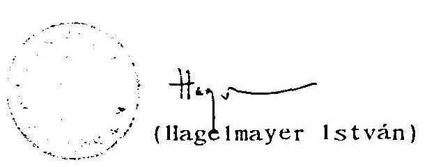

---

1. sz. melléklet
a V-12-81/1995-96. sz.
ÁSZ jelentéshez

---

Véleményünk szerint:
Az éves Költségvetési beszámolót a számvitelről szóló 1991. évi XVIII. törvény és a költségvetés alapján gazdálkodó szervek beszámolási és könyvvezetési kötelezettségére vonatkozó 179/1991. (XII. 30.) számú Korm. rendelet, a társadalombiztosítás pénzügyi alapjairól és azok 1993. évi költségvetéséről szóló 1992. évi LXXXIV. törvény, valamint a társadalombiztosítás pénzügyi alapjainak 1994. évi költségvetéséről szóló 1993. évi CXV. törvény, az azt módosító 1994. évi L. törvény és az 1994. évi LXXVI. törvény elöírásainak megfelelően állították össze.
Az éves költségvetési beszámoló megbízható és valós képet ad a Nyugdíjbiztosítási Alap Szolgáltatási szektorának 1994. december 31-i vagyoni és pénzügyi helyzetéről, valamint az éves pénzforgalom alakulásáról.

Budapest, 1995 augusztus 18.

KPMG Hungária
Könyvvizsgáló, Adó- és Közgazdasági Tanácsadó Kft.
Budapest
$\mathrm{KE}-0045 / 95 / \mathrm{I}$
kPMG Hungáin
Dwis Thampan.
David Thompson
Partner

Cselotei Istvánné
dr. Cselőtei Istvánné
Bejegyzett könyvvizsgáló
KI-1923/94/X.

---

Véleményünk szerint:
Az éves Költségvetési beszámolót a számvitelről szóló 1991. évi XVIII. törvény és a költségvetés alapján gazdálkodó szervek beszámolási és könyvvezetési kötelezettségére vonatkozó 179/1991. (XII. 30.) számú Korm. rendelet, a társadalombiztosítás pénzügyi alapjairól és azok 1993. évi költségvetéséről szóló 1992. évi LXXXIV. törvény, valamint a társadalombiztosítás pénzügyi alapjainak 1994. évi költségvetéséről szóló 1993. évi CXV. törvény, az azt módosító 1994. évi L. törvény és az 1994. évi LXXVI. törvény elöírásainak megfelelően állították össze.
Az éves költségvetési beszámoló megbízható és valós képet ad az Egészségbiztosítási Alap Szolgáltatási szektorának 1994. december 31-i vagyoni és pénzügyi helyzetéről, valamint az éves pénzforgalom alakulásáról.

Budapest, 1995 július 28.

KPMG Hungária
Könyvvizsgáló, Adó- és Közgazdasági Tanácsadó Kft.
Budapest
KE-0045/95/I
KPMG Hungária
Davis Thompson
David Thompson
Partner
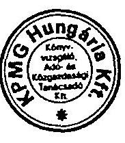
dr. Cselőtei Istvánné
Bejegyzett könyvvizsgáló
KI-1923/94/X

---

2. sz. melléklet
a V-12-81/1995-96. sz.
ÁSZ jelentéshez

---

# PÉNZŐGYMINISZTÉRIUM 

1051 BUDAPEST, JÓZSEF NÁDOR TÉR 2-4
Postacím: 1368 Budapest, Postafiók 481
Telefon: 118-2066
Telefax: 1182-570 - Telex: 20-2763
Számviteli Főosztály
$11.485 / 1994$

Országos Egészségbiztosítási Pénztár
Szabó Gáborné Asszony
főosztályvezető

## Budapest

Tisztelt Főosztályvezető Asszony !

A társadalombiztositás speciális helyzetéből adódó számviteli elszámolásokkal kapcsolatban az alábbiakról tájékoztatom:
1./ A "Társadalombiztosítási Alapok költségvetési beszámolója" címú D) jelü nyomtatványgamitúrából a pénzforgalmi kimutatás (10,11,13,17 ürlapok ) tartalmának meghatározására fóosztályunk nem illetékes. Megjegyezzük azonban, hogy a nyomtatványgamitúra javasolt űrlapjaival egyetértünk, de egyes ürlapok tartalmában az alábbi változtatásokat tartjuk szükségesnek:

- A 17-es ürlap 37-es sorát, amely a TB Alapok közötti elszámolások egyenlegét tartalmazza, a TB Alapok költségvetéséröl szóló törvényben szereplő alábontás szerint javasoljuk módosítani.
- Az 1991. évi hiány megtérülésére vonatkozóan befolyt összegek likviditási tartalék alapba helyezése, valamint a befektetések nettó hozamának tartalék alapba helyezése a TB Alapok költségvetéséröl szóló törvényben foglaltaktól eltérően nem jelent tényleges kiadást. A tartalék alapba helyezés számviteli elszámolására vonatkozó javaslatunkkal összhangban a 13-as ürlap 54-es sorában teljesítési adat nem szerepelhet. A tartalék alapba helyezést jogcimenkénti bontásban a 17-es ürlapon a pénzforgalom nélküli bevételek teljesités oszlopában mínusz előjellel kell kell figyelembe venni. Ennek kő́yetkeztében a 17 -és ürlapon az alábbi sorok változnának:
56. sor: Likviditási tartalék visszapótlására befolyt bevétel tartalékba helyezése 57. sor: Befektetések nettó hozamának tartalék alapba helyezése
58. sor: Pénzforgalom nélküli bevétel összesen

A jelenlegi 56-57-es összesen sorok értelemszerüen más sôrszámol kapnak és az 58-59-es-böl-és-serek-megszünnek.

---

2/ A munkáltatóknál müködő kifizetőhelyeken teljesített ellátások kiadásként és az ellátásokkal azonos összegű járulékbevételek pénzforgalom nélküli tételként való elszámolásával egyetértünk. Ez az elszámolás felel meg a Számviteli Törvényben megfogalmazott bruttó elszámolás elvének.

3/ A járulékbevételek Nyugdijbiztosítási Alap és Egészségbiztosítási Alap közötti megosztásánál alkalmazott és személyes megbeszélésünk során bemutatott számviteli elszámolással egyetértünk.

4/ A befektetések tárgyévi nettó hozamából befolyt bevételek tartalék alapba helyezésének számviteli elszámolására a következő megoldást javasoljuk:
A 98-as számlacsoportban a pénzforgalom nélküli bevételek között 989. Tartalékok képzése elnevezéssel fökönyvi számlát kell nyitni.

Könyvelési tételek:
a.) Befektetések tárgyévi nettó hozamából befolyt bevétel tartalék alapba helyezése ( pénzforgalom nélküli tétel): T: 989 - K: 4212
b.) Tartalékok képzésére szolgáló főkönyvi számlák év végi zárása:

T: 494 - K: 989
5/ Az 1991. évi hiány megtérülésére vonatkozóan befolyt bevételek likviditási alapba történő visszapótlásának könyvviteli elszámolásánál a 4./ pontban leírtakat javasoljuk alkalmazni.

Budapest, 1995. január 3.
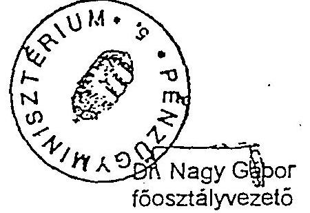

---

# Pénzügyminisztérium 

Számviteli Főosztály
$42.326 / 1995$.

Hiv.sz.: $31-713 / 1995$

Országos Egészségbiztosítási Pénztár
SZABÓ GÁBORNE főosztályvezető
Budapest

Tisztelt Szabóné Asszony!

A társadalombiztosítás speciális helyzstéból adódóan az 1994. év végi zárásnál alkalmazott számviteli elszámolásokkal kapcsolatban az alábbiakról tájékoztatom:

1. A levelükben és ahhoz csatolt mellékletekben leirt indokok alapján a TB Alapok költségvetéséről szóló törvényben meghatározott járulék és egyéb bevételek és a közösen viselt kiadások Alapok közötti megosztása, valamint a keresztülfinanszirozással kapcsolatos két Alap közötti elszámolások során alkalmazott pénzforgalom nélküli elszámolásokkal egyetértünk. Véleményünk szerint is ezzel az elszámolással biztosítható, hogy az Alapok költségvetésének teljesítéséről készült éves beszámolóban a ténylegesen teljesített bevételek és kiadások a megfelelő jogcímen annál az Alapnál jelennek meg, amelyiknek a költségvetésében a bevétel, illetve kiadás elóirányzata szerepel.
2. Az 1993. évi zárszámadás lekönyvelését követően a 4214. Előzó évek költségvetési tartalékának elszámolása fókönyvi számlán mutatkozó $\mathbb{Z}$ egyenl eg a két biztosítási ág szétválásakor a hi-

---

# - 2 - 

tclállomány megosztásával kapcsolatos helytelen elszámolásra vezethető vissza. Mivel a 4214. főkönyvi számlán az előző évek költségvetési tartalékának elszámolásával kapcsolatos rendezésre váró tételeket kell kimutatni - ebben az esetben pedig nem ilyen tételről van szó -, ezért a 4214. fôkönyvi számla egyenlggét a 42121. Likvid tartalék számlára javasoljuk átvezetni.

Budapest, 1995. augusztus 17.

---

3. sz. melléklet
a V-12-81/1995-96. sz.
ÁSZ jelentéshez

---

# INTÉZKEDÉSI TERV 

az 1993. évi zárszámadáshoz kapcsolódó ÁsZ jelentés megál lapiásai alapján a gazdálkodás szabályozott rendjével összefüggó feladatok ütemezésére
993. évi zárszámadáshoz kapcsolódó számvevôszéki és auditori utésekben megfogalmazott hiányosságok megszüntetésére összetott intézkedési tervünk meghatározza azon feladataink sorát temezését, amelyekkel az 1994. évi zárszámadás, továbbá az 5. évi költségvetés munkáinak színvonala javítható.
óbanforgó jelentések szerint a társadalombiztosítás meglévô feszültségpontjai:
társadalombiztosítás speciális helyzetéből adódó számviteli számolások jogszabályi hátterének hiánya a tervezési, beámolási rendszer központi szabályozásával kapcsolatban;
törvényi szabályozások összhangjának hiánya, mivel az 1992. i LX. törvény 4. §-ában foglaltak - amely az 1991. évi hiány gtérülésével kapcsolatos likviditási tartalékalapba történisszapótlást írja eló - nincsenek összhangban a SzámviteTörvényben foglaltakkal;
adósságállomány nagysága és növekedési üteme (erre külön tézkedés történt), a túlfizetéses folyószámlák rendezetlenge;
adóállomány alulértékelése, a mérlegben a bruttó elszámos elvének megfelelő módon történő megjelenítése;
múködés feltételeinél a kifogás tárgyát képező szabályozási ányosságok.
ntiek alapján a gazdálkodás szabályozottsága, szabályszerűbiztosítása érdekében az elvégzendó feladatok ütemezését az biakban határozom meg:

Az új pénzügyi alapokról szóló törvény kidolgozásával párhuzamosan felül kell vizsgálni a vonatkozó Kormány rendeleteket és el kell készíteni a tervezési, beszámolási rendszer központi szabályozására, továbbá az általános elóirásoktól eltérő, a társadalombiztosítás sajátos számviteli eljárását tartalmazó jogszabály módosítási javaslatokat és a PM felé kezdeményezni szükséges azok módosítását.
Felelős: Számviteli Főosztály vezetője
Költségvetési és Pénzforgalmi Főosztály vezetője
Határidő: folyamatos

---

A Világbanki hitellel kapcsolatos számviteli elszámolás belso szabályozását a beleértve a költségek hazai ráfordításának elszámolását is - a Pénzügyminisztériumtól bekért állásfoglalás alapján ki kell alakítani.

Felelős: Világbanki Programiroda (PMU) vezetője
Költségvetési és Pénzforgalmi Főosztály vezetője
Számviteli Főosztály vezetője
Határidő: 1995. I. 31.

Az 1994. évi zárlati munkálatok elvégzéséhez részletes és reális ütemtervet kell kidolgozni.

Felelős: Számviteli Főosztály vezetője
Határidő: 1994. XII. 20.

Az illetékes tárca (PM) felé javaslatot kell tenni a végleges (auditált) költségvetési beszámoló előírt benyújtási határidejének "május 31." -re történő módosítására.

Felelős: Költségvetési és Pénzforgalmi Főosztály vezetője Számviteli Főosztály vezetője
Határidő: 1995. I. 10.

A főkönyvi könyvelési és az analitikus nyilvántartási adatok közötti kötelező egyezőséget biztosítani kell. Ennek érdekében:

- Az OEP szakmai egységei közötti egyeztetések rendjét "Főigazgatói Utasítással" kell szabályozni.

Felelős: Számviteli Főosztály vezetője
Határidő: 1994. XI. 30.

- A Számviteli Főosztályon belüli szervezeti egységek közötti egyeztetések belső rendjének szabályozására "Főosztályvezetői Utasítást" kell kiadni.

Felelős: Számviteli Főosztály vezetője
Határidő: 1995. I. 20.

A zárlati munkák megkezdése előtt kötelezően előírt leltározási kötelezettségek teljeskörű végrehajtásának biztosítása érdekében:

- A leltározási feladatok elvégzéséhez központi irányelvet kell kidolgozni és az igazgatási szervek részére kiadni.

Felelős: Számviteli Főosztály vezetője
Határidő: 1994. XII. 31.

---

- A mérleg valódiságának, teljeskörűségének biztosítása érdekében intézkedést kell kiadni a munkáltatói folyószámla vonatkozásában a rendezetlen tételek soron kívüli tisztázására, a függő és elszámolatlan befizetések, terhelések rendezésére.

Felelős: OEP Járulék és Folyószámla Főosztály vezetője Határidő: 1994. XII. 15.

- A munkáltatói folyószámlák adatainak az adósokkal történő egyeztetését az igazgatási szerveknek teljeskörűen el kell végezni.

Felelős: MEP-ek vezetői
OEP Járulék- és Folyószámla Főosztály vezetője Határidő: 1995. II. 15.

- Az értékpapírok leltározását, értékelését teljeskörűen el kell végezni.

Felelős: Vagyonkezelési Főosztály vezetője Határidő: 1995. I. 25.

- A meglévő számítógépes programrendszereket tovább kell fejleszteni a tárgyi eszközök és készletek leltárfelvételi munkáinak gyakorlati végrehajtásához.

Felelős: Számviteli Főosztály vezetője Határidő: 1994. XII. 31.

A fejlesztésekkel kapcsolatos keretnyilvántartási és számviteli adatok közötti egyezőséget minden intézménynél biztosítani kell. Ennek keretében a működési költségvetést érintően a fejlesztések (beruházások, felújítások) előirányzati és felhasználási adatainak országos egyeztetését az évzárlat megkezdése előtt el kell végezni.

Végrehajtására az Üzemeltetési Főosztállyal együttműködve intézkedést kell kiadni az igazgatási szervek részére.

Felelős: Számviteli Főosztály vezetője
Költségvetési és Pénzforgalmi Főosztály vezetője
Üzemeltetési Főosztály vezetője
Határidő: 1994. XII. 31.

A bérlakásoknál a felújításnak minősülő összeggel az ingatlanok állományérték változását a számviteli nyilvántartásban rögziteni kell.

Felelős: Számviteli Főosztály vezetője
Határidő: 1995. I. 31.

---

A 14/1989 évia a "Befektetési és Vagyonkezelési Szabályzat" ot tartalmazó OTF Utasítást a jelenlegi helyzetnek megfelelően a törvényi szabályozással egyidőben aktualizálni kell.

Felelős: Befektetési és Vagyonkezelő Főosztály vezetője Határidő: a törvény megjelenését követően soron kívül.

A biztosítási Alapok közös működési vagyonának végleges megosztása érdekében:

- Az ONYF-el közösen központi intézkedést kell kiadni az igazgatási szervek részére az ingó- és ingatlan vagyonnal kapcsolatban.

Felelős: Számviteli Főosztály vezetője Költségvetési és Pénzforgalmi Főosztály vezetője Üzemeltetési Főosztály vezetője Határidő: 1995. I. 13.

- A Lakásalap számla ágazatok közötti megosztására az ONYF-el - a Humánpolitikai és Oktatási Főosztályal együttműködve - megállapodást kell készíteni. A megállapodásban foglaltak alapján intézkedést kell kiadni az igazgatási szervek felé a számviteli elszámolásra vonatkozóan.

Felelős: Számviteli Főosztály vezetője Humánpolitikai és Oktatási Főosztály vezetője Határidő: 1994. XII. 31.

11/ Ki kell alakítani a fejlesztési előirányzatok felhasználásának, továbbá annak terhére vállalt kötelezettségvállalások nyilvántartásának és egyeztetésének rendjét.

Felelős: Költségvetési és Pénzforgalmi Főosztály vezetője Határidő: 1995. I. 31.

12/ Biztosítani kell az intézményenkénti engedélyezett létszám folyamatos egyeztetését. Ki kell alakítani az átlagos statisztikai létszám, tényleges létszám és a szakterületenkénti munkajogi állományi létszám nyilvántartását és egyeztetésének rendjét.

Felelős: Költségvetési és Pénzforgalmi Főosztály vezetője Humánpolitikai és Oktatási Főosztály vezetője Határidő: 1995. V. 31.

Budapest, 1994. december hó

Fejes László főigazgató

---

4. sz. melléklet
a V-12-81/1995-96. sz.
ÁsZ jelentéshez

---

5. számú melléklet az 1996. évl ... törvényhez

A társadalombiztosítási alrendszer összevont 1994. évl költségvetése végrehallásának mérlege

|  Megnevezés | (millió forintban) |  |  |  |   |
| --- | --- | --- | --- | --- | --- |
|   | 1993. évl tény | 1994. évl elöirányzat | 1994. évl teljesítés | $\begin{gathered} A 12 \ 1994 \text { tény } \end{gathered}$ | Eelévl.  |
|  BEVÉTELEK |  |  |  |  |   |
|  1. Járulékbevételek | 570216 | 647670 | 671476 |  |   |
|  - munkáltatói járulékbefizetés | 430473 | 492610 | 525969 |  |   |
|  - munkanélküli ellátás után fizetett járulék | 22553 | 27000 | 14910 |  |   |
|  - egyéni járulékbefizetés | 111086 | 116350 | 119831 |  |   |
|  - munkanélküli járadék (segély) után fizetett nyugdíj- |  |  |  |  |   |
|  járulék | - | 3310 | 2784 |  |   |
|  - a központi költségvetés által fizetett járulék | 5800 | 7000 | 7000 |  |   |
|  - egyes szociális ellátások után fizetett járulék | 304 | 1400 | 962 |  |   |
|  2. A társadalombiztosítási tevékenységgel kapcsolatos egyéb bevételek | 27193 | 28550 | 31561 |  |   |
|  - megtérítések az Egészségbiztosítási Alap részére | 1320 | 3040 | 3568 |  |   |
|  - késedeimi pólék és rendbírság | 24051 | 24960 | 25726 |  |   |
|  - egyéb bevételek | 1822 | 550 | 2267 |  |   |
|  A járulék- és a társadalombiztosítási tevékenységgel kapcsolatos egyéb bevételek összesen | 597409 | 676220 | 703037 |  |   |
|  ebböl: |  |  |  |  |   |
|  - a likviditási tartalék 1993. évl visszapótlására számításba vehető bevétei | 2628 | - | 2295 |  |   |
|  - a likviditási tartalék 1994. évl visszapótlására számításba vehető bevétei | - | - | 4754 |  |   |
|  3. Központi költségvetési terhelö egészségügyi feladatok ellátásával kapcsolatos bevétel | 2500 | 5500 | 4462 |  |   |
|  4. Kamat- és egyéb hozambevételek | 4432 | 2560 | 2740 | 2743 |   |
|  5. Vissztehermentesen átvett vagyonból származó bevétel | - | 16040 | - |  |   |
|  6. A likviditási tartalék visszapótlására számításba vehető bevétel | - | 7200 | - |  |   |
|  7. Központi költségvetési forrásátadás az 1993. évl központi bérintézkedésre | 2371 | - | - |  |   |
|  8. Foglalkoztatáspolitikai célú korengedményes nyugdíjai kapcsolatos - 1991-ben elmaradt megtérítés | 177 | - | 88 |  |   |
|  9. Müködési célú bevétel | 2024 | 830 | 2898 |  |   |
|  10. Az 1994. évl egészségügyi bérintézkedésre a központi költségvetésböl biztosított forrás | - | 5400 | 5400 |  |   |
|  levételek összesen: | 608913 | 713750 | 718625 | 718628 | $+3$  |

---

adalombiztosítási alrendszer összevont 1994. évi költségvelése végrehajtása mérlegének folytatása)

| rezés | (millió forintban) |  |  |  |  |
| :--: | :--: | :--: | :--: | :--: | :--: |
|  | 1993. evi tény | 1994. evi elöirányzat | 1994. evi teljesités | $\begin{gathered} A 1 / 2 \\ 1994 \text { tely } \end{gathered}$ | $2 e 2 h i e_{0}$ |
| SOK |  |  |  |  |  |
| cellátás | 367092 | 413180 | 442210 |  |  |
| gáljbiztosítási ágba tartozó ellátások | 299334 | 359020 | 384439 |  |  |
| z. |  |  |  |  |  |
| zógazdasági járadékok | - | 5220 | 5270 |  |  |
| zszégbiztosítási ágba tartozó ellátások | 45034 | 54160 | 57771 |  |  |
| melileg finanszírozott ellátások | 22724 | - | - |  |  |
| sági ellátások | 32730 | 9150 | 8262 |  |  |
| sségi-gyermekágyi segély | 7203 | 9150 | 8262 |  |  |
| nelileg finanszíroztt ellátások (GYES, GYED) | 25527 | - | - |  |  |
| inz | 35255 | 34100 | 40833 |  |  |
| zszer- és gyógyászati segédeszköz támogatás | 54233 | 58500 | 69647 |  |  |
| gyszertámogatás | 49535 | 50700 | 61572 |  |  |
| ékenység kezelése | - | 800 | 786 |  |  |
| gyászati segédeszköz-támogatás | 4698 | 7000 | 7289 |  |  |
| tió-megelöző ellátások | 131571 | 169880 | 169525 |  |  |
| ászati szolgáltatások | - | 1220 | 937 |  |  |
| ytördö szolgáltatás | - | 1100 | 799 |  |  |
| tej ellátás | - | 120 | 138 |  |  |
| ellátások | 2158 | 3040 | 2519 |  |  |
| isi költségtérítés | 1069 | 1580 | 1414 |  |  |
| jséggel kapcsolatos segélyek | 441 | 650 | 428 |  |  |
| itési járadék | 648 | 810 | 677 |  |  |
| ahelyeket megillető költségtérítés | 327 | 300 | 369 |  |  |
| okkal kapcsolatos egyéb kiadások |  |  |  |  |  |
| (öltség és egyéb) | 1577 | 1750 | 2380 | 2076 | $-304$ |
| dési kiadások | 14224 | 14568 | 16636 |  |  |
| müködési célú bevéletböl fedezett; | 2024 | 830 | 2898 |  |  |
| dási tartalék 1993. évi visszapóllása | 2805 | - | 2295 |  |  |
| dási tartalék 1994. évi visszapóllása | - | 7200 | 4842 |  |  |
| t- és egyéb hozambevételekkel kap- |  |  |  |  |  |
| is ráforditások | 52 | 20 | 59 |  |  |
| fedező értékpapír kibocsátásával kap- |  |  |  |  |  |
| is ráforditások | 16 | - | 1 |  |  |
| ísszesen: | 642040 | 712908 | 760516 | 960.242 | $-304$ |
| G: | $-33127$ | 842 | $-41891$ | 41.584 | $-307$ |

datok összege - a kerekítés miatt - eltérhel az összegző sorok adataitól.

---

A Nyugdijbiztosítási Alap 1994. évl költségvetése végrehaitásának mérlege

DEVETELEK
millió forintban

| Megnevezés | 1993.   tény | 1994.   elöi-   rányzat | 1994.64 i   teljesités | ASZ |
| :--: | :--: | :--: | :--: | :--: |

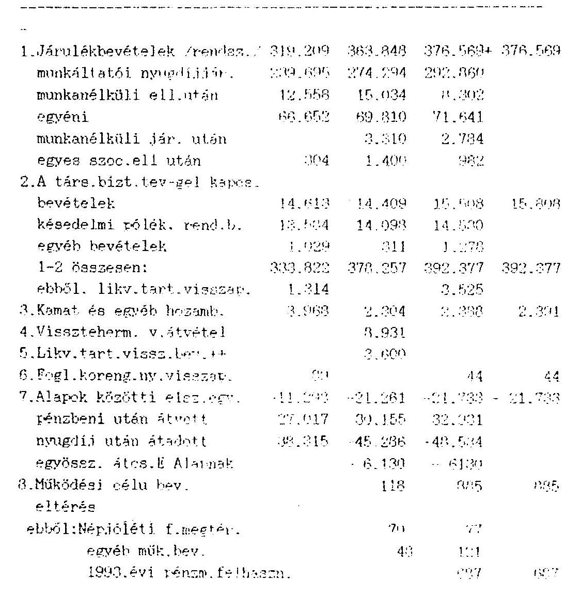

Bevételek összesen: 326.561 271.949 373.961 373.964
Eltérés:

---

ogdijhistoritáni Alap 1994. évi költségvetése végrehajtásának mérlege

|  | ZIADASOL |  |  |  | millió Ft |
| :--: | :--: | :--: | :--: | :--: | :--: |
| MEGGREVEZES | 1993. evi | 1994. evi | 1994. evi | ASL | Kiterés |
| Nyugellátások | 299334 | 359020 | 384439 | 384439 | - |
| - kurhatár fölötti saját jogú nyugdijak | 255461 | 304280 | 324405 | - | - |
| - hozzátartozói ellátások | 43873 | 49520 | 54764 | - | - |
| - mezőgazdasági járadékok | - | 5220 | 5270 | - | - |
| Hozzájarulás az alpok által közösen fedezet kiadásukhoz | 26627 | 918 | 1373 | 1069 | $-304$ |
| - átmenetileg finanszírozott ellátások | 25784 | - | - | - | - |
| - ellátásokkal kapcs. egyéb kiad. (posta-, utazás-, perköltség) | 843 | 918 | 1373 | 1069 | $-304$ |
| Müködési kiadások | 6567 | 7551 | 8318 | 8318 | - |
| ebböl: |  |  |  |  |  |
| - Ny. Alaptól müködésre átadott pénzenzköz | - | - | 7433 | 7433 | - |
| - müködési célú bevételből fedezett | - | 118 | 198 | 198 | - |
| - 1993. évi müködési pénzmaradványból fedezett | - | - | 687 | 687 | - |
| Likviditási tartalék visszapótlása ebböl: | 1403 | 3600 | 3569 | 3569 | - |
| - 1993. évi likviditási tartalék visszapótlás járulékokból | - | - | 1148 | - | - |
| - 1994. évi likviditási tartalék visszapótlás járulékokból | - | - | 2421 | - | - |
| Lamat és egyéb hozambevételekkel kapcsolatos ráfordítás | 47 | 18 | 34 | 34 | - |
| Hiányt fedezó értékpapírt kibocsátá- |  |  |  |  |  |
| séval kapcsolatos kiadások | 5 | - | - | - | - |
| Kiadások összesen: | 333983 | 371107 | 397733 | 397429 | $-304$ |
| EGYERLEG | $-7402$ | 842 | $-23772$ | $-23465$ | $-307$ |

---

$-i-$
számu melléklet
Egyéb kiadás zárasámadásban

| FökGnyvi   számla sz. |  |  | millió Ft |  |
| :--: | :--: | :--: | :--: | :--: |
|  |  |  | ONYF zár- ASZ Eltérés   számadás zárszámadís |  |
| 5451 | Postköltseg |  | 1.533 | 1.533 |
| 5482 | Kallf.megt.igény |  | - | - |
| 5486 | Vagyon kez. kiad. |  | 10 | 10 |
| 5489 | Egyéb kiadás |  | - | - |
|  |  |  | 1.543 | 1.543 |
| 46342 | OEP-töl kapott |  | 730 | 730 |
| 373783 | OEP-nek adott |  | 252 | 252 |
| 38416 | Utazási költe. |  | 5 | 5 |
| 373713 | OEP-nek adott   1993. évi |  |  |  |
|  | -pénzmar.megoszt. |  | 131 | - -132 |
|  | -hitel megoszt. |  | 172 | - -172 |
|  |  |  | 304 | - -304 |
| Osszesen: |  |  | 1.373 | 1.069 -304 |

---

5. sz. melléklet
a V-12-81/1995-96. sz.
ÁSZ jelentéshez

---

# KIUJNAT 

## az 111999. 4. DEP fóig utantdakol

- 17 -

- a MEP illetve EüFF a hozzá beérkezett igények indokoltságát felülvizsgálja, és számszerú adatait ellenőrzi az 1992. évi LXXXIV. törvény szerinti útmutató alapján;
- a MEP a hozzá beérkezett igényeket javaslatával együtt továbbítja az EüFF-nek;
- az EüFF egyedi elbírálás alapján dönt a teljesítmény-finanszírozási körből történő ideiglenes kivonásról;
- az EÜFF jóváhagyása esetén meghatározza
- járóbeteg szakellátást nyújtó szervezeti egységeknél a szünetelés időszakára az egészségügyi ellátás ideiglenes meszünése miatt zárolandó előirányzatot, valamint az alapvető és indokolt kiadások finanszírozására folyósítandó havi fix támogatás összegét, érvényességének időtartamát;
- fekvőbeteg szakellátást nyújtó szervezeti egységek esetén a benyújtott és ellenőrzött adatok, valamint a case mix index, és az esetösszetétel index alapján a szünetelés idôszakára a módosított alapdíj összegét/összegeit, valamint az alapvető és indokolt kiadások finanszírozására folyósítandó havi fix támogatás összegét, érvényességének időtartamát;
- az EüFF értesíti a MEP-et a hozzá benyújtott igények elbírálásáról;
- a MEP illetve az EüFF tájékoztatja a múködtetőket a döntésről, kedvező elbírálás esetén a fentiekben foglalt tartalommal megköti a megállapodást a múködtetővel, amelyet a finanszírozási szerződés példányához csatol. A MEP illetve az EüFF a megállapodásban foglaltaknak megfelelően módosítja az intézmény előirányzatát, alapdíját(it).

12. 

Az Egészségbiztosítási Alap finanszírozási rendszerébe már befogadott, de meg nem múködő teljesítmény-finanszírozási körbe tartozó új járó vagy fekvőbeteg szakellátást nyújtó létesítmény múködtetésének elókészítése időtartamára, és az üzembehelyezést követő első teljesítményarányos díj utalását megelőző 3 hónaprá meghatározza az alapvető és indokolt kiadások finanszírozására folyósítandó havi fix támogatás összegét, tekintettel a teljesítményarányos díjazás rendjére, a teljesítés és a díj kifizetése közötti 2 hónapos csúszásra;

---

6. sz. melléklet
a V-12-81/1995-96. sz.
ÁSZ jelentéshez

---

# EGÉSZSÉGBIZTOSITÁSI ÖNKORMÁNYZAT ELNÖKSÉGE 

16/1994. SZ.HATÁROZATA

EÖE. 1994. 01.24. 7/1. H.

Az Elnökség megtárgyalta az "R" Klinika ellenőrzéséről készitett előterjesztést és az alábbi határozatot hozta.

Az Elnökség nem kiván az "R" Klinika esetében és hasonló ügyekben konkrét határozatot hozni.

Az Elnökség azonban kötelezi az OEP föigazgatóját, hogy az ellenőrzés során feltárt szerződésszegések tapasztalatai alapján szigoru szankciókat alkalmazzon.

Az Elnökség elvárja a föigazgatótól, hogy ahol a megkötött szerződésekhez képest jelentős eltérést, illetve szerződésszegést tapasztal ott az adott szerződés ne kerüljön meghosszabbításra.

A konkrét ügy tanulságaként az Elnökség indokoltnak tartja, hogy új vállalkozási szerződések megkötése, vagy korábbiak meghosszabbítása elött célellenőrzésre kerüljön sor.
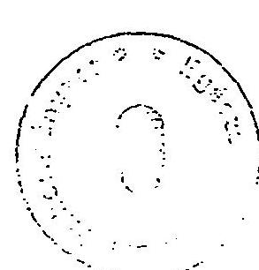
dr.Sándor László
elnök

---

7. sz. melléklet
a V-12-81/1995-96. sz.
ÁSZ jelentéshez

---

# A müködési költségvetést terhelö kifizetések 

jegyzéke

Nyilvántartási
szám

6-1999/94
$6-2000 / 94$
$6-2001 / 94$
$6-2003 / 94$
$6-2004 / 94$
$6-2005 / 94$
$6-2006 / 94$
$6-2007 / 94$

Pályázó megnevezése, a pályázat tárgya

Geohol ging Befektetési
Vállalkozási Kiadó Kft.
EOE-OEP arcul atterve
Medivision Kft.
Részvétel az arculattervezésben 5,0
Anonymus Kiadó
Változások a gyógyszerek 3,8
árában felírásában 1995.
VIVA Média Kiadó
TB jogszabályok hatályos 10,0
egységes szerkezetbe fog-
1alt szövegének kiadása
Credo Kft.
Hirhozó c. nyugdijas érdek-
védelmi heti lap egyészség- 5,0
ügyi rovattal való bővítése
Literatura Medica Kiadó,
a Lege Artis Medicinae orvosi
folyóirat kiadásához 2,0
hozzá járulás
SUB Rosa Kiadó "Korunk
betegségei"c. kiadvány sorozat 6,0
olcsóbb árához támogatás
GLANZ BT. A csuklótájék sérü-
lései szakkönyv megjelentetéséhez hozzájárulás

---

| 6-2009/94 | UNIO Lap és Könyvterjesztö Gyógyszeres terápia kiegészítő gyógyszerészeti szakkönyv megjelentetése | 17,5 |
| :--: | :--: | :--: |
| 6-2012/94 | Magyar Kórházszövetség budapesti konferenciájára idegennyelvü publikációk megjelentetése | 4,8 |
| 6-2015/94 | Magyar Hirlap   Az 1991 nyarától rendszeresen megjelenő "Patika"c. melléklet támogatása | 1,5 |
| 6-2017/94 | Demokrácia kutatások   Magyar Központja   Magyarország Politikai Évkönyve 1995 kiadvány támogatása | 2,0 |
| 6-2018/94 | GEOHOLDING RT   GEOMÉDIA Lap és Könyvkiadó   Az 1992 óta 2 havonta megjelenő   Konzilium c. eü. szaklap havonta történő megjelentetése | 2,0 |
| 6-2022/94 | MEDIJUR BT. Az NM   1994. évi kórház felmérése anyagának sajtó alá rendezése | 1,1 |
| 6-2023/94 | MEDINTEL Eü. könyvkiadó Kft. Gyógyszerkódex 1994. évi pótkötet megjelentetéséhez támogatás | 1,7 |
| 6-2025/94 | GEOHOLDING RT.   EÖE és OEP arculattervére jóváhagyott tanulmány alapján konkrét intézkedések az arculat kialakításával és az egészségvédelmi média tevékenységével kapcsolatban | 15,0 |
| 6-2026/94 | MEDIVISION Kft.   Részvétel az arculattervezésben, PR kampány részletes terve | 0,6 |

---

6-2028/94 MULTY COPY Nyomdaipari Kft. Az otthoni ápolás és hospice 0,6 konferencia jegyzökönyveinek röviditett kiadása
$\ddot{O} \operatorname{S} \operatorname{S} \mathbf{Z} \mathbf{E} \mathbf{S} \mathbf{E} \mathbf{N}:$
98,5

---

8. sz. melléklet
a V-12-81/1995-96. sz.
ÁSZ jelentéshez

---

i. s. számu melléklet

INY Alap befektetések hozama tartalékalap alakulása

|  |  |  |  |  |  |  |  |  |  |  |  |  |  |  |  |  |  |  |  |  |  |
| :--: | :--: | :--: | :--: | :--: | :--: | :--: | :--: | :--: | :--: | :--: | :--: | :--: | :--: | :--: | :--: | :--: | :--: | :--: | :--: | :--: | :--: |
|  |  |  |  |  |  |  |  |  |  |  |  |  |  |  |  |  |  |  |  |  |  |  |
|  |  |  |  |  |  |  |  |  |  |  |  |  |  |  |  |  |  |  |  |  |  |  |
|  |  |  |  |  |  |  |  |  |  |  |  |  |  |  |  |  |  |  |  |  |  |  |
| 1993.XII.31. |  |  |  |  |  |  |  |  |  |  |  |  |  |  |  |  |  |  |  |  |  |  |
| Vagyonmegosztás |  |  |  |  |  |  |  |  |  |  |  |  |  |  |  |  |  |  |  |  |  |  |
|  |  |  |  |  |  |  |  |  |  |  |  |  |  |  |  |  |  |  |  |  |  |  |
|  |  |  |  |  |  |  |  |  |  |  |  |  |  |  |  |  |  |  |  |  |  |  |
|  |  |  |  |  |  |  |  |  |  |  |  |  |  |  |  |  |  |  |  |  |  |  |
| Megtérülés |  |  |  |  |  |  |  |  |  |  |  |  |  |  |  |  |  |  |  |  |  |  |
| Müködési célra ingatlan épület vásárlás |  |  |  |  |  |  |  |  |  |  |  |  |  |  |  |  |  |  |  |  |  |  |
|  |  |  |  |  |  |  |  |  |  |  |  |  |  |  |  |  |  |  |  |  |  |  |
|  |  |  |  |  |  |  |  |  |  |  |  |  |  |  |  |  |  |  |  |  |  |  |
| 1994.XII. 31 záro |  |  |  |  |  |  |  |  |  |  |  |  |  |  |  |  |  |  |  |  |  |  |
|  |  |  |  |  |  |  |  |  |  |  |  |  |  |  |  |  |  |  |  |  |  |  |

---

NY Alap tartósan befektetett eszközök alakulása

|  |  |  |  |  |
| :--: | :--: | :--: | :--: | :--: |
|  | zárszámadás |  | ASZ | Eltérés |
| 1993.XII.31. | 13.606 |  | 13.606 | - |
| Lupis értékvesztése | - 380 |  | - 380 |  |
| Vagyonmegosztás | - |  | 125 | - 125 |
|  | 13.226 |  | 13.101 | - 125 |
| Müködési célra vésárolt épillet.ingatlan | 409 |  | 409 | - |
| Ingyenes vagyon | 185 |  | - | 185 |
| Járulék tartozás ellenté- |  |  |  |  |
| ben átvett | 421 |  | - | 421 |
| 1994.XII.31. záró | 14.331 |  | 13.600 | - 731 |

---

9. sz. melléklet
a V-12-81/1995-96. sz.
ÁSZ jelentéshez

---

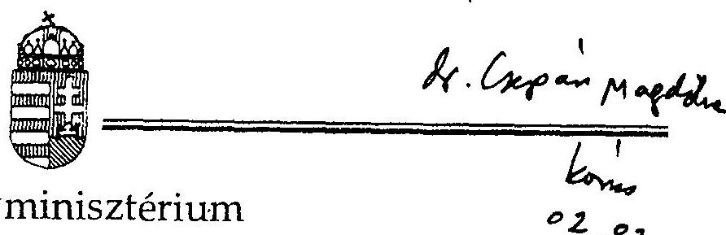

Helyettes Államtitkár

22085/96
Dr. Kovács Árpád úr
számvevő-igazgató

Állami Számvevőszék

Budapest

Tisztelt Igazgató Úr!

A társadalombiztosítás pénzügyi alapjainak 1994. évi zárszámadásához kapcsolódó ellenőrzések tapasztalatairól szóló jelentés tervezetében foglalt megállapításokat, következtetéseket és ajánlásokat összességében megalapozottnak tartjuk.

Az alapok beszámolási és könyvvezetési kötelezettségei kormányrendeletek szintjén kerültek szabályozásra. A társadalombiztosítási sajátosságokat rendszerbe foglaló külön szabályozásra az államháztartási törvény szabályainak a társadalombiztosításra vonatkozó módosításával egyidőben kerül sor még 1996-ban. Ezzel párhuzamosan a behajthatatlan követelések leírásának, elengedésének a kérdése is megnyugtató rendezést kell kapjon. Kérjük, hogy az Állami Számvevőszék tegyen konkrét javaslatot a szabályozni szükségesnek tartott kérdésekre vonatkozóan a megfelelő szabályozás érdekében.

A számviteli törvény és a költségvetés előírások betartására vonatkozó észrevételüket a ún. "D" jelű nyomtatvány és kitöltési útmutatója jóváhagyására vonatkozóan azzal fogadjuk el, hogy az alapokkal történt hónapokig elhúzódó egyeztetések eredménytelensége miatt került sor az előző évek gyakorlatának folytatására.

---

Sajnálatosnak tartjuk, hogy a maradéktalanul be nem tartható költségvetési elöírásokon túl az alapok gazdálkodásában szabálytalanságokat tapasztaltak. Ezek alapján úgy ítéljük meg, hogy az évek során tett észrevételeiket összegezve, azokat hasznositva a szabályozást korrigálni, a vagyongazdálkodást pedig szabályozni szükséges.

A nyugdijágat érintő bevételi és kiadási, ezáltal hiányt módosító megállapitásaikat - amelyeket nekünk nem volt módunkban vizsgálni elfogadva a benyújtott törvény javaslatot szükségesnek tartjuk módosítani.

A törvény javaslat késedelmes benyújtását alapvetően az okozta, hogy a zárszámadási adatok többszörösen módosultak a benyújtás előtt a két ág egymásnak történő müködési és szolgáltatási pénzmaradvány átadási eltérésciből adódóan.

Az "átadás" problematikájához kapcsolódóan jegyezzük meg, hogy a 9.sz. mellékletben 59.665 millió forint jelenik meg, mint az OEP-et terhelő korhatár alatti rokkant és baleseti ellátások 1994. évi teljesítése, ami a 3.sz. mellékletben 57.771 millió forintként szerepel az Egészségbiztosítási Alap kiadásai között, annak ellenére, hogy igényeltük az adatok egyezőségének a biztosítását.
A müködési költségvetés teljesítési adatainak részletes bemutatását, megegyezően a költségvetési törvényükkel - mi is észrevételeztük, jeleztük, hogy az általuk választott megoldás az államháztartási törvény megsértését jelenti.
A különféle ágazati és célfeladatokhoz kapcsolódó központosított elöirányzatok felhasználásának és bontásának bemutatását mi is célszerűnek tartottuk volna a zárszámadásban feltüntetni. Ezt a mindenkori költségvetésükröl szóló törvény szabályozza összhangban az államháztartásról szóló 1991. évi XXXVIII. tv. 18. §-ával. A központi költségvetési szcrvek központosított elöirányzat felhasználás szabályozása analógiáját tartjuk követhetönek a tb esetében is a kérdés kör újraszabályozása során.

Rendkivül aggályosnak tartjuk a járuléktartozás fejében átvett vagyontárgyak nyilvántartásának, kezelésének, értékelésének kérdéskörét, mivel az ezekre vonatkozó szabályozás nem egyértelmü. A tendenciákat figyelembe véve mennyiségük várhatóan nőni fog (saját behajtó szerveztük mellett 28 "külső" behajtó szervezet is dolgozik számukra, sajnos elég kevés sikerrel), ezért ezt a kérdéskört is mielőbb szabályozni szükséges.

---

A vagyoni kárpótlás életjáradékra váltása fedezetére nem nyitott a PM számlát és nem is utalt havonta finanszirozási összeget. A pénzbeli kárpótlás finanszírozása PM általi leutalással történt. Ezek a leutalások 1992. és 1993. évben összesen két alkalommal történtek és az így leutalt összegek "fogytak" 1994. év folyamán. Ezért évközben ilyen címen bevételi összeget nem számolhattak el.

Bár az alapok 1995-ben kidolgozták a vagyonkezelési szabályzatukat annak a gyakorlat az elégséges voltát nem igazolta. Tehát ezért is szükséges még ez évben a Parlament elé vinni a vagyongazdálkodásra vonatkozó törvény javaslatot.
Ettől függetlenül a vagyonkimutatás tartalmára vonatkozó megállapításukat is elfogadjuk.

Álláspontunk szerint az alapok befektetései hozama, akkor amikor az alapok folyamatosan deficitesek a hiány finanszírozását kell szolgálja.

Hiányosságnak tartjuk mi is azt, hogy a hátralékok nyilvántartásából nem derül ki, hogy jelenleg mennyi a behajthatatlan követelés. Ennek következtében a behajtható járulékok nagyságrendje sem állapítható meg. Ez kihat a behajtás eredményességére is.

Bár évközben valószínűsíthetővé vált, hogy az alapok deficittel zárnak, a hiány várható mértéke 15 Md Ft körüli lesz, a pótköltségvetés benyújtása elmaradt, mivel a központi költségvetés vállalta a MÁV tartozásának a rendezését. Akkor úgy tünt,hogy a hiány mértékét a 16,2 milliárd forint értékben történő rendezés alaponként 5-5 milliárd forintra mérsékli.

Az egészségügyi szolgáltatások szintentartását, a műszerek amortizációja kérdésének megoldását ugyancsak a sürgősen megoldandó kérdések közé soroljuk és olyan megoldást keresünk, az Áht. egészségügyi reformjának a keretében ami a központi költségvetés terheinek további növelését nem okozná.

Budapest, 1996. január "L!"
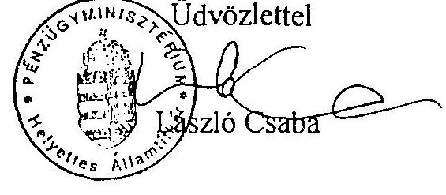

---

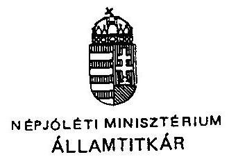
$30.191 / 96$

Dr. Kovács Árpád Úrnak igazgató

Állami Számvevőszék

## Budapest.

## Tisztelt Igazgató Úr!

Az Állami Számvevőszék T/1884/1. sz előzetes jelentés-tervezetét, a társadalombiztositás pénzügyi alapjainak 1994. évi zárszámadásához kapcsolódó ellenőrzések tapasztalatairól megkaptam.

Véleményem és észrevételeim a következôk:
Igen sajnálatos tény, hogy mind az Alapok 1994. évi zárszámadásáról szóló T/1884. sz. törvenyjavaslat 1996. januári benyújtása, mind a hozzá kapcsolódó ÁSZ jelentés ilyen késedelmesen történt meg.

Az ÁSZ által megválasztott ellenőrzési szempontokkal egyetértünk
Az összefoglaló megállapításban hangsúlyozott és az anyagban részletezett tény, hogy az ÁSZ által már elôzõ években is kifogásolt gyakorlat nem változott, a rendszerbeli gondok nem oldódtak meg.
Az ellátórendszerben 1994-ben érdemi, reform-értékủ változások nem következtek be. Az Alapok pénzügyi helyzete folyamatosan kedvezőtlenül alakul. A pénzbeli juttatások reálértékét és a természetbeni ellátások színvonalát nem sikerült megőrizni. Bár hangsúlyozni kell, hogy a folyamatokat elsősorban a társadalombiztosításon kívüli tényezők alakítják.

Az E. Alap kiadásainak növekedése a táppénz-kifizetés, és gyógyszertámogatás területén, mint azt az ellenőrzés is megállapította, döntô módon az alultervezettségből adódott.

---

Az Egészségbiztosítási Önkormányzat által befogadott fejlesztésekre - bár az előirányzatnál kevesebbet költöttek, feltétlenül hangsúlyozni kell a döntéselőkészítési fázisban a jól megalapozott szakmai szempontok megfogalmazását, a pénzügyi tervek megalapozottságának mérlegelést, a szakmai rangsor figyelmen kívül hagyásának nem kívánatos következményeit, és a törvénysértő gyakorlat újbóli megismétlődését.

Az erősödő magánosítási törekvések, privatizációs folyamatok kezeléséhez jól megfogalmazott feltételrendszer szükséges.

Az egészségügyi kockázatok csökkentését elősegitő programokra fordított összegek odaítélésével és felhasználásával kapcsolatos visszásságok feltárása azért szükséges, mert ez is azt támasztja alá, hogy már a költségvetési tervezésnél szükséges a pontosabb feladat-megjelölés.

Az Alapok működési költségvetésének zárszámadási adatait az államháztartási tv. előírásainak megfelelően kell megkövetelni. Feltűnő mindkét Alapnál a jutalom, a bérjellegủ kiadás magas hányada, és a központi irányitás kétszeres költség-volumene az igazgatáséhoz képest.

A vagyonnal kapcsolatos tulajdonosi jog a Közgyűlést illeti, ennek megsértésével került sor az E. Alapnál a vagyonkonverzióra - banki részvény cseréje MEDICOR-részvényekre, mely a cég megmentésére irányult, de az okozott veszteség az E. Alapot érte.

A müködési és a jóléti ingatlanvagyon két Alap közötti rendezése és a juttatott vagyon céljának megfogalmazása indokolt igény.

A részletes megállapítások közül kiemeljük:
Az Alapok beszámolási és könyvvezetési kötelezettségének teljesítéséhez szükséges formanyomtatvány hiánya, nehezíti mind az Alapok, mind az ÁSZ munkáját.
Az E. Alap járulék- és folyószámla nyilvántartási gondjainak hangsúlyozása és rendezése kívánatos, 1. az adósságállomány validitásának kérdése. Értékpapírok leltározása. Vagyonkimutatás tartalmának meghatározása.

A tervezett előirányzatok és a tényleges teljesülés vizsgálatának eredménye is azt mutatta, hogy szükséges az Önkormányzatok évközi, időszakos beszámoltatása. / pótköltségvetés beterjesztése. /

A járulék-bevételek alakulásának elemzésénél üdvözlendő az ellenőrzési tevékenység hatékonyságának növelése irányában tett előrelépés. A

---

makrogazdasági folyamatok hatásait a tervezés során kell jól vagy jobban értékelni.
A kiadások 2.1 alfejezete a gyógyító-megelőző ellátásokkal foglalkozik az 1993. évi CXV. tv. elöirányzata szerint.
Sajnálatos tény, hogy a reform-intézkedések nem valósulhattak meg a béremelésekre kiadott - az előirányzottnál lényegesen magasabb összeg szükségessége miatt.

A fejlesztési befogadások között, mint kirívó és jellegében ismétlődő szabálytalanság, került felszínre a CM-klinika ügye, melyet az ÁSZ további kivizsgálásra utasított, az Önkormányzat Felügyelő Bizottsága által lefolytatott vizsgálat ismeretében lehet és kell a következtetést levonni.

A járóbeteg ellátásban a $30 \%$-ban teljesítményarányos dijfizetés az ellátórendszerben strukturális változást nem hozott, a fekvőbeteg ellátásban alkalmazott finanszírozás nem eredményezett nivellációt, az intézmény közötti indokolatlan különbségek továbbra is megmaradtak.

Az egyedi szolgáltatások szektor-semleges térítési dijának megállapítása az EÖ. Elnökség joga, de nincs meghatározva az adekvát döntések meghozatalának kritériuma. A "spontán" egészségügyi privatizáció helyett a tervezetben megfogalmazott szempontok érvényesülésére van szükség.

A kockázatkezelő alapból történt kifizetéseknél feltárt és megfogalmazott hiányosságokkal is egyetértünk. Javaslatunk, hogy már a költségvetés benyújtásakor kerüljenek megfogalmazása a konkrét célok.

A felhalmozási és fejlesztési célú kiadásokról szóló megállapításokkal is egyetértünk. 1. beszerzések, informatikai projektek - felmutatható eredmény nélkül, követhetetlen ráfordításokkal.

A likviditási helyzet értékeléséből le kell vonni a szükséges konzekvenciákat.
A társadalombiztosítás által folyósított ellátások teljesítése valóban egyre növekvő terhet jelent.

Budapest, 1996. január "30 ".
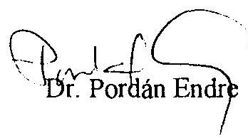

---

# EGÉSZSÉGBIZTOSÍTÁSI ÖNKORMÁNYZAT 

Budapest XIII. Váci út 73/a.
Postacim: Bp. Pf. 18. 1565
Telefon: 270-2001
26-SP-155/1996.

Dr. Hagelmayer István elnök részére Állami Számvevőszék

## Budapest

Tárgy: T/1884/1. OGY előterjesztés észrevételezése.

## Tisztelt Elnök Úr!

Az Egészségbiztosítási Önkormányzat Közgyűlésének felhatalmazása alapján az Elnökség 1996. február 12-én megtárgyalta az Állami Számvevőszcék jelentését a pénzügyi alapok 1994. évi zárszámadásáról. A jelentés cgészségbiztosításra vonatkozó megállapításaival és a vizsgálattal kapcsolatban az alábbi véleményt alakította ki.

Az Egészségbiztosítási Önkormányzat köszönetét fejezi ki az Állami Számvevőszék munkatársainak a vizsgálat és a jelentés-véglcgczćs során tapasztalt segitő szándékú együttmúködésért.

A jelentést az Önkormányzat tudomásul veszi és megnyugvással állapítja meg, hogy az állanháztartás második legnagyobb alrendszcrének egészségbiztositási ágában a gazdálkodás az ellátórendszer tekintetében alapvetően szabályosan, az alap rendeltctćsének megfelelően történik. $\Lambda$ múködtctés tekintetében pedig a költségvetési szervck körében kialakult szabályossági és célszerűségi gyakorlathoz képest csak a speciális helyzetböl adódó és jogszabályokkal kellően nem körülhatárolt területeken van eltérés. A jelentés negatív megállapításainak túlnyomó többsége az Önkormányzaton kívül álló okból adódó szabályozatlanságból, illetve jogértelmezési eltérésből és nem jogszabálysértésből adódik. Az cgycs mulasztások és helytelen gyakorlat megszüntetése a jclentćs teljes feldolgozása során fog megtörténni.
A részletes záró észrevétcleinket mellékelten küldjük.
Mindezen túl a vizsgálat által nem érintett, de a költségvetés és zárszámadása szempontjából véleményünk szerint jelentős nćhány összefüggésre szeretnénk a figyelmet felhívni a folyamatok jobb bemutatása és értékelhetősége végett.

---

Rendkívül lényegesnek tartjuk, hogy a késedelmes parlamenti benyújtás tartalmi oka a hiány rendezésének megoldatlansága volt. A hiány rendezés módjára többszöri egyeztetés eredményeként megállapodás történt a Kormány és az Önkormányzat között. Ezt a megállapodást a Közgyűlés 1995. december 18-án 38. sz. határozatában megerősítette.

Az 1994. évben a mi véleményünk szerint rendszer értékủ változás, hogy a két alap tekintetében közel $10 \%$ nagyságrendủ profiltisztitás következett be, amely az egészségbiztosítást mintegy 25 milliárd forinttal érintette.

Az 1994. évi költségvetés előkészítése során az Elnökség és a Közgyűlés több határozatában foglalkozott a benyújtott költségvetés teljesíthetőségének feltételeivel. Ezek közül a költségvetési év folyamán semmi nem teljesült, sőt a benyújtott költségvetés gyógyító-megelőző ellátásra vonatkozó költség érzékenységet segítő jogosítványok a Kormány kezdeményezésére módosításra kerültek.

A kiadások szabályozásának előkészítését szolgálta volna az 1992. évi LXXXIV. törvény módosított szövege / 31/A. § (3) /, amely az intézmény fenntartók és az ÁNTSZ által az intézmények felülvizsgálatát rendeli el. Ez a felülvizsgálat az 1991.évi XX. törvény 132. § (1) bekezdésére vonatkozott és megtörténte megelőzhette volna mind a kapacitás vitákat, mind az ehhez kapcsolódó alkotmánybirósági eljárást. A törvény nem teljesült.

Fenti tények elemzése és a következtetések levonása nem a véleményezés feladatkörébe tartozik.

A jelentésben foglaltak összességükben mindenképpen segitik az Önkormányzat és az Országos Egészségbiztosítási Pénztár munkáját. Az Elnökség döntött arról, hogy a napirend Országgyűlési tárgyalását követően, az ott elhangzottakra is figyelemmel visszatér a jelentés megállapításaira és meghatározza a szükséges intézkedéseket.

Kérjük, hogy jelen véleményünket, a melléklettel együtt az Országgyűlés részére továbbítani szíveskedjenek.

Budapest, 1996. február 14.
Melléklet
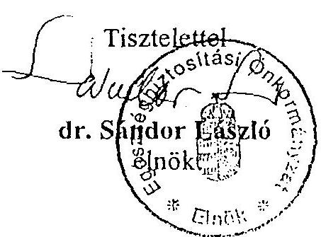

---

# Részletes záróészrevételek 

a társadalombiztosítás pénzügyi alapjainak 1994. évi zárszámadásához kapcsolódó, az Állami Számvevőszék által készített Jelentéshez

- Budapest, 1996. február 14. -

---

# I. Általános észrevételek 

A Jelentés számos ponton rámutat a társadalombiztositás és ezen belül az egészségbiztosítás gazdálkodásának, müködésének meghatározó környezeti feltételeivel, a szabályozottsági kérdésekkel, az elmúlt években hozott, illetve elmaradt döntésekkel kapcsolatos gondokra, kedvezőtlen jelenségekre. Az ellátórendszerre és a pénzügyi helyzetre vonatkozó megállapítások (4. oldal), valamint annak egyértelmű rögzítése, hogy a társadalombiztosítás elmúlt évekbeli hiányának rendezése önmagában még nem jelenti a pénzügyi helyzet jövőbeni konszolidációját is (64. oldal), fontos jelzés a döntéshozóknak. Célszerú lett volna ugyanakkor kitérni arra is, hogy a kedvezőtlen jelenségeket alapvetően társadalombiztosításon kívüli okok idézték elő, mindenekelőtt az ország általános gazdasági helyzetéből fakadó kedvezőtlen folyamatok. Az egészségügyi reformintézkedések elmaradásának a bérpolitikai intézkedésekkel való összekapcsolásához (4. oldal) pedig indokolt hozzátenni, hogy ezzek a bérpolitikai intézkedések szakmailag indokoltak voltak és a megvalósításukra hozott kormányzati döntés a társadalmi béke megőrzésének fontos elemét jelentette.

A társadalombiztosítás konszolidációjával összefüggő kérdés az ingyenes vagyonjuttatás, amelyet a Jelentés több ponton is szóba hoz. Reális az a megállapítás, hogy a törvényileg lecsökkentett összeg (55-65 milliárd forint) az alapok pénzügyi helyzetének stabilizálásához nem elegendő. (10., 58. oldal). A vagyonfelélésnek a Jelentésben jelzett veszélye természetesen úgy értendő feltehetően a Jelentés is ilyen értelemben említi -, hogy az - a rövidtávú kényszereknek engedő - törvényi rendelkezések alapján (nem pedig szabálytalan gazdálkodás nyomán) következik be. (Ilyen pl. a befektetések hozama tartalék összegének az 1995. évi bevételi források bővítése érdekében történő felhasználása.) A Jelentés egyébként a 24. oldalon az 1994-ben előirányzott, de nem teljesült 16 milliárd forint, ingyenes vagyonjuttatásból származó bevétel megalapozatlan tervezését említi. Ennek értékeléséhez hozzá kell tenni, hogy erre a bevételre, mint törvényi előirányzatra a költségvetési törvény külön garanciális szabályt is tartalmazott, vagyis a vagyonátadás, illetve a bevétel elmaradása e szabályt külön is megsértette.

Igen fontosak a szabályozottsággal kapcsolatos észrevételek is. Az Egészségbiztosítási Önkormányzat és az Országos Egészségbiztosítási Pénztár (OEP) tevékenységét is nehezíti, hogy a „hagyományos" költségvetési szervekéhez képest szükségszerűen eltérő gazdálkodási feltételeknek megfelelő szabályozás nincs teljeskörűen, komplexen megalkotva. A Jelentés is utal rá, hogy a költségvetési előirások itt maradéktalanul nem tarthatók be (4. oldal). Az eltérő szabályozást egyaránt indokolja a társadalombiztosítás önkormányzati irányítása és az, hogy - a két ágat együttesen véve - mintegy 1000 milliárd forint volumenii

---

jövedelem-újraelosztó rendszerről, annak müködtetéséről, illetve az azt végző szervekről van szó. E rendszerek bevételeit, kiadásait, költségvetését, müködését önálló törvények határozzák meg (pl. 1975. évi II. törvény, 1991. évi LXXXIV. törvény, 1992. évi LXXXIV. törvény, az éves költségvetési és zárszámadási törvények), melyekhez sok esetben nem illeszkednek megfelelően a feladatokat végrehajtó hivatali szervekre, mint speciális költségvetési szervekre is vonatkozó, de alapvetően a „normál" költségvetési szervekre tekintettel megállapított (általában kormányrendeleti szintü) rendelkezések. További külön szabályozást igénylő sajátosság a két biztositási ág közötti sokrétü pénzügyi kapcsolatrendszer.

Az 1992. évi LXXXIV. törvény ugyan az alapvető szabályokat tartalmazza, ez azonban - mint a Jelentés is megállapítja (16. oldal) - nem elegendő. Ezt érzékelve az Egészségbiztositási Önkormányzat az elmúlt években többször is kezdeményezte a szabályozási hiányok megszüntetését. (A Jelentés is említést tesz az önkormányzatok ezirányú kezdemé nyezéseiről.) Az 1994 novemberi Közgyűlés elfogadta a társadalombiztosítás pénzügyi alapjairól szóló rendelkezések komplex újraszabályozását - mely sok rendezetlen kérdést szabályozott volna -, azonban a kormányzat ezt nem terjesztette az Országgyülés elé. Ez a törvénytervezet egyébként a vagyongazdálkodásra is részletes szabályozást tartalmazott, melyet a Jelentés szintén jogosan hiányol (9. és 50: oldal). 1995 öszén az OEP munkatársai az államháztartási törvény módosítási munkálataihoz kapcsolódóan - átadták a Pénzügyminisztérium illetékeseinek azt a törvényi „blokkot" (normaszöveget), amely a társadalombiztosítás gazdálkodására vonatkozó, az államháztartási törvénybe beépítendő szabályokat tartalmazta. Ez szintén több nyitott kérdés rendezésére lett volna alkalmas, de - eddig még - nem hasznosult. Ugyancsak kezdeményeztük a költségvetés alapján gazdálkodó szervekre vonatkozó kormányrendeletekkel összefüggésben a társadalombiztositás speciális helyzetéből adódó jogszabályi háttér megteremtését. Ez azonban a mai napig nem történt meg. Ennek megtörténtéig viszont csak a Pénzügyminisztérium egyedi leiratai alapján lehet a költségvetési beszámolót elkészíteni. A mi álláspontunk is az, hogy a szabályozás hiányosságait - most már az önkormányzati tapasztalatokra is figyelemmel, azokkal egyeztetve - mielőbb meg kell szüntetni.

A fentieknek megfelelő szemléletben értékeltük a Jelentés azon megállapításait (17. oldal), hogy szabálytalan az alapok tárgyévi tartalékképzése, illetve a pénzforgalom nélküli tételek folyó bevételként, illetve kiadásként való elszámolása. Miután mindez a társadalombiztosításra vonatkozó hatályos törvényi rendelkezések alapján történik, egyetértünk a Jelentés azon értelmezö fordulatával, hogy itt formális (nem tartalmi) szabálytalanságról van szó. Ugyanez érvényes a költségvetési tartalék adat pontosságára vonatkozó észrevételre is (20. oldal). A következtetés csak az lehet, hogy ha az alacsonyabb szintü rendelkezések nincsenek összhangban a törvénnyel, az elöbbiek maradéktalanul mindaddig nem tarthatók be, amig az összehangolás meg nem történik. A Jelentés azon megállapítása egyébként, mely szerint a

---

Pénzügyminisztérium nem hagyta jóvá az alapok költségvetési beszámoló jelentésére vonatkozó „D" jelű nyomtatványt, kiegészitést igényel (16. oldal). 1994. I. félévében a beszámoló az „A" jelű nyomtatvány-garnitúrán készült el a társadalombiztositásra vonatkozó kiegészitő űrlapokkal. A „D" jelű garnitúra használatával kapcsolatban 1994 folyamán többszöri levelezések és egyeztetések történtek a Pénzügyminisztériummal. Ezek eredményeképpen az 1994. évi beszámoló jelentés - bár nem „D" jelzéssel, de - lényegében` már a „D" jelü nyomtatványgamitúrának megfelelő tartalommal került benyújtásra, melyet a Pénzügyminisztérium elfogadott.

Indokolt az a figyelemfelhívás (7., 32., 33. oldal), amely az egészségügyben végbemenő privatizációval kapcsolatos. A Jelentés megállapítja, hogy a folyamat irányitottsága nem megfelelő, a szabályozás minden területén nagy elmaradások vannak. Mindez az egészségbiztosítás tevékenysége szempontjából is kedvezőtlen, ezért a felvetett kérdések rendezése igen lényeges.

A Jelentés a bevezetőben utal arra, hogy a zárszámadási törvényjavaslat benyújtása elhúzódott. Hangsúlyozandó, hogy ebben az Egészségbiztositási Önkormányzatnak, illetve az OEP-nek nem volt közreható szerepe. Az Egészségbiztosítási Önkormányzat Közgyűlése az 1994. évi zárszámadást 1995. július 31 -én elfogadta és az ennek megfelelő normaszöveget az Önkormányzat elnöke augusztus 22-én hivatalosan megküldte a pénzügyminiszternek. A Jelentés a 62. oldalon jelzi, hogy az Országgyüléshez benyújtott zárszámadási törvényjavaslathoz nem csatlakozott a 10/1995. (III. 1.) OGY határozat 2. c) pontjában foglalt felkérés alapján a társadalombiztosítási önkormányzatok által a járulékbehajtási tevékenységről készített beszámoló, melyet - a hivatkozott felkérés értelmében - az 1994. évi zárszámadással egyidejűleg kellett volna az Országgyűléshez benyújtani. Mint a Jelentés is utal rá, a két biztosítási önkormányzat elnöke a pénzügyminiszterhez írott, 1995. december 11-i keltezésú közös levelük mellékleteként - az érintett felek megállapodása szerint egybeszerkesztett formában is megküldött zárszámadási törvénytervezet mellett - megküldte a szóban forgó, a két Önkormányzat által elfogadott Beszámolót is, a levélben kérve a pénzügyminisztert a két dokumentumnak az Országgyülés elé történő együttes beterjesztéséhez szükséges intézkedések megtételére.

# II. Részletes észrevételek 

## 1. A kimutatott adósságállomány (5., 19., 20. oldal)

A Jelentés több helyen említi, hogy a kimutatott adósságállomány 1994. december 31 -én nem volt valós. Az adósságállomány egyeztetését valóban nem tudta az OEP december 31-ig elvégezni. Ennek oka, hogy az egyszeri adósságrendezésről szóló törvényjavaslat visszavonására december elején került sor. Ezt követően december

---

második felében a számvitelről szóló 1991. évi XVIII. törvény 42. §-ában foglaltaknak megfelelően a tartozást mutató folyószámlákra vonatkozóan az OEP teljeskörűen megvalósította az egyenlegközlést és biztosította az egyeztetés lehetőségét. Az egyeztetések alapján feltárt eltérésekkel a nagygépes folyószámla leltár korrekciója megtörtént. Az OEP az adósságállomány egyeztetésének határidejét 1995. február 28-ig írta elő. A Fővárosi és Pest megyei Egészségbiztosítási Pénztár a folyószámlák nagy volumenére tekintettel viszont csak 1995. május végére tudta a feladatot végrehajtani (erre egyedi engedélyt kapott az OEP-től). A túlfizetést mutató folyószámlák vonatkozásában - melyekre a Jelentés külön is hivatkozik - kimutatás készült a túlfizetés oka szerinti csoportosításban. A feltárt okoknak megfelelően a túlfizetés tényéről az igazgatási szervek az év folyamán értesítették a folyószámla tulajdonosokat, egyben felszólítva azokat az elmaradt bevallások teljesítésére.

A Mérlegben kimutatott adósságállomány - a két biztosítási alapra együttesen (190.786.439 ezer forint) a korrekció végrehajtását követően 2.461 .982 ezer forinttal csökkent (auditált mérlegadat 188.324 .457 ezer forint).

Álláspontunk szerint a kintlevőségek tételes egyeztetésével és a túlfizetést mutató folyószámlák felülvizsgálatának elvégzésével az adósállomány egyeztetésére vonatkozó törvényi előírásoknak megfelelő gyakorlat valósult meg.

Megjegyzendő, hogy 1995. évben az 1975. évi II. törvény módosítása alapján (105/C. § (3) bekezdés) már valamennyi járulékfizetésre kötelezett értesítést kapott folyószámlája egyenlegéről (a törvényben előírt határidővel egyezően), biztosítva számukra az egyeztetés lehetőségét.

# 2. Járuléktartozás fejében átvett vagyon (11., 19., 20., 51., 59., 60. oldal) 

A járuléktartozás fejében átvett vagyon tulajdoni kérdései álláspontunk szerint nem rendezetlenek. A hatályos törvényi rendelkezésekből következően az Önkormányzatok döntése alapján tartozás fejében átvett vagyon (csakúgy, mint a felszámolási eljárás keretében bírói végzéssel átadott vagyon) a két biztosítási ág közös tulajdona, mely eszmei arányok szerint oszlik meg közöttük. Egy adott vagyontárgy esetében az eszmei arány megfelel a vagyonátadás ellenében jóváirt követelésen való ágankénti oszlozás arányának. Az adott ágra vonatkozó eszmei hányad szerinti tulajdoni részt mindkét ágnak nyilván kell tartania mint speciális tartalékát, függetlenül attól, hogy a vagyontárgy kezelése melyik biztositási ágnál történik. A nyilvántartás az Egészségbiztosítási Alapnál ennek felel meg, ezért vitatjuk a Jelentés azon állítását (20. oldal), miszerint „a járuléktartozás fejében átvett vagyont - annak ellenére, hogy arányos része tulajdonilag is az Ny. Alapot illeti - OEP tulajdonként tartották nyilván." A nyilvántartásban valójában csak az egészségbiztosítást megillető hányad jelenik meg.

---

Az előzőek alapján nem lehet egyetérteni azzal az 59. oldalon olvasható megállapítással sem, hogy „az átvett vagyont a két alapra eszmeileg megosztva szerepeltették, a valós tulajdoni helyzet azonban ennek nem felel meg." A törvényi rendelkezésekből adódóan a valós tulajdoni helyzet a vagyon mindkét ág általi, eszmei hányadok szerinti tulajdonlását jelenti. Ez jelenik meg a zárszámadási törvényjavaslat 12. számú mellékletében is, melyről a Jelentés megállapítja (59. oldal), hogy áttekinthetően szemlélteti a tartozás ellenében átvett vagyonelemeket. Azt viszont el kell ismerni, hogy az ingatlannyilvántartásban (a tulajdoni lapokon) ettől eltérő állapot jelenik meg azzal összefüggésben, hogy a vagyonátvételnél az egészségbiztosítási szervek jártak el, illetve a vagyonkezeléssel kapcsolatos feladatokat is az egészségbiztosítási szervek végzik.

Az Egészségbiztosítási Önkormányzat 1994. novemberi Közgyülésén elfogadott, a pénzügyi alapokat újraszabályozó (már említett) törvénytervezet új, részletes szabályrendszert tartalmazott a tartozás fejében átveendő vagyonnal kapcsolatos kérdésekben. Ez a tervezet azonban nem került az Országgyülés elé. Az érvényes törvényi rendelkezések alapján álló konkrét eljárási szabályokat 1995 -töl kezdődően az OEP föigazgatójának - az ONYF főigazgatójával egyetértésben kiadott - 6/1995. számú utasítása is tartalmazza.

Mindezek alapján álláspontunk szerint a kérdéskör rendezetlensége nem állapítható meg, illetve a rendezés a nyugdíjbiztosítási ág általi nyilvántartásbavétellel megvalósul.

A Jelentés a 60. oldalon a Hotel Carbona Közös Vállalattal kapcsolatban megállapítja, hogy a cég mérleg szerinti eredménye 1994-ben 1,7 millió forint volt. A helyes adat 13 millió forint. (Ez mintegy $3 \%$-os bevételarányos nyereségnek felel meg.)

A Carbon Közraktár Kft-vel kapcsolatos megállapításokkal (60. oldal) összefüggésben megjegyzendő, hogy a Kft. tulajdonában álló tatabányai épület bérbevételével kapcsolatos pénzügyi problémák rendezése 1995. évben megkezdődött. Az Egészségbiztosítási Önkormányzat Elnöksége a Carbon Közraktár Kft-vel kapcsolatos gondok megoldására - az ÁSZ-vizsgálat megállapításait is szem elött tartva - megbízottat jelölt ki. A Kft. ügyeinek rendezésével egyidejűleg a korábban felmerült pénzügyi kérdések is rendezést nyernek.

# 3. CM Klinika (7., 28., 29., 30. oldal) 

A CM Klinikák Rt. részére történt kifizetést a Jelentés törvénysértőnek minősíti. Ez a megállapítás önmagában kezelhetetlen, hiszen nem jelöli meg azokat a konkrét

---

jogszabályhelyeket (hanem csak különböző jogszabályok egészére utal), amelyeket megsértettek a döntés előkészitésében, illetve meghozatalában részt vevők.

Az ügyben mind az Önkormányzat Felügyelő Bizottsága, mind az OEP vizsgálatot folytatott. Az OEP vizsgálat a hivatal részéről törvénysértést nem állapít meg. Megszegte a szerződést azonban a pályázatot benyújtó szolgáltató, aki ellen a hivatal polgári pert indított a kintlevőség visszakövetelésére. A hivatal dolgozóit érintően a vizsgálat által megállapított gondatlanság miatt fegyelmi eljárás lefolytatása szükséges.

A Felügyelő Bizottság jelentését a Közgyűlés 1996. február 5-én tárgyalta. A jelentés a hivatal részéről szabálytalanságokat állapít meg. A Közgyűlés elfogadta az Elnökség erre vonatkozó határozati javaslatát. A határozat a szabálysértők megállapítására és fegyelmi eljárás lefolytatására hívja fel az OEP vezetését.

# 4. Egészségi kockázatkezelő programok támogatása (7., 8., 33., 34., 35., 36. oldal) 

A részletes megállapítások keretében a 33-36. oldalon foglalkozik a Jelentés a kockázatkezelő programokkal. Ennek végén megállapítja, hogy lényegében egyetértés alakult ki az első év tapasztalatai alapján. Ennek, de a 34-36. oldalon részletezett megállapításoknak a tükrében is erősen eltúlzotınak tünnek a 7-8. oldalon tett általános megállapítások, a visszásságokra, ellentmondásokra és szabálytalanságokra utalás és különösen a célszerütlen müködésre utalás.

A kockázatkezelő programoknak, más néven a preventív munkának is megvannak a szabályai, amelyek mentén kérhető számon a program.

Megitélésünk szerint a kifogások - lásd a 34. oldaltól „Föbb gondok: ..." többsége elméleti vitát indukál. Kezdve rögtön az elsőn, hogy t.i. az Önkormányzat nem határozta meg a preferált célokat a súlyos pénzügyi helyzetben. - Egyrészt meghatározta a három terület elkülönitésével, majd magának a pályázatnak a meghatározásaival (amelyek az anyag végén találhatók). Másrészt éppen, mert ilyen jellegű pályázat hazánkban még nem volt - föként ilyen volumenben - az első évben a túlzott szűkítés lett volna ellentétes a pályázat céljával.

A pályázati kiírásokra összesen 1982 pályázat érkezett, amelyből 1386 részesült valamilyen dijazásban. A birálati munkával kapcsolatban mindössze 3 reklamáció érkezett. A teljes rendszerre való társadalmi rálátást a nyilvánosság biztositotta. A kuratóriumok müködéséről szóló jelentést az Elnökség tárgyalta és a Társadalombiztosítási Közlöny 1994. novemberi száma nyilvánosságra hozta.

Megnyugtató, hogy a mélyreható vizsgálódás ez ügyben semmilyen személyes, vagy pénzügyi visszaélést nem tapasztalt. A felvetett gondok egy része

---

mindenképpen hasznositásra kell hogy kerüljön, részben a birálati munkában, részben a szerződéskötésben. A terület túlszabályozása azonban elkerülendő az eredeti prevenciós célok érvényesülése érdekében.

A 95-ös döntéseknél már a kuratóriumok igyekeztek figyelembe venni az ÁSZjelentés megállapításait, illetve a kialakult konszenzus alapján eljárni.

A Jelentés állítása szerint közel 100 millió forint összeget tesznek ki azok a kifizetések, amelyek a pályázati célokhoz nem kapcsolhatóak és amelyeket ezért a múködési költségvetésböl kellett volna teljesíteni (8., 35. oldal). A Jelentés a 8. oldalon azt is állitja, hogy ezeket a kifizetéscket a ,müködési költségvetés forrásait >>megkímélendö<< a kockázatkezelést szolgáló pénzeszközök terhére számolták el." Nyomatékosan leszögezzük, hogy a müködési költségvetés szabályainak, korlátainak „kijátszása" az Egészségbiztosítási Önkormányzatnak és az OEP-nek sosem volt szándéka, igy ebben a konkrét esetben sem. A müködési körbe „utalt" témakörök többsége teljesen egyértelmúen a biztositottak közvetlen egészségvédelmét és érdekeit szolgálja, ezért meggyözödésünk, hogy az „ellátás" költségei közé tartozik.

A 8. oldalon a sűrűn gépelt bekezdés - miután jelzi, hogy az ÁSZ szóban forgó megállapítását az egészségbiztosítás részéről vitatják - azt fejti ki, hogy a müködési és az ellátási kiadások nem csoportosithatók át szabadon. Talán nem szükséges bizonygatni, hogy ezt az Önkormányzat, vagy az OEP sem gondolja, vagy kívánja; észrevételeink - mint az előzőekböl kiderül - máson alapulnak.

# 5. Müködési költségvetés 

a) Beszámolás a központositott elöirányzatok teljesitéséröl
$(8 ., 9 ., 44 ., 45 ., 46$, oldal)
A Jelentés a müködési költségvetés teljesülésćnek vizsgálata kapcsán megfogalmazza, hogy a központositott clöirányzat cimen szerepeltetett kiadási előirányzatokat a zárszámadási törvényjavaslat a költségvetési törvény szerkezetétől eltérő módon szemlélteti.

A központositott elöirányzat meghatározott célokra kerül jóváhagyásra. (A felhasználás helye és jogcime már a tervezéskor ismert.) Miután a felhasználás nem központositottan történik, hanem az önálló gazdálkodó egységként müködő megyei igazgatóságoknál, illetve OEP-nél stb., ezt le kell bontani címekre. Ezért a kifizetés (felhasználás) helyén jelenik meg a teljesités. Ezzel kapcsolatban figyelmet érdemel az a tény is, hogy a központositott clöirányzatok mögött gazdálkodó szervezet, bankszámla nincs, igy a központositott elöirányzatok felhasználására csak

---

valamely, a felsorolt feltételekkel rendelkező cím, alcím (szervezet) kereteiben kerülhet sor. Az intézményi beszámoló rendszeréből is az következik, hogy a zárszámadási törvényben rögzített szerkezet (cím, alcím, kiemelt előirányzat stb.) és az intézményi „tárcafüzetek" közötti egyezőséget biztosítani kell. Így csak a belső nyilvántartási rendben, kódszám alkalmazásával - nem költségvetési prezentációban - lehetséges ellenőrizhető módon a központosított előirányzatok felhasználásáról számot adni.

A Jelentés a 8-9. oldalon az észrevételezett jelenséget összefüggésbe hozza a tervezési rendszer sajátosságaival. Ehhez hozzá kell tenni, hogy az egészségbiztosítás szándéka mindig arra irányult, hogy a költségvetési törvény olyan szerkezetben irányozza elő a kiadásokat, amilyen szerkezetben majd a beszámoló elkészíthető lesz (vagyis a felmerülés helyén tervezze a kiadásokat központosított előirányzat megjelenítése nélkül). A kormányzat oldaláról azonban igény merült fel a különböző kiemelt feladatok külön címen történő tervezésére. A tervezés és a végrehajtás azonos szerkezetben történő bemutatása lehetőségének megteremtése érdekében az adott feltételek mellett csak az javasolható, hogy a kiemelt feladatok előirányzatai az egyes szervek (OEP, megyei egészségbiztosítási pénztárak, stb) költségvetési előirányzatain belül, de ott elkülönítve jelenjenek meg a tervezésnél. Így maradéktalanul teljesíthető lesz az állanháztartási törvény 18. §ának rendelkezése (a tervezés és a végrehajtás azonos szerkezetü bemutatása), melyre a Jelentés 9., 45. és 46. oldala is utal. Az államháztartási törvény ezen rendelkezése ugyanis nincs ellentmondásban - ellentétben a Jelentés 9. oldalán megfogalmazott állítással - az önkormányzatoknak a müködési költségvetés előirányzatai közötti átcsoportosítási jogosítványával. Az átcsoportosítás mennyiségi, nem pedig szerkezeti kérdés, ezért az összehasonlítható szerkezet megtartását nem érinti. A tervezési és beszámolási szerkezet összehasonlíthatóságát a fentiekben jelzett tervezési rendszer alkalmazásával lehet biztosítani.
b) Az önkormányzati és föigazgatósági kiadások elkülönítése
$(44 ., 45 ., 46$. oldal)
Az elkülönítés meghatározott rendező elvek szerint történik. Ennek lényege, hogy önkormányzati kiadásként csak a müködésével kapcsolatos közvetlen kiadások jelemek meg. Ilyen módon szabályozza az elszámolást az e témakörben időközben meghozott elnökségi határozat és az ennek nyomán kiadott föigazgatói utasítás is. Megjegyzendő, hogy az önkormányzati testületek nem önálló gazdálkodó szervek: gazdálkodásuk lebonyolítását az OEP végzi.
c) Eszközbeszerzések (46. oldal)

A Jelentés az eszközbeszerzések vonatkozásában megállapítja, hogy az előirányzott 51 millió forintnál lényegesen többet fordítottunk ügyviteltechnikai berendezésre,

---

bútorozásra, gépjárművekre stb. Felveti továbbá, hogy ennek pontos összege a nyilvántartásokból nem állapítható meg. 1994. évben a beruházási előirányzatok között egyéb intézményi beruházásokra az eredeti előirányzat 51 millió forint volt. Év közben az ágazati szétválásból eredően az előirányzat szükségszerűen módosításra szorult. A módosított előirányzat összege 254,9 millió forint volt. Ezzel szemben a tényleges teljesítés 253,2 millió forint. A számviteli nyilvántartásokból a teljesítés tételes dokumentációja rendelkezésre áll.
d) A projektek értékelése (47. oldal)

A Jelentésből úgy tünik ki, mintha pl. a DEJÁK projekt fejlesztése leállt volna. Kétségtelen, hogy a munka során számos nehézség, megoldandó feladat jelentkezett, hátráltató tényezők is felléptek (pl. a kincstári rendszerrel összefüggésben a kormányzati szervek részéről), ennek ellenére a munka 1994-ben is, azóta is elörehaladt.
e) Az 1993. évi müködési pénzmaradvány felhasználása (20., 48., 49. oldal)

Az 1993. évi müködési pénzmaradvány ágak közötti megosztásáról a két biztosítási önkormányzat nem előzetesen, hanem véglegesen döntött 1994-ben. Az ONYF által átutalt 131,8 millió forint azért szerepelt 1994-ben függő tételként, mert a működési pénzmaradvány megosztás pénzügyi rendezését elfogadta ugyan a nyugdíjág (és az átutalás is megtörtént), az ezzel szorosan összefüggő hitelmegosztás-korrekciós számításokat azonban vitatta és pénzügyileg is csak részben rendezte 1994-ben. A. közös auditor cég állásfoglalását követően 1995. augusztusában az OEP ismételten kezdéményezte az ONYF-nél az egymással összefüggő elszámolások (az auditor észrevételeinek megfelelően pontosbitott hitelmegosztás-korrekció, illetve a müködési pénzmaradvány elszámolás) komplex rendezését, de az elszámolás szerinti összeget (mintegy 150 millió forintot) az ONYF csak 1996. januárjában utalta át. Ezért volt még 1995-ben is lezáratlan az 1993. évi müködési pénzmaradvány elszámolása. (Az előzőek vonatkoznak a Jelentés 20. oldala 2. bekezdésének végén telt megállapításra is.)
f) Megbízási és vállalkozási szerződéskötések (49. oldal)

A Jelentés észrevételezi, hogy a megbízási, vállalkozási szerződések valós kiadásairól nincs pontos adat. Valójában minden szerződéses kapcsolatról, ebből eredő fizetési kötelezettségről, a kifizetett összegekről a számviteli rendszer valós és pontos képet tükröz. Tekintettel a rendkívül nagy számú, szerteágazó szerződéses kapcsolatból eredő fizetési kötelezettségekre, az OEP Pénzügyi Főosztályán jelenleg folyó és rövidesen lezárásra kerülő programrendszerben a szerződésekkel kapcsolatos adatok egybefüggö, komplex nyilvántartása, mint

---

megoldandó feladat már szerepel. Egyes nem tárgyi megbizások értékelhetősége nem egzakt kategória; azok tartalma, „eredménye" beépül a napi munkába.

# 6. Naturális vagyonmegosztás (51., 52. oldal) 

A Jelentésnek e témával kapcsolatos egyes megállapításai félreértést okozhatnak. Az 52. oldalon az szerepel, hogy a befektetések hozama tartalék esetében a két ág közötti, törvényben meghatározott eszmei arányok ( 90 , illetve $10 \%$ ) a naturális megosztás során megváltoztak. Valójában a közgyülések olyan döntést hoztak, hogy a tartósan befektetett eszközök és a befektetések hozama tartalék együttes értéke a naturális megosztás után is $90-10 \%$ arányban osztódjék meg a két biztosítási ág között. Az, hogy a befektetések hozama tartalék pénzeszközei 92,72 $7,28 \%$ arányban osztódtak meg a két ág között, éppen arra szolgált, hogy fenntartsa a globális $90-10 \%$ arányt, miután a naturális megosztásnál az egészségbiztosítás a tartósan lekötött eszközökböl a rá vonatkozó $10 \%$-nál magasabb hányadban részesült. (A naturáliákat - korlátozott oszthatóságuk miatt nem lehetett pontosan $90-10 \%$ arányban megosztani.) Tehát az önkormányzati döntések a törvényi eszmei hányadok tudatos fenntartási szándékával születtek.

A naturális vagyonmegosztás folyamatáról az 51-52. oldalon leirtak helyes értelmezéséhez a következőket is meg kell említeni. A vagyonmegosztás tartalmáról, az egyes vagyonelemek hovakerüléséről az önkormányzatok egybehangzóan döntöttek (egyébként időben elsőként a nyugdíjbiztosítás). A döntések gyakorlati végrehajtásánál merült fel értelmezési vita az ONYF és az OEP között, amennyiben az ONYF - az auditáló cég állásfoglalásáig - vitatta, hogy a naturális vagyonmegosztás eszmei időpontjaként lényegében csak 1994. január 1-je jöhet számításba. Mindettől függetlenül - és még az önkormányzatok döntését megelőzően - az OEP 1994-ben folyamatosan átutalta az ONYF-nek a befektetések hozama tartalékba - az 1993. év végi rövidlejáratú befektetések megtérülésével visszapótlódó készpénznek a nyugdíjbiztositást megillető hányadát. Ennél irányadónak akkor még a $90 \%$ számított, hiszen az önkormányzati döntések még nem születtek meg. A Jelentés által említett 1995. évi - valójában kiegészitő átutalást éppen az tette szükségessé, hogy a közgyűlési döntések nyomán a befektetések hozama tartalékra vonatkozó megosztási arány változott (a nyugdijbiztositást további készpénz illette meg).

## 7. Vagyonkezelés (9., 10., 20., 50., 51., 56., 57., 58., 59. oldal)

A Jelentés több helyen is (9., 50., 51. oldal) utal arra, hogy a befektetési és vagyonkezelési feladatokat az önkormányzatok 1994-ben saját hatáskörükben sem szabályozták és az egyedi döntések során esetenként törvénysértő módon alkalmazták az 1991. évi LXXXIV. törvény elöírásait. Álláspontunk az, hogy ezen a területen a jogszabály értelmezéséről és nem megsértéséről van szó.

---

Az Egészségbiztosítási Önkormányzat Közgyűlése valóban csak 1995. áprilisában fogadta el ideiglenes vagyonkezelési és befektetési szabályzatát, de ez nem jelenti azt, hogy 1994-re vonatkozóan ne lett volna irányadó közgyűlési határozat. A Közgyűlés 1994. júniusában fogadta el az egészségbiztosítási ág döntési jogköreiről szóló határozatot, amelyben egyértelműen rögzitve van, hogy a vagyongazdálkodás keretében a rövidtávú és tartós befektetésekre, a tartósan befektetett eszközök (vagyon) konverziójára vonatkozó egyedi döntések meghozatala az Elnökség jogkörébe tartozik. (Ugyanez vonatkozik a tartozás fejében átveendő vagyon elfogadásával kapcsolatos egyedi döntésekre is, mellyel kapcsolatban a Jelentés az 59. oldalon szintén a közgyűlési szintű döntés szükségességét valló ÁSZálláspontot fogalmazza meg.) Ennek alapján megállapítható, hogy az 1991. évi LXXXIV. törvény vonatkozó rendelkezéseinek az Egészségbiztosítási Önkormányzat általi értelmezésćtől az Állami Számvevöszćk értelmezése eltér. Az Egészségbiztosítási Önkormányzat álláspontja - melyet a Jelentés 9. oldalán a sürün gépelt bekezdés nem pontosan interpretál - azon alapul, hogy az 1991. évi LXXXIV. törvény 2. §-ának b) pontja értelmében az önkormányzat önállóan gazdálkodik a biztosítási alaphoz tartozó vagyonnal. Ez a biztositási alap kezelési jogkörébe tartozó feladat (e törvény 9. §-a (1) bekezdésének l) pontja), mely a 9. § (2) bekezdése értelmében átruházható. Ez történt meg az Alapszabályban, illetve a Közgyűlés döntési jogkörökről szóló határozatában. Mindemellett tény, hogy az 1994. évi vagyonkonverzióra közgyűlési határozat alapján és közgyűlési jóváhagyással került sor. Célja pedig a nagyobb mérvü vagyonvesztés elkerülése volt. Az elcserélt részvényeket is le kellett volna értékelni, igy a vagyonvesztés nem a csere miatt következett be.

Hangsúlyozandó egyébként, hogy a befektetési és vagyonkezelési feladatok ellátására vonatkozó szabályzatnak az elmúlt évek során több tervezete is elkészült, de mivel a vagyongazdálkodásról szóló törvénnyel kapcsolatos kezdeményezések és előkészitő munka nem vezetett eredményre, a szabályzat véglegesítésére sem volt lehetőség.

A Jelentés a 20. oldalon kifogásolja, hogy a FORCON vállalattól „átvet" részvényt, valamint a Thermal Invest Rt-töl „tartozás fejében átvett" részvényekct semmilyen nyilvántartás nem tartalmazza. Álláspontunk szerint ezeket a részvényeket a nyilvántartások nem is tartalmazhatják, mivel sohasem képeztćk az egészségbiztositás tulajdonát. A FORCON esetében az egészségbiztositás segítséget nyújtott a részvényt tulajdonló vállalatnak az értékesítésnél, hogy elösegítse az ellenértéket képező összegnek a járuléktartozás csökkentésére való mielőbbi rendelkezésre állását. A Thermal Invest Rt. részvényei esetében pedig egy korábbi rövidlejáratú ügylet (határidős visszavásárlású részvényvásárlás) során"befagyott" követelésröl (a visszavásárlás elmaradásáról) van szó. Az Rt. ugyan felajánlotta a részvény végleges átengedését, ezt azonban a hivatal nem

---

fogadta el és a követelést peresítette. Így a részvény nem képezheti az egészségbiztosítás tulajdonát.

A Jelentés 58. oldalának utolsó előtti bekezdésével kapcsolatban megjegyzendő, hogy a törvényben rögzített arányokat még azért nem lehetett a gyakorlatban „beszabályozni", mert az esedékes vagyonnak eddig csak töredéke került át a társadalombiztosításhoz.

# 8. Hiányfinanszírozás, konszolidáció (63., 64. oldal) 

Szerencsés lett volna, ha az 1991-1994-es évek összes, ezen belül rendezett és rendezetlen hiányairól táblázatos áttekintés szerepelne a Jelentésben. Az ugyanis az elmúlt évek költségvetési egyensúlyi helyzetét érzékelhetőbben mutatná, mint néhány kiemelt szám. (Például az alapok együttes hiányára megadott 114,5 milliárd forint tartalma nehezen azonosítható.) Miután a szóban forgó adatok különféleképpen csoportosíthatók, rendezhetők, az egyértelműség érdekében is célszerű a táblázatos bemutatás.

## 9. Folyósitott, de nem finanszirozott ellátások (64., 65. oldal)

A Jelentés szóvá teszi, hogy az ezen ellátásokat bemutató törvényjavaslati melléklet az 1993. évi CXV. törvényben alkalmazott szerkezettól eltér, ugyanis az még az ellátásokat nem bontotta meg áganként. Az eltérés valóságos, de egyben indokolt is (erre a Jelentés is utal), hiszen 1993-mal bezárólag a két biztositási ág pénzügyi folyamatai egy rendszert képeztek, 1994-töl viszont már két pénzforgalmi rendszer müködik. Ennek szükségszerű velejárója, hogy a folyósitott ellátások számviteli nyilvántartása is elkülönül aszerint, hogy melyik ágazati igazgatási apparátus a lebonyolító. A törvényi mellékletben is ez tükrözödik. Ugyanakkor a költségvetési törvény szerkezetével való megfeleltetés könnyen megvalósitható. A két ág közötti eltérést elsősorban az okozza, hogy az egészségbiztositás által folyósitott ellátásoknál nemcsak a kiadások, hanem az ezek fedezetére befolyt összegek is megjelennek. Álláspontunk szerint ez nem nélkülözhető, hiszen az e téren megvalósult pénzügyi folyamatokról csak így kapható értékelhető kép. (A megtérített összegek csak a zárszámadásban szerepelnek, mert tervezéskor általában nincs ok a kiadástól eltérő megtérítést clöirányozni.)

Egyetértünk azzal a megállapítással, hogy az Egészségbiztosítási Alap által finanszírozott rokkantsági és baleseti cllátások a nyugdíjbiztositás által folyósitott (de nem finanszirozott) ellátásokat bemutató táblában nem szerepelhetnek, mért az a társadalombiztosítási alrendszeren kívüli forrásokból finanszírozott ellátások bemutatására szolgál.

---

A korhatár alatti rokkantsági és baleseti ellátások kiadásainak valós összege az Egészségbiztosítási Alap kiadásaiként kimutatott 57.771 millió forint. A nyugdíjbiztosítás ezen a cimen más tartalmú és szemléletű adatot mutat ki. Ugyanez az észrevétel vonatkozik a 19. oldal 1. bekezdésében foglalt megállapításra is: a valós adat az 57.771 millió forint, mely az Egészségbiztosítási Alap kiadásaként szerepel a törvénytervezetben. Az ONYF által kimutatott összeget az adott kategóriától idegen tételek is befolyásolják.

# 10. Egyéb témák 

A Jelentés 48. oldalának első bekezdése szerint az informatikai szakterületen a foglalkoztatottak minőségi (szakmai) összetétele romlott. Ezt vitatjuk. A munkaerőforgalmi lista alapján egyértelmüen megállapítható, hogy a szakmai összetétel, vagyis a felsőfokú állami iskolai végzettségűek és a középiskolai - középfokú szakmai végzettséggel rendelkezők arányszámában ćrdemi elmozdulás nem történt.

A Jelentés 49. oldalán az ABACOM Kft kapcsán felvetett összeférhetetlenség kérdésével összefüggésben rögzítendő: az érintett személy személyi adatlapjából egyértelmüen megállapítható, hogy az összeférhetetlenséget közszolgálati jogviszonyba lépésének időpontjától megszüntette. A szóban forgó szerződéses kapcsolatokat - ahol a feladatellátás megengedte - folyamatosan felszámoltuk, illetve felszámoljuk.

## III. Észrevételek az ajánlásokhoz, javaslatokhoz

Az I. és II. részben részletesen kifejtett észrevételek alapján az ajánlásokhoz, javaslatokhoz a következő észrevételeket tesszük:

## ad 2.1. pont

A két biztositási alap költségvetésének, zárszámadásának külön törvényben történő elfogadásához elöfeltétel több törvénymódosítás (pl. az államháztartási törvèny módosítása); szükség van azon szabályok átalakítására, megszüntetésére is, amelyek jelenleg a két biztositási alap költségvetése között függvényszerü kapcsolatokat hoznak létre (pl. keresztfinanszírozás).

Nem tartjuk megalapozottnak és igy elfogadhatónak sem az Egészségbiztositási Alap törvényjavaslatban szereplő̉ szåmszerủ teljesítési adatainak - a kockázatkezelési pénzeszközökkel összefüggő - módosítására (ennek mérlegelésére) tett javaslatot.

---

Nem tartjuk elfogadhatónak a társadalombiztosítás pénzügyi alapjainak 1996. évi költségvetéséről készített törvényjavaslathoz kapcsolódó ÁSZ véleménynek e Jelentésbe is átemelt javaslatait.

# ad 2.2. pont 

A Kormánynak tett javaslatok közül kimaradt a társadalombiztositásra vonatkozó eltérő pénzügyi rendelkezéseket az önkormányzatokkal egyetértésben megállapító kormányrendeleti szintű szabályozás megalkotása.

## ad 2.3. pont

A leírt ajánlások általában elfogadhatók, legfeljebb egyes tételeknél azt vitatjuk, hogy külön hangsúlyozásukra az egészségbiztosítás müködése okot adna. Ilyen például az 1991. évi LXXXIV. törvény elöírásainak maradéktalan betartására vonatkozó, valamint a költségvetési beszámoló határidőre történő elkészítésére vonatkozó ajánlás.

Az önkormányzat és az igazgatási szervek müködéséhez kapcsolódó kiadások elhatárolására vonatkozó szabályozás már létrejött.

Budapest, 1996. február 14.

---

# Pályázati felhívás 

Az Egészségbiztosítási Önkormányzat, a Népjöléti Minisztériummal egyetértésben a biztositottak egészségvédelme, az egészségronálást elöidéző kockázatok felismerése és megelőzése; a tömegesen elöforduló megbetegedések korai észlelése (szürés), a veszélyezicietek és a krónikus betegek szakgondozása és rehabilitálása, valamint az egészséges életmódot népszerúsitő és elősegitő programok megvalósítása érdekében pályázatot hirdet.
Pályázhatnak állami intézmények, önkormányzatok, társadalmi szervezetek, jogi személyek, egészségügyi és nem egészségügyi szervek, egyesületek. A pályázat tárgya és a pályázóképesség azonban szorosan összefügg.
A pályázaton elsősorban azok pályázatát várjuk, akik az adott területen már megfelelő tapasztalattal rendelkeznek és azt dokumentálni tudják. A korszerü informatika a megkívánt feltételeendszer része.

## 1.

Pályázni a következő három témakörben lehet (témakörönként egy jogi személy, intézmény stb. csak egy pályázaton nyújthat be!)

1. Szükségletkommunikáció: a biztositottak és nem biztositottak ellátási szükségleteinek megismerése. Tájékozódási és tájékoztatási kapcsolat kialakítása, melyet a biztositottak körére jellemző közösségekkel kell megvalósítani. A reprezentativitás szükiíhető demográfiai szempontok szerint (pl. gyermekek, idősek) és/vagy jellemző betegségesoportok alapján (pl. diabeteszesek, szív- és érrendszert betegek).
Pályázati témakörök
1.1. - szükségletlévétel kérdőív és orvosi vizsgálatok alapján,
1.2. - a biztositottak igényeinek megismerése kérdőív útján,
1.3. - az igénybe vett szolgáltatások utáni kérdőívvel való kikérdezés a szükségletekről való ismételt tájékozódás érdekében,
1.4. - a biztositottak jogainak tudatositása.

A pályázatban ki kell témi a megvalósítandó rendszer elméleti felépitésére (pl. a reprezentativitás), a gyakorlati megvalósítására és a müködletés hatásaként várható eredményekre.
2. Szürés-gondozás jellegú pályázatok: tartalmazniuk kell a pályázók jelenlegi tevékenységét, szakembereinek képzettségét, az eddigi teljesítményeket és eredményeket, valamint a meglevő feltételeendszert. Rögzíteni kell a konkrét célokat, a kiterjesztés irányát (milyen irányban szür? hogyan? hány szürést tervez? kit vesz gondozásba? milyen szakmai tartalommal?). Szükséges megadni a dokumentáció és az ellenőrzés rendszerét. Kívánatos a jelenleg is szürési feladatot ellátó intézmények - tüdőgondozók, onkológiai gondozók, ideggondozók... - tevékenységének kiszélesítése, a veszélyezítetti lakosság fokozott egészségvédelme megfelelő információ és szürési programok alapján.
A pályázati célok: az tartozik a kórházi nosocomialis fertőzések megelőzését, felügyeleti rendszerét célzó program.
3. Életmód-programok: a pályázatnak tartalmaznia kell a pályázati célt (témamegjeldlés), elözményeket, módszereket, a pályázatban érintett populációt, a várt eredményt, ennek mérését, értékelését. Elönyben részesülnek az összetett, az életmód tobb terülelté érintő programok, ez esetben kérjük a fő célkitlizést megjelölni.
Ajánlott témakörök:
3.1. - Egészséges táplálkozás
3.2. - Szexuális kultúra terjesztése
3.3. - Krónikus betegségek - pl. hypertónia, anyagcsere-betegségek, mozgásszervi betegségek - megelőzését szolgáló programok
3.4. - Szenvedélybetegségek megelőzése, leküzdése,
3.5. - Balcsstmegelözési programok
3.6. - Mentálhygiénés programok
3.7. - Testedlés terápiás és rehabilitációs szerepét alkalmazó (fogyatékosok, obesek, anyagcsere-betegségben szenvedők, aszimások stb.), és az egyetemi, föiskolai hallgatók életmódjára ható programok (ifjúsági és szabadulósport).
Minden pályázati cél megvalósításakor előnyben részesülnek az ifjúság életmódjára ható programok és ezek megvalósításához nagyobb önrésszel rendelkező pályázók.
II.

A pályázat benyújtásának módja
A pályázat elkészítéséhez szükséges pályázati adatlap, pályázati tájékoztató és az átutalási postautalvány 1994. május 26 -tól térítésmentesen szerezhető be az Országos Egészségbiztosítási Pénztár fóvárosi (megyei) igazgatóságainál.
A pályázat nevezési díja 1000 Ft. A feladóvevény másolatát csatolni kell a pályázathoz. Ennek hiányában a pályázat érvénytelen. A befizető neveként a pályázó nevét kell feltüntetni.
A pályázat beküldési határideje: 1994. július 1.
Hidoyosan megküldött, vagy a pályázat beküldési határidő lejárta után beérkezett pályázatokat nem bízálunk el.
A pályázat az Országos Egészségbiztosítási Pénztár kockázatkezelő koratóriumok tükárságához itóiban - az 1565 Budapest, Pf. 18. címen - nyújtható be a témakörönként külön erre rendszer esített adatlapon 2 példányban.
A pályázat lebonyolítása
A pályázatokat szakkuratóriumok 1994. augusztus 15 -tól folyamatosan értékelik, az eredményïl induklás nélkül minden pályázó értesítési kap, ez a döntés végleges.
A támogatást elnyerő pályázóknak a titkári pályázati szerződést küld, s ennek megkötését követően utalja át a megítélt összeget.

---

# AZ EGÉSZSÉGBIZTOSÍTÁSI ÖNKORMÁNYZAT PÁLYÁZATI FELHÍVÁSA 

## otthoni ápolási szolgálat és hospice-ellátás megvalósítására, támogatására és fejlesztésére

## I.

## 1. Otthoni ápolás

A pályázat célja: modellkísérlet a háziorvosi szolgálat gyógyitó-megelőző feladataihoz kapcsolódó (szak)ápolási tevékenység ellátására szervezendő otthoni ápolási szolgálat alapjainak kiépítése, kiterjesztése, továbbfejlesztése, támogatása, a betegellátás színvonalának javítása érdekében. Kik pályázhatnak: pályázatot nyújthatnak be mindazok az önkormányzatok, alapítványok, karitatív szervezeteik, egészségügyi vállalkozások, szakápolók által létrehozott egyéni vagy csoportos vállalkozások, akik a fenti cél megvalósításáért otthoni ápolási szolgálatot kívánnak szervezni. A pályázónak rendelkeznle kell a pályázatban leírt célra, számlaszámon igazolt és követhető - önkormányzat esetén legalább 40\%, egyéb pályázó esetén legalább $10 \%$ - saját forrással.
A pályázaton fekvöbeieg-intézmények, ápolási otthonok nem vehetnek részt.

## 2. Hospice-ellátás

A pályázat célja: a gyógyíthatatlan és terminális állapotban lévő betegek palliativ (tüneti), komfortorientált ápolásának és gondozásának és gondozásának kialakítása, fejlesztése és müködletése.
Kik pályázhatnak: pályázatot nyújthatnak be a fenti cél megvalósításáért mindazok, akik bizonyíthatóan fekvőbeieg-hátlérintézménnyel rendelkezve megfelelő szakmai kompetenciával, hospice-ellátást kívánnak szervezni, illetve müködletni.
A pályázónak rendelkeznie kell a pályázatban leírt célra, számlaszámon igazolt és követhető, legalább 50\%-os saját forrással.
Nem pályázható támogatás tisztán kutatási programokkal, külföldi tanulmányút, hazai vagy külföldi publikáció, kiadói tevékenység, szakmai rendezvény szponzorálására.

## II.

Mindkét pályázatnál a támogatásban részesült pályázó kötelezi magát, hogy a támogatásra kapott összeg felhasználásáról elszámol és a cél megvalósítására a tárgyév december 15-i határidő betartásával írásban beszámol. A céltól eltérő felhasználás esetén a támogatási összeget maradéktalanul visszatériu.

## III.

## A pályázat benyújtásának módja

A pályázat elkészítéséhez szükséges pályázati adatlap, és az átutalási postautalvány 1994. július 1-jétől térítésmentesen szerezhető be, személyesen vagy megcímzett és felbélyegzett A4-es válaszboríték elküldésével az Országos Egészségbiztosítási Pénztár kockázatkezelő kuratóriumok titkárságán. (1138 Budapest XIII., Váci út 37. VIII. em. 801.).
A pályázat nevezési díja 1000 Ft . A feladóvény másolatát csatolni kell a pályázathoz. Ennek hiányában a pályázat érvénytelen. A befizető neveként a pályázó nevét kell felülnézni.
A pályázat a titkársághoz - a 1565 Budapest, Pf. 18. címen - nyújtható be a témakörönként külön erre rendszeresített adatlapon 2 példányban. A pályázati adatlap mellékleteként - maximum 2 oldal terjedelmiú - részletes leírást is be kell nyújtaní a támogatandá cél megvalósítására. A pályázat beküldési határideje: 1994. augusztus 1-je. Hiányosan megküldött, a pályázat beküldési határidő lejárta után beérkezett pályázatokat nem bírálunk el.
A pályázattal kapcsolatos felvilágosítást a 270-4070-es telefonszámon lehet kémi.
A pályázat lebonyolítása: a pályázatokat a kuratórium 1994. augusztus 15 -tól folyamatosan értékeli, az eredménytól indoklás nélkül minden pályázó értesítést kap, ez a döntés végleges.
A támogatást elnyerő pályázóknak a titkárság pályázati szerződést küld, s ennek megkötését követően utalja át a megítélt összeget.

Egészségbiztosítási Önkormányzat

---

# NYUGDÜBIZTOSITÁSI ÖNKORMÁNYZAT ELNÖK 

Dr. Hágelmayer István úrnak elnök

Állami Számvevőszék

Budapest

Tisztelt Elnök Úr !

A társadalombiztositás pénzügyi alapjainak 1994. évi zárszámadásához kapcsolódó ellenőrzésekről szóló számvevőszéki jelentést köszönettel megkaptam. A jelentést, az előzményekkel együtt a Nyugdíjbiztosítási Önkormányzat Elnöksége részletesen megvitatta. Az érdemi és szakmai vitát nagyban megkönnyítette a Számvevőszék korábbi tervezete és az arra dr.Barát Gábor föigazgató úr által adott részletes szakmai vélemény, amelyben foglaltakkal az Elnökség lényegében egyetértett. Az igen korrekt egyeztetés során a T. Állami Számvevőszék vizsgálatot folytató kollégái számos kérdésben az ONYF vezetésének véleményét és javaslatait elfogadták. Ez, valamint a Számvevőszéknek a jelentés elkészitéséért felelős munkatársa, illetve a vizsgálat vezetőjének az Elnökségi ülésen való tevékeny részvétele nagyban segitette az elnökség véleményalkotását. Az Elnökség hasonlóan az ONYF főigazgatójának véleményében foglaltakhoz - elsősorban a jövőbeni feladatokra, intézkedési tervekre helyezte a hangsúlyt, továbbá az elnökségi ülés időpontjában már megfogalmazott számvevőszéki javaslatokból szükségszerủen adódó feladatokra. Annál is inkább, mert a Nyugdíjbiztosítási Önkormányzat számára különösen fontos az első önálló költségvetési év reális értékelése. Minden megalapozott kritikát hasznosítani akarunk, a hatáskörünkbe tartozó és szükséges lépések, intézkedések megtétele érdekében. (Mint ahogy a jelentés is utal rá, számos kérdésben már 1995-ben sikerült a jelzett hiányosságot kiküszöbölni.) A részünkre címzett konkrét javaslat realizálására pedig külön intézkedési tervet dolgozunk ki.

---

Sajnálatos módon azon időbeni csúszás, hogy az 1994. évi zárszámadást az Országgyűlés csak 1996. elején tárgyalja, sok kérdést más megvilágitásba helyez és esetenként a megalapozott javaslatok realizálása is átcsúszik 1996-ra. (Tehát az 1995. évi munkánk során nem tudtuk hasznositani.)

Úgy ítéljük meg, hogy az 1993. közepén "örökölt helyzet" és a szervezetépités (feladatbővülés) nehézségei mellett az önkormányzatunk a munkáját, tevékenységét a mindenkor hatályos jogszabályoknak megfelelően végezte. Azok a lépések, amelyek az ágazat müködőképességét szolgálták (pl. a hivatali elhelyezést és a jogszolgáltatást biztositó ingatlan beruházások) nemcsak, hogy szükségesek voltak, hanem - az adott körülmények és kondíciók között - vagyonvesztéssel sem jártak. A vagyongazdálkodás területén - már amennyire erről az ismert körülmények között beszélni lehet - is a vonatkozó törvényekben és az alapszabályban foglaltak voltak az irányadók. A jelentésben esetenként ettől eltérő és általánosságban megfogalmazott megállapításokkal tehát nem tudunk egyetérteni. Kétségtelen tény, a pénzügyiszámviteli munka során előfordult elsősorban formai, prezentációs hiányosság. Ez részben összefügg a rendszerszerű nyilvántartás fokozatos kialakításával, de esetenként annak hiányosságaival is. Messzemenően egyetértünk a jelentés azon kitételével, amely hiányolja a vagyongazdálkodásról szóló törvényt. Egy egységes, a különbözö értelmezési lehetőséget kizáró törvény elengedhetetlen feltétel a vagyongazdálkodással kapcsolatos tevékenységünkhöz. Alapvető érdekünk, hogy átlátható és ellenőrizhető folyamatok és eljárások (döntési szintek) alakuljanak ki.
Azzal is egyet kell értenünk, hogy az önkormányzat alapszerủ gazdálkodása teljeskörủ és esetenként az általánostól eltérő szabályozást igényel. Többször kezdeményeztük a társadalombiztositás pénzügyi alapjairól szóló törvény újragondolását, illetve egy új törvény meghozatalát, amelyben a két önálló pénzügyi alap eltérőségei is megjelennének. Sajnálatos módon nem vezetett sikerre az államháztartási törvény módosítása során tett javaslat csomagunk sem. Számunkra érthetetlen módon az önkormányzatokra vonatkozó törvényi szabályozástól eltérő, illetve a jogfejlődést figyelmen kívül hagyó rendelkezések maradtak az államháztartási törvényben. Megitélésünk szerint a jelzett törvényi hiányosságok nehezítik a pénzügyi alapok átláthatóságát és megfelelően differenciált ellenőrzését.

---

# Tisztelt Elnök Úr ! 

A jelentésben megfogalmazott ajánlásokkal, javaslatokkal egyetértünk. A hatáskörünkbe tartozó és általunk érdemben befolyásolható intézkedések, illetve ajánlások minél előbbi realizálása érdekében intézkedési tervet dolgozunk ki. Emellett folyamatosan törekszünk munkánk minőségi színvonalának a növelésére annak érdekében, hogy pénzügyi-gazdálkodási tevékenységünk minél hatékonyabb és ellenőrizhetőbb legyen. Bár a jelentés törekedett a két önálló ágazatra vonatkozó megállapításokat és javaslatokat elkülöníteni, mégis célszerűbbnek tartottuk volna, ha azok címzetten és közvetlenül az adott ágazatra vonatkozóan jelennének meg. De ez a kérdéskör már összefügg azzal az általunk is szorgalmazott és támogatott számvevőszéki javaslattal, hogy a két eltérő feltételrendszerủ és "logikájú" önálló ágazat költségvetése és beszámolója jogilag is külön törvényben jelenjen meg. Kérem, hogy a jelentésben vagy az elnöki expozéban kapjon erőteljes hangsúlyt a nyugdíjbiztosítási ágazat kialakulásának, önállósága megteremtésének, illetve törvényekben és egyéb jogszabályokban elôirt kötelezettségei teljesítésének 1994. évi nehézségei és körülményei. Azt pedig külön megköszönném, ha elhangzana, hogy a nyugdíjbiztosítási ágazat igazgatási szervei által ellátott és egyre bővülő, bonyolultabb feladatok és a feltételrendszer nincs arányban. Egyes területeken csak a müködőképesség peremfeltételeit tudtuk biztosítani. Nyomasztó ügyviteli teher az állandó jogszabályi változás, a végrehajtás feltételrendszere előzetes számbavételének a hiánya és az alapfeladatokon túli, azokat már meghaladó egyéb feladatok ügyviteli többletköltségei megtérítésének az elmaradása.

Végezetül engedje meg Elnök úr, hogy megköszönjem az Állami Számvevőszék vizsgálatot végző munkatársainak korrekt munkáját, reális felvetéseit, mert ezek segítik munkánkat.

Budapest, 1996. február 15.
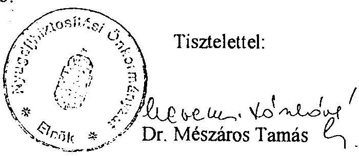

---

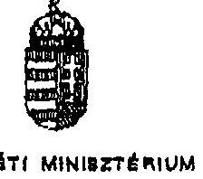

# Dr. Hagelmayer István úrnak elnök 

## Állami Számvevőszék

## Budanest,

## Tisztelt Elnők Úr!

Az Állami Számvevőszék T/1884/1. számú jelentését, a társadalombiztosítás pénzügyi alapjainak 1994. évi zárszámadásához kapcsolódó ellenőrzés tapasztalatairól megkaplam.

Az ÁSZ által megválasztott ellenőrzési szempontokkal valamint a jelentés megállapításaival és ajánlásaival egyetértck.

Az összefoglaló megállapításban hangsúlyozott tény, hogy az ÁSZ által már előző években is kifogásolt gyakorlat nem változott, a rendszerbeli gondok nem oldódtak meg.

Az ellátórendszerben 1994-ben érdemi, reform-értékủ változások nem következtek be. Az Alapok pénzügyi helyzete folyamatosan kedvezőtlenül alakul. A pénzbeli juttatások reálértékét és a természetbeni ellátások színvonalát nem sikerült megőrizni. Bár hangsúlyozni kell, hogy a folyamatukat elsősorban a társadalombiztosításon kivüli tényezők alakitották így.

Az E. Alap kiadásainak növekedése a táppénz-kifizetés, és gyógyszertámogatás teruletén - mint azt az ellenőrzés is megállapította - döntő módon az alultervezettségből adódott.

---

Az Egészségbiztosítási Önkormányzat által befogadott fejlesztések elbírálásánál feltétlenül hangsúlyozni kell, hogy már a döntés-előkészitési fázisban jól megalapozott szakmai szempontokat kell megfogalmazni és a pénzügyi tervek megalapozottságát szintén mérlegelni kell. Hasonló elvek szerint kell eljárni a kockázatkezelő programok elbirálásánál is.

Az erősödő magánositási törckvések, privatizációs folyamatok kezeléséhez jól megfogalmazott feltételrendszer szükséges, melyen a tárca jelenleg dolgozik.

Az Alapok müködési költségvetćsének zárazámadási adatait az államháztartási tv. előírásainak megfelelően kell megkövetelni.

Egyetértek annak hangsúlyozásával és következetes megvalósitásával, hogy a vagyonnal kapcsolatos tulajdonosi jog a Közgyülést illeti meg, tehát nem lehet olyan gyakorlatot folytatni, mely ezt megkeruli. A müködési és a jóléti ingatlanvagyon két Alap közötti rendezése és a juttatott vagyon céljának megfogalmazása indokolt.

Az E. Alap járulék- és folyószámla nyilvántartási gondjainak hangsúlyozása és rendezésc kivánatos. Egyetértek azzal az igénnyel, hogy a hátratékok nyilvántartásából derüljön ki a behajthatatlan követelés-állomány. Így a behajtható adósságállomány nagyságrendje jobban tervezhető.

A tervezett elöirányzatok és a tényleges teljesülés vizsgálatának eredménye is azt mutatta, hogy szükséges az Önkormányzatok évközi, idôszakos beszámoltatása. Ennek érdekében a társadalombiztosítás önkormányzati igazgatásáról szóló 1991. évi XXXIV. törvény módosítását javasoljuk.

Az Egészségbiztosítási Alap gyógyító-megelőző ellátásra fordított költségvetésének teljesítése során a reform-intézkedések nem valósulhatlak meg, a béremelésekre fordított - az elöirányzottnál lényegesen magasabb - kiadás szükségessége miatt.

A járóbeteg ellátásban a $30 \%$-ban teljesítményarányos dijfizetés az ellátórendszerben strukturális változást nem hozott, a fekvőbeteg ellátásban alkalmazott finanszírozás nem eredményezett nivellációt, az intézmények közötti indokolatlan különbségek továbbra is megmaradtak.

---

Az egészségügyi szolgáltatások szintentartásának egyik lényeges finanszirozási eleme a müszerek amortizációjának beépítése a költségekbe. Ennek megoldására mielőbb megnyugtató megoldást kell találnunk.

Mind a belső müködési költségvetés, mind az egészségügy finanszirozása, valamint az Alapok vagyonkezelésével kapcsolatban - a jogszabályok betartásának megkövetelésétől nem tekinthetünk el.

Budapest, 1996. február 13.
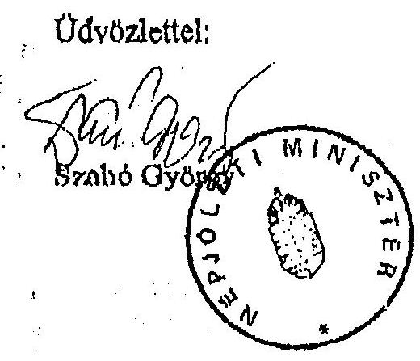