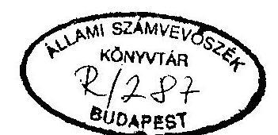
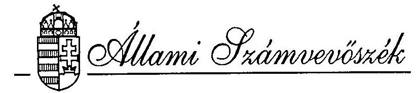
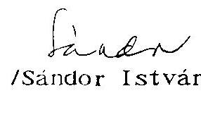
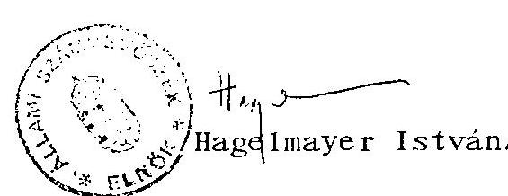
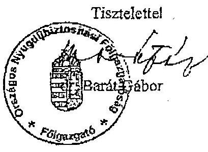

T/1680/1.

# VÉLEMÉNY 

a társadalombiztosítás pénzügyi alapjainak
1996. évi költségvetéséről

---

A vélemény elkészítésért felelős:
az ÁSZ IV. Vagyonellenőrzési Igazgatóság
Dr. Kovács Árpád igazgató

A munkát vezette:

Dr. Csépán Magdolna osztályvezető főtanácsos

Közreműködtek:

Dr. Fónyad Erzsébet számvevő
Hajagos Józsefné tanácsos
Dr. Kurucz István tanácsos
Molnár Istvánné tanácsos
Szendrődi Józsefné számvevő

---

# ÁLLAMI SZÁMVEVŐSZÉK 

$\mathrm{V}-30 / 1995$.
Témaszám: 308

## VÉLEMÉNY   a társadalombiztosítás pénzügyi alapjainak 1996. évi költségvetéséről

## 1.   BEVEZETÉS, ELŐZMÉNYEK

A társadalombiztosítás pénzügyi alapjainak 1996. évi költségvetéséről szóló T/1680 számú törvényjavaslatot 1995. november 17-én adták át az Országgyűlésnek. Ezúttal sem sikerült az államháztartási törvény előírásait megtartani, a társadalombiztosítás költségvetését a központi költségvetéssel egyidejűben benyújtani, aminek végső határideje szeptember 30-a lett volna.

A formai hiányosság mellett a törvényjavaslat számos tartalmi gondot, ellentmondást is magában hordoz.

A társadalombiztosítási önkormányzatok és a kormányzat közötti több hónapon át tartó egyeztetési folyamat ellenére a Nyugdíjbiztosítási Alap és az Egészségbiztosítási Alap 1996. évi költségvetése nélkülözi a kölcsönös egyetértést, az álláspontok alapvető kérdésekben eltérőek.

---

Végül is, a törvényjavaslat beterjesztésekor a Kormány (feladatkörében a PM) csupán a "postás" szerepére vállalkozott. Ez a magatartás - bár sok szempontból érthető és megmagyarázható - valójában az Országgyűlésre hárítja az összhang megteremtésének, a külső és belső feltételeknek is megfelelő költségvetés megalkotásának felelősségét.

Az Állami Számvevőszéknek véleménye elkészítéséhez két hét állt rendelkezésére. Ez az idő a tervezési munka mélyebb részleteinek vizsgálatát nem tette lehetővé. Csak részben sikerült megismerni a költségvetéseket megalapozó, magyarázó háttérszámításokat, dokumentumokat. Az Országos Nyugdíjbiztosítási Főigazgatóság (ONYF) és az Országos Egészségbiztosítási Pénztár (OEP) még csak most állítja össze a megfelelő háttéranyagot.

Ilyen körülmények között az ÁSZ elsődlegesen a társadalombiztosítási költségvetések bizonytalansági elemeire, ellentmondásaira kívánja felhívni a törvényhozás figyelmét. A bizonytalanság alapvetően a már Országgyűlés előtt lévő, a társadalombiztosítást is érintő törvények és a társadalombiztosítás két költségvetése között lényeges tartalmi eltérésekből fakad.

Időközben nyilvánosságra került, hogy a társadalombiztosítás 1996. évi költségvetésének megalkotására ebben az évben már nincs esély, emiatt "átmeneti szabályozást" kell életbe léptetni. Mivel itt egyértelműen a költségvetést érintő szabályozásról van szó, az Állami Számvevőszék megítélése szerint nem mellőzhető a biztosítási önkormányzatok megfelelő tájékoztatása.

---

# II. 

ÖSSZEFOGLALÁS ÉS JAVASLATOK

## 1. Összefoglaló megállapítások és következtetések

A társadalombiztosítás 1996-ra készített költségvetése, noha benyújtását az önkormányzatok és a Kormány között számos egyeztetés előzte meg, természetesen az önkormányzatok álláspontját tükrözi. Mivel az 1991/LXXXIV. törvény szerint a költségvetések megalkotása az önkormányzatok közgyűlésének jogkörébe tartozik, a költségvetés törvényességéhez nem férhet kétség. Tény ugyanakkor, hogy lényeges kérdésekben véleménykülönbségek maradtak fenn. Az eltérések alapvetően az Országgyűléshez már benyújtott, a társadalombiztosításról szóló 1975. évi II. törvény tervezett módosításával, valamint az 1996. évi központi költségvetésről szóló törvényjavaslat tartalmával függenek össze.

Ez okszerűen következik abból a jogi háttérből, amely szerint az alapok költségvetését a közgyűlések fogadják el, ugyanakkor az azt megalapozó anyagi jogszabályok megalkotásában (például az 1975. évi II. törvény) csak törvénykezdeményezési-véleményezési joguk van. Így, ha a Kormány ezen jogszabályokra vonatkozó véleményükkel nem ért egyet, az önkormányzatok álláspontja - közvetlenül - nem is kerül az Országgyűlés elé. Tehát maga a jelenlegi rendszer ellentmondásos, melyre az ÁSZ - más összefüggésekben is - már korábbi véleményeiben is rámutatott.

E törvények parlamenti jóváhagyása jelentősen módosíthatja a társadalombiztosítás költségvetésének bevételi és kiadási tételeit, az Alapok egyenlegét. Mindezek miatt számítani kell arra is, hogy a költségvetéseket át kell dolgozni. Számszaki változtatások az ÁSZ észrevételei miatt is szükségesek.

---

A költségvetési tervezés "bázisát" képező 1995. év - az előirányzatoktól eltérően - várhatóan hiánnyal fog zárulni, főként bevételi okok miatt. A hiány összegét az önkormányzatok hivatalos előrejelzéseinél az ÁSZ lényegesen többre becsüli, összességében 30-40 milliárd Ft lesz, a "nullszaldó" helyett.

A társadalombiztosítási alapok 1996. évi költségvetésének az említett törvényekhez való kapcsolódása miatt a tervezett pénzügyi egyensúly megalapozatlannak tűnik, mindkét Alapnál 10 milliárd forint feletti hiányra kell reálisan számítani. Ez esetben pedig a hiány finanszírozásáról is rendelkezni kell.

A törvényjavaslat nem felel meg az államháztartási törvény előírásainak, mert csak a tervadatokat mutatja be, de az 1995. évi várható teljesítést és az 1994. évi tényadatokat nem.

A jelzett törvényi változások annyiban érintik a nyugdíjkiadásokat, hogy azok növelését az előző évi nettó keresetek alakulásához kell igazítani. Az emelés lehetséges mértéke 1996-ban 15 %.

A gyógyító-megelőző egészségügyi ellátások finanszírozására jutó 215 milliárd forintos előirányzat legfeljebb a dologi kiadások 10 %-os, a bérek 20 %-os emelését teszi lehetővé. (Az ÁSZ ugyanakkor nem ismeri az egészségügy struktúra átalakítására vonatkozó elképzeléseket és ennek pénzügyi hatásait sem.)

A táppénz szabályok esetleges változása miatt jelentősen módosulhat az e címen tervezett 48 milliárd forintos összeg.

---

Az Egészségbiztosítási Alap gyógyszer-és gyógyászati segédeszköz kiadási előirányzatai csak a támogatási rendszer szigorításával, a lakossági terhek növelése mellett tarthatóak.

Jelentősen emelkednek az Alapok működési költségvetései. A Nyugdíjbiztosítási Alapnál ez az összeg 12,1 milliárd forint, az Egészségbiztosítási Alapnál 14,3 milliárd forint. Ez együttesen 26,4 milliárd forint, szemben az 1995. évi 19,4 milliárd forintos eredeti előirányzattal.

A törvényjavaslat záró rendelkezései lényegesen változtatnák az egészségügy finanszírozás jelenlegi szabályait, jelentősen nőne az alapkezelő Egészségbiztosítási Önkormányzat mozgástere, döntési jogköre.

Az összefoglaló megállapítások és következtetések között van néhány olyan, mely az önkormányzatiság - Állami Számvevőszék által többször - jelzett értelmezhetőségi gondjaival, mozgásterével, annak jogi hátterével, valamint a társadalombiztosításról szóló 1975. évi II. törvény módosításával és az 1996. évi költségvetési törvény előirányzataival, az azokkal való harmonizálás hiányával függenek össze. Ezek rendezése a társadalombiztosítási alapok 1996. évi költségvetése sarokpontjainak kialakításához nélkülözhetetlen. Az ÁSZ e mellett számos olyan problémát jelez, amely a tb. költségvetések megalapozottságához kapcsolódik és a pontatlanságok javítása önkormányzatok kompetenciáját is érinti.

Az ÁSZ javaslatai mindezek figyelembevételével készültek. Feltételezve, hogy módosító javaslatokkal a hibák és ellentmondások korrekciója megtörténik.

---

# 2. Javaslatok 

Az Állami Számvevőszék a T/1680. számú törvényjavaslatról alkotott véleménye alapján javasolja, hogy:
2.1. Teremtsék meg az összhangot a társadalombiztosításról szóló 1975. évi II. törvény és az 1996. évi központi költségvetés országgyűlési jóváhagyását követően a különböző törvények előírásai és számszerű adatai között, beleértve a Nyugdíjbiztosítási és az Egészségbiztosítási Alap költségvetésének bevételi és kiadási tételeit is.
2.2. Intézkedjenek a hiányrendezésre, ha az Alapok költségvetései deficitesek lesznek.
2.3. Egészítsék ki a formai hiányosságok korrekciójaként a törvényjavaslatot (esetleg a készülő háttéranyagot) az 1995. év várható és az 1994. év tény adataival.
2.4. Módosítsák a törvényjavaslathoz tett konkrét észrevételek alapján:

- a 2.§. (5) és a 7.§.(6) bekezdésének kifogásolt adatát (a folyósított ellátások utáni költségvetési térítést),
- a 3.§. (12) bekezdésének adatát,

---

- indokolják meg a Ny. Alap működési költségvetése központosított előirányzatának feladatokra lebontott számszerű adatait (az informatikai és a világbanki kiadások kivételével),
- a 3. §.(6) és (7), valamint a 8. §. (12) bekezdés c., d., e., és f. pontjai egészüljenek ki a következő szöveggel: "Ha a tényleges kiadás kevesebb, mint az előirányzat, azt megtakarításként más célra nem lehet felhasználni."
- a 8. §. (1) bekezdésének szövegéből maradjon el az "intézményi" szó.
2.5. Ne legyen lehetőség a javaslat 15. §. 3. bekezdése szerint - a kockázat kezelésre szolgáló előirányzatok felhasználásától eltekintve - a gyógyító-megelőző egészségügyi ellátás előirányzata terhére a társadalombiztosítás feladat (finanszírozási) körébe nem tartozó szolgáltatások, eljárások szerződéses alapú finanszírozására.
2.6. Határozzák meg konkrétan az egészségügyi kockázat kezelés azon területeit, amelyeket támogatni kell. Különösen az egészségbiztosítás feladatkörébe nem tartozó elsődleges prevenciót illetően a támogatási összeg rögzítése és az életmódot befolyásoló "számtalan" tényező közül emeljék ki azokat, amelyek támogatásával a hazai népegészségügyi helyzet valóban javítható és a biztosítói kockázatok is csökkenthetőek.

---

# III. 

## RÉSZLETES MEGÁLLAPÍTÁSOK

## 1. A társadalombiztosítás pénzügyi alapjai 1995. évi költségvetésének várható teljesülése

A társadalombiztosítás 1995. évre szóló költségvetése is igen késedelmesen, 1995. júniusában, sok bonyodalom után született meg. Mint az Állami Számvevőszék már akkor rámutatott: a társadalombiztosítási költségvetés számos bizonytalansági elemet tartalmaz (az előirányzottnál szerényebb összeg behajtására lesz lehetőség, a vagyonjuttatás késedelme hozadék-kiesést jelent, stb.). Ehhez járul, hogy ún. stabilizációs intézkedési csomag sem teljeskörűen valósult meg. A továbbiakban a fő előirányzatokat és a várható teljesítést mutatjuk be.

Az 1995. évi LXXIII. törvény:

- a Nyugdíjbiztosítási Alap bevételeit és kiadásait egyaránt 511,4 milliárd forintban,
- az Egészségbiztosítási Alap főösszegeit pedig 436 milliárd forintban, "0"-egyenleggel
határozta meg.

A költségvetési törvény teljesülése az 1995. év 01-10. havi tényadatainak ismeretében ettől eltérő lesz.

Mindkét alap bevételeit a járulékbevételek várható alakulása határozza meg. Ez a tíz hónap arányos (53,3 %-os) teljesítésétől ténylegesen jelentős (4-5 %-os) elmaradást mutat, ami a két biztosítási alapnál együttesen 30-40 milliárd forintban számszerűsíthető.

---

A kiadási oldalon viszont összességében (mindkét alapnál) az időarányos teljesítés valószínűsíthető. Ebből következően, amennyiben a tendenciák lényegesen nem módosulnak, megállapítható, hogy az 1995. év - a tervezett nulla egyenleggel szemben - hasonlóan a korábbi évekhez, ismét jelentős deficittel fog zárulni. Ebben azonban nem annyira a kiadási tételek túlteljesülése, hanem inkább a járulékbevételek elmaradása játszik szerepet.

A társadalombiztosítási önkormányzatok előzetes jelzése szerint a hiány "kezelhető" nagyságrendű lesz, a Nyugdíjbiztosítási Alap esetében mindössze 1.222 millió forint, az Egészségbiztosítási Alapnál pedig 7.062 millió forint. A tendenciák alapján ez a feltételezés túlzottan optimistának tűnik.
2. A társadalombiztosítási alapok 1996. évi költségvetését megalapozó tényezők

# 2.1. Makrogazdasági paraméterek 

Az alapok 1996. évi költségvetésének összeállításánál az 1995. év várható bevételi és kiadási értékei mellett a tervezés alapját a "szokásos" nemzetgazdasági mutatószámok képezték.

A bevételek meghatározó elemét természetesen változatlanul a járulékbevételek jelentik. Sajátos helyzetet mutat, hogy a két ágazat az 1995. évhez viszonyítva a járulékmérték változásokat nem azonos módon vette figyelembe. Az egészségbiztosítás a munkáltatói járulékmérték 1,5 %-pontos csökkentésével számolt, ami arányeltolódást eredményezett a Nyugdíjbiztosítási Alap "javára" (az 1995. évi 55,68 %: 44,32 % helyett 1996-ban 57,65 %: 42,35 %).

---

Egyebekben a tervezés során mindkét ágazat a központi költségvetésnél figyelembe vett prognózisokra támaszkodott. Így:

- a bruttó keresetösszeg 14-15 %-os növekedésével
- bruttó átlagkeresetek 19-20 %-os emelkedésével
- a foglalkoztatottak létszámának 4 %-os csökkenésével,
- a munkanélküliek számának 60 ezer fő növekedésével számoltak.

2.2. A társadalombiztosításról szóló 1975. évi II. törvény tervezett módosítása

A Kormány T/1644. számon benyújtotta a társadalombiztosítás bevételeit és kiadásait alapvetően meghatározó 1975. évi II. törvény módosítására vonatkozó javaslatát. A törvény tervezett változtatásai másként érintik a Nyugdíjbiztosítási és az Egészségbiztosítási Alapot.

A törvényjavaslat a bevételi oldalt érintően a munkáltatókat terhelő egészségbiztosítási járulék (jelenleg 19,5 %) 3 %-pontos csökkentését, az egyéni járulékokon belül pedig a nyugdíjjárulék (jelenleg 6 %) 2 %-pontos emelését tartalmazza. Az egyéni járulékfizetés felső határán (havi 75 ezer forint/hó, évi 900 ezer forint) továbbra sem szándékoznak változtatni.

- A nyugdíjágazat ezzel szemben változatlan munkáltatói és egyéni

 járulékmértékkel, viszont az eddiginél magasabb egyéni járulék-plafonnal számolt. (Az 1992. óta változatlan felső határ ugyanis már erősen érzékelteti - a nyugdíjakra gyakorolt - nivelláló hatását.)

---

- Az egészségbiztosítás bevételeinek tervezésénél a munkáltatói terhek 1,5%-os csökkentését vették figyelembe.

A kiadási oldalra ható tényezők közül a fontosabbak, hogy:

- a betegszabadság időtartamának 15 napra növelése mellett a táppénzkiadások 1/3-a a folyósítás teljes tartamára a munkáltatókat terhelné;
- változnának a nyugdíjak évenkénti rendszeres emelésének megállapítási szabályai (bár ennek a nyugdíjkiadások nagyságára minimális hatása van);
- némileg módosulnának a nyugdíjak megállapítási szabályai (a "valorizáció" és a "degresszió").

Az Egészségbiztosítási Önkormányzat a táppénz-konstrukció ilyen módon történő változtatását elutasította, a táppénzkiadások 1996-ra tervezett összegét változatlan szabályok mellett határozta meg.

A Nyugdíjbiztosítási Önkormányzat a nyugdíjkiadások tervezésénél a módosítási javaslatokat zömmel figyelembe vette.
2.3. A központi költségvetés és a társadalombiztosítási alapok költségvetése közötti összefüggések

A T/1456. számú, az Országgyűlés által még el nem fogadott törvényjavaslat a XI. Népjóléti Minisztérium-fejezetben számszerűsíti a társadalombiztosítás által folyósított ellátások, valamint a különféle jogcímeken adott térítések előirányzatait.

---

Lényeges eltérés két tételnél mutatkozik, a nem biztosítottak utáni térítés 12.000 millió forintos, továbbá a folyósított ellátások utáni (az alapok működési költségvetését megillető) költségtérítések 1400 millió forintos összege eltér a társadalombiztosítás költségvetésének azonos tartalmú adataitól. (Erről a törvényjavaslat részletes ismertetése során lesz szó.)

A törvényjavaslat 31. §-ában a költségvetés általi átvállalással gyakorlatilag rendezik az alapok 1994. végéig keletkezett hiányait. Az 1995. évi hiány rendezésére zárszámadáskor kerülne sor.

Az Alapokat terhelő ellátások folyamatos teljesítését 1996. januárjától a kincstári egységes számlához kapcsolt megelőlegezési számla hivatott biztosítani. A számlát a Nyugdíjbiztosítási Alap alkalmanként 24 milliárd forint, az Egészségbiztosítási Alap pedig 30 milliárd forint erejéig kamatmentesen veheti igénybe, e felett a (jegybanki alapkamattal megegyező mértékű) kamat mellett kaphatnak hitelt.

Az alapok 1995-ben is jelentős forgóalaphitelre szorultak.

Az Ny. Alap 1995. októberében már 35 milliárd forintos felvételig jutott el, ez decemberben elérheti a 40 milliárd forintot is. Az Alap gyakorta éppen a feladatkörébe nem tartozó, forrásait nem terhelő ellátások miatt (korengedményes nyugdíj, előnyugdíj) kerül nehéz helyzetbe.

Nem tartható a két tb. alapnál az a gyakorlat, hogy olyan kifizetésekért is helyt kell állni, amelyeknek forrásai felett nem rendelkezik.

---

Az E. Alap napi hitelállománya novemberben már meghaladta a 80 milliárd forintot.

Az, hogy az Alapok tervezett konszolidációja a hiteligényt milyen mértékben mérsékli, ma reálisan nehezen ítélhető meg. Nem ismert az 1995. évi tényleges hiány összege, hogy annak zárszámadási rendezése mikorra várható, hogyan valósul meg a hiányrendezéshez szorosan kapcsolódó likviditási tartalék alapok feltöltése. Minden esetre tény, hogy kamatkiadással egyik Alap költségvetése sem számol.
2.4. A költségvetési intézmények kincstári finanszírozása

Az államháztartás pénzügyi rendezésének reformja keretében 1996. januárjától megváltozik a költségvetési rend szerint gazdálkodó szervezetek pénzellátása, finanszírozása.

Ez, noha a kincstári rendszer hatásköre (még) nem terjed ki az államháztartás társadalombiztosítási alrendszerére, érinti az Országos Egészségbiztosítási Pénztár ügyviteli feladatait is.

Az OEP-nek is át kell térnie a költségvetési rend szerint gazdálkodó egészségügyi intézmények nettó finanszírozására. Ahol az intézmény fő tevékenységi köre a gyógyító-megelőző egészségügyi ellátás, a bevételek zöme az E. Alapból származik, a "nettósítás" feladatát az OEP (más esetben a Kincstár) végzi el. Ennek megfelelően szoros együttműködés alakult ki az OEP - a MEP-ek - a Kincstár - és a TÁKISZ-ok között.

---

Jelenleg a nettó (adó és járulékfizetési kötelezettséggel csökkentett) finanszírozásra való felkészülés még csak előkészületi szakaszban van. A kapcsolódó jogszabályi háttér sem készült el. A zökkenőmentes átállás nem látszik biztosítottnak, különös tekintettel a két alap közötti pénzügyi elszámolásokra.

A költségvetési rend szerint gazdálkodó (nem egészségügyi) intézmények nettó finanszírozása szintén érinti az egészségbiztosítást, hiszen a társadalombiztosítást illető befizetések immár nem az intézmény bankszámlájáról, hanem a kincstári egyszámláról kerülnek az intézmények megyei egészségbiztosítási pénztáraknál vezetett folyószámlájára.

A változások tehát érintik a társadalombiztosítási bevételek legfontosabb nyilvántartási rendszerét, a járulék- és folyószámla nyilvántartást. Ebben nyilvánvalóan változtatásokra (informatikai fejlesztésekre) lesz szükség. Az ehhez kapcsolódó kiadásokat azonban az E. Alap működési költségvetése nem irányozza elő.

---

3. A társadalombiztosítás pénzügyi alapjainak 1996. évi költségvetése
(A jobb kezelhetőség érdekében az észrevételek, megjegyzések a T/1680. számú törvényjavaslat szövegét - sorrendben - követik.)
3.1. A költségvetési törvényjavaslat főbb formai hiányosságai

Az államháztartási törvény 115. §-a szerint a költségvetés előterjesztésekor a vonatkozó év és az előző év várható, valamint az azt megelőző év tényadatait kell tartalmaznia. Ezen alapvető követelménynek a T/1680. számú törvényjavaslat nem felel meg, mert csak az 1996-ra vonatkozó terv-adatokat mutatja be, eltérően az előző években szokásos prezentációtól. A kellő áttekintés hiánya gátolja az objektív véleményalkotást. A készülő háttéranyagok a hiányosságokat részben pótolhatják.

A két alap költségvetésének sem a szöveges, sem a számszaki mellékletei nem azonos logikai felépítésűek. (Ez különösen a működési költségvetés bemutatásánál zavaró.)

A két ágazatnál eltérő a bevételek szerkezeti sorrendje. A nyugdíjbiztosítás a központi költségvetés által fizetett járulékokat a "rendszeres" járulékok között mutatja ki, az egészségbiztosítási járulék bevételektől függetlenül, külön tételként kezeli.

---

A törvénytervezet 14. §-ában szereplő járulékmegosztási arányszámokkal a két alap bevételei nem kontrollálhatóak (az eltérő tervezési szempontok, valamint az NY. Alap járulékbevételeinek 0,3%-os mértékű - 11. §. szerinti átcsoportosítási lehetősége miatt).

# 3.2. A költségvetési törvényjavaslat egyes tételei 

A törvényjavaslat 2. §. (1) bekezdéséhez

A Nyugdíjbiztosítási Alap bevételeinek tervezett összege 1996-ban 601.538 millió forint, a bevételeké pedig 601.430 millió forint, a tervezésnél tehát minimális bevételi többletre számoltak.

A járulékbevételek részletezésénél nem jelenik meg az a 11.300 millió forint, amit a törvényjavaslat 1. sz. melléklete, mint "központi költségvetés által fizetett" járulékot tüntet fel. Ezt az összeget a Nyugdíjbiztosítási Önkormányzat a járulékfizetéssel nem fedezett szolgálati idők ellentételezésének tekinti és a biztosítási elv miatt szavazta meg.

E bevételi tétel teljesülése csak akkor lehetséges, ha a központi költségvetés ilyen nagyságú kiadási összeggel kiegészül. Erre nincs sok esély. Ezért reálisan azt kell megállapítani, hogy már az "induláskor" 11.300 millió forint hiány látható az Ny. Alap költségvetésében.

---

A 2. §. (5) bekezdéséhez:

Az Ny. alapot megillető működési célú bevételekből a tervezet szerint 800 millió forint az NM-fejezeten keresztül a költségvetési forrásból finanszírozott, de a nyugdíjbiztosítás által folyósított ellátások utáni térítés összege.

Az NM-fejezetben összesen 1400 millió forint költségvetési térítés szerepel, viszont a két ágazat működési költségvetésében együttesen 1780 millió forint. A hiányzó 380 millió forint forrása nem biztosított. Ez az észrevétel a 7. §. (6) bekezdésére egyaránt vonatkozik.

A 3. §. (1) bekezdéséhez:

A Nyugdíjbiztosítási Alapot terhelő nyugellátások kiadási előirányzata 517.220 millió forint. Ez az összeg éves szinten 15%-os emelést biztosít. Az 1996-ra előirányzott januári és a júliusi (visszamenőleges hatályú) nyugdíjemelés mértéke még nem ismert.

Nincs elkülönítve a vagyongazdálkodással kapcsolatos kiadás a hozambevételek érdekében eszközölt ráfordítástól. A kamat és hozambevétel tervezett összege (2. §. (3) bekezdés) 2800 millió forint, a vagyongazdálkodással kapcsolatos kiadás (3. § (9) bekezdés) 100 millió forint. E szerint - nettó hozamként - csak 2700 millió forint lenne tartalékba helyezhető, szemben a 3. §. (12) bekezdése szerinti 2750 millió forinttal.

---

Az Ny. Alap tartalékaira alakulását bemutató 4. sz. törvényi melléklet nem helyezi külön alapba az ingyenes vagyonjuttatást és a tartozás fejében átvett vagyont, holott ez törvényi előírás. Az 1995-ben maximálisan lehetséges 1870 millió forint értékű ingatlanberuházás (ezzel szemben már 2,3 milliárd forintot költöttek el!) forrásaként a befektetések hozama tartalékot jelölik meg, holott 940 millió forint forrása a működési költségvetésből származik.

A 3. §. (4) bekezdései szerint a nyugdíjbiztosítás működési költségvetésének összege 12.109 millió forint (9276 + 600 + 840 + 1343 + 50).

A működési költségvetés előirányzatát tovább növelheti a 3. § (10) bekezdés szerint a nyugdíjbiztosítás fővárosi igazgatóságának elhelyezését szolgáló beruházás (ha az ingyenes vagyonjuttatás keretében nem oldódik meg). A saját beruházás költségigényét azonban konkrétan nem határozzák meg.

Az Ny. Alap működési költségvetésének 12.109 millió forintos előirányzata 3416 millió forinttal - 39,3%-kal - haladja meg a törvény szerint 1995-re maximálisan felhasználható 8693 millió forintot (9223 - 15000 + 930 + 40).

Rendkívül erőteljesen növekszik az Ny. Alaptól működési célra átvett pénzeszköz (az 1995. évi 8828 millió forinttal szemben 11.009 millió forint).

A működési költségvetésből mintegy "eltűnik" az egészségbiztosítás által végzett, ún. közös érdekeltségű feladatok finanszírozásához való hozzájárulás (ami 1995-ben 1500 millió forint).

---

A működési költségvetés tervezett kiadásait vizsgálva megállapítható (2. sz. melléklet), hogy a költségvetésen belül

- a személyi juttatások 3579 millió forintos,
- a tb. járulékok 1457 millió forintos,
- a dologi kiadások 1893 millió forintos
együttesen 6929 millió forintos előirányzata (folyamatos működési kiadások) 60%-os részarányt képvisel. A különböző címeken 627 millió forintos felújítási és 1395 millió forintos beruházási (felhalmozási) előirányzat szerepel. Épület beruházásként az Önkormányzat és az ONYF elhelyezését biztosító Röntgen utcai építkezés 1996-ra esedékes kiadásait, valamint két megyei beruházást terveztek.

Igen jelentős a nyugdíjbiztosítási célfeladatokra központosított előirányzat, együttesen 3120 millió forintos összege. Ebből a törvénytervezet konkrétan csak az informatikai kiadások 840 millió forintos, valamint a világbanki program 600 millió forintos előirányzatát jelöli meg. A fennmaradó 1680 millió forint felhasználása a végrehajtás során "tetszőleges", azokból folyamatos működési kiadások (részben jóléti célok szolgálatában) éppúgy fedezhetők, mint különféle fejlesztési - felhalmozási célok. Ezen előirányzatok megalapozottságáról az ÁSZ tételesen nem tudott meggyőződni.

A törvényjavaslat 6. §-ának (1) bekezdése az 1996-ban E. Alap esetében 496.154 millió forintos főösszeggel, és 0-egyenleggel számol.

---

A járulékbevételek részletezése során (a 7. §. (1) bekezdésében) a központi költségvetés által az ún. nem biztosított személyek utáni járulék megtérítésének tervezett összege 26.810 millió forint. Ez az adat az állami költségvetésben - az NM-fejezetében - viszont mindössze 12.000 millió forint. A különbözet megfizetésére (noha biztosítás-elvi alapon a számítás megalapozott) reálisan éppúgy nem lehet számítani, mint az Ny. Alapnál. Ily módon pusztán e bevételi tétel bizonytalansága megkérdőjelezi az E. Alap induló egyensúlyi pozícióját.

Az E. Alap kamat- és hozambevételeinek összege 600 millió forint. (7. §. (4) bekezdés), melynek 70%-át tartós befektetésre, 30%-át a folyó finanszírozásban kívánják felhasználni. Ez a javaslat nincs összhangban az állami költségvetésről szóló törvényjavaslat 31. §-ának (5) bekezdésében foglalt szabályokkal.

Az E. Alap legjelentősebb kiadási tétele a gyógyító-megelőző egészségügyi ellátásokra fordítható összeg, ami 1996-ban 215.000 millió forint (8. §. (1) bekezdés).

Az egészségbiztosítás feladata kezdettől fogva a működési kiadások finanszírozása, nem feladata viszont felújítások és beruházások költségeinek fedezése. Az amortizáció, a pótlás forrásainak megoldatlanságára az ÁSZ minden lehetséges alkalommal felhívja a figyelmet.

A jelenlegi törvényjavaslat szövege azonban már nem egyértelmű, mert az eddigi "felújítások, beruházások nélkül" - kitétel, "intézményi felújítások, beruházások nélkül"-re változik, nyilván nem ok nélkül.

---

A törvényjavaslat indoklása ezt nem magyarázza, de ilyen szabályozás mellett többé már nem kifogásolható, ha
 az E. Alap kezelője saját megítélése szerint beruházási célokat támogat. Mivel a források ezt általánosan nem képesek biztosítani, az egyedi esetek előnyben részesítése csak viták forrásává válhat. A szűk körben alkalmazott kivételeknek nem lehet koncepcionális alapja.

A 215.000 millió forintos előirányzat 11,8 %-kal több mint az 1995. évi forrás. Ebből az összegből, az önkormányzatok véleménye szerint szűkösén bár de 20 %-os bérfejlesztés és 10 %-os dologi előirányzat növelés megvalósítható. Az egészségügyi intézményeket érintő kapacitásleépítéseket és azok pénzügyi hatásait azonban az ÁSZ-nak nem volt módja vizsgálni, mert jelenleg az elképzelések is csak kialakulóban vannak, és azok politikai egyeztetésektől is függenek.

Az egészségügy struktúra átalakítása első lépése során, 1995-ben a kórházi ágyak száma kb. 10 ezerrel csökkent. Ennek azonban számottevő költségmegtakarító hatása nincs, mert főleg az eddig is "üres" ágyakat számolták fel, s nem osztályokat, pavilonokat, kórházakat szüntettek meg. Az 1995. év végén hozott intézkedések hatása 1996-ban fog igazán jelentkezni, ezt azonban a tervezésnél nem vették figyelembe (ami főleg a kasszák közötti átcsoportosítás igényét jelenti).

Az 1996. évi előirányzatban fejlesztési összeg nem szerepel, holott az nem valószínű, hogy év közben sehol nem kerül sor feladatbővülésre.

---

Az ún. célelőirányzatok összege 2697 millió forint, az előző évivel azonos. Ezen belül az egészségügyi kockázatkezelő programok támogatására 1506 millió forint szolgál.

Az ÁSZ az 1994. évi zárszámadás ellenőrzése alkalmával kifogásolta a kialakított pályázati rendszert, annak gyakorlati működését.

A reformintézkedések 3008 millió forintos előirányzata valójában csak normaemelkedéseket jelent (a háziorvosi szolgálatok, az ügyelet, az iskolaegészségügy és az esetfinanszírozás területén), az elnevezés megtévesztő.

Az újszerű eljárások és technikák bevezetésére és elterjesztésére a költségvetés 220 millió forintot tartalmaz. Ennek pontos tartalma azonban nincs meghatározva (az OEP feltehetően az ún. egynapos kórházi ellátást akarja ebből megfinanszírozni).

A törvényjavaslat 8. §-ának (2) bekezdése a gyógyszerek fogyasztói árának támogatására 71.600 millió forintot, gyógyászati segédeszközök ártámogatására 9500 millió forintot irányoz elő.

A gyógyszertámogatás 1995. évi kiadása várhatóan 69000 millió forint lesz, ehhez képest a tervezett növekedés mindössze 4,1 %-os mértékű. Úgy tűnik tehát, hogy a gyógyszerkiadások évek óta tartó növekedését sikerül megállítani. Ennek természetes következménye, hogy a lakossági terhek dinamikusan emelkednek. A támogatási rendszer 1995. márciusi radikális átalakítása következtében az átlagos támogatottsági szint 74,8 %-ról 62,4 %-ra csökkent.

---

Az 1996. évi előirányzat tervezésénél éves szinten 20 %-os árszintnövekedést vették figyelembe. Így a jelzett előirányzat is csak akkor tartható, ha további "szigorító" intézkedéseket hoznak és a támogatottsági szint tovább csökken. Mindehhez jogszabályi változtatásokra is szükség van. Amennyiben ezek a változtatások már januárban hatályba lépnek, az előirányzat tarthatónak látszik, a későbbi bevezetés havonta 1,1 milliárd forintos többletkiadást jelent.

Szakértői vélemények szerint a támogatás szintjének további kényszerű visszaszorítása már súlyos orvosszakmai és egészségpolitikai gondokat is felvet.

A gyógyszerkiadások ésszerű keretek között tartását kívánja szolgálni az országos vényellenőrzési rendszer bevezetése, amit évek óta terveznek és remélhetőleg 1996-tól sikerül megvalósítani.

Gyógyászati segédeszközökre 1995-ben várhatóan 11,3 milliárd forintot fordítanak, ami a tervezettet 50 %-kal meghaladó összeg. A támogatási rendszer átalakításával 1995. szeptemberétől drasztikusan szigorodtak a szabályok, csökkent a támogatás mértéke. Ennek következtében a lakossági terhek 60 %-kal emelkedtek. Az 1996-ra előirányzott 9500 millió forintos összeg megtartásához a támogatási rendszer további szigorítása szükséges, ami azt is jelenti, hogy az egészségileg rászoruló, kis jövedelmű rétegek számára a hozzáférhetőség esélyei nagymértékben romlanak.

---

Az E. Alapot terhelő korhatár alatti rokkant és baleseti ellátások kiadási előirányzata 78.100 forint, ami 13,7 %-kal magasabb az 1995. évi várható értéknél (a felülvizsgálati rendszer szabályainak szigorodása, a 15 %-os nyugdíjemelés és a létszámcserélődés együttes hatására).

A rokkantsági nyugdíjak az Ny. Alapnál is megjelennek, annak folyósított ellátásai között. (A törvényjavaslat 3. sz. mellékletének 153.000 millió forintos végösszegéből ez a tétel 51 %-ot tesz ki.)

A 8. §. (6) bekezdése szerint az egészségbiztosítás 1996. évi táppénzkiadásainak tervezett összege 48.000 millió forint. Ez 17 %-kal több az 1995-re várható 41000 millió forintnál. A tervezésnél a táppénzszabályok változatlanságát tételezték fel. Ha a betegszabadság intézményében, illetőleg a táppénzkiadások teherviselésében a kormány által javasolt változások (részben vagy egészben) megvalósulnak a táppénzkiadásoknál "megtakarítás" képződhet.

A törvényjavaslat 8. §. (12) bekezdése szerint az E. Alap 1996. évi működési kiadásainak fő összege 14.300 millió forint (22,7 %-kal több, mint az előző évben). A költségvetés meghatározó forrása értelemszerűen az Alaptól átvett pénzeszköz, 13.340 millió forint, amit a 7. számú törvényi melléklet nem egy összegben, hanem különböző tételekre bontva tartalmaz.

Behajtás ösztönzésére a törvény és a melléklet egyaránt 400 millió forintot tartalmaz. Ez az összeg a 14. §. (4) bekezdése szerinti 2 %-os mértékkel számolva, 20 milliárd forint összegű behajtási hányadot jelentene. Eközben a két alapban együttesen 29 milliárd forinttal számolnak,

---

aminek teljesüléséhez már 580 millió forint ösztönzési keret tartozik. Fordított esetben a 400 millió forintos eredeti előirányzatnak csak az arányos része használható fel.

Az egészségbiztosítás működési kiadásainak 90 %-át a személyi jellegű kiadások, a társadalombiztosítási járulék és a dologi kiadások teszik ki.

Felújításra 202 millió forintot terveznek, az 1994-95-ben vásárolt MEP épületek és az ingyenes vagyonjuttatásból "remélt" Budapesti EP-épület átalakítására, aminek kevés a valószínűsége.

Intézményi beruházásokra 467 millió forintot terveztek, ezek épületberuházások, eszközbeszerzéssel nem számoltak.

A Budapesti EP. részleges elhelyezésére, a VII. kerületben épülő irodaházban 1996-ban 400 millió forint szolgálna (az OTP Rt.-vel kötött opciós bérleti szerződés szerinti díjra és a költözködésre). Az elhelyezést ez a megoldás sem rendezi, a Fiumei úti székházból való kiköltözéshez még más épületre is szükség lenne. Az ingyenes vagyonjuttatáshoz fűzött remények eddig meghiúsultak.

Az informatikai fejlesztések 400 millió forintos előirányzata alacsonyabb az 1994-95. évi összegeknél.

A Világbanki hitelből megvalósuló program szakmai fejlesztései évek óta akadoznak. Az ok az államháztartási reformhoz, a kincstár létrehozásához kapcsolódó információs háttér megteremtésével függ össze, ami erőteljesen

---

érinti a társadalombiztosítási járulék és folyószámla rendszerének fejlesztését is. Miközben a hitel eredeti céljai mindeddig nem valósultak meg, ugyanakkor jelentősek a külföldi tanácsadókkal megkötött szerződésekre teljesített kifizetések. A két ágazat együttes kiadása szakmai segítségnyújtásra és az auditálásra 1995. augusztusáig több, mint 1,8 millió dollár volt s további 1,6 millió dollár felvétele várható.

Mindezek miatt a világbanki hitel hazai költségeinek 1996-ra tervezett 400 millió forintos előirányzata csupán "tájékoztató" jellegű adatnak tekinthető, alulteljesítése éppúgy lehetséges, mint (a programok beindulása esetén) a többszörös túllépés.

Az E. Alap működési költségvetésében 1200 millió forintot központosított előirányzatként kezelnek, ebből 400 400 millió forint a már említett informatikai fejlesztés és a világbanki program hazai kiadása.

A társadalombiztosítási alrendszer összevont költségvetését érintő rendelkezések között, a 11. §-ban foglaltak értelmében a közös érdekeltségű feladatok működési kiadásainak fedezetéül az Ny. Alap rendszeres járulékbevételének 0,3 %-át átengedi az E. Alap számára. Ez a megoldás lépne az Ny. Alap működési költségvetéséből az eddig szokásos egyösszegű pénzeszközátadás helyébe (aminek összege 1994-ben 2121 millió forint volt, 1995-ben pedig 1500 millió forint), amivel már korrigálták a két Alap rendszeres járulékbevételi előirányzatát.

Mindez semmivel nem világosabb, mint a korábbi módszer, a 0,3 %-nak éppúgy nincs számítási alapja, mint ahogy a korábbi fix összegnek sem volt.

---

Az Ny. Alap működési költségvetésében viszont a pénzeszközátadás hatása már nem jelenik meg, így a "kép" valamivel kedvezőbbnek látszik.

A törvényjavaslat záró rendelkezései tartalmazzák az egyes járulékkategóriák új megosztási arányszámait, a járulékellenőrzés és a kintlévőségek behajtásának ösztönzési szabályait.

Pótköltségvetési javaslatot akkor kell készíteni, ha a tárgyév szeptember 30-áig az Ny. és E. Alap várható éves egyenlege a kiadási előirányzat 2 %-ánál kedvezőtlenebb a tervezettnél. Az 1996. évben ez 12, illetve 10 milliárd forintos eltérés a feltételezett egyensúlyi helyzethez viszonyítva.

A tervezet 15. §-a igen jelentős egészségfinanszírozási kérdéseket érint.

A társadalombiztosítás pénzügyi alapjainak 1995. évi költségvetéséről és a természetben egészségbiztosítási szolgáltatások finanszírozásának általános szabályairól szóló 1995. évi LXXIII. törvény 10 §-ának új (1) bekezdéséből - vélhetően adminisztrációs hiba miatt kimaradt az:
". . . . . . egészségügyi szolgáltatás nyújtására jogosult szolgáltatóval...."
szöveg kivastagított része.

---

Ugyanitt a szerződéskötés területeinek felsorolása kibővült az "orvostechnikai eszközök" gyártására jogosult gyártóval, forgalmazóval. A megfogalmazás azonban nem pontos, a szerződéskötés lehetséges eseteit illetően. A finanszírozás elsődlegesen a biztosítottnak nyújtott szolgáltatásokra értelmezhető.

A tervezett szabályozásban az a szándék nyilvánul meg, hogy az egészségügyi ellátó rendszer kapacitásával, struktúrájával, területi elhelyezkedésével kapcsolatos hatásköröket, döntési kompetenciákat egyértelművé tegye. A Népjóléti Minisztérium és az E. Alap kezelője között az önkormányzat létrejötte óta érzékelhető "küzdelem" az utóbbi javára látszik eldőlni.

A legfőbb rendező elv "a pénzügyi keretek" betartása, ebből következően szinte kizárólagos döntési hatáskör illetné meg az Alap felett rendelkező önkormányzatot, illetve az OEP-t.

A népjóléti miniszter számára biztosított véleményezési és egyetértési jog nem elegendő ahhoz, hogy valóban eleget tehessen a feladatáról és hatásköréről szóló 49/1990. (IX.15) Kormányrendeletben e vonatkozásban megfogalmazottaknak. (2. §: Általános feladatok: a miniszter "irányítja, összehangolja, szervezi az egészségügyi ellátás rendszerét")

Nem sikerült tisztázni, hogy mit ért konkrétan az előterjesztő a népjóléti miniszter betartandó "jogszabályban meghatározott szakmai előírásain, és követelményein", hogyan érvényesíthetők ezek pl. a szerződések felbontása esetén? Az egészségügyi intézményekkel kötött finanszíro-

---

zási szerződést az 1995. október 1-től érvényes szerződéses formula 8.§. 2. pontja szerint bármelyik fél 30 napos felmondási időköz beiktatásával írásban felmondhatja.

Ezen túlmenően, a szabályozásból gyakorlatilag teljesen kimaradt a tulajdonosok érdekérvényesítési lehetősége.

Az 1995. évi LXXIII. törvény 20. § (3) bekezdés új megfogalmazása (a 15. § (3) bekezdésében) nehezen értelmezhető. A biztosítottak által térítésmentesen igénybe vehető egészségügyi szolgáltatásokat az 1975. évi II. törvény tartalmazza. Ezek finanszírozására szolgál a gyógyító-megelőző ellátások előirányzata. Nem tisztázott, mit értenek a társadalombiztosítás "finanszírozási körébe nem tartozó" szolgáltatásokon, eljárásokon ezeket a biztosítottak milyen köre, milyen feltételekkel veheti majd igénybe (hozzáférhetőség, térítésmentesség vagy díjfizetés stb.).

A tervezett szabályozás a gyógyító-megelőző ellátások előirányzatának kontrollmentes, szabad felhasználására ad lehetőséget az E. Alap kezelője részére, amellyel az ÁSZ jelen időszakban nem tud egyetérteni. A társadalombiztosítás forrásai ugyanis közpénzek és 1990. óta e pénzek felhasználásának szabályait, ellenőrzésre alkalmas rendszerét lényegében nem dolgozták ki.

A társadalombiztosítás önkormányzati igazgatásáról szóló törvény szabályai szerint az Egészségbiztosítási Önkormányzatnak sincs jogszabályalkotási joga. Így, ha az E. Alap kezelője megkapná a törvénytervezet szerinti felhatalmazást, olyan helyzet állhatna elő, hogy minden ki-

---

adás szabályosnak lenne tekinthető, amivel az Önkormányzat elnöksége egyetért. Ez az ellenőrzés számára a normákhoz való viszonyítás lehetőségét zárná ki.

A társadalombiztosítás által folyósított ellátásokat a törvényjavaslat 3. és 8. számú mellékletei ismertetik, immár ágazatok szerint megbontva. Az ellátások értéke 1996-ra (az E. Alapot terhelő rokkantsági nyugdíjak nélkül) 200 milliárd forint, amiből a központi költségvetést közvetlenül 173,9 milliárd forint terheli. Az adatok megegyeznek a T/1456. számú törvényjavaslatban
 a XI. NM-fejezet 10. címe alatt felsorolt számokkal.

A Szolidaritási Alapból finanszirozott 7.000 millió forintos előnyugdíj tartalmazza az 1996. január 1-től belépő "nyugdíj előtti munkanélküli segélyt" is.

A kárpótlás alapján folyósított életjáradékok összege (300, illetve 2400 millió forint) irreálisan alacsonynak látszik.

A korengedményes nyugdíjaknál viszont a tervezett 12.000 millió forint túlzottan sok, az időközben hozott új rendelkezés miatt az összeg mérséklése lenne logikus.

Budapest, 1995. december 7.

/Sándor István/

---

dr. Hagelmayer István úr, az Állami Számvevőszék elnöke

ÁLLAMI SZÁMVEVŐSZÉK
ÉRKSZETT: 4005 -12-07
IKTATÓSZÁM: $4-30-5 / 9 \mathrm{~J}$
MELLEKLET:
D8

Tisztelt Elnök Úr!

A társadalombiztosítás pénzügyi alapjainak 1996. évi költségvetéséről készített vélemény-tervezetet megkaptam. Szeretném megköszönni, hogy a tervezettel kapcsolatban rövid úton kifejthettük véleményünket, illetőleg azt, hogy a T. Számvevőszék vezető munkatársai lehetőséget adtak személyes szakmai konzultációra is. Ezen, a tervezet egyes megállapításait illetően kifejtettük részletes szakmai véleményünket, amelynek döntő többségét az Állami Számvevőszék munkatársai elfogadták, illetve véleményünkre figyelemmel vállalták, hogy a tervezeten a szükséges pontosítást átvezetik. Szeretném az Elnök urat tájékoztatni arról, hogy a T. Számvevőszék által indokoltan hiányolt egyes háttéranyagok, amelyek elősegítik az országgyűlési képviselők tájékozottságát elkészültek, és azt rövid időn belül az Állami Számvevőszék részére is megküldjük. Bizom benne, hogy ezek, illetve a háttéranyagokban szereplő értékelések, adatok, tények stb. a T. Számvevőszék munkáját is segítik.

A vélemény-tervezetben megfogalmazott "javaslatok" - a szakmai egyeztetésen született megállapodásnak megfelelően - pontosítással, illetőleg kiegészítéssel korrektek. A jelzett háttéranyagban pótolni fogjuk a 3. pontban említett formai hiányosságot.

Sajnálatos módon - igen összetett, és az Önkormányzaton túlmutató okok miatt - már a harmadik évet kell az ágazatnak Országgyűlés által jóváhagyott költségvetés nélkül elkezdenie. Ez a helyzet különösen a nyugdíjbiztosítási igazgatási működőképességét, illetve feladatellátását érintheti negatívan. Megismétlődött a korábbi évek gyakorlata, nevezetesen az, hogy a központi költségvetést a társadalombiztosítás pénzügyi alapjainak költségvetésétől "függetlenül" fogadják el. Tehát bizonyos kérdésekben a Nyugdíjbiztosítási Alap költségvetési tételei, illetőleg az azt megalapozó anyagi jogszabályok időben is elválnak egymástól, és nem adnak teljes körű rálátást az egymással

---

összefüggő kérdésekről. Az előzmények részletes ismerete nélkül úgy tűnik, hogy mindig a Nyugdíjbiztosítási Alap költségvetése van késésben. A helyzet ugyanakkor megítélésem szerint egészen más. A szakmai egyeztetésen is utaltam arra az alapproblémára, amely abból adódik, hogy addig amíg a Nyugdíjbiztosítási Alap költségvetését az Önkormányzat Közgyűlése elfogadja és azt kell jóváhagyásra az Országgyűlés elé terjeszteni, az azzal összefüggő, illetve azt megalapozó jogszabályok, törvénymódosítások tekintetében (1975. évi II. törvény) az Önkormányzatnak csak kezdeményező, illetve véleményező jogköre van. Ez a probléma különösen kiéleződött ebben az évben. Megítélésem szerint ennek az adott költségvetésen és az adott évi anyagi jogszabályi változtatásokon túlmutató okai vannak. A Nyugdíjbiztosítási Önkormányzat október közepén tartott Közgyűlésén előbb kialakította javaslatát a költségvetést megalapozó anyagi jogszabályok módosításaiban, amikor még nem volt elfogadott kormányjavaslat, és azt követően erre építve fogadta el az Alap költségvetését.

Az Önkormányzatnak az 1975. évi II. törvényt érintő módosító javaslatai, amelyek összhangban vannak a 60/1991-es országgyűlési határozatban foglaltakkal, - sajnálatos módon nem mindenben kerültek elfogadásra a kormányzat által. Így az Országgyűlés elé csak azok a törvénymódosítások kerültek, amelyekkel a Kormány egyetértett. Az egyes módosítások, így különösen a nyugdíj megállapítást, az induló nyugdíjak szintentartását biztosító javaslatok, a járulékfizetéssel nem fedezett, társadalompolitikai érdekből beszámított szolgálati idő utáni járulékfizetés rendezésére irányuló javaslat, továbbá a biztosítási plafon elsősorban bevételeket érintő emelésének javaslata szakmailag megalapozott kezdeményezés volt, amelyeket azonban a Kormány erősen vitatható érvekkel nem támogatott. Az említett Közgyűlésen elfogadott költségvetés tehát a Nyugdíjbiztosítási Önkormányzat szakmai álláspontját, megalapozott anyagi jogszabály módosításokat tükrözte, és összességében konzisztens helyzet alakult ki. Ez azzal, hogy a Kormány az 1975. évi II. törvény módosítására vonatkozó önkormányzati javaslatokat csak részben terjesztette az Országgyűlés elé, megtört. A helyzetet bonyolította, hogy a központi költségvetési törvénytervezetben a nyugdíjbiztosítási ágazatot érintő tételeket mozdíthatatlannak ítélte az előterjesztő, illetve a társadalombiztosítás két ágazatát "késztette volna egymás közötti osztozkodásra" a működési térítések költségvetési kapcsolatának kérdésében.

Az elvi kérdéseken túlmenően szeretném a T. Elnök úr figyelmét felhívni arra is, hogy a nyugdíjbiztosítási ágazat rendkívül nehéz körülmények között látta el feladatát 1995-ben, amely szorosan összefüggött a működési költségvetést érintő csökkentéssel. Ugyanakkor feladatai mind minőségileg, mind mennyiségileg bővültek, elég ha csak a vagyoni kárpótlás keretében megállapított és folyósított életjáradékra, továbbá a nyilvántartási területet érintő feladatokra utalok. Ezért is fontos, hogy a feladatokhoz szükséges személyi és tárgyi feltételek rendelkezésre

---

álljanak. Enélkül az alapfeladatok (nyugdíjmegállapítás-folyósítás) megfelelő színvonalon történő ellátása is veszélybe kerülhet.

Végezetül, de nem utolsó sorban meg kell jegyeznem, hogy a két független Alap költségvetését célszerű lenne a jövőben külön-külön törvényben megjeleníteni. Ennek indokoltságát a T. Állami Számvevőszék már korábban is felvetette.

Budapest, 1995. december 6.

---

# EGÉSZSÉGBIZTOSÍTÁSI ÖNKORMÁNYZAT

Budapest XIII. Váci út 73/a
Postacím: Bp. Pf. 18. 1565
Telefon: 270-2001
26-SP-1176/1995.

Állami Számvevőszék

## dr. Hagelmayer István

elnök úr részére

## Budapest

Fax: $138-47-10$

## Tisztelt Hagelmayer Úr!

Köszönettel megkaptam a társadalombiztosítás pénzügyi alapjainak 1996. évi költségvetéséről készített Véleményt.
Az anyagról 1996. december 5-én az ÁSZ és az OEP szakértői egyeztetést folytattak. Az egyeztetések főleg a számszerű részletek, az előkészítés és prezentáció megoldásairól történtek. Az egyeztetések eredményei alapján született pontosítások megegyezés alapján bekerülnek a véleményezésbe.
A szakmai egyeztetésen túl december 6-án sor került dr. Kovács Árpád úrral további megbeszélésre, amelynek lehetőségét ezúton is köszönöm. A megbeszélésen részemről felmerült gondolatokat szeretném itt összefoglalni azzal, hogy kérem figyelembevételüket a véleményezés véglegesítésekor, illetve a parlamenti előadás során.
Az utóbbi hetek eseményei alapján a Társadalombiztosítás 1996-ra vonatkozó költségvetése az évfordulóra biztosan nem léphet hatályba, de nem mindegy, hogy az elfogadás 1996 folyamán mikor történik meg. Mind szakmailag, mind politikailag rendkívül hátrányos következménnyel járna, ha megismétlődne az 1995-ös év gyakorlata. Ennek összefüggéseit és következményeit az Önkormányzat az átmeneti törvény tárgyalása során be kívánja mutatni.
A költségvetés elfogadása úgy gondolom jelentős mértékben múlik az ÁSZ Véleményén, illetve a Vélemény alapján kialakuló helyzettől.
A Véleményben megfogalmazottakat elfogadva és tiszteletben tartva az alábbiakra szeretném felhívni a figyelmet.
A benyújtott tb. költségvetés két területen jelent megoldandó problémákat a tárgyalás, illetve az elfogadás során. Az egyik terület - amely az Önkormányzaton kívülálló okként kezelendő - az időközben lefolytatott érdekegyeztetés során kötött megállapodások, illetve a kormányzati szándékok alapján elfogadott más törvényekkel való összhang megteremtése. Ezen belül a

---

költségvetés hozzájárulása a biztosítottak ellátásához, valamint a munkáltatók táppénzzel kapcsolatos költségei kell, hogy megjelenjenek a törvényben. Ennek érvényesítése áttekinthető és jól beilleszthető módosító indítványnyal megoldható. Ezek a javaslatok ellátás és társadalompolitikai szempontból is a parlament kompetenciájában rendezhetők el adekvátan, és az alap pénzügyi egyensúlya szempontjából is jelentősek.
A másik terület az Államháztartási törvénynek és a költségvetési szabályoknak - az egyébként egymástól is sok tekintetben eltérő jellemzőkkel bíró nyugdíjbiztosítási és egészségbiztosítási alapra történő - szakmai vitákat jelentő alkalmazhatóságából adódnak.
Ezen szakmai diszharmóniák összességükben egy igazgatási-szakmai háttérrel összeállított módosító javaslattal áthidalhatók. Ezek jelentősége a szabályszerű működés szempontjából megvan, de a költségvetés egyensúlyi és funkcionális szempontjából nem számottevő.
A két témakör általános megfogalmazását és körülhatárolását azért tartom fontosnak, mert a Véleményben - a dolog természetéből adódóan - a különböző szintű és okságú problémák torlódnak, nehezítve a költségvetés lényegét érintő kérdések felismerését. Kérem segítsék a képviselői tisztánlátás kialakítását a problémák kezelhetőségi szempontból történő rendszerezésével.
A fentiek mellett szükségesnek tartom megjegyezni, hogy véleményem szerint az 1996-os költségvetés egyensúlyban tartása a költségvetés elfogadásának legfeljebb az első negyedév végéig történő csúszásával még megoldható. Az egyensúly másik feltétele, hogy a kiadásokkal - elsősorban a gyógyszer és gyógyászati segédeszköz ellátással - kapcsolatos szabályozási módosítások január közepéig életbe lépjenek. Ezért fontosnak tartanám az expozé során a fentieken túlmenően a társadalombiztosítás működésének környezetét alakító szabályok jelentőségének hangsúlyozását is.

Kérem Elnök Urat észrevételeim figyelembevételére.
Budapest, 1995. december 6.
Tisztelettel:
Simsa Péter
