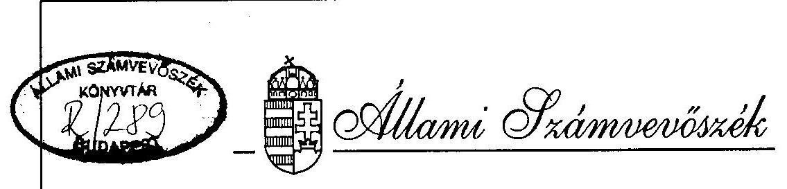

# JELENTÉS 

az Alkotmánybíróság fejezet pénzügyi-gazdasági ellenőrzéséről

---

A vizsgálat végrehajtásáért felelős:
az ÁSZ III. Költségvetési Ellenőrzési Igazgatósága
Bihary Zsigmond igazgató

Az ellenőrzést vezette:
Nagy Ákosné igazgatóhelyettes

Az összefoglaló jelentést készítette:
Bánkné Simon Judit számvevő

Az ellenőrzést végezték:
Bánkné Simon Judit
számvevő
Littomericzky Jánosné
számvevő tanácsos
Surányi Tamás
számvevő tanácsos

---

# JELENTÉS 

## az Alkotmánybíróság fejezet pénzügyi-gazdasági ellenőrzéséről

Az Alkotmánybíróságot, mint az alkotmányvédelem legfőbb szervét - a Magyar Köztársaság Alkotmánya 32/A. § (6) bekezdésének végrehajtására - az 1989. évi XXXII. törvény (továbbiakban: Abtv.) hozta létre a jogállam megteremtése, az alkotmányos rend védelme, a hatalmi ágak elválasztása és kölcsönös egyensúlyának megteremtése érdekében.

Főbb feladatait a törvényjavaslatok, jogszabályok alkotmányellenességének vizsgálata, az alkotmány rendelkezéseinek értelmezése, az alkotmányjogi panaszok elbírálása képezi.

Az Alkotmánybírósághoz benyújtott kérelmek száma az 1990-1995. I. félév közötti időszakban 8.655 db volt, az 1991. évi kiugróan sok beadványt követően évenként csökkenő tendenciájú. Az elbírált ügyek aránya évenként 27-30% között alakult (1. sz. melléklet).

Az Alkotmánybíróság a központi költségvetés szerkezeti rendjében önálló fejezet, intézményhálózattal nem rendelkezik. Működési költségvetése az 1992-1995. évek között 158,3 M Ft-ról 253,5 M Ft-ra változott, a szervezett létszám 111 főről 118 főre emelkedett.

Az 1989. évi XXXVIII. törvény 17. § (2) bekezdése alapján az Állami Számvevőszék az állami költségvetés szerkezeti rendjébe tartozó fejezetek gazdálkodását rendszeresen ellenőrzi. Az Alkotmánybíróság fejezet pénzügyi-gazdasági ellenőrzését az Állami Számvevőszék 1995. évi ellenőrzési terve irányozta elő és ennek megfelelően 1995. június hónapban kezdtük meg a helyszíni vizsgálatot.

Az ellenőrzés az 1992-1995. I. félév közötti időszak költségvetési gazdálkodására irányult. A vizsgálat célja annak értékelése volt, hogy az Alkotmánybíróság szakmai feladatai ellátásához a szükséges működési feltételekkel rendelkezett-e, szervezete igazodott-e a feladatokhoz és célszerűen kiépített-e, a fejezet költségvetési gazdálkodásában a törvényességi és célszerűségi szempontokat érvényesítették-e, továbbá hogyan és milyen eredménnyel hasznosították az Állami Számvevőszék korábbi ellenőrzéseinek a fejezet működésével kapcsolatos megállapításait.

---

# I. 

## Részletes megállapítások

## 1. A feladatok, a szervezeti rendszer összhangja és szabályozottsága

Az Alkotmánybíróság feladatköre a vizsgált időszakban nem változott, ugyanakkor módosult az alkotmánybírók létszámára vonatkozó törvényi előírás.

Az Abtv. szerint a 15 főből álló testületet fokozatosan kellett kiépíteni úgy, hogy az Alkotmánybíróság megalakulásakor 10 fő alkotmánybírót, majd az 1994. évi parlamenti választásokat követően további 5 fő alkotmánybírót kellett volna választani. Az Abtv. 1994. december 10-től hatályos módosítása az alkotmánybírók létszámát 11 főre csökkentette.

Az Országgyűlés az Ab. törvényben előírtak szerint nem tett eleget maradéktalanul alkotmánybíró választási kötelezettségének.

Az Országgyűlés egy alkotmánybíró 1993. május 1-jével történő felmentését követő 60 napon belül nem választott új alkotmánybírót, valamint a módosított Abtv. szerint 1994. december 31-ig nem választott még egy alkotmánybírót.

Az Alkotmánybíróság szervezeti struktúráját, mely a vizsgált időszakban csak a Kabinet Iroda megszüntetésével változott, összességében a célszerűség jellemezte.

Szakmai szervezeti struktúrája bírói törzskarákra épül, az ítélkező munka előkészítését és segítését a Főtitkárság látja el. A működési feltételek biztosításáról a Gazdasági Hivatal gondoskodik.

Hatályos szabályzatok teljeskörű, egységes, egymással is összhangban lévő rendszerét a közel 6 éves működés alatt nem alakították ki, azonban ez a szervezet működését alapvetően nem gátolta. Ugyanakkor a fejezeti, intézményi pénzügyi-gazdálkodási jogkörök szabályozásának hiányosságai, ellentmondásai a gyakorlatra kedvezőtlen hatással voltak.

Az Alkotmánybíróság nem rendelkezik - az Abtv-ben előírt - az Országgyűlés által elfogadott, a feladat- és hatásköröket szabályozó Ügyrenddel, mivel annak Országgyűlés elé terjesztése a jogharmonizáció hiánya, illetve az eljárásrendi szabályozatlanságból eredő nézetkülönbségek miatt nem történt meg. Hatályos Ügyrend hiányában az arra épülő szabályzatok is tervezet szintűek, átmeneti előírások.

Az Abtv. 29. § és 30. § (1) bek. f. pontjának megfelelően az Alkotmánybíróság elnöke az Ügyrend tervezetét 1991. augusztus 23-án az igazságügyi miniszterhez, a módosított Ügyrend tervezetét 1994. január 27-én az Országgyűlés elnökének megküldte. Az Abtv., valamint a törvény kezdeményezés jogát szabályozó jogszabályok

---

(Alkotmány, jogalkotási törvény, Házszabály) nem tért ki a hivatkozott törvényjavaslat kezdeményezésének módjára, ezért a javaslat továbbvitele elmaradt.

Az Alkotmánybíróság teljes ülése (1991. július 2.) által elfogadott Ügyrend tervezet törvényi elfogadás hiányában is a szervezet működésének meghatározó keret szabályát jelentette. Részletesen szabályozta az elnök, a teljes ülés, valamint az állandó bizottságok (Gazdasági-Személyügyi, Ügyrendi, Protokoll) feladat- és hatásköreit, az irányítási szintek és hatáskörök azonban nem illeszkedtek minden tekintetben a költségvetési gazdálkodási formához.

Az "Ügyrend" alapján a teljes ülés nemcsak szakmai, hanem - az Ab törvényben nem rögzített - gazdálkodási kérdésekben is állást foglaló, a gyakorlatban döntést is hozó testületként is működött.

A teljes ülés munkaerő-, bér- és eszközgazdálkodási kérdésekben több határozatot hozott, majd 1994. II. negyedévétől gazdálkodást érintő kérdésekkel lényegében nem foglalkozott.

A "módosított Ügyrend" (1994. január 24.) az állandó bizottságok működésének szabályozását az Ügyviteli Szabályzat keretébe rendelte, aminek az aktualizálása elmaradt, így az állandó bizottságok feladat- és hatásköre rendezetlenné vált.

Nem volt egyértelmű a Gazdasági és Személyügyi Bizottság gazdálkodásban betöltött szerepe.

A Bizottság döntés-előkészítő testület, amely csak a teljes ülés és az elnök által átruházott hatáskörben funkcionálhat döntéshozóként. Ugyanakkor több esetben gazdálkodási kérdésekben döntött és hozott határozatot. (Vonatkozó tárgyú felhatalmazásról szóló dokumentációt bemutatni nem tudtak.)

# A gazdasági főosztályvezető feladat- és hatásköre nem kellően szabályozott. 

Vezetői felelősségét belső szabályzat nem támasztotta alá, munkaköri leírással nem rendelkezik, hatáskörét a kötelezettségvállalás szabályai alapján gyakorolja. A gazdasági főosztályvezető a teljes ülés és a Gazdasági és Személyügyi Bizottság határozathozatalaiban nem vesz részt, a gazdálkodási kérdésekkel foglalkozó üléseken tanácskozási joga van.

Az "Ügyrend" kötelező érvénynyel rendelkezett a Szervezeti Működési Szabályzat, valamint a Munkaügyi Szabályzat megalkotásáról, amelyek azonban szintén csak tervezet szintűek. A pénzügyi, gazdálkodási folyamatok szabályozása nem teljeskörű, ugyanis a részterületekre vonatkozó szabályzatok lényeges kérdésekről több esetben nem intézkednek.

A kötelezettségvállalás, ellenjegyzés rendjét szabályozó belső utasításban részletesen rendezték a kötelezettségvállalási hatásköröket, ugyanakkor nem határozták meg egyértelműen a számlaigazolásra, az utalványozásra és az érvényesítésre jogosult személyek körét. Nem rendelkeztek fejezeti, illetve intézményi szinten az előirányzat felhasználási és átcsoportosítási jogkörökről, a kiadmányozási jogosultságokról.

---

A költségvetési gazdálkodás belső információs rendszerét nem megfelelően alakították ki, a gazdálkodás egyes részterületein (tervezés, létszám- és bérgazdálkodás) a rendelkezésre álló információk nem alapozták meg megfelelően a vezetői döntéseket.

Pl. a személyi bér alakulásáról, a helyettesítések helyzetéről, a tervezett létszámhoz viszonyított tényleges és a betöltetlen álláshelyek bérvonzatáról, új felvétel esetén a rendelkezésre álló forrás biztosításáról egyértelmű információt adó nyilvántartást nem vezettek.

A létszámmal összefüggő bér-előirányzat tervezéséhez szükséges adatok esetenként nem álltak rendelkezésre.

# 2. A költségvetési tervezési és finanszirozási rendszer 

Az Alkotmánybíróság fejezet működési költségvetése a vizsgált időszakban 60%-kal (158,3 M Ft-ról 253,5 M Ft-ra) emelkedett, amely növekedés döntően a köztisztviselői törvény által meghatározott bérbeállással, valamint az új székház üzemeltetésének többlet költségeivel függött össze. A kiadásokat alapvetően költségvetési támogatásból fedezték.

A vizsgált években összesen 805,5 M Ft állt rendelkezésre felújításra, amelyből 770 M Ft a Donáti utcai székház költözés előtti felújításával, valamint első eszközbeszerzésével volt kapcsolatos.

Kormányzati beruházásra 50 M Ft-ot terveztek, legjelentősebb tétele az esztergomi Sándor Palota rekonstrukcióját szolgálta.
2.1. A fejezet saját költségvetése meghatározásának Abtv-ben biztosított joga nem illeszkedett a költségvetés tervezési rendszerébe és így azt teljes mértékben és szabályozott rendben nem tudta érvényesíteni.

Az Abtv. 2. §-a szerint az Alkotmánybíróság megállapítja saját költségvetését, amelyet az állami költségvetés részeként jóváhagyás céljából előterjeszt az Országgyűlésnek.

Nem volt szabályozott a fejezetnek a saját költségvetés megállapítására vonatkozó jogának érvényesítésével összefüggésben a Pénzügyminisztérium szerepe, illetve az sem, hogy az Országgyűlés melyik bizottsága fogadja el és képviseli az Alkotmánybíróság előterjesztését.

Az Alkotmánybíróság 28/1995. (V.19.) sz. határozata értelmében a Kormány, illetve a Pénzügyminisztérium kizárólag koordináló szerepét érvényesítheti, a költségvetés előzetes elbírálása az Országgyűlés e hatáskörrel felruházott bizottságának feladata.

A vizsgálat az Alkotmánybíróság fejezet költségvetési előirányzatainak megítélésekor figyelembe vette a Pénzügyminisztérium által évente közölt - a központi költségvetési szervekre vonatkozó - tervezési irányelveket, kiemelt figyelmet fordított az éves kiadási növekmények

---

indokoltságára, mivel az államháztartási törvény nem rendelkezett a Kormány irányítása alá nem tartozó fejezetek költségvetési előirányzatainak tervezéséről.

A kiadási előirányzatokat nagyrészt a szakmai-működtetési-gazdálkodási feladatokkal összhangban prognosztizálták, ugyanakkor a tervszámok kialakítását jelentősen befolyásolta a korábban megszerzett kedvező pénzügyi pozíció megtartására irányuló törekvés. Mindezek mellett a fejezet költségvetési tervező munkája nem volt kifogástalan, ami egyes előirányzatok megalapozatlanságában, szabálytalan megállapításában nyilvánult meg.

A tervezés során nem mindig tartották be a tervezési utasításban előírtakat, illetve esetenként szabálytalanul jártak el.

1992-ben a béralap és a TB járulék előirányzatának meghatározásakor a központilag megállapított 10% helyett 12%-os növekménnyel számoltak, valamint 1993-ban a 3309/1992. Kormányhatározatban foglaltakat meghaladó mértékű növekményt terveztek.

1994-ben a felújítási - és nem a dologi - előirányzat részeként igényelték a költözéshez kapcsolódó egyéb kiadások, valamint az ÁFA kiadások forrását is.

Néhány kiemelt, illetve rész-előirányzat csak részben volt megalapozott.
Intézményi saját bevételt 1992-1993-ban indokolatlanul alacsony mértékben, 1994-1995-ben egyáltalán nem terveztek. A tervezés során ugyanis nem vették figyelembe az étterem bérbeadásának szerződés szerinti bérleti díjbevételét, valamint a gépkocsipark tervezett cseréjéből származó árbevételt.

Többnyire alultervezték a TB járulék és az ÁFA előirányzatát.
Egyes kiadási előirányzatok növekményét számszakilag nem támasztották alá megfelelően.

Pl. 1994-ben a köztisztviselői törvény szerinti 100%-os bérbeállási szint eléréséhez szükséges többlet béralapot, valamint 1995-ben a többlet működési költségeket.
2.2. Az előirányzat-módosítások száma kevés, nagyságrendje azonban jelentős - 1992-ben 16 M Ft, 1993-ban 212 M Ft, 1994-ben 447 M Ft - volt. A nem saját hatáskörben végrehajtott módosítások aránya 16-89-90%, amelyek döntő hányada 1993-1994-ben a Donáti utcai székház felújításával volt kapcsolatos (2. sz. melléklet).

A székház felújítására 1993-ban a pótköltségvetési törvény 180 M Ft-ot, 1994-ben a Kormány két alkalommal összesen 400 M Ft-ot biztosított.

A felújítás módosított előirányzata 1993-ban költségbecsléssel, 1994-ben megkötött fővállalkozói szerződéssel megalapozott volt, ugyanakkor a Kormánytól túlzott mértékben igényelt és juttatott egyéb pótforrások egy része indokolatlan volt.

---

Az alkotmánybírók 1992. évi bérfejlesztésére igényelt pótforrás meghatározásakor a 13. havi bért is figyelembe véve jártak el, így 966 E Ft béralap és 425 E Ft TB járulék jogosulatlan többletforráshoz jutott a fejezet.

Több esetben egyszeri jelleggel igényeltek és kaptak többletforrást, holott azt likviditási probléma nélkül kigazdálkodhatták volna (1992. évben a TB járulékra juttatott 700 E Ft, 1993-ban a központi bérpolitikai keretből juttatott 414 E Ft béralap, valamint 1994-ben a központi bérpolitikai keretből kapott 2.110 E Ft béralap és 912 E Ft TB járulék).

A saját hatáskörű előirányzat-módosításoknál több esetben jogszabályellenesen jártak el.

1994-ben - az Áht. 24. §-át megsértve - 1.060 E Ft-ot csoportosítottak át saját hatáskörben a TB járulék előirányzatból a dologi kiadások fedezetére.

1994-ben a Miniszterelnöki Hivataltól kutatási célfeladatra kapott 1.000 E Ft-ot működési célú átvett pénzeszköz helyett - előirányzat-módosítási kötelezettséggel nem járó - egyéb bevételként számolták el.

A Donáti utcai székház felújítására kért és kapott eredeti-, illetve pótelőirányzatok ÁFA vonzatát nem tervezték meg, ez következményeiben jogszabálysértéshez vezetett. 1993-ban az
 Áht. 93. §-át megsértve túllépték a dologi előirányzatot, 1994-ben a 137/1993. (X.12.) Korm.rend. 16. § (1) bekezdésével ellentétben az intézmény saját hatáskörben csökkentette felújítási előirányzatát.

A saját hatáskörű előirányzat-változtatásokat rendszerint utólagosan hajtották végre, amely gyakorlat ellentétes az Ált. 98. § (3) bekezdésével.

Az évközi előirányzat-módosítások a beszámolóban teljeskörűek, ugyanakkor a dokumentáltság nem megfelelő, mert a módosításokról naprakész analitikus nyilvántartást nem vezettek.

Az analitikus nyilvántartásra vonatkozó hiányosságot az 1993. évi zárszámadás tárgyában készült számvevőszéki részjelentés is kifogásolta, azonban a hiányosság megszüntetésére a vizsgálat befejezésének időpontjáig nem intézkedtek.
2.3. Az Alkotmánybíróság fejezet rendelkezésére álló források összességében kiegyensúlyozott gazdálkodást tettek lehetővé, amelyhez jelentős mértékben hozzájárult, hogy a meg nem választott alkotmánybírókkal és törzskarákkal kapcsolatos tartalék forrásokat rendszeresen felhasználták.

A fejezet, illetve az intézmény működésének és felújítási tevékenységének pénzellátása a jogszabályi előírással összhangban - a finanszírozási tervekben foglaltak szerint havi ütemezésben, illetve teljesítményarányosan történt.

Átmenetileg szabad pénzeszközeiket csak egy alkalommal, 1992-ben kötötték le, amikor - a jogszabályi előírásokat betartva - 30 napos lejáratú államilag garantált értékpapírt vásároltak 10 M Ft értékben.

---

2.4. Évente jelentős mennyiségű pénzmaradvány keletkezett, amely elsősorban a felújítási előirányzat alulteljesítésére volt vissza vezethető.

Az elszámolt maradvány 1991. év végén 10,1 M Ft, 1992-ben 1,7 M Ft, 1993-ban 25,3 M Ft, 1994-ben 4,7 M Ft volt.

A pénzmaradvány felülvizsgálati rendszerét sem fejezeti, sem intézményi hatáskörben nem alakították ki, az elszámolási szabályokat nem minden esetben tartották be.

Az 1991-1992. évi felújítási előirányzatból jelentős összegű (5.382 E Ft, 10.090 E Ft) maradvány képződött. A fejezet elmulasztotta az elmaradt feladatokra jutó pénzmaradvány kimutatását, amely gyakorlat ellentétes volt a költségvetési szervek költségvetésének végrehajtásáról szóló 4/1991. (II.13.) PM rendelet 23. §-ában foglaltakkal.

1993-1994-ben a pénzmaradvány elszámolásakor a helyiségek bérbeadásából származó bevételekből eredő befizetési kötelezettséget nem mutatták ki, így nem tettek eleget a költségvetési szervek gazdálkodását szabályozó 137/1993. (X.12.) Kormányrendelet 35. § 1/c. pontjában foglaltaknak. (A vizsgálat ideje alatt a jelzett hiányosságot pótolták azáltal, hogy a befizetésre kötelezett 83 E Ft-os összeget a bevételi számlára elkülönítették, amely év végén automatikusan a központi költségvetést illeti meg.)

A fejezet évenkénti pénzmaradványát a Pénzügyminisztérium jóváhagyta, elvonásra csak 1992-ben került sor.

A Pénzügyminisztérium az 1991. évi pénzmaradványból indoklás nélkül 1.012 E Ft-ot elvont, majd a hivatkozott összeget az 1993. évi pótköltségvetés keretében a többlet előirányzatok között elismerte és a pénzellátás keretében visszajuttatta a fejezet részére.

# 3. A költségvetés végrehajtása 

Az Alkotmánybíróság fejezet bevételeinek döntő hányada költségvetési támogatás, a saját bevételek aránya csökkenő tendenciájú és mindössze 5,5-1,7% volt (3. sz. melléklet).

A saját bevételek növelése érdekében szabálytalanul végzett vállalkozási tevékenység nem volt kellően eredményes.

1992-1993-ban alaptevékenységen kívül - a Váci úti épület adottságaira való tekintettel, tanfolyamok szervezésével és lebonyolításával az Ált. 88. § (3) bekezdését, valamint 89. § (2) bekezdését megsértve - szabálytalanul vállalkozási tevékenységet is végeztek, amely évi 1,2 - 1,3 M Ft-os bevétel mellett 1992. évben 1 E Ft nyereséget, 1993. évben 48 E Ft veszteséget hozott.

Az intézményi kiadások a módosított bevételi előirányzat keretei között teljesültek (4. sz. melléklet), ugyanakkor nem tartották be maradéktalanul a törvényi előírásokat.

---

A kiadások teljesítése az 1992. évi 187 M Ft-ról 1993-ban 373 M Ft-ra, 1994-ben 848 M Ft-ra növekedett, 1995. I. félévben 132 M Ft-ot ért el. 1992-ben a TB járulék módosított előirányzatát 121 E Ft-tal, 1993-ban a dologi kiadások módosított előirányzatát 27 M Ft-tal túllépték, ami ellentétes az Áht. 93.§ (1) bekezdésében foglaltakkal.

# 3.1. Létszám- és bérgazdálkodás 

A létszám- és bérgazdálkodás összhangja nem volt folyamatosan biztosított, ehhez hiányoztak a szükséges személyi és nyilvántartási feltételek is.

A ténylegesen foglalkoztatott létszám költségvetési létszámhoz viszonyított arányának alakulása kedvezőtlen. A tartósan üres álláshelyek számának növekedésével (1992. évben 6, 1995. I. félévben átlagosan 15) a létszámfeltöltöttség 95%-ról 87%-ra csökkent, amelynek alapvető oka, hogy az Országgyűlés nem választott meg határidőre 2 fő alkotmánybírót, így a törzskarák (alkotmánybírónként 6 fő) felállítása sem történt meg.

Az állományi létszám összetételét szervezeti változások kismértékben befolyásolták, mindössze a 3 fős Kabinet Iroda megszüntetése jelentett feladatátcsoportosítást, illetve egy álláshely megszüntetését. Az érdemi dolgozók száma nőtt, az ügykezelő és a fizikai besorolásúaké számottevően nem változott. A teljes munkaidőben foglalkoztatottak tényleges átlaglétszáma 8 fővel csökkent, a részmunkaidősök tényleges átlaglétszáma 9 fővel emelkedett (5. sz. melléklet).

A köztisztviselők besorolása a köztisztviselői törvénynél szigorúbb belső előírások, díjazása, az illetmény és a pótlékok megállapítása a köztisztviselői törvény betartásával történt.

A teljes ülés 4/1992. (VII.9.) határozata a köztisztviselői törvény követelményein túl a főtanácsadó, tanácsadó besorolás feltételeit a szakmai gyakorlati idő vonatkozásában szigorította.

A működési kiadások szerkezetében a legmagasabb részarányt a vizsgált időszak egészében a béralap és az ehhez kapcsolódó TB járulék képezte. A személyi juttatások kiadásai 1992-1994. között a módosított előirányzaton belül teljesültek, 81 M Ft-ról 108 M Ft-ra (33%-kal) emelkedtek.

A rendszeres személyi juttatások 35%-os emelkedését (57 M Ft-ról 77 M Ft-ra) az alkotmánybírók illetményének rendezése és a köztisztviselői törvény szerinti alapilletmények 100%-os szintre való emelése okozta.

Az alkotmánybírók illetménye 1992. II. félévtől igazodott a Kormány tagjainak illetményéhez. Az alapilletmények köztisztviselői törvény szerinti 100%-os beállási szintre való emelését az 1994-re engedélyezett béralap tette lehetővé (a bérbeállási mutató 1993-ban 87% volt). Az alapilletmények emelését 1994. márciusában (januárig visszamenőleg) hajtották végre.

---

A nem rendszeres személyi juttatások kiadásai 1991-1994. között 23 M Ft-ról 31 M Ft-ra növekedtek. Az étkezési-, a ruházati-, a közlekedési-, az oktatási-, a betegszabadsággal összefüggő hozzájárulások, költségtérítések teljesítését a jogszabályi előírások és ehhez igazodó belső szabályzatok betartásával végezték. A jogcímen kifizetett juttatások köre szűkült (megszűnt a szabadság megváltás, az üdülési- és a bíróknak járó %-os költséghozzájárulás), ugyanakkor az étkezési-, a ruházati- és a közlekedési hozzájárulás mértéke emelkedett.

Az 1992. évi teljesítéshez viszonyítva az étkezési hozzájárulás 1994. évben 117% (1,5 M Ft), a közlekedési költségtérítés 125% (1 M Ft), a betegszabadságra, szabadságra járó keresetkülönbség 170% (0,4 M Ft) volt. A jubileumi jutalom címen kifizetett járandóság több mint kilencszeresére növekedett (2,2 M Ft).

Az Alkotmánybíróság fejezetnél foglalkoztatottak jövedelmi helyzetét a tartósan üres álláshelyek bérmaradványának felhasználása tovább javította, az átlagjövedelem ugyanezen időszakban 35%-kal emelkedett (6. sz. melléklet).

A jutalom megállapításánál az 1992. évi differenciálással szemben általában a bérarányos jutalmazási elv érvényesült. Ugyanakkor helyettesítésért, többletfeladatért a saját dolgozó részére is jutalom címen történt az ezért megítélt illetmény kifizetése. A BM állományában lévő őrzésvédelmi feladatot végzőket is jutalomban részesítették, melyre a Ktv. előírásai nem adnak lehetőséget.

A 100%-os bérbeállási szintet 1994-ben elérték.
A 13. havi béren felül évente átlag két havi illetménynek megfelelő összegű jutalmat fizettek ki.

Az alkotmánybírók, illetve az elnök munkajogi helyzete nem rendezett. A jutalmazásukhoz kapcsolódó jogkört az Ügyrend tervezet alapján általában a teljes ülés gyakorolta.

Az Ügyrend tervezet szerint a teljes ülés állást foglal az alkotmánybírák személyét és munkakörülményeit érintő alapvető kérdésekben.
1995. június 30-án a tényleges létszám 13%-a (15 fő) részesült személyi illetményben, így 2 fővel lépték túl a teljes ülés által meghatározott keretszámot.

A személyi illetményben részesülők arányát korlátozó Kormányrendelet az Alkotmánybíróságra nem terjed ki, ezért meghatározó a teljes ülés határozata, amely szerint 13 fő kaphat személyi illetményt.

A személyi illetmény mértéke a köztisztviselői törvény szerinti besorolás felső határát 4 fő esetében több mint 50%-kal (54-73%-kal), 1 fő esetében 40%-kal, 10 főnél 10-20%-kal haladja meg.

A személyi illetményt többségében megalapozottan - a helyi sajátosságokat figyelembe véve - a feladattal összhangban juttatták.

---

Az Alkotmánybíróság fejezetnél 1993-ban 3 főt részesítettek végkielégítésben 1,9 M Ft összegben. A köztisztviselői törvény előírásait figyelembe véve 3 dolgozónál nem volt kellően megalapozott a felmentés, 1 dolgozónál a végkielégítés indoklása.

Az egyik alkotmánybíró kiválását követően a törzskarában foglalkoztatott titkár, főtanácsadó és tanácsadó munkaviszonyát az Alkotmánybíróság felmentéssel megszüntette.

Egy fő (titkár) végkielégítésének megítélése a Ktv. 17. § (3) bekezdésében foglaltak alapján elfogadható, mert hasonló munkakörben való áthelyezéséhez a dolgozó nem járult hozzá.

A főtanácsadói és tanácsadói munkakörbe tartozó 2 fő végkielégítésének indoklása, miszerint a szervezetnél jelenlegi munkakörének megfelelő betöltetlen munkakör nincs, csak 1 fő esetében igazolt, ugyanis a szervezet rendelkezett egy üres álláshellyel.

Az Abtv-ben megengedett tevékenységre adott megbízások módja esetileg kifogásolható.
Az alkotmánybírákodás összhasonlító vizsgálatára irányuló kutatás részleges finanszírozására a Miniszterelnöki Hivatal, mint megbízó és az Alkotmánybíróság, mint megbízott szerződést kötött 1994. március 31-én. Az Alkotmánybíróság szerződésben megjelölt képviselője úgy kötötte meg a megbízási szerződéseket, hogy a képviselő kötelezettségvállalási jogosultságáról nem rendelkeztek. A megbízási szerződéseket utólag, a megbízás időtartamán túl kötötték meg.

# 3.2. Eszközgazdálkodás 

Az Alkotmánybíróság székhelyének meghatározásában és kijelölésében a célszerűség elve csak korlátozottan érvényesült, ami következményeiben a törvényi előírások megsértéséhez és a költségvetési pénzforrások indokolatlan, felesleges igénybevételéhez vezetett.

Az Alkotmánybíróság esztergomi székhelyére vonatkozó törvényi előírás nem érvényesült, ugyanis az Alkotmánybíróság megalakulása óta Budapesten működik. Első székhelye a Budapest XIII. Váci u. 71. szám alatti ingatlan volt, jelenlegi székhelye a Budapest I. Donáti u. 35-45. sz. alatti ingatlan, amelynek kezelői joga rendezetlen, a szervezet csak használója az épületnek.

Az Alkotmánybíróság megalakulásakor az 1047/1990. (III. 21.) MT határozat alapján ideiglenes céllal juttatott székház belső elrendezése miatt nem volt alkalmas a fejezet végleges elhelyezésére.

Új székházra vonatkozóan Kormány intézkedés nem történt, viszont az Állami Vagyonügynökség (ÁVÜ) 1993. augusztus 12-én haszonkölcsönszerződés keretében ingyenes használatra átengedte az Alkotmánybíróságnak a kezelésében lévő Budapest, I. Donáti u. 35-45. sz. alatti ingatlant, amely 1994. augusztusától az Alkotmánybíróság székhelye.

---

A 153/1993. (X.28.) Kormányrendelet az ÁVÚ és a Pénzügyminisztérium (PM) közötti ingatlancseréről úgy rendelkezett, hogy a hivatkozott ingatlant az ÁVÚ a PM-nek adja át. Az ingatlan kezelői jogának átadása a vizsgálat befejezéséig nem történt meg, az ingatlan jelenleg az ÁPV Rt. portfóliójában szerepel.

Az Alkotmánybíróságról szóló törvénynek megfelelés érdekében 1990. áprilisától egy 53 m² es irodát tartanak fenn Esztergomban, amelynek célja, hogy az ide érkező beadványokat előkészítés után Budapestre továbbítsa.

Az iroda funkciója a csökkenő számú kérelmek következtében megszűnőben van.
Az esztergomi jelenlét érdekében Esztergom Város Önkormányzata 1992. október 7-én ellenérték nélkül átadta az Alkotmánybíróságnak az Esztergom, Jókai u. 7. sz. alatti, volt Sándor Palota tulajdonjogát. Az épület használatba vétele a vizsgálat időpontjáig nem történt meg, mivel az épület a helyreállítás és restaurálás után sem alkalmas székháznak (használható lenne ünnepélyes ülések, rendezvények tartására, alkotóháznak) és a fejezet nem rendelkezik a felújítás fedezetével.

A Donáti utcai székház biztosítja az Alkotmánybíróság szervezete részére a színvonalas elhelyezést, azonban jelenleg nem kellően kihasznált.

A székház kihasználtsága - a használatba vett irodák számát a
 rendelkezésre álló irodahelyiségek számához viszonyítva - 74 %, amelynek oka, hogy az épületet a jelenlegi 9 fő alkotmánybírótól eltérően az 1994-ben hatályos jogszabályi előírásnak megfelelő 15 fő alkotmánybíró és törzskarára számára alakították át.

A Donáti utcai székház felújítására 1993-ban évközben igényelt előirányzat költségbecsléssel, 1994-ben megkötött fővállalkozói szerződéssel megalapozott volt, ugyanakkor helytelenül - a felújítási előirányzat részeként igényelték a költözéshez kapcsolódó egyéb kiadások (pl. költözés költségei, eszközbeszerzés), valamint az ÁFA kiadások forrását is.

Az intézmény a versenytárgyalási kiírási kötelezettségekre vonatkozó előírásokat megtartotta. A fővállalkozói szerződés megkötésekor azonban megsértették az Áht. 98. § (3) bekezdésében előírtakat, ugyanis a szerződés megkötésének időpontjában a vállalt kötelezettségek közül nem rendelkeztek a felújítás 1994. évi 439 M Ft összegű fedezetével.

Az 1993. december 7-én megkötött fővállalkozói szerződésben a teljesítés ellenértékét átalányáron, összesen 569.000 E Ft (455.200 E Ft + 113.800 E Ft ÁFA) összegben határozták meg. A pénzügyi ütemezés szerint 1993-ban 130.000 E Ft, 1994-ben 439.000 E Ft volt fedezetkes.

Az intézmény indokolatlanul járt el, amikor a fővállalkozói szerződésben 130 M Ft előleg átutalását vállalta (a teljes szerződéses összeg 23 %-a) a szerződés aláírását követő öt napon belül, amely előlegnek az elszámolási kötelezettsége 1993. december 31. volt.

Az intézmény a 130 M Ft előleget december 14-én átutalta a Középületépítő Rt. részére, aki december 20-i teljesítési időponttal - az előleggel való elszámolásként benyújtotta a bontási munkákat is tartalmazó részszámlát. A számla tartalmát jelentő műszaki teljesítést a MÜBER-INVECON Kft. igazolta.

---

A pénzügyi teljesítés a műszaki ellenőr által minden esetben igazolt kivitelezői teljesítéshez igazodott. Célszerűtlen megoldás, hogy a műszaki ellenőri teendőket az a bonyolító látta el, aki a teljesítés igazolásában volt érdekelt. (A megbizási szerződés értelmében ugyanis a MÜBER-INVECON Kft. a bekerülési érték 2 %-át kapta bonyolítói díjként.)

A Donáti utcai székház felújításának könyvszerinti bekerülési értéke 1993-ban 132.413 E Ft és 1994-ben 468.755 E Ft, összesen 601.168 E Ft. Az intézmény a ténylegesnél magasabb összegben mutatta ki a felújítási kiadásokat, mert felújítási kiadásként számolt el eszközbeszerzéseket és költözési költségtérítést.

Az intézmény 1993-ban a PROTECTON Kft-től rendelte meg az épület biztonságtechnikai berendezéseit, valamint azok felszerelését. Az 1993-ban leszállított és felújításként elszámolt videotechnikai és biztonságtechnikai eszközök értéke 9.008 E Ft, az 1994-ben végzett szerelés felújításként elszámolt értéke 2.281 E Ft.

Az intézmény 1994-ben 24 db telefon fővonalat vásárolt a MATÁV-tól, amelyek 2.160 E Ft értékét szintén felújításként számolták el.

Az Alfa Comp Kft-nek 1993-ban fizetett 7 M Ft összegű költözési költségtérítést is felújítási kiadásként mutatták ki.

Az intézmény nem megfelelő gondossággal járt el, amikor az Alfa Comp Kft-nek átutalt 7 M Ft összeget költözési költségtérítés előlege címén.

Az ÁVÜ, mint bérbeadó, az Alkotmánybíróság, mint használó és az Alfa Comp Kft., mint bérlő között 1993. október 26-án létrejött szerződés 5.1. és 5.2. pontja értelmében az Alkotmánybíróság vállalta, hogy a Kft-nek a Donáti utcai székházból való elköltözéshez 7 M Ft előleget átutal azzal, hogy a Kft. köteles a költségekről 1994. január 26-ig elszámolni (7. sz. melléklet).

Az intézmény indokolatlanul vállalta ezt a kötelezettséget, mert az ÁVÜ-vel 1993. augusztus 12-én kötött haszonkölcsön szerződés 3. pontja szerint az ÁVÜ köteles volt 3. személynek a szerződés megkötésekor fennálló jogviszonyát 1993. október 31-ig megszüntetni (8. sz. melléklet).

A fejezet 35 M Ft-tal (1993-ban 27 M Ft-tal, 1994-ben 8 M Ft-tal) több előirányzatot igényelt és kapott a Donáti utcai székház felújítására, mint amennyit ténylegesen az épület felújítási kiadásaira fordított (9. sz. melléklet). A 35 M Ft-ot - döntő mértékben - eszközbeszerzésekre (biztonságtechnika, bútorok) használták fel.

A kormányzati beruházások előirányzata és teljesítése 1992-ben 10 M Ft, 1993-ban 5 M Ft, 1994-ben 20 M Ft volt, az 1995. évi előirányzat 15 M Ft, amelyből felhasználást a II. félévre terveztek.

A kormányzati beruházási források igénye részben túlzó módon megalapozatlan volt, nem igazodott a finanszírozási szükséglethez. Az ÁFI szabálytalan eljárása is hozzájárult ahhoz, hogy a beruházási alapokmánytól eltérő céllal került felhasználásra 1992-ben 3.123 E Ft összegű, 1994-ben 9.072 E Ft összegű előirányzat.

---

1992-ben a 21/1992/Pü. engedélyokirat szerint 6.114 E Ft kormányzati beruházási forrás felhasználását irányozta elő a fejezet személygépkocsi vásárlására. A személygépkocsik vételárából előleg címén már 1991-ben kifizetésre került 3.123 E Ft, a tárgyévi fizetési kötelezettség 2.991 E Ft volt. Az ÁFI a személygépkocsik teljes vételárát, 6.114 E Ft-ot utalta át 1992. III. 26-án az intézmény részére, aki az előlegnek megfelelő összegű 3.123 E Ft-ot a működési kiadások fedezeteként használta fel.

Az 1994. július 27-i engedélyokirat szerint 20 M Ft-ot kívántak kormányzati beruházási forrásból a biztonsági rendszer és a digitális telefonközpont kiépítésére, valamint telefonfővonalak vásárlására fordítani. A videotechnikai és biztonságtechnikai eszközök szállítása és a számla 9.072 E Ft-os ellenértékének megfizetése (valamint az összeg felújítási kiadásként történő elszámolása) már 1993-ban megtörtént, ugyanakkor az ÁFI a bemutatott számla alapján a 9.072 E Ft-ot az intézménynek 1994-ben átutalta. Így a hivatkozott összeg eszközbeszerzések fedezetéül az intézmény rendelkezésére állt.

A vizsgált időszakban a számítógépes hálózat fejlesztésével célszerű minőségi változtatást hajtottak végre. A fejlesztések során az Informatikai Tárcaközi Bizottság ajánlásait figyelembe véve jártak el, a szállítókat minden esetben versenyeztették.

A fejlesztésnek alapvetően két forrása volt: a kormányzati beruházások előirányzatának ezirányú felhasználása, valamint a Központi Kormányzati Informatikai Infrastruktúra Fejlesztési Célprogram előirányzatából történő felhasználás (10. sz. melléklet).

Az Alkotmánybíróság fejezet 1994-ben a Központi Kormányzati Informatikai Infrastruktúra Fejlesztési Célprogram előirányzatából átengedett 5 M Ft-ot - a MEH Informatikai Koordinációs Iroda jóváhagyásával - céltól eltérően használta fel.

A Központi Kormányzati Informatikai Infrastruktúra Fejlesztési Célprogram 1994. évi előirányzatából 5 M Ft-ot az új székház számítógéphálózatának üzembeállítása céljára engedélyeztek. Az intézmény digitális, számítástechnikai átvitelre is alkalmas telefonhálózat tervezését és kivitelezését rendelte meg. A beruházás 9.315 E Ft-ba került, amely összeget kormányzati beruházási keretből egyenlítettek ki. Ugyanakkor a számítástechnikai átvitelre is alkalmas telefonhálózat mellett olyan digitális telefonkészülékekre és berendezésekre volt igény, amelyek a kialakított lehetőségek kihasználására alkalmasak. Az intézmény kérte és megkapta az Információs Koordinációs Iroda jóváhagyását, hogy az 5 M Ft összeget az új telefonalközpont céljait szolgáló digitális telefonkészülékek és berendezések beszerzésére fordítsa.

A vizsgált időszakban a szervezet használatában lévő személygépjárművek száma 11-ről 14-re emelkedett, a gépjárműpark teljes mértékben kicserélődött (11. sz. melléklet).

A személygépkocsik beszerzésekor célszerűen - a beruházási, üzemelési, biztonsági és felszereltségi adatokra figyelemmel - jártak el.

A vizsgált időszakban 14 db gépkocsit értékesített az intézmény. Az értékesítések 21 %-a (3 db) volt indokolatlan, mert ezek keveset futott, 1-3 éves gépkocsik voltak és a javítási költség sem volt jelentős.

---

Az eladási szándékról minden esetben körlevélben értesítették a dolgozókat, egy esetben napilapban is meghirdették a gépkocsi eladását. Az értékesítési ár alapját a MERKUR Vállalat által készített értékbecslés képezte, az eladási ár meghaladta a könyvszerinti nettó értéket. Az értékesítések 64 %-a magánszemélyek részére történt, akik a vételárat egy összegben kiegyenlítették.

# 3.3. Egyéb működési kiadások 

A reprezentációs kiadások összege a vizsgált időszakban alig változott, évenként 2 M Ft körüli volt (1992: 2.131 E Ft, 1993: 1.949 E Ft, 1994: 2.114 E Ft, 1995. I. félév: 715 E Ft). A vezetők személyi reprezentációs keretének elszámolása szabályozott. A próbaszerűen ellenőrzött kiadások dokumentálása, előzetes engedélyezése, elszámolása többségében megfelelő volt.

A bel- és külföldi kiküldetések összege növekvő volt. A próbaszerűen ellenőrzött költségelszámolások a jogszabályi előírásnak, valamint az elnöki utasításnak megfeleltek.

A belföldi kiküldetéssel kapcsolatos kiadások (1992-ben 15 E Ft, 1993-ban 68 E Ft, 1994-ben 72 E Ft, 1995. I. félévben 9 E Ft) jellemzően napidíj és közlekedési díj címén merültek fel.

A külföldi kiküldetéssel kapcsolatos kiadás 1992-ben 2.759 E Ft, 1993-ban 5.367 E Ft, 1994-ben 10.088 E Ft, 1995. I. félévben 1.618 E Ft volt. A dinamikus emelkedés oka, hogy az alkotmánybírósági elnökök 1996. évi nemzetközi konferenciájának előkészítésével kapcsolatban 1993-ban 0,9 M Ft, 1994-ben 4,1 M Ft kiadás - elsősorban szállásköltség - merült fel.

A saját személygépkocsik hivatalos célú használata és az intézmény tulajdonában lévő személygépkocsik magáncélú használata szabályozott. Saját személygépkocsi hivatalos célú igénybevétele a vizsgált időszakban nem volt jellemző, az intézmény tulajdonában lévő személygépkocsik magáncélú használatát csak eseti igénybevétellel engedélyezték.

Az állami vezetők munkaviszonyával összefüggő ún. járandósági személygépkocsik igénybevételére és üzemeltetésére vonatkozó előírások alkalmazását szabályozták. Az alkotmánybírókon kívül az intézmény két vezetője jogosult személyi használatú gépkocsi igénybevételére.

A teljes ülés 1992. X. 20-i határozata alapján a főtitkárt, 1994. X. 3-i határozata alapján a gazdasági főosztályvezetőt is megilleti a személyi gépkocsi használat.

A járandósági személygépkocsik igénybevétele a vonatkozó MT határozatnak és belső szabályozásnak megfelelően dokumentált volt, üzemanyagvásárlásra a norma szerinti fogyasztás alapján térítettek.

---

# 4. A számviteli és bizonylatí rend 

Az intézmény számviteli tevékenysége megfelelően szabályozott. A számvitelről szóló 1991. évi XVIII. törvény, valamint a költségvetési szervek sajátos szabályait meghatározó 179/1991. (XII.30.) Kormányrendelet alapján összeállított Számlarend tartalmazza a számviteli politika főbb elveit.

A kiadásokat elsődlegesen az 5. számlaosztályban könyvelik, a 7. számlaosztály az összes pénzforgalmi kiadást bírósági törzskaronkénti bontásban tartalmazza. A tárgyi eszközök elszámolása értékhatártól független (vagyis az intézmény nem alkalmazza azt a lehetőséget, hogy a kisértékű eszközök költsége egy összegben folyókiadásként elszámolható), a 0-ás számlaosztályban az előirányzatokat törzskaronkénti bontásban tartják nyilván.

A mellékletét képező számlatükröt évenként aktualizálták. A számlarend tartalmazza az analitikus nyilvántartások vezetésének szabályait.

A gyakorlat azonban több esetben a számviteli törvény előírásait sértő és a vagyonvédelmet veszélyeztető módon eltért a szabályozástól, így az intézményi vagyon nyilvántartásának hiányosságai és hibái miatt a beszámolók valódiságának elve az egyes években nem érvényesült.

## Az intézmény mérlegeiben helytelenül mutatta ki az ingatlanok értékét.

A Sándor Palota nem szerepel a számviteli nyilvántartásokban, holott az Alkotmánybíróság 1992-ben megkapta az ingatlan tulajdonjogát, amelynek a Földhivatal által történő bejegyzése is megtörtént.

A Donáti utcai ingatlant bizonylat nélkül 700 M Ft értékben vették nyilvántartásba 1994. december 31-én, annak ellenére, hogy az ingatlan kezelői jogát nem kapták meg. Az Állami Privatizációs és Vagyonkezelő Rt. nyilatkozata szerint nevezett ingatlan 798 M Ft értéken szerepel az Rt. vagyonnyilvántartási rendszerében (12. sz. mellékletek).

1993-1994-ben felújítási kiadásként számoltak el eszközbeszerzést és költözési költségtérítést, így a Donáti utcai ingatlan értékét szabálytalanul 20,4 M Ft összeggel növelték.

A tárgyi eszközök analitikus nyilvántartása a vizsgált időszakban nem volt megfelelő.
A nagyértékű tárgyi eszközökről egyedi nyilvántartást nem vezettek. A készletnyilvántartás nem tartalmazta az elszámolások és a tulajdonvédelem szempontjából fontos valamennyi adatot. (A hiányosság megszüntetésére a vizsgálat során intézkedtek.)

A számítógépet és tartozékait (nyomtató, képernyő, billentyűzet, stb.) a számvitel egy összegben tartotta nyilván, így sem az analitikus könyvelésben, sem a főkönyvi
 könyvelésben nem volt információ arról, hogy hány darab nyomtatóval, képernyővel, billentyűzettel, stb. rendelkeznek és ezeknek az eszközöknek mennyi az értéke. Az 1993-ban selejtezett eszközök készletváltozását az intézmény nem mutatta ki.

---

Az 1993-ban végzett selejtezésről jegyzőkönyvet a vizsgálat során bemutatni nem tudtak.

Az 1994-ben végrehajtott selejtezés és leltározás nem az előírásoknak megfelelően történt.

Az 1994. december 9-i selejtezési jegyzőkönyv a költözéskor eltűnt - vagyis a selejtezéskor már meg nem lévő - tárgyakról is intézkedett. A használhatatlanságot, a javítás gazdaságtalanságát nem minden esetben igazolták.

A leltáríveken az eszközök leltári száma vagy gyári száma nem szerepel, így az eszközök azonosításának pontossága kérdéses. A leltárhiány a selejtezés részeként került könyvelésre.

Az előlegek könyvviteli elszámolása nem volt szabályszerű.
A beruházási előlegek nyilvántartására szolgáló 16. sz. főkönyvi számlát nem minden alkalommal, csak esetlegesen használták.

Az 1993. évi mérlegben tévesen mutattak ki 130 M Ft beruházási előleget, mert a szállító az előleggel 1993. december 20-i teljesítési időponttal elszámolt.

# 5. A költségvetési gazdálkodás belső ellenőrzése 

Az intézményi belső ellenőrzés hiányosan funkcionált, ezért nem segítette a vezetést.
A belső ellenőrzés három ágának (függetlenített, vezetői, munkafolyamatba épített ellenőrzés) teljeskörű kialakítása, összhangolt működtetése hiányzott.

A függetlenített költségvetési belső ellenőrzés feltételeit nem biztosították megfelelően.
Az Alkotmánybíróság intézményének nem volt költségvetési belső ellenőrzést végző szervezete a vizsgált időszakban.
1992. évre készítettek ellenőrzési programot, amelynek keretében külső szakértőket bíztak meg vizsgálatok végzésével (mérlegfelülvizsgálat, adózás- és TB kötelezettség ellenőrzése).

1993-1995. I. félévben külső szakértők megbízásával sem folytattak belső ellenőrzési tevékenységet.

A vezetői ellenőrzést elsősorban az aláírási-, utalványozási-, ellenjegyzési jog gyakorlásával látták el. A szakmai és gazdasági kihatással járó intézkedések, az utalványok és engedélyek indokoltságának, formai és tartalmi szabályszerűségének ellenőrzését végrehajtották.

Nem érvényesítették maradéktalanul a vezetői és a munkafolyamatba épített ellenőrzést a számvitel (amelynek eredményeként több szabálytalan - mérlegvalódiságot sértő - elszámolásra került sor), valamint a létszám- és bérgazdálkodás egyes területein.

---

# II. 

## Következtetések, javaslatok

Az Alkotmánybíróság - mint az alkotmányvédelem legfőbb szerve - függetlenségét törvényi előírások, Országgyűlés hatáskörébe utalt döntések kívánják garantálni. Ezek érvényesítése nem volt maradéktalan, s így a parlamenti döntések elmulasztása részben forrásává vált az Alkotmánybíróság feladata, szervezeti feltétele közötti összhang tartós hiányának, a tevékenységszabályozás hiányosságainak.

A bírói törzskarákra és a kapcsolódó funkcionális szervezetekre célszerűen tagolt szervezet működését - az Úgyrend törvényi elfogadásának hiányában - nem fogta át hatályos szabályzatok teljeskörű, egységes rendszere. Ez a szervezet működését lényegében nem akadályozta, a költségvetési gazdálkodási jogkörök, hatáskörök gyakorlásában azonban esetenként problémát okozott.

Az Alkotmánybíróság fejezet költségvetése meghatározásának Abtv-ben biztosított joga nem illeszkedett harmonikusan és egyértelműen a költségvetés tervezési rendszerébe és így azt teljes mértékben és szabályozott rendben nem tudta érvényesíteni.

A költségvetési tervezést a biztonságra törekvés, az óvatosság jellemezte, a forrásigények esetenként indokolatlanul túlzott mértékűek voltak (béralap kiegészítésre igényelt egyes előirányzatok). A fejezet rendelkezésére álló források összességében kiegyensúlyozott gazdálkodást tettek lehetővé.

Az Alkotmánybíróság sajátos helyzete ugyanakkor nagyobb követelményeket támaszt a költségvetési tervezéssel, gazdálkodással szemben. Ennek az igénynek maradéktalanul megfelelni nem tudtak. A költségvetési tervezésben munkahibák, az előirányzat-módosításban, a számviteli munkában rendszerbeli hiányosságok voltak tapasztalhatók, melyek esetenként szabálytalanságokhoz, törvényi előírások (Áht. - szabálytalan előirányzat-átcsoportosítás, kiemelt előirányzat túllépése; számviteli törvény - beszámoló valódiság érvényesülésének hiánya) megsértéséhez vezettek.

Az erőforrásokkal való gazdálkodás többnyire eredményes és célszerű volt. Előfordult ugyanakkor indokolatlan, az elvárható gondosságot nélkülöző ráfordítás is (pl. költözési költségtérítés).

A létszám- és bérgazdálkodás összhangja nem volt folyamatosan biztosított. A ténylegesen foglalkoztatott létszám költségvetési létszámhoz viszonyított arányának alakulása kedvezőtlen volt, viszont a betöltetlen álláshelyek magas száma a javadalmazásra kedvezően hatott.

A költségvetési gazdálkodásban, a pénzügyi, számviteli folyamatokban mutatkozó hiányosságokhoz, szabálytalanságokhoz hozzájárult az is, hogy a belső ellenőrzés nem volt az irányítás hatékony eszköze, nem nyújtott megfelelő információkat a döntések megalapozásához, illetve azok végrehajtásáról a vezetés részére.

---

Az ellenőrzés megállapításai alapján
az Országgyűlés figyelmébe ajánljuk:
tekintse át az Alkotmánybíróságról szóló törvényt, illetve az abból adódó feladatait.

# a Kormány részére javasoljuk: 

vizsgálja meg az ingatlancseréről szóló 153/1993. (X.28.) Korm. rendelet végrehajtását, és ennek során intézkedjen, hogy a Budapest, I. Donáti u. 35-45. sz. alatti ingatlan kezelői jogát az Alkotmánybíróság kapja meg;
az Alkotmánybíróság részére javasoljuk:

- vizsgálja felül, tegye teljeskörűvé, illetve aktualizálja belső szabályzatait;
- érvényesítse - a feltárt tényállás alapján - az indokolatlanul átutalt költözési költségtérítéssel, valamint a mérlegvalódiságot sértő elszámolásokkal kapcsolatosan a gazdasági főosztályvezető ellen a személyi felelősséget;
- alakítsa ki és működtesse a költségvetési gazdálkodás belső ellenőrzésének rendszerét.

Budapest, 1995. december 13.

Melléklet: 15 lap
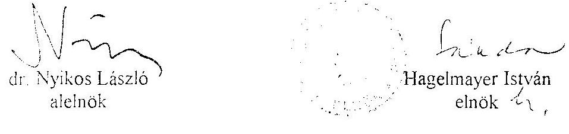

---

A beérkezett kérelmek, a bírói eljárásra került, valamint az elbírált, illetve a folyamatban lévő ügyek alakulása 1990-1995. I. félév között

| Megnevezés | 1990. | Vált. %-a | 1991. | Vált. %-a | 1992. | Vált. %-a | 1993. | Vált. %-a | 1994. | Vált. %-a | 1995.1.fév | Vált. %-a időarányos |
| :--: | :--: | :--: | :--: | :--: | :--: | :--: | :--: | :--: | :--: | :--: | :--: | :--: |
| Beérkezett kérelmek | 1625 | - | 2302 | 42 | 1700 | -26 | 1323 | -22 | 1098 | -17 | 607 | -45 |
| Ebből |  |  |  |  |  |  |  |  |  |  |  |  |
| Bírói eljárásra került ügyek | 735 | - | 792 | 8 | 460 | -42 | 369 | -20 | 451 | 22 | 204 | -55 |
| Elbírált ügyek* | 487 | - | 705 | 45 | 342 | -52 | 405 | 18 | 344 | -15 | 216 | -37 |
| Folyamatban lévő ügyek* | 248 | - | 335 | 35 | 453 | 36 | 417 | -8 | 524 | 26 | 543 | 4 |

* 1990. január 1-jétől számított összesített adatok
** időarányosan megállapított %-os mérték

---

# 3. sz. Tanúsítvány

## KIADÁSI ÉS BEVÉTELI ELŐIRÁNYZATOK MÓDOSÍTÁSA HATÁSKÖRÖNKÉNT BONTÁSBAN

Adatok E Ft-ban

|  Megnevezés | 1992. év | 1993. év | 1994. év | 1995. I. félév  |
| --- | --- | --- | --- | --- |
|  Eredeti kiadási előirányzat | 174.300 | 184.700 | 405.000 | 265.000  |
|  OGY szintű mód. |  | 186.296 |  |   |
|  Kormány | 4.000 | 2.100 | 403.022 |   |
|  Saját
hatáskörű
mód. | pénzmaradványból többletbevételből
Egyéb forrásból | $\begin{gathered} 10.120 \\ 10.157 \end{gathered}$ | $\begin{gathered} 1.722 \\ 21.771 \end{gathered}$ | $\begin{gathered} 25.345 \\ 18.780 \end{gathered}$  |
|  Módosított kiad:előirányzat: | 190.577 | 396.589 | 852.147 | 265.000  |
|  Eredeti bevételi előirányzat: | 174.300 | 184.700 | 405.000 | 265.000  |
|  Saját bevétel:
Átvett pénzeszköz:
Költségvetési támogatás:
Pénzforgalom nélküli bev-ek | $\begin{gathered} 10.157 \\ 4.000 \\ 10.120 \end{gathered}$ | $\begin{gathered} 21.771 \\ 188.396 \\ 1.722 \end{gathered}$ | $\begin{gathered} 18.780 \\ 403.022 \\ 25.345 \end{gathered}$ |   |
|  Módosítások összesen: | 16.277 | 211.889 | 447.147 | -  |
|  Módosított bevételi előirányzat | 190.577 | 396.589 | 852.147 | 265.000  |

---

# BEVÉTELEK ALAKULÁSA 

Adatok E Ft-ban

| Megnevezés | 1992. év |  |  | 1993. év |  |  | 1994. év |  |  | 1995. I. félév |  |  |
| :--: | :--: | :--: | :--: | :--: | :--: | :--: | :--: | :--: | :--: | :--: | :--: | :--: |
|  | Eredeti előirányzat | Mód.  ányzat | Telj. | Eredeti előirányzat | Mód  ányzat | Telj. | Eredeti előirányzat | Mód  ányzat | Telj. | Eredeti előirányzat | Mód.  ányzat | Telj. |
| Intézményi működési bevételek: |  |  |  |  |  |  |  |  |  |  |  |  |
| Felhalmozási és tőke jellegű bevételek |  |  |  |  |  |  |  |  |  |  |  |  |
| Egyéb bev.   Felügyeleti szervtől kapott támogatások | 100 | 808 | 808 | 100 | 16956 | 16956 |  | 5475 | 5475 |  |  | 1.413 |
|  |  | 9449 | 9449 |  | 4915 | 4915 |  | 13305 | 13305 |  |  | 876 |
|  | 174200 | 170200 | 170200 | 184600 | 372996 | 372996 | 405000 | 908022 | 908022 | 265000 | 265000 | 132.000 |
| Átvett pénzeszközök   Pénzforgalom nélküli bevételek (pénzmaradvány igénybevétele) |  |  |  |  |  |  |  |  |  |  |  |  |
|  |  | 10120 | 10120 |  | 1722 | 1722 |  | 25245 | 25345 |  |  |  |
| Bevételek összesen: | 174300 | 190577 | 190577 | 184700 | 396589 | 396589 | 405000 | 952147 | 952147 | 265.000 | 265000 | 134.289 |
| Egyéb átfutó   egyenlítő bevételek: |  |  | - |  |  |  |  |  |  |  |  |  |
| 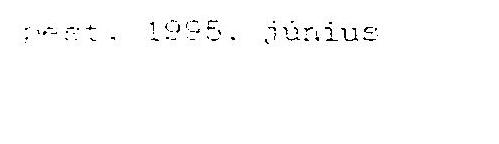 |  |  |  |  |  |  |  |  |  |  |  |  |

---

# 2. sz. Tanúsítvány 

## KIADÁSOK ALAKULÁSA KIEMELT ELŐIRÁNYZATONKÉNT

Adatok E Ft-ban
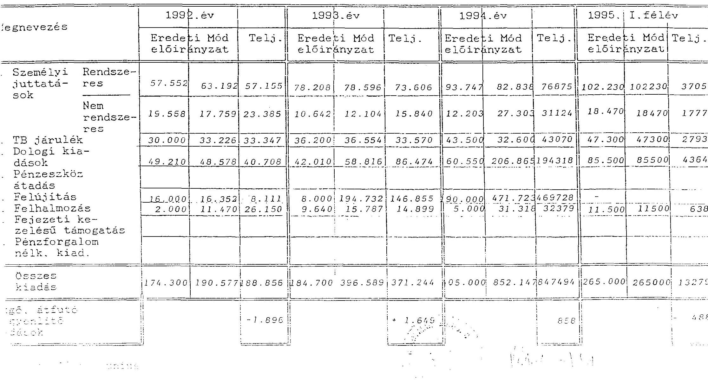

---

Alkotmánybíróság fejezet(cím)

1. sz.tanúsítvány

## ÁLLOMÁNYI LÉTSZÁM ALAKULÁSA 1992–1994. ÉVEKBEN

Adatok főben

|  Megnevezés | 1992. év |  | 1993. év |  | 1994. év |  | 1995. I. félév |   |
| --- | --- | --- | --- | --- | --- | --- | --- | --- |
|   | költ.vet. létszám | tényl. létszám | költ.vet. létszám | tényl. létszám | költ.vet. létszám | tényl. létszám | költ.vet. létszám | tényl. létszám  |
|  Alkotmánybírók | 10 | 10 | 10 | 9 | 10 | 9 | 11 | 9  |
|  Hozzászólás/ktv.31.§-,68.§/1 |  |  |  |  |  |  |  |   |
|  Vezetők |

 11 | 11 | 11 | 10 | 11 | 10 | 11 | 10  |
|  Hozzájárulás /ktv.32.§/1 | 21 | 19 | 21 | 17 | 21 | 15 | 23 | 14  |
|  Főbízással, kiválasztások tóló | 41 | 37 | 41 | 36 | 41 | 40 | 44 | 43  |
|  Tárna gyűjtőző, tároló | 16 | 15 | 16 | 15 | 16 | 16 | 18 | 17  |
|  Tárna, csomósoroló | 25 | 22 | 25 | 23 | 25 | 24 | 26 | 26  |
|  Tárna, csomósoroló | 5 | 5 | 5 | 5 | 5 | 5 | 5 | 5  |
|  Tárna, csomósoroló, tájékoztató | 12 | 12 | 12 | 12 | 12 | 12 | 12 | 12  |
|  Gépkocsivezetők | 11 | 11 | 11 | 11 | 11 | 10 | 12 | 11  |
|  Gépkocsik | 111 | 105 | 111 | 102 | 111 | 101 | 118 | 103  |
|  Gépkocsikból: |  |  |  |  |  |  |  |   |
|  - teljes m. időben |  |  |  |  |  |  |  |   |
|  foglalkoztatott | 101 | 95 | 101 | 92 | 92 | 85 | 102 | 87  |
|  - részmunkaidő | 2 | 2 | 2 | 3 | 11 | 11 | 11 | 11  |
|  - nyújtó | 8 | 8 | 8 | 7 | 8 | 5 | 5 | 5  |

Budapest: 1995.

PH

1. sz.tanúsítvány

---

# 6/1. sz. melléklet

## Egy főre jutó besorolás szerinti rendszeres személyi juttatás és jutalom illetve az éves bérbeállási szint alakulása

Adatok EFt-ban

|  Munkaköri csoportok | 1992. 4v |  |  | 1993. 4v |  |  |   |
| --- | --- | --- | --- | --- | --- | --- | --- |
|   | Rendszeres személyi juttatás (4ves) | Kifizetett jutalom | Átlag-nevezetek | Rendszeres személyi juttatás (4ves) | Kifizetett jutalom | Átlag-nevezetek | Bér-beállítási útmutató  |
|  Alkotmánybírók | 14.074 | 2.281 | 136.292. | 20.938 | 1.440 | 207.204 | -  |
|  Vezetők | 8.213 | 1.348 | 72.432. | 8.286 | 551 | 73.642 | -  |
|  Főtanácsadók, tanácsadók | 17.391 | 3.414 | 91.250. | 20.116 | 1.457 | 105.750 | -  |
|  Érdemi ügyintézők | 13.964 | 2.217 | 36.443. | 15.656 | 1.149 | 36.853 | -  |
|  Ügyviteliek | 1.648 | 260 | 31.800. | 1.734 | 122 | 30.933 | -  |
|  Fizikaiak | 2.406 | 374 | 19.306. | 2.787 | 234 | 20.979 | -  |
|  Gk. vezetők | 4.417 | 1.209 | 42.621. | 4.807 | 320 | 38.841 | -  |
|  |   |   |   |   |   |   |   |
|  Egy főre eső átlag: | 5.176 | 925 | 51.155 | 6.194 | 439 | 65.626 | 0  |

---

Adatok EFt-ban

|  |   |   |   |   |   |   |   |   |
| --- | --- | --- | --- | --- | --- | --- | --- | --- |
|  Munkaköri csoportok | Rendszere- | Kifize- | Átlag- | Éves | Rendszere- | Kifize- | Átlag- | Éves  |
|   |  | tett | javas- | bér- | ses sze- | tett | javas- | beállí-  |
|   |  | juttatás | latom | beállí- | mélyi | juttatás | latom | tás  |
|   |  | (átlag) |  | tás | mutató |  |  | mutató  |
|   |  |  |  | Ft/hó |  |  |  |  |
|  Alkotmánybírók | 22.500 | 3.726 | 242.833.- |  | 10.370 | 1.985 | 228.796.- |   |
|  Vezetők | 10.135 | 1.816 | 99.592.- |  | 4.432 | 822 | 87.567.- |   |
|  Főtanácsadók, tanácsadók | 17.077 | 2.801 | 110.433.- |  | 9.059 | 1.292 | 123.226.- |   |
|  Érdemi ügyintézők | 21.363 | 3.725 | 52.267.- |  | 11.429 | 1.882 | 51.593.- |   |
|  Ügyviteliek | 1.756 | 302 | 34.300.- |  | 782 | 136 | 38.250.- |   |
|  Fizikaiak | 3.455 | 788 | 29.465.- |  | 1.839 | 293 | 29.611.- |   |
|  Gk.vezetők | 4.967 | 845 | 48.433.- |  | 2.237 | 375 | 39.576.- |   |
|  Egy hóra eső átlag: | 6.771 | 1.167 | 78.600 100% |  | 6.691 | 1.131 | 75.943 | 100%  |

---

amely létrejött egyrészről az Állami Vagyonügynökség (1133. Budapest, Pozsonyi út 56.), mint bérbeadó (továbbiakban: Bérbeadó), valamint
a Magyar Köztársaság Alkotmánybírósága (Budapest, XIII., Váci út 71.), mint használó (továbbiakban: Használó), valamint
az Alfa Comp Kft. (1015 Budapest, Donáti utca 35-45.), mint bérlő (továbbiakban: Bérlő)
között az alulírott napon és helyen az alábbi feltételek szerint.

1. A felek kölcsönösen megállapítják, hogy a Bérbeadó a Magyar Állam tulajdonában és a Bérbeadó kezelésében lévő Bp. I., 1438 tulajdoni lapon, 14261 hrsz. alatt felvett természetben Bp. I., Donáti utca 35-45. sz. alatti irodaház ingatlant az 1993. augusztus 12-én aláírt haszonkölcsön szerződés alapján a Bérbeadó, ingyenes használatra átengedte a Használónak.
2. A Bérbeadó, a jogutódlás folytán keletkezett bérbeadói jogosítványait és kötelezettségeit az 1991. december hónapban kötött bérleti szerződés alapján gyakorolta.
3. A 2. pontban hivatkozott 1995. március 31-ig szóló bérleti szerződést a felek közös megegyezéssel 1994. január 26-i határidővel megszüntetik.
4. A Bérlő a 2. pontban hivatkozott bérleti szerződés mellékleteiben körülírt helyiségeket a 3. pontban meghatározott határidőig a Bérbeadónak kiürített állapotban átadja.
5. 
5.1. A Bérbeadó és a Használó vállalja a Bérlőnek a Bp. XI., Bartók Béla út. 152. sz. alatti ÉGSZI Székházban található számítógépközpont helyiségbe történő átköltözéséhez szükséges, számlával igazolt költségeinek megtérítését, a jelen szerződés 1. sz. mellékletét képező költségtételek alapján.

---

5.2. A Használó a Bérlő költségeire a Bérlőnek egyösszegben, a jelen szerződés hatályba lépését követő 8 napon belül a Bérlő Országos Kereskedelmi Hitel Banknál vezetett 214-14738 sz. számlájára 7.000.000 Ft + ÁFA összeget, azaz hétmillió Ft + ÁFA összeget az előleg számla alapján átutal azzal, hogy a Bérlő számlák alapján köteles a költségekről 1994. január 26-ig elszámolni.
Az elszámolás alapján a Bérlő köteles a fel nem használt pénzeszközöket a Használó Magyar Nemzeti Banknál vezetett 232-90148-3277 sz. számlájára, az elszámolást követő 8 napon belül visszautalni.
5.3. A Bérbeadó a Bérlő költségeire a Bérlőnek egyösszegben 1993. november 15-ig a Bérlő Országos Kereskedelmi Hitel Banknál vezetett 214-14738 sz. számlájára 4.383.000 Ft + ÁFA összeget, azaz négymillió-háromszáznyolcvanháromezer Ft + ÁFA összeget az előleg számla alapján átutal azzal, hogy a Bérlő számlák alapján köteles a költségekről 1994. január 26-ig elszámolni.
Az elszámolás alapján a Bérlő köteles a fel nem használt pénzeszközöket a Bérbeadó Magyar Nemzeti Banknál vezetett 232-90107-8024 sz. számlájára, az elszámolást követő 8 napon belül visszautalni.
6. A Bérlő kijelenti, hogy jelen szerződésben foglaltak teljesítésével a 2. pontban meghatározott helyiség bérleti szerződés megszüntetéséből következően az 5. pontban foglaltakon kívül a Bérbeadóval és a Használóval szemben semmilyen további költség és kártalanítási igényt nem támaszt.
7. A Bérlő köteles a 4. pontban meghatározott határidő elmulasztása esetén, a bérleti díjjal megegyező használati díjat, valamint napi 100.000,- Ft összegű kötbért fizetni a Használónak.
8. A felek a jelen szerződés hatálybalépését a Bérlő és a Bp. XI., Bartók Béla út. 152. sz. alatti helyiségek Bérbeadója közötti szerződés aláírásától teszik függővé.

Budapest, 1998. október 26.
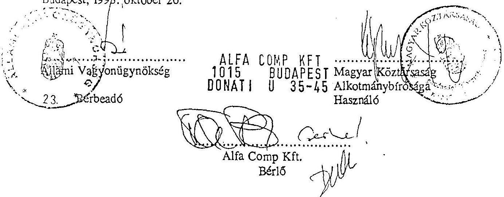

---

# Haszonkölcsön-szerződés 

mely létrejött egyrészről az Állami Vagyonügynökség (Bp. XIII. Pozsonyi út 56.), mint haszonkölcsönadó (a továbbiakban: Kölcsönadó), másrészről az Alkotmánybíróság (Bp. XIII. Váci út 71.), mint haszonkölcsönvevő (a továbbiakban: Kölcsönvevő) között alulírott helyen és napon az alábbi feltételekkel:

1. 

Kölcsönadó ingyenes használatra átengedi Kölcsönvevőnek a Magyar Állam tulajdonában és a Kölcsönadó kezelésében lévő, természetben Bp. I. Donáti utca 35-45. alatti ingatlant.
2.

A Kölcsönadó az ingatlan kezelői jogáról születendő végleges döntésig bocsátja Kölcsönvevő rendelkezésére az 1. pontban megnevezett ingatlant.
3.

Kölcsönvevő kijelenti, hogy Kölcsönadó hozzájárulása nélkül az ingatlant 3. személy használatába nem adja. Kölcsönadó vállalja, hogy 3. személynek az ingatlanon jelen szerződés megkötésekor fennálló bérleti jogviszonyát 1993. október 31-ig megszünteti.
4.

Kölcsönadó felhatalmazza a Kölcsönvevőt, hogy az ingatlan rendeltetésszerű használata érdekében szükséges átalakítási munkálatokat elvégeztesse, az ehhez szükséges tervezési, kivitelezési megbízásokat kiadja.

A szerződésben nem szabályozott kérdésekben a Ptk. haszonkölcsönre vonatkozó rendelkezései az irányadók.

Budapest 1993. augusztus 12.
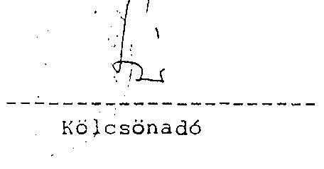
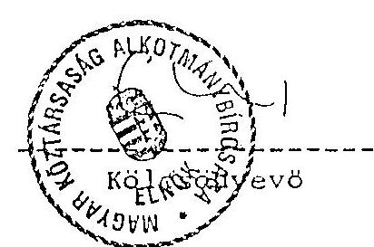

---

# A Donáti utcai székház felújításának előirányzata és a teljesítés 

|  |  |  |  |
| :--: | :--: | :--: | :--: |
| Év | Beszámoló szerinti teljesítés | Helytelen könyvelés miatti módosítás | Teljesítés |
| 1993. | 132.413 | -16.008 | 116.405 |
| 1994. | 468.755 | -4.441 | 464.314 |

| Év | Eredeti   előirányzat | Módosított   előirányzat | Teljesítés | Maradvány |
| :-- | :--: | :--: | :--: | :--: |
| 1993. |  |  |  |  |
| ÁFA-val | - | 180.000 | - | - |
| ÁFA nélkül | - | 144.000 | 116.405 | 27.595 |
| 1994. |  |  |  |  |
| ÁFA-val | 190.000 | 590.000 | - | - |
| ÁFA nélkül | 152.000 | 472.000 | 464.314 | 7.686 |
| Összesen |  |  |  |  |
| ÁFA-val | - | 770.000 | - | - |
| ÁFA nélkül |

 - | 616.000 | 580.719 | 35.281 |

---

A számítástechnikai fejlesztés forrásai

| Forrás | Kormányzati | Átvett pénz- | Saját | Össze- |
| :--: | :--: | :--: | :--: | :--: |
| év | beruházás | eszköz | forrás | sen |
| 1992. | 1.500 | - | - | 1.500 |
| 1993. | - | 7.000 | - | 7.000 |
| 1994. | 9.315 | - | - | 9.315 |
| 1995. I. fév | - | 5.000 | 214 | 5.214 |
| Összesen: | 10.815 | 12.000 | 214 | 23.029 |
| Részesedés: | 47% | 52% | 1% | 100% |

---

Alkotmánybíróság
fejezet
9. sz. Tanúsítvány

Gépjármű állományának alakulása

Adatok Ft-ban
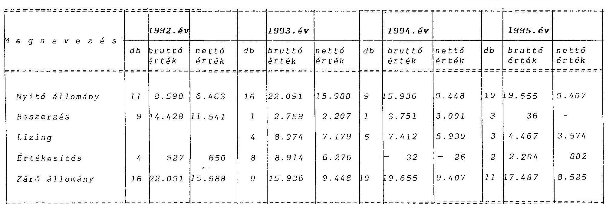

Fizetett lízingdíj
Budapest, 1995.
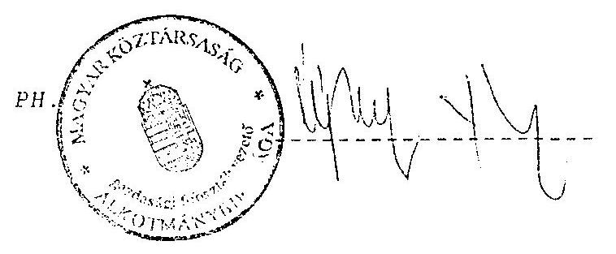

---

# 1111/95 

Nagy Ákosné
igazgatóhelyettes
Állami Számvevőszék
III. Költségvetési Ellenőrző Igazgatóság
Budapest

Tisztelt Igazgatóhelyettes Asszony!

Hivatkozva a V-9-8/1995. iktatószámú levelükre tájékoztatom, hogy a Budapest, I. Donát u. 34-45. sz. alatti ingatlan a vagyonnyilvántartási rendszerünkben 798149 eFt értékben van feltüntetve.
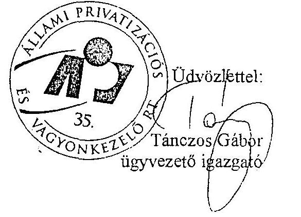

---

ISER-INVECON
MŰVELŐDÉSÜGYI BERUHÁZÓ ÉS SZAKTANÁCSADÓ ALÁTOLT FELELŐSSÉGŰ TÁRSASÁG
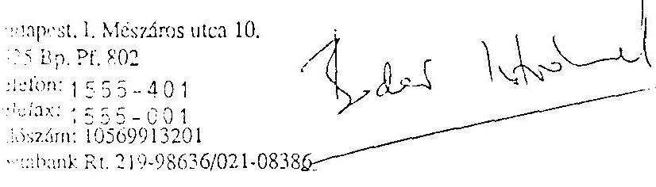

Válaszában kérem ügyiratunk számára és ügyintézőnk nevére hivatkozni.

Budapest, 19
Tárgy: Adatszolgáltatás
Szám: 93011 AFFET
Hiv. szám:
Ügyintéző: Lázárné/Lné

# A MŰVELŐDÉSÜGYI BERUHÁZÁSI VÁLLALAT SZAKMAI ÉS REFERENCIA UTÓDJA 

Magyar Köztársaság
Alkotmánybírósága
Budapest
Donáti u.
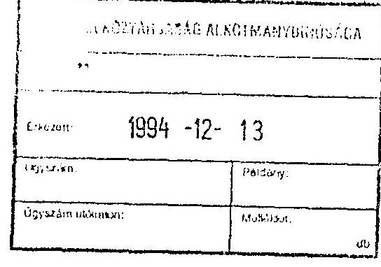

Megbízási szerződésük szerint az I., Donáti u. új székház felújításával kapcsolatban, az alábbi adatokat bocsátjuk rendelkezésükre az üzembehelyezési okmány kiállításához, a MÜBER-INVECON KFT által elfogadott vállalkozói számlák, valamint a MÜBER-INVECON KFT lebonyolítási díj számlái alapján.

Netto
ÁFA
Összesen:
527.658.688,- Ft 131.914.671,- Ft 659.573.359,- Ft
20.848.000,- Ft 5.212.000,- Ft 26.060.000,- Ft
548.506.688,- Ft 137.126.671,- Ft 685.633.359,- Ft
93.500,- Ft 23.375,- Ft 116.875,- Ft
15.970.133,- Ft 3.992.534,- Ft 19.962.667,- Ft
564.570.321,- Ft 141.142.580,- Ft 705.712.901,- Ft
Aktiválandó netto érték: 564.570.321,- Ft
Melléklet: 1 pld. összefoglaló táj.
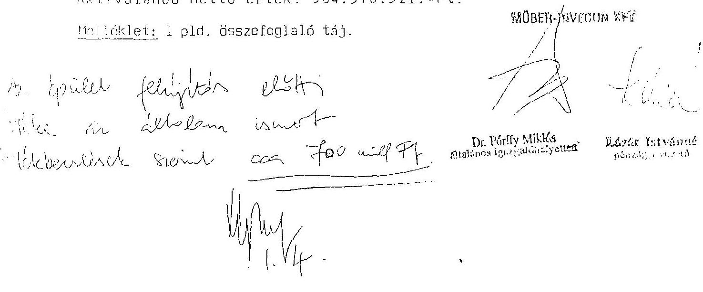

