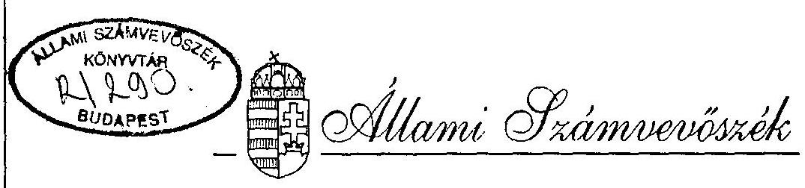

# JELENTÉS 

a Nagymaros-Visegrád térség komplex tájrehabilitációjának ellenőrzéséről

---

A vizsgálat végrehajtásáért felelős: az ÁSZ IV. Vagyonellenőrzési Igazgatósága
dr. Kovács Árpád igazgató

Az ellenőrzést vezette:
Krucsai Balázs osztályvezető főtanácsos
Az ellenőrzést végezték:
IV. Vagyonellenőrzési Igazgatóság részéről

Bank Lajos számvevő tanácsos
Istvánffy Lóránt számvevő tanácsos
Karsainé Dömsödli Éva számvevő tanácsos
Kiss Istvánné számvevő tanácsos
Pallós Gábor számvevő tanácsos
V. Önkormányzati és Területi Ellenőrzési Igazgatóság részéről:
dr. Magyar György számvevő
dr. Spilák Antal számvevő tanácsos

---

# TARTALOMJEGYZÉK 

1. BEVEZETÉS ..... 1
II. Összefoglaló megállapítások, következtetések, javaslatok ..... 4
III. RÉSZLETES MEGÁLLAPÍTÁSOK ..... 13
1. A tájhelyreállítás előkészítése ..... 13
1.1. Az előkészítés szervezeti és személyi feltételei ..... 13
1.2. Az előkészítés társadalmi-politikai háttere ..... 14
1.3. A rehabilitációs program kidolgozásának szakmai megalapozása ..... 16
1.4. A rehabilitációs program koncepciójának kidolgozása és elfogadása ..... 18
1.5. A tájrehabilitáció pénzügyi fedezetének biztosítása ..... 22
2. A rehabilitációs program megvalósítása ..... 24
2.1. A beruházás megvalósítását végző szervezetek kiválasztása, a megkötött szerződések főbb jellemzői ..... 24
2.1.1. A lebonyolító szervezet kiválasztása ..... 25
2.1.2. A kivitelező szervezet kiválasztása. Előminősítés ..... 26
2.1.3. Ajánlattételi felhívás ..... 27
2.1.4. Az ajánlatok elbírálása ..... 29
2.1.5. A pályázati döntés megalapozottságát gyengítő körülmények ..... 31

---

2.1.6. A kivitelezői szerződések értékelése ..... 35
2.2. Az ellenőrzött időszak végéig (1995. szeptember 30-ig) elvégzett rehabilitációs munkák ..... 38
2.2.1. A kiviteli tervek elkészítése ..... 38
2.2.2. Az eddig elvégzett munkák értéke és fő jellemzői ..... 39
2.2.3. Az elvégzett munkák ellenőrzése ..... 41
2.2.4. Pótmunkák és szerződésmódosítások ..... 43
3. A rehabilitációs program finanszírozása, a beruházási teljesítések elszámolása, ellenőrzése és kifizetése ..... 44
3.1. A program finanszírozása ..... 44
3.2. A beruházási teljesítések elszámolása, ellenőrzése és kifizetése ..... 48
4. A beruházással kapcsolatos tulajdonviszonyok rendezésének helyzete ..... 50
4.1. A tulajdonviszonyok rendezésének általános problémái ..... 50
4.2. Az elkészült létesítmények tulajdonviszonyai ..... 53
5. Az érintett önkormányzatok tájrehabilitációhoz kapcsolódó tevékenysége ..... 56
5.1. Az önkormányzatok tevékenysége a tájhelyreállítás programjának és beruházásainak előkészítése során ..... 58
5.2. Az önkormányzatoknak a tájrehabilitáció megvalósításához kapcsolódó tevékenysége ..... 60

---

# JELENTÉS 

a Nagymaros-Visegrád térség komplex tájrehabilitációjának ellenőrzéséről

## BEVEZETÉS

Az Állami Számvevőszék ellenőrzéseivel végigkísérte az elmúlt években a Bős-Nagymarosi Vízlépcsőrendszer felfüggesztését követően a létesítmények további sorsát meghatározó kormányintézkedéseket, a ráfordított pénzeszközök elszámolását. Történetileg feldolgozta a vízlėpcsőrendszer tervezési és döntési folyamatának eseményeit. A jelentések nyilvánosak, kivéve a történeti feldolgozást, amelynek során az ÁSZ olyan adatokat is felhasznált, amelyek titkos minősítését ma is indokoltnak tartja a kormányzat.

Jelen vizsgálati jelentés a Bős-Nagymarosi Vízlépcsőrendszer problémakörének újabb elemét, a Visegrád-Nagymarosi térség tájrehabilitációjának előkészítését és megvalósulását dolgozza fel.

Az építkezés 1989. évi felfüggesztése, majd a rendszer megvalósításáról és üzemeltetéséről 1977-ben aláírt nemzetközi szerződés felmondása óta az Országgyűlés több határozatában - 24/1989. (XI.10.), 26/1991. (IV. 23.), 28/1991.

---

(IV.30.) - foglalkozott az építkezés által okozott természeti károk helyreállításának, a sérült tájak rehabilitációjának feladataival. Határozataiban elsődleges követelményként jelölte meg:

- az érintett térségek ökológiai - természeti értékeinek helyreállítását, mindenekelőtt az ivóvízkészletek megőrzését.
- az árvíz elleni védekezést,
- a térség természeti viszonyaihoz igazodó hajózás kialakítását.

Felkérte a Kormányt, hogy az érintett területek komplex regionális fejlesztési koncepcióját és rendezési tervét - a helyi önkormányzatok részvételével - e követelmények alapul vételével határozza meg.

A Kormány már 1991. márciusában döntött a nagymarosi körgát felszámolásáról és az eredeti hajóút helyreállításáról (3129/1991. sz. Korm.h.). A helyreállítási program 1. ütemének részleteit, a Nagymaros-Visegrád térség rehabilitációjának végleges programját a 3464/1992. (X. 1.) sz. kormányhatározat hagyta jóvá. Ez a folyómederben a beavatkozással közvetlenül érintett 1694,0 - 1697,0 folyamkilóméter közötti szakaszt, a partokon ennél valamivel tágabb környezet rekonstrukcióját jelenti. Ennek keretében elbontják az 1988-89-ben épített körtöltést és megszüntetik az ideiglenes medret, kialakítják a hajóutat, elvégzik a parti helyreállítási és árvízvédelmi munkákat, megépítik az elkezdett közműveket és egyéb létesítményeket, korszerűsítik a területet érintő 11-es és 12-es számú főközlekedési utakat, stb.
(1. sz. melléklet).

A kiemelt jelentőségű kormányzati beruházás főbb adatairól és finanszírozásának forrásairól 1993. májusában született

---

végleges döntés (2011/1993.(HT.8.) Korm.hat.). E szerint a beruházás költségelőirányzata 8.660 millió forint, amit költségvetési juttatásból, egyes elkülönített állami pénzalapok hozzájárulásából és vállalkozói hitelfelvételből kell finanszírozni. A vállalkozó által a Kormány kezességvállalása mellett felveendő hitel visszafizetési terheivel együtt a beruházás teljes költsége folyóáron számítva 11.799 millió forint. A munkálatok kezdési időpontja 1993. október 1., befejezési ideje 1996. IV. negyedév.

Az ellenőrzés célja annak megállapítása, hogy a szakmai és társadalmi vitákban kialakított és a Kormány által jóváhagyott rehabilitációs program összhangban van-e az Országgyűlés határozataival, alátámasztja-e a beruházás költségelőirányzatainak indokoltságát. A törvényes előírásoknak megfelelően, az elvégzett teljesítményekkel összhangban történik-e a beruházásra jóváhagyott pénzeszközök felhasználása. Az érintett önkormányzatok tevékenysége hogyan segíti a tájrehabilitáció sikeres végrehajtását.

Az ellenőrök számára módszertanilag a legnagyobb gondot annak megítélése okozta, hogy a rehabilitációs program kialakítása és jóváhagyása során hogyan érvényesültek az Országgyűlés által általános jelleggel meghatározott követelmények, illetve célok.

A rendkívül összetett, számos szakterületet (vízgazdálkodás, hajózás, természet- és környezetvédelem, területfejlesztés, stb.) érintő feladat megoldásának szakmai értékelésére az ellenőrök nem vállalkozhattak. Abból indultak ki, hogy az Országgyűlés által kitűzött átfogó célok (követelmények) elérése egzakt kritériumok hiányában csak tendenciájában követhető nyomon. Ezért elsősorban azt vizsgálták, hogy a szóba jöhető alternatívák közül a legcélravezetőbb megoldásokat formáló munkálatok és viták megfelelően széles és kompetens

---

szakmai körökben (intézményekben) folytak-e, és azok eredményei beépültek-e a Kormány által jóváhagyott programba. Ha ez megtörtént, akkor okkal vélelmezhető, hogy a rehabilitáció az Országgyűlés által meghatározott követelményekkel összhangban valósul meg.

A vizsgálatba bevont szervek: KHVM Duna-menti Rehabilitációs Iroda (beruházó), Nagymaros, Vác, Visegrád és Zebegény önkormányzat polgármesteri hivatala. A Kincstári Vagyonkezelő Szervezetnél tájékozódás történt.

Vizsgált időszak: 1991. május 1-től 1995. szeptember 30-ig.

A helyszíni vizsgálat: 1995. augusztus 28-án kezdődött és 1995. október 27-én fejeződött be.

A vizsgálat megállapításai a rehabilitációs program előkészítésének és jóváhagyásának, a beruházások megvalósításának dokumentumaira, a felelős személyekkel és az érintett önkormányzatok képviselőivel folytatott interjúkra és a helyszíni szemlék tapasztalataira támaszkodnak.

# II. 

Összefoglaló megállapítások, következtetések, javaslatok
1.) A Bős-Nagymarosi Vízlépcsőrendszer építkezéseivel érintett területek helyreállítása - a szakmai előkészítéssel kapcsolatos politikai jellegű viták és finanszírozási nehézségek miatt - viszonylag nehézkesen indult. A szakmai előkészítést nehezítette, hogy a vízügyi és

---

egyéb szakmai szervek iránti politikai bizalmatlanság tovább élt. A politikai indíttatású "szakmai viták" és a hatásukra végrehajtott szervezeti intézkedések (pl. kormánybiztosi intézmény megszüntetése) nagyfokú bizonytalanságot vittek a szakmai előkészítő munkába. A szükséges döntések elhúzódtak. Az elvi vízjog engedély felülvizsgálata és nem jelentős tartalmi módosítása kereken 1 évet vett igénybe.

A rehabilitáció finanszírozását szolgáló kormányhitelek felvételére irányuló tárgyalások sem jártak sikerrel, más megoldásokat kellett keresni.

Mindezek következményeként a helyreállítási munkák megkezdésére az Országgyűlés döntéseinek végrehajtására hozott 3129/1991. sz. kormányhatározatban megjelölt határidőhöz képest több mint egy éves késéssel került sor.

A késés következtében bizonyíthatóan a költségvetésnek 100-150 millió forint nagyságrendű többletkiadása volt a továbbtartó állagmegóvás és az ideiglenes meder hajóforgalmának vontatási költsége miatt. Nem számszerűsíthetőek azok a bizonyára jelentős pénzügyi kihatások, amelyek a késés miatt bekövetkezett ökológiai terhelésnövekedés, a turisztikai bevételkiesés stb. következményei.
2.) A tájhelyreállítás koncepciójának kialakítása a témában országos hírnévvel bíró kutató intézetek és tervező szervek (VITUKI, VIZITERV, TÉRTERV Kft.) bevonásával, az általuk kidolgozott javaslatok kompetens szakmai összetételű bíráló bizottságban elvégzett alapos értékelésével, az érintett önkormányzatok és társadalmi szervek véleményének figyelembevételével történt. A vizsgálóknak nincs semmi tárgyi alapjuk kérdésessé tenni, hogy az or-

---

szággyűlési határozatokban foglalt követelményekkel és rendelkezésre álló pénzügyi lehetőségekkel legjobban harmonizáló koncepció került elfogadásra.

A tájhelyreállítás Kormány által jóváhagyott műszaki feladatainak programja az elfogadott koncepcióval összhangban van, minden területen kiállta a szakhatósági előírások próbáját. A beruházási alapokmány megfelel a kormányhatározat előírásainak.

A tájrehabilitáció műszaki, gazdasági és pénzügyi összefüggéseiről a KHVM az Országgyűlés részére átfogó előterjesztést készített, annak megtárgyalása azonban csak bizottsági szinten történt meg.
3.) A jóváhagyott beruházások lebonyolító feladatainak ellátását és a kivitelezést végző szervezetek kiválasztása a törvényes előírásoknak megfelelően versenytárgyalás keretében történt. A versenytárgyalások kiírása, a tenderdokumentáció összeállítása, a pályázatok kiértékelése és az eredmény kihirdetése megfelelt a jogszabályi előírásoknak. Jogsértést a szerződéskötéseknél sem állapított meg a vizsgálat. A szerződésekből azonban hiányzik néhány olyan feltétel, amelyek megléte nagyobb garanciát adott volna a költségvetési pénzeszközök takarékos felhasználására, a beruházások határidőre történő megvalósítására. A beruházási ráfordítások nagyságától függő díjazás nem teszi érdekeltté a lebonyolítót a költségek mérséklésében, illetve az esetleges többletráfordítások megakadályozásában. A kivitelezői szerződések viszont nem tartalmaznak kötbérezhető részhatáridőket, holott a munkálatok elvégzésének késedelme esetenként tetemes többletköltségeket okozhat (pl. kényszerű hajóvontatás).

---

4.) Az ellenőrzött időszak végéig - 1995. szeptember 30-ig elvégzett munkák ráfordításai kereken 4,9 milliárd forint összeget képviselnek. A tervekben előirányzott főbb feladatok közül befejeződött a nagymarosi körtöltés elbontása, a hajózó meder kialakítása, a Duna alatt Nagymaros és Visegrád között húzódó közműalagút és a víznyerő galériák megépítése, valamint a váci szennyvízhálózat kiépítése.

A vizsgálat tapasztalatai szerint a munkavégzésben jelentős csúszások vannak. Legjelentősebb határidőcsúszás a körtöltés mederátvágásának megkezdésénél volt. Ennek következtében az új hajózó meder átadása a tavaszi időszak helyett csak 1995. szeptemberében valósulhatott meg. A későbbi átadás a kivitelező számára pénzügyi konzekvenciákkal - a szerződés hiányosságai miatt - nem járt.

A munkák elvégzését és annak minőségét a beruházó Dunai Rehabilitációs Iroda (DRI) és az általa megbízott lebonyolító szervezet rendszeresen ellenőrzi, a minőségi hibákat következetesen kijavíttatja, az indokolatlan többletköltség igényeket elutasítja. A DRI a beruházás irányítását összességében nagy körültekintéssel és a jogszabályoknak megfelelően végezte.
5.) A beruházások finanszírozását az Állami Fejlesztési Intézet Rt. (ÁFI), illetve 1996. január 1-től a Magyar Államkincstár végzi. A teljesítmények elszámolásának és kifizetésének alapját a létesítmények készültségének megfelelően a vállalási összegből kiindulva számított fajlagos költségek képezik. Az elvégzett teljesítményeket felmérésekkel és becslésekkel állapítják meg. Ily módon történő igazolásuknál a lebonyolító és fővállalkozó képviselőin kívül rendszeresen jelen van az Iroda

---

és a finanszírozó bank képviselője is. A számlák mind formai, mind tartalmi szempontból megfelelnek az előírásoknak. Szabálytalan vagy a teljesítménnyel nem arányos kifizetéseket a vizsgálat nem tárt fel.

A kormányhatározatban nevesített finanszírozási források közül a költségvetési juttatások és a Vízügyi Alap pénzeszközeinek igénybevétele az előirányzott ütemezésnek megfelelően történik. A Környezetvédelmi és Területfejlesztési Minisztérium a Központi Környezetvédelmi Alapból 1995-re előirányzott 154 millió forint átadásától eddig, véleményünk szerint indokolatlanul, elzárkózott.

A vállalkozói hitelek felvételére a tervezettnél később került sor, ami az állami költségvetés kamatterhelését némileg csökkenti.
6.) A tájrehabilitáció által érintett területen lévő ingatlanok és felépülő új létesítmények egy részének tulajdonviszonyai rendezetlenek. A visegrádi oldalon lévő, egyszerűsített kisajátítási eljárással megszerzett ingatlanok tulajdonjogának ingatlannyilvántartási bejegyzése már négy éve húzódik. A nyilvántartások sok esetben még a kisajátítás előtti állapotot tükrözik. Ez a helyzet mind az önkormányzatoknál, mind a
 Kincstári Vagyonkezelő Szervezetnél nehezíti az ingatlanok hasznosításával kapcsolatos feladatok megoldását.

Az önkormányzatok rendezési terveit az erőmű építkezések leállítása utáni megváltozott viszonyok következtében át kellett dolgozni. A feladatot azonban nem sikerült a tájrehabilitáció tervezésével egyidőben, vele szoros összhangban megoldani. Az új, részletes rendezési tervek kidolgozása és önkormányzati jóváhagyása késik. Egyedül a Visegrádi Önkormányzatnál készült el a végleges rende-

---

zési terv. Ezért nincs semmiféle garancia arra, hogy az érintett önkormányzatokkal egyetértésben végrehajtott tájrehabilitációs munkák a később módosításra kerülő rendezési tervekben foglalt elképzelések miatt nem bizonyulnak feleslegesnek. (pl. parkosított részen parcellázásokat végeznek, stb.).

A kormányhatározattal jóváhagyott beruházások megvalósítása során 37 létesítmény épül meg. Ezek tulajdonjogának (a fenntartási és üzemeltetési feladatok ellátásának) rendezésére a témával foglalkozó kormányhatározatok semmilyen eligazítást nem adnak. A létesítmények kezelői jogainak rendezésére vizsgálatunk kapcsán dolgoztak ki koncepcionális tervet, melynek egyeztetése megkezdődött. A végleges rendezés azonban több körülmény is akadályozza. Ezek közül elsősorban azt kell megemlítenünk, hogy az érvényben lévő törvényes előírások (1990. évi LXV. tv., 1991. évi XXXIII. tv.) szerint az önkormányzatok részére állami tulajdon térítésmentesen nem adható át. A költségvetési szervek (pl. vízügyi igazgatóságok) pedig finanszírozási problémák miatt csak az üzemeltetési és fenntartási költségek egyidejű rendezésével hajlandók bizonyos létesítményeket üzemeltetésre átvenni.

A tulajdonosi és a kezelői jogok rendezetlensége, az ingatlanhasznosítást és a közterületek fenntartását akadályozva, jelentős nemzetgazdasági károkat okozhat.
7.) A tervezett vízlépcsőrendszer építésének elmaradása és a tájrehabilitáció végrehajtása az érintett önkormányzatok helyzetére és tevékenységére többirányú befolyást gyakorol. A lezajlott események mindenekelőtt óhatatlanul visszavetették a térség fejlődését. Egyes területeken a fejlesztések elmaradtak, az idegenforgalom megtor-

---

pant, stb. A tájrehabilitáció során megvalósuló infrastrukturális fejlesztések mindezeket csak részben pótolják, mivel a korábbi nagyvonalú ígéretek csak ígéretek maradtak.

A helyreállítási munkákat tervező szervek a jogszabályban előírt önkormányzati egyeztetési kötelezettségüknek eleget tettek. Az önkormányzatok véleményét kikérték, észrevételeik és javaslataik nagyrészét elfogadták.

A kisajátított területek, a tájrehabilitáció keretében megépülő új létesítmények kialakítására és hasznosítására az önkormányzatok számos javaslatot dolgoztak ki. Tulajdonátadás azonban részükre mindezideig nem történt és a korábban átvett területek tulajdonviszonyainak rendezése is függőben van.

# JAVASLATOK 

1.) a Kormány részére:

A pénzügyminiszter, valamint a közlekedési, hírközlési és vízügyi miniszter közös előterjesztése alapján tárgyalja meg a tájrehabilitációval megvalósított létesítmények és az ingatlanok tulajdonba adásával, üzemeltetésével kapcsolatos feladatokat, s az önkormányzati, illetve államháztartási törvényekkel összhangban hozzon határozatot a helyreállított Visegrád-Nagymarosi táj értékeinek megőrzését elősegítő intézkedésekre. Az elkerülhetetlenül szükséges törvénymódosításokat az Országgyűlésnél kezdeményezze.
2.) a Közlekedési, Hírközlési és Vízügyi Minisztérium részére:
a., Készítsen a tájrehabilitációtól várt - az OGY határozataiban körvonalazott - eredmények maradéktalan

---

biztosítása érdekében, valamint a Pénzügyminisztériummal közösen benyújtandó kormányelőterjesztés céljára részletes helyszínrajzi mélységű tervezetet az önkormányzatok és gazdasági társaságok részére átadott, illetve átadandó létesítményekről és ingatlanokról.
b., Saját hatáskörébe rendezze a minisztérium irányítása alá tartozó költségvetési szervek kezelésébe kerülő létesítmények és ingatlanok kezelői és üzemeltetői feladatainak vitás kérdéseit, üzemeltetési költségvonzatát. A költségeket a mindenkori éves állami költségvetés minisztériumi fejezetébe állítsa be.
c., Intézkedjék, hogy az Útalapból finanszírozott 11. számú főközlekedési út Visegrádi Kórház és Dömös közötti II. ütemének megépítése a 2011/1993. sz. Kormányhatározatnak megfelelően 1996-ban befejeződjék.
d., Gondoskodjon arról, hogy a tenderdokumentáció megvásárlásából befolyt - a beruházót illető - összeg jogosnak minősített felhasználásáról a FŐBER a beruházás befejezése után tételesen elszámoljon és a maradékot visszautalja a beruházás ÁFA-nál vezetett számlájára.
e., Hangsúlyozottan írja elő a Dunai Rehabilitációs Iroda a Dunameder kialakításának munkáinál felmerült minőségi kifogások és az eredeti tervektől való eltérések miatt a kivitelezést lezáró végátvételi jegyzőkönyvben az esetleges mederelfajulásból eredő szavatossági jogának érvényesítését, illetve ebből eredő kártérítési igényét a kivitelezőivel szemben.

---

f. Érvényesítse a már elhatározott (2017/1994. Korm. h.) és további várható tájrehabilitáció megvalósításának előkészítésénél a jelen vizsgálat tapasztalatait, különös tekintettel a lebonyolító szervezettel szemben támasztott követelményekre, anyagi érdekeltségére, valamint a vállalkozói versenyeztetés körültekintőbb végrehajtására.
3.) a Környezetvédelmi és Területfejlesztési, valamint a Közlekedési, Hírközlési és Vízügyi Minisztérium részére:

Állapodjanak meg, hogy 1996-ban a 2011/1993. sz. kormányhatározatnak megfelelően a Környezetvédelmi Alapból előirányzott forrás teljes egészében a tájrehabilitáció hátralévő munkáinak finanszírozására rendelkezésre álljon. az állami költségvetés tervezetten felüli igénybevételének elkerülése céljából.
4.) a Pénzügyminisztérium, valamint a Közlekedési, Hírközlési és Vízügyi Minisztérium részére:
a., Készítsenek közös előterjesztést a Kormány részére azokról az intézkedésekről, amelyek révén a tulajdonba adás és az üzemeltetés feltételei összhangba kerülhetnek az érvényes számviteli, államháztartási és önkormányzati törvények előírásaival. Az előterjesztés tegyen javaslatot az esetleges törvénymódosításokra is.
b., Állapodjanak meg a vállalkozói hitel valódi céljainak megfelelően a hitel számviteli elszámolásáról, továbbá az éves állami költségvetésben való szerepeltetés módjáról.

---

# 111. 

## Részletes megállapítások

## 1.) A tájhelyreállítás előkészítése

A helyreállítási feladatok kidolgozása már 1990. szeptemberében elkezdődött. A szorosan vett szakmai előkészítés folyamatát mind az Országgyűlés Környezetvédelmi Bizottsága, mind a különböző környezetvédő társadalmi szervezetek részéről fokozott politikai figyelem kísérte. Rendszeressé vált a helyreállítás előkészítéséért felelős személyek bizottsági beszámoltatása, vízügyi, műszaki kérdések politikai fórumokon történő megvitatása, a szakmai munka politikai befolyásolása. A finanszírozási nehézségek mellett jórészt az ebből fakadó többszörös egyeztetési kényszerek vezettek az előkészítő munkálatok elhúzódásához.

### 1.1.) Az előkészítés szervezeti és személyi feltételei

A Bős-Nagymarosi vízlépcsőrendszer lezárásával és a természetben okozott károk helyreállításával kapcsolatos feladatokat - az 1071/1989. (VI. 15.) MT határozatnak megfelelően kinevezett - Kormánybiztos koordinálta.

A Kormánybiztos munkáját 1990. második negyedévétől 4 fős Dunai Vízlépcső Kormánybiztosi Titkárság (DVKBT) volt hivatva segíteni. Működési feltételei kezdetben kialakulatlanok, jórészt szabályozatlanok voltak. Munkatársainak szakmai megosztottsága is zavarta a munkavégzést. A rendszerváltást követően, 1990. júniusában

---

a korábbi kormánybiztost felmentették és néhány hónap múlva újat neveztek ki.

A szükséges politikai támogatást az újonnan kinevezett kormánybiztos sem tudta megszerezni. Végül a Kormány 1992. január 1-től a 2014/1991. (H.T. 11.) számú határozatával a kormánybiztosi intézményt megszüntette. A feladatokat és a felelősséget a környezetvédelmi és területfejlesztési miniszter, dr. Mádl Ferenc tárcanélküli miniszter, valamint a közlekedési, hírközlési és vízügyi miniszter között felosztotta. Ezzel a tárcák közötti egyeztetési igények növekedtek, a döntések előkészítése nehézkesebbé vált.

A beruházás lezárásának befejezése és a helyreállítási munkák elvégzésének irányítása a Közlekedési, Hírközlési és Vízügyi Minisztérium (KHVM) keretében létrehozott Dunai Rehabilitációs Iroda (DRI) feladatát képezi.
1.2.) Az előkészítés társadalmi-politikai háttere

Az elmúlt parlamenti ciklus alatt az Országgyűlés Környezetvédelmi Bizottsága 27 alkalommal foglalkozott a Nagymaros-Visegrádi tájrehabilitáció kérdéseivel. Az Országgyűlés nevében gyakorolt ellenőrzési feladataiknak igyekeztek minél teljesebben eleget tenni. Ugyanakkor a témában felelős kormányzati és más szakmai szervezetek iránti bizalmatlanságuk továbbra is fennmaradt. Jórészt erre vezethető vissza, hogy gyakran a bizottság kompetenciájába nem tartozó, speciális szakmai felkészültséget igénylő vízügyi műszaki kérdésekkel

---

is (vízjogi engedély tartalma, modellkísérletek, tervpályázati elemek, stb.) is részletesen foglalkoztak.

Így például az elvi vízjogi engedélyről tudomást szerezve a Környezetvédelmi Bizottság egyik képviselő tagja 1991. szeptember 10-én interpellációt nyújtott be az illetékes miniszterhez. Ebben az engedély jogszerűségét vitatva, a kisminta kísérletek késleltetésével, légi felvételek elhagyásával vádolta a DVKBT szakembereit.

A KHVM minisztere október 2-án írásban választ, melyet a képviselő és az Országgyűlés nem fogadott el. Az interpellációt a Környezetvédelmi Bizottság november 6-án megtárgyalta a miniszter kiegészítésével együtt, melyet sem a képviselő, sem a Bizottság nem fogadott el. Újabb egyeztetések után végül 1992. február 26-án, csaknem ½ év múlva fogadta el a képviselő, a Bizottság és az Országgyűlés a miniszter válaszát.

Az ülések jegyzőkönyveinek tanúsága szerint többnyire ugyanazon 5-8 képviselő (és személyes szakértőik) szerepeltek a döntés-előkészítő vitákban, kétségessé téve a szakmai előterjesztők politikai lojalitását, műszaki-technikai javaslataik megalapozottságát. Ezek a viták gyakran döntés nélkül végződtek, majd a témákat újból napirendre tűzték.

Mindez nehezítette a szakmai előkészítést végző szervek és intézmények munkáját. A döntések meghozatalát is lassította, de hozzájárult a döntési javaslatok szokásosnál szélesebb körű és elmélyültebb megalapozásához.

---

1.3.) A rehabilitációs program kidolgozásának szakmai megalapozása

A vízlépcsőrendszer építésével érintett területek közül elsőként a Nagymaros-Visegrádi-térség rehabilitációja került napirendre. A Kormány - a 3129/1991. sz. határozatában - legsürgősebb megvalósítást igénylő feladatként a nagymarosi körgát elbontását, a meder és a parti területek helyreállítását jelölte meg. Ezt a döntést részben a körgát és a megkerülő Duna-meder ideiglenes jellege, részben a térség tájképi-idegenforgalmi szempontok alapján frekventált helyzete indokolta.

A helyreállítás tényleges előkészítése 1990. szeptember 28-án indult, amikor a DVKBT megrendelte a Nagymarosi Vízlépcső környezetének rehabilitációját előkészítő tanulmány elkészítését a VITUKI-tól. A megrendelés célja olyan információs anyag összeállítása a körtöltés elbontásának és a Duna-meder helyreállítási lehetőségeinek elvi vizsgálatához, mely hosszabb Duna-szakasz folyószabályozási koncepciótervének kidolgozását is segíti.

Az előkészítő tanulmányt 1991. február 28-án szállította le a VITUKI. A tudományos munka több évtizedes kutatásokra alapozva, a folyószabályozásban mértékadó elméleti és gyakorlati tervező szakértők bevonásával hét fejezetben, több melléklettel kibővítve foglalta össze a helyreállítás tervezéséhez szükséges információs anyagot. A mederkialakítás hatásait numerikus szimulációval modellezték, javasolva a későbbi kisminta-kísérleteket. A tanulmányt 1991. április 15-én tervbirálaton fogadták el.

---

Ugyanebben az időben kezdte meg a térség helyreállításával kapcsolatos előkészítő munkát a VIZITERV Nagymarosi Vízlépcsővel foglalkozó tervezőmérnökei vezetésével megalakult TÉRTERV Kft. 1990. decemberére elkészült "A nagymarosi munkaterület helyreállításának egyes hatásai a Duna-mederre" című tanulmány, illetve a helyreállítással kapcsolatos adatszolgáltatás.

A folyamatban lévő kutatási-tervezési munkálatokkal párhuzamosan a DVKBT - a hatályos 3/1982. (III. 12.) OVH rendelkezés előírásait betartva - műszaki tervek készítésére jogosító elvi vízjogi engedélyért folyamodott a Közép-Dunavölgyi Vízügyi Igazgatósághoz.

Az elvi vízjogi engedélyt az elsőfokú hatóság 1991. május 28-án adta meg, vízgazdálkodási és környezetvédelmi előírásokkal, indoklással. Az engedélyezési eljárás a vonatkozó rendelkezések (2/1980. (I. 16.) OVH, 3/1982. (III.12.) OVH) alapján, a BNV-vel kapcsolatos OGY-határozatokra figyelemmel történt. A létesítési engedély iránti kérelemhez előírta a mozgómedrű kis-minta-vizsgálat elvégzését, a környezeti hatástanulmányon alapuló ökológiai szemléletű Duna-szabályozási koncepció kidolgozását.

A szakhatóságok közül a Közép-Dunavölgyi Környezetvédelmi Felügyelőség állásfoglalásában a "Környezetvédelmi előírások" című rendelkező rész közlését kötötte ki. Ezen előírás hátterében a 26/1991. (IV.23.) országgyűlési határozatban deklarált értéksorrend betartatása állt. Ez ugyanis a térség ökológiai-természeti értékeinek helyreállítására, mindenekelőtt az ivóvíz készletek megőrzésére helyezte elsődlegesen a hangsúlyt.

---

Az elsőfokú vízügyi hatóság határozatában foglaltakra két fellebbezés és egy írásbeli észrevétel érkezett.

A Dunamenti Regionális Vízművek és a Fővárosi Vízművek egyaránt arra hivatkozva, hogy a mederhelyreállítás érinti a kezelésükben lévő partiszűrűs vízbázisokat, a határozat megsemmisítését kérte. Az Országos Természetvédelmi Hivatal helyettes államtitkára kifogásolta, hogy szakhatósági véleményét nem kérték ki.

Az Országos Vízügyi Főigazgatóság, mint másodfokú hatóság, a vízügyről szóló többször módosított 1964. évi IV. törvény és az elvi vízjogi engedélyről szóló 2/1980. (I.16.) OVH sz. rendelkezés előírásainak megfelelően vizsgálta felül az első fokú iratokat. Döntése szerint a fellebbezések csak részben voltak alaposak. A módosított elvi vízjogi engedélyt 1992. március 18-án adta meg.

Az elvi vízjogi engedély újratárgyalási eljárása kereken 1 évet vett igénybe. A tervezési munkában
 csak azért nem okozott jelentős elmaradást, mert a meder-helyreállítás-folyószabályozás felelős tervezői és a DVKBT szakemberei a hatóságokkal rendszeresen együttműködve folyamatosan készítették a terveket, tanulmányokat.
1.4. ) A rehabilitációs program koncepciójának kidolgozása és elfogadása

A több mint fél éve folyó előkészítő munkálatok eredményeire építve a Kormánybiztosi Titkárság 1991. május-júniusban két tervpályázatot kezdeményezett. Egy-

---

részt, a Nagymarosi Vízlépcső tágabb táji környezetrendezési ötletpályázatát, másrészt a nagymarosi munkaterület (meder és part) szükséghelyreállítási tervpályázatát.

A környezetrendezési tervpályázatot a Dunai Vízlépcső Kormánybiztosa, a Környezetvédelmi és Területfejlesztési Minisztérium, a Közlekedési, Hírközlési és Vízügyi Minisztérium, a Belügyminisztérium, a Földművelésügyi Minisztérium, az IKM Országos Idegenforgalmi Hivatal, a Közép-Dunavidéki Intéző Bizottság, Visegrád Nagyközség Önkormányzata és Nagymaros Nagyközség Önkormányzata hirdette meg 1991. május 30-án, szeptember 30. beküldési, október 31. eredményhirdetési határidővel. A tervpályázat jellege szerint országos, nyilvános, titkos és költségtérítéses.

A tervpályázati kiírás kellő részletességgel és konkrétan fogalmazta meg a feladatot és a pályázók rendelkezésére bocsátotta az utóbbi években készült regionális és táj- illetve településrendezési terveket, valamint a VITUKI előkészítő tanulmányát.

A pályázati kiírást 42-en váltották ki, a megadott beérkezési határidőre 9 pályaművet nyújtottak be.

A pályázat lebonyolítása, a Bíráló Bizottság összetétele, a bírálati eljárás példásan megfelel a területrendezési és építési tervpályázatokról szóló 8/1980. (II. 1.) ÉVM rendelet és a 15/1980. ÉVM közlemény előírásainak.

A pályaművek bírálatát - a felkért szakértők közreműködésével - a 17 tagú Bíráló Bizottság 1991. október

---

11-25 között időben folyamatosan végezte. Közbenső és végleges döntéseit határozatképes plenáris üléseken hozta. A tevékenységről jegyzőkönyv készült, amelyet a zárójelentéssel együtt írt alá a bizottság. Az első díjat nem adták ki.

Az összefoglaló értékelés szerint: "a pályázatra beérkezett 9 pályamű összességében a kiírásban meghatározott feladatok mindegyikére adott megoldásokat vagy legalább megoldási ötleteket, javaslatokat, de az egyes pályaművek önmagukban általában nem tartalmaznak teljeskörű megoldásokat".

A nagymarosi körtöltés elbontására és az érintett Duna-meder szabályozására vonatkozó vízjogi létesítési engedélyezési terv és a fő feladatok kivitelezési tendertervei készítésére 1991. június 6-án meghívásos, zártkörű, egy fordulós pályázatot írtak ki. Alapvető előírás volt, hogy a tervek a Duna-meder jelenlegi viszonyainak figyelembevételével biztosítsák a folyamatos hajózhatósági lehetőséget, érvényesítsék az elvi vízjogi engedély előírásait és elégítsék ki a környezetvédelmi követelményeket.

A pályázat lebonyolítását az OVIBER Rt. végezte az 1957. évi 19. sz. törvény előírásainak megfelelően.

A pályázat típusának megválasztása (tv. 4. §.) helyes volt, mert a speciális tervezői feladat megoldását, a feszes időütemezést is tartva, csak az e témában "profi", a tervezési előzményeket ismerő, a műszaki adatokkal rendelkező tervezőktől lehetett elvárni. A DVKBT a vízjogi létesítési engedélyezési tervet 1992.

---

március 31-re, a tender terveket április 30-ra kívánta elkészíttetni. A kiíró 8, a pályázati témában szakértőnek számító céget - VIZITERV, TÉRTERV Kft., MÉLYÉPTERV, KOMIR Kisszövetkezet, VITUKI 1.és 2. Intézet, Alsó-Dunavölgyi VIZIG. - keresett meg ajánlati felhívásával.

Az előírt határidőre 2 ajánlattevőtől 1-1 ajánlat érkezett, melyet a versenytárgyalás lebonyolítója a törvény előírásainak megfelelően bontott fel.

Az 1. sz. ajánlattevő a TÉRTERV Kft., a 2.sz. a KOMIR Kisszövetkezet: mindkettő vezetője korábban a VIZITERV-ben a hazai vízlépcső- és folyamszabályozás tervezésével foglalkozott.

Az ajánlatok elbírálása a törvény előírásainak megfelelően történt, a műszaki-gazdasági szempontok mérlegelésével.

A pályázat nyertese a TÉRTERV Mérnökszolgálati Kft. volt, 51.460.000 Ft + ÁFA ajánlati árával és kedvezőbb fizetési feltételeivel.

A döntést 1991. július 11-én hirdették ki, de a tervezési szerződés megkötése a környezetvédőknek a TÉRTERV Kft., illetve a főtervező személye elleni tiltakozása miatt elhúzódott, s emiatt az ajánlatban vállalt szállítási határidő 1992. július-augusztusra tolódott.

A tervek alapján kiadott létesítési vízjogi engedély 1992. december 28.-án lépett hatályba. Tartalma a vonatkozó jogszabályi előírásoknak megfelelően tükrözi az Országgyűlés által előírt értéksorrendet is.

---

1.5.) A tájrehabilitáció pénzügyi fedezetének biztosítása

A legsürgősebb helyreállítási tevékenység mielőbbi megkezdhetősége érdekében már 1990-ben (az akkori Országgyűlés határozatának végrehajtásaként) készültek létesítmény, illetve feladat listák költségbecslésekkel. Pontosabb költségbecslést végzett a TÉRTERV Kft. az 1991. júliusában kiadott "Fejlesztési célprogram"-ban. A költségeket ÁFÁ-val együtt, 1994. évi befejezéssel kereken 5 milliárd forintban adta meg.

1991 folyamán azonban a költségek finanszírozására vonatkozóan sem kormány-, sem parlamenti előterjesztés nem készült.

Az 1992. évi központi költségvetés tervezése során a Pénzügyminisztérium (PM) és a DVKBT. egyeztetései nem vezettek eredményre, s a helyreállítás megkezdését 1993-ra kellett halasztani, ami a költségvetés számára az árvízvédelem és hajóvontatás további igénye miatt 100-150 MFt. költségnövekedést jelentett.

A 2014/1991. (HT. 11) Kormányhatározat a kormánybiztosi intézmény megszüntetése és feladatai megosztása kapcsán az 1992. évi költségvetési irányelvekben a felszámolási munkálatokra előirányzott összesen 495 millió Ft megosztását is elrendelte a feladatot átvevő tárcák között. Ebből a helyreállítási munkálatokért felelős KHVM a szükséghelyreállítás kutatás-tervezési munkálatára 49 millió Ft-tal, a kapcsolódó infrastruktúrák előmunkálataira 14 millió Ft-al részesült.

A folyamatosan készülő tervek alapján a DRI 1992. áprilisában a szükséghelyreállításra 2 változatot dolgoztatott ki ("A" halaszthatatlan feladatok, "B" indokolt, többleteket is tartalmazó változat). A Minisztériumi Kollégi-

---

um egy harmadikat (kibővített "A") javasolt, melynek alapján júniusra készült el az átdolgozott célprogram. Költségelőirányzata 1992. évi árszinten ÁFA-val:

- "A" változat 6.356 millió Ft,
- "B" változat 6.494 millió Ft.

Ezt követően a DRI - az államigazgatási egyeztetéseknek megfelelően - szinte havi gyakorisággal átdolgozta az előterjesztést és a célprogramot. Ennek műszaki tartalma azonban érdemben nem változott. Végül a Kormány 1992. októberében az 1993. évi állami költségvetés tartalékkerete terhére 300 millió Ft-ot biztosított a munkák megkezdésére.

A 3565/1992. (XI. 26.) számú kormányhatározat a közlekedési, hírközlési és vízügyi, illetve a pénzügyminiszter feladatává tette a nemzetközi pénzintézetekkel folytatandó hitel tárgyalások azonnali megkezdését, annak érdekében, hogy a tájrehabilitáció "1995. végére befejeződjék".

A felelős minisztériumok képviselői tárgyalásokat folytattak a WB; EB; EBRD nemzetközi pénzintézetek képviselőivel, a tárgyalások azonban nem jártak eredménnyel. Ezt követően 1993. januárjában a KHVM és a PM helyettes államtitkári szinten egyeztetést tartott belföldi kereskedelmi banki hitel és ezt kiegészítő állami költségvetési finanszírozás lehetőségeiről. Megegyezés ekkor sem született.

A sikertelen hiteltárgyalásokat követően, 1993. májusában a PM és a KHVM közös előterjesztésében terjesztette a Kormány elé a finanszírozás tovább módosított változatait. A Kormány döntését a 2011/1993. (V. 20.) sz. határozat tartalmazza. Ez abból indult ki, hogy a

---

Nagymaros-visegrádi komplex tájrehabilitáció becsült beruházási költsége folyóáron a következő:

|  | MFt-ban |
| :--: | :--: |
| Előkészítés, mérnöki tanácsadói munkák | 319 |
| A meder és hajóút helyreállítása | 5048 |
| Parti területek rekultivációja összesen | 1361 |
| + ÁFA ( 25% ) | 6728 |
| Tartalék | 1682 |
| Mindösszesen | 250 |
|  | 8660 |

A beruházási költségekből 5.301 millió forintot (több mint 60%-ot) költségvetési juttatás, 1.228 millió forintot az érintett elkülönített állami pénzalapok hozzájárulása, 2.131 millió forintot pedig vállalkozói hitelfelvétel finanszíroz. (2. sz. melléklet)

A vállalkozói hitel igénybevételével kapcsolatos költség a tökérészen felül 3139 millió Ft, így a rehabilitáció teljes költsége 11799 millió Ft-ra emelkedik. A hitel visszafizetésével kapcsolatos minden tételre a Kormány készfizető kezességet vállalt.
2.) A rehabilitációs program megvalósítása
2.1.) A beruházás megvalósítását végző szervezetek kiválasztása, a megkötött szerződések főbb jellemzői

A beruházás megvalósítását végző szervezeteket versenytárgyalás útján választották ki. A versenytárgyalások kiírása és lebonyolítása a versenytárgyalásokról szóló 1987. évi 19. sz. tvr., a 36/1988. (VIII.16.) sz. PM., illetve a 138/1993. (X.12.) Korm. rendelet

---

előírásaival összhangban történt. ( Az utóbbi kormányrendelet a versenytárgyalások lebonyolítása után lépett hatályba, de a megállapítás erre is érvényes).

# 2.1.1.) A lebonyolító szervezet kiválasztása 

A munkák teljeskörű lebonyolítóinak feladatainak ellátását végző szervezet kiválasztásával kapcsolatos munkát - a DRI-vel 1992. augusztus 13-án kötött szerződésnek megfelelően - az OVIBER szervezte. Az általa kiírt versenyfelhívásra beérkezett pályázatok közül a bíráló bizottság az árban és feltételekben legkedvezőbb FÖBER pályázatát fogadta el. Az eredményhirdetés 1992. november 19-én volt. A végleges szerződést azonban csak a finanszírozási feltételek rendezését követően, 1993. július 12-i dátummal kötötték meg az elfogadott pályázat tartalmával egyezően. A FÖBER a beruházás előkészítésének munkáját már a szerződéskötés előtt megkezdte.

A FÖBER a pályázati kiírás és a szerződés előírásainak megfelelően a Mérnöktanácsadó Szervezetek Nemzetközi Szövetsége (hivatalos francia rövidítéssel FIDIC) ajánlásai szerint, mint "MÉRNÖK" végzi a feladatát a hozzá kapcsolt széleskörű jogkörökkel és kötelezettségekkel. Ezek a jogok és kötelezettségek lehetőséget adnak arra, hogy a beruházási alapokmányban jóváhagyott célok a beruházó elvárásainak megfelelően valósuljanak meg.

A lebonyolítói díjat az éves tényleges ráfordítások nagyságtól függő, degresszíven csökkenő (2-0,8) százalékában határozták meg.

---

A vizsgálók értékelése szerint a szerződésből hiányzik néhány olyan feltétel, amely a költségvetési források takarékosabb felhasználására, a határidők pontos betartására nagyobb garanciát adott volna.

- a tényleges ráfordítások százalékában meghatározott lebonyolítói díj nem teszi érdekeltté a MÉRNÖK-öt a beruházási költség megtakarításában, illetve az esetleges többlet ráfordítások meggátlásában. A százalékos díjazás inkább ezzel ellentétes érdekeltséget teremt;
- a MÉRNÖK kötelesség mulasztásából, nem kielégítő tevékenységéből bizonyíthatóan bekövetkező károkat a szerződés nem szankcionálja. A megbízó mulasztása esetén viszont többlet díjazásra tarthat igényt. Jogvita esetén bíróság illetékességét kötötték ki, a peres eljárás a költségvetést megillető kötbér, kártérítés megítélését évekig elhúzhatja.
- a szerződésben a MÉRNÖK kikötötte, hogy az általa képviselt kötbér és kártérítési perekben megítélt összeg 30%-a megilleti. Ez az igény túlzott. A fővállalkozók késedelmes teljesítése esetén szélsőséges esetben akár 500 MFt -ot meghaladó kötbérkövetelés is érvényesíthető, amelynek 30%-a meghaladhatja a MÉRNÖK összjavadalmazását is.
2.1.2.) A kivitelező szervezet kiválasztása. Előminősítés.

A kivitelező szervezet kiválasztását az 1987. évi 19. tvr. 6 §-val összhangban lévő előminősítő eljárás előzte meg. Az eljárás lebonyolítására a DRI az UTIBER-rel kötött szerződést 1,9 MFt + ÁFA értékben 1992. augusztus 18-i kelettel. A megbízott előminősítési felhívást és útmutatót adott ki nyílt pályázat keretében. Az útmutató az elvégzendő munkák fel-

---

sorolása mellett mindazon kérdéseket tartalmazta, amelyek alapján a pályázók alkalmassága megítélhető volt.

Az útmutató külföldi cég alvállalkozóként történő részvételét nem zárta ki a pályázatból, de előírta, hogy az általa végzett munka csak forint elszámolású lehet.

Az előminősítési felhívásra benyújtott pályázatok alapján 1992. decemberében 6 vállalkozót minősítettek a rehabilitációs munka elvégzésére alkalmasnak.

# 2.1.3.) Ajánlattételi felhívás 

A FÖBER 1993. június 30-án ajánlattételre kérte fel az előminősítési eljárásban sikerrel résztvett vállalkozókat. A felkérés rögzíti, hogy az előminősítési útmutatóban közöltekkel ellentétben a megvalósítás pénzügyi forrása a költségvetésen és állami pénzalapokon túl, kormánygaranciával felveendő vállalkozói hitel, amelynél előnyben részesül a magyar bankoktól felvett hitel. A munkálatokra előleg nem adható, elszámolás a teljesítések utáni számlázással történik. A munkát csak előminősített vállalkozók, alvállalkozók végezhetik.

Az ajánlatok beadási határideje 1993. szeptember 13. Eredményhirdetés szeptember 30. A munkálatok előírt befejezési határideje 1996. július 31. volt.

Az ajánlattételhez rendelkezésre bocsátott tenderdokumentáció a FIDIC ajánlásokkal összhangban olyan formában és részletességgel készült, hogy azt a

---

pályázó
 ajánlatként és fővállalkozói szerződésként felhasználhatta. Rögzítették, hogy az ajánlat csak teljeskörűen, valamennyi munkára kiterjedően adható be, az árak fix árak, illetve 1996. július 31-ig prognosztizáltak, a várható inflációra figyelemmel.

A tenderdokumentációhoz mellékelték az ajánlat alapját képező terveket. A dokumentáció részét képezte a körtöltés elbontás és meder helyreállítás, valamint a Zebegény község csatornázás és szennyvíztisztítás 1992-ben jogerőre emelkedett vízjogi létesítési engedélye.

A kiviteli terveket a fővállalkozónak kellett elkészítenie, de a kivitelezést csak a mérnök tervjóváhagyása után lehetett megkezdeni.

A dokumentáció egyértelműen közli, hogy a versenytárgyalás eredményét tartalmazó döntés szerint az un. "Elfogadó levél" kézhezvételével a szerződéses viszony létrejött és a vállalkozó köteles 14 napon belül FIDIC szerinti szerződést kötni az ajánlatában közöltekkel egyezően.

A mérnök fenntartotta a jogot, hogy egyes, külön elvégezhető feladatokra (létesítményekre), melyek független, önálló építmények, önálló szerződést kössön akár különböző vállalkozókkal is.

A tenderkiírás dokumentációit 5 pályázó vásárolta meg a FÖBER-től egyenként 400 ezer Ft + ÁFA-ért. Az összesen 2 millió Ft + ÁFA bevételt a FÖBER realizálta. Ezt a vizsgálat kifogásolta, mivel a dokumentáció átvétele címén befolyt összeg a pályázat kiíróját illeti meg, azaz végső soron a DRI-n keresztül a költségvetést. A lebonyolító FÖBER ugyanis a vele kötött szerződés értelmében ("C" függelék) a tenderdokumentáció összeállítása és kiadása fejében 5 millió Ft + ÁFA díjazásban részesült. A KHVM által adott írásos magyarázat szerint a FÖBER ebből a bevételből 1,1 millió forintért készíttetett egy 3 nyelvű tájékoztató anyagot, valamint folyamatosan fedezi az eljárási illetékek, díjak stb. költségeit. A beruházás befejezését követően erről az összegről a FÖBER-t elszámoltatják.

# 2.1.4.) Az ajánlatok elbírálása 

Az ajánlat beadási határidejéig 5 alkalommal tartottak konzultációt a pályázókkal a vitás kérdések tisztázására. A megadott határidőig végül 4 vállalkozó illetve konzorcium nyújtotta be pályázatát.
(3.sz. melléklet)

A bíráló bizottságot szeptember elején alakították meg. Az összesen 9 tagú bizottságban (+ egy titkár) helyet kaptak a beruházó és lebonyolító, az ÁFI, az érintett két minisztérium (KTM., IKM.), valamint az Építési Vállalkozók Országos Szakszövetsége vezető beosztású képviselői. E mellett a pályázatok elbírálásában közreműködött egy műszaki és egy könyvvizsgáló szakértő is.

Az eredményhirdetésre előírt szeptember 30-ig azonban a pályázóktól ismételten bekért pénzügyi adatok, pontosító nyilatkozatok, magyarázatok ellenére sem tudott a bíráló bizottság döntésre jutni. Ezért a két legesélyesebbnek tartott pályázatról külön véleményt kértek az MNB és a PM egy-egy vezető munkatársától.

A bizottság 1993. október 4-én egyhangú szavazással úgy döntött, hogy két pályázó között megosztja a munkát. Külön-külön köt velük fővállalkozói szerződést azokra az önálló ajánlati költséggel bíró munkákra, amelyek az adott vállalkozó ajánlatában olcsóbbak voltak.

E döntésnek megfelelően:

- STRABAG HUNGÁRIA Kft-nek ítélték a körtöltés elbontás és mederkialakítás, valamint a partrendezések, parti létesítmények és bontások, a váci szennyvízátvezetés és telepbővítés munkáinak elvégzését (ÁFA-val együtt) összesen 5,501.250 ezer Ft értékben;
- Vízügyi Építő Vállalat-nak ítélték a közműalagút és galériás vízfoglalás, nagymarosi partrendezés, a zebegényi szennyvíztisztító és csatorna munkáinak elvégzését. (ÁFA-val együtt összesen 1,194.230 ezer Ft értékben)

A két cég eredeti, teljeskörű vállalkozási ára a következő volt:

STRABAG: 6,993.750 eFt (ÁFA-val)
VIZÉP: 7,581.000 eFt (ÁFA-val)

A döntéssel létrejött együttes ár: 6,695.480 eFt. A megbontott vállalkozás tehát a STRABAG ajánlatához viszonyítva 298.270 eFt, a VIZÉP ajánlatához viszonyítva 885.520 eFt megtakarítást eredményezett a döntéshozók szándéka szerint. Ez a megtakarítás azonban - később tárgyalandó okok következtében csak részben realizálódott.

A bizottság 1993. október 7-én az időközben beérkezett MNB vélemény birtokában, döntését megerősítette, majd a Megrendelő DRI képviselője az ajánlattevők jelenlétében október 8-án eredményt hirdetett.

Mind a versenytárgyalás kiírása, a tenderdokumentáció összeállítása, mind a verseny lebonyolítása, az eredményhirdetés is beleértve, megfelel a jogszabályi előírásoknak.

Az átvizsgált dokumentumok igazolják, hogy a DRI és a bíráló bizottság igyekezett a legmegfelelőbb és legkedvezőbb költségű megoldást kiválasztani a benyújtott ajánlatok közül. Ennek érdekében igen széleskörűen vizsgálták a vállalkozók műszaki felkészültségét, hitelképességüket, a megbízhatósági garanciákat. A pályázatok részleteiről a konzultációk során és ismételt kiegészítő adatkérések útján tájékozódtak. Az optimális döntéshozatal érdekében külső szakértőket is igénybe vettek.

Mindezek ellenére - a lebonyolító FÖBER nem kellő érdekeltsége, a tenderdokumentációban fellelhető hiányosságok és a vállalkozói hitelfelvétel körülményeinek tisztázatlansága következtében - nem állítható megalapozottan, hogy valóban a legkedvezőbb döntést hozták.

# 2.1.5.) A pályázati döntés megalapozottságát gyengítő körülmények 

Részben a kormánydöntés elhúzódása, de a tervezett befejezési határidő szorítása is hozzájárult ahhoz,

hogy a tenderdokumentációt rövid idő alatt (1-2 hónap) készítették el nem elég végiggondoltan, kiérlelten. Erre utalnak többek között a következők:

- A dokumentációt a FIDIC irányelvei alapján állították össze, de az nincs adaptálva a konkrét tenderhez. A beruházás műszaki adatain kívüli általános részek ugyanis csak feltételezéseket, vagylagosságokat tartalmaznak ami egy mintául szolgáló útmutatóban indokolt, de nem egy meghatározott célra irányuló tenderkiírásban. Tetézi a gondokat, hogy a fővállalkozókkal kötött szerződés ezt a tervezetet szóról-szóra átmásolta.
- A tenderdokumentáció pénzügyi feltételek 1. pontjában a költségvetés által biztosított összeget 1993-96 között 5490 MFt-ban határozták meg, amely a Vízügyi Alap hozzájárulását is figyelembe véve megegyezik a 2011/1993. sz. Kormányhatározat számaival. A 3. pontban azonban 1993-ra a határozattal ellentétben 540 MFt-ot irányoztak elő 800 MFt helyett. A 4. pontban az 1994. és 1996 közötti pénzügyi bontást ismét a határozattal egyezően közlik. Így az 1. pont és a 3+4. pont ellentmondásban van.

Az ellentmondásra több pályázó rákérdezett. A FÖBER által adott válaszban a ráfordítások bontása egyetlen évre sem felelt meg az eredetinek. A végösszeg is eltér (5020 MFt) a Kormány határozatától;

- A tenderdokumentáció nem írta elő, hogy a pályázathoz ármegalapozó dokumentumot kell mellékelni. Az egységárak képzésére ellentmondó előírásokat határoztak meg. A 6. sz. mellékletben az árakat anyag, díj, egyéb bontásban kell megadni, míg máshol a költségvetési kiírás eltérő bontást, ad pl. körtöltés elbontás, mederhelyreállításnál anyag, munkadíj, gépköltség. Végül az anyag, bér, egyéb bontásban állapodtak meg. Az ármegalapozó mennyiségi és árkalkulációs dokumentumok hiánya a későbbiekben vitákra adott alkalmat;

- Indokolatlan volt az az előminősítő eljáráshoz képest előírt szigorítás, hogy a vállalkozó részére előleg nem folyósítható. Költségvetési forrásból végzett beruházásoknál a jogszabályok nem tiltják az előleg folyósítást. Az 1993. évi költségvetési pénzmaradvány meghaladta a 300 MFt-ot. Ennek előlegként való folyósításával a vállalkozóktól árengedmény lett volna elérhető.

A beruházás finanszírozására szolgáló vállalkozói hitelfelvétel költségvetési terheit illetően (a felveendő hitel kamatterhei, hitelköltség stb.) a bíráló bizottság a döntés meghozataláig sem tudott dűlőre jutni. A pályázók is többször korrigálták saját számaikat, s végül a bírálatok is a legtöbbet a hitelezés körülményeivel foglalkoztak. A STRABAG már a pályázata induló vállalási árában tévesen szerepeltette a hitelvisszafizetésig esedékes kamatot és költségeket, így a tényleges vállalási árnál 549 MFt-al magasabb összeget ajánlott meg. Ezt utólag ugyan korrigálta, de a külső szakértők bírálatát tévútra vezette. A FŐBER látva a bizonytalanságot szeptember 22-i levelében kérte a pályázókat, hogy részletesebb bontásban adják meg a pályázat pénzügyi adatait.

A bíráló bizottság szeptember 27-i ülésén megállapította, hogy a pályázók árainak összehasonlítása igen nehéz a különböző hitelkondíciók bizonytalanságai miatt. Egyes pályázók például számoltak, mások nem az árfolyam változással. Az újabb tisztázás során a pályázók rendre módosították adataikat. Ezt követően a bizottság szeptember 29-én megállapította, hogy az adatokat kontrolálni nem tudja, a hitelkondíció és

árfolyamkockázat összehasonlítását nem tudja elvégezni. Szükséges a 2 legesélyesebb pályázat szakértői felülvizsgálata.

A munkát el nem nyert pályázókat részben a pályázati kiírással ellentétes ajánlat, részben a magas ár miatt utasították el. Jóllehet az elutasítás indokai formailag valósak, azonban nem megnyugtatóan tisztázottak. Amíg a győztes STRABAG esetében figyelembe vették ismételt ármódosító korrekcióit, az elutasított pályázóknál a menetközben adott nyilatkozatokat, engedményeket nem fogadták el.

A bíráló bizottság álláspontja a rehabilitációs munkák két pályázó között történő megosztásáról csak részben helytálló. A kiírás ugyanis csak független, önálló építményekre, külön elvégezhető feladatokra engedélyezi az önálló szerződéskötést. A közműalagút és galériás vízfoglalás külön szerződésbe adása ennek a feltételnek semmiképpen sem felel meg, mivel létesítésük azonos munkaterületen (a száraz, körtöltésen belüli Duna-mederben) folyik a körtöltés elbontás és hajómeder kialakítással, azzal szervesen kapcsolódva. A kivitelezés is egyidőben, párhuzamosan történt.

A bizottság e tekintetben hibásan döntött. Ezt az is alátámasztja, hogy a munkák megosztásától remélt 150 MFt megtakarítás a STRABAG elfogadott pótmunkái miatt nem realizálódott. Sőt ezen felül a DRI nem realizálta a megbízási szerződésben 1994-95-re kikötött 5-5 MFt lebonyolítói díjengedményt arra való hivatkozással, hogy a két fővállalkozó munkájának koordinálása többletmunkát igényel.

# 2.1.6.) A kivitelezői szerződések értékelése 

Az 1993. október 8-i eredményhirdetésen a kiíró felhívta a nyertesek figyelmét, hogy a szerződés a műszaki tartalomra a szóban forgó nappal létrejött, amennyiben a megosztással kapcsolatban a pályázók észrevételt nem tesznek. A finanszírozással kapcsolatban pedig a kiíróval történő egyeztetés alapján 8 napon belül fejeződik be a végleges összegre történő szerződéskötés. A jegyzőkönyv a pályázók részéről észrevételezést nem rögzített.

A szerződést azonban az előirányzott 8 napon belül nem, csak 1993. november 26-án kötötték meg.

A szerződések jellemzője, hogy a FIDIC útmutatása alapján készültek, de nem adaptálva, hanem - a műszaki részeket kivéve - szóról-szóra lemásolva. Ezért, mint arról a 2.1.3. pontban részletesen szót ejtettünk, a feltételezések, vagylagosságok zavarják a tisztánlátást. Ettől függetlenül a szerződések alkalmasak a beruházás megfelelő minőségű, határidőre történő végrehajtásának jogi-pénzügyi eszközökkel történő kikényszerítésére. A szükséges garanciák, a műszaki ellenőrzését végző mérnök jogköre teljes és a beruházó érdekei kielégítően érvényesülnek. (Pl. jóváhagyások, változtatás joga stb.) A számlázás kialakított rendje szabályszerű, csak a tényleges műszaki teljesítésnek megfelelő kifizetéseket teszi lehetővé. A teljesítmény elszámolására, a számlák kifizetésére előírt eljárást az ÁFI bevonásával alakították ki.

A fővállalkozói szerződések tehát összhangban vannak a beruházási alapokmány és létesítmény jegyzékeinek célkitűzéseivel. A szerződések későbbi módosításával, elfogadott pótmunkák többletköltségeivel együtt is a vállalási árak és határidők mind a 2011/1993. Korm. határozatban, mind a beruházási alapokmányban előírtakon belül maradnak.

A szerződéseknek azonban van néhány gyenge pontja, amelyek már az eltelt időszakban is gondot okoztak és várhatóan a beruházások befejezésekor is jogvitákat válthatnak ki. Így például:

- Egyik szerződés sem tartalmaz előírt részhatáridőket, nem csak kötbérkötelesen nem, de még orientáló formában sem. Mindenképpen indokolt lett volna az önállóan üzembehelyezhető létesítményekre, legalább 2-3-ra, részhatáridőket megállapítani. Különösen hiányzik ez a hajózó meder kialakításánál, mivel az ideiglenes mederben a vontatás költsége évi 100 millió Ft nagyságrendet meghaladó költségvetési forrást vett igénybe. A dokumentumok alapján az új meder üzembehelyezésénél több hónapos késedelem vélelmezhető. A vontatás többletköltségeinek a megtérítésére azonban a szerződés értelmében nincs mód;
- A beruházás egészének megosztása és két fővállalkozó
 megbízása új helyzetet teremtett a munkák végzésében. Ennek a következményeit a szerződésekben nem rögzítették. Így nem tették a fővállalkozók szerződéses kötelezettségévé nevesítetten az együttműködést a közös munkaterületen, nem írták elő az együttműködés szabályait és nem zárták ki az együttműködés hiányából eredő felelősségáthárítás lehetőségét. Ez utóbbira az eltelt időszak dokumentumaiban található a fővállalkozók részéről próbálkozás. Mindennek akkor van jelentősége és esetleg komolyabb pénzügyi következménye, ha a be-

---

ruházás befejezése a szerződésben rögzített határidőhöz képest csúszik és a fővállalkozó ki akar bújni kötbérfizetési kötelezettsége alól.

A két fővállalkozó megbízásának negatív következménye már a szerződéskötéskor nyilvánvalóvá vált. Mindkét szerződés tartalmazza azt a záradékot, hogy a szerződés összege nem foglalja magában az 1993. november 24-i megállapodásban rögzített, a galériás víznyerő feltöltésére szolgáló mintegy $215000 \mathrm{~m}^{3}$ kavics helyszínre szállítását és bedolgozását. A záradékot hosszas vita előzte meg, szakértői vélemény is készült s az ÁFI hosszú ideig nem volt hajlandó tudomásul venni ennek pótmunkaként való elfogadását. Végül ismételt egyeztetés, vita után a STRABAG szerződését 1994. április 26-án módosították. A homokos kavics leszállítását és beépítését 180 millió Ft értékkel elfogadva (ÁFÁ-val együtt) a szerződés összegét 5501 millió Ft-ról 5681 millió Ft-ra emelték.

A pótmunkára az adott alapot, (a FŐBER-nek a Számvevőszék részére adott írásos magyarázata szerint), hogy a tervekben mind a körtöltésbontás és hajóút kialakításánál, mind a közműalagút és medergaléria építésénél szerepeltette a tervező a kirobbantott erőműgödör feltöltését (ahová a galéria került) 215 ezer $\mathrm{m}^{3}$ kaviccsal. Ennek az volt az oka, hogy az ajánlati tervkészítés időszakában a közműalagút és medergaléria megépíthetősége még kétséges volt. A két pályázó ezt a feltöltést nem ugyanannál a létesítménynél kalkulálta. A STRABAG a galéria munkájánál, a VIZÉPÍTŐ pedig a hajómeder kialakításánál. A két fővállalkozónál tehát az el nem nyert munkáknál

---

volt költségelve a kavicsszállítás és bedolgozás. A FŐBER ezt a tényt az utólag bekért árvetések alapján bizonyítottnak látta. Ezzel összefüggésben megjegyezzük, hogy a FŐBER a megalapozott döntés megkönnyítése érdekében 1993. szeptember 23-án bekérte a pályázóktól a körtöltés elbontás, meder helyreállítás mennyiségi és árkalkulációját. Ebből a dokumentációból már akkor ki kellett derüljön, hogy a pályázó a kavicsfeltöltést mely munkarészhez költségeite. Erre utaló dokumentum nem található.

Egy igazságügyi szakértői vizsgálat is megerősítette a FŐBER álláspontját. A hosszas vita és az ÁFI több hónapos ellenállása is alátámasztja, hogy a pótmunka jogossága nem bizonyított minden kétséget kizáróan. Az utólagosan bekért dokumentumokra épülő állásfoglalások és szakértői megállapítások csak némi fenntartással fogadhatók el.
2.2.) Az ellenőrzött időszak végéig (1995. szeptember 30-ig) elvégzett rehabilitációs munkák
2.2.1.) A kiviteli tervek elkészítése

A tenderkiírás feltételei és a megkötött szerződések értelmében a kiviteli terveket - az ajánlati és az engedélyezési tervek alapján - a fővállalkozók, illetve alvállalkozóik készítették el.

Az elkészült terveket a MÉRNÖK minden esetben felülvizsgálta és a beruházó egyetértésével hagyta jóvá. A jóváhagyást megelőzte az érintett hatósággal történő egyeztetés, engedélyeztetés. Ennek tényét a heti rendszerességgel megtartott kooperációs értekezletekről készült emlékeztetők rögzítették. Az értekezletek többségén jelen volt a Közép-Duna-völgyi

---

Vízügyi Igazgatóság (VIZIG) képviselője is, nagyrészt mint alvállalkozó, illetve mint a munkagödör víztelenítését végző szervezet. Szakemberei szükség szerint hatósági kérdésekben is nyilatkoztak. A helyszíni építési naplók és az emlékeztetők dokumentálják, hogy a MÉRNÖK csak jóváhagyott tervek alapján engedett munkavégzést. P1. 1995. május 9-i megbeszélésen a MÉRNÖK rögzítette, hogy a DRI határozott utasítására a fővállalkozó csak azokat a munkákat végezheti, amelyekre vízjogi engedély van. Az emiatt elmaradó munkák helyett más munkavégzéssel ne számoljon.

Különösen részletes hatósági egyeztetés volt a hajózó meder kialakítása területén. A VIZIG és a Hajózási Felügyelet nem csak a terveket hagyta jóvá, hanem részletes ütemezést és feltételrendszert is meghatározott a meder kialakítás és üzembehelyezés folyamatára.

# 2.2.2.) Az eddig elvégzett munkák értéke és fő jellemzői 

Az ellenőrzött időszak végéig - 1995. szeptember 30-ig - elvégzett munkák ráfordításai kereken 4,9 milliárd Ft-ot tesznek ki. (4. sz. melléklet) A tervekben előirányzott feladatok közül befejeződött a nagymarosi körtöltés elbontása, a hajózó meder kialakítása, a közműalagút és a víznyerő galériák építése, valamint a váci szennyvízhálózat kiépítése. Szeptembertől a hajózás már az új mederben történik, a többi létesítmény műszaki átadása is folyamatban van. Megkezdődött a visegrádi partszakasz kialakítása, valamint a nagymarosi parti munkálatok elvégzése.

---

Jelentősebb létesítmény végleges átadására és üzembehelyezésre - a váci szennyvízhálózatot kivéve - meg nem került sor. Az üzembehelyezett kisebb egységek értéke mindössze 20 millió Ft. A váci szennyvízhálózat értéke ugyan eléri a 31 millió forintot, de azt az üzemeltető nulla értékben aktiválta.

A vizsgálat tapasztalatai szerint a munkavégzésben jelentős csúszások vannak, ami veszélyeztetheti a végső határidő betarthatóságát is. Az eredeti ütemezéstől tapasztalt eltérések az emlékeztetőkben nyomon követhetők. A legjelentősebb határidőcsúszás a körtöltés mederátvágásának kezdési időpontjában volt. A STRABAG a mederátvágás megkezdését 1994. november 25-re tervezte s, ezt az időpontot még októberben is tartani vélte a MÉRNÖK figyelmeztetése ellenére. A tényleges időpont végül 1995. március 17-e lett. Az időcsúszásban - azon kívül, hogy a téli időszakban az átvágásra nem volt lehetőség - közrejátszott a két fővállalkozó egymást akadályozó tevékenysége és a számtalan minőségi kifogás, amely a mederkialakítást érintette.

A munkák elhúzódásának a következményeként az új hajózó meder átadása, azaz a Duna eredeti mederbe való visszaterelése a tavaszi időszak helyett csak 1995. szeptemberben valósulhatott meg. A DRI-nek a későbbi átadás pénzügyi következményének az érvényesítésére (kötbér, illetve kártérítés) nem volt módja, mivel a szerződés részhatáridőt nem tartalmaz. Az időcsúszásokat csak a belső ütemtervhez képest lehet értékelni.

---

# 2.2.3.) Az elvégzett munkák ellenőrzése 

A kivitelezési munka valamennyi fázisa a folyamatosan készülő dokumentumok (heti kooperációs értekezlet emlékeztetői és az építési naplók) alapján jól áttekinthető és nyomon követhető. Az építési naplók vezetése megfelel a 14/1970 (VI. 6.) ÉVM r. előírásainak. A vizsgálat teljeskörűen a STRABAG naplóját ellenőrizte. A naplók az előírásnak megfelelően napi rendszerességgel tartalmazzák a létszámra, időjárásra, gépesítésre, a végzett munkára, a tervező és a MÉRNÖK észrevételére, a fővállalkozó viszontválaszára stb. vonatkozó információkat.

A MÉRNÖK műszaki ellenőrei legalább heti gyakorisággal ellenőrizték a kivitelezést, engedélyezték a jóváhagyáshoz kötött munkafázisokat (pl. takart részek betonozása).

A STRABAG egész eddigi tevékenységét végig kíséri az általa végzett mederalakítási munkával szemben támasztott minőségi kifogásolás.

A kivitelező a mederkialakításra és a partvédelemre vonatkozó, a tervekben és a szerződésben is pontosan előírt követelményeket rendre nem tartotta be. Kifogás alá esett a kavics és kő szórás minősége, a kövek mérete, (pl. mállott andezitkövek, előírtnál kisebb méretűek stb.) a mederbordák elhelyezése és más hiányosságok. A MÉRNÖK határozott és ismételt utasítására a fővállalkozó többször kényszerült a hibák kijavítására.

---

A dokumentumok szerint a körtöltés elbontásáig és az új meder elárasztásáig a kivitelező a hibák döntő részét kijavította. A megmaradtak, vagy alárendelt jelentőségűek, vagy tervezői és hatósági jóváhagyást nyertek. Az így létrejött Duna meder állapotát részletesen felmérték, jegyzőkönyvezték. Az anyagminőségekre a műbizonylatokat beszerezték. Ezek alapján az érintett hatóságok a kivitelezett meder állapotot jóváhagyták.

A minőségi kifogástól néhány esetben a MÉRNÖK elállt annak következtében, hogy a tervező TÉRTERV a megkifogásolt anyagminőséget, illetve az elhelyezés módját utólagos tervmódosítással jóváhagyta. Ennek indokoltságát megkérdőjelezi, hogy a TÉRTERV a STRABAG-gal időközben alvállalkozói szerződést kötött.

A MÉRNÖK igyekezett a beruházó érdekeit megfelelően érvényesíteni és több ízben visszautasította a kivitelező többletigényeit.

Így pl. 1994. július 14-i naplóbejegyzéssel a STRABAG közölte, hogy számlájában érvényesíti a kalkulált sziklarobbantási mennyiségen felüli robbantás költségeit. MÉRNÖK ezt a szerződéses feltételekre jogosan hivatkozva visszautasította a kifizetés elmaradt.

Ugyanakkor találkozott az ellenőrzés olyan esettel is amikor nem realizálták időben a költségmegtakarítási lehetőséget.

Az eredeti vízjogi engedély és ajánlati terv az I. galériára $355 \times 32,3 \mathrm{~mm}$-es csőméretet írt elő és a feltöltéshez tiszta szervesanyagoktól mentes kavicsot, a cső köré külön minőségű méretű kavicsot. A vállalkozó árkalkulációja ezeket az előírásokat vette figyelembe. A víz-

---

jogi engedélyt utólag módosították arra való hivatkozással, hogy az előírt anyagok felhasználása igen költséges. Ezért $315 \times 28,7 \mathrm{~mm}$ csőméretre, az eredeti mennyiség töredékére csökkentett perforált felület kialakításra és gyöngykavics helyett andezit megtámasztású mosott, osztályozott szűrőkavics alkalmazására változtatták az előírásokat.

A változások a fővállalkozónál költségmegtakarítást eredményeztek, de ezt vele szemben a FŐBER nem érvényesítette a beruházó javára, holott erre a szerződés lehetőséget adott volna.

A DRI a beruházás végrehajtását rendszeresen, operatívan ellenőrzi. A megvalósulás helyzetéről időnként beszámol a minisztérium vezetésének.

Az önkormányzatok részére a MÉRNÖK az eltelt időszakban több ízben tartott tájékoztatót a folyó munkákról és a felmerült igényeket, problémákat jegyzőkönyvi megállapodással rögzítették. A nagymarosi önkormányzat részéről egy komolyabb változtatási igény merült fel, amelyet hatósági engedélyeztetés után figyelembe vettek. Elmaradt a tervezett autóparkoló. Az erre a célra előirányzott 18 millió Ft-ot a partszakasz kívánság szerinti pótfeltöltésére és a STRABAG felvonulási épülete ideiglenes jellegének megszüntetésére fordítanak. Az lesz a közműalagút és vízgyűjtő galéria kezelő épülete. Az önkormányzat kívánságára előnevelt és olcsóbb "expó" fákkal helyettesítik a tervben kiírt telepítést.

# 2.2.4.) Pótmunkák és szerződésmódosítások 

A STRABAG fővállalkozási szerződését többször módosították különféle pótmunkarendelések következtében. Az első módosítás 1994. április 26-án volt a már tárgyalt 180 millió Ft-os pótmunka érvényesítésére.

---

Következő módosítás dátuma 1994. november 22., amelyben a közműalagút energiaellátása 17,7 millió Ft és a visegrádi klórozó, tározó medence 28 millió Ft értékű pótmunkáját rendezték. Végül folyamatban van a közműhálózat és galériás víznyerő irányítástechnikája 48,6 millió Ft értékű pótmunkájának a realizálása.

Az utóbbi három, összesen 94,3 millió Ft összegű pótmunka az indoklások szerint jogos. A galériás víznyerőhöz víztározó létesítését a tervező szükségesnek tartja. A másik kettő már a tenderkiírásban is szerepelt, mint a pályázathoz még nem tartozó, de későbbiekben megvalósítandó munka. A költségeket a beruházás tartalékkeretéből fedezik, a kormányhatározatban megszabott keretösszegen belül. A beruházási alapokmányt a szerződésmódosításokkal összhangban korrigálták.
3.) A rehabilitációs program finanszírozása, a beruházási teljesítések elszámolása, ellenőrzése és kifizetése

# 3.1.) A program finanszírozása 

A rehabilitációs program keretében megvalósuló beruházások finanszírozását az Állami Fejlesztési Intézet Rt. (ÁFI), illetve 1996. január 1-tól a Magyar Államkincstár Beruházási Főosztály végzi. Az ÁFI és a beruházási számla tulajdonosa, a KHVM Dunai Rehabilitációs Iroda között 1994. március 7-én jött létre a bankszámla szerződés a beruházási számla vezetéséről. A szerződés megkötéséig egy korábbi, 1992. március 18-án kötött finanszírozási szerződés szolgált a kifizetések alapjául. Ez a szerződés a 2014/1991. kormányhatározatban megjelölt feladatok költségvetési finanszírozására vonatkozott.

---

A beruházás alapokmányát az ÁFI 1993. szeptemberében jóváhagyólag tudomásul vette (befogadta), így a kifizetések teljesítésének jogszabályi akadálya nem volt.

A vállalkozói hitelszerződés megkötése után 1995. március 28-án az ÁFI a DRI-vel új finanszírozási szerződést kötött a beruházási alapokmányban
 megjelölt feladatok teljeskörű finanszírozására, beleértve a hitellel finanszírozott feladatokat is. Az ÁFI a tevékenységért a szokásos 5 ezrelékes jutalékot számolt fel.

A jelzett szerződésekben kialakított finanszírozási rend alkalmas az elvégzett munkák sajátosságaihoz igazodó pénzfolyósítások megvalósítására. A beruházás eddigi menetében finanszírozással kapcsolatban problémák nem voltak. Az ÁFI a teljesítmények elszámolását műszakilag és pénzügyileg is ellenőrizte.

A beruházásra jóváhagyott költségvetési támogatások igénybevétele ütemesen történik.

A 2011/1993. (HT. 8.) Kormányhatározat 1/a. pontja szerint az elkülönített állami pénzalapok helyzetüktől és feladatuktól függően vesznek részt a finanszírozásban. Ez a megfogalmazás egyrészt ellentétben van a határozat mellékletében foglalt évenkénti ütemezéssel, másrészt egzakt kritériumok megjelölésének hiányában tág teret ad a kötelezettség értelmezésének. A Központi Környezetvédelmi Alap pénzeszközeinek igénybevétele körül kialakult vita is erre vezethető vissza.

---

A határozat szerint az Útalap forrásából valósul meg a 11. és 12. sz. főutak meghatározott szakaszainak építése, 1994. évben 210 és 1995. évben 405, azaz összesen 615 MFt. költségráfordítással.

A DRI és a KHVM Közúti Közlekedési Főosztály 1994. januárjában megállapodást kötött arról, hogy a jelzett útkorszerűsítések kikerülnek a DRI által koordinált beruházások közül és az Útalap keretében valósulnak meg. A Pénzügyminisztérium ezt a módosítást jóváhagyta, az ÁFI pedig a forrás átadásától eltekintett.

A 12. sz. főút érintett szakaszának korszerűsítése megvalósult. A 11. sz. főút korszerűsítésének folytatása azonban a Visegrádi Kórház-Dömös közötti szakaszon forráshiány miatt bizonytalanná vált.

Az említett kormányhatározat szerint a Központi Környezetvédelmi Alap (KKA) 1995-ben 154 és 1996-ban 270, összesen 424 millió forinttal járul hozzá a tájrehabilitáció megvalósításához.

Az ellenőrzés befejezéséig a KKA forrásai az érvényben lévő Kormányhatározat ellenére nem voltak bevonhatók a beruházás finanszírozásába. A KHVM - mint a beruházás megvalósításáért felelős tárca - 1993. áprilisától folyamatosan és megalapozott szakmai indokokkal alátámasztva többször kereste meg a KTM-et kérve a hozzájárulás mértékéről történő állásfoglalást.

A KTM az Alap terhelésére hivatkozva rendszeresen elhárította a forrásátadással kapcsolatos kéréseket. Érveinek lényege, hogy a feladatok megoldásához az Alap évente, a konkrét terheléseit figyelembe véve tud csak

---

hozzájárulni. A vizsgálók szerint ez elfogadhatatlan. A probléma lényege az, hogy a KTM, mint az Alap kezelője az 1992. évi LXXXIII. törvény 34. paragrafusában előírt, az Alapra vonatkozó éves költségvetési tervében nem vette figyelembe a jelzett kormányhatározatból eredő kötelezettségeket.

Ilyen összefüggésben túlzottan nagyvonalúnak tűnik az a pénzügyminisztériumi államtitkári állásfoglalás, amely szerint a vállalkozói hitelfelvétel a Központi Környezetvédelmi Alap tervezett hozzájárulásának mértékéig növelhető. Ez a döntés az állami költségvetés jövőbeli terheit több mint 1 milliárd forinttal növeli.

A Vízügyi Alap részvétele a rehabilitációs beruházások finanszírozásában (189 millió Ft összegben) hiánytalanul megvalósult.

A vállalkozói hitelfelvétel - nagyobb részt a beruházási munkák elvégzésének csúszása miatt - a tervezettnél később kezdődött és 1996. évre is áthúzódik. A STRABAG részére a Magyar Külkereskedelmi Bank Rt. által vezetett konzorcium nyújt - az 1994. november 22-én megkötött szerződés szerint - 22 millió USD összegű devizahitelt.

A konzorciális szerződés biztosítja, hogy a hitelt csak a kormányhatározatban jóváhagyott fejlesztési célra használják fel, melynek felügyeletét az ÁFI végezte. A devizahitel-felvétel indoklásához azonban nem végeztek gazdaságossági számításokat, bár korábban a DRI a kereskedelmi bankoktól forint hitelre kapott

---

kedvező kamatozású (induló 18%) ajánlatokat. Az 1995-ben bekövetkezett nagyarányú forint árfolyamcsökkenés következtében a költségvetésnek a hitelfelvétellel kapcsolatos terhei növekedtek.

Az Állami Kezességvállalási szerződést a hitelnyújtók és a Magyar Köztársaság Kormánya, mint kezes nevében a Pénzügyminiszter között szintén 1994. november 22-én kötötték meg. A Magyar Állam nevében a Magyar Köztársaság Kormánya a hitel visszafizetéséért - az államháztartásról szóló 1992. évi XXXVIII. tv. 42. paragrafusa (1.) bekezdésével összhangban - vállalt kezességet.

A Magyar Köztársaság 1994. évi költségvetéséről szóló 1993. évi CXI. törvény 37. paragrafusa (5.) bekezdése az állami kezességvállalás melletti hitelfelvételekre azt írja elő, hogy a kezességvállalás alapján a központi költségvetés által kifizetett összeg a tartozás eredeti kötelezettjének állammal szembeni tartozásává válik, s azt az adók módjára kell behajtani. Az adós értelmezését a jelzett szerződések nem tartalmazzák, ezért jogilag és számvitelileg tisztázatlan helyzet áll fenn. A helyzet tisztázására már több kísérlet is történt, ezek azonban mindeddig nem vezettek eredményre.
3.2.) A beruházási teljesítések elszámolása, ellenőrzése és kifizetése

A beruházások kivitelezését végző fővállalkozókkal átalányáron, egy összegben kötöttek szerződést. Ezért a szilázások rendjét a létesítmények vállalási össze-

---

géből kiindulva állapították meg. A vállalási összeg és a kivitelezendő mennyiség figyelembevételével a FÖBER fajlagos költségeket állapított meg, így a megállapított készültségi fok és fajlagos költség alapján számláztak. A számlához mellékelték a teljesítésigazolási jegyzőkönyvet.

Az összetettebb munkát jelentő létesítményeknél további ellenőrizhető fázisokra bontották a feladatokat és ezek alapján végezték a teljesítés igazolását. A fázisokra bontást a lebonyolító közösen végezte a fővállalkozóval és a tervezővel, ennek alapján minden évben egy részletes, hónapokra osztott pénzügyi-műszaki ütemterv készült.

A pénzügyi-műszaki ütemterveket, bár évenként készültek, többször kellett módosítani a munkálatok időbeli változása miatt, főleg azoknál a létesítményeknél, amelyek víz- vagy időjárásfüggő munkákat tartalmaztak, illetve ahol a kivitelező csúszott a belső határidőhöz képest (pl. mederalakítás).

Az ellenőrzés során megvizsgált számlák azt igazolják, hogy a számlázások mindig a tényleges haladási ütemnek megfelelően történtek, függetlenül az ütemtervben előirányzottaktól.

A számlák mind formai, mind tartalmi szempontból megfelelnek az előírásoknak. Tartalmazzák az adott létesítmény sorszámát, készültségi fokát, a göngyölített kifizetéseket. A számlák mellékletét képezi a teljesítés igazolási jegyzőkönyv. A teljesítésigazolásokat általában a hónap elején adják ki az előző hónap el-

---

végzett teljesítményei alapján. Ezeket felmérésekkel és becsléssel állapítják meg. A felméréseken, illetve a teljesítések igazolásánál a lebonyolító és a fővállalkozó képviselőin kívül rendszeresen jelen volt a megbízott DRI és a finanszírozó bank ÁFI képviselője is.

A lebonyolító a fővállalkozókkal, illetve az aktuális alvállalkozókkal heti rendszerességgel kooperációs megbeszéléseket tartott, általában Nagymaroson. A megbeszélésekről készített emlékeztetők tanúsága szerint mind a DRI, mind az ÁFI képviselői folyamatosan figyelemmel kísérték a beruházás megvalósítását, a generálorganizációs tervben jelzett ütemesség lehetőség szerinti betartását. Ügyeltek arra, hogy a kifizetések a tényleges munkavégzés ütemében megfelelőek legyenek. Indokolatlan kifizetést az ellenőrzés nem tapasztalt.

A számlázásokat folyamatosan ellenőrizte a MÉRNÖK és az ÁFI is, szabálytalan kifizetés nem történt, utólagos pénzvisszatérítésre nem került sor. Az átalányáron kötött szerződés teljesítése közben a bank pénzátutalások előtt a szabályszerű teljesítés igazolásokat ellenőrizte.
4.) A beruházással kapcsolatos tulajdonviszonyok rendezésének helyzete
4.1.) A tulajdonviszonyok rendezésének általános problémái

A komplex tájrehabilitáció területére eső ingatlanok végleges tulajdonviszonyának rendezettsége a visegrádi és nagymarosi oldalon eltérő. A 2009/1991. (HT. 9.) Kormányhatározat 1.3. és 1.4. pontjában foglaltak

---

alapján 1991. december 31-i határidővel a Kincstári Vagyonkezelő Szervezet kezelésébe került visegrádi ingatlanok ingatlannyilvántartási bejegyzése még nem történt meg és ennek több szempontból hátrányos következményei már jelentkeztek a beruházás megvalósítási folyamatában.

Az ingatlannyilvántartási bejegyzés négy éves elhúzódását alapvetően az egyszerűsített kisajátítási eljárás során megszerzett ingatlanokat érintő megváltozott jogi helyzet (az ingatlannyilvántartási bejegyzés kötelezővé tétele) okozza.

A megyei és körzeti földhivataloknál a záradékolások átfutási ideje ¾ - 1 évet vett igénybe. A Köztársasági Megbízott Hivatala (a Megyei Közigazgatási Hivatalok jogelődje) az érintett rehabilitációs területek esetében a benyújtás után 1 évvel visszaküldte a kisajátítási tervet újbóli záradékoltatásra. Ennek megtörténtét követően már a kisajátítási határozatok meghozatala folyamatban van. A kiadott határozatok azonban nem rendelkeznek a telekalakításról, ezért a földhivatalok a határozatokat az ingatlannyilvántartáson nem vezették át. A KVSZ a kérdés megoldására 1995. júliusában egyeztetést kezdeményezett a BM, FM és PM bevonásával.

Az önkormányzatok tájrehabilitációval kapcsolatos ingatlanhasznosításában és a közterületek fenntartásában betöltött jövőbeni szerepéhez elengedhetetlenül szükséges az érintett területek tulajdonjogának a rendezése.

Ennek ellenére az eddig elvégzett munkáknál a létesítmények tulajdonviszonyainak rendezése - különös tekin-

---

tettel az önkormányzatok tulajdonosi szerepére - még függőben van.

A kezelői jogok rendezetlensége már eddig is kedvezőtlenül hatott mindkét parton a növénytelepítés, sétányépítés stb. kiviteli tervei és az önkormányzatoknál készülő részletes rendezési tervek összhangjának megteremtésében, különösen Nagymaros esetében.

A részletes rendezési terv (RRT) jóváhagyási folyamata Visegrádon előrehaladottabb. A DRI, mint beruházó és a KVSZ, mint a területek kezelője nem vett részt az ingatlanhasznosítási célok egyeztetésében. Ezért nincs garancia arra, hogy az önkormányzattal egyetértésben végrehajtott tájrehabilitáció befejeztével a kezelők vagy az önkormányzatok nem fognak más elképzeléseket megvalósítani az adott területeken (pl. a parkosított részen, sportpálya területén más beépítést, vagy üdülőtelek parcellázást stb. végezni). Ennek következtében az állami költségvetés ráfordításával végzett rehabilitációs munka részben feleslegessé válik. Ennek jelei - ugyan még nem bizonyíthatóan - a visegrádi RRT esetében mutatkoznak.

A 2011/1993. számú Kormányhatározat szerint a beruházás megvalósítása során 21 főlétesítmény épül meg. Ezen belül az ún. létesítmények száma 37. A létesítmények kezelői jogainak rendezésére vonatkozó koncepcionális tervet a DRI a jelen vizsgálat adatszolgáltatása keretében a FÖBER-rel kidolgoztatta. (5.sz. melléklet) Ennek egyeztetése megkezdődött.

---

Attól függően, hogy a létesítmény kezelője és üzemeltetője a KHVM tárcán belüli szervezet lesz-e, vagy önkormányzat, illetve egyéb társaság, eltérően alakul a tulajdonviszonyok rendezésével kapcsolatos jogi helyzet és érdekeltség. Jelentős a különbség a tekintetben is, hogy az érvényben lévő törvényes előírások lehetővé teszik-e az üzemeltetési elképzeléseknek megfelelő tulajdonjogok kialakítását.

A kezelői jogok és fenntartási kötelezettségek jövőbeni költségterheire vonatkozó álláspontok még a KHVM tárcán belüli szervezetek esetében sem tisztázódtak teljeskörűen.

# 4.2.) Az elkészült létesítmények tulajdonviszonyai 

A közműalagút (1995. október 11-én), a váci szennyvízátvezetés (1994. december 9-én) és a zebegényi szennyvíztisztító telep (1995. augusztus 14-én) műszaki átadása megtörtént mindösszesen 503 millió Ft költséggel. 1995. év végére irányozták elő a zebegényi csatornahálózat (részműszaki átadása 1995. augusztus 1-én volt) végleges átadását és a közműalagút energia-ellátás műszaki átadását mindösszesen 250 millió Ft-ban.

A KDV-VIZIG mint kezelő és üzemeltető a közműalagutat feltételhez kötötten vette át. Az átvételt attól tette függővé, hogy az általa dokumentált üzemeltetési költséget (11,6 millió Ft/1996-os év) fedezetként az adott alapfeladatra megkapja-e. A DRI vállalta, hogy ennek biztosítására a KHVM illetékes főosztályánál eljár.

---
 0 értéken vállalják. Az egyes csatornaszakaszokat a Zebegényi Polgármesteri Hivatal üzemelésre átvette, a kezelői jog tisztázatlan maradt.

A DMRV a galériás vízfoglalás átvételét műszaki feltételek teljesítéséhez kötötte, elsősorban a vízminőség biztosításához. A DMRV más létesítményeknél pl. a váci szennyvízhálózatnál a 0 értéken történő átvételt fogadja el, olyan megfontolásból, hogy a létesítmények amortizációs költségeinek következményeit nem tudja érvényesíteni a víz, illetve csatorna díjakban. Az erre vonatkozó egyeztetések és állásfoglalások kialakítása a KHVM érintett szervezeteinél folyamatban van.

---

Az érvényes államháztartási és számviteli törvények a lényegében ingyenes átadást nem teszik lehetővé. Az átadás és 1995. január 31-i 0 értékű állománybavétel tehát szabálytalan.

A kisajátított, illetve felépített ingatlanok hasznosítására a helyi önkormányzati szervek több javaslatot készítettek a döntéshozó szervek számára. Ezek lényege, hogy kérik az ingatlanok önkormányzati tulajdonba adását, vagy jelképes összegen történő megvásárlását, a fenntartási költségek (parkok, sétányok stb.) biztosítását, a hasznosításból eredő bevétel bizonyos részének (50%) átengedését. A KVSZ eddig törvényi akadályra való hivatkozással elutasította az önkormányzati javaslatokat, illetve kérelmeket.

Így például a Nagymarosi Önkormányzat az elszenvedett károk részbeni ellentételezésére a felvonulási és a készenléti lakótelep, a Műszaki Egyetem-i mérőtelep, a Selmecbánya-i két lakóépület térítésmentes átadását igényelte. A KVSZ a törvényi korlátozások miatt a kérést nem teljesíthette.

Az önkormányzatok részére történő térítésmentes vagyonátadást ugyanis az önkormányzati törvény nem teszi lehetővé. A felek máig nem tisztázták, hogy a tulajdonhoz az önkormányzatok milyen anyagi és egyéb feltételek mellett juthatnak.

Mintegy 60 hektáros terület 50%-a az RRT-k alapján forgalomképesnek tekinthető. A hasznosításból származó prognosztizálható bevétel mintegy 1,5 milliárd Ft. Az önkormányzatok ebből a bevételből részt kérnek,

---

aminek mértékéről vita van a KVSZ, a VIZIG és az önkormányzatok között. A kialakított parkok üzemeltetése, a növényápolás, locsolás, őrzés és az esetleges növénypótlások jelentős költségeket jelentenek. Egy korábbi számítás ezt évi 50 millió Ft-ra prognosztizálta, amelynek fedezésére a területek vállalkozásba adását javasolta a FÖBER. A vállalkozásba adhatóság viszont függvénye az önkormányzatok által jóváhagyandó RRT-nek, a parkok és öblözetek közcélú területein felmerült költségek alakulásának és azok költségvetési forrásokból történő fedezhetőségének.

A DRI nem rendelkezik olyan átfogó elgondolással, amely kiadási oldalról tartalmazza a fenntartási és üzemeltetési költségeket, azok lehetséges forrásait és bevételi oldalról a hasznosítási pl. ingatlanforgalmazási és bérbeadási lehetőségeket. Nincs a DRI birtokában olyan helyszínrajzi dokumentum sem, amely rögzítené a kezelői jogok jelen és jövendő állapotát helyrajzi számok szerint. Ennek megléte a tulajdonviszonyok végső rendezéséhez szükséges.

A fentiekben vázolt vitás kérdések nagyságrendje indokolja, hogy a kezelői, tulajdonjogi, üzemeltetői jogok és feladatok komplex rendezésére intézkedések történjenek.
5.) Az érintett önkormányzatok tájrehabilitációhoz kapcsolódó tevékenysége

A Bős-Nagymarosi vízlépcsőrendszer tervezése, építésének megkezdése, majd a nagyberuházás megítélésében bekövet-

---

kezett koncepcióváltozások az érintett önkormányzatok helyzetét nagy mértékben befolyásolták. A Nagymaros-Visegrád térség fejlődését visszavetette az a tény, hogy a beruházás megvalósítására nagyszámú tanácsi és magántulajdonú ingatlant sajátítottak ki, ezeken az építkezést megkezdték, majd félbehagyták, felfüggesztették. A zárolt, rendeltetésszerűen nem használható területeken a fejlesztések elmaradtak, az idegenforgalom megtorpant, munkahelyek szűntek meg, stb.

A 24/1989. (XI. 10.) sz. és a 28/1991. (IX. 30.) sz. OGY határozat közvetett módon elismerte a kialakult helyzetet, amikor határozatában előírta, hogy az elmaradt fejlesztéseket a "lakosság terheinek arányának növelése nélkül" kell megvalósítani.

Az önkormányzatok ezeket a hátrányokat kívánják legalább részben ellensúlyozni akkor, amikor érdekeik érvényesítésére törekednek a tájrehabilitáció előkészítése és megvalósítása, valamint az új létesítmények hasznosítása során. Az érvényben lévő törvények (az 1990. évi LXV. tv. az 1991. évi XXXIII. tv.) és egyéb jogszabályok elsősorban az önkormányzatok térítésmentes vagy jelképes értéken történő tulajdonszerzését akadályozzák, ez esetben jórészt indokolatlanul. Ez - a tulajdonviszonyok tisztázatlansága - veszélyezteti a rehabilitáció során létrehozott objektumok (parkok, partvédelmi művek, egyes közművek) fenntartási és üzemeltetési feladatának megfelelő színvonalú ellátását.

---

5.1.) Az önkormányzatok tevékenysége a tájhelyreállítás programjának és beruházásainak előkészítése során

Az önkormányzatok - és illetékes bizottságaik - a tervezési munkafázisokban folyamatosan részt vettek, a szükséges alapadatokat, információkat a tervezőnek-beruházónak rendelkezésére bocsátották. A pályázati kiírások, tervek készítése során törekedtek arra, hogy a tervekben területfejlesztési és településfejlesztési szempontok is megfogalmazást nyerjenek. A vizsgálat megállapítása szerint a különböző szervek is eleget tettek a jogszabályban előírt területi önkormányzati egyeztetési kötelezettségeiknek.

Az önkormányzatok véleményét a Dunai Vízlépcső Kormánybiztosa, a Dunai Rehabilitációs Iroda, a tervező, beruházó szervek figyelembe vették, általában azokat, amelyek pénzügyileg finanszírozható elvárások voltak. A vizsgálat idejéig még nem történt végleges döntés a Nagymarosi partvédőmű egy szakaszának önkormányzati javaslatra történő meghosszabbításáról.

A települési önkormányzatok rendezési terveit az erőmű építés leállítása után a megváltozott viszonyokhoz kellett igazítani. A 50-es években készült és hatályos tervek módosítását megalapozó tervezési programokat dolgoztattak ki (Visegrád és Nagymaros a Városépítési Tudományos és Tervező Intézettel, Zebegény Önkormányzata az AXIS Építési Iroda Kft-vel.)

Visegrád Nagyközség Önkormányzat képviselő-testülete 1994-ben elfogadta a település ÁRT tervét és 5/1994. (X. 25.) számú rendelettel jóváhagyta. A RRT a vizsgálat ideje alatt elkészült, a szakhatósági egyeztetések és a végleges jóváhagyás folyamatban van.

---

Nagymaros Nagyközség Önkormányzata Összevont Rendezési Terv felülvizsgálati programja elkészült 1992-ben, valamint a "Nagymaros Dunapart Rendezési terve, programváltozatai" 1993-ban. Az önkormányzat csak 1995-ben döntött az ÖRT jóváhagyásáról és a pénzügyi fedezet függvényében a tervezés 1996. évi folytatásáról. A RRT. változatainak további tervezési munkái is 1996-ra húzódtak át.

Zebegény Önkormányzat RRT készítése 1992-ben indult meg. A befejezését akadályozza, hogy a tervező a KVSZ tulajdonában lévő területek hasznosítására vonatkozó döntés hiányában a szükséges egyeztetéseket nem tudta lebonyolítani.

A tender pályázatok kiértékelésére létrehozott bizottságok önkormányzati képviseletet nem igényeltek, a kiértékelések önkormányzati részvétel nélkül történtek.

Kivitelezési terveket az önkormányzatok nem kaptak. Az engedélyezésük előtti szakhatósági egyeztetéseken azonban részt vettek, a vízjogi engedélyezési terveket is rendelkezésükre bocsátották.

Az erőművi beruházás leállításával a beruházások nagy része nem valósult meg. Ezért pl. Nagymaros lakossága a települést ért károkat mintegy 1,1 milliárd Ft-ra becsüli és különböző "kárpótlási" igényeket jelentett be. Így például egyes objektumok térítésmentes átadását, annak ellenére, hogy tudatában vannak a vonatkozó törvényekben előírt korlátozásoknak. A térség érdekében a tulajdoni hasznosítás során a kedvezőbb és méltányosabb feltételek biztosítását várják el.

---

5.2.) Az Önkormányzatoknak a tájrehabilitáció megvalósításához kapcsolódó tevékenysége

Az önkormányzatok - Vác város kivételével - a tájrehabilitációs munkálatokhoz közvetlenül beruházás-műszaki közreműködéssel nem járultak hozzá, e célra saját önkormányzati pénzforrást nem használtak fel.

Különböző pénzügyi forrásokból viszont elkészültek olyan jellegű fejlesztések, amelyek az adott település infrastrukturális állapotát javították. Így:

- Nagymaroson az OVIBER - az erőmű járulékos beruházásának részeként - megépítette a szennyvízhálózat gerincvezetékét. Erre alapozva a nagyközségi szennyvízcsatornát az önkormányzat lakossági forrásból, céltámogatásból és hitelből megvalósította.
- Nagymaros-Zebegény településeket érintően a 12-es számú főközlekedési út 13,1-22,1 és 25,8-26,4 km szelvények közti szakaszai szerepeltek a vízlépcső beruházási programban. Nagymaroson a 13,1-15,7 km szelvény közötti új nyomvonalat 1991-ben átadták a forgalomnak. Ezzel párhuzamosan sor került a település 12-es úthoz kapcsolódó bekötő-útjainak felújítására, a szennyvíz és esővízcsatornák lefektetésére.

Elkezdődött a 12-es főközlekedési út településen átvezető szakaszának a felújítása is. Ez az útszakasz a beruházás folyamán szállítási igénybevétel miatt elhasználódott és korszerűsítésre szorul. Ehhez szükséges 6 lakóépület kisajátítása, ami az engedélyezési tervek költségbecslése szerint 30 millió

---

forintba kerül. Mivel az önkormányzatnak nincs rá pénzügyi fedezete a DRI vállalta, hogy ezt az összeget a kisajátítás céljára 1994-ben átutalja. A kisajátítás után a KHVM az útszakaszt az Útalap igénybevételével átépíti. A vizsgálat időpontjáig a keretátadás és kisajátítás nem történt meg.

- Visegrádon elkészült az OVIBER bonyolításával a 11. sz. főközlekedési út átépítése a nagyközség közigazgatási területén. Finanszírozása nem a rehabilitáció terhére, hanem az Útalapból történt, de kapcsolódik a tájrehabilitációhoz.
- A vízlépcső-koncepciójának megfelelően megvalósult a községi szennyvízhálózat kiépítése szennyvíztisztító berendezéssel. A helyreállítási program keretében ez a helyi hálózat a közműalagúton keresztül a váci szennyvíztisztítóba lesz bekötve.
- Zebegény községet érintően a 12. számú főközlekedési út 25,8-26,4 km szelvények közti szakasza szerepelt a vízlépcső beruházási programban, amely szakasz 1994-ben átadásra került.

A tájrehabilitációhoz kapcsolódóan elkészült a szennyvíztisztító-telep és a csatornahálózat egy része DRI forrásból.

A fentieken túlmenően átvett pénzeszközökből - összesen 19.050 E Ft - az önkormányzatok elsősorban a tájrehabilitációhoz kapcsolódó tervezési munkához és egyéb feladatok - partrendezés, füvesítés, régészeti feltárás - elvégzésére használtak fel, összesen eddig 13.171 E Ft-ot.

---

Nagymaros Önkormányzata az Idegenforgalmi Alap támogatásával fásítási program keretén belül a Duna-parti nyárfák cseréjét valósítja meg, valamint a kerékpárút építését tervezi saját Útalap, valamint Idegenforgalmi alapból.

Budapest. 1996. január 19.

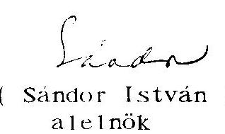
(Sándor István)
alelnök
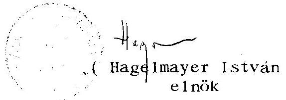
(Hagelmayer István)
elnök

Mellékletek

---

1. sz. melléklet a V-25-18/1995-96. sz. jelentéshez

---

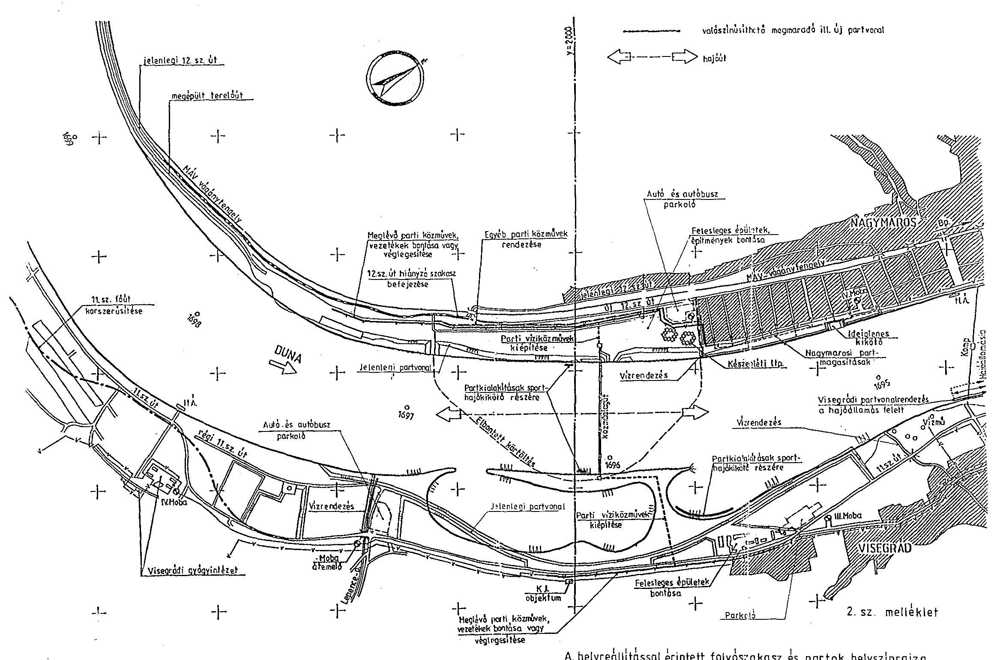

A. helyreállítással érintett folyószakasz és partok helyszínrajza

---

2. sz. melléklet a V-25-18/1995-96. sz. jelentéshez

---

NAGYMAROS-VISEGRÁDI TÉRSÉG KOMPLEX TÁJREHABILITÁCIÓ FINANSZÍROZÁSI JAVASLAT, ÉVES ÜTEMEZETT IGENYBEVÉTELEL 2011/1993. (HT. 8.) Korm. határozat

|  Megnevezés | Eves ütemezés |  |  |  |   |
| --- | --- | --- | --- | --- | --- |
|   | Összesen | 1993 | 1994 | 1995 | 1996  |
|   | költségek | folyó áron, | millió | forintban, | AFA-val  |
|  Központi költségvetés:   a.) 1992. évi maradvány   b.) 1993. évi költségvetés tk   c.) éves szinten tervezett | $\begin{array}{r} 123 \ 677 \ 4501 \end{array}$ | $\begin{array}{r} 123 \ 677 \ - \ 800 \end{array}$ | $\begin{gathered} - \ - \ 2000 \end{gathered}$ | $\begin{gathered} - \ - \ 2000 \end{gathered}$ | $\begin{gathered} - \ 501 \end{gathered}$  |
|  Központi költségvetés összese | 5301 | 800 | 2000 | 2000 | 501  |
|  Vízügyi Alap | 189 | - | 189 | - | -  |
|  Útalap | 615 | - | 210 | 405 | -  |
|  Környezetvédelmi Alap | 424 | - | - | 154 | 270  |
|  Vállalkozói hitelfelvétel | 2131 | - | 1285 | 846 | -  |
|  összesen: | 8660 | 800 | 3684 | 3405 | 771  |

---

3. sz. melléklet a V-25-18/1995-96. sz. jelentéshez

---

NAGYMAROS-VISEGRÁD TÉRSÉG KOMPLEX TÁJREHABILITÁCIÓ VERSENYTARGYALÁS
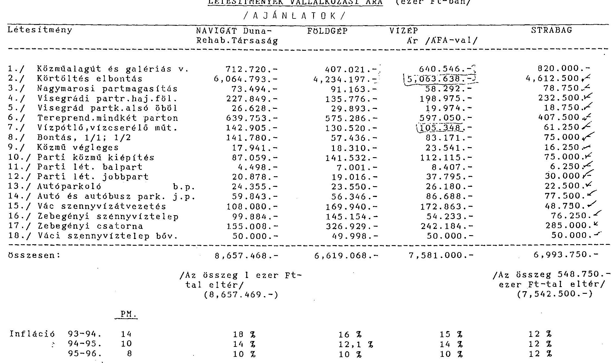

---

4. sz. melléklet a
V-25-18/1995-96. sz. jelentéshez

---

Nagymaros-Visegrádi komplex tájrehabilitáció beruházására folyósított összegek (ezer Ft-ban)

| Megnevezés | 1993 | 1994 | 1995 |  | Összesen 1993-95 |  |
| :--: | :--: | :--: | :--: | :--: | :--: | :--: |
|  |  |  | szept. 30-i állapot | dec. 31-ig   terv | szept.30-i állapot | dec. 31 -ig terv |
| Költségvetési juttatás | 578.721 | 2000.000 | 1344.245 | 2000.000 | 3922.966 | 4578.721 |
| Vízügyi alap

 | - | 148.019 | 40.981 | 40.981 | 189.000 | 189.000 |
| Költségvetési maradvány | - | 316.827 | - | - | 316.827 | 316.827 |
| Összesen | 578.721 | 2464.846 | 1385.226 | 2040.981 | 4428.793 | 5084.548 |
| Hitelfelvétel (STRABAG) | - | 457.540 | 5.198 | 1159.019 | 462.738 | 1616.559 |
| Összesen | 578.721 | 2922.386 | 1390.424 | 3200.000 | 4891.531 | 6701.107 |

---

5. sz. melléklet a V-25-18/1995-96. sz. jelentéshez

---

# NAGYMAROS-VISEGRÁD TÁRSÉG KOMPLEX TÁJREHABILITÁCIÓ LÉTESÍTMÉNYEI

/ Javaslat a kezelői és üzemeltetői jogok rendezésére/

|  LÉTESÍTMÉNY
Száma | Megnevezése | Létesítmény | Jelenlegi kezelő | Javasolt kezelő | Javasolt üzemeltető | Költség (millió Ft)  |
| --- | --- | --- | --- | --- | --- | --- |
|  1. | Közműalagút galériás víz- foglalás | közműalagút | KDV-VIZIG | KDV-VIZIG | KDV-VIZIG | 420,3  |
|   |  | galériás vízfoglalás | KDV-VIZIG | DMRV RT | DMRV RT | 220,2  |
|  2. | Körtöltés elbontás | dunameder | KDV-VIZIG | KDV-VIZIG | KDV-VIZIG |   |
|   |  | partvédelem | KVSZ - VIZIG | VIZIG | VIZIG | 4.612,5  |
|   |  | felső öböl partja | KVSZ | VIZIG | VIZIG |   |
|  3. | Nagymarosi partmagasítás | partvédelem | VIZIG | VIZIG | VIZIG |   |
|   |  | csapadékátemelő műtárgyak |  | 8NKORM. | 8NKORM. | 58,3  |
|   |  | parti sétány |  | 8NKORM. | 8NKORM. |   |
|  4. | Visegrádi partrendezés hajóállomás fölött | partvédelem |  | VIZIG | VIZIG |   |
|   |  | csapadék elvezető műtárgyak |  | 8NKORM. | 8NKORM. | 198,9  |
|   |  | parti sétány |  | 8NKORM. | 8NKORM. |   |
|  5. | Visegrádi partkialakítás alsó öbölben | dunameder | KVSZ | VIZIG | VIZIG |   |
|   |  | partvédelem | KVSZ | VIZIG | VIZIG | 18,8  |

---

|  LÉTESÍTMÉNY |  | Jelenlegi | Javasolt | Javasolt | Költség  |
| --- | --- | --- | --- | --- | --- |
|  Száma | Megnevezése | kezelő | kezelő | üzemeltető | (millió Ft)  |
|  6. | Tereprendezés mindkét parton | növénytelepítés bal part | VIZIG | VIZIG | VIZIG *  |
|   |  | földművek, vízelvezetés | VIZIG | VIZIG | VIZIG *  |
|   |  | locsolóhálózat |  |  | 355,0  |
|   |  | növénytelepítés jobb part | KVSZ | KVSZ | KVSZ *  |
|   |  | földművek, vízelvezetés | KVSZ | KVSZ | KVSZ *  |
|   |  | locsolóhálózat |  |  |   |
|   |  | Lepence-patak | VIZTARS. | VIZTARS. | VIZTARS.  |
|   |  | Apátkúti-patak | VIZTARS. | VIZTARS. | VIZTARS.  |
|  7. | Vízpótló-vízcserélő műtárgy |  |  | VIZIG | VIZIG  |
|  8. | Bontás |  |  |  |   |
|  9. | Közmű véglegesítés |  | DMRV RT | DMRV RT | DMRV RT  |
|  10. | Parti közmű kiépítése | vízellátás |  | DMRV RT | DMRV RT  |
|   |  | csatornázás |  | DMRV RT | DMRV RT  |
|   |  | elektromos ellátás |  | ELMO RT | ELMO RT  |

---

|  LÉTESÍTMÉNY |  | Jelenlegi | Javasolt | Javasolt | Költség  |
| --- | --- | --- | --- | --- | --- |
|  Száma | Megnevezése | kezelő | kezelő | üzemeltető | (millió Ft)  |
|  11. | Parti létesítmény bal part | (közműalagút bekötőút) | VIZIG | VIZIG | 6,2  |
|  12. | Parti létesítmény jobb part | (közműalagút útja) | VIZIG | VIZIG | 30,0  |
|  13. | Autóparkoló bal part | áttervezés alatt |  |  |   |
|  14. | Autóparkoló jobb part |  | KVSZ |  | 77,5  |
|  15. | Váci szennyvízátvezetés |  | DMRV RT | DMRV RT | 48,8  |
|  16. | Váci szv. telep bővítés |  | DMRV RT | DMRV RT | 50,0  |
|  17. | Zebegényi szv. telep |  | ONKORM. | ONKORM. | 54,2  |
|  18. | Zebegényi csatornahálózat |  | ONKORM. | ONKORM. | 242,1  |
|  19. | Klórozó medence építése |  |  | DMRV RT | 28,0  |
|  20. | Irányítástechnika | alagút jelzőrendszere |  | VIZIG | 48,6  |
|   |  | közművek irányításrendszere |  | DMRV RT | 17,7  |
|  21. | Közműalagút energiaellátás |  | VIZIG | VIZIG | 17,7  |

---

6. sz. melléklet a V-25-18/1995-96. sz. jelentéshez

---

KÖZLEKEDÉSI, HÍRKÖZLÉSI ÉS VÍZÜGYI MINISZTÉRIUM

650877/1996.

Hagelmayer István úr elnök

Állami Számvevőszék

Budapest

Tisztelt Elnök Úr!
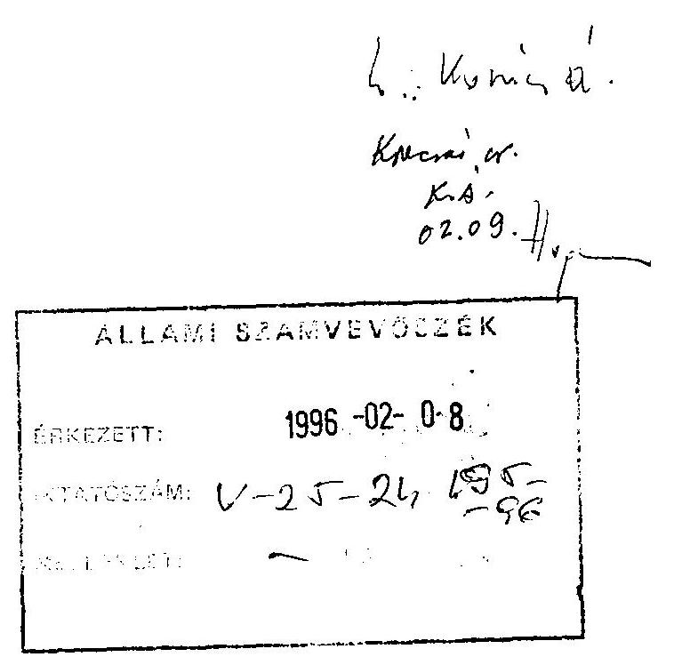

Köszönettel kézhez vettem az Állami Számvevőszék Nagymaros-visegrádi térség komplex tájrehabilitációjának ellenőrzéséről készített jelentését. A jelentésnek mind az összefoglaló, mind a részletes megállapításaival egyetértek, azokban a vizsgált problémák valósak, elemzéseik szakmailag korrektek. A vizsgálat eredményeiből leszűrhető tapasztalatokat a helyreállítás még hátralévő szakaszában és a további várható tájrehabilitációs munkák során figyelembe vesszük.

A Kormány és az érintett minisztériumok részére összeállított javaslatokkal egyetértek. A jelentésben szükségesnek ítélt kormányelőterjesztést megalapozó rajzos dokumentáció elkészítésére az intézkedések már folyamatban vannak.

A 11. számú főút építésének ütemét az Útalap lehetőségei szabják meg, az építés előkészítése, engedélyezés 1996-ban is folytatódik, de előreláthatóan csak 1997-ben fejezhető be a korszerűsített szakasz.

A Közlekedési, Hírközlési és Vízügyi Minisztérium saját hatáskörbe utalt további intézkedésekkel kapcsolatban az a véleményem, hogy azok majd részét képezik azon kormányelőterjesztésnek, amely a jelentésben javasoltan a Pénzügyminisztériummal (és rajta keresztül a Kincstári Vagyonigazgatóság bevonásával) egyeztetett formában közös előterjesztésként komplex módon foglalkozna a helyreállítás befejezését követő időszakra a tulajdonosi, kezelői és üzemeltetői jogok és kötelezettségek kormányzati döntést igénylő kérdéseivel.

---

Erre azért van szükség, mert ezen intézkedések mindegyike a költségvetés kiadásait növeli 1997-ben és csak egy hosszabb távú hasznosításból remélhető a költségek részbeni megtérülése.

A közelmúltban megtartott államtitkári szintű egyeztetés után lehetőség látszik a Központi Környezetvédelmi Alap hozzájárulására, de a hitelátadás ezideig még nem történt meg.

Végezetül megköszönöm munkatársai szakszerű, megalapozott és segítő jellegű észrevételeit.

Budapest, 1996. február " 2 "
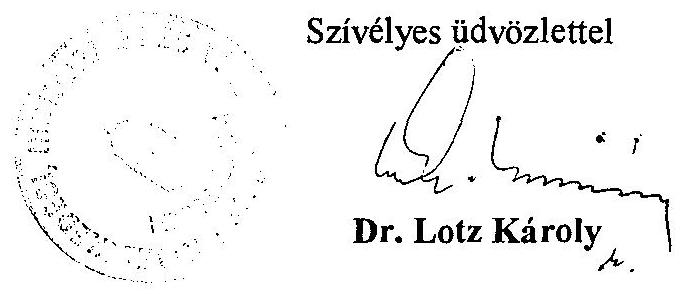

---

# A MAGYAR KÖZTÁRSASÁG KÖRNYEZETVÉDELMI ÉS TERÜLETFEJLESZTÉSI MINISZTERE   M-111/1996.   T. Knesar úr! Köszönöm megtisztelő levelét, melyben érdeklődik, hogy miért továbbra is fennállnak kétségeink.

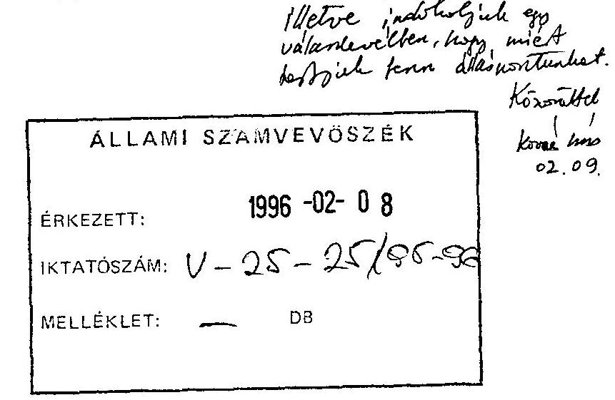

A Nagymaros-Visegrád térség komplex táj-rehabilitációjának ellenőrzéséről szóló V-25-20/1995-96. sz. jelentését áttanulmányoztam.

Az Állami Számvevőszék jelentésében a Központi Környezetvédelmi Alapról tett korábbi megállapításait nem módosította, ezért úgy véljük, hogy a KÁL3376/1995. számú levelünkben megfogalmazott észrevételünket nem fogadták el.

A jelentést áttekintve a KKA és a táj-rehabilitációs program finanszírozásával kapcsolatban a következő véleményt alakítottuk ki.

A Környezetvédelmi és Területfejlesztési Minisztérium azért ragaszkodik a KKA támogatás pályázati úton történő odaítéléséhez, mert ilyen módon ráhatása lenne a beruházás költségtakarékos lebonyolítására. A KTM számára is egyértelmű volt az a tény, melyet az ÁSZ-vizsgálat is bemutatott, hogy az érvényes beruházási szerződésekből hiányzik néhány olyan feltétel, garancia, amely a költségek takarékos felhasználását biztosítja (289. sz. jelentés 6. oldal 3. bekezdés).

Az alapkezelő feladata a hatékony alaptámogatás biztosítása, éppen ezért vizsgálni kell a pótmunkák szükségességét, annak mértékét és ütemét.

A beruházás ütemezése összefügg az elkülönített alapok igénybevételével. Az ütemezésre nincs ráhatása a beruházásban résztvevő KKA-nak.

Jelen helyzetben a KKA kezelőjének semmilyen beleszólása, lehetősége nincs például a 180 millió Ft-os homok-kavics szállítás és beépítés pótmunka mértékének alakításába.

---

Éppen ezért eltér véleményünk az Állami Számvevőszékétől, nevezetesen a KTM nem indokolatlanul zárkózott el az 1995-re előirányzott 154 millió Ft átadásától. A beruházóknak lehetőségük volt pályázat útján a támogatás elnyerésére, de ilyen pályázat nem érkezett a KTM KKA Titkárságra (ÁSZ-jelentés 8. oldal 2. bekezdés). Időközben a két tárca közigazgatási államtitkára megállapodott a pályázat benyújtásáról.

A jelentés egyéb részeivel kapcsolatban észrevételt nem kívánok tenni.

Budapest, 1996. január 31.
Üdvözlettel:
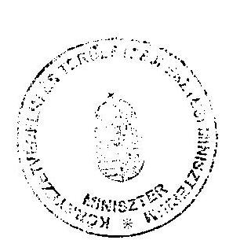
(Dr. Baja Ferenc )

---

Budapest, 1996. február " 13 " V-25-23/1995-96.

DR. BAJA FERENC úr a környezetvédelmi és területfejlesztési miniszter

# BUDAPEST 

Tisztelt Miniszter Úr!

A Nagymaros-Visegrád térség komplex tájrehabilitációjának ellenőrzéséről készült jelentéshez tett észrevételeit tartalmazó levelét megkaptam. Örömmel értesültem arról, hogy a környezetvédelmi és a közlekedési tárca államtitkárai a központi Környezetvédelmi Alap tájrehabilitációval kapcsolatos, kormányhatározatban előírt finanszirozási kötelezettségének teljesítéséről megállapodtak. A dokumentumok alapján - úgy tűnik - ez a megállapodás a közlekedési tárca nagyfokú rugalmasságának köszönhető.

Az Önök ragaszkodását a kormányhatározatban rögzített összeg pályázat útján történő igénybevételéhez - munkatársaim mellékelt feljegyzésében foglaltakkal egyetértve - indokolatlannak és közgazdaságilag vitathatónak tartom.

A jelentésben foglalt vizsgálati megállapításokon, illetve azok megszövegezésén ezért nem változtatok. Miniszter úr észrevételeit és az azokra adott válaszomat tartalmazó leveleket azonban a jelentéshez csatoljuk.
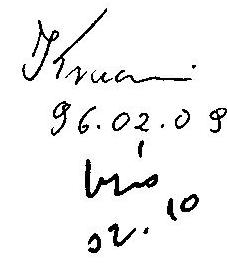

Tisztelettel
H
(Hagelmayer István)

Melléklet

---

# FELJEGYZÉS 

dr. Hagelmayer István elnök úr részére

Tárgy: A Környezetvédelmi és Területfejlesztési Minisztérium álláspontja a Központi Környezetvédelmi Alap terhére teljesítendő, kormányhatározatban előírt finanszirozási kötelezettség teljesítéséről

A Nagymaros-visegrádi térség komplex tájrehabilitáció megvalósításának finanszírozásáról szóló 2011/1993. (HT.S) sz. kormányhatározat úgy rendelkezik, hogy az elkülönített állami pénzalapok (így a Központi Környezetvédelmi Alap is) helyzetüktől és feladataiktól függően vesznek részt a rehabilitációs program finanszírozásában. E döntés során azzal számoltak, hogy a Központi Környezetvédelmi Alap 1995. évben 154 millió forintot fordított erre a célra.

E finanszirozási kötelezettségét a KTM mai napig nem teljesítette. A Közlekedési, Hírközlési és Vízügyi Minisztérium ezzel kapcsolatos megkereséseit azzal utasította el, hogy ragaszkodik a finanszirozási igény pályázati eljárás keretében történő elbírálásához.

Véleményünk szerint a pályázati eljáráshoz való ragaszkodás indokolatlan és közgazdaságilag vitatható.

---

Indokolatlan a pályázati eljárás mert,

- az egyes elkülönített állami pénzalapokról

 szóló 1992. évi LXXXIII. törvény Központi Környezetvédelmi alapra vonatkozó egyetlen paragrafusa sem írja elő, hogy az Alapból nyújtandó minden támogatás csak pályázati eljárás keretében ítélhető oda;
- a Kormány a rehabilitációs programról és a kiemelt kormányzati beruházásról egyértelműen és végérvényesen döntött, egyetlen elemét illetően sem igényelte a KTM vagy más szerv további mérlegelését;
- a KTM-nek és más, szakmai, társadalmi szerveknek a döntéselőkészítés során volt lehetősége és kötelezettsége a leghatékonyabb és leggazdaságosabb megoldások mérlegelése;
- a Kormány - bár nem a legszerencsésebb fogalmazásban mindössze arról rendelkezett, hogy az elkülönített állami pénzalapoknak a program finanszirozásában történő részvétele ne kerüljön ellentmondásba az alapokkal való gazdálkodás törvényi előírásaival. Vagyis arról, hogy az Alap rendelkezzék a finanszirozási kötelezettség teljesítéséhez szükséges "szabad", más célokra le nem kötött pénzforrásokkal.

Ez a feltétel teljesült. A Központi Környezetvédelmi Alap 1994. évben jelentős szabad pénzforrásokkal rendelkezett. Ebből 36,7 milliárd forintot értékpapír vásárlásra fordított. Az Alap záróegyenlege 1,9 milliárd forint volt. Hasonló pénzbőség volt megfigyelhető 1995. év folyamán is.

---

Közgazdaságilag vitatható a pályázati eljárás, mert:

- a Kormány nem jelölte meg (célszerűen nem is jelölhette meg), hogy az Alap terhére előirányzott 154 MFt-ot milyen konkrét beruházási feladatok megvalósítására kell fordítani. Ebből következik, hogy hiányzik a célszerűségi és takarékossági mérlegelés tárgya, a konkrét beruházás. Az a pályázati rendszerben csakis "mesterségesen kreált beruházás" lehetne.

Egészen más a helyzet az Útalap esetében, ahol a rehabilitációs programon belül műszakilag is elkülöníthető beruházás (a 11. és 12. főközlekedési utak meghatározott szakaszának korszerűsítése) tervezett költségeinek finanszírozását írta elő a Kormány. Az állami intézményrendszer jelenlegi működési rendszerébe nehéz lett volna beilleszthető, ha a KHVM, mint a program egészéért felelős beruházó pályázatot nyújtott volna be a KHVM-nek, mint az Útalap kezelőjének a szóban forgó beruházás finanszírozásához szükséges pénzeszközök megszerzése érdekében. Természetesen ezt nem tette, hanem az Alap "szabad pénzeszközeinek" erejéig finanszírozta a beruházás megvalósítását.

Fel sem tételezzük, hogy a KTM e finanszirozási kötelezettsége kapcsán jogot formál arra, hogy a 8,6 milliárd Ft-os beruházás egészének indokoltságáról, célszerűségéről és gazdaságosságáról állást foglaljon. Ezért nem tudjuk értelmezni Miniszter úr levelének azt a kitételét sem, hogy a "jelen helyzetben a Központi Környezetvédelmi Alap kezelőjének semmilyen beleszólása, lehetősége nincs például a 180 millió forintos homok-kavics szállítás és beépítési pótmunka mértékének alakításában". Véleményünk szerint a Minisztérium ilyen közvetlen beleszólása nem szükséges, hogy legyen tekintve, hogy nem a KTM felelős a beruházás megvalósításáért.

---

- a Központi Környezetvédelmi alapról szóló törvényes rendelkezés szerint (1992. évi LXXXIII. törvény 37. paragrafus (1) bek.) a pályázati eljárás keretében odaítélt összes támogatás nem haladhatja meg a tervezett költség 60%-át, a vissza nem térítendő támogatás pedig a tervezett költség 30%-át. Az adott esetben ez a törvényi megkötés alkalmazása is értelmezhetetlen.

Mindezek alapján az a véleményünk, hogy a Környezetvédelmi és Területfejlesztési Minisztérium akkor járt volna el törvényesen és a Kormány határozatának szellemében, ha az Alap rendelkezésre álló szabad pénzeszközeiből teljesítette volna a kiemelt környezetvédelmi célokat szolgáló finanszírozási kötelezettségét. Sajnálatosnak tartjuk, hogy nem ezt tette, hanem kellően végig nem gondolt, formálisan sem helytálló érveket keresett e kötelezettség teljesítésének mellőzésére.

Budapest, 1996. február 8.
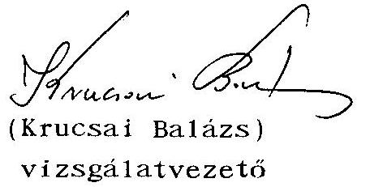

Látta:
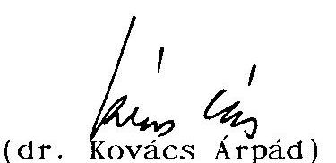
(dr. Kovács Árpád)
számvevő igazgató

---

PÉNZÜGYMINISZTÉRIUM HELYETTES ÁLLAMTITKÁR 2k8/L(10/96

Hagelmayer István úrnak
elnök
Állami Számvevőszék

Budapest

Tisztelt Elnök Úr!
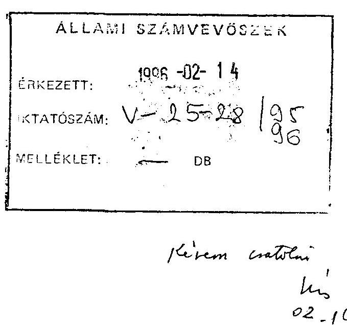

A "Nagymaros-visegrádi térség komplex tájrehabilitációja" központi beruházás megvalósítását vizsgáló, 1995. évi Állami Számvevőszéki ellenőrzésről készült jelentéssel és a vizsgálat tapasztalataira épülő intézkedési javaslatokkal egyetértek.
A jelentést alkalmasnak találom az Országgyűlés illetékes bizottságaihoz történő benyújtásra.

Budapest, 1996. február 6.

Üdvözlettel:
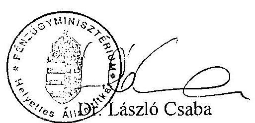

