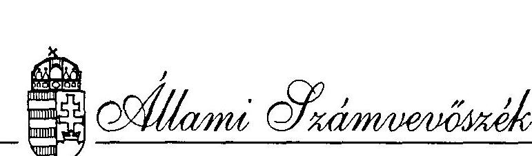
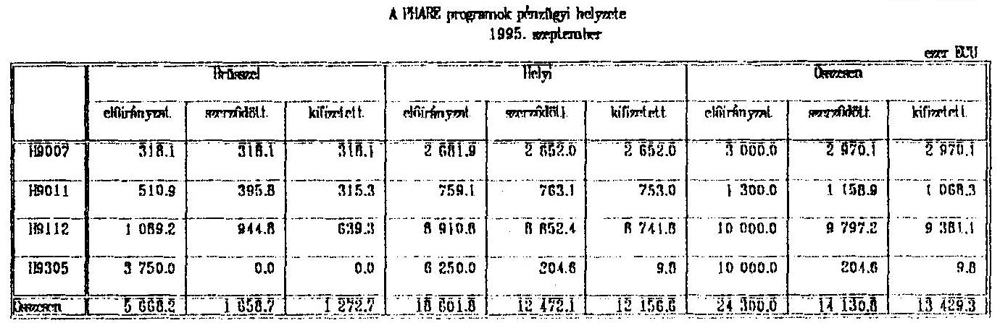
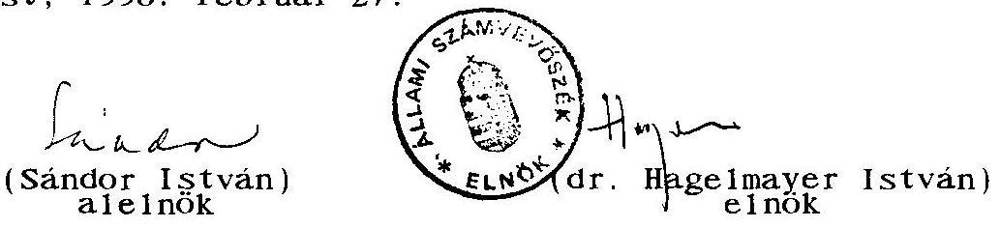
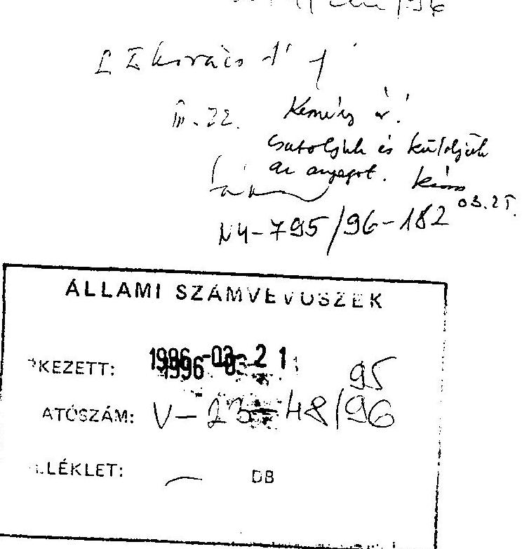

# JELENTÉS 

a magyar tudományos kutatási és fejlesztési tevékenységet támogató
PHARE segélyprogramok végrehajtásának vizsgálatáról

---

A vizsgálat végrehajtásáért felelős: az ÁSZ IV. Vagyonellenőrzési Igazgatósága
dr. Kovács Árpád igazgató

A vizsgálatot vezette:
Kemény Emil osztályvezető főtanácsos
A vizsgálatot végezte:

| Benti Gabriella | számvevő tanácsos |
| :-- | :-- |
| Réthelyi Jenő | számvevő |
| Turdos József | számvevő |

---

T A R T A L O M J E G Y Z É K
Oldal
1. BEVEZETÉS ..... 1
1.1 A finanszirozási megállapodások ..... 1
1.2 A vizsgálat ..... 2
1.3 A vizsgálat módszere ..... 4
11. ÖSSZEFOGLALÓ MEGÁLLAPÍTÁSOK, AJÁNLÁSOK ..... 4
2.1 A programok megvalósítása és hatékonyságuk ..... 4
2.2 Ajánlások ..... 8
111. RÉSZLETES MEGÁLLAPÍTÁSOK ..... 9
3. A programok menedzselése. ..... 9
3.1 A Programiroda létrehozása és müködése ..... 9
3.2 Hazai és külföldi szakértők ..... 11
3.3 Korábbi ellenőrzések ..... 14
3.4 A jóváhagyott pénzügyi keretek felhasználása ..... 16
3.5 A pénzügyi keretek nyilvántartása ..... 17
3.6 A PHARE el járási szabályainak betartása ..... 18
4. Az egyes programok részletes vizsgálata ..... 19
4.1 A H9007 "a kutatási infrastruktúra modernizálása" program ..... 19
4.2 "A külkereskedelmi infrastruktúra fejlesztése" című H9011 számú program ..... 23
4.3 A K+F ágazat erősítése, a H9112 program ..... 25
4.4 Müszaki fejlesztés és minőségügy (H9305) ..... 37
4.5 Egyéb európai támogatás a magyar $\mathrm{K}+\mathrm{F}$ szektornak ..... 39

---

# Röviditések jegyzéke 

| ACOM | Advisory Committe - Tanácsadó Bizottság - |
| :--: | :--: |
| ACSI | Anyagmozgatási és Csomagolási Intézet |
| CEN | Center for European Norms - Európai Szabványok Központja - |
| CIB KHB | Közép-Európai Hitelbank Rt. |
| COST | Cooperation in the Field of Scientific and Technical Research - Együttmüködés a tudományos és technikai kutatásban - |
| EU | Európai Unió, Európai Közösség |
| EUREKA | European Programme of Industrial R and D - Európai ipari K + F program - |
| FM | Finanszirozási Megállapodás |
| IIF | Információs Infrastruktúra Fejlesztés |
| IKM | I parí- és Kerekedelmi Minisztérium |
| $\mathrm{K}+\mathrm{F}$ | Kutatás - Fejlesztés |
| KMüFA | Központi Müszaki Fejlesztési Alap |
| KSH | Központi Statisztikai Hivatal |
| MNB | Magyar Nemzeti Bank |
| MTA | Magyar Tudományos Akadémia |
| NGKM | Nemzetközi Gazdasági Kapcsolatok Minisztériuma |
| OMFB | Országos Müszaki Fejlesztési Bizottság |
| OMIKK | Országos Müszaki Információs Központ és Könyvtár |
| OTKA | Országos Tudományos Kutatási Alap |
| PAO | Project Authorizing Officer   (Projekt Engedélyezö Tisztviselö) |
| PHACSY | Számitógépes könyvelési és beszámolási rendszer |
| PHARE | Poland and Hungary Assistance   to the Restructuring of the Economy -   Lengyelország és Magyarország segitése a gazdaság átstrukturálásában - |
| PMC | Programme Management Committee - Program Menedzsment Bizottság - |
| PMU | Programme Management Unit, Programiroda |
| STAB | Science and Technology Advisory Body - Tudomány és |
|  | Technikai Tanácsadó Testület - |
| STECOM | Steering Committee - Kormányzó Bizottság - |

---

# J E L E N T É S 

a magyar tudományos kutatási és fejlesztési tevékenységet
támogató PHARE segélyprogramok végrehajtásának
vizsgálatáról

## I.

## B EVEZETÉS

### 1.1 A finanszirozási megállapodások

1101 A tudományos kutatás és fejlesztés területe a PHARE programok keretében többször részesült támogatásban. Vizsgálatunk az alábbi finanszirozási megállapodások (továbbiakban: FM) végrehajtására terjedt ki:

A program megnevezése Aláirás kelte Elöirányzat
H9007 A kutatási infra- struktúra moder- nizálása 1990. december 3 M ECU
H9011 Kereskedelmi infra- struktúra moder- nizálása 1991. április 1,3 M ECU
H9112 A kutatási és fej- lesztési kapacitás erösitése 1991. október 10 M ECU
H9305 Müszaki fejlesztés és minőségügy 1994. március 10 M ECU

Megj. : A vizsgálat lezárásakor, 1995. november 20-án 1 ECU $=176,21 \mathrm{Ft}$ volt az MNB deviza középár- folyamán.

---

A H9011 jelü programból csak egy projekt végrehajtását vizsgáltuk ( 759.000 ECU értékben), mert két projektre az Európai Közösségek* Bizottsága (továbbiakban: Bizottság) közvetlenül szerződött és teljesítményükért közvetlenül fizetett.

1102 A programok célja a magyar tudományos kutatás és fejlesztés intézményi hálózatának korszerűsítése volt, hogy megfeleljen az európai színvonalnak és javuljanak a magyar kutatók nemzetközi együttmúködési feltételei. A célok között ugyancsak szerepelt a magyar külkereskedelem esélyeinek növelése az európai szabványok és minőségi követelmények megismertetésével, a minőségvizsgálat müszerezettségének javításával.

1103 A programok felügyeletét és menedzselését az Országos Müszaki Fejlesztési Bizottság (OMFB), illetve az általa megbízott személyek, majd az OMFB Nemzetközi Kapcsolatok Főosztályán belül létrehozott PHARE Programiroda látta, illetve látja el.

# 1.2 A vizsgálat 

1201 Az Állami Számvevőszék a vizsgálatot az ellenőrzési terve alapján végezte, szem előtt tartva az Európai Közösségek (EK, EU) Számvevőszékével kialakított együttmúködést. Az ellenőrzés célja annak megállapítása volt, hogy

- az előkészítésért és megvalósításért felelős OMFB hogyan érvényesíti az EK Bizottsága és a magyar kormány közötti keretmegállapodásban és a finanszírozási megállapodásokban foglaltakat;

[^0]
[^0]:    *Itt jegyezzük meg, hogy jelentésünkben a továbbiakban "EU" rövidítést használunk az "EK" helyett annak ellenére, hogy a jelentés által említett időpontban még az "EK" használata lett volna a helyes.

---

- a PHARE források felhasználása illeszkedik-e a hazai jogszabályi keretekhez;
- hogyan ellenőrzik a pénzeszközök felhasználását;
- a megvalósitott projektek hogyan hasznosultak.

1202 A vizsgált időszak az első finanszirozási megállapodás aláirásától kezdődően az 1995. június 30-ig terjedő időszakot fogta át, a lehetőségeknek és szükségnek megfelelően ennél korábbi és későbbi adatokat is felhasználva.

A helyszíni ellenőrzés kezdete: 1995. szeptember 5.
befejezése: 1995. november 15.

A vizsgálat helyszíne:

Az Országos Müszaki Fejlesztési Bizottság
PHARE Programiroda
10.52. Budapest, Szervita tér 8 .

1203 Tájékozódás és adatgyűjtés céljából felkerestük az alábbi szervezeteket:

- Országos Müszaki Információs Központ és Könyvtár
- Magyar Tudományos Akadémia Titkársága
- Országos Tudományos Kutatási Alap Irodája
- Tudományos Információs Inf rastruktúra Hálózat Koordinációs I rodája
- Magyar Állami Földtani Intézet

---

# 1.3 A vizsgálat módszere 

1301 Az egyes programok tervezésére és végrehajtására kiterjedő helyszini vizsgálat.

Az Állami Számvevőszék a Programiroda müködését törvényességi és szabályszerűségi szempontból vizsgálta és az egyes programok hatékonyságának, a projektek eredményességének értékelését a tapasztalt tényekre és szakértői véleményekre alapozta.
Az ellenőrzés megállapításai a vizsgálat során rendelkezésünkre bocsátott dokumentumokra, a különbözö szintü vezetőkkel folytatott interjúkra és a helyszini szemlék tapasztalataira támaszkodnak.

1302 A jelentést és annak nem hivatalos angol fordítását az Állami Számvevőszék elnöke megküldi az Európai Unió Számvevőszékének tájékoztatás céljából.

## II.

## ÖSSZEFOGLALÓ MEGÁLLAPÍTÁSOK, AJÁNLÁSOK

### 2.1 A programok megvalósítása és hatékonyságuk

2101 A vizsgált PHARE programok jelentős mértékben hozzájárultak a magyar kutatási és fejlesztési terület modernizálásához egy olyan időszakban, amikor a szférának nyújtható központi pénzforrások csökkentek. E források csökkenése miatt a K+F szféra müszerparkja, az információs infrastruktúrahálózat kiépítése az Országos Müszaki Információs Központ és Könyvtár technikai felszereltsége és folyóiratállománya nem érhette volna el jelenlegi szintjét a PHARE támogatások né1kül.

---

2102 A PHARE támogatások közvetlenül elömozdították a magyar kutatók szèlesebb körű együttmüködését az Európai Unló tagországaiban dolgozó kollégáikkal - amely egybeesett a magyar kormány célkitüzéseivel - és a K+F infrastruktúra fejlesztése révén közvetve is: a kapott eszközök segitették a bekapcsolódást az európai célú közös kutatási projektekbe.

A H9112 programon belül a magyar és EU országok tudományos intézményeinek közös kutatását támogató projekt az eszközbeszerzések révén lényegesen javította a kedvezményezettek kutatási bázisát. A támogatással beszerzett eszközök tették lehetővé a közös kutatásokat, valamint a további kutatásokhoz kapcsolódást.

A projekt dokumentációjának hiányossága, hogy nem tájékoztat a külföldi partner társfinanszirozási kötelezettségéről. Az átvizsgált dokumentumokban semmiféle utalást, jelentést, igazolást nem találtunk arra, hogy a külföldi partner valamilyen formában valóban a közös kutatásra fordította a vállalt összeget. A hazai kutatók a zárójelentésükben (Final Report) beszámoltak a saját intézeteik hozzá járulásának mértékéről.

2103 Az első két programot jól lehetett indítani a Finanszírozási Megállapodás aláírását követően, mert 1989-90-ben különböző magyar fejlesztési programok elegendő számú PHARE finanszírozásra alkalmas projekteket tudtak javasolni.

2104 A gazdaság szerkezeti változása, az ipari termelés hanyatlása jelentős mértékben csökkentette, illetve átstrukturálta a kutató és fejlesztő szervezetekkel szembeni fizetőképes keresletet a gazdaság irányából. A Kormány

---

1993 májusában közreadott innovációpolitikai anyaga által megjelölt prioritások köre is olyan széles, hogy a PHARE támogatásokat nem lehetett néhány területre összpontosítani.

Az előzőekben vázolt helyzet alapján a H9112 jelü program egyik célja az volt, hogy járuljon hozzá egy koherens technikai és technológiai politika kialakításához. A technikai és technológiai fejlesztést nem lehet elválasztani az átgondolt ipari struktúra változtatástól, beruházáspolitikától (állami és magán), ame lynek alá kell rendelni a K+F politika prioritásait. A PHARE támogatás nem ért el döntő irányváltozást a $\mathrm{K}+\mathrm{F}$ területen, mert a PHARE források a 1991-1994. években is a KMüFA forrásainak csak 10-15 \%-át tették ki.

2105 A K+F terület infrastruktúrájának modernizálása eredményeként elért színvonalemelkedés az elkövetkező néhány évben könnyen elveszhet, ha nem sikerül az elhasználódó kutatási berendezéseket, müszereket, számítógéprendszereket pótolni, illetve folyóiratellátást folyamatossá tenni.

2106 A fejlesztési célú beszerzések során a PHARE vonatkozó szabályait betartották. A berendezések származására vonatkozó PHARE követelmény enyhítése hozzájárult az ügyek gyorsabb intézéséhez.

2107 A nagyértékủ kutatási eszközök kedvezményezettjeivel kötött szerződésekben az OMFB - helyesen - kikötött egy elidegenítési tilalmi záradékot. Ezt a klauzulát elmulasztotta az Országos Tudományos Kutatási Alap (OTKA) müszerközpontoknak juttatott berendezések esetében (H9007 program).

---

2108 A H9112 program keretében a kutatók tanulmányútjaihoz adott támogatások, illetve a közös kutatások támogatása esetében a PMU több ízben eltért a szabályoktól, a kedvezményezettek kötelezettségei teljesítését nem kérte mindig számon.

2109 A H9305 jelű programot - bár az FM aláírása óta a helyszíni vizsgálatig 16 hónap telt el - érdemben nem lehetett vizsgálni az előkészítettség alacsony foka miatt.

2110 A PHARE támogatások hatékonyságát lényegesen rontották az indokolatlanul hosszú átfutási idők, amelyek a FM-ok aláírása és a tender-kiírások, illetve a pályázat-elbírálások között elteltek. A kieső időszakokra nem adtak magyarázatot sem a vizsgálathoz adott dokumentumok, sem az in-terjú-alanyok. Az időveszteség kedvezőtlen hatása megnyilvánult

- a H9112 program "Közös kutatás és fejlesztés" részében, ahol a projekt megvalósítására előirányzott három évböl, egy évet a pályázati dosszié elkészítésére, egy évet a pályázat kiírására és a döntéshozatalra fordítottak. Az érdemi munkára, a közös kutatás-fejlesztésre csupán egy év maradt. Az igen nagymértékủ csúszás miatt az EU hozzájárult a programok 1995. évi elszámolásához.
- A H9112 program "Infrastruktúra - nagyértékủ berendezések" projektjének megvalósítása során 22 hónapot fordítottak olyan adminisztratív tevékenységre, amelyet maximum 7 hónap alatt el kellett volna végezni. E késedelem miatt egyes berendezések már a beszerelésükkor nem képviselték a legfejlettebb müszaki szintet.

---

- A H9305 "Müszaki fejlesztés és minöségügy" program 1994 márciusi FM aláirásától vizsgálatunkig mindössze két pályázati felhívás jelent meg a négy projektre; a benyújtási határidők 1995 szeptemberében voltak. Figyelemmel a program - FM szerinti - 1996 júniusi befejezési időpontjára, kétségesnek tartjuk az elöirányzott források hatékony elkölthetöségét.

# 2.2 Ajánlások 

az Iparı és Kereskedelmi Miniszter

2201 - kísérje figyelemmel a jelentésben feltárt hiányosságok megszüntetését, az ajánlások végrehajtását;
az OMFB Tanácsa

2202 - vizsgálja meg a H9305 jelű program késedelmes indulásának személyi és koncepcionális okait, és intézkedjen a program hatékony folytatása és befejezése érdekében;
az OMFB ügyvezetö elnöke

2203 - kérje az EU Bizottság hozzájárulását a H9305 jelü program teljesitési határidejének meghosszabbításához a késedelmes indításra való tekintettel;

2204 - Intézkedjen, hogy a H9007 program keretében az OTKA müszerközpontok modernizálására 1991-1992-ben átadott müszereknél az elidegenitési tilalmat érvényesitsék az 5 évböl még hátralévő időszakra;

2205 - Intézkedjen, hogy a PHARE Programiroda munkájában a tapasztalt hiányosságok - amelyeket a jelentés III. fejezete tárgyal - megszünjenek.

---

111 .

# RÉSZLETES MEGÁLLAPÍTÁSOK 

## 3. A programok menedzselése

### 3.1 A Programiroda létrehozása és müködése

3101 Az 1990 decemberében, illetve 1991 áprilisában aláirt két PHARE program adminisztrálására az OMFB nem hozott létre külön egységet. Az elsó esetben (H9007) a Nemzetközi Kapcsolatok Főosztálya egyik munkatársát bízták meg a PAO (projekt engedélyező tisztviselő) feladataival, a második esetben (H9011) az egyik szakmai főosztály vezetőjét. E döntésnél - feltehetően - abból indultak ki, hogy mindkét programban kevés kedvezményezett van, akik projektjük megvalósítására megfelelő szakmai és adminisztratív gárdával rendelkeznek. Így az OMFB-ben nem volt szükség egy külön szervezeti egység létesítésére. A projektekkel kapcsolatos pénzügyi feladatokat az OMFB Pénzügyi 0sztálya látta el.

3102 Az 1991 végén elfogadott program (H9112) Finanszirozási Megállapodása előirta, hogy az OMFB-nek a program végrehajtására egy külön szervezeti egységet, irodát (a továbbiakban angol rövidítése alapján: PMU) kell létrehozni. Az EU Bizottsága egy angol céggel szerződve 3 éves megbízatással egy technikai főtanácsadót is küldött a Programiroda vezetője mellé. A PMU a Nemzetközi Kapcsolatok Főosztálya keretében osztályként dolgozik, az iroda vezetőjét egyben kinevezték PAO-nak is. Így tehát a PMU vezetője egyben a megvalósítás ellenőre is lett. Ezt az ellentmondásos helyzetet a H9305 jelű programnál feloldották és a PAO feladatát az OMFB elnökhelyettese, ma ügyvezető elnöke és nem az Iroda vezetője látja el.

---

3103 A PMU-ban a vizsgálat idején 9 munkatárs dolgozott, akik közül 4 fő az OMFB állományába tartozik, 5 fő pedig megbizási szerződés alapján dolgozik. Ök 1995 májusáig PHARE forrásból kapták illetményüket.

3104 A PHARE programok menedzselésére az OMFB, illetve a magyar állam is jelentős összegeket költ. A munkabérre, általános költségekre, megbizásokra stb. kifizetett összegek a Kormányzati Ellenőrzési Iroda jelentése szerint:
1992. évben 3.188 E Ft
1993. évben 10.393 E Ft
1994. évben 11.459 E Ft-ot tettek ki.

Az 1995. évi költségek pontos összegét még nem lehetett a vizsgálat befejezésekor megkapni, de azt közölték, hogy 1995-re a KMÜFA-ból 13 millió forintot kö1tenek az alábbiak szerint:

- külső szakértők, bírálók dijára 6 M Ft-ot
- hirdetések, nyomdaköltségek dijára 3 M Ft-ot
- szerződéses munkavállalók dijára 4 M Ft-ot

3105 A fenti költségekben nem szerepel az az összeg, amit a PMU-nak kellene fizetni, ha kereskedelmi alapon bérelné az irodát. A PMU $110 \mathrm{~m}^{2}$ területet foglal el az OMFB épületében térítésmentesen, ami kb. évi 3,1 M Ft megtakarítást jelent. Az elmúlt 4 évben a PHARE programok adminisztrálására az OMFB több, mint 50 M Ft-ot költött.

3106 A PHARE program adminisztrativ költségvetéséből a PMU külföldi főtanácsadójának költségeit, a PMU gépesítését és modern nyilvántartási rendszerének kifejlesztését is fedezték.

---

3107 A PMU-nak saját müködési szabályzata nincs, tevékenységét az OMFB 1993-ban elfogadott és 1994. végén módosított Szervezetei és Müködési Szabályzata alapján végzi.

3108 A PMU nyilvántartási rendszere az egyes projektek pályázóinak, kedvezményezettjeinek nyilvántartása megfelelö.

# 3. 2 Hazai és külföldi szakértök 

3201 Az OMFB szakértői nyilvántartásából nagy számban kértek fel magyar szakértöket, hogy müködjenek közre a PHARE programok végrehajtásában. E szakértök dolgoztak az egyes programok irányító, ellenörzö testületeiben, a kü1önböző pályázatok zsúrijeiben, a szállitói tenderek kiértékelö bizottsága1ban. Tevékenységüket ingyen, vagy a magyar gyakorlatnak megfelelö tiszteletdijért végezték.

3202 Ezen kivül - korlátozott számban - ECU-ben megállapított fizetésért foglalkoztattak többségükben külföldi szakértőket. Hét szerzödésben összesen 12 külsö szakértö megbízását rögzítették. A brüsszeli szakértői adatbankból választott "short list" alapján pályáztatták a cégeket/szakértőket. Ha a feladat jellege nem zárta ki az OMFB PMU közremüködését a legmegfelelőbb szerződő kiválasztásában, akkor erre is sor került. (Kizáró okot jelentettek az OMFB PMU tevékenységét ellenőrző, minősitő szakértői megbízások.)

3203 A megbízás összegét és a magyarországi tartózkodás időtartamát tekintve legjelentősebb külső szakértő az Egyesült Királyság National Computing Center (NCC) cégének alkalmazottja volt, aki a H9112 jelű program keretében a PMU technikai főtanácsadója volt. A szerződést Brüsszelben kötötték 918.880 ECU értékben a program me-

---

nedzselésére. A szerződéskötést megelőzően a legesélyesebb három cég által javasolt szakértőt Budapesten is meghallgatták és minősitették. Így választották ki az NCC cég képviselöjét, akinek magyarországi tartózkodása 1992. február és 1994. december között összesen 385 nap volt. Munkájáért az NCC cég részére 378.386 ECU-t fizettek ki a 918.880 ECU keretösszegből ( $41,2 \%$ ).

Szakértői irányítása érvényesült még a számítógépes pályázat-nyilvántartási rendszer kialakításában és beüzemelésében, továbbá a munkaprogramok elkészitésében.

3204 Az NCC szakértöje kötött további szerzödéseket az NCC szerzödés terhére. E szakértőknek összesen 109.773 ECU-t fizettek ki.

- Egy holland-görög szakértö-pár kapott megbizást a PMU számítógépes ellátásában a számítógépek üzembehelyezésére, a szoftverek telepítésére és tesztelésére. A feladat 35 napos magyarországi tartózkodást igényelt. A szerződéskötést tenderkiírás nem előzte meg, mivel ez a két szakértő már egy számítógépes rendszert kidolgozott Brüsszelben.
- Egy Egyesült Királyságbeli és három magyar szakértö kapott megbizást a H9112 jelű program végrehajtásának értékelésére. A külföldi szakértő mintegy 25 napos magyarországi tartózkodással, a magyar szakértők 20-20 napos ráfordítással végezték el a feladatot. Munkájuk eredménye önálló kiadványként jelent meg. Megbizásukat nem előzte meg tenderkiírás; egy javaslati listából választotta ki a Bizottság illetékes igazgatósága, az OMFB egyetértésével.

---

- Magyar szakértőkként foglalkoztattak az OMFB PMU-nál teljes munkaidőben egy öt fös projekt-menedzser stábot. Feladatuk a projekt-menedzseri teendők ellátása (beérkezett pályázatok értéke1tetése, az elfogadott pályázatokra szerződéskötés, a szerződésben foglaltak teljesítésének ellenőrzése, a pályázati iratanyagok archiválása stb.). Éves szerződések alapján 1995. április végéig összesen 102.038 ECU-t fizettek ki. Ezután dijazásukat magyar forrásból kap ják.

3205 Az NCC szerződés terhére finanszirozták a következőket:
a) Az OMFB PMU eszköze1 látottságának kialakítása. (Számitógépek és irodai berendezések beszerzése.)
b) Egy ROVER típusú szemé lygépkocsi beszerzése és üzemeltetése

24.224 ECU

3206 A Bizottság kötött szerződést a CEN céggel a H9011 jelű program keretében technikai segély nyújtására. A feladatkiirást az OMFB PMU-val közösen állitotta össze; a CEN szakértöre tett javaslatával a PMU egyetértett.

A külsö szakértő feladata volt a Magyar Minőség Díj kritériumrendszerének kidolgozása, valamint a pályázók és az értékelők oktatása. A szakértő által kidolgozott metodika megfelel az EU minőség-dij metodikájának, és a Magyar Minőség Dí kidolgozásánál figyelembe fogják venni. A külső szakértő magyarországi tartózkodása 10 nap volt, feladata teljesitéséért 23.600 ECU-t fizettek ki.

3207 További két esetben bízott meg a Bizottság szakértöket az OMFB PMU által kiirt szállítási tenderek értékelésének

---

ellenőrzésére. Következésképpen a szakértök kiválasztásához nem kérték az OMFB véleményét.

- 1994 júniusában négynapos magyarországi tartózkodás során az Egyesült Királyságból két szakértő minősítette a nagyértékủ berendezések szállítására kiirt tender kiértékelését. A beérkezett 46 pályázatból kiválasztott 18-cal a külső szakértők is egyetértettek és javasolták a 18 szerződés mielőbbi megkötését.
- Az Egyesült Királyságból érkezett egy szakértő, aki négynapos magyarországi tartózkodása során, az Információ Infrastruktúra Hálózat (IIF) bővítésére kiirt tender értékelését ellenőrizte. Az el járással egyetértett; a szállítási szerződés megszövegezésében segített.

3208 Egy szerzödést kötött külsö szakértövel az OMFB PMU, amely a H9007 jelü programhoz kapcsolódott. Az Egyesült Királyságból érkezett szakértő véleményezte az IIF-re kapcsolódó öt regionális központ csatlakoztatását a hálózatra. Tanulmányában értéke1te a H9007 program számító-gép-hálózatának fejlesztési eredményeit. Javaslatát figyelembe vették - a H9007 program folytatásának tekinthetö - H9112 program 4. projektjének kidolgozásánál. Feladatának teljesítéséhez nyolc napot töltött Magyarországon.

# 3. 3 Korábbi ellenörzések 

3301 A H9007 programot ellenörizte az Ernst and Young cég 1991 augusztusában az első munkaprogram auditálása keretében, míg a Horlings, Brouwer and Horlings cég 1995 áprilisában pénzügyi ellenőrzést végzett.

---

3302 A H9011 programnál pénzügyi ellenőrzést végzett az Ernst and Young cég 1992 októberében és a Horlings, Brouwer and Horlings cég 1995 áprilisában, míg szakmai és megvalósulási jelentést (Technical Audit) készített Roland A. Rosner 1993 áprilisában.

3303 A H9112 programnál pénzügyi ellenőrzést végzett a Moore Stephens Chartered Accountants cég 1995 januárjában. A program megvalósulásával az alábbi szakértői jelentések foglalkoztak:

- Preliminary review report 1993. július, The Circa Group Europe,
- Evaluation report 1994. december, The Circa Group Europe, IQSOFT Budapest, KFKI Budapest,

A felsorolt vizsgálatokat, ellenőrzéseket EU megbizás alapján végezték.

3304 A jelentésekben foglaltakat az auditorok a PMU képviselőivel egyeztették, az elfogadott észrevételeket a PMU végrehajtotta. Az ellenőrzések során a programok megvalósulásával, elszámolásával, a pénzügyi nyilvántartással kapcsolatban jelentős észrevétel nem merült fel.

3305 Az OMFB belsö ellenőrzése az ÁSZ vizsgálat megkezdéséig nem foglalkozott a PHARE támogatások felhasználásának ellenőrzésével.

---

# 3.4 A jóváhagyott pénzügyi keretek felhasználása 

3401 Az OMFB részére a négy PHARE program keretében összesen 24,3 millió ECU-t hagytak jóvá, ame lynek programonkénti megoszlását, az événkénti kifizetéseket, a szerződéses állapotot az 1. és 2. sz. táblázatok tartalmazzák.

2.sz. táblázat

A PHARE elöirányzat évenkénti feltuoználása

|  | FM | 1991 | 1992 | 1993 | 1994 | 95.09 .30 . | Összesen |
| :--: | :--: | :--: | :--: | :--: | :--: | :--: | :--: |
| 119007 | 3000.0 | 2073.1 | 177.0 | 715.0 | 5.0 | 0.0 | 2970.1 |
| 119011 | 1300.0 | 66.0 | 523.9 | 238.3 | 171.8 | 68.3 | 1068.3 |
| 119112 | 10000.0 | - | 169.5 | 1503.1 | 4806.9 | 2901.6 | 9381.1 |
| 119305 | 10000.0 | - | - | 0.0 | 0.0 | 9.8 | 9.8 |
| Összesen | 24300.0 | 2139.1 | 870.4 | 2456.4 | 4983.7 | 2979.7 | 13429.3 |

---

A 24,3 millió ECU elöirányzatból 18,6 millió ECU-t - 76,5 \% helyi (magyarországi), míg 5,7 millió ECU-t - 23,5 \% EU (brüsszeli) rendelkezésre irányoztak elő. 1995. szeptember végéig a 13,4 millió ECU összes felhasználásából a helyi elöirányzatból 12,1 millió ECU-t (65,5 \%), a bizottsági előirányzatból 1,3 millió ECU-t (22,7\%) fizettek ki. A H9007, H9011 és H9112 programoknál a helyi előirányzatokat gyakorlatilag felhasználták, illetve 1995. végéig kifizetik. Igen jelentős a késés a H9305 programnál. A 3,75 millió EU előirányzatból semmit, a 6,25 mi11 iós helyi előirányzatból csupán 9,8 ezer ECU-t fizettek ki.

3402 A PHARE keretmegállapodásban rögzített általános feltételek közül import beszerzés esetén az NGKM (IKM) által kiadott igazolás alapján a vám- és illetékmentesség biztosítható. Az ÁFA elszámolásnak a Keretmegállapodás szerinti végrehajtása visszatérően problémát okoz, amelyet korábbi vizsgálataink során folyamatosan jeleztünk. 1992. és 1994. között a visszaigénylés lehetősége, módja többször változott. 1993-ban az NGKM a Keretmegállapodás módosítását is kezdeményezte. Jelenleg belföldi beszerzés esetére az érvényes jogszabályok biztosítják az ÁFA visszaigénylés lehetőségét, a gyakorlati végrehajtás azonban továbbra is bonyolult és hosszadalmas.

# 3.5 A pénzügyi keretek nyilvántartása 

3501 A H9007 és a H9011 programok elkülönített számláit a Magyar Nemzeti Bank (MNB) vezeti. A H9112 és a H9305 programok pénzügyi forrásának önálló kezelésére a Közép-Európai Hite1bank Rt.-ve1 (CIB KHB) kötöttek szerződést.

---

3502 A banki számlaértesitők és a PHACSY kivonatok egyezőséget mutatnak. A kedvezményezettektől beérkezett számlák igazolása, azonosíthatósága, az átutalások kezelése megfelelö.

3503 A forrásokat a programokban megfogalmazott céloknak megfelelően használták fel.

3504 A négy programra átutalt előleg kamata 1995. szeptember 30-ig összesen 232,3 ezer ECU. Az MNB az ECU-ben vezetett számlák után 1993. január 1-től nem fizetett kamatot, ugyanakkor kezelési költséget sem számolt fel. Tekintettel arra, hogy az érintett két programnál az elöirányzat jelentős hányadát ezen időpontig felhasználták, a program lezárásáig a kamatkiesés minimális. A CIB KHB a megbizói utasításoknak megfelelően, a lekötéskor érvényes kamatot fizeti.

3505 A H9007 programnál a képződött kamatot az EU engedélyével egy ún. Pilot projektre használták fel.

3506 A H9011 programnál a kamatból 3500 ECU a forráshiány fedezetét biztosította. A fennmaradó hányad felhasználására a PMU javaslatot terjesztett elő, amelyre még nem érkezett válasz az EU-tól. A H9112 program kamatfelhasználására szintén felterjesztettek kérelmet, amelyet még nem hagytak jóvá.

# 3.6 A PHARE eljárási szabályainak betartása 

3601 A nagyértékű műszerek és kutatási berendezések közel 6,5 millió ECU értékủ beszerzése során a PHARE eljárási szabályait betartották. A végső felhasználók - néhány esetben konzultálva a Bizottság illetékeseivel - elkészítet-

---

ték a tender dossziékat. A tender felhívásokat a Bizottság hivatalos közlönyében, illetve magyar lapokban a PMU, illetve a Képviselet megjelentette. A beérkezett javaslatok felbontását és kiértékelését megfelelő létszámú szakértői bizottságok végezték, amelyekben általában részt vettek az EK Bizottság, vagy a Képviselet szakemberei. A bizottságok tevékenységükröl az elöirt jegyzőkönyveket elkészítették. A kiértékelés eredménye alapján megkötött szállítási szerződéseket a Képviselet jóváhagyta. A beérkezett müszerek, berendezések használatba vételéről a kedvezményezettek az elöirt jelentéseket elkészítették. E folyamat egyes állomásai - kivéve, ahol külön észrevételt teszünk - elfogadható idöközőkben követték egymást.
4. Az egyes programok részletes vizsgálata
4.1 A H9007 "a kutatási infrastruktúra modernizálása" program
4.1.1 A program előkészítése, a megvalósítás szervezése

4111 A H9007 és a H9011 programok előkészítése még 1989-ben kezdődött el. Az Európai Közösségek Tanácsának határozata alapján az EU Bizottság szakértőivel tárgyalások folytak az EU támogatás megvalósításáról 1989-1990-ben. A kuta-tás-fejlesztés terén létező programokból aránylag hamar tudtak finanszírozásra érdemes és alkalmas projekteket kiválasztani. A kiválasztott projektek illeszkedtek az akkori kormányzati, szakmai elképzelésekhez.

4112 A projektek előkészítettségét és a végrehajtásban érdekelt szakemberek felkészültségét jelzi, hogy a H9007 program Finanszirozási Megállapodásának aláírása után egy hónappal az OTKA müszerközpontok támogatására a szállítói

---

tenderfelhívást közzé lehetett tenni és három hónappal később már a nyertes szállítókkal a szerződéskötési tárgyalások is megkezdődhettek.

# 4.1.2 A program pénzügyi helyzete 

4121 A program kezelöje és az FM aláírója az OMFB. Az 1990 decemberében aláirt FM szerint a befejezési határidó 1991 decembere volt, ame1yet meghosszabbítottak 1992. december végéig. Utolsó kifizetés 1994. évben volt. A program pénzügyi auditálása 1995 áprilisában megtörtént.

Az összes átutalás 2,682 millió ECU, me1yból az összes he1yi kifizetés 2,652 millió ECU.

4122 A programhoz tartozó projektek és elöirányzatok (ezer ECU):

| 9007-01 Müszerközpontok | 1760,0 |
| :-- | --: |
| 9007-02 Kutatás-fejlesztés információs hálózat | 580,0 |
| 9007-03 Országos Müszaki Információs Központ | 300,0 |
| 9007-04 Kü1só tanácsadók | 60,0 |
| 9007-05 Kü1só e11enőrzés | 50,0 |
| 9007-06 Tartalék | $\underline{250,0}$ |
|  |  |

### 4.1.3 OTKA müszerközpontok

4131 A müszerközpontok fejlesztési igényeit a Magyar Tudományos Akadémia a Bizottság szakértői elvárásainak megfelelően tudta dokumentálni és a rendelkezésre álló pénzügyi keretben elfogadtatni. A projekt végrehajtása gördülékenyen ment.

---

4132 Az OTKA müszerközpontok egy, vagy több intézmény által alapitott keretben müködtek, nem rendelkeztek önál ló jogi személyiséggel. A megváltozott gazdasági körülmények miatt nem valósultak meg azok az eredeti elképzelések, hogy a központok szolgáltatási bevételeikböl tartják fenn magukat. Így a müszerek használata az eredetileg e célra szerződött intézetek együttmüködési igényein, lehetőségein, a munkájuk iránti fizetőképes keresleten múlik.

4133 A központok gesztor intézetei a berendezéseket, müszereket leltárba vették és üzemeltetik. A tulajdonba vételre vonatkozóan sem a PHARE, sem az OTKA nem adott időpontot, illetve nem kötött ki elidegenitési tilalmat.

A müszerközpontok részére az OMFB segítségével kidolgozott Szervezeti és Müködési Szabályzatban a müszerek használatának rendjével foglalkozó fejezet kimondja, hogy az OTKA Bizottság támogatásával kapott müszerek visszavételét - nem megfelelő, vagy hanyag müködtetés esetén az OTKA Bizottság elnöke elrendelheti.

# 4.1.4 Kutatási információs infrastruktúra-hálózat fejlesztése 

4141 A tudományos kutatási és technikai fejlesztési intézményrendszer információs infrastruktúrájának fejlesztési programja (IIF) két alkalommal részesült PHARE támogatásban. A hálózat kiépitése 1986-ban indult az MTA Számitástechnikai Kutató Intézete bázisán. 1990 decemberére már 200 felhasználó vett részt a hálózatban (kutató helyek, egyetemek, könyvtárak). A hálózat összekapcsolja a magyar felhasználókat nemcsak egymással, de a nemzetközi adatbázisokkal is. A PHARE segítséggel a regionális központokat kívánták kialakítani, illetve a nemzetközi kapcsolati hálózat teljesitőképességét növelni. A program irányítására és kezelésére a meglévő irányító testületet és projekt irodát használták fel.

---

4142 A program keretében kapott 653.400 ECU támogatás felhasználását komolyabb vita előzte meg a kedvezményezett és a Bizottság szakértői között. A szállitói tendert csak 1991 júliusában hirdették meg, az ajánlatokat augusztusban bírálták el. Az OTKA müszerközpontok projekt esetében már 1991. március 6-án adta meg a Képviselet hozzá járulását a rendelések kiküldéséhez, az Információs infrastruktúra hálózat csak 1992 januárjában küldhette ki a rendeléseket. Ez a projekt a müszerközpontok fejlesztése projekttel szemben mintegy 7-8 hónap hátránnyal indult.

# 4.1.5 Országos Müszaki Információs Központ és Könyvtár 

4151 Az Országos Müszaki Információs Központ és Könyvtár két programban a H9007 és a H9112 jelüben kapott PHARE támogatást 320-320 ezer ECU értékben. A támogatást az első program esetében a Bizottság közvetlenül, a második esetében a PMU finanszírozta.

A segítségbő1 megvalósitották a folyóiratbeszerzés számítógépes nyilvántartását, a könyvtári anyag lopás elleni védelmét, néhány másológépet szereztek be az olvasóterem részére és összekötötték számítógépes rendszerüket néhány nagy egyetem könyvtárával. A támogatás döntő része azonban mindkét programban a külföldi folyóiratok beszerzésének támogatása, valamint a CD-ROM adatbázisok gyarapitása volt.

4152 A PHARE támogatásból származó beszerzéseket az. OMIKK szabályszerűen bevételezte, állományba vette. A projekt lebonyolítását késedelmek nélkül hajtották végre, a H9007 esetében a tendernyitás 1990 decemberében, a teljesítés 1992 elején megtörtént. A H9112 keretében a tenderjavaslatokat 1992 novemberében és 1993 közepén bírálták el, a szállításokat pedig 1993-94-ben bonyolították le.

---

4153 A PHARE támogatás jelentősen hozzájárult az OMIKK technikai modernizálásához és folyóirat-állománya színvonalának emeléséhez.
4.2 "A külkereskedelmi infrastruktúra fejlesztése" címü H9011 számú program
4.2.1 A program előkészítése és a megvalósítás szervezése

4211 A H9007 jelű programhoz hasonlóan e program összeállításáról is már 1989., 1990-ben tárgyaltak a magyar és a bizottsági szakértők. Az OMFB először nem akarta vállalni a program címe miatt a menedzser szerepét. Végül az OMFB írta alá az FM-et, abból a meggondolásból, hogy a szabványügy és a minőségügy gondozása az OMFB feladatai közé tartozik.

4212 A program három projektjéből kettő végrehajtására a Bizottság szerződött a technikai segélyt nyújtó cégekkel és szolgáltatásaikért közvetlenül fizetett. Az OMFB menedzselte a harmadik projektet, ame lynek keretében a minőségvizsgálathoz, szabványosításhoz mérési eszközöket, berendezéseket szereztek be. Részletesen csak ezt a projektet vizsgáltuk.

# 4.2.2 A program pénzügyi helyzete 

4221 Az FM-t az OMFB 1991 áprilisában írta alá, amely szerint a befejezési határidó 1991. december. Ezt meghosszabbították 1994. december végéig. Pénzügyi kifizetés még 1995. évben is volt.

4222 Az összes átutalás 749,5 ezer ECU, az összes helyi kifizetés 753,0 ezer ECU. A 3,5 ezer ECU többlet forrása a

---

kamat. Az OMFB 1,3 millió forinttal járult a program megvalósitásához.

4223 A programhoz tartozó projektek és elöirányzatok (ezer ECU):

9011-01 Technikai segítség a Szabványügyi Hivatalnak 229,4
9011-02 Mérési eszközök beszerzése 759,6
9011-03 Technikai segitség az ACSI-nek 310,0
9011-04 Tartalék 1,0
összesen: $\quad \mathbf{1 3 0 0 , 0}$

# 4.2.3 Mérési eszközök beszerzése 

4231 A program keretében az OMFB kezelte azt a projektet, amely szabányosításhoz, minőségvizsgálathoz eszközök beszerzésére 759 ezer ECU-t irányzott elő. Az FM megkötésekor azonnal járó előleget csak 1991. szeptember 1-én utalták át. Ezért az első munkaprogram az 1991. szeptember - 1992. február közötti időszakra vonatkozott. Ennek keretében a PHARE elöírásoknak megfelelően megrendeltek, illetve beszereztek eszközöket 236 ezer ECU értékben a szabványosítással és minőség ellenőrzésével foglalkozó intézmények részére.

4232 A bankszámlán még rendelkezésre állt mintegy 215 ezer ECU-t a második munkaprogram keretében kívánták elkötelezni. A Képviselet megjegyzései alapján átdolgozott munkaprogramot a PMU jóváhagyásra megküldte 1992. július 7-én a Képviseletnek, amely azt 1992. decemberi levelével hagyta jóvá. A 2. időszakról szóló jelentés az 1993. május és november közötti eseményekről számolt be.

---

4233 A Programiroda nem tudott magyarázatot adni, hogy egy évig miért nem folytatták a projektet és miért nem sürgették a Képviseletnél a munkaprogram jóváhagyását. Arra sincs magyarázat, hogy a jól indult beszerzési program miért lassult le, miért költöttek 1993. végéig a 759 ezer ECU elöirányzatból csak 544 ezret. A hátralévő összeget 1994. során használták fel.

4234 A program másik két projektjét nem vizsgáltuk, miután az azokra vonatkozó szerződéseket az EU Bizottsága kötötte meg és közvetlenül fizetett. A Szabványügyi Hivatal részére nyújtott technikai segély lebonyolítója a Nemzetközi Szabványosítási Központ, az Anyagmozgatási és Csomagolástechnikai Intézet esetében egy PIRA nevü angol cég. Bár nem vizsgáltuk e két projektet, de meg kellett állapítanunk, hogy a két projekire elöirányzott 229.400, illetve 310.000 ECU-ből a pénzügyi nyilvántartás szerint 1995 szeptemberéig csak 96.400, illetve 219.000 ECU-t fizettek ki.
4. 3 A K+F ágazat erősítése, a H9112 program
4.3.1 A program előkészítése, a megvalósítás szervezése

4311 A H9112 jelű program beindítása az előzőknél lényegesen lassabban ment. Ennek több objektív oka is volt. Fel kel lett állítani a Programirodát. A program az előző kettőnél lényegesen több kedvezményezettre számíthatott (kutatók tanulmányútjai, közös kutatások) több pályázati kiíást kellett készíteni. Az előkészítést az OMFB elnöke vezetésével a vezetői értekezlet is áttekintette. A Finanszirozási Megállapodás elöírásainak megfelelően létrehozták a szakmai irányítást, illetve előkészítést ellátó testületeket.

---

# 4.3.2 A program pénzügyi helyzete 

4321 Az FM-t az OMFB 1991 októberében írta alá, amely szerint a befejezési határidő 1994. október. A hosszabbításra kérelmet nem terjesztettek be. A programra az EU Bizottság és a PMU szóbeli megállapodás alapján új szerződés nem köthető.

4322 Az összes átutalás 8,837 millió ECU, amelyből az összes helyi kifizetés 8,742 millió ECU. Kifizetés 1995-ben is volt. A bizottság az első előleget 1992. december 10-én utalta át, az aláírás után 13 hónappal.

4323 A programhoz tartozó projektek és elöirányzatok
(millió ECU)
9112-01 Közös kutatás és fejlesztés 3,5
9112-02 "MOBILITY" kutatóbázisok kapcsolat-
bővítése 1,2
9112-03 Kutatás-fejlesztés infrastruktúra
Nagyértékủ berendezések 3,0
9112-04 Kutatás-fejlesztés információs
infrastruktúra 1,12
9112-05 Kü1sö tanácsadás - NCC 0,92
9112-06 Tartalék, program szervezés 0,26
összesen: 10,00
4.3.3 Közös kutatás és fejlesztés (H9112-01.)

4331 A program előirányzata 3,5 millió ECU, megvalósítási idötartama 3 év volt. A program elősegiteni és támogatni kívánta a magyar kutató-fejlesztő szervezetek részvételét a nemzetközi programokban, amelyeket az EU vagy tagállamai szerveznek.

---

A finanszírozási szerződés aláírásától - 1991. október számítva 13 hónap telt el a részvételi pályázat meghirdetéséig.

A beérkezett pályázatokról a végleges elfogadó, kiértékelö döntését a PMC az 1993. júliusi értekezletén hozta meg. A kutatás-fejlesztési szerzödéseket a PMU és a nyertes intézmények 1993. negyedik negyedévében kötötték meg.

4332 Beérkezett pályázatok száma 166 db , értéke 11,3 millió ECU. Elfogadott pályázatok száma 60 db , értéke 3,455 millió ECU.

4333 Az elfogadott pályázatok megoszlása pályázó intézmények szerint:

- állami, akadémiai kutató 40 db
- egyetemek 16 db
- ipari 3 db
- egyéb 1 db

4334 Az elfogadott pályázatok megoszlása a tudományos területek szerint:

|  |  | millió ECU | $\%$ |
| :-- | --: | --: | --: |
| - fizikai tudományok | 30 db | 1,710 | 50 |
| - bioegészségügyi |  |  |  |
| tudományok | 13 db | 0,669 | 22 |
| - technikai tudományok | 14 db | 1,017 | 23 |
| - egyéb | 3 db | 0,059 | 5 |
| összesen: | 60 db | 3,455 | 100 |

4335 Az elfogadott pályázatok megoszlása a kutató központok között:

|  | db | $\%$ | ezer ECU | $\%$ |
| :-- | --: | --: | --: | --: |
| - Budapesti Müszaki |  |  |  |  |
| Egyetem | 8 | 13,3 | 344,7 | 10 |
| - Biológiai Kutató |  |  |  |  |
| Központ Szeged | 13 | 21,7 | 766,5 | 22,2 |
| - Központi Fizikai |  |  |  |  |
| Kutató Intézet | 6 | 10,0 | 478,4 | 13,8 |
| - Egyéb intézetek | 33 | 55 | 1865,4 | 54 |
| Mindösszesen: | 60 | 100 | 3455,0 | 100 |

---

A pályázatok közül 16 db kapcsolódik a COST (Cooperation in the Field of Scientific and Technical Research), 6 db az EUREKA (European Programme of Industrial $R$ and $D$ ) és 13 db az EU programjaihoz.

Az elfogadott pályázatok közül a kutató központok közötti megoszlást is figyelembe véve tételes ellenőrzésre kiválasztottunk 15 db -ot ( $25 \%$ ), melyeknél a támogatás összértéke 1156,7 ezer ECU ( $30 \%$ ). A kiválasztott kutatások közül a vizsgálat időpontjáig 12-t zártak le és számoltak el a pénzügyi támogatással. A legkisebb támogatás 18.000 ECU, a legnagyobb 100.000 ECU értékủ.

4336 A PHARE támogatást a kutatásokhoz az alábbi költségsorokon használták fel (ezer ECU):

- berendezés, software, szolgáltatás, vásárlás és telepítés, technikai leírásokkal és ismertetőkkel 560,0
- utazási költségek, tanulmányutak, napidíj, ellátás stb. 197,0
- külső tanácsadók (alvállalkozók) 149,9
- publikációs költségek 4,3
- igazgatási, kisegítő személyzet költsége 102,2
- egyéb költségek (kutatási anyagok, labor felszerelések stb.) 143,3
összesen: 1156,7
A támogatási keret $48 \%$-át berendezés beszerzésére forditották.

4337 A szerződéseket a kedvezményezettel a PMU kötötte meg 1993. végén, azokat az EU képviselöje nem záradékolta. A Bizottság 1994. február 21-én kelt levelében közölte, hogy 50.000 ECU alatti szerződéseknél nincs szükség a jóváhagyásukra. A jóváhagyott projektek közül 38 esetben ( $63 \%$ ) a szerződés összege meghaladta az 50.000 ECU-t.

---

4338 A kutatási program 15 résztvevőjétől írásos tájékoztatót kértünk arról, hogy a beszerzett eszközök, müszerek, laborfelszerelések milyen mértékben segitették elö a kutatás eredményességét, és időbeni elvégzését, és azokat hogyan kívánják a jövőben felhasználni.
A beérkezett válaszok szerint

- a beszerzett eszközök nélkül a közös kutatás nem tudták volna elvégezni. A program késedelme, a PHARE eljárás összetettsége azonban komoly időveszteséget jelentett, amit gyorsitott ütemü munkavégzéssel póto1ták;
- az elért kutatási eredmények gyakorlati bevezetése révén lehetővé vált a további kutatásokhoz való kapcsolódás, amelyhez a meglévö eszközöket ismételten fel tudják használni.

# 4.3.4 "MOBILITY" kutatóbázisok kapcsolatbővítése (H9112-02.) 

4341 A projekt a müszaki értelmiség ismeretbővítését szol gálta az EU országokba történt utazásaik, vagy ezen országok prominens szakembereinek magyarországi szakmai rendezvényekre történő meghívásának támogatásával. A támogatást négy alprojekt keretében használták fel. Ezekre vonatkozó lényeges információkat az 1. ábra tartalmazza. A "MOBILITY" projekt keretében kötött 288 szerződésböl 204-et megvizsgáltunk; megállapításaink e 71 \%-os ellenőrzési tapasztalaton alapulnak.

---

# MOBILITY PROJEKT 

Szerződések szerinti összes
támogatás: 1.219 .222 ECU.
Megkötött és realizált
Szerződések száma
összesen: 288 db

1. alprojekt

Magyarországon * szervezett szeminariumokra" külföldi előadók meghívása.

Szerződésekben rögzített összeg: 307.200 ECU.
Szerződések száma: 52 db
Részaránya "MOBILITY"-n belül

- szerződés-számban: 18,1 \%
- ECU értékben: 25,2 \%
2. alprojekt

Külföldön rendezett
szemináriumokra magyar
szakemberek kiutaztatása ( 7 napig terjedö).

Szerződésekben rögzített összeg: 229.939 ECU. Szerz. száma: 151 db
Részaránya "MOBILITY"-n belül

- szerz. -számban: 52,4 \%
- ECU értékben 18,8 \%
3. alprojekt

Külföldön eltöltött rövid tanulmányutakra magyar szakemberek kiutaztatása ( 7 -90 napra)
Szerződésekben rögzített összeg: 241.208 ECU
Szerződések száma: 56 db
Részaránya "MOBILITY"-n belül

- szerződés-számban: 19,4 \%
- ECU értékben: 19,8 \%
4. alprojekt

Külföldön eltöltött
hosszú tanulmányutakra magyar szakemberek kiutaztatása (3-12 hónapra)
Szerződésekben rögzített összeg: 440.875 ECU
Szerz. száma: 29 db
Részaránya "MOBILITY"-n belül

- szerz. számban: 10,1 \%
- ECU értékben: 36,2 \%

Tágabban értelmezendö; konferenciák, munkamegbeszélésekek, egyéb szellemi fejlesztést célzó szakmai együttlétek is beleértendök.

4342 Külföldi előadók meghívása. Az 52 rendezvényhez mintegy 250 európai szaktekintélyt hívtak meg 307.200 ECU támogatás felhasználásával. (Jellemzően alkalmanként 4-5 fő előadó meghívását támogatták.) Ez az összeg a rendezvények teljes költségének csupán $43,5 \%$-át tette ki. Számos külföldi résztvevő részben hallgatója volt e rendezvényeknek, részben - a PHARE támogatottakon felül is - előadója. A konferenciáknak jelentős nemzetközi visszhangja volt.

---

A szemináriumok rendezőive1 (a kedvezményezettek) kötött szerződés, vagy egyéb PMU-dokumentum nem írta elö a részletezett létszámjelentés készitését. Általában megadták a résztvevők össz-1étszámát és jelezték, hogy hány országból érkeztek. Azonban csak elvétve tüntették fel a magyar hallgatók számát. Az alprojekt megvizsgált 16 szerződéséből mindössze három zárójelentésében adtak számot a magyarok részvételéröl.)

4343 Az Európai Unió országaiban tartott tudományos rendezvényekre magyar szakemberek kiutazásának támogatása. A szerződések számát tekintve a legnagyobb érdeklödést e támogatási változat keltette. A 151 szerződéshez 229.939 ECU támogatást hagytak jóvá. A támogatásoknak ebbe az alprojektbe sorolása, a kedvezményezettek száma, és a ténylegesen kifizetett összegek több pontatlanságot tartalmaznak.

A hét napot meghaladó kinttartózkodásokat helytelenül sorolták be ebbe az alprojektbe. A szabályzat a hét napot meghaladó külföldi tanulmányutakat "SHORT STUDY" megnevezéssel a 3. alprojektbe sorolja. Ezt figyelembe véve 15 szerződés 19.155 ECU összegge1 nem ide való. A megkülönböztetés nemcsak a statisztikai kimutatások pontosságát szolgálja, hanem eltérő támogatási lehetőségeket nyújt.

Míg a hét napon belüli kinttartózkodásokra napidij számolható e1, az egy hetet meghaladó tanulmányutakhoz heti, kétheti, stb., időszakokhoz rendelt normatív összegek adhatók, ame1yek összege alacsonyabb a napidijnál.

A támogatási szabályzatban szállásra és napidijra elöírt összegektöl rendszeresen eltértek a gyakorlatban, ame1yek kevés kivételtöl eltekintve a pályázatnyertest

---

kedvezőtlenül érintették. A dokumentumok szerint a pályázók folyamodtak a lehetőségnél lényegesen kisebb támogatásért.

A szerződésekben két helyen tüntették fel a támogatási összeget; először a szöveges részben, majd a költségeket részletező függelékben. Több esetben eltérő összegek szerepeltek a két helyen. A szöveges részben a támogatás felső határaként (up to... ECU) kellett értelmezni az összeget, a függelékben pedig a tényleges (el)várható összegként. A pályázatok minösítésekor és elfogadásukról hozott döntésben a nagyobb összeg odaítéléséről határoztak, a gyakorlatban rendszeresen a kisebb tämogatásban részesült a kedvezményezett.

A szerződésekböl nem állapítható meg, hogy hány szakember kiutazását támogatták. Vizsgálatunk során bizonyossá vált, hogy ténylegesen több kedvezményezett volt, mint ahány szerződés. A nyilvántartásban a támogatott személyek számát a szerződések számával azonosnak vették. Elvileg minden kedvezményezettel szerződést kötöttek. Azonban több esetben a szerződőn felüli személyek is kiutaztak PHARE-támogatással. Erre főként a szerződésekhez csatolt meghatalmazások utalnak, ame lyekben a szerződésben fel nem tüntetett személyek meghatalmazzák a szerződő társukat, hogy nevükben aláirjon, pénzt felvegyen. Arra is van példa, hogy a szerződés mellékletében jelölték a pluszként kiutazót. Nem volt egységes el járás e tekintetben.

4344 Külföldi rövid tanulmányutak. A szabályzat ebbe az alprojektbe sorol minden egy héttől három hónapig terjedő tanulmányutat. Igen nagy érdeklődés volt e rövid tanulmányutak iránt. A zárójelentések és a publikált szakcikkek tanúsítják hasznosságukat.

---

4345 Külföldi hosszú tanulmányutak. A szabályzat értelmében a három hónapot meghaladó, egy évnél nem hosszabb külföldi tanulmányutakat lehetett ilyen címen támogatni.

A program során összesen 29 szakembert (a pályázók 61 \%-át) 440.875 ECU értékben támogattak. Ez a kiutazók létszámának $10,1 \%$, a támogatás értékének pedig $36,2 \%$ a projekt egészéhez viszonyítva. A projekt támogatási változatait csökkentette az OMFB PMU, amikor - a pénzmaradvány hasznosítása végett - ismételten közzé tett pályázati felhívásából - a PMC elnôkének utasítására - kihagyta a hosszú tanulmányutak támogatását. A projekt teljesítésére elôirt határidőig hathónapos stúdiumokra még nyilt volna lehetöség.

4346 A "MOBILITY" projektre vonatkozó összefoglaló megállapítások:

- A két alkalommal meghirdetett pályázati felhívásra összesen 505 pályázat érkezett, ame lyből 288-at fogadtak el. A szakmai érdeklődés alprojektek szerinti kimutatására nincsen lehetöség, ugyanis a pályázati felhívás másodizbeni meghirdetésekor a PMC elnöke leszúkitette a pályázati lehetöséget a szemináriumi részvételekre.
- A 288 szerződésben nyújtott, összesen 1.219.222 ECU támogatás által ismeretgyarapításhoz juttatott magyar személyek száma pontosan nem határozható meg. Annyi megállapítható, hogy a Magyarországon rendezett szemináriumokon kivül több mint 300 szakember szakmai ismeretének bôvítését támogatták.

---

- A külföldi szakmai rendezvényeken részvételhez, illetve tanulmányutakhoz nyújtott támogatásokért a szakemberek egyénileg pályázhattak. A Magyarországon rendezett szemináriumokra külföldi előadók meghívását támogató alprojekthez a szervező szakintézmények nyújtottak be pályázatokat. Mindkét típusú szerződéskötések tükrözik a fővárosiak fölényét: mindössze $30 \%$ körüli a vidéki kedvezményezettek részaránya. Kivételt képeznek a hosszú tanulmányutak, amelyekben $45 \%$-os a nem budapesti intézménynél dolgozó támogatottak részaránya.
- A szerződésbe foglalt jelentésírási és publikálási kötelezettségek teljesítése esetenként elmaradt. Ennek ellenére a kedvezményezettek megkapták a támogatás teljes összegét. A hosszú tanulmányutak után teljesítendő publikációs tevékenységekre maga a kedvezményezett tehetett vállalást. Teljesítésükről kevés esetben lehet megbizonyosodni. Ennek csak részben lehet oka a tudományos cikkek megjelentetésének ismeretes hosszú átfutási ideje. Teljesíthető lett volna ugyanis a kézirat bemutatása, adott szerkesztőség közlésre visszaigazolása, a megjelent cikk megküldése az OMFB PMU-nak.
- A kedvezményezett részére nem írták elő külföldi tartózkodásának szakmai igazolását. Ki-ki belátása szerint gondoskodott - vagy nem - annak bizonyításáról, hogy a szerződésben foglalt helyen és időtartamban elvégezte vállalt tanulmányát. Többen hoztak a fogadó-intézmény vezetőjétől tanúsítványt. Az egyéni tisztesség ügye maradt mindazon kinttartózkodás, amelyröl semmilyen igazolást nem csatoltak a zárójelentéshez (részvételi díj nem volt, és az utat személygépkocsival tették meg közlekedési bizonylat nélkül).

---

- Számos esetben indokolatlanul korai idöpontban nyújtották a támogatást. Elöfordult, hogy az OMFB PMU több hónappal az esedékes kiutazás előtt lehívta ECU-számlájáról, és kifizettette a kedvezményezettnek a teljes támogatási összeget.

# 4.3.5 K+F infrastruktúra - nagyértékü berendezések (H9112-03.) 

4351 A program Finanszirozási Memorandumát a felek 1991 októberében irták alá. Három millió ECU-t irányoztak elő nagyértékủ berendezések beszerzésére. A magyar intézetek részére a pályázati felhívást csak 1992 novemberében tették közzé. Tehát 12 hónapra volt az OMFB-nek szüksége a pályázati felhívás megszövegezéséhez és jóváhagyásához. 1993. június végére eldöntötték a kedvezményezettek körét, de a nemzetközi tenderfelhívást csak öt hónappal késöbb, 1993 decemberében tették közzé. Az ajánlatokat 1994 februárjában értéke1ték ki, de a szállitóknak a szerződéseket csak 1994 augusztusában küldték e1. Ez alkalommal a Képviselet jóváhagyása igényelt mintegy öt hónapot.

4352 A projekt keretében elnyert nagyberendezések esetében a pályázatban le kellett írni az igényelt müszer felhasználási területének ismertetését az intézmény általános és a felhasználó egység részletes adatait, a müködtetök addigi tudományos eredményeit, a tervezett hasznosítást (pl. tanfolyamok tartása stb.). A kedvezményezettekkel megkötött szerződéseket kiegészítették - a 9007 keretében adott nagyértékü bérendezésekböl eltérően - egy olyan ponttal is, hogy a kedvezményezett a szerződés kötésétöl számított 5 évig nem adhatja el, nem ajándékozhatja el a berendezést. Ha nem használja tovább, illetve az intézmény csödbe megy, az OMFB ismét birtokba veheti a berendezést.

---

4353 A vizsgálat során fel kívántuk mérni, hogy a PHARE támogatás keretében adott nagyértékủ müszerek, berendezések értéke hogyan arányult az adott kedvezményezett intézet egyéb forrásból származó müszervásárlási lehetőségeihez a PHARE segítség átvételének évében. A kedvezményezettek válaszából nem lehetett az egészre vonatkozó viszonyszámot képezni. Az egyéni válaszok nagy szórást mutatnak. A költségvetési támogatást kapó intézményeknél 1991-1995. években a PHARE támogatásból beszerzett berendezések értéke az adott év beszerzési lehetőségeinek 10-60 százalékát jelentették. de volt olyan intézmény is, ahol az adott évben rendelkezésre álló más források 11-14-szeresét adta a PHARE segítség.

# 4.3.6 K+F információs infrastruktúra (H9112-04.) 

4361 Az információs infrastruktúra-hálózat fejlesztése, a projekt számára biztosított 800.000 ECU előirányzat felhasználása lassan indult. A tenderfelhívás 1993. április 4-én jelent meg a magyar sajtóban. A Képviselet ezt elfogadta, de egy információt megjelentettek a Bizottság hivatalos lapjában is. A kiértékelés 1993. augusztus 12-én történt, a nyertessel a szerződést a kedvezményezett 1993 decemberében kötötte meg. A teljesítés 1994 folyamán rendben megtörtént.

4362 E program eredményeként 1994 végére 500 intézmény kb. 50.000 számítógépe állt a hálózattal kapcsolatban, ezek közül mintegy 12.000 az INTERNET hálózattal is. A hálózat gerincére épültek a regionális központok, amelyekhez kapcsolódnak a helyi felhasználók rendszerei.

4363 Az információs infrastruktúra nemzeti fejlesztési programként él tovább. Kifejlődésében a PHARE támogatás igen jelentős szerepet játszott. A program 1995. évi költség-

---

vetése magyar forrásokból 260 M Ft. Ez fedezi a nemzetközi kapcsolatokat, a hálózat hazai fenntartását.

# 4. 4 Műszaki fejlesztés és minőségügy (H9305) 

### 4.4.1 A program pénzügyi helyzete

4411 Az FM-et a Nemzetközi Gazdasági Kapcsolatok Minisztériuma (NGKM) írta alá 1994 márciusában, de a program kezelőjének eleve az OMFB-t gondolták. A befejezés határideje az FM szerint 1996. június 30. Az a tény, hogy a korábbi programoknál alkalmazott gyakorlattól eltérően az NGKM írta alá az FM-et, hozzájárult az előkészítési folyamat lelassulásához. Az OMFB elnökhelyettesét, (ma ügyvezető elnökét) csak 1994 júliusában nevezték ki PAO-nak. A program felügyeletét és a tanácsadást biztosító szervezeteket - STECOM, ACOM - 1994 végén alakították meg. A program igen jelentős késésben van, amint azt a jelentéktelen pénzügyi kifizetés és szerződéses állomány jelzi.

4412 A program számlájára az első átutalás a Bizottságtól 1995. január 24-én érkezett. Az összes átutalás 679 ezer ECU, amelyből az összes helyi kifizetés 9,8 ezer ECU. A szerződéses állomány 204,6 ezer ECU.

4413 A programhoz tartozó projektek és elöirányzatok
(mi11ió ECU)
9305-01 Szakosított felsőoktatás 1,0
9305-02 Nemzetközi kutatási és technológiai fejlesztési együttmüködés 2,5
9305-03 Minőségközpontú szolgáltatás fejlesztés 4,0
9305-04 "Technology transfer"
Egyetemek és vállalatok kapcsolatfejlesztése 2,0
9305-05 PMU 0,2
9305-06 Programfigyelés és értékelés 0,1
9305-07 Tartalék 0,2
összesen: 10,0

---

# 4.4.2 A program előkészítése, a megvalósítás szervezése 

4421 A finanszírozási szerződésben elöirányzott feladatoknak az elöbbiekben jelzett késedelmes indítását nem indokolta az OMFB-nek a kormányzati struktúrában elfoglalt helyének megváltozása, illetve a program irányító testületeinek "késedelmes" kinevezése. 1994 végére e testületek is létrejöttek.

4422 A program keretében eddig kiirt két pályázati felhívás (benyújtási határidő 1995. szeptember 8., illetve 22.) olyan témákat érintett, amelyre az előző PHARE programban már volt példa (közös $\mathrm{K}+\mathrm{F}$ tevékenység, müszerbeszerzés), tehát legalább hat hónappal korábban lehetett volna a pályázatokat indítani. A müszerbeszerzéssel kapcsolatos pályázati felhívás a belsö jóváhagyások után két és fél hónappal került a Képviselethez, amely a jóváhagyását ez alkalommal egy hét alatt közölte.

4423 A program többi projektjére, illetve alprojektjére csak 1995 végén, 1996 elején várható még 7 vagy 8 pályázati felhívás megjelenése. A témák egy része (tananyag kidolgozása a felsőoktatási intézmények számára minőségi kérdések és az újítások kezelésének kérdéseiben, technológiai transzfer fejlesztése a hazai vállalatok és hazai, illetve külföldi kutatóhelyek között) újszerűsége valószínűleg problémákat fog a felszínre hozni a projektek megindítása, végrehajtása során.

---

# 4. 5 Egyéb európai támogatás a magyar K+F szektornak 

4501 A tudományos kutatás, innováció terén az Európai Unió jelentős erőfeszítéseket tesz az Egyesült Államokhoz és Japánhoz való felzárkózása érdekében. E célból több tudományos kutatási és fejlesztési programot hoztak létre, amelyek egy részét a Bizottság költségvetése is támogatja. A K+F szféra közösségi támogatása az Európai Unió országaiban e célra fordított kiadások 5-6 százalékát teszik ki.

4502 A tudományos kutatás számára a PHARE program keretében nyújtott támogatáson kívül kutatóink - különösen a társult tagság elnyerése óta - több EU tudományos kutatási programban is részt vehetnek. Az OMFB szerepe e programok esetében a PHARE-tól eltérően csak a lehetőségek ismertetése, a pályázóknak az EU döntést hozó szerveihez történő irányítása.

4503 A programok egy részénél az EU költségvetése nem ad támogatást a kutatási célok megvalósításán dolgozó kutatóknak, intézeteknek. Az ilyen jellegű EUREKA program keretében magyar kutatók 1992-ben 6, 1995 februárjában már 32 projektben vettek részt. A hasonló COST program keretében 1993-ban 28, 1995 februárjában már 75 projektben dolgoztak.

4504 Az OMFB tájékoztatása szerint a magyar tudományos kutatók és fejlesztők a PECO rövidítéssel jelzett program keretében 1992. és 1994. között pályázataikkal 17,4 millió ECU értékủ támogatást nyertek el. Az 1994-ben indult COPERNICUS program keretében pedig mintegy 6,5 millió ECU támogatás kaptak.

---

4505 A fentiek alapján megállapítható, hogy a magyar kutatói társadalom az európai tudományos célokért folyó összehangolt kutatói programokban növekvő arányban vesz részt és az EU költségvetése által támogatott programok keretében - részben a PHARE keretében kapott műszerekre is alapozottan - a PHARE-ral azonos, kb. 23,9 millió ECU támogatást nyert el.

Budapest, 1996. február 27.

---

# amf 

Országos Müszaki Fejlesztési Bizottság
Ügyvezető Elnök

Dr.Hágelmayer István úr elnök
Állami Számvevőszék
Budapest

Tisztelt Elnök Úr!

Köszönettel megkaptam "A magyar tudományos kutatási és fejlesztési tevékenységet támogató PHARE segélyprogramok végrehajtásának vizsgálatá"-ról szóló jelentést.

Örömmel tapasztaltam, hogy a jelentésben több helyen figyelembe vették jobbító szándékú észrevételeinket.

Egy lényeges szemléletbeli különbségre szeretnék reagálni.
A 2104 sz. megállapítás szerint "a technikai és technológiai fejlesztést nem lehet elválasztani az átgondolt ipari struktúra változtatásától, beruházáspolitikától (állami és magán), amelynek alá kell rendelni a $\mathrm{K}+\mathrm{F}$ politika prioritásait". A HU-9112 program céljai között szerepel a műszaki és technológiapolitika fejlesztése is. Figyelembe véve a jelenlegi nemzetközi gyakorlatot is, vitatjuk a jelentés idézett megállapítását, mely szerint a $\mathrm{K}+\mathrm{F}$ politika prioritásait kizárólag az ipari struktúra változásának és a beruházáspolitikának kellene alárendelni. Mára a tudomány és technológia önálló versenytényezôvé vált, és ágazati, interdisziplinaris jellege miatt nem lehet csak iparpolitikai alárendelésben értelmezni. A helyes megoldás véleményünk szerint - a különbözö̉ versenytényezök együttes és kölcsönhatáson alapuló figyelembe vétele lehet, beleértve az iparpolitikát is.

A jelentés több helyen hivatkozik a HU-9112 program előkészítésének több hónapot kitevơ munkájára. Mint ahogy azt korábban is jeleztük Önök felé, a "pályázati dosszié" elkészítése meglehetősen bonyolult feladat volt. Az EK-ban alkalmazott normáknak megfelelően, angol nyelven és a Bizottság szakértőivel egyeztetett tartalommal és formában készültek el anyagaink. Az angol szakértő 1992. februárjában érkezett Budapestre, akinek feladatát képezte a pályázati anyagok, kérdôivek és az értékelési metodika kidolgozása, illetve a jóváhagyatásban való közreműködés.

---

A komplett pályázati dossziéval, az értékelések metodikájával 1992. év második felében elkészültünk, és az ACCORD pályázatot 1992. november végén meghirdettük.

A tényszerűség kedvéért szeretném megjegyezni, hogy a Programiroda csak 1993. novemberében kapott megbízást a HU-9011 sz. program kezelésére. Azt addig az OMFB egy másik részlege kezelte (ld. 4233 sz. megállapítás).

A 4343 sz. megállapítás utolsó bekezdéséhez szeretném hozzáfüzni, hogy hasonlóan más EU K+F programhoz - szerződést mindig csak egyetlen féllel kötöttünk, aki magára vállalta a koordinátor feladatait is. Ez a magyarázata annak, hogy egyes "Mobilitás" projekteknél a kiutazók száma több volt, mint a szerződések száma. A PHACSY számítógépes nyilvántartási rendszer is csak szerződéseket tud kezelni

A 4346 sz. megállapítás negyedik francia bekezdésében jelzett néhány publikációs és jelentésírási elmaradást a PMU pótoltatta 1995. december végéig.

Tisztelt Elnök Úr!
Engedje meg, hogy egyuttal megköszönjem az Állami Számvevőszék tárgyi vizsgálatát végző munkatársainak szakszerü tevékenységét, maximális együttmüködési készségét. A vizsgálat során feltárt megállapítások egy részét már korrigáltattam, más részeinek kijavítására intézkedtem. Ugyanakkor a jelentés hozzájárul a jelenleg is és a jövőben végrehajtandó más PHARE programok szakszerűbb kezeléséhez is.

Kérem, hogy megjegyzéseinket a jelentéshez csatolni szíveskedjék.

Budapest, 1996. március 20

Üdvözlettel