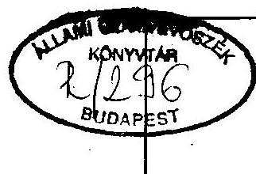
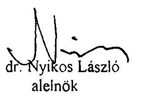
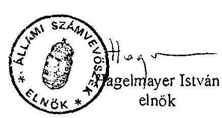
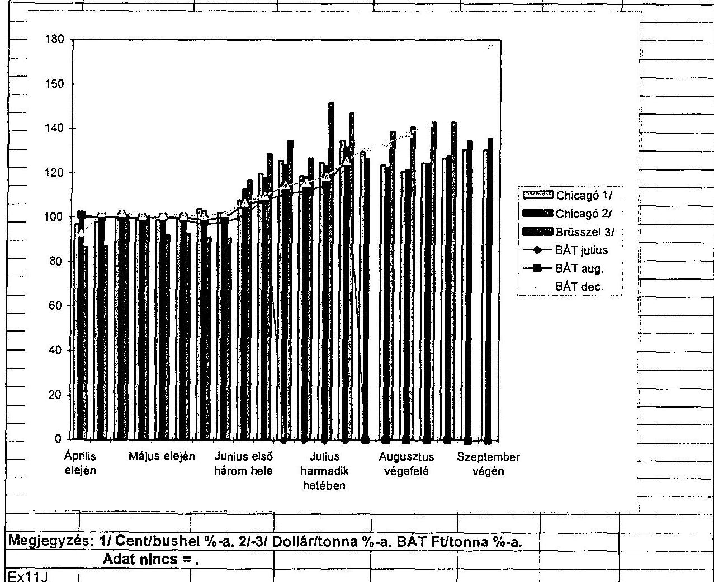

# Sllumi Sramverösxék 

## JELENTÉS

az 1995. évi búzatermés felvásárlásának és exportjának pénzügyi-gazdasági ellenôrzésérôl

---

A vizsgálat végrehajtásáért felelós:
az ÁSZ III. Költségvetési Ellenőrzési Igazgatósága és az ÁSZ IV. Vagyonellenőrzési Igazgatósága

Bihary Zsigmond . számvevö igazgató
dr. Kovács Árpád számvevö igazgató

Az ellenőrzést vezette:
Halász Gejza számvevö igazgatóhelyettes
Hegedüsné
dr. Müllern Veronika osztályvezetö számvevö fötanácsos
Az ellenőrzést végezték:

| Beck Miklós | számvevö |
| :--: | :--: |
| Benkéné dr. Lavner Kldra | számvevö tanácsos |
| dr. Benkö János | számvevö tandcsos |
| dr. Borisz József | számvevö tanácsos |
| dr. Burján Margit | számvevö tandcsos |
| Czunyi Lajos | számvevö tandcsos |
| Csóry Györgyné | számvevö tandcsos |
| László András | számvevö tandcsos |
| Lórinc Alajos | szánvevö tandcsos |
| Nagy János | számvevö tandcsos |
| Nagyné Lunger Éva | számvevö |
| Péntek László | számvevö tanácsos |
| Rundle János | szimvevö tandcsos |
| Simon Akosné | számvevö tandcsos |

---

# JELENTÉS 

## az 1995. évi búzatermés felvásárlásának, finanszírozásának és exportjának pénzügyi-gazdasági ellenőrzéséről

Magyarországon a mezőgazdasági müvelésre alkalmas területnek mintegy ötödén vetnek búzát. 1995-ben 4,6 millió tonna búza termett. Ez a mennyiség kb. 1 millió tonnával marad el az 1988-1994. közötti időszak átlagától. 1994. december 31-én "átmenő készletként" (termelőknél, felvásárlóknál, kereskedelemben) 3 millió tonnát tartottak nyilván, ebből júliusra mintegy 400 e to maradt. Így az 1995. évi újbúzából (a nyitókészlettel együtt összesen 5 millió tonna) - a hazai szükséglet kielégitésén felül - kb. 2 millió tonna exportárualap keletkezett.

A búza világpiacán 1995. június végén intenzív áremelkedés indult el, ami némi késéssel, a hazai piacon is éreztette hatását. Mindez arra ösztönözte a búzavertikum (termelés, feldolgozás, értékesítés) érintett szereplőit, hogy a termésből minél többet külföldön értékesitsenek.

A rendszerváltást követően az agrárgazdaság területén is megváltoztak az állami irányitás módszerei. Előtérbe kerültek a közvetett eszközök, ennek megfelelően az állam átfogóan szabályozta az agrárágazat rendtartását, meghatározta intézményrendszerét, a kapcsolódó árrendszert, illetve az igénybe vehető forrásokat. Emellett azonban a piac egyensúlyának tartós felbomlása esetén, a lakossági ellátást súlyosan veszélyeztető helyzetben az állam fenntartotta magának a közvetlen beavatkozás jogát is. Ennek érdekében Gazdasági Tartalékot (ezen belül búzatartalékot) képzett, illetve a kivitel egy részét - bár csak igen szük körben - engedélyhez kötötte.

## Ellenőrzésünk során arra kerestünk választ, hogy

- az 1995-ben érvényes gazdasági, jogi szabályozó-, illetve információs rendszer, valamint az agrárpiaci rendtartás együttesen megfelelő keretfeltételt jelentettek-e a hazai búzaszükséglet zavartalan kielégitéséhez;
- az állami tartalékkészlet feltöltése megtörtént-e, illetve a készletezési tevékenység al-kalmas-e a piaci zavarelhárításra;
- az exportkereslet növekedésével összefüggésben milyen kormányzati intézkedésekre került sor;
- a búza vertikum finanszirozásában nagyobb mértékben résztvevő pénzintézetek hitelezési és más finanszírozási tevékenysége hozzájárult-e a búza forgalmazása terén az 1995 nyarán és öszén tapasztalt nem kivánatos jelenségekhez.

---

Vizsgálatunk 1995. évre vonatkozik. Ellenőrzésünket az FM-nél, az IKM-nél, a KHVMnél, a PM-nél, a VPOP-nál, a TIG KhT-nál folytattuk. Kapcsolódó ellenőrzést végeztünk a készletek tárolását végző gazdálkodó szervezetek egy részénél. Ennek keretében a búza tartalékkészlet közel felénél megvizsgáltuk azok kezelését, védelmét.

A pénzintézeti szférában vizsgálatunk az állami tulajdonban lévő kereskedelmi bankok - az Országos Takarékpénztár és Kereskedelmi Bank Rt., a Kereskedelmi és Hitelbank Rt., a Magyar Hitelbank Rt., valamint a Postabank és Takarékpénztár Rt. - hitelezési tevékenységére terjedt ki. A CIB Hungária Rt-nál - mivel magánbank - az Állami Számvevöszék csak tájékozódott, illetve az információkat más forrásból szerezte be. A "bennfentes" kereskedelem esetleges elöfordulásának és a búzaárak alakulásának jobb feltárása érdekében tájékozódtunk a Budapesti Árutőzsdén, az Állami Értékpapír- és Tőzsdefelügyeletnél, a MÁV és a MAHART Rt-nél is.

A kereskedelmi bankok területén minden jelentősebb pénzkihelyezést tételesen, a kisebb volumenűeket pedig kiválasztásos alapon ellenőriztük. Meg kell jegyezni, hogy egyetlen pénzintézet sem rendelkezik naprakészen a búza vertikum finanszirozásával kapcsolatos adatokkal, mivel azt általában a "gabona ágazatban" figyeli meg saját információs rendszerében, ezért ez a feladat többlet idő- és munkaigénnyel járt.

A Postabank és Takarékpénztár Rt. megtagadta a vizsgálat végzésénck lehetőségét. A Postabank arra való hivatkozással tagadja az Állami Számvevőszék ellenőrzési hatáskörét, hogy - vélekedésük szerint - a pénzintézet részben sincs állami tulajdonban. A Postabank úgy értelmezi a Magyar Posta és a két társadalombiztosítási önkormányzat tulajdoni hányadait a pénzintézet alaptőkéjéből, hogy azok nem képeznek állami tulajdont. Ennek megfelelően e gondolatmenet szerint egy $100 \%$-ban állami tulajdonban lévő társaság és a köztulajdont megtestesítő társadalombiztosítási önkormányzatok tulajdona már akadálya lehet az Állami Számvevőszék hatásköre gyakorlásának, amit elfogadhatatlannak tartunk.

Az Alkotmány 9. §-a említi a köztulajdon fogalmát, de közelebbröl nem határozza meg. Ugyanakkor az önkormányzatok ellenőrzését több törvény az Állami Számvevőszék hatáskörébe utalja, viszont sehol sincs meghatározva, hogy a köztulajdon fogalmába bármiféle önkormányzati tulajdon beletartozna.

Az 1995. évi búzaterméshez kapcsolódó állami tartalék képzés ellenőrzési megállapításait, valamint a kereskedelmi bankok búzával kapcsolatos hitelezési tevékenységét a "Függelékck" tartalmazzák, amelyek az 1995. évi LXV. törvény alapján "Szigorúan titkos" minősitést kaptak.

# Következtetések, javaslatok 

A búza világpiacán 1995. június végén bekövetkezett árrobbanás, egy heti késéssel, a magyar árutőzsdén is éreztette hatását. Az áremelkedés a szabadpiaci és a felvásárlási árakban már csak több hetes késéssel, és lassúbb ütem mellett következett be.
A felvásárlók, illetve az exportőrök többsége (a szakmai érdekképviselet szerint) még az új termés learntása elött megkötötte a szerzödéseket, azaz igyekezett biztonságos pozíciót

---

elérni. Ebben az idöszakban a felvásárlási árak még igen alacsonyak voltak, ami összefüggésben volt a várhatóan jó búzaterméssel, illetve azzal, hogy nem hirdették meg az irányárat, ezért az aratás utáni időszak árai a minimum ár, azaz a garantált ár ( 8.800 $\mathrm{Ft} /$ to) körül alakultak. Az alacsony felvásárlási árak kialakulásában a termelök likviditási gondjai, a tárolási problémák is szerepet játszottak. Az exportörök árajánlatát befolyásolta, hogy a 38/1994. (XII.30.) PM-IKM rendelet elöre meghirdette az exporttámogatást (étkezési búzánál $1.200 \mathrm{Ft} /$ to), amikor még az új búza termésmennyisége és piaci viszonyai ismeretlenek voltak.

Az áremelkedés hatására augusztus-szeptember hónapban jelentősen megnőtt a búzapiac szereplőinek száma (olyan gazdálkodó szervezetek is exportálni akartak, melyektől profilidegen volt az agrártevékenység). Ekkor már nagyobb haszonnal lehetett búzát értékesiteni, ezért a kiszállitás egyre nagyobb méreteket öltött (augusztusban 367 e to, szeptemberben 484 e to).

A hazai ellátás biztositása érdekében az érintett tárcák (PM, FM) központi beavatkozást láttak szükségesnek. Információ hiányában (nem ismerték a megkötött szerzödésállomány nagyságrendjét) és tartva a jogi konzekvenciáktól azonban nem vállalták annak kockázatát, hogy az idejekorán meghirdetett exporttámogatást visszavonják. Tény, hogy a hazai piaci ár emelkedése (november végéig) mérsékeltebb volt, az exportárak pedig (néhány kis exportőr kivételével) alatta maradtak a világpiaci áraknak, vagyis nem sikerült a konjunktúra adta lehetőségeket teljeskörüen kihasználni. Így csak az a szük kör realizálhatott extraprofitot, amely betakaritás után vásárolt búzát, és csak a negyedik negyedévben kezdett exportálni. A extraprofitnak viszont része volt a költségvetési támogatás is.

A búza kivitele exportengedélyhez kötött, ezért az export korlátozás "végső eszközcként" az IKM 1995. október 12 -töl felfüggesztette az export engedélyek kiadását, illetve módosítását (a felfüggesztést az FM kezdeményezte). A kiadott engedélyek azonban jelentös halmozódást tartalmaznak, mivel az engedélyezési eljárás jelenleg csak regisztrációs jellegü. Ebböl következöen ez az intézkedés sem volt képes a kivitel tényleges korlátozására (1995. II. félévben 12 millió to új búzára adtak ki export engedélyt, miközben a kivihető mennyiség 2 millió to volt).

Az engedélykiadások felfüggesztését az állami tartalék készletet kezelö TIG KhT felügyeleti szerve (az IKM egyik föosztálya) is sürgette, ugyanis ettől remélte a tartalékok mielőbbi feltöltését. A hirtelen áremelkedés, a KhT nem megfelelö üzletpolitikája, a feltételekhez való alkalmazkodás hiánya igen megnehezítette a tárca által elöirt mennyiség feltöltését. Az elöirt búzakészlet a lakosság ellátásában jelentkező gondok megoldásában mennyiségénél fogva azonban csak rövid idöszakra és csak eseti jelleggel alkalmas. (Nem elölrt követelmény ugyanis, hogy ez a mennyiség folyamatosan rendelkezésre álljon, az ellátási zavar pedig bármikor bekövetkezhet.) A tartalékokat kezelő $100 \%$-os állami tulajdonú Közhasznú Társaság pedig nem kezel olyan intervenciós készleteket, amellyel az állam piaci zavar esetén helyreállíthatná a piaci egyensúlyt. Az crre vonatkozó törvényt lehetőség adott és a KhT - üzleti tevékenysége révén - rendelkezik olyan likvid pénzeszközökkel, melynek egy része erre a célra felhasználható lenne.

---

A vizsgált pénzintézetek rendelkeznek megfelelő belső szabályozással a hitélezés terïletén és betartották a kamattámogatásra vonatkozó kormányrendelet elöírásait. A búza vertikum finanszirozásában alkalmaznak nem szokványos megoldásokat (pl. lombard hitelezés, zárt láncú keretmegállapodásokon alapuló hitelezés), ezek azonban a rendes banki tevékenység kereteibe tartoztak. A pénzintézetek kiilönös hangsúlyt helyeztel a fedezet biztositására, ezért jellemzően a nagy kereskedelmi bankok a kis termelöket és cégeket nem célozták meg ügyfélkörük lehetséges bővitésének tartalékaként.

A nagy kereskedelmi bankok elönyben részesitették az ú.n. stratégiai ügyfélköriikeı kedvezőbb kockázati besorolással, kamatfeltételekkel, gyorsitott és megkülönböztetett ügyintézéssel. E stratégiai ügyfélkörökbe való tartozás feltétele általában a megbizhatóság és számlavezetés. E körön kivüli - akár esetlegesen jelentkező - ügyfeleknek a pénzintézetek nem nyújtanak "automatikusan" hitelt, ami viszont - a pénz megtérülésének követelményét figyelembe véve - természetes bankári magatartás és nem ütközött semmilyen jogszabályba. Az elutasitott hitelkérelmek száma nem volt túl magas, azok oka általában a nem kiclegitő fedezet volt. A vizsgált pénzintézetek ügyfélköre a megelőző évhez képest 1995 ben nem változott jelentősen.

A pénzintézeteknek a búza vertikummal kapcsolatos hitelezési tevèkenysége 1995-ben jelentősen bővült, összhangban a természetedménnyel és a betakaritási és azt követó idöszakban tapasztalt felvásárlási lázzal. A búza vertikum finanszirozásában jellemzöen magas az éven belüli hitelek aránya. Az export finanszirozásában erösödött a devizahitelek aránya a (forint magas inflációja miatti) kedvezőbb kamatok miatt.

A Budapesti Árutőzsde és annak gabona szekciója szabályozott módon és megfelelő állami felügyelettel müködik. A tőzsdei ármozgások és a fizikai áru áralakulása a búza esetében csak tájékoztató jellegủ a hazai tőzsdei forgalomnak a búza teljes forgalmához viszonyitott viszonylag csekély aránya és a tőzsdei üzletkötések során megvalósuló alacsony hányadú tényleges szállitás miatt. A vizsgált pénzintézeteknél az Állami Számvevöszék nem talált a búza tőzsdei felvásárlására utaló megbizást. A pénzintézetek a Budapesti Árutózsde gabona szekciójában alkuszi tevékenységet - összeférhetetlenség miatt is nem folytattak, illetve nem folytathattak. Ugyanakkor az OTP Forex-alkusz Kft. közvetett tulajdonlással az OTP tulajdonában van az OTP Bróker Rt-on keresztül és legnagyobb megbizói közé az OTP ügyfél Agrograin Rt. tartozik, azonban közvellen és közvetelt tulajdonosától megbizást nem fogadott el.

Az OTP Kereskedelmi Bank Rt-nak az Agrograin (Agrítrade) Rt. alapítása majd eladása során tanúsitott üzletmenete rávilágit a pénzintézeti törvény egyes bekezdéseinek félreérthető, illetve nem egyértelmú elöírásaira a közvetett tulajdonlás és a befolyásoló részesedés értelmezése tekintetében olyan esetekben, amikor a "leányvállalat" tulajdoni viszonyait kell értelmezni.

Az egyre növekvő exportkedv és az igen mérsékelt credményeket hozó tárca intézkedések hatására novemberben már kérdésként merült fel, hogy a júliusi 5 millió to búza készletböl megmarad-e a hazai ellátáshoz szükséges mintegy 3 millió to, vagy importra szorul az ország. A kivitel tényleges korlátját ugyanis már csak a kiadott engedélyek lejárati határideje (december 31.) és a szállítási kapacitás, mint szük kereszinnctszel jelentette.

---

Mivel az érintett tárcáknak (IKM, KHVM) nem feladata az export szállítási kapacitások koordinációja (annak ellenére, hogy a GDP $40 \%$-a külpiacon realizálódik), igy csak becslésekre szorítkozhattak az év végéig kiszállitható búza mennyiségéröl.

A MÁV-on és a MAHART Rt-n, mint a két legnagyobb magyar szállitmányozón kivül, bár csak néhány százalékban, más hazai gazdálkodó szervezet is végzett fuvarozást. A hazai szállítmányozók mellett - melyek a kivitel 82-85\%-át biztositják - külföldi (elsősorban folyami) fuvarozók is megjelentek.

Összesített adatok szerint az új búzából 1995-ben elözetes becslések szerint 1,95 millió tonna kivitelére került sor, vagyis az exportált búza mennyisége megközelítőleg megegyezett a kivihető mennyiséggel.

Év végére nyilvánvalóvá vált, hogy a jelenleg müködő információs rendszer koordinálatlan, lassú és rugalmatlan. Nem képes kellö időben olyan megbizható adatokat biztositani, amelyek alapján lehetőség nyilna az agrárágazat teljeskörü áttekintésére, illetve indokolt esetben - a hazai ellátás védelme érdekében - a kormányzati beavatkozásra.

A búzavertikum müködését befolyásoló szabályozók egy része nem volt alkalmas arra, hogy megfelelően közvetítse az állami érdeket, ezért a döntési mechanizmus is lelassult.
Mindez felveti az agrárrendtartás szabályozásának korszerüsitését, a piacgazdaságra való átmenet feltételeihez jól igazodó, hosszabb távon müködöképes, ugyanakkor rugalmas szabályozórendszer szükségességét.

A búzavertikum müködési feltételeinek javitása érdekében ajánljuk az Országgyülésnek:

1) A pénzintézeti tevékenységről szóló, többször módosított 1991. évi LXIX. törvényt a vizsgálat megállapításaival módosítsa az alábbi módon:
44. §-i bővítse ki egy újabb bekezdéssel:
(5) Az (1) és (2) bekezdés korlátozásainál figyelembe kell venni a vállalkozáshan megszerezhető tulajdoni hányadban a pénzintézet mellett tulajdoni szerzo, részben vagy egészben a pénzintézet tulajdonában lévö gazdasági társasághan birtokolt pénzintézeti tulajdonhányadot megtestesitő tulajdonrészt is.
2) Az Állami Számvevőszékről szóló 1989. évi XXXVIII. törvény 2. § (6) bekezdését bővitse ki az alábbi szövegrészekkel:
"Az Állami Számvevöszck cllenörzi az állami" és köztulajdonban álló "vagyon kezelésćt, az állami tulajdonban" és köztulajdonban "(résztulajdonban) lévö vállalatok, vállalkozások vagyonérték-megörzö és vagyongvarapitó tcvékcaységét", függetlenül a vagyon mértékétől és attól, hogy azok közvetlen vagy közvelell tulajdonban vannak.

---

# Ajánljuk a Kormánynak: 

1) Tekintse át és értékelje a gabonatermelés finanszirozásának és támogatásának helyzetét.
2) Alakítson ki rugalmas, hosszabb távon müködöképes exportámogatási rendszert. A támogatás éves mértékét a termés mennyiségének és az új termés piaci viszonyainak ismeretében határozza meg.
3) Változtassa meg a búza kiviteléhez kapcsolódó engedélyezési eljárást, az chhez kapcsolódó dokumentációt. Mérlegelje az engedélyezési eljárás költsćgeinek a kérelmezőkre történő áthárítását.
4) Tegye alkalmassá a TIG KhT-t az állami intervenciót segitő készletek tárolására, kezelésére. Ennek érdekében - indokolt esetben - a társaság likvid pénzeszközeinck egy részét is használja fel.
5) Hangolja össze az érdekelt tárcák, a Központi Statisztikai Hivatal, a búzával foglalkozó érdekképviseleti szervek és a Kopint-Datorg adatgyüjtési rendszcrćt. Ezzel a búzavertikum informatikai rendszere gyorsabbá, a piaci zavarok clhárítására alkalmassá válhat. Ehhez biztosítson megfelelő pénzügyi feltételeket is.

## Megállapítások

## 1. A hazai búza szükséglet és a termelt mennyiség összhangja

Hazánkban 1995. évben 4,6 millió to búza termett, 4,2 to/ha termésátlag mellett.
1986-90. között 6,2 millió to volt a búzatermés átlaga, ami 1991-93. kōzött 4,1 millió to-ra csökkent, majd 1994-re 4,9 millió to-ra cmelkedett.

A világ búzatermelése 1992-93-tól fokozatosan csökkent, ami várhatóan folytatódik az 1995-96-os gazdasági évben is.

Az clmúlt három ćvben a gabonafélćken belül a búza aránya és termésmennyisége is csökkent ( 561 -röl 533 millió tonnára), czzel cgyidcjülcg a fogyasztása cs a kereskedelme is mérsćklódött. A lészletek mennyisċge ugyanczen idöszak alatt 136 millió tonnáról 92 millió tonnára csökkent. Ez ćvben várhatóan csak $68 \%$-a lesz az 1992-93. ćvinck. Világméretckben megnölt az importigény, ami kedvezően hatoll többck között - a magyar búza külpiaci clhelyczésćrc is.

Mindezek egyiittes hatására már 1994-ben az átlagos minőségü húza bruttó átlagára mintegy $25 \%$-kal emelkedett. 1995. június végén a clicagói tőzsdén bekövetkezelı a búza árrobbanása, ami világméretekben - igy hazánkban is - hatást gyakorolt a piaci árakra.

A búza árának június végi ugrásszerü cmelkedése clsöként a viligméretckben meghatározó chicagói tőzsdén kövelkczctt be, azóta az árak koráblan alig tapasztalt méreteket öltcnck. A chicagói tőzsdén a június végi 150 USDito ár a decemberi határidös

---

jegyzésen már 180 USD/to fölé emelkedett. Európában a francia búza jegyzése a június eleji 140 USD/to-ról (FOB francia paritás szerint) július végére 190 USD/to-ra nőtt, ami több mint kétszerese a két évvel korábbi áraknak.

A hazai búzatermés az elmúlt évtizedekben mindig biztositotta az ellátáshoz szükséges mennyiséget. Az e feletti készleteket külpiacon kellett elhelyezni, azaz export árualapot képezett. A hazai búzasziikséglet 1995-ben mintegy 3 millió to (gabonamérleg adata). (Megjegyezzük, hogy az FM és a Gabonaszövetség által készitett gabonamérlegek adatai hasonlóak.)

Ebböl étkezési célokat 1,4 millió to, a takarmányozást I millió to, a vetömag szükségletet 0,3 millió to búza biztositja.

Az új termésböl exportálható mennyiség mintegy 1,9-2 millió to. (A megtermett 4,6 millió tonnát ugyanis növeli az 1994. évi termésböl származó júliusi 400 e to nyitó készlet.)

Az 1995. évben kialakult intenzív keresleti piac miatt a taharmány búza egy részét is étkezési búza címén értékesítették, amennyiben az alacsonyabb minőségi követelményeket a vevő elfogadta. (Az 1996-os évtől várhatóan az árutőzsdén is megjelenik az ún. "EU búza", amely alacsonyabb sikértartalmú, mint a magyar étkezési búzaszabvány.) Az 1995. évi takarmánymérleg alapján számítani lehet arra, hogy az exportált takarmánybúzát az amúgy is szükös mennyiségü kukoricából, illetve egyéb kalászosból kell pótolni. (A takarmánymérleg nem számol a takarmánybúza konvertálásával, enélkül is mérsékelt hiányt mutat.)

# 2. Az agrárrendtartás szabályozása és eszközrendszere 

### 2.1. A gazdasági környezet és a szabályozás

A társadalmi-gazdasági változásokkal egyidejüleg a piacgazdaságra való átmenct idöszakában megváltozott az állam gazdaságirányitó szerepe. Elötérbe kerültek az irányitás közvetett eszközei - elsősorban a jogi és gazdasági szabályozók - létrejöttek az ezzel összhangban álló intézmények (pl. tőzsdék, kamarák). Emellett az állam szük körben továbbra is fenntartotta a közvetlen eszközök alkalmazását, igy pl. ha azt az ország biztonsága indokolja, vagy a lakossági alapellátást súlyosan veszélyeztető helyzet alakul ki (annak ellcnére, hogy az államnak nincs ellátási kötelezettsége). Lehetősége van a közvetlen beavatkozásra, a tartós piaci egyensúly felbonlása esetén is, igy pl. piaci zavar elháritása érdekében.

A piacgazdaságra való átmenet időszakában a búzavertikum feltételrendszere is jelentős átalakuláson ment keresztül. A vertikumban résztvevő szervezetek (ulajdonviszonjai) megváltoztak, számuk megnövekedett, különösen az egyéni gazdálkodóké.

Az 1990-es ćvek óta - a magángazdaságok számának növekedésével - párhuramosan jönnek létre a termelök, a forgalmazók és a felhasználók érdekképviscleti szcrvei (terméktanácsok. szövetségek, kamarák).

---

A megváltozott feltételek szükségszerűen vetették fel az agrárpiaci rendtartás szabályozását, amelyre az 1993. évi VI. tv. keretében keriilt sor.

A törvény célja az volt, hogy kiszámitható lehetőségckel és csćlycket biztositson a piaci szereplők számára, járuljon hozzá a piacgazdaság jogi kerctcinck kiépülésćlıcz. segitse elö a szabályozott agrárpiac létrehozását. A törvény meghatározta az agrárpiaci rendtartás intézmény- és eszközrendszerćl is.

A törvényi célok eddig csak korlátozottan érvényesültek. A tapasztalatok azt mutatják, hogy a döntési mechanizmus lassú, nem elég rugalmas, az Agrárpiaci Rendtartási Tärcaközi Bizottságban (ARTB) résztvevő minisztériumok és érdekképviscleti szcrvek eltérő érdekeket képviselnek, ezen túl a jogszabályalkotás folyamata is igen idöigényes. Az érdekelt felek között olyan kompromisszumos döntések is születtek, amelyeket nem kizárólag közgazdasági szempontok vezéreltek. (Ilyen volt 1994. és 1995. évben a búza normativ exporttámogatásának bevezetése, illetve a támogatás mértékének meghirdetése.)

Az állam piacszabályozó szerepét a törvény három (1994-ben még négy) miniszler (a földmüvelésügyi-, az ipari és kereskedelmi-, a pénzügyminiszter) hatáskörélıe utalta

Az agrárpiaci rendtartás intézményrendszere a törvény megjelenése után folyamatosan épül ki. A müködésével, irányitásával kapcsolatos feladatokat elsődlegesen a földmüvelésügyi miniszter és az ARTB látja el.

Az ARTB 1993. áprilisában alakult, clnöke az FM illetćkes allamtitkárhelyettcsc. A Bizottság döntésclökészitő, cgycztctő fơrum, állásfoglalásai, amennyiben azokat a miniszter elfogadja, FM rendeletben jelennek meg.

A Bizottság havi rendszcrességgel ülćsezctt. "Hatáskörćbe" több száz termćk és 22 Termćktanács tartozik. Az ćtkczćsi búza termclési ćs cxponitámogatásának kérdése 1994-ben és 1995-ben többször is szcrepelt napirendjćn.

A búza világpiaci árának ugrásszerü emelkedése óta (ami az 1993. évi VI. tv. definíciója szerint piaci zavart jelent) a Bizottság a búzapiac helyzetével átfogóan nem foglalkozott.

# 2.2. Az agrárrendtartás eszközrendszerének müködése 

Az 1993. évi törvényi szabályozás kialakította a hatálya alá tartozó termćkekrc, (igy a búrára is) az agrárpiaci rendtartás eszközrendszerét, az agrárpiac szabályozásának módjait, (megkülönböztetve: közvetlen-, közvetett és befolyásolt agrárpiacot), illetve az allialmazható árformákat és a felhasználható pénzügyi források körét. A törvény az éthczési búzát a közvetlenül szabályozott agrárpiaci körbe sorolta, vagyis az államatk jelentős szerepe van a termelési, értékesítési és felvásárlási lörnyezet szabályozásában.

Az agrárpiac eszközeként rögzíti a törvény az engedélyezési rendszert, valamint az agrárpiaci információs rendszert is.

Az agrárpiaci rendtartás eszköztárát a törvényi lehetősćg ellenére eddig csak igen sziik körben alkalmazták (igy pl. nem hoztak létre irányárat, intervenciós készleteccket), söt a létrehozott eszközök sem mindig feleltek meg a piacgazdaság követelménycinek

---

(pl. exportengedélyezés, információs rendszer). A hiányosságokat felismerve az érintett tárcák kezdeményezték a törvény módosítását.

# 2.2.1. A termelési és értékesitési támogatások 

Az 1995. évi költségvetési törvényben a gazdálkodó szervezetek tàmogatásán helïl az agrárszektor támogatása közel $70 \%$-ot képviselt ( 61 Mrd Ft), ez utóbbiból az cxporttámogatás 35 Mrd Ft -ot jelentett.

A búzaágazat (mint közvetlenül szabályozott piac) eszközrendszeréhez tartoznak a kiilönféle támogatási formák, (üzemviteli-, beruházási- és exporttámogatás), illetve a garantált ár és a kvóta meghirdetése.

A termelést segitő támogatások a kamatpreferenciák, az állami garanciavállalás, a vetési támogatás, illetve a gazolaj-felhasználás utáni adóvisszatćrités és az útalap hozzájárulás visszatérítése. Az eszközellátást a gépvissárlásokhoz, az öntözc̀sfejlesztéshcz, a rcorganizáláshoz adott pénzeszközökkel tämogatja az allam. Az agrárpiaci támogatás exportószıónzésböl és cscıi beavatkozásból all.

A búzaágazat információs rendszere nem teszi lehetővé, hogy bemutassuk a kö̉ponti költségvetés teherviselését. Ezért nem ismert az, hogy "milyen nagyságrendü" elöirányzatot terveztek az 1995. évi költségvetésben a vertikum összcs tàmogatására. Nem lehet megmondani azt sem, hogy a jogszabályban lehetőségként megjelenő támogatásokat milyen mértékben veszik igénybe az egyes szereplők, azaz ténylegesen ez a szubvenció "mennyibe keriilt" a költségvetésnck.

Az információs rendszer hiányossága jónéhány gondot felvet, igy többck között:

- a központi költségvetés tervezésénél az egyes támogatási formák elöirányzatát jórészt csak becsléssel lehet meghatározni;
- az irányár bevezetését gátolja, amire az 1993. évi VI. tv. lehetöséget ad;
- a támogatási rendszer hatásmechanizmusa tényadatok hiányában nem vizsgálható, ami neheziti a rendszer szükséges változtatását.

### 2.2.2. Az exporttámogatás

A búza exporttámogatásának ismételt bevezetésére 1994. június végén keriilt sor, a búzatermelés kiegészitő támogatását tartalmazó csomagterv keretében. (Ezt megelózó öt évben nem volt exporttámogatás, ami részben összefüggött az 1992-93. évi alacsony termésmennyiséggel.)

Az exporttámogatás piacgázdasági körülményeke közölt az cgyik fontos cleme a termelés és az értékesités szabályozásának, a kiegvensúlyozott piaci viszonvok kialakításának. Célja a meglévő árualapok külpiaci clhelyezésénck ösztoinżesc, a világpiaci árakal meghatározó országok cxporttámogatása által okozott versenyhát. rány mérséklése, illetve a külpiaci árakban clismert és a hazai költségek kó̃otti különbség finanszirozása.

---

A támogatás ismételt bevezetését megelözte a Kormány részére készitctt - az ágazatot érintő - helyzetértékelés (1994. VI. hó). Ebben már elöre jelezték az 1994. évi hazai túlkínálati piacot (kb. 1 millió to export árualappal számoltak).

A helyzetértékelésnél a szaktárca és az érdekképriséleti szervck az exportámogatás kezdeményezésekor nem számoltak az 1994. II. felévben várható forintlértékelés exportöszönzö hatásával és figyelmen kivül hagyták az 1994. II. felévre prognosztizált világpiaci áremelkedést is. Nem vették figyelembe azt az clörcjelzést sem, hogy a világ búzatermése 1994-ben várhatóan 6 millió tonnával alatta marad az előző évi termésnek.

Az 1994. évi belföldi felvásárlási és exporiárak júliusban már 1-2 E Ft-tal magasabban alakultak a prognosztizáltnál. A tonnánkénti export árbevetcl 1994. júliusban 9.900 Ft volt, ami decemberre 12.470 Ft/to-ra emelkedett. Mindemelletl a termés mennyisége is magasabb lett a becsültnél ( 4,9 millió to).

A Kormány 1994. évre (II. félévben) normativ rendszerü exporttámogatást vezetett be (élelmezési búzánál: $15 \%$, búza kenyérlisztnél: $20 \%$ ). A támogatás pénzforgalmi hatása döntöen 1995. évre húzódott át. Vagyis ezzel az intézkedéssel már az 1995. évi költségvetés terhére vállaltak kötelezettséget.

Az 1995. évi exporttámogatás kialakítása során az érintett tárcáknak (PM-IKM-FM), illetve az érdekképriséeleteknek - figyelembe véve a búzaágazatban az 1994. II. félévtöl jelentkező kedvező tendenciákat - az eddigieknél rugalmasabb, a változó gazdasági környezethez jobban igazodó exporttámogatási rendszert kellett volna meghirdetni.

Az EU gyakorlat - jóllehet más finanszírozási ćs a hazainál magasabb fajlagos agrártámogatás mellett - az exporttámogatást a termésmennyiség és a világpiaci ár ismeretében határozza meg, tenderek meghirdetésével.

Az exporttámogatásra vonatkozó döntést - illetve rendeletet - megelözöen az ARTB-be igen eltérő vélemények alakuliak ki.

A PM javaslata az volt, hogy a búzát a normativ rendszerböl ki kell venni, cheivel januártól-április végéig pályázat keretében meghatározott mennviségre - lefelé licitálva - nyerjenek el támogatást az érdekeltek, 1995. II. felévre vonatkozóan pedig a termés ismeretében döntsenek. A búza exporiszubvencionálására 1,5 Mrd Ft-ot tervezlek elkülöniteni. A PM szakmai álláspontja megalapozoll volt. A javaslat az EU gyakorlathoz közeli megoldás.

Az Agrárrendtartási Hivatal az ARTB részère készitctt clöterjesztésben a buzainál 1.200 Ft/to tämogatási igénnyel szamolt. A tervezetben I millio tonna expori atrualapot vellck figyelembe január 1. és március 31. közoll, és a tämogatás meghirdetését is erre az időszakra javasolták. Az élelmezési búzára 1995-re 1,2 Mrd Ft exporttámogatást terveztek.

Az IKM a búza exporitámogatását 1995. május 30-ig normativ ( 1.500 Ft/to) módon javasolta meghatározni. A további tämogatásról (lehetöleg normativ módon) már az 1995. évi termés és pénzügyi lehetőségek ismeretében kivánt dönteni. A pályázatásos módszert annak lassúsága és rugalmatlansága miatt minden esetben

---

elkerülendönck tartotta. Nem fogadta el olyan termékek lámogatásának megszämtetését, vagy jelentős csökkentését, amelycknél az clmúlt cgy-két évben pontosan az export elösegitése érdekében döntötlck támogatás odaítćlćsćról.

A Gabona Terméktanács 1.800 Ft/lo összeguu szubvenciót javasolt 1995. augusztus 1-töl, de a támogatási lehetöség kihirdetését már január 1-töl szükségesnck itéte. A Terméktanács, érdekeinck védelmében, mindhárom érdekelt minisztert megkereste, ennek hatására született a kompromisszumos döntés. (A tämogatás januári meghirdetését elfogadták, de mértékét nem.)

Az 1995. évi exporttámogatásra vonatkozó PM-IKM rendelet 1994. december végén jelent meg, ebben a támogatás mértékét: étkezési búzára $1.200 \mathrm{Ft} / \mathrm{to}$, liszire $4 \mathrm{Ft} / \mathrm{kg}$, nagyságrendben határozták meg. Az 1995. évi étkezési búzára a lámogatás érvényességi idejét 1995. VII. 1. - XII. 31. közötti időszakban jelölték meg. A támogatás mérıékének meghirdetésére akkor került sor, amikor az új termés nagyságáról, az ezzel összefüggö piaci viszonyokról, illetve az árakról még nem volt információjuk.

A feltételekhez nem igazodó, rugalmatlan rendszer hiányosságai kiilönösen szembetínöek voltak az 1995. évi árrobbanás idején. Az új hóza betárolását követö internziv áremelkedés miatt már nem volt indokolt az exporttámogatás széleskörü alkalmazása. A rendszer merevsége viszont már nem tett lehettővé érdemi változásl.

A földmüvelésügyi miniszter októberben javasolta, hogy az exportámogatások az újonnan kötött szerzödésckre vonatkozóan kerüljenck felfüggesztésre. A pénzügyminiszter ezzel cgyctértett.

Az esetleges jogi és erkölcsi következményektől tartva,a támogatás felfüggesztésére mégsem kerïlt sor, mivel a tárcák nem vállalták fel, hogy a jogszabályban elöre meghirdetett feltételeket a gazdasági év közepén (amely július 1-én kezdődik) visszavonják. Megitélésük szerint ez igen sok kereskedőt (a már megkötött szerzödésck miatt) kedvezőtlen helyzetbe hozott volna. A döntéshez egyébként az érintettek számáról tcljeskörü információval kellett volna rendelkezni, pl. a szerződéskötés állományáról. (Megjegyezzük, hogy a liszt $4 \mathrm{Ft} / \mathrm{kg}$ támogatását ugyanebben a rendeletben teljeskörüen visszavonták.)

A GATT egyezmény hazánkra vonatkozó elöirása szerint 1995-ben 1,4 millió to mennyiségü, 1,9 Mrd Ft-tal szubvencionált büza kivitele lámogatható. Ezt a keretct exportunk már 1995. szeptemberében túlléptc. Az exportámogatás forintban torténó megállapítása (a forint folyamatos leérlékelése miatt) kedvezőtlen az orszag számára, célszcrübb lett volna azt dollárban meghatározni.

A támogatási rendszer rugalmatlanságának következménycként azok az exportörök, akik a betároláskor vásároltak és csak néhány hónap múlva értékesitettek, jelentős extraprofilhoz juthattak, aminek a költségvetési támogatás is a részét képezte. (Az ćrtćkesitési szerződések zömét azonban még az aratás elött megkötöttćk.) A puha költségvetési támogatás ( $1.200 \mathrm{Ft} / \mathrm{to}$ ) azért is kedvezőtlen volt, mert a kereskedöt nem ösztönözte a jobb piaci lehetőségek felkutatására, illetve a kedvezőbb piaci pozíció elérésére. (Az exporitámogatás a központi költségvetésnek egyébként mintegy 2 Mrd Ft-jába kerül.)

---

Az 1995. évi árrobbanás miatt az EU felfüggesztette - cgyre lavolabbi határidökre - a szubvencionált búzaexport tendereit. Az USA sem támogatta az exportot (1994-ben és 1995. I. felcvében a búzaexportot még mindkctien iámogatták valamilyen formában.)

# 2.2.3. Garantált ár 

Az agrárrendtartási törvény bevezetése óta mindkét évben meghatározták a garantált árat (1994-ben induló garantált ár: $8.200 \mathrm{Ft} /$ to, 1995-ben $8.800 \mathrm{Ft} /$ to volt).

Ez az ártipus minimum árként funkcionál, mivel az a cclja, hogy a hazai tülkínálati piacol "levezesse", azaz az állam - végső eszközként - garantálja, hogy a piacon vcvöre nem talált terméket felvásárolja. (A termelönck clsösorban a piacon kell clismertetni és az áron keresztül realizálni költségeit.)

A garantált ár mellé a jogszabályok minden évben kvótát is rendeltek (azaz az állami felhasználásra felajánlható mennyiséget 1994. és 1995. évben egyaránt 2,4 to/hektárban határozták meg).

Ezek az állami intézkedésck a búza túlkeresleti piaca miatt mindkét évben formálisak voltak, az c célra kijelölt néhány szervezetnćl, igy a TIG KbT-nál sem torténi felvásárlás, mivel czen az áron természctesen senki sem kínálta a terményét.

A garantált árnak az előzőeken túl egy sajátos közgazdasági funkciója is volt. Az 1993. évi törvényben is rögzített irányárat még nem vezették be, ezért a termelő-felvásárló kapcsolatában óhatatlanul árszabályozó hatást is gyakorolt.

Ez elsősorban a új búza betárolását követő kezdeti idöszakra volt jellemző, késöbb inkább a tőzsdei áraknak volt domináns szercpük.

Ezen a területen változást okozhat a terméktanácsok által a jövőben meghirdetésre kerülő irányár. A termelőket és felvásárlókat egyaránt helyes irányban motiválhatja a gazdasági kapcsolatokban.

Sajátos tendencia volt, hogy a garantált ár az elmúlt évektben megközelitclic az clöző évi júliusi felvásárlási átlagáral.

### 2.3. Az exportengedélyezés

A külkereskedelem liberalizációjából következöen az áruk kivitele, illetve behozatalia alanyii jogon járó lehetőség. A korábbi merevebb rendszert felváltó új rendszer a kedvező credmények ellenére néhány negatív jelenséget is magával hozott. Indokolt lett volna feltételhez kötni a külkereskedelmi tevékenység folytatását (pl. megfelelö gyakorlat, szakmai ismeret). Konjunkturális esetben ugyanis sok, elemi külkereskedelmi ismerettel sem rendelkező vállalkozó exportálhat, kedvezőtlen benyomást alakítva ki a külföldi szerződő parnerekben. (1994-ben 88 exportőr volt a búzapiacon, 1995-ben már 199.)

A 112/1990. (XII.23.) Korm. rendelet értelmében áruk kiviteléhez és behozatalához - a rendeletben foglalt néhány termék kivételével -nincs szükség engedélyre. A búza, a liszt mint alapvető élelmezési cikk - engedélyköteles termék maradt. A lakosság alapellátásá:

---

súlyosan veszélyeztető helyzetben - a Kormány döntése alapján - a behozatalı, a kivitelt határozott, vagy határozatlan idöre felfüggesztheti (megtilthatja), illetöleg más korlátozásokat is alkalmazhat. (Az engedélykiadás az IKM hatáskörébe tartozik, az cngedélyezési elvek kialakításában az ARTB-nek kiemelt szerepe van.)

A nem megfelelően szabályozott engedélyezési eljárás a gyakorlatban csak "regisztrációt" jelent, nincs információtartalma, sőt torzítja a valóságot. A rendszer alapvető hibája, hogy többszörös halmozódást takar, mivel szerződések, árualap, stb. megléte nélkül is kérhetö engedély, ha megjelölik az árut, a célorszagot, a kivinni szánt mennyiséget, árat. (A megjelölt adatoknál nem elvárás, hogy dokumentumokra épüljenek, azok gyakran az exportőr szándékát tükrözik.) Ha bármelyik feltétel változik, módosithatják az engedélyt, vagy a régi törlése nélkül újat kérhetnek. (Erre korlátozás nélkül módjuk van.) A hibás szabályozás következményekét 1995. január és október között mintegy 14 millió tonnára - ezen belül 12 millió tonna új búzára - adtak ki cngedélyt (az 1995. évi új termés mennyisége, a júliusi nyitó készlettel együtt 5 millió tonna volt).

Az engedélykiadás gyors ütemü növekedése júniusban kezdödött. Az étkezési búzára cngedélyt kérők nagy száma ( 199 cég) ellenére 1995. júliusban 35, angusztusszeptemberben csak mintegy 70 cég szállitott külföldre búzát. Ugyanakkor 2 cég is volt - ezek közül az egyik egy betéti társaság - amely 1 millió tonnára rendelkezett kiviteli engedéllyel, de csak néhány tízezer tonnát exportált.

Június-szeptember hónapban összesen kb. 9,9 millió tonna kiszállitására adtak ki cngedélyt.

Októberben az FM kezdeményezte a piaci zavar elhárítása érdekében a kiviteli engedélyek kiadásának és módosításának felfüggesztését. Az IKM 1995. október 12-én ennek eleget tett. Az új búzára így mintegy 12 millió tonna cngedélyt adtak ki, czzel szemben júliustól október végéig kb. 1,3 millió tonna étkezési búza hagyta el az országot. A legnagyobb exportörök az engedélyekben lért mennyiségnek alig ötödét-tizedét szállitották ki. Az engedélyezési rendszerben meglevö anomáliák miatt a jelenlegi eljárás eróteljes átalakításra szorul, figyelemmel a GATT elöirásaira és az EU-ban is kialakult gyakorlatra.

Amennyiben az állam támogatást, hitelt, adókedvezményt nyújt, joga van bizonyos adatszolgáltatási kötelezettséget megkövetelni. Az eljárás kölesönös érdekeltségen alapul. Ugyanis az adatszolgáltató azért nyújt információt, hogy rendelkezésre álljanak azok az összesített adatok, melyek ismeretében javíthatja piaci pozícióját. Ez az eljárás az EU országokban már jól funkcionál.

Megfontolandónak tartjuk az engedélyezési eljárás ráforditásait fedezö dij hevezetésé is.

---

# 2.4. Az információs rendszer 

Az agrárrendtartásról szóló törvény említést tesz az információs rendszerről, azonban annak tartalmi követelményeit, a kiépités határidejét nem határozza meg.

A törvény szcrint a miniszter támogatást adhat a rendszer kiépitéséhez. Ennek megfelelöen 1995. májusában mintegy 220 M Ft támogatást adott a - a Rendtartási Bizottság javaslata alapján - a terméktanácsok információs rendszerének fejlesztésére. A támogatások odaítélésével egyidejúleg nem került sor egy koordinált információs rendszer alapjainak lerakására.

Az 1995. évi ugrásszerű búza áremelkedés rávilágitott az információs rendszer gyengeségeire, melynek jellemzői a koordinálatlanság, a lassúság és a rugalmatlanság. Koordinálatlan a rendszer, mert több szervezet is gyüjt adatokat, azonban azok nem alkotnak zárt rendszert. Lassú a rendszer, mert az adatok mintegy 2 hónap késéssel követik a reálfolyamatokat. A rugalmatlanságot a drasztikus áremelkedés után bekövetkezeit piaci zavar igazolta, ugyanis a gyors döntéshez szükséges adatbeérkezés gyakoriságát nem lehetett növelni. A három tárca egyébként nem rendelkezik közös, mindhárom helyen lehivható információs rendszerrel. A független, önálló, naprakész államigazgatási rendszer kialakulását a pénzügyi feltételek hiánya is hátráltatta.

A búzavertikum adatgyüjtését alapvetően a KSH, a Gabonaszövetség, az FM, illetve a Kopint-Datorg Rt. végzi. Az információk, illetve a feldolgozott adatok eltérő idöszakra vonatkoznak, ami ugyanazon témakörben megneheziti az összehasonlítást.

Mig a KSH naptári évre, addig a Gabonászövetség és az FM termclési, azaz gazdasági évre végez adatgyüjtést.

Az 1993. évi termelés clörcjelzés jelentősen túlhaladta a tényleges termésmennyiséget (várható 4500 e tonna, tényleges 3011 c tonna), mig az 1994. évi becslése alatta maradt a betakaritott mennyiségénck (becslés 4300 c to, termés 4880 c to).

A KSH adatrendszeréből csak 2 hónapos késéssel lehet információt (búza mennyiségére. felvásárlási és szabadpiaci árára) kapni.

A Gabonaszövetség a termelők, kereskedők, feldolgozók adatai alapján havi adatgyüjtést végez. A rendszer alapja a kölcsönös adatcsere, vagyis aki adatot szolgáltat, az visszakapia a Szövetségtől az összesített információkat. Az adatgyüjtés nem teljeskörü, mivel a vertikum mintegy $60-70 \%$-a vesz részt az adatszolgáltatásban, ami a birtokszerkezetbeli valtozásokkal is összefügg. A rendszer igy csak tendenciák tükrözésére alkalmas.

Az exportadatokat az IKM megbízásából a Kopint-Datorg Rt. dolgozza fel, ezt követöen juttatja el az érintett tárcáknak, a KSII-nak, illetve a gabonavertikum tagjainak. Ez utóbbinak térítés ellenében.

A külkercskedelmi statisztika 1991-töl a vámbizonylatokria cpiil. Az Egységes Vámárunyilatkozat (EV) 1995-ben keriult bevezetésre, ami egyben feltétele az EUhoz való csatlakozásnak is.

---

A havi statisztikai feldolgozások az export esetében átlag 4-5 héttel a tárgy hó után készülnek el. A Kopint-Datorg Rt. szerint az export statisztikai adatok - az összes áru tekintetében - 90-92\%-ban fedik a havi tényállapotot. Megoldatlan továbbá az export termékenkénti ábevételének és támogatásának gyüjtése is. A rögzített adatokat - korrekció után általában egy hónap elteltével dolgozzák fel.

A búza esetében a még korrigálatlan, azaz "hibás adat" - amclyct még nem dolgoztak fel - 1995. november 30-án mintegy 20,4 e to volt.

Kezelhetetlen nagyságrendü eltérések mutatkoznak a Kopint-Datorg Rt. és a G'abonaszövetség havi export adataiban.

A Gabonaszövetség augusztus, szeptember és október hónapra 269-266-235 e to exporlot regisztrált, a Kopint-Datorg adatai ugyanczekre a hónapokra 364 e to. 480 e to es 367 e to volt.

Jelenleg az exportengedélyezési adatok nem kapcsolódnak az elözöckben bemutatott szervezetek információs rendszeréhez. (Jelenlegi formájukban, elsösorban a halmozódások miatt, erre alkalmatlanok is.) Indokolt lenne ezeket is bevonni az információáramlásba.

A tőzsde információs szerepe is erősödőben van. A kereskedők a szerzödéskötéseknél a vásárlás időpontjában várható tőzsdei árat egyre gyakrabban alkalmazzák. Hasonló módon szerződnek a termelőkkel az integrátorok és a termeltető rendszerek is.

# 3. Az állami tartalékkészlet szabályozása, kezelése 

A lakossági ellátást érintő piaci zavar megelózésére, megszüntetésére, mérséklésére a Kormány Gazdaságbiztonsági Tartalék (GT) létrehozását, illetve kezelését rendelte el (84/1994. /V.27./ Kormányrendelet). Ezen belül évente meghatározta az étkezési búza mennyiségét. Ez a búzaállomány azonban csak az átmeneti gondok megoldására alkalmas, erre is csak akkor, ha az elöirt készletet feltöltik. A kormányrendelet ugyanis nem irja elő a készlet folyamatos meglétét, holott a piaci zavar bármikor bekövetkezhet.

A GT technikai kezelésére az IKM 1995-ben létrehozta a $100 \%$-os állami tulajdonú TIG KhT-t. Ez évben a búzapiacon bekövetkezett áremelkedés gyors, rugalmas piac- és árpolitikát követelt a gazdálkodóktól. Ennek az elvárásnak a KhT nem tudott teljeskörüen megfelelni, szerződéskötési és készletezési gyakorlata is több kivánnivalót hagy maga után.

A GT-hez kapcsolódó szerzödésekben nem kötöttek ki kellö garanciát a fizetés, a visszapótlás, illetve a visszavásárlás teljesitésére.

A KhT a GT-n kivül is jelentős nagyságrendü búzakészlettel rendelkezctt. Üzleti tevékenysége során azonban nem mindig a GT készletek feltöltése élvezett prioritást, holott a sajátos piaci helyzetben fokozott követelményt támasztottak az érintett tárcák (IKM, FM) a készletállomány feltöltésével szemben.

---

Mindez megnehezítette a búzakészlet feltöltését. (A TIG KhT szerzödéskötési és készletezési tevékenységével kapcsolatos megállapitásainkat az l-2. sz. mellékletek tartalmazzák )

A búzakészleteket a KhT bérelt tárolókban tárolja annak ellenére, hogy saját tulajdonú gabonatároló helyekkel is rendelkezik. Helyszini ellenörzésünk során olyan hiányosságokat(mennyiségi és minőségi vonatkozásban) tapasztaltunk a tárolást végzöknél, amely bizonytalanná teszi, hogy a tárolt készletmennyiségek megegyeznek-e a számviteli nyilvántartásban szereplő mennyiségekkel.

A IKM, mint alapító nem bizta meg a céget olyan készletek kezelésével (intervenciós készlet), amellyel az állam a piac tartós egyensúlyvesztése esetén "beavatkozhat" és segithet a kereslet-kinálat összhangjának megteremtésében. A KhT üzleti tevékenységével jelentős nagyságrendủ szabad pénzeszközt realizált - amit tartós betélbe, illetve értékpapírba fektetett -ennek egy része felhasználható lenne az állami intervenciós készletck létrehozására. A lehetőséget az agrár-rendtartásról szóló törvény már magában foglalja

# 4. A kereskedelmi bankok tevékenysége 

### 4.1. Az Országos Takarékpénztár és Kereskedelmi Bank Rt.

A Bank a gabona ágazat finanszirozásának egyik meghatározó - de tökecrejéhez mérten szerény - szereplőjévé vált. Ezt föként a gabona ágazatban termelletést, felvásárlást és forgalmazást végző jelentős cégek stratégiai üzletfélként való kezelése eredményezte. A Bank több esetben hitelek nyújtásával elősegítette a tulajdonos változást, a privatizálást, esctenként új cégek alapításában is részt vett.

Az OTP a vállalkozói körre kialakitott általános szabályozás szcrint végzi a mezőgazdasági vertikum, ezen belül a búza forgalmazás finanszirozását. A szczonális jelleg, valamint az állami támogatás jellegzetességei miatt azonban a Bank olyan finanszirozási konstrukciókat is kidolgozott, amelyek elsősorban a gabona termelletés és finanszirozás területére jellemzőek.

Így a gabona forgalmazással és -feldolgozással foglalkozó stratégiai üzletfelcket az általános forgóeszköz hitelezésen keresztül finanszirozák. A finanszirozás területén érzékelhetó volt az OTP versenye más pénzintézetekkel.

Az OTP Kereskedelmi Bank által a termeltetö és a felhasználó bevonásával kialakitott zárt láncú szerződési konstrukció nem váltotta be a hozzá füzött reményeket, mert a hitelezési volumen ebben a formában csökkent. (Az OTP 1995. IV. negyedévében elvégezte a csökkenés okának felülvizsgálatát.) Az eltérő eredményeket felmutató háromoldalú megállapodásokat elemezve az árutermelők irányában folytatott aktivabb hitelpolitikával a hitelezésbe bevont kör bővítése azért is célszerű, mert ezáltal csökkenne a körön kivül maradók kirekesztettségi érzése, ami egyes esetekben negatív jelenségeket credmenycectt.

A tőzsdei áruk készletezésének finanszirozására az OTP 1994. júliusáhan alakitotta ki a közraktárjegy fedezetével nyújtott forgóeszköz hitelezési konstrukciót, amely formában a kitelyezett hitelek összege dinamikusan növekedett, 1995 nyarán már a búzával kapcsola-

---

tos hitelek jelentős részét tették ki. A hitel fedezetét a Banknál óvadékként letétbe helyezett közraktárjegy képezi a napi tōzsdei árfolyam $70 \%$-os értékével. Az igy kihelyezett hiteleket az adósok eddig visszafizették, kényszerárverés nem volt.

A kózraktárjegy-finanszirozás során eddig a tárolási feladatot kizárólagosan a Hungária Közraktározási és Kereskedelmi Rt. látta cl, amclynck tulajdonosai a Bábolna Rt. és az OTP ( $9 \%$ ).

A sikeres hitelkonstrukció jelenlegi szük keresztmetszete az, hogy a hitele zást csak egy profitcentrum és egy közraktározási szervezet végzi, amelyben a Bank bizik.

Az OTP Kereskedelmi Bank Rt. szerepe és tevékenysége az Agritrade (késöbb Agrograin) Rt. alapításánál és később a bankcsoport tulajdonrészénck elidegenitésénćl egyaránt a pénzintézeti törvény 44. § (2) bekezdésćnek tiltó rendelkezésébe ütközött, amit nem vett figyelembe.

A Pit 44. § (2) maximálisan $51 \%$ tulajdonrészt cnged meg cgy pénzintézetnck más vállalkozásban. Az OTP véleményc szcrint az credeti $50 \%$-os részesedés nem sértette a törvènyl clöirást, viszont az Állami Számve vöszck az OTP leányvallalatát is ideérti, mert az az OTP Kereskedelmi Bank Rt. tulajdonában van, tchát úgy tekinti cbból a szempontból mintha az is a közvetlen tulajdonában lenne, hiszen a rendelkezési jogát semmi sem csorbitja.

A Pit. 3. § f, 2. pontja clöirja, hogy "A befolyásoló részesedés nagyságának megállapításakor a közvetlen és közvetcti tulajdont (összeadással) egybe kell számítani".

A már említett Agrograin Rt. esetében jelentős volt a tulajdonosi érdekeltség is a finanszirozásban, mert 1994. november 28 -ig az OTP Kereskedelmi Bank Rt. és az OTP Bróker Rt. (OTP Értékpapír Ügynökség Rt.) volt a társaság többségi tulajdonnal rendelkező alapítója $(50,0+7,14 \%)$ akkor még Agritrade Rt. néven. Az alapításkor az OTP csoport többségi tulajdont szerzett 200 millió Ft névértékủ részvénnyel, a további 150 millió Ft értékü részvényt a Royalty Kft. jegyezte.

Az OTP-csoport részvénytulajdonát az 1994. november 28-án megkötött szerzödéssel ruházta át, amivel a Royalty Kft. 97,7\%-os tulajdonos lett. Az Agritrade Rt. 1995. január 1-jével - névvita elrendezése miatt - Agrograin Rt-re változtatta meg a nevét.

Az Rt. 1995. májusi közgyülcscin közcl 170 millió Ft alapiókcemclési határozott cl, amelynek credménycképpen a tulajdonosi szerkezet is módosult. Az új tulajdoni hányadok: Royalty Kft. $82,5 \%$, az amerikai Cargill Holding BV szakmai befektctö $12,5 \%$, cég alkalmazottai $5,0 \%$.

Az Rt. jelenleg már vezetö szerepet tölt be Magyarország húzakészletcinck felvásárlásában és kivitelében. A külföldi szakmai befektetö cég belépése az credményességet várhatóan fokozza, a társaság üzleti pozícióit crösiti.

---

Az OTP Forex-Alkusz Kft-t 1994 novemberében 17 millió Ft jegyzett tőkével az OTP Bróker Rt. alapította, amelynek jelenleg is kizárólagos tulajdonosa. A Budapesti Árutőzsde gabona szekciójában ez az alkusz cég bonyolította 1995-ben a legnagyobb forgalmat. Mint tőzsdetag megbizás alapján köt ügyleteket.

A közvetett tulajdonlás miatt jelentős kereskedelmi banki háttérrel rendelkező OTP Forex Kft. a gabona szekcióban az OTP Bróker Rt-tól és az OTP Kereskedelmi Bank Rt-töl megbízást nem kapott és nem teljesitett. Müködését - az Állami Értékpapír- és Tőzsclefelügyelet véleménye szerint is - szabályszerűen végezte.

# 4.2. A Kereskedelmi és Hitelbank Rt. 

A Bank gabonafelvásárlásra és -exportra történő hitelezése során a szokásos pénzintézeti üzletmenet szerint járt el. A folyósitott hiteleknél a Bank számára a bevételt csak a hiteklij jelentette, amely a Bank saját általános feltételeitől nem tért el. A Kereskedelmi és Hitelbank Rt. élelmiszergazdasági hitel portfóliója - az eszköz portfölión belül - a koràbbi $60 \%$ feletti arányról 1995. I. félévének végére $40 \%$-ra mérséklödött. A kamattámogatás mellett igényelhető mezőgazdasági - éven belüli - hitelkonstrukció alapján kihelyezett kölcsönci a Banknak az országosan kihelyezett ugyanilyen konstrukciójú hitelállomány mintegy $40 \%$-át tették ki 1992. és 1994. között.

Az 1994-es év vógén az állami kamatkedvezményes és állami garanciával nyújtott agrárgazdasági hitelek állománya clérte a 13 milliárd Ft-ot, amelynck közcl fclc felvásárláshoz kapcsolódott. Emcllctt a Bank 1994-ben mintegy 7 milliárd Ft devizahitelt engedélyezett mezőgazdasági és élclmiszeripari ügylctck finanszirozására.

A Kereskedelmi és Hitelbank Rt. a 187/1994. (XII. 30.) Kormányrendeletre alapozva ćrvényes szabályzatokkal rendelkezik a mezőgazdasági tevékenység éven belüli finanszirozására. A vezérigazgatói utasitás alapelvként rögzítette, hogy "Az agrárágazal 1995. évi finanszirozásánál továbbra is alapvető szempont, hogy a mezőgazdaságnak nyújtott hitelek nem növekedhetnek."

A Bank célja a mezőgazdasági hitelportfólió minőségi megváltoztatása volt, tekintettel a kedvezőtlen jövedelemtermelő és hitelvisszafizető képességre.

A folyósitott hitelek közel $80 \%$-nál a hitelfelvevö a szerződés alapján jogosulttá vall kamattámogatásra a 187/1994. (XII. 30.) Korm. r. 7. § (2) alapján, mivel a szerzödéshen rögzitették, hogy a terményeket termelótól vagy termelıetőtől vásárolják és azok ellenértékét a felvásárlási szezon végéig maradéktalanul - azon belül legalább $70 \%$-át az átvételtöl számitott 30 napon belül - pénzzel egyenlitik ki.

A Kereskedelmi és Hitelbank Rt-nek egyetlen brókercége van, a K \& II Brókerháa Rt, amely árutőzsdei tagsággal nem rendelkezik.

---

# 4.3. A Magyar Hitelbank Rt. 

A Bank az általános hitelezési gyakorlata szerint kötötte a búza felvásárlásával és értékesítésével kapcsolatos szerződéseit a 187/1994. (XII. 30.) Korm. rendelet alapján és lényeges különbségeket csak a kamatfeltételek tekintetében érvényesitett a stratégiai hitelezöi körben. Az MHB - a vizsgálat eszközeivel vélelmezhetően és a Bank nyilatkozata szerint is - tózsdei spekulációs célú vásárlásra megbízást nem adott.

A megvizsgált 147 hitelszerződés az 1995 első három negyedévében folyósitott 2,4 milliárd Ft értékủ bủza termelési-termesztési, felvásárlási és egyéb célú hitelböl 1.1 milliárd Ft-ot tett ki. A jelentösebb hitelfelvételek konkrét célja a felvásárlás, egyes esetekben az export elősegitése volt. A változatos formájú biztositékokkal megkötött hitclszerzödések futamideje általában 3-12 hónapos idötartamú. Búzával kapcsolatos hitellkérelmet a vizsgált időszakban csak 12 esetben, 122,2 millió Ft értékben utasitottak el.

A hitelkamatlábakat a MHB havonta változtatott - vezérigazgatói utasitásban elrendelt kondiciös listában rögziti. Ezeknél alacsonyabb kamatlábat csak az ú.n. Központi Hitelezési Bizottság állapithatott meg a megkülönböztetett, stratégiai ügyfelek részére nyújtható hitelek esetén.

### 4.4. A CIB Hungária Bank Rt.

A Bank üzletpolitikájához hagyományosan hozzátartozik a mezőgazdaság és elsősorban a mezőgazdasági termékekkel - igy a búzával is - folytatott kereskedclem finanszirozása. A CIB a magyar agrárgazdaság egyik jelentős finanszirozója, e tevékenysége kb. 10\%-át teszi ki egész forgalmának. Az 1992-es évben, Magyarországon (újböl) elöször, kezdett el foglalkozni a közraktárjegy finanszirozással, ami több milliárd forint nagyságrendet ér el.

A közraktárjcgy finanszirozis a lombard hitclnyújtás körćbe tartozik. Ennck lćnycgc, hogy a termelö a közraktárjcgy zâlogjcgy részének idölcges átengedésc cllenében az áru becsült ćrtékénck nagyobb hányadára, pl. $60 \%$-ára kap hitclt. A futamidő lcjárata után az adós nem fizetćsc csctén a banké lesz az âru, ćs azt saját kockázatára ćrtékesiti.

A CIB bank ügyfélkörében 1995-ben nem következett be jelentős változás. Vélekedésïk szerint a "búza-láz" az 1995. év végére lecsengett az emelkedö tőzsdei árak ellene̋re is, amely emelkedő irányzat okát inkább az 1996. évi támogatások bizonytalanságának tulajdonitották 1995. decemberében.

## 5. A Budapesti Árutözsde gabona szekciójának a búza forgalmazásával kapcsolatos tevékenysége

Az 1994. november 29-én - a korábbi Árutőzsde Kft. általános jogutódjaként - megalakult Budapesti Árutőzsde (BÁT). Alapitó tagjai között 5 kereskedelmi bank van, czck a bankok azonban kereskedési jogukat a BÁT-on eddig nem gyakorolták.

---

Négy kereskedelmi bank (Magyar Hitelbank Rt., Általános Értékforgalmi Bank Rt., Agrobank Rt. és az Iparbankház Rt.) a BÁT pénzügyi szekciójának, a Kereskedelmi Bank Rt. pedig az agrár szekció tagja. Mivel a pénzintézeti törvény elöirása értelmében a kereskedelmi bankok tevékenységi körének bővítése bankfelügyeleti engedélyhez kötött, czért a tōzsdei kereskedéshez is kérniük kellett az Állami Bankfelügyelet engedélyét. Az Állami Bankfelügyelet a pénzügyi szekcióban való tagság eseteiben kifogást nem emelt, a Kereskedelmi Bank Rt. kérelmét azonban elutasította, mert azt pénzintézeti törvény clöirásaival ellentétesnek találta.

Az Állami Bankfelügyelet határozatát követően az Állami Értékpapír és Tözsdefelügyclet a Kereskedelmi Bank Rt. kereskedési jogát az agrár szekcióban 1995. október 31-én felfüggesztette és kötelezte szekciótagságának ugyanezen év végéig történő cladására.

Az 1995-ös év decemberéig a kereskedelmi bankok egyike sem gyakorolta kereskedési jogát a BÁT-on.

Az árulószsderöl szóló torvény clöirásai szcrint tőzsdén ügyicte! csak tőzsdetag köthet alkusza (brökcre) útján. Ezért kereskedelmi bank kösvetlenül - saját nevében - a BÁT-on nem lehet ügylctkötő, részvétclük csak megbizoként vagy finanszirozóként merülhet fel.

A BÁT gabona szekciójában 1995. január 1. és október 31. között az étkezési búzára összesen 15.472 kontraktust ( 1 kontraktus $=\mathrm{kb} .20$ tonna) kötöttek. Ez a mintegy 310.000 tonna mennyiség magában foglalja az óbúzára, az új termésủ búzára kötött ügyleteket, de tartalmaz 1996. évi határidejü kötéseket is. Ebböl a kötésmennyiségböl ugyanezen idöszak alatt az elszámolóház KELER Rt. által garantált tényleges áruszállitás mennyisége csak 46 ezer tonna, amely a kötésállomány $15 \%$-ának felel meg. Ezt összchasonliva a nemzetközi adatokkal mégis magasnak mondható, mert pl. a Chicagói Arutőzsdén ez az arány kb. 2\%.

A Budapesti Árutőzsde nem figyeli meg a búza vagy más gabonaféle statisztikai adatait a tőzsdetag kötései szerint. A megfigyelés árunemenként történik, igy a gabonára összesen állnak rendelkezésre (üzleti titokként kezelt) adatok, amelyekhez csak az Állami Értékpapirés Tözsdefelügyelet juthat hozzá az árutőzsdéröl szóló törvény elöirása szerint, mivel a megbizás a megbizó üzleti titkát képezi.

A legnagyobb forgalmat elért 5 tőzsdetagnak 14 megbizója volt. Kercskedelmi banki "ráhatást" a tőzsdeforgalomra nem lehetett találni, bár a megbizók között van olyan, amclynek a tulajdonosai között kereskedelmi bank is van.

A Budapesti Árutőzsde vezetése szerint bemnfentes kereskedelem nem valósitható meg szervezetükben, mert ezt a törvènni szabályozás megakadályozza. Az 1994. évi XXXIX. törvény meghatározza a müködési kereteket és feltételeket, amit széles jogkörü államigazgatási szervezettel, az Állami Értékpapír- és Tözsdefelügyelettel ellenörizict.

Az ÁÉTF már az árutőzsdéröl szóló törvény elökészitése során sokat foglalkozott a bennfentes kereskedelem kérdésével. Megállapitották, hogy az árutózsdéken cz a fogalom nem értelmezhetó és emiatt nem is szabályozhatták.

---

Végső soron a BÁT vezetésének az az álláspontja, hogy az árupiaccal kapcsolatban bárki számára hozzáférhetően jelennek meg tájékoztatók és jelentések, igy a búza esetében a várható terméseredmény, a vetésterület nagysága stb. egyaránt felmérhetö. Azt is figyelembe kell venni, hogy egy határidős ügylet megkötésénél a hosszabb idöszak miatt számos tényezőt kell figyelembe venni. Emiatt a gyakorlatban meghatározhatatlan, hogy melyik az a feltétel, amelyik döntő mértékben befolyásolja a piacot, mert a feltételek összessége adja a végeredményt.

A Budapesti Árutőzsde nem készithet és nem tesz közzé jelentésckct a várható tendenciákról, mivel a piac befolyásolása ilyen módon nem megengedett. Ennek ellenére az árutőzsdén jelentkezik a nemzetgazdasági/kormányzati információs rendszer hiányosságaiból adódó feszültség. A gyakorlatban használt "fizikai piac" kifejezés nem pontosan meghatározott. Ezt a fogalmat a Központi Statisztikai Hivatal fogalmi rendszerének interpretálásával úgy is lehet értelmezni, hogy az azonos a közvetlenül a termelőktől való felvásárlással.

A KSH adatai szcrint 1995. január-október közötti idöszakban 3,1 millió tonna búzát vásároltak fel, cnnek kisebb része bekerülhetett a tőzsdére is. Ugyanebben az idöszakban a magyar búzacxport 2.1 millió tonna volt - anclynck cgy része óbúza volt -, aminck cgy kis része szintén bekerülhetett az árutőzsdei forgalomba.

# 6. Az 1995. évi búzapiac jellemzői, a hazai ellátásra gyakorolt hatása 

### 6.1. A hazai- és az exportárak alakulása

A hazai búzapiacot az első öt hónapban a túlkinálat jellemezte, ami összefüggésben volt az 1994. évi búzatermés nagyságával is. Mindez visszatükrözödött a felvásárlási, a szabadpiaci és a hazai tőzsdei árakban. A chicagói tőzsdén június 23-án következett be az árrobbanás, ami a Budapesti Árutőzsdén (BÁT) kb. egyhetes késéssel éreztette hatását.
A hazai tőzsde müködésében egy sajátos túlfütöttség jelent meg, amit csak késleltetve követett a szabadpiaci ár. (Míg a chicagói tőzsde árai a június 23 -ai áremelkedést követö négy hónapban mintegy $40 \%$-kal emelkedtek, addig a magyar árutőzsdén közcl $100 \%$-os volt az áremelkedés).

A júliusi jegyzések még alig haladták meg a szabadpiaci átlag árakat. Az októberre vonatkozó tőzsdei határidős kötćsck már clérték a 16-20 E Fittonnát, miközben a szabadpiaci árak alig haladták meg a 14 E Fittonnát. Az árkülönbség a spekuláción túl összefügg a tőzsde nyújtotta biztonsággal (búza mennyisége, minösége garantáli. a fizetćsck jobban kikényszeríthetők).

A BÁT 1995. éves búzaforgalma még igen alacsony (kevesebb, mint 300 e to) volt, ezért piacbefolyásoló szerepe sem volt jelentős, de áraival orientálta a szahadpiacot. Júliusnovember hónapok között a felvásárlási és a szabadpiaci árak - a piac jellegével összefüggő lassú emelkedésen túl - nem tükrözik a világpiaci emelkedést, nem mutatnak kiugró növekedést. A felvásárlási árak még októberben sem érték el az átlag 13 E Ft/to-t. (A búza világpiaci és hazai tőzsdei áralakulásának jellemzőit az 1995. március-október közötti időszakban a 3. sz. mellékletben mutatjuk be.)

A belpiaci árakhoz hasonlóan az exportárak sem mutatnak kiugró emelkedést.

---

A nagyobb exportáló cégek szállitásaiból számitott adatok sem lïkrozznek egyértelmü növekedést. A vámstatisztikai adatok alapján a legnagyobb exportáló cégek átlagos exportárai augusztus-szeptemberben 110 és 130 USD/tonna között váltakoznak. Csak a kisebb exportörök érték el esetenként 140-170 USD/tonna árakat (magyar határparitáson). A Kelet felé irányuló exportárak átlag 20-40\%-kal alacsonyabbak voltak a Nyugat felé irányuló áraknál.

A búzakivitel közcl 40\%-a Üzbegisztánba, Olaszországba, Algériába, további 30\%-a Romániába, Szlovéniába, Oroszországba, Ukrajnába és Indonćziába irányult. A cxport közcl $75 \%$-át 15 cég bonyolította lc, cbböl 2 cég 300 e to-án felül, 3 cég 130-180 e to közölt, 10 cég pedig 23-72 c to közölt.

A hazai belpiaci átlagárak és az adott lehetöségekhez mérten viszonylag alacsonyabb export átlagárak okait keresve többféle indok is elhangzott:

- Mind a hazai felvásárlási, mind az exportszerzödések zömét még az árrobbanás elött kötötték. Emiatt a megemelkedett árak érvényesitésére (és magasabb jövedelem elérésére) már csak a későbbi szerződések keretében volt lehetőség (a Gabona Terméktanács reprezentativ felmérése szerint június 15 -én az export kötćsállomány 1744 c tonna, augusztus 8-án 1983 e to volt). Magasabb árakat lehetett clérni (belpiacon) a szerzödésteljesítćsektől való elállással is, ez viszont jogi konzekvenciákkal járhat. (Megjegyezzük, hogy a hazai szerződéses fegyelem nem kellöen szigorú, a jogos követelések érvényesitése birósági eljárás keretében pedig igen hosszadalmas.)
- Az exportár alakulását befolyásolta a biztonságra való törekvés is. Az exportámogatást még a termésmennyiség és a világpiaci ár ismerete nélkül határozták meg. Az exportörök - a szubvenció ismeretében - a szerződéseket viszonylag alacsony áron kötötték meg (az árat 1.200 Ft -tal kiegészitclte a támogatás). A többség pedig a késöbbiekben vélhetően már nem tudott kedvező piaci pozíciót elérni.
- Annak ellenére, hogy a II. félévben a felvásárlási árak lassan emelkedtek, az cxportörök a tényleges haszon becslésénél az 1.200 Ft/to állami szubvenciót is bekalkulálták.
- Az árak alakulását a 2.4. pontban jelzett adatfeldolgozó szervezctek által kö̀zéelt adatok tükrözik. Az ott bemutatott hiányosságok miatt az árak "torzitottságát" sem lehet figyelmen kivül hagyni.

A búzavertikum egyes résztvevőinek (termelés, feldolgozás, értékesités) jövedelmezőségét információ hiányában csak becsülni lehet. (Az adatok nagy része ü̈leti utkot is képez.) Nincsenek információk arra vonatkozóan sem, hogy az exportámogatások miként oszlanak meg a termelök és a kereskedők között.

A termelökhöz jutó jövedelemre lehet következtetni a felıásárlási árak és a felıásárolt mennyiségck alakulásából. Az 1995-ös év júliusától október v'egćig 2,7 millió tonna gabonát vásároltak fel. Júliusban 1 millió tonna gabonácrl tonnánként átlagosan 9.800 Ft-ot, augusztusban szintén 1 millió tonnáct 10.800 Ft-ot, szcptcmberben 0,5 millió tonnáct 11.400 Ft-ot, októberben 0,2 millió tonnáct 12.600 Ft-ot kaptak a termelök.

---

Hasonló az információhiány arról is, hogy a termelök milyen nagyságrendben szerzödtek, illetve szerzödnek búza értékesitésére a termeltetö rendszerekkel, illetve az integrátorokkal. (Ez a konstrukció a termelő részére értékesitési biztonságot jelent, ugyanakkor az esetleges áremelkedések hatásait nem tudja kihasználni.) A termelő 1995-ben abban volt érdekelt, hogy a megtermelt búzát minél késöbb értékesitse, ez esetben akár extraprofitot is elérhetett.

Összességében a hazai agrárkereskedelem az év első 11 hónapjában 2,6 Mrd USD bevételt realizált, ebből a gabonaexport 430 millió USD volt. (Közcl hétszeresc az 1994. évi azonos idöszaknak.) A búzaexportból származó bevétel 297 millió dollárt lëpvisel

A liberalizált kereskcdelem sajátosságaként a túlkeresleti búzapiac ellenére - bár clenyésző mértékben - az év clsö 10 hónapjában 36 czcr USD volt az import nagyságrendje.

# 6.2. A hazai ellátás év végére várható alakulása 

Az 1995. évi gazdasági (termelési) évben (július 1-töl) az 5 millió tonna meglévő búzamenynyiséggel szemben a belpiaci igény mintegy 3 millió tonna.

Az étkezési búzaexport jelentős emelkedése augusztusban kezdödött, a szeptemberi mennyiség ( 480 e to) kiemelkedően magas volt, novembertől némileg csökkent.

A hazai ellátás kielégitésének veszélyeztetettsége miatt - a különféle tárcaintézkedések (exporttámogatás részbeni megszüntetése, exportengedélyek kiadásának leállítása) egyiittes hatására - októbertől csökkenés tapasztalható a kivitelben. Ezzel cgyütt fel kellett készülni arra is, hogy a már kiadott exportengedélyek december 31 -én lejárnak, ezért az utolsó hetekben az exportörök "mindent megtettek" a búza kiszállitása ćrctekében (a lehetőség adott volt, mivel 1995. II. félévben összesen 12 millió tonna búzára adtak ki engedélyt).
Az érintett tárcák és az érdekképviseleti szervek véleménye szerint - az exportengedélyek lejárati határidején túl - a fizikai teljesités, a kiszállitás gátja a szállitási kapacitások okozta szük keresz(metszet.

A gabona, ezen belül a búza kiszállitása elsősorban vasúton történik, ez a hazai szállitási kapacitásnak kb. $80 \%$-a, emellett a belvizi hajózást is igénybe veszik (mintegy $17-18 \%$ ban, a közúti forgalom viszont clenyésző).
Mindemellett figyelembe kell venni azt is, hogy e két szervezeten kivül (MÁV és a MAHART Rt) - bár csak néhány \%-os nagyságrendben, de - egyéb gazdálkodó szervezetek is megjelennek szállitóként (GYESEV, DANZAS, MASPED, illetve kisebb hazai folyami szállitók).
Jellemző továbbá, hogy a búzaexportnak csak mintegy $82-85 \%$-át viszik ki magyar fuvarozók, az efölötti mennyiséget kiilföldi (elsősorban folyami) szállitmányozókkal bonyolítják le.

---

Év végére - elsősorban a szállitási kapacitás miatt - 1,94 millió tonna (Kopint-Datorg elözetes adat) búza kiszállitására keriilt sor, ami megközelitőleg megegyezik az exportálható mennyiséggel ( 2 millió tonna).

Tény, hogy az elörejelzések a búza árának további emelkedésével számolnak, a BÁT 1996. márciusi határidős jegyzései $24 \mathrm{E} \mathrm{Ft} /$ to körüli nagyságrendủek, mindez árfelhajtó hatású lehet a búzát alapanyagként felhasználó termékekben. (Megjegyezzük, hogy a kenyér árában a búza ára mindössze $15-20 \%$-kal szerepel.)

Budapest, 1996. február
Melléklet: 8 lap.

Sándor István alelnök

---

# A TIG KhT szerződéskötési gyakorlata 

A KhT a búza felvásárlására, illetve a visszavásárlására szerződést kötött partnereivel. Megállapításaink szerint a megkötött szerződések több esetben kivánnivalót hagynak maguk után:

- A konkrét szerződéskötéseket megelőző megállapodásokról semmilyen irásos, az utólagos számonkérést biztosító dokumentum nincs. Nem készül sem emlékeztető, sem jegyzőkönyv a kereskedelmi igazgatóhelyettesnél folytatott előzetes tárgyalásokról. Ezt követően kerül sor a szerződési ajánlat kiküldésére, amit a szerződő felek aláirva vagy visszaküldenek, vagy nem. Ez utóbbit minden következmény nélkül megtehetik. Esetenként írásban visszajeleznek ugyan (általában árproblémára hivatkozással), de olyan példával is találkoztunk, hogy még ezt a gesztust sem tették meg.

A hagyományos partnerek (a volt Gabonaforgalmi- és Malomipari Vállalatok /GMV/), melyek saját malommal is rendelkeznck, általában teljesitcttćk a szerzödésben vállaltakat, az új partnerek azonban már kevésbé. A mājusban kiküldött (elsó csomag) 31 szerzödés ajánlatot, kb. 46-50-cs "körböl" választották. A szerzödési feltételeket nyilvánosan nem hirdették meg, gyakorlatilag a "bejelentkezókkel" állapodtak meg, de csak szóban. Ezért igen nehezen követhelö, hogy milyen kritériumok alapján szürték ki a jelölteket.
A szerződéses kapcsolatok gyakorlatilag a tradicionális partnerek közül kerültck ki. Ez a "kör" 1995-ben mintegy $10 \%$-kal bővült. Mivel a privatizáció során külföldi ćrdekcltségbe kerültck a korábbi partnerck, ezért helyettük másokkal kellett kapcsolatot teremteni (igy pl. a Györ-Moson-Sopron megyci, Hajdú-Bihar megyci volt GMV-vel már egyáltalán nincs kapcsolata a TIG KhT-nak).

- A GT-vel kapcsolatos ügyrendi szabályozás a TIG KhT kötelezettségeként rögziti, hogy a GT müködtetésével kapcsolatos szerződésekben kellő garanciákat kell kikötni a fizetés, a visszapótlás, illetve a visszavásárlás teljesítésére.
- A tipusszerződések tartalmazzák ugyan a Ptk. által elöirt feltételeket, azonban a szerzödésszegés, igy pl. nem teljesités esetére konkrét szankciókat nem kötnek ki. A szerződés egyéb feltételeire vonatkozó előirások, mely szerint a Ptk. rendelkezései az irányadóak, nem helyettesítik a megállapodástól való elállás (nem teljesités) következményeinek rögzitését. Többek között a laza szerzödéses fegyelemmel is összefügg a TIG KhT GT búza készlet feltöltetlensége.
Az 1995. augusztus 31-i "teljesitési" határidöt be nem tartó partnerekkel szemben egyetlen esetben sem alkalmaztak szankciót, és birósági eljárást sem kezdeményeztek.

---

A tényleges szerzödésekben alakí hiányosságok is elöfordultak:

- A gazdasági igazgatóhelyettes ellenjegyzése nem szerepelt valamennyi szerződésen (ezt nem pótolja az, hogy a típusszerzödést a belső koordináció során a gazdasági igazgatóhelyettes is szignálta). Ezt a hiányosságot a "második körben" kiküldött szerzödéseknél már kiküszöbölték.
- A szerződések mellékletét képező "Tárolási Megállapodások" kivétel nélkül csak "intervenciós" készletbe tartozó gabonáról szólnak.A KhT nyilvántartásában elkülönülnek a különbözö (4 féle) funkciójú búzakészletek, így a szerződések és az analitika nem fedik egymást.
- A minőségi kikötésnél a szerződések nagy részében "Árutőzsdei szahvány" szerepel, ami valószínüsithetően "elírásból" származik (az 1995. évi üzleti terv ugyancsak "szabványt" említ "szokvány" helyett). Megjegyezzük, hogy a tózsdei szokvány és az állami szabvány elöirásai nem mindenben egyeznek meg.
- Egy Kft-nek kiküldött szerzödési ajánlatban ( 10 ezer tonna étkezési bizára) olyan minöségi kikötés szerepel, amely kisebb mint a szabványban szereplő alsó határ. A TIG Kht nyilatkozata szerint ezt a kedvezményt az áruhiány miatt tette meg. (Az ajánlatot a Kft igy sem igazolta vissza.)
- A szerződés-módosításoknál nem lehet mindig beazonosítani, hogy a módosítás a szerzödés melyik pontjára vonatkozik, mivel azt nem minden esetben vezetik át, igy csak a teljesitésröl készült kimutatásban jelenik meg a módosult számadat.

A TIG KhT Felügyelö Bizottsága is szükségesnek itélte - az IKM határozata alapján - a szerződéskötési gyakorlat felülvizsgálatát, amit külső szakértökkel el is végeztetett. (A jelentés október utolsó napján készült el.)

Budapest, 1996. február

---

# A TIG KhT búzakészleteinek "müvi" tárolása 

## A felvásárolt búza nagy részét ún. "müvi" tárolás keretében raktározzák, tárolják.

#### Abstract

A "müvi" tárolás azt jelenti, hogy a tárolást végzõ jogi személy (gyakorlatilag a búza cladója) saját tclephelyén, vagy az általa is bérelt rakiárakban (visszavásárlásra kötöt szerzödésck csctén dijmentesen, egyszerü vásárlás csctén heti bérleti dij és egyszeri fertőtlenitési költség cllenében) raktároz. Az alvállalkozó raktáraiba való átlárolás is dijmentes a TIG KhT számára.

A tárolásra alapvetően négy "típusú" búza kerülhet (két GT, és két vállalkozási célú búzakészlet), amihez jellegének megfelelő szerződéseket kellett volna kötni. E helyett azonban az un. "intervenciós", azaz vállalkozási célú készlet tárolására szóló szerződéseket alkalmazták, ami alapvetően szabadabb mozgásteret enged a KhT számára.

A tárolási feltételeket a szerzödés mellékletét képező "Tárolási megállapodás" rögziti.
E szerint a tárolást végző feladata a készletck mennviségi és minöségi átvétele. A KhT akkor fizet a tárolást végzőnck, ha az csatolja a betárolási jcgvet (czzel igazolja a KhT tulajdonát), illetve a minösćgvizsgálati bizonylatot.

Helyszini ellenőrzéssel megvizsgáltuk a TIG KhT nyilvántartásában szereplő búza készlet mintegy felét, annak "müvi" tárolását, a mennyiségi és minöségi követelmények betartását. Ennek során több hiányosságot tapasztaltunk:

- A szerződések a minőség tanúsitására a Magyar Szabványügyi Hivatal által elismert, akkreditált laboratórium vizsgálata alapján kiállitott "Minöségvizsgálati bizonylat" beszerzését irták elö. A gyakorlatban viszont a készletek alig felénél követelték meg (a "piaci zavarelháritást" segitő készleteknél). A visszavásárolható GT ("üzleti célú") és a vállalkozási célú vásárlások esetén megelégedtek a tároló cég saját laboratóriumának minőség-igazolásával. Mivel a tároló helyeken a különféle célú KhT készleteket nem különítették el egymástól, ezért a szerződésben rögzített szigorú előírás (akkreditált laboratóriumi bizonylat) csak látszólagos volt. Különösen kifogásolható ez az eljárás, ha a KhT készlet a tárolóhelyen nem különül el a tárolást végző cég saját és egyéb céllal tárolt készleteitől sem.
- Az akkreditált laboratóriumok és a tárolást végzők saját laboratóriumai által kiállított minőségi bizonyítványok nem utalnak az elöirt - tőzsdei szokványnak megfelelö - minőségre. A mért adatokat csak listaszerüen tartalmazzák. Elöfordult, hogy az

---

akkreditált laboratórium mérései nem támasztották alá az eladó (tároló cég) által tárolt KhT készlet elöirás szerinti minöségét.

Egy csciben a betárolt TIG KhT készletböl az akkreditált laboratórium által megvizsgált 2 c to felénck sütöipari értéke alacsonyabb volt az elöirtnál (B1 hclyctt B2), és a nedves sikértartalom sem érte cl a megkivánt $29 \%$-ol.

- Alvállalkozónál történő állami készlet tárolásakor (amikor a tárolást végzö is bérelt raktárakban tárol) többnyire rendelkeztek a szükséges szerzödésekkel. Ezek viszont az áttárolásra vonatkozó minőségtanúsítási követelményeket nem rögzítik. Nem mindig lehet megtalálni a minöségellenörzésre utaló bizonylatot sem.

Egy MgTsz, mint alvállalkozó, 2,3 c to búzát tárol, ami a KhT késztetét képezi. A fóvállalkozó cgy Kft volt. A TIG KhT kifizctte a cégnek a 2,3 c to búza vétcli árát. A Kft. viszont csak 1,5 c to vétclárat egyenlített ki az MgTsz-nck és az "albérleti" szerzödést sem újitotta meg 1995. november 22-ig. Minclezt a TIG KhT nem ellenörizte.

- A tárolóhelyeken csak elvétve található mérésteclınológiai utasitás, és a minöség ellenörzésére vonatkozó leírás, ami megncheziti a tárolt búza egységes ellenörzését. Gondot jelent az is, hogy a 10-20 éves tárolóhelyek - elsösorban a silók - kapacitásának megállapításához a vizsgált helyek többségénél nem volt müszaki dokumentáció. Ezt a cégek központja sem tudta bemutatni (pl. arra hivatkozással, hogy a privatizáció során ezeket nem vették át). Mivel a tárolók nem hitelesítettek, ezért megbizható kapacitás adatokra nem lehet támaszkodni.

A méréssel kapcsolatban az egyik ellenörzött fél úgy nyilatkozott, hogy a "gyakorlatban ismert magassági és belső átmérő adatokból kiindulva szokták ellenörizni a mennyiséget úgy, hogy a belógatott világitótest huzalján mérik a teljes magasságtól elmaradó hosszt (különbséget), majd köbözést alkalmaznak". Ez az általánossá vált eljárás nem felel meg a követelményeknek, illetve az ehhez szükséges számítási eljárásoknak. Mivel pl. a betárolt gabona felülete általában nem vizszintes, ez már önmagában is jelentős mennyiségi eltérést okozhat. Mindez azt jelenti, hogy a TIG KhT készletek valóságos mennyiségének a megállapitására nincs mód, így a kimutatott mennyiségek csak durva közelitéssel fogadhatók el.

- A nyilvántartásokban kimutatott "hetárolási idópontot" nem leheteit mindig egyértelmüen megállapitani és/vagy nem mindig egyezik meg a KhT-nél lévö dokumentumokkal.

A KhT-nél lévö dokumentum szcrint cgy Kft. vidéki tclephelyére 1995. július 11 -én történt a betárolás, a tclep nyilvintartása alapján viszont csak VII. 14. és VIII. 23. között.

Egy Kft. (mint cladó) a TIG KhT partnere részére 1995. július 14-21. közölt 9 szántát állitott ki 8 c to búzárol. Ezzel szemben 1995 . július 31 -én csak 5,2 c to búzakészlettel rendelkezeit a Kft. azaz ckkor még nem volt birtokában a leszámilazott (és a KhT fclé továbbszámlázott) mennyiség.

---

Egy Rt. egyik tárolótelepén 1995. július 14-én 1.3 e to búzát tároltak, ugyanakkor ezen a napon 1,5 e to TIG KhT készletet igazoltak. Az Rt. egy másik telepén a betárolás 1995. augusztus 24-én történt meg, ennek cllenére a TIG KhT felé július 14. augusztus 7. dátummal jelentették a készlet tárolást.

- A TIG KhT készleteit a szerződésben rögzitettek szerint elkülönítetten kell kezelni. Tapasztalataink szerint ennek a követelménynek a tárolást végzö cégek egy része nem tett eleget, mivel a készleteket saját készleteikkel együtt, vagy részben együtt tárolták (pl. egy Kft-nél 6 e to, egy másik helyen 2,3 e to).
- A "müvi" tárolás raktározási feltételei általában megfeleltek a követelményeknek (elsősorban ami a beton, illetve fém silókat illeti). Egy helyen találkoztunk olyan raktározási feltételekkel (tárolószin), amely nem felelt meg a tárolási szerzödésben is rögzitett követelményeknek.
- Megállapításaink szerint a tárolást végzỏ cégek többségénél a kimutatott TIG KhT készleteken kivül jelentős kapacitás-felesleg tapasztalható, ugyanis saját készleteik igen minimálisak voltak. A vagyon védelme sem volt mindig megnyugtató.

Van ahol a telepet éjszaka nem örzik, másutt a nyitott szinck cleve nem alkalmasak a készletek biztonságos védelmére.

Mindez szükségessé teszi, hogy a KhT búzakészletek ellenörzését rendszeressé és teljeskörüvé tegyék.

A KhT Ellenörzési Osztálya végzi a készletek "müvi" tárolásának ellenörzését.
Az osztály felügyeletét helytelenül az általános igazgatóhelyettes látja cl, nem az ügyvezető igazgató, a vizsgálati feladatokat viszont az Áruforgalmi Főosztály adja.

Az ellenörzést két revizor (müszaki végzettségü) végzi. Megállapitásaikról jegyzökönyvet, illetve heti összefoglaló jelentést készítenek.

A búzára vonatkozóan készlethiányt nem állapítottak meg. A típus-jegyzökönyvben szerepel olyan kérdés, amely a minőség ellenörzés módjára utal, de a vizsgálat során crre nem válaszoltak. Az "albérleti" szerződésck alapján áltárolt mennyiségeket csak esetlegesen ellenörizték.

Budapest, 1996. február

---

# A búza világpiaci és hazai tőzsdei áralakulásának fő jellemzői 1995. március-október között 

Bár a tényleges tőzsdei forgalom az egészhez elenyészően csekély, az árak alakulására viszont jelentőséggel bir. A búza árára ható nemzetközi és hazai árbefolyásoló tendenciák ismeretével érthető meg a sokak által nem várt, igen jelentős àremelkedés és az ezzel együttjáró felfokozott aktivitás a búza piacán.

Az 1995-ös év március-április-május hónapjaiban az európai búza irányitja a világpiaci árakat alacsony keresleti és kinálati viszonyokkal, dinamikus árcsökkenéssel. Április végén az Európai Unió az óbúzára szokatlanul nagy exporttámogatást ad. Május elején az curópai kínálat viszonylag bő, német, magyar, cseh, török versenyhelyzet alakul ki. Május végére àrualap hiányában az EU exportoffenzíva kifullad, a francia intervenciós készletek elkelnek.

Ugyanezen három hónap alatt a belföldi jegyzéseknél betakaritáskor kialakult elszámolóárak mérsćklődtek, a távolabbi jegyzésck enyhén csökkenlek, csak az idöszak végén emelkednek enyhén a malmi búzaárak. A piac visszafogott és mozdulatlan.

Az 1995-ös év júniusában és júliusában az amerikai búza válik a piac föszereplőjévé. Szük a kínálat, növekvő a kereslet. Az időszakra a búza árának növekvő, rendkivül magas, csúcsokat döntő irányzata a jellemző. Az amerikai búza jövő évi termćskilátásai gyengćk, az EU az amerikai szabadpiaci ajánlatok ismételt elutasítása után felfüggeszti újabb exportengedélyek kiadását.

A Budapesti Árutőzsdén júniuṡban - hullámıással - élćnk, illetve heves üzletmenet a jellemző. Az ártendencia cmelkodó, bár volt visszacscs is. még az ćtkezési búzánál is. A hónap végén már nagy ćrtćkủ üzleteket kötnck. Július clejćn az átmoncti, gyenge árvisszacsés után a hónap clsö fclében már ismét cmelkednck az árak, nagy a kereslet. A hónap további részére heves úzletmenel a jellemző, az áremelkedés gyorsuló irányzatú. Július 25 -én rendkivül nagymértćkï árcmelkedés következett be. A viszonylag kedvező termćskilátások cllenćre ( $4,5-4,8$ millió tonnát prognosztizáltak) a hazai áremelkedés oka kettős: a világpiaci árak rendkivüli emelkedése és a hazai kereslet crős nyomása.

Az 1995-ös év augusztusában általános áresés következik be a nemzetközi tőzsdepiacokon az amerikai búza kezdeti kedvező természetményeinek hatására. (Az Európai Unió Bizottsága a szabadságolások miatt nem mozdul.) A hónap második felében az USA Mezögazdasági Minisztériumának kedvezőtlen termésbecslése nyomán megtorpan az árcsökkenés, azonban augusztus végén újabb árcsökkenés következik be a nagy vevők (Kina, Egyiptom és Marokkó) kivàrása miatt (az EU szeptember közepére vàrt döntésére figyel-

---

nek). A hónap végén teszik közzé a Nemzetközi Gabona Tanács jelentését, amelyben a kínálat további szükülését jelzik elöre.

A BÁT fő jellemzője augusztusban is az étkezési búza változatlanul aktív piaca, a malmi búzára áremelkedéssel, zömmel határidós ügylcteket kötnck. Az emelkedö ártendencia közepette augusztus 2. hctében - összefüggésben a világpiaci helyzettel árfolyamesökkenés is bekövetkezett. A hónap végén emelkedö jegyzésck mellett, cgyre gyorsuló árak váltak jellemzővé.

Az 1995. szeptemberi nemzetközi helyzet az amerikai búza újabb árbefolyásoló idöszakát hozta magával. A világ búzaforgalmának felét adó USA és EU régiókban az árak irreálisan magasak, megközelítik a júliusi csúcsot. A kínálat szükült.

Szeptemberben, sőt októberben is, a búza tőzsdei ármozgása, cgy kis megtorpanás után rendkívüli emelkedést mutatott a nagy vételi nyomás miatt.

A búza árának hatalmas növekedését mutatják azok az arányszámok, amelyet jellemez a chicagói és a budapesti árutőzsdék 1995. március végi és szeptember végc közötti ármozgásának összevetése. Chicagóban $36 \%$-kal, Budapesten $78 \%$-kal volt magasabb a kötések átlagára (a BÁT esetében decemberi határidós árakra értendö), míg Brüsszelben szeptember elejére érték el a $43 \%$-os emelkedést.

A Budapesti Árutőzsde határidós búza elszámoló árai az 1995. évi első, nyitó napon (január 3-án) az étkezési búzára májusra $13.150 \mathrm{Ft} /$ to, decemberre $12.100 \mathrm{Ft} /$ to voltak. Május 16-án júliusra $10.200 \mathrm{Ft} /$ to, decemberre $12.200 \mathrm{Ft} /$ to, 1996. márciusára $13.500 \mathrm{Ft} /$ to átlagokat jegyeztek fel. Július 25 -én augusztusra $12.390 \mathrm{Ft} /$ to, decemberre $14.700 \mathrm{Ft} /$ to, 1996. márciusára $15.420 \mathrm{Ft} /$ to árak alakultak ki, jól mutatva az ugrásszerű növekedést. Szeptember 28-án októberre $20.380 \mathrm{Ft} /$ to, decemberre $21.570 \mathrm{Ft} /$ to, 1996. márciusára $24.000 \mathrm{Ft} /$ to magasságot értek el az elszámoló árak. Az áremelkedés tovább is folytatódott, mert november 23-án decemberi határidőre $22.900 \mathrm{Ft} /$ to, 1996. márciusára $25.100 \mathrm{Ft} /$ to elszámoló árakon kötöttek ügyleteket.

A takarmánybúza árai is hasonló tendenciát követtek. Röviden jelezve két szélsőértéket: 1995. január 3-án júliusra $9.300 \mathrm{Ft} /$ to, november 23-án 1996. májusára $23.500 \mathrm{Ft} /$ to elszámoló árakat regisztráltak.

Budapest, 1996. február 7.

---

| Búza ártendenciák - 1995. március vége $=100$ - az árutőzsdéken, piacokon 1995-ben |  |  |  |  |  |  |
| :--: | :--: | :--: | :--: | :--: | :--: | :--: |
| 1995 márc. $=100$ | Chicagó 1/ | Chicagó 2/ | Brüsszel 3/ | BÁT julius | BÁT aug. | BÁT dec. |
| Aprilis elején | 97 | 99 | 87 | 100 | 101 | 93 |
| Aprilis közepén | 98 | 102 | 87 | 100 | 100 | 102 |
| Aprilis 3. hete | 100 | 103 | 101 | 100 | 100 | 102 |
| Aprilis végén | 99 | 100 | 101 | 100 | 100 | 101 |
| Május elején | 99 | 100 | 92 | 100 | 100 | 101 |
| Május elején | 100 | 102 | 93 | 99 | 100 | 101 |
| Május közepén | 104 | 103 | 91 | 97 | 99 | 101 |
| Május végén | 102 | 101 | 91 | 98 | 100 | 102 |
| Junius első három hete | 108 | 113 | 117 | 101 | 106 | 107 |
| Junius végén | 120 | 118 | 129 | 109 | 108 | 110 |
| Julius elején | 126 | 124 | 135 | - | 111 | 115 |
| Julius közepén | 119 | 119 | 127 | - | 112 | 116 |
| Julius harmadik hetében | 125 | 124 | 152 | - | 115 | 119 |
| Julius végén | 135 | 132 | 147 | - | 127 | 126 |
| Augusztus elején | 130 | 127 | . | - | - | 132 |
| Augusztus 2. felében | 124 | 123 | 139 | - | - | 134 |
| Augusztus végefelé | 121 | 122 | 141 | - | - | 138 |
| Augusztus végén | 125 | 125 | 143 | - | - | 143 |
| Szeptember elején | 127 | 128 | 143 | - | - | 147 |
| Szeptember közepén | 131 | 135 | . | - | - | 154 |
| Szeptember végén | 131 | 136 | . | - | - | 178 |
|  |
| Megjegyzés: 1/ Cent/bushel \%-a. 2/-3/ Dollár/tonna \%-a. BÁT Ft/tonna \%-a. |  |  |  |  |  |  |
| Adat nincs $=$ |  |  |  |  |  |  |
| Ex11J |  |  |  |  |  |  |